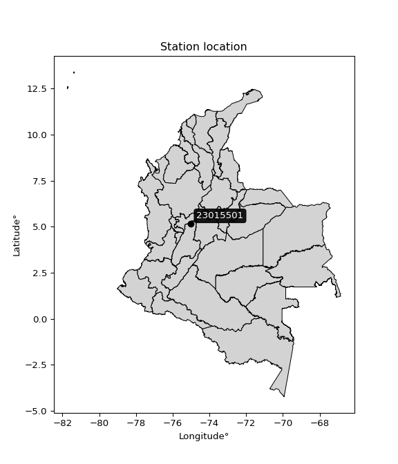

<div align="center">


</div>

# PMax24h Station (Rain): 23015501

Maximum Precipitation in 24 hours (PMax24h) is the greatest amount of rainfall for a specific duration that is meteorologically possible for a given location, acting as a "worst-case" scenario for extreme storms, crucial for designing safety-critical infrastructure like bridges, river deviations, dams, spillways, and nuclear plants to prevent catastrophic failure. The PMax24h is related with the Probable Maximum Precipitation (PMP) and it is calculated by hydrologists using meteorological data to determine the upper limit of extreme rainfall, often leading to the Probable Maximum Flood (PMF) for flood control design, and is increasingly being studied for climate change impacts. Probable Maximum Precipitation (PMP) is the theoretical upper limit of rainfall, a deterministic estimate for extreme events, while probability distributions (like GEV, Gumbel) describe the likelihood and frequency of various precipitation amounts, including rare ones, showing how often events occur, with PMP representing the extreme end of these distributions, used for critical infrastructure design to ensure safety against the worst conceivable weather, unlike standard statistical forecasts which cover typical probabilities.

The most common probability distributions in hydrology, used for analyzing floods, rainfall, and streamflow, include the Normal, Log-Normal, Gumbel, Gamma (including Log-Pearson Type III), and Generalized Extreme Value (GEV) distributions, often chosen based on the data´s skewness and whether modeling extremes or general conditions, with Gumbel and GEV popular for extreme events like floods, while the Normal distribution serves as a baseline, though often requiring transformations for skewed hydrological data. These distributions help in designing water infrastructure, managing water resources, and forecasting hydrologic events.

> Hydrological data often isn´t perfectly normal (it´s skewed), so different distributions are needed for different applications, such as: **Flood Frequency Analysis**: Using Gumbel, GEV, or Log-Pearson Type III for predicting extreme flood magnitudes and their return periods, **Rainfall Analysis**: Normal for annual totals, but Log-Normal, Weibull, or GEV for intensity or extreme daily rainfall, **Streamflow Modeling**: Gamma and Log-Normal for maximum flows, GEV for minimum flows, and Kappa for daily flows.

<div align="center">

</img>

</div>


## A. General information


### 1. General running parameters

• app_version: _v20260225_. • runtime: _2026-02-28 16:54:07.457399_. • Python version: _3.14.0_. • SciPy version: _1.16.3_. • Pandas version: _2.3.3_. • NumPy version: _2.3.5_. • Stations dataset (station_dataset_file): _dataset/pmax24h_in/automatic_colombia_2003_2025.csv_. • Stations catalog (station_catalog_file): _dataset/CNE.xls_. • Minimum year to eval til year_max (date_min): _1900_. • Maximum year to eval since year_min (date_max): _2025_. • Creates, save and include plots into reports (create_plot): _False_. • Plot only fit distributions with Δo > Δ (plot_only_fit): _True_. • Plot only simple graphs avoiding multiple CDFs and multiple Extreme values plots (plot_only_simple): _False_. • Eval low extreme values, if False, evaluates high extreme values (low_extreme): _False_. • Eval every SciPy distribution as logarithmic (pdist_logarithmic_on): _True_. • Standard deviation normalized (ddof): _1.0_. • Return periods to eval in years (Tr): _[2, 2.33, 5, 10, 15, 20, 25, 50, 75, 100, 200, 250, 500, 750, 1000]_. • Minimum data sample per station, 0 means any (minimum_sample): _5_. • Z-Score maximum threshold to adjust a value, 0 means disable (zscore_max): _3.5_. • Z-Score minimum threshold to adjust a value, 0 means disable (zscore_min): _-2.5_. • Avoid zeros, e.g. rain = 0 (avoid_zeros): _True_. • Avoid null values (avoid_nans): _True_. 

:file_folder:Table: [dataset.csv](../../dataset/pmax24h_in/automatic_colombia_2003_2025.csv)

> Delta Degrees of Freedom (DDOF): is a parameter used in the formulas for calculating variance and standard deviation. When ddof=0, the divisor is $N$ (the total number of observations) and this is used when your data set is the entire population. When ddof=1, the divisor is $N-1$ and this is used when your data set is a sample drawn from a larger population. Using $N-1$ provides an unbiased estimate of the population variance (known as Bessel´s correction).


### 2. Station info and location

|   id |   CODIGO | NOMBRE                    | CATEGORIA               | TECNOLOGIA                | ESTADO   | FECHA_INSTALACION   |   FECHA_SUSPENSION |   ALTITUD |   LATITUD |   LONGITUD | DEPARTAMENTO   | MUNICIPIO   | AREA_OPERATIVA             | ENTIDAD                                    | AREA_HIDROGRAFICA   | ZONA_HIDROGRAFICA   | SUBZONA_HIDROGRAFICA   |   CORRIENTE | Catalogo   |   Version |
|-----:|---------:|:--------------------------|:------------------------|:--------------------------|:---------|:--------------------|-------------------:|----------:|----------:|-----------:|:---------------|:------------|:---------------------------|:-------------------------------------------|:--------------------|:--------------------|:-----------------------|------------:|:-----------|----------:|
|    0 | 23015501 | FRESNO  - AUT  [23015501] | Climatológica Principal | Automática con Telemetría | Activa   | 23/10/2013          |                nan |       999 |   5.15564 |   -75.0031 | Tolima         | Fresno      | Area Operativa 10 - Tolima | CENTRO NACIONAL DE INVESTIGACIONES DE CAFE | Magdalena Cauca     | Medio Magdalena     | Río Gualí              |         nan | CNE_OE     |  20251226 |

<div align="center">

Dynamic map: [:earth_americas:Google](http://maps.google.com/maps?q=5.155638889,-75.00313611) [:earth_americas:OSM](https://www.openstreetmap.org/#map=18/5.155638889/-75.00313611&layers=P) [:earth_americas:Bing](https://www.bing.com/maps?cp=5.155638889~-75.00313611&lvl=18) [:earth_americas:Apple](https://maps.apple.com/frame?center=5.155638889%2C-75.00313611&span=0.003%2C0.006)

</div>


<div align="center">

```geojson
{
  "type": "Feature",
  "geometry": {
    "type": "Point", 
    "coordinates": [-75.00313611, 5.155638889]
  }, 
  "properties": {
    "Name": "23015501"
  }
}
```

</div>


### 3. Discrete values table and plot

<div align="center">

|               |           0 |           1 |           2 |          3 |         4 |
|:--------------|------------:|------------:|------------:|-----------:|----------:|
| Date          | 2016        | 2017        | 2018        | 2019       | 2020      |
| Value         |   15        |   35.2      |   86.9      |  180       |   59.2    |
| Value_initial |   15        |   35.2      |   86.9      |  180       |   59.2    |
| count         |    5        |    5        |    5        |    5       |    5      |
| mean          |   75.26     |   75.26     |   75.26     |   75.26    |   75.26   |
| std           |   64.4204   |   64.4204   |   64.4204   |   64.4204  |   64.4204 |
| zscore        |   -0.935418 |   -0.621853 |    0.180688 |    1.62588 |   -0.2493 |


</div>


> The initial value (value_initial) correspond to the initial obtained or null completed value, and value (value) is adjusted only when the initial value is outside the valid range (outlier) definite through the Z-Score value. If Z-Score is active, values out of range or outliers are replaced with the station mean value. A Z-Score (or standard score) measures how many standard deviations a data point is from the mean of a dataset, indicating its relative position; positive scores mean above the mean, negative mean below, and a score of zero is exactly at the mean, allowing for comparison of values from different distributions. It´s calculated using the formula $z=(x–μ)/σ$, where $x$ is the data point, $μ$ is the mean, and $σ$ is the standard deviation, helping identify outliers and understand probability.
>
> <sub>**Note**: In this study, "completing" (filling gaps in) and "extending" (forecasting or lengthening the historical record) rainfall data series are avoided for certain critical analyses because they introduce artificial bias and uncertainty, which can distort the statistics of rare events (extremes), alter day-to-day variability, and compromise the integrity and homogeneity of the original data. Some reasons against Completing/Extending rainfall data are: **Distortion of Extremes and Variability**: The primary issue is that most gap-filling or extension methods rely on averaging or regression with nearby stations, which inherently smooths the data. Rainfall is highly variable in space and time, with a large percentage of zero values and occasional large storms. Infilling methods often underestimate the highest values and overestimate the lowest (zero) values, which severely distorts analyses focused on flood frequency, drought severity, and intensity-duration-frequency (IDF) curves, **Loss of Data Homogeneity**: Infilled or extended data are synthetic estimates, not actual measurements. Combining these estimates with observed data can violate the assumption of data homogeneity, which requires that the data properties do not change over time. Inhomogeneity can lead to incorrect conclusions about long-term trends or changes in climate patterns, **Propagation of Errors**: Errors and biases from the original data (e.g., wind-induced undercatch, instrument errors, site changes) or the data used for imputation can propagate through the analysis, leading to unreliable hydrological models and inaccurate predictions, **Compromised Statistical Integrity**: For statistical analyses, especially those involving the frequency of events, using artificial data can introduce time bias or autocorrelation that doesn´t exist in reality, making it difficult to assess the true probability of events, **Difficulty in Validation**: It is difficult to accurately validate the quality of filled or extended data, especially for past periods where ground-truth measurements are unavailable. The reliability of imputation techniques heavily depends on the density of the surrounding station network and the complexity of the local topography.</sub>


### 4. Active continuous probability distributions from SciPy (80 of 104 available)

A Probability Density Function (PDF) describes the relative likelihood of a continuous random variable falling within a specific range, where the total area under its curve equals 1, and the area over any interval gives the actual probability for that range. Unlike discrete probabilities (like rolling a die), a PDF shows density, not direct probability for a single point (which is zero), with higher points indicating higher likelihood, often visualized as a bell curve for normal distributions.

A log of a probability density function (log-PDF) is simply the logarithm of the PDF´s value, denoted as $log(f(x))$, useful for converting multiplication of probabilities into addition, improving numerical stability with tiny numbers, and connecting to information theory concepts like entropy. Instead of dealing with very small probabilities (e.g., 0.000001), log-PDFs use negative numbers (e.g., $log(0.00001) ≈ -11.51$ that are easier for computers to handle, preventing underflow errors and simplifying complex calculations. In this study, each active probability distribution from SciPy is also evaluated in the $log$ form.

[scipy.stats](https://docs.scipy.org/doc/scipy/reference/stats.html) is a Python´s powerful submodule within the SciPy library for comprehensive statistical analysis, offering over 130 probability distributions (like Normal, Poisson, etc.), functions for descriptive stats (mean, variance), hypothesis testing (t-tests, chi-square), random variable generation, and statistical tests, making it essential for data science, modeling, and research. It provides tools to explore, model, and draw conclusions from data efficiently, working seamlessly with [NumPy](https://numpy.org/).

<div align="center">

|   id | p_dist           |   n_parameter | fit_method   | label                                                                       | active   | ref                                                                                                      |
|-----:|:-----------------|--------------:|:-------------|:----------------------------------------------------------------------------|:---------|:---------------------------------------------------------------------------------------------------------|
|    0 | alpha            |             3 | MLE          | Alpha                                                                       | True     | [:mortar_board:](https://docs.scipy.org/doc/scipy/reference/generated/scipy.stats.alpha.html)            |
|    1 | anglit           |             2 | MM           | Anglit                                                                      | True     | [:mortar_board:](https://docs.scipy.org/doc/scipy/reference/generated/scipy.stats.anglit.html)           |
|    2 | arcsine          |             2 | MM           | Arcsine                                                                     | True     | [:mortar_board:](https://docs.scipy.org/doc/scipy/reference/generated/scipy.stats.arcsine.html)          |
|    3 | argus            |             3 | MLE          | Argus                                                                       | True     | [:mortar_board:](https://docs.scipy.org/doc/scipy/reference/generated/scipy.stats.argus.html)            |
|    4 | beta             |             4 | MLE          | Beta                                                                        | True     | [:mortar_board:](https://docs.scipy.org/doc/scipy/reference/generated/scipy.stats.beta.html)             |
|    5 | betaprime        |             4 | MLE          | Beta prime                                                                  | True     | [:mortar_board:](https://docs.scipy.org/doc/scipy/reference/generated/scipy.stats.betaprime.html)        |
|    6 | bradford         |             3 | MLE          | Bradford                                                                    | True     | [:mortar_board:](https://docs.scipy.org/doc/scipy/reference/generated/scipy.stats.bradford.html)         |
|    7 | burr             |             4 | MLE          | Burr (Type III)                                                             | True     | [:mortar_board:](https://docs.scipy.org/doc/scipy/reference/generated/scipy.stats.burr.html)             |
|    8 | burr12           |             4 | MLE          | Burr (Type III) 12                                                          | True     | [:mortar_board:](https://docs.scipy.org/doc/scipy/reference/generated/scipy.stats.burr12.html)           |
|    9 | cosine           |             2 | MLE          | Cosine                                                                      | True     | [:mortar_board:](https://docs.scipy.org/doc/scipy/reference/generated/scipy.stats.cosine.html)           |
|   10 | crystalball      |             4 | MLE          | Crystalball                                                                 | True     | [:mortar_board:](https://docs.scipy.org/doc/scipy/reference/generated/scipy.stats.crystalball.html)      |
|   11 | dgamma           |             3 | MLE          | Double gamma                                                                | True     | [:mortar_board:](https://docs.scipy.org/doc/scipy/reference/generated/scipy.stats.dgamma.html)           |
|   12 | dweibull         |             3 | MLE          | Double Weibull                                                              | True     | [:mortar_board:](https://docs.scipy.org/doc/scipy/reference/generated/scipy.stats.dweibull.html)         |
|   13 | erlang           |             3 | MLE          | Erlang                                                                      | True     | [:mortar_board:](https://docs.scipy.org/doc/scipy/reference/generated/scipy.stats.erlang.html)           |
|   14 | exponnorm        |             3 | MLE          | Exponentially modified Normal                                               | True     | [:mortar_board:](https://docs.scipy.org/doc/scipy/reference/generated/scipy.stats.exponnorm.html)        |
|   15 | exponpow         |             3 | MLE          | Exponential power                                                           | True     | [:mortar_board:](https://docs.scipy.org/doc/scipy/reference/generated/scipy.stats.exponpow.html)         |
|   16 | exponweib        |             4 | MLE          | Exponentiated Weibull                                                       | True     | [:mortar_board:](https://docs.scipy.org/doc/scipy/reference/generated/scipy.stats.exponweib.html)        |
|   17 | f                |             4 | MLE          | F                                                                           | True     | [:mortar_board:](https://docs.scipy.org/doc/scipy/reference/generated/scipy.stats.f.html)                |
|   18 | fatiguelife      |             3 | MLE          | Fatigue-life (Birnbaum-Saunders)                                            | True     | [:mortar_board:](https://docs.scipy.org/doc/scipy/reference/generated/scipy.stats.fatiguelife.html)      |
|   19 | foldnorm         |             3 | MM           | Fold Normal                                                                 | True     | [:mortar_board:](https://docs.scipy.org/doc/scipy/reference/generated/scipy.stats.foldnorm.html)         |
|   20 | gamma            |             3 | MLE          | Gamma                                                                       | True     | [:mortar_board:](https://docs.scipy.org/doc/scipy/reference/generated/scipy.stats.gamma.html)            |
|   21 | gausshyper       |             6 | MLE          | Gauss hypergeometric                                                        | True     | [:mortar_board:](https://docs.scipy.org/doc/scipy/reference/generated/scipy.stats.gausshyper.html)       |
|   22 | genexpon         |             5 | MLE          | Generalized exponential                                                     | True     | [:mortar_board:](https://docs.scipy.org/doc/scipy/reference/generated/scipy.stats.genexpon.html)         |
|   23 | genextreme       |             3 | MLE          | Generalized exponential                                                     | True     | [:mortar_board:](https://docs.scipy.org/doc/scipy/reference/generated/scipy.stats.genextreme.html)       |
|   24 | gengamma         |             4 | MLE          | Generalized gamma                                                           | True     | [:mortar_board:](https://docs.scipy.org/doc/scipy/reference/generated/scipy.stats.gengamma.html)         |
|   25 | genhalflogistic  |             3 | MLE          | Generalized half-logistic                                                   | True     | [:mortar_board:](https://docs.scipy.org/doc/scipy/reference/generated/scipy.stats.genhalflogistic.html)  |
|   26 | genlogistic      |             3 | MLE          | Generalized logistic                                                        | True     | [:mortar_board:](https://docs.scipy.org/doc/scipy/reference/generated/scipy.stats.genlogistic.html)      |
|   27 | gennorm          |             3 | MLE          | Generalized Normal                                                          | True     | [:mortar_board:](https://docs.scipy.org/doc/scipy/reference/generated/scipy.stats.gennorm.html)          |
|   28 | genpareto        |             3 | MLE          | Generalized Pareto                                                          | True     | [:mortar_board:](https://docs.scipy.org/doc/scipy/reference/generated/scipy.stats.genpareto.html)        |
|   29 | gompertz         |             3 | MLE          | Gompertz (or truncated Gumbel)                                              | True     | [:mortar_board:](https://docs.scipy.org/doc/scipy/reference/generated/scipy.stats.gompertz.html)         |
|   30 | gumbel_l         |             2 | MM           | Gumbel Left Skew                                                            | True     | [:mortar_board:](https://docs.scipy.org/doc/scipy/reference/generated/scipy.stats.gumbel_l.html)         |
|   31 | gumbel_r         |             2 | MM           | Gumbel Right Skew                                                           | True     | [:mortar_board:](https://docs.scipy.org/doc/scipy/reference/generated/scipy.stats.gumbel_r.html)         |
|   32 | halfgennorm      |             3 | MLE          | Upper half of a generalized normal                                          | True     | [:mortar_board:](https://docs.scipy.org/doc/scipy/reference/generated/scipy.stats.halfgennorm.html)      |
|   33 | halflogistic     |             2 | MM           | Half-logistic                                                               | True     | [:mortar_board:](https://docs.scipy.org/doc/scipy/reference/generated/scipy.stats.halflogistic.html)     |
|   34 | halfnorm         |             2 | MM           | Half Normal                                                                 | True     | [:mortar_board:](https://docs.scipy.org/doc/scipy/reference/generated/scipy.stats.halfnorm.html)         |
|   35 | hypsecant        |             2 | MM           | hyperbolic secant                                                           | True     | [:mortar_board:](https://docs.scipy.org/doc/scipy/reference/generated/scipy.stats.hypsecant.html)        |
|   36 | invgamma         |             3 | MLE          | Inverted gamma                                                              | True     | [:mortar_board:](https://docs.scipy.org/doc/scipy/reference/generated/scipy.stats.invgamma.html)         |
|   37 | invgauss         |             3 | MLE          | Inverse Gaussian                                                            | True     | [:mortar_board:](https://docs.scipy.org/doc/scipy/reference/generated/scipy.stats.invgauss.html)         |
|   38 | invweibull       |             3 | MLE          | Inverted Weibull                                                            | True     | [:mortar_board:](https://docs.scipy.org/doc/scipy/reference/generated/scipy.stats.invweibull.html)       |
|   39 | johnsonsb        |             4 | MLE          | Johnson SB                                                                  | True     | [:mortar_board:](https://docs.scipy.org/doc/scipy/reference/generated/scipy.stats.johnsonsb.html)        |
|   40 | johnsonsu        |             4 | MLE          | Johnson Su                                                                  | True     | [:mortar_board:](https://docs.scipy.org/doc/scipy/reference/generated/scipy.stats.johnsonsu.html)        |
|   41 | kappa3           |             3 | MLE          | Kappa 3                                                                     | True     | [:mortar_board:](https://docs.scipy.org/doc/scipy/reference/generated/scipy.stats.kappa3.html)           |
|   42 | kappa4           |             4 | MLE          | Kappa 4                                                                     | True     | [:mortar_board:](https://docs.scipy.org/doc/scipy/reference/generated/scipy.stats.kappa4.html)           |
|   43 | ksone            |             3 | MLE          | Kolmogorov-Smirnov one-sided test statistic distribution                    | True     | [:mortar_board:](https://docs.scipy.org/doc/scipy/reference/generated/scipy.stats.ksone.html)            |
|   44 | kstwobign        |             2 | MLE          | Limiting distribution of scaled Kolmogorov-Smirnov two-sided test statistic | True     | [:mortar_board:](https://docs.scipy.org/doc/scipy/reference/generated/scipy.stats.kstwobign.html)        |
|   45 | laplace          |             2 | MM           | Laplace                                                                     | True     | [:mortar_board:](https://docs.scipy.org/doc/scipy/reference/generated/scipy.stats.laplace.html)          |
|   46 | levy_l           |             2 | MLE          | Left-skewed Levy                                                            | True     | [:mortar_board:](https://docs.scipy.org/doc/scipy/reference/generated/scipy.stats.levy_l.html)           |
|   47 | loggamma         |             3 | MLE          | Log gamma                                                                   | True     | [:mortar_board:](https://docs.scipy.org/doc/scipy/reference/generated/scipy.stats.loggamma.html)         |
|   48 | logistic         |             2 | MM           | Logistic (or Sech-squared)                                                  | True     | [:mortar_board:](https://docs.scipy.org/doc/scipy/reference/generated/scipy.stats.logistic.html)         |
|   49 | loglaplace       |             3 | MLE          | Log-Laplace                                                                 | True     | [:mortar_board:](https://docs.scipy.org/doc/scipy/reference/generated/scipy.stats.loglaplace.html)       |
|   50 | lomax            |             3 | MLE          | Lomax (Pareto of the second kind)                                           | True     | [:mortar_board:](https://docs.scipy.org/doc/scipy/reference/generated/scipy.stats.lomax.html)            |
|   51 | maxwell          |             2 | MM           | Maxwell                                                                     | True     | [:mortar_board:](https://docs.scipy.org/doc/scipy/reference/generated/scipy.stats.maxwell.html)          |
|   52 | mielke           |             4 | MLE          | Mielke Beta-Kappa / Dagum                                                   | True     | [:mortar_board:](https://docs.scipy.org/doc/scipy/reference/generated/scipy.stats.mielke.html)           |
|   53 | moyal            |             2 | MM           | Moyal                                                                       | True     | [:mortar_board:](https://docs.scipy.org/doc/scipy/reference/generated/scipy.stats.moyal.html)            |
|   54 | nakagami         |             3 | MLE          | Nakagami                                                                    | True     | [:mortar_board:](https://docs.scipy.org/doc/scipy/reference/generated/scipy.stats.nakagami.html)         |
|   55 | ncf              |             5 | MLE          | Non-central F distribution                                                  | True     | [:mortar_board:](https://docs.scipy.org/doc/scipy/reference/generated/scipy.stats.ncf.html)              |
|   56 | nct              |             4 | MLE          | Non-central Student’s t                                                     | True     | [:mortar_board:](https://docs.scipy.org/doc/scipy/reference/generated/scipy.stats.nct.html)              |
|   57 | norm             |             2 | MM           | Normal                                                                      | True     | [:mortar_board:](https://docs.scipy.org/doc/scipy/reference/generated/scipy.stats.norm.html)             |
|   58 | pearson3         |             3 | MM           | Pearson type III                                                            | True     | [:mortar_board:](https://docs.scipy.org/doc/scipy/reference/generated/scipy.stats.pearson3.html)         |
|   59 | powerlaw         |             3 | MLE          | Power-function                                                              | True     | [:mortar_board:](https://docs.scipy.org/doc/scipy/reference/generated/scipy.stats.powerlaw.html)         |
|   60 | rayleigh         |             2 | MM           | Rayleigh                                                                    | True     | [:mortar_board:](https://docs.scipy.org/doc/scipy/reference/generated/scipy.stats.rayleigh.html)         |
|   61 | rdist            |             3 | MLE          | R-distributed (symmetric beta)                                              | True     | [:mortar_board:](https://docs.scipy.org/doc/scipy/reference/generated/scipy.stats.rdist.html)            |
|   62 | rice             |             3 | MLE          | Rice                                                                        | True     | [:mortar_board:](https://docs.scipy.org/doc/scipy/reference/generated/scipy.stats.rice.html)             |
|   63 | semicircular     |             2 | MM           | Semicircular                                                                | True     | [:mortar_board:](https://docs.scipy.org/doc/scipy/reference/generated/scipy.stats.semicircular.html)     |
|   64 | skewnorm         |             3 | MLE          | Skew normal                                                                 | True     | [:mortar_board:](https://docs.scipy.org/doc/scipy/reference/generated/scipy.stats.skewnorm.html)         |
|   65 | t                |             3 | MLE          | Student’s t                                                                 | True     | [:mortar_board:](https://docs.scipy.org/doc/scipy/reference/generated/scipy.stats.t.html)                |
|   66 | trapezoid        |             4 | MLE          | Trapezoid                                                                   | True     | [:mortar_board:](https://docs.scipy.org/doc/scipy/reference/generated/scipy.stats.trapezoid.html)        |
|   67 | triang           |             3 | MLE          | Triangular                                                                  | True     | [:mortar_board:](https://docs.scipy.org/doc/scipy/reference/generated/scipy.stats.triang.html)           |
|   68 | truncexpon       |             3 | MLE          | Truncated exponential                                                       | True     | [:mortar_board:](https://docs.scipy.org/doc/scipy/reference/generated/scipy.stats.truncexpon.html)       |
|   69 | truncnorm        |             4 | MLE          | Truncated normal                                                            | True     | [:mortar_board:](https://docs.scipy.org/doc/scipy/reference/generated/scipy.stats.truncnorm.html)        |
|   70 | truncpareto      |             4 | MLE          | Upper truncated Pareto                                                      | True     | [:mortar_board:](https://docs.scipy.org/doc/scipy/reference/generated/scipy.stats.truncpareto.html)      |
|   71 | truncweibull_min |             5 | MLE          | Doubly truncated Weibull minimum                                            | True     | [:mortar_board:](https://docs.scipy.org/doc/scipy/reference/generated/scipy.stats.truncweibull_min.html) |
|   72 | tukeylambda      |             3 | MLE          | Tukey-Lamdba                                                                | True     | [:mortar_board:](https://docs.scipy.org/doc/scipy/reference/generated/scipy.stats.tukeylambda.html)      |
|   73 | uniform          |             2 | MLE          | Uniform                                                                     | True     | [:mortar_board:](https://docs.scipy.org/doc/scipy/reference/generated/scipy.stats.uniform.html)          |
|   74 | vonmises         |             3 | MLE          | Von Mises                                                                   | True     | [:mortar_board:](https://docs.scipy.org/doc/scipy/reference/generated/scipy.stats.vonmises.html)         |
|   75 | vonmises_line    |             3 | MLE          | Von Mises line                                                              | True     | [:mortar_board:](https://docs.scipy.org/doc/scipy/reference/generated/scipy.stats.vonmises_line.html)    |
|   76 | wald             |             2 | MM           | Wald                                                                        | True     | [:mortar_board:](https://docs.scipy.org/doc/scipy/reference/generated/scipy.stats.wald.html)             |
|   77 | weibull_max      |             3 | MLE          | Weibull maximum                                                             | True     | [:mortar_board:](https://docs.scipy.org/doc/scipy/reference/generated/scipy.stats.weibull_max.html)      |
|   78 | weibull_min      |             3 | MLE          | Weibull minimum                                                             | True     | [:mortar_board:](https://docs.scipy.org/doc/scipy/reference/generated/scipy.stats.weibull_min.html)      |
|   79 | wrapcauchy       |             3 | MLE          | Wrapped  Cauchy                                                             | True     | [:mortar_board:](https://docs.scipy.org/doc/scipy/reference/generated/scipy.stats.wrapcauchy.html)       |

</div>

> **n_parameter:** # arguments & localization & scale.
>
> **Fit methods:** (MLE) maximum likelihood, (MM) L-moments.
>
>**Inactive** (With the only purpose of prevent loops, zero divisions, infinite values, over high estimated values or horizontal trending for recurrence intervals estimations, the follow distributions were disabled.)**:** lognorm, norminvgauss, powernorm, powerlognorm, cauchy, halfcauchy, foldcauchy, skewcauchy, chi2, expon, fisk, genhyperbolic, geninvgauss, gibrat, kstwo, laplace_asymmetric, levy, levy_stable, ncx2, pareto, rel_breitwigner, recipinvgauss, studentized_range, loguniform, 


## B. Probability (PDF) vs. Empirical (EDF) distributions functions

A continuous probability distribution (CPD) describes probabilities for variables that can take any value within a range (like rain any time), unlike discrete variables with specific outcomes (like temperature). It uses a Probability Density Function (PDF), a curve where the total area under it equals 1, and the probability of the variable falling within an interval (a to b) is found by calculating the area under the curve between those points. A key feature is that the probability of hitting any single exact value is zero, so probabilities are always expressed for ranges, e.g., $P(a ≤ X ≤ b)$.

<div align="center">

Distributions parameters from station values
|     |   station | p_dist              |   n |              loc |          scale | shape                  | shape1                | shape2                 | shape3             |
|----:|----------:|:--------------------|----:|-----------------:|---------------:|:-----------------------|:----------------------|:-----------------------|:-------------------|
|   0 |  23015501 | alpha               |   5 |     -0.0917962   |   29.7803      | 3.8817677719234833e-10 |                       |                        |                    |
|   1 |  23015501 | anglit              |   5 |     75.26        |  168.56        |                        |                       |                        |                    |
|   2 |  23015501 | arcsine             |   5 |     -6.22608     |  162.972       |                        |                       |                        |                    |
|   3 |  23015501 | argus               |   5 |    -49.8399      |  242.192       | 3.2205111869501067e-06 |                       |                        |                    |
|   4 |  23015501 | beta                |   5 |     -1.04398     |  181.044       | 0.4850916852548708     | 0.615243835108209     |                        |                    |
|   5 |  23015501 | betaprime           |   5 |     14.9249      |  899.897       | 0.8377503831905889     | 15.761051760792068    |                        |                    |
|   6 |  23015501 | bradford            |   5 |     15           |  165           | 2.4375157613630414     |                       |                        |                    |
|   7 |  23015501 | burr                |   5 |     -0.0257034   |   66.3752      | 2.190844331957768      | 0.7976235456354255    |                        |                    |
|   8 |  23015501 | burr12              |   5 |     -1.26619     |   16.0301      | 292.63409601648937     | 0.0027143932264027393 |                        |                    |
|   9 |  23015501 | cosine              |   5 |     82.6568      |   48.377       |                        |                       |                        |                    |
|  10 |  23015501 | crystalball         |   5 |     75.26        |   57.6194      | 5942.881588611948      | 2250.0191208877377    |                        |                    |
|  11 |  23015501 | dgamma              |   5 |     71.6228      |   26.1896      | 1.74972300914575       |                       |                        |                    |
|  12 |  23015501 | dweibull            |   5 |     72.2379      |   50.5056      | 1.3668334751305984     |                       |                        |                    |
|  13 |  23015501 | erlang              |   5 |     15           |   48.778       | 0.4190921165212106     |                       |                        |                    |
|  14 |  23015501 | exponnorm           |   5 |     14.9195      |    0.0248464   | 2410.85770766529       |                       |                        |                    |
|  15 |  23015501 | exponpow            |   5 |     15           |   83.9167      | 0.7121507107142695     |                       |                        |                    |
|  16 |  23015501 | exponweib           |   5 |     15           |   66.4802      | 0.471620734936426      | 0.8501203496203703    |                        |                    |
|  17 |  23015501 | f                   |   5 |     15           |   45.8638      | 0.7538159892984488     | 918.8675108107309     |                        |                    |
|  18 |  23015501 | fatiguelife         |   5 |     15           |    4.11666e-05 | 959.3903081549631      |                       |                        |                    |
|  19 |  23015501 | foldnorm            |   5 |     -2.88068     |   82.0863      | 0.6315793940759151     |                       |                        |                    |
|  20 |  23015501 | gamma               |   5 |     15           |   48.7241      | 0.16239191724070484    |                       |                        |                    |
|  21 |  23015501 | gausshyper          |   5 |    -13.4614      |  193.461       | 1.1043168728156834     | 0.8384387078688309    | 0.9747925837592478     | 1.08170559944823   |
|  22 |  23015501 | genexpon            |   5 |     15           |   92.0539      | 1.5275423533271937     | 7.775538343088136e-08 | 0.7184485746599137     |                    |
|  23 |  23015501 | genextreme          |   5 |     41.6334      |   32.2629      | -0.4115732605262329    |                       |                        |                    |
|  24 |  23015501 | gengamma            |   5 |      3.45224     |    0.00183891  | 16.73828251972975      | 0.27334446383885536   |                        |                    |
|  25 |  23015501 | genhalflogistic     |   5 |     -1.55021     |  189.652       | 1.0446243764006184     |                       |                        |                    |
|  26 |  23015501 | genlogistic         |   5 |   -233.684       |   40.4978      | 1087.0953503152255     |                       |                        |                    |
|  27 |  23015501 | gennorm             |   5 |     59.2         |    2.34896     | 0.3941644628466594     |                       |                        |                    |
|  28 |  23015501 | genpareto           |   5 |     -1.19836     |  194.995       | -1.0761389340518925    |                       |                        |                    |
|  29 |  23015501 | gompertz            |   5 |     15           |  184.827       | 2.12363372183053       |                       |                        |                    |
|  30 |  23015501 | gumbel_l            |   5 |    101.192       |   44.9256      |                        |                       |                        |                    |
|  31 |  23015501 | gumbel_r            |   5 |     49.3282      |   44.9256      |                        |                       |                        |                    |
|  32 |  23015501 | halfgennorm         |   5 |     15           |   23.5686      | 0.625451531529114      |                       |                        |                    |
|  33 |  23015501 | halflogistic        |   5 |      6.96767     |   49.2625      |                        |                       |                        |                    |
|  34 |  23015501 | halfnorm            |   5 |     -1.00545     |   95.5846      |                        |                       |                        |                    |
|  35 |  23015501 | hypsecant           |   5 |     75.26        |   36.6816      |                        |                       |                        |                    |
|  36 |  23015501 | invgamma            |   5 |    -15.0349      |  171.171       | 2.7938214090295084     |                       |                        |                    |
|  37 |  23015501 | invgauss            |   5 |      0.616579    |   76.1163      | 0.9806499949324776     |                       |                        |                    |
|  38 |  23015501 | invweibull          |   5 |    -36.7559      |   78.3893      | 2.4297040996440504     |                       |                        |                    |
|  39 |  23015501 | johnsonsb           |   5 |     15           |  165.001       | 1.124991677998892      | 0.17903835200877563   |                        |                    |
|  40 |  23015501 | johnsonsu           |   5 |      8.51168     |    0.236095    | -5.296412964663687     | 0.9051612311005652    |                        |                    |
|  41 |  23015501 | kappa3              |   5 |     15           |  164.912       | 2438.4781638236827     |                       |                        |                    |
|  42 |  23015501 | kappa4              |   5 |     -1.34681     |  194.576       | 1.0920349324584442     | 1.0729445118438838    |                        |                    |
|  43 |  23015501 | ksone               |   5 |     -1.5         |  198           | 1.0                    |                       |                        |                    |
|  44 |  23015501 | kstwobign           |   5 |    -94.8767      |  196.042       |                        |                       |                        |                    |
|  45 |  23015501 | laplace             |   5 |     75.26        |   40.743       |                        |                       |                        |                    |
|  46 |  23015501 | levy_l              |   5 |    190.424       |   39.8869      |                        |                       |                        |                    |
|  47 |  23015501 | loggamma            |   5 | -16936.3         | 2311.15        | 1573.6108747224716     |                       |                        |                    |
|  48 |  23015501 | logistic            |   5 |     75.26        |   31.7672      |                        |                       |                        |                    |
|  49 |  23015501 | loglaplace          |   5 |     -0.158781    |   59.3588      | 1.4807818812285967     |                       |                        |                    |
|  50 |  23015501 | lomax               |   5 |     15           |    4.5716e+10  | 561948481.6348336      |                       |                        |                    |
|  51 |  23015501 | maxwell             |   5 |    -61.2737      |   85.5598      |                        |                       |                        |                    |
|  52 |  23015501 | mielke              |   5 |     14.9999      |  153.378       | 0.40600741968114457    | 4.214411711378709     |                        |                    |
|  53 |  23015501 | moyal               |   5 |     42.3096      |   25.9378      |                        |                       |                        |                    |
|  54 |  23015501 | nakagami            |   5 |     15           |  117.365       | 0.19924091927234383    |                       |                        |                    |
|  55 |  23015501 | ncf                 |   5 |     -0.0033121   |    1.24659e-08 | 8.563769691193219e-10  | 2.1813715368176774    | 2.73198334199454       |                    |
|  56 |  23015501 | nct                 |   5 |    -32.5787      |    6.2569      | 2.5921535816521413     | 12.197023451254687    |                        |                    |
|  57 |  23015501 | norm                |   5 |     75.26        |   57.6194      |                        |                       |                        |                    |
|  58 |  23015501 | pearson3            |   5 |     75.26        |   57.6193      | 0.9026620580608233     |                       |                        |                    |
|  59 |  23015501 | powerlaw            |   5 |     15           |  165           | 0.1154246319907095     |                       |                        |                    |
|  60 |  23015501 | rayleigh            |   5 |    -34.9692      |   87.9502      |                        |                       |                        |                    |
|  61 |  23015501 | rdist               |   5 |     -0.512646    |   87.4126      | 1.0980859523776303     |                       |                        |                    |
|  62 |  23015501 | rice                |   5 |    -17.2037      |   77.0374      | 0.0009287455812762936  |                       |                        |                    |
|  63 |  23015501 | semicircular        |   5 |     75.26        |  115.239       |                        |                       |                        |                    |
|  64 |  23015501 | skewnorm            |   5 |     14.9999      |   83.3796      | 6607963.994446412      |                       |                        |                    |
|  65 |  23015501 | t                   |   5 |     75.262       |   57.62        | 12735317.30175133      |                       |                        |                    |
|  66 |  23015501 | trapezoid           |   5 |     -1.575       |  198           | 1.0                    | 1.0                   |                        |                    |
|  67 |  23015501 | triang              |   5 |     -1.6499      |  181.651       | 0.9999959776191477     |                       |                        |                    |
|  68 |  23015501 | truncexpon          |   5 |     15           |  187.775       | 0.8787371765754786     |                       |                        |                    |
|  69 |  23015501 | truncnorm           |   5 |     75.26        |   57.6194      | -969.1809570242775     | 632.0682619066133     |                        |                    |
|  70 |  23015501 | truncpareto         |   5 |     14.4867      |    0.513263    | 0.2646853389826608     | 322.47279347232035    |                        |                    |
|  71 |  23015501 | truncweibull_min    |   5 |     -8.20288     |  188.689       | 1.2393791136913144     | 0.0005913265541959084 | 0.9974237601461464     |                    |
|  72 |  23015501 | tukeylambda         |   5 |     -0.492679    |   92.8549      | 1.0625024353682007     |                       |                        |                    |
|  73 |  23015501 | uniform             |   5 |     15           |  165           |                        |                       |                        |                    |
|  74 |  23015501 | vonmises            |   5 |     -2.71759     |    1           | 1.3647945719940417     |                       |                        |                    |
|  75 |  23015501 | vonmises_line       |   5 |     98.1196      |   26.4578      | 1.1879341583518858e-05 |                       |                        |                    |
|  76 |  23015501 | wald                |   5 |     17.6407      |   57.6193      |                        |                       |                        |                    |
|  77 |  23015501 | weibull_max         |   5 |    180           |    1.63024     | 0.2436646943476577     |                       |                        |                    |
|  78 |  23015501 | weibull_min         |   5 |     15           |   61.7708      | 0.6954615352714759     |                       |                        |                    |
|  79 |  23015501 | wrapcauchy          |   5 |     15           |   26.2607      | 0.4957364161924197     |                       |                        |                    |
|  80 |  23015501 | logalpha            |   5 |    -11.4008      |  276.537       | 18.01451766493183      |                       |                        |                    |
|  81 |  23015501 | loganglit           |   5 |      4.00155     |    2.45018     |                        |                       |                        |                    |
|  82 |  23015501 | logarcsine          |   5 |      2.81705     |    2.36899     |                        |                       |                        |                    |
|  83 |  23015501 | logargus            |   5 |      2.09324     |    3.28287     | 0.29502885967604553    |                       |                        |                    |
|  84 |  23015501 | logbeta             |   5 |      2.17096     |    3.022       | 1.6382470691244697     | 0.6888048757596492    |                        |                    |
|  85 |  23015501 | logbetaprime        |   5 |     -2.22659     |  100.995       | 57.32600765754441      | 928.4905938429538     |                        |                    |
|  86 |  23015501 | logbradford         |   5 |      2.70803     |    2.48493     | 1.0449845001102562     |                       |                        |                    |
|  87 |  23015501 | logburr             |   5 |      2.70805     |    2.46463     | 16.00313436032379      | 0.036247044058984344  |                        |                    |
|  88 |  23015501 | logburr12           |   5 |      1.5156      |   17.4259      | 3.399530303125791      | 516.0849260966376     |                        |                    |
|  89 |  23015501 | logcosine           |   5 |      3.98261     |    0.690528    |                        |                       |                        |                    |
|  90 |  23015501 | logcrystalball      |   5 |      4.00155     |    0.837556    | 203.50633950121303     | 395.22418021393673    |                        |                    |
|  91 |  23015501 | logdgamma           |   5 |      4.23061     |    0.423603    | 1.6705491867936892     |                       |                        |                    |
|  92 |  23015501 | logdweibull         |   5 |      3.85826     |    0.811847    | 1.6704983007092888     |                       |                        |                    |
|  93 |  23015501 | logerlang           |   5 |    -14.5635      |    0.0382244   | 485.6954565386693      |                       |                        |                    |
|  94 |  23015501 | logexponnorm        |   5 |      4.00089     |    0.837557    | 0.0007886368697481495  |                       |                        |                    |
|  95 |  23015501 | logexponpow         |   5 |      2.70805     |    1.28292     | 0.7622782933206864     |                       |                        |                    |
|  96 |  23015501 | logexponweib        |   5 |      2.70805     |    1.24148     | 0.5659795561026252     | 1.019059089827146     |                        |                    |
|  97 |  23015501 | logf                |   5 |   -210.751       |  214.751       | 379310.91253523924     | 201691.00510542456    |                        |                    |
|  98 |  23015501 | logfatiguelife      |   5 |   -106.916       |  110.916       | 0.007560478463786158   |                       |                        |                    |
|  99 |  23015501 | logfoldnorm         |   5 |     -3.32397     |    0.831151    | 8.814732324802995      |                       |                        |                    |
| 100 |  23015501 | loggamma            |   5 |    -14.508       |    0.0382831   | 483.42700080043505     |                       |                        |                    |
| 101 |  23015501 | loggausshyper       |   5 |      2.7071      |    2.48586     | 0.9621605447072181     | 0.8595445723687403    | 1.182648002116927      | 0.9366499953625095 |
| 102 |  23015501 | loggenexpon         |   5 |      2.70805     |    0.00289998  | 0.0011731408903299487  | 0.495958604634973     | 6.7749479397405885e-06 |                    |
| 103 |  23015501 | loggenextreme       |   5 |      3.84069     |    0.951721    | 0.6012623058797801     |                       |                        |                    |
| 104 |  23015501 | loggengamma         |   5 |      2.70805     |    1.42609     | 0.4010075579897518     | 0.9741669850993104    |                        |                    |
| 105 |  23015501 | loggenhalflogistic  |   5 |      2.69155     |    2.67143     | 1.067968010383142      |                       |                        |                    |
| 106 |  23015501 | loggenlogistic      |   5 |      4.21975     |    0.449405    | 0.7696295251751262     |                       |                        |                    |
| 107 |  23015501 | loggennorm          |   5 |      3.95051     |    1.24251     | 246175.25060741042     |                       |                        |                    |
| 108 |  23015501 | loggenpareto        |   5 |     -0.00751029  |   13.2684      | -2.551392144470604     |                       |                        |                    |
| 109 |  23015501 | loggompertz         |   5 |      2.70805     |    1.4202      | 0.5232327603283229     |                       |                        |                    |
| 110 |  23015501 | loggumbel_l         |   5 |      4.37849     |    0.653039    |                        |                       |                        |                    |
| 111 |  23015501 | loggumbel_r         |   5 |      3.6246      |    0.653039    |                        |                       |                        |                    |
| 112 |  23015501 | loghalfgennorm      |   5 |      2.70805     |    2.48492     | 2710113.079330655      |                       |                        |                    |
| 113 |  23015501 | loghalflogistic     |   5 |      3.00882     |    0.716096    |                        |                       |                        |                    |
| 114 |  23015501 | loghalfnorm         |   5 |      2.89297     |    1.3894      |                        |                       |                        |                    |
| 115 |  23015501 | loghypsecant        |   5 |      4.00155     |    0.533204    |                        |                       |                        |                    |
| 116 |  23015501 | loginvgamma         |   5 |    -10.1695      | 3995.16        | 282.95088455165387     |                       |                        |                    |
| 117 |  23015501 | loginvgauss         |   5 |     -2.13739     |  313.68        | 0.019577552202448292   |                       |                        |                    |
| 118 |  23015501 | loginvweibull       |   5 |     -1.01341e+08 |    1.01341e+08 | 127779306.17808487     |                       |                        |                    |
| 119 |  23015501 | logjohnsonsb        |   5 |      2.70796     |    2.48499     | -0.20857951771975072   | 0.16652937403499304   |                        |                    |
| 120 |  23015501 | logjohnsonsu        |   5 |      9.45283     |    2.23599     | 11.316297251786246     | 7.011639766100519     |                        |                    |
| 121 |  23015501 | logkappa3           |   5 |      2.708       |    2.48495     | 221964.61592945282     |                       |                        |                    |
| 122 |  23015501 | logkappa4           |   5 |      2.54093     |    2.77461     | 1.0641839537397415     | 1.0462242472005712    |                        |                    |
| 123 |  23015501 | logksone            |   5 |      2.55086     |    2.90138     | 1.0                    |                       |                        |                    |
| 124 |  23015501 | logkstwobign        |   5 |      0.815311    |    3.63767     |                        |                       |                        |                    |
| 125 |  23015501 | loglaplace          |   5 |      4.00155     |    0.592241    |                        |                       |                        |                    |
| 126 |  23015501 | loglevy_l           |   5 |      5.29632     |    0.394847    |                        |                       |                        |                    |
| 127 |  23015501 | logloggamma         |   5 |     -1.58567     |    2.53442     | 9.561441977299808      |                       |                        |                    |
| 128 |  23015501 | loglogistic         |   5 |      4.00155     |    0.461769    |                        |                       |                        |                    |
| 129 |  23015501 | logloglaplace       |   5 |     -0.0744698   |    4.15539     | 5.814590673392278      |                       |                        |                    |
| 130 |  23015501 | loglomax            |   5 |      2.70805     |    2.82061e+11 | 134533555645.14539     |                       |                        |                    |
| 131 |  23015501 | logmaxwell          |   5 |      2.01689     |    1.2437      |                        |                       |                        |                    |
| 132 |  23015501 | logmielke           |   5 |      2.70805     |    2.3167      | 0.6671444394182482     | 9.929580958732744     |                        |                    |
| 133 |  23015501 | logmoyal            |   5 |      3.52258     |    0.377033    |                        |                       |                        |                    |
| 134 |  23015501 | lognakagami         |   5 |      3.56105     |    0.620807    | 0.04782434020608851    |                       |                        |                    |
| 135 |  23015501 | logncf              |   5 |     -9.07749     |    3.08697     | 286.7756783552903      | 1521.7521003620886    | 926.862744450076       |                    |
| 136 |  23015501 | lognct              |   5 |    -30.4656      |    0.762464    | 4772.448096906677      | 45.19724478638473     |                        |                    |
| 137 |  23015501 | lognorm             |   5 |      4.00155     |    0.837556    |                        |                       |                        |                    |
| 138 |  23015501 | logpearson3         |   5 |      4.00155     |    0.837557    | -0.1561624535362119    |                       |                        |                    |
| 139 |  23015501 | logpowerlaw         |   5 |      2.70805     |    2.48491     | 0.13065029463534908    |                       |                        |                    |
| 140 |  23015501 | lograyleigh         |   5 |      2.39925     |    1.27844     |                        |                       |                        |                    |
| 141 |  23015501 | logrdist            |   5 |      3.58668     |    0.878633    | 1.266241795163832      |                       |                        |                    |
| 142 |  23015501 | logrice             |   5 |      2.22453     |    0.96333     | 1.4692469472910863     |                       |                        |                    |
| 143 |  23015501 | logsemicircular     |   5 |      4.00155     |    1.67511     |                        |                       |                        |                    |
| 144 |  23015501 | logskewnorm         |   5 |      4.9013      |    1.22925     | -2.1329322642299475    |                       |                        |                    |
| 145 |  23015501 | logt                |   5 |      4.00155     |    0.837556    | 39521446038.9993       |                       |                        |                    |
| 146 |  23015501 | logtrapezoid        |   5 |      2.45956     |    2.98189     | 1.0                    | 1.0                   |                        |                    |
| 147 |  23015501 | logtriang           |   5 |      1.93006     |    3.2629      | 0.9999999923789238     |                       |                        |                    |
| 148 |  23015501 | logtruncexpon       |   5 |      2.70804     |    2.87703     | 0.8637119599082848     |                       |                        |                    |
| 149 |  23015501 | logtruncnorm        |   5 |     -0.133088    |    2.20813     | 1.672968837091856      | 2.4120174951678957    |                        |                    |
| 150 |  23015501 | logtruncpareto      |   5 |      2.69534     |    0.0127142   | 0.2613962657710938     | 196.4431369028688     |                        |                    |
| 151 |  23015501 | logtruncweibull_min |   5 |      2.70805     |    2.31283     | 0.7824496958009481     | 5.104988669036566e-17 | 1.075203802881579      |                    |
| 152 |  23015501 | logtukeylambda      |   5 |      3.96475     |    1.37692     | 1.0956601463399225     |                       |                        |                    |
| 153 |  23015501 | loguniform          |   5 |      2.70805     |    2.48491     |                        |                       |                        |                    |
| 154 |  23015501 | logvonmises         |   5 |     -2.26222     |    1           | 1.942802867731765      |                       |                        |                    |
| 155 |  23015501 | logvonmises_line    |   5 |      3.94101     |    0.398508    | 8.842996003608248e-05  |                       |                        |                    |
| 156 |  23015501 | logwald             |   5 |      3.16398     |    0.837561    |                        |                       |                        |                    |
| 157 |  23015501 | logweibull_max      |   5 |      5.19296     |    1.5569      | 0.557525363384066      |                       |                        |                    |
| 158 |  23015501 | logweibull_min      |   5 |      1.51431     |    2.77728     | 3.3927397797966505     |                       |                        |                    |
| 159 |  23015501 | logwrapcauchy       |   5 |      2.70805     |    0.395486    | 0.11642771292856152    |                       |                        |                    |

</div>

> **loc** (Location parameter): This shifts the distribution along the x-axis. For many common distributions, like the normal (Gaussian) distribution, loc represents the mean $μ$. For others, like the uniform distribution, it might represent the minimum value, or for the beta distribution, the left end of the support interval.
>
> **scale** (Scale parameter): This determines the width or spread of the distribution. For the normal distribution, scale represents the standard deviation $σ$. For a uniform distribution, it defines the length of the interval (from $loc$ to $loc + scale$).
>
> **shape** (Shape parameters): Refers to parameters that define the specific form of a probability distribution, distinct from its location (loc) and scale (scale). These parameters are required arguments for most distribution functions. For example, a normal (Gaussian) distribution is fully defined by its location (mean) and scale (standard deviation), so it has no specific shape parameters beyond loc and scale. However, other distributions have intrinsic properties that need specification, as Gamma distribution that takes a shape parameter, often named $a$ or $alpha$.


### 0. Cumulative distribution values - CDF (160 evaluated)

Cumulative Distribution Function (CDF), denoted as $F$<sub>$X$</sub>$(x)$, is a function that gives the probability that a random variable $X$ will take a value less than or equal to a specific value, $x$ (i.e., $(P(X≥x)$. It essentially "accumulates" probabilities from a given point up to the far right (positive infinity), providing a complete picture of the distribution´s probabilities for both discrete (like rain) and continuous (like temperature) variables, helping to find probabilities over ranges or above certain values. Each station is evaluated separately ordering the $x$ values ascending, calculating the CDF and PDF values for the activated distributions and their logarithmic forms.

<div align="center">

CDF ordered by x ascending and calculating $log(f(x))$ separately
|   id |   Station |   date |     x |   count |   mean |     std |    zscore |   Value_initial |   station |   m |    alpha |   alpha_pdf |   anglit |   anglit_pdf |   arcsine |   arcsine_pdf |    argus |   argus_pdf |     beta |      beta_pdf |   betaprime |   betaprime_pdf |    bradford |   bradford_pdf |      burr |    burr_pdf |    burr12 |   burr12_pdf |   cosine |   cosine_pdf |   crystalball |   crystalball_pdf |   dgamma |   dgamma_pdf |   dweibull |   dweibull_pdf |      erlang |   erlang_pdf |   exponnorm |   exponnorm_pdf |    exponpow |   exponpow_pdf |   exponweib |   exponweib_pdf |          f |       f_pdf |   fatiguelife |   fatiguelife_pdf |   foldnorm |   foldnorm_pdf |      gamma |   gamma_pdf |   gausshyper |   gausshyper_pdf |    genexpon |   genexpon_pdf |   genextreme |   genextreme_pdf |   gengamma |   gengamma_pdf |   genhalflogistic |   genhalflogistic_pdf |   genlogistic |   genlogistic_pdf |   gennorm |   gennorm_pdf |   genpareto |   genpareto_pdf |    gompertz |   gompertz_pdf |   gumbel_l |   gumbel_l_pdf |   gumbel_r |   gumbel_r_pdf |   halfgennorm |   halfgennorm_pdf |   halflogistic |   halflogistic_pdf |   halfnorm |   halfnorm_pdf |   hypsecant |   hypsecant_pdf |   invgamma |   invgamma_pdf |   invgauss |   invgauss_pdf |   invweibull |   invweibull_pdf |   johnsonsb |   johnsonsb_pdf |   johnsonsu |   johnsonsu_pdf |      kappa3 |   kappa3_pdf |      kappa4 |   kappa4_pdf |     ksone |   ksone_pdf |   kstwobign |   kstwobign_pdf |   laplace |   laplace_pdf |   levy_l |   levy_l_pdf |   loggamma |   loggamma_pdf |   logistic |   logistic_pdf |   loglaplace |   loglaplace_pdf |       lomax |   lomax_pdf |   maxwell |   maxwell_pdf |     mielke |   mielke_pdf |     moyal |   moyal_pdf |   nakagami |   nakagami_pdf |      ncf |     ncf_pdf |       nct |    nct_pdf |     norm |   norm_pdf |   pearson3 |   pearson3_pdf |   powerlaw |   powerlaw_pdf |   rayleigh |   rayleigh_pdf |    rdist |      rdist_pdf |      rice |   rice_pdf |   semicircular |   semicircular_pdf |   skewnorm |   skewnorm_pdf |        t |      t_pdf |   trapezoid |   trapezoid_pdf |     triang |   triang_pdf |   truncexpon |   truncexpon_pdf |   truncnorm |   truncnorm_pdf |   truncpareto |   truncpareto_pdf |   truncweibull_min |   truncweibull_min_pdf |   tukeylambda |   tukeylambda_pdf |   uniform |   uniform_pdf |   vonmises |   vonmises_pdf |   vonmises_line |   vonmises_line_pdf |     wald |    wald_pdf |   weibull_max |   weibull_max_pdf |   weibull_min |   weibull_min_pdf |   wrapcauchy |   wrapcauchy_pdf |   logalpha |   logalpha_pdf |   loganglit |   loganglit_pdf |   logarcsine |   logarcsine_pdf |   logargus |   logargus_pdf |   logbeta |   logbeta_pdf |   logbetaprime |   logbetaprime_pdf |   logbradford |   logbradford_pdf |     logburr |   logburr_pdf |   logburr12 |   logburr12_pdf |   logcosine |   logcosine_pdf |   logcrystalball |   logcrystalball_pdf |   logdgamma |   logdgamma_pdf |   logdweibull |   logdweibull_pdf |   logerlang |   logerlang_pdf |   logexponnorm |   logexponnorm_pdf |   logexponpow |   logexponpow_pdf |   logexponweib |   logexponweib_pdf |      logf |   logf_pdf |   logfatiguelife |   logfatiguelife_pdf |   logfoldnorm |   logfoldnorm_pdf |   loggausshyper |   loggausshyper_pdf |   loggenexpon |   loggenexpon_pdf |   loggenextreme |   loggenextreme_pdf |   loggengamma |   loggengamma_pdf |   loggenhalflogistic |   loggenhalflogistic_pdf |   loggenlogistic |   loggenlogistic_pdf |   loggennorm |   loggennorm_pdf |   loggenpareto |   loggenpareto_pdf |   loggompertz |   loggompertz_pdf |   loggumbel_l |   loggumbel_l_pdf |   loggumbel_r |   loggumbel_r_pdf |   loghalfgennorm |   loghalfgennorm_pdf |   loghalflogistic |   loghalflogistic_pdf |   loghalfnorm |   loghalfnorm_pdf |   loghypsecant |   loghypsecant_pdf |   loginvgamma |   loginvgamma_pdf |   loginvgauss |   loginvgauss_pdf |   loginvweibull |   loginvweibull_pdf |   logjohnsonsb |   logjohnsonsb_pdf |   logjohnsonsu |   logjohnsonsu_pdf |   logkappa3 |   logkappa3_pdf |   logkappa4 |   logkappa4_pdf |   logksone |   logksone_pdf |   logkstwobign |   logkstwobign_pdf |   loglevy_l |   loglevy_l_pdf |   logloggamma |   logloggamma_pdf |   loglogistic |   loglogistic_pdf |   logloglaplace |   logloglaplace_pdf |    loglomax |   loglomax_pdf |   logmaxwell |   logmaxwell_pdf |   logmielke |   logmielke_pdf |   logmoyal |   logmoyal_pdf |   lognakagami |   lognakagami_pdf |    logncf |   logncf_pdf |    lognct |   lognct_pdf |   lognorm |   lognorm_pdf |   logpearson3 |   logpearson3_pdf |   logpowerlaw |   logpowerlaw_pdf |   lograyleigh |   lograyleigh_pdf |    logrdist |   logrdist_pdf |   logrice |   logrice_pdf |   logsemicircular |   logsemicircular_pdf |   logskewnorm |   logskewnorm_pdf |      logt |   logt_pdf |   logtrapezoid |   logtrapezoid_pdf |   logtriang |   logtriang_pdf |   logtruncexpon |   logtruncexpon_pdf |   logtruncnorm |   logtruncnorm_pdf |   logtruncpareto |   logtruncpareto_pdf |   logtruncweibull_min |   logtruncweibull_min_pdf |   logtukeylambda |   logtukeylambda_pdf |   loguniform |   loguniform_pdf |   logvonmises |   logvonmises_pdf |   logvonmises_line |   logvonmises_line_pdf |   logwald |   logwald_pdf |   logweibull_max |   logweibull_max_pdf |   logweibull_min |   logweibull_min_pdf |   logwrapcauchy |   logwrapcauchy_pdf |
|-----:|----------:|-------:|------:|--------:|-------:|--------:|----------:|----------------:|----------:|----:|---------:|------------:|---------:|-------------:|----------:|--------------:|---------:|------------:|---------:|--------------:|------------:|----------------:|------------:|---------------:|----------:|------------:|----------:|-------------:|---------:|-------------:|--------------:|------------------:|---------:|-------------:|-----------:|---------------:|------------:|-------------:|------------:|----------------:|------------:|---------------:|------------:|----------------:|-----------:|------------:|--------------:|------------------:|-----------:|---------------:|-----------:|------------:|-------------:|-----------------:|------------:|---------------:|-------------:|-----------------:|-----------:|---------------:|------------------:|----------------------:|--------------:|------------------:|----------:|--------------:|------------:|----------------:|------------:|---------------:|-----------:|---------------:|-----------:|---------------:|--------------:|------------------:|---------------:|-------------------:|-----------:|---------------:|------------:|----------------:|-----------:|---------------:|-----------:|---------------:|-------------:|-----------------:|------------:|----------------:|------------:|----------------:|------------:|-------------:|------------:|-------------:|----------:|------------:|------------:|----------------:|----------:|--------------:|---------:|-------------:|-----------:|---------------:|-----------:|---------------:|-------------:|-----------------:|------------:|------------:|----------:|--------------:|-----------:|-------------:|----------:|------------:|-----------:|---------------:|---------:|------------:|----------:|-----------:|---------:|-----------:|-----------:|---------------:|-----------:|---------------:|-----------:|---------------:|---------:|---------------:|----------:|-----------:|---------------:|-------------------:|-----------:|---------------:|---------:|-----------:|------------:|----------------:|-----------:|-------------:|-------------:|-----------------:|------------:|----------------:|--------------:|------------------:|-------------------:|-----------------------:|--------------:|------------------:|----------:|--------------:|-----------:|---------------:|----------------:|--------------------:|---------:|------------:|--------------:|------------------:|--------------:|------------------:|-------------:|-----------------:|-----------:|---------------:|------------:|----------------:|-------------:|-----------------:|-----------:|---------------:|----------:|--------------:|---------------:|-------------------:|--------------:|------------------:|------------:|--------------:|------------:|----------------:|------------:|----------------:|-----------------:|---------------------:|------------:|----------------:|--------------:|------------------:|------------:|----------------:|---------------:|-------------------:|--------------:|------------------:|---------------:|-------------------:|----------:|-----------:|-----------------:|---------------------:|--------------:|------------------:|----------------:|--------------------:|--------------:|------------------:|----------------:|--------------------:|--------------:|------------------:|---------------------:|-------------------------:|-----------------:|---------------------:|-------------:|-----------------:|---------------:|-------------------:|--------------:|------------------:|--------------:|------------------:|--------------:|------------------:|-----------------:|---------------------:|------------------:|----------------------:|--------------:|------------------:|---------------:|-------------------:|--------------:|------------------:|--------------:|------------------:|----------------:|--------------------:|---------------:|-------------------:|---------------:|-------------------:|------------:|----------------:|------------:|----------------:|-----------:|---------------:|---------------:|-------------------:|------------:|----------------:|--------------:|------------------:|--------------:|------------------:|----------------:|--------------------:|------------:|---------------:|-------------:|-----------------:|------------:|----------------:|-----------:|---------------:|--------------:|------------------:|----------:|-------------:|----------:|-------------:|----------:|--------------:|--------------:|------------------:|--------------:|------------------:|--------------:|------------------:|------------:|---------------:|----------:|--------------:|------------------:|----------------------:|--------------:|------------------:|----------:|-----------:|---------------:|-------------------:|------------:|----------------:|----------------:|--------------------:|---------------:|-------------------:|-----------------:|---------------------:|----------------------:|--------------------------:|-----------------:|---------------------:|-------------:|-----------------:|--------------:|------------------:|-------------------:|-----------------------:|----------:|--------------:|-----------------:|---------------------:|-----------------:|---------------------:|----------------:|--------------------:|
|    0 |  23015501 |   2016 |  15   |       5 |  75.26 | 64.4204 | -0.935418 |            15   |  23015501 |   1 | 0.048464 | 0.0148886   | 0.172192 |   0.00447968 |  0.235056 |    0.00580309 | 0.105562 |  0.00319516 | 0.230379 |    0.00713616 |  0.00407747 |     0.04544     | 9.92867e-08 |     0.0119642  | 0.0723545 | 0.00810203  | 0.0115812 |  0.0476068   | 0.120617 |   0.00385382 |      0.14782  |        0.00400714 | 0.147249 |  0.00426207  |   0.152639 |     0.00432491 | 1.94629e-07 |  2.29592e+07 |  0.00134312 |      0.0166618  | 1.33467e-12 |  535.074       | 2.26595e-07 |     5.11437e+07 | 6.5925e-07 | 6.99399e+07 |     0.0341865 |       5.12944e+09 |   0.141701 |     0.00784955 | 0.00257877 | 1.17874e+11 |     0.143693 |       0.00527905 | 8.77936e-11 |     0.016594   |    0.0644412 |      0.00829515  |  0.0608389 |    0.0101498   |         0.0457198 |            0.00289479 |     0.0964717 |       0.00556467  |  0.140369 |   0.00255728  |   0.0833423 |      0.00516244 | 4.64942e-14 |     0.0114899  |   0.136551 |    0.00282182  |   0.116824 |     0.00558325 |   1.94934e-10 |        0.0297044  |      0.0813456 |         0.0100825  |   0.132982 |     0.00823121 |    0.121646 |     0.00323612  |  0.0618334 |    0.0086444   |  0.0549933 |     0.0113742  |    0.0644412 |      0.00829516  | 1.18943e-08 |     1.3789e+06  |   0.0475159 |     0.0138047   | 6.53483e-09 |   0.00604448 | 2.45492e-15 |   0.114374   | 0.0833333 |  0.00505051 |   0.0880892 |      0.00549542 |  0.11393  |   0.0027963   | 0.366522 |  0.000967871 |  0.0598845 |       0.1483   |   0.130457 |     0.00357091 |    0.0562912 |        0.0950477 | 1.49806e-11 |  0.0122922  |  0.149269 |    0.00498093 | 0.00308251 | 12.489       | 0.0904746 |  0.00621275 | 2.0648e-07 |    2.31593e+07 | 0.40705  | 0.00841684  | 0.0674098 | 0.00811942 | 0.14782  | 0.00400714 |   0.131076 |     0.00568862 |  0.0110022 |    7.14905e+11 |   0.149048 |     0.00549711 | 0.560529 |     0.00393973 | 0.0836648 | 0.00497229 |       0.182966 |         0.00470888 |   0        |     0.0095693  | 0.147815 | 0.004007   |  0.00700772 |     0.000845577 | 0.00840139 |   0.00100918 |  1.32795e-07 |       0.00910824 |    0.14782  |      0.00400714 |   1.41753e-16 |       0.658433    |           0.113584 |             0.00585214 |      0.587144 |        0.00562824 |  0        |    0.00606061 |    3.138   |      0.186648  |     2.41032e-07 |          0.00601535 | 0        | 0           |     0.0459418 |       0.000208988 |   5.07633e-12 |      993.717      |  5.40892e-08 |       0.0179767  |  0.0563942 |       0.157623 |   0.0648439 |        0.201005 |     0        |         0        |   0.051281 |       0.165453 | 0.0374881 |      0.117123 |       0.052561 |           0.149139 |   1.13385e-05 |          0.587826 | 2.33574e-06 |   2809.66     |   0.0550614 |        0.152561 |   0.0530592 |        0.167899 |        0.0612494 |             0.144538 |   0.0420888 |       0.0846676 |     0.0835146 |          0.217062 |   0.0596194 |        0.14766  |      0.0612497 |           0.144539 |   1.63916e-12 |      2813.62      |    1.23308e-09 |        1.60148e+06 | 0.0606612 |   0.144514 |        0.0606532 |             0.144953 |     0.0596999 |          0.142761 |     0.000681582 |            0.689257 |   1.24597e-06 |          0.404535 |       0.0859582 |            0.12919  |   9.86998e-07 |       8.68224e+08 |           0.00309909 |                 0.188407 |        0.0731647 |             0.121108 |  2.09151e-05 |         0.402405 |       0.251329 |        0.118088    |   4.03087e-09 |          0.368423 |     0.0745392 |          0.109778 |     0.0170862 |          0.106474 |         0        |             0.402428 |          0        |              0        |      0        |          0        |      0.0561308 |           0.104726 |     0.0556112 |          0.151172 |     0.0513273 |          0.156825 |       0.0501724 |            0.189298 |      0.0277498 |       120.47       |      0.0707253 |           0.133544 | 2.04071e-05 |        0.402401 | 1.04169e-05 |        0.754793 |  0.0541786 |       0.344664 |      0.0505541 |           0.216719 |    0.303892 |       0.0557808 |     0.0693359 |          0.135608 |     0.0572605 |          0.116902 |       0.0485537 |            0.101462 | 3.32529e-12 |       0.476966 |    0.0416415 |         0.169781 | 6.24133e-09 |    3571.88      | 0.00322726 |      0.0407423 |     0         |       0           | 0.0590246 |     0.150499 | 0.0612208 |     0.145863 | 0.0612493 |      0.144538 |     0.0652541 |          0.140773 |    0.00876073 |       2.57739e+12 |     0.0287496 |          0.183502 | 5.62149e-11 |  182428        | 0.0429563 |      0.178057 |         0.0629867 |              0.24148  |     0.0743881 |          0.132129 | 0.0612493 |   0.144538 |     0.00694444 |           0.055893 |   0.0568516 |        0.14615  |     6.91988e-06 |            0.600926 |    0           |           0        |      1.48329e-16 |           27.4678    |            4.9817e-13 |               1360.13     |      7.10543e-15 |             0.69544  |     0        |          0.40243 |       1.06431 |          0.119223 |         0.00758445 |               0.399341 |  0        |     0         |         0.273135 |          0.0795309   |         0.055402 |             0.153014 |     3.49113e-07 |            0.508485 |
|    1 |  23015501 |   2017 |  35.2 |       5 |  75.26 | 64.4204 | -0.621853 |            35.2 |  23015501 |   2 | 0.398764 | 0.0133629   | 0.271188 |   0.00527496 |  0.336406 |    0.00448583 | 0.179111 |  0.00407241 | 0.347473 |    0.00493228 |  0.377138   |     0.0126754   | 0.211493    |     0.00921451 | 0.276701  | 0.010985    | 0.479449  |  0.0113389   | 0.211608 |   0.00511976 |      0.243449 |        0.00543723 | 0.256751 |  0.00662111  |   0.259856 |     0.00627623 | 0.694862    |  0.0106911   |  0.287209   |      0.0118995  | 0.354152    |    0.0118687   | 0.570827    |     0.00939646  | 0.546892   | 0.00903442  |     0.767348  |       0.005523    |   0.296771 |     0.00745931 | 0.88442    | 0.00495482  |     0.249774 |       0.00520781 | 0.284804    |     0.011868   |    0.291915  |      0.0121368   |  0.301737  |    0.0116657   |         0.107837  |            0.00326709 |     0.241547  |       0.00846811  |  0.212833 |   0.00504884  |   0.188096  |      0.00521036 | 0.217494    |     0.0100292  |   0.205606 |    0.00407007  |   0.254222 |     0.0077499  |   0.352892    |        0.0119802  |      0.278956  |         0.00935989 |   0.295148 |     0.00776958 |    0.20608  |     0.00523374  |  0.294335  |    0.0121486   |  0.328015  |     0.0124649  |    0.291915  |      0.0121368   | 0.780045    |     0.00299012  |   0.348411  |     0.0125411   | 0.122098    |   0.00604448 | 0.137552    |   0.00626392 | 0.185354  |  0.00505051 |   0.229211  |      0.0081137  |  0.187049 |   0.00459095  | 0.387786 |  0.00114574  |  0.305239  |       0.42297  |   0.220793 |     0.00541576 |    0.237656  |        0.401282  | 0.219875    |  0.00958942 |  0.264062 |    0.0062787  | 0.439075   |  0.00882337  | 0.251429  |  0.00913845 | 0.391246   |    0.00768015  | 0.542627 | 0.00531139  | 0.288247  | 0.011878   | 0.243449 | 0.00543723 |   0.264428 |     0.00728904 |  0.784725  |    0.00448399  |   0.27259  |     0.00659861 | 0.642442 |     0.00421662 | 0.206547  | 0.00700615 |       0.283236 |         0.00517982 |   0.191426 |     0.00929255 | 0.24344  | 0.00543707 |  0.0344965  |     0.00187608  | 0.0411529  |   0.00223354 |  0.174436    |       0.00817928 |    0.243449 |      0.00543723 |   0.796995    |       0.00613116  |           0.236657 |             0.00622996 |      0.701039 |        0.00565222 |  0.122424 |    0.00606061 |    6.58844 |      0.396114  |     0.12151     |          0.00601537 | 0.17082  | 0.018621    |     0.050595  |       0.000254048 |   0.368478    |        0.00999336 |  0.278936    |       0.00856952 |  0.31977   |       0.441636 |   0.324066  |        0.382032 |     0.37871  |         0.289494 |   0.280605 |       0.362277 | 0.191529  |      0.244941 |       0.30807  |           0.436718 |   0.428495    |          0.432637 | 0.540384    |      0.36748  |   0.298485  |        0.41319  |   0.311595  |        0.419332 |        0.299467  |             0.414793 |   0.212184  |       0.365597  |     0.414873  |          0.435192 |   0.304164  |        0.421989 |      0.299467  |           0.414792 |   0.66059     |         0.462332  |    0.671271    |        0.31654     | 0.299609  |   0.416122 |        0.300101  |             0.416332 |     0.297704  |          0.416869 |     0.41159     |            0.40662  |   0.387573    |          0.456261 |       0.269627  |            0.315579 |   0.786813    |       0.230346    |           0.197337   |                 0.275718 |        0.275834  |             0.383765 |  0.5         |         0.402412 |       0.365083 |        0.152491    |   0.349978    |          0.436636 |     0.248739  |          0.329019 |     0.332134  |          0.560584 |         0        |             0.402428 |          0.367542 |              0.603908 |      0.36937  |          0.511573 |      0.262675  |           0.438595 |     0.311352  |          0.437041 |     0.320454  |          0.45021  |       0.360336  |            0.463757 |      0.375774  |         0.11279    |      0.281958  |           0.375804 | 0.343266    |        0.402401 | 0.353784    |        0.393621 |  0.348175  |       0.344664 |      0.380916  |           0.462085 |    0.366648 |       0.0978731 |     0.285565  |          0.383857 |     0.278093  |          0.434757 |       0.229857  |            0.36763  | 0.334256    |       0.317533 |    0.327281  |         0.457549 | 0.513463    |       0.401569  | 0.341977   |      0.640164  |     0.0315791 |       6.80155e+12 | 0.307926  |     0.425597 | 0.301291  |     0.416437 | 0.299466  |      0.414793 |     0.29293   |          0.399694 |    0.869623   |       0.133197    |     0.338283  |          0.470367 | 0.489099    |       0.425308 | 0.31768   |      0.437769 |         0.334539  |              0.36667  |     0.274986  |          0.354641 | 0.299467  |   0.414793 |     0.136451   |           0.247757 |   0.249859  |        0.306389 |     0.443591    |            0.446744 |    2.92318e-07 |           1.13621  |      0.89277     |            0.133838  |            0.562915   |                  0.407066 |      0.343123    |             0.389764 |     0.343271 |          0.40243 |       1.28175 |          0.414239 |         0.34824    |               0.399397 |  0.341745 |     1.09002   |         0.35823  |          0.125639    |         0.298846 |             0.412634 |     0.372199    |            0.34751  |
|    2 |  23015501 |   2020 |  59.2 |       5 |  75.26 | 64.4204 | -0.2493   |            59.2 |  23015501 |   3 | 0.61548  | 0.00595799  | 0.405298 |   0.00582523 |  0.436851 |    0.00398446 | 0.288075 |  0.00497963 | 0.453887 |    0.00407099 |  0.608569   |     0.00728311  | 0.407019    |     0.00723807 | 0.51755   | 0.00858351  | 0.651653  |  0.00457612  | 0.348648 |   0.00620056 |      0.390228 |        0.00665996 | 0.437207 |  0.00739059  |   0.427318 |     0.00703689 | 0.85588     |  0.00414754  |  0.522517   |      0.00797119 | 0.586921    |    0.00794345  | 0.725751    |     0.00452851  | 0.698948   | 0.00455331  |     0.85994   |       0.00272019  |   0.467033 |     0.00667753 | 0.952184   | 0.00157131  |     0.373126 |       0.0050708  | 0.519753    |     0.00796922 |    0.542353  |      0.00840233  |  0.53748   |    0.00796255  |         0.192562  |            0.00381534 |     0.455804  |       0.00883979  |  0.5      |   0.06144     |   0.313926  |      0.00527759 | 0.436575    |     0.00822261 |   0.324772 |    0.00590232  |   0.448104 |     0.00800671 |   0.568661    |        0.00674936 |      0.48549   |         0.00775741 |   0.471218 |     0.00684547 |    0.364887 |     0.00790756  |  0.54268   |    0.00830816  |  0.56418   |     0.00753227 |    0.542354  |      0.00840233  | 0.827666    |     0.00141234  |   0.57574   |     0.00699522  | 0.267166    |   0.00604448 | 0.283238    |   0.00593371 | 0.306566  |  0.00505051 |   0.432819  |      0.0084119  |  0.337117 |   0.00827423  | 0.41859  |  0.00143979  |  0.544676  |       0.469571 |   0.376237 |     0.00738757 |    0.562716  |        0.738355  | 0.419179    |  0.00713954 |  0.423983 |    0.00686103 | 0.603111   |  0.00551087  | 0.470234  |  0.00855749 | 0.532549   |    0.00468923  | 0.643898 | 0.00334113  | 0.537263  | 0.00848525 | 0.390228 | 0.00665996 |   0.444865 |     0.00746337 |  0.858954  |    0.00224309  |   0.436287 |     0.00686267 | 0.752783 |     0.00515587 | 0.38848   | 0.00787266 |       0.411567 |         0.00547045 |   0.403962 |     0.00831494 | 0.390215 | 0.00665983 |  0.0942149  |     0.00310045  | 0.112214   |   0.00368823 |  0.358711    |       0.00719792 |    0.390228 |      0.00665996 |   0.885409    |       0.00231686  |           0.386007 |             0.00615548 |      0.837413 |        0.00572345 |  0.267879 |    0.00606061 |   10.1844  |      0.240419  |     0.26588     |          0.00601543 | 0.529096 | 0.0107103   |     0.0575551 |       0.00033145  |   0.547212    |        0.00564485 |  0.406863    |       0.00336885 |  0.56053   |       0.454976 |   0.532373  |        0.407276 |     0.521347 |         0.269336 |   0.491062 |       0.439684 | 0.341999  |      0.338039 |       0.549538 |           0.46242  |   0.63705     |          0.372672 | 0.712182    |      0.300886 |   0.534792  |        0.471429 |   0.54524   |        0.458634 |        0.537751  |             0.474183 |   0.453089  |       0.456808  |     0.554407  |          0.385125 |   0.54328   |        0.469427 |      0.537751  |           0.474182 |   0.845302    |         0.259252  |    0.797033    |        0.182922    | 0.538321  |   0.474267 |        0.538574  |             0.473165 |     0.537634  |          0.477851 |     0.609202    |            0.357925 |   0.606037    |          0.375123 |       0.467428  |            0.440349 |   0.873929    |       0.120554    |           0.362304   |                 0.365747 |        0.516085  |             0.509629 |  0.5         |         0.402412 |       0.453704 |        0.192545    |   0.57363     |          0.413006 |     0.469547  |          0.515007 |     0.608231  |          0.463085 |         0        |             0.402428 |          0.634295 |              0.417311 |      0.607457 |          0.398445 |      0.547211  |           0.590421 |     0.553699  |          0.465162 |     0.563246  |          0.453851 |       0.588642  |            0.393325 |      0.431137  |         0.106516   |      0.509903  |           0.480586 | 0.552465    |        0.402401 | 0.55684     |        0.388861 |  0.527358  |       0.344664 |      0.604112  |           0.381415 |    0.431305 |       0.159039  |     0.516282  |          0.481418 |     0.542868  |          0.537417 |       0.500001  |            0.699643 | 0.480461    |       0.247805 |    0.568912  |         0.445811 | 0.705077    |       0.340743  | 0.633432   |      0.450374  |     0.870994  |       0.155199    | 0.546579  |     0.463943 | 0.539501  |     0.472121 | 0.537751  |      0.474183 |     0.527488  |          0.477464 |    0.92541    |       0.0880673   |     0.579008  |          0.433162 | 0.719563    |       0.488854 | 0.555462  |      0.452492 |         0.530155  |              0.379619 |     0.495504  |          0.479339 | 0.537751  |   0.474183 |     0.29565    |           0.364693 |   0.434529  |        0.404051 |     0.656068    |            0.372892 |    0.4842      |           0.745357 |      0.944048    |            0.073948  |            0.743791   |                  0.298485 |      0.545082    |             0.388161 |     0.552484 |          0.40243 |       1.53036 |          0.505139 |         0.555883   |               0.39941  |  0.703371 |     0.414121  |         0.436513 |          0.181411    |         0.534749 |             0.470588 |     0.541678    |            0.321732 |
|    3 |  23015501 |   2018 |  86.9 |       5 |  75.26 | 64.4204 |  0.180688 |            86.9 |  23015501 |   4 | 0.732099 | 0.00296118  | 0.568836 |   0.00587613 |  0.545626 |    0.00394678 | 0.437729 |  0.00577224 | 0.560597 |    0.00370363 |  0.762457   |     0.00416516  | 0.586157    |     0.00580178 | 0.703618  | 0.00504151  | 0.741827  |  0.00232598  | 0.527902 |   0.00656713 |      0.580048 |        0.00678391 | 0.584441 |  0.00773908  |   0.584208 |     0.00714842 | 0.932376    |  0.0017718   |  0.699304   |      0.00501987 | 0.765252    |    0.00510126  | 0.820048    |     0.0025562   | 0.795621   | 0.00267808  |     0.915823  |       0.00147979  |   0.63578  |     0.00546489 | 0.979522   | 0.000592066 |     0.511648 |       0.00494028 | 0.696723    |     0.00503258 |    0.718647  |      0.00466525  |  0.70999   |    0.00475784  |         0.309203  |            0.00464962 |     0.672649  |       0.006585    |  0.804535 |   0.00436594  |   0.461411  |      0.00537575 | 0.635722    |     0.00617581 |   0.516892 |    0.00782334  |   0.648362 |     0.00625343 |   0.712821    |        0.0039843  |      0.670301  |         0.00558941 |   0.64225  |     0.00546883 |    0.599354 |     0.00825835  |  0.717827  |    0.00466832  |  0.722997  |     0.00429635 |    0.718647  |      0.00466525  | 0.859645    |     0.000983958 |   0.72094   |     0.00388068  | 0.434598    |   0.00604448 | 0.44532     |   0.00579335 | 0.446465  |  0.00505051 |   0.643759  |      0.0066229  |  0.624253 |   0.00922235  | 0.465215 |  0.00197287  |  0.713546  |       0.397655 |   0.590593 |     0.0076114  |    0.771285  |        0.386185  | 0.586793    |  0.00507921 |  0.608249 |    0.00624323 | 0.732363   |  0.00397246  | 0.672042  |  0.00595326 | 0.641608   |    0.00334037  | 0.718209 | 0.0021502   | 0.716912  | 0.00478912 | 0.580048 | 0.00678391 |   0.635406 |     0.00611966 |  0.908573  |    0.00145858  |   0.617118 |     0.00603233 | 1        | 23811          | 0.598705  | 0.00703925 |       0.564194 |         0.0054961  |   0.61149  |     0.00659796 | 0.580033 | 0.00678388 |  0.199669   |     0.00451357  | 0.237632   |   0.00536718 |  0.544085    |       0.0062107  |    0.580048 |      0.00678391 |   0.932299    |       0.00125921  |           0.551553 |             0.00576136 |      1        |        0.0095261  |  0.435758 |    0.00606061 |   14.9326  |      0.0934375 |     0.432508    |          0.00601549 | 0.737846 | 0.0051654   |     0.068601  |       0.000481082 |   0.670896    |        0.00353786 |  0.478076    |       0.00211869 |  0.720543  |       0.36947  |   0.684579  |        0.379305 |     0.627893 |         0.291983 |   0.664845 |       0.458878 | 0.488883  |      0.433457 |       0.713476 |           0.381374 |   0.773241    |          0.338076 | 0.821543    |      0.270077 |   0.707357  |        0.414022 |   0.71344   |        0.40703  |        0.709886  |             0.408769 |   0.587958  |       0.505167  |     0.729512  |          0.457724 |   0.712243  |        0.39825  |      0.709885  |           0.408769 |   0.92296     |         0.151373  |    0.85572     |        0.126828    | 0.710272  |   0.407839 |        0.710019  |             0.40648  |     0.710993  |          0.411181 |     0.742298    |            0.337922 |   0.734545    |          0.293322 |       0.647647  |            0.488029 |   0.911735    |       0.0798602   |           0.521028   |                 0.468392 |        0.703339  |             0.44203  |  0.5         |         0.402412 |       0.537233 |        0.249078    |   0.721781    |          0.353129 |     0.680572  |          0.558219 |     0.758641  |          0.320895 |         0        |             0.402428 |          0.768469 |              0.285895 |      0.742061 |          0.302839 |      0.747142  |           0.425899 |     0.718611  |          0.38323  |     0.721875  |          0.364311 |       0.721361  |            0.297075 |      0.475313  |         0.128802   |      0.69216   |           0.451146 | 0.706921    |        0.402401 | 0.706214    |        0.390206 |  0.659652  |       0.344664 |      0.733453  |           0.291936 |    0.509225 |       0.260722  |     0.697196  |          0.443712 |     0.731672  |          0.425165 |       0.700868  |            0.383178 | 0.567378    |       0.206346 |    0.724591  |         0.358236 | 0.827973    |       0.295502  | 0.774375   |      0.291106  |     0.915547  |       0.0879588   | 0.712668  |     0.389785 | 0.71048   |     0.405217 | 0.709886  |      0.408769 |     0.703707  |          0.425062 |    0.955702   |       0.0710777   |     0.728866  |          0.342646 | 0.995671    |       4.90977  | 0.716662  |      0.377816 |         0.673772  |              0.365227 |     0.682063  |          0.47267  | 0.709886  |   0.408769 |     0.452202   |           0.451029 |   0.603456  |        0.476156 |     0.79006     |            0.326319 |    0.72656     |           0.526905 |      0.968319    |            0.0543211 |            0.847697   |                  0.245578 |      0.694457    |             0.390778 |     0.706951 |          0.40243 |       1.71152 |          0.419946 |         0.709187   |               0.399386 |  0.821017 |     0.223023  |         0.519623 |          0.260443    |         0.707056 |             0.413586 |     0.672451    |            0.369012 |
|    4 |  23015501 |   2019 | 180   |       5 |  75.26 | 64.4204 |  1.62588  |           180   |  23015501 |   5 | 0.868659 | 0.000722676 | 0.973339 |   0.00191137 |  1        |    0          | 0.96866  |  0.00370619 | 1        | 2720.57       |  0.948306   |     0.000797417 | 1           |     0.00348049 | 0.918567  | 0.000900704 | 0.854362  |  0.000638199 | 0.96415  |   0.00188448 |      0.965452 |        0.00132681 | 0.970488 |  0.000961114 |   0.970122 |     0.00106774 | 0.993065    |  0.000162156 |  0.936447   |      0.00106096 | 0.982499    |    0.000616824 | 0.944184    |     0.00064351  | 0.93123    | 0.000743351 |     0.981545  |       0.000285944 |   0.942671 |     0.00144071 | 0.998232   | 4.36885e-05 |     1        |       1.34272    | 0.935301    |     0.00107362 |    0.918988  |      0.000870279 |  0.927001  |    0.000977699 |         1         |            0.0506551  |     0.960975  |       0.000944555 |  0.951977 |   0.000544786 |   1         |      0.0689915  | 0.953197    |     0.00131308 |   0.996908 |    0.000397785 |   0.94691  |     0.00114978 |   0.908009    |        0.00101385 |      0.94208   |         0.00114169 |   0.941731 |     0.00138953 |    0.963413 |     0.000995223 |  0.920623  |    0.000887608 |  0.922013  |     0.00095401 |    0.918988  |      0.000870277 | 0.999649    |     0.430431    |   0.902207  |     0.000911323 | 0.997338    |   0.00603538 | 0.999985    |   0.0115433  | 0.916667  |  0.00505051 |   0.96079   |      0.00112174 |  0.961761 |   0.000938547 | 0.949549 |  0.0110503   |  0.919844  |       0.169669 |   0.96433  |     0.00108282 |    0.933119  |        0.112928  | 0.868429    |  0.0016173  |  0.952987 |    0.00139117 | 0.948299   |  0.000988554 | 0.943913  |  0.00107939 | 0.851017   |    0.00147314  | 0.837289 | 0.000756185 | 0.922257  | 0.00087803 | 0.965452 | 0.00132681 |   0.947076 |     0.00126145 |  1         |    0.000699543 |   0.949566 |     0.0014016  | 1        |     0          | 0.962236  | 0.00125484 |       0.983723 |         0.00230378 |   0.952173 |     0.00135058 | 0.965448 | 0.00132693 |  0.840972   |     0.00926309  | 0.999996   |   0.0110101  |  0.999982    |       0.00378281 |    0.965452 |      0.00132681 |   1           |       0.000442647 |           1        |             0.00384024 |      1        |        0          |  1        |    0.00606061 |   29.6955  |      0.345033  |     0.992545    |          0.00601535 | 0.945345 | 0.000814393 |     0.999556  |       3.80596e+09 |   0.861987    |        0.00115203 |  0.99998     |       0.0179767  |  0.911388  |       0.161214 |   0.91315   |        0.229873 |     1        |         0        |   0.963436 |       0.290305 | 1         |  30621.5      |       0.9115   |           0.167094 |   0.999998    |          0.28745  | 0.977432    |      0.106616 |   0.925609  |        0.178247 |   0.93549   |        0.18877  |        0.922557  |             0.173184 |   0.874733  |       0.233595  |     0.94959   |          0.144761 |   0.919195  |        0.170606 |      0.922557  |           0.173184 |   0.98551     |         0.0385115 |    0.923262    |        0.0658495   | 0.922278  |   0.172727 |        0.921522  |             0.172868 |     0.923988  |          0.17206  |     1           |           37.0156   |   0.893157    |          0.148992 |       0.960204  |            0.281229 |   0.95322     |       0.0395092   |           1          |                 7.75666  |        0.919835  |             0.162074 |  0.999978    |         0.402408 |       0.999999 |        3.78863e+08 |   0.916828    |          0.176282 |     0.96921   |          0.164105 |     0.91341   |          0.126682 |         0.999995 |             0.402427 |          0.90957  |              0.120572 |      0.902154 |          0.145903 |      0.932107  |           0.126367 |     0.916114  |          0.164044 |     0.90979   |          0.159584 |       0.877744  |            0.144318 |      1         |         6.1879e+06 |      0.932838  |           0.189535 | 0.999948    |        0.402396 | 1           |        1.82685  |  0.910636  |       0.344664 |      0.889579  |           0.146045 |    0.949358 |       1.11704   |     0.931795  |          0.184855 |     0.92957   |          0.14178  |       0.874066  |            0.139016 | 0.69432     |       0.145799 |    0.911182  |         0.160488 | 0.973187    |       0.0869296 | 0.913095   |      0.114792  |     0.959655  |       0.0409879   | 0.915611  |     0.169511 | 0.921367  |     0.172566 | 0.922557  |      0.173184 |     0.926828  |          0.179436 |    1          |       0.0525775   |     0.908153  |          0.156994 | 1           |       0        | 0.915242  |      0.168816 |         0.911011  |              0.267152 |     0.93577   |          0.193362 | 0.922557  |   0.173184 |     0.840278   |           0.614823 |   1         |        0.612952 |     0.999997    |            0.253349 |    0.999999    |           0.251128 |      1           |            0.0351677 |            0.999672   |                  0.177114 |      0.987076    |             0.437918 |     1        |          0.40243 |       1.91649 |          0.154462 |         0.999999   |               0.399341 |  0.92264  |     0.0832005 |         1        |          1.99058e+06 |         0.925357 |             0.178647 |     0.999998    |            0.508485 |


</div>

An Empirical Distribution Function (EDF) is a step-function estimate of a true cumulative distribution function (CDF) based on observed sample data, representing the proportion of data points less than or equal to a given value. It is calculated by ordering your data and jumping up by $1/n$ (where $n$ is sample size) at each unique data point, allowing analysis without assuming an underlying population distribution, and it gets closer to the true CDF as the sample size grows. For the empirical probability calculations, the parameter $m$ correspond to the order number which means the position of the $x$ values in an ascending order list.

The Kolmogorov-Smirnov (K-S) test is a non-parametric statistical test used to determine if a sample data set comes from a specific theoretical distribution (one-sample) or if two different samples come from the same underlying distribution (two-sample), by comparing their cumulative distribution functions (CDFs). It calculates the maximum vertical difference (D statistic) between these functions, with a small p-value indicating a significant difference and rejection of the null hypothesis (that the data/samples match).


### 1. EDF California (1923)

California´s estimates the true probability distribution of water-related data (like rainfall, streamflow) using observed samples, crucial for risk assessment.

<div align="center">


$P=m/n$


</div>


**1.1. Empirical values**

<div align="center">

|                | 0              | 1                  | 2              | 3                 | 4              |
|:---------------|:---------------|:-------------------|:---------------|:------------------|:---------------|
| date           | 2016           | 2017               | 2020           | 2018              | 2019           |
| x              | 15.0           | 35.2               | 59.2           | 86.9              | 180.0          |
| m              | 1              | 2                  | 3              | 4                 | 5              |
| empirical_dist | edf_california | edf_california     | edf_california | edf_california    | edf_california |
| empirical      | 0.2            | 0.4                | 0.6            | 0.8               | 1.0            |
| empirical_tr   | 1.25           | 1.6666666666666667 | 2.5            | 5.000000000000001 | inf            |

</div>


**1.2. Kolmogorov-Smirnov fit test (sorted by Δ)**


<div align="center">

|                | 0                   | 1                   | 2                  | 3                  | 4                   | 5                   | 6                  | 7                   | 8                   | 9                  | 10                  | 11                  | 12                  | 13                 | 14                  | 15                  | 16                  | 17                 | 18                  | 19                  | 20                  | 21                 | 22                 | 23                 | 24                  | 25                 | 26                  | 27                  | 28                  | 29                 | 30                  | 31                  | 32                  | 33                 | 34                 | 35                  | 36                  | 37                 | 38                 | 39                 | 40                 | 41                  | 42                  | 43                 | 44                  | 45                  | 46                 | 47                  | 48                  | 49                  | 50                  | 51                  | 52                  | 53                  | 54                  | 55                  | 56                  | 57                 | 58                  | 59                  | 60                 | 61                  | 62                  | 63                  | 64                  | 65                  | 66                  | 67                  | 68                  | 69                  | 70                  | 71                  | 72                 | 73                 | 74                 | 75                  | 76                  | 77                  | 78                 | 79                  | 80                  | 81                 | 82                  | 83                  | 84                  | 85                  | 86                  | 87                  | 88                  | 89                 | 90                 | 91                 | 92                 | 93                 | 94                 | 95                  | 96                  | 97                 | 98                  | 99                 | 100                | 101                 | 102                 | 103                 | 104                 | 105                 | 106                 | 107                 | 108                 | 109                 | 110                 | 111                 | 112                 | 113                 | 114                 | 115                | 116                | 117                 | 118                 | 119                | 120                | 121                 | 122                 | 123                 | 124                 | 125                 | 126                | 127                 | 128                 | 129                | 130                 | 131                | 132                 | 133                 | 134                | 135                 | 136                | 137                | 138                | 139                 | 140                | 141                 | 142                 | 143                | 144                | 145                 | 146                | 147                | 148                 | 149                 | 150                 | 151                | 152                | 153                 | 154                | 155                | 156                | 157                | 158                | 159                |
|:---------------|:--------------------|:--------------------|:-------------------|:-------------------|:--------------------|:--------------------|:-------------------|:--------------------|:--------------------|:-------------------|:--------------------|:--------------------|:--------------------|:-------------------|:--------------------|:--------------------|:--------------------|:-------------------|:--------------------|:--------------------|:--------------------|:-------------------|:-------------------|:-------------------|:--------------------|:-------------------|:--------------------|:--------------------|:--------------------|:-------------------|:--------------------|:--------------------|:--------------------|:-------------------|:-------------------|:--------------------|:--------------------|:-------------------|:-------------------|:-------------------|:-------------------|:--------------------|:--------------------|:-------------------|:--------------------|:--------------------|:-------------------|:--------------------|:--------------------|:--------------------|:--------------------|:--------------------|:--------------------|:--------------------|:--------------------|:--------------------|:--------------------|:-------------------|:--------------------|:--------------------|:-------------------|:--------------------|:--------------------|:--------------------|:--------------------|:--------------------|:--------------------|:--------------------|:--------------------|:--------------------|:--------------------|:--------------------|:-------------------|:-------------------|:-------------------|:--------------------|:--------------------|:--------------------|:-------------------|:--------------------|:--------------------|:-------------------|:--------------------|:--------------------|:--------------------|:--------------------|:--------------------|:--------------------|:--------------------|:-------------------|:-------------------|:-------------------|:-------------------|:-------------------|:-------------------|:--------------------|:--------------------|:-------------------|:--------------------|:-------------------|:-------------------|:--------------------|:--------------------|:--------------------|:--------------------|:--------------------|:--------------------|:--------------------|:--------------------|:--------------------|:--------------------|:--------------------|:--------------------|:--------------------|:--------------------|:-------------------|:-------------------|:--------------------|:--------------------|:-------------------|:-------------------|:--------------------|:--------------------|:--------------------|:--------------------|:--------------------|:-------------------|:--------------------|:--------------------|:-------------------|:--------------------|:-------------------|:--------------------|:--------------------|:-------------------|:--------------------|:-------------------|:-------------------|:-------------------|:--------------------|:-------------------|:--------------------|:--------------------|:-------------------|:-------------------|:--------------------|:-------------------|:-------------------|:--------------------|:--------------------|:--------------------|:-------------------|:-------------------|:--------------------|:-------------------|:-------------------|:-------------------|:-------------------|:-------------------|:-------------------|
| station        | 23015501            | 23015501            | 23015501           | 23015501           | 23015501            | 23015501            | 23015501           | 23015501            | 23015501            | 23015501           | 23015501            | 23015501            | 23015501            | 23015501           | 23015501            | 23015501            | 23015501            | 23015501           | 23015501            | 23015501            | 23015501            | 23015501           | 23015501           | 23015501           | 23015501            | 23015501           | 23015501            | 23015501            | 23015501            | 23015501           | 23015501            | 23015501            | 23015501            | 23015501           | 23015501           | 23015501            | 23015501            | 23015501           | 23015501           | 23015501           | 23015501           | 23015501            | 23015501            | 23015501           | 23015501            | 23015501            | 23015501           | 23015501            | 23015501            | 23015501            | 23015501            | 23015501            | 23015501            | 23015501            | 23015501            | 23015501            | 23015501            | 23015501           | 23015501            | 23015501            | 23015501           | 23015501            | 23015501            | 23015501            | 23015501            | 23015501            | 23015501            | 23015501            | 23015501            | 23015501            | 23015501            | 23015501            | 23015501           | 23015501           | 23015501           | 23015501            | 23015501            | 23015501            | 23015501           | 23015501            | 23015501            | 23015501           | 23015501            | 23015501            | 23015501            | 23015501            | 23015501            | 23015501            | 23015501            | 23015501           | 23015501           | 23015501           | 23015501           | 23015501           | 23015501           | 23015501            | 23015501            | 23015501           | 23015501            | 23015501           | 23015501           | 23015501            | 23015501            | 23015501            | 23015501            | 23015501            | 23015501            | 23015501            | 23015501            | 23015501            | 23015501            | 23015501            | 23015501            | 23015501            | 23015501            | 23015501           | 23015501           | 23015501            | 23015501            | 23015501           | 23015501           | 23015501            | 23015501            | 23015501            | 23015501            | 23015501            | 23015501           | 23015501            | 23015501            | 23015501           | 23015501            | 23015501           | 23015501            | 23015501            | 23015501           | 23015501            | 23015501           | 23015501           | 23015501           | 23015501            | 23015501           | 23015501            | 23015501            | 23015501           | 23015501           | 23015501            | 23015501           | 23015501           | 23015501            | 23015501            | 23015501            | 23015501           | 23015501           | 23015501            | 23015501           | 23015501           | 23015501           | 23015501           | 23015501           | 23015501           |
| empirical_dist | edf_california      | edf_california      | edf_california     | edf_california     | edf_california      | edf_california      | edf_california     | edf_california      | edf_california      | edf_california     | edf_california      | edf_california      | edf_california      | edf_california     | edf_california      | edf_california      | edf_california      | edf_california     | edf_california      | edf_california      | edf_california      | edf_california     | edf_california     | edf_california     | edf_california      | edf_california     | edf_california      | edf_california      | edf_california      | edf_california     | edf_california      | edf_california      | edf_california      | edf_california     | edf_california     | edf_california      | edf_california      | edf_california     | edf_california     | edf_california     | edf_california     | edf_california      | edf_california      | edf_california     | edf_california      | edf_california      | edf_california     | edf_california      | edf_california      | edf_california      | edf_california      | edf_california      | edf_california      | edf_california      | edf_california      | edf_california      | edf_california      | edf_california     | edf_california      | edf_california      | edf_california     | edf_california      | edf_california      | edf_california      | edf_california      | edf_california      | edf_california      | edf_california      | edf_california      | edf_california      | edf_california      | edf_california      | edf_california     | edf_california     | edf_california     | edf_california      | edf_california      | edf_california      | edf_california     | edf_california      | edf_california      | edf_california     | edf_california      | edf_california      | edf_california      | edf_california      | edf_california      | edf_california      | edf_california      | edf_california     | edf_california     | edf_california     | edf_california     | edf_california     | edf_california     | edf_california      | edf_california      | edf_california     | edf_california      | edf_california     | edf_california     | edf_california      | edf_california      | edf_california      | edf_california      | edf_california      | edf_california      | edf_california      | edf_california      | edf_california      | edf_california      | edf_california      | edf_california      | edf_california      | edf_california      | edf_california     | edf_california     | edf_california      | edf_california      | edf_california     | edf_california     | edf_california      | edf_california      | edf_california      | edf_california      | edf_california      | edf_california     | edf_california      | edf_california      | edf_california     | edf_california      | edf_california     | edf_california      | edf_california      | edf_california     | edf_california      | edf_california     | edf_california     | edf_california     | edf_california      | edf_california     | edf_california      | edf_california      | edf_california     | edf_california     | edf_california      | edf_california     | edf_california     | edf_california      | edf_california      | edf_california      | edf_california     | edf_california     | edf_california      | edf_california     | edf_california     | edf_california     | edf_california     | edf_california     | edf_california     |
| p_dist         | logdweibull         | logskewnorm         | loggenlogistic     | burr               | logjohnsonsu        | halflogistic        | logloggamma        | nct                 | logpearson3         | loganglit          | invweibull          | genextreme          | logsemicircular     | invgamma           | logexponnorm        | logcrystalball      | logt                | lognorm            | lognct              | gengamma            | logf                | logfatiguelife     | loggamma           | loggamma           | logfoldnorm         | logerlang          | logncf              | loglogistic         | logalpha            | loghypsecant       | loginvgamma         | logweibull_min      | logburr12           | invgauss           | logksone           | logcosine           | logbetaprime        | moyal              | loginvgauss        | logargus           | logkstwobign       | loginvweibull       | loggumbel_l         | alpha              | gumbel_r            | loggenextreme       | johnsonsu          | logrice             | halfnorm            | logmaxwell          | genlogistic         | loglaplace          | loglaplace          | foldnorm            | pearson3            | logloglaplace       | kstwobign           | lograyleigh        | rayleigh            | loggumbel_r         | gennorm            | burr12              | maxwell             | logvonmises_line    | betaprime           | logtriang           | logmoyal            | mielke              | exponnorm           | loggausshyper       | logkappa3           | logbradford         | logkappa4          | logtruncexpon      | logburr            | loggenexpon         | f                   | logwrapcauchy       | exponweib          | nakagami            | logmielke           | loggompertz        | halfgennorm         | genexpon            | logrdist            | weibull_min         | exponpow            | logtruncweibull_min | gompertz            | logtukeylambda     | logwald            | loguniform         | loghalfnorm        | loghalflogistic    | logarcsine         | ncf                 | skewnorm            | rice               | logdgamma           | lomax              | bradford           | dgamma              | dweibull            | truncnorm           | norm                | crystalball         | t                   | logistic            | wald                | anglit              | hypsecant           | semicircular        | beta                | truncweibull_min    | arcsine             | truncexpon         | logexponpow        | loggenpareto        | laplace             | logexponweib       | cosine             | loggenhalflogistic  | logweibull_max      | gumbel_l            | gausshyper          | loglevy_l           | erlang             | loggennorm          | loglomax            | logbeta            | wrapcauchy          | logjohnsonsb       | levy_l              | genpareto           | logtrapezoid       | ksone               | kappa4             | rdist              | argus              | uniform             | kappa3             | fatiguelife         | vonmises_line       | lognakagami        | johnsonsb          | powerlaw            | loggengamma        | tukeylambda        | truncpareto         | logtruncnorm        | logpowerlaw         | gamma              | genhalflogistic    | logtruncpareto      | triang             | trapezoid          | weibull_max        | loghalfgennorm     | logvonmises        | vonmises           |
| delta          | 0.11648544061761594 | 0.12561188092404357 | 0.1268352818105083 | 0.1276455335194009 | 0.12927471503606305 | 0.12969884925438868 | 0.1306640630342692 | 0.13259015609428348 | 0.13474592359571536 | 0.1351560934347721 | 0.13555881150978785 | 0.13555884621955244 | 0.13701331801782823 | 0.1381665952178821 | 0.13875030509294592 | 0.13875063999977297 | 0.13875067606782865 | 0.138750716222777  | 0.13877923761879646 | 0.13916110814244217 | 0.13933884494171475 | 0.1393467723192297 | 0.1401155333484968 | 0.1401155333484968 | 0.14030008326496618 | 0.1403805857701533 | 0.14097542250863768 | 0.14273947436288545 | 0.14360583247141417 | 0.1438691928788006 | 0.14438876014807595 | 0.14459797963637516 | 0.14493859861725406 | 0.1450066902778166 | 0.1458214034517485 | 0.14694076037151982 | 0.14743896789460215 | 0.1485710002846865 | 0.148672652970511  | 0.1487190332386869 | 0.1494459190639919 | 0.14982756445504378 | 0.15126068501075549 | 0.1515359732221855 | 0.15189635024031017 | 0.15235329288259547 | 0.1524840833196529 | 0.15704366269088324 | 0.15774965435130173 | 0.15835848590152488 | 0.15845251801848184 | 0.16234438800768108 | 0.16234438800768108 | 0.16422000241764023 | 0.16459434090392222 | 0.17014303817530607 | 0.17078930988039653 | 0.1712503989818275 | 0.18288166189509236 | 0.18291382731493674 | 0.1871665561563785 | 0.18841880712926043 | 0.19175149103036027 | 0.19241554954181014 | 0.19592252899110815 | 0.19654365170464738 | 0.19677273534041329 | 0.19691749258944594 | 0.19865688129420372 | 0.19931841831967004 | 0.19997959287099085 | 0.19998866153071224 | 0.1999895831476691 | 0.1999930801184244 | 0.1999976642646146 | 0.19999875402861134 | 0.19999934075013448 | 0.19999965088677749 | 0.1999997734054625 | 0.19999979352028968 | 0.19999999375867047 | 0.1999999959691263 | 0.19999999980506603 | 0.19999999991220638 | 0.19999999994378506 | 0.19999999999492368 | 0.19999999999866536 | 0.19999999999950185 | 0.19999999999995352 | 0.1999999999999929 | 0.2                | 0.2                | 0.2                | 0.2                | 0.2                | 0.20704989949403213 | 0.20857386642533127 | 0.2115200392113672 | 0.21204209197808943 | 0.2132071644451966 | 0.2138430421269516 | 0.21555937623068122 | 0.21579227364421083 | 0.21995231195056664 | 0.21995232635415762 | 0.21995232843350354 | 0.21996702084648345 | 0.22376332936564258 | 0.22918000591298465 | 0.23116364264760547 | 0.23511269025212012 | 0.23580599925379586 | 0.23940343458869173 | 0.24844654149531975 | 0.25437449853846705 | 0.2559152187266396 | 0.2605897122144648 | 0.26276675108911407 | 0.26288290547296783 | 0.2712712031166912 | 0.2720984457938722 | 0.27897228301233934 | 0.28037670720936914 | 0.28310807003124017 | 0.28835174942639796 | 0.29077482679824995 | 0.2948615498570063 | 0.30000000000000004 | 0.30568002405457007 | 0.3111166096880004 | 0.32192354138163193 | 0.3246873743030135 | 0.33478525032334194 | 0.33858867010767746 | 0.3477984029708608 | 0.35353535353535354 | 0.354679534414868  | 0.3605291221243165 | 0.3622713428940667 | 0.36424242424242426 | 0.3654020102875094 | 0.36734811084311747 | 0.36749157950279276 | 0.3684209228491341 | 0.3800447601461573 | 0.38472489975286817 | 0.3868133275304735 | 0.3871438280314365 | 0.39699534844596085 | 0.39999970768238907 | 0.46962260125038713 | 0.4844203771191319 | 0.490796726735391  | 0.49276968181634084 | 0.5623684556117469 | 0.600330945184165  | 0.7313989604018546 | 0.8                | 0.9303559926401005 | 28.695456483304035 |
| deltao         | 0.5865427407550001  | 0.5865427407550001  | 0.5865427407550001 | 0.5865427407550001 | 0.5865427407550001  | 0.5865427407550001  | 0.5865427407550001 | 0.5865427407550001  | 0.5865427407550001  | 0.5865427407550001 | 0.5865427407550001  | 0.5865427407550001  | 0.5865427407550001  | 0.5865427407550001 | 0.5865427407550001  | 0.5865427407550001  | 0.5865427407550001  | 0.5865427407550001 | 0.5865427407550001  | 0.5865427407550001  | 0.5865427407550001  | 0.5865427407550001 | 0.5865427407550001 | 0.5865427407550001 | 0.5865427407550001  | 0.5865427407550001 | 0.5865427407550001  | 0.5865427407550001  | 0.5865427407550001  | 0.5865427407550001 | 0.5865427407550001  | 0.5865427407550001  | 0.5865427407550001  | 0.5865427407550001 | 0.5865427407550001 | 0.5865427407550001  | 0.5865427407550001  | 0.5865427407550001 | 0.5865427407550001 | 0.5865427407550001 | 0.5865427407550001 | 0.5865427407550001  | 0.5865427407550001  | 0.5865427407550001 | 0.5865427407550001  | 0.5865427407550001  | 0.5865427407550001 | 0.5865427407550001  | 0.5865427407550001  | 0.5865427407550001  | 0.5865427407550001  | 0.5865427407550001  | 0.5865427407550001  | 0.5865427407550001  | 0.5865427407550001  | 0.5865427407550001  | 0.5865427407550001  | 0.5865427407550001 | 0.5865427407550001  | 0.5865427407550001  | 0.5865427407550001 | 0.5865427407550001  | 0.5865427407550001  | 0.5865427407550001  | 0.5865427407550001  | 0.5865427407550001  | 0.5865427407550001  | 0.5865427407550001  | 0.5865427407550001  | 0.5865427407550001  | 0.5865427407550001  | 0.5865427407550001  | 0.5865427407550001 | 0.5865427407550001 | 0.5865427407550001 | 0.5865427407550001  | 0.5865427407550001  | 0.5865427407550001  | 0.5865427407550001 | 0.5865427407550001  | 0.5865427407550001  | 0.5865427407550001 | 0.5865427407550001  | 0.5865427407550001  | 0.5865427407550001  | 0.5865427407550001  | 0.5865427407550001  | 0.5865427407550001  | 0.5865427407550001  | 0.5865427407550001 | 0.5865427407550001 | 0.5865427407550001 | 0.5865427407550001 | 0.5865427407550001 | 0.5865427407550001 | 0.5865427407550001  | 0.5865427407550001  | 0.5865427407550001 | 0.5865427407550001  | 0.5865427407550001 | 0.5865427407550001 | 0.5865427407550001  | 0.5865427407550001  | 0.5865427407550001  | 0.5865427407550001  | 0.5865427407550001  | 0.5865427407550001  | 0.5865427407550001  | 0.5865427407550001  | 0.5865427407550001  | 0.5865427407550001  | 0.5865427407550001  | 0.5865427407550001  | 0.5865427407550001  | 0.5865427407550001  | 0.5865427407550001 | 0.5865427407550001 | 0.5865427407550001  | 0.5865427407550001  | 0.5865427407550001 | 0.5865427407550001 | 0.5865427407550001  | 0.5865427407550001  | 0.5865427407550001  | 0.5865427407550001  | 0.5865427407550001  | 0.5865427407550001 | 0.5865427407550001  | 0.5865427407550001  | 0.5865427407550001 | 0.5865427407550001  | 0.5865427407550001 | 0.5865427407550001  | 0.5865427407550001  | 0.5865427407550001 | 0.5865427407550001  | 0.5865427407550001 | 0.5865427407550001 | 0.5865427407550001 | 0.5865427407550001  | 0.5865427407550001 | 0.5865427407550001  | 0.5865427407550001  | 0.5865427407550001 | 0.5865427407550001 | 0.5865427407550001  | 0.5865427407550001 | 0.5865427407550001 | 0.5865427407550001  | 0.5865427407550001  | 0.5865427407550001  | 0.5865427407550001 | 0.5865427407550001 | 0.5865427407550001  | 0.5865427407550001 | 0.5865427407550001 | 0.5865427407550001 | 0.5865427407550001 | 0.5865427407550001 | 0.5865427407550001 |
| eval           | Δo > Δ              | Δo > Δ              | Δo > Δ             | Δo > Δ             | Δo > Δ              | Δo > Δ              | Δo > Δ             | Δo > Δ              | Δo > Δ              | Δo > Δ             | Δo > Δ              | Δo > Δ              | Δo > Δ              | Δo > Δ             | Δo > Δ              | Δo > Δ              | Δo > Δ              | Δo > Δ             | Δo > Δ              | Δo > Δ              | Δo > Δ              | Δo > Δ             | Δo > Δ             | Δo > Δ             | Δo > Δ              | Δo > Δ             | Δo > Δ              | Δo > Δ              | Δo > Δ              | Δo > Δ             | Δo > Δ              | Δo > Δ              | Δo > Δ              | Δo > Δ             | Δo > Δ             | Δo > Δ              | Δo > Δ              | Δo > Δ             | Δo > Δ             | Δo > Δ             | Δo > Δ             | Δo > Δ              | Δo > Δ              | Δo > Δ             | Δo > Δ              | Δo > Δ              | Δo > Δ             | Δo > Δ              | Δo > Δ              | Δo > Δ              | Δo > Δ              | Δo > Δ              | Δo > Δ              | Δo > Δ              | Δo > Δ              | Δo > Δ              | Δo > Δ              | Δo > Δ             | Δo > Δ              | Δo > Δ              | Δo > Δ             | Δo > Δ              | Δo > Δ              | Δo > Δ              | Δo > Δ              | Δo > Δ              | Δo > Δ              | Δo > Δ              | Δo > Δ              | Δo > Δ              | Δo > Δ              | Δo > Δ              | Δo > Δ             | Δo > Δ             | Δo > Δ             | Δo > Δ              | Δo > Δ              | Δo > Δ              | Δo > Δ             | Δo > Δ              | Δo > Δ              | Δo > Δ             | Δo > Δ              | Δo > Δ              | Δo > Δ              | Δo > Δ              | Δo > Δ              | Δo > Δ              | Δo > Δ              | Δo > Δ             | Δo > Δ             | Δo > Δ             | Δo > Δ             | Δo > Δ             | Δo > Δ             | Δo > Δ              | Δo > Δ              | Δo > Δ             | Δo > Δ              | Δo > Δ             | Δo > Δ             | Δo > Δ              | Δo > Δ              | Δo > Δ              | Δo > Δ              | Δo > Δ              | Δo > Δ              | Δo > Δ              | Δo > Δ              | Δo > Δ              | Δo > Δ              | Δo > Δ              | Δo > Δ              | Δo > Δ              | Δo > Δ              | Δo > Δ             | Δo > Δ             | Δo > Δ              | Δo > Δ              | Δo > Δ             | Δo > Δ             | Δo > Δ              | Δo > Δ              | Δo > Δ              | Δo > Δ              | Δo > Δ              | Δo > Δ             | Δo > Δ              | Δo > Δ              | Δo > Δ             | Δo > Δ              | Δo > Δ             | Δo > Δ              | Δo > Δ              | Δo > Δ             | Δo > Δ              | Δo > Δ             | Δo > Δ             | Δo > Δ             | Δo > Δ              | Δo > Δ             | Δo > Δ              | Δo > Δ              | Δo > Δ             | Δo > Δ             | Δo > Δ              | Δo > Δ             | Δo > Δ             | Δo > Δ              | Δo > Δ              | Δo > Δ              | Δo > Δ             | Δo > Δ             | Δo > Δ              | Δo > Δ             | Δo <= Δ            | Δo <= Δ            | Δo <= Δ            | Δo <= Δ            | Δo <= Δ            |
| fit            | 1                   | 1                   | 1                  | 1                  | 1                   | 1                   | 1                  | 1                   | 1                   | 1                  | 1                   | 1                   | 1                   | 1                  | 1                   | 1                   | 1                   | 1                  | 1                   | 1                   | 1                   | 1                  | 1                  | 1                  | 1                   | 1                  | 1                   | 1                   | 1                   | 1                  | 1                   | 1                   | 1                   | 1                  | 1                  | 1                   | 1                   | 1                  | 1                  | 1                  | 1                  | 1                   | 1                   | 1                  | 1                   | 1                   | 1                  | 1                   | 1                   | 1                   | 1                   | 1                   | 1                   | 1                   | 1                   | 1                   | 1                   | 1                  | 1                   | 1                   | 1                  | 1                   | 1                   | 1                   | 1                   | 1                   | 1                   | 1                   | 1                   | 1                   | 1                   | 1                   | 1                  | 1                  | 1                  | 1                   | 1                   | 1                   | 1                  | 1                   | 1                   | 1                  | 1                   | 1                   | 1                   | 1                   | 1                   | 1                   | 1                   | 1                  | 1                  | 1                  | 1                  | 1                  | 1                  | 1                   | 1                   | 1                  | 1                   | 1                  | 1                  | 1                   | 1                   | 1                   | 1                   | 1                   | 1                   | 1                   | 1                   | 1                   | 1                   | 1                   | 1                   | 1                   | 1                   | 1                  | 1                  | 1                   | 1                   | 1                  | 1                  | 1                   | 1                   | 1                   | 1                   | 1                   | 1                  | 1                   | 1                   | 1                  | 1                   | 1                  | 1                   | 1                   | 1                  | 1                   | 1                  | 1                  | 1                  | 1                   | 1                  | 1                   | 1                   | 1                  | 1                  | 1                   | 1                  | 1                  | 1                   | 1                   | 1                   | 1                  | 1                  | 1                   | 1                  | 0                  | 0                  | 0                  | 0                  | 0                  |
| n              | 5                   | 5                   | 5                  | 5                  | 5                   | 5                   | 5                  | 5                   | 5                   | 5                  | 5                   | 5                   | 5                   | 5                  | 5                   | 5                   | 5                   | 5                  | 5                   | 5                   | 5                   | 5                  | 5                  | 5                  | 5                   | 5                  | 5                   | 5                   | 5                   | 5                  | 5                   | 5                   | 5                   | 5                  | 5                  | 5                   | 5                   | 5                  | 5                  | 5                  | 5                  | 5                   | 5                   | 5                  | 5                   | 5                   | 5                  | 5                   | 5                   | 5                   | 5                   | 5                   | 5                   | 5                   | 5                   | 5                   | 5                   | 5                  | 5                   | 5                   | 5                  | 5                   | 5                   | 5                   | 5                   | 5                   | 5                   | 5                   | 5                   | 5                   | 5                   | 5                   | 5                  | 5                  | 5                  | 5                   | 5                   | 5                   | 5                  | 5                   | 5                   | 5                  | 5                   | 5                   | 5                   | 5                   | 5                   | 5                   | 5                   | 5                  | 5                  | 5                  | 5                  | 5                  | 5                  | 5                   | 5                   | 5                  | 5                   | 5                  | 5                  | 5                   | 5                   | 5                   | 5                   | 5                   | 5                   | 5                   | 5                   | 5                   | 5                   | 5                   | 5                   | 5                   | 5                   | 5                  | 5                  | 5                   | 5                   | 5                  | 5                  | 5                   | 5                   | 5                   | 5                   | 5                   | 5                  | 5                   | 5                   | 5                  | 5                   | 5                  | 5                   | 5                   | 5                  | 5                   | 5                  | 5                  | 5                  | 5                   | 5                  | 5                   | 5                   | 5                  | 5                  | 5                   | 5                  | 5                  | 5                   | 5                   | 5                   | 5                  | 5                  | 5                   | 5                  | 5                  | 5                  | 5                  | 5                  | 5                  |
| best_fit       | 1                   | 0                   | 0                  | 0                  | 0                   | 0                   | 0                  | 0                   | 0                   | 0                  | 0                   | 0                   | 0                   | 0                  | 0                   | 0                   | 0                   | 0                  | 0                   | 0                   | 0                   | 0                  | 0                  | 0                  | 0                   | 0                  | 0                   | 0                   | 0                   | 0                  | 0                   | 0                   | 0                   | 0                  | 0                  | 0                   | 0                   | 0                  | 0                  | 0                  | 0                  | 0                   | 0                   | 0                  | 0                   | 0                   | 0                  | 0                   | 0                   | 0                   | 0                   | 0                   | 0                   | 0                   | 0                   | 0                   | 0                   | 0                  | 0                   | 0                   | 0                  | 0                   | 0                   | 0                   | 0                   | 0                   | 0                   | 0                   | 0                   | 0                   | 0                   | 0                   | 0                  | 0                  | 0                  | 0                   | 0                   | 0                   | 0                  | 0                   | 0                   | 0                  | 0                   | 0                   | 0                   | 0                   | 0                   | 0                   | 0                   | 0                  | 0                  | 0                  | 0                  | 0                  | 0                  | 0                   | 0                   | 0                  | 0                   | 0                  | 0                  | 0                   | 0                   | 0                   | 0                   | 0                   | 0                   | 0                   | 0                   | 0                   | 0                   | 0                   | 0                   | 0                   | 0                   | 0                  | 0                  | 0                   | 0                   | 0                  | 0                  | 0                   | 0                   | 0                   | 0                   | 0                   | 0                  | 0                   | 0                   | 0                  | 0                   | 0                  | 0                   | 0                   | 0                  | 0                   | 0                  | 0                  | 0                  | 0                   | 0                  | 0                   | 0                   | 0                  | 0                  | 0                   | 0                  | 0                  | 0                   | 0                   | 0                   | 0                  | 0                  | 0                   | 0                  | 0                  | 0                  | 0                  | 0                  | 0                  |
| best_fit_sort  | 1                   | 2                   | 3                  | 4                  | 5                   | 6                   | 7                  | 8                   | 9                   | 10                 | 11                  | 12                  | 13                  | 14                 | 15                  | 16                  | 17                  | 18                 | 19                  | 20                  | 21                  | 22                 | 23                 | 24                 | 25                  | 26                 | 27                  | 28                  | 29                  | 30                 | 31                  | 32                  | 33                  | 34                 | 35                 | 36                  | 37                  | 38                 | 39                 | 40                 | 41                 | 42                  | 43                  | 44                 | 45                  | 46                  | 47                 | 48                  | 49                  | 50                  | 51                  | 52                  | 53                  | 54                  | 55                  | 56                  | 57                  | 58                 | 59                  | 60                  | 61                 | 62                  | 63                  | 64                  | 65                  | 66                  | 67                  | 68                  | 69                  | 70                  | 71                  | 72                  | 73                 | 74                 | 75                 | 76                  | 77                  | 78                  | 79                 | 80                  | 81                  | 82                 | 83                  | 84                  | 85                  | 86                  | 87                  | 88                  | 89                  | 90                 | 91                 | 92                 | 93                 | 94                 | 95                 | 96                  | 97                  | 98                 | 99                  | 100                | 101                | 102                 | 103                 | 104                 | 105                 | 106                 | 107                 | 108                 | 109                 | 110                 | 111                 | 112                 | 113                 | 114                 | 115                 | 116                | 117                | 118                 | 119                 | 120                | 121                | 122                 | 123                 | 124                 | 125                 | 126                 | 127                | 128                 | 129                 | 130                | 131                 | 132                | 133                 | 134                 | 135                | 136                 | 137                | 138                | 139                | 140                 | 141                | 142                 | 143                 | 144                | 145                | 146                 | 147                | 148                | 149                 | 150                 | 151                 | 152                | 153                | 154                 | 155                | 156                | 157                | 158                | 159                | 160                |

</div>


**1.3. Best fit**

<div align="center">

|   id |   station | empirical_dist   | p_dist      |    delta |   deltao | eval   |   fit |   n |   best_fit |   best_fit_sort |
|-----:|----------:|:-----------------|:------------|---------:|---------:|:-------|------:|----:|-----------:|----------------:|
|    0 |  23015501 | edf_california   | logdweibull | 0.116485 | 0.586543 | Δo > Δ |     1 |   5 |          1 |               1 |

</div>


### 2. EDF Hazen (1930)

Hazen method for plotting positions is a formula used to estimate the empirical cumulative probability distribution of flood events or other hydrological data. This formula often results in biased estimations, particularly when extrapolating to extreme events (high return periods).

<div align="center">


$P=(m-0.5)/n$


</div>


**2.1. Empirical values**

<div align="center">

|                | 0                  | 1                  | 2         | 3                 | 4                  |
|:---------------|:-------------------|:-------------------|:----------|:------------------|:-------------------|
| date           | 2016               | 2017               | 2020      | 2018              | 2019               |
| x              | 15.0               | 35.2               | 59.2      | 86.9              | 180.0              |
| m              | 1                  | 2                  | 3         | 4                 | 5                  |
| empirical_dist | edf_hazen          | edf_hazen          | edf_hazen | edf_hazen         | edf_hazen          |
| empirical      | 0.1                | 0.3                | 0.5       | 0.7               | 0.9                |
| empirical_tr   | 1.1111111111111112 | 1.4285714285714286 | 2.0       | 3.333333333333333 | 10.000000000000002 |

</div>


**2.2. Kolmogorov-Smirnov fit test (sorted by Δ)**


<div align="center">

|                | 0                    | 1                   | 2                    | 3                   | 4                   | 5                   | 6                    | 7                   | 8                   | 9                   | 10                  | 11                  | 12                   | 13                  | 14                  | 15                  | 16                  | 17                   | 18                  | 19                  | 20                  | 21                   | 22                   | 23                  | 24                  | 25                   | 26                   | 27                   | 28                  | 29                  | 30                   | 31                 | 32                  | 33                   | 34                   | 35                   | 36                  | 37                  | 38                   | 39                  | 40                  | 41                  | 42                  | 43                  | 44                  | 45                  | 46                  | 47                  | 48                  | 49                 | 50                  | 51                  | 52                  | 53                  | 54                  | 55                  | 56                  | 57                  | 58                  | 59                 | 60                  | 61                  | 62                 | 63                  | 64                  | 65                  | 66                  | 67                  | 68                  | 69                 | 70                  | 71                 | 72                 | 73                  | 74                  | 75                  | 76                  | 77                  | 78                  | 79                  | 80                  | 81                 | 82                  | 83                  | 84                  | 85                  | 86                  | 87                  | 88                  | 89                  | 90                  | 91                  | 92                  | 93                 | 94                  | 95                  | 96                  | 97                  | 98                  | 99                  | 100                 | 101                 | 102                 | 103                 | 104                 | 105                | 106                 | 107                 | 108                 | 109                 | 110                 | 111                 | 112                 | 113                 | 114                 | 115                | 116                 | 117                | 118                | 119                 | 120                 | 121                 | 122                | 123                 | 124                 | 125                | 126                | 127                 | 128                | 129                | 130                 | 131                 | 132                | 133                | 134                | 135                | 136                 | 137                 | 138                 | 139                 | 140                | 141                | 142                | 143                 | 144                | 145                | 146                | 147                | 148                | 149                | 150                | 151                | 152                | 153                | 154                | 155                | 156                | 157                | 158                | 159                |
|:---------------|:---------------------|:--------------------|:---------------------|:--------------------|:--------------------|:--------------------|:---------------------|:--------------------|:--------------------|:--------------------|:--------------------|:--------------------|:---------------------|:--------------------|:--------------------|:--------------------|:--------------------|:---------------------|:--------------------|:--------------------|:--------------------|:---------------------|:---------------------|:--------------------|:--------------------|:---------------------|:---------------------|:---------------------|:--------------------|:--------------------|:---------------------|:-------------------|:--------------------|:---------------------|:---------------------|:---------------------|:--------------------|:--------------------|:---------------------|:--------------------|:--------------------|:--------------------|:--------------------|:--------------------|:--------------------|:--------------------|:--------------------|:--------------------|:--------------------|:-------------------|:--------------------|:--------------------|:--------------------|:--------------------|:--------------------|:--------------------|:--------------------|:--------------------|:--------------------|:-------------------|:--------------------|:--------------------|:-------------------|:--------------------|:--------------------|:--------------------|:--------------------|:--------------------|:--------------------|:-------------------|:--------------------|:-------------------|:-------------------|:--------------------|:--------------------|:--------------------|:--------------------|:--------------------|:--------------------|:--------------------|:--------------------|:-------------------|:--------------------|:--------------------|:--------------------|:--------------------|:--------------------|:--------------------|:--------------------|:--------------------|:--------------------|:--------------------|:--------------------|:-------------------|:--------------------|:--------------------|:--------------------|:--------------------|:--------------------|:--------------------|:--------------------|:--------------------|:--------------------|:--------------------|:--------------------|:-------------------|:--------------------|:--------------------|:--------------------|:--------------------|:--------------------|:--------------------|:--------------------|:--------------------|:--------------------|:-------------------|:--------------------|:-------------------|:-------------------|:--------------------|:--------------------|:--------------------|:-------------------|:--------------------|:--------------------|:-------------------|:-------------------|:--------------------|:-------------------|:-------------------|:--------------------|:--------------------|:-------------------|:-------------------|:-------------------|:-------------------|:--------------------|:--------------------|:--------------------|:--------------------|:-------------------|:-------------------|:-------------------|:--------------------|:-------------------|:-------------------|:-------------------|:-------------------|:-------------------|:-------------------|:-------------------|:-------------------|:-------------------|:-------------------|:-------------------|:-------------------|:-------------------|:-------------------|:-------------------|:-------------------|
| station        | 23015501             | 23015501            | 23015501             | 23015501            | 23015501            | 23015501            | 23015501             | 23015501            | 23015501            | 23015501            | 23015501            | 23015501            | 23015501             | 23015501            | 23015501            | 23015501            | 23015501            | 23015501             | 23015501            | 23015501            | 23015501            | 23015501             | 23015501             | 23015501            | 23015501            | 23015501             | 23015501             | 23015501             | 23015501            | 23015501            | 23015501             | 23015501           | 23015501            | 23015501             | 23015501             | 23015501             | 23015501            | 23015501            | 23015501             | 23015501            | 23015501            | 23015501            | 23015501            | 23015501            | 23015501            | 23015501            | 23015501            | 23015501            | 23015501            | 23015501           | 23015501            | 23015501            | 23015501            | 23015501            | 23015501            | 23015501            | 23015501            | 23015501            | 23015501            | 23015501           | 23015501            | 23015501            | 23015501           | 23015501            | 23015501            | 23015501            | 23015501            | 23015501            | 23015501            | 23015501           | 23015501            | 23015501           | 23015501           | 23015501            | 23015501            | 23015501            | 23015501            | 23015501            | 23015501            | 23015501            | 23015501            | 23015501           | 23015501            | 23015501            | 23015501            | 23015501            | 23015501            | 23015501            | 23015501            | 23015501            | 23015501            | 23015501            | 23015501            | 23015501           | 23015501            | 23015501            | 23015501            | 23015501            | 23015501            | 23015501            | 23015501            | 23015501            | 23015501            | 23015501            | 23015501            | 23015501           | 23015501            | 23015501            | 23015501            | 23015501            | 23015501            | 23015501            | 23015501            | 23015501            | 23015501            | 23015501           | 23015501            | 23015501           | 23015501           | 23015501            | 23015501            | 23015501            | 23015501           | 23015501            | 23015501            | 23015501           | 23015501           | 23015501            | 23015501           | 23015501           | 23015501            | 23015501            | 23015501           | 23015501           | 23015501           | 23015501           | 23015501            | 23015501            | 23015501            | 23015501            | 23015501           | 23015501           | 23015501           | 23015501            | 23015501           | 23015501           | 23015501           | 23015501           | 23015501           | 23015501           | 23015501           | 23015501           | 23015501           | 23015501           | 23015501           | 23015501           | 23015501           | 23015501           | 23015501           | 23015501           |
| empirical_dist | edf_hazen            | edf_hazen           | edf_hazen            | edf_hazen           | edf_hazen           | edf_hazen           | edf_hazen            | edf_hazen           | edf_hazen           | edf_hazen           | edf_hazen           | edf_hazen           | edf_hazen            | edf_hazen           | edf_hazen           | edf_hazen           | edf_hazen           | edf_hazen            | edf_hazen           | edf_hazen           | edf_hazen           | edf_hazen            | edf_hazen            | edf_hazen           | edf_hazen           | edf_hazen            | edf_hazen            | edf_hazen            | edf_hazen           | edf_hazen           | edf_hazen            | edf_hazen          | edf_hazen           | edf_hazen            | edf_hazen            | edf_hazen            | edf_hazen           | edf_hazen           | edf_hazen            | edf_hazen           | edf_hazen           | edf_hazen           | edf_hazen           | edf_hazen           | edf_hazen           | edf_hazen           | edf_hazen           | edf_hazen           | edf_hazen           | edf_hazen          | edf_hazen           | edf_hazen           | edf_hazen           | edf_hazen           | edf_hazen           | edf_hazen           | edf_hazen           | edf_hazen           | edf_hazen           | edf_hazen          | edf_hazen           | edf_hazen           | edf_hazen          | edf_hazen           | edf_hazen           | edf_hazen           | edf_hazen           | edf_hazen           | edf_hazen           | edf_hazen          | edf_hazen           | edf_hazen          | edf_hazen          | edf_hazen           | edf_hazen           | edf_hazen           | edf_hazen           | edf_hazen           | edf_hazen           | edf_hazen           | edf_hazen           | edf_hazen          | edf_hazen           | edf_hazen           | edf_hazen           | edf_hazen           | edf_hazen           | edf_hazen           | edf_hazen           | edf_hazen           | edf_hazen           | edf_hazen           | edf_hazen           | edf_hazen          | edf_hazen           | edf_hazen           | edf_hazen           | edf_hazen           | edf_hazen           | edf_hazen           | edf_hazen           | edf_hazen           | edf_hazen           | edf_hazen           | edf_hazen           | edf_hazen          | edf_hazen           | edf_hazen           | edf_hazen           | edf_hazen           | edf_hazen           | edf_hazen           | edf_hazen           | edf_hazen           | edf_hazen           | edf_hazen          | edf_hazen           | edf_hazen          | edf_hazen          | edf_hazen           | edf_hazen           | edf_hazen           | edf_hazen          | edf_hazen           | edf_hazen           | edf_hazen          | edf_hazen          | edf_hazen           | edf_hazen          | edf_hazen          | edf_hazen           | edf_hazen           | edf_hazen          | edf_hazen          | edf_hazen          | edf_hazen          | edf_hazen           | edf_hazen           | edf_hazen           | edf_hazen           | edf_hazen          | edf_hazen          | edf_hazen          | edf_hazen           | edf_hazen          | edf_hazen          | edf_hazen          | edf_hazen          | edf_hazen          | edf_hazen          | edf_hazen          | edf_hazen          | edf_hazen          | edf_hazen          | edf_hazen          | edf_hazen          | edf_hazen          | edf_hazen          | edf_hazen          | edf_hazen          |
| p_dist         | loggenlogistic       | burr                | logloggamma          | logjohnsonsu        | logpearson3         | loganglit           | logskewnorm          | logsemicircular     | nct                 | logexponnorm        | logcrystalball      | logt                | lognorm              | gengamma            | logf                | logfatiguelife      | lognct              | logfoldnorm          | halflogistic        | genextreme          | invweibull          | invgamma             | loglogistic          | logerlang           | logweibull_min      | loggamma             | loggamma             | logburr12            | logncf              | logcosine           | loghypsecant         | logksone           | moyal               | logbetaprime         | gumbel_r             | loginvgamma          | logrice             | halfnorm            | loggenextreme        | logalpha            | genlogistic         | loginvgauss         | logargus            | invgauss            | foldnorm            | pearson3            | logmaxwell          | loggumbel_l         | logloglaplace       | kstwobign          | loglaplace          | loglaplace          | johnsonsu           | lograyleigh         | rayleigh            | loginvweibull       | maxwell             | exponnorm           | logkappa3           | logvonmises_line   | logwrapcauchy       | nakagami            | logtriang          | loggompertz         | halfgennorm         | genexpon            | weibull_min         | exponpow            | gompertz            | logtukeylambda     | logkappa4           | logarcsine         | loguniform         | logkstwobign        | gennorm             | loggenexpon         | loghalfnorm         | loggumbel_r         | betaprime           | skewnorm            | rice                | loggausshyper      | logdgamma           | lomax               | bradford            | logdweibull         | alpha               | dgamma              | dweibull            | truncnorm           | norm                | crystalball         | t                   | logistic           | wald                | anglit              | logmoyal            | loghalflogistic     | hypsecant           | semicircular        | logbradford         | mielke              | beta                | truncweibull_min    | arcsine             | truncexpon         | logtruncexpon       | loggenpareto        | laplace             | cosine              | loggenhalflogistic  | burr12              | logweibull_max      | gumbel_l            | gausshyper          | loggennorm         | logwald             | loglevy_l          | loglomax           | logbeta             | logmielke           | wrapcauchy          | logjohnsonsb       | genpareto           | logburr             | f                  | logtrapezoid       | ksone               | kappa4             | argus              | logtruncweibull_min | uniform             | kappa3             | levy_l             | vonmises_line      | exponweib          | logrdist            | logtruncnorm        | ncf                 | logexponpow         | lognakagami        | logexponweib       | genhalflogistic    | erlang              | rdist              | triang             | fatiguelife        | johnsonsb          | powerlaw           | loggengamma        | tukeylambda        | truncpareto        | trapezoid          | logpowerlaw        | gamma              | logtruncpareto     | weibull_max        | loghalfgennorm     | logvonmises        | vonmises           |
| delta          | 0.026835281810508302 | 0.02764553351940087 | 0.031795347744670965 | 0.03283797246776665 | 0.03474592359571535 | 0.03515609343477211 | 0.035770338757055486 | 0.03701331801782823 | 0.03726293355599086 | 0.03875030509294592 | 0.03875063999977296 | 0.03875067606782866 | 0.038750716222776975 | 0.03916110814244216 | 0.03933884494171475 | 0.03934677231922969 | 0.03950073047624714 | 0.040300083264966174 | 0.04208017213101478 | 0.04235337215305435 | 0.04235370995764942 | 0.042680007495126904 | 0.042867860738720065 | 0.04327998570058866 | 0.04459797963637516 | 0.044676169277581446 | 0.044676169277581446 | 0.044938598617254036 | 0.04657856942593752 | 0.04694076037151983 | 0.047210862843722334 | 0.048175424431666  | 0.04857100028468647 | 0.049537743306132365 | 0.051896350240310196 | 0.053698832316911416 | 0.05704366269088324 | 0.05774965435130164 | 0.060204439163481616 | 0.06052970022404791 | 0.06097533415668188 | 0.06324584236457509 | 0.06343568479926831 | 0.06417979032762167 | 0.06422000241764014 | 0.06459434090392213 | 0.06891198398431986 | 0.06920972849462326 | 0.07014303817530604 | 0.0707893098803965 | 0.07128538187384081 | 0.07128538187384081 | 0.07573983823056674 | 0.07900751049331911 | 0.08288166189509227 | 0.08864231074834228 | 0.09175149103036018 | 0.09865688129420372 | 0.09997959287099084 | 0.0999990744023399 | 0.09999965088677747 | 0.09999979352028968 | 0.0999999863614397 | 0.09999999596912629 | 0.09999999980506603 | 0.09999999991220639 | 0.09999999999492368 | 0.09999999999866534 | 0.09999999999995351 | 0.0999999999999929 | 0.09999999999999942 | 0.1                | 0.1                | 0.10411224813293751 | 0.10453503251752716 | 0.10603707653441363 | 0.10745670593018752 | 0.10823125484290463 | 0.10856881537338703 | 0.10857386642533123 | 0.11152003921136722 | 0.1115895137578316 | 0.11204209197808934 | 0.11320716444519652 | 0.11384304212695151 | 0.11487344837015218 | 0.11547995934665944 | 0.11555937623068113 | 0.11579227364421074 | 0.11995231195056655 | 0.11995232635415753 | 0.11995232843350345 | 0.11996702084648336 | 0.1237633293656426 | 0.12918000591298462 | 0.13116364264760538 | 0.13343189786712717 | 0.13429549958122566 | 0.13511269025212014 | 0.13580599925379577 | 0.13705049510943768 | 0.13907493954396583 | 0.13940343458869164 | 0.14844654149531966 | 0.15437449853846696 | 0.1559152187266395 | 0.15606793739734515 | 0.16276675108911398 | 0.16288290547296785 | 0.17209844579387212 | 0.17897228301233925 | 0.17944852077421197 | 0.18037670720936905 | 0.18310807003124008 | 0.18835174942639787 | 0.2                | 0.20337098398246756 | 0.2038921955836633 | 0.2056800240545701 | 0.21111660968800033 | 0.21346291053631633 | 0.22192354138163184 | 0.2246873743030134 | 0.23858867010767737 | 0.24038401495619804 | 0.2468920666777646 | 0.2477984029708607 | 0.25353535353535345 | 0.2546795344148679 | 0.2622713428940666 | 0.26291490024314107 | 0.26424242424242417 | 0.2654020102875093 | 0.2665221265204599 | 0.2674915795027927 | 0.2708274421151881 | 0.29567058246069056 | 0.29999970768238904 | 0.30704989949403216 | 0.36058971221446484 | 0.3709940189868999 | 0.3712712031166912 | 0.3907967267353909 | 0.39486154985700633 | 0.4605291221243165 | 0.4623684556117468 | 0.4673481108431175 | 0.4800447601461573 | 0.4847248997528682 | 0.4868133275304735 | 0.4871438280314365 | 0.4969953484459609 | 0.5003309451841649 | 0.5696226012503871 | 0.5844203771191319 | 0.5927696818163408 | 0.6313989604018545 | 0.7                | 1.0303559926401005 | 28.795456483304037 |
| deltao         | 0.5865427407550001   | 0.5865427407550001  | 0.5865427407550001   | 0.5865427407550001  | 0.5865427407550001  | 0.5865427407550001  | 0.5865427407550001   | 0.5865427407550001  | 0.5865427407550001  | 0.5865427407550001  | 0.5865427407550001  | 0.5865427407550001  | 0.5865427407550001   | 0.5865427407550001  | 0.5865427407550001  | 0.5865427407550001  | 0.5865427407550001  | 0.5865427407550001   | 0.5865427407550001  | 0.5865427407550001  | 0.5865427407550001  | 0.5865427407550001   | 0.5865427407550001   | 0.5865427407550001  | 0.5865427407550001  | 0.5865427407550001   | 0.5865427407550001   | 0.5865427407550001   | 0.5865427407550001  | 0.5865427407550001  | 0.5865427407550001   | 0.5865427407550001 | 0.5865427407550001  | 0.5865427407550001   | 0.5865427407550001   | 0.5865427407550001   | 0.5865427407550001  | 0.5865427407550001  | 0.5865427407550001   | 0.5865427407550001  | 0.5865427407550001  | 0.5865427407550001  | 0.5865427407550001  | 0.5865427407550001  | 0.5865427407550001  | 0.5865427407550001  | 0.5865427407550001  | 0.5865427407550001  | 0.5865427407550001  | 0.5865427407550001 | 0.5865427407550001  | 0.5865427407550001  | 0.5865427407550001  | 0.5865427407550001  | 0.5865427407550001  | 0.5865427407550001  | 0.5865427407550001  | 0.5865427407550001  | 0.5865427407550001  | 0.5865427407550001 | 0.5865427407550001  | 0.5865427407550001  | 0.5865427407550001 | 0.5865427407550001  | 0.5865427407550001  | 0.5865427407550001  | 0.5865427407550001  | 0.5865427407550001  | 0.5865427407550001  | 0.5865427407550001 | 0.5865427407550001  | 0.5865427407550001 | 0.5865427407550001 | 0.5865427407550001  | 0.5865427407550001  | 0.5865427407550001  | 0.5865427407550001  | 0.5865427407550001  | 0.5865427407550001  | 0.5865427407550001  | 0.5865427407550001  | 0.5865427407550001 | 0.5865427407550001  | 0.5865427407550001  | 0.5865427407550001  | 0.5865427407550001  | 0.5865427407550001  | 0.5865427407550001  | 0.5865427407550001  | 0.5865427407550001  | 0.5865427407550001  | 0.5865427407550001  | 0.5865427407550001  | 0.5865427407550001 | 0.5865427407550001  | 0.5865427407550001  | 0.5865427407550001  | 0.5865427407550001  | 0.5865427407550001  | 0.5865427407550001  | 0.5865427407550001  | 0.5865427407550001  | 0.5865427407550001  | 0.5865427407550001  | 0.5865427407550001  | 0.5865427407550001 | 0.5865427407550001  | 0.5865427407550001  | 0.5865427407550001  | 0.5865427407550001  | 0.5865427407550001  | 0.5865427407550001  | 0.5865427407550001  | 0.5865427407550001  | 0.5865427407550001  | 0.5865427407550001 | 0.5865427407550001  | 0.5865427407550001 | 0.5865427407550001 | 0.5865427407550001  | 0.5865427407550001  | 0.5865427407550001  | 0.5865427407550001 | 0.5865427407550001  | 0.5865427407550001  | 0.5865427407550001 | 0.5865427407550001 | 0.5865427407550001  | 0.5865427407550001 | 0.5865427407550001 | 0.5865427407550001  | 0.5865427407550001  | 0.5865427407550001 | 0.5865427407550001 | 0.5865427407550001 | 0.5865427407550001 | 0.5865427407550001  | 0.5865427407550001  | 0.5865427407550001  | 0.5865427407550001  | 0.5865427407550001 | 0.5865427407550001 | 0.5865427407550001 | 0.5865427407550001  | 0.5865427407550001 | 0.5865427407550001 | 0.5865427407550001 | 0.5865427407550001 | 0.5865427407550001 | 0.5865427407550001 | 0.5865427407550001 | 0.5865427407550001 | 0.5865427407550001 | 0.5865427407550001 | 0.5865427407550001 | 0.5865427407550001 | 0.5865427407550001 | 0.5865427407550001 | 0.5865427407550001 | 0.5865427407550001 |
| eval           | Δo > Δ               | Δo > Δ              | Δo > Δ               | Δo > Δ              | Δo > Δ              | Δo > Δ              | Δo > Δ               | Δo > Δ              | Δo > Δ              | Δo > Δ              | Δo > Δ              | Δo > Δ              | Δo > Δ               | Δo > Δ              | Δo > Δ              | Δo > Δ              | Δo > Δ              | Δo > Δ               | Δo > Δ              | Δo > Δ              | Δo > Δ              | Δo > Δ               | Δo > Δ               | Δo > Δ              | Δo > Δ              | Δo > Δ               | Δo > Δ               | Δo > Δ               | Δo > Δ              | Δo > Δ              | Δo > Δ               | Δo > Δ             | Δo > Δ              | Δo > Δ               | Δo > Δ               | Δo > Δ               | Δo > Δ              | Δo > Δ              | Δo > Δ               | Δo > Δ              | Δo > Δ              | Δo > Δ              | Δo > Δ              | Δo > Δ              | Δo > Δ              | Δo > Δ              | Δo > Δ              | Δo > Δ              | Δo > Δ              | Δo > Δ             | Δo > Δ              | Δo > Δ              | Δo > Δ              | Δo > Δ              | Δo > Δ              | Δo > Δ              | Δo > Δ              | Δo > Δ              | Δo > Δ              | Δo > Δ             | Δo > Δ              | Δo > Δ              | Δo > Δ             | Δo > Δ              | Δo > Δ              | Δo > Δ              | Δo > Δ              | Δo > Δ              | Δo > Δ              | Δo > Δ             | Δo > Δ              | Δo > Δ             | Δo > Δ             | Δo > Δ              | Δo > Δ              | Δo > Δ              | Δo > Δ              | Δo > Δ              | Δo > Δ              | Δo > Δ              | Δo > Δ              | Δo > Δ             | Δo > Δ              | Δo > Δ              | Δo > Δ              | Δo > Δ              | Δo > Δ              | Δo > Δ              | Δo > Δ              | Δo > Δ              | Δo > Δ              | Δo > Δ              | Δo > Δ              | Δo > Δ             | Δo > Δ              | Δo > Δ              | Δo > Δ              | Δo > Δ              | Δo > Δ              | Δo > Δ              | Δo > Δ              | Δo > Δ              | Δo > Δ              | Δo > Δ              | Δo > Δ              | Δo > Δ             | Δo > Δ              | Δo > Δ              | Δo > Δ              | Δo > Δ              | Δo > Δ              | Δo > Δ              | Δo > Δ              | Δo > Δ              | Δo > Δ              | Δo > Δ             | Δo > Δ              | Δo > Δ             | Δo > Δ             | Δo > Δ              | Δo > Δ              | Δo > Δ              | Δo > Δ             | Δo > Δ              | Δo > Δ              | Δo > Δ             | Δo > Δ             | Δo > Δ              | Δo > Δ             | Δo > Δ             | Δo > Δ              | Δo > Δ              | Δo > Δ             | Δo > Δ             | Δo > Δ             | Δo > Δ             | Δo > Δ              | Δo > Δ              | Δo > Δ              | Δo > Δ              | Δo > Δ             | Δo > Δ             | Δo > Δ             | Δo > Δ              | Δo > Δ             | Δo > Δ             | Δo > Δ             | Δo > Δ             | Δo > Δ             | Δo > Δ             | Δo > Δ             | Δo > Δ             | Δo > Δ             | Δo > Δ             | Δo > Δ             | Δo <= Δ            | Δo <= Δ            | Δo <= Δ            | Δo <= Δ            | Δo <= Δ            |
| fit            | 1                    | 1                   | 1                    | 1                   | 1                   | 1                   | 1                    | 1                   | 1                   | 1                   | 1                   | 1                   | 1                    | 1                   | 1                   | 1                   | 1                   | 1                    | 1                   | 1                   | 1                   | 1                    | 1                    | 1                   | 1                   | 1                    | 1                    | 1                    | 1                   | 1                   | 1                    | 1                  | 1                   | 1                    | 1                    | 1                    | 1                   | 1                   | 1                    | 1                   | 1                   | 1                   | 1                   | 1                   | 1                   | 1                   | 1                   | 1                   | 1                   | 1                  | 1                   | 1                   | 1                   | 1                   | 1                   | 1                   | 1                   | 1                   | 1                   | 1                  | 1                   | 1                   | 1                  | 1                   | 1                   | 1                   | 1                   | 1                   | 1                   | 1                  | 1                   | 1                  | 1                  | 1                   | 1                   | 1                   | 1                   | 1                   | 1                   | 1                   | 1                   | 1                  | 1                   | 1                   | 1                   | 1                   | 1                   | 1                   | 1                   | 1                   | 1                   | 1                   | 1                   | 1                  | 1                   | 1                   | 1                   | 1                   | 1                   | 1                   | 1                   | 1                   | 1                   | 1                   | 1                   | 1                  | 1                   | 1                   | 1                   | 1                   | 1                   | 1                   | 1                   | 1                   | 1                   | 1                  | 1                   | 1                  | 1                  | 1                   | 1                   | 1                   | 1                  | 1                   | 1                   | 1                  | 1                  | 1                   | 1                  | 1                  | 1                   | 1                   | 1                  | 1                  | 1                  | 1                  | 1                   | 1                   | 1                   | 1                   | 1                  | 1                  | 1                  | 1                   | 1                  | 1                  | 1                  | 1                  | 1                  | 1                  | 1                  | 1                  | 1                  | 1                  | 1                  | 0                  | 0                  | 0                  | 0                  | 0                  |
| n              | 5                    | 5                   | 5                    | 5                   | 5                   | 5                   | 5                    | 5                   | 5                   | 5                   | 5                   | 5                   | 5                    | 5                   | 5                   | 5                   | 5                   | 5                    | 5                   | 5                   | 5                   | 5                    | 5                    | 5                   | 5                   | 5                    | 5                    | 5                    | 5                   | 5                   | 5                    | 5                  | 5                   | 5                    | 5                    | 5                    | 5                   | 5                   | 5                    | 5                   | 5                   | 5                   | 5                   | 5                   | 5                   | 5                   | 5                   | 5                   | 5                   | 5                  | 5                   | 5                   | 5                   | 5                   | 5                   | 5                   | 5                   | 5                   | 5                   | 5                  | 5                   | 5                   | 5                  | 5                   | 5                   | 5                   | 5                   | 5                   | 5                   | 5                  | 5                   | 5                  | 5                  | 5                   | 5                   | 5                   | 5                   | 5                   | 5                   | 5                   | 5                   | 5                  | 5                   | 5                   | 5                   | 5                   | 5                   | 5                   | 5                   | 5                   | 5                   | 5                   | 5                   | 5                  | 5                   | 5                   | 5                   | 5                   | 5                   | 5                   | 5                   | 5                   | 5                   | 5                   | 5                   | 5                  | 5                   | 5                   | 5                   | 5                   | 5                   | 5                   | 5                   | 5                   | 5                   | 5                  | 5                   | 5                  | 5                  | 5                   | 5                   | 5                   | 5                  | 5                   | 5                   | 5                  | 5                  | 5                   | 5                  | 5                  | 5                   | 5                   | 5                  | 5                  | 5                  | 5                  | 5                   | 5                   | 5                   | 5                   | 5                  | 5                  | 5                  | 5                   | 5                  | 5                  | 5                  | 5                  | 5                  | 5                  | 5                  | 5                  | 5                  | 5                  | 5                  | 5                  | 5                  | 5                  | 5                  | 5                  |
| best_fit       | 1                    | 0                   | 0                    | 0                   | 0                   | 0                   | 0                    | 0                   | 0                   | 0                   | 0                   | 0                   | 0                    | 0                   | 0                   | 0                   | 0                   | 0                    | 0                   | 0                   | 0                   | 0                    | 0                    | 0                   | 0                   | 0                    | 0                    | 0                    | 0                   | 0                   | 0                    | 0                  | 0                   | 0                    | 0                    | 0                    | 0                   | 0                   | 0                    | 0                   | 0                   | 0                   | 0                   | 0                   | 0                   | 0                   | 0                   | 0                   | 0                   | 0                  | 0                   | 0                   | 0                   | 0                   | 0                   | 0                   | 0                   | 0                   | 0                   | 0                  | 0                   | 0                   | 0                  | 0                   | 0                   | 0                   | 0                   | 0                   | 0                   | 0                  | 0                   | 0                  | 0                  | 0                   | 0                   | 0                   | 0                   | 0                   | 0                   | 0                   | 0                   | 0                  | 0                   | 0                   | 0                   | 0                   | 0                   | 0                   | 0                   | 0                   | 0                   | 0                   | 0                   | 0                  | 0                   | 0                   | 0                   | 0                   | 0                   | 0                   | 0                   | 0                   | 0                   | 0                   | 0                   | 0                  | 0                   | 0                   | 0                   | 0                   | 0                   | 0                   | 0                   | 0                   | 0                   | 0                  | 0                   | 0                  | 0                  | 0                   | 0                   | 0                   | 0                  | 0                   | 0                   | 0                  | 0                  | 0                   | 0                  | 0                  | 0                   | 0                   | 0                  | 0                  | 0                  | 0                  | 0                   | 0                   | 0                   | 0                   | 0                  | 0                  | 0                  | 0                   | 0                  | 0                  | 0                  | 0                  | 0                  | 0                  | 0                  | 0                  | 0                  | 0                  | 0                  | 0                  | 0                  | 0                  | 0                  | 0                  |
| best_fit_sort  | 1                    | 2                   | 3                    | 4                   | 5                   | 6                   | 7                    | 8                   | 9                   | 10                  | 11                  | 12                  | 13                   | 14                  | 15                  | 16                  | 17                  | 18                   | 19                  | 20                  | 21                  | 22                   | 23                   | 24                  | 25                  | 26                   | 27                   | 28                   | 29                  | 30                  | 31                   | 32                 | 33                  | 34                   | 35                   | 36                   | 37                  | 38                  | 39                   | 40                  | 41                  | 42                  | 43                  | 44                  | 45                  | 46                  | 47                  | 48                  | 49                  | 50                 | 51                  | 52                  | 53                  | 54                  | 55                  | 56                  | 57                  | 58                  | 59                  | 60                 | 61                  | 62                  | 63                 | 64                  | 65                  | 66                  | 67                  | 68                  | 69                  | 70                 | 71                  | 72                 | 73                 | 74                  | 75                  | 76                  | 77                  | 78                  | 79                  | 80                  | 81                  | 82                 | 83                  | 84                  | 85                  | 86                  | 87                  | 88                  | 89                  | 90                  | 91                  | 92                  | 93                  | 94                 | 95                  | 96                  | 97                  | 98                  | 99                  | 100                 | 101                 | 102                 | 103                 | 104                 | 105                 | 106                | 107                 | 108                 | 109                 | 110                 | 111                 | 112                 | 113                 | 114                 | 115                 | 116                | 117                 | 118                | 119                | 120                 | 121                 | 122                 | 123                | 124                 | 125                 | 126                | 127                | 128                 | 129                | 130                | 131                 | 132                 | 133                | 134                | 135                | 136                | 137                 | 138                 | 139                 | 140                 | 141                | 142                | 143                | 144                 | 145                | 146                | 147                | 148                | 149                | 150                | 151                | 152                | 153                | 154                | 155                | 156                | 157                | 158                | 159                | 160                |

</div>


**2.3. Best fit**

<div align="center">

|   id |   station | empirical_dist   | p_dist         |     delta |   deltao | eval   |   fit |   n |   best_fit |   best_fit_sort |
|-----:|----------:|:-----------------|:---------------|----------:|---------:|:-------|------:|----:|-----------:|----------------:|
|    0 |  23015501 | edf_hazen        | loggenlogistic | 0.0268353 | 0.586543 | Δo > Δ |     1 |   5 |          1 |               1 |

</div>


### 3. EDF Weibull (1939)

Weibull plotting position formula is an empirical method used to estimate the non-exceedance probability or plotting position for a set of observed data, is often recommended or widely used in practice, particularly in flood frequency analysis.

<div align="center">


$P=m/(n+1)$


</div>


**3.1. Empirical values**

<div align="center">

|                | 0                   | 1                  | 2           | 3                  | 4                  |
|:---------------|:--------------------|:-------------------|:------------|:-------------------|:-------------------|
| date           | 2016                | 2017               | 2020        | 2018               | 2019               |
| x              | 15.0                | 35.2               | 59.2        | 86.9               | 180.0              |
| m              | 1                   | 2                  | 3           | 4                  | 5                  |
| empirical_dist | edf_weibull         | edf_weibull        | edf_weibull | edf_weibull        | edf_weibull        |
| empirical      | 0.16666666666666666 | 0.3333333333333333 | 0.5         | 0.6666666666666666 | 0.8333333333333334 |
| empirical_tr   | 1.2                 | 1.4999999999999998 | 2.0         | 2.9999999999999996 | 6.000000000000002  |

</div>


**3.2. Kolmogorov-Smirnov fit test (sorted by Δ)**


<div align="center">

|                | 0                   | 1                   | 2                   | 3                   | 4                  | 5                  | 6                   | 7                  | 8                   | 9                   | 10                  | 11                  | 12                  | 13                  | 14                  | 15                  | 16                  | 17                  | 18                 | 19                  | 20                  | 21                  | 22                  | 23                  | 24                  | 25                  | 26                  | 27                  | 28                 | 29                  | 30                  | 31                  | 32                  | 33                  | 34                  | 35                  | 36                  | 37                  | 38                  | 39                 | 40                  | 41                  | 42                  | 43                  | 44                  | 45                  | 46                  | 47                  | 48                  | 49                  | 50                  | 51                  | 52                  | 53                 | 54                  | 55                  | 56                  | 57                  | 58                  | 59                  | 60                  | 61                 | 62                  | 63                  | 64                  | 65                  | 66                 | 67                 | 68                  | 69                  | 70                  | 71                 | 72                 | 73                  | 74                  | 75                  | 76                  | 77                 | 78                  | 79                  | 80                  | 81                  | 82                 | 83                  | 84                  | 85                  | 86                  | 87                 | 88                  | 89                  | 90                  | 91                  | 92                  | 93                  | 94                  | 95                  | 96                  | 97                  | 98                 | 99                  | 100                 | 101                | 102                | 103                 | 104                 | 105                 | 106                | 107                 | 108                 | 109                 | 110                 | 111                 | 112                 | 113                 | 114                 | 115                 | 116                 | 117                | 118                | 119                | 120                 | 121                 | 122                 | 123                | 124                 | 125                 | 126                 | 127                 | 128                 | 129                 | 130                | 131                 | 132                 | 133                 | 134                 | 135                 | 136                 | 137                | 138                 | 139                | 140                 | 141                 | 142                | 143                | 144                 | 145                 | 146                 | 147                | 148                | 149                | 150                | 151                 | 152                | 153                | 154                | 155                | 156                | 157                | 158                | 159                |
|:---------------|:--------------------|:--------------------|:--------------------|:--------------------|:-------------------|:-------------------|:--------------------|:-------------------|:--------------------|:--------------------|:--------------------|:--------------------|:--------------------|:--------------------|:--------------------|:--------------------|:--------------------|:--------------------|:-------------------|:--------------------|:--------------------|:--------------------|:--------------------|:--------------------|:--------------------|:--------------------|:--------------------|:--------------------|:-------------------|:--------------------|:--------------------|:--------------------|:--------------------|:--------------------|:--------------------|:--------------------|:--------------------|:--------------------|:--------------------|:-------------------|:--------------------|:--------------------|:--------------------|:--------------------|:--------------------|:--------------------|:--------------------|:--------------------|:--------------------|:--------------------|:--------------------|:--------------------|:--------------------|:-------------------|:--------------------|:--------------------|:--------------------|:--------------------|:--------------------|:--------------------|:--------------------|:-------------------|:--------------------|:--------------------|:--------------------|:--------------------|:-------------------|:-------------------|:--------------------|:--------------------|:--------------------|:-------------------|:-------------------|:--------------------|:--------------------|:--------------------|:--------------------|:-------------------|:--------------------|:--------------------|:--------------------|:--------------------|:-------------------|:--------------------|:--------------------|:--------------------|:--------------------|:-------------------|:--------------------|:--------------------|:--------------------|:--------------------|:--------------------|:--------------------|:--------------------|:--------------------|:--------------------|:--------------------|:-------------------|:--------------------|:--------------------|:-------------------|:-------------------|:--------------------|:--------------------|:--------------------|:-------------------|:--------------------|:--------------------|:--------------------|:--------------------|:--------------------|:--------------------|:--------------------|:--------------------|:--------------------|:--------------------|:-------------------|:-------------------|:-------------------|:--------------------|:--------------------|:--------------------|:-------------------|:--------------------|:--------------------|:--------------------|:--------------------|:--------------------|:--------------------|:-------------------|:--------------------|:--------------------|:--------------------|:--------------------|:--------------------|:--------------------|:-------------------|:--------------------|:-------------------|:--------------------|:--------------------|:-------------------|:-------------------|:--------------------|:--------------------|:--------------------|:-------------------|:-------------------|:-------------------|:-------------------|:--------------------|:-------------------|:-------------------|:-------------------|:-------------------|:-------------------|:-------------------|:-------------------|:-------------------|
| station        | 23015501            | 23015501            | 23015501            | 23015501            | 23015501           | 23015501           | 23015501            | 23015501           | 23015501            | 23015501            | 23015501            | 23015501            | 23015501            | 23015501            | 23015501            | 23015501            | 23015501            | 23015501            | 23015501           | 23015501            | 23015501            | 23015501            | 23015501            | 23015501            | 23015501            | 23015501            | 23015501            | 23015501            | 23015501           | 23015501            | 23015501            | 23015501            | 23015501            | 23015501            | 23015501            | 23015501            | 23015501            | 23015501            | 23015501            | 23015501           | 23015501            | 23015501            | 23015501            | 23015501            | 23015501            | 23015501            | 23015501            | 23015501            | 23015501            | 23015501            | 23015501            | 23015501            | 23015501            | 23015501           | 23015501            | 23015501            | 23015501            | 23015501            | 23015501            | 23015501            | 23015501            | 23015501           | 23015501            | 23015501            | 23015501            | 23015501            | 23015501           | 23015501           | 23015501            | 23015501            | 23015501            | 23015501           | 23015501           | 23015501            | 23015501            | 23015501            | 23015501            | 23015501           | 23015501            | 23015501            | 23015501            | 23015501            | 23015501           | 23015501            | 23015501            | 23015501            | 23015501            | 23015501           | 23015501            | 23015501            | 23015501            | 23015501            | 23015501            | 23015501            | 23015501            | 23015501            | 23015501            | 23015501            | 23015501           | 23015501            | 23015501            | 23015501           | 23015501           | 23015501            | 23015501            | 23015501            | 23015501           | 23015501            | 23015501            | 23015501            | 23015501            | 23015501            | 23015501            | 23015501            | 23015501            | 23015501            | 23015501            | 23015501           | 23015501           | 23015501           | 23015501            | 23015501            | 23015501            | 23015501           | 23015501            | 23015501            | 23015501            | 23015501            | 23015501            | 23015501            | 23015501           | 23015501            | 23015501            | 23015501            | 23015501            | 23015501            | 23015501            | 23015501           | 23015501            | 23015501           | 23015501            | 23015501            | 23015501           | 23015501           | 23015501            | 23015501            | 23015501            | 23015501           | 23015501           | 23015501           | 23015501           | 23015501            | 23015501           | 23015501           | 23015501           | 23015501           | 23015501           | 23015501           | 23015501           | 23015501           |
| empirical_dist | edf_weibull         | edf_weibull         | edf_weibull         | edf_weibull         | edf_weibull        | edf_weibull        | edf_weibull         | edf_weibull        | edf_weibull         | edf_weibull         | edf_weibull         | edf_weibull         | edf_weibull         | edf_weibull         | edf_weibull         | edf_weibull         | edf_weibull         | edf_weibull         | edf_weibull        | edf_weibull         | edf_weibull         | edf_weibull         | edf_weibull         | edf_weibull         | edf_weibull         | edf_weibull         | edf_weibull         | edf_weibull         | edf_weibull        | edf_weibull         | edf_weibull         | edf_weibull         | edf_weibull         | edf_weibull         | edf_weibull         | edf_weibull         | edf_weibull         | edf_weibull         | edf_weibull         | edf_weibull        | edf_weibull         | edf_weibull         | edf_weibull         | edf_weibull         | edf_weibull         | edf_weibull         | edf_weibull         | edf_weibull         | edf_weibull         | edf_weibull         | edf_weibull         | edf_weibull         | edf_weibull         | edf_weibull        | edf_weibull         | edf_weibull         | edf_weibull         | edf_weibull         | edf_weibull         | edf_weibull         | edf_weibull         | edf_weibull        | edf_weibull         | edf_weibull         | edf_weibull         | edf_weibull         | edf_weibull        | edf_weibull        | edf_weibull         | edf_weibull         | edf_weibull         | edf_weibull        | edf_weibull        | edf_weibull         | edf_weibull         | edf_weibull         | edf_weibull         | edf_weibull        | edf_weibull         | edf_weibull         | edf_weibull         | edf_weibull         | edf_weibull        | edf_weibull         | edf_weibull         | edf_weibull         | edf_weibull         | edf_weibull        | edf_weibull         | edf_weibull         | edf_weibull         | edf_weibull         | edf_weibull         | edf_weibull         | edf_weibull         | edf_weibull         | edf_weibull         | edf_weibull         | edf_weibull        | edf_weibull         | edf_weibull         | edf_weibull        | edf_weibull        | edf_weibull         | edf_weibull         | edf_weibull         | edf_weibull        | edf_weibull         | edf_weibull         | edf_weibull         | edf_weibull         | edf_weibull         | edf_weibull         | edf_weibull         | edf_weibull         | edf_weibull         | edf_weibull         | edf_weibull        | edf_weibull        | edf_weibull        | edf_weibull         | edf_weibull         | edf_weibull         | edf_weibull        | edf_weibull         | edf_weibull         | edf_weibull         | edf_weibull         | edf_weibull         | edf_weibull         | edf_weibull        | edf_weibull         | edf_weibull         | edf_weibull         | edf_weibull         | edf_weibull         | edf_weibull         | edf_weibull        | edf_weibull         | edf_weibull        | edf_weibull         | edf_weibull         | edf_weibull        | edf_weibull        | edf_weibull         | edf_weibull         | edf_weibull         | edf_weibull        | edf_weibull        | edf_weibull        | edf_weibull        | edf_weibull         | edf_weibull        | edf_weibull        | edf_weibull        | edf_weibull        | edf_weibull        | edf_weibull        | edf_weibull        | edf_weibull        |
| p_dist         | loggenlogistic      | burr                | logloggamma         | nct                 | logjohnsonsu       | logpearson3        | loganglit           | invweibull         | genextreme          | logskewnorm         | logsemicircular     | invgamma            | logexponnorm        | logcrystalball      | logt                | lognorm             | lognct              | gengamma            | logf               | logfatiguelife      | loggamma            | loggamma            | logfoldnorm         | logerlang           | logncf              | halfnorm            | halflogistic        | foldnorm            | loglogistic        | logalpha            | loglaplace          | loglaplace          | loghypsecant        | moyal               | loginvgamma         | logweibull_min      | logburr12           | invgauss            | logksone            | gumbel_r           | logcosine           | pearson3            | logbetaprime        | loginvgauss         | logkstwobign        | rayleigh            | logdweibull         | loginvweibull       | logloglaplace       | alpha               | johnsonsu           | maxwell             | logrice             | logdgamma          | logmaxwell          | loggenextreme       | kstwobign           | genlogistic         | rice                | logargus            | logistic            | t                  | crystalball         | norm                | truncnorm           | hypsecant           | loggumbel_l        | dweibull           | dgamma              | gennorm             | lograyleigh         | anglit             | loggumbel_r        | semicircular        | cosine              | burr12              | loglevy_l           | betaprime          | laplace             | logmoyal            | mielke              | exponnorm           | logkappa3          | logtruncexpon       | logbradford         | loggenexpon         | logvonmises_line    | loggenpareto       | logwrapcauchy       | nakagami            | truncexpon          | bradford            | logtriang           | loggompertz         | logweibull_max      | halfgennorm         | beta                | genexpon            | lomax              | weibull_min         | loglomax            | exponpow           | loggausshyper      | truncweibull_min    | gompertz            | logtukeylambda      | loggenhalflogistic | logkappa4           | arcsine             | wald                | loguniform          | skewnorm            | logarcsine          | loghalfnorm         | loghalflogistic     | loggennorm          | gausshyper          | gumbel_l           | logbeta            | wrapcauchy         | logjohnsonsb        | levy_l              | logwald             | logmielke          | genpareto           | logburr             | f                   | logtrapezoid        | ksone               | kappa4              | argus              | uniform             | kappa3              | vonmises_line       | exponweib           | ncf                 | logtruncweibull_min | logrdist           | logtruncnorm        | logexponweib       | logexponpow         | genhalflogistic     | erlang             | lognakagami        | rdist               | tukeylambda         | triang              | fatiguelife        | johnsonsb          | powerlaw           | loggengamma        | truncpareto         | trapezoid          | logpowerlaw        | gamma              | logtruncpareto     | weibull_max        | loghalfgennorm     | logvonmises        | vonmises           |
| delta          | 0.09350194847717495 | 0.09431220018606752 | 0.09846201441133762 | 0.09925682276095014 | 0.0995046391344333 | 0.101412590262382  | 0.10182276010143876 | 0.1022254781764545 | 0.10222551288621909 | 0.10243700542372214 | 0.10367998468449488 | 0.10483326188454875 | 0.10541697175961257 | 0.10541730666643961 | 0.10541734273449531 | 0.10541738288944363 | 0.10544590428546309 | 0.10582777480910882 | 0.1060055116083814 | 0.10601343898589635 | 0.10678220001516345 | 0.10678220001516345 | 0.10696674993163283 | 0.10704725243681995 | 0.10764208917530432 | 0.10839759854929487 | 0.10874683879768143 | 0.10933733950022806 | 0.1094061410295521 | 0.11027249913808082 | 0.11037546828429418 | 0.11037546828429418 | 0.11053585954546724 | 0.11057996410827275 | 0.11105542681474259 | 0.11126464630304181 | 0.11160526528392069 | 0.11167335694448324 | 0.11248807011841513 | 0.1135771441738408 | 0.11360742703818648 | 0.11374302818329951 | 0.11410563456126879 | 0.11533931963717764 | 0.11611258573065855 | 0.11623294419723396 | 0.11625690548540957 | 0.11649423112171042 | 0.11811296881022376 | 0.11820263988885216 | 0.11915074998631954 | 0.11965401762988681 | 0.12371032935754989 | 0.1245778966816199 | 0.12502515256819152 | 0.12687110583014827 | 0.12745640869835007 | 0.12764200082334853 | 0.12890266624282376 | 0.13010235146593496 | 0.13099619092084613 | 0.132114322062995  | 0.13211869141126342 | 0.13211869145173505 | 0.13211869345360283 | 0.13511269025212014 | 0.1358763951612899 | 0.1367885219242344 | 0.13715434461732523 | 0.13786836585086049 | 0.13791706564849415 | 0.1400058922698172 | 0.1495804939816034 | 0.15038927358424414 | 0.15135192350741833 | 0.15508547379592708 | 0.15744149346491654 | 0.1625891956577748 | 0.16288290547296785 | 0.16343940200707993 | 0.16358415925611258 | 0.16532354796087037 | 0.1666462595376575 | 0.16666408380172237 | 0.16666514466381588 | 0.16666542069527798 | 0.16666574106900656 | 0.1666661085666401 | 0.16666631755344413 | 0.16666646018695633 | 0.16666653387163427 | 0.16666656737992358 | 0.16666665302810635 | 0.16666666263579294 | 0.16666666349552095 | 0.16666666647173267 | 0.16666666657778617 | 0.16666666657887302 | 0.166666666651686  | 0.16666666666159033 | 0.16666666666334137 | 0.166666666665332  | 0.1666666666654778 | 0.16666666666638086 | 0.16666666666662017 | 0.16666666666665955 | 0.1666666666666644 | 0.16666666666666607 | 0.16666666666666663 | 0.16666666666666666 | 0.16666666666666666 | 0.16666666666666666 | 0.16666666666666666 | 0.16666666666666666 | 0.16666666666666666 | 0.16666666666666669 | 0.16666666666783392 | 0.1752275846333996 | 0.177783276354667  | 0.1885902080482985 | 0.19135404096968006 | 0.20145191699000853 | 0.20337098398246756 | 0.2050771216406747 | 0.20525533677434404 | 0.21218190611965082 | 0.21355873334443126 | 0.21446506963752737 | 0.22020202020202012 | 0.22134620108153458 | 0.2289380095607333 | 0.23212121212121212 | 0.23283405665776225 | 0.23415824616945935 | 0.23749410878185478 | 0.24038323282736548 | 0.24379128596327437 | 0.3290039157940239 | 0.33333304101572236 | 0.3379378697833579 | 0.34530206681770326 | 0.35746339340205757 | 0.361528216523673  | 0.3709940189868999 | 0.39386245545764986 | 0.42047716136476987 | 0.42903512227841345 | 0.4340147775097842 | 0.446711426812824  | 0.4513915664195349 | 0.4534799941971402 | 0.46366201511262756 | 0.4669976118508315 | 0.5362892679170539 | 0.5510870437857986 | 0.5594363484830076 | 0.5980656270685212 | 0.6666666666666666 | 1.0831601639975021 | 28.862123149970703 |
| deltao         | 0.5865427407550001  | 0.5865427407550001  | 0.5865427407550001  | 0.5865427407550001  | 0.5865427407550001 | 0.5865427407550001 | 0.5865427407550001  | 0.5865427407550001 | 0.5865427407550001  | 0.5865427407550001  | 0.5865427407550001  | 0.5865427407550001  | 0.5865427407550001  | 0.5865427407550001  | 0.5865427407550001  | 0.5865427407550001  | 0.5865427407550001  | 0.5865427407550001  | 0.5865427407550001 | 0.5865427407550001  | 0.5865427407550001  | 0.5865427407550001  | 0.5865427407550001  | 0.5865427407550001  | 0.5865427407550001  | 0.5865427407550001  | 0.5865427407550001  | 0.5865427407550001  | 0.5865427407550001 | 0.5865427407550001  | 0.5865427407550001  | 0.5865427407550001  | 0.5865427407550001  | 0.5865427407550001  | 0.5865427407550001  | 0.5865427407550001  | 0.5865427407550001  | 0.5865427407550001  | 0.5865427407550001  | 0.5865427407550001 | 0.5865427407550001  | 0.5865427407550001  | 0.5865427407550001  | 0.5865427407550001  | 0.5865427407550001  | 0.5865427407550001  | 0.5865427407550001  | 0.5865427407550001  | 0.5865427407550001  | 0.5865427407550001  | 0.5865427407550001  | 0.5865427407550001  | 0.5865427407550001  | 0.5865427407550001 | 0.5865427407550001  | 0.5865427407550001  | 0.5865427407550001  | 0.5865427407550001  | 0.5865427407550001  | 0.5865427407550001  | 0.5865427407550001  | 0.5865427407550001 | 0.5865427407550001  | 0.5865427407550001  | 0.5865427407550001  | 0.5865427407550001  | 0.5865427407550001 | 0.5865427407550001 | 0.5865427407550001  | 0.5865427407550001  | 0.5865427407550001  | 0.5865427407550001 | 0.5865427407550001 | 0.5865427407550001  | 0.5865427407550001  | 0.5865427407550001  | 0.5865427407550001  | 0.5865427407550001 | 0.5865427407550001  | 0.5865427407550001  | 0.5865427407550001  | 0.5865427407550001  | 0.5865427407550001 | 0.5865427407550001  | 0.5865427407550001  | 0.5865427407550001  | 0.5865427407550001  | 0.5865427407550001 | 0.5865427407550001  | 0.5865427407550001  | 0.5865427407550001  | 0.5865427407550001  | 0.5865427407550001  | 0.5865427407550001  | 0.5865427407550001  | 0.5865427407550001  | 0.5865427407550001  | 0.5865427407550001  | 0.5865427407550001 | 0.5865427407550001  | 0.5865427407550001  | 0.5865427407550001 | 0.5865427407550001 | 0.5865427407550001  | 0.5865427407550001  | 0.5865427407550001  | 0.5865427407550001 | 0.5865427407550001  | 0.5865427407550001  | 0.5865427407550001  | 0.5865427407550001  | 0.5865427407550001  | 0.5865427407550001  | 0.5865427407550001  | 0.5865427407550001  | 0.5865427407550001  | 0.5865427407550001  | 0.5865427407550001 | 0.5865427407550001 | 0.5865427407550001 | 0.5865427407550001  | 0.5865427407550001  | 0.5865427407550001  | 0.5865427407550001 | 0.5865427407550001  | 0.5865427407550001  | 0.5865427407550001  | 0.5865427407550001  | 0.5865427407550001  | 0.5865427407550001  | 0.5865427407550001 | 0.5865427407550001  | 0.5865427407550001  | 0.5865427407550001  | 0.5865427407550001  | 0.5865427407550001  | 0.5865427407550001  | 0.5865427407550001 | 0.5865427407550001  | 0.5865427407550001 | 0.5865427407550001  | 0.5865427407550001  | 0.5865427407550001 | 0.5865427407550001 | 0.5865427407550001  | 0.5865427407550001  | 0.5865427407550001  | 0.5865427407550001 | 0.5865427407550001 | 0.5865427407550001 | 0.5865427407550001 | 0.5865427407550001  | 0.5865427407550001 | 0.5865427407550001 | 0.5865427407550001 | 0.5865427407550001 | 0.5865427407550001 | 0.5865427407550001 | 0.5865427407550001 | 0.5865427407550001 |
| eval           | Δo > Δ              | Δo > Δ              | Δo > Δ              | Δo > Δ              | Δo > Δ             | Δo > Δ             | Δo > Δ              | Δo > Δ             | Δo > Δ              | Δo > Δ              | Δo > Δ              | Δo > Δ              | Δo > Δ              | Δo > Δ              | Δo > Δ              | Δo > Δ              | Δo > Δ              | Δo > Δ              | Δo > Δ             | Δo > Δ              | Δo > Δ              | Δo > Δ              | Δo > Δ              | Δo > Δ              | Δo > Δ              | Δo > Δ              | Δo > Δ              | Δo > Δ              | Δo > Δ             | Δo > Δ              | Δo > Δ              | Δo > Δ              | Δo > Δ              | Δo > Δ              | Δo > Δ              | Δo > Δ              | Δo > Δ              | Δo > Δ              | Δo > Δ              | Δo > Δ             | Δo > Δ              | Δo > Δ              | Δo > Δ              | Δo > Δ              | Δo > Δ              | Δo > Δ              | Δo > Δ              | Δo > Δ              | Δo > Δ              | Δo > Δ              | Δo > Δ              | Δo > Δ              | Δo > Δ              | Δo > Δ             | Δo > Δ              | Δo > Δ              | Δo > Δ              | Δo > Δ              | Δo > Δ              | Δo > Δ              | Δo > Δ              | Δo > Δ             | Δo > Δ              | Δo > Δ              | Δo > Δ              | Δo > Δ              | Δo > Δ             | Δo > Δ             | Δo > Δ              | Δo > Δ              | Δo > Δ              | Δo > Δ             | Δo > Δ             | Δo > Δ              | Δo > Δ              | Δo > Δ              | Δo > Δ              | Δo > Δ             | Δo > Δ              | Δo > Δ              | Δo > Δ              | Δo > Δ              | Δo > Δ             | Δo > Δ              | Δo > Δ              | Δo > Δ              | Δo > Δ              | Δo > Δ             | Δo > Δ              | Δo > Δ              | Δo > Δ              | Δo > Δ              | Δo > Δ              | Δo > Δ              | Δo > Δ              | Δo > Δ              | Δo > Δ              | Δo > Δ              | Δo > Δ             | Δo > Δ              | Δo > Δ              | Δo > Δ             | Δo > Δ             | Δo > Δ              | Δo > Δ              | Δo > Δ              | Δo > Δ             | Δo > Δ              | Δo > Δ              | Δo > Δ              | Δo > Δ              | Δo > Δ              | Δo > Δ              | Δo > Δ              | Δo > Δ              | Δo > Δ              | Δo > Δ              | Δo > Δ             | Δo > Δ             | Δo > Δ             | Δo > Δ              | Δo > Δ              | Δo > Δ              | Δo > Δ             | Δo > Δ              | Δo > Δ              | Δo > Δ              | Δo > Δ              | Δo > Δ              | Δo > Δ              | Δo > Δ             | Δo > Δ              | Δo > Δ              | Δo > Δ              | Δo > Δ              | Δo > Δ              | Δo > Δ              | Δo > Δ             | Δo > Δ              | Δo > Δ             | Δo > Δ              | Δo > Δ              | Δo > Δ             | Δo > Δ             | Δo > Δ              | Δo > Δ              | Δo > Δ              | Δo > Δ             | Δo > Δ             | Δo > Δ             | Δo > Δ             | Δo > Δ              | Δo > Δ             | Δo > Δ             | Δo > Δ             | Δo > Δ             | Δo <= Δ            | Δo <= Δ            | Δo <= Δ            | Δo <= Δ            |
| fit            | 1                   | 1                   | 1                   | 1                   | 1                  | 1                  | 1                   | 1                  | 1                   | 1                   | 1                   | 1                   | 1                   | 1                   | 1                   | 1                   | 1                   | 1                   | 1                  | 1                   | 1                   | 1                   | 1                   | 1                   | 1                   | 1                   | 1                   | 1                   | 1                  | 1                   | 1                   | 1                   | 1                   | 1                   | 1                   | 1                   | 1                   | 1                   | 1                   | 1                  | 1                   | 1                   | 1                   | 1                   | 1                   | 1                   | 1                   | 1                   | 1                   | 1                   | 1                   | 1                   | 1                   | 1                  | 1                   | 1                   | 1                   | 1                   | 1                   | 1                   | 1                   | 1                  | 1                   | 1                   | 1                   | 1                   | 1                  | 1                  | 1                   | 1                   | 1                   | 1                  | 1                  | 1                   | 1                   | 1                   | 1                   | 1                  | 1                   | 1                   | 1                   | 1                   | 1                  | 1                   | 1                   | 1                   | 1                   | 1                  | 1                   | 1                   | 1                   | 1                   | 1                   | 1                   | 1                   | 1                   | 1                   | 1                   | 1                  | 1                   | 1                   | 1                  | 1                  | 1                   | 1                   | 1                   | 1                  | 1                   | 1                   | 1                   | 1                   | 1                   | 1                   | 1                   | 1                   | 1                   | 1                   | 1                  | 1                  | 1                  | 1                   | 1                   | 1                   | 1                  | 1                   | 1                   | 1                   | 1                   | 1                   | 1                   | 1                  | 1                   | 1                   | 1                   | 1                   | 1                   | 1                   | 1                  | 1                   | 1                  | 1                   | 1                   | 1                  | 1                  | 1                   | 1                   | 1                   | 1                  | 1                  | 1                  | 1                  | 1                   | 1                  | 1                  | 1                  | 1                  | 0                  | 0                  | 0                  | 0                  |
| n              | 5                   | 5                   | 5                   | 5                   | 5                  | 5                  | 5                   | 5                  | 5                   | 5                   | 5                   | 5                   | 5                   | 5                   | 5                   | 5                   | 5                   | 5                   | 5                  | 5                   | 5                   | 5                   | 5                   | 5                   | 5                   | 5                   | 5                   | 5                   | 5                  | 5                   | 5                   | 5                   | 5                   | 5                   | 5                   | 5                   | 5                   | 5                   | 5                   | 5                  | 5                   | 5                   | 5                   | 5                   | 5                   | 5                   | 5                   | 5                   | 5                   | 5                   | 5                   | 5                   | 5                   | 5                  | 5                   | 5                   | 5                   | 5                   | 5                   | 5                   | 5                   | 5                  | 5                   | 5                   | 5                   | 5                   | 5                  | 5                  | 5                   | 5                   | 5                   | 5                  | 5                  | 5                   | 5                   | 5                   | 5                   | 5                  | 5                   | 5                   | 5                   | 5                   | 5                  | 5                   | 5                   | 5                   | 5                   | 5                  | 5                   | 5                   | 5                   | 5                   | 5                   | 5                   | 5                   | 5                   | 5                   | 5                   | 5                  | 5                   | 5                   | 5                  | 5                  | 5                   | 5                   | 5                   | 5                  | 5                   | 5                   | 5                   | 5                   | 5                   | 5                   | 5                   | 5                   | 5                   | 5                   | 5                  | 5                  | 5                  | 5                   | 5                   | 5                   | 5                  | 5                   | 5                   | 5                   | 5                   | 5                   | 5                   | 5                  | 5                   | 5                   | 5                   | 5                   | 5                   | 5                   | 5                  | 5                   | 5                  | 5                   | 5                   | 5                  | 5                  | 5                   | 5                   | 5                   | 5                  | 5                  | 5                  | 5                  | 5                   | 5                  | 5                  | 5                  | 5                  | 5                  | 5                  | 5                  | 5                  |
| best_fit       | 1                   | 0                   | 0                   | 0                   | 0                  | 0                  | 0                   | 0                  | 0                   | 0                   | 0                   | 0                   | 0                   | 0                   | 0                   | 0                   | 0                   | 0                   | 0                  | 0                   | 0                   | 0                   | 0                   | 0                   | 0                   | 0                   | 0                   | 0                   | 0                  | 0                   | 0                   | 0                   | 0                   | 0                   | 0                   | 0                   | 0                   | 0                   | 0                   | 0                  | 0                   | 0                   | 0                   | 0                   | 0                   | 0                   | 0                   | 0                   | 0                   | 0                   | 0                   | 0                   | 0                   | 0                  | 0                   | 0                   | 0                   | 0                   | 0                   | 0                   | 0                   | 0                  | 0                   | 0                   | 0                   | 0                   | 0                  | 0                  | 0                   | 0                   | 0                   | 0                  | 0                  | 0                   | 0                   | 0                   | 0                   | 0                  | 0                   | 0                   | 0                   | 0                   | 0                  | 0                   | 0                   | 0                   | 0                   | 0                  | 0                   | 0                   | 0                   | 0                   | 0                   | 0                   | 0                   | 0                   | 0                   | 0                   | 0                  | 0                   | 0                   | 0                  | 0                  | 0                   | 0                   | 0                   | 0                  | 0                   | 0                   | 0                   | 0                   | 0                   | 0                   | 0                   | 0                   | 0                   | 0                   | 0                  | 0                  | 0                  | 0                   | 0                   | 0                   | 0                  | 0                   | 0                   | 0                   | 0                   | 0                   | 0                   | 0                  | 0                   | 0                   | 0                   | 0                   | 0                   | 0                   | 0                  | 0                   | 0                  | 0                   | 0                   | 0                  | 0                  | 0                   | 0                   | 0                   | 0                  | 0                  | 0                  | 0                  | 0                   | 0                  | 0                  | 0                  | 0                  | 0                  | 0                  | 0                  | 0                  |
| best_fit_sort  | 1                   | 2                   | 3                   | 4                   | 5                  | 6                  | 7                   | 8                  | 9                   | 10                  | 11                  | 12                  | 13                  | 14                  | 15                  | 16                  | 17                  | 18                  | 19                 | 20                  | 21                  | 22                  | 23                  | 24                  | 25                  | 26                  | 27                  | 28                  | 29                 | 30                  | 31                  | 32                  | 33                  | 34                  | 35                  | 36                  | 37                  | 38                  | 39                  | 40                 | 41                  | 42                  | 43                  | 44                  | 45                  | 46                  | 47                  | 48                  | 49                  | 50                  | 51                  | 52                  | 53                  | 54                 | 55                  | 56                  | 57                  | 58                  | 59                  | 60                  | 61                  | 62                 | 63                  | 64                  | 65                  | 66                  | 67                 | 68                 | 69                  | 70                  | 71                  | 72                 | 73                 | 74                  | 75                  | 76                  | 77                  | 78                 | 79                  | 80                  | 81                  | 82                  | 83                 | 84                  | 85                  | 86                  | 87                  | 88                 | 89                  | 90                  | 91                  | 92                  | 93                  | 94                  | 95                  | 96                  | 97                  | 98                  | 99                 | 100                 | 101                 | 102                | 103                | 104                 | 105                 | 106                 | 107                | 108                 | 109                 | 110                 | 111                 | 112                 | 113                 | 114                 | 115                 | 116                 | 117                 | 118                | 119                | 120                | 121                 | 122                 | 123                 | 124                | 125                 | 126                 | 127                 | 128                 | 129                 | 130                 | 131                | 132                 | 133                 | 134                 | 135                 | 136                 | 137                 | 138                | 139                 | 140                | 141                 | 142                 | 143                | 144                | 145                 | 146                 | 147                 | 148                | 149                | 150                | 151                | 152                 | 153                | 154                | 155                | 156                | 157                | 158                | 159                | 160                |

</div>


**3.3. Best fit**

<div align="center">

|   id |   station | empirical_dist   | p_dist         |     delta |   deltao | eval   |   fit |   n |   best_fit |   best_fit_sort |
|-----:|----------:|:-----------------|:---------------|----------:|---------:|:-------|------:|----:|-----------:|----------------:|
|    0 |  23015501 | edf_weibull      | loggenlogistic | 0.0935019 | 0.586543 | Δo > Δ |     1 |   5 |          1 |               1 |

</div>


### 4. EDF Beard (1943)

The Beard formula (or Beard´s plotting position formula) in hydrology is used to estimate the empirical non-exceedance probability _(P)_ of a flood event (or other extreme hydrological data point) within a given dataset.

<div align="center">


$P=(m-0.31)/(n+0.38)$


</div>


**4.1. Empirical values**

<div align="center">

|                | 0                   | 1                  | 2         | 3                  | 4                  |
|:---------------|:--------------------|:-------------------|:----------|:-------------------|:-------------------|
| date           | 2016                | 2017               | 2020      | 2018               | 2019               |
| x              | 15.0                | 35.2               | 59.2      | 86.9               | 180.0              |
| m              | 1                   | 2                  | 3         | 4                  | 5                  |
| empirical_dist | edf_beard           | edf_beard          | edf_beard | edf_beard          | edf_beard          |
| empirical      | 0.12825278810408922 | 0.3141263940520446 | 0.5       | 0.6858736059479554 | 0.8717472118959109 |
| empirical_tr   | 1.1471215351812367  | 1.4579945799457996 | 2.0       | 3.183431952662722  | 7.797101449275368  |

</div>


**4.2. Kolmogorov-Smirnov fit test (sorted by Δ)**


<div align="center">

|                | 0                   | 1                   | 2                   | 3                  | 4                   | 5                   | 6                   | 7                   | 8                   | 9                   | 10                  | 11                  | 12                  | 13                  | 14                  | 15                  | 16                  | 17                  | 18                  | 19                  | 20                 | 21                 | 22                  | 23                  | 24                  | 25                  | 26                  | 27                  | 28                  | 29                  | 30                 | 31                  | 32                  | 33                  | 34                  | 35                 | 36                  | 37                 | 38                  | 39                  | 40                  | 41                 | 42                  | 43                 | 44                  | 45                  | 46                  | 47                  | 48                  | 49                  | 50                  | 51                  | 52                  | 53                  | 54                  | 55                  | 56                  | 57                  | 58                  | 59                  | 60                  | 61                  | 62                  | 63                 | 64                  | 65                  | 66                  | 67                  | 68                  | 69                  | 70                  | 71                  | 72                 | 73                  | 74                  | 75                  | 76                  | 77                  | 78                  | 79                 | 80                 | 81                  | 82                  | 83                 | 84                  | 85                  | 86                  | 87                  | 88                 | 89                  | 90                 | 91                  | 92                 | 93                  | 94                  | 95                  | 96                  | 97                  | 98                  | 99                  | 100                 | 101                 | 102                 | 103                 | 104                 | 105                 | 106                 | 107                 | 108                | 109                 | 110                 | 111                 | 112                 | 113                 | 114                | 115                 | 116                 | 117                 | 118                | 119                 | 120                | 121                 | 122                 | 123                 | 124                | 125                 | 126                 | 127                 | 128                 | 129                 | 130                | 131                 | 132                 | 133                | 134                 | 135                | 136                | 137                | 138                 | 139                | 140                | 141                | 142                | 143                | 144                 | 145                 | 146                 | 147                 | 148                | 149                 | 150                | 151                 | 152                | 153                | 154                | 155                | 156                | 157                | 158                | 159                |
|:---------------|:--------------------|:--------------------|:--------------------|:-------------------|:--------------------|:--------------------|:--------------------|:--------------------|:--------------------|:--------------------|:--------------------|:--------------------|:--------------------|:--------------------|:--------------------|:--------------------|:--------------------|:--------------------|:--------------------|:--------------------|:-------------------|:-------------------|:--------------------|:--------------------|:--------------------|:--------------------|:--------------------|:--------------------|:--------------------|:--------------------|:-------------------|:--------------------|:--------------------|:--------------------|:--------------------|:-------------------|:--------------------|:-------------------|:--------------------|:--------------------|:--------------------|:-------------------|:--------------------|:-------------------|:--------------------|:--------------------|:--------------------|:--------------------|:--------------------|:--------------------|:--------------------|:--------------------|:--------------------|:--------------------|:--------------------|:--------------------|:--------------------|:--------------------|:--------------------|:--------------------|:--------------------|:--------------------|:--------------------|:-------------------|:--------------------|:--------------------|:--------------------|:--------------------|:--------------------|:--------------------|:--------------------|:--------------------|:-------------------|:--------------------|:--------------------|:--------------------|:--------------------|:--------------------|:--------------------|:-------------------|:-------------------|:--------------------|:--------------------|:-------------------|:--------------------|:--------------------|:--------------------|:--------------------|:-------------------|:--------------------|:-------------------|:--------------------|:-------------------|:--------------------|:--------------------|:--------------------|:--------------------|:--------------------|:--------------------|:--------------------|:--------------------|:--------------------|:--------------------|:--------------------|:--------------------|:--------------------|:--------------------|:--------------------|:-------------------|:--------------------|:--------------------|:--------------------|:--------------------|:--------------------|:-------------------|:--------------------|:--------------------|:--------------------|:-------------------|:--------------------|:-------------------|:--------------------|:--------------------|:--------------------|:-------------------|:--------------------|:--------------------|:--------------------|:--------------------|:--------------------|:-------------------|:--------------------|:--------------------|:-------------------|:--------------------|:-------------------|:-------------------|:-------------------|:--------------------|:-------------------|:-------------------|:-------------------|:-------------------|:-------------------|:--------------------|:--------------------|:--------------------|:--------------------|:-------------------|:--------------------|:-------------------|:--------------------|:-------------------|:-------------------|:-------------------|:-------------------|:-------------------|:-------------------|:-------------------|:-------------------|
| station        | 23015501            | 23015501            | 23015501            | 23015501           | 23015501            | 23015501            | 23015501            | 23015501            | 23015501            | 23015501            | 23015501            | 23015501            | 23015501            | 23015501            | 23015501            | 23015501            | 23015501            | 23015501            | 23015501            | 23015501            | 23015501           | 23015501           | 23015501            | 23015501            | 23015501            | 23015501            | 23015501            | 23015501            | 23015501            | 23015501            | 23015501           | 23015501            | 23015501            | 23015501            | 23015501            | 23015501           | 23015501            | 23015501           | 23015501            | 23015501            | 23015501            | 23015501           | 23015501            | 23015501           | 23015501            | 23015501            | 23015501            | 23015501            | 23015501            | 23015501            | 23015501            | 23015501            | 23015501            | 23015501            | 23015501            | 23015501            | 23015501            | 23015501            | 23015501            | 23015501            | 23015501            | 23015501            | 23015501            | 23015501           | 23015501            | 23015501            | 23015501            | 23015501            | 23015501            | 23015501            | 23015501            | 23015501            | 23015501           | 23015501            | 23015501            | 23015501            | 23015501            | 23015501            | 23015501            | 23015501           | 23015501           | 23015501            | 23015501            | 23015501           | 23015501            | 23015501            | 23015501            | 23015501            | 23015501           | 23015501            | 23015501           | 23015501            | 23015501           | 23015501            | 23015501            | 23015501            | 23015501            | 23015501            | 23015501            | 23015501            | 23015501            | 23015501            | 23015501            | 23015501            | 23015501            | 23015501            | 23015501            | 23015501            | 23015501           | 23015501            | 23015501            | 23015501            | 23015501            | 23015501            | 23015501           | 23015501            | 23015501            | 23015501            | 23015501           | 23015501            | 23015501           | 23015501            | 23015501            | 23015501            | 23015501           | 23015501            | 23015501            | 23015501            | 23015501            | 23015501            | 23015501           | 23015501            | 23015501            | 23015501           | 23015501            | 23015501           | 23015501           | 23015501           | 23015501            | 23015501           | 23015501           | 23015501           | 23015501           | 23015501           | 23015501            | 23015501            | 23015501            | 23015501            | 23015501           | 23015501            | 23015501           | 23015501            | 23015501           | 23015501           | 23015501           | 23015501           | 23015501           | 23015501           | 23015501           | 23015501           |
| empirical_dist | edf_beard           | edf_beard           | edf_beard           | edf_beard          | edf_beard           | edf_beard           | edf_beard           | edf_beard           | edf_beard           | edf_beard           | edf_beard           | edf_beard           | edf_beard           | edf_beard           | edf_beard           | edf_beard           | edf_beard           | edf_beard           | edf_beard           | edf_beard           | edf_beard          | edf_beard          | edf_beard           | edf_beard           | edf_beard           | edf_beard           | edf_beard           | edf_beard           | edf_beard           | edf_beard           | edf_beard          | edf_beard           | edf_beard           | edf_beard           | edf_beard           | edf_beard          | edf_beard           | edf_beard          | edf_beard           | edf_beard           | edf_beard           | edf_beard          | edf_beard           | edf_beard          | edf_beard           | edf_beard           | edf_beard           | edf_beard           | edf_beard           | edf_beard           | edf_beard           | edf_beard           | edf_beard           | edf_beard           | edf_beard           | edf_beard           | edf_beard           | edf_beard           | edf_beard           | edf_beard           | edf_beard           | edf_beard           | edf_beard           | edf_beard          | edf_beard           | edf_beard           | edf_beard           | edf_beard           | edf_beard           | edf_beard           | edf_beard           | edf_beard           | edf_beard          | edf_beard           | edf_beard           | edf_beard           | edf_beard           | edf_beard           | edf_beard           | edf_beard          | edf_beard          | edf_beard           | edf_beard           | edf_beard          | edf_beard           | edf_beard           | edf_beard           | edf_beard           | edf_beard          | edf_beard           | edf_beard          | edf_beard           | edf_beard          | edf_beard           | edf_beard           | edf_beard           | edf_beard           | edf_beard           | edf_beard           | edf_beard           | edf_beard           | edf_beard           | edf_beard           | edf_beard           | edf_beard           | edf_beard           | edf_beard           | edf_beard           | edf_beard          | edf_beard           | edf_beard           | edf_beard           | edf_beard           | edf_beard           | edf_beard          | edf_beard           | edf_beard           | edf_beard           | edf_beard          | edf_beard           | edf_beard          | edf_beard           | edf_beard           | edf_beard           | edf_beard          | edf_beard           | edf_beard           | edf_beard           | edf_beard           | edf_beard           | edf_beard          | edf_beard           | edf_beard           | edf_beard          | edf_beard           | edf_beard          | edf_beard          | edf_beard          | edf_beard           | edf_beard          | edf_beard          | edf_beard          | edf_beard          | edf_beard          | edf_beard           | edf_beard           | edf_beard           | edf_beard           | edf_beard          | edf_beard           | edf_beard          | edf_beard           | edf_beard          | edf_beard          | edf_beard          | edf_beard          | edf_beard          | edf_beard          | edf_beard          | edf_beard          |
| p_dist         | loggenlogistic      | burr                | logloggamma         | nct                | logjohnsonsu        | logpearson3         | loganglit           | invweibull          | genextreme          | logskewnorm         | logsemicircular     | invgamma            | logexponnorm        | logcrystalball      | logt                | lognorm             | lognct              | gengamma            | logf                | logfatiguelife      | loggamma           | loggamma           | logfoldnorm         | logerlang           | logncf              | halfnorm            | halflogistic        | foldnorm            | loglogistic         | logalpha            | loghypsecant       | moyal               | loginvgamma         | logweibull_min      | logburr12           | invgauss           | logksone            | gumbel_r           | logcosine           | pearson3            | logbetaprime        | loginvgauss        | rayleigh            | johnsonsu          | maxwell             | logloglaplace       | logrice             | loglaplace          | loglaplace          | logmaxwell          | loggenextreme       | loginvweibull       | kstwobign           | genlogistic         | logargus            | loggumbel_l         | lograyleigh         | logdweibull         | dgamma              | dweibull            | logdgamma           | logkstwobign        | truncnorm           | norm               | crystalball         | t                   | loggumbel_r         | rice                | alpha               | anglit              | gennorm             | semicircular        | logistic           | betaprime           | mielke              | exponnorm           | logkappa3           | loggenexpon         | logvonmises_line    | logwrapcauchy      | nakagami           | bradford            | logtriang           | loggompertz        | halfgennorm         | beta                | genexpon            | lomax               | weibull_min        | exponpow            | loggausshyper      | gompertz            | logtukeylambda     | logkappa4           | loghalfnorm         | skewnorm            | loguniform          | logarcsine          | logmoyal            | loghalflogistic     | truncweibull_min    | hypsecant           | logbradford         | arcsine             | truncexpon          | wald                | loggenpareto        | logtruncexpon       | cosine             | laplace             | loggenhalflogistic  | burr12              | logweibull_max      | gausshyper          | gumbel_l           | loglevy_l           | loglomax            | loggennorm          | logbeta            | logwald             | logmielke          | wrapcauchy          | logjohnsonsb        | genpareto           | logburr            | f                   | logtrapezoid        | levy_l              | ksone               | kappa4              | argus              | logtruncweibull_min | uniform             | kappa3             | vonmises_line       | exponweib          | ncf                | logrdist           | logtruncnorm        | logexponpow        | logexponweib       | lognakagami        | genhalflogistic    | erlang             | rdist               | triang              | fatiguelife         | tukeylambda         | johnsonsb          | powerlaw            | loggengamma        | truncpareto         | trapezoid          | logpowerlaw        | gamma              | logtruncpareto     | weibull_max        | loghalfgennorm     | logvonmises        | vonmises           |
| delta          | 0.05508806991459751 | 0.05589832162349008 | 0.06004813584876012 | 0.0608429441983727 | 0.06109076057185581 | 0.06299871169980456 | 0.06340888153886132 | 0.06381159961387706 | 0.06381163432364165 | 0.06402312686114464 | 0.06526610612191744 | 0.06641938332197131 | 0.06700309319703512 | 0.06700342810386217 | 0.06700346417191787 | 0.06700350432686619 | 0.06703202572288565 | 0.06741389624653138 | 0.06759163304580396 | 0.06759956042331891 | 0.068368321452586  | 0.068368321452586  | 0.06855287136905538 | 0.06863337387424251 | 0.06922821061272688 | 0.06998371998671737 | 0.07033296023510394 | 0.07092346093765056 | 0.07099226246697465 | 0.07185862057550338 | 0.0721219809828898 | 0.07216608554569526 | 0.07264154825216515 | 0.07285076774046437 | 0.07319138672134325 | 0.0732594783819058 | 0.07407419155583769 | 0.0751632656112633 | 0.07519354847560904 | 0.07532914962072201 | 0.07569175599869135 | 0.0769254410746002 | 0.07781906563465646 | 0.0807368714237421 | 0.08124013906730931 | 0.08426943222735067 | 0.08529645079497244 | 0.08541177592588534 | 0.08541177592588534 | 0.08661127400561408 | 0.08845722726757077 | 0.08864231074834228 | 0.08904253013577257 | 0.08922812226077104 | 0.09168847290335747 | 0.09746251659871241 | 0.09950318708591671 | 0.10074705431810754 | 0.10143298217863661 | 0.10166587959216622 | 0.10194232858418445 | 0.10411224813293751 | 0.10977234323513307 | 0.1097723585930529 | 0.10977236118133027 | 0.10978456469563702 | 0.11116661541902595 | 0.11152003921136722 | 0.11547995934665944 | 0.11703724859556086 | 0.11866142656957168 | 0.12167960520175125 | 0.1237633293656426 | 0.12417531709519736 | 0.12517028069353514 | 0.12690966939829293 | 0.12823238097508005 | 0.12825154213270054 | 0.12825186250642906 | 0.1282524389908667 | 0.1282525816243789 | 0.12825268881734614 | 0.12825277446552885 | 0.1282527840732155 | 0.12825278790915523 | 0.12825278801520867 | 0.12825278801629558 | 0.12825278808910856 | 0.1282527880990129 | 0.12825278810275456 | 0.1282527881029003 | 0.12825278810404273 | 0.1282527881040821 | 0.12825278810408858 | 0.12825278810408922 | 0.12825278810408922 | 0.12825278810408922 | 0.12825278810408922 | 0.13343189786712717 | 0.13429549958122566 | 0.13432014744327514 | 0.13511269025212014 | 0.13705049510943768 | 0.14024810448642244 | 0.14178882467459497 | 0.14330639996502925 | 0.14864035703706946 | 0.15606793739734515 | 0.1579720517418276 | 0.16288290547296785 | 0.16484588896029473 | 0.16532212672216734 | 0.16625031315732453 | 0.17422535537435335 | 0.1752275846333996 | 0.17664843274620534 | 0.17742723595048093 | 0.18587360594795543 | 0.1969902156359558 | 0.20337098398246756 | 0.2050771216406747 | 0.20779714732958732 | 0.21056098025096887 | 0.22446227605563285 | 0.2262576209041534 | 0.23276567262571995 | 0.23367200891881618 | 0.23826933841637069 | 0.23940895948330893 | 0.24055314036282338 | 0.2481449488420221 | 0.24878850619109644 | 0.25011603019037965 | 0.2512756162354648 | 0.25336518545074815 | 0.2567010480631435 | 0.2787971113899429 | 0.3097969765127351 | 0.31412610173443367 | 0.3464633181624202 | 0.3571448090646466 | 0.3709940189868999 | 0.3766703326833464 | 0.3807351558049617 | 0.43227633402022725 | 0.44824206155970225 | 0.45322171679107287 | 0.45889103992734726 | 0.4659183660941127 | 0.47059850570082357 | 0.4726869334784289 | 0.48286895439391625 | 0.4862045511321203 | 0.5554962071983425 | 0.5702939830670872 | 0.5786432877642962 | 0.61727256634981   | 0.6858736059479554 | 1.0447462854349248 | 28.823709271408124 |
| deltao         | 0.5865427407550001  | 0.5865427407550001  | 0.5865427407550001  | 0.5865427407550001 | 0.5865427407550001  | 0.5865427407550001  | 0.5865427407550001  | 0.5865427407550001  | 0.5865427407550001  | 0.5865427407550001  | 0.5865427407550001  | 0.5865427407550001  | 0.5865427407550001  | 0.5865427407550001  | 0.5865427407550001  | 0.5865427407550001  | 0.5865427407550001  | 0.5865427407550001  | 0.5865427407550001  | 0.5865427407550001  | 0.5865427407550001 | 0.5865427407550001 | 0.5865427407550001  | 0.5865427407550001  | 0.5865427407550001  | 0.5865427407550001  | 0.5865427407550001  | 0.5865427407550001  | 0.5865427407550001  | 0.5865427407550001  | 0.5865427407550001 | 0.5865427407550001  | 0.5865427407550001  | 0.5865427407550001  | 0.5865427407550001  | 0.5865427407550001 | 0.5865427407550001  | 0.5865427407550001 | 0.5865427407550001  | 0.5865427407550001  | 0.5865427407550001  | 0.5865427407550001 | 0.5865427407550001  | 0.5865427407550001 | 0.5865427407550001  | 0.5865427407550001  | 0.5865427407550001  | 0.5865427407550001  | 0.5865427407550001  | 0.5865427407550001  | 0.5865427407550001  | 0.5865427407550001  | 0.5865427407550001  | 0.5865427407550001  | 0.5865427407550001  | 0.5865427407550001  | 0.5865427407550001  | 0.5865427407550001  | 0.5865427407550001  | 0.5865427407550001  | 0.5865427407550001  | 0.5865427407550001  | 0.5865427407550001  | 0.5865427407550001 | 0.5865427407550001  | 0.5865427407550001  | 0.5865427407550001  | 0.5865427407550001  | 0.5865427407550001  | 0.5865427407550001  | 0.5865427407550001  | 0.5865427407550001  | 0.5865427407550001 | 0.5865427407550001  | 0.5865427407550001  | 0.5865427407550001  | 0.5865427407550001  | 0.5865427407550001  | 0.5865427407550001  | 0.5865427407550001 | 0.5865427407550001 | 0.5865427407550001  | 0.5865427407550001  | 0.5865427407550001 | 0.5865427407550001  | 0.5865427407550001  | 0.5865427407550001  | 0.5865427407550001  | 0.5865427407550001 | 0.5865427407550001  | 0.5865427407550001 | 0.5865427407550001  | 0.5865427407550001 | 0.5865427407550001  | 0.5865427407550001  | 0.5865427407550001  | 0.5865427407550001  | 0.5865427407550001  | 0.5865427407550001  | 0.5865427407550001  | 0.5865427407550001  | 0.5865427407550001  | 0.5865427407550001  | 0.5865427407550001  | 0.5865427407550001  | 0.5865427407550001  | 0.5865427407550001  | 0.5865427407550001  | 0.5865427407550001 | 0.5865427407550001  | 0.5865427407550001  | 0.5865427407550001  | 0.5865427407550001  | 0.5865427407550001  | 0.5865427407550001 | 0.5865427407550001  | 0.5865427407550001  | 0.5865427407550001  | 0.5865427407550001 | 0.5865427407550001  | 0.5865427407550001 | 0.5865427407550001  | 0.5865427407550001  | 0.5865427407550001  | 0.5865427407550001 | 0.5865427407550001  | 0.5865427407550001  | 0.5865427407550001  | 0.5865427407550001  | 0.5865427407550001  | 0.5865427407550001 | 0.5865427407550001  | 0.5865427407550001  | 0.5865427407550001 | 0.5865427407550001  | 0.5865427407550001 | 0.5865427407550001 | 0.5865427407550001 | 0.5865427407550001  | 0.5865427407550001 | 0.5865427407550001 | 0.5865427407550001 | 0.5865427407550001 | 0.5865427407550001 | 0.5865427407550001  | 0.5865427407550001  | 0.5865427407550001  | 0.5865427407550001  | 0.5865427407550001 | 0.5865427407550001  | 0.5865427407550001 | 0.5865427407550001  | 0.5865427407550001 | 0.5865427407550001 | 0.5865427407550001 | 0.5865427407550001 | 0.5865427407550001 | 0.5865427407550001 | 0.5865427407550001 | 0.5865427407550001 |
| eval           | Δo > Δ              | Δo > Δ              | Δo > Δ              | Δo > Δ             | Δo > Δ              | Δo > Δ              | Δo > Δ              | Δo > Δ              | Δo > Δ              | Δo > Δ              | Δo > Δ              | Δo > Δ              | Δo > Δ              | Δo > Δ              | Δo > Δ              | Δo > Δ              | Δo > Δ              | Δo > Δ              | Δo > Δ              | Δo > Δ              | Δo > Δ             | Δo > Δ             | Δo > Δ              | Δo > Δ              | Δo > Δ              | Δo > Δ              | Δo > Δ              | Δo > Δ              | Δo > Δ              | Δo > Δ              | Δo > Δ             | Δo > Δ              | Δo > Δ              | Δo > Δ              | Δo > Δ              | Δo > Δ             | Δo > Δ              | Δo > Δ             | Δo > Δ              | Δo > Δ              | Δo > Δ              | Δo > Δ             | Δo > Δ              | Δo > Δ             | Δo > Δ              | Δo > Δ              | Δo > Δ              | Δo > Δ              | Δo > Δ              | Δo > Δ              | Δo > Δ              | Δo > Δ              | Δo > Δ              | Δo > Δ              | Δo > Δ              | Δo > Δ              | Δo > Δ              | Δo > Δ              | Δo > Δ              | Δo > Δ              | Δo > Δ              | Δo > Δ              | Δo > Δ              | Δo > Δ             | Δo > Δ              | Δo > Δ              | Δo > Δ              | Δo > Δ              | Δo > Δ              | Δo > Δ              | Δo > Δ              | Δo > Δ              | Δo > Δ             | Δo > Δ              | Δo > Δ              | Δo > Δ              | Δo > Δ              | Δo > Δ              | Δo > Δ              | Δo > Δ             | Δo > Δ             | Δo > Δ              | Δo > Δ              | Δo > Δ             | Δo > Δ              | Δo > Δ              | Δo > Δ              | Δo > Δ              | Δo > Δ             | Δo > Δ              | Δo > Δ             | Δo > Δ              | Δo > Δ             | Δo > Δ              | Δo > Δ              | Δo > Δ              | Δo > Δ              | Δo > Δ              | Δo > Δ              | Δo > Δ              | Δo > Δ              | Δo > Δ              | Δo > Δ              | Δo > Δ              | Δo > Δ              | Δo > Δ              | Δo > Δ              | Δo > Δ              | Δo > Δ             | Δo > Δ              | Δo > Δ              | Δo > Δ              | Δo > Δ              | Δo > Δ              | Δo > Δ             | Δo > Δ              | Δo > Δ              | Δo > Δ              | Δo > Δ             | Δo > Δ              | Δo > Δ             | Δo > Δ              | Δo > Δ              | Δo > Δ              | Δo > Δ             | Δo > Δ              | Δo > Δ              | Δo > Δ              | Δo > Δ              | Δo > Δ              | Δo > Δ             | Δo > Δ              | Δo > Δ              | Δo > Δ             | Δo > Δ              | Δo > Δ             | Δo > Δ             | Δo > Δ             | Δo > Δ              | Δo > Δ             | Δo > Δ             | Δo > Δ             | Δo > Δ             | Δo > Δ             | Δo > Δ              | Δo > Δ              | Δo > Δ              | Δo > Δ              | Δo > Δ             | Δo > Δ              | Δo > Δ             | Δo > Δ              | Δo > Δ             | Δo > Δ             | Δo > Δ             | Δo > Δ             | Δo <= Δ            | Δo <= Δ            | Δo <= Δ            | Δo <= Δ            |
| fit            | 1                   | 1                   | 1                   | 1                  | 1                   | 1                   | 1                   | 1                   | 1                   | 1                   | 1                   | 1                   | 1                   | 1                   | 1                   | 1                   | 1                   | 1                   | 1                   | 1                   | 1                  | 1                  | 1                   | 1                   | 1                   | 1                   | 1                   | 1                   | 1                   | 1                   | 1                  | 1                   | 1                   | 1                   | 1                   | 1                  | 1                   | 1                  | 1                   | 1                   | 1                   | 1                  | 1                   | 1                  | 1                   | 1                   | 1                   | 1                   | 1                   | 1                   | 1                   | 1                   | 1                   | 1                   | 1                   | 1                   | 1                   | 1                   | 1                   | 1                   | 1                   | 1                   | 1                   | 1                  | 1                   | 1                   | 1                   | 1                   | 1                   | 1                   | 1                   | 1                   | 1                  | 1                   | 1                   | 1                   | 1                   | 1                   | 1                   | 1                  | 1                  | 1                   | 1                   | 1                  | 1                   | 1                   | 1                   | 1                   | 1                  | 1                   | 1                  | 1                   | 1                  | 1                   | 1                   | 1                   | 1                   | 1                   | 1                   | 1                   | 1                   | 1                   | 1                   | 1                   | 1                   | 1                   | 1                   | 1                   | 1                  | 1                   | 1                   | 1                   | 1                   | 1                   | 1                  | 1                   | 1                   | 1                   | 1                  | 1                   | 1                  | 1                   | 1                   | 1                   | 1                  | 1                   | 1                   | 1                   | 1                   | 1                   | 1                  | 1                   | 1                   | 1                  | 1                   | 1                  | 1                  | 1                  | 1                   | 1                  | 1                  | 1                  | 1                  | 1                  | 1                   | 1                   | 1                   | 1                   | 1                  | 1                   | 1                  | 1                   | 1                  | 1                  | 1                  | 1                  | 0                  | 0                  | 0                  | 0                  |
| n              | 5                   | 5                   | 5                   | 5                  | 5                   | 5                   | 5                   | 5                   | 5                   | 5                   | 5                   | 5                   | 5                   | 5                   | 5                   | 5                   | 5                   | 5                   | 5                   | 5                   | 5                  | 5                  | 5                   | 5                   | 5                   | 5                   | 5                   | 5                   | 5                   | 5                   | 5                  | 5                   | 5                   | 5                   | 5                   | 5                  | 5                   | 5                  | 5                   | 5                   | 5                   | 5                  | 5                   | 5                  | 5                   | 5                   | 5                   | 5                   | 5                   | 5                   | 5                   | 5                   | 5                   | 5                   | 5                   | 5                   | 5                   | 5                   | 5                   | 5                   | 5                   | 5                   | 5                   | 5                  | 5                   | 5                   | 5                   | 5                   | 5                   | 5                   | 5                   | 5                   | 5                  | 5                   | 5                   | 5                   | 5                   | 5                   | 5                   | 5                  | 5                  | 5                   | 5                   | 5                  | 5                   | 5                   | 5                   | 5                   | 5                  | 5                   | 5                  | 5                   | 5                  | 5                   | 5                   | 5                   | 5                   | 5                   | 5                   | 5                   | 5                   | 5                   | 5                   | 5                   | 5                   | 5                   | 5                   | 5                   | 5                  | 5                   | 5                   | 5                   | 5                   | 5                   | 5                  | 5                   | 5                   | 5                   | 5                  | 5                   | 5                  | 5                   | 5                   | 5                   | 5                  | 5                   | 5                   | 5                   | 5                   | 5                   | 5                  | 5                   | 5                   | 5                  | 5                   | 5                  | 5                  | 5                  | 5                   | 5                  | 5                  | 5                  | 5                  | 5                  | 5                   | 5                   | 5                   | 5                   | 5                  | 5                   | 5                  | 5                   | 5                  | 5                  | 5                  | 5                  | 5                  | 5                  | 5                  | 5                  |
| best_fit       | 1                   | 0                   | 0                   | 0                  | 0                   | 0                   | 0                   | 0                   | 0                   | 0                   | 0                   | 0                   | 0                   | 0                   | 0                   | 0                   | 0                   | 0                   | 0                   | 0                   | 0                  | 0                  | 0                   | 0                   | 0                   | 0                   | 0                   | 0                   | 0                   | 0                   | 0                  | 0                   | 0                   | 0                   | 0                   | 0                  | 0                   | 0                  | 0                   | 0                   | 0                   | 0                  | 0                   | 0                  | 0                   | 0                   | 0                   | 0                   | 0                   | 0                   | 0                   | 0                   | 0                   | 0                   | 0                   | 0                   | 0                   | 0                   | 0                   | 0                   | 0                   | 0                   | 0                   | 0                  | 0                   | 0                   | 0                   | 0                   | 0                   | 0                   | 0                   | 0                   | 0                  | 0                   | 0                   | 0                   | 0                   | 0                   | 0                   | 0                  | 0                  | 0                   | 0                   | 0                  | 0                   | 0                   | 0                   | 0                   | 0                  | 0                   | 0                  | 0                   | 0                  | 0                   | 0                   | 0                   | 0                   | 0                   | 0                   | 0                   | 0                   | 0                   | 0                   | 0                   | 0                   | 0                   | 0                   | 0                   | 0                  | 0                   | 0                   | 0                   | 0                   | 0                   | 0                  | 0                   | 0                   | 0                   | 0                  | 0                   | 0                  | 0                   | 0                   | 0                   | 0                  | 0                   | 0                   | 0                   | 0                   | 0                   | 0                  | 0                   | 0                   | 0                  | 0                   | 0                  | 0                  | 0                  | 0                   | 0                  | 0                  | 0                  | 0                  | 0                  | 0                   | 0                   | 0                   | 0                   | 0                  | 0                   | 0                  | 0                   | 0                  | 0                  | 0                  | 0                  | 0                  | 0                  | 0                  | 0                  |
| best_fit_sort  | 1                   | 2                   | 3                   | 4                  | 5                   | 6                   | 7                   | 8                   | 9                   | 10                  | 11                  | 12                  | 13                  | 14                  | 15                  | 16                  | 17                  | 18                  | 19                  | 20                  | 21                 | 22                 | 23                  | 24                  | 25                  | 26                  | 27                  | 28                  | 29                  | 30                  | 31                 | 32                  | 33                  | 34                  | 35                  | 36                 | 37                  | 38                 | 39                  | 40                  | 41                  | 42                 | 43                  | 44                 | 45                  | 46                  | 47                  | 48                  | 49                  | 50                  | 51                  | 52                  | 53                  | 54                  | 55                  | 56                  | 57                  | 58                  | 59                  | 60                  | 61                  | 62                  | 63                  | 64                 | 65                  | 66                  | 67                  | 68                  | 69                  | 70                  | 71                  | 72                  | 73                 | 74                  | 75                  | 76                  | 77                  | 78                  | 79                  | 80                 | 81                 | 82                  | 83                  | 84                 | 85                  | 86                  | 87                  | 88                  | 89                 | 90                  | 91                 | 92                  | 93                 | 94                  | 95                  | 96                  | 97                  | 98                  | 99                  | 100                 | 101                 | 102                 | 103                 | 104                 | 105                 | 106                 | 107                 | 108                 | 109                | 110                 | 111                 | 112                 | 113                 | 114                 | 115                | 116                 | 117                 | 118                 | 119                | 120                 | 121                | 122                 | 123                 | 124                 | 125                | 126                 | 127                 | 128                 | 129                 | 130                 | 131                | 132                 | 133                 | 134                | 135                 | 136                | 137                | 138                | 139                 | 140                | 141                | 142                | 143                | 144                | 145                 | 146                 | 147                 | 148                 | 149                | 150                 | 151                | 152                 | 153                | 154                | 155                | 156                | 157                | 158                | 159                | 160                |

</div>


**4.3. Best fit**

<div align="center">

|   id |   station | empirical_dist   | p_dist         |     delta |   deltao | eval   |   fit |   n |   best_fit |   best_fit_sort |
|-----:|----------:|:-----------------|:---------------|----------:|---------:|:-------|------:|----:|-----------:|----------------:|
|    0 |  23015501 | edf_beard        | loggenlogistic | 0.0550881 | 0.586543 | Δo > Δ |     1 |   5 |          1 |               1 |

</div>


### 5. EDF Chegodayev (1955)

The Chegodayev formula is an empirical plotting position formula used in hydrological frequency analysis to estimate the exceedance probability or return period of a specific event from a set of observed data. It is primarily used for plotting observed data points on probability paper to fit a theoretical distribution, particularly for analyzing extreme events like maximum flood flows or rainfall intensities. The constant _b_ value in the generalized plotting position formula is 0.3.

<div align="center">


$P=(m-b)/(n+1-2b)$


</div>


**5.1. Empirical values**

<div align="center">

|                | 0                   | 1                   | 2              | 3                  | 4                  |
|:---------------|:--------------------|:--------------------|:---------------|:-------------------|:-------------------|
| date           | 2016                | 2017                | 2020           | 2018               | 2019               |
| x              | 15.0                | 35.2                | 59.2           | 86.9               | 180.0              |
| m              | 1                   | 2                   | 3              | 4                  | 5                  |
| empirical_dist | edf_chegodayev      | edf_chegodayev      | edf_chegodayev | edf_chegodayev     | edf_chegodayev     |
| empirical      | 0.12962962962962962 | 0.31481481481481477 | 0.5            | 0.6851851851851851 | 0.8703703703703703 |
| empirical_tr   | 1.148936170212766   | 1.4594594594594594  | 2.0            | 3.1764705882352935 | 7.714285714285713  |

</div>


**5.2. Kolmogorov-Smirnov fit test (sorted by Δ)**


<div align="center">

|                | 0                   | 1                    | 2                   | 3                   | 4                    | 5                   | 6                   | 7                   | 8                   | 9                   | 10                  | 11                  | 12                  | 13                  | 14                  | 15                 | 16                  | 17                  | 18                  | 19                  | 20                  | 21                  | 22                  | 23                  | 24                  | 25                  | 26                  | 27                  | 28                  | 29                  | 30                 | 31                  | 32                  | 33                  | 34                  | 35                  | 36                 | 37                  | 38                  | 39                  | 40                  | 41                 | 42                  | 43                 | 44                  | 45                  | 46                  | 47                  | 48                  | 49                  | 50                  | 51                  | 52                  | 53                  | 54                  | 55                  | 56                 | 57                 | 58                  | 59                 | 60                 | 61                  | 62                  | 63                 | 64                  | 65                  | 66                  | 67                  | 68                  | 69                  | 70                 | 71                  | 72                 | 73                  | 74                  | 75                  | 76                  | 77                  | 78                  | 79                 | 80                 | 81                  | 82                  | 83                 | 84                  | 85                 | 86                 | 87                  | 88                 | 89                  | 90                  | 91                  | 92                  | 93                 | 94                  | 95                  | 96                  | 97                  | 98                  | 99                  | 100                 | 101                 | 102                 | 103                 | 104                 | 105                | 106                 | 107                 | 108                | 109                 | 110                 | 111                | 112                | 113                 | 114                | 115                 | 116                 | 117                 | 118                | 119                 | 120                | 121                | 122                 | 123                 | 124                 | 125                | 126                 | 127                 | 128                | 129                 | 130                 | 131                 | 132                 | 133                | 134                 | 135                 | 136                | 137                | 138                | 139                 | 140                | 141                | 142                 | 143                 | 144                 | 145                 | 146                | 147                 | 148                 | 149                | 150                 | 151                | 152                | 153                | 154                | 155                | 156                | 157                | 158                | 159                |
|:---------------|:--------------------|:---------------------|:--------------------|:--------------------|:---------------------|:--------------------|:--------------------|:--------------------|:--------------------|:--------------------|:--------------------|:--------------------|:--------------------|:--------------------|:--------------------|:-------------------|:--------------------|:--------------------|:--------------------|:--------------------|:--------------------|:--------------------|:--------------------|:--------------------|:--------------------|:--------------------|:--------------------|:--------------------|:--------------------|:--------------------|:-------------------|:--------------------|:--------------------|:--------------------|:--------------------|:--------------------|:-------------------|:--------------------|:--------------------|:--------------------|:--------------------|:-------------------|:--------------------|:-------------------|:--------------------|:--------------------|:--------------------|:--------------------|:--------------------|:--------------------|:--------------------|:--------------------|:--------------------|:--------------------|:--------------------|:--------------------|:-------------------|:-------------------|:--------------------|:-------------------|:-------------------|:--------------------|:--------------------|:-------------------|:--------------------|:--------------------|:--------------------|:--------------------|:--------------------|:--------------------|:-------------------|:--------------------|:-------------------|:--------------------|:--------------------|:--------------------|:--------------------|:--------------------|:--------------------|:-------------------|:-------------------|:--------------------|:--------------------|:-------------------|:--------------------|:-------------------|:-------------------|:--------------------|:-------------------|:--------------------|:--------------------|:--------------------|:--------------------|:-------------------|:--------------------|:--------------------|:--------------------|:--------------------|:--------------------|:--------------------|:--------------------|:--------------------|:--------------------|:--------------------|:--------------------|:-------------------|:--------------------|:--------------------|:-------------------|:--------------------|:--------------------|:-------------------|:-------------------|:--------------------|:-------------------|:--------------------|:--------------------|:--------------------|:-------------------|:--------------------|:-------------------|:-------------------|:--------------------|:--------------------|:--------------------|:-------------------|:--------------------|:--------------------|:-------------------|:--------------------|:--------------------|:--------------------|:--------------------|:-------------------|:--------------------|:--------------------|:-------------------|:-------------------|:-------------------|:--------------------|:-------------------|:-------------------|:--------------------|:--------------------|:--------------------|:--------------------|:-------------------|:--------------------|:--------------------|:-------------------|:--------------------|:-------------------|:-------------------|:-------------------|:-------------------|:-------------------|:-------------------|:-------------------|:-------------------|:-------------------|
| station        | 23015501            | 23015501             | 23015501            | 23015501            | 23015501             | 23015501            | 23015501            | 23015501            | 23015501            | 23015501            | 23015501            | 23015501            | 23015501            | 23015501            | 23015501            | 23015501           | 23015501            | 23015501            | 23015501            | 23015501            | 23015501            | 23015501            | 23015501            | 23015501            | 23015501            | 23015501            | 23015501            | 23015501            | 23015501            | 23015501            | 23015501           | 23015501            | 23015501            | 23015501            | 23015501            | 23015501            | 23015501           | 23015501            | 23015501            | 23015501            | 23015501            | 23015501           | 23015501            | 23015501           | 23015501            | 23015501            | 23015501            | 23015501            | 23015501            | 23015501            | 23015501            | 23015501            | 23015501            | 23015501            | 23015501            | 23015501            | 23015501           | 23015501           | 23015501            | 23015501           | 23015501           | 23015501            | 23015501            | 23015501           | 23015501            | 23015501            | 23015501            | 23015501            | 23015501            | 23015501            | 23015501           | 23015501            | 23015501           | 23015501            | 23015501            | 23015501            | 23015501            | 23015501            | 23015501            | 23015501           | 23015501           | 23015501            | 23015501            | 23015501           | 23015501            | 23015501           | 23015501           | 23015501            | 23015501           | 23015501            | 23015501            | 23015501            | 23015501            | 23015501           | 23015501            | 23015501            | 23015501            | 23015501            | 23015501            | 23015501            | 23015501            | 23015501            | 23015501            | 23015501            | 23015501            | 23015501           | 23015501            | 23015501            | 23015501           | 23015501            | 23015501            | 23015501           | 23015501           | 23015501            | 23015501           | 23015501            | 23015501            | 23015501            | 23015501           | 23015501            | 23015501           | 23015501           | 23015501            | 23015501            | 23015501            | 23015501           | 23015501            | 23015501            | 23015501           | 23015501            | 23015501            | 23015501            | 23015501            | 23015501           | 23015501            | 23015501            | 23015501           | 23015501           | 23015501           | 23015501            | 23015501           | 23015501           | 23015501            | 23015501            | 23015501            | 23015501            | 23015501           | 23015501            | 23015501            | 23015501           | 23015501            | 23015501           | 23015501           | 23015501           | 23015501           | 23015501           | 23015501           | 23015501           | 23015501           | 23015501           |
| empirical_dist | edf_chegodayev      | edf_chegodayev       | edf_chegodayev      | edf_chegodayev      | edf_chegodayev       | edf_chegodayev      | edf_chegodayev      | edf_chegodayev      | edf_chegodayev      | edf_chegodayev      | edf_chegodayev      | edf_chegodayev      | edf_chegodayev      | edf_chegodayev      | edf_chegodayev      | edf_chegodayev     | edf_chegodayev      | edf_chegodayev      | edf_chegodayev      | edf_chegodayev      | edf_chegodayev      | edf_chegodayev      | edf_chegodayev      | edf_chegodayev      | edf_chegodayev      | edf_chegodayev      | edf_chegodayev      | edf_chegodayev      | edf_chegodayev      | edf_chegodayev      | edf_chegodayev     | edf_chegodayev      | edf_chegodayev      | edf_chegodayev      | edf_chegodayev      | edf_chegodayev      | edf_chegodayev     | edf_chegodayev      | edf_chegodayev      | edf_chegodayev      | edf_chegodayev      | edf_chegodayev     | edf_chegodayev      | edf_chegodayev     | edf_chegodayev      | edf_chegodayev      | edf_chegodayev      | edf_chegodayev      | edf_chegodayev      | edf_chegodayev      | edf_chegodayev      | edf_chegodayev      | edf_chegodayev      | edf_chegodayev      | edf_chegodayev      | edf_chegodayev      | edf_chegodayev     | edf_chegodayev     | edf_chegodayev      | edf_chegodayev     | edf_chegodayev     | edf_chegodayev      | edf_chegodayev      | edf_chegodayev     | edf_chegodayev      | edf_chegodayev      | edf_chegodayev      | edf_chegodayev      | edf_chegodayev      | edf_chegodayev      | edf_chegodayev     | edf_chegodayev      | edf_chegodayev     | edf_chegodayev      | edf_chegodayev      | edf_chegodayev      | edf_chegodayev      | edf_chegodayev      | edf_chegodayev      | edf_chegodayev     | edf_chegodayev     | edf_chegodayev      | edf_chegodayev      | edf_chegodayev     | edf_chegodayev      | edf_chegodayev     | edf_chegodayev     | edf_chegodayev      | edf_chegodayev     | edf_chegodayev      | edf_chegodayev      | edf_chegodayev      | edf_chegodayev      | edf_chegodayev     | edf_chegodayev      | edf_chegodayev      | edf_chegodayev      | edf_chegodayev      | edf_chegodayev      | edf_chegodayev      | edf_chegodayev      | edf_chegodayev      | edf_chegodayev      | edf_chegodayev      | edf_chegodayev      | edf_chegodayev     | edf_chegodayev      | edf_chegodayev      | edf_chegodayev     | edf_chegodayev      | edf_chegodayev      | edf_chegodayev     | edf_chegodayev     | edf_chegodayev      | edf_chegodayev     | edf_chegodayev      | edf_chegodayev      | edf_chegodayev      | edf_chegodayev     | edf_chegodayev      | edf_chegodayev     | edf_chegodayev     | edf_chegodayev      | edf_chegodayev      | edf_chegodayev      | edf_chegodayev     | edf_chegodayev      | edf_chegodayev      | edf_chegodayev     | edf_chegodayev      | edf_chegodayev      | edf_chegodayev      | edf_chegodayev      | edf_chegodayev     | edf_chegodayev      | edf_chegodayev      | edf_chegodayev     | edf_chegodayev     | edf_chegodayev     | edf_chegodayev      | edf_chegodayev     | edf_chegodayev     | edf_chegodayev      | edf_chegodayev      | edf_chegodayev      | edf_chegodayev      | edf_chegodayev     | edf_chegodayev      | edf_chegodayev      | edf_chegodayev     | edf_chegodayev      | edf_chegodayev     | edf_chegodayev     | edf_chegodayev     | edf_chegodayev     | edf_chegodayev     | edf_chegodayev     | edf_chegodayev     | edf_chegodayev     | edf_chegodayev     |
| p_dist         | loggenlogistic      | burr                 | logloggamma         | nct                 | logjohnsonsu         | logpearson3         | loganglit           | invweibull          | genextreme          | logskewnorm         | logsemicircular     | invgamma            | logexponnorm        | logcrystalball      | logt                | lognorm            | lognct              | gengamma            | logf                | logfatiguelife      | loggamma            | loggamma            | logfoldnorm         | logerlang           | logncf              | halfnorm            | halflogistic        | foldnorm            | loglogistic         | logalpha            | loghypsecant       | moyal               | loginvgamma         | logweibull_min      | logburr12           | invgauss            | logksone           | gumbel_r            | logcosine           | pearson3            | logbetaprime        | loginvgauss        | rayleigh            | johnsonsu          | maxwell             | logloglaplace       | loglaplace          | loglaplace          | logrice             | logmaxwell          | loginvweibull       | loggenextreme       | kstwobign           | genlogistic         | logargus            | loggumbel_l         | logdweibull        | dgamma             | lograyleigh         | dweibull           | logdgamma          | logkstwobign        | truncnorm           | norm               | crystalball         | t                   | rice                | loggumbel_r         | alpha               | anglit              | gennorm            | semicircular        | logistic           | betaprime           | mielke              | exponnorm           | logkappa3           | loggenexpon         | logvonmises_line    | logwrapcauchy      | nakagami           | bradford            | logtriang           | loggompertz        | halfgennorm         | beta               | genexpon           | lomax               | weibull_min        | exponpow            | loggausshyper       | gompertz            | logtukeylambda      | logkappa4          | skewnorm            | loghalfnorm         | loguniform          | logarcsine          | logmoyal            | truncweibull_min    | loghalflogistic     | hypsecant           | logbradford         | arcsine             | truncexpon          | wald               | loggenpareto        | logtruncexpon       | cosine             | laplace             | loggenhalflogistic  | burr12             | logweibull_max     | gausshyper          | gumbel_l           | loglevy_l           | loglomax            | loggennorm          | logbeta            | logwald             | logmielke          | wrapcauchy         | logjohnsonsb        | genpareto           | logburr             | f                  | logtrapezoid        | levy_l              | ksone              | kappa4              | argus               | logtruncweibull_min | uniform             | kappa3             | vonmises_line       | exponweib           | ncf                | logrdist           | logtruncnorm       | logexponpow         | logexponweib       | lognakagami        | genhalflogistic     | erlang              | rdist               | triang              | fatiguelife        | tukeylambda         | johnsonsb           | powerlaw           | loggengamma         | truncpareto        | trapezoid          | logpowerlaw        | gamma              | logtruncpareto     | weibull_max        | loghalfgennorm     | logvonmises        | vonmises           |
| delta          | 0.05646491144013792 | 0.057275163149030486 | 0.06142497737430064 | 0.06221978572391311 | 0.062467602097396324 | 0.06437555322534497 | 0.06478572306440172 | 0.06518844113941746 | 0.06518847584918205 | 0.06539996838668516 | 0.06664294764745785 | 0.06779622484751172 | 0.06837993472257553 | 0.06838026962940258 | 0.06838030569745827 | 0.0683803458524066 | 0.06840886724842606 | 0.06879073777207179 | 0.06896847457134436 | 0.06897640194885932 | 0.06974516297812641 | 0.06974516297812641 | 0.06992971289459579 | 0.07001021539978292 | 0.07060505213826729 | 0.07136056151225789 | 0.07170980176064445 | 0.07230030246319108 | 0.07236910399251506 | 0.07323546210104379 | 0.0734988225084302 | 0.07354292707123578 | 0.07401838977770556 | 0.07422760926600477 | 0.07456822824688365 | 0.07463631990744621 | 0.0754510330813781 | 0.07654010713680381 | 0.07657039000114944 | 0.07670599114626253 | 0.07706859752423176 | 0.0783022826001406 | 0.07919590716019698 | 0.0821137129492825 | 0.08261698059284983 | 0.08495785299012082 | 0.08610019668865565 | 0.08610019668865565 | 0.08667329232051285 | 0.08798811553115449 | 0.08864231074834228 | 0.08983406879311129 | 0.09041937166131309 | 0.09060496378631155 | 0.09306531442889798 | 0.09883935812425293 | 0.1000586335553374 | 0.1007445614158663 | 0.10088002861145712 | 0.1009774588293959 | 0.1026307493469546 | 0.10411224813293751 | 0.10977234323513307 | 0.1097723585930529 | 0.10977236118133027 | 0.10978456469563702 | 0.11152003921136722 | 0.11254345694456636 | 0.11547995934665944 | 0.11634882783279055 | 0.119349847332342  | 0.12099118443898094 | 0.1237633293656426 | 0.12555215862073776 | 0.12654712221907555 | 0.12828651092383334 | 0.12960922250062046 | 0.12962838365824095 | 0.12962870403196958 | 0.1296292805164071 | 0.1296294231499193 | 0.12962953034288655 | 0.12962961599106937 | 0.1296296255987559 | 0.12962962943469564 | 0.1296296295407492 | 0.129629629541836  | 0.12962962961464897 | 0.1296296296245533 | 0.12962962962829497 | 0.12962962962844082 | 0.12962962962958313 | 0.12962962962962252 | 0.1296296296296291 | 0.12962962962962962 | 0.12962962962962962 | 0.12962962962962965 | 0.12962962962962965 | 0.13343189786712717 | 0.13363172668050483 | 0.13429549958122566 | 0.13511269025212014 | 0.13705049510943768 | 0.13955968372365213 | 0.14128856358924646 | 0.1439948207277994 | 0.14795193627429915 | 0.15606793739734515 | 0.1572836309790573 | 0.16288290547296785 | 0.16415746819752441 | 0.1646337059593972 | 0.1655618923945542 | 0.17353693461158304 | 0.1752275846333996 | 0.17596001198343503 | 0.17605039442494042 | 0.18518518518518523 | 0.1963017948731855 | 0.20337098398246756 | 0.2050771216406747 | 0.207108726566817  | 0.20987255948819855 | 0.22377385529286253 | 0.22556920014138326 | 0.2320772518629498 | 0.23298358815604586 | 0.23689249689083028 | 0.2387205387205386 | 0.23986471960005307 | 0.24745652807925178 | 0.2481000854283263  | 0.24942760942760933 | 0.2505871954726945 | 0.25267676468797784 | 0.25601262730037333 | 0.2774202698644025 | 0.3104853972755054 | 0.3148145224972038 | 0.34577489739965006 | 0.3564563883018764 | 0.3709940189868999 | 0.37598191192057606 | 0.38004673504219155 | 0.43089949249468684 | 0.44755364079693194 | 0.4525332960283027 | 0.45751419840180685 | 0.46522994533134254 | 0.4699100849380534 | 0.47199851271565874 | 0.4821805336311461 | 0.48551613036935   | 0.5548077864355724 | 0.5696055623043171 | 0.5779548670015261 | 0.6165841455870397 | 0.6851851851851851 | 1.0461231269604654 | 28.825086112933665 |
| deltao         | 0.5865427407550001  | 0.5865427407550001   | 0.5865427407550001  | 0.5865427407550001  | 0.5865427407550001   | 0.5865427407550001  | 0.5865427407550001  | 0.5865427407550001  | 0.5865427407550001  | 0.5865427407550001  | 0.5865427407550001  | 0.5865427407550001  | 0.5865427407550001  | 0.5865427407550001  | 0.5865427407550001  | 0.5865427407550001 | 0.5865427407550001  | 0.5865427407550001  | 0.5865427407550001  | 0.5865427407550001  | 0.5865427407550001  | 0.5865427407550001  | 0.5865427407550001  | 0.5865427407550001  | 0.5865427407550001  | 0.5865427407550001  | 0.5865427407550001  | 0.5865427407550001  | 0.5865427407550001  | 0.5865427407550001  | 0.5865427407550001 | 0.5865427407550001  | 0.5865427407550001  | 0.5865427407550001  | 0.5865427407550001  | 0.5865427407550001  | 0.5865427407550001 | 0.5865427407550001  | 0.5865427407550001  | 0.5865427407550001  | 0.5865427407550001  | 0.5865427407550001 | 0.5865427407550001  | 0.5865427407550001 | 0.5865427407550001  | 0.5865427407550001  | 0.5865427407550001  | 0.5865427407550001  | 0.5865427407550001  | 0.5865427407550001  | 0.5865427407550001  | 0.5865427407550001  | 0.5865427407550001  | 0.5865427407550001  | 0.5865427407550001  | 0.5865427407550001  | 0.5865427407550001 | 0.5865427407550001 | 0.5865427407550001  | 0.5865427407550001 | 0.5865427407550001 | 0.5865427407550001  | 0.5865427407550001  | 0.5865427407550001 | 0.5865427407550001  | 0.5865427407550001  | 0.5865427407550001  | 0.5865427407550001  | 0.5865427407550001  | 0.5865427407550001  | 0.5865427407550001 | 0.5865427407550001  | 0.5865427407550001 | 0.5865427407550001  | 0.5865427407550001  | 0.5865427407550001  | 0.5865427407550001  | 0.5865427407550001  | 0.5865427407550001  | 0.5865427407550001 | 0.5865427407550001 | 0.5865427407550001  | 0.5865427407550001  | 0.5865427407550001 | 0.5865427407550001  | 0.5865427407550001 | 0.5865427407550001 | 0.5865427407550001  | 0.5865427407550001 | 0.5865427407550001  | 0.5865427407550001  | 0.5865427407550001  | 0.5865427407550001  | 0.5865427407550001 | 0.5865427407550001  | 0.5865427407550001  | 0.5865427407550001  | 0.5865427407550001  | 0.5865427407550001  | 0.5865427407550001  | 0.5865427407550001  | 0.5865427407550001  | 0.5865427407550001  | 0.5865427407550001  | 0.5865427407550001  | 0.5865427407550001 | 0.5865427407550001  | 0.5865427407550001  | 0.5865427407550001 | 0.5865427407550001  | 0.5865427407550001  | 0.5865427407550001 | 0.5865427407550001 | 0.5865427407550001  | 0.5865427407550001 | 0.5865427407550001  | 0.5865427407550001  | 0.5865427407550001  | 0.5865427407550001 | 0.5865427407550001  | 0.5865427407550001 | 0.5865427407550001 | 0.5865427407550001  | 0.5865427407550001  | 0.5865427407550001  | 0.5865427407550001 | 0.5865427407550001  | 0.5865427407550001  | 0.5865427407550001 | 0.5865427407550001  | 0.5865427407550001  | 0.5865427407550001  | 0.5865427407550001  | 0.5865427407550001 | 0.5865427407550001  | 0.5865427407550001  | 0.5865427407550001 | 0.5865427407550001 | 0.5865427407550001 | 0.5865427407550001  | 0.5865427407550001 | 0.5865427407550001 | 0.5865427407550001  | 0.5865427407550001  | 0.5865427407550001  | 0.5865427407550001  | 0.5865427407550001 | 0.5865427407550001  | 0.5865427407550001  | 0.5865427407550001 | 0.5865427407550001  | 0.5865427407550001 | 0.5865427407550001 | 0.5865427407550001 | 0.5865427407550001 | 0.5865427407550001 | 0.5865427407550001 | 0.5865427407550001 | 0.5865427407550001 | 0.5865427407550001 |
| eval           | Δo > Δ              | Δo > Δ               | Δo > Δ              | Δo > Δ              | Δo > Δ               | Δo > Δ              | Δo > Δ              | Δo > Δ              | Δo > Δ              | Δo > Δ              | Δo > Δ              | Δo > Δ              | Δo > Δ              | Δo > Δ              | Δo > Δ              | Δo > Δ             | Δo > Δ              | Δo > Δ              | Δo > Δ              | Δo > Δ              | Δo > Δ              | Δo > Δ              | Δo > Δ              | Δo > Δ              | Δo > Δ              | Δo > Δ              | Δo > Δ              | Δo > Δ              | Δo > Δ              | Δo > Δ              | Δo > Δ             | Δo > Δ              | Δo > Δ              | Δo > Δ              | Δo > Δ              | Δo > Δ              | Δo > Δ             | Δo > Δ              | Δo > Δ              | Δo > Δ              | Δo > Δ              | Δo > Δ             | Δo > Δ              | Δo > Δ             | Δo > Δ              | Δo > Δ              | Δo > Δ              | Δo > Δ              | Δo > Δ              | Δo > Δ              | Δo > Δ              | Δo > Δ              | Δo > Δ              | Δo > Δ              | Δo > Δ              | Δo > Δ              | Δo > Δ             | Δo > Δ             | Δo > Δ              | Δo > Δ             | Δo > Δ             | Δo > Δ              | Δo > Δ              | Δo > Δ             | Δo > Δ              | Δo > Δ              | Δo > Δ              | Δo > Δ              | Δo > Δ              | Δo > Δ              | Δo > Δ             | Δo > Δ              | Δo > Δ             | Δo > Δ              | Δo > Δ              | Δo > Δ              | Δo > Δ              | Δo > Δ              | Δo > Δ              | Δo > Δ             | Δo > Δ             | Δo > Δ              | Δo > Δ              | Δo > Δ             | Δo > Δ              | Δo > Δ             | Δo > Δ             | Δo > Δ              | Δo > Δ             | Δo > Δ              | Δo > Δ              | Δo > Δ              | Δo > Δ              | Δo > Δ             | Δo > Δ              | Δo > Δ              | Δo > Δ              | Δo > Δ              | Δo > Δ              | Δo > Δ              | Δo > Δ              | Δo > Δ              | Δo > Δ              | Δo > Δ              | Δo > Δ              | Δo > Δ             | Δo > Δ              | Δo > Δ              | Δo > Δ             | Δo > Δ              | Δo > Δ              | Δo > Δ             | Δo > Δ             | Δo > Δ              | Δo > Δ             | Δo > Δ              | Δo > Δ              | Δo > Δ              | Δo > Δ             | Δo > Δ              | Δo > Δ             | Δo > Δ             | Δo > Δ              | Δo > Δ              | Δo > Δ              | Δo > Δ             | Δo > Δ              | Δo > Δ              | Δo > Δ             | Δo > Δ              | Δo > Δ              | Δo > Δ              | Δo > Δ              | Δo > Δ             | Δo > Δ              | Δo > Δ              | Δo > Δ             | Δo > Δ             | Δo > Δ             | Δo > Δ              | Δo > Δ             | Δo > Δ             | Δo > Δ              | Δo > Δ              | Δo > Δ              | Δo > Δ              | Δo > Δ             | Δo > Δ              | Δo > Δ              | Δo > Δ             | Δo > Δ              | Δo > Δ             | Δo > Δ             | Δo > Δ             | Δo > Δ             | Δo > Δ             | Δo <= Δ            | Δo <= Δ            | Δo <= Δ            | Δo <= Δ            |
| fit            | 1                   | 1                    | 1                   | 1                   | 1                    | 1                   | 1                   | 1                   | 1                   | 1                   | 1                   | 1                   | 1                   | 1                   | 1                   | 1                  | 1                   | 1                   | 1                   | 1                   | 1                   | 1                   | 1                   | 1                   | 1                   | 1                   | 1                   | 1                   | 1                   | 1                   | 1                  | 1                   | 1                   | 1                   | 1                   | 1                   | 1                  | 1                   | 1                   | 1                   | 1                   | 1                  | 1                   | 1                  | 1                   | 1                   | 1                   | 1                   | 1                   | 1                   | 1                   | 1                   | 1                   | 1                   | 1                   | 1                   | 1                  | 1                  | 1                   | 1                  | 1                  | 1                   | 1                   | 1                  | 1                   | 1                   | 1                   | 1                   | 1                   | 1                   | 1                  | 1                   | 1                  | 1                   | 1                   | 1                   | 1                   | 1                   | 1                   | 1                  | 1                  | 1                   | 1                   | 1                  | 1                   | 1                  | 1                  | 1                   | 1                  | 1                   | 1                   | 1                   | 1                   | 1                  | 1                   | 1                   | 1                   | 1                   | 1                   | 1                   | 1                   | 1                   | 1                   | 1                   | 1                   | 1                  | 1                   | 1                   | 1                  | 1                   | 1                   | 1                  | 1                  | 1                   | 1                  | 1                   | 1                   | 1                   | 1                  | 1                   | 1                  | 1                  | 1                   | 1                   | 1                   | 1                  | 1                   | 1                   | 1                  | 1                   | 1                   | 1                   | 1                   | 1                  | 1                   | 1                   | 1                  | 1                  | 1                  | 1                   | 1                  | 1                  | 1                   | 1                   | 1                   | 1                   | 1                  | 1                   | 1                   | 1                  | 1                   | 1                  | 1                  | 1                  | 1                  | 1                  | 0                  | 0                  | 0                  | 0                  |
| n              | 5                   | 5                    | 5                   | 5                   | 5                    | 5                   | 5                   | 5                   | 5                   | 5                   | 5                   | 5                   | 5                   | 5                   | 5                   | 5                  | 5                   | 5                   | 5                   | 5                   | 5                   | 5                   | 5                   | 5                   | 5                   | 5                   | 5                   | 5                   | 5                   | 5                   | 5                  | 5                   | 5                   | 5                   | 5                   | 5                   | 5                  | 5                   | 5                   | 5                   | 5                   | 5                  | 5                   | 5                  | 5                   | 5                   | 5                   | 5                   | 5                   | 5                   | 5                   | 5                   | 5                   | 5                   | 5                   | 5                   | 5                  | 5                  | 5                   | 5                  | 5                  | 5                   | 5                   | 5                  | 5                   | 5                   | 5                   | 5                   | 5                   | 5                   | 5                  | 5                   | 5                  | 5                   | 5                   | 5                   | 5                   | 5                   | 5                   | 5                  | 5                  | 5                   | 5                   | 5                  | 5                   | 5                  | 5                  | 5                   | 5                  | 5                   | 5                   | 5                   | 5                   | 5                  | 5                   | 5                   | 5                   | 5                   | 5                   | 5                   | 5                   | 5                   | 5                   | 5                   | 5                   | 5                  | 5                   | 5                   | 5                  | 5                   | 5                   | 5                  | 5                  | 5                   | 5                  | 5                   | 5                   | 5                   | 5                  | 5                   | 5                  | 5                  | 5                   | 5                   | 5                   | 5                  | 5                   | 5                   | 5                  | 5                   | 5                   | 5                   | 5                   | 5                  | 5                   | 5                   | 5                  | 5                  | 5                  | 5                   | 5                  | 5                  | 5                   | 5                   | 5                   | 5                   | 5                  | 5                   | 5                   | 5                  | 5                   | 5                  | 5                  | 5                  | 5                  | 5                  | 5                  | 5                  | 5                  | 5                  |
| best_fit       | 1                   | 0                    | 0                   | 0                   | 0                    | 0                   | 0                   | 0                   | 0                   | 0                   | 0                   | 0                   | 0                   | 0                   | 0                   | 0                  | 0                   | 0                   | 0                   | 0                   | 0                   | 0                   | 0                   | 0                   | 0                   | 0                   | 0                   | 0                   | 0                   | 0                   | 0                  | 0                   | 0                   | 0                   | 0                   | 0                   | 0                  | 0                   | 0                   | 0                   | 0                   | 0                  | 0                   | 0                  | 0                   | 0                   | 0                   | 0                   | 0                   | 0                   | 0                   | 0                   | 0                   | 0                   | 0                   | 0                   | 0                  | 0                  | 0                   | 0                  | 0                  | 0                   | 0                   | 0                  | 0                   | 0                   | 0                   | 0                   | 0                   | 0                   | 0                  | 0                   | 0                  | 0                   | 0                   | 0                   | 0                   | 0                   | 0                   | 0                  | 0                  | 0                   | 0                   | 0                  | 0                   | 0                  | 0                  | 0                   | 0                  | 0                   | 0                   | 0                   | 0                   | 0                  | 0                   | 0                   | 0                   | 0                   | 0                   | 0                   | 0                   | 0                   | 0                   | 0                   | 0                   | 0                  | 0                   | 0                   | 0                  | 0                   | 0                   | 0                  | 0                  | 0                   | 0                  | 0                   | 0                   | 0                   | 0                  | 0                   | 0                  | 0                  | 0                   | 0                   | 0                   | 0                  | 0                   | 0                   | 0                  | 0                   | 0                   | 0                   | 0                   | 0                  | 0                   | 0                   | 0                  | 0                  | 0                  | 0                   | 0                  | 0                  | 0                   | 0                   | 0                   | 0                   | 0                  | 0                   | 0                   | 0                  | 0                   | 0                  | 0                  | 0                  | 0                  | 0                  | 0                  | 0                  | 0                  | 0                  |
| best_fit_sort  | 1                   | 2                    | 3                   | 4                   | 5                    | 6                   | 7                   | 8                   | 9                   | 10                  | 11                  | 12                  | 13                  | 14                  | 15                  | 16                 | 17                  | 18                  | 19                  | 20                  | 21                  | 22                  | 23                  | 24                  | 25                  | 26                  | 27                  | 28                  | 29                  | 30                  | 31                 | 32                  | 33                  | 34                  | 35                  | 36                  | 37                 | 38                  | 39                  | 40                  | 41                  | 42                 | 43                  | 44                 | 45                  | 46                  | 47                  | 48                  | 49                  | 50                  | 51                  | 52                  | 53                  | 54                  | 55                  | 56                  | 57                 | 58                 | 59                  | 60                 | 61                 | 62                  | 63                  | 64                 | 65                  | 66                  | 67                  | 68                  | 69                  | 70                  | 71                 | 72                  | 73                 | 74                  | 75                  | 76                  | 77                  | 78                  | 79                  | 80                 | 81                 | 82                  | 83                  | 84                 | 85                  | 86                 | 87                 | 88                  | 89                 | 90                  | 91                  | 92                  | 93                  | 94                 | 95                  | 96                  | 97                  | 98                  | 99                  | 100                 | 101                 | 102                 | 103                 | 104                 | 105                 | 106                | 107                 | 108                 | 109                | 110                 | 111                 | 112                | 113                | 114                 | 115                | 116                 | 117                 | 118                 | 119                | 120                 | 121                | 122                | 123                 | 124                 | 125                 | 126                | 127                 | 128                 | 129                | 130                 | 131                 | 132                 | 133                 | 134                | 135                 | 136                 | 137                | 138                | 139                | 140                 | 141                | 142                | 143                 | 144                 | 145                 | 146                 | 147                | 148                 | 149                 | 150                | 151                 | 152                | 153                | 154                | 155                | 156                | 157                | 158                | 159                | 160                |

</div>


**5.3. Best fit**

<div align="center">

|   id |   station | empirical_dist   | p_dist         |     delta |   deltao | eval   |   fit |   n |   best_fit |   best_fit_sort |
|-----:|----------:|:-----------------|:---------------|----------:|---------:|:-------|------:|----:|-----------:|----------------:|
|    0 |  23015501 | edf_chegodayev   | loggenlogistic | 0.0564649 | 0.586543 | Δo > Δ |     1 |   5 |          1 |               1 |

</div>


### 6. EDF Blom (1958)

The Blom formula is a specific "plotting position" formula used in hydrology and statistical analysis to estimate the empirical cumulative probability (or non-exceedance probability) of a data series. It is particularly recommended for data that are approximately normally distributed. The constant _a_ is set to 0.375 (or 3/8).

<div align="center">


$P=(m-a)/(n+1-2a)$


</div>


**6.1. Empirical values**

<div align="center">

|                | 0                   | 1                   | 2        | 3                  | 4                  |
|:---------------|:--------------------|:--------------------|:---------|:-------------------|:-------------------|
| date           | 2016                | 2017                | 2020     | 2018               | 2019               |
| x              | 15.0                | 35.2                | 59.2     | 86.9               | 180.0              |
| m              | 1                   | 2                   | 3        | 4                  | 5                  |
| empirical_dist | edf_blom            | edf_blom            | edf_blom | edf_blom           | edf_blom           |
| empirical      | 0.11904761904761904 | 0.30952380952380953 | 0.5      | 0.6904761904761905 | 0.8809523809523809 |
| empirical_tr   | 1.135135135135135   | 1.4482758620689655  | 2.0      | 3.230769230769231  | 8.399999999999999  |

</div>


**6.2. Kolmogorov-Smirnov fit test (sorted by Δ)**


<div align="center">

|                | 0                   | 1                    | 2                    | 3                   | 4                   | 5                    | 6                   | 7                   | 8                   | 9                   | 10                   | 11                  | 12                   | 13                 | 14                  | 15                  | 16                   | 17                 | 18                  | 19                  | 20                  | 21                  | 22                  | 23                  | 24                 | 25                  | 26                  | 27                 | 28                  | 29                 | 30                  | 31                 | 32                  | 33                  | 34                  | 35                  | 36                  | 37                  | 38                  | 39                  | 40                  | 41                  | 42                  | 43                  | 44                  | 45                 | 46                 | 47                  | 48                  | 49                  | 50                 | 51                 | 52                  | 53                 | 54                  | 55                  | 56                  | 57                  | 58                  | 59                  | 60                  | 61                  | 62                  | 63                  | 64                  | 65                  | 66                  | 67                  | 68                  | 69                  | 70                  | 71                  | 72                  | 73                  | 74                 | 75                 | 76                  | 77                  | 78                  | 79                  | 80                  | 81                  | 82                 | 83                  | 84                  | 85                  | 86                  | 87                  | 88                  | 89                  | 90                  | 91                  | 92                  | 93                  | 94                 | 95                  | 96                  | 97                  | 98                  | 99                  | 100                 | 101                 | 102                 | 103                 | 104                 | 105                | 106                | 107                 | 108                 | 109                 | 110                 | 111                 | 112                 | 113                | 114                 | 115                 | 116                | 117                 | 118                 | 119                 | 120                | 121                 | 122                | 123                 | 124                | 125                 | 126                | 127                 | 128                | 129                 | 130                | 131                 | 132                | 133                | 134                | 135                 | 136                | 137                 | 138                | 139                | 140                 | 141                | 142                | 143                | 144                | 145                | 146                 | 147                 | 148                | 149                 | 150                 | 151                 | 152                 | 153                | 154                | 155                | 156                | 157                | 158                | 159                |
|:---------------|:--------------------|:---------------------|:---------------------|:--------------------|:--------------------|:---------------------|:--------------------|:--------------------|:--------------------|:--------------------|:---------------------|:--------------------|:---------------------|:-------------------|:--------------------|:--------------------|:---------------------|:-------------------|:--------------------|:--------------------|:--------------------|:--------------------|:--------------------|:--------------------|:-------------------|:--------------------|:--------------------|:-------------------|:--------------------|:-------------------|:--------------------|:-------------------|:--------------------|:--------------------|:--------------------|:--------------------|:--------------------|:--------------------|:--------------------|:--------------------|:--------------------|:--------------------|:--------------------|:--------------------|:--------------------|:-------------------|:-------------------|:--------------------|:--------------------|:--------------------|:-------------------|:-------------------|:--------------------|:-------------------|:--------------------|:--------------------|:--------------------|:--------------------|:--------------------|:--------------------|:--------------------|:--------------------|:--------------------|:--------------------|:--------------------|:--------------------|:--------------------|:--------------------|:--------------------|:--------------------|:--------------------|:--------------------|:--------------------|:--------------------|:-------------------|:-------------------|:--------------------|:--------------------|:--------------------|:--------------------|:--------------------|:--------------------|:-------------------|:--------------------|:--------------------|:--------------------|:--------------------|:--------------------|:--------------------|:--------------------|:--------------------|:--------------------|:--------------------|:--------------------|:-------------------|:--------------------|:--------------------|:--------------------|:--------------------|:--------------------|:--------------------|:--------------------|:--------------------|:--------------------|:--------------------|:-------------------|:-------------------|:--------------------|:--------------------|:--------------------|:--------------------|:--------------------|:--------------------|:-------------------|:--------------------|:--------------------|:-------------------|:--------------------|:--------------------|:--------------------|:-------------------|:--------------------|:-------------------|:--------------------|:-------------------|:--------------------|:-------------------|:--------------------|:-------------------|:--------------------|:-------------------|:--------------------|:-------------------|:-------------------|:-------------------|:--------------------|:-------------------|:--------------------|:-------------------|:-------------------|:--------------------|:-------------------|:-------------------|:-------------------|:-------------------|:-------------------|:--------------------|:--------------------|:-------------------|:--------------------|:--------------------|:--------------------|:--------------------|:-------------------|:-------------------|:-------------------|:-------------------|:-------------------|:-------------------|:-------------------|
| station        | 23015501            | 23015501             | 23015501             | 23015501            | 23015501            | 23015501             | 23015501            | 23015501            | 23015501            | 23015501            | 23015501             | 23015501            | 23015501             | 23015501           | 23015501            | 23015501            | 23015501             | 23015501           | 23015501            | 23015501            | 23015501            | 23015501            | 23015501            | 23015501            | 23015501           | 23015501            | 23015501            | 23015501           | 23015501            | 23015501           | 23015501            | 23015501           | 23015501            | 23015501            | 23015501            | 23015501            | 23015501            | 23015501            | 23015501            | 23015501            | 23015501            | 23015501            | 23015501            | 23015501            | 23015501            | 23015501           | 23015501           | 23015501            | 23015501            | 23015501            | 23015501           | 23015501           | 23015501            | 23015501           | 23015501            | 23015501            | 23015501            | 23015501            | 23015501            | 23015501            | 23015501            | 23015501            | 23015501            | 23015501            | 23015501            | 23015501            | 23015501            | 23015501            | 23015501            | 23015501            | 23015501            | 23015501            | 23015501            | 23015501            | 23015501           | 23015501           | 23015501            | 23015501            | 23015501            | 23015501            | 23015501            | 23015501            | 23015501           | 23015501            | 23015501            | 23015501            | 23015501            | 23015501            | 23015501            | 23015501            | 23015501            | 23015501            | 23015501            | 23015501            | 23015501           | 23015501            | 23015501            | 23015501            | 23015501            | 23015501            | 23015501            | 23015501            | 23015501            | 23015501            | 23015501            | 23015501           | 23015501           | 23015501            | 23015501            | 23015501            | 23015501            | 23015501            | 23015501            | 23015501           | 23015501            | 23015501            | 23015501           | 23015501            | 23015501            | 23015501            | 23015501           | 23015501            | 23015501           | 23015501            | 23015501           | 23015501            | 23015501           | 23015501            | 23015501           | 23015501            | 23015501           | 23015501            | 23015501           | 23015501           | 23015501           | 23015501            | 23015501           | 23015501            | 23015501           | 23015501           | 23015501            | 23015501           | 23015501           | 23015501           | 23015501           | 23015501           | 23015501            | 23015501            | 23015501           | 23015501            | 23015501            | 23015501            | 23015501            | 23015501           | 23015501           | 23015501           | 23015501           | 23015501           | 23015501           | 23015501           |
| empirical_dist | edf_blom            | edf_blom             | edf_blom             | edf_blom            | edf_blom            | edf_blom             | edf_blom            | edf_blom            | edf_blom            | edf_blom            | edf_blom             | edf_blom            | edf_blom             | edf_blom           | edf_blom            | edf_blom            | edf_blom             | edf_blom           | edf_blom            | edf_blom            | edf_blom            | edf_blom            | edf_blom            | edf_blom            | edf_blom           | edf_blom            | edf_blom            | edf_blom           | edf_blom            | edf_blom           | edf_blom            | edf_blom           | edf_blom            | edf_blom            | edf_blom            | edf_blom            | edf_blom            | edf_blom            | edf_blom            | edf_blom            | edf_blom            | edf_blom            | edf_blom            | edf_blom            | edf_blom            | edf_blom           | edf_blom           | edf_blom            | edf_blom            | edf_blom            | edf_blom           | edf_blom           | edf_blom            | edf_blom           | edf_blom            | edf_blom            | edf_blom            | edf_blom            | edf_blom            | edf_blom            | edf_blom            | edf_blom            | edf_blom            | edf_blom            | edf_blom            | edf_blom            | edf_blom            | edf_blom            | edf_blom            | edf_blom            | edf_blom            | edf_blom            | edf_blom            | edf_blom            | edf_blom           | edf_blom           | edf_blom            | edf_blom            | edf_blom            | edf_blom            | edf_blom            | edf_blom            | edf_blom           | edf_blom            | edf_blom            | edf_blom            | edf_blom            | edf_blom            | edf_blom            | edf_blom            | edf_blom            | edf_blom            | edf_blom            | edf_blom            | edf_blom           | edf_blom            | edf_blom            | edf_blom            | edf_blom            | edf_blom            | edf_blom            | edf_blom            | edf_blom            | edf_blom            | edf_blom            | edf_blom           | edf_blom           | edf_blom            | edf_blom            | edf_blom            | edf_blom            | edf_blom            | edf_blom            | edf_blom           | edf_blom            | edf_blom            | edf_blom           | edf_blom            | edf_blom            | edf_blom            | edf_blom           | edf_blom            | edf_blom           | edf_blom            | edf_blom           | edf_blom            | edf_blom           | edf_blom            | edf_blom           | edf_blom            | edf_blom           | edf_blom            | edf_blom           | edf_blom           | edf_blom           | edf_blom            | edf_blom           | edf_blom            | edf_blom           | edf_blom           | edf_blom            | edf_blom           | edf_blom           | edf_blom           | edf_blom           | edf_blom           | edf_blom            | edf_blom            | edf_blom           | edf_blom            | edf_blom            | edf_blom            | edf_blom            | edf_blom           | edf_blom           | edf_blom           | edf_blom           | edf_blom           | edf_blom           | edf_blom           |
| p_dist         | loggenlogistic      | burr                 | logloggamma          | nct                 | logjohnsonsu        | logpearson3          | loganglit           | invweibull          | genextreme          | logskewnorm         | logsemicircular      | invgamma            | logexponnorm         | logcrystalball     | logt                | lognorm             | lognct               | gengamma           | logf                | logfatiguelife      | loggamma            | loggamma            | logfoldnorm         | logerlang           | logncf             | halfnorm            | halflogistic        | foldnorm           | loglogistic         | logalpha           | loghypsecant        | moyal              | loginvgamma         | logweibull_min      | logburr12           | invgauss            | logksone            | gumbel_r            | logcosine           | pearson3            | logbetaprime        | loginvgauss         | rayleigh            | johnsonsu           | logrice             | logmaxwell         | loggenextreme      | logloglaplace       | genlogistic         | kstwobign           | loglaplace         | loglaplace         | maxwell             | logargus           | loggumbel_l         | loginvweibull       | lograyleigh         | logdgamma           | logkstwobign        | logdweibull         | dgamma              | dweibull            | loggumbel_r         | truncnorm           | norm                | crystalball         | t                   | rice                | gennorm             | betaprime           | alpha               | exponnorm           | logkappa3           | loggenexpon         | logvonmises_line   | logwrapcauchy      | nakagami            | bradford            | logtriang           | loggompertz         | halfgennorm         | genexpon            | lomax              | weibull_min         | exponpow            | loggausshyper       | gompertz            | logtukeylambda      | logkappa4           | loghalfnorm         | skewnorm            | logarcsine          | loguniform          | anglit              | logistic           | semicircular        | mielke              | beta                | logmoyal            | loghalflogistic     | hypsecant           | logbradford         | wald                | truncweibull_min    | arcsine             | truncexpon         | loggenpareto       | logtruncexpon       | cosine              | laplace             | loggenhalflogistic  | burr12              | logweibull_max      | gumbel_l           | gausshyper          | loglevy_l           | loglomax           | loggennorm          | logbeta             | logwald             | logmielke          | wrapcauchy          | logjohnsonsb       | genpareto           | logburr            | f                   | logtrapezoid       | ksone               | kappa4             | levy_l              | argus              | logtruncweibull_min | uniform            | kappa3             | vonmises_line      | exponweib           | ncf                | logrdist            | logtruncnorm       | logexponpow        | logexponweib        | lognakagami        | genhalflogistic    | erlang             | rdist              | triang             | fatiguelife         | tukeylambda         | johnsonsb          | powerlaw            | loggengamma         | truncpareto         | trapezoid           | logpowerlaw        | gamma              | logtruncpareto     | weibull_max        | loghalfgennorm     | logvonmises        | vonmises           |
| delta          | 0.04588290085812734 | 0.046693152567019905 | 0.050842966792290056 | 0.05163777514190253 | 0.05188559151538574 | 0.053793542643334386 | 0.05420371248239114 | 0.05460643055740688 | 0.05460646526717147 | 0.05481795780467458 | 0.056060937065447264 | 0.05721421426550114 | 0.057797924140564956 | 0.057798259047392  | 0.05779829511544769 | 0.05779833527039601 | 0.057826856666415474 | 0.0582087271900612 | 0.05838646398933379 | 0.05839439136684873 | 0.05916315239611584 | 0.05916315239611584 | 0.05934770231258521 | 0.05942820481777234 | 0.0600230415562567 | 0.06077855093024731 | 0.06112779117863387 | 0.0617182918811805 | 0.06178709341050447 | 0.0626534515190332 | 0.06291681192641962 | 0.0629609164892252 | 0.06343637919569498 | 0.06364559868399419 | 0.06398621766487307 | 0.06417979032762167 | 0.06486902249936752 | 0.06595809655479323 | 0.06598837941913886 | 0.06612398056425195 | 0.06648658694222118 | 0.06772027201813002 | 0.07335785237128278 | 0.07573983823056674 | 0.07609128173850227 | 0.0774061049491439 | 0.0792520582111007 | 0.07966684769911558 | 0.08002295320430097 | 0.08031311940420605 | 0.0808091913976503 | 0.0808091913976503 | 0.08222768150655069 | 0.0824833038468874 | 0.08825734754224235 | 0.08864231074834228 | 0.09029801802944654 | 0.10251828245427985 | 0.10411224813293751 | 0.10534963884634263 | 0.10603556670687164 | 0.10626846412040125 | 0.10823125484290463 | 0.11042850242675706 | 0.11042851683034804 | 0.11042851890969396 | 0.11044321132267387 | 0.11152003921136722 | 0.11405884204133665 | 0.11497014803872718 | 0.11547995934665944 | 0.11770450034182275 | 0.11902721191860988 | 0.11904637307623038 | 0.119046693449959  | 0.1190472699343965 | 0.11904741256790871 | 0.11904751976087598 | 0.11904760540905879 | 0.11904761501674532 | 0.11904761885268507 | 0.11904761895982542 | 0.1190476190326384 | 0.11904761904254271 | 0.11904761904628437 | 0.11904761904643024 | 0.11904761904757255 | 0.11904761904761194 | 0.11904761904761851 | 0.11904761904761904 | 0.11904761904761904 | 0.11904761904761907 | 0.11904761904761907 | 0.12163983312379589 | 0.1237633293656426 | 0.12628218972998628 | 0.12955113002015628 | 0.12987962506488215 | 0.13343189786712717 | 0.13429549958122566 | 0.13511269025212014 | 0.13705049510943768 | 0.13870381543679416 | 0.13892273197151017 | 0.14485068901465747 | 0.14639140920283   | 0.1532429415653045 | 0.15606793739734515 | 0.16257463627006263 | 0.16288290547296785 | 0.16944847348852976 | 0.16992471125040243 | 0.17085289768555956 | 0.1752275846333996 | 0.17882793990258838 | 0.18484457653604427 | 0.186632405006951  | 0.19047619047619047 | 0.20159280016419084 | 0.20337098398246756 | 0.2050771216406747 | 0.21239973185782235 | 0.2151635647792039 | 0.22906486058386788 | 0.2308602054323885 | 0.23736825715395504 | 0.2382745934470512 | 0.24401154401154396 | 0.2451557248910584 | 0.24747450747284086 | 0.2527475333702571 | 0.2533910907193315  | 0.2547186147186147 | 0.2558782007636998 | 0.2579677699789832 | 0.26130363259137857 | 0.2880022804464131 | 0.30519439198450005 | 0.3095235172061986 | 0.3510659026906553 | 0.36174739359288166 | 0.3709940189868999 | 0.3812729172115814 | 0.3853377403331968 | 0.4414815030766974 | 0.4528446460879373 | 0.45782430131930796 | 0.46809620898381743 | 0.4705209506223478 | 0.47520109022905865 | 0.47728951800666397 | 0.48747153892215134 | 0.49080713566035533 | 0.5600987917265776 | 0.5748965675953224 | 0.5832458722925313 | 0.621875150878045  | 0.6904761904761905 | 1.0355411163784547 | 28.814504102351655 |
| deltao         | 0.5865427407550001  | 0.5865427407550001   | 0.5865427407550001   | 0.5865427407550001  | 0.5865427407550001  | 0.5865427407550001   | 0.5865427407550001  | 0.5865427407550001  | 0.5865427407550001  | 0.5865427407550001  | 0.5865427407550001   | 0.5865427407550001  | 0.5865427407550001   | 0.5865427407550001 | 0.5865427407550001  | 0.5865427407550001  | 0.5865427407550001   | 0.5865427407550001 | 0.5865427407550001  | 0.5865427407550001  | 0.5865427407550001  | 0.5865427407550001  | 0.5865427407550001  | 0.5865427407550001  | 0.5865427407550001 | 0.5865427407550001  | 0.5865427407550001  | 0.5865427407550001 | 0.5865427407550001  | 0.5865427407550001 | 0.5865427407550001  | 0.5865427407550001 | 0.5865427407550001  | 0.5865427407550001  | 0.5865427407550001  | 0.5865427407550001  | 0.5865427407550001  | 0.5865427407550001  | 0.5865427407550001  | 0.5865427407550001  | 0.5865427407550001  | 0.5865427407550001  | 0.5865427407550001  | 0.5865427407550001  | 0.5865427407550001  | 0.5865427407550001 | 0.5865427407550001 | 0.5865427407550001  | 0.5865427407550001  | 0.5865427407550001  | 0.5865427407550001 | 0.5865427407550001 | 0.5865427407550001  | 0.5865427407550001 | 0.5865427407550001  | 0.5865427407550001  | 0.5865427407550001  | 0.5865427407550001  | 0.5865427407550001  | 0.5865427407550001  | 0.5865427407550001  | 0.5865427407550001  | 0.5865427407550001  | 0.5865427407550001  | 0.5865427407550001  | 0.5865427407550001  | 0.5865427407550001  | 0.5865427407550001  | 0.5865427407550001  | 0.5865427407550001  | 0.5865427407550001  | 0.5865427407550001  | 0.5865427407550001  | 0.5865427407550001  | 0.5865427407550001 | 0.5865427407550001 | 0.5865427407550001  | 0.5865427407550001  | 0.5865427407550001  | 0.5865427407550001  | 0.5865427407550001  | 0.5865427407550001  | 0.5865427407550001 | 0.5865427407550001  | 0.5865427407550001  | 0.5865427407550001  | 0.5865427407550001  | 0.5865427407550001  | 0.5865427407550001  | 0.5865427407550001  | 0.5865427407550001  | 0.5865427407550001  | 0.5865427407550001  | 0.5865427407550001  | 0.5865427407550001 | 0.5865427407550001  | 0.5865427407550001  | 0.5865427407550001  | 0.5865427407550001  | 0.5865427407550001  | 0.5865427407550001  | 0.5865427407550001  | 0.5865427407550001  | 0.5865427407550001  | 0.5865427407550001  | 0.5865427407550001 | 0.5865427407550001 | 0.5865427407550001  | 0.5865427407550001  | 0.5865427407550001  | 0.5865427407550001  | 0.5865427407550001  | 0.5865427407550001  | 0.5865427407550001 | 0.5865427407550001  | 0.5865427407550001  | 0.5865427407550001 | 0.5865427407550001  | 0.5865427407550001  | 0.5865427407550001  | 0.5865427407550001 | 0.5865427407550001  | 0.5865427407550001 | 0.5865427407550001  | 0.5865427407550001 | 0.5865427407550001  | 0.5865427407550001 | 0.5865427407550001  | 0.5865427407550001 | 0.5865427407550001  | 0.5865427407550001 | 0.5865427407550001  | 0.5865427407550001 | 0.5865427407550001 | 0.5865427407550001 | 0.5865427407550001  | 0.5865427407550001 | 0.5865427407550001  | 0.5865427407550001 | 0.5865427407550001 | 0.5865427407550001  | 0.5865427407550001 | 0.5865427407550001 | 0.5865427407550001 | 0.5865427407550001 | 0.5865427407550001 | 0.5865427407550001  | 0.5865427407550001  | 0.5865427407550001 | 0.5865427407550001  | 0.5865427407550001  | 0.5865427407550001  | 0.5865427407550001  | 0.5865427407550001 | 0.5865427407550001 | 0.5865427407550001 | 0.5865427407550001 | 0.5865427407550001 | 0.5865427407550001 | 0.5865427407550001 |
| eval           | Δo > Δ              | Δo > Δ               | Δo > Δ               | Δo > Δ              | Δo > Δ              | Δo > Δ               | Δo > Δ              | Δo > Δ              | Δo > Δ              | Δo > Δ              | Δo > Δ               | Δo > Δ              | Δo > Δ               | Δo > Δ             | Δo > Δ              | Δo > Δ              | Δo > Δ               | Δo > Δ             | Δo > Δ              | Δo > Δ              | Δo > Δ              | Δo > Δ              | Δo > Δ              | Δo > Δ              | Δo > Δ             | Δo > Δ              | Δo > Δ              | Δo > Δ             | Δo > Δ              | Δo > Δ             | Δo > Δ              | Δo > Δ             | Δo > Δ              | Δo > Δ              | Δo > Δ              | Δo > Δ              | Δo > Δ              | Δo > Δ              | Δo > Δ              | Δo > Δ              | Δo > Δ              | Δo > Δ              | Δo > Δ              | Δo > Δ              | Δo > Δ              | Δo > Δ             | Δo > Δ             | Δo > Δ              | Δo > Δ              | Δo > Δ              | Δo > Δ             | Δo > Δ             | Δo > Δ              | Δo > Δ             | Δo > Δ              | Δo > Δ              | Δo > Δ              | Δo > Δ              | Δo > Δ              | Δo > Δ              | Δo > Δ              | Δo > Δ              | Δo > Δ              | Δo > Δ              | Δo > Δ              | Δo > Δ              | Δo > Δ              | Δo > Δ              | Δo > Δ              | Δo > Δ              | Δo > Δ              | Δo > Δ              | Δo > Δ              | Δo > Δ              | Δo > Δ             | Δo > Δ             | Δo > Δ              | Δo > Δ              | Δo > Δ              | Δo > Δ              | Δo > Δ              | Δo > Δ              | Δo > Δ             | Δo > Δ              | Δo > Δ              | Δo > Δ              | Δo > Δ              | Δo > Δ              | Δo > Δ              | Δo > Δ              | Δo > Δ              | Δo > Δ              | Δo > Δ              | Δo > Δ              | Δo > Δ             | Δo > Δ              | Δo > Δ              | Δo > Δ              | Δo > Δ              | Δo > Δ              | Δo > Δ              | Δo > Δ              | Δo > Δ              | Δo > Δ              | Δo > Δ              | Δo > Δ             | Δo > Δ             | Δo > Δ              | Δo > Δ              | Δo > Δ              | Δo > Δ              | Δo > Δ              | Δo > Δ              | Δo > Δ             | Δo > Δ              | Δo > Δ              | Δo > Δ             | Δo > Δ              | Δo > Δ              | Δo > Δ              | Δo > Δ             | Δo > Δ              | Δo > Δ             | Δo > Δ              | Δo > Δ             | Δo > Δ              | Δo > Δ             | Δo > Δ              | Δo > Δ             | Δo > Δ              | Δo > Δ             | Δo > Δ              | Δo > Δ             | Δo > Δ             | Δo > Δ             | Δo > Δ              | Δo > Δ             | Δo > Δ              | Δo > Δ             | Δo > Δ             | Δo > Δ              | Δo > Δ             | Δo > Δ             | Δo > Δ             | Δo > Δ             | Δo > Δ             | Δo > Δ              | Δo > Δ              | Δo > Δ             | Δo > Δ              | Δo > Δ              | Δo > Δ              | Δo > Δ              | Δo > Δ             | Δo > Δ             | Δo > Δ             | Δo <= Δ            | Δo <= Δ            | Δo <= Δ            | Δo <= Δ            |
| fit            | 1                   | 1                    | 1                    | 1                   | 1                   | 1                    | 1                   | 1                   | 1                   | 1                   | 1                    | 1                   | 1                    | 1                  | 1                   | 1                   | 1                    | 1                  | 1                   | 1                   | 1                   | 1                   | 1                   | 1                   | 1                  | 1                   | 1                   | 1                  | 1                   | 1                  | 1                   | 1                  | 1                   | 1                   | 1                   | 1                   | 1                   | 1                   | 1                   | 1                   | 1                   | 1                   | 1                   | 1                   | 1                   | 1                  | 1                  | 1                   | 1                   | 1                   | 1                  | 1                  | 1                   | 1                  | 1                   | 1                   | 1                   | 1                   | 1                   | 1                   | 1                   | 1                   | 1                   | 1                   | 1                   | 1                   | 1                   | 1                   | 1                   | 1                   | 1                   | 1                   | 1                   | 1                   | 1                  | 1                  | 1                   | 1                   | 1                   | 1                   | 1                   | 1                   | 1                  | 1                   | 1                   | 1                   | 1                   | 1                   | 1                   | 1                   | 1                   | 1                   | 1                   | 1                   | 1                  | 1                   | 1                   | 1                   | 1                   | 1                   | 1                   | 1                   | 1                   | 1                   | 1                   | 1                  | 1                  | 1                   | 1                   | 1                   | 1                   | 1                   | 1                   | 1                  | 1                   | 1                   | 1                  | 1                   | 1                   | 1                   | 1                  | 1                   | 1                  | 1                   | 1                  | 1                   | 1                  | 1                   | 1                  | 1                   | 1                  | 1                   | 1                  | 1                  | 1                  | 1                   | 1                  | 1                   | 1                  | 1                  | 1                   | 1                  | 1                  | 1                  | 1                  | 1                  | 1                   | 1                   | 1                  | 1                   | 1                   | 1                   | 1                   | 1                  | 1                  | 1                  | 0                  | 0                  | 0                  | 0                  |
| n              | 5                   | 5                    | 5                    | 5                   | 5                   | 5                    | 5                   | 5                   | 5                   | 5                   | 5                    | 5                   | 5                    | 5                  | 5                   | 5                   | 5                    | 5                  | 5                   | 5                   | 5                   | 5                   | 5                   | 5                   | 5                  | 5                   | 5                   | 5                  | 5                   | 5                  | 5                   | 5                  | 5                   | 5                   | 5                   | 5                   | 5                   | 5                   | 5                   | 5                   | 5                   | 5                   | 5                   | 5                   | 5                   | 5                  | 5                  | 5                   | 5                   | 5                   | 5                  | 5                  | 5                   | 5                  | 5                   | 5                   | 5                   | 5                   | 5                   | 5                   | 5                   | 5                   | 5                   | 5                   | 5                   | 5                   | 5                   | 5                   | 5                   | 5                   | 5                   | 5                   | 5                   | 5                   | 5                  | 5                  | 5                   | 5                   | 5                   | 5                   | 5                   | 5                   | 5                  | 5                   | 5                   | 5                   | 5                   | 5                   | 5                   | 5                   | 5                   | 5                   | 5                   | 5                   | 5                  | 5                   | 5                   | 5                   | 5                   | 5                   | 5                   | 5                   | 5                   | 5                   | 5                   | 5                  | 5                  | 5                   | 5                   | 5                   | 5                   | 5                   | 5                   | 5                  | 5                   | 5                   | 5                  | 5                   | 5                   | 5                   | 5                  | 5                   | 5                  | 5                   | 5                  | 5                   | 5                  | 5                   | 5                  | 5                   | 5                  | 5                   | 5                  | 5                  | 5                  | 5                   | 5                  | 5                   | 5                  | 5                  | 5                   | 5                  | 5                  | 5                  | 5                  | 5                  | 5                   | 5                   | 5                  | 5                   | 5                   | 5                   | 5                   | 5                  | 5                  | 5                  | 5                  | 5                  | 5                  | 5                  |
| best_fit       | 1                   | 0                    | 0                    | 0                   | 0                   | 0                    | 0                   | 0                   | 0                   | 0                   | 0                    | 0                   | 0                    | 0                  | 0                   | 0                   | 0                    | 0                  | 0                   | 0                   | 0                   | 0                   | 0                   | 0                   | 0                  | 0                   | 0                   | 0                  | 0                   | 0                  | 0                   | 0                  | 0                   | 0                   | 0                   | 0                   | 0                   | 0                   | 0                   | 0                   | 0                   | 0                   | 0                   | 0                   | 0                   | 0                  | 0                  | 0                   | 0                   | 0                   | 0                  | 0                  | 0                   | 0                  | 0                   | 0                   | 0                   | 0                   | 0                   | 0                   | 0                   | 0                   | 0                   | 0                   | 0                   | 0                   | 0                   | 0                   | 0                   | 0                   | 0                   | 0                   | 0                   | 0                   | 0                  | 0                  | 0                   | 0                   | 0                   | 0                   | 0                   | 0                   | 0                  | 0                   | 0                   | 0                   | 0                   | 0                   | 0                   | 0                   | 0                   | 0                   | 0                   | 0                   | 0                  | 0                   | 0                   | 0                   | 0                   | 0                   | 0                   | 0                   | 0                   | 0                   | 0                   | 0                  | 0                  | 0                   | 0                   | 0                   | 0                   | 0                   | 0                   | 0                  | 0                   | 0                   | 0                  | 0                   | 0                   | 0                   | 0                  | 0                   | 0                  | 0                   | 0                  | 0                   | 0                  | 0                   | 0                  | 0                   | 0                  | 0                   | 0                  | 0                  | 0                  | 0                   | 0                  | 0                   | 0                  | 0                  | 0                   | 0                  | 0                  | 0                  | 0                  | 0                  | 0                   | 0                   | 0                  | 0                   | 0                   | 0                   | 0                   | 0                  | 0                  | 0                  | 0                  | 0                  | 0                  | 0                  |
| best_fit_sort  | 1                   | 2                    | 3                    | 4                   | 5                   | 6                    | 7                   | 8                   | 9                   | 10                  | 11                   | 12                  | 13                   | 14                 | 15                  | 16                  | 17                   | 18                 | 19                  | 20                  | 21                  | 22                  | 23                  | 24                  | 25                 | 26                  | 27                  | 28                 | 29                  | 30                 | 31                  | 32                 | 33                  | 34                  | 35                  | 36                  | 37                  | 38                  | 39                  | 40                  | 41                  | 42                  | 43                  | 44                  | 45                  | 46                 | 47                 | 48                  | 49                  | 50                  | 51                 | 52                 | 53                  | 54                 | 55                  | 56                  | 57                  | 58                  | 59                  | 60                  | 61                  | 62                  | 63                  | 64                  | 65                  | 66                  | 67                  | 68                  | 69                  | 70                  | 71                  | 72                  | 73                  | 74                  | 75                 | 76                 | 77                  | 78                  | 79                  | 80                  | 81                  | 82                  | 83                 | 84                  | 85                  | 86                  | 87                  | 88                  | 89                  | 90                  | 91                  | 92                  | 93                  | 94                  | 95                 | 96                  | 97                  | 98                  | 99                  | 100                 | 101                 | 102                 | 103                 | 104                 | 105                 | 106                | 107                | 108                 | 109                 | 110                 | 111                 | 112                 | 113                 | 114                | 115                 | 116                 | 117                | 118                 | 119                 | 120                 | 121                | 122                 | 123                | 124                 | 125                | 126                 | 127                | 128                 | 129                | 130                 | 131                | 132                 | 133                | 134                | 135                | 136                 | 137                | 138                 | 139                | 140                | 141                 | 142                | 143                | 144                | 145                | 146                | 147                 | 148                 | 149                | 150                 | 151                 | 152                 | 153                 | 154                | 155                | 156                | 157                | 158                | 159                | 160                |

</div>


**6.3. Best fit**

<div align="center">

|   id |   station | empirical_dist   | p_dist         |     delta |   deltao | eval   |   fit |   n |   best_fit |   best_fit_sort |
|-----:|----------:|:-----------------|:---------------|----------:|---------:|:-------|------:|----:|-----------:|----------------:|
|    0 |  23015501 | edf_blom         | loggenlogistic | 0.0458829 | 0.586543 | Δo > Δ |     1 |   5 |          1 |               1 |

</div>


### 7. EDF Tukey (1962)

In hydrology, the Tukey formula is used as a plotting position formula to estimate the empirical probability or frequency of a flood event (or other hydrological data). The formula parameter is given as _c=0.333_ (or 1/3).

<div align="center">


$P=(m-c)/(n+1-2c)$


</div>


**7.1. Empirical values**

<div align="center">

|                | 0                  | 1                  | 2         | 3         | 4         |
|:---------------|:-------------------|:-------------------|:----------|:----------|:----------|
| date           | 2016               | 2017               | 2020      | 2018      | 2019      |
| x              | 15.0               | 35.2               | 59.2      | 86.9      | 180.0     |
| m              | 1                  | 2                  | 3         | 4         | 5         |
| empirical_dist | edf_tukey          | edf_tukey          | edf_tukey | edf_tukey | edf_tukey |
| empirical      | 0.125              | 0.3125             | 0.5       | 0.6875    | 0.875     |
| empirical_tr   | 1.1428571428571428 | 1.4545454545454546 | 2.0       | 3.2       | 8.0       |

</div>


**7.2. Kolmogorov-Smirnov fit test (sorted by Δ)**


<div align="center">

|                | 0                    | 1                    | 2                   | 3                   | 4                    | 5                    | 6                  | 7                   | 8                   | 9                   | 10                  | 11                 | 12                  | 13                  | 14                  | 15                  | 16                  | 17                  | 18                  | 19                 | 20                  | 21                  | 22                  | 23                 | 24                  | 25                  | 26                 | 27                  | 28                  | 29                  | 30                  | 31                  | 32                  | 33                  | 34                  | 35                  | 36                  | 37                  | 38                  | 39                  | 40                  | 41                  | 42                  | 43                  | 44                  | 45                  | 46                  | 47                  | 48                  | 49                  | 50                  | 51                  | 52                 | 53                  | 54                  | 55                  | 56                 | 57                  | 58                  | 59                  | 60                  | 61                  | 62                  | 63                  | 64                 | 65                  | 66                  | 67                  | 68                  | 69                  | 70                  | 71                  | 72                  | 73                  | 74                 | 75                  | 76                  | 77                  | 78                  | 79                  | 80                  | 81                  | 82                  | 83                  | 84                  | 85                  | 86                  | 87                  | 88                  | 89                  | 90                 | 91                  | 92                 | 93                 | 94                 | 95                 | 96                  | 97                 | 98                  | 99                  | 100                 | 101                | 102                 | 103                 | 104                | 105                 | 106                 | 107                 | 108                 | 109                 | 110                | 111                 | 112                | 113                | 114                 | 115                 | 116                 | 117                | 118                 | 119                 | 120                | 121                 | 122                 | 123                 | 124                 | 125                 | 126                 | 127                | 128                | 129                 | 130                 | 131                 | 132                | 133                 | 134                | 135                | 136                 | 137                | 138                 | 139                 | 140                | 141                | 142                 | 143                | 144                | 145                | 146                | 147                | 148                | 149                | 150                | 151                 | 152                 | 153                | 154                | 155                | 156                | 157                | 158                | 159                |
|:---------------|:---------------------|:---------------------|:--------------------|:--------------------|:---------------------|:---------------------|:-------------------|:--------------------|:--------------------|:--------------------|:--------------------|:-------------------|:--------------------|:--------------------|:--------------------|:--------------------|:--------------------|:--------------------|:--------------------|:-------------------|:--------------------|:--------------------|:--------------------|:-------------------|:--------------------|:--------------------|:-------------------|:--------------------|:--------------------|:--------------------|:--------------------|:--------------------|:--------------------|:--------------------|:--------------------|:--------------------|:--------------------|:--------------------|:--------------------|:--------------------|:--------------------|:--------------------|:--------------------|:--------------------|:--------------------|:--------------------|:--------------------|:--------------------|:--------------------|:--------------------|:--------------------|:--------------------|:-------------------|:--------------------|:--------------------|:--------------------|:-------------------|:--------------------|:--------------------|:--------------------|:--------------------|:--------------------|:--------------------|:--------------------|:-------------------|:--------------------|:--------------------|:--------------------|:--------------------|:--------------------|:--------------------|:--------------------|:--------------------|:--------------------|:-------------------|:--------------------|:--------------------|:--------------------|:--------------------|:--------------------|:--------------------|:--------------------|:--------------------|:--------------------|:--------------------|:--------------------|:--------------------|:--------------------|:--------------------|:--------------------|:-------------------|:--------------------|:-------------------|:-------------------|:-------------------|:-------------------|:--------------------|:-------------------|:--------------------|:--------------------|:--------------------|:-------------------|:--------------------|:--------------------|:-------------------|:--------------------|:--------------------|:--------------------|:--------------------|:--------------------|:-------------------|:--------------------|:-------------------|:-------------------|:--------------------|:--------------------|:--------------------|:-------------------|:--------------------|:--------------------|:-------------------|:--------------------|:--------------------|:--------------------|:--------------------|:--------------------|:--------------------|:-------------------|:-------------------|:--------------------|:--------------------|:--------------------|:-------------------|:--------------------|:-------------------|:-------------------|:--------------------|:-------------------|:--------------------|:--------------------|:-------------------|:-------------------|:--------------------|:-------------------|:-------------------|:-------------------|:-------------------|:-------------------|:-------------------|:-------------------|:-------------------|:--------------------|:--------------------|:-------------------|:-------------------|:-------------------|:-------------------|:-------------------|:-------------------|:-------------------|
| station        | 23015501             | 23015501             | 23015501            | 23015501            | 23015501             | 23015501             | 23015501           | 23015501            | 23015501            | 23015501            | 23015501            | 23015501           | 23015501            | 23015501            | 23015501            | 23015501            | 23015501            | 23015501            | 23015501            | 23015501           | 23015501            | 23015501            | 23015501            | 23015501           | 23015501            | 23015501            | 23015501           | 23015501            | 23015501            | 23015501            | 23015501            | 23015501            | 23015501            | 23015501            | 23015501            | 23015501            | 23015501            | 23015501            | 23015501            | 23015501            | 23015501            | 23015501            | 23015501            | 23015501            | 23015501            | 23015501            | 23015501            | 23015501            | 23015501            | 23015501            | 23015501            | 23015501            | 23015501           | 23015501            | 23015501            | 23015501            | 23015501           | 23015501            | 23015501            | 23015501            | 23015501            | 23015501            | 23015501            | 23015501            | 23015501           | 23015501            | 23015501            | 23015501            | 23015501            | 23015501            | 23015501            | 23015501            | 23015501            | 23015501            | 23015501           | 23015501            | 23015501            | 23015501            | 23015501            | 23015501            | 23015501            | 23015501            | 23015501            | 23015501            | 23015501            | 23015501            | 23015501            | 23015501            | 23015501            | 23015501            | 23015501           | 23015501            | 23015501           | 23015501           | 23015501           | 23015501           | 23015501            | 23015501           | 23015501            | 23015501            | 23015501            | 23015501           | 23015501            | 23015501            | 23015501           | 23015501            | 23015501            | 23015501            | 23015501            | 23015501            | 23015501           | 23015501            | 23015501           | 23015501           | 23015501            | 23015501            | 23015501            | 23015501           | 23015501            | 23015501            | 23015501           | 23015501            | 23015501            | 23015501            | 23015501            | 23015501            | 23015501            | 23015501           | 23015501           | 23015501            | 23015501            | 23015501            | 23015501           | 23015501            | 23015501           | 23015501           | 23015501            | 23015501           | 23015501            | 23015501            | 23015501           | 23015501           | 23015501            | 23015501           | 23015501           | 23015501           | 23015501           | 23015501           | 23015501           | 23015501           | 23015501           | 23015501            | 23015501            | 23015501           | 23015501           | 23015501           | 23015501           | 23015501           | 23015501           | 23015501           |
| empirical_dist | edf_tukey            | edf_tukey            | edf_tukey           | edf_tukey           | edf_tukey            | edf_tukey            | edf_tukey          | edf_tukey           | edf_tukey           | edf_tukey           | edf_tukey           | edf_tukey          | edf_tukey           | edf_tukey           | edf_tukey           | edf_tukey           | edf_tukey           | edf_tukey           | edf_tukey           | edf_tukey          | edf_tukey           | edf_tukey           | edf_tukey           | edf_tukey          | edf_tukey           | edf_tukey           | edf_tukey          | edf_tukey           | edf_tukey           | edf_tukey           | edf_tukey           | edf_tukey           | edf_tukey           | edf_tukey           | edf_tukey           | edf_tukey           | edf_tukey           | edf_tukey           | edf_tukey           | edf_tukey           | edf_tukey           | edf_tukey           | edf_tukey           | edf_tukey           | edf_tukey           | edf_tukey           | edf_tukey           | edf_tukey           | edf_tukey           | edf_tukey           | edf_tukey           | edf_tukey           | edf_tukey          | edf_tukey           | edf_tukey           | edf_tukey           | edf_tukey          | edf_tukey           | edf_tukey           | edf_tukey           | edf_tukey           | edf_tukey           | edf_tukey           | edf_tukey           | edf_tukey          | edf_tukey           | edf_tukey           | edf_tukey           | edf_tukey           | edf_tukey           | edf_tukey           | edf_tukey           | edf_tukey           | edf_tukey           | edf_tukey          | edf_tukey           | edf_tukey           | edf_tukey           | edf_tukey           | edf_tukey           | edf_tukey           | edf_tukey           | edf_tukey           | edf_tukey           | edf_tukey           | edf_tukey           | edf_tukey           | edf_tukey           | edf_tukey           | edf_tukey           | edf_tukey          | edf_tukey           | edf_tukey          | edf_tukey          | edf_tukey          | edf_tukey          | edf_tukey           | edf_tukey          | edf_tukey           | edf_tukey           | edf_tukey           | edf_tukey          | edf_tukey           | edf_tukey           | edf_tukey          | edf_tukey           | edf_tukey           | edf_tukey           | edf_tukey           | edf_tukey           | edf_tukey          | edf_tukey           | edf_tukey          | edf_tukey          | edf_tukey           | edf_tukey           | edf_tukey           | edf_tukey          | edf_tukey           | edf_tukey           | edf_tukey          | edf_tukey           | edf_tukey           | edf_tukey           | edf_tukey           | edf_tukey           | edf_tukey           | edf_tukey          | edf_tukey          | edf_tukey           | edf_tukey           | edf_tukey           | edf_tukey          | edf_tukey           | edf_tukey          | edf_tukey          | edf_tukey           | edf_tukey          | edf_tukey           | edf_tukey           | edf_tukey          | edf_tukey          | edf_tukey           | edf_tukey          | edf_tukey          | edf_tukey          | edf_tukey          | edf_tukey          | edf_tukey          | edf_tukey          | edf_tukey          | edf_tukey           | edf_tukey           | edf_tukey          | edf_tukey          | edf_tukey          | edf_tukey          | edf_tukey          | edf_tukey          | edf_tukey          |
| p_dist         | loggenlogistic       | burr                 | logloggamma         | nct                 | logjohnsonsu         | logpearson3          | loganglit          | invweibull          | genextreme          | logskewnorm         | logsemicircular     | invgamma           | logexponnorm        | logcrystalball      | logt                | lognorm             | lognct              | gengamma            | logf                | logfatiguelife     | loggamma            | loggamma            | logfoldnorm         | logerlang          | logncf              | halfnorm            | halflogistic       | foldnorm            | loglogistic         | logalpha            | loghypsecant        | moyal               | loginvgamma         | logweibull_min      | logburr12           | invgauss            | logksone            | gumbel_r            | logcosine           | pearson3            | logbetaprime        | loginvgauss         | rayleigh            | johnsonsu           | maxwell             | logrice             | logloglaplace       | logmaxwell          | loglaplace          | loglaplace          | loggenextreme       | kstwobign           | genlogistic        | logargus            | loginvweibull       | loggumbel_l         | lograyleigh        | logdgamma           | logdweibull         | dgamma              | dweibull            | logkstwobign        | loggumbel_r         | truncnorm           | norm               | crystalball         | t                   | rice                | alpha               | gennorm             | anglit              | betaprime           | semicircular        | exponnorm           | logistic           | logkappa3           | loggenexpon         | logvonmises_line    | logwrapcauchy       | nakagami            | bradford            | logtriang           | loggompertz         | halfgennorm         | genexpon            | lomax               | weibull_min         | exponpow            | loggausshyper       | gompertz            | logtukeylambda     | logkappa4           | loghalfnorm        | logarcsine         | loguniform         | skewnorm           | mielke              | beta               | logmoyal            | loghalflogistic     | hypsecant           | truncweibull_min   | logbradford         | wald                | arcsine            | truncexpon          | loggenpareto        | logtruncexpon       | cosine              | laplace             | loggenhalflogistic | burr12              | logweibull_max     | gumbel_l           | gausshyper          | loglevy_l           | loglomax            | loggennorm         | logbeta             | logwald             | logmielke          | wrapcauchy          | logjohnsonsb        | genpareto           | logburr             | f                   | logtrapezoid        | ksone              | levy_l             | kappa4              | argus               | logtruncweibull_min | uniform            | kappa3              | vonmises_line      | exponweib          | ncf                 | logrdist           | logtruncnorm        | logexponpow         | logexponweib       | lognakagami        | genhalflogistic     | erlang             | rdist              | triang             | fatiguelife        | tukeylambda        | johnsonsb          | powerlaw           | loggengamma        | truncpareto         | trapezoid           | logpowerlaw        | gamma              | logtruncpareto     | weibull_max        | loghalfgennorm     | logvonmises        | vonmises           |
| delta          | 0.051835281810508296 | 0.052645533519400864 | 0.05679534774467099 | 0.05759015609428349 | 0.057837972467766674 | 0.059745923595715345 | 0.0601560934347721 | 0.06055881150978784 | 0.06055884621955243 | 0.06077033875705551 | 0.06201331801782822 | 0.0631665952178821 | 0.06375030509294591 | 0.06375063999977296 | 0.06375067606782865 | 0.06375071622277698 | 0.06377923761879643 | 0.06416110814244216 | 0.06433884494171474 | 0.0643467723192297 | 0.06511553334849679 | 0.06511553334849679 | 0.06530008326496617 | 0.0653805857701533 | 0.06597542250863767 | 0.06673093188262824 | 0.0670801721310148 | 0.06767067283356143 | 0.06773947436288544 | 0.06860583247141416 | 0.06886919287880058 | 0.06891329744160613 | 0.06938876014807593 | 0.06959797963637515 | 0.06993859861725403 | 0.07000669027781659 | 0.07082140345174848 | 0.07191047750717416 | 0.07194076037151982 | 0.07207636151663288 | 0.07243896789460214 | 0.07367265297051098 | 0.07456627753056733 | 0.07748408331965288 | 0.07925149103036022 | 0.08204366269088323 | 0.08264303817530605 | 0.08335848590152486 | 0.08378538187384077 | 0.08378538187384077 | 0.08520443916348164 | 0.08578974203168344 | 0.0859753341566819 | 0.08843568479926833 | 0.08864231074834228 | 0.09420972849462328 | 0.0962503989818275 | 0.10031593453213983 | 0.10237344837015216 | 0.10305937623068118 | 0.10329227364421079 | 0.10411224813293751 | 0.10823125484290463 | 0.10977234323513307 | 0.1097723585930529 | 0.10977236118133027 | 0.10978456469563702 | 0.11152003921136722 | 0.11547995934665944 | 0.11703503251752712 | 0.11866364264760543 | 0.12092252899110814 | 0.12330599925379582 | 0.12365688129420371 | 0.1237633293656426 | 0.12497959287099084 | 0.12499875402861134 | 0.12499907440233993 | 0.12499965088677746 | 0.12499979352028967 | 0.12499990071325694 | 0.12499998636143972 | 0.12499999596912628 | 0.12499999980506603 | 0.12499999991220638 | 0.12499999998501936 | 0.12499999999492367 | 0.12499999999866533 | 0.12499999999881117 | 0.12499999999995351 | 0.1249999999999929 | 0.12499999999999944 | 0.125              | 0.125              | 0.125              | 0.125              | 0.12657493954396581 | 0.1269034345886917 | 0.13343189786712717 | 0.13429549958122566 | 0.13511269025212014 | 0.1359465414953197 | 0.13705049510943768 | 0.14168000591298463 | 0.141874498538467  | 0.14341521872663954 | 0.15026675108911403 | 0.15606793739734515 | 0.15959844579387217 | 0.16288290547296785 | 0.1664722830123393 | 0.16694852077421196 | 0.1678767072093691 | 0.1752275846333996 | 0.17585174942639792 | 0.17889219558366332 | 0.18068002405457007 | 0.1875             | 0.19861660968800038 | 0.20337098398246756 | 0.2050771216406747 | 0.20942354138163188 | 0.21218737430301343 | 0.22608867010767741 | 0.22788401495619803 | 0.23439206667776458 | 0.23529840297086074 | 0.2410353535353535 | 0.2415221265204599 | 0.24217953441486795 | 0.24977134289406666 | 0.25041490024314106 | 0.2517424242424242 | 0.25290201028750936 | 0.2549915795027927 | 0.2583274421151881 | 0.28204989949403214 | 0.3081705824606905 | 0.31249970768238905 | 0.34808971221446483 | 0.3587712031166912 | 0.3709940189868999 | 0.37829672673539094 | 0.3823615498570063 | 0.4355291221243165 | 0.4498684556117468 | 0.4548481108431175 | 0.4621438280314365 | 0.4675447601461573 | 0.4722248997528682 | 0.4743133275304735 | 0.48449534844596087 | 0.48783094518416487 | 0.5571226012503872 | 0.5719203771191319 | 0.5802696818163409 | 0.6188989604018545 | 0.6875             | 1.0414934973308356 | 28.820456483304035 |
| deltao         | 0.5865427407550001   | 0.5865427407550001   | 0.5865427407550001  | 0.5865427407550001  | 0.5865427407550001   | 0.5865427407550001   | 0.5865427407550001 | 0.5865427407550001  | 0.5865427407550001  | 0.5865427407550001  | 0.5865427407550001  | 0.5865427407550001 | 0.5865427407550001  | 0.5865427407550001  | 0.5865427407550001  | 0.5865427407550001  | 0.5865427407550001  | 0.5865427407550001  | 0.5865427407550001  | 0.5865427407550001 | 0.5865427407550001  | 0.5865427407550001  | 0.5865427407550001  | 0.5865427407550001 | 0.5865427407550001  | 0.5865427407550001  | 0.5865427407550001 | 0.5865427407550001  | 0.5865427407550001  | 0.5865427407550001  | 0.5865427407550001  | 0.5865427407550001  | 0.5865427407550001  | 0.5865427407550001  | 0.5865427407550001  | 0.5865427407550001  | 0.5865427407550001  | 0.5865427407550001  | 0.5865427407550001  | 0.5865427407550001  | 0.5865427407550001  | 0.5865427407550001  | 0.5865427407550001  | 0.5865427407550001  | 0.5865427407550001  | 0.5865427407550001  | 0.5865427407550001  | 0.5865427407550001  | 0.5865427407550001  | 0.5865427407550001  | 0.5865427407550001  | 0.5865427407550001  | 0.5865427407550001 | 0.5865427407550001  | 0.5865427407550001  | 0.5865427407550001  | 0.5865427407550001 | 0.5865427407550001  | 0.5865427407550001  | 0.5865427407550001  | 0.5865427407550001  | 0.5865427407550001  | 0.5865427407550001  | 0.5865427407550001  | 0.5865427407550001 | 0.5865427407550001  | 0.5865427407550001  | 0.5865427407550001  | 0.5865427407550001  | 0.5865427407550001  | 0.5865427407550001  | 0.5865427407550001  | 0.5865427407550001  | 0.5865427407550001  | 0.5865427407550001 | 0.5865427407550001  | 0.5865427407550001  | 0.5865427407550001  | 0.5865427407550001  | 0.5865427407550001  | 0.5865427407550001  | 0.5865427407550001  | 0.5865427407550001  | 0.5865427407550001  | 0.5865427407550001  | 0.5865427407550001  | 0.5865427407550001  | 0.5865427407550001  | 0.5865427407550001  | 0.5865427407550001  | 0.5865427407550001 | 0.5865427407550001  | 0.5865427407550001 | 0.5865427407550001 | 0.5865427407550001 | 0.5865427407550001 | 0.5865427407550001  | 0.5865427407550001 | 0.5865427407550001  | 0.5865427407550001  | 0.5865427407550001  | 0.5865427407550001 | 0.5865427407550001  | 0.5865427407550001  | 0.5865427407550001 | 0.5865427407550001  | 0.5865427407550001  | 0.5865427407550001  | 0.5865427407550001  | 0.5865427407550001  | 0.5865427407550001 | 0.5865427407550001  | 0.5865427407550001 | 0.5865427407550001 | 0.5865427407550001  | 0.5865427407550001  | 0.5865427407550001  | 0.5865427407550001 | 0.5865427407550001  | 0.5865427407550001  | 0.5865427407550001 | 0.5865427407550001  | 0.5865427407550001  | 0.5865427407550001  | 0.5865427407550001  | 0.5865427407550001  | 0.5865427407550001  | 0.5865427407550001 | 0.5865427407550001 | 0.5865427407550001  | 0.5865427407550001  | 0.5865427407550001  | 0.5865427407550001 | 0.5865427407550001  | 0.5865427407550001 | 0.5865427407550001 | 0.5865427407550001  | 0.5865427407550001 | 0.5865427407550001  | 0.5865427407550001  | 0.5865427407550001 | 0.5865427407550001 | 0.5865427407550001  | 0.5865427407550001 | 0.5865427407550001 | 0.5865427407550001 | 0.5865427407550001 | 0.5865427407550001 | 0.5865427407550001 | 0.5865427407550001 | 0.5865427407550001 | 0.5865427407550001  | 0.5865427407550001  | 0.5865427407550001 | 0.5865427407550001 | 0.5865427407550001 | 0.5865427407550001 | 0.5865427407550001 | 0.5865427407550001 | 0.5865427407550001 |
| eval           | Δo > Δ               | Δo > Δ               | Δo > Δ              | Δo > Δ              | Δo > Δ               | Δo > Δ               | Δo > Δ             | Δo > Δ              | Δo > Δ              | Δo > Δ              | Δo > Δ              | Δo > Δ             | Δo > Δ              | Δo > Δ              | Δo > Δ              | Δo > Δ              | Δo > Δ              | Δo > Δ              | Δo > Δ              | Δo > Δ             | Δo > Δ              | Δo > Δ              | Δo > Δ              | Δo > Δ             | Δo > Δ              | Δo > Δ              | Δo > Δ             | Δo > Δ              | Δo > Δ              | Δo > Δ              | Δo > Δ              | Δo > Δ              | Δo > Δ              | Δo > Δ              | Δo > Δ              | Δo > Δ              | Δo > Δ              | Δo > Δ              | Δo > Δ              | Δo > Δ              | Δo > Δ              | Δo > Δ              | Δo > Δ              | Δo > Δ              | Δo > Δ              | Δo > Δ              | Δo > Δ              | Δo > Δ              | Δo > Δ              | Δo > Δ              | Δo > Δ              | Δo > Δ              | Δo > Δ             | Δo > Δ              | Δo > Δ              | Δo > Δ              | Δo > Δ             | Δo > Δ              | Δo > Δ              | Δo > Δ              | Δo > Δ              | Δo > Δ              | Δo > Δ              | Δo > Δ              | Δo > Δ             | Δo > Δ              | Δo > Δ              | Δo > Δ              | Δo > Δ              | Δo > Δ              | Δo > Δ              | Δo > Δ              | Δo > Δ              | Δo > Δ              | Δo > Δ             | Δo > Δ              | Δo > Δ              | Δo > Δ              | Δo > Δ              | Δo > Δ              | Δo > Δ              | Δo > Δ              | Δo > Δ              | Δo > Δ              | Δo > Δ              | Δo > Δ              | Δo > Δ              | Δo > Δ              | Δo > Δ              | Δo > Δ              | Δo > Δ             | Δo > Δ              | Δo > Δ             | Δo > Δ             | Δo > Δ             | Δo > Δ             | Δo > Δ              | Δo > Δ             | Δo > Δ              | Δo > Δ              | Δo > Δ              | Δo > Δ             | Δo > Δ              | Δo > Δ              | Δo > Δ             | Δo > Δ              | Δo > Δ              | Δo > Δ              | Δo > Δ              | Δo > Δ              | Δo > Δ             | Δo > Δ              | Δo > Δ             | Δo > Δ             | Δo > Δ              | Δo > Δ              | Δo > Δ              | Δo > Δ             | Δo > Δ              | Δo > Δ              | Δo > Δ             | Δo > Δ              | Δo > Δ              | Δo > Δ              | Δo > Δ              | Δo > Δ              | Δo > Δ              | Δo > Δ             | Δo > Δ             | Δo > Δ              | Δo > Δ              | Δo > Δ              | Δo > Δ             | Δo > Δ              | Δo > Δ             | Δo > Δ             | Δo > Δ              | Δo > Δ             | Δo > Δ              | Δo > Δ              | Δo > Δ             | Δo > Δ             | Δo > Δ              | Δo > Δ             | Δo > Δ             | Δo > Δ             | Δo > Δ             | Δo > Δ             | Δo > Δ             | Δo > Δ             | Δo > Δ             | Δo > Δ              | Δo > Δ              | Δo > Δ             | Δo > Δ             | Δo > Δ             | Δo <= Δ            | Δo <= Δ            | Δo <= Δ            | Δo <= Δ            |
| fit            | 1                    | 1                    | 1                   | 1                   | 1                    | 1                    | 1                  | 1                   | 1                   | 1                   | 1                   | 1                  | 1                   | 1                   | 1                   | 1                   | 1                   | 1                   | 1                   | 1                  | 1                   | 1                   | 1                   | 1                  | 1                   | 1                   | 1                  | 1                   | 1                   | 1                   | 1                   | 1                   | 1                   | 1                   | 1                   | 1                   | 1                   | 1                   | 1                   | 1                   | 1                   | 1                   | 1                   | 1                   | 1                   | 1                   | 1                   | 1                   | 1                   | 1                   | 1                   | 1                   | 1                  | 1                   | 1                   | 1                   | 1                  | 1                   | 1                   | 1                   | 1                   | 1                   | 1                   | 1                   | 1                  | 1                   | 1                   | 1                   | 1                   | 1                   | 1                   | 1                   | 1                   | 1                   | 1                  | 1                   | 1                   | 1                   | 1                   | 1                   | 1                   | 1                   | 1                   | 1                   | 1                   | 1                   | 1                   | 1                   | 1                   | 1                   | 1                  | 1                   | 1                  | 1                  | 1                  | 1                  | 1                   | 1                  | 1                   | 1                   | 1                   | 1                  | 1                   | 1                   | 1                  | 1                   | 1                   | 1                   | 1                   | 1                   | 1                  | 1                   | 1                  | 1                  | 1                   | 1                   | 1                   | 1                  | 1                   | 1                   | 1                  | 1                   | 1                   | 1                   | 1                   | 1                   | 1                   | 1                  | 1                  | 1                   | 1                   | 1                   | 1                  | 1                   | 1                  | 1                  | 1                   | 1                  | 1                   | 1                   | 1                  | 1                  | 1                   | 1                  | 1                  | 1                  | 1                  | 1                  | 1                  | 1                  | 1                  | 1                   | 1                   | 1                  | 1                  | 1                  | 0                  | 0                  | 0                  | 0                  |
| n              | 5                    | 5                    | 5                   | 5                   | 5                    | 5                    | 5                  | 5                   | 5                   | 5                   | 5                   | 5                  | 5                   | 5                   | 5                   | 5                   | 5                   | 5                   | 5                   | 5                  | 5                   | 5                   | 5                   | 5                  | 5                   | 5                   | 5                  | 5                   | 5                   | 5                   | 5                   | 5                   | 5                   | 5                   | 5                   | 5                   | 5                   | 5                   | 5                   | 5                   | 5                   | 5                   | 5                   | 5                   | 5                   | 5                   | 5                   | 5                   | 5                   | 5                   | 5                   | 5                   | 5                  | 5                   | 5                   | 5                   | 5                  | 5                   | 5                   | 5                   | 5                   | 5                   | 5                   | 5                   | 5                  | 5                   | 5                   | 5                   | 5                   | 5                   | 5                   | 5                   | 5                   | 5                   | 5                  | 5                   | 5                   | 5                   | 5                   | 5                   | 5                   | 5                   | 5                   | 5                   | 5                   | 5                   | 5                   | 5                   | 5                   | 5                   | 5                  | 5                   | 5                  | 5                  | 5                  | 5                  | 5                   | 5                  | 5                   | 5                   | 5                   | 5                  | 5                   | 5                   | 5                  | 5                   | 5                   | 5                   | 5                   | 5                   | 5                  | 5                   | 5                  | 5                  | 5                   | 5                   | 5                   | 5                  | 5                   | 5                   | 5                  | 5                   | 5                   | 5                   | 5                   | 5                   | 5                   | 5                  | 5                  | 5                   | 5                   | 5                   | 5                  | 5                   | 5                  | 5                  | 5                   | 5                  | 5                   | 5                   | 5                  | 5                  | 5                   | 5                  | 5                  | 5                  | 5                  | 5                  | 5                  | 5                  | 5                  | 5                   | 5                   | 5                  | 5                  | 5                  | 5                  | 5                  | 5                  | 5                  |
| best_fit       | 1                    | 0                    | 0                   | 0                   | 0                    | 0                    | 0                  | 0                   | 0                   | 0                   | 0                   | 0                  | 0                   | 0                   | 0                   | 0                   | 0                   | 0                   | 0                   | 0                  | 0                   | 0                   | 0                   | 0                  | 0                   | 0                   | 0                  | 0                   | 0                   | 0                   | 0                   | 0                   | 0                   | 0                   | 0                   | 0                   | 0                   | 0                   | 0                   | 0                   | 0                   | 0                   | 0                   | 0                   | 0                   | 0                   | 0                   | 0                   | 0                   | 0                   | 0                   | 0                   | 0                  | 0                   | 0                   | 0                   | 0                  | 0                   | 0                   | 0                   | 0                   | 0                   | 0                   | 0                   | 0                  | 0                   | 0                   | 0                   | 0                   | 0                   | 0                   | 0                   | 0                   | 0                   | 0                  | 0                   | 0                   | 0                   | 0                   | 0                   | 0                   | 0                   | 0                   | 0                   | 0                   | 0                   | 0                   | 0                   | 0                   | 0                   | 0                  | 0                   | 0                  | 0                  | 0                  | 0                  | 0                   | 0                  | 0                   | 0                   | 0                   | 0                  | 0                   | 0                   | 0                  | 0                   | 0                   | 0                   | 0                   | 0                   | 0                  | 0                   | 0                  | 0                  | 0                   | 0                   | 0                   | 0                  | 0                   | 0                   | 0                  | 0                   | 0                   | 0                   | 0                   | 0                   | 0                   | 0                  | 0                  | 0                   | 0                   | 0                   | 0                  | 0                   | 0                  | 0                  | 0                   | 0                  | 0                   | 0                   | 0                  | 0                  | 0                   | 0                  | 0                  | 0                  | 0                  | 0                  | 0                  | 0                  | 0                  | 0                   | 0                   | 0                  | 0                  | 0                  | 0                  | 0                  | 0                  | 0                  |
| best_fit_sort  | 1                    | 2                    | 3                   | 4                   | 5                    | 6                    | 7                  | 8                   | 9                   | 10                  | 11                  | 12                 | 13                  | 14                  | 15                  | 16                  | 17                  | 18                  | 19                  | 20                 | 21                  | 22                  | 23                  | 24                 | 25                  | 26                  | 27                 | 28                  | 29                  | 30                  | 31                  | 32                  | 33                  | 34                  | 35                  | 36                  | 37                  | 38                  | 39                  | 40                  | 41                  | 42                  | 43                  | 44                  | 45                  | 46                  | 47                  | 48                  | 49                  | 50                  | 51                  | 52                  | 53                 | 54                  | 55                  | 56                  | 57                 | 58                  | 59                  | 60                  | 61                  | 62                  | 63                  | 64                  | 65                 | 66                  | 67                  | 68                  | 69                  | 70                  | 71                  | 72                  | 73                  | 74                  | 75                 | 76                  | 77                  | 78                  | 79                  | 80                  | 81                  | 82                  | 83                  | 84                  | 85                  | 86                  | 87                  | 88                  | 89                  | 90                  | 91                 | 92                  | 93                 | 94                 | 95                 | 96                 | 97                  | 98                 | 99                  | 100                 | 101                 | 102                | 103                 | 104                 | 105                | 106                 | 107                 | 108                 | 109                 | 110                 | 111                | 112                 | 113                | 114                | 115                 | 116                 | 117                 | 118                | 119                 | 120                 | 121                | 122                 | 123                 | 124                 | 125                 | 126                 | 127                 | 128                | 129                | 130                 | 131                 | 132                 | 133                | 134                 | 135                | 136                | 137                 | 138                | 139                 | 140                 | 141                | 142                | 143                 | 144                | 145                | 146                | 147                | 148                | 149                | 150                | 151                | 152                 | 153                 | 154                | 155                | 156                | 157                | 158                | 159                | 160                |

</div>


**7.3. Best fit**

<div align="center">

|   id |   station | empirical_dist   | p_dist         |     delta |   deltao | eval   |   fit |   n |   best_fit |   best_fit_sort |
|-----:|----------:|:-----------------|:---------------|----------:|---------:|:-------|------:|----:|-----------:|----------------:|
|    0 |  23015501 | edf_tukey        | loggenlogistic | 0.0518353 | 0.586543 | Δo > Δ |     1 |   5 |          1 |               1 |

</div>


### 8. EDF Gringorten (1963)

Gringorten plotting position formula is essential for estimating the probability and return periods of extreme events like floods and heavy rainfall. The constant _a=0.44_.

<div align="center">


$P=(m-a)/(n+1-2a)$


</div>


**8.1. Empirical values**

<div align="center">

|                | 0                   | 1                  | 2              | 3                 | 4                  |
|:---------------|:--------------------|:-------------------|:---------------|:------------------|:-------------------|
| date           | 2016                | 2017               | 2020           | 2018              | 2019               |
| x              | 15.0                | 35.2               | 59.2           | 86.9              | 180.0              |
| m              | 1                   | 2                  | 3              | 4                 | 5                  |
| empirical_dist | edf_gringorten      | edf_gringorten     | edf_gringorten | edf_gringorten    | edf_gringorten     |
| empirical      | 0.10937500000000001 | 0.3046875          | 0.5            | 0.6953125         | 0.8906249999999999 |
| empirical_tr   | 1.1228070175438596  | 1.4382022471910112 | 2.0            | 3.282051282051282 | 9.142857142857133  |

</div>


**8.2. Kolmogorov-Smirnov fit test (sorted by Δ)**


<div align="center">

|                | 0                   | 1                   | 2                  | 3                  | 4                    | 5                   | 6                    | 7                    | 8                    | 9                   | 10                  | 11                   | 12                  | 13                  | 14                   | 15                  | 16                  | 17                  | 18                  | 19                 | 20                  | 21                  | 22                  | 23                   | 24                  | 25                   | 26                   | 27                  | 28                 | 29                   | 30                  | 31                   | 32                   | 33                  | 34                   | 35                   | 36                   | 37                  | 38                   | 39                  | 40                  | 41                  | 42                  | 43                  | 44                  | 45                  | 46                  | 47                  | 48                  | 49                  | 50                  | 51                  | 52                  | 53                  | 54                  | 55                  | 56                  | 57                  | 58                  | 59                  | 60                  | 61                  | 62                  | 63                  | 64                  | 65                  | 66                  | 67                  | 68                  | 69                  | 70                 | 71                  | 72                 | 73                  | 74                  | 75                  | 76                  | 77                  | 78                  | 79                  | 80                  | 81                  | 82                  | 83                  | 84                  | 85                  | 86                  | 87                  | 88                  | 89                  | 90                 | 91                  | 92                  | 93                 | 94                  | 95                  | 96                  | 97                  | 98                  | 99                  | 100                | 101                 | 102                 | 103                | 104                | 105                 | 106                 | 107                 | 108                 | 109                 | 110                | 111                 | 112                | 113                 | 114                 | 115                 | 116                | 117                 | 118                 | 119                 | 120                 | 121                 | 122                 | 123                 | 124                 | 125                 | 126                 | 127                | 128                 | 129                | 130                 | 131                 | 132                | 133                 | 134                | 135                | 136                 | 137                | 138                 | 139                 | 140                | 141                | 142                 | 143                | 144                | 145                | 146                | 147                | 148                | 149                | 150                | 151                 | 152                 | 153                | 154                | 155                | 156                | 157                | 158                | 159                |
|:---------------|:--------------------|:--------------------|:-------------------|:-------------------|:---------------------|:--------------------|:---------------------|:---------------------|:---------------------|:--------------------|:--------------------|:---------------------|:--------------------|:--------------------|:---------------------|:--------------------|:--------------------|:--------------------|:--------------------|:-------------------|:--------------------|:--------------------|:--------------------|:---------------------|:--------------------|:---------------------|:---------------------|:--------------------|:-------------------|:---------------------|:--------------------|:---------------------|:---------------------|:--------------------|:---------------------|:---------------------|:---------------------|:--------------------|:---------------------|:--------------------|:--------------------|:--------------------|:--------------------|:--------------------|:--------------------|:--------------------|:--------------------|:--------------------|:--------------------|:--------------------|:--------------------|:--------------------|:--------------------|:--------------------|:--------------------|:--------------------|:--------------------|:--------------------|:--------------------|:--------------------|:--------------------|:--------------------|:--------------------|:--------------------|:--------------------|:--------------------|:--------------------|:--------------------|:--------------------|:--------------------|:-------------------|:--------------------|:-------------------|:--------------------|:--------------------|:--------------------|:--------------------|:--------------------|:--------------------|:--------------------|:--------------------|:--------------------|:--------------------|:--------------------|:--------------------|:--------------------|:--------------------|:--------------------|:--------------------|:--------------------|:-------------------|:--------------------|:--------------------|:-------------------|:--------------------|:--------------------|:--------------------|:--------------------|:--------------------|:--------------------|:-------------------|:--------------------|:--------------------|:-------------------|:-------------------|:--------------------|:--------------------|:--------------------|:--------------------|:--------------------|:-------------------|:--------------------|:-------------------|:--------------------|:--------------------|:--------------------|:-------------------|:--------------------|:--------------------|:--------------------|:--------------------|:--------------------|:--------------------|:--------------------|:--------------------|:--------------------|:--------------------|:-------------------|:--------------------|:-------------------|:--------------------|:--------------------|:-------------------|:--------------------|:-------------------|:-------------------|:--------------------|:-------------------|:--------------------|:--------------------|:-------------------|:-------------------|:--------------------|:-------------------|:-------------------|:-------------------|:-------------------|:-------------------|:-------------------|:-------------------|:-------------------|:--------------------|:--------------------|:-------------------|:-------------------|:-------------------|:-------------------|:-------------------|:-------------------|:-------------------|
| station        | 23015501            | 23015501            | 23015501           | 23015501           | 23015501             | 23015501            | 23015501             | 23015501             | 23015501             | 23015501            | 23015501            | 23015501             | 23015501            | 23015501            | 23015501             | 23015501            | 23015501            | 23015501            | 23015501            | 23015501           | 23015501            | 23015501            | 23015501            | 23015501             | 23015501            | 23015501             | 23015501             | 23015501            | 23015501           | 23015501             | 23015501            | 23015501             | 23015501             | 23015501            | 23015501             | 23015501             | 23015501             | 23015501            | 23015501             | 23015501            | 23015501            | 23015501            | 23015501            | 23015501            | 23015501            | 23015501            | 23015501            | 23015501            | 23015501            | 23015501            | 23015501            | 23015501            | 23015501            | 23015501            | 23015501            | 23015501            | 23015501            | 23015501            | 23015501            | 23015501            | 23015501            | 23015501            | 23015501            | 23015501            | 23015501            | 23015501            | 23015501            | 23015501            | 23015501            | 23015501            | 23015501           | 23015501            | 23015501           | 23015501            | 23015501            | 23015501            | 23015501            | 23015501            | 23015501            | 23015501            | 23015501            | 23015501            | 23015501            | 23015501            | 23015501            | 23015501            | 23015501            | 23015501            | 23015501            | 23015501            | 23015501           | 23015501            | 23015501            | 23015501           | 23015501            | 23015501            | 23015501            | 23015501            | 23015501            | 23015501            | 23015501           | 23015501            | 23015501            | 23015501           | 23015501           | 23015501            | 23015501            | 23015501            | 23015501            | 23015501            | 23015501           | 23015501            | 23015501           | 23015501            | 23015501            | 23015501            | 23015501           | 23015501            | 23015501            | 23015501            | 23015501            | 23015501            | 23015501            | 23015501            | 23015501            | 23015501            | 23015501            | 23015501           | 23015501            | 23015501           | 23015501            | 23015501            | 23015501           | 23015501            | 23015501           | 23015501           | 23015501            | 23015501           | 23015501            | 23015501            | 23015501           | 23015501           | 23015501            | 23015501           | 23015501           | 23015501           | 23015501           | 23015501           | 23015501           | 23015501           | 23015501           | 23015501            | 23015501            | 23015501           | 23015501           | 23015501           | 23015501           | 23015501           | 23015501           | 23015501           |
| empirical_dist | edf_gringorten      | edf_gringorten      | edf_gringorten     | edf_gringorten     | edf_gringorten       | edf_gringorten      | edf_gringorten       | edf_gringorten       | edf_gringorten       | edf_gringorten      | edf_gringorten      | edf_gringorten       | edf_gringorten      | edf_gringorten      | edf_gringorten       | edf_gringorten      | edf_gringorten      | edf_gringorten      | edf_gringorten      | edf_gringorten     | edf_gringorten      | edf_gringorten      | edf_gringorten      | edf_gringorten       | edf_gringorten      | edf_gringorten       | edf_gringorten       | edf_gringorten      | edf_gringorten     | edf_gringorten       | edf_gringorten      | edf_gringorten       | edf_gringorten       | edf_gringorten      | edf_gringorten       | edf_gringorten       | edf_gringorten       | edf_gringorten      | edf_gringorten       | edf_gringorten      | edf_gringorten      | edf_gringorten      | edf_gringorten      | edf_gringorten      | edf_gringorten      | edf_gringorten      | edf_gringorten      | edf_gringorten      | edf_gringorten      | edf_gringorten      | edf_gringorten      | edf_gringorten      | edf_gringorten      | edf_gringorten      | edf_gringorten      | edf_gringorten      | edf_gringorten      | edf_gringorten      | edf_gringorten      | edf_gringorten      | edf_gringorten      | edf_gringorten      | edf_gringorten      | edf_gringorten      | edf_gringorten      | edf_gringorten      | edf_gringorten      | edf_gringorten      | edf_gringorten      | edf_gringorten      | edf_gringorten     | edf_gringorten      | edf_gringorten     | edf_gringorten      | edf_gringorten      | edf_gringorten      | edf_gringorten      | edf_gringorten      | edf_gringorten      | edf_gringorten      | edf_gringorten      | edf_gringorten      | edf_gringorten      | edf_gringorten      | edf_gringorten      | edf_gringorten      | edf_gringorten      | edf_gringorten      | edf_gringorten      | edf_gringorten      | edf_gringorten     | edf_gringorten      | edf_gringorten      | edf_gringorten     | edf_gringorten      | edf_gringorten      | edf_gringorten      | edf_gringorten      | edf_gringorten      | edf_gringorten      | edf_gringorten     | edf_gringorten      | edf_gringorten      | edf_gringorten     | edf_gringorten     | edf_gringorten      | edf_gringorten      | edf_gringorten      | edf_gringorten      | edf_gringorten      | edf_gringorten     | edf_gringorten      | edf_gringorten     | edf_gringorten      | edf_gringorten      | edf_gringorten      | edf_gringorten     | edf_gringorten      | edf_gringorten      | edf_gringorten      | edf_gringorten      | edf_gringorten      | edf_gringorten      | edf_gringorten      | edf_gringorten      | edf_gringorten      | edf_gringorten      | edf_gringorten     | edf_gringorten      | edf_gringorten     | edf_gringorten      | edf_gringorten      | edf_gringorten     | edf_gringorten      | edf_gringorten     | edf_gringorten     | edf_gringorten      | edf_gringorten     | edf_gringorten      | edf_gringorten      | edf_gringorten     | edf_gringorten     | edf_gringorten      | edf_gringorten     | edf_gringorten     | edf_gringorten     | edf_gringorten     | edf_gringorten     | edf_gringorten     | edf_gringorten     | edf_gringorten     | edf_gringorten      | edf_gringorten      | edf_gringorten     | edf_gringorten     | edf_gringorten     | edf_gringorten     | edf_gringorten     | edf_gringorten     | edf_gringorten     |
| p_dist         | loggenlogistic      | burr                | logloggamma        | nct                | logjohnsonsu         | logpearson3         | loganglit            | invweibull           | genextreme           | logskewnorm         | logsemicircular     | invgamma             | logexponnorm        | logcrystalball      | logt                 | lognorm             | lognct              | gengamma            | logf                | logfatiguelife     | loggamma            | loggamma            | logfoldnorm         | logerlang            | logncf              | halflogistic         | loglogistic          | halfnorm            | loghypsecant       | moyal                | loginvgamma         | logweibull_min       | logburr12            | logksone            | gumbel_r             | logcosine            | logbetaprime         | foldnorm            | pearson3             | logalpha            | loginvgauss         | invgauss            | logrice             | logmaxwell          | loggenextreme       | genlogistic         | logargus            | logloglaplace       | kstwobign           | johnsonsu           | loglaplace          | loglaplace          | rayleigh            | loggumbel_l         | lograyleigh         | maxwell             | loginvweibull       | logkstwobign        | logdgamma           | exponnorm           | loggumbel_r         | betaprime           | gennorm             | logkappa3           | loggenexpon         | logvonmises_line    | logwrapcauchy       | nakagami            | bradford            | logtriang           | loggompertz        | halfgennorm         | genexpon           | lomax               | weibull_min         | exponpow            | loggausshyper       | gompertz            | logtukeylambda      | logkappa4           | loghalfnorm         | logarcsine          | loguniform          | logdweibull         | dgamma              | dweibull            | rice                | skewnorm            | truncnorm           | norm                | crystalball        | t                   | alpha               | logistic           | anglit              | semicircular        | logmoyal            | wald                | loghalflogistic     | mielke              | beta               | hypsecant           | logbradford         | truncweibull_min   | arcsine            | truncexpon          | logtruncexpon       | loggenpareto        | laplace             | cosine              | loggenhalflogistic | burr12              | logweibull_max     | gumbel_l            | gausshyper          | loglevy_l           | loggennorm         | loglomax            | logwald             | logbeta             | logmielke           | wrapcauchy          | logjohnsonsb        | genpareto           | logburr             | f                   | logtrapezoid        | ksone              | kappa4              | levy_l             | argus               | logtruncweibull_min | uniform            | kappa3              | vonmises_line      | exponweib          | ncf                 | logrdist           | logtruncnorm        | logexponpow         | logexponweib       | lognakagami        | genhalflogistic     | erlang             | rdist              | triang             | fatiguelife        | johnsonsb          | tukeylambda        | powerlaw           | loggengamma        | truncpareto         | trapezoid           | logpowerlaw        | gamma              | logtruncpareto     | weibull_max        | loghalfgennorm     | logvonmises        | vonmises           |
| delta          | 0.03621028181050831 | 0.03702053351940088 | 0.0411703477446711 | 0.0419651560942835 | 0.042212972467766785 | 0.04412092359571536 | 0.044531093434772115 | 0.044933811509787855 | 0.044933846219552445 | 0.04514533875705562 | 0.04638831801782824 | 0.047541595217882114 | 0.04812530509294593 | 0.04812563999977297 | 0.048125676067828665 | 0.04812571622277698 | 0.04815423761879645 | 0.04853610814244217 | 0.04871384494171476 | 0.0487217723192297 | 0.04949053334849681 | 0.04949053334849681 | 0.04967508326496618 | 0.049755585770153314 | 0.05035042250863767 | 0.051455172131014915 | 0.052114474362885445 | 0.05306215435130168 | 0.0532441928788006 | 0.053288297441606236 | 0.05376376014807595 | 0.053972979636375165 | 0.054313598617254044 | 0.05519640345174849 | 0.056285477507174275 | 0.056315760371519835 | 0.056813967894602156 | 0.05953250241764019 | 0.059906840903922176 | 0.06052970022404791 | 0.06324584236457509 | 0.06417979032762167 | 0.06641866269088326 | 0.06891198398431986 | 0.06957943916348175 | 0.07035033415668202 | 0.07281068479926844 | 0.07483053817530605 | 0.07547680988039651 | 0.07573983823056674 | 0.07597288187384077 | 0.07597288187384077 | 0.07819416189509232 | 0.07858472849462339 | 0.08062539898182751 | 0.08706399103036022 | 0.08864231074834228 | 0.10411224813293751 | 0.10735459197808939 | 0.10803188129420373 | 0.10823125484290463 | 0.10856881537338703 | 0.10922253251752712 | 0.10935459287099085 | 0.10937375402861135 | 0.10937407440234004 | 0.10937465088677747 | 0.10937479352028968 | 0.10937490071325695 | 0.10937498636143983 | 0.1093749959691263 | 0.10937499980506604 | 0.1093749999122064 | 0.10937499998501937 | 0.10937499999492369 | 0.10937499999866535 | 0.10937499999881128 | 0.10937499999995352 | 0.10937499999999291 | 0.10937499999999956 | 0.10937500000000001 | 0.10937500000000011 | 0.10937500000000011 | 0.11018594837015216 | 0.11087187623068118 | 0.11110477364421079 | 0.11152003921136722 | 0.11326136642533124 | 0.11526481195056659 | 0.11526482635415758 | 0.1152648284335035 | 0.11527952084648341 | 0.11547995934665944 | 0.1237633293656426 | 0.12647614264760543 | 0.13111849925379582 | 0.13343189786712717 | 0.13386750591298463 | 0.13429549958122566 | 0.13438743954396581 | 0.1347159345886917 | 0.13511269025212014 | 0.13705049510943768 | 0.1437590414953197 | 0.149686998538467  | 0.15122771872663954 | 0.15606793739734515 | 0.15807925108911403 | 0.16288290547296785 | 0.16741094579387217 | 0.1742847830123393 | 0.17476102077421196 | 0.1756892072093691 | 0.17842057003124012 | 0.18366424942639792 | 0.19451719558366332 | 0.1953125          | 0.19630502405456995 | 0.20337098398246756 | 0.20642910968800038 | 0.20877541053631632 | 0.21723604138163188 | 0.21999987430301343 | 0.23390117010767741 | 0.23569651495619803 | 0.24220456667776458 | 0.24311090297086074 | 0.2488478535353535 | 0.24999203441486795 | 0.2571471265204599 | 0.25758384289406666 | 0.25822740024314106 | 0.2595549242424242 | 0.26071451028750936 | 0.2628040795027927 | 0.2661399421151881 | 0.29767489949403214 | 0.3003580824606905 | 0.30468720768238905 | 0.35590221221446483 | 0.3665837031166912 | 0.3709940189868999 | 0.38610922673539094 | 0.3901740498570063 | 0.4511541221243165 | 0.4576809556117468 | 0.4626606108431175 | 0.4753572601461573 | 0.4777688280314365 | 0.4800373997528682 | 0.4821258275304735 | 0.49230784844596087 | 0.49564344518416487 | 0.5649351012503872 | 0.5797328771191319 | 0.5880821818163409 | 0.6267114604018545 | 0.6953125          | 1.0303559926401005 | 28.804831483304035 |
| deltao         | 0.5865427407550001  | 0.5865427407550001  | 0.5865427407550001 | 0.5865427407550001 | 0.5865427407550001   | 0.5865427407550001  | 0.5865427407550001   | 0.5865427407550001   | 0.5865427407550001   | 0.5865427407550001  | 0.5865427407550001  | 0.5865427407550001   | 0.5865427407550001  | 0.5865427407550001  | 0.5865427407550001   | 0.5865427407550001  | 0.5865427407550001  | 0.5865427407550001  | 0.5865427407550001  | 0.5865427407550001 | 0.5865427407550001  | 0.5865427407550001  | 0.5865427407550001  | 0.5865427407550001   | 0.5865427407550001  | 0.5865427407550001   | 0.5865427407550001   | 0.5865427407550001  | 0.5865427407550001 | 0.5865427407550001   | 0.5865427407550001  | 0.5865427407550001   | 0.5865427407550001   | 0.5865427407550001  | 0.5865427407550001   | 0.5865427407550001   | 0.5865427407550001   | 0.5865427407550001  | 0.5865427407550001   | 0.5865427407550001  | 0.5865427407550001  | 0.5865427407550001  | 0.5865427407550001  | 0.5865427407550001  | 0.5865427407550001  | 0.5865427407550001  | 0.5865427407550001  | 0.5865427407550001  | 0.5865427407550001  | 0.5865427407550001  | 0.5865427407550001  | 0.5865427407550001  | 0.5865427407550001  | 0.5865427407550001  | 0.5865427407550001  | 0.5865427407550001  | 0.5865427407550001  | 0.5865427407550001  | 0.5865427407550001  | 0.5865427407550001  | 0.5865427407550001  | 0.5865427407550001  | 0.5865427407550001  | 0.5865427407550001  | 0.5865427407550001  | 0.5865427407550001  | 0.5865427407550001  | 0.5865427407550001  | 0.5865427407550001  | 0.5865427407550001  | 0.5865427407550001 | 0.5865427407550001  | 0.5865427407550001 | 0.5865427407550001  | 0.5865427407550001  | 0.5865427407550001  | 0.5865427407550001  | 0.5865427407550001  | 0.5865427407550001  | 0.5865427407550001  | 0.5865427407550001  | 0.5865427407550001  | 0.5865427407550001  | 0.5865427407550001  | 0.5865427407550001  | 0.5865427407550001  | 0.5865427407550001  | 0.5865427407550001  | 0.5865427407550001  | 0.5865427407550001  | 0.5865427407550001 | 0.5865427407550001  | 0.5865427407550001  | 0.5865427407550001 | 0.5865427407550001  | 0.5865427407550001  | 0.5865427407550001  | 0.5865427407550001  | 0.5865427407550001  | 0.5865427407550001  | 0.5865427407550001 | 0.5865427407550001  | 0.5865427407550001  | 0.5865427407550001 | 0.5865427407550001 | 0.5865427407550001  | 0.5865427407550001  | 0.5865427407550001  | 0.5865427407550001  | 0.5865427407550001  | 0.5865427407550001 | 0.5865427407550001  | 0.5865427407550001 | 0.5865427407550001  | 0.5865427407550001  | 0.5865427407550001  | 0.5865427407550001 | 0.5865427407550001  | 0.5865427407550001  | 0.5865427407550001  | 0.5865427407550001  | 0.5865427407550001  | 0.5865427407550001  | 0.5865427407550001  | 0.5865427407550001  | 0.5865427407550001  | 0.5865427407550001  | 0.5865427407550001 | 0.5865427407550001  | 0.5865427407550001 | 0.5865427407550001  | 0.5865427407550001  | 0.5865427407550001 | 0.5865427407550001  | 0.5865427407550001 | 0.5865427407550001 | 0.5865427407550001  | 0.5865427407550001 | 0.5865427407550001  | 0.5865427407550001  | 0.5865427407550001 | 0.5865427407550001 | 0.5865427407550001  | 0.5865427407550001 | 0.5865427407550001 | 0.5865427407550001 | 0.5865427407550001 | 0.5865427407550001 | 0.5865427407550001 | 0.5865427407550001 | 0.5865427407550001 | 0.5865427407550001  | 0.5865427407550001  | 0.5865427407550001 | 0.5865427407550001 | 0.5865427407550001 | 0.5865427407550001 | 0.5865427407550001 | 0.5865427407550001 | 0.5865427407550001 |
| eval           | Δo > Δ              | Δo > Δ              | Δo > Δ             | Δo > Δ             | Δo > Δ               | Δo > Δ              | Δo > Δ               | Δo > Δ               | Δo > Δ               | Δo > Δ              | Δo > Δ              | Δo > Δ               | Δo > Δ              | Δo > Δ              | Δo > Δ               | Δo > Δ              | Δo > Δ              | Δo > Δ              | Δo > Δ              | Δo > Δ             | Δo > Δ              | Δo > Δ              | Δo > Δ              | Δo > Δ               | Δo > Δ              | Δo > Δ               | Δo > Δ               | Δo > Δ              | Δo > Δ             | Δo > Δ               | Δo > Δ              | Δo > Δ               | Δo > Δ               | Δo > Δ              | Δo > Δ               | Δo > Δ               | Δo > Δ               | Δo > Δ              | Δo > Δ               | Δo > Δ              | Δo > Δ              | Δo > Δ              | Δo > Δ              | Δo > Δ              | Δo > Δ              | Δo > Δ              | Δo > Δ              | Δo > Δ              | Δo > Δ              | Δo > Δ              | Δo > Δ              | Δo > Δ              | Δo > Δ              | Δo > Δ              | Δo > Δ              | Δo > Δ              | Δo > Δ              | Δo > Δ              | Δo > Δ              | Δo > Δ              | Δo > Δ              | Δo > Δ              | Δo > Δ              | Δo > Δ              | Δo > Δ              | Δo > Δ              | Δo > Δ              | Δo > Δ              | Δo > Δ              | Δo > Δ              | Δo > Δ             | Δo > Δ              | Δo > Δ             | Δo > Δ              | Δo > Δ              | Δo > Δ              | Δo > Δ              | Δo > Δ              | Δo > Δ              | Δo > Δ              | Δo > Δ              | Δo > Δ              | Δo > Δ              | Δo > Δ              | Δo > Δ              | Δo > Δ              | Δo > Δ              | Δo > Δ              | Δo > Δ              | Δo > Δ              | Δo > Δ             | Δo > Δ              | Δo > Δ              | Δo > Δ             | Δo > Δ              | Δo > Δ              | Δo > Δ              | Δo > Δ              | Δo > Δ              | Δo > Δ              | Δo > Δ             | Δo > Δ              | Δo > Δ              | Δo > Δ             | Δo > Δ             | Δo > Δ              | Δo > Δ              | Δo > Δ              | Δo > Δ              | Δo > Δ              | Δo > Δ             | Δo > Δ              | Δo > Δ             | Δo > Δ              | Δo > Δ              | Δo > Δ              | Δo > Δ             | Δo > Δ              | Δo > Δ              | Δo > Δ              | Δo > Δ              | Δo > Δ              | Δo > Δ              | Δo > Δ              | Δo > Δ              | Δo > Δ              | Δo > Δ              | Δo > Δ             | Δo > Δ              | Δo > Δ             | Δo > Δ              | Δo > Δ              | Δo > Δ             | Δo > Δ              | Δo > Δ             | Δo > Δ             | Δo > Δ              | Δo > Δ             | Δo > Δ              | Δo > Δ              | Δo > Δ             | Δo > Δ             | Δo > Δ              | Δo > Δ             | Δo > Δ             | Δo > Δ             | Δo > Δ             | Δo > Δ             | Δo > Δ             | Δo > Δ             | Δo > Δ             | Δo > Δ              | Δo > Δ              | Δo > Δ             | Δo > Δ             | Δo <= Δ            | Δo <= Δ            | Δo <= Δ            | Δo <= Δ            | Δo <= Δ            |
| fit            | 1                   | 1                   | 1                  | 1                  | 1                    | 1                   | 1                    | 1                    | 1                    | 1                   | 1                   | 1                    | 1                   | 1                   | 1                    | 1                   | 1                   | 1                   | 1                   | 1                  | 1                   | 1                   | 1                   | 1                    | 1                   | 1                    | 1                    | 1                   | 1                  | 1                    | 1                   | 1                    | 1                    | 1                   | 1                    | 1                    | 1                    | 1                   | 1                    | 1                   | 1                   | 1                   | 1                   | 1                   | 1                   | 1                   | 1                   | 1                   | 1                   | 1                   | 1                   | 1                   | 1                   | 1                   | 1                   | 1                   | 1                   | 1                   | 1                   | 1                   | 1                   | 1                   | 1                   | 1                   | 1                   | 1                   | 1                   | 1                   | 1                   | 1                   | 1                  | 1                   | 1                  | 1                   | 1                   | 1                   | 1                   | 1                   | 1                   | 1                   | 1                   | 1                   | 1                   | 1                   | 1                   | 1                   | 1                   | 1                   | 1                   | 1                   | 1                  | 1                   | 1                   | 1                  | 1                   | 1                   | 1                   | 1                   | 1                   | 1                   | 1                  | 1                   | 1                   | 1                  | 1                  | 1                   | 1                   | 1                   | 1                   | 1                   | 1                  | 1                   | 1                  | 1                   | 1                   | 1                   | 1                  | 1                   | 1                   | 1                   | 1                   | 1                   | 1                   | 1                   | 1                   | 1                   | 1                   | 1                  | 1                   | 1                  | 1                   | 1                   | 1                  | 1                   | 1                  | 1                  | 1                   | 1                  | 1                   | 1                   | 1                  | 1                  | 1                   | 1                  | 1                  | 1                  | 1                  | 1                  | 1                  | 1                  | 1                  | 1                   | 1                   | 1                  | 1                  | 0                  | 0                  | 0                  | 0                  | 0                  |
| n              | 5                   | 5                   | 5                  | 5                  | 5                    | 5                   | 5                    | 5                    | 5                    | 5                   | 5                   | 5                    | 5                   | 5                   | 5                    | 5                   | 5                   | 5                   | 5                   | 5                  | 5                   | 5                   | 5                   | 5                    | 5                   | 5                    | 5                    | 5                   | 5                  | 5                    | 5                   | 5                    | 5                    | 5                   | 5                    | 5                    | 5                    | 5                   | 5                    | 5                   | 5                   | 5                   | 5                   | 5                   | 5                   | 5                   | 5                   | 5                   | 5                   | 5                   | 5                   | 5                   | 5                   | 5                   | 5                   | 5                   | 5                   | 5                   | 5                   | 5                   | 5                   | 5                   | 5                   | 5                   | 5                   | 5                   | 5                   | 5                   | 5                   | 5                   | 5                  | 5                   | 5                  | 5                   | 5                   | 5                   | 5                   | 5                   | 5                   | 5                   | 5                   | 5                   | 5                   | 5                   | 5                   | 5                   | 5                   | 5                   | 5                   | 5                   | 5                  | 5                   | 5                   | 5                  | 5                   | 5                   | 5                   | 5                   | 5                   | 5                   | 5                  | 5                   | 5                   | 5                  | 5                  | 5                   | 5                   | 5                   | 5                   | 5                   | 5                  | 5                   | 5                  | 5                   | 5                   | 5                   | 5                  | 5                   | 5                   | 5                   | 5                   | 5                   | 5                   | 5                   | 5                   | 5                   | 5                   | 5                  | 5                   | 5                  | 5                   | 5                   | 5                  | 5                   | 5                  | 5                  | 5                   | 5                  | 5                   | 5                   | 5                  | 5                  | 5                   | 5                  | 5                  | 5                  | 5                  | 5                  | 5                  | 5                  | 5                  | 5                   | 5                   | 5                  | 5                  | 5                  | 5                  | 5                  | 5                  | 5                  |
| best_fit       | 1                   | 0                   | 0                  | 0                  | 0                    | 0                   | 0                    | 0                    | 0                    | 0                   | 0                   | 0                    | 0                   | 0                   | 0                    | 0                   | 0                   | 0                   | 0                   | 0                  | 0                   | 0                   | 0                   | 0                    | 0                   | 0                    | 0                    | 0                   | 0                  | 0                    | 0                   | 0                    | 0                    | 0                   | 0                    | 0                    | 0                    | 0                   | 0                    | 0                   | 0                   | 0                   | 0                   | 0                   | 0                   | 0                   | 0                   | 0                   | 0                   | 0                   | 0                   | 0                   | 0                   | 0                   | 0                   | 0                   | 0                   | 0                   | 0                   | 0                   | 0                   | 0                   | 0                   | 0                   | 0                   | 0                   | 0                   | 0                   | 0                   | 0                   | 0                  | 0                   | 0                  | 0                   | 0                   | 0                   | 0                   | 0                   | 0                   | 0                   | 0                   | 0                   | 0                   | 0                   | 0                   | 0                   | 0                   | 0                   | 0                   | 0                   | 0                  | 0                   | 0                   | 0                  | 0                   | 0                   | 0                   | 0                   | 0                   | 0                   | 0                  | 0                   | 0                   | 0                  | 0                  | 0                   | 0                   | 0                   | 0                   | 0                   | 0                  | 0                   | 0                  | 0                   | 0                   | 0                   | 0                  | 0                   | 0                   | 0                   | 0                   | 0                   | 0                   | 0                   | 0                   | 0                   | 0                   | 0                  | 0                   | 0                  | 0                   | 0                   | 0                  | 0                   | 0                  | 0                  | 0                   | 0                  | 0                   | 0                   | 0                  | 0                  | 0                   | 0                  | 0                  | 0                  | 0                  | 0                  | 0                  | 0                  | 0                  | 0                   | 0                   | 0                  | 0                  | 0                  | 0                  | 0                  | 0                  | 0                  |
| best_fit_sort  | 1                   | 2                   | 3                  | 4                  | 5                    | 6                   | 7                    | 8                    | 9                    | 10                  | 11                  | 12                   | 13                  | 14                  | 15                   | 16                  | 17                  | 18                  | 19                  | 20                 | 21                  | 22                  | 23                  | 24                   | 25                  | 26                   | 27                   | 28                  | 29                 | 30                   | 31                  | 32                   | 33                   | 34                  | 35                   | 36                   | 37                   | 38                  | 39                   | 40                  | 41                  | 42                  | 43                  | 44                  | 45                  | 46                  | 47                  | 48                  | 49                  | 50                  | 51                  | 52                  | 53                  | 54                  | 55                  | 56                  | 57                  | 58                  | 59                  | 60                  | 61                  | 62                  | 63                  | 64                  | 65                  | 66                  | 67                  | 68                  | 69                  | 70                  | 71                 | 72                  | 73                 | 74                  | 75                  | 76                  | 77                  | 78                  | 79                  | 80                  | 81                  | 82                  | 83                  | 84                  | 85                  | 86                  | 87                  | 88                  | 89                  | 90                  | 91                 | 92                  | 93                  | 94                 | 95                  | 96                  | 97                  | 98                  | 99                  | 100                 | 101                | 102                 | 103                 | 104                | 105                | 106                 | 107                 | 108                 | 109                 | 110                 | 111                | 112                 | 113                | 114                 | 115                 | 116                 | 117                | 118                 | 119                 | 120                 | 121                 | 122                 | 123                 | 124                 | 125                 | 126                 | 127                 | 128                | 129                 | 130                | 131                 | 132                 | 133                | 134                 | 135                | 136                | 137                 | 138                | 139                 | 140                 | 141                | 142                | 143                 | 144                | 145                | 146                | 147                | 148                | 149                | 150                | 151                | 152                 | 153                 | 154                | 155                | 156                | 157                | 158                | 159                | 160                |

</div>


**8.3. Best fit**

<div align="center">

|   id |   station | empirical_dist   | p_dist         |     delta |   deltao | eval   |   fit |   n |   best_fit |   best_fit_sort |
|-----:|----------:|:-----------------|:---------------|----------:|---------:|:-------|------:|----:|-----------:|----------------:|
|    0 |  23015501 | edf_gringorten   | loggenlogistic | 0.0362103 | 0.586543 | Δo > Δ |     1 |   5 |          1 |               1 |

</div>


### 9. EDF Filliben (1975)

The specific values of the constants (0.3175) (often denoted as $alpha$) and (0.365) are derived from a method proposed by James J. Filliben in a 1975 paper. This particular formula is the mean value of the $i$-th order statistic of the normal distribution and is considered a robust and effective plotting position formula for the normal probability plot correlation coefficient test for normality.

<div align="center">


$P=(m-0.3175)/(n+0.365)$


</div>


**9.1. Empirical values**

<div align="center">

|                | 0                   | 1                  | 2            | 3                  | 4                  |
|:---------------|:--------------------|:-------------------|:-------------|:-------------------|:-------------------|
| date           | 2016                | 2017               | 2020         | 2018               | 2019               |
| x              | 15.0                | 35.2               | 59.2         | 86.9               | 180.0              |
| m              | 1                   | 2                  | 3            | 4                  | 5                  |
| empirical_dist | edf_filliben        | edf_filliben       | edf_filliben | edf_filliben       | edf_filliben       |
| empirical      | 0.12721342031686858 | 0.3136067101584343 | 0.5          | 0.6863932898415657 | 0.8727865796831314 |
| empirical_tr   | 1.1457554725040042  | 1.456890699253225  | 2.0          | 3.188707280832095  | 7.860805860805863  |

</div>


**9.2. Kolmogorov-Smirnov fit test (sorted by Δ)**


<div align="center">

|                | 0                   | 1                    | 2                   | 3                   | 4                   | 5                    | 6                   | 7                   | 8                   | 9                   | 10                 | 11                  | 12                  | 13                  | 14                  | 15                  | 16                  | 17                  | 18                  | 19                  | 20                  | 21                  | 22                  | 23                  | 24                  | 25                 | 26                  | 27                  | 28                  | 29                  | 30                  | 31                  | 32                  | 33                  | 34                  | 35                  | 36                  | 37                  | 38                 | 39                  | 40                  | 41                  | 42                  | 43                  | 44                  | 45                  | 46                  | 47                 | 48                 | 49                  | 50                  | 51                  | 52                  | 53                  | 54                  | 55                  | 56                  | 57                  | 58                 | 59                  | 60                  | 61                  | 62                  | 63                 | 64                  | 65                  | 66                  | 67                  | 68                  | 69                 | 70                  | 71                  | 72                  | 73                 | 74                  | 75                 | 76                  | 77                 | 78                  | 79                  | 80                  | 81                 | 82                  | 83                  | 84                 | 85                 | 86                  | 87                  | 88                  | 89                  | 90                  | 91                 | 92                  | 93                 | 94                  | 95                  | 96                  | 97                  | 98                  | 99                  | 100                 | 101                 | 102                 | 103                 | 104                | 105                | 106                | 107                 | 108                 | 109                 | 110                 | 111                 | 112                 | 113                | 114                | 115                 | 116                | 117                 | 118                 | 119                 | 120                | 121                 | 122                | 123                 | 124                 | 125                | 126                | 127                 | 128                 | 129                 | 130                 | 131                 | 132                | 133                 | 134                | 135                | 136                | 137                 | 138                | 139                 | 140                | 141                | 142                | 143                 | 144                 | 145                | 146                | 147                 | 148                 | 149                | 150                 | 151                | 152                 | 153                | 154                | 155                | 156                | 157                | 158                | 159                |
|:---------------|:--------------------|:---------------------|:--------------------|:--------------------|:--------------------|:---------------------|:--------------------|:--------------------|:--------------------|:--------------------|:-------------------|:--------------------|:--------------------|:--------------------|:--------------------|:--------------------|:--------------------|:--------------------|:--------------------|:--------------------|:--------------------|:--------------------|:--------------------|:--------------------|:--------------------|:-------------------|:--------------------|:--------------------|:--------------------|:--------------------|:--------------------|:--------------------|:--------------------|:--------------------|:--------------------|:--------------------|:--------------------|:--------------------|:-------------------|:--------------------|:--------------------|:--------------------|:--------------------|:--------------------|:--------------------|:--------------------|:--------------------|:-------------------|:-------------------|:--------------------|:--------------------|:--------------------|:--------------------|:--------------------|:--------------------|:--------------------|:--------------------|:--------------------|:-------------------|:--------------------|:--------------------|:--------------------|:--------------------|:-------------------|:--------------------|:--------------------|:--------------------|:--------------------|:--------------------|:-------------------|:--------------------|:--------------------|:--------------------|:-------------------|:--------------------|:-------------------|:--------------------|:-------------------|:--------------------|:--------------------|:--------------------|:-------------------|:--------------------|:--------------------|:-------------------|:-------------------|:--------------------|:--------------------|:--------------------|:--------------------|:--------------------|:-------------------|:--------------------|:-------------------|:--------------------|:--------------------|:--------------------|:--------------------|:--------------------|:--------------------|:--------------------|:--------------------|:--------------------|:--------------------|:-------------------|:-------------------|:-------------------|:--------------------|:--------------------|:--------------------|:--------------------|:--------------------|:--------------------|:-------------------|:-------------------|:--------------------|:-------------------|:--------------------|:--------------------|:--------------------|:-------------------|:--------------------|:-------------------|:--------------------|:--------------------|:-------------------|:-------------------|:--------------------|:--------------------|:--------------------|:--------------------|:--------------------|:-------------------|:--------------------|:-------------------|:-------------------|:-------------------|:--------------------|:-------------------|:--------------------|:-------------------|:-------------------|:-------------------|:--------------------|:--------------------|:-------------------|:-------------------|:--------------------|:--------------------|:-------------------|:--------------------|:-------------------|:--------------------|:-------------------|:-------------------|:-------------------|:-------------------|:-------------------|:-------------------|:-------------------|
| station        | 23015501            | 23015501             | 23015501            | 23015501            | 23015501            | 23015501             | 23015501            | 23015501            | 23015501            | 23015501            | 23015501           | 23015501            | 23015501            | 23015501            | 23015501            | 23015501            | 23015501            | 23015501            | 23015501            | 23015501            | 23015501            | 23015501            | 23015501            | 23015501            | 23015501            | 23015501           | 23015501            | 23015501            | 23015501            | 23015501            | 23015501            | 23015501            | 23015501            | 23015501            | 23015501            | 23015501            | 23015501            | 23015501            | 23015501           | 23015501            | 23015501            | 23015501            | 23015501            | 23015501            | 23015501            | 23015501            | 23015501            | 23015501           | 23015501           | 23015501            | 23015501            | 23015501            | 23015501            | 23015501            | 23015501            | 23015501            | 23015501            | 23015501            | 23015501           | 23015501            | 23015501            | 23015501            | 23015501            | 23015501           | 23015501            | 23015501            | 23015501            | 23015501            | 23015501            | 23015501           | 23015501            | 23015501            | 23015501            | 23015501           | 23015501            | 23015501           | 23015501            | 23015501           | 23015501            | 23015501            | 23015501            | 23015501           | 23015501            | 23015501            | 23015501           | 23015501           | 23015501            | 23015501            | 23015501            | 23015501            | 23015501            | 23015501           | 23015501            | 23015501           | 23015501            | 23015501            | 23015501            | 23015501            | 23015501            | 23015501            | 23015501            | 23015501            | 23015501            | 23015501            | 23015501           | 23015501           | 23015501           | 23015501            | 23015501            | 23015501            | 23015501            | 23015501            | 23015501            | 23015501           | 23015501           | 23015501            | 23015501           | 23015501            | 23015501            | 23015501            | 23015501           | 23015501            | 23015501           | 23015501            | 23015501            | 23015501           | 23015501           | 23015501            | 23015501            | 23015501            | 23015501            | 23015501            | 23015501           | 23015501            | 23015501           | 23015501           | 23015501           | 23015501            | 23015501           | 23015501            | 23015501           | 23015501           | 23015501           | 23015501            | 23015501            | 23015501           | 23015501           | 23015501            | 23015501            | 23015501           | 23015501            | 23015501           | 23015501            | 23015501           | 23015501           | 23015501           | 23015501           | 23015501           | 23015501           | 23015501           |
| empirical_dist | edf_filliben        | edf_filliben         | edf_filliben        | edf_filliben        | edf_filliben        | edf_filliben         | edf_filliben        | edf_filliben        | edf_filliben        | edf_filliben        | edf_filliben       | edf_filliben        | edf_filliben        | edf_filliben        | edf_filliben        | edf_filliben        | edf_filliben        | edf_filliben        | edf_filliben        | edf_filliben        | edf_filliben        | edf_filliben        | edf_filliben        | edf_filliben        | edf_filliben        | edf_filliben       | edf_filliben        | edf_filliben        | edf_filliben        | edf_filliben        | edf_filliben        | edf_filliben        | edf_filliben        | edf_filliben        | edf_filliben        | edf_filliben        | edf_filliben        | edf_filliben        | edf_filliben       | edf_filliben        | edf_filliben        | edf_filliben        | edf_filliben        | edf_filliben        | edf_filliben        | edf_filliben        | edf_filliben        | edf_filliben       | edf_filliben       | edf_filliben        | edf_filliben        | edf_filliben        | edf_filliben        | edf_filliben        | edf_filliben        | edf_filliben        | edf_filliben        | edf_filliben        | edf_filliben       | edf_filliben        | edf_filliben        | edf_filliben        | edf_filliben        | edf_filliben       | edf_filliben        | edf_filliben        | edf_filliben        | edf_filliben        | edf_filliben        | edf_filliben       | edf_filliben        | edf_filliben        | edf_filliben        | edf_filliben       | edf_filliben        | edf_filliben       | edf_filliben        | edf_filliben       | edf_filliben        | edf_filliben        | edf_filliben        | edf_filliben       | edf_filliben        | edf_filliben        | edf_filliben       | edf_filliben       | edf_filliben        | edf_filliben        | edf_filliben        | edf_filliben        | edf_filliben        | edf_filliben       | edf_filliben        | edf_filliben       | edf_filliben        | edf_filliben        | edf_filliben        | edf_filliben        | edf_filliben        | edf_filliben        | edf_filliben        | edf_filliben        | edf_filliben        | edf_filliben        | edf_filliben       | edf_filliben       | edf_filliben       | edf_filliben        | edf_filliben        | edf_filliben        | edf_filliben        | edf_filliben        | edf_filliben        | edf_filliben       | edf_filliben       | edf_filliben        | edf_filliben       | edf_filliben        | edf_filliben        | edf_filliben        | edf_filliben       | edf_filliben        | edf_filliben       | edf_filliben        | edf_filliben        | edf_filliben       | edf_filliben       | edf_filliben        | edf_filliben        | edf_filliben        | edf_filliben        | edf_filliben        | edf_filliben       | edf_filliben        | edf_filliben       | edf_filliben       | edf_filliben       | edf_filliben        | edf_filliben       | edf_filliben        | edf_filliben       | edf_filliben       | edf_filliben       | edf_filliben        | edf_filliben        | edf_filliben       | edf_filliben       | edf_filliben        | edf_filliben        | edf_filliben       | edf_filliben        | edf_filliben       | edf_filliben        | edf_filliben       | edf_filliben       | edf_filliben       | edf_filliben       | edf_filliben       | edf_filliben       | edf_filliben       |
| p_dist         | loggenlogistic      | burr                 | logloggamma         | nct                 | logjohnsonsu        | logpearson3          | loganglit           | invweibull          | genextreme          | logskewnorm         | logsemicircular    | invgamma            | logexponnorm        | logcrystalball      | logt                | lognorm             | lognct              | gengamma            | logf                | logfatiguelife      | loggamma            | loggamma            | logfoldnorm         | logerlang           | logncf              | halfnorm           | halflogistic        | foldnorm            | loglogistic         | logalpha            | loghypsecant        | moyal               | loginvgamma         | logweibull_min      | logburr12           | invgauss            | logksone            | gumbel_r            | logcosine          | pearson3            | logbetaprime        | loginvgauss         | rayleigh            | johnsonsu           | maxwell             | logloglaplace       | logrice             | loglaplace         | loglaplace         | logmaxwell          | loggenextreme       | kstwobign           | genlogistic         | loginvweibull       | logargus            | loggumbel_l         | lograyleigh         | logdweibull         | logdgamma          | dgamma              | dweibull            | logkstwobign        | truncnorm           | norm               | crystalball         | t                   | loggumbel_r         | rice                | alpha               | anglit             | gennorm             | semicircular        | betaprime           | logistic           | mielke              | exponnorm          | logkappa3           | loggenexpon        | logvonmises_line    | logwrapcauchy       | nakagami            | bradford           | logtriang           | loggompertz         | halfgennorm        | beta               | genexpon            | lomax               | weibull_min         | exponpow            | loggausshyper       | gompertz           | logtukeylambda      | logkappa4          | loghalfnorm         | skewnorm            | loguniform          | logarcsine          | logmoyal            | loghalflogistic     | truncweibull_min    | hypsecant           | logbradford         | arcsine             | truncexpon         | wald               | loggenpareto       | logtruncexpon       | cosine              | laplace             | loggenhalflogistic  | burr12              | logweibull_max      | gausshyper         | gumbel_l           | loglevy_l           | loglomax           | loggennorm          | logbeta             | logwald             | logmielke          | wrapcauchy          | logjohnsonsb       | genpareto           | logburr             | f                  | logtrapezoid       | levy_l              | ksone               | kappa4              | argus               | logtruncweibull_min | uniform            | kappa3              | vonmises_line      | exponweib          | ncf                | logrdist            | logtruncnorm       | logexponpow         | logexponweib       | lognakagami        | genhalflogistic    | erlang              | rdist               | triang             | fatiguelife        | tukeylambda         | johnsonsb           | powerlaw           | loggengamma         | truncpareto        | trapezoid           | logpowerlaw        | gamma              | logtruncpareto     | weibull_max        | loghalfgennorm     | logvonmises        | vonmises           |
| delta          | 0.05404870212737688 | 0.054858953836269445 | 0.05900876806153954 | 0.05980357641115207 | 0.06005139278463523 | 0.061959343912583925 | 0.06236951375164068 | 0.06277223182665642 | 0.06277226653642101 | 0.06298375907392406 | 0.0642267383346968 | 0.06538001553475067 | 0.06596372540981449 | 0.06596406031664154 | 0.06596409638469723 | 0.06596413653964556 | 0.06599265793566501 | 0.06637452845931074 | 0.06655226525858332 | 0.06656019263609828 | 0.06732895366536537 | 0.06732895366536537 | 0.06751350358183475 | 0.06759400608702187 | 0.06818884282550625 | 0.0689443521994968 | 0.06929359244788336 | 0.06988409315042998 | 0.06995289467975402 | 0.07081925278828274 | 0.07108261319566916 | 0.07112671775847468 | 0.07160218046494451 | 0.07181139995324373 | 0.07215201893412261 | 0.07222011059468517 | 0.07303482376861706 | 0.07412389782404272 | 0.0741541806883884 | 0.07428978183350143 | 0.07465238821147072 | 0.07588607328737956 | 0.07677969784743588 | 0.07969750363652146 | 0.08020077128008873 | 0.08374974833374033 | 0.08425708300775181 | 0.0848920920322751 | 0.0848920920322751 | 0.08557190621839345 | 0.08741785948035019 | 0.08800316234855199 | 0.08818875447355046 | 0.08864231074834228 | 0.09064910511613689 | 0.09642314881149183 | 0.09846381929869608 | 0.10126673821171789 | 0.1014226446905741 | 0.10195266607224684 | 0.10218556348577645 | 0.10411224813293751 | 0.10977234323513307 | 0.1097723585930529 | 0.10977236118133027 | 0.10978456469563702 | 0.11012724763180531 | 0.11152003921136722 | 0.11547995934665944 | 0.1175569324891711 | 0.11814174267596145 | 0.12219928909536149 | 0.12313594930797672 | 0.1237633293656426 | 0.12546822938553154 | 0.1258703016110723 | 0.12719301318785942 | 0.1272121743454799 | 0.12721249471920848 | 0.12721307120364606 | 0.12721321383715825 | 0.1272133210301255 | 0.12721340667830827 | 0.12721341628599486 | 0.1272134201219346 | 0.1272134202279881 | 0.12721342022907495 | 0.12721342030188793 | 0.12721342031179225 | 0.12721342031553393 | 0.12721342031567973 | 0.1272134203168221 | 0.12721342031686148 | 0.127213420316868  | 0.12721342031686858 | 0.12721342031686858 | 0.12721342031686858 | 0.12721342031686858 | 0.13343189786712717 | 0.13429549958122566 | 0.13483983133688537 | 0.13511269025212014 | 0.13705049510943768 | 0.14076778838003268 | 0.1423085085682052 | 0.1427867160714189 | 0.1491600409306797 | 0.15606793739734515 | 0.15849173563543784 | 0.16288290547296785 | 0.16536557285390496 | 0.16584181061577769 | 0.16676999705093476 | 0.1747450392679636 | 0.1752275846333996 | 0.17716811663981558 | 0.1784666037377015 | 0.18639328984156572 | 0.19750989952956605 | 0.20337098398246756 | 0.2050771216406747 | 0.20831683122319755 | 0.2110806641445791 | 0.22498195994924308 | 0.22677730479776376 | 0.2332853565193303 | 0.2341916928124264 | 0.23930870620359132 | 0.23992864337691916 | 0.24107282425643362 | 0.24866463273563233 | 0.24930819008470678 | 0.2506357140839899 | 0.25179530012907503 | 0.2538848693443584 | 0.2572207319567538 | 0.2798364791771636 | 0.30927729261912484 | 0.3136064178408233 | 0.34698300205603055 | 0.3576644929582569 | 0.3709940189868999 | 0.3771900165769566 | 0.38125483969857205 | 0.43331570180744794 | 0.4487617454533125 | 0.4537414006846832 | 0.45993040771456795 | 0.46643804998772304 | 0.4711181895944339 | 0.47320661737203923 | 0.4833886382875266 | 0.48672423502573053 | 0.5560158910919528 | 0.5708136669606976 | 0.5791629716579065 | 0.6177922502434202 | 0.6863932898415657 | 1.0437069176477043 | 28.822669903620902 |
| deltao         | 0.5865427407550001  | 0.5865427407550001   | 0.5865427407550001  | 0.5865427407550001  | 0.5865427407550001  | 0.5865427407550001   | 0.5865427407550001  | 0.5865427407550001  | 0.5865427407550001  | 0.5865427407550001  | 0.5865427407550001 | 0.5865427407550001  | 0.5865427407550001  | 0.5865427407550001  | 0.5865427407550001  | 0.5865427407550001  | 0.5865427407550001  | 0.5865427407550001  | 0.5865427407550001  | 0.5865427407550001  | 0.5865427407550001  | 0.5865427407550001  | 0.5865427407550001  | 0.5865427407550001  | 0.5865427407550001  | 0.5865427407550001 | 0.5865427407550001  | 0.5865427407550001  | 0.5865427407550001  | 0.5865427407550001  | 0.5865427407550001  | 0.5865427407550001  | 0.5865427407550001  | 0.5865427407550001  | 0.5865427407550001  | 0.5865427407550001  | 0.5865427407550001  | 0.5865427407550001  | 0.5865427407550001 | 0.5865427407550001  | 0.5865427407550001  | 0.5865427407550001  | 0.5865427407550001  | 0.5865427407550001  | 0.5865427407550001  | 0.5865427407550001  | 0.5865427407550001  | 0.5865427407550001 | 0.5865427407550001 | 0.5865427407550001  | 0.5865427407550001  | 0.5865427407550001  | 0.5865427407550001  | 0.5865427407550001  | 0.5865427407550001  | 0.5865427407550001  | 0.5865427407550001  | 0.5865427407550001  | 0.5865427407550001 | 0.5865427407550001  | 0.5865427407550001  | 0.5865427407550001  | 0.5865427407550001  | 0.5865427407550001 | 0.5865427407550001  | 0.5865427407550001  | 0.5865427407550001  | 0.5865427407550001  | 0.5865427407550001  | 0.5865427407550001 | 0.5865427407550001  | 0.5865427407550001  | 0.5865427407550001  | 0.5865427407550001 | 0.5865427407550001  | 0.5865427407550001 | 0.5865427407550001  | 0.5865427407550001 | 0.5865427407550001  | 0.5865427407550001  | 0.5865427407550001  | 0.5865427407550001 | 0.5865427407550001  | 0.5865427407550001  | 0.5865427407550001 | 0.5865427407550001 | 0.5865427407550001  | 0.5865427407550001  | 0.5865427407550001  | 0.5865427407550001  | 0.5865427407550001  | 0.5865427407550001 | 0.5865427407550001  | 0.5865427407550001 | 0.5865427407550001  | 0.5865427407550001  | 0.5865427407550001  | 0.5865427407550001  | 0.5865427407550001  | 0.5865427407550001  | 0.5865427407550001  | 0.5865427407550001  | 0.5865427407550001  | 0.5865427407550001  | 0.5865427407550001 | 0.5865427407550001 | 0.5865427407550001 | 0.5865427407550001  | 0.5865427407550001  | 0.5865427407550001  | 0.5865427407550001  | 0.5865427407550001  | 0.5865427407550001  | 0.5865427407550001 | 0.5865427407550001 | 0.5865427407550001  | 0.5865427407550001 | 0.5865427407550001  | 0.5865427407550001  | 0.5865427407550001  | 0.5865427407550001 | 0.5865427407550001  | 0.5865427407550001 | 0.5865427407550001  | 0.5865427407550001  | 0.5865427407550001 | 0.5865427407550001 | 0.5865427407550001  | 0.5865427407550001  | 0.5865427407550001  | 0.5865427407550001  | 0.5865427407550001  | 0.5865427407550001 | 0.5865427407550001  | 0.5865427407550001 | 0.5865427407550001 | 0.5865427407550001 | 0.5865427407550001  | 0.5865427407550001 | 0.5865427407550001  | 0.5865427407550001 | 0.5865427407550001 | 0.5865427407550001 | 0.5865427407550001  | 0.5865427407550001  | 0.5865427407550001 | 0.5865427407550001 | 0.5865427407550001  | 0.5865427407550001  | 0.5865427407550001 | 0.5865427407550001  | 0.5865427407550001 | 0.5865427407550001  | 0.5865427407550001 | 0.5865427407550001 | 0.5865427407550001 | 0.5865427407550001 | 0.5865427407550001 | 0.5865427407550001 | 0.5865427407550001 |
| eval           | Δo > Δ              | Δo > Δ               | Δo > Δ              | Δo > Δ              | Δo > Δ              | Δo > Δ               | Δo > Δ              | Δo > Δ              | Δo > Δ              | Δo > Δ              | Δo > Δ             | Δo > Δ              | Δo > Δ              | Δo > Δ              | Δo > Δ              | Δo > Δ              | Δo > Δ              | Δo > Δ              | Δo > Δ              | Δo > Δ              | Δo > Δ              | Δo > Δ              | Δo > Δ              | Δo > Δ              | Δo > Δ              | Δo > Δ             | Δo > Δ              | Δo > Δ              | Δo > Δ              | Δo > Δ              | Δo > Δ              | Δo > Δ              | Δo > Δ              | Δo > Δ              | Δo > Δ              | Δo > Δ              | Δo > Δ              | Δo > Δ              | Δo > Δ             | Δo > Δ              | Δo > Δ              | Δo > Δ              | Δo > Δ              | Δo > Δ              | Δo > Δ              | Δo > Δ              | Δo > Δ              | Δo > Δ             | Δo > Δ             | Δo > Δ              | Δo > Δ              | Δo > Δ              | Δo > Δ              | Δo > Δ              | Δo > Δ              | Δo > Δ              | Δo > Δ              | Δo > Δ              | Δo > Δ             | Δo > Δ              | Δo > Δ              | Δo > Δ              | Δo > Δ              | Δo > Δ             | Δo > Δ              | Δo > Δ              | Δo > Δ              | Δo > Δ              | Δo > Δ              | Δo > Δ             | Δo > Δ              | Δo > Δ              | Δo > Δ              | Δo > Δ             | Δo > Δ              | Δo > Δ             | Δo > Δ              | Δo > Δ             | Δo > Δ              | Δo > Δ              | Δo > Δ              | Δo > Δ             | Δo > Δ              | Δo > Δ              | Δo > Δ             | Δo > Δ             | Δo > Δ              | Δo > Δ              | Δo > Δ              | Δo > Δ              | Δo > Δ              | Δo > Δ             | Δo > Δ              | Δo > Δ             | Δo > Δ              | Δo > Δ              | Δo > Δ              | Δo > Δ              | Δo > Δ              | Δo > Δ              | Δo > Δ              | Δo > Δ              | Δo > Δ              | Δo > Δ              | Δo > Δ             | Δo > Δ             | Δo > Δ             | Δo > Δ              | Δo > Δ              | Δo > Δ              | Δo > Δ              | Δo > Δ              | Δo > Δ              | Δo > Δ             | Δo > Δ             | Δo > Δ              | Δo > Δ             | Δo > Δ              | Δo > Δ              | Δo > Δ              | Δo > Δ             | Δo > Δ              | Δo > Δ             | Δo > Δ              | Δo > Δ              | Δo > Δ             | Δo > Δ             | Δo > Δ              | Δo > Δ              | Δo > Δ              | Δo > Δ              | Δo > Δ              | Δo > Δ             | Δo > Δ              | Δo > Δ             | Δo > Δ             | Δo > Δ             | Δo > Δ              | Δo > Δ             | Δo > Δ              | Δo > Δ             | Δo > Δ             | Δo > Δ             | Δo > Δ              | Δo > Δ              | Δo > Δ             | Δo > Δ             | Δo > Δ              | Δo > Δ              | Δo > Δ             | Δo > Δ              | Δo > Δ             | Δo > Δ              | Δo > Δ             | Δo > Δ             | Δo > Δ             | Δo <= Δ            | Δo <= Δ            | Δo <= Δ            | Δo <= Δ            |
| fit            | 1                   | 1                    | 1                   | 1                   | 1                   | 1                    | 1                   | 1                   | 1                   | 1                   | 1                  | 1                   | 1                   | 1                   | 1                   | 1                   | 1                   | 1                   | 1                   | 1                   | 1                   | 1                   | 1                   | 1                   | 1                   | 1                  | 1                   | 1                   | 1                   | 1                   | 1                   | 1                   | 1                   | 1                   | 1                   | 1                   | 1                   | 1                   | 1                  | 1                   | 1                   | 1                   | 1                   | 1                   | 1                   | 1                   | 1                   | 1                  | 1                  | 1                   | 1                   | 1                   | 1                   | 1                   | 1                   | 1                   | 1                   | 1                   | 1                  | 1                   | 1                   | 1                   | 1                   | 1                  | 1                   | 1                   | 1                   | 1                   | 1                   | 1                  | 1                   | 1                   | 1                   | 1                  | 1                   | 1                  | 1                   | 1                  | 1                   | 1                   | 1                   | 1                  | 1                   | 1                   | 1                  | 1                  | 1                   | 1                   | 1                   | 1                   | 1                   | 1                  | 1                   | 1                  | 1                   | 1                   | 1                   | 1                   | 1                   | 1                   | 1                   | 1                   | 1                   | 1                   | 1                  | 1                  | 1                  | 1                   | 1                   | 1                   | 1                   | 1                   | 1                   | 1                  | 1                  | 1                   | 1                  | 1                   | 1                   | 1                   | 1                  | 1                   | 1                  | 1                   | 1                   | 1                  | 1                  | 1                   | 1                   | 1                   | 1                   | 1                   | 1                  | 1                   | 1                  | 1                  | 1                  | 1                   | 1                  | 1                   | 1                  | 1                  | 1                  | 1                   | 1                   | 1                  | 1                  | 1                   | 1                   | 1                  | 1                   | 1                  | 1                   | 1                  | 1                  | 1                  | 0                  | 0                  | 0                  | 0                  |
| n              | 5                   | 5                    | 5                   | 5                   | 5                   | 5                    | 5                   | 5                   | 5                   | 5                   | 5                  | 5                   | 5                   | 5                   | 5                   | 5                   | 5                   | 5                   | 5                   | 5                   | 5                   | 5                   | 5                   | 5                   | 5                   | 5                  | 5                   | 5                   | 5                   | 5                   | 5                   | 5                   | 5                   | 5                   | 5                   | 5                   | 5                   | 5                   | 5                  | 5                   | 5                   | 5                   | 5                   | 5                   | 5                   | 5                   | 5                   | 5                  | 5                  | 5                   | 5                   | 5                   | 5                   | 5                   | 5                   | 5                   | 5                   | 5                   | 5                  | 5                   | 5                   | 5                   | 5                   | 5                  | 5                   | 5                   | 5                   | 5                   | 5                   | 5                  | 5                   | 5                   | 5                   | 5                  | 5                   | 5                  | 5                   | 5                  | 5                   | 5                   | 5                   | 5                  | 5                   | 5                   | 5                  | 5                  | 5                   | 5                   | 5                   | 5                   | 5                   | 5                  | 5                   | 5                  | 5                   | 5                   | 5                   | 5                   | 5                   | 5                   | 5                   | 5                   | 5                   | 5                   | 5                  | 5                  | 5                  | 5                   | 5                   | 5                   | 5                   | 5                   | 5                   | 5                  | 5                  | 5                   | 5                  | 5                   | 5                   | 5                   | 5                  | 5                   | 5                  | 5                   | 5                   | 5                  | 5                  | 5                   | 5                   | 5                   | 5                   | 5                   | 5                  | 5                   | 5                  | 5                  | 5                  | 5                   | 5                  | 5                   | 5                  | 5                  | 5                  | 5                   | 5                   | 5                  | 5                  | 5                   | 5                   | 5                  | 5                   | 5                  | 5                   | 5                  | 5                  | 5                  | 5                  | 5                  | 5                  | 5                  |
| best_fit       | 1                   | 0                    | 0                   | 0                   | 0                   | 0                    | 0                   | 0                   | 0                   | 0                   | 0                  | 0                   | 0                   | 0                   | 0                   | 0                   | 0                   | 0                   | 0                   | 0                   | 0                   | 0                   | 0                   | 0                   | 0                   | 0                  | 0                   | 0                   | 0                   | 0                   | 0                   | 0                   | 0                   | 0                   | 0                   | 0                   | 0                   | 0                   | 0                  | 0                   | 0                   | 0                   | 0                   | 0                   | 0                   | 0                   | 0                   | 0                  | 0                  | 0                   | 0                   | 0                   | 0                   | 0                   | 0                   | 0                   | 0                   | 0                   | 0                  | 0                   | 0                   | 0                   | 0                   | 0                  | 0                   | 0                   | 0                   | 0                   | 0                   | 0                  | 0                   | 0                   | 0                   | 0                  | 0                   | 0                  | 0                   | 0                  | 0                   | 0                   | 0                   | 0                  | 0                   | 0                   | 0                  | 0                  | 0                   | 0                   | 0                   | 0                   | 0                   | 0                  | 0                   | 0                  | 0                   | 0                   | 0                   | 0                   | 0                   | 0                   | 0                   | 0                   | 0                   | 0                   | 0                  | 0                  | 0                  | 0                   | 0                   | 0                   | 0                   | 0                   | 0                   | 0                  | 0                  | 0                   | 0                  | 0                   | 0                   | 0                   | 0                  | 0                   | 0                  | 0                   | 0                   | 0                  | 0                  | 0                   | 0                   | 0                   | 0                   | 0                   | 0                  | 0                   | 0                  | 0                  | 0                  | 0                   | 0                  | 0                   | 0                  | 0                  | 0                  | 0                   | 0                   | 0                  | 0                  | 0                   | 0                   | 0                  | 0                   | 0                  | 0                   | 0                  | 0                  | 0                  | 0                  | 0                  | 0                  | 0                  |
| best_fit_sort  | 1                   | 2                    | 3                   | 4                   | 5                   | 6                    | 7                   | 8                   | 9                   | 10                  | 11                 | 12                  | 13                  | 14                  | 15                  | 16                  | 17                  | 18                  | 19                  | 20                  | 21                  | 22                  | 23                  | 24                  | 25                  | 26                 | 27                  | 28                  | 29                  | 30                  | 31                  | 32                  | 33                  | 34                  | 35                  | 36                  | 37                  | 38                  | 39                 | 40                  | 41                  | 42                  | 43                  | 44                  | 45                  | 46                  | 47                  | 48                 | 49                 | 50                  | 51                  | 52                  | 53                  | 54                  | 55                  | 56                  | 57                  | 58                  | 59                 | 60                  | 61                  | 62                  | 63                  | 64                 | 65                  | 66                  | 67                  | 68                  | 69                  | 70                 | 71                  | 72                  | 73                  | 74                 | 75                  | 76                 | 77                  | 78                 | 79                  | 80                  | 81                  | 82                 | 83                  | 84                  | 85                 | 86                 | 87                  | 88                  | 89                  | 90                  | 91                  | 92                 | 93                  | 94                 | 95                  | 96                  | 97                  | 98                  | 99                  | 100                 | 101                 | 102                 | 103                 | 104                 | 105                | 106                | 107                | 108                 | 109                 | 110                 | 111                 | 112                 | 113                 | 114                | 115                | 116                 | 117                | 118                 | 119                 | 120                 | 121                | 122                 | 123                | 124                 | 125                 | 126                | 127                | 128                 | 129                 | 130                 | 131                 | 132                 | 133                | 134                 | 135                | 136                | 137                | 138                 | 139                | 140                 | 141                | 142                | 143                | 144                 | 145                 | 146                | 147                | 148                 | 149                 | 150                | 151                 | 152                | 153                 | 154                | 155                | 156                | 157                | 158                | 159                | 160                |

</div>


**9.3. Best fit**

<div align="center">

|   id |   station | empirical_dist   | p_dist         |     delta |   deltao | eval   |   fit |   n |   best_fit |   best_fit_sort |
|-----:|----------:|:-----------------|:---------------|----------:|---------:|:-------|------:|----:|-----------:|----------------:|
|    0 |  23015501 | edf_filliben     | loggenlogistic | 0.0540487 | 0.586543 | Δo > Δ |     1 |   5 |          1 |               1 |

</div>


### 10. EDF Jenkinson (1977)

The Jenkinson formula in hydrology is an empirical plotting position formula used to estimate the non-exceedance probability _(P)_ or return period _(T)_ of a given ordered observation within a sample. It is a widely used method in the frequency analysis of extreme events such as floods and rainfall, as it provides a distribution-free way to plot data. _a≈0.31_ and _b≈0.38_ are constants derived to approximate the median of the probability distribution for the given rank.

<div align="center">


$P=(m-a)/(n+b)$


</div>


**10.1. Empirical values**

<div align="center">

|                | 0                   | 1                  | 2             | 3                  | 4                  |
|:---------------|:--------------------|:-------------------|:--------------|:-------------------|:-------------------|
| date           | 2016                | 2017               | 2020          | 2018               | 2019               |
| x              | 15.0                | 35.2               | 59.2          | 86.9               | 180.0              |
| m              | 1                   | 2                  | 3             | 4                  | 5                  |
| empirical_dist | edf_jenkinson       | edf_jenkinson      | edf_jenkinson | edf_jenkinson      | edf_jenkinson      |
| empirical      | 0.12825278810408922 | 0.3141263940520446 | 0.5           | 0.6858736059479554 | 0.8717472118959109 |
| empirical_tr   | 1.1471215351812367  | 1.4579945799457996 | 2.0           | 3.183431952662722  | 7.797101449275368  |

</div>


**10.2. Kolmogorov-Smirnov fit test (sorted by Δ)**


<div align="center">

|                | 0                   | 1                   | 2                   | 3                  | 4                   | 5                   | 6                   | 7                   | 8                   | 9                   | 10                  | 11                  | 12                  | 13                  | 14                  | 15                  | 16                  | 17                  | 18                  | 19                  | 20                 | 21                 | 22                  | 23                  | 24                  | 25                  | 26                  | 27                  | 28                  | 29                  | 30                 | 31                  | 32                  | 33                  | 34                  | 35                 | 36                  | 37                 | 38                  | 39                  | 40                  | 41                 | 42                  | 43                 | 44                  | 45                  | 46                  | 47                  | 48                  | 49                  | 50                  | 51                  | 52                  | 53                  | 54                  | 55                  | 56                  | 57                  | 58                  | 59                  | 60                  | 61                  | 62                  | 63                 | 64                  | 65                  | 66                  | 67                  | 68                  | 69                  | 70                  | 71                  | 72                 | 73                  | 74                  | 75                  | 76                  | 77                  | 78                  | 79                 | 80                 | 81                  | 82                  | 83                 | 84                  | 85                  | 86                  | 87                  | 88                 | 89                  | 90                 | 91                  | 92                 | 93                  | 94                  | 95                  | 96                  | 97                  | 98                  | 99                  | 100                 | 101                 | 102                 | 103                 | 104                 | 105                 | 106                 | 107                 | 108                | 109                 | 110                 | 111                 | 112                 | 113                 | 114                | 115                 | 116                 | 117                 | 118                | 119                 | 120                | 121                 | 122                 | 123                 | 124                | 125                 | 126                 | 127                 | 128                 | 129                 | 130                | 131                 | 132                 | 133                | 134                 | 135                | 136                | 137                | 138                 | 139                | 140                | 141                | 142                | 143                | 144                 | 145                 | 146                 | 147                 | 148                | 149                 | 150                | 151                 | 152                | 153                | 154                | 155                | 156                | 157                | 158                | 159                |
|:---------------|:--------------------|:--------------------|:--------------------|:-------------------|:--------------------|:--------------------|:--------------------|:--------------------|:--------------------|:--------------------|:--------------------|:--------------------|:--------------------|:--------------------|:--------------------|:--------------------|:--------------------|:--------------------|:--------------------|:--------------------|:-------------------|:-------------------|:--------------------|:--------------------|:--------------------|:--------------------|:--------------------|:--------------------|:--------------------|:--------------------|:-------------------|:--------------------|:--------------------|:--------------------|:--------------------|:-------------------|:--------------------|:-------------------|:--------------------|:--------------------|:--------------------|:-------------------|:--------------------|:-------------------|:--------------------|:--------------------|:--------------------|:--------------------|:--------------------|:--------------------|:--------------------|:--------------------|:--------------------|:--------------------|:--------------------|:--------------------|:--------------------|:--------------------|:--------------------|:--------------------|:--------------------|:--------------------|:--------------------|:-------------------|:--------------------|:--------------------|:--------------------|:--------------------|:--------------------|:--------------------|:--------------------|:--------------------|:-------------------|:--------------------|:--------------------|:--------------------|:--------------------|:--------------------|:--------------------|:-------------------|:-------------------|:--------------------|:--------------------|:-------------------|:--------------------|:--------------------|:--------------------|:--------------------|:-------------------|:--------------------|:-------------------|:--------------------|:-------------------|:--------------------|:--------------------|:--------------------|:--------------------|:--------------------|:--------------------|:--------------------|:--------------------|:--------------------|:--------------------|:--------------------|:--------------------|:--------------------|:--------------------|:--------------------|:-------------------|:--------------------|:--------------------|:--------------------|:--------------------|:--------------------|:-------------------|:--------------------|:--------------------|:--------------------|:-------------------|:--------------------|:-------------------|:--------------------|:--------------------|:--------------------|:-------------------|:--------------------|:--------------------|:--------------------|:--------------------|:--------------------|:-------------------|:--------------------|:--------------------|:-------------------|:--------------------|:-------------------|:-------------------|:-------------------|:--------------------|:-------------------|:-------------------|:-------------------|:-------------------|:-------------------|:--------------------|:--------------------|:--------------------|:--------------------|:-------------------|:--------------------|:-------------------|:--------------------|:-------------------|:-------------------|:-------------------|:-------------------|:-------------------|:-------------------|:-------------------|:-------------------|
| station        | 23015501            | 23015501            | 23015501            | 23015501           | 23015501            | 23015501            | 23015501            | 23015501            | 23015501            | 23015501            | 23015501            | 23015501            | 23015501            | 23015501            | 23015501            | 23015501            | 23015501            | 23015501            | 23015501            | 23015501            | 23015501           | 23015501           | 23015501            | 23015501            | 23015501            | 23015501            | 23015501            | 23015501            | 23015501            | 23015501            | 23015501           | 23015501            | 23015501            | 23015501            | 23015501            | 23015501           | 23015501            | 23015501           | 23015501            | 23015501            | 23015501            | 23015501           | 23015501            | 23015501           | 23015501            | 23015501            | 23015501            | 23015501            | 23015501            | 23015501            | 23015501            | 23015501            | 23015501            | 23015501            | 23015501            | 23015501            | 23015501            | 23015501            | 23015501            | 23015501            | 23015501            | 23015501            | 23015501            | 23015501           | 23015501            | 23015501            | 23015501            | 23015501            | 23015501            | 23015501            | 23015501            | 23015501            | 23015501           | 23015501            | 23015501            | 23015501            | 23015501            | 23015501            | 23015501            | 23015501           | 23015501           | 23015501            | 23015501            | 23015501           | 23015501            | 23015501            | 23015501            | 23015501            | 23015501           | 23015501            | 23015501           | 23015501            | 23015501           | 23015501            | 23015501            | 23015501            | 23015501            | 23015501            | 23015501            | 23015501            | 23015501            | 23015501            | 23015501            | 23015501            | 23015501            | 23015501            | 23015501            | 23015501            | 23015501           | 23015501            | 23015501            | 23015501            | 23015501            | 23015501            | 23015501           | 23015501            | 23015501            | 23015501            | 23015501           | 23015501            | 23015501           | 23015501            | 23015501            | 23015501            | 23015501           | 23015501            | 23015501            | 23015501            | 23015501            | 23015501            | 23015501           | 23015501            | 23015501            | 23015501           | 23015501            | 23015501           | 23015501           | 23015501           | 23015501            | 23015501           | 23015501           | 23015501           | 23015501           | 23015501           | 23015501            | 23015501            | 23015501            | 23015501            | 23015501           | 23015501            | 23015501           | 23015501            | 23015501           | 23015501           | 23015501           | 23015501           | 23015501           | 23015501           | 23015501           | 23015501           |
| empirical_dist | edf_jenkinson       | edf_jenkinson       | edf_jenkinson       | edf_jenkinson      | edf_jenkinson       | edf_jenkinson       | edf_jenkinson       | edf_jenkinson       | edf_jenkinson       | edf_jenkinson       | edf_jenkinson       | edf_jenkinson       | edf_jenkinson       | edf_jenkinson       | edf_jenkinson       | edf_jenkinson       | edf_jenkinson       | edf_jenkinson       | edf_jenkinson       | edf_jenkinson       | edf_jenkinson      | edf_jenkinson      | edf_jenkinson       | edf_jenkinson       | edf_jenkinson       | edf_jenkinson       | edf_jenkinson       | edf_jenkinson       | edf_jenkinson       | edf_jenkinson       | edf_jenkinson      | edf_jenkinson       | edf_jenkinson       | edf_jenkinson       | edf_jenkinson       | edf_jenkinson      | edf_jenkinson       | edf_jenkinson      | edf_jenkinson       | edf_jenkinson       | edf_jenkinson       | edf_jenkinson      | edf_jenkinson       | edf_jenkinson      | edf_jenkinson       | edf_jenkinson       | edf_jenkinson       | edf_jenkinson       | edf_jenkinson       | edf_jenkinson       | edf_jenkinson       | edf_jenkinson       | edf_jenkinson       | edf_jenkinson       | edf_jenkinson       | edf_jenkinson       | edf_jenkinson       | edf_jenkinson       | edf_jenkinson       | edf_jenkinson       | edf_jenkinson       | edf_jenkinson       | edf_jenkinson       | edf_jenkinson      | edf_jenkinson       | edf_jenkinson       | edf_jenkinson       | edf_jenkinson       | edf_jenkinson       | edf_jenkinson       | edf_jenkinson       | edf_jenkinson       | edf_jenkinson      | edf_jenkinson       | edf_jenkinson       | edf_jenkinson       | edf_jenkinson       | edf_jenkinson       | edf_jenkinson       | edf_jenkinson      | edf_jenkinson      | edf_jenkinson       | edf_jenkinson       | edf_jenkinson      | edf_jenkinson       | edf_jenkinson       | edf_jenkinson       | edf_jenkinson       | edf_jenkinson      | edf_jenkinson       | edf_jenkinson      | edf_jenkinson       | edf_jenkinson      | edf_jenkinson       | edf_jenkinson       | edf_jenkinson       | edf_jenkinson       | edf_jenkinson       | edf_jenkinson       | edf_jenkinson       | edf_jenkinson       | edf_jenkinson       | edf_jenkinson       | edf_jenkinson       | edf_jenkinson       | edf_jenkinson       | edf_jenkinson       | edf_jenkinson       | edf_jenkinson      | edf_jenkinson       | edf_jenkinson       | edf_jenkinson       | edf_jenkinson       | edf_jenkinson       | edf_jenkinson      | edf_jenkinson       | edf_jenkinson       | edf_jenkinson       | edf_jenkinson      | edf_jenkinson       | edf_jenkinson      | edf_jenkinson       | edf_jenkinson       | edf_jenkinson       | edf_jenkinson      | edf_jenkinson       | edf_jenkinson       | edf_jenkinson       | edf_jenkinson       | edf_jenkinson       | edf_jenkinson      | edf_jenkinson       | edf_jenkinson       | edf_jenkinson      | edf_jenkinson       | edf_jenkinson      | edf_jenkinson      | edf_jenkinson      | edf_jenkinson       | edf_jenkinson      | edf_jenkinson      | edf_jenkinson      | edf_jenkinson      | edf_jenkinson      | edf_jenkinson       | edf_jenkinson       | edf_jenkinson       | edf_jenkinson       | edf_jenkinson      | edf_jenkinson       | edf_jenkinson      | edf_jenkinson       | edf_jenkinson      | edf_jenkinson      | edf_jenkinson      | edf_jenkinson      | edf_jenkinson      | edf_jenkinson      | edf_jenkinson      | edf_jenkinson      |
| p_dist         | loggenlogistic      | burr                | logloggamma         | nct                | logjohnsonsu        | logpearson3         | loganglit           | invweibull          | genextreme          | logskewnorm         | logsemicircular     | invgamma            | logexponnorm        | logcrystalball      | logt                | lognorm             | lognct              | gengamma            | logf                | logfatiguelife      | loggamma           | loggamma           | logfoldnorm         | logerlang           | logncf              | halfnorm            | halflogistic        | foldnorm            | loglogistic         | logalpha            | loghypsecant       | moyal               | loginvgamma         | logweibull_min      | logburr12           | invgauss           | logksone            | gumbel_r           | logcosine           | pearson3            | logbetaprime        | loginvgauss        | rayleigh            | johnsonsu          | maxwell             | logloglaplace       | logrice             | loglaplace          | loglaplace          | logmaxwell          | loggenextreme       | loginvweibull       | kstwobign           | genlogistic         | logargus            | loggumbel_l         | lograyleigh         | logdweibull         | dgamma              | dweibull            | logdgamma           | logkstwobign        | truncnorm           | norm               | crystalball         | t                   | loggumbel_r         | rice                | alpha               | anglit              | gennorm             | semicircular        | logistic           | betaprime           | mielke              | exponnorm           | logkappa3           | loggenexpon         | logvonmises_line    | logwrapcauchy      | nakagami           | bradford            | logtriang           | loggompertz        | halfgennorm         | beta                | genexpon            | lomax               | weibull_min        | exponpow            | loggausshyper      | gompertz            | logtukeylambda     | logkappa4           | loghalfnorm         | skewnorm            | loguniform          | logarcsine          | logmoyal            | loghalflogistic     | truncweibull_min    | hypsecant           | logbradford         | arcsine             | truncexpon          | wald                | loggenpareto        | logtruncexpon       | cosine             | laplace             | loggenhalflogistic  | burr12              | logweibull_max      | gausshyper          | gumbel_l           | loglevy_l           | loglomax            | loggennorm          | logbeta            | logwald             | logmielke          | wrapcauchy          | logjohnsonsb        | genpareto           | logburr            | f                   | logtrapezoid        | levy_l              | ksone               | kappa4              | argus              | logtruncweibull_min | uniform             | kappa3             | vonmises_line       | exponweib          | ncf                | logrdist           | logtruncnorm        | logexponpow        | logexponweib       | lognakagami        | genhalflogistic    | erlang             | rdist               | triang              | fatiguelife         | tukeylambda         | johnsonsb          | powerlaw            | loggengamma        | truncpareto         | trapezoid          | logpowerlaw        | gamma              | logtruncpareto     | weibull_max        | loghalfgennorm     | logvonmises        | vonmises           |
| delta          | 0.05508806991459751 | 0.05589832162349008 | 0.06004813584876012 | 0.0608429441983727 | 0.06109076057185581 | 0.06299871169980456 | 0.06340888153886132 | 0.06381159961387706 | 0.06381163432364165 | 0.06402312686114464 | 0.06526610612191744 | 0.06641938332197131 | 0.06700309319703512 | 0.06700342810386217 | 0.06700346417191787 | 0.06700350432686619 | 0.06703202572288565 | 0.06741389624653138 | 0.06759163304580396 | 0.06759956042331891 | 0.068368321452586  | 0.068368321452586  | 0.06855287136905538 | 0.06863337387424251 | 0.06922821061272688 | 0.06998371998671737 | 0.07033296023510394 | 0.07092346093765056 | 0.07099226246697465 | 0.07185862057550338 | 0.0721219809828898 | 0.07216608554569526 | 0.07264154825216515 | 0.07285076774046437 | 0.07319138672134325 | 0.0732594783819058 | 0.07407419155583769 | 0.0751632656112633 | 0.07519354847560904 | 0.07532914962072201 | 0.07569175599869135 | 0.0769254410746002 | 0.07781906563465646 | 0.0807368714237421 | 0.08124013906730931 | 0.08426943222735067 | 0.08529645079497244 | 0.08541177592588534 | 0.08541177592588534 | 0.08661127400561408 | 0.08845722726757077 | 0.08864231074834228 | 0.08904253013577257 | 0.08922812226077104 | 0.09168847290335747 | 0.09746251659871241 | 0.09950318708591671 | 0.10074705431810754 | 0.10143298217863661 | 0.10166587959216622 | 0.10194232858418445 | 0.10411224813293751 | 0.10977234323513307 | 0.1097723585930529 | 0.10977236118133027 | 0.10978456469563702 | 0.11116661541902595 | 0.11152003921136722 | 0.11547995934665944 | 0.11703724859556086 | 0.11866142656957168 | 0.12167960520175125 | 0.1237633293656426 | 0.12417531709519736 | 0.12517028069353514 | 0.12690966939829293 | 0.12823238097508005 | 0.12825154213270054 | 0.12825186250642906 | 0.1282524389908667 | 0.1282525816243789 | 0.12825268881734614 | 0.12825277446552885 | 0.1282527840732155 | 0.12825278790915523 | 0.12825278801520867 | 0.12825278801629558 | 0.12825278808910856 | 0.1282527880990129 | 0.12825278810275456 | 0.1282527881029003 | 0.12825278810404273 | 0.1282527881040821 | 0.12825278810408858 | 0.12825278810408922 | 0.12825278810408922 | 0.12825278810408922 | 0.12825278810408922 | 0.13343189786712717 | 0.13429549958122566 | 0.13432014744327514 | 0.13511269025212014 | 0.13705049510943768 | 0.14024810448642244 | 0.14178882467459497 | 0.14330639996502925 | 0.14864035703706946 | 0.15606793739734515 | 0.1579720517418276 | 0.16288290547296785 | 0.16484588896029473 | 0.16532212672216734 | 0.16625031315732453 | 0.17422535537435335 | 0.1752275846333996 | 0.17664843274620534 | 0.17742723595048093 | 0.18587360594795543 | 0.1969902156359558 | 0.20337098398246756 | 0.2050771216406747 | 0.20779714732958732 | 0.21056098025096887 | 0.22446227605563285 | 0.2262576209041534 | 0.23276567262571995 | 0.23367200891881618 | 0.23826933841637069 | 0.23940895948330893 | 0.24055314036282338 | 0.2481449488420221 | 0.24878850619109644 | 0.25011603019037965 | 0.2512756162354648 | 0.25336518545074815 | 0.2567010480631435 | 0.2787971113899429 | 0.3097969765127351 | 0.31412610173443367 | 0.3464633181624202 | 0.3571448090646466 | 0.3709940189868999 | 0.3766703326833464 | 0.3807351558049617 | 0.43227633402022725 | 0.44824206155970225 | 0.45322171679107287 | 0.45889103992734726 | 0.4659183660941127 | 0.47059850570082357 | 0.4726869334784289 | 0.48286895439391625 | 0.4862045511321203 | 0.5554962071983425 | 0.5702939830670872 | 0.5786432877642962 | 0.61727256634981   | 0.6858736059479554 | 1.0447462854349248 | 28.823709271408124 |
| deltao         | 0.5865427407550001  | 0.5865427407550001  | 0.5865427407550001  | 0.5865427407550001 | 0.5865427407550001  | 0.5865427407550001  | 0.5865427407550001  | 0.5865427407550001  | 0.5865427407550001  | 0.5865427407550001  | 0.5865427407550001  | 0.5865427407550001  | 0.5865427407550001  | 0.5865427407550001  | 0.5865427407550001  | 0.5865427407550001  | 0.5865427407550001  | 0.5865427407550001  | 0.5865427407550001  | 0.5865427407550001  | 0.5865427407550001 | 0.5865427407550001 | 0.5865427407550001  | 0.5865427407550001  | 0.5865427407550001  | 0.5865427407550001  | 0.5865427407550001  | 0.5865427407550001  | 0.5865427407550001  | 0.5865427407550001  | 0.5865427407550001 | 0.5865427407550001  | 0.5865427407550001  | 0.5865427407550001  | 0.5865427407550001  | 0.5865427407550001 | 0.5865427407550001  | 0.5865427407550001 | 0.5865427407550001  | 0.5865427407550001  | 0.5865427407550001  | 0.5865427407550001 | 0.5865427407550001  | 0.5865427407550001 | 0.5865427407550001  | 0.5865427407550001  | 0.5865427407550001  | 0.5865427407550001  | 0.5865427407550001  | 0.5865427407550001  | 0.5865427407550001  | 0.5865427407550001  | 0.5865427407550001  | 0.5865427407550001  | 0.5865427407550001  | 0.5865427407550001  | 0.5865427407550001  | 0.5865427407550001  | 0.5865427407550001  | 0.5865427407550001  | 0.5865427407550001  | 0.5865427407550001  | 0.5865427407550001  | 0.5865427407550001 | 0.5865427407550001  | 0.5865427407550001  | 0.5865427407550001  | 0.5865427407550001  | 0.5865427407550001  | 0.5865427407550001  | 0.5865427407550001  | 0.5865427407550001  | 0.5865427407550001 | 0.5865427407550001  | 0.5865427407550001  | 0.5865427407550001  | 0.5865427407550001  | 0.5865427407550001  | 0.5865427407550001  | 0.5865427407550001 | 0.5865427407550001 | 0.5865427407550001  | 0.5865427407550001  | 0.5865427407550001 | 0.5865427407550001  | 0.5865427407550001  | 0.5865427407550001  | 0.5865427407550001  | 0.5865427407550001 | 0.5865427407550001  | 0.5865427407550001 | 0.5865427407550001  | 0.5865427407550001 | 0.5865427407550001  | 0.5865427407550001  | 0.5865427407550001  | 0.5865427407550001  | 0.5865427407550001  | 0.5865427407550001  | 0.5865427407550001  | 0.5865427407550001  | 0.5865427407550001  | 0.5865427407550001  | 0.5865427407550001  | 0.5865427407550001  | 0.5865427407550001  | 0.5865427407550001  | 0.5865427407550001  | 0.5865427407550001 | 0.5865427407550001  | 0.5865427407550001  | 0.5865427407550001  | 0.5865427407550001  | 0.5865427407550001  | 0.5865427407550001 | 0.5865427407550001  | 0.5865427407550001  | 0.5865427407550001  | 0.5865427407550001 | 0.5865427407550001  | 0.5865427407550001 | 0.5865427407550001  | 0.5865427407550001  | 0.5865427407550001  | 0.5865427407550001 | 0.5865427407550001  | 0.5865427407550001  | 0.5865427407550001  | 0.5865427407550001  | 0.5865427407550001  | 0.5865427407550001 | 0.5865427407550001  | 0.5865427407550001  | 0.5865427407550001 | 0.5865427407550001  | 0.5865427407550001 | 0.5865427407550001 | 0.5865427407550001 | 0.5865427407550001  | 0.5865427407550001 | 0.5865427407550001 | 0.5865427407550001 | 0.5865427407550001 | 0.5865427407550001 | 0.5865427407550001  | 0.5865427407550001  | 0.5865427407550001  | 0.5865427407550001  | 0.5865427407550001 | 0.5865427407550001  | 0.5865427407550001 | 0.5865427407550001  | 0.5865427407550001 | 0.5865427407550001 | 0.5865427407550001 | 0.5865427407550001 | 0.5865427407550001 | 0.5865427407550001 | 0.5865427407550001 | 0.5865427407550001 |
| eval           | Δo > Δ              | Δo > Δ              | Δo > Δ              | Δo > Δ             | Δo > Δ              | Δo > Δ              | Δo > Δ              | Δo > Δ              | Δo > Δ              | Δo > Δ              | Δo > Δ              | Δo > Δ              | Δo > Δ              | Δo > Δ              | Δo > Δ              | Δo > Δ              | Δo > Δ              | Δo > Δ              | Δo > Δ              | Δo > Δ              | Δo > Δ             | Δo > Δ             | Δo > Δ              | Δo > Δ              | Δo > Δ              | Δo > Δ              | Δo > Δ              | Δo > Δ              | Δo > Δ              | Δo > Δ              | Δo > Δ             | Δo > Δ              | Δo > Δ              | Δo > Δ              | Δo > Δ              | Δo > Δ             | Δo > Δ              | Δo > Δ             | Δo > Δ              | Δo > Δ              | Δo > Δ              | Δo > Δ             | Δo > Δ              | Δo > Δ             | Δo > Δ              | Δo > Δ              | Δo > Δ              | Δo > Δ              | Δo > Δ              | Δo > Δ              | Δo > Δ              | Δo > Δ              | Δo > Δ              | Δo > Δ              | Δo > Δ              | Δo > Δ              | Δo > Δ              | Δo > Δ              | Δo > Δ              | Δo > Δ              | Δo > Δ              | Δo > Δ              | Δo > Δ              | Δo > Δ             | Δo > Δ              | Δo > Δ              | Δo > Δ              | Δo > Δ              | Δo > Δ              | Δo > Δ              | Δo > Δ              | Δo > Δ              | Δo > Δ             | Δo > Δ              | Δo > Δ              | Δo > Δ              | Δo > Δ              | Δo > Δ              | Δo > Δ              | Δo > Δ             | Δo > Δ             | Δo > Δ              | Δo > Δ              | Δo > Δ             | Δo > Δ              | Δo > Δ              | Δo > Δ              | Δo > Δ              | Δo > Δ             | Δo > Δ              | Δo > Δ             | Δo > Δ              | Δo > Δ             | Δo > Δ              | Δo > Δ              | Δo > Δ              | Δo > Δ              | Δo > Δ              | Δo > Δ              | Δo > Δ              | Δo > Δ              | Δo > Δ              | Δo > Δ              | Δo > Δ              | Δo > Δ              | Δo > Δ              | Δo > Δ              | Δo > Δ              | Δo > Δ             | Δo > Δ              | Δo > Δ              | Δo > Δ              | Δo > Δ              | Δo > Δ              | Δo > Δ             | Δo > Δ              | Δo > Δ              | Δo > Δ              | Δo > Δ             | Δo > Δ              | Δo > Δ             | Δo > Δ              | Δo > Δ              | Δo > Δ              | Δo > Δ             | Δo > Δ              | Δo > Δ              | Δo > Δ              | Δo > Δ              | Δo > Δ              | Δo > Δ             | Δo > Δ              | Δo > Δ              | Δo > Δ             | Δo > Δ              | Δo > Δ             | Δo > Δ             | Δo > Δ             | Δo > Δ              | Δo > Δ             | Δo > Δ             | Δo > Δ             | Δo > Δ             | Δo > Δ             | Δo > Δ              | Δo > Δ              | Δo > Δ              | Δo > Δ              | Δo > Δ             | Δo > Δ              | Δo > Δ             | Δo > Δ              | Δo > Δ             | Δo > Δ             | Δo > Δ             | Δo > Δ             | Δo <= Δ            | Δo <= Δ            | Δo <= Δ            | Δo <= Δ            |
| fit            | 1                   | 1                   | 1                   | 1                  | 1                   | 1                   | 1                   | 1                   | 1                   | 1                   | 1                   | 1                   | 1                   | 1                   | 1                   | 1                   | 1                   | 1                   | 1                   | 1                   | 1                  | 1                  | 1                   | 1                   | 1                   | 1                   | 1                   | 1                   | 1                   | 1                   | 1                  | 1                   | 1                   | 1                   | 1                   | 1                  | 1                   | 1                  | 1                   | 1                   | 1                   | 1                  | 1                   | 1                  | 1                   | 1                   | 1                   | 1                   | 1                   | 1                   | 1                   | 1                   | 1                   | 1                   | 1                   | 1                   | 1                   | 1                   | 1                   | 1                   | 1                   | 1                   | 1                   | 1                  | 1                   | 1                   | 1                   | 1                   | 1                   | 1                   | 1                   | 1                   | 1                  | 1                   | 1                   | 1                   | 1                   | 1                   | 1                   | 1                  | 1                  | 1                   | 1                   | 1                  | 1                   | 1                   | 1                   | 1                   | 1                  | 1                   | 1                  | 1                   | 1                  | 1                   | 1                   | 1                   | 1                   | 1                   | 1                   | 1                   | 1                   | 1                   | 1                   | 1                   | 1                   | 1                   | 1                   | 1                   | 1                  | 1                   | 1                   | 1                   | 1                   | 1                   | 1                  | 1                   | 1                   | 1                   | 1                  | 1                   | 1                  | 1                   | 1                   | 1                   | 1                  | 1                   | 1                   | 1                   | 1                   | 1                   | 1                  | 1                   | 1                   | 1                  | 1                   | 1                  | 1                  | 1                  | 1                   | 1                  | 1                  | 1                  | 1                  | 1                  | 1                   | 1                   | 1                   | 1                   | 1                  | 1                   | 1                  | 1                   | 1                  | 1                  | 1                  | 1                  | 0                  | 0                  | 0                  | 0                  |
| n              | 5                   | 5                   | 5                   | 5                  | 5                   | 5                   | 5                   | 5                   | 5                   | 5                   | 5                   | 5                   | 5                   | 5                   | 5                   | 5                   | 5                   | 5                   | 5                   | 5                   | 5                  | 5                  | 5                   | 5                   | 5                   | 5                   | 5                   | 5                   | 5                   | 5                   | 5                  | 5                   | 5                   | 5                   | 5                   | 5                  | 5                   | 5                  | 5                   | 5                   | 5                   | 5                  | 5                   | 5                  | 5                   | 5                   | 5                   | 5                   | 5                   | 5                   | 5                   | 5                   | 5                   | 5                   | 5                   | 5                   | 5                   | 5                   | 5                   | 5                   | 5                   | 5                   | 5                   | 5                  | 5                   | 5                   | 5                   | 5                   | 5                   | 5                   | 5                   | 5                   | 5                  | 5                   | 5                   | 5                   | 5                   | 5                   | 5                   | 5                  | 5                  | 5                   | 5                   | 5                  | 5                   | 5                   | 5                   | 5                   | 5                  | 5                   | 5                  | 5                   | 5                  | 5                   | 5                   | 5                   | 5                   | 5                   | 5                   | 5                   | 5                   | 5                   | 5                   | 5                   | 5                   | 5                   | 5                   | 5                   | 5                  | 5                   | 5                   | 5                   | 5                   | 5                   | 5                  | 5                   | 5                   | 5                   | 5                  | 5                   | 5                  | 5                   | 5                   | 5                   | 5                  | 5                   | 5                   | 5                   | 5                   | 5                   | 5                  | 5                   | 5                   | 5                  | 5                   | 5                  | 5                  | 5                  | 5                   | 5                  | 5                  | 5                  | 5                  | 5                  | 5                   | 5                   | 5                   | 5                   | 5                  | 5                   | 5                  | 5                   | 5                  | 5                  | 5                  | 5                  | 5                  | 5                  | 5                  | 5                  |
| best_fit       | 1                   | 0                   | 0                   | 0                  | 0                   | 0                   | 0                   | 0                   | 0                   | 0                   | 0                   | 0                   | 0                   | 0                   | 0                   | 0                   | 0                   | 0                   | 0                   | 0                   | 0                  | 0                  | 0                   | 0                   | 0                   | 0                   | 0                   | 0                   | 0                   | 0                   | 0                  | 0                   | 0                   | 0                   | 0                   | 0                  | 0                   | 0                  | 0                   | 0                   | 0                   | 0                  | 0                   | 0                  | 0                   | 0                   | 0                   | 0                   | 0                   | 0                   | 0                   | 0                   | 0                   | 0                   | 0                   | 0                   | 0                   | 0                   | 0                   | 0                   | 0                   | 0                   | 0                   | 0                  | 0                   | 0                   | 0                   | 0                   | 0                   | 0                   | 0                   | 0                   | 0                  | 0                   | 0                   | 0                   | 0                   | 0                   | 0                   | 0                  | 0                  | 0                   | 0                   | 0                  | 0                   | 0                   | 0                   | 0                   | 0                  | 0                   | 0                  | 0                   | 0                  | 0                   | 0                   | 0                   | 0                   | 0                   | 0                   | 0                   | 0                   | 0                   | 0                   | 0                   | 0                   | 0                   | 0                   | 0                   | 0                  | 0                   | 0                   | 0                   | 0                   | 0                   | 0                  | 0                   | 0                   | 0                   | 0                  | 0                   | 0                  | 0                   | 0                   | 0                   | 0                  | 0                   | 0                   | 0                   | 0                   | 0                   | 0                  | 0                   | 0                   | 0                  | 0                   | 0                  | 0                  | 0                  | 0                   | 0                  | 0                  | 0                  | 0                  | 0                  | 0                   | 0                   | 0                   | 0                   | 0                  | 0                   | 0                  | 0                   | 0                  | 0                  | 0                  | 0                  | 0                  | 0                  | 0                  | 0                  |
| best_fit_sort  | 1                   | 2                   | 3                   | 4                  | 5                   | 6                   | 7                   | 8                   | 9                   | 10                  | 11                  | 12                  | 13                  | 14                  | 15                  | 16                  | 17                  | 18                  | 19                  | 20                  | 21                 | 22                 | 23                  | 24                  | 25                  | 26                  | 27                  | 28                  | 29                  | 30                  | 31                 | 32                  | 33                  | 34                  | 35                  | 36                 | 37                  | 38                 | 39                  | 40                  | 41                  | 42                 | 43                  | 44                 | 45                  | 46                  | 47                  | 48                  | 49                  | 50                  | 51                  | 52                  | 53                  | 54                  | 55                  | 56                  | 57                  | 58                  | 59                  | 60                  | 61                  | 62                  | 63                  | 64                 | 65                  | 66                  | 67                  | 68                  | 69                  | 70                  | 71                  | 72                  | 73                 | 74                  | 75                  | 76                  | 77                  | 78                  | 79                  | 80                 | 81                 | 82                  | 83                  | 84                 | 85                  | 86                  | 87                  | 88                  | 89                 | 90                  | 91                 | 92                  | 93                 | 94                  | 95                  | 96                  | 97                  | 98                  | 99                  | 100                 | 101                 | 102                 | 103                 | 104                 | 105                 | 106                 | 107                 | 108                 | 109                | 110                 | 111                 | 112                 | 113                 | 114                 | 115                | 116                 | 117                 | 118                 | 119                | 120                 | 121                | 122                 | 123                 | 124                 | 125                | 126                 | 127                 | 128                 | 129                 | 130                 | 131                | 132                 | 133                 | 134                | 135                 | 136                | 137                | 138                | 139                 | 140                | 141                | 142                | 143                | 144                | 145                 | 146                 | 147                 | 148                 | 149                | 150                 | 151                | 152                 | 153                | 154                | 155                | 156                | 157                | 158                | 159                | 160                |

</div>


**10.3. Best fit**

<div align="center">

|   id |   station | empirical_dist   | p_dist         |     delta |   deltao | eval   |   fit |   n |   best_fit |   best_fit_sort |
|-----:|----------:|:-----------------|:---------------|----------:|---------:|:-------|------:|----:|-----------:|----------------:|
|    0 |  23015501 | edf_jenkinson    | loggenlogistic | 0.0550881 | 0.586543 | Δo > Δ |     1 |   5 |          1 |               1 |

</div>


### 11. EDF Cunnane (1978)

Cunnane´s work in statistical hydrology has focused on the performance and evaluation of different probability distributions (such as GEV, Gumbel, Lognormal) for flood frequency estimation. _b_ is a constant, typically set to 0.4.

<div align="center">


$P=(m-b)/(n+1-2b)$


</div>


**11.1. Empirical values**

<div align="center">

|                | 0                   | 1                  | 2           | 3                  | 4                  |
|:---------------|:--------------------|:-------------------|:------------|:-------------------|:-------------------|
| date           | 2016                | 2017               | 2020        | 2018               | 2019               |
| x              | 15.0                | 35.2               | 59.2        | 86.9               | 180.0              |
| m              | 1                   | 2                  | 3           | 4                  | 5                  |
| empirical_dist | edf_cunnane         | edf_cunnane        | edf_cunnane | edf_cunnane        | edf_cunnane        |
| empirical      | 0.11538461538461538 | 0.3076923076923077 | 0.5         | 0.6923076923076923 | 0.8846153846153845 |
| empirical_tr   | 1.1304347826086958  | 1.4444444444444444 | 2.0         | 3.25               | 8.666666666666655  |

</div>


**11.2. Kolmogorov-Smirnov fit test (sorted by Δ)**


<div align="center">

|                | 0                   | 1                   | 2                   | 3                    | 4                    | 5                   | 6                   | 7                   | 8                   | 9                   | 10                 | 11                  | 12                  | 13                   | 14                  | 15                  | 16                  | 17                   | 18                   | 19                   | 20                   | 21                   | 22                   | 23                  | 24                   | 25                  | 26                  | 27                  | 28                  | 29                  | 30                   | 31                  | 32                  | 33                  | 34                  | 35                   | 36                   | 37                 | 38                  | 39                  | 40                  | 41                  | 42                  | 43                  | 44                  | 45                  | 46                  | 47                  | 48                  | 49                  | 50                  | 51                  | 52                  | 53                  | 54                  | 55                  | 56                  | 57                  | 58                  | 59                  | 60                  | 61                  | 62                  | 63                  | 64                  | 65                  | 66                  | 67                  | 68                  | 69                 | 70                  | 71                  | 72                  | 73                  | 74                  | 75                  | 76                  | 77                  | 78                  | 79                 | 80                  | 81                  | 82                  | 83                  | 84                 | 85                  | 86                  | 87                  | 88                  | 89                  | 90                  | 91                  | 92                  | 93                  | 94                 | 95                 | 96                 | 97                  | 98                  | 99                  | 100                 | 101                 | 102                 | 103                | 104                | 105                 | 106                 | 107                 | 108                 | 109                 | 110                 | 111                 | 112                 | 113                | 114                | 115                 | 116                 | 117                | 118                 | 119                 | 120                | 121                 | 122                 | 123                | 124                 | 125                 | 126                 | 127                 | 128                 | 129                 | 130                 | 131                 | 132                | 133                 | 134                | 135                | 136                | 137                | 138                 | 139                | 140                | 141                | 142                 | 143                | 144                 | 145                | 146                | 147                 | 148                | 149                | 150                | 151                 | 152                 | 153                | 154                | 155                | 156                | 157                | 158                | 159                |
|:---------------|:--------------------|:--------------------|:--------------------|:---------------------|:---------------------|:--------------------|:--------------------|:--------------------|:--------------------|:--------------------|:-------------------|:--------------------|:--------------------|:---------------------|:--------------------|:--------------------|:--------------------|:---------------------|:---------------------|:---------------------|:---------------------|:---------------------|:---------------------|:--------------------|:---------------------|:--------------------|:--------------------|:--------------------|:--------------------|:--------------------|:---------------------|:--------------------|:--------------------|:--------------------|:--------------------|:---------------------|:---------------------|:-------------------|:--------------------|:--------------------|:--------------------|:--------------------|:--------------------|:--------------------|:--------------------|:--------------------|:--------------------|:--------------------|:--------------------|:--------------------|:--------------------|:--------------------|:--------------------|:--------------------|:--------------------|:--------------------|:--------------------|:--------------------|:--------------------|:--------------------|:--------------------|:--------------------|:--------------------|:--------------------|:--------------------|:--------------------|:--------------------|:--------------------|:--------------------|:-------------------|:--------------------|:--------------------|:--------------------|:--------------------|:--------------------|:--------------------|:--------------------|:--------------------|:--------------------|:-------------------|:--------------------|:--------------------|:--------------------|:--------------------|:-------------------|:--------------------|:--------------------|:--------------------|:--------------------|:--------------------|:--------------------|:--------------------|:--------------------|:--------------------|:-------------------|:-------------------|:-------------------|:--------------------|:--------------------|:--------------------|:--------------------|:--------------------|:--------------------|:-------------------|:-------------------|:--------------------|:--------------------|:--------------------|:--------------------|:--------------------|:--------------------|:--------------------|:--------------------|:-------------------|:-------------------|:--------------------|:--------------------|:-------------------|:--------------------|:--------------------|:-------------------|:--------------------|:--------------------|:-------------------|:--------------------|:--------------------|:--------------------|:--------------------|:--------------------|:--------------------|:--------------------|:--------------------|:-------------------|:--------------------|:-------------------|:-------------------|:-------------------|:-------------------|:--------------------|:-------------------|:-------------------|:-------------------|:--------------------|:-------------------|:--------------------|:-------------------|:-------------------|:--------------------|:-------------------|:-------------------|:-------------------|:--------------------|:--------------------|:-------------------|:-------------------|:-------------------|:-------------------|:-------------------|:-------------------|:-------------------|
| station        | 23015501            | 23015501            | 23015501            | 23015501             | 23015501             | 23015501            | 23015501            | 23015501            | 23015501            | 23015501            | 23015501           | 23015501            | 23015501            | 23015501             | 23015501            | 23015501            | 23015501            | 23015501             | 23015501             | 23015501             | 23015501             | 23015501             | 23015501             | 23015501            | 23015501             | 23015501            | 23015501            | 23015501            | 23015501            | 23015501            | 23015501             | 23015501            | 23015501            | 23015501            | 23015501            | 23015501             | 23015501             | 23015501           | 23015501            | 23015501            | 23015501            | 23015501            | 23015501            | 23015501            | 23015501            | 23015501            | 23015501            | 23015501            | 23015501            | 23015501            | 23015501            | 23015501            | 23015501            | 23015501            | 23015501            | 23015501            | 23015501            | 23015501            | 23015501            | 23015501            | 23015501            | 23015501            | 23015501            | 23015501            | 23015501            | 23015501            | 23015501            | 23015501            | 23015501            | 23015501           | 23015501            | 23015501            | 23015501            | 23015501            | 23015501            | 23015501            | 23015501            | 23015501            | 23015501            | 23015501           | 23015501            | 23015501            | 23015501            | 23015501            | 23015501           | 23015501            | 23015501            | 23015501            | 23015501            | 23015501            | 23015501            | 23015501            | 23015501            | 23015501            | 23015501           | 23015501           | 23015501           | 23015501            | 23015501            | 23015501            | 23015501            | 23015501            | 23015501            | 23015501           | 23015501           | 23015501            | 23015501            | 23015501            | 23015501            | 23015501            | 23015501            | 23015501            | 23015501            | 23015501           | 23015501           | 23015501            | 23015501            | 23015501           | 23015501            | 23015501            | 23015501           | 23015501            | 23015501            | 23015501           | 23015501            | 23015501            | 23015501            | 23015501            | 23015501            | 23015501            | 23015501            | 23015501            | 23015501           | 23015501            | 23015501           | 23015501           | 23015501           | 23015501           | 23015501            | 23015501           | 23015501           | 23015501           | 23015501            | 23015501           | 23015501            | 23015501           | 23015501           | 23015501            | 23015501           | 23015501           | 23015501           | 23015501            | 23015501            | 23015501           | 23015501           | 23015501           | 23015501           | 23015501           | 23015501           | 23015501           |
| empirical_dist | edf_cunnane         | edf_cunnane         | edf_cunnane         | edf_cunnane          | edf_cunnane          | edf_cunnane         | edf_cunnane         | edf_cunnane         | edf_cunnane         | edf_cunnane         | edf_cunnane        | edf_cunnane         | edf_cunnane         | edf_cunnane          | edf_cunnane         | edf_cunnane         | edf_cunnane         | edf_cunnane          | edf_cunnane          | edf_cunnane          | edf_cunnane          | edf_cunnane          | edf_cunnane          | edf_cunnane         | edf_cunnane          | edf_cunnane         | edf_cunnane         | edf_cunnane         | edf_cunnane         | edf_cunnane         | edf_cunnane          | edf_cunnane         | edf_cunnane         | edf_cunnane         | edf_cunnane         | edf_cunnane          | edf_cunnane          | edf_cunnane        | edf_cunnane         | edf_cunnane         | edf_cunnane         | edf_cunnane         | edf_cunnane         | edf_cunnane         | edf_cunnane         | edf_cunnane         | edf_cunnane         | edf_cunnane         | edf_cunnane         | edf_cunnane         | edf_cunnane         | edf_cunnane         | edf_cunnane         | edf_cunnane         | edf_cunnane         | edf_cunnane         | edf_cunnane         | edf_cunnane         | edf_cunnane         | edf_cunnane         | edf_cunnane         | edf_cunnane         | edf_cunnane         | edf_cunnane         | edf_cunnane         | edf_cunnane         | edf_cunnane         | edf_cunnane         | edf_cunnane         | edf_cunnane        | edf_cunnane         | edf_cunnane         | edf_cunnane         | edf_cunnane         | edf_cunnane         | edf_cunnane         | edf_cunnane         | edf_cunnane         | edf_cunnane         | edf_cunnane        | edf_cunnane         | edf_cunnane         | edf_cunnane         | edf_cunnane         | edf_cunnane        | edf_cunnane         | edf_cunnane         | edf_cunnane         | edf_cunnane         | edf_cunnane         | edf_cunnane         | edf_cunnane         | edf_cunnane         | edf_cunnane         | edf_cunnane        | edf_cunnane        | edf_cunnane        | edf_cunnane         | edf_cunnane         | edf_cunnane         | edf_cunnane         | edf_cunnane         | edf_cunnane         | edf_cunnane        | edf_cunnane        | edf_cunnane         | edf_cunnane         | edf_cunnane         | edf_cunnane         | edf_cunnane         | edf_cunnane         | edf_cunnane         | edf_cunnane         | edf_cunnane        | edf_cunnane        | edf_cunnane         | edf_cunnane         | edf_cunnane        | edf_cunnane         | edf_cunnane         | edf_cunnane        | edf_cunnane         | edf_cunnane         | edf_cunnane        | edf_cunnane         | edf_cunnane         | edf_cunnane         | edf_cunnane         | edf_cunnane         | edf_cunnane         | edf_cunnane         | edf_cunnane         | edf_cunnane        | edf_cunnane         | edf_cunnane        | edf_cunnane        | edf_cunnane        | edf_cunnane        | edf_cunnane         | edf_cunnane        | edf_cunnane        | edf_cunnane        | edf_cunnane         | edf_cunnane        | edf_cunnane         | edf_cunnane        | edf_cunnane        | edf_cunnane         | edf_cunnane        | edf_cunnane        | edf_cunnane        | edf_cunnane         | edf_cunnane         | edf_cunnane        | edf_cunnane        | edf_cunnane        | edf_cunnane        | edf_cunnane        | edf_cunnane        | edf_cunnane        |
| p_dist         | loggenlogistic      | burr                | logloggamma         | nct                  | logjohnsonsu         | logpearson3         | loganglit           | invweibull          | genextreme          | logskewnorm         | logsemicircular    | invgamma            | logexponnorm        | logcrystalball       | logt                | lognorm             | lognct              | gengamma             | logf                 | logfatiguelife       | loggamma             | loggamma             | logfoldnorm          | logerlang           | logncf               | halfnorm            | halflogistic        | foldnorm            | loglogistic         | loghypsecant        | moyal                | loginvgamma         | logweibull_min      | logburr12           | logalpha            | logksone             | gumbel_r             | logcosine          | pearson3            | logbetaprime        | loginvgauss         | invgauss            | logrice             | logmaxwell          | rayleigh            | loggenextreme       | johnsonsu           | genlogistic         | logloglaplace       | kstwobign           | logargus            | loglaplace          | loglaplace          | maxwell             | loggumbel_l         | lograyleigh         | loginvweibull       | logkstwobign        | logdgamma           | logdweibull         | dgamma              | dweibull            | loggumbel_r         | betaprime           | rice                | gennorm             | truncnorm           | norm                | crystalball         | t                  | exponnorm           | logkappa3           | loggenexpon         | logvonmises_line    | logwrapcauchy       | nakagami            | bradford            | logtriang           | loggompertz         | halfgennorm        | genexpon            | lomax               | weibull_min         | exponpow            | loggausshyper      | gompertz            | logtukeylambda      | logkappa4           | loghalfnorm         | logarcsine          | loguniform          | alpha               | skewnorm            | anglit              | logistic           | semicircular       | mielke             | beta                | logmoyal            | loghalflogistic     | hypsecant           | wald                | logbradford         | truncweibull_min   | arcsine            | truncexpon          | loggenpareto        | logtruncexpon       | laplace             | cosine              | loggenhalflogistic  | burr12              | logweibull_max      | gumbel_l           | gausshyper         | loglevy_l           | loglomax            | loggennorm         | logwald             | logbeta             | logmielke          | wrapcauchy          | logjohnsonsb        | genpareto          | logburr             | f                   | logtrapezoid        | ksone               | kappa4              | levy_l              | argus               | logtruncweibull_min | uniform            | kappa3              | vonmises_line      | exponweib          | ncf                | logrdist           | logtruncnorm        | logexponpow        | logexponweib       | lognakagami        | genhalflogistic     | erlang             | rdist               | triang             | fatiguelife        | tukeylambda         | johnsonsb          | powerlaw           | loggengamma        | truncpareto         | trapezoid           | logpowerlaw        | gamma              | logtruncpareto     | weibull_max        | loghalfgennorm     | logvonmises        | vonmises           |
| delta          | 0.04221989719512367 | 0.04303014890401624 | 0.04717996312928652 | 0.047974771478898864 | 0.048222587852382204 | 0.05013053898033072 | 0.05054070881938748 | 0.05094342689440322 | 0.05094346160416781 | 0.05115495414167104 | 0.0523979334024436 | 0.05355121060249748 | 0.05413492047756129 | 0.054135255384388334 | 0.05413529145244403 | 0.05413533160739235 | 0.05416385300341181 | 0.054545723527057534 | 0.054723460326330124 | 0.054731387703845065 | 0.055500148733112174 | 0.055500148733112174 | 0.055684698649581546 | 0.05576520115476868 | 0.056360037893253036 | 0.05711554726724377 | 0.05746478751563033 | 0.05805528821817696 | 0.05812408974750081 | 0.05925380826341596 | 0.059297912826221655 | 0.05977337553269131 | 0.05998259502099053 | 0.06032321400186941 | 0.06052970022404791 | 0.061206018836363854 | 0.062295092891789694 | 0.0623253757561352 | 0.06246097690124841 | 0.06282358327921753 | 0.06405726835512635 | 0.06417979032762167 | 0.07242827807549862 | 0.07374310128614023 | 0.07518935420278461 | 0.07558905454809717 | 0.07573983823056674 | 0.07635994954129743 | 0.07783534586761376 | 0.07848161757270422 | 0.07882030018388386 | 0.07897768956614848 | 0.07897768956614848 | 0.08405918333805251 | 0.08459434387923881 | 0.08663501436644287 | 0.08864231074834228 | 0.10411224813293751 | 0.10434978428578168 | 0.10718114067784446 | 0.10786706853837347 | 0.10809996595190308 | 0.10823125484290463 | 0.11130714437572352 | 0.11152003921136722 | 0.11222734020983482 | 0.11226000425825888 | 0.11226001866184987 | 0.11226002074119579 | 0.1122747131541757 | 0.11404149667881909 | 0.11536420825560621 | 0.11538336941322672 | 0.11538368978695546 | 0.11538426627139284 | 0.11538440890490505 | 0.11538451609787231 | 0.11538460174605525 | 0.11538461135374166 | 0.1153846151896814 | 0.11538461529682176 | 0.11538461536963474 | 0.11538461537953905 | 0.11538461538328071 | 0.1153846153834267 | 0.11538461538456889 | 0.11538461538460827 | 0.11538461538461497 | 0.11538461538461538 | 0.11538461538461553 | 0.11538461538461553 | 0.11547995934665944 | 0.11626617411763895 | 0.12347133495529772 | 0.1237633293656426 | 0.1281136915614881 | 0.1313826318516581 | 0.13171112689638398 | 0.13343189786712717 | 0.13429549958122566 | 0.13511269025212014 | 0.13687231360529234 | 0.13705049510943768 | 0.140754233803012  | 0.1466821908461593 | 0.14822291103433183 | 0.15507444339680632 | 0.15606793739734515 | 0.16288290547296785 | 0.16440613810156446 | 0.17127997532003159 | 0.17175621308190425 | 0.17268439951706138 | 0.1754157623389324 | 0.1806594417340902 | 0.18850758019904795 | 0.19029540866995454 | 0.1923076923076923 | 0.20337098398246756 | 0.20342430199569267 | 0.2057706028440086 | 0.21423123368932417 | 0.21699506661070572 | 0.2308963624153697 | 0.23269170726389032 | 0.23919975898545687 | 0.24010609527855303 | 0.24584304584304578 | 0.24698722672256024 | 0.25113751113584454 | 0.25457903520175895 | 0.25522259255083335 | 0.2565501165501165 | 0.25770970259520165 | 0.259799271810485  | 0.2631351344228804 | 0.2916652841094168 | 0.3033628901529982 | 0.30769201537469676 | 0.3528974045221571 | 0.3635788954243835 | 0.3709940189868999 | 0.38310441904308323 | 0.3871692421646986 | 0.44514450673970113 | 0.4546761479194391 | 0.4596558031508098 | 0.47175921264682114 | 0.4723524524538496 | 0.4770325920605605 | 0.4791210198381658 | 0.48930304075365316 | 0.49263863749185716 | 0.5619302935580794 | 0.5767280694268242 | 0.5850773741240332 | 0.6237066527095468 | 0.6923076923076923 | 1.031878112715451  | 28.810841098688652 |
| deltao         | 0.5865427407550001  | 0.5865427407550001  | 0.5865427407550001  | 0.5865427407550001   | 0.5865427407550001   | 0.5865427407550001  | 0.5865427407550001  | 0.5865427407550001  | 0.5865427407550001  | 0.5865427407550001  | 0.5865427407550001 | 0.5865427407550001  | 0.5865427407550001  | 0.5865427407550001   | 0.5865427407550001  | 0.5865427407550001  | 0.5865427407550001  | 0.5865427407550001   | 0.5865427407550001   | 0.5865427407550001   | 0.5865427407550001   | 0.5865427407550001   | 0.5865427407550001   | 0.5865427407550001  | 0.5865427407550001   | 0.5865427407550001  | 0.5865427407550001  | 0.5865427407550001  | 0.5865427407550001  | 0.5865427407550001  | 0.5865427407550001   | 0.5865427407550001  | 0.5865427407550001  | 0.5865427407550001  | 0.5865427407550001  | 0.5865427407550001   | 0.5865427407550001   | 0.5865427407550001 | 0.5865427407550001  | 0.5865427407550001  | 0.5865427407550001  | 0.5865427407550001  | 0.5865427407550001  | 0.5865427407550001  | 0.5865427407550001  | 0.5865427407550001  | 0.5865427407550001  | 0.5865427407550001  | 0.5865427407550001  | 0.5865427407550001  | 0.5865427407550001  | 0.5865427407550001  | 0.5865427407550001  | 0.5865427407550001  | 0.5865427407550001  | 0.5865427407550001  | 0.5865427407550001  | 0.5865427407550001  | 0.5865427407550001  | 0.5865427407550001  | 0.5865427407550001  | 0.5865427407550001  | 0.5865427407550001  | 0.5865427407550001  | 0.5865427407550001  | 0.5865427407550001  | 0.5865427407550001  | 0.5865427407550001  | 0.5865427407550001  | 0.5865427407550001 | 0.5865427407550001  | 0.5865427407550001  | 0.5865427407550001  | 0.5865427407550001  | 0.5865427407550001  | 0.5865427407550001  | 0.5865427407550001  | 0.5865427407550001  | 0.5865427407550001  | 0.5865427407550001 | 0.5865427407550001  | 0.5865427407550001  | 0.5865427407550001  | 0.5865427407550001  | 0.5865427407550001 | 0.5865427407550001  | 0.5865427407550001  | 0.5865427407550001  | 0.5865427407550001  | 0.5865427407550001  | 0.5865427407550001  | 0.5865427407550001  | 0.5865427407550001  | 0.5865427407550001  | 0.5865427407550001 | 0.5865427407550001 | 0.5865427407550001 | 0.5865427407550001  | 0.5865427407550001  | 0.5865427407550001  | 0.5865427407550001  | 0.5865427407550001  | 0.5865427407550001  | 0.5865427407550001 | 0.5865427407550001 | 0.5865427407550001  | 0.5865427407550001  | 0.5865427407550001  | 0.5865427407550001  | 0.5865427407550001  | 0.5865427407550001  | 0.5865427407550001  | 0.5865427407550001  | 0.5865427407550001 | 0.5865427407550001 | 0.5865427407550001  | 0.5865427407550001  | 0.5865427407550001 | 0.5865427407550001  | 0.5865427407550001  | 0.5865427407550001 | 0.5865427407550001  | 0.5865427407550001  | 0.5865427407550001 | 0.5865427407550001  | 0.5865427407550001  | 0.5865427407550001  | 0.5865427407550001  | 0.5865427407550001  | 0.5865427407550001  | 0.5865427407550001  | 0.5865427407550001  | 0.5865427407550001 | 0.5865427407550001  | 0.5865427407550001 | 0.5865427407550001 | 0.5865427407550001 | 0.5865427407550001 | 0.5865427407550001  | 0.5865427407550001 | 0.5865427407550001 | 0.5865427407550001 | 0.5865427407550001  | 0.5865427407550001 | 0.5865427407550001  | 0.5865427407550001 | 0.5865427407550001 | 0.5865427407550001  | 0.5865427407550001 | 0.5865427407550001 | 0.5865427407550001 | 0.5865427407550001  | 0.5865427407550001  | 0.5865427407550001 | 0.5865427407550001 | 0.5865427407550001 | 0.5865427407550001 | 0.5865427407550001 | 0.5865427407550001 | 0.5865427407550001 |
| eval           | Δo > Δ              | Δo > Δ              | Δo > Δ              | Δo > Δ               | Δo > Δ               | Δo > Δ              | Δo > Δ              | Δo > Δ              | Δo > Δ              | Δo > Δ              | Δo > Δ             | Δo > Δ              | Δo > Δ              | Δo > Δ               | Δo > Δ              | Δo > Δ              | Δo > Δ              | Δo > Δ               | Δo > Δ               | Δo > Δ               | Δo > Δ               | Δo > Δ               | Δo > Δ               | Δo > Δ              | Δo > Δ               | Δo > Δ              | Δo > Δ              | Δo > Δ              | Δo > Δ              | Δo > Δ              | Δo > Δ               | Δo > Δ              | Δo > Δ              | Δo > Δ              | Δo > Δ              | Δo > Δ               | Δo > Δ               | Δo > Δ             | Δo > Δ              | Δo > Δ              | Δo > Δ              | Δo > Δ              | Δo > Δ              | Δo > Δ              | Δo > Δ              | Δo > Δ              | Δo > Δ              | Δo > Δ              | Δo > Δ              | Δo > Δ              | Δo > Δ              | Δo > Δ              | Δo > Δ              | Δo > Δ              | Δo > Δ              | Δo > Δ              | Δo > Δ              | Δo > Δ              | Δo > Δ              | Δo > Δ              | Δo > Δ              | Δo > Δ              | Δo > Δ              | Δo > Δ              | Δo > Δ              | Δo > Δ              | Δo > Δ              | Δo > Δ              | Δo > Δ              | Δo > Δ             | Δo > Δ              | Δo > Δ              | Δo > Δ              | Δo > Δ              | Δo > Δ              | Δo > Δ              | Δo > Δ              | Δo > Δ              | Δo > Δ              | Δo > Δ             | Δo > Δ              | Δo > Δ              | Δo > Δ              | Δo > Δ              | Δo > Δ             | Δo > Δ              | Δo > Δ              | Δo > Δ              | Δo > Δ              | Δo > Δ              | Δo > Δ              | Δo > Δ              | Δo > Δ              | Δo > Δ              | Δo > Δ             | Δo > Δ             | Δo > Δ             | Δo > Δ              | Δo > Δ              | Δo > Δ              | Δo > Δ              | Δo > Δ              | Δo > Δ              | Δo > Δ             | Δo > Δ             | Δo > Δ              | Δo > Δ              | Δo > Δ              | Δo > Δ              | Δo > Δ              | Δo > Δ              | Δo > Δ              | Δo > Δ              | Δo > Δ             | Δo > Δ             | Δo > Δ              | Δo > Δ              | Δo > Δ             | Δo > Δ              | Δo > Δ              | Δo > Δ             | Δo > Δ              | Δo > Δ              | Δo > Δ             | Δo > Δ              | Δo > Δ              | Δo > Δ              | Δo > Δ              | Δo > Δ              | Δo > Δ              | Δo > Δ              | Δo > Δ              | Δo > Δ             | Δo > Δ              | Δo > Δ             | Δo > Δ             | Δo > Δ             | Δo > Δ             | Δo > Δ              | Δo > Δ             | Δo > Δ             | Δo > Δ             | Δo > Δ              | Δo > Δ             | Δo > Δ              | Δo > Δ             | Δo > Δ             | Δo > Δ              | Δo > Δ             | Δo > Δ             | Δo > Δ             | Δo > Δ              | Δo > Δ              | Δo > Δ             | Δo > Δ             | Δo > Δ             | Δo <= Δ            | Δo <= Δ            | Δo <= Δ            | Δo <= Δ            |
| fit            | 1                   | 1                   | 1                   | 1                    | 1                    | 1                   | 1                   | 1                   | 1                   | 1                   | 1                  | 1                   | 1                   | 1                    | 1                   | 1                   | 1                   | 1                    | 1                    | 1                    | 1                    | 1                    | 1                    | 1                   | 1                    | 1                   | 1                   | 1                   | 1                   | 1                   | 1                    | 1                   | 1                   | 1                   | 1                   | 1                    | 1                    | 1                  | 1                   | 1                   | 1                   | 1                   | 1                   | 1                   | 1                   | 1                   | 1                   | 1                   | 1                   | 1                   | 1                   | 1                   | 1                   | 1                   | 1                   | 1                   | 1                   | 1                   | 1                   | 1                   | 1                   | 1                   | 1                   | 1                   | 1                   | 1                   | 1                   | 1                   | 1                   | 1                  | 1                   | 1                   | 1                   | 1                   | 1                   | 1                   | 1                   | 1                   | 1                   | 1                  | 1                   | 1                   | 1                   | 1                   | 1                  | 1                   | 1                   | 1                   | 1                   | 1                   | 1                   | 1                   | 1                   | 1                   | 1                  | 1                  | 1                  | 1                   | 1                   | 1                   | 1                   | 1                   | 1                   | 1                  | 1                  | 1                   | 1                   | 1                   | 1                   | 1                   | 1                   | 1                   | 1                   | 1                  | 1                  | 1                   | 1                   | 1                  | 1                   | 1                   | 1                  | 1                   | 1                   | 1                  | 1                   | 1                   | 1                   | 1                   | 1                   | 1                   | 1                   | 1                   | 1                  | 1                   | 1                  | 1                  | 1                  | 1                  | 1                   | 1                  | 1                  | 1                  | 1                   | 1                  | 1                   | 1                  | 1                  | 1                   | 1                  | 1                  | 1                  | 1                   | 1                   | 1                  | 1                  | 1                  | 0                  | 0                  | 0                  | 0                  |
| n              | 5                   | 5                   | 5                   | 5                    | 5                    | 5                   | 5                   | 5                   | 5                   | 5                   | 5                  | 5                   | 5                   | 5                    | 5                   | 5                   | 5                   | 5                    | 5                    | 5                    | 5                    | 5                    | 5                    | 5                   | 5                    | 5                   | 5                   | 5                   | 5                   | 5                   | 5                    | 5                   | 5                   | 5                   | 5                   | 5                    | 5                    | 5                  | 5                   | 5                   | 5                   | 5                   | 5                   | 5                   | 5                   | 5                   | 5                   | 5                   | 5                   | 5                   | 5                   | 5                   | 5                   | 5                   | 5                   | 5                   | 5                   | 5                   | 5                   | 5                   | 5                   | 5                   | 5                   | 5                   | 5                   | 5                   | 5                   | 5                   | 5                   | 5                  | 5                   | 5                   | 5                   | 5                   | 5                   | 5                   | 5                   | 5                   | 5                   | 5                  | 5                   | 5                   | 5                   | 5                   | 5                  | 5                   | 5                   | 5                   | 5                   | 5                   | 5                   | 5                   | 5                   | 5                   | 5                  | 5                  | 5                  | 5                   | 5                   | 5                   | 5                   | 5                   | 5                   | 5                  | 5                  | 5                   | 5                   | 5                   | 5                   | 5                   | 5                   | 5                   | 5                   | 5                  | 5                  | 5                   | 5                   | 5                  | 5                   | 5                   | 5                  | 5                   | 5                   | 5                  | 5                   | 5                   | 5                   | 5                   | 5                   | 5                   | 5                   | 5                   | 5                  | 5                   | 5                  | 5                  | 5                  | 5                  | 5                   | 5                  | 5                  | 5                  | 5                   | 5                  | 5                   | 5                  | 5                  | 5                   | 5                  | 5                  | 5                  | 5                   | 5                   | 5                  | 5                  | 5                  | 5                  | 5                  | 5                  | 5                  |
| best_fit       | 1                   | 0                   | 0                   | 0                    | 0                    | 0                   | 0                   | 0                   | 0                   | 0                   | 0                  | 0                   | 0                   | 0                    | 0                   | 0                   | 0                   | 0                    | 0                    | 0                    | 0                    | 0                    | 0                    | 0                   | 0                    | 0                   | 0                   | 0                   | 0                   | 0                   | 0                    | 0                   | 0                   | 0                   | 0                   | 0                    | 0                    | 0                  | 0                   | 0                   | 0                   | 0                   | 0                   | 0                   | 0                   | 0                   | 0                   | 0                   | 0                   | 0                   | 0                   | 0                   | 0                   | 0                   | 0                   | 0                   | 0                   | 0                   | 0                   | 0                   | 0                   | 0                   | 0                   | 0                   | 0                   | 0                   | 0                   | 0                   | 0                   | 0                  | 0                   | 0                   | 0                   | 0                   | 0                   | 0                   | 0                   | 0                   | 0                   | 0                  | 0                   | 0                   | 0                   | 0                   | 0                  | 0                   | 0                   | 0                   | 0                   | 0                   | 0                   | 0                   | 0                   | 0                   | 0                  | 0                  | 0                  | 0                   | 0                   | 0                   | 0                   | 0                   | 0                   | 0                  | 0                  | 0                   | 0                   | 0                   | 0                   | 0                   | 0                   | 0                   | 0                   | 0                  | 0                  | 0                   | 0                   | 0                  | 0                   | 0                   | 0                  | 0                   | 0                   | 0                  | 0                   | 0                   | 0                   | 0                   | 0                   | 0                   | 0                   | 0                   | 0                  | 0                   | 0                  | 0                  | 0                  | 0                  | 0                   | 0                  | 0                  | 0                  | 0                   | 0                  | 0                   | 0                  | 0                  | 0                   | 0                  | 0                  | 0                  | 0                   | 0                   | 0                  | 0                  | 0                  | 0                  | 0                  | 0                  | 0                  |
| best_fit_sort  | 1                   | 2                   | 3                   | 4                    | 5                    | 6                   | 7                   | 8                   | 9                   | 10                  | 11                 | 12                  | 13                  | 14                   | 15                  | 16                  | 17                  | 18                   | 19                   | 20                   | 21                   | 22                   | 23                   | 24                  | 25                   | 26                  | 27                  | 28                  | 29                  | 30                  | 31                   | 32                  | 33                  | 34                  | 35                  | 36                   | 37                   | 38                 | 39                  | 40                  | 41                  | 42                  | 43                  | 44                  | 45                  | 46                  | 47                  | 48                  | 49                  | 50                  | 51                  | 52                  | 53                  | 54                  | 55                  | 56                  | 57                  | 58                  | 59                  | 60                  | 61                  | 62                  | 63                  | 64                  | 65                  | 66                  | 67                  | 68                  | 69                  | 70                 | 71                  | 72                  | 73                  | 74                  | 75                  | 76                  | 77                  | 78                  | 79                  | 80                 | 81                  | 82                  | 83                  | 84                  | 85                 | 86                  | 87                  | 88                  | 89                  | 90                  | 91                  | 92                  | 93                  | 94                  | 95                 | 96                 | 97                 | 98                  | 99                  | 100                 | 101                 | 102                 | 103                 | 104                | 105                | 106                 | 107                 | 108                 | 109                 | 110                 | 111                 | 112                 | 113                 | 114                | 115                | 116                 | 117                 | 118                | 119                 | 120                 | 121                | 122                 | 123                 | 124                | 125                 | 126                 | 127                 | 128                 | 129                 | 130                 | 131                 | 132                 | 133                | 134                 | 135                | 136                | 137                | 138                | 139                 | 140                | 141                | 142                | 143                 | 144                | 145                 | 146                | 147                | 148                 | 149                | 150                | 151                | 152                 | 153                 | 154                | 155                | 156                | 157                | 158                | 159                | 160                |

</div>


**11.3. Best fit**

<div align="center">

|   id |   station | empirical_dist   | p_dist         |     delta |   deltao | eval   |   fit |   n |   best_fit |   best_fit_sort |
|-----:|----------:|:-----------------|:---------------|----------:|---------:|:-------|------:|----:|-----------:|----------------:|
|    0 |  23015501 | edf_cunnane      | loggenlogistic | 0.0422199 | 0.586543 | Δo > Δ |     1 |   5 |          1 |               1 |

</div>


### 12. EDF Adamowski (1981)

The Adamowski formula in hydrology refers to a specific plotting position formula used for estimating the non-parametric empirical distribution of hydrological events (like flood peaks) to calculate their return periods. This formula provides an alternative to traditional parametric methods (like the Gumbel or Log Pearson Type III distributions). 

<div align="center">


$P=(m-0.25)/(n+0.5)$


</div>


**12.1. Empirical values**

<div align="center">

|                | 0                   | 1                  | 2             | 3                  | 4                  |
|:---------------|:--------------------|:-------------------|:--------------|:-------------------|:-------------------|
| date           | 2016                | 2017               | 2020          | 2018               | 2019               |
| x              | 15.0                | 35.2               | 59.2          | 86.9               | 180.0              |
| m              | 1                   | 2                  | 3             | 4                  | 5                  |
| empirical_dist | edf_adamowski       | edf_adamowski      | edf_adamowski | edf_adamowski      | edf_adamowski      |
| empirical      | 0.13636363636363635 | 0.3181818181818182 | 0.5           | 0.6818181818181818 | 0.8636363636363636 |
| empirical_tr   | 1.1578947368421053  | 1.4666666666666666 | 2.0           | 3.1428571428571423 | 7.333333333333334  |

</div>


**12.2. Kolmogorov-Smirnov fit test (sorted by Δ)**


<div align="center">

|                | 0                   | 1                   | 2                   | 3                   | 4                   | 5                  | 6                   | 7                  | 8                   | 9                   | 10                  | 11                  | 12                  | 13                  | 14                 | 15                  | 16                  | 17                  | 18                 | 19                  | 20                  | 21                  | 22                  | 23                  | 24                  | 25                 | 26                  | 27                  | 28                  | 29                  | 30                  | 31                  | 32                  | 33                 | 34                  | 35                  | 36                  | 37                  | 38                  | 39                  | 40                  | 41                  | 42                  | 43                  | 44                  | 45                  | 46                  | 47                 | 48                 | 49                  | 50                  | 51                  | 52                  | 53                  | 54                  | 55                  | 56                  | 57                  | 58                 | 59                  | 60                  | 61                  | 62                  | 63                 | 64                  | 65                  | 66                  | 67                 | 68                  | 69                  | 70                  | 71                  | 72                 | 73                 | 74                  | 75                  | 76                  | 77                  | 78                 | 79                  | 80                  | 81                  | 82                  | 83                  | 84                  | 85                  | 86                  | 87                 | 88                  | 89                 | 90                  | 91                 | 92                  | 93                  | 94                  | 95                  | 96                 | 97                  | 98                  | 99                  | 100                 | 101                 | 102                 | 103                 | 104                 | 105                | 106                | 107                 | 108                 | 109                 | 110                 | 111                 | 112                 | 113                | 114                | 115                 | 116                | 117                 | 118                 | 119                 | 120                 | 121                | 122                | 123                 | 124                 | 125                | 126                | 127                 | 128                 | 129                 | 130                 | 131                 | 132                 | 133                 | 134                | 135                | 136                | 137                 | 138                | 139                 | 140                | 141                | 142                | 143                 | 144                 | 145                | 146                | 147                 | 148                 | 149                | 150                 | 151                | 152                 | 153                | 154                | 155                | 156                | 157                | 158                | 159                |
|:---------------|:--------------------|:--------------------|:--------------------|:--------------------|:--------------------|:-------------------|:--------------------|:-------------------|:--------------------|:--------------------|:--------------------|:--------------------|:--------------------|:--------------------|:-------------------|:--------------------|:--------------------|:--------------------|:-------------------|:--------------------|:--------------------|:--------------------|:--------------------|:--------------------|:--------------------|:-------------------|:--------------------|:--------------------|:--------------------|:--------------------|:--------------------|:--------------------|:--------------------|:-------------------|:--------------------|:--------------------|:--------------------|:--------------------|:--------------------|:--------------------|:--------------------|:--------------------|:--------------------|:--------------------|:--------------------|:--------------------|:--------------------|:-------------------|:-------------------|:--------------------|:--------------------|:--------------------|:--------------------|:--------------------|:--------------------|:--------------------|:--------------------|:--------------------|:-------------------|:--------------------|:--------------------|:--------------------|:--------------------|:-------------------|:--------------------|:--------------------|:--------------------|:-------------------|:--------------------|:--------------------|:--------------------|:--------------------|:-------------------|:-------------------|:--------------------|:--------------------|:--------------------|:--------------------|:-------------------|:--------------------|:--------------------|:--------------------|:--------------------|:--------------------|:--------------------|:--------------------|:--------------------|:-------------------|:--------------------|:-------------------|:--------------------|:-------------------|:--------------------|:--------------------|:--------------------|:--------------------|:-------------------|:--------------------|:--------------------|:--------------------|:--------------------|:--------------------|:--------------------|:--------------------|:--------------------|:-------------------|:-------------------|:--------------------|:--------------------|:--------------------|:--------------------|:--------------------|:--------------------|:-------------------|:-------------------|:--------------------|:-------------------|:--------------------|:--------------------|:--------------------|:--------------------|:-------------------|:-------------------|:--------------------|:--------------------|:-------------------|:-------------------|:--------------------|:--------------------|:--------------------|:--------------------|:--------------------|:--------------------|:--------------------|:-------------------|:-------------------|:-------------------|:--------------------|:-------------------|:--------------------|:-------------------|:-------------------|:-------------------|:--------------------|:--------------------|:-------------------|:-------------------|:--------------------|:--------------------|:-------------------|:--------------------|:-------------------|:--------------------|:-------------------|:-------------------|:-------------------|:-------------------|:-------------------|:-------------------|:-------------------|
| station        | 23015501            | 23015501            | 23015501            | 23015501            | 23015501            | 23015501           | 23015501            | 23015501           | 23015501            | 23015501            | 23015501            | 23015501            | 23015501            | 23015501            | 23015501           | 23015501            | 23015501            | 23015501            | 23015501           | 23015501            | 23015501            | 23015501            | 23015501            | 23015501            | 23015501            | 23015501           | 23015501            | 23015501            | 23015501            | 23015501            | 23015501            | 23015501            | 23015501            | 23015501           | 23015501            | 23015501            | 23015501            | 23015501            | 23015501            | 23015501            | 23015501            | 23015501            | 23015501            | 23015501            | 23015501            | 23015501            | 23015501            | 23015501           | 23015501           | 23015501            | 23015501            | 23015501            | 23015501            | 23015501            | 23015501            | 23015501            | 23015501            | 23015501            | 23015501           | 23015501            | 23015501            | 23015501            | 23015501            | 23015501           | 23015501            | 23015501            | 23015501            | 23015501           | 23015501            | 23015501            | 23015501            | 23015501            | 23015501           | 23015501           | 23015501            | 23015501            | 23015501            | 23015501            | 23015501           | 23015501            | 23015501            | 23015501            | 23015501            | 23015501            | 23015501            | 23015501            | 23015501            | 23015501           | 23015501            | 23015501           | 23015501            | 23015501           | 23015501            | 23015501            | 23015501            | 23015501            | 23015501           | 23015501            | 23015501            | 23015501            | 23015501            | 23015501            | 23015501            | 23015501            | 23015501            | 23015501           | 23015501           | 23015501            | 23015501            | 23015501            | 23015501            | 23015501            | 23015501            | 23015501           | 23015501           | 23015501            | 23015501           | 23015501            | 23015501            | 23015501            | 23015501            | 23015501           | 23015501           | 23015501            | 23015501            | 23015501           | 23015501           | 23015501            | 23015501            | 23015501            | 23015501            | 23015501            | 23015501            | 23015501            | 23015501           | 23015501           | 23015501           | 23015501            | 23015501           | 23015501            | 23015501           | 23015501           | 23015501           | 23015501            | 23015501            | 23015501           | 23015501           | 23015501            | 23015501            | 23015501           | 23015501            | 23015501           | 23015501            | 23015501           | 23015501           | 23015501           | 23015501           | 23015501           | 23015501           | 23015501           |
| empirical_dist | edf_adamowski       | edf_adamowski       | edf_adamowski       | edf_adamowski       | edf_adamowski       | edf_adamowski      | edf_adamowski       | edf_adamowski      | edf_adamowski       | edf_adamowski       | edf_adamowski       | edf_adamowski       | edf_adamowski       | edf_adamowski       | edf_adamowski      | edf_adamowski       | edf_adamowski       | edf_adamowski       | edf_adamowski      | edf_adamowski       | edf_adamowski       | edf_adamowski       | edf_adamowski       | edf_adamowski       | edf_adamowski       | edf_adamowski      | edf_adamowski       | edf_adamowski       | edf_adamowski       | edf_adamowski       | edf_adamowski       | edf_adamowski       | edf_adamowski       | edf_adamowski      | edf_adamowski       | edf_adamowski       | edf_adamowski       | edf_adamowski       | edf_adamowski       | edf_adamowski       | edf_adamowski       | edf_adamowski       | edf_adamowski       | edf_adamowski       | edf_adamowski       | edf_adamowski       | edf_adamowski       | edf_adamowski      | edf_adamowski      | edf_adamowski       | edf_adamowski       | edf_adamowski       | edf_adamowski       | edf_adamowski       | edf_adamowski       | edf_adamowski       | edf_adamowski       | edf_adamowski       | edf_adamowski      | edf_adamowski       | edf_adamowski       | edf_adamowski       | edf_adamowski       | edf_adamowski      | edf_adamowski       | edf_adamowski       | edf_adamowski       | edf_adamowski      | edf_adamowski       | edf_adamowski       | edf_adamowski       | edf_adamowski       | edf_adamowski      | edf_adamowski      | edf_adamowski       | edf_adamowski       | edf_adamowski       | edf_adamowski       | edf_adamowski      | edf_adamowski       | edf_adamowski       | edf_adamowski       | edf_adamowski       | edf_adamowski       | edf_adamowski       | edf_adamowski       | edf_adamowski       | edf_adamowski      | edf_adamowski       | edf_adamowski      | edf_adamowski       | edf_adamowski      | edf_adamowski       | edf_adamowski       | edf_adamowski       | edf_adamowski       | edf_adamowski      | edf_adamowski       | edf_adamowski       | edf_adamowski       | edf_adamowski       | edf_adamowski       | edf_adamowski       | edf_adamowski       | edf_adamowski       | edf_adamowski      | edf_adamowski      | edf_adamowski       | edf_adamowski       | edf_adamowski       | edf_adamowski       | edf_adamowski       | edf_adamowski       | edf_adamowski      | edf_adamowski      | edf_adamowski       | edf_adamowski      | edf_adamowski       | edf_adamowski       | edf_adamowski       | edf_adamowski       | edf_adamowski      | edf_adamowski      | edf_adamowski       | edf_adamowski       | edf_adamowski      | edf_adamowski      | edf_adamowski       | edf_adamowski       | edf_adamowski       | edf_adamowski       | edf_adamowski       | edf_adamowski       | edf_adamowski       | edf_adamowski      | edf_adamowski      | edf_adamowski      | edf_adamowski       | edf_adamowski      | edf_adamowski       | edf_adamowski      | edf_adamowski      | edf_adamowski      | edf_adamowski       | edf_adamowski       | edf_adamowski      | edf_adamowski      | edf_adamowski       | edf_adamowski       | edf_adamowski      | edf_adamowski       | edf_adamowski      | edf_adamowski       | edf_adamowski      | edf_adamowski      | edf_adamowski      | edf_adamowski      | edf_adamowski      | edf_adamowski      | edf_adamowski      |
| p_dist         | loggenlogistic      | burr                | logloggamma         | nct                 | logjohnsonsu        | logpearson3        | loganglit           | invweibull         | genextreme          | logskewnorm         | logsemicircular     | invgamma            | logexponnorm        | logcrystalball      | logt               | lognorm             | lognct              | gengamma            | logf               | logfatiguelife      | loggamma            | loggamma            | logfoldnorm         | logerlang           | logncf              | halfnorm           | halflogistic        | foldnorm            | loglogistic         | logalpha            | loghypsecant        | moyal               | loginvgamma         | logweibull_min     | logburr12           | invgauss            | logksone            | gumbel_r            | logcosine           | pearson3            | logbetaprime        | loginvgauss         | rayleigh            | logloglaplace       | loginvweibull       | johnsonsu           | maxwell             | loglaplace         | loglaplace         | logrice             | logmaxwell          | loggenextreme       | logdweibull         | kstwobign           | genlogistic         | logargus            | logkstwobign        | loggumbel_l         | logdgamma          | dweibull            | dgamma              | lograyleigh         | truncnorm           | norm               | crystalball         | t                   | rice                | anglit             | alpha               | loggumbel_r         | semicircular        | gennorm             | logistic           | betaprime          | mielke              | logmoyal            | exponnorm           | hypsecant           | logkappa3          | loggenexpon         | logvonmises_line    | logwrapcauchy       | nakagami            | bradford            | logtriang           | loggompertz         | halfgennorm         | beta               | genexpon            | lomax              | weibull_min         | exponpow           | loggausshyper       | truncweibull_min    | gompertz            | logtukeylambda      | logkappa4          | arcsine             | logarcsine          | loghalflogistic     | loghalfnorm         | loguniform          | skewnorm            | logbradford         | truncexpon          | loggenpareto       | wald               | cosine              | logtruncexpon       | loggenhalflogistic  | burr12              | logweibull_max      | laplace             | loglomax           | gausshyper         | loglevy_l           | gumbel_l           | loggennorm          | logbeta             | logwald             | wrapcauchy          | logmielke          | logjohnsonsb       | genpareto           | logburr             | f                  | logtrapezoid       | levy_l              | ksone               | kappa4              | argus               | logtruncweibull_min | uniform             | kappa3              | vonmises_line      | exponweib          | ncf                | logrdist            | logtruncnorm       | logexponpow         | logexponweib       | lognakagami        | genhalflogistic    | erlang              | rdist               | triang             | fatiguelife        | tukeylambda         | johnsonsb           | powerlaw           | loggengamma         | truncpareto        | trapezoid           | logpowerlaw        | gamma              | logtruncpareto     | weibull_max        | loghalfgennorm     | logvonmises        | vonmises           |
| delta          | 0.06319891817414465 | 0.06400916988303722 | 0.06815898410830734 | 0.06895379245791984 | 0.06920160883140303 | 0.0711095599593517 | 0.07151972979840845 | 0.0719224478734242 | 0.07192248258318878 | 0.07213397512069186 | 0.07337695438146458 | 0.07453023158151845 | 0.07511394145658226 | 0.07511427636340931 | 0.075114312431465  | 0.07511435258641333 | 0.07514287398243279 | 0.07552474450607852 | 0.0757024813053511 | 0.07571040868286605 | 0.07647916971213314 | 0.07647916971213314 | 0.07666371962860252 | 0.07674422213378965 | 0.07733905887227402 | 0.0780945682462646 | 0.07844380849465116 | 0.07903430919719778 | 0.07910311072652179 | 0.07996946883505052 | 0.08023282924243694 | 0.08027693380524248 | 0.08075239651171229 | 0.0809616160000115 | 0.08130223498089038 | 0.08137032664145294 | 0.08218503981538483 | 0.08327411387081052 | 0.08330439673515617 | 0.08343999788026923 | 0.08380260425823849 | 0.08503628933414734 | 0.08592991389420368 | 0.08832485635712423 | 0.08864231074834228 | 0.08884771968328924 | 0.08935098732685653 | 0.089467200055659  | 0.089467200055659  | 0.09340729905451958 | 0.09472212226516122 | 0.09656807552711799 | 0.09669163018833399 | 0.09715337839531979 | 0.09733897052031826 | 0.09979932116290469 | 0.10411224813293751 | 0.10557336485825963 | 0.105997752713958  | 0.10648549162120413 | 0.10685131431429495 | 0.10761403534546385 | 0.10977234323513307 | 0.1097723585930529 | 0.10977236118133027 | 0.10978456469563702 | 0.11163480647770202 | 0.1129818244657872 | 0.11547995934665944 | 0.11927746367857309 | 0.12008624328121387 | 0.12271685069934535 | 0.1237633293656426 | 0.1322861653547445 | 0.13328112895308228 | 0.13343189786712717 | 0.13502051765784007 | 0.13511269025212014 | 0.1363432292346272 | 0.13636239039224768 | 0.13636271076597628 | 0.13636328725041383 | 0.13636342988392602 | 0.13636353707689328 | 0.13636362272507607 | 0.13636363233276264 | 0.13636363616870237 | 0.1363636362747559 | 0.13636363627584272 | 0.1363636363486557 | 0.13636363635856003 | 0.1363636363623017 | 0.13636363636244753 | 0.13636363636335058 | 0.13636363636358986 | 0.13636363636362925 | 0.1363636363636358 | 0.13636363636363635 | 0.13636363636363635 | 0.13636363636363635 | 0.13636363636363635 | 0.13636363636363635 | 0.13636363636363635 | 0.13705049510943768 | 0.14374592004974474 | 0.1445849329072958 | 0.1473618240948028 | 0.15391662761205394 | 0.15606793739734515 | 0.16079046483052106 | 0.16126670259239378 | 0.16219488902755086 | 0.16288290547296785 | 0.1693163876909337 | 0.1701699312445797 | 0.17259300861643168 | 0.1752275846333996 | 0.18181818181818182 | 0.19293479150618215 | 0.20337098398246756 | 0.20374172319981365 | 0.2050771216406747 | 0.2065055561211952 | 0.22040685192585918 | 0.22220219677437986 | 0.2287102484959464 | 0.2296165847890425 | 0.23015849015682355 | 0.23535353535353526 | 0.23649771623304972 | 0.24408952471224843 | 0.24473308206132288 | 0.24606060606060598 | 0.24722019210569113 | 0.2493097613209745 | 0.2526456239333699 | 0.2706862631303958 | 0.31385240064250874 | 0.3181815258642072 | 0.34530206681770326 | 0.353089384934873  | 0.3709940189868999 | 0.3726149085535727 | 0.37667973167518815 | 0.42416548576068014 | 0.4441866374299286 | 0.4491662926612993 | 0.45078019166780015 | 0.46186294196433914 | 0.46654308157105   | 0.46863150934865533 | 0.4788135302641427 | 0.48214912700234663 | 0.551440783068569  | 0.5662385589373138 | 0.5745878636345227 | 0.6132171422200363 | 0.6818181818181818 | 1.0528571336944719 | 28.83182011966767  |
| deltao         | 0.5865427407550001  | 0.5865427407550001  | 0.5865427407550001  | 0.5865427407550001  | 0.5865427407550001  | 0.5865427407550001 | 0.5865427407550001  | 0.5865427407550001 | 0.5865427407550001  | 0.5865427407550001  | 0.5865427407550001  | 0.5865427407550001  | 0.5865427407550001  | 0.5865427407550001  | 0.5865427407550001 | 0.5865427407550001  | 0.5865427407550001  | 0.5865427407550001  | 0.5865427407550001 | 0.5865427407550001  | 0.5865427407550001  | 0.5865427407550001  | 0.5865427407550001  | 0.5865427407550001  | 0.5865427407550001  | 0.5865427407550001 | 0.5865427407550001  | 0.5865427407550001  | 0.5865427407550001  | 0.5865427407550001  | 0.5865427407550001  | 0.5865427407550001  | 0.5865427407550001  | 0.5865427407550001 | 0.5865427407550001  | 0.5865427407550001  | 0.5865427407550001  | 0.5865427407550001  | 0.5865427407550001  | 0.5865427407550001  | 0.5865427407550001  | 0.5865427407550001  | 0.5865427407550001  | 0.5865427407550001  | 0.5865427407550001  | 0.5865427407550001  | 0.5865427407550001  | 0.5865427407550001 | 0.5865427407550001 | 0.5865427407550001  | 0.5865427407550001  | 0.5865427407550001  | 0.5865427407550001  | 0.5865427407550001  | 0.5865427407550001  | 0.5865427407550001  | 0.5865427407550001  | 0.5865427407550001  | 0.5865427407550001 | 0.5865427407550001  | 0.5865427407550001  | 0.5865427407550001  | 0.5865427407550001  | 0.5865427407550001 | 0.5865427407550001  | 0.5865427407550001  | 0.5865427407550001  | 0.5865427407550001 | 0.5865427407550001  | 0.5865427407550001  | 0.5865427407550001  | 0.5865427407550001  | 0.5865427407550001 | 0.5865427407550001 | 0.5865427407550001  | 0.5865427407550001  | 0.5865427407550001  | 0.5865427407550001  | 0.5865427407550001 | 0.5865427407550001  | 0.5865427407550001  | 0.5865427407550001  | 0.5865427407550001  | 0.5865427407550001  | 0.5865427407550001  | 0.5865427407550001  | 0.5865427407550001  | 0.5865427407550001 | 0.5865427407550001  | 0.5865427407550001 | 0.5865427407550001  | 0.5865427407550001 | 0.5865427407550001  | 0.5865427407550001  | 0.5865427407550001  | 0.5865427407550001  | 0.5865427407550001 | 0.5865427407550001  | 0.5865427407550001  | 0.5865427407550001  | 0.5865427407550001  | 0.5865427407550001  | 0.5865427407550001  | 0.5865427407550001  | 0.5865427407550001  | 0.5865427407550001 | 0.5865427407550001 | 0.5865427407550001  | 0.5865427407550001  | 0.5865427407550001  | 0.5865427407550001  | 0.5865427407550001  | 0.5865427407550001  | 0.5865427407550001 | 0.5865427407550001 | 0.5865427407550001  | 0.5865427407550001 | 0.5865427407550001  | 0.5865427407550001  | 0.5865427407550001  | 0.5865427407550001  | 0.5865427407550001 | 0.5865427407550001 | 0.5865427407550001  | 0.5865427407550001  | 0.5865427407550001 | 0.5865427407550001 | 0.5865427407550001  | 0.5865427407550001  | 0.5865427407550001  | 0.5865427407550001  | 0.5865427407550001  | 0.5865427407550001  | 0.5865427407550001  | 0.5865427407550001 | 0.5865427407550001 | 0.5865427407550001 | 0.5865427407550001  | 0.5865427407550001 | 0.5865427407550001  | 0.5865427407550001 | 0.5865427407550001 | 0.5865427407550001 | 0.5865427407550001  | 0.5865427407550001  | 0.5865427407550001 | 0.5865427407550001 | 0.5865427407550001  | 0.5865427407550001  | 0.5865427407550001 | 0.5865427407550001  | 0.5865427407550001 | 0.5865427407550001  | 0.5865427407550001 | 0.5865427407550001 | 0.5865427407550001 | 0.5865427407550001 | 0.5865427407550001 | 0.5865427407550001 | 0.5865427407550001 |
| eval           | Δo > Δ              | Δo > Δ              | Δo > Δ              | Δo > Δ              | Δo > Δ              | Δo > Δ             | Δo > Δ              | Δo > Δ             | Δo > Δ              | Δo > Δ              | Δo > Δ              | Δo > Δ              | Δo > Δ              | Δo > Δ              | Δo > Δ             | Δo > Δ              | Δo > Δ              | Δo > Δ              | Δo > Δ             | Δo > Δ              | Δo > Δ              | Δo > Δ              | Δo > Δ              | Δo > Δ              | Δo > Δ              | Δo > Δ             | Δo > Δ              | Δo > Δ              | Δo > Δ              | Δo > Δ              | Δo > Δ              | Δo > Δ              | Δo > Δ              | Δo > Δ             | Δo > Δ              | Δo > Δ              | Δo > Δ              | Δo > Δ              | Δo > Δ              | Δo > Δ              | Δo > Δ              | Δo > Δ              | Δo > Δ              | Δo > Δ              | Δo > Δ              | Δo > Δ              | Δo > Δ              | Δo > Δ             | Δo > Δ             | Δo > Δ              | Δo > Δ              | Δo > Δ              | Δo > Δ              | Δo > Δ              | Δo > Δ              | Δo > Δ              | Δo > Δ              | Δo > Δ              | Δo > Δ             | Δo > Δ              | Δo > Δ              | Δo > Δ              | Δo > Δ              | Δo > Δ             | Δo > Δ              | Δo > Δ              | Δo > Δ              | Δo > Δ             | Δo > Δ              | Δo > Δ              | Δo > Δ              | Δo > Δ              | Δo > Δ             | Δo > Δ             | Δo > Δ              | Δo > Δ              | Δo > Δ              | Δo > Δ              | Δo > Δ             | Δo > Δ              | Δo > Δ              | Δo > Δ              | Δo > Δ              | Δo > Δ              | Δo > Δ              | Δo > Δ              | Δo > Δ              | Δo > Δ             | Δo > Δ              | Δo > Δ             | Δo > Δ              | Δo > Δ             | Δo > Δ              | Δo > Δ              | Δo > Δ              | Δo > Δ              | Δo > Δ             | Δo > Δ              | Δo > Δ              | Δo > Δ              | Δo > Δ              | Δo > Δ              | Δo > Δ              | Δo > Δ              | Δo > Δ              | Δo > Δ             | Δo > Δ             | Δo > Δ              | Δo > Δ              | Δo > Δ              | Δo > Δ              | Δo > Δ              | Δo > Δ              | Δo > Δ             | Δo > Δ             | Δo > Δ              | Δo > Δ             | Δo > Δ              | Δo > Δ              | Δo > Δ              | Δo > Δ              | Δo > Δ             | Δo > Δ             | Δo > Δ              | Δo > Δ              | Δo > Δ             | Δo > Δ             | Δo > Δ              | Δo > Δ              | Δo > Δ              | Δo > Δ              | Δo > Δ              | Δo > Δ              | Δo > Δ              | Δo > Δ             | Δo > Δ             | Δo > Δ             | Δo > Δ              | Δo > Δ             | Δo > Δ              | Δo > Δ             | Δo > Δ             | Δo > Δ             | Δo > Δ              | Δo > Δ              | Δo > Δ             | Δo > Δ             | Δo > Δ              | Δo > Δ              | Δo > Δ             | Δo > Δ              | Δo > Δ             | Δo > Δ              | Δo > Δ             | Δo > Δ             | Δo > Δ             | Δo <= Δ            | Δo <= Δ            | Δo <= Δ            | Δo <= Δ            |
| fit            | 1                   | 1                   | 1                   | 1                   | 1                   | 1                  | 1                   | 1                  | 1                   | 1                   | 1                   | 1                   | 1                   | 1                   | 1                  | 1                   | 1                   | 1                   | 1                  | 1                   | 1                   | 1                   | 1                   | 1                   | 1                   | 1                  | 1                   | 1                   | 1                   | 1                   | 1                   | 1                   | 1                   | 1                  | 1                   | 1                   | 1                   | 1                   | 1                   | 1                   | 1                   | 1                   | 1                   | 1                   | 1                   | 1                   | 1                   | 1                  | 1                  | 1                   | 1                   | 1                   | 1                   | 1                   | 1                   | 1                   | 1                   | 1                   | 1                  | 1                   | 1                   | 1                   | 1                   | 1                  | 1                   | 1                   | 1                   | 1                  | 1                   | 1                   | 1                   | 1                   | 1                  | 1                  | 1                   | 1                   | 1                   | 1                   | 1                  | 1                   | 1                   | 1                   | 1                   | 1                   | 1                   | 1                   | 1                   | 1                  | 1                   | 1                  | 1                   | 1                  | 1                   | 1                   | 1                   | 1                   | 1                  | 1                   | 1                   | 1                   | 1                   | 1                   | 1                   | 1                   | 1                   | 1                  | 1                  | 1                   | 1                   | 1                   | 1                   | 1                   | 1                   | 1                  | 1                  | 1                   | 1                  | 1                   | 1                   | 1                   | 1                   | 1                  | 1                  | 1                   | 1                   | 1                  | 1                  | 1                   | 1                   | 1                   | 1                   | 1                   | 1                   | 1                   | 1                  | 1                  | 1                  | 1                   | 1                  | 1                   | 1                  | 1                  | 1                  | 1                   | 1                   | 1                  | 1                  | 1                   | 1                   | 1                  | 1                   | 1                  | 1                   | 1                  | 1                  | 1                  | 0                  | 0                  | 0                  | 0                  |
| n              | 5                   | 5                   | 5                   | 5                   | 5                   | 5                  | 5                   | 5                  | 5                   | 5                   | 5                   | 5                   | 5                   | 5                   | 5                  | 5                   | 5                   | 5                   | 5                  | 5                   | 5                   | 5                   | 5                   | 5                   | 5                   | 5                  | 5                   | 5                   | 5                   | 5                   | 5                   | 5                   | 5                   | 5                  | 5                   | 5                   | 5                   | 5                   | 5                   | 5                   | 5                   | 5                   | 5                   | 5                   | 5                   | 5                   | 5                   | 5                  | 5                  | 5                   | 5                   | 5                   | 5                   | 5                   | 5                   | 5                   | 5                   | 5                   | 5                  | 5                   | 5                   | 5                   | 5                   | 5                  | 5                   | 5                   | 5                   | 5                  | 5                   | 5                   | 5                   | 5                   | 5                  | 5                  | 5                   | 5                   | 5                   | 5                   | 5                  | 5                   | 5                   | 5                   | 5                   | 5                   | 5                   | 5                   | 5                   | 5                  | 5                   | 5                  | 5                   | 5                  | 5                   | 5                   | 5                   | 5                   | 5                  | 5                   | 5                   | 5                   | 5                   | 5                   | 5                   | 5                   | 5                   | 5                  | 5                  | 5                   | 5                   | 5                   | 5                   | 5                   | 5                   | 5                  | 5                  | 5                   | 5                  | 5                   | 5                   | 5                   | 5                   | 5                  | 5                  | 5                   | 5                   | 5                  | 5                  | 5                   | 5                   | 5                   | 5                   | 5                   | 5                   | 5                   | 5                  | 5                  | 5                  | 5                   | 5                  | 5                   | 5                  | 5                  | 5                  | 5                   | 5                   | 5                  | 5                  | 5                   | 5                   | 5                  | 5                   | 5                  | 5                   | 5                  | 5                  | 5                  | 5                  | 5                  | 5                  | 5                  |
| best_fit       | 1                   | 0                   | 0                   | 0                   | 0                   | 0                  | 0                   | 0                  | 0                   | 0                   | 0                   | 0                   | 0                   | 0                   | 0                  | 0                   | 0                   | 0                   | 0                  | 0                   | 0                   | 0                   | 0                   | 0                   | 0                   | 0                  | 0                   | 0                   | 0                   | 0                   | 0                   | 0                   | 0                   | 0                  | 0                   | 0                   | 0                   | 0                   | 0                   | 0                   | 0                   | 0                   | 0                   | 0                   | 0                   | 0                   | 0                   | 0                  | 0                  | 0                   | 0                   | 0                   | 0                   | 0                   | 0                   | 0                   | 0                   | 0                   | 0                  | 0                   | 0                   | 0                   | 0                   | 0                  | 0                   | 0                   | 0                   | 0                  | 0                   | 0                   | 0                   | 0                   | 0                  | 0                  | 0                   | 0                   | 0                   | 0                   | 0                  | 0                   | 0                   | 0                   | 0                   | 0                   | 0                   | 0                   | 0                   | 0                  | 0                   | 0                  | 0                   | 0                  | 0                   | 0                   | 0                   | 0                   | 0                  | 0                   | 0                   | 0                   | 0                   | 0                   | 0                   | 0                   | 0                   | 0                  | 0                  | 0                   | 0                   | 0                   | 0                   | 0                   | 0                   | 0                  | 0                  | 0                   | 0                  | 0                   | 0                   | 0                   | 0                   | 0                  | 0                  | 0                   | 0                   | 0                  | 0                  | 0                   | 0                   | 0                   | 0                   | 0                   | 0                   | 0                   | 0                  | 0                  | 0                  | 0                   | 0                  | 0                   | 0                  | 0                  | 0                  | 0                   | 0                   | 0                  | 0                  | 0                   | 0                   | 0                  | 0                   | 0                  | 0                   | 0                  | 0                  | 0                  | 0                  | 0                  | 0                  | 0                  |
| best_fit_sort  | 1                   | 2                   | 3                   | 4                   | 5                   | 6                  | 7                   | 8                  | 9                   | 10                  | 11                  | 12                  | 13                  | 14                  | 15                 | 16                  | 17                  | 18                  | 19                 | 20                  | 21                  | 22                  | 23                  | 24                  | 25                  | 26                 | 27                  | 28                  | 29                  | 30                  | 31                  | 32                  | 33                  | 34                 | 35                  | 36                  | 37                  | 38                  | 39                  | 40                  | 41                  | 42                  | 43                  | 44                  | 45                  | 46                  | 47                  | 48                 | 49                 | 50                  | 51                  | 52                  | 53                  | 54                  | 55                  | 56                  | 57                  | 58                  | 59                 | 60                  | 61                  | 62                  | 63                  | 64                 | 65                  | 66                  | 67                  | 68                 | 69                  | 70                  | 71                  | 72                  | 73                 | 74                 | 75                  | 76                  | 77                  | 78                  | 79                 | 80                  | 81                  | 82                  | 83                  | 84                  | 85                  | 86                  | 87                  | 88                 | 89                  | 90                 | 91                  | 92                 | 93                  | 94                  | 95                  | 96                  | 97                 | 98                  | 99                  | 100                 | 101                 | 102                 | 103                 | 104                 | 105                 | 106                | 107                | 108                 | 109                 | 110                 | 111                 | 112                 | 113                 | 114                | 115                | 116                 | 117                | 118                 | 119                 | 120                 | 121                 | 122                | 123                | 124                 | 125                 | 126                | 127                | 128                 | 129                 | 130                 | 131                 | 132                 | 133                 | 134                 | 135                | 136                | 137                | 138                 | 139                | 140                 | 141                | 142                | 143                | 144                 | 145                 | 146                | 147                | 148                 | 149                 | 150                | 151                 | 152                | 153                 | 154                | 155                | 156                | 157                | 158                | 159                | 160                |

</div>


**12.3. Best fit**

<div align="center">

|   id |   station | empirical_dist   | p_dist         |     delta |   deltao | eval   |   fit |   n |   best_fit |   best_fit_sort |
|-----:|----------:|:-----------------|:---------------|----------:|---------:|:-------|------:|----:|-----------:|----------------:|
|    0 |  23015501 | edf_adamowski    | loggenlogistic | 0.0631989 | 0.586543 | Δo > Δ |     1 |   5 |          1 |               1 |

</div>


## C. Best fit & Estimate extreme values for specific return periods - Tr

Best fit in probability distribution analysis means finding the theoretical distribution (like Normal, Poisson, Exponential, etc.) that most accurately mirrors your real-world data´s patterns (shape, center, spread) for better predictions, using methods like visual checks (Q-Q plots), goodness-of-fit tests (Kolmogorov-Smirnov, Chi-Squared), and information criteria (AIC) to score and select the simplest, most representative model.


### 1. Best fit (ordered by delta Δ)

:file_folder:Table: [bestfit_23015501.csv](table/bestfit_23015501.csv)

<div align="center">

|   id |   station | empirical_dist   | p_dist         |     delta |   deltao | eval   |   fit |   n |   best_fit |   best_fit_sort |
|-----:|----------:|:-----------------|:---------------|----------:|---------:|:-------|------:|----:|-----------:|----------------:|
|    0 |  23015501 | edf_hazen        | loggenlogistic | 0.0268353 | 0.586543 | Δo > Δ |     1 |   5 |          1 |               1 |
|    1 |  23015501 | edf_gringorten   | loggenlogistic | 0.0362103 | 0.586543 | Δo > Δ |     1 |   5 |          1 |               2 |
|    2 |  23015501 | edf_cunnane      | loggenlogistic | 0.0422199 | 0.586543 | Δo > Δ |     1 |   5 |          1 |               3 |
|    3 |  23015501 | edf_blom         | loggenlogistic | 0.0458829 | 0.586543 | Δo > Δ |     1 |   5 |          1 |               4 |
|    4 |  23015501 | edf_tukey        | loggenlogistic | 0.0518353 | 0.586543 | Δo > Δ |     1 |   5 |          1 |               5 |
|    5 |  23015501 | edf_filliben     | loggenlogistic | 0.0540487 | 0.586543 | Δo > Δ |     1 |   5 |          1 |               6 |
|    6 |  23015501 | edf_beard        | loggenlogistic | 0.0550881 | 0.586543 | Δo > Δ |     1 |   5 |          1 |               7 |
|    7 |  23015501 | edf_jenkinson    | loggenlogistic | 0.0550881 | 0.586543 | Δo > Δ |     1 |   5 |          1 |               8 |
|    8 |  23015501 | edf_chegodayev   | loggenlogistic | 0.0564649 | 0.586543 | Δo > Δ |     1 |   5 |          1 |               9 |
|    9 |  23015501 | edf_adamowski    | loggenlogistic | 0.0631989 | 0.586543 | Δo > Δ |     1 |   5 |          1 |              10 |
|   10 |  23015501 | edf_weibull      | loggenlogistic | 0.0935019 | 0.586543 | Δo > Δ |     1 |   5 |          1 |              11 |
|   11 |  23015501 | edf_california   | logdweibull    | 0.116485  | 0.586543 | Δo > Δ |     1 |   5 |          1 |              12 |

</div>


### 2. Extreme values and % difference analysis

In hydrology, a return period (or recurrence interval $Tr$) is the statistical average time between extreme events like floods or droughts of a specific magnitude, indicating how rare an event is, with a 100-year flood, for example, having a 1% chance of occurring in any given year, not that it happens exactly every century. It is a key tool for infrastructure design (like bridges or dams) and risk assessment, calculated from historical data to determine the probability of future events, although it is important to remember it is statistical average, and events can cluster or be missed.

The extreme value porcentage difference is evaluated as $pdiff = 1 - (ETrBf / ETr) * 100$, where _ETrBf_ correspond to the bestfit extreme value for a specific recurrence interval and _ETr_ correspond to the extreme value for one of the most used PDFsused in hydrology.

> risk_rate: assuming the return period as the project useful life.

:file_folder:Table: [extreme_23015501.csv](table/extreme_23015501.csv), all PDFs.  
:file_folder:Table: [extremepdiff_23015501.csv](table/extremepdiff_23015501.csv), % difference between bestfit and most used PDFs in Hydrology.

<div align="center">

Extreme values table for only best fit PDFs
|   id |      tr |   prob_l |     prob_g |      alpha |   anglit |   arcsine |    argus |     beta |   betaprime |   bradford |      burr |   burr12 |   cosine |   crystalball |   dgamma |   dweibull |   erlang |   exponnorm |   exponpow |   exponweib |        f |   fatiguelife |   foldnorm |    gamma |   gausshyper |   genexpon |   genextreme |   gengamma |   genhalflogistic |   genlogistic |   gennorm |   genpareto |   gompertz |   gumbel_l |   gumbel_r |   halfgennorm |   halflogistic |   halfnorm |   hypsecant |   invgamma |   invgauss |   invweibull |   johnsonsb |   johnsonsu |   kappa3 |   kappa4 |   ksone |   kstwobign |   laplace |   levy_l |   loggamma |   logistic |   loglaplace |    lomax |   maxwell |   mielke |    moyal |   nakagami |        ncf |       nct |     norm |   pearson3 |   powerlaw |   rayleigh |     rdist |     rice |   semicircular |   skewnorm |        t |   trapezoid |   triang |   truncexpon |   truncnorm |   truncpareto |   truncweibull_min |   tukeylambda |   uniform |   vonmises |   vonmises_line |     wald |   weibull_max |   weibull_min |   wrapcauchy |   logalpha |   loganglit |   logarcsine |   logargus |   logbeta |   logbetaprime |   logbradford |   logburr |   logburr12 |   logcosine |   logcrystalball |   logdgamma |   logdweibull |   logerlang |   logexponnorm |   logexponpow |   logexponweib |     logf |   logfatiguelife |   logfoldnorm |   loggausshyper |   loggenexpon |   loggenextreme |   loggengamma |   loggenhalflogistic |   loggenlogistic |   loggennorm |   loggenpareto |   loggompertz |   loggumbel_l |   loggumbel_r |   loghalfgennorm |   loghalflogistic |   loghalfnorm |   loghypsecant |   loginvgamma |   loginvgauss |   loginvweibull |   logjohnsonsb |   logjohnsonsu |   logkappa3 |   logkappa4 |   logksone |   logkstwobign |   loglevy_l |   logloggamma |   loglogistic |   logloglaplace |         loglomax |   logmaxwell |   logmielke |   logmoyal |   lognakagami |   logncf |   lognct |   lognorm |   logpearson3 |   logpowerlaw |   lograyleigh |   logrdist |   logrice |   logsemicircular |   logskewnorm |     logt |   logtrapezoid |   logtriang |   logtruncexpon |   logtruncnorm |   logtruncpareto |   logtruncweibull_min |   logtukeylambda |   loguniform |   logvonmises |   logvonmises_line |    logwald |   logweibull_max |   logweibull_min |   logwrapcauchy |   station |   n |   risk_rate |
|-----:|--------:|---------:|-----------:|-----------:|---------:|----------:|---------:|---------:|------------:|-----------:|----------:|---------:|---------:|--------------:|---------:|-----------:|---------:|------------:|-----------:|------------:|---------:|--------------:|-----------:|---------:|-------------:|-----------:|-------------:|-----------:|------------------:|--------------:|----------:|------------:|-----------:|-----------:|-----------:|--------------:|---------------:|-----------:|------------:|-----------:|-----------:|-------------:|------------:|------------:|---------:|---------:|--------:|------------:|----------:|---------:|-----------:|-----------:|-------------:|---------:|----------:|---------:|---------:|-----------:|-----------:|----------:|---------:|-----------:|-----------:|-----------:|----------:|---------:|---------------:|-----------:|---------:|------------:|---------:|-------------:|------------:|--------------:|-------------------:|--------------:|----------:|-----------:|----------------:|---------:|--------------:|--------------:|-------------:|-----------:|------------:|-------------:|-----------:|----------:|---------------:|--------------:|----------:|------------:|------------:|-----------------:|------------:|--------------:|------------:|---------------:|--------------:|---------------:|---------:|-----------------:|--------------:|----------------:|--------------:|----------------:|--------------:|---------------------:|-----------------:|-------------:|---------------:|--------------:|--------------:|--------------:|-----------------:|------------------:|--------------:|---------------:|--------------:|--------------:|----------------:|---------------:|---------------:|------------:|------------:|-----------:|---------------:|------------:|--------------:|--------------:|----------------:|-----------------:|-------------:|------------:|-----------:|--------------:|---------:|---------:|----------:|--------------:|--------------:|--------------:|-----------:|----------:|------------------:|--------------:|---------:|---------------:|------------:|----------------:|---------------:|-----------------:|----------------------:|-----------------:|-------------:|--------------:|-------------------:|-----------:|-----------------:|-----------------:|----------------:|----------:|----:|------------:|
|    0 |    2    | 0.5      | 0.5        |    44.0605 |  75.26   |   75.26   |  97.4878 |  70.8435 |     46.289  |    72.8125 |   57.1886 |  37.0969 |  82.6568 |       75.26   |  71.6228 |    72.2379 |  22.8136 |     56.4398 |    49.0989 |     28.7144 |  30.5029 |       15      |    64.2111 |  15.4371 |      84.5442 |    56.771  |      54.3966 |    54.6824 |           122.379 |       64.277  |   59.2    |     94.0583 |    67.2073 |    84.726  |    65.794  |       50.0026 |        61.0881 |    63.4654 |     75.26   |    54.3073 |    51.3751 |      54.3966 |     15.3075 |     49.5568 |   15     |  96.3559 |  97.5   |     67.3622 |   75.26   |  102.748 |    53.8573 |    75.26   |      54.6827 |  71.3894 |   70.332  |  42.8228 |  62.7381 |    52.6087 |    27.7992 |   54.9816 |  75.26   |    66.704  |    15.4069 |    68.5842 | -0.512646 |  73.5009 |        75.26   |    71.2386 |  75.262  |     138.432 |  126.796 |      79.9327 |     75.26   |       17.8418 |            78.0673 |     -0.492679 |    97.5   | -2.71759   |         98.1196 |  56.5822 |       179.638 |       51.4676 |      97.5006 |    51.9366 |     54.6827 |      54.6826 |    60.4129 |   89.1369 |        53.2491 |       41.7051 |   31.6312 |     54.9955 |     53.6571 |          54.6826 |     68.759  |       47.3829 |     54.0137 |        54.6827 |       26.0797 |        23.3036 |  54.6193 |          54.5808 |       54.7293 |         44.0531 |       45.418  |         63.672  |       18.2783 |              83.0254 |          57.3587 |      51.9616 |        74.129  |       49.7067 |       62.7491 |       47.6532 |               15 |           44.5021 |       46.0672 |        54.6827 |       52.8149 |       51.6383 |         47.846  |        103.609 |        57.991  |     14.9992 |     51.154  |    54.6827 |        45.8674 |     83.7973 |       57.2281 |       54.6827 |         59.1999 |     64.1544      |      50.9026 |     34.047  |    45.5827 |       35.2544 |  53.5862 |  54.4653 |   54.6827 |       55.8873 |       15.1862 |       49.6256 |    36.1141 |   52.4481 |           54.6827 |       59.7572 |  54.6826 |        96.3582 |     69.2191 |         40.0515 |        60.4802 |          15.9866 |               30.3945 |          52.7072 |      51.9615 |      0.104119 |            51.4705 |    41.6809 |           80.332 |          54.9931 |         51.9616 |  23015501 |   5 |    0.75     |
|    1 |    2.33 | 0.570815 | 0.429185   |    52.4446 |  87.2369 |   93.2393 | 109.165  |  89.6653 |     54.2844 |    84.2806 |   65.7611 |  45.2296 |  93.4642 |       85.5422 |  85.1191 |    85.0101 |  26.2294 |     65.5879 |    57.2038 |     35.1987 |  37.9899 |       16.2067 |    75.5631 |  15.9978 |      98.9217 |    65.9744 |      62.7104 |    63.5555 |           133.187 |       72.8681 |   61.4901 |    107.083  |    76.966  |    93.6716 |    75.3217 |       59.5202 |        70.884  |    74.5625 |     83.4888 |    62.7079 |    60.0893 |      62.7104 |     15.8304 |     58.5017 |   15     | 108.633  | 111.521 |     76.5213 |   81.4823 |  126.608 |    62.6079 |    84.3193 |      59.8591 |  83.8136 |   81.0145 |  53.5759 |  71.7572 |    67.872  |    40.8251 |   63.3153 |  85.5422 |    76.8508 |    16.2819 |    79.4248 | 17.6041   |  82.9964 |        88.1054 |    80.9188 |  85.5444 |     148.019 |  135.591 |      91.2541 |     85.5422 |       19.3012 |            90.2608 |     12.0984   |   109.185 | -2.54333   |        109.892  |  63.3244 |       179.848 |       63.557  |     128.541  |    60.5585 |     65.0817 |      71.0153 |    70.7528 |  103.72   |        62.006  |       49.7662 |   38.3033 |     63.9223 |     62.6071 |          63.498  |     83.9685 |       61.6737 |     62.7973 |        63.4981 |       29.4617 |        26.9133 |  63.4212 |          63.3977 |       63.4796 |         53.2405 |       54.0134 |         74.1259 |       20.0575 |              96.2742 |          65.9237 |      51.9616 |        98.7012 |       58.7983 |       71.4629 |       54.7317 |               15 |           51.3124 |       54.131  |        61.6308 |       61.4302 |       60.1986 |         56.6099 |        144.233 |        67.1635 |     14.9992 |     61.3665 |    67.1554 |        54.3642 |    106.122  |       66.2895 |       62.3793 |         66.1224 |     88.3658      |      59.4535 |     40.7635 |    51.9681 |       35.4179 |  62.394  |  63.2821 |   63.498  |       64.8405 |       15.5188 |       58.0953 |    42.6278 |   61.2525 |           65.9085 |       69.1088 |  63.498  |       111.324  |     81.0652 |         47.5093 |        66.9169 |          16.4865 |               35.8944 |          63.2568 |      61.959  |      0.119837 |            61.4552 |    45.9727 |          103.693 |          63.9368 |         64.7621 |  23015501 |   5 |    0.729209 |
|    2 |    5    | 0.8      | 0.2        |   117.456  | 129.494  |  141.184  | 146.62   | 149.842  |     96.7962 |   129.082  |  111.184  | 120.323  | 132.41   |      123.754  | 117.408  |   119.614  |  48.1591 |    111.327  |    94.1415 |     79.5778 |  88.558  |       41.8393 |   122.659  |  24.1588 |     145.434  |   111.989  |     108.576  |   110.142  |           161.712 |      110.187  |   85.8812 |    147.94   |   119.261  |   122.571  |   116.714  |      114.161  |       115.208  |   121.491  |    116.497  |   108.703  |   108.687  |     108.576  |     43.1175 |    112.521  |  147.352 | 148.089  | 156.9   |    115.427  |  112.592  |  166.138 |   110.337  |   119.299  |      94.0862 | 145.932  |  123.06   | 105.735  | 113.535  |   149.59   |   139.514  |  108.396  | 123.754  |   119.553  |    38.872  |   122.824  | 67.7707   | 121.011  |       131.942  |   121.855  | 123.756  |     175.522 |  160.823 |     133.42   |    123.754  |       35.6975 |           133.747  |     52.6473   |   147     | -1.86618   |        147.991  | 101.067  |       179.997 |      137.45   |     167.385  |   110.206  |    120.289  |     142.568  |   117.228  |  151.402  |       111.739  |       94.1296 |   80.3072 |    110.913  |    109.157  |         110.659  |    138.973  |      102.382  |    110.719  |       110.659  |       50.5334 |        60.176  | 110.615  |         110.797  |      110.158  |        103.195  |      111.069  |        119.248  |       37.3637 |             141.681  |         110.989  |      51.9616 |       165.226  |      110.341  |      108.773  |       99.8952 |               15 |           97.7339 |      107.077  |        99.5802 |      109.804  |      110.171  |        117.554  |        179.187 |       112.594  |     14.9992 |    110.4    |   130.577  |       111.902  |    156.947  |      111.763  |      103.72   |        120.321  |    438.068       |     109.549  |     79.2254 |    95.3835 |       43.465  | 111.251  | 110.738  |  110.659  |      111.281  |       23.5331 |      109.174  |    69.0487 |  110.708  |          124.645  |      113.719  | 110.659  |       168.45   |    127.547  |         89.6022 |       100.918  |          22.506  |               72.1855 |         113.682  |     109.506  |      0.20538  |           109.087  |    79.5733 |          161.954 |         111.03   |        119.128  |  23015501 |   5 |    0.67232  |
|    3 |   10    | 0.9      | 0.1        |   236.897  | 153.412  |  152.758  | 164.682  | 169.842  |    138.279  |   152.971  |  162.17   | inf      | 155.94   |      149.102  | 141.307  |   143.777  |  72.2578 |    152.847  |   122.73   |    131.273  | 146.121  |       77.2312 |   156.557  |  38.6834 |     164.533  |   153.76   |     161.167  |   157.042  |           171.621 |      140.58   |  123.773  |    164.794  |   150.74   |   138.661  |   150.427  |      172.477  |       152.018  |   156.217  |    142.854  |   160.125  |   160.05   |     161.167  |    131.436  |    177.615  |  163.896 | 164.748  | 176.7   |    145.049  |  140.833  |  175.681 |   161.69   |   145.06   |     141.843  | 202.321  |  152.65   | 145.347  | 149.908  |   219.108  |   311.848  |  158.659  | 149.102  |   152.409  |    81.2303 |   153.769  | 81.3566   | 148.116  |       154.435  |   152.147  | 149.105  |     186.264 |  170.679 |     155.272  |    149.102  |       66.1015 |           155.568  |     70.0766   |   163.5   | -1.34991   |        164.615  | 141.121  |       180     |      219.932  |     174.271  |   168.295  |    170.301  |     168.691  |   149.376  |  169.118  |       168.581  |      128.667  |  117.984  |    158.255  |    152.727  |         159.959  |    202.838  |      139.448  |    162.296  |       159.959  |       75.8074 |       132.358  | 160.122  |         160.707  |      158.787  |        138.91   |      188.691  |        150.576  |       75.7907 |             161.609  |         161.142  |      51.9616 |       177.389  |      164.556  |      137.434  |      163.07   |               15 |          166.888  |      177.385  |       146.072  |      164.255  |      169.72   |        213.163  |        179.942 |       154.919  |     14.9992 |    141.933  |   174.53   |       193.886  |    172.497  |      155.012  |      150.83   |        222.749  |   1873.6         |     168.424  |    113.685  |   161.844  |       74.0978 | 165.143  | 160.793  |  159.959  |      157.582  |       45.4873 |      171.186  |    80.3647 |  165.378  |          172.851  |      153.834  | 159.959  |       198.032  |    152.249  |        124.348  |       129.18   |          37.2356 |              108.776  |         146.001  |     140.396  |      0.304812 |           140.127  |   142.438  |          175.118 |         158.471  |        147.507  |  23015501 |   5 |    0.651322 |
|    4 |   15    | 0.933333 | 0.0666667  |   355.911  | 163.626  |  154.965  | 171.549  | 174.698  |    163.666  |   161.613  |  198.844  | inf      | 166.658  |      161.752  | 154.49   |   156.559  |  87.4448 |    177.135  |   137.675  |    164.751  | 182.878  |      100.378  |   173.907  |  49.4474 |     170.399  |   178.195  |     198.843  |   186.82   |           174.613 |      157.727  |  152.78   |    170.171  |   166.94   |   145.948  |   169.448  |      209.964  |       172.849  |   174.288  |    157.896  |   196.076  |   192.965  |     198.843  |    162.01   |    224.03   |  169.411 | 170.112  | 183.3   |    160.774  |  157.353  |  178.564 |   196.027  |   159.096  |     180.342  | 235.307  |  167.832  | 166.731  | 171.018  |   256.442  |   476.538  |  193.985  | 161.752  |   170.207  |   105.76   |   169.713  | 84.2382   | 162.082  |       163.206  |   167.911  | 161.755  |     189.711 |  173.841 |     163.159  |    161.752  |       87.7276 |           163.38   |     75.8039   |   169     | -1.05647   |        170.157  | 166.842  |       180     |      273.76   |     176.244  |   209.647  |    197.558  |     174.192  |   163.758  |  173.897  |       208.287  |      143.521  |  136.795  |    188.303  |    177.975  |         192.249  |    250.102  |      162.893  |    196.789  |       192.249  |       93.4338 |       212.124  | 192.631  |         193.567  |      190.572  |        152.803  |      248.714  |        165.077  |      119.158  |             168.064  |         197.034  |      51.9616 |       179.068  |      199.073  |      152.791  |      215.006  |               15 |          225.909  |      230.674  |       181.772  |      201.909  |      212.616  |        298.223  |        179.984 |       180.472  |     14.9992 |    154.056  |   192.253  |       259.581  |    177.49   |      181.516  |      184.968  |        330.913  |   4383.96        |     210.013  |    133.291  |   219.968  |      109.451  | 201.828  | 193.787  |  192.249  |      186.88   |       64.9424 |      215.835  |    83.397  |  202.397  |          196.357  |      177.776  | 192.249  |       208.583  |    161.147  |        139.934  |       142.515  |          51.6817 |              127.179  |         158.428  |     152.52   |      0.379568 |           152.325  |   207.014  |          177.699 |         188.57   |        157.769  |  23015501 |   5 |    0.644736 |
|    5 |   20    | 0.95     | 0.05       |   474.822  | 169.634  |  155.743  | 175.318  | 176.667  |    182.162  |   166.069  |  228.829  | inf      | 173.25   |      170.035  | 163.621  |   165.208  |  98.5732 |    194.367  |   147.609  |    189.602  | 209.965  |      117.516  |   185.373  |  57.847  |     173.166  |   195.531  |     229.415  |   209.053  |           176.047 |      169.732  |  176.47   |    172.788  |   177.629  |   150.484  |   182.766  |      237.965  |       187.444  |   186.337  |    168.508  |   224.759  |   217.468  |     229.415  |    171.425  |    261.129  |  172.168 | 172.732  | 186.6   |    171.367  |  169.074  |  180.041 |   222.525  |   168.797  |     213.841  | 258.711  |  177.907  | 181.751  | 185.968  |   281.542  |   636.567  |  222.321  | 170.035  |   182.378  |   120.801  |   180.311  | 85.3209   | 171.364  |       168.071  |   178.421  | 170.039  |     191.412 |  175.401 |     167.231  |    170.035  |      102.87   |           167.404  |     78.6411   |   171.75  | -0.849875  |        172.927  | 186.009  |       180     |      314.188  |     177.199  |   242.864  |    215.588  |     176.171  |   172.224  |  175.963  |       239.778  |      151.729  |  148.959  |    210.729  |    195.533  |         216.849  |    289.222  |      180.512  |    223.409  |       216.85   |      107.262  |       297.169  | 217.439  |         218.683  |      214.76   |        159.974  |      299.099  |        173.849  |      166.396  |             171.221  |         226.294  |      51.9616 |       179.552  |      224.707  |      163.204  |      260.931  |               15 |          279.3    |      274.825  |       212.088  |      231.595  |      247.309  |        377.265  |        179.993 |       198.997  |     14.9992 |    160.405  |   201.778  |       315.965  |    180.104  |      200.909  |      212.98   |        445.815  |   8013.29        |     243.138  |    147.414  |   273.363  |      145.583  | 230.456  | 219.024  |  216.849  |      208.729  |       80.3269 |      251.782  |    84.6723 |  231.139  |          210.746  |      195.084  | 216.849  |       213.993  |    165.726  |        148.723  |       150.297  |          64.3575 |              138.111  |         164.943  |     158.969  |      0.443478 |           158.817  |   273.527  |          178.644 |         211.027  |        163.094  |  23015501 |   5 |    0.641514 |
|    6 |   25    | 0.96     | 0.04       |   593.69   | 173.706  |  156.104  | 177.749  | 177.676  |    196.783  |   168.787  |  254.738  | inf      | 177.872  |      176.133  | 170.603  |   171.717  | 107.373  |    207.734  |   154.971  |    209.414  | 231.455  |      131.132  |   193.857  |  64.7255 |     174.753  |   208.978  |     255.643  |   226.945  |           176.886 |      178.98   |  196.645  |    174.327  |   185.515  |   153.711  |   193.024  |      260.454  |       198.688  |   195.301  |    176.72   |   249.051  |   237.083  |     255.642  |    175.139  |    292.461  |  173.823 | 174.277  | 188.58  |    179.302  |  178.166  |  180.967 |   244.378  |   176.218  |     244.053  | 276.864  |  185.388  | 193.502  | 197.556  |   300.281  |   793.239  |  246.428  | 176.133  |   191.602  |   130.848  |   188.184  | 85.8474   | 178.261  |       171.228  |   186.241  | 176.137  |     192.425 |  176.33  |     169.717  |    176.133  |      113.881  |           169.858  |     80.3319   |   173.4   | -0.692354  |        174.59   | 201.361  |       180     |      346.748  |     177.766  |   271.084  |    228.732  |     177.097  |   177.91   |  177.073  |       266.276  |      156.927  |  157.93   |    228.773  |    208.869  |         236.949  |    323.254  |      194.795  |    245.365  |       236.95   |      118.763  |       386.339  | 237.732  |         239.252  |      234.506  |        164.293  |      343.172  |        179.869  |      216.932  |             173.083  |         251.524  |      51.9616 |       179.746  |      245.209  |      171.043  |      302.89   |               15 |          328.896  |      313.074  |       238.979  |      256.468  |      276.925  |        452.162  |        179.997 |       213.598  |     14.9992 |    164.295  |   207.718  |       366.085  |    181.763  |      216.297  |      237.24   |        567.625  |  12793.5         |     271.066  |    158.686  |   323.514  |      181.527  | 254.26   | 239.702  |  236.949  |      226.303  |       92.4006 |      282.313  |    85.3405 |  254.93   |          220.64   |      208.723  | 236.949  |       217.283  |    168.516  |        154.356  |       155.401  |          75.1606 |              145.33   |         168.939  |     162.969  |      0.50107  |           162.844  |   341.916  |          179.099 |         229.091  |        166.358  |  23015501 |   5 |    0.639603 |
|    7 |   50    | 0.98     | 0.02       |  1187.85   | 183.728  |  156.585  | 183.259  | 179.245  |    243.723  |   174.324  |  353.283  | inf      | 189.976  |      193.596  | 191.861  |   191.029  | 135.46   |    249.254  |   176.174  |    273.443  | 300.38   |      174.82   |   218.302  |  87.7182 |     177.697  |   250.749  |     353.819  |   286.228  |           178.506 |      207.467  |  269.538  |    177.31   |   208.062  |   162.473  |   224.625  |      334.409  |       233.335  |   221.358  |    202.182  |   337.778  |   301.066  |     353.819  |    179.084  |    405.383  |  177.131 | 177.277  | 192.54  |    202.602  |  206.407  |  183.054 |   320.083  |   198.892  |     367.932  | 333.254  |  207.082  | 231.64   | 233.53   |   354.886  |  1545.06   |  335.343  | 193.596  |   219.268  |   153.506  |   211.041  | 86.6018   | 198.281  |       178.438  |   208.97   | 193.599  |     194.435 |  178.175 |     174.791  |    193.596  |      141.651  |           174.862  |     83.6753   |   176.7   | -0.25034   |        177.914  | 251.487  |       180     |      454.13   |     178.887  |   374.386  |    264.606  |     178.342  |   191.496  |  178.926  |       361.487  |      167.986  |  184.604  |    288.542  |    248.26   |         305.416  |    453.798  |      242.939  |    321.434  |       305.418  |      158.946  |       875.39   | 307.008  |         309.616  |      301.682  |        172.763  |      512.287  |        194.807  |      508.681  |             176.703  |         347.134  |      51.9616 |       179.957  |      312.141  |      194.275  |      479.489  |               15 |          544.23   |      457.231  |       346.019  |      345.18   |      386.223  |        789.9    |        179.999 |       260.282  |     14.9992 |    172.211  |   220.128  |       564.092  |    185.556  |      266.08   |      329.86   |       1278.89   |  54717.5         |     371.559  |    196.865  |   545.748  |      352.382  | 337.958  | 310.507  |  305.416  |      284.506  |      126.084  |      393.568  |    86.4063 |  337.806  |          245.021  |      252.429  | 305.416  |       223.962  |    174.193  |        166.515  |       166.764  |         109.657  |              161.486  |         177.089  |     171.273  |      0.741731 |           171.208  |   708.534  |          179.744 |         288.888  |        173.055  |  23015501 |   5 |    0.63583  |
|    8 |   75    | 0.986667 | 0.0133333  |  1781.92   | 188.139  |  156.675  | 185.445  | 179.609  |    272.254  |   176.201  |  426.598  | inf      | 195.756  |      202.965  | 204.061  |   201.801  | 152.315  |    273.542  |   187.565  |    312.361  | 341.934  |      201.131  |   231.488  | 102.077  |     178.579  |   275.184  |     425.395  |   323.574  |           179.025 |      224.024  |  319.504  |    178.261  |   220.079  |   166.903  |   242.993  |      380.415  |       253.475  |   235.541  |    217.062  |   400.644  |   340.404  |     425.394  |    179.63   |    483.488  |  178.234 | 178.238  | 193.86  |    215.422  |  222.927  |  183.911 |   370.32   |   211.988  |     467.795  | 366.239  |  218.876  | 255.769  | 254.567  |   384.622  |  2264.76   |  399.119  | 202.965  |   234.887  |   161.885  |   223.475  | 86.7575   | 209.173  |       181.318  |   221.343  | 202.969  |     195.101 |  178.785 |     176.513  |    202.965  |      153.047  |           176.559  |     84.7728   |   177.8   | -0.0502987 |        179.023  | 282.332  |       180     |      521.032  |     179.259  |   447.478  |    282.128  |     178.574  |   197.163  |  179.403  |       427.379  |      171.88   |  200.222  |    326.185  |    269.612  |         349.979  |    551.487  |      273.998  |    371.92   |       349.981  |      185.686  |      1413.74   | 352.21   |         355.637  |      345.34   |        175.441  |      637.608  |        201.349  |      851.243  |             177.862  |         417.981  |      51.9616 |       179.985  |      353.432  |      207.198  |      626.228  |               15 |          729.334  |      561.923  |       429.571  |      406.074  |      464.22   |       1092.43   |        180     |       288.533  |     14.9992 |    174.864  |   224.427  |       715.581  |    187.138  |      296.621  |      399.027  |       2155.5    | 128031           |     441.048  |    222.51   |   740.962  |      508.549  | 394.458  | 356.867  |  349.979  |      321.174  |      141.222  |      471.541  |    86.6622 |  393.078  |          255.497  |      279.032  | 349.979  |       226.219  |    176.114  |        170.855  |       170.946  |         127.421  |              167.443  |         179.832  |     174.134  |      0.938136 |           174.09   |  1109.39   |          179.877 |         326.52   |        175.341  |  23015501 |   5 |    0.634587 |
|    9 |  100    | 0.99     | 0.01       |  2375.97   | 190.762  |  156.706  | 186.665  | 179.755  |    292.985  |   177.145  |  487.308  | inf      | 199.379  |      209.303  | 212.635  |   209.248  | 164.428  |    290.774  |   195.253  |    340.531  | 371.868  |      220.062  |   240.426  | 112.588  |     178.991  |   292.52   |     483.846  |   351.296  |           179.28  |      235.743  |  358.31   |    178.724  |   228.155  |   169.801  |   255.993  |      414.232  |       267.729  |   245.204  |    227.617  |   451.048  |   369.072  |     483.845  |    179.8    |    544.854  |  178.786 | 178.706  | 194.52  |    224.205  |  234.648  |  184.412 |   408.857  |   221.234  |     554.689  | 389.643  |  226.91   | 273.977  | 269.491  |   404.864  |  2964.38   |  450.68   | 209.303  |   245.761  |   166.241  |   231.947  | 86.8156   | 216.594  |       182.931  |   229.772  | 209.306  |     195.433 |  179.09  |     177.38   |    209.303  |      159.231  |           177.414  |     85.3164   |   178.35  |  0.0605749 |        179.577  | 304.821  |       180     |      570.213  |     179.445  |   505.903  |    293.093  |     178.655  |   200.398  |  179.607  |       479.283  |      173.868  |  211.623  |    354.127  |    283.921  |         383.75   |    632.532  |      297.443  |    410.65   |       383.752  |      206.157  |      1986.52   | 386.52   |         390.621  |      378.397  |        176.722  |      740.343  |        205.196  |     1234.04   |             178.428  |         476.498  |      51.9616 |       179.993  |      383.631  |      216.113  |      756.484  |               15 |          897.255  |      646.658  |       500.804  |      453.803  |      526.874  |       1374.23   |        180     |       309.001  |     14.9992 |    176.184  |   226.608  |       842.25   |    188.069  |      318.936  |      456.427  |       3193.5    | 234024           |     495.681  |    242.731  |   920.48   |      653.12   | 438.27   | 392.131  |  383.75   |      348.401  |      149.751  |      533.334  |    86.7666 |  435.578  |          261.559  |      298.41   | 383.75   |       227.352  |    177.08   |        173.082  |       173.119  |         138.089  |              170.54   |         181.2    |     175.582  |      1.10294  |           175.549  |  1538.35   |          179.927 |         354.438  |        176.495  |  23015501 |   5 |    0.633968 |
|   10 |  200    | 0.995    | 0.005      |  4752.12   | 195.717  |  156.736  | 188.785  | 179.921  |    344.621  |   178.568  |  670.408  | inf      | 206.746  |      223.678  | 233.062  |   226.615  | 194.049  |    332.294  |   212.605  |    410.059  | 445.28   |      266.403  |   260.75   | 138.818  |     179.558  |   334.291  |     656.433  |   422.361  |           179.652 |      263.916  |  463.505  |    179.395  |   246.276  |   176.1    |   287.246  |      499.575  |       301.999  |   267.304  |    253.045  |   595.904  |   440.446  |     656.431  |    179.951  |    715.062  |  179.613 | 179.385  | 195.51  |    244.436  |  262.889  |  185.362 |   512.395  |   243.414  |     836.242  | 446.032  |  245.29   | 322.382  | 305.45   |   451.08   |  5643.97   |  600.76   | 223.678  |   271.364  |   172.988  |   251.33   | 86.8761   | 233.572  |       185.743  |   249.049  | 223.681  |     195.929 |  179.546 |     178.688  |    223.678  |      169.175  |           178.702  |     86.122    |   179.175 |  0.238185  |        180.408  | 360.839  |       180     |      694.23   |     179.723  |   672.627  |    314.983  |     178.733  |   206.145  |  179.856  |       624.159  |      176.903  |  241.012  |    425.764  |    315.401  |         472.93   |    877.171  |      359.119  |    514.717  |       472.932  |      260.759  |      4506.53   | 477.325  |         483.403  |      465.588  |        178.527  |     1042.87   |        212.302  |     3072.26   |             179.25   |         652.344  |      51.9616 |       179.999  |      459.308  |      236.835  |     1191.51   |               15 |         1476.6    |      891.631  |       724.757  |      586.114  |      706.824  |       2386.01   |        180     |       359.76   |     14.9992 |    178.142  |   229.919  |      1225.94   |    189.845  |      374.932  |      630.069  |       8953.99   |      1.00091e+06 |     647.493  |    300.514  |  1552.45   |     1155.02   | 557.823  | 485.747  |  472.93   |      418.244  |      163.928  |      706.913  |    86.8876 |  550.059  |          272.472  |      346.915  | 472.93   |       229.06   |    178.536  |        176.496  |       176.49   |         156.921  |              175.34   |         183.238  |     177.777  |      1.53713  |           177.761  |  3472.9    |          179.979 |         425.954  |        178.239  |  23015501 |   5 |    0.633042 |
|   11 |  250    | 0.996    | 0.004      |  5940.19   | 196.979  |  156.74   | 189.282  | 179.945  |    361.76   |   178.854  |  742.676  | inf      | 208.765  |      228.071  | 239.58   |   232.053  | 203.697  |    345.661  |   217.875  |    432.892  | 469.25   |      281.505  |   266.971  | 147.492  |     179.661  |   347.739  |     723.267  |   446.549  |           179.724 |      272.973  |  500.956  |    179.524  |   251.751  |   177.954  |   297.293  |      528.175  |       313.016  |   274.102  |    261.231  |   650.673  |   464.049  |     723.265  |    179.968  |    777.152  |  179.778 | 179.516  | 195.708 |    250.697  |  271.98   |  185.609 |   549.167  |   250.534  |     954.391  | 464.186  |  250.948  | 339.539  | 317.026  |   465.27   |  6937.35   |  658.164  | 228.071  |   279.449  |   174.369  |   257.297  | 86.8841   | 238.798  |       186.403  |   254.98   | 228.074  |     196.029 |  179.637 |     178.95   |    228.071  |      171.267  |           178.961  |     86.2811   |   179.34  |  0.274931  |        180.574  | 379.371  |       180     |      735.739  |     179.779  |   735.157  |    320.81   |     178.742  |   207.513  |  179.896  |       677.404  |      177.517  |  251.242  |    450.152  |    324.625  |         504.114  |    973.692  |      380.636  |    551.68   |       504.117  |      279.968  |      5865.09   | 509.142  |         515.974  |      496.046  |        178.863  |     1159.09   |        214.06   |     4139.67   |             179.409  |         721.529  |      51.9616 |       179.999  |      484.511  |      243.302  |     1378.88   |               15 |         1733.07   |      984.248  |       816.332  |      634.452  |      774.667  |       2849.07   |        180     |       376.534  |     14.9992 |    178.527  |   230.587  |      1376.97   |    190.31   |      393.634  |      698.778  |      12820.2    |      1.598e+06   |     702.996  |    322.501  |  1836.94   |     1375.04   | 600.881  | 518.64   |  504.114  |      442.035  |      166.982  |      770.962  |    86.9057 |  590.787  |          275.097  |      363.102  | 504.114  |       229.402  |    178.828  |        177.19   |       177.181  |         161.162  |              176.323  |         183.641  |     178.22   |      1.66818  |           178.206  |  4546.59   |          179.986 |         450.281  |        178.59   |  23015501 |   5 |    0.632858 |
|   12 |  500    | 0.998    | 0.002      | 11880.5    | 200.106  |  156.744  | 190.422  | 179.982  |    416.645  |   179.426  | 1020.13   | inf      | 214.139  |      241.098  | 259.674  |   248.533  | 233.957  |    387.181  |   233.386  |    505.053  | 544.583  |      328.882  |   285.443  | 175.019  |     179.852  |   389.509  |     974.595  |   525.849  |           179.866 |      301.084  |  628.699  |    179.774  |   267.792  |   183.267  |   328.478  |      620.388  |       347.212  |   294.373  |    286.657  |   851.46   |   539.076  |     974.592  |    179.991  |    995.249  |  180.11  | 179.771  | 196.104 |    269.459  |  300.221  |  186.247 |   675.083  |   272.617  |    1438.83   | 520.575  |  267.832  | 398.598  | 352.983  |   507.49   | 13144.9    |  871.267  | 241.098  |   304.152  |   177.163  |   275.1    | 86.8955   | 254.392  |       187.922  |   272.662  | 241.102  |     196.227 |  179.819 |     179.477  |    241.098  |      175.559  |           179.48   |     86.5958   |   179.67  |  0.349184  |        180.907  | 438.297  |       180     |      869.334  |     179.89   |   961.951  |    335.729  |     178.755  |   210.693  |  179.962  |       866.295  |      178.754  |  286.151  |    530.145  |    350.505  |         609.213  |   1343.66   |      453.077  |    678.259  |       609.216  |      344.885  |     13284.9    | 616.598  |         626.186  |      598.595  |        179.491  |     1589.48   |        218.287  |    10579.4    |             179.718  |         986.253  |      51.9616 |       180      |      565.277  |      262.836  |     2169.67   |               15 |         2849.01   |     1321.51   |      1181.35   |      804.924  |     1021.91   |       4940.75   |        180     |       429.971  |    179.131  |    179.285  |   231.929  |      1950.4    |    191.516  |      453.845  |      963.269  |      42861.5    |      6.83456e+06 |     898.538  |    404.741  |  3098.07   |     2304.15   | 750.461  | 630.038  |  609.212  |      520.111  |      173.325  |      998.668  |    86.9342 |  730.393  |          281.239  |      415.246  | 609.212  |       230.089  |    179.413  |        178.588  |       178.579  |         170.186  |              178.312  |         184.438  |     179.108  |      1.99268  |           179.101  | 10707.4    |          179.996 |         530.003  |        179.294  |  23015501 |   5 |    0.632489 |
|   13 |  750    | 0.998667 | 0.00133333 | 17820.8    | 201.49   |  156.745  | 190.881  | 179.991  |    449.931  |   179.617  | 1227.96   | inf      | 216.743  |      248.335  | 271.337  |   257.914  | 251.834  |    411.469  |   241.918  |    548.063  | 589.191  |      356.874  |   295.715  | 191.472  |     179.909  |   413.944  |    1158.43   |   575.217  |           179.913 |      317.518  |  711.587  |    179.854  |   276.568  |   186.106  |   346.709  |      676.628  |       367.202  |   305.697  |    301.53   |   994.122  |   584.047  |    1158.43   |    179.996  |   1142.12   |  180.222 | 179.852  | 196.236 |    280      |  316.741  |  186.55  |   757.552  |   285.519  |    1829.35   | 553.561  |  277.275  | 437.72   | 374.017  |   531.016  | 19087.6    | 1024.9    | 248.335  |   318.347  |   178.104  |   285.055  | 86.8978   | 263.112  |       188.533  |   282.541  | 248.339  |     196.293 |  179.879 |     179.653  |    248.335  |      177.022  |           179.653  |     86.6992   |   179.78  |  0.374089  |        181.018  | 473.628  |       180     |      950.614  |     179.927  |  1120.83   |    342.554  |     178.757  |   211.984  |  179.979  |       995.194  |      179.168  |  309.203  |    579.979  |    363.78   |         676.791  |   1620.04   |      499.645  |    761.17   |       676.795  |      386.643  |     21418.1    | 685.86   |         697.381  |      664.46   |        179.682  |     1897      |        220.078  |    18452.5    |             179.817  |        1183.79   |     179.415  |       180      |      614.191  |      273.912  |     2828.03   |               15 |         3809.74   |     1557.97   |      1466.47   |      920.487  |     1195.95   |       6816.54   |        180     |       462.158  |    179.428  |    179.532  |   232.378  |      2371.72   |    192.091  |      490.56   |     1161.97   |      93097.1    |      1.59919e+07 |    1030.74   |    465.183  |  4206.06   |     3066.5    | 850.086  | 702.073  |  676.79   |      568.779  |      175.512  |     1154.16   |    86.941  |  821.883  |          283.749  |      447.107  | 676.79   |       230.318  |    179.609  |        179.058  |       179.05   |         173.366  |              178.983  |         184.699  |     179.405  |      2.12115  |           179.4    | 17894.8    |          179.998 |         579.613  |        179.529  |  23015501 |   5 |    0.632366 |
|   14 | 1000    | 0.999    | 0.001      | 23761.1    | 202.315  |  156.746  | 191.138  | 179.994  |    474.089  |   179.713  | 1400.51   | inf      | 218.386  |      253.317  | 279.577  |   264.465  | 264.587  |    428.701  |   247.754  |    578.908  | 621.055  |      376.841  |   302.791  | 203.279  |     179.935  |   431.28   |    1308.75   |   611.606  |           179.935 |      329.176  |  774.123  |    179.893  |   282.551  |   188.017  |   359.641  |      717.532  |       381.383  |   313.518  |    312.083  |  1108.64   |   616.389  |    1308.75   |    179.998  |   1255.76   |  180.281 | 179.892  | 196.302 |    287.302  |  328.462  |  186.74  |   820.315  |   294.668  |    2169.16   | 576.964  |  283.801  | 467.787  | 388.941  |   547.238  | 24864.6    | 1149.38   | 253.317  |   328.318  |   178.576  |   291.935  | 86.8987   | 269.138  |       188.877  |   289.363  | 253.321  |     196.326 |  179.91  |     179.741  |    253.317  |      177.76   |           179.74   |     86.7504   |   179.835 |  0.386558  |        181.073  | 499.042  |       180     |     1009.63   |     179.945  |  1247.1    |    346.687  |     178.758  |   212.712  |  179.986  |      1095.88   |      179.376  |  326.95   |    616.73   |    372.411  |         727.627  |   1849      |      534.693  |    824.272  |       727.632  |      418.012  |     30048.3    | 738.043  |         751.094  |      713.975  |        179.773  |     2143.86   |        221.115  |    27462.7    |             179.866  |        1347.4    |     179.563  |       180      |      649.615  |      281.627  |     3412.88   |               15 |         4681.83   |     1745.54   |      1709.59   |     1010.39   |     1334.61   |       8564.65   |        180     |       485.408  |    179.576  |    179.653  |   232.603  |      2715.87   |    192.453  |      517.283  |     1327.26   |     166956      |      2.92311e+07 |    1133.32   |    515.086  |  5225.02   |     3731.58   | 926.716  | 756.456  |  727.627  |      604.683  |      176.62   |     1275.55   |    86.9437 |  891.514  |          285.169  |      470.342  | 727.626  |       230.432  |    179.707  |        179.293  |       179.287  |         174.989  |              179.319  |         184.829  |     179.553  |      2.18933  |           179.55   | 25892.1    |          179.999 |         616.174  |        179.647  |  23015501 |   5 |    0.632305 |


</div>


<sub>**APP DISCLAIMER**: NO WARRANTY - This software is provided by [github.com/rcfdtools](https://github.com/rcfdtools) "as is", without any express or implied warranty, including warranties of merchantability, fitness for a particular purpose, or non-infringement. There is no guarantee that the software will be error-free or operate without interruption. LIMITATION OF LIABILITY - Neither the authors nor copyright holders will be liable for claims or damages arising from the software or its use. You are responsible for determining if the software is appropriate for your use and assume all associated risks, including errors, legal compliance, and data loss. NO PROFESSIONAL ADVICE - The software provides general information and does not offer professional advice. It should not replace consultation with professional advisors.</sub>