<div align="center">


</div>

# PMP Station (Rain, Pmax24h): 2301700089

Probable Maximum Precipitation (PMP) is the greatest amount of rainfall for a specific duration that is meteorologically possible for a given location, acting as a "worst-case" scenario for extreme storms, crucial for designing safety-critical infrastructure like bridges, river deviations, dams, spillways, and nuclear plants to prevent catastrophic failure. PMP is calculated by hydrologists using meteorological data to determine the upper limit of extreme rainfall, often leading to the Probable Maximum Flood (PMF) for flood control design, and is increasingly being studied for climate change impacts. Probable Maximum Precipitation (PMP) is the theoretical upper limit of rainfall, a deterministic estimate for extreme events, while probability distributions (like GEV, Gumbel) describe the likelihood and frequency of various precipitation amounts, including rare ones, showing how often events occur, with PMP representing the extreme end of these distributions, used for critical infrastructure design to ensure safety against the worst conceivable weather, unlike standard statistical forecasts which cover typical probabilities.

The most common probability distributions in hydrology, used for analyzing floods, rainfall, and streamflow, include the Normal, Log-Normal, Gumbel, Gamma (including Log-Pearson Type III), and Generalized Extreme Value (GEV) distributions, often chosen based on the data´s skewness and whether modeling extremes or general conditions, with Gumbel and GEV popular for extreme events like floods, while the Normal distribution serves as a baseline, though often requiring transformations for skewed hydrological data. These distributions help in designing water infrastructure, managing water resources, and forecasting hydrologic events.

> Hydrological data often isn´t perfectly normal (it´s skewed), so different distributions are needed for different applications, such as: **Flood Frequency Analysis**: Using Gumbel, GEV, or Log-Pearson Type III for predicting extreme flood magnitudes and their return periods, **Rainfall Analysis**: Normal for annual totals, but Log-Normal, Weibull, or GEV for intensity or extreme daily rainfall, **Streamflow Modeling**: Gamma and Log-Normal for maximum flows, GEV for minimum flows, and Kappa for daily flows.

<div align="center">

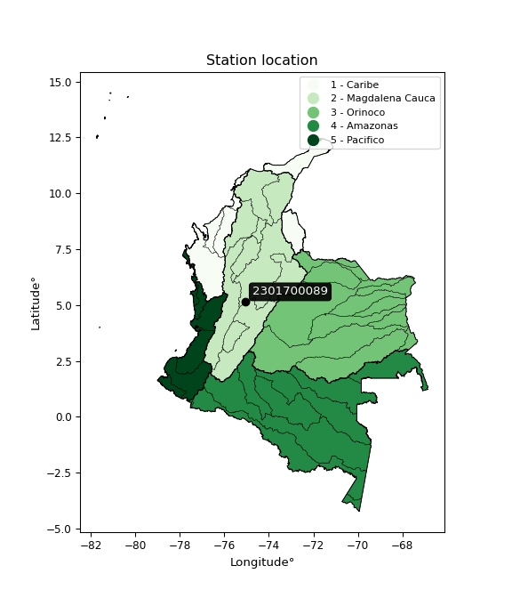</img>

</div>


## A. General information


### 1. General running parameters

• app_version: _v20260103_. • runtime: _2026-01-05 16:20:51.132608_. • Python version: _3.14.0_. • SciPy version: _1.16.3_. • Pandas version: _2.3.3_. • NumPy version: _2.3.5_. • Stations dataset (station_dataset_file): _dataset/pmax24h_in/automatic_colombia_2003_2024.csv_. • Stations catalog (station_catalog_file): _dataset/CNE.xls_. • Minimum year to eval til year_max (date_min): _1900_. • Maximum year to eval since year_min (date_max): _2024_. • Creates, save and include plots into reports (create_plot): _True_. • Plot only fit distributions with Δo > Δ (plot_only_fit): _True_. • Plot only simple graphs avoiding multiple CDFs and multiple Extreme values plots (plot_only_simple): _True_. • Eval low extreme values, if False, evaluates high extreme values (low_extreme): _False_. • Eval every SciPy distribution as logarithmic (pdist_logarithmic_on): _True_. • Standard deviation normalized (ddof): _1.0_. • Return periods to eval in years (Tr): _[2, 2.33, 5, 10, 15, 20, 25, 50, 75, 100, 200, 250, 500, 750, 1000]_. • Minimum data sample per station, 0 means any (minimum_sample): _5_. • Z-Score maximum threshold to adjust a value, 0 means disable (zscore_max): _3.5_. • Z-Score minimum threshold to adjust a value, 0 means disable (zscore_min): _-2.5_. • Avoid zeros, e.g. rain = 0 (avoid_zeros): _True_. • Avoid null values (avoid_nans): _True_. 

[:file_folder:Dataset file](../../dataset/pmax24h_in/automatic_colombia_2003_2024.csv)

> Delta Degrees of Freedom (DDOF): is a parameter used in the formulas for calculating variance and standard deviation. When ddof=0, the divisor is $N$ (the total number of observations) and this is used when your data set is the entire population. When ddof=1, the divisor is $N-1$ and this is used when your data set is a sample drawn from a larger population. Using $N-1$ provides an unbiased estimate of the population variance (known as Bessel´s correction).


### 2. Station info and location

|   id |     CODIGO | NOMBRE                             | CATEGORIA    | TECNOLOGIA                              | ESTADO   | FECHA_INSTALACION   |   FECHA_SUSPENSION |   ALTITUD |   LATITUD |   LONGITUD | DEPARTAMENTO   | MUNICIPIO   | AREA_OPERATIVA             | ENTIDAD                                                     | AREA_HIDROGRAFICA   | ZONA_HIDROGRAFICA   | SUBZONA_HIDROGRAFICA   | CORRIENTE   | Catalogo   |   Version |
|-----:|-----------:|:-----------------------------------|:-------------|:----------------------------------------|:---------|:--------------------|-------------------:|----------:|----------:|-----------:|:---------------|:------------|:---------------------------|:------------------------------------------------------------|:--------------------|:--------------------|:-----------------------|:------------|:-----------|----------:|
|    0 | 2301700089 | GUALÍ ALERTAS - AUT   [2301700089] | Limnigráfica | Automática con Telemetría, Convencional | Activa   | 25/03/2018          |                nan |       712 |   5.13428 |   -75.0621 | Tolima         | Fresno      | Area Operativa 10 - Tolima | INSTITUTO DE HIDROLOGIA METEOROLOGIA Y ESTUDIOS AMBIENTALES | Magdalena Cauca     | Medio Magdalena     | Río Gualí              | Guali       | CNE_IDEAM  |  20251226 |

<div align="center">

Dynamic map: [:earth_americas:Google](http://maps.google.com/maps?q=5.134277778,-75.062055556) [:earth_americas:OSM](https://www.openstreetmap.org/#map=18/5.134277778/-75.062055556&layers=P) [:earth_americas:Bing](https://www.bing.com/maps?cp=5.134277778~-75.062055556&lvl=18) [:earth_americas:Apple](https://maps.apple.com/frame?center=5.134277778%2C-75.062055556&span=0.003%2C0.006)

</div>


<div align="center">

```geojson
{
  "type": "Feature",
  "geometry": {
    "type": "Point", 
    "coordinates": [-75.062055556, 5.134277778]
  }, 
  "properties": {
    "Name": "2301700089"
  }
}
```

</div>


### 3. Discrete values table and plot

<div align="center">

|               |         0 |           1 |            2 |           3 |          4 |
|:--------------|----------:|------------:|-------------:|------------:|-----------:|
| Date          | 2019      | 2020        | 2021         | 2022        | 2024       |
| Value         |   96.6    |   91        |   63.2       |   46.4      |   20.8     |
| Value_initial |   96.6    |   91        |   63.2       |   46.4      |   20.8     |
| count         |    5      |    5        |    5         |    5        |    5       |
| mean          |   63.6    |   63.6      |   63.6       |   63.6      |   63.6     |
| std           |   31.4944 |   31.4944   |   31.4944    |   31.4944   |   31.4944  |
| zscore        |    1.0478 |    0.869995 |   -0.0127007 |   -0.546128 |   -1.35897 |


</div>


<div align="center">

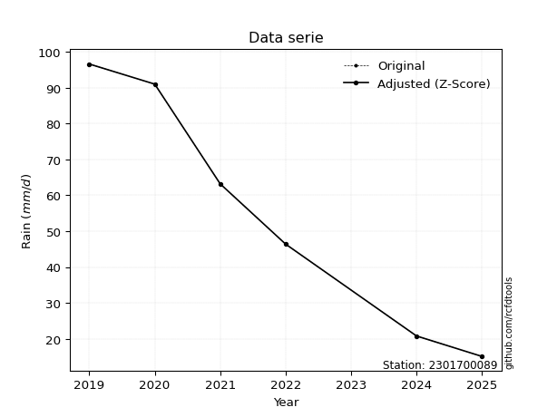</img>

</div>


> The initial value (value_initial) correspond to the initial obtained or null completed value, and value (value) is adjusted only when the initial value is outside the valid range (outlier) definite through the Z-Score value. If Z-Score is active, values out of range or outliers are replaced with the station mean value. A Z-Score (or standard score) measures how many standard deviations a data point is from the mean of a dataset, indicating its relative position; positive scores mean above the mean, negative mean below, and a score of zero is exactly at the mean, allowing for comparison of values from different distributions. It´s calculated using the formula $z=(x–μ)/σ$, where $x$ is the data point, $μ$ is the mean, and $σ$ is the standard deviation, helping identify outliers and understand probability.
>
> <sub>**Note**: In this study, "completing" (filling gaps in) and "extending" (forecasting or lengthening the historical record) rainfall data series are avoided for certain critical analyses because they introduce artificial bias and uncertainty, which can distort the statistics of rare events (extremes), alter day-to-day variability, and compromise the integrity and homogeneity of the original data. Some reasons against Completing/Extending rainfall data are: **Distortion of Extremes and Variability**: The primary issue is that most gap-filling or extension methods rely on averaging or regression with nearby stations, which inherently smooths the data. Rainfall is highly variable in space and time, with a large percentage of zero values and occasional large storms. Infilling methods often underestimate the highest values and overestimate the lowest (zero) values, which severely distorts analyses focused on flood frequency, drought severity, and intensity-duration-frequency (IDF) curves, **Loss of Data Homogeneity**: Infilled or extended data are synthetic estimates, not actual measurements. Combining these estimates with observed data can violate the assumption of data homogeneity, which requires that the data properties do not change over time. Inhomogeneity can lead to incorrect conclusions about long-term trends or changes in climate patterns, **Propagation of Errors**: Errors and biases from the original data (e.g., wind-induced undercatch, instrument errors, site changes) or the data used for imputation can propagate through the analysis, leading to unreliable hydrological models and inaccurate predictions, **Compromised Statistical Integrity**: For statistical analyses, especially those involving the frequency of events, using artificial data can introduce time bias or autocorrelation that doesn´t exist in reality, making it difficult to assess the true probability of events, **Difficulty in Validation**: It is difficult to accurately validate the quality of filled or extended data, especially for past periods where ground-truth measurements are unavailable. The reliability of imputation techniques heavily depends on the density of the surrounding station network and the complexity of the local topography.</sub>


### 4. Active continuous probability distributions from SciPy (44 of 104 available)

A Probability Density Function (PDF) describes the relative likelihood of a continuous random variable falling within a specific range, where the total area under its curve equals 1, and the area over any interval gives the actual probability for that range. Unlike discrete probabilities (like rolling a die), a PDF shows density, not direct probability for a single point (which is zero), with higher points indicating higher likelihood, often visualized as a bell curve for normal distributions.

A log of a probability density function (log-PDF) is simply the logarithm of the PDF´s value, denoted as $log(f(x))$, useful for converting multiplication of probabilities into addition, improving numerical stability with tiny numbers, and connecting to information theory concepts like entropy. Instead of dealing with very small probabilities (e.g., 0.000001), log-PDFs use negative numbers (e.g., $log(0.00001) ≈ -11.51$ that are easier for computers to handle, preventing underflow errors and simplifying complex calculations. In this study, each active probability distribution from SciPy is also evaluated in the $log$ form.

[scipy.stats](https://docs.scipy.org/doc/scipy/reference/stats.html) is a Python´s powerful submodule within the SciPy library for comprehensive statistical analysis, offering over 130 probability distributions (like Normal, Poisson), functions for descriptive stats (mean, variance), hypothesis testing (t-tests, chi-square), random variable generation, and statistical tests, making it essential for data science, modeling, and research. It provides tools to explore, model, and draw conclusions from data efficiently, working seamlessly with NumPy.

<div align="center">

|   id | p_dist             |   n_parameter | fit_method   | label                                                                       | active   | ref                                                                                                        |
|-----:|:-------------------|--------------:|:-------------|:----------------------------------------------------------------------------|:---------|:-----------------------------------------------------------------------------------------------------------|
|    0 | alpha              |             3 | MLE          | Alpha                                                                       | True     | [:mortar_board:](https://docs.scipy.org/doc/scipy/reference/generated/scipy.stats.alpha.html)              |
|    1 | betaprime          |             4 | MLE          | Beta prime                                                                  | True     | [:mortar_board:](https://docs.scipy.org/doc/scipy/reference/generated/scipy.stats.betaprime.html)          |
|    2 | chi2               |             3 | MLE          | Chi²                                                                        | True     | [:mortar_board:](https://docs.scipy.org/doc/scipy/reference/generated/scipy.stats.chi2.html)               |
|    3 | crystalball        |             4 | MLE          | Crystalball                                                                 | True     | [:mortar_board:](https://docs.scipy.org/doc/scipy/reference/generated/scipy.stats.crystalball.html)        |
|    4 | erlang             |             3 | MLE          | Erlang                                                                      | True     | [:mortar_board:](https://docs.scipy.org/doc/scipy/reference/generated/scipy.stats.erlang.html)             |
|    5 | expon              |             2 | MLE          | Exponential                                                                 | True     | [:mortar_board:](https://docs.scipy.org/doc/scipy/reference/generated/scipy.stats.expon.html)              |
|    6 | exponnorm          |             3 | MLE          | Exponentially modified Normal                                               | True     | [:mortar_board:](https://docs.scipy.org/doc/scipy/reference/generated/scipy.stats.exponnorm.html)          |
|    7 | f                  |             4 | MLE          | F                                                                           | True     | [:mortar_board:](https://docs.scipy.org/doc/scipy/reference/generated/scipy.stats.f.html)                  |
|    8 | fatiguelife        |             3 | MLE          | Fatigue-life (Birnbaum-Saunders)                                            | True     | [:mortar_board:](https://docs.scipy.org/doc/scipy/reference/generated/scipy.stats.fatiguelife.html)        |
|    9 | fisk               |             3 | MLE          | Fisk                                                                        | True     | [:mortar_board:](https://docs.scipy.org/doc/scipy/reference/generated/scipy.stats.fisk.html)               |
|   10 | gamma              |             3 | MLE          | Gamma                                                                       | True     | [:mortar_board:](https://docs.scipy.org/doc/scipy/reference/generated/scipy.stats.gamma.html)              |
|   11 | genexpon           |             5 | MLE          | Generalized exponential                                                     | True     | [:mortar_board:](https://docs.scipy.org/doc/scipy/reference/generated/scipy.stats.genexpon.html)           |
|   12 | genlogistic        |             3 | MLE          | Generalized logistic                                                        | True     | [:mortar_board:](https://docs.scipy.org/doc/scipy/reference/generated/scipy.stats.genlogistic.html)        |
|   13 | gibrat             |             2 | MM           | Gibrat                                                                      | True     | [:mortar_board:](https://docs.scipy.org/doc/scipy/reference/generated/scipy.stats.gibrat.html)             |
|   14 | gompertz           |             3 | MLE          | Gompertz (or truncated Gumbel)                                              | True     | [:mortar_board:](https://docs.scipy.org/doc/scipy/reference/generated/scipy.stats.gompertz.html)           |
|   15 | gumbel_l           |             2 | MM           | Gumbel Left Skew                                                            | True     | [:mortar_board:](https://docs.scipy.org/doc/scipy/reference/generated/scipy.stats.gumbel_l.html)           |
|   16 | gumbel_r           |             2 | MM           | Gumbel Right Skew                                                           | True     | [:mortar_board:](https://docs.scipy.org/doc/scipy/reference/generated/scipy.stats.gumbel_r.html)           |
|   17 | halflogistic       |             2 | MM           | Half-logistic                                                               | True     | [:mortar_board:](https://docs.scipy.org/doc/scipy/reference/generated/scipy.stats.halflogistic.html)       |
|   18 | halfnorm           |             2 | MM           | Half Normal                                                                 | True     | [:mortar_board:](https://docs.scipy.org/doc/scipy/reference/generated/scipy.stats.halfnorm.html)           |
|   19 | hypsecant          |             2 | MM           | hyperbolic secant                                                           | True     | [:mortar_board:](https://docs.scipy.org/doc/scipy/reference/generated/scipy.stats.hypsecant.html)          |
|   20 | invgamma           |             3 | MLE          | Inverted gamma                                                              | True     | [:mortar_board:](https://docs.scipy.org/doc/scipy/reference/generated/scipy.stats.invgamma.html)           |
|   21 | invgauss           |             3 | MLE          | Inverse Gaussian                                                            | True     | [:mortar_board:](https://docs.scipy.org/doc/scipy/reference/generated/scipy.stats.invgauss.html)           |
|   22 | invweibull         |             3 | MLE          | Inverted Weibull                                                            | True     | [:mortar_board:](https://docs.scipy.org/doc/scipy/reference/generated/scipy.stats.invweibull.html)         |
|   23 | johnsonsu          |             4 | MLE          | Johnson Su                                                                  | True     | [:mortar_board:](https://docs.scipy.org/doc/scipy/reference/generated/scipy.stats.johnsonsu.html)          |
|   24 | kstwobign          |             2 | MLE          | Limiting distribution of scaled Kolmogorov-Smirnov two-sided test statistic | True     | [:mortar_board:](https://docs.scipy.org/doc/scipy/reference/generated/scipy.stats.kstwobign.html)          |
|   25 | laplace            |             2 | MM           | Laplace                                                                     | True     | [:mortar_board:](https://docs.scipy.org/doc/scipy/reference/generated/scipy.stats.laplace.html)            |
|   26 | laplace_asymmetric |             3 | MLE          | Asymmetric Laplace                                                          | True     | [:mortar_board:](https://docs.scipy.org/doc/scipy/reference/generated/scipy.stats.laplace_asymmetric.html) |
|   27 | loggamma           |             3 | MLE          | Log gamma                                                                   | True     | [:mortar_board:](https://docs.scipy.org/doc/scipy/reference/generated/scipy.stats.loggamma.html)           |
|   28 | logistic           |             2 | MM           | Logistic (or Sech-squared)                                                  | True     | [:mortar_board:](https://docs.scipy.org/doc/scipy/reference/generated/scipy.stats.logistic.html)           |
|   29 | lognorm            |             3 | MLE          | Log Normal                                                                  | True     | [:mortar_board:](https://docs.scipy.org/doc/scipy/reference/generated/scipy.stats.lognorm.html)            |
|   30 | maxwell            |             2 | MM           | Maxwell                                                                     | True     | [:mortar_board:](https://docs.scipy.org/doc/scipy/reference/generated/scipy.stats.maxwell.html)            |
|   31 | mielke             |             4 | MLE          | Mielke Beta-Kappa / Dagum                                                   | True     | [:mortar_board:](https://docs.scipy.org/doc/scipy/reference/generated/scipy.stats.mielke.html)             |
|   32 | moyal              |             2 | MM           | Moyal                                                                       | True     | [:mortar_board:](https://docs.scipy.org/doc/scipy/reference/generated/scipy.stats.moyal.html)              |
|   33 | nakagami           |             3 | MLE          | Nakagami                                                                    | True     | [:mortar_board:](https://docs.scipy.org/doc/scipy/reference/generated/scipy.stats.nakagami.html)           |
|   34 | ncf                |             5 | MLE          | Non-central F distribution                                                  | True     | [:mortar_board:](https://docs.scipy.org/doc/scipy/reference/generated/scipy.stats.ncf.html)                |
|   35 | nct                |             4 | MLE          | Non-central Student’s t                                                     | True     | [:mortar_board:](https://docs.scipy.org/doc/scipy/reference/generated/scipy.stats.nct.html)                |
|   36 | norm               |             2 | MM           | Normal                                                                      | True     | [:mortar_board:](https://docs.scipy.org/doc/scipy/reference/generated/scipy.stats.norm.html)               |
|   37 | pearson3           |             3 | MM           | Pearson type III                                                            | True     | [:mortar_board:](https://docs.scipy.org/doc/scipy/reference/generated/scipy.stats.pearson3.html)           |
|   38 | rayleigh           |             2 | MM           | Rayleigh                                                                    | True     | [:mortar_board:](https://docs.scipy.org/doc/scipy/reference/generated/scipy.stats.rayleigh.html)           |
|   39 | rice               |             3 | MLE          | Rice                                                                        | True     | [:mortar_board:](https://docs.scipy.org/doc/scipy/reference/generated/scipy.stats.rice.html)               |
|   40 | t                  |             3 | MLE          | Student’s t                                                                 | True     | [:mortar_board:](https://docs.scipy.org/doc/scipy/reference/generated/scipy.stats.t.html)                  |
|   41 | truncnorm          |             4 | MLE          | Truncated normal                                                            | True     | [:mortar_board:](https://docs.scipy.org/doc/scipy/reference/generated/scipy.stats.truncnorm.html)          |
|   42 | wald               |             2 | MM           | Wald                                                                        | True     | [:mortar_board:](https://docs.scipy.org/doc/scipy/reference/generated/scipy.stats.wald.html)               |
|   43 | weibull_min        |             3 | MLE          | Weibull minimum                                                             | True     | [:mortar_board:](https://docs.scipy.org/doc/scipy/reference/generated/scipy.stats.weibull_min.html)        |

</div>

> **n_parameter:** # arguments & localization & scale.
>
> **Fit methods:** (MLE) maximum likelihood, (MM) L-moments.
>
>**Inactive** (With the only purpose of prevent loops, zero divisions, infinite values, over high estimated values or horizontal trending for recurrence intervals estimations, the follow distributions were disabled.)**:** foldnorm, gennorm, norminvgauss, powernorm, powerlognorm, skewnorm, genextreme, anglit, arcsine, argus, beta, bradford, burr, burr12, cauchy, cosine, halfcauchy, foldcauchy, skewcauchy, wrapcauchy, dgamma, gengamma, exponweib, exponpow, truncexpon, gausshyper, genhalflogistic, genhyperbolic, geninvgauss, halfgennorm, johnsonsb, kappa4, kappa3, ksone, kstwo, loglaplace, levy, levy_l, levy_stable, ncx2, pareto, genpareto, truncpareto, lomax, powerlaw, rdist, rel_breitwigner, recipinvgauss, semicircular, studentized_range, trapezoid, triang, truncweibull_min, tukeylambda, uniform, loguniform, vonmises, vonmises_line, weibull_max, dweibull, 


## B. Probability (PDF) vs. Empirical (EDF) distributions functions

A continuous probability distribution (CPD) describes probabilities for variables that can take any value within a range (like rain any time), unlike discrete variables with specific outcomes (like temperature). It uses a Probability Density Function (PDF), a curve where the total area under it equals 1, and the probability of the variable falling within an interval (a to b) is found by calculating the area under the curve between those points. A key feature is that the probability of hitting any single exact value is zero, so probabilities are always expressed for ranges, e.g., $P(a ≤ X ≤ b)$.

<div align="center">

Distributions parameters from station values
|    |    station | p_dist                |   n |             loc |           scale | shape                  | shape1                 | shape2             | shape3   |
|---:|-----------:|:----------------------|----:|----------------:|----------------:|:-----------------------|:-----------------------|:-------------------|:---------|
|  0 | 2301700089 | alpha                 |   5 |  -416.051       |  8005.23        | 16.759544428910303     |                        |                    |          |
|  1 | 2301700089 | betaprime             |   5 |   -80.7811      | 16261.1         | 24.648214782422528     | 2773.166309581413      |                    |          |
|  2 | 2301700089 | chi2                  |   5 |  -184.814       |     1.67389     | 148.52705028780713     |                        |                    |          |
|  3 | 2301700089 | crystalball           |   5 |    63.6         |    28.1695      | 4973.567320338747      | 359.89525380442        |                    |          |
|  4 | 2301700089 | erlang                |   5 |  -436.818       |     1.61799     | 309.1856905624411      |                        |                    |          |
|  5 | 2301700089 | expon                 |   5 |    20.8         |    42.8         |                        |                        |                    |          |
|  6 | 2301700089 | exponnorm             |   5 |    63.5692      |    28.1695      | 0.001091106174685399   |                        |                    |          |
|  7 | 2301700089 | f                     |   5 | -6060.77        |  6124.39        | 98197.20218059607      | 2181175.5529932827     |                    |          |
|  8 | 2301700089 | fatiguelife           |   5 |    20.8         |     6.02125e-05 | 982.3002023083725      |                        |                    |          |
|  9 | 2301700089 | fisk                  |   5 |    -9.33309e+08 |     9.33309e+08 | 53972406.947571486     |                        |                    |          |
| 10 | 2301700089 | gamma                 |   5 |  -424.539       |     1.66759     | 292.64131663845455     |                        |                    |          |
| 11 | 2301700089 | genexpon              |   5 |    20.7999      |     1.76957     | 0.04134173542369968    | 3.9117477784695464e-07 | 0.9090128276654661 |          |
| 12 | 2301700089 | genlogistic           |   5 |    96.6006      |     5.13979e-05 | 1.5585157746205916e-06 |                        |                    |          |
| 13 | 2301700089 | gibrat                |   5 |    42.1103      |    13.0342      |                        |                        |                    |          |
| 14 | 2301700089 | gompertz              |   5 |   -77.6471      |    23.3524      | 0.0013190233384959911  |                        |                    |          |
| 15 | 2301700089 | gumbel_l              |   5 |    76.2778      |    21.9637      |                        |                        |                    |          |
| 16 | 2301700089 | gumbel_r              |   5 |    50.9222      |    21.9637      |                        |                        |                    |          |
| 17 | 2301700089 | halflogistic          |   5 |    30.2126      |    24.0839      |                        |                        |                    |          |
| 18 | 2301700089 | halfnorm              |   5 |    26.3146      |    46.7303      |                        |                        |                    |          |
| 19 | 2301700089 | hypsecant             |   5 |    63.6         |    17.9333      |                        |                        |                    |          |
| 20 | 2301700089 | invgamma              |   5 |  -261.182       | 40657.7         | 126.2857498507941      |                        |                    |          |
| 21 | 2301700089 | invgauss              |   5 |   -97.177       |  4708.52        | 0.034156102627401      |                        |                    |          |
| 22 | 2301700089 | invweibull            |   5 |    20.8         |     2.18727     | 0.043192816757913643   |                        |                    |          |
| 23 | 2301700089 | johnsonsu             |   5 |    96.6         |     4.40333e-15 | 2.2161911603741147     | 0.11726653495617628    |                    |          |
| 24 | 2301700089 | kstwobign             |   5 |   -42.5857      |   121.067       |                        |                        |                    |          |
| 25 | 2301700089 | laplace               |   5 |    63.6         |    19.9188      |                        |                        |                    |          |
| 26 | 2301700089 | laplace_asymmetric    |   5 |    63.2         |    24.0787      | 0.9922051706185537     |                        |                    |          |
| 27 | 2301700089 | loggamma              |   5 |    96.6002      |     1.59546e-05 | 4.833620042985191e-07  |                        |                    |          |
| 28 | 2301700089 | logistic              |   5 |    63.6         |    15.5307      |                        |                        |                    |          |
| 29 | 2301700089 | lognorm               |   5 |    20.8         |     0.0290024   | 14.870469898610775     |                        |                    |          |
| 30 | 2301700089 | maxwell               |   5 |    -3.14986     |    41.8293      |                        |                        |                    |          |
| 31 | 2301700089 | mielke                |   5 |    -7.89759     |   104.868       | 2.083132886013927      | 1376.241820679356      |                    |          |
| 32 | 2301700089 | moyal                 |   5 |    47.4909      |    12.6807      |                        |                        |                    |          |
| 33 | 2301700089 | nakagami              |   5 |    46.4         |    30.1655      | 0.11564331770600875    |                        |                    |          |
| 34 | 2301700089 | ncf                   |   5 |     0.00375798  |     2.1509e-05  | 1.4707444398404586e-06 | 2.597715037476445      | 2.8681116046468222 |          |
| 35 | 2301700089 | nct                   |   5 | -1328.81        |    28.0915      | 221093.61704166222     | 49.5667245898413       |                    |          |
| 36 | 2301700089 | norm                  |   5 |    63.6         |    28.1695      |                        |                        |                    |          |
| 37 | 2301700089 | pearson3              |   5 |    63.6         |    28.1695      | -0.24142595160651692   |                        |                    |          |
| 38 | 2301700089 | rayleigh              |   5 |     9.71013     |    42.9979      |                        |                        |                    |          |
| 39 | 2301700089 | rice                  |   5 |     4.75483     |    32.675       | 1.4094549224296202     |                        |                    |          |
| 40 | 2301700089 | t                     |   5 |    63.598       |    28.1686      | 4599613.89125849       |                        |                    |          |
| 41 | 2301700089 | truncnorm             |   5 |    26.8591      |     4.05972     | -9.41785688853098      | 17.17872348345992      |                    |          |
| 42 | 2301700089 | wald                  |   5 |    35.4305      |    28.1695      |                        |                        |                    |          |
| 43 | 2301700089 | weibull_min           |   5 |   -93.3203      |   168.639       | 6.717240640724479      |                        |                    |          |
| 44 | 2301700089 | logalpha              |   5 |    -8.72635     |   277.094       | 21.76614413313027      |                        |                    |          |
| 45 | 2301700089 | logbetaprime          |   5 |   -31.7152      |    13.6134      | 14578.06778913542      | 5553.727017045432      |                    |          |
| 46 | 2301700089 | logchi2               |   5 |     3.03495     |     0.99716     | 1.0072740565501108     |                        |                    |          |
| 47 | 2301700089 | logcrystalball        |   5 |     4.02        |     0.559237    | 115.50440487223385     | 329.7653143654413      |                    |          |
| 48 | 2301700089 | logerlang             |   5 |    -5.80323     |     0.0337885   | 290.4656222626156      |                        |                    |          |
| 49 | 2301700089 | logexpon              |   5 |     3.03495     |     0.985046    |                        |                        |                    |          |
| 50 | 2301700089 | logexponnorm          |   5 |     4.01947     |     0.559236    | 0.0009413528174981524  |                        |                    |          |
| 51 | 2301700089 | logf                  |   5 |  -531.956       |   535.977       | 7855733.2295949515     | 2378289.155730224      |                    |          |
| 52 | 2301700089 | logfatiguelife        |   5 |  -246.295       |   250.313       | 0.0022324883716222125  |                        |                    |          |
| 53 | 2301700089 | logfisk               |   5 |    -4.38954e+07 |     4.38954e+07 | 135503995.8168133      |                        |                    |          |
| 54 | 2301700089 | loggamma              |   5 |    -3.82978     |     0.0422421   | 185.83226372825436     |                        |                    |          |
| 55 | 2301700089 | loggenexpon           |   5 |     3.03495     |   283.988       | 190.5346915806143      | 300.77245673267714     | 170.64077007238183 |          |
| 56 | 2301700089 | loggenlogistic        |   5 |     4.57069     |     9.15518e-06 | 1.6470049179902287e-05 |                        |                    |          |
| 57 | 2301700089 | loggibrat             |   5 |     3.59335     |     0.258774    |                        |                        |                    |          |
| 58 | 2301700089 | loggompertz           |   5 |     3.03495     |     0.500324    | 0.0984113352273693     |                        |                    |          |
| 59 | 2301700089 | loggumbel_l           |   5 |     4.27169     |     0.436035    |                        |                        |                    |          |
| 60 | 2301700089 | loggumbel_r           |   5 |     3.76831     |     0.436035    |                        |                        |                    |          |
| 61 | 2301700089 | loghalflogistic       |   5 |     3.35714     |     0.478149    |                        |                        |                    |          |
| 62 | 2301700089 | loghalfnorm           |   5 |     3.27979     |     0.927711    |                        |                        |                    |          |
| 63 | 2301700089 | loghypsecant          |   5 |     4.02        |     0.356021    |                        |                        |                    |          |
| 64 | 2301700089 | loginvgamma           |   5 |    -7.78298     |  4978.36        | 422.7790311423546      |                        |                    |          |
| 65 | 2301700089 | loginvgauss           |   5 |    -1.64115     |   501.347       | 0.011296518050653764   |                        |                    |          |
| 66 | 2301700089 | loginvweibull         |   5 |    -5.76469e+07 |     5.76469e+07 | 97225929.32708648      |                        |                    |          |
| 67 | 2301700089 | logjohnsonsu          |   5 |     4.57058     |     6.31308e-14 | 1.2224226351783756     | 0.10488178627748768    |                    |          |
| 68 | 2301700089 | logkstwobign          |   5 |     1.655       |     2.69576     |                        |                        |                    |          |
| 69 | 2301700089 | loglaplace            |   5 |     4.02        |     0.39544     |                        |                        |                    |          |
| 70 | 2301700089 | loglaplace_asymmetric |   5 |     4.1463      |     0.428054    | 1.1584627011637196     |                        |                    |          |
| 71 | 2301700089 | logloggamma           |   5 |     4.57065     |     5.6566e-06  | 1.0374019095975943e-05 |                        |                    |          |
| 72 | 2301700089 | loglogistic           |   5 |     4.02        |     0.308323    |                        |                        |                    |          |
| 73 | 2301700089 | loglognorm            |   5 |     3.03495     |     0.000978601 | 14.212469487313875     |                        |                    |          |
| 74 | 2301700089 | logmaxwell            |   5 |     2.69484     |     0.830419    |                        |                        |                    |          |
| 75 | 2301700089 | logmielke             |   5 |    -1.53207e+07 |     1.53207e+07 | 27613088.55532083      | 14291443788.514324     |                    |          |
| 76 | 2301700089 | logmoyal              |   5 |     3.70019     |     0.251745    |                        |                        |                    |          |
| 77 | 2301700089 | lognakagami           |   5 |     3.8373      |     0.382103    | 0.4700899844139039     |                        |                    |          |
| 78 | 2301700089 | logncf                |   5 |   -33.8685      |    27.8209      | 22622.388924345858     | 13798.443634476338     | 8183.729760321899  |          |
| 79 | 2301700089 | lognct                |   5 |   -23.1405      |     0.441878    | 2876.8044136606195     | 61.45317555340583      |                    |          |
| 80 | 2301700089 | lognorm               |   5 |     4.02        |     0.559237    |                        |                        |                    |          |
| 81 | 2301700089 | logpearson3           |   5 |     4.02        |     0.559237    | -0.771548999191275     |                        |                    |          |
| 82 | 2301700089 | lograyleigh           |   5 |     2.95015     |     0.853619    |                        |                        |                    |          |
| 83 | 2301700089 | logrice               |   5 |     2.65363     |     0.612944    | 1.9498123818375095     |                        |                    |          |
| 84 | 2301700089 | logt                  |   5 |     4.02        |     0.559237    | 19974179053.21261      |                        |                    |          |
| 85 | 2301700089 | logtruncnorm          |   5 |    -0.171583    |     1.45264     | 2.7597129407584013     | 3.264503607234916      |                    |          |
| 86 | 2301700089 | logwald               |   5 |     3.46077     |     0.559231    |                        |                        |                    |          |
| 87 | 2301700089 | logweibull_min        |   5 |    -2.04509e+07 |     2.04509e+07 | 50962662.26644148      |                        |                    |          |

</div>

> **loc** (Location parameter): This shifts the distribution along the x-axis. For many common distributions, like the normal (Gaussian) distribution, loc represents the mean $μ$. For others, like the uniform distribution, it might represent the minimum value, or for the beta distribution, the left end of the support interval.
>
> **scale** (Scale parameter): This determines the width or spread of the distribution. For the normal distribution, scale represents the standard deviation $σ$. For a uniform distribution, it defines the length of the interval (from $loc$ to $loc + scale$).
>
> **shape** (Shape parameters): Refers to parameters that define the specific form of a probability distribution, distinct from its location (loc) and scale (scale). These parameters are required arguments for most distribution functions. For example, a normal (Gaussian) distribution is fully defined by its location (mean) and scale (standard deviation), so it has no specific shape parameters beyond loc and scale. However, other distributions have intrinsic properties that need specification, as Gamma distribution that takes a shape parameter, often named $a$ or $alpha$.


### 0. Cumulative distribution values - CDF (88 evaluated)

Cumulative Distribution Function (CDF), denoted as $F$<sub>$X$</sub>$(x)$, is a function that gives the probability that a random variable $X$ will take a value less than or equal to a specific value, $x$ (i.e., $(P(X≥x)$. It essentially "accumulates" probabilities from a given point up to the far right (positive infinity), providing a complete picture of the distribution´s probabilities for both discrete (like rain) and continuous (like temperature) variables, helping to find probabilities over ranges or above certain values. Each station is evaluated separately ordering the $x$ values ascending, calculating the CDF and PDF values for the activated distributions and their logarithmic forms.

<div align="center">

CDF ordered by x ascending and calculating $log(f(x))$ separately
|   id |    Station |   date |    x |   count |   mean |     std |     zscore |   Value_initial |    station |   m |     alpha |   alpha_pdf |   betaprime |   betaprime_pdf |      chi2 |   chi2_pdf |   crystalball |   crystalball_pdf |    erlang |   erlang_pdf |    expon |   expon_pdf |   exponnorm |   exponnorm_pdf |         f |      f_pdf |   fatiguelife |   fatiguelife_pdf |      fisk |   fisk_pdf |     gamma |   gamma_pdf |    genexpon |   genexpon_pdf |   genlogistic |   genlogistic_pdf |   gibrat |   gibrat_pdf |   gompertz |   gompertz_pdf |   gumbel_l |   gumbel_l_pdf |   gumbel_r |   gumbel_r_pdf |   halflogistic |   halflogistic_pdf |   halfnorm |   halfnorm_pdf |   hypsecant |   hypsecant_pdf |   invgamma |   invgamma_pdf |   invgauss |   invgauss_pdf |   invweibull |   invweibull_pdf |   johnsonsu |   johnsonsu_pdf |   kstwobign |   kstwobign_pdf |   laplace |   laplace_pdf |   laplace_asymmetric |   laplace_asymmetric_pdf |   loggamma |   loggamma_pdf |   logistic |   logistic_pdf |   lognorm |   lognorm_pdf |   maxwell |   maxwell_pdf |    mielke |   mielke_pdf |      moyal |   moyal_pdf |    nakagami |   nakagami_pdf |      ncf |    ncf_pdf |       nct |    nct_pdf |      norm |   norm_pdf |   pearson3 |   pearson3_pdf |   rayleigh |   rayleigh_pdf |      rice |   rice_pdf |         t |      t_pdf |   truncnorm |   truncnorm_pdf |     wald |   wald_pdf |   weibull_min |   weibull_min_pdf |   logalpha |   logalpha_pdf |   logbetaprime |   logbetaprime_pdf |     logchi2 |   logchi2_pdf |   logcrystalball |   logcrystalball_pdf |   logerlang |   logerlang_pdf |   logexpon |   logexpon_pdf |   logexponnorm |   logexponnorm_pdf |      logf |   logf_pdf |   logfatiguelife |   logfatiguelife_pdf |   logfisk |   logfisk_pdf |   loggenexpon |   loggenexpon_pdf |   loggenlogistic |   loggenlogistic_pdf |   loggibrat |   loggibrat_pdf |   loggompertz |   loggompertz_pdf |   loggumbel_l |   loggumbel_l_pdf |   loggumbel_r |   loggumbel_r_pdf |   loghalflogistic |   loghalflogistic_pdf |   loghalfnorm |   loghalfnorm_pdf |   loghypsecant |   loghypsecant_pdf |   loginvgamma |   loginvgamma_pdf |   loginvgauss |   loginvgauss_pdf |   loginvweibull |   loginvweibull_pdf |   logjohnsonsu |   logjohnsonsu_pdf |   logkstwobign |   logkstwobign_pdf |   loglaplace |   loglaplace_pdf |   loglaplace_asymmetric |   loglaplace_asymmetric_pdf |   logloggamma |   logloggamma_pdf |   loglogistic |   loglogistic_pdf |   loglognorm |   loglognorm_pdf |   logmaxwell |   logmaxwell_pdf |   logmielke |   logmielke_pdf |    logmoyal |   logmoyal_pdf |   lognakagami |   lognakagami_pdf |    logncf |   logncf_pdf |    lognct |   lognct_pdf |   logpearson3 |   logpearson3_pdf |   lograyleigh |   lograyleigh_pdf |   logrice |   logrice_pdf |      logt |   logt_pdf |   logtruncnorm |   logtruncnorm_pdf |   logwald |   logwald_pdf |   logweibull_min |   logweibull_min_pdf |
|-----:|-----------:|-------:|-----:|--------:|-------:|--------:|-----------:|----------------:|-----------:|----:|----------:|------------:|------------:|----------------:|----------:|-----------:|--------------:|------------------:|----------:|-------------:|---------:|------------:|------------:|----------------:|----------:|-----------:|--------------:|------------------:|----------:|-----------:|----------:|------------:|------------:|---------------:|--------------:|------------------:|---------:|-------------:|-----------:|---------------:|-----------:|---------------:|-----------:|---------------:|---------------:|-------------------:|-----------:|---------------:|------------:|----------------:|-----------:|---------------:|-----------:|---------------:|-------------:|-----------------:|------------:|----------------:|------------:|----------------:|----------:|--------------:|---------------------:|-------------------------:|-----------:|---------------:|-----------:|---------------:|----------:|--------------:|----------:|--------------:|----------:|-------------:|-----------:|------------:|------------:|---------------:|---------:|-----------:|----------:|-----------:|----------:|-----------:|-----------:|---------------:|-----------:|---------------:|----------:|-----------:|----------:|-----------:|------------:|----------------:|---------:|-----------:|--------------:|------------------:|-----------:|---------------:|---------------:|-------------------:|------------:|--------------:|-----------------:|---------------------:|------------:|----------------:|-----------:|---------------:|---------------:|-------------------:|----------:|-----------:|-----------------:|---------------------:|----------:|--------------:|--------------:|------------------:|-----------------:|---------------------:|------------:|----------------:|--------------:|------------------:|--------------:|------------------:|--------------:|------------------:|------------------:|----------------------:|--------------:|------------------:|---------------:|-------------------:|--------------:|------------------:|--------------:|------------------:|----------------:|--------------------:|---------------:|-------------------:|---------------:|-------------------:|-------------:|-----------------:|------------------------:|----------------------------:|--------------:|------------------:|--------------:|------------------:|-------------:|-----------------:|-------------:|-----------------:|------------:|----------------:|------------:|---------------:|--------------:|------------------:|----------:|-------------:|----------:|-------------:|--------------:|------------------:|--------------:|------------------:|----------:|--------------:|----------:|-----------:|---------------:|-------------------:|----------:|--------------:|-----------------:|---------------------:|
|    0 | 2301700089 |   2024 | 20.8 |       5 |   63.6 | 31.4944 | -1.35897   |            20.8 | 2301700089 |   1 | 0.0587546 |  0.00491543 |   0.0571051 |      0.00497741 | 0.0609189 | 0.00474546 |     0.0643341 |        0.00446526 | 0.0636798 |   0.00465521 | 0        |  0.0233645  |   0.0643342 |      0.00446527 | 0.0645262 | 0.00448395 |     0.0244329 |       3.51076e+09 | 0.0737752 | 0.0039516  | 0.0640115 |  0.00466897 | 2.17433e-06 |     0.0233626  |      0        |        0.00304477 | 0        |   0          |  0.0842708 |     0.00350386 |  0.0768718 |     0.00336184 |   0.019427 |     0.00348592 |       0        |         0          |   0        |     0          |   0.0583662 |      0.00323643 |  0.0602623 |     0.00498011 |   0.054939 |     0.00518195 |    0.0128675 |      6.80989e+11 |   0.0122548 |     4.92086e-05 |   0.0531479 |      0.00670909 | 0.0583167 |    0.00292772 |            0.0841016 |               0.00352022 |  0.0389078 |       0.160055 |  0.0597576 |     0.00361779 | 0.0390845 |      0.151217 | 0.0452873 |    0.00530785 | 0.0672386 |   0.00488079 | 0.00417572 |  0.00148924 | 0           |    0           | 0.437402 | 0.00762318 | 0.0643219 | 0.00446608 | 0.0643341 | 0.00446526 |  0.0701087 |     0.00426697 |  0.0327134 |     0.00580213 | 0.0445838 | 0.00554251 | 0.0643367 | 0.00446554 |   0.0677841 |     0.0322631   | 0        | 0          |     0.0700034 |        0.00397276 |  0.0364309 |       0.159952 |      0.0378178 |           0.150858 | 1.47674e-08 |   1.67476e+07 |        0.0390846 |             0.151217 |   0.0413484 |        0.16488  |   0        |       1.01518  |      0.0390843 |           0.151216 | 0.0392706 |   0.151656 |        0.0390869 |             0.151934 | 0.0372761 |      0.110781 |   1.24421e-06 |          0.670925 |         0        |             0.113546 |    0        |        0        |   5.64544e-08 |          0.196695 |     0.0569552 |          0.126828 |    0.00462786 |         0.0570546 |          0        |              0        |      0        |          0        |      0.0399664 |           0.111964 |     0.0371511 |          0.158662 |     0.0396478 |          0.173191 |       0.0413763 |            0.222266 |      0.0186258 |        0.0031128   |      0.0441794 |           0.269444 |    0.0414131 |         0.104727 |               0.0609328 |                    0.122877 |     0.0598203 |          0.109709 |     0.0393601 |          0.122634 |    0.0227646 |      8.55884e+12 |    0.0173795 |         0.148205 |   0.0622461 |        0.112188 | 0.000178166 |     0.00528679 |   0           |          0        | 0.0404409 |     0.156688 | 0.0400724 |     0.15583  |     0.0554706 |          0.1422   |    0.00492304 |          0.115814 | 0.0312635 |      0.17537  | 0.0390846 |   0.151217 |    0           |           0        |  0        |      0        |        0.0445124 |             0.108416 |
|    1 | 2301700089 |   2022 | 46.4 |       5 |   63.6 | 31.4944 | -0.546128  |            46.4 | 2301700089 |   2 | 0.290851  |  0.0128307  |   0.29045   |      0.0127573  | 0.281302  | 0.0122712  |     0.270736  |        0.0117537  | 0.278613  |   0.0120787  | 0.450162 |  0.0128467  |   0.270736  |      0.0117537  | 0.271361  | 0.0117547  |     0.746588  |       0.00414949  | 0.259289  | 0.0111065  | 0.279004  |  0.0120619  | 0.450139    |     0.0128463  |      0        |        0.00661726 | 0.133209 |   0.0501511  |  0.233644  |     0.00877614 |  0.226304  |     0.00903822 |   0.292695 |     0.016373   |       0.323958 |         0.0185819  |   0.33267  |     0.0155677  |   0.232983  |      0.0118623  |  0.292346  |     0.0127439  |   0.299783 |     0.0131771  |    0.406896  |      0.00061732  |   0.0138779 |     8.27369e-05 |   0.347562  |      0.013933   | 0.210841  |    0.010585   |            0.245564  |               0.0102785  |  0.383782  |       0.673598 |  0.24834   |     0.0120193  | 0.37195   |      0.676298 | 0.295219  |    0.0132703  | 0.253812  |   0.00973751 | 0.296508   |  0.0190455  | 0.000200258 |    6.51853e+09 | 0.588942 | 0.00454831 | 0.270774  | 0.0117561  | 0.270736  | 0.0117537  |  0.262319  |     0.0110289  |  0.305148  |     0.0137894  | 0.287512  | 0.0127274  | 0.270752  | 0.0117544  |   0.999999  |     9.15115e-07 | 0.259903 | 0.0361097  |     0.246195  |        0.0102423  |  0.38625   |       0.671671 |      0.372407  |           0.675398 | 0.627715    |   0.299414    |        0.37195   |             0.676298 |   0.388139  |        0.67328  |   0.557151 |       0.449572 |      0.371949  |           0.676298 | 0.371776  |   0.67435  |        0.373632  |             0.678267 | 0.315487  |      0.666647 |   0.510246    |          0.527002 |         0        |             0.48088  |    0.476473 |        1.63252  |   0.32349     |          0.661495 |     0.308764  |          0.585401 |    0.42585    |         0.833727  |          0.463767 |              0.82079  |      0.452124 |          0.717972 |      0.343384  |           0.788018 |     0.38616   |          0.679929 |     0.39745   |          0.663411 |       0.439095  |            0.609516 |      0.0224564 |        0.00763825  |      0.471284  |           0.597139 |    0.315006  |         0.796596 |               0.307287  |                    0.619676 |     0.260557  |          0.477853 |     0.356048  |          0.743628 |    0.681559  |      0.031296    |    0.40503   |         0.705879 |   0.264328  |        0.476408 | 0.44629     |     0.903081   |   7.19989e-15 |         15.2429   | 0.375832  |     0.668054 | 0.375733  |     0.670371 |     0.329376  |          0.595643 |    0.417285   |          0.709458 | 0.385839  |      0.674029 | 0.37195   |   0.676298 |    3.37797e-06 |           2.59977  |  0.49831  |      1.19284  |        0.285555  |             0.598645 |
|    2 | 2301700089 |   2021 | 63.2 |       5 |   63.6 | 31.4944 | -0.0127007 |            63.2 | 2301700089 |   3 | 0.522294  |  0.0138829  |   0.518949  |      0.0136468  | 0.507096  | 0.0138433  |     0.494335  |        0.0141608  | 0.504158  |   0.0140249  | 0.628666 |  0.00867602 |   0.494336  |      0.0141608  | 0.494608  | 0.0141189  |     0.803522  |       0.00279024  | 0.480475  | 0.0144352  | 0.504058  |  0.0139877  | 0.628641    |     0.008676   |      0        |        0.0110133  | 0.684817 |   0.0168483  |  0.421761  |     0.0135962  |  0.423815  |     0.0144633  |   0.564521 |     0.0146961  |       0.594659 |         0.0134193  |   0.570078 |     0.0125041  |   0.492901  |      0.0177453  |  0.521841  |     0.0137624  |   0.530537 |     0.0134769  |    0.41486   |      0.000371825 |   0.0156617 |     0.000137984 |   0.57006   |      0.012027   | 0.490059  |    0.0246028  |            0.496087  |               0.0207646  |  0.595728  |       0.665546 |  0.493561  |     0.0160945  | 0.589342  |      0.695405 | 0.527603  |    0.0136404  | 0.445034  |   0.0130393  | 0.590396   |  0.0146503  | 0.717336    |    0.00956289  | 0.654837 | 0.00337553 | 0.494398  | 0.0141609  | 0.494335  | 0.0141608  |  0.478293  |     0.0141194  |  0.538735  |     0.0133453  | 0.514995  | 0.0136895  | 0.494363  | 0.0141613  |   1         |     3.91116e-19 | 0.662376 | 0.0144678  |     0.454447  |        0.0141872  |  0.594961  |       0.648127 |      0.588376  |           0.687718 | 0.706671    |   0.218148    |        0.589342  |             0.695404 |   0.599907  |        0.664789 |   0.676392 |       0.328521 |      0.589342  |           0.695405 | 0.588504  |   0.69337  |        0.591252  |             0.694786 | 0.544705  |      0.765574 |   0.65493     |          0.409554 |         0        |             0.838415 |    0.776168 |        0.540786 |   0.554626    |          0.80761  |     0.527681  |          0.812519 |    0.656876   |         0.63311   |          0.677904 |              0.565144 |      0.649711 |          0.556014 |      0.61063   |           0.840618 |     0.598813  |          0.663505 |     0.60143   |          0.628396 |       0.613395  |            0.505626 |      0.0257024 |        0.0147871   |      0.639749  |           0.485138 |    0.636709  |         0.9187   |               0.573021  |                    1.15555  |     0.459219  |          0.842192 |     0.601004  |          0.777748 |    0.689695  |      0.0223453   |    0.616783  |         0.637186 |   0.461334  |        0.831477 | 0.680131    |     0.600117   |   0.590222    |          1.45101  | 0.589072  |     0.67872  | 0.589769  |     0.681168 |     0.540942  |          0.751202 |    0.62536    |          0.614998 | 0.597739  |      0.666301 | 0.589343  |   0.695404 |    0.603737    |           1.41306  |  0.744825 |      0.514783 |        0.516275  |             0.875421 |
|    3 | 2301700089 |   2020 | 91   |       5 |   63.6 | 31.4944 |  0.869995  |            91   | 2301700089 |   4 | 0.834405  |  0.00774715 |   0.827379  |      0.00777713 | 0.828621  | 0.00822668 |     0.834645  |        0.0088244  | 0.834038  |   0.00845039 | 0.806056 |  0.0045314  |   0.834645  |      0.00882439 | 0.8337    | 0.00880291 |     0.864162  |       0.00170708  | 0.821935  | 0.00846376 | 0.833233  |  0.00844688 | 0.806034    |     0.00453159 |      0        |        0.0255866  | 0.906915 |   0.00340559 |  0.835426  |     0.0127256  |  0.85841   |     0.0126018  |   0.85107  |     0.0062487  |       0.851612 |         0.00570415 |   0.833711 |     0.00655041 |   0.863967  |      0.00735674 |  0.832439  |     0.00776423 |   0.827926 |     0.00738478 |    0.422798  |      0.000223944 |   0.0259763 |     0.00126377  |   0.824918  |      0.00636984 | 0.873654  |    0.00634305 |            0.839731  |               0.00660417 |  0.804917  |       0.459918 |  0.853742  |     0.00804003 | 0.809956  |      0.485312 | 0.832984  |    0.00767425 | 0.885054  |   0.0186424  | 0.85726    |  0.00556778 | 0.880239    |    0.00363433  | 0.730667 | 0.00219701 | 0.834657  | 0.00882203 | 0.834645  | 0.0088244  |  0.834707  |     0.00958862 |  0.832555  |     0.00736233 | 0.832085  | 0.00816604 | 0.83467   | 0.00882382 |   1         |     6.14396e-56 | 0.882428 | 0.00402161 |     0.837505  |        0.0107606  |  0.79762   |       0.445876 |      0.806191  |           0.479859 | 0.774387    |   0.157837    |        0.809956  |             0.485311 |   0.808634  |        0.457886 |   0.776493 |       0.2269   |      0.809955  |           0.485312 | 0.808695  |   0.485236 |        0.811199  |             0.482765 | 0.78662   |      0.518145 |   0.780604    |          0.283838 |         0        |             1.61541  |    0.89719  |        0.195177 |   0.831639    |          0.632646 |     0.822838  |          0.703183 |    0.83348    |         0.34817   |          0.835609 |              0.315548 |      0.815489 |          0.356575 |      0.842906  |           0.423553 |     0.806053  |          0.453049 |     0.797522  |          0.432295 |       0.767762  |            0.342208 |      0.0407157 |        0.153538    |      0.788316  |           0.331565 |    0.855496  |         0.365425 |               0.840806  |                    0.430833 |     0.896151  |          1.64351  |     0.830902  |          0.455704 |    0.696705  |      0.0166572   |    0.811558  |         0.420537 |   0.889956  |        1.604    | 0.841584    |     0.310469   |   0.919663    |          0.437073 | 0.804553  |     0.476792 | 0.805787  |     0.477075 |     0.807739  |          0.644451 |    0.812022   |          0.402626 | 0.807892  |      0.463451 | 0.809956  |   0.485311 |    0.963687    |           0.649406 |  0.871069 |      0.225824 |        0.834936  |             0.740981 |
|    4 | 2301700089 |   2019 | 96.6 |       5 |   63.6 | 31.4944 |  1.0478    |            96.6 | 2301700089 |   5 | 0.873725  |  0.00631485 |   0.867033  |      0.00640152 | 0.870476  | 0.00673444 |     0.879297  |        0.00713059 | 0.876874  |   0.00685979 | 0.829842 |  0.00397565 |   0.879297  |      0.00713058 | 0.878275  | 0.00712469 |     0.873317  |       0.00156552  | 0.86452   | 0.00677323 | 0.876076  |  0.00686543 | 0.829821    |     0.00397586 |      0.999982 |        0.0303216  | 0.923704 |   0.00263196 |  0.899112  |     0.00991523 |  0.919744  |     0.0092174  |   0.882525 |     0.00502136 |       0.880559 |         0.00466318 |   0.867435 |     0.00550946 |   0.899747  |      0.0054984  |  0.871909  |     0.00634993 |   0.865612 |     0.00609374 |    0.424004  |      0.000207303 |   0.986661  |     9.11557e+11 |   0.857814  |      0.00539494 | 0.904618  |    0.00478851 |            0.872757  |               0.00524326 |  0.831139  |       0.418218 |  0.893293  |     0.00613757 | 0.83757   |      0.439378 | 0.872114  |    0.00631629 | 0.992647  |   0.0196372  | 0.885321   |  0.0044905  | 0.899057    |    0.00310196  | 0.742499 | 0.00203162 | 0.879297  | 0.00712869 | 0.879297  | 0.00713059 |  0.883176  |     0.00771538 |  0.870206  |     0.00610001 | 0.873697  | 0.00670511 | 0.879319  | 0.00712993 |   1         |     8.13595e-66 | 0.902626 | 0.00322672 |     0.89158   |        0.00851968 |  0.823079  |       0.406788 |      0.833521  |           0.435335 | 0.783582    |   0.150194    |        0.83757   |             0.439377 |   0.834725  |        0.41587  |   0.789641 |       0.213553 |      0.83757   |           0.439378 | 0.836315  |   0.439665 |        0.83866   |             0.436815 | 0.815932  |      0.463624 |   0.79701     |          0.265735 |         0.999799 |             1.79862  |    0.908037 |        0.168857 |   0.867344    |          0.561675 |     0.862581  |          0.625495 |    0.85314    |         0.310767  |          0.853496 |              0.283953 |      0.835885 |          0.326703 |      0.866399  |           0.364341 |     0.83187   |          0.411578 |     0.822232  |          0.395295 |       0.787451  |            0.317354 |      0.897149  |        2.74175e+11 |      0.807416  |           0.30823  |    0.875751  |         0.314204 |               0.864564  |                    0.366537 |     0.999877  |          1.83373  |     0.856402  |          0.398859 |    0.697679  |      0.0159863   |    0.835529  |         0.382371 |   0.991072  |        1.76902  | 0.859105    |     0.27691    |   0.942519    |          0.331793 | 0.831734  |     0.433402 | 0.832973  |     0.433292 |     0.844598  |          0.58839  |    0.834996   |          0.366941 | 0.834317  |      0.421456 | 0.83757   |   0.439377 |    1           |           0.568327 |  0.883761 |      0.199881 |        0.876372  |             0.644023 |


</div>

An Empirical Distribution Function (EDF) is a step-function estimate of a true cumulative distribution function (CDF) based on observed sample data, representing the proportion of data points less than or equal to a given value. It is calculated by ordering your data and jumping up by $1/n$ (where $n$ is sample size) at each unique data point, allowing analysis without assuming an underlying population distribution, and it gets closer to the true CDF as the sample size grows. For the empirical probability calculations, the parameter $m$ correspond to the order number which means the position of the $x$ values in an ascending order list.

The Kolmogorov-Smirnov (K-S) test is a non-parametric statistical test used to determine if a sample data set comes from a specific theoretical distribution (one-sample) or if two different samples come from the same underlying distribution (two-sample), by comparing their cumulative distribution functions (CDFs). It calculates the maximum vertical difference (D statistic) between these functions, with a small p-value indicating a significant difference and rejection of the null hypothesis (that the data/samples match).


### 1. EDF California (1923)

California´s estimates the true probability distribution of water-related data (like rainfall, streamflow) using observed samples, crucial for risk assessment.

<div align="center">


$P=m/n$


</div>


**1.1. Empirical values**

<div align="center">

|                | 0              | 1                  | 2              | 3                 | 4              |
|:---------------|:---------------|:-------------------|:---------------|:------------------|:---------------|
| date           | 2024           | 2022               | 2021           | 2020              | 2019           |
| x              | 20.8           | 46.4               | 63.2           | 91.0              | 96.6           |
| m              | 1              | 2                  | 3              | 4                 | 5              |
| empirical_dist | edf_california | edf_california     | edf_california | edf_california    | edf_california |
| empirical      | 0.2            | 0.4                | 0.6            | 0.8               | 1.0            |
| empirical_tr   | 1.25           | 1.6666666666666667 | 2.5            | 5.000000000000001 | inf            |

</div>


**1.2. Kolmogorov-Smirnov fit test (sorted by Δ)**


<div align="center">

|                | 0                  | 1                   | 2                   | 3                   | 4                  | 5                   | 6                   | 7                  | 8                   | 9                   | 10                    | 11                  | 12                 | 13                 | 14                  | 15                  | 16                  | 17                  | 18                  | 19                 | 20                  | 21                  | 22                  | 23                 | 24                  | 25                 | 26                  | 27                  | 28                 | 29                  | 30                  | 31                  | 32                  | 33                  | 34                  | 35                  | 36                  | 37                  | 38                 | 39                 | 40                  | 41                  | 42                  | 43                 | 44                  | 45                  | 46                  | 47                  | 48                  | 49                  | 50                  | 51                  | 52                  | 53                  | 54                 | 55                  | 56                  | 57                  | 58                 | 59                 | 60                  | 61                 | 62                  | 63                 | 64                 | 65                 | 66                 | 67                 | 68                 | 69                 | 70                 | 71                  | 72                  | 73                  | 74                  | 75                 | 76                 | 77                 | 78                 | 79                 | 80                 | 81                 | 82                 | 83                 | 84                 | 85                 | 86                 | 87                 |
|:---------------|:-------------------|:--------------------|:--------------------|:--------------------|:-------------------|:--------------------|:--------------------|:-------------------|:--------------------|:--------------------|:----------------------|:--------------------|:-------------------|:-------------------|:--------------------|:--------------------|:--------------------|:--------------------|:--------------------|:-------------------|:--------------------|:--------------------|:--------------------|:-------------------|:--------------------|:-------------------|:--------------------|:--------------------|:-------------------|:--------------------|:--------------------|:--------------------|:--------------------|:--------------------|:--------------------|:--------------------|:--------------------|:--------------------|:-------------------|:-------------------|:--------------------|:--------------------|:--------------------|:-------------------|:--------------------|:--------------------|:--------------------|:--------------------|:--------------------|:--------------------|:--------------------|:--------------------|:--------------------|:--------------------|:-------------------|:--------------------|:--------------------|:--------------------|:-------------------|:-------------------|:--------------------|:-------------------|:--------------------|:-------------------|:-------------------|:-------------------|:-------------------|:-------------------|:-------------------|:-------------------|:-------------------|:--------------------|:--------------------|:--------------------|:--------------------|:-------------------|:-------------------|:-------------------|:-------------------|:-------------------|:-------------------|:-------------------|:-------------------|:-------------------|:-------------------|:-------------------|:-------------------|:-------------------|
| station        | 2301700089         | 2301700089          | 2301700089          | 2301700089          | 2301700089         | 2301700089          | 2301700089          | 2301700089         | 2301700089          | 2301700089          | 2301700089            | 2301700089          | 2301700089         | 2301700089         | 2301700089          | 2301700089          | 2301700089          | 2301700089          | 2301700089          | 2301700089         | 2301700089          | 2301700089          | 2301700089          | 2301700089         | 2301700089          | 2301700089         | 2301700089          | 2301700089          | 2301700089         | 2301700089          | 2301700089          | 2301700089          | 2301700089          | 2301700089          | 2301700089          | 2301700089          | 2301700089          | 2301700089          | 2301700089         | 2301700089         | 2301700089          | 2301700089          | 2301700089          | 2301700089         | 2301700089          | 2301700089          | 2301700089          | 2301700089          | 2301700089          | 2301700089          | 2301700089          | 2301700089          | 2301700089          | 2301700089          | 2301700089         | 2301700089          | 2301700089          | 2301700089          | 2301700089         | 2301700089         | 2301700089          | 2301700089         | 2301700089          | 2301700089         | 2301700089         | 2301700089         | 2301700089         | 2301700089         | 2301700089         | 2301700089         | 2301700089         | 2301700089          | 2301700089          | 2301700089          | 2301700089          | 2301700089         | 2301700089         | 2301700089         | 2301700089         | 2301700089         | 2301700089         | 2301700089         | 2301700089         | 2301700089         | 2301700089         | 2301700089         | 2301700089         | 2301700089         |
| empirical_dist | edf_california     | edf_california      | edf_california      | edf_california      | edf_california     | edf_california      | edf_california      | edf_california     | edf_california      | edf_california      | edf_california        | edf_california      | edf_california     | edf_california     | edf_california      | edf_california      | edf_california      | edf_california      | edf_california      | edf_california     | edf_california      | edf_california      | edf_california      | edf_california     | edf_california      | edf_california     | edf_california      | edf_california      | edf_california     | edf_california      | edf_california      | edf_california      | edf_california      | edf_california      | edf_california      | edf_california      | edf_california      | edf_california      | edf_california     | edf_california     | edf_california      | edf_california      | edf_california      | edf_california     | edf_california      | edf_california      | edf_california      | edf_california      | edf_california      | edf_california      | edf_california      | edf_california      | edf_california      | edf_california      | edf_california     | edf_california      | edf_california      | edf_california      | edf_california     | edf_california     | edf_california      | edf_california     | edf_california      | edf_california     | edf_california     | edf_california     | edf_california     | edf_california     | edf_california     | edf_california     | edf_california     | edf_california      | edf_california      | edf_california      | edf_california      | edf_california     | edf_california     | edf_california     | edf_california     | edf_california     | edf_california     | edf_california     | edf_california     | edf_california     | edf_california     | edf_california     | edf_california     | edf_california     |
| p_dist         | f                  | t                   | exponnorm           | norm                | crystalball        | nct                 | gamma               | erlang             | pearson3            | logmielke           | loglaplace_asymmetric | chi2                | invgamma           | fisk               | logloggamma         | alpha               | betaprime           | loggumbel_l         | invgauss            | kstwobign          | logistic            | weibull_min         | laplace_asymmetric  | maxwell            | mielke              | logpearson3        | rice                | logweibull_min      | loglaplace         | loghypsecant        | loglogistic         | logfatiguelife      | logt                | logcrystalball      | lognorm             | lognorm             | logexponnorm        | logf                | logerlang          | logbetaprime       | hypsecant           | lognct              | rayleigh            | loginvgamma        | logncf              | logrice             | loggamma            | loggamma            | gumbel_l            | logalpha            | loginvgauss         | gompertz            | gumbel_r            | logmaxwell          | logfisk            | laplace             | logkstwobign        | lograyleigh         | loggumbel_r        | moyal              | logmoyal            | genexpon           | loggompertz         | expon              | halflogistic       | halfnorm           | logwald            | loghalfnorm        | loggibrat          | loghalflogistic    | wald               | loggenexpon         | logexpon            | loginvweibull       | logchi2             | ncf                | gibrat             | loglognorm         | fatiguelife        | nakagami           | logtruncnorm       | lognakagami        | invweibull         | truncnorm          | logjohnsonsu       | johnsonsu          | loggenlogistic     | genlogistic        |
| delta          | 0.135473751201781  | 0.13566334811002312 | 0.13566584169561985 | 0.13566587030928495 | 0.135665872447972  | 0.13567810214113496 | 0.13598850713384003 | 0.1363202403431984 | 0.13768128982674943 | 0.13866638763840172 | 0.1390671928742458    | 0.13908111324571548 | 0.1397376713963803 | 0.1407112674381304 | 0.14078121303029073 | 0.14124538123061592 | 0.14289487298236658 | 0.14304479700772407 | 0.14506096614476752 | 0.1468521132905098 | 0.15166036926211282 | 0.15380492693047984 | 0.15443577995446658 | 0.1547126844717696 | 0.15496639952848734 | 0.155401657909655  | 0.15541621440385772 | 0.15548760471002726 | 0.1585869073212322 | 0.16003356266573562 | 0.16063985264817832 | 0.16133990426235867 | 0.16242979411096914 | 0.16242986179493046 | 0.16243005229801555 | 0.16243005229801555 | 0.16243023584639438 | 0.16368454903664853 | 0.1652750513932747 | 0.1664787704800076 | 0.16701687981366323 | 0.16702725523655326 | 0.16728655245526608 | 0.1681302249492871 | 0.16826576537907256 | 0.16873649738822322 | 0.16886093487843035 | 0.16886093487843035 | 0.17618482876657804 | 0.17692055039069288 | 0.17776802676040293 | 0.17823897768637387 | 0.18057301010487634 | 0.18262045904544408 | 0.1840683512149337 | 0.18915910532687522 | 0.19258410903985468 | 0.19507696102870903 | 0.1953721386418611 | 0.1958242821049021 | 0.19982183412360102 | 0.1999978256713279 | 0.19999994354558526 | 0.2                | 0.2                | 0.2                | 0.2                | 0.2                | 0.2                | 0.2                | 0.2                | 0.20299035342666816 | 0.21035933412262675 | 0.21254924030916744 | 0.22771484425373345 | 0.2575011008170883 | 0.2667908400389972 | 0.3023208054568014 | 0.3465880295611329 | 0.3997997421377404 | 0.399996622032258  | 0.3999999999999928 | 0.57599567091171   | 0.5999992578897667 | 0.7592842613874753 | 0.7740236857370648 | 0.8                | 0.8                |
| deltao         | 0.5865427407550001 | 0.5865427407550001  | 0.5865427407550001  | 0.5865427407550001  | 0.5865427407550001 | 0.5865427407550001  | 0.5865427407550001  | 0.5865427407550001 | 0.5865427407550001  | 0.5865427407550001  | 0.5865427407550001    | 0.5865427407550001  | 0.5865427407550001 | 0.5865427407550001 | 0.5865427407550001  | 0.5865427407550001  | 0.5865427407550001  | 0.5865427407550001  | 0.5865427407550001  | 0.5865427407550001 | 0.5865427407550001  | 0.5865427407550001  | 0.5865427407550001  | 0.5865427407550001 | 0.5865427407550001  | 0.5865427407550001 | 0.5865427407550001  | 0.5865427407550001  | 0.5865427407550001 | 0.5865427407550001  | 0.5865427407550001  | 0.5865427407550001  | 0.5865427407550001  | 0.5865427407550001  | 0.5865427407550001  | 0.5865427407550001  | 0.5865427407550001  | 0.5865427407550001  | 0.5865427407550001 | 0.5865427407550001 | 0.5865427407550001  | 0.5865427407550001  | 0.5865427407550001  | 0.5865427407550001 | 0.5865427407550001  | 0.5865427407550001  | 0.5865427407550001  | 0.5865427407550001  | 0.5865427407550001  | 0.5865427407550001  | 0.5865427407550001  | 0.5865427407550001  | 0.5865427407550001  | 0.5865427407550001  | 0.5865427407550001 | 0.5865427407550001  | 0.5865427407550001  | 0.5865427407550001  | 0.5865427407550001 | 0.5865427407550001 | 0.5865427407550001  | 0.5865427407550001 | 0.5865427407550001  | 0.5865427407550001 | 0.5865427407550001 | 0.5865427407550001 | 0.5865427407550001 | 0.5865427407550001 | 0.5865427407550001 | 0.5865427407550001 | 0.5865427407550001 | 0.5865427407550001  | 0.5865427407550001  | 0.5865427407550001  | 0.5865427407550001  | 0.5865427407550001 | 0.5865427407550001 | 0.5865427407550001 | 0.5865427407550001 | 0.5865427407550001 | 0.5865427407550001 | 0.5865427407550001 | 0.5865427407550001 | 0.5865427407550001 | 0.5865427407550001 | 0.5865427407550001 | 0.5865427407550001 | 0.5865427407550001 |
| eval           | Δo > Δ             | Δo > Δ              | Δo > Δ              | Δo > Δ              | Δo > Δ             | Δo > Δ              | Δo > Δ              | Δo > Δ             | Δo > Δ              | Δo > Δ              | Δo > Δ                | Δo > Δ              | Δo > Δ             | Δo > Δ             | Δo > Δ              | Δo > Δ              | Δo > Δ              | Δo > Δ              | Δo > Δ              | Δo > Δ             | Δo > Δ              | Δo > Δ              | Δo > Δ              | Δo > Δ             | Δo > Δ              | Δo > Δ             | Δo > Δ              | Δo > Δ              | Δo > Δ             | Δo > Δ              | Δo > Δ              | Δo > Δ              | Δo > Δ              | Δo > Δ              | Δo > Δ              | Δo > Δ              | Δo > Δ              | Δo > Δ              | Δo > Δ             | Δo > Δ             | Δo > Δ              | Δo > Δ              | Δo > Δ              | Δo > Δ             | Δo > Δ              | Δo > Δ              | Δo > Δ              | Δo > Δ              | Δo > Δ              | Δo > Δ              | Δo > Δ              | Δo > Δ              | Δo > Δ              | Δo > Δ              | Δo > Δ             | Δo > Δ              | Δo > Δ              | Δo > Δ              | Δo > Δ             | Δo > Δ             | Δo > Δ              | Δo > Δ             | Δo > Δ              | Δo > Δ             | Δo > Δ             | Δo > Δ             | Δo > Δ             | Δo > Δ             | Δo > Δ             | Δo > Δ             | Δo > Δ             | Δo > Δ              | Δo > Δ              | Δo > Δ              | Δo > Δ              | Δo > Δ             | Δo > Δ             | Δo > Δ             | Δo > Δ             | Δo > Δ             | Δo > Δ             | Δo > Δ             | Δo > Δ             | Δo <= Δ            | Δo <= Δ            | Δo <= Δ            | Δo <= Δ            | Δo <= Δ            |
| fit            | 1                  | 1                   | 1                   | 1                   | 1                  | 1                   | 1                   | 1                  | 1                   | 1                   | 1                     | 1                   | 1                  | 1                  | 1                   | 1                   | 1                   | 1                   | 1                   | 1                  | 1                   | 1                   | 1                   | 1                  | 1                   | 1                  | 1                   | 1                   | 1                  | 1                   | 1                   | 1                   | 1                   | 1                   | 1                   | 1                   | 1                   | 1                   | 1                  | 1                  | 1                   | 1                   | 1                   | 1                  | 1                   | 1                   | 1                   | 1                   | 1                   | 1                   | 1                   | 1                   | 1                   | 1                   | 1                  | 1                   | 1                   | 1                   | 1                  | 1                  | 1                   | 1                  | 1                   | 1                  | 1                  | 1                  | 1                  | 1                  | 1                  | 1                  | 1                  | 1                   | 1                   | 1                   | 1                   | 1                  | 1                  | 1                  | 1                  | 1                  | 1                  | 1                  | 1                  | 0                  | 0                  | 0                  | 0                  | 0                  |
| n              | 5                  | 5                   | 5                   | 5                   | 5                  | 5                   | 5                   | 5                  | 5                   | 5                   | 5                     | 5                   | 5                  | 5                  | 5                   | 5                   | 5                   | 5                   | 5                   | 5                  | 5                   | 5                   | 5                   | 5                  | 5                   | 5                  | 5                   | 5                   | 5                  | 5                   | 5                   | 5                   | 5                   | 5                   | 5                   | 5                   | 5                   | 5                   | 5                  | 5                  | 5                   | 5                   | 5                   | 5                  | 5                   | 5                   | 5                   | 5                   | 5                   | 5                   | 5                   | 5                   | 5                   | 5                   | 5                  | 5                   | 5                   | 5                   | 5                  | 5                  | 5                   | 5                  | 5                   | 5                  | 5                  | 5                  | 5                  | 5                  | 5                  | 5                  | 5                  | 5                   | 5                   | 5                   | 5                   | 5                  | 5                  | 5                  | 5                  | 5                  | 5                  | 5                  | 5                  | 5                  | 5                  | 5                  | 5                  | 5                  |
| best_fit       | 1                  | 0                   | 0                   | 0                   | 0                  | 0                   | 0                   | 0                  | 0                   | 0                   | 0                     | 0                   | 0                  | 0                  | 0                   | 0                   | 0                   | 0                   | 0                   | 0                  | 0                   | 0                   | 0                   | 0                  | 0                   | 0                  | 0                   | 0                   | 0                  | 0                   | 0                   | 0                   | 0                   | 0                   | 0                   | 0                   | 0                   | 0                   | 0                  | 0                  | 0                   | 0                   | 0                   | 0                  | 0                   | 0                   | 0                   | 0                   | 0                   | 0                   | 0                   | 0                   | 0                   | 0                   | 0                  | 0                   | 0                   | 0                   | 0                  | 0                  | 0                   | 0                  | 0                   | 0                  | 0                  | 0                  | 0                  | 0                  | 0                  | 0                  | 0                  | 0                   | 0                   | 0                   | 0                   | 0                  | 0                  | 0                  | 0                  | 0                  | 0                  | 0                  | 0                  | 0                  | 0                  | 0                  | 0                  | 0                  |
| best_fit_sort  | 1                  | 2                   | 3                   | 4                   | 5                  | 6                   | 7                   | 8                  | 9                   | 10                  | 11                    | 12                  | 13                 | 14                 | 15                  | 16                  | 17                  | 18                  | 19                  | 20                 | 21                  | 22                  | 23                  | 24                 | 25                  | 26                 | 27                  | 28                  | 29                 | 30                  | 31                  | 32                  | 33                  | 34                  | 35                  | 36                  | 37                  | 38                  | 39                 | 40                 | 41                  | 42                  | 43                  | 44                 | 45                  | 46                  | 47                  | 48                  | 49                  | 50                  | 51                  | 52                  | 53                  | 54                  | 55                 | 56                  | 57                  | 58                  | 59                 | 60                 | 61                  | 62                 | 63                  | 64                 | 65                 | 66                 | 67                 | 68                 | 69                 | 70                 | 71                 | 72                  | 73                  | 74                  | 75                  | 76                 | 77                 | 78                 | 79                 | 80                 | 81                 | 82                 | 83                 | 84                 | 85                 | 86                 | 87                 | 88                 |

</div>


**1.3. Best fit**

<div align="center">

|   id |    station | empirical_dist   | p_dist   |    delta |   deltao | eval   |   fit |   n |   best_fit |   best_fit_sort |
|-----:|-----------:|:-----------------|:---------|---------:|---------:|:-------|------:|----:|-----------:|----------------:|
|    0 | 2301700089 | edf_california   | f        | 0.135474 | 0.586543 | Δo > Δ |     1 |   5 |          1 |               1 |

</div>


<div align="center">

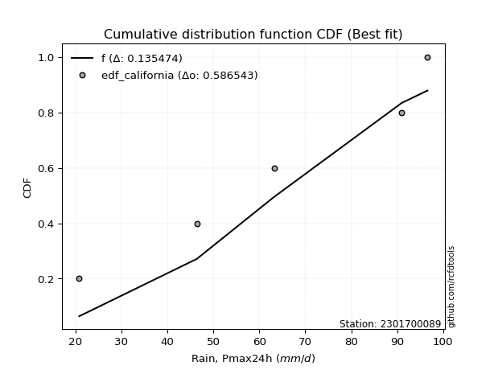</img></img>

</div>


### 2. EDF Hazen (1930)

Hazen method for plotting positions is a formula used to estimate the empirical cumulative probability distribution of flood events or other hydrological data. This formula often results in biased estimations, particularly when extrapolating to extreme events (high return periods).

<div align="center">


$P=(m-0.5)/n$


</div>


**2.1. Empirical values**

<div align="center">

|                | 0                  | 1                  | 2         | 3                 | 4                  |
|:---------------|:-------------------|:-------------------|:----------|:------------------|:-------------------|
| date           | 2024               | 2022               | 2021      | 2020              | 2019               |
| x              | 20.8               | 46.4               | 63.2      | 91.0              | 96.6               |
| m              | 1                  | 2                  | 3         | 4                 | 5                  |
| empirical_dist | edf_hazen          | edf_hazen          | edf_hazen | edf_hazen         | edf_hazen          |
| empirical      | 0.1                | 0.3                | 0.5       | 0.7               | 0.9                |
| empirical_tr   | 1.1111111111111112 | 1.4285714285714286 | 2.0       | 3.333333333333333 | 10.000000000000002 |

</div>


**2.2. Kolmogorov-Smirnov fit test (sorted by Δ)**


<div align="center">

|                | 0                   | 1                   | 2                   | 3                   | 4                   | 5                   | 6                   | 7                   | 8                  | 9                   | 10                  | 11                 | 12                  | 13                  | 14                  | 15                  | 16                  | 17                 | 18                  | 19                  | 20                  | 21                  | 22                  | 23                  | 24                 | 25                  | 26                 | 27                 | 28                  | 29                 | 30                  | 31                  | 32                  | 33                 | 34                  | 35                 | 36                  | 37                  | 38                  | 39                  | 40                 | 41                  | 42                  | 43                  | 44                  | 45                  | 46                  | 47                 | 48                  | 49                    | 50                  | 51                  | 52                  | 53                  | 54                 | 55                  | 56                  | 57                  | 58                  | 59                  | 60                  | 61                 | 62                 | 63                 | 64                 | 65                  | 66                 | 67                  | 68                  | 69                  | 70                 | 71                  | 72                  | 73                  | 74                  | 75                  | 76                  | 77                 | 78                 | 79                 | 80                  | 81                 | 82                 | 83                 | 84                 | 85                 | 86                 | 87                 |
|:---------------|:--------------------|:--------------------|:--------------------|:--------------------|:--------------------|:--------------------|:--------------------|:--------------------|:-------------------|:--------------------|:--------------------|:-------------------|:--------------------|:--------------------|:--------------------|:--------------------|:--------------------|:-------------------|:--------------------|:--------------------|:--------------------|:--------------------|:--------------------|:--------------------|:-------------------|:--------------------|:-------------------|:-------------------|:--------------------|:-------------------|:--------------------|:--------------------|:--------------------|:-------------------|:--------------------|:-------------------|:--------------------|:--------------------|:--------------------|:--------------------|:-------------------|:--------------------|:--------------------|:--------------------|:--------------------|:--------------------|:--------------------|:-------------------|:--------------------|:----------------------|:--------------------|:--------------------|:--------------------|:--------------------|:-------------------|:--------------------|:--------------------|:--------------------|:--------------------|:--------------------|:--------------------|:-------------------|:-------------------|:-------------------|:-------------------|:--------------------|:-------------------|:--------------------|:--------------------|:--------------------|:-------------------|:--------------------|:--------------------|:--------------------|:--------------------|:--------------------|:--------------------|:-------------------|:-------------------|:-------------------|:--------------------|:-------------------|:-------------------|:-------------------|:-------------------|:-------------------|:-------------------|:-------------------|
| station        | 2301700089          | 2301700089          | 2301700089          | 2301700089          | 2301700089          | 2301700089          | 2301700089          | 2301700089          | 2301700089         | 2301700089          | 2301700089          | 2301700089         | 2301700089          | 2301700089          | 2301700089          | 2301700089          | 2301700089          | 2301700089         | 2301700089          | 2301700089          | 2301700089          | 2301700089          | 2301700089          | 2301700089          | 2301700089         | 2301700089          | 2301700089         | 2301700089         | 2301700089          | 2301700089         | 2301700089          | 2301700089          | 2301700089          | 2301700089         | 2301700089          | 2301700089         | 2301700089          | 2301700089          | 2301700089          | 2301700089          | 2301700089         | 2301700089          | 2301700089          | 2301700089          | 2301700089          | 2301700089          | 2301700089          | 2301700089         | 2301700089          | 2301700089            | 2301700089          | 2301700089          | 2301700089          | 2301700089          | 2301700089         | 2301700089          | 2301700089          | 2301700089          | 2301700089          | 2301700089          | 2301700089          | 2301700089         | 2301700089         | 2301700089         | 2301700089         | 2301700089          | 2301700089         | 2301700089          | 2301700089          | 2301700089          | 2301700089         | 2301700089          | 2301700089          | 2301700089          | 2301700089          | 2301700089          | 2301700089          | 2301700089         | 2301700089         | 2301700089         | 2301700089          | 2301700089         | 2301700089         | 2301700089         | 2301700089         | 2301700089         | 2301700089         | 2301700089         |
| empirical_dist | edf_hazen           | edf_hazen           | edf_hazen           | edf_hazen           | edf_hazen           | edf_hazen           | edf_hazen           | edf_hazen           | edf_hazen          | edf_hazen           | edf_hazen           | edf_hazen          | edf_hazen           | edf_hazen           | edf_hazen           | edf_hazen           | edf_hazen           | edf_hazen          | edf_hazen           | edf_hazen           | edf_hazen           | edf_hazen           | edf_hazen           | edf_hazen           | edf_hazen          | edf_hazen           | edf_hazen          | edf_hazen          | edf_hazen           | edf_hazen          | edf_hazen           | edf_hazen           | edf_hazen           | edf_hazen          | edf_hazen           | edf_hazen          | edf_hazen           | edf_hazen           | edf_hazen           | edf_hazen           | edf_hazen          | edf_hazen           | edf_hazen           | edf_hazen           | edf_hazen           | edf_hazen           | edf_hazen           | edf_hazen          | edf_hazen           | edf_hazen             | edf_hazen           | edf_hazen           | edf_hazen           | edf_hazen           | edf_hazen          | edf_hazen           | edf_hazen           | edf_hazen           | edf_hazen           | edf_hazen           | edf_hazen           | edf_hazen          | edf_hazen          | edf_hazen          | edf_hazen          | edf_hazen           | edf_hazen          | edf_hazen           | edf_hazen           | edf_hazen           | edf_hazen          | edf_hazen           | edf_hazen           | edf_hazen           | edf_hazen           | edf_hazen           | edf_hazen           | edf_hazen          | edf_hazen          | edf_hazen          | edf_hazen           | edf_hazen          | edf_hazen          | edf_hazen          | edf_hazen          | edf_hazen          | edf_hazen          | edf_hazen          |
| p_dist         | logfisk             | logalpha            | loginvgauss         | logncf              | loggamma            | loggamma            | lognct              | loginvgamma         | logbetaprime       | logpearson3         | logrice             | logerlang          | logf                | logexponnorm        | lognorm             | lognorm             | logcrystalball      | logt               | logfatiguelife      | logmaxwell          | fisk                | loggumbel_l         | kstwobign           | lograyleigh         | betaprime          | invgauss            | chi2               | loglogistic        | loggompertz         | rice               | invgamma            | rayleigh            | maxwell             | gamma              | f                   | halfnorm           | erlang              | alpha               | crystalball         | norm                | exponnorm          | nct                 | t                   | pearson3            | logweibull_min      | gompertz            | weibull_min         | loginvweibull      | laplace_asymmetric  | loglaplace_asymmetric | loghypsecant        | genexpon            | expon               | gumbel_r            | halflogistic       | loghalfnorm         | logistic            | loglaplace          | loggumbel_r         | moyal               | gumbel_l            | hypsecant          | logkstwobign       | laplace            | loghalflogistic    | logmoyal            | wald               | mielke              | logmielke           | logloggamma         | gibrat             | loggenexpon         | logwald             | logexpon            | loggibrat           | nakagami            | logtruncnorm        | lognakagami        | logchi2            | ncf                | loglognorm          | fatiguelife        | invweibull         | logjohnsonsu       | johnsonsu          | truncnorm          | loggenlogistic     | genlogistic        |
| delta          | 0.08662015637794007 | 0.09761999062695526 | 0.10142992870199108 | 0.10455308934737217 | 0.10491743428341649 | 0.10491743428341649 | 0.10578660066459045 | 0.10605275838103734 | 0.106191145821252  | 0.10773899344691418 | 0.10789239123590832 | 0.1086341019574808 | 0.10869464159484377 | 0.10995535579939242 | 0.10995557396522981 | 0.10995557396522981 | 0.10995578969585218 | 0.1099558607493678 | 0.11119869484461087 | 0.11678338645114672 | 0.12193455204364545 | 0.12283785913124323 | 0.12491829636124807 | 0.12536043003717112 | 0.1273786901821784 | 0.12792560946930653 | 0.1286210021329861 | 0.1309016334768185 | 0.13163931913127425 | 0.1320853242130534 | 0.13243925407303192 | 0.13255466409482541 | 0.13298369243150576 | 0.1332329877506483 | 0.13369960529126468 | 0.1337113509101714 | 0.13403781245477342 | 0.13440494457052443 | 0.13464472375468217 | 0.13464472780560044 | 0.1346451491415781 | 0.13465685531691807 | 0.13466983998269322 | 0.13470724966064873 | 0.13493583681686738 | 0.13542575458727235 | 0.13750519973098818 | 0.1390950909702368 | 0.13973086794760547 | 0.14080638209790464   | 0.14290624176358335 | 0.15013930231094624 | 0.15016158845946243 | 0.15106988960873202 | 0.1516122099179844 | 0.15212444469190523 | 0.15374152114659023 | 0.15549606194267573 | 0.15687644644305787 | 0.15726033676796336 | 0.15841045228444384 | 0.163966585331059  | 0.1712844403770682 | 0.1736538121364195 | 0.1779043669112882 | 0.18013070073453463 | 0.1824281463688019 | 0.18505442434720487 | 0.18995568558312037 | 0.19615081460224548 | 0.2069145255774667 | 0.21024556262921706 | 0.24482489114935346 | 0.25715120944072406 | 0.27616766177442775 | 0.29979974213774035 | 0.29999662203225796 | 0.2999999999999928 | 0.3277148442537335 | 0.3374016443867818 | 0.38155886465943406 | 0.4465880295611329 | 0.4759956709117101 | 0.6592842613874752 | 0.6740236857370647 | 0.6999992578897667 | 0.7                | 0.7                |
| deltao         | 0.5865427407550001  | 0.5865427407550001  | 0.5865427407550001  | 0.5865427407550001  | 0.5865427407550001  | 0.5865427407550001  | 0.5865427407550001  | 0.5865427407550001  | 0.5865427407550001 | 0.5865427407550001  | 0.5865427407550001  | 0.5865427407550001 | 0.5865427407550001  | 0.5865427407550001  | 0.5865427407550001  | 0.5865427407550001  | 0.5865427407550001  | 0.5865427407550001 | 0.5865427407550001  | 0.5865427407550001  | 0.5865427407550001  | 0.5865427407550001  | 0.5865427407550001  | 0.5865427407550001  | 0.5865427407550001 | 0.5865427407550001  | 0.5865427407550001 | 0.5865427407550001 | 0.5865427407550001  | 0.5865427407550001 | 0.5865427407550001  | 0.5865427407550001  | 0.5865427407550001  | 0.5865427407550001 | 0.5865427407550001  | 0.5865427407550001 | 0.5865427407550001  | 0.5865427407550001  | 0.5865427407550001  | 0.5865427407550001  | 0.5865427407550001 | 0.5865427407550001  | 0.5865427407550001  | 0.5865427407550001  | 0.5865427407550001  | 0.5865427407550001  | 0.5865427407550001  | 0.5865427407550001 | 0.5865427407550001  | 0.5865427407550001    | 0.5865427407550001  | 0.5865427407550001  | 0.5865427407550001  | 0.5865427407550001  | 0.5865427407550001 | 0.5865427407550001  | 0.5865427407550001  | 0.5865427407550001  | 0.5865427407550001  | 0.5865427407550001  | 0.5865427407550001  | 0.5865427407550001 | 0.5865427407550001 | 0.5865427407550001 | 0.5865427407550001 | 0.5865427407550001  | 0.5865427407550001 | 0.5865427407550001  | 0.5865427407550001  | 0.5865427407550001  | 0.5865427407550001 | 0.5865427407550001  | 0.5865427407550001  | 0.5865427407550001  | 0.5865427407550001  | 0.5865427407550001  | 0.5865427407550001  | 0.5865427407550001 | 0.5865427407550001 | 0.5865427407550001 | 0.5865427407550001  | 0.5865427407550001 | 0.5865427407550001 | 0.5865427407550001 | 0.5865427407550001 | 0.5865427407550001 | 0.5865427407550001 | 0.5865427407550001 |
| eval           | Δo > Δ              | Δo > Δ              | Δo > Δ              | Δo > Δ              | Δo > Δ              | Δo > Δ              | Δo > Δ              | Δo > Δ              | Δo > Δ             | Δo > Δ              | Δo > Δ              | Δo > Δ             | Δo > Δ              | Δo > Δ              | Δo > Δ              | Δo > Δ              | Δo > Δ              | Δo > Δ             | Δo > Δ              | Δo > Δ              | Δo > Δ              | Δo > Δ              | Δo > Δ              | Δo > Δ              | Δo > Δ             | Δo > Δ              | Δo > Δ             | Δo > Δ             | Δo > Δ              | Δo > Δ             | Δo > Δ              | Δo > Δ              | Δo > Δ              | Δo > Δ             | Δo > Δ              | Δo > Δ             | Δo > Δ              | Δo > Δ              | Δo > Δ              | Δo > Δ              | Δo > Δ             | Δo > Δ              | Δo > Δ              | Δo > Δ              | Δo > Δ              | Δo > Δ              | Δo > Δ              | Δo > Δ             | Δo > Δ              | Δo > Δ                | Δo > Δ              | Δo > Δ              | Δo > Δ              | Δo > Δ              | Δo > Δ             | Δo > Δ              | Δo > Δ              | Δo > Δ              | Δo > Δ              | Δo > Δ              | Δo > Δ              | Δo > Δ             | Δo > Δ             | Δo > Δ             | Δo > Δ             | Δo > Δ              | Δo > Δ             | Δo > Δ              | Δo > Δ              | Δo > Δ              | Δo > Δ             | Δo > Δ              | Δo > Δ              | Δo > Δ              | Δo > Δ              | Δo > Δ              | Δo > Δ              | Δo > Δ             | Δo > Δ             | Δo > Δ             | Δo > Δ              | Δo > Δ             | Δo > Δ             | Δo <= Δ            | Δo <= Δ            | Δo <= Δ            | Δo <= Δ            | Δo <= Δ            |
| fit            | 1                   | 1                   | 1                   | 1                   | 1                   | 1                   | 1                   | 1                   | 1                  | 1                   | 1                   | 1                  | 1                   | 1                   | 1                   | 1                   | 1                   | 1                  | 1                   | 1                   | 1                   | 1                   | 1                   | 1                   | 1                  | 1                   | 1                  | 1                  | 1                   | 1                  | 1                   | 1                   | 1                   | 1                  | 1                   | 1                  | 1                   | 1                   | 1                   | 1                   | 1                  | 1                   | 1                   | 1                   | 1                   | 1                   | 1                   | 1                  | 1                   | 1                     | 1                   | 1                   | 1                   | 1                   | 1                  | 1                   | 1                   | 1                   | 1                   | 1                   | 1                   | 1                  | 1                  | 1                  | 1                  | 1                   | 1                  | 1                   | 1                   | 1                   | 1                  | 1                   | 1                   | 1                   | 1                   | 1                   | 1                   | 1                  | 1                  | 1                  | 1                   | 1                  | 1                  | 0                  | 0                  | 0                  | 0                  | 0                  |
| n              | 5                   | 5                   | 5                   | 5                   | 5                   | 5                   | 5                   | 5                   | 5                  | 5                   | 5                   | 5                  | 5                   | 5                   | 5                   | 5                   | 5                   | 5                  | 5                   | 5                   | 5                   | 5                   | 5                   | 5                   | 5                  | 5                   | 5                  | 5                  | 5                   | 5                  | 5                   | 5                   | 5                   | 5                  | 5                   | 5                  | 5                   | 5                   | 5                   | 5                   | 5                  | 5                   | 5                   | 5                   | 5                   | 5                   | 5                   | 5                  | 5                   | 5                     | 5                   | 5                   | 5                   | 5                   | 5                  | 5                   | 5                   | 5                   | 5                   | 5                   | 5                   | 5                  | 5                  | 5                  | 5                  | 5                   | 5                  | 5                   | 5                   | 5                   | 5                  | 5                   | 5                   | 5                   | 5                   | 5                   | 5                   | 5                  | 5                  | 5                  | 5                   | 5                  | 5                  | 5                  | 5                  | 5                  | 5                  | 5                  |
| best_fit       | 1                   | 0                   | 0                   | 0                   | 0                   | 0                   | 0                   | 0                   | 0                  | 0                   | 0                   | 0                  | 0                   | 0                   | 0                   | 0                   | 0                   | 0                  | 0                   | 0                   | 0                   | 0                   | 0                   | 0                   | 0                  | 0                   | 0                  | 0                  | 0                   | 0                  | 0                   | 0                   | 0                   | 0                  | 0                   | 0                  | 0                   | 0                   | 0                   | 0                   | 0                  | 0                   | 0                   | 0                   | 0                   | 0                   | 0                   | 0                  | 0                   | 0                     | 0                   | 0                   | 0                   | 0                   | 0                  | 0                   | 0                   | 0                   | 0                   | 0                   | 0                   | 0                  | 0                  | 0                  | 0                  | 0                   | 0                  | 0                   | 0                   | 0                   | 0                  | 0                   | 0                   | 0                   | 0                   | 0                   | 0                   | 0                  | 0                  | 0                  | 0                   | 0                  | 0                  | 0                  | 0                  | 0                  | 0                  | 0                  |
| best_fit_sort  | 1                   | 2                   | 3                   | 4                   | 5                   | 6                   | 7                   | 8                   | 9                  | 10                  | 11                  | 12                 | 13                  | 14                  | 15                  | 16                  | 17                  | 18                 | 19                  | 20                  | 21                  | 22                  | 23                  | 24                  | 25                 | 26                  | 27                 | 28                 | 29                  | 30                 | 31                  | 32                  | 33                  | 34                 | 35                  | 36                 | 37                  | 38                  | 39                  | 40                  | 41                 | 42                  | 43                  | 44                  | 45                  | 46                  | 47                  | 48                 | 49                  | 50                    | 51                  | 52                  | 53                  | 54                  | 55                 | 56                  | 57                  | 58                  | 59                  | 60                  | 61                  | 62                 | 63                 | 64                 | 65                 | 66                  | 67                 | 68                  | 69                  | 70                  | 71                 | 72                  | 73                  | 74                  | 75                  | 76                  | 77                  | 78                 | 79                 | 80                 | 81                  | 82                 | 83                 | 84                 | 85                 | 86                 | 87                 | 88                 |

</div>


**2.3. Best fit**

<div align="center">

|   id |    station | empirical_dist   | p_dist   |     delta |   deltao | eval   |   fit |   n |   best_fit |   best_fit_sort |
|-----:|-----------:|:-----------------|:---------|----------:|---------:|:-------|------:|----:|-----------:|----------------:|
|    0 | 2301700089 | edf_hazen        | logfisk  | 0.0866202 | 0.586543 | Δo > Δ |     1 |   5 |          1 |               1 |

</div>


<div align="center">

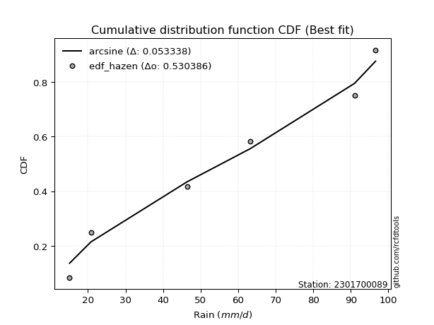</img>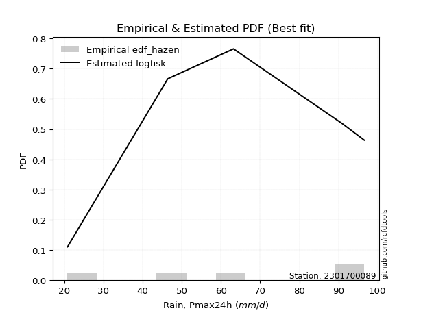</img>

</div>


### 3. EDF Weibull (1939)

Weibull plotting position formula is an empirical method used to estimate the non-exceedance probability or plotting position for a set of observed data, is often recommended or widely used in practice, particularly in flood frequency analysis.

<div align="center">


$P=m/(n+1)$


</div>


**3.1. Empirical values**

<div align="center">

|                | 0                   | 1                  | 2           | 3                  | 4                  |
|:---------------|:--------------------|:-------------------|:------------|:-------------------|:-------------------|
| date           | 2024                | 2022               | 2021        | 2020               | 2019               |
| x              | 20.8                | 46.4               | 63.2        | 91.0               | 96.6               |
| m              | 1                   | 2                  | 3           | 4                  | 5                  |
| empirical_dist | edf_weibull         | edf_weibull        | edf_weibull | edf_weibull        | edf_weibull        |
| empirical      | 0.16666666666666666 | 0.3333333333333333 | 0.5         | 0.6666666666666666 | 0.8333333333333334 |
| empirical_tr   | 1.2                 | 1.4999999999999998 | 2.0         | 2.9999999999999996 | 6.000000000000002  |

</div>


**3.2. Kolmogorov-Smirnov fit test (sorted by Δ)**


<div align="center">

|                | 0                  | 1                   | 2                   | 3                   | 4                  | 5                   | 6                   | 7                   | 8                   | 9                   | 10                  | 11                 | 12                  | 13                  | 14                 | 15                  | 16                  | 17                  | 18                 | 19                  | 20                 | 21                  | 22                  | 23                  | 24                 | 25                  | 26                  | 27                  | 28                  | 29                  | 30                  | 31                  | 32                  | 33                 | 34                  | 35                  | 36                 | 37                  | 38                  | 39                 | 40                 | 41                  | 42                  | 43                  | 44                 | 45                  | 46                  | 47                 | 48                  | 49                  | 50                 | 51                  | 52                 | 53                 | 54                    | 55                  | 56                  | 57                 | 58                  | 59                  | 60                  | 61                  | 62                  | 63                  | 64                  | 65                  | 66                  | 67                  | 68                 | 69                 | 70                  | 71                 | 72                  | 73                  | 74                 | 75                  | 76                  | 77                 | 78                 | 79                 | 80                  | 81                 | 82                 | 83                 | 84                 | 85                 | 86                 | 87                 |
|:---------------|:-------------------|:--------------------|:--------------------|:--------------------|:-------------------|:--------------------|:--------------------|:--------------------|:--------------------|:--------------------|:--------------------|:-------------------|:--------------------|:--------------------|:-------------------|:--------------------|:--------------------|:--------------------|:-------------------|:--------------------|:-------------------|:--------------------|:--------------------|:--------------------|:-------------------|:--------------------|:--------------------|:--------------------|:--------------------|:--------------------|:--------------------|:--------------------|:--------------------|:-------------------|:--------------------|:--------------------|:-------------------|:--------------------|:--------------------|:-------------------|:-------------------|:--------------------|:--------------------|:--------------------|:-------------------|:--------------------|:--------------------|:-------------------|:--------------------|:--------------------|:-------------------|:--------------------|:-------------------|:-------------------|:----------------------|:--------------------|:--------------------|:-------------------|:--------------------|:--------------------|:--------------------|:--------------------|:--------------------|:--------------------|:--------------------|:--------------------|:--------------------|:--------------------|:-------------------|:-------------------|:--------------------|:-------------------|:--------------------|:--------------------|:-------------------|:--------------------|:--------------------|:-------------------|:-------------------|:-------------------|:--------------------|:-------------------|:-------------------|:-------------------|:-------------------|:-------------------|:-------------------|:-------------------|
| station        | 2301700089         | 2301700089          | 2301700089          | 2301700089          | 2301700089         | 2301700089          | 2301700089          | 2301700089          | 2301700089          | 2301700089          | 2301700089          | 2301700089         | 2301700089          | 2301700089          | 2301700089         | 2301700089          | 2301700089          | 2301700089          | 2301700089         | 2301700089          | 2301700089         | 2301700089          | 2301700089          | 2301700089          | 2301700089         | 2301700089          | 2301700089          | 2301700089          | 2301700089          | 2301700089          | 2301700089          | 2301700089          | 2301700089          | 2301700089         | 2301700089          | 2301700089          | 2301700089         | 2301700089          | 2301700089          | 2301700089         | 2301700089         | 2301700089          | 2301700089          | 2301700089          | 2301700089         | 2301700089          | 2301700089          | 2301700089         | 2301700089          | 2301700089          | 2301700089         | 2301700089          | 2301700089         | 2301700089         | 2301700089            | 2301700089          | 2301700089          | 2301700089         | 2301700089          | 2301700089          | 2301700089          | 2301700089          | 2301700089          | 2301700089          | 2301700089          | 2301700089          | 2301700089          | 2301700089          | 2301700089         | 2301700089         | 2301700089          | 2301700089         | 2301700089          | 2301700089          | 2301700089         | 2301700089          | 2301700089          | 2301700089         | 2301700089         | 2301700089         | 2301700089          | 2301700089         | 2301700089         | 2301700089         | 2301700089         | 2301700089         | 2301700089         | 2301700089         |
| empirical_dist | edf_weibull        | edf_weibull         | edf_weibull         | edf_weibull         | edf_weibull        | edf_weibull         | edf_weibull         | edf_weibull         | edf_weibull         | edf_weibull         | edf_weibull         | edf_weibull        | edf_weibull         | edf_weibull         | edf_weibull        | edf_weibull         | edf_weibull         | edf_weibull         | edf_weibull        | edf_weibull         | edf_weibull        | edf_weibull         | edf_weibull         | edf_weibull         | edf_weibull        | edf_weibull         | edf_weibull         | edf_weibull         | edf_weibull         | edf_weibull         | edf_weibull         | edf_weibull         | edf_weibull         | edf_weibull        | edf_weibull         | edf_weibull         | edf_weibull        | edf_weibull         | edf_weibull         | edf_weibull        | edf_weibull        | edf_weibull         | edf_weibull         | edf_weibull         | edf_weibull        | edf_weibull         | edf_weibull         | edf_weibull        | edf_weibull         | edf_weibull         | edf_weibull        | edf_weibull         | edf_weibull        | edf_weibull        | edf_weibull           | edf_weibull         | edf_weibull         | edf_weibull        | edf_weibull         | edf_weibull         | edf_weibull         | edf_weibull         | edf_weibull         | edf_weibull         | edf_weibull         | edf_weibull         | edf_weibull         | edf_weibull         | edf_weibull        | edf_weibull        | edf_weibull         | edf_weibull        | edf_weibull         | edf_weibull         | edf_weibull        | edf_weibull         | edf_weibull         | edf_weibull        | edf_weibull        | edf_weibull        | edf_weibull         | edf_weibull        | edf_weibull        | edf_weibull        | edf_weibull        | edf_weibull        | edf_weibull        | edf_weibull        |
| p_dist         | loginvweibull      | logfisk             | loginvgauss         | logalpha            | logncf             | loggamma            | loggamma            | lognct              | loginvgamma         | logbetaprime        | logkstwobign        | logpearson3        | logrice             | logerlang           | logf               | logexponnorm        | lognorm             | lognorm             | logcrystalball     | logt                | logfatiguelife     | logmaxwell          | fisk                | loggumbel_l         | kstwobign          | betaprime           | invgauss            | lograyleigh         | chi2                | loglogistic         | rice                | invgamma            | rayleigh            | maxwell            | gamma               | genexpon            | loggompertz        | loghalfnorm         | expon               | loggumbel_r        | f                  | halfnorm            | erlang              | alpha               | crystalball        | norm                | exponnorm           | nct                | t                   | pearson3            | logweibull_min     | gompertz            | weibull_min        | laplace_asymmetric | loglaplace_asymmetric | loghypsecant        | loggenexpon         | loghalflogistic    | logmoyal            | gumbel_r            | halflogistic        | logistic            | loglaplace          | moyal               | gumbel_l            | hypsecant           | laplace             | wald                | mielke             | logmielke          | logexpon            | logloggamma        | gibrat              | logwald             | ncf                | loggibrat           | logchi2             | nakagami           | logtruncnorm       | lognakagami        | loglognorm          | invweibull         | fatiguelife        | logjohnsonsu       | johnsonsu          | truncnorm          | loggenlogistic     | genlogistic        |
| delta          | 0.1252903309352937 | 0.12939061590106218 | 0.13085496595042023 | 0.13095332396028858 | 0.1378864226807055 | 0.13825076761674981 | 0.13825076761674981 | 0.13911993399792377 | 0.13938609171437066 | 0.13952447915458532 | 0.13974901386234628 | 0.1410723267802475 | 0.14122572456924165 | 0.14196743529081413 | 0.1420279749281771 | 0.14328868913272574 | 0.14328890729856314 | 0.14328890729856314 | 0.1432891230291855 | 0.14328919408270113 | 0.1445320281779442 | 0.14928712571211072 | 0.15526788537697878 | 0.15617119246457656 | 0.1582516296945814 | 0.16071202351551173 | 0.16125894280263986 | 0.16174362769537567 | 0.16195433546631943 | 0.16423496681015182 | 0.16541865754638674 | 0.16577258740636525 | 0.16588799742815874 | 0.1663170257648391 | 0.16656632108398162 | 0.16666449233799455 | 0.1666666102122519 | 0.16666666666666666 | 0.16666666666666666 | 0.1668136961778789 | 0.167032938624598  | 0.16704468424350472 | 0.16737114578810675 | 0.16773827790385776 | 0.1679780570880155 | 0.16797806113893377 | 0.16797848247491143 | 0.1679901886502514 | 0.16800317331602654 | 0.16804058299398206 | 0.1682691701502007 | 0.16875908792060568 | 0.1708385330643215 | 0.1730642012809388 | 0.17413971543123796   | 0.17623957509691668 | 0.17691222929588374 | 0.1779043669112882 | 0.18013070073453463 | 0.18440322294206535 | 0.18494554325131773 | 0.18707485447992356 | 0.18882939527600906 | 0.19059367010129669 | 0.19174378561777716 | 0.19729991866439234 | 0.20698714546975283 | 0.21576147970213522 | 0.2183877576805382 | 0.2232890189164537 | 0.22381787610739073 | 0.2294841479355788 | 0.24024785891080003 | 0.24482489114935346 | 0.2707349777201151 | 0.27616766177442775 | 0.29438151092040016 | 0.3331330754710737 | 0.3333299553655913 | 0.3333333333333261 | 0.34822553132610073 | 0.4093290042450434 | 0.4132546962277996 | 0.6259509280541419 | 0.6406903524037314 | 0.6666659245564335 | 0.6666666666666666 | 0.6666666666666666 |
| deltao         | 0.5865427407550001 | 0.5865427407550001  | 0.5865427407550001  | 0.5865427407550001  | 0.5865427407550001 | 0.5865427407550001  | 0.5865427407550001  | 0.5865427407550001  | 0.5865427407550001  | 0.5865427407550001  | 0.5865427407550001  | 0.5865427407550001 | 0.5865427407550001  | 0.5865427407550001  | 0.5865427407550001 | 0.5865427407550001  | 0.5865427407550001  | 0.5865427407550001  | 0.5865427407550001 | 0.5865427407550001  | 0.5865427407550001 | 0.5865427407550001  | 0.5865427407550001  | 0.5865427407550001  | 0.5865427407550001 | 0.5865427407550001  | 0.5865427407550001  | 0.5865427407550001  | 0.5865427407550001  | 0.5865427407550001  | 0.5865427407550001  | 0.5865427407550001  | 0.5865427407550001  | 0.5865427407550001 | 0.5865427407550001  | 0.5865427407550001  | 0.5865427407550001 | 0.5865427407550001  | 0.5865427407550001  | 0.5865427407550001 | 0.5865427407550001 | 0.5865427407550001  | 0.5865427407550001  | 0.5865427407550001  | 0.5865427407550001 | 0.5865427407550001  | 0.5865427407550001  | 0.5865427407550001 | 0.5865427407550001  | 0.5865427407550001  | 0.5865427407550001 | 0.5865427407550001  | 0.5865427407550001 | 0.5865427407550001 | 0.5865427407550001    | 0.5865427407550001  | 0.5865427407550001  | 0.5865427407550001 | 0.5865427407550001  | 0.5865427407550001  | 0.5865427407550001  | 0.5865427407550001  | 0.5865427407550001  | 0.5865427407550001  | 0.5865427407550001  | 0.5865427407550001  | 0.5865427407550001  | 0.5865427407550001  | 0.5865427407550001 | 0.5865427407550001 | 0.5865427407550001  | 0.5865427407550001 | 0.5865427407550001  | 0.5865427407550001  | 0.5865427407550001 | 0.5865427407550001  | 0.5865427407550001  | 0.5865427407550001 | 0.5865427407550001 | 0.5865427407550001 | 0.5865427407550001  | 0.5865427407550001 | 0.5865427407550001 | 0.5865427407550001 | 0.5865427407550001 | 0.5865427407550001 | 0.5865427407550001 | 0.5865427407550001 |
| eval           | Δo > Δ             | Δo > Δ              | Δo > Δ              | Δo > Δ              | Δo > Δ             | Δo > Δ              | Δo > Δ              | Δo > Δ              | Δo > Δ              | Δo > Δ              | Δo > Δ              | Δo > Δ             | Δo > Δ              | Δo > Δ              | Δo > Δ             | Δo > Δ              | Δo > Δ              | Δo > Δ              | Δo > Δ             | Δo > Δ              | Δo > Δ             | Δo > Δ              | Δo > Δ              | Δo > Δ              | Δo > Δ             | Δo > Δ              | Δo > Δ              | Δo > Δ              | Δo > Δ              | Δo > Δ              | Δo > Δ              | Δo > Δ              | Δo > Δ              | Δo > Δ             | Δo > Δ              | Δo > Δ              | Δo > Δ             | Δo > Δ              | Δo > Δ              | Δo > Δ             | Δo > Δ             | Δo > Δ              | Δo > Δ              | Δo > Δ              | Δo > Δ             | Δo > Δ              | Δo > Δ              | Δo > Δ             | Δo > Δ              | Δo > Δ              | Δo > Δ             | Δo > Δ              | Δo > Δ             | Δo > Δ             | Δo > Δ                | Δo > Δ              | Δo > Δ              | Δo > Δ             | Δo > Δ              | Δo > Δ              | Δo > Δ              | Δo > Δ              | Δo > Δ              | Δo > Δ              | Δo > Δ              | Δo > Δ              | Δo > Δ              | Δo > Δ              | Δo > Δ             | Δo > Δ             | Δo > Δ              | Δo > Δ             | Δo > Δ              | Δo > Δ              | Δo > Δ             | Δo > Δ              | Δo > Δ              | Δo > Δ             | Δo > Δ             | Δo > Δ             | Δo > Δ              | Δo > Δ             | Δo > Δ             | Δo <= Δ            | Δo <= Δ            | Δo <= Δ            | Δo <= Δ            | Δo <= Δ            |
| fit            | 1                  | 1                   | 1                   | 1                   | 1                  | 1                   | 1                   | 1                   | 1                   | 1                   | 1                   | 1                  | 1                   | 1                   | 1                  | 1                   | 1                   | 1                   | 1                  | 1                   | 1                  | 1                   | 1                   | 1                   | 1                  | 1                   | 1                   | 1                   | 1                   | 1                   | 1                   | 1                   | 1                   | 1                  | 1                   | 1                   | 1                  | 1                   | 1                   | 1                  | 1                  | 1                   | 1                   | 1                   | 1                  | 1                   | 1                   | 1                  | 1                   | 1                   | 1                  | 1                   | 1                  | 1                  | 1                     | 1                   | 1                   | 1                  | 1                   | 1                   | 1                   | 1                   | 1                   | 1                   | 1                   | 1                   | 1                   | 1                   | 1                  | 1                  | 1                   | 1                  | 1                   | 1                   | 1                  | 1                   | 1                   | 1                  | 1                  | 1                  | 1                   | 1                  | 1                  | 0                  | 0                  | 0                  | 0                  | 0                  |
| n              | 5                  | 5                   | 5                   | 5                   | 5                  | 5                   | 5                   | 5                   | 5                   | 5                   | 5                   | 5                  | 5                   | 5                   | 5                  | 5                   | 5                   | 5                   | 5                  | 5                   | 5                  | 5                   | 5                   | 5                   | 5                  | 5                   | 5                   | 5                   | 5                   | 5                   | 5                   | 5                   | 5                   | 5                  | 5                   | 5                   | 5                  | 5                   | 5                   | 5                  | 5                  | 5                   | 5                   | 5                   | 5                  | 5                   | 5                   | 5                  | 5                   | 5                   | 5                  | 5                   | 5                  | 5                  | 5                     | 5                   | 5                   | 5                  | 5                   | 5                   | 5                   | 5                   | 5                   | 5                   | 5                   | 5                   | 5                   | 5                   | 5                  | 5                  | 5                   | 5                  | 5                   | 5                   | 5                  | 5                   | 5                   | 5                  | 5                  | 5                  | 5                   | 5                  | 5                  | 5                  | 5                  | 5                  | 5                  | 5                  |
| best_fit       | 1                  | 0                   | 0                   | 0                   | 0                  | 0                   | 0                   | 0                   | 0                   | 0                   | 0                   | 0                  | 0                   | 0                   | 0                  | 0                   | 0                   | 0                   | 0                  | 0                   | 0                  | 0                   | 0                   | 0                   | 0                  | 0                   | 0                   | 0                   | 0                   | 0                   | 0                   | 0                   | 0                   | 0                  | 0                   | 0                   | 0                  | 0                   | 0                   | 0                  | 0                  | 0                   | 0                   | 0                   | 0                  | 0                   | 0                   | 0                  | 0                   | 0                   | 0                  | 0                   | 0                  | 0                  | 0                     | 0                   | 0                   | 0                  | 0                   | 0                   | 0                   | 0                   | 0                   | 0                   | 0                   | 0                   | 0                   | 0                   | 0                  | 0                  | 0                   | 0                  | 0                   | 0                   | 0                  | 0                   | 0                   | 0                  | 0                  | 0                  | 0                   | 0                  | 0                  | 0                  | 0                  | 0                  | 0                  | 0                  |
| best_fit_sort  | 1                  | 2                   | 3                   | 4                   | 5                  | 6                   | 7                   | 8                   | 9                   | 10                  | 11                  | 12                 | 13                  | 14                  | 15                 | 16                  | 17                  | 18                  | 19                 | 20                  | 21                 | 22                  | 23                  | 24                  | 25                 | 26                  | 27                  | 28                  | 29                  | 30                  | 31                  | 32                  | 33                  | 34                 | 35                  | 36                  | 37                 | 38                  | 39                  | 40                 | 41                 | 42                  | 43                  | 44                  | 45                 | 46                  | 47                  | 48                 | 49                  | 50                  | 51                 | 52                  | 53                 | 54                 | 55                    | 56                  | 57                  | 58                 | 59                  | 60                  | 61                  | 62                  | 63                  | 64                  | 65                  | 66                  | 67                  | 68                  | 69                 | 70                 | 71                  | 72                 | 73                  | 74                  | 75                 | 76                  | 77                  | 78                 | 79                 | 80                 | 81                  | 82                 | 83                 | 84                 | 85                 | 86                 | 87                 | 88                 |

</div>


**3.3. Best fit**

<div align="center">

|   id |    station | empirical_dist   | p_dist        |   delta |   deltao | eval   |   fit |   n |   best_fit |   best_fit_sort |
|-----:|-----------:|:-----------------|:--------------|--------:|---------:|:-------|------:|----:|-----------:|----------------:|
|    0 | 2301700089 | edf_weibull      | loginvweibull | 0.12529 | 0.586543 | Δo > Δ |     1 |   5 |          1 |               1 |

</div>


<div align="center">

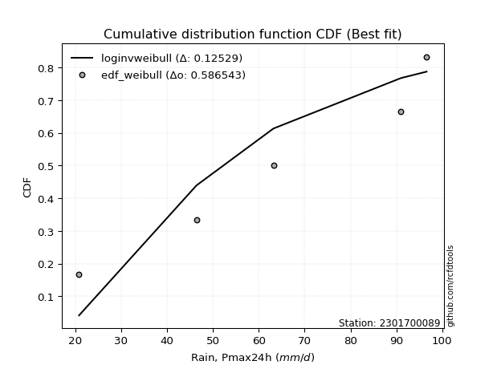</img>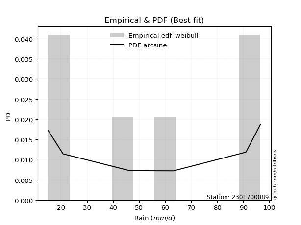</img>

</div>


### 4. EDF Beard (1943)

The Beard formula (or Beard´s plotting position formula) in hydrology is used to estimate the empirical non-exceedance probability _(P)_ of a flood event (or other extreme hydrological data point) within a given dataset.

<div align="center">


$P=(m-0.31)/(n+0.38)$


</div>


**4.1. Empirical values**

<div align="center">

|                | 0                   | 1                  | 2         | 3                  | 4                  |
|:---------------|:--------------------|:-------------------|:----------|:-------------------|:-------------------|
| date           | 2024                | 2022               | 2021      | 2020               | 2019               |
| x              | 20.8                | 46.4               | 63.2      | 91.0               | 96.6               |
| m              | 1                   | 2                  | 3         | 4                  | 5                  |
| empirical_dist | edf_beard           | edf_beard          | edf_beard | edf_beard          | edf_beard          |
| empirical      | 0.12825278810408922 | 0.3141263940520446 | 0.5       | 0.6858736059479554 | 0.8717472118959109 |
| empirical_tr   | 1.1471215351812367  | 1.4579945799457996 | 2.0       | 3.183431952662722  | 7.797101449275368  |

</div>


**4.2. Kolmogorov-Smirnov fit test (sorted by Δ)**


<div align="center">

|                | 0                  | 1                   | 2                   | 3                  | 4                   | 5                   | 6                   | 7                   | 8                   | 9                  | 10                  | 11                  | 12                  | 13                  | 14                  | 15                  | 16                 | 17                  | 18                  | 19                 | 20                  | 21                  | 22                 | 23                 | 24                  | 25                  | 26                 | 27                  | 28                  | 29                  | 30                 | 31                  | 32                  | 33                  | 34                  | 35                  | 36                 | 37                 | 38                 | 39                  | 40                  | 41                 | 42                  | 43                  | 44                 | 45                  | 46                  | 47                 | 48                  | 49                 | 50                 | 51                 | 52                    | 53                  | 54                  | 55                  | 56                  | 57                  | 58                  | 59                  | 60                  | 61                  | 62                 | 63                  | 64                  | 65                  | 66                  | 67                 | 68                 | 69                 | 70                 | 71                  | 72                  | 73                  | 74                  | 75                 | 76                  | 77                 | 78                 | 79                 | 80                 | 81                 | 82                 | 83                 | 84                 | 85                 | 86                 | 87                 |
|:---------------|:-------------------|:--------------------|:--------------------|:-------------------|:--------------------|:--------------------|:--------------------|:--------------------|:--------------------|:-------------------|:--------------------|:--------------------|:--------------------|:--------------------|:--------------------|:--------------------|:-------------------|:--------------------|:--------------------|:-------------------|:--------------------|:--------------------|:-------------------|:-------------------|:--------------------|:--------------------|:-------------------|:--------------------|:--------------------|:--------------------|:-------------------|:--------------------|:--------------------|:--------------------|:--------------------|:--------------------|:-------------------|:-------------------|:-------------------|:--------------------|:--------------------|:-------------------|:--------------------|:--------------------|:-------------------|:--------------------|:--------------------|:-------------------|:--------------------|:-------------------|:-------------------|:-------------------|:----------------------|:--------------------|:--------------------|:--------------------|:--------------------|:--------------------|:--------------------|:--------------------|:--------------------|:--------------------|:-------------------|:--------------------|:--------------------|:--------------------|:--------------------|:-------------------|:-------------------|:-------------------|:-------------------|:--------------------|:--------------------|:--------------------|:--------------------|:-------------------|:--------------------|:-------------------|:-------------------|:-------------------|:-------------------|:-------------------|:-------------------|:-------------------|:-------------------|:-------------------|:-------------------|:-------------------|
| station        | 2301700089         | 2301700089          | 2301700089          | 2301700089         | 2301700089          | 2301700089          | 2301700089          | 2301700089          | 2301700089          | 2301700089         | 2301700089          | 2301700089          | 2301700089          | 2301700089          | 2301700089          | 2301700089          | 2301700089         | 2301700089          | 2301700089          | 2301700089         | 2301700089          | 2301700089          | 2301700089         | 2301700089         | 2301700089          | 2301700089          | 2301700089         | 2301700089          | 2301700089          | 2301700089          | 2301700089         | 2301700089          | 2301700089          | 2301700089          | 2301700089          | 2301700089          | 2301700089         | 2301700089         | 2301700089         | 2301700089          | 2301700089          | 2301700089         | 2301700089          | 2301700089          | 2301700089         | 2301700089          | 2301700089          | 2301700089         | 2301700089          | 2301700089         | 2301700089         | 2301700089         | 2301700089            | 2301700089          | 2301700089          | 2301700089          | 2301700089          | 2301700089          | 2301700089          | 2301700089          | 2301700089          | 2301700089          | 2301700089         | 2301700089          | 2301700089          | 2301700089          | 2301700089          | 2301700089         | 2301700089         | 2301700089         | 2301700089         | 2301700089          | 2301700089          | 2301700089          | 2301700089          | 2301700089         | 2301700089          | 2301700089         | 2301700089         | 2301700089         | 2301700089         | 2301700089         | 2301700089         | 2301700089         | 2301700089         | 2301700089         | 2301700089         | 2301700089         |
| empirical_dist | edf_beard          | edf_beard           | edf_beard           | edf_beard          | edf_beard           | edf_beard           | edf_beard           | edf_beard           | edf_beard           | edf_beard          | edf_beard           | edf_beard           | edf_beard           | edf_beard           | edf_beard           | edf_beard           | edf_beard          | edf_beard           | edf_beard           | edf_beard          | edf_beard           | edf_beard           | edf_beard          | edf_beard          | edf_beard           | edf_beard           | edf_beard          | edf_beard           | edf_beard           | edf_beard           | edf_beard          | edf_beard           | edf_beard           | edf_beard           | edf_beard           | edf_beard           | edf_beard          | edf_beard          | edf_beard          | edf_beard           | edf_beard           | edf_beard          | edf_beard           | edf_beard           | edf_beard          | edf_beard           | edf_beard           | edf_beard          | edf_beard           | edf_beard          | edf_beard          | edf_beard          | edf_beard             | edf_beard           | edf_beard           | edf_beard           | edf_beard           | edf_beard           | edf_beard           | edf_beard           | edf_beard           | edf_beard           | edf_beard          | edf_beard           | edf_beard           | edf_beard           | edf_beard           | edf_beard          | edf_beard          | edf_beard          | edf_beard          | edf_beard           | edf_beard           | edf_beard           | edf_beard           | edf_beard          | edf_beard           | edf_beard          | edf_beard          | edf_beard          | edf_beard          | edf_beard          | edf_beard          | edf_beard          | edf_beard          | edf_beard          | edf_beard          | edf_beard          |
| p_dist         | logfisk            | loginvgauss         | logalpha            | logncf             | loggamma            | loggamma            | lognct              | loginvgamma         | logbetaprime        | logpearson3        | logrice             | logerlang           | logf                | logexponnorm        | lognorm             | lognorm             | logcrystalball     | logt                | loginvweibull       | logfatiguelife     | logmaxwell          | lograyleigh         | genexpon           | expon              | fisk                | loggumbel_l         | kstwobign          | betaprime           | invgauss            | chi2                | loglogistic        | loggompertz         | rice                | invgamma            | rayleigh            | maxwell             | gamma              | f                  | halfnorm           | erlang              | alpha               | crystalball        | norm                | exponnorm           | nct                | t                   | pearson3            | logweibull_min     | gompertz            | loghalfnorm        | weibull_min        | laplace_asymmetric | loglaplace_asymmetric | loggumbel_r         | loghypsecant        | logkstwobign        | gumbel_r            | halflogistic        | logistic            | loglaplace          | moyal               | gumbel_l            | loghalflogistic    | hypsecant           | logmoyal            | laplace             | loggenexpon         | wald               | mielke             | logmielke          | logloggamma        | gibrat              | logexpon            | logwald             | loggibrat           | ncf                | logchi2             | nakagami           | logtruncnorm       | lognakagami        | loglognorm         | fatiguelife        | invweibull         | logjohnsonsu       | johnsonsu          | truncnorm          | loggenlogistic     | genlogistic        |
| delta          | 0.1007465504299846 | 0.11164802666913143 | 0.11174638467899978 | 0.1186794833994167 | 0.11904382833546101 | 0.11904382833546101 | 0.11991299471663497 | 0.12017915243308186 | 0.12031753987329652 | 0.1218653874989587 | 0.12201878528795285 | 0.12276049600952532 | 0.12282103564688829 | 0.12408174985143694 | 0.12408196801727434 | 0.12408196801727434 | 0.1240821837478967 | 0.12408225480141233 | 0.12496869691819218 | 0.1253250888966554 | 0.12568394163366825 | 0.12614822872467502 | 0.1360129082589016 | 0.1360351944074178 | 0.13606094609568997 | 0.13696425318328775 | 0.1390446904132926 | 0.14150508423422292 | 0.14205200352135106 | 0.14274739618503063 | 0.145028027528863  | 0.14576571318331877 | 0.14621171826509793 | 0.14656564812507644 | 0.14668105814686994 | 0.14711008648355028 | 0.1473593818026928 | 0.1478259993433092 | 0.1478377449622159 | 0.14816420650681794 | 0.14853133862256895 | 0.1487711178067267 | 0.14877112185764496 | 0.14877154319362262 | 0.1487832493689626 | 0.14879623403473774 | 0.14883364371269325 | 0.1490622308689119 | 0.14955214863931687 | 0.14971140091223   | 0.1516315937830327 | 0.15385726199965   | 0.15493277614994916   | 0.15687644644305787 | 0.15703263581562787 | 0.15715804632502356 | 0.16519628366077654 | 0.16573860397002893 | 0.16786791519863475 | 0.16962245599472026 | 0.17138673082000788 | 0.17253684633648836 | 0.1779043669112882 | 0.17809297938310353 | 0.18013070073453463 | 0.18778020618846403 | 0.19611916857717243 | 0.1965545404208464 | 0.1991808183992494 | 0.2040820796351649 | 0.21027720865429   | 0.22104091962951122 | 0.24302481538867943 | 0.24482489114935346 | 0.27616766177442775 | 0.3091488562826926 | 0.31358845020168885 | 0.313926136189785  | 0.3141230160843026 | 0.3141263940520374 | 0.3674324706073894 | 0.4324616355090883 | 0.4477428828076209 | 0.6451578673354307 | 0.6598972916850202 | 0.6858728638377221 | 0.6858736059479554 | 0.6858736059479554 |
| deltao         | 0.5865427407550001 | 0.5865427407550001  | 0.5865427407550001  | 0.5865427407550001 | 0.5865427407550001  | 0.5865427407550001  | 0.5865427407550001  | 0.5865427407550001  | 0.5865427407550001  | 0.5865427407550001 | 0.5865427407550001  | 0.5865427407550001  | 0.5865427407550001  | 0.5865427407550001  | 0.5865427407550001  | 0.5865427407550001  | 0.5865427407550001 | 0.5865427407550001  | 0.5865427407550001  | 0.5865427407550001 | 0.5865427407550001  | 0.5865427407550001  | 0.5865427407550001 | 0.5865427407550001 | 0.5865427407550001  | 0.5865427407550001  | 0.5865427407550001 | 0.5865427407550001  | 0.5865427407550001  | 0.5865427407550001  | 0.5865427407550001 | 0.5865427407550001  | 0.5865427407550001  | 0.5865427407550001  | 0.5865427407550001  | 0.5865427407550001  | 0.5865427407550001 | 0.5865427407550001 | 0.5865427407550001 | 0.5865427407550001  | 0.5865427407550001  | 0.5865427407550001 | 0.5865427407550001  | 0.5865427407550001  | 0.5865427407550001 | 0.5865427407550001  | 0.5865427407550001  | 0.5865427407550001 | 0.5865427407550001  | 0.5865427407550001 | 0.5865427407550001 | 0.5865427407550001 | 0.5865427407550001    | 0.5865427407550001  | 0.5865427407550001  | 0.5865427407550001  | 0.5865427407550001  | 0.5865427407550001  | 0.5865427407550001  | 0.5865427407550001  | 0.5865427407550001  | 0.5865427407550001  | 0.5865427407550001 | 0.5865427407550001  | 0.5865427407550001  | 0.5865427407550001  | 0.5865427407550001  | 0.5865427407550001 | 0.5865427407550001 | 0.5865427407550001 | 0.5865427407550001 | 0.5865427407550001  | 0.5865427407550001  | 0.5865427407550001  | 0.5865427407550001  | 0.5865427407550001 | 0.5865427407550001  | 0.5865427407550001 | 0.5865427407550001 | 0.5865427407550001 | 0.5865427407550001 | 0.5865427407550001 | 0.5865427407550001 | 0.5865427407550001 | 0.5865427407550001 | 0.5865427407550001 | 0.5865427407550001 | 0.5865427407550001 |
| eval           | Δo > Δ             | Δo > Δ              | Δo > Δ              | Δo > Δ             | Δo > Δ              | Δo > Δ              | Δo > Δ              | Δo > Δ              | Δo > Δ              | Δo > Δ             | Δo > Δ              | Δo > Δ              | Δo > Δ              | Δo > Δ              | Δo > Δ              | Δo > Δ              | Δo > Δ             | Δo > Δ              | Δo > Δ              | Δo > Δ             | Δo > Δ              | Δo > Δ              | Δo > Δ             | Δo > Δ             | Δo > Δ              | Δo > Δ              | Δo > Δ             | Δo > Δ              | Δo > Δ              | Δo > Δ              | Δo > Δ             | Δo > Δ              | Δo > Δ              | Δo > Δ              | Δo > Δ              | Δo > Δ              | Δo > Δ             | Δo > Δ             | Δo > Δ             | Δo > Δ              | Δo > Δ              | Δo > Δ             | Δo > Δ              | Δo > Δ              | Δo > Δ             | Δo > Δ              | Δo > Δ              | Δo > Δ             | Δo > Δ              | Δo > Δ             | Δo > Δ             | Δo > Δ             | Δo > Δ                | Δo > Δ              | Δo > Δ              | Δo > Δ              | Δo > Δ              | Δo > Δ              | Δo > Δ              | Δo > Δ              | Δo > Δ              | Δo > Δ              | Δo > Δ             | Δo > Δ              | Δo > Δ              | Δo > Δ              | Δo > Δ              | Δo > Δ             | Δo > Δ             | Δo > Δ             | Δo > Δ             | Δo > Δ              | Δo > Δ              | Δo > Δ              | Δo > Δ              | Δo > Δ             | Δo > Δ              | Δo > Δ             | Δo > Δ             | Δo > Δ             | Δo > Δ             | Δo > Δ             | Δo > Δ             | Δo <= Δ            | Δo <= Δ            | Δo <= Δ            | Δo <= Δ            | Δo <= Δ            |
| fit            | 1                  | 1                   | 1                   | 1                  | 1                   | 1                   | 1                   | 1                   | 1                   | 1                  | 1                   | 1                   | 1                   | 1                   | 1                   | 1                   | 1                  | 1                   | 1                   | 1                  | 1                   | 1                   | 1                  | 1                  | 1                   | 1                   | 1                  | 1                   | 1                   | 1                   | 1                  | 1                   | 1                   | 1                   | 1                   | 1                   | 1                  | 1                  | 1                  | 1                   | 1                   | 1                  | 1                   | 1                   | 1                  | 1                   | 1                   | 1                  | 1                   | 1                  | 1                  | 1                  | 1                     | 1                   | 1                   | 1                   | 1                   | 1                   | 1                   | 1                   | 1                   | 1                   | 1                  | 1                   | 1                   | 1                   | 1                   | 1                  | 1                  | 1                  | 1                  | 1                   | 1                   | 1                   | 1                   | 1                  | 1                   | 1                  | 1                  | 1                  | 1                  | 1                  | 1                  | 0                  | 0                  | 0                  | 0                  | 0                  |
| n              | 5                  | 5                   | 5                   | 5                  | 5                   | 5                   | 5                   | 5                   | 5                   | 5                  | 5                   | 5                   | 5                   | 5                   | 5                   | 5                   | 5                  | 5                   | 5                   | 5                  | 5                   | 5                   | 5                  | 5                  | 5                   | 5                   | 5                  | 5                   | 5                   | 5                   | 5                  | 5                   | 5                   | 5                   | 5                   | 5                   | 5                  | 5                  | 5                  | 5                   | 5                   | 5                  | 5                   | 5                   | 5                  | 5                   | 5                   | 5                  | 5                   | 5                  | 5                  | 5                  | 5                     | 5                   | 5                   | 5                   | 5                   | 5                   | 5                   | 5                   | 5                   | 5                   | 5                  | 5                   | 5                   | 5                   | 5                   | 5                  | 5                  | 5                  | 5                  | 5                   | 5                   | 5                   | 5                   | 5                  | 5                   | 5                  | 5                  | 5                  | 5                  | 5                  | 5                  | 5                  | 5                  | 5                  | 5                  | 5                  |
| best_fit       | 1                  | 0                   | 0                   | 0                  | 0                   | 0                   | 0                   | 0                   | 0                   | 0                  | 0                   | 0                   | 0                   | 0                   | 0                   | 0                   | 0                  | 0                   | 0                   | 0                  | 0                   | 0                   | 0                  | 0                  | 0                   | 0                   | 0                  | 0                   | 0                   | 0                   | 0                  | 0                   | 0                   | 0                   | 0                   | 0                   | 0                  | 0                  | 0                  | 0                   | 0                   | 0                  | 0                   | 0                   | 0                  | 0                   | 0                   | 0                  | 0                   | 0                  | 0                  | 0                  | 0                     | 0                   | 0                   | 0                   | 0                   | 0                   | 0                   | 0                   | 0                   | 0                   | 0                  | 0                   | 0                   | 0                   | 0                   | 0                  | 0                  | 0                  | 0                  | 0                   | 0                   | 0                   | 0                   | 0                  | 0                   | 0                  | 0                  | 0                  | 0                  | 0                  | 0                  | 0                  | 0                  | 0                  | 0                  | 0                  |
| best_fit_sort  | 1                  | 2                   | 3                   | 4                  | 5                   | 6                   | 7                   | 8                   | 9                   | 10                 | 11                  | 12                  | 13                  | 14                  | 15                  | 16                  | 17                 | 18                  | 19                  | 20                 | 21                  | 22                  | 23                 | 24                 | 25                  | 26                  | 27                 | 28                  | 29                  | 30                  | 31                 | 32                  | 33                  | 34                  | 35                  | 36                  | 37                 | 38                 | 39                 | 40                  | 41                  | 42                 | 43                  | 44                  | 45                 | 46                  | 47                  | 48                 | 49                  | 50                 | 51                 | 52                 | 53                    | 54                  | 55                  | 56                  | 57                  | 58                  | 59                  | 60                  | 61                  | 62                  | 63                 | 64                  | 65                  | 66                  | 67                  | 68                 | 69                 | 70                 | 71                 | 72                  | 73                  | 74                  | 75                  | 76                 | 77                  | 78                 | 79                 | 80                 | 81                 | 82                 | 83                 | 84                 | 85                 | 86                 | 87                 | 88                 |

</div>


**4.3. Best fit**

<div align="center">

|   id |    station | empirical_dist   | p_dist   |    delta |   deltao | eval   |   fit |   n |   best_fit |   best_fit_sort |
|-----:|-----------:|:-----------------|:---------|---------:|---------:|:-------|------:|----:|-----------:|----------------:|
|    0 | 2301700089 | edf_beard        | logfisk  | 0.100747 | 0.586543 | Δo > Δ |     1 |   5 |          1 |               1 |

</div>


<div align="center">

</img></img>

</div>


### 5. EDF Chegodayev (1955)

The Chegodayev formula is an empirical plotting position formula used in hydrological frequency analysis to estimate the exceedance probability or return period of a specific event from a set of observed data. It is primarily used for plotting observed data points on probability paper to fit a theoretical distribution, particularly for analyzing extreme events like maximum flood flows or rainfall intensities. The constant _b_ value in the generalized plotting position formula is 0.3.

<div align="center">


$P=(m-b)/(n+1-2b)$


</div>


**5.1. Empirical values**

<div align="center">

|                | 0                   | 1                   | 2              | 3                  | 4                  |
|:---------------|:--------------------|:--------------------|:---------------|:-------------------|:-------------------|
| date           | 2024                | 2022                | 2021           | 2020               | 2019               |
| x              | 20.8                | 46.4                | 63.2           | 91.0               | 96.6               |
| m              | 1                   | 2                   | 3              | 4                  | 5                  |
| empirical_dist | edf_chegodayev      | edf_chegodayev      | edf_chegodayev | edf_chegodayev     | edf_chegodayev     |
| empirical      | 0.12962962962962962 | 0.31481481481481477 | 0.5            | 0.6851851851851851 | 0.8703703703703703 |
| empirical_tr   | 1.148936170212766   | 1.4594594594594594  | 2.0            | 3.1764705882352935 | 7.714285714285713  |

</div>


**5.2. Kolmogorov-Smirnov fit test (sorted by Δ)**


<div align="center">

|                | 0                   | 1                   | 2                   | 3                   | 4                   | 5                   | 6                   | 7                   | 8                   | 9                   | 10                  | 11                  | 12                 | 13                  | 14                  | 15                  | 16                  | 17                  | 18                  | 19                 | 20                  | 21                  | 22                  | 23                  | 24                 | 25                  | 26                 | 27                  | 28                  | 29                  | 30                  | 31                  | 32                  | 33                  | 34                  | 35                 | 36                  | 37                  | 38                  | 39                  | 40                  | 41                 | 42                  | 43                  | 44                 | 45                  | 46                  | 47                 | 48                  | 49                 | 50                  | 51                 | 52                    | 53                 | 54                  | 55                 | 56                  | 57                  | 58                  | 59                  | 60                 | 61                  | 62                 | 63                  | 64                  | 65                  | 66                  | 67                  | 68                 | 69                 | 70                  | 71                  | 72                  | 73                  | 74                  | 75                 | 76                 | 77                  | 78                  | 79                  | 80                 | 81                  | 82                 | 83                 | 84                 | 85                 | 86                 | 87                 |
|:---------------|:--------------------|:--------------------|:--------------------|:--------------------|:--------------------|:--------------------|:--------------------|:--------------------|:--------------------|:--------------------|:--------------------|:--------------------|:-------------------|:--------------------|:--------------------|:--------------------|:--------------------|:--------------------|:--------------------|:-------------------|:--------------------|:--------------------|:--------------------|:--------------------|:-------------------|:--------------------|:-------------------|:--------------------|:--------------------|:--------------------|:--------------------|:--------------------|:--------------------|:--------------------|:--------------------|:-------------------|:--------------------|:--------------------|:--------------------|:--------------------|:--------------------|:-------------------|:--------------------|:--------------------|:-------------------|:--------------------|:--------------------|:-------------------|:--------------------|:-------------------|:--------------------|:-------------------|:----------------------|:-------------------|:--------------------|:-------------------|:--------------------|:--------------------|:--------------------|:--------------------|:-------------------|:--------------------|:-------------------|:--------------------|:--------------------|:--------------------|:--------------------|:--------------------|:-------------------|:-------------------|:--------------------|:--------------------|:--------------------|:--------------------|:--------------------|:-------------------|:-------------------|:--------------------|:--------------------|:--------------------|:-------------------|:--------------------|:-------------------|:-------------------|:-------------------|:-------------------|:-------------------|:-------------------|
| station        | 2301700089          | 2301700089          | 2301700089          | 2301700089          | 2301700089          | 2301700089          | 2301700089          | 2301700089          | 2301700089          | 2301700089          | 2301700089          | 2301700089          | 2301700089         | 2301700089          | 2301700089          | 2301700089          | 2301700089          | 2301700089          | 2301700089          | 2301700089         | 2301700089          | 2301700089          | 2301700089          | 2301700089          | 2301700089         | 2301700089          | 2301700089         | 2301700089          | 2301700089          | 2301700089          | 2301700089          | 2301700089          | 2301700089          | 2301700089          | 2301700089          | 2301700089         | 2301700089          | 2301700089          | 2301700089          | 2301700089          | 2301700089          | 2301700089         | 2301700089          | 2301700089          | 2301700089         | 2301700089          | 2301700089          | 2301700089         | 2301700089          | 2301700089         | 2301700089          | 2301700089         | 2301700089            | 2301700089         | 2301700089          | 2301700089         | 2301700089          | 2301700089          | 2301700089          | 2301700089          | 2301700089         | 2301700089          | 2301700089         | 2301700089          | 2301700089          | 2301700089          | 2301700089          | 2301700089          | 2301700089         | 2301700089         | 2301700089          | 2301700089          | 2301700089          | 2301700089          | 2301700089          | 2301700089         | 2301700089         | 2301700089          | 2301700089          | 2301700089          | 2301700089         | 2301700089          | 2301700089         | 2301700089         | 2301700089         | 2301700089         | 2301700089         | 2301700089         |
| empirical_dist | edf_chegodayev      | edf_chegodayev      | edf_chegodayev      | edf_chegodayev      | edf_chegodayev      | edf_chegodayev      | edf_chegodayev      | edf_chegodayev      | edf_chegodayev      | edf_chegodayev      | edf_chegodayev      | edf_chegodayev      | edf_chegodayev     | edf_chegodayev      | edf_chegodayev      | edf_chegodayev      | edf_chegodayev      | edf_chegodayev      | edf_chegodayev      | edf_chegodayev     | edf_chegodayev      | edf_chegodayev      | edf_chegodayev      | edf_chegodayev      | edf_chegodayev     | edf_chegodayev      | edf_chegodayev     | edf_chegodayev      | edf_chegodayev      | edf_chegodayev      | edf_chegodayev      | edf_chegodayev      | edf_chegodayev      | edf_chegodayev      | edf_chegodayev      | edf_chegodayev     | edf_chegodayev      | edf_chegodayev      | edf_chegodayev      | edf_chegodayev      | edf_chegodayev      | edf_chegodayev     | edf_chegodayev      | edf_chegodayev      | edf_chegodayev     | edf_chegodayev      | edf_chegodayev      | edf_chegodayev     | edf_chegodayev      | edf_chegodayev     | edf_chegodayev      | edf_chegodayev     | edf_chegodayev        | edf_chegodayev     | edf_chegodayev      | edf_chegodayev     | edf_chegodayev      | edf_chegodayev      | edf_chegodayev      | edf_chegodayev      | edf_chegodayev     | edf_chegodayev      | edf_chegodayev     | edf_chegodayev      | edf_chegodayev      | edf_chegodayev      | edf_chegodayev      | edf_chegodayev      | edf_chegodayev     | edf_chegodayev     | edf_chegodayev      | edf_chegodayev      | edf_chegodayev      | edf_chegodayev      | edf_chegodayev      | edf_chegodayev     | edf_chegodayev     | edf_chegodayev      | edf_chegodayev      | edf_chegodayev      | edf_chegodayev     | edf_chegodayev      | edf_chegodayev     | edf_chegodayev     | edf_chegodayev     | edf_chegodayev     | edf_chegodayev     | edf_chegodayev     |
| p_dist         | logfisk             | loginvgauss         | logalpha            | logncf              | loggamma            | loggamma            | lognct              | loginvgamma         | logbetaprime        | logpearson3         | logrice             | logerlang           | logf               | loginvweibull       | logexponnorm        | lognorm             | lognorm             | logcrystalball      | logt                | logfatiguelife     | logmaxwell          | lograyleigh         | genexpon            | expon               | fisk               | loggumbel_l         | kstwobign          | betaprime           | invgauss            | chi2                | loglogistic         | loggompertz         | rice                | invgamma            | rayleigh            | maxwell            | gamma               | f                   | halfnorm            | erlang              | alpha               | crystalball        | norm                | exponnorm           | nct                | t                   | pearson3            | loghalfnorm        | logweibull_min      | gompertz           | weibull_min         | laplace_asymmetric | loglaplace_asymmetric | logkstwobign       | loggumbel_r         | loghypsecant       | gumbel_r            | halflogistic        | logistic            | loglaplace          | moyal              | gumbel_l            | loghalflogistic    | hypsecant           | logmoyal            | laplace             | loggenexpon         | wald                | mielke             | logmielke          | logloggamma         | gibrat              | logexpon            | logwald             | loggibrat           | ncf                | logchi2            | nakagami            | logtruncnorm        | lognakagami         | loglognorm         | fatiguelife         | invweibull         | logjohnsonsu       | johnsonsu          | truncnorm          | loggenlogistic     | genlogistic        |
| delta          | 0.10143497119275491 | 0.11233644743190174 | 0.11243480544177009 | 0.11936790416218701 | 0.11973224909823132 | 0.11973224909823132 | 0.12060141547940528 | 0.12086757319585217 | 0.12100596063606683 | 0.12255380826172901 | 0.12270720605072316 | 0.12344891677229564 | 0.1235094564096586 | 0.12428027615542203 | 0.12477017061420725 | 0.12477038878004465 | 0.12477038878004465 | 0.12477060451066702 | 0.12477067556418264 | 0.1260135096594257 | 0.12637236239643856 | 0.12683664948744533 | 0.13532448749613146 | 0.13534677364464764 | 0.1367493668584603 | 0.13765267394605807 | 0.1397331111760629 | 0.14219350499699324 | 0.14274042428412137 | 0.14343581694780094 | 0.14571644829163333 | 0.14645413394608908 | 0.14690013902786825 | 0.14725406888784676 | 0.14736947890964025 | 0.1477985072463206 | 0.14804780256546313 | 0.14851442010607951 | 0.14852616572498623 | 0.14885262726958826 | 0.14921975938533927 | 0.149459538569497  | 0.14945954262041528 | 0.14945996395639294 | 0.1494716701317329 | 0.14948465479750805 | 0.14952206447546357 | 0.14971140091223   | 0.14975065163168222 | 0.1502405694020872 | 0.15232001454580302 | 0.1545456827624203 | 0.15562119691271947   | 0.1564696255622534 | 0.15687644644305787 | 0.1577210565783982 | 0.16588470442354686 | 0.16642702473279924 | 0.16855633596140507 | 0.17031087675749057 | 0.1720751515827782 | 0.17322526709925867 | 0.1779043669112882 | 0.17878140014587385 | 0.18013070073453463 | 0.18846862695123434 | 0.19543074781440228 | 0.19724296118361673 | 0.1998692391620197 | 0.2047705003979352 | 0.21096562941706032 | 0.22172934039228154 | 0.24233639462590928 | 0.24482489114935346 | 0.27616766177442775 | 0.3077720147571522 | 0.3129000294389187 | 0.31461455695255514 | 0.31481143684707275 | 0.31481481481480755 | 0.3667440498446193 | 0.43177321474631813 | 0.4463660412820804 | 0.6444694465726604 | 0.6592088709222499 | 0.685184443074952  | 0.6851851851851851 | 0.6851851851851851 |
| deltao         | 0.5865427407550001  | 0.5865427407550001  | 0.5865427407550001  | 0.5865427407550001  | 0.5865427407550001  | 0.5865427407550001  | 0.5865427407550001  | 0.5865427407550001  | 0.5865427407550001  | 0.5865427407550001  | 0.5865427407550001  | 0.5865427407550001  | 0.5865427407550001 | 0.5865427407550001  | 0.5865427407550001  | 0.5865427407550001  | 0.5865427407550001  | 0.5865427407550001  | 0.5865427407550001  | 0.5865427407550001 | 0.5865427407550001  | 0.5865427407550001  | 0.5865427407550001  | 0.5865427407550001  | 0.5865427407550001 | 0.5865427407550001  | 0.5865427407550001 | 0.5865427407550001  | 0.5865427407550001  | 0.5865427407550001  | 0.5865427407550001  | 0.5865427407550001  | 0.5865427407550001  | 0.5865427407550001  | 0.5865427407550001  | 0.5865427407550001 | 0.5865427407550001  | 0.5865427407550001  | 0.5865427407550001  | 0.5865427407550001  | 0.5865427407550001  | 0.5865427407550001 | 0.5865427407550001  | 0.5865427407550001  | 0.5865427407550001 | 0.5865427407550001  | 0.5865427407550001  | 0.5865427407550001 | 0.5865427407550001  | 0.5865427407550001 | 0.5865427407550001  | 0.5865427407550001 | 0.5865427407550001    | 0.5865427407550001 | 0.5865427407550001  | 0.5865427407550001 | 0.5865427407550001  | 0.5865427407550001  | 0.5865427407550001  | 0.5865427407550001  | 0.5865427407550001 | 0.5865427407550001  | 0.5865427407550001 | 0.5865427407550001  | 0.5865427407550001  | 0.5865427407550001  | 0.5865427407550001  | 0.5865427407550001  | 0.5865427407550001 | 0.5865427407550001 | 0.5865427407550001  | 0.5865427407550001  | 0.5865427407550001  | 0.5865427407550001  | 0.5865427407550001  | 0.5865427407550001 | 0.5865427407550001 | 0.5865427407550001  | 0.5865427407550001  | 0.5865427407550001  | 0.5865427407550001 | 0.5865427407550001  | 0.5865427407550001 | 0.5865427407550001 | 0.5865427407550001 | 0.5865427407550001 | 0.5865427407550001 | 0.5865427407550001 |
| eval           | Δo > Δ              | Δo > Δ              | Δo > Δ              | Δo > Δ              | Δo > Δ              | Δo > Δ              | Δo > Δ              | Δo > Δ              | Δo > Δ              | Δo > Δ              | Δo > Δ              | Δo > Δ              | Δo > Δ             | Δo > Δ              | Δo > Δ              | Δo > Δ              | Δo > Δ              | Δo > Δ              | Δo > Δ              | Δo > Δ             | Δo > Δ              | Δo > Δ              | Δo > Δ              | Δo > Δ              | Δo > Δ             | Δo > Δ              | Δo > Δ             | Δo > Δ              | Δo > Δ              | Δo > Δ              | Δo > Δ              | Δo > Δ              | Δo > Δ              | Δo > Δ              | Δo > Δ              | Δo > Δ             | Δo > Δ              | Δo > Δ              | Δo > Δ              | Δo > Δ              | Δo > Δ              | Δo > Δ             | Δo > Δ              | Δo > Δ              | Δo > Δ             | Δo > Δ              | Δo > Δ              | Δo > Δ             | Δo > Δ              | Δo > Δ             | Δo > Δ              | Δo > Δ             | Δo > Δ                | Δo > Δ             | Δo > Δ              | Δo > Δ             | Δo > Δ              | Δo > Δ              | Δo > Δ              | Δo > Δ              | Δo > Δ             | Δo > Δ              | Δo > Δ             | Δo > Δ              | Δo > Δ              | Δo > Δ              | Δo > Δ              | Δo > Δ              | Δo > Δ             | Δo > Δ             | Δo > Δ              | Δo > Δ              | Δo > Δ              | Δo > Δ              | Δo > Δ              | Δo > Δ             | Δo > Δ             | Δo > Δ              | Δo > Δ              | Δo > Δ              | Δo > Δ             | Δo > Δ              | Δo > Δ             | Δo <= Δ            | Δo <= Δ            | Δo <= Δ            | Δo <= Δ            | Δo <= Δ            |
| fit            | 1                   | 1                   | 1                   | 1                   | 1                   | 1                   | 1                   | 1                   | 1                   | 1                   | 1                   | 1                   | 1                  | 1                   | 1                   | 1                   | 1                   | 1                   | 1                   | 1                  | 1                   | 1                   | 1                   | 1                   | 1                  | 1                   | 1                  | 1                   | 1                   | 1                   | 1                   | 1                   | 1                   | 1                   | 1                   | 1                  | 1                   | 1                   | 1                   | 1                   | 1                   | 1                  | 1                   | 1                   | 1                  | 1                   | 1                   | 1                  | 1                   | 1                  | 1                   | 1                  | 1                     | 1                  | 1                   | 1                  | 1                   | 1                   | 1                   | 1                   | 1                  | 1                   | 1                  | 1                   | 1                   | 1                   | 1                   | 1                   | 1                  | 1                  | 1                   | 1                   | 1                   | 1                   | 1                   | 1                  | 1                  | 1                   | 1                   | 1                   | 1                  | 1                   | 1                  | 0                  | 0                  | 0                  | 0                  | 0                  |
| n              | 5                   | 5                   | 5                   | 5                   | 5                   | 5                   | 5                   | 5                   | 5                   | 5                   | 5                   | 5                   | 5                  | 5                   | 5                   | 5                   | 5                   | 5                   | 5                   | 5                  | 5                   | 5                   | 5                   | 5                   | 5                  | 5                   | 5                  | 5                   | 5                   | 5                   | 5                   | 5                   | 5                   | 5                   | 5                   | 5                  | 5                   | 5                   | 5                   | 5                   | 5                   | 5                  | 5                   | 5                   | 5                  | 5                   | 5                   | 5                  | 5                   | 5                  | 5                   | 5                  | 5                     | 5                  | 5                   | 5                  | 5                   | 5                   | 5                   | 5                   | 5                  | 5                   | 5                  | 5                   | 5                   | 5                   | 5                   | 5                   | 5                  | 5                  | 5                   | 5                   | 5                   | 5                   | 5                   | 5                  | 5                  | 5                   | 5                   | 5                   | 5                  | 5                   | 5                  | 5                  | 5                  | 5                  | 5                  | 5                  |
| best_fit       | 1                   | 0                   | 0                   | 0                   | 0                   | 0                   | 0                   | 0                   | 0                   | 0                   | 0                   | 0                   | 0                  | 0                   | 0                   | 0                   | 0                   | 0                   | 0                   | 0                  | 0                   | 0                   | 0                   | 0                   | 0                  | 0                   | 0                  | 0                   | 0                   | 0                   | 0                   | 0                   | 0                   | 0                   | 0                   | 0                  | 0                   | 0                   | 0                   | 0                   | 0                   | 0                  | 0                   | 0                   | 0                  | 0                   | 0                   | 0                  | 0                   | 0                  | 0                   | 0                  | 0                     | 0                  | 0                   | 0                  | 0                   | 0                   | 0                   | 0                   | 0                  | 0                   | 0                  | 0                   | 0                   | 0                   | 0                   | 0                   | 0                  | 0                  | 0                   | 0                   | 0                   | 0                   | 0                   | 0                  | 0                  | 0                   | 0                   | 0                   | 0                  | 0                   | 0                  | 0                  | 0                  | 0                  | 0                  | 0                  |
| best_fit_sort  | 1                   | 2                   | 3                   | 4                   | 5                   | 6                   | 7                   | 8                   | 9                   | 10                  | 11                  | 12                  | 13                 | 14                  | 15                  | 16                  | 17                  | 18                  | 19                  | 20                 | 21                  | 22                  | 23                  | 24                  | 25                 | 26                  | 27                 | 28                  | 29                  | 30                  | 31                  | 32                  | 33                  | 34                  | 35                  | 36                 | 37                  | 38                  | 39                  | 40                  | 41                  | 42                 | 43                  | 44                  | 45                 | 46                  | 47                  | 48                 | 49                  | 50                 | 51                  | 52                 | 53                    | 54                 | 55                  | 56                 | 57                  | 58                  | 59                  | 60                  | 61                 | 62                  | 63                 | 64                  | 65                  | 66                  | 67                  | 68                  | 69                 | 70                 | 71                  | 72                  | 73                  | 74                  | 75                  | 76                 | 77                 | 78                  | 79                  | 80                  | 81                 | 82                  | 83                 | 84                 | 85                 | 86                 | 87                 | 88                 |

</div>


**5.3. Best fit**

<div align="center">

|   id |    station | empirical_dist   | p_dist   |    delta |   deltao | eval   |   fit |   n |   best_fit |   best_fit_sort |
|-----:|-----------:|:-----------------|:---------|---------:|---------:|:-------|------:|----:|-----------:|----------------:|
|    0 | 2301700089 | edf_chegodayev   | logfisk  | 0.101435 | 0.586543 | Δo > Δ |     1 |   5 |          1 |               1 |

</div>


<div align="center">

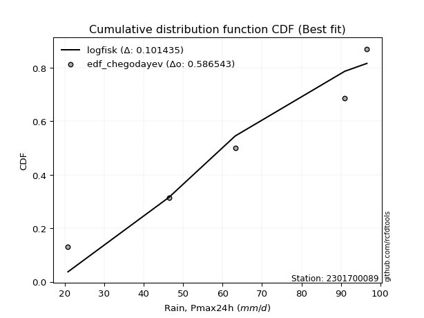</img></img>

</div>


### 6. EDF Blom (1958)

The Blom formula is a specific "plotting position" formula used in hydrology and statistical analysis to estimate the empirical cumulative probability (or non-exceedance probability) of a data series. It is particularly recommended for data that are approximately normally distributed. The constant _a_ is set to 0.375 (or 3/8).

<div align="center">


$P=(m-a)/(n+1-2a)$


</div>


**6.1. Empirical values**

<div align="center">

|                | 0                   | 1                   | 2        | 3                  | 4                  |
|:---------------|:--------------------|:--------------------|:---------|:-------------------|:-------------------|
| date           | 2024                | 2022                | 2021     | 2020               | 2019               |
| x              | 20.8                | 46.4                | 63.2     | 91.0               | 96.6               |
| m              | 1                   | 2                   | 3        | 4                  | 5                  |
| empirical_dist | edf_blom            | edf_blom            | edf_blom | edf_blom           | edf_blom           |
| empirical      | 0.11904761904761904 | 0.30952380952380953 | 0.5      | 0.6904761904761905 | 0.8809523809523809 |
| empirical_tr   | 1.135135135135135   | 1.4482758620689655  | 2.0      | 3.230769230769231  | 8.399999999999999  |

</div>


**6.2. Kolmogorov-Smirnov fit test (sorted by Δ)**


<div align="center">

|                | 0                   | 1                  | 2                   | 3                   | 4                   | 5                   | 6                   | 7                   | 8                   | 9                   | 10                  | 11                  | 12                  | 13                  | 14                 | 15                 | 16                  | 17                 | 18                  | 19                  | 20                  | 21                  | 22                  | 23                  | 24                  | 25                 | 26                  | 27                 | 28                  | 29                 | 30                  | 31                  | 32                 | 33                 | 34                 | 35                  | 36                  | 37                  | 38                  | 39                 | 40                  | 41                  | 42                  | 43                 | 44                  | 45                 | 46                  | 47                  | 48                  | 49                  | 50                  | 51                 | 52                    | 53                  | 54                  | 55                 | 56                 | 57                  | 58                  | 59                  | 60                  | 61                  | 62                 | 63                 | 64                  | 65                 | 66                  | 67                  | 68                  | 69                  | 70                  | 71                 | 72                  | 73                  | 74                  | 75                 | 76                 | 77                 | 78                  | 79                 | 80                 | 81                  | 82                 | 83                 | 84                 | 85                 | 86                 | 87                 |
|:---------------|:--------------------|:-------------------|:--------------------|:--------------------|:--------------------|:--------------------|:--------------------|:--------------------|:--------------------|:--------------------|:--------------------|:--------------------|:--------------------|:--------------------|:-------------------|:-------------------|:--------------------|:-------------------|:--------------------|:--------------------|:--------------------|:--------------------|:--------------------|:--------------------|:--------------------|:-------------------|:--------------------|:-------------------|:--------------------|:-------------------|:--------------------|:--------------------|:-------------------|:-------------------|:-------------------|:--------------------|:--------------------|:--------------------|:--------------------|:-------------------|:--------------------|:--------------------|:--------------------|:-------------------|:--------------------|:-------------------|:--------------------|:--------------------|:--------------------|:--------------------|:--------------------|:-------------------|:----------------------|:--------------------|:--------------------|:-------------------|:-------------------|:--------------------|:--------------------|:--------------------|:--------------------|:--------------------|:-------------------|:-------------------|:--------------------|:-------------------|:--------------------|:--------------------|:--------------------|:--------------------|:--------------------|:-------------------|:--------------------|:--------------------|:--------------------|:-------------------|:-------------------|:-------------------|:--------------------|:-------------------|:-------------------|:--------------------|:-------------------|:-------------------|:-------------------|:-------------------|:-------------------|:-------------------|
| station        | 2301700089          | 2301700089         | 2301700089          | 2301700089          | 2301700089          | 2301700089          | 2301700089          | 2301700089          | 2301700089          | 2301700089          | 2301700089          | 2301700089          | 2301700089          | 2301700089          | 2301700089         | 2301700089         | 2301700089          | 2301700089         | 2301700089          | 2301700089          | 2301700089          | 2301700089          | 2301700089          | 2301700089          | 2301700089          | 2301700089         | 2301700089          | 2301700089         | 2301700089          | 2301700089         | 2301700089          | 2301700089          | 2301700089         | 2301700089         | 2301700089         | 2301700089          | 2301700089          | 2301700089          | 2301700089          | 2301700089         | 2301700089          | 2301700089          | 2301700089          | 2301700089         | 2301700089          | 2301700089         | 2301700089          | 2301700089          | 2301700089          | 2301700089          | 2301700089          | 2301700089         | 2301700089            | 2301700089          | 2301700089          | 2301700089         | 2301700089         | 2301700089          | 2301700089          | 2301700089          | 2301700089          | 2301700089          | 2301700089         | 2301700089         | 2301700089          | 2301700089         | 2301700089          | 2301700089          | 2301700089          | 2301700089          | 2301700089          | 2301700089         | 2301700089          | 2301700089          | 2301700089          | 2301700089         | 2301700089         | 2301700089         | 2301700089          | 2301700089         | 2301700089         | 2301700089          | 2301700089         | 2301700089         | 2301700089         | 2301700089         | 2301700089         | 2301700089         |
| empirical_dist | edf_blom            | edf_blom           | edf_blom            | edf_blom            | edf_blom            | edf_blom            | edf_blom            | edf_blom            | edf_blom            | edf_blom            | edf_blom            | edf_blom            | edf_blom            | edf_blom            | edf_blom           | edf_blom           | edf_blom            | edf_blom           | edf_blom            | edf_blom            | edf_blom            | edf_blom            | edf_blom            | edf_blom            | edf_blom            | edf_blom           | edf_blom            | edf_blom           | edf_blom            | edf_blom           | edf_blom            | edf_blom            | edf_blom           | edf_blom           | edf_blom           | edf_blom            | edf_blom            | edf_blom            | edf_blom            | edf_blom           | edf_blom            | edf_blom            | edf_blom            | edf_blom           | edf_blom            | edf_blom           | edf_blom            | edf_blom            | edf_blom            | edf_blom            | edf_blom            | edf_blom           | edf_blom              | edf_blom            | edf_blom            | edf_blom           | edf_blom           | edf_blom            | edf_blom            | edf_blom            | edf_blom            | edf_blom            | edf_blom           | edf_blom           | edf_blom            | edf_blom           | edf_blom            | edf_blom            | edf_blom            | edf_blom            | edf_blom            | edf_blom           | edf_blom            | edf_blom            | edf_blom            | edf_blom           | edf_blom           | edf_blom           | edf_blom            | edf_blom           | edf_blom           | edf_blom            | edf_blom           | edf_blom           | edf_blom           | edf_blom           | edf_blom           | edf_blom           |
| p_dist         | logfisk             | loginvgauss        | logalpha            | logncf              | loggamma            | loggamma            | lognct              | loginvgamma         | logbetaprime        | logpearson3         | logrice             | logerlang           | logf                | logexponnorm        | lognorm            | lognorm            | logcrystalball      | logt               | logfatiguelife      | logmaxwell          | lograyleigh         | loginvweibull       | fisk                | loggumbel_l         | kstwobign           | betaprime          | invgauss            | chi2               | loglogistic         | genexpon           | expon               | loggompertz         | rice               | invgamma           | rayleigh           | maxwell             | gamma               | f                   | halfnorm            | erlang             | alpha               | crystalball         | norm                | exponnorm          | nct                 | t                  | pearson3            | logweibull_min      | gompertz            | weibull_min         | laplace_asymmetric  | loghalfnorm        | loglaplace_asymmetric | loghypsecant        | loggumbel_r         | gumbel_r           | halflogistic       | logkstwobign        | logistic            | loglaplace          | moyal               | gumbel_l            | hypsecant          | loghalflogistic    | logmoyal            | laplace            | wald                | mielke              | logmielke           | loggenexpon         | logloggamma         | gibrat             | logwald             | logexpon            | loggibrat           | nakagami           | logtruncnorm       | lognakagami        | logchi2             | ncf                | loglognorm         | fatiguelife         | invweibull         | logjohnsonsu       | johnsonsu          | truncnorm          | loggenlogistic     | genlogistic        |
| delta          | 0.09614396590174956 | 0.1070454421408964 | 0.10714380015076475 | 0.11407689887118166 | 0.11444124380722598 | 0.11444124380722598 | 0.11531041018839994 | 0.11557656790484683 | 0.11571495534506149 | 0.11726280297072367 | 0.11741620075971781 | 0.11815791148129029 | 0.11821845111865326 | 0.11947916532320191 | 0.1194793834890393 | 0.1194793834890393 | 0.11947959921966167 | 0.1194796702731773 | 0.12072250436842036 | 0.12108135710543322 | 0.12536043003717112 | 0.12957128144642727 | 0.13145836156745494 | 0.13236166865505272 | 0.13444210588505756 | 0.1369024997059879 | 0.13744941899311602 | 0.1381448116567956 | 0.14042544300062798 | 0.1406154927871367 | 0.14063777893565288 | 0.14116312865508374 | 0.1416091337368629 | 0.1419630635968414 | 0.1420784736186349 | 0.14250750195531525 | 0.14275679727445778 | 0.14322341481507417 | 0.14323516043398088 | 0.1435616219785829 | 0.14392875409433392 | 0.14416853327849166 | 0.14416853732940993 | 0.1441689586653876 | 0.14418066484072756 | 0.1441936495065027 | 0.14423105918445822 | 0.14445964634067687 | 0.14494956411108184 | 0.14702900925479767 | 0.14925467747141496 | 0.14971140091223   | 0.15033019162171413   | 0.15243005128739284 | 0.15687644644305787 | 0.1605936991325415 | 0.1611360194417939 | 0.16176063085325865 | 0.16326533067039972 | 0.16501987146648522 | 0.16678414629177285 | 0.16793426180825333 | 0.1734903948548685 | 0.1779043669112882 | 0.18013070073453463 | 0.183177621660229  | 0.19195195589261138 | 0.19457823387101436 | 0.19947949510692986 | 0.20072175310540752 | 0.20567462412605497 | 0.2164383351012762 | 0.24482489114935346 | 0.24762739991691451 | 0.27616766177442775 | 0.3093235516615499 | 0.3095204315560675 | 0.3095238095238023 | 0.31819103472992394 | 0.3183540253391628 | 0.3720350551356245 | 0.43706422003732337 | 0.456948051864091  | 0.6497604518636657 | 0.6644998762132552 | 0.6904754483659572 | 0.6904761904761905 | 0.6904761904761905 |
| deltao         | 0.5865427407550001  | 0.5865427407550001 | 0.5865427407550001  | 0.5865427407550001  | 0.5865427407550001  | 0.5865427407550001  | 0.5865427407550001  | 0.5865427407550001  | 0.5865427407550001  | 0.5865427407550001  | 0.5865427407550001  | 0.5865427407550001  | 0.5865427407550001  | 0.5865427407550001  | 0.5865427407550001 | 0.5865427407550001 | 0.5865427407550001  | 0.5865427407550001 | 0.5865427407550001  | 0.5865427407550001  | 0.5865427407550001  | 0.5865427407550001  | 0.5865427407550001  | 0.5865427407550001  | 0.5865427407550001  | 0.5865427407550001 | 0.5865427407550001  | 0.5865427407550001 | 0.5865427407550001  | 0.5865427407550001 | 0.5865427407550001  | 0.5865427407550001  | 0.5865427407550001 | 0.5865427407550001 | 0.5865427407550001 | 0.5865427407550001  | 0.5865427407550001  | 0.5865427407550001  | 0.5865427407550001  | 0.5865427407550001 | 0.5865427407550001  | 0.5865427407550001  | 0.5865427407550001  | 0.5865427407550001 | 0.5865427407550001  | 0.5865427407550001 | 0.5865427407550001  | 0.5865427407550001  | 0.5865427407550001  | 0.5865427407550001  | 0.5865427407550001  | 0.5865427407550001 | 0.5865427407550001    | 0.5865427407550001  | 0.5865427407550001  | 0.5865427407550001 | 0.5865427407550001 | 0.5865427407550001  | 0.5865427407550001  | 0.5865427407550001  | 0.5865427407550001  | 0.5865427407550001  | 0.5865427407550001 | 0.5865427407550001 | 0.5865427407550001  | 0.5865427407550001 | 0.5865427407550001  | 0.5865427407550001  | 0.5865427407550001  | 0.5865427407550001  | 0.5865427407550001  | 0.5865427407550001 | 0.5865427407550001  | 0.5865427407550001  | 0.5865427407550001  | 0.5865427407550001 | 0.5865427407550001 | 0.5865427407550001 | 0.5865427407550001  | 0.5865427407550001 | 0.5865427407550001 | 0.5865427407550001  | 0.5865427407550001 | 0.5865427407550001 | 0.5865427407550001 | 0.5865427407550001 | 0.5865427407550001 | 0.5865427407550001 |
| eval           | Δo > Δ              | Δo > Δ             | Δo > Δ              | Δo > Δ              | Δo > Δ              | Δo > Δ              | Δo > Δ              | Δo > Δ              | Δo > Δ              | Δo > Δ              | Δo > Δ              | Δo > Δ              | Δo > Δ              | Δo > Δ              | Δo > Δ             | Δo > Δ             | Δo > Δ              | Δo > Δ             | Δo > Δ              | Δo > Δ              | Δo > Δ              | Δo > Δ              | Δo > Δ              | Δo > Δ              | Δo > Δ              | Δo > Δ             | Δo > Δ              | Δo > Δ             | Δo > Δ              | Δo > Δ             | Δo > Δ              | Δo > Δ              | Δo > Δ             | Δo > Δ             | Δo > Δ             | Δo > Δ              | Δo > Δ              | Δo > Δ              | Δo > Δ              | Δo > Δ             | Δo > Δ              | Δo > Δ              | Δo > Δ              | Δo > Δ             | Δo > Δ              | Δo > Δ             | Δo > Δ              | Δo > Δ              | Δo > Δ              | Δo > Δ              | Δo > Δ              | Δo > Δ             | Δo > Δ                | Δo > Δ              | Δo > Δ              | Δo > Δ             | Δo > Δ             | Δo > Δ              | Δo > Δ              | Δo > Δ              | Δo > Δ              | Δo > Δ              | Δo > Δ             | Δo > Δ             | Δo > Δ              | Δo > Δ             | Δo > Δ              | Δo > Δ              | Δo > Δ              | Δo > Δ              | Δo > Δ              | Δo > Δ             | Δo > Δ              | Δo > Δ              | Δo > Δ              | Δo > Δ             | Δo > Δ             | Δo > Δ             | Δo > Δ              | Δo > Δ             | Δo > Δ             | Δo > Δ              | Δo > Δ             | Δo <= Δ            | Δo <= Δ            | Δo <= Δ            | Δo <= Δ            | Δo <= Δ            |
| fit            | 1                   | 1                  | 1                   | 1                   | 1                   | 1                   | 1                   | 1                   | 1                   | 1                   | 1                   | 1                   | 1                   | 1                   | 1                  | 1                  | 1                   | 1                  | 1                   | 1                   | 1                   | 1                   | 1                   | 1                   | 1                   | 1                  | 1                   | 1                  | 1                   | 1                  | 1                   | 1                   | 1                  | 1                  | 1                  | 1                   | 1                   | 1                   | 1                   | 1                  | 1                   | 1                   | 1                   | 1                  | 1                   | 1                  | 1                   | 1                   | 1                   | 1                   | 1                   | 1                  | 1                     | 1                   | 1                   | 1                  | 1                  | 1                   | 1                   | 1                   | 1                   | 1                   | 1                  | 1                  | 1                   | 1                  | 1                   | 1                   | 1                   | 1                   | 1                   | 1                  | 1                   | 1                   | 1                   | 1                  | 1                  | 1                  | 1                   | 1                  | 1                  | 1                   | 1                  | 0                  | 0                  | 0                  | 0                  | 0                  |
| n              | 5                   | 5                  | 5                   | 5                   | 5                   | 5                   | 5                   | 5                   | 5                   | 5                   | 5                   | 5                   | 5                   | 5                   | 5                  | 5                  | 5                   | 5                  | 5                   | 5                   | 5                   | 5                   | 5                   | 5                   | 5                   | 5                  | 5                   | 5                  | 5                   | 5                  | 5                   | 5                   | 5                  | 5                  | 5                  | 5                   | 5                   | 5                   | 5                   | 5                  | 5                   | 5                   | 5                   | 5                  | 5                   | 5                  | 5                   | 5                   | 5                   | 5                   | 5                   | 5                  | 5                     | 5                   | 5                   | 5                  | 5                  | 5                   | 5                   | 5                   | 5                   | 5                   | 5                  | 5                  | 5                   | 5                  | 5                   | 5                   | 5                   | 5                   | 5                   | 5                  | 5                   | 5                   | 5                   | 5                  | 5                  | 5                  | 5                   | 5                  | 5                  | 5                   | 5                  | 5                  | 5                  | 5                  | 5                  | 5                  |
| best_fit       | 1                   | 0                  | 0                   | 0                   | 0                   | 0                   | 0                   | 0                   | 0                   | 0                   | 0                   | 0                   | 0                   | 0                   | 0                  | 0                  | 0                   | 0                  | 0                   | 0                   | 0                   | 0                   | 0                   | 0                   | 0                   | 0                  | 0                   | 0                  | 0                   | 0                  | 0                   | 0                   | 0                  | 0                  | 0                  | 0                   | 0                   | 0                   | 0                   | 0                  | 0                   | 0                   | 0                   | 0                  | 0                   | 0                  | 0                   | 0                   | 0                   | 0                   | 0                   | 0                  | 0                     | 0                   | 0                   | 0                  | 0                  | 0                   | 0                   | 0                   | 0                   | 0                   | 0                  | 0                  | 0                   | 0                  | 0                   | 0                   | 0                   | 0                   | 0                   | 0                  | 0                   | 0                   | 0                   | 0                  | 0                  | 0                  | 0                   | 0                  | 0                  | 0                   | 0                  | 0                  | 0                  | 0                  | 0                  | 0                  |
| best_fit_sort  | 1                   | 2                  | 3                   | 4                   | 5                   | 6                   | 7                   | 8                   | 9                   | 10                  | 11                  | 12                  | 13                  | 14                  | 15                 | 16                 | 17                  | 18                 | 19                  | 20                  | 21                  | 22                  | 23                  | 24                  | 25                  | 26                 | 27                  | 28                 | 29                  | 30                 | 31                  | 32                  | 33                 | 34                 | 35                 | 36                  | 37                  | 38                  | 39                  | 40                 | 41                  | 42                  | 43                  | 44                 | 45                  | 46                 | 47                  | 48                  | 49                  | 50                  | 51                  | 52                 | 53                    | 54                  | 55                  | 56                 | 57                 | 58                  | 59                  | 60                  | 61                  | 62                  | 63                 | 64                 | 65                  | 66                 | 67                  | 68                  | 69                  | 70                  | 71                  | 72                 | 73                  | 74                  | 75                  | 76                 | 77                 | 78                 | 79                  | 80                 | 81                 | 82                  | 83                 | 84                 | 85                 | 86                 | 87                 | 88                 |

</div>


**6.3. Best fit**

<div align="center">

|   id |    station | empirical_dist   | p_dist   |    delta |   deltao | eval   |   fit |   n |   best_fit |   best_fit_sort |
|-----:|-----------:|:-----------------|:---------|---------:|---------:|:-------|------:|----:|-----------:|----------------:|
|    0 | 2301700089 | edf_blom         | logfisk  | 0.096144 | 0.586543 | Δo > Δ |     1 |   5 |          1 |               1 |

</div>


<div align="center">

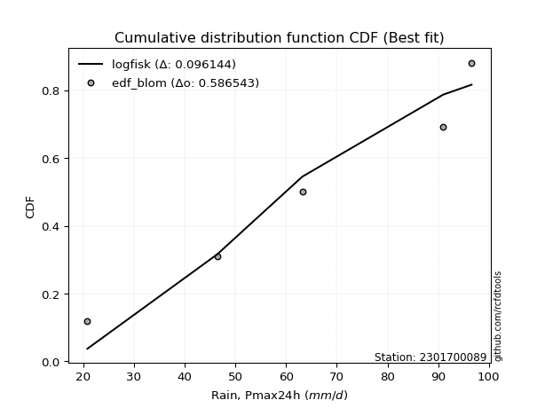</img>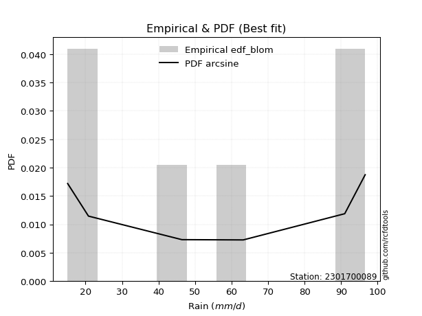</img>

</div>


### 7. EDF Tukey (1962)

In hydrology, the Tukey formula is used as a plotting position formula to estimate the empirical probability or frequency of a flood event (or other hydrological data). The formula parameter is given as _c=0.333_ (or 1/3).

<div align="center">


$P=(m-c)/(n+1-2c)$


</div>


**7.1. Empirical values**

<div align="center">

|                | 0                  | 1                  | 2         | 3         | 4         |
|:---------------|:-------------------|:-------------------|:----------|:----------|:----------|
| date           | 2024               | 2022               | 2021      | 2020      | 2019      |
| x              | 20.8               | 46.4               | 63.2      | 91.0      | 96.6      |
| m              | 1                  | 2                  | 3         | 4         | 5         |
| empirical_dist | edf_tukey          | edf_tukey          | edf_tukey | edf_tukey | edf_tukey |
| empirical      | 0.125              | 0.3125             | 0.5       | 0.6875    | 0.875     |
| empirical_tr   | 1.1428571428571428 | 1.4545454545454546 | 2.0       | 3.2       | 8.0       |

</div>


**7.2. Kolmogorov-Smirnov fit test (sorted by Δ)**


<div align="center">

|                | 0                   | 1                   | 2                   | 3                   | 4                   | 5                   | 6                  | 7                  | 8                   | 9                   | 10                  | 11                  | 12                  | 13                  | 14                  | 15                  | 16                  | 17                  | 18                  | 19                  | 20                  | 21                 | 22                 | 23                 | 24                  | 25                  | 26                  | 27                  | 28                 | 29                  | 30                  | 31                 | 32                  | 33                  | 34                  | 35                  | 36                  | 37                  | 38                  | 39                  | 40                 | 41                  | 42                 | 43                  | 44                  | 45                  | 46                 | 47                  | 48                 | 49                 | 50                  | 51                  | 52                    | 53                 | 54                  | 55                  | 56                  | 57                  | 58                 | 59                 | 60                  | 61                 | 62                  | 63                 | 64                  | 65                  | 66                  | 67                  | 68                  | 69                  | 70                  | 71                  | 72                  | 73                  | 74                  | 75                  | 76                 | 77                 | 78                 | 79                 | 80                  | 81                 | 82                  | 83                 | 84                 | 85                 | 86                 | 87                 |
|:---------------|:--------------------|:--------------------|:--------------------|:--------------------|:--------------------|:--------------------|:-------------------|:-------------------|:--------------------|:--------------------|:--------------------|:--------------------|:--------------------|:--------------------|:--------------------|:--------------------|:--------------------|:--------------------|:--------------------|:--------------------|:--------------------|:-------------------|:-------------------|:-------------------|:--------------------|:--------------------|:--------------------|:--------------------|:-------------------|:--------------------|:--------------------|:-------------------|:--------------------|:--------------------|:--------------------|:--------------------|:--------------------|:--------------------|:--------------------|:--------------------|:-------------------|:--------------------|:-------------------|:--------------------|:--------------------|:--------------------|:-------------------|:--------------------|:-------------------|:-------------------|:--------------------|:--------------------|:----------------------|:-------------------|:--------------------|:--------------------|:--------------------|:--------------------|:-------------------|:-------------------|:--------------------|:-------------------|:--------------------|:-------------------|:--------------------|:--------------------|:--------------------|:--------------------|:--------------------|:--------------------|:--------------------|:--------------------|:--------------------|:--------------------|:--------------------|:--------------------|:-------------------|:-------------------|:-------------------|:-------------------|:--------------------|:-------------------|:--------------------|:-------------------|:-------------------|:-------------------|:-------------------|:-------------------|
| station        | 2301700089          | 2301700089          | 2301700089          | 2301700089          | 2301700089          | 2301700089          | 2301700089         | 2301700089         | 2301700089          | 2301700089          | 2301700089          | 2301700089          | 2301700089          | 2301700089          | 2301700089          | 2301700089          | 2301700089          | 2301700089          | 2301700089          | 2301700089          | 2301700089          | 2301700089         | 2301700089         | 2301700089         | 2301700089          | 2301700089          | 2301700089          | 2301700089          | 2301700089         | 2301700089          | 2301700089          | 2301700089         | 2301700089          | 2301700089          | 2301700089          | 2301700089          | 2301700089          | 2301700089          | 2301700089          | 2301700089          | 2301700089         | 2301700089          | 2301700089         | 2301700089          | 2301700089          | 2301700089          | 2301700089         | 2301700089          | 2301700089         | 2301700089         | 2301700089          | 2301700089          | 2301700089            | 2301700089         | 2301700089          | 2301700089          | 2301700089          | 2301700089          | 2301700089         | 2301700089         | 2301700089          | 2301700089         | 2301700089          | 2301700089         | 2301700089          | 2301700089          | 2301700089          | 2301700089          | 2301700089          | 2301700089          | 2301700089          | 2301700089          | 2301700089          | 2301700089          | 2301700089          | 2301700089          | 2301700089         | 2301700089         | 2301700089         | 2301700089         | 2301700089          | 2301700089         | 2301700089          | 2301700089         | 2301700089         | 2301700089         | 2301700089         | 2301700089         |
| empirical_dist | edf_tukey           | edf_tukey           | edf_tukey           | edf_tukey           | edf_tukey           | edf_tukey           | edf_tukey          | edf_tukey          | edf_tukey           | edf_tukey           | edf_tukey           | edf_tukey           | edf_tukey           | edf_tukey           | edf_tukey           | edf_tukey           | edf_tukey           | edf_tukey           | edf_tukey           | edf_tukey           | edf_tukey           | edf_tukey          | edf_tukey          | edf_tukey          | edf_tukey           | edf_tukey           | edf_tukey           | edf_tukey           | edf_tukey          | edf_tukey           | edf_tukey           | edf_tukey          | edf_tukey           | edf_tukey           | edf_tukey           | edf_tukey           | edf_tukey           | edf_tukey           | edf_tukey           | edf_tukey           | edf_tukey          | edf_tukey           | edf_tukey          | edf_tukey           | edf_tukey           | edf_tukey           | edf_tukey          | edf_tukey           | edf_tukey          | edf_tukey          | edf_tukey           | edf_tukey           | edf_tukey             | edf_tukey          | edf_tukey           | edf_tukey           | edf_tukey           | edf_tukey           | edf_tukey          | edf_tukey          | edf_tukey           | edf_tukey          | edf_tukey           | edf_tukey          | edf_tukey           | edf_tukey           | edf_tukey           | edf_tukey           | edf_tukey           | edf_tukey           | edf_tukey           | edf_tukey           | edf_tukey           | edf_tukey           | edf_tukey           | edf_tukey           | edf_tukey          | edf_tukey          | edf_tukey          | edf_tukey          | edf_tukey           | edf_tukey          | edf_tukey           | edf_tukey          | edf_tukey          | edf_tukey          | edf_tukey          | edf_tukey          |
| p_dist         | logfisk             | loginvgauss         | logalpha            | logncf              | loggamma            | loggamma            | lognct             | loginvgamma        | logbetaprime        | logpearson3         | logrice             | logerlang           | logf                | logexponnorm        | lognorm             | lognorm             | logcrystalball      | logt                | logfatiguelife      | logmaxwell          | lograyleigh         | loginvweibull      | fisk               | loggumbel_l        | kstwobign           | genexpon            | expon               | betaprime           | invgauss           | chi2                | loglogistic         | loggompertz        | rice                | invgamma            | rayleigh            | maxwell             | gamma               | f                   | halfnorm            | erlang              | alpha              | crystalball         | norm               | exponnorm           | nct                 | t                   | pearson3           | logweibull_min      | gompertz           | loghalfnorm        | weibull_min         | laplace_asymmetric  | loglaplace_asymmetric | loghypsecant       | loggumbel_r         | logkstwobign        | gumbel_r            | halflogistic        | logistic           | loglaplace         | moyal               | gumbel_l           | hypsecant           | loghalflogistic    | logmoyal            | laplace             | wald                | mielke              | loggenexpon         | logmielke           | logloggamma         | gibrat              | logexpon            | logwald             | loggibrat           | nakagami            | ncf                | logtruncnorm       | lognakagami        | logchi2            | loglognorm          | fatiguelife        | invweibull          | logjohnsonsu       | johnsonsu          | truncnorm          | loggenlogistic     | genlogistic        |
| delta          | 0.09912015637794003 | 0.11002163261708686 | 0.11011999062695521 | 0.11705308934737213 | 0.11741743428341644 | 0.11741743428341644 | 0.1182866006645904 | 0.1185527583810373 | 0.11869114582125195 | 0.12023899344691413 | 0.12039239123590828 | 0.12113410195748076 | 0.12119464159484372 | 0.12245535579939237 | 0.12245557396522977 | 0.12245557396522977 | 0.12245578969585214 | 0.12245586074936776 | 0.12369869484461082 | 0.12405754758162368 | 0.12536043003717112 | 0.1265950909702368 | 0.1344345520436454 | 0.1353378591312432 | 0.13741829636124803 | 0.13763930231094623 | 0.13766158845946241 | 0.13987869018217836 | 0.1404256094693065 | 0.14112100213298606 | 0.14340163347681845 | 0.1441393191312742 | 0.14458532421305337 | 0.14493925407303188 | 0.14505466409482537 | 0.14548369243150572 | 0.14573298775064825 | 0.14619960529126463 | 0.14621135091017134 | 0.14653781245477338 | 0.1469049445705244 | 0.14714472375468213 | 0.1471447278056004 | 0.14714514914157806 | 0.14715685531691802 | 0.14716983998269317 | 0.1472072496606487 | 0.14743583681686734 | 0.1479257545872723 | 0.14971140091223   | 0.15000519973098814 | 0.15223086794760543 | 0.1533063820979046    | 0.1554062417635833 | 0.15687644644305787 | 0.15878444037706818 | 0.16356988960873198 | 0.16411220991798436 | 0.1662415211465902 | 0.1679960619426757 | 0.16976033676796332 | 0.1709104522844438 | 0.17646658533105897 | 0.1779043669112882 | 0.18013070073453463 | 0.18615381213641946 | 0.19492814636880185 | 0.19755442434720483 | 0.19774556262921705 | 0.20245568558312033 | 0.20865081460224544 | 0.21941452557746666 | 0.24465120944072405 | 0.24482489114935346 | 0.27616766177442775 | 0.31229974213774037 | 0.3124016443867818 | 0.312496622032258  | 0.3124999999999928 | 0.3152148442537335 | 0.36905886465943405 | 0.4340880295611329 | 0.45099567091171006 | 0.6467842613874752 | 0.6615236857370648 | 0.6874992578897667 | 0.6875             | 0.6875             |
| deltao         | 0.5865427407550001  | 0.5865427407550001  | 0.5865427407550001  | 0.5865427407550001  | 0.5865427407550001  | 0.5865427407550001  | 0.5865427407550001 | 0.5865427407550001 | 0.5865427407550001  | 0.5865427407550001  | 0.5865427407550001  | 0.5865427407550001  | 0.5865427407550001  | 0.5865427407550001  | 0.5865427407550001  | 0.5865427407550001  | 0.5865427407550001  | 0.5865427407550001  | 0.5865427407550001  | 0.5865427407550001  | 0.5865427407550001  | 0.5865427407550001 | 0.5865427407550001 | 0.5865427407550001 | 0.5865427407550001  | 0.5865427407550001  | 0.5865427407550001  | 0.5865427407550001  | 0.5865427407550001 | 0.5865427407550001  | 0.5865427407550001  | 0.5865427407550001 | 0.5865427407550001  | 0.5865427407550001  | 0.5865427407550001  | 0.5865427407550001  | 0.5865427407550001  | 0.5865427407550001  | 0.5865427407550001  | 0.5865427407550001  | 0.5865427407550001 | 0.5865427407550001  | 0.5865427407550001 | 0.5865427407550001  | 0.5865427407550001  | 0.5865427407550001  | 0.5865427407550001 | 0.5865427407550001  | 0.5865427407550001 | 0.5865427407550001 | 0.5865427407550001  | 0.5865427407550001  | 0.5865427407550001    | 0.5865427407550001 | 0.5865427407550001  | 0.5865427407550001  | 0.5865427407550001  | 0.5865427407550001  | 0.5865427407550001 | 0.5865427407550001 | 0.5865427407550001  | 0.5865427407550001 | 0.5865427407550001  | 0.5865427407550001 | 0.5865427407550001  | 0.5865427407550001  | 0.5865427407550001  | 0.5865427407550001  | 0.5865427407550001  | 0.5865427407550001  | 0.5865427407550001  | 0.5865427407550001  | 0.5865427407550001  | 0.5865427407550001  | 0.5865427407550001  | 0.5865427407550001  | 0.5865427407550001 | 0.5865427407550001 | 0.5865427407550001 | 0.5865427407550001 | 0.5865427407550001  | 0.5865427407550001 | 0.5865427407550001  | 0.5865427407550001 | 0.5865427407550001 | 0.5865427407550001 | 0.5865427407550001 | 0.5865427407550001 |
| eval           | Δo > Δ              | Δo > Δ              | Δo > Δ              | Δo > Δ              | Δo > Δ              | Δo > Δ              | Δo > Δ             | Δo > Δ             | Δo > Δ              | Δo > Δ              | Δo > Δ              | Δo > Δ              | Δo > Δ              | Δo > Δ              | Δo > Δ              | Δo > Δ              | Δo > Δ              | Δo > Δ              | Δo > Δ              | Δo > Δ              | Δo > Δ              | Δo > Δ             | Δo > Δ             | Δo > Δ             | Δo > Δ              | Δo > Δ              | Δo > Δ              | Δo > Δ              | Δo > Δ             | Δo > Δ              | Δo > Δ              | Δo > Δ             | Δo > Δ              | Δo > Δ              | Δo > Δ              | Δo > Δ              | Δo > Δ              | Δo > Δ              | Δo > Δ              | Δo > Δ              | Δo > Δ             | Δo > Δ              | Δo > Δ             | Δo > Δ              | Δo > Δ              | Δo > Δ              | Δo > Δ             | Δo > Δ              | Δo > Δ             | Δo > Δ             | Δo > Δ              | Δo > Δ              | Δo > Δ                | Δo > Δ             | Δo > Δ              | Δo > Δ              | Δo > Δ              | Δo > Δ              | Δo > Δ             | Δo > Δ             | Δo > Δ              | Δo > Δ             | Δo > Δ              | Δo > Δ             | Δo > Δ              | Δo > Δ              | Δo > Δ              | Δo > Δ              | Δo > Δ              | Δo > Δ              | Δo > Δ              | Δo > Δ              | Δo > Δ              | Δo > Δ              | Δo > Δ              | Δo > Δ              | Δo > Δ             | Δo > Δ             | Δo > Δ             | Δo > Δ             | Δo > Δ              | Δo > Δ             | Δo > Δ              | Δo <= Δ            | Δo <= Δ            | Δo <= Δ            | Δo <= Δ            | Δo <= Δ            |
| fit            | 1                   | 1                   | 1                   | 1                   | 1                   | 1                   | 1                  | 1                  | 1                   | 1                   | 1                   | 1                   | 1                   | 1                   | 1                   | 1                   | 1                   | 1                   | 1                   | 1                   | 1                   | 1                  | 1                  | 1                  | 1                   | 1                   | 1                   | 1                   | 1                  | 1                   | 1                   | 1                  | 1                   | 1                   | 1                   | 1                   | 1                   | 1                   | 1                   | 1                   | 1                  | 1                   | 1                  | 1                   | 1                   | 1                   | 1                  | 1                   | 1                  | 1                  | 1                   | 1                   | 1                     | 1                  | 1                   | 1                   | 1                   | 1                   | 1                  | 1                  | 1                   | 1                  | 1                   | 1                  | 1                   | 1                   | 1                   | 1                   | 1                   | 1                   | 1                   | 1                   | 1                   | 1                   | 1                   | 1                   | 1                  | 1                  | 1                  | 1                  | 1                   | 1                  | 1                   | 0                  | 0                  | 0                  | 0                  | 0                  |
| n              | 5                   | 5                   | 5                   | 5                   | 5                   | 5                   | 5                  | 5                  | 5                   | 5                   | 5                   | 5                   | 5                   | 5                   | 5                   | 5                   | 5                   | 5                   | 5                   | 5                   | 5                   | 5                  | 5                  | 5                  | 5                   | 5                   | 5                   | 5                   | 5                  | 5                   | 5                   | 5                  | 5                   | 5                   | 5                   | 5                   | 5                   | 5                   | 5                   | 5                   | 5                  | 5                   | 5                  | 5                   | 5                   | 5                   | 5                  | 5                   | 5                  | 5                  | 5                   | 5                   | 5                     | 5                  | 5                   | 5                   | 5                   | 5                   | 5                  | 5                  | 5                   | 5                  | 5                   | 5                  | 5                   | 5                   | 5                   | 5                   | 5                   | 5                   | 5                   | 5                   | 5                   | 5                   | 5                   | 5                   | 5                  | 5                  | 5                  | 5                  | 5                   | 5                  | 5                   | 5                  | 5                  | 5                  | 5                  | 5                  |
| best_fit       | 1                   | 0                   | 0                   | 0                   | 0                   | 0                   | 0                  | 0                  | 0                   | 0                   | 0                   | 0                   | 0                   | 0                   | 0                   | 0                   | 0                   | 0                   | 0                   | 0                   | 0                   | 0                  | 0                  | 0                  | 0                   | 0                   | 0                   | 0                   | 0                  | 0                   | 0                   | 0                  | 0                   | 0                   | 0                   | 0                   | 0                   | 0                   | 0                   | 0                   | 0                  | 0                   | 0                  | 0                   | 0                   | 0                   | 0                  | 0                   | 0                  | 0                  | 0                   | 0                   | 0                     | 0                  | 0                   | 0                   | 0                   | 0                   | 0                  | 0                  | 0                   | 0                  | 0                   | 0                  | 0                   | 0                   | 0                   | 0                   | 0                   | 0                   | 0                   | 0                   | 0                   | 0                   | 0                   | 0                   | 0                  | 0                  | 0                  | 0                  | 0                   | 0                  | 0                   | 0                  | 0                  | 0                  | 0                  | 0                  |
| best_fit_sort  | 1                   | 2                   | 3                   | 4                   | 5                   | 6                   | 7                  | 8                  | 9                   | 10                  | 11                  | 12                  | 13                  | 14                  | 15                  | 16                  | 17                  | 18                  | 19                  | 20                  | 21                  | 22                 | 23                 | 24                 | 25                  | 26                  | 27                  | 28                  | 29                 | 30                  | 31                  | 32                 | 33                  | 34                  | 35                  | 36                  | 37                  | 38                  | 39                  | 40                  | 41                 | 42                  | 43                 | 44                  | 45                  | 46                  | 47                 | 48                  | 49                 | 50                 | 51                  | 52                  | 53                    | 54                 | 55                  | 56                  | 57                  | 58                  | 59                 | 60                 | 61                  | 62                 | 63                  | 64                 | 65                  | 66                  | 67                  | 68                  | 69                  | 70                  | 71                  | 72                  | 73                  | 74                  | 75                  | 76                  | 77                 | 78                 | 79                 | 80                 | 81                  | 82                 | 83                  | 84                 | 85                 | 86                 | 87                 | 88                 |

</div>


**7.3. Best fit**

<div align="center">

|   id |    station | empirical_dist   | p_dist   |     delta |   deltao | eval   |   fit |   n |   best_fit |   best_fit_sort |
|-----:|-----------:|:-----------------|:---------|----------:|---------:|:-------|------:|----:|-----------:|----------------:|
|    0 | 2301700089 | edf_tukey        | logfisk  | 0.0991202 | 0.586543 | Δo > Δ |     1 |   5 |          1 |               1 |

</div>


<div align="center">

</img>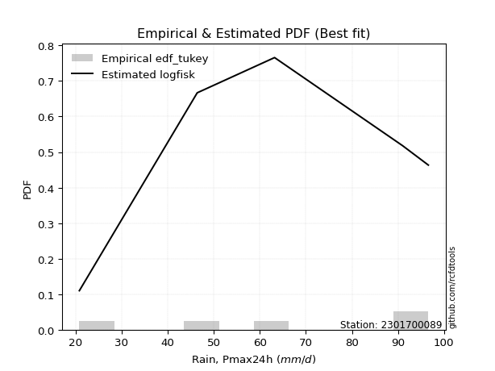</img>

</div>


### 8. EDF Gringorten (1963)

Gringorten plotting position formula is essential for estimating the probability and return periods of extreme events like floods and heavy rainfall. The constant _a=0.44_.

<div align="center">


$P=(m-a)/(n+1-2a)$


</div>


**8.1. Empirical values**

<div align="center">

|                | 0                   | 1                  | 2              | 3                 | 4                  |
|:---------------|:--------------------|:-------------------|:---------------|:------------------|:-------------------|
| date           | 2024                | 2022               | 2021           | 2020              | 2019               |
| x              | 20.8                | 46.4               | 63.2           | 91.0              | 96.6               |
| m              | 1                   | 2                  | 3              | 4                 | 5                  |
| empirical_dist | edf_gringorten      | edf_gringorten     | edf_gringorten | edf_gringorten    | edf_gringorten     |
| empirical      | 0.10937500000000001 | 0.3046875          | 0.5            | 0.6953125         | 0.8906249999999999 |
| empirical_tr   | 1.1228070175438596  | 1.4382022471910112 | 2.0            | 3.282051282051282 | 9.142857142857133  |

</div>


**8.2. Kolmogorov-Smirnov fit test (sorted by Δ)**


<div align="center">

|                | 0                   | 1                   | 2                   | 3                   | 4                   | 5                   | 6                  | 7                  | 8                   | 9                   | 10                  | 11                  | 12                  | 13                  | 14                  | 15                  | 16                  | 17                  | 18                  | 19                  | 20                  | 21                 | 22                 | 23                  | 24                  | 25                 | 26                  | 27                 | 28                  | 29                 | 30                  | 31                  | 32                  | 33                  | 34                  | 35                  | 36                  | 37                  | 38                 | 39                  | 40                 | 41                  | 42                  | 43                  | 44                 | 45                  | 46                 | 47                  | 48                  | 49                  | 50                  | 51                    | 52                 | 53                 | 54                  | 55                  | 56                  | 57                 | 58                 | 59                  | 60                 | 61                  | 62                  | 63                 | 64                  | 65                  | 66                  | 67                  | 68                  | 69                  | 70                  | 71                  | 72                  | 73                  | 74                  | 75                  | 76                 | 77                 | 78                 | 79                 | 80                  | 81                 | 82                  | 83                 | 84                 | 85                 | 86                 | 87                 |
|:---------------|:--------------------|:--------------------|:--------------------|:--------------------|:--------------------|:--------------------|:-------------------|:-------------------|:--------------------|:--------------------|:--------------------|:--------------------|:--------------------|:--------------------|:--------------------|:--------------------|:--------------------|:--------------------|:--------------------|:--------------------|:--------------------|:-------------------|:-------------------|:--------------------|:--------------------|:-------------------|:--------------------|:-------------------|:--------------------|:-------------------|:--------------------|:--------------------|:--------------------|:--------------------|:--------------------|:--------------------|:--------------------|:--------------------|:-------------------|:--------------------|:-------------------|:--------------------|:--------------------|:--------------------|:-------------------|:--------------------|:-------------------|:--------------------|:--------------------|:--------------------|:--------------------|:----------------------|:-------------------|:-------------------|:--------------------|:--------------------|:--------------------|:-------------------|:-------------------|:--------------------|:-------------------|:--------------------|:--------------------|:-------------------|:--------------------|:--------------------|:--------------------|:--------------------|:--------------------|:--------------------|:--------------------|:--------------------|:--------------------|:--------------------|:--------------------|:--------------------|:-------------------|:-------------------|:-------------------|:-------------------|:--------------------|:-------------------|:--------------------|:-------------------|:-------------------|:-------------------|:-------------------|:-------------------|
| station        | 2301700089          | 2301700089          | 2301700089          | 2301700089          | 2301700089          | 2301700089          | 2301700089         | 2301700089         | 2301700089          | 2301700089          | 2301700089          | 2301700089          | 2301700089          | 2301700089          | 2301700089          | 2301700089          | 2301700089          | 2301700089          | 2301700089          | 2301700089          | 2301700089          | 2301700089         | 2301700089         | 2301700089          | 2301700089          | 2301700089         | 2301700089          | 2301700089         | 2301700089          | 2301700089         | 2301700089          | 2301700089          | 2301700089          | 2301700089          | 2301700089          | 2301700089          | 2301700089          | 2301700089          | 2301700089         | 2301700089          | 2301700089         | 2301700089          | 2301700089          | 2301700089          | 2301700089         | 2301700089          | 2301700089         | 2301700089          | 2301700089          | 2301700089          | 2301700089          | 2301700089            | 2301700089         | 2301700089         | 2301700089          | 2301700089          | 2301700089          | 2301700089         | 2301700089         | 2301700089          | 2301700089         | 2301700089          | 2301700089          | 2301700089         | 2301700089          | 2301700089          | 2301700089          | 2301700089          | 2301700089          | 2301700089          | 2301700089          | 2301700089          | 2301700089          | 2301700089          | 2301700089          | 2301700089          | 2301700089         | 2301700089         | 2301700089         | 2301700089         | 2301700089          | 2301700089         | 2301700089          | 2301700089         | 2301700089         | 2301700089         | 2301700089         | 2301700089         |
| empirical_dist | edf_gringorten      | edf_gringorten      | edf_gringorten      | edf_gringorten      | edf_gringorten      | edf_gringorten      | edf_gringorten     | edf_gringorten     | edf_gringorten      | edf_gringorten      | edf_gringorten      | edf_gringorten      | edf_gringorten      | edf_gringorten      | edf_gringorten      | edf_gringorten      | edf_gringorten      | edf_gringorten      | edf_gringorten      | edf_gringorten      | edf_gringorten      | edf_gringorten     | edf_gringorten     | edf_gringorten      | edf_gringorten      | edf_gringorten     | edf_gringorten      | edf_gringorten     | edf_gringorten      | edf_gringorten     | edf_gringorten      | edf_gringorten      | edf_gringorten      | edf_gringorten      | edf_gringorten      | edf_gringorten      | edf_gringorten      | edf_gringorten      | edf_gringorten     | edf_gringorten      | edf_gringorten     | edf_gringorten      | edf_gringorten      | edf_gringorten      | edf_gringorten     | edf_gringorten      | edf_gringorten     | edf_gringorten      | edf_gringorten      | edf_gringorten      | edf_gringorten      | edf_gringorten        | edf_gringorten     | edf_gringorten     | edf_gringorten      | edf_gringorten      | edf_gringorten      | edf_gringorten     | edf_gringorten     | edf_gringorten      | edf_gringorten     | edf_gringorten      | edf_gringorten      | edf_gringorten     | edf_gringorten      | edf_gringorten      | edf_gringorten      | edf_gringorten      | edf_gringorten      | edf_gringorten      | edf_gringorten      | edf_gringorten      | edf_gringorten      | edf_gringorten      | edf_gringorten      | edf_gringorten      | edf_gringorten     | edf_gringorten     | edf_gringorten     | edf_gringorten     | edf_gringorten      | edf_gringorten     | edf_gringorten      | edf_gringorten     | edf_gringorten     | edf_gringorten     | edf_gringorten     | edf_gringorten     |
| p_dist         | logfisk             | loginvgauss         | logalpha            | logncf              | loggamma            | loggamma            | lognct             | loginvgamma        | logbetaprime        | logpearson3         | logrice             | logerlang           | logf                | logexponnorm        | lognorm             | lognorm             | logcrystalball      | logt                | logfatiguelife      | logmaxwell          | lograyleigh         | fisk               | loggumbel_l        | kstwobign           | betaprime           | invgauss           | chi2                | loginvweibull      | loglogistic         | loggompertz        | rice                | invgamma            | rayleigh            | maxwell             | gamma               | f                   | halfnorm            | erlang              | alpha              | crystalball         | norm               | exponnorm           | nct                 | t                   | pearson3           | logweibull_min      | gompertz           | weibull_min         | laplace_asymmetric  | genexpon            | expon               | loglaplace_asymmetric | loghypsecant       | loghalfnorm        | gumbel_r            | halflogistic        | loggumbel_r         | logistic           | loglaplace         | moyal               | gumbel_l           | logkstwobign        | hypsecant           | loghalflogistic    | laplace             | logmoyal            | wald                | mielke              | logmielke           | logloggamma         | loggenexpon         | gibrat              | logwald             | logexpon            | loggibrat           | nakagami            | logtruncnorm       | lognakagami        | logchi2            | ncf                | loglognorm          | fatiguelife        | invweibull          | logjohnsonsu       | johnsonsu          | truncnorm          | loggenlogistic     | genlogistic        |
| delta          | 0.09130765637794003 | 0.10220913261708686 | 0.10230749062695521 | 0.10924058934737213 | 0.10960493428341644 | 0.10960493428341644 | 0.1104741006645904 | 0.1107402583810373 | 0.11087864582125195 | 0.11242649344691413 | 0.11257989123590828 | 0.11332160195748076 | 0.11338214159484372 | 0.11464285579939237 | 0.11464307396522977 | 0.11464307396522977 | 0.11464328969585214 | 0.11464336074936776 | 0.11588619484461082 | 0.11678338645114672 | 0.12536043003717112 | 0.1266220520436454 | 0.1275253591312432 | 0.12960579636124803 | 0.13206619018217836 | 0.1326131094693065 | 0.13330850213298606 | 0.1344075909702368 | 0.13558913347681845 | 0.1363268191312742 | 0.13677282421305337 | 0.13712675407303188 | 0.13724216409482537 | 0.13767119243150572 | 0.13792048775064825 | 0.13838710529126463 | 0.13839885091017134 | 0.13872531245477338 | 0.1390924445705244 | 0.13933222375468213 | 0.1393322278056004 | 0.13933264914157806 | 0.13934435531691802 | 0.13935733998269317 | 0.1393947496606487 | 0.13962333681686734 | 0.1401132545872723 | 0.14219269973098814 | 0.14441836794760543 | 0.14545180231094623 | 0.14547408845946241 | 0.1454938820979046    | 0.1475937417635833 | 0.14971140091223   | 0.15575738960873198 | 0.15629970991798436 | 0.15687644644305787 | 0.1584290211465902 | 0.1601835619426757 | 0.16194783676796332 | 0.1630979522844438 | 0.16659694037706818 | 0.16865408533105897 | 0.1779043669112882 | 0.17834131213641946 | 0.18013070073453463 | 0.18711564636880185 | 0.18974192434720483 | 0.19464318558312033 | 0.20083831460224544 | 0.20555806262921705 | 0.21160202557746666 | 0.24482489114935346 | 0.25246370944072405 | 0.27616766177442775 | 0.30448724213774037 | 0.304684122032258  | 0.3046874999999928 | 0.3230273442537335 | 0.3280266443867818 | 0.37687136465943405 | 0.4419005295611329 | 0.46662067091170994 | 0.6545967613874752 | 0.6693361857370648 | 0.6953117578897667 | 0.6953125          | 0.6953125          |
| deltao         | 0.5865427407550001  | 0.5865427407550001  | 0.5865427407550001  | 0.5865427407550001  | 0.5865427407550001  | 0.5865427407550001  | 0.5865427407550001 | 0.5865427407550001 | 0.5865427407550001  | 0.5865427407550001  | 0.5865427407550001  | 0.5865427407550001  | 0.5865427407550001  | 0.5865427407550001  | 0.5865427407550001  | 0.5865427407550001  | 0.5865427407550001  | 0.5865427407550001  | 0.5865427407550001  | 0.5865427407550001  | 0.5865427407550001  | 0.5865427407550001 | 0.5865427407550001 | 0.5865427407550001  | 0.5865427407550001  | 0.5865427407550001 | 0.5865427407550001  | 0.5865427407550001 | 0.5865427407550001  | 0.5865427407550001 | 0.5865427407550001  | 0.5865427407550001  | 0.5865427407550001  | 0.5865427407550001  | 0.5865427407550001  | 0.5865427407550001  | 0.5865427407550001  | 0.5865427407550001  | 0.5865427407550001 | 0.5865427407550001  | 0.5865427407550001 | 0.5865427407550001  | 0.5865427407550001  | 0.5865427407550001  | 0.5865427407550001 | 0.5865427407550001  | 0.5865427407550001 | 0.5865427407550001  | 0.5865427407550001  | 0.5865427407550001  | 0.5865427407550001  | 0.5865427407550001    | 0.5865427407550001 | 0.5865427407550001 | 0.5865427407550001  | 0.5865427407550001  | 0.5865427407550001  | 0.5865427407550001 | 0.5865427407550001 | 0.5865427407550001  | 0.5865427407550001 | 0.5865427407550001  | 0.5865427407550001  | 0.5865427407550001 | 0.5865427407550001  | 0.5865427407550001  | 0.5865427407550001  | 0.5865427407550001  | 0.5865427407550001  | 0.5865427407550001  | 0.5865427407550001  | 0.5865427407550001  | 0.5865427407550001  | 0.5865427407550001  | 0.5865427407550001  | 0.5865427407550001  | 0.5865427407550001 | 0.5865427407550001 | 0.5865427407550001 | 0.5865427407550001 | 0.5865427407550001  | 0.5865427407550001 | 0.5865427407550001  | 0.5865427407550001 | 0.5865427407550001 | 0.5865427407550001 | 0.5865427407550001 | 0.5865427407550001 |
| eval           | Δo > Δ              | Δo > Δ              | Δo > Δ              | Δo > Δ              | Δo > Δ              | Δo > Δ              | Δo > Δ             | Δo > Δ             | Δo > Δ              | Δo > Δ              | Δo > Δ              | Δo > Δ              | Δo > Δ              | Δo > Δ              | Δo > Δ              | Δo > Δ              | Δo > Δ              | Δo > Δ              | Δo > Δ              | Δo > Δ              | Δo > Δ              | Δo > Δ             | Δo > Δ             | Δo > Δ              | Δo > Δ              | Δo > Δ             | Δo > Δ              | Δo > Δ             | Δo > Δ              | Δo > Δ             | Δo > Δ              | Δo > Δ              | Δo > Δ              | Δo > Δ              | Δo > Δ              | Δo > Δ              | Δo > Δ              | Δo > Δ              | Δo > Δ             | Δo > Δ              | Δo > Δ             | Δo > Δ              | Δo > Δ              | Δo > Δ              | Δo > Δ             | Δo > Δ              | Δo > Δ             | Δo > Δ              | Δo > Δ              | Δo > Δ              | Δo > Δ              | Δo > Δ                | Δo > Δ             | Δo > Δ             | Δo > Δ              | Δo > Δ              | Δo > Δ              | Δo > Δ             | Δo > Δ             | Δo > Δ              | Δo > Δ             | Δo > Δ              | Δo > Δ              | Δo > Δ             | Δo > Δ              | Δo > Δ              | Δo > Δ              | Δo > Δ              | Δo > Δ              | Δo > Δ              | Δo > Δ              | Δo > Δ              | Δo > Δ              | Δo > Δ              | Δo > Δ              | Δo > Δ              | Δo > Δ             | Δo > Δ             | Δo > Δ             | Δo > Δ             | Δo > Δ              | Δo > Δ             | Δo > Δ              | Δo <= Δ            | Δo <= Δ            | Δo <= Δ            | Δo <= Δ            | Δo <= Δ            |
| fit            | 1                   | 1                   | 1                   | 1                   | 1                   | 1                   | 1                  | 1                  | 1                   | 1                   | 1                   | 1                   | 1                   | 1                   | 1                   | 1                   | 1                   | 1                   | 1                   | 1                   | 1                   | 1                  | 1                  | 1                   | 1                   | 1                  | 1                   | 1                  | 1                   | 1                  | 1                   | 1                   | 1                   | 1                   | 1                   | 1                   | 1                   | 1                   | 1                  | 1                   | 1                  | 1                   | 1                   | 1                   | 1                  | 1                   | 1                  | 1                   | 1                   | 1                   | 1                   | 1                     | 1                  | 1                  | 1                   | 1                   | 1                   | 1                  | 1                  | 1                   | 1                  | 1                   | 1                   | 1                  | 1                   | 1                   | 1                   | 1                   | 1                   | 1                   | 1                   | 1                   | 1                   | 1                   | 1                   | 1                   | 1                  | 1                  | 1                  | 1                  | 1                   | 1                  | 1                   | 0                  | 0                  | 0                  | 0                  | 0                  |
| n              | 5                   | 5                   | 5                   | 5                   | 5                   | 5                   | 5                  | 5                  | 5                   | 5                   | 5                   | 5                   | 5                   | 5                   | 5                   | 5                   | 5                   | 5                   | 5                   | 5                   | 5                   | 5                  | 5                  | 5                   | 5                   | 5                  | 5                   | 5                  | 5                   | 5                  | 5                   | 5                   | 5                   | 5                   | 5                   | 5                   | 5                   | 5                   | 5                  | 5                   | 5                  | 5                   | 5                   | 5                   | 5                  | 5                   | 5                  | 5                   | 5                   | 5                   | 5                   | 5                     | 5                  | 5                  | 5                   | 5                   | 5                   | 5                  | 5                  | 5                   | 5                  | 5                   | 5                   | 5                  | 5                   | 5                   | 5                   | 5                   | 5                   | 5                   | 5                   | 5                   | 5                   | 5                   | 5                   | 5                   | 5                  | 5                  | 5                  | 5                  | 5                   | 5                  | 5                   | 5                  | 5                  | 5                  | 5                  | 5                  |
| best_fit       | 1                   | 0                   | 0                   | 0                   | 0                   | 0                   | 0                  | 0                  | 0                   | 0                   | 0                   | 0                   | 0                   | 0                   | 0                   | 0                   | 0                   | 0                   | 0                   | 0                   | 0                   | 0                  | 0                  | 0                   | 0                   | 0                  | 0                   | 0                  | 0                   | 0                  | 0                   | 0                   | 0                   | 0                   | 0                   | 0                   | 0                   | 0                   | 0                  | 0                   | 0                  | 0                   | 0                   | 0                   | 0                  | 0                   | 0                  | 0                   | 0                   | 0                   | 0                   | 0                     | 0                  | 0                  | 0                   | 0                   | 0                   | 0                  | 0                  | 0                   | 0                  | 0                   | 0                   | 0                  | 0                   | 0                   | 0                   | 0                   | 0                   | 0                   | 0                   | 0                   | 0                   | 0                   | 0                   | 0                   | 0                  | 0                  | 0                  | 0                  | 0                   | 0                  | 0                   | 0                  | 0                  | 0                  | 0                  | 0                  |
| best_fit_sort  | 1                   | 2                   | 3                   | 4                   | 5                   | 6                   | 7                  | 8                  | 9                   | 10                  | 11                  | 12                  | 13                  | 14                  | 15                  | 16                  | 17                  | 18                  | 19                  | 20                  | 21                  | 22                 | 23                 | 24                  | 25                  | 26                 | 27                  | 28                 | 29                  | 30                 | 31                  | 32                  | 33                  | 34                  | 35                  | 36                  | 37                  | 38                  | 39                 | 40                  | 41                 | 42                  | 43                  | 44                  | 45                 | 46                  | 47                 | 48                  | 49                  | 50                  | 51                  | 52                    | 53                 | 54                 | 55                  | 56                  | 57                  | 58                 | 59                 | 60                  | 61                 | 62                  | 63                  | 64                 | 65                  | 66                  | 67                  | 68                  | 69                  | 70                  | 71                  | 72                  | 73                  | 74                  | 75                  | 76                  | 77                 | 78                 | 79                 | 80                 | 81                  | 82                 | 83                  | 84                 | 85                 | 86                 | 87                 | 88                 |

</div>


**8.3. Best fit**

<div align="center">

|   id |    station | empirical_dist   | p_dist   |     delta |   deltao | eval   |   fit |   n |   best_fit |   best_fit_sort |
|-----:|-----------:|:-----------------|:---------|----------:|---------:|:-------|------:|----:|-----------:|----------------:|
|    0 | 2301700089 | edf_gringorten   | logfisk  | 0.0913077 | 0.586543 | Δo > Δ |     1 |   5 |          1 |               1 |

</div>


<div align="center">

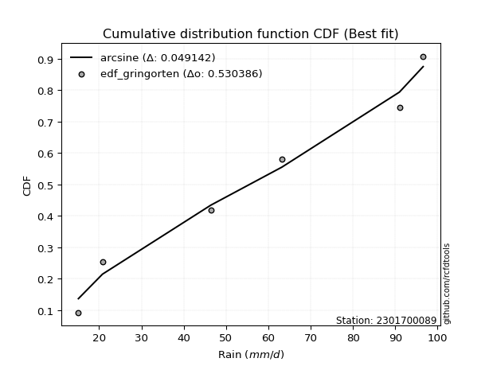</img>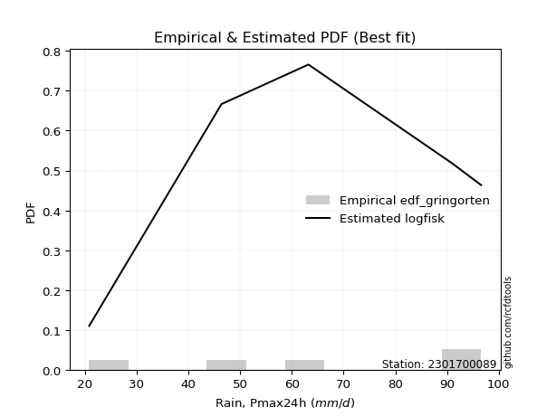</img>

</div>


### 9. EDF Filliben (1975)

The specific values of the constants (0.3175) (often denoted as $alpha$) and (0.365) are derived from a method proposed by James J. Filliben in a 1975 paper. This particular formula is the mean value of the $i$-th order statistic of the normal distribution and is considered a robust and effective plotting position formula for the normal probability plot correlation coefficient test for normality.

<div align="center">


$P=(m-0.3175)/(n+0.365)$


</div>


**9.1. Empirical values**

<div align="center">

|                | 0                   | 1                  | 2            | 3                  | 4                  |
|:---------------|:--------------------|:-------------------|:-------------|:-------------------|:-------------------|
| date           | 2024                | 2022               | 2021         | 2020               | 2019               |
| x              | 20.8                | 46.4               | 63.2         | 91.0               | 96.6               |
| m              | 1                   | 2                  | 3            | 4                  | 5                  |
| empirical_dist | edf_filliben        | edf_filliben       | edf_filliben | edf_filliben       | edf_filliben       |
| empirical      | 0.12721342031686858 | 0.3136067101584343 | 0.5          | 0.6863932898415657 | 0.8727865796831314 |
| empirical_tr   | 1.1457554725040042  | 1.456890699253225  | 2.0          | 3.188707280832095  | 7.860805860805863  |

</div>


**9.2. Kolmogorov-Smirnov fit test (sorted by Δ)**


<div align="center">

|                | 0                   | 1                  | 2                   | 3                   | 4                   | 5                   | 6                   | 7                   | 8                   | 9                   | 10                  | 11                  | 12                  | 13                 | 14                 | 15                 | 16                  | 17                 | 18                  | 19                  | 20                  | 21                  | 22                  | 23                  | 24                  | 25                  | 26                  | 27                 | 28                  | 29                 | 30                  | 31                  | 32                 | 33                 | 34                 | 35                  | 36                  | 37                  | 38                  | 39                 | 40                  | 41                  | 42                  | 43                 | 44                  | 45                 | 46                  | 47                  | 48                  | 49                 | 50                  | 51                  | 52                    | 53                  | 54                  | 55                 | 56                 | 57                 | 58                  | 59                  | 60                  | 61                  | 62                 | 63                 | 64                  | 65                 | 66                  | 67                  | 68                  | 69                  | 70                  | 71                 | 72                  | 73                  | 74                  | 75                 | 76                  | 77                  | 78                  | 79                 | 80                 | 81                  | 82                 | 83                 | 84                 | 85                 | 86                 | 87                 |
|:---------------|:--------------------|:-------------------|:--------------------|:--------------------|:--------------------|:--------------------|:--------------------|:--------------------|:--------------------|:--------------------|:--------------------|:--------------------|:--------------------|:-------------------|:-------------------|:-------------------|:--------------------|:-------------------|:--------------------|:--------------------|:--------------------|:--------------------|:--------------------|:--------------------|:--------------------|:--------------------|:--------------------|:-------------------|:--------------------|:-------------------|:--------------------|:--------------------|:-------------------|:-------------------|:-------------------|:--------------------|:--------------------|:--------------------|:--------------------|:-------------------|:--------------------|:--------------------|:--------------------|:-------------------|:--------------------|:-------------------|:--------------------|:--------------------|:--------------------|:-------------------|:--------------------|:--------------------|:----------------------|:--------------------|:--------------------|:-------------------|:-------------------|:-------------------|:--------------------|:--------------------|:--------------------|:--------------------|:-------------------|:-------------------|:--------------------|:-------------------|:--------------------|:--------------------|:--------------------|:--------------------|:--------------------|:-------------------|:--------------------|:--------------------|:--------------------|:-------------------|:--------------------|:--------------------|:--------------------|:-------------------|:-------------------|:--------------------|:-------------------|:-------------------|:-------------------|:-------------------|:-------------------|:-------------------|
| station        | 2301700089          | 2301700089         | 2301700089          | 2301700089          | 2301700089          | 2301700089          | 2301700089          | 2301700089          | 2301700089          | 2301700089          | 2301700089          | 2301700089          | 2301700089          | 2301700089         | 2301700089         | 2301700089         | 2301700089          | 2301700089         | 2301700089          | 2301700089          | 2301700089          | 2301700089          | 2301700089          | 2301700089          | 2301700089          | 2301700089          | 2301700089          | 2301700089         | 2301700089          | 2301700089         | 2301700089          | 2301700089          | 2301700089         | 2301700089         | 2301700089         | 2301700089          | 2301700089          | 2301700089          | 2301700089          | 2301700089         | 2301700089          | 2301700089          | 2301700089          | 2301700089         | 2301700089          | 2301700089         | 2301700089          | 2301700089          | 2301700089          | 2301700089         | 2301700089          | 2301700089          | 2301700089            | 2301700089          | 2301700089          | 2301700089         | 2301700089         | 2301700089         | 2301700089          | 2301700089          | 2301700089          | 2301700089          | 2301700089         | 2301700089         | 2301700089          | 2301700089         | 2301700089          | 2301700089          | 2301700089          | 2301700089          | 2301700089          | 2301700089         | 2301700089          | 2301700089          | 2301700089          | 2301700089         | 2301700089          | 2301700089          | 2301700089          | 2301700089         | 2301700089         | 2301700089          | 2301700089         | 2301700089         | 2301700089         | 2301700089         | 2301700089         | 2301700089         |
| empirical_dist | edf_filliben        | edf_filliben       | edf_filliben        | edf_filliben        | edf_filliben        | edf_filliben        | edf_filliben        | edf_filliben        | edf_filliben        | edf_filliben        | edf_filliben        | edf_filliben        | edf_filliben        | edf_filliben       | edf_filliben       | edf_filliben       | edf_filliben        | edf_filliben       | edf_filliben        | edf_filliben        | edf_filliben        | edf_filliben        | edf_filliben        | edf_filliben        | edf_filliben        | edf_filliben        | edf_filliben        | edf_filliben       | edf_filliben        | edf_filliben       | edf_filliben        | edf_filliben        | edf_filliben       | edf_filliben       | edf_filliben       | edf_filliben        | edf_filliben        | edf_filliben        | edf_filliben        | edf_filliben       | edf_filliben        | edf_filliben        | edf_filliben        | edf_filliben       | edf_filliben        | edf_filliben       | edf_filliben        | edf_filliben        | edf_filliben        | edf_filliben       | edf_filliben        | edf_filliben        | edf_filliben          | edf_filliben        | edf_filliben        | edf_filliben       | edf_filliben       | edf_filliben       | edf_filliben        | edf_filliben        | edf_filliben        | edf_filliben        | edf_filliben       | edf_filliben       | edf_filliben        | edf_filliben       | edf_filliben        | edf_filliben        | edf_filliben        | edf_filliben        | edf_filliben        | edf_filliben       | edf_filliben        | edf_filliben        | edf_filliben        | edf_filliben       | edf_filliben        | edf_filliben        | edf_filliben        | edf_filliben       | edf_filliben       | edf_filliben        | edf_filliben       | edf_filliben       | edf_filliben       | edf_filliben       | edf_filliben       | edf_filliben       |
| p_dist         | logfisk             | loginvgauss        | logalpha            | logncf              | loggamma            | loggamma            | lognct              | loginvgamma         | logbetaprime        | logpearson3         | logrice             | logerlang           | logf                | logexponnorm       | lognorm            | lognorm            | logcrystalball      | logt               | logfatiguelife      | logmaxwell          | loginvweibull       | lograyleigh         | fisk                | loggumbel_l         | genexpon            | expon               | kstwobign           | betaprime          | invgauss            | chi2               | loglogistic         | loggompertz         | rice               | invgamma           | rayleigh           | maxwell             | gamma               | f                   | halfnorm            | erlang             | alpha               | crystalball         | norm                | exponnorm          | nct                 | t                  | pearson3            | logweibull_min      | gompertz            | loghalfnorm        | weibull_min         | laplace_asymmetric  | loglaplace_asymmetric | loghypsecant        | loggumbel_r         | logkstwobign       | gumbel_r           | halflogistic       | logistic            | loglaplace          | moyal               | gumbel_l            | hypsecant          | loghalflogistic    | logmoyal            | laplace            | wald                | loggenexpon         | mielke              | logmielke           | logloggamma         | gibrat             | logexpon            | logwald             | loggibrat           | ncf                | nakagami            | logtruncnorm        | lognakagami         | logchi2            | loglognorm         | fatiguelife         | invweibull         | logjohnsonsu       | johnsonsu          | truncnorm          | loggenlogistic     | genlogistic        |
| delta          | 0.10022686653637436 | 0.1111283427755212 | 0.11122670078538954 | 0.11815979950580646 | 0.11852414444185078 | 0.11852414444185078 | 0.11939331082302473 | 0.11965946853947163 | 0.11979785597968629 | 0.12134570360534847 | 0.12149910139434261 | 0.12224081211591509 | 0.12230135175327805 | 0.1235620659578267 | 0.1235622841236641 | 0.1235622841236641 | 0.12356249985428647 | 0.1235625709078021 | 0.12480540500304516 | 0.12516425774005802 | 0.12548838081180252 | 0.12562854483106478 | 0.13554126220207974 | 0.13644456928967752 | 0.13653259215251196 | 0.13655487830102814 | 0.13852500651968236 | 0.1409854003406127 | 0.14153231962774082 | 0.1422277122914204 | 0.14450834363525278 | 0.14524602928970853 | 0.1456920343714877 | 0.1460459642314662 | 0.1461613742532597 | 0.14659040258994005 | 0.14683969790908258 | 0.14730631544969897 | 0.14731806106860568 | 0.1476445226132077 | 0.14801165472895872 | 0.14825143391311646 | 0.14825143796403473 | 0.1482518593000124 | 0.14826356547535235 | 0.1482765501411275 | 0.14831395981908302 | 0.14854254697530167 | 0.14903246474570664 | 0.14971140091223   | 0.15111190988942247 | 0.15333757810603976 | 0.15441309225633892   | 0.15651295192201764 | 0.15687644644305787 | 0.1576777302186339 | 0.1646765997671663 | 0.1652189200764187 | 0.16734823130502452 | 0.16910277210111002 | 0.17086704692639765 | 0.17201716244287812 | 0.1775732954894933 | 0.1779043669112882 | 0.18013070073453463 | 0.1872605222948538 | 0.19603485652723618 | 0.19663885247078278 | 0.19866113450563916 | 0.20356239574155466 | 0.20975752476067977 | 0.220521235735901  | 0.24354449928228977 | 0.24482489114935346 | 0.27616766177442775 | 0.3101882240699132 | 0.31340645229617464 | 0.31360333219069225 | 0.31360671015842706 | 0.3141081340952992 | 0.3679521545009998 | 0.43298131940269863 | 0.4487822505948415 | 0.6456775512290409 | 0.6604169755786304 | 0.6863925477313324 | 0.6863932898415657 | 0.6863932898415657 |
| deltao         | 0.5865427407550001  | 0.5865427407550001 | 0.5865427407550001  | 0.5865427407550001  | 0.5865427407550001  | 0.5865427407550001  | 0.5865427407550001  | 0.5865427407550001  | 0.5865427407550001  | 0.5865427407550001  | 0.5865427407550001  | 0.5865427407550001  | 0.5865427407550001  | 0.5865427407550001 | 0.5865427407550001 | 0.5865427407550001 | 0.5865427407550001  | 0.5865427407550001 | 0.5865427407550001  | 0.5865427407550001  | 0.5865427407550001  | 0.5865427407550001  | 0.5865427407550001  | 0.5865427407550001  | 0.5865427407550001  | 0.5865427407550001  | 0.5865427407550001  | 0.5865427407550001 | 0.5865427407550001  | 0.5865427407550001 | 0.5865427407550001  | 0.5865427407550001  | 0.5865427407550001 | 0.5865427407550001 | 0.5865427407550001 | 0.5865427407550001  | 0.5865427407550001  | 0.5865427407550001  | 0.5865427407550001  | 0.5865427407550001 | 0.5865427407550001  | 0.5865427407550001  | 0.5865427407550001  | 0.5865427407550001 | 0.5865427407550001  | 0.5865427407550001 | 0.5865427407550001  | 0.5865427407550001  | 0.5865427407550001  | 0.5865427407550001 | 0.5865427407550001  | 0.5865427407550001  | 0.5865427407550001    | 0.5865427407550001  | 0.5865427407550001  | 0.5865427407550001 | 0.5865427407550001 | 0.5865427407550001 | 0.5865427407550001  | 0.5865427407550001  | 0.5865427407550001  | 0.5865427407550001  | 0.5865427407550001 | 0.5865427407550001 | 0.5865427407550001  | 0.5865427407550001 | 0.5865427407550001  | 0.5865427407550001  | 0.5865427407550001  | 0.5865427407550001  | 0.5865427407550001  | 0.5865427407550001 | 0.5865427407550001  | 0.5865427407550001  | 0.5865427407550001  | 0.5865427407550001 | 0.5865427407550001  | 0.5865427407550001  | 0.5865427407550001  | 0.5865427407550001 | 0.5865427407550001 | 0.5865427407550001  | 0.5865427407550001 | 0.5865427407550001 | 0.5865427407550001 | 0.5865427407550001 | 0.5865427407550001 | 0.5865427407550001 |
| eval           | Δo > Δ              | Δo > Δ             | Δo > Δ              | Δo > Δ              | Δo > Δ              | Δo > Δ              | Δo > Δ              | Δo > Δ              | Δo > Δ              | Δo > Δ              | Δo > Δ              | Δo > Δ              | Δo > Δ              | Δo > Δ             | Δo > Δ             | Δo > Δ             | Δo > Δ              | Δo > Δ             | Δo > Δ              | Δo > Δ              | Δo > Δ              | Δo > Δ              | Δo > Δ              | Δo > Δ              | Δo > Δ              | Δo > Δ              | Δo > Δ              | Δo > Δ             | Δo > Δ              | Δo > Δ             | Δo > Δ              | Δo > Δ              | Δo > Δ             | Δo > Δ             | Δo > Δ             | Δo > Δ              | Δo > Δ              | Δo > Δ              | Δo > Δ              | Δo > Δ             | Δo > Δ              | Δo > Δ              | Δo > Δ              | Δo > Δ             | Δo > Δ              | Δo > Δ             | Δo > Δ              | Δo > Δ              | Δo > Δ              | Δo > Δ             | Δo > Δ              | Δo > Δ              | Δo > Δ                | Δo > Δ              | Δo > Δ              | Δo > Δ             | Δo > Δ             | Δo > Δ             | Δo > Δ              | Δo > Δ              | Δo > Δ              | Δo > Δ              | Δo > Δ             | Δo > Δ             | Δo > Δ              | Δo > Δ             | Δo > Δ              | Δo > Δ              | Δo > Δ              | Δo > Δ              | Δo > Δ              | Δo > Δ             | Δo > Δ              | Δo > Δ              | Δo > Δ              | Δo > Δ             | Δo > Δ              | Δo > Δ              | Δo > Δ              | Δo > Δ             | Δo > Δ             | Δo > Δ              | Δo > Δ             | Δo <= Δ            | Δo <= Δ            | Δo <= Δ            | Δo <= Δ            | Δo <= Δ            |
| fit            | 1                   | 1                  | 1                   | 1                   | 1                   | 1                   | 1                   | 1                   | 1                   | 1                   | 1                   | 1                   | 1                   | 1                  | 1                  | 1                  | 1                   | 1                  | 1                   | 1                   | 1                   | 1                   | 1                   | 1                   | 1                   | 1                   | 1                   | 1                  | 1                   | 1                  | 1                   | 1                   | 1                  | 1                  | 1                  | 1                   | 1                   | 1                   | 1                   | 1                  | 1                   | 1                   | 1                   | 1                  | 1                   | 1                  | 1                   | 1                   | 1                   | 1                  | 1                   | 1                   | 1                     | 1                   | 1                   | 1                  | 1                  | 1                  | 1                   | 1                   | 1                   | 1                   | 1                  | 1                  | 1                   | 1                  | 1                   | 1                   | 1                   | 1                   | 1                   | 1                  | 1                   | 1                   | 1                   | 1                  | 1                   | 1                   | 1                   | 1                  | 1                  | 1                   | 1                  | 0                  | 0                  | 0                  | 0                  | 0                  |
| n              | 5                   | 5                  | 5                   | 5                   | 5                   | 5                   | 5                   | 5                   | 5                   | 5                   | 5                   | 5                   | 5                   | 5                  | 5                  | 5                  | 5                   | 5                  | 5                   | 5                   | 5                   | 5                   | 5                   | 5                   | 5                   | 5                   | 5                   | 5                  | 5                   | 5                  | 5                   | 5                   | 5                  | 5                  | 5                  | 5                   | 5                   | 5                   | 5                   | 5                  | 5                   | 5                   | 5                   | 5                  | 5                   | 5                  | 5                   | 5                   | 5                   | 5                  | 5                   | 5                   | 5                     | 5                   | 5                   | 5                  | 5                  | 5                  | 5                   | 5                   | 5                   | 5                   | 5                  | 5                  | 5                   | 5                  | 5                   | 5                   | 5                   | 5                   | 5                   | 5                  | 5                   | 5                   | 5                   | 5                  | 5                   | 5                   | 5                   | 5                  | 5                  | 5                   | 5                  | 5                  | 5                  | 5                  | 5                  | 5                  |
| best_fit       | 1                   | 0                  | 0                   | 0                   | 0                   | 0                   | 0                   | 0                   | 0                   | 0                   | 0                   | 0                   | 0                   | 0                  | 0                  | 0                  | 0                   | 0                  | 0                   | 0                   | 0                   | 0                   | 0                   | 0                   | 0                   | 0                   | 0                   | 0                  | 0                   | 0                  | 0                   | 0                   | 0                  | 0                  | 0                  | 0                   | 0                   | 0                   | 0                   | 0                  | 0                   | 0                   | 0                   | 0                  | 0                   | 0                  | 0                   | 0                   | 0                   | 0                  | 0                   | 0                   | 0                     | 0                   | 0                   | 0                  | 0                  | 0                  | 0                   | 0                   | 0                   | 0                   | 0                  | 0                  | 0                   | 0                  | 0                   | 0                   | 0                   | 0                   | 0                   | 0                  | 0                   | 0                   | 0                   | 0                  | 0                   | 0                   | 0                   | 0                  | 0                  | 0                   | 0                  | 0                  | 0                  | 0                  | 0                  | 0                  |
| best_fit_sort  | 1                   | 2                  | 3                   | 4                   | 5                   | 6                   | 7                   | 8                   | 9                   | 10                  | 11                  | 12                  | 13                  | 14                 | 15                 | 16                 | 17                  | 18                 | 19                  | 20                  | 21                  | 22                  | 23                  | 24                  | 25                  | 26                  | 27                  | 28                 | 29                  | 30                 | 31                  | 32                  | 33                 | 34                 | 35                 | 36                  | 37                  | 38                  | 39                  | 40                 | 41                  | 42                  | 43                  | 44                 | 45                  | 46                 | 47                  | 48                  | 49                  | 50                 | 51                  | 52                  | 53                    | 54                  | 55                  | 56                 | 57                 | 58                 | 59                  | 60                  | 61                  | 62                  | 63                 | 64                 | 65                  | 66                 | 67                  | 68                  | 69                  | 70                  | 71                  | 72                 | 73                  | 74                  | 75                  | 76                 | 77                  | 78                  | 79                  | 80                 | 81                 | 82                  | 83                 | 84                 | 85                 | 86                 | 87                 | 88                 |

</div>


**9.3. Best fit**

<div align="center">

|   id |    station | empirical_dist   | p_dist   |    delta |   deltao | eval   |   fit |   n |   best_fit |   best_fit_sort |
|-----:|-----------:|:-----------------|:---------|---------:|---------:|:-------|------:|----:|-----------:|----------------:|
|    0 | 2301700089 | edf_filliben     | logfisk  | 0.100227 | 0.586543 | Δo > Δ |     1 |   5 |          1 |               1 |

</div>


<div align="center">

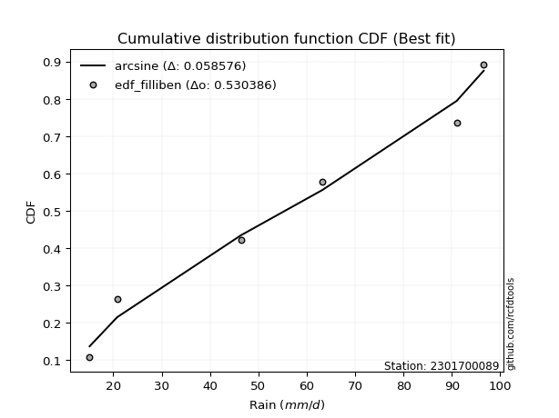</img>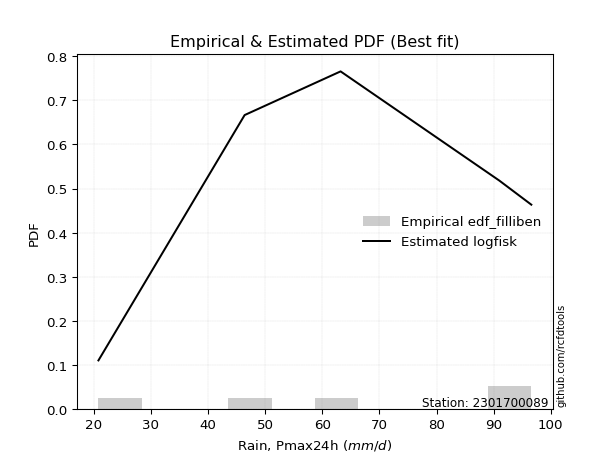</img>

</div>


### 10. EDF Jenkinson (1977)

The Jenkinson formula in hydrology is an empirical plotting position formula used to estimate the non-exceedance probability _(P)_ or return period _(T)_ of a given ordered observation within a sample. It is a widely used method in the frequency analysis of extreme events such as floods and rainfall, as it provides a distribution-free way to plot data. _a≈0.31_ and _b≈0.38_ are constants derived to approximate the median of the probability distribution for the given rank.

<div align="center">


$P=(m-a)/(n+b)$


</div>


**10.1. Empirical values**

<div align="center">

|                | 0                   | 1                  | 2             | 3                  | 4                  |
|:---------------|:--------------------|:-------------------|:--------------|:-------------------|:-------------------|
| date           | 2024                | 2022               | 2021          | 2020               | 2019               |
| x              | 20.8                | 46.4               | 63.2          | 91.0               | 96.6               |
| m              | 1                   | 2                  | 3             | 4                  | 5                  |
| empirical_dist | edf_jenkinson       | edf_jenkinson      | edf_jenkinson | edf_jenkinson      | edf_jenkinson      |
| empirical      | 0.12825278810408922 | 0.3141263940520446 | 0.5           | 0.6858736059479554 | 0.8717472118959109 |
| empirical_tr   | 1.1471215351812367  | 1.4579945799457996 | 2.0           | 3.183431952662722  | 7.797101449275368  |

</div>


**10.2. Kolmogorov-Smirnov fit test (sorted by Δ)**


<div align="center">

|                | 0                  | 1                   | 2                   | 3                  | 4                   | 5                   | 6                   | 7                   | 8                   | 9                  | 10                  | 11                  | 12                  | 13                  | 14                  | 15                  | 16                 | 17                  | 18                  | 19                 | 20                  | 21                  | 22                 | 23                 | 24                  | 25                  | 26                 | 27                  | 28                  | 29                  | 30                 | 31                  | 32                  | 33                  | 34                  | 35                  | 36                 | 37                 | 38                 | 39                  | 40                  | 41                 | 42                  | 43                  | 44                 | 45                  | 46                  | 47                 | 48                  | 49                 | 50                 | 51                 | 52                    | 53                  | 54                  | 55                  | 56                  | 57                  | 58                  | 59                  | 60                  | 61                  | 62                 | 63                  | 64                  | 65                  | 66                  | 67                 | 68                 | 69                 | 70                 | 71                  | 72                  | 73                  | 74                  | 75                 | 76                  | 77                 | 78                 | 79                 | 80                 | 81                 | 82                 | 83                 | 84                 | 85                 | 86                 | 87                 |
|:---------------|:-------------------|:--------------------|:--------------------|:-------------------|:--------------------|:--------------------|:--------------------|:--------------------|:--------------------|:-------------------|:--------------------|:--------------------|:--------------------|:--------------------|:--------------------|:--------------------|:-------------------|:--------------------|:--------------------|:-------------------|:--------------------|:--------------------|:-------------------|:-------------------|:--------------------|:--------------------|:-------------------|:--------------------|:--------------------|:--------------------|:-------------------|:--------------------|:--------------------|:--------------------|:--------------------|:--------------------|:-------------------|:-------------------|:-------------------|:--------------------|:--------------------|:-------------------|:--------------------|:--------------------|:-------------------|:--------------------|:--------------------|:-------------------|:--------------------|:-------------------|:-------------------|:-------------------|:----------------------|:--------------------|:--------------------|:--------------------|:--------------------|:--------------------|:--------------------|:--------------------|:--------------------|:--------------------|:-------------------|:--------------------|:--------------------|:--------------------|:--------------------|:-------------------|:-------------------|:-------------------|:-------------------|:--------------------|:--------------------|:--------------------|:--------------------|:-------------------|:--------------------|:-------------------|:-------------------|:-------------------|:-------------------|:-------------------|:-------------------|:-------------------|:-------------------|:-------------------|:-------------------|:-------------------|
| station        | 2301700089         | 2301700089          | 2301700089          | 2301700089         | 2301700089          | 2301700089          | 2301700089          | 2301700089          | 2301700089          | 2301700089         | 2301700089          | 2301700089          | 2301700089          | 2301700089          | 2301700089          | 2301700089          | 2301700089         | 2301700089          | 2301700089          | 2301700089         | 2301700089          | 2301700089          | 2301700089         | 2301700089         | 2301700089          | 2301700089          | 2301700089         | 2301700089          | 2301700089          | 2301700089          | 2301700089         | 2301700089          | 2301700089          | 2301700089          | 2301700089          | 2301700089          | 2301700089         | 2301700089         | 2301700089         | 2301700089          | 2301700089          | 2301700089         | 2301700089          | 2301700089          | 2301700089         | 2301700089          | 2301700089          | 2301700089         | 2301700089          | 2301700089         | 2301700089         | 2301700089         | 2301700089            | 2301700089          | 2301700089          | 2301700089          | 2301700089          | 2301700089          | 2301700089          | 2301700089          | 2301700089          | 2301700089          | 2301700089         | 2301700089          | 2301700089          | 2301700089          | 2301700089          | 2301700089         | 2301700089         | 2301700089         | 2301700089         | 2301700089          | 2301700089          | 2301700089          | 2301700089          | 2301700089         | 2301700089          | 2301700089         | 2301700089         | 2301700089         | 2301700089         | 2301700089         | 2301700089         | 2301700089         | 2301700089         | 2301700089         | 2301700089         | 2301700089         |
| empirical_dist | edf_jenkinson      | edf_jenkinson       | edf_jenkinson       | edf_jenkinson      | edf_jenkinson       | edf_jenkinson       | edf_jenkinson       | edf_jenkinson       | edf_jenkinson       | edf_jenkinson      | edf_jenkinson       | edf_jenkinson       | edf_jenkinson       | edf_jenkinson       | edf_jenkinson       | edf_jenkinson       | edf_jenkinson      | edf_jenkinson       | edf_jenkinson       | edf_jenkinson      | edf_jenkinson       | edf_jenkinson       | edf_jenkinson      | edf_jenkinson      | edf_jenkinson       | edf_jenkinson       | edf_jenkinson      | edf_jenkinson       | edf_jenkinson       | edf_jenkinson       | edf_jenkinson      | edf_jenkinson       | edf_jenkinson       | edf_jenkinson       | edf_jenkinson       | edf_jenkinson       | edf_jenkinson      | edf_jenkinson      | edf_jenkinson      | edf_jenkinson       | edf_jenkinson       | edf_jenkinson      | edf_jenkinson       | edf_jenkinson       | edf_jenkinson      | edf_jenkinson       | edf_jenkinson       | edf_jenkinson      | edf_jenkinson       | edf_jenkinson      | edf_jenkinson      | edf_jenkinson      | edf_jenkinson         | edf_jenkinson       | edf_jenkinson       | edf_jenkinson       | edf_jenkinson       | edf_jenkinson       | edf_jenkinson       | edf_jenkinson       | edf_jenkinson       | edf_jenkinson       | edf_jenkinson      | edf_jenkinson       | edf_jenkinson       | edf_jenkinson       | edf_jenkinson       | edf_jenkinson      | edf_jenkinson      | edf_jenkinson      | edf_jenkinson      | edf_jenkinson       | edf_jenkinson       | edf_jenkinson       | edf_jenkinson       | edf_jenkinson      | edf_jenkinson       | edf_jenkinson      | edf_jenkinson      | edf_jenkinson      | edf_jenkinson      | edf_jenkinson      | edf_jenkinson      | edf_jenkinson      | edf_jenkinson      | edf_jenkinson      | edf_jenkinson      | edf_jenkinson      |
| p_dist         | logfisk            | loginvgauss         | logalpha            | logncf             | loggamma            | loggamma            | lognct              | loginvgamma         | logbetaprime        | logpearson3        | logrice             | logerlang           | logf                | logexponnorm        | lognorm             | lognorm             | logcrystalball     | logt                | loginvweibull       | logfatiguelife     | logmaxwell          | lograyleigh         | genexpon           | expon              | fisk                | loggumbel_l         | kstwobign          | betaprime           | invgauss            | chi2                | loglogistic        | loggompertz         | rice                | invgamma            | rayleigh            | maxwell             | gamma              | f                  | halfnorm           | erlang              | alpha               | crystalball        | norm                | exponnorm           | nct                | t                   | pearson3            | logweibull_min     | gompertz            | loghalfnorm        | weibull_min        | laplace_asymmetric | loglaplace_asymmetric | loggumbel_r         | loghypsecant        | logkstwobign        | gumbel_r            | halflogistic        | logistic            | loglaplace          | moyal               | gumbel_l            | loghalflogistic    | hypsecant           | logmoyal            | laplace             | loggenexpon         | wald               | mielke             | logmielke          | logloggamma        | gibrat              | logexpon            | logwald             | loggibrat           | ncf                | logchi2             | nakagami           | logtruncnorm       | lognakagami        | loglognorm         | fatiguelife        | invweibull         | logjohnsonsu       | johnsonsu          | truncnorm          | loggenlogistic     | genlogistic        |
| delta          | 0.1007465504299846 | 0.11164802666913143 | 0.11174638467899978 | 0.1186794833994167 | 0.11904382833546101 | 0.11904382833546101 | 0.11991299471663497 | 0.12017915243308186 | 0.12031753987329652 | 0.1218653874989587 | 0.12201878528795285 | 0.12276049600952532 | 0.12282103564688829 | 0.12408174985143694 | 0.12408196801727434 | 0.12408196801727434 | 0.1240821837478967 | 0.12408225480141233 | 0.12496869691819218 | 0.1253250888966554 | 0.12568394163366825 | 0.12614822872467502 | 0.1360129082589016 | 0.1360351944074178 | 0.13606094609568997 | 0.13696425318328775 | 0.1390446904132926 | 0.14150508423422292 | 0.14205200352135106 | 0.14274739618503063 | 0.145028027528863  | 0.14576571318331877 | 0.14621171826509793 | 0.14656564812507644 | 0.14668105814686994 | 0.14711008648355028 | 0.1473593818026928 | 0.1478259993433092 | 0.1478377449622159 | 0.14816420650681794 | 0.14853133862256895 | 0.1487711178067267 | 0.14877112185764496 | 0.14877154319362262 | 0.1487832493689626 | 0.14879623403473774 | 0.14883364371269325 | 0.1490622308689119 | 0.14955214863931687 | 0.14971140091223   | 0.1516315937830327 | 0.15385726199965   | 0.15493277614994916   | 0.15687644644305787 | 0.15703263581562787 | 0.15715804632502356 | 0.16519628366077654 | 0.16573860397002893 | 0.16786791519863475 | 0.16962245599472026 | 0.17138673082000788 | 0.17253684633648836 | 0.1779043669112882 | 0.17809297938310353 | 0.18013070073453463 | 0.18778020618846403 | 0.19611916857717243 | 0.1965545404208464 | 0.1991808183992494 | 0.2040820796351649 | 0.21027720865429   | 0.22104091962951122 | 0.24302481538867943 | 0.24482489114935346 | 0.27616766177442775 | 0.3091488562826926 | 0.31358845020168885 | 0.313926136189785  | 0.3141230160843026 | 0.3141263940520374 | 0.3674324706073894 | 0.4324616355090883 | 0.4477428828076209 | 0.6451578673354307 | 0.6598972916850202 | 0.6858728638377221 | 0.6858736059479554 | 0.6858736059479554 |
| deltao         | 0.5865427407550001 | 0.5865427407550001  | 0.5865427407550001  | 0.5865427407550001 | 0.5865427407550001  | 0.5865427407550001  | 0.5865427407550001  | 0.5865427407550001  | 0.5865427407550001  | 0.5865427407550001 | 0.5865427407550001  | 0.5865427407550001  | 0.5865427407550001  | 0.5865427407550001  | 0.5865427407550001  | 0.5865427407550001  | 0.5865427407550001 | 0.5865427407550001  | 0.5865427407550001  | 0.5865427407550001 | 0.5865427407550001  | 0.5865427407550001  | 0.5865427407550001 | 0.5865427407550001 | 0.5865427407550001  | 0.5865427407550001  | 0.5865427407550001 | 0.5865427407550001  | 0.5865427407550001  | 0.5865427407550001  | 0.5865427407550001 | 0.5865427407550001  | 0.5865427407550001  | 0.5865427407550001  | 0.5865427407550001  | 0.5865427407550001  | 0.5865427407550001 | 0.5865427407550001 | 0.5865427407550001 | 0.5865427407550001  | 0.5865427407550001  | 0.5865427407550001 | 0.5865427407550001  | 0.5865427407550001  | 0.5865427407550001 | 0.5865427407550001  | 0.5865427407550001  | 0.5865427407550001 | 0.5865427407550001  | 0.5865427407550001 | 0.5865427407550001 | 0.5865427407550001 | 0.5865427407550001    | 0.5865427407550001  | 0.5865427407550001  | 0.5865427407550001  | 0.5865427407550001  | 0.5865427407550001  | 0.5865427407550001  | 0.5865427407550001  | 0.5865427407550001  | 0.5865427407550001  | 0.5865427407550001 | 0.5865427407550001  | 0.5865427407550001  | 0.5865427407550001  | 0.5865427407550001  | 0.5865427407550001 | 0.5865427407550001 | 0.5865427407550001 | 0.5865427407550001 | 0.5865427407550001  | 0.5865427407550001  | 0.5865427407550001  | 0.5865427407550001  | 0.5865427407550001 | 0.5865427407550001  | 0.5865427407550001 | 0.5865427407550001 | 0.5865427407550001 | 0.5865427407550001 | 0.5865427407550001 | 0.5865427407550001 | 0.5865427407550001 | 0.5865427407550001 | 0.5865427407550001 | 0.5865427407550001 | 0.5865427407550001 |
| eval           | Δo > Δ             | Δo > Δ              | Δo > Δ              | Δo > Δ             | Δo > Δ              | Δo > Δ              | Δo > Δ              | Δo > Δ              | Δo > Δ              | Δo > Δ             | Δo > Δ              | Δo > Δ              | Δo > Δ              | Δo > Δ              | Δo > Δ              | Δo > Δ              | Δo > Δ             | Δo > Δ              | Δo > Δ              | Δo > Δ             | Δo > Δ              | Δo > Δ              | Δo > Δ             | Δo > Δ             | Δo > Δ              | Δo > Δ              | Δo > Δ             | Δo > Δ              | Δo > Δ              | Δo > Δ              | Δo > Δ             | Δo > Δ              | Δo > Δ              | Δo > Δ              | Δo > Δ              | Δo > Δ              | Δo > Δ             | Δo > Δ             | Δo > Δ             | Δo > Δ              | Δo > Δ              | Δo > Δ             | Δo > Δ              | Δo > Δ              | Δo > Δ             | Δo > Δ              | Δo > Δ              | Δo > Δ             | Δo > Δ              | Δo > Δ             | Δo > Δ             | Δo > Δ             | Δo > Δ                | Δo > Δ              | Δo > Δ              | Δo > Δ              | Δo > Δ              | Δo > Δ              | Δo > Δ              | Δo > Δ              | Δo > Δ              | Δo > Δ              | Δo > Δ             | Δo > Δ              | Δo > Δ              | Δo > Δ              | Δo > Δ              | Δo > Δ             | Δo > Δ             | Δo > Δ             | Δo > Δ             | Δo > Δ              | Δo > Δ              | Δo > Δ              | Δo > Δ              | Δo > Δ             | Δo > Δ              | Δo > Δ             | Δo > Δ             | Δo > Δ             | Δo > Δ             | Δo > Δ             | Δo > Δ             | Δo <= Δ            | Δo <= Δ            | Δo <= Δ            | Δo <= Δ            | Δo <= Δ            |
| fit            | 1                  | 1                   | 1                   | 1                  | 1                   | 1                   | 1                   | 1                   | 1                   | 1                  | 1                   | 1                   | 1                   | 1                   | 1                   | 1                   | 1                  | 1                   | 1                   | 1                  | 1                   | 1                   | 1                  | 1                  | 1                   | 1                   | 1                  | 1                   | 1                   | 1                   | 1                  | 1                   | 1                   | 1                   | 1                   | 1                   | 1                  | 1                  | 1                  | 1                   | 1                   | 1                  | 1                   | 1                   | 1                  | 1                   | 1                   | 1                  | 1                   | 1                  | 1                  | 1                  | 1                     | 1                   | 1                   | 1                   | 1                   | 1                   | 1                   | 1                   | 1                   | 1                   | 1                  | 1                   | 1                   | 1                   | 1                   | 1                  | 1                  | 1                  | 1                  | 1                   | 1                   | 1                   | 1                   | 1                  | 1                   | 1                  | 1                  | 1                  | 1                  | 1                  | 1                  | 0                  | 0                  | 0                  | 0                  | 0                  |
| n              | 5                  | 5                   | 5                   | 5                  | 5                   | 5                   | 5                   | 5                   | 5                   | 5                  | 5                   | 5                   | 5                   | 5                   | 5                   | 5                   | 5                  | 5                   | 5                   | 5                  | 5                   | 5                   | 5                  | 5                  | 5                   | 5                   | 5                  | 5                   | 5                   | 5                   | 5                  | 5                   | 5                   | 5                   | 5                   | 5                   | 5                  | 5                  | 5                  | 5                   | 5                   | 5                  | 5                   | 5                   | 5                  | 5                   | 5                   | 5                  | 5                   | 5                  | 5                  | 5                  | 5                     | 5                   | 5                   | 5                   | 5                   | 5                   | 5                   | 5                   | 5                   | 5                   | 5                  | 5                   | 5                   | 5                   | 5                   | 5                  | 5                  | 5                  | 5                  | 5                   | 5                   | 5                   | 5                   | 5                  | 5                   | 5                  | 5                  | 5                  | 5                  | 5                  | 5                  | 5                  | 5                  | 5                  | 5                  | 5                  |
| best_fit       | 1                  | 0                   | 0                   | 0                  | 0                   | 0                   | 0                   | 0                   | 0                   | 0                  | 0                   | 0                   | 0                   | 0                   | 0                   | 0                   | 0                  | 0                   | 0                   | 0                  | 0                   | 0                   | 0                  | 0                  | 0                   | 0                   | 0                  | 0                   | 0                   | 0                   | 0                  | 0                   | 0                   | 0                   | 0                   | 0                   | 0                  | 0                  | 0                  | 0                   | 0                   | 0                  | 0                   | 0                   | 0                  | 0                   | 0                   | 0                  | 0                   | 0                  | 0                  | 0                  | 0                     | 0                   | 0                   | 0                   | 0                   | 0                   | 0                   | 0                   | 0                   | 0                   | 0                  | 0                   | 0                   | 0                   | 0                   | 0                  | 0                  | 0                  | 0                  | 0                   | 0                   | 0                   | 0                   | 0                  | 0                   | 0                  | 0                  | 0                  | 0                  | 0                  | 0                  | 0                  | 0                  | 0                  | 0                  | 0                  |
| best_fit_sort  | 1                  | 2                   | 3                   | 4                  | 5                   | 6                   | 7                   | 8                   | 9                   | 10                 | 11                  | 12                  | 13                  | 14                  | 15                  | 16                  | 17                 | 18                  | 19                  | 20                 | 21                  | 22                  | 23                 | 24                 | 25                  | 26                  | 27                 | 28                  | 29                  | 30                  | 31                 | 32                  | 33                  | 34                  | 35                  | 36                  | 37                 | 38                 | 39                 | 40                  | 41                  | 42                 | 43                  | 44                  | 45                 | 46                  | 47                  | 48                 | 49                  | 50                 | 51                 | 52                 | 53                    | 54                  | 55                  | 56                  | 57                  | 58                  | 59                  | 60                  | 61                  | 62                  | 63                 | 64                  | 65                  | 66                  | 67                  | 68                 | 69                 | 70                 | 71                 | 72                  | 73                  | 74                  | 75                  | 76                 | 77                  | 78                 | 79                 | 80                 | 81                 | 82                 | 83                 | 84                 | 85                 | 86                 | 87                 | 88                 |

</div>


**10.3. Best fit**

<div align="center">

|   id |    station | empirical_dist   | p_dist   |    delta |   deltao | eval   |   fit |   n |   best_fit |   best_fit_sort |
|-----:|-----------:|:-----------------|:---------|---------:|---------:|:-------|------:|----:|-----------:|----------------:|
|    0 | 2301700089 | edf_jenkinson    | logfisk  | 0.100747 | 0.586543 | Δo > Δ |     1 |   5 |          1 |               1 |

</div>


<div align="center">

</img>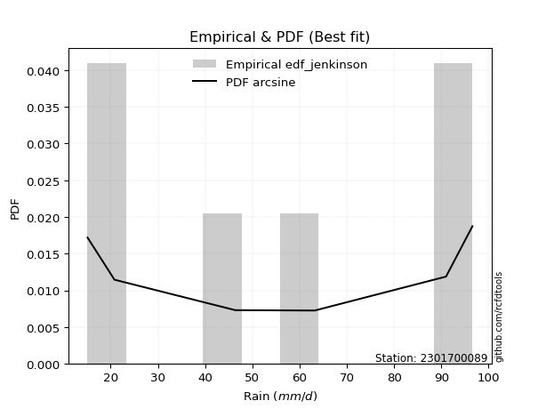</img>

</div>


### 11. EDF Cunnane (1978)

Cunnane´s work in statistical hydrology has focused on the performance and evaluation of different probability distributions (such as GEV, Gumbel, Lognormal) for flood frequency estimation. _b_ is a constant, typically set to 0.4.

<div align="center">


$P=(m-b)/(n+1-2b)$


</div>


**11.1. Empirical values**

<div align="center">

|                | 0                   | 1                  | 2           | 3                  | 4                  |
|:---------------|:--------------------|:-------------------|:------------|:-------------------|:-------------------|
| date           | 2024                | 2022               | 2021        | 2020               | 2019               |
| x              | 20.8                | 46.4               | 63.2        | 91.0               | 96.6               |
| m              | 1                   | 2                  | 3           | 4                  | 5                  |
| empirical_dist | edf_cunnane         | edf_cunnane        | edf_cunnane | edf_cunnane        | edf_cunnane        |
| empirical      | 0.11538461538461538 | 0.3076923076923077 | 0.5         | 0.6923076923076923 | 0.8846153846153845 |
| empirical_tr   | 1.1304347826086958  | 1.4444444444444444 | 2.0         | 3.25               | 8.666666666666655  |

</div>


**11.2. Kolmogorov-Smirnov fit test (sorted by Δ)**


<div align="center">

|                | 0                   | 1                   | 2                   | 3                   | 4                   | 5                   | 6                   | 7                  | 8                   | 9                   | 10                  | 11                  | 12                  | 13                  | 14                  | 15                  | 16                  | 17                  | 18                  | 19                 | 20                  | 21                  | 22                 | 23                 | 24                  | 25                  | 26                 | 27                  | 28                  | 29                 | 30                  | 31                  | 32                  | 33                  | 34                  | 35                  | 36                  | 37                  | 38                 | 39                  | 40                 | 41                  | 42                  | 43                  | 44                 | 45                  | 46                 | 47                  | 48                  | 49                  | 50                  | 51                    | 52                 | 53                  | 54                  | 55                 | 56                  | 57                 | 58                 | 59                  | 60                  | 61                 | 62                  | 63                 | 64                  | 65                  | 66                  | 67                  | 68                  | 69                  | 70                  | 71                  | 72                  | 73                  | 74                  | 75                 | 76                 | 77                 | 78                  | 79                  | 80                  | 81                 | 82                 | 83                 | 84                 | 85                 | 86                 | 87                 |
|:---------------|:--------------------|:--------------------|:--------------------|:--------------------|:--------------------|:--------------------|:--------------------|:-------------------|:--------------------|:--------------------|:--------------------|:--------------------|:--------------------|:--------------------|:--------------------|:--------------------|:--------------------|:--------------------|:--------------------|:-------------------|:--------------------|:--------------------|:-------------------|:-------------------|:--------------------|:--------------------|:-------------------|:--------------------|:--------------------|:-------------------|:--------------------|:--------------------|:--------------------|:--------------------|:--------------------|:--------------------|:--------------------|:--------------------|:-------------------|:--------------------|:-------------------|:--------------------|:--------------------|:--------------------|:-------------------|:--------------------|:-------------------|:--------------------|:--------------------|:--------------------|:--------------------|:----------------------|:-------------------|:--------------------|:--------------------|:-------------------|:--------------------|:-------------------|:-------------------|:--------------------|:--------------------|:-------------------|:--------------------|:-------------------|:--------------------|:--------------------|:--------------------|:--------------------|:--------------------|:--------------------|:--------------------|:--------------------|:--------------------|:--------------------|:--------------------|:-------------------|:-------------------|:-------------------|:--------------------|:--------------------|:--------------------|:-------------------|:-------------------|:-------------------|:-------------------|:-------------------|:-------------------|:-------------------|
| station        | 2301700089          | 2301700089          | 2301700089          | 2301700089          | 2301700089          | 2301700089          | 2301700089          | 2301700089         | 2301700089          | 2301700089          | 2301700089          | 2301700089          | 2301700089          | 2301700089          | 2301700089          | 2301700089          | 2301700089          | 2301700089          | 2301700089          | 2301700089         | 2301700089          | 2301700089          | 2301700089         | 2301700089         | 2301700089          | 2301700089          | 2301700089         | 2301700089          | 2301700089          | 2301700089         | 2301700089          | 2301700089          | 2301700089          | 2301700089          | 2301700089          | 2301700089          | 2301700089          | 2301700089          | 2301700089         | 2301700089          | 2301700089         | 2301700089          | 2301700089          | 2301700089          | 2301700089         | 2301700089          | 2301700089         | 2301700089          | 2301700089          | 2301700089          | 2301700089          | 2301700089            | 2301700089         | 2301700089          | 2301700089          | 2301700089         | 2301700089          | 2301700089         | 2301700089         | 2301700089          | 2301700089          | 2301700089         | 2301700089          | 2301700089         | 2301700089          | 2301700089          | 2301700089          | 2301700089          | 2301700089          | 2301700089          | 2301700089          | 2301700089          | 2301700089          | 2301700089          | 2301700089          | 2301700089         | 2301700089         | 2301700089         | 2301700089          | 2301700089          | 2301700089          | 2301700089         | 2301700089         | 2301700089         | 2301700089         | 2301700089         | 2301700089         | 2301700089         |
| empirical_dist | edf_cunnane         | edf_cunnane         | edf_cunnane         | edf_cunnane         | edf_cunnane         | edf_cunnane         | edf_cunnane         | edf_cunnane        | edf_cunnane         | edf_cunnane         | edf_cunnane         | edf_cunnane         | edf_cunnane         | edf_cunnane         | edf_cunnane         | edf_cunnane         | edf_cunnane         | edf_cunnane         | edf_cunnane         | edf_cunnane        | edf_cunnane         | edf_cunnane         | edf_cunnane        | edf_cunnane        | edf_cunnane         | edf_cunnane         | edf_cunnane        | edf_cunnane         | edf_cunnane         | edf_cunnane        | edf_cunnane         | edf_cunnane         | edf_cunnane         | edf_cunnane         | edf_cunnane         | edf_cunnane         | edf_cunnane         | edf_cunnane         | edf_cunnane        | edf_cunnane         | edf_cunnane        | edf_cunnane         | edf_cunnane         | edf_cunnane         | edf_cunnane        | edf_cunnane         | edf_cunnane        | edf_cunnane         | edf_cunnane         | edf_cunnane         | edf_cunnane         | edf_cunnane           | edf_cunnane        | edf_cunnane         | edf_cunnane         | edf_cunnane        | edf_cunnane         | edf_cunnane        | edf_cunnane        | edf_cunnane         | edf_cunnane         | edf_cunnane        | edf_cunnane         | edf_cunnane        | edf_cunnane         | edf_cunnane         | edf_cunnane         | edf_cunnane         | edf_cunnane         | edf_cunnane         | edf_cunnane         | edf_cunnane         | edf_cunnane         | edf_cunnane         | edf_cunnane         | edf_cunnane        | edf_cunnane        | edf_cunnane        | edf_cunnane         | edf_cunnane         | edf_cunnane         | edf_cunnane        | edf_cunnane        | edf_cunnane        | edf_cunnane        | edf_cunnane        | edf_cunnane        | edf_cunnane        |
| p_dist         | logfisk             | loginvgauss         | logalpha            | logncf              | loggamma            | loggamma            | lognct              | loginvgamma        | logbetaprime        | logpearson3         | logrice             | logerlang           | logf                | logexponnorm        | lognorm             | lognorm             | logcrystalball      | logt                | logfatiguelife      | logmaxwell         | lograyleigh         | fisk                | loggumbel_l        | loginvweibull      | kstwobign           | betaprime           | invgauss           | chi2                | loglogistic         | loggompertz        | rice                | invgamma            | rayleigh            | maxwell             | gamma               | f                   | halfnorm            | erlang              | alpha              | crystalball         | norm               | exponnorm           | nct                 | t                   | pearson3           | genexpon            | expon              | logweibull_min      | gompertz            | weibull_min         | laplace_asymmetric  | loglaplace_asymmetric | loghalfnorm        | loghypsecant        | loggumbel_r         | gumbel_r           | halflogistic        | logistic           | loglaplace         | logkstwobign        | moyal               | gumbel_l           | hypsecant           | loghalflogistic    | logmoyal            | laplace             | wald                | mielke              | logmielke           | loggenexpon         | logloggamma         | gibrat              | logwald             | logexpon            | loggibrat           | nakagami           | logtruncnorm       | lognakagami        | logchi2             | ncf                 | loglognorm          | fatiguelife        | invweibull         | logjohnsonsu       | johnsonsu          | truncnorm          | loggenlogistic     | genlogistic        |
| delta          | 0.09431246407024774 | 0.10521394030939457 | 0.10531229831926292 | 0.11224539703967984 | 0.11260974197572415 | 0.11260974197572415 | 0.11347890835689811 | 0.113745066073345  | 0.11388345351355966 | 0.11543130113922184 | 0.11558469892821599 | 0.11632640964978846 | 0.11638694928715143 | 0.11764766349170008 | 0.11764788165753748 | 0.11764788165753748 | 0.11764809738815984 | 0.11764816844167547 | 0.11889100253691853 | 0.1192498552739314 | 0.12536043003717112 | 0.12962685973595311 | 0.1305301668235509 | 0.1314027832779291 | 0.13261060405355574 | 0.13507099787448607 | 0.1356179171616142 | 0.13631330982529377 | 0.13859394116912616 | 0.1393316268235819 | 0.13977763190536108 | 0.14013156176533959 | 0.14024697178713308 | 0.14067600012381343 | 0.14092529544295596 | 0.14139191298357234 | 0.14140365860247905 | 0.14173012014708108 | 0.1420972522628321 | 0.14233703144698984 | 0.1423370354979081 | 0.14233745683388577 | 0.14234916300922573 | 0.14236214767500088 | 0.1423995573529564 | 0.14244699461863852 | 0.1424692807671547 | 0.14262814450917505 | 0.14311806227958002 | 0.14519750742329585 | 0.14742317563991314 | 0.1484986897902123    | 0.14971140091223   | 0.15059854945589102 | 0.15687644644305787 | 0.1587621973010397 | 0.15930451761029207 | 0.1614338288388979 | 0.1631883696349834 | 0.16359213268476047 | 0.16495264446027103 | 0.1661027599767515 | 0.17165889302336668 | 0.1779043669112882 | 0.18013070073453463 | 0.18134611982872717 | 0.19012045406110956 | 0.19274673203951254 | 0.19764799327542804 | 0.20255325493690934 | 0.20384312229455315 | 0.21460683326977437 | 0.24482489114935346 | 0.24945890174841634 | 0.27616766177442775 | 0.3074920498300481 | 0.3076889297245657 | 0.3076923076923005 | 0.32002253656142576 | 0.32201702900216644 | 0.37386655696712634 | 0.4388957218688252 | 0.4606110555270945 | 0.6515919536951675 | 0.6663313780447571 | 0.692306950197459  | 0.6923076923076923 | 0.6923076923076923 |
| deltao         | 0.5865427407550001  | 0.5865427407550001  | 0.5865427407550001  | 0.5865427407550001  | 0.5865427407550001  | 0.5865427407550001  | 0.5865427407550001  | 0.5865427407550001 | 0.5865427407550001  | 0.5865427407550001  | 0.5865427407550001  | 0.5865427407550001  | 0.5865427407550001  | 0.5865427407550001  | 0.5865427407550001  | 0.5865427407550001  | 0.5865427407550001  | 0.5865427407550001  | 0.5865427407550001  | 0.5865427407550001 | 0.5865427407550001  | 0.5865427407550001  | 0.5865427407550001 | 0.5865427407550001 | 0.5865427407550001  | 0.5865427407550001  | 0.5865427407550001 | 0.5865427407550001  | 0.5865427407550001  | 0.5865427407550001 | 0.5865427407550001  | 0.5865427407550001  | 0.5865427407550001  | 0.5865427407550001  | 0.5865427407550001  | 0.5865427407550001  | 0.5865427407550001  | 0.5865427407550001  | 0.5865427407550001 | 0.5865427407550001  | 0.5865427407550001 | 0.5865427407550001  | 0.5865427407550001  | 0.5865427407550001  | 0.5865427407550001 | 0.5865427407550001  | 0.5865427407550001 | 0.5865427407550001  | 0.5865427407550001  | 0.5865427407550001  | 0.5865427407550001  | 0.5865427407550001    | 0.5865427407550001 | 0.5865427407550001  | 0.5865427407550001  | 0.5865427407550001 | 0.5865427407550001  | 0.5865427407550001 | 0.5865427407550001 | 0.5865427407550001  | 0.5865427407550001  | 0.5865427407550001 | 0.5865427407550001  | 0.5865427407550001 | 0.5865427407550001  | 0.5865427407550001  | 0.5865427407550001  | 0.5865427407550001  | 0.5865427407550001  | 0.5865427407550001  | 0.5865427407550001  | 0.5865427407550001  | 0.5865427407550001  | 0.5865427407550001  | 0.5865427407550001  | 0.5865427407550001 | 0.5865427407550001 | 0.5865427407550001 | 0.5865427407550001  | 0.5865427407550001  | 0.5865427407550001  | 0.5865427407550001 | 0.5865427407550001 | 0.5865427407550001 | 0.5865427407550001 | 0.5865427407550001 | 0.5865427407550001 | 0.5865427407550001 |
| eval           | Δo > Δ              | Δo > Δ              | Δo > Δ              | Δo > Δ              | Δo > Δ              | Δo > Δ              | Δo > Δ              | Δo > Δ             | Δo > Δ              | Δo > Δ              | Δo > Δ              | Δo > Δ              | Δo > Δ              | Δo > Δ              | Δo > Δ              | Δo > Δ              | Δo > Δ              | Δo > Δ              | Δo > Δ              | Δo > Δ             | Δo > Δ              | Δo > Δ              | Δo > Δ             | Δo > Δ             | Δo > Δ              | Δo > Δ              | Δo > Δ             | Δo > Δ              | Δo > Δ              | Δo > Δ             | Δo > Δ              | Δo > Δ              | Δo > Δ              | Δo > Δ              | Δo > Δ              | Δo > Δ              | Δo > Δ              | Δo > Δ              | Δo > Δ             | Δo > Δ              | Δo > Δ             | Δo > Δ              | Δo > Δ              | Δo > Δ              | Δo > Δ             | Δo > Δ              | Δo > Δ             | Δo > Δ              | Δo > Δ              | Δo > Δ              | Δo > Δ              | Δo > Δ                | Δo > Δ             | Δo > Δ              | Δo > Δ              | Δo > Δ             | Δo > Δ              | Δo > Δ             | Δo > Δ             | Δo > Δ              | Δo > Δ              | Δo > Δ             | Δo > Δ              | Δo > Δ             | Δo > Δ              | Δo > Δ              | Δo > Δ              | Δo > Δ              | Δo > Δ              | Δo > Δ              | Δo > Δ              | Δo > Δ              | Δo > Δ              | Δo > Δ              | Δo > Δ              | Δo > Δ             | Δo > Δ             | Δo > Δ             | Δo > Δ              | Δo > Δ              | Δo > Δ              | Δo > Δ             | Δo > Δ             | Δo <= Δ            | Δo <= Δ            | Δo <= Δ            | Δo <= Δ            | Δo <= Δ            |
| fit            | 1                   | 1                   | 1                   | 1                   | 1                   | 1                   | 1                   | 1                  | 1                   | 1                   | 1                   | 1                   | 1                   | 1                   | 1                   | 1                   | 1                   | 1                   | 1                   | 1                  | 1                   | 1                   | 1                  | 1                  | 1                   | 1                   | 1                  | 1                   | 1                   | 1                  | 1                   | 1                   | 1                   | 1                   | 1                   | 1                   | 1                   | 1                   | 1                  | 1                   | 1                  | 1                   | 1                   | 1                   | 1                  | 1                   | 1                  | 1                   | 1                   | 1                   | 1                   | 1                     | 1                  | 1                   | 1                   | 1                  | 1                   | 1                  | 1                  | 1                   | 1                   | 1                  | 1                   | 1                  | 1                   | 1                   | 1                   | 1                   | 1                   | 1                   | 1                   | 1                   | 1                   | 1                   | 1                   | 1                  | 1                  | 1                  | 1                   | 1                   | 1                   | 1                  | 1                  | 0                  | 0                  | 0                  | 0                  | 0                  |
| n              | 5                   | 5                   | 5                   | 5                   | 5                   | 5                   | 5                   | 5                  | 5                   | 5                   | 5                   | 5                   | 5                   | 5                   | 5                   | 5                   | 5                   | 5                   | 5                   | 5                  | 5                   | 5                   | 5                  | 5                  | 5                   | 5                   | 5                  | 5                   | 5                   | 5                  | 5                   | 5                   | 5                   | 5                   | 5                   | 5                   | 5                   | 5                   | 5                  | 5                   | 5                  | 5                   | 5                   | 5                   | 5                  | 5                   | 5                  | 5                   | 5                   | 5                   | 5                   | 5                     | 5                  | 5                   | 5                   | 5                  | 5                   | 5                  | 5                  | 5                   | 5                   | 5                  | 5                   | 5                  | 5                   | 5                   | 5                   | 5                   | 5                   | 5                   | 5                   | 5                   | 5                   | 5                   | 5                   | 5                  | 5                  | 5                  | 5                   | 5                   | 5                   | 5                  | 5                  | 5                  | 5                  | 5                  | 5                  | 5                  |
| best_fit       | 1                   | 0                   | 0                   | 0                   | 0                   | 0                   | 0                   | 0                  | 0                   | 0                   | 0                   | 0                   | 0                   | 0                   | 0                   | 0                   | 0                   | 0                   | 0                   | 0                  | 0                   | 0                   | 0                  | 0                  | 0                   | 0                   | 0                  | 0                   | 0                   | 0                  | 0                   | 0                   | 0                   | 0                   | 0                   | 0                   | 0                   | 0                   | 0                  | 0                   | 0                  | 0                   | 0                   | 0                   | 0                  | 0                   | 0                  | 0                   | 0                   | 0                   | 0                   | 0                     | 0                  | 0                   | 0                   | 0                  | 0                   | 0                  | 0                  | 0                   | 0                   | 0                  | 0                   | 0                  | 0                   | 0                   | 0                   | 0                   | 0                   | 0                   | 0                   | 0                   | 0                   | 0                   | 0                   | 0                  | 0                  | 0                  | 0                   | 0                   | 0                   | 0                  | 0                  | 0                  | 0                  | 0                  | 0                  | 0                  |
| best_fit_sort  | 1                   | 2                   | 3                   | 4                   | 5                   | 6                   | 7                   | 8                  | 9                   | 10                  | 11                  | 12                  | 13                  | 14                  | 15                  | 16                  | 17                  | 18                  | 19                  | 20                 | 21                  | 22                  | 23                 | 24                 | 25                  | 26                  | 27                 | 28                  | 29                  | 30                 | 31                  | 32                  | 33                  | 34                  | 35                  | 36                  | 37                  | 38                  | 39                 | 40                  | 41                 | 42                  | 43                  | 44                  | 45                 | 46                  | 47                 | 48                  | 49                  | 50                  | 51                  | 52                    | 53                 | 54                  | 55                  | 56                 | 57                  | 58                 | 59                 | 60                  | 61                  | 62                 | 63                  | 64                 | 65                  | 66                  | 67                  | 68                  | 69                  | 70                  | 71                  | 72                  | 73                  | 74                  | 75                  | 76                 | 77                 | 78                 | 79                  | 80                  | 81                  | 82                 | 83                 | 84                 | 85                 | 86                 | 87                 | 88                 |

</div>


**11.3. Best fit**

<div align="center">

|   id |    station | empirical_dist   | p_dist   |     delta |   deltao | eval   |   fit |   n |   best_fit |   best_fit_sort |
|-----:|-----------:|:-----------------|:---------|----------:|---------:|:-------|------:|----:|-----------:|----------------:|
|    0 | 2301700089 | edf_cunnane      | logfisk  | 0.0943125 | 0.586543 | Δo > Δ |     1 |   5 |          1 |               1 |

</div>


<div align="center">

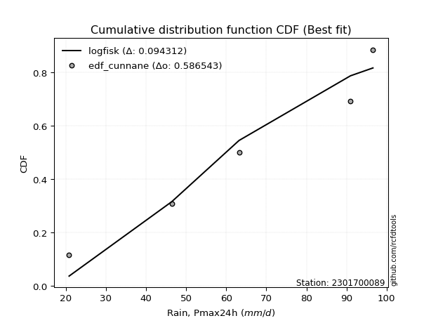</img>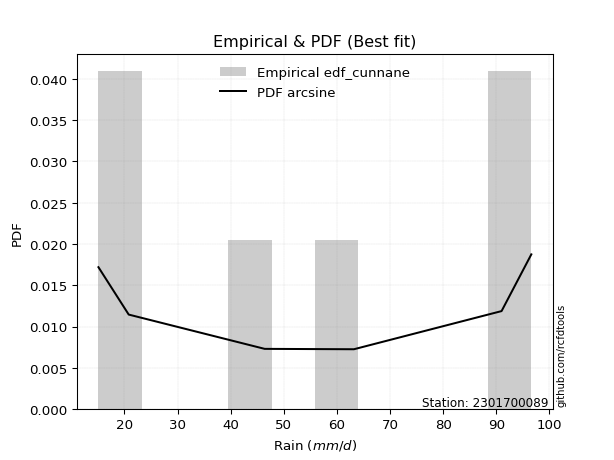</img>

</div>


### 12. EDF Adamowski (1981)

The Adamowski formula in hydrology refers to a specific plotting position formula used for estimating the non-parametric empirical distribution of hydrological events (like flood peaks) to calculate their return periods. This formula provides an alternative to traditional parametric methods (like the Gumbel or Log Pearson Type III distributions). 

<div align="center">


$P=(m-0.25)/(n+0.5)$


</div>


**12.1. Empirical values**

<div align="center">

|                | 0                   | 1                  | 2             | 3                  | 4                  |
|:---------------|:--------------------|:-------------------|:--------------|:-------------------|:-------------------|
| date           | 2024                | 2022               | 2021          | 2020               | 2019               |
| x              | 20.8                | 46.4               | 63.2          | 91.0               | 96.6               |
| m              | 1                   | 2                  | 3             | 4                  | 5                  |
| empirical_dist | edf_adamowski       | edf_adamowski      | edf_adamowski | edf_adamowski      | edf_adamowski      |
| empirical      | 0.13636363636363635 | 0.3181818181818182 | 0.5           | 0.6818181818181818 | 0.8636363636363636 |
| empirical_tr   | 1.1578947368421053  | 1.4666666666666666 | 2.0           | 3.1428571428571423 | 7.333333333333334  |

</div>


**12.2. Kolmogorov-Smirnov fit test (sorted by Δ)**


<div align="center">

|                | 0                   | 1                  | 2                   | 3                   | 4                   | 5                   | 6                   | 7                   | 8                   | 9                   | 10                  | 11                 | 12                 | 13                  | 14                 | 15                 | 16                 | 17                  | 18                 | 19                  | 20                  | 21                  | 22                  | 23                  | 24                  | 25                  | 26                  | 27                 | 28                  | 29                 | 30                  | 31                 | 32                  | 33                 | 34                 | 35                 | 36                  | 37                  | 38                  | 39                  | 40                 | 41                  | 42                  | 43                  | 44                 | 45                  | 46                 | 47                  | 48                 | 49                  | 50                  | 51                  | 52                  | 53                  | 54                    | 55                  | 56                 | 57                 | 58                  | 59                  | 60                  | 61                  | 62                 | 63                  | 64                 | 65                 | 66                  | 67                  | 68                  | 69                  | 70                  | 71                 | 72                  | 73                  | 74                  | 75                  | 76                 | 77                  | 78                  | 79                  | 80                 | 81                 | 82                 | 83                 | 84                 | 85                 | 86                 | 87                 |
|:---------------|:--------------------|:-------------------|:--------------------|:--------------------|:--------------------|:--------------------|:--------------------|:--------------------|:--------------------|:--------------------|:--------------------|:-------------------|:-------------------|:--------------------|:-------------------|:-------------------|:-------------------|:--------------------|:-------------------|:--------------------|:--------------------|:--------------------|:--------------------|:--------------------|:--------------------|:--------------------|:--------------------|:-------------------|:--------------------|:-------------------|:--------------------|:-------------------|:--------------------|:-------------------|:-------------------|:-------------------|:--------------------|:--------------------|:--------------------|:--------------------|:-------------------|:--------------------|:--------------------|:--------------------|:-------------------|:--------------------|:-------------------|:--------------------|:-------------------|:--------------------|:--------------------|:--------------------|:--------------------|:--------------------|:----------------------|:--------------------|:-------------------|:-------------------|:--------------------|:--------------------|:--------------------|:--------------------|:-------------------|:--------------------|:-------------------|:-------------------|:--------------------|:--------------------|:--------------------|:--------------------|:--------------------|:-------------------|:--------------------|:--------------------|:--------------------|:--------------------|:-------------------|:--------------------|:--------------------|:--------------------|:-------------------|:-------------------|:-------------------|:-------------------|:-------------------|:-------------------|:-------------------|:-------------------|
| station        | 2301700089          | 2301700089         | 2301700089          | 2301700089          | 2301700089          | 2301700089          | 2301700089          | 2301700089          | 2301700089          | 2301700089          | 2301700089          | 2301700089         | 2301700089         | 2301700089          | 2301700089         | 2301700089         | 2301700089         | 2301700089          | 2301700089         | 2301700089          | 2301700089          | 2301700089          | 2301700089          | 2301700089          | 2301700089          | 2301700089          | 2301700089          | 2301700089         | 2301700089          | 2301700089         | 2301700089          | 2301700089         | 2301700089          | 2301700089         | 2301700089         | 2301700089         | 2301700089          | 2301700089          | 2301700089          | 2301700089          | 2301700089         | 2301700089          | 2301700089          | 2301700089          | 2301700089         | 2301700089          | 2301700089         | 2301700089          | 2301700089         | 2301700089          | 2301700089          | 2301700089          | 2301700089          | 2301700089          | 2301700089            | 2301700089          | 2301700089         | 2301700089         | 2301700089          | 2301700089          | 2301700089          | 2301700089          | 2301700089         | 2301700089          | 2301700089         | 2301700089         | 2301700089          | 2301700089          | 2301700089          | 2301700089          | 2301700089          | 2301700089         | 2301700089          | 2301700089          | 2301700089          | 2301700089          | 2301700089         | 2301700089          | 2301700089          | 2301700089          | 2301700089         | 2301700089         | 2301700089         | 2301700089         | 2301700089         | 2301700089         | 2301700089         | 2301700089         |
| empirical_dist | edf_adamowski       | edf_adamowski      | edf_adamowski       | edf_adamowski       | edf_adamowski       | edf_adamowski       | edf_adamowski       | edf_adamowski       | edf_adamowski       | edf_adamowski       | edf_adamowski       | edf_adamowski      | edf_adamowski      | edf_adamowski       | edf_adamowski      | edf_adamowski      | edf_adamowski      | edf_adamowski       | edf_adamowski      | edf_adamowski       | edf_adamowski       | edf_adamowski       | edf_adamowski       | edf_adamowski       | edf_adamowski       | edf_adamowski       | edf_adamowski       | edf_adamowski      | edf_adamowski       | edf_adamowski      | edf_adamowski       | edf_adamowski      | edf_adamowski       | edf_adamowski      | edf_adamowski      | edf_adamowski      | edf_adamowski       | edf_adamowski       | edf_adamowski       | edf_adamowski       | edf_adamowski      | edf_adamowski       | edf_adamowski       | edf_adamowski       | edf_adamowski      | edf_adamowski       | edf_adamowski      | edf_adamowski       | edf_adamowski      | edf_adamowski       | edf_adamowski       | edf_adamowski       | edf_adamowski       | edf_adamowski       | edf_adamowski         | edf_adamowski       | edf_adamowski      | edf_adamowski      | edf_adamowski       | edf_adamowski       | edf_adamowski       | edf_adamowski       | edf_adamowski      | edf_adamowski       | edf_adamowski      | edf_adamowski      | edf_adamowski       | edf_adamowski       | edf_adamowski       | edf_adamowski       | edf_adamowski       | edf_adamowski      | edf_adamowski       | edf_adamowski       | edf_adamowski       | edf_adamowski       | edf_adamowski      | edf_adamowski       | edf_adamowski       | edf_adamowski       | edf_adamowski      | edf_adamowski      | edf_adamowski      | edf_adamowski      | edf_adamowski      | edf_adamowski      | edf_adamowski      | edf_adamowski      |
| p_dist         | logfisk             | loginvgauss        | logalpha            | loginvweibull       | logncf              | loggamma            | loggamma            | lognct              | loginvgamma         | logbetaprime        | logpearson3         | logrice            | logerlang          | logf                | logexponnorm       | lognorm            | lognorm            | logcrystalball      | logt               | logfatiguelife      | logmaxwell          | lograyleigh         | genexpon            | expon               | fisk                | loggumbel_l         | kstwobign           | betaprime          | invgauss            | chi2               | loglogistic         | loghalfnorm        | loggompertz         | rice               | invgamma           | rayleigh           | maxwell             | gamma               | f                   | halfnorm            | erlang             | alpha               | crystalball         | norm                | exponnorm          | nct                 | t                  | pearson3            | logkstwobign       | logweibull_min      | gompertz            | weibull_min         | loggumbel_r         | laplace_asymmetric  | loglaplace_asymmetric | loghypsecant        | gumbel_r           | halflogistic       | logistic            | loglaplace          | moyal               | gumbel_l            | loghalflogistic    | logmoyal            | hypsecant          | laplace            | loggenexpon         | wald                | mielke              | logmielke           | logloggamma         | gibrat             | logexpon            | logwald             | loggibrat           | ncf                 | logchi2            | nakagami            | logtruncnorm        | lognakagami         | loglognorm         | fatiguelife        | invweibull         | logjohnsonsu       | johnsonsu          | truncnorm          | loggenlogistic     | genlogistic        |
| delta          | 0.10480197455975826 | 0.1157034507989051 | 0.11580180880877344 | 0.12091327278841862 | 0.12273490752919036 | 0.12309925246523468 | 0.12309925246523468 | 0.12396841884640863 | 0.12423457656285553 | 0.12437296400307019 | 0.12592081162873237 | 0.1260742094177265 | 0.126815920139299  | 0.12687645977666195 | 0.1281371739812106 | 0.128137392147048  | 0.128137392147048  | 0.12813760787767037 | 0.128137678931186  | 0.12938051302642906 | 0.12973936576344192 | 0.13144059739234537 | 0.13636146203496424 | 0.13636363636363635 | 0.14011637022546364 | 0.14101967731306142 | 0.14310011454306626 | 0.1455605083639966 | 0.14610742765112472 | 0.1468028203148043 | 0.14908345165863668 | 0.14971140091223   | 0.14982113731309243 | 0.1502671423948716 | 0.1506210722548501 | 0.1507364822766436 | 0.15116551061332395 | 0.15141480593246648 | 0.15188142347308287 | 0.15189316909198958 | 0.1522196306365916 | 0.15258676275234262 | 0.15282654193650036 | 0.15282654598741863 | 0.1528269673233963 | 0.15283867349873625 | 0.1528516581645114 | 0.15288906784246692 | 0.15310262219525   | 0.15311765499868557 | 0.15360757276909054 | 0.15568701791280637 | 0.15687644644305787 | 0.15791268612942366 | 0.15898820027972282   | 0.16108805994540154 | 0.1692517077905502 | 0.1697940280998026 | 0.17192333932840842 | 0.17367788012449392 | 0.17544215494978155 | 0.17659227046626202 | 0.1779043669112882 | 0.18013070073453463 | 0.1821484035128772 | 0.1918356303182377 | 0.19206374444739888 | 0.20060996455062008 | 0.20323624252902306 | 0.20813750376493856 | 0.21433263278406367 | 0.2250963437592849 | 0.23896939125890587 | 0.24482489114935346 | 0.27616766177442775 | 0.30103800802314545 | 0.3095330260719153 | 0.31798156031955854 | 0.31817844021407615 | 0.31818181818181096 | 0.3633770464776159 | 0.4284062113793147 | 0.4396320345480737 | 0.641102443205657  | 0.6558418675552465 | 0.6818174397079486 | 0.6818181818181818 | 0.6818181818181818 |
| deltao         | 0.5865427407550001  | 0.5865427407550001 | 0.5865427407550001  | 0.5865427407550001  | 0.5865427407550001  | 0.5865427407550001  | 0.5865427407550001  | 0.5865427407550001  | 0.5865427407550001  | 0.5865427407550001  | 0.5865427407550001  | 0.5865427407550001 | 0.5865427407550001 | 0.5865427407550001  | 0.5865427407550001 | 0.5865427407550001 | 0.5865427407550001 | 0.5865427407550001  | 0.5865427407550001 | 0.5865427407550001  | 0.5865427407550001  | 0.5865427407550001  | 0.5865427407550001  | 0.5865427407550001  | 0.5865427407550001  | 0.5865427407550001  | 0.5865427407550001  | 0.5865427407550001 | 0.5865427407550001  | 0.5865427407550001 | 0.5865427407550001  | 0.5865427407550001 | 0.5865427407550001  | 0.5865427407550001 | 0.5865427407550001 | 0.5865427407550001 | 0.5865427407550001  | 0.5865427407550001  | 0.5865427407550001  | 0.5865427407550001  | 0.5865427407550001 | 0.5865427407550001  | 0.5865427407550001  | 0.5865427407550001  | 0.5865427407550001 | 0.5865427407550001  | 0.5865427407550001 | 0.5865427407550001  | 0.5865427407550001 | 0.5865427407550001  | 0.5865427407550001  | 0.5865427407550001  | 0.5865427407550001  | 0.5865427407550001  | 0.5865427407550001    | 0.5865427407550001  | 0.5865427407550001 | 0.5865427407550001 | 0.5865427407550001  | 0.5865427407550001  | 0.5865427407550001  | 0.5865427407550001  | 0.5865427407550001 | 0.5865427407550001  | 0.5865427407550001 | 0.5865427407550001 | 0.5865427407550001  | 0.5865427407550001  | 0.5865427407550001  | 0.5865427407550001  | 0.5865427407550001  | 0.5865427407550001 | 0.5865427407550001  | 0.5865427407550001  | 0.5865427407550001  | 0.5865427407550001  | 0.5865427407550001 | 0.5865427407550001  | 0.5865427407550001  | 0.5865427407550001  | 0.5865427407550001 | 0.5865427407550001 | 0.5865427407550001 | 0.5865427407550001 | 0.5865427407550001 | 0.5865427407550001 | 0.5865427407550001 | 0.5865427407550001 |
| eval           | Δo > Δ              | Δo > Δ             | Δo > Δ              | Δo > Δ              | Δo > Δ              | Δo > Δ              | Δo > Δ              | Δo > Δ              | Δo > Δ              | Δo > Δ              | Δo > Δ              | Δo > Δ             | Δo > Δ             | Δo > Δ              | Δo > Δ             | Δo > Δ             | Δo > Δ             | Δo > Δ              | Δo > Δ             | Δo > Δ              | Δo > Δ              | Δo > Δ              | Δo > Δ              | Δo > Δ              | Δo > Δ              | Δo > Δ              | Δo > Δ              | Δo > Δ             | Δo > Δ              | Δo > Δ             | Δo > Δ              | Δo > Δ             | Δo > Δ              | Δo > Δ             | Δo > Δ             | Δo > Δ             | Δo > Δ              | Δo > Δ              | Δo > Δ              | Δo > Δ              | Δo > Δ             | Δo > Δ              | Δo > Δ              | Δo > Δ              | Δo > Δ             | Δo > Δ              | Δo > Δ             | Δo > Δ              | Δo > Δ             | Δo > Δ              | Δo > Δ              | Δo > Δ              | Δo > Δ              | Δo > Δ              | Δo > Δ                | Δo > Δ              | Δo > Δ             | Δo > Δ             | Δo > Δ              | Δo > Δ              | Δo > Δ              | Δo > Δ              | Δo > Δ             | Δo > Δ              | Δo > Δ             | Δo > Δ             | Δo > Δ              | Δo > Δ              | Δo > Δ              | Δo > Δ              | Δo > Δ              | Δo > Δ             | Δo > Δ              | Δo > Δ              | Δo > Δ              | Δo > Δ              | Δo > Δ             | Δo > Δ              | Δo > Δ              | Δo > Δ              | Δo > Δ             | Δo > Δ             | Δo > Δ             | Δo <= Δ            | Δo <= Δ            | Δo <= Δ            | Δo <= Δ            | Δo <= Δ            |
| fit            | 1                   | 1                  | 1                   | 1                   | 1                   | 1                   | 1                   | 1                   | 1                   | 1                   | 1                   | 1                  | 1                  | 1                   | 1                  | 1                  | 1                  | 1                   | 1                  | 1                   | 1                   | 1                   | 1                   | 1                   | 1                   | 1                   | 1                   | 1                  | 1                   | 1                  | 1                   | 1                  | 1                   | 1                  | 1                  | 1                  | 1                   | 1                   | 1                   | 1                   | 1                  | 1                   | 1                   | 1                   | 1                  | 1                   | 1                  | 1                   | 1                  | 1                   | 1                   | 1                   | 1                   | 1                   | 1                     | 1                   | 1                  | 1                  | 1                   | 1                   | 1                   | 1                   | 1                  | 1                   | 1                  | 1                  | 1                   | 1                   | 1                   | 1                   | 1                   | 1                  | 1                   | 1                   | 1                   | 1                   | 1                  | 1                   | 1                   | 1                   | 1                  | 1                  | 1                  | 0                  | 0                  | 0                  | 0                  | 0                  |
| n              | 5                   | 5                  | 5                   | 5                   | 5                   | 5                   | 5                   | 5                   | 5                   | 5                   | 5                   | 5                  | 5                  | 5                   | 5                  | 5                  | 5                  | 5                   | 5                  | 5                   | 5                   | 5                   | 5                   | 5                   | 5                   | 5                   | 5                   | 5                  | 5                   | 5                  | 5                   | 5                  | 5                   | 5                  | 5                  | 5                  | 5                   | 5                   | 5                   | 5                   | 5                  | 5                   | 5                   | 5                   | 5                  | 5                   | 5                  | 5                   | 5                  | 5                   | 5                   | 5                   | 5                   | 5                   | 5                     | 5                   | 5                  | 5                  | 5                   | 5                   | 5                   | 5                   | 5                  | 5                   | 5                  | 5                  | 5                   | 5                   | 5                   | 5                   | 5                   | 5                  | 5                   | 5                   | 5                   | 5                   | 5                  | 5                   | 5                   | 5                   | 5                  | 5                  | 5                  | 5                  | 5                  | 5                  | 5                  | 5                  |
| best_fit       | 1                   | 0                  | 0                   | 0                   | 0                   | 0                   | 0                   | 0                   | 0                   | 0                   | 0                   | 0                  | 0                  | 0                   | 0                  | 0                  | 0                  | 0                   | 0                  | 0                   | 0                   | 0                   | 0                   | 0                   | 0                   | 0                   | 0                   | 0                  | 0                   | 0                  | 0                   | 0                  | 0                   | 0                  | 0                  | 0                  | 0                   | 0                   | 0                   | 0                   | 0                  | 0                   | 0                   | 0                   | 0                  | 0                   | 0                  | 0                   | 0                  | 0                   | 0                   | 0                   | 0                   | 0                   | 0                     | 0                   | 0                  | 0                  | 0                   | 0                   | 0                   | 0                   | 0                  | 0                   | 0                  | 0                  | 0                   | 0                   | 0                   | 0                   | 0                   | 0                  | 0                   | 0                   | 0                   | 0                   | 0                  | 0                   | 0                   | 0                   | 0                  | 0                  | 0                  | 0                  | 0                  | 0                  | 0                  | 0                  |
| best_fit_sort  | 1                   | 2                  | 3                   | 4                   | 5                   | 6                   | 7                   | 8                   | 9                   | 10                  | 11                  | 12                 | 13                 | 14                  | 15                 | 16                 | 17                 | 18                  | 19                 | 20                  | 21                  | 22                  | 23                  | 24                  | 25                  | 26                  | 27                  | 28                 | 29                  | 30                 | 31                  | 32                 | 33                  | 34                 | 35                 | 36                 | 37                  | 38                  | 39                  | 40                  | 41                 | 42                  | 43                  | 44                  | 45                 | 46                  | 47                 | 48                  | 49                 | 50                  | 51                  | 52                  | 53                  | 54                  | 55                    | 56                  | 57                 | 58                 | 59                  | 60                  | 61                  | 62                  | 63                 | 64                  | 65                 | 66                 | 67                  | 68                  | 69                  | 70                  | 71                  | 72                 | 73                  | 74                  | 75                  | 76                  | 77                 | 78                  | 79                  | 80                  | 81                 | 82                 | 83                 | 84                 | 85                 | 86                 | 87                 | 88                 |

</div>


**12.3. Best fit**

<div align="center">

|   id |    station | empirical_dist   | p_dist   |    delta |   deltao | eval   |   fit |   n |   best_fit |   best_fit_sort |
|-----:|-----------:|:-----------------|:---------|---------:|---------:|:-------|------:|----:|-----------:|----------------:|
|    0 | 2301700089 | edf_adamowski    | logfisk  | 0.104802 | 0.586543 | Δo > Δ |     1 |   5 |          1 |               1 |

</div>


<div align="center">

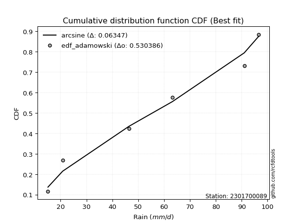</img>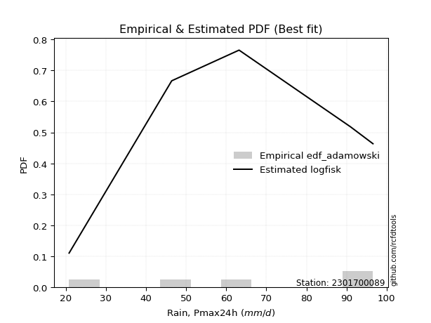</img>

</div>


## C. Best fit & Estimate extreme values for specific return periods - Tr

Best fit in probability distribution analysis means finding the theoretical distribution (like Normal, Poisson, Exponential) that most accurately mirrors your real-world data´s patterns (shape, center, spread) for better predictions, using methods like visual checks (Q-Q plots), goodness-of-fit tests (Kolmogorov-Smirnov, Chi-Squared), and information criteria (AIC) to score and select the simplest, most representative model.


### 1. Best fit (ordered by delta Δ)

<div align="center">

|   id |    station | empirical_dist   | p_dist        |     delta |   deltao | eval   |   fit |   n |   best_fit |   best_fit_sort |
|-----:|-----------:|:-----------------|:--------------|----------:|---------:|:-------|------:|----:|-----------:|----------------:|
|    0 | 2301700089 | edf_hazen        | logfisk       | 0.0866202 | 0.586543 | Δo > Δ |     1 |   5 |          1 |               1 |
|    1 | 2301700089 | edf_gringorten   | logfisk       | 0.0913077 | 0.586543 | Δo > Δ |     1 |   5 |          1 |               2 |
|    2 | 2301700089 | edf_cunnane      | logfisk       | 0.0943125 | 0.586543 | Δo > Δ |     1 |   5 |          1 |               3 |
|    3 | 2301700089 | edf_blom         | logfisk       | 0.096144  | 0.586543 | Δo > Δ |     1 |   5 |          1 |               4 |
|    4 | 2301700089 | edf_tukey        | logfisk       | 0.0991202 | 0.586543 | Δo > Δ |     1 |   5 |          1 |               5 |
|    5 | 2301700089 | edf_filliben     | logfisk       | 0.100227  | 0.586543 | Δo > Δ |     1 |   5 |          1 |               6 |
|    6 | 2301700089 | edf_beard        | logfisk       | 0.100747  | 0.586543 | Δo > Δ |     1 |   5 |          1 |               7 |
|    7 | 2301700089 | edf_jenkinson    | logfisk       | 0.100747  | 0.586543 | Δo > Δ |     1 |   5 |          1 |               8 |
|    8 | 2301700089 | edf_chegodayev   | logfisk       | 0.101435  | 0.586543 | Δo > Δ |     1 |   5 |          1 |               9 |
|    9 | 2301700089 | edf_adamowski    | logfisk       | 0.104802  | 0.586543 | Δo > Δ |     1 |   5 |          1 |              10 |
|   10 | 2301700089 | edf_weibull      | loginvweibull | 0.12529   | 0.586543 | Δo > Δ |     1 |   5 |          1 |              11 |
|   11 | 2301700089 | edf_california   | f             | 0.135474  | 0.586543 | Δo > Δ |     1 |   5 |          1 |              12 |

</div>

:file_folder:Tables: [bestfit_2301700089.csv](table/bestfit_2301700089.csv) | [extreme_2301700089.csv](table/extreme_2301700089.csv)


### 2. Extreme values

In hydrology, a return period (or recurrence interval $Tr$) is the statistical average time between extreme events like floods or droughts of a specific magnitude, indicating how rare an event is, with a 100-year flood, for example, having a 1% chance of occurring in any given year, not that it happens exactly every century. It is a key tool for infrastructure design (like bridges or dams) and risk assessment, calculated from historical data to determine the probability of future events, although it is important to remember it is statistical average, and events can cluster or be missed.

> risk_rate: assuming the return period as the project useful life.

|   id |      tr |   prob_l |     prob_g |    alpha |   betaprime |     chi2 |   crystalball |   erlang |    expon |   exponnorm |        f |   fatiguelife |     fisk |    gamma |   genexpon |   genlogistic |   gibrat |   gompertz |   gumbel_l |   gumbel_r |   halflogistic |   halfnorm |   hypsecant |   invgamma |   invgauss |      invweibull |   johnsonsu |   kstwobign |   laplace |   laplace_asymmetric |   loggamma |   logistic |   lognorm |   maxwell |   mielke |    moyal |   nakagami |        ncf |      nct |     norm |   pearson3 |   rayleigh |     rice |        t |   truncnorm |     wald |   weibull_min |   logalpha |   logbetaprime |          logchi2 |   logcrystalball |   logerlang |   logexpon |   logexponnorm |     logf |   logfatiguelife |   logfisk |   loggenexpon |   loggenlogistic |   loggibrat |   loggompertz |   loggumbel_l |   loggumbel_r |   loghalflogistic |   loghalfnorm |   loghypsecant |   loginvgamma |   loginvgauss |   loginvweibull |   logjohnsonsu |   logkstwobign |   loglaplace |   loglaplace_asymmetric |   logloggamma |   loglogistic |    loglognorm |   logmaxwell |   logmielke |   logmoyal |   lognakagami |   logncf |   lognct |   logpearson3 |   lograyleigh |   logrice |     logt |   logtruncnorm |   logwald |   logweibull_min |    station |   n |   risk_rate |
|-----:|--------:|---------:|-----------:|---------:|------------:|---------:|--------------:|---------:|---------:|------------:|---------:|--------------:|---------:|---------:|-----------:|--------------:|---------:|-----------:|-----------:|-----------:|---------------:|-----------:|------------:|-----------:|-----------:|----------------:|------------:|------------:|----------:|---------------------:|-----------:|-----------:|----------:|----------:|---------:|---------:|-----------:|-----------:|---------:|---------:|-----------:|-----------:|---------:|---------:|------------:|---------:|--------------:|-----------:|---------------:|-----------------:|-----------------:|------------:|-----------:|---------------:|---------:|-----------------:|----------:|--------------:|-----------------:|------------:|--------------:|--------------:|--------------:|------------------:|--------------:|---------------:|--------------:|--------------:|----------------:|---------------:|---------------:|-------------:|------------------------:|--------------:|--------------:|--------------:|-------------:|------------:|-----------:|--------------:|---------:|---------:|--------------:|--------------:|----------:|---------:|---------------:|----------:|-----------------:|-----------:|----:|------------:|
|    0 |    2    | 0.5      | 0.5        |  61.6012 |     61.817  |  62.6878 |       63.6    |  62.9036 |  50.4667 |     63.6    |  63.5819 |       20.8001 |  64.5512 |  62.9099 |    50.4687 |      inf      |  55.1444 |    68.6852 |    68.2278 |    58.9722 |        56.6715 |    57.8337 |     63.6    |    61.6198 |    60.9545 | 10616.1         |        96.6 |     57.6066 |   63.6    |              63.3892 |    54.9318 |    63.6    |   55.7011 |   61.1908 |  67.2879 |  57.4782 |    49.8749 |    29.8207 |  63.5956 |  63.6    |    64.7325 |    60.3363 |  62.1071 |  63.598  |     26.8591 |  54.4686 |       66.3641 |    54.8265 |        55.7109 |     32.9447      |          55.701  |     54.5941 |    41.171  |        55.7011 |  55.7451 |          55.5517 |   59.6338 |       45.5127 |         inf      |     47.0931 |       59.0304 |       61.061  |       50.8116 |           48.5426 |       49.6762 |        55.7011 |       54.6878 |       54.0844 |         51.3744 |        96.6    |        48.7126 |      55.7011 |                 59.0691 |       66.201  |       55.7011 |  20.8204      |      53.0996 |     66.0863 |    49.3267 |       59.6095 |  55.5626 |  55.5339 |       59.8142 |       52.2064 |   54.7731 |  55.701  |        59.0204 |   46.4659 |          62.0282 | 2301700089 |   5 |    0.75     |
|    1 |    2.33 | 0.570815 | 0.429185   |  66.7418 |     67.0576 |  67.8582 |       68.6269 |  67.9946 |  57.0032 |     68.6268 |  68.6254 |       22.6503 |  69.4826 |  68.0149 |    57.0056 |      inf      |  57.6909 |    73.3271 |    72.6012 |    63.6301 |        61.4606 |    63.259  |     67.623  |    66.8062 |    66.2339 |     1.43711e+06 |        96.6 |     63.2628 |   66.642  |              67.0954 |    60.8976 |    68.029  |   61.5466 |   66.4133 |  72.2239 |  61.8875 |    52.5702 |    42.5574 |  68.6226 |  68.6269 |    69.7091 |    65.6361 |  67.3278 |  68.6247 |     27.5836 |  57.7648 |       71.1685 |    60.9107 |        61.6146 |     39.0838      |          61.5466 |     60.5203 |    47.8548 |        61.5467 |  61.6155 |          61.3783 |   65.4053 |       52.3218 |         inf      |     49.5351 |       64.4776 |       66.5995 |       55.7344 |           53.3846 |       55.3254 |        60.3322 |       60.6153 |       60.2334 |         58.2581 |        96.6    |        55.2508 |      59.1686 |                 63.0793 |       71.1593 |       60.8205 |  21.0587      |      58.9006 |     71.126  |    53.8392 |       62.3722 |  61.5314 |  61.4751 |       65.7501 |       57.9987 |   60.7189 |  61.5466 |        61.7777 |   49.6082 |          67.1881 | 2301700089 |   5 |    0.729209 |
|    2 |    5    | 0.8      | 0.2        |  86.8558 |     87.6625 |  87.7014 |       87.308  |  87.2164 |  89.6839 |     87.308  |  87.3937 |       61.9538 |  88.5235 |  87.2982 |    89.6887 |      inf      |  72.3512 |    88.332  |    86.7299 |    83.8664 |        83.1304 |    86.2019 |     83.7602 |    87.0823 |    87.4285 |     2.63923e+15 |        96.6 |     87.2893 |   81.8514 |              85.6256 |    90.0399 |    85.1301 |   89.1807 |   86.9689 |  86.3177 |  82.312  |    74.0509 |   131.855  |  87.3059 |  87.308  |    87.5776 |    86.8536 |  87.2937 |  87.3053 |     30.2759 |  76.2168 |       87.6997 |    91.489  |        89.8447 |    108.319       |          89.1807 |     89.3237 |   101.527  |        89.1807 |  89.4056 |          88.9497 |   93.4382 |       97.7002 |         inf      |     66.2703 |       86.7295 |       88.1631 |       83.2909 |           82.084  |       87.2436 |        83.1154 |       89.8043 |       91.5254 |        100.602  |        96.6    |        94.3367 |      80.0249 |                 83.6416 |       85.5391 |       85.4068 |   7.54401e+67 |      88.5824 |     85.7757 |    80.7599 |       75.6557 |  90.1412 |  89.9128 |       89.9221 |       88.3798 |   89.4825 |  89.1807 |        74.4469 |   71.5554 |          86.9765 | 2301700089 |   5 |    0.67232  |
|    3 |   10    | 0.9      | 0.1        | 101.15   |    102.335  | 101.418  |       99.7007 | 100.232  | 119.351  |     99.7006 |  99.8661 |      116.222  | 102.546  | 100.363  |   119.358  |      inf      |  89.0623 |    96.6898 |    94.5962 |   100.349  |       101.126  |   103.179  |     96.6461 |   101.461  |   102.936  |     9.26537e+22 |        96.6 |    105.582  |   95.6581 |             102.447  |   117.519  |    97.7243 |  114.056  |  101.435  |  91.7982 | 100.095  |    96.9053 |   271.593  |  99.7015 |  99.7007 |    98.8944 |   101.982  | 100.861  |  99.6975 |     32.0619 |  95.7987 |       97.6132 |   121.586  |       115.679  |    313.672       |         114.056  |    116.284  |   200.96   |       114.056  | 114.469  |         113.806  |  121.51   |      162.069  |         inf      |     92.3435 |      102.846  |      103.064  |      115.533  |          117.334  |      122.21   |       107.345  |      117.682  |      122.797  |        156.979  |        96.6    |       141.769  |     105.26   |                108.057  |       91.2129 |      109.668  | inf           |     118.051  |     91.5684 |   114.952  |       87.3361 | 116.394  | 115.961  |      107.211  |      119.341  |  116.072  | 114.056  |        83.2689 |  105.554  |         100.42   | 2301700089 |   5 |    0.651322 |
|    4 |   15    | 0.933333 | 0.0666667  | 108.591  |    109.963  | 108.43   |      105.885  | 106.807  | 136.705  |    105.885  | 106.097  |      151.714  | 110.187  | 106.964  |   136.713  |      inf      | 100.589  |   100.476  |    98.1586 |   109.648  |       111.31   |   112.014  |    104      |   108.931  |   111.13   |     1.67458e+27 |        96.6 |    115.294  |  103.735  |             112.287  |   134.504  |   104.586  |  128.955  |  108.857  |  93.554  | 110.415  |   109.821  |   395.04   | 105.888  | 105.885  |   104.384  |   109.777  | 107.694  | 105.881  |     32.9531 | 108.373  |      102.28   |   140.774  |       131.328  |    605.248       |         128.955  |    132.864  |   299.618  |       128.955  | 129.499  |         128.709  |  140.207  |      214.518  |         inf      |    116.089  |      111.197  |      110.617  |      138.957  |          143.626  |      145.64   |       124.219  |      135.08   |      142.915  |        201.773  |        96.6    |       175.992  |     123.566  |                125.522  |       93.0397 |      125.673  | inf           |     136.793  |     93.4349 |   141.09   |       94.1197 | 132.32   | 131.747  |      116.002  |      139.314  |  132.245  | 128.955  |        87.0411 |  135.484  |         107.173  | 2301700089 |   5 |    0.644736 |
|    5 |   20    | 0.95     | 0.05       | 113.582  |    115.071  | 113.082  |      109.935  | 111.141  | 149.017  |    109.935  | 110.179  |      177.992  | 115.467  | 111.317  |   149.026  |      inf      | 109.631  |   102.832  |   100.376  |   116.159  |       118.446  |   117.904  |    109.188  |   113.934  |   116.666  |     1.60169e+30 |        96.6 |    121.836  |  109.465  |             119.268  |   147.047  |   109.329  |  139.751  |  113.783  |  94.4197 | 117.724  |   118.62   |   509.09   | 109.939  | 109.935  |   107.923  |   114.958  | 112.188  | 109.931  |     33.5368 | 117.744  |      105.242  |   155.222  |       142.745  |    975.95        |         139.751  |    145.069  |   397.775  |       139.751  | 140.398  |         139.516  |  154.787  |      260.407  |         inf      |    138.916  |      116.761  |      115.596  |      158.131  |          165.483  |      163.706  |       137.694  |      148.006  |      158.137  |        240.545  |        96.6    |       203.589  |     138.453  |                139.6    |       93.942  |      138.081  | inf           |     150.847  |     94.357  |   163.122  |       98.9344 | 143.949  | 143.266  |      121.769  |      154.407  |  144.066  | 139.751  |        89.1446 |  163.185  |         111.605  | 2301700089 |   5 |    0.641514 |
|    6 |   25    | 0.96     | 0.04       | 117.316  |    118.887  | 116.538  |      112.916  | 114.346  | 158.568  |    112.916  | 113.186  |      198.87   | 119.507  | 114.536  |   158.578  |      inf      | 117.168  |   104.509  |   101.954  |   121.174  |       123.943  |   122.287  |    113.203  |   117.674  |   120.829  |     3.16575e+32 |        96.6 |    126.736  |  113.91   |             124.683  |   157.082  |   112.957  |  148.272  |  117.44   |  94.9353 | 123.389  |   125.224  |   616.652  | 112.921  | 112.916  |   110.499  |   118.808  | 115.504  | 112.912  |     33.9664 | 125.249  |      107.377  |   166.946  |       151.801  |   1421.43        |         148.272  |    154.812  |   495.563  |       148.272  | 149.005  |         148.049  |  166.955  |      301.935  |         inf      |    161.341  |      120.9    |      119.274  |      174.685  |          184.567  |      178.588  |       149.119  |      158.394  |      170.531  |        275.419  |        96.6    |       227.06   |     151.226  |                151.598  |       94.4799 |      148.394  | inf           |     162.206  |     94.9067 |   182.54   |      102.676  | 153.178  | 152.404  |      126.003  |      166.669  |  153.451  | 148.272  |        90.488  |  189.405  |         114.869  | 2301700089 |   5 |    0.639603 |
|    7 |   50    | 0.98     | 0.02       | 128.308  |    130.086  | 126.579  |      121.453  | 123.593  | 188.235  |    121.453  | 121.801  |      265.859  | 131.85   | 123.826  |   188.246  |      inf      | 143.739  |   109.062  |   106.237  |   136.623  |       140.881  |   135.026  |    125.651  |   128.661  |   133.166  |     3.7416e+39  |        96.6 |    141.125  |  127.716  |             141.504  |   190.112  |   124.043  |  175.657  |  128.046  |  95.9582 | 140.976  |   144.554  |  1096.99   | 121.462  | 121.453  |   117.745  |   129.982  | 125.033  | 121.449  |     35.1968 | 149.755  |      113.289  |   206.544  |       181.157  |   4683.59        |         175.657  |    186.751  |   980.905  |       175.657  | 176.69   |         175.497  |  210.386  |      473.021  |         inf      |    273.427  |      132.941  |      129.861  |      237.388  |          258.344  |      229.976  |       190.923  |      192.865  |      212.617  |        417.947  |        96.6    |       312.816  |     198.914  |                195.85   |       95.5481 |      184.923  | inf           |     200.221  |     95.9987 |   258.817  |      114.377  | 183.119  | 182.029  |      138.001  |      208.064  |  183.911  | 175.657  |        93.3828 |  308.089  |         124.22   | 2301700089 |   5 |    0.63583  |
|    8 |   75    | 0.986667 | 0.0133333  | 134.395  |    136.261  | 132.056  |      126.034  | 128.597  | 205.588  |    126.034  | 126.427  |      306.202  | 138.979  | 128.853  |   205.601  |      inf      | 161.685  |   111.364  |   108.403  |   145.603  |       150.727  |   141.96   |    132.926  |   134.731  |   140.046  |     4.82959e+43 |        96.6 |    149.042  |  135.793  |             151.344  |   210.843  |   130.445  |  192.38   |  133.812  |  96.2968 | 151.261  |   155.097  |  1522.46   | 126.045  | 126.034  |   121.552  |   136.061  | 130.164  | 126.03   |     35.857  | 164.835  |      116.345  |   232.162  |       199.263  |   9538.95        |         192.38   |    206.706  |  1462.46   |       192.38   | 193.613  |         192.276  |  240.444  |      611.422  |         inf      |    390.459  |      139.504  |      135.567  |      283.714  |          314.12   |      263.918  |       220.587  |      214.712  |      240      |        532.598  |        96.6    |       373.119  |     233.506  |                227.504  |       95.902  |      209.987  | inf           |     224.505  |     96.3606 |   317.443  |      121.298  | 201.603  | 200.304  |      144.311  |      234.753  |  202.716  | 192.38   |        94.4164 |  415.615  |         129.234  | 2301700089 |   5 |    0.634587 |
|    9 |  100    | 0.99     | 0.01       | 138.589  |    140.503  | 135.795  |      129.132  | 131.997  | 217.901  |    129.132  | 129.557  |      335.23   | 144.012  | 132.271  |   217.915  |      inf      | 175.587  |   112.87   |   109.82   |   151.958  |       157.696  |   146.684  |    138.086  |   138.907  |   144.805  |     3.92116e+46 |        96.6 |    154.467  |  141.523  |             158.326  |   226.232  |   134.965  |  204.584  |  137.74   |  96.4657 | 158.558  |   162.271  |  1915.85   | 129.145  | 129.132  |   124.096  |   140.202  | 133.641  | 129.128  |     36.3035 | 175.83   |      118.368  |   251.547  |       212.559  |  15880.3         |         204.584  |    221.475  |  1941.58   |       204.584  | 205.971  |         204.528  |  264.218  |      731.994  |          96.0726 |    514.565  |      143.979  |      139.434  |      321.867  |          360.73   |      289.866  |       244.383  |      231.029  |      260.785  |        632.282  |        96.6    |       421.019  |     261.64   |                253.02   |       96.0785 |      229.702  | inf           |     242.711  |     96.5416 |   366.923  |      126.251  | 215.183  | 213.724  |      148.509  |      254.871  |  216.529  | 204.584  |        94.9473 |  516.992  |         132.623  | 2301700089 |   5 |    0.633968 |
|   10 |  200    | 0.995    | 0.005      | 148.345  |    150.327  | 144.385  |      136.16   | 139.762  | 247.568  |    136.16   | 136.662  |      406.287  | 156.085  | 140.075  |   247.584  |      inf      | 213.408  |   116.143  |   112.9    |   167.238  |       174.45   |   157.488  |    150.517  |   148.598  |   155.919  |     3.87396e+53 |        96.6 |    166.96   |  155.33   |             175.147  |   265.78   |   145.808  |  235.215  |  146.726  |  96.7211 | 176.137  |   178.63   |  3312.04   | 136.177  | 136.16   |   129.773  |   149.679  | 141.545  | 136.155  |     37.3163 | 203.216  |      122.833  |   302.758  |       246.22   |  55001.5         |         235.214  |    259.276  |  3843.12   |       235.215  | 237.014  |         235.305  |  331.273  |     1122.84   |          96.342  |   1090.31   |      154.23   |      148.224  |      435.926  |          503.084  |      359.211  |       312.79   |      273.335  |      315.917  |        955.091  |        96.6    |       556.054  |     344.147  |                326.878  |       96.3428 |      284.875  | inf           |     290.111  |     96.8193 |   520.17   |      138.351  | 249.585  | 247.699  |      157.779  |      307.627  |  251.497  | 235.214  |        95.7621 |  890.437  |         140.299  | 2301700089 |   5 |    0.633042 |
|   11 |  250    | 0.996    | 0.004      | 151.395  |    153.384  | 147.039  |      138.307  | 142.148  | 257.119  |    138.307  | 138.834  |      429.444  | 159.961  | 142.474  |   257.135  |      inf      | 226.979  |   117.106  |   113.806  |   172.15   |       179.837  |   160.812  |    154.519  |   151.622  |   159.405  |     6.8685e+55  |        96.6 |    170.827  |  159.774  |             180.562  |   279.294  |   149.29   |  245.46   |  149.492  |  96.7743 | 181.797  |   183.644  |  3944.86   | 138.326  | 138.307  |   131.482  |   152.596  | 143.965  | 138.303  |     37.6258 | 212.276  |      124.165  |   320.707  |       257.567  |  82348.5         |         245.46   |    272.147  |  4787.89   |       245.46   | 247.405  |         245.608  |  356.222  |     1286.77   |          96.3958 |   1427.44   |      157.389  |      150.915  |      480.579  |          559.864  |      383.714  |       338.654  |      287.911  |      335.303  |       1090.52   |        96.6    |       606.047  |     375.895  |                354.972  |       96.3956 |      305.259  | inf           |     306.488  |     96.8792 |   582.021  |      142.302  | 261.189  | 259.153  |      160.531  |      325.968  |  263.283  | 245.46   |        95.9278 | 1065.9    |         142.641  | 2301700089 |   5 |    0.632858 |
|   12 |  500    | 0.998    | 0.002      | 160.637  |    162.606  | 154.992  |      144.676  | 149.264  | 286.785  |    144.676  | 145.279  |      502.088  | 171.982  | 149.628  |   286.804  |      inf      | 273.878  |   119.867  |   116.403  |   187.396  |       196.554  |   170.722  |    166.95   |   160.762  |   169.995  |     6.55221e+62 |        96.6 |    182.413  |  173.581  |             197.383  |   323.875  |   160.086  |  278.543  |  157.746  |  96.8932 | 199.376  |   198.538  |  6771.76   | 144.699  | 144.676  |   136.479  |   161.3    | 151.152  | 144.672  |     38.5437 | 241.085  |      128.027  |   381.48   |       294.497  | 291241           |         278.543  |    314.445  |  9477.05   |       278.543  | 280.984  |         278.903  |  446.19   |     1957.82   |          96.5034 |   3621.92   |      166.819  |      158.901  |      650.45   |          780.238  |      467.144  |       433.442  |      336.4    |      401.129  |       1645.8    |        96.6    |       784.431  |     494.431  |                458.591  |       96.5011 |      378.226  | inf           |     361.06   |     97.0187 |   825.097  |      154.761  | 298.971  | 296.427  |      168.441  |      387.451  |  301.62   | 278.543  |        96.262  | 1888.42   |         149.574  | 2301700089 |   5 |    0.632489 |
|   13 |  750    | 0.998667 | 0.00133333 | 165.903  |    167.829  | 159.464  |      148.214  | 153.241  | 304.139  |    148.214  | 148.861  |      545.01   | 179.005  | 153.628  |   304.159  |      inf      | 304.895  |   121.343  |   117.791  |   196.309  |       206.328  |   176.258  |    174.221  |   165.955  |   176.042  |     7.88149e+66 |        96.6 |    188.923  |  181.657  |             207.223  |   351.876  |   166.393  |  298.811  |  162.363  |  96.9439 | 209.659  |   206.819  |  9276.29   | 148.239  | 148.214  |   139.209  |   166.167  | 155.15   | 148.21   |     39.0536 | 258.358  |      130.12   |   420.845  |       317.33   | 613305           |         298.811  |    340.898  | 14129.6    |       298.811  | 301.573  |         299.32   |  508.928  |     2497.37   |          96.5392 |   6704.56   |      172.096  |      163.341  |      776.353  |          947.315  |      521.416  |       500.753  |      367.16   |      443.89   |       2093.49   |        96.6001 |       906.778  |     580.415  |                532.71   |       96.5362 |      428.68   | inf           |     395.715  |     97.0814 |  1011.96   |      162.19   | 322.344  | 319.472  |      172.658  |      426.755  |  325.303  | 298.811  |        96.3743 | 2660.86   |         153.416  | 2301700089 |   5 |    0.632366 |
|   14 | 1000    | 0.999    | 0.001      | 169.584  |    171.467  | 162.564  |      150.65   | 155.99   | 316.452  |    150.65   | 151.329  |      575.627  | 183.985  | 156.392  |   316.473  |       96.5676 | 328.63   |   122.336  |   118.726  |   202.631  |       213.26   |   180.082  |    179.38   |   169.579  |   180.275  |     6.17827e+69 |        96.6 |    193.432  |  187.388  |             214.204  |   372.65   |   170.866  |  313.617  |  165.554  |  96.9753 | 216.955  |   212.521  | 11592      | 150.677  | 150.65   |   141.071  |   169.53   | 157.906  | 150.646  |     39.4046 | 270.783  |      131.539  |   450.63   |       334.104  |      1.04263e+06 |         313.617  |    360.47   | 18758.6    |       313.617  | 316.621  |         314.242  |  558.697  |     2965.82   |          96.5571 |  10740.5    |      175.744  |      166.399  |      880.174  |         1087.1    |      562.535  |       554.759  |      390.127  |      476.294  |       2483.09   |        96.6002 |      1002.56   |     650.346  |                592.456  |       96.5538 |      468.49   | inf           |     421.593  |     97.1213 |  1169.69   |      167.527  | 339.52   | 336.401  |      175.483  |      456.223  |  342.691  | 313.616  |        96.4306 | 3405.22   |         156.057  | 2301700089 |   5 |    0.632305 |

<div align="center">

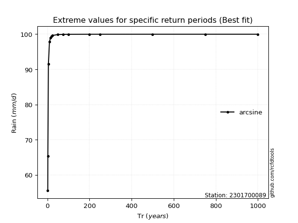</img>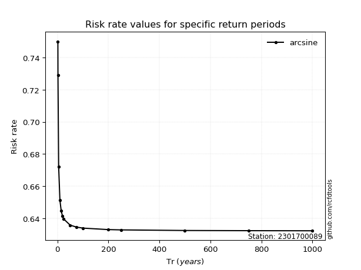</img>

</div>


<sub>**APP DISCLAIMER**: NO WARRANTY - This software is provided by [github.com/rcfdtools](https://github.com/rcfdtools) "as is", without any express or implied warranty, including warranties of merchantability, fitness for a particular purpose, or non-infringement. There is no guarantee that the software will be error-free or operate without interruption. LIMITATION OF LIABILITY - Neither the authors nor copyright holders will be liable for claims or damages arising from the software or its use. You are responsible for determining if the software is appropriate for your use and assume all associated risks, including errors, legal compliance, and data loss. NO PROFESSIONAL ADVICE - The software provides general information and does not offer professional advice. It should not replace consultation with professional advisors.</sub>