<div align="center">


</div>

# PMP Station (Rain, Pmax24h): 23017040

Probable Maximum Precipitation (PMP) is the greatest amount of rainfall for a specific duration that is meteorologically possible for a given location, acting as a "worst-case" scenario for extreme storms, crucial for designing safety-critical infrastructure like bridges, river deviations, dams, spillways, and nuclear plants to prevent catastrophic failure. PMP is calculated by hydrologists using meteorological data to determine the upper limit of extreme rainfall, often leading to the Probable Maximum Flood (PMF) for flood control design, and is increasingly being studied for climate change impacts. Probable Maximum Precipitation (PMP) is the theoretical upper limit of rainfall, a deterministic estimate for extreme events, while probability distributions (like GEV, Gumbel) describe the likelihood and frequency of various precipitation amounts, including rare ones, showing how often events occur, with PMP representing the extreme end of these distributions, used for critical infrastructure design to ensure safety against the worst conceivable weather, unlike standard statistical forecasts which cover typical probabilities.

The most common probability distributions in hydrology, used for analyzing floods, rainfall, and streamflow, include the Normal, Log-Normal, Gumbel, Gamma (including Log-Pearson Type III), and Generalized Extreme Value (GEV) distributions, often chosen based on the data´s skewness and whether modeling extremes or general conditions, with Gumbel and GEV popular for extreme events like floods, while the Normal distribution serves as a baseline, though often requiring transformations for skewed hydrological data. These distributions help in designing water infrastructure, managing water resources, and forecasting hydrologic events.

> Hydrological data often isn´t perfectly normal (it´s skewed), so different distributions are needed for different applications, such as: **Flood Frequency Analysis**: Using Gumbel, GEV, or Log-Pearson Type III for predicting extreme flood magnitudes and their return periods, **Rainfall Analysis**: Normal for annual totals, but Log-Normal, Weibull, or GEV for intensity or extreme daily rainfall, **Streamflow Modeling**: Gamma and Log-Normal for maximum flows, GEV for minimum flows, and Kappa for daily flows.

<div align="center">

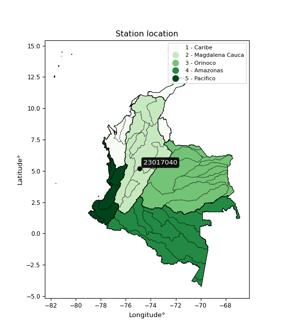</img>

</div>


## A. General information


### 1. General running parameters

• app_version: _v20260103_. • runtime: _2026-01-05 16:20:51.132608_. • Python version: _3.14.0_. • SciPy version: _1.16.3_. • Pandas version: _2.3.3_. • NumPy version: _2.3.5_. • Stations dataset (station_dataset_file): _dataset/pmax24h_in/automatic_colombia_2003_2024.csv_. • Stations catalog (station_catalog_file): _dataset/CNE.xls_. • Minimum year to eval til year_max (date_min): _1900_. • Maximum year to eval since year_min (date_max): _2024_. • Creates, save and include plots into reports (create_plot): _True_. • Plot only fit distributions with Δo > Δ (plot_only_fit): _True_. • Plot only simple graphs avoiding multiple CDFs and multiple Extreme values plots (plot_only_simple): _True_. • Eval low extreme values, if False, evaluates high extreme values (low_extreme): _False_. • Eval every SciPy distribution as logarithmic (pdist_logarithmic_on): _True_. • Standard deviation normalized (ddof): _1.0_. • Return periods to eval in years (Tr): _[2, 2.33, 5, 10, 15, 20, 25, 50, 75, 100, 200, 250, 500, 750, 1000]_. • Minimum data sample per station, 0 means any (minimum_sample): _5_. • Z-Score maximum threshold to adjust a value, 0 means disable (zscore_max): _3.5_. • Z-Score minimum threshold to adjust a value, 0 means disable (zscore_min): _-2.5_. • Avoid zeros, e.g. rain = 0 (avoid_zeros): _True_. • Avoid null values (avoid_nans): _True_. 

[:file_folder:Dataset file](../../dataset/pmax24h_in/automatic_colombia_2003_2024.csv)

> Delta Degrees of Freedom (DDOF): is a parameter used in the formulas for calculating variance and standard deviation. When ddof=0, the divisor is $N$ (the total number of observations) and this is used when your data set is the entire population. When ddof=1, the divisor is $N-1$ and this is used when your data set is a sample drawn from a larger population. Using $N-1$ provides an unbiased estimate of the population variance (known as Bessel´s correction).


### 2. Station info and location

|   id |   CODIGO | NOMBRE                      | CATEGORIA    | TECNOLOGIA                              | ESTADO           | FECHA_INSTALACION   |   FECHA_SUSPENSION |   ALTITUD |   LATITUD |   LONGITUD | DEPARTAMENTO   | MUNICIPIO   | AREA_OPERATIVA             | ENTIDAD                                                     | AREA_HIDROGRAFICA   | ZONA_HIDROGRAFICA   | SUBZONA_HIDROGRAFICA   | CORRIENTE   | Catalogo   |   Version |
|-----:|---------:|:----------------------------|:-------------|:----------------------------------------|:-----------------|:--------------------|-------------------:|----------:|----------:|-----------:|:---------------|:------------|:---------------------------|:------------------------------------------------------------|:--------------------|:--------------------|:-----------------------|:------------|:-----------|----------:|
|    0 | 23017040 | ESPERANZA LA AUT [23017040] | Limnigráfica | Automática con Telemetría, Convencional | En Mantenimiento | 15/09/1988          |                nan |       496 |   5.20372 |   -74.9084 | Tolima         | Mariquita   | Area Operativa 10 - Tolima | INSTITUTO DE HIDROLOGIA METEOROLOGIA Y ESTUDIOS AMBIENTALES | Magdalena Cauca     | Medio Magdalena     | Río Gualí              | Guali       | CNE_IDEAM  |  20251226 |

<div align="center">

Dynamic map: [:earth_americas:Google](http://maps.google.com/maps?q=5.203718,-74.908378) [:earth_americas:OSM](https://www.openstreetmap.org/#map=18/5.203718/-74.908378&layers=P) [:earth_americas:Bing](https://www.bing.com/maps?cp=5.203718~-74.908378&lvl=18) [:earth_americas:Apple](https://maps.apple.com/frame?center=5.203718%2C-74.908378&span=0.003%2C0.006)

</div>


<div align="center">

```geojson
{
  "type": "Feature",
  "geometry": {
    "type": "Point", 
    "coordinates": [-74.908378, 5.203718]
  }, 
  "properties": {
    "Name": "23017040"
  }
}
```

</div>


### 3. Discrete values table and plot

<div align="center">

|               |          0 |           1 |           2 |           3 |          4 |           5 |          6 |           7 |
|:--------------|-----------:|------------:|------------:|------------:|-----------:|------------:|-----------:|------------:|
| Date          | 2014       | 2015        | 2016        | 2017        | 2018       | 2019        | 2020       | 2024        |
| Value         |  151.5     |   48.1      |   65.2      |   75.8      |   63.9     |   27.7      |    2.7     |   23.8      |
| Value_initial |  151.5     |   48.1      |   65.2      |   75.8      |   63.9     |   27.7      |    2.7     |   23.8      |
| count         |    8       |    8        |    8        |    8        |    8       |    8        |    8       |    8        |
| mean          |   57.3375  |   57.3375   |   57.3375   |   57.3375   |   57.3375  |   57.3375   |   57.3375  |   57.3375   |
| std           |   45.3338  |   45.3338   |   45.3338   |   45.3338   |   45.3338  |   45.3338   |   45.3338  |   45.3338   |
| zscore        |    2.07709 |   -0.203766 |    0.173436 |    0.407257 |    0.14476 |   -0.653762 |   -1.20523 |   -0.739791 |


</div>


<div align="center">

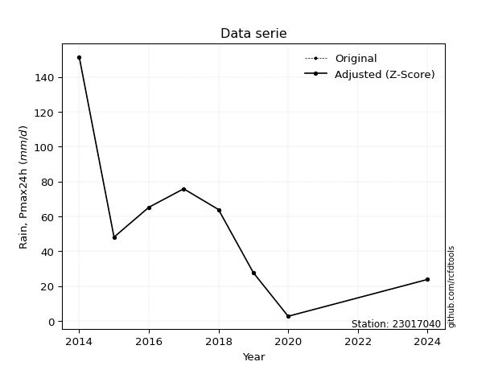</img>

</div>


> The initial value (value_initial) correspond to the initial obtained or null completed value, and value (value) is adjusted only when the initial value is outside the valid range (outlier) definite through the Z-Score value. If Z-Score is active, values out of range or outliers are replaced with the station mean value. A Z-Score (or standard score) measures how many standard deviations a data point is from the mean of a dataset, indicating its relative position; positive scores mean above the mean, negative mean below, and a score of zero is exactly at the mean, allowing for comparison of values from different distributions. It´s calculated using the formula $z=(x–μ)/σ$, where $x$ is the data point, $μ$ is the mean, and $σ$ is the standard deviation, helping identify outliers and understand probability.
>
> <sub>**Note**: In this study, "completing" (filling gaps in) and "extending" (forecasting or lengthening the historical record) rainfall data series are avoided for certain critical analyses because they introduce artificial bias and uncertainty, which can distort the statistics of rare events (extremes), alter day-to-day variability, and compromise the integrity and homogeneity of the original data. Some reasons against Completing/Extending rainfall data are: **Distortion of Extremes and Variability**: The primary issue is that most gap-filling or extension methods rely on averaging or regression with nearby stations, which inherently smooths the data. Rainfall is highly variable in space and time, with a large percentage of zero values and occasional large storms. Infilling methods often underestimate the highest values and overestimate the lowest (zero) values, which severely distorts analyses focused on flood frequency, drought severity, and intensity-duration-frequency (IDF) curves, **Loss of Data Homogeneity**: Infilled or extended data are synthetic estimates, not actual measurements. Combining these estimates with observed data can violate the assumption of data homogeneity, which requires that the data properties do not change over time. Inhomogeneity can lead to incorrect conclusions about long-term trends or changes in climate patterns, **Propagation of Errors**: Errors and biases from the original data (e.g., wind-induced undercatch, instrument errors, site changes) or the data used for imputation can propagate through the analysis, leading to unreliable hydrological models and inaccurate predictions, **Compromised Statistical Integrity**: For statistical analyses, especially those involving the frequency of events, using artificial data can introduce time bias or autocorrelation that doesn´t exist in reality, making it difficult to assess the true probability of events, **Difficulty in Validation**: It is difficult to accurately validate the quality of filled or extended data, especially for past periods where ground-truth measurements are unavailable. The reliability of imputation techniques heavily depends on the density of the surrounding station network and the complexity of the local topography.</sub>


### 4. Active continuous probability distributions from SciPy (44 of 104 available)

A Probability Density Function (PDF) describes the relative likelihood of a continuous random variable falling within a specific range, where the total area under its curve equals 1, and the area over any interval gives the actual probability for that range. Unlike discrete probabilities (like rolling a die), a PDF shows density, not direct probability for a single point (which is zero), with higher points indicating higher likelihood, often visualized as a bell curve for normal distributions.

A log of a probability density function (log-PDF) is simply the logarithm of the PDF´s value, denoted as $log(f(x))$, useful for converting multiplication of probabilities into addition, improving numerical stability with tiny numbers, and connecting to information theory concepts like entropy. Instead of dealing with very small probabilities (e.g., 0.000001), log-PDFs use negative numbers (e.g., $log(0.00001) ≈ -11.51$ that are easier for computers to handle, preventing underflow errors and simplifying complex calculations. In this study, each active probability distribution from SciPy is also evaluated in the $log$ form.

[scipy.stats](https://docs.scipy.org/doc/scipy/reference/stats.html) is a Python´s powerful submodule within the SciPy library for comprehensive statistical analysis, offering over 130 probability distributions (like Normal, Poisson), functions for descriptive stats (mean, variance), hypothesis testing (t-tests, chi-square), random variable generation, and statistical tests, making it essential for data science, modeling, and research. It provides tools to explore, model, and draw conclusions from data efficiently, working seamlessly with NumPy.

<div align="center">

|   id | p_dist             |   n_parameter | fit_method   | label                                                                       | active   | ref                                                                                                        |
|-----:|:-------------------|--------------:|:-------------|:----------------------------------------------------------------------------|:---------|:-----------------------------------------------------------------------------------------------------------|
|    0 | alpha              |             3 | MLE          | Alpha                                                                       | True     | [:mortar_board:](https://docs.scipy.org/doc/scipy/reference/generated/scipy.stats.alpha.html)              |
|    1 | betaprime          |             4 | MLE          | Beta prime                                                                  | True     | [:mortar_board:](https://docs.scipy.org/doc/scipy/reference/generated/scipy.stats.betaprime.html)          |
|    2 | chi2               |             3 | MLE          | Chi²                                                                        | True     | [:mortar_board:](https://docs.scipy.org/doc/scipy/reference/generated/scipy.stats.chi2.html)               |
|    3 | crystalball        |             4 | MLE          | Crystalball                                                                 | True     | [:mortar_board:](https://docs.scipy.org/doc/scipy/reference/generated/scipy.stats.crystalball.html)        |
|    4 | erlang             |             3 | MLE          | Erlang                                                                      | True     | [:mortar_board:](https://docs.scipy.org/doc/scipy/reference/generated/scipy.stats.erlang.html)             |
|    5 | expon              |             2 | MLE          | Exponential                                                                 | True     | [:mortar_board:](https://docs.scipy.org/doc/scipy/reference/generated/scipy.stats.expon.html)              |
|    6 | exponnorm          |             3 | MLE          | Exponentially modified Normal                                               | True     | [:mortar_board:](https://docs.scipy.org/doc/scipy/reference/generated/scipy.stats.exponnorm.html)          |
|    7 | f                  |             4 | MLE          | F                                                                           | True     | [:mortar_board:](https://docs.scipy.org/doc/scipy/reference/generated/scipy.stats.f.html)                  |
|    8 | fatiguelife        |             3 | MLE          | Fatigue-life (Birnbaum-Saunders)                                            | True     | [:mortar_board:](https://docs.scipy.org/doc/scipy/reference/generated/scipy.stats.fatiguelife.html)        |
|    9 | fisk               |             3 | MLE          | Fisk                                                                        | True     | [:mortar_board:](https://docs.scipy.org/doc/scipy/reference/generated/scipy.stats.fisk.html)               |
|   10 | gamma              |             3 | MLE          | Gamma                                                                       | True     | [:mortar_board:](https://docs.scipy.org/doc/scipy/reference/generated/scipy.stats.gamma.html)              |
|   11 | genexpon           |             5 | MLE          | Generalized exponential                                                     | True     | [:mortar_board:](https://docs.scipy.org/doc/scipy/reference/generated/scipy.stats.genexpon.html)           |
|   12 | genlogistic        |             3 | MLE          | Generalized logistic                                                        | True     | [:mortar_board:](https://docs.scipy.org/doc/scipy/reference/generated/scipy.stats.genlogistic.html)        |
|   13 | gibrat             |             2 | MM           | Gibrat                                                                      | True     | [:mortar_board:](https://docs.scipy.org/doc/scipy/reference/generated/scipy.stats.gibrat.html)             |
|   14 | gompertz           |             3 | MLE          | Gompertz (or truncated Gumbel)                                              | True     | [:mortar_board:](https://docs.scipy.org/doc/scipy/reference/generated/scipy.stats.gompertz.html)           |
|   15 | gumbel_l           |             2 | MM           | Gumbel Left Skew                                                            | True     | [:mortar_board:](https://docs.scipy.org/doc/scipy/reference/generated/scipy.stats.gumbel_l.html)           |
|   16 | gumbel_r           |             2 | MM           | Gumbel Right Skew                                                           | True     | [:mortar_board:](https://docs.scipy.org/doc/scipy/reference/generated/scipy.stats.gumbel_r.html)           |
|   17 | halflogistic       |             2 | MM           | Half-logistic                                                               | True     | [:mortar_board:](https://docs.scipy.org/doc/scipy/reference/generated/scipy.stats.halflogistic.html)       |
|   18 | halfnorm           |             2 | MM           | Half Normal                                                                 | True     | [:mortar_board:](https://docs.scipy.org/doc/scipy/reference/generated/scipy.stats.halfnorm.html)           |
|   19 | hypsecant          |             2 | MM           | hyperbolic secant                                                           | True     | [:mortar_board:](https://docs.scipy.org/doc/scipy/reference/generated/scipy.stats.hypsecant.html)          |
|   20 | invgamma           |             3 | MLE          | Inverted gamma                                                              | True     | [:mortar_board:](https://docs.scipy.org/doc/scipy/reference/generated/scipy.stats.invgamma.html)           |
|   21 | invgauss           |             3 | MLE          | Inverse Gaussian                                                            | True     | [:mortar_board:](https://docs.scipy.org/doc/scipy/reference/generated/scipy.stats.invgauss.html)           |
|   22 | invweibull         |             3 | MLE          | Inverted Weibull                                                            | True     | [:mortar_board:](https://docs.scipy.org/doc/scipy/reference/generated/scipy.stats.invweibull.html)         |
|   23 | johnsonsu          |             4 | MLE          | Johnson Su                                                                  | True     | [:mortar_board:](https://docs.scipy.org/doc/scipy/reference/generated/scipy.stats.johnsonsu.html)          |
|   24 | kstwobign          |             2 | MLE          | Limiting distribution of scaled Kolmogorov-Smirnov two-sided test statistic | True     | [:mortar_board:](https://docs.scipy.org/doc/scipy/reference/generated/scipy.stats.kstwobign.html)          |
|   25 | laplace            |             2 | MM           | Laplace                                                                     | True     | [:mortar_board:](https://docs.scipy.org/doc/scipy/reference/generated/scipy.stats.laplace.html)            |
|   26 | laplace_asymmetric |             3 | MLE          | Asymmetric Laplace                                                          | True     | [:mortar_board:](https://docs.scipy.org/doc/scipy/reference/generated/scipy.stats.laplace_asymmetric.html) |
|   27 | loggamma           |             3 | MLE          | Log gamma                                                                   | True     | [:mortar_board:](https://docs.scipy.org/doc/scipy/reference/generated/scipy.stats.loggamma.html)           |
|   28 | logistic           |             2 | MM           | Logistic (or Sech-squared)                                                  | True     | [:mortar_board:](https://docs.scipy.org/doc/scipy/reference/generated/scipy.stats.logistic.html)           |
|   29 | lognorm            |             3 | MLE          | Log Normal                                                                  | True     | [:mortar_board:](https://docs.scipy.org/doc/scipy/reference/generated/scipy.stats.lognorm.html)            |
|   30 | maxwell            |             2 | MM           | Maxwell                                                                     | True     | [:mortar_board:](https://docs.scipy.org/doc/scipy/reference/generated/scipy.stats.maxwell.html)            |
|   31 | mielke             |             4 | MLE          | Mielke Beta-Kappa / Dagum                                                   | True     | [:mortar_board:](https://docs.scipy.org/doc/scipy/reference/generated/scipy.stats.mielke.html)             |
|   32 | moyal              |             2 | MM           | Moyal                                                                       | True     | [:mortar_board:](https://docs.scipy.org/doc/scipy/reference/generated/scipy.stats.moyal.html)              |
|   33 | nakagami           |             3 | MLE          | Nakagami                                                                    | True     | [:mortar_board:](https://docs.scipy.org/doc/scipy/reference/generated/scipy.stats.nakagami.html)           |
|   34 | ncf                |             5 | MLE          | Non-central F distribution                                                  | True     | [:mortar_board:](https://docs.scipy.org/doc/scipy/reference/generated/scipy.stats.ncf.html)                |
|   35 | nct                |             4 | MLE          | Non-central Student’s t                                                     | True     | [:mortar_board:](https://docs.scipy.org/doc/scipy/reference/generated/scipy.stats.nct.html)                |
|   36 | norm               |             2 | MM           | Normal                                                                      | True     | [:mortar_board:](https://docs.scipy.org/doc/scipy/reference/generated/scipy.stats.norm.html)               |
|   37 | pearson3           |             3 | MM           | Pearson type III                                                            | True     | [:mortar_board:](https://docs.scipy.org/doc/scipy/reference/generated/scipy.stats.pearson3.html)           |
|   38 | rayleigh           |             2 | MM           | Rayleigh                                                                    | True     | [:mortar_board:](https://docs.scipy.org/doc/scipy/reference/generated/scipy.stats.rayleigh.html)           |
|   39 | rice               |             3 | MLE          | Rice                                                                        | True     | [:mortar_board:](https://docs.scipy.org/doc/scipy/reference/generated/scipy.stats.rice.html)               |
|   40 | t                  |             3 | MLE          | Student’s t                                                                 | True     | [:mortar_board:](https://docs.scipy.org/doc/scipy/reference/generated/scipy.stats.t.html)                  |
|   41 | truncnorm          |             4 | MLE          | Truncated normal                                                            | True     | [:mortar_board:](https://docs.scipy.org/doc/scipy/reference/generated/scipy.stats.truncnorm.html)          |
|   42 | wald               |             2 | MM           | Wald                                                                        | True     | [:mortar_board:](https://docs.scipy.org/doc/scipy/reference/generated/scipy.stats.wald.html)               |
|   43 | weibull_min        |             3 | MLE          | Weibull minimum                                                             | True     | [:mortar_board:](https://docs.scipy.org/doc/scipy/reference/generated/scipy.stats.weibull_min.html)        |

</div>

> **n_parameter:** # arguments & localization & scale.
>
> **Fit methods:** (MLE) maximum likelihood, (MM) L-moments.
>
>**Inactive** (With the only purpose of prevent loops, zero divisions, infinite values, over high estimated values or horizontal trending for recurrence intervals estimations, the follow distributions were disabled.)**:** foldnorm, gennorm, norminvgauss, powernorm, powerlognorm, skewnorm, genextreme, anglit, arcsine, argus, beta, bradford, burr, burr12, cauchy, cosine, halfcauchy, foldcauchy, skewcauchy, wrapcauchy, dgamma, gengamma, exponweib, exponpow, truncexpon, gausshyper, genhalflogistic, genhyperbolic, geninvgauss, halfgennorm, johnsonsb, kappa4, kappa3, ksone, kstwo, loglaplace, levy, levy_l, levy_stable, ncx2, pareto, genpareto, truncpareto, lomax, powerlaw, rdist, rel_breitwigner, recipinvgauss, semicircular, studentized_range, trapezoid, triang, truncweibull_min, tukeylambda, uniform, loguniform, vonmises, vonmises_line, weibull_max, dweibull, 


## B. Probability (PDF) vs. Empirical (EDF) distributions functions

A continuous probability distribution (CPD) describes probabilities for variables that can take any value within a range (like rain any time), unlike discrete variables with specific outcomes (like temperature). It uses a Probability Density Function (PDF), a curve where the total area under it equals 1, and the probability of the variable falling within an interval (a to b) is found by calculating the area under the curve between those points. A key feature is that the probability of hitting any single exact value is zero, so probabilities are always expressed for ranges, e.g., $P(a ≤ X ≤ b)$.

<div align="center">

Distributions parameters from station values
|    |   station | p_dist                |   n |               loc |            scale | shape                  | shape1             | shape2                 | shape3   |
|---:|----------:|:----------------------|----:|------------------:|-----------------:|:-----------------------|:-------------------|:-----------------------|:---------|
|  0 |  23017040 | alpha                 |   8 |      -0.0178329   |      7.5922      | 1.6310002440466404e-10 |                    |                        |          |
|  1 |  23017040 | betaprime             |   8 |      -1.15764     |      1.66587e+06 | 1.5197849180329603     | 43680.90532744054  |                        |          |
|  2 |  23017040 | chi2                  |   8 |       2.7         |      5.0319      | 0.4539111790359325     |                    |                        |          |
|  3 |  23017040 | crystalball           |   8 |      57.3375      |     42.4059      | 4541.7884768790445     | 25.91184645940729  |                        |          |
|  4 |  23017040 | erlang                |   8 |       2.7         |     51.1698      | 0.9322279844926158     |                    |                        |          |
|  5 |  23017040 | expon                 |   8 |       2.7         |     54.6375      |                        |                    |                        |          |
|  6 |  23017040 | exponnorm             |   8 |      18.7218      |     19.4714      | 1.9832010746863482     |                    |                        |          |
|  7 |  23017040 | f                     |   8 |       2.69831     |     64.6896      | 1.2429965863763872     | 2682.2832056425923 |                        |          |
|  8 |  23017040 | fatiguelife           |   8 |     -29.7727      |     77.5323      | 0.4967323789239467     |                    |                        |          |
|  9 |  23017040 | fisk                  |   8 |     -27.7627      |     76.3116      | 3.49923684025984       |                    |                        |          |
| 10 |  23017040 | gamma                 |   8 |       2.7         |     85.7682      | 0.35009808340480286    |                    |                        |          |
| 11 |  23017040 | genexpon              |   8 |       1.97617     |   6519.29        | 73.61473869582895      | 44.17319175938802  | 18127.0014867266       |          |
| 12 |  23017040 | genlogistic           |   8 |    -177.037       |     31.8145      | 872.3468282465849      |                    |                        |          |
| 13 |  23017040 | gibrat                |   8 |      24.9872      |     19.6215      |                        |                    |                        |          |
| 14 |  23017040 | gompertz              |   8 |       2.7         |    142.161       | 1.843546288107194      |                    |                        |          |
| 15 |  23017040 | gumbel_l              |   8 |      76.4224      |     33.0637      |                        |                    |                        |          |
| 16 |  23017040 | gumbel_r              |   8 |      38.2526      |     33.0637      |                        |                    |                        |          |
| 17 |  23017040 | halflogistic          |   8 |       7.07671     |     36.2555      |                        |                    |                        |          |
| 18 |  23017040 | halfnorm              |   8 |       1.20875     |     70.347       |                        |                    |                        |          |
| 19 |  23017040 | hypsecant             |   8 |      57.3375      |     26.9964      |                        |                    |                        |          |
| 20 |  23017040 | invgamma              |   8 |     -60.3243      |    935.567       | 8.93714447318899       |                    |                        |          |
| 21 |  23017040 | invgauss              |   8 |     -33.0228      |    381.684       | 0.2367411464535124     |                    |                        |          |
| 22 |  23017040 | invweibull            |   8 |       2.7         |      4.23674     | 0.04346142135656625    |                    |                        |          |
| 23 |  23017040 | johnsonsu             |   8 |     -30.8931      |      3.77582     | -7.838710991694835     | 2.0996731101539137 |                        |          |
| 24 |  23017040 | kstwobign             |   8 |     -76.2847      |    154.109       |                        |                    |                        |          |
| 25 |  23017040 | laplace               |   8 |      57.3375      |     29.9855      |                        |                    |                        |          |
| 26 |  23017040 | laplace_asymmetric    |   8 |      63.9         |     31.2482      | 1.1105040873546281     |                    |                        |          |
| 27 |  23017040 | loggamma              |   8 |  -11655.4         |   1620.19        | 1379.76098473204       |                    |                        |          |
| 28 |  23017040 | logistic              |   8 |      57.3375      |     23.3796      |                        |                    |                        |          |
| 29 |  23017040 | lognorm               |   8 |       2.7         |      0.380836    | 13.009090588645762     |                    |                        |          |
| 30 |  23017040 | maxwell               |   8 |     -43.1466      |     62.9691      |                        |                    |                        |          |
| 31 |  23017040 | mielke                |   8 |       2.7         |     94.8571      | 0.7473714210990017     | 5.271743809507735  |                        |          |
| 32 |  23017040 | moyal                 |   8 |      33.0871      |     19.0893      |                        |                    |                        |          |
| 33 |  23017040 | nakagami              |   8 |      23.8         |     51.3634      | 0.17976502033717434    |                    |                        |          |
| 34 |  23017040 | ncf                   |   8 |      -0.00813271  |      5.25677e-07 | 9.174350576827758e-08  | 13.381428096576048 | 8.835008758415299      |          |
| 35 |  23017040 | nct                   |   8 |     -78.2175      |     10.3138      | 7.0953894543909115     | 11.713633852553599 |                        |          |
| 36 |  23017040 | norm                  |   8 |      57.3375      |     42.4059      |                        |                    |                        |          |
| 37 |  23017040 | pearson3              |   8 |      57.3375      |     42.4058      | 1.0069822903512358     |                    |                        |          |
| 38 |  23017040 | rayleigh              |   8 |     -23.7874      |     64.7283      |                        |                    |                        |          |
| 39 |  23017040 | rice                  |   8 |     -14.7751      |     59.1544      | 0.00027265084077707756 |                    |                        |          |
| 40 |  23017040 | t                     |   8 |      57.344       |     42.3392      | 23.221799290584585     |                    |                        |          |
| 41 |  23017040 | truncnorm             |   8 |      57.3375      |     42.4059      | -100.29820531542828    | 282.5633789212239  |                        |          |
| 42 |  23017040 | wald                  |   8 |      14.9316      |     42.4059      |                        |                    |                        |          |
| 43 |  23017040 | weibull_min           |   8 |       2.7         |     22.4653      | 0.5198912827539857     |                    |                        |          |
| 44 |  23017040 | logalpha              |   8 |     -32.0212      |   1074.16        | 30.188603877347386     |                    |                        |          |
| 45 |  23017040 | logbetaprime          |   8 |     -16.2146      |    277.128       | 293.0296409185912      | 4096.350986048424  |                        |          |
| 46 |  23017040 | logchi2               |   8 |     -15.1558      |      0.0368487   | 509.3272737660882      |                    |                        |          |
| 47 |  23017040 | logcrystalball        |   8 |       3.63014     |      1.13565     | 39.162911175869276     | 6.7091125925753055 |                        |          |
| 48 |  23017040 | logerlang             |   8 |     -17.2345      |      0.0665881   | 313.3830030450181      |                    |                        |          |
| 49 |  23017040 | logexpon              |   8 |       0.993252    |      2.63689     |                        |                    |                        |          |
| 50 |  23017040 | logexponnorm          |   8 |       3.62919     |      1.13565     | 0.0008298765653395931  |                    |                        |          |
| 51 |  23017040 | logf                  |   8 |   -1740.3         |   1743.93        | 12545623.57212926      | 7454058.392505914  |                        |          |
| 52 |  23017040 | logfatiguelife        |   8 |    -660.126       |    663.759       | 0.0017135177007983077  |                    |                        |          |
| 53 |  23017040 | logfisk               |   8 |      -1.04052e+08 |      1.04052e+08 | 181887963.85350788     |                    |                        |          |
| 54 |  23017040 | loggamma              |   8 |     -15.8413      |      0.0723571   | 269.0887911807911      |                    |                        |          |
| 55 |  23017040 | loggenexpon           |   8 |       0.52216     |      0.0775994   | 4.284336538959423e-09  | 4.401695957844733  | 0.00025062089559399947 |          |
| 56 |  23017040 | loggenlogistic        |   8 |       4.54423     |      0.254615    | 0.25329397397533804    |                    |                        |          |
| 57 |  23017040 | loggibrat             |   8 |       2.76381     |      0.52546     |                        |                    |                        |          |
| 58 |  23017040 | loggompertz           |   8 |       0.99325     |      0.828953    | 0.0236126483774911     |                    |                        |          |
| 59 |  23017040 | loggumbel_l           |   8 |       4.14124     |      0.885461    |                        |                    |                        |          |
| 60 |  23017040 | loggumbel_r           |   8 |       3.11904     |      0.885461    |                        |                    |                        |          |
| 61 |  23017040 | loghalflogistic       |   8 |       2.28414     |      0.970935    |                        |                    |                        |          |
| 62 |  23017040 | loghalfnorm           |   8 |       2.127       |      1.88391     |                        |                    |                        |          |
| 63 |  23017040 | loghypsecant          |   8 |       3.63014     |      0.722976    |                        |                    |                        |          |
| 64 |  23017040 | loginvgamma           |   8 |     -19.819       |   8838           | 378.08037357709054     |                    |                        |          |
| 65 |  23017040 | loginvgauss           |   8 |      -9.54032     |   1486.29        | 0.008825816550807358   |                    |                        |          |
| 66 |  23017040 | loginvweibull         |   8 |      -1.17547e+08 |      1.17547e+08 | 85968452.10849747      |                    |                        |          |
| 67 |  23017040 | logjohnsonsu          |   8 |       4.2547      |      0.328287    | 0.5964301584063689     | 0.747613025486147  |                        |          |
| 68 |  23017040 | logkstwobign          |   8 |      -1.96624     |      6.41183     |                        |                    |                        |          |
| 69 |  23017040 | loglaplace            |   8 |       3.63014     |      0.803025    |                        |                    |                        |          |
| 70 |  23017040 | loglaplace_asymmetric |   8 |       4.17746     |      0.62985     | 1.5246475624151419     |                    |                        |          |
| 71 |  23017040 | logloggamma           |   8 |       4.65671     |      0.46911     | 0.4577510778096839     |                    |                        |          |
| 72 |  23017040 | loglogistic           |   8 |       3.63014     |      0.626116    |                        |                    |                        |          |
| 73 |  23017040 | loglognorm            |   8 |       0.993252    |      0.0261586   | 12.509419872363674     |                    |                        |          |
| 74 |  23017040 | logmaxwell            |   8 |       0.93913     |      1.68634     |                        |                    |                        |          |
| 75 |  23017040 | logmielke             |   8 | -283156           | 283160           | 275192.215684938       | 1113806.6151881595 |                        |          |
| 76 |  23017040 | logmoyal              |   8 |       2.9807      |      0.511221    |                        |                    |                        |          |
| 77 |  23017040 | lognakagami           |   8 |       3.16969     |      0.990818    | 0.3387903722378622     |                    |                        |          |
| 78 |  23017040 | logncf                |   8 |     -77.4756      |     81.098       | 18939.35485612863      | 20417.10547828305  | 2.947853930513239e-06  |          |
| 79 |  23017040 | lognct                |   8 |     -73.6754      |      1.10349     | 36862.4479811738       | 70.05301287967663  |                        |          |
| 80 |  23017040 | lognorm               |   8 |       3.63014     |      1.13565     |                        |                    |                        |          |
| 81 |  23017040 | logpearson3           |   8 |       3.63014     |      1.13565     | -1.2894893220422692    |                    |                        |          |
| 82 |  23017040 | lograyleigh           |   8 |       1.45756     |      1.73347     |                        |                    |                        |          |
| 83 |  23017040 | logrice               |   8 |    -805.515       |      1.1349      | 712.9669667433177      |                    |                        |          |
| 84 |  23017040 | logt                  |   8 |       3.95797     |      0.585285    | 1.9252636029436683     |                    |                        |          |
| 85 |  23017040 | logtruncnorm          |   8 |       1.5741      |      2.99497     | -0.1941294527216107    | 36.84678577351988  |                        |          |
| 86 |  23017040 | logwald               |   8 |       2.49446     |      1.13567     |                        |                    |                        |          |
| 87 |  23017040 | logweibull_min        |   8 |       0.993252    |      1.8981      | 0.6740468035288383     |                    |                        |          |

</div>

> **loc** (Location parameter): This shifts the distribution along the x-axis. For many common distributions, like the normal (Gaussian) distribution, loc represents the mean $μ$. For others, like the uniform distribution, it might represent the minimum value, or for the beta distribution, the left end of the support interval.
>
> **scale** (Scale parameter): This determines the width or spread of the distribution. For the normal distribution, scale represents the standard deviation $σ$. For a uniform distribution, it defines the length of the interval (from $loc$ to $loc + scale$).
>
> **shape** (Shape parameters): Refers to parameters that define the specific form of a probability distribution, distinct from its location (loc) and scale (scale). These parameters are required arguments for most distribution functions. For example, a normal (Gaussian) distribution is fully defined by its location (mean) and scale (standard deviation), so it has no specific shape parameters beyond loc and scale. However, other distributions have intrinsic properties that need specification, as Gamma distribution that takes a shape parameter, often named $a$ or $alpha$.


### 0. Cumulative distribution values - CDF (88 evaluated)

Cumulative Distribution Function (CDF), denoted as $F$<sub>$X$</sub>$(x)$, is a function that gives the probability that a random variable $X$ will take a value less than or equal to a specific value, $x$ (i.e., $(P(X≥x)$. It essentially "accumulates" probabilities from a given point up to the far right (positive infinity), providing a complete picture of the distribution´s probabilities for both discrete (like rain) and continuous (like temperature) variables, helping to find probabilities over ranges or above certain values. Each station is evaluated separately ordering the $x$ values ascending, calculating the CDF and PDF values for the activated distributions and their logarithmic forms.

<div align="center">

CDF ordered by x ascending and calculating $log(f(x))$ separately
|   id |   Station |   date |     x |   count |    mean |     std |    zscore |   Value_initial |   station |   m |      alpha |   alpha_pdf |   betaprime |   betaprime_pdf |       chi2 |    chi2_pdf |   crystalball |   crystalball_pdf |      erlang |   erlang_pdf |    expon |   expon_pdf |   exponnorm |   exponnorm_pdf |          f |      f_pdf |   fatiguelife |   fatiguelife_pdf |      fisk |    fisk_pdf |       gamma |   gamma_pdf |   genexpon |   genexpon_pdf |   genlogistic |   genlogistic_pdf |    gibrat |   gibrat_pdf |    gompertz |   gompertz_pdf |   gumbel_l |   gumbel_l_pdf |   gumbel_r |   gumbel_r_pdf |   halflogistic |   halflogistic_pdf |   halfnorm |   halfnorm_pdf |   hypsecant |   hypsecant_pdf |   invgamma |   invgamma_pdf |   invgauss |   invgauss_pdf |   invweibull |   invweibull_pdf |   johnsonsu |   johnsonsu_pdf |   kstwobign |   kstwobign_pdf |   laplace |   laplace_pdf |   laplace_asymmetric |   laplace_asymmetric_pdf |   loggamma |   loggamma_pdf |   logistic |   logistic_pdf |   lognorm |   lognorm_pdf |   maxwell |   maxwell_pdf |      mielke |   mielke_pdf |    moyal |   moyal_pdf |    nakagami |   nakagami_pdf |       ncf |    ncf_pdf |       nct |     nct_pdf |      norm |    norm_pdf |   pearson3 |   pearson3_pdf |   rayleigh |   rayleigh_pdf |      rice |    rice_pdf |        t |       t_pdf |   truncnorm |   truncnorm_pdf |      wald |   wald_pdf |   weibull_min |   weibull_min_pdf |   logalpha |   logalpha_pdf |   logbetaprime |   logbetaprime_pdf |   logchi2 |   logchi2_pdf |   logcrystalball |   logcrystalball_pdf |   logerlang |   logerlang_pdf |   logexpon |   logexpon_pdf |   logexponnorm |   logexponnorm_pdf |      logf |   logf_pdf |   logfatiguelife |   logfatiguelife_pdf |    logfisk |   logfisk_pdf |   loggenexpon |   loggenexpon_pdf |   loggenlogistic |   loggenlogistic_pdf |   loggibrat |   loggibrat_pdf |   loggompertz |   loggompertz_pdf |   loggumbel_l |   loggumbel_l_pdf |   loggumbel_r |   loggumbel_r_pdf |   loghalflogistic |   loghalflogistic_pdf |   loghalfnorm |   loghalfnorm_pdf |   loghypsecant |   loghypsecant_pdf |   loginvgamma |   loginvgamma_pdf |   loginvgauss |   loginvgauss_pdf |   loginvweibull |   loginvweibull_pdf |   logjohnsonsu |   logjohnsonsu_pdf |   logkstwobign |   logkstwobign_pdf |   loglaplace |   loglaplace_pdf |   loglaplace_asymmetric |   loglaplace_asymmetric_pdf |   logloggamma |   logloggamma_pdf |   loglogistic |   loglogistic_pdf |   loglognorm |   loglognorm_pdf |   logmaxwell |   logmaxwell_pdf |   logmielke |   logmielke_pdf |    logmoyal |   logmoyal_pdf |   lognakagami |   lognakagami_pdf |    logncf |   logncf_pdf |    lognct |   lognct_pdf |   logpearson3 |   logpearson3_pdf |   lograyleigh |   lograyleigh_pdf |   logrice |   logrice_pdf |      logt |   logt_pdf |   logtruncnorm |   logtruncnorm_pdf |   logwald |   logwald_pdf |   logweibull_min |   logweibull_min_pdf |
|-----:|----------:|-------:|------:|--------:|--------:|--------:|----------:|----------------:|----------:|----:|-----------:|------------:|------------:|----------------:|-----------:|------------:|--------------:|------------------:|------------:|-------------:|---------:|------------:|------------:|----------------:|-----------:|-----------:|--------------:|------------------:|----------:|------------:|------------:|------------:|-----------:|---------------:|--------------:|------------------:|----------:|-------------:|------------:|---------------:|-----------:|---------------:|-----------:|---------------:|---------------:|-------------------:|-----------:|---------------:|------------:|----------------:|-----------:|---------------:|-----------:|---------------:|-------------:|-----------------:|------------:|----------------:|------------:|----------------:|----------:|--------------:|---------------------:|-------------------------:|-----------:|---------------:|-----------:|---------------:|----------:|--------------:|----------:|--------------:|------------:|-------------:|---------:|------------:|------------:|---------------:|----------:|-----------:|----------:|------------:|----------:|------------:|-----------:|---------------:|-----------:|---------------:|----------:|------------:|---------:|------------:|------------:|----------------:|----------:|-----------:|--------------:|------------------:|-----------:|---------------:|---------------:|-------------------:|----------:|--------------:|-----------------:|---------------------:|------------:|----------------:|-----------:|---------------:|---------------:|-------------------:|----------:|-----------:|-----------------:|---------------------:|-----------:|--------------:|--------------:|------------------:|-----------------:|---------------------:|------------:|----------------:|--------------:|------------------:|--------------:|------------------:|--------------:|------------------:|------------------:|----------------------:|--------------:|------------------:|---------------:|-------------------:|--------------:|------------------:|--------------:|------------------:|----------------:|--------------------:|---------------:|-------------------:|---------------:|-------------------:|-------------:|-----------------:|------------------------:|----------------------------:|--------------:|------------------:|--------------:|------------------:|-------------:|-----------------:|-------------:|-----------------:|------------:|----------------:|------------:|---------------:|--------------:|------------------:|----------:|-------------:|----------:|-------------:|--------------:|------------------:|--------------:|------------------:|----------:|--------------:|----------:|-----------:|---------------:|-------------------:|----------:|--------------:|-----------------:|---------------------:|
|    0 |  23017040 |   2020 |   2.7 |       8 | 57.3375 | 45.3338 | -1.20523  |             2.7 |  23017040 |   1 | 0.00521451 | 0.0165712   |   0.0214641 |      0.00812058 | 0.00021298 | 1.08845e+11 |     0.0987961 |        0.00410206 | 1.27804e-16 |  0.268284    | 0        |  0.0183024  |   0.0466898 |     0.00410739  | 0.00117598 | 0.433302   |     0.0353145 |        0.0052898  | 0.0386634 | 0.00426954  | 9.96112e-07 | 7.85286e+08 |  0.0109067 |     0.0169749  |     0.0466766 |       0.00448821  | 0         |  0           | 7.48424e-12 |     0.012968   |   0.101977 |     0.00292137 |  0.0533543 |    0.00472938  |       0        |        0           |  0.0169126 |     0.0113396  |   0.0836395 |     0.00306264  |  0.0389075 |    0.00475188  |  0.0359286 |     0.00517684 |   0.00709235 |      3.43494e+12 |   0.0369313 |     0.00501527  |    0.044635 |     0.00474306  | 0.0808403 |   0.00269598  |            0.0946621 |              0.00272792  |  0.0104672 |       0.025759 |  0.0881066 |    0.0034365   | 0.0101186 |     0.0237113 |  0.08777  |    0.00515302 | 1.10264e-09 |  8.40094     | 0.026659 | 0.00397182  | 0           |    0           | 0.0266898 | 0.0061346  | 0.0401482 | 0.00465803  | 0.0987961 | 0.00410206  |  0.0558201 |     0.0054673  |  0.0803167 |     0.00581419 | 0.0426968 | 0.00478074  | 0.104769 | 0.00402838  |   0.0987961 |     0.00410206  | 0         | 0          |   2.06878e-09 |       2.4219e+06  | 0.00944966 |      0.0249986 |      0.0114316 |           0.027625 | 0.0102047 |     0.0255103 |        0.0101185 |            0.0237113 |   0.0101041 |       0.0249785 |   0        |      0.379235  |      0.0101187 |          0.0237116 | 0.0104617 |   0.024346 |        0.0100223 |            0.0235728 | 0.00728693 |     0.0126451 |      0.020113 |          0.084503 |        0.0292301 |            0.0290784 |    0        |       0         |   6.20377e-08 |          0.028485 |     0.0281713 |          0.031363 |   1.61819e-05 |       0.000201603 |          0        |              0        |      0        |          0        |       0.016588 |          0.0229336 |     0.0101612 |          0.026255 |     0.0108444 |         0.0291122 |       0.0130407 |           0.0413891 |      0.0504806 |          0.0237027 |      0.0165931 |          0.0593286 |    0.0187448 |        0.0233427 |               0.0253834 |                   0.0264328 |     0.0316379 |         0.0308632 |     0.0146075 |         0.0229896 |   0.00407895 |      8.68084e+12 |  8.78975e-06 |      0.000487116 |   0.0314157 |        0.030532 | 2.83991e-12 |    1.38209e-10 |   0           |          0        | 0.0104675 |    0.0247618 | 0.0102619 |    0.0240189 |     0.0306433 |         0.0335199 |      0        |          0        | 0.0100757 |     0.0236392 | 0.0199056 |   0.01225  |     0.00012834 |           0.22657  |  0        |     0         |      1.14356e-11 |        69428.8       |
|    1 |  23017040 |   2024 |  23.8 |       8 | 57.3375 | 45.3338 | -0.739791 |            23.8 |  23017040 |   2 | 0.749908   | 0.0101494   |   0.266339  |      0.0123249  | 0.986534   | 0.0017153   |     0.21451   |        0.0068812  | 0.37142     |  0.0131611   | 0.320353 |  0.0124392  |   0.200807  |     0.0104121   | 0.383609   | 0.00995163 |     0.227105  |        0.0115237  | 0.20233   | 0.0109527   | 0.645909    | 0.00891033  |  0.324206  |     0.01221    |     0.205944  |       0.0102195   | 0         |  0           | 0.255449    |     0.0112002  |   0.18422  |     0.00502368 |  0.212624  |    0.00995625  |       0.226627 |        0.0130827   |  0.251896  |     0.0107721  |   0.178939  |     0.00628463  |  0.215338  |    0.0111589   |  0.224649  |     0.0114564  |   0.393528   |      0.000755951 |   0.221199  |     0.0113754   |    0.207119 |     0.010037    | 0.163392  |   0.00544903  |            0.173879  |              0.00501075  |  0.355751  |       0.318901 |  0.192402  |    0.00664612  | 0.342572  |     0.32357   |  0.23024  |    0.00813896 | 0.325165    |  0.0115133   | 0.202171 | 0.011818    | 1.23142e-06 |    1.24618e+08 | 0.237933  | 0.0121112  | 0.213646  | 0.0110838   | 0.21451   | 0.0068812   |  0.225093  |     0.00993261 |  0.236811  |     0.00866833 | 0.191539  | 0.00891235  | 0.218112 | 0.00674855  |   0.21451   |     0.0068812   | 0.0721372 | 0.0220499  |   0.620131    |       0.00905957  | 0.368713   |      0.327124  |      0.362275  |           0.317744 | 0.360013  |     0.323182  |        0.342572  |            0.323571  |   0.353026  |       0.31993   |   0.561931 |      0.166131  |      0.342574  |          0.323571  | 0.34484   |   0.323073 |        0.341841  |            0.323047  | 0.2479     |     0.325917  |      0.472827 |          0.2546   |        0.254474  |            0.252014  |    0.398118 |       0.950683  |   0.261047    |          0.290725 |     0.283799  |          0.269988 |   0.388911    |       0.4148      |          0.426842 |              0.421143 |      0.420059 |          0.36338  |       0.309733 |          0.363937  |     0.365849  |          0.319927 |     0.386075  |         0.320786  |       0.413362  |           0.267074  |      0.202684  |          0.186118  |      0.457494  |          0.253482  |    0.281803  |        0.350927  |               0.244817  |                   0.254938  |     0.261152  |         0.247571  |     0.324008  |         0.349818  |   0.638119   |      0.0137658   |  0.374034    |      0.345154    |   0.2602    |        0.251792 | 0.405837    |    0.459185    |   3.09276e-11 |      47188.5      | 0.347482  |    0.321041  | 0.343766  |    0.323098  |     0.27854   |         0.250819  |      0.386003 |          0.349841 | 0.342452  |     0.323742  | 0.157348  |   0.227779 |     0.48506    |           0.200326 |  0.44228  |     0.667308  |      0.666002    |            0.113434  |
|    2 |  23017040 |   2019 |  27.7 |       8 | 57.3375 | 45.3338 | -0.653762 |            27.7 |  23017040 |   3 | 0.784154   | 0.00759446  |   0.313812  |      0.0119991  | 0.991744   | 0.00102117  |     0.242307  |        0.00736912 | 0.420554    |  0.0120559   | 0.367175 |  0.0115822  |   0.243125  |     0.0112522   | 0.420479   | 0.00898958 |     0.272603  |        0.011768   | 0.246631  | 0.0117227   | 0.678039    | 0.00762563  |  0.370186  |     0.0113792  |     0.247092  |       0.010849    | 0.0239281 |  0.0207661   | 0.298444    |     0.010847   |   0.204752 |     0.00551034 |  0.252594  |    0.0105119   |       0.276987 |        0.0127329   |  0.293514  |     0.0105658  |   0.204982  |     0.00707892  |  0.259884  |    0.0116423   |  0.269975  |     0.0117462  |   0.396233   |      0.00063769  |   0.266364  |     0.0117437   |    0.247241 |     0.0105081   | 0.186087  |   0.0062059   |            0.194562  |              0.00560676  |  0.40505   |       0.33     |  0.219657  |    0.00733152  | 0.392875  |     0.338548  |  0.262743 |    0.00851765 | 0.36908     |  0.0110238   | 0.249509 | 0.0124008   | 0.314667    |    0.0289828   | 0.28535   | 0.0121649  | 0.257995  | 0.0116164   | 0.242307  | 0.00736912  |  0.264582  |     0.0102928  |  0.271204  |     0.00895609 | 0.227242  | 0.00938002  | 0.245394 | 0.00723796  |   0.242307  |     0.00736912  | 0.166906  | 0.0253017  |   0.652556    |       0.00763826  | 0.419096   |      0.335991  |      0.411325  |           0.327887 | 0.409939  |     0.333959  |        0.392876  |            0.338549  |   0.402522  |       0.331564  |   0.58643  |      0.15684   |      0.392878  |          0.338549  | 0.395039  |   0.337669 |        0.392063  |            0.338002  | 0.300571   |     0.367489  |      0.511104 |          0.249586 |        0.295666  |            0.291738  |    0.523688 |       0.71417   |   0.307908    |          0.326987 |     0.327123  |          0.301073 |   0.451281    |       0.405516    |          0.488565 |              0.392047 |      0.473932 |          0.34641  |       0.368035 |          0.402979  |     0.415127  |          0.32869  |     0.435228  |         0.326181  |       0.453558  |           0.262262  |      0.234223  |          0.231796  |      0.49543   |          0.24624   |    0.340419  |        0.423921  |               0.286727  |                   0.298581  |     0.301331  |         0.282514  |     0.379175  |         0.375971  |   0.640136   |      0.0128439   |  0.426708    |      0.34812     |   0.301286  |        0.29053  | 0.473627    |    0.43258     |   0.217367    |          0.964843 | 0.397287  |    0.334521  | 0.393976  |    0.337791  |     0.318752  |         0.279371  |      0.439014 |          0.347967 | 0.392783  |     0.33875   | 0.197063  |   0.298505 |     0.515039   |           0.194741 |  0.533334 |     0.53736   |      0.682599    |            0.105455  |
|    3 |  23017040 |   2015 |  48.1 |       8 | 57.3375 | 45.3338 | -0.203766 |            48.1 |  23017040 |   4 | 0.874627   | 0.00258398  |   0.532359  |      0.00927977 | 0.999255   | 8.48097e-05 |     0.413779  |        0.00918713 | 0.619204    |  0.00777135  | 0.564357 |  0.00797334 |   0.487283  |     0.0115767   | 0.568428   | 0.00589567 |     0.503519  |        0.010313   | 0.494838  | 0.0115303   | 0.791478    | 0.00407923  |  0.564348  |     0.0078712  |     0.47877   |       0.0110793   | 0.565041  |  0.0170308   | 0.500236    |     0.00891936 |   0.345971 |     0.00839902 |  0.475957  |    0.0106874   |       0.512233 |        0.0101725   |  0.494954  |     0.00908265 |   0.393148  |     0.0111327   |  0.496914  |    0.0108385   |  0.502012  |     0.0104081  |   0.405734   |      0.000350367 |   0.500973  |     0.0105919   |    0.467396 |     0.0104749   | 0.367433  |   0.0122537   |            0.350242  |              0.0100931   |  0.589055  |       0.324957 |  0.402488  |    0.0102864   | 0.584766  |     0.34333   |  0.448048 |    0.00931161 | 0.574881    |  0.00927302  | 0.499755 | 0.0112316   | 0.603865    |    0.00863449  | 0.515854  | 0.00997187 | 0.49633   | 0.0109482   | 0.413779  | 0.00918713  |  0.477636  |     0.0100846  |  0.460287  |     0.00926034 | 0.43157   | 0.0102137   | 0.414539 | 0.009093    |   0.413779  |     0.00918713  | 0.564886  | 0.0131936  |   0.763455    |       0.00390499  | 0.603748   |      0.321291  |      0.593424  |           0.320551 | 0.595512  |     0.326393  |        0.584767  |            0.343331  |   0.58778   |       0.327671  |   0.664525 |      0.127224  |      0.584768  |          0.34333   | 0.586148  |   0.341542 |        0.583666  |            0.342895  | 0.529984   |     0.435441  |      0.641188 |          0.219093 |        0.504086  |            0.467918  |    0.772579 |       0.271959  |   0.522166    |          0.4393   |     0.522351  |          0.398577 |   0.652697    |       0.314489    |          0.674175 |              0.280908 |      0.646046 |          0.275613 |       0.605088 |          0.416501  |     0.59623   |          0.316398 |     0.612027  |         0.304368  |       0.58974   |           0.227763  |      0.442476  |          0.586491  |      0.621927  |          0.210334  |    0.630621  |        0.459985  |               0.50938   |                   0.530439  |     0.496309  |         0.424973  |     0.595882  |         0.384604  |   0.646477   |      0.0103182   |  0.612586    |      0.315261    |   0.507697  |        0.461666 | 0.676165    |    0.298731    |   0.590475    |          0.499938 | 0.585782  |    0.335759  | 0.585228  |    0.341909  |     0.502302  |         0.38392   |      0.621308 |          0.30444  | 0.584798  |     0.343552  | 0.449338  |   0.591979 |     0.616373   |           0.171948 |  0.741413 |     0.257677  |      0.734067    |            0.0824367 |
|    4 |  23017040 |   2018 |  63.9 |       8 | 57.3375 | 45.3338 |  0.14476  |            63.9 |  23017040 |   5 | 0.905449   | 0.00147231  |   0.661304  |      0.00708621 | 0.999873   | 1.40071e-05 |     0.561493  |        0.00929573 | 0.723784    |  0.00559252  | 0.673756 |  0.00597106 |   0.649601  |     0.00881081  | 0.650035   | 0.00452392 |     0.648503  |        0.00800839 | 0.655064  | 0.00862587  | 0.844883    | 0.00279437  |  0.672537  |     0.00591648 |     0.638704  |       0.00899798  | 0.753233  |  0.00810991  | 0.629118    |     0.00739729 |   0.495772 |     0.0104422  |  0.631042  |    0.0087867   |       0.654797 |        0.00787799  |  0.627163  |     0.00762499 |   0.576626  |     0.0114508   |  0.649574  |    0.00840457  |  0.648408  |     0.00808374 |   0.410482   |      0.000259563 |   0.649851  |     0.00819913  |    0.620446 |     0.00877255  | 0.598281  |   0.0133971   |            0.552216  |              0.0159134   |  0.677703  |       0.296818 |  0.569716  |    0.0104852   | 0.678752  |     0.315408  |  0.591095 |    0.00863293 | 0.711109    |  0.00790002  | 0.655479 | 0.00844087  | 0.71564     |    0.00584519  | 0.65367   | 0.0074921  | 0.650509  | 0.00847624  | 0.561493  | 0.00929573  |  0.624986  |     0.00844887 |  0.600525  |     0.00836061 | 0.587057  | 0.0092844   | 0.560859 | 0.00920588  |   0.561493  |     0.00929573  | 0.723301  | 0.00750319 |   0.814323    |       0.0026558   | 0.69076    |      0.289217  |      0.68078   |           0.292247 | 0.68433   |     0.296586  |        0.678753  |            0.315408  |   0.677199  |       0.299458  |   0.698783 |      0.114232  |      0.678754  |          0.315407  | 0.679615  |   0.313598 |        0.677554  |            0.315171  | 0.649443   |     0.397973  |      0.700518 |          0.198275 |        0.647251  |            0.5283    |    0.835296 |       0.177928  |   0.650041    |          0.453221 |     0.6388    |          0.415397 |   0.733766    |       0.256531    |          0.746334 |              0.228123 |      0.71884  |          0.236957 |       0.713909 |          0.344547  |     0.682185  |          0.286731 |     0.694247  |         0.272858  |       0.651147  |           0.204307  |      0.647205  |          0.811012  |      0.678662  |          0.189031  |    0.740666  |        0.322946  |               0.684696  |                   0.713003  |     0.625606  |         0.479403  |     0.698883  |         0.336113  |   0.649268   |      0.00936519  |  0.697186    |      0.278927    |   0.648867  |        0.521091 | 0.751709    |    0.234846    |   0.714809    |          0.379697 | 0.677608  |    0.308019  | 0.678808  |    0.314016  |     0.617378  |         0.422935  |      0.702637 |          0.267166 | 0.678841  |     0.31558   | 0.616522  |   0.552087 |     0.663408   |           0.159157 |  0.80345  |     0.184202  |      0.75615     |            0.0733088 |
|    5 |  23017040 |   2016 |  65.2 |       8 | 57.3375 | 45.3338 |  0.173436 |            65.2 |  23017040 |   6 | 0.907325   | 0.00141459  |   0.670407  |      0.00691953 | 0.99989    | 1.21113e-05 |     0.573547  |        0.00924739 | 0.730957    |  0.00544446  | 0.681427 |  0.00583067 |   0.660893  |     0.00856166  | 0.655856   | 0.00443236 |     0.658789  |        0.00781747 | 0.666112  | 0.00837168  | 0.848463    | 0.002715    |  0.680138  |     0.00577914 |     0.650269  |       0.0087943   | 0.763486  |  0.00766898  | 0.638654    |     0.0072733  |   0.509429 |     0.0105668  |  0.642343  |    0.00859922  |       0.664919 |        0.00769378  |  0.636994  |     0.00749916 |   0.591422  |     0.0113078   |  0.660363  |    0.00819334  |  0.65879   |     0.0078896  |   0.410815   |      0.000254139 |   0.660378  |     0.00799663  |    0.631743 |     0.0086068   | 0.615325  |   0.0128287   |            0.572433  |              0.015195    |  0.683656  |       0.294308 |  0.583291  |    0.0103964   | 0.685078  |     0.312773  |  0.602256 |    0.00853706 | 0.721291    |  0.00776432  | 0.666303 | 0.00821192  | 0.723134    |    0.00568577  | 0.663284  | 0.00729875 | 0.661387  | 0.00825992  | 0.573547  | 0.00924739  |  0.635866  |     0.00828969 |  0.611326  |     0.00825516 | 0.599048  | 0.00916374  | 0.572795 | 0.00915589  |   0.573547  |     0.00924739  | 0.732846  | 0.00718429 |   0.817727    |       0.00258094  | 0.696558   |      0.286489  |      0.686641  |           0.289751 | 0.690277  |     0.29396   |        0.685079  |            0.312773  |   0.683204  |       0.296926  |   0.701075 |      0.113363  |      0.68508   |          0.312772  | 0.685905  |   0.310973 |        0.683876  |            0.312553  | 0.657416   |     0.393697  |      0.704496 |          0.196719 |        0.657901  |            0.529173  |    0.838829 |       0.172937  |   0.65916     |          0.452267 |     0.647164  |          0.415114 |   0.738893    |       0.252513    |          0.750893 |              0.224608 |      0.723584 |          0.234229 |       0.720788 |          0.338544  |     0.687934  |          0.284185 |     0.699717  |         0.27027   |       0.655244  |           0.202587  |      0.663525  |          0.808989  |      0.682454  |          0.1875    |    0.74709   |        0.314947  |               0.699207  |                   0.728114  |     0.635283  |         0.481576  |     0.705609  |         0.331768  |   0.649456   |      0.00930414  |  0.702775    |      0.276045    |   0.659373  |        0.522053 | 0.756397    |    0.230711    |   0.722379    |          0.372038 | 0.683785  |    0.305454  | 0.685106  |    0.311393  |     0.625915  |         0.424792  |      0.707989 |          0.264315 | 0.68517   |     0.312941  | 0.627545  |   0.542489 |     0.666604   |           0.158233 |  0.807118 |     0.180043  |      0.75762     |            0.0727162 |
|    6 |  23017040 |   2017 |  75.8 |       8 | 57.3375 | 45.3338 |  0.407257 |            75.8 |  23017040 |   7 | 0.920235   | 0.00104855  |   0.736919  |      0.00566007 | 0.999966   | 3.7425e-06  |     0.668355  |        0.00855703 | 0.78281     |  0.00437903  | 0.737606 |  0.00480245 |   0.741298  |     0.00665572  | 0.699216   | 0.00377274 |     0.733668  |        0.00633654 | 0.744311  | 0.00643038  | 0.874195    | 0.00216709  |  0.735888  |     0.00477187 |     0.734591  |       0.00712059  | 0.829331  |  0.00499266  | 0.710452    |     0.0062793  |   0.625196 |     0.0111244  |  0.725259  |    0.00704617  |       0.738769 |        0.00626416  |  0.711007  |     0.00646479 |   0.702468  |     0.00948495  |  0.738314  |    0.00654115  |  0.734287  |     0.00638097 |   0.413303   |      0.000217119 |   0.736649  |     0.00642142  |    0.71565  |     0.00721999  | 0.729873  |   0.00900861  |            0.706638  |              0.0104255   |  0.726483  |       0.273836 |  0.687764  |    0.00918514  | 0.730587  |     0.290834  |  0.687976 |    0.00759341 | 0.797143    |  0.00650324  | 0.743907 | 0.0064725   | 0.777324    |    0.00459286  | 0.732735  | 0.00584308 | 0.739824  | 0.00656708  | 0.668355  | 0.00855704  |  0.716688  |     0.00695447 |  0.693813  |     0.00727784 | 0.690325  | 0.00801569  | 0.666536 | 0.00844559  |   0.668355  |     0.00855703  | 0.797305  | 0.00512106 |   0.842242    |       0.00207196  | 0.738101   |      0.26469   |      0.728795  |           0.269485 | 0.732989  |     0.272665  |        0.730589  |            0.290834  |   0.72641   |       0.27623   |   0.717673 |      0.107068  |      0.73059   |          0.290833  | 0.731152  |   0.289155 |        0.729363  |            0.290751  | 0.714047   |     0.356924  |      0.73324  |          0.184857 |        0.73695   |            0.513429  |    0.862344 |       0.140659  |   0.726251    |          0.435631 |     0.70915   |          0.405647 |   0.774712    |       0.223336    |          0.782805 |              0.199404 |      0.757341 |          0.214021 |       0.768351 |          0.292868  |     0.729233  |          0.263747 |     0.738914  |         0.249861  |       0.684788  |           0.189635  |      0.777033  |          0.663113  |      0.709836  |          0.176053  |    0.790349  |        0.261077  |               0.791116  |                   0.505634  |     0.708482  |         0.48674   |     0.753013  |         0.297045  |   0.650825   |      0.00887121  |  0.742688    |      0.253653    |   0.737443  |        0.507772 | 0.788916    |    0.201565    |   0.774272    |          0.317815 | 0.728243  |    0.284244  | 0.730417  |    0.289583  |     0.690667  |         0.433166  |      0.74617  |          0.24248  | 0.730702  |     0.290964  | 0.703017  |   0.456338 |     0.689917   |           0.151272 |  0.83208  |     0.152323  |      0.768251    |            0.0684871 |
|    7 |  23017040 |   2014 | 151.5 |       8 | 57.3375 | 45.3338 |  2.07709  |           151.5 |  23017040 |   8 | 0.960037   | 0.000263533 |   0.952657  |      0.00111025 | 1          | 1.16887e-09 |     0.986808  |        0.00079948 | 0.952234    |  0.000950534 | 0.934349 |  0.00120157 |   0.963532  |     0.000944376 | 0.877189   | 0.00139339 |     0.960935  |        0.0010247  | 0.952049  | 0.000891124 | 0.96199     | 0.00056487  |  0.932734  |     0.00121533 |     0.971837  |       0.000872639 | 0.968819  |  0.000555297 | 0.96687     |     0.00122369 |   0.999938 |     1.8204e-05 |  0.967979  |    0.000952798 |       0.96344  |        0.000989977 |  0.967356  |     0.00115761 |   0.980549  |     0.000720054 |  0.96153   |    0.000941948 |  0.961335  |     0.0010114  |   0.424562   |      0.000106235 |   0.960667  |     0.000978335 |    0.974682 |     0.000971295 | 0.978364  |   0.000721534 |            0.980091  |              0.000707525 |  0.878125  |       0.162726 |  0.982494  |    0.000735663 | 0.889592  |     0.166015  |  0.977249 |    0.00101899 | 0.987452    |  0.000422637 | 0.964123 | 0.000939066 | 0.960865    |    0.00102241  | 0.945506  | 0.0010692  | 0.961473  | 0.000924304 | 0.986808  | 0.000799479 |  0.968547  |     0.00102037 |  0.974441  |     0.00106932 | 0.980755  | 0.000914491 | 0.98192  | 0.000899501 |   0.986808  |     0.000799479 | 0.961042  | 0.00075708 |   0.930904    |       0.000645122 | 0.882967   |      0.153858  |      0.878131  |           0.160625 | 0.882877  |     0.159331  |        0.889593  |            0.166015  |   0.879141  |       0.163395  |   0.78288  |      0.0823394 |      0.889594  |          0.166014  | 0.889346  |   0.165423 |        0.888538  |            0.16655   | 0.893369   |     0.166521  |      0.841917 |          0.129334 |        0.964373  |            0.128017  |    0.9275   |       0.0611203 |   0.951098    |          0.179429 |     0.932765  |          0.204983 |   0.889787    |       0.117344    |          0.88732  |              0.109514 |      0.875449 |          0.130197 |       0.907622 |          0.125989  |     0.875297  |          0.157654 |     0.876903  |         0.149238  |       0.795978  |           0.132835  |      0.962475  |          0.0733951 |      0.814081  |          0.12608   |    0.911492  |        0.110219  |               0.960924  |                   0.0945891 |     0.967495  |         0.179061  |     0.902097  |         0.141056  |   0.65639    |      0.00730219  |  0.881266    |      0.148154    |   0.964099  |        0.128879 | 0.891822    |    0.105153    |   0.924423    |          0.133116 | 0.884624  |    0.165326  | 0.888899  |    0.165806  |     0.954306  |         0.253788  |      0.879053 |          0.143411 | 0.889734  |     0.165972  | 0.892018  |   0.139768 |     0.783494   |           0.119073 |  0.907296 |     0.0755989 |      0.809935    |            0.0528183 |


</div>

An Empirical Distribution Function (EDF) is a step-function estimate of a true cumulative distribution function (CDF) based on observed sample data, representing the proportion of data points less than or equal to a given value. It is calculated by ordering your data and jumping up by $1/n$ (where $n$ is sample size) at each unique data point, allowing analysis without assuming an underlying population distribution, and it gets closer to the true CDF as the sample size grows. For the empirical probability calculations, the parameter $m$ correspond to the order number which means the position of the $x$ values in an ascending order list.

The Kolmogorov-Smirnov (K-S) test is a non-parametric statistical test used to determine if a sample data set comes from a specific theoretical distribution (one-sample) or if two different samples come from the same underlying distribution (two-sample), by comparing their cumulative distribution functions (CDFs). It calculates the maximum vertical difference (D statistic) between these functions, with a small p-value indicating a significant difference and rejection of the null hypothesis (that the data/samples match).


### 1. EDF California (1923)

California´s estimates the true probability distribution of water-related data (like rainfall, streamflow) using observed samples, crucial for risk assessment.

<div align="center">


$P=m/n$


</div>


**1.1. Empirical values**

<div align="center">

|                | 0                  | 1                  | 2              | 3              | 4                  | 5              | 6              | 7              |
|:---------------|:-------------------|:-------------------|:---------------|:---------------|:-------------------|:---------------|:---------------|:---------------|
| date           | 2020               | 2024               | 2019           | 2015           | 2018               | 2016           | 2017           | 2014           |
| x              | 2.7                | 23.8               | 27.7           | 48.1           | 63.9               | 65.2           | 75.8           | 151.5          |
| m              | 1                  | 2                  | 3              | 4              | 5                  | 6              | 7              | 8              |
| empirical_dist | edf_california     | edf_california     | edf_california | edf_california | edf_california     | edf_california | edf_california | edf_california |
| empirical      | 0.125              | 0.25               | 0.375          | 0.5            | 0.625              | 0.75           | 0.875          | 1.0            |
| empirical_tr   | 1.1428571428571428 | 1.3333333333333333 | 1.6            | 2.0            | 2.6666666666666665 | 4.0            | 8.0            | inf            |

</div>


**1.2. Kolmogorov-Smirnov fit test (sorted by Δ)**


<div align="center">

|                | 0                     | 1                  | 2                   | 3                   | 4                   | 5                   | 6                  | 7                   | 8                   | 9                   | 10                  | 11                 | 12                 | 13                  | 14                  | 15                 | 16                  | 17                  | 18                  | 19                  | 20                  | 21                 | 22                 | 23                  | 24                  | 25                  | 26                 | 27                  | 28                  | 29                  | 30                  | 31                  | 32                  | 33                  | 34                  | 35                 | 36                  | 37                  | 38                 | 39                 | 40                 | 41                  | 42                 | 43                 | 44                 | 45                  | 46                 | 47                  | 48                  | 49                 | 50                 | 51                  | 52                  | 53                  | 54                  | 55                 | 56                  | 57                  | 58                 | 59                  | 60                  | 61                  | 62                 | 63                  | 64                  | 65                 | 66                 | 67                  | 68                 | 69                  | 70                  | 71                 | 72                 | 73                  | 74                  | 75                  | 76                  | 77                  | 78                 | 79                  | 80                 | 81                  | 82                  | 83                  | 84                  | 85                  | 86                 | 87                 |
|:---------------|:----------------------|:-------------------|:--------------------|:--------------------|:--------------------|:--------------------|:-------------------|:--------------------|:--------------------|:--------------------|:--------------------|:-------------------|:-------------------|:--------------------|:--------------------|:-------------------|:--------------------|:--------------------|:--------------------|:--------------------|:--------------------|:-------------------|:-------------------|:--------------------|:--------------------|:--------------------|:-------------------|:--------------------|:--------------------|:--------------------|:--------------------|:--------------------|:--------------------|:--------------------|:--------------------|:-------------------|:--------------------|:--------------------|:-------------------|:-------------------|:-------------------|:--------------------|:-------------------|:-------------------|:-------------------|:--------------------|:-------------------|:--------------------|:--------------------|:-------------------|:-------------------|:--------------------|:--------------------|:--------------------|:--------------------|:-------------------|:--------------------|:--------------------|:-------------------|:--------------------|:--------------------|:--------------------|:-------------------|:--------------------|:--------------------|:-------------------|:-------------------|:--------------------|:-------------------|:--------------------|:--------------------|:-------------------|:-------------------|:--------------------|:--------------------|:--------------------|:--------------------|:--------------------|:-------------------|:--------------------|:-------------------|:--------------------|:--------------------|:--------------------|:--------------------|:--------------------|:-------------------|:-------------------|
| station        | 23017040              | 23017040           | 23017040            | 23017040            | 23017040            | 23017040            | 23017040           | 23017040            | 23017040            | 23017040            | 23017040            | 23017040           | 23017040           | 23017040            | 23017040            | 23017040           | 23017040            | 23017040            | 23017040            | 23017040            | 23017040            | 23017040           | 23017040           | 23017040            | 23017040            | 23017040            | 23017040           | 23017040            | 23017040            | 23017040            | 23017040            | 23017040            | 23017040            | 23017040            | 23017040            | 23017040           | 23017040            | 23017040            | 23017040           | 23017040           | 23017040           | 23017040            | 23017040           | 23017040           | 23017040           | 23017040            | 23017040           | 23017040            | 23017040            | 23017040           | 23017040           | 23017040            | 23017040            | 23017040            | 23017040            | 23017040           | 23017040            | 23017040            | 23017040           | 23017040            | 23017040            | 23017040            | 23017040           | 23017040            | 23017040            | 23017040           | 23017040           | 23017040            | 23017040           | 23017040            | 23017040            | 23017040           | 23017040           | 23017040            | 23017040            | 23017040            | 23017040            | 23017040            | 23017040           | 23017040            | 23017040           | 23017040            | 23017040            | 23017040            | 23017040            | 23017040            | 23017040           | 23017040           |
| empirical_dist | edf_california        | edf_california     | edf_california      | edf_california      | edf_california      | edf_california      | edf_california     | edf_california      | edf_california      | edf_california      | edf_california      | edf_california     | edf_california     | edf_california      | edf_california      | edf_california     | edf_california      | edf_california      | edf_california      | edf_california      | edf_california      | edf_california     | edf_california     | edf_california      | edf_california      | edf_california      | edf_california     | edf_california      | edf_california      | edf_california      | edf_california      | edf_california      | edf_california      | edf_california      | edf_california      | edf_california     | edf_california      | edf_california      | edf_california     | edf_california     | edf_california     | edf_california      | edf_california     | edf_california     | edf_california     | edf_california      | edf_california     | edf_california      | edf_california      | edf_california     | edf_california     | edf_california      | edf_california      | edf_california      | edf_california      | edf_california     | edf_california      | edf_california      | edf_california     | edf_california      | edf_california      | edf_california      | edf_california     | edf_california      | edf_california      | edf_california     | edf_california     | edf_california      | edf_california     | edf_california      | edf_california      | edf_california     | edf_california     | edf_california      | edf_california      | edf_california      | edf_california      | edf_california      | edf_california     | edf_california      | edf_california     | edf_california      | edf_california      | edf_california      | edf_california      | edf_california      | edf_california     | edf_california     |
| p_dist         | loglaplace_asymmetric | loghypsecant       | loglogistic         | mielke              | erlang              | loglaplace          | fisk               | moyal               | logmaxwell          | exponnorm           | nct                 | lograyleigh        | loginvgauss        | halflogistic        | invgamma            | logalpha           | expon               | logmielke           | loggenlogistic      | betaprime           | johnsonsu           | genexpon           | genlogistic        | invgauss            | logjohnsonsu        | fatiguelife         | logchi2            | ncf                 | logf                | logrice             | logexponnorm        | logcrystalball      | lognorm             | lognorm             | lognct              | logfatiguelife     | loginvgamma         | logbetaprime        | logncf             | loggamma           | loggamma           | logerlang           | loggompertz        | gumbel_r           | loggumbel_r        | pearson3            | kstwobign          | logfisk             | halfnorm            | gompertz           | loggumbel_l        | logloggamma         | loghalfnorm         | hypsecant           | f                   | logmoyal           | loghalflogistic     | logt                | laplace_asymmetric | rayleigh            | logpearson3         | rice                | maxwell            | logistic            | laplace             | loginvweibull      | truncnorm          | norm                | crystalball        | logkstwobign        | wald                | t                  | loggenexpon        | logtruncnorm        | logwald             | gumbel_l            | nakagami            | lognakagami         | loggibrat          | logexpon            | gibrat             | weibull_min         | loglognorm          | gamma               | logweibull_min      | alpha               | invweibull         | chi2               |
| delta          | 0.09961656477335595   | 0.1084120121261399 | 0.12198746891139256 | 0.12499999889735523 | 0.12499999999999988 | 0.13062059202225318 | 0.1306888493847912 | 0.13109291147733626 | 0.13231237985630906 | 0.13370210985997755 | 0.13517559131091683 | 0.1360034714391275 | 0.1360858985964758 | 0.13623104109090267 | 0.13668587691038026 | 0.1368993516865472 | 0.13739377505125594 | 0.13755735499727273 | 0.13804960121473087 | 0.13808127728644082 | 0.13835053812426568 | 0.1391116740300331 | 0.1404086461313594 | 0.14071343417826288 | 0.14077684242288857 | 0.14133227256944747 | 0.1420109094696861 | 0.14226500824185218 | 0.14384843457050978 | 0.14429751212946107 | 0.14441036483306469 | 0.14441134741660955 | 0.14441252045827846 | 0.14441252045827846 | 0.14458296955764083 | 0.1456372118134599 | 0.14576715146139918 | 0.14620471650394729 | 0.1467567100462457 | 0.1485165315103033 | 0.1485165315103033 | 0.14858950279019845 | 0.148749444137952  | 0.1497414083151708 | 0.1526972180034154 | 0.15831155834678723 | 0.1593503508972307 | 0.16095257900154614 | 0.16399279076864415 | 0.1645477429488158 | 0.1658503525087507 | 0.16651800098329161 | 0.17005853549127836 | 0.17253181556021813 | 0.17578409871463674 | 0.1761650787304332 | 0.17684209659351963 | 0.17793745396271848 | 0.1804383867558255 | 0.18118672739165187 | 0.18433285036965308 | 0.18467490542574994 | 0.1870236188116543 | 0.18723633202130785 | 0.18891326871757208 | 0.204021789899964  | 0.206644659948243  | 0.20664472685730517 | 0.2066447314306974 | 0.20749419919901074 | 0.20809423363151358 | 0.2084642521763902 | 0.2228273551448593 | 0.23505954518124905 | 0.24141348877246782 | 0.24980404044708437 | 0.24999876857784395 | 0.24999999996907246 | 0.2725790673584907 | 0.31193143052371197 | 0.3510718523610191 | 0.37013103740153364 | 0.38811881960879835 | 0.39590937987334596 | 0.41600210571091456 | 0.49990769581227823 | 0.5754379248266706 | 0.7365336259197096 |
| deltao         | 0.4472608134160001    | 0.4472608134160001 | 0.4472608134160001  | 0.4472608134160001  | 0.4472608134160001  | 0.4472608134160001  | 0.4472608134160001 | 0.4472608134160001  | 0.4472608134160001  | 0.4472608134160001  | 0.4472608134160001  | 0.4472608134160001 | 0.4472608134160001 | 0.4472608134160001  | 0.4472608134160001  | 0.4472608134160001 | 0.4472608134160001  | 0.4472608134160001  | 0.4472608134160001  | 0.4472608134160001  | 0.4472608134160001  | 0.4472608134160001 | 0.4472608134160001 | 0.4472608134160001  | 0.4472608134160001  | 0.4472608134160001  | 0.4472608134160001 | 0.4472608134160001  | 0.4472608134160001  | 0.4472608134160001  | 0.4472608134160001  | 0.4472608134160001  | 0.4472608134160001  | 0.4472608134160001  | 0.4472608134160001  | 0.4472608134160001 | 0.4472608134160001  | 0.4472608134160001  | 0.4472608134160001 | 0.4472608134160001 | 0.4472608134160001 | 0.4472608134160001  | 0.4472608134160001 | 0.4472608134160001 | 0.4472608134160001 | 0.4472608134160001  | 0.4472608134160001 | 0.4472608134160001  | 0.4472608134160001  | 0.4472608134160001 | 0.4472608134160001 | 0.4472608134160001  | 0.4472608134160001  | 0.4472608134160001  | 0.4472608134160001  | 0.4472608134160001 | 0.4472608134160001  | 0.4472608134160001  | 0.4472608134160001 | 0.4472608134160001  | 0.4472608134160001  | 0.4472608134160001  | 0.4472608134160001 | 0.4472608134160001  | 0.4472608134160001  | 0.4472608134160001 | 0.4472608134160001 | 0.4472608134160001  | 0.4472608134160001 | 0.4472608134160001  | 0.4472608134160001  | 0.4472608134160001 | 0.4472608134160001 | 0.4472608134160001  | 0.4472608134160001  | 0.4472608134160001  | 0.4472608134160001  | 0.4472608134160001  | 0.4472608134160001 | 0.4472608134160001  | 0.4472608134160001 | 0.4472608134160001  | 0.4472608134160001  | 0.4472608134160001  | 0.4472608134160001  | 0.4472608134160001  | 0.4472608134160001 | 0.4472608134160001 |
| eval           | Δo > Δ                | Δo > Δ             | Δo > Δ              | Δo > Δ              | Δo > Δ              | Δo > Δ              | Δo > Δ             | Δo > Δ              | Δo > Δ              | Δo > Δ              | Δo > Δ              | Δo > Δ             | Δo > Δ             | Δo > Δ              | Δo > Δ              | Δo > Δ             | Δo > Δ              | Δo > Δ              | Δo > Δ              | Δo > Δ              | Δo > Δ              | Δo > Δ             | Δo > Δ             | Δo > Δ              | Δo > Δ              | Δo > Δ              | Δo > Δ             | Δo > Δ              | Δo > Δ              | Δo > Δ              | Δo > Δ              | Δo > Δ              | Δo > Δ              | Δo > Δ              | Δo > Δ              | Δo > Δ             | Δo > Δ              | Δo > Δ              | Δo > Δ             | Δo > Δ             | Δo > Δ             | Δo > Δ              | Δo > Δ             | Δo > Δ             | Δo > Δ             | Δo > Δ              | Δo > Δ             | Δo > Δ              | Δo > Δ              | Δo > Δ             | Δo > Δ             | Δo > Δ              | Δo > Δ              | Δo > Δ              | Δo > Δ              | Δo > Δ             | Δo > Δ              | Δo > Δ              | Δo > Δ             | Δo > Δ              | Δo > Δ              | Δo > Δ              | Δo > Δ             | Δo > Δ              | Δo > Δ              | Δo > Δ             | Δo > Δ             | Δo > Δ              | Δo > Δ             | Δo > Δ              | Δo > Δ              | Δo > Δ             | Δo > Δ             | Δo > Δ              | Δo > Δ              | Δo > Δ              | Δo > Δ              | Δo > Δ              | Δo > Δ             | Δo > Δ              | Δo > Δ             | Δo > Δ              | Δo > Δ              | Δo > Δ              | Δo > Δ              | Δo <= Δ             | Δo <= Δ            | Δo <= Δ            |
| fit            | 1                     | 1                  | 1                   | 1                   | 1                   | 1                   | 1                  | 1                   | 1                   | 1                   | 1                   | 1                  | 1                  | 1                   | 1                   | 1                  | 1                   | 1                   | 1                   | 1                   | 1                   | 1                  | 1                  | 1                   | 1                   | 1                   | 1                  | 1                   | 1                   | 1                   | 1                   | 1                   | 1                   | 1                   | 1                   | 1                  | 1                   | 1                   | 1                  | 1                  | 1                  | 1                   | 1                  | 1                  | 1                  | 1                   | 1                  | 1                   | 1                   | 1                  | 1                  | 1                   | 1                   | 1                   | 1                   | 1                  | 1                   | 1                   | 1                  | 1                   | 1                   | 1                   | 1                  | 1                   | 1                   | 1                  | 1                  | 1                   | 1                  | 1                   | 1                   | 1                  | 1                  | 1                   | 1                   | 1                   | 1                   | 1                   | 1                  | 1                   | 1                  | 1                   | 1                   | 1                   | 1                   | 0                   | 0                  | 0                  |
| n              | 8                     | 8                  | 8                   | 8                   | 8                   | 8                   | 8                  | 8                   | 8                   | 8                   | 8                   | 8                  | 8                  | 8                   | 8                   | 8                  | 8                   | 8                   | 8                   | 8                   | 8                   | 8                  | 8                  | 8                   | 8                   | 8                   | 8                  | 8                   | 8                   | 8                   | 8                   | 8                   | 8                   | 8                   | 8                   | 8                  | 8                   | 8                   | 8                  | 8                  | 8                  | 8                   | 8                  | 8                  | 8                  | 8                   | 8                  | 8                   | 8                   | 8                  | 8                  | 8                   | 8                   | 8                   | 8                   | 8                  | 8                   | 8                   | 8                  | 8                   | 8                   | 8                   | 8                  | 8                   | 8                   | 8                  | 8                  | 8                   | 8                  | 8                   | 8                   | 8                  | 8                  | 8                   | 8                   | 8                   | 8                   | 8                   | 8                  | 8                   | 8                  | 8                   | 8                   | 8                   | 8                   | 8                   | 8                  | 8                  |
| best_fit       | 1                     | 0                  | 0                   | 0                   | 0                   | 0                   | 0                  | 0                   | 0                   | 0                   | 0                   | 0                  | 0                  | 0                   | 0                   | 0                  | 0                   | 0                   | 0                   | 0                   | 0                   | 0                  | 0                  | 0                   | 0                   | 0                   | 0                  | 0                   | 0                   | 0                   | 0                   | 0                   | 0                   | 0                   | 0                   | 0                  | 0                   | 0                   | 0                  | 0                  | 0                  | 0                   | 0                  | 0                  | 0                  | 0                   | 0                  | 0                   | 0                   | 0                  | 0                  | 0                   | 0                   | 0                   | 0                   | 0                  | 0                   | 0                   | 0                  | 0                   | 0                   | 0                   | 0                  | 0                   | 0                   | 0                  | 0                  | 0                   | 0                  | 0                   | 0                   | 0                  | 0                  | 0                   | 0                   | 0                   | 0                   | 0                   | 0                  | 0                   | 0                  | 0                   | 0                   | 0                   | 0                   | 0                   | 0                  | 0                  |
| best_fit_sort  | 1                     | 2                  | 3                   | 4                   | 5                   | 6                   | 7                  | 8                   | 9                   | 10                  | 11                  | 12                 | 13                 | 14                  | 15                  | 16                 | 17                  | 18                  | 19                  | 20                  | 21                  | 22                 | 23                 | 24                  | 25                  | 26                  | 27                 | 28                  | 29                  | 30                  | 31                  | 32                  | 33                  | 34                  | 35                  | 36                 | 37                  | 38                  | 39                 | 40                 | 41                 | 42                  | 43                 | 44                 | 45                 | 46                  | 47                 | 48                  | 49                  | 50                 | 51                 | 52                  | 53                  | 54                  | 55                  | 56                 | 57                  | 58                  | 59                 | 60                  | 61                  | 62                  | 63                 | 64                  | 65                  | 66                 | 67                 | 68                  | 69                 | 70                  | 71                  | 72                 | 73                 | 74                  | 75                  | 76                  | 77                  | 78                  | 79                 | 80                  | 81                 | 82                  | 83                  | 84                  | 85                  | 86                  | 87                 | 88                 |

</div>


**1.3. Best fit**

<div align="center">

|   id |   station | empirical_dist   | p_dist                |     delta |   deltao | eval   |   fit |   n |   best_fit |   best_fit_sort |
|-----:|----------:|:-----------------|:----------------------|----------:|---------:|:-------|------:|----:|-----------:|----------------:|
|    0 |  23017040 | edf_california   | loglaplace_asymmetric | 0.0996166 | 0.447261 | Δo > Δ |     1 |   8 |          1 |               1 |

</div>


<div align="center">

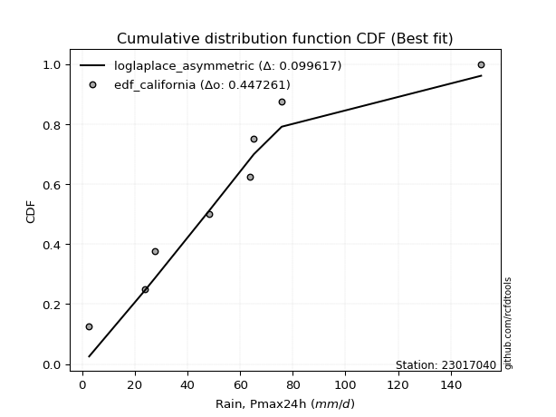</img>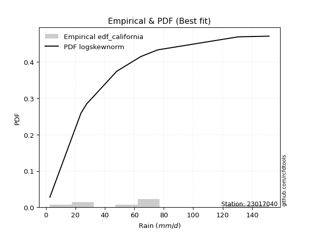</img>

</div>


### 2. EDF Hazen (1930)

Hazen method for plotting positions is a formula used to estimate the empirical cumulative probability distribution of flood events or other hydrological data. This formula often results in biased estimations, particularly when extrapolating to extreme events (high return periods).

<div align="center">


$P=(m-0.5)/n$


</div>


**2.1. Empirical values**

<div align="center">

|                | 0                  | 1                  | 2                  | 3                  | 4                  | 5         | 6                 | 7         |
|:---------------|:-------------------|:-------------------|:-------------------|:-------------------|:-------------------|:----------|:------------------|:----------|
| date           | 2020               | 2024               | 2019               | 2015               | 2018               | 2016      | 2017              | 2014      |
| x              | 2.7                | 23.8               | 27.7               | 48.1               | 63.9               | 65.2      | 75.8              | 151.5     |
| m              | 1                  | 2                  | 3                  | 4                  | 5                  | 6         | 7                 | 8         |
| empirical_dist | edf_hazen          | edf_hazen          | edf_hazen          | edf_hazen          | edf_hazen          | edf_hazen | edf_hazen         | edf_hazen |
| empirical      | 0.0625             | 0.1875             | 0.3125             | 0.4375             | 0.5625             | 0.6875    | 0.8125            | 0.9375    |
| empirical_tr   | 1.0666666666666667 | 1.2307692307692308 | 1.4545454545454546 | 1.7777777777777777 | 2.2857142857142856 | 3.2       | 5.333333333333333 | 16.0      |

</div>


**2.2. Kolmogorov-Smirnov fit test (sorted by Δ)**


<div align="center">

|                | 0                  | 1                   | 2                  | 3                   | 4                   | 5                   | 6                   | 7                   | 8                  | 9                   | 10                  | 11                 | 12                 | 13                  | 14                  | 15                  | 16                  | 17                  | 18                  | 19                 | 20                  | 21                 | 22                  | 23                  | 24                  | 25                  | 26                  | 27                  | 28                  | 29                  | 30                    | 31                 | 32                  | 33                  | 34                 | 35                  | 36                 | 37                  | 38                 | 39                 | 40                 | 41                 | 42                  | 43                  | 44                  | 45                  | 46                 | 47                 | 48                 | 49                 | 50                  | 51                 | 52                  | 53                  | 54                  | 55                  | 56                 | 57                  | 58                  | 59                  | 60                  | 61                  | 62                  | 63                  | 64                  | 65                  | 66                  | 67                 | 68                  | 69                 | 70                  | 71                  | 72                 | 73                  | 74                  | 75                 | 76                 | 77                  | 78                 | 79                 | 80                  | 81                  | 82                  | 83                  | 84                  | 85                 | 86                 | 87                 |
|:---------------|:-------------------|:--------------------|:-------------------|:--------------------|:--------------------|:--------------------|:--------------------|:--------------------|:-------------------|:--------------------|:--------------------|:-------------------|:-------------------|:--------------------|:--------------------|:--------------------|:--------------------|:--------------------|:--------------------|:-------------------|:--------------------|:-------------------|:--------------------|:--------------------|:--------------------|:--------------------|:--------------------|:--------------------|:--------------------|:--------------------|:----------------------|:-------------------|:--------------------|:--------------------|:-------------------|:--------------------|:-------------------|:--------------------|:-------------------|:-------------------|:-------------------|:-------------------|:--------------------|:--------------------|:--------------------|:--------------------|:-------------------|:-------------------|:-------------------|:-------------------|:--------------------|:-------------------|:--------------------|:--------------------|:--------------------|:--------------------|:-------------------|:--------------------|:--------------------|:--------------------|:--------------------|:--------------------|:--------------------|:--------------------|:--------------------|:--------------------|:--------------------|:-------------------|:--------------------|:-------------------|:--------------------|:--------------------|:-------------------|:--------------------|:--------------------|:-------------------|:-------------------|:--------------------|:-------------------|:-------------------|:--------------------|:--------------------|:--------------------|:--------------------|:--------------------|:-------------------|:-------------------|:-------------------|
| station        | 23017040           | 23017040            | 23017040           | 23017040            | 23017040            | 23017040            | 23017040            | 23017040            | 23017040           | 23017040            | 23017040            | 23017040           | 23017040           | 23017040            | 23017040            | 23017040            | 23017040            | 23017040            | 23017040            | 23017040           | 23017040            | 23017040           | 23017040            | 23017040            | 23017040            | 23017040            | 23017040            | 23017040            | 23017040            | 23017040            | 23017040              | 23017040           | 23017040            | 23017040            | 23017040           | 23017040            | 23017040           | 23017040            | 23017040           | 23017040           | 23017040           | 23017040           | 23017040            | 23017040            | 23017040            | 23017040            | 23017040           | 23017040           | 23017040           | 23017040           | 23017040            | 23017040           | 23017040            | 23017040            | 23017040            | 23017040            | 23017040           | 23017040            | 23017040            | 23017040            | 23017040            | 23017040            | 23017040            | 23017040            | 23017040            | 23017040            | 23017040            | 23017040           | 23017040            | 23017040           | 23017040            | 23017040            | 23017040           | 23017040            | 23017040            | 23017040           | 23017040           | 23017040            | 23017040           | 23017040           | 23017040            | 23017040            | 23017040            | 23017040            | 23017040            | 23017040           | 23017040           | 23017040           |
| empirical_dist | edf_hazen          | edf_hazen           | edf_hazen          | edf_hazen           | edf_hazen           | edf_hazen           | edf_hazen           | edf_hazen           | edf_hazen          | edf_hazen           | edf_hazen           | edf_hazen          | edf_hazen          | edf_hazen           | edf_hazen           | edf_hazen           | edf_hazen           | edf_hazen           | edf_hazen           | edf_hazen          | edf_hazen           | edf_hazen          | edf_hazen           | edf_hazen           | edf_hazen           | edf_hazen           | edf_hazen           | edf_hazen           | edf_hazen           | edf_hazen           | edf_hazen             | edf_hazen          | edf_hazen           | edf_hazen           | edf_hazen          | edf_hazen           | edf_hazen          | edf_hazen           | edf_hazen          | edf_hazen          | edf_hazen          | edf_hazen          | edf_hazen           | edf_hazen           | edf_hazen           | edf_hazen           | edf_hazen          | edf_hazen          | edf_hazen          | edf_hazen          | edf_hazen           | edf_hazen          | edf_hazen           | edf_hazen           | edf_hazen           | edf_hazen           | edf_hazen          | edf_hazen           | edf_hazen           | edf_hazen           | edf_hazen           | edf_hazen           | edf_hazen           | edf_hazen           | edf_hazen           | edf_hazen           | edf_hazen           | edf_hazen          | edf_hazen           | edf_hazen          | edf_hazen           | edf_hazen           | edf_hazen          | edf_hazen           | edf_hazen           | edf_hazen          | edf_hazen          | edf_hazen           | edf_hazen          | edf_hazen          | edf_hazen           | edf_hazen           | edf_hazen           | edf_hazen           | edf_hazen           | edf_hazen          | edf_hazen          | edf_hazen          |
| p_dist         | genlogistic        | logjohnsonsu        | loggenlogistic     | invgauss            | fatiguelife         | logmielke           | invgamma            | exponnorm           | gumbel_r           | johnsonsu           | loggompertz         | nct                | ncf                | halflogistic        | fisk                | moyal               | pearson3            | kstwobign           | logfisk             | betaprime          | halfnorm            | gompertz           | loggumbel_l         | logloggamma         | hypsecant           | logt                | laplace_asymmetric  | rayleigh            | logpearson3         | rice                | loglaplace_asymmetric | maxwell            | logistic            | laplace             | expon              | genexpon            | truncnorm          | norm                | crystalball        | t                  | mielke             | logfatiguelife     | logrice             | lognorm             | lognorm             | logcrystalball      | logexponnorm       | lognct             | logf               | loglogistic        | logncf              | wald               | logerlang           | loghypsecant        | loggamma            | loggamma            | logchi2            | logbetaprime        | loginvgamma         | logalpha            | erlang              | logmaxwell          | gumbel_l            | nakagami            | lognakagami         | loglaplace          | f                   | lograyleigh        | loginvgauss         | loggumbel_r        | loginvweibull       | loghalfnorm         | logmoyal           | loghalflogistic     | logkstwobign        | loggenexpon        | gibrat             | logtruncnorm        | logwald            | loggibrat          | logexpon            | weibull_min         | loglognorm          | gamma               | logweibull_min      | invweibull         | alpha              | chi2               |
| delta          | 0.0779086461313594 | 0.08470475211540474 | 0.0847510128877692 | 0.08590780697337619 | 0.08600270122635223 | 0.08636702876375468 | 0.08707423643022116 | 0.08710104004925612 | 0.0872414083151708 | 0.08735093928146842 | 0.08754131760087192 | 0.0880087239388756 | 0.0911703182242739 | 0.09229709853311885 | 0.09256420916189867 | 0.09297937058280148 | 0.09581155834678723 | 0.09685035089723071 | 0.09845257900154614 | 0.0988035492849364 | 0.10149279076864415 | 0.1020477429488158 | 0.10335035250875069 | 0.10401800098329161 | 0.11003181556021813 | 0.11543745396271848 | 0.11793838675582549 | 0.11868672739165187 | 0.12183285036965308 | 0.12217490542574994 | 0.12219580679065856   | 0.1245236188116543 | 0.12473633202130785 | 0.12641326871757208 | 0.1328529446418451 | 0.13670636915118972 | 0.144144659948243  | 0.14414472685730517 | 0.1441447314306974 | 0.1459642521763902 | 0.1486085078588112 | 0.1543410385025339 | 0.15495154679749173 | 0.15507172425911775 | 0.15507172425911775 | 0.15507242480699873 | 0.1550740289520608 | 0.1562659472537158 | 0.1573401500012594 | 0.1583818880359784 | 0.15998158402548307 | 0.160801418878755  | 0.16552593260921666 | 0.16758752572202407 | 0.16825118920331422 | 0.16825118920331422 | 0.1725126350441475 | 0.17477521601547485 | 0.17834884775012722 | 0.18121338726011282 | 0.18392009761953204 | 0.18653394218233416 | 0.18730404044708437 | 0.18749876857784395 | 0.18749999996907246 | 0.19312059202225318 | 0.19610863709665316 | 0.1985034714391275 | 0.19857522510638814 | 0.2151972180034154 | 0.22586235955084916 | 0.23255853549127836 | 0.2386650787304332 | 0.23934209659351963 | 0.26999419919901074 | 0.2853273551448593 | 0.2885718523610191 | 0.29755954518124905 | 0.3039134887724678 | 0.3350790673584907 | 0.37443143052371197 | 0.43263103740153364 | 0.45061881960879835 | 0.45840937987334596 | 0.47850210571091456 | 0.5129379248266706 | 0.5624076958122782 | 0.7990336259197096 |
| deltao         | 0.4472608134160001 | 0.4472608134160001  | 0.4472608134160001 | 0.4472608134160001  | 0.4472608134160001  | 0.4472608134160001  | 0.4472608134160001  | 0.4472608134160001  | 0.4472608134160001 | 0.4472608134160001  | 0.4472608134160001  | 0.4472608134160001 | 0.4472608134160001 | 0.4472608134160001  | 0.4472608134160001  | 0.4472608134160001  | 0.4472608134160001  | 0.4472608134160001  | 0.4472608134160001  | 0.4472608134160001 | 0.4472608134160001  | 0.4472608134160001 | 0.4472608134160001  | 0.4472608134160001  | 0.4472608134160001  | 0.4472608134160001  | 0.4472608134160001  | 0.4472608134160001  | 0.4472608134160001  | 0.4472608134160001  | 0.4472608134160001    | 0.4472608134160001 | 0.4472608134160001  | 0.4472608134160001  | 0.4472608134160001 | 0.4472608134160001  | 0.4472608134160001 | 0.4472608134160001  | 0.4472608134160001 | 0.4472608134160001 | 0.4472608134160001 | 0.4472608134160001 | 0.4472608134160001  | 0.4472608134160001  | 0.4472608134160001  | 0.4472608134160001  | 0.4472608134160001 | 0.4472608134160001 | 0.4472608134160001 | 0.4472608134160001 | 0.4472608134160001  | 0.4472608134160001 | 0.4472608134160001  | 0.4472608134160001  | 0.4472608134160001  | 0.4472608134160001  | 0.4472608134160001 | 0.4472608134160001  | 0.4472608134160001  | 0.4472608134160001  | 0.4472608134160001  | 0.4472608134160001  | 0.4472608134160001  | 0.4472608134160001  | 0.4472608134160001  | 0.4472608134160001  | 0.4472608134160001  | 0.4472608134160001 | 0.4472608134160001  | 0.4472608134160001 | 0.4472608134160001  | 0.4472608134160001  | 0.4472608134160001 | 0.4472608134160001  | 0.4472608134160001  | 0.4472608134160001 | 0.4472608134160001 | 0.4472608134160001  | 0.4472608134160001 | 0.4472608134160001 | 0.4472608134160001  | 0.4472608134160001  | 0.4472608134160001  | 0.4472608134160001  | 0.4472608134160001  | 0.4472608134160001 | 0.4472608134160001 | 0.4472608134160001 |
| eval           | Δo > Δ             | Δo > Δ              | Δo > Δ             | Δo > Δ              | Δo > Δ              | Δo > Δ              | Δo > Δ              | Δo > Δ              | Δo > Δ             | Δo > Δ              | Δo > Δ              | Δo > Δ             | Δo > Δ             | Δo > Δ              | Δo > Δ              | Δo > Δ              | Δo > Δ              | Δo > Δ              | Δo > Δ              | Δo > Δ             | Δo > Δ              | Δo > Δ             | Δo > Δ              | Δo > Δ              | Δo > Δ              | Δo > Δ              | Δo > Δ              | Δo > Δ              | Δo > Δ              | Δo > Δ              | Δo > Δ                | Δo > Δ             | Δo > Δ              | Δo > Δ              | Δo > Δ             | Δo > Δ              | Δo > Δ             | Δo > Δ              | Δo > Δ             | Δo > Δ             | Δo > Δ             | Δo > Δ             | Δo > Δ              | Δo > Δ              | Δo > Δ              | Δo > Δ              | Δo > Δ             | Δo > Δ             | Δo > Δ             | Δo > Δ             | Δo > Δ              | Δo > Δ             | Δo > Δ              | Δo > Δ              | Δo > Δ              | Δo > Δ              | Δo > Δ             | Δo > Δ              | Δo > Δ              | Δo > Δ              | Δo > Δ              | Δo > Δ              | Δo > Δ              | Δo > Δ              | Δo > Δ              | Δo > Δ              | Δo > Δ              | Δo > Δ             | Δo > Δ              | Δo > Δ             | Δo > Δ              | Δo > Δ              | Δo > Δ             | Δo > Δ              | Δo > Δ              | Δo > Δ             | Δo > Δ             | Δo > Δ              | Δo > Δ             | Δo > Δ             | Δo > Δ              | Δo > Δ              | Δo <= Δ             | Δo <= Δ             | Δo <= Δ             | Δo <= Δ            | Δo <= Δ            | Δo <= Δ            |
| fit            | 1                  | 1                   | 1                  | 1                   | 1                   | 1                   | 1                   | 1                   | 1                  | 1                   | 1                   | 1                  | 1                  | 1                   | 1                   | 1                   | 1                   | 1                   | 1                   | 1                  | 1                   | 1                  | 1                   | 1                   | 1                   | 1                   | 1                   | 1                   | 1                   | 1                   | 1                     | 1                  | 1                   | 1                   | 1                  | 1                   | 1                  | 1                   | 1                  | 1                  | 1                  | 1                  | 1                   | 1                   | 1                   | 1                   | 1                  | 1                  | 1                  | 1                  | 1                   | 1                  | 1                   | 1                   | 1                   | 1                   | 1                  | 1                   | 1                   | 1                   | 1                   | 1                   | 1                   | 1                   | 1                   | 1                   | 1                   | 1                  | 1                   | 1                  | 1                   | 1                   | 1                  | 1                   | 1                   | 1                  | 1                  | 1                   | 1                  | 1                  | 1                   | 1                   | 0                   | 0                   | 0                   | 0                  | 0                  | 0                  |
| n              | 8                  | 8                   | 8                  | 8                   | 8                   | 8                   | 8                   | 8                   | 8                  | 8                   | 8                   | 8                  | 8                  | 8                   | 8                   | 8                   | 8                   | 8                   | 8                   | 8                  | 8                   | 8                  | 8                   | 8                   | 8                   | 8                   | 8                   | 8                   | 8                   | 8                   | 8                     | 8                  | 8                   | 8                   | 8                  | 8                   | 8                  | 8                   | 8                  | 8                  | 8                  | 8                  | 8                   | 8                   | 8                   | 8                   | 8                  | 8                  | 8                  | 8                  | 8                   | 8                  | 8                   | 8                   | 8                   | 8                   | 8                  | 8                   | 8                   | 8                   | 8                   | 8                   | 8                   | 8                   | 8                   | 8                   | 8                   | 8                  | 8                   | 8                  | 8                   | 8                   | 8                  | 8                   | 8                   | 8                  | 8                  | 8                   | 8                  | 8                  | 8                   | 8                   | 8                   | 8                   | 8                   | 8                  | 8                  | 8                  |
| best_fit       | 1                  | 0                   | 0                  | 0                   | 0                   | 0                   | 0                   | 0                   | 0                  | 0                   | 0                   | 0                  | 0                  | 0                   | 0                   | 0                   | 0                   | 0                   | 0                   | 0                  | 0                   | 0                  | 0                   | 0                   | 0                   | 0                   | 0                   | 0                   | 0                   | 0                   | 0                     | 0                  | 0                   | 0                   | 0                  | 0                   | 0                  | 0                   | 0                  | 0                  | 0                  | 0                  | 0                   | 0                   | 0                   | 0                   | 0                  | 0                  | 0                  | 0                  | 0                   | 0                  | 0                   | 0                   | 0                   | 0                   | 0                  | 0                   | 0                   | 0                   | 0                   | 0                   | 0                   | 0                   | 0                   | 0                   | 0                   | 0                  | 0                   | 0                  | 0                   | 0                   | 0                  | 0                   | 0                   | 0                  | 0                  | 0                   | 0                  | 0                  | 0                   | 0                   | 0                   | 0                   | 0                   | 0                  | 0                  | 0                  |
| best_fit_sort  | 1                  | 2                   | 3                  | 4                   | 5                   | 6                   | 7                   | 8                   | 9                  | 10                  | 11                  | 12                 | 13                 | 14                  | 15                  | 16                  | 17                  | 18                  | 19                  | 20                 | 21                  | 22                 | 23                  | 24                  | 25                  | 26                  | 27                  | 28                  | 29                  | 30                  | 31                    | 32                 | 33                  | 34                  | 35                 | 36                  | 37                 | 38                  | 39                 | 40                 | 41                 | 42                 | 43                  | 44                  | 45                  | 46                  | 47                 | 48                 | 49                 | 50                 | 51                  | 52                 | 53                  | 54                  | 55                  | 56                  | 57                 | 58                  | 59                  | 60                  | 61                  | 62                  | 63                  | 64                  | 65                  | 66                  | 67                  | 68                 | 69                  | 70                 | 71                  | 72                  | 73                 | 74                  | 75                  | 76                 | 77                 | 78                  | 79                 | 80                 | 81                  | 82                  | 83                  | 84                  | 85                  | 86                 | 87                 | 88                 |

</div>


**2.3. Best fit**

<div align="center">

|   id |   station | empirical_dist   | p_dist      |     delta |   deltao | eval   |   fit |   n |   best_fit |   best_fit_sort |
|-----:|----------:|:-----------------|:------------|----------:|---------:|:-------|------:|----:|-----------:|----------------:|
|    0 |  23017040 | edf_hazen        | genlogistic | 0.0779086 | 0.447261 | Δo > Δ |     1 |   8 |          1 |               1 |

</div>


<div align="center">

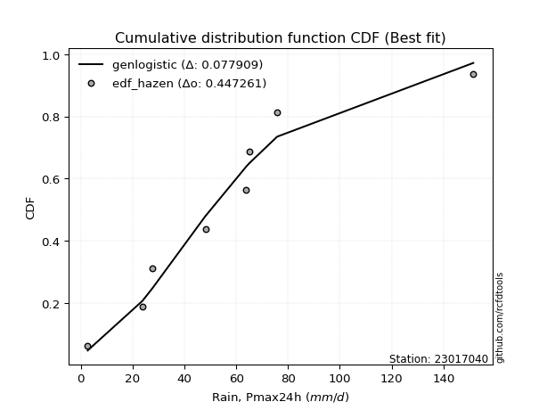</img>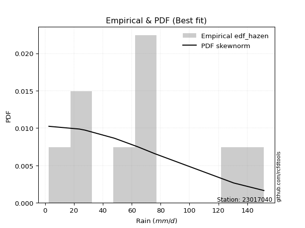</img>

</div>


### 3. EDF Weibull (1939)

Weibull plotting position formula is an empirical method used to estimate the non-exceedance probability or plotting position for a set of observed data, is often recommended or widely used in practice, particularly in flood frequency analysis.

<div align="center">


$P=m/(n+1)$


</div>


**3.1. Empirical values**

<div align="center">

|                | 0                  | 1                  | 2                  | 3                  | 4                  | 5                  | 6                  | 7                  |
|:---------------|:-------------------|:-------------------|:-------------------|:-------------------|:-------------------|:-------------------|:-------------------|:-------------------|
| date           | 2020               | 2024               | 2019               | 2015               | 2018               | 2016               | 2017               | 2014               |
| x              | 2.7                | 23.8               | 27.7               | 48.1               | 63.9               | 65.2               | 75.8               | 151.5              |
| m              | 1                  | 2                  | 3                  | 4                  | 5                  | 6                  | 7                  | 8                  |
| empirical_dist | edf_weibull        | edf_weibull        | edf_weibull        | edf_weibull        | edf_weibull        | edf_weibull        | edf_weibull        | edf_weibull        |
| empirical      | 0.1111111111111111 | 0.2222222222222222 | 0.3333333333333333 | 0.4444444444444444 | 0.5555555555555556 | 0.6666666666666666 | 0.7777777777777778 | 0.8888888888888888 |
| empirical_tr   | 1.125              | 1.2857142857142856 | 1.4999999999999998 | 1.7999999999999998 | 2.25               | 2.9999999999999996 | 4.5                | 8.999999999999996  |

</div>


**3.2. Kolmogorov-Smirnov fit test (sorted by Δ)**


<div align="center">

|                | 0                   | 1                   | 2                   | 3                   | 4                   | 5                   | 6                   | 7                   | 8                   | 9                   | 10                  | 11                  | 12                 | 13                  | 14                  | 15                  | 16                  | 17                  | 18                  | 19                  | 20                  | 21                 | 22                  | 23                  | 24                  | 25                  | 26                  | 27                  | 28                  | 29                  | 30                 | 31                  | 32                  | 33                  | 34                  | 35                 | 36                    | 37                 | 38                 | 39                  | 40                  | 41                  | 42                 | 43                  | 44                  | 45                  | 46                 | 47                  | 48                 | 49                  | 50                  | 51                 | 52                  | 53                 | 54                 | 55                 | 56                 | 57                  | 58                  | 59                  | 60                  | 61                 | 62                 | 63                  | 64                  | 65                  | 66                  | 67                  | 68                  | 69                  | 70                  | 71                  | 72                  | 73                  | 74                  | 75                 | 76                  | 77                 | 78                  | 79                  | 80                  | 81                 | 82                  | 83                  | 84                  | 85                 | 86                 | 87                 |
|:---------------|:--------------------|:--------------------|:--------------------|:--------------------|:--------------------|:--------------------|:--------------------|:--------------------|:--------------------|:--------------------|:--------------------|:--------------------|:-------------------|:--------------------|:--------------------|:--------------------|:--------------------|:--------------------|:--------------------|:--------------------|:--------------------|:-------------------|:--------------------|:--------------------|:--------------------|:--------------------|:--------------------|:--------------------|:--------------------|:--------------------|:-------------------|:--------------------|:--------------------|:--------------------|:--------------------|:-------------------|:----------------------|:-------------------|:-------------------|:--------------------|:--------------------|:--------------------|:-------------------|:--------------------|:--------------------|:--------------------|:-------------------|:--------------------|:-------------------|:--------------------|:--------------------|:-------------------|:--------------------|:-------------------|:-------------------|:-------------------|:-------------------|:--------------------|:--------------------|:--------------------|:--------------------|:-------------------|:-------------------|:--------------------|:--------------------|:--------------------|:--------------------|:--------------------|:--------------------|:--------------------|:--------------------|:--------------------|:--------------------|:--------------------|:--------------------|:-------------------|:--------------------|:-------------------|:--------------------|:--------------------|:--------------------|:-------------------|:--------------------|:--------------------|:--------------------|:-------------------|:-------------------|:-------------------|
| station        | 23017040            | 23017040            | 23017040            | 23017040            | 23017040            | 23017040            | 23017040            | 23017040            | 23017040            | 23017040            | 23017040            | 23017040            | 23017040           | 23017040            | 23017040            | 23017040            | 23017040            | 23017040            | 23017040            | 23017040            | 23017040            | 23017040           | 23017040            | 23017040            | 23017040            | 23017040            | 23017040            | 23017040            | 23017040            | 23017040            | 23017040           | 23017040            | 23017040            | 23017040            | 23017040            | 23017040           | 23017040              | 23017040           | 23017040           | 23017040            | 23017040            | 23017040            | 23017040           | 23017040            | 23017040            | 23017040            | 23017040           | 23017040            | 23017040           | 23017040            | 23017040            | 23017040           | 23017040            | 23017040           | 23017040           | 23017040           | 23017040           | 23017040            | 23017040            | 23017040            | 23017040            | 23017040           | 23017040           | 23017040            | 23017040            | 23017040            | 23017040            | 23017040            | 23017040            | 23017040            | 23017040            | 23017040            | 23017040            | 23017040            | 23017040            | 23017040           | 23017040            | 23017040           | 23017040            | 23017040            | 23017040            | 23017040           | 23017040            | 23017040            | 23017040            | 23017040           | 23017040           | 23017040           |
| empirical_dist | edf_weibull         | edf_weibull         | edf_weibull         | edf_weibull         | edf_weibull         | edf_weibull         | edf_weibull         | edf_weibull         | edf_weibull         | edf_weibull         | edf_weibull         | edf_weibull         | edf_weibull        | edf_weibull         | edf_weibull         | edf_weibull         | edf_weibull         | edf_weibull         | edf_weibull         | edf_weibull         | edf_weibull         | edf_weibull        | edf_weibull         | edf_weibull         | edf_weibull         | edf_weibull         | edf_weibull         | edf_weibull         | edf_weibull         | edf_weibull         | edf_weibull        | edf_weibull         | edf_weibull         | edf_weibull         | edf_weibull         | edf_weibull        | edf_weibull           | edf_weibull        | edf_weibull        | edf_weibull         | edf_weibull         | edf_weibull         | edf_weibull        | edf_weibull         | edf_weibull         | edf_weibull         | edf_weibull        | edf_weibull         | edf_weibull        | edf_weibull         | edf_weibull         | edf_weibull        | edf_weibull         | edf_weibull        | edf_weibull        | edf_weibull        | edf_weibull        | edf_weibull         | edf_weibull         | edf_weibull         | edf_weibull         | edf_weibull        | edf_weibull        | edf_weibull         | edf_weibull         | edf_weibull         | edf_weibull         | edf_weibull         | edf_weibull         | edf_weibull         | edf_weibull         | edf_weibull         | edf_weibull         | edf_weibull         | edf_weibull         | edf_weibull        | edf_weibull         | edf_weibull        | edf_weibull         | edf_weibull         | edf_weibull         | edf_weibull        | edf_weibull         | edf_weibull         | edf_weibull         | edf_weibull        | edf_weibull        | edf_weibull        |
| p_dist         | logloggamma         | pearson3            | gumbel_r            | loggumbel_l         | rayleigh            | kstwobign           | genlogistic         | logpearson3         | maxwell             | loggenlogistic      | invgauss            | fatiguelife         | logmielke          | invgamma            | exponnorm           | halfnorm            | johnsonsu           | nct                 | ncf                 | logjohnsonsu        | fisk                | moyal              | logfisk             | betaprime           | rice                | truncnorm           | norm                | crystalball         | loggompertz         | gompertz            | halflogistic       | t                   | logistic            | genexpon            | expon               | hypsecant          | loglaplace_asymmetric | logt               | laplace_asymmetric | logfatiguelife      | lognorm             | lognorm             | logcrystalball     | logexponnorm        | logrice             | lognct              | logncf             | logf                | logerlang          | loggamma            | loggamma            | laplace            | logbetaprime        | logchi2            | loglogistic        | loginvgamma        | mielke             | gumbel_l            | logalpha            | loghypsecant        | f                   | loginvgauss        | wald               | logmaxwell          | erlang              | lograyleigh         | loglaplace          | loginvweibull       | loghalfnorm         | loggumbel_r         | nakagami            | lognakagami         | loghalflogistic     | logmoyal            | logkstwobign        | loggenexpon        | logtruncnorm        | logwald            | gibrat              | loggibrat           | logexpon            | weibull_min        | loglognorm          | gamma               | logweibull_min      | invweibull         | alpha              | chi2               |
| delta          | 0.07947320058322689 | 0.07965850188463941 | 0.08073912453771237 | 0.08324443354947497 | 0.08555206665558346 | 0.08609253021805083 | 0.08624144225484365 | 0.08711062814743087 | 0.08980139658943209 | 0.09169545733221363 | 0.09285225141782061 | 0.09294714567079665 | 0.0933114732081991 | 0.09401868087466558 | 0.09404548449370054 | 0.09419846989249228 | 0.09429538372591284 | 0.09495316838332002 | 0.09811476266871832 | 0.09911017575622189 | 0.09950865360634309 | 0.0999238150272459 | 0.10382417793094763 | 0.10574799372938082 | 0.10609130287495319 | 0.10942243772602078 | 0.10942250463508296 | 0.10942250920847518 | 0.11111104907339697 | 0.11111111110362687 | 0.1111111111111111 | 0.11124202995416799 | 0.11367630153205341 | 0.11990309233923857 | 0.11991210190335888 | 0.1283513226655723 | 0.12914025123510298   | 0.1362707872960518 | 0.1387717200891588 | 0.13922181208664686 | 0.14032119769629503 | 0.14032119769629503 | 0.1403223306306829 | 0.14032370345759504 | 0.14035360001338837 | 0.14078380934930967 | 0.1413377187111653 | 0.14170353638646915 | 0.1433351506631979 | 0.14461100233352842 | 0.14461100233352842 | 0.1472466020509054 | 0.14897948511398118 | 0.1510672082302289 | 0.151437443591534  | 0.1517860315628391 | 0.1555529523032556 | 0.15723767696011393 | 0.15930364384257512 | 0.16064308127757965 | 0.16138641487443095 | 0.167582883146293  | 0.1677458633231994 | 0.16814114732843666 | 0.17475937196560565 | 0.17686373056691262 | 0.18617614757780876 | 0.19114013732862695 | 0.20160122973880057 | 0.20825277355897098 | 0.22222099080006616 | 0.22222222219129467 | 0.22973079941258256 | 0.23172063428598877 | 0.23527197697678853 | 0.2506051329226371 | 0.26283732295902684 | 0.2969690443280234 | 0.30940518569435244 | 0.32813462291404627 | 0.33970920830148976 | 0.3979088151793114 | 0.41589659738657614 | 0.42368715765112375 | 0.44377988348869235 | 0.4643268137155594 | 0.527685473590056  | 0.7643114036974874 |
| deltao         | 0.4472608134160001  | 0.4472608134160001  | 0.4472608134160001  | 0.4472608134160001  | 0.4472608134160001  | 0.4472608134160001  | 0.4472608134160001  | 0.4472608134160001  | 0.4472608134160001  | 0.4472608134160001  | 0.4472608134160001  | 0.4472608134160001  | 0.4472608134160001 | 0.4472608134160001  | 0.4472608134160001  | 0.4472608134160001  | 0.4472608134160001  | 0.4472608134160001  | 0.4472608134160001  | 0.4472608134160001  | 0.4472608134160001  | 0.4472608134160001 | 0.4472608134160001  | 0.4472608134160001  | 0.4472608134160001  | 0.4472608134160001  | 0.4472608134160001  | 0.4472608134160001  | 0.4472608134160001  | 0.4472608134160001  | 0.4472608134160001 | 0.4472608134160001  | 0.4472608134160001  | 0.4472608134160001  | 0.4472608134160001  | 0.4472608134160001 | 0.4472608134160001    | 0.4472608134160001 | 0.4472608134160001 | 0.4472608134160001  | 0.4472608134160001  | 0.4472608134160001  | 0.4472608134160001 | 0.4472608134160001  | 0.4472608134160001  | 0.4472608134160001  | 0.4472608134160001 | 0.4472608134160001  | 0.4472608134160001 | 0.4472608134160001  | 0.4472608134160001  | 0.4472608134160001 | 0.4472608134160001  | 0.4472608134160001 | 0.4472608134160001 | 0.4472608134160001 | 0.4472608134160001 | 0.4472608134160001  | 0.4472608134160001  | 0.4472608134160001  | 0.4472608134160001  | 0.4472608134160001 | 0.4472608134160001 | 0.4472608134160001  | 0.4472608134160001  | 0.4472608134160001  | 0.4472608134160001  | 0.4472608134160001  | 0.4472608134160001  | 0.4472608134160001  | 0.4472608134160001  | 0.4472608134160001  | 0.4472608134160001  | 0.4472608134160001  | 0.4472608134160001  | 0.4472608134160001 | 0.4472608134160001  | 0.4472608134160001 | 0.4472608134160001  | 0.4472608134160001  | 0.4472608134160001  | 0.4472608134160001 | 0.4472608134160001  | 0.4472608134160001  | 0.4472608134160001  | 0.4472608134160001 | 0.4472608134160001 | 0.4472608134160001 |
| eval           | Δo > Δ              | Δo > Δ              | Δo > Δ              | Δo > Δ              | Δo > Δ              | Δo > Δ              | Δo > Δ              | Δo > Δ              | Δo > Δ              | Δo > Δ              | Δo > Δ              | Δo > Δ              | Δo > Δ             | Δo > Δ              | Δo > Δ              | Δo > Δ              | Δo > Δ              | Δo > Δ              | Δo > Δ              | Δo > Δ              | Δo > Δ              | Δo > Δ             | Δo > Δ              | Δo > Δ              | Δo > Δ              | Δo > Δ              | Δo > Δ              | Δo > Δ              | Δo > Δ              | Δo > Δ              | Δo > Δ             | Δo > Δ              | Δo > Δ              | Δo > Δ              | Δo > Δ              | Δo > Δ             | Δo > Δ                | Δo > Δ             | Δo > Δ             | Δo > Δ              | Δo > Δ              | Δo > Δ              | Δo > Δ             | Δo > Δ              | Δo > Δ              | Δo > Δ              | Δo > Δ             | Δo > Δ              | Δo > Δ             | Δo > Δ              | Δo > Δ              | Δo > Δ             | Δo > Δ              | Δo > Δ             | Δo > Δ             | Δo > Δ             | Δo > Δ             | Δo > Δ              | Δo > Δ              | Δo > Δ              | Δo > Δ              | Δo > Δ             | Δo > Δ             | Δo > Δ              | Δo > Δ              | Δo > Δ              | Δo > Δ              | Δo > Δ              | Δo > Δ              | Δo > Δ              | Δo > Δ              | Δo > Δ              | Δo > Δ              | Δo > Δ              | Δo > Δ              | Δo > Δ             | Δo > Δ              | Δo > Δ             | Δo > Δ              | Δo > Δ              | Δo > Δ              | Δo > Δ             | Δo > Δ              | Δo > Δ              | Δo > Δ              | Δo <= Δ            | Δo <= Δ            | Δo <= Δ            |
| fit            | 1                   | 1                   | 1                   | 1                   | 1                   | 1                   | 1                   | 1                   | 1                   | 1                   | 1                   | 1                   | 1                  | 1                   | 1                   | 1                   | 1                   | 1                   | 1                   | 1                   | 1                   | 1                  | 1                   | 1                   | 1                   | 1                   | 1                   | 1                   | 1                   | 1                   | 1                  | 1                   | 1                   | 1                   | 1                   | 1                  | 1                     | 1                  | 1                  | 1                   | 1                   | 1                   | 1                  | 1                   | 1                   | 1                   | 1                  | 1                   | 1                  | 1                   | 1                   | 1                  | 1                   | 1                  | 1                  | 1                  | 1                  | 1                   | 1                   | 1                   | 1                   | 1                  | 1                  | 1                   | 1                   | 1                   | 1                   | 1                   | 1                   | 1                   | 1                   | 1                   | 1                   | 1                   | 1                   | 1                  | 1                   | 1                  | 1                   | 1                   | 1                   | 1                  | 1                   | 1                   | 1                   | 0                  | 0                  | 0                  |
| n              | 8                   | 8                   | 8                   | 8                   | 8                   | 8                   | 8                   | 8                   | 8                   | 8                   | 8                   | 8                   | 8                  | 8                   | 8                   | 8                   | 8                   | 8                   | 8                   | 8                   | 8                   | 8                  | 8                   | 8                   | 8                   | 8                   | 8                   | 8                   | 8                   | 8                   | 8                  | 8                   | 8                   | 8                   | 8                   | 8                  | 8                     | 8                  | 8                  | 8                   | 8                   | 8                   | 8                  | 8                   | 8                   | 8                   | 8                  | 8                   | 8                  | 8                   | 8                   | 8                  | 8                   | 8                  | 8                  | 8                  | 8                  | 8                   | 8                   | 8                   | 8                   | 8                  | 8                  | 8                   | 8                   | 8                   | 8                   | 8                   | 8                   | 8                   | 8                   | 8                   | 8                   | 8                   | 8                   | 8                  | 8                   | 8                  | 8                   | 8                   | 8                   | 8                  | 8                   | 8                   | 8                   | 8                  | 8                  | 8                  |
| best_fit       | 1                   | 0                   | 0                   | 0                   | 0                   | 0                   | 0                   | 0                   | 0                   | 0                   | 0                   | 0                   | 0                  | 0                   | 0                   | 0                   | 0                   | 0                   | 0                   | 0                   | 0                   | 0                  | 0                   | 0                   | 0                   | 0                   | 0                   | 0                   | 0                   | 0                   | 0                  | 0                   | 0                   | 0                   | 0                   | 0                  | 0                     | 0                  | 0                  | 0                   | 0                   | 0                   | 0                  | 0                   | 0                   | 0                   | 0                  | 0                   | 0                  | 0                   | 0                   | 0                  | 0                   | 0                  | 0                  | 0                  | 0                  | 0                   | 0                   | 0                   | 0                   | 0                  | 0                  | 0                   | 0                   | 0                   | 0                   | 0                   | 0                   | 0                   | 0                   | 0                   | 0                   | 0                   | 0                   | 0                  | 0                   | 0                  | 0                   | 0                   | 0                   | 0                  | 0                   | 0                   | 0                   | 0                  | 0                  | 0                  |
| best_fit_sort  | 1                   | 2                   | 3                   | 4                   | 5                   | 6                   | 7                   | 8                   | 9                   | 10                  | 11                  | 12                  | 13                 | 14                  | 15                  | 16                  | 17                  | 18                  | 19                  | 20                  | 21                  | 22                 | 23                  | 24                  | 25                  | 26                  | 27                  | 28                  | 29                  | 30                  | 31                 | 32                  | 33                  | 34                  | 35                  | 36                 | 37                    | 38                 | 39                 | 40                  | 41                  | 42                  | 43                 | 44                  | 45                  | 46                  | 47                 | 48                  | 49                 | 50                  | 51                  | 52                 | 53                  | 54                 | 55                 | 56                 | 57                 | 58                  | 59                  | 60                  | 61                  | 62                 | 63                 | 64                  | 65                  | 66                  | 67                  | 68                  | 69                  | 70                  | 71                  | 72                  | 73                  | 74                  | 75                  | 76                 | 77                  | 78                 | 79                  | 80                  | 81                  | 82                 | 83                  | 84                  | 85                  | 86                 | 87                 | 88                 |

</div>


**3.3. Best fit**

<div align="center">

|   id |   station | empirical_dist   | p_dist      |     delta |   deltao | eval   |   fit |   n |   best_fit |   best_fit_sort |
|-----:|----------:|:-----------------|:------------|----------:|---------:|:-------|------:|----:|-----------:|----------------:|
|    0 |  23017040 | edf_weibull      | logloggamma | 0.0794732 | 0.447261 | Δo > Δ |     1 |   8 |          1 |               1 |

</div>


<div align="center">

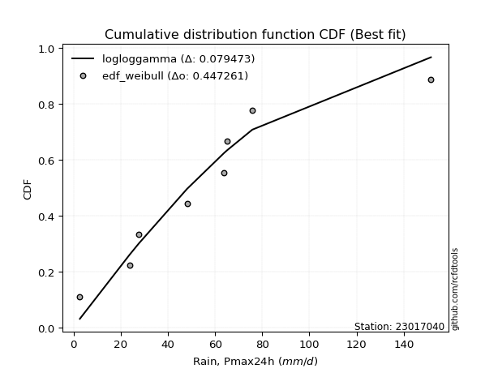</img>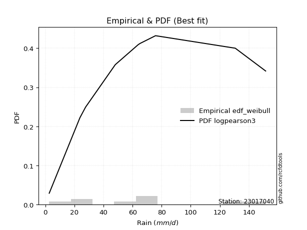</img>

</div>


### 4. EDF Beard (1943)

The Beard formula (or Beard´s plotting position formula) in hydrology is used to estimate the empirical non-exceedance probability _(P)_ of a flood event (or other extreme hydrological data point) within a given dataset.

<div align="center">


$P=(m-0.31)/(n+0.38)$


</div>


**4.1. Empirical values**

<div align="center">

|                | 0                   | 1                   | 2                  | 3                   | 4                  | 5                  | 6                  | 7                  |
|:---------------|:--------------------|:--------------------|:-------------------|:--------------------|:-------------------|:-------------------|:-------------------|:-------------------|
| date           | 2020                | 2024                | 2019               | 2015                | 2018               | 2016               | 2017               | 2014               |
| x              | 2.7                 | 23.8                | 27.7               | 48.1                | 63.9               | 65.2               | 75.8               | 151.5              |
| m              | 1                   | 2                   | 3                  | 4                   | 5                  | 6                  | 7                  | 8                  |
| empirical_dist | edf_beard           | edf_beard           | edf_beard          | edf_beard           | edf_beard          | edf_beard          | edf_beard          | edf_beard          |
| empirical      | 0.08233890214797135 | 0.20167064439140808 | 0.3210023866348448 | 0.44033412887828155 | 0.5596658711217184 | 0.6789976133651551 | 0.7983293556085919 | 0.9176610978520287 |
| empirical_tr   | 1.0897269180754225  | 1.2526158445440956  | 1.4727592267135323 | 1.7867803837953091  | 2.2710027100271004 | 3.115241635687732  | 4.958579881656804  | 12.144927536231886 |

</div>


**4.2. Kolmogorov-Smirnov fit test (sorted by Δ)**


<div align="center">

|                | 0                   | 1                   | 2                   | 3                   | 4                   | 5                   | 6                   | 7                   | 8                  | 9                   | 10                  | 11                  | 12                  | 13                  | 14                  | 15                  | 16                  | 17                  | 18                 | 19                  | 20                  | 21                  | 22                  | 23                 | 24                  | 25                  | 26                 | 27                  | 28                  | 29                  | 30                 | 31                  | 32                  | 33                    | 34                 | 35                  | 36                  | 37                  | 38                  | 39                 | 40                  | 41                 | 42                 | 43                  | 44                 | 45                  | 46                  | 47                 | 48                  | 49                  | 50                 | 51                  | 52                  | 53                  | 54                 | 55                  | 56                 | 57                  | 58                  | 59                  | 60                  | 61                  | 62                  | 63                  | 64                  | 65                  | 66                  | 67                  | 68                  | 69                  | 70                  | 71                  | 72                  | 73                  | 74                  | 75                 | 76                  | 77                  | 78                  | 79                  | 80                 | 81                  | 82                  | 83                 | 84                 | 85                 | 86                 | 87                 |
|:---------------|:--------------------|:--------------------|:--------------------|:--------------------|:--------------------|:--------------------|:--------------------|:--------------------|:-------------------|:--------------------|:--------------------|:--------------------|:--------------------|:--------------------|:--------------------|:--------------------|:--------------------|:--------------------|:-------------------|:--------------------|:--------------------|:--------------------|:--------------------|:-------------------|:--------------------|:--------------------|:-------------------|:--------------------|:--------------------|:--------------------|:-------------------|:--------------------|:--------------------|:----------------------|:-------------------|:--------------------|:--------------------|:--------------------|:--------------------|:-------------------|:--------------------|:-------------------|:-------------------|:--------------------|:-------------------|:--------------------|:--------------------|:-------------------|:--------------------|:--------------------|:-------------------|:--------------------|:--------------------|:--------------------|:-------------------|:--------------------|:-------------------|:--------------------|:--------------------|:--------------------|:--------------------|:--------------------|:--------------------|:--------------------|:--------------------|:--------------------|:--------------------|:--------------------|:--------------------|:--------------------|:--------------------|:--------------------|:--------------------|:--------------------|:--------------------|:-------------------|:--------------------|:--------------------|:--------------------|:--------------------|:-------------------|:--------------------|:--------------------|:-------------------|:-------------------|:-------------------|:-------------------|:-------------------|
| station        | 23017040            | 23017040            | 23017040            | 23017040            | 23017040            | 23017040            | 23017040            | 23017040            | 23017040           | 23017040            | 23017040            | 23017040            | 23017040            | 23017040            | 23017040            | 23017040            | 23017040            | 23017040            | 23017040           | 23017040            | 23017040            | 23017040            | 23017040            | 23017040           | 23017040            | 23017040            | 23017040           | 23017040            | 23017040            | 23017040            | 23017040           | 23017040            | 23017040            | 23017040              | 23017040           | 23017040            | 23017040            | 23017040            | 23017040            | 23017040           | 23017040            | 23017040           | 23017040           | 23017040            | 23017040           | 23017040            | 23017040            | 23017040           | 23017040            | 23017040            | 23017040           | 23017040            | 23017040            | 23017040            | 23017040           | 23017040            | 23017040           | 23017040            | 23017040            | 23017040            | 23017040            | 23017040            | 23017040            | 23017040            | 23017040            | 23017040            | 23017040            | 23017040            | 23017040            | 23017040            | 23017040            | 23017040            | 23017040            | 23017040            | 23017040            | 23017040           | 23017040            | 23017040            | 23017040            | 23017040            | 23017040           | 23017040            | 23017040            | 23017040           | 23017040           | 23017040           | 23017040           | 23017040           |
| empirical_dist | edf_beard           | edf_beard           | edf_beard           | edf_beard           | edf_beard           | edf_beard           | edf_beard           | edf_beard           | edf_beard          | edf_beard           | edf_beard           | edf_beard           | edf_beard           | edf_beard           | edf_beard           | edf_beard           | edf_beard           | edf_beard           | edf_beard          | edf_beard           | edf_beard           | edf_beard           | edf_beard           | edf_beard          | edf_beard           | edf_beard           | edf_beard          | edf_beard           | edf_beard           | edf_beard           | edf_beard          | edf_beard           | edf_beard           | edf_beard             | edf_beard          | edf_beard           | edf_beard           | edf_beard           | edf_beard           | edf_beard          | edf_beard           | edf_beard          | edf_beard          | edf_beard           | edf_beard          | edf_beard           | edf_beard           | edf_beard          | edf_beard           | edf_beard           | edf_beard          | edf_beard           | edf_beard           | edf_beard           | edf_beard          | edf_beard           | edf_beard          | edf_beard           | edf_beard           | edf_beard           | edf_beard           | edf_beard           | edf_beard           | edf_beard           | edf_beard           | edf_beard           | edf_beard           | edf_beard           | edf_beard           | edf_beard           | edf_beard           | edf_beard           | edf_beard           | edf_beard           | edf_beard           | edf_beard          | edf_beard           | edf_beard           | edf_beard           | edf_beard           | edf_beard          | edf_beard           | edf_beard           | edf_beard          | edf_beard          | edf_beard          | edf_beard          | edf_beard          |
| p_dist         | gumbel_r            | genlogistic         | pearson3            | kstwobign           | halfnorm            | logjohnsonsu        | loggenlogistic      | gompertz            | invgauss           | fatiguelife         | loggumbel_l         | logmielke           | logfisk             | logloggamma         | invgamma            | exponnorm           | johnsonsu           | loggompertz         | nct                | ncf                 | halflogistic        | fisk                | moyal               | betaprime          | rayleigh            | logpearson3         | rice               | maxwell             | logistic            | hypsecant           | logt               | genexpon            | expon               | loglaplace_asymmetric | laplace_asymmetric | truncnorm           | norm                | crystalball         | t                   | laplace            | logfatiguelife      | lognorm            | lognorm            | logcrystalball      | logexponnorm       | logrice             | lognct              | logncf             | logf                | logerlang           | mielke             | loggamma            | loggamma            | loglogistic         | logchi2            | logbetaprime        | wald               | loginvgamma         | loghypsecant        | logalpha            | logmaxwell          | gumbel_l            | erlang              | f                   | lograyleigh         | loginvgauss         | loglaplace          | nakagami            | lognakagami         | loginvweibull       | loggumbel_r         | loghalfnorm         | loghalflogistic     | logmoyal            | logkstwobign        | loggenexpon        | logtruncnorm        | gibrat              | logwald             | loggibrat           | logexpon           | weibull_min         | loglognorm          | gamma              | logweibull_min     | invweibull         | alpha              | chi2               |
| delta          | 0.07307076392376266 | 0.07903840590941758 | 0.08164091395537909 | 0.08267970650582257 | 0.08732214637723601 | 0.08753888099368634 | 0.08758514176605081 | 0.08787709855740766 | 0.0887419358516578 | 0.08883683010463383 | 0.08917970811734255 | 0.08920115764203629 | 0.08977742578694148 | 0.08984735659188348 | 0.08990836530850277 | 0.08993516892753772 | 0.09018506815975003 | 0.09037544647915352 | 0.0908428528171572 | 0.09400444710255551 | 0.09513122741140045 | 0.09539833804018027 | 0.09581349946108308 | 0.101637678163218  | 0.10451608300024373 | 0.10766220597824494 | 0.1080042610343418 | 0.11035297442024616 | 0.11056568762989971 | 0.11602037596708381 | 0.1239398405975633 | 0.12401340790540144 | 0.12402241746952175 | 0.12502993566894016   | 0.1264407733906703 | 0.12997401555683485 | 0.12997408246589703 | 0.12997408703928925 | 0.13179360778498206 | 0.1349156553524169 | 0.14333212765280973 | 0.1444315132624579 | 0.1444315132624579 | 0.14443264619684576 | 0.1444340190237579 | 0.14446391557955124 | 0.14489412491547254 | 0.145810939634075  | 0.14581385195263202 | 0.15135528821780858 | 0.1514426367370928 | 0.15408054481190614 | 0.15408054481190614 | 0.15554775915769686 | 0.1583419906527394 | 0.16060457162406677 | 0.1636355477570366 | 0.16417820335871913 | 0.16475339684374252 | 0.16704274286870474 | 0.17236329779092607 | 0.17313339605567624 | 0.17886968753176852 | 0.18193799270524508 | 0.18433282704771942 | 0.18440458071498006 | 0.19028646314397163 | 0.20166941296925203 | 0.20167064436048054 | 0.21169171515944107 | 0.21236308912513385 | 0.21838789109987028 | 0.23384111497874543 | 0.23583094985215164 | 0.25582355480760266 | 0.2711567107534512 | 0.28338890078984097 | 0.29707423899586394 | 0.30107935989418627 | 0.33224493848020914 | 0.3602607861323039 | 0.41846039301012555 | 0.43644817521739027 | 0.4442387354819379 | 0.4643314613195065 | 0.4930990226786992 | 0.5482370514208701 | 0.7848629815283015 |
| deltao         | 0.4472608134160001  | 0.4472608134160001  | 0.4472608134160001  | 0.4472608134160001  | 0.4472608134160001  | 0.4472608134160001  | 0.4472608134160001  | 0.4472608134160001  | 0.4472608134160001 | 0.4472608134160001  | 0.4472608134160001  | 0.4472608134160001  | 0.4472608134160001  | 0.4472608134160001  | 0.4472608134160001  | 0.4472608134160001  | 0.4472608134160001  | 0.4472608134160001  | 0.4472608134160001 | 0.4472608134160001  | 0.4472608134160001  | 0.4472608134160001  | 0.4472608134160001  | 0.4472608134160001 | 0.4472608134160001  | 0.4472608134160001  | 0.4472608134160001 | 0.4472608134160001  | 0.4472608134160001  | 0.4472608134160001  | 0.4472608134160001 | 0.4472608134160001  | 0.4472608134160001  | 0.4472608134160001    | 0.4472608134160001 | 0.4472608134160001  | 0.4472608134160001  | 0.4472608134160001  | 0.4472608134160001  | 0.4472608134160001 | 0.4472608134160001  | 0.4472608134160001 | 0.4472608134160001 | 0.4472608134160001  | 0.4472608134160001 | 0.4472608134160001  | 0.4472608134160001  | 0.4472608134160001 | 0.4472608134160001  | 0.4472608134160001  | 0.4472608134160001 | 0.4472608134160001  | 0.4472608134160001  | 0.4472608134160001  | 0.4472608134160001 | 0.4472608134160001  | 0.4472608134160001 | 0.4472608134160001  | 0.4472608134160001  | 0.4472608134160001  | 0.4472608134160001  | 0.4472608134160001  | 0.4472608134160001  | 0.4472608134160001  | 0.4472608134160001  | 0.4472608134160001  | 0.4472608134160001  | 0.4472608134160001  | 0.4472608134160001  | 0.4472608134160001  | 0.4472608134160001  | 0.4472608134160001  | 0.4472608134160001  | 0.4472608134160001  | 0.4472608134160001  | 0.4472608134160001 | 0.4472608134160001  | 0.4472608134160001  | 0.4472608134160001  | 0.4472608134160001  | 0.4472608134160001 | 0.4472608134160001  | 0.4472608134160001  | 0.4472608134160001 | 0.4472608134160001 | 0.4472608134160001 | 0.4472608134160001 | 0.4472608134160001 |
| eval           | Δo > Δ              | Δo > Δ              | Δo > Δ              | Δo > Δ              | Δo > Δ              | Δo > Δ              | Δo > Δ              | Δo > Δ              | Δo > Δ             | Δo > Δ              | Δo > Δ              | Δo > Δ              | Δo > Δ              | Δo > Δ              | Δo > Δ              | Δo > Δ              | Δo > Δ              | Δo > Δ              | Δo > Δ             | Δo > Δ              | Δo > Δ              | Δo > Δ              | Δo > Δ              | Δo > Δ             | Δo > Δ              | Δo > Δ              | Δo > Δ             | Δo > Δ              | Δo > Δ              | Δo > Δ              | Δo > Δ             | Δo > Δ              | Δo > Δ              | Δo > Δ                | Δo > Δ             | Δo > Δ              | Δo > Δ              | Δo > Δ              | Δo > Δ              | Δo > Δ             | Δo > Δ              | Δo > Δ             | Δo > Δ             | Δo > Δ              | Δo > Δ             | Δo > Δ              | Δo > Δ              | Δo > Δ             | Δo > Δ              | Δo > Δ              | Δo > Δ             | Δo > Δ              | Δo > Δ              | Δo > Δ              | Δo > Δ             | Δo > Δ              | Δo > Δ             | Δo > Δ              | Δo > Δ              | Δo > Δ              | Δo > Δ              | Δo > Δ              | Δo > Δ              | Δo > Δ              | Δo > Δ              | Δo > Δ              | Δo > Δ              | Δo > Δ              | Δo > Δ              | Δo > Δ              | Δo > Δ              | Δo > Δ              | Δo > Δ              | Δo > Δ              | Δo > Δ              | Δo > Δ             | Δo > Δ              | Δo > Δ              | Δo > Δ              | Δo > Δ              | Δo > Δ             | Δo > Δ              | Δo > Δ              | Δo > Δ             | Δo <= Δ            | Δo <= Δ            | Δo <= Δ            | Δo <= Δ            |
| fit            | 1                   | 1                   | 1                   | 1                   | 1                   | 1                   | 1                   | 1                   | 1                  | 1                   | 1                   | 1                   | 1                   | 1                   | 1                   | 1                   | 1                   | 1                   | 1                  | 1                   | 1                   | 1                   | 1                   | 1                  | 1                   | 1                   | 1                  | 1                   | 1                   | 1                   | 1                  | 1                   | 1                   | 1                     | 1                  | 1                   | 1                   | 1                   | 1                   | 1                  | 1                   | 1                  | 1                  | 1                   | 1                  | 1                   | 1                   | 1                  | 1                   | 1                   | 1                  | 1                   | 1                   | 1                   | 1                  | 1                   | 1                  | 1                   | 1                   | 1                   | 1                   | 1                   | 1                   | 1                   | 1                   | 1                   | 1                   | 1                   | 1                   | 1                   | 1                   | 1                   | 1                   | 1                   | 1                   | 1                  | 1                   | 1                   | 1                   | 1                   | 1                  | 1                   | 1                   | 1                  | 0                  | 0                  | 0                  | 0                  |
| n              | 8                   | 8                   | 8                   | 8                   | 8                   | 8                   | 8                   | 8                   | 8                  | 8                   | 8                   | 8                   | 8                   | 8                   | 8                   | 8                   | 8                   | 8                   | 8                  | 8                   | 8                   | 8                   | 8                   | 8                  | 8                   | 8                   | 8                  | 8                   | 8                   | 8                   | 8                  | 8                   | 8                   | 8                     | 8                  | 8                   | 8                   | 8                   | 8                   | 8                  | 8                   | 8                  | 8                  | 8                   | 8                  | 8                   | 8                   | 8                  | 8                   | 8                   | 8                  | 8                   | 8                   | 8                   | 8                  | 8                   | 8                  | 8                   | 8                   | 8                   | 8                   | 8                   | 8                   | 8                   | 8                   | 8                   | 8                   | 8                   | 8                   | 8                   | 8                   | 8                   | 8                   | 8                   | 8                   | 8                  | 8                   | 8                   | 8                   | 8                   | 8                  | 8                   | 8                   | 8                  | 8                  | 8                  | 8                  | 8                  |
| best_fit       | 1                   | 0                   | 0                   | 0                   | 0                   | 0                   | 0                   | 0                   | 0                  | 0                   | 0                   | 0                   | 0                   | 0                   | 0                   | 0                   | 0                   | 0                   | 0                  | 0                   | 0                   | 0                   | 0                   | 0                  | 0                   | 0                   | 0                  | 0                   | 0                   | 0                   | 0                  | 0                   | 0                   | 0                     | 0                  | 0                   | 0                   | 0                   | 0                   | 0                  | 0                   | 0                  | 0                  | 0                   | 0                  | 0                   | 0                   | 0                  | 0                   | 0                   | 0                  | 0                   | 0                   | 0                   | 0                  | 0                   | 0                  | 0                   | 0                   | 0                   | 0                   | 0                   | 0                   | 0                   | 0                   | 0                   | 0                   | 0                   | 0                   | 0                   | 0                   | 0                   | 0                   | 0                   | 0                   | 0                  | 0                   | 0                   | 0                   | 0                   | 0                  | 0                   | 0                   | 0                  | 0                  | 0                  | 0                  | 0                  |
| best_fit_sort  | 1                   | 2                   | 3                   | 4                   | 5                   | 6                   | 7                   | 8                   | 9                  | 10                  | 11                  | 12                  | 13                  | 14                  | 15                  | 16                  | 17                  | 18                  | 19                 | 20                  | 21                  | 22                  | 23                  | 24                 | 25                  | 26                  | 27                 | 28                  | 29                  | 30                  | 31                 | 32                  | 33                  | 34                    | 35                 | 36                  | 37                  | 38                  | 39                  | 40                 | 41                  | 42                 | 43                 | 44                  | 45                 | 46                  | 47                  | 48                 | 49                  | 50                  | 51                 | 52                  | 53                  | 54                  | 55                 | 56                  | 57                 | 58                  | 59                  | 60                  | 61                  | 62                  | 63                  | 64                  | 65                  | 66                  | 67                  | 68                  | 69                  | 70                  | 71                  | 72                  | 73                  | 74                  | 75                  | 76                 | 77                  | 78                  | 79                  | 80                  | 81                 | 82                  | 83                  | 84                 | 85                 | 86                 | 87                 | 88                 |

</div>


**4.3. Best fit**

<div align="center">

|   id |   station | empirical_dist   | p_dist   |     delta |   deltao | eval   |   fit |   n |   best_fit |   best_fit_sort |
|-----:|----------:|:-----------------|:---------|----------:|---------:|:-------|------:|----:|-----------:|----------------:|
|    0 |  23017040 | edf_beard        | gumbel_r | 0.0730708 | 0.447261 | Δo > Δ |     1 |   8 |          1 |               1 |

</div>


<div align="center">

</img>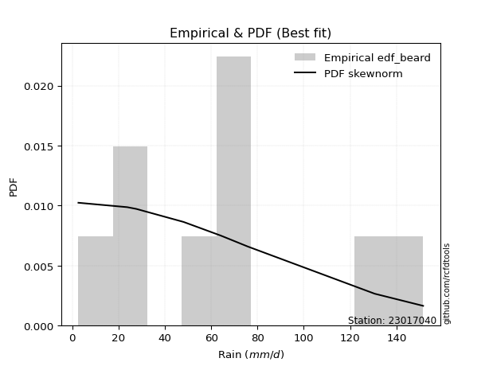</img>

</div>


### 5. EDF Chegodayev (1955)

The Chegodayev formula is an empirical plotting position formula used in hydrological frequency analysis to estimate the exceedance probability or return period of a specific event from a set of observed data. It is primarily used for plotting observed data points on probability paper to fit a theoretical distribution, particularly for analyzing extreme events like maximum flood flows or rainfall intensities. The constant _b_ value in the generalized plotting position formula is 0.3.

<div align="center">


$P=(m-b)/(n+1-2b)$


</div>


**5.1. Empirical values**

<div align="center">

|                | 0                   | 1                   | 2                   | 3                   | 4                  | 5                  | 6                  | 7                  |
|:---------------|:--------------------|:--------------------|:--------------------|:--------------------|:-------------------|:-------------------|:-------------------|:-------------------|
| date           | 2020                | 2024                | 2019                | 2015                | 2018               | 2016               | 2017               | 2014               |
| x              | 2.7                 | 23.8                | 27.7                | 48.1                | 63.9               | 65.2               | 75.8               | 151.5              |
| m              | 1                   | 2                   | 3                   | 4                   | 5                  | 6                  | 7                  | 8                  |
| empirical_dist | edf_chegodayev      | edf_chegodayev      | edf_chegodayev      | edf_chegodayev      | edf_chegodayev     | edf_chegodayev     | edf_chegodayev     | edf_chegodayev     |
| empirical      | 0.08333333333333333 | 0.20238095238095236 | 0.32142857142857145 | 0.44047619047619047 | 0.5595238095238095 | 0.6785714285714286 | 0.7976190476190476 | 0.9166666666666666 |
| empirical_tr   | 1.090909090909091   | 1.253731343283582   | 1.4736842105263157  | 1.7872340425531914  | 2.27027027027027   | 3.1111111111111116 | 4.941176470588234  | 11.999999999999995 |

</div>


**5.2. Kolmogorov-Smirnov fit test (sorted by Δ)**


<div align="center">

|                | 0                   | 1                   | 2                   | 3                   | 4                   | 5                   | 6                  | 7                   | 8                   | 9                   | 10                 | 11                  | 12                  | 13                  | 14                  | 15                  | 16                  | 17                  | 18                  | 19                  | 20                  | 21                  | 22                  | 23                  | 24                  | 25                  | 26                 | 27                  | 28                  | 29                  | 30                  | 31                  | 32                  | 33                    | 34                  | 35                  | 36                  | 37                  | 38                  | 39                  | 40                 | 41                  | 42                  | 43                  | 44                 | 45                  | 46                  | 47                  | 48                 | 49                 | 50                  | 51                  | 52                  | 53                  | 54                  | 55                 | 56                  | 57                  | 58                 | 59                  | 60                 | 61                  | 62                 | 63                 | 64                  | 65                 | 66                 | 67                 | 68                  | 69                 | 70                  | 71                 | 72                  | 73                  | 74                  | 75                  | 76                 | 77                 | 78                  | 79                 | 80                  | 81                 | 82                 | 83                  | 84                  | 85                 | 86                 | 87                 |
|:---------------|:--------------------|:--------------------|:--------------------|:--------------------|:--------------------|:--------------------|:-------------------|:--------------------|:--------------------|:--------------------|:-------------------|:--------------------|:--------------------|:--------------------|:--------------------|:--------------------|:--------------------|:--------------------|:--------------------|:--------------------|:--------------------|:--------------------|:--------------------|:--------------------|:--------------------|:--------------------|:-------------------|:--------------------|:--------------------|:--------------------|:--------------------|:--------------------|:--------------------|:----------------------|:--------------------|:--------------------|:--------------------|:--------------------|:--------------------|:--------------------|:-------------------|:--------------------|:--------------------|:--------------------|:-------------------|:--------------------|:--------------------|:--------------------|:-------------------|:-------------------|:--------------------|:--------------------|:--------------------|:--------------------|:--------------------|:-------------------|:--------------------|:--------------------|:-------------------|:--------------------|:-------------------|:--------------------|:-------------------|:-------------------|:--------------------|:-------------------|:-------------------|:-------------------|:--------------------|:-------------------|:--------------------|:-------------------|:--------------------|:--------------------|:--------------------|:--------------------|:-------------------|:-------------------|:--------------------|:-------------------|:--------------------|:-------------------|:-------------------|:--------------------|:--------------------|:-------------------|:-------------------|:-------------------|
| station        | 23017040            | 23017040            | 23017040            | 23017040            | 23017040            | 23017040            | 23017040           | 23017040            | 23017040            | 23017040            | 23017040           | 23017040            | 23017040            | 23017040            | 23017040            | 23017040            | 23017040            | 23017040            | 23017040            | 23017040            | 23017040            | 23017040            | 23017040            | 23017040            | 23017040            | 23017040            | 23017040           | 23017040            | 23017040            | 23017040            | 23017040            | 23017040            | 23017040            | 23017040              | 23017040            | 23017040            | 23017040            | 23017040            | 23017040            | 23017040            | 23017040           | 23017040            | 23017040            | 23017040            | 23017040           | 23017040            | 23017040            | 23017040            | 23017040           | 23017040           | 23017040            | 23017040            | 23017040            | 23017040            | 23017040            | 23017040           | 23017040            | 23017040            | 23017040           | 23017040            | 23017040           | 23017040            | 23017040           | 23017040           | 23017040            | 23017040           | 23017040           | 23017040           | 23017040            | 23017040           | 23017040            | 23017040           | 23017040            | 23017040            | 23017040            | 23017040            | 23017040           | 23017040           | 23017040            | 23017040           | 23017040            | 23017040           | 23017040           | 23017040            | 23017040            | 23017040           | 23017040           | 23017040           |
| empirical_dist | edf_chegodayev      | edf_chegodayev      | edf_chegodayev      | edf_chegodayev      | edf_chegodayev      | edf_chegodayev      | edf_chegodayev     | edf_chegodayev      | edf_chegodayev      | edf_chegodayev      | edf_chegodayev     | edf_chegodayev      | edf_chegodayev      | edf_chegodayev      | edf_chegodayev      | edf_chegodayev      | edf_chegodayev      | edf_chegodayev      | edf_chegodayev      | edf_chegodayev      | edf_chegodayev      | edf_chegodayev      | edf_chegodayev      | edf_chegodayev      | edf_chegodayev      | edf_chegodayev      | edf_chegodayev     | edf_chegodayev      | edf_chegodayev      | edf_chegodayev      | edf_chegodayev      | edf_chegodayev      | edf_chegodayev      | edf_chegodayev        | edf_chegodayev      | edf_chegodayev      | edf_chegodayev      | edf_chegodayev      | edf_chegodayev      | edf_chegodayev      | edf_chegodayev     | edf_chegodayev      | edf_chegodayev      | edf_chegodayev      | edf_chegodayev     | edf_chegodayev      | edf_chegodayev      | edf_chegodayev      | edf_chegodayev     | edf_chegodayev     | edf_chegodayev      | edf_chegodayev      | edf_chegodayev      | edf_chegodayev      | edf_chegodayev      | edf_chegodayev     | edf_chegodayev      | edf_chegodayev      | edf_chegodayev     | edf_chegodayev      | edf_chegodayev     | edf_chegodayev      | edf_chegodayev     | edf_chegodayev     | edf_chegodayev      | edf_chegodayev     | edf_chegodayev     | edf_chegodayev     | edf_chegodayev      | edf_chegodayev     | edf_chegodayev      | edf_chegodayev     | edf_chegodayev      | edf_chegodayev      | edf_chegodayev      | edf_chegodayev      | edf_chegodayev     | edf_chegodayev     | edf_chegodayev      | edf_chegodayev     | edf_chegodayev      | edf_chegodayev     | edf_chegodayev     | edf_chegodayev      | edf_chegodayev      | edf_chegodayev     | edf_chegodayev     | edf_chegodayev     |
| p_dist         | gumbel_r            | genlogistic         | pearson3            | kstwobign           | halfnorm            | gompertz            | logjohnsonsu       | loggenlogistic      | loggumbel_l         | invgauss            | fatiguelife        | logloggamma         | logmielke           | logfisk             | invgamma            | exponnorm           | johnsonsu           | loggompertz         | nct                 | ncf                 | halflogistic        | fisk                | moyal               | betaprime           | rayleigh            | logpearson3         | rice               | maxwell             | logistic            | hypsecant           | genexpon            | expon               | logt                | loglaplace_asymmetric | laplace_asymmetric  | truncnorm           | norm                | crystalball         | t                   | laplace             | logfatiguelife     | lognorm             | lognorm             | logcrystalball      | logexponnorm       | logrice             | lognct              | logncf              | logf               | logerlang          | mielke              | loggamma            | loggamma            | loglogistic         | logchi2             | logbetaprime       | loginvgamma         | wald                | loghypsecant       | logalpha            | logmaxwell         | gumbel_l            | erlang             | f                  | lograyleigh         | loginvgauss        | loglaplace         | nakagami           | lognakagami         | loginvweibull      | loggumbel_r         | loghalfnorm        | loghalflogistic     | logmoyal            | logkstwobign        | loggenexpon         | logtruncnorm       | gibrat             | logwald             | loggibrat          | logexpon            | weibull_min        | loglognorm         | gamma               | logweibull_min      | invweibull         | alpha              | chi2               |
| delta          | 0.07236045593421836 | 0.07918046750732644 | 0.08093060596583479 | 0.08196939851627827 | 0.08661183838769171 | 0.08716679056786336 | 0.0876809425915952 | 0.08772720336395967 | 0.08846940012779825 | 0.08888399744956665 | 0.0889788917025427 | 0.08913704860233918 | 0.08934321923994515 | 0.08991948738485034 | 0.09005042690641163 | 0.09007723052544658 | 0.09032712975765889 | 0.09051750807706238 | 0.09098491441506606 | 0.09414650870046437 | 0.09527328900930931 | 0.09554039963808914 | 0.09595556105899194 | 0.10177973976112686 | 0.10380577501069943 | 0.10695189798870064 | 0.1072939530447975 | 0.10964266643070186 | 0.10985537964035541 | 0.11644656076081045 | 0.12387134630749252 | 0.12388035587161284 | 0.12436602539128994 | 0.12517199726684902   | 0.12686695818439694 | 0.12926370756729055 | 0.12926377447635273 | 0.12926377904974495 | 0.13108329979543776 | 0.13534184014614353 | 0.1431900660549008 | 0.14428945166454898 | 0.14428945166454898 | 0.14429058459893684 | 0.144291957425849  | 0.14432185398164232 | 0.14475206331756363 | 0.14530597267941925 | 0.1456717903547231 | 0.1506449802282643 | 0.15158469833500166 | 0.15337023682236187 | 0.15337023682236187 | 0.15540569755978795 | 0.15763168266319513 | 0.1598942636345225 | 0.16346789536917486 | 0.16377760935494545 | 0.1646113352458336 | 0.16633243487916047 | 0.1721094012966906 | 0.17242308806613194 | 0.1787276259338596 | 0.1812276847157008 | 0.18362251905817514 | 0.1836942727254358 | 0.1901444015460627 | 0.2023797209587963 | 0.20238095235002482 | 0.2109814071698968 | 0.21222102752722494 | 0.217677583110326  | 0.23369905338083652 | 0.23568888825424272 | 0.25511324681805836 | 0.27044640276390697 | 0.2826785928002967 | 0.2975004237895906 | 0.30093729829627736 | 0.3321028768823002 | 0.35955047814275964 | 0.4177500850205813 | 0.435737867227846  | 0.44352842749239363 | 0.46362115332996223 | 0.4921045914933372 | 0.5475267434313259 | 0.7841526735387573 |
| deltao         | 0.4472608134160001  | 0.4472608134160001  | 0.4472608134160001  | 0.4472608134160001  | 0.4472608134160001  | 0.4472608134160001  | 0.4472608134160001 | 0.4472608134160001  | 0.4472608134160001  | 0.4472608134160001  | 0.4472608134160001 | 0.4472608134160001  | 0.4472608134160001  | 0.4472608134160001  | 0.4472608134160001  | 0.4472608134160001  | 0.4472608134160001  | 0.4472608134160001  | 0.4472608134160001  | 0.4472608134160001  | 0.4472608134160001  | 0.4472608134160001  | 0.4472608134160001  | 0.4472608134160001  | 0.4472608134160001  | 0.4472608134160001  | 0.4472608134160001 | 0.4472608134160001  | 0.4472608134160001  | 0.4472608134160001  | 0.4472608134160001  | 0.4472608134160001  | 0.4472608134160001  | 0.4472608134160001    | 0.4472608134160001  | 0.4472608134160001  | 0.4472608134160001  | 0.4472608134160001  | 0.4472608134160001  | 0.4472608134160001  | 0.4472608134160001 | 0.4472608134160001  | 0.4472608134160001  | 0.4472608134160001  | 0.4472608134160001 | 0.4472608134160001  | 0.4472608134160001  | 0.4472608134160001  | 0.4472608134160001 | 0.4472608134160001 | 0.4472608134160001  | 0.4472608134160001  | 0.4472608134160001  | 0.4472608134160001  | 0.4472608134160001  | 0.4472608134160001 | 0.4472608134160001  | 0.4472608134160001  | 0.4472608134160001 | 0.4472608134160001  | 0.4472608134160001 | 0.4472608134160001  | 0.4472608134160001 | 0.4472608134160001 | 0.4472608134160001  | 0.4472608134160001 | 0.4472608134160001 | 0.4472608134160001 | 0.4472608134160001  | 0.4472608134160001 | 0.4472608134160001  | 0.4472608134160001 | 0.4472608134160001  | 0.4472608134160001  | 0.4472608134160001  | 0.4472608134160001  | 0.4472608134160001 | 0.4472608134160001 | 0.4472608134160001  | 0.4472608134160001 | 0.4472608134160001  | 0.4472608134160001 | 0.4472608134160001 | 0.4472608134160001  | 0.4472608134160001  | 0.4472608134160001 | 0.4472608134160001 | 0.4472608134160001 |
| eval           | Δo > Δ              | Δo > Δ              | Δo > Δ              | Δo > Δ              | Δo > Δ              | Δo > Δ              | Δo > Δ             | Δo > Δ              | Δo > Δ              | Δo > Δ              | Δo > Δ             | Δo > Δ              | Δo > Δ              | Δo > Δ              | Δo > Δ              | Δo > Δ              | Δo > Δ              | Δo > Δ              | Δo > Δ              | Δo > Δ              | Δo > Δ              | Δo > Δ              | Δo > Δ              | Δo > Δ              | Δo > Δ              | Δo > Δ              | Δo > Δ             | Δo > Δ              | Δo > Δ              | Δo > Δ              | Δo > Δ              | Δo > Δ              | Δo > Δ              | Δo > Δ                | Δo > Δ              | Δo > Δ              | Δo > Δ              | Δo > Δ              | Δo > Δ              | Δo > Δ              | Δo > Δ             | Δo > Δ              | Δo > Δ              | Δo > Δ              | Δo > Δ             | Δo > Δ              | Δo > Δ              | Δo > Δ              | Δo > Δ             | Δo > Δ             | Δo > Δ              | Δo > Δ              | Δo > Δ              | Δo > Δ              | Δo > Δ              | Δo > Δ             | Δo > Δ              | Δo > Δ              | Δo > Δ             | Δo > Δ              | Δo > Δ             | Δo > Δ              | Δo > Δ             | Δo > Δ             | Δo > Δ              | Δo > Δ             | Δo > Δ             | Δo > Δ             | Δo > Δ              | Δo > Δ             | Δo > Δ              | Δo > Δ             | Δo > Δ              | Δo > Δ              | Δo > Δ              | Δo > Δ              | Δo > Δ             | Δo > Δ             | Δo > Δ              | Δo > Δ             | Δo > Δ              | Δo > Δ             | Δo > Δ             | Δo > Δ              | Δo <= Δ             | Δo <= Δ            | Δo <= Δ            | Δo <= Δ            |
| fit            | 1                   | 1                   | 1                   | 1                   | 1                   | 1                   | 1                  | 1                   | 1                   | 1                   | 1                  | 1                   | 1                   | 1                   | 1                   | 1                   | 1                   | 1                   | 1                   | 1                   | 1                   | 1                   | 1                   | 1                   | 1                   | 1                   | 1                  | 1                   | 1                   | 1                   | 1                   | 1                   | 1                   | 1                     | 1                   | 1                   | 1                   | 1                   | 1                   | 1                   | 1                  | 1                   | 1                   | 1                   | 1                  | 1                   | 1                   | 1                   | 1                  | 1                  | 1                   | 1                   | 1                   | 1                   | 1                   | 1                  | 1                   | 1                   | 1                  | 1                   | 1                  | 1                   | 1                  | 1                  | 1                   | 1                  | 1                  | 1                  | 1                   | 1                  | 1                   | 1                  | 1                   | 1                   | 1                   | 1                   | 1                  | 1                  | 1                   | 1                  | 1                   | 1                  | 1                  | 1                   | 0                   | 0                  | 0                  | 0                  |
| n              | 8                   | 8                   | 8                   | 8                   | 8                   | 8                   | 8                  | 8                   | 8                   | 8                   | 8                  | 8                   | 8                   | 8                   | 8                   | 8                   | 8                   | 8                   | 8                   | 8                   | 8                   | 8                   | 8                   | 8                   | 8                   | 8                   | 8                  | 8                   | 8                   | 8                   | 8                   | 8                   | 8                   | 8                     | 8                   | 8                   | 8                   | 8                   | 8                   | 8                   | 8                  | 8                   | 8                   | 8                   | 8                  | 8                   | 8                   | 8                   | 8                  | 8                  | 8                   | 8                   | 8                   | 8                   | 8                   | 8                  | 8                   | 8                   | 8                  | 8                   | 8                  | 8                   | 8                  | 8                  | 8                   | 8                  | 8                  | 8                  | 8                   | 8                  | 8                   | 8                  | 8                   | 8                   | 8                   | 8                   | 8                  | 8                  | 8                   | 8                  | 8                   | 8                  | 8                  | 8                   | 8                   | 8                  | 8                  | 8                  |
| best_fit       | 1                   | 0                   | 0                   | 0                   | 0                   | 0                   | 0                  | 0                   | 0                   | 0                   | 0                  | 0                   | 0                   | 0                   | 0                   | 0                   | 0                   | 0                   | 0                   | 0                   | 0                   | 0                   | 0                   | 0                   | 0                   | 0                   | 0                  | 0                   | 0                   | 0                   | 0                   | 0                   | 0                   | 0                     | 0                   | 0                   | 0                   | 0                   | 0                   | 0                   | 0                  | 0                   | 0                   | 0                   | 0                  | 0                   | 0                   | 0                   | 0                  | 0                  | 0                   | 0                   | 0                   | 0                   | 0                   | 0                  | 0                   | 0                   | 0                  | 0                   | 0                  | 0                   | 0                  | 0                  | 0                   | 0                  | 0                  | 0                  | 0                   | 0                  | 0                   | 0                  | 0                   | 0                   | 0                   | 0                   | 0                  | 0                  | 0                   | 0                  | 0                   | 0                  | 0                  | 0                   | 0                   | 0                  | 0                  | 0                  |
| best_fit_sort  | 1                   | 2                   | 3                   | 4                   | 5                   | 6                   | 7                  | 8                   | 9                   | 10                  | 11                 | 12                  | 13                  | 14                  | 15                  | 16                  | 17                  | 18                  | 19                  | 20                  | 21                  | 22                  | 23                  | 24                  | 25                  | 26                  | 27                 | 28                  | 29                  | 30                  | 31                  | 32                  | 33                  | 34                    | 35                  | 36                  | 37                  | 38                  | 39                  | 40                  | 41                 | 42                  | 43                  | 44                  | 45                 | 46                  | 47                  | 48                  | 49                 | 50                 | 51                  | 52                  | 53                  | 54                  | 55                  | 56                 | 57                  | 58                  | 59                 | 60                  | 61                 | 62                  | 63                 | 64                 | 65                  | 66                 | 67                 | 68                 | 69                  | 70                 | 71                  | 72                 | 73                  | 74                  | 75                  | 76                  | 77                 | 78                 | 79                  | 80                 | 81                  | 82                 | 83                 | 84                  | 85                  | 86                 | 87                 | 88                 |

</div>


**5.3. Best fit**

<div align="center">

|   id |   station | empirical_dist   | p_dist   |     delta |   deltao | eval   |   fit |   n |   best_fit |   best_fit_sort |
|-----:|----------:|:-----------------|:---------|----------:|---------:|:-------|------:|----:|-----------:|----------------:|
|    0 |  23017040 | edf_chegodayev   | gumbel_r | 0.0723605 | 0.447261 | Δo > Δ |     1 |   8 |          1 |               1 |

</div>


<div align="center">

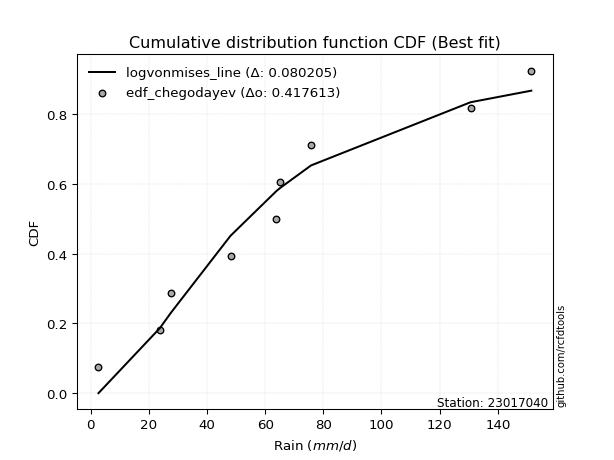</img>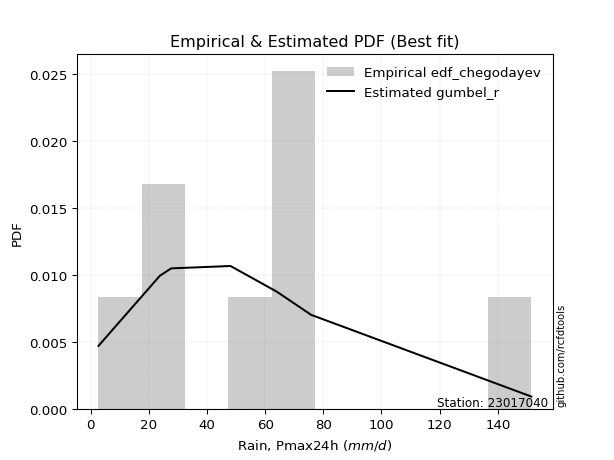</img>

</div>


### 6. EDF Blom (1958)

The Blom formula is a specific "plotting position" formula used in hydrology and statistical analysis to estimate the empirical cumulative probability (or non-exceedance probability) of a data series. It is particularly recommended for data that are approximately normally distributed. The constant _a_ is set to 0.375 (or 3/8).

<div align="center">


$P=(m-a)/(n+1-2a)$


</div>


**6.1. Empirical values**

<div align="center">

|                | 0                   | 1                   | 2                  | 3                  | 4                  | 5                  | 6                 | 7                  |
|:---------------|:--------------------|:--------------------|:-------------------|:-------------------|:-------------------|:-------------------|:------------------|:-------------------|
| date           | 2020                | 2024                | 2019               | 2015               | 2018               | 2016               | 2017              | 2014               |
| x              | 2.7                 | 23.8                | 27.7               | 48.1               | 63.9               | 65.2               | 75.8              | 151.5              |
| m              | 1                   | 2                   | 3                  | 4                  | 5                  | 6                  | 7                 | 8                  |
| empirical_dist | edf_blom            | edf_blom            | edf_blom           | edf_blom           | edf_blom           | edf_blom           | edf_blom          | edf_blom           |
| empirical      | 0.07575757575757576 | 0.19696969696969696 | 0.3181818181818182 | 0.4393939393939394 | 0.5606060606060606 | 0.6818181818181818 | 0.803030303030303 | 0.9242424242424242 |
| empirical_tr   | 1.0819672131147542  | 1.2452830188679247  | 1.4666666666666666 | 1.783783783783784  | 2.275862068965517  | 3.1428571428571423 | 5.076923076923076 | 13.199999999999992 |

</div>


**6.2. Kolmogorov-Smirnov fit test (sorted by Δ)**


<div align="center">

|                | 0                   | 1                   | 2                   | 3                   | 4                   | 5                   | 6                   | 7                   | 8                   | 9                   | 10                  | 11                  | 12                  | 13                  | 14                  | 15                  | 16                  | 17                  | 18                  | 19                 | 20                  | 21                 | 22                  | 23                  | 24                  | 25                  | 26                  | 27                  | 28                  | 29                  | 30                  | 31                  | 32                    | 33                  | 34                  | 35                  | 36                  | 37                  | 38                  | 39                  | 40                  | 41                  | 42                 | 43                 | 44                  | 45                  | 46                  | 47                  | 48                  | 49                 | 50                 | 51                  | 52                  | 53                  | 54                  | 55                  | 56                 | 57                  | 58                  | 59                  | 60                 | 61                  | 62                  | 63                 | 64                  | 65                  | 66                 | 67                 | 68                  | 69                 | 70                 | 71                 | 72                 | 73                 | 74                 | 75                  | 76                 | 77                 | 78                  | 79                 | 80                 | 81                 | 82                 | 83                 | 84                 | 85                  | 86                 | 87                 |
|:---------------|:--------------------|:--------------------|:--------------------|:--------------------|:--------------------|:--------------------|:--------------------|:--------------------|:--------------------|:--------------------|:--------------------|:--------------------|:--------------------|:--------------------|:--------------------|:--------------------|:--------------------|:--------------------|:--------------------|:-------------------|:--------------------|:-------------------|:--------------------|:--------------------|:--------------------|:--------------------|:--------------------|:--------------------|:--------------------|:--------------------|:--------------------|:--------------------|:----------------------|:--------------------|:--------------------|:--------------------|:--------------------|:--------------------|:--------------------|:--------------------|:--------------------|:--------------------|:-------------------|:-------------------|:--------------------|:--------------------|:--------------------|:--------------------|:--------------------|:-------------------|:-------------------|:--------------------|:--------------------|:--------------------|:--------------------|:--------------------|:-------------------|:--------------------|:--------------------|:--------------------|:-------------------|:--------------------|:--------------------|:-------------------|:--------------------|:--------------------|:-------------------|:-------------------|:--------------------|:-------------------|:-------------------|:-------------------|:-------------------|:-------------------|:-------------------|:--------------------|:-------------------|:-------------------|:--------------------|:-------------------|:-------------------|:-------------------|:-------------------|:-------------------|:-------------------|:--------------------|:-------------------|:-------------------|
| station        | 23017040            | 23017040            | 23017040            | 23017040            | 23017040            | 23017040            | 23017040            | 23017040            | 23017040            | 23017040            | 23017040            | 23017040            | 23017040            | 23017040            | 23017040            | 23017040            | 23017040            | 23017040            | 23017040            | 23017040           | 23017040            | 23017040           | 23017040            | 23017040            | 23017040            | 23017040            | 23017040            | 23017040            | 23017040            | 23017040            | 23017040            | 23017040            | 23017040              | 23017040            | 23017040            | 23017040            | 23017040            | 23017040            | 23017040            | 23017040            | 23017040            | 23017040            | 23017040           | 23017040           | 23017040            | 23017040            | 23017040            | 23017040            | 23017040            | 23017040           | 23017040           | 23017040            | 23017040            | 23017040            | 23017040            | 23017040            | 23017040           | 23017040            | 23017040            | 23017040            | 23017040           | 23017040            | 23017040            | 23017040           | 23017040            | 23017040            | 23017040           | 23017040           | 23017040            | 23017040           | 23017040           | 23017040           | 23017040           | 23017040           | 23017040           | 23017040            | 23017040           | 23017040           | 23017040            | 23017040           | 23017040           | 23017040           | 23017040           | 23017040           | 23017040           | 23017040            | 23017040           | 23017040           |
| empirical_dist | edf_blom            | edf_blom            | edf_blom            | edf_blom            | edf_blom            | edf_blom            | edf_blom            | edf_blom            | edf_blom            | edf_blom            | edf_blom            | edf_blom            | edf_blom            | edf_blom            | edf_blom            | edf_blom            | edf_blom            | edf_blom            | edf_blom            | edf_blom           | edf_blom            | edf_blom           | edf_blom            | edf_blom            | edf_blom            | edf_blom            | edf_blom            | edf_blom            | edf_blom            | edf_blom            | edf_blom            | edf_blom            | edf_blom              | edf_blom            | edf_blom            | edf_blom            | edf_blom            | edf_blom            | edf_blom            | edf_blom            | edf_blom            | edf_blom            | edf_blom           | edf_blom           | edf_blom            | edf_blom            | edf_blom            | edf_blom            | edf_blom            | edf_blom           | edf_blom           | edf_blom            | edf_blom            | edf_blom            | edf_blom            | edf_blom            | edf_blom           | edf_blom            | edf_blom            | edf_blom            | edf_blom           | edf_blom            | edf_blom            | edf_blom           | edf_blom            | edf_blom            | edf_blom           | edf_blom           | edf_blom            | edf_blom           | edf_blom           | edf_blom           | edf_blom           | edf_blom           | edf_blom           | edf_blom            | edf_blom           | edf_blom           | edf_blom            | edf_blom           | edf_blom           | edf_blom           | edf_blom           | edf_blom           | edf_blom           | edf_blom            | edf_blom           | edf_blom           |
| p_dist         | gumbel_r            | genlogistic         | pearson3            | logjohnsonsu        | loggenlogistic      | kstwobign           | invgauss            | fatiguelife         | logmielke           | invgamma            | exponnorm           | johnsonsu           | loggompertz         | nct                 | logfisk             | halfnorm            | gompertz            | ncf                 | loggumbel_l         | halflogistic       | fisk                | logloggamma        | moyal               | betaprime           | rayleigh            | logpearson3         | rice                | hypsecant           | maxwell             | logistic            | logt                | laplace_asymmetric  | loglaplace_asymmetric | expon               | genexpon            | laplace             | truncnorm           | norm                | crystalball         | t                   | logfatiguelife      | logrice             | lognorm            | lognorm            | logcrystalball      | logexponnorm        | lognct              | logf                | mielke              | logncf             | logerlang          | loglogistic         | loggamma            | loggamma            | wald                | logchi2             | logbetaprime       | loghypsecant        | loginvgamma         | logalpha            | logmaxwell         | gumbel_l            | erlang              | f                  | lograyleigh         | loginvgauss         | loglaplace         | nakagami           | lognakagami         | loggumbel_r        | loginvweibull      | loghalfnorm        | loghalflogistic    | logmoyal           | logkstwobign       | loggenexpon         | logtruncnorm       | gibrat             | logwald             | loggibrat          | logexpon           | weibull_min        | loglognorm         | gamma              | logweibull_min     | invweibull          | alpha              | chi2               |
| delta          | 0.07777171134547378 | 0.07809821642507542 | 0.08634186137709021 | 0.08659869150934418 | 0.08664495228170865 | 0.08738065392753369 | 0.08780174636731564 | 0.08789664062029168 | 0.08826096815769413 | 0.08896817582416061 | 0.08899497944319557 | 0.08924487867540787 | 0.08943525699481136 | 0.08990266333281505 | 0.09059043069231659 | 0.09202309379894713 | 0.09257804597911878 | 0.09306425761821335 | 0.09388065553905367 | 0.0941910379270583 | 0.09445814855583812 | 0.0945483040135946 | 0.09487330997674093 | 0.10069748867887585 | 0.10921703042195485 | 0.11236315339995606 | 0.11270520845605292 | 0.11319980751405717 | 0.11505392184195729 | 0.11526663505161083 | 0.12111927214453666 | 0.12362020493764367 | 0.124089746184598     | 0.12496260695386391 | 0.12723667218149276 | 0.13209508689939026 | 0.13467496297854598 | 0.13467502988760816 | 0.13467503446100038 | 0.13649455520669318 | 0.14487134153283693 | 0.14548184982779477 | 0.1456020272894208 | 0.1456020272894208 | 0.14560272783730177 | 0.14560433198236383 | 0.14679625028401883 | 0.14787045303156243 | 0.15050244725275064 | 0.1505118870557861 | 0.1560562356395197 | 0.15648794864203902 | 0.15878149223361726 | 0.15878149223361726 | 0.16269535827269443 | 0.16304293807445053 | 0.1653055190457779 | 0.16569358632808467 | 0.16887915078043025 | 0.17174369029041586 | 0.1770642452126372 | 0.17783434347738736 | 0.17980987701611068 | 0.1866389401269562 | 0.18903377446943054 | 0.18910552813669118 | 0.1912266526283138 | 0.1969684655475409 | 0.19696969693876942 | 0.213303278609476  | 0.2163926625811522 | 0.2230888385215814 | 0.2347813044630876 | 0.2367711393364938 | 0.2605245022293138 | 0.27585765817516233 | 0.2880898482115521 | 0.2942536705428373 | 0.30201954937852843 | 0.3331851279645513 | 0.364961733554015  | 0.4231613404318367 | 0.4411491226391014 | 0.448939682903649  | 0.4690324087412176 | 0.49968034906909475 | 0.5529379988425813 | 0.7895639289500127 |
| deltao         | 0.4472608134160001  | 0.4472608134160001  | 0.4472608134160001  | 0.4472608134160001  | 0.4472608134160001  | 0.4472608134160001  | 0.4472608134160001  | 0.4472608134160001  | 0.4472608134160001  | 0.4472608134160001  | 0.4472608134160001  | 0.4472608134160001  | 0.4472608134160001  | 0.4472608134160001  | 0.4472608134160001  | 0.4472608134160001  | 0.4472608134160001  | 0.4472608134160001  | 0.4472608134160001  | 0.4472608134160001 | 0.4472608134160001  | 0.4472608134160001 | 0.4472608134160001  | 0.4472608134160001  | 0.4472608134160001  | 0.4472608134160001  | 0.4472608134160001  | 0.4472608134160001  | 0.4472608134160001  | 0.4472608134160001  | 0.4472608134160001  | 0.4472608134160001  | 0.4472608134160001    | 0.4472608134160001  | 0.4472608134160001  | 0.4472608134160001  | 0.4472608134160001  | 0.4472608134160001  | 0.4472608134160001  | 0.4472608134160001  | 0.4472608134160001  | 0.4472608134160001  | 0.4472608134160001 | 0.4472608134160001 | 0.4472608134160001  | 0.4472608134160001  | 0.4472608134160001  | 0.4472608134160001  | 0.4472608134160001  | 0.4472608134160001 | 0.4472608134160001 | 0.4472608134160001  | 0.4472608134160001  | 0.4472608134160001  | 0.4472608134160001  | 0.4472608134160001  | 0.4472608134160001 | 0.4472608134160001  | 0.4472608134160001  | 0.4472608134160001  | 0.4472608134160001 | 0.4472608134160001  | 0.4472608134160001  | 0.4472608134160001 | 0.4472608134160001  | 0.4472608134160001  | 0.4472608134160001 | 0.4472608134160001 | 0.4472608134160001  | 0.4472608134160001 | 0.4472608134160001 | 0.4472608134160001 | 0.4472608134160001 | 0.4472608134160001 | 0.4472608134160001 | 0.4472608134160001  | 0.4472608134160001 | 0.4472608134160001 | 0.4472608134160001  | 0.4472608134160001 | 0.4472608134160001 | 0.4472608134160001 | 0.4472608134160001 | 0.4472608134160001 | 0.4472608134160001 | 0.4472608134160001  | 0.4472608134160001 | 0.4472608134160001 |
| eval           | Δo > Δ              | Δo > Δ              | Δo > Δ              | Δo > Δ              | Δo > Δ              | Δo > Δ              | Δo > Δ              | Δo > Δ              | Δo > Δ              | Δo > Δ              | Δo > Δ              | Δo > Δ              | Δo > Δ              | Δo > Δ              | Δo > Δ              | Δo > Δ              | Δo > Δ              | Δo > Δ              | Δo > Δ              | Δo > Δ             | Δo > Δ              | Δo > Δ             | Δo > Δ              | Δo > Δ              | Δo > Δ              | Δo > Δ              | Δo > Δ              | Δo > Δ              | Δo > Δ              | Δo > Δ              | Δo > Δ              | Δo > Δ              | Δo > Δ                | Δo > Δ              | Δo > Δ              | Δo > Δ              | Δo > Δ              | Δo > Δ              | Δo > Δ              | Δo > Δ              | Δo > Δ              | Δo > Δ              | Δo > Δ             | Δo > Δ             | Δo > Δ              | Δo > Δ              | Δo > Δ              | Δo > Δ              | Δo > Δ              | Δo > Δ             | Δo > Δ             | Δo > Δ              | Δo > Δ              | Δo > Δ              | Δo > Δ              | Δo > Δ              | Δo > Δ             | Δo > Δ              | Δo > Δ              | Δo > Δ              | Δo > Δ             | Δo > Δ              | Δo > Δ              | Δo > Δ             | Δo > Δ              | Δo > Δ              | Δo > Δ             | Δo > Δ             | Δo > Δ              | Δo > Δ             | Δo > Δ             | Δo > Δ             | Δo > Δ             | Δo > Δ             | Δo > Δ             | Δo > Δ              | Δo > Δ             | Δo > Δ             | Δo > Δ              | Δo > Δ             | Δo > Δ             | Δo > Δ             | Δo > Δ             | Δo <= Δ            | Δo <= Δ            | Δo <= Δ             | Δo <= Δ            | Δo <= Δ            |
| fit            | 1                   | 1                   | 1                   | 1                   | 1                   | 1                   | 1                   | 1                   | 1                   | 1                   | 1                   | 1                   | 1                   | 1                   | 1                   | 1                   | 1                   | 1                   | 1                   | 1                  | 1                   | 1                  | 1                   | 1                   | 1                   | 1                   | 1                   | 1                   | 1                   | 1                   | 1                   | 1                   | 1                     | 1                   | 1                   | 1                   | 1                   | 1                   | 1                   | 1                   | 1                   | 1                   | 1                  | 1                  | 1                   | 1                   | 1                   | 1                   | 1                   | 1                  | 1                  | 1                   | 1                   | 1                   | 1                   | 1                   | 1                  | 1                   | 1                   | 1                   | 1                  | 1                   | 1                   | 1                  | 1                   | 1                   | 1                  | 1                  | 1                   | 1                  | 1                  | 1                  | 1                  | 1                  | 1                  | 1                   | 1                  | 1                  | 1                   | 1                  | 1                  | 1                  | 1                  | 0                  | 0                  | 0                   | 0                  | 0                  |
| n              | 8                   | 8                   | 8                   | 8                   | 8                   | 8                   | 8                   | 8                   | 8                   | 8                   | 8                   | 8                   | 8                   | 8                   | 8                   | 8                   | 8                   | 8                   | 8                   | 8                  | 8                   | 8                  | 8                   | 8                   | 8                   | 8                   | 8                   | 8                   | 8                   | 8                   | 8                   | 8                   | 8                     | 8                   | 8                   | 8                   | 8                   | 8                   | 8                   | 8                   | 8                   | 8                   | 8                  | 8                  | 8                   | 8                   | 8                   | 8                   | 8                   | 8                  | 8                  | 8                   | 8                   | 8                   | 8                   | 8                   | 8                  | 8                   | 8                   | 8                   | 8                  | 8                   | 8                   | 8                  | 8                   | 8                   | 8                  | 8                  | 8                   | 8                  | 8                  | 8                  | 8                  | 8                  | 8                  | 8                   | 8                  | 8                  | 8                   | 8                  | 8                  | 8                  | 8                  | 8                  | 8                  | 8                   | 8                  | 8                  |
| best_fit       | 1                   | 0                   | 0                   | 0                   | 0                   | 0                   | 0                   | 0                   | 0                   | 0                   | 0                   | 0                   | 0                   | 0                   | 0                   | 0                   | 0                   | 0                   | 0                   | 0                  | 0                   | 0                  | 0                   | 0                   | 0                   | 0                   | 0                   | 0                   | 0                   | 0                   | 0                   | 0                   | 0                     | 0                   | 0                   | 0                   | 0                   | 0                   | 0                   | 0                   | 0                   | 0                   | 0                  | 0                  | 0                   | 0                   | 0                   | 0                   | 0                   | 0                  | 0                  | 0                   | 0                   | 0                   | 0                   | 0                   | 0                  | 0                   | 0                   | 0                   | 0                  | 0                   | 0                   | 0                  | 0                   | 0                   | 0                  | 0                  | 0                   | 0                  | 0                  | 0                  | 0                  | 0                  | 0                  | 0                   | 0                  | 0                  | 0                   | 0                  | 0                  | 0                  | 0                  | 0                  | 0                  | 0                   | 0                  | 0                  |
| best_fit_sort  | 1                   | 2                   | 3                   | 4                   | 5                   | 6                   | 7                   | 8                   | 9                   | 10                  | 11                  | 12                  | 13                  | 14                  | 15                  | 16                  | 17                  | 18                  | 19                  | 20                 | 21                  | 22                 | 23                  | 24                  | 25                  | 26                  | 27                  | 28                  | 29                  | 30                  | 31                  | 32                  | 33                    | 34                  | 35                  | 36                  | 37                  | 38                  | 39                  | 40                  | 41                  | 42                  | 43                 | 44                 | 45                  | 46                  | 47                  | 48                  | 49                  | 50                 | 51                 | 52                  | 53                  | 54                  | 55                  | 56                  | 57                 | 58                  | 59                  | 60                  | 61                 | 62                  | 63                  | 64                 | 65                  | 66                  | 67                 | 68                 | 69                  | 70                 | 71                 | 72                 | 73                 | 74                 | 75                 | 76                  | 77                 | 78                 | 79                  | 80                 | 81                 | 82                 | 83                 | 84                 | 85                 | 86                  | 87                 | 88                 |

</div>


**6.3. Best fit**

<div align="center">

|   id |   station | empirical_dist   | p_dist   |     delta |   deltao | eval   |   fit |   n |   best_fit |   best_fit_sort |
|-----:|----------:|:-----------------|:---------|----------:|---------:|:-------|------:|----:|-----------:|----------------:|
|    0 |  23017040 | edf_blom         | gumbel_r | 0.0777717 | 0.447261 | Δo > Δ |     1 |   8 |          1 |               1 |

</div>


<div align="center">

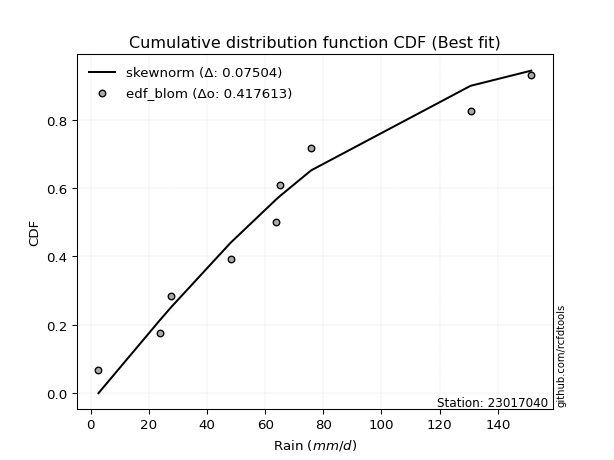</img>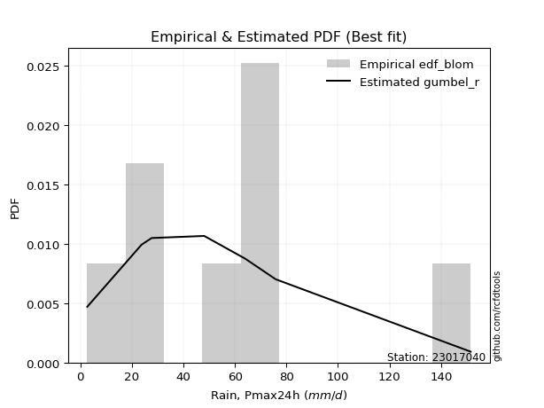</img>

</div>


### 7. EDF Tukey (1962)

In hydrology, the Tukey formula is used as a plotting position formula to estimate the empirical probability or frequency of a flood event (or other hydrological data). The formula parameter is given as _c=0.333_ (or 1/3).

<div align="center">


$P=(m-c)/(n+1-2c)$


</div>


**7.1. Empirical values**

<div align="center">

|                | 0                  | 1         | 2                  | 3                  | 4                 | 5                  | 6                 | 7                  |
|:---------------|:-------------------|:----------|:-------------------|:-------------------|:------------------|:-------------------|:------------------|:-------------------|
| date           | 2020               | 2024      | 2019               | 2015               | 2018              | 2016               | 2017              | 2014               |
| x              | 2.7                | 23.8      | 27.7               | 48.1               | 63.9              | 65.2               | 75.8              | 151.5              |
| m              | 1                  | 2         | 3                  | 4                  | 5                 | 6                  | 7                 | 8                  |
| empirical_dist | edf_tukey          | edf_tukey | edf_tukey          | edf_tukey          | edf_tukey         | edf_tukey          | edf_tukey         | edf_tukey          |
| empirical      | 0.08               | 0.2       | 0.32               | 0.44               | 0.56              | 0.68               | 0.8               | 0.92               |
| empirical_tr   | 1.0869565217391304 | 1.25      | 1.4705882352941178 | 1.7857142857142856 | 2.272727272727273 | 3.1250000000000004 | 5.000000000000001 | 12.500000000000007 |

</div>


**7.2. Kolmogorov-Smirnov fit test (sorted by Δ)**


<div align="center">

|                | 0                   | 1                   | 2                   | 3                   | 4                   | 5                   | 6                   | 7                   | 8                   | 9                   | 10                  | 11                  | 12                  | 13                  | 14                  | 15                  | 16                  | 17                  | 18                  | 19                  | 20                 | 21                  | 22                  | 23                  | 24                  | 25                  | 26                  | 27                  | 28                 | 29                 | 30                  | 31                  | 32                 | 33                    | 34                 | 35                  | 36                  | 37                  | 38                  | 39                 | 40                  | 41                  | 42                  | 43                 | 44                  | 45                 | 46                 | 47                  | 48                  | 49                  | 50                  | 51                 | 52                 | 53                 | 54                  | 55                  | 56                  | 57                  | 58                 | 59                 | 60                  | 61                  | 62                  | 63                  | 64                 | 65                  | 66                  | 67                  | 68                  | 69                 | 70                  | 71                  | 72                  | 73                 | 74                  | 75                 | 76                  | 77                 | 78                 | 79                 | 80                  | 81                 | 82                  | 83                  | 84                  | 85                 | 86                 | 87                 |
|:---------------|:--------------------|:--------------------|:--------------------|:--------------------|:--------------------|:--------------------|:--------------------|:--------------------|:--------------------|:--------------------|:--------------------|:--------------------|:--------------------|:--------------------|:--------------------|:--------------------|:--------------------|:--------------------|:--------------------|:--------------------|:-------------------|:--------------------|:--------------------|:--------------------|:--------------------|:--------------------|:--------------------|:--------------------|:-------------------|:-------------------|:--------------------|:--------------------|:-------------------|:----------------------|:-------------------|:--------------------|:--------------------|:--------------------|:--------------------|:-------------------|:--------------------|:--------------------|:--------------------|:-------------------|:--------------------|:-------------------|:-------------------|:--------------------|:--------------------|:--------------------|:--------------------|:-------------------|:-------------------|:-------------------|:--------------------|:--------------------|:--------------------|:--------------------|:-------------------|:-------------------|:--------------------|:--------------------|:--------------------|:--------------------|:-------------------|:--------------------|:--------------------|:--------------------|:--------------------|:-------------------|:--------------------|:--------------------|:--------------------|:-------------------|:--------------------|:-------------------|:--------------------|:-------------------|:-------------------|:-------------------|:--------------------|:-------------------|:--------------------|:--------------------|:--------------------|:-------------------|:-------------------|:-------------------|
| station        | 23017040            | 23017040            | 23017040            | 23017040            | 23017040            | 23017040            | 23017040            | 23017040            | 23017040            | 23017040            | 23017040            | 23017040            | 23017040            | 23017040            | 23017040            | 23017040            | 23017040            | 23017040            | 23017040            | 23017040            | 23017040           | 23017040            | 23017040            | 23017040            | 23017040            | 23017040            | 23017040            | 23017040            | 23017040           | 23017040           | 23017040            | 23017040            | 23017040           | 23017040              | 23017040           | 23017040            | 23017040            | 23017040            | 23017040            | 23017040           | 23017040            | 23017040            | 23017040            | 23017040           | 23017040            | 23017040           | 23017040           | 23017040            | 23017040            | 23017040            | 23017040            | 23017040           | 23017040           | 23017040           | 23017040            | 23017040            | 23017040            | 23017040            | 23017040           | 23017040           | 23017040            | 23017040            | 23017040            | 23017040            | 23017040           | 23017040            | 23017040            | 23017040            | 23017040            | 23017040           | 23017040            | 23017040            | 23017040            | 23017040           | 23017040            | 23017040           | 23017040            | 23017040           | 23017040           | 23017040           | 23017040            | 23017040           | 23017040            | 23017040            | 23017040            | 23017040           | 23017040           | 23017040           |
| empirical_dist | edf_tukey           | edf_tukey           | edf_tukey           | edf_tukey           | edf_tukey           | edf_tukey           | edf_tukey           | edf_tukey           | edf_tukey           | edf_tukey           | edf_tukey           | edf_tukey           | edf_tukey           | edf_tukey           | edf_tukey           | edf_tukey           | edf_tukey           | edf_tukey           | edf_tukey           | edf_tukey           | edf_tukey          | edf_tukey           | edf_tukey           | edf_tukey           | edf_tukey           | edf_tukey           | edf_tukey           | edf_tukey           | edf_tukey          | edf_tukey          | edf_tukey           | edf_tukey           | edf_tukey          | edf_tukey             | edf_tukey          | edf_tukey           | edf_tukey           | edf_tukey           | edf_tukey           | edf_tukey          | edf_tukey           | edf_tukey           | edf_tukey           | edf_tukey          | edf_tukey           | edf_tukey          | edf_tukey          | edf_tukey           | edf_tukey           | edf_tukey           | edf_tukey           | edf_tukey          | edf_tukey          | edf_tukey          | edf_tukey           | edf_tukey           | edf_tukey           | edf_tukey           | edf_tukey          | edf_tukey          | edf_tukey           | edf_tukey           | edf_tukey           | edf_tukey           | edf_tukey          | edf_tukey           | edf_tukey           | edf_tukey           | edf_tukey           | edf_tukey          | edf_tukey           | edf_tukey           | edf_tukey           | edf_tukey          | edf_tukey           | edf_tukey          | edf_tukey           | edf_tukey          | edf_tukey          | edf_tukey          | edf_tukey           | edf_tukey          | edf_tukey           | edf_tukey           | edf_tukey           | edf_tukey          | edf_tukey          | edf_tukey          |
| p_dist         | gumbel_r            | genlogistic         | pearson3            | kstwobign           | logjohnsonsu        | loggenlogistic      | invgauss            | fatiguelife         | logmielke           | halfnorm            | gompertz            | invgamma            | exponnorm           | johnsonsu           | logfisk             | loggompertz         | nct                 | loggumbel_l         | logloggamma         | ncf                 | halflogistic       | fisk                | moyal               | betaprime           | rayleigh            | logpearson3         | rice                | maxwell             | logistic           | hypsecant          | logt                | genexpon            | expon              | loglaplace_asymmetric | laplace_asymmetric | truncnorm           | norm                | crystalball         | t                   | laplace            | logfatiguelife      | lognorm             | lognorm             | logcrystalball     | logexponnorm        | logrice            | lognct             | logf                | logncf              | mielke              | logerlang           | loggamma           | loggamma           | loglogistic        | logchi2             | logbetaprime        | wald                | loghypsecant        | loginvgamma        | logalpha           | logmaxwell          | gumbel_l            | erlang              | f                   | lograyleigh        | loginvgauss         | loglaplace          | nakagami            | lognakagami         | loggumbel_r        | loginvweibull       | loghalfnorm         | loghalflogistic     | logmoyal           | logkstwobign        | loggenexpon        | logtruncnorm        | gibrat             | logwald            | loggibrat          | logexpon            | weibull_min        | loglognorm          | gamma               | logweibull_min      | invweibull         | alpha              | chi2               |
| delta          | 0.07474140831517084 | 0.07870427703113592 | 0.08331155834678727 | 0.08435035089723075 | 0.08720475211540468 | 0.08725101288776915 | 0.08840780697337614 | 0.08850270122635218 | 0.08886702876375463 | 0.08899279076864419 | 0.08954774294881584 | 0.08957423643022111 | 0.08960104004925606 | 0.08985093928146837 | 0.08998437008625598 | 0.09004131760087186 | 0.09050872393887555 | 0.09085035250875073 | 0.09151800098329166 | 0.09367031822427385 | 0.0947970985331188 | 0.09506420916189862 | 0.09547937058280143 | 0.10130354928493635 | 0.10618672739165191 | 0.10933285036965312 | 0.10967490542574998 | 0.11202361881165435 | 0.1122363320213079 | 0.115017989332239  | 0.12293745396271849 | 0.12434753678368299 | 0.1243565463478033 | 0.1246958067906585    | 0.1254383867558255 | 0.13164465994824304 | 0.13164472685730522 | 0.13164473143069744 | 0.13346425217639024 | 0.1339132687175721 | 0.14366625653109127 | 0.14476564214073945 | 0.14476564214073945 | 0.1447667750751273 | 0.14476814790203946 | 0.1447980444578328 | 0.1452282537937541 | 0.14614798083091357 | 0.14748158402548306 | 0.15110850785881114 | 0.15302593260921665 | 0.1557511892033142 | 0.1557511892033142 | 0.1558818880359784 | 0.16001263504414748 | 0.16227521601547484 | 0.16330141887875493 | 0.16508752572202406 | 0.1658488477501272 | 0.1687133872601128 | 0.17403394218233414 | 0.17480404044708442 | 0.17920381641005007 | 0.18360863709665315 | 0.1860034714391275 | 0.18607522510638813 | 0.19062059202225318 | 0.19999876857784396 | 0.19999999996907247 | 0.2126972180034154 | 0.21336235955084915 | 0.22005853549127835 | 0.23417524385702698 | 0.2361650787304332 | 0.25749419919901073 | 0.2728273551448593 | 0.28505954518124904 | 0.2960718523610191 | 0.3014134887724678 | 0.3325790673584907 | 0.36193143052371196 | 0.4201310374015336 | 0.43811881960879834 | 0.44590937987334595 | 0.46600210571091455 | 0.4954379248266706 | 0.5499076958122782 | 0.7865336259197095 |
| deltao         | 0.4472608134160001  | 0.4472608134160001  | 0.4472608134160001  | 0.4472608134160001  | 0.4472608134160001  | 0.4472608134160001  | 0.4472608134160001  | 0.4472608134160001  | 0.4472608134160001  | 0.4472608134160001  | 0.4472608134160001  | 0.4472608134160001  | 0.4472608134160001  | 0.4472608134160001  | 0.4472608134160001  | 0.4472608134160001  | 0.4472608134160001  | 0.4472608134160001  | 0.4472608134160001  | 0.4472608134160001  | 0.4472608134160001 | 0.4472608134160001  | 0.4472608134160001  | 0.4472608134160001  | 0.4472608134160001  | 0.4472608134160001  | 0.4472608134160001  | 0.4472608134160001  | 0.4472608134160001 | 0.4472608134160001 | 0.4472608134160001  | 0.4472608134160001  | 0.4472608134160001 | 0.4472608134160001    | 0.4472608134160001 | 0.4472608134160001  | 0.4472608134160001  | 0.4472608134160001  | 0.4472608134160001  | 0.4472608134160001 | 0.4472608134160001  | 0.4472608134160001  | 0.4472608134160001  | 0.4472608134160001 | 0.4472608134160001  | 0.4472608134160001 | 0.4472608134160001 | 0.4472608134160001  | 0.4472608134160001  | 0.4472608134160001  | 0.4472608134160001  | 0.4472608134160001 | 0.4472608134160001 | 0.4472608134160001 | 0.4472608134160001  | 0.4472608134160001  | 0.4472608134160001  | 0.4472608134160001  | 0.4472608134160001 | 0.4472608134160001 | 0.4472608134160001  | 0.4472608134160001  | 0.4472608134160001  | 0.4472608134160001  | 0.4472608134160001 | 0.4472608134160001  | 0.4472608134160001  | 0.4472608134160001  | 0.4472608134160001  | 0.4472608134160001 | 0.4472608134160001  | 0.4472608134160001  | 0.4472608134160001  | 0.4472608134160001 | 0.4472608134160001  | 0.4472608134160001 | 0.4472608134160001  | 0.4472608134160001 | 0.4472608134160001 | 0.4472608134160001 | 0.4472608134160001  | 0.4472608134160001 | 0.4472608134160001  | 0.4472608134160001  | 0.4472608134160001  | 0.4472608134160001 | 0.4472608134160001 | 0.4472608134160001 |
| eval           | Δo > Δ              | Δo > Δ              | Δo > Δ              | Δo > Δ              | Δo > Δ              | Δo > Δ              | Δo > Δ              | Δo > Δ              | Δo > Δ              | Δo > Δ              | Δo > Δ              | Δo > Δ              | Δo > Δ              | Δo > Δ              | Δo > Δ              | Δo > Δ              | Δo > Δ              | Δo > Δ              | Δo > Δ              | Δo > Δ              | Δo > Δ             | Δo > Δ              | Δo > Δ              | Δo > Δ              | Δo > Δ              | Δo > Δ              | Δo > Δ              | Δo > Δ              | Δo > Δ             | Δo > Δ             | Δo > Δ              | Δo > Δ              | Δo > Δ             | Δo > Δ                | Δo > Δ             | Δo > Δ              | Δo > Δ              | Δo > Δ              | Δo > Δ              | Δo > Δ             | Δo > Δ              | Δo > Δ              | Δo > Δ              | Δo > Δ             | Δo > Δ              | Δo > Δ             | Δo > Δ             | Δo > Δ              | Δo > Δ              | Δo > Δ              | Δo > Δ              | Δo > Δ             | Δo > Δ             | Δo > Δ             | Δo > Δ              | Δo > Δ              | Δo > Δ              | Δo > Δ              | Δo > Δ             | Δo > Δ             | Δo > Δ              | Δo > Δ              | Δo > Δ              | Δo > Δ              | Δo > Δ             | Δo > Δ              | Δo > Δ              | Δo > Δ              | Δo > Δ              | Δo > Δ             | Δo > Δ              | Δo > Δ              | Δo > Δ              | Δo > Δ             | Δo > Δ              | Δo > Δ             | Δo > Δ              | Δo > Δ             | Δo > Δ             | Δo > Δ             | Δo > Δ              | Δo > Δ             | Δo > Δ              | Δo > Δ              | Δo <= Δ             | Δo <= Δ            | Δo <= Δ            | Δo <= Δ            |
| fit            | 1                   | 1                   | 1                   | 1                   | 1                   | 1                   | 1                   | 1                   | 1                   | 1                   | 1                   | 1                   | 1                   | 1                   | 1                   | 1                   | 1                   | 1                   | 1                   | 1                   | 1                  | 1                   | 1                   | 1                   | 1                   | 1                   | 1                   | 1                   | 1                  | 1                  | 1                   | 1                   | 1                  | 1                     | 1                  | 1                   | 1                   | 1                   | 1                   | 1                  | 1                   | 1                   | 1                   | 1                  | 1                   | 1                  | 1                  | 1                   | 1                   | 1                   | 1                   | 1                  | 1                  | 1                  | 1                   | 1                   | 1                   | 1                   | 1                  | 1                  | 1                   | 1                   | 1                   | 1                   | 1                  | 1                   | 1                   | 1                   | 1                   | 1                  | 1                   | 1                   | 1                   | 1                  | 1                   | 1                  | 1                   | 1                  | 1                  | 1                  | 1                   | 1                  | 1                   | 1                   | 0                   | 0                  | 0                  | 0                  |
| n              | 8                   | 8                   | 8                   | 8                   | 8                   | 8                   | 8                   | 8                   | 8                   | 8                   | 8                   | 8                   | 8                   | 8                   | 8                   | 8                   | 8                   | 8                   | 8                   | 8                   | 8                  | 8                   | 8                   | 8                   | 8                   | 8                   | 8                   | 8                   | 8                  | 8                  | 8                   | 8                   | 8                  | 8                     | 8                  | 8                   | 8                   | 8                   | 8                   | 8                  | 8                   | 8                   | 8                   | 8                  | 8                   | 8                  | 8                  | 8                   | 8                   | 8                   | 8                   | 8                  | 8                  | 8                  | 8                   | 8                   | 8                   | 8                   | 8                  | 8                  | 8                   | 8                   | 8                   | 8                   | 8                  | 8                   | 8                   | 8                   | 8                   | 8                  | 8                   | 8                   | 8                   | 8                  | 8                   | 8                  | 8                   | 8                  | 8                  | 8                  | 8                   | 8                  | 8                   | 8                   | 8                   | 8                  | 8                  | 8                  |
| best_fit       | 1                   | 0                   | 0                   | 0                   | 0                   | 0                   | 0                   | 0                   | 0                   | 0                   | 0                   | 0                   | 0                   | 0                   | 0                   | 0                   | 0                   | 0                   | 0                   | 0                   | 0                  | 0                   | 0                   | 0                   | 0                   | 0                   | 0                   | 0                   | 0                  | 0                  | 0                   | 0                   | 0                  | 0                     | 0                  | 0                   | 0                   | 0                   | 0                   | 0                  | 0                   | 0                   | 0                   | 0                  | 0                   | 0                  | 0                  | 0                   | 0                   | 0                   | 0                   | 0                  | 0                  | 0                  | 0                   | 0                   | 0                   | 0                   | 0                  | 0                  | 0                   | 0                   | 0                   | 0                   | 0                  | 0                   | 0                   | 0                   | 0                   | 0                  | 0                   | 0                   | 0                   | 0                  | 0                   | 0                  | 0                   | 0                  | 0                  | 0                  | 0                   | 0                  | 0                   | 0                   | 0                   | 0                  | 0                  | 0                  |
| best_fit_sort  | 1                   | 2                   | 3                   | 4                   | 5                   | 6                   | 7                   | 8                   | 9                   | 10                  | 11                  | 12                  | 13                  | 14                  | 15                  | 16                  | 17                  | 18                  | 19                  | 20                  | 21                 | 22                  | 23                  | 24                  | 25                  | 26                  | 27                  | 28                  | 29                 | 30                 | 31                  | 32                  | 33                 | 34                    | 35                 | 36                  | 37                  | 38                  | 39                  | 40                 | 41                  | 42                  | 43                  | 44                 | 45                  | 46                 | 47                 | 48                  | 49                  | 50                  | 51                  | 52                 | 53                 | 54                 | 55                  | 56                  | 57                  | 58                  | 59                 | 60                 | 61                  | 62                  | 63                  | 64                  | 65                 | 66                  | 67                  | 68                  | 69                  | 70                 | 71                  | 72                  | 73                  | 74                 | 75                  | 76                 | 77                  | 78                 | 79                 | 80                 | 81                  | 82                 | 83                  | 84                  | 85                  | 86                 | 87                 | 88                 |

</div>


**7.3. Best fit**

<div align="center">

|   id |   station | empirical_dist   | p_dist   |     delta |   deltao | eval   |   fit |   n |   best_fit |   best_fit_sort |
|-----:|----------:|:-----------------|:---------|----------:|---------:|:-------|------:|----:|-----------:|----------------:|
|    0 |  23017040 | edf_tukey        | gumbel_r | 0.0747414 | 0.447261 | Δo > Δ |     1 |   8 |          1 |               1 |

</div>


<div align="center">

</img></img>

</div>


### 8. EDF Gringorten (1963)

Gringorten plotting position formula is essential for estimating the probability and return periods of extreme events like floods and heavy rainfall. The constant _a=0.44_.

<div align="center">


$P=(m-a)/(n+1-2a)$


</div>


**8.1. Empirical values**

<div align="center">

|                | 0                   | 1                   | 2                  | 3                  | 4                  | 5                  | 6                  | 7                  |
|:---------------|:--------------------|:--------------------|:-------------------|:-------------------|:-------------------|:-------------------|:-------------------|:-------------------|
| date           | 2020                | 2024                | 2019               | 2015               | 2018               | 2016               | 2017               | 2014               |
| x              | 2.7                 | 23.8                | 27.7               | 48.1               | 63.9               | 65.2               | 75.8               | 151.5              |
| m              | 1                   | 2                   | 3                  | 4                  | 5                  | 6                  | 7                  | 8                  |
| empirical_dist | edf_gringorten      | edf_gringorten      | edf_gringorten     | edf_gringorten     | edf_gringorten     | edf_gringorten     | edf_gringorten     | edf_gringorten     |
| empirical      | 0.06896551724137932 | 0.19211822660098524 | 0.3152709359605912 | 0.4384236453201971 | 0.5615763546798029 | 0.6847290640394089 | 0.8078817733990148 | 0.9310344827586208 |
| empirical_tr   | 1.0740740740740742  | 1.2378048780487805  | 1.460431654676259  | 1.780701754385965  | 2.2808988764044944 | 3.1718750000000004 | 5.205128205128205  | 14.500000000000018 |

</div>


**8.2. Kolmogorov-Smirnov fit test (sorted by Δ)**


<div align="center">

|                | 0                   | 1                   | 2                  | 3                   | 4                   | 5                  | 6                   | 7                   | 8                   | 9                   | 10                  | 11                  | 12                  | 13                  | 14                 | 15                  | 16                  | 17                  | 18                  | 19                  | 20                  | 21                  | 22                 | 23                  | 24                  | 25                  | 26                  | 27                  | 28                  | 29                  | 30                  | 31                  | 32                    | 33                  | 34                  | 35                  | 36                  | 37                  | 38                  | 39                 | 40                  | 41                  | 42                 | 43                 | 44                 | 45                 | 46                  | 47                  | 48                  | 49                  | 50                 | 51                  | 52                  | 53                  | 54                  | 55                  | 56                  | 57                  | 58                  | 59                 | 60                  | 61                  | 62                  | 63                  | 64                 | 65                 | 66                  | 67                  | 68                 | 69                  | 70                  | 71                  | 72                  | 73                  | 74                 | 75                 | 76                 | 77                  | 78                 | 79                  | 80                  | 81                 | 82                  | 83                  | 84                  | 85                 | 86                 | 87                 |
|:---------------|:--------------------|:--------------------|:-------------------|:--------------------|:--------------------|:-------------------|:--------------------|:--------------------|:--------------------|:--------------------|:--------------------|:--------------------|:--------------------|:--------------------|:-------------------|:--------------------|:--------------------|:--------------------|:--------------------|:--------------------|:--------------------|:--------------------|:-------------------|:--------------------|:--------------------|:--------------------|:--------------------|:--------------------|:--------------------|:--------------------|:--------------------|:--------------------|:----------------------|:--------------------|:--------------------|:--------------------|:--------------------|:--------------------|:--------------------|:-------------------|:--------------------|:--------------------|:-------------------|:-------------------|:-------------------|:-------------------|:--------------------|:--------------------|:--------------------|:--------------------|:-------------------|:--------------------|:--------------------|:--------------------|:--------------------|:--------------------|:--------------------|:--------------------|:--------------------|:-------------------|:--------------------|:--------------------|:--------------------|:--------------------|:-------------------|:-------------------|:--------------------|:--------------------|:-------------------|:--------------------|:--------------------|:--------------------|:--------------------|:--------------------|:-------------------|:-------------------|:-------------------|:--------------------|:-------------------|:--------------------|:--------------------|:-------------------|:--------------------|:--------------------|:--------------------|:-------------------|:-------------------|:-------------------|
| station        | 23017040            | 23017040            | 23017040           | 23017040            | 23017040            | 23017040           | 23017040            | 23017040            | 23017040            | 23017040            | 23017040            | 23017040            | 23017040            | 23017040            | 23017040           | 23017040            | 23017040            | 23017040            | 23017040            | 23017040            | 23017040            | 23017040            | 23017040           | 23017040            | 23017040            | 23017040            | 23017040            | 23017040            | 23017040            | 23017040            | 23017040            | 23017040            | 23017040              | 23017040            | 23017040            | 23017040            | 23017040            | 23017040            | 23017040            | 23017040           | 23017040            | 23017040            | 23017040           | 23017040           | 23017040           | 23017040           | 23017040            | 23017040            | 23017040            | 23017040            | 23017040           | 23017040            | 23017040            | 23017040            | 23017040            | 23017040            | 23017040            | 23017040            | 23017040            | 23017040           | 23017040            | 23017040            | 23017040            | 23017040            | 23017040           | 23017040           | 23017040            | 23017040            | 23017040           | 23017040            | 23017040            | 23017040            | 23017040            | 23017040            | 23017040           | 23017040           | 23017040           | 23017040            | 23017040           | 23017040            | 23017040            | 23017040           | 23017040            | 23017040            | 23017040            | 23017040           | 23017040           | 23017040           |
| empirical_dist | edf_gringorten      | edf_gringorten      | edf_gringorten     | edf_gringorten      | edf_gringorten      | edf_gringorten     | edf_gringorten      | edf_gringorten      | edf_gringorten      | edf_gringorten      | edf_gringorten      | edf_gringorten      | edf_gringorten      | edf_gringorten      | edf_gringorten     | edf_gringorten      | edf_gringorten      | edf_gringorten      | edf_gringorten      | edf_gringorten      | edf_gringorten      | edf_gringorten      | edf_gringorten     | edf_gringorten      | edf_gringorten      | edf_gringorten      | edf_gringorten      | edf_gringorten      | edf_gringorten      | edf_gringorten      | edf_gringorten      | edf_gringorten      | edf_gringorten        | edf_gringorten      | edf_gringorten      | edf_gringorten      | edf_gringorten      | edf_gringorten      | edf_gringorten      | edf_gringorten     | edf_gringorten      | edf_gringorten      | edf_gringorten     | edf_gringorten     | edf_gringorten     | edf_gringorten     | edf_gringorten      | edf_gringorten      | edf_gringorten      | edf_gringorten      | edf_gringorten     | edf_gringorten      | edf_gringorten      | edf_gringorten      | edf_gringorten      | edf_gringorten      | edf_gringorten      | edf_gringorten      | edf_gringorten      | edf_gringorten     | edf_gringorten      | edf_gringorten      | edf_gringorten      | edf_gringorten      | edf_gringorten     | edf_gringorten     | edf_gringorten      | edf_gringorten      | edf_gringorten     | edf_gringorten      | edf_gringorten      | edf_gringorten      | edf_gringorten      | edf_gringorten      | edf_gringorten     | edf_gringorten     | edf_gringorten     | edf_gringorten      | edf_gringorten     | edf_gringorten      | edf_gringorten      | edf_gringorten     | edf_gringorten      | edf_gringorten      | edf_gringorten      | edf_gringorten     | edf_gringorten     | edf_gringorten     |
| p_dist         | genlogistic         | gumbel_r            | logjohnsonsu       | loggenlogistic      | invgauss            | fatiguelife        | logmielke           | invgamma            | exponnorm           | johnsonsu           | loggompertz         | nct                 | pearson3            | ncf                 | kstwobign          | halflogistic        | fisk                | logfisk             | moyal               | halfnorm            | gompertz            | loggumbel_l         | logloggamma        | betaprime           | hypsecant           | rayleigh            | logpearson3         | rice                | logt                | maxwell             | logistic            | laplace_asymmetric  | loglaplace_asymmetric | expon               | laplace             | genexpon            | truncnorm           | norm                | crystalball         | t                  | mielke              | logfatiguelife      | logrice            | lognorm            | lognorm            | logcrystalball     | logexponnorm        | lognct              | logf                | logncf              | loglogistic        | logerlang           | wald                | loggamma            | loggamma            | loghypsecant        | logchi2             | logbetaprime        | loginvgamma         | logalpha           | erlang              | logmaxwell          | gumbel_l            | f                   | nakagami           | lognakagami        | loglaplace          | lograyleigh         | loginvgauss        | loggumbel_r         | loginvweibull       | loghalfnorm         | loghalflogistic     | logmoyal            | logkstwobign       | loggenexpon        | gibrat             | logtruncnorm        | logwald            | loggibrat           | logexpon            | weibull_min        | loglognorm          | gamma               | logweibull_min      | invweibull         | alpha              | chi2               |
| delta          | 0.07712792235133303 | 0.08262318171418559 | 0.0856283974356018 | 0.08567465820796627 | 0.08683145229357325 | 0.0869263465465493 | 0.08729067408395175 | 0.08799788175041823 | 0.08802468536945318 | 0.08827458460166548 | 0.08846496292106898 | 0.08893236925907266 | 0.09119333174580202 | 0.09209396354447097 | 0.0922321242962455 | 0.09322074385331591 | 0.09348785448209573 | 0.09383435240056093 | 0.09390301590299854 | 0.09687456416765894 | 0.09742951634783059 | 0.09873212590776548 | 0.0993997743823064 | 0.09972719460513346 | 0.11028892529283019 | 0.11406850079066666 | 0.11721462376866787 | 0.11755667882476473 | 0.11820838992330968 | 0.11990539221066909 | 0.12011810542032264 | 0.12070932271641668 | 0.12311945211085562   | 0.12823471804085987 | 0.12918420467816327 | 0.13208814255020448 | 0.13952643334725778 | 0.13952650025631996 | 0.13952650482971218 | 0.141346025575405  | 0.14953215317900825 | 0.14972281190154865 | 0.1503333201965065 | 0.1504534976581325 | 0.1504534976581325 | 0.1504541982060135 | 0.15045580235107556 | 0.15164772065273055 | 0.15272192340027416 | 0.15536335742449783 | 0.1574582427157813 | 0.16090770600823143 | 0.16172506419895205 | 0.16363296260232899 | 0.16363296260232899 | 0.16666388040182695 | 0.16789440844316225 | 0.17015698941448962 | 0.17373062114914198 | 0.1765951606591276 | 0.18078017108985295 | 0.18191571558134892 | 0.18268581384609917 | 0.19149041049566792 | 0.1921169951788292 | 0.1921182265700577 | 0.19219694670205606 | 0.19388524483814226 | 0.1939569985054029 | 0.21427357268321828 | 0.22124413294986392 | 0.22794030889029313 | 0.23575159853682986 | 0.23774143341023607 | 0.2653759725980255 | 0.2807091285438741 | 0.2913427883216103 | 0.29294131858026384 | 0.3029898434522707 | 0.33415542203829357 | 0.36981320392272676 | 0.4280128108005484 | 0.44600059300781314 | 0.45379115327236075 | 0.47388387910992935 | 0.5064724075852913 | 0.557789469211293  | 0.7944153993187244 |
| deltao         | 0.4472608134160001  | 0.4472608134160001  | 0.4472608134160001 | 0.4472608134160001  | 0.4472608134160001  | 0.4472608134160001 | 0.4472608134160001  | 0.4472608134160001  | 0.4472608134160001  | 0.4472608134160001  | 0.4472608134160001  | 0.4472608134160001  | 0.4472608134160001  | 0.4472608134160001  | 0.4472608134160001 | 0.4472608134160001  | 0.4472608134160001  | 0.4472608134160001  | 0.4472608134160001  | 0.4472608134160001  | 0.4472608134160001  | 0.4472608134160001  | 0.4472608134160001 | 0.4472608134160001  | 0.4472608134160001  | 0.4472608134160001  | 0.4472608134160001  | 0.4472608134160001  | 0.4472608134160001  | 0.4472608134160001  | 0.4472608134160001  | 0.4472608134160001  | 0.4472608134160001    | 0.4472608134160001  | 0.4472608134160001  | 0.4472608134160001  | 0.4472608134160001  | 0.4472608134160001  | 0.4472608134160001  | 0.4472608134160001 | 0.4472608134160001  | 0.4472608134160001  | 0.4472608134160001 | 0.4472608134160001 | 0.4472608134160001 | 0.4472608134160001 | 0.4472608134160001  | 0.4472608134160001  | 0.4472608134160001  | 0.4472608134160001  | 0.4472608134160001 | 0.4472608134160001  | 0.4472608134160001  | 0.4472608134160001  | 0.4472608134160001  | 0.4472608134160001  | 0.4472608134160001  | 0.4472608134160001  | 0.4472608134160001  | 0.4472608134160001 | 0.4472608134160001  | 0.4472608134160001  | 0.4472608134160001  | 0.4472608134160001  | 0.4472608134160001 | 0.4472608134160001 | 0.4472608134160001  | 0.4472608134160001  | 0.4472608134160001 | 0.4472608134160001  | 0.4472608134160001  | 0.4472608134160001  | 0.4472608134160001  | 0.4472608134160001  | 0.4472608134160001 | 0.4472608134160001 | 0.4472608134160001 | 0.4472608134160001  | 0.4472608134160001 | 0.4472608134160001  | 0.4472608134160001  | 0.4472608134160001 | 0.4472608134160001  | 0.4472608134160001  | 0.4472608134160001  | 0.4472608134160001 | 0.4472608134160001 | 0.4472608134160001 |
| eval           | Δo > Δ              | Δo > Δ              | Δo > Δ             | Δo > Δ              | Δo > Δ              | Δo > Δ             | Δo > Δ              | Δo > Δ              | Δo > Δ              | Δo > Δ              | Δo > Δ              | Δo > Δ              | Δo > Δ              | Δo > Δ              | Δo > Δ             | Δo > Δ              | Δo > Δ              | Δo > Δ              | Δo > Δ              | Δo > Δ              | Δo > Δ              | Δo > Δ              | Δo > Δ             | Δo > Δ              | Δo > Δ              | Δo > Δ              | Δo > Δ              | Δo > Δ              | Δo > Δ              | Δo > Δ              | Δo > Δ              | Δo > Δ              | Δo > Δ                | Δo > Δ              | Δo > Δ              | Δo > Δ              | Δo > Δ              | Δo > Δ              | Δo > Δ              | Δo > Δ             | Δo > Δ              | Δo > Δ              | Δo > Δ             | Δo > Δ             | Δo > Δ             | Δo > Δ             | Δo > Δ              | Δo > Δ              | Δo > Δ              | Δo > Δ              | Δo > Δ             | Δo > Δ              | Δo > Δ              | Δo > Δ              | Δo > Δ              | Δo > Δ              | Δo > Δ              | Δo > Δ              | Δo > Δ              | Δo > Δ             | Δo > Δ              | Δo > Δ              | Δo > Δ              | Δo > Δ              | Δo > Δ             | Δo > Δ             | Δo > Δ              | Δo > Δ              | Δo > Δ             | Δo > Δ              | Δo > Δ              | Δo > Δ              | Δo > Δ              | Δo > Δ              | Δo > Δ             | Δo > Δ             | Δo > Δ             | Δo > Δ              | Δo > Δ             | Δo > Δ              | Δo > Δ              | Δo > Δ             | Δo > Δ              | Δo <= Δ             | Δo <= Δ             | Δo <= Δ            | Δo <= Δ            | Δo <= Δ            |
| fit            | 1                   | 1                   | 1                  | 1                   | 1                   | 1                  | 1                   | 1                   | 1                   | 1                   | 1                   | 1                   | 1                   | 1                   | 1                  | 1                   | 1                   | 1                   | 1                   | 1                   | 1                   | 1                   | 1                  | 1                   | 1                   | 1                   | 1                   | 1                   | 1                   | 1                   | 1                   | 1                   | 1                     | 1                   | 1                   | 1                   | 1                   | 1                   | 1                   | 1                  | 1                   | 1                   | 1                  | 1                  | 1                  | 1                  | 1                   | 1                   | 1                   | 1                   | 1                  | 1                   | 1                   | 1                   | 1                   | 1                   | 1                   | 1                   | 1                   | 1                  | 1                   | 1                   | 1                   | 1                   | 1                  | 1                  | 1                   | 1                   | 1                  | 1                   | 1                   | 1                   | 1                   | 1                   | 1                  | 1                  | 1                  | 1                   | 1                  | 1                   | 1                   | 1                  | 1                   | 0                   | 0                   | 0                  | 0                  | 0                  |
| n              | 8                   | 8                   | 8                  | 8                   | 8                   | 8                  | 8                   | 8                   | 8                   | 8                   | 8                   | 8                   | 8                   | 8                   | 8                  | 8                   | 8                   | 8                   | 8                   | 8                   | 8                   | 8                   | 8                  | 8                   | 8                   | 8                   | 8                   | 8                   | 8                   | 8                   | 8                   | 8                   | 8                     | 8                   | 8                   | 8                   | 8                   | 8                   | 8                   | 8                  | 8                   | 8                   | 8                  | 8                  | 8                  | 8                  | 8                   | 8                   | 8                   | 8                   | 8                  | 8                   | 8                   | 8                   | 8                   | 8                   | 8                   | 8                   | 8                   | 8                  | 8                   | 8                   | 8                   | 8                   | 8                  | 8                  | 8                   | 8                   | 8                  | 8                   | 8                   | 8                   | 8                   | 8                   | 8                  | 8                  | 8                  | 8                   | 8                  | 8                   | 8                   | 8                  | 8                   | 8                   | 8                   | 8                  | 8                  | 8                  |
| best_fit       | 1                   | 0                   | 0                  | 0                   | 0                   | 0                  | 0                   | 0                   | 0                   | 0                   | 0                   | 0                   | 0                   | 0                   | 0                  | 0                   | 0                   | 0                   | 0                   | 0                   | 0                   | 0                   | 0                  | 0                   | 0                   | 0                   | 0                   | 0                   | 0                   | 0                   | 0                   | 0                   | 0                     | 0                   | 0                   | 0                   | 0                   | 0                   | 0                   | 0                  | 0                   | 0                   | 0                  | 0                  | 0                  | 0                  | 0                   | 0                   | 0                   | 0                   | 0                  | 0                   | 0                   | 0                   | 0                   | 0                   | 0                   | 0                   | 0                   | 0                  | 0                   | 0                   | 0                   | 0                   | 0                  | 0                  | 0                   | 0                   | 0                  | 0                   | 0                   | 0                   | 0                   | 0                   | 0                  | 0                  | 0                  | 0                   | 0                  | 0                   | 0                   | 0                  | 0                   | 0                   | 0                   | 0                  | 0                  | 0                  |
| best_fit_sort  | 1                   | 2                   | 3                  | 4                   | 5                   | 6                  | 7                   | 8                   | 9                   | 10                  | 11                  | 12                  | 13                  | 14                  | 15                 | 16                  | 17                  | 18                  | 19                  | 20                  | 21                  | 22                  | 23                 | 24                  | 25                  | 26                  | 27                  | 28                  | 29                  | 30                  | 31                  | 32                  | 33                    | 34                  | 35                  | 36                  | 37                  | 38                  | 39                  | 40                 | 41                  | 42                  | 43                 | 44                 | 45                 | 46                 | 47                  | 48                  | 49                  | 50                  | 51                 | 52                  | 53                  | 54                  | 55                  | 56                  | 57                  | 58                  | 59                  | 60                 | 61                  | 62                  | 63                  | 64                  | 65                 | 66                 | 67                  | 68                  | 69                 | 70                  | 71                  | 72                  | 73                  | 74                  | 75                 | 76                 | 77                 | 78                  | 79                 | 80                  | 81                  | 82                 | 83                  | 84                  | 85                  | 86                 | 87                 | 88                 |

</div>


**8.3. Best fit**

<div align="center">

|   id |   station | empirical_dist   | p_dist      |     delta |   deltao | eval   |   fit |   n |   best_fit |   best_fit_sort |
|-----:|----------:|:-----------------|:------------|----------:|---------:|:-------|------:|----:|-----------:|----------------:|
|    0 |  23017040 | edf_gringorten   | genlogistic | 0.0771279 | 0.447261 | Δo > Δ |     1 |   8 |          1 |               1 |

</div>


<div align="center">

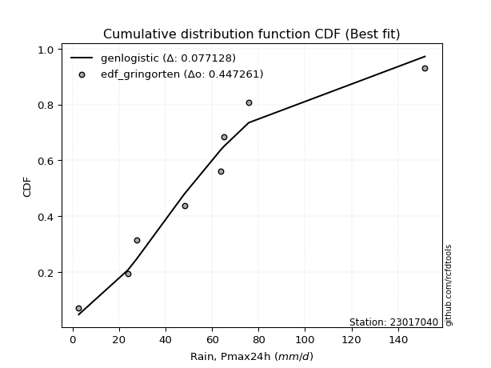</img>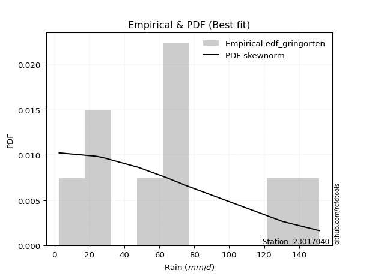</img>

</div>


### 9. EDF Filliben (1975)

The specific values of the constants (0.3175) (often denoted as $alpha$) and (0.365) are derived from a method proposed by James J. Filliben in a 1975 paper. This particular formula is the mean value of the $i$-th order statistic of the normal distribution and is considered a robust and effective plotting position formula for the normal probability plot correlation coefficient test for normality.

<div align="center">


$P=(m-0.3175)/(n+0.365)$


</div>


**9.1. Empirical values**

<div align="center">

|                | 0                  | 1                   | 2                  | 3                   | 4                  | 5                  | 6                  | 7                  |
|:---------------|:-------------------|:--------------------|:-------------------|:--------------------|:-------------------|:-------------------|:-------------------|:-------------------|
| date           | 2020               | 2024                | 2019               | 2015                | 2018               | 2016               | 2017               | 2014               |
| x              | 2.7                | 23.8                | 27.7               | 48.1                | 63.9               | 65.2               | 75.8               | 151.5              |
| m              | 1                  | 2                   | 3                  | 4                   | 5                  | 6                  | 7                  | 8                  |
| empirical_dist | edf_filliben       | edf_filliben        | edf_filliben       | edf_filliben        | edf_filliben       | edf_filliben       | edf_filliben       | edf_filliben       |
| empirical      | 0.0815899581589958 | 0.20113568439928273 | 0.3206814106395696 | 0.44022713687985654 | 0.5597728631201434 | 0.6793185893604303 | 0.7988643156007172 | 0.9184100418410042 |
| empirical_tr   | 1.0888382687927107 | 1.2517770295548074  | 1.4720633523977125 | 1.7864388681260008  | 2.271554650373387  | 3.118359739049394  | 4.971768202080237  | 12.256410256410254 |

</div>


**9.2. Kolmogorov-Smirnov fit test (sorted by Δ)**


<div align="center">

|                | 0                   | 1                   | 2                   | 3                   | 4                   | 5                  | 6                   | 7                   | 8                   | 9                   | 10                  | 11                  | 12                  | 13                  | 14                  | 15                  | 16                  | 17                  | 18                 | 19                 | 20                  | 21                  | 22                  | 23                 | 24                  | 25                  | 26                  | 27                  | 28                 | 29                  | 30                 | 31                  | 32                  | 33                    | 34                 | 35                  | 36                  | 37                  | 38                  | 39                 | 40                  | 41                 | 42                 | 43                  | 44                  | 45                  | 46                  | 47                  | 48                  | 49                  | 50                  | 51                 | 52                 | 53                  | 54                  | 55                  | 56                  | 57                 | 58                  | 59                 | 60                  | 61                  | 62                  | 63                  | 64                  | 65                  | 66                  | 67                  | 68                 | 69                  | 70                  | 71                  | 72                  | 73                  | 74                  | 75                  | 76                 | 77                  | 78                 | 79                  | 80                 | 81                 | 82                 | 83                 | 84                 | 85                 | 86                 | 87                 |
|:---------------|:--------------------|:--------------------|:--------------------|:--------------------|:--------------------|:-------------------|:--------------------|:--------------------|:--------------------|:--------------------|:--------------------|:--------------------|:--------------------|:--------------------|:--------------------|:--------------------|:--------------------|:--------------------|:-------------------|:-------------------|:--------------------|:--------------------|:--------------------|:-------------------|:--------------------|:--------------------|:--------------------|:--------------------|:-------------------|:--------------------|:-------------------|:--------------------|:--------------------|:----------------------|:-------------------|:--------------------|:--------------------|:--------------------|:--------------------|:-------------------|:--------------------|:-------------------|:-------------------|:--------------------|:--------------------|:--------------------|:--------------------|:--------------------|:--------------------|:--------------------|:--------------------|:-------------------|:-------------------|:--------------------|:--------------------|:--------------------|:--------------------|:-------------------|:--------------------|:-------------------|:--------------------|:--------------------|:--------------------|:--------------------|:--------------------|:--------------------|:--------------------|:--------------------|:-------------------|:--------------------|:--------------------|:--------------------|:--------------------|:--------------------|:--------------------|:--------------------|:-------------------|:--------------------|:-------------------|:--------------------|:-------------------|:-------------------|:-------------------|:-------------------|:-------------------|:-------------------|:-------------------|:-------------------|
| station        | 23017040            | 23017040            | 23017040            | 23017040            | 23017040            | 23017040           | 23017040            | 23017040            | 23017040            | 23017040            | 23017040            | 23017040            | 23017040            | 23017040            | 23017040            | 23017040            | 23017040            | 23017040            | 23017040           | 23017040           | 23017040            | 23017040            | 23017040            | 23017040           | 23017040            | 23017040            | 23017040            | 23017040            | 23017040           | 23017040            | 23017040           | 23017040            | 23017040            | 23017040              | 23017040           | 23017040            | 23017040            | 23017040            | 23017040            | 23017040           | 23017040            | 23017040           | 23017040           | 23017040            | 23017040            | 23017040            | 23017040            | 23017040            | 23017040            | 23017040            | 23017040            | 23017040           | 23017040           | 23017040            | 23017040            | 23017040            | 23017040            | 23017040           | 23017040            | 23017040           | 23017040            | 23017040            | 23017040            | 23017040            | 23017040            | 23017040            | 23017040            | 23017040            | 23017040           | 23017040            | 23017040            | 23017040            | 23017040            | 23017040            | 23017040            | 23017040            | 23017040           | 23017040            | 23017040           | 23017040            | 23017040           | 23017040           | 23017040           | 23017040           | 23017040           | 23017040           | 23017040           | 23017040           |
| empirical_dist | edf_filliben        | edf_filliben        | edf_filliben        | edf_filliben        | edf_filliben        | edf_filliben       | edf_filliben        | edf_filliben        | edf_filliben        | edf_filliben        | edf_filliben        | edf_filliben        | edf_filliben        | edf_filliben        | edf_filliben        | edf_filliben        | edf_filliben        | edf_filliben        | edf_filliben       | edf_filliben       | edf_filliben        | edf_filliben        | edf_filliben        | edf_filliben       | edf_filliben        | edf_filliben        | edf_filliben        | edf_filliben        | edf_filliben       | edf_filliben        | edf_filliben       | edf_filliben        | edf_filliben        | edf_filliben          | edf_filliben       | edf_filliben        | edf_filliben        | edf_filliben        | edf_filliben        | edf_filliben       | edf_filliben        | edf_filliben       | edf_filliben       | edf_filliben        | edf_filliben        | edf_filliben        | edf_filliben        | edf_filliben        | edf_filliben        | edf_filliben        | edf_filliben        | edf_filliben       | edf_filliben       | edf_filliben        | edf_filliben        | edf_filliben        | edf_filliben        | edf_filliben       | edf_filliben        | edf_filliben       | edf_filliben        | edf_filliben        | edf_filliben        | edf_filliben        | edf_filliben        | edf_filliben        | edf_filliben        | edf_filliben        | edf_filliben       | edf_filliben        | edf_filliben        | edf_filliben        | edf_filliben        | edf_filliben        | edf_filliben        | edf_filliben        | edf_filliben       | edf_filliben        | edf_filliben       | edf_filliben        | edf_filliben       | edf_filliben       | edf_filliben       | edf_filliben       | edf_filliben       | edf_filliben       | edf_filliben       | edf_filliben       |
| p_dist         | gumbel_r            | genlogistic         | pearson3            | kstwobign           | logjohnsonsu        | loggenlogistic     | halfnorm            | gompertz            | invgauss            | fatiguelife         | logmielke           | loggumbel_l         | logfisk             | invgamma            | exponnorm           | johnsonsu           | loggompertz         | logloggamma         | nct                | ncf                | halflogistic        | fisk                | moyal               | betaprime          | rayleigh            | logpearson3         | rice                | maxwell             | logistic           | hypsecant           | logt               | genexpon            | expon               | loglaplace_asymmetric | laplace_asymmetric | truncnorm           | norm                | crystalball         | t                   | laplace            | logfatiguelife      | lognorm            | lognorm            | logcrystalball      | logexponnorm        | logrice             | lognct              | logf                | logncf              | mielke              | logerlang           | loggamma           | loggamma           | loglogistic         | logchi2             | logbetaprime        | wald                | loginvgamma        | loghypsecant        | logalpha           | logmaxwell          | gumbel_l            | erlang              | f                   | lograyleigh         | loginvgauss         | loglaplace          | nakagami            | lognakagami        | loginvweibull       | loggumbel_r         | loghalfnorm         | loghalflogistic     | logmoyal            | logkstwobign        | loggenexpon         | logtruncnorm       | gibrat              | logwald            | loggibrat           | logexpon           | weibull_min        | loglognorm         | gamma              | logweibull_min     | invweibull         | alpha              | chi2               |
| delta          | 0.07360572391588804 | 0.07893141391099256 | 0.08217587394750447 | 0.08321466649794795 | 0.08743188899526133 | 0.0874781497676258 | 0.08785710636936139 | 0.08841205854953305 | 0.08863494385323278 | 0.08872983810620882 | 0.08909416564361128 | 0.08971466810946793 | 0.08975723320639944 | 0.08980137331007776 | 0.08982817692911271 | 0.09007807616132502 | 0.09026845448072851 | 0.09038231658400886 | 0.0907358608187322 | 0.0938974551041305 | 0.09502423541297544 | 0.09529134604175526 | 0.09570650746265807 | 0.101530686164793  | 0.10505104299236911 | 0.10819716597037032 | 0.10853922102646718 | 0.11088793441237155 | 0.1111006476220251 | 0.11569939997180861 | 0.1236188646022881 | 0.12412039990382645 | 0.12412940946794676 | 0.12492294367051515   | 0.1261197973953951 | 0.13050897554896024 | 0.13050904245802242 | 0.13050904703141464 | 0.13232856777710744 | 0.1345946793571417 | 0.14343911965123474 | 0.1445385052608829 | 0.1445385052608829 | 0.14453963819527077 | 0.14454101102218292 | 0.14457090757797625 | 0.14500111691389755 | 0.14592084395105703 | 0.14634589962620034 | 0.15133564473866778 | 0.15189024820993394 | 0.1546155048040315 | 0.1546155048040315 | 0.15565475115612187 | 0.15887695064486476 | 0.16113953161619213 | 0.16352855575861158 | 0.1647131633508445 | 0.16486038884216753 | 0.1675777028608301 | 0.17289825778305143 | 0.17366835604780162 | 0.17897667953019353 | 0.18247295269737043 | 0.18486778703984477 | 0.18493954070710542 | 0.19039345514239664 | 0.20113445297712668 | 0.2011356843683552 | 0.21222667515156643 | 0.21247008112355886 | 0.21892285109199563 | 0.23394810697717044 | 0.23593794185057665 | 0.25635851479972804 | 0.27169167074557654 | 0.2839238607819663 | 0.29675326300058874 | 0.3011863518926113 | 0.33235193047863415 | 0.3607957461244292 | 0.4189953530022509 | 0.4369831352095156 | 0.4447736954740632 | 0.4648664213116318 | 0.4938479666676747 | 0.5487720114129955 | 0.7853979415204269 |
| deltao         | 0.4472608134160001  | 0.4472608134160001  | 0.4472608134160001  | 0.4472608134160001  | 0.4472608134160001  | 0.4472608134160001 | 0.4472608134160001  | 0.4472608134160001  | 0.4472608134160001  | 0.4472608134160001  | 0.4472608134160001  | 0.4472608134160001  | 0.4472608134160001  | 0.4472608134160001  | 0.4472608134160001  | 0.4472608134160001  | 0.4472608134160001  | 0.4472608134160001  | 0.4472608134160001 | 0.4472608134160001 | 0.4472608134160001  | 0.4472608134160001  | 0.4472608134160001  | 0.4472608134160001 | 0.4472608134160001  | 0.4472608134160001  | 0.4472608134160001  | 0.4472608134160001  | 0.4472608134160001 | 0.4472608134160001  | 0.4472608134160001 | 0.4472608134160001  | 0.4472608134160001  | 0.4472608134160001    | 0.4472608134160001 | 0.4472608134160001  | 0.4472608134160001  | 0.4472608134160001  | 0.4472608134160001  | 0.4472608134160001 | 0.4472608134160001  | 0.4472608134160001 | 0.4472608134160001 | 0.4472608134160001  | 0.4472608134160001  | 0.4472608134160001  | 0.4472608134160001  | 0.4472608134160001  | 0.4472608134160001  | 0.4472608134160001  | 0.4472608134160001  | 0.4472608134160001 | 0.4472608134160001 | 0.4472608134160001  | 0.4472608134160001  | 0.4472608134160001  | 0.4472608134160001  | 0.4472608134160001 | 0.4472608134160001  | 0.4472608134160001 | 0.4472608134160001  | 0.4472608134160001  | 0.4472608134160001  | 0.4472608134160001  | 0.4472608134160001  | 0.4472608134160001  | 0.4472608134160001  | 0.4472608134160001  | 0.4472608134160001 | 0.4472608134160001  | 0.4472608134160001  | 0.4472608134160001  | 0.4472608134160001  | 0.4472608134160001  | 0.4472608134160001  | 0.4472608134160001  | 0.4472608134160001 | 0.4472608134160001  | 0.4472608134160001 | 0.4472608134160001  | 0.4472608134160001 | 0.4472608134160001 | 0.4472608134160001 | 0.4472608134160001 | 0.4472608134160001 | 0.4472608134160001 | 0.4472608134160001 | 0.4472608134160001 |
| eval           | Δo > Δ              | Δo > Δ              | Δo > Δ              | Δo > Δ              | Δo > Δ              | Δo > Δ             | Δo > Δ              | Δo > Δ              | Δo > Δ              | Δo > Δ              | Δo > Δ              | Δo > Δ              | Δo > Δ              | Δo > Δ              | Δo > Δ              | Δo > Δ              | Δo > Δ              | Δo > Δ              | Δo > Δ             | Δo > Δ             | Δo > Δ              | Δo > Δ              | Δo > Δ              | Δo > Δ             | Δo > Δ              | Δo > Δ              | Δo > Δ              | Δo > Δ              | Δo > Δ             | Δo > Δ              | Δo > Δ             | Δo > Δ              | Δo > Δ              | Δo > Δ                | Δo > Δ             | Δo > Δ              | Δo > Δ              | Δo > Δ              | Δo > Δ              | Δo > Δ             | Δo > Δ              | Δo > Δ             | Δo > Δ             | Δo > Δ              | Δo > Δ              | Δo > Δ              | Δo > Δ              | Δo > Δ              | Δo > Δ              | Δo > Δ              | Δo > Δ              | Δo > Δ             | Δo > Δ             | Δo > Δ              | Δo > Δ              | Δo > Δ              | Δo > Δ              | Δo > Δ             | Δo > Δ              | Δo > Δ             | Δo > Δ              | Δo > Δ              | Δo > Δ              | Δo > Δ              | Δo > Δ              | Δo > Δ              | Δo > Δ              | Δo > Δ              | Δo > Δ             | Δo > Δ              | Δo > Δ              | Δo > Δ              | Δo > Δ              | Δo > Δ              | Δo > Δ              | Δo > Δ              | Δo > Δ             | Δo > Δ              | Δo > Δ             | Δo > Δ              | Δo > Δ             | Δo > Δ             | Δo > Δ             | Δo > Δ             | Δo <= Δ            | Δo <= Δ            | Δo <= Δ            | Δo <= Δ            |
| fit            | 1                   | 1                   | 1                   | 1                   | 1                   | 1                  | 1                   | 1                   | 1                   | 1                   | 1                   | 1                   | 1                   | 1                   | 1                   | 1                   | 1                   | 1                   | 1                  | 1                  | 1                   | 1                   | 1                   | 1                  | 1                   | 1                   | 1                   | 1                   | 1                  | 1                   | 1                  | 1                   | 1                   | 1                     | 1                  | 1                   | 1                   | 1                   | 1                   | 1                  | 1                   | 1                  | 1                  | 1                   | 1                   | 1                   | 1                   | 1                   | 1                   | 1                   | 1                   | 1                  | 1                  | 1                   | 1                   | 1                   | 1                   | 1                  | 1                   | 1                  | 1                   | 1                   | 1                   | 1                   | 1                   | 1                   | 1                   | 1                   | 1                  | 1                   | 1                   | 1                   | 1                   | 1                   | 1                   | 1                   | 1                  | 1                   | 1                  | 1                   | 1                  | 1                  | 1                  | 1                  | 0                  | 0                  | 0                  | 0                  |
| n              | 8                   | 8                   | 8                   | 8                   | 8                   | 8                  | 8                   | 8                   | 8                   | 8                   | 8                   | 8                   | 8                   | 8                   | 8                   | 8                   | 8                   | 8                   | 8                  | 8                  | 8                   | 8                   | 8                   | 8                  | 8                   | 8                   | 8                   | 8                   | 8                  | 8                   | 8                  | 8                   | 8                   | 8                     | 8                  | 8                   | 8                   | 8                   | 8                   | 8                  | 8                   | 8                  | 8                  | 8                   | 8                   | 8                   | 8                   | 8                   | 8                   | 8                   | 8                   | 8                  | 8                  | 8                   | 8                   | 8                   | 8                   | 8                  | 8                   | 8                  | 8                   | 8                   | 8                   | 8                   | 8                   | 8                   | 8                   | 8                   | 8                  | 8                   | 8                   | 8                   | 8                   | 8                   | 8                   | 8                   | 8                  | 8                   | 8                  | 8                   | 8                  | 8                  | 8                  | 8                  | 8                  | 8                  | 8                  | 8                  |
| best_fit       | 1                   | 0                   | 0                   | 0                   | 0                   | 0                  | 0                   | 0                   | 0                   | 0                   | 0                   | 0                   | 0                   | 0                   | 0                   | 0                   | 0                   | 0                   | 0                  | 0                  | 0                   | 0                   | 0                   | 0                  | 0                   | 0                   | 0                   | 0                   | 0                  | 0                   | 0                  | 0                   | 0                   | 0                     | 0                  | 0                   | 0                   | 0                   | 0                   | 0                  | 0                   | 0                  | 0                  | 0                   | 0                   | 0                   | 0                   | 0                   | 0                   | 0                   | 0                   | 0                  | 0                  | 0                   | 0                   | 0                   | 0                   | 0                  | 0                   | 0                  | 0                   | 0                   | 0                   | 0                   | 0                   | 0                   | 0                   | 0                   | 0                  | 0                   | 0                   | 0                   | 0                   | 0                   | 0                   | 0                   | 0                  | 0                   | 0                  | 0                   | 0                  | 0                  | 0                  | 0                  | 0                  | 0                  | 0                  | 0                  |
| best_fit_sort  | 1                   | 2                   | 3                   | 4                   | 5                   | 6                  | 7                   | 8                   | 9                   | 10                  | 11                  | 12                  | 13                  | 14                  | 15                  | 16                  | 17                  | 18                  | 19                 | 20                 | 21                  | 22                  | 23                  | 24                 | 25                  | 26                  | 27                  | 28                  | 29                 | 30                  | 31                 | 32                  | 33                  | 34                    | 35                 | 36                  | 37                  | 38                  | 39                  | 40                 | 41                  | 42                 | 43                 | 44                  | 45                  | 46                  | 47                  | 48                  | 49                  | 50                  | 51                  | 52                 | 53                 | 54                  | 55                  | 56                  | 57                  | 58                 | 59                  | 60                 | 61                  | 62                  | 63                  | 64                  | 65                  | 66                  | 67                  | 68                  | 69                 | 70                  | 71                  | 72                  | 73                  | 74                  | 75                  | 76                  | 77                 | 78                  | 79                 | 80                  | 81                 | 82                 | 83                 | 84                 | 85                 | 86                 | 87                 | 88                 |

</div>


**9.3. Best fit**

<div align="center">

|   id |   station | empirical_dist   | p_dist   |     delta |   deltao | eval   |   fit |   n |   best_fit |   best_fit_sort |
|-----:|----------:|:-----------------|:---------|----------:|---------:|:-------|------:|----:|-----------:|----------------:|
|    0 |  23017040 | edf_filliben     | gumbel_r | 0.0736057 | 0.447261 | Δo > Δ |     1 |   8 |          1 |               1 |

</div>


<div align="center">

</img></img>

</div>


### 10. EDF Jenkinson (1977)

The Jenkinson formula in hydrology is an empirical plotting position formula used to estimate the non-exceedance probability _(P)_ or return period _(T)_ of a given ordered observation within a sample. It is a widely used method in the frequency analysis of extreme events such as floods and rainfall, as it provides a distribution-free way to plot data. _a≈0.31_ and _b≈0.38_ are constants derived to approximate the median of the probability distribution for the given rank.

<div align="center">


$P=(m-a)/(n+b)$


</div>


**10.1. Empirical values**

<div align="center">

|                | 0                   | 1                   | 2                  | 3                   | 4                  | 5                  | 6                  | 7                  |
|:---------------|:--------------------|:--------------------|:-------------------|:--------------------|:-------------------|:-------------------|:-------------------|:-------------------|
| date           | 2020                | 2024                | 2019               | 2015                | 2018               | 2016               | 2017               | 2014               |
| x              | 2.7                 | 23.8                | 27.7               | 48.1                | 63.9               | 65.2               | 75.8               | 151.5              |
| m              | 1                   | 2                   | 3                  | 4                   | 5                  | 6                  | 7                  | 8                  |
| empirical_dist | edf_jenkinson       | edf_jenkinson       | edf_jenkinson      | edf_jenkinson       | edf_jenkinson      | edf_jenkinson      | edf_jenkinson      | edf_jenkinson      |
| empirical      | 0.08233890214797135 | 0.20167064439140808 | 0.3210023866348448 | 0.44033412887828155 | 0.5596658711217184 | 0.6789976133651551 | 0.7983293556085919 | 0.9176610978520287 |
| empirical_tr   | 1.0897269180754225  | 1.2526158445440956  | 1.4727592267135323 | 1.7867803837953091  | 2.2710027100271004 | 3.115241635687732  | 4.958579881656804  | 12.144927536231886 |

</div>


**10.2. Kolmogorov-Smirnov fit test (sorted by Δ)**


<div align="center">

|                | 0                   | 1                   | 2                   | 3                   | 4                   | 5                   | 6                   | 7                   | 8                  | 9                   | 10                  | 11                  | 12                  | 13                  | 14                  | 15                  | 16                  | 17                  | 18                 | 19                  | 20                  | 21                  | 22                  | 23                 | 24                  | 25                  | 26                 | 27                  | 28                  | 29                  | 30                 | 31                  | 32                  | 33                    | 34                 | 35                  | 36                  | 37                  | 38                  | 39                 | 40                  | 41                 | 42                 | 43                  | 44                 | 45                  | 46                  | 47                 | 48                  | 49                  | 50                 | 51                  | 52                  | 53                  | 54                 | 55                  | 56                 | 57                  | 58                  | 59                  | 60                  | 61                  | 62                  | 63                  | 64                  | 65                  | 66                  | 67                  | 68                  | 69                  | 70                  | 71                  | 72                  | 73                  | 74                  | 75                 | 76                  | 77                  | 78                  | 79                  | 80                 | 81                  | 82                  | 83                 | 84                 | 85                 | 86                 | 87                 |
|:---------------|:--------------------|:--------------------|:--------------------|:--------------------|:--------------------|:--------------------|:--------------------|:--------------------|:-------------------|:--------------------|:--------------------|:--------------------|:--------------------|:--------------------|:--------------------|:--------------------|:--------------------|:--------------------|:-------------------|:--------------------|:--------------------|:--------------------|:--------------------|:-------------------|:--------------------|:--------------------|:-------------------|:--------------------|:--------------------|:--------------------|:-------------------|:--------------------|:--------------------|:----------------------|:-------------------|:--------------------|:--------------------|:--------------------|:--------------------|:-------------------|:--------------------|:-------------------|:-------------------|:--------------------|:-------------------|:--------------------|:--------------------|:-------------------|:--------------------|:--------------------|:-------------------|:--------------------|:--------------------|:--------------------|:-------------------|:--------------------|:-------------------|:--------------------|:--------------------|:--------------------|:--------------------|:--------------------|:--------------------|:--------------------|:--------------------|:--------------------|:--------------------|:--------------------|:--------------------|:--------------------|:--------------------|:--------------------|:--------------------|:--------------------|:--------------------|:-------------------|:--------------------|:--------------------|:--------------------|:--------------------|:-------------------|:--------------------|:--------------------|:-------------------|:-------------------|:-------------------|:-------------------|:-------------------|
| station        | 23017040            | 23017040            | 23017040            | 23017040            | 23017040            | 23017040            | 23017040            | 23017040            | 23017040           | 23017040            | 23017040            | 23017040            | 23017040            | 23017040            | 23017040            | 23017040            | 23017040            | 23017040            | 23017040           | 23017040            | 23017040            | 23017040            | 23017040            | 23017040           | 23017040            | 23017040            | 23017040           | 23017040            | 23017040            | 23017040            | 23017040           | 23017040            | 23017040            | 23017040              | 23017040           | 23017040            | 23017040            | 23017040            | 23017040            | 23017040           | 23017040            | 23017040           | 23017040           | 23017040            | 23017040           | 23017040            | 23017040            | 23017040           | 23017040            | 23017040            | 23017040           | 23017040            | 23017040            | 23017040            | 23017040           | 23017040            | 23017040           | 23017040            | 23017040            | 23017040            | 23017040            | 23017040            | 23017040            | 23017040            | 23017040            | 23017040            | 23017040            | 23017040            | 23017040            | 23017040            | 23017040            | 23017040            | 23017040            | 23017040            | 23017040            | 23017040           | 23017040            | 23017040            | 23017040            | 23017040            | 23017040           | 23017040            | 23017040            | 23017040           | 23017040           | 23017040           | 23017040           | 23017040           |
| empirical_dist | edf_jenkinson       | edf_jenkinson       | edf_jenkinson       | edf_jenkinson       | edf_jenkinson       | edf_jenkinson       | edf_jenkinson       | edf_jenkinson       | edf_jenkinson      | edf_jenkinson       | edf_jenkinson       | edf_jenkinson       | edf_jenkinson       | edf_jenkinson       | edf_jenkinson       | edf_jenkinson       | edf_jenkinson       | edf_jenkinson       | edf_jenkinson      | edf_jenkinson       | edf_jenkinson       | edf_jenkinson       | edf_jenkinson       | edf_jenkinson      | edf_jenkinson       | edf_jenkinson       | edf_jenkinson      | edf_jenkinson       | edf_jenkinson       | edf_jenkinson       | edf_jenkinson      | edf_jenkinson       | edf_jenkinson       | edf_jenkinson         | edf_jenkinson      | edf_jenkinson       | edf_jenkinson       | edf_jenkinson       | edf_jenkinson       | edf_jenkinson      | edf_jenkinson       | edf_jenkinson      | edf_jenkinson      | edf_jenkinson       | edf_jenkinson      | edf_jenkinson       | edf_jenkinson       | edf_jenkinson      | edf_jenkinson       | edf_jenkinson       | edf_jenkinson      | edf_jenkinson       | edf_jenkinson       | edf_jenkinson       | edf_jenkinson      | edf_jenkinson       | edf_jenkinson      | edf_jenkinson       | edf_jenkinson       | edf_jenkinson       | edf_jenkinson       | edf_jenkinson       | edf_jenkinson       | edf_jenkinson       | edf_jenkinson       | edf_jenkinson       | edf_jenkinson       | edf_jenkinson       | edf_jenkinson       | edf_jenkinson       | edf_jenkinson       | edf_jenkinson       | edf_jenkinson       | edf_jenkinson       | edf_jenkinson       | edf_jenkinson      | edf_jenkinson       | edf_jenkinson       | edf_jenkinson       | edf_jenkinson       | edf_jenkinson      | edf_jenkinson       | edf_jenkinson       | edf_jenkinson      | edf_jenkinson      | edf_jenkinson      | edf_jenkinson      | edf_jenkinson      |
| p_dist         | gumbel_r            | genlogistic         | pearson3            | kstwobign           | halfnorm            | logjohnsonsu        | loggenlogistic      | gompertz            | invgauss           | fatiguelife         | loggumbel_l         | logmielke           | logfisk             | logloggamma         | invgamma            | exponnorm           | johnsonsu           | loggompertz         | nct                | ncf                 | halflogistic        | fisk                | moyal               | betaprime          | rayleigh            | logpearson3         | rice               | maxwell             | logistic            | hypsecant           | logt               | genexpon            | expon               | loglaplace_asymmetric | laplace_asymmetric | truncnorm           | norm                | crystalball         | t                   | laplace            | logfatiguelife      | lognorm            | lognorm            | logcrystalball      | logexponnorm       | logrice             | lognct              | logncf             | logf                | logerlang           | mielke             | loggamma            | loggamma            | loglogistic         | logchi2            | logbetaprime        | wald               | loginvgamma         | loghypsecant        | logalpha            | logmaxwell          | gumbel_l            | erlang              | f                   | lograyleigh         | loginvgauss         | loglaplace          | nakagami            | lognakagami         | loginvweibull       | loggumbel_r         | loghalfnorm         | loghalflogistic     | logmoyal            | logkstwobign        | loggenexpon        | logtruncnorm        | gibrat              | logwald             | loggibrat           | logexpon           | weibull_min         | loglognorm          | gamma              | logweibull_min     | invweibull         | alpha              | chi2               |
| delta          | 0.07307076392376266 | 0.07903840590941758 | 0.08164091395537909 | 0.08267970650582257 | 0.08732214637723601 | 0.08753888099368634 | 0.08758514176605081 | 0.08787709855740766 | 0.0887419358516578 | 0.08883683010463383 | 0.08917970811734255 | 0.08920115764203629 | 0.08977742578694148 | 0.08984735659188348 | 0.08990836530850277 | 0.08993516892753772 | 0.09018506815975003 | 0.09037544647915352 | 0.0908428528171572 | 0.09400444710255551 | 0.09513122741140045 | 0.09539833804018027 | 0.09581349946108308 | 0.101637678163218  | 0.10451608300024373 | 0.10766220597824494 | 0.1080042610343418 | 0.11035297442024616 | 0.11056568762989971 | 0.11602037596708381 | 0.1239398405975633 | 0.12401340790540144 | 0.12402241746952175 | 0.12502993566894016   | 0.1264407733906703 | 0.12997401555683485 | 0.12997408246589703 | 0.12997408703928925 | 0.13179360778498206 | 0.1349156553524169 | 0.14333212765280973 | 0.1444315132624579 | 0.1444315132624579 | 0.14443264619684576 | 0.1444340190237579 | 0.14446391557955124 | 0.14489412491547254 | 0.145810939634075  | 0.14581385195263202 | 0.15135528821780858 | 0.1514426367370928 | 0.15408054481190614 | 0.15408054481190614 | 0.15554775915769686 | 0.1583419906527394 | 0.16060457162406677 | 0.1636355477570366 | 0.16417820335871913 | 0.16475339684374252 | 0.16704274286870474 | 0.17236329779092607 | 0.17313339605567624 | 0.17886968753176852 | 0.18193799270524508 | 0.18433282704771942 | 0.18440458071498006 | 0.19028646314397163 | 0.20166941296925203 | 0.20167064436048054 | 0.21169171515944107 | 0.21236308912513385 | 0.21838789109987028 | 0.23384111497874543 | 0.23583094985215164 | 0.25582355480760266 | 0.2711567107534512 | 0.28338890078984097 | 0.29707423899586394 | 0.30107935989418627 | 0.33224493848020914 | 0.3602607861323039 | 0.41846039301012555 | 0.43644817521739027 | 0.4442387354819379 | 0.4643314613195065 | 0.4930990226786992 | 0.5482370514208701 | 0.7848629815283015 |
| deltao         | 0.4472608134160001  | 0.4472608134160001  | 0.4472608134160001  | 0.4472608134160001  | 0.4472608134160001  | 0.4472608134160001  | 0.4472608134160001  | 0.4472608134160001  | 0.4472608134160001 | 0.4472608134160001  | 0.4472608134160001  | 0.4472608134160001  | 0.4472608134160001  | 0.4472608134160001  | 0.4472608134160001  | 0.4472608134160001  | 0.4472608134160001  | 0.4472608134160001  | 0.4472608134160001 | 0.4472608134160001  | 0.4472608134160001  | 0.4472608134160001  | 0.4472608134160001  | 0.4472608134160001 | 0.4472608134160001  | 0.4472608134160001  | 0.4472608134160001 | 0.4472608134160001  | 0.4472608134160001  | 0.4472608134160001  | 0.4472608134160001 | 0.4472608134160001  | 0.4472608134160001  | 0.4472608134160001    | 0.4472608134160001 | 0.4472608134160001  | 0.4472608134160001  | 0.4472608134160001  | 0.4472608134160001  | 0.4472608134160001 | 0.4472608134160001  | 0.4472608134160001 | 0.4472608134160001 | 0.4472608134160001  | 0.4472608134160001 | 0.4472608134160001  | 0.4472608134160001  | 0.4472608134160001 | 0.4472608134160001  | 0.4472608134160001  | 0.4472608134160001 | 0.4472608134160001  | 0.4472608134160001  | 0.4472608134160001  | 0.4472608134160001 | 0.4472608134160001  | 0.4472608134160001 | 0.4472608134160001  | 0.4472608134160001  | 0.4472608134160001  | 0.4472608134160001  | 0.4472608134160001  | 0.4472608134160001  | 0.4472608134160001  | 0.4472608134160001  | 0.4472608134160001  | 0.4472608134160001  | 0.4472608134160001  | 0.4472608134160001  | 0.4472608134160001  | 0.4472608134160001  | 0.4472608134160001  | 0.4472608134160001  | 0.4472608134160001  | 0.4472608134160001  | 0.4472608134160001 | 0.4472608134160001  | 0.4472608134160001  | 0.4472608134160001  | 0.4472608134160001  | 0.4472608134160001 | 0.4472608134160001  | 0.4472608134160001  | 0.4472608134160001 | 0.4472608134160001 | 0.4472608134160001 | 0.4472608134160001 | 0.4472608134160001 |
| eval           | Δo > Δ              | Δo > Δ              | Δo > Δ              | Δo > Δ              | Δo > Δ              | Δo > Δ              | Δo > Δ              | Δo > Δ              | Δo > Δ             | Δo > Δ              | Δo > Δ              | Δo > Δ              | Δo > Δ              | Δo > Δ              | Δo > Δ              | Δo > Δ              | Δo > Δ              | Δo > Δ              | Δo > Δ             | Δo > Δ              | Δo > Δ              | Δo > Δ              | Δo > Δ              | Δo > Δ             | Δo > Δ              | Δo > Δ              | Δo > Δ             | Δo > Δ              | Δo > Δ              | Δo > Δ              | Δo > Δ             | Δo > Δ              | Δo > Δ              | Δo > Δ                | Δo > Δ             | Δo > Δ              | Δo > Δ              | Δo > Δ              | Δo > Δ              | Δo > Δ             | Δo > Δ              | Δo > Δ             | Δo > Δ             | Δo > Δ              | Δo > Δ             | Δo > Δ              | Δo > Δ              | Δo > Δ             | Δo > Δ              | Δo > Δ              | Δo > Δ             | Δo > Δ              | Δo > Δ              | Δo > Δ              | Δo > Δ             | Δo > Δ              | Δo > Δ             | Δo > Δ              | Δo > Δ              | Δo > Δ              | Δo > Δ              | Δo > Δ              | Δo > Δ              | Δo > Δ              | Δo > Δ              | Δo > Δ              | Δo > Δ              | Δo > Δ              | Δo > Δ              | Δo > Δ              | Δo > Δ              | Δo > Δ              | Δo > Δ              | Δo > Δ              | Δo > Δ              | Δo > Δ             | Δo > Δ              | Δo > Δ              | Δo > Δ              | Δo > Δ              | Δo > Δ             | Δo > Δ              | Δo > Δ              | Δo > Δ             | Δo <= Δ            | Δo <= Δ            | Δo <= Δ            | Δo <= Δ            |
| fit            | 1                   | 1                   | 1                   | 1                   | 1                   | 1                   | 1                   | 1                   | 1                  | 1                   | 1                   | 1                   | 1                   | 1                   | 1                   | 1                   | 1                   | 1                   | 1                  | 1                   | 1                   | 1                   | 1                   | 1                  | 1                   | 1                   | 1                  | 1                   | 1                   | 1                   | 1                  | 1                   | 1                   | 1                     | 1                  | 1                   | 1                   | 1                   | 1                   | 1                  | 1                   | 1                  | 1                  | 1                   | 1                  | 1                   | 1                   | 1                  | 1                   | 1                   | 1                  | 1                   | 1                   | 1                   | 1                  | 1                   | 1                  | 1                   | 1                   | 1                   | 1                   | 1                   | 1                   | 1                   | 1                   | 1                   | 1                   | 1                   | 1                   | 1                   | 1                   | 1                   | 1                   | 1                   | 1                   | 1                  | 1                   | 1                   | 1                   | 1                   | 1                  | 1                   | 1                   | 1                  | 0                  | 0                  | 0                  | 0                  |
| n              | 8                   | 8                   | 8                   | 8                   | 8                   | 8                   | 8                   | 8                   | 8                  | 8                   | 8                   | 8                   | 8                   | 8                   | 8                   | 8                   | 8                   | 8                   | 8                  | 8                   | 8                   | 8                   | 8                   | 8                  | 8                   | 8                   | 8                  | 8                   | 8                   | 8                   | 8                  | 8                   | 8                   | 8                     | 8                  | 8                   | 8                   | 8                   | 8                   | 8                  | 8                   | 8                  | 8                  | 8                   | 8                  | 8                   | 8                   | 8                  | 8                   | 8                   | 8                  | 8                   | 8                   | 8                   | 8                  | 8                   | 8                  | 8                   | 8                   | 8                   | 8                   | 8                   | 8                   | 8                   | 8                   | 8                   | 8                   | 8                   | 8                   | 8                   | 8                   | 8                   | 8                   | 8                   | 8                   | 8                  | 8                   | 8                   | 8                   | 8                   | 8                  | 8                   | 8                   | 8                  | 8                  | 8                  | 8                  | 8                  |
| best_fit       | 1                   | 0                   | 0                   | 0                   | 0                   | 0                   | 0                   | 0                   | 0                  | 0                   | 0                   | 0                   | 0                   | 0                   | 0                   | 0                   | 0                   | 0                   | 0                  | 0                   | 0                   | 0                   | 0                   | 0                  | 0                   | 0                   | 0                  | 0                   | 0                   | 0                   | 0                  | 0                   | 0                   | 0                     | 0                  | 0                   | 0                   | 0                   | 0                   | 0                  | 0                   | 0                  | 0                  | 0                   | 0                  | 0                   | 0                   | 0                  | 0                   | 0                   | 0                  | 0                   | 0                   | 0                   | 0                  | 0                   | 0                  | 0                   | 0                   | 0                   | 0                   | 0                   | 0                   | 0                   | 0                   | 0                   | 0                   | 0                   | 0                   | 0                   | 0                   | 0                   | 0                   | 0                   | 0                   | 0                  | 0                   | 0                   | 0                   | 0                   | 0                  | 0                   | 0                   | 0                  | 0                  | 0                  | 0                  | 0                  |
| best_fit_sort  | 1                   | 2                   | 3                   | 4                   | 5                   | 6                   | 7                   | 8                   | 9                  | 10                  | 11                  | 12                  | 13                  | 14                  | 15                  | 16                  | 17                  | 18                  | 19                 | 20                  | 21                  | 22                  | 23                  | 24                 | 25                  | 26                  | 27                 | 28                  | 29                  | 30                  | 31                 | 32                  | 33                  | 34                    | 35                 | 36                  | 37                  | 38                  | 39                  | 40                 | 41                  | 42                 | 43                 | 44                  | 45                 | 46                  | 47                  | 48                 | 49                  | 50                  | 51                 | 52                  | 53                  | 54                  | 55                 | 56                  | 57                 | 58                  | 59                  | 60                  | 61                  | 62                  | 63                  | 64                  | 65                  | 66                  | 67                  | 68                  | 69                  | 70                  | 71                  | 72                  | 73                  | 74                  | 75                  | 76                 | 77                  | 78                  | 79                  | 80                  | 81                 | 82                  | 83                  | 84                 | 85                 | 86                 | 87                 | 88                 |

</div>


**10.3. Best fit**

<div align="center">

|   id |   station | empirical_dist   | p_dist   |     delta |   deltao | eval   |   fit |   n |   best_fit |   best_fit_sort |
|-----:|----------:|:-----------------|:---------|----------:|---------:|:-------|------:|----:|-----------:|----------------:|
|    0 |  23017040 | edf_jenkinson    | gumbel_r | 0.0730708 | 0.447261 | Δo > Δ |     1 |   8 |          1 |               1 |

</div>


<div align="center">

</img>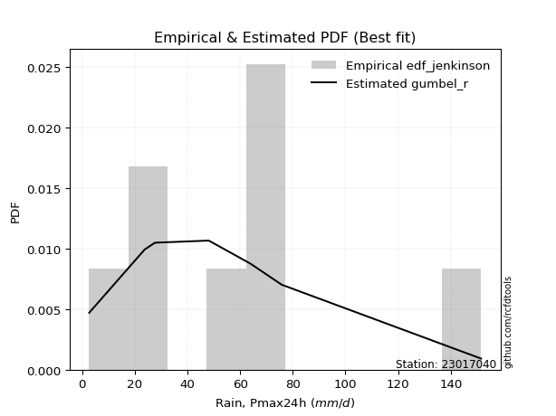</img>

</div>


### 11. EDF Cunnane (1978)

Cunnane´s work in statistical hydrology has focused on the performance and evaluation of different probability distributions (such as GEV, Gumbel, Lognormal) for flood frequency estimation. _b_ is a constant, typically set to 0.4.

<div align="center">


$P=(m-b)/(n+1-2b)$


</div>


**11.1. Empirical values**

<div align="center">

|                | 0                   | 1                   | 2                  | 3                  | 4                  | 5                  | 6                  | 7                  |
|:---------------|:--------------------|:--------------------|:-------------------|:-------------------|:-------------------|:-------------------|:-------------------|:-------------------|
| date           | 2020                | 2024                | 2019               | 2015               | 2018               | 2016               | 2017               | 2014               |
| x              | 2.7                 | 23.8                | 27.7               | 48.1               | 63.9               | 65.2               | 75.8               | 151.5              |
| m              | 1                   | 2                   | 3                  | 4                  | 5                  | 6                  | 7                  | 8                  |
| empirical_dist | edf_cunnane         | edf_cunnane         | edf_cunnane        | edf_cunnane        | edf_cunnane        | edf_cunnane        | edf_cunnane        | edf_cunnane        |
| empirical      | 0.07317073170731708 | 0.19512195121951223 | 0.3170731707317074 | 0.4390243902439025 | 0.5609756097560976 | 0.6829268292682927 | 0.8048780487804879 | 0.926829268292683  |
| empirical_tr   | 1.0789473684210527  | 1.2424242424242424  | 1.4642857142857144 | 1.782608695652174  | 2.277777777777778  | 3.153846153846154  | 5.125000000000001  | 13.666666666666675 |

</div>


**11.2. Kolmogorov-Smirnov fit test (sorted by Δ)**


<div align="center">

|                | 0                   | 1                   | 2                   | 3                   | 4                   | 5                   | 6                   | 7                   | 8                   | 9                  | 10                 | 11                 | 12                  | 13                  | 14                  | 15                  | 16                  | 17                 | 18                  | 19                  | 20                  | 21                  | 22                  | 23                  | 24                  | 25                  | 26                  | 27                  | 28                  | 29                 | 30                  | 31                  | 32                    | 33                 | 34                 | 35                  | 36                  | 37                  | 38                  | 39                  | 40                  | 41                 | 42                  | 43                  | 44                 | 45                  | 46                  | 47                  | 48                  | 49                  | 50                  | 51                  | 52                 | 53                 | 54                  | 55                  | 56                  | 57                  | 58                  | 59                 | 60                  | 61                  | 62                  | 63                  | 64                  | 65                 | 66                  | 67                  | 68                 | 69                 | 70                  | 71                  | 72                 | 73                 | 74                  | 75                  | 76                 | 77                 | 78                 | 79                 | 80                 | 81                 | 82                 | 83                 | 84                 | 85                 | 86                 | 87                 |
|:---------------|:--------------------|:--------------------|:--------------------|:--------------------|:--------------------|:--------------------|:--------------------|:--------------------|:--------------------|:-------------------|:-------------------|:-------------------|:--------------------|:--------------------|:--------------------|:--------------------|:--------------------|:-------------------|:--------------------|:--------------------|:--------------------|:--------------------|:--------------------|:--------------------|:--------------------|:--------------------|:--------------------|:--------------------|:--------------------|:-------------------|:--------------------|:--------------------|:----------------------|:-------------------|:-------------------|:--------------------|:--------------------|:--------------------|:--------------------|:--------------------|:--------------------|:-------------------|:--------------------|:--------------------|:-------------------|:--------------------|:--------------------|:--------------------|:--------------------|:--------------------|:--------------------|:--------------------|:-------------------|:-------------------|:--------------------|:--------------------|:--------------------|:--------------------|:--------------------|:-------------------|:--------------------|:--------------------|:--------------------|:--------------------|:--------------------|:-------------------|:--------------------|:--------------------|:-------------------|:-------------------|:--------------------|:--------------------|:-------------------|:-------------------|:--------------------|:--------------------|:-------------------|:-------------------|:-------------------|:-------------------|:-------------------|:-------------------|:-------------------|:-------------------|:-------------------|:-------------------|:-------------------|:-------------------|
| station        | 23017040            | 23017040            | 23017040            | 23017040            | 23017040            | 23017040            | 23017040            | 23017040            | 23017040            | 23017040           | 23017040           | 23017040           | 23017040            | 23017040            | 23017040            | 23017040            | 23017040            | 23017040           | 23017040            | 23017040            | 23017040            | 23017040            | 23017040            | 23017040            | 23017040            | 23017040            | 23017040            | 23017040            | 23017040            | 23017040           | 23017040            | 23017040            | 23017040              | 23017040           | 23017040           | 23017040            | 23017040            | 23017040            | 23017040            | 23017040            | 23017040            | 23017040           | 23017040            | 23017040            | 23017040           | 23017040            | 23017040            | 23017040            | 23017040            | 23017040            | 23017040            | 23017040            | 23017040           | 23017040           | 23017040            | 23017040            | 23017040            | 23017040            | 23017040            | 23017040           | 23017040            | 23017040            | 23017040            | 23017040            | 23017040            | 23017040           | 23017040            | 23017040            | 23017040           | 23017040           | 23017040            | 23017040            | 23017040           | 23017040           | 23017040            | 23017040            | 23017040           | 23017040           | 23017040           | 23017040           | 23017040           | 23017040           | 23017040           | 23017040           | 23017040           | 23017040           | 23017040           | 23017040           |
| empirical_dist | edf_cunnane         | edf_cunnane         | edf_cunnane         | edf_cunnane         | edf_cunnane         | edf_cunnane         | edf_cunnane         | edf_cunnane         | edf_cunnane         | edf_cunnane        | edf_cunnane        | edf_cunnane        | edf_cunnane         | edf_cunnane         | edf_cunnane         | edf_cunnane         | edf_cunnane         | edf_cunnane        | edf_cunnane         | edf_cunnane         | edf_cunnane         | edf_cunnane         | edf_cunnane         | edf_cunnane         | edf_cunnane         | edf_cunnane         | edf_cunnane         | edf_cunnane         | edf_cunnane         | edf_cunnane        | edf_cunnane         | edf_cunnane         | edf_cunnane           | edf_cunnane        | edf_cunnane        | edf_cunnane         | edf_cunnane         | edf_cunnane         | edf_cunnane         | edf_cunnane         | edf_cunnane         | edf_cunnane        | edf_cunnane         | edf_cunnane         | edf_cunnane        | edf_cunnane         | edf_cunnane         | edf_cunnane         | edf_cunnane         | edf_cunnane         | edf_cunnane         | edf_cunnane         | edf_cunnane        | edf_cunnane        | edf_cunnane         | edf_cunnane         | edf_cunnane         | edf_cunnane         | edf_cunnane         | edf_cunnane        | edf_cunnane         | edf_cunnane         | edf_cunnane         | edf_cunnane         | edf_cunnane         | edf_cunnane        | edf_cunnane         | edf_cunnane         | edf_cunnane        | edf_cunnane        | edf_cunnane         | edf_cunnane         | edf_cunnane        | edf_cunnane        | edf_cunnane         | edf_cunnane         | edf_cunnane        | edf_cunnane        | edf_cunnane        | edf_cunnane        | edf_cunnane        | edf_cunnane        | edf_cunnane        | edf_cunnane        | edf_cunnane        | edf_cunnane        | edf_cunnane        | edf_cunnane        |
| p_dist         | genlogistic         | gumbel_r            | logjohnsonsu        | loggenlogistic      | invgauss            | fatiguelife         | logmielke           | pearson3            | invgamma            | exponnorm          | johnsonsu          | loggompertz        | kstwobign           | nct                 | logfisk             | ncf                 | halflogistic        | halfnorm           | fisk                | gompertz            | moyal               | loggumbel_l         | logloggamma         | betaprime           | rayleigh            | hypsecant           | logpearson3         | rice                | maxwell             | logistic           | logt                | laplace_asymmetric  | loglaplace_asymmetric | expon              | genexpon           | laplace             | truncnorm           | norm                | crystalball         | t                   | logfatiguelife      | logrice            | lognorm             | lognorm             | logcrystalball     | logexponnorm        | lognct              | logf                | mielke              | logncf              | loglogistic         | logerlang           | loggamma           | loggamma           | wald                | logchi2             | loghypsecant        | logbetaprime        | loginvgamma         | logalpha           | logmaxwell          | gumbel_l            | erlang              | f                   | lograyleigh         | loginvgauss        | loglaplace          | nakagami            | lognakagami        | loggumbel_r        | loginvweibull       | loghalfnorm         | loghalflogistic    | logmoyal           | logkstwobign        | loggenexpon         | logtruncnorm       | gibrat             | logwald            | loggibrat          | logexpon           | weibull_min        | loglognorm         | gamma              | logweibull_min     | invweibull         | alpha              | chi2               |
| delta          | 0.07772866727503835 | 0.07961945709565865 | 0.08622914235930712 | 0.08627540313167159 | 0.08743219721727857 | 0.08752709147025461 | 0.08789141900765707 | 0.08818960712727508 | 0.08859862667412355 | 0.0886254302931585 | 0.0888753295253708 | 0.0890657078447743 | 0.08922839967771856 | 0.08953311418277798 | 0.09095997984235349 | 0.09269470846817629 | 0.09382148877702123 | 0.093870839549132  | 0.09408859940580105 | 0.09442579172930365 | 0.09450376082670386 | 0.09572840128923854 | 0.09639604976377947 | 0.10032793952883878 | 0.11106477617213972 | 0.11209116006394637 | 0.11421089915014093 | 0.11455295420623779 | 0.11690166759214216 | 0.1171143808017957 | 0.12001062469442586 | 0.12251155748753287 | 0.12372019703456094   | 0.1253321561039008 | 0.1290844179316775 | 0.13098643944927946 | 0.13652270872873085 | 0.13652277563779303 | 0.13652278021118525 | 0.13834230095687805 | 0.14671908728302166 | 0.1473295955779795 | 0.14744977303960552 | 0.14744977303960552 | 0.1474504735874865 | 0.14745207773254856 | 0.14864399603420356 | 0.14971819878174716 | 0.15013289810271357 | 0.15235963280597084 | 0.15685749779207592 | 0.15790398138970443 | 0.160629237983802  | 0.160629237983802  | 0.16232580912265737 | 0.16489068382463526 | 0.16606313547812157 | 0.16715326479596262 | 0.17072689653061499 | 0.1735914360406006 | 0.17891199096282193 | 0.17968208922757223 | 0.18017942616614757 | 0.18848668587714093 | 0.19088152021961527 | 0.1909532738868759 | 0.19159620177835068 | 0.19512071979735618 | 0.1951219511885847 | 0.2136728277595129 | 0.21824040833133693 | 0.22493658427176613 | 0.2351508536131245 | 0.2371406884865307 | 0.26237224797949854 | 0.27770540392534704 | 0.2899375939617368 | 0.2931450230927265 | 0.3023890985285653 | 0.3335546771145882 | 0.3668094793041997 | 0.4250090861820214 | 0.4429968683892861 | 0.4507874286538337 | 0.4708801544914023 | 0.5022671931193535 | 0.554785744592766  | 0.7914116747001974 |
| deltao         | 0.4472608134160001  | 0.4472608134160001  | 0.4472608134160001  | 0.4472608134160001  | 0.4472608134160001  | 0.4472608134160001  | 0.4472608134160001  | 0.4472608134160001  | 0.4472608134160001  | 0.4472608134160001 | 0.4472608134160001 | 0.4472608134160001 | 0.4472608134160001  | 0.4472608134160001  | 0.4472608134160001  | 0.4472608134160001  | 0.4472608134160001  | 0.4472608134160001 | 0.4472608134160001  | 0.4472608134160001  | 0.4472608134160001  | 0.4472608134160001  | 0.4472608134160001  | 0.4472608134160001  | 0.4472608134160001  | 0.4472608134160001  | 0.4472608134160001  | 0.4472608134160001  | 0.4472608134160001  | 0.4472608134160001 | 0.4472608134160001  | 0.4472608134160001  | 0.4472608134160001    | 0.4472608134160001 | 0.4472608134160001 | 0.4472608134160001  | 0.4472608134160001  | 0.4472608134160001  | 0.4472608134160001  | 0.4472608134160001  | 0.4472608134160001  | 0.4472608134160001 | 0.4472608134160001  | 0.4472608134160001  | 0.4472608134160001 | 0.4472608134160001  | 0.4472608134160001  | 0.4472608134160001  | 0.4472608134160001  | 0.4472608134160001  | 0.4472608134160001  | 0.4472608134160001  | 0.4472608134160001 | 0.4472608134160001 | 0.4472608134160001  | 0.4472608134160001  | 0.4472608134160001  | 0.4472608134160001  | 0.4472608134160001  | 0.4472608134160001 | 0.4472608134160001  | 0.4472608134160001  | 0.4472608134160001  | 0.4472608134160001  | 0.4472608134160001  | 0.4472608134160001 | 0.4472608134160001  | 0.4472608134160001  | 0.4472608134160001 | 0.4472608134160001 | 0.4472608134160001  | 0.4472608134160001  | 0.4472608134160001 | 0.4472608134160001 | 0.4472608134160001  | 0.4472608134160001  | 0.4472608134160001 | 0.4472608134160001 | 0.4472608134160001 | 0.4472608134160001 | 0.4472608134160001 | 0.4472608134160001 | 0.4472608134160001 | 0.4472608134160001 | 0.4472608134160001 | 0.4472608134160001 | 0.4472608134160001 | 0.4472608134160001 |
| eval           | Δo > Δ              | Δo > Δ              | Δo > Δ              | Δo > Δ              | Δo > Δ              | Δo > Δ              | Δo > Δ              | Δo > Δ              | Δo > Δ              | Δo > Δ             | Δo > Δ             | Δo > Δ             | Δo > Δ              | Δo > Δ              | Δo > Δ              | Δo > Δ              | Δo > Δ              | Δo > Δ             | Δo > Δ              | Δo > Δ              | Δo > Δ              | Δo > Δ              | Δo > Δ              | Δo > Δ              | Δo > Δ              | Δo > Δ              | Δo > Δ              | Δo > Δ              | Δo > Δ              | Δo > Δ             | Δo > Δ              | Δo > Δ              | Δo > Δ                | Δo > Δ             | Δo > Δ             | Δo > Δ              | Δo > Δ              | Δo > Δ              | Δo > Δ              | Δo > Δ              | Δo > Δ              | Δo > Δ             | Δo > Δ              | Δo > Δ              | Δo > Δ             | Δo > Δ              | Δo > Δ              | Δo > Δ              | Δo > Δ              | Δo > Δ              | Δo > Δ              | Δo > Δ              | Δo > Δ             | Δo > Δ             | Δo > Δ              | Δo > Δ              | Δo > Δ              | Δo > Δ              | Δo > Δ              | Δo > Δ             | Δo > Δ              | Δo > Δ              | Δo > Δ              | Δo > Δ              | Δo > Δ              | Δo > Δ             | Δo > Δ              | Δo > Δ              | Δo > Δ             | Δo > Δ             | Δo > Δ              | Δo > Δ              | Δo > Δ             | Δo > Δ             | Δo > Δ              | Δo > Δ              | Δo > Δ             | Δo > Δ             | Δo > Δ             | Δo > Δ             | Δo > Δ             | Δo > Δ             | Δo > Δ             | Δo <= Δ            | Δo <= Δ            | Δo <= Δ            | Δo <= Δ            | Δo <= Δ            |
| fit            | 1                   | 1                   | 1                   | 1                   | 1                   | 1                   | 1                   | 1                   | 1                   | 1                  | 1                  | 1                  | 1                   | 1                   | 1                   | 1                   | 1                   | 1                  | 1                   | 1                   | 1                   | 1                   | 1                   | 1                   | 1                   | 1                   | 1                   | 1                   | 1                   | 1                  | 1                   | 1                   | 1                     | 1                  | 1                  | 1                   | 1                   | 1                   | 1                   | 1                   | 1                   | 1                  | 1                   | 1                   | 1                  | 1                   | 1                   | 1                   | 1                   | 1                   | 1                   | 1                   | 1                  | 1                  | 1                   | 1                   | 1                   | 1                   | 1                   | 1                  | 1                   | 1                   | 1                   | 1                   | 1                   | 1                  | 1                   | 1                   | 1                  | 1                  | 1                   | 1                   | 1                  | 1                  | 1                   | 1                   | 1                  | 1                  | 1                  | 1                  | 1                  | 1                  | 1                  | 0                  | 0                  | 0                  | 0                  | 0                  |
| n              | 8                   | 8                   | 8                   | 8                   | 8                   | 8                   | 8                   | 8                   | 8                   | 8                  | 8                  | 8                  | 8                   | 8                   | 8                   | 8                   | 8                   | 8                  | 8                   | 8                   | 8                   | 8                   | 8                   | 8                   | 8                   | 8                   | 8                   | 8                   | 8                   | 8                  | 8                   | 8                   | 8                     | 8                  | 8                  | 8                   | 8                   | 8                   | 8                   | 8                   | 8                   | 8                  | 8                   | 8                   | 8                  | 8                   | 8                   | 8                   | 8                   | 8                   | 8                   | 8                   | 8                  | 8                  | 8                   | 8                   | 8                   | 8                   | 8                   | 8                  | 8                   | 8                   | 8                   | 8                   | 8                   | 8                  | 8                   | 8                   | 8                  | 8                  | 8                   | 8                   | 8                  | 8                  | 8                   | 8                   | 8                  | 8                  | 8                  | 8                  | 8                  | 8                  | 8                  | 8                  | 8                  | 8                  | 8                  | 8                  |
| best_fit       | 1                   | 0                   | 0                   | 0                   | 0                   | 0                   | 0                   | 0                   | 0                   | 0                  | 0                  | 0                  | 0                   | 0                   | 0                   | 0                   | 0                   | 0                  | 0                   | 0                   | 0                   | 0                   | 0                   | 0                   | 0                   | 0                   | 0                   | 0                   | 0                   | 0                  | 0                   | 0                   | 0                     | 0                  | 0                  | 0                   | 0                   | 0                   | 0                   | 0                   | 0                   | 0                  | 0                   | 0                   | 0                  | 0                   | 0                   | 0                   | 0                   | 0                   | 0                   | 0                   | 0                  | 0                  | 0                   | 0                   | 0                   | 0                   | 0                   | 0                  | 0                   | 0                   | 0                   | 0                   | 0                   | 0                  | 0                   | 0                   | 0                  | 0                  | 0                   | 0                   | 0                  | 0                  | 0                   | 0                   | 0                  | 0                  | 0                  | 0                  | 0                  | 0                  | 0                  | 0                  | 0                  | 0                  | 0                  | 0                  |
| best_fit_sort  | 1                   | 2                   | 3                   | 4                   | 5                   | 6                   | 7                   | 8                   | 9                   | 10                 | 11                 | 12                 | 13                  | 14                  | 15                  | 16                  | 17                  | 18                 | 19                  | 20                  | 21                  | 22                  | 23                  | 24                  | 25                  | 26                  | 27                  | 28                  | 29                  | 30                 | 31                  | 32                  | 33                    | 34                 | 35                 | 36                  | 37                  | 38                  | 39                  | 40                  | 41                  | 42                 | 43                  | 44                  | 45                 | 46                  | 47                  | 48                  | 49                  | 50                  | 51                  | 52                  | 53                 | 54                 | 55                  | 56                  | 57                  | 58                  | 59                  | 60                 | 61                  | 62                  | 63                  | 64                  | 65                  | 66                 | 67                  | 68                  | 69                 | 70                 | 71                  | 72                  | 73                 | 74                 | 75                  | 76                  | 77                 | 78                 | 79                 | 80                 | 81                 | 82                 | 83                 | 84                 | 85                 | 86                 | 87                 | 88                 |

</div>


**11.3. Best fit**

<div align="center">

|   id |   station | empirical_dist   | p_dist      |     delta |   deltao | eval   |   fit |   n |   best_fit |   best_fit_sort |
|-----:|----------:|:-----------------|:------------|----------:|---------:|:-------|------:|----:|-----------:|----------------:|
|    0 |  23017040 | edf_cunnane      | genlogistic | 0.0777287 | 0.447261 | Δo > Δ |     1 |   8 |          1 |               1 |

</div>


<div align="center">

</img>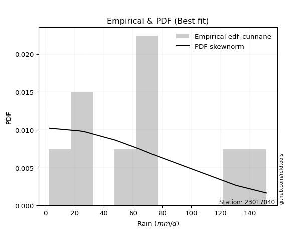</img>

</div>


### 12. EDF Adamowski (1981)

The Adamowski formula in hydrology refers to a specific plotting position formula used for estimating the non-parametric empirical distribution of hydrological events (like flood peaks) to calculate their return periods. This formula provides an alternative to traditional parametric methods (like the Gumbel or Log Pearson Type III distributions). 

<div align="center">


$P=(m-0.25)/(n+0.5)$


</div>


**12.1. Empirical values**

<div align="center">

|                | 0                   | 1                   | 2                  | 3                  | 4                  | 5                  | 6                  | 7                  |
|:---------------|:--------------------|:--------------------|:-------------------|:-------------------|:-------------------|:-------------------|:-------------------|:-------------------|
| date           | 2020                | 2024                | 2019               | 2015               | 2018               | 2016               | 2017               | 2014               |
| x              | 2.7                 | 23.8                | 27.7               | 48.1               | 63.9               | 65.2               | 75.8               | 151.5              |
| m              | 1                   | 2                   | 3                  | 4                  | 5                  | 6                  | 7                  | 8                  |
| empirical_dist | edf_adamowski       | edf_adamowski       | edf_adamowski      | edf_adamowski      | edf_adamowski      | edf_adamowski      | edf_adamowski      | edf_adamowski      |
| empirical      | 0.08823529411764706 | 0.20588235294117646 | 0.3235294117647059 | 0.4411764705882353 | 0.5588235294117647 | 0.6764705882352942 | 0.7941176470588235 | 0.9117647058823529 |
| empirical_tr   | 1.096774193548387   | 1.259259259259259   | 1.4782608695652173 | 1.7894736842105263 | 2.2666666666666666 | 3.0909090909090913 | 4.857142857142856  | 11.33333333333333  |

</div>


**12.2. Kolmogorov-Smirnov fit test (sorted by Δ)**


<div align="center">

|                | 0                   | 1                   | 2                   | 3                   | 4                   | 5                   | 6                  | 7                   | 8                   | 9                   | 10                  | 11                  | 12                  | 13                  | 14                  | 15                 | 16                 | 17                 | 18                  | 19                  | 20                  | 21                  | 22                  | 23                  | 24                  | 25                  | 26                  | 27                  | 28                  | 29                 | 30                  | 31                  | 32                  | 33                  | 34                  | 35                    | 36                  | 37                  | 38                 | 39                  | 40                 | 41                  | 42                  | 43                  | 44                  | 45                 | 46                 | 47                  | 48                 | 49                 | 50                  | 51                  | 52                  | 53                  | 54                  | 55                 | 56                  | 57                  | 58                  | 59                  | 60                  | 61                 | 62                 | 63                 | 64                  | 65                  | 66                 | 67                 | 68                  | 69                 | 70                  | 71                 | 72                 | 73                 | 74                 | 75                  | 76                 | 77                 | 78                  | 79                 | 80                 | 81                 | 82                 | 83                 | 84                 | 85                 | 86                 | 87                 |
|:---------------|:--------------------|:--------------------|:--------------------|:--------------------|:--------------------|:--------------------|:-------------------|:--------------------|:--------------------|:--------------------|:--------------------|:--------------------|:--------------------|:--------------------|:--------------------|:-------------------|:-------------------|:-------------------|:--------------------|:--------------------|:--------------------|:--------------------|:--------------------|:--------------------|:--------------------|:--------------------|:--------------------|:--------------------|:--------------------|:-------------------|:--------------------|:--------------------|:--------------------|:--------------------|:--------------------|:----------------------|:--------------------|:--------------------|:-------------------|:--------------------|:-------------------|:--------------------|:--------------------|:--------------------|:--------------------|:-------------------|:-------------------|:--------------------|:-------------------|:-------------------|:--------------------|:--------------------|:--------------------|:--------------------|:--------------------|:-------------------|:--------------------|:--------------------|:--------------------|:--------------------|:--------------------|:-------------------|:-------------------|:-------------------|:--------------------|:--------------------|:-------------------|:-------------------|:--------------------|:-------------------|:--------------------|:-------------------|:-------------------|:-------------------|:-------------------|:--------------------|:-------------------|:-------------------|:--------------------|:-------------------|:-------------------|:-------------------|:-------------------|:-------------------|:-------------------|:-------------------|:-------------------|:-------------------|
| station        | 23017040            | 23017040            | 23017040            | 23017040            | 23017040            | 23017040            | 23017040           | 23017040            | 23017040            | 23017040            | 23017040            | 23017040            | 23017040            | 23017040            | 23017040            | 23017040           | 23017040           | 23017040           | 23017040            | 23017040            | 23017040            | 23017040            | 23017040            | 23017040            | 23017040            | 23017040            | 23017040            | 23017040            | 23017040            | 23017040           | 23017040            | 23017040            | 23017040            | 23017040            | 23017040            | 23017040              | 23017040            | 23017040            | 23017040           | 23017040            | 23017040           | 23017040            | 23017040            | 23017040            | 23017040            | 23017040           | 23017040           | 23017040            | 23017040           | 23017040           | 23017040            | 23017040            | 23017040            | 23017040            | 23017040            | 23017040           | 23017040            | 23017040            | 23017040            | 23017040            | 23017040            | 23017040           | 23017040           | 23017040           | 23017040            | 23017040            | 23017040           | 23017040           | 23017040            | 23017040           | 23017040            | 23017040           | 23017040           | 23017040           | 23017040           | 23017040            | 23017040           | 23017040           | 23017040            | 23017040           | 23017040           | 23017040           | 23017040           | 23017040           | 23017040           | 23017040           | 23017040           | 23017040           |
| empirical_dist | edf_adamowski       | edf_adamowski       | edf_adamowski       | edf_adamowski       | edf_adamowski       | edf_adamowski       | edf_adamowski      | edf_adamowski       | edf_adamowski       | edf_adamowski       | edf_adamowski       | edf_adamowski       | edf_adamowski       | edf_adamowski       | edf_adamowski       | edf_adamowski      | edf_adamowski      | edf_adamowski      | edf_adamowski       | edf_adamowski       | edf_adamowski       | edf_adamowski       | edf_adamowski       | edf_adamowski       | edf_adamowski       | edf_adamowski       | edf_adamowski       | edf_adamowski       | edf_adamowski       | edf_adamowski      | edf_adamowski       | edf_adamowski       | edf_adamowski       | edf_adamowski       | edf_adamowski       | edf_adamowski         | edf_adamowski       | edf_adamowski       | edf_adamowski      | edf_adamowski       | edf_adamowski      | edf_adamowski       | edf_adamowski       | edf_adamowski       | edf_adamowski       | edf_adamowski      | edf_adamowski      | edf_adamowski       | edf_adamowski      | edf_adamowski      | edf_adamowski       | edf_adamowski       | edf_adamowski       | edf_adamowski       | edf_adamowski       | edf_adamowski      | edf_adamowski       | edf_adamowski       | edf_adamowski       | edf_adamowski       | edf_adamowski       | edf_adamowski      | edf_adamowski      | edf_adamowski      | edf_adamowski       | edf_adamowski       | edf_adamowski      | edf_adamowski      | edf_adamowski       | edf_adamowski      | edf_adamowski       | edf_adamowski      | edf_adamowski      | edf_adamowski      | edf_adamowski      | edf_adamowski       | edf_adamowski      | edf_adamowski      | edf_adamowski       | edf_adamowski      | edf_adamowski      | edf_adamowski      | edf_adamowski      | edf_adamowski      | edf_adamowski      | edf_adamowski      | edf_adamowski      | edf_adamowski      |
| p_dist         | gumbel_r            | pearson3            | kstwobign           | genlogistic         | halfnorm            | loggumbel_l         | logloggamma        | gompertz            | loggenlogistic      | logjohnsonsu        | invgauss            | fatiguelife         | logmielke           | logfisk             | invgamma            | exponnorm          | johnsonsu          | loggompertz        | nct                 | ncf                 | halflogistic        | fisk                | moyal               | rayleigh            | betaprime           | logpearson3         | rice                | maxwell             | logistic            | hypsecant          | genexpon            | expon               | truncnorm           | norm                | crystalball         | loglaplace_asymmetric | logt                | t                   | laplace_asymmetric | laplace             | logfatiguelife     | lognorm             | lognorm             | logcrystalball      | logexponnorm        | logrice            | lognct             | logncf              | logf               | logerlang          | loggamma            | loggamma            | mielke              | logchi2             | loglogistic         | logbetaprime       | loginvgamma         | logalpha            | loghypsecant        | wald                | gumbel_l            | logmaxwell         | f                  | erlang             | lograyleigh         | loginvgauss         | loglaplace         | nakagami           | lognakagami         | loginvweibull      | loggumbel_r         | loghalfnorm        | loghalflogistic    | logmoyal           | logkstwobign       | loggenexpon         | logtruncnorm       | gibrat             | logwald             | loggibrat          | logexpon           | weibull_min        | loglognorm         | gamma              | logweibull_min     | invweibull         | alpha              | chi2               |
| delta          | 0.07221824858045256 | 0.07742920540561071 | 0.07846799795605419 | 0.07988074761937125 | 0.08311043782746763 | 0.08496799956757417 | 0.0856356480421151 | 0.08823529411016283 | 0.08842748347600449 | 0.08930625418759447 | 0.08958427756161147 | 0.08967917181458751 | 0.09004349935198996 | 0.09061976749689515 | 0.09075070701845644 | 0.0907775106374914 | 0.0910274098697037 | 0.0912177881891072 | 0.09168519452711088 | 0.09484678881250919 | 0.09597356912135413 | 0.09624067975013395 | 0.09665584117103676 | 0.10030437445047535 | 0.10248001987317168 | 0.10345049742847656 | 0.10379255248457342 | 0.10614126587047779 | 0.10635397908013133 | 0.1185474010969449 | 0.12317106619544771 | 0.12318007575956802 | 0.12576230700706648 | 0.12576237391612866 | 0.12576237848952088 | 0.12587227737889384   | 0.12646686572742438 | 0.12758189923521368 | 0.1289677985205314 | 0.13744268048227798 | 0.142489785942856  | 0.14358917155250417 | 0.14358917155250417 | 0.14359030448689203 | 0.14359167731380418 | 0.1436215738695975 | 0.1440517832055188 | 0.14460569256737443 | 0.1449715102426783 | 0.1471435796680402 | 0.14986883626213776 | 0.14986883626213776 | 0.15228497844704647 | 0.15433518208643804 | 0.15470541744774313 | 0.1563928630742984 | 0.15996649480895075 | 0.16283103431893636 | 0.16391105513378879 | 0.16447788946699027 | 0.16892168750590786 | 0.1714091211846458 | 0.1777262841554767 | 0.1780273458218148 | 0.18013170442312176 | 0.18019287216521168 | 0.1894441214340179 | 0.2058811215190204 | 0.20588235291024892 | 0.2074800066096727 | 0.21152074741518012 | 0.2141761825501019 | 0.2329987732687917 | 0.2349886081421979 | 0.2516118462578343 | 0.26694500220368284 | 0.2791771922400726 | 0.299601264125725  | 0.30023701818423254 | 0.3314025967702554 | 0.3560490775825355 | 0.4142486844603572 | 0.4322364666676219 | 0.4400270269321695 | 0.4601197527697381 | 0.4872026307090235 | 0.5440253428711017 | 0.7806512729785331 |
| deltao         | 0.4472608134160001  | 0.4472608134160001  | 0.4472608134160001  | 0.4472608134160001  | 0.4472608134160001  | 0.4472608134160001  | 0.4472608134160001 | 0.4472608134160001  | 0.4472608134160001  | 0.4472608134160001  | 0.4472608134160001  | 0.4472608134160001  | 0.4472608134160001  | 0.4472608134160001  | 0.4472608134160001  | 0.4472608134160001 | 0.4472608134160001 | 0.4472608134160001 | 0.4472608134160001  | 0.4472608134160001  | 0.4472608134160001  | 0.4472608134160001  | 0.4472608134160001  | 0.4472608134160001  | 0.4472608134160001  | 0.4472608134160001  | 0.4472608134160001  | 0.4472608134160001  | 0.4472608134160001  | 0.4472608134160001 | 0.4472608134160001  | 0.4472608134160001  | 0.4472608134160001  | 0.4472608134160001  | 0.4472608134160001  | 0.4472608134160001    | 0.4472608134160001  | 0.4472608134160001  | 0.4472608134160001 | 0.4472608134160001  | 0.4472608134160001 | 0.4472608134160001  | 0.4472608134160001  | 0.4472608134160001  | 0.4472608134160001  | 0.4472608134160001 | 0.4472608134160001 | 0.4472608134160001  | 0.4472608134160001 | 0.4472608134160001 | 0.4472608134160001  | 0.4472608134160001  | 0.4472608134160001  | 0.4472608134160001  | 0.4472608134160001  | 0.4472608134160001 | 0.4472608134160001  | 0.4472608134160001  | 0.4472608134160001  | 0.4472608134160001  | 0.4472608134160001  | 0.4472608134160001 | 0.4472608134160001 | 0.4472608134160001 | 0.4472608134160001  | 0.4472608134160001  | 0.4472608134160001 | 0.4472608134160001 | 0.4472608134160001  | 0.4472608134160001 | 0.4472608134160001  | 0.4472608134160001 | 0.4472608134160001 | 0.4472608134160001 | 0.4472608134160001 | 0.4472608134160001  | 0.4472608134160001 | 0.4472608134160001 | 0.4472608134160001  | 0.4472608134160001 | 0.4472608134160001 | 0.4472608134160001 | 0.4472608134160001 | 0.4472608134160001 | 0.4472608134160001 | 0.4472608134160001 | 0.4472608134160001 | 0.4472608134160001 |
| eval           | Δo > Δ              | Δo > Δ              | Δo > Δ              | Δo > Δ              | Δo > Δ              | Δo > Δ              | Δo > Δ             | Δo > Δ              | Δo > Δ              | Δo > Δ              | Δo > Δ              | Δo > Δ              | Δo > Δ              | Δo > Δ              | Δo > Δ              | Δo > Δ             | Δo > Δ             | Δo > Δ             | Δo > Δ              | Δo > Δ              | Δo > Δ              | Δo > Δ              | Δo > Δ              | Δo > Δ              | Δo > Δ              | Δo > Δ              | Δo > Δ              | Δo > Δ              | Δo > Δ              | Δo > Δ             | Δo > Δ              | Δo > Δ              | Δo > Δ              | Δo > Δ              | Δo > Δ              | Δo > Δ                | Δo > Δ              | Δo > Δ              | Δo > Δ             | Δo > Δ              | Δo > Δ             | Δo > Δ              | Δo > Δ              | Δo > Δ              | Δo > Δ              | Δo > Δ             | Δo > Δ             | Δo > Δ              | Δo > Δ             | Δo > Δ             | Δo > Δ              | Δo > Δ              | Δo > Δ              | Δo > Δ              | Δo > Δ              | Δo > Δ             | Δo > Δ              | Δo > Δ              | Δo > Δ              | Δo > Δ              | Δo > Δ              | Δo > Δ             | Δo > Δ             | Δo > Δ             | Δo > Δ              | Δo > Δ              | Δo > Δ             | Δo > Δ             | Δo > Δ              | Δo > Δ             | Δo > Δ              | Δo > Δ             | Δo > Δ             | Δo > Δ             | Δo > Δ             | Δo > Δ              | Δo > Δ             | Δo > Δ             | Δo > Δ              | Δo > Δ             | Δo > Δ             | Δo > Δ             | Δo > Δ             | Δo > Δ             | Δo <= Δ            | Δo <= Δ            | Δo <= Δ            | Δo <= Δ            |
| fit            | 1                   | 1                   | 1                   | 1                   | 1                   | 1                   | 1                  | 1                   | 1                   | 1                   | 1                   | 1                   | 1                   | 1                   | 1                   | 1                  | 1                  | 1                  | 1                   | 1                   | 1                   | 1                   | 1                   | 1                   | 1                   | 1                   | 1                   | 1                   | 1                   | 1                  | 1                   | 1                   | 1                   | 1                   | 1                   | 1                     | 1                   | 1                   | 1                  | 1                   | 1                  | 1                   | 1                   | 1                   | 1                   | 1                  | 1                  | 1                   | 1                  | 1                  | 1                   | 1                   | 1                   | 1                   | 1                   | 1                  | 1                   | 1                   | 1                   | 1                   | 1                   | 1                  | 1                  | 1                  | 1                   | 1                   | 1                  | 1                  | 1                   | 1                  | 1                   | 1                  | 1                  | 1                  | 1                  | 1                   | 1                  | 1                  | 1                   | 1                  | 1                  | 1                  | 1                  | 1                  | 0                  | 0                  | 0                  | 0                  |
| n              | 8                   | 8                   | 8                   | 8                   | 8                   | 8                   | 8                  | 8                   | 8                   | 8                   | 8                   | 8                   | 8                   | 8                   | 8                   | 8                  | 8                  | 8                  | 8                   | 8                   | 8                   | 8                   | 8                   | 8                   | 8                   | 8                   | 8                   | 8                   | 8                   | 8                  | 8                   | 8                   | 8                   | 8                   | 8                   | 8                     | 8                   | 8                   | 8                  | 8                   | 8                  | 8                   | 8                   | 8                   | 8                   | 8                  | 8                  | 8                   | 8                  | 8                  | 8                   | 8                   | 8                   | 8                   | 8                   | 8                  | 8                   | 8                   | 8                   | 8                   | 8                   | 8                  | 8                  | 8                  | 8                   | 8                   | 8                  | 8                  | 8                   | 8                  | 8                   | 8                  | 8                  | 8                  | 8                  | 8                   | 8                  | 8                  | 8                   | 8                  | 8                  | 8                  | 8                  | 8                  | 8                  | 8                  | 8                  | 8                  |
| best_fit       | 1                   | 0                   | 0                   | 0                   | 0                   | 0                   | 0                  | 0                   | 0                   | 0                   | 0                   | 0                   | 0                   | 0                   | 0                   | 0                  | 0                  | 0                  | 0                   | 0                   | 0                   | 0                   | 0                   | 0                   | 0                   | 0                   | 0                   | 0                   | 0                   | 0                  | 0                   | 0                   | 0                   | 0                   | 0                   | 0                     | 0                   | 0                   | 0                  | 0                   | 0                  | 0                   | 0                   | 0                   | 0                   | 0                  | 0                  | 0                   | 0                  | 0                  | 0                   | 0                   | 0                   | 0                   | 0                   | 0                  | 0                   | 0                   | 0                   | 0                   | 0                   | 0                  | 0                  | 0                  | 0                   | 0                   | 0                  | 0                  | 0                   | 0                  | 0                   | 0                  | 0                  | 0                  | 0                  | 0                   | 0                  | 0                  | 0                   | 0                  | 0                  | 0                  | 0                  | 0                  | 0                  | 0                  | 0                  | 0                  |
| best_fit_sort  | 1                   | 2                   | 3                   | 4                   | 5                   | 6                   | 7                  | 8                   | 9                   | 10                  | 11                  | 12                  | 13                  | 14                  | 15                  | 16                 | 17                 | 18                 | 19                  | 20                  | 21                  | 22                  | 23                  | 24                  | 25                  | 26                  | 27                  | 28                  | 29                  | 30                 | 31                  | 32                  | 33                  | 34                  | 35                  | 36                    | 37                  | 38                  | 39                 | 40                  | 41                 | 42                  | 43                  | 44                  | 45                  | 46                 | 47                 | 48                  | 49                 | 50                 | 51                  | 52                  | 53                  | 54                  | 55                  | 56                 | 57                  | 58                  | 59                  | 60                  | 61                  | 62                 | 63                 | 64                 | 65                  | 66                  | 67                 | 68                 | 69                  | 70                 | 71                  | 72                 | 73                 | 74                 | 75                 | 76                  | 77                 | 78                 | 79                  | 80                 | 81                 | 82                 | 83                 | 84                 | 85                 | 86                 | 87                 | 88                 |

</div>


**12.3. Best fit**

<div align="center">

|   id |   station | empirical_dist   | p_dist   |     delta |   deltao | eval   |   fit |   n |   best_fit |   best_fit_sort |
|-----:|----------:|:-----------------|:---------|----------:|---------:|:-------|------:|----:|-----------:|----------------:|
|    0 |  23017040 | edf_adamowski    | gumbel_r | 0.0722182 | 0.447261 | Δo > Δ |     1 |   8 |          1 |               1 |

</div>


<div align="center">

</img></img>

</div>


## C. Best fit & Estimate extreme values for specific return periods - Tr

Best fit in probability distribution analysis means finding the theoretical distribution (like Normal, Poisson, Exponential) that most accurately mirrors your real-world data´s patterns (shape, center, spread) for better predictions, using methods like visual checks (Q-Q plots), goodness-of-fit tests (Kolmogorov-Smirnov, Chi-Squared), and information criteria (AIC) to score and select the simplest, most representative model.


### 1. Best fit (ordered by delta Δ)

<div align="center">

|   id |   station | empirical_dist   | p_dist                |     delta |   deltao | eval   |   fit |   n |   best_fit |   best_fit_sort |
|-----:|----------:|:-----------------|:----------------------|----------:|---------:|:-------|------:|----:|-----------:|----------------:|
|    0 |  23017040 | edf_adamowski    | gumbel_r              | 0.0722182 | 0.447261 | Δo > Δ |     1 |   8 |          1 |               1 |
|    1 |  23017040 | edf_chegodayev   | gumbel_r              | 0.0723605 | 0.447261 | Δo > Δ |     1 |   8 |          1 |               2 |
|    2 |  23017040 | edf_jenkinson    | gumbel_r              | 0.0730708 | 0.447261 | Δo > Δ |     1 |   8 |          1 |               3 |
|    3 |  23017040 | edf_beard        | gumbel_r              | 0.0730708 | 0.447261 | Δo > Δ |     1 |   8 |          1 |               4 |
|    4 |  23017040 | edf_filliben     | gumbel_r              | 0.0736057 | 0.447261 | Δo > Δ |     1 |   8 |          1 |               5 |
|    5 |  23017040 | edf_tukey        | gumbel_r              | 0.0747414 | 0.447261 | Δo > Δ |     1 |   8 |          1 |               6 |
|    6 |  23017040 | edf_gringorten   | genlogistic           | 0.0771279 | 0.447261 | Δo > Δ |     1 |   8 |          1 |               7 |
|    7 |  23017040 | edf_cunnane      | genlogistic           | 0.0777287 | 0.447261 | Δo > Δ |     1 |   8 |          1 |               8 |
|    8 |  23017040 | edf_blom         | gumbel_r              | 0.0777717 | 0.447261 | Δo > Δ |     1 |   8 |          1 |               9 |
|    9 |  23017040 | edf_hazen        | genlogistic           | 0.0779086 | 0.447261 | Δo > Δ |     1 |   8 |          1 |              10 |
|   10 |  23017040 | edf_weibull      | logloggamma           | 0.0794732 | 0.447261 | Δo > Δ |     1 |   8 |          1 |              11 |
|   11 |  23017040 | edf_california   | loglaplace_asymmetric | 0.0996166 | 0.447261 | Δo > Δ |     1 |   8 |          1 |              12 |

</div>

:file_folder:Tables: [bestfit_23017040.csv](table/bestfit_23017040.csv) | [extreme_23017040.csv](table/extreme_23017040.csv)


### 2. Extreme values

In hydrology, a return period (or recurrence interval $Tr$) is the statistical average time between extreme events like floods or droughts of a specific magnitude, indicating how rare an event is, with a 100-year flood, for example, having a 1% chance of occurring in any given year, not that it happens exactly every century. It is a key tool for infrastructure design (like bridges or dams) and risk assessment, calculated from historical data to determine the probability of future events, although it is important to remember it is statistical average, and events can cluster or be missed.

> risk_rate: assuming the return period as the project useful life.

|   id |      tr |   prob_l |     prob_g |     alpha |   betaprime |     chi2 |   crystalball |   erlang |    expon |   exponnorm |        f |   fatiguelife |     fisk |    gamma |   genexpon |   genlogistic |   gibrat |   gompertz |   gumbel_l |   gumbel_r |   halflogistic |   halfnorm |   hypsecant |   invgamma |   invgauss |      invweibull |   johnsonsu |   kstwobign |   laplace |   laplace_asymmetric |   loggamma |   logistic |   lognorm |   maxwell |   mielke |    moyal |   nakagami |      ncf |      nct |     norm |   pearson3 |   rayleigh |     rice |        t |   truncnorm |     wald |   weibull_min |   logalpha |   logbetaprime |   logchi2 |   logcrystalball |   logerlang |         logexpon |   logexponnorm |      logf |   logfatiguelife |   logfisk |   loggenexpon |   loggenlogistic |        loggibrat |   loggompertz |   loggumbel_l |   loggumbel_r |   loghalflogistic |   loghalfnorm |   loghypsecant |   loginvgamma |   loginvgauss |   loginvweibull |   logjohnsonsu |   logkstwobign |   loglaplace |   loglaplace_asymmetric |   logloggamma |   loglogistic |   loglognorm |   logmaxwell |   logmielke |   logmoyal |   lognakagami |    logncf |    lognct |   logpearson3 |   lograyleigh |   logrice |            logt |   logtruncnorm |     logwald |   logweibull_min |   station |   n |   risk_rate |
|-----:|--------:|---------:|-----------:|----------:|------------:|---------:|--------------:|---------:|---------:|------------:|---------:|--------------:|---------:|---------:|-----------:|--------------:|---------:|-----------:|-----------:|-----------:|---------------:|-----------:|------------:|-----------:|-----------:|----------------:|------------:|------------:|----------:|---------------------:|-----------:|-----------:|----------:|----------:|---------:|---------:|-----------:|---------:|---------:|---------:|-----------:|-----------:|---------:|---------:|------------:|---------:|--------------:|-----------:|---------------:|----------:|-----------------:|------------:|-----------------:|---------------:|----------:|-----------------:|----------:|--------------:|-----------------:|-----------------:|--------------:|--------------:|--------------:|------------------:|--------------:|---------------:|--------------:|--------------:|----------------:|---------------:|---------------:|-------------:|------------------------:|--------------:|--------------:|-------------:|-------------:|------------:|-----------:|--------------:|----------:|----------:|--------------:|--------------:|----------:|----------------:|---------------:|------------:|-----------------:|----------:|----:|------------:|
|    0 |    2    | 0.5      | 0.5        |   11.2384 |     44.7035 |  3.02381 |       57.3375 |  34.8202 |  40.5718 |     49.2056 |  37.5955 |       47.7595 |  48.549  |  11.915  |    40.4751 |       50.0324 |  44.6087 |    48.0736 |    64.3041 |    50.3709 |        46.9074 |    48.6571 |     57.3375 |    48.3852 |    47.9069 | 19477.1         |     48.0082 |     51.2522 |   57.3375 |              60.4531 |    36.7836 |    57.3375 |   37.7181 |   53.7107 |  40.2757 |  48.1218 |    38.0166 |  46.5293 |  48.4359 |  57.3375 |    50.3375 |    52.4244 |  54.8739 |  57.344  |     57.3375 |  43.5913 |       13.8005 |    35.1808 |        36.1858 |   36.1526 |          37.718  |     36.9976 |     16.7937      |        37.7178 |   37.5234 |          37.8237 |   44.9067 |       26.4986 |          47.6805 |     26.8232      |       45.7153 |       45.4543 |       31.2985 |           28.5261 |       29.8945 |        37.7181 |       35.7872 |       33.7768 |         33.1605 |        52.6741 |        28.22   |      37.7181 |                 47.2491 |       48.5185 |       37.7181 |      2.77156 |      34.2269 |     47.3004 |    29.469  |       40.7006 |   37.4181 |   37.6332 |       47.812  |       33.0678 |   37.7206 |    52.3507      |        25.6559 |     26.1015 |      8.12727     |  23017040 |   8 |    0.75     |
|    1 |    2.33 | 0.570815 | 0.429185   |   13.3758 |     52.3876 |  3.29303 |       64.9049 |  42.25   |  48.9161 |     55.6906 |  48.5064 |       54.9435 |  55.0286 |  16.6954 |    48.9279 |       56.7819 |  48.442  |    56.3846 |    70.8878 |    57.3829 |        54.1169 |    56.8242 |     63.3936 |    55.2514 |    55.0343 |     2.56247e+06 |     55.0149 |     58.4522 |   61.9169 |              65.0938 |    45.4894 |    64.0049 |   46.1915 |   61.5726 |  47.6624 |  54.7596 |    44.4825 |  53.8759 |  55.2331 |  64.9049 |    57.7534 |    60.4026 |  62.1651 |  64.9838 |     64.9048 |  48.5533 |       18.981  |    43.4705 |        44.8481 |   44.6228 |          46.1914 |     45.6857 |     25.1212      |        46.1912 |   45.9966 |          46.3365 |   52.8643 |       35.3736 |          55.1518 |     29.7231      |       53.6536 |       54.2185 |       37.7639 |           34.6012 |       37.2032 |        44.3594 |       44.4211 |       42.1116 |         44.3155 |        58.0585 |        38.0762 |      42.6394 |                 53.6581 |       56.8856 |       45.0915 |      3.44556 |      42.2481 |     54.855  |    35.2019 |       46.2782 |   46.0115 |   46.1219 |       57.1466 |       40.9447 |   46.1884 |    58.9647      |        37.212  |     29.8111 |     11.8692      |  23017040 |   8 |    0.729209 |
|    2 |    5    | 0.8      | 0.2        |   29.9497 |     88.392  |  5.89496 |       93.0272 |  79.8922 |  90.6357 |     85.7723 | 109.361  |       87.6486 |  85.6458 |  50.2475 |    91.1897 |       86.1004 |  70.5114 |    91.9128 |    92.1569 |    87.8462 |        86.7382 |    91.362  |     87.6863 |    86.4396 |    87.4502 |     4.12474e+15 |     86.9493 |     89.0361 |   84.8129 |              86.5797 |   101.539  |    89.7485 |   98.0939 |   92.5167 |  76.2413 |  85.5062 |    80.9879 |  89.0713 |  86.1249 |  93.0272 |    89.4258 |    92.3431 |  91.3551 |  93.6446 |     93.0272 |  76.3306 |       58.8107 |    97.6044 |       101.023  |   98.9169 |          98.0935 |    101.302  |    188.135       |        98.0932 |   98.0248 |          98.5785 |   99.2497 |      112.545  |          86.1563 |     53.6747      |       90.4725 |       95.8342 |       85.3855 |           82.8888 |       93.8152 |        85.0205 |      101.555  |       98.7764 |        156.198  |        78.5953 |       135.918  |      78.7236 |                 77.1732 |       91.8849 |       89.8481 |    inf       |      96.762  |     86.1757 |    80.199  |       82.5043 |   99.6599 |   98.2745 |       97.8032 |       96.3136 |   98.0384 |    97.9779      |       174.703  |     62.7267 |    126.293       |  23017040 |   8 |    0.67232  |
|    3 |   10    | 0.9      | 0.1        |   60.4001 |    119.238  |  9.59272 |      111.683  | 114.45   | 128.507  |    112.547  | 169.735  |      115.265  | 115.222  |  89.406  |   129.554  |      109.977  |  95.6681 |   117.919  |   103.999  |   112.658  |       113.829  |   116.919  |    107.085  |   113.467  |   114.896  |     1.30062e+23 |    114.43   |    112.322  |  105.597  |             106.084  |   175.027  |   108.708  |  161.666  |  114.294  |  95.8155 | 112.276  |   112.995  | 121.507  | 113.091  | 111.683  |   114.181  |   115.117  | 112.168  | 113.193  |    111.683  | 105.809  |      114.445  |   170.368  |       175.354  |  169.764  |         161.665  |    173.688  |   1170.18        |       161.665  |  161.962  |         162.735  |  157.834  |      257.103  |         111.361  |    105.281       |      121.306  |      131.597  |      165.944  |          171.228  |      186.002  |       142.935  |      179.559  |      179.087  |        435.809  |        99.4309 |       358.122  |     137.353  |                102.76   |      117.379  |      149.285  |    inf       |     173.374  |    111.544  |   164.255  |      128.705  |  167.079  |  162.407  |      126.63   |      177.243  |  161.521  |   160.889       |       538.838  |    138.137  |   1872.43        |  23017040 |   8 |    0.651322 |
|    4 |   15    | 0.933333 | 0.0666667  |   90.7418 |    136.832  | 12.1386  |      120.992  | 134.761  | 150.661  |    128.204  | 206.356  |      131.011  | 134.466  | 114.62   |   151.995  |      123.447  | 113.02   |   131.183  |   109.361  |   126.657  |       129.16   |   130.219  |    118.155  |   129.403  |   130.6    |     2.2125e+27  |    130.452  |    124.684  |  117.755  |             117.493  |   230.492  |   119.038  |  207.441  |  125.467  | 106.344  | 127.812  |   130.301  | 141.334  | 129.128  | 120.992  |   127.698  |   126.852  | 122.892  | 123.206  |    120.992  | 124.738  |      155.358  |   226.405  |       231.79   |  223.089  |         207.439  |    228.051  |   3408.66        |       207.439  |  208.095  |         209.016  |  203.223  |      393.632  |         126.457  |    167.556       |      138.589  |      151.921  |      241.421  |          258.156  |      265.584  |       192.263  |      240.211  |      243.19   |        777.52   |       116.308  |       598.964  |     190.215  |                121.498  |      130.519  |      196.86   |    inf       |     233.849  |    126.706  |   249.006  |      162.558  |  216.485  |  208.708  |      140.417  |      242.687  |  207.221  |   227.834       |       964.477  |    229.339  |  11099.8         |  23017040 |   8 |    0.644736 |
|    5 |   20    | 0.95     | 0.05       |  121.057  |    149.17   | 14.0709  |      127.089  | 149.203  | 166.379  |    139.313  | 232.761  |      142.069  | 149.26   | 133.26   |   167.918  |      132.879  | 126.631  |   139.896  |   112.7    |   136.458  |       139.901  |   139.086  |    125.965  |   140.88   |   141.658  |     2.02831e+30 |    141.89   |    133.011  |  126.382  |             125.588  |   276.379  |   126.177  |  244.231  |  132.882  | 113.738  | 138.815  |   141.955  | 155.907  | 140.75   | 127.089  |   136.978  |   134.651  | 130.02   | 129.879  |    127.089  | 138.845  |      188.077  |   273.395  |       278.651  |  267.139  |         244.23   |    272.894  |   7278.36        |       244.229  |  245.219  |         246.255  |  242.015  |      522.505  |         137.638  |    241.248       |      150.583  |      166.128  |      313.886  |          344.198  |      336.769  |       236.988  |      291.353  |      298.133  |       1166.13   |       131.832  |       846.973  |     239.648  |                136.831  |      139.236  |      238.34   |    inf       |     285.221  |    137.925  |   334.333  |      190.016  |  256.621  |  245.981  |      149      |      299.061  |  243.946  |   302.81        |      1420.2    |    334.616  |  42585.3         |  23017040 |   8 |    0.641514 |
|    6 |   25    | 0.96     | 0.04       |  151.361  |    158.671  | 15.6295  |      131.577  | 160.42   | 178.571  |    147.93   | 253.445  |      150.598  | 161.482  | 148.073  |   180.268  |      140.144  | 137.978  |   146.304  |   115.075  |   144.008  |       148.177  |   145.684  |    132.009  |   149.909  |   150.203  |     3.88011e+32 |    150.824  |    139.249  |  133.073  |             131.867  |   316.105  |   131.639  |  275.422  |  138.388  | 119.512  | 147.343  |   150.662  | 167.535  | 149.939  | 131.577  |   144.029  |   140.446  | 135.316  | 134.857  |    131.577  | 150.144  |      215.549  |   314.495  |       319.325  |  305.235  |         275.42   |    311.635  |  13109.1         |       275.419  |  276.719  |         277.852  |  276.62   |      644.914  |         146.671  |    326.914       |      159.751  |      177.04   |      384.22   |          429.595  |      401.85   |       278.627  |      336.257  |      346.951  |       1593.45   |       146.69   |      1097.93   |     286.679  |                150.044  |      145.7    |      275.881  |    inf       |     330.53   |    146.982  |   420.116  |      213.44   |  290.913  |  277.618  |      155.039  |      349.267  |  275.078  |   387.648       |      1893.04   |    452.858  | 126302           |  23017040 |   8 |    0.639603 |
|    7 |   50    | 0.98     | 0.02       |  302.835  |    187.872  | 20.7389  |      144.429  | 195.329  | 216.443  |    174.696  | 318.606  |      176.896  | 204.302  | 195.685  |   218.632  |      162.523  | 177.977  |   164.547  |   121.523  |   167.265  |       173.675  |   164.86   |    150.748  |   178.834  |   176.642  |     4.1468e+39  |    179.046  |    157.565  |  153.857  |             151.372  |   465.789  |   148.327  |  388.571  |  154.354  | 138.107  | 173.819  |   176.047  | 205.7    | 179.657  | 144.428  |   165.264  |   157.267  | 150.689  | 149.462  |    144.428  | 187.034  |      312.43   |   472.407  |       473.292  |  448.528  |         388.568  |    457.046  |  81537.4         |       388.568  |  391.164  |         392.645  |  416.116  |     1188.42   |         177.303  |    954.188       |      187.581  |      210.41   |      716.267  |          850.395  |      671.579  |       460.226  |      509.951  |      539.953  |       4169.05   |       217.943  |      2352.55   |     500.184  |                199.792  |      164.386  |      431.328  |    inf       |     506.881  |    177.676  |   853.68   |      299.316  |  417.059  |  392.622  |      170.785  |      548.027  |  387.998  |  1007.27        |      4354.97   |   1216.28   |      4.65978e+06 |  23017040 |   8 |    0.63583  |
|    8 |   75    | 0.986667 | 0.0133333  |  454.288  |    204.775  | 23.878   |      151.324  | 215.788  | 238.597  |    190.353  | 357.244  |      192.183  | 233.317  | 224.437  |   241.074  |      175.53   | 204.993  |   174.225  |   124.784  |   180.783  |       188.497  |   175.299  |    161.699  |   196.48   |   192.074  |     5.04847e+43 |    195.954  |    167.643  |  166.015  |             162.781  |   574.569  |   157.965  |  467.383  |  163.034  | 149.705  | 189.301  |   189.873  | 229.626  | 198.005  | 151.324  |   177.302  |   166.419  | 159.052  | 157.54   |    151.324  | 209.735  |      377.126  |   589.805  |       585.756  |  552.474  |         467.379  |    562.274  | 237514           |       467.379  |  471.009  |         472.734  |  526.787  |     1657.55   |         197.434  |   1967.12        |      203.465  |      229.61   |     1028.72   |         1264.77   |      888.193  |       617.075  |      640      |      687.994  |       7291.53   |       289.726  |      3577.94   |     692.684  |                236.224  |      174.498  |      558.348  |    inf       |     639.536  |    197.834  |  1292.3    |      359.815  |  506.305  |  472.91   |      178.193  |      700.229  |  466.636  |  2085.86        |      6846.06   |   2233.91   |      4.47743e+07 |  23017040 |   8 |    0.634587 |
|    9 |  100    | 0.99     | 0.01       |  605.736  |    216.702  | 26.159   |      155.988  | 230.317  | 254.315  |    201.462  | 384.849  |      203      | 255.962  | 245.161  |   256.996  |      184.736  | 225.92   |   180.712  |   126.917  |   190.351  |       198.988  |   182.41   |    169.467  |   209.37   |   203.022  |     3.93262e+46 |    208.155  |    174.547  |  174.641  |             170.876  |   662.701  |   164.769  |  529.563  |  168.947  | 158.355  | 200.285  |   199.284  | 247.394  | 211.515  | 155.988  |   185.703  |   172.654  | 164.75   | 163.111  |    155.988  | 226.286  |      426.588  |   686.343  |       677.163  |  636.602  |         529.559  |    647.307  | 507153           |       529.559  |  534.067  |         535.989  |  622.223  |     2079.4    |         212.893  |   3445.31        |      214.581  |      243.107  |     1329.15   |         1675.04   |     1074.52   |       759.777  |      747.397  |      812.125  |      10830.5    |       364.535  |      4768.65   |     872.699  |                266.034  |      181.365  |      669.959  |    inf       |     749.259  |    213.31   |  1734.27   |      407.878  |  577.406  |  536.346  |      182.769  |      827.474  |  528.674  |  3853.14        |      9313.2    |   3479.92   |      2.37732e+08 |  23017040 |   8 |    0.633968 |
|   10 |  200    | 0.995    | 0.005      | 1211.51   |    245.254  | 31.806   |      166.568  | 265.364  | 292.187  |    228.229  | 451.907  |      228.99   | 318.614  | 296.012  |   295.361  |      206.868  | 282.857  |   195.226  |   131.552  |   213.352  |       224.209  |   198.675  |    188.181  |   241.822  |   229.419  |     3.51717e+53 |    238.318  |    190.451  |  195.426  |             190.38   |   918.059  |   181.093  |  703.013  |  182.474  | 180.917  | 226.749  |   220.765  | 293.16   | 245.93   | 166.568  |   205.538  |   186.919  | 177.787  | 176.103  |    166.568  | 267.513  |      557.807  |   972.334  |       943.209  |  880.01   |         703.008  |    892.767  |      3.15443e+06 |       703.008  |  710.211  |         712.698  |  927.697  |     3494.17   |         254.795  |  15827.7         |      240.895  |      275.242  |     2460.88   |         3291.28   |     1661.05   |      1254.13   |     1067.43   |     1190.27   |      28038.2    |       706.881  |      9241.75   |    1522.65   |                354.239  |      197.005  |     1037.28   |    inf       |    1076.37   |    255.241  |  3522.98   |      543.24   |  778.505  |  713.656  |      191.852  |     1212.48   |  701.701  | 25881.6         |     18807.3    |  10497.3    |      1.63353e+10 |  23017040 |   8 |    0.633042 |
|   11 |  250    | 0.996    | 0.004      | 1514.4    |    254.397  | 33.6626  |      169.801  | 276.657  | 304.379  |    236.846  | 473.638  |      237.342  | 341.528  | 312.618  |   307.711  |      213.983  | 303.286  |   199.6    |   132.916  |   220.746  |       232.318  |   203.679  |    194.206  |   252.723  |   237.927  |     6.03952e+55 |    248.274  |    195.372  |  202.117  |             196.659  |  1014.84   |   186.333  |  766.595  |  186.638  | 188.766  | 235.269  |   227.359  | 308.849  | 257.62   | 169.801  |   211.817  |   191.311  | 181.8    | 180.18   |    169.801  | 281.153  |      603.649  |  1082.91   |      1044.44   |  972.155  |         766.589  |    985.498  |      5.68149e+06 |       766.588  |  774.857  |         777.559  | 1054.62   |     4099.72   |         269.861  |  27353.5         |      249.238  |      285.482  |     2999.81   |         4089.49   |     1899.22   |      1473.7    |     1191.77   |     1340.02   |      38067.7    |       907.62   |     11341.9    |    1821.46   |                388.446  |      201.799  |     1193.57   |    inf       |    1203.35   |    270.313  |  4425.85   |      593.274  |  853.126  |  778.768  |      194.275  |     1363.79   |  765.119  | 55981.1         |     23340.6    |  15125.5    |      6.76849e+10 |  23017040 |   8 |    0.632858 |
|   12 |  500    | 0.998    | 0.002      | 3028.83   |    282.67   | 39.5282  |      179.388  | 311.763  | 342.251  |    263.612  | 541.513  |      263.251  | 422.685  | 364.809  |   346.075  |      236.067  | 373.887  |   212.386  |   136.827  |   243.698  |       257.485  |   218.597  |    212.918  |   288.126  |   264.402  |     5.21666e+62 |    280.016  |    210.122  |  222.901  |             216.163  |  1368.44   |   202.586  |  991.004  |  199.064  | 215.238  | 261.732  |   246.971  | 360.848  | 296.027  | 179.388  |   231.043  |   204.413  | 193.774  | 192.593  |    179.388  | 324.52   |      757.144  |  1495.69   |      1415.79   | 1308.42   |         990.996  |   1323.15   |      3.53382e+07 |       990.996  | 1003.3    |        1006.8    | 1569.65   |     6605.78   |         322.357  | 181191           |      274.801  |      316.997  |     5546.63   |         8023.65   |     2831.96   |      2432.48   |     1658.23   |     1913.23   |      98346.3    |      2252.75   |     20950.3    |    3178      |                517.237  |      216.048  |     1844.47   |    inf       |    1678.45   |    322.818  |  8990.5    |      771.36   | 1119.82   | 1009      |      200.543  |     1937.03   |  988.93   |     1.18029e+06 |     44407.1    |  48318.7    |      6.68093e+12 |  23017040 |   8 |    0.632489 |
|   13 |  750    | 0.998667 | 0.00133333 | 4543.25   |    299.129  | 43.019   |      184.715  | 332.315  | 364.404  |    279.269  | 581.449  |      278.392  | 478.121  | 395.707  |   368.517  |      248.978  | 420.579  |   219.365  |   138.916  |   257.115  |       272.197  |   226.932  |    223.865  |   309.993  |   279.926  |     5.92102e+66 |    299.182  |    218.407  |  235.059  |             227.573  |  1617.43   |   212.081  | 1142.93   |  206.013  | 232.348  | 277.212  |   257.895  | 393.727  | 320.084  | 184.714  |   242.117  |   211.74   | 200.47   | 199.714  |    184.714  | 350.523  |      854.671  |  1793.74   |      1678.5    | 1544.91   |        1142.92   |   1560.03   |      1.02938e+08 |      1142.92   | 1158.18   |        1162.23   | 1980.18   |     8626.17   |         357.565  | 632668           |      289.526  |      335.244  |     7944.74   |        11898.3    |     3540.13   |      3261.07   |     1996.85   |     2338.87   |     171289      |      4257.47   |     29573.8    |    4401.09   |                611.554  |      223.979  |     2378.53   |    inf       |    2021.8    |    358.023  | 13609      |      893.074  | 1302.99   | 1165.19   |      203.468  |     2356.96   | 1140.43   |     1.25013e+07 |     63583      |  96949.4    |      1.10451e+14 |  23017040 |   8 |    0.632366 |
|   14 | 1000    | 0.999    | 0.001      | 6057.68   |    310.777  | 45.5186  |      188.381  | 346.903  | 380.122  |    290.378  | 609.875  |      289.13   | 521.521  | 417.773  |   384.439  |      258.136  | 456.31   |   224.117  |   140.323  |   266.632  |       282.633  |   232.687  |    231.631  |   326.061  |   290.958  |     4.45418e+69 |    313.061  |    224.148  |  243.685  |             235.668  |  1815.57   |   218.815  | 1260.87   |  210.817  | 245.29   | 288.196  |   265.426  | 418.243  | 337.922  | 188.381  |   249.906  |   216.803  | 205.097  | 204.718  |    188.381  | 369.227  |      927.312  |  2034.79   |      1888.15   | 1732.96   |        1260.86   |   1748.07   |      2.19799e+08 |      1260.86   | 1278.5    |        1283.01   | 2334.85   |    10373.5    |         384.82   |      1.64717e+06 |      299.881  |      348.112  |    10251.1    |        15734.9    |     4130.12   |      4015.02   |     2271.6    |     2689.2    |     253900      |      7050.89   |     37551.7    |    5544.84   |                688.73   |      229.445  |     2848.56   |    inf       |    2299.35   |    385.272  | 18262.9    |      988.112  | 1446.45   | 1286.59   |      205.267  |     2699.23   | 1258.03   |     9.25324e+07 |     81458.7    | 159989      |      8.50907e+14 |  23017040 |   8 |    0.632305 |

<div align="center">

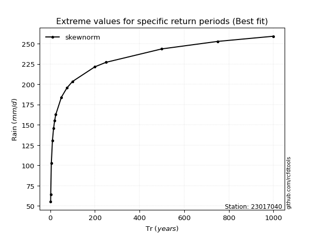</img>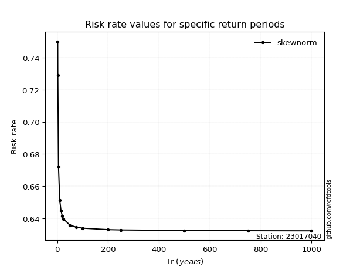</img>

</div>


<sub>**APP DISCLAIMER**: NO WARRANTY - This software is provided by [github.com/rcfdtools](https://github.com/rcfdtools) "as is", without any express or implied warranty, including warranties of merchantability, fitness for a particular purpose, or non-infringement. There is no guarantee that the software will be error-free or operate without interruption. LIMITATION OF LIABILITY - Neither the authors nor copyright holders will be liable for claims or damages arising from the software or its use. You are responsible for determining if the software is appropriate for your use and assume all associated risks, including errors, legal compliance, and data loss. NO PROFESSIONAL ADVICE - The software provides general information and does not offer professional advice. It should not replace consultation with professional advisors.</sub>