<div align="center">


</div>

# PMax24h Station (Rain): 2302500064

Maximum Precipitation in 24 hours (PMax24h) is the greatest amount of rainfall for a specific duration that is meteorologically possible for a given location, acting as a "worst-case" scenario for extreme storms, crucial for designing safety-critical infrastructure like bridges, river deviations, dams, spillways, and nuclear plants to prevent catastrophic failure. The PMax24h is related with the Probable Maximum Precipitation (PMP) and it is calculated by hydrologists using meteorological data to determine the upper limit of extreme rainfall, often leading to the Probable Maximum Flood (PMF) for flood control design, and is increasingly being studied for climate change impacts. Probable Maximum Precipitation (PMP) is the theoretical upper limit of rainfall, a deterministic estimate for extreme events, while probability distributions (like GEV, Gumbel) describe the likelihood and frequency of various precipitation amounts, including rare ones, showing how often events occur, with PMP representing the extreme end of these distributions, used for critical infrastructure design to ensure safety against the worst conceivable weather, unlike standard statistical forecasts which cover typical probabilities.

The most common probability distributions in hydrology, used for analyzing floods, rainfall, and streamflow, include the Normal, Log-Normal, Gumbel, Gamma (including Log-Pearson Type III), and Generalized Extreme Value (GEV) distributions, often chosen based on the data´s skewness and whether modeling extremes or general conditions, with Gumbel and GEV popular for extreme events like floods, while the Normal distribution serves as a baseline, though often requiring transformations for skewed hydrological data. These distributions help in designing water infrastructure, managing water resources, and forecasting hydrologic events.

> Hydrological data often isn´t perfectly normal (it´s skewed), so different distributions are needed for different applications, such as: **Flood Frequency Analysis**: Using Gumbel, GEV, or Log-Pearson Type III for predicting extreme flood magnitudes and their return periods, **Rainfall Analysis**: Normal for annual totals, but Log-Normal, Weibull, or GEV for intensity or extreme daily rainfall, **Streamflow Modeling**: Gamma and Log-Normal for maximum flows, GEV for minimum flows, and Kappa for daily flows.

<div align="center">

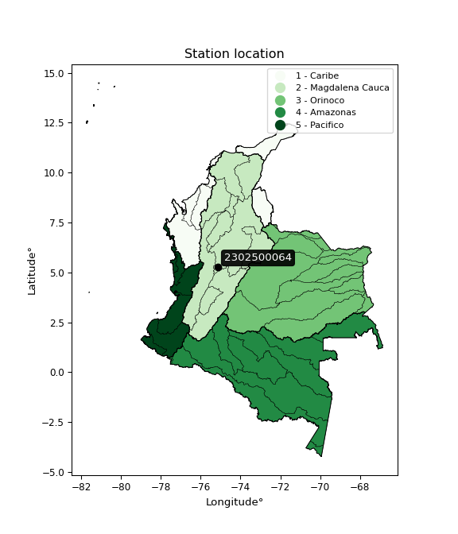</img>

</div>


## A. General information


### 1. General running parameters

• app_version: _v20260312_. • runtime: _2026-03-12 07:15:23.203550_. • Python version: _3.14.0_. • SciPy version: _1.16.3_. • Pandas version: _2.3.3_. • NumPy version: _2.3.5_. • Stations dataset (station_dataset_file): _dataset/pmax24h_in/automatic_colombia_2003_2025.csv_. • Stations catalog (station_catalog_file): _dataset/CNE.xls_. • Minimum year to eval til year_max (date_min): _1900_. • Maximum year to eval since year_min (date_max): _2025_. • Creates, save and include plots into reports (create_plot): _True_. • Plot only fit distributions with Δo > Δ (plot_only_fit): _True_. • Plot only simple graphs avoiding multiple CDFs and multiple Extreme values plots (plot_only_simple): _True_. • Eval low extreme values, if False, evaluates high extreme values (low_extreme): _False_. • Eval every SciPy distribution as logarithmic (pdist_logarithmic_on): _True_. • Standard deviation normalized (ddof): _1.0_. • Return periods to eval in years (Tr): _[2, 2.33, 5, 10, 15, 20, 25, 50, 75, 100, 200, 250, 500, 750, 1000]_. • Minimum data sample per station, 0 means any (minimum_sample): _5_. • Z-Score maximum threshold to adjust a value, 0 means disable (zscore_max): _3.5_. • Z-Score minimum threshold to adjust a value, 0 means disable (zscore_min): _-2.5_. • Avoid zeros, e.g. rain = 0 (avoid_zeros): _True_. • Avoid null values (avoid_nans): _True_. 

:file_folder:Table: [dataset.csv](../../dataset/pmax24h_in/automatic_colombia_2003_2025.csv)

> Delta Degrees of Freedom (DDOF): is a parameter used in the formulas for calculating variance and standard deviation. When ddof=0, the divisor is $N$ (the total number of observations) and this is used when your data set is the entire population. When ddof=1, the divisor is $N-1$ and this is used when your data set is a sample drawn from a larger population. Using $N-1$ provides an unbiased estimate of the population variance (known as Bessel´s correction).


### 2. Station info and location

|   id |     CODIGO | NOMBRE                        | CATEGORIA               | TECNOLOGIA                | ESTADO   | FECHA_INSTALACION   |   FECHA_SUSPENSION |   ALTITUD |   LATITUD |   LONGITUD | DEPARTAMENTO   | MUNICIPIO   | AREA_OPERATIVA             | ENTIDAD                                                     | AREA_HIDROGRAFICA   | ZONA_HIDROGRAFICA   | SUBZONA_HIDROGRAFICA   |   CORRIENTE | Catalogo   |   Version |
|-----:|-----------:|:------------------------------|:------------------------|:--------------------------|:---------|:--------------------|-------------------:|----------:|----------:|-----------:|:---------------|:------------|:---------------------------|:------------------------------------------------------------|:--------------------|:--------------------|:-----------------------|------------:|:-----------|----------:|
|    0 | 2302500064 | MANZANARES - AUT [2302500064] | Climatológica Principal | Automática con Telemetría | Activa   | 23/04/2017          |                nan |      1979 |   5.26506 |   -75.1431 | Caldas         | Manzanares  | Area Operativa 10 - Tolima | INSTITUTO DE HIDROLOGIA METEOROLOGIA Y ESTUDIOS AMBIENTALES | Magdalena Cauca     | Medio Magdalena     | Río Guarinó            |         nan | CNE_IDEAM  |  20251226 |

<div align="center">

Dynamic map: [:earth_americas:Google](http://maps.google.com/maps?q=5.265055556,-75.143055556) [:earth_americas:OSM](https://www.openstreetmap.org/#map=18/5.265055556/-75.143055556&layers=P) [:earth_americas:Bing](https://www.bing.com/maps?cp=5.265055556~-75.143055556&lvl=18) [:earth_americas:Apple](https://maps.apple.com/frame?center=5.265055556%2C-75.143055556&span=0.003%2C0.006)

</div>


<div align="center">

```geojson
{
  "type": "Feature",
  "geometry": {
    "type": "Point", 
    "coordinates": [-75.143055556, 5.265055556]
  }, 
  "properties": {
    "Name": "2302500064"
  }
}
```

</div>


### 3. Discrete values table and plot

<div align="center">

|               |          0 |          1 |            2 |          3 |           4 |          5 |           6 |
|:--------------|-----------:|-----------:|-------------:|-----------:|------------:|-----------:|------------:|
| Date          | 2019       | 2020       | 2021         | 2022       | 2023        | 2024       | 2025        |
| Value         |  154.2     |   49.2     |  103         |   58.2     |   78        |  152       |  117.6      |
| Value_initial |  154.2     |   49.2     |  103         |   58.2     |   78        |  152       |  117.6      |
| count         |    7       |    7       |    7         |    7       |    7        |    7       |    7        |
| mean          |  101.743   |  101.743   |  101.743     |  101.743   |  101.743    |  101.743   |  101.743    |
| std           |   42.3301  |   42.3301  |   42.3301    |   42.3301  |   42.3301   |   42.3301  |   42.3301   |
| zscore        |    1.23924 |   -1.24127 |    0.0296986 |   -1.02865 |   -0.560898 |    1.18727 |    0.374607 |


</div>


<div align="center">

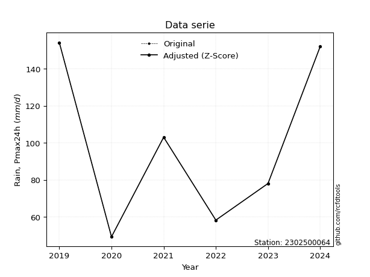</img>

</div>


> The initial value (value_initial) correspond to the initial obtained or null completed value, and value (value) is adjusted only when the initial value is outside the valid range (outlier) definite through the Z-Score value. If Z-Score is active, values out of range or outliers are replaced with the station mean value. A Z-Score (or standard score) measures how many standard deviations a data point is from the mean of a dataset, indicating its relative position; positive scores mean above the mean, negative mean below, and a score of zero is exactly at the mean, allowing for comparison of values from different distributions. It´s calculated using the formula $z=(x–μ)/σ$, where $x$ is the data point, $μ$ is the mean, and $σ$ is the standard deviation, helping identify outliers and understand probability.
>
> <sub>**Note**: In this study, "completing" (filling gaps in) and "extending" (forecasting or lengthening the historical record) rainfall data series are avoided for certain critical analyses because they introduce artificial bias and uncertainty, which can distort the statistics of rare events (extremes), alter day-to-day variability, and compromise the integrity and homogeneity of the original data. Some reasons against Completing/Extending rainfall data are: **Distortion of Extremes and Variability**: The primary issue is that most gap-filling or extension methods rely on averaging or regression with nearby stations, which inherently smooths the data. Rainfall is highly variable in space and time, with a large percentage of zero values and occasional large storms. Infilling methods often underestimate the highest values and overestimate the lowest (zero) values, which severely distorts analyses focused on flood frequency, drought severity, and intensity-duration-frequency (IDF) curves, **Loss of Data Homogeneity**: Infilled or extended data are synthetic estimates, not actual measurements. Combining these estimates with observed data can violate the assumption of data homogeneity, which requires that the data properties do not change over time. Inhomogeneity can lead to incorrect conclusions about long-term trends or changes in climate patterns, **Propagation of Errors**: Errors and biases from the original data (e.g., wind-induced undercatch, instrument errors, site changes) or the data used for imputation can propagate through the analysis, leading to unreliable hydrological models and inaccurate predictions, **Compromised Statistical Integrity**: For statistical analyses, especially those involving the frequency of events, using artificial data can introduce time bias or autocorrelation that doesn´t exist in reality, making it difficult to assess the true probability of events, **Difficulty in Validation**: It is difficult to accurately validate the quality of filled or extended data, especially for past periods where ground-truth measurements are unavailable. The reliability of imputation techniques heavily depends on the density of the surrounding station network and the complexity of the local topography.</sub>


### 4. Active continuous probability distributions from SciPy (80 of 104 available)

A Probability Density Function (PDF) describes the relative likelihood of a continuous random variable falling within a specific range, where the total area under its curve equals 1, and the area over any interval gives the actual probability for that range. Unlike discrete probabilities (like rolling a die), a PDF shows density, not direct probability for a single point (which is zero), with higher points indicating higher likelihood, often visualized as a bell curve for normal distributions.

A log of a probability density function (log-PDF) is simply the logarithm of the PDF´s value, denoted as $log(f(x))$, useful for converting multiplication of probabilities into addition, improving numerical stability with tiny numbers, and connecting to information theory concepts like entropy. Instead of dealing with very small probabilities (e.g., 0.000001), log-PDFs use negative numbers (e.g., $log(0.00001) ≈ -11.51$ that are easier for computers to handle, preventing underflow errors and simplifying complex calculations. In this study, each active probability distribution from SciPy is also evaluated in the $log$ form.

[scipy.stats](https://docs.scipy.org/doc/scipy/reference/stats.html) is a Python´s powerful submodule within the SciPy library for comprehensive statistical analysis, offering over 130 probability distributions (like Normal, Poisson, etc.), functions for descriptive stats (mean, variance), hypothesis testing (t-tests, chi-square), random variable generation, and statistical tests, making it essential for data science, modeling, and research. It provides tools to explore, model, and draw conclusions from data efficiently, working seamlessly with [NumPy](https://numpy.org/).

<div align="center">

|   id | p_dist           |   n_parameter | fit_method   | label                                                                       | active   | ref                                                                                                      |
|-----:|:-----------------|--------------:|:-------------|:----------------------------------------------------------------------------|:---------|:---------------------------------------------------------------------------------------------------------|
|    0 | alpha            |             3 | MLE          | Alpha                                                                       | True     | [:mortar_board:](https://docs.scipy.org/doc/scipy/reference/generated/scipy.stats.alpha.html)            |
|    1 | anglit           |             2 | MM           | Anglit                                                                      | True     | [:mortar_board:](https://docs.scipy.org/doc/scipy/reference/generated/scipy.stats.anglit.html)           |
|    2 | arcsine          |             2 | MM           | Arcsine                                                                     | True     | [:mortar_board:](https://docs.scipy.org/doc/scipy/reference/generated/scipy.stats.arcsine.html)          |
|    3 | argus            |             3 | MLE          | Argus                                                                       | True     | [:mortar_board:](https://docs.scipy.org/doc/scipy/reference/generated/scipy.stats.argus.html)            |
|    4 | beta             |             4 | MLE          | Beta                                                                        | True     | [:mortar_board:](https://docs.scipy.org/doc/scipy/reference/generated/scipy.stats.beta.html)             |
|    5 | betaprime        |             4 | MLE          | Beta prime                                                                  | True     | [:mortar_board:](https://docs.scipy.org/doc/scipy/reference/generated/scipy.stats.betaprime.html)        |
|    6 | bradford         |             3 | MLE          | Bradford                                                                    | True     | [:mortar_board:](https://docs.scipy.org/doc/scipy/reference/generated/scipy.stats.bradford.html)         |
|    7 | burr             |             4 | MLE          | Burr (Type III)                                                             | True     | [:mortar_board:](https://docs.scipy.org/doc/scipy/reference/generated/scipy.stats.burr.html)             |
|    8 | burr12           |             4 | MLE          | Burr (Type III) 12                                                          | True     | [:mortar_board:](https://docs.scipy.org/doc/scipy/reference/generated/scipy.stats.burr12.html)           |
|    9 | cosine           |             2 | MLE          | Cosine                                                                      | True     | [:mortar_board:](https://docs.scipy.org/doc/scipy/reference/generated/scipy.stats.cosine.html)           |
|   10 | crystalball      |             4 | MLE          | Crystalball                                                                 | True     | [:mortar_board:](https://docs.scipy.org/doc/scipy/reference/generated/scipy.stats.crystalball.html)      |
|   11 | dgamma           |             3 | MLE          | Double gamma                                                                | True     | [:mortar_board:](https://docs.scipy.org/doc/scipy/reference/generated/scipy.stats.dgamma.html)           |
|   12 | dweibull         |             3 | MLE          | Double Weibull                                                              | True     | [:mortar_board:](https://docs.scipy.org/doc/scipy/reference/generated/scipy.stats.dweibull.html)         |
|   13 | erlang           |             3 | MLE          | Erlang                                                                      | True     | [:mortar_board:](https://docs.scipy.org/doc/scipy/reference/generated/scipy.stats.erlang.html)           |
|   14 | exponnorm        |             3 | MLE          | Exponentially modified Normal                                               | True     | [:mortar_board:](https://docs.scipy.org/doc/scipy/reference/generated/scipy.stats.exponnorm.html)        |
|   15 | exponpow         |             3 | MLE          | Exponential power                                                           | True     | [:mortar_board:](https://docs.scipy.org/doc/scipy/reference/generated/scipy.stats.exponpow.html)         |
|   16 | exponweib        |             4 | MLE          | Exponentiated Weibull                                                       | True     | [:mortar_board:](https://docs.scipy.org/doc/scipy/reference/generated/scipy.stats.exponweib.html)        |
|   17 | f                |             4 | MLE          | F                                                                           | True     | [:mortar_board:](https://docs.scipy.org/doc/scipy/reference/generated/scipy.stats.f.html)                |
|   18 | fatiguelife      |             3 | MLE          | Fatigue-life (Birnbaum-Saunders)                                            | True     | [:mortar_board:](https://docs.scipy.org/doc/scipy/reference/generated/scipy.stats.fatiguelife.html)      |
|   19 | foldnorm         |             3 | MM           | Fold Normal                                                                 | True     | [:mortar_board:](https://docs.scipy.org/doc/scipy/reference/generated/scipy.stats.foldnorm.html)         |
|   20 | gamma            |             3 | MLE          | Gamma                                                                       | True     | [:mortar_board:](https://docs.scipy.org/doc/scipy/reference/generated/scipy.stats.gamma.html)            |
|   21 | gausshyper       |             6 | MLE          | Gauss hypergeometric                                                        | True     | [:mortar_board:](https://docs.scipy.org/doc/scipy/reference/generated/scipy.stats.gausshyper.html)       |
|   22 | genexpon         |             5 | MLE          | Generalized exponential                                                     | True     | [:mortar_board:](https://docs.scipy.org/doc/scipy/reference/generated/scipy.stats.genexpon.html)         |
|   23 | genextreme       |             3 | MLE          | Generalized exponential                                                     | True     | [:mortar_board:](https://docs.scipy.org/doc/scipy/reference/generated/scipy.stats.genextreme.html)       |
|   24 | gengamma         |             4 | MLE          | Generalized gamma                                                           | True     | [:mortar_board:](https://docs.scipy.org/doc/scipy/reference/generated/scipy.stats.gengamma.html)         |
|   25 | genhalflogistic  |             3 | MLE          | Generalized half-logistic                                                   | True     | [:mortar_board:](https://docs.scipy.org/doc/scipy/reference/generated/scipy.stats.genhalflogistic.html)  |
|   26 | genlogistic      |             3 | MLE          | Generalized logistic                                                        | True     | [:mortar_board:](https://docs.scipy.org/doc/scipy/reference/generated/scipy.stats.genlogistic.html)      |
|   27 | gennorm          |             3 | MLE          | Generalized Normal                                                          | True     | [:mortar_board:](https://docs.scipy.org/doc/scipy/reference/generated/scipy.stats.gennorm.html)          |
|   28 | genpareto        |             3 | MLE          | Generalized Pareto                                                          | True     | [:mortar_board:](https://docs.scipy.org/doc/scipy/reference/generated/scipy.stats.genpareto.html)        |
|   29 | gompertz         |             3 | MLE          | Gompertz (or truncated Gumbel)                                              | True     | [:mortar_board:](https://docs.scipy.org/doc/scipy/reference/generated/scipy.stats.gompertz.html)         |
|   30 | gumbel_l         |             2 | MM           | Gumbel Left Skew                                                            | True     | [:mortar_board:](https://docs.scipy.org/doc/scipy/reference/generated/scipy.stats.gumbel_l.html)         |
|   31 | gumbel_r         |             2 | MM           | Gumbel Right Skew                                                           | True     | [:mortar_board:](https://docs.scipy.org/doc/scipy/reference/generated/scipy.stats.gumbel_r.html)         |
|   32 | halfgennorm      |             3 | MLE          | Upper half of a generalized normal                                          | True     | [:mortar_board:](https://docs.scipy.org/doc/scipy/reference/generated/scipy.stats.halfgennorm.html)      |
|   33 | halflogistic     |             2 | MM           | Half-logistic                                                               | True     | [:mortar_board:](https://docs.scipy.org/doc/scipy/reference/generated/scipy.stats.halflogistic.html)     |
|   34 | halfnorm         |             2 | MM           | Half Normal                                                                 | True     | [:mortar_board:](https://docs.scipy.org/doc/scipy/reference/generated/scipy.stats.halfnorm.html)         |
|   35 | hypsecant        |             2 | MM           | hyperbolic secant                                                           | True     | [:mortar_board:](https://docs.scipy.org/doc/scipy/reference/generated/scipy.stats.hypsecant.html)        |
|   36 | invgamma         |             3 | MLE          | Inverted gamma                                                              | True     | [:mortar_board:](https://docs.scipy.org/doc/scipy/reference/generated/scipy.stats.invgamma.html)         |
|   37 | invgauss         |             3 | MLE          | Inverse Gaussian                                                            | True     | [:mortar_board:](https://docs.scipy.org/doc/scipy/reference/generated/scipy.stats.invgauss.html)         |
|   38 | invweibull       |             3 | MLE          | Inverted Weibull                                                            | True     | [:mortar_board:](https://docs.scipy.org/doc/scipy/reference/generated/scipy.stats.invweibull.html)       |
|   39 | johnsonsb        |             4 | MLE          | Johnson SB                                                                  | True     | [:mortar_board:](https://docs.scipy.org/doc/scipy/reference/generated/scipy.stats.johnsonsb.html)        |
|   40 | johnsonsu        |             4 | MLE          | Johnson Su                                                                  | True     | [:mortar_board:](https://docs.scipy.org/doc/scipy/reference/generated/scipy.stats.johnsonsu.html)        |
|   41 | kappa3           |             3 | MLE          | Kappa 3                                                                     | True     | [:mortar_board:](https://docs.scipy.org/doc/scipy/reference/generated/scipy.stats.kappa3.html)           |
|   42 | kappa4           |             4 | MLE          | Kappa 4                                                                     | True     | [:mortar_board:](https://docs.scipy.org/doc/scipy/reference/generated/scipy.stats.kappa4.html)           |
|   43 | ksone            |             3 | MLE          | Kolmogorov-Smirnov one-sided test statistic distribution                    | True     | [:mortar_board:](https://docs.scipy.org/doc/scipy/reference/generated/scipy.stats.ksone.html)            |
|   44 | kstwobign        |             2 | MLE          | Limiting distribution of scaled Kolmogorov-Smirnov two-sided test statistic | True     | [:mortar_board:](https://docs.scipy.org/doc/scipy/reference/generated/scipy.stats.kstwobign.html)        |
|   45 | laplace          |             2 | MM           | Laplace                                                                     | True     | [:mortar_board:](https://docs.scipy.org/doc/scipy/reference/generated/scipy.stats.laplace.html)          |
|   46 | levy_l           |             2 | MLE          | Left-skewed Levy                                                            | True     | [:mortar_board:](https://docs.scipy.org/doc/scipy/reference/generated/scipy.stats.levy_l.html)           |
|   47 | loggamma         |             3 | MLE          | Log gamma                                                                   | True     | [:mortar_board:](https://docs.scipy.org/doc/scipy/reference/generated/scipy.stats.loggamma.html)         |
|   48 | logistic         |             2 | MM           | Logistic (or Sech-squared)                                                  | True     | [:mortar_board:](https://docs.scipy.org/doc/scipy/reference/generated/scipy.stats.logistic.html)         |
|   49 | loglaplace       |             3 | MLE          | Log-Laplace                                                                 | True     | [:mortar_board:](https://docs.scipy.org/doc/scipy/reference/generated/scipy.stats.loglaplace.html)       |
|   50 | lomax            |             3 | MLE          | Lomax (Pareto of the second kind)                                           | True     | [:mortar_board:](https://docs.scipy.org/doc/scipy/reference/generated/scipy.stats.lomax.html)            |
|   51 | maxwell          |             2 | MM           | Maxwell                                                                     | True     | [:mortar_board:](https://docs.scipy.org/doc/scipy/reference/generated/scipy.stats.maxwell.html)          |
|   52 | mielke           |             4 | MLE          | Mielke Beta-Kappa / Dagum                                                   | True     | [:mortar_board:](https://docs.scipy.org/doc/scipy/reference/generated/scipy.stats.mielke.html)           |
|   53 | moyal            |             2 | MM           | Moyal                                                                       | True     | [:mortar_board:](https://docs.scipy.org/doc/scipy/reference/generated/scipy.stats.moyal.html)            |
|   54 | nakagami         |             3 | MLE          | Nakagami                                                                    | True     | [:mortar_board:](https://docs.scipy.org/doc/scipy/reference/generated/scipy.stats.nakagami.html)         |
|   55 | ncf              |             5 | MLE          | Non-central F distribution                                                  | True     | [:mortar_board:](https://docs.scipy.org/doc/scipy/reference/generated/scipy.stats.ncf.html)              |
|   56 | nct              |             4 | MLE          | Non-central Student’s t                                                     | True     | [:mortar_board:](https://docs.scipy.org/doc/scipy/reference/generated/scipy.stats.nct.html)              |
|   57 | norm             |             2 | MM           | Normal                                                                      | True     | [:mortar_board:](https://docs.scipy.org/doc/scipy/reference/generated/scipy.stats.norm.html)             |
|   58 | pearson3         |             3 | MM           | Pearson type III                                                            | True     | [:mortar_board:](https://docs.scipy.org/doc/scipy/reference/generated/scipy.stats.pearson3.html)         |
|   59 | powerlaw         |             3 | MLE          | Power-function                                                              | True     | [:mortar_board:](https://docs.scipy.org/doc/scipy/reference/generated/scipy.stats.powerlaw.html)         |
|   60 | rayleigh         |             2 | MM           | Rayleigh                                                                    | True     | [:mortar_board:](https://docs.scipy.org/doc/scipy/reference/generated/scipy.stats.rayleigh.html)         |
|   61 | rdist            |             3 | MLE          | R-distributed (symmetric beta)                                              | True     | [:mortar_board:](https://docs.scipy.org/doc/scipy/reference/generated/scipy.stats.rdist.html)            |
|   62 | rice             |             3 | MLE          | Rice                                                                        | True     | [:mortar_board:](https://docs.scipy.org/doc/scipy/reference/generated/scipy.stats.rice.html)             |
|   63 | semicircular     |             2 | MM           | Semicircular                                                                | True     | [:mortar_board:](https://docs.scipy.org/doc/scipy/reference/generated/scipy.stats.semicircular.html)     |
|   64 | skewnorm         |             3 | MLE          | Skew normal                                                                 | True     | [:mortar_board:](https://docs.scipy.org/doc/scipy/reference/generated/scipy.stats.skewnorm.html)         |
|   65 | t                |             3 | MLE          | Student’s t                                                                 | True     | [:mortar_board:](https://docs.scipy.org/doc/scipy/reference/generated/scipy.stats.t.html)                |
|   66 | trapezoid        |             4 | MLE          | Trapezoid                                                                   | True     | [:mortar_board:](https://docs.scipy.org/doc/scipy/reference/generated/scipy.stats.trapezoid.html)        |
|   67 | triang           |             3 | MLE          | Triangular                                                                  | True     | [:mortar_board:](https://docs.scipy.org/doc/scipy/reference/generated/scipy.stats.triang.html)           |
|   68 | truncexpon       |             3 | MLE          | Truncated exponential                                                       | True     | [:mortar_board:](https://docs.scipy.org/doc/scipy/reference/generated/scipy.stats.truncexpon.html)       |
|   69 | truncnorm        |             4 | MLE          | Truncated normal                                                            | True     | [:mortar_board:](https://docs.scipy.org/doc/scipy/reference/generated/scipy.stats.truncnorm.html)        |
|   70 | truncpareto      |             4 | MLE          | Upper truncated Pareto                                                      | True     | [:mortar_board:](https://docs.scipy.org/doc/scipy/reference/generated/scipy.stats.truncpareto.html)      |
|   71 | truncweibull_min |             5 | MLE          | Doubly truncated Weibull minimum                                            | True     | [:mortar_board:](https://docs.scipy.org/doc/scipy/reference/generated/scipy.stats.truncweibull_min.html) |
|   72 | tukeylambda      |             3 | MLE          | Tukey-Lamdba                                                                | True     | [:mortar_board:](https://docs.scipy.org/doc/scipy/reference/generated/scipy.stats.tukeylambda.html)      |
|   73 | uniform          |             2 | MLE          | Uniform                                                                     | True     | [:mortar_board:](https://docs.scipy.org/doc/scipy/reference/generated/scipy.stats.uniform.html)          |
|   74 | vonmises         |             3 | MLE          | Von Mises                                                                   | True     | [:mortar_board:](https://docs.scipy.org/doc/scipy/reference/generated/scipy.stats.vonmises.html)         |
|   75 | vonmises_line    |             3 | MLE          | Von Mises line                                                              | True     | [:mortar_board:](https://docs.scipy.org/doc/scipy/reference/generated/scipy.stats.vonmises_line.html)    |
|   76 | wald             |             2 | MM           | Wald                                                                        | True     | [:mortar_board:](https://docs.scipy.org/doc/scipy/reference/generated/scipy.stats.wald.html)             |
|   77 | weibull_max      |             3 | MLE          | Weibull maximum                                                             | True     | [:mortar_board:](https://docs.scipy.org/doc/scipy/reference/generated/scipy.stats.weibull_max.html)      |
|   78 | weibull_min      |             3 | MLE          | Weibull minimum                                                             | True     | [:mortar_board:](https://docs.scipy.org/doc/scipy/reference/generated/scipy.stats.weibull_min.html)      |
|   79 | wrapcauchy       |             3 | MLE          | Wrapped  Cauchy                                                             | True     | [:mortar_board:](https://docs.scipy.org/doc/scipy/reference/generated/scipy.stats.wrapcauchy.html)       |

</div>

> **n_parameter:** # arguments & localization & scale.
>
> **Fit methods:** (MLE) maximum likelihood, (MM) L-moments.
>
>**Inactive** (With the only purpose of prevent loops, zero divisions, infinite values, over high estimated values or horizontal trending for recurrence intervals estimations, the follow distributions were disabled.)**:** lognorm, norminvgauss, powernorm, powerlognorm, cauchy, halfcauchy, foldcauchy, skewcauchy, chi2, expon, fisk, genhyperbolic, geninvgauss, gibrat, kstwo, laplace_asymmetric, levy, levy_stable, ncx2, pareto, rel_breitwigner, recipinvgauss, studentized_range, loguniform, 


## B. Probability (PDF) vs. Empirical (EDF) distributions functions

A continuous probability distribution (CPD) describes probabilities for variables that can take any value within a range (like rain any time), unlike discrete variables with specific outcomes (like temperature). It uses a Probability Density Function (PDF), a curve where the total area under it equals 1, and the probability of the variable falling within an interval (a to b) is found by calculating the area under the curve between those points. A key feature is that the probability of hitting any single exact value is zero, so probabilities are always expressed for ranges, e.g., $P(a ≤ X ≤ b)$.

<div align="center">

Distributions parameters from station values
|     |    station | p_dist              |   n |             loc |           scale | shape                 | shape1                | shape2                | shape3             |
|----:|-----------:|:--------------------|----:|----------------:|----------------:|:----------------------|:----------------------|:----------------------|:-------------------|
|   0 | 2302500064 | alpha               |   7 |  -414.958       |  6783.16        | 13.207215892569128    |                       |                       |                    |
|   1 | 2302500064 | anglit              |   7 |   101.743       |   114.647       |                       |                       |                       |                    |
|   2 | 2302500064 | arcsine             |   7 |    46.3198      |   110.846       |                       |                       |                       |                    |
|   3 | 2302500064 | argus               |   7 |    19.5281      |   144.134       | 1.649382672896727e-05 |                       |                       |                    |
|   4 | 2302500064 | beta                |   7 |    49.2         |   107.292       | 0.5186867491980616    | 0.600488125837592     |                       |                    |
|   5 | 2302500064 | betaprime           |   7 |     0.497436    |   178.197       | 9.530232871556343     | 17.765336792824705    |                       |                    |
|   6 | 2302500064 | bradford            |   7 |    49.2         |   105           | 1.0389934579758946    |                       |                       |                    |
|   7 | 2302500064 | burr                |   7 |    -0.22342     |    46.4139      | 2.8475190738349987    | 4.749348082382809     |                       |                    |
|   8 | 2302500064 | burr12              |   7 |    -1.34346     |    50.2205      | 627.8468940031858     | 0.0024919411689190577 |                       |                    |
|   9 | 2302500064 | cosine              |   7 |   102.169       |    31.2773      |                       |                       |                       |                    |
|  10 | 2302500064 | crystalball         |   7 |   101.743       |    39.19        | 7338.9045824477635    | 7507.678361620523     |                       |                    |
|  11 | 2302500064 | dgamma              |   7 |    92.227       |    11.8907      | 2.9936080607449647    |                       |                       |                    |
|  12 | 2302500064 | dweibull            |   7 |    93.7605      |    39.9807      | 1.9964294249125896    |                       |                       |                    |
|  13 | 2302500064 | erlang              |   7 |  -559.148       |     2.31482     | 285.51176331454747    |                       |                       |                    |
|  14 | 2302500064 | exponnorm           |   7 |    99.5408      |    39.1281      | 0.05627737220923404   |                       |                       |                    |
|  15 | 2302500064 | exponpow            |   7 |    49.2         |    80.3171      | 0.7980951014757663    |                       |                       |                    |
|  16 | 2302500064 | exponweib           |   7 |    49.2         |     1.22723     | 1.2375452130002098    | 0.20541084656838032   |                       |                    |
|  17 | 2302500064 | f                   |   7 |    49.1946      |    53.0369      | 1.1669039345372338    | 6705.131604578682     |                       |                    |
|  18 | 2302500064 | fatiguelife         |   7 |    49.2         |     0.000457896 | 359.1259596658474     |                       |                       |                    |
|  19 | 2302500064 | foldnorm            |   7 |     5.63968     |    39.6907      | 2.4161191300591813    |                       |                       |                    |
|  20 | 2302500064 | gamma               |   7 |  -566.046       |     2.29414     | 291.13395011399416    |                       |                       |                    |
|  21 | 2302500064 | gausshyper          |   7 |    48.9697      |   105.23        | 0.9731722972478507    | 0.8883533999007394    | 1.0749740901406035    | 0.9846403352798476 |
|  22 | 2302500064 | genexpon            |   7 |    49.2         |     3.02926     | 0.05757935424213019   | 2.979622697229776e-05 | 0.7551262821925279    |                    |
|  23 | 2302500064 | genextreme          |   7 |    49.6417      |     2.68473     | -6.077747901114218    |                       |                       |                    |
|  24 | 2302500064 | gengamma            |   7 |    49.2         |     1.21428     | 1.3057310550796304    | 0.21330200150228867   |                       |                    |
|  25 | 2302500064 | genhalflogistic     |   7 |    14.6799      |   151.818       | 1.0881457211701506    |                       |                       |                    |
|  26 | 2302500064 | genlogistic         |   7 |  -138.649       |    33.8366      | 688.8676339241547     |                       |                       |                    |
|  27 | 2302500064 | gennorm             |   7 |   101.7         |    52.5         | 36265858.694340006    |                       |                       |                    |
|  28 | 2302500064 | genpareto           |   7 |    -1.23649     |   294.025       | -1.891606188705245    |                       |                       |                    |
|  29 | 2302500064 | gompertz            |   7 |    49.2         |    74.631       | 0.7605383628119682    |                       |                       |                    |
|  30 | 2302500064 | gumbel_l            |   7 |   119.38        |    30.5564      |                       |                       |                       |                    |
|  31 | 2302500064 | gumbel_r            |   7 |    84.1053      |    30.5564      |                       |                       |                       |                    |
|  32 | 2302500064 | halfgennorm         |   7 |    49.2         |     1.20101     | 0.32790182213388586   |                       |                       |                    |
|  33 | 2302500064 | halflogistic        |   7 |    55.2935      |    33.5061      |                       |                       |                       |                    |
|  34 | 2302500064 | halfnorm            |   7 |    49.8706      |    65.0123      |                       |                       |                       |                    |
|  35 | 2302500064 | hypsecant           |   7 |   101.743       |    24.9492      |                       |                       |                       |                    |
|  36 | 2302500064 | invgamma            |   7 |  -166.346       | 12157.9         | 46.37003988120014     |                       |                       |                    |
|  37 | 2302500064 | invgauss            |   7 |    -4.74769     |   642.231       | 0.16581342987855852   |                       |                       |                    |
|  38 | 2302500064 | invweibull          |   7 |    49.2         |     1.36288     | 0.06169141031876538   |                       |                       |                    |
|  39 | 2302500064 | johnsonsb           |   7 |    49.2         |   105           | 0.5615656471715744    | 0.081800712050129     |                       |                    |
|  40 | 2302500064 | johnsonsu           |   7 |     1.42352e+09 |     1.04368e+07 | 202787721.92739213    | 36155841.822374515    |                       |                    |
|  41 | 2302500064 | kappa3              |   7 |    49.2         |   116.935       | 446.58955253879697    |                       |                       |                    |
|  42 | 2302500064 | kappa4              |   7 |    33.2163      |   123.787       | 1.1484852939155081    | 1.0188942416107027    |                       |                    |
|  43 | 2302500064 | ksone               |   7 |    33.8637      |   135.758       | 1.0                   |                       |                       |                    |
|  44 | 2302500064 | kstwobign           |   7 |   -33.5455      |   154.315       |                       |                       |                       |                    |
|  45 | 2302500064 | laplace             |   7 |   101.743       |    27.7115      |                       |                       |                       |                    |
|  46 | 2302500064 | levy_l              |   7 |   156.837       |    10.5717      |                       |                       |                       |                    |
|  47 | 2302500064 | loggamma            |   7 | -8336.74        |  1227.11        | 969.8446053247085     |                       |                       |                    |
|  48 | 2302500064 | logistic            |   7 |   101.743       |    21.6066      |                       |                       |                       |                    |
|  49 | 2302500064 | loglaplace          |   7 |    -0.322797    |   103.323       | 2.7958360281002723    |                       |                       |                    |
|  50 | 2302500064 | lomax               |   7 |    49.2         |  5408.32        | 103.33280205755278    |                       |                       |                    |
|  51 | 2302500064 | maxwell             |   7 |     8.87891     |    58.1939      |                       |                       |                       |                    |
|  52 | 2302500064 | mielke              |   7 |  -622.597       |   516.279       | 14722.115336528914    | 21.110803912724514    |                       |                    |
|  53 | 2302500064 | moyal               |   7 |    79.3315      |    17.6417      |                       |                       |                       |                    |
|  54 | 2302500064 | nakagami            |   7 |    49.2         |    73.0928      | 0.3586435832428937    |                       |                       |                    |
|  55 | 2302500064 | ncf                 |   7 |    -3.29208     |    67.5936      | 12.064986699177528    | 603.3507988237145     | 6.625146382981207     |                    |
|  56 | 2302500064 | nct                 |   7 | -1677.79        |    39.1177      | 249953.735380698      | 45.491486043306935    |                       |                    |
|  57 | 2302500064 | norm                |   7 |   101.743       |    39.19        |                       |                       |                       |                    |
|  58 | 2302500064 | pearson3            |   7 |   101.743       |    39.19        | 0.0813692995151158    |                       |                       |                    |
|  59 | 2302500064 | powerlaw            |   7 |    49.2         |   105           | 0.16626822474711947   |                       |                       |                    |
|  60 | 2302500064 | rayleigh            |   7 |    26.77        |    59.8197      |                       |                       |                       |                    |
|  61 | 2302500064 | rdist               |   7 |   101.891       |    52.6911      | 1.1112508893059823    |                       |                       |                    |
|  62 | 2302500064 | rice                |   7 |    29.1833      |    49.2564      | 0.8961306907874362    |                       |                       |                    |
|  63 | 2302500064 | semicircular        |   7 |   101.743       |    78.3801      |                       |                       |                       |                    |
|  64 | 2302500064 | skewnorm            |   7 |    90.9813      |    40.6408      | 0.3517775708082437    |                       |                       |                    |
|  65 | 2302500064 | t                   |   7 |   101.742       |    39.1898      | 76769.13985071395     |                       |                       |                    |
|  66 | 2302500064 | trapezoid           |   7 |    -9.55849     |   166.269       | 1.0                   | 1.0                   |                       |                    |
|  67 | 2302500064 | triang              |   7 |    12.2519      |   141.949       | 0.9999999999999536    |                       |                       |                    |
|  68 | 2302500064 | truncexpon          |   7 |    49.2         |   114.26        | 0.91895706592484      |                       |                       |                    |
|  69 | 2302500064 | truncnorm           |   7 |   101.743       |    39.19        | -2072.8978148619026   | 459.3970141693218     |                       |                    |
|  70 | 2302500064 | truncpareto         |   7 |    49.1542      |     0.0458367   | 0.1684308323052627    | 2291.740637213838     |                       |                    |
|  71 | 2302500064 | truncweibull_min    |   7 |    49.0677      |   163.014       | 0.7942980848956966    | 0.0008109727646162265 | 0.6449293333784587    |                    |
|  72 | 2302500064 | tukeylambda         |   7 |   101.503       |    55.9663      | 1.0620413173282324    |                       |                       |                    |
|  73 | 2302500064 | uniform             |   7 |    49.2         |   105           |                       |                       |                       |                    |
|  74 | 2302500064 | vonmises            |   7 |     2.70592     |     1           | 0.6835651208811448    |                       |                       |                    |
|  75 | 2302500064 | vonmises_line       |   7 |   101.7         |    16.7113      | 3.588999952859204e-05 |                       |                       |                    |
|  76 | 2302500064 | wald                |   7 |    62.5528      |    39.19        |                       |                       |                       |                    |
|  77 | 2302500064 | weibull_max         |   7 |   154.2         |     1.54802     | 0.2505033324818928    |                       |                       |                    |
|  78 | 2302500064 | weibull_min         |   7 |    49.2         |    50.8822      | 0.782984741271582     |                       |                       |                    |
|  79 | 2302500064 | wrapcauchy          |   7 |    49.2         |    16.7113      | 0.5759579364092251    |                       |                       |                    |
|  80 | 2302500064 | logalpha            |   7 |    -4.95682     |   211.278       | 22.28158578080398     |                       |                       |                    |
|  81 | 2302500064 | loganglit           |   7 |     4.54009     |     1.22037     |                       |                       |                       |                    |
|  82 | 2302500064 | logarcsine          |   7 |     3.95015     |     1.17989     |                       |                       |                       |                    |
|  83 | 2302500064 | logargus            |   7 |     3.54468     |     1.56798     | 1.4432870277374699    |                       |                       |                    |
|  84 | 2302500064 | logbeta             |   7 |     3.85631     |     1.18194     | 0.6344541583025809    | 0.5157301837351643    |                       |                    |
|  85 | 2302500064 | logbetaprime        |   7 |   -31.327       |    16.9972      | 22687.4991915814      | 10751.831547632119    |                       |                    |
|  86 | 2302500064 | logbradford         |   7 |     3.89587     |     1.14239     | 1.0967258848225256    |                       |                       |                    |
|  87 | 2302500064 | logburr             |   7 |   -21.3029      |    26.3488      | 11400.738606087823    | 0.004511230843408048  |                       |                    |
|  88 | 2302500064 | logburr12           |   7 |    -2.07465     |     9.42673     | 19.302228690206753    | 537.6434622977135     |                       |                    |
|  89 | 2302500064 | logcosine           |   7 |     4.5239      |     0.334965    |                       |                       |                       |                    |
|  90 | 2302500064 | logcrystalball      |   7 |     4.54009     |     0.417166    | 73.03240944770079     | 79.08910081694853     |                       |                    |
|  91 | 2302500064 | logdgamma           |   7 |     4.49781     |     0.109247    | 3.465079924181903     |                       |                       |                    |
|  92 | 2302500064 | logdweibull         |   7 |     4.4925      |     0.429236    | 2.2926007212902784    |                       |                       |                    |
|  93 | 2302500064 | logerlang           |   7 |    -3.2208      |     0.0229008   | 338.79156564667437    |                       |                       |                    |
|  94 | 2302500064 | logexponnorm        |   7 |     4.53976     |     0.417163    | 0.000797842494242353  |                       |                       |                    |
|  95 | 2302500064 | logexponpow         |   7 |     3.89589     |     1.55798     | 0.19368435557258892   |                       |                       |                    |
|  96 | 2302500064 | logexponweib        |   7 |     3.89589     |     0.939303    | 0.11495142613036906   | 1.5358299281587344    |                       |                    |
|  97 | 2302500064 | logf                |   7 |  -123.136       |   127.678       | 297520.7846353066     | 501974.77956660796    |                       |                    |
|  98 | 2302500064 | logfatiguelife      |   7 |   -74.2752      |    78.8147      | 0.005273270173178239  |                       |                       |                    |
|  99 | 2302500064 | logfoldnorm         |   7 |     3.99423     |     0.683868    | 8.218232647938978e-05 |                       |                       |                    |
| 100 | 2302500064 | loggamma            |   7 |    -2.84689     |     0.0240311   | 307.3336033987107     |                       |                       |                    |
| 101 | 2302500064 | loggausshyper       |   7 |     3.88772     |     1.15053     | 1.0048418851483145    | 0.8255868838311268    | 1.153999346112926     | 1.2442414524945649 |
| 102 | 2302500064 | loggenexpon         |   7 |     3.89116     |     0.003238    | 0.0025397416275370847 | 2.0495761192068276    | 8.466368526154332e-06 |                    |
| 103 | 2302500064 | loggenextreme       |   7 |     4.70704     |     0.431518    | 1.3028501220202688    |                       |                       |                    |
| 104 | 2302500064 | loggengamma         |   7 |     3.89589     |     1.37573     | 0.4553488103407246    | 0.4218367576215971    |                       |                    |
| 105 | 2302500064 | loggenhalflogistic  |   7 |     3.89544     |     1.19413     | 1.0449083780536732    |                       |                       |                    |
| 106 | 2302500064 | loggenlogistic      |   7 |     5.03827     |     2.56011e-06 | 5.136829848112307e-06 |                       |                       |                    |
| 107 | 2302500064 | loggennorm          |   7 |     4.46707     |     0.57118     | 4498992.021710534     |                       |                       |                    |
| 108 | 2302500064 | loggenpareto        |   7 |    -0.0156507   |    14.8078      | -2.9299689193441427   |                       |                       |                    |
| 109 | 2302500064 | loggompertz         |   7 |     3.89589     |     1.03607     | 1.0254535588385991    |                       |                       |                    |
| 110 | 2302500064 | loggumbel_l         |   7 |     4.72784     |     0.325262    |                       |                       |                       |                    |
| 111 | 2302500064 | loggumbel_r         |   7 |     4.35234     |     0.325262    |                       |                       |                       |                    |
| 112 | 2302500064 | loghalfgennorm      |   7 |     3.89589     |     1.14245     | 139334.83082087082    |                       |                       |                    |
| 113 | 2302500064 | loghalflogistic     |   7 |     4.04563     |     0.356675    |                       |                       |                       |                    |
| 114 | 2302500064 | loghalfnorm         |   7 |     3.98793     |     0.692036    |                       |                       |                       |                    |
| 115 | 2302500064 | loghypsecant        |   7 |     4.54009     |     0.265575    |                       |                       |                       |                    |
| 116 | 2302500064 | loginvgamma         |   7 |    -3.83414     |  3296.18        | 394.658728363072      |                       |                       |                    |
| 117 | 2302500064 | loginvgauss         |   7 |     1.2908      |   184.424       | 0.017591321698184656  |                       |                       |                    |
| 118 | 2302500064 | loginvweibull       |   7 |    -2.77246e+07 |     2.77246e+07 | 70437783.02757972     |                       |                       |                    |
| 119 | 2302500064 | logjohnsonsb        |   7 |     3.47277     |     1.56548     | -0.605081646364224    | 0.1552343992022212    |                       |                    |
| 120 | 2302500064 | logjohnsonsu        |   7 |     5.03825     |     3.47208e-11 | 5.875950240691912     | 0.26933230501269      |                       |                    |
| 121 | 2302500064 | logkappa3           |   7 |     3.89589     |     1.14183     | 4229.753677930963     |                       |                       |                    |
| 122 | 2302500064 | logkappa4           |   7 |     3.92576     |     1.27191     | 0.9539953790817107    | 1.143293511771318     |                       |                    |
| 123 | 2302500064 | logksone            |   7 |     3.81754     |     1.4451      | 1.0                   |                       |                       |                    |
| 124 | 2302500064 | logkstwobign        |   7 |     2.97693     |     1.78088     |                       |                       |                       |                    |
| 125 | 2302500064 | loglaplace          |   7 |     4.54009     |     0.29498     |                       |                       |                       |                    |
| 126 | 2302500064 | loglevy_l           |   7 |     5.0591      |     0.0819431   |                       |                       |                       |                    |
| 127 | 2302500064 | logloggamma         |   7 |     5.03851     |     4.24975e-06 | 8.509969002328241e-06 |                       |                       |                    |
| 128 | 2302500064 | loglogistic         |   7 |     4.54009     |     0.229995    |                       |                       |                       |                    |
| 129 | 2302500064 | logloglaplace       |   7 |     6.52111e-05 |     4.63466     | 12.514522214938797    |                       |                       |                    |
| 130 | 2302500064 | loglomax            |   7 |     3.89345     |    42.0424      | 65.2536725547868      |                       |                       |                    |
| 131 | 2302500064 | logmaxwell          |   7 |     3.55159     |     0.619453    |                       |                       |                       |                    |
| 132 | 2302500064 | logmielke           |   7 |     3.89589     |     1.18449     | 0.5707415662489252    | 345.1658627763844     |                       |                    |
| 133 | 2302500064 | logmoyal            |   7 |     4.30153     |     0.18779     |                       |                       |                       |                    |
| 134 | 2302500064 | lognakagami         |   7 |     3.89589     |     0.801743    | 0.08050340508233825   |                       |                       |                    |
| 135 | 2302500064 | logncf              |   7 |    -5.46494     |     9.98664     | 1673.5187900122676    | 3591.636319359261     | 1.6255021332483173    |                    |
| 136 | 2302500064 | lognct              |   7 |    17.8315      |     0.407706    | 10615.794481283025    | -32.59702501558589    |                       |                    |
| 137 | 2302500064 | lognorm             |   7 |     4.54009     |     0.417164    |                       |                       |                       |                    |
| 138 | 2302500064 | logpearson3         |   7 |     4.54009     |     0.417165    | -0.2599114700859636   |                       |                       |                    |
| 139 | 2302500064 | logpowerlaw         |   7 |     3.89589     |     1.14236     | 0.17936038024898884   |                       |                       |                    |
| 140 | 2302500064 | lograyleigh         |   7 |     3.74203     |     0.636759    |                       |                       |                       |                    |
| 141 | 2302500064 | logrdist            |   7 |     4.78238     |     0.718493    | 1.0020183940387435    |                       |                       |                    |
| 142 | 2302500064 | logrice             |   7 |     3.67736     |     0.485895    | 1.3746521608500233    |                       |                       |                    |
| 143 | 2302500064 | logsemicircular     |   7 |     4.54009     |     0.834328    |                       |                       |                       |                    |
| 144 | 2302500064 | logskewnorm         |   7 |     5.03825     |     0.649826    | -10627503.140261762   |                       |                       |                    |
| 145 | 2302500064 | logt                |   7 |     4.54011     |     0.417159    | 66171737.772955626    |                       |                       |                    |
| 146 | 2302500064 | logtrapezoid        |   7 |     3.36017     |     1.76988     | 1.0                   | 1.0                   |                       |                    |
| 147 | 2302500064 | logtriang           |   7 |     3.57322     |     1.46503     | 0.9999991574112717    |                       |                       |                    |
| 148 | 2302500064 | logtruncexpon       |   7 |     3.89589     |     1.31959     | 0.8656975778361513    |                       |                       |                    |
| 149 | 2302500064 | logtruncnorm        |   7 |     2.80363     |     1.15138     | 1.0945584620586108    | 76.03980374374447     |                       |                    |
| 150 | 2302500064 | logtruncpareto      |   7 |     3.89528     |     0.000614468 | 0.168145101760379     | 1860.097745709364     |                       |                    |
| 151 | 2302500064 | logtruncweibull_min |   7 |     3.87849     |     1.3713      | 1.1354302029331484    | 0.0005004859070294307 | 0.8457344691962968    |                    |
| 152 | 2302500064 | logtukeylambda      |   7 |     4.46        |     0.654601    | 1.132044114720605     |                       |                       |                    |
| 153 | 2302500064 | loguniform          |   7 |     3.89589     |     1.14236     |                       |                       |                       |                    |
| 154 | 2302500064 | logvonmises         |   7 |    -1.73976     |     1           | 6.176459209013266     |                       |                       |                    |
| 155 | 2302500064 | logvonmises_line    |   7 |     4.46141     |     0.18362     | 6.742929714036407e-06 |                       |                       |                    |
| 156 | 2302500064 | logwald             |   7 |     4.12295     |     0.417143    |                       |                       |                       |                    |
| 157 | 2302500064 | logweibull_max      |   7 |     5.03825     |     0.487278    | 0.4639188001592822    |                       |                       |                    |
| 158 | 2302500064 | logweibull_min      |   7 |     1.48596     |     3.2344      | 8.896766943941206     |                       |                       |                    |
| 159 | 2302500064 | logwrapcauchy       |   7 |     3.89589     |     0.181812    | 0.4745103738016445    |                       |                       |                    |

</div>

> **loc** (Location parameter): This shifts the distribution along the x-axis. For many common distributions, like the normal (Gaussian) distribution, loc represents the mean $μ$. For others, like the uniform distribution, it might represent the minimum value, or for the beta distribution, the left end of the support interval.
>
> **scale** (Scale parameter): This determines the width or spread of the distribution. For the normal distribution, scale represents the standard deviation $σ$. For a uniform distribution, it defines the length of the interval (from $loc$ to $loc + scale$).
>
> **shape** (Shape parameters): Refers to parameters that define the specific form of a probability distribution, distinct from its location (loc) and scale (scale). These parameters are required arguments for most distribution functions. For example, a normal (Gaussian) distribution is fully defined by its location (mean) and scale (standard deviation), so it has no specific shape parameters beyond loc and scale. However, other distributions have intrinsic properties that need specification, as Gamma distribution that takes a shape parameter, often named $a$ or $alpha$.


### 0. Cumulative distribution values - CDF (160 evaluated)

Cumulative Distribution Function (CDF), denoted as $F$<sub>$X$</sub>$(x)$, is a function that gives the probability that a random variable $X$ will take a value less than or equal to a specific value, $x$ (i.e., $(P(X≥x)$. It essentially "accumulates" probabilities from a given point up to the far right (positive infinity), providing a complete picture of the distribution´s probabilities for both discrete (like rain) and continuous (like temperature) variables, helping to find probabilities over ranges or above certain values. Each station is evaluated separately ordering the $x$ values ascending, calculating the CDF and PDF values for the activated distributions and their logarithmic forms.

<div align="center">

CDF ordered by x ascending and calculating $log(f(x))$ separately
|   id |    Station |   date |     x |   count |    mean |     std |     zscore |   Value_initial |    station |   m |     alpha |   alpha_pdf |   anglit |   anglit_pdf |   arcsine |   arcsine_pdf |     argus |   argus_pdf |        beta |        beta_pdf |   betaprime |   betaprime_pdf |    bradford |   bradford_pdf |      burr |   burr_pdf |    burr12 |   burr12_pdf |    cosine |   cosine_pdf |   crystalball |   crystalball_pdf |   dgamma |   dgamma_pdf |   dweibull |   dweibull_pdf |    erlang |   erlang_pdf |   exponnorm |   exponnorm_pdf |    exponpow |   exponpow_pdf |   exponweib |   exponweib_pdf |         f |      f_pdf |   fatiguelife |   fatiguelife_pdf |   foldnorm |   foldnorm_pdf |     gamma |   gamma_pdf |   gausshyper |   gausshyper_pdf |   genexpon |   genexpon_pdf |   genextreme |   genextreme_pdf |    gengamma |   gengamma_pdf |   genhalflogistic |   genhalflogistic_pdf |   genlogistic |   genlogistic_pdf |     gennorm |   gennorm_pdf |   genpareto |   genpareto_pdf |    gompertz |   gompertz_pdf |   gumbel_l |   gumbel_l_pdf |   gumbel_r |   gumbel_r_pdf |   halfgennorm |   halfgennorm_pdf |   halflogistic |   halflogistic_pdf |   halfnorm |   halfnorm_pdf |   hypsecant |   hypsecant_pdf |   invgamma |   invgamma_pdf |   invgauss |   invgauss_pdf |   invweibull |   invweibull_pdf |   johnsonsb |   johnsonsb_pdf |   johnsonsu |   johnsonsu_pdf |      kappa3 |   kappa3_pdf |      kappa4 |   kappa4_pdf |    ksone |   ksone_pdf |   kstwobign |   kstwobign_pdf |   laplace |   laplace_pdf |   levy_l |   levy_l_pdf |   loggamma |   loggamma_pdf |   logistic |   logistic_pdf |   loglaplace |   loglaplace_pdf |       lomax |   lomax_pdf |   maxwell |   maxwell_pdf |   mielke |   mielke_pdf |     moyal |   moyal_pdf |    nakagami |   nakagami_pdf |       ncf |    ncf_pdf |       nct |    nct_pdf |      norm |   norm_pdf |   pearson3 |   pearson3_pdf |   powerlaw |   powerlaw_pdf |   rayleigh |   rayleigh_pdf |       rdist |      rdist_pdf |      rice |   rice_pdf |   semicircular |   semicircular_pdf |   skewnorm |   skewnorm_pdf |         t |      t_pdf |   trapezoid |   trapezoid_pdf |    triang |   triang_pdf |   truncexpon |   truncexpon_pdf |   truncnorm |   truncnorm_pdf |   truncpareto |   truncpareto_pdf |   truncweibull_min |   truncweibull_min_pdf |   tukeylambda |   tukeylambda_pdf |   uniform |   uniform_pdf |   vonmises |   vonmises_pdf |   vonmises_line |   vonmises_line_pdf |     wald |   wald_pdf |   weibull_max |   weibull_max_pdf |   weibull_min |   weibull_min_pdf |   wrapcauchy |   wrapcauchy_pdf |   logalpha |   logalpha_pdf |   loganglit |   loganglit_pdf |   logarcsine |   logarcsine_pdf |   logargus |   logargus_pdf |   logbeta |   logbeta_pdf |   logbetaprime |   logbetaprime_pdf |   logbradford |   logbradford_pdf |   logburr |   logburr_pdf |   logburr12 |   logburr12_pdf |   logcosine |   logcosine_pdf |   logcrystalball |   logcrystalball_pdf |   logdgamma |   logdgamma_pdf |   logdweibull |   logdweibull_pdf |   logerlang |   logerlang_pdf |   logexponnorm |   logexponnorm_pdf |   logexponpow |   logexponpow_pdf |   logexponweib |   logexponweib_pdf |      logf |   logf_pdf |   logfatiguelife |   logfatiguelife_pdf |   logfoldnorm |   logfoldnorm_pdf |   loggausshyper |   loggausshyper_pdf |   loggenexpon |   loggenexpon_pdf |   loggenextreme |   loggenextreme_pdf |   loggengamma |   loggengamma_pdf |   loggenhalflogistic |   loggenhalflogistic_pdf |   loggenlogistic |   loggenlogistic_pdf |   loggennorm |   loggennorm_pdf |   loggenpareto |   loggenpareto_pdf |   loggompertz |   loggompertz_pdf |   loggumbel_l |   loggumbel_l_pdf |   loggumbel_r |   loggumbel_r_pdf |   loghalfgennorm |   loghalfgennorm_pdf |   loghalflogistic |   loghalflogistic_pdf |   loghalfnorm |   loghalfnorm_pdf |   loghypsecant |   loghypsecant_pdf |   loginvgamma |   loginvgamma_pdf |   loginvgauss |   loginvgauss_pdf |   loginvweibull |   loginvweibull_pdf |   logjohnsonsb |   logjohnsonsb_pdf |   logjohnsonsu |   logjohnsonsu_pdf |   logkappa3 |   logkappa3_pdf |   logkappa4 |   logkappa4_pdf |   logksone |   logksone_pdf |   logkstwobign |   logkstwobign_pdf |   loglevy_l |   loglevy_l_pdf |   logloggamma |   logloggamma_pdf |   loglogistic |   loglogistic_pdf |   logloglaplace |   logloglaplace_pdf |   loglomax |   loglomax_pdf |   logmaxwell |   logmaxwell_pdf |   logmielke |   logmielke_pdf |   logmoyal |   logmoyal_pdf |   lognakagami |   lognakagami_pdf |    logncf |   logncf_pdf |    lognct |   lognct_pdf |   lognorm |   lognorm_pdf |   logpearson3 |   logpearson3_pdf |   logpowerlaw |   logpowerlaw_pdf |   lograyleigh |   lograyleigh_pdf |    logrdist |   logrdist_pdf |   logrice |   logrice_pdf |   logsemicircular |   logsemicircular_pdf |   logskewnorm |   logskewnorm_pdf |      logt |   logt_pdf |   logtrapezoid |   logtrapezoid_pdf |   logtriang |   logtriang_pdf |   logtruncexpon |   logtruncexpon_pdf |   logtruncnorm |   logtruncnorm_pdf |   logtruncpareto |   logtruncpareto_pdf |   logtruncweibull_min |   logtruncweibull_min_pdf |   logtukeylambda |   logtukeylambda_pdf |   loguniform |   loguniform_pdf |   logvonmises |   logvonmises_pdf |   logvonmises_line |   logvonmises_line_pdf |   logwald |   logwald_pdf |   logweibull_max |   logweibull_max_pdf |   logweibull_min |   logweibull_min_pdf |   logwrapcauchy |   logwrapcauchy_pdf |
|-----:|-----------:|-------:|------:|--------:|--------:|--------:|-----------:|----------------:|-----------:|----:|----------:|------------:|---------:|-------------:|----------:|--------------:|----------:|------------:|------------:|----------------:|------------:|----------------:|------------:|---------------:|----------:|-----------:|----------:|-------------:|----------:|-------------:|--------------:|------------------:|---------:|-------------:|-----------:|---------------:|----------:|-------------:|------------:|----------------:|------------:|---------------:|------------:|----------------:|----------:|-----------:|--------------:|------------------:|-----------:|---------------:|----------:|------------:|-------------:|-----------------:|-----------:|---------------:|-------------:|-----------------:|------------:|---------------:|------------------:|----------------------:|--------------:|------------------:|------------:|--------------:|------------:|----------------:|------------:|---------------:|-----------:|---------------:|-----------:|---------------:|--------------:|------------------:|---------------:|-------------------:|-----------:|---------------:|------------:|----------------:|-----------:|---------------:|-----------:|---------------:|-------------:|-----------------:|------------:|----------------:|------------:|----------------:|------------:|-------------:|------------:|-------------:|---------:|------------:|------------:|----------------:|----------:|--------------:|---------:|-------------:|-----------:|---------------:|-----------:|---------------:|-------------:|-----------------:|------------:|------------:|----------:|--------------:|---------:|-------------:|----------:|------------:|------------:|---------------:|----------:|-----------:|----------:|-----------:|----------:|-----------:|-----------:|---------------:|-----------:|---------------:|-----------:|---------------:|------------:|---------------:|----------:|-----------:|---------------:|-------------------:|-----------:|---------------:|----------:|-----------:|------------:|----------------:|----------:|-------------:|-------------:|-----------------:|------------:|----------------:|--------------:|------------------:|-------------------:|-----------------------:|--------------:|------------------:|----------:|--------------:|-----------:|---------------:|----------------:|--------------------:|---------:|-----------:|--------------:|------------------:|--------------:|------------------:|-------------:|-----------------:|-----------:|---------------:|------------:|----------------:|-------------:|-----------------:|-----------:|---------------:|----------:|--------------:|---------------:|-------------------:|--------------:|------------------:|----------:|--------------:|------------:|----------------:|------------:|----------------:|-----------------:|---------------------:|------------:|----------------:|--------------:|------------------:|------------:|----------------:|---------------:|-------------------:|--------------:|------------------:|---------------:|-------------------:|----------:|-----------:|-----------------:|---------------------:|--------------:|------------------:|----------------:|--------------------:|--------------:|------------------:|----------------:|--------------------:|--------------:|------------------:|---------------------:|-------------------------:|-----------------:|---------------------:|-------------:|-----------------:|---------------:|-------------------:|--------------:|------------------:|--------------:|------------------:|--------------:|------------------:|-----------------:|---------------------:|------------------:|----------------------:|--------------:|------------------:|---------------:|-------------------:|--------------:|------------------:|--------------:|------------------:|----------------:|--------------------:|---------------:|-------------------:|---------------:|-------------------:|------------:|----------------:|------------:|----------------:|-----------:|---------------:|---------------:|-------------------:|------------:|----------------:|--------------:|------------------:|--------------:|------------------:|----------------:|--------------------:|-----------:|---------------:|-------------:|-----------------:|------------:|----------------:|-----------:|---------------:|--------------:|------------------:|----------:|-------------:|----------:|-------------:|----------:|--------------:|--------------:|------------------:|--------------:|------------------:|--------------:|------------------:|------------:|---------------:|----------:|--------------:|------------------:|----------------------:|--------------:|------------------:|----------:|-----------:|---------------:|-------------------:|------------:|----------------:|----------------:|--------------------:|---------------:|-------------------:|-----------------:|---------------------:|----------------------:|--------------------------:|-----------------:|---------------------:|-------------:|-----------------:|--------------:|------------------:|-------------------:|-----------------------:|----------:|--------------:|-----------------:|---------------------:|-----------------:|---------------------:|----------------:|--------------------:|
|    0 | 2302500064 |   2020 |  49.2 |       7 | 101.743 | 42.3301 | -1.24127   |            49.2 | 2302500064 |   1 | 0.0797589 |  0.00467005 | 0.103229 |   0.00530776 |  0.10307  |    0.0180506  | 0.0628909 |  0.00419303 | 2.90114e-09 | 211779          |   0.0598019 |      0.00550636 | 2.41514e-07 |     0.0138888  | 0.0557907 | 0.00695212 | 0.0100239 |   0.0301067  | 0.0725064 |   0.00446547 |     0.0900058 |        0.00414387 | 0.149089 |   0.00736673 |   0.14444  |     0.0080357  | 0.0867116 |   0.00426794 |   0.0899975 |      0.00414422 | 1.54172e-13 |    17.3169     | 0.000240146 |     8.58641e+09 | 0.0038506 | 0.413453   |     0.0933473 |       5.40944e+07 |  0.0934262 |     0.00423455 | 0.0865021 |  0.0042548  |   0.00343028 |       0.0144796  | 9.4207e-08 |     0.0190077  |   0.00105983 |    324.328       | 9.27435e-05 |    3.63386e+09 |          0.129874 |            0.00430235 |     0.0693677 |        0.00545972 | 1.97114e-07 |    0.0095238  |    0.187287 |      0.00409182 | 2.18241e-13 |     0.0101907  |  0.0956915 |     0.00297678 |  0.0435414 |     0.00446587 |   3.59265e-13 |        0.130309   |      0         |         0          |   0        |     0          |   0.0771127 |      0.00306065 |  0.0767626 |     0.00486125 |  0.0617551 |     0.00599055 |  0.000497685 |      3.28639e+10 |    0.259832 |   634.292       |   0.0910247 |      0.00415925 | 3.71924e-09 |   0.00843573 | 1.28276e-14 |   0.93583    | 0.112968 |  0.00736603 |   0.0640149 |      0.00586541 | 0.0750793 |    0.00270931 | 0.24602  |   0.0011059  |  0.0601806 |       0.301205 |   0.08078  |     0.00343666 |    0.0563024 |         0.190869 | 3.05456e-14 |  0.0191063  | 0.0767538 |    0.00517757 |      nan |          nan | 0.0188246 |  0.00336581 | 2.54294e-12 |   256.707      | 0.0715817 | 0.00528183 | 0.0900584 | 0.00414574 | 0.0900058 | 0.00414387 |  0.0881429 |     0.00423549 | 0.00204885 |    4.79434e+10 |  0.0678835 |     0.00584267 | 9.08294e-10 | 43135.2        | 0.0539167 | 0.00525421 |       0.107803 |         0.00602698 |  0.0898017 |     0.00415272 | 0.0900078 | 0.00414388 |    0.124887 |      0.00425086 | 0.0677517 |   0.00366739 |  2.19842e-09 |       0.0145608  |   0.0900058 |      0.00414387 |      0        |       5.04523     |         3.2885e-06 |             0.0417458  |    0.00421293 |        0.010437   | 0         |    0.00952381 |    7.95275 |      0.0817683 |     9.06756e-07 |          0.00952346 | 0        | 0          |     0.0563649 |       0.00038673  |   3.85297e-13 |       42.4579     |  1.17565e-07 |       0.0353954  |  0.0565618 |       0.306595 |   0.0648676 |        0.403635 |     0        |         0        |  0.0484039 |       0.279281 | 0.0704929 |   1.14135     |      0.0607849 |           0.292427 |   2.74317e-05 |          1.29664  |  0.10075  |      0.205633 |    0.076684 |        0.238137 |   0.0497566 |        0.332898 |         0.061267 |             0.290259 |   0.0669263 |        0.388803 |     0.0595797 |          0.48704  |    0.060717 |        0.302186 |      0.0612659 |           0.290257 |   0.000975346 |       4.25386e+11 |     0.00196959 |        7.83002e+11 | 0.0607066 |   0.2891   |         0.059977 |             0.288897 |     0         |          0        |      0.00972577 |            1.18989  |    0.00372177 |          0.789235 |       0.0752848 |            0.130834 |     0.0011945 |       5.16658e+11 |          0.000190907 |                 0.41888  |         0        |             0.202749 |  1.77927e-06 |          0.87538 |       0.398023 |        0.179852    |   1.85412e-09 |          0.989757 |     0.0745522 |          0.220442 |     0.0170987 |          0.213891 |         0        |             0.875314 |         0         |              0        |     0         |          0        |      0.0561432 |           0.210308 |     0.0577324 |          0.304817 |     0.0553183 |          0.326125 |       0.0500101 |            0.380602 |       0.223849 |        0.150347    |       0.202395 |          0.0664792 | 5.16052e-08 |        0.874061 |   0.0197379 |        0.654151 |  0.0542192 |       0.691994 |      0.0472332 |           0.42488  |    0.209311 |       0.0878784 |      0.101466 |          0.203181 |     0.0572743 |          0.234762 |       0.0569042 |            0.182793 | 0.00378024 |       1.54614  |    0.0416615 |         0.340973 | 4.77468e-08 |   154569        | 0.00323207 |       0.081898 |    0.00297478 |       1.07852e+12 | 0.0596528 |     0.300155 | 0.0616666 |     0.289921 | 0.0612663 |      0.290258 |     0.0675604 |          0.277352 |    0.00172186 |        6.9543e+11 |     0.0287712 |          0.368555 | 0           |    0           | 0.0391781 |      0.35704  |         0.0630152 |              0.484894 |     0.0787572 |          0.261866 | 0.0612594 |   0.290236 |      0.0916201 |           0.342044 |   0.0485107 |        0.300678 |     1.33494e-06 |            1.30828  |    0           |           0        |         0        |          381.117     |             0.0121282 |                  0.809304 |        0.0143647 |             0.97355  |     0        |         0.875383 |       1.06125 |          0.277729 |         0.00982705 |               0.866759 |  0        |      0        |         0.226553 |          0.136606    |        0.0703627 |             0.250398 |     6.00235e-10 |            2.4563   |
|    1 | 2302500064 |   2022 |  58.2 |       7 | 101.743 | 42.3301 | -1.02865   |            58.2 | 2302500064 |   2 | 0.129508  |  0.00639266 | 0.155684 |   0.00632475 |  0.212331 |    0.00928314 | 0.106014  |  0.0053797  | 0.200096    |      0.0118026  |   0.121273  |      0.00808986 | 0.119743    |     0.0127531  | 0.137185  | 0.0108542  | 0.233882  |   0.0201304  | 0.119267  |   0.00592432 |     0.133269  |        0.00549125 | 0.226672 |   0.00983572 |   0.226596 |     0.0100683  | 0.131508  |   0.00570545 |   0.133265  |      0.00549185 | 0.173406    |     0.0152115  | 0.733131    |     0.00888958  | 0.280703  | 0.0170758  |     0.651866  |       0.00801791  |  0.137353  |     0.00554707 | 0.131162  |  0.00568844 |   0.119844   |       0.0121459  | 0.157282   |     0.0160255  |   0.5439     |      0.00605541  | 0.68434     |    0.00996866  |          0.170118 |            0.00464791 |     0.129242  |        0.00780355 | 0.5         |    0.00952381 |    0.224891 |      0.00426836 | 0.0928752   |     0.010429   |  0.126315  |     0.00386101 |  0.0968615 |     0.00740012 |   0.294719    |        0.0188115  |      0.0433454 |         0.0148946  |   0.101947 |     0.0121725  |   0.110044  |      0.00432339 |  0.128863  |     0.00671489 |  0.128053  |     0.00862741 |  0.410625    |      0.00250527  |    0.643539 |     0.00370633  |   0.134388  |      0.00549725 | 0.0759216   |   0.00843573 | 0.115452    |   0.0111789  | 0.179262 |  0.00736603 |   0.128562  |      0.00838044 | 0.103889  |    0.00374893 | 0.25662  |   0.00125502 |  0.128611  |       0.521006 |   0.11761  |     0.00480308 |    0.0995082 |         0.337339 | 0.157864    |  0.0160634  | 0.131111  |    0.00687694 |      nan |          nan | 0.0687397 |  0.00785402 | 0.172843    |     0.0137203  | 0.128309  | 0.00729055 | 0.133339  | 0.00549311 | 0.133269  | 0.00549125 |  0.132499  |     0.00564077 | 0.664662   |    0.0122791   |  0.128927  |     0.00765087 | 0.171941    |     0.0108911  | 0.110265  | 0.00720662 |       0.165479 |         0.00675357 |  0.133174  |     0.00550639 | 0.133271  | 0.00549127 |    0.166075 |      0.00490196 | 0.104778  |   0.00456072 |  0.126019    |       0.0134579  |   0.133269  |      0.00549125 |      0.80926  |       0.0104968   |         0.184732   |             0.0158422  |    0.0927609  |        0.00962281 | 0.0857143 |    0.00952381 |    9.23532 |      0.19908   |     0.0857122   |          0.00952351 | 0        | 0          |     0.0600806 |       0.000440862 |   0.227094    |        0.0173213  |  0.254037    |       0.0185626  |  0.127173  |       0.540941 |   0.148208  |        0.582292 |     0.200977 |         0.914096 |  0.107421  |       0.425278 | 0.207647  |   0.672676    |      0.126918  |           0.502881 |   0.201974    |          1.11657  |  0.141794 |      0.287489 |    0.127421 |        0.373933 |   0.12537   |        0.568365 |         0.126825 |             0.498472 |   0.165313  |        0.807634 |     0.184548  |          0.983857 |    0.129265 |        0.521364 |      0.126824  |           0.498471 |   0.599402    |       0.574503    |     0.734961   |        0.745248    | 0.126077  |   0.497403 |         0.125511 |             0.499735 |     0.0811265 |          1.16069  |      0.195552   |            1.02571  |    0.147991   |          0.911777 |       0.101346  |            0.182758 |     0.667567  |       0.571034    |          0.0761564   |                 0.488252 |         0        |             0.284019 |  0.5         |          0.87538 |       0.429832 |        0.199718    |   0.165156    |          0.971745 |     0.121783  |          0.350631 |     0.0882589 |          0.658691 |         0        |             0.875314 |         0.0255803 |              1.40092  |     0.0874026 |          1.14603  |      0.104997  |           0.388228 |     0.127692  |          0.535422 |     0.131148  |          0.581776 |       0.141584  |            0.703187 |       0.24741  |        0.133338    |       0.214689 |          0.0806988 | 0.146835    |        0.874061 |   0.137322  |        0.729613 |  0.170469  |       0.691994 |      0.149708  |           0.774527 |    0.225845 |       0.110385  |      0.142041 |          0.284432 |     0.111997  |          0.432416 |       0.0965148 |            0.297217 | 0.23202    |       1.18716  |    0.123029  |         0.625808 | 0.327999    |        1.11436  | 0.0597325  |       0.679659 |    0.661407   |       0.631836    | 0.128027  |     0.521649 | 0.127042  |     0.496583 | 0.126825  |      0.498471 |     0.128746  |          0.459363 |    0.709055   |        0.75704    |     0.11992   |          0.698602 | 4.57092e-09 |    2.87089e+07 | 0.121112  |      0.613181 |         0.157467  |              0.626536 |     0.133763  |          0.398966 | 0.126814  |   0.498448 |      0.15809   |           0.449303 |   0.112171  |        0.457217 |     0.206367    |            1.15189  |    1.48148e-12 |           1.39084  |         0.850909 |            0.54036   |             0.173885  |                  1.01285  |        0.165129  |             0.865621 |     0.147057 |         0.875383 |       1.12435 |          0.483116 |         0.155436   |               0.866762 |  0        |      0        |         0.25179  |          0.165338    |        0.124429  |             0.401523 |     0.302266    |            1.03834  |
|    2 | 2302500064 |   2023 |  78   |       7 | 101.743 | 42.3301 | -0.560898  |            78   | 2302500064 |   3 | 0.290163  |  0.00955738 | 0.298775 |   0.00798491 |  0.35908  |    0.00635604 | 0.236406  |  0.00771769 | 0.376539    |      0.00737686 |   0.318768  |      0.0111025  | 0.351943    |     0.0108086  | 0.379652  | 0.0121084  | 0.511087  |   0.00964077 | 0.265906  |   0.00873187 |     0.272311  |        0.00847291 | 0.439678 |   0.0091407  |   0.427817 |     0.00844938 | 0.275885  |   0.0087549  |   0.272322  |      0.00847372 | 0.425573    |     0.0109137  | 0.820466    |     0.00240101  | 0.51257   | 0.00846114 |     0.757514  |       0.00379024  |  0.276575  |     0.00843185 | 0.275159  |  0.00873538 |   0.339316   |       0.0102039  | 0.421702   |     0.0109978  |   0.604765   |      0.00173759  | 0.784157    |    0.00279703  |          0.270984 |            0.00558734 |     0.319678  |        0.0107656  | 0.5         |    0.00952381 |    0.31399  |      0.00475932 | 0.301042    |     0.0104772  |  0.227517  |     0.00652606 |  0.294887  |     0.011785   |   0.52667     |        0.00765769 |      0.326442  |         0.0133324  |   0.334752 |     0.0111762  |   0.234575  |      0.00857392 |  0.296524  |     0.00986299 |  0.331267  |     0.011075   |  0.436729    |      0.000775009 |    0.685088 |     0.00139016  |   0.273254  |      0.00844805 | 0.242949    |   0.00843573 | 0.318415    |   0.00965665 | 0.325109 |  0.00736603 |   0.327049  |      0.0109137  | 0.212262  |    0.0076597  | 0.285778 |   0.00173289 |  0.33853   |       0.882789 |   0.249952 |     0.00867678 |    0.268521  |         0.910305 | 0.422358    |  0.0109781  | 0.296996  |    0.00955383 |      nan |          nan | 0.299057  |  0.0136958  | 0.392901    |     0.00939141 | 0.305659  | 0.0101502  | 0.272407  | 0.00847345 | 0.272311  | 0.00847291 |  0.275154  |     0.00865919 | 0.806475   |    0.00465594  |  0.306994  |     0.00992141 | 0.339631    |     0.00719407 | 0.283997  | 0.00994786 |       0.310147 |         0.0077406  |  0.272598  |     0.00849357 | 0.272314  | 0.00847295 |    0.277314 |      0.00633438 | 0.214537  |   0.00652602 |  0.370674    |       0.0113166  |   0.272311  |      0.00847291 |      0.909286 |       0.00270767  |         0.438054   |             0.0107353  |    0.280362   |        0.00938474 | 0.274286  |    0.00952381 |   12.4707  |      0.280387  |     0.274281    |          0.00952385 | 0.264723 | 0.0258237  |     0.0703711 |       0.000613973 |   0.47293     |        0.00917689 |  0.427782    |       0.0042238  |  0.343301  |       0.89575  |   0.351984  |        0.782695 |     0.399386 |         0.567684 |  0.272811  |       0.71128  | 0.385559  |   0.579814    |      0.331218  |           0.868604 |   0.494773    |          0.898959 |  0.255873 |      0.512863 |    0.28467  |        0.719011 |   0.344384  |        0.892313 |         0.330117 |             0.86824  |   0.45865   |        0.738988 |     0.465512  |          0.561695 |    0.339111 |        0.882111 |      0.330116  |           0.868244 |   0.699715    |       0.219611    |     0.865506   |        0.279149    | 0.329046  |   0.866997 |         0.329842 |             0.873222 |     0.403916  |          1.01382  |      0.465263   |            0.835511 |    0.419827   |          0.901808 |       0.175527  |            0.343951 |     0.763923  |       0.20309     |          0.242414    |                 0.660842 |         0        |             0.511112 |  0.5         |          0.87538 |       0.495312 |        0.252736    |   0.436954    |          0.86943  |     0.273484  |          0.713635 |     0.372815  |          1.13093  |         0        |             0.875314 |         0.410387  |              1.16574  |     0.405895  |          1.00034  |      0.295839  |           0.960371 |     0.342729  |          0.897148 |     0.358953  |          0.921512 |       0.394944  |            0.932173 |       0.286134 |        0.137209    |       0.243845 |          0.123915  | 0.402781    |        0.874061 |   0.361217  |        0.797758 |  0.373101  |       0.691994 |      0.414324  |           0.934018 |    0.267317 |       0.183004  |      0.255312 |          0.511253 |     0.310596  |          0.931006 |       0.230543  |            0.662239 | 0.510849   |       0.750934 |    0.360684  |         0.935    | 0.583437    |        0.722615 | 0.387937   |       1.26349  |    0.776761   |       0.264795    | 0.338844  |     0.888129 | 0.329504  |     0.865142 | 0.330116  |      0.868243 |     0.317528  |          0.823066 |    0.849733   |        0.330737   |     0.372444  |          0.951369 | 0.297908    |    0.550454    | 0.350691  |      0.909117 |         0.361208  |              0.744373 |     0.294267  |          0.708406 | 0.330101  |   0.868238 |      0.31703   |           0.636263 |   0.286005  |        0.730078 |     0.508865    |            0.922656 |    0.351962    |           1.01938  |         0.935289 |            0.166699  |             0.463678  |                  0.943496 |        0.413489  |             0.838491 |     0.40339  |         0.875383 |       1.32523 |          0.870934 |         0.409245   |               0.86677  |  0.415656 |      1.91871  |         0.310857 |          0.247235    |        0.292533  |             0.758754 |     0.464618    |            0.338356 |
|    3 | 2302500064 |   2021 | 103   |       7 | 101.743 | 42.3301 |  0.0296986 |           103   | 2302500064 |   4 | 0.544288  |  0.0100246  | 0.510965 |   0.00872037 |  0.507221 |    0.00574475 | 0.458181  |  0.00982677 | 0.544529    |      0.00636475 |   0.584464  |      0.00944838 | 0.599067    |     0.00906367 | 0.628592  | 0.00766966 | 0.681492  |   0.00477581 | 0.508452  |   0.0101752  |     0.512795  |        0.0101744  | 0.532214 |   0.00702019 |   0.526136 |     0.00549705 | 0.520498  |   0.0101724  |   0.512819  |      0.0101745  | 0.656098    |     0.00766023 | 0.86122     |     0.00113516  | 0.674164  | 0.00495396 |     0.830074  |       0.0022441   |  0.514699  |     0.0100445  | 0.519426  |  0.010167   |   0.574617   |       0.00874935 | 0.640523   |     0.00683637 |   0.635224   |      0.000881545 | 0.832066    |    0.00134657  |          0.430599 |            0.00731053 |     0.579851  |        0.0093356  | 0.5         |    0.00952381 |    0.444044 |      0.00574037 | 0.552157    |     0.0093843  |  0.442917  |     0.0106661  |  0.583431  |     0.0102882  |   0.66465     |        0.00401948 |      0.611871  |         0.00933581 |   0.586198 |     0.00878866 |   0.516032  |      0.0127422  |  0.553059  |     0.00990164 |  0.589671  |     0.00903573 |  0.450628    |      0.000411889 |    0.714173 |     0.00106007  |   0.512746  |      0.0101273  | 0.453842    |   0.00843573 | 0.550104    |   0.00896901 | 0.50926  |  0.00736603 |   0.586012  |      0.00923349 | 0.522176  |    0.0172428  | 0.34233  |   0.00297661 |  0.597162  |       0.910775 |   0.514542 |     0.0115607  |    0.637226  |         1.22983  | 0.640427    |  0.00680243 | 0.54529   |    0.00969726 |      nan |          nan | 0.609145  |  0.0101455  | 0.593832    |     0.00685176 | 0.561156  | 0.00960727 | 0.512868  | 0.0101721  | 0.512795  | 0.0101744  |  0.518195  |     0.0101598  | 0.894776   |    0.0027653   |  0.556012  |     0.00945821 | 0.507203    |     0.00649596 | 0.540523  | 0.00996572 |       0.51021  |         0.00812117 |  0.513398  |     0.0101748  | 0.512799  | 0.0101745  |    0.458282 |      0.008143   | 0.408705  |   0.00900747 |  0.624779    |       0.00909273 |   0.512795  |      0.0101744  |      0.955561 |       0.00130578  |         0.669069   |             0.0080313  |    0.513961   |        0.00932673 | 0.512381  |    0.00952381 |   16.4338  |      0.276106  |     0.512382    |          0.00952414 | 0.680597 | 0.00970397 |     0.090504  |       0.00106377  |   0.648177    |        0.0053488  |  0.503333    |       0.00256616 |  0.600282  |       0.887092 |   0.577238  |        0.809587 |     0.551284 |         0.546639 |  0.511504  |       1.00377  | 0.551595  |   0.635878    |      0.589557  |           0.923216 |   0.724086    |          0.758588 |  0.445384 |      0.883145 |    0.531386 |        1.02115  |   0.604367  |        0.924503 |         0.589733 |             0.932022 |   0.538307  |        0.71288  |     0.538197  |          0.591572 |    0.597569 |        0.910353 |      0.589734  |           0.932027 |   0.747434    |       0.136153    |     0.923253   |        0.153046    | 0.588292  |   0.930823 |         0.590552 |             0.93393  |     0.651025  |          0.752471 |      0.683019   |            0.743826 |    0.646704   |          0.711463 |       0.31234   |            0.691343 |     0.807155  |       0.120704    |          0.460652    |                 0.934203 |         0        |             0.892863 |  0.5         |          0.87538 |       0.577979 |        0.356947    |   0.655899    |          0.694892 |     0.528139  |          1.08959  |     0.657233  |          0.848092 |         0        |             0.875314 |         0.678223  |              0.757011 |     0.650026  |          0.744942 |      0.611103  |           1.1263   |     0.602054  |          0.900796 |     0.61589   |          0.863243 |       0.632285  |            0.736397 |       0.329643 |        0.187619    |       0.290192 |          0.228543  | 0.645787    |        0.874061 |   0.592633  |        0.87155  |  0.565489  |       0.691994 |      0.64848   |           0.722739 |    0.339644 |       0.37507   |      0.445506 |          0.89211  |     0.601443  |          1.04224  |       0.5       |            1.3501   | 0.680342   |       0.487543 |    0.617142  |         0.853841 | 0.76385     |        0.590065 | 0.680469   |       0.803751 |    0.835552   |       0.170906    | 0.599057  |     0.915524 | 0.588601  |     0.931849 | 0.589734  |      0.932025 |     0.573654  |          0.95849  |    0.924816   |        0.224509   |     0.625707  |          0.824073 | 0.434027    |    0.453299    | 0.606389  |      0.87514  |         0.572057  |              0.758108 |     0.53462   |          1.01254  | 0.58972   |   0.932044 |      0.518599  |           0.813772 |   0.524994  |        0.989144 |     0.740161    |            0.747377 |    0.5917      |           0.714858 |         0.970162 |            0.0960933 |             0.708775  |                  0.816687 |        0.646497  |             0.841339 |     0.646764 |         0.875383 |       1.58778 |          0.94501  |         0.650224   |               0.866768 |  0.745116 |      0.689157 |         0.400028 |          0.421372    |        0.54508   |             1.0124   |     0.555777    |            0.377141 |
|    4 | 2302500064 |   2025 | 117.6 |       7 | 101.743 | 42.3301 |  0.374607  |           117.6 | 2302500064 |   5 | 0.680918  |  0.00854252 | 0.636556 |   0.00839085 |  0.592363 |    0.00599383 | 0.606453  |  0.0103784  | 0.637474    |      0.00644016 |   0.707456  |      0.0073722  | 0.725525    |     0.00828278 | 0.723703  | 0.00546763 | 0.740501  |   0.0034134  | 0.65389   |   0.00957025 |     0.657122  |        0.00937958 | 0.680514 |   0.0113447  |   0.649835 |     0.0104454  | 0.663293  |   0.00918576 |   0.657141  |      0.00937899 | 0.755896    |     0.0060388  | 0.875477    |     0.00084302  | 0.737708  | 0.00381742 |     0.859082  |       0.00175882  |  0.657151  |     0.00926098 | 0.662231  |  0.00919222 |   0.69823    |       0.00822086 | 0.727675   |     0.00517895 |   0.646488   |      0.00067834  | 0.849032    |    0.00100639  |          0.547554 |            0.00879052 |     0.701847  |        0.0073417  | 0.5         |    0.00952381 |    0.534447 |      0.00672446 | 0.680572    |     0.00813973 |  0.610697  |     0.0120193  |  0.715946  |     0.00782927 |   0.715519    |        0.00302283 |      0.73049   |         0.00695968 |   0.702493 |     0.00713291 |   0.689922  |      0.0105539  |  0.686638  |     0.00827391 |  0.707131  |     0.00704836 |  0.45594     |      0.000322971 |    0.729968 |     0.00113448  |   0.656441  |      0.00934303 | 0.577004    |   0.00843573 | 0.679316    |   0.00874604 | 0.616804 |  0.00736603 |   0.707328  |      0.00735979 | 0.717865  |    0.0101811  | 0.396288 |   0.00461248 |  0.710934  |       0.794916 |   0.675661 |     0.0101424  |    0.768544  |         0.784653 | 0.727107    |  0.00514886 | 0.677989  |    0.0083562  |      nan |          nan | 0.735336  |  0.0072197  | 0.685137    |     0.00567948 | 0.689788  | 0.00792643 | 0.657154  | 0.00937649 | 0.657122  | 0.00937958 |  0.661283  |     0.0092346  | 0.931219   |    0.00226363  |  0.684237  |     0.00801497 | 0.603422    |     0.00676896 | 0.676726  | 0.00856839 |       0.627911 |         0.00795426 |  0.657613  |     0.00936469 | 0.657126  | 0.00937955 |    0.58488  |      0.00919923 | 0.550793  |   0.0104566  |  0.749401    |       0.00800204 |   0.657122  |      0.00937958 |      0.972094 |       0.000986564 |         0.778536   |             0.00700763 |    0.650264   |        0.00935221 | 0.651429  |    0.00952381 |   18.882   |      0.121896  |     0.651433    |          0.009524   | 0.79049  | 0.0057688  |     0.109854  |       0.0016606   |   0.716539    |        0.00409068 |  0.543845    |       0.00318159 |  0.710333  |       0.76442  |   0.681899  |        0.763274 |     0.625838 |         0.584656 |  0.652524  |       1.11663  | 0.641217  |   0.728062    |      0.705569  |           0.8151   |   0.821077    |          0.706024 |  0.578894 |      1.14204  |    0.668925 |        1.03141  |   0.72138   |        0.830267 |         0.706994 |             0.824504 |   0.669702  |        1.12447  |     0.651052  |          1.04717  |    0.711301 |        0.794716 |      0.706995  |           0.824507 |   0.763975    |       0.114559    |     0.941116   |        0.118168    | 0.705434  |   0.823999 |         0.707901 |             0.824014 |     0.7417    |          0.615867 |      0.78047    |            0.730696 |    0.733373   |          0.5953   |       0.424357  |            1.03039  |     0.821702  |       0.0999382   |          0.597151    |                 1.13625  |         0        |             1.16493  |  0.5         |          0.87538 |       0.631614 |        0.464015    |   0.74138     |          0.593552 |     0.676629  |          1.12239  |     0.756367  |          0.649321 |         0        |             0.875314 |         0.766441  |              0.578354 |     0.739915  |          0.611509 |      0.744122  |           0.863021 |     0.713955  |          0.77778  |     0.721916  |          0.729606 |       0.720841  |            0.59948  |       0.358561 |        0.258836    |       0.327957 |          0.359072  | 0.761653    |        0.874061 |   0.711414  |        0.923889 |  0.65722   |       0.691994 |      0.735662  |           0.592712 |    0.403826 |       0.629549  |      0.580946 |          1.16332  |     0.728661  |          0.859646 |       0.648682  |            0.922252 | 0.738775   |       0.397191 |    0.722055  |         0.723123 | 0.83929     |        0.549713 | 0.772311   |       0.589502 |    0.856403   |       0.144884    | 0.713298  |     0.797103 | 0.70595   |     0.825934 | 0.706994  |      0.824506 |     0.696526  |          0.879533 |    0.952598   |        0.196074   |     0.726441  |          0.691724 | 0.493305    |    0.443741    | 0.715132  |      0.757446 |         0.671193  |              0.734197 |     0.676696  |          1.12561  | 0.706984  |   0.82453  |      0.632082  |           0.898408 |   0.664302  |        1.11267  |     0.83442     |            0.675947 |    0.67811     |           0.591319 |         0.981718 |            0.0792573 |             0.812841  |                  0.753497 |        0.758638  |             0.851983 |     0.762805 |         0.875383 |       1.70639 |          0.831144 |         0.765123   |               0.866764 |  0.81944  |      0.452562 |         0.466891 |          0.608851    |        0.679132  |             0.988929 |     0.617334    |            0.590375 |
|    5 | 2302500064 |   2024 | 152   |       7 | 101.743 | 42.3301 |  1.18727   |           152   | 2302500064 |   6 | 0.89308   |  0.00388772 | 0.884326 |   0.00557947 |  0.861475 |    0.0136232  | 0.93881   |  0.00753823 | 0.907406    |      0.0125384  |   0.884641  |      0.00327709 | 0.984934    |     0.00688511 | 0.853272  | 0.00249087 | 0.825608  |   0.00177932 | 0.912679  |   0.00497459 |     0.900148  |        0.00447329 | 0.939154 |   0.00346947 |   0.93993  |     0.00436358 | 0.898471  |   0.00432076 |   0.900142  |      0.00447279 | 0.907398    |     0.00295851 | 0.897746    |     0.000502065 | 0.838224  | 0.00220668 |     0.906476  |       0.00107217  |  0.898207  |     0.00447931 | 0.8979    |  0.00433758 |   0.977402   |       0.00918223 | 0.85843    |     0.00269231 |   0.665033   |      0.000434191 | 0.875748    |    0.000605262 |          0.956816 |            0.0176496  |     0.879753  |        0.00333066 | 0.5         |    0.00952381 |    0.894694 |      0.0253047  | 0.895107    |     0.00423806 |  0.945424  |     0.0051942  |  0.897271  |     0.00318303 |   0.794964    |        0.00176515 |      0.894323  |         0.0029873  |   0.8838   |     0.00357328 |   0.915572  |      0.00334448 |  0.890713  |     0.00375437 |  0.878989  |     0.00326432 |  0.464915    |      0.000213687 |    0.809494 |     0.0103227   |   0.899105  |      0.00448643 | 0.867193    |   0.00843573 | 0.97604     |   0.00870006 | 0.870196 |  0.00736603 |   0.889026  |      0.00345695 | 0.918465  |    0.00294226 | 0.860696 |   0.0408813  |  0.874171  |       0.470512 |   0.911008 |     0.0037522  |    0.903018  |         0.328777 | 0.857112    |  0.00267914 | 0.890729  |    0.00402981 |      nan |          nan | 0.898537  |  0.0028601  | 0.839571    |     0.00340871 | 0.886455  | 0.00369307 | 0.900105  | 0.00447264 | 0.900148  | 0.00447329 |  0.898713  |     0.00436953 | 0.996485   |    0.00161171  |  0.888227  |     0.00391163 | 0.914943    |     0.0184332  | 0.894113  | 0.00407996 |       0.878183 |         0.00623279 |  0.900003  |     0.00446048 | 0.900149  | 0.00447319 |    0.944138 |      0.0116879  | 0.969231  |   0.0138711  |  0.987097    |       0.00592173 |   0.900148  |      0.00447329 |      0.998668 |       0.000613057 |         0.988387   |             0.00532121 |    0.977454   |        0.00998796 | 0.979048  |    0.00952381 |   24.1577  |      0.148866  |     0.979048    |          0.00952346 | 0.912129 | 0.00205914 |     0.335531  |       0.0417217   |   0.823491    |        0.0023317  |  0.923524    |       0.0335363  |  0.867133  |       0.455487 |   0.85618   |        0.575082 |     0.806059 |         0.942825 |  0.938695  |       0.960101 | 0.923408  |   2.75699     |      0.873851  |           0.485982 |   0.991075    |          0.622527 |  0.958    |      1.87139  |    0.894332 |        0.644416 |   0.896231  |        0.512232 |         0.876916 |             0.488153 |   0.897397  |        0.558566 |     0.902165  |          0.688589 |    0.874497 |        0.470298 |      0.876917  |           0.488152 |   0.789518    |       0.0868561   |     0.965091   |        0.0724739   | 0.875489  |   0.4897   |         0.877356 |             0.485765 |     0.867836  |          0.375591 |      0.98185    |            1.04735  |    0.857605   |          0.37824  |       0.913958  |            4.39216  |     0.843696  |       0.0737857   |          0.970101    |                 1.96144  |         0        |             1.94937  |  0.5         |          0.87538 |       0.864796 |        3.21124     |   0.867428    |          0.389768 |     0.916653  |          0.636704 |     0.880849  |          0.343577 |         0        |             0.875314 |         0.878998  |              0.318726 |     0.865598  |          0.376014 |      0.897907  |           0.377864 |     0.872941  |          0.457904 |     0.870201  |          0.428733 |       0.843192  |            0.36538  |       0.548417 |        4.31751     |       0.635112 |          7.04423   | 0.985929    |        0.874061 |   0.977733  |        1.35466  |  0.83478   |       0.691994 |      0.857651  |           0.367098 |    0.872804 |       5.39824   |      0.971142 |          1.94468  |     0.891241  |          0.421446 |       0.817708  |            0.454098 | 0.822956   |       0.267594 |    0.870007  |         0.431755 | 0.972491    |        0.492063 | 0.883823   |       0.307132 |    0.88871    |       0.109414    | 0.876414  |     0.467797 | 0.876419  |     0.490438 | 0.876917  |      0.488153 |     0.880958  |          0.531829 |    0.997732   |        0.158649   |     0.868171  |          0.41677  | 0.609264    |    0.470993    | 0.871542  |      0.45729  |         0.847267  |              0.621658 |     0.982357  |          1.22754  | 0.876912  |   0.488172 |      0.883624  |           1.06224  |   0.980478  |        1.35177  |     0.992041    |            0.5565   |    0.803394    |           0.394432 |         0.999164 |            0.0586387 |             0.990907  |                  0.635942 |        0.985409  |             0.972838 |     0.987421 |         0.875383 |       1.87609 |          0.481861 |         0.987527   |               0.866759 |  0.901554 |      0.220689 |         0.822827 |          5.18025     |        0.891509  |             0.605961 |     0.964823    |            2.43022  |
|    6 | 2302500064 |   2019 | 154.2 |       7 | 101.743 | 42.3301 |  1.23924   |           154.2 | 2302500064 |   7 | 0.901357  |  0.00363832 | 0.896315 |   0.00531811 |  0.895394 |    0.017795   | 0.954745  |  0.00693027 | 0.938416    |      0.016239   |   0.891644  |      0.00309072 | 1           |     0.0068116  | 0.858624  | 0.00237499 | 0.829452  |   0.00171549 | 0.923229  |   0.00461734 |     0.909639  |        0.00415603 | 0.946373 |   0.00309889 |   0.948956 |     0.00384748 | 0.907646  |   0.00402223 |   0.909632  |      0.00415558 | 0.913733    |     0.00280189 | 0.898836    |     0.000488487 | 0.842999  | 0.00213501 |     0.908801  |       0.0010413   |  0.907718  |     0.0041681  | 0.907112  |  0.00403872 |   1          |       0.356102   | 0.864231   |     0.00258199 |   0.665977   |      0.000424217 | 0.877061    |    0.000589171 |          1        |            0.258294   |     0.886876  |        0.00314631 | 1           |    0.00952381 |    1        | 112666          | 0.904155    |     0.00398833 |  0.956075  |     0.00449263 |  0.904053  |     0.0029843  |   0.798789    |        0.00171303 |      0.900706  |         0.00281634 |   0.891455 |     0.00338635 |   0.922625  |      0.00307087 |  0.898715  |     0.0035212  |  0.885977  |     0.0030901  |  0.46538     |      0.000209145 |    0.999819 |     4.83861e+09 |   0.908626  |      0.00417107 | 0.885752    |   0.00843573 | 0.995372    |   0.00894824 | 0.886401 |  0.00736603 |   0.896419  |      0.00326522 | 0.924688  |    0.00271771 | 0.954745 |   0.0408102  |  0.880802  |       0.452426 |   0.918925 |     0.00344811 |    0.907629  |         0.313144 | 0.862885    |  0.00256987 | 0.899322  |    0.00378308 |      nan |          nan | 0.90464   |  0.00268977 | 0.846935    |     0.00328596 | 0.89434   | 0.00347647 | 0.909595  | 0.00415558 | 0.909639  | 0.00415603 |  0.90799   |     0.00406594 | 1          |    0.00158351  |  0.896579  |     0.0036829  | 0.970677    |     0.0426823  | 0.902804  | 0.00382253 |       0.891681 |         0.00603499 |  0.909467  |     0.00414477 | 0.90964   | 0.00415593 |    0.970027 |      0.011847   | 0.999987  |   0.0140895  |  1           |       0.0058088  |   0.909639  |      0.00415603 |      1        |       0.000598081 |         1          |             0.00523618 |    1          |        0.0157774  | 1         |    0.00952381 |   24.6862  |      0.239887  |     1           |          0.00952346 | 0.916527 | 0.00194067 |     0.999638  |       3.19198e+09 |   0.828535    |        0.00225468 |  1           |       0.0353954  |  0.873558  |       0.438849 |   0.864345  |        0.561177 |     0.820053 |         1.00723  |  0.952115  |       0.905849 | 1         |   1.23479e+07 |      0.880699  |           0.467117 |   0.999991    |          0.618431 |  0.985105 |      1.85434  |    0.903356 |        0.611503 |   0.903446  |        0.491883 |         0.883791 |             0.468759 |   0.905169  |        0.52336  |     0.911733  |          0.643051 |    0.881125 |        0.452197 |      0.883792  |           0.468758 |   0.790758    |       0.0856651   |     0.966118   |        0.0705141   | 0.882387  |   0.470404 |         0.884197 |             0.466394 |     0.873149  |          0.363814 |      1          |          259.917    |    0.862961   |          0.367262 |       1         |        11848.9      |     0.844748  |       0.0726762   |          1           |                 8.12228  |         0.999953 |             2.00618  |  0.999998    |          0.87538 |       1        |        2.18167e+09 |   0.872949    |          0.378751 |     0.925502  |          0.594814 |     0.885692  |          0.330535 |         0.999922 |             0.875305 |         0.883498  |              0.307608 |     0.870918  |          0.364427 |      0.9032    |           0.3589   |     0.879396  |          0.440542 |     0.87625   |          0.413185 |       0.848364  |            0.354442 |       1        |        8.10697e+08 |       0.999949 |       2012.58      | 0.998489    |        0.872603 |   1         |       78.559    |  0.844723  |       0.691994 |      0.862847  |           0.356221 |    0.952554 |       5.31647   |      0.999493 |          2.00145  |     0.897151  |          0.401188 |       0.824109  |            0.436903 | 0.826759   |       0.261759 |    0.876101  |         0.416497 | 0.979543    |        0.489395 | 0.888155   |       0.295835 |    0.89027    |       0.107817    | 0.883005  |     0.449535 | 0.883327  |     0.471001 | 0.883792  |      0.468758 |     0.888441  |          0.50966  |    1          |        0.157009   |     0.874058  |          0.402622 | 0.616058    |    0.474705    | 0.877993  |      0.4407   |         0.856132  |              0.612092 |     1         |          1.22784  | 0.883787  |   0.468777 |      0.898955  |           1.07141  |   0.999999  |        1.36516  |     0.999994    |            0.550473 |    0.808994    |           0.385023 |         1        |            0.0577784 |             1         |                  0.629656 |        1         |             1.50723  |     1        |         0.875383 |       1.88288 |          0.462234 |         0.999982   |               0.866759 |  0.904667 |      0.212603 |         1        |          7.58777e+07 |        0.900006  |             0.576667 |     0.999995    |            2.4563   |


</div>

An Empirical Distribution Function (EDF) is a step-function estimate of a true cumulative distribution function (CDF) based on observed sample data, representing the proportion of data points less than or equal to a given value. It is calculated by ordering your data and jumping up by $1/n$ (where $n$ is sample size) at each unique data point, allowing analysis without assuming an underlying population distribution, and it gets closer to the true CDF as the sample size grows. For the empirical probability calculations, the parameter $m$ correspond to the order number which means the position of the $x$ values in an ascending order list.

The Kolmogorov-Smirnov (K-S) test is a non-parametric statistical test used to determine if a sample data set comes from a specific theoretical distribution (one-sample) or if two different samples come from the same underlying distribution (two-sample), by comparing their cumulative distribution functions (CDFs). It calculates the maximum vertical difference (D statistic) between these functions, with a small p-value indicating a significant difference and rejection of the null hypothesis (that the data/samples match).


### 1. EDF California (1923)

California´s estimates the true probability distribution of water-related data (like rainfall, streamflow) using observed samples, crucial for risk assessment.

<div align="center">


$P=m/n$


</div>


**1.1. Empirical values**

<div align="center">

|                | 0                   | 1                  | 2                   | 3                  | 4                  | 5                  | 6              |
|:---------------|:--------------------|:-------------------|:--------------------|:-------------------|:-------------------|:-------------------|:---------------|
| date           | 2020                | 2022               | 2023                | 2021               | 2025               | 2024               | 2019           |
| x              | 49.2                | 58.2               | 78.0                | 103.0              | 117.6              | 152.0              | 154.2          |
| m              | 1                   | 2                  | 3                   | 4                  | 5                  | 6                  | 7              |
| empirical_dist | edf_california      | edf_california     | edf_california      | edf_california     | edf_california     | edf_california     | edf_california |
| empirical      | 0.14285714285714285 | 0.2857142857142857 | 0.42857142857142855 | 0.5714285714285714 | 0.7142857142857143 | 0.8571428571428571 | 1.0            |
| empirical_tr   | 1.1666666666666665  | 1.4                | 1.75                | 2.333333333333333  | 3.5                | 6.999999999999997  | inf            |

</div>


**1.2. Kolmogorov-Smirnov fit test (sorted by Δ)**


<div align="center">

|                | 0                   | 1                   | 2                   | 3                   | 4                   | 5                   | 6                   | 7                   | 8                   | 9                   | 10                  | 11                  | 12                  | 13                  | 14                  | 15                  | 16                  | 17                  | 18                  | 19                  | 20                  | 21                  | 22                  | 23                  | 24                  | 25                  | 26                  | 27                  | 28                  | 29                  | 30                  | 31                  | 32                  | 33                  | 34                  | 35                  | 36                  | 37                  | 38                  | 39                  | 40                  | 41                  | 42                  | 43                  | 44                  | 45                  | 46                  | 47                  | 48                  | 49                  | 50                  | 51                  | 52                  | 53                  | 54                  | 55                  | 56                  | 57                  | 58                  | 59                  | 60                  | 61                  | 62                  | 63                  | 64                  | 65                  | 66                  | 67                  | 68                  | 69                  | 70                  | 71                  | 72                  | 73                  | 74                  | 75                  | 76                  | 77                  | 78                  | 79                  | 80                  | 81                  | 82                  | 83                  | 84                  | 85                  | 86                  | 87                  | 88                  | 89                  | 90                  | 91                  | 92                  | 93                  | 94                  | 95                  | 96                  | 97                  | 98                  | 99                  | 100                 | 101                 | 102                 | 103                 | 104                 | 105                 | 106                 | 107                 | 108                 | 109                 | 110                 | 111                 | 112                 | 113                 | 114                 | 115                 | 116                 | 117                 | 118                 | 119                 | 120                 | 121                 | 122                 | 123                 | 124                 | 125                 | 126                 | 127                 | 128                 | 129                 | 130                 | 131                 | 132                 | 133                 | 134                 | 135                 | 136                 | 137                 | 138                 | 139                 | 140                 | 141                 | 142                 | 143                 | 144                 | 145                 | 146                 | 147                 | 148                 | 149                 | 150                 | 151                 | 152                 | 153                 | 154                 | 155                 | 156                 | 157                 | 158                 | 159                 |
|:---------------|:--------------------|:--------------------|:--------------------|:--------------------|:--------------------|:--------------------|:--------------------|:--------------------|:--------------------|:--------------------|:--------------------|:--------------------|:--------------------|:--------------------|:--------------------|:--------------------|:--------------------|:--------------------|:--------------------|:--------------------|:--------------------|:--------------------|:--------------------|:--------------------|:--------------------|:--------------------|:--------------------|:--------------------|:--------------------|:--------------------|:--------------------|:--------------------|:--------------------|:--------------------|:--------------------|:--------------------|:--------------------|:--------------------|:--------------------|:--------------------|:--------------------|:--------------------|:--------------------|:--------------------|:--------------------|:--------------------|:--------------------|:--------------------|:--------------------|:--------------------|:--------------------|:--------------------|:--------------------|:--------------------|:--------------------|:--------------------|:--------------------|:--------------------|:--------------------|:--------------------|:--------------------|:--------------------|:--------------------|:--------------------|:--------------------|:--------------------|:--------------------|:--------------------|:--------------------|:--------------------|:--------------------|:--------------------|:--------------------|:--------------------|:--------------------|:--------------------|:--------------------|:--------------------|:--------------------|:--------------------|:--------------------|:--------------------|:--------------------|:--------------------|:--------------------|:--------------------|:--------------------|:--------------------|:--------------------|:--------------------|:--------------------|:--------------------|:--------------------|:--------------------|:--------------------|:--------------------|:--------------------|:--------------------|:--------------------|:--------------------|:--------------------|:--------------------|:--------------------|:--------------------|:--------------------|:--------------------|:--------------------|:--------------------|:--------------------|:--------------------|:--------------------|:--------------------|:--------------------|:--------------------|:--------------------|:--------------------|:--------------------|:--------------------|:--------------------|:--------------------|:--------------------|:--------------------|:--------------------|:--------------------|:--------------------|:--------------------|:--------------------|:--------------------|:--------------------|:--------------------|:--------------------|:--------------------|:--------------------|:--------------------|:--------------------|:--------------------|:--------------------|:--------------------|:--------------------|:--------------------|:--------------------|:--------------------|:--------------------|:--------------------|:--------------------|:--------------------|:--------------------|:--------------------|:--------------------|:--------------------|:--------------------|:--------------------|:--------------------|:--------------------|:--------------------|:--------------------|:--------------------|:--------------------|:--------------------|:--------------------|
| station        | 2302500064          | 2302500064          | 2302500064          | 2302500064          | 2302500064          | 2302500064          | 2302500064          | 2302500064          | 2302500064          | 2302500064          | 2302500064          | 2302500064          | 2302500064          | 2302500064          | 2302500064          | 2302500064          | 2302500064          | 2302500064          | 2302500064          | 2302500064          | 2302500064          | 2302500064          | 2302500064          | 2302500064          | 2302500064          | 2302500064          | 2302500064          | 2302500064          | 2302500064          | 2302500064          | 2302500064          | 2302500064          | 2302500064          | 2302500064          | 2302500064          | 2302500064          | 2302500064          | 2302500064          | 2302500064          | 2302500064          | 2302500064          | 2302500064          | 2302500064          | 2302500064          | 2302500064          | 2302500064          | 2302500064          | 2302500064          | 2302500064          | 2302500064          | 2302500064          | 2302500064          | 2302500064          | 2302500064          | 2302500064          | 2302500064          | 2302500064          | 2302500064          | 2302500064          | 2302500064          | 2302500064          | 2302500064          | 2302500064          | 2302500064          | 2302500064          | 2302500064          | 2302500064          | 2302500064          | 2302500064          | 2302500064          | 2302500064          | 2302500064          | 2302500064          | 2302500064          | 2302500064          | 2302500064          | 2302500064          | 2302500064          | 2302500064          | 2302500064          | 2302500064          | 2302500064          | 2302500064          | 2302500064          | 2302500064          | 2302500064          | 2302500064          | 2302500064          | 2302500064          | 2302500064          | 2302500064          | 2302500064          | 2302500064          | 2302500064          | 2302500064          | 2302500064          | 2302500064          | 2302500064          | 2302500064          | 2302500064          | 2302500064          | 2302500064          | 2302500064          | 2302500064          | 2302500064          | 2302500064          | 2302500064          | 2302500064          | 2302500064          | 2302500064          | 2302500064          | 2302500064          | 2302500064          | 2302500064          | 2302500064          | 2302500064          | 2302500064          | 2302500064          | 2302500064          | 2302500064          | 2302500064          | 2302500064          | 2302500064          | 2302500064          | 2302500064          | 2302500064          | 2302500064          | 2302500064          | 2302500064          | 2302500064          | 2302500064          | 2302500064          | 2302500064          | 2302500064          | 2302500064          | 2302500064          | 2302500064          | 2302500064          | 2302500064          | 2302500064          | 2302500064          | 2302500064          | 2302500064          | 2302500064          | 2302500064          | 2302500064          | 2302500064          | 2302500064          | 2302500064          | 2302500064          | 2302500064          | 2302500064          | 2302500064          | 2302500064          | 2302500064          | 2302500064          | 2302500064          | 2302500064          | 2302500064          | 2302500064          |
| empirical_dist | edf_california      | edf_california      | edf_california      | edf_california      | edf_california      | edf_california      | edf_california      | edf_california      | edf_california      | edf_california      | edf_california      | edf_california      | edf_california      | edf_california      | edf_california      | edf_california      | edf_california      | edf_california      | edf_california      | edf_california      | edf_california      | edf_california      | edf_california      | edf_california      | edf_california      | edf_california      | edf_california      | edf_california      | edf_california      | edf_california      | edf_california      | edf_california      | edf_california      | edf_california      | edf_california      | edf_california      | edf_california      | edf_california      | edf_california      | edf_california      | edf_california      | edf_california      | edf_california      | edf_california      | edf_california      | edf_california      | edf_california      | edf_california      | edf_california      | edf_california      | edf_california      | edf_california      | edf_california      | edf_california      | edf_california      | edf_california      | edf_california      | edf_california      | edf_california      | edf_california      | edf_california      | edf_california      | edf_california      | edf_california      | edf_california      | edf_california      | edf_california      | edf_california      | edf_california      | edf_california      | edf_california      | edf_california      | edf_california      | edf_california      | edf_california      | edf_california      | edf_california      | edf_california      | edf_california      | edf_california      | edf_california      | edf_california      | edf_california      | edf_california      | edf_california      | edf_california      | edf_california      | edf_california      | edf_california      | edf_california      | edf_california      | edf_california      | edf_california      | edf_california      | edf_california      | edf_california      | edf_california      | edf_california      | edf_california      | edf_california      | edf_california      | edf_california      | edf_california      | edf_california      | edf_california      | edf_california      | edf_california      | edf_california      | edf_california      | edf_california      | edf_california      | edf_california      | edf_california      | edf_california      | edf_california      | edf_california      | edf_california      | edf_california      | edf_california      | edf_california      | edf_california      | edf_california      | edf_california      | edf_california      | edf_california      | edf_california      | edf_california      | edf_california      | edf_california      | edf_california      | edf_california      | edf_california      | edf_california      | edf_california      | edf_california      | edf_california      | edf_california      | edf_california      | edf_california      | edf_california      | edf_california      | edf_california      | edf_california      | edf_california      | edf_california      | edf_california      | edf_california      | edf_california      | edf_california      | edf_california      | edf_california      | edf_california      | edf_california      | edf_california      | edf_california      | edf_california      | edf_california      | edf_california      | edf_california      | edf_california      |
| p_dist         | logbeta             | dgamma              | dweibull            | logdweibull         | ksone               | semicircular        | logdgamma           | arcsine             | logtrapezoid        | logtukeylambda      | anglit              | logvonmises_line    | loggausshyper       | logkstwobign        | logtruncweibull_min | loganglit           | loggenexpon         | truncweibull_min    | genexpon            | logkappa3           | beta                | loggompertz         | rdist               | logwrapcauchy       | exponpow            | lomax               | loguniform          | logsemicircular     | logkappa4           | burr                | trapezoid           | loginvweibull       | logskewnorm         | foldnorm            | logbradford         | nakagami            | pearson3            | erlang              | gamma               | loginvgauss         | maxwell             | logksone            | johnsonsu           | skewnorm            | nct                 | alpha               | exponnorm           | t                   | crystalball         | norm                | truncnorm           | logerlang           | genlogistic         | rayleigh            | invgamma            | logpearson3         | f                   | loggamma            | loggamma            | kstwobign           | ncf                 | invgauss            | logncf              | loginvgamma         | logburr12           | logalpha            | lognct              | logbetaprime        | logcrystalball      | lognorm             | logexponnorm        | logt                | logf                | truncexpon          | logfatiguelife      | logcosine           | logweibull_min      | logmaxwell          | loggumbel_l         | betaprime           | logrice             | lograyleigh         | gausshyper          | bradford            | cosine              | genhalflogistic     | logtruncexpon       | kappa4              | wrapcauchy          | burr12              | weibull_min         | logburr             | loglomax            | logloggamma         | logtriang           | loglogistic         | rice                | logargus            | logistic            | genpareto           | logarcsine          | loghypsecant        | halfnorm            | loglaplace          | loglaplace          | gumbel_r            | argus               | logmielke           | gompertz            | tukeylambda         | hypsecant           | loggumbel_r         | logloglaplace       | loghalfnorm         | uniform             | vonmises_line       | gumbel_l            | halfgennorm         | logfoldnorm         | loggenhalflogistic  | kappa3              | triang              | laplace             | moyal               | logmoyal            | halflogistic        | logweibull_max      | loggenpareto        | loghalflogistic     | logtruncnorm        | wald                | logwald             | loggenextreme       | loglevy_l           | logexponpow         | levy_l              | genextreme          | logjohnsonsb        | loggennorm          | gennorm             | johnsonsb           | fatiguelife         | lognakagami         | powerlaw            | loggengamma         | logrdist            | logjohnsonsu        | gengamma            | logpowerlaw         | exponweib           | logexponweib        | truncpareto         | invweibull          | logtruncpareto      | weibull_max         | loghalfgennorm      | loggenlogistic      | logvonmises         | vonmises            | mielke              |
| delta          | 0.07806707830414092 | 0.08201100186891397 | 0.08278760330671386 | 0.10116621638724271 | 0.11359899054473777 | 0.12023545671139863 | 0.12040114623261566 | 0.12192318537629654 | 0.12762427707444438 | 0.12849246911413253 | 0.1300306949557771  | 0.13303009010959477 | 0.13313137504520067 | 0.13715268260739077 | 0.1373468137955105  | 0.1375058112394159  | 0.13913537039771612 | 0.14285385435623446 | 0.14285704865013    | 0.14285709125193777 | 0.14285713995600674 | 0.1428571410030262  | 0.14285714194884874 | 0.14285714225690746 | 0.14285714285698867 | 0.1428571428571123  | 0.14285714285714285 | 0.14386843703732655 | 0.14839223121035094 | 0.14852932040048744 | 0.15125694687614394 | 0.15163624685334276 | 0.15195093189070003 | 0.15199691129189635 | 0.15265696354726166 | 0.15306509187730766 | 0.153417911905944   | 0.15420675992499813 | 0.1545524468752666  | 0.15456606536752837 | 0.1546035995605696  | 0.15527657510933823 | 0.15531785225944333 | 0.15597330015803673 | 0.15616430323641323 | 0.15620674739356588 | 0.15624956532291562 | 0.15625786768518396 | 0.15626058503232898 | 0.15626059176714097 | 0.15626060055221275 | 0.15644938523902424 | 0.15647274682674187 | 0.1567877287530295  | 0.15685136468827882 | 0.15696798944327472 | 0.15700072591602832 | 0.15710330237063266 | 0.15710330237063266 | 0.15715237252802064 | 0.15740487672696393 | 0.15766137494551397 | 0.15768751106122075 | 0.15802236884099574 | 0.15829371341109089 | 0.15854113637408468 | 0.1586727076423194  | 0.15879663298868388 | 0.15888886332269356 | 0.15888967626548756 | 0.15889027464022004 | 0.158900537720857   | 0.15963697599970186 | 0.1596955892989074  | 0.160203002384947   | 0.16034380107315882 | 0.16128536435650845 | 0.16268494015729962 | 0.16393118824969385 | 0.16444086068070918 | 0.16460238749776523 | 0.16579393274620513 | 0.16587044997145953 | 0.16597093219155992 | 0.16644714084700674 | 0.16673182157594435 | 0.16873237751582004 | 0.17026210543534126 | 0.17044030255344067 | 0.17054835999082274 | 0.17146494105410337 | 0.17269892230579492 | 0.17324116628079644 | 0.17325969533254376 | 0.17354354757066964 | 0.17371771287357807 | 0.17544921193121132 | 0.17829299014343525 | 0.17861981778351974 | 0.17983857018444838 | 0.17994742914272044 | 0.18071690697320744 | 0.18376747164373056 | 0.18620607551277357 | 0.18620607551277357 | 0.18885276283253638 | 0.19216557218458313 | 0.1924215794491455  | 0.19283911953982885 | 0.19295342095615908 | 0.19399640600903503 | 0.1974554120858773  | 0.19802822874617168 | 0.19831171298734568 | 0.19999999999999996 | 0.20000211386804642 | 0.20105474750346122 | 0.20121055058062076 | 0.20458775088758452 | 0.20955788450139273 | 0.2097926846214822  | 0.2140345751622257  | 0.21630921278633422 | 0.21697463499559344 | 0.22598174538022273 | 0.2423688867674264  | 0.2473951663725854  | 0.25516628646387807 | 0.26013399217950983 | 0.2857142857128042  | 0.2857142857142857  | 0.2857142857142857  | 0.28992884509736233 | 0.31045965600699754 | 0.31368812666035983 | 0.31799769210653983 | 0.3340229062705621  | 0.3557245725437219  | 0.3571428571428571  | 0.3571428571428571  | 0.35782435264010815 | 0.36615169930800284 | 0.375693133022027   | 0.37894741026709844 | 0.3818529555101978  | 0.38394151114708674 | 0.38632890325037794 | 0.3986260586695286  | 0.4233408287375232  | 0.4474165099251167  | 0.4492467153862203  | 0.5235457890308871  | 0.534619681883685   | 0.5651943106398393  | 0.6044316951188524  | 0.8571428571428571  | 0.8571428571428571  | 1.0189514548779441  | 23.68620288251667   | nan                 |
| deltao         | 0.48442053926100004 | 0.48442053926100004 | 0.48442053926100004 | 0.48442053926100004 | 0.48442053926100004 | 0.48442053926100004 | 0.48442053926100004 | 0.48442053926100004 | 0.48442053926100004 | 0.48442053926100004 | 0.48442053926100004 | 0.48442053926100004 | 0.48442053926100004 | 0.48442053926100004 | 0.48442053926100004 | 0.48442053926100004 | 0.48442053926100004 | 0.48442053926100004 | 0.48442053926100004 | 0.48442053926100004 | 0.48442053926100004 | 0.48442053926100004 | 0.48442053926100004 | 0.48442053926100004 | 0.48442053926100004 | 0.48442053926100004 | 0.48442053926100004 | 0.48442053926100004 | 0.48442053926100004 | 0.48442053926100004 | 0.48442053926100004 | 0.48442053926100004 | 0.48442053926100004 | 0.48442053926100004 | 0.48442053926100004 | 0.48442053926100004 | 0.48442053926100004 | 0.48442053926100004 | 0.48442053926100004 | 0.48442053926100004 | 0.48442053926100004 | 0.48442053926100004 | 0.48442053926100004 | 0.48442053926100004 | 0.48442053926100004 | 0.48442053926100004 | 0.48442053926100004 | 0.48442053926100004 | 0.48442053926100004 | 0.48442053926100004 | 0.48442053926100004 | 0.48442053926100004 | 0.48442053926100004 | 0.48442053926100004 | 0.48442053926100004 | 0.48442053926100004 | 0.48442053926100004 | 0.48442053926100004 | 0.48442053926100004 | 0.48442053926100004 | 0.48442053926100004 | 0.48442053926100004 | 0.48442053926100004 | 0.48442053926100004 | 0.48442053926100004 | 0.48442053926100004 | 0.48442053926100004 | 0.48442053926100004 | 0.48442053926100004 | 0.48442053926100004 | 0.48442053926100004 | 0.48442053926100004 | 0.48442053926100004 | 0.48442053926100004 | 0.48442053926100004 | 0.48442053926100004 | 0.48442053926100004 | 0.48442053926100004 | 0.48442053926100004 | 0.48442053926100004 | 0.48442053926100004 | 0.48442053926100004 | 0.48442053926100004 | 0.48442053926100004 | 0.48442053926100004 | 0.48442053926100004 | 0.48442053926100004 | 0.48442053926100004 | 0.48442053926100004 | 0.48442053926100004 | 0.48442053926100004 | 0.48442053926100004 | 0.48442053926100004 | 0.48442053926100004 | 0.48442053926100004 | 0.48442053926100004 | 0.48442053926100004 | 0.48442053926100004 | 0.48442053926100004 | 0.48442053926100004 | 0.48442053926100004 | 0.48442053926100004 | 0.48442053926100004 | 0.48442053926100004 | 0.48442053926100004 | 0.48442053926100004 | 0.48442053926100004 | 0.48442053926100004 | 0.48442053926100004 | 0.48442053926100004 | 0.48442053926100004 | 0.48442053926100004 | 0.48442053926100004 | 0.48442053926100004 | 0.48442053926100004 | 0.48442053926100004 | 0.48442053926100004 | 0.48442053926100004 | 0.48442053926100004 | 0.48442053926100004 | 0.48442053926100004 | 0.48442053926100004 | 0.48442053926100004 | 0.48442053926100004 | 0.48442053926100004 | 0.48442053926100004 | 0.48442053926100004 | 0.48442053926100004 | 0.48442053926100004 | 0.48442053926100004 | 0.48442053926100004 | 0.48442053926100004 | 0.48442053926100004 | 0.48442053926100004 | 0.48442053926100004 | 0.48442053926100004 | 0.48442053926100004 | 0.48442053926100004 | 0.48442053926100004 | 0.48442053926100004 | 0.48442053926100004 | 0.48442053926100004 | 0.48442053926100004 | 0.48442053926100004 | 0.48442053926100004 | 0.48442053926100004 | 0.48442053926100004 | 0.48442053926100004 | 0.48442053926100004 | 0.48442053926100004 | 0.48442053926100004 | 0.48442053926100004 | 0.48442053926100004 | 0.48442053926100004 | 0.48442053926100004 | 0.48442053926100004 | 0.48442053926100004 | 0.48442053926100004 | 0.48442053926100004 | 0.48442053926100004 |
| eval           | Δo > Δ              | Δo > Δ              | Δo > Δ              | Δo > Δ              | Δo > Δ              | Δo > Δ              | Δo > Δ              | Δo > Δ              | Δo > Δ              | Δo > Δ              | Δo > Δ              | Δo > Δ              | Δo > Δ              | Δo > Δ              | Δo > Δ              | Δo > Δ              | Δo > Δ              | Δo > Δ              | Δo > Δ              | Δo > Δ              | Δo > Δ              | Δo > Δ              | Δo > Δ              | Δo > Δ              | Δo > Δ              | Δo > Δ              | Δo > Δ              | Δo > Δ              | Δo > Δ              | Δo > Δ              | Δo > Δ              | Δo > Δ              | Δo > Δ              | Δo > Δ              | Δo > Δ              | Δo > Δ              | Δo > Δ              | Δo > Δ              | Δo > Δ              | Δo > Δ              | Δo > Δ              | Δo > Δ              | Δo > Δ              | Δo > Δ              | Δo > Δ              | Δo > Δ              | Δo > Δ              | Δo > Δ              | Δo > Δ              | Δo > Δ              | Δo > Δ              | Δo > Δ              | Δo > Δ              | Δo > Δ              | Δo > Δ              | Δo > Δ              | Δo > Δ              | Δo > Δ              | Δo > Δ              | Δo > Δ              | Δo > Δ              | Δo > Δ              | Δo > Δ              | Δo > Δ              | Δo > Δ              | Δo > Δ              | Δo > Δ              | Δo > Δ              | Δo > Δ              | Δo > Δ              | Δo > Δ              | Δo > Δ              | Δo > Δ              | Δo > Δ              | Δo > Δ              | Δo > Δ              | Δo > Δ              | Δo > Δ              | Δo > Δ              | Δo > Δ              | Δo > Δ              | Δo > Δ              | Δo > Δ              | Δo > Δ              | Δo > Δ              | Δo > Δ              | Δo > Δ              | Δo > Δ              | Δo > Δ              | Δo > Δ              | Δo > Δ              | Δo > Δ              | Δo > Δ              | Δo > Δ              | Δo > Δ              | Δo > Δ              | Δo > Δ              | Δo > Δ              | Δo > Δ              | Δo > Δ              | Δo > Δ              | Δo > Δ              | Δo > Δ              | Δo > Δ              | Δo > Δ              | Δo > Δ              | Δo > Δ              | Δo > Δ              | Δo > Δ              | Δo > Δ              | Δo > Δ              | Δo > Δ              | Δo > Δ              | Δo > Δ              | Δo > Δ              | Δo > Δ              | Δo > Δ              | Δo > Δ              | Δo > Δ              | Δo > Δ              | Δo > Δ              | Δo > Δ              | Δo > Δ              | Δo > Δ              | Δo > Δ              | Δo > Δ              | Δo > Δ              | Δo > Δ              | Δo > Δ              | Δo > Δ              | Δo > Δ              | Δo > Δ              | Δo > Δ              | Δo > Δ              | Δo > Δ              | Δo > Δ              | Δo > Δ              | Δo > Δ              | Δo > Δ              | Δo > Δ              | Δo > Δ              | Δo > Δ              | Δo > Δ              | Δo > Δ              | Δo > Δ              | Δo > Δ              | Δo > Δ              | Δo > Δ              | Δo > Δ              | Δo > Δ              | Δo > Δ              | Δo <= Δ             | Δo <= Δ             | Δo <= Δ             | Δo <= Δ             | Δo <= Δ             | Δo <= Δ             | Δo <= Δ             | Δo <= Δ             | Δo <= Δ             |
| fit            | 1                   | 1                   | 1                   | 1                   | 1                   | 1                   | 1                   | 1                   | 1                   | 1                   | 1                   | 1                   | 1                   | 1                   | 1                   | 1                   | 1                   | 1                   | 1                   | 1                   | 1                   | 1                   | 1                   | 1                   | 1                   | 1                   | 1                   | 1                   | 1                   | 1                   | 1                   | 1                   | 1                   | 1                   | 1                   | 1                   | 1                   | 1                   | 1                   | 1                   | 1                   | 1                   | 1                   | 1                   | 1                   | 1                   | 1                   | 1                   | 1                   | 1                   | 1                   | 1                   | 1                   | 1                   | 1                   | 1                   | 1                   | 1                   | 1                   | 1                   | 1                   | 1                   | 1                   | 1                   | 1                   | 1                   | 1                   | 1                   | 1                   | 1                   | 1                   | 1                   | 1                   | 1                   | 1                   | 1                   | 1                   | 1                   | 1                   | 1                   | 1                   | 1                   | 1                   | 1                   | 1                   | 1                   | 1                   | 1                   | 1                   | 1                   | 1                   | 1                   | 1                   | 1                   | 1                   | 1                   | 1                   | 1                   | 1                   | 1                   | 1                   | 1                   | 1                   | 1                   | 1                   | 1                   | 1                   | 1                   | 1                   | 1                   | 1                   | 1                   | 1                   | 1                   | 1                   | 1                   | 1                   | 1                   | 1                   | 1                   | 1                   | 1                   | 1                   | 1                   | 1                   | 1                   | 1                   | 1                   | 1                   | 1                   | 1                   | 1                   | 1                   | 1                   | 1                   | 1                   | 1                   | 1                   | 1                   | 1                   | 1                   | 1                   | 1                   | 1                   | 1                   | 1                   | 1                   | 1                   | 1                   | 1                   | 1                   | 0                   | 0                   | 0                   | 0                   | 0                   | 0                   | 0                   | 0                   | 0                   |
| n              | 7                   | 7                   | 7                   | 7                   | 7                   | 7                   | 7                   | 7                   | 7                   | 7                   | 7                   | 7                   | 7                   | 7                   | 7                   | 7                   | 7                   | 7                   | 7                   | 7                   | 7                   | 7                   | 7                   | 7                   | 7                   | 7                   | 7                   | 7                   | 7                   | 7                   | 7                   | 7                   | 7                   | 7                   | 7                   | 7                   | 7                   | 7                   | 7                   | 7                   | 7                   | 7                   | 7                   | 7                   | 7                   | 7                   | 7                   | 7                   | 7                   | 7                   | 7                   | 7                   | 7                   | 7                   | 7                   | 7                   | 7                   | 7                   | 7                   | 7                   | 7                   | 7                   | 7                   | 7                   | 7                   | 7                   | 7                   | 7                   | 7                   | 7                   | 7                   | 7                   | 7                   | 7                   | 7                   | 7                   | 7                   | 7                   | 7                   | 7                   | 7                   | 7                   | 7                   | 7                   | 7                   | 7                   | 7                   | 7                   | 7                   | 7                   | 7                   | 7                   | 7                   | 7                   | 7                   | 7                   | 7                   | 7                   | 7                   | 7                   | 7                   | 7                   | 7                   | 7                   | 7                   | 7                   | 7                   | 7                   | 7                   | 7                   | 7                   | 7                   | 7                   | 7                   | 7                   | 7                   | 7                   | 7                   | 7                   | 7                   | 7                   | 7                   | 7                   | 7                   | 7                   | 7                   | 7                   | 7                   | 7                   | 7                   | 7                   | 7                   | 7                   | 7                   | 7                   | 7                   | 7                   | 7                   | 7                   | 7                   | 7                   | 7                   | 7                   | 7                   | 7                   | 7                   | 7                   | 7                   | 7                   | 7                   | 7                   | 7                   | 7                   | 7                   | 7                   | 7                   | 7                   | 7                   | 7                   | 7                   |
| best_fit       | 1                   | 0                   | 0                   | 0                   | 0                   | 0                   | 0                   | 0                   | 0                   | 0                   | 0                   | 0                   | 0                   | 0                   | 0                   | 0                   | 0                   | 0                   | 0                   | 0                   | 0                   | 0                   | 0                   | 0                   | 0                   | 0                   | 0                   | 0                   | 0                   | 0                   | 0                   | 0                   | 0                   | 0                   | 0                   | 0                   | 0                   | 0                   | 0                   | 0                   | 0                   | 0                   | 0                   | 0                   | 0                   | 0                   | 0                   | 0                   | 0                   | 0                   | 0                   | 0                   | 0                   | 0                   | 0                   | 0                   | 0                   | 0                   | 0                   | 0                   | 0                   | 0                   | 0                   | 0                   | 0                   | 0                   | 0                   | 0                   | 0                   | 0                   | 0                   | 0                   | 0                   | 0                   | 0                   | 0                   | 0                   | 0                   | 0                   | 0                   | 0                   | 0                   | 0                   | 0                   | 0                   | 0                   | 0                   | 0                   | 0                   | 0                   | 0                   | 0                   | 0                   | 0                   | 0                   | 0                   | 0                   | 0                   | 0                   | 0                   | 0                   | 0                   | 0                   | 0                   | 0                   | 0                   | 0                   | 0                   | 0                   | 0                   | 0                   | 0                   | 0                   | 0                   | 0                   | 0                   | 0                   | 0                   | 0                   | 0                   | 0                   | 0                   | 0                   | 0                   | 0                   | 0                   | 0                   | 0                   | 0                   | 0                   | 0                   | 0                   | 0                   | 0                   | 0                   | 0                   | 0                   | 0                   | 0                   | 0                   | 0                   | 0                   | 0                   | 0                   | 0                   | 0                   | 0                   | 0                   | 0                   | 0                   | 0                   | 0                   | 0                   | 0                   | 0                   | 0                   | 0                   | 0                   | 0                   | 0                   |
| best_fit_sort  | 1                   | 2                   | 3                   | 4                   | 5                   | 6                   | 7                   | 8                   | 9                   | 10                  | 11                  | 12                  | 13                  | 14                  | 15                  | 16                  | 17                  | 18                  | 19                  | 20                  | 21                  | 22                  | 23                  | 24                  | 25                  | 26                  | 27                  | 28                  | 29                  | 30                  | 31                  | 32                  | 33                  | 34                  | 35                  | 36                  | 37                  | 38                  | 39                  | 40                  | 41                  | 42                  | 43                  | 44                  | 45                  | 46                  | 47                  | 48                  | 49                  | 50                  | 51                  | 52                  | 53                  | 54                  | 55                  | 56                  | 57                  | 58                  | 59                  | 60                  | 61                  | 62                  | 63                  | 64                  | 65                  | 66                  | 67                  | 68                  | 69                  | 70                  | 71                  | 72                  | 73                  | 74                  | 75                  | 76                  | 77                  | 78                  | 79                  | 80                  | 81                  | 82                  | 83                  | 84                  | 85                  | 86                  | 87                  | 88                  | 89                  | 90                  | 91                  | 92                  | 93                  | 94                  | 95                  | 96                  | 97                  | 98                  | 99                  | 100                 | 101                 | 102                 | 103                 | 104                 | 105                 | 106                 | 107                 | 108                 | 109                 | 110                 | 111                 | 112                 | 113                 | 114                 | 115                 | 116                 | 117                 | 118                 | 119                 | 120                 | 121                 | 122                 | 123                 | 124                 | 125                 | 126                 | 127                 | 128                 | 129                 | 130                 | 131                 | 132                 | 133                 | 134                 | 135                 | 136                 | 137                 | 138                 | 139                 | 140                 | 141                 | 142                 | 143                 | 144                 | 145                 | 146                 | 147                 | 148                 | 149                 | 150                 | 151                 | 152                 | 153                 | 154                 | 155                 | 156                 | 157                 | 158                 | 159                 | 160                 |

</div>


**1.3. Best fit**

<div align="center">

|   id |    station | empirical_dist   | p_dist   |     delta |   deltao | eval   |   fit |   n |   best_fit |   best_fit_sort |
|-----:|-----------:|:-----------------|:---------|----------:|---------:|:-------|------:|----:|-----------:|----------------:|
|    0 | 2302500064 | edf_california   | logbeta  | 0.0780671 | 0.484421 | Δo > Δ |     1 |   7 |          1 |               1 |

</div>


<div align="center">

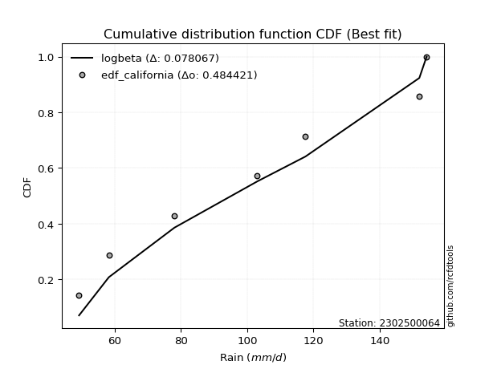</img>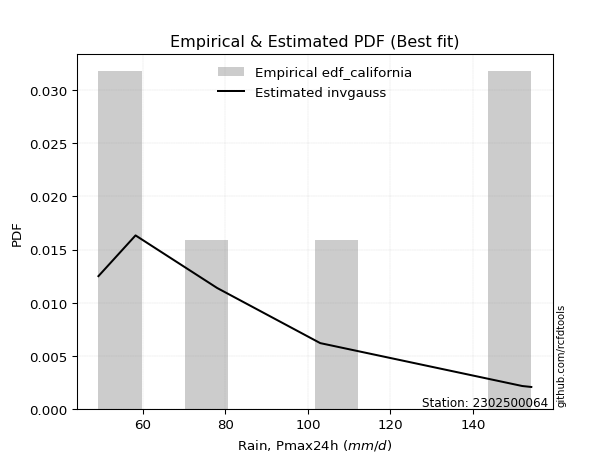</img>

</div>


### 2. EDF Hazen (1930)

Hazen method for plotting positions is a formula used to estimate the empirical cumulative probability distribution of flood events or other hydrological data. This formula often results in biased estimations, particularly when extrapolating to extreme events (high return periods).

<div align="center">


$P=(m-0.5)/n$


</div>


**2.1. Empirical values**

<div align="center">

|                | 0                   | 1                   | 2                   | 3         | 4                  | 5                  | 6                  |
|:---------------|:--------------------|:--------------------|:--------------------|:----------|:-------------------|:-------------------|:-------------------|
| date           | 2020                | 2022                | 2023                | 2021      | 2025               | 2024               | 2019               |
| x              | 49.2                | 58.2                | 78.0                | 103.0     | 117.6              | 152.0              | 154.2              |
| m              | 1                   | 2                   | 3                   | 4         | 5                  | 6                  | 7                  |
| empirical_dist | edf_hazen           | edf_hazen           | edf_hazen           | edf_hazen | edf_hazen          | edf_hazen          | edf_hazen          |
| empirical      | 0.07142857142857142 | 0.21428571428571427 | 0.35714285714285715 | 0.5       | 0.6428571428571429 | 0.7857142857142857 | 0.9285714285714286 |
| empirical_tr   | 1.0769230769230769  | 1.2727272727272727  | 1.5555555555555558  | 2.0       | 2.8000000000000003 | 4.666666666666666  | 14.000000000000007 |

</div>


**2.2. Kolmogorov-Smirnov fit test (sorted by Δ)**


<div align="center">

|                | 0                   | 1                   | 2                   | 3                   | 4                   | 5                   | 6                   | 7                   | 8                   | 9                   | 10                  | 11                  | 12                  | 13                  | 14                  | 15                  | 16                  | 17                  | 18                  | 19                  | 20                  | 21                  | 22                  | 23                  | 24                  | 25                  | 26                  | 27                  | 28                  | 29                  | 30                  | 31                  | 32                  | 33                  | 34                  | 35                  | 36                  | 37                  | 38                  | 39                  | 40                  | 41                  | 42                  | 43                  | 44                  | 45                  | 46                  | 47                  | 48                  | 49                  | 50                  | 51                  | 52                  | 53                  | 54                  | 55                  | 56                  | 57                  | 58                  | 59                  | 60                  | 61                  | 62                  | 63                  | 64                  | 65                  | 66                  | 67                  | 68                  | 69                  | 70                  | 71                  | 72                  | 73                  | 74                  | 75                  | 76                  | 77                  | 78                  | 79                  | 80                  | 81                  | 82                  | 83                  | 84                  | 85                  | 86                  | 87                  | 88                  | 89                  | 90                  | 91                  | 92                  | 93                  | 94                  | 95                  | 96                  | 97                  | 98                  | 99                  | 100                 | 101                 | 102                 | 103                 | 104                 | 105                 | 106                 | 107                 | 108                 | 109                 | 110                 | 111                 | 112                 | 113                 | 114                 | 115                 | 116                 | 117                 | 118                 | 119                 | 120                 | 121                 | 122                 | 123                 | 124                 | 125                 | 126                 | 127                 | 128                 | 129                 | 130                 | 131                 | 132                 | 133                 | 134                 | 135                 | 136                 | 137                 | 138                 | 139                 | 140                 | 141                 | 142                 | 143                 | 144                 | 145                 | 146                 | 147                 | 148                 | 149                 | 150                 | 151                 | 152                 | 153                 | 154                 | 155                 | 156                 | 157                 | 158                 | 159                 |
|:---------------|:--------------------|:--------------------|:--------------------|:--------------------|:--------------------|:--------------------|:--------------------|:--------------------|:--------------------|:--------------------|:--------------------|:--------------------|:--------------------|:--------------------|:--------------------|:--------------------|:--------------------|:--------------------|:--------------------|:--------------------|:--------------------|:--------------------|:--------------------|:--------------------|:--------------------|:--------------------|:--------------------|:--------------------|:--------------------|:--------------------|:--------------------|:--------------------|:--------------------|:--------------------|:--------------------|:--------------------|:--------------------|:--------------------|:--------------------|:--------------------|:--------------------|:--------------------|:--------------------|:--------------------|:--------------------|:--------------------|:--------------------|:--------------------|:--------------------|:--------------------|:--------------------|:--------------------|:--------------------|:--------------------|:--------------------|:--------------------|:--------------------|:--------------------|:--------------------|:--------------------|:--------------------|:--------------------|:--------------------|:--------------------|:--------------------|:--------------------|:--------------------|:--------------------|:--------------------|:--------------------|:--------------------|:--------------------|:--------------------|:--------------------|:--------------------|:--------------------|:--------------------|:--------------------|:--------------------|:--------------------|:--------------------|:--------------------|:--------------------|:--------------------|:--------------------|:--------------------|:--------------------|:--------------------|:--------------------|:--------------------|:--------------------|:--------------------|:--------------------|:--------------------|:--------------------|:--------------------|:--------------------|:--------------------|:--------------------|:--------------------|:--------------------|:--------------------|:--------------------|:--------------------|:--------------------|:--------------------|:--------------------|:--------------------|:--------------------|:--------------------|:--------------------|:--------------------|:--------------------|:--------------------|:--------------------|:--------------------|:--------------------|:--------------------|:--------------------|:--------------------|:--------------------|:--------------------|:--------------------|:--------------------|:--------------------|:--------------------|:--------------------|:--------------------|:--------------------|:--------------------|:--------------------|:--------------------|:--------------------|:--------------------|:--------------------|:--------------------|:--------------------|:--------------------|:--------------------|:--------------------|:--------------------|:--------------------|:--------------------|:--------------------|:--------------------|:--------------------|:--------------------|:--------------------|:--------------------|:--------------------|:--------------------|:--------------------|:--------------------|:--------------------|:--------------------|:--------------------|:--------------------|:--------------------|:--------------------|:--------------------|
| station        | 2302500064          | 2302500064          | 2302500064          | 2302500064          | 2302500064          | 2302500064          | 2302500064          | 2302500064          | 2302500064          | 2302500064          | 2302500064          | 2302500064          | 2302500064          | 2302500064          | 2302500064          | 2302500064          | 2302500064          | 2302500064          | 2302500064          | 2302500064          | 2302500064          | 2302500064          | 2302500064          | 2302500064          | 2302500064          | 2302500064          | 2302500064          | 2302500064          | 2302500064          | 2302500064          | 2302500064          | 2302500064          | 2302500064          | 2302500064          | 2302500064          | 2302500064          | 2302500064          | 2302500064          | 2302500064          | 2302500064          | 2302500064          | 2302500064          | 2302500064          | 2302500064          | 2302500064          | 2302500064          | 2302500064          | 2302500064          | 2302500064          | 2302500064          | 2302500064          | 2302500064          | 2302500064          | 2302500064          | 2302500064          | 2302500064          | 2302500064          | 2302500064          | 2302500064          | 2302500064          | 2302500064          | 2302500064          | 2302500064          | 2302500064          | 2302500064          | 2302500064          | 2302500064          | 2302500064          | 2302500064          | 2302500064          | 2302500064          | 2302500064          | 2302500064          | 2302500064          | 2302500064          | 2302500064          | 2302500064          | 2302500064          | 2302500064          | 2302500064          | 2302500064          | 2302500064          | 2302500064          | 2302500064          | 2302500064          | 2302500064          | 2302500064          | 2302500064          | 2302500064          | 2302500064          | 2302500064          | 2302500064          | 2302500064          | 2302500064          | 2302500064          | 2302500064          | 2302500064          | 2302500064          | 2302500064          | 2302500064          | 2302500064          | 2302500064          | 2302500064          | 2302500064          | 2302500064          | 2302500064          | 2302500064          | 2302500064          | 2302500064          | 2302500064          | 2302500064          | 2302500064          | 2302500064          | 2302500064          | 2302500064          | 2302500064          | 2302500064          | 2302500064          | 2302500064          | 2302500064          | 2302500064          | 2302500064          | 2302500064          | 2302500064          | 2302500064          | 2302500064          | 2302500064          | 2302500064          | 2302500064          | 2302500064          | 2302500064          | 2302500064          | 2302500064          | 2302500064          | 2302500064          | 2302500064          | 2302500064          | 2302500064          | 2302500064          | 2302500064          | 2302500064          | 2302500064          | 2302500064          | 2302500064          | 2302500064          | 2302500064          | 2302500064          | 2302500064          | 2302500064          | 2302500064          | 2302500064          | 2302500064          | 2302500064          | 2302500064          | 2302500064          | 2302500064          | 2302500064          | 2302500064          | 2302500064          | 2302500064          |
| empirical_dist | edf_hazen           | edf_hazen           | edf_hazen           | edf_hazen           | edf_hazen           | edf_hazen           | edf_hazen           | edf_hazen           | edf_hazen           | edf_hazen           | edf_hazen           | edf_hazen           | edf_hazen           | edf_hazen           | edf_hazen           | edf_hazen           | edf_hazen           | edf_hazen           | edf_hazen           | edf_hazen           | edf_hazen           | edf_hazen           | edf_hazen           | edf_hazen           | edf_hazen           | edf_hazen           | edf_hazen           | edf_hazen           | edf_hazen           | edf_hazen           | edf_hazen           | edf_hazen           | edf_hazen           | edf_hazen           | edf_hazen           | edf_hazen           | edf_hazen           | edf_hazen           | edf_hazen           | edf_hazen           | edf_hazen           | edf_hazen           | edf_hazen           | edf_hazen           | edf_hazen           | edf_hazen           | edf_hazen           | edf_hazen           | edf_hazen           | edf_hazen           | edf_hazen           | edf_hazen           | edf_hazen           | edf_hazen           | edf_hazen           | edf_hazen           | edf_hazen           | edf_hazen           | edf_hazen           | edf_hazen           | edf_hazen           | edf_hazen           | edf_hazen           | edf_hazen           | edf_hazen           | edf_hazen           | edf_hazen           | edf_hazen           | edf_hazen           | edf_hazen           | edf_hazen           | edf_hazen           | edf_hazen           | edf_hazen           | edf_hazen           | edf_hazen           | edf_hazen           | edf_hazen           | edf_hazen           | edf_hazen           | edf_hazen           | edf_hazen           | edf_hazen           | edf_hazen           | edf_hazen           | edf_hazen           | edf_hazen           | edf_hazen           | edf_hazen           | edf_hazen           | edf_hazen           | edf_hazen           | edf_hazen           | edf_hazen           | edf_hazen           | edf_hazen           | edf_hazen           | edf_hazen           | edf_hazen           | edf_hazen           | edf_hazen           | edf_hazen           | edf_hazen           | edf_hazen           | edf_hazen           | edf_hazen           | edf_hazen           | edf_hazen           | edf_hazen           | edf_hazen           | edf_hazen           | edf_hazen           | edf_hazen           | edf_hazen           | edf_hazen           | edf_hazen           | edf_hazen           | edf_hazen           | edf_hazen           | edf_hazen           | edf_hazen           | edf_hazen           | edf_hazen           | edf_hazen           | edf_hazen           | edf_hazen           | edf_hazen           | edf_hazen           | edf_hazen           | edf_hazen           | edf_hazen           | edf_hazen           | edf_hazen           | edf_hazen           | edf_hazen           | edf_hazen           | edf_hazen           | edf_hazen           | edf_hazen           | edf_hazen           | edf_hazen           | edf_hazen           | edf_hazen           | edf_hazen           | edf_hazen           | edf_hazen           | edf_hazen           | edf_hazen           | edf_hazen           | edf_hazen           | edf_hazen           | edf_hazen           | edf_hazen           | edf_hazen           | edf_hazen           | edf_hazen           | edf_hazen           | edf_hazen           | edf_hazen           | edf_hazen           |
| p_dist         | logsemicircular     | arcsine             | loganglit           | logksone            | ksone               | logbetaprime        | logf                | lognct              | logt                | logcrystalball      | lognorm             | logexponnorm        | logfatiguelife      | semicircular        | invgauss            | nakagami            | genlogistic         | logpearson3         | loggamma            | loggamma            | logerlang           | logtrapezoid        | anglit              | betaprime           | logncf              | logalpha            | ncf                 | loginvgamma         | rayleigh            | kstwobign           | invgamma            | maxwell             | loglogistic         | logweibull_min      | logrice             | alpha               | rice                | logarcsine          | logburr12           | logcosine           | logdgamma           | gamma               | loghypsecant        | halfnorm            | foldnorm            | erlang              | pearson3            | johnsonsu           | skewnorm            | nct                 | exponnorm           | truncnorm           | crystalball         | norm                | t                   | genpareto           | loginvgauss         | logdweibull         | logmaxwell          | gumbel_r            | gompertz            | beta                | logistic            | lograyleigh         | logloglaplace       | cosine              | burr                | rdist               | hypsecant           | loggumbel_l         | loginvweibull       | loglaplace          | loglaplace          | logbeta             | wrapcauchy          | kappa3              | lomax               | genexpon            | laplace             | moyal               | loggenexpon         | weibull_min         | logkstwobign        | loghalfnorm         | logfoldnorm         | logargus            | argus               | dgamma              | dweibull            | loggompertz         | exponpow            | loggumbel_r         | trapezoid           | gumbel_l            | halfgennorm         | halflogistic        | genhalflogistic     | logburr             | f                   | logweibull_max      | logwrapcauchy       | loglomax            | logmoyal            | burr12              | triang              | loggenhalflogistic  | logloggamma         | loghalflogistic     | kappa4              | gausshyper          | tukeylambda         | logkappa4           | uniform             | vonmises_line       | logtriang           | loggausshyper       | logskewnorm         | bradford            | logtukeylambda      | logkappa3           | truncexpon          | loguniform          | logvonmises_line    | truncweibull_min    | logtruncweibull_min | logtruncnorm        | wald                | loggenextreme       | logbradford         | loglevy_l           | logtruncexpon       | logwald             | levy_l              | logmielke           | logjohnsonsb        | loggennorm          | gennorm             | logrdist            | logjohnsonsu        | loggenpareto        | genextreme          | logexponpow         | johnsonsb           | fatiguelife         | lognakagami         | powerlaw            | loggengamma         | invweibull          | gengamma            | logpowerlaw         | exponweib           | logexponweib        | weibull_max         | truncpareto         | logtruncpareto      | loghalfgennorm      | loggenlogistic      | logvonmises         | vonmises            | mielke              |
| delta          | 0.07243986560875515 | 0.07576096796138465 | 0.07723798619044508 | 0.08384800368076684 | 0.08448145264726459 | 0.08955664476035996 | 0.08977490582885672 | 0.09070477894624696 | 0.0911977069365868  | 0.09120141541028515 | 0.09120231548136937 | 0.09120280502517786 | 0.09164218732913532 | 0.09246898088145616 | 0.09327430054180641 | 0.09383237079886964 | 0.09403876442672032 | 0.09524411133239608 | 0.09716215668627937 | 0.09716215668627937 | 0.09756935221251373 | 0.09791014092423489 | 0.09861202177017458 | 0.0989266624869427  | 0.09905724442355779 | 0.1002822361598239  | 0.10074102302004573 | 0.10205377019734807 | 0.10251252747102735 | 0.10331125819061127 | 0.10499899139142177 | 0.10501501640175659 | 0.1055268360917716  | 0.10579454368392427 | 0.10638908532326019 | 0.10736620585311474 | 0.10839840657669964 | 0.10851885771414904 | 0.10861768234118185 | 0.11051717262778737 | 0.11168317174036313 | 0.11218544914097506 | 0.11219317157155806 | 0.11233890021515913 | 0.11249281391099297 | 0.11275654628549192 | 0.11299887217612747 | 0.11339060784825417 | 0.11428915569975295 | 0.11439101495002801 | 0.11442789733690006 | 0.11443376524045645 | 0.11443376932249272 | 0.11443377049640291 | 0.11443506052489838 | 0.11585877757290897 | 0.11588965973349541 | 0.11645069858495205 | 0.1171423044811557  | 0.11742419140396496 | 0.12141054811125743 | 0.12169184536010402 | 0.12529397560815658 | 0.12570684244293717 | 0.12659965731760028 | 0.1269643526980333  | 0.12859191200706488 | 0.12922875942836698 | 0.12985735603981952 | 0.1309390072515444  | 0.13228471516703366 | 0.13722634992695137 | 0.13722634992695137 | 0.13769349942156872 | 0.13780926784220304 | 0.13836411319291075 | 0.1404272562336255  | 0.14052261054376813 | 0.14488064135776282 | 0.14554606356702204 | 0.14670353948243875 | 0.14817657215715807 | 0.14848031299908682 | 0.1500256117463612  | 0.15102538827366674 | 0.1529805616676282  | 0.1530958537979129  | 0.15343957329748537 | 0.15421617473528526 | 0.1558986966630872  | 0.1560982578197152  | 0.1572330082210005  | 0.15842392456398435 | 0.15970967045852336 | 0.16952667996900245 | 0.17094031533885498 | 0.17110150372384025 | 0.17228590570442048 | 0.17416424426165455 | 0.175966594944014   | 0.17910902819230057 | 0.18034195678662868 | 0.1804686506287846  | 0.18149171505490502 | 0.18351634298637542 | 0.18438719928704972 | 0.18542758581985253 | 0.18870542075093844 | 0.19032610193097965 | 0.1916874647096687  | 0.19173924406959386 | 0.19201834724430378 | 0.19333333333333347 | 0.19333395122470987 | 0.1947638641552326  | 0.19613522414754792 | 0.19664274208303223 | 0.1992192657119194  | 0.19969492299091385 | 0.20021485573651643 | 0.2013825311970625  | 0.20170650977659366 | 0.20181224539061327 | 0.2026729763018721  | 0.2087753852240819  | 0.2142857142842328  | 0.21428571428571427 | 0.21850027366879093 | 0.22408553497583306 | 0.23903108457842615 | 0.24016094894439144 | 0.24511634635901924 | 0.24656912067796843 | 0.2638501508777169  | 0.2842960011151505  | 0.2857142857142857  | 0.2857142857142857  | 0.31251293971851535 | 0.31490033182180655 | 0.32659485789244946 | 0.3296141707826813  | 0.38511669808893123 | 0.42925292406867954 | 0.43758027073657424 | 0.4471217044505984  | 0.45037598169566984 | 0.4532815269387692  | 0.46319111045511363 | 0.4700546300981     | 0.4947694001660946  | 0.5188450813536881  | 0.5206752868147917  | 0.533003123690281   | 0.5949743604594585  | 0.6366228820684107  | 0.7857142857142857  | 0.7857142857142857  | 1.0903800263065158  | 23.757631453945244  | nan                 |
| deltao         | 0.48442053926100004 | 0.48442053926100004 | 0.48442053926100004 | 0.48442053926100004 | 0.48442053926100004 | 0.48442053926100004 | 0.48442053926100004 | 0.48442053926100004 | 0.48442053926100004 | 0.48442053926100004 | 0.48442053926100004 | 0.48442053926100004 | 0.48442053926100004 | 0.48442053926100004 | 0.48442053926100004 | 0.48442053926100004 | 0.48442053926100004 | 0.48442053926100004 | 0.48442053926100004 | 0.48442053926100004 | 0.48442053926100004 | 0.48442053926100004 | 0.48442053926100004 | 0.48442053926100004 | 0.48442053926100004 | 0.48442053926100004 | 0.48442053926100004 | 0.48442053926100004 | 0.48442053926100004 | 0.48442053926100004 | 0.48442053926100004 | 0.48442053926100004 | 0.48442053926100004 | 0.48442053926100004 | 0.48442053926100004 | 0.48442053926100004 | 0.48442053926100004 | 0.48442053926100004 | 0.48442053926100004 | 0.48442053926100004 | 0.48442053926100004 | 0.48442053926100004 | 0.48442053926100004 | 0.48442053926100004 | 0.48442053926100004 | 0.48442053926100004 | 0.48442053926100004 | 0.48442053926100004 | 0.48442053926100004 | 0.48442053926100004 | 0.48442053926100004 | 0.48442053926100004 | 0.48442053926100004 | 0.48442053926100004 | 0.48442053926100004 | 0.48442053926100004 | 0.48442053926100004 | 0.48442053926100004 | 0.48442053926100004 | 0.48442053926100004 | 0.48442053926100004 | 0.48442053926100004 | 0.48442053926100004 | 0.48442053926100004 | 0.48442053926100004 | 0.48442053926100004 | 0.48442053926100004 | 0.48442053926100004 | 0.48442053926100004 | 0.48442053926100004 | 0.48442053926100004 | 0.48442053926100004 | 0.48442053926100004 | 0.48442053926100004 | 0.48442053926100004 | 0.48442053926100004 | 0.48442053926100004 | 0.48442053926100004 | 0.48442053926100004 | 0.48442053926100004 | 0.48442053926100004 | 0.48442053926100004 | 0.48442053926100004 | 0.48442053926100004 | 0.48442053926100004 | 0.48442053926100004 | 0.48442053926100004 | 0.48442053926100004 | 0.48442053926100004 | 0.48442053926100004 | 0.48442053926100004 | 0.48442053926100004 | 0.48442053926100004 | 0.48442053926100004 | 0.48442053926100004 | 0.48442053926100004 | 0.48442053926100004 | 0.48442053926100004 | 0.48442053926100004 | 0.48442053926100004 | 0.48442053926100004 | 0.48442053926100004 | 0.48442053926100004 | 0.48442053926100004 | 0.48442053926100004 | 0.48442053926100004 | 0.48442053926100004 | 0.48442053926100004 | 0.48442053926100004 | 0.48442053926100004 | 0.48442053926100004 | 0.48442053926100004 | 0.48442053926100004 | 0.48442053926100004 | 0.48442053926100004 | 0.48442053926100004 | 0.48442053926100004 | 0.48442053926100004 | 0.48442053926100004 | 0.48442053926100004 | 0.48442053926100004 | 0.48442053926100004 | 0.48442053926100004 | 0.48442053926100004 | 0.48442053926100004 | 0.48442053926100004 | 0.48442053926100004 | 0.48442053926100004 | 0.48442053926100004 | 0.48442053926100004 | 0.48442053926100004 | 0.48442053926100004 | 0.48442053926100004 | 0.48442053926100004 | 0.48442053926100004 | 0.48442053926100004 | 0.48442053926100004 | 0.48442053926100004 | 0.48442053926100004 | 0.48442053926100004 | 0.48442053926100004 | 0.48442053926100004 | 0.48442053926100004 | 0.48442053926100004 | 0.48442053926100004 | 0.48442053926100004 | 0.48442053926100004 | 0.48442053926100004 | 0.48442053926100004 | 0.48442053926100004 | 0.48442053926100004 | 0.48442053926100004 | 0.48442053926100004 | 0.48442053926100004 | 0.48442053926100004 | 0.48442053926100004 | 0.48442053926100004 | 0.48442053926100004 | 0.48442053926100004 | 0.48442053926100004 |
| eval           | Δo > Δ              | Δo > Δ              | Δo > Δ              | Δo > Δ              | Δo > Δ              | Δo > Δ              | Δo > Δ              | Δo > Δ              | Δo > Δ              | Δo > Δ              | Δo > Δ              | Δo > Δ              | Δo > Δ              | Δo > Δ              | Δo > Δ              | Δo > Δ              | Δo > Δ              | Δo > Δ              | Δo > Δ              | Δo > Δ              | Δo > Δ              | Δo > Δ              | Δo > Δ              | Δo > Δ              | Δo > Δ              | Δo > Δ              | Δo > Δ              | Δo > Δ              | Δo > Δ              | Δo > Δ              | Δo > Δ              | Δo > Δ              | Δo > Δ              | Δo > Δ              | Δo > Δ              | Δo > Δ              | Δo > Δ              | Δo > Δ              | Δo > Δ              | Δo > Δ              | Δo > Δ              | Δo > Δ              | Δo > Δ              | Δo > Δ              | Δo > Δ              | Δo > Δ              | Δo > Δ              | Δo > Δ              | Δo > Δ              | Δo > Δ              | Δo > Δ              | Δo > Δ              | Δo > Δ              | Δo > Δ              | Δo > Δ              | Δo > Δ              | Δo > Δ              | Δo > Δ              | Δo > Δ              | Δo > Δ              | Δo > Δ              | Δo > Δ              | Δo > Δ              | Δo > Δ              | Δo > Δ              | Δo > Δ              | Δo > Δ              | Δo > Δ              | Δo > Δ              | Δo > Δ              | Δo > Δ              | Δo > Δ              | Δo > Δ              | Δo > Δ              | Δo > Δ              | Δo > Δ              | Δo > Δ              | Δo > Δ              | Δo > Δ              | Δo > Δ              | Δo > Δ              | Δo > Δ              | Δo > Δ              | Δo > Δ              | Δo > Δ              | Δo > Δ              | Δo > Δ              | Δo > Δ              | Δo > Δ              | Δo > Δ              | Δo > Δ              | Δo > Δ              | Δo > Δ              | Δo > Δ              | Δo > Δ              | Δo > Δ              | Δo > Δ              | Δo > Δ              | Δo > Δ              | Δo > Δ              | Δo > Δ              | Δo > Δ              | Δo > Δ              | Δo > Δ              | Δo > Δ              | Δo > Δ              | Δo > Δ              | Δo > Δ              | Δo > Δ              | Δo > Δ              | Δo > Δ              | Δo > Δ              | Δo > Δ              | Δo > Δ              | Δo > Δ              | Δo > Δ              | Δo > Δ              | Δo > Δ              | Δo > Δ              | Δo > Δ              | Δo > Δ              | Δo > Δ              | Δo > Δ              | Δo > Δ              | Δo > Δ              | Δo > Δ              | Δo > Δ              | Δo > Δ              | Δo > Δ              | Δo > Δ              | Δo > Δ              | Δo > Δ              | Δo > Δ              | Δo > Δ              | Δo > Δ              | Δo > Δ              | Δo > Δ              | Δo > Δ              | Δo > Δ              | Δo > Δ              | Δo > Δ              | Δo > Δ              | Δo > Δ              | Δo > Δ              | Δo > Δ              | Δo > Δ              | Δo > Δ              | Δo > Δ              | Δo > Δ              | Δo <= Δ             | Δo <= Δ             | Δo <= Δ             | Δo <= Δ             | Δo <= Δ             | Δo <= Δ             | Δo <= Δ             | Δo <= Δ             | Δo <= Δ             | Δo <= Δ             | Δo <= Δ             |
| fit            | 1                   | 1                   | 1                   | 1                   | 1                   | 1                   | 1                   | 1                   | 1                   | 1                   | 1                   | 1                   | 1                   | 1                   | 1                   | 1                   | 1                   | 1                   | 1                   | 1                   | 1                   | 1                   | 1                   | 1                   | 1                   | 1                   | 1                   | 1                   | 1                   | 1                   | 1                   | 1                   | 1                   | 1                   | 1                   | 1                   | 1                   | 1                   | 1                   | 1                   | 1                   | 1                   | 1                   | 1                   | 1                   | 1                   | 1                   | 1                   | 1                   | 1                   | 1                   | 1                   | 1                   | 1                   | 1                   | 1                   | 1                   | 1                   | 1                   | 1                   | 1                   | 1                   | 1                   | 1                   | 1                   | 1                   | 1                   | 1                   | 1                   | 1                   | 1                   | 1                   | 1                   | 1                   | 1                   | 1                   | 1                   | 1                   | 1                   | 1                   | 1                   | 1                   | 1                   | 1                   | 1                   | 1                   | 1                   | 1                   | 1                   | 1                   | 1                   | 1                   | 1                   | 1                   | 1                   | 1                   | 1                   | 1                   | 1                   | 1                   | 1                   | 1                   | 1                   | 1                   | 1                   | 1                   | 1                   | 1                   | 1                   | 1                   | 1                   | 1                   | 1                   | 1                   | 1                   | 1                   | 1                   | 1                   | 1                   | 1                   | 1                   | 1                   | 1                   | 1                   | 1                   | 1                   | 1                   | 1                   | 1                   | 1                   | 1                   | 1                   | 1                   | 1                   | 1                   | 1                   | 1                   | 1                   | 1                   | 1                   | 1                   | 1                   | 1                   | 1                   | 1                   | 1                   | 1                   | 1                   | 1                   | 0                   | 0                   | 0                   | 0                   | 0                   | 0                   | 0                   | 0                   | 0                   | 0                   | 0                   |
| n              | 7                   | 7                   | 7                   | 7                   | 7                   | 7                   | 7                   | 7                   | 7                   | 7                   | 7                   | 7                   | 7                   | 7                   | 7                   | 7                   | 7                   | 7                   | 7                   | 7                   | 7                   | 7                   | 7                   | 7                   | 7                   | 7                   | 7                   | 7                   | 7                   | 7                   | 7                   | 7                   | 7                   | 7                   | 7                   | 7                   | 7                   | 7                   | 7                   | 7                   | 7                   | 7                   | 7                   | 7                   | 7                   | 7                   | 7                   | 7                   | 7                   | 7                   | 7                   | 7                   | 7                   | 7                   | 7                   | 7                   | 7                   | 7                   | 7                   | 7                   | 7                   | 7                   | 7                   | 7                   | 7                   | 7                   | 7                   | 7                   | 7                   | 7                   | 7                   | 7                   | 7                   | 7                   | 7                   | 7                   | 7                   | 7                   | 7                   | 7                   | 7                   | 7                   | 7                   | 7                   | 7                   | 7                   | 7                   | 7                   | 7                   | 7                   | 7                   | 7                   | 7                   | 7                   | 7                   | 7                   | 7                   | 7                   | 7                   | 7                   | 7                   | 7                   | 7                   | 7                   | 7                   | 7                   | 7                   | 7                   | 7                   | 7                   | 7                   | 7                   | 7                   | 7                   | 7                   | 7                   | 7                   | 7                   | 7                   | 7                   | 7                   | 7                   | 7                   | 7                   | 7                   | 7                   | 7                   | 7                   | 7                   | 7                   | 7                   | 7                   | 7                   | 7                   | 7                   | 7                   | 7                   | 7                   | 7                   | 7                   | 7                   | 7                   | 7                   | 7                   | 7                   | 7                   | 7                   | 7                   | 7                   | 7                   | 7                   | 7                   | 7                   | 7                   | 7                   | 7                   | 7                   | 7                   | 7                   | 7                   |
| best_fit       | 1                   | 0                   | 0                   | 0                   | 0                   | 0                   | 0                   | 0                   | 0                   | 0                   | 0                   | 0                   | 0                   | 0                   | 0                   | 0                   | 0                   | 0                   | 0                   | 0                   | 0                   | 0                   | 0                   | 0                   | 0                   | 0                   | 0                   | 0                   | 0                   | 0                   | 0                   | 0                   | 0                   | 0                   | 0                   | 0                   | 0                   | 0                   | 0                   | 0                   | 0                   | 0                   | 0                   | 0                   | 0                   | 0                   | 0                   | 0                   | 0                   | 0                   | 0                   | 0                   | 0                   | 0                   | 0                   | 0                   | 0                   | 0                   | 0                   | 0                   | 0                   | 0                   | 0                   | 0                   | 0                   | 0                   | 0                   | 0                   | 0                   | 0                   | 0                   | 0                   | 0                   | 0                   | 0                   | 0                   | 0                   | 0                   | 0                   | 0                   | 0                   | 0                   | 0                   | 0                   | 0                   | 0                   | 0                   | 0                   | 0                   | 0                   | 0                   | 0                   | 0                   | 0                   | 0                   | 0                   | 0                   | 0                   | 0                   | 0                   | 0                   | 0                   | 0                   | 0                   | 0                   | 0                   | 0                   | 0                   | 0                   | 0                   | 0                   | 0                   | 0                   | 0                   | 0                   | 0                   | 0                   | 0                   | 0                   | 0                   | 0                   | 0                   | 0                   | 0                   | 0                   | 0                   | 0                   | 0                   | 0                   | 0                   | 0                   | 0                   | 0                   | 0                   | 0                   | 0                   | 0                   | 0                   | 0                   | 0                   | 0                   | 0                   | 0                   | 0                   | 0                   | 0                   | 0                   | 0                   | 0                   | 0                   | 0                   | 0                   | 0                   | 0                   | 0                   | 0                   | 0                   | 0                   | 0                   | 0                   |
| best_fit_sort  | 1                   | 2                   | 3                   | 4                   | 5                   | 6                   | 7                   | 8                   | 9                   | 10                  | 11                  | 12                  | 13                  | 14                  | 15                  | 16                  | 17                  | 18                  | 19                  | 20                  | 21                  | 22                  | 23                  | 24                  | 25                  | 26                  | 27                  | 28                  | 29                  | 30                  | 31                  | 32                  | 33                  | 34                  | 35                  | 36                  | 37                  | 38                  | 39                  | 40                  | 41                  | 42                  | 43                  | 44                  | 45                  | 46                  | 47                  | 48                  | 49                  | 50                  | 51                  | 52                  | 53                  | 54                  | 55                  | 56                  | 57                  | 58                  | 59                  | 60                  | 61                  | 62                  | 63                  | 64                  | 65                  | 66                  | 67                  | 68                  | 69                  | 70                  | 71                  | 72                  | 73                  | 74                  | 75                  | 76                  | 77                  | 78                  | 79                  | 80                  | 81                  | 82                  | 83                  | 84                  | 85                  | 86                  | 87                  | 88                  | 89                  | 90                  | 91                  | 92                  | 93                  | 94                  | 95                  | 96                  | 97                  | 98                  | 99                  | 100                 | 101                 | 102                 | 103                 | 104                 | 105                 | 106                 | 107                 | 108                 | 109                 | 110                 | 111                 | 112                 | 113                 | 114                 | 115                 | 116                 | 117                 | 118                 | 119                 | 120                 | 121                 | 122                 | 123                 | 124                 | 125                 | 126                 | 127                 | 128                 | 129                 | 130                 | 131                 | 132                 | 133                 | 134                 | 135                 | 136                 | 137                 | 138                 | 139                 | 140                 | 141                 | 142                 | 143                 | 144                 | 145                 | 146                 | 147                 | 148                 | 149                 | 150                 | 151                 | 152                 | 153                 | 154                 | 155                 | 156                 | 157                 | 158                 | 159                 | 160                 |

</div>


**2.3. Best fit**

<div align="center">

|   id |    station | empirical_dist   | p_dist          |     delta |   deltao | eval   |   fit |   n |   best_fit |   best_fit_sort |
|-----:|-----------:|:-----------------|:----------------|----------:|---------:|:-------|------:|----:|-----------:|----------------:|
|    0 | 2302500064 | edf_hazen        | logsemicircular | 0.0724399 | 0.484421 | Δo > Δ |     1 |   7 |          1 |               1 |

</div>


<div align="center">

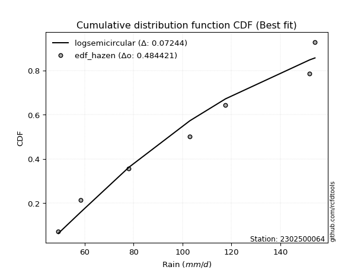</img>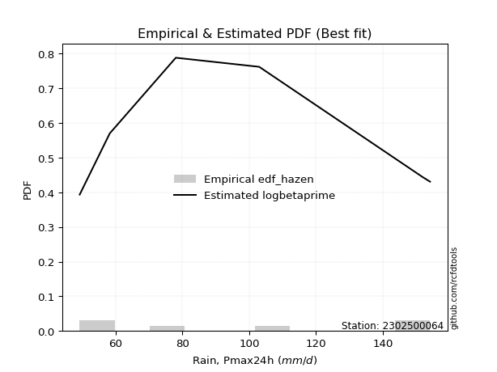</img>

</div>


### 3. EDF Weibull (1939)

Weibull plotting position formula is an empirical method used to estimate the non-exceedance probability or plotting position for a set of observed data, is often recommended or widely used in practice, particularly in flood frequency analysis.

<div align="center">


$P=m/(n+1)$


</div>


**3.1. Empirical values**

<div align="center">

|                | 0                  | 1                  | 2           | 3           | 4                  | 5           | 6           |
|:---------------|:-------------------|:-------------------|:------------|:------------|:-------------------|:------------|:------------|
| date           | 2020               | 2022               | 2023        | 2021        | 2025               | 2024        | 2019        |
| x              | 49.2               | 58.2               | 78.0        | 103.0       | 117.6              | 152.0       | 154.2       |
| m              | 1                  | 2                  | 3           | 4           | 5                  | 6           | 7           |
| empirical_dist | edf_weibull        | edf_weibull        | edf_weibull | edf_weibull | edf_weibull        | edf_weibull | edf_weibull |
| empirical      | 0.125              | 0.25               | 0.375       | 0.5         | 0.625              | 0.75        | 0.875       |
| empirical_tr   | 1.1428571428571428 | 1.3333333333333333 | 1.6         | 2.0         | 2.6666666666666665 | 4.0         | 8.0         |

</div>


**3.2. Kolmogorov-Smirnov fit test (sorted by Δ)**


<div align="center">

|                | 0                   | 1                   | 2                   | 3                   | 4                   | 5                   | 6                   | 7                   | 8                   | 9                   | 10                  | 11                  | 12                  | 13                  | 14                  | 15                  | 16                  | 17                  | 18                  | 19                  | 20                  | 21                  | 22                  | 23                  | 24                  | 25                  | 26                  | 27                  | 28                  | 29                  | 30                  | 31                  | 32                  | 33                  | 34                  | 35                  | 36                  | 37                  | 38                  | 39                  | 40                  | 41                  | 42                  | 43                  | 44                  | 45                  | 46                  | 47                  | 48                  | 49                  | 50                  | 51                  | 52                  | 53                  | 54                  | 55                  | 56                  | 57                  | 58                  | 59                  | 60                  | 61                  | 62                  | 63                  | 64                  | 65                  | 66                  | 67                  | 68                  | 69                  | 70                  | 71                  | 72                  | 73                  | 74                  | 75                  | 76                  | 77                  | 78                  | 79                  | 80                  | 81                  | 82                  | 83                  | 84                  | 85                  | 86                  | 87                  | 88                  | 89                  | 90                  | 91                  | 92                  | 93                  | 94                  | 95                  | 96                  | 97                  | 98                  | 99                  | 100                 | 101                 | 102                 | 103                 | 104                 | 105                 | 106                 | 107                 | 108                 | 109                 | 110                 | 111                 | 112                 | 113                 | 114                 | 115                 | 116                 | 117                 | 118                 | 119                 | 120                 | 121                 | 122                 | 123                 | 124                 | 125                 | 126                 | 127                 | 128                 | 129                 | 130                 | 131                 | 132                 | 133                 | 134                 | 135                 | 136                 | 137                 | 138                 | 139                 | 140                 | 141                 | 142                 | 143                 | 144                 | 145                 | 146                 | 147                 | 148                 | 149                 | 150                 | 151                 | 152                 | 153                 | 154                 | 155                 | 156                 | 157                 | 158                 | 159                 |
|:---------------|:--------------------|:--------------------|:--------------------|:--------------------|:--------------------|:--------------------|:--------------------|:--------------------|:--------------------|:--------------------|:--------------------|:--------------------|:--------------------|:--------------------|:--------------------|:--------------------|:--------------------|:--------------------|:--------------------|:--------------------|:--------------------|:--------------------|:--------------------|:--------------------|:--------------------|:--------------------|:--------------------|:--------------------|:--------------------|:--------------------|:--------------------|:--------------------|:--------------------|:--------------------|:--------------------|:--------------------|:--------------------|:--------------------|:--------------------|:--------------------|:--------------------|:--------------------|:--------------------|:--------------------|:--------------------|:--------------------|:--------------------|:--------------------|:--------------------|:--------------------|:--------------------|:--------------------|:--------------------|:--------------------|:--------------------|:--------------------|:--------------------|:--------------------|:--------------------|:--------------------|:--------------------|:--------------------|:--------------------|:--------------------|:--------------------|:--------------------|:--------------------|:--------------------|:--------------------|:--------------------|:--------------------|:--------------------|:--------------------|:--------------------|:--------------------|:--------------------|:--------------------|:--------------------|:--------------------|:--------------------|:--------------------|:--------------------|:--------------------|:--------------------|:--------------------|:--------------------|:--------------------|:--------------------|:--------------------|:--------------------|:--------------------|:--------------------|:--------------------|:--------------------|:--------------------|:--------------------|:--------------------|:--------------------|:--------------------|:--------------------|:--------------------|:--------------------|:--------------------|:--------------------|:--------------------|:--------------------|:--------------------|:--------------------|:--------------------|:--------------------|:--------------------|:--------------------|:--------------------|:--------------------|:--------------------|:--------------------|:--------------------|:--------------------|:--------------------|:--------------------|:--------------------|:--------------------|:--------------------|:--------------------|:--------------------|:--------------------|:--------------------|:--------------------|:--------------------|:--------------------|:--------------------|:--------------------|:--------------------|:--------------------|:--------------------|:--------------------|:--------------------|:--------------------|:--------------------|:--------------------|:--------------------|:--------------------|:--------------------|:--------------------|:--------------------|:--------------------|:--------------------|:--------------------|:--------------------|:--------------------|:--------------------|:--------------------|:--------------------|:--------------------|:--------------------|:--------------------|:--------------------|:--------------------|:--------------------|:--------------------|
| station        | 2302500064          | 2302500064          | 2302500064          | 2302500064          | 2302500064          | 2302500064          | 2302500064          | 2302500064          | 2302500064          | 2302500064          | 2302500064          | 2302500064          | 2302500064          | 2302500064          | 2302500064          | 2302500064          | 2302500064          | 2302500064          | 2302500064          | 2302500064          | 2302500064          | 2302500064          | 2302500064          | 2302500064          | 2302500064          | 2302500064          | 2302500064          | 2302500064          | 2302500064          | 2302500064          | 2302500064          | 2302500064          | 2302500064          | 2302500064          | 2302500064          | 2302500064          | 2302500064          | 2302500064          | 2302500064          | 2302500064          | 2302500064          | 2302500064          | 2302500064          | 2302500064          | 2302500064          | 2302500064          | 2302500064          | 2302500064          | 2302500064          | 2302500064          | 2302500064          | 2302500064          | 2302500064          | 2302500064          | 2302500064          | 2302500064          | 2302500064          | 2302500064          | 2302500064          | 2302500064          | 2302500064          | 2302500064          | 2302500064          | 2302500064          | 2302500064          | 2302500064          | 2302500064          | 2302500064          | 2302500064          | 2302500064          | 2302500064          | 2302500064          | 2302500064          | 2302500064          | 2302500064          | 2302500064          | 2302500064          | 2302500064          | 2302500064          | 2302500064          | 2302500064          | 2302500064          | 2302500064          | 2302500064          | 2302500064          | 2302500064          | 2302500064          | 2302500064          | 2302500064          | 2302500064          | 2302500064          | 2302500064          | 2302500064          | 2302500064          | 2302500064          | 2302500064          | 2302500064          | 2302500064          | 2302500064          | 2302500064          | 2302500064          | 2302500064          | 2302500064          | 2302500064          | 2302500064          | 2302500064          | 2302500064          | 2302500064          | 2302500064          | 2302500064          | 2302500064          | 2302500064          | 2302500064          | 2302500064          | 2302500064          | 2302500064          | 2302500064          | 2302500064          | 2302500064          | 2302500064          | 2302500064          | 2302500064          | 2302500064          | 2302500064          | 2302500064          | 2302500064          | 2302500064          | 2302500064          | 2302500064          | 2302500064          | 2302500064          | 2302500064          | 2302500064          | 2302500064          | 2302500064          | 2302500064          | 2302500064          | 2302500064          | 2302500064          | 2302500064          | 2302500064          | 2302500064          | 2302500064          | 2302500064          | 2302500064          | 2302500064          | 2302500064          | 2302500064          | 2302500064          | 2302500064          | 2302500064          | 2302500064          | 2302500064          | 2302500064          | 2302500064          | 2302500064          | 2302500064          | 2302500064          | 2302500064          | 2302500064          |
| empirical_dist | edf_weibull         | edf_weibull         | edf_weibull         | edf_weibull         | edf_weibull         | edf_weibull         | edf_weibull         | edf_weibull         | edf_weibull         | edf_weibull         | edf_weibull         | edf_weibull         | edf_weibull         | edf_weibull         | edf_weibull         | edf_weibull         | edf_weibull         | edf_weibull         | edf_weibull         | edf_weibull         | edf_weibull         | edf_weibull         | edf_weibull         | edf_weibull         | edf_weibull         | edf_weibull         | edf_weibull         | edf_weibull         | edf_weibull         | edf_weibull         | edf_weibull         | edf_weibull         | edf_weibull         | edf_weibull         | edf_weibull         | edf_weibull         | edf_weibull         | edf_weibull         | edf_weibull         | edf_weibull         | edf_weibull         | edf_weibull         | edf_weibull         | edf_weibull         | edf_weibull         | edf_weibull         | edf_weibull         | edf_weibull         | edf_weibull         | edf_weibull         | edf_weibull         | edf_weibull         | edf_weibull         | edf_weibull         | edf_weibull         | edf_weibull         | edf_weibull         | edf_weibull         | edf_weibull         | edf_weibull         | edf_weibull         | edf_weibull         | edf_weibull         | edf_weibull         | edf_weibull         | edf_weibull         | edf_weibull         | edf_weibull         | edf_weibull         | edf_weibull         | edf_weibull         | edf_weibull         | edf_weibull         | edf_weibull         | edf_weibull         | edf_weibull         | edf_weibull         | edf_weibull         | edf_weibull         | edf_weibull         | edf_weibull         | edf_weibull         | edf_weibull         | edf_weibull         | edf_weibull         | edf_weibull         | edf_weibull         | edf_weibull         | edf_weibull         | edf_weibull         | edf_weibull         | edf_weibull         | edf_weibull         | edf_weibull         | edf_weibull         | edf_weibull         | edf_weibull         | edf_weibull         | edf_weibull         | edf_weibull         | edf_weibull         | edf_weibull         | edf_weibull         | edf_weibull         | edf_weibull         | edf_weibull         | edf_weibull         | edf_weibull         | edf_weibull         | edf_weibull         | edf_weibull         | edf_weibull         | edf_weibull         | edf_weibull         | edf_weibull         | edf_weibull         | edf_weibull         | edf_weibull         | edf_weibull         | edf_weibull         | edf_weibull         | edf_weibull         | edf_weibull         | edf_weibull         | edf_weibull         | edf_weibull         | edf_weibull         | edf_weibull         | edf_weibull         | edf_weibull         | edf_weibull         | edf_weibull         | edf_weibull         | edf_weibull         | edf_weibull         | edf_weibull         | edf_weibull         | edf_weibull         | edf_weibull         | edf_weibull         | edf_weibull         | edf_weibull         | edf_weibull         | edf_weibull         | edf_weibull         | edf_weibull         | edf_weibull         | edf_weibull         | edf_weibull         | edf_weibull         | edf_weibull         | edf_weibull         | edf_weibull         | edf_weibull         | edf_weibull         | edf_weibull         | edf_weibull         | edf_weibull         | edf_weibull         | edf_weibull         |
| p_dist         | logksone            | logsemicircular     | loganglit           | arcsine             | ksone               | loginvgauss         | logalpha            | loginvgamma         | logbetaprime        | loggamma            | loggamma            | logerlang           | nakagami            | logarcsine          | logf                | logncf              | lognct              | logt                | logcrystalball      | lognorm             | logexponnorm        | logmaxwell          | logfatiguelife      | semicircular        | burr                | logrice             | invgauss            | genlogistic         | lograyleigh         | logpearson3         | loginvweibull       | logtrapezoid        | anglit              | betaprime           | ncf                 | rayleigh            | kstwobign           | lomax               | genexpon            | invgamma            | maxwell             | loglogistic         | logweibull_min      | alpha               | rice                | logburr12           | genpareto           | logcosine           | loggenexpon         | logdgamma           | gamma               | loghypsecant        | halfnorm            | weibull_min         | foldnorm            | erlang              | logkstwobign        | pearson3            | johnsonsu           | skewnorm            | nct                 | exponnorm           | truncnorm           | crystalball         | norm                | t                   | logdweibull         | loglaplace          | loglaplace          | gumbel_r            | logloglaplace       | loggompertz         | gompertz            | exponpow            | beta                | logweibull_max      | logistic            | loggumbel_r         | loghalfnorm         | cosine              | halfgennorm         | rdist               | hypsecant           | loggumbel_l         | laplace             | logfoldnorm         | logbeta             | wrapcauchy          | kappa3              | f                   | loglomax            | moyal               | burr12              | logargus            | argus               | dgamma              | dweibull            | logmoyal            | trapezoid           | gumbel_l            | loggenextreme       | halflogistic        | genhalflogistic     | logburr             | logwrapcauchy       | triang              | loggenhalflogistic  | logloggamma         | loglevy_l           | loghalflogistic     | kappa4              | gausshyper          | tukeylambda         | logkappa4           | levy_l              | uniform             | vonmises_line       | logtriang           | loggausshyper       | logskewnorm         | bradford            | logtukeylambda      | logkappa3           | truncexpon          | loguniform          | logvonmises_line    | truncweibull_min    | logtruncweibull_min | logbradford         | logtruncexpon       | logtruncnorm        | logwald             | loggennorm          | wald                | gennorm             | logrdist            | logmielke           | logjohnsonsb        | loggenpareto        | genextreme          | logjohnsonsu        | logexponpow         | johnsonsb           | fatiguelife         | invweibull          | lognakagami         | loggengamma         | powerlaw            | gengamma            | logpowerlaw         | exponweib           | logexponweib        | weibull_max         | truncpareto         | logtruncpareto      | loghalfgennorm      | loggenlogistic      | logvonmises         | vonmises            | mielke              |
| delta          | 0.08477951104925141 | 0.09726659748865729 | 0.1061803042291396  | 0.11147525367567035 | 0.12019573836155029 | 0.12020103484240574 | 0.12282685065979898 | 0.12294120739211323 | 0.12385141471935346 | 0.12417076870900945 | 0.12417076870900945 | 0.1244973037589664  | 0.12499999999745706 | 0.125               | 0.12548919154314242 | 0.12641441424320732 | 0.12641906466053265 | 0.1269119926508725  | 0.12691570112457085 | 0.12691660119565507 | 0.12691709073946356 | 0.12697065444301392 | 0.12735647304342101 | 0.12818326659574186 | 0.12859191200706488 | 0.12888810178347954 | 0.1289885862560921  | 0.12975305014100602 | 0.13007964703191943 | 0.13095839704668177 | 0.13228471516703366 | 0.1336244266385206  | 0.13432630748446028 | 0.1346409482012284  | 0.13645530873433143 | 0.13822681318531305 | 0.13902554390489696 | 0.1404272562336255  | 0.14052261054376813 | 0.14071327710570747 | 0.1407293021160423  | 0.1412411218060573  | 0.14150882939820997 | 0.14308049156740044 | 0.14411269229098533 | 0.14433196805546755 | 0.14469356081450402 | 0.14623145834207307 | 0.14670353948243875 | 0.14739745745464883 | 0.14789973485526076 | 0.14790745728584376 | 0.14805318592944486 | 0.14817657215715807 | 0.14820709962527867 | 0.14847083199977762 | 0.14848031299908682 | 0.14871315789041317 | 0.14910489356253986 | 0.15000344141403865 | 0.1501053006643137  | 0.15014218305118576 | 0.15014805095474215 | 0.15014805503677842 | 0.1501480562106886  | 0.15014934623918408 | 0.15216498429923775 | 0.1530175395932919  | 0.1530175395932919  | 0.15313847711825068 | 0.15348517286179436 | 0.1558986966630872  | 0.15712483382554315 | 0.15739761457020873 | 0.15740613107438972 | 0.1581094520868711  | 0.16100826132244228 | 0.1617411263715916  | 0.16259742727305998 | 0.162678638412319   | 0.16465044665226858 | 0.16494304514265268 | 0.16557164175410521 | 0.1666532929658301  | 0.16846545703242943 | 0.16887346517329882 | 0.17340778513585442 | 0.17352355355648874 | 0.1740783989071965  | 0.17416424426165455 | 0.18034195678662868 | 0.18126034928130774 | 0.18149171505490502 | 0.1886948473819139  | 0.1888101395121986  | 0.18915385901177106 | 0.18993046044957096 | 0.19026745966593703 | 0.19413821027827005 | 0.19542395617280905 | 0.20064313081164803 | 0.2066546010531407  | 0.20681578943812595 | 0.20800019141870618 | 0.21482331390658627 | 0.21923062870066112 | 0.22010148500133542 | 0.22114187153413822 | 0.22117394172128324 | 0.22441970646522416 | 0.22604038764526535 | 0.22740175042395439 | 0.22745352978387956 | 0.22773263295858948 | 0.22871197782082553 | 0.22904761904761917 | 0.22904823693899556 | 0.2304781498695183  | 0.2318495098618336  | 0.23235702779731793 | 0.2349335514262051  | 0.23540920870519955 | 0.23592914145080213 | 0.2370968169113482  | 0.23742079549087935 | 0.23752653110489896 | 0.23838726201615779 | 0.24090675722495003 | 0.2410749155363756  | 0.2420409874000652  | 0.24999999999851852 | 0.25                | 0.25                | 0.25                | 0.25                | 0.25894151114708674 | 0.2638501508777169  | 0.2664388582580076  | 0.2730234293210209  | 0.2938998850683956  | 0.29704318896466364 | 0.34940241237464553 | 0.39353863835439384 | 0.40186598502228854 | 0.409619681883685   | 0.4114074187363127  | 0.4175672412244835  | 0.4314752457146319  | 0.4343403443838143  | 0.4747333986495187  | 0.4831307956394024  | 0.49050592385732916 | 0.5151459808331381  | 0.5592600747451728  | 0.600908596354125   | 0.75                | 0.75                | 1.1260943120208013  | 23.81120288251667   | nan                 |
| deltao         | 0.48442053926100004 | 0.48442053926100004 | 0.48442053926100004 | 0.48442053926100004 | 0.48442053926100004 | 0.48442053926100004 | 0.48442053926100004 | 0.48442053926100004 | 0.48442053926100004 | 0.48442053926100004 | 0.48442053926100004 | 0.48442053926100004 | 0.48442053926100004 | 0.48442053926100004 | 0.48442053926100004 | 0.48442053926100004 | 0.48442053926100004 | 0.48442053926100004 | 0.48442053926100004 | 0.48442053926100004 | 0.48442053926100004 | 0.48442053926100004 | 0.48442053926100004 | 0.48442053926100004 | 0.48442053926100004 | 0.48442053926100004 | 0.48442053926100004 | 0.48442053926100004 | 0.48442053926100004 | 0.48442053926100004 | 0.48442053926100004 | 0.48442053926100004 | 0.48442053926100004 | 0.48442053926100004 | 0.48442053926100004 | 0.48442053926100004 | 0.48442053926100004 | 0.48442053926100004 | 0.48442053926100004 | 0.48442053926100004 | 0.48442053926100004 | 0.48442053926100004 | 0.48442053926100004 | 0.48442053926100004 | 0.48442053926100004 | 0.48442053926100004 | 0.48442053926100004 | 0.48442053926100004 | 0.48442053926100004 | 0.48442053926100004 | 0.48442053926100004 | 0.48442053926100004 | 0.48442053926100004 | 0.48442053926100004 | 0.48442053926100004 | 0.48442053926100004 | 0.48442053926100004 | 0.48442053926100004 | 0.48442053926100004 | 0.48442053926100004 | 0.48442053926100004 | 0.48442053926100004 | 0.48442053926100004 | 0.48442053926100004 | 0.48442053926100004 | 0.48442053926100004 | 0.48442053926100004 | 0.48442053926100004 | 0.48442053926100004 | 0.48442053926100004 | 0.48442053926100004 | 0.48442053926100004 | 0.48442053926100004 | 0.48442053926100004 | 0.48442053926100004 | 0.48442053926100004 | 0.48442053926100004 | 0.48442053926100004 | 0.48442053926100004 | 0.48442053926100004 | 0.48442053926100004 | 0.48442053926100004 | 0.48442053926100004 | 0.48442053926100004 | 0.48442053926100004 | 0.48442053926100004 | 0.48442053926100004 | 0.48442053926100004 | 0.48442053926100004 | 0.48442053926100004 | 0.48442053926100004 | 0.48442053926100004 | 0.48442053926100004 | 0.48442053926100004 | 0.48442053926100004 | 0.48442053926100004 | 0.48442053926100004 | 0.48442053926100004 | 0.48442053926100004 | 0.48442053926100004 | 0.48442053926100004 | 0.48442053926100004 | 0.48442053926100004 | 0.48442053926100004 | 0.48442053926100004 | 0.48442053926100004 | 0.48442053926100004 | 0.48442053926100004 | 0.48442053926100004 | 0.48442053926100004 | 0.48442053926100004 | 0.48442053926100004 | 0.48442053926100004 | 0.48442053926100004 | 0.48442053926100004 | 0.48442053926100004 | 0.48442053926100004 | 0.48442053926100004 | 0.48442053926100004 | 0.48442053926100004 | 0.48442053926100004 | 0.48442053926100004 | 0.48442053926100004 | 0.48442053926100004 | 0.48442053926100004 | 0.48442053926100004 | 0.48442053926100004 | 0.48442053926100004 | 0.48442053926100004 | 0.48442053926100004 | 0.48442053926100004 | 0.48442053926100004 | 0.48442053926100004 | 0.48442053926100004 | 0.48442053926100004 | 0.48442053926100004 | 0.48442053926100004 | 0.48442053926100004 | 0.48442053926100004 | 0.48442053926100004 | 0.48442053926100004 | 0.48442053926100004 | 0.48442053926100004 | 0.48442053926100004 | 0.48442053926100004 | 0.48442053926100004 | 0.48442053926100004 | 0.48442053926100004 | 0.48442053926100004 | 0.48442053926100004 | 0.48442053926100004 | 0.48442053926100004 | 0.48442053926100004 | 0.48442053926100004 | 0.48442053926100004 | 0.48442053926100004 | 0.48442053926100004 | 0.48442053926100004 | 0.48442053926100004 | 0.48442053926100004 |
| eval           | Δo > Δ              | Δo > Δ              | Δo > Δ              | Δo > Δ              | Δo > Δ              | Δo > Δ              | Δo > Δ              | Δo > Δ              | Δo > Δ              | Δo > Δ              | Δo > Δ              | Δo > Δ              | Δo > Δ              | Δo > Δ              | Δo > Δ              | Δo > Δ              | Δo > Δ              | Δo > Δ              | Δo > Δ              | Δo > Δ              | Δo > Δ              | Δo > Δ              | Δo > Δ              | Δo > Δ              | Δo > Δ              | Δo > Δ              | Δo > Δ              | Δo > Δ              | Δo > Δ              | Δo > Δ              | Δo > Δ              | Δo > Δ              | Δo > Δ              | Δo > Δ              | Δo > Δ              | Δo > Δ              | Δo > Δ              | Δo > Δ              | Δo > Δ              | Δo > Δ              | Δo > Δ              | Δo > Δ              | Δo > Δ              | Δo > Δ              | Δo > Δ              | Δo > Δ              | Δo > Δ              | Δo > Δ              | Δo > Δ              | Δo > Δ              | Δo > Δ              | Δo > Δ              | Δo > Δ              | Δo > Δ              | Δo > Δ              | Δo > Δ              | Δo > Δ              | Δo > Δ              | Δo > Δ              | Δo > Δ              | Δo > Δ              | Δo > Δ              | Δo > Δ              | Δo > Δ              | Δo > Δ              | Δo > Δ              | Δo > Δ              | Δo > Δ              | Δo > Δ              | Δo > Δ              | Δo > Δ              | Δo > Δ              | Δo > Δ              | Δo > Δ              | Δo > Δ              | Δo > Δ              | Δo > Δ              | Δo > Δ              | Δo > Δ              | Δo > Δ              | Δo > Δ              | Δo > Δ              | Δo > Δ              | Δo > Δ              | Δo > Δ              | Δo > Δ              | Δo > Δ              | Δo > Δ              | Δo > Δ              | Δo > Δ              | Δo > Δ              | Δo > Δ              | Δo > Δ              | Δo > Δ              | Δo > Δ              | Δo > Δ              | Δo > Δ              | Δo > Δ              | Δo > Δ              | Δo > Δ              | Δo > Δ              | Δo > Δ              | Δo > Δ              | Δo > Δ              | Δo > Δ              | Δo > Δ              | Δo > Δ              | Δo > Δ              | Δo > Δ              | Δo > Δ              | Δo > Δ              | Δo > Δ              | Δo > Δ              | Δo > Δ              | Δo > Δ              | Δo > Δ              | Δo > Δ              | Δo > Δ              | Δo > Δ              | Δo > Δ              | Δo > Δ              | Δo > Δ              | Δo > Δ              | Δo > Δ              | Δo > Δ              | Δo > Δ              | Δo > Δ              | Δo > Δ              | Δo > Δ              | Δo > Δ              | Δo > Δ              | Δo > Δ              | Δo > Δ              | Δo > Δ              | Δo > Δ              | Δo > Δ              | Δo > Δ              | Δo > Δ              | Δo > Δ              | Δo > Δ              | Δo > Δ              | Δo > Δ              | Δo > Δ              | Δo > Δ              | Δo > Δ              | Δo > Δ              | Δo > Δ              | Δo > Δ              | Δo > Δ              | Δo > Δ              | Δo > Δ              | Δo <= Δ             | Δo <= Δ             | Δo <= Δ             | Δo <= Δ             | Δo <= Δ             | Δo <= Δ             | Δo <= Δ             | Δo <= Δ             | Δo <= Δ             |
| fit            | 1                   | 1                   | 1                   | 1                   | 1                   | 1                   | 1                   | 1                   | 1                   | 1                   | 1                   | 1                   | 1                   | 1                   | 1                   | 1                   | 1                   | 1                   | 1                   | 1                   | 1                   | 1                   | 1                   | 1                   | 1                   | 1                   | 1                   | 1                   | 1                   | 1                   | 1                   | 1                   | 1                   | 1                   | 1                   | 1                   | 1                   | 1                   | 1                   | 1                   | 1                   | 1                   | 1                   | 1                   | 1                   | 1                   | 1                   | 1                   | 1                   | 1                   | 1                   | 1                   | 1                   | 1                   | 1                   | 1                   | 1                   | 1                   | 1                   | 1                   | 1                   | 1                   | 1                   | 1                   | 1                   | 1                   | 1                   | 1                   | 1                   | 1                   | 1                   | 1                   | 1                   | 1                   | 1                   | 1                   | 1                   | 1                   | 1                   | 1                   | 1                   | 1                   | 1                   | 1                   | 1                   | 1                   | 1                   | 1                   | 1                   | 1                   | 1                   | 1                   | 1                   | 1                   | 1                   | 1                   | 1                   | 1                   | 1                   | 1                   | 1                   | 1                   | 1                   | 1                   | 1                   | 1                   | 1                   | 1                   | 1                   | 1                   | 1                   | 1                   | 1                   | 1                   | 1                   | 1                   | 1                   | 1                   | 1                   | 1                   | 1                   | 1                   | 1                   | 1                   | 1                   | 1                   | 1                   | 1                   | 1                   | 1                   | 1                   | 1                   | 1                   | 1                   | 1                   | 1                   | 1                   | 1                   | 1                   | 1                   | 1                   | 1                   | 1                   | 1                   | 1                   | 1                   | 1                   | 1                   | 1                   | 1                   | 1                   | 0                   | 0                   | 0                   | 0                   | 0                   | 0                   | 0                   | 0                   | 0                   |
| n              | 7                   | 7                   | 7                   | 7                   | 7                   | 7                   | 7                   | 7                   | 7                   | 7                   | 7                   | 7                   | 7                   | 7                   | 7                   | 7                   | 7                   | 7                   | 7                   | 7                   | 7                   | 7                   | 7                   | 7                   | 7                   | 7                   | 7                   | 7                   | 7                   | 7                   | 7                   | 7                   | 7                   | 7                   | 7                   | 7                   | 7                   | 7                   | 7                   | 7                   | 7                   | 7                   | 7                   | 7                   | 7                   | 7                   | 7                   | 7                   | 7                   | 7                   | 7                   | 7                   | 7                   | 7                   | 7                   | 7                   | 7                   | 7                   | 7                   | 7                   | 7                   | 7                   | 7                   | 7                   | 7                   | 7                   | 7                   | 7                   | 7                   | 7                   | 7                   | 7                   | 7                   | 7                   | 7                   | 7                   | 7                   | 7                   | 7                   | 7                   | 7                   | 7                   | 7                   | 7                   | 7                   | 7                   | 7                   | 7                   | 7                   | 7                   | 7                   | 7                   | 7                   | 7                   | 7                   | 7                   | 7                   | 7                   | 7                   | 7                   | 7                   | 7                   | 7                   | 7                   | 7                   | 7                   | 7                   | 7                   | 7                   | 7                   | 7                   | 7                   | 7                   | 7                   | 7                   | 7                   | 7                   | 7                   | 7                   | 7                   | 7                   | 7                   | 7                   | 7                   | 7                   | 7                   | 7                   | 7                   | 7                   | 7                   | 7                   | 7                   | 7                   | 7                   | 7                   | 7                   | 7                   | 7                   | 7                   | 7                   | 7                   | 7                   | 7                   | 7                   | 7                   | 7                   | 7                   | 7                   | 7                   | 7                   | 7                   | 7                   | 7                   | 7                   | 7                   | 7                   | 7                   | 7                   | 7                   | 7                   |
| best_fit       | 1                   | 0                   | 0                   | 0                   | 0                   | 0                   | 0                   | 0                   | 0                   | 0                   | 0                   | 0                   | 0                   | 0                   | 0                   | 0                   | 0                   | 0                   | 0                   | 0                   | 0                   | 0                   | 0                   | 0                   | 0                   | 0                   | 0                   | 0                   | 0                   | 0                   | 0                   | 0                   | 0                   | 0                   | 0                   | 0                   | 0                   | 0                   | 0                   | 0                   | 0                   | 0                   | 0                   | 0                   | 0                   | 0                   | 0                   | 0                   | 0                   | 0                   | 0                   | 0                   | 0                   | 0                   | 0                   | 0                   | 0                   | 0                   | 0                   | 0                   | 0                   | 0                   | 0                   | 0                   | 0                   | 0                   | 0                   | 0                   | 0                   | 0                   | 0                   | 0                   | 0                   | 0                   | 0                   | 0                   | 0                   | 0                   | 0                   | 0                   | 0                   | 0                   | 0                   | 0                   | 0                   | 0                   | 0                   | 0                   | 0                   | 0                   | 0                   | 0                   | 0                   | 0                   | 0                   | 0                   | 0                   | 0                   | 0                   | 0                   | 0                   | 0                   | 0                   | 0                   | 0                   | 0                   | 0                   | 0                   | 0                   | 0                   | 0                   | 0                   | 0                   | 0                   | 0                   | 0                   | 0                   | 0                   | 0                   | 0                   | 0                   | 0                   | 0                   | 0                   | 0                   | 0                   | 0                   | 0                   | 0                   | 0                   | 0                   | 0                   | 0                   | 0                   | 0                   | 0                   | 0                   | 0                   | 0                   | 0                   | 0                   | 0                   | 0                   | 0                   | 0                   | 0                   | 0                   | 0                   | 0                   | 0                   | 0                   | 0                   | 0                   | 0                   | 0                   | 0                   | 0                   | 0                   | 0                   | 0                   |
| best_fit_sort  | 1                   | 2                   | 3                   | 4                   | 5                   | 6                   | 7                   | 8                   | 9                   | 10                  | 11                  | 12                  | 13                  | 14                  | 15                  | 16                  | 17                  | 18                  | 19                  | 20                  | 21                  | 22                  | 23                  | 24                  | 25                  | 26                  | 27                  | 28                  | 29                  | 30                  | 31                  | 32                  | 33                  | 34                  | 35                  | 36                  | 37                  | 38                  | 39                  | 40                  | 41                  | 42                  | 43                  | 44                  | 45                  | 46                  | 47                  | 48                  | 49                  | 50                  | 51                  | 52                  | 53                  | 54                  | 55                  | 56                  | 57                  | 58                  | 59                  | 60                  | 61                  | 62                  | 63                  | 64                  | 65                  | 66                  | 67                  | 68                  | 69                  | 70                  | 71                  | 72                  | 73                  | 74                  | 75                  | 76                  | 77                  | 78                  | 79                  | 80                  | 81                  | 82                  | 83                  | 84                  | 85                  | 86                  | 87                  | 88                  | 89                  | 90                  | 91                  | 92                  | 93                  | 94                  | 95                  | 96                  | 97                  | 98                  | 99                  | 100                 | 101                 | 102                 | 103                 | 104                 | 105                 | 106                 | 107                 | 108                 | 109                 | 110                 | 111                 | 112                 | 113                 | 114                 | 115                 | 116                 | 117                 | 118                 | 119                 | 120                 | 121                 | 122                 | 123                 | 124                 | 125                 | 126                 | 127                 | 128                 | 129                 | 130                 | 131                 | 132                 | 133                 | 134                 | 135                 | 136                 | 137                 | 138                 | 139                 | 140                 | 141                 | 142                 | 143                 | 144                 | 145                 | 146                 | 147                 | 148                 | 149                 | 150                 | 151                 | 152                 | 153                 | 154                 | 155                 | 156                 | 157                 | 158                 | 159                 | 160                 |

</div>


**3.3. Best fit**

<div align="center">

|   id |    station | empirical_dist   | p_dist   |     delta |   deltao | eval   |   fit |   n |   best_fit |   best_fit_sort |
|-----:|-----------:|:-----------------|:---------|----------:|---------:|:-------|------:|----:|-----------:|----------------:|
|    0 | 2302500064 | edf_weibull      | logksone | 0.0847795 | 0.484421 | Δo > Δ |     1 |   7 |          1 |               1 |

</div>


<div align="center">

</img>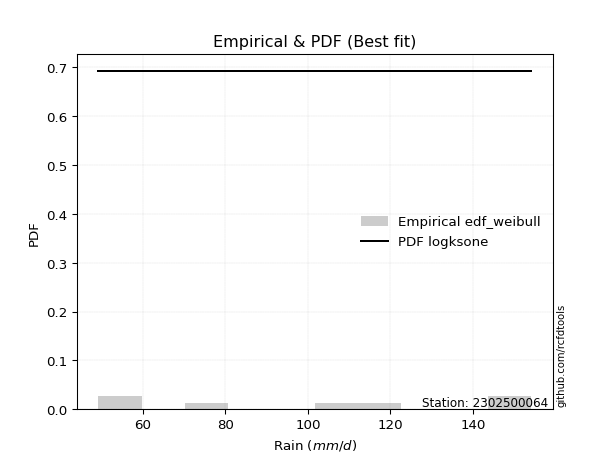</img>

</div>


### 4. EDF Beard (1943)

The Beard formula (or Beard´s plotting position formula) in hydrology is used to estimate the empirical non-exceedance probability _(P)_ of a flood event (or other extreme hydrological data point) within a given dataset.

<div align="center">


$P=(m-0.31)/(n+0.38)$


</div>


**4.1. Empirical values**

<div align="center">

|                | 0                   | 1                   | 2                   | 3         | 4                  | 5                  | 6                  |
|:---------------|:--------------------|:--------------------|:--------------------|:----------|:-------------------|:-------------------|:-------------------|
| date           | 2020                | 2022                | 2023                | 2021      | 2025               | 2024               | 2019               |
| x              | 49.2                | 58.2                | 78.0                | 103.0     | 117.6              | 152.0              | 154.2              |
| m              | 1                   | 2                   | 3                   | 4         | 5                  | 6                  | 7                  |
| empirical_dist | edf_beard           | edf_beard           | edf_beard           | edf_beard | edf_beard          | edf_beard          | edf_beard          |
| empirical      | 0.09349593495934959 | 0.22899728997289973 | 0.36449864498644985 | 0.5       | 0.6355013550135502 | 0.7710027100271003 | 0.9065040650406505 |
| empirical_tr   | 1.1031390134529149  | 1.29701230228471    | 1.5735607675906182  | 2.0       | 2.743494423791822  | 4.366863905325444  | 10.695652173913055 |

</div>


**4.2. Kolmogorov-Smirnov fit test (sorted by Δ)**


<div align="center">

|                | 0                   | 1                   | 2                   | 3                   | 4                   | 5                   | 6                   | 7                   | 8                   | 9                   | 10                  | 11                  | 12                  | 13                  | 14                  | 15                  | 16                  | 17                  | 18                  | 19                  | 20                  | 21                  | 22                  | 23                  | 24                  | 25                  | 26                  | 27                  | 28                  | 29                  | 30                  | 31                  | 32                  | 33                  | 34                  | 35                  | 36                  | 37                  | 38                  | 39                  | 40                  | 41                  | 42                  | 43                  | 44                  | 45                  | 46                  | 47                  | 48                  | 49                  | 50                  | 51                  | 52                  | 53                  | 54                  | 55                  | 56                  | 57                  | 58                  | 59                  | 60                  | 61                  | 62                  | 63                  | 64                  | 65                  | 66                  | 67                  | 68                  | 69                  | 70                  | 71                  | 72                  | 73                  | 74                  | 75                  | 76                  | 77                  | 78                  | 79                  | 80                  | 81                  | 82                  | 83                  | 84                  | 85                  | 86                  | 87                  | 88                  | 89                  | 90                  | 91                  | 92                  | 93                  | 94                  | 95                  | 96                  | 97                  | 98                  | 99                  | 100                 | 101                 | 102                 | 103                 | 104                 | 105                 | 106                 | 107                 | 108                 | 109                 | 110                 | 111                 | 112                 | 113                 | 114                 | 115                 | 116                 | 117                 | 118                 | 119                 | 120                 | 121                 | 122                 | 123                 | 124                 | 125                 | 126                 | 127                 | 128                 | 129                 | 130                 | 131                 | 132                 | 133                 | 134                 | 135                 | 136                 | 137                 | 138                 | 139                 | 140                 | 141                 | 142                 | 143                 | 144                 | 145                 | 146                 | 147                 | 148                 | 149                 | 150                 | 151                 | 152                 | 153                 | 154                 | 155                 | 156                 | 157                 | 158                 | 159                 |
|:---------------|:--------------------|:--------------------|:--------------------|:--------------------|:--------------------|:--------------------|:--------------------|:--------------------|:--------------------|:--------------------|:--------------------|:--------------------|:--------------------|:--------------------|:--------------------|:--------------------|:--------------------|:--------------------|:--------------------|:--------------------|:--------------------|:--------------------|:--------------------|:--------------------|:--------------------|:--------------------|:--------------------|:--------------------|:--------------------|:--------------------|:--------------------|:--------------------|:--------------------|:--------------------|:--------------------|:--------------------|:--------------------|:--------------------|:--------------------|:--------------------|:--------------------|:--------------------|:--------------------|:--------------------|:--------------------|:--------------------|:--------------------|:--------------------|:--------------------|:--------------------|:--------------------|:--------------------|:--------------------|:--------------------|:--------------------|:--------------------|:--------------------|:--------------------|:--------------------|:--------------------|:--------------------|:--------------------|:--------------------|:--------------------|:--------------------|:--------------------|:--------------------|:--------------------|:--------------------|:--------------------|:--------------------|:--------------------|:--------------------|:--------------------|:--------------------|:--------------------|:--------------------|:--------------------|:--------------------|:--------------------|:--------------------|:--------------------|:--------------------|:--------------------|:--------------------|:--------------------|:--------------------|:--------------------|:--------------------|:--------------------|:--------------------|:--------------------|:--------------------|:--------------------|:--------------------|:--------------------|:--------------------|:--------------------|:--------------------|:--------------------|:--------------------|:--------------------|:--------------------|:--------------------|:--------------------|:--------------------|:--------------------|:--------------------|:--------------------|:--------------------|:--------------------|:--------------------|:--------------------|:--------------------|:--------------------|:--------------------|:--------------------|:--------------------|:--------------------|:--------------------|:--------------------|:--------------------|:--------------------|:--------------------|:--------------------|:--------------------|:--------------------|:--------------------|:--------------------|:--------------------|:--------------------|:--------------------|:--------------------|:--------------------|:--------------------|:--------------------|:--------------------|:--------------------|:--------------------|:--------------------|:--------------------|:--------------------|:--------------------|:--------------------|:--------------------|:--------------------|:--------------------|:--------------------|:--------------------|:--------------------|:--------------------|:--------------------|:--------------------|:--------------------|:--------------------|:--------------------|:--------------------|:--------------------|:--------------------|:--------------------|
| station        | 2302500064          | 2302500064          | 2302500064          | 2302500064          | 2302500064          | 2302500064          | 2302500064          | 2302500064          | 2302500064          | 2302500064          | 2302500064          | 2302500064          | 2302500064          | 2302500064          | 2302500064          | 2302500064          | 2302500064          | 2302500064          | 2302500064          | 2302500064          | 2302500064          | 2302500064          | 2302500064          | 2302500064          | 2302500064          | 2302500064          | 2302500064          | 2302500064          | 2302500064          | 2302500064          | 2302500064          | 2302500064          | 2302500064          | 2302500064          | 2302500064          | 2302500064          | 2302500064          | 2302500064          | 2302500064          | 2302500064          | 2302500064          | 2302500064          | 2302500064          | 2302500064          | 2302500064          | 2302500064          | 2302500064          | 2302500064          | 2302500064          | 2302500064          | 2302500064          | 2302500064          | 2302500064          | 2302500064          | 2302500064          | 2302500064          | 2302500064          | 2302500064          | 2302500064          | 2302500064          | 2302500064          | 2302500064          | 2302500064          | 2302500064          | 2302500064          | 2302500064          | 2302500064          | 2302500064          | 2302500064          | 2302500064          | 2302500064          | 2302500064          | 2302500064          | 2302500064          | 2302500064          | 2302500064          | 2302500064          | 2302500064          | 2302500064          | 2302500064          | 2302500064          | 2302500064          | 2302500064          | 2302500064          | 2302500064          | 2302500064          | 2302500064          | 2302500064          | 2302500064          | 2302500064          | 2302500064          | 2302500064          | 2302500064          | 2302500064          | 2302500064          | 2302500064          | 2302500064          | 2302500064          | 2302500064          | 2302500064          | 2302500064          | 2302500064          | 2302500064          | 2302500064          | 2302500064          | 2302500064          | 2302500064          | 2302500064          | 2302500064          | 2302500064          | 2302500064          | 2302500064          | 2302500064          | 2302500064          | 2302500064          | 2302500064          | 2302500064          | 2302500064          | 2302500064          | 2302500064          | 2302500064          | 2302500064          | 2302500064          | 2302500064          | 2302500064          | 2302500064          | 2302500064          | 2302500064          | 2302500064          | 2302500064          | 2302500064          | 2302500064          | 2302500064          | 2302500064          | 2302500064          | 2302500064          | 2302500064          | 2302500064          | 2302500064          | 2302500064          | 2302500064          | 2302500064          | 2302500064          | 2302500064          | 2302500064          | 2302500064          | 2302500064          | 2302500064          | 2302500064          | 2302500064          | 2302500064          | 2302500064          | 2302500064          | 2302500064          | 2302500064          | 2302500064          | 2302500064          | 2302500064          | 2302500064          | 2302500064          |
| empirical_dist | edf_beard           | edf_beard           | edf_beard           | edf_beard           | edf_beard           | edf_beard           | edf_beard           | edf_beard           | edf_beard           | edf_beard           | edf_beard           | edf_beard           | edf_beard           | edf_beard           | edf_beard           | edf_beard           | edf_beard           | edf_beard           | edf_beard           | edf_beard           | edf_beard           | edf_beard           | edf_beard           | edf_beard           | edf_beard           | edf_beard           | edf_beard           | edf_beard           | edf_beard           | edf_beard           | edf_beard           | edf_beard           | edf_beard           | edf_beard           | edf_beard           | edf_beard           | edf_beard           | edf_beard           | edf_beard           | edf_beard           | edf_beard           | edf_beard           | edf_beard           | edf_beard           | edf_beard           | edf_beard           | edf_beard           | edf_beard           | edf_beard           | edf_beard           | edf_beard           | edf_beard           | edf_beard           | edf_beard           | edf_beard           | edf_beard           | edf_beard           | edf_beard           | edf_beard           | edf_beard           | edf_beard           | edf_beard           | edf_beard           | edf_beard           | edf_beard           | edf_beard           | edf_beard           | edf_beard           | edf_beard           | edf_beard           | edf_beard           | edf_beard           | edf_beard           | edf_beard           | edf_beard           | edf_beard           | edf_beard           | edf_beard           | edf_beard           | edf_beard           | edf_beard           | edf_beard           | edf_beard           | edf_beard           | edf_beard           | edf_beard           | edf_beard           | edf_beard           | edf_beard           | edf_beard           | edf_beard           | edf_beard           | edf_beard           | edf_beard           | edf_beard           | edf_beard           | edf_beard           | edf_beard           | edf_beard           | edf_beard           | edf_beard           | edf_beard           | edf_beard           | edf_beard           | edf_beard           | edf_beard           | edf_beard           | edf_beard           | edf_beard           | edf_beard           | edf_beard           | edf_beard           | edf_beard           | edf_beard           | edf_beard           | edf_beard           | edf_beard           | edf_beard           | edf_beard           | edf_beard           | edf_beard           | edf_beard           | edf_beard           | edf_beard           | edf_beard           | edf_beard           | edf_beard           | edf_beard           | edf_beard           | edf_beard           | edf_beard           | edf_beard           | edf_beard           | edf_beard           | edf_beard           | edf_beard           | edf_beard           | edf_beard           | edf_beard           | edf_beard           | edf_beard           | edf_beard           | edf_beard           | edf_beard           | edf_beard           | edf_beard           | edf_beard           | edf_beard           | edf_beard           | edf_beard           | edf_beard           | edf_beard           | edf_beard           | edf_beard           | edf_beard           | edf_beard           | edf_beard           | edf_beard           | edf_beard           | edf_beard           |
| p_dist         | logksone            | logsemicircular     | loganglit           | arcsine             | logarcsine          | nakagami            | ksone               | logalpha            | loginvgamma         | logbetaprime        | loggamma            | loggamma            | logerlang           | logf                | logncf              | lognct              | logt                | logcrystalball      | lognorm             | logexponnorm        | logfatiguelife      | semicircular        | logrice             | invgauss            | genlogistic         | logpearson3         | logtrapezoid        | anglit              | betaprime           | ncf                 | loginvgauss         | logmaxwell          | rayleigh            | kstwobign           | invgamma            | maxwell             | loglogistic         | logweibull_min      | alpha               | rice                | logburr12           | genpareto           | logcosine           | lograyleigh         | logdgamma           | gamma               | loghypsecant        | halfnorm            | foldnorm            | erlang              | pearson3            | johnsonsu           | burr                | skewnorm            | nct                 | exponnorm           | truncnorm           | crystalball         | norm                | t                   | logdweibull         | gumbel_r            | loginvweibull       | logloglaplace       | gompertz            | beta                | loglaplace          | loglaplace          | logistic            | lomax               | genexpon            | cosine              | rdist               | hypsecant           | loggumbel_l         | loggenexpon         | weibull_min         | logkstwobign        | loghalfnorm         | logfoldnorm         | laplace             | logbeta             | wrapcauchy          | kappa3              | loggompertz         | exponpow            | loggumbel_r         | moyal               | halfgennorm         | logargus            | argus               | dgamma              | logweibull_max      | dweibull            | trapezoid           | f                   | gumbel_l            | loglomax            | logmoyal            | burr12              | halflogistic        | genhalflogistic     | logburr             | logwrapcauchy       | triang              | loggenhalflogistic  | logloggamma         | loghalflogistic     | kappa4              | gausshyper          | tukeylambda         | logkappa4           | uniform             | vonmises_line       | logtriang           | loggausshyper       | loggenextreme       | logskewnorm         | bradford            | logtukeylambda      | logkappa3           | truncexpon          | loguniform          | logvonmises_line    | truncweibull_min    | logtruncweibull_min | logbradford         | logtruncnorm        | wald                | loglevy_l           | levy_l              | logtruncexpon       | logwald             | logmielke           | gennorm             | loggennorm          | logjohnsonsb        | logrdist            | loggenpareto        | logjohnsonsu        | genextreme          | logexponpow         | johnsonsb           | fatiguelife         | lognakagami         | loggengamma         | invweibull          | powerlaw            | gengamma            | logpowerlaw         | exponweib           | logexponweib        | weibull_max         | truncpareto         | logtruncpareto      | loghalfgennorm      | loggenlogistic      | logvonmises         | vonmises            | mielke              |
| delta          | 0.06548894787388015 | 0.07626388746155699 | 0.0851775942020393  | 0.09047254364857005 | 0.09349593495934959 | 0.09383237079886964 | 0.09919302833444998 | 0.1018241406326987  | 0.10205377019734807 | 0.10284870469225316 | 0.10316805868190915 | 0.10316805868190915 | 0.10349459373186609 | 0.10448648151604212 | 0.10541170421610702 | 0.10541635463343235 | 0.1059092826237722  | 0.10591299109747054 | 0.10591389116855476 | 0.10591438071236325 | 0.10635376301632071 | 0.10718055656864156 | 0.10788539175637925 | 0.1079858762289918  | 0.10875034011390572 | 0.10995568701958147 | 0.11262171661142029 | 0.11332359745735998 | 0.1136382381741281  | 0.11545259870723112 | 0.11588965973349541 | 0.1171423044811557  | 0.11722410315821274 | 0.11802283387779666 | 0.11971056707860717 | 0.11972659208894199 | 0.120238411778957   | 0.12050611937110967 | 0.12207778154030013 | 0.12310998226388503 | 0.12332925802836725 | 0.12369085078740372 | 0.12522874831497277 | 0.12570684244293717 | 0.12639474742754853 | 0.12689702482816045 | 0.12690474725874346 | 0.12705047590234458 | 0.12720438959817837 | 0.12746812197267732 | 0.12771044786331287 | 0.12810218353543956 | 0.12859191200706488 | 0.12900073138693835 | 0.1291025906372134  | 0.12913947302408546 | 0.12914534092764185 | 0.12914534500967811 | 0.1291453461835883  | 0.12914663621208378 | 0.13116227427213745 | 0.1321357670911504  | 0.13228471516703366 | 0.13395544516119298 | 0.13612212379844288 | 0.13640342104728942 | 0.13722634992695137 | 0.13722634992695137 | 0.14000555129534198 | 0.1404272562336255  | 0.14052261054376813 | 0.1416759283852187  | 0.14394033511555238 | 0.1445689317270049  | 0.1456505829387298  | 0.14670353948243875 | 0.14817657215715807 | 0.14848031299908682 | 0.1500256117463612  | 0.15102538827366674 | 0.15223642920135552 | 0.15240507510875412 | 0.15252084352938844 | 0.1530756888800962  | 0.1558986966630872  | 0.1560982578197152  | 0.1572330082210005  | 0.1602576392542075  | 0.16465044665226858 | 0.1676921373548136  | 0.1678074294850983  | 0.16815114898467076 | 0.1686108071004213  | 0.16892775042247066 | 0.17313550025116975 | 0.17416424426165455 | 0.17442124614570875 | 0.18034195678662868 | 0.1804686506287846  | 0.18149171505490502 | 0.18565189102604043 | 0.18581307941102565 | 0.18699748139160588 | 0.19382060387948596 | 0.19822791867356082 | 0.19909877497423512 | 0.20013916150703792 | 0.2034169964381239  | 0.20503767761816505 | 0.20639904039685408 | 0.20645081975677926 | 0.20672992293148917 | 0.20804490902051886 | 0.20804552691189526 | 0.209475439842418   | 0.2108467998347333  | 0.21114448582519824 | 0.21135431777021763 | 0.2139308413991048  | 0.21440649867809924 | 0.21492643142370182 | 0.2160941068842479  | 0.21641808546377905 | 0.21652382107779866 | 0.21738455198905748 | 0.21990404719784973 | 0.22408553497583306 | 0.22899728997141824 | 0.22899728997289973 | 0.23167529673483345 | 0.23921333283437574 | 0.24016094894439144 | 0.24511634635901924 | 0.2638501508777169  | 0.2710027100271003  | 0.2710027100271003  | 0.2769402132715578  | 0.29044557618773725 | 0.3045274943616713  | 0.30754454397821385 | 0.3149025950954959  | 0.37040512240174583 | 0.41454134838149415 | 0.42286869504938884 | 0.432410128763413   | 0.4385699512515838  | 0.44112374692433554 | 0.44197660072818207 | 0.4553430544109146  | 0.48523475366306884 | 0.5041335056665027  | 0.5059637111276063  | 0.5256473358466883  | 0.5802627847722731  | 0.6219113063812253  | 0.7710027100271003  | 0.7710027100271003  | 1.105091601993701   | 23.77969881747602   | nan                 |
| deltao         | 0.48442053926100004 | 0.48442053926100004 | 0.48442053926100004 | 0.48442053926100004 | 0.48442053926100004 | 0.48442053926100004 | 0.48442053926100004 | 0.48442053926100004 | 0.48442053926100004 | 0.48442053926100004 | 0.48442053926100004 | 0.48442053926100004 | 0.48442053926100004 | 0.48442053926100004 | 0.48442053926100004 | 0.48442053926100004 | 0.48442053926100004 | 0.48442053926100004 | 0.48442053926100004 | 0.48442053926100004 | 0.48442053926100004 | 0.48442053926100004 | 0.48442053926100004 | 0.48442053926100004 | 0.48442053926100004 | 0.48442053926100004 | 0.48442053926100004 | 0.48442053926100004 | 0.48442053926100004 | 0.48442053926100004 | 0.48442053926100004 | 0.48442053926100004 | 0.48442053926100004 | 0.48442053926100004 | 0.48442053926100004 | 0.48442053926100004 | 0.48442053926100004 | 0.48442053926100004 | 0.48442053926100004 | 0.48442053926100004 | 0.48442053926100004 | 0.48442053926100004 | 0.48442053926100004 | 0.48442053926100004 | 0.48442053926100004 | 0.48442053926100004 | 0.48442053926100004 | 0.48442053926100004 | 0.48442053926100004 | 0.48442053926100004 | 0.48442053926100004 | 0.48442053926100004 | 0.48442053926100004 | 0.48442053926100004 | 0.48442053926100004 | 0.48442053926100004 | 0.48442053926100004 | 0.48442053926100004 | 0.48442053926100004 | 0.48442053926100004 | 0.48442053926100004 | 0.48442053926100004 | 0.48442053926100004 | 0.48442053926100004 | 0.48442053926100004 | 0.48442053926100004 | 0.48442053926100004 | 0.48442053926100004 | 0.48442053926100004 | 0.48442053926100004 | 0.48442053926100004 | 0.48442053926100004 | 0.48442053926100004 | 0.48442053926100004 | 0.48442053926100004 | 0.48442053926100004 | 0.48442053926100004 | 0.48442053926100004 | 0.48442053926100004 | 0.48442053926100004 | 0.48442053926100004 | 0.48442053926100004 | 0.48442053926100004 | 0.48442053926100004 | 0.48442053926100004 | 0.48442053926100004 | 0.48442053926100004 | 0.48442053926100004 | 0.48442053926100004 | 0.48442053926100004 | 0.48442053926100004 | 0.48442053926100004 | 0.48442053926100004 | 0.48442053926100004 | 0.48442053926100004 | 0.48442053926100004 | 0.48442053926100004 | 0.48442053926100004 | 0.48442053926100004 | 0.48442053926100004 | 0.48442053926100004 | 0.48442053926100004 | 0.48442053926100004 | 0.48442053926100004 | 0.48442053926100004 | 0.48442053926100004 | 0.48442053926100004 | 0.48442053926100004 | 0.48442053926100004 | 0.48442053926100004 | 0.48442053926100004 | 0.48442053926100004 | 0.48442053926100004 | 0.48442053926100004 | 0.48442053926100004 | 0.48442053926100004 | 0.48442053926100004 | 0.48442053926100004 | 0.48442053926100004 | 0.48442053926100004 | 0.48442053926100004 | 0.48442053926100004 | 0.48442053926100004 | 0.48442053926100004 | 0.48442053926100004 | 0.48442053926100004 | 0.48442053926100004 | 0.48442053926100004 | 0.48442053926100004 | 0.48442053926100004 | 0.48442053926100004 | 0.48442053926100004 | 0.48442053926100004 | 0.48442053926100004 | 0.48442053926100004 | 0.48442053926100004 | 0.48442053926100004 | 0.48442053926100004 | 0.48442053926100004 | 0.48442053926100004 | 0.48442053926100004 | 0.48442053926100004 | 0.48442053926100004 | 0.48442053926100004 | 0.48442053926100004 | 0.48442053926100004 | 0.48442053926100004 | 0.48442053926100004 | 0.48442053926100004 | 0.48442053926100004 | 0.48442053926100004 | 0.48442053926100004 | 0.48442053926100004 | 0.48442053926100004 | 0.48442053926100004 | 0.48442053926100004 | 0.48442053926100004 | 0.48442053926100004 | 0.48442053926100004 | 0.48442053926100004 |
| eval           | Δo > Δ              | Δo > Δ              | Δo > Δ              | Δo > Δ              | Δo > Δ              | Δo > Δ              | Δo > Δ              | Δo > Δ              | Δo > Δ              | Δo > Δ              | Δo > Δ              | Δo > Δ              | Δo > Δ              | Δo > Δ              | Δo > Δ              | Δo > Δ              | Δo > Δ              | Δo > Δ              | Δo > Δ              | Δo > Δ              | Δo > Δ              | Δo > Δ              | Δo > Δ              | Δo > Δ              | Δo > Δ              | Δo > Δ              | Δo > Δ              | Δo > Δ              | Δo > Δ              | Δo > Δ              | Δo > Δ              | Δo > Δ              | Δo > Δ              | Δo > Δ              | Δo > Δ              | Δo > Δ              | Δo > Δ              | Δo > Δ              | Δo > Δ              | Δo > Δ              | Δo > Δ              | Δo > Δ              | Δo > Δ              | Δo > Δ              | Δo > Δ              | Δo > Δ              | Δo > Δ              | Δo > Δ              | Δo > Δ              | Δo > Δ              | Δo > Δ              | Δo > Δ              | Δo > Δ              | Δo > Δ              | Δo > Δ              | Δo > Δ              | Δo > Δ              | Δo > Δ              | Δo > Δ              | Δo > Δ              | Δo > Δ              | Δo > Δ              | Δo > Δ              | Δo > Δ              | Δo > Δ              | Δo > Δ              | Δo > Δ              | Δo > Δ              | Δo > Δ              | Δo > Δ              | Δo > Δ              | Δo > Δ              | Δo > Δ              | Δo > Δ              | Δo > Δ              | Δo > Δ              | Δo > Δ              | Δo > Δ              | Δo > Δ              | Δo > Δ              | Δo > Δ              | Δo > Δ              | Δo > Δ              | Δo > Δ              | Δo > Δ              | Δo > Δ              | Δo > Δ              | Δo > Δ              | Δo > Δ              | Δo > Δ              | Δo > Δ              | Δo > Δ              | Δo > Δ              | Δo > Δ              | Δo > Δ              | Δo > Δ              | Δo > Δ              | Δo > Δ              | Δo > Δ              | Δo > Δ              | Δo > Δ              | Δo > Δ              | Δo > Δ              | Δo > Δ              | Δo > Δ              | Δo > Δ              | Δo > Δ              | Δo > Δ              | Δo > Δ              | Δo > Δ              | Δo > Δ              | Δo > Δ              | Δo > Δ              | Δo > Δ              | Δo > Δ              | Δo > Δ              | Δo > Δ              | Δo > Δ              | Δo > Δ              | Δo > Δ              | Δo > Δ              | Δo > Δ              | Δo > Δ              | Δo > Δ              | Δo > Δ              | Δo > Δ              | Δo > Δ              | Δo > Δ              | Δo > Δ              | Δo > Δ              | Δo > Δ              | Δo > Δ              | Δo > Δ              | Δo > Δ              | Δo > Δ              | Δo > Δ              | Δo > Δ              | Δo > Δ              | Δo > Δ              | Δo > Δ              | Δo > Δ              | Δo > Δ              | Δo > Δ              | Δo > Δ              | Δo > Δ              | Δo > Δ              | Δo > Δ              | Δo > Δ              | Δo > Δ              | Δo <= Δ             | Δo <= Δ             | Δo <= Δ             | Δo <= Δ             | Δo <= Δ             | Δo <= Δ             | Δo <= Δ             | Δo <= Δ             | Δo <= Δ             | Δo <= Δ             | Δo <= Δ             |
| fit            | 1                   | 1                   | 1                   | 1                   | 1                   | 1                   | 1                   | 1                   | 1                   | 1                   | 1                   | 1                   | 1                   | 1                   | 1                   | 1                   | 1                   | 1                   | 1                   | 1                   | 1                   | 1                   | 1                   | 1                   | 1                   | 1                   | 1                   | 1                   | 1                   | 1                   | 1                   | 1                   | 1                   | 1                   | 1                   | 1                   | 1                   | 1                   | 1                   | 1                   | 1                   | 1                   | 1                   | 1                   | 1                   | 1                   | 1                   | 1                   | 1                   | 1                   | 1                   | 1                   | 1                   | 1                   | 1                   | 1                   | 1                   | 1                   | 1                   | 1                   | 1                   | 1                   | 1                   | 1                   | 1                   | 1                   | 1                   | 1                   | 1                   | 1                   | 1                   | 1                   | 1                   | 1                   | 1                   | 1                   | 1                   | 1                   | 1                   | 1                   | 1                   | 1                   | 1                   | 1                   | 1                   | 1                   | 1                   | 1                   | 1                   | 1                   | 1                   | 1                   | 1                   | 1                   | 1                   | 1                   | 1                   | 1                   | 1                   | 1                   | 1                   | 1                   | 1                   | 1                   | 1                   | 1                   | 1                   | 1                   | 1                   | 1                   | 1                   | 1                   | 1                   | 1                   | 1                   | 1                   | 1                   | 1                   | 1                   | 1                   | 1                   | 1                   | 1                   | 1                   | 1                   | 1                   | 1                   | 1                   | 1                   | 1                   | 1                   | 1                   | 1                   | 1                   | 1                   | 1                   | 1                   | 1                   | 1                   | 1                   | 1                   | 1                   | 1                   | 1                   | 1                   | 1                   | 1                   | 1                   | 1                   | 0                   | 0                   | 0                   | 0                   | 0                   | 0                   | 0                   | 0                   | 0                   | 0                   | 0                   |
| n              | 7                   | 7                   | 7                   | 7                   | 7                   | 7                   | 7                   | 7                   | 7                   | 7                   | 7                   | 7                   | 7                   | 7                   | 7                   | 7                   | 7                   | 7                   | 7                   | 7                   | 7                   | 7                   | 7                   | 7                   | 7                   | 7                   | 7                   | 7                   | 7                   | 7                   | 7                   | 7                   | 7                   | 7                   | 7                   | 7                   | 7                   | 7                   | 7                   | 7                   | 7                   | 7                   | 7                   | 7                   | 7                   | 7                   | 7                   | 7                   | 7                   | 7                   | 7                   | 7                   | 7                   | 7                   | 7                   | 7                   | 7                   | 7                   | 7                   | 7                   | 7                   | 7                   | 7                   | 7                   | 7                   | 7                   | 7                   | 7                   | 7                   | 7                   | 7                   | 7                   | 7                   | 7                   | 7                   | 7                   | 7                   | 7                   | 7                   | 7                   | 7                   | 7                   | 7                   | 7                   | 7                   | 7                   | 7                   | 7                   | 7                   | 7                   | 7                   | 7                   | 7                   | 7                   | 7                   | 7                   | 7                   | 7                   | 7                   | 7                   | 7                   | 7                   | 7                   | 7                   | 7                   | 7                   | 7                   | 7                   | 7                   | 7                   | 7                   | 7                   | 7                   | 7                   | 7                   | 7                   | 7                   | 7                   | 7                   | 7                   | 7                   | 7                   | 7                   | 7                   | 7                   | 7                   | 7                   | 7                   | 7                   | 7                   | 7                   | 7                   | 7                   | 7                   | 7                   | 7                   | 7                   | 7                   | 7                   | 7                   | 7                   | 7                   | 7                   | 7                   | 7                   | 7                   | 7                   | 7                   | 7                   | 7                   | 7                   | 7                   | 7                   | 7                   | 7                   | 7                   | 7                   | 7                   | 7                   | 7                   |
| best_fit       | 1                   | 0                   | 0                   | 0                   | 0                   | 0                   | 0                   | 0                   | 0                   | 0                   | 0                   | 0                   | 0                   | 0                   | 0                   | 0                   | 0                   | 0                   | 0                   | 0                   | 0                   | 0                   | 0                   | 0                   | 0                   | 0                   | 0                   | 0                   | 0                   | 0                   | 0                   | 0                   | 0                   | 0                   | 0                   | 0                   | 0                   | 0                   | 0                   | 0                   | 0                   | 0                   | 0                   | 0                   | 0                   | 0                   | 0                   | 0                   | 0                   | 0                   | 0                   | 0                   | 0                   | 0                   | 0                   | 0                   | 0                   | 0                   | 0                   | 0                   | 0                   | 0                   | 0                   | 0                   | 0                   | 0                   | 0                   | 0                   | 0                   | 0                   | 0                   | 0                   | 0                   | 0                   | 0                   | 0                   | 0                   | 0                   | 0                   | 0                   | 0                   | 0                   | 0                   | 0                   | 0                   | 0                   | 0                   | 0                   | 0                   | 0                   | 0                   | 0                   | 0                   | 0                   | 0                   | 0                   | 0                   | 0                   | 0                   | 0                   | 0                   | 0                   | 0                   | 0                   | 0                   | 0                   | 0                   | 0                   | 0                   | 0                   | 0                   | 0                   | 0                   | 0                   | 0                   | 0                   | 0                   | 0                   | 0                   | 0                   | 0                   | 0                   | 0                   | 0                   | 0                   | 0                   | 0                   | 0                   | 0                   | 0                   | 0                   | 0                   | 0                   | 0                   | 0                   | 0                   | 0                   | 0                   | 0                   | 0                   | 0                   | 0                   | 0                   | 0                   | 0                   | 0                   | 0                   | 0                   | 0                   | 0                   | 0                   | 0                   | 0                   | 0                   | 0                   | 0                   | 0                   | 0                   | 0                   | 0                   |
| best_fit_sort  | 1                   | 2                   | 3                   | 4                   | 5                   | 6                   | 7                   | 8                   | 9                   | 10                  | 11                  | 12                  | 13                  | 14                  | 15                  | 16                  | 17                  | 18                  | 19                  | 20                  | 21                  | 22                  | 23                  | 24                  | 25                  | 26                  | 27                  | 28                  | 29                  | 30                  | 31                  | 32                  | 33                  | 34                  | 35                  | 36                  | 37                  | 38                  | 39                  | 40                  | 41                  | 42                  | 43                  | 44                  | 45                  | 46                  | 47                  | 48                  | 49                  | 50                  | 51                  | 52                  | 53                  | 54                  | 55                  | 56                  | 57                  | 58                  | 59                  | 60                  | 61                  | 62                  | 63                  | 64                  | 65                  | 66                  | 67                  | 68                  | 69                  | 70                  | 71                  | 72                  | 73                  | 74                  | 75                  | 76                  | 77                  | 78                  | 79                  | 80                  | 81                  | 82                  | 83                  | 84                  | 85                  | 86                  | 87                  | 88                  | 89                  | 90                  | 91                  | 92                  | 93                  | 94                  | 95                  | 96                  | 97                  | 98                  | 99                  | 100                 | 101                 | 102                 | 103                 | 104                 | 105                 | 106                 | 107                 | 108                 | 109                 | 110                 | 111                 | 112                 | 113                 | 114                 | 115                 | 116                 | 117                 | 118                 | 119                 | 120                 | 121                 | 122                 | 123                 | 124                 | 125                 | 126                 | 127                 | 128                 | 129                 | 130                 | 131                 | 132                 | 133                 | 134                 | 135                 | 136                 | 137                 | 138                 | 139                 | 140                 | 141                 | 142                 | 143                 | 144                 | 145                 | 146                 | 147                 | 148                 | 149                 | 150                 | 151                 | 152                 | 153                 | 154                 | 155                 | 156                 | 157                 | 158                 | 159                 | 160                 |

</div>


**4.3. Best fit**

<div align="center">

|   id |    station | empirical_dist   | p_dist   |     delta |   deltao | eval   |   fit |   n |   best_fit |   best_fit_sort |
|-----:|-----------:|:-----------------|:---------|----------:|---------:|:-------|------:|----:|-----------:|----------------:|
|    0 | 2302500064 | edf_beard        | logksone | 0.0654889 | 0.484421 | Δo > Δ |     1 |   7 |          1 |               1 |

</div>


<div align="center">

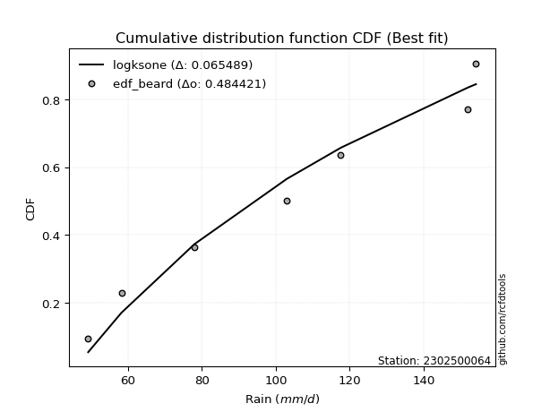</img></img>

</div>


### 5. EDF Chegodayev (1955)

The Chegodayev formula is an empirical plotting position formula used in hydrological frequency analysis to estimate the exceedance probability or return period of a specific event from a set of observed data. It is primarily used for plotting observed data points on probability paper to fit a theoretical distribution, particularly for analyzing extreme events like maximum flood flows or rainfall intensities. The constant _b_ value in the generalized plotting position formula is 0.3.

<div align="center">


$P=(m-b)/(n+1-2b)$


</div>


**5.1. Empirical values**

<div align="center">

|                | 0                   | 1                   | 2                   | 3              | 4                  | 5                  | 6                  |
|:---------------|:--------------------|:--------------------|:--------------------|:---------------|:-------------------|:-------------------|:-------------------|
| date           | 2020                | 2022                | 2023                | 2021           | 2025               | 2024               | 2019               |
| x              | 49.2                | 58.2                | 78.0                | 103.0          | 117.6              | 152.0              | 154.2              |
| m              | 1                   | 2                   | 3                   | 4              | 5                  | 6                  | 7                  |
| empirical_dist | edf_chegodayev      | edf_chegodayev      | edf_chegodayev      | edf_chegodayev | edf_chegodayev     | edf_chegodayev     | edf_chegodayev     |
| empirical      | 0.09459459459459459 | 0.22972972972972971 | 0.36486486486486486 | 0.5            | 0.6351351351351351 | 0.7702702702702703 | 0.9054054054054054 |
| empirical_tr   | 1.1044776119402986  | 1.2982456140350878  | 1.574468085106383   | 2.0            | 2.7407407407407405 | 4.352941176470589  | 10.571428571428568 |

</div>


**5.2. Kolmogorov-Smirnov fit test (sorted by Δ)**


<div align="center">

|                | 0                   | 1                   | 2                   | 3                   | 4                   | 5                   | 6                   | 7                   | 8                   | 9                   | 10                  | 11                  | 12                  | 13                  | 14                  | 15                  | 16                  | 17                  | 18                  | 19                  | 20                  | 21                  | 22                  | 23                  | 24                  | 25                  | 26                  | 27                  | 28                  | 29                  | 30                  | 31                  | 32                  | 33                  | 34                  | 35                  | 36                  | 37                  | 38                  | 39                  | 40                  | 41                  | 42                  | 43                  | 44                  | 45                  | 46                  | 47                  | 48                  | 49                  | 50                  | 51                  | 52                  | 53                  | 54                  | 55                  | 56                  | 57                  | 58                  | 59                  | 60                  | 61                  | 62                  | 63                  | 64                  | 65                  | 66                  | 67                  | 68                  | 69                  | 70                  | 71                  | 72                  | 73                  | 74                  | 75                  | 76                  | 77                  | 78                  | 79                  | 80                  | 81                  | 82                  | 83                  | 84                  | 85                  | 86                  | 87                  | 88                  | 89                  | 90                  | 91                  | 92                  | 93                  | 94                  | 95                  | 96                  | 97                  | 98                  | 99                  | 100                 | 101                 | 102                 | 103                 | 104                 | 105                 | 106                 | 107                 | 108                 | 109                 | 110                 | 111                 | 112                 | 113                 | 114                 | 115                 | 116                 | 117                 | 118                 | 119                 | 120                 | 121                 | 122                 | 123                 | 124                 | 125                 | 126                 | 127                 | 128                 | 129                 | 130                 | 131                 | 132                 | 133                 | 134                 | 135                 | 136                 | 137                 | 138                 | 139                 | 140                 | 141                 | 142                 | 143                 | 144                 | 145                 | 146                 | 147                 | 148                 | 149                 | 150                 | 151                 | 152                 | 153                 | 154                 | 155                 | 156                 | 157                 | 158                 | 159                 |
|:---------------|:--------------------|:--------------------|:--------------------|:--------------------|:--------------------|:--------------------|:--------------------|:--------------------|:--------------------|:--------------------|:--------------------|:--------------------|:--------------------|:--------------------|:--------------------|:--------------------|:--------------------|:--------------------|:--------------------|:--------------------|:--------------------|:--------------------|:--------------------|:--------------------|:--------------------|:--------------------|:--------------------|:--------------------|:--------------------|:--------------------|:--------------------|:--------------------|:--------------------|:--------------------|:--------------------|:--------------------|:--------------------|:--------------------|:--------------------|:--------------------|:--------------------|:--------------------|:--------------------|:--------------------|:--------------------|:--------------------|:--------------------|:--------------------|:--------------------|:--------------------|:--------------------|:--------------------|:--------------------|:--------------------|:--------------------|:--------------------|:--------------------|:--------------------|:--------------------|:--------------------|:--------------------|:--------------------|:--------------------|:--------------------|:--------------------|:--------------------|:--------------------|:--------------------|:--------------------|:--------------------|:--------------------|:--------------------|:--------------------|:--------------------|:--------------------|:--------------------|:--------------------|:--------------------|:--------------------|:--------------------|:--------------------|:--------------------|:--------------------|:--------------------|:--------------------|:--------------------|:--------------------|:--------------------|:--------------------|:--------------------|:--------------------|:--------------------|:--------------------|:--------------------|:--------------------|:--------------------|:--------------------|:--------------------|:--------------------|:--------------------|:--------------------|:--------------------|:--------------------|:--------------------|:--------------------|:--------------------|:--------------------|:--------------------|:--------------------|:--------------------|:--------------------|:--------------------|:--------------------|:--------------------|:--------------------|:--------------------|:--------------------|:--------------------|:--------------------|:--------------------|:--------------------|:--------------------|:--------------------|:--------------------|:--------------------|:--------------------|:--------------------|:--------------------|:--------------------|:--------------------|:--------------------|:--------------------|:--------------------|:--------------------|:--------------------|:--------------------|:--------------------|:--------------------|:--------------------|:--------------------|:--------------------|:--------------------|:--------------------|:--------------------|:--------------------|:--------------------|:--------------------|:--------------------|:--------------------|:--------------------|:--------------------|:--------------------|:--------------------|:--------------------|:--------------------|:--------------------|:--------------------|:--------------------|:--------------------|:--------------------|
| station        | 2302500064          | 2302500064          | 2302500064          | 2302500064          | 2302500064          | 2302500064          | 2302500064          | 2302500064          | 2302500064          | 2302500064          | 2302500064          | 2302500064          | 2302500064          | 2302500064          | 2302500064          | 2302500064          | 2302500064          | 2302500064          | 2302500064          | 2302500064          | 2302500064          | 2302500064          | 2302500064          | 2302500064          | 2302500064          | 2302500064          | 2302500064          | 2302500064          | 2302500064          | 2302500064          | 2302500064          | 2302500064          | 2302500064          | 2302500064          | 2302500064          | 2302500064          | 2302500064          | 2302500064          | 2302500064          | 2302500064          | 2302500064          | 2302500064          | 2302500064          | 2302500064          | 2302500064          | 2302500064          | 2302500064          | 2302500064          | 2302500064          | 2302500064          | 2302500064          | 2302500064          | 2302500064          | 2302500064          | 2302500064          | 2302500064          | 2302500064          | 2302500064          | 2302500064          | 2302500064          | 2302500064          | 2302500064          | 2302500064          | 2302500064          | 2302500064          | 2302500064          | 2302500064          | 2302500064          | 2302500064          | 2302500064          | 2302500064          | 2302500064          | 2302500064          | 2302500064          | 2302500064          | 2302500064          | 2302500064          | 2302500064          | 2302500064          | 2302500064          | 2302500064          | 2302500064          | 2302500064          | 2302500064          | 2302500064          | 2302500064          | 2302500064          | 2302500064          | 2302500064          | 2302500064          | 2302500064          | 2302500064          | 2302500064          | 2302500064          | 2302500064          | 2302500064          | 2302500064          | 2302500064          | 2302500064          | 2302500064          | 2302500064          | 2302500064          | 2302500064          | 2302500064          | 2302500064          | 2302500064          | 2302500064          | 2302500064          | 2302500064          | 2302500064          | 2302500064          | 2302500064          | 2302500064          | 2302500064          | 2302500064          | 2302500064          | 2302500064          | 2302500064          | 2302500064          | 2302500064          | 2302500064          | 2302500064          | 2302500064          | 2302500064          | 2302500064          | 2302500064          | 2302500064          | 2302500064          | 2302500064          | 2302500064          | 2302500064          | 2302500064          | 2302500064          | 2302500064          | 2302500064          | 2302500064          | 2302500064          | 2302500064          | 2302500064          | 2302500064          | 2302500064          | 2302500064          | 2302500064          | 2302500064          | 2302500064          | 2302500064          | 2302500064          | 2302500064          | 2302500064          | 2302500064          | 2302500064          | 2302500064          | 2302500064          | 2302500064          | 2302500064          | 2302500064          | 2302500064          | 2302500064          | 2302500064          | 2302500064          |
| empirical_dist | edf_chegodayev      | edf_chegodayev      | edf_chegodayev      | edf_chegodayev      | edf_chegodayev      | edf_chegodayev      | edf_chegodayev      | edf_chegodayev      | edf_chegodayev      | edf_chegodayev      | edf_chegodayev      | edf_chegodayev      | edf_chegodayev      | edf_chegodayev      | edf_chegodayev      | edf_chegodayev      | edf_chegodayev      | edf_chegodayev      | edf_chegodayev      | edf_chegodayev      | edf_chegodayev      | edf_chegodayev      | edf_chegodayev      | edf_chegodayev      | edf_chegodayev      | edf_chegodayev      | edf_chegodayev      | edf_chegodayev      | edf_chegodayev      | edf_chegodayev      | edf_chegodayev      | edf_chegodayev      | edf_chegodayev      | edf_chegodayev      | edf_chegodayev      | edf_chegodayev      | edf_chegodayev      | edf_chegodayev      | edf_chegodayev      | edf_chegodayev      | edf_chegodayev      | edf_chegodayev      | edf_chegodayev      | edf_chegodayev      | edf_chegodayev      | edf_chegodayev      | edf_chegodayev      | edf_chegodayev      | edf_chegodayev      | edf_chegodayev      | edf_chegodayev      | edf_chegodayev      | edf_chegodayev      | edf_chegodayev      | edf_chegodayev      | edf_chegodayev      | edf_chegodayev      | edf_chegodayev      | edf_chegodayev      | edf_chegodayev      | edf_chegodayev      | edf_chegodayev      | edf_chegodayev      | edf_chegodayev      | edf_chegodayev      | edf_chegodayev      | edf_chegodayev      | edf_chegodayev      | edf_chegodayev      | edf_chegodayev      | edf_chegodayev      | edf_chegodayev      | edf_chegodayev      | edf_chegodayev      | edf_chegodayev      | edf_chegodayev      | edf_chegodayev      | edf_chegodayev      | edf_chegodayev      | edf_chegodayev      | edf_chegodayev      | edf_chegodayev      | edf_chegodayev      | edf_chegodayev      | edf_chegodayev      | edf_chegodayev      | edf_chegodayev      | edf_chegodayev      | edf_chegodayev      | edf_chegodayev      | edf_chegodayev      | edf_chegodayev      | edf_chegodayev      | edf_chegodayev      | edf_chegodayev      | edf_chegodayev      | edf_chegodayev      | edf_chegodayev      | edf_chegodayev      | edf_chegodayev      | edf_chegodayev      | edf_chegodayev      | edf_chegodayev      | edf_chegodayev      | edf_chegodayev      | edf_chegodayev      | edf_chegodayev      | edf_chegodayev      | edf_chegodayev      | edf_chegodayev      | edf_chegodayev      | edf_chegodayev      | edf_chegodayev      | edf_chegodayev      | edf_chegodayev      | edf_chegodayev      | edf_chegodayev      | edf_chegodayev      | edf_chegodayev      | edf_chegodayev      | edf_chegodayev      | edf_chegodayev      | edf_chegodayev      | edf_chegodayev      | edf_chegodayev      | edf_chegodayev      | edf_chegodayev      | edf_chegodayev      | edf_chegodayev      | edf_chegodayev      | edf_chegodayev      | edf_chegodayev      | edf_chegodayev      | edf_chegodayev      | edf_chegodayev      | edf_chegodayev      | edf_chegodayev      | edf_chegodayev      | edf_chegodayev      | edf_chegodayev      | edf_chegodayev      | edf_chegodayev      | edf_chegodayev      | edf_chegodayev      | edf_chegodayev      | edf_chegodayev      | edf_chegodayev      | edf_chegodayev      | edf_chegodayev      | edf_chegodayev      | edf_chegodayev      | edf_chegodayev      | edf_chegodayev      | edf_chegodayev      | edf_chegodayev      | edf_chegodayev      | edf_chegodayev      | edf_chegodayev      | edf_chegodayev      | edf_chegodayev      |
| p_dist         | logksone            | logsemicircular     | loganglit           | arcsine             | nakagami            | logarcsine          | ksone               | logalpha            | loginvgamma         | logbetaprime        | loggamma            | loggamma            | logerlang           | logf                | logncf              | lognct              | logt                | logcrystalball      | lognorm             | logexponnorm        | logfatiguelife      | semicircular        | logrice             | invgauss            | genlogistic         | logpearson3         | logtrapezoid        | anglit              | betaprime           | loginvgauss         | ncf                 | logmaxwell          | rayleigh            | kstwobign           | invgamma            | maxwell             | loglogistic         | logweibull_min      | alpha               | rice                | logburr12           | genpareto           | lograyleigh         | logcosine           | logdgamma           | gamma               | loghypsecant        | halfnorm            | foldnorm            | erlang              | pearson3            | burr                | johnsonsu           | skewnorm            | nct                 | exponnorm           | truncnorm           | crystalball         | norm                | t                   | logdweibull         | loginvweibull       | gumbel_r            | logloglaplace       | gompertz            | beta                | loglaplace          | loglaplace          | lomax               | genexpon            | logistic            | cosine              | rdist               | hypsecant           | loggumbel_l         | loggenexpon         | weibull_min         | logkstwobign        | loghalfnorm         | logfoldnorm         | laplace             | logbeta             | wrapcauchy          | kappa3              | loggompertz         | exponpow            | loggumbel_r         | moyal               | halfgennorm         | logweibull_max      | logargus            | argus               | dgamma              | dweibull            | trapezoid           | f                   | gumbel_l            | loglomax            | logmoyal            | burr12              | halflogistic        | genhalflogistic     | logburr             | logwrapcauchy       | triang              | loggenhalflogistic  | logloggamma         | loghalflogistic     | kappa4              | gausshyper          | tukeylambda         | logkappa4           | uniform             | vonmises_line       | logtriang           | loggenextreme       | loggausshyper       | logskewnorm         | bradford            | logtukeylambda      | logkappa3           | truncexpon          | loguniform          | logvonmises_line    | truncweibull_min    | logtruncweibull_min | logbradford         | logtruncnorm        | wald                | loglevy_l           | levy_l              | logtruncexpon       | logwald             | logmielke           | gennorm             | loggennorm          | logjohnsonsb        | logrdist            | loggenpareto        | logjohnsonsu        | genextreme          | logexponpow         | johnsonsb           | fatiguelife         | lognakagami         | loggengamma         | invweibull          | powerlaw            | gengamma            | logpowerlaw         | exponweib           | logexponweib        | weibull_max         | truncpareto         | logtruncpareto      | loghalfgennorm      | loggenlogistic      | logvonmises         | vonmises            | mielke              |
| delta          | 0.06548894787388015 | 0.076996327218387   | 0.08591003395886931 | 0.09120498340540006 | 0.09459459459205165 | 0.09459459459459459 | 0.09992546809128    | 0.1025565803895287  | 0.10267093712184294 | 0.10358114444908317 | 0.10390049843873916 | 0.10390049843873916 | 0.10422703348869611 | 0.10521892127287213 | 0.10614414397293703 | 0.10614879439026237 | 0.10664172238060221 | 0.10664543085430056 | 0.10664633092538478 | 0.10664682046919327 | 0.10708620277315073 | 0.10791299632547158 | 0.10861783151320924 | 0.10871831598582182 | 0.10948277987073574 | 0.11068812677641149 | 0.1133541563682503  | 0.11405603721419    | 0.11437067793095812 | 0.11588965973349541 | 0.11618503846406114 | 0.1171423044811557  | 0.11795654291504276 | 0.11875527363462668 | 0.12044300683543718 | 0.120459031845772   | 0.12097085153578702 | 0.12123855912793968 | 0.12281022129713015 | 0.12384242202071505 | 0.12406169778519727 | 0.12442329054423373 | 0.12570684244293717 | 0.1259611880718028  | 0.12712718718437854 | 0.12762946458499047 | 0.12763718701557347 | 0.12778291565917457 | 0.12793682935500839 | 0.12820056172950733 | 0.1284428876201429  | 0.12859191200706488 | 0.12883462329226958 | 0.12973317114376837 | 0.12983503039404343 | 0.12987191278091548 | 0.12987778068447187 | 0.12987778476650813 | 0.12987778594041832 | 0.1298790759689138  | 0.13189471402896746 | 0.13228471516703366 | 0.1328682068479804  | 0.134321665039608   | 0.13685456355527287 | 0.13713586080411944 | 0.13722634992695137 | 0.13722634992695137 | 0.1404272562336255  | 0.14052261054376813 | 0.140737991052172   | 0.1424083681420487  | 0.1446727748723824  | 0.14530137148383493 | 0.1463830226955598  | 0.14670353948243875 | 0.14817657215715807 | 0.14848031299908682 | 0.1500256117463612  | 0.15102538827366674 | 0.15260264907977053 | 0.15313751486558413 | 0.15325328328621846 | 0.15380812863692622 | 0.1558986966630872  | 0.1560982578197152  | 0.1572330082210005  | 0.16099007901103746 | 0.16465044665226858 | 0.1682445872220062  | 0.1684245771116436  | 0.16853986924192832 | 0.16888358874150078 | 0.16966019017930067 | 0.17386794000799977 | 0.17416424426165455 | 0.17515368590253877 | 0.18034195678662868 | 0.1804686506287846  | 0.18149171505490502 | 0.18638433078287042 | 0.18654551916785567 | 0.1877299211484359  | 0.19455304363631598 | 0.19896035843039084 | 0.19983121473106513 | 0.20087160126386794 | 0.20414943619495388 | 0.20577011737499507 | 0.2071314801536841  | 0.20718325951360927 | 0.2074623626883192  | 0.20877734877734888 | 0.20877796666872528 | 0.21020787959924803 | 0.21077826594678312 | 0.21157923959156333 | 0.21208675752704764 | 0.2146632811559348  | 0.21513893843492926 | 0.21565887118053184 | 0.21682654664107792 | 0.21715052522060907 | 0.21725626083462868 | 0.2181169917458875  | 0.22063648695467974 | 0.22408553497583306 | 0.22972972972824823 | 0.22972972972972971 | 0.23130907685641833 | 0.23884711295596062 | 0.24016094894439144 | 0.24511634635901924 | 0.2638501508777169  | 0.2702702702702703  | 0.2702702702702703  | 0.2765739933931427  | 0.2893469165524921  | 0.30342883472642634 | 0.3071783240997987  | 0.3141701553386659  | 0.3696726826449158  | 0.41380890862466413 | 0.4221362552925588  | 0.431677689006583   | 0.4378375114947538  | 0.4400250872890904  | 0.44161038084976706 | 0.4546106146540846  | 0.48486853378465383 | 0.5034010659096727  | 0.5052312713707763  | 0.5252811159682732  | 0.5795303450154431  | 0.6211788666243953  | 0.7702702702702703  | 0.7702702702702703  | 1.1058240417505312  | 23.780797477111264  | nan                 |
| deltao         | 0.48442053926100004 | 0.48442053926100004 | 0.48442053926100004 | 0.48442053926100004 | 0.48442053926100004 | 0.48442053926100004 | 0.48442053926100004 | 0.48442053926100004 | 0.48442053926100004 | 0.48442053926100004 | 0.48442053926100004 | 0.48442053926100004 | 0.48442053926100004 | 0.48442053926100004 | 0.48442053926100004 | 0.48442053926100004 | 0.48442053926100004 | 0.48442053926100004 | 0.48442053926100004 | 0.48442053926100004 | 0.48442053926100004 | 0.48442053926100004 | 0.48442053926100004 | 0.48442053926100004 | 0.48442053926100004 | 0.48442053926100004 | 0.48442053926100004 | 0.48442053926100004 | 0.48442053926100004 | 0.48442053926100004 | 0.48442053926100004 | 0.48442053926100004 | 0.48442053926100004 | 0.48442053926100004 | 0.48442053926100004 | 0.48442053926100004 | 0.48442053926100004 | 0.48442053926100004 | 0.48442053926100004 | 0.48442053926100004 | 0.48442053926100004 | 0.48442053926100004 | 0.48442053926100004 | 0.48442053926100004 | 0.48442053926100004 | 0.48442053926100004 | 0.48442053926100004 | 0.48442053926100004 | 0.48442053926100004 | 0.48442053926100004 | 0.48442053926100004 | 0.48442053926100004 | 0.48442053926100004 | 0.48442053926100004 | 0.48442053926100004 | 0.48442053926100004 | 0.48442053926100004 | 0.48442053926100004 | 0.48442053926100004 | 0.48442053926100004 | 0.48442053926100004 | 0.48442053926100004 | 0.48442053926100004 | 0.48442053926100004 | 0.48442053926100004 | 0.48442053926100004 | 0.48442053926100004 | 0.48442053926100004 | 0.48442053926100004 | 0.48442053926100004 | 0.48442053926100004 | 0.48442053926100004 | 0.48442053926100004 | 0.48442053926100004 | 0.48442053926100004 | 0.48442053926100004 | 0.48442053926100004 | 0.48442053926100004 | 0.48442053926100004 | 0.48442053926100004 | 0.48442053926100004 | 0.48442053926100004 | 0.48442053926100004 | 0.48442053926100004 | 0.48442053926100004 | 0.48442053926100004 | 0.48442053926100004 | 0.48442053926100004 | 0.48442053926100004 | 0.48442053926100004 | 0.48442053926100004 | 0.48442053926100004 | 0.48442053926100004 | 0.48442053926100004 | 0.48442053926100004 | 0.48442053926100004 | 0.48442053926100004 | 0.48442053926100004 | 0.48442053926100004 | 0.48442053926100004 | 0.48442053926100004 | 0.48442053926100004 | 0.48442053926100004 | 0.48442053926100004 | 0.48442053926100004 | 0.48442053926100004 | 0.48442053926100004 | 0.48442053926100004 | 0.48442053926100004 | 0.48442053926100004 | 0.48442053926100004 | 0.48442053926100004 | 0.48442053926100004 | 0.48442053926100004 | 0.48442053926100004 | 0.48442053926100004 | 0.48442053926100004 | 0.48442053926100004 | 0.48442053926100004 | 0.48442053926100004 | 0.48442053926100004 | 0.48442053926100004 | 0.48442053926100004 | 0.48442053926100004 | 0.48442053926100004 | 0.48442053926100004 | 0.48442053926100004 | 0.48442053926100004 | 0.48442053926100004 | 0.48442053926100004 | 0.48442053926100004 | 0.48442053926100004 | 0.48442053926100004 | 0.48442053926100004 | 0.48442053926100004 | 0.48442053926100004 | 0.48442053926100004 | 0.48442053926100004 | 0.48442053926100004 | 0.48442053926100004 | 0.48442053926100004 | 0.48442053926100004 | 0.48442053926100004 | 0.48442053926100004 | 0.48442053926100004 | 0.48442053926100004 | 0.48442053926100004 | 0.48442053926100004 | 0.48442053926100004 | 0.48442053926100004 | 0.48442053926100004 | 0.48442053926100004 | 0.48442053926100004 | 0.48442053926100004 | 0.48442053926100004 | 0.48442053926100004 | 0.48442053926100004 | 0.48442053926100004 | 0.48442053926100004 | 0.48442053926100004 |
| eval           | Δo > Δ              | Δo > Δ              | Δo > Δ              | Δo > Δ              | Δo > Δ              | Δo > Δ              | Δo > Δ              | Δo > Δ              | Δo > Δ              | Δo > Δ              | Δo > Δ              | Δo > Δ              | Δo > Δ              | Δo > Δ              | Δo > Δ              | Δo > Δ              | Δo > Δ              | Δo > Δ              | Δo > Δ              | Δo > Δ              | Δo > Δ              | Δo > Δ              | Δo > Δ              | Δo > Δ              | Δo > Δ              | Δo > Δ              | Δo > Δ              | Δo > Δ              | Δo > Δ              | Δo > Δ              | Δo > Δ              | Δo > Δ              | Δo > Δ              | Δo > Δ              | Δo > Δ              | Δo > Δ              | Δo > Δ              | Δo > Δ              | Δo > Δ              | Δo > Δ              | Δo > Δ              | Δo > Δ              | Δo > Δ              | Δo > Δ              | Δo > Δ              | Δo > Δ              | Δo > Δ              | Δo > Δ              | Δo > Δ              | Δo > Δ              | Δo > Δ              | Δo > Δ              | Δo > Δ              | Δo > Δ              | Δo > Δ              | Δo > Δ              | Δo > Δ              | Δo > Δ              | Δo > Δ              | Δo > Δ              | Δo > Δ              | Δo > Δ              | Δo > Δ              | Δo > Δ              | Δo > Δ              | Δo > Δ              | Δo > Δ              | Δo > Δ              | Δo > Δ              | Δo > Δ              | Δo > Δ              | Δo > Δ              | Δo > Δ              | Δo > Δ              | Δo > Δ              | Δo > Δ              | Δo > Δ              | Δo > Δ              | Δo > Δ              | Δo > Δ              | Δo > Δ              | Δo > Δ              | Δo > Δ              | Δo > Δ              | Δo > Δ              | Δo > Δ              | Δo > Δ              | Δo > Δ              | Δo > Δ              | Δo > Δ              | Δo > Δ              | Δo > Δ              | Δo > Δ              | Δo > Δ              | Δo > Δ              | Δo > Δ              | Δo > Δ              | Δo > Δ              | Δo > Δ              | Δo > Δ              | Δo > Δ              | Δo > Δ              | Δo > Δ              | Δo > Δ              | Δo > Δ              | Δo > Δ              | Δo > Δ              | Δo > Δ              | Δo > Δ              | Δo > Δ              | Δo > Δ              | Δo > Δ              | Δo > Δ              | Δo > Δ              | Δo > Δ              | Δo > Δ              | Δo > Δ              | Δo > Δ              | Δo > Δ              | Δo > Δ              | Δo > Δ              | Δo > Δ              | Δo > Δ              | Δo > Δ              | Δo > Δ              | Δo > Δ              | Δo > Δ              | Δo > Δ              | Δo > Δ              | Δo > Δ              | Δo > Δ              | Δo > Δ              | Δo > Δ              | Δo > Δ              | Δo > Δ              | Δo > Δ              | Δo > Δ              | Δo > Δ              | Δo > Δ              | Δo > Δ              | Δo > Δ              | Δo > Δ              | Δo > Δ              | Δo > Δ              | Δo > Δ              | Δo > Δ              | Δo > Δ              | Δo > Δ              | Δo > Δ              | Δo <= Δ             | Δo <= Δ             | Δo <= Δ             | Δo <= Δ             | Δo <= Δ             | Δo <= Δ             | Δo <= Δ             | Δo <= Δ             | Δo <= Δ             | Δo <= Δ             | Δo <= Δ             |
| fit            | 1                   | 1                   | 1                   | 1                   | 1                   | 1                   | 1                   | 1                   | 1                   | 1                   | 1                   | 1                   | 1                   | 1                   | 1                   | 1                   | 1                   | 1                   | 1                   | 1                   | 1                   | 1                   | 1                   | 1                   | 1                   | 1                   | 1                   | 1                   | 1                   | 1                   | 1                   | 1                   | 1                   | 1                   | 1                   | 1                   | 1                   | 1                   | 1                   | 1                   | 1                   | 1                   | 1                   | 1                   | 1                   | 1                   | 1                   | 1                   | 1                   | 1                   | 1                   | 1                   | 1                   | 1                   | 1                   | 1                   | 1                   | 1                   | 1                   | 1                   | 1                   | 1                   | 1                   | 1                   | 1                   | 1                   | 1                   | 1                   | 1                   | 1                   | 1                   | 1                   | 1                   | 1                   | 1                   | 1                   | 1                   | 1                   | 1                   | 1                   | 1                   | 1                   | 1                   | 1                   | 1                   | 1                   | 1                   | 1                   | 1                   | 1                   | 1                   | 1                   | 1                   | 1                   | 1                   | 1                   | 1                   | 1                   | 1                   | 1                   | 1                   | 1                   | 1                   | 1                   | 1                   | 1                   | 1                   | 1                   | 1                   | 1                   | 1                   | 1                   | 1                   | 1                   | 1                   | 1                   | 1                   | 1                   | 1                   | 1                   | 1                   | 1                   | 1                   | 1                   | 1                   | 1                   | 1                   | 1                   | 1                   | 1                   | 1                   | 1                   | 1                   | 1                   | 1                   | 1                   | 1                   | 1                   | 1                   | 1                   | 1                   | 1                   | 1                   | 1                   | 1                   | 1                   | 1                   | 1                   | 1                   | 0                   | 0                   | 0                   | 0                   | 0                   | 0                   | 0                   | 0                   | 0                   | 0                   | 0                   |
| n              | 7                   | 7                   | 7                   | 7                   | 7                   | 7                   | 7                   | 7                   | 7                   | 7                   | 7                   | 7                   | 7                   | 7                   | 7                   | 7                   | 7                   | 7                   | 7                   | 7                   | 7                   | 7                   | 7                   | 7                   | 7                   | 7                   | 7                   | 7                   | 7                   | 7                   | 7                   | 7                   | 7                   | 7                   | 7                   | 7                   | 7                   | 7                   | 7                   | 7                   | 7                   | 7                   | 7                   | 7                   | 7                   | 7                   | 7                   | 7                   | 7                   | 7                   | 7                   | 7                   | 7                   | 7                   | 7                   | 7                   | 7                   | 7                   | 7                   | 7                   | 7                   | 7                   | 7                   | 7                   | 7                   | 7                   | 7                   | 7                   | 7                   | 7                   | 7                   | 7                   | 7                   | 7                   | 7                   | 7                   | 7                   | 7                   | 7                   | 7                   | 7                   | 7                   | 7                   | 7                   | 7                   | 7                   | 7                   | 7                   | 7                   | 7                   | 7                   | 7                   | 7                   | 7                   | 7                   | 7                   | 7                   | 7                   | 7                   | 7                   | 7                   | 7                   | 7                   | 7                   | 7                   | 7                   | 7                   | 7                   | 7                   | 7                   | 7                   | 7                   | 7                   | 7                   | 7                   | 7                   | 7                   | 7                   | 7                   | 7                   | 7                   | 7                   | 7                   | 7                   | 7                   | 7                   | 7                   | 7                   | 7                   | 7                   | 7                   | 7                   | 7                   | 7                   | 7                   | 7                   | 7                   | 7                   | 7                   | 7                   | 7                   | 7                   | 7                   | 7                   | 7                   | 7                   | 7                   | 7                   | 7                   | 7                   | 7                   | 7                   | 7                   | 7                   | 7                   | 7                   | 7                   | 7                   | 7                   | 7                   |
| best_fit       | 1                   | 0                   | 0                   | 0                   | 0                   | 0                   | 0                   | 0                   | 0                   | 0                   | 0                   | 0                   | 0                   | 0                   | 0                   | 0                   | 0                   | 0                   | 0                   | 0                   | 0                   | 0                   | 0                   | 0                   | 0                   | 0                   | 0                   | 0                   | 0                   | 0                   | 0                   | 0                   | 0                   | 0                   | 0                   | 0                   | 0                   | 0                   | 0                   | 0                   | 0                   | 0                   | 0                   | 0                   | 0                   | 0                   | 0                   | 0                   | 0                   | 0                   | 0                   | 0                   | 0                   | 0                   | 0                   | 0                   | 0                   | 0                   | 0                   | 0                   | 0                   | 0                   | 0                   | 0                   | 0                   | 0                   | 0                   | 0                   | 0                   | 0                   | 0                   | 0                   | 0                   | 0                   | 0                   | 0                   | 0                   | 0                   | 0                   | 0                   | 0                   | 0                   | 0                   | 0                   | 0                   | 0                   | 0                   | 0                   | 0                   | 0                   | 0                   | 0                   | 0                   | 0                   | 0                   | 0                   | 0                   | 0                   | 0                   | 0                   | 0                   | 0                   | 0                   | 0                   | 0                   | 0                   | 0                   | 0                   | 0                   | 0                   | 0                   | 0                   | 0                   | 0                   | 0                   | 0                   | 0                   | 0                   | 0                   | 0                   | 0                   | 0                   | 0                   | 0                   | 0                   | 0                   | 0                   | 0                   | 0                   | 0                   | 0                   | 0                   | 0                   | 0                   | 0                   | 0                   | 0                   | 0                   | 0                   | 0                   | 0                   | 0                   | 0                   | 0                   | 0                   | 0                   | 0                   | 0                   | 0                   | 0                   | 0                   | 0                   | 0                   | 0                   | 0                   | 0                   | 0                   | 0                   | 0                   | 0                   |
| best_fit_sort  | 1                   | 2                   | 3                   | 4                   | 5                   | 6                   | 7                   | 8                   | 9                   | 10                  | 11                  | 12                  | 13                  | 14                  | 15                  | 16                  | 17                  | 18                  | 19                  | 20                  | 21                  | 22                  | 23                  | 24                  | 25                  | 26                  | 27                  | 28                  | 29                  | 30                  | 31                  | 32                  | 33                  | 34                  | 35                  | 36                  | 37                  | 38                  | 39                  | 40                  | 41                  | 42                  | 43                  | 44                  | 45                  | 46                  | 47                  | 48                  | 49                  | 50                  | 51                  | 52                  | 53                  | 54                  | 55                  | 56                  | 57                  | 58                  | 59                  | 60                  | 61                  | 62                  | 63                  | 64                  | 65                  | 66                  | 67                  | 68                  | 69                  | 70                  | 71                  | 72                  | 73                  | 74                  | 75                  | 76                  | 77                  | 78                  | 79                  | 80                  | 81                  | 82                  | 83                  | 84                  | 85                  | 86                  | 87                  | 88                  | 89                  | 90                  | 91                  | 92                  | 93                  | 94                  | 95                  | 96                  | 97                  | 98                  | 99                  | 100                 | 101                 | 102                 | 103                 | 104                 | 105                 | 106                 | 107                 | 108                 | 109                 | 110                 | 111                 | 112                 | 113                 | 114                 | 115                 | 116                 | 117                 | 118                 | 119                 | 120                 | 121                 | 122                 | 123                 | 124                 | 125                 | 126                 | 127                 | 128                 | 129                 | 130                 | 131                 | 132                 | 133                 | 134                 | 135                 | 136                 | 137                 | 138                 | 139                 | 140                 | 141                 | 142                 | 143                 | 144                 | 145                 | 146                 | 147                 | 148                 | 149                 | 150                 | 151                 | 152                 | 153                 | 154                 | 155                 | 156                 | 157                 | 158                 | 159                 | 160                 |

</div>


**5.3. Best fit**

<div align="center">

|   id |    station | empirical_dist   | p_dist   |     delta |   deltao | eval   |   fit |   n |   best_fit |   best_fit_sort |
|-----:|-----------:|:-----------------|:---------|----------:|---------:|:-------|------:|----:|-----------:|----------------:|
|    0 | 2302500064 | edf_chegodayev   | logksone | 0.0654889 | 0.484421 | Δo > Δ |     1 |   7 |          1 |               1 |

</div>


<div align="center">

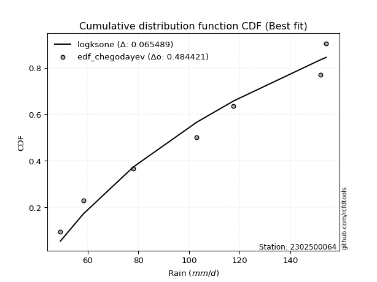</img>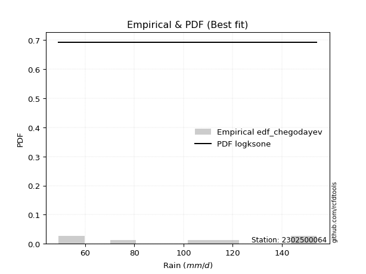</img>

</div>


### 6. EDF Blom (1958)

The Blom formula is a specific "plotting position" formula used in hydrology and statistical analysis to estimate the empirical cumulative probability (or non-exceedance probability) of a data series. It is particularly recommended for data that are approximately normally distributed. The constant _a_ is set to 0.375 (or 3/8).

<div align="center">


$P=(m-a)/(n+1-2a)$


</div>


**6.1. Empirical values**

<div align="center">

|                | 0                   | 1                   | 2                  | 3        | 4                  | 5                  | 6                  |
|:---------------|:--------------------|:--------------------|:-------------------|:---------|:-------------------|:-------------------|:-------------------|
| date           | 2020                | 2022                | 2023               | 2021     | 2025               | 2024               | 2019               |
| x              | 49.2                | 58.2                | 78.0               | 103.0    | 117.6              | 152.0              | 154.2              |
| m              | 1                   | 2                   | 3                  | 4        | 5                  | 6                  | 7                  |
| empirical_dist | edf_blom            | edf_blom            | edf_blom           | edf_blom | edf_blom           | edf_blom           | edf_blom           |
| empirical      | 0.08620689655172414 | 0.22413793103448276 | 0.3620689655172414 | 0.5      | 0.6379310344827587 | 0.7758620689655172 | 0.9137931034482759 |
| empirical_tr   | 1.0943396226415094  | 1.288888888888889   | 1.5675675675675675 | 2.0      | 2.7619047619047623 | 4.461538461538462  | 11.600000000000007 |

</div>


**6.2. Kolmogorov-Smirnov fit test (sorted by Δ)**


<div align="center">

|                | 0                   | 1                   | 2                   | 3                   | 4                   | 5                   | 6                   | 7                   | 8                   | 9                   | 10                  | 11                  | 12                  | 13                  | 14                  | 15                  | 16                  | 17                  | 18                  | 19                  | 20                  | 21                  | 22                  | 23                  | 24                  | 25                  | 26                  | 27                  | 28                  | 29                  | 30                  | 31                  | 32                  | 33                  | 34                  | 35                  | 36                  | 37                  | 38                  | 39                  | 40                  | 41                  | 42                  | 43                  | 44                  | 45                  | 46                  | 47                  | 48                  | 49                  | 50                  | 51                  | 52                  | 53                  | 54                  | 55                  | 56                  | 57                  | 58                  | 59                  | 60                  | 61                  | 62                  | 63                  | 64                  | 65                  | 66                  | 67                  | 68                  | 69                  | 70                  | 71                  | 72                  | 73                  | 74                  | 75                  | 76                  | 77                  | 78                  | 79                  | 80                  | 81                  | 82                  | 83                  | 84                  | 85                  | 86                  | 87                  | 88                  | 89                  | 90                  | 91                  | 92                  | 93                  | 94                  | 95                  | 96                  | 97                  | 98                  | 99                  | 100                 | 101                 | 102                 | 103                 | 104                 | 105                 | 106                 | 107                 | 108                 | 109                 | 110                 | 111                 | 112                 | 113                 | 114                 | 115                 | 116                 | 117                 | 118                 | 119                 | 120                 | 121                 | 122                 | 123                 | 124                 | 125                 | 126                 | 127                 | 128                 | 129                 | 130                 | 131                 | 132                 | 133                 | 134                 | 135                 | 136                 | 137                 | 138                 | 139                 | 140                 | 141                 | 142                 | 143                 | 144                 | 145                 | 146                 | 147                 | 148                 | 149                 | 150                 | 151                 | 152                 | 153                 | 154                 | 155                 | 156                 | 157                 | 158                 | 159                 |
|:---------------|:--------------------|:--------------------|:--------------------|:--------------------|:--------------------|:--------------------|:--------------------|:--------------------|:--------------------|:--------------------|:--------------------|:--------------------|:--------------------|:--------------------|:--------------------|:--------------------|:--------------------|:--------------------|:--------------------|:--------------------|:--------------------|:--------------------|:--------------------|:--------------------|:--------------------|:--------------------|:--------------------|:--------------------|:--------------------|:--------------------|:--------------------|:--------------------|:--------------------|:--------------------|:--------------------|:--------------------|:--------------------|:--------------------|:--------------------|:--------------------|:--------------------|:--------------------|:--------------------|:--------------------|:--------------------|:--------------------|:--------------------|:--------------------|:--------------------|:--------------------|:--------------------|:--------------------|:--------------------|:--------------------|:--------------------|:--------------------|:--------------------|:--------------------|:--------------------|:--------------------|:--------------------|:--------------------|:--------------------|:--------------------|:--------------------|:--------------------|:--------------------|:--------------------|:--------------------|:--------------------|:--------------------|:--------------------|:--------------------|:--------------------|:--------------------|:--------------------|:--------------------|:--------------------|:--------------------|:--------------------|:--------------------|:--------------------|:--------------------|:--------------------|:--------------------|:--------------------|:--------------------|:--------------------|:--------------------|:--------------------|:--------------------|:--------------------|:--------------------|:--------------------|:--------------------|:--------------------|:--------------------|:--------------------|:--------------------|:--------------------|:--------------------|:--------------------|:--------------------|:--------------------|:--------------------|:--------------------|:--------------------|:--------------------|:--------------------|:--------------------|:--------------------|:--------------------|:--------------------|:--------------------|:--------------------|:--------------------|:--------------------|:--------------------|:--------------------|:--------------------|:--------------------|:--------------------|:--------------------|:--------------------|:--------------------|:--------------------|:--------------------|:--------------------|:--------------------|:--------------------|:--------------------|:--------------------|:--------------------|:--------------------|:--------------------|:--------------------|:--------------------|:--------------------|:--------------------|:--------------------|:--------------------|:--------------------|:--------------------|:--------------------|:--------------------|:--------------------|:--------------------|:--------------------|:--------------------|:--------------------|:--------------------|:--------------------|:--------------------|:--------------------|:--------------------|:--------------------|:--------------------|:--------------------|:--------------------|:--------------------|
| station        | 2302500064          | 2302500064          | 2302500064          | 2302500064          | 2302500064          | 2302500064          | 2302500064          | 2302500064          | 2302500064          | 2302500064          | 2302500064          | 2302500064          | 2302500064          | 2302500064          | 2302500064          | 2302500064          | 2302500064          | 2302500064          | 2302500064          | 2302500064          | 2302500064          | 2302500064          | 2302500064          | 2302500064          | 2302500064          | 2302500064          | 2302500064          | 2302500064          | 2302500064          | 2302500064          | 2302500064          | 2302500064          | 2302500064          | 2302500064          | 2302500064          | 2302500064          | 2302500064          | 2302500064          | 2302500064          | 2302500064          | 2302500064          | 2302500064          | 2302500064          | 2302500064          | 2302500064          | 2302500064          | 2302500064          | 2302500064          | 2302500064          | 2302500064          | 2302500064          | 2302500064          | 2302500064          | 2302500064          | 2302500064          | 2302500064          | 2302500064          | 2302500064          | 2302500064          | 2302500064          | 2302500064          | 2302500064          | 2302500064          | 2302500064          | 2302500064          | 2302500064          | 2302500064          | 2302500064          | 2302500064          | 2302500064          | 2302500064          | 2302500064          | 2302500064          | 2302500064          | 2302500064          | 2302500064          | 2302500064          | 2302500064          | 2302500064          | 2302500064          | 2302500064          | 2302500064          | 2302500064          | 2302500064          | 2302500064          | 2302500064          | 2302500064          | 2302500064          | 2302500064          | 2302500064          | 2302500064          | 2302500064          | 2302500064          | 2302500064          | 2302500064          | 2302500064          | 2302500064          | 2302500064          | 2302500064          | 2302500064          | 2302500064          | 2302500064          | 2302500064          | 2302500064          | 2302500064          | 2302500064          | 2302500064          | 2302500064          | 2302500064          | 2302500064          | 2302500064          | 2302500064          | 2302500064          | 2302500064          | 2302500064          | 2302500064          | 2302500064          | 2302500064          | 2302500064          | 2302500064          | 2302500064          | 2302500064          | 2302500064          | 2302500064          | 2302500064          | 2302500064          | 2302500064          | 2302500064          | 2302500064          | 2302500064          | 2302500064          | 2302500064          | 2302500064          | 2302500064          | 2302500064          | 2302500064          | 2302500064          | 2302500064          | 2302500064          | 2302500064          | 2302500064          | 2302500064          | 2302500064          | 2302500064          | 2302500064          | 2302500064          | 2302500064          | 2302500064          | 2302500064          | 2302500064          | 2302500064          | 2302500064          | 2302500064          | 2302500064          | 2302500064          | 2302500064          | 2302500064          | 2302500064          | 2302500064          | 2302500064          |
| empirical_dist | edf_blom            | edf_blom            | edf_blom            | edf_blom            | edf_blom            | edf_blom            | edf_blom            | edf_blom            | edf_blom            | edf_blom            | edf_blom            | edf_blom            | edf_blom            | edf_blom            | edf_blom            | edf_blom            | edf_blom            | edf_blom            | edf_blom            | edf_blom            | edf_blom            | edf_blom            | edf_blom            | edf_blom            | edf_blom            | edf_blom            | edf_blom            | edf_blom            | edf_blom            | edf_blom            | edf_blom            | edf_blom            | edf_blom            | edf_blom            | edf_blom            | edf_blom            | edf_blom            | edf_blom            | edf_blom            | edf_blom            | edf_blom            | edf_blom            | edf_blom            | edf_blom            | edf_blom            | edf_blom            | edf_blom            | edf_blom            | edf_blom            | edf_blom            | edf_blom            | edf_blom            | edf_blom            | edf_blom            | edf_blom            | edf_blom            | edf_blom            | edf_blom            | edf_blom            | edf_blom            | edf_blom            | edf_blom            | edf_blom            | edf_blom            | edf_blom            | edf_blom            | edf_blom            | edf_blom            | edf_blom            | edf_blom            | edf_blom            | edf_blom            | edf_blom            | edf_blom            | edf_blom            | edf_blom            | edf_blom            | edf_blom            | edf_blom            | edf_blom            | edf_blom            | edf_blom            | edf_blom            | edf_blom            | edf_blom            | edf_blom            | edf_blom            | edf_blom            | edf_blom            | edf_blom            | edf_blom            | edf_blom            | edf_blom            | edf_blom            | edf_blom            | edf_blom            | edf_blom            | edf_blom            | edf_blom            | edf_blom            | edf_blom            | edf_blom            | edf_blom            | edf_blom            | edf_blom            | edf_blom            | edf_blom            | edf_blom            | edf_blom            | edf_blom            | edf_blom            | edf_blom            | edf_blom            | edf_blom            | edf_blom            | edf_blom            | edf_blom            | edf_blom            | edf_blom            | edf_blom            | edf_blom            | edf_blom            | edf_blom            | edf_blom            | edf_blom            | edf_blom            | edf_blom            | edf_blom            | edf_blom            | edf_blom            | edf_blom            | edf_blom            | edf_blom            | edf_blom            | edf_blom            | edf_blom            | edf_blom            | edf_blom            | edf_blom            | edf_blom            | edf_blom            | edf_blom            | edf_blom            | edf_blom            | edf_blom            | edf_blom            | edf_blom            | edf_blom            | edf_blom            | edf_blom            | edf_blom            | edf_blom            | edf_blom            | edf_blom            | edf_blom            | edf_blom            | edf_blom            | edf_blom            | edf_blom            | edf_blom            |
| p_dist         | logksone            | logsemicircular     | loganglit           | arcsine             | logarcsine          | nakagami            | ksone               | logbetaprime        | loggamma            | loggamma            | logerlang           | logf                | logalpha            | logncf              | lognct              | logt                | logcrystalball      | lognorm             | logexponnorm        | logfatiguelife      | loginvgamma         | semicircular        | invgauss            | genlogistic         | logpearson3         | logrice             | logtrapezoid        | anglit              | betaprime           | ncf                 | rayleigh            | kstwobign           | invgamma            | maxwell             | loglogistic         | logweibull_min      | loginvgauss         | logmaxwell          | alpha               | rice                | logburr12           | genpareto           | logcosine           | logdgamma           | gamma               | loghypsecant        | halfnorm            | foldnorm            | erlang              | pearson3            | johnsonsu           | skewnorm            | nct                 | exponnorm           | truncnorm           | crystalball         | norm                | t                   | lograyleigh         | logdweibull         | gumbel_r            | burr                | gompertz            | logloglaplace       | beta                | loginvweibull       | logistic            | cosine              | loglaplace          | loglaplace          | rdist               | hypsecant           | lomax               | genexpon            | loggumbel_l         | loggenexpon         | logbeta             | wrapcauchy          | weibull_min         | kappa3              | logkstwobign        | laplace             | loghalfnorm         | logfoldnorm         | moyal               | loggompertz         | exponpow            | loggumbel_r         | logargus            | argus               | dgamma              | dweibull            | halfgennorm         | trapezoid           | gumbel_l            | logweibull_max      | f                   | loglomax            | logmoyal            | halflogistic        | genhalflogistic     | burr12              | logburr             | logwrapcauchy       | triang              | loggenhalflogistic  | logloggamma         | loghalflogistic     | kappa4              | gausshyper          | tukeylambda         | logkappa4           | uniform             | vonmises_line       | logtriang           | loggausshyper       | logskewnorm         | bradford            | logtukeylambda      | logkappa3           | truncexpon          | loguniform          | logvonmises_line    | truncweibull_min    | loggenextreme       | logtruncweibull_min | logbradford         | logtruncnorm        | wald                | loglevy_l           | logtruncexpon       | levy_l              | logwald             | logmielke           | gennorm             | loggennorm          | logjohnsonsb        | logrdist            | logjohnsonsu        | loggenpareto        | genextreme          | logexponpow         | johnsonsb           | fatiguelife         | lognakagami         | loggengamma         | powerlaw            | invweibull          | gengamma            | logpowerlaw         | exponweib           | logexponweib        | weibull_max         | truncpareto         | logtruncpareto      | loghalfgennorm      | loggenlogistic      | logvonmises         | vonmises            | mielke              |
| delta          | 0.06906967855761414 | 0.07205674707026222 | 0.08031823526362236 | 0.08561318471015311 | 0.09374053259099635 | 0.09383237079886964 | 0.09433366939603305 | 0.09798934575383622 | 0.09830869974349221 | 0.09830869974349221 | 0.09863523479344916 | 0.09962712257762518 | 0.1002822361598239  | 0.10055234527769008 | 0.10055699569501542 | 0.10104992368535526 | 0.10105363215905361 | 0.10105453223013783 | 0.10105502177394632 | 0.10149440407790378 | 0.10205377019734807 | 0.10232119763022463 | 0.10312651729057487 | 0.10389098117548878 | 0.10509632808116454 | 0.10638908532326019 | 0.10776235767300335 | 0.10846423851894305 | 0.10877887923571117 | 0.11059323976881419 | 0.11236474421979581 | 0.11316347493937973 | 0.11485120814019023 | 0.11486723315052505 | 0.11537905284054006 | 0.11564676043269273 | 0.11588965973349541 | 0.1171423044811557  | 0.1172184226018832  | 0.1182506233254681  | 0.11846989908995031 | 0.11883149184898678 | 0.12036938937655584 | 0.12153538848913159 | 0.12203766588974352 | 0.12204538832032652 | 0.12219111696392762 | 0.12234503065976143 | 0.12260876303426038 | 0.12285108892489593 | 0.12324282459702263 | 0.12414137244852141 | 0.12424323169879647 | 0.12428011408566852 | 0.12428598198922491 | 0.12428598607126118 | 0.12428598724517137 | 0.12428727727366684 | 0.12570684244293717 | 0.1263029153337205  | 0.12727640815273344 | 0.12859191200706488 | 0.13126276486002592 | 0.13152576569198451 | 0.13154406210887248 | 0.13228471516703366 | 0.13514619235692504 | 0.13681656944680176 | 0.13722634992695137 | 0.13722634992695137 | 0.13908097617713544 | 0.13970957278858798 | 0.1404272562336255  | 0.14052261054376813 | 0.14079122400031285 | 0.14670353948243875 | 0.14754571617033718 | 0.1476614845909715  | 0.14817657215715807 | 0.14821632994167927 | 0.14848031299908682 | 0.14980674973214705 | 0.1500256117463612  | 0.15102538827366674 | 0.1553982803157905  | 0.1558986966630872  | 0.1560982578197152  | 0.1572330082210005  | 0.16283277841639665 | 0.16294807054668137 | 0.16329179004625383 | 0.16406839148405372 | 0.16465044665226858 | 0.1682761413127528  | 0.16956188720729182 | 0.17104048656962978 | 0.17416424426165455 | 0.18034195678662868 | 0.1804686506287846  | 0.18079253208762347 | 0.18095372047260871 | 0.18149171505490502 | 0.18213812245318894 | 0.18896124494106903 | 0.19336855973514389 | 0.19423941603581818 | 0.19527980256862099 | 0.19855763749970692 | 0.2001783186797481  | 0.20153968145843715 | 0.20159146081836232 | 0.20187056399307224 | 0.20318555008210193 | 0.20318616797347833 | 0.20461608090400107 | 0.20598744089631638 | 0.2064949588318007  | 0.20907148246068785 | 0.2095471397396823  | 0.2100670724852849  | 0.21123474794583097 | 0.21155872652536212 | 0.21166446213938173 | 0.21252519305064055 | 0.2135741652944067  | 0.2150446882594328  | 0.22408553497583306 | 0.22413793103300128 | 0.22413793103448276 | 0.23410497620404191 | 0.24016094894439144 | 0.2416430123035842  | 0.24511634635901924 | 0.2638501508777169  | 0.27586206896551724 | 0.27586206896551724 | 0.2793698927407663  | 0.29773461459536266 | 0.3099742234474223  | 0.3118165327692968  | 0.31976195403391283 | 0.37526448134016277 | 0.4194007073199111  | 0.4277280539878058  | 0.43726948770182994 | 0.44342931019000076 | 0.44440628019739054 | 0.44841278533196094 | 0.46020241334933154 | 0.4876644331322773  | 0.5089928646049197  | 0.5108230700660232  | 0.5280770153158968  | 0.58512214371069    | 0.6267706653196422  | 0.7758620689655172  | 0.7758620689655172  | 1.100232243055284   | 23.772409779068393  | nan                 |
| deltao         | 0.48442053926100004 | 0.48442053926100004 | 0.48442053926100004 | 0.48442053926100004 | 0.48442053926100004 | 0.48442053926100004 | 0.48442053926100004 | 0.48442053926100004 | 0.48442053926100004 | 0.48442053926100004 | 0.48442053926100004 | 0.48442053926100004 | 0.48442053926100004 | 0.48442053926100004 | 0.48442053926100004 | 0.48442053926100004 | 0.48442053926100004 | 0.48442053926100004 | 0.48442053926100004 | 0.48442053926100004 | 0.48442053926100004 | 0.48442053926100004 | 0.48442053926100004 | 0.48442053926100004 | 0.48442053926100004 | 0.48442053926100004 | 0.48442053926100004 | 0.48442053926100004 | 0.48442053926100004 | 0.48442053926100004 | 0.48442053926100004 | 0.48442053926100004 | 0.48442053926100004 | 0.48442053926100004 | 0.48442053926100004 | 0.48442053926100004 | 0.48442053926100004 | 0.48442053926100004 | 0.48442053926100004 | 0.48442053926100004 | 0.48442053926100004 | 0.48442053926100004 | 0.48442053926100004 | 0.48442053926100004 | 0.48442053926100004 | 0.48442053926100004 | 0.48442053926100004 | 0.48442053926100004 | 0.48442053926100004 | 0.48442053926100004 | 0.48442053926100004 | 0.48442053926100004 | 0.48442053926100004 | 0.48442053926100004 | 0.48442053926100004 | 0.48442053926100004 | 0.48442053926100004 | 0.48442053926100004 | 0.48442053926100004 | 0.48442053926100004 | 0.48442053926100004 | 0.48442053926100004 | 0.48442053926100004 | 0.48442053926100004 | 0.48442053926100004 | 0.48442053926100004 | 0.48442053926100004 | 0.48442053926100004 | 0.48442053926100004 | 0.48442053926100004 | 0.48442053926100004 | 0.48442053926100004 | 0.48442053926100004 | 0.48442053926100004 | 0.48442053926100004 | 0.48442053926100004 | 0.48442053926100004 | 0.48442053926100004 | 0.48442053926100004 | 0.48442053926100004 | 0.48442053926100004 | 0.48442053926100004 | 0.48442053926100004 | 0.48442053926100004 | 0.48442053926100004 | 0.48442053926100004 | 0.48442053926100004 | 0.48442053926100004 | 0.48442053926100004 | 0.48442053926100004 | 0.48442053926100004 | 0.48442053926100004 | 0.48442053926100004 | 0.48442053926100004 | 0.48442053926100004 | 0.48442053926100004 | 0.48442053926100004 | 0.48442053926100004 | 0.48442053926100004 | 0.48442053926100004 | 0.48442053926100004 | 0.48442053926100004 | 0.48442053926100004 | 0.48442053926100004 | 0.48442053926100004 | 0.48442053926100004 | 0.48442053926100004 | 0.48442053926100004 | 0.48442053926100004 | 0.48442053926100004 | 0.48442053926100004 | 0.48442053926100004 | 0.48442053926100004 | 0.48442053926100004 | 0.48442053926100004 | 0.48442053926100004 | 0.48442053926100004 | 0.48442053926100004 | 0.48442053926100004 | 0.48442053926100004 | 0.48442053926100004 | 0.48442053926100004 | 0.48442053926100004 | 0.48442053926100004 | 0.48442053926100004 | 0.48442053926100004 | 0.48442053926100004 | 0.48442053926100004 | 0.48442053926100004 | 0.48442053926100004 | 0.48442053926100004 | 0.48442053926100004 | 0.48442053926100004 | 0.48442053926100004 | 0.48442053926100004 | 0.48442053926100004 | 0.48442053926100004 | 0.48442053926100004 | 0.48442053926100004 | 0.48442053926100004 | 0.48442053926100004 | 0.48442053926100004 | 0.48442053926100004 | 0.48442053926100004 | 0.48442053926100004 | 0.48442053926100004 | 0.48442053926100004 | 0.48442053926100004 | 0.48442053926100004 | 0.48442053926100004 | 0.48442053926100004 | 0.48442053926100004 | 0.48442053926100004 | 0.48442053926100004 | 0.48442053926100004 | 0.48442053926100004 | 0.48442053926100004 | 0.48442053926100004 | 0.48442053926100004 | 0.48442053926100004 |
| eval           | Δo > Δ              | Δo > Δ              | Δo > Δ              | Δo > Δ              | Δo > Δ              | Δo > Δ              | Δo > Δ              | Δo > Δ              | Δo > Δ              | Δo > Δ              | Δo > Δ              | Δo > Δ              | Δo > Δ              | Δo > Δ              | Δo > Δ              | Δo > Δ              | Δo > Δ              | Δo > Δ              | Δo > Δ              | Δo > Δ              | Δo > Δ              | Δo > Δ              | Δo > Δ              | Δo > Δ              | Δo > Δ              | Δo > Δ              | Δo > Δ              | Δo > Δ              | Δo > Δ              | Δo > Δ              | Δo > Δ              | Δo > Δ              | Δo > Δ              | Δo > Δ              | Δo > Δ              | Δo > Δ              | Δo > Δ              | Δo > Δ              | Δo > Δ              | Δo > Δ              | Δo > Δ              | Δo > Δ              | Δo > Δ              | Δo > Δ              | Δo > Δ              | Δo > Δ              | Δo > Δ              | Δo > Δ              | Δo > Δ              | Δo > Δ              | Δo > Δ              | Δo > Δ              | Δo > Δ              | Δo > Δ              | Δo > Δ              | Δo > Δ              | Δo > Δ              | Δo > Δ              | Δo > Δ              | Δo > Δ              | Δo > Δ              | Δo > Δ              | Δo > Δ              | Δo > Δ              | Δo > Δ              | Δo > Δ              | Δo > Δ              | Δo > Δ              | Δo > Δ              | Δo > Δ              | Δo > Δ              | Δo > Δ              | Δo > Δ              | Δo > Δ              | Δo > Δ              | Δo > Δ              | Δo > Δ              | Δo > Δ              | Δo > Δ              | Δo > Δ              | Δo > Δ              | Δo > Δ              | Δo > Δ              | Δo > Δ              | Δo > Δ              | Δo > Δ              | Δo > Δ              | Δo > Δ              | Δo > Δ              | Δo > Δ              | Δo > Δ              | Δo > Δ              | Δo > Δ              | Δo > Δ              | Δo > Δ              | Δo > Δ              | Δo > Δ              | Δo > Δ              | Δo > Δ              | Δo > Δ              | Δo > Δ              | Δo > Δ              | Δo > Δ              | Δo > Δ              | Δo > Δ              | Δo > Δ              | Δo > Δ              | Δo > Δ              | Δo > Δ              | Δo > Δ              | Δo > Δ              | Δo > Δ              | Δo > Δ              | Δo > Δ              | Δo > Δ              | Δo > Δ              | Δo > Δ              | Δo > Δ              | Δo > Δ              | Δo > Δ              | Δo > Δ              | Δo > Δ              | Δo > Δ              | Δo > Δ              | Δo > Δ              | Δo > Δ              | Δo > Δ              | Δo > Δ              | Δo > Δ              | Δo > Δ              | Δo > Δ              | Δo > Δ              | Δo > Δ              | Δo > Δ              | Δo > Δ              | Δo > Δ              | Δo > Δ              | Δo > Δ              | Δo > Δ              | Δo > Δ              | Δo > Δ              | Δo > Δ              | Δo > Δ              | Δo > Δ              | Δo > Δ              | Δo > Δ              | Δo > Δ              | Δo > Δ              | Δo > Δ              | Δo <= Δ             | Δo <= Δ             | Δo <= Δ             | Δo <= Δ             | Δo <= Δ             | Δo <= Δ             | Δo <= Δ             | Δo <= Δ             | Δo <= Δ             | Δo <= Δ             | Δo <= Δ             |
| fit            | 1                   | 1                   | 1                   | 1                   | 1                   | 1                   | 1                   | 1                   | 1                   | 1                   | 1                   | 1                   | 1                   | 1                   | 1                   | 1                   | 1                   | 1                   | 1                   | 1                   | 1                   | 1                   | 1                   | 1                   | 1                   | 1                   | 1                   | 1                   | 1                   | 1                   | 1                   | 1                   | 1                   | 1                   | 1                   | 1                   | 1                   | 1                   | 1                   | 1                   | 1                   | 1                   | 1                   | 1                   | 1                   | 1                   | 1                   | 1                   | 1                   | 1                   | 1                   | 1                   | 1                   | 1                   | 1                   | 1                   | 1                   | 1                   | 1                   | 1                   | 1                   | 1                   | 1                   | 1                   | 1                   | 1                   | 1                   | 1                   | 1                   | 1                   | 1                   | 1                   | 1                   | 1                   | 1                   | 1                   | 1                   | 1                   | 1                   | 1                   | 1                   | 1                   | 1                   | 1                   | 1                   | 1                   | 1                   | 1                   | 1                   | 1                   | 1                   | 1                   | 1                   | 1                   | 1                   | 1                   | 1                   | 1                   | 1                   | 1                   | 1                   | 1                   | 1                   | 1                   | 1                   | 1                   | 1                   | 1                   | 1                   | 1                   | 1                   | 1                   | 1                   | 1                   | 1                   | 1                   | 1                   | 1                   | 1                   | 1                   | 1                   | 1                   | 1                   | 1                   | 1                   | 1                   | 1                   | 1                   | 1                   | 1                   | 1                   | 1                   | 1                   | 1                   | 1                   | 1                   | 1                   | 1                   | 1                   | 1                   | 1                   | 1                   | 1                   | 1                   | 1                   | 1                   | 1                   | 1                   | 1                   | 0                   | 0                   | 0                   | 0                   | 0                   | 0                   | 0                   | 0                   | 0                   | 0                   | 0                   |
| n              | 7                   | 7                   | 7                   | 7                   | 7                   | 7                   | 7                   | 7                   | 7                   | 7                   | 7                   | 7                   | 7                   | 7                   | 7                   | 7                   | 7                   | 7                   | 7                   | 7                   | 7                   | 7                   | 7                   | 7                   | 7                   | 7                   | 7                   | 7                   | 7                   | 7                   | 7                   | 7                   | 7                   | 7                   | 7                   | 7                   | 7                   | 7                   | 7                   | 7                   | 7                   | 7                   | 7                   | 7                   | 7                   | 7                   | 7                   | 7                   | 7                   | 7                   | 7                   | 7                   | 7                   | 7                   | 7                   | 7                   | 7                   | 7                   | 7                   | 7                   | 7                   | 7                   | 7                   | 7                   | 7                   | 7                   | 7                   | 7                   | 7                   | 7                   | 7                   | 7                   | 7                   | 7                   | 7                   | 7                   | 7                   | 7                   | 7                   | 7                   | 7                   | 7                   | 7                   | 7                   | 7                   | 7                   | 7                   | 7                   | 7                   | 7                   | 7                   | 7                   | 7                   | 7                   | 7                   | 7                   | 7                   | 7                   | 7                   | 7                   | 7                   | 7                   | 7                   | 7                   | 7                   | 7                   | 7                   | 7                   | 7                   | 7                   | 7                   | 7                   | 7                   | 7                   | 7                   | 7                   | 7                   | 7                   | 7                   | 7                   | 7                   | 7                   | 7                   | 7                   | 7                   | 7                   | 7                   | 7                   | 7                   | 7                   | 7                   | 7                   | 7                   | 7                   | 7                   | 7                   | 7                   | 7                   | 7                   | 7                   | 7                   | 7                   | 7                   | 7                   | 7                   | 7                   | 7                   | 7                   | 7                   | 7                   | 7                   | 7                   | 7                   | 7                   | 7                   | 7                   | 7                   | 7                   | 7                   | 7                   |
| best_fit       | 1                   | 0                   | 0                   | 0                   | 0                   | 0                   | 0                   | 0                   | 0                   | 0                   | 0                   | 0                   | 0                   | 0                   | 0                   | 0                   | 0                   | 0                   | 0                   | 0                   | 0                   | 0                   | 0                   | 0                   | 0                   | 0                   | 0                   | 0                   | 0                   | 0                   | 0                   | 0                   | 0                   | 0                   | 0                   | 0                   | 0                   | 0                   | 0                   | 0                   | 0                   | 0                   | 0                   | 0                   | 0                   | 0                   | 0                   | 0                   | 0                   | 0                   | 0                   | 0                   | 0                   | 0                   | 0                   | 0                   | 0                   | 0                   | 0                   | 0                   | 0                   | 0                   | 0                   | 0                   | 0                   | 0                   | 0                   | 0                   | 0                   | 0                   | 0                   | 0                   | 0                   | 0                   | 0                   | 0                   | 0                   | 0                   | 0                   | 0                   | 0                   | 0                   | 0                   | 0                   | 0                   | 0                   | 0                   | 0                   | 0                   | 0                   | 0                   | 0                   | 0                   | 0                   | 0                   | 0                   | 0                   | 0                   | 0                   | 0                   | 0                   | 0                   | 0                   | 0                   | 0                   | 0                   | 0                   | 0                   | 0                   | 0                   | 0                   | 0                   | 0                   | 0                   | 0                   | 0                   | 0                   | 0                   | 0                   | 0                   | 0                   | 0                   | 0                   | 0                   | 0                   | 0                   | 0                   | 0                   | 0                   | 0                   | 0                   | 0                   | 0                   | 0                   | 0                   | 0                   | 0                   | 0                   | 0                   | 0                   | 0                   | 0                   | 0                   | 0                   | 0                   | 0                   | 0                   | 0                   | 0                   | 0                   | 0                   | 0                   | 0                   | 0                   | 0                   | 0                   | 0                   | 0                   | 0                   | 0                   |
| best_fit_sort  | 1                   | 2                   | 3                   | 4                   | 5                   | 6                   | 7                   | 8                   | 9                   | 10                  | 11                  | 12                  | 13                  | 14                  | 15                  | 16                  | 17                  | 18                  | 19                  | 20                  | 21                  | 22                  | 23                  | 24                  | 25                  | 26                  | 27                  | 28                  | 29                  | 30                  | 31                  | 32                  | 33                  | 34                  | 35                  | 36                  | 37                  | 38                  | 39                  | 40                  | 41                  | 42                  | 43                  | 44                  | 45                  | 46                  | 47                  | 48                  | 49                  | 50                  | 51                  | 52                  | 53                  | 54                  | 55                  | 56                  | 57                  | 58                  | 59                  | 60                  | 61                  | 62                  | 63                  | 64                  | 65                  | 66                  | 67                  | 68                  | 69                  | 70                  | 71                  | 72                  | 73                  | 74                  | 75                  | 76                  | 77                  | 78                  | 79                  | 80                  | 81                  | 82                  | 83                  | 84                  | 85                  | 86                  | 87                  | 88                  | 89                  | 90                  | 91                  | 92                  | 93                  | 94                  | 95                  | 96                  | 97                  | 98                  | 99                  | 100                 | 101                 | 102                 | 103                 | 104                 | 105                 | 106                 | 107                 | 108                 | 109                 | 110                 | 111                 | 112                 | 113                 | 114                 | 115                 | 116                 | 117                 | 118                 | 119                 | 120                 | 121                 | 122                 | 123                 | 124                 | 125                 | 126                 | 127                 | 128                 | 129                 | 130                 | 131                 | 132                 | 133                 | 134                 | 135                 | 136                 | 137                 | 138                 | 139                 | 140                 | 141                 | 142                 | 143                 | 144                 | 145                 | 146                 | 147                 | 148                 | 149                 | 150                 | 151                 | 152                 | 153                 | 154                 | 155                 | 156                 | 157                 | 158                 | 159                 | 160                 |

</div>


**6.3. Best fit**

<div align="center">

|   id |    station | empirical_dist   | p_dist   |     delta |   deltao | eval   |   fit |   n |   best_fit |   best_fit_sort |
|-----:|-----------:|:-----------------|:---------|----------:|---------:|:-------|------:|----:|-----------:|----------------:|
|    0 | 2302500064 | edf_blom         | logksone | 0.0690697 | 0.484421 | Δo > Δ |     1 |   7 |          1 |               1 |

</div>


<div align="center">

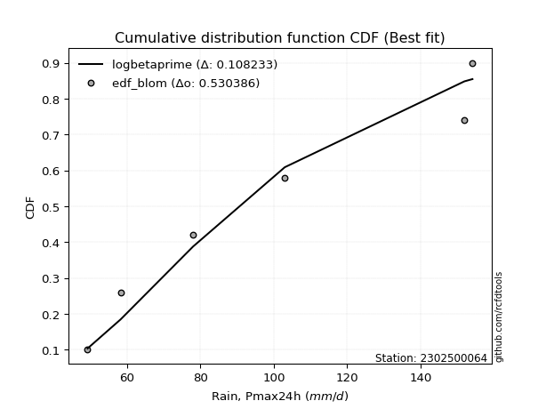</img></img>

</div>


### 7. EDF Tukey (1962)

In hydrology, the Tukey formula is used as a plotting position formula to estimate the empirical probability or frequency of a flood event (or other hydrological data). The formula parameter is given as _c=0.333_ (or 1/3).

<div align="center">


$P=(m-c)/(n+1-2c)$


</div>


**7.1. Empirical values**

<div align="center">

|                | 0                   | 1                   | 2                   | 3         | 4                  | 5                  | 6                  |
|:---------------|:--------------------|:--------------------|:--------------------|:----------|:-------------------|:-------------------|:-------------------|
| date           | 2020                | 2022                | 2023                | 2021      | 2025               | 2024               | 2019               |
| x              | 49.2                | 58.2                | 78.0                | 103.0     | 117.6              | 152.0              | 154.2              |
| m              | 1                   | 2                   | 3                   | 4         | 5                  | 6                  | 7                  |
| empirical_dist | edf_tukey           | edf_tukey           | edf_tukey           | edf_tukey | edf_tukey          | edf_tukey          | edf_tukey          |
| empirical      | 0.09090909090909091 | 0.22727272727272727 | 0.36363636363636365 | 0.5       | 0.6363636363636364 | 0.7727272727272727 | 0.9090909090909091 |
| empirical_tr   | 1.1                 | 1.2941176470588236  | 1.5714285714285714  | 2.0       | 2.75               | 4.3999999999999995 | 10.999999999999996 |

</div>


**7.2. Kolmogorov-Smirnov fit test (sorted by Δ)**


<div align="center">

|                | 0                   | 1                   | 2                   | 3                   | 4                   | 5                   | 6                   | 7                   | 8                   | 9                   | 10                  | 11                  | 12                  | 13                  | 14                  | 15                  | 16                  | 17                  | 18                  | 19                  | 20                  | 21                  | 22                  | 23                  | 24                  | 25                  | 26                  | 27                  | 28                  | 29                  | 30                  | 31                  | 32                  | 33                  | 34                  | 35                  | 36                  | 37                  | 38                  | 39                  | 40                  | 41                  | 42                  | 43                  | 44                  | 45                  | 46                  | 47                  | 48                  | 49                  | 50                  | 51                  | 52                  | 53                  | 54                  | 55                  | 56                  | 57                  | 58                  | 59                  | 60                  | 61                  | 62                  | 63                  | 64                  | 65                  | 66                  | 67                  | 68                  | 69                  | 70                  | 71                  | 72                  | 73                  | 74                  | 75                  | 76                  | 77                  | 78                  | 79                  | 80                  | 81                  | 82                  | 83                  | 84                  | 85                  | 86                  | 87                  | 88                  | 89                  | 90                  | 91                  | 92                  | 93                  | 94                  | 95                  | 96                  | 97                  | 98                  | 99                  | 100                 | 101                 | 102                 | 103                 | 104                 | 105                 | 106                 | 107                 | 108                 | 109                 | 110                 | 111                 | 112                 | 113                 | 114                 | 115                 | 116                 | 117                 | 118                 | 119                 | 120                 | 121                 | 122                 | 123                 | 124                 | 125                 | 126                 | 127                 | 128                 | 129                 | 130                 | 131                 | 132                 | 133                 | 134                 | 135                 | 136                 | 137                 | 138                 | 139                 | 140                 | 141                 | 142                 | 143                 | 144                 | 145                 | 146                 | 147                 | 148                 | 149                 | 150                 | 151                 | 152                 | 153                 | 154                 | 155                 | 156                 | 157                 | 158                 | 159                 |
|:---------------|:--------------------|:--------------------|:--------------------|:--------------------|:--------------------|:--------------------|:--------------------|:--------------------|:--------------------|:--------------------|:--------------------|:--------------------|:--------------------|:--------------------|:--------------------|:--------------------|:--------------------|:--------------------|:--------------------|:--------------------|:--------------------|:--------------------|:--------------------|:--------------------|:--------------------|:--------------------|:--------------------|:--------------------|:--------------------|:--------------------|:--------------------|:--------------------|:--------------------|:--------------------|:--------------------|:--------------------|:--------------------|:--------------------|:--------------------|:--------------------|:--------------------|:--------------------|:--------------------|:--------------------|:--------------------|:--------------------|:--------------------|:--------------------|:--------------------|:--------------------|:--------------------|:--------------------|:--------------------|:--------------------|:--------------------|:--------------------|:--------------------|:--------------------|:--------------------|:--------------------|:--------------------|:--------------------|:--------------------|:--------------------|:--------------------|:--------------------|:--------------------|:--------------------|:--------------------|:--------------------|:--------------------|:--------------------|:--------------------|:--------------------|:--------------------|:--------------------|:--------------------|:--------------------|:--------------------|:--------------------|:--------------------|:--------------------|:--------------------|:--------------------|:--------------------|:--------------------|:--------------------|:--------------------|:--------------------|:--------------------|:--------------------|:--------------------|:--------------------|:--------------------|:--------------------|:--------------------|:--------------------|:--------------------|:--------------------|:--------------------|:--------------------|:--------------------|:--------------------|:--------------------|:--------------------|:--------------------|:--------------------|:--------------------|:--------------------|:--------------------|:--------------------|:--------------------|:--------------------|:--------------------|:--------------------|:--------------------|:--------------------|:--------------------|:--------------------|:--------------------|:--------------------|:--------------------|:--------------------|:--------------------|:--------------------|:--------------------|:--------------------|:--------------------|:--------------------|:--------------------|:--------------------|:--------------------|:--------------------|:--------------------|:--------------------|:--------------------|:--------------------|:--------------------|:--------------------|:--------------------|:--------------------|:--------------------|:--------------------|:--------------------|:--------------------|:--------------------|:--------------------|:--------------------|:--------------------|:--------------------|:--------------------|:--------------------|:--------------------|:--------------------|:--------------------|:--------------------|:--------------------|:--------------------|:--------------------|:--------------------|
| station        | 2302500064          | 2302500064          | 2302500064          | 2302500064          | 2302500064          | 2302500064          | 2302500064          | 2302500064          | 2302500064          | 2302500064          | 2302500064          | 2302500064          | 2302500064          | 2302500064          | 2302500064          | 2302500064          | 2302500064          | 2302500064          | 2302500064          | 2302500064          | 2302500064          | 2302500064          | 2302500064          | 2302500064          | 2302500064          | 2302500064          | 2302500064          | 2302500064          | 2302500064          | 2302500064          | 2302500064          | 2302500064          | 2302500064          | 2302500064          | 2302500064          | 2302500064          | 2302500064          | 2302500064          | 2302500064          | 2302500064          | 2302500064          | 2302500064          | 2302500064          | 2302500064          | 2302500064          | 2302500064          | 2302500064          | 2302500064          | 2302500064          | 2302500064          | 2302500064          | 2302500064          | 2302500064          | 2302500064          | 2302500064          | 2302500064          | 2302500064          | 2302500064          | 2302500064          | 2302500064          | 2302500064          | 2302500064          | 2302500064          | 2302500064          | 2302500064          | 2302500064          | 2302500064          | 2302500064          | 2302500064          | 2302500064          | 2302500064          | 2302500064          | 2302500064          | 2302500064          | 2302500064          | 2302500064          | 2302500064          | 2302500064          | 2302500064          | 2302500064          | 2302500064          | 2302500064          | 2302500064          | 2302500064          | 2302500064          | 2302500064          | 2302500064          | 2302500064          | 2302500064          | 2302500064          | 2302500064          | 2302500064          | 2302500064          | 2302500064          | 2302500064          | 2302500064          | 2302500064          | 2302500064          | 2302500064          | 2302500064          | 2302500064          | 2302500064          | 2302500064          | 2302500064          | 2302500064          | 2302500064          | 2302500064          | 2302500064          | 2302500064          | 2302500064          | 2302500064          | 2302500064          | 2302500064          | 2302500064          | 2302500064          | 2302500064          | 2302500064          | 2302500064          | 2302500064          | 2302500064          | 2302500064          | 2302500064          | 2302500064          | 2302500064          | 2302500064          | 2302500064          | 2302500064          | 2302500064          | 2302500064          | 2302500064          | 2302500064          | 2302500064          | 2302500064          | 2302500064          | 2302500064          | 2302500064          | 2302500064          | 2302500064          | 2302500064          | 2302500064          | 2302500064          | 2302500064          | 2302500064          | 2302500064          | 2302500064          | 2302500064          | 2302500064          | 2302500064          | 2302500064          | 2302500064          | 2302500064          | 2302500064          | 2302500064          | 2302500064          | 2302500064          | 2302500064          | 2302500064          | 2302500064          | 2302500064          | 2302500064          |
| empirical_dist | edf_tukey           | edf_tukey           | edf_tukey           | edf_tukey           | edf_tukey           | edf_tukey           | edf_tukey           | edf_tukey           | edf_tukey           | edf_tukey           | edf_tukey           | edf_tukey           | edf_tukey           | edf_tukey           | edf_tukey           | edf_tukey           | edf_tukey           | edf_tukey           | edf_tukey           | edf_tukey           | edf_tukey           | edf_tukey           | edf_tukey           | edf_tukey           | edf_tukey           | edf_tukey           | edf_tukey           | edf_tukey           | edf_tukey           | edf_tukey           | edf_tukey           | edf_tukey           | edf_tukey           | edf_tukey           | edf_tukey           | edf_tukey           | edf_tukey           | edf_tukey           | edf_tukey           | edf_tukey           | edf_tukey           | edf_tukey           | edf_tukey           | edf_tukey           | edf_tukey           | edf_tukey           | edf_tukey           | edf_tukey           | edf_tukey           | edf_tukey           | edf_tukey           | edf_tukey           | edf_tukey           | edf_tukey           | edf_tukey           | edf_tukey           | edf_tukey           | edf_tukey           | edf_tukey           | edf_tukey           | edf_tukey           | edf_tukey           | edf_tukey           | edf_tukey           | edf_tukey           | edf_tukey           | edf_tukey           | edf_tukey           | edf_tukey           | edf_tukey           | edf_tukey           | edf_tukey           | edf_tukey           | edf_tukey           | edf_tukey           | edf_tukey           | edf_tukey           | edf_tukey           | edf_tukey           | edf_tukey           | edf_tukey           | edf_tukey           | edf_tukey           | edf_tukey           | edf_tukey           | edf_tukey           | edf_tukey           | edf_tukey           | edf_tukey           | edf_tukey           | edf_tukey           | edf_tukey           | edf_tukey           | edf_tukey           | edf_tukey           | edf_tukey           | edf_tukey           | edf_tukey           | edf_tukey           | edf_tukey           | edf_tukey           | edf_tukey           | edf_tukey           | edf_tukey           | edf_tukey           | edf_tukey           | edf_tukey           | edf_tukey           | edf_tukey           | edf_tukey           | edf_tukey           | edf_tukey           | edf_tukey           | edf_tukey           | edf_tukey           | edf_tukey           | edf_tukey           | edf_tukey           | edf_tukey           | edf_tukey           | edf_tukey           | edf_tukey           | edf_tukey           | edf_tukey           | edf_tukey           | edf_tukey           | edf_tukey           | edf_tukey           | edf_tukey           | edf_tukey           | edf_tukey           | edf_tukey           | edf_tukey           | edf_tukey           | edf_tukey           | edf_tukey           | edf_tukey           | edf_tukey           | edf_tukey           | edf_tukey           | edf_tukey           | edf_tukey           | edf_tukey           | edf_tukey           | edf_tukey           | edf_tukey           | edf_tukey           | edf_tukey           | edf_tukey           | edf_tukey           | edf_tukey           | edf_tukey           | edf_tukey           | edf_tukey           | edf_tukey           | edf_tukey           | edf_tukey           | edf_tukey           | edf_tukey           | edf_tukey           |
| p_dist         | logksone            | logsemicircular     | loganglit           | arcsine             | logarcsine          | nakagami            | ksone               | logalpha            | logbetaprime        | loggamma            | loggamma            | logerlang           | loginvgamma         | logf                | logncf              | lognct              | logt                | logcrystalball      | lognorm             | logexponnorm        | logfatiguelife      | semicircular        | invgauss            | logrice             | genlogistic         | logpearson3         | logtrapezoid        | anglit              | betaprime           | ncf                 | rayleigh            | loginvgauss         | kstwobign           | logmaxwell          | invgamma            | maxwell             | loglogistic         | logweibull_min      | alpha               | rice                | logburr12           | genpareto           | logcosine           | logdgamma           | gamma               | loghypsecant        | halfnorm            | foldnorm            | lograyleigh         | erlang              | pearson3            | johnsonsu           | skewnorm            | nct                 | exponnorm           | truncnorm           | crystalball         | norm                | t                   | burr                | logdweibull         | gumbel_r            | loginvweibull       | logloglaplace       | gompertz            | beta                | loglaplace          | loglaplace          | logistic            | cosine              | lomax               | genexpon            | rdist               | hypsecant           | loggumbel_l         | loggenexpon         | weibull_min         | logkstwobign        | loghalfnorm         | logbeta             | wrapcauchy          | logfoldnorm         | kappa3              | laplace             | loggompertz         | exponpow            | loggumbel_r         | moyal               | halfgennorm         | logargus            | argus               | dgamma              | dweibull            | logweibull_max      | trapezoid           | gumbel_l            | f                   | loglomax            | logmoyal            | burr12              | halflogistic        | genhalflogistic     | logburr             | logwrapcauchy       | triang              | loggenhalflogistic  | logloggamma         | loghalflogistic     | kappa4              | gausshyper          | tukeylambda         | logkappa4           | uniform             | vonmises_line       | logtriang           | loggausshyper       | logskewnorm         | loggenextreme       | bradford            | logtukeylambda      | logkappa3           | truncexpon          | loguniform          | logvonmises_line    | truncweibull_min    | logtruncweibull_min | logbradford         | logtruncnorm        | wald                | loglevy_l           | levy_l              | logtruncexpon       | logwald             | logmielke           | gennorm             | loggennorm          | logjohnsonsb        | logrdist            | loggenpareto        | logjohnsonsu        | genextreme          | logexponpow         | johnsonsb           | fatiguelife         | lognakagami         | loggengamma         | powerlaw            | invweibull          | gengamma            | logpowerlaw         | exponweib           | logexponweib        | weibull_max         | truncpareto         | logtruncpareto      | loghalfgennorm      | loggenlogistic      | logvonmises         | vonmises            | mielke              |
| delta          | 0.06548894787388015 | 0.07453932476138458 | 0.08345303150186689 | 0.08874798094839764 | 0.09090909090909091 | 0.09383237079886964 | 0.09746846563427758 | 0.1002822361598239  | 0.10112414199208075 | 0.10144349598173674 | 0.10144349598173674 | 0.10177003103169369 | 0.10205377019734807 | 0.10276191881586971 | 0.10368714151593461 | 0.10369179193325995 | 0.10418471992359979 | 0.10418842839729814 | 0.10418932846838236 | 0.10418981801219085 | 0.10462920031614831 | 0.10545599386846916 | 0.1062613135288194  | 0.10638908532326019 | 0.10702577741373331 | 0.10823112431940907 | 0.11089715391124788 | 0.11159903475718758 | 0.1119136754739557  | 0.11372803600705872 | 0.11549954045804034 | 0.11588965973349541 | 0.11629827117762426 | 0.1171423044811557  | 0.11798600437843476 | 0.11800202938876958 | 0.1185138490787846  | 0.11878155667093726 | 0.12035321884012773 | 0.12138541956371263 | 0.12160469532819485 | 0.12196628808723131 | 0.12350418561480037 | 0.12467018472737612 | 0.12517246212798805 | 0.12518018455857105 | 0.12532591320217212 | 0.12547982689800596 | 0.12570684244293717 | 0.1257435592725049  | 0.12598588516314047 | 0.12637762083526716 | 0.12727616868676594 | 0.127378027937041   | 0.12741491032391306 | 0.12742077822746944 | 0.1274207823095057  | 0.1274207834834159  | 0.12742207351191137 | 0.12859191200706488 | 0.12943771157196504 | 0.13041120439097795 | 0.13228471516703366 | 0.13309316381110678 | 0.13439756109827042 | 0.13467885834711701 | 0.13722634992695137 | 0.13722634992695137 | 0.13828098859516957 | 0.1399513656850463  | 0.1404272562336255  | 0.14052261054376813 | 0.14221577241537997 | 0.1428443690268325  | 0.14392602023855738 | 0.14670353948243875 | 0.14817657215715807 | 0.14848031299908682 | 0.1500256117463612  | 0.1506805124085817  | 0.15079628082921603 | 0.15102538827366674 | 0.15135112617992375 | 0.15137414785126932 | 0.1558986966630872  | 0.1560982578197152  | 0.1572330082210005  | 0.15853307655403504 | 0.16465044665226858 | 0.16596757465464118 | 0.1660828667849259  | 0.16642658628449836 | 0.16720318772229825 | 0.16947308845050746 | 0.17141093755099734 | 0.17269668344553635 | 0.17416424426165455 | 0.18034195678662868 | 0.1804686506287846  | 0.18149171505490502 | 0.18392732832586797 | 0.18408851671085324 | 0.18527291869143347 | 0.19209604117931356 | 0.19650335597338842 | 0.1973742122740627  | 0.19841459880686552 | 0.20169243373795143 | 0.20331311491799264 | 0.20467447769668168 | 0.20472625705660685 | 0.20500536023131677 | 0.20632034632034646 | 0.20632096421172286 | 0.2077508771422456  | 0.2091222371345609  | 0.20962975507004522 | 0.21200676717528438 | 0.21220627869893238 | 0.21268193597792684 | 0.21320186872352942 | 0.2143695441840755  | 0.21469352276360665 | 0.21479925837762626 | 0.21565998928888508 | 0.21817948449767732 | 0.22408553497583306 | 0.22727272727124578 | 0.22727272727272727 | 0.2325375780849196  | 0.24007561418446188 | 0.24016094894439144 | 0.24511634635901924 | 0.2638501508777169  | 0.2727272727272727  | 0.2727272727272727  | 0.27780249462164397 | 0.2930324202379958  | 0.30711433841193003 | 0.3084068253283     | 0.3166271577956683  | 0.37212968510191824 | 0.41626591108166655 | 0.42459325774956125 | 0.4341346914635854  | 0.44029451395175623 | 0.44283888207826827 | 0.4437105909745941  | 0.457067617111087   | 0.48609703501315504 | 0.5058580683666751  | 0.5076882738277787  | 0.5265096171967745  | 0.5819873474724455  | 0.6236358690813977  | 0.7727272727272727  | 0.7727272727272727  | 1.1033670392935286  | 23.77711197342576   | nan                 |
| deltao         | 0.48442053926100004 | 0.48442053926100004 | 0.48442053926100004 | 0.48442053926100004 | 0.48442053926100004 | 0.48442053926100004 | 0.48442053926100004 | 0.48442053926100004 | 0.48442053926100004 | 0.48442053926100004 | 0.48442053926100004 | 0.48442053926100004 | 0.48442053926100004 | 0.48442053926100004 | 0.48442053926100004 | 0.48442053926100004 | 0.48442053926100004 | 0.48442053926100004 | 0.48442053926100004 | 0.48442053926100004 | 0.48442053926100004 | 0.48442053926100004 | 0.48442053926100004 | 0.48442053926100004 | 0.48442053926100004 | 0.48442053926100004 | 0.48442053926100004 | 0.48442053926100004 | 0.48442053926100004 | 0.48442053926100004 | 0.48442053926100004 | 0.48442053926100004 | 0.48442053926100004 | 0.48442053926100004 | 0.48442053926100004 | 0.48442053926100004 | 0.48442053926100004 | 0.48442053926100004 | 0.48442053926100004 | 0.48442053926100004 | 0.48442053926100004 | 0.48442053926100004 | 0.48442053926100004 | 0.48442053926100004 | 0.48442053926100004 | 0.48442053926100004 | 0.48442053926100004 | 0.48442053926100004 | 0.48442053926100004 | 0.48442053926100004 | 0.48442053926100004 | 0.48442053926100004 | 0.48442053926100004 | 0.48442053926100004 | 0.48442053926100004 | 0.48442053926100004 | 0.48442053926100004 | 0.48442053926100004 | 0.48442053926100004 | 0.48442053926100004 | 0.48442053926100004 | 0.48442053926100004 | 0.48442053926100004 | 0.48442053926100004 | 0.48442053926100004 | 0.48442053926100004 | 0.48442053926100004 | 0.48442053926100004 | 0.48442053926100004 | 0.48442053926100004 | 0.48442053926100004 | 0.48442053926100004 | 0.48442053926100004 | 0.48442053926100004 | 0.48442053926100004 | 0.48442053926100004 | 0.48442053926100004 | 0.48442053926100004 | 0.48442053926100004 | 0.48442053926100004 | 0.48442053926100004 | 0.48442053926100004 | 0.48442053926100004 | 0.48442053926100004 | 0.48442053926100004 | 0.48442053926100004 | 0.48442053926100004 | 0.48442053926100004 | 0.48442053926100004 | 0.48442053926100004 | 0.48442053926100004 | 0.48442053926100004 | 0.48442053926100004 | 0.48442053926100004 | 0.48442053926100004 | 0.48442053926100004 | 0.48442053926100004 | 0.48442053926100004 | 0.48442053926100004 | 0.48442053926100004 | 0.48442053926100004 | 0.48442053926100004 | 0.48442053926100004 | 0.48442053926100004 | 0.48442053926100004 | 0.48442053926100004 | 0.48442053926100004 | 0.48442053926100004 | 0.48442053926100004 | 0.48442053926100004 | 0.48442053926100004 | 0.48442053926100004 | 0.48442053926100004 | 0.48442053926100004 | 0.48442053926100004 | 0.48442053926100004 | 0.48442053926100004 | 0.48442053926100004 | 0.48442053926100004 | 0.48442053926100004 | 0.48442053926100004 | 0.48442053926100004 | 0.48442053926100004 | 0.48442053926100004 | 0.48442053926100004 | 0.48442053926100004 | 0.48442053926100004 | 0.48442053926100004 | 0.48442053926100004 | 0.48442053926100004 | 0.48442053926100004 | 0.48442053926100004 | 0.48442053926100004 | 0.48442053926100004 | 0.48442053926100004 | 0.48442053926100004 | 0.48442053926100004 | 0.48442053926100004 | 0.48442053926100004 | 0.48442053926100004 | 0.48442053926100004 | 0.48442053926100004 | 0.48442053926100004 | 0.48442053926100004 | 0.48442053926100004 | 0.48442053926100004 | 0.48442053926100004 | 0.48442053926100004 | 0.48442053926100004 | 0.48442053926100004 | 0.48442053926100004 | 0.48442053926100004 | 0.48442053926100004 | 0.48442053926100004 | 0.48442053926100004 | 0.48442053926100004 | 0.48442053926100004 | 0.48442053926100004 | 0.48442053926100004 | 0.48442053926100004 |
| eval           | Δo > Δ              | Δo > Δ              | Δo > Δ              | Δo > Δ              | Δo > Δ              | Δo > Δ              | Δo > Δ              | Δo > Δ              | Δo > Δ              | Δo > Δ              | Δo > Δ              | Δo > Δ              | Δo > Δ              | Δo > Δ              | Δo > Δ              | Δo > Δ              | Δo > Δ              | Δo > Δ              | Δo > Δ              | Δo > Δ              | Δo > Δ              | Δo > Δ              | Δo > Δ              | Δo > Δ              | Δo > Δ              | Δo > Δ              | Δo > Δ              | Δo > Δ              | Δo > Δ              | Δo > Δ              | Δo > Δ              | Δo > Δ              | Δo > Δ              | Δo > Δ              | Δo > Δ              | Δo > Δ              | Δo > Δ              | Δo > Δ              | Δo > Δ              | Δo > Δ              | Δo > Δ              | Δo > Δ              | Δo > Δ              | Δo > Δ              | Δo > Δ              | Δo > Δ              | Δo > Δ              | Δo > Δ              | Δo > Δ              | Δo > Δ              | Δo > Δ              | Δo > Δ              | Δo > Δ              | Δo > Δ              | Δo > Δ              | Δo > Δ              | Δo > Δ              | Δo > Δ              | Δo > Δ              | Δo > Δ              | Δo > Δ              | Δo > Δ              | Δo > Δ              | Δo > Δ              | Δo > Δ              | Δo > Δ              | Δo > Δ              | Δo > Δ              | Δo > Δ              | Δo > Δ              | Δo > Δ              | Δo > Δ              | Δo > Δ              | Δo > Δ              | Δo > Δ              | Δo > Δ              | Δo > Δ              | Δo > Δ              | Δo > Δ              | Δo > Δ              | Δo > Δ              | Δo > Δ              | Δo > Δ              | Δo > Δ              | Δo > Δ              | Δo > Δ              | Δo > Δ              | Δo > Δ              | Δo > Δ              | Δo > Δ              | Δo > Δ              | Δo > Δ              | Δo > Δ              | Δo > Δ              | Δo > Δ              | Δo > Δ              | Δo > Δ              | Δo > Δ              | Δo > Δ              | Δo > Δ              | Δo > Δ              | Δo > Δ              | Δo > Δ              | Δo > Δ              | Δo > Δ              | Δo > Δ              | Δo > Δ              | Δo > Δ              | Δo > Δ              | Δo > Δ              | Δo > Δ              | Δo > Δ              | Δo > Δ              | Δo > Δ              | Δo > Δ              | Δo > Δ              | Δo > Δ              | Δo > Δ              | Δo > Δ              | Δo > Δ              | Δo > Δ              | Δo > Δ              | Δo > Δ              | Δo > Δ              | Δo > Δ              | Δo > Δ              | Δo > Δ              | Δo > Δ              | Δo > Δ              | Δo > Δ              | Δo > Δ              | Δo > Δ              | Δo > Δ              | Δo > Δ              | Δo > Δ              | Δo > Δ              | Δo > Δ              | Δo > Δ              | Δo > Δ              | Δo > Δ              | Δo > Δ              | Δo > Δ              | Δo > Δ              | Δo > Δ              | Δo > Δ              | Δo > Δ              | Δo > Δ              | Δo > Δ              | Δo > Δ              | Δo <= Δ             | Δo <= Δ             | Δo <= Δ             | Δo <= Δ             | Δo <= Δ             | Δo <= Δ             | Δo <= Δ             | Δo <= Δ             | Δo <= Δ             | Δo <= Δ             | Δo <= Δ             |
| fit            | 1                   | 1                   | 1                   | 1                   | 1                   | 1                   | 1                   | 1                   | 1                   | 1                   | 1                   | 1                   | 1                   | 1                   | 1                   | 1                   | 1                   | 1                   | 1                   | 1                   | 1                   | 1                   | 1                   | 1                   | 1                   | 1                   | 1                   | 1                   | 1                   | 1                   | 1                   | 1                   | 1                   | 1                   | 1                   | 1                   | 1                   | 1                   | 1                   | 1                   | 1                   | 1                   | 1                   | 1                   | 1                   | 1                   | 1                   | 1                   | 1                   | 1                   | 1                   | 1                   | 1                   | 1                   | 1                   | 1                   | 1                   | 1                   | 1                   | 1                   | 1                   | 1                   | 1                   | 1                   | 1                   | 1                   | 1                   | 1                   | 1                   | 1                   | 1                   | 1                   | 1                   | 1                   | 1                   | 1                   | 1                   | 1                   | 1                   | 1                   | 1                   | 1                   | 1                   | 1                   | 1                   | 1                   | 1                   | 1                   | 1                   | 1                   | 1                   | 1                   | 1                   | 1                   | 1                   | 1                   | 1                   | 1                   | 1                   | 1                   | 1                   | 1                   | 1                   | 1                   | 1                   | 1                   | 1                   | 1                   | 1                   | 1                   | 1                   | 1                   | 1                   | 1                   | 1                   | 1                   | 1                   | 1                   | 1                   | 1                   | 1                   | 1                   | 1                   | 1                   | 1                   | 1                   | 1                   | 1                   | 1                   | 1                   | 1                   | 1                   | 1                   | 1                   | 1                   | 1                   | 1                   | 1                   | 1                   | 1                   | 1                   | 1                   | 1                   | 1                   | 1                   | 1                   | 1                   | 1                   | 1                   | 0                   | 0                   | 0                   | 0                   | 0                   | 0                   | 0                   | 0                   | 0                   | 0                   | 0                   |
| n              | 7                   | 7                   | 7                   | 7                   | 7                   | 7                   | 7                   | 7                   | 7                   | 7                   | 7                   | 7                   | 7                   | 7                   | 7                   | 7                   | 7                   | 7                   | 7                   | 7                   | 7                   | 7                   | 7                   | 7                   | 7                   | 7                   | 7                   | 7                   | 7                   | 7                   | 7                   | 7                   | 7                   | 7                   | 7                   | 7                   | 7                   | 7                   | 7                   | 7                   | 7                   | 7                   | 7                   | 7                   | 7                   | 7                   | 7                   | 7                   | 7                   | 7                   | 7                   | 7                   | 7                   | 7                   | 7                   | 7                   | 7                   | 7                   | 7                   | 7                   | 7                   | 7                   | 7                   | 7                   | 7                   | 7                   | 7                   | 7                   | 7                   | 7                   | 7                   | 7                   | 7                   | 7                   | 7                   | 7                   | 7                   | 7                   | 7                   | 7                   | 7                   | 7                   | 7                   | 7                   | 7                   | 7                   | 7                   | 7                   | 7                   | 7                   | 7                   | 7                   | 7                   | 7                   | 7                   | 7                   | 7                   | 7                   | 7                   | 7                   | 7                   | 7                   | 7                   | 7                   | 7                   | 7                   | 7                   | 7                   | 7                   | 7                   | 7                   | 7                   | 7                   | 7                   | 7                   | 7                   | 7                   | 7                   | 7                   | 7                   | 7                   | 7                   | 7                   | 7                   | 7                   | 7                   | 7                   | 7                   | 7                   | 7                   | 7                   | 7                   | 7                   | 7                   | 7                   | 7                   | 7                   | 7                   | 7                   | 7                   | 7                   | 7                   | 7                   | 7                   | 7                   | 7                   | 7                   | 7                   | 7                   | 7                   | 7                   | 7                   | 7                   | 7                   | 7                   | 7                   | 7                   | 7                   | 7                   | 7                   |
| best_fit       | 1                   | 0                   | 0                   | 0                   | 0                   | 0                   | 0                   | 0                   | 0                   | 0                   | 0                   | 0                   | 0                   | 0                   | 0                   | 0                   | 0                   | 0                   | 0                   | 0                   | 0                   | 0                   | 0                   | 0                   | 0                   | 0                   | 0                   | 0                   | 0                   | 0                   | 0                   | 0                   | 0                   | 0                   | 0                   | 0                   | 0                   | 0                   | 0                   | 0                   | 0                   | 0                   | 0                   | 0                   | 0                   | 0                   | 0                   | 0                   | 0                   | 0                   | 0                   | 0                   | 0                   | 0                   | 0                   | 0                   | 0                   | 0                   | 0                   | 0                   | 0                   | 0                   | 0                   | 0                   | 0                   | 0                   | 0                   | 0                   | 0                   | 0                   | 0                   | 0                   | 0                   | 0                   | 0                   | 0                   | 0                   | 0                   | 0                   | 0                   | 0                   | 0                   | 0                   | 0                   | 0                   | 0                   | 0                   | 0                   | 0                   | 0                   | 0                   | 0                   | 0                   | 0                   | 0                   | 0                   | 0                   | 0                   | 0                   | 0                   | 0                   | 0                   | 0                   | 0                   | 0                   | 0                   | 0                   | 0                   | 0                   | 0                   | 0                   | 0                   | 0                   | 0                   | 0                   | 0                   | 0                   | 0                   | 0                   | 0                   | 0                   | 0                   | 0                   | 0                   | 0                   | 0                   | 0                   | 0                   | 0                   | 0                   | 0                   | 0                   | 0                   | 0                   | 0                   | 0                   | 0                   | 0                   | 0                   | 0                   | 0                   | 0                   | 0                   | 0                   | 0                   | 0                   | 0                   | 0                   | 0                   | 0                   | 0                   | 0                   | 0                   | 0                   | 0                   | 0                   | 0                   | 0                   | 0                   | 0                   |
| best_fit_sort  | 1                   | 2                   | 3                   | 4                   | 5                   | 6                   | 7                   | 8                   | 9                   | 10                  | 11                  | 12                  | 13                  | 14                  | 15                  | 16                  | 17                  | 18                  | 19                  | 20                  | 21                  | 22                  | 23                  | 24                  | 25                  | 26                  | 27                  | 28                  | 29                  | 30                  | 31                  | 32                  | 33                  | 34                  | 35                  | 36                  | 37                  | 38                  | 39                  | 40                  | 41                  | 42                  | 43                  | 44                  | 45                  | 46                  | 47                  | 48                  | 49                  | 50                  | 51                  | 52                  | 53                  | 54                  | 55                  | 56                  | 57                  | 58                  | 59                  | 60                  | 61                  | 62                  | 63                  | 64                  | 65                  | 66                  | 67                  | 68                  | 69                  | 70                  | 71                  | 72                  | 73                  | 74                  | 75                  | 76                  | 77                  | 78                  | 79                  | 80                  | 81                  | 82                  | 83                  | 84                  | 85                  | 86                  | 87                  | 88                  | 89                  | 90                  | 91                  | 92                  | 93                  | 94                  | 95                  | 96                  | 97                  | 98                  | 99                  | 100                 | 101                 | 102                 | 103                 | 104                 | 105                 | 106                 | 107                 | 108                 | 109                 | 110                 | 111                 | 112                 | 113                 | 114                 | 115                 | 116                 | 117                 | 118                 | 119                 | 120                 | 121                 | 122                 | 123                 | 124                 | 125                 | 126                 | 127                 | 128                 | 129                 | 130                 | 131                 | 132                 | 133                 | 134                 | 135                 | 136                 | 137                 | 138                 | 139                 | 140                 | 141                 | 142                 | 143                 | 144                 | 145                 | 146                 | 147                 | 148                 | 149                 | 150                 | 151                 | 152                 | 153                 | 154                 | 155                 | 156                 | 157                 | 158                 | 159                 | 160                 |

</div>


**7.3. Best fit**

<div align="center">

|   id |    station | empirical_dist   | p_dist   |     delta |   deltao | eval   |   fit |   n |   best_fit |   best_fit_sort |
|-----:|-----------:|:-----------------|:---------|----------:|---------:|:-------|------:|----:|-----------:|----------------:|
|    0 | 2302500064 | edf_tukey        | logksone | 0.0654889 | 0.484421 | Δo > Δ |     1 |   7 |          1 |               1 |

</div>


<div align="center">

</img>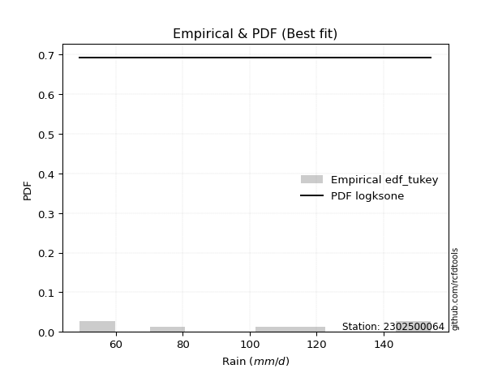</img>

</div>


### 8. EDF Gringorten (1963)

Gringorten plotting position formula is essential for estimating the probability and return periods of extreme events like floods and heavy rainfall. The constant _a=0.44_.

<div align="center">


$P=(m-a)/(n+1-2a)$


</div>


**8.1. Empirical values**

<div align="center">

|                | 0                   | 1                   | 2                  | 3              | 4                  | 5                  | 6                  |
|:---------------|:--------------------|:--------------------|:-------------------|:---------------|:-------------------|:-------------------|:-------------------|
| date           | 2020                | 2022                | 2023               | 2021           | 2025               | 2024               | 2019               |
| x              | 49.2                | 58.2                | 78.0               | 103.0          | 117.6              | 152.0              | 154.2              |
| m              | 1                   | 2                   | 3                  | 4              | 5                  | 6                  | 7                  |
| empirical_dist | edf_gringorten      | edf_gringorten      | edf_gringorten     | edf_gringorten | edf_gringorten     | edf_gringorten     | edf_gringorten     |
| empirical      | 0.07865168539325844 | 0.21910112359550563 | 0.3595505617977528 | 0.5            | 0.6404494382022471 | 0.7808988764044943 | 0.9213483146067415 |
| empirical_tr   | 1.0853658536585364  | 1.2805755395683454  | 1.5614035087719298 | 2.0            | 2.781249999999999  | 4.564102564102562  | 12.714285714285701 |

</div>


**8.2. Kolmogorov-Smirnov fit test (sorted by Δ)**


<div align="center">

|                | 0                   | 1                   | 2                   | 3                   | 4                   | 5                   | 6                   | 7                   | 8                   | 9                   | 10                  | 11                  | 12                  | 13                  | 14                  | 15                  | 16                  | 17                  | 18                  | 19                  | 20                  | 21                  | 22                  | 23                  | 24                  | 25                  | 26                  | 27                  | 28                  | 29                  | 30                  | 31                  | 32                  | 33                  | 34                  | 35                  | 36                  | 37                  | 38                  | 39                  | 40                  | 41                  | 42                  | 43                  | 44                  | 45                  | 46                  | 47                  | 48                  | 49                  | 50                  | 51                  | 52                  | 53                  | 54                  | 55                  | 56                  | 57                  | 58                  | 59                  | 60                  | 61                  | 62                  | 63                  | 64                  | 65                  | 66                  | 67                  | 68                  | 69                  | 70                  | 71                  | 72                  | 73                  | 74                  | 75                  | 76                  | 77                  | 78                  | 79                  | 80                  | 81                  | 82                  | 83                  | 84                  | 85                  | 86                  | 87                  | 88                  | 89                  | 90                  | 91                  | 92                  | 93                  | 94                  | 95                  | 96                  | 97                  | 98                  | 99                  | 100                 | 101                 | 102                 | 103                 | 104                 | 105                 | 106                 | 107                 | 108                 | 109                 | 110                 | 111                 | 112                 | 113                 | 114                 | 115                 | 116                 | 117                 | 118                 | 119                 | 120                 | 121                 | 122                 | 123                 | 124                 | 125                 | 126                 | 127                 | 128                 | 129                 | 130                 | 131                 | 132                 | 133                 | 134                 | 135                 | 136                 | 137                 | 138                 | 139                 | 140                 | 141                 | 142                 | 143                 | 144                 | 145                 | 146                 | 147                 | 148                 | 149                 | 150                 | 151                 | 152                 | 153                 | 154                 | 155                 | 156                 | 157                 | 158                 | 159                 |
|:---------------|:--------------------|:--------------------|:--------------------|:--------------------|:--------------------|:--------------------|:--------------------|:--------------------|:--------------------|:--------------------|:--------------------|:--------------------|:--------------------|:--------------------|:--------------------|:--------------------|:--------------------|:--------------------|:--------------------|:--------------------|:--------------------|:--------------------|:--------------------|:--------------------|:--------------------|:--------------------|:--------------------|:--------------------|:--------------------|:--------------------|:--------------------|:--------------------|:--------------------|:--------------------|:--------------------|:--------------------|:--------------------|:--------------------|:--------------------|:--------------------|:--------------------|:--------------------|:--------------------|:--------------------|:--------------------|:--------------------|:--------------------|:--------------------|:--------------------|:--------------------|:--------------------|:--------------------|:--------------------|:--------------------|:--------------------|:--------------------|:--------------------|:--------------------|:--------------------|:--------------------|:--------------------|:--------------------|:--------------------|:--------------------|:--------------------|:--------------------|:--------------------|:--------------------|:--------------------|:--------------------|:--------------------|:--------------------|:--------------------|:--------------------|:--------------------|:--------------------|:--------------------|:--------------------|:--------------------|:--------------------|:--------------------|:--------------------|:--------------------|:--------------------|:--------------------|:--------------------|:--------------------|:--------------------|:--------------------|:--------------------|:--------------------|:--------------------|:--------------------|:--------------------|:--------------------|:--------------------|:--------------------|:--------------------|:--------------------|:--------------------|:--------------------|:--------------------|:--------------------|:--------------------|:--------------------|:--------------------|:--------------------|:--------------------|:--------------------|:--------------------|:--------------------|:--------------------|:--------------------|:--------------------|:--------------------|:--------------------|:--------------------|:--------------------|:--------------------|:--------------------|:--------------------|:--------------------|:--------------------|:--------------------|:--------------------|:--------------------|:--------------------|:--------------------|:--------------------|:--------------------|:--------------------|:--------------------|:--------------------|:--------------------|:--------------------|:--------------------|:--------------------|:--------------------|:--------------------|:--------------------|:--------------------|:--------------------|:--------------------|:--------------------|:--------------------|:--------------------|:--------------------|:--------------------|:--------------------|:--------------------|:--------------------|:--------------------|:--------------------|:--------------------|:--------------------|:--------------------|:--------------------|:--------------------|:--------------------|:--------------------|
| station        | 2302500064          | 2302500064          | 2302500064          | 2302500064          | 2302500064          | 2302500064          | 2302500064          | 2302500064          | 2302500064          | 2302500064          | 2302500064          | 2302500064          | 2302500064          | 2302500064          | 2302500064          | 2302500064          | 2302500064          | 2302500064          | 2302500064          | 2302500064          | 2302500064          | 2302500064          | 2302500064          | 2302500064          | 2302500064          | 2302500064          | 2302500064          | 2302500064          | 2302500064          | 2302500064          | 2302500064          | 2302500064          | 2302500064          | 2302500064          | 2302500064          | 2302500064          | 2302500064          | 2302500064          | 2302500064          | 2302500064          | 2302500064          | 2302500064          | 2302500064          | 2302500064          | 2302500064          | 2302500064          | 2302500064          | 2302500064          | 2302500064          | 2302500064          | 2302500064          | 2302500064          | 2302500064          | 2302500064          | 2302500064          | 2302500064          | 2302500064          | 2302500064          | 2302500064          | 2302500064          | 2302500064          | 2302500064          | 2302500064          | 2302500064          | 2302500064          | 2302500064          | 2302500064          | 2302500064          | 2302500064          | 2302500064          | 2302500064          | 2302500064          | 2302500064          | 2302500064          | 2302500064          | 2302500064          | 2302500064          | 2302500064          | 2302500064          | 2302500064          | 2302500064          | 2302500064          | 2302500064          | 2302500064          | 2302500064          | 2302500064          | 2302500064          | 2302500064          | 2302500064          | 2302500064          | 2302500064          | 2302500064          | 2302500064          | 2302500064          | 2302500064          | 2302500064          | 2302500064          | 2302500064          | 2302500064          | 2302500064          | 2302500064          | 2302500064          | 2302500064          | 2302500064          | 2302500064          | 2302500064          | 2302500064          | 2302500064          | 2302500064          | 2302500064          | 2302500064          | 2302500064          | 2302500064          | 2302500064          | 2302500064          | 2302500064          | 2302500064          | 2302500064          | 2302500064          | 2302500064          | 2302500064          | 2302500064          | 2302500064          | 2302500064          | 2302500064          | 2302500064          | 2302500064          | 2302500064          | 2302500064          | 2302500064          | 2302500064          | 2302500064          | 2302500064          | 2302500064          | 2302500064          | 2302500064          | 2302500064          | 2302500064          | 2302500064          | 2302500064          | 2302500064          | 2302500064          | 2302500064          | 2302500064          | 2302500064          | 2302500064          | 2302500064          | 2302500064          | 2302500064          | 2302500064          | 2302500064          | 2302500064          | 2302500064          | 2302500064          | 2302500064          | 2302500064          | 2302500064          | 2302500064          | 2302500064          | 2302500064          |
| empirical_dist | edf_gringorten      | edf_gringorten      | edf_gringorten      | edf_gringorten      | edf_gringorten      | edf_gringorten      | edf_gringorten      | edf_gringorten      | edf_gringorten      | edf_gringorten      | edf_gringorten      | edf_gringorten      | edf_gringorten      | edf_gringorten      | edf_gringorten      | edf_gringorten      | edf_gringorten      | edf_gringorten      | edf_gringorten      | edf_gringorten      | edf_gringorten      | edf_gringorten      | edf_gringorten      | edf_gringorten      | edf_gringorten      | edf_gringorten      | edf_gringorten      | edf_gringorten      | edf_gringorten      | edf_gringorten      | edf_gringorten      | edf_gringorten      | edf_gringorten      | edf_gringorten      | edf_gringorten      | edf_gringorten      | edf_gringorten      | edf_gringorten      | edf_gringorten      | edf_gringorten      | edf_gringorten      | edf_gringorten      | edf_gringorten      | edf_gringorten      | edf_gringorten      | edf_gringorten      | edf_gringorten      | edf_gringorten      | edf_gringorten      | edf_gringorten      | edf_gringorten      | edf_gringorten      | edf_gringorten      | edf_gringorten      | edf_gringorten      | edf_gringorten      | edf_gringorten      | edf_gringorten      | edf_gringorten      | edf_gringorten      | edf_gringorten      | edf_gringorten      | edf_gringorten      | edf_gringorten      | edf_gringorten      | edf_gringorten      | edf_gringorten      | edf_gringorten      | edf_gringorten      | edf_gringorten      | edf_gringorten      | edf_gringorten      | edf_gringorten      | edf_gringorten      | edf_gringorten      | edf_gringorten      | edf_gringorten      | edf_gringorten      | edf_gringorten      | edf_gringorten      | edf_gringorten      | edf_gringorten      | edf_gringorten      | edf_gringorten      | edf_gringorten      | edf_gringorten      | edf_gringorten      | edf_gringorten      | edf_gringorten      | edf_gringorten      | edf_gringorten      | edf_gringorten      | edf_gringorten      | edf_gringorten      | edf_gringorten      | edf_gringorten      | edf_gringorten      | edf_gringorten      | edf_gringorten      | edf_gringorten      | edf_gringorten      | edf_gringorten      | edf_gringorten      | edf_gringorten      | edf_gringorten      | edf_gringorten      | edf_gringorten      | edf_gringorten      | edf_gringorten      | edf_gringorten      | edf_gringorten      | edf_gringorten      | edf_gringorten      | edf_gringorten      | edf_gringorten      | edf_gringorten      | edf_gringorten      | edf_gringorten      | edf_gringorten      | edf_gringorten      | edf_gringorten      | edf_gringorten      | edf_gringorten      | edf_gringorten      | edf_gringorten      | edf_gringorten      | edf_gringorten      | edf_gringorten      | edf_gringorten      | edf_gringorten      | edf_gringorten      | edf_gringorten      | edf_gringorten      | edf_gringorten      | edf_gringorten      | edf_gringorten      | edf_gringorten      | edf_gringorten      | edf_gringorten      | edf_gringorten      | edf_gringorten      | edf_gringorten      | edf_gringorten      | edf_gringorten      | edf_gringorten      | edf_gringorten      | edf_gringorten      | edf_gringorten      | edf_gringorten      | edf_gringorten      | edf_gringorten      | edf_gringorten      | edf_gringorten      | edf_gringorten      | edf_gringorten      | edf_gringorten      | edf_gringorten      | edf_gringorten      | edf_gringorten      | edf_gringorten      |
| p_dist         | logsemicircular     | logksone            | loganglit           | arcsine             | ksone               | logbetaprime        | nakagami            | logf                | lognct              | logt                | logcrystalball      | lognorm             | logexponnorm        | logfatiguelife      | loggamma            | loggamma            | semicircular        | logerlang           | invgauss            | genlogistic         | logncf              | logpearson3         | logalpha            | logarcsine          | loginvgamma         | logtrapezoid        | anglit              | betaprime           | ncf                 | logrice             | rayleigh            | kstwobign           | invgamma            | maxwell             | loglogistic         | logweibull_min      | alpha               | rice                | logburr12           | genpareto           | logcosine           | loginvgauss         | logdgamma           | gamma               | loghypsecant        | logmaxwell          | halfnorm            | foldnorm            | erlang              | pearson3            | johnsonsu           | skewnorm            | nct                 | exponnorm           | truncnorm           | crystalball         | norm                | t                   | logdweibull         | gumbel_r            | lograyleigh         | gompertz            | beta                | burr                | logloglaplace       | logistic            | cosine              | loginvweibull       | rdist               | hypsecant           | loggumbel_l         | loglaplace          | loglaplace          | lomax               | genexpon            | logbeta             | wrapcauchy          | kappa3              | loggenexpon         | laplace             | weibull_min         | logkstwobign        | loghalfnorm         | moyal               | logfoldnorm         | loggompertz         | exponpow            | loggumbel_r         | logargus            | argus               | dgamma              | dweibull            | trapezoid           | gumbel_l            | halfgennorm         | logweibull_max      | f                   | halflogistic        | genhalflogistic     | logburr             | loglomax            | logmoyal            | burr12              | logwrapcauchy       | triang              | loggenhalflogistic  | logloggamma         | loghalflogistic     | kappa4              | gausshyper          | tukeylambda         | logkappa4           | uniform             | vonmises_line       | logtriang           | loggausshyper       | logskewnorm         | bradford            | logtukeylambda      | logkappa3           | truncexpon          | loguniform          | logvonmises_line    | truncweibull_min    | logtruncweibull_min | loggenextreme       | logtruncnorm        | wald                | logbradford         | loglevy_l           | logtruncexpon       | levy_l              | logwald             | logmielke           | gennorm             | loggennorm          | logjohnsonsb        | logrdist            | logjohnsonsu        | loggenpareto        | genextreme          | logexponpow         | johnsonsb           | fatiguelife         | lognakagami         | powerlaw            | loggengamma         | invweibull          | gengamma            | logpowerlaw         | exponweib           | logexponweib        | weibull_max         | truncpareto         | logtruncpareto      | loghalfgennorm      | loggenlogistic      | logvonmises         | vonmises            | mielke              |
| delta          | 0.07205674707026222 | 0.07662488971607972 | 0.07723798619044508 | 0.08057637727117606 | 0.089296861957056   | 0.09295253831485917 | 0.09383237079886964 | 0.09459031513864813 | 0.09552018825603836 | 0.0960131162463782  | 0.09601682472007655 | 0.09601772479116077 | 0.09601821433496927 | 0.09645759663892672 | 0.09716215668627937 | 0.09716215668627937 | 0.09728439019124757 | 0.09756935221251373 | 0.09808970985159782 | 0.09885417373651173 | 0.09905724442355779 | 0.10005952064218748 | 0.1002822361598239  | 0.10129574374946193 | 0.10205377019734807 | 0.1027255502340263  | 0.10342743107996599 | 0.10374207179673411 | 0.10555643232983714 | 0.10638908532326019 | 0.10732793678081876 | 0.10812666750040267 | 0.10981440070121318 | 0.109830425711548   | 0.11034224540156301 | 0.11060995299371568 | 0.11218161516290615 | 0.11321381588649104 | 0.11343309165097326 | 0.11379468441000973 | 0.11533258193757878 | 0.11588965973349541 | 0.11649858105015454 | 0.11700085845076647 | 0.11700858088134947 | 0.1171423044811557  | 0.11715430952495048 | 0.11730822322078438 | 0.11757195559528333 | 0.11781428148591888 | 0.11820601715804557 | 0.11910456500954436 | 0.11920642425981942 | 0.11924330664669147 | 0.11924917455024786 | 0.11924917863228413 | 0.11924917980619432 | 0.11925046983468979 | 0.12126610789474346 | 0.12223960071375631 | 0.12570684244293717 | 0.12622595742104878 | 0.12650725466989543 | 0.12859191200706488 | 0.12900736197249593 | 0.130109384917948   | 0.1317797620078247  | 0.13228471516703366 | 0.1340441687381584  | 0.13467276534961092 | 0.1357544165613358  | 0.13722634992695137 | 0.13722634992695137 | 0.1404272562336255  | 0.14052261054376813 | 0.14250890873136013 | 0.14262467715199445 | 0.1431795225027021  | 0.14670353948243875 | 0.14728834601265847 | 0.14817657215715807 | 0.14848031299908682 | 0.1500256117463612  | 0.1503614728768134  | 0.15102538827366674 | 0.1558986966630872  | 0.1560982578197152  | 0.1572330082210005  | 0.1577959709774196  | 0.1579112631077043  | 0.15825498260727677 | 0.15903158404507667 | 0.16323933387377576 | 0.16452507976831476 | 0.1671189753141068  | 0.1735588902891182  | 0.17416424426165455 | 0.17575572464864633 | 0.17591691303363166 | 0.1771013150142119  | 0.18034195678662868 | 0.1804686506287846  | 0.18149171505490502 | 0.18392443750209198 | 0.18833175229616683 | 0.18920260859684113 | 0.19024299512964393 | 0.1935208300607298  | 0.19514151124077106 | 0.1965028740194601  | 0.19655465337938527 | 0.19683375655409519 | 0.19814874264312488 | 0.19814936053450127 | 0.19957927346502402 | 0.20095063345733932 | 0.20145815139282364 | 0.2040346750217108  | 0.20451033230070526 | 0.20503026504630784 | 0.20619794050685392 | 0.20652191908638506 | 0.20662765470040467 | 0.2074883856116635  | 0.21000788082045574 | 0.21609256901389512 | 0.21910112359402414 | 0.21910112359550563 | 0.22408553497583306 | 0.23662337992353033 | 0.24016094894439144 | 0.24416141602307262 | 0.24511634635901924 | 0.2638501508777169  | 0.2808988764044944  | 0.2808988764044944  | 0.2818882964602547  | 0.30528982575382824 | 0.31249262716691073 | 0.31937174392776246 | 0.32479876147289    | 0.38030128877913993 | 0.42443751475888825 | 0.43276486142678294 | 0.4423062951408071  | 0.4469246839168791  | 0.4484661176289779  | 0.4559679964904265  | 0.4652392207883087  | 0.4901828368517659  | 0.5140296720438968  | 0.5158598775050004  | 0.5305954190353852  | 0.5901589511496672  | 0.6318074727586194  | 0.7808988764044943  | 0.7808988764044943  | 1.095195435616307   | 23.76485456790993   | nan                 |
| deltao         | 0.48442053926100004 | 0.48442053926100004 | 0.48442053926100004 | 0.48442053926100004 | 0.48442053926100004 | 0.48442053926100004 | 0.48442053926100004 | 0.48442053926100004 | 0.48442053926100004 | 0.48442053926100004 | 0.48442053926100004 | 0.48442053926100004 | 0.48442053926100004 | 0.48442053926100004 | 0.48442053926100004 | 0.48442053926100004 | 0.48442053926100004 | 0.48442053926100004 | 0.48442053926100004 | 0.48442053926100004 | 0.48442053926100004 | 0.48442053926100004 | 0.48442053926100004 | 0.48442053926100004 | 0.48442053926100004 | 0.48442053926100004 | 0.48442053926100004 | 0.48442053926100004 | 0.48442053926100004 | 0.48442053926100004 | 0.48442053926100004 | 0.48442053926100004 | 0.48442053926100004 | 0.48442053926100004 | 0.48442053926100004 | 0.48442053926100004 | 0.48442053926100004 | 0.48442053926100004 | 0.48442053926100004 | 0.48442053926100004 | 0.48442053926100004 | 0.48442053926100004 | 0.48442053926100004 | 0.48442053926100004 | 0.48442053926100004 | 0.48442053926100004 | 0.48442053926100004 | 0.48442053926100004 | 0.48442053926100004 | 0.48442053926100004 | 0.48442053926100004 | 0.48442053926100004 | 0.48442053926100004 | 0.48442053926100004 | 0.48442053926100004 | 0.48442053926100004 | 0.48442053926100004 | 0.48442053926100004 | 0.48442053926100004 | 0.48442053926100004 | 0.48442053926100004 | 0.48442053926100004 | 0.48442053926100004 | 0.48442053926100004 | 0.48442053926100004 | 0.48442053926100004 | 0.48442053926100004 | 0.48442053926100004 | 0.48442053926100004 | 0.48442053926100004 | 0.48442053926100004 | 0.48442053926100004 | 0.48442053926100004 | 0.48442053926100004 | 0.48442053926100004 | 0.48442053926100004 | 0.48442053926100004 | 0.48442053926100004 | 0.48442053926100004 | 0.48442053926100004 | 0.48442053926100004 | 0.48442053926100004 | 0.48442053926100004 | 0.48442053926100004 | 0.48442053926100004 | 0.48442053926100004 | 0.48442053926100004 | 0.48442053926100004 | 0.48442053926100004 | 0.48442053926100004 | 0.48442053926100004 | 0.48442053926100004 | 0.48442053926100004 | 0.48442053926100004 | 0.48442053926100004 | 0.48442053926100004 | 0.48442053926100004 | 0.48442053926100004 | 0.48442053926100004 | 0.48442053926100004 | 0.48442053926100004 | 0.48442053926100004 | 0.48442053926100004 | 0.48442053926100004 | 0.48442053926100004 | 0.48442053926100004 | 0.48442053926100004 | 0.48442053926100004 | 0.48442053926100004 | 0.48442053926100004 | 0.48442053926100004 | 0.48442053926100004 | 0.48442053926100004 | 0.48442053926100004 | 0.48442053926100004 | 0.48442053926100004 | 0.48442053926100004 | 0.48442053926100004 | 0.48442053926100004 | 0.48442053926100004 | 0.48442053926100004 | 0.48442053926100004 | 0.48442053926100004 | 0.48442053926100004 | 0.48442053926100004 | 0.48442053926100004 | 0.48442053926100004 | 0.48442053926100004 | 0.48442053926100004 | 0.48442053926100004 | 0.48442053926100004 | 0.48442053926100004 | 0.48442053926100004 | 0.48442053926100004 | 0.48442053926100004 | 0.48442053926100004 | 0.48442053926100004 | 0.48442053926100004 | 0.48442053926100004 | 0.48442053926100004 | 0.48442053926100004 | 0.48442053926100004 | 0.48442053926100004 | 0.48442053926100004 | 0.48442053926100004 | 0.48442053926100004 | 0.48442053926100004 | 0.48442053926100004 | 0.48442053926100004 | 0.48442053926100004 | 0.48442053926100004 | 0.48442053926100004 | 0.48442053926100004 | 0.48442053926100004 | 0.48442053926100004 | 0.48442053926100004 | 0.48442053926100004 | 0.48442053926100004 | 0.48442053926100004 | 0.48442053926100004 |
| eval           | Δo > Δ              | Δo > Δ              | Δo > Δ              | Δo > Δ              | Δo > Δ              | Δo > Δ              | Δo > Δ              | Δo > Δ              | Δo > Δ              | Δo > Δ              | Δo > Δ              | Δo > Δ              | Δo > Δ              | Δo > Δ              | Δo > Δ              | Δo > Δ              | Δo > Δ              | Δo > Δ              | Δo > Δ              | Δo > Δ              | Δo > Δ              | Δo > Δ              | Δo > Δ              | Δo > Δ              | Δo > Δ              | Δo > Δ              | Δo > Δ              | Δo > Δ              | Δo > Δ              | Δo > Δ              | Δo > Δ              | Δo > Δ              | Δo > Δ              | Δo > Δ              | Δo > Δ              | Δo > Δ              | Δo > Δ              | Δo > Δ              | Δo > Δ              | Δo > Δ              | Δo > Δ              | Δo > Δ              | Δo > Δ              | Δo > Δ              | Δo > Δ              | Δo > Δ              | Δo > Δ              | Δo > Δ              | Δo > Δ              | Δo > Δ              | Δo > Δ              | Δo > Δ              | Δo > Δ              | Δo > Δ              | Δo > Δ              | Δo > Δ              | Δo > Δ              | Δo > Δ              | Δo > Δ              | Δo > Δ              | Δo > Δ              | Δo > Δ              | Δo > Δ              | Δo > Δ              | Δo > Δ              | Δo > Δ              | Δo > Δ              | Δo > Δ              | Δo > Δ              | Δo > Δ              | Δo > Δ              | Δo > Δ              | Δo > Δ              | Δo > Δ              | Δo > Δ              | Δo > Δ              | Δo > Δ              | Δo > Δ              | Δo > Δ              | Δo > Δ              | Δo > Δ              | Δo > Δ              | Δo > Δ              | Δo > Δ              | Δo > Δ              | Δo > Δ              | Δo > Δ              | Δo > Δ              | Δo > Δ              | Δo > Δ              | Δo > Δ              | Δo > Δ              | Δo > Δ              | Δo > Δ              | Δo > Δ              | Δo > Δ              | Δo > Δ              | Δo > Δ              | Δo > Δ              | Δo > Δ              | Δo > Δ              | Δo > Δ              | Δo > Δ              | Δo > Δ              | Δo > Δ              | Δo > Δ              | Δo > Δ              | Δo > Δ              | Δo > Δ              | Δo > Δ              | Δo > Δ              | Δo > Δ              | Δo > Δ              | Δo > Δ              | Δo > Δ              | Δo > Δ              | Δo > Δ              | Δo > Δ              | Δo > Δ              | Δo > Δ              | Δo > Δ              | Δo > Δ              | Δo > Δ              | Δo > Δ              | Δo > Δ              | Δo > Δ              | Δo > Δ              | Δo > Δ              | Δo > Δ              | Δo > Δ              | Δo > Δ              | Δo > Δ              | Δo > Δ              | Δo > Δ              | Δo > Δ              | Δo > Δ              | Δo > Δ              | Δo > Δ              | Δo > Δ              | Δo > Δ              | Δo > Δ              | Δo > Δ              | Δo > Δ              | Δo > Δ              | Δo > Δ              | Δo > Δ              | Δo > Δ              | Δo > Δ              | Δo > Δ              | Δo <= Δ             | Δo <= Δ             | Δo <= Δ             | Δo <= Δ             | Δo <= Δ             | Δo <= Δ             | Δo <= Δ             | Δo <= Δ             | Δo <= Δ             | Δo <= Δ             | Δo <= Δ             |
| fit            | 1                   | 1                   | 1                   | 1                   | 1                   | 1                   | 1                   | 1                   | 1                   | 1                   | 1                   | 1                   | 1                   | 1                   | 1                   | 1                   | 1                   | 1                   | 1                   | 1                   | 1                   | 1                   | 1                   | 1                   | 1                   | 1                   | 1                   | 1                   | 1                   | 1                   | 1                   | 1                   | 1                   | 1                   | 1                   | 1                   | 1                   | 1                   | 1                   | 1                   | 1                   | 1                   | 1                   | 1                   | 1                   | 1                   | 1                   | 1                   | 1                   | 1                   | 1                   | 1                   | 1                   | 1                   | 1                   | 1                   | 1                   | 1                   | 1                   | 1                   | 1                   | 1                   | 1                   | 1                   | 1                   | 1                   | 1                   | 1                   | 1                   | 1                   | 1                   | 1                   | 1                   | 1                   | 1                   | 1                   | 1                   | 1                   | 1                   | 1                   | 1                   | 1                   | 1                   | 1                   | 1                   | 1                   | 1                   | 1                   | 1                   | 1                   | 1                   | 1                   | 1                   | 1                   | 1                   | 1                   | 1                   | 1                   | 1                   | 1                   | 1                   | 1                   | 1                   | 1                   | 1                   | 1                   | 1                   | 1                   | 1                   | 1                   | 1                   | 1                   | 1                   | 1                   | 1                   | 1                   | 1                   | 1                   | 1                   | 1                   | 1                   | 1                   | 1                   | 1                   | 1                   | 1                   | 1                   | 1                   | 1                   | 1                   | 1                   | 1                   | 1                   | 1                   | 1                   | 1                   | 1                   | 1                   | 1                   | 1                   | 1                   | 1                   | 1                   | 1                   | 1                   | 1                   | 1                   | 1                   | 1                   | 0                   | 0                   | 0                   | 0                   | 0                   | 0                   | 0                   | 0                   | 0                   | 0                   | 0                   |
| n              | 7                   | 7                   | 7                   | 7                   | 7                   | 7                   | 7                   | 7                   | 7                   | 7                   | 7                   | 7                   | 7                   | 7                   | 7                   | 7                   | 7                   | 7                   | 7                   | 7                   | 7                   | 7                   | 7                   | 7                   | 7                   | 7                   | 7                   | 7                   | 7                   | 7                   | 7                   | 7                   | 7                   | 7                   | 7                   | 7                   | 7                   | 7                   | 7                   | 7                   | 7                   | 7                   | 7                   | 7                   | 7                   | 7                   | 7                   | 7                   | 7                   | 7                   | 7                   | 7                   | 7                   | 7                   | 7                   | 7                   | 7                   | 7                   | 7                   | 7                   | 7                   | 7                   | 7                   | 7                   | 7                   | 7                   | 7                   | 7                   | 7                   | 7                   | 7                   | 7                   | 7                   | 7                   | 7                   | 7                   | 7                   | 7                   | 7                   | 7                   | 7                   | 7                   | 7                   | 7                   | 7                   | 7                   | 7                   | 7                   | 7                   | 7                   | 7                   | 7                   | 7                   | 7                   | 7                   | 7                   | 7                   | 7                   | 7                   | 7                   | 7                   | 7                   | 7                   | 7                   | 7                   | 7                   | 7                   | 7                   | 7                   | 7                   | 7                   | 7                   | 7                   | 7                   | 7                   | 7                   | 7                   | 7                   | 7                   | 7                   | 7                   | 7                   | 7                   | 7                   | 7                   | 7                   | 7                   | 7                   | 7                   | 7                   | 7                   | 7                   | 7                   | 7                   | 7                   | 7                   | 7                   | 7                   | 7                   | 7                   | 7                   | 7                   | 7                   | 7                   | 7                   | 7                   | 7                   | 7                   | 7                   | 7                   | 7                   | 7                   | 7                   | 7                   | 7                   | 7                   | 7                   | 7                   | 7                   | 7                   |
| best_fit       | 1                   | 0                   | 0                   | 0                   | 0                   | 0                   | 0                   | 0                   | 0                   | 0                   | 0                   | 0                   | 0                   | 0                   | 0                   | 0                   | 0                   | 0                   | 0                   | 0                   | 0                   | 0                   | 0                   | 0                   | 0                   | 0                   | 0                   | 0                   | 0                   | 0                   | 0                   | 0                   | 0                   | 0                   | 0                   | 0                   | 0                   | 0                   | 0                   | 0                   | 0                   | 0                   | 0                   | 0                   | 0                   | 0                   | 0                   | 0                   | 0                   | 0                   | 0                   | 0                   | 0                   | 0                   | 0                   | 0                   | 0                   | 0                   | 0                   | 0                   | 0                   | 0                   | 0                   | 0                   | 0                   | 0                   | 0                   | 0                   | 0                   | 0                   | 0                   | 0                   | 0                   | 0                   | 0                   | 0                   | 0                   | 0                   | 0                   | 0                   | 0                   | 0                   | 0                   | 0                   | 0                   | 0                   | 0                   | 0                   | 0                   | 0                   | 0                   | 0                   | 0                   | 0                   | 0                   | 0                   | 0                   | 0                   | 0                   | 0                   | 0                   | 0                   | 0                   | 0                   | 0                   | 0                   | 0                   | 0                   | 0                   | 0                   | 0                   | 0                   | 0                   | 0                   | 0                   | 0                   | 0                   | 0                   | 0                   | 0                   | 0                   | 0                   | 0                   | 0                   | 0                   | 0                   | 0                   | 0                   | 0                   | 0                   | 0                   | 0                   | 0                   | 0                   | 0                   | 0                   | 0                   | 0                   | 0                   | 0                   | 0                   | 0                   | 0                   | 0                   | 0                   | 0                   | 0                   | 0                   | 0                   | 0                   | 0                   | 0                   | 0                   | 0                   | 0                   | 0                   | 0                   | 0                   | 0                   | 0                   |
| best_fit_sort  | 1                   | 2                   | 3                   | 4                   | 5                   | 6                   | 7                   | 8                   | 9                   | 10                  | 11                  | 12                  | 13                  | 14                  | 15                  | 16                  | 17                  | 18                  | 19                  | 20                  | 21                  | 22                  | 23                  | 24                  | 25                  | 26                  | 27                  | 28                  | 29                  | 30                  | 31                  | 32                  | 33                  | 34                  | 35                  | 36                  | 37                  | 38                  | 39                  | 40                  | 41                  | 42                  | 43                  | 44                  | 45                  | 46                  | 47                  | 48                  | 49                  | 50                  | 51                  | 52                  | 53                  | 54                  | 55                  | 56                  | 57                  | 58                  | 59                  | 60                  | 61                  | 62                  | 63                  | 64                  | 65                  | 66                  | 67                  | 68                  | 69                  | 70                  | 71                  | 72                  | 73                  | 74                  | 75                  | 76                  | 77                  | 78                  | 79                  | 80                  | 81                  | 82                  | 83                  | 84                  | 85                  | 86                  | 87                  | 88                  | 89                  | 90                  | 91                  | 92                  | 93                  | 94                  | 95                  | 96                  | 97                  | 98                  | 99                  | 100                 | 101                 | 102                 | 103                 | 104                 | 105                 | 106                 | 107                 | 108                 | 109                 | 110                 | 111                 | 112                 | 113                 | 114                 | 115                 | 116                 | 117                 | 118                 | 119                 | 120                 | 121                 | 122                 | 123                 | 124                 | 125                 | 126                 | 127                 | 128                 | 129                 | 130                 | 131                 | 132                 | 133                 | 134                 | 135                 | 136                 | 137                 | 138                 | 139                 | 140                 | 141                 | 142                 | 143                 | 144                 | 145                 | 146                 | 147                 | 148                 | 149                 | 150                 | 151                 | 152                 | 153                 | 154                 | 155                 | 156                 | 157                 | 158                 | 159                 | 160                 |

</div>


**8.3. Best fit**

<div align="center">

|   id |    station | empirical_dist   | p_dist          |     delta |   deltao | eval   |   fit |   n |   best_fit |   best_fit_sort |
|-----:|-----------:|:-----------------|:----------------|----------:|---------:|:-------|------:|----:|-----------:|----------------:|
|    0 | 2302500064 | edf_gringorten   | logsemicircular | 0.0720567 | 0.484421 | Δo > Δ |     1 |   7 |          1 |               1 |

</div>


<div align="center">

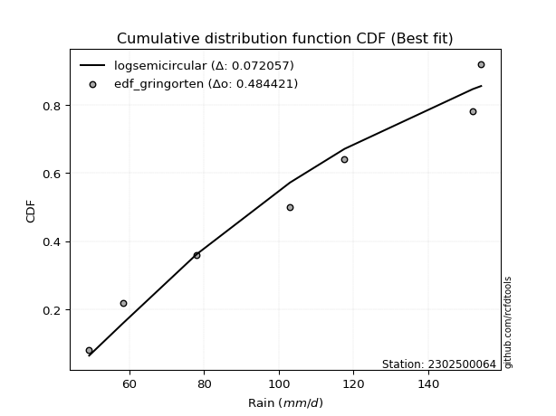</img>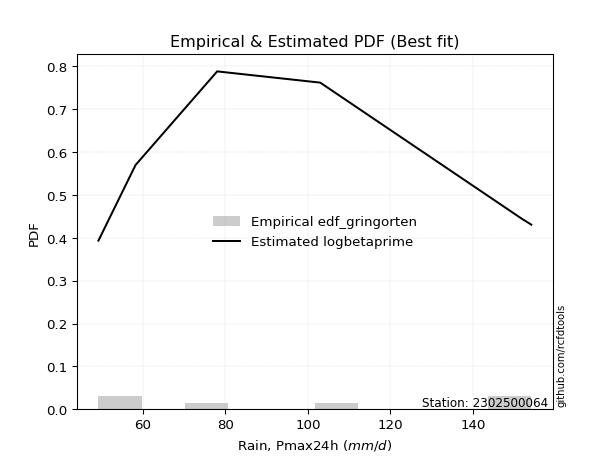</img>

</div>


### 9. EDF Filliben (1975)

The specific values of the constants (0.3175) (often denoted as $alpha$) and (0.365) are derived from a method proposed by James J. Filliben in a 1975 paper. This particular formula is the mean value of the $i$-th order statistic of the normal distribution and is considered a robust and effective plotting position formula for the normal probability plot correlation coefficient test for normality.

<div align="center">


$P=(m-0.3175)/(n+0.365)$


</div>


**9.1. Empirical values**

<div align="center">

|                | 0                   | 1                   | 2                   | 3            | 4                  | 5                  | 6                  |
|:---------------|:--------------------|:--------------------|:--------------------|:-------------|:-------------------|:-------------------|:-------------------|
| date           | 2020                | 2022                | 2023                | 2021         | 2025               | 2024               | 2019               |
| x              | 49.2                | 58.2                | 78.0                | 103.0        | 117.6              | 152.0              | 154.2              |
| m              | 1                   | 2                   | 3                   | 4            | 5                  | 6                  | 7                  |
| empirical_dist | edf_filliben        | edf_filliben        | edf_filliben        | edf_filliben | edf_filliben       | edf_filliben       | edf_filliben       |
| empirical      | 0.09266802443991853 | 0.22844534962661237 | 0.36422267481330617 | 0.5          | 0.6357773251866938 | 0.7715546503733877 | 0.9073319755600815 |
| empirical_tr   | 1.1021324354657687  | 1.2960844698636163  | 1.5728777362520021  | 2.0          | 2.7455731593662627 | 4.377414561664191  | 10.791208791208794 |

</div>


**9.2. Kolmogorov-Smirnov fit test (sorted by Δ)**


<div align="center">

|                | 0                   | 1                   | 2                   | 3                   | 4                   | 5                   | 6                   | 7                   | 8                   | 9                   | 10                  | 11                  | 12                  | 13                  | 14                  | 15                  | 16                  | 17                  | 18                  | 19                  | 20                  | 21                  | 22                  | 23                  | 24                  | 25                  | 26                  | 27                  | 28                  | 29                  | 30                  | 31                  | 32                  | 33                  | 34                  | 35                  | 36                  | 37                  | 38                  | 39                  | 40                  | 41                  | 42                  | 43                  | 44                  | 45                  | 46                  | 47                  | 48                  | 49                  | 50                  | 51                  | 52                  | 53                  | 54                  | 55                  | 56                  | 57                  | 58                  | 59                  | 60                  | 61                  | 62                  | 63                  | 64                  | 65                  | 66                  | 67                  | 68                  | 69                  | 70                  | 71                  | 72                  | 73                  | 74                  | 75                  | 76                  | 77                  | 78                  | 79                  | 80                  | 81                  | 82                  | 83                  | 84                  | 85                  | 86                  | 87                  | 88                  | 89                  | 90                  | 91                  | 92                  | 93                  | 94                  | 95                  | 96                  | 97                  | 98                  | 99                  | 100                 | 101                 | 102                 | 103                 | 104                 | 105                 | 106                 | 107                 | 108                 | 109                 | 110                 | 111                 | 112                 | 113                 | 114                 | 115                 | 116                 | 117                 | 118                 | 119                 | 120                 | 121                 | 122                 | 123                 | 124                 | 125                 | 126                 | 127                 | 128                 | 129                 | 130                 | 131                 | 132                 | 133                 | 134                 | 135                 | 136                 | 137                 | 138                 | 139                 | 140                 | 141                 | 142                 | 143                 | 144                 | 145                 | 146                 | 147                 | 148                 | 149                 | 150                 | 151                 | 152                 | 153                 | 154                 | 155                 | 156                 | 157                 | 158                 | 159                 |
|:---------------|:--------------------|:--------------------|:--------------------|:--------------------|:--------------------|:--------------------|:--------------------|:--------------------|:--------------------|:--------------------|:--------------------|:--------------------|:--------------------|:--------------------|:--------------------|:--------------------|:--------------------|:--------------------|:--------------------|:--------------------|:--------------------|:--------------------|:--------------------|:--------------------|:--------------------|:--------------------|:--------------------|:--------------------|:--------------------|:--------------------|:--------------------|:--------------------|:--------------------|:--------------------|:--------------------|:--------------------|:--------------------|:--------------------|:--------------------|:--------------------|:--------------------|:--------------------|:--------------------|:--------------------|:--------------------|:--------------------|:--------------------|:--------------------|:--------------------|:--------------------|:--------------------|:--------------------|:--------------------|:--------------------|:--------------------|:--------------------|:--------------------|:--------------------|:--------------------|:--------------------|:--------------------|:--------------------|:--------------------|:--------------------|:--------------------|:--------------------|:--------------------|:--------------------|:--------------------|:--------------------|:--------------------|:--------------------|:--------------------|:--------------------|:--------------------|:--------------------|:--------------------|:--------------------|:--------------------|:--------------------|:--------------------|:--------------------|:--------------------|:--------------------|:--------------------|:--------------------|:--------------------|:--------------------|:--------------------|:--------------------|:--------------------|:--------------------|:--------------------|:--------------------|:--------------------|:--------------------|:--------------------|:--------------------|:--------------------|:--------------------|:--------------------|:--------------------|:--------------------|:--------------------|:--------------------|:--------------------|:--------------------|:--------------------|:--------------------|:--------------------|:--------------------|:--------------------|:--------------------|:--------------------|:--------------------|:--------------------|:--------------------|:--------------------|:--------------------|:--------------------|:--------------------|:--------------------|:--------------------|:--------------------|:--------------------|:--------------------|:--------------------|:--------------------|:--------------------|:--------------------|:--------------------|:--------------------|:--------------------|:--------------------|:--------------------|:--------------------|:--------------------|:--------------------|:--------------------|:--------------------|:--------------------|:--------------------|:--------------------|:--------------------|:--------------------|:--------------------|:--------------------|:--------------------|:--------------------|:--------------------|:--------------------|:--------------------|:--------------------|:--------------------|:--------------------|:--------------------|:--------------------|:--------------------|:--------------------|:--------------------|
| station        | 2302500064          | 2302500064          | 2302500064          | 2302500064          | 2302500064          | 2302500064          | 2302500064          | 2302500064          | 2302500064          | 2302500064          | 2302500064          | 2302500064          | 2302500064          | 2302500064          | 2302500064          | 2302500064          | 2302500064          | 2302500064          | 2302500064          | 2302500064          | 2302500064          | 2302500064          | 2302500064          | 2302500064          | 2302500064          | 2302500064          | 2302500064          | 2302500064          | 2302500064          | 2302500064          | 2302500064          | 2302500064          | 2302500064          | 2302500064          | 2302500064          | 2302500064          | 2302500064          | 2302500064          | 2302500064          | 2302500064          | 2302500064          | 2302500064          | 2302500064          | 2302500064          | 2302500064          | 2302500064          | 2302500064          | 2302500064          | 2302500064          | 2302500064          | 2302500064          | 2302500064          | 2302500064          | 2302500064          | 2302500064          | 2302500064          | 2302500064          | 2302500064          | 2302500064          | 2302500064          | 2302500064          | 2302500064          | 2302500064          | 2302500064          | 2302500064          | 2302500064          | 2302500064          | 2302500064          | 2302500064          | 2302500064          | 2302500064          | 2302500064          | 2302500064          | 2302500064          | 2302500064          | 2302500064          | 2302500064          | 2302500064          | 2302500064          | 2302500064          | 2302500064          | 2302500064          | 2302500064          | 2302500064          | 2302500064          | 2302500064          | 2302500064          | 2302500064          | 2302500064          | 2302500064          | 2302500064          | 2302500064          | 2302500064          | 2302500064          | 2302500064          | 2302500064          | 2302500064          | 2302500064          | 2302500064          | 2302500064          | 2302500064          | 2302500064          | 2302500064          | 2302500064          | 2302500064          | 2302500064          | 2302500064          | 2302500064          | 2302500064          | 2302500064          | 2302500064          | 2302500064          | 2302500064          | 2302500064          | 2302500064          | 2302500064          | 2302500064          | 2302500064          | 2302500064          | 2302500064          | 2302500064          | 2302500064          | 2302500064          | 2302500064          | 2302500064          | 2302500064          | 2302500064          | 2302500064          | 2302500064          | 2302500064          | 2302500064          | 2302500064          | 2302500064          | 2302500064          | 2302500064          | 2302500064          | 2302500064          | 2302500064          | 2302500064          | 2302500064          | 2302500064          | 2302500064          | 2302500064          | 2302500064          | 2302500064          | 2302500064          | 2302500064          | 2302500064          | 2302500064          | 2302500064          | 2302500064          | 2302500064          | 2302500064          | 2302500064          | 2302500064          | 2302500064          | 2302500064          | 2302500064          | 2302500064          | 2302500064          |
| empirical_dist | edf_filliben        | edf_filliben        | edf_filliben        | edf_filliben        | edf_filliben        | edf_filliben        | edf_filliben        | edf_filliben        | edf_filliben        | edf_filliben        | edf_filliben        | edf_filliben        | edf_filliben        | edf_filliben        | edf_filliben        | edf_filliben        | edf_filliben        | edf_filliben        | edf_filliben        | edf_filliben        | edf_filliben        | edf_filliben        | edf_filliben        | edf_filliben        | edf_filliben        | edf_filliben        | edf_filliben        | edf_filliben        | edf_filliben        | edf_filliben        | edf_filliben        | edf_filliben        | edf_filliben        | edf_filliben        | edf_filliben        | edf_filliben        | edf_filliben        | edf_filliben        | edf_filliben        | edf_filliben        | edf_filliben        | edf_filliben        | edf_filliben        | edf_filliben        | edf_filliben        | edf_filliben        | edf_filliben        | edf_filliben        | edf_filliben        | edf_filliben        | edf_filliben        | edf_filliben        | edf_filliben        | edf_filliben        | edf_filliben        | edf_filliben        | edf_filliben        | edf_filliben        | edf_filliben        | edf_filliben        | edf_filliben        | edf_filliben        | edf_filliben        | edf_filliben        | edf_filliben        | edf_filliben        | edf_filliben        | edf_filliben        | edf_filliben        | edf_filliben        | edf_filliben        | edf_filliben        | edf_filliben        | edf_filliben        | edf_filliben        | edf_filliben        | edf_filliben        | edf_filliben        | edf_filliben        | edf_filliben        | edf_filliben        | edf_filliben        | edf_filliben        | edf_filliben        | edf_filliben        | edf_filliben        | edf_filliben        | edf_filliben        | edf_filliben        | edf_filliben        | edf_filliben        | edf_filliben        | edf_filliben        | edf_filliben        | edf_filliben        | edf_filliben        | edf_filliben        | edf_filliben        | edf_filliben        | edf_filliben        | edf_filliben        | edf_filliben        | edf_filliben        | edf_filliben        | edf_filliben        | edf_filliben        | edf_filliben        | edf_filliben        | edf_filliben        | edf_filliben        | edf_filliben        | edf_filliben        | edf_filliben        | edf_filliben        | edf_filliben        | edf_filliben        | edf_filliben        | edf_filliben        | edf_filliben        | edf_filliben        | edf_filliben        | edf_filliben        | edf_filliben        | edf_filliben        | edf_filliben        | edf_filliben        | edf_filliben        | edf_filliben        | edf_filliben        | edf_filliben        | edf_filliben        | edf_filliben        | edf_filliben        | edf_filliben        | edf_filliben        | edf_filliben        | edf_filliben        | edf_filliben        | edf_filliben        | edf_filliben        | edf_filliben        | edf_filliben        | edf_filliben        | edf_filliben        | edf_filliben        | edf_filliben        | edf_filliben        | edf_filliben        | edf_filliben        | edf_filliben        | edf_filliben        | edf_filliben        | edf_filliben        | edf_filliben        | edf_filliben        | edf_filliben        | edf_filliben        | edf_filliben        | edf_filliben        | edf_filliben        |
| p_dist         | logksone            | logsemicircular     | loganglit           | arcsine             | logarcsine          | nakagami            | ksone               | logalpha            | loginvgamma         | logbetaprime        | loggamma            | loggamma            | logerlang           | logf                | logncf              | lognct              | logt                | logcrystalball      | lognorm             | logexponnorm        | logfatiguelife      | semicircular        | logrice             | invgauss            | genlogistic         | logpearson3         | logtrapezoid        | anglit              | betaprime           | ncf                 | loginvgauss         | rayleigh            | logmaxwell          | kstwobign           | invgamma            | maxwell             | loglogistic         | logweibull_min      | alpha               | rice                | logburr12           | genpareto           | logcosine           | lograyleigh         | logdgamma           | gamma               | loghypsecant        | halfnorm            | foldnorm            | erlang              | pearson3            | johnsonsu           | skewnorm            | nct                 | exponnorm           | burr                | truncnorm           | crystalball         | norm                | t                   | logdweibull         | gumbel_r            | loginvweibull       | logloglaplace       | gompertz            | beta                | loglaplace          | loglaplace          | logistic            | lomax               | genexpon            | cosine              | rdist               | hypsecant           | loggumbel_l         | loggenexpon         | weibull_min         | logkstwobign        | loghalfnorm         | logfoldnorm         | logbeta             | laplace             | wrapcauchy          | kappa3              | loggompertz         | exponpow            | loggumbel_r         | moyal               | halfgennorm         | logargus            | argus               | dgamma              | dweibull            | logweibull_max      | trapezoid           | gumbel_l            | f                   | loglomax            | logmoyal            | burr12              | halflogistic        | genhalflogistic     | logburr             | logwrapcauchy       | triang              | loggenhalflogistic  | logloggamma         | loghalflogistic     | kappa4              | gausshyper          | tukeylambda         | logkappa4           | uniform             | vonmises_line       | logtriang           | loggausshyper       | logskewnorm         | loggenextreme       | bradford            | logtukeylambda      | logkappa3           | truncexpon          | loguniform          | logvonmises_line    | truncweibull_min    | logtruncweibull_min | logbradford         | logtruncnorm        | wald                | loglevy_l           | levy_l              | logtruncexpon       | logwald             | logmielke           | gennorm             | loggennorm          | logjohnsonsb        | logrdist            | loggenpareto        | logjohnsonsu        | genextreme          | logexponpow         | johnsonsb           | fatiguelife         | lognakagami         | loggengamma         | invweibull          | powerlaw            | gengamma            | logpowerlaw         | exponweib           | logexponweib        | weibull_max         | truncpareto         | logtruncpareto      | loghalfgennorm      | loggenlogistic      | logvonmises         | vonmises            | mielke              |
| delta          | 0.06548894787388015 | 0.07571194711526963 | 0.08462565385575194 | 0.08992060330228269 | 0.09266802443991853 | 0.09383237079886964 | 0.09864108798816262 | 0.10127220028641135 | 0.10205377019734807 | 0.1022967643459658  | 0.10261611833562179 | 0.10261611833562179 | 0.10294265338557873 | 0.10393454116975476 | 0.10485976386981966 | 0.10486441428714499 | 0.10535734227748483 | 0.10536105075118318 | 0.1053619508222674  | 0.1053624403660759  | 0.10580182267003335 | 0.1066286162223542  | 0.10733345141009189 | 0.10743393588270445 | 0.10819839976761836 | 0.10940374667329411 | 0.11206977626513293 | 0.11277165711107262 | 0.11308629782784074 | 0.11490065836094376 | 0.11588965973349541 | 0.11667216281192538 | 0.1171423044811557  | 0.1174708935315093  | 0.1191586267323198  | 0.11917465174265462 | 0.11968647143266964 | 0.1199541790248223  | 0.12152584119401277 | 0.12255804191759767 | 0.12277731768207989 | 0.12313891044111636 | 0.12467680796868541 | 0.12570684244293717 | 0.12584280708126117 | 0.1263450844818731  | 0.1263528069124561  | 0.12649853555605722 | 0.126652449251891   | 0.12691618162638996 | 0.1271585075170255  | 0.1275502431891522  | 0.128448791040651   | 0.12855065029092605 | 0.1285875326777981  | 0.12859191200706488 | 0.1285934005813545  | 0.12859340466339075 | 0.12859340583730094 | 0.12859469586579642 | 0.1306103339258501  | 0.13158382674486305 | 0.13228471516703366 | 0.1336794749880493  | 0.13557018345215552 | 0.13585148070100206 | 0.13722634992695137 | 0.13722634992695137 | 0.13945361094905462 | 0.1404272562336255  | 0.14052261054376813 | 0.14112398803893134 | 0.14338839476926502 | 0.14401699138071755 | 0.14509864259244243 | 0.14670353948243875 | 0.14817657215715807 | 0.14848031299908682 | 0.1500256117463612  | 0.15102538827366674 | 0.15185313476246676 | 0.15196045902821184 | 0.15196890318310108 | 0.15252374853380885 | 0.1558986966630872  | 0.1560982578197152  | 0.1572330082210005  | 0.15970569890792014 | 0.16465044665226858 | 0.16714019700852623 | 0.16725548913881094 | 0.1675992086383834  | 0.1683758100761833  | 0.16888677727356494 | 0.1725835599048824  | 0.1738693057994214  | 0.17416424426165455 | 0.18034195678662868 | 0.1804686506287846  | 0.18149171505490502 | 0.18509995067975307 | 0.1852611390647383  | 0.18644554104531852 | 0.1932686635331986  | 0.19767597832727346 | 0.19854683462794775 | 0.19958722116075056 | 0.20286505609183653 | 0.2044857372718777  | 0.20584710005056672 | 0.2058988794104919  | 0.2061779825852018  | 0.2074929686742315  | 0.2074935865656079  | 0.20892349949613065 | 0.21029485948844595 | 0.21080237742393027 | 0.21142045599834186 | 0.21337890105281743 | 0.21385455833181188 | 0.21437449107741446 | 0.21554216653796054 | 0.2158661451174917  | 0.2159718807315113  | 0.21683261164277012 | 0.21935210685156237 | 0.22408553497583306 | 0.22844534962513088 | 0.22844534962661237 | 0.23195126690797707 | 0.23948930300751936 | 0.24016094894439144 | 0.24511634635901924 | 0.2638501508777169  | 0.27155465037338766 | 0.27155465037338766 | 0.27721618344470145 | 0.29127348670716824 | 0.30535540488110235 | 0.30782051415135747 | 0.31545453544178326 | 0.3709570627480332  | 0.4150932887277815  | 0.4234206353956762  | 0.43296206910970036 | 0.4391218915978712  | 0.4419516574437665  | 0.44225257090132575 | 0.45589499475720197 | 0.4855107238362125  | 0.5046854460127901  | 0.5065156514738937  | 0.525923306019832   | 0.5808147251185605  | 0.6224632467275126  | 0.7715546503733877  | 0.7715546503733877  | 1.1045396616474137  | 23.77887090695659   | nan                 |
| deltao         | 0.48442053926100004 | 0.48442053926100004 | 0.48442053926100004 | 0.48442053926100004 | 0.48442053926100004 | 0.48442053926100004 | 0.48442053926100004 | 0.48442053926100004 | 0.48442053926100004 | 0.48442053926100004 | 0.48442053926100004 | 0.48442053926100004 | 0.48442053926100004 | 0.48442053926100004 | 0.48442053926100004 | 0.48442053926100004 | 0.48442053926100004 | 0.48442053926100004 | 0.48442053926100004 | 0.48442053926100004 | 0.48442053926100004 | 0.48442053926100004 | 0.48442053926100004 | 0.48442053926100004 | 0.48442053926100004 | 0.48442053926100004 | 0.48442053926100004 | 0.48442053926100004 | 0.48442053926100004 | 0.48442053926100004 | 0.48442053926100004 | 0.48442053926100004 | 0.48442053926100004 | 0.48442053926100004 | 0.48442053926100004 | 0.48442053926100004 | 0.48442053926100004 | 0.48442053926100004 | 0.48442053926100004 | 0.48442053926100004 | 0.48442053926100004 | 0.48442053926100004 | 0.48442053926100004 | 0.48442053926100004 | 0.48442053926100004 | 0.48442053926100004 | 0.48442053926100004 | 0.48442053926100004 | 0.48442053926100004 | 0.48442053926100004 | 0.48442053926100004 | 0.48442053926100004 | 0.48442053926100004 | 0.48442053926100004 | 0.48442053926100004 | 0.48442053926100004 | 0.48442053926100004 | 0.48442053926100004 | 0.48442053926100004 | 0.48442053926100004 | 0.48442053926100004 | 0.48442053926100004 | 0.48442053926100004 | 0.48442053926100004 | 0.48442053926100004 | 0.48442053926100004 | 0.48442053926100004 | 0.48442053926100004 | 0.48442053926100004 | 0.48442053926100004 | 0.48442053926100004 | 0.48442053926100004 | 0.48442053926100004 | 0.48442053926100004 | 0.48442053926100004 | 0.48442053926100004 | 0.48442053926100004 | 0.48442053926100004 | 0.48442053926100004 | 0.48442053926100004 | 0.48442053926100004 | 0.48442053926100004 | 0.48442053926100004 | 0.48442053926100004 | 0.48442053926100004 | 0.48442053926100004 | 0.48442053926100004 | 0.48442053926100004 | 0.48442053926100004 | 0.48442053926100004 | 0.48442053926100004 | 0.48442053926100004 | 0.48442053926100004 | 0.48442053926100004 | 0.48442053926100004 | 0.48442053926100004 | 0.48442053926100004 | 0.48442053926100004 | 0.48442053926100004 | 0.48442053926100004 | 0.48442053926100004 | 0.48442053926100004 | 0.48442053926100004 | 0.48442053926100004 | 0.48442053926100004 | 0.48442053926100004 | 0.48442053926100004 | 0.48442053926100004 | 0.48442053926100004 | 0.48442053926100004 | 0.48442053926100004 | 0.48442053926100004 | 0.48442053926100004 | 0.48442053926100004 | 0.48442053926100004 | 0.48442053926100004 | 0.48442053926100004 | 0.48442053926100004 | 0.48442053926100004 | 0.48442053926100004 | 0.48442053926100004 | 0.48442053926100004 | 0.48442053926100004 | 0.48442053926100004 | 0.48442053926100004 | 0.48442053926100004 | 0.48442053926100004 | 0.48442053926100004 | 0.48442053926100004 | 0.48442053926100004 | 0.48442053926100004 | 0.48442053926100004 | 0.48442053926100004 | 0.48442053926100004 | 0.48442053926100004 | 0.48442053926100004 | 0.48442053926100004 | 0.48442053926100004 | 0.48442053926100004 | 0.48442053926100004 | 0.48442053926100004 | 0.48442053926100004 | 0.48442053926100004 | 0.48442053926100004 | 0.48442053926100004 | 0.48442053926100004 | 0.48442053926100004 | 0.48442053926100004 | 0.48442053926100004 | 0.48442053926100004 | 0.48442053926100004 | 0.48442053926100004 | 0.48442053926100004 | 0.48442053926100004 | 0.48442053926100004 | 0.48442053926100004 | 0.48442053926100004 | 0.48442053926100004 | 0.48442053926100004 | 0.48442053926100004 |
| eval           | Δo > Δ              | Δo > Δ              | Δo > Δ              | Δo > Δ              | Δo > Δ              | Δo > Δ              | Δo > Δ              | Δo > Δ              | Δo > Δ              | Δo > Δ              | Δo > Δ              | Δo > Δ              | Δo > Δ              | Δo > Δ              | Δo > Δ              | Δo > Δ              | Δo > Δ              | Δo > Δ              | Δo > Δ              | Δo > Δ              | Δo > Δ              | Δo > Δ              | Δo > Δ              | Δo > Δ              | Δo > Δ              | Δo > Δ              | Δo > Δ              | Δo > Δ              | Δo > Δ              | Δo > Δ              | Δo > Δ              | Δo > Δ              | Δo > Δ              | Δo > Δ              | Δo > Δ              | Δo > Δ              | Δo > Δ              | Δo > Δ              | Δo > Δ              | Δo > Δ              | Δo > Δ              | Δo > Δ              | Δo > Δ              | Δo > Δ              | Δo > Δ              | Δo > Δ              | Δo > Δ              | Δo > Δ              | Δo > Δ              | Δo > Δ              | Δo > Δ              | Δo > Δ              | Δo > Δ              | Δo > Δ              | Δo > Δ              | Δo > Δ              | Δo > Δ              | Δo > Δ              | Δo > Δ              | Δo > Δ              | Δo > Δ              | Δo > Δ              | Δo > Δ              | Δo > Δ              | Δo > Δ              | Δo > Δ              | Δo > Δ              | Δo > Δ              | Δo > Δ              | Δo > Δ              | Δo > Δ              | Δo > Δ              | Δo > Δ              | Δo > Δ              | Δo > Δ              | Δo > Δ              | Δo > Δ              | Δo > Δ              | Δo > Δ              | Δo > Δ              | Δo > Δ              | Δo > Δ              | Δo > Δ              | Δo > Δ              | Δo > Δ              | Δo > Δ              | Δo > Δ              | Δo > Δ              | Δo > Δ              | Δo > Δ              | Δo > Δ              | Δo > Δ              | Δo > Δ              | Δo > Δ              | Δo > Δ              | Δo > Δ              | Δo > Δ              | Δo > Δ              | Δo > Δ              | Δo > Δ              | Δo > Δ              | Δo > Δ              | Δo > Δ              | Δo > Δ              | Δo > Δ              | Δo > Δ              | Δo > Δ              | Δo > Δ              | Δo > Δ              | Δo > Δ              | Δo > Δ              | Δo > Δ              | Δo > Δ              | Δo > Δ              | Δo > Δ              | Δo > Δ              | Δo > Δ              | Δo > Δ              | Δo > Δ              | Δo > Δ              | Δo > Δ              | Δo > Δ              | Δo > Δ              | Δo > Δ              | Δo > Δ              | Δo > Δ              | Δo > Δ              | Δo > Δ              | Δo > Δ              | Δo > Δ              | Δo > Δ              | Δo > Δ              | Δo > Δ              | Δo > Δ              | Δo > Δ              | Δo > Δ              | Δo > Δ              | Δo > Δ              | Δo > Δ              | Δo > Δ              | Δo > Δ              | Δo > Δ              | Δo > Δ              | Δo > Δ              | Δo > Δ              | Δo > Δ              | Δo > Δ              | Δo > Δ              | Δo > Δ              | Δo <= Δ             | Δo <= Δ             | Δo <= Δ             | Δo <= Δ             | Δo <= Δ             | Δo <= Δ             | Δo <= Δ             | Δo <= Δ             | Δo <= Δ             | Δo <= Δ             | Δo <= Δ             |
| fit            | 1                   | 1                   | 1                   | 1                   | 1                   | 1                   | 1                   | 1                   | 1                   | 1                   | 1                   | 1                   | 1                   | 1                   | 1                   | 1                   | 1                   | 1                   | 1                   | 1                   | 1                   | 1                   | 1                   | 1                   | 1                   | 1                   | 1                   | 1                   | 1                   | 1                   | 1                   | 1                   | 1                   | 1                   | 1                   | 1                   | 1                   | 1                   | 1                   | 1                   | 1                   | 1                   | 1                   | 1                   | 1                   | 1                   | 1                   | 1                   | 1                   | 1                   | 1                   | 1                   | 1                   | 1                   | 1                   | 1                   | 1                   | 1                   | 1                   | 1                   | 1                   | 1                   | 1                   | 1                   | 1                   | 1                   | 1                   | 1                   | 1                   | 1                   | 1                   | 1                   | 1                   | 1                   | 1                   | 1                   | 1                   | 1                   | 1                   | 1                   | 1                   | 1                   | 1                   | 1                   | 1                   | 1                   | 1                   | 1                   | 1                   | 1                   | 1                   | 1                   | 1                   | 1                   | 1                   | 1                   | 1                   | 1                   | 1                   | 1                   | 1                   | 1                   | 1                   | 1                   | 1                   | 1                   | 1                   | 1                   | 1                   | 1                   | 1                   | 1                   | 1                   | 1                   | 1                   | 1                   | 1                   | 1                   | 1                   | 1                   | 1                   | 1                   | 1                   | 1                   | 1                   | 1                   | 1                   | 1                   | 1                   | 1                   | 1                   | 1                   | 1                   | 1                   | 1                   | 1                   | 1                   | 1                   | 1                   | 1                   | 1                   | 1                   | 1                   | 1                   | 1                   | 1                   | 1                   | 1                   | 1                   | 0                   | 0                   | 0                   | 0                   | 0                   | 0                   | 0                   | 0                   | 0                   | 0                   | 0                   |
| n              | 7                   | 7                   | 7                   | 7                   | 7                   | 7                   | 7                   | 7                   | 7                   | 7                   | 7                   | 7                   | 7                   | 7                   | 7                   | 7                   | 7                   | 7                   | 7                   | 7                   | 7                   | 7                   | 7                   | 7                   | 7                   | 7                   | 7                   | 7                   | 7                   | 7                   | 7                   | 7                   | 7                   | 7                   | 7                   | 7                   | 7                   | 7                   | 7                   | 7                   | 7                   | 7                   | 7                   | 7                   | 7                   | 7                   | 7                   | 7                   | 7                   | 7                   | 7                   | 7                   | 7                   | 7                   | 7                   | 7                   | 7                   | 7                   | 7                   | 7                   | 7                   | 7                   | 7                   | 7                   | 7                   | 7                   | 7                   | 7                   | 7                   | 7                   | 7                   | 7                   | 7                   | 7                   | 7                   | 7                   | 7                   | 7                   | 7                   | 7                   | 7                   | 7                   | 7                   | 7                   | 7                   | 7                   | 7                   | 7                   | 7                   | 7                   | 7                   | 7                   | 7                   | 7                   | 7                   | 7                   | 7                   | 7                   | 7                   | 7                   | 7                   | 7                   | 7                   | 7                   | 7                   | 7                   | 7                   | 7                   | 7                   | 7                   | 7                   | 7                   | 7                   | 7                   | 7                   | 7                   | 7                   | 7                   | 7                   | 7                   | 7                   | 7                   | 7                   | 7                   | 7                   | 7                   | 7                   | 7                   | 7                   | 7                   | 7                   | 7                   | 7                   | 7                   | 7                   | 7                   | 7                   | 7                   | 7                   | 7                   | 7                   | 7                   | 7                   | 7                   | 7                   | 7                   | 7                   | 7                   | 7                   | 7                   | 7                   | 7                   | 7                   | 7                   | 7                   | 7                   | 7                   | 7                   | 7                   | 7                   |
| best_fit       | 1                   | 0                   | 0                   | 0                   | 0                   | 0                   | 0                   | 0                   | 0                   | 0                   | 0                   | 0                   | 0                   | 0                   | 0                   | 0                   | 0                   | 0                   | 0                   | 0                   | 0                   | 0                   | 0                   | 0                   | 0                   | 0                   | 0                   | 0                   | 0                   | 0                   | 0                   | 0                   | 0                   | 0                   | 0                   | 0                   | 0                   | 0                   | 0                   | 0                   | 0                   | 0                   | 0                   | 0                   | 0                   | 0                   | 0                   | 0                   | 0                   | 0                   | 0                   | 0                   | 0                   | 0                   | 0                   | 0                   | 0                   | 0                   | 0                   | 0                   | 0                   | 0                   | 0                   | 0                   | 0                   | 0                   | 0                   | 0                   | 0                   | 0                   | 0                   | 0                   | 0                   | 0                   | 0                   | 0                   | 0                   | 0                   | 0                   | 0                   | 0                   | 0                   | 0                   | 0                   | 0                   | 0                   | 0                   | 0                   | 0                   | 0                   | 0                   | 0                   | 0                   | 0                   | 0                   | 0                   | 0                   | 0                   | 0                   | 0                   | 0                   | 0                   | 0                   | 0                   | 0                   | 0                   | 0                   | 0                   | 0                   | 0                   | 0                   | 0                   | 0                   | 0                   | 0                   | 0                   | 0                   | 0                   | 0                   | 0                   | 0                   | 0                   | 0                   | 0                   | 0                   | 0                   | 0                   | 0                   | 0                   | 0                   | 0                   | 0                   | 0                   | 0                   | 0                   | 0                   | 0                   | 0                   | 0                   | 0                   | 0                   | 0                   | 0                   | 0                   | 0                   | 0                   | 0                   | 0                   | 0                   | 0                   | 0                   | 0                   | 0                   | 0                   | 0                   | 0                   | 0                   | 0                   | 0                   | 0                   |
| best_fit_sort  | 1                   | 2                   | 3                   | 4                   | 5                   | 6                   | 7                   | 8                   | 9                   | 10                  | 11                  | 12                  | 13                  | 14                  | 15                  | 16                  | 17                  | 18                  | 19                  | 20                  | 21                  | 22                  | 23                  | 24                  | 25                  | 26                  | 27                  | 28                  | 29                  | 30                  | 31                  | 32                  | 33                  | 34                  | 35                  | 36                  | 37                  | 38                  | 39                  | 40                  | 41                  | 42                  | 43                  | 44                  | 45                  | 46                  | 47                  | 48                  | 49                  | 50                  | 51                  | 52                  | 53                  | 54                  | 55                  | 56                  | 57                  | 58                  | 59                  | 60                  | 61                  | 62                  | 63                  | 64                  | 65                  | 66                  | 67                  | 68                  | 69                  | 70                  | 71                  | 72                  | 73                  | 74                  | 75                  | 76                  | 77                  | 78                  | 79                  | 80                  | 81                  | 82                  | 83                  | 84                  | 85                  | 86                  | 87                  | 88                  | 89                  | 90                  | 91                  | 92                  | 93                  | 94                  | 95                  | 96                  | 97                  | 98                  | 99                  | 100                 | 101                 | 102                 | 103                 | 104                 | 105                 | 106                 | 107                 | 108                 | 109                 | 110                 | 111                 | 112                 | 113                 | 114                 | 115                 | 116                 | 117                 | 118                 | 119                 | 120                 | 121                 | 122                 | 123                 | 124                 | 125                 | 126                 | 127                 | 128                 | 129                 | 130                 | 131                 | 132                 | 133                 | 134                 | 135                 | 136                 | 137                 | 138                 | 139                 | 140                 | 141                 | 142                 | 143                 | 144                 | 145                 | 146                 | 147                 | 148                 | 149                 | 150                 | 151                 | 152                 | 153                 | 154                 | 155                 | 156                 | 157                 | 158                 | 159                 | 160                 |

</div>


**9.3. Best fit**

<div align="center">

|   id |    station | empirical_dist   | p_dist   |     delta |   deltao | eval   |   fit |   n |   best_fit |   best_fit_sort |
|-----:|-----------:|:-----------------|:---------|----------:|---------:|:-------|------:|----:|-----------:|----------------:|
|    0 | 2302500064 | edf_filliben     | logksone | 0.0654889 | 0.484421 | Δo > Δ |     1 |   7 |          1 |               1 |

</div>


<div align="center">

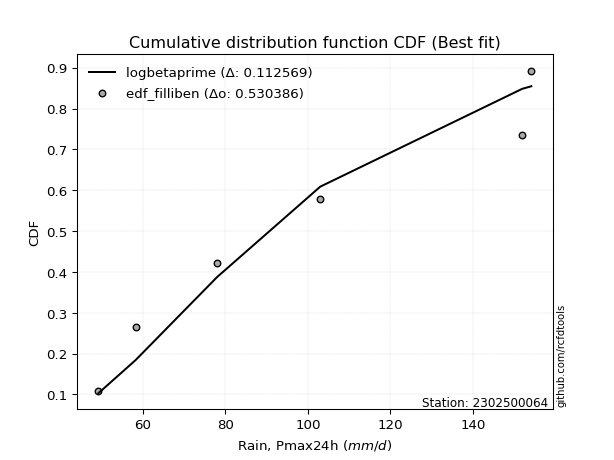</img></img>

</div>


### 10. EDF Jenkinson (1977)

The Jenkinson formula in hydrology is an empirical plotting position formula used to estimate the non-exceedance probability _(P)_ or return period _(T)_ of a given ordered observation within a sample. It is a widely used method in the frequency analysis of extreme events such as floods and rainfall, as it provides a distribution-free way to plot data. _a≈0.31_ and _b≈0.38_ are constants derived to approximate the median of the probability distribution for the given rank.

<div align="center">


$P=(m-a)/(n+b)$


</div>


**10.1. Empirical values**

<div align="center">

|                | 0                   | 1                   | 2                   | 3             | 4                  | 5                  | 6                  |
|:---------------|:--------------------|:--------------------|:--------------------|:--------------|:-------------------|:-------------------|:-------------------|
| date           | 2020                | 2022                | 2023                | 2021          | 2025               | 2024               | 2019               |
| x              | 49.2                | 58.2                | 78.0                | 103.0         | 117.6              | 152.0              | 154.2              |
| m              | 1                   | 2                   | 3                   | 4             | 5                  | 6                  | 7                  |
| empirical_dist | edf_jenkinson       | edf_jenkinson       | edf_jenkinson       | edf_jenkinson | edf_jenkinson      | edf_jenkinson      | edf_jenkinson      |
| empirical      | 0.09349593495934959 | 0.22899728997289973 | 0.36449864498644985 | 0.5           | 0.6355013550135502 | 0.7710027100271003 | 0.9065040650406505 |
| empirical_tr   | 1.1031390134529149  | 1.29701230228471    | 1.5735607675906182  | 2.0           | 2.743494423791822  | 4.366863905325444  | 10.695652173913055 |

</div>


**10.2. Kolmogorov-Smirnov fit test (sorted by Δ)**


<div align="center">

|                | 0                   | 1                   | 2                   | 3                   | 4                   | 5                   | 6                   | 7                   | 8                   | 9                   | 10                  | 11                  | 12                  | 13                  | 14                  | 15                  | 16                  | 17                  | 18                  | 19                  | 20                  | 21                  | 22                  | 23                  | 24                  | 25                  | 26                  | 27                  | 28                  | 29                  | 30                  | 31                  | 32                  | 33                  | 34                  | 35                  | 36                  | 37                  | 38                  | 39                  | 40                  | 41                  | 42                  | 43                  | 44                  | 45                  | 46                  | 47                  | 48                  | 49                  | 50                  | 51                  | 52                  | 53                  | 54                  | 55                  | 56                  | 57                  | 58                  | 59                  | 60                  | 61                  | 62                  | 63                  | 64                  | 65                  | 66                  | 67                  | 68                  | 69                  | 70                  | 71                  | 72                  | 73                  | 74                  | 75                  | 76                  | 77                  | 78                  | 79                  | 80                  | 81                  | 82                  | 83                  | 84                  | 85                  | 86                  | 87                  | 88                  | 89                  | 90                  | 91                  | 92                  | 93                  | 94                  | 95                  | 96                  | 97                  | 98                  | 99                  | 100                 | 101                 | 102                 | 103                 | 104                 | 105                 | 106                 | 107                 | 108                 | 109                 | 110                 | 111                 | 112                 | 113                 | 114                 | 115                 | 116                 | 117                 | 118                 | 119                 | 120                 | 121                 | 122                 | 123                 | 124                 | 125                 | 126                 | 127                 | 128                 | 129                 | 130                 | 131                 | 132                 | 133                 | 134                 | 135                 | 136                 | 137                 | 138                 | 139                 | 140                 | 141                 | 142                 | 143                 | 144                 | 145                 | 146                 | 147                 | 148                 | 149                 | 150                 | 151                 | 152                 | 153                 | 154                 | 155                 | 156                 | 157                 | 158                 | 159                 |
|:---------------|:--------------------|:--------------------|:--------------------|:--------------------|:--------------------|:--------------------|:--------------------|:--------------------|:--------------------|:--------------------|:--------------------|:--------------------|:--------------------|:--------------------|:--------------------|:--------------------|:--------------------|:--------------------|:--------------------|:--------------------|:--------------------|:--------------------|:--------------------|:--------------------|:--------------------|:--------------------|:--------------------|:--------------------|:--------------------|:--------------------|:--------------------|:--------------------|:--------------------|:--------------------|:--------------------|:--------------------|:--------------------|:--------------------|:--------------------|:--------------------|:--------------------|:--------------------|:--------------------|:--------------------|:--------------------|:--------------------|:--------------------|:--------------------|:--------------------|:--------------------|:--------------------|:--------------------|:--------------------|:--------------------|:--------------------|:--------------------|:--------------------|:--------------------|:--------------------|:--------------------|:--------------------|:--------------------|:--------------------|:--------------------|:--------------------|:--------------------|:--------------------|:--------------------|:--------------------|:--------------------|:--------------------|:--------------------|:--------------------|:--------------------|:--------------------|:--------------------|:--------------------|:--------------------|:--------------------|:--------------------|:--------------------|:--------------------|:--------------------|:--------------------|:--------------------|:--------------------|:--------------------|:--------------------|:--------------------|:--------------------|:--------------------|:--------------------|:--------------------|:--------------------|:--------------------|:--------------------|:--------------------|:--------------------|:--------------------|:--------------------|:--------------------|:--------------------|:--------------------|:--------------------|:--------------------|:--------------------|:--------------------|:--------------------|:--------------------|:--------------------|:--------------------|:--------------------|:--------------------|:--------------------|:--------------------|:--------------------|:--------------------|:--------------------|:--------------------|:--------------------|:--------------------|:--------------------|:--------------------|:--------------------|:--------------------|:--------------------|:--------------------|:--------------------|:--------------------|:--------------------|:--------------------|:--------------------|:--------------------|:--------------------|:--------------------|:--------------------|:--------------------|:--------------------|:--------------------|:--------------------|:--------------------|:--------------------|:--------------------|:--------------------|:--------------------|:--------------------|:--------------------|:--------------------|:--------------------|:--------------------|:--------------------|:--------------------|:--------------------|:--------------------|:--------------------|:--------------------|:--------------------|:--------------------|:--------------------|:--------------------|
| station        | 2302500064          | 2302500064          | 2302500064          | 2302500064          | 2302500064          | 2302500064          | 2302500064          | 2302500064          | 2302500064          | 2302500064          | 2302500064          | 2302500064          | 2302500064          | 2302500064          | 2302500064          | 2302500064          | 2302500064          | 2302500064          | 2302500064          | 2302500064          | 2302500064          | 2302500064          | 2302500064          | 2302500064          | 2302500064          | 2302500064          | 2302500064          | 2302500064          | 2302500064          | 2302500064          | 2302500064          | 2302500064          | 2302500064          | 2302500064          | 2302500064          | 2302500064          | 2302500064          | 2302500064          | 2302500064          | 2302500064          | 2302500064          | 2302500064          | 2302500064          | 2302500064          | 2302500064          | 2302500064          | 2302500064          | 2302500064          | 2302500064          | 2302500064          | 2302500064          | 2302500064          | 2302500064          | 2302500064          | 2302500064          | 2302500064          | 2302500064          | 2302500064          | 2302500064          | 2302500064          | 2302500064          | 2302500064          | 2302500064          | 2302500064          | 2302500064          | 2302500064          | 2302500064          | 2302500064          | 2302500064          | 2302500064          | 2302500064          | 2302500064          | 2302500064          | 2302500064          | 2302500064          | 2302500064          | 2302500064          | 2302500064          | 2302500064          | 2302500064          | 2302500064          | 2302500064          | 2302500064          | 2302500064          | 2302500064          | 2302500064          | 2302500064          | 2302500064          | 2302500064          | 2302500064          | 2302500064          | 2302500064          | 2302500064          | 2302500064          | 2302500064          | 2302500064          | 2302500064          | 2302500064          | 2302500064          | 2302500064          | 2302500064          | 2302500064          | 2302500064          | 2302500064          | 2302500064          | 2302500064          | 2302500064          | 2302500064          | 2302500064          | 2302500064          | 2302500064          | 2302500064          | 2302500064          | 2302500064          | 2302500064          | 2302500064          | 2302500064          | 2302500064          | 2302500064          | 2302500064          | 2302500064          | 2302500064          | 2302500064          | 2302500064          | 2302500064          | 2302500064          | 2302500064          | 2302500064          | 2302500064          | 2302500064          | 2302500064          | 2302500064          | 2302500064          | 2302500064          | 2302500064          | 2302500064          | 2302500064          | 2302500064          | 2302500064          | 2302500064          | 2302500064          | 2302500064          | 2302500064          | 2302500064          | 2302500064          | 2302500064          | 2302500064          | 2302500064          | 2302500064          | 2302500064          | 2302500064          | 2302500064          | 2302500064          | 2302500064          | 2302500064          | 2302500064          | 2302500064          | 2302500064          | 2302500064          | 2302500064          |
| empirical_dist | edf_jenkinson       | edf_jenkinson       | edf_jenkinson       | edf_jenkinson       | edf_jenkinson       | edf_jenkinson       | edf_jenkinson       | edf_jenkinson       | edf_jenkinson       | edf_jenkinson       | edf_jenkinson       | edf_jenkinson       | edf_jenkinson       | edf_jenkinson       | edf_jenkinson       | edf_jenkinson       | edf_jenkinson       | edf_jenkinson       | edf_jenkinson       | edf_jenkinson       | edf_jenkinson       | edf_jenkinson       | edf_jenkinson       | edf_jenkinson       | edf_jenkinson       | edf_jenkinson       | edf_jenkinson       | edf_jenkinson       | edf_jenkinson       | edf_jenkinson       | edf_jenkinson       | edf_jenkinson       | edf_jenkinson       | edf_jenkinson       | edf_jenkinson       | edf_jenkinson       | edf_jenkinson       | edf_jenkinson       | edf_jenkinson       | edf_jenkinson       | edf_jenkinson       | edf_jenkinson       | edf_jenkinson       | edf_jenkinson       | edf_jenkinson       | edf_jenkinson       | edf_jenkinson       | edf_jenkinson       | edf_jenkinson       | edf_jenkinson       | edf_jenkinson       | edf_jenkinson       | edf_jenkinson       | edf_jenkinson       | edf_jenkinson       | edf_jenkinson       | edf_jenkinson       | edf_jenkinson       | edf_jenkinson       | edf_jenkinson       | edf_jenkinson       | edf_jenkinson       | edf_jenkinson       | edf_jenkinson       | edf_jenkinson       | edf_jenkinson       | edf_jenkinson       | edf_jenkinson       | edf_jenkinson       | edf_jenkinson       | edf_jenkinson       | edf_jenkinson       | edf_jenkinson       | edf_jenkinson       | edf_jenkinson       | edf_jenkinson       | edf_jenkinson       | edf_jenkinson       | edf_jenkinson       | edf_jenkinson       | edf_jenkinson       | edf_jenkinson       | edf_jenkinson       | edf_jenkinson       | edf_jenkinson       | edf_jenkinson       | edf_jenkinson       | edf_jenkinson       | edf_jenkinson       | edf_jenkinson       | edf_jenkinson       | edf_jenkinson       | edf_jenkinson       | edf_jenkinson       | edf_jenkinson       | edf_jenkinson       | edf_jenkinson       | edf_jenkinson       | edf_jenkinson       | edf_jenkinson       | edf_jenkinson       | edf_jenkinson       | edf_jenkinson       | edf_jenkinson       | edf_jenkinson       | edf_jenkinson       | edf_jenkinson       | edf_jenkinson       | edf_jenkinson       | edf_jenkinson       | edf_jenkinson       | edf_jenkinson       | edf_jenkinson       | edf_jenkinson       | edf_jenkinson       | edf_jenkinson       | edf_jenkinson       | edf_jenkinson       | edf_jenkinson       | edf_jenkinson       | edf_jenkinson       | edf_jenkinson       | edf_jenkinson       | edf_jenkinson       | edf_jenkinson       | edf_jenkinson       | edf_jenkinson       | edf_jenkinson       | edf_jenkinson       | edf_jenkinson       | edf_jenkinson       | edf_jenkinson       | edf_jenkinson       | edf_jenkinson       | edf_jenkinson       | edf_jenkinson       | edf_jenkinson       | edf_jenkinson       | edf_jenkinson       | edf_jenkinson       | edf_jenkinson       | edf_jenkinson       | edf_jenkinson       | edf_jenkinson       | edf_jenkinson       | edf_jenkinson       | edf_jenkinson       | edf_jenkinson       | edf_jenkinson       | edf_jenkinson       | edf_jenkinson       | edf_jenkinson       | edf_jenkinson       | edf_jenkinson       | edf_jenkinson       | edf_jenkinson       | edf_jenkinson       | edf_jenkinson       | edf_jenkinson       | edf_jenkinson       |
| p_dist         | logksone            | logsemicircular     | loganglit           | arcsine             | logarcsine          | nakagami            | ksone               | logalpha            | loginvgamma         | logbetaprime        | loggamma            | loggamma            | logerlang           | logf                | logncf              | lognct              | logt                | logcrystalball      | lognorm             | logexponnorm        | logfatiguelife      | semicircular        | logrice             | invgauss            | genlogistic         | logpearson3         | logtrapezoid        | anglit              | betaprime           | ncf                 | loginvgauss         | logmaxwell          | rayleigh            | kstwobign           | invgamma            | maxwell             | loglogistic         | logweibull_min      | alpha               | rice                | logburr12           | genpareto           | logcosine           | lograyleigh         | logdgamma           | gamma               | loghypsecant        | halfnorm            | foldnorm            | erlang              | pearson3            | johnsonsu           | burr                | skewnorm            | nct                 | exponnorm           | truncnorm           | crystalball         | norm                | t                   | logdweibull         | gumbel_r            | loginvweibull       | logloglaplace       | gompertz            | beta                | loglaplace          | loglaplace          | logistic            | lomax               | genexpon            | cosine              | rdist               | hypsecant           | loggumbel_l         | loggenexpon         | weibull_min         | logkstwobign        | loghalfnorm         | logfoldnorm         | laplace             | logbeta             | wrapcauchy          | kappa3              | loggompertz         | exponpow            | loggumbel_r         | moyal               | halfgennorm         | logargus            | argus               | dgamma              | logweibull_max      | dweibull            | trapezoid           | f                   | gumbel_l            | loglomax            | logmoyal            | burr12              | halflogistic        | genhalflogistic     | logburr             | logwrapcauchy       | triang              | loggenhalflogistic  | logloggamma         | loghalflogistic     | kappa4              | gausshyper          | tukeylambda         | logkappa4           | uniform             | vonmises_line       | logtriang           | loggausshyper       | loggenextreme       | logskewnorm         | bradford            | logtukeylambda      | logkappa3           | truncexpon          | loguniform          | logvonmises_line    | truncweibull_min    | logtruncweibull_min | logbradford         | logtruncnorm        | wald                | loglevy_l           | levy_l              | logtruncexpon       | logwald             | logmielke           | gennorm             | loggennorm          | logjohnsonsb        | logrdist            | loggenpareto        | logjohnsonsu        | genextreme          | logexponpow         | johnsonsb           | fatiguelife         | lognakagami         | loggengamma         | invweibull          | powerlaw            | gengamma            | logpowerlaw         | exponweib           | logexponweib        | weibull_max         | truncpareto         | logtruncpareto      | loghalfgennorm      | loggenlogistic      | logvonmises         | vonmises            | mielke              |
| delta          | 0.06548894787388015 | 0.07626388746155699 | 0.0851775942020393  | 0.09047254364857005 | 0.09349593495934959 | 0.09383237079886964 | 0.09919302833444998 | 0.1018241406326987  | 0.10205377019734807 | 0.10284870469225316 | 0.10316805868190915 | 0.10316805868190915 | 0.10349459373186609 | 0.10448648151604212 | 0.10541170421610702 | 0.10541635463343235 | 0.1059092826237722  | 0.10591299109747054 | 0.10591389116855476 | 0.10591438071236325 | 0.10635376301632071 | 0.10718055656864156 | 0.10788539175637925 | 0.1079858762289918  | 0.10875034011390572 | 0.10995568701958147 | 0.11262171661142029 | 0.11332359745735998 | 0.1136382381741281  | 0.11545259870723112 | 0.11588965973349541 | 0.1171423044811557  | 0.11722410315821274 | 0.11802283387779666 | 0.11971056707860717 | 0.11972659208894199 | 0.120238411778957   | 0.12050611937110967 | 0.12207778154030013 | 0.12310998226388503 | 0.12332925802836725 | 0.12369085078740372 | 0.12522874831497277 | 0.12570684244293717 | 0.12639474742754853 | 0.12689702482816045 | 0.12690474725874346 | 0.12705047590234458 | 0.12720438959817837 | 0.12746812197267732 | 0.12771044786331287 | 0.12810218353543956 | 0.12859191200706488 | 0.12900073138693835 | 0.1291025906372134  | 0.12913947302408546 | 0.12914534092764185 | 0.12914534500967811 | 0.1291453461835883  | 0.12914663621208378 | 0.13116227427213745 | 0.1321357670911504  | 0.13228471516703366 | 0.13395544516119298 | 0.13612212379844288 | 0.13640342104728942 | 0.13722634992695137 | 0.13722634992695137 | 0.14000555129534198 | 0.1404272562336255  | 0.14052261054376813 | 0.1416759283852187  | 0.14394033511555238 | 0.1445689317270049  | 0.1456505829387298  | 0.14670353948243875 | 0.14817657215715807 | 0.14848031299908682 | 0.1500256117463612  | 0.15102538827366674 | 0.15223642920135552 | 0.15240507510875412 | 0.15252084352938844 | 0.1530756888800962  | 0.1558986966630872  | 0.1560982578197152  | 0.1572330082210005  | 0.1602576392542075  | 0.16465044665226858 | 0.1676921373548136  | 0.1678074294850983  | 0.16815114898467076 | 0.1686108071004213  | 0.16892775042247066 | 0.17313550025116975 | 0.17416424426165455 | 0.17442124614570875 | 0.18034195678662868 | 0.1804686506287846  | 0.18149171505490502 | 0.18565189102604043 | 0.18581307941102565 | 0.18699748139160588 | 0.19382060387948596 | 0.19822791867356082 | 0.19909877497423512 | 0.20013916150703792 | 0.2034169964381239  | 0.20503767761816505 | 0.20639904039685408 | 0.20645081975677926 | 0.20672992293148917 | 0.20804490902051886 | 0.20804552691189526 | 0.209475439842418   | 0.2108467998347333  | 0.21114448582519824 | 0.21135431777021763 | 0.2139308413991048  | 0.21440649867809924 | 0.21492643142370182 | 0.2160941068842479  | 0.21641808546377905 | 0.21652382107779866 | 0.21738455198905748 | 0.21990404719784973 | 0.22408553497583306 | 0.22899728997141824 | 0.22899728997289973 | 0.23167529673483345 | 0.23921333283437574 | 0.24016094894439144 | 0.24511634635901924 | 0.2638501508777169  | 0.2710027100271003  | 0.2710027100271003  | 0.2769402132715578  | 0.29044557618773725 | 0.3045274943616713  | 0.30754454397821385 | 0.3149025950954959  | 0.37040512240174583 | 0.41454134838149415 | 0.42286869504938884 | 0.432410128763413   | 0.4385699512515838  | 0.44112374692433554 | 0.44197660072818207 | 0.4553430544109146  | 0.48523475366306884 | 0.5041335056665027  | 0.5059637111276063  | 0.5256473358466883  | 0.5802627847722731  | 0.6219113063812253  | 0.7710027100271003  | 0.7710027100271003  | 1.105091601993701   | 23.77969881747602   | nan                 |
| deltao         | 0.48442053926100004 | 0.48442053926100004 | 0.48442053926100004 | 0.48442053926100004 | 0.48442053926100004 | 0.48442053926100004 | 0.48442053926100004 | 0.48442053926100004 | 0.48442053926100004 | 0.48442053926100004 | 0.48442053926100004 | 0.48442053926100004 | 0.48442053926100004 | 0.48442053926100004 | 0.48442053926100004 | 0.48442053926100004 | 0.48442053926100004 | 0.48442053926100004 | 0.48442053926100004 | 0.48442053926100004 | 0.48442053926100004 | 0.48442053926100004 | 0.48442053926100004 | 0.48442053926100004 | 0.48442053926100004 | 0.48442053926100004 | 0.48442053926100004 | 0.48442053926100004 | 0.48442053926100004 | 0.48442053926100004 | 0.48442053926100004 | 0.48442053926100004 | 0.48442053926100004 | 0.48442053926100004 | 0.48442053926100004 | 0.48442053926100004 | 0.48442053926100004 | 0.48442053926100004 | 0.48442053926100004 | 0.48442053926100004 | 0.48442053926100004 | 0.48442053926100004 | 0.48442053926100004 | 0.48442053926100004 | 0.48442053926100004 | 0.48442053926100004 | 0.48442053926100004 | 0.48442053926100004 | 0.48442053926100004 | 0.48442053926100004 | 0.48442053926100004 | 0.48442053926100004 | 0.48442053926100004 | 0.48442053926100004 | 0.48442053926100004 | 0.48442053926100004 | 0.48442053926100004 | 0.48442053926100004 | 0.48442053926100004 | 0.48442053926100004 | 0.48442053926100004 | 0.48442053926100004 | 0.48442053926100004 | 0.48442053926100004 | 0.48442053926100004 | 0.48442053926100004 | 0.48442053926100004 | 0.48442053926100004 | 0.48442053926100004 | 0.48442053926100004 | 0.48442053926100004 | 0.48442053926100004 | 0.48442053926100004 | 0.48442053926100004 | 0.48442053926100004 | 0.48442053926100004 | 0.48442053926100004 | 0.48442053926100004 | 0.48442053926100004 | 0.48442053926100004 | 0.48442053926100004 | 0.48442053926100004 | 0.48442053926100004 | 0.48442053926100004 | 0.48442053926100004 | 0.48442053926100004 | 0.48442053926100004 | 0.48442053926100004 | 0.48442053926100004 | 0.48442053926100004 | 0.48442053926100004 | 0.48442053926100004 | 0.48442053926100004 | 0.48442053926100004 | 0.48442053926100004 | 0.48442053926100004 | 0.48442053926100004 | 0.48442053926100004 | 0.48442053926100004 | 0.48442053926100004 | 0.48442053926100004 | 0.48442053926100004 | 0.48442053926100004 | 0.48442053926100004 | 0.48442053926100004 | 0.48442053926100004 | 0.48442053926100004 | 0.48442053926100004 | 0.48442053926100004 | 0.48442053926100004 | 0.48442053926100004 | 0.48442053926100004 | 0.48442053926100004 | 0.48442053926100004 | 0.48442053926100004 | 0.48442053926100004 | 0.48442053926100004 | 0.48442053926100004 | 0.48442053926100004 | 0.48442053926100004 | 0.48442053926100004 | 0.48442053926100004 | 0.48442053926100004 | 0.48442053926100004 | 0.48442053926100004 | 0.48442053926100004 | 0.48442053926100004 | 0.48442053926100004 | 0.48442053926100004 | 0.48442053926100004 | 0.48442053926100004 | 0.48442053926100004 | 0.48442053926100004 | 0.48442053926100004 | 0.48442053926100004 | 0.48442053926100004 | 0.48442053926100004 | 0.48442053926100004 | 0.48442053926100004 | 0.48442053926100004 | 0.48442053926100004 | 0.48442053926100004 | 0.48442053926100004 | 0.48442053926100004 | 0.48442053926100004 | 0.48442053926100004 | 0.48442053926100004 | 0.48442053926100004 | 0.48442053926100004 | 0.48442053926100004 | 0.48442053926100004 | 0.48442053926100004 | 0.48442053926100004 | 0.48442053926100004 | 0.48442053926100004 | 0.48442053926100004 | 0.48442053926100004 | 0.48442053926100004 | 0.48442053926100004 | 0.48442053926100004 |
| eval           | Δo > Δ              | Δo > Δ              | Δo > Δ              | Δo > Δ              | Δo > Δ              | Δo > Δ              | Δo > Δ              | Δo > Δ              | Δo > Δ              | Δo > Δ              | Δo > Δ              | Δo > Δ              | Δo > Δ              | Δo > Δ              | Δo > Δ              | Δo > Δ              | Δo > Δ              | Δo > Δ              | Δo > Δ              | Δo > Δ              | Δo > Δ              | Δo > Δ              | Δo > Δ              | Δo > Δ              | Δo > Δ              | Δo > Δ              | Δo > Δ              | Δo > Δ              | Δo > Δ              | Δo > Δ              | Δo > Δ              | Δo > Δ              | Δo > Δ              | Δo > Δ              | Δo > Δ              | Δo > Δ              | Δo > Δ              | Δo > Δ              | Δo > Δ              | Δo > Δ              | Δo > Δ              | Δo > Δ              | Δo > Δ              | Δo > Δ              | Δo > Δ              | Δo > Δ              | Δo > Δ              | Δo > Δ              | Δo > Δ              | Δo > Δ              | Δo > Δ              | Δo > Δ              | Δo > Δ              | Δo > Δ              | Δo > Δ              | Δo > Δ              | Δo > Δ              | Δo > Δ              | Δo > Δ              | Δo > Δ              | Δo > Δ              | Δo > Δ              | Δo > Δ              | Δo > Δ              | Δo > Δ              | Δo > Δ              | Δo > Δ              | Δo > Δ              | Δo > Δ              | Δo > Δ              | Δo > Δ              | Δo > Δ              | Δo > Δ              | Δo > Δ              | Δo > Δ              | Δo > Δ              | Δo > Δ              | Δo > Δ              | Δo > Δ              | Δo > Δ              | Δo > Δ              | Δo > Δ              | Δo > Δ              | Δo > Δ              | Δo > Δ              | Δo > Δ              | Δo > Δ              | Δo > Δ              | Δo > Δ              | Δo > Δ              | Δo > Δ              | Δo > Δ              | Δo > Δ              | Δo > Δ              | Δo > Δ              | Δo > Δ              | Δo > Δ              | Δo > Δ              | Δo > Δ              | Δo > Δ              | Δo > Δ              | Δo > Δ              | Δo > Δ              | Δo > Δ              | Δo > Δ              | Δo > Δ              | Δo > Δ              | Δo > Δ              | Δo > Δ              | Δo > Δ              | Δo > Δ              | Δo > Δ              | Δo > Δ              | Δo > Δ              | Δo > Δ              | Δo > Δ              | Δo > Δ              | Δo > Δ              | Δo > Δ              | Δo > Δ              | Δo > Δ              | Δo > Δ              | Δo > Δ              | Δo > Δ              | Δo > Δ              | Δo > Δ              | Δo > Δ              | Δo > Δ              | Δo > Δ              | Δo > Δ              | Δo > Δ              | Δo > Δ              | Δo > Δ              | Δo > Δ              | Δo > Δ              | Δo > Δ              | Δo > Δ              | Δo > Δ              | Δo > Δ              | Δo > Δ              | Δo > Δ              | Δo > Δ              | Δo > Δ              | Δo > Δ              | Δo > Δ              | Δo > Δ              | Δo > Δ              | Δo > Δ              | Δo > Δ              | Δo <= Δ             | Δo <= Δ             | Δo <= Δ             | Δo <= Δ             | Δo <= Δ             | Δo <= Δ             | Δo <= Δ             | Δo <= Δ             | Δo <= Δ             | Δo <= Δ             | Δo <= Δ             |
| fit            | 1                   | 1                   | 1                   | 1                   | 1                   | 1                   | 1                   | 1                   | 1                   | 1                   | 1                   | 1                   | 1                   | 1                   | 1                   | 1                   | 1                   | 1                   | 1                   | 1                   | 1                   | 1                   | 1                   | 1                   | 1                   | 1                   | 1                   | 1                   | 1                   | 1                   | 1                   | 1                   | 1                   | 1                   | 1                   | 1                   | 1                   | 1                   | 1                   | 1                   | 1                   | 1                   | 1                   | 1                   | 1                   | 1                   | 1                   | 1                   | 1                   | 1                   | 1                   | 1                   | 1                   | 1                   | 1                   | 1                   | 1                   | 1                   | 1                   | 1                   | 1                   | 1                   | 1                   | 1                   | 1                   | 1                   | 1                   | 1                   | 1                   | 1                   | 1                   | 1                   | 1                   | 1                   | 1                   | 1                   | 1                   | 1                   | 1                   | 1                   | 1                   | 1                   | 1                   | 1                   | 1                   | 1                   | 1                   | 1                   | 1                   | 1                   | 1                   | 1                   | 1                   | 1                   | 1                   | 1                   | 1                   | 1                   | 1                   | 1                   | 1                   | 1                   | 1                   | 1                   | 1                   | 1                   | 1                   | 1                   | 1                   | 1                   | 1                   | 1                   | 1                   | 1                   | 1                   | 1                   | 1                   | 1                   | 1                   | 1                   | 1                   | 1                   | 1                   | 1                   | 1                   | 1                   | 1                   | 1                   | 1                   | 1                   | 1                   | 1                   | 1                   | 1                   | 1                   | 1                   | 1                   | 1                   | 1                   | 1                   | 1                   | 1                   | 1                   | 1                   | 1                   | 1                   | 1                   | 1                   | 1                   | 0                   | 0                   | 0                   | 0                   | 0                   | 0                   | 0                   | 0                   | 0                   | 0                   | 0                   |
| n              | 7                   | 7                   | 7                   | 7                   | 7                   | 7                   | 7                   | 7                   | 7                   | 7                   | 7                   | 7                   | 7                   | 7                   | 7                   | 7                   | 7                   | 7                   | 7                   | 7                   | 7                   | 7                   | 7                   | 7                   | 7                   | 7                   | 7                   | 7                   | 7                   | 7                   | 7                   | 7                   | 7                   | 7                   | 7                   | 7                   | 7                   | 7                   | 7                   | 7                   | 7                   | 7                   | 7                   | 7                   | 7                   | 7                   | 7                   | 7                   | 7                   | 7                   | 7                   | 7                   | 7                   | 7                   | 7                   | 7                   | 7                   | 7                   | 7                   | 7                   | 7                   | 7                   | 7                   | 7                   | 7                   | 7                   | 7                   | 7                   | 7                   | 7                   | 7                   | 7                   | 7                   | 7                   | 7                   | 7                   | 7                   | 7                   | 7                   | 7                   | 7                   | 7                   | 7                   | 7                   | 7                   | 7                   | 7                   | 7                   | 7                   | 7                   | 7                   | 7                   | 7                   | 7                   | 7                   | 7                   | 7                   | 7                   | 7                   | 7                   | 7                   | 7                   | 7                   | 7                   | 7                   | 7                   | 7                   | 7                   | 7                   | 7                   | 7                   | 7                   | 7                   | 7                   | 7                   | 7                   | 7                   | 7                   | 7                   | 7                   | 7                   | 7                   | 7                   | 7                   | 7                   | 7                   | 7                   | 7                   | 7                   | 7                   | 7                   | 7                   | 7                   | 7                   | 7                   | 7                   | 7                   | 7                   | 7                   | 7                   | 7                   | 7                   | 7                   | 7                   | 7                   | 7                   | 7                   | 7                   | 7                   | 7                   | 7                   | 7                   | 7                   | 7                   | 7                   | 7                   | 7                   | 7                   | 7                   | 7                   |
| best_fit       | 1                   | 0                   | 0                   | 0                   | 0                   | 0                   | 0                   | 0                   | 0                   | 0                   | 0                   | 0                   | 0                   | 0                   | 0                   | 0                   | 0                   | 0                   | 0                   | 0                   | 0                   | 0                   | 0                   | 0                   | 0                   | 0                   | 0                   | 0                   | 0                   | 0                   | 0                   | 0                   | 0                   | 0                   | 0                   | 0                   | 0                   | 0                   | 0                   | 0                   | 0                   | 0                   | 0                   | 0                   | 0                   | 0                   | 0                   | 0                   | 0                   | 0                   | 0                   | 0                   | 0                   | 0                   | 0                   | 0                   | 0                   | 0                   | 0                   | 0                   | 0                   | 0                   | 0                   | 0                   | 0                   | 0                   | 0                   | 0                   | 0                   | 0                   | 0                   | 0                   | 0                   | 0                   | 0                   | 0                   | 0                   | 0                   | 0                   | 0                   | 0                   | 0                   | 0                   | 0                   | 0                   | 0                   | 0                   | 0                   | 0                   | 0                   | 0                   | 0                   | 0                   | 0                   | 0                   | 0                   | 0                   | 0                   | 0                   | 0                   | 0                   | 0                   | 0                   | 0                   | 0                   | 0                   | 0                   | 0                   | 0                   | 0                   | 0                   | 0                   | 0                   | 0                   | 0                   | 0                   | 0                   | 0                   | 0                   | 0                   | 0                   | 0                   | 0                   | 0                   | 0                   | 0                   | 0                   | 0                   | 0                   | 0                   | 0                   | 0                   | 0                   | 0                   | 0                   | 0                   | 0                   | 0                   | 0                   | 0                   | 0                   | 0                   | 0                   | 0                   | 0                   | 0                   | 0                   | 0                   | 0                   | 0                   | 0                   | 0                   | 0                   | 0                   | 0                   | 0                   | 0                   | 0                   | 0                   | 0                   |
| best_fit_sort  | 1                   | 2                   | 3                   | 4                   | 5                   | 6                   | 7                   | 8                   | 9                   | 10                  | 11                  | 12                  | 13                  | 14                  | 15                  | 16                  | 17                  | 18                  | 19                  | 20                  | 21                  | 22                  | 23                  | 24                  | 25                  | 26                  | 27                  | 28                  | 29                  | 30                  | 31                  | 32                  | 33                  | 34                  | 35                  | 36                  | 37                  | 38                  | 39                  | 40                  | 41                  | 42                  | 43                  | 44                  | 45                  | 46                  | 47                  | 48                  | 49                  | 50                  | 51                  | 52                  | 53                  | 54                  | 55                  | 56                  | 57                  | 58                  | 59                  | 60                  | 61                  | 62                  | 63                  | 64                  | 65                  | 66                  | 67                  | 68                  | 69                  | 70                  | 71                  | 72                  | 73                  | 74                  | 75                  | 76                  | 77                  | 78                  | 79                  | 80                  | 81                  | 82                  | 83                  | 84                  | 85                  | 86                  | 87                  | 88                  | 89                  | 90                  | 91                  | 92                  | 93                  | 94                  | 95                  | 96                  | 97                  | 98                  | 99                  | 100                 | 101                 | 102                 | 103                 | 104                 | 105                 | 106                 | 107                 | 108                 | 109                 | 110                 | 111                 | 112                 | 113                 | 114                 | 115                 | 116                 | 117                 | 118                 | 119                 | 120                 | 121                 | 122                 | 123                 | 124                 | 125                 | 126                 | 127                 | 128                 | 129                 | 130                 | 131                 | 132                 | 133                 | 134                 | 135                 | 136                 | 137                 | 138                 | 139                 | 140                 | 141                 | 142                 | 143                 | 144                 | 145                 | 146                 | 147                 | 148                 | 149                 | 150                 | 151                 | 152                 | 153                 | 154                 | 155                 | 156                 | 157                 | 158                 | 159                 | 160                 |

</div>


**10.3. Best fit**

<div align="center">

|   id |    station | empirical_dist   | p_dist   |     delta |   deltao | eval   |   fit |   n |   best_fit |   best_fit_sort |
|-----:|-----------:|:-----------------|:---------|----------:|---------:|:-------|------:|----:|-----------:|----------------:|
|    0 | 2302500064 | edf_jenkinson    | logksone | 0.0654889 | 0.484421 | Δo > Δ |     1 |   7 |          1 |               1 |

</div>


<div align="center">

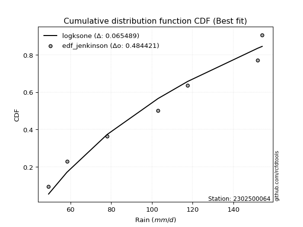</img></img>

</div>


### 11. EDF Cunnane (1978)

Cunnane´s work in statistical hydrology has focused on the performance and evaluation of different probability distributions (such as GEV, Gumbel, Lognormal) for flood frequency estimation. _b_ is a constant, typically set to 0.4.

<div align="center">


$P=(m-b)/(n+1-2b)$


</div>


**11.1. Empirical values**

<div align="center">

|                | 0                   | 1                   | 2                  | 3           | 4                  | 5                  | 6                  |
|:---------------|:--------------------|:--------------------|:-------------------|:------------|:-------------------|:-------------------|:-------------------|
| date           | 2020                | 2022                | 2023               | 2021        | 2025               | 2024               | 2019               |
| x              | 49.2                | 58.2                | 78.0               | 103.0       | 117.6              | 152.0              | 154.2              |
| m              | 1                   | 2                   | 3                  | 4           | 5                  | 6                  | 7                  |
| empirical_dist | edf_cunnane         | edf_cunnane         | edf_cunnane        | edf_cunnane | edf_cunnane        | edf_cunnane        | edf_cunnane        |
| empirical      | 0.08333333333333333 | 0.22222222222222224 | 0.3611111111111111 | 0.5         | 0.6388888888888888 | 0.7777777777777777 | 0.9166666666666666 |
| empirical_tr   | 1.090909090909091   | 1.2857142857142856  | 1.565217391304348  | 2.0         | 2.7692307692307687 | 4.499999999999998  | 11.999999999999995 |

</div>


**11.2. Kolmogorov-Smirnov fit test (sorted by Δ)**


<div align="center">

|                | 0                   | 1                   | 2                   | 3                   | 4                   | 5                   | 6                   | 7                   | 8                   | 9                   | 10                  | 11                  | 12                  | 13                  | 14                  | 15                  | 16                  | 17                  | 18                  | 19                  | 20                  | 21                  | 22                  | 23                  | 24                  | 25                  | 26                  | 27                  | 28                  | 29                  | 30                  | 31                  | 32                  | 33                  | 34                  | 35                  | 36                  | 37                  | 38                  | 39                  | 40                  | 41                  | 42                  | 43                  | 44                  | 45                  | 46                  | 47                  | 48                  | 49                  | 50                  | 51                  | 52                  | 53                  | 54                  | 55                  | 56                  | 57                  | 58                  | 59                  | 60                  | 61                  | 62                  | 63                  | 64                  | 65                  | 66                  | 67                  | 68                  | 69                  | 70                  | 71                  | 72                  | 73                  | 74                  | 75                  | 76                  | 77                  | 78                  | 79                  | 80                  | 81                  | 82                  | 83                  | 84                  | 85                  | 86                  | 87                  | 88                  | 89                  | 90                  | 91                  | 92                  | 93                  | 94                  | 95                  | 96                  | 97                  | 98                  | 99                  | 100                 | 101                 | 102                 | 103                 | 104                 | 105                 | 106                 | 107                 | 108                 | 109                 | 110                 | 111                 | 112                 | 113                 | 114                 | 115                 | 116                 | 117                 | 118                 | 119                 | 120                 | 121                 | 122                 | 123                 | 124                 | 125                 | 126                 | 127                 | 128                 | 129                 | 130                 | 131                 | 132                 | 133                 | 134                 | 135                 | 136                 | 137                 | 138                 | 139                 | 140                 | 141                 | 142                 | 143                 | 144                 | 145                 | 146                 | 147                 | 148                 | 149                 | 150                 | 151                 | 152                 | 153                 | 154                 | 155                 | 156                 | 157                 | 158                 | 159                 |
|:---------------|:--------------------|:--------------------|:--------------------|:--------------------|:--------------------|:--------------------|:--------------------|:--------------------|:--------------------|:--------------------|:--------------------|:--------------------|:--------------------|:--------------------|:--------------------|:--------------------|:--------------------|:--------------------|:--------------------|:--------------------|:--------------------|:--------------------|:--------------------|:--------------------|:--------------------|:--------------------|:--------------------|:--------------------|:--------------------|:--------------------|:--------------------|:--------------------|:--------------------|:--------------------|:--------------------|:--------------------|:--------------------|:--------------------|:--------------------|:--------------------|:--------------------|:--------------------|:--------------------|:--------------------|:--------------------|:--------------------|:--------------------|:--------------------|:--------------------|:--------------------|:--------------------|:--------------------|:--------------------|:--------------------|:--------------------|:--------------------|:--------------------|:--------------------|:--------------------|:--------------------|:--------------------|:--------------------|:--------------------|:--------------------|:--------------------|:--------------------|:--------------------|:--------------------|:--------------------|:--------------------|:--------------------|:--------------------|:--------------------|:--------------------|:--------------------|:--------------------|:--------------------|:--------------------|:--------------------|:--------------------|:--------------------|:--------------------|:--------------------|:--------------------|:--------------------|:--------------------|:--------------------|:--------------------|:--------------------|:--------------------|:--------------------|:--------------------|:--------------------|:--------------------|:--------------------|:--------------------|:--------------------|:--------------------|:--------------------|:--------------------|:--------------------|:--------------------|:--------------------|:--------------------|:--------------------|:--------------------|:--------------------|:--------------------|:--------------------|:--------------------|:--------------------|:--------------------|:--------------------|:--------------------|:--------------------|:--------------------|:--------------------|:--------------------|:--------------------|:--------------------|:--------------------|:--------------------|:--------------------|:--------------------|:--------------------|:--------------------|:--------------------|:--------------------|:--------------------|:--------------------|:--------------------|:--------------------|:--------------------|:--------------------|:--------------------|:--------------------|:--------------------|:--------------------|:--------------------|:--------------------|:--------------------|:--------------------|:--------------------|:--------------------|:--------------------|:--------------------|:--------------------|:--------------------|:--------------------|:--------------------|:--------------------|:--------------------|:--------------------|:--------------------|:--------------------|:--------------------|:--------------------|:--------------------|:--------------------|:--------------------|
| station        | 2302500064          | 2302500064          | 2302500064          | 2302500064          | 2302500064          | 2302500064          | 2302500064          | 2302500064          | 2302500064          | 2302500064          | 2302500064          | 2302500064          | 2302500064          | 2302500064          | 2302500064          | 2302500064          | 2302500064          | 2302500064          | 2302500064          | 2302500064          | 2302500064          | 2302500064          | 2302500064          | 2302500064          | 2302500064          | 2302500064          | 2302500064          | 2302500064          | 2302500064          | 2302500064          | 2302500064          | 2302500064          | 2302500064          | 2302500064          | 2302500064          | 2302500064          | 2302500064          | 2302500064          | 2302500064          | 2302500064          | 2302500064          | 2302500064          | 2302500064          | 2302500064          | 2302500064          | 2302500064          | 2302500064          | 2302500064          | 2302500064          | 2302500064          | 2302500064          | 2302500064          | 2302500064          | 2302500064          | 2302500064          | 2302500064          | 2302500064          | 2302500064          | 2302500064          | 2302500064          | 2302500064          | 2302500064          | 2302500064          | 2302500064          | 2302500064          | 2302500064          | 2302500064          | 2302500064          | 2302500064          | 2302500064          | 2302500064          | 2302500064          | 2302500064          | 2302500064          | 2302500064          | 2302500064          | 2302500064          | 2302500064          | 2302500064          | 2302500064          | 2302500064          | 2302500064          | 2302500064          | 2302500064          | 2302500064          | 2302500064          | 2302500064          | 2302500064          | 2302500064          | 2302500064          | 2302500064          | 2302500064          | 2302500064          | 2302500064          | 2302500064          | 2302500064          | 2302500064          | 2302500064          | 2302500064          | 2302500064          | 2302500064          | 2302500064          | 2302500064          | 2302500064          | 2302500064          | 2302500064          | 2302500064          | 2302500064          | 2302500064          | 2302500064          | 2302500064          | 2302500064          | 2302500064          | 2302500064          | 2302500064          | 2302500064          | 2302500064          | 2302500064          | 2302500064          | 2302500064          | 2302500064          | 2302500064          | 2302500064          | 2302500064          | 2302500064          | 2302500064          | 2302500064          | 2302500064          | 2302500064          | 2302500064          | 2302500064          | 2302500064          | 2302500064          | 2302500064          | 2302500064          | 2302500064          | 2302500064          | 2302500064          | 2302500064          | 2302500064          | 2302500064          | 2302500064          | 2302500064          | 2302500064          | 2302500064          | 2302500064          | 2302500064          | 2302500064          | 2302500064          | 2302500064          | 2302500064          | 2302500064          | 2302500064          | 2302500064          | 2302500064          | 2302500064          | 2302500064          | 2302500064          | 2302500064          | 2302500064          |
| empirical_dist | edf_cunnane         | edf_cunnane         | edf_cunnane         | edf_cunnane         | edf_cunnane         | edf_cunnane         | edf_cunnane         | edf_cunnane         | edf_cunnane         | edf_cunnane         | edf_cunnane         | edf_cunnane         | edf_cunnane         | edf_cunnane         | edf_cunnane         | edf_cunnane         | edf_cunnane         | edf_cunnane         | edf_cunnane         | edf_cunnane         | edf_cunnane         | edf_cunnane         | edf_cunnane         | edf_cunnane         | edf_cunnane         | edf_cunnane         | edf_cunnane         | edf_cunnane         | edf_cunnane         | edf_cunnane         | edf_cunnane         | edf_cunnane         | edf_cunnane         | edf_cunnane         | edf_cunnane         | edf_cunnane         | edf_cunnane         | edf_cunnane         | edf_cunnane         | edf_cunnane         | edf_cunnane         | edf_cunnane         | edf_cunnane         | edf_cunnane         | edf_cunnane         | edf_cunnane         | edf_cunnane         | edf_cunnane         | edf_cunnane         | edf_cunnane         | edf_cunnane         | edf_cunnane         | edf_cunnane         | edf_cunnane         | edf_cunnane         | edf_cunnane         | edf_cunnane         | edf_cunnane         | edf_cunnane         | edf_cunnane         | edf_cunnane         | edf_cunnane         | edf_cunnane         | edf_cunnane         | edf_cunnane         | edf_cunnane         | edf_cunnane         | edf_cunnane         | edf_cunnane         | edf_cunnane         | edf_cunnane         | edf_cunnane         | edf_cunnane         | edf_cunnane         | edf_cunnane         | edf_cunnane         | edf_cunnane         | edf_cunnane         | edf_cunnane         | edf_cunnane         | edf_cunnane         | edf_cunnane         | edf_cunnane         | edf_cunnane         | edf_cunnane         | edf_cunnane         | edf_cunnane         | edf_cunnane         | edf_cunnane         | edf_cunnane         | edf_cunnane         | edf_cunnane         | edf_cunnane         | edf_cunnane         | edf_cunnane         | edf_cunnane         | edf_cunnane         | edf_cunnane         | edf_cunnane         | edf_cunnane         | edf_cunnane         | edf_cunnane         | edf_cunnane         | edf_cunnane         | edf_cunnane         | edf_cunnane         | edf_cunnane         | edf_cunnane         | edf_cunnane         | edf_cunnane         | edf_cunnane         | edf_cunnane         | edf_cunnane         | edf_cunnane         | edf_cunnane         | edf_cunnane         | edf_cunnane         | edf_cunnane         | edf_cunnane         | edf_cunnane         | edf_cunnane         | edf_cunnane         | edf_cunnane         | edf_cunnane         | edf_cunnane         | edf_cunnane         | edf_cunnane         | edf_cunnane         | edf_cunnane         | edf_cunnane         | edf_cunnane         | edf_cunnane         | edf_cunnane         | edf_cunnane         | edf_cunnane         | edf_cunnane         | edf_cunnane         | edf_cunnane         | edf_cunnane         | edf_cunnane         | edf_cunnane         | edf_cunnane         | edf_cunnane         | edf_cunnane         | edf_cunnane         | edf_cunnane         | edf_cunnane         | edf_cunnane         | edf_cunnane         | edf_cunnane         | edf_cunnane         | edf_cunnane         | edf_cunnane         | edf_cunnane         | edf_cunnane         | edf_cunnane         | edf_cunnane         | edf_cunnane         | edf_cunnane         | edf_cunnane         |
| p_dist         | logksone            | logsemicircular     | loganglit           | arcsine             | ksone               | nakagami            | logbetaprime        | logarcsine          | loggamma            | loggamma            | logerlang           | logf                | lognct              | logncf              | logt                | logcrystalball      | lognorm             | logexponnorm        | logfatiguelife      | logalpha            | semicircular        | invgauss            | genlogistic         | loginvgamma         | logpearson3         | logtrapezoid        | logrice             | anglit              | betaprime           | ncf                 | rayleigh            | kstwobign           | invgamma            | maxwell             | loglogistic         | logweibull_min      | alpha               | loginvgauss         | rice                | logburr12           | genpareto           | logmaxwell          | logcosine           | logdgamma           | gamma               | loghypsecant        | halfnorm            | foldnorm            | erlang              | pearson3            | johnsonsu           | skewnorm            | nct                 | exponnorm           | truncnorm           | crystalball         | norm                | t                   | logdweibull         | gumbel_r            | lograyleigh         | burr                | gompertz            | beta                | logloglaplace       | loginvweibull       | logistic            | cosine              | rdist               | loglaplace          | loglaplace          | hypsecant           | loggumbel_l         | lomax               | genexpon            | logbeta             | wrapcauchy          | kappa3              | loggenexpon         | weibull_min         | logkstwobign        | laplace             | loghalfnorm         | logfoldnorm         | moyal               | loggompertz         | exponpow            | loggumbel_r         | logargus            | argus               | dgamma              | dweibull            | halfgennorm         | trapezoid           | gumbel_l            | logweibull_max      | f                   | halflogistic        | genhalflogistic     | logburr             | loglomax            | logmoyal            | burr12              | logwrapcauchy       | triang              | loggenhalflogistic  | logloggamma         | loghalflogistic     | kappa4              | gausshyper          | tukeylambda         | logkappa4           | uniform             | vonmises_line       | logtriang           | loggausshyper       | logskewnorm         | bradford            | logtukeylambda      | logkappa3           | truncexpon          | loguniform          | logvonmises_line    | truncweibull_min    | logtruncweibull_min | loggenextreme       | logtruncnorm        | wald                | logbradford         | loglevy_l           | logtruncexpon       | levy_l              | logwald             | logmielke           | gennorm             | loggennorm          | logjohnsonsb        | logrdist            | logjohnsonsu        | loggenpareto        | genextreme          | logexponpow         | johnsonsb           | fatiguelife         | lognakagami         | loggengamma         | powerlaw            | invweibull          | gengamma            | logpowerlaw         | exponweib           | logexponweib        | weibull_max         | truncpareto         | logtruncpareto      | loghalfgennorm      | loggenlogistic      | logvonmises         | vonmises            | mielke              |
| delta          | 0.07194324177600486 | 0.07205674707026222 | 0.07840252645136192 | 0.08369747589789267 | 0.09241796058377261 | 0.09383237079886964 | 0.09607363694157578 | 0.09661409580938707 | 0.09716215668627937 | 0.09716215668627937 | 0.09756935221251373 | 0.09771141376536474 | 0.09864128688275497 | 0.09905724442355779 | 0.09913421487309482 | 0.09913792334679317 | 0.09913882341787739 | 0.09913931296168588 | 0.09957869526564334 | 0.1002822361598239  | 0.10040548881796418 | 0.10121080847831443 | 0.10197527236322834 | 0.10205377019734807 | 0.1031806192689041  | 0.10584664886074291 | 0.10638908532326019 | 0.1065485297066826  | 0.10686317042345073 | 0.10867753095655375 | 0.11044903540753537 | 0.11124776612711929 | 0.11293549932792979 | 0.11295152433826461 | 0.11346334402827962 | 0.11373105162043229 | 0.11530271378962276 | 0.11588965973349541 | 0.11633491451320765 | 0.11655419027768987 | 0.11691578303672634 | 0.1171423044811557  | 0.1184536805642954  | 0.11961967967687115 | 0.12012195707748308 | 0.12012967950806608 | 0.1202754081516671  | 0.12042932184750099 | 0.12069305422199994 | 0.1209353801126355  | 0.12132711578476219 | 0.12222566363626097 | 0.12232752288653603 | 0.12236440527340808 | 0.12237027317696447 | 0.12237027725900074 | 0.12237027843291093 | 0.1223715684614064  | 0.12438720652146007 | 0.12536069934047292 | 0.12570684244293717 | 0.12859191200706488 | 0.1293470560477654  | 0.12962835329661204 | 0.13056791128585424 | 0.13228471516703366 | 0.1332304835446646  | 0.13490086063454132 | 0.137165267364875   | 0.13722634992695137 | 0.13722634992695137 | 0.13779386397632754 | 0.1388755151880524  | 0.1404272562336255  | 0.14052261054376813 | 0.14563000735807674 | 0.14574577577871106 | 0.14630062112941872 | 0.14670353948243875 | 0.14817657215715807 | 0.14848031299908682 | 0.14884889532601678 | 0.1500256117463612  | 0.15102538827366674 | 0.15348257150353    | 0.1558986966630872  | 0.1560982578197152  | 0.1572330082210005  | 0.1609170696041362  | 0.16103236173442093 | 0.16137608123399338 | 0.16215268267179328 | 0.1655584260007485  | 0.16636043250049237 | 0.16764617839503138 | 0.17199834097575994 | 0.17416424426165455 | 0.17887682327536295 | 0.17903801166034827 | 0.1802224136409285  | 0.18034195678662868 | 0.1804686506287846  | 0.18149171505490502 | 0.1870455361288086  | 0.19145285092288344 | 0.19232370722355774 | 0.19336409375636054 | 0.1966419286874464  | 0.19826260986748767 | 0.1996239726461767  | 0.19967575200610188 | 0.1999548551808118  | 0.2012698412698415  | 0.20127045916121789 | 0.20270037209174063 | 0.20407173208405593 | 0.20457925001954025 | 0.2071557736484274  | 0.20763143092742187 | 0.20815136367302445 | 0.20931903913357053 | 0.20964301771310168 | 0.20974875332712128 | 0.2106094842383801  | 0.21312897944717235 | 0.21453201970053687 | 0.22222222222074076 | 0.22222222222222224 | 0.22408553497583306 | 0.23506283061017208 | 0.24016094894439144 | 0.24260086670971437 | 0.24511634635901924 | 0.2638501508777169  | 0.2777777777777778  | 0.2777777777777778  | 0.28032774714689646 | 0.3006081778137534  | 0.3109320778535525  | 0.3146900959876876  | 0.3216776628461734  | 0.3771801901524233  | 0.42131641613217163 | 0.42964376280006633 | 0.4391851965140905  | 0.4453450190022613  | 0.4453641346035208  | 0.45128634855035166 | 0.4621181221615921  | 0.4886222875384076  | 0.5109085734171802  | 0.5127387788782838  | 0.529034869722027   | 0.5870378525229506  | 0.6286863741319028  | 0.7777777777777777  | 0.7777777777777777  | 1.0983165342430237  | 23.769536215850003  | nan                 |
| deltao         | 0.48442053926100004 | 0.48442053926100004 | 0.48442053926100004 | 0.48442053926100004 | 0.48442053926100004 | 0.48442053926100004 | 0.48442053926100004 | 0.48442053926100004 | 0.48442053926100004 | 0.48442053926100004 | 0.48442053926100004 | 0.48442053926100004 | 0.48442053926100004 | 0.48442053926100004 | 0.48442053926100004 | 0.48442053926100004 | 0.48442053926100004 | 0.48442053926100004 | 0.48442053926100004 | 0.48442053926100004 | 0.48442053926100004 | 0.48442053926100004 | 0.48442053926100004 | 0.48442053926100004 | 0.48442053926100004 | 0.48442053926100004 | 0.48442053926100004 | 0.48442053926100004 | 0.48442053926100004 | 0.48442053926100004 | 0.48442053926100004 | 0.48442053926100004 | 0.48442053926100004 | 0.48442053926100004 | 0.48442053926100004 | 0.48442053926100004 | 0.48442053926100004 | 0.48442053926100004 | 0.48442053926100004 | 0.48442053926100004 | 0.48442053926100004 | 0.48442053926100004 | 0.48442053926100004 | 0.48442053926100004 | 0.48442053926100004 | 0.48442053926100004 | 0.48442053926100004 | 0.48442053926100004 | 0.48442053926100004 | 0.48442053926100004 | 0.48442053926100004 | 0.48442053926100004 | 0.48442053926100004 | 0.48442053926100004 | 0.48442053926100004 | 0.48442053926100004 | 0.48442053926100004 | 0.48442053926100004 | 0.48442053926100004 | 0.48442053926100004 | 0.48442053926100004 | 0.48442053926100004 | 0.48442053926100004 | 0.48442053926100004 | 0.48442053926100004 | 0.48442053926100004 | 0.48442053926100004 | 0.48442053926100004 | 0.48442053926100004 | 0.48442053926100004 | 0.48442053926100004 | 0.48442053926100004 | 0.48442053926100004 | 0.48442053926100004 | 0.48442053926100004 | 0.48442053926100004 | 0.48442053926100004 | 0.48442053926100004 | 0.48442053926100004 | 0.48442053926100004 | 0.48442053926100004 | 0.48442053926100004 | 0.48442053926100004 | 0.48442053926100004 | 0.48442053926100004 | 0.48442053926100004 | 0.48442053926100004 | 0.48442053926100004 | 0.48442053926100004 | 0.48442053926100004 | 0.48442053926100004 | 0.48442053926100004 | 0.48442053926100004 | 0.48442053926100004 | 0.48442053926100004 | 0.48442053926100004 | 0.48442053926100004 | 0.48442053926100004 | 0.48442053926100004 | 0.48442053926100004 | 0.48442053926100004 | 0.48442053926100004 | 0.48442053926100004 | 0.48442053926100004 | 0.48442053926100004 | 0.48442053926100004 | 0.48442053926100004 | 0.48442053926100004 | 0.48442053926100004 | 0.48442053926100004 | 0.48442053926100004 | 0.48442053926100004 | 0.48442053926100004 | 0.48442053926100004 | 0.48442053926100004 | 0.48442053926100004 | 0.48442053926100004 | 0.48442053926100004 | 0.48442053926100004 | 0.48442053926100004 | 0.48442053926100004 | 0.48442053926100004 | 0.48442053926100004 | 0.48442053926100004 | 0.48442053926100004 | 0.48442053926100004 | 0.48442053926100004 | 0.48442053926100004 | 0.48442053926100004 | 0.48442053926100004 | 0.48442053926100004 | 0.48442053926100004 | 0.48442053926100004 | 0.48442053926100004 | 0.48442053926100004 | 0.48442053926100004 | 0.48442053926100004 | 0.48442053926100004 | 0.48442053926100004 | 0.48442053926100004 | 0.48442053926100004 | 0.48442053926100004 | 0.48442053926100004 | 0.48442053926100004 | 0.48442053926100004 | 0.48442053926100004 | 0.48442053926100004 | 0.48442053926100004 | 0.48442053926100004 | 0.48442053926100004 | 0.48442053926100004 | 0.48442053926100004 | 0.48442053926100004 | 0.48442053926100004 | 0.48442053926100004 | 0.48442053926100004 | 0.48442053926100004 | 0.48442053926100004 | 0.48442053926100004 | 0.48442053926100004 |
| eval           | Δo > Δ              | Δo > Δ              | Δo > Δ              | Δo > Δ              | Δo > Δ              | Δo > Δ              | Δo > Δ              | Δo > Δ              | Δo > Δ              | Δo > Δ              | Δo > Δ              | Δo > Δ              | Δo > Δ              | Δo > Δ              | Δo > Δ              | Δo > Δ              | Δo > Δ              | Δo > Δ              | Δo > Δ              | Δo > Δ              | Δo > Δ              | Δo > Δ              | Δo > Δ              | Δo > Δ              | Δo > Δ              | Δo > Δ              | Δo > Δ              | Δo > Δ              | Δo > Δ              | Δo > Δ              | Δo > Δ              | Δo > Δ              | Δo > Δ              | Δo > Δ              | Δo > Δ              | Δo > Δ              | Δo > Δ              | Δo > Δ              | Δo > Δ              | Δo > Δ              | Δo > Δ              | Δo > Δ              | Δo > Δ              | Δo > Δ              | Δo > Δ              | Δo > Δ              | Δo > Δ              | Δo > Δ              | Δo > Δ              | Δo > Δ              | Δo > Δ              | Δo > Δ              | Δo > Δ              | Δo > Δ              | Δo > Δ              | Δo > Δ              | Δo > Δ              | Δo > Δ              | Δo > Δ              | Δo > Δ              | Δo > Δ              | Δo > Δ              | Δo > Δ              | Δo > Δ              | Δo > Δ              | Δo > Δ              | Δo > Δ              | Δo > Δ              | Δo > Δ              | Δo > Δ              | Δo > Δ              | Δo > Δ              | Δo > Δ              | Δo > Δ              | Δo > Δ              | Δo > Δ              | Δo > Δ              | Δo > Δ              | Δo > Δ              | Δo > Δ              | Δo > Δ              | Δo > Δ              | Δo > Δ              | Δo > Δ              | Δo > Δ              | Δo > Δ              | Δo > Δ              | Δo > Δ              | Δo > Δ              | Δo > Δ              | Δo > Δ              | Δo > Δ              | Δo > Δ              | Δo > Δ              | Δo > Δ              | Δo > Δ              | Δo > Δ              | Δo > Δ              | Δo > Δ              | Δo > Δ              | Δo > Δ              | Δo > Δ              | Δo > Δ              | Δo > Δ              | Δo > Δ              | Δo > Δ              | Δo > Δ              | Δo > Δ              | Δo > Δ              | Δo > Δ              | Δo > Δ              | Δo > Δ              | Δo > Δ              | Δo > Δ              | Δo > Δ              | Δo > Δ              | Δo > Δ              | Δo > Δ              | Δo > Δ              | Δo > Δ              | Δo > Δ              | Δo > Δ              | Δo > Δ              | Δo > Δ              | Δo > Δ              | Δo > Δ              | Δo > Δ              | Δo > Δ              | Δo > Δ              | Δo > Δ              | Δo > Δ              | Δo > Δ              | Δo > Δ              | Δo > Δ              | Δo > Δ              | Δo > Δ              | Δo > Δ              | Δo > Δ              | Δo > Δ              | Δo > Δ              | Δo > Δ              | Δo > Δ              | Δo > Δ              | Δo > Δ              | Δo > Δ              | Δo > Δ              | Δo > Δ              | Δo > Δ              | Δo > Δ              | Δo <= Δ             | Δo <= Δ             | Δo <= Δ             | Δo <= Δ             | Δo <= Δ             | Δo <= Δ             | Δo <= Δ             | Δo <= Δ             | Δo <= Δ             | Δo <= Δ             | Δo <= Δ             |
| fit            | 1                   | 1                   | 1                   | 1                   | 1                   | 1                   | 1                   | 1                   | 1                   | 1                   | 1                   | 1                   | 1                   | 1                   | 1                   | 1                   | 1                   | 1                   | 1                   | 1                   | 1                   | 1                   | 1                   | 1                   | 1                   | 1                   | 1                   | 1                   | 1                   | 1                   | 1                   | 1                   | 1                   | 1                   | 1                   | 1                   | 1                   | 1                   | 1                   | 1                   | 1                   | 1                   | 1                   | 1                   | 1                   | 1                   | 1                   | 1                   | 1                   | 1                   | 1                   | 1                   | 1                   | 1                   | 1                   | 1                   | 1                   | 1                   | 1                   | 1                   | 1                   | 1                   | 1                   | 1                   | 1                   | 1                   | 1                   | 1                   | 1                   | 1                   | 1                   | 1                   | 1                   | 1                   | 1                   | 1                   | 1                   | 1                   | 1                   | 1                   | 1                   | 1                   | 1                   | 1                   | 1                   | 1                   | 1                   | 1                   | 1                   | 1                   | 1                   | 1                   | 1                   | 1                   | 1                   | 1                   | 1                   | 1                   | 1                   | 1                   | 1                   | 1                   | 1                   | 1                   | 1                   | 1                   | 1                   | 1                   | 1                   | 1                   | 1                   | 1                   | 1                   | 1                   | 1                   | 1                   | 1                   | 1                   | 1                   | 1                   | 1                   | 1                   | 1                   | 1                   | 1                   | 1                   | 1                   | 1                   | 1                   | 1                   | 1                   | 1                   | 1                   | 1                   | 1                   | 1                   | 1                   | 1                   | 1                   | 1                   | 1                   | 1                   | 1                   | 1                   | 1                   | 1                   | 1                   | 1                   | 1                   | 0                   | 0                   | 0                   | 0                   | 0                   | 0                   | 0                   | 0                   | 0                   | 0                   | 0                   |
| n              | 7                   | 7                   | 7                   | 7                   | 7                   | 7                   | 7                   | 7                   | 7                   | 7                   | 7                   | 7                   | 7                   | 7                   | 7                   | 7                   | 7                   | 7                   | 7                   | 7                   | 7                   | 7                   | 7                   | 7                   | 7                   | 7                   | 7                   | 7                   | 7                   | 7                   | 7                   | 7                   | 7                   | 7                   | 7                   | 7                   | 7                   | 7                   | 7                   | 7                   | 7                   | 7                   | 7                   | 7                   | 7                   | 7                   | 7                   | 7                   | 7                   | 7                   | 7                   | 7                   | 7                   | 7                   | 7                   | 7                   | 7                   | 7                   | 7                   | 7                   | 7                   | 7                   | 7                   | 7                   | 7                   | 7                   | 7                   | 7                   | 7                   | 7                   | 7                   | 7                   | 7                   | 7                   | 7                   | 7                   | 7                   | 7                   | 7                   | 7                   | 7                   | 7                   | 7                   | 7                   | 7                   | 7                   | 7                   | 7                   | 7                   | 7                   | 7                   | 7                   | 7                   | 7                   | 7                   | 7                   | 7                   | 7                   | 7                   | 7                   | 7                   | 7                   | 7                   | 7                   | 7                   | 7                   | 7                   | 7                   | 7                   | 7                   | 7                   | 7                   | 7                   | 7                   | 7                   | 7                   | 7                   | 7                   | 7                   | 7                   | 7                   | 7                   | 7                   | 7                   | 7                   | 7                   | 7                   | 7                   | 7                   | 7                   | 7                   | 7                   | 7                   | 7                   | 7                   | 7                   | 7                   | 7                   | 7                   | 7                   | 7                   | 7                   | 7                   | 7                   | 7                   | 7                   | 7                   | 7                   | 7                   | 7                   | 7                   | 7                   | 7                   | 7                   | 7                   | 7                   | 7                   | 7                   | 7                   | 7                   |
| best_fit       | 1                   | 0                   | 0                   | 0                   | 0                   | 0                   | 0                   | 0                   | 0                   | 0                   | 0                   | 0                   | 0                   | 0                   | 0                   | 0                   | 0                   | 0                   | 0                   | 0                   | 0                   | 0                   | 0                   | 0                   | 0                   | 0                   | 0                   | 0                   | 0                   | 0                   | 0                   | 0                   | 0                   | 0                   | 0                   | 0                   | 0                   | 0                   | 0                   | 0                   | 0                   | 0                   | 0                   | 0                   | 0                   | 0                   | 0                   | 0                   | 0                   | 0                   | 0                   | 0                   | 0                   | 0                   | 0                   | 0                   | 0                   | 0                   | 0                   | 0                   | 0                   | 0                   | 0                   | 0                   | 0                   | 0                   | 0                   | 0                   | 0                   | 0                   | 0                   | 0                   | 0                   | 0                   | 0                   | 0                   | 0                   | 0                   | 0                   | 0                   | 0                   | 0                   | 0                   | 0                   | 0                   | 0                   | 0                   | 0                   | 0                   | 0                   | 0                   | 0                   | 0                   | 0                   | 0                   | 0                   | 0                   | 0                   | 0                   | 0                   | 0                   | 0                   | 0                   | 0                   | 0                   | 0                   | 0                   | 0                   | 0                   | 0                   | 0                   | 0                   | 0                   | 0                   | 0                   | 0                   | 0                   | 0                   | 0                   | 0                   | 0                   | 0                   | 0                   | 0                   | 0                   | 0                   | 0                   | 0                   | 0                   | 0                   | 0                   | 0                   | 0                   | 0                   | 0                   | 0                   | 0                   | 0                   | 0                   | 0                   | 0                   | 0                   | 0                   | 0                   | 0                   | 0                   | 0                   | 0                   | 0                   | 0                   | 0                   | 0                   | 0                   | 0                   | 0                   | 0                   | 0                   | 0                   | 0                   | 0                   |
| best_fit_sort  | 1                   | 2                   | 3                   | 4                   | 5                   | 6                   | 7                   | 8                   | 9                   | 10                  | 11                  | 12                  | 13                  | 14                  | 15                  | 16                  | 17                  | 18                  | 19                  | 20                  | 21                  | 22                  | 23                  | 24                  | 25                  | 26                  | 27                  | 28                  | 29                  | 30                  | 31                  | 32                  | 33                  | 34                  | 35                  | 36                  | 37                  | 38                  | 39                  | 40                  | 41                  | 42                  | 43                  | 44                  | 45                  | 46                  | 47                  | 48                  | 49                  | 50                  | 51                  | 52                  | 53                  | 54                  | 55                  | 56                  | 57                  | 58                  | 59                  | 60                  | 61                  | 62                  | 63                  | 64                  | 65                  | 66                  | 67                  | 68                  | 69                  | 70                  | 71                  | 72                  | 73                  | 74                  | 75                  | 76                  | 77                  | 78                  | 79                  | 80                  | 81                  | 82                  | 83                  | 84                  | 85                  | 86                  | 87                  | 88                  | 89                  | 90                  | 91                  | 92                  | 93                  | 94                  | 95                  | 96                  | 97                  | 98                  | 99                  | 100                 | 101                 | 102                 | 103                 | 104                 | 105                 | 106                 | 107                 | 108                 | 109                 | 110                 | 111                 | 112                 | 113                 | 114                 | 115                 | 116                 | 117                 | 118                 | 119                 | 120                 | 121                 | 122                 | 123                 | 124                 | 125                 | 126                 | 127                 | 128                 | 129                 | 130                 | 131                 | 132                 | 133                 | 134                 | 135                 | 136                 | 137                 | 138                 | 139                 | 140                 | 141                 | 142                 | 143                 | 144                 | 145                 | 146                 | 147                 | 148                 | 149                 | 150                 | 151                 | 152                 | 153                 | 154                 | 155                 | 156                 | 157                 | 158                 | 159                 | 160                 |

</div>


**11.3. Best fit**

<div align="center">

|   id |    station | empirical_dist   | p_dist   |     delta |   deltao | eval   |   fit |   n |   best_fit |   best_fit_sort |
|-----:|-----------:|:-----------------|:---------|----------:|---------:|:-------|------:|----:|-----------:|----------------:|
|    0 | 2302500064 | edf_cunnane      | logksone | 0.0719432 | 0.484421 | Δo > Δ |     1 |   7 |          1 |               1 |

</div>


<div align="center">

</img></img>

</div>


### 12. EDF Adamowski (1981)

The Adamowski formula in hydrology refers to a specific plotting position formula used for estimating the non-parametric empirical distribution of hydrological events (like flood peaks) to calculate their return periods. This formula provides an alternative to traditional parametric methods (like the Gumbel or Log Pearson Type III distributions). 

<div align="center">


$P=(m-0.25)/(n+0.5)$


</div>


**12.1. Empirical values**

<div align="center">

|                | 0                  | 1                   | 2                   | 3             | 4                  | 5                  | 6                  |
|:---------------|:-------------------|:--------------------|:--------------------|:--------------|:-------------------|:-------------------|:-------------------|
| date           | 2020               | 2022                | 2023                | 2021          | 2025               | 2024               | 2019               |
| x              | 49.2               | 58.2                | 78.0                | 103.0         | 117.6              | 152.0              | 154.2              |
| m              | 1                  | 2                   | 3                   | 4             | 5                  | 6                  | 7                  |
| empirical_dist | edf_adamowski      | edf_adamowski       | edf_adamowski       | edf_adamowski | edf_adamowski      | edf_adamowski      | edf_adamowski      |
| empirical      | 0.1                | 0.23333333333333334 | 0.36666666666666664 | 0.5           | 0.6333333333333333 | 0.7666666666666667 | 0.9                |
| empirical_tr   | 1.1111111111111112 | 1.3043478260869565  | 1.5789473684210527  | 2.0           | 2.727272727272727  | 4.2857142857142865 | 10.000000000000002 |

</div>


**12.2. Kolmogorov-Smirnov fit test (sorted by Δ)**


<div align="center">

|                | 0                   | 1                   | 2                   | 3                   | 4                   | 5                   | 6                   | 7                   | 8                   | 9                   | 10                  | 11                  | 12                  | 13                  | 14                  | 15                  | 16                  | 17                  | 18                  | 19                  | 20                  | 21                  | 22                  | 23                  | 24                  | 25                  | 26                  | 27                  | 28                  | 29                  | 30                  | 31                  | 32                  | 33                  | 34                  | 35                  | 36                  | 37                  | 38                  | 39                  | 40                  | 41                  | 42                  | 43                  | 44                  | 45                  | 46                  | 47                  | 48                  | 49                  | 50                  | 51                  | 52                  | 53                  | 54                  | 55                  | 56                  | 57                  | 58                  | 59                  | 60                  | 61                  | 62                  | 63                  | 64                  | 65                  | 66                  | 67                  | 68                  | 69                  | 70                  | 71                  | 72                  | 73                  | 74                  | 75                  | 76                  | 77                  | 78                  | 79                  | 80                  | 81                  | 82                  | 83                  | 84                  | 85                  | 86                  | 87                  | 88                  | 89                  | 90                  | 91                  | 92                  | 93                  | 94                  | 95                  | 96                  | 97                  | 98                  | 99                  | 100                 | 101                 | 102                 | 103                 | 104                 | 105                 | 106                 | 107                 | 108                 | 109                 | 110                 | 111                 | 112                 | 113                 | 114                 | 115                 | 116                 | 117                 | 118                 | 119                 | 120                 | 121                 | 122                 | 123                 | 124                 | 125                 | 126                 | 127                 | 128                 | 129                 | 130                 | 131                 | 132                 | 133                 | 134                 | 135                 | 136                 | 137                 | 138                 | 139                 | 140                 | 141                 | 142                 | 143                 | 144                 | 145                 | 146                 | 147                 | 148                 | 149                 | 150                 | 151                 | 152                 | 153                 | 154                 | 155                 | 156                 | 157                 | 158                 | 159                 |
|:---------------|:--------------------|:--------------------|:--------------------|:--------------------|:--------------------|:--------------------|:--------------------|:--------------------|:--------------------|:--------------------|:--------------------|:--------------------|:--------------------|:--------------------|:--------------------|:--------------------|:--------------------|:--------------------|:--------------------|:--------------------|:--------------------|:--------------------|:--------------------|:--------------------|:--------------------|:--------------------|:--------------------|:--------------------|:--------------------|:--------------------|:--------------------|:--------------------|:--------------------|:--------------------|:--------------------|:--------------------|:--------------------|:--------------------|:--------------------|:--------------------|:--------------------|:--------------------|:--------------------|:--------------------|:--------------------|:--------------------|:--------------------|:--------------------|:--------------------|:--------------------|:--------------------|:--------------------|:--------------------|:--------------------|:--------------------|:--------------------|:--------------------|:--------------------|:--------------------|:--------------------|:--------------------|:--------------------|:--------------------|:--------------------|:--------------------|:--------------------|:--------------------|:--------------------|:--------------------|:--------------------|:--------------------|:--------------------|:--------------------|:--------------------|:--------------------|:--------------------|:--------------------|:--------------------|:--------------------|:--------------------|:--------------------|:--------------------|:--------------------|:--------------------|:--------------------|:--------------------|:--------------------|:--------------------|:--------------------|:--------------------|:--------------------|:--------------------|:--------------------|:--------------------|:--------------------|:--------------------|:--------------------|:--------------------|:--------------------|:--------------------|:--------------------|:--------------------|:--------------------|:--------------------|:--------------------|:--------------------|:--------------------|:--------------------|:--------------------|:--------------------|:--------------------|:--------------------|:--------------------|:--------------------|:--------------------|:--------------------|:--------------------|:--------------------|:--------------------|:--------------------|:--------------------|:--------------------|:--------------------|:--------------------|:--------------------|:--------------------|:--------------------|:--------------------|:--------------------|:--------------------|:--------------------|:--------------------|:--------------------|:--------------------|:--------------------|:--------------------|:--------------------|:--------------------|:--------------------|:--------------------|:--------------------|:--------------------|:--------------------|:--------------------|:--------------------|:--------------------|:--------------------|:--------------------|:--------------------|:--------------------|:--------------------|:--------------------|:--------------------|:--------------------|:--------------------|:--------------------|:--------------------|:--------------------|:--------------------|:--------------------|
| station        | 2302500064          | 2302500064          | 2302500064          | 2302500064          | 2302500064          | 2302500064          | 2302500064          | 2302500064          | 2302500064          | 2302500064          | 2302500064          | 2302500064          | 2302500064          | 2302500064          | 2302500064          | 2302500064          | 2302500064          | 2302500064          | 2302500064          | 2302500064          | 2302500064          | 2302500064          | 2302500064          | 2302500064          | 2302500064          | 2302500064          | 2302500064          | 2302500064          | 2302500064          | 2302500064          | 2302500064          | 2302500064          | 2302500064          | 2302500064          | 2302500064          | 2302500064          | 2302500064          | 2302500064          | 2302500064          | 2302500064          | 2302500064          | 2302500064          | 2302500064          | 2302500064          | 2302500064          | 2302500064          | 2302500064          | 2302500064          | 2302500064          | 2302500064          | 2302500064          | 2302500064          | 2302500064          | 2302500064          | 2302500064          | 2302500064          | 2302500064          | 2302500064          | 2302500064          | 2302500064          | 2302500064          | 2302500064          | 2302500064          | 2302500064          | 2302500064          | 2302500064          | 2302500064          | 2302500064          | 2302500064          | 2302500064          | 2302500064          | 2302500064          | 2302500064          | 2302500064          | 2302500064          | 2302500064          | 2302500064          | 2302500064          | 2302500064          | 2302500064          | 2302500064          | 2302500064          | 2302500064          | 2302500064          | 2302500064          | 2302500064          | 2302500064          | 2302500064          | 2302500064          | 2302500064          | 2302500064          | 2302500064          | 2302500064          | 2302500064          | 2302500064          | 2302500064          | 2302500064          | 2302500064          | 2302500064          | 2302500064          | 2302500064          | 2302500064          | 2302500064          | 2302500064          | 2302500064          | 2302500064          | 2302500064          | 2302500064          | 2302500064          | 2302500064          | 2302500064          | 2302500064          | 2302500064          | 2302500064          | 2302500064          | 2302500064          | 2302500064          | 2302500064          | 2302500064          | 2302500064          | 2302500064          | 2302500064          | 2302500064          | 2302500064          | 2302500064          | 2302500064          | 2302500064          | 2302500064          | 2302500064          | 2302500064          | 2302500064          | 2302500064          | 2302500064          | 2302500064          | 2302500064          | 2302500064          | 2302500064          | 2302500064          | 2302500064          | 2302500064          | 2302500064          | 2302500064          | 2302500064          | 2302500064          | 2302500064          | 2302500064          | 2302500064          | 2302500064          | 2302500064          | 2302500064          | 2302500064          | 2302500064          | 2302500064          | 2302500064          | 2302500064          | 2302500064          | 2302500064          | 2302500064          | 2302500064          | 2302500064          |
| empirical_dist | edf_adamowski       | edf_adamowski       | edf_adamowski       | edf_adamowski       | edf_adamowski       | edf_adamowski       | edf_adamowski       | edf_adamowski       | edf_adamowski       | edf_adamowski       | edf_adamowski       | edf_adamowski       | edf_adamowski       | edf_adamowski       | edf_adamowski       | edf_adamowski       | edf_adamowski       | edf_adamowski       | edf_adamowski       | edf_adamowski       | edf_adamowski       | edf_adamowski       | edf_adamowski       | edf_adamowski       | edf_adamowski       | edf_adamowski       | edf_adamowski       | edf_adamowski       | edf_adamowski       | edf_adamowski       | edf_adamowski       | edf_adamowski       | edf_adamowski       | edf_adamowski       | edf_adamowski       | edf_adamowski       | edf_adamowski       | edf_adamowski       | edf_adamowski       | edf_adamowski       | edf_adamowski       | edf_adamowski       | edf_adamowski       | edf_adamowski       | edf_adamowski       | edf_adamowski       | edf_adamowski       | edf_adamowski       | edf_adamowski       | edf_adamowski       | edf_adamowski       | edf_adamowski       | edf_adamowski       | edf_adamowski       | edf_adamowski       | edf_adamowski       | edf_adamowski       | edf_adamowski       | edf_adamowski       | edf_adamowski       | edf_adamowski       | edf_adamowski       | edf_adamowski       | edf_adamowski       | edf_adamowski       | edf_adamowski       | edf_adamowski       | edf_adamowski       | edf_adamowski       | edf_adamowski       | edf_adamowski       | edf_adamowski       | edf_adamowski       | edf_adamowski       | edf_adamowski       | edf_adamowski       | edf_adamowski       | edf_adamowski       | edf_adamowski       | edf_adamowski       | edf_adamowski       | edf_adamowski       | edf_adamowski       | edf_adamowski       | edf_adamowski       | edf_adamowski       | edf_adamowski       | edf_adamowski       | edf_adamowski       | edf_adamowski       | edf_adamowski       | edf_adamowski       | edf_adamowski       | edf_adamowski       | edf_adamowski       | edf_adamowski       | edf_adamowski       | edf_adamowski       | edf_adamowski       | edf_adamowski       | edf_adamowski       | edf_adamowski       | edf_adamowski       | edf_adamowski       | edf_adamowski       | edf_adamowski       | edf_adamowski       | edf_adamowski       | edf_adamowski       | edf_adamowski       | edf_adamowski       | edf_adamowski       | edf_adamowski       | edf_adamowski       | edf_adamowski       | edf_adamowski       | edf_adamowski       | edf_adamowski       | edf_adamowski       | edf_adamowski       | edf_adamowski       | edf_adamowski       | edf_adamowski       | edf_adamowski       | edf_adamowski       | edf_adamowski       | edf_adamowski       | edf_adamowski       | edf_adamowski       | edf_adamowski       | edf_adamowski       | edf_adamowski       | edf_adamowski       | edf_adamowski       | edf_adamowski       | edf_adamowski       | edf_adamowski       | edf_adamowski       | edf_adamowski       | edf_adamowski       | edf_adamowski       | edf_adamowski       | edf_adamowski       | edf_adamowski       | edf_adamowski       | edf_adamowski       | edf_adamowski       | edf_adamowski       | edf_adamowski       | edf_adamowski       | edf_adamowski       | edf_adamowski       | edf_adamowski       | edf_adamowski       | edf_adamowski       | edf_adamowski       | edf_adamowski       | edf_adamowski       | edf_adamowski       | edf_adamowski       |
| p_dist         | logksone            | logsemicircular     | loganglit           | arcsine             | nakagami            | logarcsine          | ksone               | logalpha            | loginvgamma         | logbetaprime        | loggamma            | loggamma            | logerlang           | logf                | logncf              | lognct              | logt                | logcrystalball      | lognorm             | logexponnorm        | logfatiguelife      | semicircular        | logrice             | invgauss            | genlogistic         | logpearson3         | loginvgauss         | logtrapezoid        | logmaxwell          | anglit              | betaprime           | ncf                 | rayleigh            | kstwobign           | invgamma            | maxwell             | loglogistic         | logweibull_min      | lograyleigh         | alpha               | rice                | logburr12           | genpareto           | burr                | logcosine           | logdgamma           | gamma               | loghypsecant        | halfnorm            | foldnorm            | erlang              | pearson3            | loginvweibull       | johnsonsu           | skewnorm            | nct                 | exponnorm           | truncnorm           | crystalball         | norm                | t                   | logdweibull         | gumbel_r            | logloglaplace       | loglaplace          | loglaplace          | lomax               | gompertz            | genexpon            | beta                | logistic            | cosine              | loggenexpon         | weibull_min         | rdist               | logkstwobign        | hypsecant           | loggumbel_l         | loghalfnorm         | logfoldnorm         | laplace             | loggompertz         | exponpow            | logbeta             | wrapcauchy          | loggumbel_r         | kappa3              | moyal               | halfgennorm         | logweibull_max      | logargus            | argus               | dgamma              | dweibull            | f                   | trapezoid           | gumbel_l            | loglomax            | logmoyal            | burr12              | halflogistic        | genhalflogistic     | logburr             | logwrapcauchy       | triang              | loggenhalflogistic  | logloggamma         | loghalflogistic     | loggenextreme       | kappa4              | gausshyper          | tukeylambda         | logkappa4           | uniform             | vonmises_line       | logtriang           | loggausshyper       | logskewnorm         | bradford            | logtukeylambda      | logkappa3           | truncexpon          | loguniform          | logvonmises_line    | truncweibull_min    | logtruncweibull_min | logbradford         | loglevy_l           | logtruncnorm        | wald                | levy_l              | logtruncexpon       | logwald             | logmielke           | gennorm             | loggennorm          | logjohnsonsb        | logrdist            | loggenpareto        | logjohnsonsu        | genextreme          | logexponpow         | johnsonsb           | fatiguelife         | lognakagami         | loggengamma         | invweibull          | powerlaw            | gengamma            | logpowerlaw         | exponweib           | logexponweib        | weibull_max         | truncpareto         | logtruncpareto      | loghalfgennorm      | loggenlogistic      | logvonmises         | vonmises            | mielke              |
| delta          | 0.06811284438258469 | 0.08059993082199057 | 0.08951363756247288 | 0.09480858700900363 | 0.09999999999745707 | 0.1                 | 0.10352907169488357 | 0.10616018399313232 | 0.10627454072544651 | 0.10718474805268674 | 0.10750410204234273 | 0.10750410204234273 | 0.10783063709229967 | 0.1088225248764757  | 0.1097477475765406  | 0.10975239799386594 | 0.11024532598420578 | 0.11024903445790413 | 0.11024993452898835 | 0.11025042407279684 | 0.1106898063767543  | 0.11151659992907514 | 0.11222143511681286 | 0.11232191958942539 | 0.1130863834743393  | 0.11429173038001506 | 0.11588965973349541 | 0.11695775997185387 | 0.1171423044811557  | 0.11765964081779356 | 0.11797428153456169 | 0.11978864206766471 | 0.12156014651864633 | 0.12235887723823025 | 0.12404661043904075 | 0.12406263544937557 | 0.12457445513939058 | 0.12484216273154325 | 0.12570684244293717 | 0.12641382490073372 | 0.12744602562431862 | 0.12766530138880083 | 0.1280268941478373  | 0.12859191200706488 | 0.12956479167540635 | 0.1307307907879821  | 0.13123306818859404 | 0.13124079061917704 | 0.1313865192627782  | 0.13154043295861195 | 0.1318041653331109  | 0.13204649122374645 | 0.13228471516703366 | 0.13243822689587315 | 0.13333677474737193 | 0.133438633997647   | 0.13347551638451904 | 0.13348138428807543 | 0.1334813883701117  | 0.1334813895440219  | 0.13348267957251736 | 0.13549831763257103 | 0.13647181045158402 | 0.1368185061951277  | 0.13722634992695137 | 0.13722634992695137 | 0.1404272562336255  | 0.1404581671588765  | 0.14052261054376813 | 0.140739464407723   | 0.14434159465577556 | 0.14601197174565228 | 0.14670353948243875 | 0.14817657215715807 | 0.14827637847598596 | 0.14848031299908682 | 0.1489049750874385  | 0.14998662629916337 | 0.1500256117463612  | 0.15220679850663216 | 0.1544044508815723  | 0.1558986966630872  | 0.1560982578197152  | 0.1567411184691877  | 0.15685688688982202 | 0.1572330082210005  | 0.15741173224052984 | 0.16459368261464108 | 0.16465044665226858 | 0.1664427854202044  | 0.17202818071524717 | 0.1721434728455319  | 0.17248719234510435 | 0.17326379378290424 | 0.17416424426165455 | 0.17747154361160333 | 0.17875728950614234 | 0.18034195678662868 | 0.1804686506287846  | 0.18149171505490502 | 0.18998793438647404 | 0.19014912277145923 | 0.19133352475203946 | 0.19815664723991955 | 0.2025639620339944  | 0.2034348183346687  | 0.2044752048674715  | 0.2077530397985575  | 0.20897646414498133 | 0.20937372097859863 | 0.21073508375728767 | 0.21078686311721284 | 0.21106596629192276 | 0.21238095238095245 | 0.21238157027232885 | 0.2138114832028516  | 0.2151828431951669  | 0.2156903611306512  | 0.21826688475953837 | 0.21874254203853283 | 0.2192624747841354  | 0.2204301502446815  | 0.22075412882421264 | 0.22085986443823225 | 0.22172059534949107 | 0.2242400905582833  | 0.2244082488697089  | 0.22950727505461654 | 0.23333333333185186 | 0.23333333333333334 | 0.23704531115415883 | 0.24016094894439144 | 0.24511634635901924 | 0.2638501508777169  | 0.2666666666666667  | 0.2666666666666667  | 0.2747721915913409  | 0.28394151114708677 | 0.2980234293210209  | 0.30537652229799694 | 0.31056655173506226 | 0.3660690790413122  | 0.4102053050210605  | 0.4185326516889552  | 0.42807408540297937 | 0.4342339078911502  | 0.43461968188368505 | 0.4398085790479653  | 0.45100701105048097 | 0.48306673198285205 | 0.4997974623060691  | 0.5016276677671727  | 0.5234793141664714  | 0.5759267414118394  | 0.6175752630207916  | 0.7666666666666667  | 0.7666666666666667  | 1.1094276453541347  | 23.786202882516672  | nan                 |
| deltao         | 0.48442053926100004 | 0.48442053926100004 | 0.48442053926100004 | 0.48442053926100004 | 0.48442053926100004 | 0.48442053926100004 | 0.48442053926100004 | 0.48442053926100004 | 0.48442053926100004 | 0.48442053926100004 | 0.48442053926100004 | 0.48442053926100004 | 0.48442053926100004 | 0.48442053926100004 | 0.48442053926100004 | 0.48442053926100004 | 0.48442053926100004 | 0.48442053926100004 | 0.48442053926100004 | 0.48442053926100004 | 0.48442053926100004 | 0.48442053926100004 | 0.48442053926100004 | 0.48442053926100004 | 0.48442053926100004 | 0.48442053926100004 | 0.48442053926100004 | 0.48442053926100004 | 0.48442053926100004 | 0.48442053926100004 | 0.48442053926100004 | 0.48442053926100004 | 0.48442053926100004 | 0.48442053926100004 | 0.48442053926100004 | 0.48442053926100004 | 0.48442053926100004 | 0.48442053926100004 | 0.48442053926100004 | 0.48442053926100004 | 0.48442053926100004 | 0.48442053926100004 | 0.48442053926100004 | 0.48442053926100004 | 0.48442053926100004 | 0.48442053926100004 | 0.48442053926100004 | 0.48442053926100004 | 0.48442053926100004 | 0.48442053926100004 | 0.48442053926100004 | 0.48442053926100004 | 0.48442053926100004 | 0.48442053926100004 | 0.48442053926100004 | 0.48442053926100004 | 0.48442053926100004 | 0.48442053926100004 | 0.48442053926100004 | 0.48442053926100004 | 0.48442053926100004 | 0.48442053926100004 | 0.48442053926100004 | 0.48442053926100004 | 0.48442053926100004 | 0.48442053926100004 | 0.48442053926100004 | 0.48442053926100004 | 0.48442053926100004 | 0.48442053926100004 | 0.48442053926100004 | 0.48442053926100004 | 0.48442053926100004 | 0.48442053926100004 | 0.48442053926100004 | 0.48442053926100004 | 0.48442053926100004 | 0.48442053926100004 | 0.48442053926100004 | 0.48442053926100004 | 0.48442053926100004 | 0.48442053926100004 | 0.48442053926100004 | 0.48442053926100004 | 0.48442053926100004 | 0.48442053926100004 | 0.48442053926100004 | 0.48442053926100004 | 0.48442053926100004 | 0.48442053926100004 | 0.48442053926100004 | 0.48442053926100004 | 0.48442053926100004 | 0.48442053926100004 | 0.48442053926100004 | 0.48442053926100004 | 0.48442053926100004 | 0.48442053926100004 | 0.48442053926100004 | 0.48442053926100004 | 0.48442053926100004 | 0.48442053926100004 | 0.48442053926100004 | 0.48442053926100004 | 0.48442053926100004 | 0.48442053926100004 | 0.48442053926100004 | 0.48442053926100004 | 0.48442053926100004 | 0.48442053926100004 | 0.48442053926100004 | 0.48442053926100004 | 0.48442053926100004 | 0.48442053926100004 | 0.48442053926100004 | 0.48442053926100004 | 0.48442053926100004 | 0.48442053926100004 | 0.48442053926100004 | 0.48442053926100004 | 0.48442053926100004 | 0.48442053926100004 | 0.48442053926100004 | 0.48442053926100004 | 0.48442053926100004 | 0.48442053926100004 | 0.48442053926100004 | 0.48442053926100004 | 0.48442053926100004 | 0.48442053926100004 | 0.48442053926100004 | 0.48442053926100004 | 0.48442053926100004 | 0.48442053926100004 | 0.48442053926100004 | 0.48442053926100004 | 0.48442053926100004 | 0.48442053926100004 | 0.48442053926100004 | 0.48442053926100004 | 0.48442053926100004 | 0.48442053926100004 | 0.48442053926100004 | 0.48442053926100004 | 0.48442053926100004 | 0.48442053926100004 | 0.48442053926100004 | 0.48442053926100004 | 0.48442053926100004 | 0.48442053926100004 | 0.48442053926100004 | 0.48442053926100004 | 0.48442053926100004 | 0.48442053926100004 | 0.48442053926100004 | 0.48442053926100004 | 0.48442053926100004 | 0.48442053926100004 | 0.48442053926100004 | 0.48442053926100004 |
| eval           | Δo > Δ              | Δo > Δ              | Δo > Δ              | Δo > Δ              | Δo > Δ              | Δo > Δ              | Δo > Δ              | Δo > Δ              | Δo > Δ              | Δo > Δ              | Δo > Δ              | Δo > Δ              | Δo > Δ              | Δo > Δ              | Δo > Δ              | Δo > Δ              | Δo > Δ              | Δo > Δ              | Δo > Δ              | Δo > Δ              | Δo > Δ              | Δo > Δ              | Δo > Δ              | Δo > Δ              | Δo > Δ              | Δo > Δ              | Δo > Δ              | Δo > Δ              | Δo > Δ              | Δo > Δ              | Δo > Δ              | Δo > Δ              | Δo > Δ              | Δo > Δ              | Δo > Δ              | Δo > Δ              | Δo > Δ              | Δo > Δ              | Δo > Δ              | Δo > Δ              | Δo > Δ              | Δo > Δ              | Δo > Δ              | Δo > Δ              | Δo > Δ              | Δo > Δ              | Δo > Δ              | Δo > Δ              | Δo > Δ              | Δo > Δ              | Δo > Δ              | Δo > Δ              | Δo > Δ              | Δo > Δ              | Δo > Δ              | Δo > Δ              | Δo > Δ              | Δo > Δ              | Δo > Δ              | Δo > Δ              | Δo > Δ              | Δo > Δ              | Δo > Δ              | Δo > Δ              | Δo > Δ              | Δo > Δ              | Δo > Δ              | Δo > Δ              | Δo > Δ              | Δo > Δ              | Δo > Δ              | Δo > Δ              | Δo > Δ              | Δo > Δ              | Δo > Δ              | Δo > Δ              | Δo > Δ              | Δo > Δ              | Δo > Δ              | Δo > Δ              | Δo > Δ              | Δo > Δ              | Δo > Δ              | Δo > Δ              | Δo > Δ              | Δo > Δ              | Δo > Δ              | Δo > Δ              | Δo > Δ              | Δo > Δ              | Δo > Δ              | Δo > Δ              | Δo > Δ              | Δo > Δ              | Δo > Δ              | Δo > Δ              | Δo > Δ              | Δo > Δ              | Δo > Δ              | Δo > Δ              | Δo > Δ              | Δo > Δ              | Δo > Δ              | Δo > Δ              | Δo > Δ              | Δo > Δ              | Δo > Δ              | Δo > Δ              | Δo > Δ              | Δo > Δ              | Δo > Δ              | Δo > Δ              | Δo > Δ              | Δo > Δ              | Δo > Δ              | Δo > Δ              | Δo > Δ              | Δo > Δ              | Δo > Δ              | Δo > Δ              | Δo > Δ              | Δo > Δ              | Δo > Δ              | Δo > Δ              | Δo > Δ              | Δo > Δ              | Δo > Δ              | Δo > Δ              | Δo > Δ              | Δo > Δ              | Δo > Δ              | Δo > Δ              | Δo > Δ              | Δo > Δ              | Δo > Δ              | Δo > Δ              | Δo > Δ              | Δo > Δ              | Δo > Δ              | Δo > Δ              | Δo > Δ              | Δo > Δ              | Δo > Δ              | Δo > Δ              | Δo > Δ              | Δo > Δ              | Δo > Δ              | Δo > Δ              | Δo > Δ              | Δo > Δ              | Δo <= Δ             | Δo <= Δ             | Δo <= Δ             | Δo <= Δ             | Δo <= Δ             | Δo <= Δ             | Δo <= Δ             | Δo <= Δ             | Δo <= Δ             | Δo <= Δ             |
| fit            | 1                   | 1                   | 1                   | 1                   | 1                   | 1                   | 1                   | 1                   | 1                   | 1                   | 1                   | 1                   | 1                   | 1                   | 1                   | 1                   | 1                   | 1                   | 1                   | 1                   | 1                   | 1                   | 1                   | 1                   | 1                   | 1                   | 1                   | 1                   | 1                   | 1                   | 1                   | 1                   | 1                   | 1                   | 1                   | 1                   | 1                   | 1                   | 1                   | 1                   | 1                   | 1                   | 1                   | 1                   | 1                   | 1                   | 1                   | 1                   | 1                   | 1                   | 1                   | 1                   | 1                   | 1                   | 1                   | 1                   | 1                   | 1                   | 1                   | 1                   | 1                   | 1                   | 1                   | 1                   | 1                   | 1                   | 1                   | 1                   | 1                   | 1                   | 1                   | 1                   | 1                   | 1                   | 1                   | 1                   | 1                   | 1                   | 1                   | 1                   | 1                   | 1                   | 1                   | 1                   | 1                   | 1                   | 1                   | 1                   | 1                   | 1                   | 1                   | 1                   | 1                   | 1                   | 1                   | 1                   | 1                   | 1                   | 1                   | 1                   | 1                   | 1                   | 1                   | 1                   | 1                   | 1                   | 1                   | 1                   | 1                   | 1                   | 1                   | 1                   | 1                   | 1                   | 1                   | 1                   | 1                   | 1                   | 1                   | 1                   | 1                   | 1                   | 1                   | 1                   | 1                   | 1                   | 1                   | 1                   | 1                   | 1                   | 1                   | 1                   | 1                   | 1                   | 1                   | 1                   | 1                   | 1                   | 1                   | 1                   | 1                   | 1                   | 1                   | 1                   | 1                   | 1                   | 1                   | 1                   | 1                   | 1                   | 0                   | 0                   | 0                   | 0                   | 0                   | 0                   | 0                   | 0                   | 0                   | 0                   |
| n              | 7                   | 7                   | 7                   | 7                   | 7                   | 7                   | 7                   | 7                   | 7                   | 7                   | 7                   | 7                   | 7                   | 7                   | 7                   | 7                   | 7                   | 7                   | 7                   | 7                   | 7                   | 7                   | 7                   | 7                   | 7                   | 7                   | 7                   | 7                   | 7                   | 7                   | 7                   | 7                   | 7                   | 7                   | 7                   | 7                   | 7                   | 7                   | 7                   | 7                   | 7                   | 7                   | 7                   | 7                   | 7                   | 7                   | 7                   | 7                   | 7                   | 7                   | 7                   | 7                   | 7                   | 7                   | 7                   | 7                   | 7                   | 7                   | 7                   | 7                   | 7                   | 7                   | 7                   | 7                   | 7                   | 7                   | 7                   | 7                   | 7                   | 7                   | 7                   | 7                   | 7                   | 7                   | 7                   | 7                   | 7                   | 7                   | 7                   | 7                   | 7                   | 7                   | 7                   | 7                   | 7                   | 7                   | 7                   | 7                   | 7                   | 7                   | 7                   | 7                   | 7                   | 7                   | 7                   | 7                   | 7                   | 7                   | 7                   | 7                   | 7                   | 7                   | 7                   | 7                   | 7                   | 7                   | 7                   | 7                   | 7                   | 7                   | 7                   | 7                   | 7                   | 7                   | 7                   | 7                   | 7                   | 7                   | 7                   | 7                   | 7                   | 7                   | 7                   | 7                   | 7                   | 7                   | 7                   | 7                   | 7                   | 7                   | 7                   | 7                   | 7                   | 7                   | 7                   | 7                   | 7                   | 7                   | 7                   | 7                   | 7                   | 7                   | 7                   | 7                   | 7                   | 7                   | 7                   | 7                   | 7                   | 7                   | 7                   | 7                   | 7                   | 7                   | 7                   | 7                   | 7                   | 7                   | 7                   | 7                   |
| best_fit       | 1                   | 0                   | 0                   | 0                   | 0                   | 0                   | 0                   | 0                   | 0                   | 0                   | 0                   | 0                   | 0                   | 0                   | 0                   | 0                   | 0                   | 0                   | 0                   | 0                   | 0                   | 0                   | 0                   | 0                   | 0                   | 0                   | 0                   | 0                   | 0                   | 0                   | 0                   | 0                   | 0                   | 0                   | 0                   | 0                   | 0                   | 0                   | 0                   | 0                   | 0                   | 0                   | 0                   | 0                   | 0                   | 0                   | 0                   | 0                   | 0                   | 0                   | 0                   | 0                   | 0                   | 0                   | 0                   | 0                   | 0                   | 0                   | 0                   | 0                   | 0                   | 0                   | 0                   | 0                   | 0                   | 0                   | 0                   | 0                   | 0                   | 0                   | 0                   | 0                   | 0                   | 0                   | 0                   | 0                   | 0                   | 0                   | 0                   | 0                   | 0                   | 0                   | 0                   | 0                   | 0                   | 0                   | 0                   | 0                   | 0                   | 0                   | 0                   | 0                   | 0                   | 0                   | 0                   | 0                   | 0                   | 0                   | 0                   | 0                   | 0                   | 0                   | 0                   | 0                   | 0                   | 0                   | 0                   | 0                   | 0                   | 0                   | 0                   | 0                   | 0                   | 0                   | 0                   | 0                   | 0                   | 0                   | 0                   | 0                   | 0                   | 0                   | 0                   | 0                   | 0                   | 0                   | 0                   | 0                   | 0                   | 0                   | 0                   | 0                   | 0                   | 0                   | 0                   | 0                   | 0                   | 0                   | 0                   | 0                   | 0                   | 0                   | 0                   | 0                   | 0                   | 0                   | 0                   | 0                   | 0                   | 0                   | 0                   | 0                   | 0                   | 0                   | 0                   | 0                   | 0                   | 0                   | 0                   | 0                   |
| best_fit_sort  | 1                   | 2                   | 3                   | 4                   | 5                   | 6                   | 7                   | 8                   | 9                   | 10                  | 11                  | 12                  | 13                  | 14                  | 15                  | 16                  | 17                  | 18                  | 19                  | 20                  | 21                  | 22                  | 23                  | 24                  | 25                  | 26                  | 27                  | 28                  | 29                  | 30                  | 31                  | 32                  | 33                  | 34                  | 35                  | 36                  | 37                  | 38                  | 39                  | 40                  | 41                  | 42                  | 43                  | 44                  | 45                  | 46                  | 47                  | 48                  | 49                  | 50                  | 51                  | 52                  | 53                  | 54                  | 55                  | 56                  | 57                  | 58                  | 59                  | 60                  | 61                  | 62                  | 63                  | 64                  | 65                  | 66                  | 67                  | 68                  | 69                  | 70                  | 71                  | 72                  | 73                  | 74                  | 75                  | 76                  | 77                  | 78                  | 79                  | 80                  | 81                  | 82                  | 83                  | 84                  | 85                  | 86                  | 87                  | 88                  | 89                  | 90                  | 91                  | 92                  | 93                  | 94                  | 95                  | 96                  | 97                  | 98                  | 99                  | 100                 | 101                 | 102                 | 103                 | 104                 | 105                 | 106                 | 107                 | 108                 | 109                 | 110                 | 111                 | 112                 | 113                 | 114                 | 115                 | 116                 | 117                 | 118                 | 119                 | 120                 | 121                 | 122                 | 123                 | 124                 | 125                 | 126                 | 127                 | 128                 | 129                 | 130                 | 131                 | 132                 | 133                 | 134                 | 135                 | 136                 | 137                 | 138                 | 139                 | 140                 | 141                 | 142                 | 143                 | 144                 | 145                 | 146                 | 147                 | 148                 | 149                 | 150                 | 151                 | 152                 | 153                 | 154                 | 155                 | 156                 | 157                 | 158                 | 159                 | 160                 |

</div>


**12.3. Best fit**

<div align="center">

|   id |    station | empirical_dist   | p_dist   |     delta |   deltao | eval   |   fit |   n |   best_fit |   best_fit_sort |
|-----:|-----------:|:-----------------|:---------|----------:|---------:|:-------|------:|----:|-----------:|----------------:|
|    0 | 2302500064 | edf_adamowski    | logksone | 0.0681128 | 0.484421 | Δo > Δ |     1 |   7 |          1 |               1 |

</div>


<div align="center">

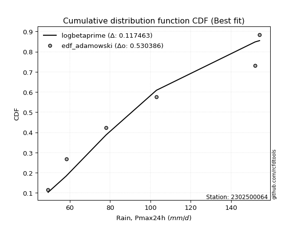</img>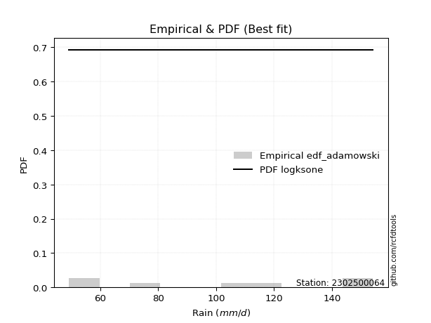</img>

</div>


## C. Best fit & Estimate extreme values for specific return periods - Tr

Best fit in probability distribution analysis means finding the theoretical distribution (like Normal, Poisson, Exponential, etc.) that most accurately mirrors your real-world data´s patterns (shape, center, spread) for better predictions, using methods like visual checks (Q-Q plots), goodness-of-fit tests (Kolmogorov-Smirnov, Chi-Squared), and information criteria (AIC) to score and select the simplest, most representative model.


### 1. Best fit (ordered by delta Δ)

:file_folder:Table: [bestfit_2302500064.csv](table/bestfit_2302500064.csv)

<div align="center">

|   id |    station | empirical_dist   | p_dist          |     delta |   deltao | eval   |   fit |   n |   best_fit |   best_fit_sort |
|-----:|-----------:|:-----------------|:----------------|----------:|---------:|:-------|------:|----:|-----------:|----------------:|
|    0 | 2302500064 | edf_filliben     | logksone        | 0.0654889 | 0.484421 | Δo > Δ |     1 |   7 |          1 |               1 |
|    1 | 2302500064 | edf_jenkinson    | logksone        | 0.0654889 | 0.484421 | Δo > Δ |     1 |   7 |          1 |               2 |
|    2 | 2302500064 | edf_chegodayev   | logksone        | 0.0654889 | 0.484421 | Δo > Δ |     1 |   7 |          1 |               3 |
|    3 | 2302500064 | edf_tukey        | logksone        | 0.0654889 | 0.484421 | Δo > Δ |     1 |   7 |          1 |               4 |
|    4 | 2302500064 | edf_beard        | logksone        | 0.0654889 | 0.484421 | Δo > Δ |     1 |   7 |          1 |               5 |
|    5 | 2302500064 | edf_adamowski    | logksone        | 0.0681128 | 0.484421 | Δo > Δ |     1 |   7 |          1 |               6 |
|    6 | 2302500064 | edf_blom         | logksone        | 0.0690697 | 0.484421 | Δo > Δ |     1 |   7 |          1 |               7 |
|    7 | 2302500064 | edf_cunnane      | logksone        | 0.0719432 | 0.484421 | Δo > Δ |     1 |   7 |          1 |               8 |
|    8 | 2302500064 | edf_gringorten   | logsemicircular | 0.0720567 | 0.484421 | Δo > Δ |     1 |   7 |          1 |               9 |
|    9 | 2302500064 | edf_hazen        | logsemicircular | 0.0724399 | 0.484421 | Δo > Δ |     1 |   7 |          1 |              10 |
|   10 | 2302500064 | edf_california   | logbeta         | 0.0780671 | 0.484421 | Δo > Δ |     1 |   7 |          1 |              11 |
|   11 | 2302500064 | edf_weibull      | logksone        | 0.0847795 | 0.484421 | Δo > Δ |     1 |   7 |          1 |              12 |

</div>


### 2. Extreme values and % difference analysis

In hydrology, a return period (or recurrence interval $Tr$) is the statistical average time between extreme events like floods or droughts of a specific magnitude, indicating how rare an event is, with a 100-year flood, for example, having a 1% chance of occurring in any given year, not that it happens exactly every century. It is a key tool for infrastructure design (like bridges or dams) and risk assessment, calculated from historical data to determine the probability of future events, although it is important to remember it is statistical average, and events can cluster or be missed.

The extreme value porcentage difference is evaluated as $pdiff = 1 - (ETrBf / ETr) * 100$, where _ETrBf_ correspond to the bestfit extreme value for a specific recurrence interval and _ETr_ correspond to the extreme value for one of the most used PDFsused in hydrology.

> risk_rate: assuming the return period as the project useful life.

:file_folder:Table: [extreme_2302500064.csv](table/extreme_2302500064.csv), all PDFs.  
:file_folder:Table: [extremepdiff_2302500064.csv](table/extremepdiff_2302500064.csv), % difference between bestfit and most used PDFs in Hydrology.

<div align="center">

Extreme values table for only best fit PDFs
|   id |      tr |   prob_l |     prob_g |    alpha |   anglit |   arcsine |   argus |     beta |   betaprime |   bradford |     burr |   burr12 |   cosine |   crystalball |   dgamma |   dweibull |   erlang |   exponnorm |   exponpow |   exponweib |        f |   fatiguelife |   foldnorm |   gamma |   gausshyper |   genexpon |       genextreme |   gengamma |   genhalflogistic |   genlogistic |   gennorm |   genpareto |   gompertz |   gumbel_l |   gumbel_r |   halfgennorm |   halflogistic |   halfnorm |   hypsecant |   invgamma |   invgauss |      invweibull |   johnsonsb |   johnsonsu |   kappa3 |   kappa4 |   ksone |   kstwobign |   laplace |   levy_l |   loggamma |   logistic |   loglaplace |    lomax |   maxwell |   mielke |    moyal |   nakagami |      ncf |     nct |    norm |   pearson3 |   powerlaw |   rayleigh |   rdist |     rice |   semicircular |   skewnorm |       t |   trapezoid |   triang |   truncexpon |   truncnorm |   truncpareto |   truncweibull_min |   tukeylambda |   uniform |   vonmises |   vonmises_line |     wald |   weibull_max |   weibull_min |   wrapcauchy |   logalpha |   loganglit |   logarcsine |   logargus |   logbeta |   logbetaprime |   logbradford |   logburr |   logburr12 |   logcosine |   logcrystalball |   logdgamma |   logdweibull |   logerlang |   logexponnorm |      logexponpow |   logexponweib |     logf |   logfatiguelife |   logfoldnorm |   loggausshyper |   loggenexpon |   loggenextreme |     loggengamma |   loggenhalflogistic |   loggenlogistic |   loggennorm |   loggenpareto |   loggompertz |   loggumbel_l |   loggumbel_r |   loghalfgennorm |   loghalflogistic |   loghalfnorm |   loghypsecant |   loginvgamma |   loginvgauss |   loginvweibull |   logjohnsonsb |   logjohnsonsu |   logkappa3 |   logkappa4 |   logksone |   logkstwobign |   loglevy_l |   logloggamma |   loglogistic |   logloglaplace |   loglomax |   logmaxwell |   logmielke |   logmoyal |   lognakagami |   logncf |   lognct |   lognorm |   logpearson3 |   logpowerlaw |   lograyleigh |   logrdist |   logrice |   logsemicircular |   logskewnorm |     logt |   logtrapezoid |   logtriang |   logtruncexpon |   logtruncnorm |   logtruncpareto |   logtruncweibull_min |   logtukeylambda |   loguniform |   logvonmises |   logvonmises_line |   logwald |   logweibull_max |   logweibull_min |   logwrapcauchy |    station |   n |   risk_rate |
|-----:|--------:|---------:|-----------:|---------:|---------:|----------:|--------:|---------:|------------:|-----------:|---------:|---------:|---------:|--------------:|---------:|-----------:|---------:|------------:|-----------:|------------:|---------:|--------------:|-----------:|--------:|-------------:|-----------:|-----------------:|-----------:|------------------:|--------------:|----------:|------------:|-----------:|-----------:|-----------:|--------------:|---------------:|-----------:|------------:|-----------:|-----------:|----------------:|------------:|------------:|---------:|---------:|--------:|------------:|----------:|---------:|-----------:|-----------:|-------------:|---------:|----------:|---------:|---------:|-----------:|---------:|--------:|--------:|-----------:|-----------:|-----------:|--------:|---------:|---------------:|-----------:|--------:|------------:|---------:|-------------:|------------:|--------------:|-------------------:|--------------:|----------:|-----------:|----------------:|---------:|--------------:|--------------:|-------------:|-----------:|------------:|-------------:|-----------:|----------:|---------------:|--------------:|----------:|------------:|------------:|-----------------:|------------:|--------------:|------------:|---------------:|-----------------:|---------------:|---------:|-----------------:|--------------:|----------------:|--------------:|----------------:|----------------:|---------------------:|-----------------:|-------------:|---------------:|--------------:|--------------:|--------------:|-----------------:|------------------:|--------------:|---------------:|--------------:|--------------:|----------------:|---------------:|---------------:|------------:|------------:|-----------:|---------------:|------------:|--------------:|--------------:|----------------:|-----------:|-------------:|------------:|-----------:|--------------:|---------:|---------:|----------:|--------------:|--------------:|--------------:|-----------:|----------:|------------------:|--------------:|---------:|---------------:|------------:|----------------:|---------------:|-----------------:|----------------------:|-----------------:|-------------:|--------------:|-------------------:|----------:|-----------------:|-----------------:|----------------:|-----------:|----:|------------:|
|    0 |    2    | 0.5      | 0.5        |  98.6373 |  101.743 |   101.743 | 107.206 |  96.0569 |     94.5295 |    92.4467 |  88.6772 |  76.8709 |  102.169 |       101.743 |   92.227 |    93.7605 |  100.989 |     101.741 |    85.1598 |     49.7457 |  76.5421 |       49.2005 |    101.537 | 101.093 |      94.6573 |    85.6499 |     53.2981      |    50.3674 |           111.986 |       94.8591 |     101.7 |     112.309 |    97.5482 |    108.181 |    95.3045 |       74.7041 |        92.1037 |    93.7207 |     101.743 |    97.7425 |    93.6775 |   567.559       |     49.3094 |     101.742 |  108.472 |  97.4471 | 101.743 |     94.1618 |   101.743 |  133.599 |    92.8206 |    101.743 |      93.6993 |  85.6005 |   98.3911 |  93.7225 |  93.226  |    90.3497 |  96.8034 | 101.735 | 101.743 |    101.211 |    50.8244 |    97.2023 | 101.891 |  98.9834 |        101.743 |    101.684 | 101.742 |     108.012 |  112.625 |      90.0406 |     101.743 |       49.8284 |            84.0079 |       101.503 |   101.7   |    2.70592 |         101.7   |  89.0391 |       153.842 |       81.0621 |      101.7   |    92.3288 |     93.6993 |      93.6995 |    101.82  |   94.7661 |         93.645 |       78.4557 |   109.194 |     99.8533 |     92.194  |          93.6993 |     89.8206 |       89.3448 |     92.7754 |        93.6993 |     52.0766      |        50.1205 |  93.8287 |           93.645 |       86.0986 |         81.3504 |       85.4523 |         125.561 |    50.5342      |              107.302 |          inf     |      87.1013 |         79.447 |       84.0064 |       100.346 |       87.4929 |           49.2   |           84.5617 |       86.03   |        93.6993 |       92.2866 |       90.6334 |         87.5304 |        149.474 |        146.414 |      49.2   |     92.4231 |    93.6993 |        85.6903 |     131.497 |       109.11  |       93.6993 |         103     |    76.8936 |      90.4152 |     69.9324 |    85.5784 |       50.6736 |  92.6909 |   93.803 |   93.6993 |       95.4062 |       50.393  |       89.2783 |    119.388 |   91.5999 |           93.6993 |       99.4793 |  93.7008 |        100.652 |     100.399 |         77.2569 |        91.5084 |          49.5971 |               81.0884 |          86.4878 |      87.1013 |      0.175563 |            86.6099 |   81.8486 |          123.607 |          98.4772 |         87.1014 | 2302500064 |   7 |    0.75     |
|    1 |    2.33 | 0.570815 | 0.429185   | 105.672  |  109.889 |   113.972 | 114.156 | 107.139  |    101.57   |    99.9141 |  96.0316 |  84.8907 |  109.157 |       108.736 |  107.569 |   109.358  |  107.988 |     108.734 |    92.6966 |     50.4864 |  85.535  |       51.0815 |    108.62  | 108.098 |     102.566  |    93.6804 |     64.0717      |    51.7821 |           120.199 |      102.038  |     101.7 |     122.819 |   105.004  |    114.266 |   101.785  |       84.3474 |        98.7665 |   101.268  |     107.34  |   104.807  |   100.944  | 16177.8         |     50.1619 |     108.768 |  116.866 | 105.315  | 111.357 |    101.371  |   105.975 |  139.923 |   100.089  |    107.905 |      98.017  |  93.6534 |  105.657  | 100.958  |  99.3604 |    99.709  | 104.01   | 108.731 | 108.736 |    108.22  |    52.803  |   104.576  | 112.726 | 106.074  |        110.48  |    108.678 | 108.736 |     116.062 |  119.498 |      97.2142 |     108.736 |       50.2682 |            91.4801 |       109.094 |   109.136 |    2.95938 |         109.135 |  93.6248 |       154.046 |       90.2885 |      125.066 |    99.6746 |    102.187  |     106.725  |    109.097 |  106.124  |        100.941 |       85.0913 |   116.765 |    107.018  |     99.3577 |         100.941  |    107.135  |      107.944  |    100.043  |       100.941  |     55.7208      |        51.1731 | 101.093  |          100.858 |       93.2132 |         88.8884 |       93.1246 |         131.946 |    52.2411      |              114.856 |          inf     |      87.1013 |        100.92  |       91.7528 |       107.06  |       93.7412 |           49.2   |           90.777  |       93.2273 |        99.4513 |       99.5305 |       97.8737 |         95.1506 |        152.666 |        150.136 |      49.2   |    100.442  |   103.796  |        93.1249 |     138.103 |       116.571 |      100.051  |         109.031 |    84.9435 |      97.6856 |     76.6603 |    91.353  |       52.6198 |  99.9005 |  101.062 |  100.941  |      102.695  |       51.7297 |       96.5677 |    139.867 |   98.9553 |          102.832  |      106.687  | 100.942  |        109.657 |     107.779 |         83.5647 |       100.092  |          49.8703 |               87.6503 |          94.1203 |      94.4404 |      0.188941 |            93.983  |   85.9428 |          134.055 |         105.644  |        106.99   | 2302500064 |   7 |    0.729209 |
|    2 |    5    | 0.8      | 0.2        | 133.593  |  138.63  |   146.581 | 136.446 | 140.832  |    132.162  |   126.834  | 134.499  | 139.143  |  134.337 |       134.726 |  129.07  |   132.028  |  134.434 |     134.725 |   125.426  |     70.7706 | 136.632  |       91.0315 |    134.942 | 134.559 |     130.205  |   133.831  |   4069.87        |    84.3611 |           141.427 |      133.222  |     101.7 |     146.798 |   134.026  |    133.922 |   129.938  |      154.91   |       128.914  |   133.187  |     129.79  |   133.378  |   132.926  |     4.93989e+10 |    150.886  |     134.879 |  144.035 | 131.516  | 142.47  |    131.996  |   127.135 |  150.4   |   133.047  |    131.696 |     122.778  | 134.095  |  134.254  | 133.245  | 127.775  |   141.361  | 133.647  | 134.728 | 134.726 |    134.561 |    76.6369 |   134.094  | 142.862 | 133.99   |        140.295 |    134.703 | 134.726 |     139.157 |  139.215 |     124.105  |     134.726 |       57.366  |           120.705  |       133.543 |   133.2   |    3.94832 |         133.199 | 119.296  |       154.196 |      142.638  |      147.748 |   133.965  |    138.76   |     151.013  |    133.789 |  140.797  |        133.607 |      114.168  |   138.626 |    134.548  |    130.111  |         133.111  |    133.162  |      135.055  |    132.975  |       133.111  |    172.767       |        65.0288 | 133.422  |          132.964 |      130.405  |        120.784  |      133.015  |         147.131 |    97.3245      |              137.442 |          inf     |      87.1013 |        147.377 |      130.796  |       131.977 |      126.497  |           49.2   |          125.127  |      130.949  |       126.298  |      132.873  |      132.369  |        136.744  |        154.178 |        153.849 |      49.2   |    129.098  |   144.549  |       132.604  |     149.786 |       137.975 |      128.886  |         146.467 |   140.231  |     132.444  |    109.627  |   123.618  |       85.8313 | 132.54   |  133.271 |  133.111  |      133.675  |       68.3826 |      132.218  |    213.412 |  133.026  |          141.241  |      130.793  | 133.113  |        140.218 |     132.103 |        111.869  |       150.707  |          54.278  |              115.623  |         123.428  |     122.705  |      0.248678 |           122.428  |  112.948  |          151.265 |         134.032  |        140.629  | 2302500064 |   7 |    0.67232  |
|    3 |   10    | 0.9      | 0.1        | 153.829  |  154.898 |   154.453 | 147.195 | 151.395  |    157.007  |   140.03   | 175.891  | inf      |  149.549 |       151.967 |  143.012 |   144.503  |  152.356 |     151.968 |   149.572  |    156.619  | 188.04   |      146.192  |    152.403 | 152.488 |     142.774  |   170.279  | 384708           |   204.63   |           148.535 |      158.617  |     101.7 |     152.205 |   153.173  |    144.865 |   152.868  |      253.832  |       153.95   |   156.806  |     147.717 |   154.567  |   159.019  |     9.47474e+15 |    154.184  |     152.2   |  155.889 | 143.166  | 156.046 |    155.313  |   146.343 |  152.929 |   161.332  |    149.217 |     150.632  | 171.067  |  154.38   | 160.599  | 152.515  |   173.173  | 155.866  | 151.976 | 151.967 |    152.296 |   104.917  |   155.141  | 151.135 | 153.474  |        155.594 |    151.999 | 151.967 |     148.178 |  146.917 |     138.165  |     151.967 |       74.7965 |           136.349  |       144.053 |   143.7   |    4.65796 |         143.7   | 146.538  |       154.2   |      196.83   |      151.285 |   164.682  |    164.995  |     164.213  |    146.312 |  150.535  |        161.134 |      131.948  |   147.22  |    153.365  |    153.134  |         159.926  |    152.717  |      151.526  |    161.205  |       159.925  |   2439.32        |        90.2235 | 160.436  |          159.803 |      167.184  |        138.109  |      172.751  |         151.502 |   520.565       |              146.284 |          inf     |      87.1013 |        153.287 |      166.601  |       148.282 |      161.467  |           49.2   |          163.341  |      168.38   |       152.853  |      162.126  |      164.127  |        183.732  |        154.199 |        154.131 |     137.768 |    142.316  |   167.023  |       173.549  |     152.752 |       146.334 |      155.313  |         194.571 |   222.177  |     164.086  |    131.725  |   160.862  |      169.503  | 160.496  |  160.072 |  159.926  |      157.868  |       92.8297 |      165.421  |    236.394 |  162.692  |          166.221  |      142.109  | 159.927  |        154.35  |     143.032 |        130.068  |       209.304  |          66.147  |              132.617  |         138.459  |     137.554  |      0.299493 |           137.4    |  150.943  |          153.613 |         154.198  |        147.87   | 2302500064 |   7 |    0.651322 |
|    4 |   15    | 0.933333 | 0.0666667  | 164.496  |  161.845 |   155.955 | 151.282 | 153.879  |    171.02   |   144.642  | 204.399  | inf      |  156.479 |       160.57  |  150.39  |   150.547  |  161.413 |     160.573 |   161.909  |    273.408  | 219.389  |      182.268  |    161.116 | 161.548 |     146.873  |   191.6    |      5.04217e+06 |   356.257  |           150.625 |      172.943  |     101.7 |     153.273 |   162.451  |    149.822 |   165.805  |      328.528  |       168.119  |   169.098  |     157.948 |   165.885  |   173.659  |     9.05955e+18 |    154.199  |     160.844 |  159.84  | 147.052  | 160.571 |    167.691  |   157.579 |  153.694 |   177.831  |    158.764 |     169.77   | 192.81   |  164.706  | 176.466  | 166.873  |   189.852  | 167.741  | 160.584 | 160.57  |    161.224 |   118.539  |   165.985  | 152.912 | 163.395  |        161.56  |    160.64  | 160.57  |     151.073 |  149.388 |     143.264  |     160.57  |       88.726  |           142.034  |       147.507 |   147.2   |    4.99193 |         147.2   | 164.033  |       154.2   |      230.81   |      152.291 |   183.15   |    177.658  |     166.858  |    151.162 |  152.515  |        176.996 |      138.807  |   149.984 |    162.867  |    164.931  |         175.264  |    164.088  |      159.997  |    177.66   |       175.263  |  26624.2         |       110.53   | 175.914  |          175.187 |      190.259  |        144.015  |      197.934  |         152.64  |  2790.23        |              149.064 |          inf     |      87.1013 |        153.921 |      187.675  |       156.315 |      185.307  |           49.2   |          189.931  |      191.916  |       170.439  |      179.455  |      183.559  |        217.05   |        154.2   |        154.17  |     143.123 |    146.62   |   175.265  |       200.199  |     153.66  |       149.015 |      171.925  |         231.45  |   291.47   |     183.151  |    140.543  |   187.425  |      255.764  | 176.786  |  175.383 |  175.263  |      171.103  |      107.069  |      185.663  |    241.062 |  180.064  |          177.119  |      146.042  | 175.265  |        159.18  |     146.727 |        137.331  |       250.018  |          77.1034 |              139.218  |         143.717  |     142.893  |      0.329215 |           142.787  |  181.837  |          153.964 |         164.613  |        150.019  | 2302500064 |   7 |    0.644736 |
|    5 |   20    | 0.95     | 0.05       | 171.701  |  165.932 |   156.484 | 153.525 | 154.869  |    180.846  |   146.989  | 226.999  | inf      |  160.741 |       166.205 |  155.408 |   154.473  |  167.385 |     166.209 |   170.018  |    404.642  | 242.045  |      208.978  |    166.823 | 167.521 |     148.869  |   206.727  |      3.05552e+07 |   519.445  |           151.61  |      182.975  |     101.7 |     153.662 |   168.397  |    152.907 |   174.864  |      389.555  |       178.045  |   177.292  |     165.166 |   173.583  |   183.865  |     1.10663e+21 |    154.2    |     166.504 |  161.816 | 148.99   | 162.834 |    176.03   |   165.551 |  154.085 |   189.621  |    165.362 |     184.806  | 208.288  |  171.559  | 187.766  | 177.041  |   200.995  | 175.808  | 166.221 | 166.205 |    167.098 |   126.328  |   173.193  | 153.585 | 169.948  |        164.869 |    166.302 | 166.205 |     152.501 |  150.607 |     145.901  |     166.205 |       98.9312 |           144.973  |       149.218 |   148.95  |    5.18431 |         148.95  | 177.069  |       154.2   |      255.804  |      152.777 |   196.593  |    185.556  |     167.8    |    153.842 |  153.232  |        188.248 |      142.436  |   151.349 |    169.122  |    172.633  |         186.097  |    172.267  |      165.683  |    189.412  |       186.096  | 214448           |       127.544  | 186.856  |          186.066 |      207.387  |        146.896  |      216.757  |         153.138 | 13333.1         |              150.414 |          inf     |      87.1013 |        154.08  |      202.678  |       161.533 |      204.064  |           49.2   |          211.1    |      209.409  |       184.05   |      191.955  |      197.849  |        243.912  |        154.2   |        154.182 |     145.879 |    148.709  |   179.538  |       220.422  |     154.126 |       150.338 |      184.435  |         262.688 |   353.742  |     197.011  |    145.267  |   208.85   |      340.194  | 188.419  |  186.19  |  186.096  |      180.205  |      116.062  |      200.468  |    242.73  |  192.488  |          183.469  |      148.043  | 186.098  |        161.618 |     148.585 |        141.234  |       282.099  |          86.1178 |              142.727  |         146.374  |     145.639  |      0.35056  |           145.56   |  208.904  |          154.076 |         171.551  |        151.071  | 2302500064 |   7 |    0.641514 |
|    6 |   25    | 0.96     | 0.04       | 177.12   |  168.701 |   156.729 | 154.971 | 155.371  |    188.43   |   148.411  | 246.065  | inf      |  163.729 |       170.352 |  159.203 |   157.353  |  171.803 |     170.357 |   175.986  |    543.203  | 259.814  |      230.2    |    171.023 | 171.939 |     150.04   |   218.46   |      1.22403e+08 |   686.781  |           152.18  |      190.701  |     101.7 |     153.847 |   172.704  |    155.102 |   181.841  |      441.67   |       185.693  |   183.389  |     170.752 |   179.401  |   191.7    |     4.4819e+22  |    154.2    |     170.671 |  163.002 | 150.149  | 164.192 |    182.276  |   171.735 |  154.331 |   198.839  |    170.41  |     197.38   | 220.324  |  176.647  | 196.579  | 184.923  |   209.293  | 181.893  | 170.371 | 170.352 |    171.437 |   131.341  |   178.549  | 153.914 | 174.798  |        167.016 |    170.472 | 170.352 |     153.351 |  151.333 |     147.513  |     170.352 |      106.528  |           146.768  |       150.238 |   150     |    5.30794 |         150     | 187.511  |       154.2   |      275.658  |      153.064 |   207.246  |    191.108  |     168.239  |    155.578 |  153.571  |        197     |      144.681  |   152.162 |    173.741  |    178.247  |         194.497  |    178.706  |      169.95   |    198.598  |       194.496  |      1.35265e+06 |       142.302  | 195.347  |          194.51  |      221.124  |        148.575  |      231.933  |         153.411 | 56673.8         |              151.21  |          inf     |      87.1013 |        154.138 |      214.342  |       165.352 |      219.797  |           49.2   |          229.006  |      223.451  |       195.325  |      201.796  |      209.256  |        266.849  |        154.2   |        154.188 |     147.557 |    149.929  |   182.151  |       236.896  |     154.42  |       151.127 |      194.616  |         290.38  |   411.311  |     207.974  |    148.208  |   227.128  |      422.096  | 197.512  |  194.566 |  194.497  |      187.128  |      122.207  |      212.228  |    243.508 |  202.204  |          187.71   |      149.256  | 194.498  |        163.088 |     149.703 |        143.671  |       308.936  |          93.4359 |              144.904  |         147.971  |     147.313  |      0.367334 |           147.249  |  233.462  |          154.124 |         176.717  |        151.698  | 2302500064 |   7 |    0.639603 |
|    7 |   50    | 0.98     | 0.02       | 193.208  |  175.518 |   157.057 | 158.251 | 156.138  |    211.927  |   151.285  | 315.318  | inf      |  171.555 |       182.229 |  170.577 |   165.566  |  184.551 |     182.237 |   192.991  |   1262.8    | 315.897  |      298.29   |    183.052 | 184.688 |     152.281  |   254.908  |      8.79936e+09 |  1512.93   |           153.26  |      214.502  |     101.7 |     154.105 |   184.688  |    161.061 |   203.334  |      631.548  |       209.258  |   201.112  |     188.07  |   196.804  |   215.703  |     4.01125e+27 |    154.2    |     182.604 |  165.373 | 152.455  | 166.907 |    200.617  |   190.943 |  154.884 |   228.024  |    185.832 |     242.159  | 257.876  |  191.402  | 224.334  | 209.391  |   233.428  | 200.022  | 182.255 | 182.229 |    183.929 |   142.186  |   194.095  | 154.39  | 188.787  |        171.92  |    182.422 | 182.23  |     155.04  |  152.774 |     150.808  |     182.229 |      126.192  |           150.433  |       152.255 |   152.1   |    5.57106 |         152.1   | 221.604  |       154.2   |      339.709  |      153.634 |   241.795  |    205.491  |     168.827  |    159.532 |  154.036  |        224.459 |      149.331  |   153.781 |    187.027  |    193.83   |         220.709  |    199.393  |      182.59   |    227.664  |       220.708  |      1.40806e+09 |       197.497  | 221.875  |          220.899 |      266.44   |        151.729  |      282.481  |         153.884 |     2.14558e+07 |              152.759 |          inf     |      87.1013 |        154.192 |      250.711  |       176.181 |      276.302  |           49.2   |          294.299  |      269.843  |       234.865  |      233.333  |      246.709  |        351.97   |        154.2   |        154.196 |     150.972 |    152.253  |   187.492  |       292.741  |     155.083 |       152.691 |      229.336  |         401.08  |   659.196  |     243.345  |    154.344  |   294.702  |      796.858  | 226.282  |  220.678 |  220.708  |      208.024  |      136.532  |      250.421  |    244.554 |  232.95   |          197.769  |      151.708  | 220.709  |        166.046 |     151.946 |        148.773  |       404.171  |         115.114  |              149.43   |         151.151  |     150.717  |      0.421099 |           150.686  |  335.597  |          154.183 |         191.77   |        152.948  | 2302500064 |   7 |    0.63583  |
|    8 |   75    | 0.986667 | 0.0133333  | 202.206  |  178.518 |   157.117 | 159.552 | 156.312  |    225.715  |   152.252  | 364.129  | inf      |  175.292 |       188.602 |  177.003 |   169.962  |  191.451 |     188.612 |   202.025  |   1966.51   | 349.207  |      339.297  |    189.506 | 191.588 |     152.982  |   276.229  |      1.05587e+11 |  2283.22   |           153.598 |      228.336  |     101.7 |     154.156 |   190.898  |    164.074 |   215.827  |      763.309  |       222.956  |   210.759  |     198.19  |   206.619  |   229.569  |     3.03016e+30 |    154.2    |     189.006 |  166.163 | 153.216  | 167.812 |    210.708  |   202.179 |  155.111 |   245.564  |    194.739 |     272.925  | 279.959  |  199.424  | 240.896  | 223.699  |   246.567  | 210.183  | 188.632 | 188.602 |    190.673 |   146.056  |   202.552  | 154.49  | 196.348  |        173.879 |    188.839 | 188.603 |     155.599 |  153.251 |     151.927  |     188.602 |      134.429  |           151.677  |       152.917 |   152.8   |    5.66232 |         152.8   | 242.584  |       154.2   |      378.704  |      153.823 |   263.153  |    212.159  |     168.936  |    161.107 |  154.125  |        240.789 |      150.929  |   154.331 |    194.187  |    201.745  |         236.201  |    212.072  |      189.655  |    245.121  |       236.199  |      1.89143e+11 |       236.958  | 237.575  |          236.525 |      294.898  |        152.68   |      314.585  |         154.014 |     2.09599e+09 |              153.258 |          inf     |      87.1013 |        154.198 |      272.072  |       181.924 |      315.601  |           49.2   |          340.5    |      299.027  |       261.58   |      252.559  |      270.189  |        413.422  |        154.2   |        154.198 |     152.128 |    152.972  |   189.307  |       328.897  |     155.357 |       153.209 |      252.145  |         488.601 |   870.67   |     265.038  |    156.467  |   343.185  |     1128.13   | 243.562  |  236.095 |  236.2    |      219.903  |      142.007  |      274.011  |    244.749 |  251.401  |          201.937  |      152.535  | 236.201  |        167.036 |     152.696 |        150.544  |       469.026  |         125.515  |              150.992  |         152.196  |     151.869  |      0.454021 |           151.849  |  419.565  |          154.193 |         200.001  |        153.365  | 2302500064 |   7 |    0.634587 |
|    9 |  100    | 0.99     | 0.01       | 208.445  |  180.302 |   157.139 | 160.278 | 156.38   |    235.547  |   152.737  | 403.151  | inf      |  177.634 |       192.913 |  181.482 |   172.934  |  196.141 |     192.923 |   208.087  |   2637.59   | 373.024  |      368.803  |    193.872 | 196.279 |     153.318  |   291.356  |      6.12916e+11 |  2997.66   |           153.76  |      238.128  |     101.7 |     154.174 |   195.011  |    166.046 |   224.669  |      866.55   |       232.652  |   217.331  |     205.369 |   213.455  |   239.35   |     3.30016e+32 |    154.2    |     193.337 |  166.561 | 153.595  | 168.264 |    217.622  |   210.151 |  155.244 |   258.25   |    201.028 |     297.097  | 295.681  |  204.888  | 252.814  | 233.85   |   255.516  | 217.23   | 192.945 | 192.913 |    195.25  |   148.041  |   208.314  | 154.527 | 201.481  |        174.976 |    193.182 | 192.913 |     155.877 |  153.489 |     152.491  |     192.913 |      138.931  |           152.303  |       153.245 |   153.15  |    5.70838 |         153.15  | 257.88   |       154.2   |      407      |      153.917 |   278.877  |    216.227  |     168.974  |    161.989 |  154.157  |        252.524 |      151.738  |   154.62  |    199.04   |    206.87   |         247.29   |    221.365  |      194.553  |    257.741  |       247.289  |      8.77073e+12 |       268.502  | 248.824  |          247.724 |      316.006  |        153.125  |      338.566  |         154.073 |     9.27673e+10 |              153.503 |          inf     |      87.1013 |        154.199 |      287.264  |       185.781 |      346.747  |           49.2   |          377.519  |      320.695  |       282.353  |      266.588  |      287.62   |        463.296  |        154.2   |        154.199 |     152.71  |    153.316  |   190.222  |       356.215  |     155.517 |       153.467 |      269.601  |         564.265 |  1061.81   |     280.911  |    157.545  |   382.346  |     1429.29   | 256.055  |  247.125 |  247.29   |      228.205  |      144.894  |      291.344  |    244.817 |  264.729  |          204.309  |      152.949  | 247.29   |        167.533 |     153.072 |        151.444  |       519.545  |         131.566  |              151.784  |         152.713  |     152.449  |      0.478178 |           152.434  |  493.751  |          154.196 |         205.627  |        153.574  | 2302500064 |   7 |    0.633968 |
|   10 |  200    | 0.995    | 0.005      | 223.074  |  183.673 |   157.159 | 161.54  | 156.457  |    259.49   |   153.467  | 514.875  | inf      |  182.397 |       202.69  |  192.051 |   179.675  |  206.853 |     202.704 |   221.666  |   5031.6    | 430.932  |      441.028  |    203.774 | 206.99  |     153.795  |   327.804  |      4.20364e+13 |  5451.73   |           153.994 |      261.667  |     101.7 |     154.193 |   204.078  |    170.33  |   245.926  |     1150.23   |       255.96   |   232.362  |     222.664 |   229.583  |   262.771  |     2.60528e+37 |    154.2    |     203.159 |  167.18  | 154.158  | 168.943 |    233.546  |   229.359 |  155.495 |   289.724  |    216.113 |     364.498  | 333.74   |  217.39   | 282.142  | 258.307  |   275.973  | 233.742  | 202.729 | 202.69  |    205.682 |   151.082  |   221.498  | 154.566 | 213.172  |        176.889 |    203.039 | 202.691 |     156.295 |  153.846 |     153.342  |     202.69  |      146.215  |           153.248  |       153.731 |   153.675 |    5.77783 |         153.675 | 295.98   |       154.2   |      477.166  |      154.059 |   318.88   |    224.125  |     169.011  |    163.523 |  154.189  |        281.38  |      152.963  |   155.121 |    210.076  |    217.695  |         274.414  |    244.876  |      206.045  |    289.034  |       274.412  |      2.92732e+17 |       357.944  | 276.37   |          275.159 |      370.137  |        153.734  |      400.679  |         154.149 |     6.1594e+15  |              153.863 |          inf     |      87.1013 |        154.2   |      323.981  |       194.45  |      434.793  |          153.335 |          483.836  |      376.34   |       339.426  |      301.834  |      332.481  |        609.221  |        154.2   |        154.199 |     153.586 |    153.799  |   191.601  |       428.081  |     155.82  |       153.853 |      316.563  |         809.429 |  1719.05   |     320.894  |    159.205  |   496.044  |     2450.53   | 287.038  |  274.077 |  274.413  |      247.849  |      149.421  |      335.238  |    244.883 |  297.716  |          208.511  |      153.573  | 274.414  |        168.278 |     153.636 |        152.812  |       658.148  |         141.941  |              152.984  |         153.476  |     153.322  |      0.539592 |           153.316  |  740.687  |          154.199 |         218.56   |        153.887  | 2302500064 |   7 |    0.633042 |
|   11 |  250    | 0.996    | 0.004      | 227.682  |  184.53  |   157.162 | 161.835 | 156.468  |    267.291  |   153.614  | 556.983  | inf      |  183.702 |       205.678 |  195.396 |   181.735  |  210.147 |     205.693 |   225.764  |   6094.18   | 449.71   |      464.567  |    206.8   | 210.283 |     153.885  |   339.537  |      1.63661e+14 |  6509.52   |           154.038 |      269.234  |     101.7 |     154.195 |   206.777  |    171.59  |   252.76   |     1252.5    |       263.454  |   236.986  |     228.232 |   234.69   |   270.277  |     9.77848e+38 |    154.2    |     206.161 |  167.317 | 154.27   | 169.079 |    238.475  |   235.543 |  155.561 |   300.149  |    220.956 |     389.298  | 346.047  |  221.238  | 291.777  | 266.181  |   282.263  | 238.935  | 205.719 | 205.678 |    208.884 |   151.699  |   225.556  | 154.572 | 216.758  |        177.337 |    206.053 | 205.679 |     156.378 |  153.917 |     153.513  |     205.678 |      147.754  |           153.438  |       153.827 |   153.78  |    5.79175 |         153.78  | 308.585  |       154.2   |      500.319  |      154.087 |   332.439  |    226.181  |     169.015  |    163.882 |  154.193  |        290.86  |      153.21   |   155.248 |    213.456  |    220.76   |         283.282  |    252.809  |      209.667  |    299.393  |       283.28   |      1.17273e+19 |       391.176  | 285.386  |          284.143 |      388.586  |        153.844  |      422.039  |         154.162 |     4.10752e+17 |              153.933 |          inf     |      87.1013 |        154.2   |      335.833  |       197.077 |      467.6    |          153.511 |          524.011  |      395.328  |       360.15   |      313.643  |      347.843  |        665.281  |        154.2   |        154.2   |     153.761 |    153.889  |   191.878  |       453.133  |     155.9   |       153.931 |      333.311  |         913.058 |  2009.67   |     334.312  |    159.558  |   539.409  |     2890.39   | 297.297  |  282.882 |  283.281  |      254.08   |      150.356  |      350.037  |    244.891 |  308.615  |          209.509  |      153.699  | 283.281  |        168.428 |     153.748 |        153.088  |       708.27   |         144.229  |              153.226  |         153.625  |     153.497  |      0.560465 |           153.493  |  847.038  |          154.199 |         222.559  |        153.949  | 2302500064 |   7 |    0.632858 |
|   12 |  500    | 0.998    | 0.002      | 241.749  |  186.657 |   157.165 | 162.514 | 156.484  |    291.873  |   153.907  | 710.855  | inf      |  187.177 |       214.538 |  205.641 |   187.85   |  219.968 |     214.557 |   237.762  |  10586.4    | 508.393  |      538.406  |    215.773 | 220.102 |     154.056  |   375.985  |      1.11218e+16 | 10852.3    |           154.124 |      292.722  |     101.7 |     154.199 |   214.588  |    175.204 |   273.97   |     1605.95   |       286.712  |   250.774  |     245.525 |   250.352  |   293.517  |     7.53249e+43 |    154.2    |     215.063 |  167.646 | 154.492  | 169.35  |    253.243  |   254.751 |  155.73  |   333.511  |    235.976 |     477.617  | 384.445  |  232.721  | 322.343  | 290.637  |   301.006  | 254.745  | 214.586 | 214.538 |    218.415 |   152.943  |   237.665  | 154.579 | 227.42   |        178.37  |    214.997 | 214.54  |     156.544 |  154.059 |     153.856  |     214.538 |      150.917  |           153.819  |       154.016 |   153.99  |    5.81962 |         153.99  | 348.664  |       154.2   |      573.869  |      154.144 |   376.86   |    231.36   |     169.021  |    164.71  |  154.198  |        320.955 |      153.705  |   155.586 |    223.495  |    229.129  |         311.301  |    278.689  |      220.726  |    332.528  |       311.299  |      2.99156e+24 |       510.053  | 313.902  |          312.567 |      449.234  |        154.046  |      492.885  |         154.184 |     1.50747e+24 |              154.071 |          154.05  |      87.1013 |        154.2   |      372.739  |       204.805 |      586.043  |          153.862 |          671.221  |      457.82   |       432.943  |      351.875  |      398.673  |        874.306  |        154.2   |        154.2   |     154.114 |    154.059  |   192.433  |       537.339  |     156.104 |       154.085 |      391.098  |        1346.16  |  3275.87   |     377.779  |    160.363  |   699.809  |     4716.5    | 330.117  |  310.68  |  311.3    |      273.187  |      152.257  |      398.191  |    244.902 |  343.396  |          211.826  |      153.949  | 311.3    |        168.727 |     153.974 |        153.643  |       882.952  |         149.044  |              153.712  |         153.92   |     153.848  |      0.629364 |           153.848  | 1297.7    |          154.2   |         234.543  |        154.075  | 2302500064 |   7 |    0.632489 |
|   13 |  750    | 0.998667 | 0.00133333 | 249.833  |  187.599 |   157.165 | 162.787 | 156.488  |    306.528  |   154.004  | 819.787  | inf      |  188.861 |       219.46  |  211.544 |   191.25   |  225.459 |     219.481 |   244.322  |  14242.4    | 542.936  |      582.034  |    220.758 | 225.592 |     154.109  |   397.306  |      1.31007e+17 | 14282.1    |           154.151 |      306.453  |     101.7 |     154.199 |   218.805  |    177.135 |   286.37   |     1838.84   |       300.309  |   258.476  |     255.641 |   259.399  |   307.072  |     5.41598e+46 |    154.2    |     220.008 |  167.798 | 154.565  | 169.441 |    261.54   |   265.987 |  155.81  |   353.751  |    244.751 |     538.299  | 407.027  |  239.144  | 340.683  | 304.944  |   311.469  | 263.796  | 219.512 | 219.46  |    223.734 |   153.361  |   244.436  | 154.581 | 233.361  |        178.786 |    219.969 | 219.463 |     156.6   |  154.106 |     153.971  |     219.46  |      151.998  |           153.946  |       154.079 |   154.06  |    5.82892 |         154.06  | 372.694  |       154.2   |      617.978  |      154.162 |   404.565  |    233.69   |     169.022  |    165.043 |  154.199  |        339.042 |      153.87   |   155.76  |    229.083  |    233.298  |         328.047  |    294.758  |      227.082  |    352.618  |       328.044  |      8.39091e+27 |       591.79   | 330.966  |          329.585 |      487.147  |        154.106  |      537.631  |         154.191 |     4.76573e+28 |              154.115 |          154.101 |      87.1013 |        154.2   |      394.388  |       209.059 |      668.732  |          153.979 |          775.755  |      496.938  |       482.165  |      375.389  |      430.739  |       1025.72   |        154.2   |        154.2   |     154.231 |    154.111  |   192.619  |       591.332  |     156.201 |       154.136 |      429.39   |        1706.62  |  4370.24   |     404.51   |    160.716  |   814.922  |     6189.69   | 350.022  |  327.278 |  328.045  |      284.212  |      152.9    |      427.951  |    244.904 |  364.419  |          212.765  |      154.033  | 328.045  |        168.826 |     154.05  |        153.829  |       999.639  |         150.723  |              153.874  |         154.016  |     153.965  |      0.672946 |           153.966  | 1675.95   |          154.2   |         241.279  |        154.117  | 2302500064 |   7 |    0.632366 |
|   14 | 1000    | 0.999    | 0.001      | 255.515  |  188.16  |   157.166 | 162.94  | 156.49   |    317.061  |   154.053  | 907.026  | inf      |  189.923 |       222.849 |  215.698 |   193.592  |  229.254 |     222.871 |   248.794  |  17398.5    | 567.53   |      613.154  |    224.191 | 229.386 |     154.134  |   412.433  |      7.53497e+17 | 17190.4    |           154.164 |      316.192  |     101.7 |     154.2   |   221.659  |    178.435 |   295.166  |     2016.26   |       309.953  |   263.795  |     262.819 |   265.777  |   316.676  |     5.75536e+48 |    154.2    |     223.413 |  167.896 | 154.601  | 169.486 |    267.288  |   273.959 |  155.861 |   368.452  |    250.974 |     585.973  | 423.102  |  243.583  | 353.907  | 315.094  |   318.691  | 270.139  | 222.904 | 222.849 |    227.406 |   153.57   |   249.115  | 154.581 | 237.458  |        179.02  |    223.393 | 222.852 |     156.628 |  154.13  |     154.028  |     222.849 |      152.543  |           154.009  |       154.11  |   154.095 |    5.83357 |         154.095 | 389.98   |       154.2   |      649.734  |      154.172 |   425.045  |    235.091  |     169.023  |    165.23  |  154.2    |        352.102 |      153.953  |   155.878 |    232.934  |    235.967  |         340.097  |    306.603  |      231.551  |    367.204  |       340.094  |      3.09712e+30 |       655.875  | 343.255  |          341.844 |      515.181  |        154.134  |      570.933  |         154.194 |     1.51139e+32 |              154.137 |          154.127 |      87.1013 |        154.2   |      409.774  |       211.972 |      734.367  |          154.038 |          859.633  |      525.887  |       520.447  |      392.617  |      454.608  |       1148.78   |        154.2   |        154.2   |     154.291 |    154.136  |   192.712  |       631.888  |     156.262 |       154.162 |      458.797  |        2029.07  |  5367.77   |     424.083  |    160.937  |   907.905  |     7462.31   | 364.477  |  339.215 |  340.095  |      291.974  |      153.223  |      449.806  |    244.904 |  379.651  |          213.295  |      154.075  | 340.095  |        168.876 |     154.087 |        153.922  |      1089.51   |         151.577  |              153.955  |         154.063  |     154.024  |      0.70557  |           154.025  | 2014.5    |          154.2   |         245.949  |        154.138  | 2302500064 |   7 |    0.632305 |


</div>


<div align="center">

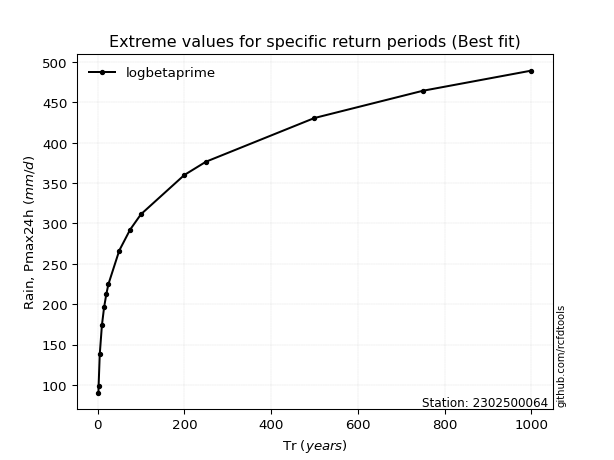</img>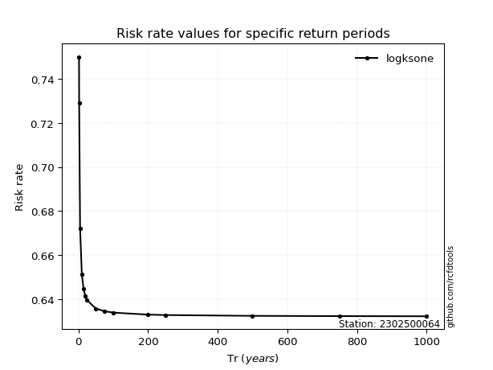</img>

</div>


<sub>**APP DISCLAIMER**: NO WARRANTY - This software is provided by [github.com/rcfdtools](https://github.com/rcfdtools) "as is", without any express or implied warranty, including warranties of merchantability, fitness for a particular purpose, or non-infringement. There is no guarantee that the software will be error-free or operate without interruption. LIMITATION OF LIABILITY - Neither the authors nor copyright holders will be liable for claims or damages arising from the software or its use. You are responsible for determining if the software is appropriate for your use and assume all associated risks, including errors, legal compliance, and data loss. NO PROFESSIONAL ADVICE - The software provides general information and does not offer professional advice. It should not replace consultation with professional advisors.</sub>