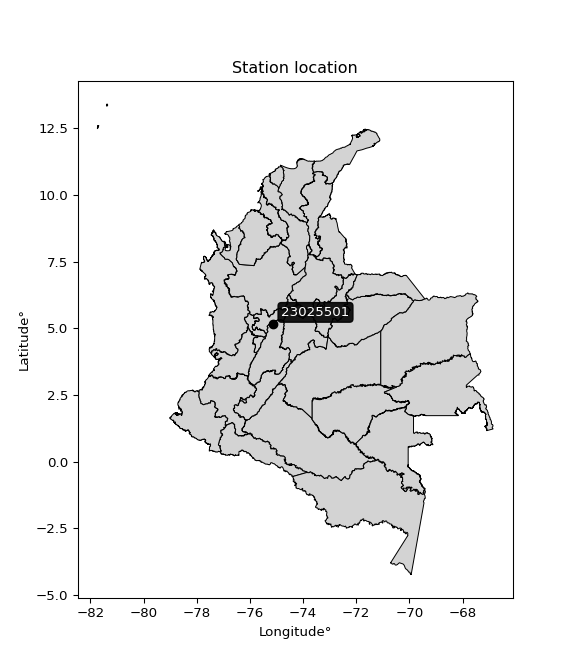

<div align="center">


</div>

# PMP Station (Rain, Pmax24h): 23025501

Probable Maximum Precipitation (PMP) is the greatest amount of rainfall for a specific duration that is meteorologically possible for a given location, acting as a "worst-case" scenario for extreme storms, crucial for designing safety-critical infrastructure like bridges, river deviations, dams, spillways, and nuclear plants to prevent catastrophic failure. PMP is calculated by hydrologists using meteorological data to determine the upper limit of extreme rainfall, often leading to the Probable Maximum Flood (PMF) for flood control design, and is increasingly being studied for climate change impacts.

<div align="center">

</img>

</div>


## A. General information


### 1. General running parameters

• app_version: _v20260103_. • runtime: _2026-01-03 07:24:50.581521_. • Python version: _3.14.0_. • SciPy version: _1.16.3_. • Pandas version: _2.3.3_. • NumPy version: _2.3.5_. • Stations dataset (station_dataset_file): _dataset/pmax24h_in/automatic_colombia_2003_2024.csv_. • Stations catalog (station_catalog_file): _dataset/CNE.xls_. • Minimum year to eval til year_max (date_min): _1900_. • Maximum year to eval since year_min (date_max): _2024_. • Creates, save and include plots into reports (create_plot): _False_. • Plot only fit distributions with Δo > Δ (plot_only_fit): _True_. • Eval low extreme values, if False, evaluates high extreme values (low_extreme): _False_. • Eval every SciPy distribution as logarithmic (pdist_logarithmic_on): _True_. • Standard deviation normalized (ddof): _1.0_. • Return periods to eval in years (Tr): _[2, 2.33, 5, 10, 15, 20, 25, 50, 75, 100, 200, 250, 500, 750, 1000]_. • Minimum data sample per station, 0 means any (minimum_sample): _5_. • Z-Score maximum threshold to adjust a value, 0 means disable (zscore_max): _3.5_. • Z-Score minimum threshold to adjust a value, 0 means disable (zscore_min): _-2.5_. • Avoid zeros, e.g. rain = 0 (avoid_zeros): _True_. • Avoid null values (avoid_nans): _True_. [:file_folder:Dataset file.](../../dataset/pmax24h_in/automatic_colombia_2003_2024.csv)

> Delta Degrees of Freedom (DDOF): is a parameter used in the formulas for calculating variance and standard deviation. When ddof=0, the divisor is $N$ (the total number of observations) and this is used when your data set is the entire population. When ddof=1, the divisor is $N-1$ and this is used when your data set is a sample drawn from a larger population. Using $N-1$ provides an unbiased estimate of the population variance (known as Bessel´s correction).


### 2. Station info and location

|   id |   CODIGO | NOMBRE                        | CATEGORIA               | TECNOLOGIA                | ESTADO   | FECHA_INSTALACION   |   FECHA_SUSPENSION |   ALTITUD |   LATITUD |   LONGITUD | DEPARTAMENTO   | MUNICIPIO   | AREA_OPERATIVA             | ENTIDAD                                    | AREA_HIDROGRAFICA   | ZONA_HIDROGRAFICA   | SUBZONA_HIDROGRAFICA   |   CORRIENTE | Catalogo   |   Version |
|-----:|---------:|:------------------------------|:------------------------|:--------------------------|:---------|:--------------------|-------------------:|----------:|----------:|-----------:|:---------------|:------------|:---------------------------|:-------------------------------------------|:--------------------|:--------------------|:-----------------------|------------:|:-----------|----------:|
|    0 | 23025501 | MANZANARES  - AUT  [23025501] | Climatológica Principal | Automática con Telemetría | Activa   | 01/03/2014          |                nan |       999 |   5.16391 |   -75.1174 | Caldas         | Manzanares  | Area Operativa 10 - Tolima | CENTRO NACIONAL DE INVESTIGACIONES DE CAFE | Magdalena Cauca     | Medio Magdalena     | Río Guarinó            |         nan | CNE_OE     |  20251226 |

<div align="center">

Dynamic map: [:earth_americas:Google](http://maps.google.com/maps?q=5.163913889,-75.11740833) [:earth_americas:OSM](https://www.openstreetmap.org/#map=18/5.163913889/-75.11740833&layers=P) [:earth_americas:Bing](https://www.bing.com/maps?cp=5.163913889~-75.11740833&lvl=18) [:earth_americas:Apple](https://maps.apple.com/frame?center=5.163913889%2C-75.11740833&span=0.003%2C0.006)

</div>


<div align="center">

```geojson
{
  "type": "Feature",
  "geometry": {
    "type": "Point", 
    "coordinates": [-75.11740833, 5.163913889]
  }, 
  "properties": {
    "Name": "23025501"
  }
}
```

</div>


### 3. Discrete values table and plot

<div align="center">

|               |           0 |           1 |          2 |           3 |           4 |           5 |          6 |           7 |
|:--------------|------------:|------------:|-----------:|------------:|------------:|------------:|-----------:|------------:|
| Date          | 2016        | 2017        | 2018       | 2019        | 2020        | 2021        | 2022       | 2023        |
| Value         |   61.2      |   85.5      |  110.8     |   89.1      |   68.6      |   69.9      |   51.1     |   66.2      |
| Value_initial |   61.2      |   85.5      |  110.8     |   89.1      |   68.6      |   69.9      |   51.1     |   66.2      |
| count         |    8        |    8        |    8       |    8        |    8        |    8        |    8       |    8        |
| mean          |   75.3      |   75.3      |   75.3     |   75.3      |   75.3      |   75.3      |   75.3     |   75.3      |
| std           |   18.8833   |   18.8833   |   18.8833  |   18.8833   |   18.8833   |   18.8833   |   18.8833  |   18.8833   |
| zscore        |   -0.746693 |    0.540161 |    1.87997 |    0.730806 |   -0.354812 |   -0.285968 |   -1.28156 |   -0.481909 |


</div>


> The initial value (value_initial) correspond to the initial obtained or null completed value, and value (value) is adjusted only when the initial value is outside the valid range definite through the Z-Score value. If Z-Score is active, values out of range or outliers are replaced with the station mean value


### 4. Active continuous probability distributions from SciPy (44 of 104 available)

A Probability Density Function (PDF) describes the relative likelihood of a continuous random variable falling within a specific range, where the total area under its curve equals 1, and the area over any interval gives the actual probability for that range. Unlike discrete probabilities (like rolling a die), a PDF shows density, not direct probability for a single point (which is zero), with higher points indicating higher likelihood, often visualized as a bell curve for normal distributions.

A log of a probability density function (log-PDF) is simply the logarithm of the PDF´s value, denoted as $log(f(x))$, useful for converting multiplication of probabilities into addition, improving numerical stability with tiny numbers, and connecting to information theory concepts like entropy. Instead of dealing with very small probabilities (e.g., 0.000001), log-PDFs use negative numbers (e.g., $log(0.00001) ≈ -11.51$ that are easier for computers to handle, preventing underflow errors and simplifying complex calculations. In this study, each active probability distribution from SciPy is also evaluated in the $log$ form.

[scipy.stats](https://docs.scipy.org/doc/scipy/reference/stats.html) is a Python´s powerful submodule within the SciPy library for comprehensive statistical analysis, offering over 130 probability distributions (like Normal, Poisson), functions for descriptive stats (mean, variance), hypothesis testing (t-tests, chi-square), random variable generation, and statistical tests, making it essential for data science, modeling, and research. It provides tools to explore, model, and draw conclusions from data efficiently, working seamlessly with NumPy.

<div align="center">

|   id | p_dist             |   n_parameter | fit_method   | label                                                                       | active   | ref                                                                                                        |
|-----:|:-------------------|--------------:|:-------------|:----------------------------------------------------------------------------|:---------|:-----------------------------------------------------------------------------------------------------------|
|    0 | alpha              |             3 | MLE          | Alpha                                                                       | True     | [:mortar_board:](https://docs.scipy.org/doc/scipy/reference/generated/scipy.stats.alpha.html)              |
|    1 | betaprime          |             4 | MLE          | Beta prime                                                                  | True     | [:mortar_board:](https://docs.scipy.org/doc/scipy/reference/generated/scipy.stats.betaprime.html)          |
|    2 | chi2               |             3 | MLE          | Chi²                                                                        | True     | [:mortar_board:](https://docs.scipy.org/doc/scipy/reference/generated/scipy.stats.chi2.html)               |
|    3 | crystalball        |             4 | MLE          | Crystalball                                                                 | True     | [:mortar_board:](https://docs.scipy.org/doc/scipy/reference/generated/scipy.stats.crystalball.html)        |
|    4 | erlang             |             3 | MLE          | Erlang                                                                      | True     | [:mortar_board:](https://docs.scipy.org/doc/scipy/reference/generated/scipy.stats.erlang.html)             |
|    5 | expon              |             2 | MLE          | Exponential                                                                 | True     | [:mortar_board:](https://docs.scipy.org/doc/scipy/reference/generated/scipy.stats.expon.html)              |
|    6 | exponnorm          |             3 | MLE          | Exponentially modified Normal                                               | True     | [:mortar_board:](https://docs.scipy.org/doc/scipy/reference/generated/scipy.stats.exponnorm.html)          |
|    7 | f                  |             4 | MLE          | F                                                                           | True     | [:mortar_board:](https://docs.scipy.org/doc/scipy/reference/generated/scipy.stats.f.html)                  |
|    8 | fatiguelife        |             3 | MLE          | Fatigue-life (Birnbaum-Saunders)                                            | True     | [:mortar_board:](https://docs.scipy.org/doc/scipy/reference/generated/scipy.stats.fatiguelife.html)        |
|    9 | fisk               |             3 | MLE          | Fisk                                                                        | True     | [:mortar_board:](https://docs.scipy.org/doc/scipy/reference/generated/scipy.stats.fisk.html)               |
|   10 | gamma              |             3 | MLE          | Gamma                                                                       | True     | [:mortar_board:](https://docs.scipy.org/doc/scipy/reference/generated/scipy.stats.gamma.html)              |
|   11 | genexpon           |             5 | MLE          | Generalized exponential                                                     | True     | [:mortar_board:](https://docs.scipy.org/doc/scipy/reference/generated/scipy.stats.genexpon.html)           |
|   12 | genlogistic        |             3 | MLE          | Generalized logistic                                                        | True     | [:mortar_board:](https://docs.scipy.org/doc/scipy/reference/generated/scipy.stats.genlogistic.html)        |
|   13 | gibrat             |             2 | MM           | Gibrat                                                                      | True     | [:mortar_board:](https://docs.scipy.org/doc/scipy/reference/generated/scipy.stats.gibrat.html)             |
|   14 | gompertz           |             3 | MLE          | Gompertz (or truncated Gumbel)                                              | True     | [:mortar_board:](https://docs.scipy.org/doc/scipy/reference/generated/scipy.stats.gompertz.html)           |
|   15 | gumbel_l           |             2 | MM           | Gumbel Left Skew                                                            | True     | [:mortar_board:](https://docs.scipy.org/doc/scipy/reference/generated/scipy.stats.gumbel_l.html)           |
|   16 | gumbel_r           |             2 | MM           | Gumbel Right Skew                                                           | True     | [:mortar_board:](https://docs.scipy.org/doc/scipy/reference/generated/scipy.stats.gumbel_r.html)           |
|   17 | halflogistic       |             2 | MM           | Half-logistic                                                               | True     | [:mortar_board:](https://docs.scipy.org/doc/scipy/reference/generated/scipy.stats.halflogistic.html)       |
|   18 | halfnorm           |             2 | MM           | Half Normal                                                                 | True     | [:mortar_board:](https://docs.scipy.org/doc/scipy/reference/generated/scipy.stats.halfnorm.html)           |
|   19 | hypsecant          |             2 | MM           | hyperbolic secant                                                           | True     | [:mortar_board:](https://docs.scipy.org/doc/scipy/reference/generated/scipy.stats.hypsecant.html)          |
|   20 | invgamma           |             3 | MLE          | Inverted gamma                                                              | True     | [:mortar_board:](https://docs.scipy.org/doc/scipy/reference/generated/scipy.stats.invgamma.html)           |
|   21 | invgauss           |             3 | MLE          | Inverse Gaussian                                                            | True     | [:mortar_board:](https://docs.scipy.org/doc/scipy/reference/generated/scipy.stats.invgauss.html)           |
|   22 | invweibull         |             3 | MLE          | Inverted Weibull                                                            | True     | [:mortar_board:](https://docs.scipy.org/doc/scipy/reference/generated/scipy.stats.invweibull.html)         |
|   23 | johnsonsu          |             4 | MLE          | Johnson Su                                                                  | True     | [:mortar_board:](https://docs.scipy.org/doc/scipy/reference/generated/scipy.stats.johnsonsu.html)          |
|   24 | kstwobign          |             2 | MLE          | Limiting distribution of scaled Kolmogorov-Smirnov two-sided test statistic | True     | [:mortar_board:](https://docs.scipy.org/doc/scipy/reference/generated/scipy.stats.kstwobign.html)          |
|   25 | laplace            |             2 | MM           | Laplace                                                                     | True     | [:mortar_board:](https://docs.scipy.org/doc/scipy/reference/generated/scipy.stats.laplace.html)            |
|   26 | laplace_asymmetric |             3 | MLE          | Asymmetric Laplace                                                          | True     | [:mortar_board:](https://docs.scipy.org/doc/scipy/reference/generated/scipy.stats.laplace_asymmetric.html) |
|   27 | loggamma           |             3 | MLE          | Log gamma                                                                   | True     | [:mortar_board:](https://docs.scipy.org/doc/scipy/reference/generated/scipy.stats.loggamma.html)           |
|   28 | logistic           |             2 | MM           | Logistic (or Sech-squared)                                                  | True     | [:mortar_board:](https://docs.scipy.org/doc/scipy/reference/generated/scipy.stats.logistic.html)           |
|   29 | lognorm            |             3 | MLE          | Log Normal                                                                  | True     | [:mortar_board:](https://docs.scipy.org/doc/scipy/reference/generated/scipy.stats.lognorm.html)            |
|   30 | maxwell            |             2 | MM           | Maxwell                                                                     | True     | [:mortar_board:](https://docs.scipy.org/doc/scipy/reference/generated/scipy.stats.maxwell.html)            |
|   31 | mielke             |             4 | MLE          | Mielke Beta-Kappa / Dagum                                                   | True     | [:mortar_board:](https://docs.scipy.org/doc/scipy/reference/generated/scipy.stats.mielke.html)             |
|   32 | moyal              |             2 | MM           | Moyal                                                                       | True     | [:mortar_board:](https://docs.scipy.org/doc/scipy/reference/generated/scipy.stats.moyal.html)              |
|   33 | nakagami           |             3 | MLE          | Nakagami                                                                    | True     | [:mortar_board:](https://docs.scipy.org/doc/scipy/reference/generated/scipy.stats.nakagami.html)           |
|   34 | ncf                |             5 | MLE          | Non-central F distribution                                                  | True     | [:mortar_board:](https://docs.scipy.org/doc/scipy/reference/generated/scipy.stats.ncf.html)                |
|   35 | nct                |             4 | MLE          | Non-central Student’s t                                                     | True     | [:mortar_board:](https://docs.scipy.org/doc/scipy/reference/generated/scipy.stats.nct.html)                |
|   36 | norm               |             2 | MM           | Normal                                                                      | True     | [:mortar_board:](https://docs.scipy.org/doc/scipy/reference/generated/scipy.stats.norm.html)               |
|   37 | pearson3           |             3 | MM           | Pearson type III                                                            | True     | [:mortar_board:](https://docs.scipy.org/doc/scipy/reference/generated/scipy.stats.pearson3.html)           |
|   38 | rayleigh           |             2 | MM           | Rayleigh                                                                    | True     | [:mortar_board:](https://docs.scipy.org/doc/scipy/reference/generated/scipy.stats.rayleigh.html)           |
|   39 | rice               |             3 | MLE          | Rice                                                                        | True     | [:mortar_board:](https://docs.scipy.org/doc/scipy/reference/generated/scipy.stats.rice.html)               |
|   40 | t                  |             3 | MLE          | Student’s t                                                                 | True     | [:mortar_board:](https://docs.scipy.org/doc/scipy/reference/generated/scipy.stats.t.html)                  |
|   41 | truncnorm          |             4 | MLE          | Truncated normal                                                            | True     | [:mortar_board:](https://docs.scipy.org/doc/scipy/reference/generated/scipy.stats.truncnorm.html)          |
|   42 | wald               |             2 | MM           | Wald                                                                        | True     | [:mortar_board:](https://docs.scipy.org/doc/scipy/reference/generated/scipy.stats.wald.html)               |
|   43 | weibull_min        |             3 | MLE          | Weibull minimum                                                             | True     | [:mortar_board:](https://docs.scipy.org/doc/scipy/reference/generated/scipy.stats.weibull_min.html)        |

</div>

> **n_parameter:** # arguments & localization & scale.
>
> **Fit methods:** (MLE) maximum likelihood, (MM) L-moments.
>
>**Inactive** (With the only purpose of prevent loops, zero divisions, infinite values, over high estimated values or horizontal trending for recurrence intervals estimations, the follow distributions were disabled.)**:** foldnorm, gennorm, norminvgauss, powernorm, powerlognorm, skewnorm, genextreme, anglit, arcsine, argus, beta, bradford, burr, burr12, cauchy, cosine, halfcauchy, foldcauchy, skewcauchy, wrapcauchy, dgamma, gengamma, exponweib, exponpow, truncexpon, gausshyper, genhalflogistic, genhyperbolic, geninvgauss, halfgennorm, johnsonsb, kappa4, kappa3, ksone, kstwo, loglaplace, levy, levy_l, levy_stable, ncx2, pareto, genpareto, truncpareto, lomax, powerlaw, rdist, rel_breitwigner, recipinvgauss, semicircular, studentized_range, trapezoid, triang, truncweibull_min, tukeylambda, uniform, loguniform, vonmises, vonmises_line, weibull_max, dweibull, 


## B. Probability distributions vs. Empirical distributions

A continuous probability distribution (CPD) describes probabilities for variables that can take any value within a range (like rain any time), unlike discrete variables with specific outcomes (like temperature). It uses a Probability Density Function (PDF), a curve where the total area under it equals 1, and the probability of the variable falling within an interval (a to b) is found by calculating the area under the curve between those points. A key feature is that the probability of hitting any single exact value is zero, so probabilities are always expressed for ranges, e.g., $P(a ≤ X ≤ b)$.

<div align="center">

Distributions parameters from station values
|    |   station | p_dist                |   n |             loc |          scale | shape                  | shape1                | shape2             | shape3   |
|---:|----------:|:----------------------|----:|----------------:|---------------:|:-----------------------|:----------------------|:-------------------|:---------|
|  0 |  23025501 | alpha                 |   8 |   -14.8488      |  474.068       | 5.4504779193773185     |                       |                    |          |
|  1 |  23025501 | betaprime             |   8 |    -1.43444     |    2.9968      | 527.7721215822501      | 21.616966254797212    |                    |          |
|  2 |  23025501 | chi2                  |   8 |    47.1641      |    6.57912     | 4.276549145597157      |                       |                    |          |
|  3 |  23025501 | crystalball           |   8 |    75.3         |   17.6637      | 3474.462541177492      | 13342.816828690797    |                    |          |
|  4 |  23025501 | erlang                |   8 |    47.1642      |   13.1584      | 2.1382441239040584     |                       |                    |          |
|  5 |  23025501 | expon                 |   8 |    51.1         |   24.2         |                        |                       |                    |          |
|  6 |  23025501 | exponnorm             |   8 |    57.2662      |    7.19282     | 2.50719868178689       |                       |                    |          |
|  7 |  23025501 | f                     |   8 |    17.8385      |   52.5486      | 5142.705997073221      | 23.05819580867223     |                    |          |
|  8 |  23025501 | fatiguelife           |   8 |    51.1         |    3.76593e-05 | 690.3222989511091      |                       |                    |          |
|  9 |  23025501 | fisk                  |   8 |    37.4022      |   34.2022      | 3.5714715626114613     |                       |                    |          |
| 10 |  23025501 | gamma                 |   8 |    47.1641      |   13.1583      | 2.138259662726114      |                       |                    |          |
| 11 |  23025501 | genexpon              |   8 |    51.1         |    2.63952     | 0.1090021126735887     | 7.736230668036345e-07 | 1.6462662684921505 |          |
| 12 |  23025501 | genlogistic           |   8 |   -19.8167      |   13.8832      | 524.5063524760033      |                       |                    |          |
| 13 |  23025501 | gibrat                |   8 |    61.8249      |    8.17306     |                        |                       |                    |          |
| 14 |  23025501 | gompertz              |   8 |    51.1         |   43.7685      | 1.1128776680813606     |                       |                    |          |
| 15 |  23025501 | gumbel_l              |   8 |    83.2496      |   13.7723      |                        |                       |                    |          |
| 16 |  23025501 | gumbel_r              |   8 |    67.3504      |   13.7723      |                        |                       |                    |          |
| 17 |  23025501 | halflogistic          |   8 |    54.3645      |   15.1018      |                        |                       |                    |          |
| 18 |  23025501 | halfnorm              |   8 |    51.9203      |   29.3022      |                        |                       |                    |          |
| 19 |  23025501 | hypsecant             |   8 |    75.3         |   11.245       |                        |                       |                    |          |
| 20 |  23025501 | invgamma              |   8 |    17.6598      |  609.164       | 11.552866052443402     |                       |                    |          |
| 21 |  23025501 | invgauss              |   8 |    31.7781      |  241.819       | 0.17997734359172685    |                       |                    |          |
| 22 |  23025501 | invweibull            |   8 |    51.1         |    2.10159     | 0.05164223531400314    |                       |                    |          |
| 23 |  23025501 | johnsonsu             |   8 |    32.5146      |    1.70979     | -9.193809523555686     | 2.4017208745549024    |                    |          |
| 24 |  23025501 | kstwobign             |   8 |    17.5851      |   66.3371      |                        |                       |                    |          |
| 25 |  23025501 | laplace               |   8 |    75.3         |   12.4901      |                        |                       |                    |          |
| 26 |  23025501 | laplace_asymmetric    |   8 |    66.2         |   11.6036      | 0.6820261310639533     |                       |                    |          |
| 27 |  23025501 | loggamma              |   8 | -4461.88        |  634.222       | 1279.554927543776      |                       |                    |          |
| 28 |  23025501 | logistic              |   8 |    75.3         |    9.73849     |                        |                       |                    |          |
| 29 |  23025501 | lognorm               |   8 |    51.1         |    0.269495    | 11.829815149683721     |                       |                    |          |
| 30 |  23025501 | maxwell               |   8 |    33.4445      |   26.229       |                        |                       |                    |          |
| 31 |  23025501 | mielke                |   8 |    -0.259704    |   53.6449      | 23.035584935238106     | 5.752121374894938     |                    |          |
| 32 |  23025501 | moyal                 |   8 |    65.1988      |    7.95144     |                        |                       |                    |          |
| 33 |  23025501 | nakagami              |   8 |    61.2         |   23.9841      | 0.2594639532155889     |                       |                    |          |
| 34 |  23025501 | ncf                   |   8 |    -3.7153      |    8.16669     | 95.16394895592927      | 48.30426892362287     | 787.3027421391064  |          |
| 35 |  23025501 | nct                   |   8 |    -0.546793    |    2.42109     | 10.968324277014064     | 29.128267994760428    |                    |          |
| 36 |  23025501 | norm                  |   8 |    75.3         |   17.6637      |                        |                       |                    |          |
| 37 |  23025501 | pearson3              |   8 |    75.3         |   17.6637      | 0.6859055579168403     |                       |                    |          |
| 38 |  23025501 | rayleigh              |   8 |    41.5084      |   26.9618      |                        |                       |                    |          |
| 39 |  23025501 | rice                  |   8 |    44.134       |   25.3311      | 0.00041704566974218055 |                       |                    |          |
| 40 |  23025501 | t                     |   8 |    75.3025      |   17.6646      | 825216.3566943428      |                       |                    |          |
| 41 |  23025501 | truncnorm             |   8 |    75.3         |   17.6637      | -760.2581967505066     | 78.98934743260102     |                    |          |
| 42 |  23025501 | wald                  |   8 |    57.6364      |   17.6636      |                        |                       |                    |          |
| 43 |  23025501 | weibull_min           |   8 |    49.3949      |   28.2327      | 1.3948997174952558     |                       |                    |          |
| 44 |  23025501 | logalpha              |   8 |     0.922284    |   50.5235      | 15.050088565204717     |                       |                    |          |
| 45 |  23025501 | logbetaprime          |   8 |     2.84208     |    3.09365     | 60.680172884822724     | 130.34014819440597    |                    |          |
| 46 |  23025501 | logchi2               |   8 |     3.93378     |    0.99476     | 1.0074663353659359     |                       |                    |          |
| 47 |  23025501 | logcrystalball        |   8 |     4.29525     |    0.227003    | 8.203318941946954      | 1.8500889917847982    |                    |          |
| 48 |  23025501 | logerlang             |   8 |     3.48151     |    0.0649977   | 12.51951550494081      |                       |                    |          |
| 49 |  23025501 | logexpon              |   8 |     3.93378     |    0.361462    |                        |                       |                    |          |
| 50 |  23025501 | logexponnorm          |   8 |     4.19758     |    0.205653    | 0.4749068994485003     |                       |                    |          |
| 51 |  23025501 | logf                  |   8 |     2.41752     |    1.85169     | 3757.0304786294164     | 143.9174818552887     |                    |          |
| 52 |  23025501 | logfatiguelife        |   8 |     2.99124     |    1.2843      | 0.17516570727024172    |                       |                    |          |
| 53 |  23025501 | logfisk               |   8 |     3.22623     |    1.04654     | 7.996398955239963      |                       |                    |          |
| 54 |  23025501 | loggamma              |   8 |     3.48151     |    0.0649977   | 12.519499207293038     |                       |                    |          |
| 55 |  23025501 | loggenexpon           |   8 |     3.93378     |    5.35885     | 8.645663605386858      | 31.17400539572398     | 5.393844478126908  |          |
| 56 |  23025501 | loggenlogistic        |   8 |     3.97935     |    0.174344    | 3.9748263265502874     |                       |                    |          |
| 57 |  23025501 | loggibrat             |   8 |     4.12206     |    0.105041    |                        |                       |                    |          |
| 58 |  23025501 | loggompertz           |   8 |     3.93378     |    0.372091    | 0.4544527755425576     |                       |                    |          |
| 59 |  23025501 | loggumbel_l           |   8 |     4.39741     |    0.176993    |                        |                       |                    |          |
| 60 |  23025501 | loggumbel_r           |   8 |     4.19308     |    0.176993    |                        |                       |                    |          |
| 61 |  23025501 | loghalflogistic       |   8 |     4.02617     |    0.194098    |                        |                       |                    |          |
| 62 |  23025501 | loghalfnorm           |   8 |     3.99477     |    0.376591    |                        |                       |                    |          |
| 63 |  23025501 | loghypsecant          |   8 |     4.29525     |    0.144515    |                        |                       |                    |          |
| 64 |  23025501 | loginvgamma           |   8 |    -1.59206     | 4015.88        | 683.2546642421507      |                       |                    |          |
| 65 |  23025501 | loginvgauss           |   8 |     3.05839     |   35.7438      | 0.03458611388331942    |                       |                    |          |
| 66 |  23025501 | loginvweibull         |   8 |    -1.49089e+07 |    1.49089e+07 | 74432046.52529658      |                       |                    |          |
| 67 |  23025501 | logjohnsonsu          |   8 |     2.96192     |    0.268862    | -13.713979586318107    | 5.986213225719911     |                    |          |
| 68 |  23025501 | logkstwobign          |   8 |     3.47319     |    0.942556    |                        |                       |                    |          |
| 69 |  23025501 | loglaplace            |   8 |     4.29525     |    0.160515    |                        |                       |                    |          |
| 70 |  23025501 | loglaplace_asymmetric |   8 |     4.22829     |    0.168191    | 0.8205609202734867     |                       |                    |          |
| 71 |  23025501 | logloggamma           |   8 |   -40.5553      |    6.66816     | 834.3718397452458      |                       |                    |          |
| 72 |  23025501 | loglogistic           |   8 |     4.29525     |    0.125153    |                        |                       |                    |          |
| 73 |  23025501 | loglognorm            |   8 |     3.93378     |    0.00505114  | 11.370990486799778     |                       |                    |          |
| 74 |  23025501 | logmaxwell            |   8 |     3.75734     |    0.33708     |                        |                       |                    |          |
| 75 |  23025501 | logmielke             |   8 |    -6.09029e+06 |    6.0903e+06  | 116833779.37783241     | 35731175.14179446     |                    |          |
| 76 |  23025501 | logmoyal              |   8 |     4.16543     |    0.102187    |                        |                       |                    |          |
| 77 |  23025501 | lognakagami           |   8 |     3.93378     |    0.452033    | 0.3858347522718957     |                       |                    |          |
| 78 |  23025501 | logncf                |   8 |    -4.32132     |    8.51579     | 1300.8715538713675     | 1014.3564502253894    | 15.612786043081186 |          |
| 79 |  23025501 | lognct                |   8 |     0.940296    |    0.0613033   | 121.13459201397546     | 54.38031971921569     |                    |          |
| 80 |  23025501 | lognorm               |   8 |     4.29525     |    0.227003    |                        |                       |                    |          |
| 81 |  23025501 | logpearson3           |   8 |     4.29525     |    0.227003    | 0.28298467939826155    |                       |                    |          |
| 82 |  23025501 | lograyleigh           |   8 |     3.86098     |    0.346497    |                        |                       |                    |          |
| 83 |  23025501 | logrice               |   8 |     3.84054     |    0.280504    | 1.1325720123719387     |                       |                    |          |
| 84 |  23025501 | logt                  |   8 |     4.29523     |    0.22696     | 3438.8995212365885     |                       |                    |          |
| 85 |  23025501 | logtruncnorm          |   8 |    -0.108131    |    1.283       | 3.150356458648135      | 3.7535921905125074    |                    |          |
| 86 |  23025501 | logwald               |   8 |     4.06828     |    0.226966    |                        |                       |                    |          |
| 87 |  23025501 | logweibull_min        |   8 |     3.83649     |    0.517532    | 2.1217247179106034     |                       |                    |          |

</div>

> **loc** (Location parameter): This shifts the distribution along the x-axis. For many common distributions, like the normal (Gaussian) distribution, loc represents the mean $μ$. For others, like the uniform distribution, it might represent the minimum value, or for the beta distribution, the left end of the support interval.
>
> **scale** (Scale parameter): This determines the width or spread of the distribution. For the normal distribution, scale represents the standard deviation $σ$. For a uniform distribution, it defines the length of the interval (from $loc$ to $loc + scale$).
>
> **shape** (Shape parameters): Refers to parameters that define the specific form of a probability distribution, distinct from its location (loc) and scale (scale). These parameters are required arguments for most distribution functions. For example, a normal (Gaussian) distribution is fully defined by its location (mean) and scale (standard deviation), so it has no specific shape parameters beyond loc and scale. However, other distributions have intrinsic properties that need specification, as Gamma distribution that takes a shape parameter, often named $a$ or $alpha$.


### 0. Cumulative distribution values - CDF (88 evaluated)

Cumulative Distribution Function (CDF), denoted as $F$<sub>$X$</sub>$(x)$, is a function that gives the probability that a random variable $X$ will take a value less than or equal to a specific value, $x$ (i.e., $(P(X≥x)$. It essentially "accumulates" probabilities from a given point up to the far right (positive infinity), providing a complete picture of the distribution´s probabilities for both discrete (like rain) and continuous (like temperature) variables, helping to find probabilities over ranges or above certain values. Each station is evaluated separately ordering the $x$ values ascending, calculating the CDF and PDF values for the activated distributions and their logarithmic forms.

<div align="center">

CDF ordered by x ascending and calculating $log(f(x))$ separately
|   id |   Station |   date |     x |   count |   mean |     std |    zscore |   Value_initial |   station |   m |     alpha |   alpha_pdf |   betaprime |   betaprime_pdf |      chi2 |   chi2_pdf |   crystalball |   crystalball_pdf |    erlang |   erlang_pdf |    expon |   expon_pdf |   exponnorm |   exponnorm_pdf |         f |      f_pdf |   fatiguelife |   fatiguelife_pdf |      fisk |   fisk_pdf |     gamma |   gamma_pdf |    genexpon |   genexpon_pdf |   genlogistic |   genlogistic_pdf |   gibrat |   gibrat_pdf |   gompertz |   gompertz_pdf |   gumbel_l |   gumbel_l_pdf |   gumbel_r |   gumbel_r_pdf |   halflogistic |   halflogistic_pdf |   halfnorm |   halfnorm_pdf |   hypsecant |   hypsecant_pdf |   invgamma |   invgamma_pdf |   invgauss |   invgauss_pdf |   invweibull |   invweibull_pdf |   johnsonsu |   johnsonsu_pdf |   kstwobign |   kstwobign_pdf |   laplace |   laplace_pdf |   laplace_asymmetric |   laplace_asymmetric_pdf |   loggamma |   loggamma_pdf |   logistic |   logistic_pdf |   lognorm |   lognorm_pdf |   maxwell |   maxwell_pdf |    mielke |   mielke_pdf |     moyal |   moyal_pdf |    nakagami |   nakagami_pdf |       ncf |    ncf_pdf |       nct |    nct_pdf |      norm |   norm_pdf |   pearson3 |   pearson3_pdf |   rayleigh |   rayleigh_pdf |      rice |   rice_pdf |         t |      t_pdf |   truncnorm |   truncnorm_pdf |      wald |   wald_pdf |   weibull_min |   weibull_min_pdf |   logalpha |   logalpha_pdf |   logbetaprime |   logbetaprime_pdf |     logchi2 |   logchi2_pdf |   logcrystalball |   logcrystalball_pdf |   logerlang |   logerlang_pdf |   logexpon |   logexpon_pdf |   logexponnorm |   logexponnorm_pdf |      logf |   logf_pdf |   logfatiguelife |   logfatiguelife_pdf |   logfisk |   logfisk_pdf |   loggenexpon |   loggenexpon_pdf |   loggenlogistic |   loggenlogistic_pdf |   loggibrat |   loggibrat_pdf |   loggompertz |   loggompertz_pdf |   loggumbel_l |   loggumbel_l_pdf |   loggumbel_r |   loggumbel_r_pdf |   loghalflogistic |   loghalflogistic_pdf |   loghalfnorm |   loghalfnorm_pdf |   loghypsecant |   loghypsecant_pdf |   loginvgamma |   loginvgamma_pdf |   loginvgauss |   loginvgauss_pdf |   loginvweibull |   loginvweibull_pdf |   logjohnsonsu |   logjohnsonsu_pdf |   logkstwobign |   logkstwobign_pdf |   loglaplace |   loglaplace_pdf |   loglaplace_asymmetric |   loglaplace_asymmetric_pdf |   logloggamma |   logloggamma_pdf |   loglogistic |   loglogistic_pdf |   loglognorm |   loglognorm_pdf |   logmaxwell |   logmaxwell_pdf |   logmielke |   logmielke_pdf |   logmoyal |   logmoyal_pdf |   lognakagami |   lognakagami_pdf |   logncf |   logncf_pdf |    lognct |   lognct_pdf |   logpearson3 |   logpearson3_pdf |   lograyleigh |   lograyleigh_pdf |   logrice |   logrice_pdf |     logt |   logt_pdf |   logtruncnorm |   logtruncnorm_pdf |   logwald |   logwald_pdf |   logweibull_min |   logweibull_min_pdf |
|-----:|----------:|-------:|------:|--------:|-------:|--------:|----------:|----------------:|----------:|----:|----------:|------------:|------------:|----------------:|----------:|-----------:|--------------:|------------------:|----------:|-------------:|---------:|------------:|------------:|----------------:|----------:|-----------:|--------------:|------------------:|----------:|-----------:|----------:|------------:|------------:|---------------:|--------------:|------------------:|---------:|-------------:|-----------:|---------------:|-----------:|---------------:|-----------:|---------------:|---------------:|-------------------:|-----------:|---------------:|------------:|----------------:|-----------:|---------------:|-----------:|---------------:|-------------:|-----------------:|------------:|----------------:|------------:|----------------:|----------:|--------------:|---------------------:|-------------------------:|-----------:|---------------:|-----------:|---------------:|----------:|--------------:|----------:|--------------:|----------:|-------------:|----------:|------------:|------------:|---------------:|----------:|-----------:|----------:|-----------:|----------:|-----------:|-----------:|---------------:|-----------:|---------------:|----------:|-----------:|----------:|-----------:|------------:|----------------:|----------:|-----------:|--------------:|------------------:|-----------:|---------------:|---------------:|-------------------:|------------:|--------------:|-----------------:|---------------------:|------------:|----------------:|-----------:|---------------:|---------------:|-------------------:|----------:|-----------:|-----------------:|---------------------:|----------:|--------------:|--------------:|------------------:|-----------------:|---------------------:|------------:|----------------:|--------------:|------------------:|--------------:|------------------:|--------------:|------------------:|------------------:|----------------------:|--------------:|------------------:|---------------:|-------------------:|--------------:|------------------:|--------------:|------------------:|----------------:|--------------------:|---------------:|-------------------:|---------------:|-------------------:|-------------:|-----------------:|------------------------:|----------------------------:|--------------:|------------------:|--------------:|------------------:|-------------:|-----------------:|-------------:|-----------------:|------------:|----------------:|-----------:|---------------:|--------------:|------------------:|---------:|-------------:|----------:|-------------:|--------------:|------------------:|--------------:|------------------:|----------:|--------------:|---------:|-----------:|---------------:|-------------------:|----------:|--------------:|-----------------:|---------------------:|
|    0 |  23025501 |   2022 |  51.1 |       8 |   75.3 | 18.8833 | -1.28156  |            51.1 |  23025501 |   1 | 0.0411102 |  0.00960402 |   0.0489899 |      0.0097419  | 0.0271445 | 0.0133744  |     0.0853365 |        0.00883567 | 0.0271443 |   0.0133745  | 0        |  0.0413223  |   0.0363153 |      0.00883529 | 0.0384245 | 0.00990882 |     0.0447857 |       2.92305e+09 | 0.0366826 |  0.0092135 | 0.0271444 |  0.0133744  | 9.32455e-07 |     0.0412961  |     0.0423212 |        0.00961137 | 0        |   0          | 2.5492e-13 |     0.0254265  |  0.0923277 |    0.0063844   |  0.0386132 |     0.00912365 |       0        |         0          |   0        |     0          |   0.0736728 |      0.00649325 |  0.0384391 |     0.0099024  |  0.0354772 |     0.0105518  |    0.0037398 |      1.51906e+11 |   0.0364488 |      0.0102794  |   0.0394922 |      0.0102124  | 0.0720293 |    0.00576691 |            0.0471057 |               0.00595223 |  0.0363447 |       0.516539 |  0.0769175 |     0.00729078 |  0.055656 |      0.494656 | 0.0709325 |     0.0109891 | 0.0365685 |   0.0092222  | 0.0152345 |  0.00640736 | 0           |      0         | 0.0510734 | 0.00973949 | 0.0420398 | 0.00979184 | 0.0853365 | 0.00883567 |  0.0600993 |      0.0103952 |  0.0613179 |     0.0123855  | 0.0371064 | 0.0104534  | 0.0853265 | 0.00883439 |   0.0853366 |      0.00883567 | 0         | 0          |     0.0197376 |        0.0159864  |  0.0421045 |       0.500452 |      0.0418379 |           0.506769 | 1.47342e-08 |    1.6713e+07 |         0.055656 |             0.494656 |   0.0363447 |        0.516539 |   0        |       2.76654  |      0.0517373 |           0.492077 | 0.0398207 |   0.501449 |        0.0380887 |             0.507562 | 0.0418833 |      0.453519 |   1.14921e-07 |          1.61334  |        0.0365741 |             0.471096 |    0        |        0        |   2.89406e-09 |          1.22135  |     0.0702531 |          0.382644 |     0.0131989 |          0.322722 |          0        |              0        |      0        |          0        |       0.052077 |           0.358752 |      0.05025  |          0.500023 |     0.0374482 |          0.511454 |        0.029935 |            0.524375 |      0.0391276 |           0.502482 |      0.0292644 |           0.592971 |    0.0526003 |         0.327697 |               0.0476299 |                    0.345117 |     0.0597216 |          0.504865 |     0.0527422 |          0.399194 |   0.00409933 |      2.39816e+12 |    0.0351554 |         0.565508 |   0.0387823 |        0.468608 | 0.00189418 |      0.0973716 |   2.04625e-12 |       3555.66     | 0.232946 |     0.626284 | 0.0445573 |      0.49917 |     0.0462397 |          0.506605 |     0.0218344 |          0.593185 | 0.0288056 |      0.611611 | 0.055677 |   0.494588 |    1.75347e-07 |           2.98746  | 0         |      0        |        0.0284223 |             0.610948 |
|    1 |  23025501 |   2016 |  61.2 |       8 |   75.3 | 18.8833 | -0.746693 |            61.2 |  23025501 |   2 | 0.216738  |  0.0240629  |   0.214236  |      0.0222233  | 0.251093  | 0.0263917  |     0.212363  |        0.0164234  | 0.251094  |   0.0263918  | 0.341213 |  0.0272226  |   0.221255  |      0.0269785  | 0.221119  | 0.0246847  |     0.77343   |       0.0111822   | 0.214948  |  0.0253245 | 0.251094  |  0.0263918  | 0.341041    |     0.0272126  |     0.216488  |        0.0238267  | 0        |   0          | 0.250879   |     0.0239914  |  0.182654  |    0.0119699   |  0.209516  |     0.023777   |       0.222529 |         0.0314692  |   0.248522 |     0.0258977  |   0.176982  |      0.0149402  |  0.220975  |     0.0246661  |  0.228351  |     0.0252536  |    0.397671  |      0.00187499  |   0.225415  |      0.0250922  |   0.219652  |      0.0237103  | 0.161695  |    0.0129459  |            0.168784  |               0.0213274  |  0.224038  |       1.53803  |  0.190331  |     0.0158243  |  0.212498 |      1.27842  | 0.227699  |     0.0194596 | 0.221283  |   0.0260289  | 0.198482  |  0.0282236  | 6.81521e-09 | 497732         | 0.213959  | 0.0218433  | 0.218246  | 0.0239093  | 0.212363  | 0.0164234  |  0.221216  |      0.0208073 |  0.234103  |     0.0207469  | 0.203038  | 0.0211964  | 0.212335  | 0.0164212  |   0.212363  |      0.0164234  | 0.0653354 | 0.0513778  |     0.256458  |        0.0260348  |  0.218061  |       1.46091  |      0.219812  |           1.47143  | 0.326715    |    0.858781   |         0.212498 |             1.27842  |   0.224038  |        1.53803  |   0.392851 |       1.6797   |      0.212795  |           1.3279   | 0.219231  |   1.48908  |        0.221468  |             1.5145   | 0.211754  |      1.5032   |   0.316627    |          1.76249  |        0.221254  |             1.59297  |    0        |        0        |   0.246824    |          1.49365  |     0.182752  |          0.931849 |     0.209711  |          1.85077  |          0.222831 |              2.44812  |      0.248752 |          2.01489  |       0.177105 |           1.16326  |      0.214766 |          1.35086  |     0.22338   |          1.53277  |        0.240292 |            1.71057  |      0.21966   |           1.49674  |      0.255812  |           1.73045  |    0.161802  |         1.00801  |               0.175974  |                    1.27507  |     0.215795  |          1.25674  |     0.19046   |          1.23197  |   0.623402   |      0.185139    |    0.227858  |         1.51459  |   0.219229  |        1.56164  | 0.198713   |      2.19689   |   0.377286    |          1.54396  | 0.357956 |     0.747708 | 0.216071  |      1.41959 |     0.217018  |          1.40151  |     0.234273  |          1.61468  | 0.228752  |      1.5125   | 0.212505 |   1.27842  |    0.434061    |           1.89965  | 0.0656363 |      4.00423  |        0.234186  |             1.56143  |
|    2 |  23025501 |   2023 |  66.2 |       8 |   75.3 | 18.8833 | -0.481909 |            66.2 |  23025501 |   3 | 0.345061  |  0.0265914  |   0.333774  |      0.0250722  | 0.382037  | 0.0255312  |     0.303213  |        0.0197786  | 0.382038  |   0.0255312  | 0.464185 |  0.0221411  |   0.364778  |      0.0292846  | 0.351145  | 0.0266399  |     0.820501  |       0.00795607  | 0.351089  |  0.0282546 | 0.382037  |  0.0255312  | 0.463976    |     0.0221359  |     0.343725  |        0.0264128  | 0.266013 |   0.0750105  | 0.367762   |     0.0226985  |  0.251717  |    0.015755    |  0.337187  |     0.0266159  |       0.372961 |         0.0285032  |   0.373974 |     0.0241808  |   0.266648  |      0.0210349  |  0.350925  |     0.026629   |  0.358957  |     0.0263457  |    0.405281  |      0.00125186  |   0.356169  |      0.0265406  |   0.343912  |      0.0254266  | 0.241298  |    0.0193191  |            0.317481  |               0.0401166  |  0.355385  |       1.76863  |  0.282025  |     0.0207925  |  0.325697 |      1.5869   | 0.331407  |     0.0217523 | 0.358822  |   0.0280836  | 0.34774   |  0.0303156  | 0.344502    |      0.0354355 | 0.331705  | 0.0247633  | 0.345397  | 0.0263051  | 0.303213  | 0.0197786  |  0.332611  |      0.0233634 |  0.342522  |     0.0223322  | 0.315736  | 0.023531   | 0.303174  | 0.0197764  |   0.303213  |      0.0197786  | 0.351481  | 0.0508845  |     0.384284  |        0.0247854  |  0.345074  |       1.74057  |      0.347363  |           1.74331  | 0.386962    |    0.689979   |         0.325697 |             1.5869   |   0.355385  |        1.76863  |   0.511417 |       1.35168  |      0.330225  |           1.64106  | 0.348032  |   1.75542  |        0.35167   |             1.76405  | 0.345999  |      1.87227  |   0.450051    |          1.62116  |        0.358804  |             1.85939  |    0.345649 |        5.22114  |   0.366728    |          1.55098  |     0.269861  |          1.29747  |     0.367042  |          2.07849  |          0.404432 |              2.15468  |      0.400786 |          1.84543  |       0.290966 |           1.7445   |      0.333603 |          1.65219  |     0.35473   |          1.77374  |        0.381588 |            1.83536  |      0.348884  |           1.758    |      0.395236  |           1.77682  |    0.263915  |         1.64417  |               0.310869  |                    2.2525   |     0.326804  |          1.55428  |     0.305865  |          1.69641  |   0.63541    |      0.127632    |    0.355917  |         1.71474  |   0.355038  |        1.8488   | 0.381477   |      2.32964   |   0.48995     |          1.332    | 0.417842 |     0.774404 | 0.340065  |      1.70863 |     0.339295  |          1.68473  |     0.36759   |          1.74723  | 0.355392  |      1.68574  | 0.325709 |   1.58704  |    0.569101    |           1.55016  | 0.405725  |      3.59549  |        0.364037  |             1.71464  |
|    3 |  23025501 |   2020 |  68.6 |       8 |   75.3 | 18.8833 | -0.354812 |            68.6 |  23025501 |   4 | 0.408865  |  0.026447   |   0.394408  |      0.0253429  | 0.441967  | 0.0243533  |     0.352229  |        0.0210178  | 0.441968  |   0.0243532  | 0.514774 |  0.0200507  |   0.433981  |      0.0281955  | 0.41476   | 0.026251   |     0.838297  |       0.00691239  | 0.418639  |  0.0278617 | 0.441968  |  0.0243532  | 0.514554    |     0.0200472  |     0.407171  |        0.0263296  | 0.425599 |   0.0578566  | 0.421352   |     0.0219455  |  0.291905  |    0.0177471   |  0.401213  |     0.0266051  |       0.439265 |         0.0267202  |   0.430802 |     0.0231568  |   0.320663  |      0.0239317  |  0.41452   |     0.0262447  |  0.421518  |     0.0256862  |    0.408068  |      0.00107935  |   0.419325  |      0.0259783  |   0.404743  |      0.0251673  | 0.292418  |    0.023412   |            0.407278  |               0.0348385  |  0.418989  |       1.7953   |  0.33448   |     0.0228581  |  0.384017 |      1.68263  | 0.384298  |     0.0222577 | 0.425524  |   0.0273501  | 0.419407  |  0.0292419  | 0.421068    |      0.0289535 | 0.391691  | 0.025115   | 0.408506  | 0.0261605  | 0.352229  | 0.0210178  |  0.389265  |      0.0237603 |  0.396389  |     0.0224954  | 0.372765  | 0.0239159  | 0.352185  | 0.0210157  |   0.352229  |      0.0210178  | 0.46167   | 0.0411323  |     0.442465  |        0.0236582  |  0.408175  |       1.79508  |      0.410494  |           1.79403  | 0.410538    |    0.635748   |         0.384017 |             1.68263  |   0.418989  |        1.7953   |   0.557258 |       1.22486  |      0.390374  |           1.73027  | 0.411494  |   1.80034  |        0.415274  |             1.79973  | 0.414033  |      1.93602  |   0.506255    |          1.53341  |        0.425517  |             1.87652  |    0.504483 |        3.75529  |   0.422117    |          1.55747  |     0.31929   |          1.47923  |     0.440605  |          2.04032  |          0.47822  |              1.9869   |      0.464805 |          1.74813  |       0.357535 |           1.98566  |      0.394012 |          1.73362  |     0.41858   |          1.80378  |        0.446422 |            1.79746  |      0.412387  |           1.80004  |      0.457681  |           1.72412  |    0.329471  |         2.05258  |               0.402386  |                    2.91561  |     0.38393   |          1.64858  |     0.369357  |          1.86118  |   0.63966    |      0.111752    |    0.417571  |         1.74107  |   0.421581  |        1.87748  | 0.462202   |      2.19055   |   0.535843    |          1.24613  | 0.445539 |     0.780463 | 0.402206  |      1.77356 |     0.400597  |          1.75079  |     0.429868  |          1.74428  | 0.415961  |      1.71013  | 0.384035 |   1.68282  |    0.621808    |           1.41189  | 0.518919  |      2.79165  |        0.425373  |             1.72405  |
|    4 |  23025501 |   2021 |  69.9 |       8 |   75.3 | 18.8833 | -0.285968 |            69.9 |  23025501 |   5 | 0.443017  |  0.0260629  |   0.427292  |      0.025217   | 0.473139  | 0.0235915  |     0.379912  |        0.0215543  | 0.47314   |   0.0235915  | 0.540152 |  0.019002   |   0.470012  |      0.0271979  | 0.448587  | 0.0257611  |     0.846965  |       0.00643189  | 0.454486  |  0.027247  | 0.473139  |  0.0235915  | 0.539928    |     0.0189993  |     0.441195  |        0.0259835  | 0.495189 |   0.0494004  | 0.449596   |     0.0215036  |  0.315691  |    0.0188487   |  0.435613  |     0.0262843  |       0.473336 |         0.0256908  |   0.460519 |     0.0225571  |   0.352701  |      0.0253296  |  0.44834   |     0.0257573  |  0.454544  |     0.0251008  |    0.409421  |      0.00100432  |   0.452752  |      0.0254224  |   0.437238  |      0.0248008  | 0.324494  |    0.0259801  |            0.450881  |               0.0322757  |  0.452664  |       1.79024  |  0.364821  |     0.0237949  |  0.415957 |      1.71829  | 0.413317  |     0.0223684 | 0.460623  |   0.0266153  | 0.456834  |  0.0283046  | 0.457078    |      0.0265331 | 0.424311  | 0.0250389  | 0.442295  | 0.0257919  | 0.379912  | 0.0215543  |  0.420169  |      0.0237597 |  0.425604  |     0.0224338  | 0.403883  | 0.0239371  | 0.379865  | 0.0215524  |   0.379912  |      0.0215543  | 0.512072  | 0.0364998  |     0.472771  |        0.0229584  |  0.44198   |       1.80406  |      0.444262  |           1.80122  | 0.422235    |    0.610757   |         0.415957 |             1.71829  |   0.452664  |        1.79024  |   0.579666 |       1.16287  |      0.423158  |           1.76033  | 0.445348  |   1.80408  |        0.449073  |             1.79888  | 0.45044   |      1.93906  |   0.534573    |          1.48314  |        0.460622  |             1.8607   |    0.569056 |        3.14357  |   0.451341    |          1.55523  |     0.347965  |          1.57547  |     0.478487  |          1.99276  |          0.51465  |              1.89373  |      0.497108 |          1.69281  |       0.395789 |           2.08562  |      0.426819 |          1.75953  |     0.452427  |          1.7999   |        0.479823 |            1.7591   |      0.446222  |           1.80235  |      0.489677  |           1.68332  |    0.370348  |         2.30725  |               0.454689  |                    2.66044  |     0.415232  |          1.68455  |     0.404927  |          1.92533  |   0.641692   |      0.10485     |    0.450254  |         1.739    |   0.456756  |        1.8672   | 0.502412   |      2.09103   |   0.558825    |          1.20248  | 0.460208 |     0.782106 | 0.435666  |      1.78895 |     0.433644  |          1.76772  |     0.462481  |          1.72855  | 0.448073  |      1.7094   | 0.415979 |   1.7185   |    0.647668    |           1.34362  | 0.567977  |      2.44329  |        0.457668  |             1.71486  |
|    5 |  23025501 |   2017 |  85.5 |       8 |   75.3 | 18.8833 |  0.540161 |            85.5 |  23025501 |   6 | 0.766165  |  0.0144273  |   0.757012  |      0.0155421  | 0.758334  | 0.0130658  |     0.718184  |        0.019117   | 0.758334  |   0.0130658  | 0.758645 |  0.00997334 |   0.773743  |      0.0125439  | 0.764959  | 0.0141454  |     0.916896  |       0.0030788   | 0.771656  |  0.0130838 | 0.758334  |  0.0130658  | 0.75843     |     0.00997596 |     0.766325  |        0.0146872  | 0.85624  |   0.00957152 | 0.735346   |     0.0147673  |  0.691955  |    0.0263373   |  0.765126  |     0.014873   |       0.774251 |         0.0132612  |   0.748197 |     0.014121   |   0.75573   |      0.0196523  |  0.764797  |     0.0141548  |  0.761915  |     0.0139232  |    0.420809  |      0.000546811 |   0.763691  |      0.0139648  |   0.754627  |      0.0150629  | 0.779045  |    0.0176905  |            0.780491  |               0.0129021  |  0.764751  |       1.19003  |  0.740273  |     0.0197432  |  0.750222 |      1.39922  | 0.731856  |     0.0167193 | 0.770424  |   0.0130479  | 0.780251  |  0.0134633  | 0.744327    |      0.0128334 | 0.755045  | 0.0157408  | 0.764422  | 0.0145524  | 0.718184  | 0.019117   |  0.744113  |      0.0161075 |  0.735814  |     0.0159875  | 0.736412  | 0.0169927  | 0.718127  | 0.0191179  |   0.718184  |      0.019117   | 0.825508  | 0.0102563  |     0.755682  |        0.0133024  |  0.76491   |       1.2489   |      0.765803  |           1.24248  | 0.525109    |    0.431395   |         0.750222 |             1.39922  |   0.764751  |        1.19003  |   0.759257 |       0.666024 |      0.75668   |           1.35284  | 0.764585  |   1.22495  |        0.764799  |             1.20683  | 0.775786  |      1.13796  |   0.774143    |          0.895643 |        0.77044   |             1.11547  |    0.871588 |        0.642515 |   0.742829    |          1.25269  |     0.736777  |          1.98503  |     0.789642  |          1.05368  |          0.796138 |              0.943247 |      0.77175  |          1.02525  |       0.787793 |           1.36203  |      0.757732 |          1.33982  |     0.766142  |          1.19235  |        0.764446 |            1.02511  |      0.764359  |           1.21952  |      0.76542   |           1.0251   |    0.807567  |         1.19884  |               0.795917  |                    0.995671 |     0.745581  |          1.39972  |     0.772882  |          1.40256  |   0.657868   |      0.0627512   |    0.75978   |         1.216    |   0.770371  |        1.1333   | 0.802362   |      0.947015  |   0.757455    |          0.783522 | 0.61494  |     0.735148 | 0.761729  |      1.28263 |     0.758546  |          1.29247  |     0.762508  |          1.16221  | 0.756424  |      1.23467  | 0.750266 |   1.39911  |    0.856734    |           0.778835 | 0.8422    |      0.707464 |        0.760052  |             1.18731  |
|    6 |  23025501 |   2019 |  89.1 |       8 |   75.3 | 18.8833 |  0.730806 |            89.1 |  23025501 |   7 | 0.813237  |  0.0117802  |   0.808077  |      0.0128623  | 0.801593  | 0.0110075  |     0.782677  |        0.0166452  | 0.801593  |   0.0110074  | 0.792006 |  0.00859478 |   0.814684  |      0.0102758  | 0.811238  | 0.01162    |     0.927184  |       0.00264978  | 0.813887  |  0.0104644 | 0.801593  |  0.0110074  | 0.791802    |     0.00859784 |     0.814347  |        0.012044   | 0.885923 |   0.00707575 | 0.78534    |     0.0130045  |  0.783308  |    0.0240615   |  0.813724  |     0.0121793  |       0.81777  |         0.0109673  |   0.795502 |     0.0121743  |   0.818485  |      0.0152811  |  0.81111   |     0.0116288  |  0.807705  |     0.0115631  |    0.42268   |      0.00049466  |   0.809492  |      0.0115315  |   0.804497  |      0.0126728  | 0.834374  |    0.0132606  |            0.822354  |               0.0104415  |  0.810328  |       1.02079  |  0.804877  |     0.0161268  |  0.804243 |      1.21742  | 0.78793   |     0.0144181 | 0.812799  |   0.0105686  | 0.823946  |  0.0108892  | 0.787212    |      0.0110323 | 0.806822  | 0.0130552  | 0.81202   | 0.0119424  | 0.782677  | 0.0166452  |  0.797576  |      0.0136047 |  0.789417  |     0.0137865  | 0.793106  | 0.0144986  | 0.782623  | 0.0166466  |   0.782677  |      0.0166452  | 0.858173  | 0.00800439 |     0.799928  |        0.0113099  |  0.812683  |       1.06787  |      0.813343  |           1.063    | 0.542382    |    0.406687   |         0.804243 |             1.21742  |   0.810328  |        1.02079  |   0.785217 |       0.594206 |      0.808618  |           1.16404  | 0.811443  |   1.04773  |        0.810989  |             1.03357  | 0.818563  |      0.939915 |   0.80878     |          0.785232 |        0.812809  |             0.941499 |    0.894879 |        0.494941 |   0.792051    |          1.13165  |     0.814556  |          1.76545  |     0.829374  |          0.876657 |          0.831883 |              0.793341 |      0.811287 |          0.893139 |       0.837894 |           1.07387  |      0.809233 |          1.15595  |     0.811758  |          1.02042  |        0.803627 |            0.877117 |      0.81102   |           1.04368  |      0.804893  |           0.89051  |    0.85117   |         0.927203 |               0.833114  |                    0.814198 |     0.799778  |          1.22516  |     0.825519  |          1.15089  |   0.660354   |      0.057935    |    0.806608  |         1.05456  |   0.813391  |        0.955159 | 0.837921   |      0.782048  |   0.788205    |          0.708263 | 0.644807 |     0.712603 | 0.810884  |      1.10055 |     0.808186  |          1.11388  |     0.807284  |          1.0093   | 0.80413   |      1.07789  | 0.80428  |   1.21723  |    0.887085    |           0.694447 | 0.868419  |      0.569961 |        0.805854  |             1.03358  |
|    7 |  23025501 |   2018 | 110.8 |       8 |   75.3 | 18.8833 |  1.87997  |           110.8 |  23025501 |   8 | 0.953279  |  0.00293338 |   0.960665  |      0.00303081 | 0.944452  | 0.00340116 |     0.977773  |        0.00299729 | 0.944452  |   0.00340117 | 0.915156 |  0.00350595 |   0.944367  |      0.00308491 | 0.951979  | 0.0030336  |     0.965916  |       0.00115491  | 0.938612  |  0.0028037 | 0.944452  |  0.00340116 | 0.915025    |     0.00350917 |     0.957882  |        0.00296884 | 0.963311 |   0.00163987 | 0.960854   |     0.00389353 |  0.999384  |    0.000330663 |  0.958252  |     0.00296714 |       0.953458 |         0.00301015 |   0.955505 |     0.00361633 |   0.972925  |      0.00240485 |  0.951968  |     0.00303593 |  0.951378  |     0.00319092 |    0.431157  |      0.000313768 |   0.951077  |      0.00310884 |   0.961452  |      0.00326604 | 0.970853  |    0.00233362 |            0.950383  |               0.00291634 |  0.950338  |       0.340167 |  0.974552  |     0.00254666 |  0.965397 |      0.337221 | 0.966412  |     0.0034185 | 0.941333  |   0.00292549 | 0.954671  |  0.00284729 | 0.939588    |      0.0039176 | 0.96156   | 0.00304301 | 0.954918  | 0.00299195 | 0.977773  | 0.00299729 |  0.962794  |      0.0032564 |  0.963206  |     0.00350717 | 0.968669  | 0.00325513 | 0.977759  | 0.00299863 |   0.977773  |      0.00299729 | 0.953572  | 0.00221111 |     0.947976  |        0.00349344 |  0.955744  |       0.329745 |      0.956015  |           0.329586 | 0.61958     |    0.309307   |         0.965397 |             0.337221 |   0.950338  |        0.340167 |   0.88248  |       0.325125 |      0.96148   |           0.327264 | 0.95304   |   0.333996 |        0.95172   |             0.337078 | 0.941543  |      0.29708  |   0.927442    |          0.345467 |        0.941312  |             0.324073 |    0.957137 |        0.155617 |   0.958544    |          0.405273 |     0.996891  |          0.101416 |     0.946863  |          0.292101 |          0.942022 |              0.290048 |      0.941667 |          0.353005 |       0.963372 |           0.252899 |      0.962444 |          0.331924 |     0.950957  |          0.335789 |        0.929009 |            0.341529 |      0.952478  |           0.335609 |      0.935294  |           0.359624 |    0.961722  |         0.238471 |               0.942378  |                    0.281123 |     0.964015  |          0.349519 |     0.964284  |          0.275182 |   0.670943   |      0.0411037   |    0.952929  |         0.353478 |   0.942878  |        0.322463 | 0.943868   |      0.274197  |   0.904586    |          0.379907 | 0.783236 |     0.547656 | 0.957943  |      0.33261 |     0.957957  |          0.339648 |     0.949508  |          0.356106 | 0.954486  |      0.360367 | 0.965386 |   0.337103 |    0.999996    |           0.372358 | 0.945324  |      0.206834 |        0.951172  |             0.359048 |


</div>

An Empirical Distribution Function (EDF) is a step-function estimate of a true cumulative distribution function (CDF) based on observed sample data, representing the proportion of data points less than or equal to a given value. It is calculated by ordering your data and jumping up by $1/n$ (where $n$ is sample size) at each unique data point, allowing analysis without assuming an underlying population distribution, and it gets closer to the true CDF as the sample size grows. For the empirical probability calculations, the parameter $m$ correspond to the order number which means the position of the $x$ values in an ascending order list.


### 1. Empirical - EDF California (1923)

California´s estimates the true probability distribution of water-related data (like rainfall, streamflow) using observed samples, crucial for risk assessment.

<div align="center">


$P=m/n$


</div>


**1.1. Empirical values**

<div align="center">

|                | 0                  | 1                  | 2              | 3              | 4                  | 5              | 6              | 7              |
|:---------------|:-------------------|:-------------------|:---------------|:---------------|:-------------------|:---------------|:---------------|:---------------|
| date           | 2022               | 2016               | 2023           | 2020           | 2021               | 2017           | 2019           | 2018           |
| x              | 51.1               | 61.2               | 66.2           | 68.6           | 69.9               | 85.5           | 89.1           | 110.8          |
| m              | 1                  | 2                  | 3              | 4              | 5                  | 6              | 7              | 8              |
| empirical_dist | edf_california     | edf_california     | edf_california | edf_california | edf_california     | edf_california | edf_california | edf_california |
| empirical      | 0.125              | 0.25               | 0.375          | 0.5            | 0.625              | 0.75           | 0.875          | 1.0            |
| empirical_tr   | 1.1428571428571428 | 1.3333333333333333 | 1.6            | 2.0            | 2.6666666666666665 | 4.0            | 8.0            | inf            |

</div>


**1.2. Kolmogorov-Smirnov fit test (sorted by Δ)**


<div align="center">

|                | 0                   | 1                   | 2                   | 3                  | 4                  | 5                   | 6                  | 7                  | 8                   | 9                   | 10                  | 11                  | 12                  | 13                 | 14                  | 15                  | 16                  | 17                  | 18                 | 19                  | 20                  | 21                  | 22                  | 23                  | 24                    | 25                  | 26                  | 27                  | 28                  | 29                  | 30                  | 31                 | 32                  | 33                  | 34                  | 35                  | 36                 | 37                  | 38                  | 39                  | 40                 | 41                  | 42                  | 43                  | 44                  | 45                  | 46                  | 47                  | 48                  | 49                  | 50                 | 51                  | 52                  | 53                 | 54                  | 55                  | 56                 | 57                  | 58                  | 59                 | 60                  | 61                  | 62                  | 63                  | 64                  | 65                  | 66                 | 67                  | 68                 | 69                  | 70                  | 71                  | 72                  | 73                  | 74                 | 75                 | 76                 | 77                 | 78                 | 79                  | 80                 | 81                  | 82                 | 83                  | 84                  | 85                 | 86                 | 87                 |
|:---------------|:--------------------|:--------------------|:--------------------|:-------------------|:-------------------|:--------------------|:-------------------|:-------------------|:--------------------|:--------------------|:--------------------|:--------------------|:--------------------|:-------------------|:--------------------|:--------------------|:--------------------|:--------------------|:-------------------|:--------------------|:--------------------|:--------------------|:--------------------|:--------------------|:----------------------|:--------------------|:--------------------|:--------------------|:--------------------|:--------------------|:--------------------|:-------------------|:--------------------|:--------------------|:--------------------|:--------------------|:-------------------|:--------------------|:--------------------|:--------------------|:-------------------|:--------------------|:--------------------|:--------------------|:--------------------|:--------------------|:--------------------|:--------------------|:--------------------|:--------------------|:-------------------|:--------------------|:--------------------|:-------------------|:--------------------|:--------------------|:-------------------|:--------------------|:--------------------|:-------------------|:--------------------|:--------------------|:--------------------|:--------------------|:--------------------|:--------------------|:-------------------|:--------------------|:-------------------|:--------------------|:--------------------|:--------------------|:--------------------|:--------------------|:-------------------|:-------------------|:-------------------|:-------------------|:-------------------|:--------------------|:-------------------|:--------------------|:-------------------|:--------------------|:--------------------|:-------------------|:-------------------|:-------------------|
| station        | 23025501            | 23025501            | 23025501            | 23025501           | 23025501           | 23025501            | 23025501           | 23025501           | 23025501            | 23025501            | 23025501            | 23025501            | 23025501            | 23025501           | 23025501            | 23025501            | 23025501            | 23025501            | 23025501           | 23025501            | 23025501            | 23025501            | 23025501            | 23025501            | 23025501              | 23025501            | 23025501            | 23025501            | 23025501            | 23025501            | 23025501            | 23025501           | 23025501            | 23025501            | 23025501            | 23025501            | 23025501           | 23025501            | 23025501            | 23025501            | 23025501           | 23025501            | 23025501            | 23025501            | 23025501            | 23025501            | 23025501            | 23025501            | 23025501            | 23025501            | 23025501           | 23025501            | 23025501            | 23025501           | 23025501            | 23025501            | 23025501           | 23025501            | 23025501            | 23025501           | 23025501            | 23025501            | 23025501            | 23025501            | 23025501            | 23025501            | 23025501           | 23025501            | 23025501           | 23025501            | 23025501            | 23025501            | 23025501            | 23025501            | 23025501           | 23025501           | 23025501           | 23025501           | 23025501           | 23025501            | 23025501           | 23025501            | 23025501           | 23025501            | 23025501            | 23025501           | 23025501           | 23025501           |
| empirical_dist | edf_california      | edf_california      | edf_california      | edf_california     | edf_california     | edf_california      | edf_california     | edf_california     | edf_california      | edf_california      | edf_california      | edf_california      | edf_california      | edf_california     | edf_california      | edf_california      | edf_california      | edf_california      | edf_california     | edf_california      | edf_california      | edf_california      | edf_california      | edf_california      | edf_california        | edf_california      | edf_california      | edf_california      | edf_california      | edf_california      | edf_california      | edf_california     | edf_california      | edf_california      | edf_california      | edf_california      | edf_california     | edf_california      | edf_california      | edf_california      | edf_california     | edf_california      | edf_california      | edf_california      | edf_california      | edf_california      | edf_california      | edf_california      | edf_california      | edf_california      | edf_california     | edf_california      | edf_california      | edf_california     | edf_california      | edf_california      | edf_california     | edf_california      | edf_california      | edf_california     | edf_california      | edf_california      | edf_california      | edf_california      | edf_california      | edf_california      | edf_california     | edf_california      | edf_california     | edf_california      | edf_california      | edf_california      | edf_california      | edf_california      | edf_california     | edf_california     | edf_california     | edf_california     | edf_california     | edf_california      | edf_california     | edf_california      | edf_california     | edf_california      | edf_california      | edf_california     | edf_california     | edf_california     |
| p_dist         | logmoyal            | genexpon            | loggenexpon         | loghalflogistic    | expon              | lognakagami         | loghalfnorm        | logkstwobign       | logexpon            | loginvweibull       | loggumbel_r         | halflogistic        | erlang              | gamma              | chi2                | weibull_min         | exponnorm           | lograyleigh         | mielke             | loggenlogistic      | halfnorm            | logweibull_min      | moyal               | logmielke           | loglaplace_asymmetric | invgauss            | fisk                | johnsonsu           | loggamma            | loggamma            | logerlang           | loginvgauss        | loggompertz         | laplace_asymmetric  | logfisk             | logmaxwell          | gompertz           | logfatiguelife      | f                   | invgamma            | logrice            | logjohnsonsu        | logf                | logbetaprime        | alpha               | nct                 | logalpha            | genlogistic         | logwald             | wald                | kstwobign          | lognct              | gumbel_r            | logpearson3        | logtruncnorm        | betaprime           | loginvgamma        | rayleigh            | ncf                 | logexponnorm       | pearson3            | logt                | lognorm             | lognorm             | logcrystalball      | logloggamma         | maxwell            | loglogistic         | rice               | loghypsecant        | logncf              | truncnorm           | norm                | crystalball         | t                  | nakagami           | loggibrat          | gibrat             | loglaplace         | logistic            | hypsecant          | loggumbel_l         | laplace            | gumbel_l            | loglognorm          | logchi2            | fatiguelife        | invweibull         |
| delta          | 0.12310581538614032 | 0.12499906754531484 | 0.12499988507914059 | 0.125              | 0.125              | 0.12728620763437448 | 0.1278920974871287 | 0.1353230050312796 | 0.14285091956039403 | 0.14517695460261548 | 0.14651274948378057 | 0.15166437907769725 | 0.15186024365064615 | 0.1518606640350147 | 0.15186132458024965 | 0.15222863837730016 | 0.15498816738539578 | 0.16251929334029735 | 0.16437661034048   | 0.16437838854208248 | 0.16448117960569558 | 0.16733248106222398 | 0.16816577579088632 | 0.16824351656473818 | 0.1703107916198051    | 0.17045594868124037 | 0.17051355889498493 | 0.17224785044811963 | 0.17233571666003517 | 0.17233571666003517 | 0.17233573935373492 | 0.1725731895950865 | 0.17365867734097906 | 0.17411922744432395 | 0.17456039708123938 | 0.17474644317168037 | 0.1754037385955396 | 0.17592667433558595 | 0.17641319639848846 | 0.17666015823355302 | 0.1769272783229225 | 0.17877828180048078 | 0.17965191252171742 | 0.18073847628090461 | 0.18198272282133027 | 0.18270523927064586 | 0.18302049091472433 | 0.18380496685528658 | 0.18436372002377605 | 0.18466460030247495 | 0.18776240297246   | 0.18933395549829174 | 0.18938695815628964 | 0.1913563977464658 | 0.19410057855617868 | 0.19770841380605964 | 0.1981805975063945 | 0.19939555955343602 | 0.20068938355516652 | 0.2018420211514963 | 0.20483095746073116 | 0.20902097215649995 | 0.20904328068049316 | 0.20904328068049316 | 0.20904328246604792 | 0.20976765915290696 | 0.2116828547182415 | 0.22007258772709282 | 0.2211169937038947 | 0.22921097681492875 | 0.23019259270961256 | 0.24508816489362284 | 0.24508816520455445 | 0.24508816598705796 | 0.2451350094484957 | 0.2499999931847947 | 0.25               | 0.25               | 0.2546517140619379 | 0.26017919436351483 | 0.2722988520657056 | 0.27703521854689733 | 0.3005064862768597 | 0.30930891127608995 | 0.37340190724227773 | 0.380419559481466  | 0.5234296642650159 | 0.5688427789256747 |
| deltao         | 0.4472608134160001  | 0.4472608134160001  | 0.4472608134160001  | 0.4472608134160001 | 0.4472608134160001 | 0.4472608134160001  | 0.4472608134160001 | 0.4472608134160001 | 0.4472608134160001  | 0.4472608134160001  | 0.4472608134160001  | 0.4472608134160001  | 0.4472608134160001  | 0.4472608134160001 | 0.4472608134160001  | 0.4472608134160001  | 0.4472608134160001  | 0.4472608134160001  | 0.4472608134160001 | 0.4472608134160001  | 0.4472608134160001  | 0.4472608134160001  | 0.4472608134160001  | 0.4472608134160001  | 0.4472608134160001    | 0.4472608134160001  | 0.4472608134160001  | 0.4472608134160001  | 0.4472608134160001  | 0.4472608134160001  | 0.4472608134160001  | 0.4472608134160001 | 0.4472608134160001  | 0.4472608134160001  | 0.4472608134160001  | 0.4472608134160001  | 0.4472608134160001 | 0.4472608134160001  | 0.4472608134160001  | 0.4472608134160001  | 0.4472608134160001 | 0.4472608134160001  | 0.4472608134160001  | 0.4472608134160001  | 0.4472608134160001  | 0.4472608134160001  | 0.4472608134160001  | 0.4472608134160001  | 0.4472608134160001  | 0.4472608134160001  | 0.4472608134160001 | 0.4472608134160001  | 0.4472608134160001  | 0.4472608134160001 | 0.4472608134160001  | 0.4472608134160001  | 0.4472608134160001 | 0.4472608134160001  | 0.4472608134160001  | 0.4472608134160001 | 0.4472608134160001  | 0.4472608134160001  | 0.4472608134160001  | 0.4472608134160001  | 0.4472608134160001  | 0.4472608134160001  | 0.4472608134160001 | 0.4472608134160001  | 0.4472608134160001 | 0.4472608134160001  | 0.4472608134160001  | 0.4472608134160001  | 0.4472608134160001  | 0.4472608134160001  | 0.4472608134160001 | 0.4472608134160001 | 0.4472608134160001 | 0.4472608134160001 | 0.4472608134160001 | 0.4472608134160001  | 0.4472608134160001 | 0.4472608134160001  | 0.4472608134160001 | 0.4472608134160001  | 0.4472608134160001  | 0.4472608134160001 | 0.4472608134160001 | 0.4472608134160001 |
| eval           | Δo > Δ              | Δo > Δ              | Δo > Δ              | Δo > Δ             | Δo > Δ             | Δo > Δ              | Δo > Δ             | Δo > Δ             | Δo > Δ              | Δo > Δ              | Δo > Δ              | Δo > Δ              | Δo > Δ              | Δo > Δ             | Δo > Δ              | Δo > Δ              | Δo > Δ              | Δo > Δ              | Δo > Δ             | Δo > Δ              | Δo > Δ              | Δo > Δ              | Δo > Δ              | Δo > Δ              | Δo > Δ                | Δo > Δ              | Δo > Δ              | Δo > Δ              | Δo > Δ              | Δo > Δ              | Δo > Δ              | Δo > Δ             | Δo > Δ              | Δo > Δ              | Δo > Δ              | Δo > Δ              | Δo > Δ             | Δo > Δ              | Δo > Δ              | Δo > Δ              | Δo > Δ             | Δo > Δ              | Δo > Δ              | Δo > Δ              | Δo > Δ              | Δo > Δ              | Δo > Δ              | Δo > Δ              | Δo > Δ              | Δo > Δ              | Δo > Δ             | Δo > Δ              | Δo > Δ              | Δo > Δ             | Δo > Δ              | Δo > Δ              | Δo > Δ             | Δo > Δ              | Δo > Δ              | Δo > Δ             | Δo > Δ              | Δo > Δ              | Δo > Δ              | Δo > Δ              | Δo > Δ              | Δo > Δ              | Δo > Δ             | Δo > Δ              | Δo > Δ             | Δo > Δ              | Δo > Δ              | Δo > Δ              | Δo > Δ              | Δo > Δ              | Δo > Δ             | Δo > Δ             | Δo > Δ             | Δo > Δ             | Δo > Δ             | Δo > Δ              | Δo > Δ             | Δo > Δ              | Δo > Δ             | Δo > Δ              | Δo > Δ              | Δo > Δ             | Δo <= Δ            | Δo <= Δ            |
| fit            | 1                   | 1                   | 1                   | 1                  | 1                  | 1                   | 1                  | 1                  | 1                   | 1                   | 1                   | 1                   | 1                   | 1                  | 1                   | 1                   | 1                   | 1                   | 1                  | 1                   | 1                   | 1                   | 1                   | 1                   | 1                     | 1                   | 1                   | 1                   | 1                   | 1                   | 1                   | 1                  | 1                   | 1                   | 1                   | 1                   | 1                  | 1                   | 1                   | 1                   | 1                  | 1                   | 1                   | 1                   | 1                   | 1                   | 1                   | 1                   | 1                   | 1                   | 1                  | 1                   | 1                   | 1                  | 1                   | 1                   | 1                  | 1                   | 1                   | 1                  | 1                   | 1                   | 1                   | 1                   | 1                   | 1                   | 1                  | 1                   | 1                  | 1                   | 1                   | 1                   | 1                   | 1                   | 1                  | 1                  | 1                  | 1                  | 1                  | 1                   | 1                  | 1                   | 1                  | 1                   | 1                   | 1                  | 0                  | 0                  |
| n              | 8                   | 8                   | 8                   | 8                  | 8                  | 8                   | 8                  | 8                  | 8                   | 8                   | 8                   | 8                   | 8                   | 8                  | 8                   | 8                   | 8                   | 8                   | 8                  | 8                   | 8                   | 8                   | 8                   | 8                   | 8                     | 8                   | 8                   | 8                   | 8                   | 8                   | 8                   | 8                  | 8                   | 8                   | 8                   | 8                   | 8                  | 8                   | 8                   | 8                   | 8                  | 8                   | 8                   | 8                   | 8                   | 8                   | 8                   | 8                   | 8                   | 8                   | 8                  | 8                   | 8                   | 8                  | 8                   | 8                   | 8                  | 8                   | 8                   | 8                  | 8                   | 8                   | 8                   | 8                   | 8                   | 8                   | 8                  | 8                   | 8                  | 8                   | 8                   | 8                   | 8                   | 8                   | 8                  | 8                  | 8                  | 8                  | 8                  | 8                   | 8                  | 8                   | 8                  | 8                   | 8                   | 8                  | 8                  | 8                  |
| best_fit       | 1                   | 0                   | 0                   | 0                  | 0                  | 0                   | 0                  | 0                  | 0                   | 0                   | 0                   | 0                   | 0                   | 0                  | 0                   | 0                   | 0                   | 0                   | 0                  | 0                   | 0                   | 0                   | 0                   | 0                   | 0                     | 0                   | 0                   | 0                   | 0                   | 0                   | 0                   | 0                  | 0                   | 0                   | 0                   | 0                   | 0                  | 0                   | 0                   | 0                   | 0                  | 0                   | 0                   | 0                   | 0                   | 0                   | 0                   | 0                   | 0                   | 0                   | 0                  | 0                   | 0                   | 0                  | 0                   | 0                   | 0                  | 0                   | 0                   | 0                  | 0                   | 0                   | 0                   | 0                   | 0                   | 0                   | 0                  | 0                   | 0                  | 0                   | 0                   | 0                   | 0                   | 0                   | 0                  | 0                  | 0                  | 0                  | 0                  | 0                   | 0                  | 0                   | 0                  | 0                   | 0                   | 0                  | 0                  | 0                  |
| best_fit_sort  | 1                   | 2                   | 3                   | 4                  | 5                  | 6                   | 7                  | 8                  | 9                   | 10                  | 11                  | 12                  | 13                  | 14                 | 15                  | 16                  | 17                  | 18                  | 19                 | 20                  | 21                  | 22                  | 23                  | 24                  | 25                    | 26                  | 27                  | 28                  | 29                  | 30                  | 31                  | 32                 | 33                  | 34                  | 35                  | 36                  | 37                 | 38                  | 39                  | 40                  | 41                 | 42                  | 43                  | 44                  | 45                  | 46                  | 47                  | 48                  | 49                  | 50                  | 51                 | 52                  | 53                  | 54                 | 55                  | 56                  | 57                 | 58                  | 59                  | 60                 | 61                  | 62                  | 63                  | 64                  | 65                  | 66                  | 67                 | 68                  | 69                 | 70                  | 71                  | 72                  | 73                  | 74                  | 75                 | 76                 | 77                 | 78                 | 79                 | 80                  | 81                 | 82                  | 83                 | 84                  | 85                  | 86                 | 87                 | 88                 |

</div>


**1.3. Best fit**

<div align="center">

|   id |   station | empirical_dist   | p_dist   |    delta |   deltao | eval   |   fit |   n |   best_fit |   best_fit_sort |
|-----:|----------:|:-----------------|:---------|---------:|---------:|:-------|------:|----:|-----------:|----------------:|
|    0 |  23025501 | edf_california   | logmoyal | 0.123106 | 0.447261 | Δo > Δ |     1 |   8 |          1 |               1 |

</div>


### 2. Empirical - EDF Hazen (1930)

Hazen method for plotting positions is a formula used to estimate the empirical cumulative probability distribution of flood events or other hydrological data. This formula often results in biased estimations, particularly when extrapolating to extreme events (high return periods).

<div align="center">


$P=(m-0.5)/n$


</div>


**2.1. Empirical values**

<div align="center">

|                | 0                  | 1                  | 2                  | 3                  | 4                  | 5         | 6                 | 7         |
|:---------------|:-------------------|:-------------------|:-------------------|:-------------------|:-------------------|:----------|:------------------|:----------|
| date           | 2022               | 2016               | 2023               | 2020               | 2021               | 2017      | 2019              | 2018      |
| x              | 51.1               | 61.2               | 66.2               | 68.6               | 69.9               | 85.5      | 89.1              | 110.8     |
| m              | 1                  | 2                  | 3                  | 4                  | 5                  | 6         | 7                 | 8         |
| empirical_dist | edf_hazen          | edf_hazen          | edf_hazen          | edf_hazen          | edf_hazen          | edf_hazen | edf_hazen         | edf_hazen |
| empirical      | 0.0625             | 0.1875             | 0.3125             | 0.4375             | 0.5625             | 0.6875    | 0.8125            | 0.9375    |
| empirical_tr   | 1.0666666666666667 | 1.2307692307692308 | 1.4545454545454546 | 1.7777777777777777 | 2.2857142857142856 | 3.2       | 5.333333333333333 | 16.0      |

</div>


**2.2. Kolmogorov-Smirnov fit test (sorted by Δ)**


<div align="center">

|                | 0                   | 1                   | 2                   | 3                   | 4                   | 5                   | 6                   | 7                   | 8                   | 9                   | 10                  | 11                  | 12                  | 13                  | 14                  | 15                  | 16                  | 17                  | 18                  | 19                    | 20                  | 21                  | 22                  | 23                  | 24                  | 25                 | 26                  | 27                  | 28                  | 29                  | 30                 | 31                  | 32                  | 33                  | 34                  | 35                  | 36                  | 37                  | 38                  | 39                  | 40                  | 41                  | 42                  | 43                 | 44                  | 45                  | 46                 | 47                  | 48                 | 49                  | 50                 | 51                  | 52                  | 53                 | 54                  | 55                  | 56                  | 57                  | 58                  | 59                  | 60                 | 61                  | 62                  | 63                  | 64                  | 65                 | 66                  | 67                 | 68                  | 69                  | 70                  | 71                 | 72                 | 73                 | 74                 | 75                  | 76                  | 77                  | 78                  | 79                 | 80                  | 81                  | 82                  | 83                 | 84                 | 85                  | 86                 | 87                 |
|:---------------|:--------------------|:--------------------|:--------------------|:--------------------|:--------------------|:--------------------|:--------------------|:--------------------|:--------------------|:--------------------|:--------------------|:--------------------|:--------------------|:--------------------|:--------------------|:--------------------|:--------------------|:--------------------|:--------------------|:----------------------|:--------------------|:--------------------|:--------------------|:--------------------|:--------------------|:-------------------|:--------------------|:--------------------|:--------------------|:--------------------|:-------------------|:--------------------|:--------------------|:--------------------|:--------------------|:--------------------|:--------------------|:--------------------|:--------------------|:--------------------|:--------------------|:--------------------|:--------------------|:-------------------|:--------------------|:--------------------|:-------------------|:--------------------|:-------------------|:--------------------|:-------------------|:--------------------|:--------------------|:-------------------|:--------------------|:--------------------|:--------------------|:--------------------|:--------------------|:--------------------|:-------------------|:--------------------|:--------------------|:--------------------|:--------------------|:-------------------|:--------------------|:-------------------|:--------------------|:--------------------|:--------------------|:-------------------|:-------------------|:-------------------|:-------------------|:--------------------|:--------------------|:--------------------|:--------------------|:-------------------|:--------------------|:--------------------|:--------------------|:-------------------|:-------------------|:--------------------|:-------------------|:-------------------|
| station        | 23025501            | 23025501            | 23025501            | 23025501            | 23025501            | 23025501            | 23025501            | 23025501            | 23025501            | 23025501            | 23025501            | 23025501            | 23025501            | 23025501            | 23025501            | 23025501            | 23025501            | 23025501            | 23025501            | 23025501              | 23025501            | 23025501            | 23025501            | 23025501            | 23025501            | 23025501           | 23025501            | 23025501            | 23025501            | 23025501            | 23025501           | 23025501            | 23025501            | 23025501            | 23025501            | 23025501            | 23025501            | 23025501            | 23025501            | 23025501            | 23025501            | 23025501            | 23025501            | 23025501           | 23025501            | 23025501            | 23025501           | 23025501            | 23025501           | 23025501            | 23025501           | 23025501            | 23025501            | 23025501           | 23025501            | 23025501            | 23025501            | 23025501            | 23025501            | 23025501            | 23025501           | 23025501            | 23025501            | 23025501            | 23025501            | 23025501           | 23025501            | 23025501           | 23025501            | 23025501            | 23025501            | 23025501           | 23025501           | 23025501           | 23025501           | 23025501            | 23025501            | 23025501            | 23025501            | 23025501           | 23025501            | 23025501            | 23025501            | 23025501           | 23025501           | 23025501            | 23025501           | 23025501           |
| empirical_dist | edf_hazen           | edf_hazen           | edf_hazen           | edf_hazen           | edf_hazen           | edf_hazen           | edf_hazen           | edf_hazen           | edf_hazen           | edf_hazen           | edf_hazen           | edf_hazen           | edf_hazen           | edf_hazen           | edf_hazen           | edf_hazen           | edf_hazen           | edf_hazen           | edf_hazen           | edf_hazen             | edf_hazen           | edf_hazen           | edf_hazen           | edf_hazen           | edf_hazen           | edf_hazen          | edf_hazen           | edf_hazen           | edf_hazen           | edf_hazen           | edf_hazen          | edf_hazen           | edf_hazen           | edf_hazen           | edf_hazen           | edf_hazen           | edf_hazen           | edf_hazen           | edf_hazen           | edf_hazen           | edf_hazen           | edf_hazen           | edf_hazen           | edf_hazen          | edf_hazen           | edf_hazen           | edf_hazen          | edf_hazen           | edf_hazen          | edf_hazen           | edf_hazen          | edf_hazen           | edf_hazen           | edf_hazen          | edf_hazen           | edf_hazen           | edf_hazen           | edf_hazen           | edf_hazen           | edf_hazen           | edf_hazen          | edf_hazen           | edf_hazen           | edf_hazen           | edf_hazen           | edf_hazen          | edf_hazen           | edf_hazen          | edf_hazen           | edf_hazen           | edf_hazen           | edf_hazen          | edf_hazen          | edf_hazen          | edf_hazen          | edf_hazen           | edf_hazen           | edf_hazen           | edf_hazen           | edf_hazen          | edf_hazen           | edf_hazen           | edf_hazen           | edf_hazen          | edf_hazen          | edf_hazen           | edf_hazen          | edf_hazen          |
| p_dist         | loginvweibull       | logkstwobign        | loghalfnorm         | halflogistic        | erlang              | gamma               | chi2                | weibull_min         | exponnorm           | lograyleigh         | mielke              | loggenlogistic      | halfnorm            | loggumbel_r         | logweibull_min      | moyal               | logmielke           | invgauss            | fisk                | loglaplace_asymmetric | loghalflogistic     | johnsonsu           | loggamma            | loggamma            | logerlang           | loginvgauss        | loggompertz         | laplace_asymmetric  | logfisk             | logmaxwell          | gompertz           | logfatiguelife      | f                   | invgamma            | logrice             | logmoyal            | logjohnsonsu        | logf                | logbetaprime        | alpha               | nct                 | logalpha            | genlogistic         | kstwobign          | lognct              | gumbel_r            | logpearson3        | betaprime           | loginvgamma        | rayleigh            | loggenexpon        | wald                | ncf                 | logexponnorm       | pearson3            | logt                | lognorm             | lognorm             | logcrystalball      | logloggamma         | maxwell            | genexpon            | expon               | logwald             | loglogistic         | rice               | loghypsecant        | logncf             | truncnorm           | norm                | crystalball         | t                  | nakagami           | loggibrat          | gibrat             | lognakagami         | loglaplace          | logistic            | logexpon            | hypsecant          | loggumbel_l         | laplace             | gumbel_l            | logtruncnorm       | logchi2            | loglognorm          | invweibull         | fatiguelife        |
| delta          | 0.08267695460261548 | 0.08273581593873014 | 0.08828627556169688 | 0.08916437907769725 | 0.08936024365064615 | 0.08936066403501469 | 0.08936132458024965 | 0.08972863837730016 | 0.09248816738539578 | 0.10001929334029735 | 0.10187661034048001 | 0.10187838854208248 | 0.10198117960569558 | 0.10214179910436938 | 0.10483248106222398 | 0.10566577579088632 | 0.10574351656473818 | 0.10795594868124037 | 0.10801355889498493 | 0.10841686435100484   | 0.10863826577291547 | 0.10974785044811963 | 0.10983571666003517 | 0.10983571666003517 | 0.10983573935373492 | 0.1100731895950865 | 0.11115867734097906 | 0.11161922744432395 | 0.11206039708123938 | 0.11224644317168037 | 0.1129037385955396 | 0.11342667433558595 | 0.11391319639848846 | 0.11416015823355302 | 0.11442727832292249 | 0.11486159738304025 | 0.11627828180048078 | 0.11715191252171742 | 0.11823847628090461 | 0.11948272282133027 | 0.12020523927064586 | 0.12052049091472433 | 0.12130496685528658 | 0.12526240297246   | 0.12683395549829174 | 0.12688695815628964 | 0.1288563977464658 | 0.13520841380605964 | 0.1356805975063945 | 0.13689555955343602 | 0.1375509182139769 | 0.13800753774048247 | 0.13818938355516652 | 0.1393420211514963 | 0.14233095746073116 | 0.14652097215649995 | 0.14654328068049316 | 0.14654328068049316 | 0.14654328246604792 | 0.14726765915290696 | 0.1491828547182415 | 0.15354113494570232 | 0.15371323596420494 | 0.15469994743198467 | 0.15757258772709282 | 0.1586169937038947 | 0.16671097681492875 | 0.170455846358613  | 0.18258816489362284 | 0.18258816520455445 | 0.18258816598705796 | 0.1826350094484957 | 0.1874999931847947 | 0.1875             | 0.1875             | 0.18978620763437448 | 0.19215171406193787 | 0.19767919436351483 | 0.20535091956039403 | 0.2097988520657056 | 0.21453521854689733 | 0.23800648627685972 | 0.24680891127608995 | 0.2566005785561787 | 0.317919559481466  | 0.43590190724227773 | 0.5063427789256747 | 0.5859296642650159 |
| deltao         | 0.4472608134160001  | 0.4472608134160001  | 0.4472608134160001  | 0.4472608134160001  | 0.4472608134160001  | 0.4472608134160001  | 0.4472608134160001  | 0.4472608134160001  | 0.4472608134160001  | 0.4472608134160001  | 0.4472608134160001  | 0.4472608134160001  | 0.4472608134160001  | 0.4472608134160001  | 0.4472608134160001  | 0.4472608134160001  | 0.4472608134160001  | 0.4472608134160001  | 0.4472608134160001  | 0.4472608134160001    | 0.4472608134160001  | 0.4472608134160001  | 0.4472608134160001  | 0.4472608134160001  | 0.4472608134160001  | 0.4472608134160001 | 0.4472608134160001  | 0.4472608134160001  | 0.4472608134160001  | 0.4472608134160001  | 0.4472608134160001 | 0.4472608134160001  | 0.4472608134160001  | 0.4472608134160001  | 0.4472608134160001  | 0.4472608134160001  | 0.4472608134160001  | 0.4472608134160001  | 0.4472608134160001  | 0.4472608134160001  | 0.4472608134160001  | 0.4472608134160001  | 0.4472608134160001  | 0.4472608134160001 | 0.4472608134160001  | 0.4472608134160001  | 0.4472608134160001 | 0.4472608134160001  | 0.4472608134160001 | 0.4472608134160001  | 0.4472608134160001 | 0.4472608134160001  | 0.4472608134160001  | 0.4472608134160001 | 0.4472608134160001  | 0.4472608134160001  | 0.4472608134160001  | 0.4472608134160001  | 0.4472608134160001  | 0.4472608134160001  | 0.4472608134160001 | 0.4472608134160001  | 0.4472608134160001  | 0.4472608134160001  | 0.4472608134160001  | 0.4472608134160001 | 0.4472608134160001  | 0.4472608134160001 | 0.4472608134160001  | 0.4472608134160001  | 0.4472608134160001  | 0.4472608134160001 | 0.4472608134160001 | 0.4472608134160001 | 0.4472608134160001 | 0.4472608134160001  | 0.4472608134160001  | 0.4472608134160001  | 0.4472608134160001  | 0.4472608134160001 | 0.4472608134160001  | 0.4472608134160001  | 0.4472608134160001  | 0.4472608134160001 | 0.4472608134160001 | 0.4472608134160001  | 0.4472608134160001 | 0.4472608134160001 |
| eval           | Δo > Δ              | Δo > Δ              | Δo > Δ              | Δo > Δ              | Δo > Δ              | Δo > Δ              | Δo > Δ              | Δo > Δ              | Δo > Δ              | Δo > Δ              | Δo > Δ              | Δo > Δ              | Δo > Δ              | Δo > Δ              | Δo > Δ              | Δo > Δ              | Δo > Δ              | Δo > Δ              | Δo > Δ              | Δo > Δ                | Δo > Δ              | Δo > Δ              | Δo > Δ              | Δo > Δ              | Δo > Δ              | Δo > Δ             | Δo > Δ              | Δo > Δ              | Δo > Δ              | Δo > Δ              | Δo > Δ             | Δo > Δ              | Δo > Δ              | Δo > Δ              | Δo > Δ              | Δo > Δ              | Δo > Δ              | Δo > Δ              | Δo > Δ              | Δo > Δ              | Δo > Δ              | Δo > Δ              | Δo > Δ              | Δo > Δ             | Δo > Δ              | Δo > Δ              | Δo > Δ             | Δo > Δ              | Δo > Δ             | Δo > Δ              | Δo > Δ             | Δo > Δ              | Δo > Δ              | Δo > Δ             | Δo > Δ              | Δo > Δ              | Δo > Δ              | Δo > Δ              | Δo > Δ              | Δo > Δ              | Δo > Δ             | Δo > Δ              | Δo > Δ              | Δo > Δ              | Δo > Δ              | Δo > Δ             | Δo > Δ              | Δo > Δ             | Δo > Δ              | Δo > Δ              | Δo > Δ              | Δo > Δ             | Δo > Δ             | Δo > Δ             | Δo > Δ             | Δo > Δ              | Δo > Δ              | Δo > Δ              | Δo > Δ              | Δo > Δ             | Δo > Δ              | Δo > Δ              | Δo > Δ              | Δo > Δ             | Δo > Δ             | Δo > Δ              | Δo <= Δ            | Δo <= Δ            |
| fit            | 1                   | 1                   | 1                   | 1                   | 1                   | 1                   | 1                   | 1                   | 1                   | 1                   | 1                   | 1                   | 1                   | 1                   | 1                   | 1                   | 1                   | 1                   | 1                   | 1                     | 1                   | 1                   | 1                   | 1                   | 1                   | 1                  | 1                   | 1                   | 1                   | 1                   | 1                  | 1                   | 1                   | 1                   | 1                   | 1                   | 1                   | 1                   | 1                   | 1                   | 1                   | 1                   | 1                   | 1                  | 1                   | 1                   | 1                  | 1                   | 1                  | 1                   | 1                  | 1                   | 1                   | 1                  | 1                   | 1                   | 1                   | 1                   | 1                   | 1                   | 1                  | 1                   | 1                   | 1                   | 1                   | 1                  | 1                   | 1                  | 1                   | 1                   | 1                   | 1                  | 1                  | 1                  | 1                  | 1                   | 1                   | 1                   | 1                   | 1                  | 1                   | 1                   | 1                   | 1                  | 1                  | 1                   | 0                  | 0                  |
| n              | 8                   | 8                   | 8                   | 8                   | 8                   | 8                   | 8                   | 8                   | 8                   | 8                   | 8                   | 8                   | 8                   | 8                   | 8                   | 8                   | 8                   | 8                   | 8                   | 8                     | 8                   | 8                   | 8                   | 8                   | 8                   | 8                  | 8                   | 8                   | 8                   | 8                   | 8                  | 8                   | 8                   | 8                   | 8                   | 8                   | 8                   | 8                   | 8                   | 8                   | 8                   | 8                   | 8                   | 8                  | 8                   | 8                   | 8                  | 8                   | 8                  | 8                   | 8                  | 8                   | 8                   | 8                  | 8                   | 8                   | 8                   | 8                   | 8                   | 8                   | 8                  | 8                   | 8                   | 8                   | 8                   | 8                  | 8                   | 8                  | 8                   | 8                   | 8                   | 8                  | 8                  | 8                  | 8                  | 8                   | 8                   | 8                   | 8                   | 8                  | 8                   | 8                   | 8                   | 8                  | 8                  | 8                   | 8                  | 8                  |
| best_fit       | 1                   | 0                   | 0                   | 0                   | 0                   | 0                   | 0                   | 0                   | 0                   | 0                   | 0                   | 0                   | 0                   | 0                   | 0                   | 0                   | 0                   | 0                   | 0                   | 0                     | 0                   | 0                   | 0                   | 0                   | 0                   | 0                  | 0                   | 0                   | 0                   | 0                   | 0                  | 0                   | 0                   | 0                   | 0                   | 0                   | 0                   | 0                   | 0                   | 0                   | 0                   | 0                   | 0                   | 0                  | 0                   | 0                   | 0                  | 0                   | 0                  | 0                   | 0                  | 0                   | 0                   | 0                  | 0                   | 0                   | 0                   | 0                   | 0                   | 0                   | 0                  | 0                   | 0                   | 0                   | 0                   | 0                  | 0                   | 0                  | 0                   | 0                   | 0                   | 0                  | 0                  | 0                  | 0                  | 0                   | 0                   | 0                   | 0                   | 0                  | 0                   | 0                   | 0                   | 0                  | 0                  | 0                   | 0                  | 0                  |
| best_fit_sort  | 1                   | 2                   | 3                   | 4                   | 5                   | 6                   | 7                   | 8                   | 9                   | 10                  | 11                  | 12                  | 13                  | 14                  | 15                  | 16                  | 17                  | 18                  | 19                  | 20                    | 21                  | 22                  | 23                  | 24                  | 25                  | 26                 | 27                  | 28                  | 29                  | 30                  | 31                 | 32                  | 33                  | 34                  | 35                  | 36                  | 37                  | 38                  | 39                  | 40                  | 41                  | 42                  | 43                  | 44                 | 45                  | 46                  | 47                 | 48                  | 49                 | 50                  | 51                 | 52                  | 53                  | 54                 | 55                  | 56                  | 57                  | 58                  | 59                  | 60                  | 61                 | 62                  | 63                  | 64                  | 65                  | 66                 | 67                  | 68                 | 69                  | 70                  | 71                  | 72                 | 73                 | 74                 | 75                 | 76                  | 77                  | 78                  | 79                  | 80                 | 81                  | 82                  | 83                  | 84                 | 85                 | 86                  | 87                 | 88                 |

</div>


**2.3. Best fit**

<div align="center">

|   id |   station | empirical_dist   | p_dist        |    delta |   deltao | eval   |   fit |   n |   best_fit |   best_fit_sort |
|-----:|----------:|:-----------------|:--------------|---------:|---------:|:-------|------:|----:|-----------:|----------------:|
|    0 |  23025501 | edf_hazen        | loginvweibull | 0.082677 | 0.447261 | Δo > Δ |     1 |   8 |          1 |               1 |

</div>


### 3. Empirical - EDF Weibull (1939)

Weibull plotting position formula is an empirical method used to estimate the non-exceedance probability or plotting position for a set of observed data, is often recommended or widely used in practice, particularly in flood frequency analysis.

<div align="center">


$P=m/(n+1)$


</div>


**3.1. Empirical values**

<div align="center">

|                | 0                  | 1                  | 2                  | 3                  | 4                  | 5                  | 6                  | 7                  |
|:---------------|:-------------------|:-------------------|:-------------------|:-------------------|:-------------------|:-------------------|:-------------------|:-------------------|
| date           | 2022               | 2016               | 2023               | 2020               | 2021               | 2017               | 2019               | 2018               |
| x              | 51.1               | 61.2               | 66.2               | 68.6               | 69.9               | 85.5               | 89.1               | 110.8              |
| m              | 1                  | 2                  | 3                  | 4                  | 5                  | 6                  | 7                  | 8                  |
| empirical_dist | edf_weibull        | edf_weibull        | edf_weibull        | edf_weibull        | edf_weibull        | edf_weibull        | edf_weibull        | edf_weibull        |
| empirical      | 0.1111111111111111 | 0.2222222222222222 | 0.3333333333333333 | 0.4444444444444444 | 0.5555555555555556 | 0.6666666666666666 | 0.7777777777777778 | 0.8888888888888888 |
| empirical_tr   | 1.125              | 1.2857142857142856 | 1.4999999999999998 | 1.7999999999999998 | 2.25               | 2.9999999999999996 | 4.5                | 8.999999999999996  |

</div>


**3.2. Kolmogorov-Smirnov fit test (sorted by Δ)**


<div align="center">

|                | 0                   | 1                   | 2                   | 3                   | 4                   | 5                   | 6                   | 7                   | 8                   | 9                   | 10                  | 11                  | 12                 | 13                  | 14                  | 15                  | 16                  | 17                  | 18                  | 19                  | 20                  | 21                  | 22                 | 23                  | 24                  | 25                  | 26                 | 27                  | 28                  | 29                 | 30                 | 31                 | 32                 | 33                  | 34                  | 35                  | 36                  | 37                 | 38                  | 39                 | 40                  | 41                  | 42                  | 43                  | 44                  | 45                  | 46                  | 47                    | 48                  | 49                 | 50                  | 51                  | 52                 | 53                  | 54                  | 55                  | 56                  | 57                  | 58                  | 59                  | 60                 | 61                  | 62                  | 63                 | 64                  | 65                 | 66                  | 67                  | 68                  | 69                  | 70                  | 71                  | 72                  | 73                  | 74                  | 75                 | 76                  | 77                 | 78                  | 79                 | 80                 | 81                 | 82                  | 83                  | 84                  | 85                 | 86                 | 87                 |
|:---------------|:--------------------|:--------------------|:--------------------|:--------------------|:--------------------|:--------------------|:--------------------|:--------------------|:--------------------|:--------------------|:--------------------|:--------------------|:-------------------|:--------------------|:--------------------|:--------------------|:--------------------|:--------------------|:--------------------|:--------------------|:--------------------|:--------------------|:-------------------|:--------------------|:--------------------|:--------------------|:-------------------|:--------------------|:--------------------|:-------------------|:-------------------|:-------------------|:-------------------|:--------------------|:--------------------|:--------------------|:--------------------|:-------------------|:--------------------|:-------------------|:--------------------|:--------------------|:--------------------|:--------------------|:--------------------|:--------------------|:--------------------|:----------------------|:--------------------|:-------------------|:--------------------|:--------------------|:-------------------|:--------------------|:--------------------|:--------------------|:--------------------|:--------------------|:--------------------|:--------------------|:-------------------|:--------------------|:--------------------|:-------------------|:--------------------|:-------------------|:--------------------|:--------------------|:--------------------|:--------------------|:--------------------|:--------------------|:--------------------|:--------------------|:--------------------|:-------------------|:--------------------|:-------------------|:--------------------|:-------------------|:-------------------|:-------------------|:--------------------|:--------------------|:--------------------|:-------------------|:-------------------|:-------------------|
| station        | 23025501            | 23025501            | 23025501            | 23025501            | 23025501            | 23025501            | 23025501            | 23025501            | 23025501            | 23025501            | 23025501            | 23025501            | 23025501           | 23025501            | 23025501            | 23025501            | 23025501            | 23025501            | 23025501            | 23025501            | 23025501            | 23025501            | 23025501           | 23025501            | 23025501            | 23025501            | 23025501           | 23025501            | 23025501            | 23025501           | 23025501           | 23025501           | 23025501           | 23025501            | 23025501            | 23025501            | 23025501            | 23025501           | 23025501            | 23025501           | 23025501            | 23025501            | 23025501            | 23025501            | 23025501            | 23025501            | 23025501            | 23025501              | 23025501            | 23025501           | 23025501            | 23025501            | 23025501           | 23025501            | 23025501            | 23025501            | 23025501            | 23025501            | 23025501            | 23025501            | 23025501           | 23025501            | 23025501            | 23025501           | 23025501            | 23025501           | 23025501            | 23025501            | 23025501            | 23025501            | 23025501            | 23025501            | 23025501            | 23025501            | 23025501            | 23025501           | 23025501            | 23025501           | 23025501            | 23025501           | 23025501           | 23025501           | 23025501            | 23025501            | 23025501            | 23025501           | 23025501           | 23025501           |
| empirical_dist | edf_weibull         | edf_weibull         | edf_weibull         | edf_weibull         | edf_weibull         | edf_weibull         | edf_weibull         | edf_weibull         | edf_weibull         | edf_weibull         | edf_weibull         | edf_weibull         | edf_weibull        | edf_weibull         | edf_weibull         | edf_weibull         | edf_weibull         | edf_weibull         | edf_weibull         | edf_weibull         | edf_weibull         | edf_weibull         | edf_weibull        | edf_weibull         | edf_weibull         | edf_weibull         | edf_weibull        | edf_weibull         | edf_weibull         | edf_weibull        | edf_weibull        | edf_weibull        | edf_weibull        | edf_weibull         | edf_weibull         | edf_weibull         | edf_weibull         | edf_weibull        | edf_weibull         | edf_weibull        | edf_weibull         | edf_weibull         | edf_weibull         | edf_weibull         | edf_weibull         | edf_weibull         | edf_weibull         | edf_weibull           | edf_weibull         | edf_weibull        | edf_weibull         | edf_weibull         | edf_weibull        | edf_weibull         | edf_weibull         | edf_weibull         | edf_weibull         | edf_weibull         | edf_weibull         | edf_weibull         | edf_weibull        | edf_weibull         | edf_weibull         | edf_weibull        | edf_weibull         | edf_weibull        | edf_weibull         | edf_weibull         | edf_weibull         | edf_weibull         | edf_weibull         | edf_weibull         | edf_weibull         | edf_weibull         | edf_weibull         | edf_weibull        | edf_weibull         | edf_weibull        | edf_weibull         | edf_weibull        | edf_weibull        | edf_weibull        | edf_weibull         | edf_weibull         | edf_weibull         | edf_weibull        | edf_weibull        | edf_weibull        |
| p_dist         | weibull_min         | chi2                | erlang              | gamma               | lograyleigh         | loginvweibull       | logweibull_min      | logkstwobign        | invgauss            | johnsonsu           | loggamma            | loggamma            | logerlang          | loginvgauss         | logmielke           | mielke              | loggenlogistic      | fisk                | logmaxwell          | logfatiguelife      | f                   | exponnorm           | invgamma           | logrice             | logfisk             | logjohnsonsu        | logf               | loggompertz         | gompertz            | halflogistic       | loghalfnorm        | halfnorm           | logbetaprime       | alpha               | nct                 | logalpha            | moyal               | laplace_asymmetric | genlogistic         | loggenexpon        | kstwobign           | lognct              | gumbel_r            | logpearson3         | loggumbel_r         | betaprime           | loginvgamma         | loglaplace_asymmetric | loghalflogistic     | rayleigh           | genexpon            | expon               | ncf                | logexponnorm        | pearson3            | logmoyal            | logncf              | logt                | lognorm             | lognorm             | logcrystalball     | logloggamma         | maxwell             | loglogistic        | rice                | lognakagami        | wald                | loghypsecant        | logwald             | truncnorm           | norm                | crystalball         | t                   | logexpon            | loglaplace          | logistic           | hypsecant           | loggumbel_l        | nakagami            | gibrat             | loggibrat          | laplace            | logtruncnorm        | gumbel_l            | logchi2             | loglognorm         | invweibull         | fatiguelife        |
| delta          | 0.09137352276979784 | 0.09166763324835636 | 0.09166766797730319 | 0.09166772085280195 | 0.09584159494858746 | 0.09777939326932361 | 0.09788803661777956 | 0.09875337783768567 | 0.10101150423679595 | 0.10280340600367521 | 0.10289127221559075 | 0.10289127221559075 | 0.1028912949092905 | 0.10312874515064208 | 0.10370437328530913 | 0.10375730481099688 | 0.10377345817959094 | 0.10498918811247582 | 0.10530199872723595 | 0.10648222989114153 | 0.10696875195404404 | 0.10707616402679332 | 0.1072157137891086 | 0.10748283387847807 | 0.10911902952846353 | 0.10933383735603636 | 0.110207468077273  | 0.11111110821704974 | 0.11111111111085618 | 0.1111111111111111 | 0.1111111111111111 | 0.1111111111111111 | 0.1112940318364602 | 0.11253827837688585 | 0.11326079482620144 | 0.11357604647027991 | 0.11358479795195975 | 0.1138246161262314 | 0.11436052241084216 | 0.1167175848806436 | 0.11831795852801558 | 0.11988951105384732 | 0.11994251371184522 | 0.12191195330202137 | 0.12297513243770275 | 0.12826396936161522 | 0.12873615306195008 | 0.1292501976843382    | 0.12947159910624884 | 0.1299511151089916 | 0.13064258861425287 | 0.13085199641032103 | 0.1312449391107221 | 0.13239757670705188 | 0.13538651301628674 | 0.13569493071637362 | 0.13573362413639078 | 0.13957652771205553 | 0.13959883623604874 | 0.13959883623604874 | 0.1395988380216035 | 0.14032321470846254 | 0.14223841027379708 | 0.1506281432826484 | 0.15167254925945028 | 0.1566163476792204 | 0.15884087107381584 | 0.15976653237048433 | 0.17553328076531804 | 0.17564372044917842 | 0.17564372076011003 | 0.17564372154261354 | 0.17569056500405128 | 0.17808395035881558 | 0.18520726961749345 | 0.1907347499190704 | 0.20285440762126117 | 0.2075907741024529 | 0.22222221540701692 | 0.2222222222222222 | 0.2222222222222222 | 0.2310620418324153 | 0.23576724522284537 | 0.23986446683164553 | 0.26930844837035484 | 0.4011796850200555 | 0.4577316678145635 | 0.5512074420427937 |
| deltao         | 0.4472608134160001  | 0.4472608134160001  | 0.4472608134160001  | 0.4472608134160001  | 0.4472608134160001  | 0.4472608134160001  | 0.4472608134160001  | 0.4472608134160001  | 0.4472608134160001  | 0.4472608134160001  | 0.4472608134160001  | 0.4472608134160001  | 0.4472608134160001 | 0.4472608134160001  | 0.4472608134160001  | 0.4472608134160001  | 0.4472608134160001  | 0.4472608134160001  | 0.4472608134160001  | 0.4472608134160001  | 0.4472608134160001  | 0.4472608134160001  | 0.4472608134160001 | 0.4472608134160001  | 0.4472608134160001  | 0.4472608134160001  | 0.4472608134160001 | 0.4472608134160001  | 0.4472608134160001  | 0.4472608134160001 | 0.4472608134160001 | 0.4472608134160001 | 0.4472608134160001 | 0.4472608134160001  | 0.4472608134160001  | 0.4472608134160001  | 0.4472608134160001  | 0.4472608134160001 | 0.4472608134160001  | 0.4472608134160001 | 0.4472608134160001  | 0.4472608134160001  | 0.4472608134160001  | 0.4472608134160001  | 0.4472608134160001  | 0.4472608134160001  | 0.4472608134160001  | 0.4472608134160001    | 0.4472608134160001  | 0.4472608134160001 | 0.4472608134160001  | 0.4472608134160001  | 0.4472608134160001 | 0.4472608134160001  | 0.4472608134160001  | 0.4472608134160001  | 0.4472608134160001  | 0.4472608134160001  | 0.4472608134160001  | 0.4472608134160001  | 0.4472608134160001 | 0.4472608134160001  | 0.4472608134160001  | 0.4472608134160001 | 0.4472608134160001  | 0.4472608134160001 | 0.4472608134160001  | 0.4472608134160001  | 0.4472608134160001  | 0.4472608134160001  | 0.4472608134160001  | 0.4472608134160001  | 0.4472608134160001  | 0.4472608134160001  | 0.4472608134160001  | 0.4472608134160001 | 0.4472608134160001  | 0.4472608134160001 | 0.4472608134160001  | 0.4472608134160001 | 0.4472608134160001 | 0.4472608134160001 | 0.4472608134160001  | 0.4472608134160001  | 0.4472608134160001  | 0.4472608134160001 | 0.4472608134160001 | 0.4472608134160001 |
| eval           | Δo > Δ              | Δo > Δ              | Δo > Δ              | Δo > Δ              | Δo > Δ              | Δo > Δ              | Δo > Δ              | Δo > Δ              | Δo > Δ              | Δo > Δ              | Δo > Δ              | Δo > Δ              | Δo > Δ             | Δo > Δ              | Δo > Δ              | Δo > Δ              | Δo > Δ              | Δo > Δ              | Δo > Δ              | Δo > Δ              | Δo > Δ              | Δo > Δ              | Δo > Δ             | Δo > Δ              | Δo > Δ              | Δo > Δ              | Δo > Δ             | Δo > Δ              | Δo > Δ              | Δo > Δ             | Δo > Δ             | Δo > Δ             | Δo > Δ             | Δo > Δ              | Δo > Δ              | Δo > Δ              | Δo > Δ              | Δo > Δ             | Δo > Δ              | Δo > Δ             | Δo > Δ              | Δo > Δ              | Δo > Δ              | Δo > Δ              | Δo > Δ              | Δo > Δ              | Δo > Δ              | Δo > Δ                | Δo > Δ              | Δo > Δ             | Δo > Δ              | Δo > Δ              | Δo > Δ             | Δo > Δ              | Δo > Δ              | Δo > Δ              | Δo > Δ              | Δo > Δ              | Δo > Δ              | Δo > Δ              | Δo > Δ             | Δo > Δ              | Δo > Δ              | Δo > Δ             | Δo > Δ              | Δo > Δ             | Δo > Δ              | Δo > Δ              | Δo > Δ              | Δo > Δ              | Δo > Δ              | Δo > Δ              | Δo > Δ              | Δo > Δ              | Δo > Δ              | Δo > Δ             | Δo > Δ              | Δo > Δ             | Δo > Δ              | Δo > Δ             | Δo > Δ             | Δo > Δ             | Δo > Δ              | Δo > Δ              | Δo > Δ              | Δo > Δ             | Δo <= Δ            | Δo <= Δ            |
| fit            | 1                   | 1                   | 1                   | 1                   | 1                   | 1                   | 1                   | 1                   | 1                   | 1                   | 1                   | 1                   | 1                  | 1                   | 1                   | 1                   | 1                   | 1                   | 1                   | 1                   | 1                   | 1                   | 1                  | 1                   | 1                   | 1                   | 1                  | 1                   | 1                   | 1                  | 1                  | 1                  | 1                  | 1                   | 1                   | 1                   | 1                   | 1                  | 1                   | 1                  | 1                   | 1                   | 1                   | 1                   | 1                   | 1                   | 1                   | 1                     | 1                   | 1                  | 1                   | 1                   | 1                  | 1                   | 1                   | 1                   | 1                   | 1                   | 1                   | 1                   | 1                  | 1                   | 1                   | 1                  | 1                   | 1                  | 1                   | 1                   | 1                   | 1                   | 1                   | 1                   | 1                   | 1                   | 1                   | 1                  | 1                   | 1                  | 1                   | 1                  | 1                  | 1                  | 1                   | 1                   | 1                   | 1                  | 0                  | 0                  |
| n              | 8                   | 8                   | 8                   | 8                   | 8                   | 8                   | 8                   | 8                   | 8                   | 8                   | 8                   | 8                   | 8                  | 8                   | 8                   | 8                   | 8                   | 8                   | 8                   | 8                   | 8                   | 8                   | 8                  | 8                   | 8                   | 8                   | 8                  | 8                   | 8                   | 8                  | 8                  | 8                  | 8                  | 8                   | 8                   | 8                   | 8                   | 8                  | 8                   | 8                  | 8                   | 8                   | 8                   | 8                   | 8                   | 8                   | 8                   | 8                     | 8                   | 8                  | 8                   | 8                   | 8                  | 8                   | 8                   | 8                   | 8                   | 8                   | 8                   | 8                   | 8                  | 8                   | 8                   | 8                  | 8                   | 8                  | 8                   | 8                   | 8                   | 8                   | 8                   | 8                   | 8                   | 8                   | 8                   | 8                  | 8                   | 8                  | 8                   | 8                  | 8                  | 8                  | 8                   | 8                   | 8                   | 8                  | 8                  | 8                  |
| best_fit       | 1                   | 0                   | 0                   | 0                   | 0                   | 0                   | 0                   | 0                   | 0                   | 0                   | 0                   | 0                   | 0                  | 0                   | 0                   | 0                   | 0                   | 0                   | 0                   | 0                   | 0                   | 0                   | 0                  | 0                   | 0                   | 0                   | 0                  | 0                   | 0                   | 0                  | 0                  | 0                  | 0                  | 0                   | 0                   | 0                   | 0                   | 0                  | 0                   | 0                  | 0                   | 0                   | 0                   | 0                   | 0                   | 0                   | 0                   | 0                     | 0                   | 0                  | 0                   | 0                   | 0                  | 0                   | 0                   | 0                   | 0                   | 0                   | 0                   | 0                   | 0                  | 0                   | 0                   | 0                  | 0                   | 0                  | 0                   | 0                   | 0                   | 0                   | 0                   | 0                   | 0                   | 0                   | 0                   | 0                  | 0                   | 0                  | 0                   | 0                  | 0                  | 0                  | 0                   | 0                   | 0                   | 0                  | 0                  | 0                  |
| best_fit_sort  | 1                   | 2                   | 3                   | 4                   | 5                   | 6                   | 7                   | 8                   | 9                   | 10                  | 11                  | 12                  | 13                 | 14                  | 15                  | 16                  | 17                  | 18                  | 19                  | 20                  | 21                  | 22                  | 23                 | 24                  | 25                  | 26                  | 27                 | 28                  | 29                  | 30                 | 31                 | 32                 | 33                 | 34                  | 35                  | 36                  | 37                  | 38                 | 39                  | 40                 | 41                  | 42                  | 43                  | 44                  | 45                  | 46                  | 47                  | 48                    | 49                  | 50                 | 51                  | 52                  | 53                 | 54                  | 55                  | 56                  | 57                  | 58                  | 59                  | 60                  | 61                 | 62                  | 63                  | 64                 | 65                  | 66                 | 67                  | 68                  | 69                  | 70                  | 71                  | 72                  | 73                  | 74                  | 75                  | 76                 | 77                  | 78                 | 79                  | 80                 | 81                 | 82                 | 83                  | 84                  | 85                  | 86                 | 87                 | 88                 |

</div>


**3.3. Best fit**

<div align="center">

|   id |   station | empirical_dist   | p_dist      |     delta |   deltao | eval   |   fit |   n |   best_fit |   best_fit_sort |
|-----:|----------:|:-----------------|:------------|----------:|---------:|:-------|------:|----:|-----------:|----------------:|
|    0 |  23025501 | edf_weibull      | weibull_min | 0.0913735 | 0.447261 | Δo > Δ |     1 |   8 |          1 |               1 |

</div>


### 4. Empirical - EDF Beard (1943)

The Beard formula (or Beard´s plotting position formula) in hydrology is used to estimate the empirical non-exceedance probability _(P)_ of a flood event (or other extreme hydrological data point) within a given dataset.

<div align="center">


$P=(m-0.31)/(n+0.38)$


</div>


**4.1. Empirical values**

<div align="center">

|                | 0                   | 1                   | 2                  | 3                   | 4                  | 5                  | 6                  | 7                  |
|:---------------|:--------------------|:--------------------|:-------------------|:--------------------|:-------------------|:-------------------|:-------------------|:-------------------|
| date           | 2022                | 2016                | 2023               | 2020                | 2021               | 2017               | 2019               | 2018               |
| x              | 51.1                | 61.2                | 66.2               | 68.6                | 69.9               | 85.5               | 89.1               | 110.8              |
| m              | 1                   | 2                   | 3                  | 4                   | 5                  | 6                  | 7                  | 8                  |
| empirical_dist | edf_beard           | edf_beard           | edf_beard          | edf_beard           | edf_beard          | edf_beard          | edf_beard          | edf_beard          |
| empirical      | 0.08233890214797135 | 0.20167064439140808 | 0.3210023866348448 | 0.44033412887828155 | 0.5596658711217184 | 0.6789976133651551 | 0.7983293556085919 | 0.9176610978520287 |
| empirical_tr   | 1.0897269180754225  | 1.2526158445440956  | 1.4727592267135323 | 1.7867803837953091  | 2.2710027100271004 | 3.115241635687732  | 4.958579881656804  | 12.144927536231886 |

</div>


**4.2. Kolmogorov-Smirnov fit test (sorted by Δ)**


<div align="center">

|                | 0                   | 1                   | 2                   | 3                   | 4                   | 5                   | 6                  | 7                   | 8                   | 9                   | 10                 | 11                  | 12                  | 13                  | 14                  | 15                  | 16                  | 17                  | 18                  | 19                  | 20                  | 21                  | 22                  | 23                  | 24                  | 25                  | 26                  | 27                  | 28                  | 29                 | 30                  | 31                  | 32                  | 33                  | 34                  | 35                  | 36                  | 37                    | 38                  | 39                  | 40                  | 41                  | 42                  | 43                  | 44                  | 45                  | 46                  | 47                 | 48                  | 49                 | 50                 | 51                  | 52                 | 53                  | 54                  | 55                  | 56                  | 57                  | 58                  | 59                  | 60                  | 61                 | 62                 | 63                 | 64                 | 65                 | 66                 | 67                  | 68                 | 69                  | 70                  | 71                  | 72                 | 73                  | 74                  | 75                  | 76                 | 77                  | 78                  | 79                  | 80                  | 81                 | 82                  | 83                  | 84                  | 85                  | 86                 | 87                 |
|:---------------|:--------------------|:--------------------|:--------------------|:--------------------|:--------------------|:--------------------|:-------------------|:--------------------|:--------------------|:--------------------|:-------------------|:--------------------|:--------------------|:--------------------|:--------------------|:--------------------|:--------------------|:--------------------|:--------------------|:--------------------|:--------------------|:--------------------|:--------------------|:--------------------|:--------------------|:--------------------|:--------------------|:--------------------|:--------------------|:-------------------|:--------------------|:--------------------|:--------------------|:--------------------|:--------------------|:--------------------|:--------------------|:----------------------|:--------------------|:--------------------|:--------------------|:--------------------|:--------------------|:--------------------|:--------------------|:--------------------|:--------------------|:-------------------|:--------------------|:-------------------|:-------------------|:--------------------|:-------------------|:--------------------|:--------------------|:--------------------|:--------------------|:--------------------|:--------------------|:--------------------|:--------------------|:-------------------|:-------------------|:-------------------|:-------------------|:-------------------|:-------------------|:--------------------|:-------------------|:--------------------|:--------------------|:--------------------|:-------------------|:--------------------|:--------------------|:--------------------|:-------------------|:--------------------|:--------------------|:--------------------|:--------------------|:-------------------|:--------------------|:--------------------|:--------------------|:--------------------|:-------------------|:-------------------|
| station        | 23025501            | 23025501            | 23025501            | 23025501            | 23025501            | 23025501            | 23025501           | 23025501            | 23025501            | 23025501            | 23025501           | 23025501            | 23025501            | 23025501            | 23025501            | 23025501            | 23025501            | 23025501            | 23025501            | 23025501            | 23025501            | 23025501            | 23025501            | 23025501            | 23025501            | 23025501            | 23025501            | 23025501            | 23025501            | 23025501           | 23025501            | 23025501            | 23025501            | 23025501            | 23025501            | 23025501            | 23025501            | 23025501              | 23025501            | 23025501            | 23025501            | 23025501            | 23025501            | 23025501            | 23025501            | 23025501            | 23025501            | 23025501           | 23025501            | 23025501           | 23025501           | 23025501            | 23025501           | 23025501            | 23025501            | 23025501            | 23025501            | 23025501            | 23025501            | 23025501            | 23025501            | 23025501           | 23025501           | 23025501           | 23025501           | 23025501           | 23025501           | 23025501            | 23025501           | 23025501            | 23025501            | 23025501            | 23025501           | 23025501            | 23025501            | 23025501            | 23025501           | 23025501            | 23025501            | 23025501            | 23025501            | 23025501           | 23025501            | 23025501            | 23025501            | 23025501            | 23025501           | 23025501           |
| empirical_dist | edf_beard           | edf_beard           | edf_beard           | edf_beard           | edf_beard           | edf_beard           | edf_beard          | edf_beard           | edf_beard           | edf_beard           | edf_beard          | edf_beard           | edf_beard           | edf_beard           | edf_beard           | edf_beard           | edf_beard           | edf_beard           | edf_beard           | edf_beard           | edf_beard           | edf_beard           | edf_beard           | edf_beard           | edf_beard           | edf_beard           | edf_beard           | edf_beard           | edf_beard           | edf_beard          | edf_beard           | edf_beard           | edf_beard           | edf_beard           | edf_beard           | edf_beard           | edf_beard           | edf_beard             | edf_beard           | edf_beard           | edf_beard           | edf_beard           | edf_beard           | edf_beard           | edf_beard           | edf_beard           | edf_beard           | edf_beard          | edf_beard           | edf_beard          | edf_beard          | edf_beard           | edf_beard          | edf_beard           | edf_beard           | edf_beard           | edf_beard           | edf_beard           | edf_beard           | edf_beard           | edf_beard           | edf_beard          | edf_beard          | edf_beard          | edf_beard          | edf_beard          | edf_beard          | edf_beard           | edf_beard          | edf_beard           | edf_beard           | edf_beard           | edf_beard          | edf_beard           | edf_beard           | edf_beard           | edf_beard          | edf_beard           | edf_beard           | edf_beard           | edf_beard           | edf_beard          | edf_beard           | edf_beard           | edf_beard           | edf_beard           | edf_beard          | edf_beard          |
| p_dist         | loginvweibull       | logkstwobign        | erlang              | gamma               | chi2                | weibull_min         | loghalfnorm        | exponnorm           | halflogistic        | lograyleigh         | mielke             | loggenlogistic      | halfnorm            | logweibull_min      | moyal               | logmielke           | invgauss            | fisk                | johnsonsu           | loggamma            | loggamma            | logerlang           | loginvgauss         | loggompertz         | laplace_asymmetric  | logfisk             | logmaxwell          | gompertz            | logfatiguelife      | loggumbel_r        | f                   | invgamma            | logrice             | logjohnsonsu        | logf                | logbetaprime        | alpha               | loglaplace_asymmetric | loghalflogistic     | nct                 | logalpha            | genlogistic         | kstwobign           | logmoyal            | lognct              | gumbel_r            | logpearson3         | loggenexpon        | betaprime           | loginvgamma        | rayleigh           | ncf                 | logexponnorm       | pearson3            | genexpon            | expon               | logt                | lognorm             | lognorm             | logcrystalball      | logloggamma         | maxwell            | wald               | loglogistic        | rice               | logncf             | logwald            | loghypsecant        | lognakagami        | truncnorm           | norm                | crystalball         | t                  | loglaplace          | logexpon            | logistic            | nakagami           | gibrat              | loggibrat           | hypsecant           | loggumbel_l         | laplace            | gumbel_l            | logtruncnorm        | logchi2             | loglognorm          | invweibull         | fatiguelife        |
| delta          | 0.08544844657083517 | 0.08642243113919723 | 0.08652611477236455 | 0.08652653515673309 | 0.08652719570196804 | 0.08689450949901856 | 0.0927524502180972 | 0.09474521732830488 | 0.09525361162162216 | 0.09718516446201575 | 0.0990424814621984 | 0.09904425966380087 | 0.09914705072741398 | 0.10199835218394238 | 0.10283164691260471 | 0.10290938768645658 | 0.10512181980295876 | 0.10517943001670332 | 0.10691372156983803 | 0.10700158778175356 | 0.10700158778175356 | 0.10700161047545331 | 0.10723906071680489 | 0.10832454846269746 | 0.10878509856604235 | 0.10922626820295778 | 0.10941231429339876 | 0.11006960971725799 | 0.11059254545730435 | 0.1106441857392143 | 0.11107906752020685 | 0.11132602935527142 | 0.11159314944464088 | 0.11344415292219917 | 0.11431778364343581 | 0.11540434740262301 | 0.11664859394304866 | 0.11691925098584977   | 0.11714065240776039 | 0.11737111039236425 | 0.11768636203644273 | 0.11847083797700497 | 0.12242827409417839 | 0.12336398401788518 | 0.12399982662001013 | 0.12405282927800804 | 0.12602226886818418 | 0.1290485315791321 | 0.13237428492777803 | 0.1328464686281129 | 0.1340614306751544 | 0.13535525467688492 | 0.1365078922732147 | 0.13949682858244955 | 0.14297353531274137 | 0.14318294310880952 | 0.14368684327821835 | 0.14370915180221155 | 0.14370915180221155 | 0.14370915358776631 | 0.14443353027462535 | 0.1463487258399599 | 0.1465099243753274 | 0.1547384588488112 | 0.1557828648256131 | 0.1562852019672049 | 0.1632023340668296 | 0.16387684793664714 | 0.1756155632429664 | 0.17975403601534123 | 0.17975403632627285 | 0.17975403710877635 | 0.1798008805702141 | 0.18931758518365627 | 0.19118027516898595 | 0.19484506548523323 | 0.2016706375762028 | 0.20167064439140808 | 0.20167064439140808 | 0.20696472318742398 | 0.21170108966861573 | 0.2351723573985781 | 0.24397478239780834 | 0.24809819192133387 | 0.29808065733349465 | 0.42173126285086965 | 0.4865038767777033 | 0.5717590198736078 |
| deltao         | 0.4472608134160001  | 0.4472608134160001  | 0.4472608134160001  | 0.4472608134160001  | 0.4472608134160001  | 0.4472608134160001  | 0.4472608134160001 | 0.4472608134160001  | 0.4472608134160001  | 0.4472608134160001  | 0.4472608134160001 | 0.4472608134160001  | 0.4472608134160001  | 0.4472608134160001  | 0.4472608134160001  | 0.4472608134160001  | 0.4472608134160001  | 0.4472608134160001  | 0.4472608134160001  | 0.4472608134160001  | 0.4472608134160001  | 0.4472608134160001  | 0.4472608134160001  | 0.4472608134160001  | 0.4472608134160001  | 0.4472608134160001  | 0.4472608134160001  | 0.4472608134160001  | 0.4472608134160001  | 0.4472608134160001 | 0.4472608134160001  | 0.4472608134160001  | 0.4472608134160001  | 0.4472608134160001  | 0.4472608134160001  | 0.4472608134160001  | 0.4472608134160001  | 0.4472608134160001    | 0.4472608134160001  | 0.4472608134160001  | 0.4472608134160001  | 0.4472608134160001  | 0.4472608134160001  | 0.4472608134160001  | 0.4472608134160001  | 0.4472608134160001  | 0.4472608134160001  | 0.4472608134160001 | 0.4472608134160001  | 0.4472608134160001 | 0.4472608134160001 | 0.4472608134160001  | 0.4472608134160001 | 0.4472608134160001  | 0.4472608134160001  | 0.4472608134160001  | 0.4472608134160001  | 0.4472608134160001  | 0.4472608134160001  | 0.4472608134160001  | 0.4472608134160001  | 0.4472608134160001 | 0.4472608134160001 | 0.4472608134160001 | 0.4472608134160001 | 0.4472608134160001 | 0.4472608134160001 | 0.4472608134160001  | 0.4472608134160001 | 0.4472608134160001  | 0.4472608134160001  | 0.4472608134160001  | 0.4472608134160001 | 0.4472608134160001  | 0.4472608134160001  | 0.4472608134160001  | 0.4472608134160001 | 0.4472608134160001  | 0.4472608134160001  | 0.4472608134160001  | 0.4472608134160001  | 0.4472608134160001 | 0.4472608134160001  | 0.4472608134160001  | 0.4472608134160001  | 0.4472608134160001  | 0.4472608134160001 | 0.4472608134160001 |
| eval           | Δo > Δ              | Δo > Δ              | Δo > Δ              | Δo > Δ              | Δo > Δ              | Δo > Δ              | Δo > Δ             | Δo > Δ              | Δo > Δ              | Δo > Δ              | Δo > Δ             | Δo > Δ              | Δo > Δ              | Δo > Δ              | Δo > Δ              | Δo > Δ              | Δo > Δ              | Δo > Δ              | Δo > Δ              | Δo > Δ              | Δo > Δ              | Δo > Δ              | Δo > Δ              | Δo > Δ              | Δo > Δ              | Δo > Δ              | Δo > Δ              | Δo > Δ              | Δo > Δ              | Δo > Δ             | Δo > Δ              | Δo > Δ              | Δo > Δ              | Δo > Δ              | Δo > Δ              | Δo > Δ              | Δo > Δ              | Δo > Δ                | Δo > Δ              | Δo > Δ              | Δo > Δ              | Δo > Δ              | Δo > Δ              | Δo > Δ              | Δo > Δ              | Δo > Δ              | Δo > Δ              | Δo > Δ             | Δo > Δ              | Δo > Δ             | Δo > Δ             | Δo > Δ              | Δo > Δ             | Δo > Δ              | Δo > Δ              | Δo > Δ              | Δo > Δ              | Δo > Δ              | Δo > Δ              | Δo > Δ              | Δo > Δ              | Δo > Δ             | Δo > Δ             | Δo > Δ             | Δo > Δ             | Δo > Δ             | Δo > Δ             | Δo > Δ              | Δo > Δ             | Δo > Δ              | Δo > Δ              | Δo > Δ              | Δo > Δ             | Δo > Δ              | Δo > Δ              | Δo > Δ              | Δo > Δ             | Δo > Δ              | Δo > Δ              | Δo > Δ              | Δo > Δ              | Δo > Δ             | Δo > Δ              | Δo > Δ              | Δo > Δ              | Δo > Δ              | Δo <= Δ            | Δo <= Δ            |
| fit            | 1                   | 1                   | 1                   | 1                   | 1                   | 1                   | 1                  | 1                   | 1                   | 1                   | 1                  | 1                   | 1                   | 1                   | 1                   | 1                   | 1                   | 1                   | 1                   | 1                   | 1                   | 1                   | 1                   | 1                   | 1                   | 1                   | 1                   | 1                   | 1                   | 1                  | 1                   | 1                   | 1                   | 1                   | 1                   | 1                   | 1                   | 1                     | 1                   | 1                   | 1                   | 1                   | 1                   | 1                   | 1                   | 1                   | 1                   | 1                  | 1                   | 1                  | 1                  | 1                   | 1                  | 1                   | 1                   | 1                   | 1                   | 1                   | 1                   | 1                   | 1                   | 1                  | 1                  | 1                  | 1                  | 1                  | 1                  | 1                   | 1                  | 1                   | 1                   | 1                   | 1                  | 1                   | 1                   | 1                   | 1                  | 1                   | 1                   | 1                   | 1                   | 1                  | 1                   | 1                   | 1                   | 1                   | 0                  | 0                  |
| n              | 8                   | 8                   | 8                   | 8                   | 8                   | 8                   | 8                  | 8                   | 8                   | 8                   | 8                  | 8                   | 8                   | 8                   | 8                   | 8                   | 8                   | 8                   | 8                   | 8                   | 8                   | 8                   | 8                   | 8                   | 8                   | 8                   | 8                   | 8                   | 8                   | 8                  | 8                   | 8                   | 8                   | 8                   | 8                   | 8                   | 8                   | 8                     | 8                   | 8                   | 8                   | 8                   | 8                   | 8                   | 8                   | 8                   | 8                   | 8                  | 8                   | 8                  | 8                  | 8                   | 8                  | 8                   | 8                   | 8                   | 8                   | 8                   | 8                   | 8                   | 8                   | 8                  | 8                  | 8                  | 8                  | 8                  | 8                  | 8                   | 8                  | 8                   | 8                   | 8                   | 8                  | 8                   | 8                   | 8                   | 8                  | 8                   | 8                   | 8                   | 8                   | 8                  | 8                   | 8                   | 8                   | 8                   | 8                  | 8                  |
| best_fit       | 1                   | 0                   | 0                   | 0                   | 0                   | 0                   | 0                  | 0                   | 0                   | 0                   | 0                  | 0                   | 0                   | 0                   | 0                   | 0                   | 0                   | 0                   | 0                   | 0                   | 0                   | 0                   | 0                   | 0                   | 0                   | 0                   | 0                   | 0                   | 0                   | 0                  | 0                   | 0                   | 0                   | 0                   | 0                   | 0                   | 0                   | 0                     | 0                   | 0                   | 0                   | 0                   | 0                   | 0                   | 0                   | 0                   | 0                   | 0                  | 0                   | 0                  | 0                  | 0                   | 0                  | 0                   | 0                   | 0                   | 0                   | 0                   | 0                   | 0                   | 0                   | 0                  | 0                  | 0                  | 0                  | 0                  | 0                  | 0                   | 0                  | 0                   | 0                   | 0                   | 0                  | 0                   | 0                   | 0                   | 0                  | 0                   | 0                   | 0                   | 0                   | 0                  | 0                   | 0                   | 0                   | 0                   | 0                  | 0                  |
| best_fit_sort  | 1                   | 2                   | 3                   | 4                   | 5                   | 6                   | 7                  | 8                   | 9                   | 10                  | 11                 | 12                  | 13                  | 14                  | 15                  | 16                  | 17                  | 18                  | 19                  | 20                  | 21                  | 22                  | 23                  | 24                  | 25                  | 26                  | 27                  | 28                  | 29                  | 30                 | 31                  | 32                  | 33                  | 34                  | 35                  | 36                  | 37                  | 38                    | 39                  | 40                  | 41                  | 42                  | 43                  | 44                  | 45                  | 46                  | 47                  | 48                 | 49                  | 50                 | 51                 | 52                  | 53                 | 54                  | 55                  | 56                  | 57                  | 58                  | 59                  | 60                  | 61                  | 62                 | 63                 | 64                 | 65                 | 66                 | 67                 | 68                  | 69                 | 70                  | 71                  | 72                  | 73                 | 74                  | 75                  | 76                  | 77                 | 78                  | 79                  | 80                  | 81                  | 82                 | 83                  | 84                  | 85                  | 86                  | 87                 | 88                 |

</div>


**4.3. Best fit**

<div align="center">

|   id |   station | empirical_dist   | p_dist        |     delta |   deltao | eval   |   fit |   n |   best_fit |   best_fit_sort |
|-----:|----------:|:-----------------|:--------------|----------:|---------:|:-------|------:|----:|-----------:|----------------:|
|    0 |  23025501 | edf_beard        | loginvweibull | 0.0854484 | 0.447261 | Δo > Δ |     1 |   8 |          1 |               1 |

</div>


### 5. Empirical - EDF Chegodayev (1955)

The Chegodayev formula is an empirical plotting position formula used in hydrological frequency analysis to estimate the exceedance probability or return period of a specific event from a set of observed data. It is primarily used for plotting observed data points on probability paper to fit a theoretical distribution, particularly for analyzing extreme events like maximum flood flows or rainfall intensities. The constant _b_ value in the generalized plotting position formula is 0.3.

<div align="center">


$P=(m-b)/(n+1-2b)$


</div>


**5.1. Empirical values**

<div align="center">

|                | 0                   | 1                   | 2                   | 3                   | 4                  | 5                  | 6                  | 7                  |
|:---------------|:--------------------|:--------------------|:--------------------|:--------------------|:-------------------|:-------------------|:-------------------|:-------------------|
| date           | 2022                | 2016                | 2023                | 2020                | 2021               | 2017               | 2019               | 2018               |
| x              | 51.1                | 61.2                | 66.2                | 68.6                | 69.9               | 85.5               | 89.1               | 110.8              |
| m              | 1                   | 2                   | 3                   | 4                   | 5                  | 6                  | 7                  | 8                  |
| empirical_dist | edf_chegodayev      | edf_chegodayev      | edf_chegodayev      | edf_chegodayev      | edf_chegodayev     | edf_chegodayev     | edf_chegodayev     | edf_chegodayev     |
| empirical      | 0.08333333333333333 | 0.20238095238095236 | 0.32142857142857145 | 0.44047619047619047 | 0.5595238095238095 | 0.6785714285714286 | 0.7976190476190476 | 0.9166666666666666 |
| empirical_tr   | 1.090909090909091   | 1.253731343283582   | 1.4736842105263157  | 1.7872340425531914  | 2.27027027027027   | 3.1111111111111116 | 4.941176470588234  | 11.999999999999995 |

</div>


**5.2. Kolmogorov-Smirnov fit test (sorted by Δ)**


<div align="center">

|                | 0                   | 1                   | 2                   | 3                   | 4                  | 5                  | 6                   | 7                   | 8                   | 9                   | 10                  | 11                  | 12                  | 13                  | 14                  | 15                  | 16                 | 17                  | 18                  | 19                 | 20                 | 21                  | 22                  | 23                 | 24                  | 25                  | 26                 | 27                  | 28                  | 29                 | 30                  | 31                  | 32                  | 33                  | 34                  | 35                  | 36                 | 37                  | 38                    | 39                  | 40                  | 41                  | 42                  | 43                  | 44                  | 45                  | 46                  | 47                  | 48                  | 49                  | 50                  | 51                  | 52                  | 53                 | 54                  | 55                 | 56                  | 57                 | 58                 | 59                  | 60                 | 61                  | 62                  | 63                  | 64                  | 65                  | 66                  | 67                  | 68                  | 69                  | 70                 | 71                 | 72                  | 73                 | 74                  | 75                  | 76                  | 77                  | 78                  | 79                  | 80                  | 81                  | 82                  | 83                  | 84                 | 85                 | 86                  | 87                 |
|:---------------|:--------------------|:--------------------|:--------------------|:--------------------|:-------------------|:-------------------|:--------------------|:--------------------|:--------------------|:--------------------|:--------------------|:--------------------|:--------------------|:--------------------|:--------------------|:--------------------|:-------------------|:--------------------|:--------------------|:-------------------|:-------------------|:--------------------|:--------------------|:-------------------|:--------------------|:--------------------|:-------------------|:--------------------|:--------------------|:-------------------|:--------------------|:--------------------|:--------------------|:--------------------|:--------------------|:--------------------|:-------------------|:--------------------|:----------------------|:--------------------|:--------------------|:--------------------|:--------------------|:--------------------|:--------------------|:--------------------|:--------------------|:--------------------|:--------------------|:--------------------|:--------------------|:--------------------|:--------------------|:-------------------|:--------------------|:-------------------|:--------------------|:-------------------|:-------------------|:--------------------|:-------------------|:--------------------|:--------------------|:--------------------|:--------------------|:--------------------|:--------------------|:--------------------|:--------------------|:--------------------|:-------------------|:-------------------|:--------------------|:-------------------|:--------------------|:--------------------|:--------------------|:--------------------|:--------------------|:--------------------|:--------------------|:--------------------|:--------------------|:--------------------|:-------------------|:-------------------|:--------------------|:-------------------|
| station        | 23025501            | 23025501            | 23025501            | 23025501            | 23025501           | 23025501           | 23025501            | 23025501            | 23025501            | 23025501            | 23025501            | 23025501            | 23025501            | 23025501            | 23025501            | 23025501            | 23025501           | 23025501            | 23025501            | 23025501           | 23025501           | 23025501            | 23025501            | 23025501           | 23025501            | 23025501            | 23025501           | 23025501            | 23025501            | 23025501           | 23025501            | 23025501            | 23025501            | 23025501            | 23025501            | 23025501            | 23025501           | 23025501            | 23025501              | 23025501            | 23025501            | 23025501            | 23025501            | 23025501            | 23025501            | 23025501            | 23025501            | 23025501            | 23025501            | 23025501            | 23025501            | 23025501            | 23025501            | 23025501           | 23025501            | 23025501           | 23025501            | 23025501           | 23025501           | 23025501            | 23025501           | 23025501            | 23025501            | 23025501            | 23025501            | 23025501            | 23025501            | 23025501            | 23025501            | 23025501            | 23025501           | 23025501           | 23025501            | 23025501           | 23025501            | 23025501            | 23025501            | 23025501            | 23025501            | 23025501            | 23025501            | 23025501            | 23025501            | 23025501            | 23025501           | 23025501           | 23025501            | 23025501           |
| empirical_dist | edf_chegodayev      | edf_chegodayev      | edf_chegodayev      | edf_chegodayev      | edf_chegodayev     | edf_chegodayev     | edf_chegodayev      | edf_chegodayev      | edf_chegodayev      | edf_chegodayev      | edf_chegodayev      | edf_chegodayev      | edf_chegodayev      | edf_chegodayev      | edf_chegodayev      | edf_chegodayev      | edf_chegodayev     | edf_chegodayev      | edf_chegodayev      | edf_chegodayev     | edf_chegodayev     | edf_chegodayev      | edf_chegodayev      | edf_chegodayev     | edf_chegodayev      | edf_chegodayev      | edf_chegodayev     | edf_chegodayev      | edf_chegodayev      | edf_chegodayev     | edf_chegodayev      | edf_chegodayev      | edf_chegodayev      | edf_chegodayev      | edf_chegodayev      | edf_chegodayev      | edf_chegodayev     | edf_chegodayev      | edf_chegodayev        | edf_chegodayev      | edf_chegodayev      | edf_chegodayev      | edf_chegodayev      | edf_chegodayev      | edf_chegodayev      | edf_chegodayev      | edf_chegodayev      | edf_chegodayev      | edf_chegodayev      | edf_chegodayev      | edf_chegodayev      | edf_chegodayev      | edf_chegodayev      | edf_chegodayev     | edf_chegodayev      | edf_chegodayev     | edf_chegodayev      | edf_chegodayev     | edf_chegodayev     | edf_chegodayev      | edf_chegodayev     | edf_chegodayev      | edf_chegodayev      | edf_chegodayev      | edf_chegodayev      | edf_chegodayev      | edf_chegodayev      | edf_chegodayev      | edf_chegodayev      | edf_chegodayev      | edf_chegodayev     | edf_chegodayev     | edf_chegodayev      | edf_chegodayev     | edf_chegodayev      | edf_chegodayev      | edf_chegodayev      | edf_chegodayev      | edf_chegodayev      | edf_chegodayev      | edf_chegodayev      | edf_chegodayev      | edf_chegodayev      | edf_chegodayev      | edf_chegodayev     | edf_chegodayev     | edf_chegodayev      | edf_chegodayev     |
| p_dist         | loginvweibull       | erlang              | gamma               | chi2                | weibull_min        | logkstwobign       | loghalfnorm         | exponnorm           | halflogistic        | lograyleigh         | mielke              | loggenlogistic      | halfnorm            | logweibull_min      | moyal               | logmielke           | invgauss           | fisk                | johnsonsu           | loggamma           | loggamma           | logerlang           | loginvgauss         | loggompertz        | laplace_asymmetric  | logfisk             | logmaxwell         | gompertz            | logfatiguelife      | f                  | loggumbel_r         | invgamma            | logrice             | logjohnsonsu        | logf                | logbetaprime        | alpha              | nct                 | loglaplace_asymmetric | logalpha            | loghalflogistic     | genlogistic         | kstwobign           | logmoyal            | lognct              | gumbel_r            | logpearson3         | loggenexpon         | betaprime           | loginvgamma         | rayleigh            | ncf                 | logexponnorm        | pearson3           | genexpon            | expon              | logt                | lognorm            | lognorm            | logcrystalball      | logloggamma        | maxwell             | wald                | loglogistic         | logncf              | rice                | logwald             | loghypsecant        | lognakagami         | truncnorm           | norm               | crystalball        | t                   | loglaplace         | logexpon            | logistic            | nakagami            | gibrat              | loggibrat           | hypsecant           | loggumbel_l         | laplace             | gumbel_l            | logtruncnorm        | logchi2            | loglognorm         | invweibull          | fatiguelife        |
| delta          | 0.08587463136456164 | 0.08638405317445569 | 0.08638447355882423 | 0.08638513410405918 | 0.0867524479011097 | 0.0868486159329237 | 0.09317863501182366 | 0.09517140212203135 | 0.09567979641534863 | 0.09704310286410689 | 0.09890041986428955 | 0.09890219806589201 | 0.09900498912950512 | 0.10185629058603352 | 0.10268958531469585 | 0.10276732608854772 | 0.1049797582050499 | 0.10503736841879446 | 0.10677165997192917 | 0.1068595261838447 | 0.1068595261838447 | 0.10685954887754445 | 0.10709699911889603 | 0.1081824868647886 | 0.10864303696813349 | 0.10908420660504892 | 0.1092702526954899 | 0.10992754811934913 | 0.11045048385939549 | 0.110937005922298  | 0.11107037053294078 | 0.11118396775736256 | 0.11145108784673202 | 0.11330209132429031 | 0.11417572204552695 | 0.11526228580471415 | 0.1165065323451398 | 0.11722904879445539 | 0.11734543577957623   | 0.11754430043853387 | 0.11756683720148686 | 0.11832877637909611 | 0.12228621249626953 | 0.12379016881161164 | 0.12385776502210127 | 0.12391076768009918 | 0.12588020727027532 | 0.12862234678540546 | 0.13223222332986917 | 0.13270440703020403 | 0.13391936907724555 | 0.13521319307897606 | 0.13636583067530583 | 0.1393547669845407 | 0.14254735051901474 | 0.1427567583150829 | 0.14354478168030949 | 0.1435670902043027 | 0.1435670902043027 | 0.14356709198985745 | 0.1442914686767165 | 0.14620666424205103 | 0.14693610916905386 | 0.15459639725090235 | 0.15557489397766064 | 0.15564080322770424 | 0.16362851886055607 | 0.16373478633873828 | 0.17490525525342213 | 0.17961197441743237 | 0.179611974728364  | 0.1796119755108675 | 0.17965881897230523 | 0.1891755235857474 | 0.19046996717944167 | 0.19470300388732437 | 0.20238094556574707 | 0.20238095238095236 | 0.20238095238095236 | 0.20682266158951512 | 0.21155902807070687 | 0.23503029580066925 | 0.24383272079989948 | 0.24767200712760723 | 0.2970862261481326 | 0.4210209548613254 | 0.48550944559234127 | 0.5710487118840636 |
| deltao         | 0.4472608134160001  | 0.4472608134160001  | 0.4472608134160001  | 0.4472608134160001  | 0.4472608134160001 | 0.4472608134160001 | 0.4472608134160001  | 0.4472608134160001  | 0.4472608134160001  | 0.4472608134160001  | 0.4472608134160001  | 0.4472608134160001  | 0.4472608134160001  | 0.4472608134160001  | 0.4472608134160001  | 0.4472608134160001  | 0.4472608134160001 | 0.4472608134160001  | 0.4472608134160001  | 0.4472608134160001 | 0.4472608134160001 | 0.4472608134160001  | 0.4472608134160001  | 0.4472608134160001 | 0.4472608134160001  | 0.4472608134160001  | 0.4472608134160001 | 0.4472608134160001  | 0.4472608134160001  | 0.4472608134160001 | 0.4472608134160001  | 0.4472608134160001  | 0.4472608134160001  | 0.4472608134160001  | 0.4472608134160001  | 0.4472608134160001  | 0.4472608134160001 | 0.4472608134160001  | 0.4472608134160001    | 0.4472608134160001  | 0.4472608134160001  | 0.4472608134160001  | 0.4472608134160001  | 0.4472608134160001  | 0.4472608134160001  | 0.4472608134160001  | 0.4472608134160001  | 0.4472608134160001  | 0.4472608134160001  | 0.4472608134160001  | 0.4472608134160001  | 0.4472608134160001  | 0.4472608134160001  | 0.4472608134160001 | 0.4472608134160001  | 0.4472608134160001 | 0.4472608134160001  | 0.4472608134160001 | 0.4472608134160001 | 0.4472608134160001  | 0.4472608134160001 | 0.4472608134160001  | 0.4472608134160001  | 0.4472608134160001  | 0.4472608134160001  | 0.4472608134160001  | 0.4472608134160001  | 0.4472608134160001  | 0.4472608134160001  | 0.4472608134160001  | 0.4472608134160001 | 0.4472608134160001 | 0.4472608134160001  | 0.4472608134160001 | 0.4472608134160001  | 0.4472608134160001  | 0.4472608134160001  | 0.4472608134160001  | 0.4472608134160001  | 0.4472608134160001  | 0.4472608134160001  | 0.4472608134160001  | 0.4472608134160001  | 0.4472608134160001  | 0.4472608134160001 | 0.4472608134160001 | 0.4472608134160001  | 0.4472608134160001 |
| eval           | Δo > Δ              | Δo > Δ              | Δo > Δ              | Δo > Δ              | Δo > Δ             | Δo > Δ             | Δo > Δ              | Δo > Δ              | Δo > Δ              | Δo > Δ              | Δo > Δ              | Δo > Δ              | Δo > Δ              | Δo > Δ              | Δo > Δ              | Δo > Δ              | Δo > Δ             | Δo > Δ              | Δo > Δ              | Δo > Δ             | Δo > Δ             | Δo > Δ              | Δo > Δ              | Δo > Δ             | Δo > Δ              | Δo > Δ              | Δo > Δ             | Δo > Δ              | Δo > Δ              | Δo > Δ             | Δo > Δ              | Δo > Δ              | Δo > Δ              | Δo > Δ              | Δo > Δ              | Δo > Δ              | Δo > Δ             | Δo > Δ              | Δo > Δ                | Δo > Δ              | Δo > Δ              | Δo > Δ              | Δo > Δ              | Δo > Δ              | Δo > Δ              | Δo > Δ              | Δo > Δ              | Δo > Δ              | Δo > Δ              | Δo > Δ              | Δo > Δ              | Δo > Δ              | Δo > Δ              | Δo > Δ             | Δo > Δ              | Δo > Δ             | Δo > Δ              | Δo > Δ             | Δo > Δ             | Δo > Δ              | Δo > Δ             | Δo > Δ              | Δo > Δ              | Δo > Δ              | Δo > Δ              | Δo > Δ              | Δo > Δ              | Δo > Δ              | Δo > Δ              | Δo > Δ              | Δo > Δ             | Δo > Δ             | Δo > Δ              | Δo > Δ             | Δo > Δ              | Δo > Δ              | Δo > Δ              | Δo > Δ              | Δo > Δ              | Δo > Δ              | Δo > Δ              | Δo > Δ              | Δo > Δ              | Δo > Δ              | Δo > Δ             | Δo > Δ             | Δo <= Δ             | Δo <= Δ            |
| fit            | 1                   | 1                   | 1                   | 1                   | 1                  | 1                  | 1                   | 1                   | 1                   | 1                   | 1                   | 1                   | 1                   | 1                   | 1                   | 1                   | 1                  | 1                   | 1                   | 1                  | 1                  | 1                   | 1                   | 1                  | 1                   | 1                   | 1                  | 1                   | 1                   | 1                  | 1                   | 1                   | 1                   | 1                   | 1                   | 1                   | 1                  | 1                   | 1                     | 1                   | 1                   | 1                   | 1                   | 1                   | 1                   | 1                   | 1                   | 1                   | 1                   | 1                   | 1                   | 1                   | 1                   | 1                  | 1                   | 1                  | 1                   | 1                  | 1                  | 1                   | 1                  | 1                   | 1                   | 1                   | 1                   | 1                   | 1                   | 1                   | 1                   | 1                   | 1                  | 1                  | 1                   | 1                  | 1                   | 1                   | 1                   | 1                   | 1                   | 1                   | 1                   | 1                   | 1                   | 1                   | 1                  | 1                  | 0                   | 0                  |
| n              | 8                   | 8                   | 8                   | 8                   | 8                  | 8                  | 8                   | 8                   | 8                   | 8                   | 8                   | 8                   | 8                   | 8                   | 8                   | 8                   | 8                  | 8                   | 8                   | 8                  | 8                  | 8                   | 8                   | 8                  | 8                   | 8                   | 8                  | 8                   | 8                   | 8                  | 8                   | 8                   | 8                   | 8                   | 8                   | 8                   | 8                  | 8                   | 8                     | 8                   | 8                   | 8                   | 8                   | 8                   | 8                   | 8                   | 8                   | 8                   | 8                   | 8                   | 8                   | 8                   | 8                   | 8                  | 8                   | 8                  | 8                   | 8                  | 8                  | 8                   | 8                  | 8                   | 8                   | 8                   | 8                   | 8                   | 8                   | 8                   | 8                   | 8                   | 8                  | 8                  | 8                   | 8                  | 8                   | 8                   | 8                   | 8                   | 8                   | 8                   | 8                   | 8                   | 8                   | 8                   | 8                  | 8                  | 8                   | 8                  |
| best_fit       | 1                   | 0                   | 0                   | 0                   | 0                  | 0                  | 0                   | 0                   | 0                   | 0                   | 0                   | 0                   | 0                   | 0                   | 0                   | 0                   | 0                  | 0                   | 0                   | 0                  | 0                  | 0                   | 0                   | 0                  | 0                   | 0                   | 0                  | 0                   | 0                   | 0                  | 0                   | 0                   | 0                   | 0                   | 0                   | 0                   | 0                  | 0                   | 0                     | 0                   | 0                   | 0                   | 0                   | 0                   | 0                   | 0                   | 0                   | 0                   | 0                   | 0                   | 0                   | 0                   | 0                   | 0                  | 0                   | 0                  | 0                   | 0                  | 0                  | 0                   | 0                  | 0                   | 0                   | 0                   | 0                   | 0                   | 0                   | 0                   | 0                   | 0                   | 0                  | 0                  | 0                   | 0                  | 0                   | 0                   | 0                   | 0                   | 0                   | 0                   | 0                   | 0                   | 0                   | 0                   | 0                  | 0                  | 0                   | 0                  |
| best_fit_sort  | 1                   | 2                   | 3                   | 4                   | 5                  | 6                  | 7                   | 8                   | 9                   | 10                  | 11                  | 12                  | 13                  | 14                  | 15                  | 16                  | 17                 | 18                  | 19                  | 20                 | 21                 | 22                  | 23                  | 24                 | 25                  | 26                  | 27                 | 28                  | 29                  | 30                 | 31                  | 32                  | 33                  | 34                  | 35                  | 36                  | 37                 | 38                  | 39                    | 40                  | 41                  | 42                  | 43                  | 44                  | 45                  | 46                  | 47                  | 48                  | 49                  | 50                  | 51                  | 52                  | 53                  | 54                 | 55                  | 56                 | 57                  | 58                 | 59                 | 60                  | 61                 | 62                  | 63                  | 64                  | 65                  | 66                  | 67                  | 68                  | 69                  | 70                  | 71                 | 72                 | 73                  | 74                 | 75                  | 76                  | 77                  | 78                  | 79                  | 80                  | 81                  | 82                  | 83                  | 84                  | 85                 | 86                 | 87                  | 88                 |

</div>


**5.3. Best fit**

<div align="center">

|   id |   station | empirical_dist   | p_dist        |     delta |   deltao | eval   |   fit |   n |   best_fit |   best_fit_sort |
|-----:|----------:|:-----------------|:--------------|----------:|---------:|:-------|------:|----:|-----------:|----------------:|
|    0 |  23025501 | edf_chegodayev   | loginvweibull | 0.0858746 | 0.447261 | Δo > Δ |     1 |   8 |          1 |               1 |

</div>


### 6. Empirical - EDF Blom (1958)

The Blom formula is a specific "plotting position" formula used in hydrology and statistical analysis to estimate the empirical cumulative probability (or non-exceedance probability) of a data series. It is particularly recommended for data that are approximately normally distributed. The constant _a_ is set to 0.375 (or 3/8).

<div align="center">


$P=(m-a)/(n+1-2a)$


</div>


**6.1. Empirical values**

<div align="center">

|                | 0                   | 1                   | 2                  | 3                  | 4                  | 5                  | 6                 | 7                  |
|:---------------|:--------------------|:--------------------|:-------------------|:-------------------|:-------------------|:-------------------|:------------------|:-------------------|
| date           | 2022                | 2016                | 2023               | 2020               | 2021               | 2017               | 2019              | 2018               |
| x              | 51.1                | 61.2                | 66.2               | 68.6               | 69.9               | 85.5               | 89.1              | 110.8              |
| m              | 1                   | 2                   | 3                  | 4                  | 5                  | 6                  | 7                 | 8                  |
| empirical_dist | edf_blom            | edf_blom            | edf_blom           | edf_blom           | edf_blom           | edf_blom           | edf_blom          | edf_blom           |
| empirical      | 0.07575757575757576 | 0.19696969696969696 | 0.3181818181818182 | 0.4393939393939394 | 0.5606060606060606 | 0.6818181818181818 | 0.803030303030303 | 0.9242424242424242 |
| empirical_tr   | 1.0819672131147542  | 1.2452830188679247  | 1.4666666666666666 | 1.783783783783784  | 2.275862068965517  | 3.1428571428571423 | 5.076923076923076 | 13.199999999999992 |

</div>


**6.2. Kolmogorov-Smirnov fit test (sorted by Δ)**


<div align="center">

|                | 0                   | 1                   | 2                  | 3                   | 4                  | 5                   | 6                  | 7                   | 8                   | 9                   | 10                  | 11                  | 12                  | 13                  | 14                  | 15                  | 16                  | 17                  | 18                  | 19                  | 20                  | 21                  | 22                  | 23                  | 24                  | 25                 | 26                  | 27                  | 28                  | 29                 | 30                  | 31                  | 32                  | 33                    | 34                 | 35                  | 36                  | 37                  | 38                  | 39                  | 40                  | 41                  | 42                  | 43                  | 44                  | 45                 | 46                  | 47                  | 48                 | 49                  | 50                  | 51                  | 52                  | 53                 | 54                 | 55                 | 56                 | 57                 | 58                  | 59                 | 60                 | 61                  | 62                  | 63                  | 64                  | 65                 | 66                  | 67                 | 68                  | 69                 | 70                 | 71                 | 72                  | 73                  | 74                  | 75                  | 76                  | 77                  | 78                  | 79                  | 80                  | 81                  | 82                 | 83                 | 84                 | 85                  | 86                  | 87                 |
|:---------------|:--------------------|:--------------------|:-------------------|:--------------------|:-------------------|:--------------------|:-------------------|:--------------------|:--------------------|:--------------------|:--------------------|:--------------------|:--------------------|:--------------------|:--------------------|:--------------------|:--------------------|:--------------------|:--------------------|:--------------------|:--------------------|:--------------------|:--------------------|:--------------------|:--------------------|:-------------------|:--------------------|:--------------------|:--------------------|:-------------------|:--------------------|:--------------------|:--------------------|:----------------------|:-------------------|:--------------------|:--------------------|:--------------------|:--------------------|:--------------------|:--------------------|:--------------------|:--------------------|:--------------------|:--------------------|:-------------------|:--------------------|:--------------------|:-------------------|:--------------------|:--------------------|:--------------------|:--------------------|:-------------------|:-------------------|:-------------------|:-------------------|:-------------------|:--------------------|:-------------------|:-------------------|:--------------------|:--------------------|:--------------------|:--------------------|:-------------------|:--------------------|:-------------------|:--------------------|:-------------------|:-------------------|:-------------------|:--------------------|:--------------------|:--------------------|:--------------------|:--------------------|:--------------------|:--------------------|:--------------------|:--------------------|:--------------------|:-------------------|:-------------------|:-------------------|:--------------------|:--------------------|:-------------------|
| station        | 23025501            | 23025501            | 23025501           | 23025501            | 23025501           | 23025501            | 23025501           | 23025501            | 23025501            | 23025501            | 23025501            | 23025501            | 23025501            | 23025501            | 23025501            | 23025501            | 23025501            | 23025501            | 23025501            | 23025501            | 23025501            | 23025501            | 23025501            | 23025501            | 23025501            | 23025501           | 23025501            | 23025501            | 23025501            | 23025501           | 23025501            | 23025501            | 23025501            | 23025501              | 23025501           | 23025501            | 23025501            | 23025501            | 23025501            | 23025501            | 23025501            | 23025501            | 23025501            | 23025501            | 23025501            | 23025501           | 23025501            | 23025501            | 23025501           | 23025501            | 23025501            | 23025501            | 23025501            | 23025501           | 23025501           | 23025501           | 23025501           | 23025501           | 23025501            | 23025501           | 23025501           | 23025501            | 23025501            | 23025501            | 23025501            | 23025501           | 23025501            | 23025501           | 23025501            | 23025501           | 23025501           | 23025501           | 23025501            | 23025501            | 23025501            | 23025501            | 23025501            | 23025501            | 23025501            | 23025501            | 23025501            | 23025501            | 23025501           | 23025501           | 23025501           | 23025501            | 23025501            | 23025501           |
| empirical_dist | edf_blom            | edf_blom            | edf_blom           | edf_blom            | edf_blom           | edf_blom            | edf_blom           | edf_blom            | edf_blom            | edf_blom            | edf_blom            | edf_blom            | edf_blom            | edf_blom            | edf_blom            | edf_blom            | edf_blom            | edf_blom            | edf_blom            | edf_blom            | edf_blom            | edf_blom            | edf_blom            | edf_blom            | edf_blom            | edf_blom           | edf_blom            | edf_blom            | edf_blom            | edf_blom           | edf_blom            | edf_blom            | edf_blom            | edf_blom              | edf_blom           | edf_blom            | edf_blom            | edf_blom            | edf_blom            | edf_blom            | edf_blom            | edf_blom            | edf_blom            | edf_blom            | edf_blom            | edf_blom           | edf_blom            | edf_blom            | edf_blom           | edf_blom            | edf_blom            | edf_blom            | edf_blom            | edf_blom           | edf_blom           | edf_blom           | edf_blom           | edf_blom           | edf_blom            | edf_blom           | edf_blom           | edf_blom            | edf_blom            | edf_blom            | edf_blom            | edf_blom           | edf_blom            | edf_blom           | edf_blom            | edf_blom           | edf_blom           | edf_blom           | edf_blom            | edf_blom            | edf_blom            | edf_blom            | edf_blom            | edf_blom            | edf_blom            | edf_blom            | edf_blom            | edf_blom            | edf_blom           | edf_blom           | edf_blom           | edf_blom            | edf_blom            | edf_blom           |
| p_dist         | loginvweibull       | logkstwobign        | erlang             | gamma               | chi2               | weibull_min         | loghalfnorm        | exponnorm           | halflogistic        | lograyleigh         | mielke              | loggenlogistic      | halfnorm            | logweibull_min      | moyal               | logmielke           | invgauss            | fisk                | loggumbel_r         | johnsonsu           | loggamma            | loggamma            | logerlang           | loginvgauss         | loggompertz         | laplace_asymmetric | logfisk             | logmaxwell          | gompertz            | logfatiguelife     | f                   | invgamma            | logrice             | loglaplace_asymmetric | loghalflogistic    | logjohnsonsu        | logf                | logbetaprime        | alpha               | nct                 | logalpha            | genlogistic         | logmoyal            | kstwobign           | lognct              | gumbel_r           | logpearson3         | loggenexpon         | betaprime          | loginvgamma         | rayleigh            | ncf                 | logexponnorm        | pearson3           | wald               | logt               | lognorm            | lognorm            | logcrystalball      | logloggamma        | genexpon           | expon               | maxwell             | loglogistic         | rice                | logwald            | logncf              | loghypsecant       | lognakagami         | truncnorm          | norm               | crystalball        | t                   | loglaplace          | logistic            | logexpon            | nakagami            | gibrat              | loggibrat           | hypsecant           | loggumbel_l         | laplace             | gumbel_l           | logtruncnorm       | logchi2            | loglognorm          | invweibull          | fatiguelife        |
| delta          | 0.08262787811780847 | 0.08360186268617054 | 0.0874663042567067 | 0.08746672464107524 | 0.0874673851863102 | 0.08783469898336072 | 0.0899318817650705 | 0.09192464887527818 | 0.09243304316859546 | 0.09812535394635791 | 0.09998267094654056 | 0.09998444914814303 | 0.10008724021175613 | 0.10293854166828453 | 0.10377183639694687 | 0.10384957717079873 | 0.10606200928730092 | 0.10611961950104548 | 0.10782361728618761 | 0.10785391105418018 | 0.10794177726609572 | 0.10794177726609572 | 0.10794179995979547 | 0.10817925020114705 | 0.10926473794703961 | 0.1097252880503845 | 0.11016645768729993 | 0.11035250377774092 | 0.11100979920160015 | 0.1115327349416465 | 0.11201925700454901 | 0.11226621883961357 | 0.11253333892898304 | 0.11409868253282307   | 0.1143200839547337 | 0.11438434240654133 | 0.11525797312777797 | 0.11634453688696517 | 0.11758878342739082 | 0.11831129987670641 | 0.11862655152078488 | 0.11941102746134713 | 0.12054341556485848 | 0.12336846357852055 | 0.12494001610435229 | 0.1249930187623502 | 0.12696245835252634 | 0.13186910003215874 | 0.1333144744121202 | 0.13378665811245505 | 0.13500162015949657 | 0.13629544416122708 | 0.13744808175755685 | 0.1404370180667917 | 0.1436893559223007 | 0.1446270327625605 | 0.1446493412865537 | 0.1446493412865537 | 0.14464934307210847 | 0.1453737197589675 | 0.145794103765768  | 0.14600351156183616 | 0.14728891532430205 | 0.15567864833315337 | 0.15672305430995526 | 0.1603817656138029 | 0.16098614938891603 | 0.1648170374209893 | 0.18031651066467752 | 0.1806942254996834 | 0.180694225810615  | 0.1806942265931185 | 0.18074107005455625 | 0.19025777466799842 | 0.19578525496957538 | 0.19588122259069707 | 0.19696969015449167 | 0.19696969696969696 | 0.19696969696969696 | 0.20790491267176614 | 0.21264127915295788 | 0.23611254688292027 | 0.2449149718821505 | 0.2509187603743605 | 0.3046619837238902 | 0.42643221027258077 | 0.49308520316809884 | 0.576459967295319  |
| deltao         | 0.4472608134160001  | 0.4472608134160001  | 0.4472608134160001 | 0.4472608134160001  | 0.4472608134160001 | 0.4472608134160001  | 0.4472608134160001 | 0.4472608134160001  | 0.4472608134160001  | 0.4472608134160001  | 0.4472608134160001  | 0.4472608134160001  | 0.4472608134160001  | 0.4472608134160001  | 0.4472608134160001  | 0.4472608134160001  | 0.4472608134160001  | 0.4472608134160001  | 0.4472608134160001  | 0.4472608134160001  | 0.4472608134160001  | 0.4472608134160001  | 0.4472608134160001  | 0.4472608134160001  | 0.4472608134160001  | 0.4472608134160001 | 0.4472608134160001  | 0.4472608134160001  | 0.4472608134160001  | 0.4472608134160001 | 0.4472608134160001  | 0.4472608134160001  | 0.4472608134160001  | 0.4472608134160001    | 0.4472608134160001 | 0.4472608134160001  | 0.4472608134160001  | 0.4472608134160001  | 0.4472608134160001  | 0.4472608134160001  | 0.4472608134160001  | 0.4472608134160001  | 0.4472608134160001  | 0.4472608134160001  | 0.4472608134160001  | 0.4472608134160001 | 0.4472608134160001  | 0.4472608134160001  | 0.4472608134160001 | 0.4472608134160001  | 0.4472608134160001  | 0.4472608134160001  | 0.4472608134160001  | 0.4472608134160001 | 0.4472608134160001 | 0.4472608134160001 | 0.4472608134160001 | 0.4472608134160001 | 0.4472608134160001  | 0.4472608134160001 | 0.4472608134160001 | 0.4472608134160001  | 0.4472608134160001  | 0.4472608134160001  | 0.4472608134160001  | 0.4472608134160001 | 0.4472608134160001  | 0.4472608134160001 | 0.4472608134160001  | 0.4472608134160001 | 0.4472608134160001 | 0.4472608134160001 | 0.4472608134160001  | 0.4472608134160001  | 0.4472608134160001  | 0.4472608134160001  | 0.4472608134160001  | 0.4472608134160001  | 0.4472608134160001  | 0.4472608134160001  | 0.4472608134160001  | 0.4472608134160001  | 0.4472608134160001 | 0.4472608134160001 | 0.4472608134160001 | 0.4472608134160001  | 0.4472608134160001  | 0.4472608134160001 |
| eval           | Δo > Δ              | Δo > Δ              | Δo > Δ             | Δo > Δ              | Δo > Δ             | Δo > Δ              | Δo > Δ             | Δo > Δ              | Δo > Δ              | Δo > Δ              | Δo > Δ              | Δo > Δ              | Δo > Δ              | Δo > Δ              | Δo > Δ              | Δo > Δ              | Δo > Δ              | Δo > Δ              | Δo > Δ              | Δo > Δ              | Δo > Δ              | Δo > Δ              | Δo > Δ              | Δo > Δ              | Δo > Δ              | Δo > Δ             | Δo > Δ              | Δo > Δ              | Δo > Δ              | Δo > Δ             | Δo > Δ              | Δo > Δ              | Δo > Δ              | Δo > Δ                | Δo > Δ             | Δo > Δ              | Δo > Δ              | Δo > Δ              | Δo > Δ              | Δo > Δ              | Δo > Δ              | Δo > Δ              | Δo > Δ              | Δo > Δ              | Δo > Δ              | Δo > Δ             | Δo > Δ              | Δo > Δ              | Δo > Δ             | Δo > Δ              | Δo > Δ              | Δo > Δ              | Δo > Δ              | Δo > Δ             | Δo > Δ             | Δo > Δ             | Δo > Δ             | Δo > Δ             | Δo > Δ              | Δo > Δ             | Δo > Δ             | Δo > Δ              | Δo > Δ              | Δo > Δ              | Δo > Δ              | Δo > Δ             | Δo > Δ              | Δo > Δ             | Δo > Δ              | Δo > Δ             | Δo > Δ             | Δo > Δ             | Δo > Δ              | Δo > Δ              | Δo > Δ              | Δo > Δ              | Δo > Δ              | Δo > Δ              | Δo > Δ              | Δo > Δ              | Δo > Δ              | Δo > Δ              | Δo > Δ             | Δo > Δ             | Δo > Δ             | Δo > Δ              | Δo <= Δ             | Δo <= Δ            |
| fit            | 1                   | 1                   | 1                  | 1                   | 1                  | 1                   | 1                  | 1                   | 1                   | 1                   | 1                   | 1                   | 1                   | 1                   | 1                   | 1                   | 1                   | 1                   | 1                   | 1                   | 1                   | 1                   | 1                   | 1                   | 1                   | 1                  | 1                   | 1                   | 1                   | 1                  | 1                   | 1                   | 1                   | 1                     | 1                  | 1                   | 1                   | 1                   | 1                   | 1                   | 1                   | 1                   | 1                   | 1                   | 1                   | 1                  | 1                   | 1                   | 1                  | 1                   | 1                   | 1                   | 1                   | 1                  | 1                  | 1                  | 1                  | 1                  | 1                   | 1                  | 1                  | 1                   | 1                   | 1                   | 1                   | 1                  | 1                   | 1                  | 1                   | 1                  | 1                  | 1                  | 1                   | 1                   | 1                   | 1                   | 1                   | 1                   | 1                   | 1                   | 1                   | 1                   | 1                  | 1                  | 1                  | 1                   | 0                   | 0                  |
| n              | 8                   | 8                   | 8                  | 8                   | 8                  | 8                   | 8                  | 8                   | 8                   | 8                   | 8                   | 8                   | 8                   | 8                   | 8                   | 8                   | 8                   | 8                   | 8                   | 8                   | 8                   | 8                   | 8                   | 8                   | 8                   | 8                  | 8                   | 8                   | 8                   | 8                  | 8                   | 8                   | 8                   | 8                     | 8                  | 8                   | 8                   | 8                   | 8                   | 8                   | 8                   | 8                   | 8                   | 8                   | 8                   | 8                  | 8                   | 8                   | 8                  | 8                   | 8                   | 8                   | 8                   | 8                  | 8                  | 8                  | 8                  | 8                  | 8                   | 8                  | 8                  | 8                   | 8                   | 8                   | 8                   | 8                  | 8                   | 8                  | 8                   | 8                  | 8                  | 8                  | 8                   | 8                   | 8                   | 8                   | 8                   | 8                   | 8                   | 8                   | 8                   | 8                   | 8                  | 8                  | 8                  | 8                   | 8                   | 8                  |
| best_fit       | 1                   | 0                   | 0                  | 0                   | 0                  | 0                   | 0                  | 0                   | 0                   | 0                   | 0                   | 0                   | 0                   | 0                   | 0                   | 0                   | 0                   | 0                   | 0                   | 0                   | 0                   | 0                   | 0                   | 0                   | 0                   | 0                  | 0                   | 0                   | 0                   | 0                  | 0                   | 0                   | 0                   | 0                     | 0                  | 0                   | 0                   | 0                   | 0                   | 0                   | 0                   | 0                   | 0                   | 0                   | 0                   | 0                  | 0                   | 0                   | 0                  | 0                   | 0                   | 0                   | 0                   | 0                  | 0                  | 0                  | 0                  | 0                  | 0                   | 0                  | 0                  | 0                   | 0                   | 0                   | 0                   | 0                  | 0                   | 0                  | 0                   | 0                  | 0                  | 0                  | 0                   | 0                   | 0                   | 0                   | 0                   | 0                   | 0                   | 0                   | 0                   | 0                   | 0                  | 0                  | 0                  | 0                   | 0                   | 0                  |
| best_fit_sort  | 1                   | 2                   | 3                  | 4                   | 5                  | 6                   | 7                  | 8                   | 9                   | 10                  | 11                  | 12                  | 13                  | 14                  | 15                  | 16                  | 17                  | 18                  | 19                  | 20                  | 21                  | 22                  | 23                  | 24                  | 25                  | 26                 | 27                  | 28                  | 29                  | 30                 | 31                  | 32                  | 33                  | 34                    | 35                 | 36                  | 37                  | 38                  | 39                  | 40                  | 41                  | 42                  | 43                  | 44                  | 45                  | 46                 | 47                  | 48                  | 49                 | 50                  | 51                  | 52                  | 53                  | 54                 | 55                 | 56                 | 57                 | 58                 | 59                  | 60                 | 61                 | 62                  | 63                  | 64                  | 65                  | 66                 | 67                  | 68                 | 69                  | 70                 | 71                 | 72                 | 73                  | 74                  | 75                  | 76                  | 77                  | 78                  | 79                  | 80                  | 81                  | 82                  | 83                 | 84                 | 85                 | 86                  | 87                  | 88                 |

</div>


**6.3. Best fit**

<div align="center">

|   id |   station | empirical_dist   | p_dist        |     delta |   deltao | eval   |   fit |   n |   best_fit |   best_fit_sort |
|-----:|----------:|:-----------------|:--------------|----------:|---------:|:-------|------:|----:|-----------:|----------------:|
|    0 |  23025501 | edf_blom         | loginvweibull | 0.0826279 | 0.447261 | Δo > Δ |     1 |   8 |          1 |               1 |

</div>


### 7. Empirical - EDF Tukey (1962)

In hydrology, the Tukey formula is used as a plotting position formula to estimate the empirical probability or frequency of a flood event (or other hydrological data). The formula parameter is given as _c=0.333_ (or 1/3).

<div align="center">


$P=(m-c)/(n+1-2c)$


</div>


**7.1. Empirical values**

<div align="center">

|                | 0                  | 1         | 2                  | 3                  | 4                 | 5                  | 6                 | 7                  |
|:---------------|:-------------------|:----------|:-------------------|:-------------------|:------------------|:-------------------|:------------------|:-------------------|
| date           | 2022               | 2016      | 2023               | 2020               | 2021              | 2017               | 2019              | 2018               |
| x              | 51.1               | 61.2      | 66.2               | 68.6               | 69.9              | 85.5               | 89.1              | 110.8              |
| m              | 1                  | 2         | 3                  | 4                  | 5                 | 6                  | 7                 | 8                  |
| empirical_dist | edf_tukey          | edf_tukey | edf_tukey          | edf_tukey          | edf_tukey         | edf_tukey          | edf_tukey         | edf_tukey          |
| empirical      | 0.08               | 0.2       | 0.32               | 0.44               | 0.56              | 0.68               | 0.8               | 0.92               |
| empirical_tr   | 1.0869565217391304 | 1.25      | 1.4705882352941178 | 1.7857142857142856 | 2.272727272727273 | 3.1250000000000004 | 5.000000000000001 | 12.500000000000007 |

</div>


**7.2. Kolmogorov-Smirnov fit test (sorted by Δ)**


<div align="center">

|                | 0                   | 1                   | 2                   | 3                   | 4                  | 5                   | 6                   | 7                  | 8                   | 9                   | 10                  | 11                  | 12                  | 13                  | 14                  | 15                  | 16                  | 17                  | 18                  | 19                  | 20                  | 21                  | 22                  | 23                  | 24                  | 25                  | 26                  | 27                  | 28                  | 29                 | 30                  | 31                  | 32                  | 33                  | 34                  | 35                  | 36                    | 37                  | 38                  | 39                  | 40                  | 41                  | 42                 | 43                  | 44                  | 45                 | 46                  | 47                 | 48                 | 49                  | 50                  | 51                  | 52                  | 53                 | 54                  | 55                 | 56                 | 57                 | 58                  | 59                  | 60                 | 61                  | 62                  | 63                  | 64                  | 65                  | 66                  | 67                 | 68                  | 69                 | 70                 | 71                 | 72                  | 73                  | 74                  | 75                  | 76                  | 77                 | 78                 | 79                  | 80                  | 81                  | 82                 | 83                  | 84                  | 85                 | 86                 | 87                 |
|:---------------|:--------------------|:--------------------|:--------------------|:--------------------|:-------------------|:--------------------|:--------------------|:-------------------|:--------------------|:--------------------|:--------------------|:--------------------|:--------------------|:--------------------|:--------------------|:--------------------|:--------------------|:--------------------|:--------------------|:--------------------|:--------------------|:--------------------|:--------------------|:--------------------|:--------------------|:--------------------|:--------------------|:--------------------|:--------------------|:-------------------|:--------------------|:--------------------|:--------------------|:--------------------|:--------------------|:--------------------|:----------------------|:--------------------|:--------------------|:--------------------|:--------------------|:--------------------|:-------------------|:--------------------|:--------------------|:-------------------|:--------------------|:-------------------|:-------------------|:--------------------|:--------------------|:--------------------|:--------------------|:-------------------|:--------------------|:-------------------|:-------------------|:-------------------|:--------------------|:--------------------|:-------------------|:--------------------|:--------------------|:--------------------|:--------------------|:--------------------|:--------------------|:-------------------|:--------------------|:-------------------|:-------------------|:-------------------|:--------------------|:--------------------|:--------------------|:--------------------|:--------------------|:-------------------|:-------------------|:--------------------|:--------------------|:--------------------|:-------------------|:--------------------|:--------------------|:-------------------|:-------------------|:-------------------|
| station        | 23025501            | 23025501            | 23025501            | 23025501            | 23025501           | 23025501            | 23025501            | 23025501           | 23025501            | 23025501            | 23025501            | 23025501            | 23025501            | 23025501            | 23025501            | 23025501            | 23025501            | 23025501            | 23025501            | 23025501            | 23025501            | 23025501            | 23025501            | 23025501            | 23025501            | 23025501            | 23025501            | 23025501            | 23025501            | 23025501           | 23025501            | 23025501            | 23025501            | 23025501            | 23025501            | 23025501            | 23025501              | 23025501            | 23025501            | 23025501            | 23025501            | 23025501            | 23025501           | 23025501            | 23025501            | 23025501           | 23025501            | 23025501           | 23025501           | 23025501            | 23025501            | 23025501            | 23025501            | 23025501           | 23025501            | 23025501           | 23025501           | 23025501           | 23025501            | 23025501            | 23025501           | 23025501            | 23025501            | 23025501            | 23025501            | 23025501            | 23025501            | 23025501           | 23025501            | 23025501           | 23025501           | 23025501           | 23025501            | 23025501            | 23025501            | 23025501            | 23025501            | 23025501           | 23025501           | 23025501            | 23025501            | 23025501            | 23025501           | 23025501            | 23025501            | 23025501           | 23025501           | 23025501           |
| empirical_dist | edf_tukey           | edf_tukey           | edf_tukey           | edf_tukey           | edf_tukey          | edf_tukey           | edf_tukey           | edf_tukey          | edf_tukey           | edf_tukey           | edf_tukey           | edf_tukey           | edf_tukey           | edf_tukey           | edf_tukey           | edf_tukey           | edf_tukey           | edf_tukey           | edf_tukey           | edf_tukey           | edf_tukey           | edf_tukey           | edf_tukey           | edf_tukey           | edf_tukey           | edf_tukey           | edf_tukey           | edf_tukey           | edf_tukey           | edf_tukey          | edf_tukey           | edf_tukey           | edf_tukey           | edf_tukey           | edf_tukey           | edf_tukey           | edf_tukey             | edf_tukey           | edf_tukey           | edf_tukey           | edf_tukey           | edf_tukey           | edf_tukey          | edf_tukey           | edf_tukey           | edf_tukey          | edf_tukey           | edf_tukey          | edf_tukey          | edf_tukey           | edf_tukey           | edf_tukey           | edf_tukey           | edf_tukey          | edf_tukey           | edf_tukey          | edf_tukey          | edf_tukey          | edf_tukey           | edf_tukey           | edf_tukey          | edf_tukey           | edf_tukey           | edf_tukey           | edf_tukey           | edf_tukey           | edf_tukey           | edf_tukey          | edf_tukey           | edf_tukey          | edf_tukey          | edf_tukey          | edf_tukey           | edf_tukey           | edf_tukey           | edf_tukey           | edf_tukey           | edf_tukey          | edf_tukey          | edf_tukey           | edf_tukey           | edf_tukey           | edf_tukey          | edf_tukey           | edf_tukey           | edf_tukey          | edf_tukey          | edf_tukey          |
| p_dist         | loginvweibull       | logkstwobign        | erlang              | gamma               | chi2               | weibull_min         | loghalfnorm         | exponnorm          | halflogistic        | lograyleigh         | mielke              | loggenlogistic      | halfnorm            | logweibull_min      | moyal               | logmielke           | invgauss            | fisk                | johnsonsu           | loggamma            | loggamma            | logerlang           | loginvgauss         | loggompertz         | laplace_asymmetric  | logfisk             | loggumbel_r         | logmaxwell          | gompertz            | logfatiguelife     | f                   | invgamma            | logrice             | logjohnsonsu        | logf                | logbetaprime        | loglaplace_asymmetric | loghalflogistic     | alpha               | nct                 | logalpha            | genlogistic         | logmoyal           | kstwobign           | lognct              | gumbel_r           | logpearson3         | loggenexpon        | betaprime          | loginvgamma         | rayleigh            | ncf                 | logexponnorm        | pearson3           | genexpon            | logt               | lognorm            | lognorm            | logcrystalball      | expon               | logloggamma        | wald                | maxwell             | loglogistic         | rice                | logncf              | logwald             | loghypsecant       | lognakagami         | truncnorm          | norm               | crystalball        | t                   | loglaplace          | logexpon            | logistic            | nakagami            | gibrat             | loggibrat          | hypsecant           | loggumbel_l         | laplace             | gumbel_l           | logtruncnorm        | logchi2             | loglognorm         | invweibull         | fatiguelife        |
| delta          | 0.08444605993599019 | 0.08542004450435225 | 0.08686024365064621 | 0.08686066403501475 | 0.0868613245802497 | 0.08722863837730022 | 0.09175006358325222 | 0.0937428306934599 | 0.09425122498677718 | 0.09751929334029741 | 0.09937661034048006 | 0.09937838854208253 | 0.09948117960569564 | 0.10233248106222403 | 0.10316577579088637 | 0.10324351656473824 | 0.10545594868124042 | 0.10551355889498498 | 0.10724785044811969 | 0.10733571666003522 | 0.10733571666003522 | 0.10733573935373497 | 0.10757318959508655 | 0.10865867734097912 | 0.10911922744432401 | 0.10956039708123944 | 0.10964179910436933 | 0.10974644317168042 | 0.11040373859553965 | 0.110926674335586  | 0.11141319639848851 | 0.11166015823355308 | 0.11192727832292254 | 0.11377828180048083 | 0.11465191252171747 | 0.11573847628090467 | 0.11591686435100479   | 0.11613826577291542 | 0.11698272282133032 | 0.11770523927064591 | 0.11802049091472439 | 0.11880496685528663 | 0.1223615973830402 | 0.12276240297246005 | 0.12433395549829179 | 0.1243869581562897 | 0.12635639774646584 | 0.1300509182139769 | 0.1327084138060597 | 0.13318059750639455 | 0.13439555955343607 | 0.13568938355516658 | 0.13684202115149635 | 0.1398309574607312 | 0.14397592194758618 | 0.1440209721565    | 0.1440432806804932 | 0.1440432806804932 | 0.14404328246604797 | 0.14418532974365433 | 0.144767659152907  | 0.14550753774048242 | 0.14668285471824155 | 0.15507258772709287 | 0.15611699370389476 | 0.15795584635861298 | 0.16219994743198463 | 0.1642109768149288 | 0.17728620763437447 | 0.1800881648936229 | 0.1800881652045545 | 0.180088165987058  | 0.18013500944849575 | 0.18965171406193793 | 0.19285091956039402 | 0.19517919436351489 | 0.19999999318479472 | 0.2                | 0.2                | 0.20729885206570564 | 0.21203521854689739 | 0.23550648627685977 | 0.24430891127609   | 0.24910057855617868 | 0.30041955948146604 | 0.4234019072422777 | 0.4888427789256747 | 0.5734296642650158 |
| deltao         | 0.4472608134160001  | 0.4472608134160001  | 0.4472608134160001  | 0.4472608134160001  | 0.4472608134160001 | 0.4472608134160001  | 0.4472608134160001  | 0.4472608134160001 | 0.4472608134160001  | 0.4472608134160001  | 0.4472608134160001  | 0.4472608134160001  | 0.4472608134160001  | 0.4472608134160001  | 0.4472608134160001  | 0.4472608134160001  | 0.4472608134160001  | 0.4472608134160001  | 0.4472608134160001  | 0.4472608134160001  | 0.4472608134160001  | 0.4472608134160001  | 0.4472608134160001  | 0.4472608134160001  | 0.4472608134160001  | 0.4472608134160001  | 0.4472608134160001  | 0.4472608134160001  | 0.4472608134160001  | 0.4472608134160001 | 0.4472608134160001  | 0.4472608134160001  | 0.4472608134160001  | 0.4472608134160001  | 0.4472608134160001  | 0.4472608134160001  | 0.4472608134160001    | 0.4472608134160001  | 0.4472608134160001  | 0.4472608134160001  | 0.4472608134160001  | 0.4472608134160001  | 0.4472608134160001 | 0.4472608134160001  | 0.4472608134160001  | 0.4472608134160001 | 0.4472608134160001  | 0.4472608134160001 | 0.4472608134160001 | 0.4472608134160001  | 0.4472608134160001  | 0.4472608134160001  | 0.4472608134160001  | 0.4472608134160001 | 0.4472608134160001  | 0.4472608134160001 | 0.4472608134160001 | 0.4472608134160001 | 0.4472608134160001  | 0.4472608134160001  | 0.4472608134160001 | 0.4472608134160001  | 0.4472608134160001  | 0.4472608134160001  | 0.4472608134160001  | 0.4472608134160001  | 0.4472608134160001  | 0.4472608134160001 | 0.4472608134160001  | 0.4472608134160001 | 0.4472608134160001 | 0.4472608134160001 | 0.4472608134160001  | 0.4472608134160001  | 0.4472608134160001  | 0.4472608134160001  | 0.4472608134160001  | 0.4472608134160001 | 0.4472608134160001 | 0.4472608134160001  | 0.4472608134160001  | 0.4472608134160001  | 0.4472608134160001 | 0.4472608134160001  | 0.4472608134160001  | 0.4472608134160001 | 0.4472608134160001 | 0.4472608134160001 |
| eval           | Δo > Δ              | Δo > Δ              | Δo > Δ              | Δo > Δ              | Δo > Δ             | Δo > Δ              | Δo > Δ              | Δo > Δ             | Δo > Δ              | Δo > Δ              | Δo > Δ              | Δo > Δ              | Δo > Δ              | Δo > Δ              | Δo > Δ              | Δo > Δ              | Δo > Δ              | Δo > Δ              | Δo > Δ              | Δo > Δ              | Δo > Δ              | Δo > Δ              | Δo > Δ              | Δo > Δ              | Δo > Δ              | Δo > Δ              | Δo > Δ              | Δo > Δ              | Δo > Δ              | Δo > Δ             | Δo > Δ              | Δo > Δ              | Δo > Δ              | Δo > Δ              | Δo > Δ              | Δo > Δ              | Δo > Δ                | Δo > Δ              | Δo > Δ              | Δo > Δ              | Δo > Δ              | Δo > Δ              | Δo > Δ             | Δo > Δ              | Δo > Δ              | Δo > Δ             | Δo > Δ              | Δo > Δ             | Δo > Δ             | Δo > Δ              | Δo > Δ              | Δo > Δ              | Δo > Δ              | Δo > Δ             | Δo > Δ              | Δo > Δ             | Δo > Δ             | Δo > Δ             | Δo > Δ              | Δo > Δ              | Δo > Δ             | Δo > Δ              | Δo > Δ              | Δo > Δ              | Δo > Δ              | Δo > Δ              | Δo > Δ              | Δo > Δ             | Δo > Δ              | Δo > Δ             | Δo > Δ             | Δo > Δ             | Δo > Δ              | Δo > Δ              | Δo > Δ              | Δo > Δ              | Δo > Δ              | Δo > Δ             | Δo > Δ             | Δo > Δ              | Δo > Δ              | Δo > Δ              | Δo > Δ             | Δo > Δ              | Δo > Δ              | Δo > Δ             | Δo <= Δ            | Δo <= Δ            |
| fit            | 1                   | 1                   | 1                   | 1                   | 1                  | 1                   | 1                   | 1                  | 1                   | 1                   | 1                   | 1                   | 1                   | 1                   | 1                   | 1                   | 1                   | 1                   | 1                   | 1                   | 1                   | 1                   | 1                   | 1                   | 1                   | 1                   | 1                   | 1                   | 1                   | 1                  | 1                   | 1                   | 1                   | 1                   | 1                   | 1                   | 1                     | 1                   | 1                   | 1                   | 1                   | 1                   | 1                  | 1                   | 1                   | 1                  | 1                   | 1                  | 1                  | 1                   | 1                   | 1                   | 1                   | 1                  | 1                   | 1                  | 1                  | 1                  | 1                   | 1                   | 1                  | 1                   | 1                   | 1                   | 1                   | 1                   | 1                   | 1                  | 1                   | 1                  | 1                  | 1                  | 1                   | 1                   | 1                   | 1                   | 1                   | 1                  | 1                  | 1                   | 1                   | 1                   | 1                  | 1                   | 1                   | 1                  | 0                  | 0                  |
| n              | 8                   | 8                   | 8                   | 8                   | 8                  | 8                   | 8                   | 8                  | 8                   | 8                   | 8                   | 8                   | 8                   | 8                   | 8                   | 8                   | 8                   | 8                   | 8                   | 8                   | 8                   | 8                   | 8                   | 8                   | 8                   | 8                   | 8                   | 8                   | 8                   | 8                  | 8                   | 8                   | 8                   | 8                   | 8                   | 8                   | 8                     | 8                   | 8                   | 8                   | 8                   | 8                   | 8                  | 8                   | 8                   | 8                  | 8                   | 8                  | 8                  | 8                   | 8                   | 8                   | 8                   | 8                  | 8                   | 8                  | 8                  | 8                  | 8                   | 8                   | 8                  | 8                   | 8                   | 8                   | 8                   | 8                   | 8                   | 8                  | 8                   | 8                  | 8                  | 8                  | 8                   | 8                   | 8                   | 8                   | 8                   | 8                  | 8                  | 8                   | 8                   | 8                   | 8                  | 8                   | 8                   | 8                  | 8                  | 8                  |
| best_fit       | 1                   | 0                   | 0                   | 0                   | 0                  | 0                   | 0                   | 0                  | 0                   | 0                   | 0                   | 0                   | 0                   | 0                   | 0                   | 0                   | 0                   | 0                   | 0                   | 0                   | 0                   | 0                   | 0                   | 0                   | 0                   | 0                   | 0                   | 0                   | 0                   | 0                  | 0                   | 0                   | 0                   | 0                   | 0                   | 0                   | 0                     | 0                   | 0                   | 0                   | 0                   | 0                   | 0                  | 0                   | 0                   | 0                  | 0                   | 0                  | 0                  | 0                   | 0                   | 0                   | 0                   | 0                  | 0                   | 0                  | 0                  | 0                  | 0                   | 0                   | 0                  | 0                   | 0                   | 0                   | 0                   | 0                   | 0                   | 0                  | 0                   | 0                  | 0                  | 0                  | 0                   | 0                   | 0                   | 0                   | 0                   | 0                  | 0                  | 0                   | 0                   | 0                   | 0                  | 0                   | 0                   | 0                  | 0                  | 0                  |
| best_fit_sort  | 1                   | 2                   | 3                   | 4                   | 5                  | 6                   | 7                   | 8                  | 9                   | 10                  | 11                  | 12                  | 13                  | 14                  | 15                  | 16                  | 17                  | 18                  | 19                  | 20                  | 21                  | 22                  | 23                  | 24                  | 25                  | 26                  | 27                  | 28                  | 29                  | 30                 | 31                  | 32                  | 33                  | 34                  | 35                  | 36                  | 37                    | 38                  | 39                  | 40                  | 41                  | 42                  | 43                 | 44                  | 45                  | 46                 | 47                  | 48                 | 49                 | 50                  | 51                  | 52                  | 53                  | 54                 | 55                  | 56                 | 57                 | 58                 | 59                  | 60                  | 61                 | 62                  | 63                  | 64                  | 65                  | 66                  | 67                  | 68                 | 69                  | 70                 | 71                 | 72                 | 73                  | 74                  | 75                  | 76                  | 77                  | 78                 | 79                 | 80                  | 81                  | 82                  | 83                 | 84                  | 85                  | 86                 | 87                 | 88                 |

</div>


**7.3. Best fit**

<div align="center">

|   id |   station | empirical_dist   | p_dist        |     delta |   deltao | eval   |   fit |   n |   best_fit |   best_fit_sort |
|-----:|----------:|:-----------------|:--------------|----------:|---------:|:-------|------:|----:|-----------:|----------------:|
|    0 |  23025501 | edf_tukey        | loginvweibull | 0.0844461 | 0.447261 | Δo > Δ |     1 |   8 |          1 |               1 |

</div>


### 8. Empirical - EDF Gringorten (1963)

Gringorten plotting position formula is essential for estimating the probability and return periods of extreme events like floods and heavy rainfall. The constant _a=0.44_.

<div align="center">


$P=(m-a)/(n+1-2a)$


</div>


**8.1. Empirical values**

<div align="center">

|                | 0                   | 1                   | 2                  | 3                  | 4                  | 5                  | 6                  | 7                  |
|:---------------|:--------------------|:--------------------|:-------------------|:-------------------|:-------------------|:-------------------|:-------------------|:-------------------|
| date           | 2022                | 2016                | 2023               | 2020               | 2021               | 2017               | 2019               | 2018               |
| x              | 51.1                | 61.2                | 66.2               | 68.6               | 69.9               | 85.5               | 89.1               | 110.8              |
| m              | 1                   | 2                   | 3                  | 4                  | 5                  | 6                  | 7                  | 8                  |
| empirical_dist | edf_gringorten      | edf_gringorten      | edf_gringorten     | edf_gringorten     | edf_gringorten     | edf_gringorten     | edf_gringorten     | edf_gringorten     |
| empirical      | 0.06896551724137932 | 0.19211822660098524 | 0.3152709359605912 | 0.4384236453201971 | 0.5615763546798029 | 0.6847290640394089 | 0.8078817733990148 | 0.9310344827586208 |
| empirical_tr   | 1.0740740740740742  | 1.2378048780487805  | 1.460431654676259  | 1.780701754385965  | 2.2808988764044944 | 3.1718750000000004 | 5.205128205128205  | 14.500000000000018 |

</div>


**8.2. Kolmogorov-Smirnov fit test (sorted by Δ)**


<div align="center">

|                | 0                   | 1                   | 2                   | 3                   | 4                   | 5                   | 6                  | 7                   | 8                   | 9                   | 10                  | 11                  | 12                  | 13                  | 14                  | 15                  | 16                  | 17                 | 18                  | 19                  | 20                 | 21                 | 22                  | 23                  | 24                 | 25                  | 26                  | 27                    | 28                 | 29                  | 30                  | 31                  | 32                 | 33                  | 34                  | 35                  | 36                  | 37                  | 38                  | 39                 | 40                 | 41                  | 42                  | 43                  | 44                  | 45                  | 46                  | 47                  | 48                  | 49                  | 50                  | 51                  | 52                  | 53                  | 54                 | 55                 | 56                 | 57                 | 58                  | 59                 | 60                  | 61                  | 62                 | 63                  | 64                  | 65                  | 66                  | 67                  | 68                  | 69                 | 70                 | 71                  | 72                  | 73                 | 74                  | 75                  | 76                  | 77                  | 78                 | 79                  | 80                  | 81                  | 82                  | 83                 | 84                  | 85                 | 86                 | 87                 |
|:---------------|:--------------------|:--------------------|:--------------------|:--------------------|:--------------------|:--------------------|:-------------------|:--------------------|:--------------------|:--------------------|:--------------------|:--------------------|:--------------------|:--------------------|:--------------------|:--------------------|:--------------------|:-------------------|:--------------------|:--------------------|:-------------------|:-------------------|:--------------------|:--------------------|:-------------------|:--------------------|:--------------------|:----------------------|:-------------------|:--------------------|:--------------------|:--------------------|:-------------------|:--------------------|:--------------------|:--------------------|:--------------------|:--------------------|:--------------------|:-------------------|:-------------------|:--------------------|:--------------------|:--------------------|:--------------------|:--------------------|:--------------------|:--------------------|:--------------------|:--------------------|:--------------------|:--------------------|:--------------------|:--------------------|:-------------------|:-------------------|:-------------------|:-------------------|:--------------------|:-------------------|:--------------------|:--------------------|:-------------------|:--------------------|:--------------------|:--------------------|:--------------------|:--------------------|:--------------------|:-------------------|:-------------------|:--------------------|:--------------------|:-------------------|:--------------------|:--------------------|:--------------------|:--------------------|:-------------------|:--------------------|:--------------------|:--------------------|:--------------------|:-------------------|:--------------------|:-------------------|:-------------------|:-------------------|
| station        | 23025501            | 23025501            | 23025501            | 23025501            | 23025501            | 23025501            | 23025501           | 23025501            | 23025501            | 23025501            | 23025501            | 23025501            | 23025501            | 23025501            | 23025501            | 23025501            | 23025501            | 23025501           | 23025501            | 23025501            | 23025501           | 23025501           | 23025501            | 23025501            | 23025501           | 23025501            | 23025501            | 23025501              | 23025501           | 23025501            | 23025501            | 23025501            | 23025501           | 23025501            | 23025501            | 23025501            | 23025501            | 23025501            | 23025501            | 23025501           | 23025501           | 23025501            | 23025501            | 23025501            | 23025501            | 23025501            | 23025501            | 23025501            | 23025501            | 23025501            | 23025501            | 23025501            | 23025501            | 23025501            | 23025501           | 23025501           | 23025501           | 23025501           | 23025501            | 23025501           | 23025501            | 23025501            | 23025501           | 23025501            | 23025501            | 23025501            | 23025501            | 23025501            | 23025501            | 23025501           | 23025501           | 23025501            | 23025501            | 23025501           | 23025501            | 23025501            | 23025501            | 23025501            | 23025501           | 23025501            | 23025501            | 23025501            | 23025501            | 23025501           | 23025501            | 23025501           | 23025501           | 23025501           |
| empirical_dist | edf_gringorten      | edf_gringorten      | edf_gringorten      | edf_gringorten      | edf_gringorten      | edf_gringorten      | edf_gringorten     | edf_gringorten      | edf_gringorten      | edf_gringorten      | edf_gringorten      | edf_gringorten      | edf_gringorten      | edf_gringorten      | edf_gringorten      | edf_gringorten      | edf_gringorten      | edf_gringorten     | edf_gringorten      | edf_gringorten      | edf_gringorten     | edf_gringorten     | edf_gringorten      | edf_gringorten      | edf_gringorten     | edf_gringorten      | edf_gringorten      | edf_gringorten        | edf_gringorten     | edf_gringorten      | edf_gringorten      | edf_gringorten      | edf_gringorten     | edf_gringorten      | edf_gringorten      | edf_gringorten      | edf_gringorten      | edf_gringorten      | edf_gringorten      | edf_gringorten     | edf_gringorten     | edf_gringorten      | edf_gringorten      | edf_gringorten      | edf_gringorten      | edf_gringorten      | edf_gringorten      | edf_gringorten      | edf_gringorten      | edf_gringorten      | edf_gringorten      | edf_gringorten      | edf_gringorten      | edf_gringorten      | edf_gringorten     | edf_gringorten     | edf_gringorten     | edf_gringorten     | edf_gringorten      | edf_gringorten     | edf_gringorten      | edf_gringorten      | edf_gringorten     | edf_gringorten      | edf_gringorten      | edf_gringorten      | edf_gringorten      | edf_gringorten      | edf_gringorten      | edf_gringorten     | edf_gringorten     | edf_gringorten      | edf_gringorten      | edf_gringorten     | edf_gringorten      | edf_gringorten      | edf_gringorten      | edf_gringorten      | edf_gringorten     | edf_gringorten      | edf_gringorten      | edf_gringorten      | edf_gringorten      | edf_gringorten     | edf_gringorten      | edf_gringorten     | edf_gringorten     | edf_gringorten     |
| p_dist         | logkstwobign        | loginvweibull       | loghalfnorm         | erlang              | gamma               | chi2                | weibull_min        | halflogistic        | exponnorm           | lograyleigh         | mielke              | loggenlogistic      | halfnorm            | logweibull_min      | moyal               | logmielke           | loggumbel_r         | invgauss           | fisk                | johnsonsu           | loggamma           | loggamma           | logerlang           | loginvgauss         | loggompertz        | laplace_asymmetric  | logfisk             | loglaplace_asymmetric | logmaxwell         | loghalflogistic     | gompertz            | logfatiguelife      | f                  | invgamma            | logrice             | logjohnsonsu        | logf                | logbetaprime        | logmoyal            | alpha              | nct                | logalpha            | genlogistic         | kstwobign           | lognct              | gumbel_r            | logpearson3         | betaprime           | loginvgamma         | loggenexpon         | rayleigh            | ncf                 | logexponnorm        | wald                | pearson3           | logt               | lognorm            | lognorm            | logcrystalball      | logloggamma        | maxwell             | genexpon            | expon              | loglogistic         | logwald             | rice                | loghypsecant        | logncf              | truncnorm           | norm               | crystalball        | t                   | lognakagami         | loglaplace         | nakagami            | loggibrat           | gibrat              | logistic            | logexpon           | hypsecant           | loggumbel_l         | laplace             | gumbel_l            | logtruncnorm       | logchi2             | loglognorm         | invweibull         | fatiguelife        |
| delta          | 0.08069098046494338 | 0.08175330928241842 | 0.08702099954384335 | 0.08843659833044909 | 0.08843701871481763 | 0.08843767926005258 | 0.0888049930571031 | 0.08952216094736831 | 0.09156452206519872 | 0.09909564802010029 | 0.10095296502028295 | 0.10095474322188541 | 0.10105753428549852 | 0.10390883574202692 | 0.10474213047068925 | 0.10481987124454112 | 0.10491273506496046 | 0.1070323033610433 | 0.10708991357478786 | 0.10882420512792257 | 0.1089120713398381 | 0.1089120713398381 | 0.10891209403353785 | 0.10914954427488943 | 0.110235032020782  | 0.11069558212412689 | 0.11113675176104232 | 0.11118780031159592   | 0.1113227978514833 | 0.11140920173350655 | 0.11198009327534253 | 0.11250302901538889 | 0.1129895510782914 | 0.11323651291335596 | 0.11350363300272542 | 0.11535463648028371 | 0.11622826720152035 | 0.11731483096070755 | 0.11763253334363133 | 0.1185590775011332 | 0.1192815939504488 | 0.11959684559452727 | 0.12038132153508951 | 0.12433875765226293 | 0.12591031017809468 | 0.12596331283609258 | 0.12793275242626873 | 0.13428476848586257 | 0.13475695218619743 | 0.13477998225338572 | 0.13597191423323896 | 0.13726573823496946 | 0.13841837583129923 | 0.14077847370107355 | 0.1414073121405341 | 0.1455973268363029 | 0.1456196353602961 | 0.1456196353602961 | 0.14561963714585086 | 0.1463440138327099 | 0.14825920939804443 | 0.14892290834471708 | 0.1490950093632197 | 0.15664894240689575 | 0.15747088339257576 | 0.15769334838369764 | 0.16578733149473168 | 0.16583761975762776 | 0.18166451957342578 | 0.1816645198843574 | 0.1816645206668609 | 0.18171136412829864 | 0.18516798103338925 | 0.1912280687417408 | 0.19211821978577995 | 0.19211822660098524 | 0.19211822660098524 | 0.19675554904331777 | 0.2007326929594088 | 0.20887520674550852 | 0.21361157322670027 | 0.23708284095666265 | 0.24588526595589288 | 0.2538296425955875 | 0.31145404224008677 | 0.4312836806412925 | 0.4998772616842954 | 0.5813114376640307 |
| deltao         | 0.4472608134160001  | 0.4472608134160001  | 0.4472608134160001  | 0.4472608134160001  | 0.4472608134160001  | 0.4472608134160001  | 0.4472608134160001 | 0.4472608134160001  | 0.4472608134160001  | 0.4472608134160001  | 0.4472608134160001  | 0.4472608134160001  | 0.4472608134160001  | 0.4472608134160001  | 0.4472608134160001  | 0.4472608134160001  | 0.4472608134160001  | 0.4472608134160001 | 0.4472608134160001  | 0.4472608134160001  | 0.4472608134160001 | 0.4472608134160001 | 0.4472608134160001  | 0.4472608134160001  | 0.4472608134160001 | 0.4472608134160001  | 0.4472608134160001  | 0.4472608134160001    | 0.4472608134160001 | 0.4472608134160001  | 0.4472608134160001  | 0.4472608134160001  | 0.4472608134160001 | 0.4472608134160001  | 0.4472608134160001  | 0.4472608134160001  | 0.4472608134160001  | 0.4472608134160001  | 0.4472608134160001  | 0.4472608134160001 | 0.4472608134160001 | 0.4472608134160001  | 0.4472608134160001  | 0.4472608134160001  | 0.4472608134160001  | 0.4472608134160001  | 0.4472608134160001  | 0.4472608134160001  | 0.4472608134160001  | 0.4472608134160001  | 0.4472608134160001  | 0.4472608134160001  | 0.4472608134160001  | 0.4472608134160001  | 0.4472608134160001 | 0.4472608134160001 | 0.4472608134160001 | 0.4472608134160001 | 0.4472608134160001  | 0.4472608134160001 | 0.4472608134160001  | 0.4472608134160001  | 0.4472608134160001 | 0.4472608134160001  | 0.4472608134160001  | 0.4472608134160001  | 0.4472608134160001  | 0.4472608134160001  | 0.4472608134160001  | 0.4472608134160001 | 0.4472608134160001 | 0.4472608134160001  | 0.4472608134160001  | 0.4472608134160001 | 0.4472608134160001  | 0.4472608134160001  | 0.4472608134160001  | 0.4472608134160001  | 0.4472608134160001 | 0.4472608134160001  | 0.4472608134160001  | 0.4472608134160001  | 0.4472608134160001  | 0.4472608134160001 | 0.4472608134160001  | 0.4472608134160001 | 0.4472608134160001 | 0.4472608134160001 |
| eval           | Δo > Δ              | Δo > Δ              | Δo > Δ              | Δo > Δ              | Δo > Δ              | Δo > Δ              | Δo > Δ             | Δo > Δ              | Δo > Δ              | Δo > Δ              | Δo > Δ              | Δo > Δ              | Δo > Δ              | Δo > Δ              | Δo > Δ              | Δo > Δ              | Δo > Δ              | Δo > Δ             | Δo > Δ              | Δo > Δ              | Δo > Δ             | Δo > Δ             | Δo > Δ              | Δo > Δ              | Δo > Δ             | Δo > Δ              | Δo > Δ              | Δo > Δ                | Δo > Δ             | Δo > Δ              | Δo > Δ              | Δo > Δ              | Δo > Δ             | Δo > Δ              | Δo > Δ              | Δo > Δ              | Δo > Δ              | Δo > Δ              | Δo > Δ              | Δo > Δ             | Δo > Δ             | Δo > Δ              | Δo > Δ              | Δo > Δ              | Δo > Δ              | Δo > Δ              | Δo > Δ              | Δo > Δ              | Δo > Δ              | Δo > Δ              | Δo > Δ              | Δo > Δ              | Δo > Δ              | Δo > Δ              | Δo > Δ             | Δo > Δ             | Δo > Δ             | Δo > Δ             | Δo > Δ              | Δo > Δ             | Δo > Δ              | Δo > Δ              | Δo > Δ             | Δo > Δ              | Δo > Δ              | Δo > Δ              | Δo > Δ              | Δo > Δ              | Δo > Δ              | Δo > Δ             | Δo > Δ             | Δo > Δ              | Δo > Δ              | Δo > Δ             | Δo > Δ              | Δo > Δ              | Δo > Δ              | Δo > Δ              | Δo > Δ             | Δo > Δ              | Δo > Δ              | Δo > Δ              | Δo > Δ              | Δo > Δ             | Δo > Δ              | Δo > Δ             | Δo <= Δ            | Δo <= Δ            |
| fit            | 1                   | 1                   | 1                   | 1                   | 1                   | 1                   | 1                  | 1                   | 1                   | 1                   | 1                   | 1                   | 1                   | 1                   | 1                   | 1                   | 1                   | 1                  | 1                   | 1                   | 1                  | 1                  | 1                   | 1                   | 1                  | 1                   | 1                   | 1                     | 1                  | 1                   | 1                   | 1                   | 1                  | 1                   | 1                   | 1                   | 1                   | 1                   | 1                   | 1                  | 1                  | 1                   | 1                   | 1                   | 1                   | 1                   | 1                   | 1                   | 1                   | 1                   | 1                   | 1                   | 1                   | 1                   | 1                  | 1                  | 1                  | 1                  | 1                   | 1                  | 1                   | 1                   | 1                  | 1                   | 1                   | 1                   | 1                   | 1                   | 1                   | 1                  | 1                  | 1                   | 1                   | 1                  | 1                   | 1                   | 1                   | 1                   | 1                  | 1                   | 1                   | 1                   | 1                   | 1                  | 1                   | 1                  | 0                  | 0                  |
| n              | 8                   | 8                   | 8                   | 8                   | 8                   | 8                   | 8                  | 8                   | 8                   | 8                   | 8                   | 8                   | 8                   | 8                   | 8                   | 8                   | 8                   | 8                  | 8                   | 8                   | 8                  | 8                  | 8                   | 8                   | 8                  | 8                   | 8                   | 8                     | 8                  | 8                   | 8                   | 8                   | 8                  | 8                   | 8                   | 8                   | 8                   | 8                   | 8                   | 8                  | 8                  | 8                   | 8                   | 8                   | 8                   | 8                   | 8                   | 8                   | 8                   | 8                   | 8                   | 8                   | 8                   | 8                   | 8                  | 8                  | 8                  | 8                  | 8                   | 8                  | 8                   | 8                   | 8                  | 8                   | 8                   | 8                   | 8                   | 8                   | 8                   | 8                  | 8                  | 8                   | 8                   | 8                  | 8                   | 8                   | 8                   | 8                   | 8                  | 8                   | 8                   | 8                   | 8                   | 8                  | 8                   | 8                  | 8                  | 8                  |
| best_fit       | 1                   | 0                   | 0                   | 0                   | 0                   | 0                   | 0                  | 0                   | 0                   | 0                   | 0                   | 0                   | 0                   | 0                   | 0                   | 0                   | 0                   | 0                  | 0                   | 0                   | 0                  | 0                  | 0                   | 0                   | 0                  | 0                   | 0                   | 0                     | 0                  | 0                   | 0                   | 0                   | 0                  | 0                   | 0                   | 0                   | 0                   | 0                   | 0                   | 0                  | 0                  | 0                   | 0                   | 0                   | 0                   | 0                   | 0                   | 0                   | 0                   | 0                   | 0                   | 0                   | 0                   | 0                   | 0                  | 0                  | 0                  | 0                  | 0                   | 0                  | 0                   | 0                   | 0                  | 0                   | 0                   | 0                   | 0                   | 0                   | 0                   | 0                  | 0                  | 0                   | 0                   | 0                  | 0                   | 0                   | 0                   | 0                   | 0                  | 0                   | 0                   | 0                   | 0                   | 0                  | 0                   | 0                  | 0                  | 0                  |
| best_fit_sort  | 1                   | 2                   | 3                   | 4                   | 5                   | 6                   | 7                  | 8                   | 9                   | 10                  | 11                  | 12                  | 13                  | 14                  | 15                  | 16                  | 17                  | 18                 | 19                  | 20                  | 21                 | 22                 | 23                  | 24                  | 25                 | 26                  | 27                  | 28                    | 29                 | 30                  | 31                  | 32                  | 33                 | 34                  | 35                  | 36                  | 37                  | 38                  | 39                  | 40                 | 41                 | 42                  | 43                  | 44                  | 45                  | 46                  | 47                  | 48                  | 49                  | 50                  | 51                  | 52                  | 53                  | 54                  | 55                 | 56                 | 57                 | 58                 | 59                  | 60                 | 61                  | 62                  | 63                 | 64                  | 65                  | 66                  | 67                  | 68                  | 69                  | 70                 | 71                 | 72                  | 73                  | 74                 | 75                  | 76                  | 77                  | 78                  | 79                 | 80                  | 81                  | 82                  | 83                  | 84                 | 85                  | 86                 | 87                 | 88                 |

</div>


**8.3. Best fit**

<div align="center">

|   id |   station | empirical_dist   | p_dist       |    delta |   deltao | eval   |   fit |   n |   best_fit |   best_fit_sort |
|-----:|----------:|:-----------------|:-------------|---------:|---------:|:-------|------:|----:|-----------:|----------------:|
|    0 |  23025501 | edf_gringorten   | logkstwobign | 0.080691 | 0.447261 | Δo > Δ |     1 |   8 |          1 |               1 |

</div>


### 9. Empirical - EDF Filliben (1975)

The specific values of the constants (0.3175) (often denoted as $alpha$) and (0.365) are derived from a method proposed by James J. Filliben in a 1975 paper. This particular formula is the mean value of the $i$-th order statistic of the normal distribution and is considered a robust and effective plotting position formula for the normal probability plot correlation coefficient test for normality.

<div align="center">


$P=(m-0.3175)/(n+0.365)$


</div>


**9.1. Empirical values**

<div align="center">

|                | 0                  | 1                   | 2                  | 3                   | 4                  | 5                  | 6                  | 7                  |
|:---------------|:-------------------|:--------------------|:-------------------|:--------------------|:-------------------|:-------------------|:-------------------|:-------------------|
| date           | 2022               | 2016                | 2023               | 2020                | 2021               | 2017               | 2019               | 2018               |
| x              | 51.1               | 61.2                | 66.2               | 68.6                | 69.9               | 85.5               | 89.1               | 110.8              |
| m              | 1                  | 2                   | 3                  | 4                   | 5                  | 6                  | 7                  | 8                  |
| empirical_dist | edf_filliben       | edf_filliben        | edf_filliben       | edf_filliben        | edf_filliben       | edf_filliben       | edf_filliben       | edf_filliben       |
| empirical      | 0.0815899581589958 | 0.20113568439928273 | 0.3206814106395696 | 0.44022713687985654 | 0.5597728631201434 | 0.6793185893604303 | 0.7988643156007172 | 0.9184100418410042 |
| empirical_tr   | 1.0888382687927107 | 1.2517770295548074  | 1.4720633523977125 | 1.7864388681260008  | 2.271554650373387  | 3.118359739049394  | 4.971768202080237  | 12.256410256410254 |

</div>


**9.2. Kolmogorov-Smirnov fit test (sorted by Δ)**


<div align="center">

|                | 0                   | 1                   | 2                   | 3                  | 4                   | 5                   | 6                   | 7                   | 8                  | 9                   | 10                  | 11                  | 12                  | 13                  | 14                  | 15                  | 16                  | 17                  | 18                  | 19                  | 20                  | 21                  | 22                 | 23                  | 24                  | 25                  | 26                  | 27                 | 28                  | 29                  | 30                  | 31                  | 32                  | 33                  | 34                  | 35                  | 36                    | 37                  | 38                  | 39                  | 40                  | 41                  | 42                 | 43                  | 44                  | 45                  | 46                 | 47                 | 48                  | 49                 | 50                  | 51                  | 52                 | 53                  | 54                  | 55                  | 56                  | 57                  | 58                  | 59                  | 60                  | 61                  | 62                 | 63                  | 64                 | 65                  | 66                  | 67                  | 68                  | 69                  | 70                  | 71                  | 72                 | 73                  | 74                 | 75                  | 76                  | 77                  | 78                  | 79                 | 80                  | 81                  | 82                  | 83                  | 84                  | 85                 | 86                 | 87                 |
|:---------------|:--------------------|:--------------------|:--------------------|:-------------------|:--------------------|:--------------------|:--------------------|:--------------------|:-------------------|:--------------------|:--------------------|:--------------------|:--------------------|:--------------------|:--------------------|:--------------------|:--------------------|:--------------------|:--------------------|:--------------------|:--------------------|:--------------------|:-------------------|:--------------------|:--------------------|:--------------------|:--------------------|:-------------------|:--------------------|:--------------------|:--------------------|:--------------------|:--------------------|:--------------------|:--------------------|:--------------------|:----------------------|:--------------------|:--------------------|:--------------------|:--------------------|:--------------------|:-------------------|:--------------------|:--------------------|:--------------------|:-------------------|:-------------------|:--------------------|:-------------------|:--------------------|:--------------------|:-------------------|:--------------------|:--------------------|:--------------------|:--------------------|:--------------------|:--------------------|:--------------------|:--------------------|:--------------------|:-------------------|:--------------------|:-------------------|:--------------------|:--------------------|:--------------------|:--------------------|:--------------------|:--------------------|:--------------------|:-------------------|:--------------------|:-------------------|:--------------------|:--------------------|:--------------------|:--------------------|:-------------------|:--------------------|:--------------------|:--------------------|:--------------------|:--------------------|:-------------------|:-------------------|:-------------------|
| station        | 23025501            | 23025501            | 23025501            | 23025501           | 23025501            | 23025501            | 23025501            | 23025501            | 23025501           | 23025501            | 23025501            | 23025501            | 23025501            | 23025501            | 23025501            | 23025501            | 23025501            | 23025501            | 23025501            | 23025501            | 23025501            | 23025501            | 23025501           | 23025501            | 23025501            | 23025501            | 23025501            | 23025501           | 23025501            | 23025501            | 23025501            | 23025501            | 23025501            | 23025501            | 23025501            | 23025501            | 23025501              | 23025501            | 23025501            | 23025501            | 23025501            | 23025501            | 23025501           | 23025501            | 23025501            | 23025501            | 23025501           | 23025501           | 23025501            | 23025501           | 23025501            | 23025501            | 23025501           | 23025501            | 23025501            | 23025501            | 23025501            | 23025501            | 23025501            | 23025501            | 23025501            | 23025501            | 23025501           | 23025501            | 23025501           | 23025501            | 23025501            | 23025501            | 23025501            | 23025501            | 23025501            | 23025501            | 23025501           | 23025501            | 23025501           | 23025501            | 23025501            | 23025501            | 23025501            | 23025501           | 23025501            | 23025501            | 23025501            | 23025501            | 23025501            | 23025501           | 23025501           | 23025501           |
| empirical_dist | edf_filliben        | edf_filliben        | edf_filliben        | edf_filliben       | edf_filliben        | edf_filliben        | edf_filliben        | edf_filliben        | edf_filliben       | edf_filliben        | edf_filliben        | edf_filliben        | edf_filliben        | edf_filliben        | edf_filliben        | edf_filliben        | edf_filliben        | edf_filliben        | edf_filliben        | edf_filliben        | edf_filliben        | edf_filliben        | edf_filliben       | edf_filliben        | edf_filliben        | edf_filliben        | edf_filliben        | edf_filliben       | edf_filliben        | edf_filliben        | edf_filliben        | edf_filliben        | edf_filliben        | edf_filliben        | edf_filliben        | edf_filliben        | edf_filliben          | edf_filliben        | edf_filliben        | edf_filliben        | edf_filliben        | edf_filliben        | edf_filliben       | edf_filliben        | edf_filliben        | edf_filliben        | edf_filliben       | edf_filliben       | edf_filliben        | edf_filliben       | edf_filliben        | edf_filliben        | edf_filliben       | edf_filliben        | edf_filliben        | edf_filliben        | edf_filliben        | edf_filliben        | edf_filliben        | edf_filliben        | edf_filliben        | edf_filliben        | edf_filliben       | edf_filliben        | edf_filliben       | edf_filliben        | edf_filliben        | edf_filliben        | edf_filliben        | edf_filliben        | edf_filliben        | edf_filliben        | edf_filliben       | edf_filliben        | edf_filliben       | edf_filliben        | edf_filliben        | edf_filliben        | edf_filliben        | edf_filliben       | edf_filliben        | edf_filliben        | edf_filliben        | edf_filliben        | edf_filliben        | edf_filliben       | edf_filliben       | edf_filliben       |
| p_dist         | loginvweibull       | logkstwobign        | erlang              | gamma              | chi2                | weibull_min         | loghalfnorm         | exponnorm           | halflogistic       | lograyleigh         | mielke              | loggenlogistic      | halfnorm            | logweibull_min      | moyal               | logmielke           | invgauss            | fisk                | johnsonsu           | loggamma            | loggamma            | logerlang           | loginvgauss        | loggompertz         | laplace_asymmetric  | logfisk             | logmaxwell          | gompertz           | loggumbel_r         | logfatiguelife      | f                   | invgamma            | logrice             | logjohnsonsu        | logf                | logbetaprime        | loglaplace_asymmetric | alpha               | loghalflogistic     | nct                 | logalpha            | genlogistic         | kstwobign          | logmoyal            | lognct              | gumbel_r            | logpearson3        | loggenexpon        | betaprime           | loginvgamma        | rayleigh            | ncf                 | logexponnorm       | pearson3            | genexpon            | expon               | logt                | lognorm             | lognorm             | logcrystalball      | logloggamma         | wald                | maxwell            | loglogistic         | rice               | logncf              | logwald             | loghypsecant        | lognakagami         | truncnorm           | norm                | crystalball         | t                  | loglaplace          | logexpon           | logistic            | nakagami            | gibrat              | loggibrat           | hypsecant          | loggumbel_l         | laplace             | gumbel_l            | logtruncnorm        | logchi2             | loglognorm         | invweibull         | fatiguelife        |
| delta          | 0.08512747057555992 | 0.08610145514392198 | 0.08663310677078956 | 0.0866335271551581 | 0.08663418770039305 | 0.08700150149744357 | 0.09243147422282194 | 0.09442424133302962 | 0.0949326356263469 | 0.09729215646044076 | 0.09914947346062342 | 0.09915125166222588 | 0.09925404272583899 | 0.10210534418236739 | 0.10293863891102972 | 0.10301637968488159 | 0.10522881180138377 | 0.10528642201512833 | 0.10702071356826304 | 0.10710857978017857 | 0.10710857978017857 | 0.10710860247387832 | 0.1073460527152299 | 0.10843154046112247 | 0.10889209056446736 | 0.10933326020138279 | 0.10951930629182377 | 0.110176601715683  | 0.11032320974393905 | 0.11069953745572936 | 0.11118605951863186 | 0.11143302135369643 | 0.11170014144306589 | 0.11355114492062418 | 0.11442477564186082 | 0.11551133940104802 | 0.11659827499057451   | 0.11675558594147367 | 0.11681967641248514 | 0.11747810239078926 | 0.11779335403486774 | 0.11857782997542998 | 0.1225352660926034 | 0.12304300802260992 | 0.12410681861843514 | 0.12415982127643305 | 0.1261292608666092 | 0.1293695075744073 | 0.13248127692620304 | 0.1329534606265379 | 0.13416842267357942 | 0.13546224667530993 | 0.1366148842716397 | 0.13960382058087456 | 0.14329451130801657 | 0.14350391910408472 | 0.14379383527664336 | 0.14381614380063656 | 0.14381614380063656 | 0.14381614558619132 | 0.14454052227305036 | 0.14618894838005214 | 0.1464557178383849 | 0.15484545084723622 | 0.1558898568240381 | 0.15682016195933027 | 0.16288135807155435 | 0.16398383993507215 | 0.17615052323509175 | 0.17986102801376624 | 0.17986102832469786 | 0.17986102910720136 | 0.1799078725686391 | 0.18942457718208128 | 0.1917152351611113 | 0.19495205748365824 | 0.20113567758407744 | 0.20113568439928273 | 0.20113568439928273 | 0.207071715185849  | 0.21180808166704074 | 0.23527934939700312 | 0.24408177439623335 | 0.24841916791660906 | 0.29882960132247016 | 0.422266222842995  | 0.4872528207666788 | 0.5722939798657332 |
| deltao         | 0.4472608134160001  | 0.4472608134160001  | 0.4472608134160001  | 0.4472608134160001 | 0.4472608134160001  | 0.4472608134160001  | 0.4472608134160001  | 0.4472608134160001  | 0.4472608134160001 | 0.4472608134160001  | 0.4472608134160001  | 0.4472608134160001  | 0.4472608134160001  | 0.4472608134160001  | 0.4472608134160001  | 0.4472608134160001  | 0.4472608134160001  | 0.4472608134160001  | 0.4472608134160001  | 0.4472608134160001  | 0.4472608134160001  | 0.4472608134160001  | 0.4472608134160001 | 0.4472608134160001  | 0.4472608134160001  | 0.4472608134160001  | 0.4472608134160001  | 0.4472608134160001 | 0.4472608134160001  | 0.4472608134160001  | 0.4472608134160001  | 0.4472608134160001  | 0.4472608134160001  | 0.4472608134160001  | 0.4472608134160001  | 0.4472608134160001  | 0.4472608134160001    | 0.4472608134160001  | 0.4472608134160001  | 0.4472608134160001  | 0.4472608134160001  | 0.4472608134160001  | 0.4472608134160001 | 0.4472608134160001  | 0.4472608134160001  | 0.4472608134160001  | 0.4472608134160001 | 0.4472608134160001 | 0.4472608134160001  | 0.4472608134160001 | 0.4472608134160001  | 0.4472608134160001  | 0.4472608134160001 | 0.4472608134160001  | 0.4472608134160001  | 0.4472608134160001  | 0.4472608134160001  | 0.4472608134160001  | 0.4472608134160001  | 0.4472608134160001  | 0.4472608134160001  | 0.4472608134160001  | 0.4472608134160001 | 0.4472608134160001  | 0.4472608134160001 | 0.4472608134160001  | 0.4472608134160001  | 0.4472608134160001  | 0.4472608134160001  | 0.4472608134160001  | 0.4472608134160001  | 0.4472608134160001  | 0.4472608134160001 | 0.4472608134160001  | 0.4472608134160001 | 0.4472608134160001  | 0.4472608134160001  | 0.4472608134160001  | 0.4472608134160001  | 0.4472608134160001 | 0.4472608134160001  | 0.4472608134160001  | 0.4472608134160001  | 0.4472608134160001  | 0.4472608134160001  | 0.4472608134160001 | 0.4472608134160001 | 0.4472608134160001 |
| eval           | Δo > Δ              | Δo > Δ              | Δo > Δ              | Δo > Δ             | Δo > Δ              | Δo > Δ              | Δo > Δ              | Δo > Δ              | Δo > Δ             | Δo > Δ              | Δo > Δ              | Δo > Δ              | Δo > Δ              | Δo > Δ              | Δo > Δ              | Δo > Δ              | Δo > Δ              | Δo > Δ              | Δo > Δ              | Δo > Δ              | Δo > Δ              | Δo > Δ              | Δo > Δ             | Δo > Δ              | Δo > Δ              | Δo > Δ              | Δo > Δ              | Δo > Δ             | Δo > Δ              | Δo > Δ              | Δo > Δ              | Δo > Δ              | Δo > Δ              | Δo > Δ              | Δo > Δ              | Δo > Δ              | Δo > Δ                | Δo > Δ              | Δo > Δ              | Δo > Δ              | Δo > Δ              | Δo > Δ              | Δo > Δ             | Δo > Δ              | Δo > Δ              | Δo > Δ              | Δo > Δ             | Δo > Δ             | Δo > Δ              | Δo > Δ             | Δo > Δ              | Δo > Δ              | Δo > Δ             | Δo > Δ              | Δo > Δ              | Δo > Δ              | Δo > Δ              | Δo > Δ              | Δo > Δ              | Δo > Δ              | Δo > Δ              | Δo > Δ              | Δo > Δ             | Δo > Δ              | Δo > Δ             | Δo > Δ              | Δo > Δ              | Δo > Δ              | Δo > Δ              | Δo > Δ              | Δo > Δ              | Δo > Δ              | Δo > Δ             | Δo > Δ              | Δo > Δ             | Δo > Δ              | Δo > Δ              | Δo > Δ              | Δo > Δ              | Δo > Δ             | Δo > Δ              | Δo > Δ              | Δo > Δ              | Δo > Δ              | Δo > Δ              | Δo > Δ             | Δo <= Δ            | Δo <= Δ            |
| fit            | 1                   | 1                   | 1                   | 1                  | 1                   | 1                   | 1                   | 1                   | 1                  | 1                   | 1                   | 1                   | 1                   | 1                   | 1                   | 1                   | 1                   | 1                   | 1                   | 1                   | 1                   | 1                   | 1                  | 1                   | 1                   | 1                   | 1                   | 1                  | 1                   | 1                   | 1                   | 1                   | 1                   | 1                   | 1                   | 1                   | 1                     | 1                   | 1                   | 1                   | 1                   | 1                   | 1                  | 1                   | 1                   | 1                   | 1                  | 1                  | 1                   | 1                  | 1                   | 1                   | 1                  | 1                   | 1                   | 1                   | 1                   | 1                   | 1                   | 1                   | 1                   | 1                   | 1                  | 1                   | 1                  | 1                   | 1                   | 1                   | 1                   | 1                   | 1                   | 1                   | 1                  | 1                   | 1                  | 1                   | 1                   | 1                   | 1                   | 1                  | 1                   | 1                   | 1                   | 1                   | 1                   | 1                  | 0                  | 0                  |
| n              | 8                   | 8                   | 8                   | 8                  | 8                   | 8                   | 8                   | 8                   | 8                  | 8                   | 8                   | 8                   | 8                   | 8                   | 8                   | 8                   | 8                   | 8                   | 8                   | 8                   | 8                   | 8                   | 8                  | 8                   | 8                   | 8                   | 8                   | 8                  | 8                   | 8                   | 8                   | 8                   | 8                   | 8                   | 8                   | 8                   | 8                     | 8                   | 8                   | 8                   | 8                   | 8                   | 8                  | 8                   | 8                   | 8                   | 8                  | 8                  | 8                   | 8                  | 8                   | 8                   | 8                  | 8                   | 8                   | 8                   | 8                   | 8                   | 8                   | 8                   | 8                   | 8                   | 8                  | 8                   | 8                  | 8                   | 8                   | 8                   | 8                   | 8                   | 8                   | 8                   | 8                  | 8                   | 8                  | 8                   | 8                   | 8                   | 8                   | 8                  | 8                   | 8                   | 8                   | 8                   | 8                   | 8                  | 8                  | 8                  |
| best_fit       | 1                   | 0                   | 0                   | 0                  | 0                   | 0                   | 0                   | 0                   | 0                  | 0                   | 0                   | 0                   | 0                   | 0                   | 0                   | 0                   | 0                   | 0                   | 0                   | 0                   | 0                   | 0                   | 0                  | 0                   | 0                   | 0                   | 0                   | 0                  | 0                   | 0                   | 0                   | 0                   | 0                   | 0                   | 0                   | 0                   | 0                     | 0                   | 0                   | 0                   | 0                   | 0                   | 0                  | 0                   | 0                   | 0                   | 0                  | 0                  | 0                   | 0                  | 0                   | 0                   | 0                  | 0                   | 0                   | 0                   | 0                   | 0                   | 0                   | 0                   | 0                   | 0                   | 0                  | 0                   | 0                  | 0                   | 0                   | 0                   | 0                   | 0                   | 0                   | 0                   | 0                  | 0                   | 0                  | 0                   | 0                   | 0                   | 0                   | 0                  | 0                   | 0                   | 0                   | 0                   | 0                   | 0                  | 0                  | 0                  |
| best_fit_sort  | 1                   | 2                   | 3                   | 4                  | 5                   | 6                   | 7                   | 8                   | 9                  | 10                  | 11                  | 12                  | 13                  | 14                  | 15                  | 16                  | 17                  | 18                  | 19                  | 20                  | 21                  | 22                  | 23                 | 24                  | 25                  | 26                  | 27                  | 28                 | 29                  | 30                  | 31                  | 32                  | 33                  | 34                  | 35                  | 36                  | 37                    | 38                  | 39                  | 40                  | 41                  | 42                  | 43                 | 44                  | 45                  | 46                  | 47                 | 48                 | 49                  | 50                 | 51                  | 52                  | 53                 | 54                  | 55                  | 56                  | 57                  | 58                  | 59                  | 60                  | 61                  | 62                  | 63                 | 64                  | 65                 | 66                  | 67                  | 68                  | 69                  | 70                  | 71                  | 72                  | 73                 | 74                  | 75                 | 76                  | 77                  | 78                  | 79                  | 80                 | 81                  | 82                  | 83                  | 84                  | 85                  | 86                 | 87                 | 88                 |

</div>


**9.3. Best fit**

<div align="center">

|   id |   station | empirical_dist   | p_dist        |     delta |   deltao | eval   |   fit |   n |   best_fit |   best_fit_sort |
|-----:|----------:|:-----------------|:--------------|----------:|---------:|:-------|------:|----:|-----------:|----------------:|
|    0 |  23025501 | edf_filliben     | loginvweibull | 0.0851275 | 0.447261 | Δo > Δ |     1 |   8 |          1 |               1 |

</div>


### 10. Empirical - EDF Jenkinson (1977)

The Jenkinson formula in hydrology is an empirical plotting position formula used to estimate the non-exceedance probability _(P)_ or return period _(T)_ of a given ordered observation within a sample. It is a widely used method in the frequency analysis of extreme events such as floods and rainfall, as it provides a distribution-free way to plot data. _a≈0.31_ and _b≈0.38_ are constants derived to approximate the median of the probability distribution for the given rank.

<div align="center">


$P=(m-a)/(n+b)$


</div>


**10.1. Empirical values**

<div align="center">

|                | 0                   | 1                   | 2                  | 3                   | 4                  | 5                  | 6                  | 7                  |
|:---------------|:--------------------|:--------------------|:-------------------|:--------------------|:-------------------|:-------------------|:-------------------|:-------------------|
| date           | 2022                | 2016                | 2023               | 2020                | 2021               | 2017               | 2019               | 2018               |
| x              | 51.1                | 61.2                | 66.2               | 68.6                | 69.9               | 85.5               | 89.1               | 110.8              |
| m              | 1                   | 2                   | 3                  | 4                   | 5                  | 6                  | 7                  | 8                  |
| empirical_dist | edf_jenkinson       | edf_jenkinson       | edf_jenkinson      | edf_jenkinson       | edf_jenkinson      | edf_jenkinson      | edf_jenkinson      | edf_jenkinson      |
| empirical      | 0.08233890214797135 | 0.20167064439140808 | 0.3210023866348448 | 0.44033412887828155 | 0.5596658711217184 | 0.6789976133651551 | 0.7983293556085919 | 0.9176610978520287 |
| empirical_tr   | 1.0897269180754225  | 1.2526158445440956  | 1.4727592267135323 | 1.7867803837953091  | 2.2710027100271004 | 3.115241635687732  | 4.958579881656804  | 12.144927536231886 |

</div>


**10.2. Kolmogorov-Smirnov fit test (sorted by Δ)**


<div align="center">

|                | 0                   | 1                   | 2                   | 3                   | 4                   | 5                   | 6                  | 7                   | 8                   | 9                   | 10                 | 11                  | 12                  | 13                  | 14                  | 15                  | 16                  | 17                  | 18                  | 19                  | 20                  | 21                  | 22                  | 23                  | 24                  | 25                  | 26                  | 27                  | 28                  | 29                 | 30                  | 31                  | 32                  | 33                  | 34                  | 35                  | 36                  | 37                    | 38                  | 39                  | 40                  | 41                  | 42                  | 43                  | 44                  | 45                  | 46                  | 47                 | 48                  | 49                 | 50                 | 51                  | 52                 | 53                  | 54                  | 55                  | 56                  | 57                  | 58                  | 59                  | 60                  | 61                 | 62                 | 63                 | 64                 | 65                 | 66                 | 67                  | 68                 | 69                  | 70                  | 71                  | 72                 | 73                  | 74                  | 75                  | 76                 | 77                  | 78                  | 79                  | 80                  | 81                 | 82                  | 83                  | 84                  | 85                  | 86                 | 87                 |
|:---------------|:--------------------|:--------------------|:--------------------|:--------------------|:--------------------|:--------------------|:-------------------|:--------------------|:--------------------|:--------------------|:-------------------|:--------------------|:--------------------|:--------------------|:--------------------|:--------------------|:--------------------|:--------------------|:--------------------|:--------------------|:--------------------|:--------------------|:--------------------|:--------------------|:--------------------|:--------------------|:--------------------|:--------------------|:--------------------|:-------------------|:--------------------|:--------------------|:--------------------|:--------------------|:--------------------|:--------------------|:--------------------|:----------------------|:--------------------|:--------------------|:--------------------|:--------------------|:--------------------|:--------------------|:--------------------|:--------------------|:--------------------|:-------------------|:--------------------|:-------------------|:-------------------|:--------------------|:-------------------|:--------------------|:--------------------|:--------------------|:--------------------|:--------------------|:--------------------|:--------------------|:--------------------|:-------------------|:-------------------|:-------------------|:-------------------|:-------------------|:-------------------|:--------------------|:-------------------|:--------------------|:--------------------|:--------------------|:-------------------|:--------------------|:--------------------|:--------------------|:-------------------|:--------------------|:--------------------|:--------------------|:--------------------|:-------------------|:--------------------|:--------------------|:--------------------|:--------------------|:-------------------|:-------------------|
| station        | 23025501            | 23025501            | 23025501            | 23025501            | 23025501            | 23025501            | 23025501           | 23025501            | 23025501            | 23025501            | 23025501           | 23025501            | 23025501            | 23025501            | 23025501            | 23025501            | 23025501            | 23025501            | 23025501            | 23025501            | 23025501            | 23025501            | 23025501            | 23025501            | 23025501            | 23025501            | 23025501            | 23025501            | 23025501            | 23025501           | 23025501            | 23025501            | 23025501            | 23025501            | 23025501            | 23025501            | 23025501            | 23025501              | 23025501            | 23025501            | 23025501            | 23025501            | 23025501            | 23025501            | 23025501            | 23025501            | 23025501            | 23025501           | 23025501            | 23025501           | 23025501           | 23025501            | 23025501           | 23025501            | 23025501            | 23025501            | 23025501            | 23025501            | 23025501            | 23025501            | 23025501            | 23025501           | 23025501           | 23025501           | 23025501           | 23025501           | 23025501           | 23025501            | 23025501           | 23025501            | 23025501            | 23025501            | 23025501           | 23025501            | 23025501            | 23025501            | 23025501           | 23025501            | 23025501            | 23025501            | 23025501            | 23025501           | 23025501            | 23025501            | 23025501            | 23025501            | 23025501           | 23025501           |
| empirical_dist | edf_jenkinson       | edf_jenkinson       | edf_jenkinson       | edf_jenkinson       | edf_jenkinson       | edf_jenkinson       | edf_jenkinson      | edf_jenkinson       | edf_jenkinson       | edf_jenkinson       | edf_jenkinson      | edf_jenkinson       | edf_jenkinson       | edf_jenkinson       | edf_jenkinson       | edf_jenkinson       | edf_jenkinson       | edf_jenkinson       | edf_jenkinson       | edf_jenkinson       | edf_jenkinson       | edf_jenkinson       | edf_jenkinson       | edf_jenkinson       | edf_jenkinson       | edf_jenkinson       | edf_jenkinson       | edf_jenkinson       | edf_jenkinson       | edf_jenkinson      | edf_jenkinson       | edf_jenkinson       | edf_jenkinson       | edf_jenkinson       | edf_jenkinson       | edf_jenkinson       | edf_jenkinson       | edf_jenkinson         | edf_jenkinson       | edf_jenkinson       | edf_jenkinson       | edf_jenkinson       | edf_jenkinson       | edf_jenkinson       | edf_jenkinson       | edf_jenkinson       | edf_jenkinson       | edf_jenkinson      | edf_jenkinson       | edf_jenkinson      | edf_jenkinson      | edf_jenkinson       | edf_jenkinson      | edf_jenkinson       | edf_jenkinson       | edf_jenkinson       | edf_jenkinson       | edf_jenkinson       | edf_jenkinson       | edf_jenkinson       | edf_jenkinson       | edf_jenkinson      | edf_jenkinson      | edf_jenkinson      | edf_jenkinson      | edf_jenkinson      | edf_jenkinson      | edf_jenkinson       | edf_jenkinson      | edf_jenkinson       | edf_jenkinson       | edf_jenkinson       | edf_jenkinson      | edf_jenkinson       | edf_jenkinson       | edf_jenkinson       | edf_jenkinson      | edf_jenkinson       | edf_jenkinson       | edf_jenkinson       | edf_jenkinson       | edf_jenkinson      | edf_jenkinson       | edf_jenkinson       | edf_jenkinson       | edf_jenkinson       | edf_jenkinson      | edf_jenkinson      |
| p_dist         | loginvweibull       | logkstwobign        | erlang              | gamma               | chi2                | weibull_min         | loghalfnorm        | exponnorm           | halflogistic        | lograyleigh         | mielke             | loggenlogistic      | halfnorm            | logweibull_min      | moyal               | logmielke           | invgauss            | fisk                | johnsonsu           | loggamma            | loggamma            | logerlang           | loginvgauss         | loggompertz         | laplace_asymmetric  | logfisk             | logmaxwell          | gompertz            | logfatiguelife      | loggumbel_r        | f                   | invgamma            | logrice             | logjohnsonsu        | logf                | logbetaprime        | alpha               | loglaplace_asymmetric | loghalflogistic     | nct                 | logalpha            | genlogistic         | kstwobign           | logmoyal            | lognct              | gumbel_r            | logpearson3         | loggenexpon        | betaprime           | loginvgamma        | rayleigh           | ncf                 | logexponnorm       | pearson3            | genexpon            | expon               | logt                | lognorm             | lognorm             | logcrystalball      | logloggamma         | maxwell            | wald               | loglogistic        | rice               | logncf             | logwald            | loghypsecant        | lognakagami        | truncnorm           | norm                | crystalball         | t                  | loglaplace          | logexpon            | logistic            | nakagami           | gibrat              | loggibrat           | hypsecant           | loggumbel_l         | laplace            | gumbel_l            | logtruncnorm        | logchi2             | loglognorm          | invweibull         | fatiguelife        |
| delta          | 0.08544844657083517 | 0.08642243113919723 | 0.08652611477236455 | 0.08652653515673309 | 0.08652719570196804 | 0.08689450949901856 | 0.0927524502180972 | 0.09474521732830488 | 0.09525361162162216 | 0.09718516446201575 | 0.0990424814621984 | 0.09904425966380087 | 0.09914705072741398 | 0.10199835218394238 | 0.10283164691260471 | 0.10290938768645658 | 0.10512181980295876 | 0.10517943001670332 | 0.10691372156983803 | 0.10700158778175356 | 0.10700158778175356 | 0.10700161047545331 | 0.10723906071680489 | 0.10832454846269746 | 0.10878509856604235 | 0.10922626820295778 | 0.10941231429339876 | 0.11006960971725799 | 0.11059254545730435 | 0.1106441857392143 | 0.11107906752020685 | 0.11132602935527142 | 0.11159314944464088 | 0.11344415292219917 | 0.11431778364343581 | 0.11540434740262301 | 0.11664859394304866 | 0.11691925098584977   | 0.11714065240776039 | 0.11737111039236425 | 0.11768636203644273 | 0.11847083797700497 | 0.12242827409417839 | 0.12336398401788518 | 0.12399982662001013 | 0.12405282927800804 | 0.12602226886818418 | 0.1290485315791321 | 0.13237428492777803 | 0.1328464686281129 | 0.1340614306751544 | 0.13535525467688492 | 0.1365078922732147 | 0.13949682858244955 | 0.14297353531274137 | 0.14318294310880952 | 0.14368684327821835 | 0.14370915180221155 | 0.14370915180221155 | 0.14370915358776631 | 0.14443353027462535 | 0.1463487258399599 | 0.1465099243753274 | 0.1547384588488112 | 0.1557828648256131 | 0.1562852019672049 | 0.1632023340668296 | 0.16387684793664714 | 0.1756155632429664 | 0.17975403601534123 | 0.17975403632627285 | 0.17975403710877635 | 0.1798008805702141 | 0.18931758518365627 | 0.19118027516898595 | 0.19484506548523323 | 0.2016706375762028 | 0.20167064439140808 | 0.20167064439140808 | 0.20696472318742398 | 0.21170108966861573 | 0.2351723573985781 | 0.24397478239780834 | 0.24809819192133387 | 0.29808065733349465 | 0.42173126285086965 | 0.4865038767777033 | 0.5717590198736078 |
| deltao         | 0.4472608134160001  | 0.4472608134160001  | 0.4472608134160001  | 0.4472608134160001  | 0.4472608134160001  | 0.4472608134160001  | 0.4472608134160001 | 0.4472608134160001  | 0.4472608134160001  | 0.4472608134160001  | 0.4472608134160001 | 0.4472608134160001  | 0.4472608134160001  | 0.4472608134160001  | 0.4472608134160001  | 0.4472608134160001  | 0.4472608134160001  | 0.4472608134160001  | 0.4472608134160001  | 0.4472608134160001  | 0.4472608134160001  | 0.4472608134160001  | 0.4472608134160001  | 0.4472608134160001  | 0.4472608134160001  | 0.4472608134160001  | 0.4472608134160001  | 0.4472608134160001  | 0.4472608134160001  | 0.4472608134160001 | 0.4472608134160001  | 0.4472608134160001  | 0.4472608134160001  | 0.4472608134160001  | 0.4472608134160001  | 0.4472608134160001  | 0.4472608134160001  | 0.4472608134160001    | 0.4472608134160001  | 0.4472608134160001  | 0.4472608134160001  | 0.4472608134160001  | 0.4472608134160001  | 0.4472608134160001  | 0.4472608134160001  | 0.4472608134160001  | 0.4472608134160001  | 0.4472608134160001 | 0.4472608134160001  | 0.4472608134160001 | 0.4472608134160001 | 0.4472608134160001  | 0.4472608134160001 | 0.4472608134160001  | 0.4472608134160001  | 0.4472608134160001  | 0.4472608134160001  | 0.4472608134160001  | 0.4472608134160001  | 0.4472608134160001  | 0.4472608134160001  | 0.4472608134160001 | 0.4472608134160001 | 0.4472608134160001 | 0.4472608134160001 | 0.4472608134160001 | 0.4472608134160001 | 0.4472608134160001  | 0.4472608134160001 | 0.4472608134160001  | 0.4472608134160001  | 0.4472608134160001  | 0.4472608134160001 | 0.4472608134160001  | 0.4472608134160001  | 0.4472608134160001  | 0.4472608134160001 | 0.4472608134160001  | 0.4472608134160001  | 0.4472608134160001  | 0.4472608134160001  | 0.4472608134160001 | 0.4472608134160001  | 0.4472608134160001  | 0.4472608134160001  | 0.4472608134160001  | 0.4472608134160001 | 0.4472608134160001 |
| eval           | Δo > Δ              | Δo > Δ              | Δo > Δ              | Δo > Δ              | Δo > Δ              | Δo > Δ              | Δo > Δ             | Δo > Δ              | Δo > Δ              | Δo > Δ              | Δo > Δ             | Δo > Δ              | Δo > Δ              | Δo > Δ              | Δo > Δ              | Δo > Δ              | Δo > Δ              | Δo > Δ              | Δo > Δ              | Δo > Δ              | Δo > Δ              | Δo > Δ              | Δo > Δ              | Δo > Δ              | Δo > Δ              | Δo > Δ              | Δo > Δ              | Δo > Δ              | Δo > Δ              | Δo > Δ             | Δo > Δ              | Δo > Δ              | Δo > Δ              | Δo > Δ              | Δo > Δ              | Δo > Δ              | Δo > Δ              | Δo > Δ                | Δo > Δ              | Δo > Δ              | Δo > Δ              | Δo > Δ              | Δo > Δ              | Δo > Δ              | Δo > Δ              | Δo > Δ              | Δo > Δ              | Δo > Δ             | Δo > Δ              | Δo > Δ             | Δo > Δ             | Δo > Δ              | Δo > Δ             | Δo > Δ              | Δo > Δ              | Δo > Δ              | Δo > Δ              | Δo > Δ              | Δo > Δ              | Δo > Δ              | Δo > Δ              | Δo > Δ             | Δo > Δ             | Δo > Δ             | Δo > Δ             | Δo > Δ             | Δo > Δ             | Δo > Δ              | Δo > Δ             | Δo > Δ              | Δo > Δ              | Δo > Δ              | Δo > Δ             | Δo > Δ              | Δo > Δ              | Δo > Δ              | Δo > Δ             | Δo > Δ              | Δo > Δ              | Δo > Δ              | Δo > Δ              | Δo > Δ             | Δo > Δ              | Δo > Δ              | Δo > Δ              | Δo > Δ              | Δo <= Δ            | Δo <= Δ            |
| fit            | 1                   | 1                   | 1                   | 1                   | 1                   | 1                   | 1                  | 1                   | 1                   | 1                   | 1                  | 1                   | 1                   | 1                   | 1                   | 1                   | 1                   | 1                   | 1                   | 1                   | 1                   | 1                   | 1                   | 1                   | 1                   | 1                   | 1                   | 1                   | 1                   | 1                  | 1                   | 1                   | 1                   | 1                   | 1                   | 1                   | 1                   | 1                     | 1                   | 1                   | 1                   | 1                   | 1                   | 1                   | 1                   | 1                   | 1                   | 1                  | 1                   | 1                  | 1                  | 1                   | 1                  | 1                   | 1                   | 1                   | 1                   | 1                   | 1                   | 1                   | 1                   | 1                  | 1                  | 1                  | 1                  | 1                  | 1                  | 1                   | 1                  | 1                   | 1                   | 1                   | 1                  | 1                   | 1                   | 1                   | 1                  | 1                   | 1                   | 1                   | 1                   | 1                  | 1                   | 1                   | 1                   | 1                   | 0                  | 0                  |
| n              | 8                   | 8                   | 8                   | 8                   | 8                   | 8                   | 8                  | 8                   | 8                   | 8                   | 8                  | 8                   | 8                   | 8                   | 8                   | 8                   | 8                   | 8                   | 8                   | 8                   | 8                   | 8                   | 8                   | 8                   | 8                   | 8                   | 8                   | 8                   | 8                   | 8                  | 8                   | 8                   | 8                   | 8                   | 8                   | 8                   | 8                   | 8                     | 8                   | 8                   | 8                   | 8                   | 8                   | 8                   | 8                   | 8                   | 8                   | 8                  | 8                   | 8                  | 8                  | 8                   | 8                  | 8                   | 8                   | 8                   | 8                   | 8                   | 8                   | 8                   | 8                   | 8                  | 8                  | 8                  | 8                  | 8                  | 8                  | 8                   | 8                  | 8                   | 8                   | 8                   | 8                  | 8                   | 8                   | 8                   | 8                  | 8                   | 8                   | 8                   | 8                   | 8                  | 8                   | 8                   | 8                   | 8                   | 8                  | 8                  |
| best_fit       | 1                   | 0                   | 0                   | 0                   | 0                   | 0                   | 0                  | 0                   | 0                   | 0                   | 0                  | 0                   | 0                   | 0                   | 0                   | 0                   | 0                   | 0                   | 0                   | 0                   | 0                   | 0                   | 0                   | 0                   | 0                   | 0                   | 0                   | 0                   | 0                   | 0                  | 0                   | 0                   | 0                   | 0                   | 0                   | 0                   | 0                   | 0                     | 0                   | 0                   | 0                   | 0                   | 0                   | 0                   | 0                   | 0                   | 0                   | 0                  | 0                   | 0                  | 0                  | 0                   | 0                  | 0                   | 0                   | 0                   | 0                   | 0                   | 0                   | 0                   | 0                   | 0                  | 0                  | 0                  | 0                  | 0                  | 0                  | 0                   | 0                  | 0                   | 0                   | 0                   | 0                  | 0                   | 0                   | 0                   | 0                  | 0                   | 0                   | 0                   | 0                   | 0                  | 0                   | 0                   | 0                   | 0                   | 0                  | 0                  |
| best_fit_sort  | 1                   | 2                   | 3                   | 4                   | 5                   | 6                   | 7                  | 8                   | 9                   | 10                  | 11                 | 12                  | 13                  | 14                  | 15                  | 16                  | 17                  | 18                  | 19                  | 20                  | 21                  | 22                  | 23                  | 24                  | 25                  | 26                  | 27                  | 28                  | 29                  | 30                 | 31                  | 32                  | 33                  | 34                  | 35                  | 36                  | 37                  | 38                    | 39                  | 40                  | 41                  | 42                  | 43                  | 44                  | 45                  | 46                  | 47                  | 48                 | 49                  | 50                 | 51                 | 52                  | 53                 | 54                  | 55                  | 56                  | 57                  | 58                  | 59                  | 60                  | 61                  | 62                 | 63                 | 64                 | 65                 | 66                 | 67                 | 68                  | 69                 | 70                  | 71                  | 72                  | 73                 | 74                  | 75                  | 76                  | 77                 | 78                  | 79                  | 80                  | 81                  | 82                 | 83                  | 84                  | 85                  | 86                  | 87                 | 88                 |

</div>


**10.3. Best fit**

<div align="center">

|   id |   station | empirical_dist   | p_dist        |     delta |   deltao | eval   |   fit |   n |   best_fit |   best_fit_sort |
|-----:|----------:|:-----------------|:--------------|----------:|---------:|:-------|------:|----:|-----------:|----------------:|
|    0 |  23025501 | edf_jenkinson    | loginvweibull | 0.0854484 | 0.447261 | Δo > Δ |     1 |   8 |          1 |               1 |

</div>


### 11. Empirical - EDF Cunnane (1978)

Cunnane´s work in statistical hydrology has focused on the performance and evaluation of different probability distributions (such as GEV, Gumbel, Lognormal) for flood frequency estimation. _b_ is a constant, typically set to 0.4.

<div align="center">


$P=(m-b)/(n+1-2b)$


</div>


**11.1. Empirical values**

<div align="center">

|                | 0                   | 1                   | 2                  | 3                  | 4                  | 5                  | 6                  | 7                  |
|:---------------|:--------------------|:--------------------|:-------------------|:-------------------|:-------------------|:-------------------|:-------------------|:-------------------|
| date           | 2022                | 2016                | 2023               | 2020               | 2021               | 2017               | 2019               | 2018               |
| x              | 51.1                | 61.2                | 66.2               | 68.6               | 69.9               | 85.5               | 89.1               | 110.8              |
| m              | 1                   | 2                   | 3                  | 4                  | 5                  | 6                  | 7                  | 8                  |
| empirical_dist | edf_cunnane         | edf_cunnane         | edf_cunnane        | edf_cunnane        | edf_cunnane        | edf_cunnane        | edf_cunnane        | edf_cunnane        |
| empirical      | 0.07317073170731708 | 0.19512195121951223 | 0.3170731707317074 | 0.4390243902439025 | 0.5609756097560976 | 0.6829268292682927 | 0.8048780487804879 | 0.926829268292683  |
| empirical_tr   | 1.0789473684210527  | 1.2424242424242424  | 1.4642857142857144 | 1.782608695652174  | 2.277777777777778  | 3.153846153846154  | 5.125000000000001  | 13.666666666666675 |

</div>


**11.2. Kolmogorov-Smirnov fit test (sorted by Δ)**


<div align="center">

|                | 0                  | 1                   | 2                   | 3                   | 4                   | 5                   | 6                   | 7                  | 8                  | 9                   | 10                  | 11                  | 12                 | 13                 | 14                  | 15                 | 16                  | 17                  | 18                  | 19                  | 20                  | 21                  | 22                  | 23                  | 24                  | 25                  | 26                 | 27                  | 28                  | 29                  | 30                  | 31                  | 32                 | 33                    | 34                  | 35                  | 36                  | 37                  | 38                  | 39                  | 40                  | 41                  | 42                  | 43                  | 44                  | 45                  | 46                 | 47                  | 48                  | 49                 | 50                  | 51                  | 52                 | 53                  | 54                  | 55                  | 56                  | 57                  | 58                  | 59                  | 60                 | 61                  | 62                 | 63                  | 64                  | 65                  | 66                  | 67                  | 68                  | 69                  | 70                  | 71                  | 72                  | 73                 | 74                  | 75                  | 76                  | 77                  | 78                 | 79                 | 80                  | 81                  | 82                  | 83                 | 84                  | 85                 | 86                 | 87                 |
|:---------------|:-------------------|:--------------------|:--------------------|:--------------------|:--------------------|:--------------------|:--------------------|:-------------------|:-------------------|:--------------------|:--------------------|:--------------------|:-------------------|:-------------------|:--------------------|:-------------------|:--------------------|:--------------------|:--------------------|:--------------------|:--------------------|:--------------------|:--------------------|:--------------------|:--------------------|:--------------------|:-------------------|:--------------------|:--------------------|:--------------------|:--------------------|:--------------------|:-------------------|:----------------------|:--------------------|:--------------------|:--------------------|:--------------------|:--------------------|:--------------------|:--------------------|:--------------------|:--------------------|:--------------------|:--------------------|:--------------------|:-------------------|:--------------------|:--------------------|:-------------------|:--------------------|:--------------------|:-------------------|:--------------------|:--------------------|:--------------------|:--------------------|:--------------------|:--------------------|:--------------------|:-------------------|:--------------------|:-------------------|:--------------------|:--------------------|:--------------------|:--------------------|:--------------------|:--------------------|:--------------------|:--------------------|:--------------------|:--------------------|:-------------------|:--------------------|:--------------------|:--------------------|:--------------------|:-------------------|:-------------------|:--------------------|:--------------------|:--------------------|:-------------------|:--------------------|:-------------------|:-------------------|:-------------------|
| station        | 23025501           | 23025501            | 23025501            | 23025501            | 23025501            | 23025501            | 23025501            | 23025501           | 23025501           | 23025501            | 23025501            | 23025501            | 23025501           | 23025501           | 23025501            | 23025501           | 23025501            | 23025501            | 23025501            | 23025501            | 23025501            | 23025501            | 23025501            | 23025501            | 23025501            | 23025501            | 23025501           | 23025501            | 23025501            | 23025501            | 23025501            | 23025501            | 23025501           | 23025501              | 23025501            | 23025501            | 23025501            | 23025501            | 23025501            | 23025501            | 23025501            | 23025501            | 23025501            | 23025501            | 23025501            | 23025501            | 23025501           | 23025501            | 23025501            | 23025501           | 23025501            | 23025501            | 23025501           | 23025501            | 23025501            | 23025501            | 23025501            | 23025501            | 23025501            | 23025501            | 23025501           | 23025501            | 23025501           | 23025501            | 23025501            | 23025501            | 23025501            | 23025501            | 23025501            | 23025501            | 23025501            | 23025501            | 23025501            | 23025501           | 23025501            | 23025501            | 23025501            | 23025501            | 23025501           | 23025501           | 23025501            | 23025501            | 23025501            | 23025501           | 23025501            | 23025501           | 23025501           | 23025501           |
| empirical_dist | edf_cunnane        | edf_cunnane         | edf_cunnane         | edf_cunnane         | edf_cunnane         | edf_cunnane         | edf_cunnane         | edf_cunnane        | edf_cunnane        | edf_cunnane         | edf_cunnane         | edf_cunnane         | edf_cunnane        | edf_cunnane        | edf_cunnane         | edf_cunnane        | edf_cunnane         | edf_cunnane         | edf_cunnane         | edf_cunnane         | edf_cunnane         | edf_cunnane         | edf_cunnane         | edf_cunnane         | edf_cunnane         | edf_cunnane         | edf_cunnane        | edf_cunnane         | edf_cunnane         | edf_cunnane         | edf_cunnane         | edf_cunnane         | edf_cunnane        | edf_cunnane           | edf_cunnane         | edf_cunnane         | edf_cunnane         | edf_cunnane         | edf_cunnane         | edf_cunnane         | edf_cunnane         | edf_cunnane         | edf_cunnane         | edf_cunnane         | edf_cunnane         | edf_cunnane         | edf_cunnane        | edf_cunnane         | edf_cunnane         | edf_cunnane        | edf_cunnane         | edf_cunnane         | edf_cunnane        | edf_cunnane         | edf_cunnane         | edf_cunnane         | edf_cunnane         | edf_cunnane         | edf_cunnane         | edf_cunnane         | edf_cunnane        | edf_cunnane         | edf_cunnane        | edf_cunnane         | edf_cunnane         | edf_cunnane         | edf_cunnane         | edf_cunnane         | edf_cunnane         | edf_cunnane         | edf_cunnane         | edf_cunnane         | edf_cunnane         | edf_cunnane        | edf_cunnane         | edf_cunnane         | edf_cunnane         | edf_cunnane         | edf_cunnane        | edf_cunnane        | edf_cunnane         | edf_cunnane         | edf_cunnane         | edf_cunnane        | edf_cunnane         | edf_cunnane        | edf_cunnane        | edf_cunnane        |
| p_dist         | loginvweibull      | logkstwobign        | erlang              | gamma               | chi2                | weibull_min         | loghalfnorm         | exponnorm          | halflogistic       | lograyleigh         | mielke              | loggenlogistic      | halfnorm           | logweibull_min     | moyal               | logmielke          | invgauss            | fisk                | loggumbel_r         | johnsonsu           | loggamma            | loggamma            | logerlang           | loginvgauss         | loggompertz         | laplace_asymmetric  | logfisk            | logmaxwell          | gompertz            | logfatiguelife      | f                   | invgamma            | logrice            | loglaplace_asymmetric | loghalflogistic     | logjohnsonsu        | logf                | logbetaprime        | alpha               | nct                 | logalpha            | logmoyal            | genlogistic         | kstwobign           | lognct              | gumbel_r            | logpearson3        | loggenexpon         | betaprime           | loginvgamma        | rayleigh            | ncf                 | logexponnorm       | pearson3            | wald                | logt                | lognorm             | lognorm             | logcrystalball      | logloggamma         | genexpon           | expon               | maxwell            | loglogistic         | rice                | logwald             | logncf              | loghypsecant        | truncnorm           | norm                | crystalball         | t                   | lognakagami         | loglaplace         | nakagami            | loggibrat           | gibrat              | logistic            | logexpon           | hypsecant          | loggumbel_l         | laplace             | gumbel_l            | logtruncnorm       | logchi2             | loglognorm         | invweibull         | fatiguelife        |
| delta          | 0.0815192306676975 | 0.08249321523605957 | 0.08783585340674377 | 0.08783627379111231 | 0.08783693433634726 | 0.08820424813339778 | 0.08882323431495953 | 0.0909637771414934 | 0.0913243957184845 | 0.09849490309639497 | 0.10035222009657763 | 0.10035399829818009 | 0.1004567893617932 | 0.1033080908183216 | 0.10414138554698393 | 0.1042191263208358 | 0.10643155843733798 | 0.10648916865108254 | 0.10671496983607665 | 0.10822346020421725 | 0.10831132641613278 | 0.10831132641613278 | 0.10831134910983253 | 0.10854879935118411 | 0.10963428709707668 | 0.11009483720042157 | 0.110536006837337  | 0.11072205292777798 | 0.11137934835163721 | 0.11190228409168357 | 0.11238880615458607 | 0.11263576798965064 | 0.1129028880790201 | 0.1129900350827121    | 0.11321143650462273 | 0.11475389155657839 | 0.11562752227781503 | 0.11671408603700223 | 0.11795833257742788 | 0.11868084902674347 | 0.11899610067082195 | 0.11943476811474751 | 0.11978057661138419 | 0.12373801272855761 | 0.12530956525438935 | 0.12536256791238726 | 0.1273320075025634 | 0.13297774748226954 | 0.13368402356215725 | 0.1341562072624921 | 0.13537116930953363 | 0.13666499331126414 | 0.1378176309075939 | 0.14080656721682877 | 0.14258070847218973 | 0.14499658191259757 | 0.14501889043659077 | 0.14501889043659077 | 0.14501889222214553 | 0.14574326890900458 | 0.1469027512158788 | 0.14711215901194696 | 0.1476584644743391 | 0.15604819748319043 | 0.15709260345999232 | 0.15927311816369194 | 0.16283389513910076 | 0.16518658657102636 | 0.18106377464972045 | 0.18106377496065207 | 0.18106377574315557 | 0.18111061920459331 | 0.18216425641486225 | 0.1906273238180355 | 0.19512194440430694 | 0.19512195121951223 | 0.19512195121951223 | 0.19615480411961245 | 0.1977289683408818 | 0.2082744618218032 | 0.21301082830299495 | 0.23648209603295733 | 0.24528452103218756 | 0.2520274078244713 | 0.30724882777414897 | 0.4282799560227655 | 0.4956720472183576 | 0.5783077130455037 |
| deltao         | 0.4472608134160001 | 0.4472608134160001  | 0.4472608134160001  | 0.4472608134160001  | 0.4472608134160001  | 0.4472608134160001  | 0.4472608134160001  | 0.4472608134160001 | 0.4472608134160001 | 0.4472608134160001  | 0.4472608134160001  | 0.4472608134160001  | 0.4472608134160001 | 0.4472608134160001 | 0.4472608134160001  | 0.4472608134160001 | 0.4472608134160001  | 0.4472608134160001  | 0.4472608134160001  | 0.4472608134160001  | 0.4472608134160001  | 0.4472608134160001  | 0.4472608134160001  | 0.4472608134160001  | 0.4472608134160001  | 0.4472608134160001  | 0.4472608134160001 | 0.4472608134160001  | 0.4472608134160001  | 0.4472608134160001  | 0.4472608134160001  | 0.4472608134160001  | 0.4472608134160001 | 0.4472608134160001    | 0.4472608134160001  | 0.4472608134160001  | 0.4472608134160001  | 0.4472608134160001  | 0.4472608134160001  | 0.4472608134160001  | 0.4472608134160001  | 0.4472608134160001  | 0.4472608134160001  | 0.4472608134160001  | 0.4472608134160001  | 0.4472608134160001  | 0.4472608134160001 | 0.4472608134160001  | 0.4472608134160001  | 0.4472608134160001 | 0.4472608134160001  | 0.4472608134160001  | 0.4472608134160001 | 0.4472608134160001  | 0.4472608134160001  | 0.4472608134160001  | 0.4472608134160001  | 0.4472608134160001  | 0.4472608134160001  | 0.4472608134160001  | 0.4472608134160001 | 0.4472608134160001  | 0.4472608134160001 | 0.4472608134160001  | 0.4472608134160001  | 0.4472608134160001  | 0.4472608134160001  | 0.4472608134160001  | 0.4472608134160001  | 0.4472608134160001  | 0.4472608134160001  | 0.4472608134160001  | 0.4472608134160001  | 0.4472608134160001 | 0.4472608134160001  | 0.4472608134160001  | 0.4472608134160001  | 0.4472608134160001  | 0.4472608134160001 | 0.4472608134160001 | 0.4472608134160001  | 0.4472608134160001  | 0.4472608134160001  | 0.4472608134160001 | 0.4472608134160001  | 0.4472608134160001 | 0.4472608134160001 | 0.4472608134160001 |
| eval           | Δo > Δ             | Δo > Δ              | Δo > Δ              | Δo > Δ              | Δo > Δ              | Δo > Δ              | Δo > Δ              | Δo > Δ             | Δo > Δ             | Δo > Δ              | Δo > Δ              | Δo > Δ              | Δo > Δ             | Δo > Δ             | Δo > Δ              | Δo > Δ             | Δo > Δ              | Δo > Δ              | Δo > Δ              | Δo > Δ              | Δo > Δ              | Δo > Δ              | Δo > Δ              | Δo > Δ              | Δo > Δ              | Δo > Δ              | Δo > Δ             | Δo > Δ              | Δo > Δ              | Δo > Δ              | Δo > Δ              | Δo > Δ              | Δo > Δ             | Δo > Δ                | Δo > Δ              | Δo > Δ              | Δo > Δ              | Δo > Δ              | Δo > Δ              | Δo > Δ              | Δo > Δ              | Δo > Δ              | Δo > Δ              | Δo > Δ              | Δo > Δ              | Δo > Δ              | Δo > Δ             | Δo > Δ              | Δo > Δ              | Δo > Δ             | Δo > Δ              | Δo > Δ              | Δo > Δ             | Δo > Δ              | Δo > Δ              | Δo > Δ              | Δo > Δ              | Δo > Δ              | Δo > Δ              | Δo > Δ              | Δo > Δ             | Δo > Δ              | Δo > Δ             | Δo > Δ              | Δo > Δ              | Δo > Δ              | Δo > Δ              | Δo > Δ              | Δo > Δ              | Δo > Δ              | Δo > Δ              | Δo > Δ              | Δo > Δ              | Δo > Δ             | Δo > Δ              | Δo > Δ              | Δo > Δ              | Δo > Δ              | Δo > Δ             | Δo > Δ             | Δo > Δ              | Δo > Δ              | Δo > Δ              | Δo > Δ             | Δo > Δ              | Δo > Δ             | Δo <= Δ            | Δo <= Δ            |
| fit            | 1                  | 1                   | 1                   | 1                   | 1                   | 1                   | 1                   | 1                  | 1                  | 1                   | 1                   | 1                   | 1                  | 1                  | 1                   | 1                  | 1                   | 1                   | 1                   | 1                   | 1                   | 1                   | 1                   | 1                   | 1                   | 1                   | 1                  | 1                   | 1                   | 1                   | 1                   | 1                   | 1                  | 1                     | 1                   | 1                   | 1                   | 1                   | 1                   | 1                   | 1                   | 1                   | 1                   | 1                   | 1                   | 1                   | 1                  | 1                   | 1                   | 1                  | 1                   | 1                   | 1                  | 1                   | 1                   | 1                   | 1                   | 1                   | 1                   | 1                   | 1                  | 1                   | 1                  | 1                   | 1                   | 1                   | 1                   | 1                   | 1                   | 1                   | 1                   | 1                   | 1                   | 1                  | 1                   | 1                   | 1                   | 1                   | 1                  | 1                  | 1                   | 1                   | 1                   | 1                  | 1                   | 1                  | 0                  | 0                  |
| n              | 8                  | 8                   | 8                   | 8                   | 8                   | 8                   | 8                   | 8                  | 8                  | 8                   | 8                   | 8                   | 8                  | 8                  | 8                   | 8                  | 8                   | 8                   | 8                   | 8                   | 8                   | 8                   | 8                   | 8                   | 8                   | 8                   | 8                  | 8                   | 8                   | 8                   | 8                   | 8                   | 8                  | 8                     | 8                   | 8                   | 8                   | 8                   | 8                   | 8                   | 8                   | 8                   | 8                   | 8                   | 8                   | 8                   | 8                  | 8                   | 8                   | 8                  | 8                   | 8                   | 8                  | 8                   | 8                   | 8                   | 8                   | 8                   | 8                   | 8                   | 8                  | 8                   | 8                  | 8                   | 8                   | 8                   | 8                   | 8                   | 8                   | 8                   | 8                   | 8                   | 8                   | 8                  | 8                   | 8                   | 8                   | 8                   | 8                  | 8                  | 8                   | 8                   | 8                   | 8                  | 8                   | 8                  | 8                  | 8                  |
| best_fit       | 1                  | 0                   | 0                   | 0                   | 0                   | 0                   | 0                   | 0                  | 0                  | 0                   | 0                   | 0                   | 0                  | 0                  | 0                   | 0                  | 0                   | 0                   | 0                   | 0                   | 0                   | 0                   | 0                   | 0                   | 0                   | 0                   | 0                  | 0                   | 0                   | 0                   | 0                   | 0                   | 0                  | 0                     | 0                   | 0                   | 0                   | 0                   | 0                   | 0                   | 0                   | 0                   | 0                   | 0                   | 0                   | 0                   | 0                  | 0                   | 0                   | 0                  | 0                   | 0                   | 0                  | 0                   | 0                   | 0                   | 0                   | 0                   | 0                   | 0                   | 0                  | 0                   | 0                  | 0                   | 0                   | 0                   | 0                   | 0                   | 0                   | 0                   | 0                   | 0                   | 0                   | 0                  | 0                   | 0                   | 0                   | 0                   | 0                  | 0                  | 0                   | 0                   | 0                   | 0                  | 0                   | 0                  | 0                  | 0                  |
| best_fit_sort  | 1                  | 2                   | 3                   | 4                   | 5                   | 6                   | 7                   | 8                  | 9                  | 10                  | 11                  | 12                  | 13                 | 14                 | 15                  | 16                 | 17                  | 18                  | 19                  | 20                  | 21                  | 22                  | 23                  | 24                  | 25                  | 26                  | 27                 | 28                  | 29                  | 30                  | 31                  | 32                  | 33                 | 34                    | 35                  | 36                  | 37                  | 38                  | 39                  | 40                  | 41                  | 42                  | 43                  | 44                  | 45                  | 46                  | 47                 | 48                  | 49                  | 50                 | 51                  | 52                  | 53                 | 54                  | 55                  | 56                  | 57                  | 58                  | 59                  | 60                  | 61                 | 62                  | 63                 | 64                  | 65                  | 66                  | 67                  | 68                  | 69                  | 70                  | 71                  | 72                  | 73                  | 74                 | 75                  | 76                  | 77                  | 78                  | 79                 | 80                 | 81                  | 82                  | 83                  | 84                 | 85                  | 86                 | 87                 | 88                 |

</div>


**11.3. Best fit**

<div align="center">

|   id |   station | empirical_dist   | p_dist        |     delta |   deltao | eval   |   fit |   n |   best_fit |   best_fit_sort |
|-----:|----------:|:-----------------|:--------------|----------:|---------:|:-------|------:|----:|-----------:|----------------:|
|    0 |  23025501 | edf_cunnane      | loginvweibull | 0.0815192 | 0.447261 | Δo > Δ |     1 |   8 |          1 |               1 |

</div>


### 12. Empirical - EDF Adamowski (1981)

The Adamowski formula in hydrology refers to a specific plotting position formula used for estimating the non-parametric empirical distribution of hydrological events (like flood peaks) to calculate their return periods. This formula provides an alternative to traditional parametric methods (like the Gumbel or Log Pearson Type III distributions). 

<div align="center">


$P=(m-0.25)/(n+0.5)$


</div>


**12.1. Empirical values**

<div align="center">

|                | 0                   | 1                   | 2                  | 3                  | 4                  | 5                  | 6                  | 7                  |
|:---------------|:--------------------|:--------------------|:-------------------|:-------------------|:-------------------|:-------------------|:-------------------|:-------------------|
| date           | 2022                | 2016                | 2023               | 2020               | 2021               | 2017               | 2019               | 2018               |
| x              | 51.1                | 61.2                | 66.2               | 68.6               | 69.9               | 85.5               | 89.1               | 110.8              |
| m              | 1                   | 2                   | 3                  | 4                  | 5                  | 6                  | 7                  | 8                  |
| empirical_dist | edf_adamowski       | edf_adamowski       | edf_adamowski      | edf_adamowski      | edf_adamowski      | edf_adamowski      | edf_adamowski      | edf_adamowski      |
| empirical      | 0.08823529411764706 | 0.20588235294117646 | 0.3235294117647059 | 0.4411764705882353 | 0.5588235294117647 | 0.6764705882352942 | 0.7941176470588235 | 0.9117647058823529 |
| empirical_tr   | 1.096774193548387   | 1.259259259259259   | 1.4782608695652173 | 1.7894736842105263 | 2.2666666666666666 | 3.0909090909090913 | 4.857142857142856  | 11.33333333333333  |

</div>


**12.2. Kolmogorov-Smirnov fit test (sorted by Δ)**


<div align="center">

|                | 0                   | 1                   | 2                   | 3                   | 4                   | 5                   | 6                   | 7                   | 8                   | 9                   | 10                  | 11                 | 12                 | 13                 | 14                 | 15                  | 16                  | 17                  | 18                  | 19                  | 20                  | 21                  | 22                  | 23                  | 24                  | 25                 | 26                  | 27                  | 28                  | 29                  | 30                  | 31                 | 32                 | 33                  | 34                  | 35                  | 36                  | 37                  | 38                  | 39                 | 40                    | 41                  | 42                  | 43                  | 44                  | 45                 | 46                 | 47                  | 48                  | 49                  | 50                  | 51                  | 52                  | 53                  | 54                 | 55                  | 56                  | 57                  | 58                  | 59                  | 60                  | 61                  | 62                 | 63                  | 64                  | 65                  | 66                  | 67                  | 68                  | 69                  | 70                  | 71                  | 72                  | 73                 | 74                 | 75                  | 76                  | 77                  | 78                  | 79                 | 80                  | 81                  | 82                  | 83                  | 84                 | 85                  | 86                  | 87                 |
|:---------------|:--------------------|:--------------------|:--------------------|:--------------------|:--------------------|:--------------------|:--------------------|:--------------------|:--------------------|:--------------------|:--------------------|:-------------------|:-------------------|:-------------------|:-------------------|:--------------------|:--------------------|:--------------------|:--------------------|:--------------------|:--------------------|:--------------------|:--------------------|:--------------------|:--------------------|:-------------------|:--------------------|:--------------------|:--------------------|:--------------------|:--------------------|:-------------------|:-------------------|:--------------------|:--------------------|:--------------------|:--------------------|:--------------------|:--------------------|:-------------------|:----------------------|:--------------------|:--------------------|:--------------------|:--------------------|:-------------------|:-------------------|:--------------------|:--------------------|:--------------------|:--------------------|:--------------------|:--------------------|:--------------------|:-------------------|:--------------------|:--------------------|:--------------------|:--------------------|:--------------------|:--------------------|:--------------------|:-------------------|:--------------------|:--------------------|:--------------------|:--------------------|:--------------------|:--------------------|:--------------------|:--------------------|:--------------------|:--------------------|:-------------------|:-------------------|:--------------------|:--------------------|:--------------------|:--------------------|:-------------------|:--------------------|:--------------------|:--------------------|:--------------------|:-------------------|:--------------------|:--------------------|:-------------------|
| station        | 23025501            | 23025501            | 23025501            | 23025501            | 23025501            | 23025501            | 23025501            | 23025501            | 23025501            | 23025501            | 23025501            | 23025501           | 23025501           | 23025501           | 23025501           | 23025501            | 23025501            | 23025501            | 23025501            | 23025501            | 23025501            | 23025501            | 23025501            | 23025501            | 23025501            | 23025501           | 23025501            | 23025501            | 23025501            | 23025501            | 23025501            | 23025501           | 23025501           | 23025501            | 23025501            | 23025501            | 23025501            | 23025501            | 23025501            | 23025501           | 23025501              | 23025501            | 23025501            | 23025501            | 23025501            | 23025501           | 23025501           | 23025501            | 23025501            | 23025501            | 23025501            | 23025501            | 23025501            | 23025501            | 23025501           | 23025501            | 23025501            | 23025501            | 23025501            | 23025501            | 23025501            | 23025501            | 23025501           | 23025501            | 23025501            | 23025501            | 23025501            | 23025501            | 23025501            | 23025501            | 23025501            | 23025501            | 23025501            | 23025501           | 23025501           | 23025501            | 23025501            | 23025501            | 23025501            | 23025501           | 23025501            | 23025501            | 23025501            | 23025501            | 23025501           | 23025501            | 23025501            | 23025501           |
| empirical_dist | edf_adamowski       | edf_adamowski       | edf_adamowski       | edf_adamowski       | edf_adamowski       | edf_adamowski       | edf_adamowski       | edf_adamowski       | edf_adamowski       | edf_adamowski       | edf_adamowski       | edf_adamowski      | edf_adamowski      | edf_adamowski      | edf_adamowski      | edf_adamowski       | edf_adamowski       | edf_adamowski       | edf_adamowski       | edf_adamowski       | edf_adamowski       | edf_adamowski       | edf_adamowski       | edf_adamowski       | edf_adamowski       | edf_adamowski      | edf_adamowski       | edf_adamowski       | edf_adamowski       | edf_adamowski       | edf_adamowski       | edf_adamowski      | edf_adamowski      | edf_adamowski       | edf_adamowski       | edf_adamowski       | edf_adamowski       | edf_adamowski       | edf_adamowski       | edf_adamowski      | edf_adamowski         | edf_adamowski       | edf_adamowski       | edf_adamowski       | edf_adamowski       | edf_adamowski      | edf_adamowski      | edf_adamowski       | edf_adamowski       | edf_adamowski       | edf_adamowski       | edf_adamowski       | edf_adamowski       | edf_adamowski       | edf_adamowski      | edf_adamowski       | edf_adamowski       | edf_adamowski       | edf_adamowski       | edf_adamowski       | edf_adamowski       | edf_adamowski       | edf_adamowski      | edf_adamowski       | edf_adamowski       | edf_adamowski       | edf_adamowski       | edf_adamowski       | edf_adamowski       | edf_adamowski       | edf_adamowski       | edf_adamowski       | edf_adamowski       | edf_adamowski      | edf_adamowski      | edf_adamowski       | edf_adamowski       | edf_adamowski       | edf_adamowski       | edf_adamowski      | edf_adamowski       | edf_adamowski       | edf_adamowski       | edf_adamowski       | edf_adamowski      | edf_adamowski       | edf_adamowski       | edf_adamowski      |
| p_dist         | erlang              | gamma               | chi2                | weibull_min         | loginvweibull       | logkstwobign        | loghalfnorm         | lograyleigh         | exponnorm           | halflogistic        | mielke              | loggenlogistic     | halfnorm           | logweibull_min     | logmielke          | moyal               | invgauss            | fisk                | johnsonsu           | loggamma            | loggamma            | logerlang           | loginvgauss         | loggompertz         | laplace_asymmetric  | logfisk            | logmaxwell          | gompertz            | logfatiguelife      | f                   | invgamma            | logrice            | logjohnsonsu       | loggumbel_r         | logf                | logbetaprime        | alpha               | nct                 | logalpha            | genlogistic        | loglaplace_asymmetric | loghalflogistic     | kstwobign           | lognct              | gumbel_r            | logpearson3        | logmoyal           | loggenexpon         | betaprime           | loginvgamma         | rayleigh            | ncf                 | logexponnorm        | pearson3            | genexpon           | expon               | logt                | lognorm             | lognorm             | logcrystalball      | logloggamma         | maxwell             | wald               | logncf              | loglogistic         | rice                | loghypsecant        | logwald             | lognakagami         | truncnorm           | norm                | crystalball         | t                   | logexpon           | loglaplace         | logistic            | nakagami            | gibrat              | loggibrat           | hypsecant          | loggumbel_l         | laplace             | gumbel_l            | logtruncnorm        | logchi2            | loglognorm          | invweibull          | fatiguelife        |
| delta          | 0.08568377306241087 | 0.08568419344677941 | 0.08568485399201436 | 0.08605216778906488 | 0.08797547170069608 | 0.08894945626905815 | 0.09527947534795811 | 0.09634282275206207 | 0.09727224245816579 | 0.09778063675148307 | 0.09820013975224473 | 0.0982019179538472 | 0.0983047090174603 | 0.1011560104739887 | 0.1020670459765029 | 0.10378087638333222 | 0.10427947809300508 | 0.10433708830674965 | 0.10607137985988435 | 0.10615924607179988 | 0.10615924607179988 | 0.10615926876549964 | 0.10639671900685121 | 0.10748220675274378 | 0.10794275685608867 | 0.1083839264930041 | 0.10856997258344508 | 0.10922726800730431 | 0.10975020374735067 | 0.11023672581025318 | 0.11048368764531774 | 0.1107508077346872 | 0.1126018112122455 | 0.11317121086907522 | 0.11347544193348214 | 0.11456200569266933 | 0.11580625223309499 | 0.11652876868241058 | 0.11684402032648905 | 0.1176284962670513 | 0.11944627611571068   | 0.11966767753762131 | 0.12158593238422472 | 0.12315748491005646 | 0.12321048756805436 | 0.1251799271582305 | 0.1258910091477461 | 0.12652150644927102 | 0.13153194321782435 | 0.13200412691815921 | 0.13321908896520074 | 0.13451291296693124 | 0.13566555056326102 | 0.13865448687249587 | 0.1404465101828803 | 0.14065591797894844 | 0.14284450156826467 | 0.14286681009225788 | 0.14286681009225788 | 0.14286681187781264 | 0.14359118856467168 | 0.14550638413000622 | 0.1490369495051883 | 0.15207349341743653 | 0.15389611713885754 | 0.15494052311565942 | 0.16303450622669347 | 0.16572935919669052 | 0.17140385469319802 | 0.17891169430538756 | 0.17891169461631917 | 0.17891169539882268 | 0.17895853886026042 | 0.187887871927443  | 0.1884752434737026 | 0.19400272377527955 | 0.20588234612597117 | 0.20588235294117646 | 0.20588235294117646 | 0.2061223814774703 | 0.21085874795866205 | 0.23433001568862444 | 0.24313244068785467 | 0.24557116679147278 | 0.2921842653638189 | 0.41751955430110127 | 0.48060748480802756 | 0.5675473113238394 |
| deltao         | 0.4472608134160001  | 0.4472608134160001  | 0.4472608134160001  | 0.4472608134160001  | 0.4472608134160001  | 0.4472608134160001  | 0.4472608134160001  | 0.4472608134160001  | 0.4472608134160001  | 0.4472608134160001  | 0.4472608134160001  | 0.4472608134160001 | 0.4472608134160001 | 0.4472608134160001 | 0.4472608134160001 | 0.4472608134160001  | 0.4472608134160001  | 0.4472608134160001  | 0.4472608134160001  | 0.4472608134160001  | 0.4472608134160001  | 0.4472608134160001  | 0.4472608134160001  | 0.4472608134160001  | 0.4472608134160001  | 0.4472608134160001 | 0.4472608134160001  | 0.4472608134160001  | 0.4472608134160001  | 0.4472608134160001  | 0.4472608134160001  | 0.4472608134160001 | 0.4472608134160001 | 0.4472608134160001  | 0.4472608134160001  | 0.4472608134160001  | 0.4472608134160001  | 0.4472608134160001  | 0.4472608134160001  | 0.4472608134160001 | 0.4472608134160001    | 0.4472608134160001  | 0.4472608134160001  | 0.4472608134160001  | 0.4472608134160001  | 0.4472608134160001 | 0.4472608134160001 | 0.4472608134160001  | 0.4472608134160001  | 0.4472608134160001  | 0.4472608134160001  | 0.4472608134160001  | 0.4472608134160001  | 0.4472608134160001  | 0.4472608134160001 | 0.4472608134160001  | 0.4472608134160001  | 0.4472608134160001  | 0.4472608134160001  | 0.4472608134160001  | 0.4472608134160001  | 0.4472608134160001  | 0.4472608134160001 | 0.4472608134160001  | 0.4472608134160001  | 0.4472608134160001  | 0.4472608134160001  | 0.4472608134160001  | 0.4472608134160001  | 0.4472608134160001  | 0.4472608134160001  | 0.4472608134160001  | 0.4472608134160001  | 0.4472608134160001 | 0.4472608134160001 | 0.4472608134160001  | 0.4472608134160001  | 0.4472608134160001  | 0.4472608134160001  | 0.4472608134160001 | 0.4472608134160001  | 0.4472608134160001  | 0.4472608134160001  | 0.4472608134160001  | 0.4472608134160001 | 0.4472608134160001  | 0.4472608134160001  | 0.4472608134160001 |
| eval           | Δo > Δ              | Δo > Δ              | Δo > Δ              | Δo > Δ              | Δo > Δ              | Δo > Δ              | Δo > Δ              | Δo > Δ              | Δo > Δ              | Δo > Δ              | Δo > Δ              | Δo > Δ             | Δo > Δ             | Δo > Δ             | Δo > Δ             | Δo > Δ              | Δo > Δ              | Δo > Δ              | Δo > Δ              | Δo > Δ              | Δo > Δ              | Δo > Δ              | Δo > Δ              | Δo > Δ              | Δo > Δ              | Δo > Δ             | Δo > Δ              | Δo > Δ              | Δo > Δ              | Δo > Δ              | Δo > Δ              | Δo > Δ             | Δo > Δ             | Δo > Δ              | Δo > Δ              | Δo > Δ              | Δo > Δ              | Δo > Δ              | Δo > Δ              | Δo > Δ             | Δo > Δ                | Δo > Δ              | Δo > Δ              | Δo > Δ              | Δo > Δ              | Δo > Δ             | Δo > Δ             | Δo > Δ              | Δo > Δ              | Δo > Δ              | Δo > Δ              | Δo > Δ              | Δo > Δ              | Δo > Δ              | Δo > Δ             | Δo > Δ              | Δo > Δ              | Δo > Δ              | Δo > Δ              | Δo > Δ              | Δo > Δ              | Δo > Δ              | Δo > Δ             | Δo > Δ              | Δo > Δ              | Δo > Δ              | Δo > Δ              | Δo > Δ              | Δo > Δ              | Δo > Δ              | Δo > Δ              | Δo > Δ              | Δo > Δ              | Δo > Δ             | Δo > Δ             | Δo > Δ              | Δo > Δ              | Δo > Δ              | Δo > Δ              | Δo > Δ             | Δo > Δ              | Δo > Δ              | Δo > Δ              | Δo > Δ              | Δo > Δ             | Δo > Δ              | Δo <= Δ             | Δo <= Δ            |
| fit            | 1                   | 1                   | 1                   | 1                   | 1                   | 1                   | 1                   | 1                   | 1                   | 1                   | 1                   | 1                  | 1                  | 1                  | 1                  | 1                   | 1                   | 1                   | 1                   | 1                   | 1                   | 1                   | 1                   | 1                   | 1                   | 1                  | 1                   | 1                   | 1                   | 1                   | 1                   | 1                  | 1                  | 1                   | 1                   | 1                   | 1                   | 1                   | 1                   | 1                  | 1                     | 1                   | 1                   | 1                   | 1                   | 1                  | 1                  | 1                   | 1                   | 1                   | 1                   | 1                   | 1                   | 1                   | 1                  | 1                   | 1                   | 1                   | 1                   | 1                   | 1                   | 1                   | 1                  | 1                   | 1                   | 1                   | 1                   | 1                   | 1                   | 1                   | 1                   | 1                   | 1                   | 1                  | 1                  | 1                   | 1                   | 1                   | 1                   | 1                  | 1                   | 1                   | 1                   | 1                   | 1                  | 1                   | 0                   | 0                  |
| n              | 8                   | 8                   | 8                   | 8                   | 8                   | 8                   | 8                   | 8                   | 8                   | 8                   | 8                   | 8                  | 8                  | 8                  | 8                  | 8                   | 8                   | 8                   | 8                   | 8                   | 8                   | 8                   | 8                   | 8                   | 8                   | 8                  | 8                   | 8                   | 8                   | 8                   | 8                   | 8                  | 8                  | 8                   | 8                   | 8                   | 8                   | 8                   | 8                   | 8                  | 8                     | 8                   | 8                   | 8                   | 8                   | 8                  | 8                  | 8                   | 8                   | 8                   | 8                   | 8                   | 8                   | 8                   | 8                  | 8                   | 8                   | 8                   | 8                   | 8                   | 8                   | 8                   | 8                  | 8                   | 8                   | 8                   | 8                   | 8                   | 8                   | 8                   | 8                   | 8                   | 8                   | 8                  | 8                  | 8                   | 8                   | 8                   | 8                   | 8                  | 8                   | 8                   | 8                   | 8                   | 8                  | 8                   | 8                   | 8                  |
| best_fit       | 1                   | 0                   | 0                   | 0                   | 0                   | 0                   | 0                   | 0                   | 0                   | 0                   | 0                   | 0                  | 0                  | 0                  | 0                  | 0                   | 0                   | 0                   | 0                   | 0                   | 0                   | 0                   | 0                   | 0                   | 0                   | 0                  | 0                   | 0                   | 0                   | 0                   | 0                   | 0                  | 0                  | 0                   | 0                   | 0                   | 0                   | 0                   | 0                   | 0                  | 0                     | 0                   | 0                   | 0                   | 0                   | 0                  | 0                  | 0                   | 0                   | 0                   | 0                   | 0                   | 0                   | 0                   | 0                  | 0                   | 0                   | 0                   | 0                   | 0                   | 0                   | 0                   | 0                  | 0                   | 0                   | 0                   | 0                   | 0                   | 0                   | 0                   | 0                   | 0                   | 0                   | 0                  | 0                  | 0                   | 0                   | 0                   | 0                   | 0                  | 0                   | 0                   | 0                   | 0                   | 0                  | 0                   | 0                   | 0                  |
| best_fit_sort  | 1                   | 2                   | 3                   | 4                   | 5                   | 6                   | 7                   | 8                   | 9                   | 10                  | 11                  | 12                 | 13                 | 14                 | 15                 | 16                  | 17                  | 18                  | 19                  | 20                  | 21                  | 22                  | 23                  | 24                  | 25                  | 26                 | 27                  | 28                  | 29                  | 30                  | 31                  | 32                 | 33                 | 34                  | 35                  | 36                  | 37                  | 38                  | 39                  | 40                 | 41                    | 42                  | 43                  | 44                  | 45                  | 46                 | 47                 | 48                  | 49                  | 50                  | 51                  | 52                  | 53                  | 54                  | 55                 | 56                  | 57                  | 58                  | 59                  | 60                  | 61                  | 62                  | 63                 | 64                  | 65                  | 66                  | 67                  | 68                  | 69                  | 70                  | 71                  | 72                  | 73                  | 74                 | 75                 | 76                  | 77                  | 78                  | 79                  | 80                 | 81                  | 82                  | 83                  | 84                  | 85                 | 86                  | 87                  | 88                 |

</div>


**12.3. Best fit**

<div align="center">

|   id |   station | empirical_dist   | p_dist   |     delta |   deltao | eval   |   fit |   n |   best_fit |   best_fit_sort |
|-----:|----------:|:-----------------|:---------|----------:|---------:|:-------|------:|----:|-----------:|----------------:|
|    0 |  23025501 | edf_adamowski    | erlang   | 0.0856838 | 0.447261 | Δo > Δ |     1 |   8 |          1 |               1 |

</div>


## C. Best fit & Estimate extreme values for specific return periods - Tr

Best fit in probability distribution analysis means finding the theoretical distribution (like Normal, Poisson, Exponential) that most accurately mirrors your real-world data´s patterns (shape, center, spread) for better predictions, using methods like visual checks (Q-Q plots), goodness-of-fit tests (Kolmogorov-Smirnov, Chi-Squared), and information criteria (AIC) to score and select the simplest, most representative model.


### 1. Best fit (ordered by delta Δ)

<div align="center">

|   id |   station | empirical_dist   | p_dist        |     delta |   deltao | eval   |   fit |   n |   best_fit |   best_fit_sort |
|-----:|----------:|:-----------------|:--------------|----------:|---------:|:-------|------:|----:|-----------:|----------------:|
|    0 |  23025501 | edf_gringorten   | logkstwobign  | 0.080691  | 0.447261 | Δo > Δ |     1 |   8 |          1 |               1 |
|    1 |  23025501 | edf_cunnane      | loginvweibull | 0.0815192 | 0.447261 | Δo > Δ |     1 |   8 |          1 |               2 |
|    2 |  23025501 | edf_blom         | loginvweibull | 0.0826279 | 0.447261 | Δo > Δ |     1 |   8 |          1 |               3 |
|    3 |  23025501 | edf_hazen        | loginvweibull | 0.082677  | 0.447261 | Δo > Δ |     1 |   8 |          1 |               4 |
|    4 |  23025501 | edf_tukey        | loginvweibull | 0.0844461 | 0.447261 | Δo > Δ |     1 |   8 |          1 |               5 |
|    5 |  23025501 | edf_filliben     | loginvweibull | 0.0851275 | 0.447261 | Δo > Δ |     1 |   8 |          1 |               6 |
|    6 |  23025501 | edf_beard        | loginvweibull | 0.0854484 | 0.447261 | Δo > Δ |     1 |   8 |          1 |               7 |
|    7 |  23025501 | edf_jenkinson    | loginvweibull | 0.0854484 | 0.447261 | Δo > Δ |     1 |   8 |          1 |               8 |
|    8 |  23025501 | edf_adamowski    | erlang        | 0.0856838 | 0.447261 | Δo > Δ |     1 |   8 |          1 |               9 |
|    9 |  23025501 | edf_chegodayev   | loginvweibull | 0.0858746 | 0.447261 | Δo > Δ |     1 |   8 |          1 |              10 |
|   10 |  23025501 | edf_weibull      | weibull_min   | 0.0913735 | 0.447261 | Δo > Δ |     1 |   8 |          1 |              11 |
|   11 |  23025501 | edf_california   | logmoyal      | 0.123106  | 0.447261 | Δo > Δ |     1 |   8 |          1 |              12 |

</div>

:file_folder:Tables: [bestfit_23025501.csv](table/bestfit_23025501.csv) | [extreme_23025501.csv](table/extreme_23025501.csv)


### 2. Extreme values

In hydrology, a return period (or recurrence interval $Tr$) is the statistical average time between extreme events like floods or droughts of a specific magnitude, indicating how rare an event is, with a 100-year flood, for example, having a 1% chance of occurring in any given year, not that it happens exactly every century. It is a key tool for infrastructure design (like bridges or dams) and risk assessment, calculated from historical data to determine the probability of future events, although it is important to remember it is statistical average, and events can cluster or be missed.

> risk_rate: assuming the return period as the project useful life.

|   id |      tr |   prob_l |     prob_g |    alpha |   betaprime |     chi2 |   crystalball |   erlang |    expon |   exponnorm |        f |   fatiguelife |     fisk |    gamma |   genexpon |   genlogistic |   gibrat |   gompertz |   gumbel_l |   gumbel_r |   halflogistic |   halfnorm |   hypsecant |   invgamma |   invgauss |       invweibull |   johnsonsu |   kstwobign |   laplace |   laplace_asymmetric |   loggamma |   logistic |   lognorm |   maxwell |   mielke |    moyal |   nakagami |      ncf |      nct |     norm |   pearson3 |   rayleigh |     rice |        t |   truncnorm |     wald |   weibull_min |   logalpha |   logbetaprime |          logchi2 |   logcrystalball |   logerlang |   logexpon |   logexponnorm |     logf |   logfatiguelife |   logfisk |   loggenexpon |   loggenlogistic |   loggibrat |   loggompertz |   loggumbel_l |   loggumbel_r |   loghalflogistic |   loghalfnorm |   loghypsecant |   loginvgamma |   loginvgauss |   loginvweibull |   logjohnsonsu |   logkstwobign |   loglaplace |   loglaplace_asymmetric |   logloggamma |   loglogistic |    loglognorm |   logmaxwell |   logmielke |   logmoyal |   lognakagami |   logncf |   lognct |   logpearson3 |   lograyleigh |   logrice |     logt |   logtruncnorm |   logwald |   logweibull_min |   station |   n |   risk_rate |
|-----:|--------:|---------:|-----------:|---------:|------------:|---------:|--------------:|---------:|---------:|------------:|---------:|--------------:|---------:|---------:|-----------:|--------------:|---------:|-----------:|-----------:|-----------:|---------------:|-----------:|------------:|-----------:|-----------:|-----------------:|------------:|------------:|----------:|---------------------:|-----------:|-----------:|----------:|----------:|---------:|---------:|-----------:|---------:|---------:|---------:|-----------:|-----------:|---------:|---------:|------------:|---------:|--------------:|-----------:|---------------:|-----------------:|-----------------:|------------:|-----------:|---------------:|---------:|-----------------:|----------:|--------------:|-----------------:|------------:|--------------:|--------------:|--------------:|------------------:|--------------:|---------------:|--------------:|--------------:|----------------:|---------------:|---------------:|-------------:|------------------------:|--------------:|--------------:|--------------:|-------------:|------------:|-----------:|--------------:|---------:|---------:|--------------:|--------------:|----------:|---------:|---------------:|----------:|-----------------:|----------:|----:|------------:|
|    0 |    2    | 0.5      | 0.5        |  72.1285 |     72.8273 |  71.0563 |       75.3    |  71.0563 |  67.8742 |     71.0232 |  71.9361 |       51.1    |  71.6044 |  71.0563 |    67.8847 |       72.2055 |  69.998  |    72.2918 |    78.2019 |    72.3981 |        70.9555 |    71.6843 |     75.3    |    71.9462 |    71.7479 |   2590.92        |     71.7962 |     72.484  |   75.3    |              71.4943 |    71.7858 |    75.3    |   73.3503 |   73.7893 |  71.4089 |  71.4613 |    71.6023 |  72.9648 |  72.1802 |  75.3    |    73.2954 |    73.2535 |  73.959  |  75.3025 |     75.3    |  69.5742 |       71.1039 |    72.1905 |        72.1037 |     80.8601      |          73.3503 |     71.7858 |    65.6496 |        72.9897 |  72.0598 |          71.919  |   71.7204 |       68.3217 |          71.4088 |     68.5186 |       72.1296 |       76.1374 |       70.6652 |           69.3667 |       70.0197 |        73.3503 |       72.8484 |       71.7844 |         70.7129 |        72.0278 |        70.3319 |      73.3503 |                 71.154  |       73.4468 |       73.3503 |  51.3588      |      71.94   |     71.5516 |    69.8196 |       66.705  |  73.5475 |  72.4587 |       72.5701 |       71.4463 |   72.0667 |  73.3489 |        63.4662 |   68.1475 |          71.6592 |  23025501 |   8 |    0.75     |
|    1 |    2.33 | 0.570815 | 0.429185   |  75.0726 |     75.8302 |  74.3093 |       78.4521 |  74.3093 |  71.57   |     73.8871 |  74.9252 |       51.6716 |  74.4474 |  74.3093 |    71.5828 |       75.1516 |  71.5947 |    75.8447 |    80.9442 |    75.3189 |        73.9585 |    75.0862 |     77.8226 |    74.936  |    74.8215 | 154324           |     74.8288 |     75.5833 |   77.2075 |              74.0926 |    74.797  |    78.0772 |   76.3826 |   77.0641 |  74.3203 |  74.2262 |    74.8092 |  75.9781 |  75.1523 |  78.4521 |    76.4394 |    76.5767 |  77.0813 |  78.4547 |     78.4521 |  71.641  |       74.435  |    75.1579 |        75.0752 |     95.8918      |          76.3826 |     74.797  |    69.3755 |        75.9762 |  75.039  |          74.9123 |   74.498  |       71.6712 |          74.3197 |     69.9392 |       75.562  |       78.8686 |       73.3681 |           72.0964 |       73.149  |        75.7672 |       75.847  |       74.776  |         73.7815 |        75.0127 |        73.4982 |      75.1706 |                 73.4166 |       76.5329 |       76.0155 |  53.1019      |      75.0322 |     74.4502 |    72.345  |       70.6073 |  80.6055 |  75.4401 |       75.5841 |       74.5638 |   75.2087 |  76.3809 |        66.2734 |   69.9816 |          74.7961 |  23025501 |   8 |    0.729209 |
|    2 |    5    | 0.8      | 0.2        |  88.0114 |     88.4827 |  88.9557 |       90.1661 |  88.9558 |  90.0484 |     87.7248 |  88.1582 |       63.812  |  87.8252 |  88.9557 |    90.0728 |       87.9474 |  80.7874 |    90.2524 |    89.8036 |    88.008  |        87.5465 |    89.4725 |     87.9414 |    88.1693 |    88.4452 |      8.64089e+12 |     88.2948 |     88.7483 |   86.7446 |              87.0835 |    88.2203 |    88.8004 |   88.792  |   89.9535 |  87.9304 |  87.0334 |    90.2887 |  88.5848 |  88.1212 |  90.1661 |    89.279  |    89.8812 |  89.581  |  90.1694 |     90.1661 |  83.2113 |       89.1064 |    88.0723 |        88.0155 |    265.144       |          88.792  |     88.2203 |    91.4265 |        88.4522 |  88.1527 |          88.177  |   87.4341 |       88.1269 |          87.9293 |     78.7102 |       89.7343 |       88.3794 |       86.3633 |           85.8538 |       88.0047 |        86.2894 |       88.4019 |       88.1018 |         88.7352 |        88.1832 |        88.6164 |      84.9723 |                 85.8549 |       89.1162 |       87.2472 |   1.38851e+33 |      88.5498 |     87.8953 |    85.2883 |       90.629  | 114.333  |  88.2399 |       88.4567 |       88.4675 |   88.7615 |  88.7893 |        80.0082 |   81.199  |          88.6018 |  23025501 |   8 |    0.67232  |
|    3 |   10    | 0.9      | 0.1        |  98.8658 |     98.3937 | 101.036  |       97.9369 | 101.036  | 106.823  |    100.225  |  99.2349 |       80.5747 | 100.678  | 101.036  |   106.858  |       98.3673 |  91.2661 |   100.18   |    94.7361 |    98.3431 |        98.8308 |   100.118  |     96.0216 |    99.2435 |    99.6497 |      1.7677e+19  |     99.5127 |     98.7717 |   95.402  |              98.8763 |    99.5211 |    96.6976 |   98.1172 |   99.0244 | 100.479  |  98.184  |   102.694  |  98.3672 |  98.8051 |  97.9369 |    98.8346 |    99.3675 |  98.4936 |  97.9406 |     97.9369 |  95.4901 |      100.731  |    98.6694 |        98.6174 |    765.907       |          98.1172 |     99.5211 |   117.458  |        98.1962 |  99.0726 |          99.287  |   99.8561 |      103.44   |         100.481  |     90.0573 |       99.9427 |       94.1631 |       98.6308 |           99.2536 |      100.908  |        95.7315 |       98.1434 |       99.3406 |        103.128  |        99.1741 |       102.18   |      94.9724 |                 98.9618 |       98.5222 |       96.5669 | inf           |      99.4981 |    100.198  |    98.4292 |      109.496  | 145.34   |  98.5316 |       98.7084 |       99.9378 |   99.4843 |  98.1154 |        90.818  |   95.0761 |          99.8078 |  23025501 |   8 |    0.651322 |
|    4 |   15    | 0.933333 | 0.0666667  | 105.187  |    103.872  | 107.806  |      101.815  | 107.806  | 116.635  |    107.537  | 105.622  |       91.5379 | 109.011  | 107.806  |   116.676  |      104.246  |  98.4938 |   105.09   |    96.97   |   104.174  |       105.217  |   105.658  |    100.633  |   105.628  |   105.963  |      6.42596e+22 |    105.927  |    104.093  |  100.466  |             105.775  |   106.049  |   101      |  103.131  |  103.679  | 108.259  | 104.655  |   109.269  | 103.742  | 104.915  | 101.815  |   103.922  |   104.255  | 103.086  | 101.819  |    101.815  | 103.375  |      107.061  |   104.714  |       104.65   |   1475.58        |         103.131  |    106.049  |   135.998  |       103.612  | 105.358  |         105.693  |  107.984  |      112.778  |         108.265  |     98.8237 |      105.178  |       96.9055 |      106.306  |          107.743  |      108.354  |       101.576  |      103.492  |      105.849  |        112.255  |       105.505  |       110.205  |     101.359  |                107.538  |      103.561  |      102.057  | inf           |     105.631  |    107.799  |   106.965  |      120.886  | 164.237  | 104.319  |      104.429  |      106.417  |  105.396  | 103.13   |        95.9174 |  105.214  |         106.076  |  23025501 |   8 |    0.644736 |
|    5 |   20    | 0.95     | 0.05       | 109.722  |    107.671  | 112.514  |      104.354  | 112.514  | 123.597  |    112.725  | 110.161  |       99.6547 | 115.403  | 112.514  |   123.642  |      108.362  | 104.163  |   108.268  |    98.3604 |   108.257  |       109.691  |   109.351  |    103.886  |   110.165  |   110.374  |      1.99954e+25 |    110.457  |    107.678  |  104.06   |             110.669  |   110.69   |   103.974  |  106.552  |  106.767  | 114.043  | 109.238  |   113.674  | 107.457  | 109.241  | 104.354  |   107.371  |   107.504  | 106.138  | 104.358  |    104.354  | 109.251  |      111.39   |   108.986  |       108.905  |   2376.67        |         106.552  |    110.69   |   150.902  |       107.393  | 109.823  |         110.245  |  114.28   |      119.62   |         114.052  |    106.294  |      108.641  |       98.6527 |      112.032  |          114.121  |      113.622  |       105.913  |      107.186  |      110.487  |        119.123  |       110.003  |       115.963  |     106.149  |                114.07   |      106.993  |      106.033  | inf           |     109.908  |    113.438  |   113.455  |      129.144  | 178.087  | 108.373  |      108.417  |      110.954  |  109.481  | 106.553  |        98.9228 |  113.465  |         110.442  |  23025501 |   8 |    0.641514 |
|    6 |   25    | 0.96     | 0.04       | 113.285  |    110.582  | 116.121  |      106.224  | 116.121  | 128.997  |    116.749  | 113.699  |      106.104  | 120.676  | 116.121  |   129.046  |      111.532  | 108.89   |   110.582  |    99.3499 |   111.402  |       113.138  |   112.1    |    106.404  |   113.701  |   113.765  |      1.66413e+27 |    113.97   |    110.362  |  106.847  |             114.466  |   114.309  |   106.249  |  109.143  |  109.06   | 118.699  | 112.791  |   116.958  | 110.297  | 112.604  | 106.224  |   109.97   |   109.918  | 108.406  | 106.228  |    106.224  | 113.957  |      114.666  |   112.305  |       112.205  |   3458.45        |         109.143  |    114.309  |   163.577  |       110.308  | 113.304  |         113.792  |  119.521  |      125.064  |         118.711  |    112.95   |      111.204  |       99.9151 |      116.653  |          119.291  |      117.706  |       109.396  |      110.009  |      114.108  |        124.697  |       113.509  |       120.473  |     110.02   |                119.408  |      109.588  |      109.179  | inf           |     113.195  |    117.972  |   118.754  |      135.657  | 189.112  | 111.502  |      111.483  |      114.45   |  112.601  | 109.145  |       100.912  |  120.538  |         113.794  |  23025501 |   8 |    0.639603 |
|    7 |   50    | 0.98     | 0.02       | 124.717  |    119.493  | 127.118  |      111.577  | 127.119  | 145.771  |    129.249  | 124.854  |      126.796  | 139.098  | 127.118  |   145.83   |      121.298  | 125.551  |   117.079  |   102.036  |   121.089  |       123.759  |   120.087  |    114.209  |   124.848  |   124.177  |      1.36959e+33 |    124.927  |    118.247  |  115.504  |             126.258  |   125.712  |   113.2    |  116.916  |  115.711  | 134.233  | 123.819  |   126.518  | 118.954  | 123.165  | 111.577  |   117.694  |   116.925  | 114.989  | 111.581  |    111.577  | 129.324  |      124.461  |   122.707  |       122.515  |  11363.4         |         116.916  |    125.712  |   210.152  |       119.361  | 124.281  |         124.971  |  138.226  |      142.828  |         134.26   |    139.921  |      118.591  |      103.424  |      132.119  |          136.739  |      130.432  |       120.939  |      118.603  |      125.555  |        143.564  |       124.565  |       134.754  |     122.968  |                137.637  |      117.353  |      119.381  | inf           |     123.296  |    133.071  |   136.836  |      156.523  | 225.106  | 121.201  |      120.921  |      125.234  |  122.087  | 116.924  |       105.408  |  146.851  |         124.068  |  23025501 |   8 |    0.63583  |
|    8 |   75    | 0.986667 | 0.0133333  | 131.735  |    124.652  | 133.434  |      114.449  | 133.435  | 155.583  |    136.561  | 131.535  |      139.257  | 151.541  | 133.434  |   155.649  |      126.974  | 136.804  |   120.476  |   103.394  |   126.72   |       129.933  |   124.435  |    118.771  |   131.524  |   130.205  |      3.75705e+36 |    131.402  |    122.585  |  120.568  |             133.157  |   132.537  |   117.215  |  121.312  |  119.327  | 144.161  | 130.268  |   131.723  | 123.943  | 129.466  | 114.449  |   122.014  |   120.737  | 118.57   | 114.454  |    114.449  | 138.779  |      129.96   |   128.903  |       128.63   |  23104.5         |         121.312  |    132.537  |   243.324  |       124.716  | 130.863  |         131.662  |  151.255  |      153.883  |         144.201  |    161.693  |      122.575  |      105.245  |      142.034  |          148.031  |      137.928  |       128.24   |      123.549  |      132.432  |        155.816  |       131.19   |       143.321  |     131.238  |                149.565  |      121.733  |      125.702  | inf           |     129.16   |    142.7    |   148.66   |      169.203  | 247.507  | 126.899  |      126.419  |      131.521  |  127.53   | 121.325  |       107.091  |  165.822  |         130.017  |  23025501 |   8 |    0.634587 |
|    9 |  100    | 0.99     | 0.01       | 136.895  |    128.303  | 137.872  |      116.392  | 137.873  | 162.545  |    141.749  | 136.361  |      148.224  | 161.232  | 137.872  |   162.615  |      130.991  | 145.521  |   122.735  |   104.282  |   130.705  |       134.303  |   127.398  |    122.006  |   136.345  |   134.463  |      1.01933e+39 |    136.036  |    125.557  |  124.162  |             138.051  |   137.463  |   120.05   |  124.379  |  121.79   | 151.623  | 134.843  |   135.268  | 127.464  | 134.008  | 116.392  |   125.006  |   123.334  | 121.01   | 116.397  |    116.392  | 145.674  |      133.773  |   133.365  |       133.02   |  38417.5         |         124.379  |    137.463  |   269.988  |       128.565  | 135.622  |         136.493  |  161.648  |      162.052  |         151.674  |    180.862  |      125.274  |      106.454  |      149.497  |          156.583  |      143.28   |       133.685  |      127.035  |      137.408  |        165.114  |       135.979  |       149.503  |     137.44   |                158.649  |      124.782  |      130.365  | inf           |     133.313  |    149.928  |   157.663  |      178.422  | 264.054  | 130.967  |      130.324  |      135.985  |  131.358  | 124.395  |       107.973  |  181.182  |         134.222  |  23025501 |   8 |    0.633968 |
|   10 |  200    | 0.995    | 0.005      | 150.064  |    137.103  | 148.442  |      120.799  | 148.442  | 179.319  |    154.25   | 148.322  |      170.172  | 187.967  | 148.442  |   179.4    |      140.649  | 169.237  |   127.743  |   106.213  |   140.286  |       144.809  |   134.172  |    129.801  |   148.295  |   144.675  |      7.22128e+44 |    147.369  |    132.403  |  132.819  |             149.844  |   149.656  |   126.849  |  131.626  |  127.424  | 171.168  | 145.866  |   143.364  | 135.918  | 145.243  | 120.799  |   132.002  |   129.276  | 126.593  | 120.804  |    120.799  | 162.846  |      142.696  |   144.388  |       143.817  | 132666           |         131.626  |    149.656  |   346.861  |       138.083  | 147.441  |         148.458  |  191.531  |      182.941  |         171.251  |    245.314  |      131.404  |      109.129  |      169.086  |          179.22   |      156.315  |       147.772  |      135.394  |      149.772  |        189.802  |       147.862  |       164.776  |     153.615  |                182.869  |      131.97   |      142.269  | inf           |     143.325  |    168.825  |   181.658  |      201.431  | 306.32   | 140.896  |      139.778  |      146.776  |  140.502  | 131.652  |       109.351  |  225.915  |         144.332  |  23025501 |   8 |    0.633042 |
|   11 |  250    | 0.996    | 0.004      | 154.557  |    139.945  | 151.812  |      122.145  | 151.812  | 184.719  |    158.274  | 152.284  |      177.325  | 197.72   | 151.812  |   184.803  |      143.754  | 177.746  |   129.24   |   106.782  |   143.366  |       148.186  |   136.257  |    132.311  |   152.252  |   147.952  |      5.48782e+46 |    151.074  |    134.521  |  135.606  |             153.64   |   153.689  |   129.032  |  133.924  |  129.159  | 177.968  | 149.415  |   145.852  | 138.638  | 148.958  | 122.145  |   134.199  |   131.105  | 128.311  | 122.15   |    122.145  | 168.527  |      145.496  |   148.03   |       147.368  | 198438           |         133.924  |    153.689  |   375.998  |       141.236  | 151.364  |         152.418  |  202.902  |      190.054  |         178.064  |    273.664  |      133.278  |      109.928  |      175.913  |          187.171  |      160.559  |       152.615  |      138.08   |      153.875  |        198.498  |       151.802  |       169.811  |     159.216  |                191.427  |      134.244  |      146.317  | inf           |     146.556  |    175.389  |   190.134  |      209.086  | 320.689  | 144.138  |      142.843  |      150.268  |  143.429  | 133.953  |       109.635  |  243.023  |         147.586  |  23025501 |   8 |    0.632858 |
|   12 |  500    | 0.998    | 0.002      | 169.447  |    148.823  | 162.196  |      126.139  | 162.196  | 201.494  |    170.774  | 164.974  |      199.764  | 232.168  | 162.196  |   201.588  |      153.391  | 207.155  |   133.59   |   108.41   |   152.926  |       158.669  |   142.471  |    140.105  |   164.926  |   158.109  |      3.7755e+52  |    162.778  |    140.87   |  144.264  |             165.433  |   166.583  |   135.801  |  140.977  |  134.334  | 200.836  | 160.438  |   153.26   | 147.109  | 160.841  | 126.139  |   140.878  |   136.562  | 133.439  | 126.144  |    126.139  | 186.592  |      153.999  |   159.67   |       158.665  | 699703           |         140.977  |    166.583  |   483.055  |       151.37   | 163.961  |         165.091  |  245.238  |      213.465  |         200.98   |    399.359  |      138.833  |      112.254  |      198.91   |          214.166  |      173.907  |       168.694  |      146.429  |      167.044  |        228.107  |       164.442  |       185.842  |     177.954  |                220.651  |      141.208  |      159.617  | inf           |     156.635  |    197.429  |   219.07   |      233.669  | 367.869  | 154.384  |      152.454  |      161.186  |  152.491  | 141.019  |       110.212  |  306.517  |         157.714  |  23025501 |   8 |    0.632489 |
|   13 |  750    | 0.998667 | 0.00133333 | 178.907  |    154.064  | 168.218  |      128.357  | 168.218  | 211.306  |    178.086  | 172.685  |      213.022  | 255.624  | 168.218  |   211.406  |      159.025  | 226.603  |   135.947  |   109.281  |   158.515  |       164.797  |   145.942  |    144.665  |   172.627  |   164.04   |      9.76364e+55 |    169.772  |    144.437  |  149.328  |             172.332  |   174.402  |   139.757  |  145.054  |  137.229  | 215.539  | 166.886  |   157.391  | 152.091  | 168.054  | 128.357  |   144.694  |   139.614  | 136.306  | 128.363  |    128.357  | 197.423  |      158.848  |   166.731  |       165.477  |      1.47084e+06 |         145.054  |    174.402  |   559.302  |       157.567  | 171.643  |         172.785  |  276.113  |      228.145  |         215.718  |    512.766  |      141.916  |      113.516  |      213.722  |          231.717  |      181.842  |       178.874  |      151.33   |      175.065  |        247.423  |       172.138  |       195.502  |     189.921  |                239.773  |      145.223  |      167.939  | inf           |     162.572  |    211.571  |   237.997  |      248.631  | 397.355  | 160.513  |      158.152  |      167.633  |  157.782  | 145.105  |       110.407  |  352.286  |         163.662  |  23025501 |   8 |    0.632366 |
|   14 | 1000    | 0.999    | 0.001      | 186.006  |    157.809  | 172.47   |      129.885  | 172.47   | 218.268  |    183.274  | 178.295  |      222.479  | 273.952  | 172.47   |   218.373  |      163.021  | 241.487  |   137.546  |   109.867  |   162.479  |       169.144  |   148.34   |    147.9    |   178.229  |   168.246  |      2.57234e+58 |    174.805  |    146.908  |  152.921  |             177.226  |   180.081  |   142.561  |  147.93   |  139.23   | 226.614  | 171.461  |   160.241  | 155.642  | 173.298  | 129.885  |   147.365  |   141.723  | 138.288  | 129.89   |    129.885  | 205.214  |      162.237  |   171.865  |       170.409  |      2.49728e+06 |         147.93   |    180.081  |   620.593  |       162.097  | 177.244  |         178.377  |  301.458  |      239.034  |         226.822  |    620.856  |      144.036  |      114.374  |      224.892  |          245.032  |      187.532  |       186.468  |      154.818  |      180.908  |        262.108  |       177.744  |       202.488  |     198.897  |                254.336  |      148.051  |      174.103  | inf           |     166.807  |    222.212  |   252.41   |      259.516  | 419.169  | 164.929  |      162.232  |      172.238  |  161.536  | 147.987  |       110.505  |  389.378  |         167.896  |  23025501 |   8 |    0.632305 |

<sub>**APP DISCLAIMER**: NO WARRANTY - This software is provided by [github.com/rcfdtools](https://github.com/rcfdtools) "as is", without any express or implied warranty, including warranties of merchantability, fitness for a particular purpose, or non-infringement. There is no guarantee that the software will be error-free or operate without interruption. LIMITATION OF LIABILITY - Neither the authors nor copyright holders will be liable for claims or damages arising from the software or its use. You are responsible for determining if the software is appropriate for your use and assume all associated risks, including errors, legal compliance, and data loss. NO PROFESSIONAL ADVICE - The software provides general information and does not offer professional advice. It should not replace consultation with professional advisors.</sub>