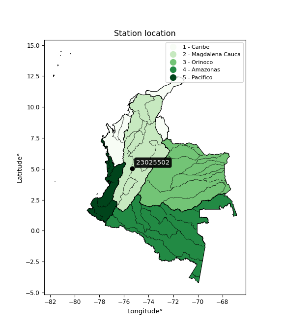

<div align="center">


</div>

# PMP Station (Rain, Pmax24h): 23025502

Probable Maximum Precipitation (PMP) is the greatest amount of rainfall for a specific duration that is meteorologically possible for a given location, acting as a "worst-case" scenario for extreme storms, crucial for designing safety-critical infrastructure like bridges, river deviations, dams, spillways, and nuclear plants to prevent catastrophic failure. PMP is calculated by hydrologists using meteorological data to determine the upper limit of extreme rainfall, often leading to the Probable Maximum Flood (PMF) for flood control design, and is increasingly being studied for climate change impacts.

<div align="center">

</img>

</div>


## A. General information


### 1. General running parameters

• app_version: _v20260103_. • runtime: _2026-01-03 07:24:50.581521_. • Python version: _3.14.0_. • SciPy version: _1.16.3_. • Pandas version: _2.3.3_. • NumPy version: _2.3.5_. • Stations dataset (station_dataset_file): _dataset/pmax24h_in/automatic_colombia_2003_2024.csv_. • Stations catalog (station_catalog_file): _dataset/CNE.xls_. • Minimum year to eval til year_max (date_min): _1900_. • Maximum year to eval since year_min (date_max): _2024_. • Creates, save and include plots into reports (create_plot): _False_. • Plot only fit distributions with Δo > Δ (plot_only_fit): _True_. • Eval low extreme values, if False, evaluates high extreme values (low_extreme): _False_. • Eval every SciPy distribution as logarithmic (pdist_logarithmic_on): _True_. • Standard deviation normalized (ddof): _1.0_. • Return periods to eval in years (Tr): _[2, 2.33, 5, 10, 15, 20, 25, 50, 75, 100, 200, 250, 500, 750, 1000]_. • Minimum data sample per station, 0 means any (minimum_sample): _5_. • Z-Score maximum threshold to adjust a value, 0 means disable (zscore_max): _3.5_. • Z-Score minimum threshold to adjust a value, 0 means disable (zscore_min): _-2.5_. • Avoid zeros, e.g. rain = 0 (avoid_zeros): _True_. • Avoid null values (avoid_nans): _True_. [:file_folder:Dataset file.](../../dataset/pmax24h_in/automatic_colombia_2003_2024.csv)

> Delta Degrees of Freedom (DDOF): is a parameter used in the formulas for calculating variance and standard deviation. When ddof=0, the divisor is $N$ (the total number of observations) and this is used when your data set is the entire population. When ddof=1, the divisor is $N-1$ and this is used when your data set is a sample drawn from a larger population. Using $N-1$ provides an unbiased estimate of the population variance (known as Bessel´s correction).


### 2. Station info and location

|   id |   CODIGO | NOMBRE                             | CATEGORIA               | TECNOLOGIA                | ESTADO   | FECHA_INSTALACION   |   FECHA_SUSPENSION |   ALTITUD |   LATITUD |   LONGITUD | DEPARTAMENTO   | MUNICIPIO   | AREA_OPERATIVA                         | ENTIDAD                                    | AREA_HIDROGRAFICA   | ZONA_HIDROGRAFICA   | SUBZONA_HIDROGRAFICA   |   CORRIENTE | Catalogo   |   Version |
|-----:|---------:|:-----------------------------------|:------------------------|:--------------------------|:---------|:--------------------|-------------------:|----------:|----------:|-----------:|:---------------|:------------|:---------------------------------------|:-------------------------------------------|:--------------------|:--------------------|:-----------------------|------------:|:-----------|----------:|
|    0 | 23025502 | ALMACAFE LETRAS  - AUT  [23025502] | Climatológica Principal | Automática con Telemetría | Activa   | 08/12/2013          |                nan |      3684 |     5.045 |   -75.3322 | Caldas         | Manizales   | Area Operativa 09 - Cauca-Valle-Caldas | CENTRO NACIONAL DE INVESTIGACIONES DE CAFE | Magdalena Cauca     | Medio Magdalena     | Río Guarinó            |         nan | CNE_OE     |  20251226 |

<div align="center">

Dynamic map: [:earth_americas:Google](http://maps.google.com/maps?q=5.044997222,-75.33221944) [:earth_americas:OSM](https://www.openstreetmap.org/#map=18/5.044997222/-75.33221944&layers=P) [:earth_americas:Bing](https://www.bing.com/maps?cp=5.044997222~-75.33221944&lvl=18) [:earth_americas:Apple](https://maps.apple.com/frame?center=5.044997222%2C-75.33221944&span=0.003%2C0.006)

</div>


<div align="center">

```geojson
{
  "type": "Feature",
  "geometry": {
    "type": "Point", 
    "coordinates": [-75.33221944, 5.044997222]
  }, 
  "properties": {
    "Name": "23025502"
  }
}
```

</div>


### 3. Discrete values table and plot

<div align="center">

|               |           0 |          1 |          2 |           3 |           4 |          5 |            6 |            7 |
|:--------------|------------:|-----------:|-----------:|------------:|------------:|-----------:|-------------:|-------------:|
| Date          | 2016        | 2017       | 2018       | 2019        | 2020        | 2021       | 2022         | 2023         |
| Value         |   28.6      |   16.7     |   44.2     |   39        |   30.1      |   46.9     |   33.3       |   34.5       |
| Value_initial |   28.6      |   16.7     |   44.2     |   39        |   30.1      |   46.9     |   33.3       |   34.5       |
| count         |    8        |    8       |    8       |    8        |    8        |    8       |    8         |    8         |
| mean          |   34.1625   |   34.1625  |   34.1625  |   34.1625   |   34.1625   |   34.1625  |   34.1625    |   34.1625    |
| std           |    9.55913  |    9.55913 |    9.55913 |    9.55913  |    9.55913  |    9.55913 |    9.55913   |    9.55913   |
| zscore        |   -0.581904 |   -1.82679 |    1.05004 |    0.506061 |   -0.424986 |    1.3325  |   -0.0902279 |    0.0353066 |


</div>


> The initial value (value_initial) correspond to the initial obtained or null completed value, and value (value) is adjusted only when the initial value is outside the valid range definite through the Z-Score value. If Z-Score is active, values out of range or outliers are replaced with the station mean value


### 4. Active continuous probability distributions from SciPy (44 of 104 available)

A Probability Density Function (PDF) describes the relative likelihood of a continuous random variable falling within a specific range, where the total area under its curve equals 1, and the area over any interval gives the actual probability for that range. Unlike discrete probabilities (like rolling a die), a PDF shows density, not direct probability for a single point (which is zero), with higher points indicating higher likelihood, often visualized as a bell curve for normal distributions.

A log of a probability density function (log-PDF) is simply the logarithm of the PDF´s value, denoted as $log(f(x))$, useful for converting multiplication of probabilities into addition, improving numerical stability with tiny numbers, and connecting to information theory concepts like entropy. Instead of dealing with very small probabilities (e.g., 0.000001), log-PDFs use negative numbers (e.g., $log(0.00001) ≈ -11.51$ that are easier for computers to handle, preventing underflow errors and simplifying complex calculations. In this study, each active probability distribution from SciPy is also evaluated in the $log$ form.

[scipy.stats](https://docs.scipy.org/doc/scipy/reference/stats.html) is a Python´s powerful submodule within the SciPy library for comprehensive statistical analysis, offering over 130 probability distributions (like Normal, Poisson), functions for descriptive stats (mean, variance), hypothesis testing (t-tests, chi-square), random variable generation, and statistical tests, making it essential for data science, modeling, and research. It provides tools to explore, model, and draw conclusions from data efficiently, working seamlessly with NumPy.

<div align="center">

|   id | p_dist             |   n_parameter | fit_method   | label                                                                       | active   | ref                                                                                                        |
|-----:|:-------------------|--------------:|:-------------|:----------------------------------------------------------------------------|:---------|:-----------------------------------------------------------------------------------------------------------|
|    0 | alpha              |             3 | MLE          | Alpha                                                                       | True     | [:mortar_board:](https://docs.scipy.org/doc/scipy/reference/generated/scipy.stats.alpha.html)              |
|    1 | betaprime          |             4 | MLE          | Beta prime                                                                  | True     | [:mortar_board:](https://docs.scipy.org/doc/scipy/reference/generated/scipy.stats.betaprime.html)          |
|    2 | chi2               |             3 | MLE          | Chi²                                                                        | True     | [:mortar_board:](https://docs.scipy.org/doc/scipy/reference/generated/scipy.stats.chi2.html)               |
|    3 | crystalball        |             4 | MLE          | Crystalball                                                                 | True     | [:mortar_board:](https://docs.scipy.org/doc/scipy/reference/generated/scipy.stats.crystalball.html)        |
|    4 | erlang             |             3 | MLE          | Erlang                                                                      | True     | [:mortar_board:](https://docs.scipy.org/doc/scipy/reference/generated/scipy.stats.erlang.html)             |
|    5 | expon              |             2 | MLE          | Exponential                                                                 | True     | [:mortar_board:](https://docs.scipy.org/doc/scipy/reference/generated/scipy.stats.expon.html)              |
|    6 | exponnorm          |             3 | MLE          | Exponentially modified Normal                                               | True     | [:mortar_board:](https://docs.scipy.org/doc/scipy/reference/generated/scipy.stats.exponnorm.html)          |
|    7 | f                  |             4 | MLE          | F                                                                           | True     | [:mortar_board:](https://docs.scipy.org/doc/scipy/reference/generated/scipy.stats.f.html)                  |
|    8 | fatiguelife        |             3 | MLE          | Fatigue-life (Birnbaum-Saunders)                                            | True     | [:mortar_board:](https://docs.scipy.org/doc/scipy/reference/generated/scipy.stats.fatiguelife.html)        |
|    9 | fisk               |             3 | MLE          | Fisk                                                                        | True     | [:mortar_board:](https://docs.scipy.org/doc/scipy/reference/generated/scipy.stats.fisk.html)               |
|   10 | gamma              |             3 | MLE          | Gamma                                                                       | True     | [:mortar_board:](https://docs.scipy.org/doc/scipy/reference/generated/scipy.stats.gamma.html)              |
|   11 | genexpon           |             5 | MLE          | Generalized exponential                                                     | True     | [:mortar_board:](https://docs.scipy.org/doc/scipy/reference/generated/scipy.stats.genexpon.html)           |
|   12 | genlogistic        |             3 | MLE          | Generalized logistic                                                        | True     | [:mortar_board:](https://docs.scipy.org/doc/scipy/reference/generated/scipy.stats.genlogistic.html)        |
|   13 | gibrat             |             2 | MM           | Gibrat                                                                      | True     | [:mortar_board:](https://docs.scipy.org/doc/scipy/reference/generated/scipy.stats.gibrat.html)             |
|   14 | gompertz           |             3 | MLE          | Gompertz (or truncated Gumbel)                                              | True     | [:mortar_board:](https://docs.scipy.org/doc/scipy/reference/generated/scipy.stats.gompertz.html)           |
|   15 | gumbel_l           |             2 | MM           | Gumbel Left Skew                                                            | True     | [:mortar_board:](https://docs.scipy.org/doc/scipy/reference/generated/scipy.stats.gumbel_l.html)           |
|   16 | gumbel_r           |             2 | MM           | Gumbel Right Skew                                                           | True     | [:mortar_board:](https://docs.scipy.org/doc/scipy/reference/generated/scipy.stats.gumbel_r.html)           |
|   17 | halflogistic       |             2 | MM           | Half-logistic                                                               | True     | [:mortar_board:](https://docs.scipy.org/doc/scipy/reference/generated/scipy.stats.halflogistic.html)       |
|   18 | halfnorm           |             2 | MM           | Half Normal                                                                 | True     | [:mortar_board:](https://docs.scipy.org/doc/scipy/reference/generated/scipy.stats.halfnorm.html)           |
|   19 | hypsecant          |             2 | MM           | hyperbolic secant                                                           | True     | [:mortar_board:](https://docs.scipy.org/doc/scipy/reference/generated/scipy.stats.hypsecant.html)          |
|   20 | invgamma           |             3 | MLE          | Inverted gamma                                                              | True     | [:mortar_board:](https://docs.scipy.org/doc/scipy/reference/generated/scipy.stats.invgamma.html)           |
|   21 | invgauss           |             3 | MLE          | Inverse Gaussian                                                            | True     | [:mortar_board:](https://docs.scipy.org/doc/scipy/reference/generated/scipy.stats.invgauss.html)           |
|   22 | invweibull         |             3 | MLE          | Inverted Weibull                                                            | True     | [:mortar_board:](https://docs.scipy.org/doc/scipy/reference/generated/scipy.stats.invweibull.html)         |
|   23 | johnsonsu          |             4 | MLE          | Johnson Su                                                                  | True     | [:mortar_board:](https://docs.scipy.org/doc/scipy/reference/generated/scipy.stats.johnsonsu.html)          |
|   24 | kstwobign          |             2 | MLE          | Limiting distribution of scaled Kolmogorov-Smirnov two-sided test statistic | True     | [:mortar_board:](https://docs.scipy.org/doc/scipy/reference/generated/scipy.stats.kstwobign.html)          |
|   25 | laplace            |             2 | MM           | Laplace                                                                     | True     | [:mortar_board:](https://docs.scipy.org/doc/scipy/reference/generated/scipy.stats.laplace.html)            |
|   26 | laplace_asymmetric |             3 | MLE          | Asymmetric Laplace                                                          | True     | [:mortar_board:](https://docs.scipy.org/doc/scipy/reference/generated/scipy.stats.laplace_asymmetric.html) |
|   27 | loggamma           |             3 | MLE          | Log gamma                                                                   | True     | [:mortar_board:](https://docs.scipy.org/doc/scipy/reference/generated/scipy.stats.loggamma.html)           |
|   28 | logistic           |             2 | MM           | Logistic (or Sech-squared)                                                  | True     | [:mortar_board:](https://docs.scipy.org/doc/scipy/reference/generated/scipy.stats.logistic.html)           |
|   29 | lognorm            |             3 | MLE          | Log Normal                                                                  | True     | [:mortar_board:](https://docs.scipy.org/doc/scipy/reference/generated/scipy.stats.lognorm.html)            |
|   30 | maxwell            |             2 | MM           | Maxwell                                                                     | True     | [:mortar_board:](https://docs.scipy.org/doc/scipy/reference/generated/scipy.stats.maxwell.html)            |
|   31 | mielke             |             4 | MLE          | Mielke Beta-Kappa / Dagum                                                   | True     | [:mortar_board:](https://docs.scipy.org/doc/scipy/reference/generated/scipy.stats.mielke.html)             |
|   32 | moyal              |             2 | MM           | Moyal                                                                       | True     | [:mortar_board:](https://docs.scipy.org/doc/scipy/reference/generated/scipy.stats.moyal.html)              |
|   33 | nakagami           |             3 | MLE          | Nakagami                                                                    | True     | [:mortar_board:](https://docs.scipy.org/doc/scipy/reference/generated/scipy.stats.nakagami.html)           |
|   34 | ncf                |             5 | MLE          | Non-central F distribution                                                  | True     | [:mortar_board:](https://docs.scipy.org/doc/scipy/reference/generated/scipy.stats.ncf.html)                |
|   35 | nct                |             4 | MLE          | Non-central Student’s t                                                     | True     | [:mortar_board:](https://docs.scipy.org/doc/scipy/reference/generated/scipy.stats.nct.html)                |
|   36 | norm               |             2 | MM           | Normal                                                                      | True     | [:mortar_board:](https://docs.scipy.org/doc/scipy/reference/generated/scipy.stats.norm.html)               |
|   37 | pearson3           |             3 | MM           | Pearson type III                                                            | True     | [:mortar_board:](https://docs.scipy.org/doc/scipy/reference/generated/scipy.stats.pearson3.html)           |
|   38 | rayleigh           |             2 | MM           | Rayleigh                                                                    | True     | [:mortar_board:](https://docs.scipy.org/doc/scipy/reference/generated/scipy.stats.rayleigh.html)           |
|   39 | rice               |             3 | MLE          | Rice                                                                        | True     | [:mortar_board:](https://docs.scipy.org/doc/scipy/reference/generated/scipy.stats.rice.html)               |
|   40 | t                  |             3 | MLE          | Student’s t                                                                 | True     | [:mortar_board:](https://docs.scipy.org/doc/scipy/reference/generated/scipy.stats.t.html)                  |
|   41 | truncnorm          |             4 | MLE          | Truncated normal                                                            | True     | [:mortar_board:](https://docs.scipy.org/doc/scipy/reference/generated/scipy.stats.truncnorm.html)          |
|   42 | wald               |             2 | MM           | Wald                                                                        | True     | [:mortar_board:](https://docs.scipy.org/doc/scipy/reference/generated/scipy.stats.wald.html)               |
|   43 | weibull_min        |             3 | MLE          | Weibull minimum                                                             | True     | [:mortar_board:](https://docs.scipy.org/doc/scipy/reference/generated/scipy.stats.weibull_min.html)        |

</div>

> **n_parameter:** # arguments & localization & scale.
>
> **Fit methods:** (MLE) maximum likelihood, (MM) L-moments.
>
>**Inactive** (With the only purpose of prevent loops, zero divisions, infinite values, over high estimated values or horizontal trending for recurrence intervals estimations, the follow distributions were disabled.)**:** foldnorm, gennorm, norminvgauss, powernorm, powerlognorm, skewnorm, genextreme, anglit, arcsine, argus, beta, bradford, burr, burr12, cauchy, cosine, halfcauchy, foldcauchy, skewcauchy, wrapcauchy, dgamma, gengamma, exponweib, exponpow, truncexpon, gausshyper, genhalflogistic, genhyperbolic, geninvgauss, halfgennorm, johnsonsb, kappa4, kappa3, ksone, kstwo, loglaplace, levy, levy_l, levy_stable, ncx2, pareto, genpareto, truncpareto, lomax, powerlaw, rdist, rel_breitwigner, recipinvgauss, semicircular, studentized_range, trapezoid, triang, truncweibull_min, tukeylambda, uniform, loguniform, vonmises, vonmises_line, weibull_max, dweibull, 


## B. Probability distributions vs. Empirical distributions

A continuous probability distribution (CPD) describes probabilities for variables that can take any value within a range (like rain any time), unlike discrete variables with specific outcomes (like temperature). It uses a Probability Density Function (PDF), a curve where the total area under it equals 1, and the probability of the variable falling within an interval (a to b) is found by calculating the area under the curve between those points. A key feature is that the probability of hitting any single exact value is zero, so probabilities are always expressed for ranges, e.g., $P(a ≤ X ≤ b)$.

<div align="center">

Distributions parameters from station values
|    |   station | p_dist                |   n |             loc |           scale | shape                  | shape1             | shape2                 | shape3   |
|---:|----------:|:----------------------|----:|----------------:|----------------:|:-----------------------|:-------------------|:-----------------------|:---------|
|  0 |  23025502 | alpha                 |   8 |  -132.203       |  2907.93        | 17.520871356744323     |                    |                        |          |
|  1 |  23025502 | betaprime             |   8 |   -20.7055      |  1535.94        | 34.192478556875656     | 954.0199620343578  |                        |          |
|  2 |  23025502 | chi2                  |   8 |   -90.2488      |     0.333528    | 372.74036156805346     |                    |                        |          |
|  3 |  23025502 | crystalball           |   8 |    34.1625      |     8.94175     | 3516.0542584339855     | 43.02204194247169  |                        |          |
|  4 |  23025502 | erlang                |   8 |  -104.713       |     0.602975    | 230.15536680992705     |                    |                        |          |
|  5 |  23025502 | expon                 |   8 |    16.7         |    17.4625      |                        |                    |                        |          |
|  6 |  23025502 | exponnorm             |   8 |    34.1568      |     8.94171     | 0.0006403249097744266  |                    |                        |          |
|  7 |  23025502 | f                     |   8 | -2447.58        |  2481.73        | 221764.80119810725     | 496666.53795008257 |                        |          |
|  8 |  23025502 | fatiguelife           |   8 |    16.7         |     8.44703e-06 | 1147.8329896884375     |                    |                        |          |
|  9 |  23025502 | fisk                  |   8 |    -8.79209e+08 |     8.79209e+08 | 164180952.27491218     |                    |                        |          |
| 10 |  23025502 | gamma                 |   8 |  -132.341       |     0.498261    | 333.9487553514217      |                    |                        |          |
| 11 |  23025502 | genexpon              |   8 |    16.7         |     3.58572     | 0.0853774409309444     | 0.1758776021781056 | 0.4675498794620433     |          |
| 12 |  23025502 | genlogistic           |   8 |    37.3934      |     4.39017     | 0.674799772384255      |                    |                        |          |
| 13 |  23025502 | gibrat                |   8 |    27.3411      |     4.13738     |                        |                    |                        |          |
| 14 |  23025502 | gompertz              |   8 |    28.6         |     9.29006     | 0.48760336103868496    |                    |                        |          |
| 15 |  23025502 | gumbel_l              |   8 |    38.1868      |     6.97185     |                        |                    |                        |          |
| 16 |  23025502 | gumbel_r              |   8 |    30.1382      |     6.97185     |                        |                    |                        |          |
| 17 |  23025502 | halflogistic          |   8 |    23.5644      |     7.64488     |                        |                    |                        |          |
| 18 |  23025502 | halfnorm              |   8 |    22.3271      |    14.8334      |                        |                    |                        |          |
| 19 |  23025502 | hypsecant             |   8 |    34.1625      |     5.69249     |                        |                    |                        |          |
| 20 |  23025502 | invgamma              |   8 |   -70.1488      | 12914.3         | 124.60477156942673     |                    |                        |          |
| 21 |  23025502 | invgauss              |   8 |   -22.5896      |  1864.96        | 0.03026389642238006    |                    |                        |          |
| 22 |  23025502 | invweibull            |   8 |    -1.02136e+06 |     1.02139e+06 | 110236.1551659136      |                    |                        |          |
| 23 |  23025502 | johnsonsu             |   8 |    69.6253      |     4.55217     | 10.822013765354281     | 3.980761181589929  |                        |          |
| 24 |  23025502 | kstwobign             |   8 |    -3.78435     |    43.4616      |                        |                    |                        |          |
| 25 |  23025502 | laplace               |   8 |    34.1625      |     6.32277     |                        |                    |                        |          |
| 26 |  23025502 | laplace_asymmetric    |   8 |    33.3         |     6.94735     | 0.9398534450319787     |                    |                        |          |
| 27 |  23025502 | loggamma              |   8 |    25.1166      |    12.9303      | 2.492737443618092      |                    |                        |          |
| 28 |  23025502 | logistic              |   8 |    34.1625      |     4.92984     |                        |                    |                        |          |
| 29 |  23025502 | lognorm               |   8 |    16.7         |     0.204844    | 11.97987831599429      |                    |                        |          |
| 30 |  23025502 | maxwell               |   8 |    12.9743      |    13.2777      |                        |                    |                        |          |
| 31 |  23025502 | mielke                |   8 |    16.6982      |    30.2718      | 0.7839432841879166     | 1124.114715195874  |                        |          |
| 32 |  23025502 | moyal                 |   8 |    29.049       |     4.0252      |                        |                    |                        |          |
| 33 |  23025502 | nakagami              |   8 |    28.6         |     8.18696     | 0.26383752492541823    |                    |                        |          |
| 34 |  23025502 | ncf                   |   8 |   -72.3764      |     5.21836     | 25.74647380391621      | 29676.6228465947   | 499.87362631419256     |          |
| 35 |  23025502 | nct                   |   8 |  -494.469       |     8.86309     | 94291.34179019055      | 59.64324724484713  |                        |          |
| 36 |  23025502 | norm                  |   8 |    34.1625      |     8.94175     |                        |                    |                        |          |
| 37 |  23025502 | pearson3              |   8 |    34.1625      |     8.94177     | -0.4150552408809066    |                    |                        |          |
| 38 |  23025502 | rayleigh              |   8 |    17.0564      |    13.6487      |                        |                    |                        |          |
| 39 |  23025502 | rice                  |   8 |    11.0535      |     9.64179     | 2.1458131823743907     |                    |                        |          |
| 40 |  23025502 | t                     |   8 |    34.1622      |     8.94154     | 2320583.615220918      |                    |                        |          |
| 41 |  23025502 | truncnorm             |   8 |    10.8005      |     3.51062     | -8.917236943640493     | 9.513852480274494  |                        |          |
| 42 |  23025502 | wald                  |   8 |    25.2207      |     8.94177     |                        |                    |                        |          |
| 43 |  23025502 | weibull_min           |   8 |   -20.9084      |    58.7885      | 7.366391348487461      |                    |                        |          |
| 44 |  23025502 | logalpha              |   8 |    -7.0624      |   356.821       | 33.876484778517124     |                    |                        |          |
| 45 |  23025502 | logbetaprime          |   8 |    -4.79466     |    31.478       | 806.7299459032572      | 3066.680967343449  |                        |          |
| 46 |  23025502 | logchi2               |   8 |     2.81541     |     0.95861     | 1.055391421463614      |                    |                        |          |
| 47 |  23025502 | logcrystalball        |   8 |     3.49002     |     0.302368    | 14.707646183473198     | 179.92635883541863 |                        |          |
| 48 |  23025502 | logerlang             |   8 |    -1.31847     |     0.020423    | 235.3213035076218      |                    |                        |          |
| 49 |  23025502 | logexpon              |   8 |     2.81541     |     0.674611    |                        |                    |                        |          |
| 50 |  23025502 | logexponnorm          |   8 |     3.48981     |     0.302369    | 0.0007107248860309375  |                    |                        |          |
| 51 |  23025502 | logf                  |   8 |  -278.184       |   281.673       | 5607895.112175392      | 2494419.298796588  |                        |          |
| 52 |  23025502 | logfatiguelife        |   8 |  -147.022       |   150.512       | 0.0020066989947917432  |                    |                        |          |
| 53 |  23025502 | logfisk               |   8 |    -3.38354e+07 |     3.38354e+07 | 209307809.3856172      |                    |                        |          |
| 54 |  23025502 | loggamma              |   8 |    -0.768023    |     0.0239362   | 177.71915245285066     |                    |                        |          |
| 55 |  23025502 | loggenexpon           |   8 |     2.76584     |     0.00896756  | 0.0019529873296467957  | 6.7778102842960894 | 3.2416764729064066e-05 |          |
| 56 |  23025502 | loggenlogistic        |   8 |     3.84804     |     2.15787e-06 | 5.991811640726305e-06  |                    |                        |          |
| 57 |  23025502 | loggibrat             |   8 |     3.25937     |     0.139897    |                        |                    |                        |          |
| 58 |  23025502 | loggompertz           |   8 |     2.8077      |     0.244112    | 0.0378397608970035     |                    |                        |          |
| 59 |  23025502 | loggumbel_l           |   8 |     3.6261      |     0.235756    |                        |                    |                        |          |
| 60 |  23025502 | loggumbel_r           |   8 |     3.35394     |     0.235756    |                        |                    |                        |          |
| 61 |  23025502 | loghalflogistic       |   8 |     3.13162     |     0.25853     |                        |                    |                        |          |
| 62 |  23025502 | loghalfnorm           |   8 |     3.08983     |     0.501571    |                        |                    |                        |          |
| 63 |  23025502 | loghypsecant          |   8 |     3.49002     |     0.192494    |                        |                    |                        |          |
| 64 |  23025502 | loginvgamma           |   8 |    -3.81137     |  3833.28        | 526.3093005784542      |                    |                        |          |
| 65 |  23025502 | loginvgauss           |   8 |     0.0080174   |   386.769       | 0.008987760332736395   |                    |                        |          |
| 66 |  23025502 | loginvweibull         |   8 |    -6.11707e+07 |     6.11707e+07 | 171138767.21771985     |                    |                        |          |
| 67 |  23025502 | logjohnsonsu          |   8 |     3.99546     |     0.00631651  | 7.931090776838335      | 1.6204121023069895 |                        |          |
| 68 |  23025502 | logkstwobign          |   8 |     2.05204     |     1.64731     |                        |                    |                        |          |
| 69 |  23025502 | loglaplace            |   8 |     3.49002     |     0.213807    |                        |                    |                        |          |
| 70 |  23025502 | loglaplace_asymmetric |   8 |     3.54096     |     0.216553    | 1.1259513784813002     |                    |                        |          |
| 71 |  23025502 | logloggamma           |   8 |     3.84803     |     8.11061e-07 | 2.2708510990238875e-06 |                    |                        |          |
| 72 |  23025502 | loglogistic           |   8 |     3.49002     |     0.166704    |                        |                    |                        |          |
| 73 |  23025502 | loglognorm            |   8 |     2.81541     |     0.00938298  | 11.598523709944722     |                    |                        |          |
| 74 |  23025502 | logmaxwell            |   8 |     2.77353     |     0.448991    |                        |                    |                        |          |
| 75 |  23025502 | logmielke             |   8 |    -2.20953e+07 |     2.20953e+07 | 59234269.1765178       | 1972200336.960688  |                        |          |
| 76 |  23025502 | logmoyal              |   8 |     3.31711     |     0.136114    |                        |                    |                        |          |
| 77 |  23025502 | lognakagami           |   8 |     3.35341     |     0.243882    | 0.19495359186229444    |                    |                        |          |
| 78 |  23025502 | logncf                |   8 |   -29.2062      |    28.2076      | 116004.3743731656      | 28652.763843288652 | 18432.513310273695     |          |
| 79 |  23025502 | lognct                |   8 |    -0.587349    |     0.293426    | 640.5995789232936      | 13.90153516636289  |                        |          |
| 80 |  23025502 | lognorm               |   8 |     3.49002     |     0.302368    |                        |                    |                        |          |
| 81 |  23025502 | logpearson3           |   8 |     3.49002     |     0.302369    | -1.0504032980719982    |                    |                        |          |
| 82 |  23025502 | lograyleigh           |   8 |     2.91156     |     0.461545    |                        |                    |                        |          |
| 83 |  23025502 | logrice               |   8 |  -244.602       |     0.30227     | 820.7631895922623      |                    |                        |          |
| 84 |  23025502 | logt                  |   8 |     3.54273     |     0.211697    | 3.2539127126303686     |                    |                        |          |
| 85 |  23025502 | logtruncnorm          |   8 |    -0.112455    |     1.22145     | 2.8374906311983814     | 3.2424301157244946 |                        |          |
| 86 |  23025502 | logwald               |   8 |     3.18769     |     0.302329    |                        |                    |                        |          |
| 87 |  23025502 | logweibull_min        |   8 |    -1.01567e+07 |     1.01567e+07 | 45718877.0116383       |                    |                        |          |

</div>

> **loc** (Location parameter): This shifts the distribution along the x-axis. For many common distributions, like the normal (Gaussian) distribution, loc represents the mean $μ$. For others, like the uniform distribution, it might represent the minimum value, or for the beta distribution, the left end of the support interval.
>
> **scale** (Scale parameter): This determines the width or spread of the distribution. For the normal distribution, scale represents the standard deviation $σ$. For a uniform distribution, it defines the length of the interval (from $loc$ to $loc + scale$).
>
> **shape** (Shape parameters): Refers to parameters that define the specific form of a probability distribution, distinct from its location (loc) and scale (scale). These parameters are required arguments for most distribution functions. For example, a normal (Gaussian) distribution is fully defined by its location (mean) and scale (standard deviation), so it has no specific shape parameters beyond loc and scale. However, other distributions have intrinsic properties that need specification, as Gamma distribution that takes a shape parameter, often named $a$ or $alpha$.


### 0. Cumulative distribution values - CDF (88 evaluated)

Cumulative Distribution Function (CDF), denoted as $F$<sub>$X$</sub>$(x)$, is a function that gives the probability that a random variable $X$ will take a value less than or equal to a specific value, $x$ (i.e., $(P(X≥x)$. It essentially "accumulates" probabilities from a given point up to the far right (positive infinity), providing a complete picture of the distribution´s probabilities for both discrete (like rain) and continuous (like temperature) variables, helping to find probabilities over ranges or above certain values. Each station is evaluated separately ordering the $x$ values ascending, calculating the CDF and PDF values for the activated distributions and their logarithmic forms.

<div align="center">

CDF ordered by x ascending and calculating $log(f(x))$ separately
|   id |   Station |   date |    x |   count |    mean |     std |     zscore |   Value_initial |   station |   m |     alpha |   alpha_pdf |   betaprime |   betaprime_pdf |      chi2 |   chi2_pdf |   crystalball |   crystalball_pdf |    erlang |   erlang_pdf |    expon |   expon_pdf |   exponnorm |   exponnorm_pdf |         f |      f_pdf |   fatiguelife |   fatiguelife_pdf |      fisk |   fisk_pdf |     gamma |   gamma_pdf |    genexpon |   genexpon_pdf |   genlogistic |   genlogistic_pdf |   gibrat |   gibrat_pdf |   gompertz |   gompertz_pdf |   gumbel_l |   gumbel_l_pdf |   gumbel_r |   gumbel_r_pdf |   halflogistic |   halflogistic_pdf |   halfnorm |   halfnorm_pdf |   hypsecant |   hypsecant_pdf |   invgamma |   invgamma_pdf |   invgauss |   invgauss_pdf |   invweibull |   invweibull_pdf |   johnsonsu |   johnsonsu_pdf |   kstwobign |   kstwobign_pdf |   laplace |   laplace_pdf |   laplace_asymmetric |   laplace_asymmetric_pdf |   loggamma |   loggamma_pdf |   logistic |   logistic_pdf |   lognorm |   lognorm_pdf |    maxwell |   maxwell_pdf |      mielke |   mielke_pdf |       moyal |   moyal_pdf |    nakagami |    nakagami_pdf |       ncf |    ncf_pdf |       nct |    nct_pdf |      norm |   norm_pdf |   pearson3 |   pearson3_pdf |   rayleigh |   rayleigh_pdf |      rice |   rice_pdf |         t |      t_pdf |   truncnorm |   truncnorm_pdf |     wald |   wald_pdf |   weibull_min |   weibull_min_pdf |   logalpha |   logalpha_pdf |   logbetaprime |   logbetaprime_pdf |     logchi2 |   logchi2_pdf |   logcrystalball |   logcrystalball_pdf |   logerlang |   logerlang_pdf |   logexpon |   logexpon_pdf |   logexponnorm |   logexponnorm_pdf |     logf |   logf_pdf |   logfatiguelife |   logfatiguelife_pdf |   logfisk |   logfisk_pdf |   loggenexpon |   loggenexpon_pdf |   loggenlogistic |   loggenlogistic_pdf |   loggibrat |   loggibrat_pdf |   loggompertz |   loggompertz_pdf |   loggumbel_l |   loggumbel_l_pdf |   loggumbel_r |   loggumbel_r_pdf |   loghalflogistic |   loghalflogistic_pdf |   loghalfnorm |   loghalfnorm_pdf |   loghypsecant |   loghypsecant_pdf |   loginvgamma |   loginvgamma_pdf |   loginvgauss |   loginvgauss_pdf |   loginvweibull |   loginvweibull_pdf |   logjohnsonsu |   logjohnsonsu_pdf |   logkstwobign |   logkstwobign_pdf |   loglaplace |   loglaplace_pdf |   loglaplace_asymmetric |   loglaplace_asymmetric_pdf |   logloggamma |   logloggamma_pdf |   loglogistic |   loglogistic_pdf |   loglognorm |   loglognorm_pdf |   logmaxwell |   logmaxwell_pdf |   logmielke |   logmielke_pdf |    logmoyal |   logmoyal_pdf |   lognakagami |   lognakagami_pdf |    logncf |   logncf_pdf |    lognct |   lognct_pdf |   logpearson3 |   logpearson3_pdf |   lograyleigh |   lograyleigh_pdf |   logrice |   logrice_pdf |      logt |   logt_pdf |   logtruncnorm |   logtruncnorm_pdf |   logwald |   logwald_pdf |   logweibull_min |   logweibull_min_pdf |
|-----:|----------:|-------:|-----:|--------:|--------:|--------:|-----------:|----------------:|----------:|----:|----------:|------------:|------------:|----------------:|----------:|-----------:|--------------:|------------------:|----------:|-------------:|---------:|------------:|------------:|----------------:|----------:|-----------:|--------------:|------------------:|----------:|-----------:|----------:|------------:|------------:|---------------:|--------------:|------------------:|---------:|-------------:|-----------:|---------------:|-----------:|---------------:|-----------:|---------------:|---------------:|-------------------:|-----------:|---------------:|------------:|----------------:|-----------:|---------------:|-----------:|---------------:|-------------:|-----------------:|------------:|----------------:|------------:|----------------:|----------:|--------------:|---------------------:|-------------------------:|-----------:|---------------:|-----------:|---------------:|----------:|--------------:|-----------:|--------------:|------------:|-------------:|------------:|------------:|------------:|----------------:|----------:|-----------:|----------:|-----------:|----------:|-----------:|-----------:|---------------:|-----------:|---------------:|----------:|-----------:|----------:|-----------:|------------:|----------------:|---------:|-----------:|--------------:|------------------:|-----------:|---------------:|---------------:|-------------------:|------------:|--------------:|-----------------:|---------------------:|------------:|----------------:|-----------:|---------------:|---------------:|-------------------:|---------:|-----------:|-----------------:|---------------------:|----------:|--------------:|--------------:|------------------:|-----------------:|---------------------:|------------:|----------------:|--------------:|------------------:|--------------:|------------------:|--------------:|------------------:|------------------:|----------------------:|--------------:|------------------:|---------------:|-------------------:|--------------:|------------------:|--------------:|------------------:|----------------:|--------------------:|---------------:|-------------------:|---------------:|-------------------:|-------------:|-----------------:|------------------------:|----------------------------:|--------------:|------------------:|--------------:|------------------:|-------------:|-----------------:|-------------:|-----------------:|------------:|----------------:|------------:|---------------:|--------------:|------------------:|----------:|-------------:|----------:|-------------:|--------------:|------------------:|--------------:|------------------:|----------:|--------------:|----------:|-----------:|---------------:|-------------------:|----------:|--------------:|-----------------:|---------------------:|
|    0 |  23025502 |   2017 | 16.7 |       8 | 34.1625 | 9.55913 | -1.82679   |            16.7 |  23025502 |   1 | 0.0223131 |   0.0069662 |   0.0207867 |       0.0068271 | 0.0238711 | 0.00682867 |     0.0254146 |        0.00662693 | 0.0249088 |   0.00696584 | 0        |   0.0572656 |   0.0254142 |      0.00662684 | 0.0254777 | 0.00666538 |     0.0156254 |       3.05643e+10 | 0.0347106 | 0.00625677 | 0.0251218 |  0.00693774 | 9.78021e-09 |      0.0238104 |     0.0413059 |        0.00629254 | 0        |   0          | 0          |      0         |  0.0448345 |     0.00628442 | 0.00103609 |      0.0010213 |       0        |          0         |   0        |      0         |   0.0296012 |      0.00519255 |  0.0195785 |     0.00648678 |  0.0219341 |     0.00781659 |    0.0185303 |        0.0079765 |   0.0435869 |      0.00692281 |    0.0206   |       0.0101643 | 0.0315876 |    0.00499585 |            0.0369049 |               0.00565203 |  0.0139862 |       0.125362 |   0.028135 |     0.00554651 | 0.0128375 |      0.109513 | 0.00573894 |    0.00454867 | 0.000486531 |    0.211976  | 3.54315e-06 | 9.86783e-06 | 0           |      0          | 0.0250975 | 0.00697155 | 0.0254483 | 0.00663877 | 0.0254147 | 0.00662693 |   0.035526 |     0.00698646 |   0        |      0         | 0.0189889 | 0.00734754 | 0.0254142 | 0.00662697 |    0.953568 |     0.0276886   | 0        | 0          |      0.036543 |        0.00702531 |  0.0123203 |       0.116861 |      0.0174736 |           0.140959 | 6.32751e-09 |   7.51876e+06 |        0.0128374 |             0.109512 |   0.0127981 |        0.11661  |   0        |       1.48233  |      0.0128376 |           0.109513 | 0.012972 |   0.110512 |        0.0125621 |             0.108081 | 0.0122115 |     0.0746188 |     0.0140536 |          0.348252 |         0        |             0.157857 |    0        |        0        |     0.0012135 |          0.15979  |     0.0315964 |          0.131882 |   5.44339e-05 |        0.00226701 |          0        |              0        |      0        |          0        |      0.0191304 |          0.0993224 |     0.0133362 |          0.122288 |     0.0134316 |          0.130268 |        0.015012 |            0.176351 |      0.0477475 |           0.136499 |      0.0173024 |           0.237765 |    0.0213141 |        0.0996885 |               0.0285183 |                    0.116961 |     0.0555108 |          0.155422 |     0.0171788 |          0.101279 |   0.00408085 |      2.34163e+12 |  0.000215189 |        0.0153899 |   0.0605514 |        0.162329 | 2.70043e-10 |    4.05076e-08 |   0           |       0           | 0.0130846 |     0.113364 | 0.0140286 |     0.117997 |     0.0315553 |          0.141174 |      0        |          0        | 0.0128136 |      0.109372 | 0.0182459 |  0.0671627 |    0           |            0       |  0        |      0        |        0.0259027 |             0.115074 |
|    1 |  23025502 |   2016 | 28.6 |       8 | 34.1625 | 9.55913 | -0.581904  |            28.6 |  23025502 |   2 | 0.286737  |   0.0382905 |   0.285104  |       0.0382081 | 0.279181  | 0.0380334  |     0.266944  |        0.0367667  | 0.279835  |   0.037784   | 0.494122 |   0.0289694 |   0.266943  |      0.0367668  | 0.267999  | 0.0368218  |     0.849444  |       0.0101552   | 0.249139  | 0.0349326  | 0.278552  |  0.037703   | 0.434798    |      0.0353062 |     0.237634  |        0.0321834  | 0.117055 |   0.156137   | 2.4204e-11 |      0.0524866 |  0.223394  |     0.0281623  | 0.287403   |      0.0514001 |       0.317929 |          0.0587923 |   0.327623 |      0.0491887 |   0.229169  |      0.0368692  |  0.282997  |     0.0388636  |  0.316585  |     0.040178   |    0.331508  |        0.0395035 |   0.241501  |      0.0300825  |    0.364623 |       0.0387775 | 0.207442  |    0.0328087  |            0.228342  |               0.0349708  |  0.346595  |       1.18112  |   0.244469 |     0.0374665  | 0.325702  |      1.19137  | 0.290931   |    0.0416401  | 0.481027    |    0.0316841 | 0.290346    | 0.0599201   | 6.09372e-09 | 905083          | 0.277869  | 0.0373752  | 0.267252  | 0.0367835  | 0.266944  | 0.0367667  |   0.252803 |     0.0329428  |   0.30069  |      0.043334  | 0.276956  | 0.0375389  | 0.266951  | 0.0367681  |    1        |     2.97415e-07 | 0.248147 | 0.115088   |      0.245784 |        0.0316547  |  0.35155   |       1.2202   |      0.344684  |           1.13871  | 0.524854    |   0.426938    |        0.325702  |             1.19137  |   0.340808  |        1.19279  |   0.549543 |       0.667728 |      0.325702  |           1.19137  | 0.326512 |   1.19009  |        0.325128  |             1.19292  | 0.256355  |     1.17929   |     0.450782  |          1.00036  |         0        |             0.703145 |    0.345604 |        3.92056  |     0.270939  |          1.05677  |     0.269866  |          0.974088 |   0.36705     |        1.56042    |          0.404432 |              1.61767  |      0.400772 |          1.38561  |      0.290972  |          1.3097    |     0.347537  |          1.18938  |     0.360279  |          1.18147  |        0.393737 |            1.02674  |      0.247975  |           0.798501 |      0.439497  |           0.997482 |    0.263921  |        1.23439   |               0.259048  |                    1.06242  |     0.250358  |          0.700967 |     0.305871  |          1.27359  |   0.63649    |      0.0601539   |  0.355923    |        1.28735   |   0.256156  |        0.686716 | 0.381485    |    1.74897     |   1.41543e-06 |       1.24274e+09 | 0.333589  |     1.20052  | 0.327655  |     1.15661  |     0.276501  |          0.954066 |      0.367601 |          1.31171  | 0.325651  |      1.19168  | 0.216171  |  1.0947    |    3.00653e-08 |            3.46865 |  0.405744 |      2.69912  |        0.255948  |             0.990182 |
|    2 |  23025502 |   2020 | 30.1 |       8 | 34.1625 | 9.55913 | -0.424986  |            30.1 |  23025502 |   3 | 0.346122  |   0.0407213 |   0.344316  |       0.0405755 | 0.338607  | 0.0410467  |     0.324796  |        0.0402407  | 0.338871  |   0.0407805  | 0.535762 |   0.0265848 |   0.324795  |      0.0402408  | 0.325905  | 0.0402558  |     0.863743  |       0.00894627  | 0.305105  | 0.0395912  | 0.33752   |  0.0407734  | 0.486087    |      0.0330512 |     0.289856  |        0.0374428  | 0.342652 |   0.133204   | 0.0818938  |      0.0566322 |  0.269125  |     0.0328662  | 0.365862   |      0.0527656 |       0.403185 |          0.0547714 |   0.399729 |      0.0468892 |   0.289976  |      0.0441809  |  0.343327  |     0.0413996  |  0.378102  |     0.0416586  |    0.390989  |        0.0396275 |   0.28974   |      0.0342341  |    0.422405 |       0.0381376 | 0.262983  |    0.041593   |            0.287312  |               0.0440023  |  0.40842   |       1.23273  |   0.304902 |     0.0429906  | 0.388684  |      1.26769  | 0.354943   |    0.043513   | 0.527937    |    0.0308819 | 0.380153    | 0.0591804   | 0.317401    |      0.110876   | 0.336274  | 0.0403519  | 0.325123  | 0.040248   | 0.324796  | 0.0402407  |   0.305199 |     0.0368644  |   0.366598 |      0.0443501 | 0.335589  | 0.0405012  | 0.324805  | 0.0402421  |    1        |     3.11086e-08 | 0.403745 | 0.0916109  |      0.296329 |        0.035714   |  0.415339  |       1.26997  |      0.404364  |           1.19178  | 0.54593     |   0.39826     |        0.388683  |             1.26769  |   0.403381  |        1.25015  |   0.582415 |       0.619    |      0.388684  |           1.26769  | 0.389403 |   1.26545  |        0.388192  |             1.26936  | 0.321088  |     1.3485    |     0.50139   |          0.97767  |         0        |             0.810382 |    0.514718 |        2.7465   |     0.328622  |          1.19985  |     0.323406  |          1.12122  |   0.446246    |        1.5273     |          0.483698 |              1.48152  |      0.469621 |          1.30654  |      0.363056  |          1.50292   |     0.40975   |          1.23953  |     0.421697  |          1.21645  |        0.445809 |            1.00761  |      0.29238   |           0.942172 |      0.489658  |           0.963173 |    0.335203  |        1.56779   |               0.31947   |                    1.31023  |     0.288882  |          0.808827 |     0.374525  |          1.40522  |   0.639424   |      0.0547827   |  0.422392    |        1.30739   |   0.293779  |        0.787578 | 0.468247    |    1.63419     |   0.429348    |       3.25146     | 0.396871  |     1.27017  | 0.388618  |     1.22383  |     0.32855   |          1.08261  |      0.434699 |          1.30819  | 0.38865   |      1.26807  | 0.27853   |  1.34464   |    0.167141    |            3.07756 |  0.526574 |      2.05473  |        0.310739  |             1.15459  |
|    3 |  23025502 |   2022 | 33.3 |       8 | 34.1625 | 9.55913 | -0.0902279 |            33.3 |  23025502 |   4 | 0.480303  |   0.0423012 |   0.477886  |       0.0420845 | 0.475931  | 0.043904   |     0.461579  |        0.0444086  | 0.475389  |   0.0436838  | 0.613494 |   0.0221335 |   0.461578  |      0.0444088  | 0.462577  | 0.0443241  |     0.889014  |       0.00696151  | 0.443851  | 0.0460955  | 0.474298  |  0.0438517  | 0.583759    |      0.0279833 |     0.426071  |        0.0469932  | 0.642377 |   0.0626389  | 0.274642   |      0.0631419 |  0.391114  |     0.043329   | 0.529725   |      0.0482778 |       0.562674 |          0.0446965 |   0.540542 |      0.040914  |   0.451955  |      0.0552817  |  0.479798  |     0.0430098  |  0.511892  |     0.0411677  |    0.514361  |        0.036907  |   0.412754  |      0.0423378  |    0.539632 |       0.0347637 | 0.436242  |    0.0689953  |            0.469024  |               0.0718316  |  0.534469  |       1.24154  |   0.456373 |     0.0503255  | 0.520491  |      1.31765  | 0.495739   |    0.0436315  | 0.624428    |    0.0294857 | 0.555353    | 0.0491212   | 0.570657    |      0.0597923  | 0.471478  | 0.0433155  | 0.461891  | 0.0443919  | 0.461579  | 0.0444086  |   0.434491 |     0.0433837  |   0.507468 |      0.0429471 | 0.471412  | 0.0435809  | 0.461592  | 0.0444098  |    1        |     1.36833e-10 | 0.626665 | 0.0516805  |      0.423159 |        0.0431277  |  0.54462   |       1.26663  |      0.526786  |           1.21243  | 0.583672    |   0.350602    |        0.52049   |             1.31765  |   0.531607  |        1.26607  |   0.640496 |       0.532905 |      0.52049   |           1.31765  | 0.520907 |   1.31403  |        0.520159  |             1.31904  | 0.469093  |     1.54061   |     0.596648  |          0.901954 |         0        |             1.07282  |    0.714027 |        1.38127  |     0.463174  |          1.45123  |     0.451028  |          1.39646  |   0.591171    |        1.3181     |          0.618886 |              1.19325  |      0.592816 |          1.1283   |      0.525665  |          1.64824   |     0.536265  |          1.24369  |     0.544582  |          1.19698  |        0.543922 |            0.926664 |      0.404142  |           1.28116  |      0.582456  |           0.869276 |    0.535046  |        2.17465   |               0.483485  |                    1.9829   |     0.383329  |          1.07326  |     0.523284  |          1.49641  |   0.644519   |      0.0465314   |  0.552608    |        1.25047   |   0.385168  |        1.03258  | 0.616761    |    1.29414     |   0.64985     |       1.56259     | 0.528215  |     1.30618  | 0.515419  |     1.26487  |     0.45042   |          1.32347  |      0.563147 |          1.21813  | 0.520499  |      1.31808  | 0.43549   |  1.71235   |    0.443524    |            2.41706 |  0.687834 |      1.22249  |        0.443686  |             1.4685   |
|    4 |  23025502 |   2023 | 34.5 |       8 | 34.1625 | 9.55913 |  0.0353066 |            34.5 |  23025502 |   5 | 0.530723  |   0.0416215 |   0.528048  |       0.0414122 | 0.528503  | 0.0435899  |     0.515054  |        0.0445839  | 0.52772   |   0.0434101  | 0.639162 |   0.0206636 |   0.515054  |      0.0445841  | 0.51593   | 0.0444658  |     0.897006  |       0.00636991  | 0.499634  | 0.0466842  | 0.526865  |  0.0436328  | 0.616213    |      0.0261145 |     0.483792  |        0.0490085  | 0.708254 |   0.0479496  | 0.351177   |      0.0642672 |  0.445289  |     0.0468879  | 0.585712   |      0.0449397 |       0.61394  |          0.0407513 |   0.588147 |      0.0384115 |   0.518861  |      0.0558193  |  0.53104   |     0.0422795  |  0.560558  |     0.039854   |    0.557625  |        0.0351508 |   0.465012  |      0.0446647  |    0.580334 |       0.0330446 | 0.525989  |    0.0749688  |            0.548589  |               0.0610679  |  0.578004  |       1.2156   |   0.517108 |     0.0506522  | 0.566892  |      1.3008   | 0.547441   |    0.0424391  | 0.659542    |    0.0290445 | 0.611393    | 0.0442591   | 0.636972    |      0.0510806  | 0.5234    | 0.0430996  | 0.515341  | 0.0445589  | 0.515054  | 0.0445839  |   0.487456 |     0.0447746  |   0.558111 |      0.0413777 | 0.523696  | 0.0434384  | 0.515069  | 0.0445849  |    1        |     1.44346e-11 | 0.682743 | 0.0421747  |      0.476116 |        0.045027   |  0.588937  |       1.23452  |      0.569398  |           1.19264  | 0.595825    |   0.336151    |        0.566892  |             1.3008   |   0.576027  |        1.24086  |   0.658876 |       0.50566  |      0.566892  |           1.3008   | 0.567175 |   1.29695  |        0.566606  |             1.30197  | 0.523785  |     1.54302   |     0.627983  |          0.867768 |         0        |             1.18363  |    0.757894 |        1.10925  |     0.515711  |          1.51353  |     0.501861  |          1.47246  |   0.636127    |        1.22057    |          0.659351 |              1.09321  |      0.631582 |          1.06154  |      0.583267  |          1.59736   |     0.579844  |          1.21591  |     0.586416  |          1.16438  |        0.57607  |            0.888886 |      0.451803  |           1.4118   |      0.612562  |           0.831228 |    0.605997  |        1.8428    |               0.559036  |                    2.29275  |     0.423271  |          1.1851   |     0.575803  |          1.46519  |   0.646124   |      0.0441899   |  0.596103    |        1.20481   |   0.423514  |        1.13538  | 0.660358    |    1.16939     |   0.700717    |       1.32221     | 0.574134  |     1.28511  | 0.559957  |     1.24869  |     0.498547  |          1.39347  |      0.605374 |          1.16597  | 0.566915  |      1.30121  | 0.496906  |  1.74697   |    0.525511    |            2.21728 |  0.727625 |      1.03211  |        0.497284  |             1.55626  |
|    5 |  23025502 |   2019 | 39   |       8 | 34.1625 | 9.55913 |  0.506061  |            39   |  23025502 |   6 | 0.703879  |   0.0342911 |   0.700579  |       0.0342514 | 0.711799  | 0.0365162  |     0.705747  |        0.0385418  | 0.710619  |   0.0365184  | 0.721134 |   0.0159694 |   0.705747  |      0.038542   | 0.705923  | 0.0383717  |     0.921545  |       0.00464931  | 0.698224  | 0.0393469  | 0.711002  |  0.0368044  | 0.718928    |      0.0197261 |     0.700824  |        0.0441142  | 0.8499   |   0.0200073  | 0.634339   |      0.0587909 |  0.674932  |     0.0523944  | 0.755384   |      0.0303947 |       0.76557  |          0.0270706 |   0.73899  |      0.0285994 |   0.742815  |      0.040422   |  0.706428  |     0.0346002  |  0.722497  |     0.0314243  |    0.698117  |        0.0270767 |   0.674629  |      0.0462959  |    0.712922 |       0.0257762 | 0.767354  |    0.0367949  |            0.754424  |               0.0332221  |  0.717057  |       1.03162  |   0.72736  |     0.0402259  | 0.716996  |      1.11904  | 0.720961   |    0.0338138  | 0.786995    |    0.0276641 | 0.771419    | 0.0276039   | 0.81336     |      0.029281   | 0.705572  | 0.0365196  | 0.705875  | 0.0385013  | 0.705747  | 0.0385418  |   0.688913 |     0.0427461  |   0.725394 |      0.032347  | 0.707901  | 0.0370358  | 0.705764  | 0.0385417  |    1        |     1.10795e-15 | 0.81875  | 0.0212099  |      0.683087 |        0.0447791  |  0.728892  |       1.02761  |      0.707061  |           1.03176  | 0.634289    |   0.292911    |        0.716996  |             1.11904  |   0.718009  |        1.05252  |   0.715564 |       0.42163  |      0.716995  |           1.11903  | 0.716817 |   1.11565  |        0.716801  |             1.11936  | 0.70133   |     1.29577   |     0.726177  |          0.730167 |         0        |             1.66366  |    0.855651 |        0.562189 |     0.705598  |          1.52036  |     0.690319  |          1.53978  |   0.764201    |        0.871719   |          0.773418 |              0.777132 |      0.747326 |          0.826951 |      0.754508  |          1.15261   |     0.718587  |          1.02669  |     0.718579  |          0.975089 |        0.676122 |            0.740338 |      0.651078  |           1.80602  |      0.70598   |           0.691686 |    0.777943  |        1.03859   |               0.766892  |                    1.21203  |     0.596621  |          1.67045  |     0.739045  |          1.15688  |   0.651118   |      0.0376085   |  0.730816    |        0.978961  |   0.588317  |        1.57719  | 0.779414    |    0.789334    |   0.827288    |       0.796453    | 0.721701  |     1.09527  | 0.704529  |     1.0845   |     0.678591  |          1.4997   |      0.734818 |          0.93613  | 0.71706   |      1.11928  | 0.697395  |  1.42614   |    0.759978    |            1.63399 |  0.82488  |      0.60182  |        0.697068  |             1.62848  |
|    6 |  23025502 |   2018 | 44.2 |       8 | 34.1625 | 9.55913 |  1.05004   |            44.2 |  23025502 |   7 | 0.849965  |   0.0217918 |   0.847118  |       0.021985  | 0.866011  | 0.0225131  |     0.869184  |        0.0237607  | 0.865196  |   0.0226231  | 0.792952 |   0.0118567 |   0.869185  |      0.0237607  | 0.868669  | 0.0236836  |     0.942018  |       0.00331447  | 0.859348  | 0.0225707  | 0.866667  |  0.0227279  | 0.805613    |      0.0138988 |     0.878241  |        0.0236272  | 0.919962 |   0.00882146 | 0.880759   |      0.0335543 |  0.906433  |     0.0317946  | 0.87541    |      0.0167078 |       0.873966 |          0.0154471 |   0.859671 |      0.0181362 |   0.891884  |      0.0186297  |  0.853059  |     0.0217266  |  0.855165  |     0.0197395  |    0.814627  |        0.0180257 |   0.881746  |      0.0305121  |    0.825431 |       0.017703  | 0.897784  |    0.0161664  |            0.878473  |               0.0164405  |  0.829513  |       0.758865 |   0.884532 |     0.0207177  | 0.838395  |      0.809948 | 0.863183   |    0.0209231  | 0.927529    |    0.0264394 | 0.878964    | 0.014919    | 0.922935    |      0.0141999  | 0.861011  | 0.0229161  | 0.869135  | 0.0237378  | 0.869184  | 0.0237607  |   0.875586 |     0.0274058  |   0.861589 |      0.0201677 | 0.86551   | 0.0231515  | 0.869198  | 0.0237596  |    1        |     2.51671e-21 | 0.898057 | 0.0107223  |      0.880158 |        0.0287665  |  0.83969   |       0.738266 |      0.820714  |           0.775984 | 0.668637    |   0.257128    |        0.838395  |             0.809948 |   0.832411  |        0.768543 |   0.76373  |       0.350231 |      0.838394  |           0.809948 | 0.837902 |   0.808451 |        0.838208  |             0.809856 | 0.835883  |     0.848622  |     0.808019  |          0.577355 |         0        |             2.35506  |    0.908365 |        0.310897 |     0.873465  |          1.09116  |     0.863756  |          1.15194  |   0.853724    |        0.572688   |          0.854027 |              0.523417 |      0.836507 |          0.602546 |      0.867082  |          0.670611  |     0.83028   |          0.752298 |     0.824934  |          0.720776 |        0.758999 |            0.585556 |      0.875973  |           1.60396  |      0.783687  |           0.551635 |    0.876341  |        0.57837   |               0.878402  |                    0.632243 |     0.847017  |          2.37152  |     0.857151  |          0.734495 |   0.655498   |      0.0326192   |  0.836247    |        0.705004  |   0.822842  |        2.20258  | 0.859625    |    0.510301    |   0.905491    |       0.476998    | 0.840234  |     0.789631 | 0.823548  |     0.807148 |     0.854757  |          1.23941  |      0.835682 |          0.676611 | 0.838475  |      0.809951 | 0.83834   |  0.834975  |    0.934983    |            1.18411 |  0.884148 |      0.368284 |        0.877282  |             1.15886  |
|    7 |  23025502 |   2021 | 46.9 |       8 | 34.1625 | 9.55913 |  1.3325    |            46.9 |  23025502 |   8 | 0.900567  |   0.0158434 |   0.898321  |       0.0160846 | 0.917324  | 0.0156768  |     0.922849  |        0.0161754  | 0.916806  |   0.0157817  | 0.822613 |   0.0101582 |   0.922849  |      0.0161753  | 0.922216  | 0.0161639  |     0.950252  |       0.00280153  | 0.910036  | 0.0152882  | 0.918401  |  0.0157725  | 0.839832    |      0.0115167 |     0.929346  |        0.0146988  | 0.939832 |   0.00610381 | 0.950625   |      0.0185802 |  0.969486  |     0.0152731  | 0.913623   |      0.0118382 |       0.909776 |          0.0112695 |   0.902397 |      0.0136391 |   0.932319  |      0.0118001  |  0.903338  |     0.0156801  |  0.901206  |     0.0145168  |    0.857959  |        0.0141855 |   0.947689  |      0.0183628  |    0.868287 |       0.0141247 | 0.933309  |    0.0105477  |            0.915658  |               0.01141    |  0.870544  |       0.626006 |   0.929809 |     0.0132387  | 0.881789  |      0.6546   | 0.911453   |    0.0149966  | 0.998137    |    0.0241214 | 0.913288    | 0.0107286   | 0.954132    |      0.00918476 | 0.913493  | 0.0161215  | 0.922758  | 0.0161669  | 0.922849  | 0.0161754  |   0.936295 |     0.0176741  |   0.908417 |      0.0146718 | 0.918278  | 0.0160983  | 0.922859  | 0.0161741  |    1        |     0           | 0.92278  | 0.00777701 |      0.942838 |        0.0177716  |  0.879379  |       0.601816 |      0.862887  |           0.64695  | 0.683441    |   0.242431    |        0.881789  |             0.6546   |   0.87385   |        0.630163 |   0.78361  |       0.320763 |      0.881789  |           0.654601 | 0.881237 |   0.65409  |        0.881596  |             0.654529 | 0.880239  |     0.652124  |     0.84014   |          0.506554 |         0.999934 |             2.77649  |    0.92463  |        0.24138  |     0.929065  |          0.779877 |     0.92295   |          0.837742 |   0.884281    |        0.461281   |          0.882181 |              0.42888  |      0.869373 |          0.507479 |      0.901664  |          0.502764  |     0.870935  |          0.619981 |     0.864078  |          0.60058  |        0.791675 |            0.517406 |      0.955662  |           1.02842  |      0.814544  |           0.489787 |    0.90629   |        0.438295  |               0.910661  |                    0.46451  |     0.999976  |          2.79974  |     0.895435  |          0.561661 |   0.657374   |      0.0306832   |  0.874323    |        0.580808  |   0.957041  |        1.971    | 0.886892    |    0.412698    |   0.930439    |       0.368293    | 0.882548  |     0.638662 | 0.867208  |     0.665992 |     0.920325  |          0.956656 |      0.872336 |          0.561215 | 0.881866  |      0.654512 | 0.88093   |  0.610714  |    0.999996    |            1.01286 |  0.903767 |      0.29656  |        0.935405  |             0.796586 |


</div>

An Empirical Distribution Function (EDF) is a step-function estimate of a true cumulative distribution function (CDF) based on observed sample data, representing the proportion of data points less than or equal to a given value. It is calculated by ordering your data and jumping up by $1/n$ (where $n$ is sample size) at each unique data point, allowing analysis without assuming an underlying population distribution, and it gets closer to the true CDF as the sample size grows. For the empirical probability calculations, the parameter $m$ correspond to the order number which means the position of the $x$ values in an ascending order list.


### 1. Empirical - EDF California (1923)

California´s estimates the true probability distribution of water-related data (like rainfall, streamflow) using observed samples, crucial for risk assessment.

<div align="center">


$P=m/n$


</div>


**1.1. Empirical values**

<div align="center">

|                | 0                  | 1                  | 2              | 3              | 4                  | 5              | 6              | 7              |
|:---------------|:-------------------|:-------------------|:---------------|:---------------|:-------------------|:---------------|:---------------|:---------------|
| date           | 2017               | 2016               | 2020           | 2022           | 2023               | 2019           | 2018           | 2021           |
| x              | 16.7               | 28.6               | 30.1           | 33.3           | 34.5               | 39.0           | 44.2           | 46.9           |
| m              | 1                  | 2                  | 3              | 4              | 5                  | 6              | 7              | 8              |
| empirical_dist | edf_california     | edf_california     | edf_california | edf_california | edf_california     | edf_california | edf_california | edf_california |
| empirical      | 0.125              | 0.25               | 0.375          | 0.5            | 0.625              | 0.75           | 0.875          | 1.0            |
| empirical_tr   | 1.1428571428571428 | 1.3333333333333333 | 1.6            | 2.0            | 2.6666666666666665 | 4.0            | 8.0            | inf            |

</div>


**1.2. Kolmogorov-Smirnov fit test (sorted by Δ)**


<div align="center">

|                | 0                   | 1                     | 2                   | 3                   | 4                   | 5                   | 6                   | 7                   | 8                  | 9                   | 10                  | 11                  | 12                  | 13                  | 14                  | 15                  | 16                 | 17                  | 18                  | 19                  | 20                 | 21                  | 22                  | 23                 | 24                  | 25                  | 26                  | 27                  | 28                  | 29                  | 30                  | 31                  | 32                  | 33                  | 34                  | 35                  | 36                 | 37                  | 38                  | 39                 | 40                 | 41                 | 42                  | 43                  | 44                  | 45                 | 46                  | 47                 | 48                  | 49                 | 50                  | 51                  | 52                  | 53                  | 54                  | 55                  | 56                  | 57                  | 58                 | 59                  | 60                  | 61                  | 62                  | 63                  | 64                  | 65                  | 66                 | 67                  | 68                 | 69                  | 70                  | 71                 | 72                  | 73                  | 74                 | 75                  | 76                  | 77                  | 78                 | 79                  | 80                  | 81                 | 82                  | 83                  | 84                  | 85                 | 86                 | 87                 |
|:---------------|:--------------------|:----------------------|:--------------------|:--------------------|:--------------------|:--------------------|:--------------------|:--------------------|:-------------------|:--------------------|:--------------------|:--------------------|:--------------------|:--------------------|:--------------------|:--------------------|:-------------------|:--------------------|:--------------------|:--------------------|:-------------------|:--------------------|:--------------------|:-------------------|:--------------------|:--------------------|:--------------------|:--------------------|:--------------------|:--------------------|:--------------------|:--------------------|:--------------------|:--------------------|:--------------------|:--------------------|:-------------------|:--------------------|:--------------------|:-------------------|:-------------------|:-------------------|:--------------------|:--------------------|:--------------------|:-------------------|:--------------------|:-------------------|:--------------------|:-------------------|:--------------------|:--------------------|:--------------------|:--------------------|:--------------------|:--------------------|:--------------------|:--------------------|:-------------------|:--------------------|:--------------------|:--------------------|:--------------------|:--------------------|:--------------------|:--------------------|:-------------------|:--------------------|:-------------------|:--------------------|:--------------------|:-------------------|:--------------------|:--------------------|:-------------------|:--------------------|:--------------------|:--------------------|:-------------------|:--------------------|:--------------------|:-------------------|:--------------------|:--------------------|:--------------------|:-------------------|:-------------------|:-------------------|
| station        | 23025502            | 23025502              | 23025502            | 23025502            | 23025502            | 23025502            | 23025502            | 23025502            | 23025502           | 23025502            | 23025502            | 23025502            | 23025502            | 23025502            | 23025502            | 23025502            | 23025502           | 23025502            | 23025502            | 23025502            | 23025502           | 23025502            | 23025502            | 23025502           | 23025502            | 23025502            | 23025502            | 23025502            | 23025502            | 23025502            | 23025502            | 23025502            | 23025502            | 23025502            | 23025502            | 23025502            | 23025502           | 23025502            | 23025502            | 23025502           | 23025502           | 23025502           | 23025502            | 23025502            | 23025502            | 23025502           | 23025502            | 23025502           | 23025502            | 23025502           | 23025502            | 23025502            | 23025502            | 23025502            | 23025502            | 23025502            | 23025502            | 23025502            | 23025502           | 23025502            | 23025502            | 23025502            | 23025502            | 23025502            | 23025502            | 23025502            | 23025502           | 23025502            | 23025502           | 23025502            | 23025502            | 23025502           | 23025502            | 23025502            | 23025502           | 23025502            | 23025502            | 23025502            | 23025502           | 23025502            | 23025502            | 23025502           | 23025502            | 23025502            | 23025502            | 23025502           | 23025502           | 23025502           |
| empirical_dist | edf_california      | edf_california        | edf_california      | edf_california      | edf_california      | edf_california      | edf_california      | edf_california      | edf_california     | edf_california      | edf_california      | edf_california      | edf_california      | edf_california      | edf_california      | edf_california      | edf_california     | edf_california      | edf_california      | edf_california      | edf_california     | edf_california      | edf_california      | edf_california     | edf_california      | edf_california      | edf_california      | edf_california      | edf_california      | edf_california      | edf_california      | edf_california      | edf_california      | edf_california      | edf_california      | edf_california      | edf_california     | edf_california      | edf_california      | edf_california     | edf_california     | edf_california     | edf_california      | edf_california      | edf_california      | edf_california     | edf_california      | edf_california     | edf_california      | edf_california     | edf_california      | edf_california      | edf_california      | edf_california      | edf_california      | edf_california      | edf_california      | edf_california      | edf_california     | edf_california      | edf_california      | edf_california      | edf_california      | edf_california      | edf_california      | edf_california      | edf_california     | edf_california      | edf_california     | edf_california      | edf_california      | edf_california     | edf_california      | edf_california      | edf_california     | edf_california      | edf_california      | edf_california      | edf_california     | edf_california      | edf_california      | edf_california     | edf_california      | edf_california      | edf_california      | edf_california     | edf_california     | edf_california     |
| p_dist         | laplace_asymmetric  | loglaplace_asymmetric | gamma               | erlang              | chi2                | ncf                 | alpha               | invgauss            | loglaplace         | betaprime           | invgamma            | loghypsecant        | rice                | hypsecant           | loglogistic         | logistic            | f                  | nct                 | t                   | norm                | crystalball        | exponnorm           | laplace             | logncf             | logrice             | logcrystalball      | lognorm             | lognorm             | logexponnorm        | logfatiguelife      | logf                | maxwell             | logfisk             | logalpha            | loggumbel_l         | loggompertz         | gumbel_r           | loggumbel_r         | moyal               | rayleigh           | halfnorm           | halflogistic       | fisk                | logmaxwell          | logerlang           | logpearson3        | wald                | lograyleigh        | logweibull_min      | logt               | loginvgamma         | loggamma            | loggamma            | logmoyal            | kstwobign           | lognct              | loginvgauss         | logbetaprime        | pearson3           | genlogistic         | invweibull          | gibrat              | weibull_min         | loghalfnorm         | loghalflogistic     | johnsonsu           | logjohnsonsu       | gumbel_l            | genexpon           | logwald             | logkstwobign        | loggenexpon        | logmielke           | logloggamma         | loginvweibull      | loggibrat           | mielke              | expon               | lognakagami        | logtruncnorm        | nakagami            | gompertz           | logexpon            | logchi2             | loglognorm          | fatiguelife        | truncnorm          | loggenlogistic     |
| delta          | 0.08809514382770381 | 0.09648174418390498   | 0.09987817306305466 | 0.10009121792314754 | 0.10112889684014105 | 0.10159950559761388 | 0.10268690516569251 | 0.10306585736666449 | 0.1036859223274346 | 0.10421332392424477 | 0.10542145787305329 | 0.10586956231605482 | 0.10601105896799025 | 0.10613889613232863 | 0.10782123024037656 | 0.10789153422880648 | 0.1090696706523766 | 0.10965858963320563 | 0.10993070487329959 | 0.10994577699979902 | 0.1099457849971831 | 0.10994628075971169 | 0.11201707998175614 | 0.1174520478878529 | 0.11813401962969428 | 0.11821077413186565 | 0.11821083947071698 | 0.11821083947071698 | 0.11821146482390976 | 0.11840371928608917 | 0.11876257835556991 | 0.11926106272113866 | 0.11976099216286329 | 0.12062060064363944 | 0.12313916246391376 | 0.12378650424981819 | 0.1239639105984865 | 0.12494556611631437 | 0.12499645684928089 | 0.125              | 0.125              | 0.125              | 0.12536571690051668 | 0.12567673466403595 | 0.12615025706108784 | 0.1264533864839833 | 0.12666524821525904 | 0.1276639935392898 | 0.12771614363194017 | 0.1280935213444413 | 0.12906549399089706 | 0.12945603158266517 | 0.12945603158266517 | 0.13148520211637693 | 0.13171326496250235 | 0.13279200181412443 | 0.13592190162260187 | 0.13711308940262334 | 0.1375436932598732 | 0.14120806026744814 | 0.14204062154182684 | 0.14237714328248918 | 0.14888353845396407 | 0.15077183215439516 | 0.15443205761566114 | 0.15998797531883663 | 0.1731972402318845 | 0.17971114474664307 | 0.1847976829397664 | 0.18783401372737019 | 0.18949713972451232 | 0.2007824798211395 | 0.20148565182927203 | 0.20172880625054002 | 0.2083246017954158 | 0.21402719554411687 | 0.23102679666934717 | 0.24412226635811096 | 0.2499985845710882 | 0.24999996993465276 | 0.24999999390628477 | 0.2931062051243598 | 0.29954320891673714 | 0.31655868282750466 | 0.38649005957280935 | 0.5994441839722211 | 0.8285678475623175 | 0.875              |
| deltao         | 0.4472608134160001  | 0.4472608134160001    | 0.4472608134160001  | 0.4472608134160001  | 0.4472608134160001  | 0.4472608134160001  | 0.4472608134160001  | 0.4472608134160001  | 0.4472608134160001 | 0.4472608134160001  | 0.4472608134160001  | 0.4472608134160001  | 0.4472608134160001  | 0.4472608134160001  | 0.4472608134160001  | 0.4472608134160001  | 0.4472608134160001 | 0.4472608134160001  | 0.4472608134160001  | 0.4472608134160001  | 0.4472608134160001 | 0.4472608134160001  | 0.4472608134160001  | 0.4472608134160001 | 0.4472608134160001  | 0.4472608134160001  | 0.4472608134160001  | 0.4472608134160001  | 0.4472608134160001  | 0.4472608134160001  | 0.4472608134160001  | 0.4472608134160001  | 0.4472608134160001  | 0.4472608134160001  | 0.4472608134160001  | 0.4472608134160001  | 0.4472608134160001 | 0.4472608134160001  | 0.4472608134160001  | 0.4472608134160001 | 0.4472608134160001 | 0.4472608134160001 | 0.4472608134160001  | 0.4472608134160001  | 0.4472608134160001  | 0.4472608134160001 | 0.4472608134160001  | 0.4472608134160001 | 0.4472608134160001  | 0.4472608134160001 | 0.4472608134160001  | 0.4472608134160001  | 0.4472608134160001  | 0.4472608134160001  | 0.4472608134160001  | 0.4472608134160001  | 0.4472608134160001  | 0.4472608134160001  | 0.4472608134160001 | 0.4472608134160001  | 0.4472608134160001  | 0.4472608134160001  | 0.4472608134160001  | 0.4472608134160001  | 0.4472608134160001  | 0.4472608134160001  | 0.4472608134160001 | 0.4472608134160001  | 0.4472608134160001 | 0.4472608134160001  | 0.4472608134160001  | 0.4472608134160001 | 0.4472608134160001  | 0.4472608134160001  | 0.4472608134160001 | 0.4472608134160001  | 0.4472608134160001  | 0.4472608134160001  | 0.4472608134160001 | 0.4472608134160001  | 0.4472608134160001  | 0.4472608134160001 | 0.4472608134160001  | 0.4472608134160001  | 0.4472608134160001  | 0.4472608134160001 | 0.4472608134160001 | 0.4472608134160001 |
| eval           | Δo > Δ              | Δo > Δ                | Δo > Δ              | Δo > Δ              | Δo > Δ              | Δo > Δ              | Δo > Δ              | Δo > Δ              | Δo > Δ             | Δo > Δ              | Δo > Δ              | Δo > Δ              | Δo > Δ              | Δo > Δ              | Δo > Δ              | Δo > Δ              | Δo > Δ             | Δo > Δ              | Δo > Δ              | Δo > Δ              | Δo > Δ             | Δo > Δ              | Δo > Δ              | Δo > Δ             | Δo > Δ              | Δo > Δ              | Δo > Δ              | Δo > Δ              | Δo > Δ              | Δo > Δ              | Δo > Δ              | Δo > Δ              | Δo > Δ              | Δo > Δ              | Δo > Δ              | Δo > Δ              | Δo > Δ             | Δo > Δ              | Δo > Δ              | Δo > Δ             | Δo > Δ             | Δo > Δ             | Δo > Δ              | Δo > Δ              | Δo > Δ              | Δo > Δ             | Δo > Δ              | Δo > Δ             | Δo > Δ              | Δo > Δ             | Δo > Δ              | Δo > Δ              | Δo > Δ              | Δo > Δ              | Δo > Δ              | Δo > Δ              | Δo > Δ              | Δo > Δ              | Δo > Δ             | Δo > Δ              | Δo > Δ              | Δo > Δ              | Δo > Δ              | Δo > Δ              | Δo > Δ              | Δo > Δ              | Δo > Δ             | Δo > Δ              | Δo > Δ             | Δo > Δ              | Δo > Δ              | Δo > Δ             | Δo > Δ              | Δo > Δ              | Δo > Δ             | Δo > Δ              | Δo > Δ              | Δo > Δ              | Δo > Δ             | Δo > Δ              | Δo > Δ              | Δo > Δ             | Δo > Δ              | Δo > Δ              | Δo > Δ              | Δo <= Δ            | Δo <= Δ            | Δo <= Δ            |
| fit            | 1                   | 1                     | 1                   | 1                   | 1                   | 1                   | 1                   | 1                   | 1                  | 1                   | 1                   | 1                   | 1                   | 1                   | 1                   | 1                   | 1                  | 1                   | 1                   | 1                   | 1                  | 1                   | 1                   | 1                  | 1                   | 1                   | 1                   | 1                   | 1                   | 1                   | 1                   | 1                   | 1                   | 1                   | 1                   | 1                   | 1                  | 1                   | 1                   | 1                  | 1                  | 1                  | 1                   | 1                   | 1                   | 1                  | 1                   | 1                  | 1                   | 1                  | 1                   | 1                   | 1                   | 1                   | 1                   | 1                   | 1                   | 1                   | 1                  | 1                   | 1                   | 1                   | 1                   | 1                   | 1                   | 1                   | 1                  | 1                   | 1                  | 1                   | 1                   | 1                  | 1                   | 1                   | 1                  | 1                   | 1                   | 1                   | 1                  | 1                   | 1                   | 1                  | 1                   | 1                   | 1                   | 0                  | 0                  | 0                  |
| n              | 8                   | 8                     | 8                   | 8                   | 8                   | 8                   | 8                   | 8                   | 8                  | 8                   | 8                   | 8                   | 8                   | 8                   | 8                   | 8                   | 8                  | 8                   | 8                   | 8                   | 8                  | 8                   | 8                   | 8                  | 8                   | 8                   | 8                   | 8                   | 8                   | 8                   | 8                   | 8                   | 8                   | 8                   | 8                   | 8                   | 8                  | 8                   | 8                   | 8                  | 8                  | 8                  | 8                   | 8                   | 8                   | 8                  | 8                   | 8                  | 8                   | 8                  | 8                   | 8                   | 8                   | 8                   | 8                   | 8                   | 8                   | 8                   | 8                  | 8                   | 8                   | 8                   | 8                   | 8                   | 8                   | 8                   | 8                  | 8                   | 8                  | 8                   | 8                   | 8                  | 8                   | 8                   | 8                  | 8                   | 8                   | 8                   | 8                  | 8                   | 8                   | 8                  | 8                   | 8                   | 8                   | 8                  | 8                  | 8                  |
| best_fit       | 1                   | 0                     | 0                   | 0                   | 0                   | 0                   | 0                   | 0                   | 0                  | 0                   | 0                   | 0                   | 0                   | 0                   | 0                   | 0                   | 0                  | 0                   | 0                   | 0                   | 0                  | 0                   | 0                   | 0                  | 0                   | 0                   | 0                   | 0                   | 0                   | 0                   | 0                   | 0                   | 0                   | 0                   | 0                   | 0                   | 0                  | 0                   | 0                   | 0                  | 0                  | 0                  | 0                   | 0                   | 0                   | 0                  | 0                   | 0                  | 0                   | 0                  | 0                   | 0                   | 0                   | 0                   | 0                   | 0                   | 0                   | 0                   | 0                  | 0                   | 0                   | 0                   | 0                   | 0                   | 0                   | 0                   | 0                  | 0                   | 0                  | 0                   | 0                   | 0                  | 0                   | 0                   | 0                  | 0                   | 0                   | 0                   | 0                  | 0                   | 0                   | 0                  | 0                   | 0                   | 0                   | 0                  | 0                  | 0                  |
| best_fit_sort  | 1                   | 2                     | 3                   | 4                   | 5                   | 6                   | 7                   | 8                   | 9                  | 10                  | 11                  | 12                  | 13                  | 14                  | 15                  | 16                  | 17                 | 18                  | 19                  | 20                  | 21                 | 22                  | 23                  | 24                 | 25                  | 26                  | 27                  | 28                  | 29                  | 30                  | 31                  | 32                  | 33                  | 34                  | 35                  | 36                  | 37                 | 38                  | 39                  | 40                 | 41                 | 42                 | 43                  | 44                  | 45                  | 46                 | 47                  | 48                 | 49                  | 50                 | 51                  | 52                  | 53                  | 54                  | 55                  | 56                  | 57                  | 58                  | 59                 | 60                  | 61                  | 62                  | 63                  | 64                  | 65                  | 66                  | 67                 | 68                  | 69                 | 70                  | 71                  | 72                 | 73                  | 74                  | 75                 | 76                  | 77                  | 78                  | 79                 | 80                  | 81                  | 82                 | 83                  | 84                  | 85                  | 86                 | 87                 | 88                 |

</div>


**1.3. Best fit**

<div align="center">

|   id |   station | empirical_dist   | p_dist             |     delta |   deltao | eval   |   fit |   n |   best_fit |   best_fit_sort |
|-----:|----------:|:-----------------|:-------------------|----------:|---------:|:-------|------:|----:|-----------:|----------------:|
|    0 |  23025502 | edf_california   | laplace_asymmetric | 0.0880951 | 0.447261 | Δo > Δ |     1 |   8 |          1 |               1 |

</div>


### 2. Empirical - EDF Hazen (1930)

Hazen method for plotting positions is a formula used to estimate the empirical cumulative probability distribution of flood events or other hydrological data. This formula often results in biased estimations, particularly when extrapolating to extreme events (high return periods).

<div align="center">


$P=(m-0.5)/n$


</div>


**2.1. Empirical values**

<div align="center">

|                | 0                  | 1                  | 2                  | 3                  | 4                  | 5         | 6                 | 7         |
|:---------------|:-------------------|:-------------------|:-------------------|:-------------------|:-------------------|:----------|:------------------|:----------|
| date           | 2017               | 2016               | 2020               | 2022               | 2023               | 2019      | 2018              | 2021      |
| x              | 16.7               | 28.6               | 30.1               | 33.3               | 34.5               | 39.0      | 44.2              | 46.9      |
| m              | 1                  | 2                  | 3                  | 4                  | 5                  | 6         | 7                 | 8         |
| empirical_dist | edf_hazen          | edf_hazen          | edf_hazen          | edf_hazen          | edf_hazen          | edf_hazen | edf_hazen         | edf_hazen |
| empirical      | 0.0625             | 0.1875             | 0.3125             | 0.4375             | 0.5625             | 0.6875    | 0.8125            | 0.9375    |
| empirical_tr   | 1.0666666666666667 | 1.2307692307692308 | 1.4545454545454546 | 1.7777777777777777 | 2.2857142857142856 | 3.2       | 5.333333333333333 | 16.0      |

</div>


**2.2. Kolmogorov-Smirnov fit test (sorted by Δ)**


<div align="center">

|                | 0                   | 1                  | 2                   | 3                  | 4                  | 5                  | 6                  | 7                   | 8                   | 9                     | 10                  | 11                 | 12                  | 13                  | 14                  | 15                  | 16                  | 17                  | 18                  | 19                  | 20                  | 21                  | 22                 | 23                  | 24                  | 25                  | 26                  | 27                  | 28                  | 29                  | 30                  | 31                  | 32                  | 33                  | 34                  | 35                  | 36                  | 37                 | 38                  | 39                 | 40                 | 41                 | 42                 | 43                  | 44                  | 45                  | 46                  | 47                  | 48                 | 49                  | 50                  | 51                  | 52                  | 53                 | 54                  | 55                  | 56                  | 57                  | 58                  | 59                  | 60                  | 61                  | 62                  | 63                  | 64                  | 65                  | 66                  | 67                  | 68                  | 69                  | 70                  | 71                  | 72                  | 73                  | 74                 | 75                 | 76                 | 77                 | 78                 | 79                  | 80                  | 81                  | 82                  | 83                  | 84                  | 85                 | 86                 | 87                 |
|:---------------|:--------------------|:-------------------|:--------------------|:-------------------|:-------------------|:-------------------|:-------------------|:--------------------|:--------------------|:----------------------|:--------------------|:-------------------|:--------------------|:--------------------|:--------------------|:--------------------|:--------------------|:--------------------|:--------------------|:--------------------|:--------------------|:--------------------|:-------------------|:--------------------|:--------------------|:--------------------|:--------------------|:--------------------|:--------------------|:--------------------|:--------------------|:--------------------|:--------------------|:--------------------|:--------------------|:--------------------|:--------------------|:-------------------|:--------------------|:-------------------|:-------------------|:-------------------|:-------------------|:--------------------|:--------------------|:--------------------|:--------------------|:--------------------|:-------------------|:--------------------|:--------------------|:--------------------|:--------------------|:-------------------|:--------------------|:--------------------|:--------------------|:--------------------|:--------------------|:--------------------|:--------------------|:--------------------|:--------------------|:--------------------|:--------------------|:--------------------|:--------------------|:--------------------|:--------------------|:--------------------|:--------------------|:--------------------|:--------------------|:--------------------|:-------------------|:-------------------|:-------------------|:-------------------|:-------------------|:--------------------|:--------------------|:--------------------|:--------------------|:--------------------|:--------------------|:-------------------|:-------------------|:-------------------|
| station        | 23025502            | 23025502           | 23025502            | 23025502           | 23025502           | 23025502           | 23025502           | 23025502            | 23025502            | 23025502              | 23025502            | 23025502           | 23025502            | 23025502            | 23025502            | 23025502            | 23025502            | 23025502            | 23025502            | 23025502            | 23025502            | 23025502            | 23025502           | 23025502            | 23025502            | 23025502            | 23025502            | 23025502            | 23025502            | 23025502            | 23025502            | 23025502            | 23025502            | 23025502            | 23025502            | 23025502            | 23025502            | 23025502           | 23025502            | 23025502           | 23025502           | 23025502           | 23025502           | 23025502            | 23025502            | 23025502            | 23025502            | 23025502            | 23025502           | 23025502            | 23025502            | 23025502            | 23025502            | 23025502           | 23025502            | 23025502            | 23025502            | 23025502            | 23025502            | 23025502            | 23025502            | 23025502            | 23025502            | 23025502            | 23025502            | 23025502            | 23025502            | 23025502            | 23025502            | 23025502            | 23025502            | 23025502            | 23025502            | 23025502            | 23025502           | 23025502           | 23025502           | 23025502           | 23025502           | 23025502            | 23025502            | 23025502            | 23025502            | 23025502            | 23025502            | 23025502           | 23025502           | 23025502           |
| empirical_dist | edf_hazen           | edf_hazen          | edf_hazen           | edf_hazen          | edf_hazen          | edf_hazen          | edf_hazen          | edf_hazen           | edf_hazen           | edf_hazen             | edf_hazen           | edf_hazen          | edf_hazen           | edf_hazen           | edf_hazen           | edf_hazen           | edf_hazen           | edf_hazen           | edf_hazen           | edf_hazen           | edf_hazen           | edf_hazen           | edf_hazen          | edf_hazen           | edf_hazen           | edf_hazen           | edf_hazen           | edf_hazen           | edf_hazen           | edf_hazen           | edf_hazen           | edf_hazen           | edf_hazen           | edf_hazen           | edf_hazen           | edf_hazen           | edf_hazen           | edf_hazen          | edf_hazen           | edf_hazen          | edf_hazen          | edf_hazen          | edf_hazen          | edf_hazen           | edf_hazen           | edf_hazen           | edf_hazen           | edf_hazen           | edf_hazen          | edf_hazen           | edf_hazen           | edf_hazen           | edf_hazen           | edf_hazen          | edf_hazen           | edf_hazen           | edf_hazen           | edf_hazen           | edf_hazen           | edf_hazen           | edf_hazen           | edf_hazen           | edf_hazen           | edf_hazen           | edf_hazen           | edf_hazen           | edf_hazen           | edf_hazen           | edf_hazen           | edf_hazen           | edf_hazen           | edf_hazen           | edf_hazen           | edf_hazen           | edf_hazen          | edf_hazen          | edf_hazen          | edf_hazen          | edf_hazen          | edf_hazen           | edf_hazen           | edf_hazen           | edf_hazen           | edf_hazen           | edf_hazen           | edf_hazen          | edf_hazen          | edf_hazen          |
| p_dist         | fisk                | logt               | laplace_asymmetric  | logweibull_min     | logfisk            | logistic           | pearson3           | genlogistic         | hypsecant           | loglaplace_asymmetric | exponnorm           | crystalball        | norm                | t                   | nct                 | f                   | loggumbel_l         | loggompertz         | laplace             | weibull_min         | logpearson3         | rice                | ncf                | gamma               | chi2                | erlang              | invgamma            | johnsonsu           | loglaplace          | betaprime           | alpha               | gumbel_r            | maxwell             | loghypsecant        | logjohnsonsu        | rayleigh            | gumbel_l            | moyal              | loglogistic         | invgauss           | halflogistic       | logfatiguelife     | logrice            | logcrystalball      | lognorm             | lognorm             | logexponnorm        | logmielke           | logf               | logloggamma         | halfnorm            | lognct              | invweibull          | logncf             | logerlang           | logbetaprime        | loggamma            | loggamma            | loginvgamma         | logalpha            | logmaxwell          | loginvgauss         | kstwobign           | loggumbel_r         | lograyleigh         | logtruncnorm        | nakagami            | wald                | logmoyal            | gibrat              | loginvweibull       | lognakagami         | loghalfnorm         | loghalflogistic     | gompertz           | genexpon           | logwald            | logkstwobign       | loggenexpon        | loggibrat           | mielke              | expon               | logchi2             | logexpon            | loglognorm          | fatiguelife        | loggenlogistic     | truncnorm          |
| delta          | 0.06286571690051668 | 0.0655935213444413 | 0.06692366572853403 | 0.0684477595137214 | 0.0688552779822898 | 0.0720323452661723 | 0.0750436932598732 | 0.07870806026744814 | 0.07938383208719513 | 0.07939223679871632   | 0.07944279135540389 | 0.0794439607676738 | 0.07944397541247811 | 0.07945136480962056 | 0.07975245749450471 | 0.08049899549654138 | 0.08236562396999941 | 0.08343939996253696 | 0.08528362446252113 | 0.08638353845396407 | 0.08900068758174068 | 0.08945568193918735 | 0.0903693129168483 | 0.09105165615562383 | 0.09168111634839865 | 0.09233488458591971 | 0.09549719057327455 | 0.09748797531883663 | 0.09754592630631853 | 0.09760389076707798 | 0.09923739652734598 | 0.09990328919274655 | 0.10343120226850167 | 0.10347213111308595 | 0.11069724023188449 | 0.11318996142426052 | 0.11721114474664307 | 0.1178532625315305 | 0.11837080157993385 | 0.1290846953807433 | 0.1304291800956996 | 0.1376278674317445 | 0.1381505236436399 | 0.13820194501480138 | 0.13820241186266402 | 0.13820241186266402 | 0.13820242737196153 | 0.13898565182927203 | 0.1390121602964297 | 0.13922880625054002 | 0.14012256931014783 | 0.14015485419441337 | 0.14400811228197125 | 0.1460887753541104 | 0.15330834268000654 | 0.15718385904936538 | 0.15909495154377484 | 0.15909495154377484 | 0.16003671116581503 | 0.16405010012358678 | 0.16842319531979122 | 0.17277863579607916 | 0.17712347765029673 | 0.17954986358612107 | 0.18010134040120362 | 0.18749996993465276 | 0.18749999390628477 | 0.18916524821525904 | 0.19398520211637693 | 0.20487714328248918 | 0.20623679862353328 | 0.21234989844483754 | 0.21327183215439516 | 0.21693205761566114 | 0.2306062051243598 | 0.2472976829397664 | 0.2503340137273702 | 0.2519971397245123 | 0.2632824798211395 | 0.27652719554411687 | 0.29352679666934717 | 0.30662226635811096 | 0.33735432825816547 | 0.36204320891673714 | 0.44899005957280935 | 0.6619441839722211 | 0.8125             | 0.8910678475623175 |
| deltao         | 0.4472608134160001  | 0.4472608134160001 | 0.4472608134160001  | 0.4472608134160001 | 0.4472608134160001 | 0.4472608134160001 | 0.4472608134160001 | 0.4472608134160001  | 0.4472608134160001  | 0.4472608134160001    | 0.4472608134160001  | 0.4472608134160001 | 0.4472608134160001  | 0.4472608134160001  | 0.4472608134160001  | 0.4472608134160001  | 0.4472608134160001  | 0.4472608134160001  | 0.4472608134160001  | 0.4472608134160001  | 0.4472608134160001  | 0.4472608134160001  | 0.4472608134160001 | 0.4472608134160001  | 0.4472608134160001  | 0.4472608134160001  | 0.4472608134160001  | 0.4472608134160001  | 0.4472608134160001  | 0.4472608134160001  | 0.4472608134160001  | 0.4472608134160001  | 0.4472608134160001  | 0.4472608134160001  | 0.4472608134160001  | 0.4472608134160001  | 0.4472608134160001  | 0.4472608134160001 | 0.4472608134160001  | 0.4472608134160001 | 0.4472608134160001 | 0.4472608134160001 | 0.4472608134160001 | 0.4472608134160001  | 0.4472608134160001  | 0.4472608134160001  | 0.4472608134160001  | 0.4472608134160001  | 0.4472608134160001 | 0.4472608134160001  | 0.4472608134160001  | 0.4472608134160001  | 0.4472608134160001  | 0.4472608134160001 | 0.4472608134160001  | 0.4472608134160001  | 0.4472608134160001  | 0.4472608134160001  | 0.4472608134160001  | 0.4472608134160001  | 0.4472608134160001  | 0.4472608134160001  | 0.4472608134160001  | 0.4472608134160001  | 0.4472608134160001  | 0.4472608134160001  | 0.4472608134160001  | 0.4472608134160001  | 0.4472608134160001  | 0.4472608134160001  | 0.4472608134160001  | 0.4472608134160001  | 0.4472608134160001  | 0.4472608134160001  | 0.4472608134160001 | 0.4472608134160001 | 0.4472608134160001 | 0.4472608134160001 | 0.4472608134160001 | 0.4472608134160001  | 0.4472608134160001  | 0.4472608134160001  | 0.4472608134160001  | 0.4472608134160001  | 0.4472608134160001  | 0.4472608134160001 | 0.4472608134160001 | 0.4472608134160001 |
| eval           | Δo > Δ              | Δo > Δ             | Δo > Δ              | Δo > Δ             | Δo > Δ             | Δo > Δ             | Δo > Δ             | Δo > Δ              | Δo > Δ              | Δo > Δ                | Δo > Δ              | Δo > Δ             | Δo > Δ              | Δo > Δ              | Δo > Δ              | Δo > Δ              | Δo > Δ              | Δo > Δ              | Δo > Δ              | Δo > Δ              | Δo > Δ              | Δo > Δ              | Δo > Δ             | Δo > Δ              | Δo > Δ              | Δo > Δ              | Δo > Δ              | Δo > Δ              | Δo > Δ              | Δo > Δ              | Δo > Δ              | Δo > Δ              | Δo > Δ              | Δo > Δ              | Δo > Δ              | Δo > Δ              | Δo > Δ              | Δo > Δ             | Δo > Δ              | Δo > Δ             | Δo > Δ             | Δo > Δ             | Δo > Δ             | Δo > Δ              | Δo > Δ              | Δo > Δ              | Δo > Δ              | Δo > Δ              | Δo > Δ             | Δo > Δ              | Δo > Δ              | Δo > Δ              | Δo > Δ              | Δo > Δ             | Δo > Δ              | Δo > Δ              | Δo > Δ              | Δo > Δ              | Δo > Δ              | Δo > Δ              | Δo > Δ              | Δo > Δ              | Δo > Δ              | Δo > Δ              | Δo > Δ              | Δo > Δ              | Δo > Δ              | Δo > Δ              | Δo > Δ              | Δo > Δ              | Δo > Δ              | Δo > Δ              | Δo > Δ              | Δo > Δ              | Δo > Δ             | Δo > Δ             | Δo > Δ             | Δo > Δ             | Δo > Δ             | Δo > Δ              | Δo > Δ              | Δo > Δ              | Δo > Δ              | Δo > Δ              | Δo <= Δ             | Δo <= Δ            | Δo <= Δ            | Δo <= Δ            |
| fit            | 1                   | 1                  | 1                   | 1                  | 1                  | 1                  | 1                  | 1                   | 1                   | 1                     | 1                   | 1                  | 1                   | 1                   | 1                   | 1                   | 1                   | 1                   | 1                   | 1                   | 1                   | 1                   | 1                  | 1                   | 1                   | 1                   | 1                   | 1                   | 1                   | 1                   | 1                   | 1                   | 1                   | 1                   | 1                   | 1                   | 1                   | 1                  | 1                   | 1                  | 1                  | 1                  | 1                  | 1                   | 1                   | 1                   | 1                   | 1                   | 1                  | 1                   | 1                   | 1                   | 1                   | 1                  | 1                   | 1                   | 1                   | 1                   | 1                   | 1                   | 1                   | 1                   | 1                   | 1                   | 1                   | 1                   | 1                   | 1                   | 1                   | 1                   | 1                   | 1                   | 1                   | 1                   | 1                  | 1                  | 1                  | 1                  | 1                  | 1                   | 1                   | 1                   | 1                   | 1                   | 0                   | 0                  | 0                  | 0                  |
| n              | 8                   | 8                  | 8                   | 8                  | 8                  | 8                  | 8                  | 8                   | 8                   | 8                     | 8                   | 8                  | 8                   | 8                   | 8                   | 8                   | 8                   | 8                   | 8                   | 8                   | 8                   | 8                   | 8                  | 8                   | 8                   | 8                   | 8                   | 8                   | 8                   | 8                   | 8                   | 8                   | 8                   | 8                   | 8                   | 8                   | 8                   | 8                  | 8                   | 8                  | 8                  | 8                  | 8                  | 8                   | 8                   | 8                   | 8                   | 8                   | 8                  | 8                   | 8                   | 8                   | 8                   | 8                  | 8                   | 8                   | 8                   | 8                   | 8                   | 8                   | 8                   | 8                   | 8                   | 8                   | 8                   | 8                   | 8                   | 8                   | 8                   | 8                   | 8                   | 8                   | 8                   | 8                   | 8                  | 8                  | 8                  | 8                  | 8                  | 8                   | 8                   | 8                   | 8                   | 8                   | 8                   | 8                  | 8                  | 8                  |
| best_fit       | 1                   | 0                  | 0                   | 0                  | 0                  | 0                  | 0                  | 0                   | 0                   | 0                     | 0                   | 0                  | 0                   | 0                   | 0                   | 0                   | 0                   | 0                   | 0                   | 0                   | 0                   | 0                   | 0                  | 0                   | 0                   | 0                   | 0                   | 0                   | 0                   | 0                   | 0                   | 0                   | 0                   | 0                   | 0                   | 0                   | 0                   | 0                  | 0                   | 0                  | 0                  | 0                  | 0                  | 0                   | 0                   | 0                   | 0                   | 0                   | 0                  | 0                   | 0                   | 0                   | 0                   | 0                  | 0                   | 0                   | 0                   | 0                   | 0                   | 0                   | 0                   | 0                   | 0                   | 0                   | 0                   | 0                   | 0                   | 0                   | 0                   | 0                   | 0                   | 0                   | 0                   | 0                   | 0                  | 0                  | 0                  | 0                  | 0                  | 0                   | 0                   | 0                   | 0                   | 0                   | 0                   | 0                  | 0                  | 0                  |
| best_fit_sort  | 1                   | 2                  | 3                   | 4                  | 5                  | 6                  | 7                  | 8                   | 9                   | 10                    | 11                  | 12                 | 13                  | 14                  | 15                  | 16                  | 17                  | 18                  | 19                  | 20                  | 21                  | 22                  | 23                 | 24                  | 25                  | 26                  | 27                  | 28                  | 29                  | 30                  | 31                  | 32                  | 33                  | 34                  | 35                  | 36                  | 37                  | 38                 | 39                  | 40                 | 41                 | 42                 | 43                 | 44                  | 45                  | 46                  | 47                  | 48                  | 49                 | 50                  | 51                  | 52                  | 53                  | 54                 | 55                  | 56                  | 57                  | 58                  | 59                  | 60                  | 61                  | 62                  | 63                  | 64                  | 65                  | 66                  | 67                  | 68                  | 69                  | 70                  | 71                  | 72                  | 73                  | 74                  | 75                 | 76                 | 77                 | 78                 | 79                 | 80                  | 81                  | 82                  | 83                  | 84                  | 85                  | 86                 | 87                 | 88                 |

</div>


**2.3. Best fit**

<div align="center">

|   id |   station | empirical_dist   | p_dist   |     delta |   deltao | eval   |   fit |   n |   best_fit |   best_fit_sort |
|-----:|----------:|:-----------------|:---------|----------:|---------:|:-------|------:|----:|-----------:|----------------:|
|    0 |  23025502 | edf_hazen        | fisk     | 0.0628657 | 0.447261 | Δo > Δ |     1 |   8 |          1 |               1 |

</div>


### 3. Empirical - EDF Weibull (1939)

Weibull plotting position formula is an empirical method used to estimate the non-exceedance probability or plotting position for a set of observed data, is often recommended or widely used in practice, particularly in flood frequency analysis.

<div align="center">


$P=m/(n+1)$


</div>


**3.1. Empirical values**

<div align="center">

|                | 0                  | 1                  | 2                  | 3                  | 4                  | 5                  | 6                  | 7                  |
|:---------------|:-------------------|:-------------------|:-------------------|:-------------------|:-------------------|:-------------------|:-------------------|:-------------------|
| date           | 2017               | 2016               | 2020               | 2022               | 2023               | 2019               | 2018               | 2021               |
| x              | 16.7               | 28.6               | 30.1               | 33.3               | 34.5               | 39.0               | 44.2               | 46.9               |
| m              | 1                  | 2                  | 3                  | 4                  | 5                  | 6                  | 7                  | 8                  |
| empirical_dist | edf_weibull        | edf_weibull        | edf_weibull        | edf_weibull        | edf_weibull        | edf_weibull        | edf_weibull        | edf_weibull        |
| empirical      | 0.1111111111111111 | 0.2222222222222222 | 0.3333333333333333 | 0.4444444444444444 | 0.5555555555555556 | 0.6666666666666666 | 0.7777777777777778 | 0.8888888888888888 |
| empirical_tr   | 1.125              | 1.2857142857142856 | 1.4999999999999998 | 1.7999999999999998 | 2.25               | 2.9999999999999996 | 4.5                | 8.999999999999996  |

</div>


**3.2. Kolmogorov-Smirnov fit test (sorted by Δ)**


<div align="center">

|                | 0                   | 1                   | 2                   | 3                   | 4                   | 5                   | 6                   | 7                   | 8                   | 9                  | 10                  | 11                  | 12                  | 13                  | 14                 | 15                 | 16                  | 17                  | 18                  | 19                  | 20                  | 21                 | 22                 | 23                  | 24                  | 25                    | 26                  | 27                  | 28                  | 29                  | 30                  | 31                  | 32                  | 33                  | 34                  | 35                  | 36                 | 37                  | 38                  | 39                  | 40                  | 41                  | 42                 | 43                  | 44                 | 45                 | 46                 | 47                 | 48                  | 49                  | 50                  | 51                  | 52                  | 53                  | 54                  | 55                  | 56                  | 57                  | 58                 | 59                 | 60                 | 61                  | 62                  | 63                  | 64                  | 65                  | 66                  | 67                  | 68                  | 69                  | 70                  | 71                  | 72                 | 73                 | 74                  | 75                  | 76                 | 77                  | 78                 | 79                  | 80                  | 81                  | 82                  | 83                 | 84                  | 85                 | 86                 | 87                 |
|:---------------|:--------------------|:--------------------|:--------------------|:--------------------|:--------------------|:--------------------|:--------------------|:--------------------|:--------------------|:-------------------|:--------------------|:--------------------|:--------------------|:--------------------|:-------------------|:-------------------|:--------------------|:--------------------|:--------------------|:--------------------|:--------------------|:-------------------|:-------------------|:--------------------|:--------------------|:----------------------|:--------------------|:--------------------|:--------------------|:--------------------|:--------------------|:--------------------|:--------------------|:--------------------|:--------------------|:--------------------|:-------------------|:--------------------|:--------------------|:--------------------|:--------------------|:--------------------|:-------------------|:--------------------|:-------------------|:-------------------|:-------------------|:-------------------|:--------------------|:--------------------|:--------------------|:--------------------|:--------------------|:--------------------|:--------------------|:--------------------|:--------------------|:--------------------|:-------------------|:-------------------|:-------------------|:--------------------|:--------------------|:--------------------|:--------------------|:--------------------|:--------------------|:--------------------|:--------------------|:--------------------|:--------------------|:--------------------|:-------------------|:-------------------|:--------------------|:--------------------|:-------------------|:--------------------|:-------------------|:--------------------|:--------------------|:--------------------|:--------------------|:-------------------|:--------------------|:-------------------|:-------------------|:-------------------|
| station        | 23025502            | 23025502            | 23025502            | 23025502            | 23025502            | 23025502            | 23025502            | 23025502            | 23025502            | 23025502           | 23025502            | 23025502            | 23025502            | 23025502            | 23025502           | 23025502           | 23025502            | 23025502            | 23025502            | 23025502            | 23025502            | 23025502           | 23025502           | 23025502            | 23025502            | 23025502              | 23025502            | 23025502            | 23025502            | 23025502            | 23025502            | 23025502            | 23025502            | 23025502            | 23025502            | 23025502            | 23025502           | 23025502            | 23025502            | 23025502            | 23025502            | 23025502            | 23025502           | 23025502            | 23025502           | 23025502           | 23025502           | 23025502           | 23025502            | 23025502            | 23025502            | 23025502            | 23025502            | 23025502            | 23025502            | 23025502            | 23025502            | 23025502            | 23025502           | 23025502           | 23025502           | 23025502            | 23025502            | 23025502            | 23025502            | 23025502            | 23025502            | 23025502            | 23025502            | 23025502            | 23025502            | 23025502            | 23025502           | 23025502           | 23025502            | 23025502            | 23025502           | 23025502            | 23025502           | 23025502            | 23025502            | 23025502            | 23025502            | 23025502           | 23025502            | 23025502           | 23025502           | 23025502           |
| empirical_dist | edf_weibull         | edf_weibull         | edf_weibull         | edf_weibull         | edf_weibull         | edf_weibull         | edf_weibull         | edf_weibull         | edf_weibull         | edf_weibull        | edf_weibull         | edf_weibull         | edf_weibull         | edf_weibull         | edf_weibull        | edf_weibull        | edf_weibull         | edf_weibull         | edf_weibull         | edf_weibull         | edf_weibull         | edf_weibull        | edf_weibull        | edf_weibull         | edf_weibull         | edf_weibull           | edf_weibull         | edf_weibull         | edf_weibull         | edf_weibull         | edf_weibull         | edf_weibull         | edf_weibull         | edf_weibull         | edf_weibull         | edf_weibull         | edf_weibull        | edf_weibull         | edf_weibull         | edf_weibull         | edf_weibull         | edf_weibull         | edf_weibull        | edf_weibull         | edf_weibull        | edf_weibull        | edf_weibull        | edf_weibull        | edf_weibull         | edf_weibull         | edf_weibull         | edf_weibull         | edf_weibull         | edf_weibull         | edf_weibull         | edf_weibull         | edf_weibull         | edf_weibull         | edf_weibull        | edf_weibull        | edf_weibull        | edf_weibull         | edf_weibull         | edf_weibull         | edf_weibull         | edf_weibull         | edf_weibull         | edf_weibull         | edf_weibull         | edf_weibull         | edf_weibull         | edf_weibull         | edf_weibull        | edf_weibull        | edf_weibull         | edf_weibull         | edf_weibull        | edf_weibull         | edf_weibull        | edf_weibull         | edf_weibull         | edf_weibull         | edf_weibull         | edf_weibull        | edf_weibull         | edf_weibull        | edf_weibull        | edf_weibull        |
| p_dist         | logpearson3         | fisk                | loggumbel_l         | ncf                 | erlang              | chi2                | alpha               | gamma               | betaprime           | f                  | nct                 | norm                | crystalball         | exponnorm           | t                  | invgamma           | loghypsecant        | rice                | logt                | loglogistic         | invgauss            | pearson3           | logfisk            | logweibull_min      | genlogistic         | loglaplace_asymmetric | laplace_asymmetric  | weibull_min         | logfatiguelife      | logrice             | logcrystalball      | lognorm             | lognorm             | logexponnorm        | logjohnsonsu        | johnsonsu           | logf               | maxwell             | lognct              | logistic            | invweibull          | loggompertz         | gumbel_r           | moyal               | halfnorm           | rayleigh           | loglaplace         | logncf             | hypsecant           | halflogistic        | logerlang           | laplace             | logbetaprime        | loggamma            | loggamma            | loginvgamma         | gumbel_l            | logalpha            | logmielke          | logloggamma        | logmaxwell         | loginvgauss         | kstwobign           | lograyleigh         | loggumbel_r         | loginvweibull       | logmoyal            | loghalfnorm         | loghalflogistic     | wald                | gibrat              | genexpon            | logkstwobign       | lognakagami        | logtruncnorm        | nakagami            | loggenexpon        | logwald             | gompertz           | mielke              | loggibrat           | expon               | logchi2             | logexpon           | loglognorm          | fatiguelife        | loggenlogistic     | truncnorm          |
| delta          | 0.07955584332967977 | 0.08157041414039445 | 0.08597779101977199 | 0.08601359028202549 | 0.08741805238720657 | 0.08823306139329079 | 0.08879801627680362 | 0.08888901805236993 | 0.09032443503535588 | 0.0908908469252172 | 0.09135752267990505 | 0.09140650494394853 | 0.09140650923447069 | 0.09140705308957575 | 0.0914198687882819 | 0.0915325689841644 | 0.09198067342716593 | 0.09212217007910135 | 0.09286521741345398 | 0.09393234135148766 | 0.09436247315852109 | 0.0978083527275666 | 0.0988995898181163 | 0.09950378768929646 | 0.10046289868362335 | 0.10062390129746501   | 0.10069478217202354 | 0.10237982897862385 | 0.10290564520952228 | 0.10342830142141768 | 0.10347972279257917 | 0.10348018964044181 | 0.10348018964044181 | 0.10348020514973932 | 0.10375279578744007 | 0.10396835599597432 | 0.1042899380742075 | 0.10537217383224977 | 0.10543263197219116 | 0.10675456748839451 | 0.10928589005974904 | 0.10989761536092929 | 0.1100750217095976 | 0.11110756796039199 | 0.1111111111111111 | 0.1111111111111111 | 0.1112764824747483 | 0.1113665531318882 | 0.11410605430941734 | 0.11822922681653658 | 0.11858612045778433 | 0.12000584668474334 | 0.12246163682714317 | 0.12437272932155263 | 0.12437272932155263 | 0.12531448894359282 | 0.12865558288888757 | 0.12932787790136457 | 0.1320412073848276 | 0.1322843618060956 | 0.133700973097569  | 0.13805641357385695 | 0.14240125542807452 | 0.14537911817898141 | 0.14672650022309008 | 0.17151457640131107 | 0.17231673430574856 | 0.17854960993217295 | 0.18220983539343893 | 0.18222080377081462 | 0.19793269883804476 | 0.21257546071754418 | 0.2172749175022901 | 0.2222208067933104 | 0.22222219215687497 | 0.22222221612850698 | 0.2285602575989173 | 0.24338956928292577 | 0.2514395384576931 | 0.25880457444712496 | 0.26958275109967245 | 0.27190004413588875 | 0.30263210603594326 | 0.3273209866945149 | 0.41426783735058714 | 0.6272219617499989 | 0.7777777777777778 | 0.8424567364512063 |
| deltao         | 0.4472608134160001  | 0.4472608134160001  | 0.4472608134160001  | 0.4472608134160001  | 0.4472608134160001  | 0.4472608134160001  | 0.4472608134160001  | 0.4472608134160001  | 0.4472608134160001  | 0.4472608134160001 | 0.4472608134160001  | 0.4472608134160001  | 0.4472608134160001  | 0.4472608134160001  | 0.4472608134160001 | 0.4472608134160001 | 0.4472608134160001  | 0.4472608134160001  | 0.4472608134160001  | 0.4472608134160001  | 0.4472608134160001  | 0.4472608134160001 | 0.4472608134160001 | 0.4472608134160001  | 0.4472608134160001  | 0.4472608134160001    | 0.4472608134160001  | 0.4472608134160001  | 0.4472608134160001  | 0.4472608134160001  | 0.4472608134160001  | 0.4472608134160001  | 0.4472608134160001  | 0.4472608134160001  | 0.4472608134160001  | 0.4472608134160001  | 0.4472608134160001 | 0.4472608134160001  | 0.4472608134160001  | 0.4472608134160001  | 0.4472608134160001  | 0.4472608134160001  | 0.4472608134160001 | 0.4472608134160001  | 0.4472608134160001 | 0.4472608134160001 | 0.4472608134160001 | 0.4472608134160001 | 0.4472608134160001  | 0.4472608134160001  | 0.4472608134160001  | 0.4472608134160001  | 0.4472608134160001  | 0.4472608134160001  | 0.4472608134160001  | 0.4472608134160001  | 0.4472608134160001  | 0.4472608134160001  | 0.4472608134160001 | 0.4472608134160001 | 0.4472608134160001 | 0.4472608134160001  | 0.4472608134160001  | 0.4472608134160001  | 0.4472608134160001  | 0.4472608134160001  | 0.4472608134160001  | 0.4472608134160001  | 0.4472608134160001  | 0.4472608134160001  | 0.4472608134160001  | 0.4472608134160001  | 0.4472608134160001 | 0.4472608134160001 | 0.4472608134160001  | 0.4472608134160001  | 0.4472608134160001 | 0.4472608134160001  | 0.4472608134160001 | 0.4472608134160001  | 0.4472608134160001  | 0.4472608134160001  | 0.4472608134160001  | 0.4472608134160001 | 0.4472608134160001  | 0.4472608134160001 | 0.4472608134160001 | 0.4472608134160001 |
| eval           | Δo > Δ              | Δo > Δ              | Δo > Δ              | Δo > Δ              | Δo > Δ              | Δo > Δ              | Δo > Δ              | Δo > Δ              | Δo > Δ              | Δo > Δ             | Δo > Δ              | Δo > Δ              | Δo > Δ              | Δo > Δ              | Δo > Δ             | Δo > Δ             | Δo > Δ              | Δo > Δ              | Δo > Δ              | Δo > Δ              | Δo > Δ              | Δo > Δ             | Δo > Δ             | Δo > Δ              | Δo > Δ              | Δo > Δ                | Δo > Δ              | Δo > Δ              | Δo > Δ              | Δo > Δ              | Δo > Δ              | Δo > Δ              | Δo > Δ              | Δo > Δ              | Δo > Δ              | Δo > Δ              | Δo > Δ             | Δo > Δ              | Δo > Δ              | Δo > Δ              | Δo > Δ              | Δo > Δ              | Δo > Δ             | Δo > Δ              | Δo > Δ             | Δo > Δ             | Δo > Δ             | Δo > Δ             | Δo > Δ              | Δo > Δ              | Δo > Δ              | Δo > Δ              | Δo > Δ              | Δo > Δ              | Δo > Δ              | Δo > Δ              | Δo > Δ              | Δo > Δ              | Δo > Δ             | Δo > Δ             | Δo > Δ             | Δo > Δ              | Δo > Δ              | Δo > Δ              | Δo > Δ              | Δo > Δ              | Δo > Δ              | Δo > Δ              | Δo > Δ              | Δo > Δ              | Δo > Δ              | Δo > Δ              | Δo > Δ             | Δo > Δ             | Δo > Δ              | Δo > Δ              | Δo > Δ             | Δo > Δ              | Δo > Δ             | Δo > Δ              | Δo > Δ              | Δo > Δ              | Δo > Δ              | Δo > Δ             | Δo > Δ              | Δo <= Δ            | Δo <= Δ            | Δo <= Δ            |
| fit            | 1                   | 1                   | 1                   | 1                   | 1                   | 1                   | 1                   | 1                   | 1                   | 1                  | 1                   | 1                   | 1                   | 1                   | 1                  | 1                  | 1                   | 1                   | 1                   | 1                   | 1                   | 1                  | 1                  | 1                   | 1                   | 1                     | 1                   | 1                   | 1                   | 1                   | 1                   | 1                   | 1                   | 1                   | 1                   | 1                   | 1                  | 1                   | 1                   | 1                   | 1                   | 1                   | 1                  | 1                   | 1                  | 1                  | 1                  | 1                  | 1                   | 1                   | 1                   | 1                   | 1                   | 1                   | 1                   | 1                   | 1                   | 1                   | 1                  | 1                  | 1                  | 1                   | 1                   | 1                   | 1                   | 1                   | 1                   | 1                   | 1                   | 1                   | 1                   | 1                   | 1                  | 1                  | 1                   | 1                   | 1                  | 1                   | 1                  | 1                   | 1                   | 1                   | 1                   | 1                  | 1                   | 0                  | 0                  | 0                  |
| n              | 8                   | 8                   | 8                   | 8                   | 8                   | 8                   | 8                   | 8                   | 8                   | 8                  | 8                   | 8                   | 8                   | 8                   | 8                  | 8                  | 8                   | 8                   | 8                   | 8                   | 8                   | 8                  | 8                  | 8                   | 8                   | 8                     | 8                   | 8                   | 8                   | 8                   | 8                   | 8                   | 8                   | 8                   | 8                   | 8                   | 8                  | 8                   | 8                   | 8                   | 8                   | 8                   | 8                  | 8                   | 8                  | 8                  | 8                  | 8                  | 8                   | 8                   | 8                   | 8                   | 8                   | 8                   | 8                   | 8                   | 8                   | 8                   | 8                  | 8                  | 8                  | 8                   | 8                   | 8                   | 8                   | 8                   | 8                   | 8                   | 8                   | 8                   | 8                   | 8                   | 8                  | 8                  | 8                   | 8                   | 8                  | 8                   | 8                  | 8                   | 8                   | 8                   | 8                   | 8                  | 8                   | 8                  | 8                  | 8                  |
| best_fit       | 1                   | 0                   | 0                   | 0                   | 0                   | 0                   | 0                   | 0                   | 0                   | 0                  | 0                   | 0                   | 0                   | 0                   | 0                  | 0                  | 0                   | 0                   | 0                   | 0                   | 0                   | 0                  | 0                  | 0                   | 0                   | 0                     | 0                   | 0                   | 0                   | 0                   | 0                   | 0                   | 0                   | 0                   | 0                   | 0                   | 0                  | 0                   | 0                   | 0                   | 0                   | 0                   | 0                  | 0                   | 0                  | 0                  | 0                  | 0                  | 0                   | 0                   | 0                   | 0                   | 0                   | 0                   | 0                   | 0                   | 0                   | 0                   | 0                  | 0                  | 0                  | 0                   | 0                   | 0                   | 0                   | 0                   | 0                   | 0                   | 0                   | 0                   | 0                   | 0                   | 0                  | 0                  | 0                   | 0                   | 0                  | 0                   | 0                  | 0                   | 0                   | 0                   | 0                   | 0                  | 0                   | 0                  | 0                  | 0                  |
| best_fit_sort  | 1                   | 2                   | 3                   | 4                   | 5                   | 6                   | 7                   | 8                   | 9                   | 10                 | 11                  | 12                  | 13                  | 14                  | 15                 | 16                 | 17                  | 18                  | 19                  | 20                  | 21                  | 22                 | 23                 | 24                  | 25                  | 26                    | 27                  | 28                  | 29                  | 30                  | 31                  | 32                  | 33                  | 34                  | 35                  | 36                  | 37                 | 38                  | 39                  | 40                  | 41                  | 42                  | 43                 | 44                  | 45                 | 46                 | 47                 | 48                 | 49                  | 50                  | 51                  | 52                  | 53                  | 54                  | 55                  | 56                  | 57                  | 58                  | 59                 | 60                 | 61                 | 62                  | 63                  | 64                  | 65                  | 66                  | 67                  | 68                  | 69                  | 70                  | 71                  | 72                  | 73                 | 74                 | 75                  | 76                  | 77                 | 78                  | 79                 | 80                  | 81                  | 82                  | 83                  | 84                 | 85                  | 86                 | 87                 | 88                 |

</div>


**3.3. Best fit**

<div align="center">

|   id |   station | empirical_dist   | p_dist      |     delta |   deltao | eval   |   fit |   n |   best_fit |   best_fit_sort |
|-----:|----------:|:-----------------|:------------|----------:|---------:|:-------|------:|----:|-----------:|----------------:|
|    0 |  23025502 | edf_weibull      | logpearson3 | 0.0795558 | 0.447261 | Δo > Δ |     1 |   8 |          1 |               1 |

</div>


### 4. Empirical - EDF Beard (1943)

The Beard formula (or Beard´s plotting position formula) in hydrology is used to estimate the empirical non-exceedance probability _(P)_ of a flood event (or other extreme hydrological data point) within a given dataset.

<div align="center">


$P=(m-0.31)/(n+0.38)$


</div>


**4.1. Empirical values**

<div align="center">

|                | 0                   | 1                   | 2                  | 3                   | 4                  | 5                  | 6                  | 7                  |
|:---------------|:--------------------|:--------------------|:-------------------|:--------------------|:-------------------|:-------------------|:-------------------|:-------------------|
| date           | 2017                | 2016                | 2020               | 2022                | 2023               | 2019               | 2018               | 2021               |
| x              | 16.7                | 28.6                | 30.1               | 33.3                | 34.5               | 39.0               | 44.2               | 46.9               |
| m              | 1                   | 2                   | 3                  | 4                   | 5                  | 6                  | 7                  | 8                  |
| empirical_dist | edf_beard           | edf_beard           | edf_beard          | edf_beard           | edf_beard          | edf_beard          | edf_beard          | edf_beard          |
| empirical      | 0.08233890214797135 | 0.20167064439140808 | 0.3210023866348448 | 0.44033412887828155 | 0.5596658711217184 | 0.6789976133651551 | 0.7983293556085919 | 0.9176610978520287 |
| empirical_tr   | 1.0897269180754225  | 1.2526158445440956  | 1.4727592267135323 | 1.7867803837953091  | 2.2710027100271004 | 3.115241635687732  | 4.958579881656804  | 12.144927536231886 |

</div>


**4.2. Kolmogorov-Smirnov fit test (sorted by Δ)**


<div align="center">

|                | 0                   | 1                   | 2                   | 3                   | 4                   | 5                   | 6                   | 7                   | 8                   | 9                   | 10                 | 11                  | 12                  | 13                  | 14                  | 15                  | 16                  | 17                  | 18                  | 19                  | 20                  | 21                  | 22                 | 23                  | 24                 | 25                  | 26                    | 27                  | 28                  | 29                  | 30                  | 31                  | 32                  | 33                  | 34                  | 35                  | 36                  | 37                  | 38                  | 39                  | 40                  | 41                 | 42                 | 43                  | 44                  | 45                  | 46                  | 47                  | 48                  | 49                 | 50                  | 51                  | 52                  | 53                 | 54                  | 55                 | 56                  | 57                  | 58                  | 59                 | 60                  | 61                  | 62                  | 63                 | 64                  | 65                  | 66                 | 67                 | 68                  | 69                  | 70                  | 71                  | 72                  | 73                 | 74                 | 75                  | 76                  | 77                  | 78                  | 79                 | 80                 | 81                 | 82                 | 83                  | 84                  | 85                 | 86                 | 87                 |
|:---------------|:--------------------|:--------------------|:--------------------|:--------------------|:--------------------|:--------------------|:--------------------|:--------------------|:--------------------|:--------------------|:-------------------|:--------------------|:--------------------|:--------------------|:--------------------|:--------------------|:--------------------|:--------------------|:--------------------|:--------------------|:--------------------|:--------------------|:-------------------|:--------------------|:-------------------|:--------------------|:----------------------|:--------------------|:--------------------|:--------------------|:--------------------|:--------------------|:--------------------|:--------------------|:--------------------|:--------------------|:--------------------|:--------------------|:--------------------|:--------------------|:--------------------|:-------------------|:-------------------|:--------------------|:--------------------|:--------------------|:--------------------|:--------------------|:--------------------|:-------------------|:--------------------|:--------------------|:--------------------|:-------------------|:--------------------|:-------------------|:--------------------|:--------------------|:--------------------|:-------------------|:--------------------|:--------------------|:--------------------|:-------------------|:--------------------|:--------------------|:-------------------|:-------------------|:--------------------|:--------------------|:--------------------|:--------------------|:--------------------|:-------------------|:-------------------|:--------------------|:--------------------|:--------------------|:--------------------|:-------------------|:-------------------|:-------------------|:-------------------|:--------------------|:--------------------|:-------------------|:-------------------|:-------------------|
| station        | 23025502            | 23025502            | 23025502            | 23025502            | 23025502            | 23025502            | 23025502            | 23025502            | 23025502            | 23025502            | 23025502           | 23025502            | 23025502            | 23025502            | 23025502            | 23025502            | 23025502            | 23025502            | 23025502            | 23025502            | 23025502            | 23025502            | 23025502           | 23025502            | 23025502           | 23025502            | 23025502              | 23025502            | 23025502            | 23025502            | 23025502            | 23025502            | 23025502            | 23025502            | 23025502            | 23025502            | 23025502            | 23025502            | 23025502            | 23025502            | 23025502            | 23025502           | 23025502           | 23025502            | 23025502            | 23025502            | 23025502            | 23025502            | 23025502            | 23025502           | 23025502            | 23025502            | 23025502            | 23025502           | 23025502            | 23025502           | 23025502            | 23025502            | 23025502            | 23025502           | 23025502            | 23025502            | 23025502            | 23025502           | 23025502            | 23025502            | 23025502           | 23025502           | 23025502            | 23025502            | 23025502            | 23025502            | 23025502            | 23025502           | 23025502           | 23025502            | 23025502            | 23025502            | 23025502            | 23025502           | 23025502           | 23025502           | 23025502           | 23025502            | 23025502            | 23025502           | 23025502           | 23025502           |
| empirical_dist | edf_beard           | edf_beard           | edf_beard           | edf_beard           | edf_beard           | edf_beard           | edf_beard           | edf_beard           | edf_beard           | edf_beard           | edf_beard          | edf_beard           | edf_beard           | edf_beard           | edf_beard           | edf_beard           | edf_beard           | edf_beard           | edf_beard           | edf_beard           | edf_beard           | edf_beard           | edf_beard          | edf_beard           | edf_beard          | edf_beard           | edf_beard             | edf_beard           | edf_beard           | edf_beard           | edf_beard           | edf_beard           | edf_beard           | edf_beard           | edf_beard           | edf_beard           | edf_beard           | edf_beard           | edf_beard           | edf_beard           | edf_beard           | edf_beard          | edf_beard          | edf_beard           | edf_beard           | edf_beard           | edf_beard           | edf_beard           | edf_beard           | edf_beard          | edf_beard           | edf_beard           | edf_beard           | edf_beard          | edf_beard           | edf_beard          | edf_beard           | edf_beard           | edf_beard           | edf_beard          | edf_beard           | edf_beard           | edf_beard           | edf_beard          | edf_beard           | edf_beard           | edf_beard          | edf_beard          | edf_beard           | edf_beard           | edf_beard           | edf_beard           | edf_beard           | edf_beard          | edf_beard          | edf_beard           | edf_beard           | edf_beard           | edf_beard           | edf_beard          | edf_beard          | edf_beard          | edf_beard          | edf_beard           | edf_beard           | edf_beard          | edf_beard          | edf_beard          |
| p_dist         | fisk                | logt                | loggumbel_l         | logfisk             | f                   | nct                 | norm                | crystalball         | exponnorm           | t                   | logpearson3        | rice                | ncf                 | gamma               | pearson3            | chi2                | erlang              | logweibull_min      | genlogistic         | laplace_asymmetric  | loggompertz         | invgamma            | betaprime          | weibull_min         | alpha              | logistic            | loglaplace_asymmetric | maxwell             | loghypsecant        | gumbel_r            | hypsecant           | johnsonsu           | loglaplace          | rayleigh            | laplace             | loglogistic         | logjohnsonsu        | gumbel_l            | invgauss            | moyal               | halflogistic        | logfatiguelife     | logrice            | logcrystalball      | lognorm             | lognorm             | logexponnorm        | logf                | halfnorm            | lognct             | invweibull          | logncf              | logmielke           | logloggamma        | logerlang           | logbetaprime       | loggamma            | loggamma            | loginvgamma         | logalpha           | logmaxwell          | loginvgauss         | kstwobign           | loggumbel_r        | lograyleigh         | logmoyal            | wald               | loginvweibull      | loghalfnorm         | logtruncnorm        | nakagami            | gibrat              | loghalflogistic     | lognakagami        | genexpon           | logkstwobign        | gompertz            | logwald             | loggenexpon         | loggibrat          | mielke             | expon              | logchi2            | logexpon            | loglognorm          | fatiguelife        | loggenlogistic     | truncnorm          |
| delta          | 0.06101883630958038 | 0.06409300845031422 | 0.06819497957859133 | 0.07012738085497655 | 0.07033926909440313 | 0.07080594484909097 | 0.07085492711313446 | 0.07085493140365662 | 0.07085547525876168 | 0.07086829095746783 | 0.0748300431903326 | 0.07528503754777927 | 0.07619866852544022 | 0.07688101176421575 | 0.07725677489675253 | 0.07751047195699057 | 0.07816424019451162 | 0.07895220985848239 | 0.07991132085280928 | 0.08014320434120947 | 0.08112540639778953 | 0.08132654618186647 | 0.0834332463756699 | 0.08354940957568247 | 0.0850667521359379 | 0.08620298965758044 | 0.08789462343356125   | 0.08926055787709358 | 0.08930148672167787 | 0.08939055671230317 | 0.09355447647860327 | 0.09465384644055502 | 0.09894553577625986 | 0.09901931703285244 | 0.09945426885392927 | 0.10420015718852577 | 0.10786311135360288 | 0.11437701586836146 | 0.11491405098933521 | 0.11501913365324895 | 0.12233954238269945 | 0.1234572230403364 | 0.1239798792522318 | 0.12403130062339329 | 0.12403176747125594 | 0.12403176747125594 | 0.12403178298055345 | 0.12484151590502163 | 0.12595192491873974 | 0.1259842098030053 | 0.12983746789056316 | 0.13191813096270233 | 0.13615152295099042 | 0.1363946773722584 | 0.13913769828859845 | 0.1430132146579573 | 0.14492430715236676 | 0.14492430715236676 | 0.14586606677440694 | 0.1498794557321787 | 0.15425255092838314 | 0.15860799140467108 | 0.16295283325888865 | 0.165379219194713  | 0.16593069600979554 | 0.17981455772496885 | 0.1863311193369775 | 0.1920661542321252 | 0.19910118776298708 | 0.20167061432606084 | 0.20167063829769286 | 0.20204301440420763 | 0.20276141322425306 | 0.209515769566556  | 0.2331270385483583 | 0.23782649533310424 | 0.23910859175920463 | 0.24749988484908864 | 0.24911183542973142 | 0.2736930666658353 | 0.2793561522779391 | 0.2924516219667029 | 0.3231836838667574 | 0.34787256452532905 | 0.43481941518140127 | 0.6477735395808131 | 0.7983293556085919 | 0.8712289454143461 |
| deltao         | 0.4472608134160001  | 0.4472608134160001  | 0.4472608134160001  | 0.4472608134160001  | 0.4472608134160001  | 0.4472608134160001  | 0.4472608134160001  | 0.4472608134160001  | 0.4472608134160001  | 0.4472608134160001  | 0.4472608134160001 | 0.4472608134160001  | 0.4472608134160001  | 0.4472608134160001  | 0.4472608134160001  | 0.4472608134160001  | 0.4472608134160001  | 0.4472608134160001  | 0.4472608134160001  | 0.4472608134160001  | 0.4472608134160001  | 0.4472608134160001  | 0.4472608134160001 | 0.4472608134160001  | 0.4472608134160001 | 0.4472608134160001  | 0.4472608134160001    | 0.4472608134160001  | 0.4472608134160001  | 0.4472608134160001  | 0.4472608134160001  | 0.4472608134160001  | 0.4472608134160001  | 0.4472608134160001  | 0.4472608134160001  | 0.4472608134160001  | 0.4472608134160001  | 0.4472608134160001  | 0.4472608134160001  | 0.4472608134160001  | 0.4472608134160001  | 0.4472608134160001 | 0.4472608134160001 | 0.4472608134160001  | 0.4472608134160001  | 0.4472608134160001  | 0.4472608134160001  | 0.4472608134160001  | 0.4472608134160001  | 0.4472608134160001 | 0.4472608134160001  | 0.4472608134160001  | 0.4472608134160001  | 0.4472608134160001 | 0.4472608134160001  | 0.4472608134160001 | 0.4472608134160001  | 0.4472608134160001  | 0.4472608134160001  | 0.4472608134160001 | 0.4472608134160001  | 0.4472608134160001  | 0.4472608134160001  | 0.4472608134160001 | 0.4472608134160001  | 0.4472608134160001  | 0.4472608134160001 | 0.4472608134160001 | 0.4472608134160001  | 0.4472608134160001  | 0.4472608134160001  | 0.4472608134160001  | 0.4472608134160001  | 0.4472608134160001 | 0.4472608134160001 | 0.4472608134160001  | 0.4472608134160001  | 0.4472608134160001  | 0.4472608134160001  | 0.4472608134160001 | 0.4472608134160001 | 0.4472608134160001 | 0.4472608134160001 | 0.4472608134160001  | 0.4472608134160001  | 0.4472608134160001 | 0.4472608134160001 | 0.4472608134160001 |
| eval           | Δo > Δ              | Δo > Δ              | Δo > Δ              | Δo > Δ              | Δo > Δ              | Δo > Δ              | Δo > Δ              | Δo > Δ              | Δo > Δ              | Δo > Δ              | Δo > Δ             | Δo > Δ              | Δo > Δ              | Δo > Δ              | Δo > Δ              | Δo > Δ              | Δo > Δ              | Δo > Δ              | Δo > Δ              | Δo > Δ              | Δo > Δ              | Δo > Δ              | Δo > Δ             | Δo > Δ              | Δo > Δ             | Δo > Δ              | Δo > Δ                | Δo > Δ              | Δo > Δ              | Δo > Δ              | Δo > Δ              | Δo > Δ              | Δo > Δ              | Δo > Δ              | Δo > Δ              | Δo > Δ              | Δo > Δ              | Δo > Δ              | Δo > Δ              | Δo > Δ              | Δo > Δ              | Δo > Δ             | Δo > Δ             | Δo > Δ              | Δo > Δ              | Δo > Δ              | Δo > Δ              | Δo > Δ              | Δo > Δ              | Δo > Δ             | Δo > Δ              | Δo > Δ              | Δo > Δ              | Δo > Δ             | Δo > Δ              | Δo > Δ             | Δo > Δ              | Δo > Δ              | Δo > Δ              | Δo > Δ             | Δo > Δ              | Δo > Δ              | Δo > Δ              | Δo > Δ             | Δo > Δ              | Δo > Δ              | Δo > Δ             | Δo > Δ             | Δo > Δ              | Δo > Δ              | Δo > Δ              | Δo > Δ              | Δo > Δ              | Δo > Δ             | Δo > Δ             | Δo > Δ              | Δo > Δ              | Δo > Δ              | Δo > Δ              | Δo > Δ             | Δo > Δ             | Δo > Δ             | Δo > Δ             | Δo > Δ              | Δo > Δ              | Δo <= Δ            | Δo <= Δ            | Δo <= Δ            |
| fit            | 1                   | 1                   | 1                   | 1                   | 1                   | 1                   | 1                   | 1                   | 1                   | 1                   | 1                  | 1                   | 1                   | 1                   | 1                   | 1                   | 1                   | 1                   | 1                   | 1                   | 1                   | 1                   | 1                  | 1                   | 1                  | 1                   | 1                     | 1                   | 1                   | 1                   | 1                   | 1                   | 1                   | 1                   | 1                   | 1                   | 1                   | 1                   | 1                   | 1                   | 1                   | 1                  | 1                  | 1                   | 1                   | 1                   | 1                   | 1                   | 1                   | 1                  | 1                   | 1                   | 1                   | 1                  | 1                   | 1                  | 1                   | 1                   | 1                   | 1                  | 1                   | 1                   | 1                   | 1                  | 1                   | 1                   | 1                  | 1                  | 1                   | 1                   | 1                   | 1                   | 1                   | 1                  | 1                  | 1                   | 1                   | 1                   | 1                   | 1                  | 1                  | 1                  | 1                  | 1                   | 1                   | 0                  | 0                  | 0                  |
| n              | 8                   | 8                   | 8                   | 8                   | 8                   | 8                   | 8                   | 8                   | 8                   | 8                   | 8                  | 8                   | 8                   | 8                   | 8                   | 8                   | 8                   | 8                   | 8                   | 8                   | 8                   | 8                   | 8                  | 8                   | 8                  | 8                   | 8                     | 8                   | 8                   | 8                   | 8                   | 8                   | 8                   | 8                   | 8                   | 8                   | 8                   | 8                   | 8                   | 8                   | 8                   | 8                  | 8                  | 8                   | 8                   | 8                   | 8                   | 8                   | 8                   | 8                  | 8                   | 8                   | 8                   | 8                  | 8                   | 8                  | 8                   | 8                   | 8                   | 8                  | 8                   | 8                   | 8                   | 8                  | 8                   | 8                   | 8                  | 8                  | 8                   | 8                   | 8                   | 8                   | 8                   | 8                  | 8                  | 8                   | 8                   | 8                   | 8                   | 8                  | 8                  | 8                  | 8                  | 8                   | 8                   | 8                  | 8                  | 8                  |
| best_fit       | 1                   | 0                   | 0                   | 0                   | 0                   | 0                   | 0                   | 0                   | 0                   | 0                   | 0                  | 0                   | 0                   | 0                   | 0                   | 0                   | 0                   | 0                   | 0                   | 0                   | 0                   | 0                   | 0                  | 0                   | 0                  | 0                   | 0                     | 0                   | 0                   | 0                   | 0                   | 0                   | 0                   | 0                   | 0                   | 0                   | 0                   | 0                   | 0                   | 0                   | 0                   | 0                  | 0                  | 0                   | 0                   | 0                   | 0                   | 0                   | 0                   | 0                  | 0                   | 0                   | 0                   | 0                  | 0                   | 0                  | 0                   | 0                   | 0                   | 0                  | 0                   | 0                   | 0                   | 0                  | 0                   | 0                   | 0                  | 0                  | 0                   | 0                   | 0                   | 0                   | 0                   | 0                  | 0                  | 0                   | 0                   | 0                   | 0                   | 0                  | 0                  | 0                  | 0                  | 0                   | 0                   | 0                  | 0                  | 0                  |
| best_fit_sort  | 1                   | 2                   | 3                   | 4                   | 5                   | 6                   | 7                   | 8                   | 9                   | 10                  | 11                 | 12                  | 13                  | 14                  | 15                  | 16                  | 17                  | 18                  | 19                  | 20                  | 21                  | 22                  | 23                 | 24                  | 25                 | 26                  | 27                    | 28                  | 29                  | 30                  | 31                  | 32                  | 33                  | 34                  | 35                  | 36                  | 37                  | 38                  | 39                  | 40                  | 41                  | 42                 | 43                 | 44                  | 45                  | 46                  | 47                  | 48                  | 49                  | 50                 | 51                  | 52                  | 53                  | 54                 | 55                  | 56                 | 57                  | 58                  | 59                  | 60                 | 61                  | 62                  | 63                  | 64                 | 65                  | 66                  | 67                 | 68                 | 69                  | 70                  | 71                  | 72                  | 73                  | 74                 | 75                 | 76                  | 77                  | 78                  | 79                  | 80                 | 81                 | 82                 | 83                 | 84                  | 85                  | 86                 | 87                 | 88                 |

</div>


**4.3. Best fit**

<div align="center">

|   id |   station | empirical_dist   | p_dist   |     delta |   deltao | eval   |   fit |   n |   best_fit |   best_fit_sort |
|-----:|----------:|:-----------------|:---------|----------:|---------:|:-------|------:|----:|-----------:|----------------:|
|    0 |  23025502 | edf_beard        | fisk     | 0.0610188 | 0.447261 | Δo > Δ |     1 |   8 |          1 |               1 |

</div>


### 5. Empirical - EDF Chegodayev (1955)

The Chegodayev formula is an empirical plotting position formula used in hydrological frequency analysis to estimate the exceedance probability or return period of a specific event from a set of observed data. It is primarily used for plotting observed data points on probability paper to fit a theoretical distribution, particularly for analyzing extreme events like maximum flood flows or rainfall intensities. The constant _b_ value in the generalized plotting position formula is 0.3.

<div align="center">


$P=(m-b)/(n+1-2b)$


</div>


**5.1. Empirical values**

<div align="center">

|                | 0                   | 1                   | 2                   | 3                   | 4                  | 5                  | 6                  | 7                  |
|:---------------|:--------------------|:--------------------|:--------------------|:--------------------|:-------------------|:-------------------|:-------------------|:-------------------|
| date           | 2017                | 2016                | 2020                | 2022                | 2023               | 2019               | 2018               | 2021               |
| x              | 16.7                | 28.6                | 30.1                | 33.3                | 34.5               | 39.0               | 44.2               | 46.9               |
| m              | 1                   | 2                   | 3                   | 4                   | 5                  | 6                  | 7                  | 8                  |
| empirical_dist | edf_chegodayev      | edf_chegodayev      | edf_chegodayev      | edf_chegodayev      | edf_chegodayev     | edf_chegodayev     | edf_chegodayev     | edf_chegodayev     |
| empirical      | 0.08333333333333333 | 0.20238095238095236 | 0.32142857142857145 | 0.44047619047619047 | 0.5595238095238095 | 0.6785714285714286 | 0.7976190476190476 | 0.9166666666666666 |
| empirical_tr   | 1.090909090909091   | 1.253731343283582   | 1.4736842105263157  | 1.7872340425531914  | 2.27027027027027   | 3.1111111111111116 | 4.941176470588234  | 11.999999999999995 |

</div>


**5.2. Kolmogorov-Smirnov fit test (sorted by Δ)**


<div align="center">

|                | 0                   | 1                  | 2                   | 3                   | 4                   | 5                   | 6                   | 7                   | 8                   | 9                   | 10                  | 11                  | 12                  | 13                  | 14                 | 15                  | 16                  | 17                  | 18                  | 19                  | 20                  | 21                  | 22                  | 23                 | 24                  | 25                  | 26                    | 27                  | 28                 | 29                  | 30                  | 31                  | 32                  | 33                  | 34                  | 35                  | 36                  | 37                  | 38                 | 39                  | 40                  | 41                  | 42                  | 43                  | 44                  | 45                  | 46                  | 47                  | 48                  | 49                 | 50                 | 51                  | 52                  | 53                  | 54                  | 55                  | 56                 | 57                 | 58                  | 59                  | 60                  | 61                 | 62                  | 63                  | 64                  | 65                  | 66                  | 67                  | 68                 | 69                  | 70                 | 71                  | 72                  | 73                  | 74                  | 75                  | 76                  | 77                  | 78                  | 79                 | 80                 | 81                  | 82                  | 83                 | 84                 | 85                 | 86                 | 87                 |
|:---------------|:--------------------|:-------------------|:--------------------|:--------------------|:--------------------|:--------------------|:--------------------|:--------------------|:--------------------|:--------------------|:--------------------|:--------------------|:--------------------|:--------------------|:-------------------|:--------------------|:--------------------|:--------------------|:--------------------|:--------------------|:--------------------|:--------------------|:--------------------|:-------------------|:--------------------|:--------------------|:----------------------|:--------------------|:-------------------|:--------------------|:--------------------|:--------------------|:--------------------|:--------------------|:--------------------|:--------------------|:--------------------|:--------------------|:-------------------|:--------------------|:--------------------|:--------------------|:--------------------|:--------------------|:--------------------|:--------------------|:--------------------|:--------------------|:--------------------|:-------------------|:-------------------|:--------------------|:--------------------|:--------------------|:--------------------|:--------------------|:-------------------|:-------------------|:--------------------|:--------------------|:--------------------|:-------------------|:--------------------|:--------------------|:--------------------|:--------------------|:--------------------|:--------------------|:-------------------|:--------------------|:-------------------|:--------------------|:--------------------|:--------------------|:--------------------|:--------------------|:--------------------|:--------------------|:--------------------|:-------------------|:-------------------|:--------------------|:--------------------|:-------------------|:-------------------|:-------------------|:-------------------|:-------------------|
| station        | 23025502            | 23025502           | 23025502            | 23025502            | 23025502            | 23025502            | 23025502            | 23025502            | 23025502            | 23025502            | 23025502            | 23025502            | 23025502            | 23025502            | 23025502           | 23025502            | 23025502            | 23025502            | 23025502            | 23025502            | 23025502            | 23025502            | 23025502            | 23025502           | 23025502            | 23025502            | 23025502              | 23025502            | 23025502           | 23025502            | 23025502            | 23025502            | 23025502            | 23025502            | 23025502            | 23025502            | 23025502            | 23025502            | 23025502           | 23025502            | 23025502            | 23025502            | 23025502            | 23025502            | 23025502            | 23025502            | 23025502            | 23025502            | 23025502            | 23025502           | 23025502           | 23025502            | 23025502            | 23025502            | 23025502            | 23025502            | 23025502           | 23025502           | 23025502            | 23025502            | 23025502            | 23025502           | 23025502            | 23025502            | 23025502            | 23025502            | 23025502            | 23025502            | 23025502           | 23025502            | 23025502           | 23025502            | 23025502            | 23025502            | 23025502            | 23025502            | 23025502            | 23025502            | 23025502            | 23025502           | 23025502           | 23025502            | 23025502            | 23025502           | 23025502           | 23025502           | 23025502           | 23025502           |
| empirical_dist | edf_chegodayev      | edf_chegodayev     | edf_chegodayev      | edf_chegodayev      | edf_chegodayev      | edf_chegodayev      | edf_chegodayev      | edf_chegodayev      | edf_chegodayev      | edf_chegodayev      | edf_chegodayev      | edf_chegodayev      | edf_chegodayev      | edf_chegodayev      | edf_chegodayev     | edf_chegodayev      | edf_chegodayev      | edf_chegodayev      | edf_chegodayev      | edf_chegodayev      | edf_chegodayev      | edf_chegodayev      | edf_chegodayev      | edf_chegodayev     | edf_chegodayev      | edf_chegodayev      | edf_chegodayev        | edf_chegodayev      | edf_chegodayev     | edf_chegodayev      | edf_chegodayev      | edf_chegodayev      | edf_chegodayev      | edf_chegodayev      | edf_chegodayev      | edf_chegodayev      | edf_chegodayev      | edf_chegodayev      | edf_chegodayev     | edf_chegodayev      | edf_chegodayev      | edf_chegodayev      | edf_chegodayev      | edf_chegodayev      | edf_chegodayev      | edf_chegodayev      | edf_chegodayev      | edf_chegodayev      | edf_chegodayev      | edf_chegodayev     | edf_chegodayev     | edf_chegodayev      | edf_chegodayev      | edf_chegodayev      | edf_chegodayev      | edf_chegodayev      | edf_chegodayev     | edf_chegodayev     | edf_chegodayev      | edf_chegodayev      | edf_chegodayev      | edf_chegodayev     | edf_chegodayev      | edf_chegodayev      | edf_chegodayev      | edf_chegodayev      | edf_chegodayev      | edf_chegodayev      | edf_chegodayev     | edf_chegodayev      | edf_chegodayev     | edf_chegodayev      | edf_chegodayev      | edf_chegodayev      | edf_chegodayev      | edf_chegodayev      | edf_chegodayev      | edf_chegodayev      | edf_chegodayev      | edf_chegodayev     | edf_chegodayev     | edf_chegodayev      | edf_chegodayev      | edf_chegodayev     | edf_chegodayev     | edf_chegodayev     | edf_chegodayev     | edf_chegodayev     |
| p_dist         | fisk                | logt               | loggumbel_l         | f                   | logfisk             | nct                 | norm                | crystalball         | exponnorm           | t                   | logpearson3         | rice                | ncf                 | gamma               | chi2               | erlang              | pearson3            | logweibull_min      | invgamma            | genlogistic         | laplace_asymmetric  | loggompertz         | betaprime           | weibull_min        | alpha               | logistic            | loglaplace_asymmetric | maxwell             | loghypsecant       | gumbel_r            | hypsecant           | johnsonsu           | rayleigh            | loglaplace          | laplace             | loglogistic         | logjohnsonsu        | invgauss            | gumbel_l           | moyal               | halflogistic        | logfatiguelife      | logrice             | logcrystalball      | lognorm             | lognorm             | logexponnorm        | logf                | halfnorm            | lognct             | invweibull         | logncf              | logmielke           | logloggamma         | logerlang           | logbetaprime        | loggamma           | loggamma           | loginvgamma         | logalpha            | logmaxwell          | loginvgauss        | kstwobign           | loggumbel_r         | lograyleigh         | logmoyal            | wald                | loginvweibull       | loghalfnorm        | gibrat              | loghalflogistic    | logtruncnorm        | nakagami            | lognakagami         | genexpon            | logkstwobign        | gompertz            | logwald             | loggenexpon         | loggibrat          | mielke             | expon               | logchi2             | logexpon           | loglognorm         | fatiguelife        | loggenlogistic     | truncnorm          |
| delta          | 0.06172914429912468 | 0.0650874396356762 | 0.06748467158904706 | 0.07104957708394743 | 0.07112181204033853 | 0.07151625283863527 | 0.07156523510267876 | 0.07156523939320092 | 0.07156578324830598 | 0.07157859894701213 | 0.07411973520078832 | 0.07457472955823499 | 0.07548836053589594 | 0.07617070377467147 | 0.0768001639674463 | 0.07745393220496735 | 0.07796708288629683 | 0.07966251784802669 | 0.08061623819232219 | 0.08062162884235358 | 0.08085351233075377 | 0.08211983758315151 | 0.08272293838612563 | 0.0834073479777736 | 0.08435644414639362 | 0.08691329764712474 | 0.08832080822728772   | 0.08855024988754931 | 0.0885911787321336 | 0.08924849511439426 | 0.09426478446814757 | 0.09451178484264616 | 0.09830900904330817 | 0.09937172056998633 | 0.10016457684347357 | 0.10348984919898149 | 0.10772104975569402 | 0.11420374299979094 | 0.1142349542704526 | 0.11487707205534003 | 0.12219748078479054 | 0.12274691505079213 | 0.12326957126268753 | 0.12332099263384902 | 0.12332145948171166 | 0.12332145948171166 | 0.12332147499100918 | 0.12413120791547735 | 0.12524161692919547 | 0.125273901813461  | 0.1291271599010189 | 0.13120782297315806 | 0.13600946135308156 | 0.13625261577434955 | 0.13842739029905418 | 0.14230290666841303 | 0.1442139991628225 | 0.1442139991628225 | 0.14515575878486267 | 0.14916914774263443 | 0.15354224293883886 | 0.1578976834151268 | 0.16224252526934438 | 0.16466891120516872 | 0.16522038802025127 | 0.17910424973542458 | 0.18618905773906858 | 0.19135584624258092 | 0.1983908797734428 | 0.20190095280629872 | 0.2020511052347088 | 0.20238092231560512 | 0.20238094628723713 | 0.20937370796864707 | 0.23241673055881404 | 0.23711618734355996 | 0.23953477655293126 | 0.24735782325117972 | 0.24840152744018715 | 0.2735510050679264 | 0.2786458442883948 | 0.29174131397715863 | 0.32247337587721314 | 0.3471622565357848 | 0.434109107191857  | 0.6470632315912688 | 0.7976190476190476 | 0.8702345142289841 |
| deltao         | 0.4472608134160001  | 0.4472608134160001 | 0.4472608134160001  | 0.4472608134160001  | 0.4472608134160001  | 0.4472608134160001  | 0.4472608134160001  | 0.4472608134160001  | 0.4472608134160001  | 0.4472608134160001  | 0.4472608134160001  | 0.4472608134160001  | 0.4472608134160001  | 0.4472608134160001  | 0.4472608134160001 | 0.4472608134160001  | 0.4472608134160001  | 0.4472608134160001  | 0.4472608134160001  | 0.4472608134160001  | 0.4472608134160001  | 0.4472608134160001  | 0.4472608134160001  | 0.4472608134160001 | 0.4472608134160001  | 0.4472608134160001  | 0.4472608134160001    | 0.4472608134160001  | 0.4472608134160001 | 0.4472608134160001  | 0.4472608134160001  | 0.4472608134160001  | 0.4472608134160001  | 0.4472608134160001  | 0.4472608134160001  | 0.4472608134160001  | 0.4472608134160001  | 0.4472608134160001  | 0.4472608134160001 | 0.4472608134160001  | 0.4472608134160001  | 0.4472608134160001  | 0.4472608134160001  | 0.4472608134160001  | 0.4472608134160001  | 0.4472608134160001  | 0.4472608134160001  | 0.4472608134160001  | 0.4472608134160001  | 0.4472608134160001 | 0.4472608134160001 | 0.4472608134160001  | 0.4472608134160001  | 0.4472608134160001  | 0.4472608134160001  | 0.4472608134160001  | 0.4472608134160001 | 0.4472608134160001 | 0.4472608134160001  | 0.4472608134160001  | 0.4472608134160001  | 0.4472608134160001 | 0.4472608134160001  | 0.4472608134160001  | 0.4472608134160001  | 0.4472608134160001  | 0.4472608134160001  | 0.4472608134160001  | 0.4472608134160001 | 0.4472608134160001  | 0.4472608134160001 | 0.4472608134160001  | 0.4472608134160001  | 0.4472608134160001  | 0.4472608134160001  | 0.4472608134160001  | 0.4472608134160001  | 0.4472608134160001  | 0.4472608134160001  | 0.4472608134160001 | 0.4472608134160001 | 0.4472608134160001  | 0.4472608134160001  | 0.4472608134160001 | 0.4472608134160001 | 0.4472608134160001 | 0.4472608134160001 | 0.4472608134160001 |
| eval           | Δo > Δ              | Δo > Δ             | Δo > Δ              | Δo > Δ              | Δo > Δ              | Δo > Δ              | Δo > Δ              | Δo > Δ              | Δo > Δ              | Δo > Δ              | Δo > Δ              | Δo > Δ              | Δo > Δ              | Δo > Δ              | Δo > Δ             | Δo > Δ              | Δo > Δ              | Δo > Δ              | Δo > Δ              | Δo > Δ              | Δo > Δ              | Δo > Δ              | Δo > Δ              | Δo > Δ             | Δo > Δ              | Δo > Δ              | Δo > Δ                | Δo > Δ              | Δo > Δ             | Δo > Δ              | Δo > Δ              | Δo > Δ              | Δo > Δ              | Δo > Δ              | Δo > Δ              | Δo > Δ              | Δo > Δ              | Δo > Δ              | Δo > Δ             | Δo > Δ              | Δo > Δ              | Δo > Δ              | Δo > Δ              | Δo > Δ              | Δo > Δ              | Δo > Δ              | Δo > Δ              | Δo > Δ              | Δo > Δ              | Δo > Δ             | Δo > Δ             | Δo > Δ              | Δo > Δ              | Δo > Δ              | Δo > Δ              | Δo > Δ              | Δo > Δ             | Δo > Δ             | Δo > Δ              | Δo > Δ              | Δo > Δ              | Δo > Δ             | Δo > Δ              | Δo > Δ              | Δo > Δ              | Δo > Δ              | Δo > Δ              | Δo > Δ              | Δo > Δ             | Δo > Δ              | Δo > Δ             | Δo > Δ              | Δo > Δ              | Δo > Δ              | Δo > Δ              | Δo > Δ              | Δo > Δ              | Δo > Δ              | Δo > Δ              | Δo > Δ             | Δo > Δ             | Δo > Δ              | Δo > Δ              | Δo > Δ             | Δo > Δ             | Δo <= Δ            | Δo <= Δ            | Δo <= Δ            |
| fit            | 1                   | 1                  | 1                   | 1                   | 1                   | 1                   | 1                   | 1                   | 1                   | 1                   | 1                   | 1                   | 1                   | 1                   | 1                  | 1                   | 1                   | 1                   | 1                   | 1                   | 1                   | 1                   | 1                   | 1                  | 1                   | 1                   | 1                     | 1                   | 1                  | 1                   | 1                   | 1                   | 1                   | 1                   | 1                   | 1                   | 1                   | 1                   | 1                  | 1                   | 1                   | 1                   | 1                   | 1                   | 1                   | 1                   | 1                   | 1                   | 1                   | 1                  | 1                  | 1                   | 1                   | 1                   | 1                   | 1                   | 1                  | 1                  | 1                   | 1                   | 1                   | 1                  | 1                   | 1                   | 1                   | 1                   | 1                   | 1                   | 1                  | 1                   | 1                  | 1                   | 1                   | 1                   | 1                   | 1                   | 1                   | 1                   | 1                   | 1                  | 1                  | 1                   | 1                   | 1                  | 1                  | 0                  | 0                  | 0                  |
| n              | 8                   | 8                  | 8                   | 8                   | 8                   | 8                   | 8                   | 8                   | 8                   | 8                   | 8                   | 8                   | 8                   | 8                   | 8                  | 8                   | 8                   | 8                   | 8                   | 8                   | 8                   | 8                   | 8                   | 8                  | 8                   | 8                   | 8                     | 8                   | 8                  | 8                   | 8                   | 8                   | 8                   | 8                   | 8                   | 8                   | 8                   | 8                   | 8                  | 8                   | 8                   | 8                   | 8                   | 8                   | 8                   | 8                   | 8                   | 8                   | 8                   | 8                  | 8                  | 8                   | 8                   | 8                   | 8                   | 8                   | 8                  | 8                  | 8                   | 8                   | 8                   | 8                  | 8                   | 8                   | 8                   | 8                   | 8                   | 8                   | 8                  | 8                   | 8                  | 8                   | 8                   | 8                   | 8                   | 8                   | 8                   | 8                   | 8                   | 8                  | 8                  | 8                   | 8                   | 8                  | 8                  | 8                  | 8                  | 8                  |
| best_fit       | 1                   | 0                  | 0                   | 0                   | 0                   | 0                   | 0                   | 0                   | 0                   | 0                   | 0                   | 0                   | 0                   | 0                   | 0                  | 0                   | 0                   | 0                   | 0                   | 0                   | 0                   | 0                   | 0                   | 0                  | 0                   | 0                   | 0                     | 0                   | 0                  | 0                   | 0                   | 0                   | 0                   | 0                   | 0                   | 0                   | 0                   | 0                   | 0                  | 0                   | 0                   | 0                   | 0                   | 0                   | 0                   | 0                   | 0                   | 0                   | 0                   | 0                  | 0                  | 0                   | 0                   | 0                   | 0                   | 0                   | 0                  | 0                  | 0                   | 0                   | 0                   | 0                  | 0                   | 0                   | 0                   | 0                   | 0                   | 0                   | 0                  | 0                   | 0                  | 0                   | 0                   | 0                   | 0                   | 0                   | 0                   | 0                   | 0                   | 0                  | 0                  | 0                   | 0                   | 0                  | 0                  | 0                  | 0                  | 0                  |
| best_fit_sort  | 1                   | 2                  | 3                   | 4                   | 5                   | 6                   | 7                   | 8                   | 9                   | 10                  | 11                  | 12                  | 13                  | 14                  | 15                 | 16                  | 17                  | 18                  | 19                  | 20                  | 21                  | 22                  | 23                  | 24                 | 25                  | 26                  | 27                    | 28                  | 29                 | 30                  | 31                  | 32                  | 33                  | 34                  | 35                  | 36                  | 37                  | 38                  | 39                 | 40                  | 41                  | 42                  | 43                  | 44                  | 45                  | 46                  | 47                  | 48                  | 49                  | 50                 | 51                 | 52                  | 53                  | 54                  | 55                  | 56                  | 57                 | 58                 | 59                  | 60                  | 61                  | 62                 | 63                  | 64                  | 65                  | 66                  | 67                  | 68                  | 69                 | 70                  | 71                 | 72                  | 73                  | 74                  | 75                  | 76                  | 77                  | 78                  | 79                  | 80                 | 81                 | 82                  | 83                  | 84                 | 85                 | 86                 | 87                 | 88                 |

</div>


**5.3. Best fit**

<div align="center">

|   id |   station | empirical_dist   | p_dist   |     delta |   deltao | eval   |   fit |   n |   best_fit |   best_fit_sort |
|-----:|----------:|:-----------------|:---------|----------:|---------:|:-------|------:|----:|-----------:|----------------:|
|    0 |  23025502 | edf_chegodayev   | fisk     | 0.0617291 | 0.447261 | Δo > Δ |     1 |   8 |          1 |               1 |

</div>


### 6. Empirical - EDF Blom (1958)

The Blom formula is a specific "plotting position" formula used in hydrology and statistical analysis to estimate the empirical cumulative probability (or non-exceedance probability) of a data series. It is particularly recommended for data that are approximately normally distributed. The constant _a_ is set to 0.375 (or 3/8).

<div align="center">


$P=(m-a)/(n+1-2a)$


</div>


**6.1. Empirical values**

<div align="center">

|                | 0                   | 1                   | 2                  | 3                  | 4                  | 5                  | 6                 | 7                  |
|:---------------|:--------------------|:--------------------|:-------------------|:-------------------|:-------------------|:-------------------|:------------------|:-------------------|
| date           | 2017                | 2016                | 2020               | 2022               | 2023               | 2019               | 2018              | 2021               |
| x              | 16.7                | 28.6                | 30.1               | 33.3               | 34.5               | 39.0               | 44.2              | 46.9               |
| m              | 1                   | 2                   | 3                  | 4                  | 5                  | 6                  | 7                 | 8                  |
| empirical_dist | edf_blom            | edf_blom            | edf_blom           | edf_blom           | edf_blom           | edf_blom           | edf_blom          | edf_blom           |
| empirical      | 0.07575757575757576 | 0.19696969696969696 | 0.3181818181818182 | 0.4393939393939394 | 0.5606060606060606 | 0.6818181818181818 | 0.803030303030303 | 0.9242424242424242 |
| empirical_tr   | 1.0819672131147542  | 1.2452830188679247  | 1.4666666666666666 | 1.783783783783784  | 2.275862068965517  | 3.1428571428571423 | 5.076923076923076 | 13.199999999999992 |

</div>


**6.2. Kolmogorov-Smirnov fit test (sorted by Δ)**


<div align="center">

|                | 0                   | 1                   | 2                   | 3                   | 4                   | 5                   | 6                  | 7                   | 8                   | 9                   | 10                  | 11                  | 12                  | 13                  | 14                 | 15                  | 16                  | 17                  | 18                  | 19                  | 20                  | 21                  | 22                  | 23                    | 24                  | 25                  | 26                  | 27                  | 28                  | 29                 | 30                  | 31                  | 32                  | 33                  | 34                  | 35                  | 36                  | 37                  | 38                  | 39                  | 40                  | 41                  | 42                  | 43                 | 44                  | 45                  | 46                  | 47                  | 48                  | 49                 | 50                  | 51                  | 52                  | 53                  | 54                  | 55                  | 56                  | 57                  | 58                  | 59                  | 60                  | 61                 | 62                  | 63                 | 64                  | 65                  | 66                  | 67                  | 68                  | 69                  | 70                 | 71                 | 72                  | 73                  | 74                  | 75                  | 76                  | 77                 | 78                  | 79                 | 80                 | 81                 | 82                 | 83                 | 84                 | 85                 | 86                 | 87                 |
|:---------------|:--------------------|:--------------------|:--------------------|:--------------------|:--------------------|:--------------------|:-------------------|:--------------------|:--------------------|:--------------------|:--------------------|:--------------------|:--------------------|:--------------------|:-------------------|:--------------------|:--------------------|:--------------------|:--------------------|:--------------------|:--------------------|:--------------------|:--------------------|:----------------------|:--------------------|:--------------------|:--------------------|:--------------------|:--------------------|:-------------------|:--------------------|:--------------------|:--------------------|:--------------------|:--------------------|:--------------------|:--------------------|:--------------------|:--------------------|:--------------------|:--------------------|:--------------------|:--------------------|:-------------------|:--------------------|:--------------------|:--------------------|:--------------------|:--------------------|:-------------------|:--------------------|:--------------------|:--------------------|:--------------------|:--------------------|:--------------------|:--------------------|:--------------------|:--------------------|:--------------------|:--------------------|:-------------------|:--------------------|:-------------------|:--------------------|:--------------------|:--------------------|:--------------------|:--------------------|:--------------------|:-------------------|:-------------------|:--------------------|:--------------------|:--------------------|:--------------------|:--------------------|:-------------------|:--------------------|:-------------------|:-------------------|:-------------------|:-------------------|:-------------------|:-------------------|:-------------------|:-------------------|:-------------------|
| station        | 23025502            | 23025502            | 23025502            | 23025502            | 23025502            | 23025502            | 23025502           | 23025502            | 23025502            | 23025502            | 23025502            | 23025502            | 23025502            | 23025502            | 23025502           | 23025502            | 23025502            | 23025502            | 23025502            | 23025502            | 23025502            | 23025502            | 23025502            | 23025502              | 23025502            | 23025502            | 23025502            | 23025502            | 23025502            | 23025502           | 23025502            | 23025502            | 23025502            | 23025502            | 23025502            | 23025502            | 23025502            | 23025502            | 23025502            | 23025502            | 23025502            | 23025502            | 23025502            | 23025502           | 23025502            | 23025502            | 23025502            | 23025502            | 23025502            | 23025502           | 23025502            | 23025502            | 23025502            | 23025502            | 23025502            | 23025502            | 23025502            | 23025502            | 23025502            | 23025502            | 23025502            | 23025502           | 23025502            | 23025502           | 23025502            | 23025502            | 23025502            | 23025502            | 23025502            | 23025502            | 23025502           | 23025502           | 23025502            | 23025502            | 23025502            | 23025502            | 23025502            | 23025502           | 23025502            | 23025502           | 23025502           | 23025502           | 23025502           | 23025502           | 23025502           | 23025502           | 23025502           | 23025502           |
| empirical_dist | edf_blom            | edf_blom            | edf_blom            | edf_blom            | edf_blom            | edf_blom            | edf_blom           | edf_blom            | edf_blom            | edf_blom            | edf_blom            | edf_blom            | edf_blom            | edf_blom            | edf_blom           | edf_blom            | edf_blom            | edf_blom            | edf_blom            | edf_blom            | edf_blom            | edf_blom            | edf_blom            | edf_blom              | edf_blom            | edf_blom            | edf_blom            | edf_blom            | edf_blom            | edf_blom           | edf_blom            | edf_blom            | edf_blom            | edf_blom            | edf_blom            | edf_blom            | edf_blom            | edf_blom            | edf_blom            | edf_blom            | edf_blom            | edf_blom            | edf_blom            | edf_blom           | edf_blom            | edf_blom            | edf_blom            | edf_blom            | edf_blom            | edf_blom           | edf_blom            | edf_blom            | edf_blom            | edf_blom            | edf_blom            | edf_blom            | edf_blom            | edf_blom            | edf_blom            | edf_blom            | edf_blom            | edf_blom           | edf_blom            | edf_blom           | edf_blom            | edf_blom            | edf_blom            | edf_blom            | edf_blom            | edf_blom            | edf_blom           | edf_blom           | edf_blom            | edf_blom            | edf_blom            | edf_blom            | edf_blom            | edf_blom           | edf_blom            | edf_blom           | edf_blom           | edf_blom           | edf_blom           | edf_blom           | edf_blom           | edf_blom           | edf_blom           | edf_blom           |
| p_dist         | fisk                | logfisk             | logt                | exponnorm           | crystalball         | norm                | t                  | nct                 | f                   | loggumbel_l         | pearson3            | logweibull_min      | loggompertz         | laplace_asymmetric  | genlogistic        | logpearson3         | rice                | ncf                 | logistic            | gamma               | chi2                | erlang              | weibull_min         | loglaplace_asymmetric | invgamma            | betaprime           | hypsecant           | alpha               | gumbel_r            | maxwell            | loghypsecant        | laplace             | johnsonsu           | loglaplace          | rayleigh            | logjohnsonsu        | loglogistic         | gumbel_l            | moyal               | invgauss            | halflogistic        | logfatiguelife      | logrice             | logcrystalball     | lognorm             | lognorm             | logexponnorm        | logf                | halfnorm            | lognct             | invweibull          | logncf              | logmielke           | logloggamma         | logerlang           | logbetaprime        | loggamma            | loggamma            | loginvgamma         | logalpha            | logmaxwell          | loginvgauss        | kstwobign           | loggumbel_r        | lograyleigh         | logmoyal            | wald                | loginvweibull       | logtruncnorm        | nakagami            | gibrat             | loghalfnorm        | loghalflogistic     | lognakagami         | gompertz            | genexpon            | logkstwobign        | logwald            | loggenexpon         | loggibrat          | mielke             | expon              | logchi2            | logexpon           | loglognorm         | fatiguelife        | loggenlogistic     | truncnorm          |
| delta          | 0.06097177750657723 | 0.06354605446458096 | 0.06369958195050185 | 0.06997309438570692 | 0.06997426379797683 | 0.06997427844278115 | 0.0699816678399236 | 0.07028276052480775 | 0.07102929852684442 | 0.07289592700030245 | 0.07314975386593375 | 0.07425126243677127 | 0.07454408000739395 | 0.07544225691949835 | 0.0768141208735087 | 0.07953099061204372 | 0.07998598496949039 | 0.08089961594715134 | 0.08150204223586932 | 0.08158195918592687 | 0.08221141937870169 | 0.08286518761622275 | 0.08448959906002462 | 0.08507405498053455   | 0.08602749360357759 | 0.08813419379738102 | 0.08885352905689214 | 0.08976769955764902 | 0.09043359222304959 | 0.0939615052988047 | 0.09400243414338899 | 0.09475332143221815 | 0.09559403592489718 | 0.09612496732323317 | 0.10372026445456356 | 0.10880330083794504 | 0.10890110461023689 | 0.11531720535270362 | 0.11595932313759111 | 0.11961499841104634 | 0.12327973186704161 | 0.12815817046204753 | 0.12868082667394293 | 0.1287322480451044 | 0.12873271489296706 | 0.12873271489296706 | 0.12873273040226457 | 0.12954246332673275 | 0.13065287234045087 | 0.1306851572247164 | 0.13453841531227428 | 0.13661907838441345 | 0.13709171243533258 | 0.13733486685660057 | 0.14383864571030958 | 0.14771416207966842 | 0.14962525457407788 | 0.14962525457407788 | 0.15056701419611807 | 0.15458040315388982 | 0.15895349835009426 | 0.1633089388263822 | 0.16765378068059977 | 0.1700801666164241 | 0.17063164343150666 | 0.18451550514667997 | 0.18727130882131965 | 0.19676710165383632 | 0.19696966690434972 | 0.19696969087598173 | 0.2029832038885498 | 0.2038021351846982 | 0.20746236064596418 | 0.21045595905089814 | 0.23628802330617799 | 0.23782798597006943 | 0.24252744275481536 | 0.2484400743334308 | 0.25381278285144254 | 0.2746332561501775 | 0.2840570996996502 | 0.297152569388414  | 0.3278846312884685 | 0.3525735119470402 | 0.4395203626031124 | 0.6524744870025241 | 0.803030303030303  | 0.8778102718047417 |
| deltao         | 0.4472608134160001  | 0.4472608134160001  | 0.4472608134160001  | 0.4472608134160001  | 0.4472608134160001  | 0.4472608134160001  | 0.4472608134160001 | 0.4472608134160001  | 0.4472608134160001  | 0.4472608134160001  | 0.4472608134160001  | 0.4472608134160001  | 0.4472608134160001  | 0.4472608134160001  | 0.4472608134160001 | 0.4472608134160001  | 0.4472608134160001  | 0.4472608134160001  | 0.4472608134160001  | 0.4472608134160001  | 0.4472608134160001  | 0.4472608134160001  | 0.4472608134160001  | 0.4472608134160001    | 0.4472608134160001  | 0.4472608134160001  | 0.4472608134160001  | 0.4472608134160001  | 0.4472608134160001  | 0.4472608134160001 | 0.4472608134160001  | 0.4472608134160001  | 0.4472608134160001  | 0.4472608134160001  | 0.4472608134160001  | 0.4472608134160001  | 0.4472608134160001  | 0.4472608134160001  | 0.4472608134160001  | 0.4472608134160001  | 0.4472608134160001  | 0.4472608134160001  | 0.4472608134160001  | 0.4472608134160001 | 0.4472608134160001  | 0.4472608134160001  | 0.4472608134160001  | 0.4472608134160001  | 0.4472608134160001  | 0.4472608134160001 | 0.4472608134160001  | 0.4472608134160001  | 0.4472608134160001  | 0.4472608134160001  | 0.4472608134160001  | 0.4472608134160001  | 0.4472608134160001  | 0.4472608134160001  | 0.4472608134160001  | 0.4472608134160001  | 0.4472608134160001  | 0.4472608134160001 | 0.4472608134160001  | 0.4472608134160001 | 0.4472608134160001  | 0.4472608134160001  | 0.4472608134160001  | 0.4472608134160001  | 0.4472608134160001  | 0.4472608134160001  | 0.4472608134160001 | 0.4472608134160001 | 0.4472608134160001  | 0.4472608134160001  | 0.4472608134160001  | 0.4472608134160001  | 0.4472608134160001  | 0.4472608134160001 | 0.4472608134160001  | 0.4472608134160001 | 0.4472608134160001 | 0.4472608134160001 | 0.4472608134160001 | 0.4472608134160001 | 0.4472608134160001 | 0.4472608134160001 | 0.4472608134160001 | 0.4472608134160001 |
| eval           | Δo > Δ              | Δo > Δ              | Δo > Δ              | Δo > Δ              | Δo > Δ              | Δo > Δ              | Δo > Δ             | Δo > Δ              | Δo > Δ              | Δo > Δ              | Δo > Δ              | Δo > Δ              | Δo > Δ              | Δo > Δ              | Δo > Δ             | Δo > Δ              | Δo > Δ              | Δo > Δ              | Δo > Δ              | Δo > Δ              | Δo > Δ              | Δo > Δ              | Δo > Δ              | Δo > Δ                | Δo > Δ              | Δo > Δ              | Δo > Δ              | Δo > Δ              | Δo > Δ              | Δo > Δ             | Δo > Δ              | Δo > Δ              | Δo > Δ              | Δo > Δ              | Δo > Δ              | Δo > Δ              | Δo > Δ              | Δo > Δ              | Δo > Δ              | Δo > Δ              | Δo > Δ              | Δo > Δ              | Δo > Δ              | Δo > Δ             | Δo > Δ              | Δo > Δ              | Δo > Δ              | Δo > Δ              | Δo > Δ              | Δo > Δ             | Δo > Δ              | Δo > Δ              | Δo > Δ              | Δo > Δ              | Δo > Δ              | Δo > Δ              | Δo > Δ              | Δo > Δ              | Δo > Δ              | Δo > Δ              | Δo > Δ              | Δo > Δ             | Δo > Δ              | Δo > Δ             | Δo > Δ              | Δo > Δ              | Δo > Δ              | Δo > Δ              | Δo > Δ              | Δo > Δ              | Δo > Δ             | Δo > Δ             | Δo > Δ              | Δo > Δ              | Δo > Δ              | Δo > Δ              | Δo > Δ              | Δo > Δ             | Δo > Δ              | Δo > Δ             | Δo > Δ             | Δo > Δ             | Δo > Δ             | Δo > Δ             | Δo > Δ             | Δo <= Δ            | Δo <= Δ            | Δo <= Δ            |
| fit            | 1                   | 1                   | 1                   | 1                   | 1                   | 1                   | 1                  | 1                   | 1                   | 1                   | 1                   | 1                   | 1                   | 1                   | 1                  | 1                   | 1                   | 1                   | 1                   | 1                   | 1                   | 1                   | 1                   | 1                     | 1                   | 1                   | 1                   | 1                   | 1                   | 1                  | 1                   | 1                   | 1                   | 1                   | 1                   | 1                   | 1                   | 1                   | 1                   | 1                   | 1                   | 1                   | 1                   | 1                  | 1                   | 1                   | 1                   | 1                   | 1                   | 1                  | 1                   | 1                   | 1                   | 1                   | 1                   | 1                   | 1                   | 1                   | 1                   | 1                   | 1                   | 1                  | 1                   | 1                  | 1                   | 1                   | 1                   | 1                   | 1                   | 1                   | 1                  | 1                  | 1                   | 1                   | 1                   | 1                   | 1                   | 1                  | 1                   | 1                  | 1                  | 1                  | 1                  | 1                  | 1                  | 0                  | 0                  | 0                  |
| n              | 8                   | 8                   | 8                   | 8                   | 8                   | 8                   | 8                  | 8                   | 8                   | 8                   | 8                   | 8                   | 8                   | 8                   | 8                  | 8                   | 8                   | 8                   | 8                   | 8                   | 8                   | 8                   | 8                   | 8                     | 8                   | 8                   | 8                   | 8                   | 8                   | 8                  | 8                   | 8                   | 8                   | 8                   | 8                   | 8                   | 8                   | 8                   | 8                   | 8                   | 8                   | 8                   | 8                   | 8                  | 8                   | 8                   | 8                   | 8                   | 8                   | 8                  | 8                   | 8                   | 8                   | 8                   | 8                   | 8                   | 8                   | 8                   | 8                   | 8                   | 8                   | 8                  | 8                   | 8                  | 8                   | 8                   | 8                   | 8                   | 8                   | 8                   | 8                  | 8                  | 8                   | 8                   | 8                   | 8                   | 8                   | 8                  | 8                   | 8                  | 8                  | 8                  | 8                  | 8                  | 8                  | 8                  | 8                  | 8                  |
| best_fit       | 1                   | 0                   | 0                   | 0                   | 0                   | 0                   | 0                  | 0                   | 0                   | 0                   | 0                   | 0                   | 0                   | 0                   | 0                  | 0                   | 0                   | 0                   | 0                   | 0                   | 0                   | 0                   | 0                   | 0                     | 0                   | 0                   | 0                   | 0                   | 0                   | 0                  | 0                   | 0                   | 0                   | 0                   | 0                   | 0                   | 0                   | 0                   | 0                   | 0                   | 0                   | 0                   | 0                   | 0                  | 0                   | 0                   | 0                   | 0                   | 0                   | 0                  | 0                   | 0                   | 0                   | 0                   | 0                   | 0                   | 0                   | 0                   | 0                   | 0                   | 0                   | 0                  | 0                   | 0                  | 0                   | 0                   | 0                   | 0                   | 0                   | 0                   | 0                  | 0                  | 0                   | 0                   | 0                   | 0                   | 0                   | 0                  | 0                   | 0                  | 0                  | 0                  | 0                  | 0                  | 0                  | 0                  | 0                  | 0                  |
| best_fit_sort  | 1                   | 2                   | 3                   | 4                   | 5                   | 6                   | 7                  | 8                   | 9                   | 10                  | 11                  | 12                  | 13                  | 14                  | 15                 | 16                  | 17                  | 18                  | 19                  | 20                  | 21                  | 22                  | 23                  | 24                    | 25                  | 26                  | 27                  | 28                  | 29                  | 30                 | 31                  | 32                  | 33                  | 34                  | 35                  | 36                  | 37                  | 38                  | 39                  | 40                  | 41                  | 42                  | 43                  | 44                 | 45                  | 46                  | 47                  | 48                  | 49                  | 50                 | 51                  | 52                  | 53                  | 54                  | 55                  | 56                  | 57                  | 58                  | 59                  | 60                  | 61                  | 62                 | 63                  | 64                 | 65                  | 66                  | 67                  | 68                  | 69                  | 70                  | 71                 | 72                 | 73                  | 74                  | 75                  | 76                  | 77                  | 78                 | 79                  | 80                 | 81                 | 82                 | 83                 | 84                 | 85                 | 86                 | 87                 | 88                 |

</div>


**6.3. Best fit**

<div align="center">

|   id |   station | empirical_dist   | p_dist   |     delta |   deltao | eval   |   fit |   n |   best_fit |   best_fit_sort |
|-----:|----------:|:-----------------|:---------|----------:|---------:|:-------|------:|----:|-----------:|----------------:|
|    0 |  23025502 | edf_blom         | fisk     | 0.0609718 | 0.447261 | Δo > Δ |     1 |   8 |          1 |               1 |

</div>


### 7. Empirical - EDF Tukey (1962)

In hydrology, the Tukey formula is used as a plotting position formula to estimate the empirical probability or frequency of a flood event (or other hydrological data). The formula parameter is given as _c=0.333_ (or 1/3).

<div align="center">


$P=(m-c)/(n+1-2c)$


</div>


**7.1. Empirical values**

<div align="center">

|                | 0                  | 1         | 2                  | 3                  | 4                 | 5                  | 6                 | 7                  |
|:---------------|:-------------------|:----------|:-------------------|:-------------------|:------------------|:-------------------|:------------------|:-------------------|
| date           | 2017               | 2016      | 2020               | 2022               | 2023              | 2019               | 2018              | 2021               |
| x              | 16.7               | 28.6      | 30.1               | 33.3               | 34.5              | 39.0               | 44.2              | 46.9               |
| m              | 1                  | 2         | 3                  | 4                  | 5                 | 6                  | 7                 | 8                  |
| empirical_dist | edf_tukey          | edf_tukey | edf_tukey          | edf_tukey          | edf_tukey         | edf_tukey          | edf_tukey         | edf_tukey          |
| empirical      | 0.08               | 0.2       | 0.32               | 0.44               | 0.56              | 0.68               | 0.8               | 0.92               |
| empirical_tr   | 1.0869565217391304 | 1.25      | 1.4705882352941178 | 1.7857142857142856 | 2.272727272727273 | 3.1250000000000004 | 5.000000000000001 | 12.500000000000007 |

</div>


**7.2. Kolmogorov-Smirnov fit test (sorted by Δ)**


<div align="center">

|                | 0                   | 1                   | 2                  | 3                   | 4                   | 5                   | 6                   | 7                  | 8                   | 9                  | 10                  | 11                  | 12                  | 13                  | 14                  | 15                  | 16                  | 17                  | 18                  | 19                  | 20                 | 21                  | 22                  | 23                  | 24                  | 25                  | 26                    | 27                  | 28                  | 29                  | 30                  | 31                  | 32                  | 33                  | 34                  | 35                  | 36                  | 37                  | 38                 | 39                  | 40                 | 41                  | 42                  | 43                  | 44                 | 45                 | 46                  | 47                 | 48                  | 49                  | 50                  | 51                 | 52                  | 53                  | 54                  | 55                  | 56                  | 57                  | 58                  | 59                  | 60                 | 61                  | 62                  | 63                  | 64                 | 65                  | 66                  | 67                  | 68                  | 69                  | 70                  | 71                  | 72                  | 73                  | 74                  | 75                  | 76                 | 77                  | 78                 | 79                  | 80                  | 81                  | 82                  | 83                 | 84                  | 85                 | 86                 | 87                 |
|:---------------|:--------------------|:--------------------|:-------------------|:--------------------|:--------------------|:--------------------|:--------------------|:-------------------|:--------------------|:-------------------|:--------------------|:--------------------|:--------------------|:--------------------|:--------------------|:--------------------|:--------------------|:--------------------|:--------------------|:--------------------|:-------------------|:--------------------|:--------------------|:--------------------|:--------------------|:--------------------|:----------------------|:--------------------|:--------------------|:--------------------|:--------------------|:--------------------|:--------------------|:--------------------|:--------------------|:--------------------|:--------------------|:--------------------|:-------------------|:--------------------|:-------------------|:--------------------|:--------------------|:--------------------|:-------------------|:-------------------|:--------------------|:-------------------|:--------------------|:--------------------|:--------------------|:-------------------|:--------------------|:--------------------|:--------------------|:--------------------|:--------------------|:--------------------|:--------------------|:--------------------|:-------------------|:--------------------|:--------------------|:--------------------|:-------------------|:--------------------|:--------------------|:--------------------|:--------------------|:--------------------|:--------------------|:--------------------|:--------------------|:--------------------|:--------------------|:--------------------|:-------------------|:--------------------|:-------------------|:--------------------|:--------------------|:--------------------|:--------------------|:-------------------|:--------------------|:-------------------|:-------------------|:-------------------|
| station        | 23025502            | 23025502            | 23025502           | 23025502            | 23025502            | 23025502            | 23025502            | 23025502           | 23025502            | 23025502           | 23025502            | 23025502            | 23025502            | 23025502            | 23025502            | 23025502            | 23025502            | 23025502            | 23025502            | 23025502            | 23025502           | 23025502            | 23025502            | 23025502            | 23025502            | 23025502            | 23025502              | 23025502            | 23025502            | 23025502            | 23025502            | 23025502            | 23025502            | 23025502            | 23025502            | 23025502            | 23025502            | 23025502            | 23025502           | 23025502            | 23025502           | 23025502            | 23025502            | 23025502            | 23025502           | 23025502           | 23025502            | 23025502           | 23025502            | 23025502            | 23025502            | 23025502           | 23025502            | 23025502            | 23025502            | 23025502            | 23025502            | 23025502            | 23025502            | 23025502            | 23025502           | 23025502            | 23025502            | 23025502            | 23025502           | 23025502            | 23025502            | 23025502            | 23025502            | 23025502            | 23025502            | 23025502            | 23025502            | 23025502            | 23025502            | 23025502            | 23025502           | 23025502            | 23025502           | 23025502            | 23025502            | 23025502            | 23025502            | 23025502           | 23025502            | 23025502           | 23025502           | 23025502           |
| empirical_dist | edf_tukey           | edf_tukey           | edf_tukey          | edf_tukey           | edf_tukey           | edf_tukey           | edf_tukey           | edf_tukey          | edf_tukey           | edf_tukey          | edf_tukey           | edf_tukey           | edf_tukey           | edf_tukey           | edf_tukey           | edf_tukey           | edf_tukey           | edf_tukey           | edf_tukey           | edf_tukey           | edf_tukey          | edf_tukey           | edf_tukey           | edf_tukey           | edf_tukey           | edf_tukey           | edf_tukey             | edf_tukey           | edf_tukey           | edf_tukey           | edf_tukey           | edf_tukey           | edf_tukey           | edf_tukey           | edf_tukey           | edf_tukey           | edf_tukey           | edf_tukey           | edf_tukey          | edf_tukey           | edf_tukey          | edf_tukey           | edf_tukey           | edf_tukey           | edf_tukey          | edf_tukey          | edf_tukey           | edf_tukey          | edf_tukey           | edf_tukey           | edf_tukey           | edf_tukey          | edf_tukey           | edf_tukey           | edf_tukey           | edf_tukey           | edf_tukey           | edf_tukey           | edf_tukey           | edf_tukey           | edf_tukey          | edf_tukey           | edf_tukey           | edf_tukey           | edf_tukey          | edf_tukey           | edf_tukey           | edf_tukey           | edf_tukey           | edf_tukey           | edf_tukey           | edf_tukey           | edf_tukey           | edf_tukey           | edf_tukey           | edf_tukey           | edf_tukey          | edf_tukey           | edf_tukey          | edf_tukey           | edf_tukey           | edf_tukey           | edf_tukey           | edf_tukey          | edf_tukey           | edf_tukey          | edf_tukey          | edf_tukey          |
| p_dist         | fisk                | logt                | logfisk            | f                   | nct                 | norm                | crystalball         | exponnorm          | t                   | loggumbel_l        | pearson3            | logpearson3         | rice                | logweibull_min      | ncf                 | genlogistic         | laplace_asymmetric  | gamma               | loggompertz         | chi2                | erlang             | invgamma            | weibull_min         | logistic            | betaprime           | alpha               | loglaplace_asymmetric | gumbel_r            | maxwell             | loghypsecant        | hypsecant           | johnsonsu           | laplace             | loglaplace          | rayleigh            | loglogistic         | logjohnsonsu        | gumbel_l            | moyal              | invgauss            | halflogistic       | logfatiguelife      | logrice             | logcrystalball      | lognorm            | lognorm            | logexponnorm        | logf               | halfnorm            | lognct              | invweibull          | logncf             | logmielke           | logloggamma         | logerlang           | logbetaprime        | loggamma            | loggamma            | loginvgamma         | logalpha            | logmaxwell         | loginvgauss         | kstwobign           | loggumbel_r         | lograyleigh        | logmoyal            | wald                | loginvweibull       | logtruncnorm        | nakagami            | loghalfnorm         | gibrat              | loghalflogistic     | lognakagami         | genexpon            | gompertz            | logkstwobign       | logwald             | loggenexpon        | loggibrat           | mielke              | expon               | logchi2             | logexpon           | loglognorm          | fatiguelife        | loggenlogistic     | truncnorm          |
| delta          | 0.06036571690051673 | 0.06309352134444135 | 0.0677884787070052 | 0.06866862470299495 | 0.06913530045768279 | 0.06918428272172628 | 0.06918428701224844 | 0.0691848308673535 | 0.06919764656605965 | 0.0698656239699994 | 0.07558613050534435 | 0.07650068758174067 | 0.07695568193918734 | 0.07728156546707421 | 0.07786931291684829 | 0.07824067646140109 | 0.07847255994980129 | 0.07855165615562382 | 0.07878650424981819 | 0.07918111634839864 | 0.0798348845859197 | 0.08299719057327454 | 0.08388353845396412 | 0.08453234526617226 | 0.08510389076707797 | 0.08673739652734597 | 0.08689223679871627   | 0.08972468559058472 | 0.09093120226850165 | 0.09097213111308594 | 0.09188383208719508 | 0.09498797531883668 | 0.09778362446252109 | 0.09794314914141489 | 0.10068996142426051 | 0.10587080157993384 | 0.10819724023188454 | 0.11471114474664312 | 0.1153532625315305 | 0.11658469538074329 | 0.122673671260981  | 0.12512786743174448 | 0.12565052364363988 | 0.12570194501480136 | 0.125702411862664  | 0.125702411862664  | 0.12570242737196152 | 0.1265121602964297 | 0.12762256931014782 | 0.12765485419441336 | 0.13150811228197123 | 0.1335887753541104 | 0.13648565182927208 | 0.13672880625054007 | 0.14080834268000653 | 0.14468385904936537 | 0.14659495154377483 | 0.14659495154377483 | 0.14753671116581502 | 0.15155010012358677 | 0.1559231953197912 | 0.16027863579607915 | 0.16462347765029672 | 0.16704986358612106 | 0.1676013404012036 | 0.18148520211637692 | 0.18666524821525904 | 0.19373679862353327 | 0.19999996993465277 | 0.19999999390628478 | 0.20077183215439515 | 0.20237714328248918 | 0.20443205761566113 | 0.20984989844483753 | 0.23479768293976638 | 0.23810620512435982 | 0.2394971397245123 | 0.24783401372737018 | 0.2507824798211395 | 0.27402719554411686 | 0.28102679666934716 | 0.29412226635811095 | 0.32485432825816546 | 0.3495432089167371 | 0.43649005957280934 | 0.6494441839722211 | 0.8                | 0.8735678475623175 |
| deltao         | 0.4472608134160001  | 0.4472608134160001  | 0.4472608134160001 | 0.4472608134160001  | 0.4472608134160001  | 0.4472608134160001  | 0.4472608134160001  | 0.4472608134160001 | 0.4472608134160001  | 0.4472608134160001 | 0.4472608134160001  | 0.4472608134160001  | 0.4472608134160001  | 0.4472608134160001  | 0.4472608134160001  | 0.4472608134160001  | 0.4472608134160001  | 0.4472608134160001  | 0.4472608134160001  | 0.4472608134160001  | 0.4472608134160001 | 0.4472608134160001  | 0.4472608134160001  | 0.4472608134160001  | 0.4472608134160001  | 0.4472608134160001  | 0.4472608134160001    | 0.4472608134160001  | 0.4472608134160001  | 0.4472608134160001  | 0.4472608134160001  | 0.4472608134160001  | 0.4472608134160001  | 0.4472608134160001  | 0.4472608134160001  | 0.4472608134160001  | 0.4472608134160001  | 0.4472608134160001  | 0.4472608134160001 | 0.4472608134160001  | 0.4472608134160001 | 0.4472608134160001  | 0.4472608134160001  | 0.4472608134160001  | 0.4472608134160001 | 0.4472608134160001 | 0.4472608134160001  | 0.4472608134160001 | 0.4472608134160001  | 0.4472608134160001  | 0.4472608134160001  | 0.4472608134160001 | 0.4472608134160001  | 0.4472608134160001  | 0.4472608134160001  | 0.4472608134160001  | 0.4472608134160001  | 0.4472608134160001  | 0.4472608134160001  | 0.4472608134160001  | 0.4472608134160001 | 0.4472608134160001  | 0.4472608134160001  | 0.4472608134160001  | 0.4472608134160001 | 0.4472608134160001  | 0.4472608134160001  | 0.4472608134160001  | 0.4472608134160001  | 0.4472608134160001  | 0.4472608134160001  | 0.4472608134160001  | 0.4472608134160001  | 0.4472608134160001  | 0.4472608134160001  | 0.4472608134160001  | 0.4472608134160001 | 0.4472608134160001  | 0.4472608134160001 | 0.4472608134160001  | 0.4472608134160001  | 0.4472608134160001  | 0.4472608134160001  | 0.4472608134160001 | 0.4472608134160001  | 0.4472608134160001 | 0.4472608134160001 | 0.4472608134160001 |
| eval           | Δo > Δ              | Δo > Δ              | Δo > Δ             | Δo > Δ              | Δo > Δ              | Δo > Δ              | Δo > Δ              | Δo > Δ             | Δo > Δ              | Δo > Δ             | Δo > Δ              | Δo > Δ              | Δo > Δ              | Δo > Δ              | Δo > Δ              | Δo > Δ              | Δo > Δ              | Δo > Δ              | Δo > Δ              | Δo > Δ              | Δo > Δ             | Δo > Δ              | Δo > Δ              | Δo > Δ              | Δo > Δ              | Δo > Δ              | Δo > Δ                | Δo > Δ              | Δo > Δ              | Δo > Δ              | Δo > Δ              | Δo > Δ              | Δo > Δ              | Δo > Δ              | Δo > Δ              | Δo > Δ              | Δo > Δ              | Δo > Δ              | Δo > Δ             | Δo > Δ              | Δo > Δ             | Δo > Δ              | Δo > Δ              | Δo > Δ              | Δo > Δ             | Δo > Δ             | Δo > Δ              | Δo > Δ             | Δo > Δ              | Δo > Δ              | Δo > Δ              | Δo > Δ             | Δo > Δ              | Δo > Δ              | Δo > Δ              | Δo > Δ              | Δo > Δ              | Δo > Δ              | Δo > Δ              | Δo > Δ              | Δo > Δ             | Δo > Δ              | Δo > Δ              | Δo > Δ              | Δo > Δ             | Δo > Δ              | Δo > Δ              | Δo > Δ              | Δo > Δ              | Δo > Δ              | Δo > Δ              | Δo > Δ              | Δo > Δ              | Δo > Δ              | Δo > Δ              | Δo > Δ              | Δo > Δ             | Δo > Δ              | Δo > Δ             | Δo > Δ              | Δo > Δ              | Δo > Δ              | Δo > Δ              | Δo > Δ             | Δo > Δ              | Δo <= Δ            | Δo <= Δ            | Δo <= Δ            |
| fit            | 1                   | 1                   | 1                  | 1                   | 1                   | 1                   | 1                   | 1                  | 1                   | 1                  | 1                   | 1                   | 1                   | 1                   | 1                   | 1                   | 1                   | 1                   | 1                   | 1                   | 1                  | 1                   | 1                   | 1                   | 1                   | 1                   | 1                     | 1                   | 1                   | 1                   | 1                   | 1                   | 1                   | 1                   | 1                   | 1                   | 1                   | 1                   | 1                  | 1                   | 1                  | 1                   | 1                   | 1                   | 1                  | 1                  | 1                   | 1                  | 1                   | 1                   | 1                   | 1                  | 1                   | 1                   | 1                   | 1                   | 1                   | 1                   | 1                   | 1                   | 1                  | 1                   | 1                   | 1                   | 1                  | 1                   | 1                   | 1                   | 1                   | 1                   | 1                   | 1                   | 1                   | 1                   | 1                   | 1                   | 1                  | 1                   | 1                  | 1                   | 1                   | 1                   | 1                   | 1                  | 1                   | 0                  | 0                  | 0                  |
| n              | 8                   | 8                   | 8                  | 8                   | 8                   | 8                   | 8                   | 8                  | 8                   | 8                  | 8                   | 8                   | 8                   | 8                   | 8                   | 8                   | 8                   | 8                   | 8                   | 8                   | 8                  | 8                   | 8                   | 8                   | 8                   | 8                   | 8                     | 8                   | 8                   | 8                   | 8                   | 8                   | 8                   | 8                   | 8                   | 8                   | 8                   | 8                   | 8                  | 8                   | 8                  | 8                   | 8                   | 8                   | 8                  | 8                  | 8                   | 8                  | 8                   | 8                   | 8                   | 8                  | 8                   | 8                   | 8                   | 8                   | 8                   | 8                   | 8                   | 8                   | 8                  | 8                   | 8                   | 8                   | 8                  | 8                   | 8                   | 8                   | 8                   | 8                   | 8                   | 8                   | 8                   | 8                   | 8                   | 8                   | 8                  | 8                   | 8                  | 8                   | 8                   | 8                   | 8                   | 8                  | 8                   | 8                  | 8                  | 8                  |
| best_fit       | 1                   | 0                   | 0                  | 0                   | 0                   | 0                   | 0                   | 0                  | 0                   | 0                  | 0                   | 0                   | 0                   | 0                   | 0                   | 0                   | 0                   | 0                   | 0                   | 0                   | 0                  | 0                   | 0                   | 0                   | 0                   | 0                   | 0                     | 0                   | 0                   | 0                   | 0                   | 0                   | 0                   | 0                   | 0                   | 0                   | 0                   | 0                   | 0                  | 0                   | 0                  | 0                   | 0                   | 0                   | 0                  | 0                  | 0                   | 0                  | 0                   | 0                   | 0                   | 0                  | 0                   | 0                   | 0                   | 0                   | 0                   | 0                   | 0                   | 0                   | 0                  | 0                   | 0                   | 0                   | 0                  | 0                   | 0                   | 0                   | 0                   | 0                   | 0                   | 0                   | 0                   | 0                   | 0                   | 0                   | 0                  | 0                   | 0                  | 0                   | 0                   | 0                   | 0                   | 0                  | 0                   | 0                  | 0                  | 0                  |
| best_fit_sort  | 1                   | 2                   | 3                  | 4                   | 5                   | 6                   | 7                   | 8                  | 9                   | 10                 | 11                  | 12                  | 13                  | 14                  | 15                  | 16                  | 17                  | 18                  | 19                  | 20                  | 21                 | 22                  | 23                  | 24                  | 25                  | 26                  | 27                    | 28                  | 29                  | 30                  | 31                  | 32                  | 33                  | 34                  | 35                  | 36                  | 37                  | 38                  | 39                 | 40                  | 41                 | 42                  | 43                  | 44                  | 45                 | 46                 | 47                  | 48                 | 49                  | 50                  | 51                  | 52                 | 53                  | 54                  | 55                  | 56                  | 57                  | 58                  | 59                  | 60                  | 61                 | 62                  | 63                  | 64                  | 65                 | 66                  | 67                  | 68                  | 69                  | 70                  | 71                  | 72                  | 73                  | 74                  | 75                  | 76                  | 77                 | 78                  | 79                 | 80                  | 81                  | 82                  | 83                  | 84                 | 85                  | 86                 | 87                 | 88                 |

</div>


**7.3. Best fit**

<div align="center">

|   id |   station | empirical_dist   | p_dist   |     delta |   deltao | eval   |   fit |   n |   best_fit |   best_fit_sort |
|-----:|----------:|:-----------------|:---------|----------:|---------:|:-------|------:|----:|-----------:|----------------:|
|    0 |  23025502 | edf_tukey        | fisk     | 0.0603657 | 0.447261 | Δo > Δ |     1 |   8 |          1 |               1 |

</div>


### 8. Empirical - EDF Gringorten (1963)

Gringorten plotting position formula is essential for estimating the probability and return periods of extreme events like floods and heavy rainfall. The constant _a=0.44_.

<div align="center">


$P=(m-a)/(n+1-2a)$


</div>


**8.1. Empirical values**

<div align="center">

|                | 0                   | 1                   | 2                  | 3                  | 4                  | 5                  | 6                  | 7                  |
|:---------------|:--------------------|:--------------------|:-------------------|:-------------------|:-------------------|:-------------------|:-------------------|:-------------------|
| date           | 2017                | 2016                | 2020               | 2022               | 2023               | 2019               | 2018               | 2021               |
| x              | 16.7                | 28.6                | 30.1               | 33.3               | 34.5               | 39.0               | 44.2               | 46.9               |
| m              | 1                   | 2                   | 3                  | 4                  | 5                  | 6                  | 7                  | 8                  |
| empirical_dist | edf_gringorten      | edf_gringorten      | edf_gringorten     | edf_gringorten     | edf_gringorten     | edf_gringorten     | edf_gringorten     | edf_gringorten     |
| empirical      | 0.06896551724137932 | 0.19211822660098524 | 0.3152709359605912 | 0.4384236453201971 | 0.5615763546798029 | 0.6847290640394089 | 0.8078817733990148 | 0.9310344827586208 |
| empirical_tr   | 1.0740740740740742  | 1.2378048780487805  | 1.460431654676259  | 1.780701754385965  | 2.2808988764044944 | 3.1718750000000004 | 5.205128205128205  | 14.500000000000018 |

</div>


**8.2. Kolmogorov-Smirnov fit test (sorted by Δ)**


<div align="center">

|                | 0                   | 1                   | 2                   | 3                   | 4                   | 5                   | 6                   | 7                   | 8                   | 9                   | 10                  | 11                  | 12                  | 13                  | 14                  | 15                  | 16                    | 17                  | 18                  | 19                  | 20                 | 21                  | 22                  | 23                  | 24                  | 25                  | 26                  | 27                  | 28                  | 29                  | 30                  | 31                  | 32                  | 33                  | 34                  | 35                  | 36                  | 37                 | 38                  | 39                  | 40                  | 41                  | 42                  | 43                  | 44                  | 45                  | 46                 | 47                  | 48                 | 49                  | 50                  | 51                  | 52                 | 53                  | 54                 | 55                  | 56                 | 57                 | 58                 | 59                  | 60                  | 61                  | 62                 | 63                  | 64                 | 65                  | 66                 | 67                 | 68                 | 69                  | 70                  | 71                  | 72                  | 73                 | 74                 | 75                  | 76                  | 77                  | 78                 | 79                  | 80                 | 81                  | 82                  | 83                 | 84                  | 85                 | 86                 | 87                 |
|:---------------|:--------------------|:--------------------|:--------------------|:--------------------|:--------------------|:--------------------|:--------------------|:--------------------|:--------------------|:--------------------|:--------------------|:--------------------|:--------------------|:--------------------|:--------------------|:--------------------|:----------------------|:--------------------|:--------------------|:--------------------|:-------------------|:--------------------|:--------------------|:--------------------|:--------------------|:--------------------|:--------------------|:--------------------|:--------------------|:--------------------|:--------------------|:--------------------|:--------------------|:--------------------|:--------------------|:--------------------|:--------------------|:-------------------|:--------------------|:--------------------|:--------------------|:--------------------|:--------------------|:--------------------|:--------------------|:--------------------|:-------------------|:--------------------|:-------------------|:--------------------|:--------------------|:--------------------|:-------------------|:--------------------|:-------------------|:--------------------|:-------------------|:-------------------|:-------------------|:--------------------|:--------------------|:--------------------|:-------------------|:--------------------|:-------------------|:--------------------|:-------------------|:-------------------|:-------------------|:--------------------|:--------------------|:--------------------|:--------------------|:-------------------|:-------------------|:--------------------|:--------------------|:--------------------|:-------------------|:--------------------|:-------------------|:--------------------|:--------------------|:-------------------|:--------------------|:-------------------|:-------------------|:-------------------|
| station        | 23025502            | 23025502            | 23025502            | 23025502            | 23025502            | 23025502            | 23025502            | 23025502            | 23025502            | 23025502            | 23025502            | 23025502            | 23025502            | 23025502            | 23025502            | 23025502            | 23025502              | 23025502            | 23025502            | 23025502            | 23025502           | 23025502            | 23025502            | 23025502            | 23025502            | 23025502            | 23025502            | 23025502            | 23025502            | 23025502            | 23025502            | 23025502            | 23025502            | 23025502            | 23025502            | 23025502            | 23025502            | 23025502           | 23025502            | 23025502            | 23025502            | 23025502            | 23025502            | 23025502            | 23025502            | 23025502            | 23025502           | 23025502            | 23025502           | 23025502            | 23025502            | 23025502            | 23025502           | 23025502            | 23025502           | 23025502            | 23025502           | 23025502           | 23025502           | 23025502            | 23025502            | 23025502            | 23025502           | 23025502            | 23025502           | 23025502            | 23025502           | 23025502           | 23025502           | 23025502            | 23025502            | 23025502            | 23025502            | 23025502           | 23025502           | 23025502            | 23025502            | 23025502            | 23025502           | 23025502            | 23025502           | 23025502            | 23025502            | 23025502           | 23025502            | 23025502           | 23025502           | 23025502           |
| empirical_dist | edf_gringorten      | edf_gringorten      | edf_gringorten      | edf_gringorten      | edf_gringorten      | edf_gringorten      | edf_gringorten      | edf_gringorten      | edf_gringorten      | edf_gringorten      | edf_gringorten      | edf_gringorten      | edf_gringorten      | edf_gringorten      | edf_gringorten      | edf_gringorten      | edf_gringorten        | edf_gringorten      | edf_gringorten      | edf_gringorten      | edf_gringorten     | edf_gringorten      | edf_gringorten      | edf_gringorten      | edf_gringorten      | edf_gringorten      | edf_gringorten      | edf_gringorten      | edf_gringorten      | edf_gringorten      | edf_gringorten      | edf_gringorten      | edf_gringorten      | edf_gringorten      | edf_gringorten      | edf_gringorten      | edf_gringorten      | edf_gringorten     | edf_gringorten      | edf_gringorten      | edf_gringorten      | edf_gringorten      | edf_gringorten      | edf_gringorten      | edf_gringorten      | edf_gringorten      | edf_gringorten     | edf_gringorten      | edf_gringorten     | edf_gringorten      | edf_gringorten      | edf_gringorten      | edf_gringorten     | edf_gringorten      | edf_gringorten     | edf_gringorten      | edf_gringorten     | edf_gringorten     | edf_gringorten     | edf_gringorten      | edf_gringorten      | edf_gringorten      | edf_gringorten     | edf_gringorten      | edf_gringorten     | edf_gringorten      | edf_gringorten     | edf_gringorten     | edf_gringorten     | edf_gringorten      | edf_gringorten      | edf_gringorten      | edf_gringorten      | edf_gringorten     | edf_gringorten     | edf_gringorten      | edf_gringorten      | edf_gringorten      | edf_gringorten     | edf_gringorten      | edf_gringorten     | edf_gringorten      | edf_gringorten      | edf_gringorten     | edf_gringorten      | edf_gringorten     | edf_gringorten     | edf_gringorten     |
| p_dist         | fisk                | logfisk             | logt                | logweibull_min      | laplace_asymmetric  | pearson3            | exponnorm           | crystalball         | norm                | t                   | nct                 | f                   | logistic            | loggumbel_l         | genlogistic         | loggompertz         | loglaplace_asymmetric | hypsecant           | logpearson3         | rice                | weibull_min        | ncf                 | gamma               | chi2                | erlang              | laplace             | invgamma            | betaprime           | alpha               | gumbel_r            | johnsonsu           | loglaplace          | maxwell             | loghypsecant        | rayleigh            | logjohnsonsu        | loglogistic         | gumbel_l           | moyal               | invgauss            | halflogistic        | logfatiguelife      | logrice             | logcrystalball      | lognorm             | lognorm             | logexponnorm       | logf                | halfnorm           | lognct              | logmielke           | logloggamma         | invweibull         | logncf              | logerlang          | logbetaprime        | loggamma           | loggamma           | loginvgamma        | logalpha            | logmaxwell          | loginvgauss         | kstwobign          | loggumbel_r         | lograyleigh        | wald                | logmoyal           | logtruncnorm       | nakagami           | loginvweibull       | gibrat              | loghalfnorm         | lognakagami         | loghalflogistic    | gompertz           | genexpon            | logkstwobign        | logwald             | loggenexpon        | loggibrat           | mielke             | expon               | logchi2             | logexpon           | loglognorm          | fatiguelife        | loggenlogistic     | truncnorm          |
| delta          | 0.06194207158031961 | 0.06423705138130456 | 0.06466987602424423 | 0.06939979206805946 | 0.07059078655078654 | 0.07412004793967614 | 0.07482456475441865 | 0.07482573416668856 | 0.07482574881149287 | 0.07483313820863532 | 0.07513423089351948 | 0.07588076889555614 | 0.07665057186715751 | 0.07774739736901418 | 0.07778441494725108 | 0.07882117336155173 | 0.0821631727593074    | 0.08400205868818034 | 0.08438246098075544 | 0.08483745533820211 | 0.085459893133767  | 0.08575108631586306 | 0.08643342955463859 | 0.08706288974741341 | 0.08771665798493447 | 0.08990185106350634 | 0.09087896397228931 | 0.09298566416609275 | 0.09461916992636074 | 0.09528506259176131 | 0.09656432999863956 | 0.09662228098612141 | 0.09881297566751643 | 0.09885390451210072 | 0.10857173482327528 | 0.10977359491168742 | 0.11375257497894861 | 0.116287499426446  | 0.11692961721133338 | 0.12446646877975806 | 0.12581095349471436 | 0.13300964083075925 | 0.13353229704265465 | 0.13358371841381614 | 0.13358418526167878 | 0.13358418526167878 | 0.1335842007709763 | 0.13439393369544447 | 0.1355043427091626 | 0.13553662759342813 | 0.13806200650907496 | 0.13830516093034295 | 0.139389885680986  | 0.14147054875312517 | 0.1486901160790213 | 0.15256563244838015 | 0.1544767249427896 | 0.1544767249427896 | 0.1554184845648298 | 0.15943187352260155 | 0.16380496871880598 | 0.16816040919509392 | 0.1725052510493115 | 0.17493163698513584 | 0.1754831138002184 | 0.18824160289506192 | 0.1893669755153917 | 0.192118196535638  | 0.19211822050727   | 0.20161857202254804 | 0.20395349796229206 | 0.20865360555340992 | 0.21142625312464042 | 0.2123138310146759 | 0.233377141084951  | 0.24267945633878116 | 0.24737891312352708 | 0.24941036840717307 | 0.2586642532201543 | 0.27560355022391975 | 0.2889085700683619 | 0.30200403975712575 | 0.33273610165718026 | 0.3574249823157519 | 0.44437183297182414 | 0.6573259573712359 | 0.8078817733990148 | 0.8846023303209382 |
| deltao         | 0.4472608134160001  | 0.4472608134160001  | 0.4472608134160001  | 0.4472608134160001  | 0.4472608134160001  | 0.4472608134160001  | 0.4472608134160001  | 0.4472608134160001  | 0.4472608134160001  | 0.4472608134160001  | 0.4472608134160001  | 0.4472608134160001  | 0.4472608134160001  | 0.4472608134160001  | 0.4472608134160001  | 0.4472608134160001  | 0.4472608134160001    | 0.4472608134160001  | 0.4472608134160001  | 0.4472608134160001  | 0.4472608134160001 | 0.4472608134160001  | 0.4472608134160001  | 0.4472608134160001  | 0.4472608134160001  | 0.4472608134160001  | 0.4472608134160001  | 0.4472608134160001  | 0.4472608134160001  | 0.4472608134160001  | 0.4472608134160001  | 0.4472608134160001  | 0.4472608134160001  | 0.4472608134160001  | 0.4472608134160001  | 0.4472608134160001  | 0.4472608134160001  | 0.4472608134160001 | 0.4472608134160001  | 0.4472608134160001  | 0.4472608134160001  | 0.4472608134160001  | 0.4472608134160001  | 0.4472608134160001  | 0.4472608134160001  | 0.4472608134160001  | 0.4472608134160001 | 0.4472608134160001  | 0.4472608134160001 | 0.4472608134160001  | 0.4472608134160001  | 0.4472608134160001  | 0.4472608134160001 | 0.4472608134160001  | 0.4472608134160001 | 0.4472608134160001  | 0.4472608134160001 | 0.4472608134160001 | 0.4472608134160001 | 0.4472608134160001  | 0.4472608134160001  | 0.4472608134160001  | 0.4472608134160001 | 0.4472608134160001  | 0.4472608134160001 | 0.4472608134160001  | 0.4472608134160001 | 0.4472608134160001 | 0.4472608134160001 | 0.4472608134160001  | 0.4472608134160001  | 0.4472608134160001  | 0.4472608134160001  | 0.4472608134160001 | 0.4472608134160001 | 0.4472608134160001  | 0.4472608134160001  | 0.4472608134160001  | 0.4472608134160001 | 0.4472608134160001  | 0.4472608134160001 | 0.4472608134160001  | 0.4472608134160001  | 0.4472608134160001 | 0.4472608134160001  | 0.4472608134160001 | 0.4472608134160001 | 0.4472608134160001 |
| eval           | Δo > Δ              | Δo > Δ              | Δo > Δ              | Δo > Δ              | Δo > Δ              | Δo > Δ              | Δo > Δ              | Δo > Δ              | Δo > Δ              | Δo > Δ              | Δo > Δ              | Δo > Δ              | Δo > Δ              | Δo > Δ              | Δo > Δ              | Δo > Δ              | Δo > Δ                | Δo > Δ              | Δo > Δ              | Δo > Δ              | Δo > Δ             | Δo > Δ              | Δo > Δ              | Δo > Δ              | Δo > Δ              | Δo > Δ              | Δo > Δ              | Δo > Δ              | Δo > Δ              | Δo > Δ              | Δo > Δ              | Δo > Δ              | Δo > Δ              | Δo > Δ              | Δo > Δ              | Δo > Δ              | Δo > Δ              | Δo > Δ             | Δo > Δ              | Δo > Δ              | Δo > Δ              | Δo > Δ              | Δo > Δ              | Δo > Δ              | Δo > Δ              | Δo > Δ              | Δo > Δ             | Δo > Δ              | Δo > Δ             | Δo > Δ              | Δo > Δ              | Δo > Δ              | Δo > Δ             | Δo > Δ              | Δo > Δ             | Δo > Δ              | Δo > Δ             | Δo > Δ             | Δo > Δ             | Δo > Δ              | Δo > Δ              | Δo > Δ              | Δo > Δ             | Δo > Δ              | Δo > Δ             | Δo > Δ              | Δo > Δ             | Δo > Δ             | Δo > Δ             | Δo > Δ              | Δo > Δ              | Δo > Δ              | Δo > Δ              | Δo > Δ             | Δo > Δ             | Δo > Δ              | Δo > Δ              | Δo > Δ              | Δo > Δ             | Δo > Δ              | Δo > Δ             | Δo > Δ              | Δo > Δ              | Δo > Δ             | Δo > Δ              | Δo <= Δ            | Δo <= Δ            | Δo <= Δ            |
| fit            | 1                   | 1                   | 1                   | 1                   | 1                   | 1                   | 1                   | 1                   | 1                   | 1                   | 1                   | 1                   | 1                   | 1                   | 1                   | 1                   | 1                     | 1                   | 1                   | 1                   | 1                  | 1                   | 1                   | 1                   | 1                   | 1                   | 1                   | 1                   | 1                   | 1                   | 1                   | 1                   | 1                   | 1                   | 1                   | 1                   | 1                   | 1                  | 1                   | 1                   | 1                   | 1                   | 1                   | 1                   | 1                   | 1                   | 1                  | 1                   | 1                  | 1                   | 1                   | 1                   | 1                  | 1                   | 1                  | 1                   | 1                  | 1                  | 1                  | 1                   | 1                   | 1                   | 1                  | 1                   | 1                  | 1                   | 1                  | 1                  | 1                  | 1                   | 1                   | 1                   | 1                   | 1                  | 1                  | 1                   | 1                   | 1                   | 1                  | 1                   | 1                  | 1                   | 1                   | 1                  | 1                   | 0                  | 0                  | 0                  |
| n              | 8                   | 8                   | 8                   | 8                   | 8                   | 8                   | 8                   | 8                   | 8                   | 8                   | 8                   | 8                   | 8                   | 8                   | 8                   | 8                   | 8                     | 8                   | 8                   | 8                   | 8                  | 8                   | 8                   | 8                   | 8                   | 8                   | 8                   | 8                   | 8                   | 8                   | 8                   | 8                   | 8                   | 8                   | 8                   | 8                   | 8                   | 8                  | 8                   | 8                   | 8                   | 8                   | 8                   | 8                   | 8                   | 8                   | 8                  | 8                   | 8                  | 8                   | 8                   | 8                   | 8                  | 8                   | 8                  | 8                   | 8                  | 8                  | 8                  | 8                   | 8                   | 8                   | 8                  | 8                   | 8                  | 8                   | 8                  | 8                  | 8                  | 8                   | 8                   | 8                   | 8                   | 8                  | 8                  | 8                   | 8                   | 8                   | 8                  | 8                   | 8                  | 8                   | 8                   | 8                  | 8                   | 8                  | 8                  | 8                  |
| best_fit       | 1                   | 0                   | 0                   | 0                   | 0                   | 0                   | 0                   | 0                   | 0                   | 0                   | 0                   | 0                   | 0                   | 0                   | 0                   | 0                   | 0                     | 0                   | 0                   | 0                   | 0                  | 0                   | 0                   | 0                   | 0                   | 0                   | 0                   | 0                   | 0                   | 0                   | 0                   | 0                   | 0                   | 0                   | 0                   | 0                   | 0                   | 0                  | 0                   | 0                   | 0                   | 0                   | 0                   | 0                   | 0                   | 0                   | 0                  | 0                   | 0                  | 0                   | 0                   | 0                   | 0                  | 0                   | 0                  | 0                   | 0                  | 0                  | 0                  | 0                   | 0                   | 0                   | 0                  | 0                   | 0                  | 0                   | 0                  | 0                  | 0                  | 0                   | 0                   | 0                   | 0                   | 0                  | 0                  | 0                   | 0                   | 0                   | 0                  | 0                   | 0                  | 0                   | 0                   | 0                  | 0                   | 0                  | 0                  | 0                  |
| best_fit_sort  | 1                   | 2                   | 3                   | 4                   | 5                   | 6                   | 7                   | 8                   | 9                   | 10                  | 11                  | 12                  | 13                  | 14                  | 15                  | 16                  | 17                    | 18                  | 19                  | 20                  | 21                 | 22                  | 23                  | 24                  | 25                  | 26                  | 27                  | 28                  | 29                  | 30                  | 31                  | 32                  | 33                  | 34                  | 35                  | 36                  | 37                  | 38                 | 39                  | 40                  | 41                  | 42                  | 43                  | 44                  | 45                  | 46                  | 47                 | 48                  | 49                 | 50                  | 51                  | 52                  | 53                 | 54                  | 55                 | 56                  | 57                 | 58                 | 59                 | 60                  | 61                  | 62                  | 63                 | 64                  | 65                 | 66                  | 67                 | 68                 | 69                 | 70                  | 71                  | 72                  | 73                  | 74                 | 75                 | 76                  | 77                  | 78                  | 79                 | 80                  | 81                 | 82                  | 83                  | 84                 | 85                  | 86                 | 87                 | 88                 |

</div>


**8.3. Best fit**

<div align="center">

|   id |   station | empirical_dist   | p_dist   |     delta |   deltao | eval   |   fit |   n |   best_fit |   best_fit_sort |
|-----:|----------:|:-----------------|:---------|----------:|---------:|:-------|------:|----:|-----------:|----------------:|
|    0 |  23025502 | edf_gringorten   | fisk     | 0.0619421 | 0.447261 | Δo > Δ |     1 |   8 |          1 |               1 |

</div>


### 9. Empirical - EDF Filliben (1975)

The specific values of the constants (0.3175) (often denoted as $alpha$) and (0.365) are derived from a method proposed by James J. Filliben in a 1975 paper. This particular formula is the mean value of the $i$-th order statistic of the normal distribution and is considered a robust and effective plotting position formula for the normal probability plot correlation coefficient test for normality.

<div align="center">


$P=(m-0.3175)/(n+0.365)$


</div>


**9.1. Empirical values**

<div align="center">

|                | 0                  | 1                   | 2                  | 3                   | 4                  | 5                  | 6                  | 7                  |
|:---------------|:-------------------|:--------------------|:-------------------|:--------------------|:-------------------|:-------------------|:-------------------|:-------------------|
| date           | 2017               | 2016                | 2020               | 2022                | 2023               | 2019               | 2018               | 2021               |
| x              | 16.7               | 28.6                | 30.1               | 33.3                | 34.5               | 39.0               | 44.2               | 46.9               |
| m              | 1                  | 2                   | 3                  | 4                   | 5                  | 6                  | 7                  | 8                  |
| empirical_dist | edf_filliben       | edf_filliben        | edf_filliben       | edf_filliben        | edf_filliben       | edf_filliben       | edf_filliben       | edf_filliben       |
| empirical      | 0.0815899581589958 | 0.20113568439928273 | 0.3206814106395696 | 0.44022713687985654 | 0.5597728631201434 | 0.6793185893604303 | 0.7988643156007172 | 0.9184100418410042 |
| empirical_tr   | 1.0888382687927107 | 1.2517770295548074  | 1.4720633523977125 | 1.7864388681260008  | 2.271554650373387  | 3.118359739049394  | 4.971768202080237  | 12.256410256410254 |

</div>


**9.2. Kolmogorov-Smirnov fit test (sorted by Δ)**


<div align="center">

|                | 0                  | 1                   | 2                   | 3                   | 4                   | 5                   | 6                   | 7                   | 8                  | 9                   | 10                  | 11                  | 12                  | 13                  | 14                 | 15                  | 16                  | 17                  | 18                  | 19                  | 20                  | 21                  | 22                  | 23                  | 24                  | 25                  | 26                    | 27                  | 28                  | 29                  | 30                  | 31                  | 32                  | 33                  | 34                 | 35                  | 36                  | 37                  | 38                  | 39                  | 40                  | 41                  | 42                  | 43                  | 44                 | 45                 | 46                 | 47                  | 48                 | 49                  | 50                  | 51                  | 52                  | 53                  | 54                 | 55                  | 56                  | 57                  | 58                 | 59                  | 60                 | 61                  | 62                 | 63                  | 64                 | 65                 | 66                 | 67                  | 68                  | 69                 | 70                 | 71                  | 72                  | 73                 | 74                  | 75                 | 76                  | 77                  | 78                  | 79                 | 80                  | 81                 | 82                 | 83                 | 84                 | 85                 | 86                 | 87                 |
|:---------------|:-------------------|:--------------------|:--------------------|:--------------------|:--------------------|:--------------------|:--------------------|:--------------------|:-------------------|:--------------------|:--------------------|:--------------------|:--------------------|:--------------------|:-------------------|:--------------------|:--------------------|:--------------------|:--------------------|:--------------------|:--------------------|:--------------------|:--------------------|:--------------------|:--------------------|:--------------------|:----------------------|:--------------------|:--------------------|:--------------------|:--------------------|:--------------------|:--------------------|:--------------------|:-------------------|:--------------------|:--------------------|:--------------------|:--------------------|:--------------------|:--------------------|:--------------------|:--------------------|:--------------------|:-------------------|:-------------------|:-------------------|:--------------------|:-------------------|:--------------------|:--------------------|:--------------------|:--------------------|:--------------------|:-------------------|:--------------------|:--------------------|:--------------------|:-------------------|:--------------------|:-------------------|:--------------------|:-------------------|:--------------------|:-------------------|:-------------------|:-------------------|:--------------------|:--------------------|:-------------------|:-------------------|:--------------------|:--------------------|:-------------------|:--------------------|:-------------------|:--------------------|:--------------------|:--------------------|:-------------------|:--------------------|:-------------------|:-------------------|:-------------------|:-------------------|:-------------------|:-------------------|:-------------------|
| station        | 23025502           | 23025502            | 23025502            | 23025502            | 23025502            | 23025502            | 23025502            | 23025502            | 23025502           | 23025502            | 23025502            | 23025502            | 23025502            | 23025502            | 23025502           | 23025502            | 23025502            | 23025502            | 23025502            | 23025502            | 23025502            | 23025502            | 23025502            | 23025502            | 23025502            | 23025502            | 23025502              | 23025502            | 23025502            | 23025502            | 23025502            | 23025502            | 23025502            | 23025502            | 23025502           | 23025502            | 23025502            | 23025502            | 23025502            | 23025502            | 23025502            | 23025502            | 23025502            | 23025502            | 23025502           | 23025502           | 23025502           | 23025502            | 23025502           | 23025502            | 23025502            | 23025502            | 23025502            | 23025502            | 23025502           | 23025502            | 23025502            | 23025502            | 23025502           | 23025502            | 23025502           | 23025502            | 23025502           | 23025502            | 23025502           | 23025502           | 23025502           | 23025502            | 23025502            | 23025502           | 23025502           | 23025502            | 23025502            | 23025502           | 23025502            | 23025502           | 23025502            | 23025502            | 23025502            | 23025502           | 23025502            | 23025502           | 23025502           | 23025502           | 23025502           | 23025502           | 23025502           | 23025502           |
| empirical_dist | edf_filliben       | edf_filliben        | edf_filliben        | edf_filliben        | edf_filliben        | edf_filliben        | edf_filliben        | edf_filliben        | edf_filliben       | edf_filliben        | edf_filliben        | edf_filliben        | edf_filliben        | edf_filliben        | edf_filliben       | edf_filliben        | edf_filliben        | edf_filliben        | edf_filliben        | edf_filliben        | edf_filliben        | edf_filliben        | edf_filliben        | edf_filliben        | edf_filliben        | edf_filliben        | edf_filliben          | edf_filliben        | edf_filliben        | edf_filliben        | edf_filliben        | edf_filliben        | edf_filliben        | edf_filliben        | edf_filliben       | edf_filliben        | edf_filliben        | edf_filliben        | edf_filliben        | edf_filliben        | edf_filliben        | edf_filliben        | edf_filliben        | edf_filliben        | edf_filliben       | edf_filliben       | edf_filliben       | edf_filliben        | edf_filliben       | edf_filliben        | edf_filliben        | edf_filliben        | edf_filliben        | edf_filliben        | edf_filliben       | edf_filliben        | edf_filliben        | edf_filliben        | edf_filliben       | edf_filliben        | edf_filliben       | edf_filliben        | edf_filliben       | edf_filliben        | edf_filliben       | edf_filliben       | edf_filliben       | edf_filliben        | edf_filliben        | edf_filliben       | edf_filliben       | edf_filliben        | edf_filliben        | edf_filliben       | edf_filliben        | edf_filliben       | edf_filliben        | edf_filliben        | edf_filliben        | edf_filliben       | edf_filliben        | edf_filliben       | edf_filliben       | edf_filliben       | edf_filliben       | edf_filliben       | edf_filliben       | edf_filliben       |
| p_dist         | fisk               | logt                | loggumbel_l         | logfisk             | f                   | nct                 | norm                | crystalball         | exponnorm          | t                   | logpearson3         | rice                | pearson3            | ncf                 | gamma              | chi2                | logweibull_min      | erlang              | genlogistic         | laplace_asymmetric  | loggompertz         | invgamma            | weibull_min         | betaprime           | alpha               | logistic            | loglaplace_asymmetric | gumbel_r            | maxwell             | loghypsecant        | hypsecant           | johnsonsu           | loglaplace          | laplace             | rayleigh           | loglogistic         | logjohnsonsu        | gumbel_l            | moyal               | invgauss            | halflogistic        | logfatiguelife      | logrice             | logcrystalball      | lognorm            | lognorm            | logexponnorm       | logf                | halfnorm           | lognct              | invweibull          | logncf              | logmielke           | logloggamma         | logerlang          | logbetaprime        | loggamma            | loggamma            | loginvgamma        | logalpha            | logmaxwell         | loginvgauss         | kstwobign          | loggumbel_r         | lograyleigh        | logmoyal           | wald               | loginvweibull       | loghalfnorm         | logtruncnorm       | nakagami           | gibrat              | loghalflogistic     | lognakagami        | genexpon            | logkstwobign       | gompertz            | logwald             | loggenexpon         | loggibrat          | mielke              | expon              | logchi2            | logexpon           | loglognorm         | fatiguelife        | loggenlogistic     | truncnorm          |
| delta          | 0.060483876317455  | 0.06334406446133868 | 0.06872993957071669 | 0.06937843686600101 | 0.06980430910227775 | 0.07027098485696559 | 0.07031996712100907 | 0.07031997141153123 | 0.0703205152666363 | 0.07033333096534244 | 0.07536500318245795 | 0.07581999753990462 | 0.07672181490462715 | 0.07673362851756557 | 0.0774159717563411 | 0.07804543194911592 | 0.07841724986635701 | 0.07869920018663698 | 0.07937636086068389 | 0.07960824434908409 | 0.08037646240881399 | 0.08186150617399182 | 0.08365640157410748 | 0.08396820636779526 | 0.08560171212806325 | 0.08566802966545506 | 0.087573647438286     | 0.08949754871072818 | 0.08979551786921894 | 0.08983644671380323 | 0.09301951648647788 | 0.09476083843898003 | 0.09862455978098461 | 0.09891930886180389 | 0.0995542770249778 | 0.10473511718065112 | 0.10797010335202789 | 0.11448400786678647 | 0.11512612565167396 | 0.11544901098146057 | 0.12244653438112446 | 0.12399218303246176 | 0.12451483924435716 | 0.12456626061551865 | 0.1245667274633813 | 0.1245667274633813 | 0.1245667429726788 | 0.12537647589714698 | 0.1264868849108651 | 0.12651916979513064 | 0.13037242788268852 | 0.13245309095482768 | 0.13625851494941543 | 0.13650166937068342 | 0.1396726582807238 | 0.14354817465008265 | 0.14545926714449212 | 0.14545926714449212 | 0.1464010267665323 | 0.15041441572430406 | 0.1547875109205085 | 0.15914295139679643 | 0.163487793251014  | 0.16591417918683835 | 0.1664656560019209 | 0.1803495177170942 | 0.1864381113354025 | 0.19260111422425055 | 0.19963614775511243 | 0.2011356543339355 | 0.2011356783055675 | 0.20215000640263264 | 0.20329637321637842 | 0.209622761564981  | 0.23366199854048367 | 0.2383614553252296 | 0.23878761576392943 | 0.24760687684751365 | 0.24964679542185678 | 0.2738000586642603 | 0.27989111227006447 | 0.2929865819588282 | 0.3237186438588827 | 0.3484075245174544 | 0.4353543751735266 | 0.6483084995729383 | 0.7988643156007172 | 0.8719778894033217 |
| deltao         | 0.4472608134160001 | 0.4472608134160001  | 0.4472608134160001  | 0.4472608134160001  | 0.4472608134160001  | 0.4472608134160001  | 0.4472608134160001  | 0.4472608134160001  | 0.4472608134160001 | 0.4472608134160001  | 0.4472608134160001  | 0.4472608134160001  | 0.4472608134160001  | 0.4472608134160001  | 0.4472608134160001 | 0.4472608134160001  | 0.4472608134160001  | 0.4472608134160001  | 0.4472608134160001  | 0.4472608134160001  | 0.4472608134160001  | 0.4472608134160001  | 0.4472608134160001  | 0.4472608134160001  | 0.4472608134160001  | 0.4472608134160001  | 0.4472608134160001    | 0.4472608134160001  | 0.4472608134160001  | 0.4472608134160001  | 0.4472608134160001  | 0.4472608134160001  | 0.4472608134160001  | 0.4472608134160001  | 0.4472608134160001 | 0.4472608134160001  | 0.4472608134160001  | 0.4472608134160001  | 0.4472608134160001  | 0.4472608134160001  | 0.4472608134160001  | 0.4472608134160001  | 0.4472608134160001  | 0.4472608134160001  | 0.4472608134160001 | 0.4472608134160001 | 0.4472608134160001 | 0.4472608134160001  | 0.4472608134160001 | 0.4472608134160001  | 0.4472608134160001  | 0.4472608134160001  | 0.4472608134160001  | 0.4472608134160001  | 0.4472608134160001 | 0.4472608134160001  | 0.4472608134160001  | 0.4472608134160001  | 0.4472608134160001 | 0.4472608134160001  | 0.4472608134160001 | 0.4472608134160001  | 0.4472608134160001 | 0.4472608134160001  | 0.4472608134160001 | 0.4472608134160001 | 0.4472608134160001 | 0.4472608134160001  | 0.4472608134160001  | 0.4472608134160001 | 0.4472608134160001 | 0.4472608134160001  | 0.4472608134160001  | 0.4472608134160001 | 0.4472608134160001  | 0.4472608134160001 | 0.4472608134160001  | 0.4472608134160001  | 0.4472608134160001  | 0.4472608134160001 | 0.4472608134160001  | 0.4472608134160001 | 0.4472608134160001 | 0.4472608134160001 | 0.4472608134160001 | 0.4472608134160001 | 0.4472608134160001 | 0.4472608134160001 |
| eval           | Δo > Δ             | Δo > Δ              | Δo > Δ              | Δo > Δ              | Δo > Δ              | Δo > Δ              | Δo > Δ              | Δo > Δ              | Δo > Δ             | Δo > Δ              | Δo > Δ              | Δo > Δ              | Δo > Δ              | Δo > Δ              | Δo > Δ             | Δo > Δ              | Δo > Δ              | Δo > Δ              | Δo > Δ              | Δo > Δ              | Δo > Δ              | Δo > Δ              | Δo > Δ              | Δo > Δ              | Δo > Δ              | Δo > Δ              | Δo > Δ                | Δo > Δ              | Δo > Δ              | Δo > Δ              | Δo > Δ              | Δo > Δ              | Δo > Δ              | Δo > Δ              | Δo > Δ             | Δo > Δ              | Δo > Δ              | Δo > Δ              | Δo > Δ              | Δo > Δ              | Δo > Δ              | Δo > Δ              | Δo > Δ              | Δo > Δ              | Δo > Δ             | Δo > Δ             | Δo > Δ             | Δo > Δ              | Δo > Δ             | Δo > Δ              | Δo > Δ              | Δo > Δ              | Δo > Δ              | Δo > Δ              | Δo > Δ             | Δo > Δ              | Δo > Δ              | Δo > Δ              | Δo > Δ             | Δo > Δ              | Δo > Δ             | Δo > Δ              | Δo > Δ             | Δo > Δ              | Δo > Δ             | Δo > Δ             | Δo > Δ             | Δo > Δ              | Δo > Δ              | Δo > Δ             | Δo > Δ             | Δo > Δ              | Δo > Δ              | Δo > Δ             | Δo > Δ              | Δo > Δ             | Δo > Δ              | Δo > Δ              | Δo > Δ              | Δo > Δ             | Δo > Δ              | Δo > Δ             | Δo > Δ             | Δo > Δ             | Δo > Δ             | Δo <= Δ            | Δo <= Δ            | Δo <= Δ            |
| fit            | 1                  | 1                   | 1                   | 1                   | 1                   | 1                   | 1                   | 1                   | 1                  | 1                   | 1                   | 1                   | 1                   | 1                   | 1                  | 1                   | 1                   | 1                   | 1                   | 1                   | 1                   | 1                   | 1                   | 1                   | 1                   | 1                   | 1                     | 1                   | 1                   | 1                   | 1                   | 1                   | 1                   | 1                   | 1                  | 1                   | 1                   | 1                   | 1                   | 1                   | 1                   | 1                   | 1                   | 1                   | 1                  | 1                  | 1                  | 1                   | 1                  | 1                   | 1                   | 1                   | 1                   | 1                   | 1                  | 1                   | 1                   | 1                   | 1                  | 1                   | 1                  | 1                   | 1                  | 1                   | 1                  | 1                  | 1                  | 1                   | 1                   | 1                  | 1                  | 1                   | 1                   | 1                  | 1                   | 1                  | 1                   | 1                   | 1                   | 1                  | 1                   | 1                  | 1                  | 1                  | 1                  | 0                  | 0                  | 0                  |
| n              | 8                  | 8                   | 8                   | 8                   | 8                   | 8                   | 8                   | 8                   | 8                  | 8                   | 8                   | 8                   | 8                   | 8                   | 8                  | 8                   | 8                   | 8                   | 8                   | 8                   | 8                   | 8                   | 8                   | 8                   | 8                   | 8                   | 8                     | 8                   | 8                   | 8                   | 8                   | 8                   | 8                   | 8                   | 8                  | 8                   | 8                   | 8                   | 8                   | 8                   | 8                   | 8                   | 8                   | 8                   | 8                  | 8                  | 8                  | 8                   | 8                  | 8                   | 8                   | 8                   | 8                   | 8                   | 8                  | 8                   | 8                   | 8                   | 8                  | 8                   | 8                  | 8                   | 8                  | 8                   | 8                  | 8                  | 8                  | 8                   | 8                   | 8                  | 8                  | 8                   | 8                   | 8                  | 8                   | 8                  | 8                   | 8                   | 8                   | 8                  | 8                   | 8                  | 8                  | 8                  | 8                  | 8                  | 8                  | 8                  |
| best_fit       | 1                  | 0                   | 0                   | 0                   | 0                   | 0                   | 0                   | 0                   | 0                  | 0                   | 0                   | 0                   | 0                   | 0                   | 0                  | 0                   | 0                   | 0                   | 0                   | 0                   | 0                   | 0                   | 0                   | 0                   | 0                   | 0                   | 0                     | 0                   | 0                   | 0                   | 0                   | 0                   | 0                   | 0                   | 0                  | 0                   | 0                   | 0                   | 0                   | 0                   | 0                   | 0                   | 0                   | 0                   | 0                  | 0                  | 0                  | 0                   | 0                  | 0                   | 0                   | 0                   | 0                   | 0                   | 0                  | 0                   | 0                   | 0                   | 0                  | 0                   | 0                  | 0                   | 0                  | 0                   | 0                  | 0                  | 0                  | 0                   | 0                   | 0                  | 0                  | 0                   | 0                   | 0                  | 0                   | 0                  | 0                   | 0                   | 0                   | 0                  | 0                   | 0                  | 0                  | 0                  | 0                  | 0                  | 0                  | 0                  |
| best_fit_sort  | 1                  | 2                   | 3                   | 4                   | 5                   | 6                   | 7                   | 8                   | 9                  | 10                  | 11                  | 12                  | 13                  | 14                  | 15                 | 16                  | 17                  | 18                  | 19                  | 20                  | 21                  | 22                  | 23                  | 24                  | 25                  | 26                  | 27                    | 28                  | 29                  | 30                  | 31                  | 32                  | 33                  | 34                  | 35                 | 36                  | 37                  | 38                  | 39                  | 40                  | 41                  | 42                  | 43                  | 44                  | 45                 | 46                 | 47                 | 48                  | 49                 | 50                  | 51                  | 52                  | 53                  | 54                  | 55                 | 56                  | 57                  | 58                  | 59                 | 60                  | 61                 | 62                  | 63                 | 64                  | 65                 | 66                 | 67                 | 68                  | 69                  | 70                 | 71                 | 72                  | 73                  | 74                 | 75                  | 76                 | 77                  | 78                  | 79                  | 80                 | 81                  | 82                 | 83                 | 84                 | 85                 | 86                 | 87                 | 88                 |

</div>


**9.3. Best fit**

<div align="center">

|   id |   station | empirical_dist   | p_dist   |     delta |   deltao | eval   |   fit |   n |   best_fit |   best_fit_sort |
|-----:|----------:|:-----------------|:---------|----------:|---------:|:-------|------:|----:|-----------:|----------------:|
|    0 |  23025502 | edf_filliben     | fisk     | 0.0604839 | 0.447261 | Δo > Δ |     1 |   8 |          1 |               1 |

</div>


### 10. Empirical - EDF Jenkinson (1977)

The Jenkinson formula in hydrology is an empirical plotting position formula used to estimate the non-exceedance probability _(P)_ or return period _(T)_ of a given ordered observation within a sample. It is a widely used method in the frequency analysis of extreme events such as floods and rainfall, as it provides a distribution-free way to plot data. _a≈0.31_ and _b≈0.38_ are constants derived to approximate the median of the probability distribution for the given rank.

<div align="center">


$P=(m-a)/(n+b)$


</div>


**10.1. Empirical values**

<div align="center">

|                | 0                   | 1                   | 2                  | 3                   | 4                  | 5                  | 6                  | 7                  |
|:---------------|:--------------------|:--------------------|:-------------------|:--------------------|:-------------------|:-------------------|:-------------------|:-------------------|
| date           | 2017                | 2016                | 2020               | 2022                | 2023               | 2019               | 2018               | 2021               |
| x              | 16.7                | 28.6                | 30.1               | 33.3                | 34.5               | 39.0               | 44.2               | 46.9               |
| m              | 1                   | 2                   | 3                  | 4                   | 5                  | 6                  | 7                  | 8                  |
| empirical_dist | edf_jenkinson       | edf_jenkinson       | edf_jenkinson      | edf_jenkinson       | edf_jenkinson      | edf_jenkinson      | edf_jenkinson      | edf_jenkinson      |
| empirical      | 0.08233890214797135 | 0.20167064439140808 | 0.3210023866348448 | 0.44033412887828155 | 0.5596658711217184 | 0.6789976133651551 | 0.7983293556085919 | 0.9176610978520287 |
| empirical_tr   | 1.0897269180754225  | 1.2526158445440956  | 1.4727592267135323 | 1.7867803837953091  | 2.2710027100271004 | 3.115241635687732  | 4.958579881656804  | 12.144927536231886 |

</div>


**10.2. Kolmogorov-Smirnov fit test (sorted by Δ)**


<div align="center">

|                | 0                   | 1                   | 2                   | 3                   | 4                   | 5                   | 6                   | 7                   | 8                   | 9                   | 10                 | 11                  | 12                  | 13                  | 14                  | 15                  | 16                  | 17                  | 18                  | 19                  | 20                  | 21                  | 22                 | 23                  | 24                 | 25                  | 26                    | 27                  | 28                  | 29                  | 30                  | 31                  | 32                  | 33                  | 34                  | 35                  | 36                  | 37                  | 38                  | 39                  | 40                  | 41                 | 42                 | 43                  | 44                  | 45                  | 46                  | 47                  | 48                  | 49                 | 50                  | 51                  | 52                  | 53                 | 54                  | 55                 | 56                  | 57                  | 58                  | 59                 | 60                  | 61                  | 62                  | 63                 | 64                  | 65                  | 66                 | 67                 | 68                  | 69                  | 70                  | 71                  | 72                  | 73                 | 74                 | 75                  | 76                  | 77                  | 78                  | 79                 | 80                 | 81                 | 82                 | 83                  | 84                  | 85                 | 86                 | 87                 |
|:---------------|:--------------------|:--------------------|:--------------------|:--------------------|:--------------------|:--------------------|:--------------------|:--------------------|:--------------------|:--------------------|:-------------------|:--------------------|:--------------------|:--------------------|:--------------------|:--------------------|:--------------------|:--------------------|:--------------------|:--------------------|:--------------------|:--------------------|:-------------------|:--------------------|:-------------------|:--------------------|:----------------------|:--------------------|:--------------------|:--------------------|:--------------------|:--------------------|:--------------------|:--------------------|:--------------------|:--------------------|:--------------------|:--------------------|:--------------------|:--------------------|:--------------------|:-------------------|:-------------------|:--------------------|:--------------------|:--------------------|:--------------------|:--------------------|:--------------------|:-------------------|:--------------------|:--------------------|:--------------------|:-------------------|:--------------------|:-------------------|:--------------------|:--------------------|:--------------------|:-------------------|:--------------------|:--------------------|:--------------------|:-------------------|:--------------------|:--------------------|:-------------------|:-------------------|:--------------------|:--------------------|:--------------------|:--------------------|:--------------------|:-------------------|:-------------------|:--------------------|:--------------------|:--------------------|:--------------------|:-------------------|:-------------------|:-------------------|:-------------------|:--------------------|:--------------------|:-------------------|:-------------------|:-------------------|
| station        | 23025502            | 23025502            | 23025502            | 23025502            | 23025502            | 23025502            | 23025502            | 23025502            | 23025502            | 23025502            | 23025502           | 23025502            | 23025502            | 23025502            | 23025502            | 23025502            | 23025502            | 23025502            | 23025502            | 23025502            | 23025502            | 23025502            | 23025502           | 23025502            | 23025502           | 23025502            | 23025502              | 23025502            | 23025502            | 23025502            | 23025502            | 23025502            | 23025502            | 23025502            | 23025502            | 23025502            | 23025502            | 23025502            | 23025502            | 23025502            | 23025502            | 23025502           | 23025502           | 23025502            | 23025502            | 23025502            | 23025502            | 23025502            | 23025502            | 23025502           | 23025502            | 23025502            | 23025502            | 23025502           | 23025502            | 23025502           | 23025502            | 23025502            | 23025502            | 23025502           | 23025502            | 23025502            | 23025502            | 23025502           | 23025502            | 23025502            | 23025502           | 23025502           | 23025502            | 23025502            | 23025502            | 23025502            | 23025502            | 23025502           | 23025502           | 23025502            | 23025502            | 23025502            | 23025502            | 23025502           | 23025502           | 23025502           | 23025502           | 23025502            | 23025502            | 23025502           | 23025502           | 23025502           |
| empirical_dist | edf_jenkinson       | edf_jenkinson       | edf_jenkinson       | edf_jenkinson       | edf_jenkinson       | edf_jenkinson       | edf_jenkinson       | edf_jenkinson       | edf_jenkinson       | edf_jenkinson       | edf_jenkinson      | edf_jenkinson       | edf_jenkinson       | edf_jenkinson       | edf_jenkinson       | edf_jenkinson       | edf_jenkinson       | edf_jenkinson       | edf_jenkinson       | edf_jenkinson       | edf_jenkinson       | edf_jenkinson       | edf_jenkinson      | edf_jenkinson       | edf_jenkinson      | edf_jenkinson       | edf_jenkinson         | edf_jenkinson       | edf_jenkinson       | edf_jenkinson       | edf_jenkinson       | edf_jenkinson       | edf_jenkinson       | edf_jenkinson       | edf_jenkinson       | edf_jenkinson       | edf_jenkinson       | edf_jenkinson       | edf_jenkinson       | edf_jenkinson       | edf_jenkinson       | edf_jenkinson      | edf_jenkinson      | edf_jenkinson       | edf_jenkinson       | edf_jenkinson       | edf_jenkinson       | edf_jenkinson       | edf_jenkinson       | edf_jenkinson      | edf_jenkinson       | edf_jenkinson       | edf_jenkinson       | edf_jenkinson      | edf_jenkinson       | edf_jenkinson      | edf_jenkinson       | edf_jenkinson       | edf_jenkinson       | edf_jenkinson      | edf_jenkinson       | edf_jenkinson       | edf_jenkinson       | edf_jenkinson      | edf_jenkinson       | edf_jenkinson       | edf_jenkinson      | edf_jenkinson      | edf_jenkinson       | edf_jenkinson       | edf_jenkinson       | edf_jenkinson       | edf_jenkinson       | edf_jenkinson      | edf_jenkinson      | edf_jenkinson       | edf_jenkinson       | edf_jenkinson       | edf_jenkinson       | edf_jenkinson      | edf_jenkinson      | edf_jenkinson      | edf_jenkinson      | edf_jenkinson       | edf_jenkinson       | edf_jenkinson      | edf_jenkinson      | edf_jenkinson      |
| p_dist         | fisk                | logt                | loggumbel_l         | logfisk             | f                   | nct                 | norm                | crystalball         | exponnorm           | t                   | logpearson3        | rice                | ncf                 | gamma               | pearson3            | chi2                | erlang              | logweibull_min      | genlogistic         | laplace_asymmetric  | loggompertz         | invgamma            | betaprime          | weibull_min         | alpha              | logistic            | loglaplace_asymmetric | maxwell             | loghypsecant        | gumbel_r            | hypsecant           | johnsonsu           | loglaplace          | rayleigh            | laplace             | loglogistic         | logjohnsonsu        | gumbel_l            | invgauss            | moyal               | halflogistic        | logfatiguelife     | logrice            | logcrystalball      | lognorm             | lognorm             | logexponnorm        | logf                | halfnorm            | lognct             | invweibull          | logncf              | logmielke           | logloggamma        | logerlang           | logbetaprime       | loggamma            | loggamma            | loginvgamma         | logalpha           | logmaxwell          | loginvgauss         | kstwobign           | loggumbel_r        | lograyleigh         | logmoyal            | wald               | loginvweibull      | loghalfnorm         | logtruncnorm        | nakagami            | gibrat              | loghalflogistic     | lognakagami        | genexpon           | logkstwobign        | gompertz            | logwald             | loggenexpon         | loggibrat          | mielke             | expon              | logchi2            | logexpon            | loglognorm          | fatiguelife        | loggenlogistic     | truncnorm          |
| delta          | 0.06101883630958038 | 0.06409300845031422 | 0.06819497957859133 | 0.07012738085497655 | 0.07033926909440313 | 0.07080594484909097 | 0.07085492711313446 | 0.07085493140365662 | 0.07085547525876168 | 0.07086829095746783 | 0.0748300431903326 | 0.07528503754777927 | 0.07619866852544022 | 0.07688101176421575 | 0.07725677489675253 | 0.07751047195699057 | 0.07816424019451162 | 0.07895220985848239 | 0.07991132085280928 | 0.08014320434120947 | 0.08112540639778953 | 0.08132654618186647 | 0.0834332463756699 | 0.08354940957568247 | 0.0850667521359379 | 0.08620298965758044 | 0.08789462343356125   | 0.08926055787709358 | 0.08930148672167787 | 0.08939055671230317 | 0.09355447647860327 | 0.09465384644055502 | 0.09894553577625986 | 0.09901931703285244 | 0.09945426885392927 | 0.10420015718852577 | 0.10786311135360288 | 0.11437701586836146 | 0.11491405098933521 | 0.11501913365324895 | 0.12233954238269945 | 0.1234572230403364 | 0.1239798792522318 | 0.12403130062339329 | 0.12403176747125594 | 0.12403176747125594 | 0.12403178298055345 | 0.12484151590502163 | 0.12595192491873974 | 0.1259842098030053 | 0.12983746789056316 | 0.13191813096270233 | 0.13615152295099042 | 0.1363946773722584 | 0.13913769828859845 | 0.1430132146579573 | 0.14492430715236676 | 0.14492430715236676 | 0.14586606677440694 | 0.1498794557321787 | 0.15425255092838314 | 0.15860799140467108 | 0.16295283325888865 | 0.165379219194713  | 0.16593069600979554 | 0.17981455772496885 | 0.1863311193369775 | 0.1920661542321252 | 0.19910118776298708 | 0.20167061432606084 | 0.20167063829769286 | 0.20204301440420763 | 0.20276141322425306 | 0.209515769566556  | 0.2331270385483583 | 0.23782649533310424 | 0.23910859175920463 | 0.24749988484908864 | 0.24911183542973142 | 0.2736930666658353 | 0.2793561522779391 | 0.2924516219667029 | 0.3231836838667574 | 0.34787256452532905 | 0.43481941518140127 | 0.6477735395808131 | 0.7983293556085919 | 0.8712289454143461 |
| deltao         | 0.4472608134160001  | 0.4472608134160001  | 0.4472608134160001  | 0.4472608134160001  | 0.4472608134160001  | 0.4472608134160001  | 0.4472608134160001  | 0.4472608134160001  | 0.4472608134160001  | 0.4472608134160001  | 0.4472608134160001 | 0.4472608134160001  | 0.4472608134160001  | 0.4472608134160001  | 0.4472608134160001  | 0.4472608134160001  | 0.4472608134160001  | 0.4472608134160001  | 0.4472608134160001  | 0.4472608134160001  | 0.4472608134160001  | 0.4472608134160001  | 0.4472608134160001 | 0.4472608134160001  | 0.4472608134160001 | 0.4472608134160001  | 0.4472608134160001    | 0.4472608134160001  | 0.4472608134160001  | 0.4472608134160001  | 0.4472608134160001  | 0.4472608134160001  | 0.4472608134160001  | 0.4472608134160001  | 0.4472608134160001  | 0.4472608134160001  | 0.4472608134160001  | 0.4472608134160001  | 0.4472608134160001  | 0.4472608134160001  | 0.4472608134160001  | 0.4472608134160001 | 0.4472608134160001 | 0.4472608134160001  | 0.4472608134160001  | 0.4472608134160001  | 0.4472608134160001  | 0.4472608134160001  | 0.4472608134160001  | 0.4472608134160001 | 0.4472608134160001  | 0.4472608134160001  | 0.4472608134160001  | 0.4472608134160001 | 0.4472608134160001  | 0.4472608134160001 | 0.4472608134160001  | 0.4472608134160001  | 0.4472608134160001  | 0.4472608134160001 | 0.4472608134160001  | 0.4472608134160001  | 0.4472608134160001  | 0.4472608134160001 | 0.4472608134160001  | 0.4472608134160001  | 0.4472608134160001 | 0.4472608134160001 | 0.4472608134160001  | 0.4472608134160001  | 0.4472608134160001  | 0.4472608134160001  | 0.4472608134160001  | 0.4472608134160001 | 0.4472608134160001 | 0.4472608134160001  | 0.4472608134160001  | 0.4472608134160001  | 0.4472608134160001  | 0.4472608134160001 | 0.4472608134160001 | 0.4472608134160001 | 0.4472608134160001 | 0.4472608134160001  | 0.4472608134160001  | 0.4472608134160001 | 0.4472608134160001 | 0.4472608134160001 |
| eval           | Δo > Δ              | Δo > Δ              | Δo > Δ              | Δo > Δ              | Δo > Δ              | Δo > Δ              | Δo > Δ              | Δo > Δ              | Δo > Δ              | Δo > Δ              | Δo > Δ             | Δo > Δ              | Δo > Δ              | Δo > Δ              | Δo > Δ              | Δo > Δ              | Δo > Δ              | Δo > Δ              | Δo > Δ              | Δo > Δ              | Δo > Δ              | Δo > Δ              | Δo > Δ             | Δo > Δ              | Δo > Δ             | Δo > Δ              | Δo > Δ                | Δo > Δ              | Δo > Δ              | Δo > Δ              | Δo > Δ              | Δo > Δ              | Δo > Δ              | Δo > Δ              | Δo > Δ              | Δo > Δ              | Δo > Δ              | Δo > Δ              | Δo > Δ              | Δo > Δ              | Δo > Δ              | Δo > Δ             | Δo > Δ             | Δo > Δ              | Δo > Δ              | Δo > Δ              | Δo > Δ              | Δo > Δ              | Δo > Δ              | Δo > Δ             | Δo > Δ              | Δo > Δ              | Δo > Δ              | Δo > Δ             | Δo > Δ              | Δo > Δ             | Δo > Δ              | Δo > Δ              | Δo > Δ              | Δo > Δ             | Δo > Δ              | Δo > Δ              | Δo > Δ              | Δo > Δ             | Δo > Δ              | Δo > Δ              | Δo > Δ             | Δo > Δ             | Δo > Δ              | Δo > Δ              | Δo > Δ              | Δo > Δ              | Δo > Δ              | Δo > Δ             | Δo > Δ             | Δo > Δ              | Δo > Δ              | Δo > Δ              | Δo > Δ              | Δo > Δ             | Δo > Δ             | Δo > Δ             | Δo > Δ             | Δo > Δ              | Δo > Δ              | Δo <= Δ            | Δo <= Δ            | Δo <= Δ            |
| fit            | 1                   | 1                   | 1                   | 1                   | 1                   | 1                   | 1                   | 1                   | 1                   | 1                   | 1                  | 1                   | 1                   | 1                   | 1                   | 1                   | 1                   | 1                   | 1                   | 1                   | 1                   | 1                   | 1                  | 1                   | 1                  | 1                   | 1                     | 1                   | 1                   | 1                   | 1                   | 1                   | 1                   | 1                   | 1                   | 1                   | 1                   | 1                   | 1                   | 1                   | 1                   | 1                  | 1                  | 1                   | 1                   | 1                   | 1                   | 1                   | 1                   | 1                  | 1                   | 1                   | 1                   | 1                  | 1                   | 1                  | 1                   | 1                   | 1                   | 1                  | 1                   | 1                   | 1                   | 1                  | 1                   | 1                   | 1                  | 1                  | 1                   | 1                   | 1                   | 1                   | 1                   | 1                  | 1                  | 1                   | 1                   | 1                   | 1                   | 1                  | 1                  | 1                  | 1                  | 1                   | 1                   | 0                  | 0                  | 0                  |
| n              | 8                   | 8                   | 8                   | 8                   | 8                   | 8                   | 8                   | 8                   | 8                   | 8                   | 8                  | 8                   | 8                   | 8                   | 8                   | 8                   | 8                   | 8                   | 8                   | 8                   | 8                   | 8                   | 8                  | 8                   | 8                  | 8                   | 8                     | 8                   | 8                   | 8                   | 8                   | 8                   | 8                   | 8                   | 8                   | 8                   | 8                   | 8                   | 8                   | 8                   | 8                   | 8                  | 8                  | 8                   | 8                   | 8                   | 8                   | 8                   | 8                   | 8                  | 8                   | 8                   | 8                   | 8                  | 8                   | 8                  | 8                   | 8                   | 8                   | 8                  | 8                   | 8                   | 8                   | 8                  | 8                   | 8                   | 8                  | 8                  | 8                   | 8                   | 8                   | 8                   | 8                   | 8                  | 8                  | 8                   | 8                   | 8                   | 8                   | 8                  | 8                  | 8                  | 8                  | 8                   | 8                   | 8                  | 8                  | 8                  |
| best_fit       | 1                   | 0                   | 0                   | 0                   | 0                   | 0                   | 0                   | 0                   | 0                   | 0                   | 0                  | 0                   | 0                   | 0                   | 0                   | 0                   | 0                   | 0                   | 0                   | 0                   | 0                   | 0                   | 0                  | 0                   | 0                  | 0                   | 0                     | 0                   | 0                   | 0                   | 0                   | 0                   | 0                   | 0                   | 0                   | 0                   | 0                   | 0                   | 0                   | 0                   | 0                   | 0                  | 0                  | 0                   | 0                   | 0                   | 0                   | 0                   | 0                   | 0                  | 0                   | 0                   | 0                   | 0                  | 0                   | 0                  | 0                   | 0                   | 0                   | 0                  | 0                   | 0                   | 0                   | 0                  | 0                   | 0                   | 0                  | 0                  | 0                   | 0                   | 0                   | 0                   | 0                   | 0                  | 0                  | 0                   | 0                   | 0                   | 0                   | 0                  | 0                  | 0                  | 0                  | 0                   | 0                   | 0                  | 0                  | 0                  |
| best_fit_sort  | 1                   | 2                   | 3                   | 4                   | 5                   | 6                   | 7                   | 8                   | 9                   | 10                  | 11                 | 12                  | 13                  | 14                  | 15                  | 16                  | 17                  | 18                  | 19                  | 20                  | 21                  | 22                  | 23                 | 24                  | 25                 | 26                  | 27                    | 28                  | 29                  | 30                  | 31                  | 32                  | 33                  | 34                  | 35                  | 36                  | 37                  | 38                  | 39                  | 40                  | 41                  | 42                 | 43                 | 44                  | 45                  | 46                  | 47                  | 48                  | 49                  | 50                 | 51                  | 52                  | 53                  | 54                 | 55                  | 56                 | 57                  | 58                  | 59                  | 60                 | 61                  | 62                  | 63                  | 64                 | 65                  | 66                  | 67                 | 68                 | 69                  | 70                  | 71                  | 72                  | 73                  | 74                 | 75                 | 76                  | 77                  | 78                  | 79                  | 80                 | 81                 | 82                 | 83                 | 84                  | 85                  | 86                 | 87                 | 88                 |

</div>


**10.3. Best fit**

<div align="center">

|   id |   station | empirical_dist   | p_dist   |     delta |   deltao | eval   |   fit |   n |   best_fit |   best_fit_sort |
|-----:|----------:|:-----------------|:---------|----------:|---------:|:-------|------:|----:|-----------:|----------------:|
|    0 |  23025502 | edf_jenkinson    | fisk     | 0.0610188 | 0.447261 | Δo > Δ |     1 |   8 |          1 |               1 |

</div>


### 11. Empirical - EDF Cunnane (1978)

Cunnane´s work in statistical hydrology has focused on the performance and evaluation of different probability distributions (such as GEV, Gumbel, Lognormal) for flood frequency estimation. _b_ is a constant, typically set to 0.4.

<div align="center">


$P=(m-b)/(n+1-2b)$


</div>


**11.1. Empirical values**

<div align="center">

|                | 0                   | 1                   | 2                  | 3                  | 4                  | 5                  | 6                  | 7                  |
|:---------------|:--------------------|:--------------------|:-------------------|:-------------------|:-------------------|:-------------------|:-------------------|:-------------------|
| date           | 2017                | 2016                | 2020               | 2022               | 2023               | 2019               | 2018               | 2021               |
| x              | 16.7                | 28.6                | 30.1               | 33.3               | 34.5               | 39.0               | 44.2               | 46.9               |
| m              | 1                   | 2                   | 3                  | 4                  | 5                  | 6                  | 7                  | 8                  |
| empirical_dist | edf_cunnane         | edf_cunnane         | edf_cunnane        | edf_cunnane        | edf_cunnane        | edf_cunnane        | edf_cunnane        | edf_cunnane        |
| empirical      | 0.07317073170731708 | 0.19512195121951223 | 0.3170731707317074 | 0.4390243902439025 | 0.5609756097560976 | 0.6829268292682927 | 0.8048780487804879 | 0.926829268292683  |
| empirical_tr   | 1.0789473684210527  | 1.2424242424242424  | 1.4642857142857144 | 1.782608695652174  | 2.277777777777778  | 3.153846153846154  | 5.125000000000001  | 13.666666666666675 |

</div>


**11.2. Kolmogorov-Smirnov fit test (sorted by Δ)**


<div align="center">

|                | 0                   | 1                   | 2                   | 3                   | 4                   | 5                   | 6                   | 7                   | 8                  | 9                   | 10                  | 11                  | 12                  | 13                  | 14                  | 15                  | 16                  | 17                  | 18                  | 19                 | 20                    | 21                  | 22                  | 23                  | 24                  | 25                  | 26                  | 27                  | 28                  | 29                  | 30                  | 31                  | 32                  | 33                  | 34                  | 35                 | 36                  | 37                  | 38                 | 39                  | 40                 | 41                  | 42                  | 43                  | 44                 | 45                 | 46                 | 47                  | 48                 | 49                  | 50                  | 51                  | 52                  | 53                  | 54                 | 55                  | 56                 | 57                 | 58                 | 59                  | 60                 | 61                  | 62                 | 63                  | 64                 | 65                 | 66                  | 67                 | 68                 | 69                  | 70                 | 71                  | 72                  | 73                  | 74                  | 75                  | 76                 | 77                 | 78                  | 79                  | 80                  | 81                 | 82                 | 83                 | 84                 | 85                 | 86                 | 87                 |
|:---------------|:--------------------|:--------------------|:--------------------|:--------------------|:--------------------|:--------------------|:--------------------|:--------------------|:-------------------|:--------------------|:--------------------|:--------------------|:--------------------|:--------------------|:--------------------|:--------------------|:--------------------|:--------------------|:--------------------|:-------------------|:----------------------|:--------------------|:--------------------|:--------------------|:--------------------|:--------------------|:--------------------|:--------------------|:--------------------|:--------------------|:--------------------|:--------------------|:--------------------|:--------------------|:--------------------|:-------------------|:--------------------|:--------------------|:-------------------|:--------------------|:-------------------|:--------------------|:--------------------|:--------------------|:-------------------|:-------------------|:-------------------|:--------------------|:-------------------|:--------------------|:--------------------|:--------------------|:--------------------|:--------------------|:-------------------|:--------------------|:-------------------|:-------------------|:-------------------|:--------------------|:-------------------|:--------------------|:-------------------|:--------------------|:-------------------|:-------------------|:--------------------|:-------------------|:-------------------|:--------------------|:-------------------|:--------------------|:--------------------|:--------------------|:--------------------|:--------------------|:-------------------|:-------------------|:--------------------|:--------------------|:--------------------|:-------------------|:-------------------|:-------------------|:-------------------|:-------------------|:-------------------|:-------------------|
| station        | 23025502            | 23025502            | 23025502            | 23025502            | 23025502            | 23025502            | 23025502            | 23025502            | 23025502           | 23025502            | 23025502            | 23025502            | 23025502            | 23025502            | 23025502            | 23025502            | 23025502            | 23025502            | 23025502            | 23025502           | 23025502              | 23025502            | 23025502            | 23025502            | 23025502            | 23025502            | 23025502            | 23025502            | 23025502            | 23025502            | 23025502            | 23025502            | 23025502            | 23025502            | 23025502            | 23025502           | 23025502            | 23025502            | 23025502           | 23025502            | 23025502           | 23025502            | 23025502            | 23025502            | 23025502           | 23025502           | 23025502           | 23025502            | 23025502           | 23025502            | 23025502            | 23025502            | 23025502            | 23025502            | 23025502           | 23025502            | 23025502           | 23025502           | 23025502           | 23025502            | 23025502           | 23025502            | 23025502           | 23025502            | 23025502           | 23025502           | 23025502            | 23025502           | 23025502           | 23025502            | 23025502           | 23025502            | 23025502            | 23025502            | 23025502            | 23025502            | 23025502           | 23025502           | 23025502            | 23025502            | 23025502            | 23025502           | 23025502           | 23025502           | 23025502           | 23025502           | 23025502           | 23025502           |
| empirical_dist | edf_cunnane         | edf_cunnane         | edf_cunnane         | edf_cunnane         | edf_cunnane         | edf_cunnane         | edf_cunnane         | edf_cunnane         | edf_cunnane        | edf_cunnane         | edf_cunnane         | edf_cunnane         | edf_cunnane         | edf_cunnane         | edf_cunnane         | edf_cunnane         | edf_cunnane         | edf_cunnane         | edf_cunnane         | edf_cunnane        | edf_cunnane           | edf_cunnane         | edf_cunnane         | edf_cunnane         | edf_cunnane         | edf_cunnane         | edf_cunnane         | edf_cunnane         | edf_cunnane         | edf_cunnane         | edf_cunnane         | edf_cunnane         | edf_cunnane         | edf_cunnane         | edf_cunnane         | edf_cunnane        | edf_cunnane         | edf_cunnane         | edf_cunnane        | edf_cunnane         | edf_cunnane        | edf_cunnane         | edf_cunnane         | edf_cunnane         | edf_cunnane        | edf_cunnane        | edf_cunnane        | edf_cunnane         | edf_cunnane        | edf_cunnane         | edf_cunnane         | edf_cunnane         | edf_cunnane         | edf_cunnane         | edf_cunnane        | edf_cunnane         | edf_cunnane        | edf_cunnane        | edf_cunnane        | edf_cunnane         | edf_cunnane        | edf_cunnane         | edf_cunnane        | edf_cunnane         | edf_cunnane        | edf_cunnane        | edf_cunnane         | edf_cunnane        | edf_cunnane        | edf_cunnane         | edf_cunnane        | edf_cunnane         | edf_cunnane         | edf_cunnane         | edf_cunnane         | edf_cunnane         | edf_cunnane        | edf_cunnane        | edf_cunnane         | edf_cunnane         | edf_cunnane         | edf_cunnane        | edf_cunnane        | edf_cunnane        | edf_cunnane        | edf_cunnane        | edf_cunnane        | edf_cunnane        |
| p_dist         | logfisk             | fisk                | logt                | exponnorm           | crystalball         | norm                | t                   | nct                 | logweibull_min     | f                   | pearson3            | laplace_asymmetric  | loggumbel_l         | loggompertz         | genlogistic         | logistic            | logpearson3         | rice                | ncf                 | gamma              | loglaplace_asymmetric | chi2                | erlang              | weibull_min         | hypsecant           | invgamma            | betaprime           | alpha               | gumbel_r            | laplace             | maxwell             | loghypsecant        | johnsonsu           | loglaplace          | rayleigh            | logjohnsonsu       | loglogistic         | gumbel_l            | moyal              | invgauss            | halflogistic       | logfatiguelife      | logrice             | logcrystalball      | lognorm            | lognorm            | logexponnorm       | logf                | halfnorm           | lognct              | invweibull          | logmielke           | logloggamma         | logncf              | logerlang          | logbetaprime        | loggamma           | loggamma           | loginvgamma        | logalpha            | logmaxwell         | loginvgauss         | kstwobign          | loggumbel_r         | lograyleigh        | logmoyal           | wald                | logtruncnorm       | nakagami           | loginvweibull       | gibrat             | loghalfnorm         | loghalflogistic     | lognakagami         | gompertz            | genexpon            | logkstwobign       | logwald            | loggenexpon         | loggibrat           | mielke              | expon              | logchi2            | logexpon           | loglognorm         | fatiguelife        | loggenlogistic     | truncnorm          |
| delta          | 0.06123332676277757 | 0.06134132665661429 | 0.06406913110053891 | 0.07182084013589166 | 0.07182200954816156 | 0.07182202419296588 | 0.07182941359010833 | 0.07213050627499248 | 0.0724035166865864 | 0.07287704427702915 | 0.07351930301597082 | 0.07359451116931348 | 0.07474367275048718 | 0.07581744874302473 | 0.07718367002354576 | 0.07965429648568445 | 0.08137873636222845 | 0.08183373071967512 | 0.08274736169733607 | 0.0834297049361116 | 0.08396540753042359   | 0.08405916512888642 | 0.08471293336640748 | 0.08485914821006169 | 0.08700578330670727 | 0.08787523935376232 | 0.08998193954756575 | 0.09161544530783375 | 0.09228133797323432 | 0.09290557568203328 | 0.09580925104898944 | 0.09585017989357372 | 0.09596358507493424 | 0.09602153606241604 | 0.10556801020474829 | 0.1091728499879821 | 0.11074885036042162 | 0.11568675450274069 | 0.116328872287628  | 0.12146274416123107 | 0.1236492810170785 | 0.13000591621223226 | 0.13052857242412766 | 0.13057999379528915 | 0.1305804606431518 | 0.1305804606431518 | 0.1305804761524493 | 0.13139020907691748 | 0.1325006180906356 | 0.13253290297490114 | 0.13638616106245902 | 0.13746126158536964 | 0.13770441600663763 | 0.13846682413459818 | 0.1456863914604943 | 0.14956190782985315 | 0.1514730003242626 | 0.1514730003242626 | 0.1524147599463028 | 0.15642814890407455 | 0.160801244100279  | 0.16515668457656693 | 0.1695015264307845 | 0.17192791236660884 | 0.1724793891816914 | 0.1863632508968647 | 0.18764085797135654 | 0.195121921154165  | 0.195121945125797  | 0.19861484740402105 | 0.2033527530385867 | 0.20564988093488293 | 0.20931010639614891 | 0.21082550820093504 | 0.23517937585606719 | 0.23967573172025416 | 0.2443751885050001 | 0.2488096234834677 | 0.25566052860162725 | 0.27500280530021437 | 0.28590484544983497 | 0.2990003151385987 | 0.3297323770386532 | 0.3544212576972249 | 0.4413681083532971 | 0.6543222327527088 | 0.8048780487804879 | 0.8803971158550004 |
| deltao         | 0.4472608134160001  | 0.4472608134160001  | 0.4472608134160001  | 0.4472608134160001  | 0.4472608134160001  | 0.4472608134160001  | 0.4472608134160001  | 0.4472608134160001  | 0.4472608134160001 | 0.4472608134160001  | 0.4472608134160001  | 0.4472608134160001  | 0.4472608134160001  | 0.4472608134160001  | 0.4472608134160001  | 0.4472608134160001  | 0.4472608134160001  | 0.4472608134160001  | 0.4472608134160001  | 0.4472608134160001 | 0.4472608134160001    | 0.4472608134160001  | 0.4472608134160001  | 0.4472608134160001  | 0.4472608134160001  | 0.4472608134160001  | 0.4472608134160001  | 0.4472608134160001  | 0.4472608134160001  | 0.4472608134160001  | 0.4472608134160001  | 0.4472608134160001  | 0.4472608134160001  | 0.4472608134160001  | 0.4472608134160001  | 0.4472608134160001 | 0.4472608134160001  | 0.4472608134160001  | 0.4472608134160001 | 0.4472608134160001  | 0.4472608134160001 | 0.4472608134160001  | 0.4472608134160001  | 0.4472608134160001  | 0.4472608134160001 | 0.4472608134160001 | 0.4472608134160001 | 0.4472608134160001  | 0.4472608134160001 | 0.4472608134160001  | 0.4472608134160001  | 0.4472608134160001  | 0.4472608134160001  | 0.4472608134160001  | 0.4472608134160001 | 0.4472608134160001  | 0.4472608134160001 | 0.4472608134160001 | 0.4472608134160001 | 0.4472608134160001  | 0.4472608134160001 | 0.4472608134160001  | 0.4472608134160001 | 0.4472608134160001  | 0.4472608134160001 | 0.4472608134160001 | 0.4472608134160001  | 0.4472608134160001 | 0.4472608134160001 | 0.4472608134160001  | 0.4472608134160001 | 0.4472608134160001  | 0.4472608134160001  | 0.4472608134160001  | 0.4472608134160001  | 0.4472608134160001  | 0.4472608134160001 | 0.4472608134160001 | 0.4472608134160001  | 0.4472608134160001  | 0.4472608134160001  | 0.4472608134160001 | 0.4472608134160001 | 0.4472608134160001 | 0.4472608134160001 | 0.4472608134160001 | 0.4472608134160001 | 0.4472608134160001 |
| eval           | Δo > Δ              | Δo > Δ              | Δo > Δ              | Δo > Δ              | Δo > Δ              | Δo > Δ              | Δo > Δ              | Δo > Δ              | Δo > Δ             | Δo > Δ              | Δo > Δ              | Δo > Δ              | Δo > Δ              | Δo > Δ              | Δo > Δ              | Δo > Δ              | Δo > Δ              | Δo > Δ              | Δo > Δ              | Δo > Δ             | Δo > Δ                | Δo > Δ              | Δo > Δ              | Δo > Δ              | Δo > Δ              | Δo > Δ              | Δo > Δ              | Δo > Δ              | Δo > Δ              | Δo > Δ              | Δo > Δ              | Δo > Δ              | Δo > Δ              | Δo > Δ              | Δo > Δ              | Δo > Δ             | Δo > Δ              | Δo > Δ              | Δo > Δ             | Δo > Δ              | Δo > Δ             | Δo > Δ              | Δo > Δ              | Δo > Δ              | Δo > Δ             | Δo > Δ             | Δo > Δ             | Δo > Δ              | Δo > Δ             | Δo > Δ              | Δo > Δ              | Δo > Δ              | Δo > Δ              | Δo > Δ              | Δo > Δ             | Δo > Δ              | Δo > Δ             | Δo > Δ             | Δo > Δ             | Δo > Δ              | Δo > Δ             | Δo > Δ              | Δo > Δ             | Δo > Δ              | Δo > Δ             | Δo > Δ             | Δo > Δ              | Δo > Δ             | Δo > Δ             | Δo > Δ              | Δo > Δ             | Δo > Δ              | Δo > Δ              | Δo > Δ              | Δo > Δ              | Δo > Δ              | Δo > Δ             | Δo > Δ             | Δo > Δ              | Δo > Δ              | Δo > Δ              | Δo > Δ             | Δo > Δ             | Δo > Δ             | Δo > Δ             | Δo <= Δ            | Δo <= Δ            | Δo <= Δ            |
| fit            | 1                   | 1                   | 1                   | 1                   | 1                   | 1                   | 1                   | 1                   | 1                  | 1                   | 1                   | 1                   | 1                   | 1                   | 1                   | 1                   | 1                   | 1                   | 1                   | 1                  | 1                     | 1                   | 1                   | 1                   | 1                   | 1                   | 1                   | 1                   | 1                   | 1                   | 1                   | 1                   | 1                   | 1                   | 1                   | 1                  | 1                   | 1                   | 1                  | 1                   | 1                  | 1                   | 1                   | 1                   | 1                  | 1                  | 1                  | 1                   | 1                  | 1                   | 1                   | 1                   | 1                   | 1                   | 1                  | 1                   | 1                  | 1                  | 1                  | 1                   | 1                  | 1                   | 1                  | 1                   | 1                  | 1                  | 1                   | 1                  | 1                  | 1                   | 1                  | 1                   | 1                   | 1                   | 1                   | 1                   | 1                  | 1                  | 1                   | 1                   | 1                   | 1                  | 1                  | 1                  | 1                  | 0                  | 0                  | 0                  |
| n              | 8                   | 8                   | 8                   | 8                   | 8                   | 8                   | 8                   | 8                   | 8                  | 8                   | 8                   | 8                   | 8                   | 8                   | 8                   | 8                   | 8                   | 8                   | 8                   | 8                  | 8                     | 8                   | 8                   | 8                   | 8                   | 8                   | 8                   | 8                   | 8                   | 8                   | 8                   | 8                   | 8                   | 8                   | 8                   | 8                  | 8                   | 8                   | 8                  | 8                   | 8                  | 8                   | 8                   | 8                   | 8                  | 8                  | 8                  | 8                   | 8                  | 8                   | 8                   | 8                   | 8                   | 8                   | 8                  | 8                   | 8                  | 8                  | 8                  | 8                   | 8                  | 8                   | 8                  | 8                   | 8                  | 8                  | 8                   | 8                  | 8                  | 8                   | 8                  | 8                   | 8                   | 8                   | 8                   | 8                   | 8                  | 8                  | 8                   | 8                   | 8                   | 8                  | 8                  | 8                  | 8                  | 8                  | 8                  | 8                  |
| best_fit       | 1                   | 0                   | 0                   | 0                   | 0                   | 0                   | 0                   | 0                   | 0                  | 0                   | 0                   | 0                   | 0                   | 0                   | 0                   | 0                   | 0                   | 0                   | 0                   | 0                  | 0                     | 0                   | 0                   | 0                   | 0                   | 0                   | 0                   | 0                   | 0                   | 0                   | 0                   | 0                   | 0                   | 0                   | 0                   | 0                  | 0                   | 0                   | 0                  | 0                   | 0                  | 0                   | 0                   | 0                   | 0                  | 0                  | 0                  | 0                   | 0                  | 0                   | 0                   | 0                   | 0                   | 0                   | 0                  | 0                   | 0                  | 0                  | 0                  | 0                   | 0                  | 0                   | 0                  | 0                   | 0                  | 0                  | 0                   | 0                  | 0                  | 0                   | 0                  | 0                   | 0                   | 0                   | 0                   | 0                   | 0                  | 0                  | 0                   | 0                   | 0                   | 0                  | 0                  | 0                  | 0                  | 0                  | 0                  | 0                  |
| best_fit_sort  | 1                   | 2                   | 3                   | 4                   | 5                   | 6                   | 7                   | 8                   | 9                  | 10                  | 11                  | 12                  | 13                  | 14                  | 15                  | 16                  | 17                  | 18                  | 19                  | 20                 | 21                    | 22                  | 23                  | 24                  | 25                  | 26                  | 27                  | 28                  | 29                  | 30                  | 31                  | 32                  | 33                  | 34                  | 35                  | 36                 | 37                  | 38                  | 39                 | 40                  | 41                 | 42                  | 43                  | 44                  | 45                 | 46                 | 47                 | 48                  | 49                 | 50                  | 51                  | 52                  | 53                  | 54                  | 55                 | 56                  | 57                 | 58                 | 59                 | 60                  | 61                 | 62                  | 63                 | 64                  | 65                 | 66                 | 67                  | 68                 | 69                 | 70                  | 71                 | 72                  | 73                  | 74                  | 75                  | 76                  | 77                 | 78                 | 79                  | 80                  | 81                  | 82                 | 83                 | 84                 | 85                 | 86                 | 87                 | 88                 |

</div>


**11.3. Best fit**

<div align="center">

|   id |   station | empirical_dist   | p_dist   |     delta |   deltao | eval   |   fit |   n |   best_fit |   best_fit_sort |
|-----:|----------:|:-----------------|:---------|----------:|---------:|:-------|------:|----:|-----------:|----------------:|
|    0 |  23025502 | edf_cunnane      | logfisk  | 0.0612333 | 0.447261 | Δo > Δ |     1 |   8 |          1 |               1 |

</div>


### 12. Empirical - EDF Adamowski (1981)

The Adamowski formula in hydrology refers to a specific plotting position formula used for estimating the non-parametric empirical distribution of hydrological events (like flood peaks) to calculate their return periods. This formula provides an alternative to traditional parametric methods (like the Gumbel or Log Pearson Type III distributions). 

<div align="center">


$P=(m-0.25)/(n+0.5)$


</div>


**12.1. Empirical values**

<div align="center">

|                | 0                   | 1                   | 2                  | 3                  | 4                  | 5                  | 6                  | 7                  |
|:---------------|:--------------------|:--------------------|:-------------------|:-------------------|:-------------------|:-------------------|:-------------------|:-------------------|
| date           | 2017                | 2016                | 2020               | 2022               | 2023               | 2019               | 2018               | 2021               |
| x              | 16.7                | 28.6                | 30.1               | 33.3               | 34.5               | 39.0               | 44.2               | 46.9               |
| m              | 1                   | 2                   | 3                  | 4                  | 5                  | 6                  | 7                  | 8                  |
| empirical_dist | edf_adamowski       | edf_adamowski       | edf_adamowski      | edf_adamowski      | edf_adamowski      | edf_adamowski      | edf_adamowski      | edf_adamowski      |
| empirical      | 0.08823529411764706 | 0.20588235294117646 | 0.3235294117647059 | 0.4411764705882353 | 0.5588235294117647 | 0.6764705882352942 | 0.7941176470588235 | 0.9117647058823529 |
| empirical_tr   | 1.096774193548387   | 1.259259259259259   | 1.4782608695652173 | 1.7894736842105263 | 2.2666666666666666 | 3.0909090909090913 | 4.857142857142856  | 11.33333333333333  |

</div>


**12.2. Kolmogorov-Smirnov fit test (sorted by Δ)**


<div align="center">

|                | 0                   | 1                  | 2                   | 3                   | 4                   | 5                   | 6                   | 7                   | 8                   | 9                   | 10                  | 11                  | 12                 | 13                  | 14                 | 15                  | 16                  | 17                  | 18                  | 19                  | 20                  | 21                  | 22                  | 23                 | 24                  | 25                  | 26                  | 27                  | 28                  | 29                    | 30                  | 31                  | 32                  | 33                  | 34                  | 35                  | 36                 | 37                  | 38                  | 39                  | 40                  | 41                  | 42                  | 43                  | 44                  | 45                  | 46                  | 47                  | 48                  | 49                  | 50                  | 51                  | 52                  | 53                  | 54                  | 55                  | 56                  | 57                  | 58                  | 59                  | 60                  | 61                 | 62                  | 63                 | 64                  | 65                  | 66                  | 67                  | 68                 | 69                  | 70                 | 71                  | 72                  | 73                  | 74                  | 75                  | 76                 | 77                  | 78                 | 79                 | 80                 | 81                 | 82                 | 83                 | 84                 | 85                 | 86                 | 87                 |
|:---------------|:--------------------|:-------------------|:--------------------|:--------------------|:--------------------|:--------------------|:--------------------|:--------------------|:--------------------|:--------------------|:--------------------|:--------------------|:-------------------|:--------------------|:-------------------|:--------------------|:--------------------|:--------------------|:--------------------|:--------------------|:--------------------|:--------------------|:--------------------|:-------------------|:--------------------|:--------------------|:--------------------|:--------------------|:--------------------|:----------------------|:--------------------|:--------------------|:--------------------|:--------------------|:--------------------|:--------------------|:-------------------|:--------------------|:--------------------|:--------------------|:--------------------|:--------------------|:--------------------|:--------------------|:--------------------|:--------------------|:--------------------|:--------------------|:--------------------|:--------------------|:--------------------|:--------------------|:--------------------|:--------------------|:--------------------|:--------------------|:--------------------|:--------------------|:--------------------|:--------------------|:--------------------|:-------------------|:--------------------|:-------------------|:--------------------|:--------------------|:--------------------|:--------------------|:-------------------|:--------------------|:-------------------|:--------------------|:--------------------|:--------------------|:--------------------|:--------------------|:-------------------|:--------------------|:-------------------|:-------------------|:-------------------|:-------------------|:-------------------|:-------------------|:-------------------|:-------------------|:-------------------|:-------------------|
| station        | 23025502            | 23025502           | 23025502            | 23025502            | 23025502            | 23025502            | 23025502            | 23025502            | 23025502            | 23025502            | 23025502            | 23025502            | 23025502           | 23025502            | 23025502           | 23025502            | 23025502            | 23025502            | 23025502            | 23025502            | 23025502            | 23025502            | 23025502            | 23025502           | 23025502            | 23025502            | 23025502            | 23025502            | 23025502            | 23025502              | 23025502            | 23025502            | 23025502            | 23025502            | 23025502            | 23025502            | 23025502           | 23025502            | 23025502            | 23025502            | 23025502            | 23025502            | 23025502            | 23025502            | 23025502            | 23025502            | 23025502            | 23025502            | 23025502            | 23025502            | 23025502            | 23025502            | 23025502            | 23025502            | 23025502            | 23025502            | 23025502            | 23025502            | 23025502            | 23025502            | 23025502            | 23025502           | 23025502            | 23025502           | 23025502            | 23025502            | 23025502            | 23025502            | 23025502           | 23025502            | 23025502           | 23025502            | 23025502            | 23025502            | 23025502            | 23025502            | 23025502           | 23025502            | 23025502           | 23025502           | 23025502           | 23025502           | 23025502           | 23025502           | 23025502           | 23025502           | 23025502           | 23025502           |
| empirical_dist | edf_adamowski       | edf_adamowski      | edf_adamowski       | edf_adamowski       | edf_adamowski       | edf_adamowski       | edf_adamowski       | edf_adamowski       | edf_adamowski       | edf_adamowski       | edf_adamowski       | edf_adamowski       | edf_adamowski      | edf_adamowski       | edf_adamowski      | edf_adamowski       | edf_adamowski       | edf_adamowski       | edf_adamowski       | edf_adamowski       | edf_adamowski       | edf_adamowski       | edf_adamowski       | edf_adamowski      | edf_adamowski       | edf_adamowski       | edf_adamowski       | edf_adamowski       | edf_adamowski       | edf_adamowski         | edf_adamowski       | edf_adamowski       | edf_adamowski       | edf_adamowski       | edf_adamowski       | edf_adamowski       | edf_adamowski      | edf_adamowski       | edf_adamowski       | edf_adamowski       | edf_adamowski       | edf_adamowski       | edf_adamowski       | edf_adamowski       | edf_adamowski       | edf_adamowski       | edf_adamowski       | edf_adamowski       | edf_adamowski       | edf_adamowski       | edf_adamowski       | edf_adamowski       | edf_adamowski       | edf_adamowski       | edf_adamowski       | edf_adamowski       | edf_adamowski       | edf_adamowski       | edf_adamowski       | edf_adamowski       | edf_adamowski       | edf_adamowski      | edf_adamowski       | edf_adamowski      | edf_adamowski       | edf_adamowski       | edf_adamowski       | edf_adamowski       | edf_adamowski      | edf_adamowski       | edf_adamowski      | edf_adamowski       | edf_adamowski       | edf_adamowski       | edf_adamowski       | edf_adamowski       | edf_adamowski      | edf_adamowski       | edf_adamowski      | edf_adamowski      | edf_adamowski      | edf_adamowski      | edf_adamowski      | edf_adamowski      | edf_adamowski      | edf_adamowski      | edf_adamowski      | edf_adamowski      |
| p_dist         | fisk                | loggumbel_l        | logt                | logpearson3         | rice                | ncf                 | gamma               | chi2                | erlang              | f                   | nct                 | norm                | crystalball        | exponnorm           | t                  | logfisk             | invgamma            | betaprime           | alpha               | pearson3            | logweibull_min      | genlogistic         | laplace_asymmetric  | maxwell            | loghypsecant        | weibull_min         | loggompertz         | gumbel_r            | logistic            | loglaplace_asymmetric | johnsonsu           | rayleigh            | hypsecant           | loglogistic         | loglaplace          | laplace             | logjohnsonsu       | invgauss            | gumbel_l            | moyal               | logfatiguelife      | logrice             | logcrystalball      | lognorm             | lognorm             | logexponnorm        | logf                | halflogistic        | halfnorm            | lognct              | invweibull          | logncf              | logerlang           | logmielke           | logloggamma         | logbetaprime        | loggamma            | loggamma            | loginvgamma         | logalpha            | logmaxwell          | loginvgauss        | kstwobign           | loggumbel_r        | lograyleigh         | logmoyal            | wald                | loginvweibull       | loghalfnorm        | loghalflogistic     | gibrat             | logtruncnorm        | nakagami            | lognakagami         | genexpon            | logkstwobign        | gompertz           | loggenexpon         | logwald            | loggibrat          | mielke             | expon              | logchi2            | logexpon           | loglognorm         | fatiguelife        | loggenlogistic     | truncnorm          |
| delta          | 0.06523054485934876 | 0.0696379217387263 | 0.06998940041998994 | 0.07061833464056422 | 0.07139271121094426 | 0.07198695997567184 | 0.07266930321444737 | 0.07329876340722219 | 0.07395253164474325 | 0.07455097764417151 | 0.07501765339885935 | 0.07506663566290284 | 0.075066639953425  | 0.07506718380853006 | 0.0750799995072362 | 0.07602377282465227 | 0.07711483763209809 | 0.07922153782590152 | 0.08085504358616952 | 0.08146848344652091 | 0.08316391840825077 | 0.08412302940257765 | 0.08435491289097785 | 0.0850488493273252 | 0.08508977817190949 | 0.08603995969757816 | 0.08702179836746525 | 0.08854821500234944 | 0.09041469820734882 | 0.09042164856342216   | 0.09381150473060135 | 0.09480760848308406 | 0.09776618502837164 | 0.09998844863875739 | 0.10147256090612078 | 0.10366597740369765 | 0.1070207696436492 | 0.11070234243956684 | 0.11353467415840779 | 0.11417679194329522 | 0.11924551449056803 | 0.11976817070246343 | 0.11981959207362491 | 0.11982005892148756 | 0.11982005892148756 | 0.11982007443078507 | 0.12062980735525325 | 0.12149720067274572 | 0.12174021636897137 | 0.12177250125323691 | 0.12562575934079478 | 0.12770642241293395 | 0.13492598973883008 | 0.13530918124103675 | 0.13555233566230473 | 0.13880150610818892 | 0.14071259860259838 | 0.14071259860259838 | 0.14165435822463857 | 0.14566774718241032 | 0.15004084237861476 | 0.1543962828549027 | 0.15874112470912027 | 0.1611675106449446 | 0.16171898746002716 | 0.17560284917520047 | 0.18548877762702376 | 0.18785444568235682 | 0.1948894792132187 | 0.19854970467448468 | 0.2012006726942539 | 0.20588232287582922 | 0.20588234684746123 | 0.20867342785660226 | 0.22891532999858993 | 0.23361478678333586 | 0.2416356168890657 | 0.24490012687996304 | 0.2466575431391349 | 0.2728507249558816 | 0.2751444437281707 | 0.2882399134169345 | 0.318971975316989  | 0.3436608559755607 | 0.4306077066316329 | 0.6435618310310447 | 0.7941176470588235 | 0.8653325534446704 |
| deltao         | 0.4472608134160001  | 0.4472608134160001 | 0.4472608134160001  | 0.4472608134160001  | 0.4472608134160001  | 0.4472608134160001  | 0.4472608134160001  | 0.4472608134160001  | 0.4472608134160001  | 0.4472608134160001  | 0.4472608134160001  | 0.4472608134160001  | 0.4472608134160001 | 0.4472608134160001  | 0.4472608134160001 | 0.4472608134160001  | 0.4472608134160001  | 0.4472608134160001  | 0.4472608134160001  | 0.4472608134160001  | 0.4472608134160001  | 0.4472608134160001  | 0.4472608134160001  | 0.4472608134160001 | 0.4472608134160001  | 0.4472608134160001  | 0.4472608134160001  | 0.4472608134160001  | 0.4472608134160001  | 0.4472608134160001    | 0.4472608134160001  | 0.4472608134160001  | 0.4472608134160001  | 0.4472608134160001  | 0.4472608134160001  | 0.4472608134160001  | 0.4472608134160001 | 0.4472608134160001  | 0.4472608134160001  | 0.4472608134160001  | 0.4472608134160001  | 0.4472608134160001  | 0.4472608134160001  | 0.4472608134160001  | 0.4472608134160001  | 0.4472608134160001  | 0.4472608134160001  | 0.4472608134160001  | 0.4472608134160001  | 0.4472608134160001  | 0.4472608134160001  | 0.4472608134160001  | 0.4472608134160001  | 0.4472608134160001  | 0.4472608134160001  | 0.4472608134160001  | 0.4472608134160001  | 0.4472608134160001  | 0.4472608134160001  | 0.4472608134160001  | 0.4472608134160001  | 0.4472608134160001 | 0.4472608134160001  | 0.4472608134160001 | 0.4472608134160001  | 0.4472608134160001  | 0.4472608134160001  | 0.4472608134160001  | 0.4472608134160001 | 0.4472608134160001  | 0.4472608134160001 | 0.4472608134160001  | 0.4472608134160001  | 0.4472608134160001  | 0.4472608134160001  | 0.4472608134160001  | 0.4472608134160001 | 0.4472608134160001  | 0.4472608134160001 | 0.4472608134160001 | 0.4472608134160001 | 0.4472608134160001 | 0.4472608134160001 | 0.4472608134160001 | 0.4472608134160001 | 0.4472608134160001 | 0.4472608134160001 | 0.4472608134160001 |
| eval           | Δo > Δ              | Δo > Δ             | Δo > Δ              | Δo > Δ              | Δo > Δ              | Δo > Δ              | Δo > Δ              | Δo > Δ              | Δo > Δ              | Δo > Δ              | Δo > Δ              | Δo > Δ              | Δo > Δ             | Δo > Δ              | Δo > Δ             | Δo > Δ              | Δo > Δ              | Δo > Δ              | Δo > Δ              | Δo > Δ              | Δo > Δ              | Δo > Δ              | Δo > Δ              | Δo > Δ             | Δo > Δ              | Δo > Δ              | Δo > Δ              | Δo > Δ              | Δo > Δ              | Δo > Δ                | Δo > Δ              | Δo > Δ              | Δo > Δ              | Δo > Δ              | Δo > Δ              | Δo > Δ              | Δo > Δ             | Δo > Δ              | Δo > Δ              | Δo > Δ              | Δo > Δ              | Δo > Δ              | Δo > Δ              | Δo > Δ              | Δo > Δ              | Δo > Δ              | Δo > Δ              | Δo > Δ              | Δo > Δ              | Δo > Δ              | Δo > Δ              | Δo > Δ              | Δo > Δ              | Δo > Δ              | Δo > Δ              | Δo > Δ              | Δo > Δ              | Δo > Δ              | Δo > Δ              | Δo > Δ              | Δo > Δ              | Δo > Δ             | Δo > Δ              | Δo > Δ             | Δo > Δ              | Δo > Δ              | Δo > Δ              | Δo > Δ              | Δo > Δ             | Δo > Δ              | Δo > Δ             | Δo > Δ              | Δo > Δ              | Δo > Δ              | Δo > Δ              | Δo > Δ              | Δo > Δ             | Δo > Δ              | Δo > Δ             | Δo > Δ             | Δo > Δ             | Δo > Δ             | Δo > Δ             | Δo > Δ             | Δo > Δ             | Δo <= Δ            | Δo <= Δ            | Δo <= Δ            |
| fit            | 1                   | 1                  | 1                   | 1                   | 1                   | 1                   | 1                   | 1                   | 1                   | 1                   | 1                   | 1                   | 1                  | 1                   | 1                  | 1                   | 1                   | 1                   | 1                   | 1                   | 1                   | 1                   | 1                   | 1                  | 1                   | 1                   | 1                   | 1                   | 1                   | 1                     | 1                   | 1                   | 1                   | 1                   | 1                   | 1                   | 1                  | 1                   | 1                   | 1                   | 1                   | 1                   | 1                   | 1                   | 1                   | 1                   | 1                   | 1                   | 1                   | 1                   | 1                   | 1                   | 1                   | 1                   | 1                   | 1                   | 1                   | 1                   | 1                   | 1                   | 1                   | 1                  | 1                   | 1                  | 1                   | 1                   | 1                   | 1                   | 1                  | 1                   | 1                  | 1                   | 1                   | 1                   | 1                   | 1                   | 1                  | 1                   | 1                  | 1                  | 1                  | 1                  | 1                  | 1                  | 1                  | 0                  | 0                  | 0                  |
| n              | 8                   | 8                  | 8                   | 8                   | 8                   | 8                   | 8                   | 8                   | 8                   | 8                   | 8                   | 8                   | 8                  | 8                   | 8                  | 8                   | 8                   | 8                   | 8                   | 8                   | 8                   | 8                   | 8                   | 8                  | 8                   | 8                   | 8                   | 8                   | 8                   | 8                     | 8                   | 8                   | 8                   | 8                   | 8                   | 8                   | 8                  | 8                   | 8                   | 8                   | 8                   | 8                   | 8                   | 8                   | 8                   | 8                   | 8                   | 8                   | 8                   | 8                   | 8                   | 8                   | 8                   | 8                   | 8                   | 8                   | 8                   | 8                   | 8                   | 8                   | 8                   | 8                  | 8                   | 8                  | 8                   | 8                   | 8                   | 8                   | 8                  | 8                   | 8                  | 8                   | 8                   | 8                   | 8                   | 8                   | 8                  | 8                   | 8                  | 8                  | 8                  | 8                  | 8                  | 8                  | 8                  | 8                  | 8                  | 8                  |
| best_fit       | 1                   | 0                  | 0                   | 0                   | 0                   | 0                   | 0                   | 0                   | 0                   | 0                   | 0                   | 0                   | 0                  | 0                   | 0                  | 0                   | 0                   | 0                   | 0                   | 0                   | 0                   | 0                   | 0                   | 0                  | 0                   | 0                   | 0                   | 0                   | 0                   | 0                     | 0                   | 0                   | 0                   | 0                   | 0                   | 0                   | 0                  | 0                   | 0                   | 0                   | 0                   | 0                   | 0                   | 0                   | 0                   | 0                   | 0                   | 0                   | 0                   | 0                   | 0                   | 0                   | 0                   | 0                   | 0                   | 0                   | 0                   | 0                   | 0                   | 0                   | 0                   | 0                  | 0                   | 0                  | 0                   | 0                   | 0                   | 0                   | 0                  | 0                   | 0                  | 0                   | 0                   | 0                   | 0                   | 0                   | 0                  | 0                   | 0                  | 0                  | 0                  | 0                  | 0                  | 0                  | 0                  | 0                  | 0                  | 0                  |
| best_fit_sort  | 1                   | 2                  | 3                   | 4                   | 5                   | 6                   | 7                   | 8                   | 9                   | 10                  | 11                  | 12                  | 13                 | 14                  | 15                 | 16                  | 17                  | 18                  | 19                  | 20                  | 21                  | 22                  | 23                  | 24                 | 25                  | 26                  | 27                  | 28                  | 29                  | 30                    | 31                  | 32                  | 33                  | 34                  | 35                  | 36                  | 37                 | 38                  | 39                  | 40                  | 41                  | 42                  | 43                  | 44                  | 45                  | 46                  | 47                  | 48                  | 49                  | 50                  | 51                  | 52                  | 53                  | 54                  | 55                  | 56                  | 57                  | 58                  | 59                  | 60                  | 61                  | 62                 | 63                  | 64                 | 65                  | 66                  | 67                  | 68                  | 69                 | 70                  | 71                 | 72                  | 73                  | 74                  | 75                  | 76                  | 77                 | 78                  | 79                 | 80                 | 81                 | 82                 | 83                 | 84                 | 85                 | 86                 | 87                 | 88                 |

</div>


**12.3. Best fit**

<div align="center">

|   id |   station | empirical_dist   | p_dist   |     delta |   deltao | eval   |   fit |   n |   best_fit |   best_fit_sort |
|-----:|----------:|:-----------------|:---------|----------:|---------:|:-------|------:|----:|-----------:|----------------:|
|    0 |  23025502 | edf_adamowski    | fisk     | 0.0652305 | 0.447261 | Δo > Δ |     1 |   8 |          1 |               1 |

</div>


## C. Best fit & Estimate extreme values for specific return periods - Tr

Best fit in probability distribution analysis means finding the theoretical distribution (like Normal, Poisson, Exponential) that most accurately mirrors your real-world data´s patterns (shape, center, spread) for better predictions, using methods like visual checks (Q-Q plots), goodness-of-fit tests (Kolmogorov-Smirnov, Chi-Squared), and information criteria (AIC) to score and select the simplest, most representative model.


### 1. Best fit (ordered by delta Δ)

<div align="center">

|   id |   station | empirical_dist   | p_dist             |     delta |   deltao | eval   |   fit |   n |   best_fit |   best_fit_sort |
|-----:|----------:|:-----------------|:-------------------|----------:|---------:|:-------|------:|----:|-----------:|----------------:|
|    0 |  23025502 | edf_tukey        | fisk               | 0.0603657 | 0.447261 | Δo > Δ |     1 |   8 |          1 |               1 |
|    1 |  23025502 | edf_filliben     | fisk               | 0.0604839 | 0.447261 | Δo > Δ |     1 |   8 |          1 |               2 |
|    2 |  23025502 | edf_blom         | fisk               | 0.0609718 | 0.447261 | Δo > Δ |     1 |   8 |          1 |               3 |
|    3 |  23025502 | edf_jenkinson    | fisk               | 0.0610188 | 0.447261 | Δo > Δ |     1 |   8 |          1 |               4 |
|    4 |  23025502 | edf_beard        | fisk               | 0.0610188 | 0.447261 | Δo > Δ |     1 |   8 |          1 |               5 |
|    5 |  23025502 | edf_cunnane      | logfisk            | 0.0612333 | 0.447261 | Δo > Δ |     1 |   8 |          1 |               6 |
|    6 |  23025502 | edf_chegodayev   | fisk               | 0.0617291 | 0.447261 | Δo > Δ |     1 |   8 |          1 |               7 |
|    7 |  23025502 | edf_gringorten   | fisk               | 0.0619421 | 0.447261 | Δo > Δ |     1 |   8 |          1 |               8 |
|    8 |  23025502 | edf_hazen        | fisk               | 0.0628657 | 0.447261 | Δo > Δ |     1 |   8 |          1 |               9 |
|    9 |  23025502 | edf_adamowski    | fisk               | 0.0652305 | 0.447261 | Δo > Δ |     1 |   8 |          1 |              10 |
|   10 |  23025502 | edf_weibull      | logpearson3        | 0.0795558 | 0.447261 | Δo > Δ |     1 |   8 |          1 |              11 |
|   11 |  23025502 | edf_california   | laplace_asymmetric | 0.0880951 | 0.447261 | Δo > Δ |     1 |   8 |          1 |              12 |

</div>

:file_folder:Tables: [bestfit_23025502.csv](table/bestfit_23025502.csv) | [extreme_23025502.csv](table/extreme_23025502.csv)


### 2. Extreme values

In hydrology, a return period (or recurrence interval $Tr$) is the statistical average time between extreme events like floods or droughts of a specific magnitude, indicating how rare an event is, with a 100-year flood, for example, having a 1% chance of occurring in any given year, not that it happens exactly every century. It is a key tool for infrastructure design (like bridges or dams) and risk assessment, calculated from historical data to determine the probability of future events, although it is important to remember it is statistical average, and events can cluster or be missed.

> risk_rate: assuming the return period as the project useful life.

|   id |      tr |   prob_l |     prob_g |   alpha |   betaprime |    chi2 |   crystalball |   erlang |    expon |   exponnorm |       f |   fatiguelife |    fisk |   gamma |   genexpon |   genlogistic |   gibrat |   gompertz |   gumbel_l |   gumbel_r |   halflogistic |   halfnorm |   hypsecant |   invgamma |   invgauss |   invweibull |   johnsonsu |   kstwobign |   laplace |   laplace_asymmetric |   loggamma |   logistic |   lognorm |   maxwell |   mielke |   moyal |   nakagami |     ncf |     nct |    norm |   pearson3 |   rayleigh |    rice |       t |   truncnorm |    wald |   weibull_min |   logalpha |   logbetaprime |     logchi2 |   logcrystalball |   logerlang |   logexpon |   logexponnorm |    logf |   logfatiguelife |   logfisk |   loggenexpon |   loggenlogistic |   loggibrat |   loggompertz |   loggumbel_l |   loggumbel_r |   loghalflogistic |   loghalfnorm |   loghypsecant |   loginvgamma |   loginvgauss |   loginvweibull |   logjohnsonsu |   logkstwobign |   loglaplace |   loglaplace_asymmetric |   logloggamma |   loglogistic |    loglognorm |   logmaxwell |   logmielke |   logmoyal |   lognakagami |   logncf |   lognct |   logpearson3 |   lograyleigh |   logrice |     logt |   logtruncnorm |   logwald |   logweibull_min |   station |   n |   risk_rate |
|-----:|--------:|---------:|-----------:|--------:|------------:|--------:|--------------:|---------:|---------:|------------:|--------:|--------------:|--------:|--------:|-----------:|--------------:|---------:|-----------:|-----------:|-----------:|---------------:|-----------:|------------:|-----------:|-----------:|-------------:|------------:|------------:|----------:|---------------------:|-----------:|-----------:|----------:|----------:|---------:|--------:|-----------:|--------:|--------:|--------:|-----------:|-----------:|--------:|--------:|------------:|--------:|--------------:|-----------:|---------------:|------------:|-----------------:|------------:|-----------:|---------------:|--------:|-----------------:|----------:|--------------:|-----------------:|------------:|--------------:|--------------:|--------------:|------------------:|--------------:|---------------:|--------------:|--------------:|----------------:|---------------:|---------------:|-------------:|------------------------:|--------------:|--------------:|--------------:|-------------:|------------:|-----------:|--------------:|---------:|---------:|--------------:|--------------:|----------:|---------:|---------------:|----------:|-----------------:|----------:|----:|------------:|
|    0 |    2    | 0.5      | 0.5        | 33.7666 |     33.8267 | 33.8484 |       34.1625 |  33.8634 |  28.8041 |     34.1625 | 34.142  |       16.7    | 34.5078 | 33.886  |    30.5252 |       34.8296 |  31.4785 |    36.8162 |    35.6315 |    32.6935 |        31.9632 |    32.3321 |     34.1625 |    33.7707 |    33.012  |      32.9135 |     35.2729 |     32.1833 |   34.1625 |              33.7443 |    32.3924 |    34.1625 |   32.7866 |   33.3977 |  16.6982 | 32.2193 |    32.2085 | 33.9584 | 34.1559 | 34.1625 |    34.7794 |    33.1265 | 33.9556 | 34.1622 |     10.8005 | 31.2639 |       35.0267 |    32.1558 |        32.5742 |     27.0447 |          32.7866 |     32.4821 |    26.656  |        32.7866 | 32.7748 |          32.7954 |   33.9731 |       30.0572 |         inf      |     29.9421 |       34.1419 |       34.4564 |       31.1977 |           30.4366 |       30.819  |        32.7866 |       32.3481 |       32.0938 |         31.7937 |        35.648  |        30.4264 |      32.7866 |                 33.5738 |       36.6151 |       32.7866 |  16.8574      |      31.9496 |     36.7041 |    30.7014 |       30.8546 |  32.5898 |  32.8969 |       34.536  |       31.6578 |   32.7866 |  34.5611 |        34.1108 |   29.726  |          34.5602 |  23025502 |   8 |    0.75     |
|    1 |    2.33 | 0.570815 | 0.429185   | 35.4744 |     35.5454 | 35.4788 |       35.7582 |  35.5009 |  31.471  |     35.7582 | 35.742  |       17.0544 | 36.035  | 35.5152 |    32.8433 |       36.2572 |  32.2868 |    37.9462 |    37.0197 |    34.1721 |        33.4834 |    34.0543 |     35.4395 |    35.4518 |    34.7585 |      34.8785 |     36.7923 |     34.2138 |   35.1281 |              34.8732 |    34.297  |    35.5684 |   34.6043 |   35.0555 |  16.6982 | 33.6189 |    33.3026 | 35.6096 | 35.7524 | 35.7582 |    36.3421 |    34.8088 | 35.593  | 35.7578 |     11.4269 | 32.3102 |       36.5593 |    34.0004 |        34.541  |     32.1266 |          34.6043 |     34.3556 |    29.5487 |        34.6043 | 34.597  |          34.6118 |   35.5759 |       32.3725 |         inf      |     30.7718 |       35.7603 |       36.1125 |       32.7972 |           32.0422 |       32.6669 |        34.2334 |       34.2455 |       34.0436 |         34.2974 |        37.251  |        32.8605 |      33.8749 |                 34.6801 |       38.3889 |       34.3829 |  17.9888      |      33.7918 |     38.5631 |    32.1894 |       31.8432 |  34.4111 |  34.8021 |       36.2836 |       33.511  |   34.6037 |  36.0027 |        35.2308 |   30.7964 |          36.1233 |  23025502 |   8 |    0.729209 |
|    2 |    5    | 0.8      | 0.2        | 42.1412 |     42.2598 | 41.6629 |       41.6881 |  41.6988 |  44.8048 |     41.6881 | 41.6959 |       24.5831 | 41.9316 | 41.6629 |    43.8017 |       41.5057 |  36.9404 |    42.1522 |    41.5046 |    40.5956 |        40.362  |    41.3369 |     40.5619 |    42.026  |    41.7385 |      43.4154 |     41.8833 |     42.839  |   39.956  |              40.5175 |    42.6006 |    40.9967 |   42.2878 |   41.5804 |  39.4712 | 40.1022 |    38.5564 | 41.8612 | 41.6873 | 41.6881 |    41.8108 |    41.5438 | 41.7368 | 41.6876 |     13.7551 | 38.1674 |       41.8033 |    42.0534 |        43.0759 |     88.2571 |          42.2878 |     42.478  |    49.4595 |        42.2879 | 42.3066 |          42.2963 |   42.5069 |       43.599  |         inf      |     36.0155 |       41.6317 |       42.0263 |       40.7541 |           40.434  |       41.7882 |        40.7077 |       42.5493 |       42.7642 |         47.6743 |        42.2914 |        45.5673 |      39.8822 |                 40.1661 |       43.3076 |       41.3107 |   8.68629e+71 |      42.1342 |     43.7378 |    40.0798 |       37.7677 |  42.1578 |  42.9789 |       42.3944 |       42.0823 |   42.2843 |  42.4081 |        39.9988 |   37.541  |          41.6727 |  23025502 |   8 |    0.67232  |
|    3 |   10    | 0.9      | 0.1        | 46.8643 |     47.0051 | 45.8746 |       45.6218 |  45.9091 |  56.9089 |     45.6218 | 45.6525 |       34.9782 | 46.2742 | 45.8225 |    53.4229 |       45.1989 |  42.2449 |    44.8052 |    44.0015 |    45.8275 |        46.0743 |    46.726  |     44.6522 |    46.69   |    46.8173 |      50.3686 |     44.8269 |     49.406  |   44.3386 |              45.6412 |    49.3837 |    44.9945 |   48.3043 |   46.1723 |  43.1631 | 45.7469 |    42.7539 | 46.1089 | 45.6257 | 45.6218 |    45.1514 |    46.346  | 45.8493 | 45.6212 |     15.2995 | 44.3832 |       44.9277 |    48.6535 |        50.0005 |    250.081  |          48.3043 |     49.0634 |    78.9456 |        48.3044 | 48.351  |          48.3205 |   48.4609 |       53.9302 |         inf      |     43.0908 |       45.3584 |       45.7289 |       48.6414 |           49.0504 |       50.1409 |        46.7462 |       49.3739 |       50.1464 |         62.3411 |        44.8917 |        58.4457 |      46.2531 |                 45.894  |       45.1683 |       47.2904 | inf           |      49.2119 |     45.7175 |    48.5091 |       43.706  |  48.2767 |  49.5189 |       45.9661 |       49.5022 |   48.2982 |  48.5338 |        42.9598 |   46.321  |          45.1238 |  23025502 |   8 |    0.651322 |
|    4 |   15    | 0.933333 | 0.0666667  | 49.3182 |     49.4621 | 48.0092 |       47.5848 |  48.0398 |  63.9893 |     47.5848 | 47.629  |       41.7768 | 48.6403 | 47.9227 |    59.0101 |       47.1785 |  45.9037 |    46.0657 |    45.1323 |    48.7792 |        49.307  |    49.5304 |     46.9866 |    49.1139 |    49.4926 |      54.2915 |     46.1804 |     52.8923 |   46.9023 |              48.6384 |    53.2252 |    47.1726 |   51.6196 |   48.5284 |  44.4197 | 49.0228 |    44.9771 | 48.2586 | 47.5914 | 47.5848 |    46.7351 |    48.8204 | 47.9095 | 47.5842 |     16.0702 | 48.3748 |       46.3934 |    52.4026 |        53.904  |    474.726  |          51.6196 |     52.7751 |   103.782  |        51.6196 | 51.6844 |          51.6426 |   52.0488 |       60.1799 |         inf      |     48.7656 |       47.1625 |       47.5113 |       53.7471 |           54.7167 |       55.1284 |        50.5858 |       53.2561 |       54.4267 |         72.5265 |        45.9932 |        66.7021 |      50.4418 |                 49.6162 |       45.7588 |       50.9051 | inf           |      53.2931 |     46.3812 |    54.1917 |       47.2767 |  51.6676 |  53.1734 |       47.5701 |       53.8224 |   51.6119 |  52.6818 |        44.1386 |   53.0139 |          46.7794 |  23025502 |   8 |    0.644736 |
|    5 |   20    | 0.95     | 0.05       | 50.962  |     51.1038 | 49.419  |       48.8704 |  49.4459 |  69.013  |     48.8703 | 48.924  |       46.8104 | 50.2757 | 49.3069 |    62.9669 |       48.5384 |  48.7738 |    46.8665 |    45.8362 |    50.846  |        51.5719 |    51.4001 |     48.6333 |    50.7375 |    51.2969 |      57.0383 |     47.0278 |     55.2407 |   48.7212 |              50.7649 |    55.9254 |    48.6781 |   53.913  |   50.092  |  45.0527 | 51.3429 |    46.4664 | 49.6772 | 48.8789 | 48.8704 |    47.7426 |    50.465  | 49.261  | 48.8697 |     16.5749 | 51.3493 |       47.3221 |    55.0431 |        56.64   |    755.776  |          53.913  |     55.3768 |   126.01   |        53.9131 | 53.9914 |          53.9419 |   54.6827 |       64.7311 |         inf      |     53.7354 |       48.3236 |       48.6558 |       57.6378 |           59.0723 |       58.7263 |        53.4826 |       55.9924 |       57.4775 |         80.6332 |        46.6504 |        72.9118 |      53.6418 |                 52.4388 |       46.049  |       53.5637 | inf           |      56.1868 |     46.7376 |    58.6145 |       49.8407 |  54.0212 |  55.7222 |       48.5514 |       56.9005 |   53.9042 |  56.0069 |        44.7737 |   58.6228 |          47.8405 |  23025502 |   8 |    0.641514 |
|    6 |   25    | 0.96     | 0.04       | 52.1912 |     52.3288 | 50.4629 |       49.8167 |  50.4864 |  72.9096 |     49.8166 | 49.8778 |       50.8097 | 51.5267 | 50.3303 |    66.0336 |       49.5753 |  51.1665 |    47.4434 |    46.3371 |    52.4379 |        53.317  |    52.7913 |     49.9078 |    51.9515 |    52.652  |      59.154  |     47.6327 |     56.9998 |   50.1321 |              52.4144 |    58.0128 |    49.8298 |   55.6661 |   51.2528 |  45.434  | 53.1412 |    47.5766 | 50.727  | 49.8268 | 49.8167 |    48.4695 |    51.6869 | 50.2571 | 49.816  |     16.9465 | 53.7318 |       47.9908 |    57.0875 |        58.7509 |   1089.31   |          55.6661 |     57.3842 |   146.482  |        55.6662 | 55.7555 |          55.7001 |   56.7873 |       68.3348 |         inf      |     58.2634 |       49.1682 |       49.4869 |       60.8256 |           62.6632 |       61.5547 |        55.8379 |       58.1121 |       59.8594 |         87.4902 |        47.1036 |        77.9389 |      56.263  |                 54.7383 |       46.2215 |       55.6908 | inf           |      58.4362 |     46.9715 |    62.2894 |       51.8454 |  55.8246 |  57.682  |       49.2378 |       59.3008 |   55.6565 |  58.8608 |        45.1712 |   63.5405 |          48.6102 |  23025502 |   8 |    0.639603 |
|    7 |   50    | 0.98     | 0.02       | 55.8042 |     55.9157 | 53.4806 |       52.5266 |  53.4916 |  85.0137 |     52.5266 | 52.6106 |       63.6414 | 55.349  | 53.2821 |    75.553  |       52.7309 |  59.6006 |    49.036  |    47.6967 |    57.342  |        58.6936 |    56.8349 |     53.8592 |    55.5182 |    56.6611 |      65.6716 |     49.2804 |     62.1654 |   54.5147 |              57.5381 |    64.4973 |    53.3486 |   61.0082 |   54.6194 |  46.1998 | 58.7238 |    50.8083 | 53.7589 | 52.5414 | 52.5266 |    50.4825 |    55.2339 | 53.1141 | 52.5259 |     18.0104 | 61.5106 |       49.8392 |    63.457  |        65.2855 |   3465.81   |          61.0082 |     63.5995 |   233.809  |        61.0083 | 61.1339 |          61.0605 |   63.7325 |       79.9765 |         inf      |     77.4907 |       51.5397 |       51.8153 |       71.797  |           75.1585 |       70.5735 |        63.8202 |       64.7208 |       67.3868 |        112.499  |        48.2689 |        94.7948 |      65.2507 |                 62.5444 |       46.5632 |       62.7277 | inf           |      65.4822 |     47.5559 |    75.2315 |       58.1597 |  61.342  |  63.7137 |       51.0331 |       66.8578 |   60.9959 |  69.7831 |        46.0061 |   82.656  |          50.7625 |  23025502 |   8 |    0.63583  |
|    8 |   75    | 0.986667 | 0.0133333  | 57.8019 |     57.8889 | 55.1172 |       53.9807 |  55.1198 |  92.0941 |     53.9806 | 54.0781 |       71.3692 | 57.5566 | 54.8789 |    81.1192 |       54.548  |  65.2971 |    49.855  |    48.3843 |    60.1924 |        61.819  |    59.036  |     56.1683 |    57.4889 |    58.8924 |      69.4599 |     50.1153 |     65.0075 |   57.0784 |              60.5353 |    68.3132 |    55.3809 |   64.0829 |   56.4498 |  46.4561 | 61.9885 |    52.5679 | 55.4015 | 53.9981 | 53.9807 |    51.5213 |    57.1636 | 54.6496 | 53.9799 |     18.5813 | 66.2974 |       50.7928 |    67.2189 |        69.1153 |   6905.95   |          64.0829 |     67.2432 |   307.365  |        64.083  | 64.2315 |          64.1479 |   68.1244 |       87.125  |         inf      |     93.9509 |       52.7839 |       53.0341 |       79.0618 |           83.5373 |       76.0266 |        69.0033 |       68.6268 |       71.9054 |        130.201  |        48.8197 |       105.577  |      71.1598 |                 67.6169 |       46.6761 |       67.1902 | inf           |      69.6633 |     47.8403 |    84.0124 |       61.9161 |  64.5325 |  67.226  |       51.8922 |       71.3661 |   64.0689 |  78.1548 |        46.2972 |   97.1768 |          51.8869 |  23025502 |   8 |    0.634587 |
|    9 |  100    | 0.99     | 0.01       | 59.1772 |     59.2428 | 56.231  |       54.9641 |  56.2273 |  97.1178 |     54.9641 | 55.071  |       76.9297 | 59.1153 | 55.964  |    85.0681 |       55.8293 |  69.7099 |    50.3952 |    48.834  |    62.2098 |        64.0311 |    60.5355 |     57.8063 |    58.845  |    60.4338 |      72.1411 |     50.6615 |     66.9547 |   58.8973 |              62.6618 |    71.039  |    56.8157 |   66.2499 |   57.6965 |  46.5844 | 64.3046 |    53.7659 | 56.5188 | 54.9835 | 54.9641 |    52.2078 |    58.4782 | 55.6891 | 54.9633 |     18.9674 | 69.7874 |       51.4234 |    69.9124 |        71.8442 |  11314.1    |          66.2499 |     69.84   |   373.198  |        66.25   | 66.4154 |          66.3247 |   71.4063 |       92.3586 |         inf      |    109.069  |       53.6145 |       53.8468 |       84.6436 |           90.0262 |       79.9809 |        72.9332 |       71.4246 |       75.1726 |        144.389  |        49.1654 |       113.664  |      75.6742 |                 71.4636 |       46.7323 |       70.5306 | inf           |      72.663  |     48.0278 |    90.8568 |       64.611  |  66.7875 |  69.719  |       52.4325 |       74.6104 |   66.2347 |  85.3287 |        46.4453 |  109.348  |          52.6358 |  23025502 |   8 |    0.633968 |
|   10 |  200    | 0.995    | 0.005      | 62.372  |     62.3727 | 58.7784 |       57.1949 |  58.7582 | 109.222  |     57.1948 | 57.3246 |       90.5406 | 62.8541 | 58.4407 |    94.582  |       58.8998 |  81.7155 |    51.5806 |    49.8116 |    67.0599 |        69.3493 |    63.9651 |     61.7524 |    61.9924 |    64.0287 |      78.5871 |     51.8473 |     71.4397 |   63.2799 |              67.7855 |    77.6899 |    60.2577 |   71.4408 |   60.5489 |  46.7771 | 69.8849 |    56.503  | 59.0717 | 57.219  | 57.1949 |    53.7175 |    61.4863 | 58.0496 | 57.1941 |     19.8432 | 78.4806 |       52.8133 |    76.5073 |        78.4793 |  37647.3    |          71.4408 |     76.1565 |   595.686  |        71.4409 | 71.6497 |          71.542  |   79.9379 |      105.55   |         inf      |    163.682  |       55.4669 |       55.6565 |       99.7289 |          107.765  |       89.8151 |        83.3444 |       78.2779 |       83.2799 |        185.15   |        49.8755 |       134.725  |      87.7627 |                 81.6548 |       46.8165 |       79.2365 | inf           |      80.0207 |     48.451  |   109.726  |       71.2111 |  72.2104 |  75.7493 |       53.539  |       82.5993 |   71.4227 | 108.663  |        46.6707 |  146.71   |          54.3012 |  23025502 |   8 |    0.633042 |
|   11 |  250    | 0.996    | 0.004      | 63.3697 |     63.3456 | 59.5626 |       57.8766 |  59.5368 | 113.119  |     57.8766 | 58.0137 |       94.9765 | 64.0545 | 59.2019 |    97.6447 |       59.8849 |  86.0231 |    51.9322 |    50.0992 |    68.6191 |        71.0591 |    65.0202 |     63.0227 |    62.9745 |    65.1548 |      80.6594 |     52.1955 |     72.8277 |   64.6908 |              69.435  |    79.8605 |    61.3627 |   73.1068 |   61.4269 |  46.8157 | 71.6813 |    57.3441 | 59.857  | 57.9022 | 57.8766 |    54.1658 |    62.4123 | 58.7716 | 57.8758 |     20.1109 | 81.3565 |       53.2273 |    78.6668 |        80.6379 |  55622.8    |          73.1068 |     78.2122 |   692.459  |        73.107  | 73.3305 |          73.2174 |   82.8875 |      109.979  |          46.8335 |    189.347  |       56.0244 |       56.2004 |      105.128  |          114.179  |       93.0771 |        87.0025 |       80.5227 |       85.9669 |        200.558  |        50.0734 |       142.003  |      92.0513 |                 85.2354 |       46.8333 |       82.2533 | inf           |      82.4322 |     48.5819 |   116.598  |       73.3697 |  73.9571 |  77.7022 |       53.8451 |       85.2266 |   73.0877 | 118.691  |        46.7163 |  161.692  |          54.8011 |  23025502 |   8 |    0.632858 |
|   12 |  500    | 0.998    | 0.002      | 66.3894 |     66.276  | 61.9041 |       59.8983 |  61.8601 | 125.223  |     59.8982 | 60.058  |      108.892  | 67.7771 | 61.4708 |   107.158  |       62.9389 | 100.91   |    52.9464 |    50.9237 |    73.4586 |        76.3658 |    68.1659 |     66.9685 |    65.9439 |    68.5715 |      87.0914 |     53.1911 |     76.9873 |   69.0734 |              74.5587 |    86.7102 |    64.7897 |   78.2794 |   64.047  |  46.8944 | 77.2614 |    59.8483 | 62.2002 | 59.9285 | 59.8983 |    55.46   |    65.175  | 60.9144 | 59.8974 |     20.9046 | 90.5011 |       54.4271 |    85.5047 |        87.4283 | 188598      |          78.2794 |     84.6814 |  1105.28   |        78.2796 | 78.5512 |          78.4216 |   92.7454 |      124.331  |          46.8673 |    313.236  |       57.6546 |       57.7894 |      123.82   |          136.623  |      103.523  |        99.4212 |       87.6327 |       94.575  |        257.036  |        50.6125 |       166.252  |     106.756  |                 97.3905 |       46.8669 |       92.3595 | inf           |      90.0689 |     48.9798 |   140.812  |       80.1866 |  79.399  |  83.8183 |       54.6686 |       93.5727 |   78.2572 | 162.329  |        46.8079 |  220.276  |          56.2599 |  23025502 |   8 |    0.632489 |
|   13 |  750    | 0.998667 | 0.00133333 | 68.1076 |     67.9334 | 63.2152 |       61.0214 |  63.16   | 132.303  |     61.0213 | 61.1943 |      117.113  | 69.952  | 62.7388 |   112.723  |       64.7226 | 110.756  |    53.492  |    51.3643 |    76.2878 |        79.4681 |    69.9233 |     69.2766 |    67.6313 |    70.5201 |      90.8515 |     53.7211 |     79.324  |   71.6371 |              77.5559 |    90.7997 |    66.7918 |   81.3094 |   65.5124 |  46.9228 | 80.5256 |    61.245  | 63.5111 | 61.0543 | 61.0214 |    56.1564 |    66.72   | 62.1057 | 61.0204 |     21.3455 | 95.984  |       55.0763 |    89.604  |        91.4673 | 387257      |          81.3093 |     88.5314 |  1453      |        81.3096 | 81.6109 |          81.4719 |   99.0388 |      133.159  |          46.8786 |    436.968  |       58.5458 |       58.6569 |      136.251  |          151.735  |      109.862  |       107.492  |       91.8961 |       99.8063 |        297.157  |        50.8833 |       181.648  |     116.424  |                105.289  |       46.8781 |       98.8292 | inf           |      94.6446 |     49.2092 |   157.245  |       84.2559 |  82.5996 |  87.4379 |       55.074  |       98.5912 |   81.2853 | 201.21   |        46.8386 |  265.142  |          57.0554 |  23025502 |   8 |    0.632366 |
|   14 | 1000    | 0.999    | 0.001      | 69.3079 |     69.087  | 64.1221 |       61.7946 |  64.0588 | 137.327  |     61.7945 | 61.9769 |      122.978  | 71.4944 | 63.615  |   116.672  |       65.9874 | 118.29   |    53.8606 |    51.6609 |    78.2946 |        81.6686 |    71.137  |     70.9142 |    68.809  |    71.8829 |      93.5187 |     54.0767 |     80.9429 |   73.456  |              79.6824 |    93.7413 |    68.2117 |   83.4634 |   66.5253 |  46.9387 | 82.8415 |    62.2087 | 64.4175 | 61.8295 | 61.7946 |    56.6266 |    67.7876 | 62.9263 | 61.7936 |     21.6491 | 99.928  |       55.5163 |    92.5606 |        94.3659 | 646511      |          83.4634 |     91.2953 |  1764.21   |        83.4636 | 83.7869 |          83.6412 |  103.759  |      139.625  |          46.8842 |    563.752  |       59.1535 |       59.2481 |      145.818  |          163.458  |      114.464  |       113.612  |       94.9715 |      103.611  |        329.359  |        51.0588 |       193.143  |     123.81   |                111.279  |       46.8836 |      103.69   | inf           |      97.9423 |     49.3712 |   170.054  |       87.1813 |  84.8807 |  90.0276 |       55.3325 |      102.216  |   83.438  | 238.192  |        46.8539 |  302.964  |          57.5972 |  23025502 |   8 |    0.632305 |

<sub>**APP DISCLAIMER**: NO WARRANTY - This software is provided by [github.com/rcfdtools](https://github.com/rcfdtools) "as is", without any express or implied warranty, including warranties of merchantability, fitness for a particular purpose, or non-infringement. There is no guarantee that the software will be error-free or operate without interruption. LIMITATION OF LIABILITY - Neither the authors nor copyright holders will be liable for claims or damages arising from the software or its use. You are responsible for determining if the software is appropriate for your use and assume all associated risks, including errors, legal compliance, and data loss. NO PROFESSIONAL ADVICE - The software provides general information and does not offer professional advice. It should not replace consultation with professional advisors.</sub>