<div align="center">


</div>

# PMP Station (Rain, Pmax24h): 23035030

Probable Maximum Precipitation (PMP) is the greatest amount of rainfall for a specific duration that is meteorologically possible for a given location, acting as a "worst-case" scenario for extreme storms, crucial for designing safety-critical infrastructure like bridges, river deviations, dams, spillways, and nuclear plants to prevent catastrophic failure. PMP is calculated by hydrologists using meteorological data to determine the upper limit of extreme rainfall, often leading to the Probable Maximum Flood (PMF) for flood control design, and is increasingly being studied for climate change impacts. Probable Maximum Precipitation (PMP) is the theoretical upper limit of rainfall, a deterministic estimate for extreme events, while probability distributions (like GEV, Gumbel) describe the likelihood and frequency of various precipitation amounts, including rare ones, showing how often events occur, with PMP representing the extreme end of these distributions, used for critical infrastructure design to ensure safety against the worst conceivable weather, unlike standard statistical forecasts which cover typical probabilities.

The most common probability distributions in hydrology, used for analyzing floods, rainfall, and streamflow, include the Normal, Log-Normal, Gumbel, Gamma (including Log-Pearson Type III), and Generalized Extreme Value (GEV) distributions, often chosen based on the data´s skewness and whether modeling extremes or general conditions, with Gumbel and GEV popular for extreme events like floods, while the Normal distribution serves as a baseline, though often requiring transformations for skewed hydrological data. These distributions help in designing water infrastructure, managing water resources, and forecasting hydrologic events.

> Hydrological data often isn´t perfectly normal (it´s skewed), so different distributions are needed for different applications, such as: **Flood Frequency Analysis**: Using Gumbel, GEV, or Log-Pearson Type III for predicting extreme flood magnitudes and their return periods, **Rainfall Analysis**: Normal for annual totals, but Log-Normal, Weibull, or GEV for intensity or extreme daily rainfall, **Streamflow Modeling**: Gamma and Log-Normal for maximum flows, GEV for minimum flows, and Kappa for daily flows.

<div align="center">

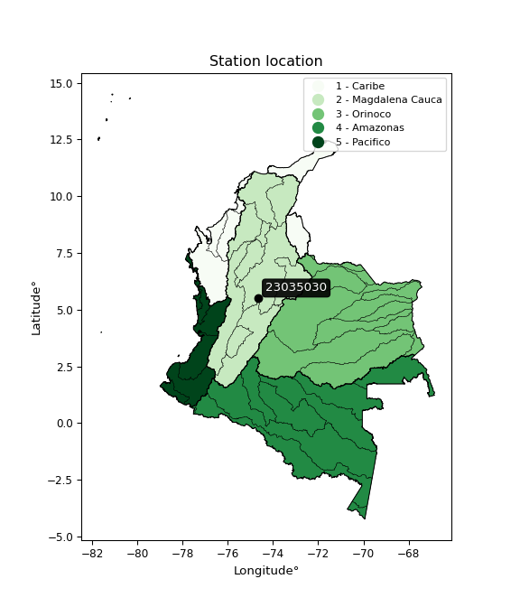</img>

</div>


## A. General information


### 1. General running parameters

• app_version: _v20260103_. • runtime: _2026-01-05 16:20:51.132608_. • Python version: _3.14.0_. • SciPy version: _1.16.3_. • Pandas version: _2.3.3_. • NumPy version: _2.3.5_. • Stations dataset (station_dataset_file): _dataset/pmax24h_in/automatic_colombia_2003_2024.csv_. • Stations catalog (station_catalog_file): _dataset/CNE.xls_. • Minimum year to eval til year_max (date_min): _1900_. • Maximum year to eval since year_min (date_max): _2024_. • Creates, save and include plots into reports (create_plot): _True_. • Plot only fit distributions with Δo > Δ (plot_only_fit): _True_. • Plot only simple graphs avoiding multiple CDFs and multiple Extreme values plots (plot_only_simple): _True_. • Eval low extreme values, if False, evaluates high extreme values (low_extreme): _False_. • Eval every SciPy distribution as logarithmic (pdist_logarithmic_on): _True_. • Standard deviation normalized (ddof): _1.0_. • Return periods to eval in years (Tr): _[2, 2.33, 5, 10, 15, 20, 25, 50, 75, 100, 200, 250, 500, 750, 1000]_. • Minimum data sample per station, 0 means any (minimum_sample): _5_. • Z-Score maximum threshold to adjust a value, 0 means disable (zscore_max): _3.5_. • Z-Score minimum threshold to adjust a value, 0 means disable (zscore_min): _-2.5_. • Avoid zeros, e.g. rain = 0 (avoid_zeros): _True_. • Avoid null values (avoid_nans): _True_. 

[:file_folder:Dataset file](../../dataset/pmax24h_in/automatic_colombia_2003_2024.csv)

> Delta Degrees of Freedom (DDOF): is a parameter used in the formulas for calculating variance and standard deviation. When ddof=0, the divisor is $N$ (the total number of observations) and this is used when your data set is the entire population. When ddof=1, the divisor is $N-1$ and this is used when your data set is a sample drawn from a larger population. Using $N-1$ provides an unbiased estimate of the population variance (known as Bessel´s correction).


### 2. Station info and location

|   id |   CODIGO | NOMBRE                            | CATEGORIA               | TECNOLOGIA                              | ESTADO   | FECHA_INSTALACION   |   FECHA_SUSPENSION |   ALTITUD |   LATITUD |   LONGITUD | DEPARTAMENTO   | MUNICIPIO     | AREA_OPERATIVA             | ENTIDAD                                                     | AREA_HIDROGRAFICA   | ZONA_HIDROGRAFICA   | SUBZONA_HIDROGRAFICA                               |   CORRIENTE | Catalogo   |   Version |
|-----:|---------:|:----------------------------------|:------------------------|:----------------------------------------|:---------|:--------------------|-------------------:|----------:|----------:|-----------:|:---------------|:--------------|:---------------------------|:------------------------------------------------------------|:--------------------|:--------------------|:---------------------------------------------------|------------:|:-----------|----------:|
|    0 | 23035030 | BASE PALANQUERO  - AUT [23035030] | Climatológica Principal | Automática con Telemetría, Convencional | Activa   | 03/11/2005          |                nan |       170 |   5.49423 |   -74.6581 | Cundinamarca   | Puerto Salgar | Area Operativa 10 - Tolima | INSTITUTO DE HIDROLOGIA METEOROLOGIA Y ESTUDIOS AMBIENTALES | Magdalena Cauca     | Medio Magdalena     | Directos al Magdalena entre Ríos Seco y Negro (md) |         nan | CNE_IDEAM  |  20251226 |

<div align="center">

Dynamic map: [:earth_americas:Google](http://maps.google.com/maps?q=5.49423,-74.65807) [:earth_americas:OSM](https://www.openstreetmap.org/#map=18/5.49423/-74.65807&layers=P) [:earth_americas:Bing](https://www.bing.com/maps?cp=5.49423~-74.65807&lvl=18) [:earth_americas:Apple](https://maps.apple.com/frame?center=5.49423%2C-74.65807&span=0.003%2C0.006)

</div>


<div align="center">

```geojson
{
  "type": "Feature",
  "geometry": {
    "type": "Point", 
    "coordinates": [-74.65807, 5.49423]
  }, 
  "properties": {
    "Name": "23035030"
  }
}
```

</div>


### 3. Discrete values table and plot

<div align="center">

|               |          0 |          1 |            2 |           3 |           4 |           5 |          6 |           7 |           8 |           9 |         10 |          11 |        12 |          13 |          14 |         15 |         16 |
|:--------------|-----------:|-----------:|-------------:|------------:|------------:|------------:|-----------:|------------:|------------:|------------:|-----------:|------------:|----------:|------------:|------------:|-----------:|-----------:|
| Date          | 2005       | 2006       | 2007         | 2008        | 2009        | 2010        | 2011       | 2012        | 2013        | 2014        | 2015       | 2016        | 2017      | 2018        | 2019        | 2020       | 2024       |
| Value         |   50.2     |  140.7     |   94.7       |  114.1      |   77.9      |  112.7      |  178.9     |  104.7      |   98.6      |   71.6      |   42.1     |  106.7      |   51.3    |   69        |   64.4      |   37       |  152.2     |
| Value_initial |   50.2     |  140.7     |   94.7       |  114.1      |   77.9      |  112.7      |  178.9     |  104.7      |   98.6      |   71.6      |   42.1     |  106.7      |   51.3    |   69        |   64.4      |   37       |  152.2     |
| count         |   17       |   17       |   17         |   17        |   17        |   17        |   17       |   17        |   17        |   17        |   17       |   17        |   17      |   17        |   17        |   17       |   17       |
| mean          |   92.1647  |   92.1647  |   92.1647    |   92.1647   |   92.1647   |   92.1647   |   92.1647  |   92.1647   |   92.1647   |   92.1647   |   92.1647  |   92.1647   |   92.1647 |   92.1647   |   92.1647   |   92.1647  |   92.1647  |
| std           |   40.0909  |   40.0909  |   40.0909    |   40.0909   |   40.0909   |   40.0909   |   40.0909  |   40.0909   |   40.0909   |   40.0909   |   40.0909  |   40.0909   |   40.0909 |   40.0909   |   40.0909   |   40.0909  |   40.0909  |
| zscore        |   -1.04674 |    1.21063 |    0.0632386 |    0.547139 |   -0.355809 |    0.512218 |    2.16347 |    0.312672 |    0.160518 |   -0.512952 |   -1.24878 |    0.362558 |   -1.0193 |   -0.577805 |   -0.692544 |   -1.37599 |    1.49748 |


</div>


<div align="center">

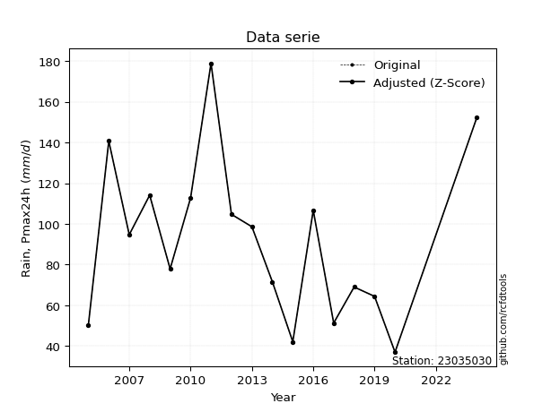</img>

</div>


> The initial value (value_initial) correspond to the initial obtained or null completed value, and value (value) is adjusted only when the initial value is outside the valid range (outlier) definite through the Z-Score value. If Z-Score is active, values out of range or outliers are replaced with the station mean value. A Z-Score (or standard score) measures how many standard deviations a data point is from the mean of a dataset, indicating its relative position; positive scores mean above the mean, negative mean below, and a score of zero is exactly at the mean, allowing for comparison of values from different distributions. It´s calculated using the formula $z=(x–μ)/σ$, where $x$ is the data point, $μ$ is the mean, and $σ$ is the standard deviation, helping identify outliers and understand probability.
>
> <sub>**Note**: In this study, "completing" (filling gaps in) and "extending" (forecasting or lengthening the historical record) rainfall data series are avoided for certain critical analyses because they introduce artificial bias and uncertainty, which can distort the statistics of rare events (extremes), alter day-to-day variability, and compromise the integrity and homogeneity of the original data. Some reasons against Completing/Extending rainfall data are: **Distortion of Extremes and Variability**: The primary issue is that most gap-filling or extension methods rely on averaging or regression with nearby stations, which inherently smooths the data. Rainfall is highly variable in space and time, with a large percentage of zero values and occasional large storms. Infilling methods often underestimate the highest values and overestimate the lowest (zero) values, which severely distorts analyses focused on flood frequency, drought severity, and intensity-duration-frequency (IDF) curves, **Loss of Data Homogeneity**: Infilled or extended data are synthetic estimates, not actual measurements. Combining these estimates with observed data can violate the assumption of data homogeneity, which requires that the data properties do not change over time. Inhomogeneity can lead to incorrect conclusions about long-term trends or changes in climate patterns, **Propagation of Errors**: Errors and biases from the original data (e.g., wind-induced undercatch, instrument errors, site changes) or the data used for imputation can propagate through the analysis, leading to unreliable hydrological models and inaccurate predictions, **Compromised Statistical Integrity**: For statistical analyses, especially those involving the frequency of events, using artificial data can introduce time bias or autocorrelation that doesn´t exist in reality, making it difficult to assess the true probability of events, **Difficulty in Validation**: It is difficult to accurately validate the quality of filled or extended data, especially for past periods where ground-truth measurements are unavailable. The reliability of imputation techniques heavily depends on the density of the surrounding station network and the complexity of the local topography.</sub>


### 4. Active continuous probability distributions from SciPy (44 of 104 available)

A Probability Density Function (PDF) describes the relative likelihood of a continuous random variable falling within a specific range, where the total area under its curve equals 1, and the area over any interval gives the actual probability for that range. Unlike discrete probabilities (like rolling a die), a PDF shows density, not direct probability for a single point (which is zero), with higher points indicating higher likelihood, often visualized as a bell curve for normal distributions.

A log of a probability density function (log-PDF) is simply the logarithm of the PDF´s value, denoted as $log(f(x))$, useful for converting multiplication of probabilities into addition, improving numerical stability with tiny numbers, and connecting to information theory concepts like entropy. Instead of dealing with very small probabilities (e.g., 0.000001), log-PDFs use negative numbers (e.g., $log(0.00001) ≈ -11.51$ that are easier for computers to handle, preventing underflow errors and simplifying complex calculations. In this study, each active probability distribution from SciPy is also evaluated in the $log$ form.

[scipy.stats](https://docs.scipy.org/doc/scipy/reference/stats.html) is a Python´s powerful submodule within the SciPy library for comprehensive statistical analysis, offering over 130 probability distributions (like Normal, Poisson), functions for descriptive stats (mean, variance), hypothesis testing (t-tests, chi-square), random variable generation, and statistical tests, making it essential for data science, modeling, and research. It provides tools to explore, model, and draw conclusions from data efficiently, working seamlessly with NumPy.

<div align="center">

|   id | p_dist             |   n_parameter | fit_method   | label                                                                       | active   | ref                                                                                                        |
|-----:|:-------------------|--------------:|:-------------|:----------------------------------------------------------------------------|:---------|:-----------------------------------------------------------------------------------------------------------|
|    0 | alpha              |             3 | MLE          | Alpha                                                                       | True     | [:mortar_board:](https://docs.scipy.org/doc/scipy/reference/generated/scipy.stats.alpha.html)              |
|    1 | betaprime          |             4 | MLE          | Beta prime                                                                  | True     | [:mortar_board:](https://docs.scipy.org/doc/scipy/reference/generated/scipy.stats.betaprime.html)          |
|    2 | chi2               |             3 | MLE          | Chi²                                                                        | True     | [:mortar_board:](https://docs.scipy.org/doc/scipy/reference/generated/scipy.stats.chi2.html)               |
|    3 | crystalball        |             4 | MLE          | Crystalball                                                                 | True     | [:mortar_board:](https://docs.scipy.org/doc/scipy/reference/generated/scipy.stats.crystalball.html)        |
|    4 | erlang             |             3 | MLE          | Erlang                                                                      | True     | [:mortar_board:](https://docs.scipy.org/doc/scipy/reference/generated/scipy.stats.erlang.html)             |
|    5 | expon              |             2 | MLE          | Exponential                                                                 | True     | [:mortar_board:](https://docs.scipy.org/doc/scipy/reference/generated/scipy.stats.expon.html)              |
|    6 | exponnorm          |             3 | MLE          | Exponentially modified Normal                                               | True     | [:mortar_board:](https://docs.scipy.org/doc/scipy/reference/generated/scipy.stats.exponnorm.html)          |
|    7 | f                  |             4 | MLE          | F                                                                           | True     | [:mortar_board:](https://docs.scipy.org/doc/scipy/reference/generated/scipy.stats.f.html)                  |
|    8 | fatiguelife        |             3 | MLE          | Fatigue-life (Birnbaum-Saunders)                                            | True     | [:mortar_board:](https://docs.scipy.org/doc/scipy/reference/generated/scipy.stats.fatiguelife.html)        |
|    9 | fisk               |             3 | MLE          | Fisk                                                                        | True     | [:mortar_board:](https://docs.scipy.org/doc/scipy/reference/generated/scipy.stats.fisk.html)               |
|   10 | gamma              |             3 | MLE          | Gamma                                                                       | True     | [:mortar_board:](https://docs.scipy.org/doc/scipy/reference/generated/scipy.stats.gamma.html)              |
|   11 | genexpon           |             5 | MLE          | Generalized exponential                                                     | True     | [:mortar_board:](https://docs.scipy.org/doc/scipy/reference/generated/scipy.stats.genexpon.html)           |
|   12 | genlogistic        |             3 | MLE          | Generalized logistic                                                        | True     | [:mortar_board:](https://docs.scipy.org/doc/scipy/reference/generated/scipy.stats.genlogistic.html)        |
|   13 | gibrat             |             2 | MM           | Gibrat                                                                      | True     | [:mortar_board:](https://docs.scipy.org/doc/scipy/reference/generated/scipy.stats.gibrat.html)             |
|   14 | gompertz           |             3 | MLE          | Gompertz (or truncated Gumbel)                                              | True     | [:mortar_board:](https://docs.scipy.org/doc/scipy/reference/generated/scipy.stats.gompertz.html)           |
|   15 | gumbel_l           |             2 | MM           | Gumbel Left Skew                                                            | True     | [:mortar_board:](https://docs.scipy.org/doc/scipy/reference/generated/scipy.stats.gumbel_l.html)           |
|   16 | gumbel_r           |             2 | MM           | Gumbel Right Skew                                                           | True     | [:mortar_board:](https://docs.scipy.org/doc/scipy/reference/generated/scipy.stats.gumbel_r.html)           |
|   17 | halflogistic       |             2 | MM           | Half-logistic                                                               | True     | [:mortar_board:](https://docs.scipy.org/doc/scipy/reference/generated/scipy.stats.halflogistic.html)       |
|   18 | halfnorm           |             2 | MM           | Half Normal                                                                 | True     | [:mortar_board:](https://docs.scipy.org/doc/scipy/reference/generated/scipy.stats.halfnorm.html)           |
|   19 | hypsecant          |             2 | MM           | hyperbolic secant                                                           | True     | [:mortar_board:](https://docs.scipy.org/doc/scipy/reference/generated/scipy.stats.hypsecant.html)          |
|   20 | invgamma           |             3 | MLE          | Inverted gamma                                                              | True     | [:mortar_board:](https://docs.scipy.org/doc/scipy/reference/generated/scipy.stats.invgamma.html)           |
|   21 | invgauss           |             3 | MLE          | Inverse Gaussian                                                            | True     | [:mortar_board:](https://docs.scipy.org/doc/scipy/reference/generated/scipy.stats.invgauss.html)           |
|   22 | invweibull         |             3 | MLE          | Inverted Weibull                                                            | True     | [:mortar_board:](https://docs.scipy.org/doc/scipy/reference/generated/scipy.stats.invweibull.html)         |
|   23 | johnsonsu          |             4 | MLE          | Johnson Su                                                                  | True     | [:mortar_board:](https://docs.scipy.org/doc/scipy/reference/generated/scipy.stats.johnsonsu.html)          |
|   24 | kstwobign          |             2 | MLE          | Limiting distribution of scaled Kolmogorov-Smirnov two-sided test statistic | True     | [:mortar_board:](https://docs.scipy.org/doc/scipy/reference/generated/scipy.stats.kstwobign.html)          |
|   25 | laplace            |             2 | MM           | Laplace                                                                     | True     | [:mortar_board:](https://docs.scipy.org/doc/scipy/reference/generated/scipy.stats.laplace.html)            |
|   26 | laplace_asymmetric |             3 | MLE          | Asymmetric Laplace                                                          | True     | [:mortar_board:](https://docs.scipy.org/doc/scipy/reference/generated/scipy.stats.laplace_asymmetric.html) |
|   27 | loggamma           |             3 | MLE          | Log gamma                                                                   | True     | [:mortar_board:](https://docs.scipy.org/doc/scipy/reference/generated/scipy.stats.loggamma.html)           |
|   28 | logistic           |             2 | MM           | Logistic (or Sech-squared)                                                  | True     | [:mortar_board:](https://docs.scipy.org/doc/scipy/reference/generated/scipy.stats.logistic.html)           |
|   29 | lognorm            |             3 | MLE          | Log Normal                                                                  | True     | [:mortar_board:](https://docs.scipy.org/doc/scipy/reference/generated/scipy.stats.lognorm.html)            |
|   30 | maxwell            |             2 | MM           | Maxwell                                                                     | True     | [:mortar_board:](https://docs.scipy.org/doc/scipy/reference/generated/scipy.stats.maxwell.html)            |
|   31 | mielke             |             4 | MLE          | Mielke Beta-Kappa / Dagum                                                   | True     | [:mortar_board:](https://docs.scipy.org/doc/scipy/reference/generated/scipy.stats.mielke.html)             |
|   32 | moyal              |             2 | MM           | Moyal                                                                       | True     | [:mortar_board:](https://docs.scipy.org/doc/scipy/reference/generated/scipy.stats.moyal.html)              |
|   33 | nakagami           |             3 | MLE          | Nakagami                                                                    | True     | [:mortar_board:](https://docs.scipy.org/doc/scipy/reference/generated/scipy.stats.nakagami.html)           |
|   34 | ncf                |             5 | MLE          | Non-central F distribution                                                  | True     | [:mortar_board:](https://docs.scipy.org/doc/scipy/reference/generated/scipy.stats.ncf.html)                |
|   35 | nct                |             4 | MLE          | Non-central Student’s t                                                     | True     | [:mortar_board:](https://docs.scipy.org/doc/scipy/reference/generated/scipy.stats.nct.html)                |
|   36 | norm               |             2 | MM           | Normal                                                                      | True     | [:mortar_board:](https://docs.scipy.org/doc/scipy/reference/generated/scipy.stats.norm.html)               |
|   37 | pearson3           |             3 | MM           | Pearson type III                                                            | True     | [:mortar_board:](https://docs.scipy.org/doc/scipy/reference/generated/scipy.stats.pearson3.html)           |
|   38 | rayleigh           |             2 | MM           | Rayleigh                                                                    | True     | [:mortar_board:](https://docs.scipy.org/doc/scipy/reference/generated/scipy.stats.rayleigh.html)           |
|   39 | rice               |             3 | MLE          | Rice                                                                        | True     | [:mortar_board:](https://docs.scipy.org/doc/scipy/reference/generated/scipy.stats.rice.html)               |
|   40 | t                  |             3 | MLE          | Student’s t                                                                 | True     | [:mortar_board:](https://docs.scipy.org/doc/scipy/reference/generated/scipy.stats.t.html)                  |
|   41 | truncnorm          |             4 | MLE          | Truncated normal                                                            | True     | [:mortar_board:](https://docs.scipy.org/doc/scipy/reference/generated/scipy.stats.truncnorm.html)          |
|   42 | wald               |             2 | MM           | Wald                                                                        | True     | [:mortar_board:](https://docs.scipy.org/doc/scipy/reference/generated/scipy.stats.wald.html)               |
|   43 | weibull_min        |             3 | MLE          | Weibull minimum                                                             | True     | [:mortar_board:](https://docs.scipy.org/doc/scipy/reference/generated/scipy.stats.weibull_min.html)        |

</div>

> **n_parameter:** # arguments & localization & scale.
>
> **Fit methods:** (MLE) maximum likelihood, (MM) L-moments.
>
>**Inactive** (With the only purpose of prevent loops, zero divisions, infinite values, over high estimated values or horizontal trending for recurrence intervals estimations, the follow distributions were disabled.)**:** foldnorm, gennorm, norminvgauss, powernorm, powerlognorm, skewnorm, genextreme, anglit, arcsine, argus, beta, bradford, burr, burr12, cauchy, cosine, halfcauchy, foldcauchy, skewcauchy, wrapcauchy, dgamma, gengamma, exponweib, exponpow, truncexpon, gausshyper, genhalflogistic, genhyperbolic, geninvgauss, halfgennorm, johnsonsb, kappa4, kappa3, ksone, kstwo, loglaplace, levy, levy_l, levy_stable, ncx2, pareto, genpareto, truncpareto, lomax, powerlaw, rdist, rel_breitwigner, recipinvgauss, semicircular, studentized_range, trapezoid, triang, truncweibull_min, tukeylambda, uniform, loguniform, vonmises, vonmises_line, weibull_max, dweibull, 


## B. Probability (PDF) vs. Empirical (EDF) distributions functions

A continuous probability distribution (CPD) describes probabilities for variables that can take any value within a range (like rain any time), unlike discrete variables with specific outcomes (like temperature). It uses a Probability Density Function (PDF), a curve where the total area under it equals 1, and the probability of the variable falling within an interval (a to b) is found by calculating the area under the curve between those points. A key feature is that the probability of hitting any single exact value is zero, so probabilities are always expressed for ranges, e.g., $P(a ≤ X ≤ b)$.

<div align="center">

Distributions parameters from station values
|    |   station | p_dist                |   n |              loc |           scale | shape                 | shape1                 | shape2                | shape3   |
|---:|----------:|:----------------------|----:|-----------------:|----------------:|:----------------------|:-----------------------|:----------------------|:---------|
|  0 |  23035030 | alpha                 |  17 |   -156.035       |  1608.58        | 6.63561419544072      |                        |                       |          |
|  1 |  23035030 | betaprime             |  17 |     -4.38553     |   539.76        | 7.1127630001804745    | 40.762342085912756     |                       |          |
|  2 |  23035030 | chi2                  |  17 |     33.2833      |    17.5444      | 3.3561363804951956    |                        |                       |          |
|  3 |  23035030 | crystalball           |  17 |     92.1647      |    38.8939      | 7069.57349551336      | 3640.8194316572235     |                       |          |
|  4 |  23035030 | erlang                |  17 |     33.2833      |    35.0888      | 1.678067669670055     |                        |                       |          |
|  5 |  23035030 | expon                 |  17 |     37           |    55.1647      |                       |                        |                       |          |
|  6 |  23035030 | exponnorm             |  17 |     58.2268      |    23.4288      | 1.4485589961082153    |                        |                       |          |
|  7 |  23035030 | f                     |  17 |     30.4987      |    58.7689      | 3.9330711330788404    | 265.76489251746494     |                       |          |
|  8 |  23035030 | fatiguelife           |  17 |     37           |     0.000183554 | 490.32507230609826    |                        |                       |          |
|  9 |  23035030 | fisk                  |  17 |     -0.190718    |    85.4484      | 3.8190338192590634    |                        |                       |          |
| 10 |  23035030 | gamma                 |  17 |     33.2833      |    35.0888      | 1.6780675286299434    |                        |                       |          |
| 11 |  23035030 | genexpon              |  17 |     37           |     1.03357     | 0.018726803535558167  | 1.1996551585558399e-06 | 1.1383961191853045    |          |
| 12 |  23035030 | genlogistic           |  17 |   -137.255       |    31.7561      | 768.3686418344414     |                        |                       |          |
| 13 |  23035030 | gibrat                |  17 |     62.4936      |    17.9964      |                       |                        |                       |          |
| 14 |  23035030 | gompertz              |  17 |     37           |    84.9113      | 0.8755688726622399    |                        |                       |          |
| 15 |  23035030 | gumbel_l              |  17 |    109.669       |    30.3254      |                       |                        |                       |          |
| 16 |  23035030 | gumbel_r              |  17 |     74.6604      |    30.3254      |                       |                        |                       |          |
| 17 |  23035030 | halflogistic          |  17 |     46.0665      |    33.2529      |                       |                        |                       |          |
| 18 |  23035030 | halfnorm              |  17 |     40.6844      |    64.5209      |                       |                        |                       |          |
| 19 |  23035030 | hypsecant             |  17 |     92.1647      |    24.7606      |                       |                        |                       |          |
| 20 |  23035030 | invgamma              |  17 |    -55.4359      |  2071.72        | 15.02019155989577     |                        |                       |          |
| 21 |  23035030 | invgauss              |  17 |     -6.74487     |   560.517       | 0.17646142615206      |                        |                       |          |
| 22 |  23035030 | invweibull            |  17 |     -1.0372e+09  |     1.0372e+09  | 32685482.004577465    |                        |                       |          |
| 23 |  23035030 | johnsonsu             |  17 |    -10.0793      |     4.77486     | -9.45443790499229     | 2.566850844224584      |                       |          |
| 24 |  23035030 | kstwobign             |  17 |    -37.7052      |   148.875       |                       |                        |                       |          |
| 25 |  23035030 | laplace               |  17 |     92.1647      |    27.5021      |                       |                        |                       |          |
| 26 |  23035030 | laplace_asymmetric    |  17 |     94.7         |    31.9814      | 1.040419670260666     |                        |                       |          |
| 27 |  23035030 | loggamma              |  17 |  -7340.87        |  1114.86        | 786.6005232161649     |                        |                       |          |
| 28 |  23035030 | logistic              |  17 |     92.1647      |    21.4433      |                       |                        |                       |          |
| 29 |  23035030 | lognorm               |  17 |     -9.89601     |    94.7462      | 0.39098157718399623   |                        |                       |          |
| 30 |  23035030 | maxwell               |  17 |      0.00253623  |    57.7541      |                       |                        |                       |          |
| 31 |  23035030 | mielke                |  17 |     -0.643621    |   106.311       | 2.791274143592829     | 4.964440646383482      |                       |          |
| 32 |  23035030 | moyal                 |  17 |     69.9227      |    17.5084      |                       |                        |                       |          |
| 33 |  23035030 | nakagami              |  17 |     37           |    64.5342      | 0.3899494460230429    |                        |                       |          |
| 34 |  23035030 | ncf                   |  17 |     -1.29195     |    93.4418      | 11.464348619784378    | 822.7271704736881      | 2.872377439598183e-05 |          |
| 35 |  23035030 | nct                   |  17 |     -0.0973207   |    26.2162      | 7.57459000950217      | 3.1626752539842418     |                       |          |
| 36 |  23035030 | norm                  |  17 |     92.1647      |    38.8939      |                       |                        |                       |          |
| 37 |  23035030 | pearson3              |  17 |     92.1647      |    38.8939      | 0.5267095774192149    |                        |                       |          |
| 38 |  23035030 | rayleigh              |  17 |     17.7584      |    59.3676      |                       |                        |                       |          |
| 39 |  23035030 | rice                  |  17 |     22.6874      |    56.3019      | 0.002440331604589817  |                        |                       |          |
| 40 |  23035030 | t                     |  17 |     92.1606      |    38.92        | 48737.584696712845    |                        |                       |          |
| 41 |  23035030 | truncnorm             |  17 |     92.1647      |    38.8939      | -1184.6506690415267   | 1425.206578806171      |                       |          |
| 42 |  23035030 | wald                  |  17 |     53.2708      |    38.8939      |                       |                        |                       |          |
| 43 |  23035030 | weibull_min           |  17 |     34.2625      |    63.1916      | 1.4063034080057135    |                        |                       |          |
| 44 |  23035030 | logalpha              |  17 |     -6.18087     |   252.707       | 23.866687432334338    |                        |                       |          |
| 45 |  23035030 | logbetaprime          |  17 |     -7.21915     |    23.4123      | 1011.6151941803447    | 2034.1212375255986     |                       |          |
| 46 |  23035030 | logchi2               |  17 |      3.61092     |     0.953804    | 1.1257174308508517    |                        |                       |          |
| 47 |  23035030 | logcrystalball        |  17 |      4.43022     |     0.441585    | 7.980241919759472     | 2.2079224358122262     |                       |          |
| 48 |  23035030 | logerlang             |  17 |     -3.75654     |     0.0242004   | 338.213126440554      |                        |                       |          |
| 49 |  23035030 | logexpon              |  17 |      3.61092     |     0.819304    |                       |                        |                       |          |
| 50 |  23035030 | logexponnorm          |  17 |      4.42985     |     0.441584    | 0.0008400211857693346 |                        |                       |          |
| 51 |  23035030 | logf                  |  17 |   -189.761       |   194.191       | 768368.9553051963     | 772521.6971630997      |                       |          |
| 52 |  23035030 | logfatiguelife        |  17 |    -74.6306      |    79.0594      | 0.005588835162676552  |                        |                       |          |
| 53 |  23035030 | logfisk               |  17 |     -1.58358e+07 |     1.58358e+07 | 60347506.82969371     |                        |                       |          |
| 54 |  23035030 | loggamma              |  17 |     -3.8796      |     0.0239622   | 346.6718403563867     |                        |                       |          |
| 55 |  23035030 | loggenexpon           |  17 |      3.61092     |     0.929544    | 0.8225772520921202    | 1.4632904391967423     | 0.4811740857394111    |          |
| 56 |  23035030 | loggenlogistic        |  17 |      4.66772     |     0.200586    | 0.549219236983995     |                        |                       |          |
| 57 |  23035030 | loggibrat             |  17 |      4.09333     |     0.204336    |                       |                        |                       |          |
| 58 |  23035030 | loggompertz           |  17 |      3.61092     |     1.06632     | 0.7671234423165236    |                        |                       |          |
| 59 |  23035030 | loggumbel_l           |  17 |      4.62896     |     0.344302    |                       |                        |                       |          |
| 60 |  23035030 | loggumbel_r           |  17 |      4.23149     |     0.344302    |                       |                        |                       |          |
| 61 |  23035030 | loghalflogistic       |  17 |      3.90686     |     0.377526    |                       |                        |                       |          |
| 62 |  23035030 | loghalfnorm           |  17 |      3.84578     |     0.732497    |                       |                        |                       |          |
| 63 |  23035030 | loghypsecant          |  17 |      4.43022     |     0.281122    |                       |                        |                       |          |
| 64 |  23035030 | loginvgamma           |  17 |     -3.94627     |  2916.47        | 349.21630075426776    |                        |                       |          |
| 65 |  23035030 | loginvgauss           |  17 |      0.833271    |   218.691       | 0.01640817179103496   |                        |                       |          |
| 66 |  23035030 | loginvweibull         |  17 |     -4.93718e+07 |     4.93718e+07 | 115681847.37041605    |                        |                       |          |
| 67 |  23035030 | logjohnsonsu          |  17 |      7.30738     |     0.679518    | 14.298998288985857    | 6.6850742794217055     |                       |          |
| 68 |  23035030 | logkstwobign          |  17 |      2.70231     |     1.97502     |                       |                        |                       |          |
| 69 |  23035030 | loglaplace            |  17 |      4.43022     |     0.312248    |                       |                        |                       |          |
| 70 |  23035030 | loglaplace_asymmetric |  17 |      4.67002     |     0.326683    | 1.4329784095757088    |                        |                       |          |
| 71 |  23035030 | logloggamma           |  17 |      2.32168     |     1.12985     | 6.957342515495828     |                        |                       |          |
| 72 |  23035030 | loglogistic           |  17 |      4.43022     |     0.243458    |                       |                        |                       |          |
| 73 |  23035030 | loglognorm            |  17 | -65532.4         | 65536.8         | 6.737969890208899e-06 |                        |                       |          |
| 74 |  23035030 | logmaxwell            |  17 |      3.38385     |     0.655716    |                       |                        |                       |          |
| 75 |  23035030 | logmielke             |  17 |      3.61092     |     1.55862     | 0.8850814725323995    | 13.628343491460118     |                       |          |
| 76 |  23035030 | logmoyal              |  17 |      4.1777      |     0.198783    |                       |                        |                       |          |
| 77 |  23035030 | lognakagami           |  17 |    -83.293       |    87.7238      | 9833.149747536896     |                        |                       |          |
| 78 |  23035030 | logncf                |  17 |    -63.2184      |    63.8998      | 73313.30664266649     | 127615.95491388868     | 4299.533152672162     |          |
| 79 |  23035030 | lognct                |  17 |     17.7473      |     0.434734    | 14132.940112951865    | -30.629478305396635    |                       |          |
| 80 |  23035030 | lognorm               |  17 |      4.43022     |     0.441585    |                       |                        |                       |          |
| 81 |  23035030 | logpearson3           |  17 |      4.43022     |     0.441585    | -0.20385932408080443  |                        |                       |          |
| 82 |  23035030 | lograyleigh           |  17 |      3.58544     |     0.674035    |                       |                        |                       |          |
| 83 |  23035030 | logrice               |  17 |      3.42558     |     0.496089    | 1.701019007524943     |                        |                       |          |
| 84 |  23035030 | logt                  |  17 |      4.43023     |     0.441561    | 10364.22472179104     |                        |                       |          |
| 85 |  23035030 | logtruncnorm          |  17 |     -0.220772    |     1.86456     | 2.055004302392535     | 2.9002107204507617     |                       |          |
| 86 |  23035030 | logwald               |  17 |      3.9886      |     0.441619    |                       |                        |                       |          |
| 87 |  23035030 | logweibull_min        |  17 |      2.87758     |     1.71573     | 4.074211431505965     |                        |                       |          |

</div>

> **loc** (Location parameter): This shifts the distribution along the x-axis. For many common distributions, like the normal (Gaussian) distribution, loc represents the mean $μ$. For others, like the uniform distribution, it might represent the minimum value, or for the beta distribution, the left end of the support interval.
>
> **scale** (Scale parameter): This determines the width or spread of the distribution. For the normal distribution, scale represents the standard deviation $σ$. For a uniform distribution, it defines the length of the interval (from $loc$ to $loc + scale$).
>
> **shape** (Shape parameters): Refers to parameters that define the specific form of a probability distribution, distinct from its location (loc) and scale (scale). These parameters are required arguments for most distribution functions. For example, a normal (Gaussian) distribution is fully defined by its location (mean) and scale (standard deviation), so it has no specific shape parameters beyond loc and scale. However, other distributions have intrinsic properties that need specification, as Gamma distribution that takes a shape parameter, often named $a$ or $alpha$.


### 0. Cumulative distribution values - CDF (88 evaluated)

Cumulative Distribution Function (CDF), denoted as $F$<sub>$X$</sub>$(x)$, is a function that gives the probability that a random variable $X$ will take a value less than or equal to a specific value, $x$ (i.e., $(P(X≥x)$. It essentially "accumulates" probabilities from a given point up to the far right (positive infinity), providing a complete picture of the distribution´s probabilities for both discrete (like rain) and continuous (like temperature) variables, helping to find probabilities over ranges or above certain values. Each station is evaluated separately ordering the $x$ values ascending, calculating the CDF and PDF values for the activated distributions and their logarithmic forms.

<div align="center">

CDF ordered by x ascending and calculating $log(f(x))$ separately
|   id |   Station |   date |     x |   count |    mean |     std |     zscore |   Value_initial |   station |   m |     alpha |   alpha_pdf |   betaprime |   betaprime_pdf |      chi2 |   chi2_pdf |   crystalball |   crystalball_pdf |    erlang |   erlang_pdf |     expon |   expon_pdf |   exponnorm |   exponnorm_pdf |         f |      f_pdf |   fatiguelife |   fatiguelife_pdf |      fisk |   fisk_pdf |     gamma |   gamma_pdf |    genexpon |   genexpon_pdf |   genlogistic |   genlogistic_pdf |    gibrat |   gibrat_pdf |    gompertz |   gompertz_pdf |   gumbel_l |   gumbel_l_pdf |   gumbel_r |   gumbel_r_pdf |   halflogistic |   halflogistic_pdf |   halfnorm |   halfnorm_pdf |   hypsecant |   hypsecant_pdf |   invgamma |   invgamma_pdf |   invgauss |   invgauss_pdf |   invweibull |   invweibull_pdf |   johnsonsu |   johnsonsu_pdf |   kstwobign |   kstwobign_pdf |   laplace |   laplace_pdf |   laplace_asymmetric |   laplace_asymmetric_pdf |   loggamma |   loggamma_pdf |   logistic |   logistic_pdf |   lognorm |   lognorm_pdf |   maxwell |   maxwell_pdf |    mielke |   mielke_pdf |     moyal |   moyal_pdf |    nakagami |   nakagami_pdf |       ncf |    ncf_pdf |       nct |    nct_pdf |      norm |    norm_pdf |   pearson3 |   pearson3_pdf |   rayleigh |   rayleigh_pdf |      rice |   rice_pdf |         t |       t_pdf |   truncnorm |   truncnorm_pdf |     wald |    wald_pdf |   weibull_min |   weibull_min_pdf |   logalpha |   logalpha_pdf |   logbetaprime |   logbetaprime_pdf |     logchi2 |   logchi2_pdf |   logcrystalball |   logcrystalball_pdf |   logerlang |   logerlang_pdf |   logexpon |   logexpon_pdf |   logexponnorm |   logexponnorm_pdf |      logf |   logf_pdf |   logfatiguelife |   logfatiguelife_pdf |   logfisk |   logfisk_pdf |   loggenexpon |   loggenexpon_pdf |   loggenlogistic |   loggenlogistic_pdf |   loggibrat |   loggibrat_pdf |   loggompertz |   loggompertz_pdf |   loggumbel_l |   loggumbel_l_pdf |   loggumbel_r |   loggumbel_r_pdf |   loghalflogistic |   loghalflogistic_pdf |   loghalfnorm |   loghalfnorm_pdf |   loghypsecant |   loghypsecant_pdf |   loginvgamma |   loginvgamma_pdf |   loginvgauss |   loginvgauss_pdf |   loginvweibull |   loginvweibull_pdf |   logjohnsonsu |   logjohnsonsu_pdf |   logkstwobign |   logkstwobign_pdf |   loglaplace |   loglaplace_pdf |   loglaplace_asymmetric |   loglaplace_asymmetric_pdf |   logloggamma |   logloggamma_pdf |   loglogistic |   loglogistic_pdf |   loglognorm |   loglognorm_pdf |   logmaxwell |   logmaxwell_pdf |   logmielke |   logmielke_pdf |    logmoyal |   logmoyal_pdf |   lognakagami |   lognakagami_pdf |    logncf |   logncf_pdf |    lognct |   lognct_pdf |   logpearson3 |   logpearson3_pdf |   lograyleigh |   lograyleigh_pdf |   logrice |   logrice_pdf |      logt |   logt_pdf |   logtruncnorm |   logtruncnorm_pdf |   logwald |   logwald_pdf |   logweibull_min |   logweibull_min_pdf |
|-----:|----------:|-------:|------:|--------:|--------:|--------:|-----------:|----------------:|----------:|----:|----------:|------------:|------------:|----------------:|----------:|-----------:|--------------:|------------------:|----------:|-------------:|----------:|------------:|------------:|----------------:|----------:|-----------:|--------------:|------------------:|----------:|-----------:|----------:|------------:|------------:|---------------:|--------------:|------------------:|----------:|-------------:|------------:|---------------:|-----------:|---------------:|-----------:|---------------:|---------------:|-------------------:|-----------:|---------------:|------------:|----------------:|-----------:|---------------:|-----------:|---------------:|-------------:|-----------------:|------------:|----------------:|------------:|----------------:|----------:|--------------:|---------------------:|-------------------------:|-----------:|---------------:|-----------:|---------------:|----------:|--------------:|----------:|--------------:|----------:|-------------:|----------:|------------:|------------:|---------------:|----------:|-----------:|----------:|-----------:|----------:|------------:|-----------:|---------------:|-----------:|---------------:|----------:|-----------:|----------:|------------:|------------:|----------------:|---------:|------------:|--------------:|------------------:|-----------:|---------------:|---------------:|-------------------:|------------:|--------------:|-----------------:|---------------------:|------------:|----------------:|-----------:|---------------:|---------------:|-------------------:|----------:|-----------:|-----------------:|---------------------:|----------:|--------------:|--------------:|------------------:|-----------------:|---------------------:|------------:|----------------:|--------------:|------------------:|--------------:|------------------:|--------------:|------------------:|------------------:|----------------------:|--------------:|------------------:|---------------:|-------------------:|--------------:|------------------:|--------------:|------------------:|----------------:|--------------------:|---------------:|-------------------:|---------------:|-------------------:|-------------:|-----------------:|------------------------:|----------------------------:|--------------:|------------------:|--------------:|------------------:|-------------:|-----------------:|-------------:|-----------------:|------------:|----------------:|------------:|---------------:|--------------:|------------------:|----------:|-------------:|----------:|-------------:|--------------:|------------------:|--------------:|------------------:|----------:|--------------:|----------:|-----------:|---------------:|-------------------:|----------:|--------------:|-----------------:|---------------------:|
|    0 |  23035030 |   2020 |  37   |      17 | 92.1647 | 40.0909 | -1.37599   |            37   |  23035030 |   1 | 0.0448002 |  0.00407722 |   0.0420343 |      0.0043433  | 0.0142528 | 0.00618327 |     0.0780459 |       0.00375143  | 0.0142527 |   0.00618326 | 0         |  0.0181275  |   0.0515172 |      0.00385843 | 0.0223735 | 0.00627418 |     0.0377596 |       3.02305e+08 | 0.0400452 | 0.00394748 | 0.0142528 |  0.00618327 | 4.20916e-07 |     0.0181186  |     0.0418458 |        0.00417353 | 0         |  0           | 2.86185e-13 |     0.0103116  |  0.0870313 |    0.00274124  |  0.0313639 |     0.00358065 |      0         |         0          |  0         |     0          |   0.0683335 |     0.00273862  |  0.0404991 |     0.00418115 |  0.0331191 |     0.00444963 |    0.0413941 |       0.0041542  |   0.0363665 |      0.00432506 |   0.0372168 |      0.0043835  |  0.067274 |    0.00244614 |            0.0917771 |               0.00275822 |  0.0303475 |       0.165001 |  0.070924  |     0.00307293 | 0.0317716 |      0.16158  | 0.0619085 |    0.00461769 | 0.0549603 |   0.0040519  | 0.0104526 |  0.00219963 | 2.79504e-13 |    30.6787     | 0.0439048 | 0.00438619 | 0.0459269 | 0.00384504 | 0.0780459 | 0.00375143  |  0.0597988 |     0.00419024 |  0.0511677 |     0.00518001 | 0.0317954 | 0.00437158 | 0.0782034 | 0.00375452  |   0.0780459 |     0.00375143  | 0        | 0           |     0.0120267 |        0.00614111 |  0.0261075 |       0.159737 |      0.0307318 |           0.165194 | 1.78439e-09 |   2.26162e+06 |        0.0317716 |             0.16158  |   0.029823  |        0.163226 |   0        |       1.22055  |      0.0317716 |           0.16158  | 0.0317949 |   0.162035 |        0.0313983 |             0.161587 | 0.0398998 |      0.145985 |   2.48285e-09 |          0.884926 |        0.0552204 |             0.150422 |    0        |       0         |   8.52492e-10 |          0.719411 |     0.0506558 |         0.143335  |    0.00232477 |         0.0409458 |         0         |              0        |     0         |          0        |      0.0344939 |           0.122461 |     0.0276267 |          0.162465 |     0.0258862 |          0.170883 |       0.017771  |            0.167812 |      0.0433233 |           0.163514 |      0.0160245 |           0.187966 |    0.03626   |         0.116126 |               0.0700062 |                    0.149545 |     0.0421516 |          0.163182 |     0.0333986 |          0.132602 |    0.0317711 |         0.16158  |    0.0106552 |         0.137423 | 2.33026e-10 |       10.1143   | 3.17646e-05 |     0.00145554 |     0.031941  |          0.162529 | 0.0316927 |     0.162552 | 0.0319501 |     0.16155  |     0.0372681 |          0.164215 |   0.000713876 |         0.0560288 | 0.0166693 |      0.182401 | 0.031777  |   0.161567 |    1.38395e-06 |           1.43297  |  0        |      0        |        0.030848  |             0.168712 |
|    1 |  23035030 |   2015 |  42.1 |      17 | 92.1647 | 40.0909 | -1.24878   |            42.1 |  23035030 |   2 | 0.0690353 |  0.00544319 |   0.0679284 |      0.00581644 | 0.0555386 | 0.00960442 |     0.09901   |       0.00447954  | 0.0555386 |   0.00960443 | 0.0883056 |  0.0165268  |   0.0741773 |      0.00505171 | 0.0625002 | 0.00923862 |     0.63305   |       0.0125502   | 0.0637986 | 0.00539373 | 0.0555387 |  0.00960443 | 0.088269    |     0.0165204  |     0.0669567 |        0.00569067 | 0         |  0           | 0.0527578   |     0.0103722  |  0.10213   |    0.00318964  |  0.0536012 |     0.00517213 |      0         |         0          |  0.0175037 |     0.0123633  |   0.0837993 |     0.00334542  |  0.0656845 |     0.00570951 |  0.0606918 |     0.00636136 |    0.0664167 |       0.00567581 |   0.0627964 |      0.00604703 |   0.0638747 |      0.00607216 |  0.080981 |    0.00294453 |            0.106979  |               0.0032151  |  0.0585191 |       0.277371 |  0.0882859 |     0.00375369 | 0.0590324 |      0.266346 | 0.0880388 |    0.00562771 | 0.0781343 |   0.0050476  | 0.0268666 |  0.00435362 | 0.107709    |     0.0164422  | 0.0698298 | 0.00578256 | 0.0688801 | 0.00518289 | 0.09901   | 0.00447954  |  0.0838049 |     0.00523223 |  0.08062   |     0.00634957 | 0.0577095 | 0.00577061 | 0.099182  | 0.00448209  |   0.09901   |     0.00447954  | 0        | 0           |     0.0517281 |        0.00903744 |  0.0541983 |       0.282318 |      0.0588568 |           0.276347 | 0.240952    |   1.00555     |        0.0590324 |             0.266346 |   0.0577525 |        0.275459 |   0.145816 |       1.04257  |      0.0590325 |           0.266347 | 0.0591353 |   0.267121 |        0.0587251 |             0.267431 | 0.063651  |      0.227124 |   0.113891    |          0.874334 |        0.0784421 |             0.212694 |    0        |       0         |   0.0940367   |          0.735665 |     0.0728497 |         0.203685  |    0.0154892  |         0.187489  |         0         |              0        |     0         |          0        |      0.0545245 |           0.193006 |     0.0558709 |          0.281544 |     0.056247  |          0.306441 |       0.0508944 |            0.355125 |      0.0694758 |           0.245744 |      0.0546867 |           0.418273 |    0.0548315 |         0.175603 |               0.092243  |                    0.197046 |     0.0683794 |          0.247406 |     0.0554684 |          0.215198 |    0.0590319 |         0.266347 |    0.0390499 |         0.30981  | 0.110305    |        0.756052 | 0.00264166  |     0.065712   |     0.0593535 |          0.26774  | 0.0591499 |     0.268447 | 0.0591725 |     0.265739 |     0.0641983 |          0.257772 |   0.0259623   |         0.331459  | 0.0491467 |      0.322845 | 0.0590351 |   0.266317 |    0.172344    |           1.2399   |  0        |      0        |        0.0588693 |             0.269742 |
|    2 |  23035030 |   2005 |  50.2 |      17 | 92.1647 | 40.0909 | -1.04674   |            50.2 |  23035030 |   3 | 0.122182  |  0.00766201 |   0.124289  |      0.00804956 | 0.144234  | 0.0118609  |     0.140304  |       0.00573111  | 0.144235  |   0.0118609  | 0.212808  |  0.0142698  |   0.123485  |      0.00714433 | 0.148895  | 0.0117196  |     0.707779  |       0.00711676  | 0.117445  | 0.00785558 | 0.144235  |  0.0118609  | 0.212727    |     0.0142652  |     0.122968  |        0.00810456 | 0         |  0           | 0.136933    |     0.0103964  |  0.131262  |    0.00403105  |  0.10643   |     0.00786242 |      0.0620733 |         0.0149784  |  0.117247  |     0.0122325  |   0.115616  |     0.00456737  |  0.121808  |     0.00810736 |  0.12363   |     0.00906298 |    0.122348  |       0.00810011 |   0.122486  |      0.00861499 |   0.123348  |      0.00852728 |  0.108716 |    0.00395299 |            0.136465  |               0.00410125 |  0.12452   |       0.480081 |  0.123791  |     0.00505832 | 0.122119  |      0.458619 | 0.139907  |    0.00715344 | 0.125791  |   0.00673289 | 0.0790295 |  0.00855912 | 0.225252    |     0.0131532  | 0.125364  | 0.00788126 | 0.120162  | 0.00748753 | 0.140304  | 0.00573111  |  0.133031  |     0.00691459 |  0.138694  |     0.00792794 | 0.112543  | 0.0077025  | 0.140492  | 0.00573233  |   0.140304  |     0.00573111  | 0        | 0           |     0.134207  |        0.0110095  |  0.122716  |       0.503726 |      0.12447   |           0.476616 | 0.378518    |   0.629664    |        0.122119  |             0.458619 |   0.123452  |        0.478723 |   0.310912 |       0.841065 |      0.12212   |           0.458621 | 0.122384  |   0.459607 |        0.122159  |             0.461444 | 0.117327  |      0.394655 |   0.263609    |          0.821006 |        0.126057  |             0.337202 |    0        |       0         |   0.224396    |          0.742811 |     0.118472  |         0.322854  |    0.0820913  |         0.596052  |         0.0121258 |              1.32422  |     0.0763926 |          1.08427  |      0.101347  |           0.354448 |     0.123604  |          0.495326 |     0.13022   |          0.539033 |       0.139206  |            0.643141 |      0.125522  |           0.399031 |      0.155524  |           0.709069 |    0.0963334 |         0.308516 |               0.134333  |                    0.286957 |     0.125058  |          0.404729 |     0.107927  |          0.395463 |    0.122119  |         0.458622 |    0.117118  |         0.576578 | 0.236099    |        0.68492  | 0.0534428   |     0.600376   |     0.122723  |          0.460342 | 0.122735  |     0.462046 | 0.122063  |     0.456984 |     0.124046  |          0.430298 |   0.113313    |         0.645163  | 0.124056  |      0.529988 | 0.122115  |   0.458578 |    0.369769    |           1.01016  |  0        |      0        |        0.121271  |             0.445706 |
|    3 |  23035030 |   2017 |  51.3 |      17 | 92.1647 | 40.0909 | -1.0193    |            51.3 |  23035030 |   4 | 0.130768  |  0.00794825 |   0.133295  |      0.00832324 | 0.157359  | 0.0119965  |     0.146705  |       0.00590633  | 0.157359  |   0.0119965  | 0.22835   |  0.0139881  |   0.131502  |      0.00743256 | 0.161889  | 0.0119009  |     0.715404  |       0.00675287  | 0.126266  | 0.00818259 | 0.157359  |  0.0119965  | 0.228264    |     0.0139837  |     0.13205   |        0.00840764 | 0         |  0           | 0.148367    |     0.0103924  |  0.135766  |    0.00415828  |  0.115272  |     0.00821225 |      0.0785312 |         0.0149436  |  0.130685  |     0.0122     |   0.120746  |     0.00476042  |  0.130891  |     0.00840587 |  0.133769  |     0.00936759 |    0.131427  |       0.0084047  |   0.132131  |      0.0089197  |   0.132886  |      0.00881362 |  0.113152 |    0.00411431 |            0.141052  |               0.00423909 |  0.135221  |       0.507341 |  0.129464  |     0.00525585 | 0.132346  |      0.485012 | 0.147882  |    0.0073464  | 0.133325  |   0.00696547 | 0.0887498 |  0.0091112  | 0.239572    |     0.0128869  | 0.134175  | 0.00813863 | 0.128568  | 0.00779619 | 0.146705  | 0.00590633  |  0.140759  |     0.00713588 |  0.147517  |     0.00811279 | 0.121143  | 0.00793283 | 0.146893  | 0.00590733  |   0.146705  |     0.00590633  | 0        | 0           |     0.146399  |        0.0111528  |  0.133952  |       0.533032 |      0.135092  |           0.503565 | 0.391886    |   0.604148    |        0.132346  |             0.485012 |   0.134125  |        0.506115 |   0.328903 |       0.819106 |      0.132346  |           0.485014 | 0.132632  |   0.485987 |        0.132448  |             0.488015 | 0.126155  |      0.420107 |   0.281309    |          0.812051 |        0.133572  |             0.356369 |    0        |       0         |   0.240492    |          0.742333 |     0.125666  |         0.341027  |    0.0956183  |         0.651908  |         0.0408112 |              1.3222   |     0.0998582 |          1.08073  |      0.109317  |           0.381262 |     0.134647  |          0.523678 |     0.142223  |          0.568416 |       0.153484  |            0.673993 |      0.134408  |           0.420967 |      0.171182  |           0.735274 |    0.103258  |         0.330694 |               0.140699  |                    0.300556 |     0.134073  |          0.427205 |     0.116803  |          0.423727 |    0.132346  |         0.485016 |    0.129954  |         0.607641 | 0.250886    |        0.679539 | 0.0674226   |     0.689319   |     0.132986  |          0.486729 | 0.133037  |     0.488521 | 0.132252  |     0.483258 |     0.133634  |          0.454451 |   0.127639    |         0.67636   | 0.135821  |      0.555542 | 0.132341  |   0.484972 |    0.391384    |           0.98437  |  0        |      0        |        0.13119   |             0.46957  |
|    4 |  23035030 |   2019 |  64.4 |      17 | 92.1647 | 40.0909 | -0.692544  |            64.4 |  23035030 |   5 | 0.254081  |  0.01061    |   0.259749  |      0.0106831  | 0.316954  | 0.0119628  |     0.237658  |       0.00795009  | 0.316954  |   0.0119628  | 0.391461  |  0.0110313  |   0.249752  |      0.0104356  | 0.323219  | 0.0122669  |     0.784641  |       0.0042055   | 0.255645  | 0.0112513  | 0.316954  |  0.0119628  | 0.391331    |     0.0110289  |     0.26163   |        0.0110371  | 0.0123855 |  0.0168388   | 0.283551    |     0.0102012  |  0.201283  |    0.00591947  |  0.245951  |     0.0113758  |      0.268892  |         0.0139491  |  0.286801  |     0.0115585  |   0.200534  |     0.00757371  |  0.260062  |     0.0109807  |  0.273659  |     0.0115394  |    0.261073  |       0.0110488  |   0.26728   |      0.0113143  |   0.265349  |      0.0110331  |  0.182192 |    0.00662465 |            0.209103  |               0.00628427 |  0.282203  |       0.773694 |  0.215042  |     0.00787187 | 0.274134  |      0.754449 | 0.257358  |    0.00922471 | 0.2421    |   0.00955579 | 0.241666  |  0.0134426  | 0.392232    |     0.0106115  | 0.257335  | 0.0103961  | 0.252011  | 0.0107829  | 0.237658  | 0.00795009  |  0.249879  |     0.00937847 |  0.265537  |     0.0097195  | 0.240007  | 0.0100007  | 0.23784   | 0.007948    |   0.237658  |     0.00795009  | 0.150874 | 0.0275066   |     0.297437  |        0.0115733  |  0.288109  |       0.805656 |      0.280919  |           0.767777 | 0.506636    |   0.425677    |        0.274134  |             0.754449 |   0.281032  |        0.774358 |   0.491567 |       0.620566 |      0.274135  |           0.754451 | 0.274568  |   0.754544 |        0.275015  |             0.757719 | 0.255647  |      0.72517  |   0.453601    |          0.698039 |        0.241891  |             0.612336 |    0.14777  |       3.21553   |   0.40717     |          0.71717  |     0.228922  |         0.582204  |    0.297421   |         1.04749   |         0.329293  |              1.1808   |     0.337133  |          0.99052  |      0.236423  |           0.765778 |     0.285857  |          0.790883 |     0.302773  |          0.820319 |       0.332878  |            0.857937 |      0.258319  |           0.672228 |      0.357088  |           0.853867 |    0.213914  |         0.685079 |               0.228706  |                    0.488553 |     0.259945  |          0.682436 |     0.25182   |          0.773877 |    0.274135  |         0.754453 |    0.299051  |         0.84943  | 0.400433    |        0.639513 | 0.302       |     1.21602    |     0.275091  |          0.755244 | 0.275567  |     0.756803 | 0.273549  |     0.752144 |     0.266858  |          0.71534  |   0.309127    |         0.881483  | 0.290224  |      0.787149 | 0.274123  |   0.754437 |    0.586934    |           0.744368 |  0.270308 |      2.27766  |        0.266875  |             0.720179 |
|    5 |  23035030 |   2018 |  69   |      17 | 92.1647 | 40.0909 | -0.577805  |            69   |  23035030 |   6 | 0.304138  |  0.0111125  |   0.309861  |      0.0110655  | 0.371019  | 0.0115213  |     0.275725  |       0.00859016  | 0.371019  |   0.0115213  | 0.440147  |  0.0101488  |   0.299448  |      0.0111301  | 0.378831  | 0.0118828  |     0.802766  |       0.00369388  | 0.308745  | 0.01178    | 0.371019  |  0.0115213  | 0.440008    |     0.0101469  |     0.31344   |        0.0114423  | 0.154485  |  0.0365431   | 0.330185    |     0.0100682  |  0.230151  |    0.00664006  |  0.299629  |     0.011908   |      0.331788  |         0.0133811  |  0.339236  |     0.011231   |   0.23804   |     0.00874233  |  0.311593  |     0.0113791  |  0.327207  |     0.011696   |    0.312944  |       0.0114568  |   0.320062  |      0.0115876  |   0.316789  |      0.0112904  |  0.215362 |    0.00783074 |            0.240104  |               0.00721597 |  0.337686  |       0.832011 |  0.253454  |     0.00882396 | 0.328479  |      0.818589 | 0.300841  |    0.00965905 | 0.287768  |   0.0102751  | 0.304562  |  0.0138105  | 0.43961     |     0.00999609 | 0.306141  | 0.0107883  | 0.303072  | 0.0113704  | 0.275725  | 0.00859016  |  0.294321  |     0.00991855 |  0.310984  |     0.0100173  | 0.287029  | 0.0104165  | 0.275896  | 0.00858691  |   0.275725  |     0.00859016  | 0.275039 | 0.0257232   |     0.350192  |        0.0113402  |  0.345643  |       0.858948 |      0.335994  |           0.826143 | 0.534743    |   0.390029    |        0.328479  |             0.818589 |   0.336581  |        0.833262 |   0.532629 |       0.570449 |      0.32848   |           0.818591 | 0.328902  |   0.818188 |        0.329565  |             0.821208 | 0.308787  |      0.813375 |   0.500418    |          0.658939 |        0.287332  |             0.705514 |    0.354738 |       2.64378   |   0.456143    |          0.701901 |     0.272139  |         0.671508  |    0.37068    |         1.06845   |         0.408167  |              1.10376  |     0.40399   |          0.946463 |      0.29403   |           0.903396 |     0.342393  |          0.845021 |     0.360912  |          0.861641 |       0.392276  |            0.860114 |      0.30729   |           0.746432 |      0.415681  |           0.841733 |    0.266808  |         0.854477 |               0.265023  |                    0.566132 |     0.309619  |          0.756445 |     0.308842  |          0.876776 |    0.32848   |         0.818592 |    0.35892   |         0.88264  | 0.444253    |        0.630946 | 0.38555     |     1.19512    |     0.329471  |          0.818824 | 0.330038  |     0.819833 | 0.327741  |     0.816484 |     0.318661  |          0.784715 |   0.370648    |         0.89856   | 0.346207  |      0.833205 | 0.328467  |   0.81859  |    0.636108    |           0.681853 |  0.412074 |      1.8252   |        0.318872  |             0.785565 |
|    6 |  23035030 |   2014 |  71.6 |      17 | 92.1647 | 40.0909 | -0.512952  |            71.6 |  23035030 |   7 | 0.333274  |  0.0112865  |   0.338795  |      0.0111795  | 0.40059   | 0.0112205  |     0.298493  |       0.00891912  | 0.40059   |   0.0112205  | 0.465922  |  0.00968152 |   0.328766  |      0.0114081  | 0.409365  | 0.0115981  |     0.812046  |       0.00344926  | 0.339592  | 0.0119304  | 0.40059   |  0.0112205  | 0.465778    |     0.00967999 |     0.343349  |        0.0115502  | 0.247874  |  0.0347377   | 0.356246    |     0.0099773  |  0.247968  |    0.00706705  |  0.330818  |     0.0120673  |      0.366116  |         0.0130208  |  0.368172  |     0.0110252  |   0.261647  |     0.00941666  |  0.341337  |     0.0114873  |  0.357598  |     0.0116689  |    0.342891  |       0.0115657  |   0.350253  |      0.0116234  |   0.346212  |      0.0113304  |  0.236715 |    0.00860717 |            0.259618  |               0.00780243 |  0.368925  |       0.856185 |  0.277073  |     0.00934107 | 0.359291  |      0.846639 | 0.326207  |    0.00984614 | 0.314931  |   0.0106093  | 0.340474  |  0.0137896  | 0.46517     |     0.00966767 | 0.334372  | 0.0109171  | 0.332922  | 0.0115764  | 0.298493  | 0.00891912  |  0.320427  |     0.010154   |  0.337179  |     0.0101255  | 0.314336  | 0.01058    | 0.298654  | 0.00891524  |   0.298493  |     0.00891912  | 0.339176 | 0.0235678   |     0.37944   |        0.0111521  |  0.377808  |       0.879216 |      0.367018  |           0.850508 | 0.548851    |   0.373018    |        0.359291  |             0.846639 |   0.367871  |        0.857717 |   0.55326  |       0.545268 |      0.359292  |           0.846641 | 0.359694  |   0.845952 |        0.360465  |             0.848778 | 0.339653  |      0.854728 |   0.524397    |          0.637595 |        0.314365  |             0.756082 |    0.444616 |       2.22249   |   0.48193     |          0.692221 |     0.297894  |         0.721211  |    0.410111   |         1.06169   |         0.448162  |              1.0584   |     0.438519  |          0.920288 |      0.328739  |           0.972314 |     0.37406   |          0.866253 |     0.393053  |          0.875188 |       0.423965  |            0.852425 |      0.335589  |           0.783295 |      0.446585  |           0.828578 |    0.300363  |         0.961937 |               0.286813  |                    0.612679 |     0.33828   |          0.792794 |     0.342176  |          0.924559 |    0.359292  |         0.846641 |    0.391757  |         0.891895 | 0.467513    |        0.626776 | 0.429161    |     1.16082    |     0.360286  |          0.846543 | 0.360883  |     0.847182 | 0.358478  |     0.844719 |     0.348299  |          0.8172   |   0.403921    |         0.899585  | 0.377377  |      0.851329 | 0.359279  |   0.846647 |    0.660739    |           0.650161 |  0.475257 |      1.59531  |        0.348506  |             0.816171 |
|    7 |  23035030 |   2009 |  77.9 |      17 | 92.1647 | 40.0909 | -0.355809  |            77.9 |  23035030 |   8 | 0.404938  |  0.0113919  |   0.409409  |      0.0111744  | 0.468738  | 0.0103959  |     0.356899  |       0.00959002  | 0.468738  |   0.010396   | 0.523561  |  0.00863666 |   0.401878  |      0.0117151  | 0.479918  | 0.0107737  |     0.832153  |       0.00295394  | 0.414869  | 0.0118718  | 0.468738  |  0.0103959  | 0.52341     |     0.00863571 |     0.416132  |        0.0114824  | 0.438257  |  0.0255838   | 0.418296    |     0.00970996 |  0.29586   |    0.00814487  |  0.407107  |     0.0120644  |      0.445169  |         0.0120565  |  0.435924  |     0.0104712  |   0.325996  |     0.0109821   |  0.413755  |     0.0114316  |  0.430206  |     0.0113213  |    0.415776  |       0.0114988  |   0.423002  |      0.0114051  |   0.417238  |      0.0111593  |  0.297654 |    0.0108229  |            0.313735  |               0.00942883 |  0.442771  |       0.890042 |  0.339566  |     0.0104583  | 0.432748  |      0.890566 | 0.389235  |    0.0101205  | 0.383694  |   0.0111539  | 0.425874  |  0.0132143  | 0.523671    |     0.00891231 | 0.4035    | 0.0109698  | 0.406531  | 0.0117071  | 0.356899  | 0.00959002  |  0.385666  |     0.010505   |  0.401376  |     0.0102148  | 0.381735  | 0.0107687  | 0.357031  | 0.00958476  |   0.356899  |     0.00959002  | 0.470697 | 0.0183042   |     0.447946  |        0.0105698  |  0.453142  |       0.901865 |      0.440418  |           0.885214 | 0.578818    |   0.338617    |        0.432748  |             0.890566 |   0.44187   |        0.892083 |   0.596955 |       0.491935 |      0.43275   |           0.890568 | 0.433066  |   0.889233 |        0.434048  |             0.891352 | 0.414967  |      0.925154 |   0.576099    |          0.588536 |        0.38284   |             0.865755 |    0.598305 |       1.47565   |   0.53925     |          0.666298 |     0.363536  |         0.835231  |    0.497732   |         1.0086    |         0.532828  |              0.948402 |     0.513428  |          0.855094 |      0.416291  |           1.09336  |     0.448431  |          0.892222 |     0.467416  |          0.883138 |       0.49448   |            0.815944 |      0.404816  |           0.855249 |      0.514748  |           0.785262 |    0.393494  |         1.2602   |               0.343427  |                    0.733616 |     0.40822   |          0.862423 |     0.423793  |          1.00301  |    0.43275   |         0.890567 |    0.467153  |         0.891277 | 0.519998    |        0.618154 | 0.522488    |     1.0461     |     0.433703  |          0.889692 | 0.434314  |     0.889361 | 0.431797  |     0.889242 |     0.419821  |          0.874836 |   0.479246    |         0.882568  | 0.450305  |      0.873734 | 0.432738  |   0.890587 |    0.712669    |           0.582448 |  0.590985 |      1.17286  |        0.419799  |             0.870756 |
|    8 |  23035030 |   2007 |  94.7 |      17 | 92.1647 | 40.0909 |  0.0632386 |            94.7 |  23035030 |   9 | 0.587119  |  0.00996325 |   0.587183  |      0.00971298 | 0.623267  | 0.00799905 |     0.525987  |       0.0102354   | 0.623267  |   0.00799905 | 0.648645  |  0.0063692  |   0.590652  |      0.0103007  | 0.639738  | 0.00822969 |     0.873576  |       0.00205593  | 0.598756  | 0.00966915 | 0.623267  |  0.00799905 | 0.648488    |     0.00636932 |     0.596497  |        0.00970194 | 0.719714  |  0.0104572   | 0.573392    |     0.00867903 |  0.456876  |    0.0109325   |  0.596648  |     0.0101606  |      0.623841  |         0.00918451 |  0.597508  |     0.0087106  |   0.532536  |     0.0127884   |  0.593806  |     0.00971734 |  0.604372  |     0.00922722 |    0.596388  |       0.00971397 |   0.600173  |      0.00945362 |   0.59243   |      0.00948344 |  0.544032 |    0.0165794  |            0.519802  |               0.0156218  |  0.615179  |       0.848211 |  0.529524  |     0.011618   | 0.607521  |      0.870419 | 0.557816  |    0.00968426 | 0.570086  |   0.0105468  | 0.62213   |  0.0099454  | 0.657671    |     0.00707515 | 0.579593  | 0.00971905 | 0.592751  | 0.0100875  | 0.525987  | 0.0102354   |  0.56065   |     0.0100049  |  0.568217  |     0.00942599 | 0.558675  | 0.0100258  | 0.526011  | 0.0102285   |   0.525987  |     0.0102354   | 0.692885 | 0.00931162  |     0.609082  |        0.00854364 |  0.625034  |       0.832032 |      0.612202  |           0.846891 | 0.638513    |   0.276074    |        0.607521  |             0.870419 |   0.614725  |        0.850534 |   0.682433 |       0.387606 |      0.607522  |           0.87042  | 0.607468  |   0.868158 |        0.608636  |             0.867866 | 0.598866  |      0.91546  |   0.680057    |          0.477141 |        0.568977  |             0.999911 |    0.789812 |       0.630433  |   0.662038    |          0.586959 |     0.549193  |         1.04317   |    0.673229   |         0.77367   |         0.692492  |              0.689296 |     0.66414   |          0.685518 |      0.632436  |           1.03569  |     0.619448  |          0.832892 |     0.633215  |          0.792354 |       0.640401  |            0.668717 |      0.580901  |           0.919958 |      0.654888  |           0.643857 |    0.660076  |         1.08864  |               0.521204  |                    1.11338  |     0.584773  |          0.916732 |     0.621264  |          0.966469 |    0.607522  |         0.870416 |    0.633371  |         0.791025 | 0.639017    |        0.601205 | 0.695568    |     0.727447   |     0.608154  |          0.868174 | 0.608484  |     0.865791 | 0.606488  |     0.870933 |     0.595366  |          0.893915 |   0.641355    |         0.761989  | 0.618164  |      0.821948 | 0.607515  |   0.870444 |    0.812799    |           0.447958 |  0.757923 |      0.610938 |        0.594497  |             0.891284 |
|    9 |  23035030 |   2013 |  98.6 |      17 | 92.1647 | 40.0909 |  0.160518  |            98.6 |  23035030 |  10 | 0.624909  |  0.00940815 |   0.624056  |      0.00918957 | 0.653412  | 0.00746274 |     0.565708  |       0.0101178   | 0.653412  |   0.00746274 | 0.672627  |  0.00593446 |   0.629605  |      0.00966388 | 0.670694  | 0.0076483  |     0.881292  |       0.00190377  | 0.635088  | 0.008959   | 0.653412  |  0.00746274 | 0.672471    |     0.00593476 |     0.633189  |        0.00910922 | 0.756878  |  0.00867055  | 0.606661    |     0.00837832 |  0.500522  |    0.0114337   |  0.635015  |     0.009509   |      0.658358  |         0.00851903 |  0.630614  |     0.00826566 |   0.581813  |     0.0124332   |  0.630586  |     0.00913807 |  0.639212  |     0.00863761 |    0.633124  |       0.00911971 |   0.635894  |      0.00886181 |   0.628404  |      0.0089607  |  0.604316 |    0.0143874  |            0.57702   |               0.0137604  |  0.648868  |       0.820378 |  0.574469  |     0.0114     | 0.642166  |      0.845443 | 0.595006  |    0.00937659 | 0.610252  |   0.010033   | 0.659292  |  0.00911558 | 0.684484    |     0.00667674 | 0.616576  | 0.00923924 | 0.630902  | 0.00946913 | 0.565708  | 0.0101178   |  0.598988  |     0.00964314 |  0.604312  |     0.00907587 | 0.597061  | 0.0096495  | 0.565706  | 0.0101109   |   0.565708  |     0.0101178   | 0.726681 | 0.00805719  |     0.641417  |        0.00803861 |  0.657978  |       0.799793 |      0.645854  |           0.819884 | 0.649437    |   0.265372    |        0.642166  |             0.845443 |   0.648506  |        0.822607 |   0.697697 |       0.368976 |      0.642167  |           0.845444 | 0.642022  |   0.843159 |        0.643167  |             0.842379 | 0.635187  |      0.883063 |   0.698867    |          0.455114 |        0.60921   |             0.991473 |    0.813354 |       0.539231  |   0.685338    |          0.567572 |     0.591718  |         1.06226   |    0.703346   |         0.71888   |         0.719293  |              0.639184 |     0.691072  |          0.649131 |      0.672933  |           0.969253 |     0.652469  |          0.802699 |     0.664532  |          0.758989 |       0.666677  |            0.633342 |      0.617867  |           0.9106   |      0.680223  |           0.611641 |    0.70129   |         0.956646 |               0.568131  |                    1.21362  |     0.621559  |          0.904895 |     0.659414  |          0.922486 |    0.642167  |         0.84544  |    0.664628  |         0.757418 | 0.663212    |        0.597808 | 0.723686    |     0.666538   |     0.642706  |          0.843069 | 0.642934  |     0.840438 | 0.641161  |     0.846313 |     0.631101  |          0.875803 |   0.671414    |         0.727311  | 0.650806  |      0.794886 | 0.642162  |   0.845465 |    0.830385    |           0.423722 |  0.781111 |      0.540024 |        0.630157  |             0.874705 |
|   10 |  23035030 |   2012 | 104.7 |      17 | 92.1647 | 40.0909 |  0.312672  |           104.7 |  23035030 |  11 | 0.679462  |  0.00846762 |   0.677459  |      0.00831119 | 0.696469  | 0.00666333 |     0.626385  |       0.00973807  | 0.69647   |   0.00666332 | 0.706898  |  0.00531322 |   0.685274  |      0.00857671 | 0.714671  | 0.0067795  |     0.892251  |       0.00169471  | 0.68631   | 0.00783858 | 0.69647   |  0.00666332 | 0.706744    |     0.00531374 |     0.68582   |        0.00814291 | 0.803003  |  0.00657289  | 0.656235    |     0.00786776 |  0.572099  |    0.0119777   |  0.689793  |     0.00844716 |      0.707236  |         0.00751541 |  0.678884  |     0.00755928 |   0.654674  |     0.0113674   |  0.683444  |     0.00818743 |  0.689068  |     0.00771032 |    0.685812  |       0.00815104 |   0.687067  |      0.00791506 |   0.680481  |      0.00810973 |  0.683028 |    0.0115254  |            0.653155  |               0.0112836  |  0.696636  |       0.769427 |  0.64212   |     0.0107167  | 0.69153   |      0.7972   | 0.650446  |    0.00877918 | 0.668565  |   0.0090583  | 0.711081  |  0.00788038 | 0.72336     |     0.00607387 | 0.670462  | 0.00841717 | 0.685542  | 0.00843801 | 0.626385  | 0.00973807  |  0.655764  |     0.00894916 |  0.657787  |     0.00844159 | 0.653864  | 0.0089553  | 0.626343  | 0.00973182  |   0.626385  |     0.00973807  | 0.770824 | 0.00648602  |     0.688055  |        0.00725525 |  0.704352  |       0.743881 |      0.693629  |           0.770119 | 0.664916    |   0.250555    |        0.69153   |             0.7972   |   0.696402  |        0.771443 |   0.719054 |       0.342909 |      0.691531  |           0.7972   | 0.691251  |   0.795005 |        0.69233   |             0.793584 | 0.686389  |      0.820317 |   0.725224    |          0.423247 |        0.667698  |             0.951957 |    0.842356 |       0.431998  |   0.718504    |          0.537152 |     0.655761  |         1.06622   |    0.744082   |         0.638838  |         0.755514  |              0.568435 |     0.728416  |          0.595199 |      0.727738  |           0.854638 |     0.699099  |          0.749445 |     0.708455  |          0.703426 |       0.703103  |            0.580308 |      0.671736  |           0.881114 |      0.715496  |           0.56359  |    0.753532  |         0.789334 |               0.645859  |                    1.37966  |     0.674981  |          0.872004 |     0.712437  |          0.841502 |    0.691531  |         0.797196 |    0.708464  |         0.702213 | 0.698937    |        0.592326 | 0.761134    |     0.58254    |     0.691924  |          0.794754 | 0.691988  |     0.791922 | 0.690591  |     0.798527 |     0.682543  |          0.835599 |   0.713436    |         0.672161  | 0.697112  |      0.746439 | 0.691527  |   0.797214 |    0.854788    |           0.389739 |  0.8108   |      0.45232  |        0.68161   |             0.837096 |
|   11 |  23035030 |   2016 | 106.7 |      17 | 92.1647 | 40.0909 |  0.362558  |           106.7 |  23035030 |  12 | 0.69608   |  0.00814961 |   0.693786  |      0.00801502 | 0.709545  | 0.00641314 |     0.645692  |       0.00956535  | 0.709545  |   0.00641313 | 0.717334  |  0.00512404 |   0.702062  |      0.00821097 | 0.727957  | 0.00650752 |     0.895578  |       0.00163279  | 0.701627  | 0.00747961 | 0.709545  |  0.00641313 | 0.717181    |     0.00512462 |     0.701787  |        0.00782413 | 0.815593  |  0.00602622  | 0.671794    |     0.00769068 |  0.596159  |    0.0120749   |  0.706338  |     0.00809771 |      0.721949  |         0.00719922 |  0.69377   |     0.00732682 |   0.676967  |     0.0109194   |  0.699504  |     0.00787224 |  0.704188  |     0.00741066 |    0.701794  |       0.00783152 |   0.702587  |      0.00760602 |   0.696418  |      0.00782763 |  0.70526  |    0.010717   |            0.675004  |               0.0105728  |  0.711026  |       0.751352 |  0.663258  |     0.0104157  | 0.70645   |      0.779579 | 0.667785  |    0.00855787 | 0.686334  |   0.00870929 | 0.726458  |  0.00749822 | 0.735315    |     0.00588176 | 0.687016  | 0.00813592 | 0.702074  | 0.00809412 | 0.645692  | 0.00956535  |  0.67341   |     0.00869514 |  0.674446  |     0.00821541 | 0.671526  | 0.00870558 | 0.645638  | 0.0095594   |   0.645692  |     0.00956535  | 0.783359 | 0.00605489  |     0.702313  |        0.00700286 |  0.718247  |       0.724671 |      0.708035  |           0.752399 | 0.669615    |   0.246135    |        0.70645   |             0.779579 |   0.710829  |        0.753286 |   0.725468 |       0.33508  |      0.706451  |           0.779579 | 0.706129  |   0.777441 |        0.70718   |             0.775846 | 0.701699  |      0.797675 |   0.73314     |          0.413444 |        0.685538  |             0.933146 |    0.85026  |       0.403833  |   0.728574    |          0.527209 |     0.675888  |         1.0606    |    0.755938   |         0.61431   |         0.766068  |              0.547167 |     0.739519  |          0.578339 |      0.743552  |           0.816701 |     0.713107  |          0.730958 |     0.72159   |          0.684787 |       0.713926  |            0.563687 |      0.688287  |           0.868039 |      0.726017  |           0.548539 |    0.768025  |         0.742921 |               0.672499  |                    1.43657  |     0.691351  |          0.857979 |     0.728093  |          0.813172 |    0.70645   |         0.779575 |    0.721578  |         0.683819 | 0.710127    |        0.590396 | 0.771922    |     0.557799   |     0.706798  |          0.777141 | 0.706808  |     0.774288 | 0.705537  |     0.781029 |     0.698208  |          0.819877 |   0.725984    |         0.65414   | 0.711076  |      0.729425 | 0.706447  |   0.77959  |    0.862065    |           0.379521 |  0.819129 |      0.428367 |        0.697311  |             0.822209 |
|   12 |  23035030 |   2010 | 112.7 |      17 | 92.1647 | 40.0909 |  0.512218  |           112.7 |  23035030 |  13 | 0.742106  |  0.00719453 |   0.739201  |      0.00712455 | 0.745858  | 0.00570088 |     0.701244  |       0.00892269  | 0.745858  |   0.00570088 | 0.746465  |  0.00459596 |   0.748059  |      0.00712792 | 0.764649  | 0.00573423 |     0.904856  |       0.00146378  | 0.743383  | 0.00645346 | 0.745858  |  0.00570088 | 0.746316    |     0.00459669 |     0.745896  |        0.00688474 | 0.847547  |  0.00469439  | 0.716288    |     0.00713484 |  0.668827  |    0.0120686   |  0.751824  |     0.00707195 |      0.7624    |         0.00629639 |  0.735645  |     0.00663308 |   0.738076  |     0.00942427  |  0.743923  |     0.00693916 |  0.746014  |     0.00653927 |    0.745941  |       0.00689009 |   0.745489  |      0.00670139 |   0.740857  |      0.00698798 |  0.763031 |    0.00861638 |            0.732633  |               0.008698   |  0.750611  |       0.694817 |  0.722652  |     0.00934678 | 0.747592  |      0.723284 | 0.717009  |    0.00783769 | 0.735356  |   0.00762693 | 0.768184  |  0.00643064 | 0.768916    |     0.00532278 | 0.733266  | 0.00727936 | 0.747567  | 0.00707575 | 0.701244  | 0.00892269  |  0.723169  |     0.00788005 |  0.721613  |     0.00749904 | 0.721405  | 0.00791097 | 0.701157  | 0.0089178   |   0.701244  |     0.00892269  | 0.81626  | 0.00495718  |     0.742103  |        0.00626619 |  0.756307  |       0.666039 |      0.747703  |           0.696807 | 0.682743    |   0.233968    |        0.747592  |             0.723284 |   0.750513  |        0.696485 |   0.743201 |       0.313436 |      0.747594  |           0.723283 | 0.747161  |   0.721382 |        0.748112  |             0.719373 | 0.743432  |      0.726881 |   0.754998    |          0.385804 |        0.734789  |             0.863959 |    0.870378 |       0.334364  |   0.756613    |          0.497635 |     0.733051  |         1.02398   |    0.787659   |         0.54605   |         0.794381  |              0.488652 |     0.769838  |          0.53024  |      0.785228  |           0.707321 |     0.75156   |          0.674064 |     0.757535  |          0.628881 |       0.743464  |            0.516386 |      0.734543  |           0.820643 |      0.754848  |           0.505596 |    0.805307  |         0.62352  |               0.742373  |                    1.13007  |     0.73699   |          0.808317 |     0.770243  |          0.726896 |    0.747593  |         0.72328  |    0.757494  |         0.628838 | 0.742255    |        0.583835 | 0.800579    |     0.491026   |     0.747809  |          0.720942 | 0.747664  |     0.718147 | 0.746768  |     0.725019 |     0.741667  |          0.767175 |   0.760324    |         0.601025  | 0.749557  |      0.676479 | 0.74759   |   0.723287 |    0.882046    |           0.351256 |  0.840843 |      0.367339 |        0.740961  |             0.771776 |
|   13 |  23035030 |   2008 | 114.1 |      17 | 92.1647 | 40.0909 |  0.547139  |           114.1 |  23035030 |  14 | 0.752025  |  0.0069747  |   0.749031  |      0.006919   | 0.753728  | 0.0055432  |     0.713615  |       0.00874904  | 0.753729  |   0.00554319 | 0.752819  |  0.00448079 |   0.757866  |      0.00688287 | 0.772557  | 0.00556339 |     0.90688   |       0.0014276   | 0.752259  | 0.00622741 | 0.753728  |  0.0055432  | 0.752671    |     0.00448155 |     0.755385  |        0.00667173 | 0.853938  |  0.00443829  | 0.726183    |     0.00700048 |  0.685675  |    0.0119958   |  0.761562  |     0.00684036 |      0.771075  |         0.00609638 |  0.74482   |     0.00647284 |   0.751016  |     0.00906115  |  0.753489  |     0.00672674 |  0.755032  |     0.00634345 |    0.755437  |       0.00667665 |   0.754727  |      0.00649717 |   0.750505  |      0.00679532 |  0.774792 |    0.00818873 |            0.744537  |               0.00831073 |  0.759106  |       0.681336 |  0.735545  |     0.00907128 | 0.756438  |      0.709645 | 0.727857  |    0.00766023 | 0.745856  |   0.00737326 | 0.777024  |  0.00619927 | 0.776279    |     0.00519623 | 0.743317  | 0.00707942 | 0.757311  | 0.00684441 | 0.713615  | 0.00874904  |  0.734062  |     0.00768188 |  0.731991  |     0.00732595 | 0.732345  | 0.0077185  | 0.713521  | 0.00874445  |   0.713615  |     0.00874904  | 0.823045 | 0.00473719  |     0.750759  |        0.00609956 |  0.764445  |       0.652326 |      0.756224  |           0.68352  | 0.685616    |   0.231341    |        0.756438  |             0.709645 |   0.759028  |        0.68294  |   0.747041 |       0.308748 |      0.756439  |           0.709644 | 0.755984  |   0.70781  |        0.75691   |             0.705727 | 0.752303  |      0.710123 |   0.759723    |          0.379717 |        0.745344  |             0.845735 |    0.874422 |       0.320804  |   0.762715    |          0.490809 |     0.745616  |         1.0114    |    0.794309   |         0.531265  |         0.800336  |              0.476075 |     0.776319  |          0.51955  |      0.793811  |           0.683224 |     0.7598    |          0.660668 |     0.76522   |          0.615978 |       0.749775  |            0.505921 |      0.744598  |           0.808095 |      0.761031  |           0.496058 |    0.812855  |         0.599348 |               0.755953  |                    1.0705   |     0.74689   |          0.795374 |     0.779094  |          0.706924 |    0.756439  |         0.709641 |    0.76518   |         0.616171 | 0.749452    |        0.582076 | 0.806554    |     0.476928   |     0.756626  |          0.70734  | 0.756447  |     0.704581 | 0.755635  |     0.71143  |     0.751057  |          0.753946 |   0.767669    |         0.588919  | 0.757831  |      0.663888 | 0.756436  |   0.709646 |    0.886345    |           0.345134 |  0.845302 |      0.355067 |        0.750411  |             0.759006 |
|   14 |  23035030 |   2006 | 140.7 |      17 | 92.1647 | 40.0909 |  1.21063   |           140.7 |  23035030 |  15 | 0.887754  |  0.00348523 |   0.885833  |      0.00358127 | 0.866883  | 0.00315008 |     0.893964  |       0.00470848  | 0.866883  |   0.00315007 | 0.847383  |  0.00276657 |   0.888333  |      0.00328398 | 0.883732  | 0.00300855 |     0.937354  |       0.000910659 | 0.870996  | 0.00304573 | 0.866883  |  0.00315008 | 0.84726     |     0.00276761 |     0.885674  |        0.00338574 | 0.929108  |  0.00173364  | 0.876798    |     0.00430859 |  0.938102  |    0.00567896  |  0.892881  |     0.00333599 |      0.89021   |         0.00312042 |  0.878889  |     0.00371928 |   0.910929  |     0.00355053  |  0.885013  |     0.0034162  |  0.880663  |     0.00333802 |    0.885778  |       0.00338562 |   0.882453  |      0.00335446 |   0.886863  |      0.00364078 |  0.914388 |    0.00311292 |            0.892475  |               0.00349801 |  0.876594  |       0.439167 |  0.905802  |     0.00397908 | 0.878887  |      0.45596  | 0.885175  |    0.00421731 | 0.884812  |   0.00341783 | 0.894596  |  0.00299253 | 0.885297    |     0.00310306 | 0.884599  | 0.00372646 | 0.888528  | 0.00332557 | 0.893964  | 0.00470848  |  0.888454  |     0.00404169 |  0.88284   |     0.00408676 | 0.888835  | 0.00413854 | 0.893827  | 0.00470958  |   0.893964  |     0.00470848  | 0.909293 | 0.00215247  |     0.875293  |        0.00343014 |  0.876275  |       0.417126 |      0.874421  |           0.443322 | 0.729839    |   0.192374    |        0.878887  |             0.45596  |   0.876734  |        0.439673 |   0.804129 |       0.23907  |      0.878888  |           0.455958 | 0.8782    |   0.455644 |        0.878637  |             0.453381 | 0.870964  |      0.428283 |   0.829115    |          0.285492 |        0.885062  |             0.483058 |    0.923548 |       0.168331  |   0.853021    |          0.370037 |     0.919214  |         0.590334  |    0.882237   |         0.321055  |         0.880296  |              0.298096 |     0.86713   |          0.352107 |      0.89943   |           0.351822 |     0.873644  |          0.426827 |     0.871357  |          0.400283 |       0.838409  |            0.346233 |      0.886019  |           0.524868 |      0.848914  |           0.34727  |    0.904343  |         0.306349 |               0.902665  |                    0.426955 |     0.88551   |          0.513343 |     0.89294   |          0.392666 |    0.878887  |         0.455957 |    0.871751  |         0.403783 | 0.865819    |        0.511313 | 0.885063    |     0.287093   |     0.8787    |          0.454803 | 0.878078  |     0.453566 | 0.878488  |     0.457793 |     0.882011  |          0.487238 |   0.869855    |         0.389924  | 0.873302  |      0.436888 | 0.878882  |   0.455941 |    0.948742    |           0.254367 |  0.902433 |      0.206297 |        0.882868  |             0.494614 |
|   15 |  23035030 |   2024 | 152.2 |      17 | 92.1647 | 40.0909 |  1.49748   |           152.2 |  23035030 |  16 | 0.921747  |  0.00247531 |   0.920961  |      0.00257215 | 0.898819  | 0.00243185 |     0.938653  |       0.00311641  | 0.89882   |   0.00243184 | 0.876101  |  0.00224598 |   0.920401  |      0.00234453 | 0.91388   | 0.00226589 |     0.94692   |       0.000758458 | 0.901094  | 0.0022335  | 0.89882   |  0.00243185 | 0.875991    |     0.00224702 |     0.91895   |        0.00244579 | 0.945903  |  0.00122393  | 0.919911    |     0.00320709 |  0.982842  |    0.00230012  |  0.925387  |     0.00236625 |      0.921042  |         0.00228072 |  0.916077  |     0.00277696 |   0.943799  |     0.00225801  |  0.918551  |     0.00246143 |  0.913789  |     0.00246159 |    0.919047  |       0.00244491 |   0.915577  |      0.00244775 |   0.922791  |      0.00264575 |  0.943645 |    0.00204912 |            0.926034  |               0.00240627 |  0.907704  |       0.354071 |  0.942661  |     0.00252067 | 0.911068  |      0.364495 | 0.926317  |    0.0029785  | 0.917754  |   0.0023727  | 0.923995  |  0.00216394 | 0.916796    |     0.00239536 | 0.921161  | 0.00267544 | 0.920929  | 0.00235956 | 0.938653  | 0.00311641  |  0.927656  |     0.00282404 |  0.923013  |     0.00293665 | 0.929047  | 0.00289892 | 0.938537  | 0.00311879  |   0.938653  |     0.00311641  | 0.930574 | 0.00158292  |     0.909726  |        0.00258874 |  0.905877  |       0.337813 |      0.905865  |           0.35832  | 0.744462    |   0.180057    |        0.911068  |             0.364495 |   0.907871  |        0.354257 |   0.822039 |       0.217209 |      0.911069  |           0.364493 | 0.910378  |   0.36474  |        0.91065   |             0.362815 | 0.901047  |      0.339779 |   0.850322    |          0.254766 |        0.918126  |             0.362099 |    0.935421 |       0.13538   |   0.880296    |          0.324412 |     0.95761   |         0.389158  |    0.90508    |         0.262169  |         0.901681  |              0.247628 |     0.892632  |          0.297969 |      0.92368   |           0.268891 |     0.903972  |          0.346512 |     0.899941  |          0.328594 |       0.863626  |            0.296682 |      0.922599  |           0.407054 |      0.87428   |           0.299245 |    0.925622  |         0.238201 |               0.93104   |                    0.302492 |     0.921323  |          0.399244 |     0.92011   |          0.301932 |    0.911067  |         0.364493 |    0.900624  |         0.332367 | 0.903634    |        0.446709 | 0.905566    |     0.236418   |     0.91081   |          0.363852 | 0.91012   |     0.363363 | 0.910802  |     0.366056 |     0.916225  |          0.384772 |   0.897847    |         0.323722  | 0.904403  |      0.355887 | 0.911061  |   0.364478 |    0.967598    |           0.226132 |  0.917188 |      0.170649 |        0.917593  |             0.390222 |
|   16 |  23035030 |   2011 | 178.9 |      17 | 92.1647 | 40.0909 |  2.16347   |           178.9 |  23035030 |  17 | 0.966594  |  0.00106632 |   0.967768  |      0.00111159 | 0.947243  | 0.00130352 |     0.987128  |       0.000853354 | 0.947243  |   0.00130352 | 0.92364   |  0.00138422 |   0.963754  |      0.00106801 | 0.957794  | 0.00114206 |     0.963528  |       0.000504992 | 0.944065  | 0.00112607 | 0.947243  |  0.00130352 | 0.923556    |     0.00138515 |     0.964195  |        0.00110706 | 0.969043  |  0.000599923 | 0.9772      |     0.00125037 |  0.999945  |    1.78329e-05 |  0.968362  |     0.0010266  |      0.963838  |         0.00106782 |  0.967821  |     0.0012467  |   0.980838  |     0.000773413 |  0.96392   |     0.00110476 |  0.960309  |     0.00116953 |    0.964261  |       0.00110587 |   0.961365  |      0.0011375  |   0.971004  |      0.00113349 |  0.978654 |    0.00077614 |            0.968969  |               0.00100952 |  0.952598  |       0.20899  |  0.982789  |     0.0007888  | 0.956679  |      0.20817  | 0.977658  |    0.00109366 | 0.960579  |   0.00103092 | 0.964502  |  0.00101309 | 0.9635      |     0.0012031  | 0.969504  | 0.00113046 | 0.964021  | 0.00104296 | 0.987128  | 0.000853354 |  0.97642   |     0.00105556 |  0.974871  |     0.00114892 | 0.9787    | 0.00104965 | 0.987079  | 0.000855489 |   0.987128  |     0.000853354 | 0.961347 | 0.000818249 |     0.959414  |        0.00126448 |  0.949125  |       0.204497 |      0.951409  |           0.212652 | 0.771714    |   0.157786    |        0.956679  |             0.20817  |   0.952759  |        0.208779 |   0.853901 |       0.178321 |      0.95668   |           0.208169 | 0.956099  |   0.209178 |        0.956133  |             0.208168 | 0.944005  |      0.20144  |   0.886886    |          0.199404 |        0.960973  |             0.183971 |    0.953265 |       0.0893569 |   0.925408    |          0.235241 |     0.99362   |         0.0936664 |    0.939538   |         0.170188  |         0.934807  |              0.167056 |     0.932869  |          0.203844 |      0.956911  |           0.152807 |     0.948385  |          0.210107 |     0.942747  |          0.207246 |       0.904481  |            0.212761 |      0.970751  |           0.200019 |      0.915579  |           0.215039 |    0.955676  |         0.14195  |               0.966062  |                    0.148869 |     0.968919  |          0.20068  |     0.957211  |          0.168235 |    0.956678  |         0.208171 |    0.943975  |         0.209913 | 0.960484    |        0.249485 | 0.937031    |     0.158058   |     0.956389  |          0.208348 | 0.955728  |     0.209082 | 0.956609  |     0.209022 |     0.96329   |          0.206951 |   0.940528    |         0.209625  | 0.950004  |      0.215009 | 0.956671  |   0.208165 |    0.999994    |           0.176526 |  0.940181 |      0.117682 |        0.96508   |             0.206681 |


</div>

An Empirical Distribution Function (EDF) is a step-function estimate of a true cumulative distribution function (CDF) based on observed sample data, representing the proportion of data points less than or equal to a given value. It is calculated by ordering your data and jumping up by $1/n$ (where $n$ is sample size) at each unique data point, allowing analysis without assuming an underlying population distribution, and it gets closer to the true CDF as the sample size grows. For the empirical probability calculations, the parameter $m$ correspond to the order number which means the position of the $x$ values in an ascending order list.

The Kolmogorov-Smirnov (K-S) test is a non-parametric statistical test used to determine if a sample data set comes from a specific theoretical distribution (one-sample) or if two different samples come from the same underlying distribution (two-sample), by comparing their cumulative distribution functions (CDFs). It calculates the maximum vertical difference (D statistic) between these functions, with a small p-value indicating a significant difference and rejection of the null hypothesis (that the data/samples match).


### 1. EDF California (1923)

California´s estimates the true probability distribution of water-related data (like rainfall, streamflow) using observed samples, crucial for risk assessment.

<div align="center">


$P=m/n$


</div>


**1.1. Empirical values**

<div align="center">

|                | 0                    | 1                   | 2                   | 3                   | 4                   | 5                   | 6                  | 7                   | 8                  | 9                  | 10                 | 11                 | 12                 | 13                 | 14                 | 15                 | 16             |
|:---------------|:---------------------|:--------------------|:--------------------|:--------------------|:--------------------|:--------------------|:-------------------|:--------------------|:-------------------|:-------------------|:-------------------|:-------------------|:-------------------|:-------------------|:-------------------|:-------------------|:---------------|
| date           | 2020                 | 2015                | 2005                | 2017                | 2019                | 2018                | 2014               | 2009                | 2007               | 2013               | 2012               | 2016               | 2010               | 2008               | 2006               | 2024               | 2011           |
| x              | 37.0                 | 42.1                | 50.2                | 51.3                | 64.4                | 69.0                | 71.6               | 77.9                | 94.7               | 98.6               | 104.7              | 106.7              | 112.7              | 114.1              | 140.7              | 152.2              | 178.9          |
| m              | 1                    | 2                   | 3                   | 4                   | 5                   | 6                   | 7                  | 8                   | 9                  | 10                 | 11                 | 12                 | 13                 | 14                 | 15                 | 16                 | 17             |
| empirical_dist | edf_california       | edf_california      | edf_california      | edf_california      | edf_california      | edf_california      | edf_california     | edf_california      | edf_california     | edf_california     | edf_california     | edf_california     | edf_california     | edf_california     | edf_california     | edf_california     | edf_california |
| empirical      | 0.058823529411764705 | 0.11764705882352941 | 0.17647058823529413 | 0.23529411764705882 | 0.29411764705882354 | 0.35294117647058826 | 0.4117647058823529 | 0.47058823529411764 | 0.5294117647058824 | 0.5882352941176471 | 0.6470588235294118 | 0.7058823529411765 | 0.7647058823529411 | 0.8235294117647058 | 0.8823529411764706 | 0.9411764705882353 | 1.0            |
| empirical_tr   | 1.0625               | 1.1333333333333333  | 1.2142857142857144  | 1.3076923076923077  | 1.4166666666666667  | 1.5454545454545456  | 1.7                | 1.8888888888888888  | 2.125              | 2.428571428571429  | 2.8333333333333335 | 3.4000000000000004 | 4.249999999999999  | 5.666666666666665  | 8.499999999999998  | 16.999999999999996 | inf            |

</div>


**1.2. Kolmogorov-Smirnov fit test (sorted by Δ)**


<div align="center">

|                | 0                  | 1                  | 2                   | 3                   | 4                   | 5                   | 6                  | 7                   | 8                   | 9                   | 10                  | 11                  | 12                  | 13                  | 14                  | 15                  | 16                  | 17                  | 18                 | 19                 | 20                  | 21                  | 22                  | 23                  | 24                  | 25                  | 26                  | 27                  | 28                  | 29                  | 30                  | 31                  | 32                  | 33                  | 34                  | 35                  | 36                  | 37                  | 38                  | 39                  | 40                 | 41                  | 42                  | 43                  | 44                  | 45                  | 46                 | 47                  | 48                  | 49                  | 50                  | 51                 | 52                  | 53                  | 54                  | 55                  | 56                  | 57                  | 58                  | 59                  | 60                  | 61                  | 62                  | 63                  | 64                    | 65                  | 66                  | 67                  | 68                 | 69                  | 70                  | 71                  | 72                 | 73                  | 74                 | 75                  | 76                  | 77                  | 78                 | 79                  | 80                 | 81                  | 82                  | 83                  | 84                  | 85                  | 86                 | 87                 |
|:---------------|:-------------------|:-------------------|:--------------------|:--------------------|:--------------------|:--------------------|:-------------------|:--------------------|:--------------------|:--------------------|:--------------------|:--------------------|:--------------------|:--------------------|:--------------------|:--------------------|:--------------------|:--------------------|:-------------------|:-------------------|:--------------------|:--------------------|:--------------------|:--------------------|:--------------------|:--------------------|:--------------------|:--------------------|:--------------------|:--------------------|:--------------------|:--------------------|:--------------------|:--------------------|:--------------------|:--------------------|:--------------------|:--------------------|:--------------------|:--------------------|:-------------------|:--------------------|:--------------------|:--------------------|:--------------------|:--------------------|:-------------------|:--------------------|:--------------------|:--------------------|:--------------------|:-------------------|:--------------------|:--------------------|:--------------------|:--------------------|:--------------------|:--------------------|:--------------------|:--------------------|:--------------------|:--------------------|:--------------------|:--------------------|:----------------------|:--------------------|:--------------------|:--------------------|:-------------------|:--------------------|:--------------------|:--------------------|:-------------------|:--------------------|:-------------------|:--------------------|:--------------------|:--------------------|:-------------------|:--------------------|:-------------------|:--------------------|:--------------------|:--------------------|:--------------------|:--------------------|:-------------------|:-------------------|
| station        | 23035030           | 23035030           | 23035030            | 23035030            | 23035030            | 23035030            | 23035030           | 23035030            | 23035030            | 23035030            | 23035030            | 23035030            | 23035030            | 23035030            | 23035030            | 23035030            | 23035030            | 23035030            | 23035030           | 23035030           | 23035030            | 23035030            | 23035030            | 23035030            | 23035030            | 23035030            | 23035030            | 23035030            | 23035030            | 23035030            | 23035030            | 23035030            | 23035030            | 23035030            | 23035030            | 23035030            | 23035030            | 23035030            | 23035030            | 23035030            | 23035030           | 23035030            | 23035030            | 23035030            | 23035030            | 23035030            | 23035030           | 23035030            | 23035030            | 23035030            | 23035030            | 23035030           | 23035030            | 23035030            | 23035030            | 23035030            | 23035030            | 23035030            | 23035030            | 23035030            | 23035030            | 23035030            | 23035030            | 23035030            | 23035030              | 23035030            | 23035030            | 23035030            | 23035030           | 23035030            | 23035030            | 23035030            | 23035030           | 23035030            | 23035030           | 23035030            | 23035030            | 23035030            | 23035030           | 23035030            | 23035030           | 23035030            | 23035030            | 23035030            | 23035030            | 23035030            | 23035030           | 23035030           |
| empirical_dist | edf_california     | edf_california     | edf_california      | edf_california      | edf_california      | edf_california      | edf_california     | edf_california      | edf_california      | edf_california      | edf_california      | edf_california      | edf_california      | edf_california      | edf_california      | edf_california      | edf_california      | edf_california      | edf_california     | edf_california     | edf_california      | edf_california      | edf_california      | edf_california      | edf_california      | edf_california      | edf_california      | edf_california      | edf_california      | edf_california      | edf_california      | edf_california      | edf_california      | edf_california      | edf_california      | edf_california      | edf_california      | edf_california      | edf_california      | edf_california      | edf_california     | edf_california      | edf_california      | edf_california      | edf_california      | edf_california      | edf_california     | edf_california      | edf_california      | edf_california      | edf_california      | edf_california     | edf_california      | edf_california      | edf_california      | edf_california      | edf_california      | edf_california      | edf_california      | edf_california      | edf_california      | edf_california      | edf_california      | edf_california      | edf_california        | edf_california      | edf_california      | edf_california      | edf_california     | edf_california      | edf_california      | edf_california      | edf_california     | edf_california      | edf_california     | edf_california      | edf_california      | edf_california      | edf_california     | edf_california      | edf_california     | edf_california      | edf_california      | edf_california      | edf_california      | edf_california      | edf_california     | edf_california     |
| p_dist         | weibull_min        | rayleigh           | chi2                | gamma               | erlang              | pearson3            | maxwell            | gompertz            | logrice             | loggamma            | loggamma            | logbetaprime        | loginvgamma         | logjohnsonsu        | ncf                 | logerlang           | logloggamma         | logalpha            | invgauss           | logpearson3        | loggenlogistic      | mielke              | betaprime           | logncf              | lognakagami         | kstwobign           | logf                | logfatiguelife      | logexponnorm        | logcrystalball      | lognorm             | lognorm             | loglognorm          | logt                | lognct              | johnsonsu           | genlogistic         | exponnorm           | loginvgauss         | invweibull          | logweibull_min     | invgamma            | alpha               | halfnorm            | logmaxwell          | nct                 | fisk               | logfisk             | logmielke           | f                   | loginvweibull       | lograyleigh        | t                   | crystalball         | norm                | truncnorm           | loggumbel_l         | rice                | loglogistic         | genexpon            | expon               | gumbel_r            | logkstwobign        | loghypsecant        | loglaplace_asymmetric | nakagami            | loglaplace          | loggompertz         | logistic           | loghalfnorm         | loggumbel_r         | moyal               | hypsecant          | halflogistic        | laplace_asymmetric | loggenexpon         | logmoyal            | gumbel_l            | laplace            | loghalflogistic     | logexpon           | logchi2             | logwald             | wald                | loggibrat           | gibrat              | logtruncnorm       | fatiguelife        |
| delta          | 0.0888955602520114 | 0.0915384751870627 | 0.09385488807829268 | 0.09385521294371668 | 0.09385555186413252 | 0.09453469789883581 | 0.0956719963334377 | 0.09734659412336999 | 0.09947285658117916 | 0.10007327137898578 | 0.10007327137898578 | 0.10020185959611694 | 0.10064689413358963 | 0.10088569507673073 | 0.10111872140987196 | 0.10116923454598303 | 0.10122077395072798 | 0.10134192819699162 | 0.1015255693392963 | 0.1016601802793505 | 0.10172213209020561 | 0.10196903741164146 | 0.10199930164647705 | 0.10225710129962587 | 0.10230783784145528 | 0.10240762578076812 | 0.10266237715314327 | 0.10284578745787198 | 0.10294823113851792 | 0.10294858227714768 | 0.10294858852311989 | 0.10294858852311989 | 0.10294860053629962 | 0.10295326457457887 | 0.10304181691943562 | 0.10316303412954758 | 0.10324376122317627 | 0.10379192263543846 | 0.10380356524767809 | 0.10386752552068143 | 0.1041037721287297 | 0.10440272403629011 | 0.10452621839940185 | 0.10460899210491573 | 0.10534047741906702 | 0.10672597529635264 | 0.1090279783261317 | 0.10913884106849231 | 0.10960563706455373 | 0.11032613241154599 | 0.11098942865903183 | 0.1119428744340416 | 0.11355721646453565 | 0.11368907212467477 | 0.11368907529788008 | 0.11368908272766387 | 0.11387059540138861 | 0.11415103463879804 | 0.11849126584764118 | 0.11907597649115009 | 0.11923339549495804 | 0.12002256799548439 | 0.12547642029781658 | 0.12597694273176868 | 0.12716122772005117   | 0.12825906579846624 | 0.13203578430648932 | 0.13262641466665237 | 0.1346914909884998 | 0.13543594816168414 | 0.14381723310456507 | 0.14654434195208857 | 0.1501178255246171 | 0.15676296746232513 | 0.1568530325996837 | 0.15948300489602346 | 0.16787148483811526 | 0.17472864577888692 | 0.175049332319592  | 0.19448288278603387 | 0.1974496633925304 | 0.22828623104321977 | 0.23529411764705882 | 0.23529411764705882 | 0.26040000774177874 | 0.28173210920638875 | 0.2928164984743656 | 0.5313088051087617 |
| deltao         | 0.3260541228310003 | 0.3260541228310003 | 0.3260541228310003  | 0.3260541228310003  | 0.3260541228310003  | 0.3260541228310003  | 0.3260541228310003 | 0.3260541228310003  | 0.3260541228310003  | 0.3260541228310003  | 0.3260541228310003  | 0.3260541228310003  | 0.3260541228310003  | 0.3260541228310003  | 0.3260541228310003  | 0.3260541228310003  | 0.3260541228310003  | 0.3260541228310003  | 0.3260541228310003 | 0.3260541228310003 | 0.3260541228310003  | 0.3260541228310003  | 0.3260541228310003  | 0.3260541228310003  | 0.3260541228310003  | 0.3260541228310003  | 0.3260541228310003  | 0.3260541228310003  | 0.3260541228310003  | 0.3260541228310003  | 0.3260541228310003  | 0.3260541228310003  | 0.3260541228310003  | 0.3260541228310003  | 0.3260541228310003  | 0.3260541228310003  | 0.3260541228310003  | 0.3260541228310003  | 0.3260541228310003  | 0.3260541228310003  | 0.3260541228310003 | 0.3260541228310003  | 0.3260541228310003  | 0.3260541228310003  | 0.3260541228310003  | 0.3260541228310003  | 0.3260541228310003 | 0.3260541228310003  | 0.3260541228310003  | 0.3260541228310003  | 0.3260541228310003  | 0.3260541228310003 | 0.3260541228310003  | 0.3260541228310003  | 0.3260541228310003  | 0.3260541228310003  | 0.3260541228310003  | 0.3260541228310003  | 0.3260541228310003  | 0.3260541228310003  | 0.3260541228310003  | 0.3260541228310003  | 0.3260541228310003  | 0.3260541228310003  | 0.3260541228310003    | 0.3260541228310003  | 0.3260541228310003  | 0.3260541228310003  | 0.3260541228310003 | 0.3260541228310003  | 0.3260541228310003  | 0.3260541228310003  | 0.3260541228310003 | 0.3260541228310003  | 0.3260541228310003 | 0.3260541228310003  | 0.3260541228310003  | 0.3260541228310003  | 0.3260541228310003 | 0.3260541228310003  | 0.3260541228310003 | 0.3260541228310003  | 0.3260541228310003  | 0.3260541228310003  | 0.3260541228310003  | 0.3260541228310003  | 0.3260541228310003 | 0.3260541228310003 |
| eval           | Δo > Δ             | Δo > Δ             | Δo > Δ              | Δo > Δ              | Δo > Δ              | Δo > Δ              | Δo > Δ             | Δo > Δ              | Δo > Δ              | Δo > Δ              | Δo > Δ              | Δo > Δ              | Δo > Δ              | Δo > Δ              | Δo > Δ              | Δo > Δ              | Δo > Δ              | Δo > Δ              | Δo > Δ             | Δo > Δ             | Δo > Δ              | Δo > Δ              | Δo > Δ              | Δo > Δ              | Δo > Δ              | Δo > Δ              | Δo > Δ              | Δo > Δ              | Δo > Δ              | Δo > Δ              | Δo > Δ              | Δo > Δ              | Δo > Δ              | Δo > Δ              | Δo > Δ              | Δo > Δ              | Δo > Δ              | Δo > Δ              | Δo > Δ              | Δo > Δ              | Δo > Δ             | Δo > Δ              | Δo > Δ              | Δo > Δ              | Δo > Δ              | Δo > Δ              | Δo > Δ             | Δo > Δ              | Δo > Δ              | Δo > Δ              | Δo > Δ              | Δo > Δ             | Δo > Δ              | Δo > Δ              | Δo > Δ              | Δo > Δ              | Δo > Δ              | Δo > Δ              | Δo > Δ              | Δo > Δ              | Δo > Δ              | Δo > Δ              | Δo > Δ              | Δo > Δ              | Δo > Δ                | Δo > Δ              | Δo > Δ              | Δo > Δ              | Δo > Δ             | Δo > Δ              | Δo > Δ              | Δo > Δ              | Δo > Δ             | Δo > Δ              | Δo > Δ             | Δo > Δ              | Δo > Δ              | Δo > Δ              | Δo > Δ             | Δo > Δ              | Δo > Δ             | Δo > Δ              | Δo > Δ              | Δo > Δ              | Δo > Δ              | Δo > Δ              | Δo > Δ             | Δo <= Δ            |
| fit            | 1                  | 1                  | 1                   | 1                   | 1                   | 1                   | 1                  | 1                   | 1                   | 1                   | 1                   | 1                   | 1                   | 1                   | 1                   | 1                   | 1                   | 1                   | 1                  | 1                  | 1                   | 1                   | 1                   | 1                   | 1                   | 1                   | 1                   | 1                   | 1                   | 1                   | 1                   | 1                   | 1                   | 1                   | 1                   | 1                   | 1                   | 1                   | 1                   | 1                   | 1                  | 1                   | 1                   | 1                   | 1                   | 1                   | 1                  | 1                   | 1                   | 1                   | 1                   | 1                  | 1                   | 1                   | 1                   | 1                   | 1                   | 1                   | 1                   | 1                   | 1                   | 1                   | 1                   | 1                   | 1                     | 1                   | 1                   | 1                   | 1                  | 1                   | 1                   | 1                   | 1                  | 1                   | 1                  | 1                   | 1                   | 1                   | 1                  | 1                   | 1                  | 1                   | 1                   | 1                   | 1                   | 1                   | 1                  | 0                  |
| n              | 17                 | 17                 | 17                  | 17                  | 17                  | 17                  | 17                 | 17                  | 17                  | 17                  | 17                  | 17                  | 17                  | 17                  | 17                  | 17                  | 17                  | 17                  | 17                 | 17                 | 17                  | 17                  | 17                  | 17                  | 17                  | 17                  | 17                  | 17                  | 17                  | 17                  | 17                  | 17                  | 17                  | 17                  | 17                  | 17                  | 17                  | 17                  | 17                  | 17                  | 17                 | 17                  | 17                  | 17                  | 17                  | 17                  | 17                 | 17                  | 17                  | 17                  | 17                  | 17                 | 17                  | 17                  | 17                  | 17                  | 17                  | 17                  | 17                  | 17                  | 17                  | 17                  | 17                  | 17                  | 17                    | 17                  | 17                  | 17                  | 17                 | 17                  | 17                  | 17                  | 17                 | 17                  | 17                 | 17                  | 17                  | 17                  | 17                 | 17                  | 17                 | 17                  | 17                  | 17                  | 17                  | 17                  | 17                 | 17                 |
| best_fit       | 1                  | 0                  | 0                   | 0                   | 0                   | 0                   | 0                  | 0                   | 0                   | 0                   | 0                   | 0                   | 0                   | 0                   | 0                   | 0                   | 0                   | 0                   | 0                  | 0                  | 0                   | 0                   | 0                   | 0                   | 0                   | 0                   | 0                   | 0                   | 0                   | 0                   | 0                   | 0                   | 0                   | 0                   | 0                   | 0                   | 0                   | 0                   | 0                   | 0                   | 0                  | 0                   | 0                   | 0                   | 0                   | 0                   | 0                  | 0                   | 0                   | 0                   | 0                   | 0                  | 0                   | 0                   | 0                   | 0                   | 0                   | 0                   | 0                   | 0                   | 0                   | 0                   | 0                   | 0                   | 0                     | 0                   | 0                   | 0                   | 0                  | 0                   | 0                   | 0                   | 0                  | 0                   | 0                  | 0                   | 0                   | 0                   | 0                  | 0                   | 0                  | 0                   | 0                   | 0                   | 0                   | 0                   | 0                  | 0                  |
| best_fit_sort  | 1                  | 2                  | 3                   | 4                   | 5                   | 6                   | 7                  | 8                   | 9                   | 10                  | 11                  | 12                  | 13                  | 14                  | 15                  | 16                  | 17                  | 18                  | 19                 | 20                 | 21                  | 22                  | 23                  | 24                  | 25                  | 26                  | 27                  | 28                  | 29                  | 30                  | 31                  | 32                  | 33                  | 34                  | 35                  | 36                  | 37                  | 38                  | 39                  | 40                  | 41                 | 42                  | 43                  | 44                  | 45                  | 46                  | 47                 | 48                  | 49                  | 50                  | 51                  | 52                 | 53                  | 54                  | 55                  | 56                  | 57                  | 58                  | 59                  | 60                  | 61                  | 62                  | 63                  | 64                  | 65                    | 66                  | 67                  | 68                  | 69                 | 70                  | 71                  | 72                  | 73                 | 74                  | 75                 | 76                  | 77                  | 78                  | 79                 | 80                  | 81                 | 82                  | 83                  | 84                  | 85                  | 86                  | 87                 | 88                 |

</div>


**1.3. Best fit**

<div align="center">

|   id |   station | empirical_dist   | p_dist      |     delta |   deltao | eval   |   fit |   n |   best_fit |   best_fit_sort |
|-----:|----------:|:-----------------|:------------|----------:|---------:|:-------|------:|----:|-----------:|----------------:|
|    0 |  23035030 | edf_california   | weibull_min | 0.0888956 | 0.326054 | Δo > Δ |     1 |  17 |          1 |               1 |

</div>


<div align="center">

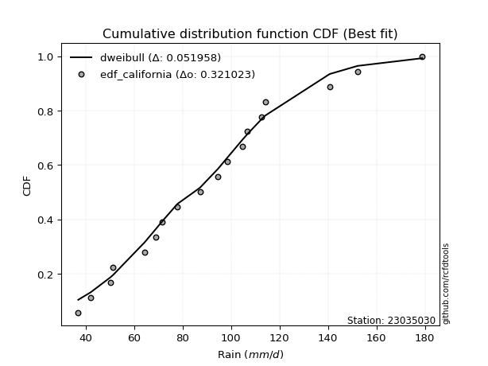</img>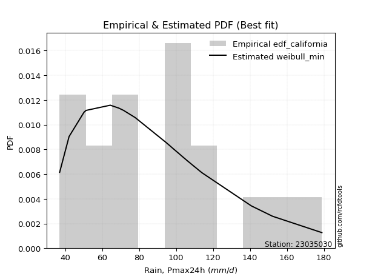</img>

</div>


### 2. EDF Hazen (1930)

Hazen method for plotting positions is a formula used to estimate the empirical cumulative probability distribution of flood events or other hydrological data. This formula often results in biased estimations, particularly when extrapolating to extreme events (high return periods).

<div align="center">


$P=(m-0.5)/n$


</div>


**2.1. Empirical values**

<div align="center">

|                | 0                    | 1                   | 2                   | 3                   | 4                  | 5                  | 6                   | 7                  | 8         | 9                  | 10                 | 11                 | 12                 | 13                 | 14                 | 15                 | 16                 |
|:---------------|:---------------------|:--------------------|:--------------------|:--------------------|:-------------------|:-------------------|:--------------------|:-------------------|:----------|:-------------------|:-------------------|:-------------------|:-------------------|:-------------------|:-------------------|:-------------------|:-------------------|
| date           | 2020                 | 2015                | 2005                | 2017                | 2019               | 2018               | 2014                | 2009               | 2007      | 2013               | 2012               | 2016               | 2010               | 2008               | 2006               | 2024               | 2011               |
| x              | 37.0                 | 42.1                | 50.2                | 51.3                | 64.4               | 69.0               | 71.6                | 77.9               | 94.7      | 98.6               | 104.7              | 106.7              | 112.7              | 114.1              | 140.7              | 152.2              | 178.9              |
| m              | 1                    | 2                   | 3                   | 4                   | 5                  | 6                  | 7                   | 8                  | 9         | 10                 | 11                 | 12                 | 13                 | 14                 | 15                 | 16                 | 17                 |
| empirical_dist | edf_hazen            | edf_hazen           | edf_hazen           | edf_hazen           | edf_hazen          | edf_hazen          | edf_hazen           | edf_hazen          | edf_hazen | edf_hazen          | edf_hazen          | edf_hazen          | edf_hazen          | edf_hazen          | edf_hazen          | edf_hazen          | edf_hazen          |
| empirical      | 0.029411764705882353 | 0.08823529411764706 | 0.14705882352941177 | 0.20588235294117646 | 0.2647058823529412 | 0.3235294117647059 | 0.38235294117647056 | 0.4411764705882353 | 0.5       | 0.5588235294117647 | 0.6176470588235294 | 0.6764705882352942 | 0.7352941176470589 | 0.7941176470588235 | 0.8529411764705882 | 0.9117647058823529 | 0.9705882352941176 |
| empirical_tr   | 1.0303030303030303   | 1.096774193548387   | 1.1724137931034484  | 1.259259259259259   | 1.3599999999999999 | 1.4782608695652173 | 1.619047619047619   | 1.7894736842105263 | 2.0       | 2.2666666666666666 | 2.6153846153846154 | 3.0909090909090913 | 3.7777777777777786 | 4.857142857142856  | 6.799999999999999  | 11.33333333333333  | 33.99999999999999  |

</div>


**2.2. Kolmogorov-Smirnov fit test (sorted by Δ)**


<div align="center">

|                | 0                   | 1                   | 2                   | 3                   | 4                  | 5                   | 6                   | 7                  | 8                   | 9                   | 10                  | 11                  | 12                  | 13                  | 14                  | 15                  | 16                 | 17                 | 18                  | 19                  | 20                  | 21                  | 22                  | 23                  | 24                  | 25                  | 26                  | 27                    | 28                  | 29                  | 30                 | 31                  | 32                  | 33                 | 34                  | 35                  | 36                  | 37                  | 38                  | 39                  | 40                  | 41                  | 42                  | 43                  | 44                  | 45                  | 46                  | 47                  | 48                  | 49                  | 50                  | 51                  | 52                  | 53                  | 54                  | 55                  | 56                  | 57                  | 58                  | 59                  | 60                  | 61                  | 62                  | 63                 | 64                  | 65                 | 66                  | 67                  | 68                  | 69                  | 70                 | 71                  | 72                 | 73                  | 74                  | 75                  | 76                  | 77                  | 78                  | 79                  | 80                  | 81                  | 82                 | 83                 | 84                  | 85                 | 86                  | 87                 |
|:---------------|:--------------------|:--------------------|:--------------------|:--------------------|:-------------------|:--------------------|:--------------------|:-------------------|:--------------------|:--------------------|:--------------------|:--------------------|:--------------------|:--------------------|:--------------------|:--------------------|:-------------------|:-------------------|:--------------------|:--------------------|:--------------------|:--------------------|:--------------------|:--------------------|:--------------------|:--------------------|:--------------------|:----------------------|:--------------------|:--------------------|:-------------------|:--------------------|:--------------------|:-------------------|:--------------------|:--------------------|:--------------------|:--------------------|:--------------------|:--------------------|:--------------------|:--------------------|:--------------------|:--------------------|:--------------------|:--------------------|:--------------------|:--------------------|:--------------------|:--------------------|:--------------------|:--------------------|:--------------------|:--------------------|:--------------------|:--------------------|:--------------------|:--------------------|:--------------------|:--------------------|:--------------------|:--------------------|:--------------------|:-------------------|:--------------------|:-------------------|:--------------------|:--------------------|:--------------------|:--------------------|:-------------------|:--------------------|:-------------------|:--------------------|:--------------------|:--------------------|:--------------------|:--------------------|:--------------------|:--------------------|:--------------------|:--------------------|:-------------------|:-------------------|:--------------------|:-------------------|:--------------------|:-------------------|
| station        | 23035030            | 23035030            | 23035030            | 23035030            | 23035030           | 23035030            | 23035030            | 23035030           | 23035030            | 23035030            | 23035030            | 23035030            | 23035030            | 23035030            | 23035030            | 23035030            | 23035030           | 23035030           | 23035030            | 23035030            | 23035030            | 23035030            | 23035030            | 23035030            | 23035030            | 23035030            | 23035030            | 23035030              | 23035030            | 23035030            | 23035030           | 23035030            | 23035030            | 23035030           | 23035030            | 23035030            | 23035030            | 23035030            | 23035030            | 23035030            | 23035030            | 23035030            | 23035030            | 23035030            | 23035030            | 23035030            | 23035030            | 23035030            | 23035030            | 23035030            | 23035030            | 23035030            | 23035030            | 23035030            | 23035030            | 23035030            | 23035030            | 23035030            | 23035030            | 23035030            | 23035030            | 23035030            | 23035030            | 23035030           | 23035030            | 23035030           | 23035030            | 23035030            | 23035030            | 23035030            | 23035030           | 23035030            | 23035030           | 23035030            | 23035030            | 23035030            | 23035030            | 23035030            | 23035030            | 23035030            | 23035030            | 23035030            | 23035030           | 23035030           | 23035030            | 23035030           | 23035030            | 23035030           |
| empirical_dist | edf_hazen           | edf_hazen           | edf_hazen           | edf_hazen           | edf_hazen          | edf_hazen           | edf_hazen           | edf_hazen          | edf_hazen           | edf_hazen           | edf_hazen           | edf_hazen           | edf_hazen           | edf_hazen           | edf_hazen           | edf_hazen           | edf_hazen          | edf_hazen          | edf_hazen           | edf_hazen           | edf_hazen           | edf_hazen           | edf_hazen           | edf_hazen           | edf_hazen           | edf_hazen           | edf_hazen           | edf_hazen             | edf_hazen           | edf_hazen           | edf_hazen          | edf_hazen           | edf_hazen           | edf_hazen          | edf_hazen           | edf_hazen           | edf_hazen           | edf_hazen           | edf_hazen           | edf_hazen           | edf_hazen           | edf_hazen           | edf_hazen           | edf_hazen           | edf_hazen           | edf_hazen           | edf_hazen           | edf_hazen           | edf_hazen           | edf_hazen           | edf_hazen           | edf_hazen           | edf_hazen           | edf_hazen           | edf_hazen           | edf_hazen           | edf_hazen           | edf_hazen           | edf_hazen           | edf_hazen           | edf_hazen           | edf_hazen           | edf_hazen           | edf_hazen          | edf_hazen           | edf_hazen          | edf_hazen           | edf_hazen           | edf_hazen           | edf_hazen           | edf_hazen          | edf_hazen           | edf_hazen          | edf_hazen           | edf_hazen           | edf_hazen           | edf_hazen           | edf_hazen           | edf_hazen           | edf_hazen           | edf_hazen           | edf_hazen           | edf_hazen          | edf_hazen          | edf_hazen           | edf_hazen          | edf_hazen           | edf_hazen          |
| p_dist         | pearson3            | maxwell             | rayleigh            | loggenlogistic      | mielke             | gompertz            | ncf                 | logjohnsonsu       | t                   | crystalball         | norm                | truncnorm           | loggumbel_l         | rice                | logloggamma         | alpha               | betaprime          | exponnorm          | kstwobign           | nct                 | invgamma            | logweibull_min      | logpearson3         | invweibull          | genlogistic         | gumbel_r            | halfnorm            | loglaplace_asymmetric | fisk                | logfisk             | johnsonsu          | invgauss            | logistic            | lognct             | logf                | logt                | lognorm             | lognorm             | logcrystalball      | loglognorm          | logexponnorm        | lognakagami         | logncf              | logfatiguelife      | weibull_min         | logbetaprime        | logerlang           | loggamma            | loggamma            | logrice             | loginvgamma         | hypsecant           | loglogistic         | moyal               | chi2                | gamma               | erlang              | logalpha            | halflogistic        | laplace_asymmetric  | loghypsecant        | loginvgauss         | logmaxwell          | logmielke          | f                   | loginvweibull      | lograyleigh         | gumbel_l            | laplace             | genexpon            | expon              | logkstwobign        | nakagami           | loglaplace          | loggompertz         | loghalfnorm         | loggumbel_r         | loggenexpon         | loghalflogistic     | logmoyal            | wald                | logexpon            | logchi2            | gibrat             | logwald             | loggibrat          | logtruncnorm        | fatiguelife        |
| delta          | 0.06512293319295345 | 0.06626023162755534 | 0.06821729202621973 | 0.07231036738432325 | 0.0725572727057591 | 0.07339196942516435 | 0.07959275148823353 | 0.0809005403110139 | 0.08414545175865329 | 0.08427730741879241 | 0.08427731059199772 | 0.08427731802178151 | 0.08445883069550625 | 0.08473926993291568 | 0.08477287774320863 | 0.08711925499030093 | 0.0871828931556573 | 0.0906524248704017 | 0.09242971381335474 | 0.09275078789533486 | 0.09380646283961491 | 0.09449748087572396 | 0.09536567325364165 | 0.09638770484492698 | 0.09649679989120952 | 0.09664771318317422 | 0.09750789878866284 | 0.09774946301416881   | 0.09875597988034246 | 0.09886568437500487 | 0.1001725268489504 | 0.10437186740570614 | 0.10527972628261745 | 0.1064875728177086 | 0.10746836191051945 | 0.10751534718285904 | 0.10752053718955557 | 0.10752053718955557 | 0.10752054429761448 | 0.10752166364557225 | 0.10752197240684402 | 0.10815380880205039 | 0.10848391128969892 | 0.10863576049439505 | 0.10908150958036056 | 0.11220182694650382 | 0.11472508110747781 | 0.11517900382592305 | 0.11517900382592305 | 0.11816399487440032 | 0.11944781256248937 | 0.12070606081873475 | 0.12126425432774601 | 0.12213015506317859 | 0.12326665278417503 | 0.12326697764959904 | 0.12326731657001488 | 0.12503401651285662 | 0.12735120275644277 | 0.12744126789380134 | 0.13243616637835764 | 0.13321532995356045 | 0.13337109184893325 | 0.1390174017704361 | 0.13973789711742834 | 0.1404011933649142 | 0.14135463913992397 | 0.14531688107300456 | 0.14563756761370963 | 0.14848774119703245 | 0.1486451602008404 | 0.15488818500369894 | 0.1576708305043486 | 0.16007592894136446 | 0.16203817937253473 | 0.16414012878068995 | 0.17322899781044743 | 0.18889476960190582 | 0.19249208317704658 | 0.19556817969836837 | 0.20588235294117646 | 0.22686142809841275 | 0.2419302093852163 | 0.2523203445005064 | 0.25792252997970955 | 0.2898117724476611 | 0.32222826318024794 | 0.560720569814644  |
| deltao         | 0.3260541228310003  | 0.3260541228310003  | 0.3260541228310003  | 0.3260541228310003  | 0.3260541228310003 | 0.3260541228310003  | 0.3260541228310003  | 0.3260541228310003 | 0.3260541228310003  | 0.3260541228310003  | 0.3260541228310003  | 0.3260541228310003  | 0.3260541228310003  | 0.3260541228310003  | 0.3260541228310003  | 0.3260541228310003  | 0.3260541228310003 | 0.3260541228310003 | 0.3260541228310003  | 0.3260541228310003  | 0.3260541228310003  | 0.3260541228310003  | 0.3260541228310003  | 0.3260541228310003  | 0.3260541228310003  | 0.3260541228310003  | 0.3260541228310003  | 0.3260541228310003    | 0.3260541228310003  | 0.3260541228310003  | 0.3260541228310003 | 0.3260541228310003  | 0.3260541228310003  | 0.3260541228310003 | 0.3260541228310003  | 0.3260541228310003  | 0.3260541228310003  | 0.3260541228310003  | 0.3260541228310003  | 0.3260541228310003  | 0.3260541228310003  | 0.3260541228310003  | 0.3260541228310003  | 0.3260541228310003  | 0.3260541228310003  | 0.3260541228310003  | 0.3260541228310003  | 0.3260541228310003  | 0.3260541228310003  | 0.3260541228310003  | 0.3260541228310003  | 0.3260541228310003  | 0.3260541228310003  | 0.3260541228310003  | 0.3260541228310003  | 0.3260541228310003  | 0.3260541228310003  | 0.3260541228310003  | 0.3260541228310003  | 0.3260541228310003  | 0.3260541228310003  | 0.3260541228310003  | 0.3260541228310003  | 0.3260541228310003 | 0.3260541228310003  | 0.3260541228310003 | 0.3260541228310003  | 0.3260541228310003  | 0.3260541228310003  | 0.3260541228310003  | 0.3260541228310003 | 0.3260541228310003  | 0.3260541228310003 | 0.3260541228310003  | 0.3260541228310003  | 0.3260541228310003  | 0.3260541228310003  | 0.3260541228310003  | 0.3260541228310003  | 0.3260541228310003  | 0.3260541228310003  | 0.3260541228310003  | 0.3260541228310003 | 0.3260541228310003 | 0.3260541228310003  | 0.3260541228310003 | 0.3260541228310003  | 0.3260541228310003 |
| eval           | Δo > Δ              | Δo > Δ              | Δo > Δ              | Δo > Δ              | Δo > Δ             | Δo > Δ              | Δo > Δ              | Δo > Δ             | Δo > Δ              | Δo > Δ              | Δo > Δ              | Δo > Δ              | Δo > Δ              | Δo > Δ              | Δo > Δ              | Δo > Δ              | Δo > Δ             | Δo > Δ             | Δo > Δ              | Δo > Δ              | Δo > Δ              | Δo > Δ              | Δo > Δ              | Δo > Δ              | Δo > Δ              | Δo > Δ              | Δo > Δ              | Δo > Δ                | Δo > Δ              | Δo > Δ              | Δo > Δ             | Δo > Δ              | Δo > Δ              | Δo > Δ             | Δo > Δ              | Δo > Δ              | Δo > Δ              | Δo > Δ              | Δo > Δ              | Δo > Δ              | Δo > Δ              | Δo > Δ              | Δo > Δ              | Δo > Δ              | Δo > Δ              | Δo > Δ              | Δo > Δ              | Δo > Δ              | Δo > Δ              | Δo > Δ              | Δo > Δ              | Δo > Δ              | Δo > Δ              | Δo > Δ              | Δo > Δ              | Δo > Δ              | Δo > Δ              | Δo > Δ              | Δo > Δ              | Δo > Δ              | Δo > Δ              | Δo > Δ              | Δo > Δ              | Δo > Δ             | Δo > Δ              | Δo > Δ             | Δo > Δ              | Δo > Δ              | Δo > Δ              | Δo > Δ              | Δo > Δ             | Δo > Δ              | Δo > Δ             | Δo > Δ              | Δo > Δ              | Δo > Δ              | Δo > Δ              | Δo > Δ              | Δo > Δ              | Δo > Δ              | Δo > Δ              | Δo > Δ              | Δo > Δ             | Δo > Δ             | Δo > Δ              | Δo > Δ             | Δo > Δ              | Δo <= Δ            |
| fit            | 1                   | 1                   | 1                   | 1                   | 1                  | 1                   | 1                   | 1                  | 1                   | 1                   | 1                   | 1                   | 1                   | 1                   | 1                   | 1                   | 1                  | 1                  | 1                   | 1                   | 1                   | 1                   | 1                   | 1                   | 1                   | 1                   | 1                   | 1                     | 1                   | 1                   | 1                  | 1                   | 1                   | 1                  | 1                   | 1                   | 1                   | 1                   | 1                   | 1                   | 1                   | 1                   | 1                   | 1                   | 1                   | 1                   | 1                   | 1                   | 1                   | 1                   | 1                   | 1                   | 1                   | 1                   | 1                   | 1                   | 1                   | 1                   | 1                   | 1                   | 1                   | 1                   | 1                   | 1                  | 1                   | 1                  | 1                   | 1                   | 1                   | 1                   | 1                  | 1                   | 1                  | 1                   | 1                   | 1                   | 1                   | 1                   | 1                   | 1                   | 1                   | 1                   | 1                  | 1                  | 1                   | 1                  | 1                   | 0                  |
| n              | 17                  | 17                  | 17                  | 17                  | 17                 | 17                  | 17                  | 17                 | 17                  | 17                  | 17                  | 17                  | 17                  | 17                  | 17                  | 17                  | 17                 | 17                 | 17                  | 17                  | 17                  | 17                  | 17                  | 17                  | 17                  | 17                  | 17                  | 17                    | 17                  | 17                  | 17                 | 17                  | 17                  | 17                 | 17                  | 17                  | 17                  | 17                  | 17                  | 17                  | 17                  | 17                  | 17                  | 17                  | 17                  | 17                  | 17                  | 17                  | 17                  | 17                  | 17                  | 17                  | 17                  | 17                  | 17                  | 17                  | 17                  | 17                  | 17                  | 17                  | 17                  | 17                  | 17                  | 17                 | 17                  | 17                 | 17                  | 17                  | 17                  | 17                  | 17                 | 17                  | 17                 | 17                  | 17                  | 17                  | 17                  | 17                  | 17                  | 17                  | 17                  | 17                  | 17                 | 17                 | 17                  | 17                 | 17                  | 17                 |
| best_fit       | 1                   | 0                   | 0                   | 0                   | 0                  | 0                   | 0                   | 0                  | 0                   | 0                   | 0                   | 0                   | 0                   | 0                   | 0                   | 0                   | 0                  | 0                  | 0                   | 0                   | 0                   | 0                   | 0                   | 0                   | 0                   | 0                   | 0                   | 0                     | 0                   | 0                   | 0                  | 0                   | 0                   | 0                  | 0                   | 0                   | 0                   | 0                   | 0                   | 0                   | 0                   | 0                   | 0                   | 0                   | 0                   | 0                   | 0                   | 0                   | 0                   | 0                   | 0                   | 0                   | 0                   | 0                   | 0                   | 0                   | 0                   | 0                   | 0                   | 0                   | 0                   | 0                   | 0                   | 0                  | 0                   | 0                  | 0                   | 0                   | 0                   | 0                   | 0                  | 0                   | 0                  | 0                   | 0                   | 0                   | 0                   | 0                   | 0                   | 0                   | 0                   | 0                   | 0                  | 0                  | 0                   | 0                  | 0                   | 0                  |
| best_fit_sort  | 1                   | 2                   | 3                   | 4                   | 5                  | 6                   | 7                   | 8                  | 9                   | 10                  | 11                  | 12                  | 13                  | 14                  | 15                  | 16                  | 17                 | 18                 | 19                  | 20                  | 21                  | 22                  | 23                  | 24                  | 25                  | 26                  | 27                  | 28                    | 29                  | 30                  | 31                 | 32                  | 33                  | 34                 | 35                  | 36                  | 37                  | 38                  | 39                  | 40                  | 41                  | 42                  | 43                  | 44                  | 45                  | 46                  | 47                  | 48                  | 49                  | 50                  | 51                  | 52                  | 53                  | 54                  | 55                  | 56                  | 57                  | 58                  | 59                  | 60                  | 61                  | 62                  | 63                  | 64                 | 65                  | 66                 | 67                  | 68                  | 69                  | 70                  | 71                 | 72                  | 73                 | 74                  | 75                  | 76                  | 77                  | 78                  | 79                  | 80                  | 81                  | 82                  | 83                 | 84                 | 85                  | 86                 | 87                  | 88                 |

</div>


**2.3. Best fit**

<div align="center">

|   id |   station | empirical_dist   | p_dist   |     delta |   deltao | eval   |   fit |   n |   best_fit |   best_fit_sort |
|-----:|----------:|:-----------------|:---------|----------:|---------:|:-------|------:|----:|-----------:|----------------:|
|    0 |  23035030 | edf_hazen        | pearson3 | 0.0651229 | 0.326054 | Δo > Δ |     1 |  17 |          1 |               1 |

</div>


<div align="center">

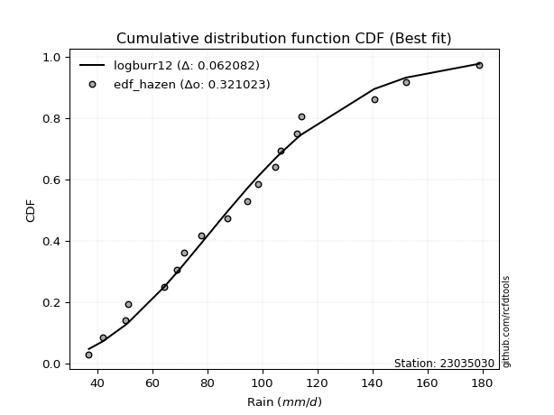</img>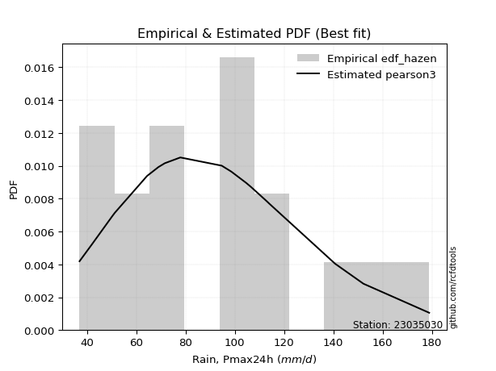</img>

</div>


### 3. EDF Weibull (1939)

Weibull plotting position formula is an empirical method used to estimate the non-exceedance probability or plotting position for a set of observed data, is often recommended or widely used in practice, particularly in flood frequency analysis.

<div align="center">


$P=m/(n+1)$


</div>


**3.1. Empirical values**

<div align="center">

|                | 0                   | 1                  | 2                   | 3                  | 4                  | 5                  | 6                  | 7                  | 8           | 9                  | 10                 | 11                 | 12                 | 13                 | 14                 | 15                 | 16                 |
|:---------------|:--------------------|:-------------------|:--------------------|:-------------------|:-------------------|:-------------------|:-------------------|:-------------------|:------------|:-------------------|:-------------------|:-------------------|:-------------------|:-------------------|:-------------------|:-------------------|:-------------------|
| date           | 2020                | 2015               | 2005                | 2017               | 2019               | 2018               | 2014               | 2009               | 2007        | 2013               | 2012               | 2016               | 2010               | 2008               | 2006               | 2024               | 2011               |
| x              | 37.0                | 42.1               | 50.2                | 51.3               | 64.4               | 69.0               | 71.6               | 77.9               | 94.7        | 98.6               | 104.7              | 106.7              | 112.7              | 114.1              | 140.7              | 152.2              | 178.9              |
| m              | 1                   | 2                  | 3                   | 4                  | 5                  | 6                  | 7                  | 8                  | 9           | 10                 | 11                 | 12                 | 13                 | 14                 | 15                 | 16                 | 17                 |
| empirical_dist | edf_weibull         | edf_weibull        | edf_weibull         | edf_weibull        | edf_weibull        | edf_weibull        | edf_weibull        | edf_weibull        | edf_weibull | edf_weibull        | edf_weibull        | edf_weibull        | edf_weibull        | edf_weibull        | edf_weibull        | edf_weibull        | edf_weibull        |
| empirical      | 0.05555555555555555 | 0.1111111111111111 | 0.16666666666666666 | 0.2222222222222222 | 0.2777777777777778 | 0.3333333333333333 | 0.3888888888888889 | 0.4444444444444444 | 0.5         | 0.5555555555555556 | 0.6111111111111112 | 0.6666666666666666 | 0.7222222222222222 | 0.7777777777777778 | 0.8333333333333334 | 0.8888888888888888 | 0.9444444444444444 |
| empirical_tr   | 1.0588235294117647  | 1.125              | 1.2                 | 1.2857142857142856 | 1.3846153846153846 | 1.4999999999999998 | 1.6363636363636362 | 1.7999999999999998 | 2.0         | 2.25               | 2.5714285714285716 | 2.9999999999999996 | 3.5999999999999996 | 4.5                | 6.000000000000002  | 8.999999999999996  | 17.999999999999993 |

</div>


**3.2. Kolmogorov-Smirnov fit test (sorted by Δ)**


<div align="center">

|                | 0                   | 1                   | 2                  | 3                  | 4                   | 5                   | 6                   | 7                  | 8                   | 9                   | 10                  | 11                  | 12                  | 13                 | 14                  | 15                  | 16                  | 17                  | 18                  | 19                  | 20                  | 21                  | 22                  | 23                  | 24                  | 25                  | 26                  | 27                 | 28                  | 29                    | 30                  | 31                 | 32                  | 33                  | 34                  | 35                  | 36                  | 37                  | 38                  | 39                  | 40                  | 41                  | 42                  | 43                  | 44                  | 45                  | 46                  | 47                  | 48                  | 49                  | 50                  | 51                  | 52                  | 53                  | 54                  | 55                  | 56                  | 57                  | 58                  | 59                  | 60                  | 61                  | 62                 | 63                  | 64                 | 65                  | 66                  | 67                  | 68                 | 69                 | 70                  | 71                  | 72                 | 73                  | 74                  | 75                  | 76                  | 77                  | 78                  | 79                  | 80                  | 81                 | 82                 | 83                  | 84                 | 85                 | 86                  | 87                 |
|:---------------|:--------------------|:--------------------|:-------------------|:-------------------|:--------------------|:--------------------|:--------------------|:-------------------|:--------------------|:--------------------|:--------------------|:--------------------|:--------------------|:-------------------|:--------------------|:--------------------|:--------------------|:--------------------|:--------------------|:--------------------|:--------------------|:--------------------|:--------------------|:--------------------|:--------------------|:--------------------|:--------------------|:-------------------|:--------------------|:----------------------|:--------------------|:-------------------|:--------------------|:--------------------|:--------------------|:--------------------|:--------------------|:--------------------|:--------------------|:--------------------|:--------------------|:--------------------|:--------------------|:--------------------|:--------------------|:--------------------|:--------------------|:--------------------|:--------------------|:--------------------|:--------------------|:--------------------|:--------------------|:--------------------|:--------------------|:--------------------|:--------------------|:--------------------|:--------------------|:--------------------|:--------------------|:--------------------|:-------------------|:--------------------|:-------------------|:--------------------|:--------------------|:--------------------|:-------------------|:-------------------|:--------------------|:--------------------|:-------------------|:--------------------|:--------------------|:--------------------|:--------------------|:--------------------|:--------------------|:--------------------|:--------------------|:-------------------|:-------------------|:--------------------|:-------------------|:-------------------|:--------------------|:-------------------|
| station        | 23035030            | 23035030            | 23035030           | 23035030           | 23035030            | 23035030            | 23035030            | 23035030           | 23035030            | 23035030            | 23035030            | 23035030            | 23035030            | 23035030           | 23035030            | 23035030            | 23035030            | 23035030            | 23035030            | 23035030            | 23035030            | 23035030            | 23035030            | 23035030            | 23035030            | 23035030            | 23035030            | 23035030           | 23035030            | 23035030              | 23035030            | 23035030           | 23035030            | 23035030            | 23035030            | 23035030            | 23035030            | 23035030            | 23035030            | 23035030            | 23035030            | 23035030            | 23035030            | 23035030            | 23035030            | 23035030            | 23035030            | 23035030            | 23035030            | 23035030            | 23035030            | 23035030            | 23035030            | 23035030            | 23035030            | 23035030            | 23035030            | 23035030            | 23035030            | 23035030            | 23035030            | 23035030            | 23035030           | 23035030            | 23035030           | 23035030            | 23035030            | 23035030            | 23035030           | 23035030           | 23035030            | 23035030            | 23035030           | 23035030            | 23035030            | 23035030            | 23035030            | 23035030            | 23035030            | 23035030            | 23035030            | 23035030           | 23035030           | 23035030            | 23035030           | 23035030           | 23035030            | 23035030           |
| empirical_dist | edf_weibull         | edf_weibull         | edf_weibull        | edf_weibull        | edf_weibull         | edf_weibull         | edf_weibull         | edf_weibull        | edf_weibull         | edf_weibull         | edf_weibull         | edf_weibull         | edf_weibull         | edf_weibull        | edf_weibull         | edf_weibull         | edf_weibull         | edf_weibull         | edf_weibull         | edf_weibull         | edf_weibull         | edf_weibull         | edf_weibull         | edf_weibull         | edf_weibull         | edf_weibull         | edf_weibull         | edf_weibull        | edf_weibull         | edf_weibull           | edf_weibull         | edf_weibull        | edf_weibull         | edf_weibull         | edf_weibull         | edf_weibull         | edf_weibull         | edf_weibull         | edf_weibull         | edf_weibull         | edf_weibull         | edf_weibull         | edf_weibull         | edf_weibull         | edf_weibull         | edf_weibull         | edf_weibull         | edf_weibull         | edf_weibull         | edf_weibull         | edf_weibull         | edf_weibull         | edf_weibull         | edf_weibull         | edf_weibull         | edf_weibull         | edf_weibull         | edf_weibull         | edf_weibull         | edf_weibull         | edf_weibull         | edf_weibull         | edf_weibull        | edf_weibull         | edf_weibull        | edf_weibull         | edf_weibull         | edf_weibull         | edf_weibull        | edf_weibull        | edf_weibull         | edf_weibull         | edf_weibull        | edf_weibull         | edf_weibull         | edf_weibull         | edf_weibull         | edf_weibull         | edf_weibull         | edf_weibull         | edf_weibull         | edf_weibull        | edf_weibull        | edf_weibull         | edf_weibull        | edf_weibull        | edf_weibull         | edf_weibull        |
| p_dist         | gompertz            | maxwell             | rayleigh           | pearson3           | logjohnsonsu        | ncf                 | logloggamma         | loggenlogistic     | mielke              | betaprime           | t                   | crystalball         | norm                | truncnorm          | exponnorm           | alpha               | kstwobign           | nct                 | invgamma            | logweibull_min      | logpearson3         | invweibull          | genlogistic         | loggumbel_l         | halfnorm            | fisk                | logfisk             | johnsonsu          | rice                | loglaplace_asymmetric | invgauss            | lognct             | gumbel_r            | logf                | logt                | lognorm             | lognorm             | logcrystalball      | loglognorm          | logexponnorm        | lognakagami         | logncf              | logfatiguelife      | weibull_min         | logistic            | logbetaprime        | logerlang           | loggamma            | loggamma            | logrice             | loginvgamma         | loglogistic         | chi2                | gamma               | erlang              | logalpha            | hypsecant           | laplace_asymmetric  | loghypsecant        | loginvgauss         | logmaxwell          | moyal               | logmielke          | f                   | loginvweibull      | lograyleigh         | halflogistic        | genexpon            | gumbel_l           | expon              | laplace             | logkstwobign        | nakagami           | loglaplace          | loggompertz         | loghalfnorm         | loggumbel_r         | loggenexpon         | loghalflogistic     | logmoyal            | logexpon            | wald               | logchi2            | logwald             | gibrat             | loggibrat          | logtruncnorm        | fatiguelife        |
| delta          | 0.07385535573849206 | 0.07434036513671916 | 0.0747055266861762 | 0.0814628024739992 | 0.08781379965189412 | 0.08804682598503535 | 0.08814887852589137 | 0.088650236665369  | 0.08889714198680485 | 0.08892740622164044 | 0.09023477145976982 | 0.09039557018270633 | 0.09039557300680984 | 0.090395580740539  | 0.09072002721060185 | 0.09145432297456524 | 0.09242971381335474 | 0.09365407987151603 | 0.09380646283961491 | 0.09449748087572396 | 0.09536567325364165 | 0.09638770484492698 | 0.09649679989120952 | 0.09655659665430733 | 0.09750789878866284 | 0.09875597988034246 | 0.09886568437500487 | 0.1001725268489504 | 0.10107913921396143 | 0.10207599180390936   | 0.10437186740570614 | 0.1064875728177086 | 0.10695067257064778 | 0.10746836191051945 | 0.10751534718285904 | 0.10752053718955557 | 0.10752053718955557 | 0.10752054429761448 | 0.10752166364557225 | 0.10752197240684402 | 0.10815380880205039 | 0.10848391128969892 | 0.10863576049439505 | 0.10908150958036056 | 0.11181567399503578 | 0.11220182694650382 | 0.11472508110747781 | 0.11517900382592305 | 0.11517900382592305 | 0.11816399487440032 | 0.11944781256248937 | 0.12126425432774601 | 0.12326665278417503 | 0.12326697764959904 | 0.12326731657001488 | 0.12503401651285662 | 0.12724200853115308 | 0.13070924175001047 | 0.13243616637835764 | 0.13321532995356045 | 0.13337109184893325 | 0.13347244652725196 | 0.1390174017704361 | 0.13973789711742834 | 0.1404011933649142 | 0.14135463913992397 | 0.14369107203748852 | 0.14848774119703245 | 0.1485848549292137 | 0.1486451602008404 | 0.15217351532612797 | 0.15488818500369894 | 0.1576708305043486 | 0.16007592894136446 | 0.16203817937253473 | 0.16414012878068995 | 0.17322899781044743 | 0.18005679363799276 | 0.19249208317704658 | 0.19556817969836837 | 0.21378953267357614 | 0.2222222222222222 | 0.2288583139603797 | 0.25792252997970955 | 0.265392239925343  | 0.2898117724476611 | 0.31279908788676025 | 0.5411127266773892 |
| deltao         | 0.3260541228310003  | 0.3260541228310003  | 0.3260541228310003 | 0.3260541228310003 | 0.3260541228310003  | 0.3260541228310003  | 0.3260541228310003  | 0.3260541228310003 | 0.3260541228310003  | 0.3260541228310003  | 0.3260541228310003  | 0.3260541228310003  | 0.3260541228310003  | 0.3260541228310003 | 0.3260541228310003  | 0.3260541228310003  | 0.3260541228310003  | 0.3260541228310003  | 0.3260541228310003  | 0.3260541228310003  | 0.3260541228310003  | 0.3260541228310003  | 0.3260541228310003  | 0.3260541228310003  | 0.3260541228310003  | 0.3260541228310003  | 0.3260541228310003  | 0.3260541228310003 | 0.3260541228310003  | 0.3260541228310003    | 0.3260541228310003  | 0.3260541228310003 | 0.3260541228310003  | 0.3260541228310003  | 0.3260541228310003  | 0.3260541228310003  | 0.3260541228310003  | 0.3260541228310003  | 0.3260541228310003  | 0.3260541228310003  | 0.3260541228310003  | 0.3260541228310003  | 0.3260541228310003  | 0.3260541228310003  | 0.3260541228310003  | 0.3260541228310003  | 0.3260541228310003  | 0.3260541228310003  | 0.3260541228310003  | 0.3260541228310003  | 0.3260541228310003  | 0.3260541228310003  | 0.3260541228310003  | 0.3260541228310003  | 0.3260541228310003  | 0.3260541228310003  | 0.3260541228310003  | 0.3260541228310003  | 0.3260541228310003  | 0.3260541228310003  | 0.3260541228310003  | 0.3260541228310003  | 0.3260541228310003 | 0.3260541228310003  | 0.3260541228310003 | 0.3260541228310003  | 0.3260541228310003  | 0.3260541228310003  | 0.3260541228310003 | 0.3260541228310003 | 0.3260541228310003  | 0.3260541228310003  | 0.3260541228310003 | 0.3260541228310003  | 0.3260541228310003  | 0.3260541228310003  | 0.3260541228310003  | 0.3260541228310003  | 0.3260541228310003  | 0.3260541228310003  | 0.3260541228310003  | 0.3260541228310003 | 0.3260541228310003 | 0.3260541228310003  | 0.3260541228310003 | 0.3260541228310003 | 0.3260541228310003  | 0.3260541228310003 |
| eval           | Δo > Δ              | Δo > Δ              | Δo > Δ             | Δo > Δ             | Δo > Δ              | Δo > Δ              | Δo > Δ              | Δo > Δ             | Δo > Δ              | Δo > Δ              | Δo > Δ              | Δo > Δ              | Δo > Δ              | Δo > Δ             | Δo > Δ              | Δo > Δ              | Δo > Δ              | Δo > Δ              | Δo > Δ              | Δo > Δ              | Δo > Δ              | Δo > Δ              | Δo > Δ              | Δo > Δ              | Δo > Δ              | Δo > Δ              | Δo > Δ              | Δo > Δ             | Δo > Δ              | Δo > Δ                | Δo > Δ              | Δo > Δ             | Δo > Δ              | Δo > Δ              | Δo > Δ              | Δo > Δ              | Δo > Δ              | Δo > Δ              | Δo > Δ              | Δo > Δ              | Δo > Δ              | Δo > Δ              | Δo > Δ              | Δo > Δ              | Δo > Δ              | Δo > Δ              | Δo > Δ              | Δo > Δ              | Δo > Δ              | Δo > Δ              | Δo > Δ              | Δo > Δ              | Δo > Δ              | Δo > Δ              | Δo > Δ              | Δo > Δ              | Δo > Δ              | Δo > Δ              | Δo > Δ              | Δo > Δ              | Δo > Δ              | Δo > Δ              | Δo > Δ             | Δo > Δ              | Δo > Δ             | Δo > Δ              | Δo > Δ              | Δo > Δ              | Δo > Δ             | Δo > Δ             | Δo > Δ              | Δo > Δ              | Δo > Δ             | Δo > Δ              | Δo > Δ              | Δo > Δ              | Δo > Δ              | Δo > Δ              | Δo > Δ              | Δo > Δ              | Δo > Δ              | Δo > Δ             | Δo > Δ             | Δo > Δ              | Δo > Δ             | Δo > Δ             | Δo > Δ              | Δo <= Δ            |
| fit            | 1                   | 1                   | 1                  | 1                  | 1                   | 1                   | 1                   | 1                  | 1                   | 1                   | 1                   | 1                   | 1                   | 1                  | 1                   | 1                   | 1                   | 1                   | 1                   | 1                   | 1                   | 1                   | 1                   | 1                   | 1                   | 1                   | 1                   | 1                  | 1                   | 1                     | 1                   | 1                  | 1                   | 1                   | 1                   | 1                   | 1                   | 1                   | 1                   | 1                   | 1                   | 1                   | 1                   | 1                   | 1                   | 1                   | 1                   | 1                   | 1                   | 1                   | 1                   | 1                   | 1                   | 1                   | 1                   | 1                   | 1                   | 1                   | 1                   | 1                   | 1                   | 1                   | 1                  | 1                   | 1                  | 1                   | 1                   | 1                   | 1                  | 1                  | 1                   | 1                   | 1                  | 1                   | 1                   | 1                   | 1                   | 1                   | 1                   | 1                   | 1                   | 1                  | 1                  | 1                   | 1                  | 1                  | 1                   | 0                  |
| n              | 17                  | 17                  | 17                 | 17                 | 17                  | 17                  | 17                  | 17                 | 17                  | 17                  | 17                  | 17                  | 17                  | 17                 | 17                  | 17                  | 17                  | 17                  | 17                  | 17                  | 17                  | 17                  | 17                  | 17                  | 17                  | 17                  | 17                  | 17                 | 17                  | 17                    | 17                  | 17                 | 17                  | 17                  | 17                  | 17                  | 17                  | 17                  | 17                  | 17                  | 17                  | 17                  | 17                  | 17                  | 17                  | 17                  | 17                  | 17                  | 17                  | 17                  | 17                  | 17                  | 17                  | 17                  | 17                  | 17                  | 17                  | 17                  | 17                  | 17                  | 17                  | 17                  | 17                 | 17                  | 17                 | 17                  | 17                  | 17                  | 17                 | 17                 | 17                  | 17                  | 17                 | 17                  | 17                  | 17                  | 17                  | 17                  | 17                  | 17                  | 17                  | 17                 | 17                 | 17                  | 17                 | 17                 | 17                  | 17                 |
| best_fit       | 1                   | 0                   | 0                  | 0                  | 0                   | 0                   | 0                   | 0                  | 0                   | 0                   | 0                   | 0                   | 0                   | 0                  | 0                   | 0                   | 0                   | 0                   | 0                   | 0                   | 0                   | 0                   | 0                   | 0                   | 0                   | 0                   | 0                   | 0                  | 0                   | 0                     | 0                   | 0                  | 0                   | 0                   | 0                   | 0                   | 0                   | 0                   | 0                   | 0                   | 0                   | 0                   | 0                   | 0                   | 0                   | 0                   | 0                   | 0                   | 0                   | 0                   | 0                   | 0                   | 0                   | 0                   | 0                   | 0                   | 0                   | 0                   | 0                   | 0                   | 0                   | 0                   | 0                  | 0                   | 0                  | 0                   | 0                   | 0                   | 0                  | 0                  | 0                   | 0                   | 0                  | 0                   | 0                   | 0                   | 0                   | 0                   | 0                   | 0                   | 0                   | 0                  | 0                  | 0                   | 0                  | 0                  | 0                   | 0                  |
| best_fit_sort  | 1                   | 2                   | 3                  | 4                  | 5                   | 6                   | 7                   | 8                  | 9                   | 10                  | 11                  | 12                  | 13                  | 14                 | 15                  | 16                  | 17                  | 18                  | 19                  | 20                  | 21                  | 22                  | 23                  | 24                  | 25                  | 26                  | 27                  | 28                 | 29                  | 30                    | 31                  | 32                 | 33                  | 34                  | 35                  | 36                  | 37                  | 38                  | 39                  | 40                  | 41                  | 42                  | 43                  | 44                  | 45                  | 46                  | 47                  | 48                  | 49                  | 50                  | 51                  | 52                  | 53                  | 54                  | 55                  | 56                  | 57                  | 58                  | 59                  | 60                  | 61                  | 62                  | 63                 | 64                  | 65                 | 66                  | 67                  | 68                  | 69                 | 70                 | 71                  | 72                  | 73                 | 74                  | 75                  | 76                  | 77                  | 78                  | 79                  | 80                  | 81                  | 82                 | 83                 | 84                  | 85                 | 86                 | 87                  | 88                 |

</div>


**3.3. Best fit**

<div align="center">

|   id |   station | empirical_dist   | p_dist   |     delta |   deltao | eval   |   fit |   n |   best_fit |   best_fit_sort |
|-----:|----------:|:-----------------|:---------|----------:|---------:|:-------|------:|----:|-----------:|----------------:|
|    0 |  23035030 | edf_weibull      | gompertz | 0.0738554 | 0.326054 | Δo > Δ |     1 |  17 |          1 |               1 |

</div>


<div align="center">

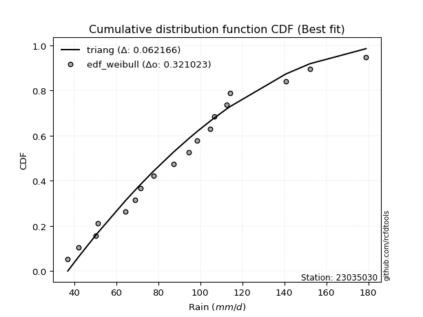</img>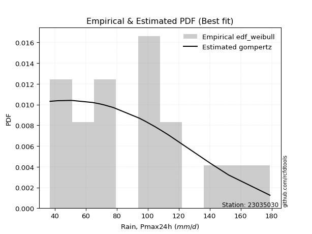</img>

</div>


### 4. EDF Beard (1943)

The Beard formula (or Beard´s plotting position formula) in hydrology is used to estimate the empirical non-exceedance probability _(P)_ of a flood event (or other extreme hydrological data point) within a given dataset.

<div align="center">


$P=(m-0.31)/(n+0.38)$


</div>


**4.1. Empirical values**

<div align="center">

|                | 0                   | 1                   | 2                   | 3                   | 4                  | 5                   | 6                   | 7                   | 8         | 9                  | 10                 | 11                 | 12                 | 13                 | 14                 | 15                 | 16                 |
|:---------------|:--------------------|:--------------------|:--------------------|:--------------------|:-------------------|:--------------------|:--------------------|:--------------------|:----------|:-------------------|:-------------------|:-------------------|:-------------------|:-------------------|:-------------------|:-------------------|:-------------------|
| date           | 2020                | 2015                | 2005                | 2017                | 2019               | 2018                | 2014                | 2009                | 2007      | 2013               | 2012               | 2016               | 2010               | 2008               | 2006               | 2024               | 2011               |
| x              | 37.0                | 42.1                | 50.2                | 51.3                | 64.4               | 69.0                | 71.6                | 77.9                | 94.7      | 98.6               | 104.7              | 106.7              | 112.7              | 114.1              | 140.7              | 152.2              | 178.9              |
| m              | 1                   | 2                   | 3                   | 4                   | 5                  | 6                   | 7                   | 8                   | 9         | 10                 | 11                 | 12                 | 13                 | 14                 | 15                 | 16                 | 17                 |
| empirical_dist | edf_beard           | edf_beard           | edf_beard           | edf_beard           | edf_beard          | edf_beard           | edf_beard           | edf_beard           | edf_beard | edf_beard          | edf_beard          | edf_beard          | edf_beard          | edf_beard          | edf_beard          | edf_beard          | edf_beard          |
| empirical      | 0.03970080552359033 | 0.09723820483314155 | 0.15477560414269276 | 0.21231300345224396 | 0.2698504027617952 | 0.32738780207134643 | 0.38492520138089764 | 0.44246260069044885 | 0.5       | 0.5575373993095513 | 0.6150747986191024 | 0.6726121979286537 | 0.7301495972382048 | 0.7876869965477561 | 0.8452243958573072 | 0.9027617951668585 | 0.9602991944764098 |
| empirical_tr   | 1.0413421210305571  | 1.1077119184193753  | 1.1831177671885638  | 1.2695398100803508  | 1.3695823483057525 | 1.4867408041060737  | 1.6258185219831622  | 1.7936016511867907  | 2.0       | 2.2600780234070226 | 2.5979073243647233 | 3.0544815465729354 | 3.7057569296375266 | 4.710027100271004  | 6.460966542750929  | 10.284023668639058 | 25.188405797101513 |

</div>


**4.2. Kolmogorov-Smirnov fit test (sorted by Δ)**


<div align="center">

|                | 0                   | 1                   | 2                   | 3                   | 4                   | 5                  | 6                   | 7                  | 8                   | 9                   | 10                  | 11                  | 12                  | 13                  | 14                  | 15                 | 16                 | 17                  | 18                  | 19                  | 20                  | 21                  | 22                  | 23                  | 24                  | 25                  | 26                  | 27                  | 28                  | 29                    | 30                 | 31                  | 32                 | 33                  | 34                  | 35                  | 36                  | 37                  | 38                  | 39                  | 40                  | 41                  | 42                  | 43                  | 44                  | 45                  | 46                  | 47                  | 48                  | 49                  | 50                  | 51                  | 52                  | 53                  | 54                  | 55                  | 56                  | 57                  | 58                 | 59                  | 60                  | 61                  | 62                  | 63                 | 64                  | 65                 | 66                  | 67                  | 68                 | 69                  | 70                 | 71                  | 72                 | 73                  | 74                  | 75                  | 76                  | 77                  | 78                  | 79                  | 80                  | 81                 | 82                  | 83                  | 84                  | 85                 | 86                 | 87                 |
|:---------------|:--------------------|:--------------------|:--------------------|:--------------------|:--------------------|:-------------------|:--------------------|:-------------------|:--------------------|:--------------------|:--------------------|:--------------------|:--------------------|:--------------------|:--------------------|:-------------------|:-------------------|:--------------------|:--------------------|:--------------------|:--------------------|:--------------------|:--------------------|:--------------------|:--------------------|:--------------------|:--------------------|:--------------------|:--------------------|:----------------------|:-------------------|:--------------------|:-------------------|:--------------------|:--------------------|:--------------------|:--------------------|:--------------------|:--------------------|:--------------------|:--------------------|:--------------------|:--------------------|:--------------------|:--------------------|:--------------------|:--------------------|:--------------------|:--------------------|:--------------------|:--------------------|:--------------------|:--------------------|:--------------------|:--------------------|:--------------------|:--------------------|:--------------------|:-------------------|:--------------------|:--------------------|:--------------------|:--------------------|:-------------------|:--------------------|:-------------------|:--------------------|:--------------------|:-------------------|:--------------------|:-------------------|:--------------------|:-------------------|:--------------------|:--------------------|:--------------------|:--------------------|:--------------------|:--------------------|:--------------------|:--------------------|:-------------------|:--------------------|:--------------------|:--------------------|:-------------------|:-------------------|:-------------------|
| station        | 23035030            | 23035030            | 23035030            | 23035030            | 23035030            | 23035030           | 23035030            | 23035030           | 23035030            | 23035030            | 23035030            | 23035030            | 23035030            | 23035030            | 23035030            | 23035030           | 23035030           | 23035030            | 23035030            | 23035030            | 23035030            | 23035030            | 23035030            | 23035030            | 23035030            | 23035030            | 23035030            | 23035030            | 23035030            | 23035030              | 23035030           | 23035030            | 23035030           | 23035030            | 23035030            | 23035030            | 23035030            | 23035030            | 23035030            | 23035030            | 23035030            | 23035030            | 23035030            | 23035030            | 23035030            | 23035030            | 23035030            | 23035030            | 23035030            | 23035030            | 23035030            | 23035030            | 23035030            | 23035030            | 23035030            | 23035030            | 23035030            | 23035030            | 23035030           | 23035030            | 23035030            | 23035030            | 23035030            | 23035030           | 23035030            | 23035030           | 23035030            | 23035030            | 23035030           | 23035030            | 23035030           | 23035030            | 23035030           | 23035030            | 23035030            | 23035030            | 23035030            | 23035030            | 23035030            | 23035030            | 23035030            | 23035030           | 23035030            | 23035030            | 23035030            | 23035030           | 23035030           | 23035030           |
| empirical_dist | edf_beard           | edf_beard           | edf_beard           | edf_beard           | edf_beard           | edf_beard          | edf_beard           | edf_beard          | edf_beard           | edf_beard           | edf_beard           | edf_beard           | edf_beard           | edf_beard           | edf_beard           | edf_beard          | edf_beard          | edf_beard           | edf_beard           | edf_beard           | edf_beard           | edf_beard           | edf_beard           | edf_beard           | edf_beard           | edf_beard           | edf_beard           | edf_beard           | edf_beard           | edf_beard             | edf_beard          | edf_beard           | edf_beard          | edf_beard           | edf_beard           | edf_beard           | edf_beard           | edf_beard           | edf_beard           | edf_beard           | edf_beard           | edf_beard           | edf_beard           | edf_beard           | edf_beard           | edf_beard           | edf_beard           | edf_beard           | edf_beard           | edf_beard           | edf_beard           | edf_beard           | edf_beard           | edf_beard           | edf_beard           | edf_beard           | edf_beard           | edf_beard           | edf_beard          | edf_beard           | edf_beard           | edf_beard           | edf_beard           | edf_beard          | edf_beard           | edf_beard          | edf_beard           | edf_beard           | edf_beard          | edf_beard           | edf_beard          | edf_beard           | edf_beard          | edf_beard           | edf_beard           | edf_beard           | edf_beard           | edf_beard           | edf_beard           | edf_beard           | edf_beard           | edf_beard          | edf_beard           | edf_beard           | edf_beard           | edf_beard          | edf_beard          | edf_beard          |
| p_dist         | maxwell             | rayleigh            | pearson3            | gompertz            | loggenlogistic      | mielke             | ncf                 | logjohnsonsu       | logloggamma         | t                   | crystalball         | norm                | truncnorm           | loggumbel_l         | alpha               | betaprime          | exponnorm          | rice                | kstwobign           | nct                 | invgamma            | logweibull_min      | logpearson3         | invweibull          | genlogistic         | gumbel_r            | halfnorm            | fisk                | logfisk             | loglaplace_asymmetric | johnsonsu          | invgauss            | lognct             | logf                | logt                | lognorm             | lognorm             | logcrystalball      | loglognorm          | logexponnorm        | logistic            | lognakagami         | logncf              | logfatiguelife      | weibull_min         | logbetaprime        | logerlang           | loggamma            | loggamma            | logrice             | loginvgamma         | loglogistic         | chi2                | gamma               | erlang              | hypsecant           | moyal               | logalpha            | laplace_asymmetric | loghypsecant        | loginvgauss         | logmaxwell          | halflogistic        | logmielke          | f                   | loginvweibull      | lograyleigh         | gumbel_l            | laplace            | genexpon            | expon              | logkstwobign        | nakagami           | loglaplace          | loggompertz         | loghalfnorm         | loggumbel_r         | loggenexpon         | loghalflogistic     | logmoyal            | wald                | logexpon           | logchi2             | gibrat              | logwald             | loggibrat          | logtruncnorm       | fatiguelife        |
| delta          | 0.06443114636674091 | 0.06821729202621973 | 0.07155358370402096 | 0.07339196942516435 | 0.07874101789539076 | 0.0789879232168266 | 0.07959275148823353 | 0.0809005403110139 | 0.08477287774320863 | 0.08627108395177857 | 0.08643188267471508 | 0.08643188549881858 | 0.08643189323254774 | 0.08703109089993333 | 0.08711925499030093 | 0.0871828931556573 | 0.0906524248704017 | 0.09116992044398319 | 0.09242971381335474 | 0.09275078789533486 | 0.09380646283961491 | 0.09449748087572396 | 0.09536567325364165 | 0.09638770484492698 | 0.09649679989120952 | 0.09704145380066953 | 0.09750789878866284 | 0.09875597988034246 | 0.09886568437500487 | 0.09903559311638238   | 0.1001725268489504 | 0.10437186740570614 | 0.1064875728177086 | 0.10746836191051945 | 0.10751534718285904 | 0.10752053718955557 | 0.10752053718955557 | 0.10752054429761448 | 0.10752166364557225 | 0.10752197240684402 | 0.10785198648704453 | 0.10815380880205039 | 0.10848391128969892 | 0.10863576049439505 | 0.10908150958036056 | 0.11220182694650382 | 0.11472508110747781 | 0.11517900382592305 | 0.11517900382592305 | 0.11816399487440032 | 0.11944781256248937 | 0.12126425432774601 | 0.12326665278417503 | 0.12326697764959904 | 0.12326731657001488 | 0.12327832102316183 | 0.12356322775727371 | 0.12503401651285662 | 0.1287273979960149 | 0.13243616637835764 | 0.13321532995356045 | 0.13337109184893325 | 0.13378185326751027 | 0.1390174017704361 | 0.13973789711742834 | 0.1404011933649142 | 0.14135463913992397 | 0.14660301117521812 | 0.1482098278181367 | 0.14848774119703245 | 0.1486451602008404 | 0.15488818500369894 | 0.1576708305043486 | 0.16007592894136446 | 0.16203817937253473 | 0.16414012878068995 | 0.17322899781044743 | 0.18375024919305177 | 0.19249208317704658 | 0.19556817969836837 | 0.21231300345224396 | 0.2217169076895587 | 0.23678568897636226 | 0.25746486490936044 | 0.25792252997970955 | 0.2898117724476611 | 0.3170837427713939 | 0.5530037892013631 |
| deltao         | 0.3260541228310003  | 0.3260541228310003  | 0.3260541228310003  | 0.3260541228310003  | 0.3260541228310003  | 0.3260541228310003 | 0.3260541228310003  | 0.3260541228310003 | 0.3260541228310003  | 0.3260541228310003  | 0.3260541228310003  | 0.3260541228310003  | 0.3260541228310003  | 0.3260541228310003  | 0.3260541228310003  | 0.3260541228310003 | 0.3260541228310003 | 0.3260541228310003  | 0.3260541228310003  | 0.3260541228310003  | 0.3260541228310003  | 0.3260541228310003  | 0.3260541228310003  | 0.3260541228310003  | 0.3260541228310003  | 0.3260541228310003  | 0.3260541228310003  | 0.3260541228310003  | 0.3260541228310003  | 0.3260541228310003    | 0.3260541228310003 | 0.3260541228310003  | 0.3260541228310003 | 0.3260541228310003  | 0.3260541228310003  | 0.3260541228310003  | 0.3260541228310003  | 0.3260541228310003  | 0.3260541228310003  | 0.3260541228310003  | 0.3260541228310003  | 0.3260541228310003  | 0.3260541228310003  | 0.3260541228310003  | 0.3260541228310003  | 0.3260541228310003  | 0.3260541228310003  | 0.3260541228310003  | 0.3260541228310003  | 0.3260541228310003  | 0.3260541228310003  | 0.3260541228310003  | 0.3260541228310003  | 0.3260541228310003  | 0.3260541228310003  | 0.3260541228310003  | 0.3260541228310003  | 0.3260541228310003  | 0.3260541228310003 | 0.3260541228310003  | 0.3260541228310003  | 0.3260541228310003  | 0.3260541228310003  | 0.3260541228310003 | 0.3260541228310003  | 0.3260541228310003 | 0.3260541228310003  | 0.3260541228310003  | 0.3260541228310003 | 0.3260541228310003  | 0.3260541228310003 | 0.3260541228310003  | 0.3260541228310003 | 0.3260541228310003  | 0.3260541228310003  | 0.3260541228310003  | 0.3260541228310003  | 0.3260541228310003  | 0.3260541228310003  | 0.3260541228310003  | 0.3260541228310003  | 0.3260541228310003 | 0.3260541228310003  | 0.3260541228310003  | 0.3260541228310003  | 0.3260541228310003 | 0.3260541228310003 | 0.3260541228310003 |
| eval           | Δo > Δ              | Δo > Δ              | Δo > Δ              | Δo > Δ              | Δo > Δ              | Δo > Δ             | Δo > Δ              | Δo > Δ             | Δo > Δ              | Δo > Δ              | Δo > Δ              | Δo > Δ              | Δo > Δ              | Δo > Δ              | Δo > Δ              | Δo > Δ             | Δo > Δ             | Δo > Δ              | Δo > Δ              | Δo > Δ              | Δo > Δ              | Δo > Δ              | Δo > Δ              | Δo > Δ              | Δo > Δ              | Δo > Δ              | Δo > Δ              | Δo > Δ              | Δo > Δ              | Δo > Δ                | Δo > Δ             | Δo > Δ              | Δo > Δ             | Δo > Δ              | Δo > Δ              | Δo > Δ              | Δo > Δ              | Δo > Δ              | Δo > Δ              | Δo > Δ              | Δo > Δ              | Δo > Δ              | Δo > Δ              | Δo > Δ              | Δo > Δ              | Δo > Δ              | Δo > Δ              | Δo > Δ              | Δo > Δ              | Δo > Δ              | Δo > Δ              | Δo > Δ              | Δo > Δ              | Δo > Δ              | Δo > Δ              | Δo > Δ              | Δo > Δ              | Δo > Δ              | Δo > Δ             | Δo > Δ              | Δo > Δ              | Δo > Δ              | Δo > Δ              | Δo > Δ             | Δo > Δ              | Δo > Δ             | Δo > Δ              | Δo > Δ              | Δo > Δ             | Δo > Δ              | Δo > Δ             | Δo > Δ              | Δo > Δ             | Δo > Δ              | Δo > Δ              | Δo > Δ              | Δo > Δ              | Δo > Δ              | Δo > Δ              | Δo > Δ              | Δo > Δ              | Δo > Δ             | Δo > Δ              | Δo > Δ              | Δo > Δ              | Δo > Δ             | Δo > Δ             | Δo <= Δ            |
| fit            | 1                   | 1                   | 1                   | 1                   | 1                   | 1                  | 1                   | 1                  | 1                   | 1                   | 1                   | 1                   | 1                   | 1                   | 1                   | 1                  | 1                  | 1                   | 1                   | 1                   | 1                   | 1                   | 1                   | 1                   | 1                   | 1                   | 1                   | 1                   | 1                   | 1                     | 1                  | 1                   | 1                  | 1                   | 1                   | 1                   | 1                   | 1                   | 1                   | 1                   | 1                   | 1                   | 1                   | 1                   | 1                   | 1                   | 1                   | 1                   | 1                   | 1                   | 1                   | 1                   | 1                   | 1                   | 1                   | 1                   | 1                   | 1                   | 1                  | 1                   | 1                   | 1                   | 1                   | 1                  | 1                   | 1                  | 1                   | 1                   | 1                  | 1                   | 1                  | 1                   | 1                  | 1                   | 1                   | 1                   | 1                   | 1                   | 1                   | 1                   | 1                   | 1                  | 1                   | 1                   | 1                   | 1                  | 1                  | 0                  |
| n              | 17                  | 17                  | 17                  | 17                  | 17                  | 17                 | 17                  | 17                 | 17                  | 17                  | 17                  | 17                  | 17                  | 17                  | 17                  | 17                 | 17                 | 17                  | 17                  | 17                  | 17                  | 17                  | 17                  | 17                  | 17                  | 17                  | 17                  | 17                  | 17                  | 17                    | 17                 | 17                  | 17                 | 17                  | 17                  | 17                  | 17                  | 17                  | 17                  | 17                  | 17                  | 17                  | 17                  | 17                  | 17                  | 17                  | 17                  | 17                  | 17                  | 17                  | 17                  | 17                  | 17                  | 17                  | 17                  | 17                  | 17                  | 17                  | 17                 | 17                  | 17                  | 17                  | 17                  | 17                 | 17                  | 17                 | 17                  | 17                  | 17                 | 17                  | 17                 | 17                  | 17                 | 17                  | 17                  | 17                  | 17                  | 17                  | 17                  | 17                  | 17                  | 17                 | 17                  | 17                  | 17                  | 17                 | 17                 | 17                 |
| best_fit       | 1                   | 0                   | 0                   | 0                   | 0                   | 0                  | 0                   | 0                  | 0                   | 0                   | 0                   | 0                   | 0                   | 0                   | 0                   | 0                  | 0                  | 0                   | 0                   | 0                   | 0                   | 0                   | 0                   | 0                   | 0                   | 0                   | 0                   | 0                   | 0                   | 0                     | 0                  | 0                   | 0                  | 0                   | 0                   | 0                   | 0                   | 0                   | 0                   | 0                   | 0                   | 0                   | 0                   | 0                   | 0                   | 0                   | 0                   | 0                   | 0                   | 0                   | 0                   | 0                   | 0                   | 0                   | 0                   | 0                   | 0                   | 0                   | 0                  | 0                   | 0                   | 0                   | 0                   | 0                  | 0                   | 0                  | 0                   | 0                   | 0                  | 0                   | 0                  | 0                   | 0                  | 0                   | 0                   | 0                   | 0                   | 0                   | 0                   | 0                   | 0                   | 0                  | 0                   | 0                   | 0                   | 0                  | 0                  | 0                  |
| best_fit_sort  | 1                   | 2                   | 3                   | 4                   | 5                   | 6                  | 7                   | 8                  | 9                   | 10                  | 11                  | 12                  | 13                  | 14                  | 15                  | 16                 | 17                 | 18                  | 19                  | 20                  | 21                  | 22                  | 23                  | 24                  | 25                  | 26                  | 27                  | 28                  | 29                  | 30                    | 31                 | 32                  | 33                 | 34                  | 35                  | 36                  | 37                  | 38                  | 39                  | 40                  | 41                  | 42                  | 43                  | 44                  | 45                  | 46                  | 47                  | 48                  | 49                  | 50                  | 51                  | 52                  | 53                  | 54                  | 55                  | 56                  | 57                  | 58                  | 59                 | 60                  | 61                  | 62                  | 63                  | 64                 | 65                  | 66                 | 67                  | 68                  | 69                 | 70                  | 71                 | 72                  | 73                 | 74                  | 75                  | 76                  | 77                  | 78                  | 79                  | 80                  | 81                  | 82                 | 83                  | 84                  | 85                  | 86                 | 87                 | 88                 |

</div>


**4.3. Best fit**

<div align="center">

|   id |   station | empirical_dist   | p_dist   |     delta |   deltao | eval   |   fit |   n |   best_fit |   best_fit_sort |
|-----:|----------:|:-----------------|:---------|----------:|---------:|:-------|------:|----:|-----------:|----------------:|
|    0 |  23035030 | edf_beard        | maxwell  | 0.0644311 | 0.326054 | Δo > Δ |     1 |  17 |          1 |               1 |

</div>


<div align="center">

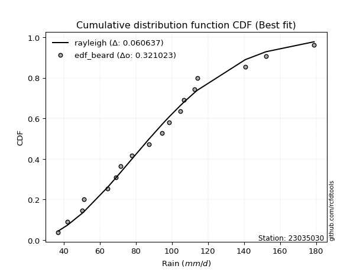</img></img>

</div>


### 5. EDF Chegodayev (1955)

The Chegodayev formula is an empirical plotting position formula used in hydrological frequency analysis to estimate the exceedance probability or return period of a specific event from a set of observed data. It is primarily used for plotting observed data points on probability paper to fit a theoretical distribution, particularly for analyzing extreme events like maximum flood flows or rainfall intensities. The constant _b_ value in the generalized plotting position formula is 0.3.

<div align="center">


$P=(m-b)/(n+1-2b)$


</div>


**5.1. Empirical values**

<div align="center">

|                | 0                    | 1                   | 2                   | 3                   | 4                  | 5                   | 6                   | 7                 | 8              | 9                  | 10                 | 11                 | 12                 | 13                 | 14                 | 15                 | 16                 |
|:---------------|:---------------------|:--------------------|:--------------------|:--------------------|:-------------------|:--------------------|:--------------------|:------------------|:---------------|:-------------------|:-------------------|:-------------------|:-------------------|:-------------------|:-------------------|:-------------------|:-------------------|
| date           | 2020                 | 2015                | 2005                | 2017                | 2019               | 2018                | 2014                | 2009              | 2007           | 2013               | 2012               | 2016               | 2010               | 2008               | 2006               | 2024               | 2011               |
| x              | 37.0                 | 42.1                | 50.2                | 51.3                | 64.4               | 69.0                | 71.6                | 77.9              | 94.7           | 98.6               | 104.7              | 106.7              | 112.7              | 114.1              | 140.7              | 152.2              | 178.9              |
| m              | 1                    | 2                   | 3                   | 4                   | 5                  | 6                   | 7                   | 8                 | 9              | 10                 | 11                 | 12                 | 13                 | 14                 | 15                 | 16                 | 17                 |
| empirical_dist | edf_chegodayev       | edf_chegodayev      | edf_chegodayev      | edf_chegodayev      | edf_chegodayev     | edf_chegodayev      | edf_chegodayev      | edf_chegodayev    | edf_chegodayev | edf_chegodayev     | edf_chegodayev     | edf_chegodayev     | edf_chegodayev     | edf_chegodayev     | edf_chegodayev     | edf_chegodayev     | edf_chegodayev     |
| empirical      | 0.040229885057471264 | 0.09770114942528736 | 0.15517241379310348 | 0.21264367816091956 | 0.2701149425287357 | 0.32758620689655177 | 0.38505747126436785 | 0.442528735632184 | 0.5            | 0.5574712643678161 | 0.6149425287356322 | 0.6724137931034483 | 0.7298850574712644 | 0.7873563218390804 | 0.8448275862068966 | 0.9022988505747127 | 0.9597701149425287 |
| empirical_tr   | 1.0419161676646707   | 1.10828025477707    | 1.183673469387755   | 1.27007299270073    | 1.3700787401574803 | 1.4871794871794874  | 1.6261682242990656  | 1.793814432989691 | 2.0            | 2.25974025974026   | 2.5970149253731343 | 3.0526315789473686 | 3.7021276595744688 | 4.702702702702703  | 6.4444444444444455 | 10.235294117647065 | 24.857142857142854 |

</div>


**5.2. Kolmogorov-Smirnov fit test (sorted by Δ)**


<div align="center">

|                | 0                  | 1                   | 2                   | 3                   | 4                   | 5                  | 6                   | 7                  | 8                   | 9                   | 10                  | 11                  | 12                  | 13                  | 14                  | 15                 | 16                 | 17                  | 18                  | 19                  | 20                  | 21                  | 22                  | 23                  | 24                  | 25                  | 26                  | 27                  | 28                  | 29                    | 30                 | 31                  | 32                 | 33                  | 34                  | 35                  | 36                  | 37                  | 38                  | 39                  | 40                  | 41                  | 42                  | 43                  | 44                  | 45                  | 46                  | 47                  | 48                  | 49                  | 50                  | 51                  | 52                  | 53                  | 54                  | 55                  | 56                  | 57                  | 58                  | 59                  | 60                  | 61                  | 62                  | 63                 | 64                  | 65                 | 66                  | 67                  | 68                  | 69                  | 70                 | 71                  | 72                 | 73                  | 74                  | 75                  | 76                  | 77                 | 78                  | 79                  | 80                  | 81                  | 82                 | 83                 | 84                  | 85                 | 86                  | 87                 |
|:---------------|:-------------------|:--------------------|:--------------------|:--------------------|:--------------------|:-------------------|:--------------------|:-------------------|:--------------------|:--------------------|:--------------------|:--------------------|:--------------------|:--------------------|:--------------------|:-------------------|:-------------------|:--------------------|:--------------------|:--------------------|:--------------------|:--------------------|:--------------------|:--------------------|:--------------------|:--------------------|:--------------------|:--------------------|:--------------------|:----------------------|:-------------------|:--------------------|:-------------------|:--------------------|:--------------------|:--------------------|:--------------------|:--------------------|:--------------------|:--------------------|:--------------------|:--------------------|:--------------------|:--------------------|:--------------------|:--------------------|:--------------------|:--------------------|:--------------------|:--------------------|:--------------------|:--------------------|:--------------------|:--------------------|:--------------------|:--------------------|:--------------------|:--------------------|:--------------------|:--------------------|:--------------------|:--------------------|:--------------------|:-------------------|:--------------------|:-------------------|:--------------------|:--------------------|:--------------------|:--------------------|:-------------------|:--------------------|:-------------------|:--------------------|:--------------------|:--------------------|:--------------------|:-------------------|:--------------------|:--------------------|:--------------------|:--------------------|:-------------------|:-------------------|:--------------------|:-------------------|:--------------------|:-------------------|
| station        | 23035030           | 23035030            | 23035030            | 23035030            | 23035030            | 23035030           | 23035030            | 23035030           | 23035030            | 23035030            | 23035030            | 23035030            | 23035030            | 23035030            | 23035030            | 23035030           | 23035030           | 23035030            | 23035030            | 23035030            | 23035030            | 23035030            | 23035030            | 23035030            | 23035030            | 23035030            | 23035030            | 23035030            | 23035030            | 23035030              | 23035030           | 23035030            | 23035030           | 23035030            | 23035030            | 23035030            | 23035030            | 23035030            | 23035030            | 23035030            | 23035030            | 23035030            | 23035030            | 23035030            | 23035030            | 23035030            | 23035030            | 23035030            | 23035030            | 23035030            | 23035030            | 23035030            | 23035030            | 23035030            | 23035030            | 23035030            | 23035030            | 23035030            | 23035030            | 23035030            | 23035030            | 23035030            | 23035030            | 23035030           | 23035030            | 23035030           | 23035030            | 23035030            | 23035030            | 23035030            | 23035030           | 23035030            | 23035030           | 23035030            | 23035030            | 23035030            | 23035030            | 23035030           | 23035030            | 23035030            | 23035030            | 23035030            | 23035030           | 23035030           | 23035030            | 23035030           | 23035030            | 23035030           |
| empirical_dist | edf_chegodayev     | edf_chegodayev      | edf_chegodayev      | edf_chegodayev      | edf_chegodayev      | edf_chegodayev     | edf_chegodayev      | edf_chegodayev     | edf_chegodayev      | edf_chegodayev      | edf_chegodayev      | edf_chegodayev      | edf_chegodayev      | edf_chegodayev      | edf_chegodayev      | edf_chegodayev     | edf_chegodayev     | edf_chegodayev      | edf_chegodayev      | edf_chegodayev      | edf_chegodayev      | edf_chegodayev      | edf_chegodayev      | edf_chegodayev      | edf_chegodayev      | edf_chegodayev      | edf_chegodayev      | edf_chegodayev      | edf_chegodayev      | edf_chegodayev        | edf_chegodayev     | edf_chegodayev      | edf_chegodayev     | edf_chegodayev      | edf_chegodayev      | edf_chegodayev      | edf_chegodayev      | edf_chegodayev      | edf_chegodayev      | edf_chegodayev      | edf_chegodayev      | edf_chegodayev      | edf_chegodayev      | edf_chegodayev      | edf_chegodayev      | edf_chegodayev      | edf_chegodayev      | edf_chegodayev      | edf_chegodayev      | edf_chegodayev      | edf_chegodayev      | edf_chegodayev      | edf_chegodayev      | edf_chegodayev      | edf_chegodayev      | edf_chegodayev      | edf_chegodayev      | edf_chegodayev      | edf_chegodayev      | edf_chegodayev      | edf_chegodayev      | edf_chegodayev      | edf_chegodayev      | edf_chegodayev     | edf_chegodayev      | edf_chegodayev     | edf_chegodayev      | edf_chegodayev      | edf_chegodayev      | edf_chegodayev      | edf_chegodayev     | edf_chegodayev      | edf_chegodayev     | edf_chegodayev      | edf_chegodayev      | edf_chegodayev      | edf_chegodayev      | edf_chegodayev     | edf_chegodayev      | edf_chegodayev      | edf_chegodayev      | edf_chegodayev      | edf_chegodayev     | edf_chegodayev     | edf_chegodayev      | edf_chegodayev     | edf_chegodayev      | edf_chegodayev     |
| p_dist         | maxwell            | rayleigh            | pearson3            | gompertz            | loggenlogistic      | mielke             | ncf                 | logjohnsonsu       | logloggamma         | t                   | crystalball         | norm                | truncnorm           | alpha               | loggumbel_l         | betaprime          | exponnorm          | rice                | kstwobign           | nct                 | invgamma            | logweibull_min      | logpearson3         | invweibull          | genlogistic         | gumbel_r            | halfnorm            | fisk                | logfisk             | loglaplace_asymmetric | johnsonsu          | invgauss            | lognct             | logf                | logt                | lognorm             | lognorm             | logcrystalball      | loglognorm          | logexponnorm        | logistic            | lognakagami         | logncf              | logfatiguelife      | weibull_min         | logbetaprime        | logerlang           | loggamma            | loggamma            | logrice             | loginvgamma         | loglogistic         | chi2                | gamma               | erlang              | hypsecant           | moyal               | logalpha            | laplace_asymmetric  | loghypsecant        | loginvgauss         | logmaxwell          | halflogistic        | logmielke          | f                   | loginvweibull      | lograyleigh         | gumbel_l            | laplace             | genexpon            | expon              | logkstwobign        | nakagami           | loglaplace          | loggompertz         | loghalfnorm         | loggumbel_r         | loggenexpon        | loghalflogistic     | logmoyal            | wald                | logexpon            | logchi2            | gibrat             | logwald             | loggibrat          | logtruncnorm        | fatiguelife        |
| delta          | 0.0647618210754165 | 0.06821729202621973 | 0.07188425841269655 | 0.07339196942516435 | 0.07907169260406635 | 0.0793185979255022 | 0.07959275148823353 | 0.0809005403110139 | 0.08477287774320863 | 0.08640335383524878 | 0.08656415255818528 | 0.08656415538228879 | 0.08656416311601794 | 0.08711925499030093 | 0.08716336078340353 | 0.0871828931556573 | 0.0906524248704017 | 0.09150059515265878 | 0.09242971381335474 | 0.09275078789533486 | 0.09380646283961491 | 0.09449748087572396 | 0.09536567325364165 | 0.09638770484492698 | 0.09649679989120952 | 0.09737212850934512 | 0.09750789878866284 | 0.09875597988034246 | 0.09886568437500487 | 0.09910172805811751   | 0.1001725268489504 | 0.10437186740570614 | 0.1064875728177086 | 0.10746836191051945 | 0.10751534718285904 | 0.10752053718955557 | 0.10752053718955557 | 0.10752054429761448 | 0.10752166364557225 | 0.10752197240684402 | 0.10798425637051473 | 0.10815380880205039 | 0.10848391128969892 | 0.10863576049439505 | 0.10908150958036056 | 0.11220182694650382 | 0.11472508110747781 | 0.11517900382592305 | 0.11517900382592305 | 0.11816399487440032 | 0.11944781256248937 | 0.12126425432774601 | 0.12326665278417503 | 0.12326697764959904 | 0.12326731657001488 | 0.12341059090663203 | 0.12389390246594931 | 0.12503401651285662 | 0.12879353293775003 | 0.13243616637835764 | 0.13321532995356045 | 0.13337109184893325 | 0.13411252797618586 | 0.1390174017704361 | 0.13973789711742834 | 0.1404011933649142 | 0.14135463913992397 | 0.14666914611695325 | 0.14834209770160692 | 0.14848774119703245 | 0.1486451602008404 | 0.15488818500369894 | 0.1576708305043486 | 0.16007592894136446 | 0.16203817937253473 | 0.16414012878068995 | 0.17322899781044743 | 0.1834857094261113 | 0.19249208317704658 | 0.19556817969836837 | 0.21264367816091956 | 0.22145236792261824 | 0.2365211492094218 | 0.2577294046763009 | 0.25792252997970955 | 0.2898117724476611 | 0.31681920300445343 | 0.5526069795509523 |
| deltao         | 0.3260541228310003 | 0.3260541228310003  | 0.3260541228310003  | 0.3260541228310003  | 0.3260541228310003  | 0.3260541228310003 | 0.3260541228310003  | 0.3260541228310003 | 0.3260541228310003  | 0.3260541228310003  | 0.3260541228310003  | 0.3260541228310003  | 0.3260541228310003  | 0.3260541228310003  | 0.3260541228310003  | 0.3260541228310003 | 0.3260541228310003 | 0.3260541228310003  | 0.3260541228310003  | 0.3260541228310003  | 0.3260541228310003  | 0.3260541228310003  | 0.3260541228310003  | 0.3260541228310003  | 0.3260541228310003  | 0.3260541228310003  | 0.3260541228310003  | 0.3260541228310003  | 0.3260541228310003  | 0.3260541228310003    | 0.3260541228310003 | 0.3260541228310003  | 0.3260541228310003 | 0.3260541228310003  | 0.3260541228310003  | 0.3260541228310003  | 0.3260541228310003  | 0.3260541228310003  | 0.3260541228310003  | 0.3260541228310003  | 0.3260541228310003  | 0.3260541228310003  | 0.3260541228310003  | 0.3260541228310003  | 0.3260541228310003  | 0.3260541228310003  | 0.3260541228310003  | 0.3260541228310003  | 0.3260541228310003  | 0.3260541228310003  | 0.3260541228310003  | 0.3260541228310003  | 0.3260541228310003  | 0.3260541228310003  | 0.3260541228310003  | 0.3260541228310003  | 0.3260541228310003  | 0.3260541228310003  | 0.3260541228310003  | 0.3260541228310003  | 0.3260541228310003  | 0.3260541228310003  | 0.3260541228310003  | 0.3260541228310003 | 0.3260541228310003  | 0.3260541228310003 | 0.3260541228310003  | 0.3260541228310003  | 0.3260541228310003  | 0.3260541228310003  | 0.3260541228310003 | 0.3260541228310003  | 0.3260541228310003 | 0.3260541228310003  | 0.3260541228310003  | 0.3260541228310003  | 0.3260541228310003  | 0.3260541228310003 | 0.3260541228310003  | 0.3260541228310003  | 0.3260541228310003  | 0.3260541228310003  | 0.3260541228310003 | 0.3260541228310003 | 0.3260541228310003  | 0.3260541228310003 | 0.3260541228310003  | 0.3260541228310003 |
| eval           | Δo > Δ             | Δo > Δ              | Δo > Δ              | Δo > Δ              | Δo > Δ              | Δo > Δ             | Δo > Δ              | Δo > Δ             | Δo > Δ              | Δo > Δ              | Δo > Δ              | Δo > Δ              | Δo > Δ              | Δo > Δ              | Δo > Δ              | Δo > Δ             | Δo > Δ             | Δo > Δ              | Δo > Δ              | Δo > Δ              | Δo > Δ              | Δo > Δ              | Δo > Δ              | Δo > Δ              | Δo > Δ              | Δo > Δ              | Δo > Δ              | Δo > Δ              | Δo > Δ              | Δo > Δ                | Δo > Δ             | Δo > Δ              | Δo > Δ             | Δo > Δ              | Δo > Δ              | Δo > Δ              | Δo > Δ              | Δo > Δ              | Δo > Δ              | Δo > Δ              | Δo > Δ              | Δo > Δ              | Δo > Δ              | Δo > Δ              | Δo > Δ              | Δo > Δ              | Δo > Δ              | Δo > Δ              | Δo > Δ              | Δo > Δ              | Δo > Δ              | Δo > Δ              | Δo > Δ              | Δo > Δ              | Δo > Δ              | Δo > Δ              | Δo > Δ              | Δo > Δ              | Δo > Δ              | Δo > Δ              | Δo > Δ              | Δo > Δ              | Δo > Δ              | Δo > Δ             | Δo > Δ              | Δo > Δ             | Δo > Δ              | Δo > Δ              | Δo > Δ              | Δo > Δ              | Δo > Δ             | Δo > Δ              | Δo > Δ             | Δo > Δ              | Δo > Δ              | Δo > Δ              | Δo > Δ              | Δo > Δ             | Δo > Δ              | Δo > Δ              | Δo > Δ              | Δo > Δ              | Δo > Δ             | Δo > Δ             | Δo > Δ              | Δo > Δ             | Δo > Δ              | Δo <= Δ            |
| fit            | 1                  | 1                   | 1                   | 1                   | 1                   | 1                  | 1                   | 1                  | 1                   | 1                   | 1                   | 1                   | 1                   | 1                   | 1                   | 1                  | 1                  | 1                   | 1                   | 1                   | 1                   | 1                   | 1                   | 1                   | 1                   | 1                   | 1                   | 1                   | 1                   | 1                     | 1                  | 1                   | 1                  | 1                   | 1                   | 1                   | 1                   | 1                   | 1                   | 1                   | 1                   | 1                   | 1                   | 1                   | 1                   | 1                   | 1                   | 1                   | 1                   | 1                   | 1                   | 1                   | 1                   | 1                   | 1                   | 1                   | 1                   | 1                   | 1                   | 1                   | 1                   | 1                   | 1                   | 1                  | 1                   | 1                  | 1                   | 1                   | 1                   | 1                   | 1                  | 1                   | 1                  | 1                   | 1                   | 1                   | 1                   | 1                  | 1                   | 1                   | 1                   | 1                   | 1                  | 1                  | 1                   | 1                  | 1                   | 0                  |
| n              | 17                 | 17                  | 17                  | 17                  | 17                  | 17                 | 17                  | 17                 | 17                  | 17                  | 17                  | 17                  | 17                  | 17                  | 17                  | 17                 | 17                 | 17                  | 17                  | 17                  | 17                  | 17                  | 17                  | 17                  | 17                  | 17                  | 17                  | 17                  | 17                  | 17                    | 17                 | 17                  | 17                 | 17                  | 17                  | 17                  | 17                  | 17                  | 17                  | 17                  | 17                  | 17                  | 17                  | 17                  | 17                  | 17                  | 17                  | 17                  | 17                  | 17                  | 17                  | 17                  | 17                  | 17                  | 17                  | 17                  | 17                  | 17                  | 17                  | 17                  | 17                  | 17                  | 17                  | 17                 | 17                  | 17                 | 17                  | 17                  | 17                  | 17                  | 17                 | 17                  | 17                 | 17                  | 17                  | 17                  | 17                  | 17                 | 17                  | 17                  | 17                  | 17                  | 17                 | 17                 | 17                  | 17                 | 17                  | 17                 |
| best_fit       | 1                  | 0                   | 0                   | 0                   | 0                   | 0                  | 0                   | 0                  | 0                   | 0                   | 0                   | 0                   | 0                   | 0                   | 0                   | 0                  | 0                  | 0                   | 0                   | 0                   | 0                   | 0                   | 0                   | 0                   | 0                   | 0                   | 0                   | 0                   | 0                   | 0                     | 0                  | 0                   | 0                  | 0                   | 0                   | 0                   | 0                   | 0                   | 0                   | 0                   | 0                   | 0                   | 0                   | 0                   | 0                   | 0                   | 0                   | 0                   | 0                   | 0                   | 0                   | 0                   | 0                   | 0                   | 0                   | 0                   | 0                   | 0                   | 0                   | 0                   | 0                   | 0                   | 0                   | 0                  | 0                   | 0                  | 0                   | 0                   | 0                   | 0                   | 0                  | 0                   | 0                  | 0                   | 0                   | 0                   | 0                   | 0                  | 0                   | 0                   | 0                   | 0                   | 0                  | 0                  | 0                   | 0                  | 0                   | 0                  |
| best_fit_sort  | 1                  | 2                   | 3                   | 4                   | 5                   | 6                  | 7                   | 8                  | 9                   | 10                  | 11                  | 12                  | 13                  | 14                  | 15                  | 16                 | 17                 | 18                  | 19                  | 20                  | 21                  | 22                  | 23                  | 24                  | 25                  | 26                  | 27                  | 28                  | 29                  | 30                    | 31                 | 32                  | 33                 | 34                  | 35                  | 36                  | 37                  | 38                  | 39                  | 40                  | 41                  | 42                  | 43                  | 44                  | 45                  | 46                  | 47                  | 48                  | 49                  | 50                  | 51                  | 52                  | 53                  | 54                  | 55                  | 56                  | 57                  | 58                  | 59                  | 60                  | 61                  | 62                  | 63                  | 64                 | 65                  | 66                 | 67                  | 68                  | 69                  | 70                  | 71                 | 72                  | 73                 | 74                  | 75                  | 76                  | 77                  | 78                 | 79                  | 80                  | 81                  | 82                  | 83                 | 84                 | 85                  | 86                 | 87                  | 88                 |

</div>


**5.3. Best fit**

<div align="center">

|   id |   station | empirical_dist   | p_dist   |     delta |   deltao | eval   |   fit |   n |   best_fit |   best_fit_sort |
|-----:|----------:|:-----------------|:---------|----------:|---------:|:-------|------:|----:|-----------:|----------------:|
|    0 |  23035030 | edf_chegodayev   | maxwell  | 0.0647618 | 0.326054 | Δo > Δ |     1 |  17 |          1 |               1 |

</div>


<div align="center">

</img>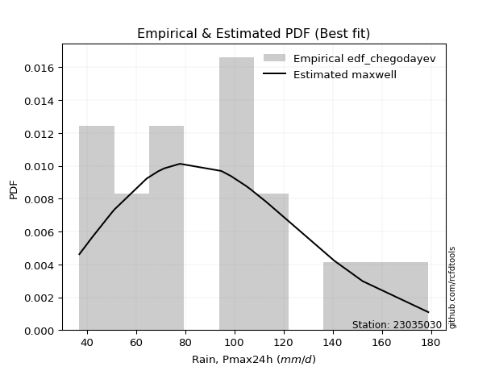</img>

</div>


### 6. EDF Blom (1958)

The Blom formula is a specific "plotting position" formula used in hydrology and statistical analysis to estimate the empirical cumulative probability (or non-exceedance probability) of a data series. It is particularly recommended for data that are approximately normally distributed. The constant _a_ is set to 0.375 (or 3/8).

<div align="center">


$P=(m-a)/(n+1-2a)$


</div>


**6.1. Empirical values**

<div align="center">

|                | 0                    | 1                   | 2                   | 3                   | 4                   | 5                   | 6                   | 7                  | 8        | 9                  | 10                 | 11                 | 12                 | 13                 | 14                 | 15                 | 16                 |
|:---------------|:---------------------|:--------------------|:--------------------|:--------------------|:--------------------|:--------------------|:--------------------|:-------------------|:---------|:-------------------|:-------------------|:-------------------|:-------------------|:-------------------|:-------------------|:-------------------|:-------------------|
| date           | 2020                 | 2015                | 2005                | 2017                | 2019                | 2018                | 2014                | 2009               | 2007     | 2013               | 2012               | 2016               | 2010               | 2008               | 2006               | 2024               | 2011               |
| x              | 37.0                 | 42.1                | 50.2                | 51.3                | 64.4                | 69.0                | 71.6                | 77.9               | 94.7     | 98.6               | 104.7              | 106.7              | 112.7              | 114.1              | 140.7              | 152.2              | 178.9              |
| m              | 1                    | 2                   | 3                   | 4                   | 5                   | 6                   | 7                   | 8                  | 9        | 10                 | 11                 | 12                 | 13                 | 14                 | 15                 | 16                 | 17                 |
| empirical_dist | edf_blom             | edf_blom            | edf_blom            | edf_blom            | edf_blom            | edf_blom            | edf_blom            | edf_blom           | edf_blom | edf_blom           | edf_blom           | edf_blom           | edf_blom           | edf_blom           | edf_blom           | edf_blom           | edf_blom           |
| empirical      | 0.036231884057971016 | 0.09420289855072464 | 0.15217391304347827 | 0.21014492753623187 | 0.26811594202898553 | 0.32608695652173914 | 0.38405797101449274 | 0.4420289855072464 | 0.5      | 0.5579710144927537 | 0.6159420289855072 | 0.6739130434782609 | 0.7318840579710145 | 0.7898550724637681 | 0.8478260869565217 | 0.9057971014492754 | 0.9637681159420289 |
| empirical_tr   | 1.037593984962406    | 1.1039999999999999  | 1.1794871794871795  | 1.2660550458715598  | 1.3663366336633664  | 1.4838709677419355  | 1.6235294117647057  | 1.7922077922077921 | 2.0      | 2.2622950819672134 | 2.6037735849056602 | 3.0666666666666664 | 3.7297297297297303 | 4.758620689655172  | 6.571428571428571  | 10.615384615384619 | 27.599999999999962 |

</div>


**6.2. Kolmogorov-Smirnov fit test (sorted by Δ)**


<div align="center">

|                | 0                   | 1                   | 2                   | 3                   | 4                   | 5                   | 6                   | 7                  | 8                   | 9                   | 10                  | 11                  | 12                  | 13                  | 14                  | 15                 | 16                 | 17                 | 18                  | 19                  | 20                  | 21                  | 22                  | 23                  | 24                  | 25                  | 26                  | 27                    | 28                  | 29                  | 30                 | 31                  | 32                 | 33                  | 34                  | 35                  | 36                  | 37                  | 38                  | 39                  | 40                  | 41                  | 42                  | 43                  | 44                  | 45                  | 46                  | 47                  | 48                  | 49                  | 50                  | 51                  | 52                  | 53                  | 54                  | 55                  | 56                  | 57                  | 58                  | 59                  | 60                  | 61                  | 62                  | 63                 | 64                  | 65                 | 66                  | 67                  | 68                 | 69                  | 70                 | 71                  | 72                 | 73                  | 74                  | 75                  | 76                  | 77                  | 78                  | 79                  | 80                  | 81                 | 82                  | 83                  | 84                  | 85                 | 86                 | 87                 |
|:---------------|:--------------------|:--------------------|:--------------------|:--------------------|:--------------------|:--------------------|:--------------------|:-------------------|:--------------------|:--------------------|:--------------------|:--------------------|:--------------------|:--------------------|:--------------------|:-------------------|:-------------------|:-------------------|:--------------------|:--------------------|:--------------------|:--------------------|:--------------------|:--------------------|:--------------------|:--------------------|:--------------------|:----------------------|:--------------------|:--------------------|:-------------------|:--------------------|:-------------------|:--------------------|:--------------------|:--------------------|:--------------------|:--------------------|:--------------------|:--------------------|:--------------------|:--------------------|:--------------------|:--------------------|:--------------------|:--------------------|:--------------------|:--------------------|:--------------------|:--------------------|:--------------------|:--------------------|:--------------------|:--------------------|:--------------------|:--------------------|:--------------------|:--------------------|:--------------------|:--------------------|:--------------------|:--------------------|:--------------------|:-------------------|:--------------------|:-------------------|:--------------------|:--------------------|:-------------------|:--------------------|:-------------------|:--------------------|:-------------------|:--------------------|:--------------------|:--------------------|:--------------------|:--------------------|:--------------------|:--------------------|:--------------------|:-------------------|:--------------------|:--------------------|:--------------------|:-------------------|:-------------------|:-------------------|
| station        | 23035030            | 23035030            | 23035030            | 23035030            | 23035030            | 23035030            | 23035030            | 23035030           | 23035030            | 23035030            | 23035030            | 23035030            | 23035030            | 23035030            | 23035030            | 23035030           | 23035030           | 23035030           | 23035030            | 23035030            | 23035030            | 23035030            | 23035030            | 23035030            | 23035030            | 23035030            | 23035030            | 23035030              | 23035030            | 23035030            | 23035030           | 23035030            | 23035030           | 23035030            | 23035030            | 23035030            | 23035030            | 23035030            | 23035030            | 23035030            | 23035030            | 23035030            | 23035030            | 23035030            | 23035030            | 23035030            | 23035030            | 23035030            | 23035030            | 23035030            | 23035030            | 23035030            | 23035030            | 23035030            | 23035030            | 23035030            | 23035030            | 23035030            | 23035030            | 23035030            | 23035030            | 23035030            | 23035030            | 23035030           | 23035030            | 23035030           | 23035030            | 23035030            | 23035030           | 23035030            | 23035030           | 23035030            | 23035030           | 23035030            | 23035030            | 23035030            | 23035030            | 23035030            | 23035030            | 23035030            | 23035030            | 23035030           | 23035030            | 23035030            | 23035030            | 23035030           | 23035030           | 23035030           |
| empirical_dist | edf_blom            | edf_blom            | edf_blom            | edf_blom            | edf_blom            | edf_blom            | edf_blom            | edf_blom           | edf_blom            | edf_blom            | edf_blom            | edf_blom            | edf_blom            | edf_blom            | edf_blom            | edf_blom           | edf_blom           | edf_blom           | edf_blom            | edf_blom            | edf_blom            | edf_blom            | edf_blom            | edf_blom            | edf_blom            | edf_blom            | edf_blom            | edf_blom              | edf_blom            | edf_blom            | edf_blom           | edf_blom            | edf_blom           | edf_blom            | edf_blom            | edf_blom            | edf_blom            | edf_blom            | edf_blom            | edf_blom            | edf_blom            | edf_blom            | edf_blom            | edf_blom            | edf_blom            | edf_blom            | edf_blom            | edf_blom            | edf_blom            | edf_blom            | edf_blom            | edf_blom            | edf_blom            | edf_blom            | edf_blom            | edf_blom            | edf_blom            | edf_blom            | edf_blom            | edf_blom            | edf_blom            | edf_blom            | edf_blom            | edf_blom           | edf_blom            | edf_blom           | edf_blom            | edf_blom            | edf_blom           | edf_blom            | edf_blom           | edf_blom            | edf_blom           | edf_blom            | edf_blom            | edf_blom            | edf_blom            | edf_blom            | edf_blom            | edf_blom            | edf_blom            | edf_blom           | edf_blom            | edf_blom            | edf_blom            | edf_blom           | edf_blom           | edf_blom           |
| p_dist         | maxwell             | rayleigh            | pearson3            | gompertz            | loggenlogistic      | mielke              | ncf                 | logjohnsonsu       | logloggamma         | t                   | crystalball         | norm                | truncnorm           | loggumbel_l         | alpha               | betaprime          | rice               | exponnorm          | kstwobign           | nct                 | invgamma            | logweibull_min      | logpearson3         | invweibull          | genlogistic         | gumbel_r            | halfnorm            | loglaplace_asymmetric | fisk                | logfisk             | johnsonsu          | invgauss            | lognct             | logistic            | logf                | logt                | lognorm             | lognorm             | logcrystalball      | loglognorm          | logexponnorm        | lognakagami         | logncf              | logfatiguelife      | weibull_min         | logbetaprime        | logerlang           | loggamma            | loggamma            | logrice             | loginvgamma         | loglogistic         | moyal               | hypsecant           | chi2                | gamma               | erlang              | logalpha            | laplace_asymmetric  | halflogistic        | loghypsecant        | loginvgauss         | logmaxwell          | logmielke          | f                   | loginvweibull      | lograyleigh         | gumbel_l            | laplace            | genexpon            | expon              | logkstwobign        | nakagami           | loglaplace          | loggompertz         | loghalfnorm         | loggumbel_r         | loggenexpon         | loghalflogistic     | logmoyal            | wald                | logexpon           | logchi2             | gibrat              | logwald             | loggibrat          | logtruncnorm       | fatiguelife        |
| delta          | 0.06226307045072882 | 0.06821729202621973 | 0.06938550778800887 | 0.07339196942516435 | 0.07657294197937867 | 0.07681984730081451 | 0.07959275148823353 | 0.0809005403110139 | 0.08477287774320863 | 0.08540385358537367 | 0.08556465230831017 | 0.08556465513241368 | 0.08556466286614284 | 0.08616386053352842 | 0.08711925499030093 | 0.0871828931556573 | 0.0890018445279711 | 0.0906524248704017 | 0.09242971381335474 | 0.09275078789533486 | 0.09380646283961491 | 0.09449748087572396 | 0.09536567325364165 | 0.09638770484492698 | 0.09649679989120952 | 0.09664771318317422 | 0.09750789878866284 | 0.09860197793317993   | 0.09875597988034246 | 0.09886568437500487 | 0.1001725268489504 | 0.10437186740570614 | 0.1064875728177086 | 0.10698475612063962 | 0.10746836191051945 | 0.10751534718285904 | 0.10752053718955557 | 0.10752053718955557 | 0.10752054429761448 | 0.10752166364557225 | 0.10752197240684402 | 0.10815380880205039 | 0.10848391128969892 | 0.10863576049439505 | 0.10908150958036056 | 0.11220182694650382 | 0.11472508110747781 | 0.11517900382592305 | 0.11517900382592305 | 0.11816399487440032 | 0.11944781256248937 | 0.12126425432774601 | 0.12213015506317859 | 0.12241109065675693 | 0.12326665278417503 | 0.12326697764959904 | 0.12326731657001488 | 0.12503401651285662 | 0.12829378281281245 | 0.13161377735149818 | 0.13243616637835764 | 0.13321532995356045 | 0.13337109184893325 | 0.1390174017704361 | 0.13973789711742834 | 0.1404011933649142 | 0.14135463913992397 | 0.14616939599201567 | 0.1473425974517318 | 0.14848774119703245 | 0.1486451602008404 | 0.15488818500369894 | 0.1576708305043486 | 0.16007592894136446 | 0.16203817937253473 | 0.16414012878068995 | 0.17322899781044743 | 0.18548470992586147 | 0.19249208317704658 | 0.19556817969836837 | 0.21014492753623187 | 0.2234513684223684 | 0.23852014970917196 | 0.25573040417655074 | 0.25792252997970955 | 0.2898117724476611 | 0.3188182035042036 | 0.5556054803005775 |
| deltao         | 0.3260541228310003  | 0.3260541228310003  | 0.3260541228310003  | 0.3260541228310003  | 0.3260541228310003  | 0.3260541228310003  | 0.3260541228310003  | 0.3260541228310003 | 0.3260541228310003  | 0.3260541228310003  | 0.3260541228310003  | 0.3260541228310003  | 0.3260541228310003  | 0.3260541228310003  | 0.3260541228310003  | 0.3260541228310003 | 0.3260541228310003 | 0.3260541228310003 | 0.3260541228310003  | 0.3260541228310003  | 0.3260541228310003  | 0.3260541228310003  | 0.3260541228310003  | 0.3260541228310003  | 0.3260541228310003  | 0.3260541228310003  | 0.3260541228310003  | 0.3260541228310003    | 0.3260541228310003  | 0.3260541228310003  | 0.3260541228310003 | 0.3260541228310003  | 0.3260541228310003 | 0.3260541228310003  | 0.3260541228310003  | 0.3260541228310003  | 0.3260541228310003  | 0.3260541228310003  | 0.3260541228310003  | 0.3260541228310003  | 0.3260541228310003  | 0.3260541228310003  | 0.3260541228310003  | 0.3260541228310003  | 0.3260541228310003  | 0.3260541228310003  | 0.3260541228310003  | 0.3260541228310003  | 0.3260541228310003  | 0.3260541228310003  | 0.3260541228310003  | 0.3260541228310003  | 0.3260541228310003  | 0.3260541228310003  | 0.3260541228310003  | 0.3260541228310003  | 0.3260541228310003  | 0.3260541228310003  | 0.3260541228310003  | 0.3260541228310003  | 0.3260541228310003  | 0.3260541228310003  | 0.3260541228310003  | 0.3260541228310003 | 0.3260541228310003  | 0.3260541228310003 | 0.3260541228310003  | 0.3260541228310003  | 0.3260541228310003 | 0.3260541228310003  | 0.3260541228310003 | 0.3260541228310003  | 0.3260541228310003 | 0.3260541228310003  | 0.3260541228310003  | 0.3260541228310003  | 0.3260541228310003  | 0.3260541228310003  | 0.3260541228310003  | 0.3260541228310003  | 0.3260541228310003  | 0.3260541228310003 | 0.3260541228310003  | 0.3260541228310003  | 0.3260541228310003  | 0.3260541228310003 | 0.3260541228310003 | 0.3260541228310003 |
| eval           | Δo > Δ              | Δo > Δ              | Δo > Δ              | Δo > Δ              | Δo > Δ              | Δo > Δ              | Δo > Δ              | Δo > Δ             | Δo > Δ              | Δo > Δ              | Δo > Δ              | Δo > Δ              | Δo > Δ              | Δo > Δ              | Δo > Δ              | Δo > Δ             | Δo > Δ             | Δo > Δ             | Δo > Δ              | Δo > Δ              | Δo > Δ              | Δo > Δ              | Δo > Δ              | Δo > Δ              | Δo > Δ              | Δo > Δ              | Δo > Δ              | Δo > Δ                | Δo > Δ              | Δo > Δ              | Δo > Δ             | Δo > Δ              | Δo > Δ             | Δo > Δ              | Δo > Δ              | Δo > Δ              | Δo > Δ              | Δo > Δ              | Δo > Δ              | Δo > Δ              | Δo > Δ              | Δo > Δ              | Δo > Δ              | Δo > Δ              | Δo > Δ              | Δo > Δ              | Δo > Δ              | Δo > Δ              | Δo > Δ              | Δo > Δ              | Δo > Δ              | Δo > Δ              | Δo > Δ              | Δo > Δ              | Δo > Δ              | Δo > Δ              | Δo > Δ              | Δo > Δ              | Δo > Δ              | Δo > Δ              | Δo > Δ              | Δo > Δ              | Δo > Δ              | Δo > Δ             | Δo > Δ              | Δo > Δ             | Δo > Δ              | Δo > Δ              | Δo > Δ             | Δo > Δ              | Δo > Δ             | Δo > Δ              | Δo > Δ             | Δo > Δ              | Δo > Δ              | Δo > Δ              | Δo > Δ              | Δo > Δ              | Δo > Δ              | Δo > Δ              | Δo > Δ              | Δo > Δ             | Δo > Δ              | Δo > Δ              | Δo > Δ              | Δo > Δ             | Δo > Δ             | Δo <= Δ            |
| fit            | 1                   | 1                   | 1                   | 1                   | 1                   | 1                   | 1                   | 1                  | 1                   | 1                   | 1                   | 1                   | 1                   | 1                   | 1                   | 1                  | 1                  | 1                  | 1                   | 1                   | 1                   | 1                   | 1                   | 1                   | 1                   | 1                   | 1                   | 1                     | 1                   | 1                   | 1                  | 1                   | 1                  | 1                   | 1                   | 1                   | 1                   | 1                   | 1                   | 1                   | 1                   | 1                   | 1                   | 1                   | 1                   | 1                   | 1                   | 1                   | 1                   | 1                   | 1                   | 1                   | 1                   | 1                   | 1                   | 1                   | 1                   | 1                   | 1                   | 1                   | 1                   | 1                   | 1                   | 1                  | 1                   | 1                  | 1                   | 1                   | 1                  | 1                   | 1                  | 1                   | 1                  | 1                   | 1                   | 1                   | 1                   | 1                   | 1                   | 1                   | 1                   | 1                  | 1                   | 1                   | 1                   | 1                  | 1                  | 0                  |
| n              | 17                  | 17                  | 17                  | 17                  | 17                  | 17                  | 17                  | 17                 | 17                  | 17                  | 17                  | 17                  | 17                  | 17                  | 17                  | 17                 | 17                 | 17                 | 17                  | 17                  | 17                  | 17                  | 17                  | 17                  | 17                  | 17                  | 17                  | 17                    | 17                  | 17                  | 17                 | 17                  | 17                 | 17                  | 17                  | 17                  | 17                  | 17                  | 17                  | 17                  | 17                  | 17                  | 17                  | 17                  | 17                  | 17                  | 17                  | 17                  | 17                  | 17                  | 17                  | 17                  | 17                  | 17                  | 17                  | 17                  | 17                  | 17                  | 17                  | 17                  | 17                  | 17                  | 17                  | 17                 | 17                  | 17                 | 17                  | 17                  | 17                 | 17                  | 17                 | 17                  | 17                 | 17                  | 17                  | 17                  | 17                  | 17                  | 17                  | 17                  | 17                  | 17                 | 17                  | 17                  | 17                  | 17                 | 17                 | 17                 |
| best_fit       | 1                   | 0                   | 0                   | 0                   | 0                   | 0                   | 0                   | 0                  | 0                   | 0                   | 0                   | 0                   | 0                   | 0                   | 0                   | 0                  | 0                  | 0                  | 0                   | 0                   | 0                   | 0                   | 0                   | 0                   | 0                   | 0                   | 0                   | 0                     | 0                   | 0                   | 0                  | 0                   | 0                  | 0                   | 0                   | 0                   | 0                   | 0                   | 0                   | 0                   | 0                   | 0                   | 0                   | 0                   | 0                   | 0                   | 0                   | 0                   | 0                   | 0                   | 0                   | 0                   | 0                   | 0                   | 0                   | 0                   | 0                   | 0                   | 0                   | 0                   | 0                   | 0                   | 0                   | 0                  | 0                   | 0                  | 0                   | 0                   | 0                  | 0                   | 0                  | 0                   | 0                  | 0                   | 0                   | 0                   | 0                   | 0                   | 0                   | 0                   | 0                   | 0                  | 0                   | 0                   | 0                   | 0                  | 0                  | 0                  |
| best_fit_sort  | 1                   | 2                   | 3                   | 4                   | 5                   | 6                   | 7                   | 8                  | 9                   | 10                  | 11                  | 12                  | 13                  | 14                  | 15                  | 16                 | 17                 | 18                 | 19                  | 20                  | 21                  | 22                  | 23                  | 24                  | 25                  | 26                  | 27                  | 28                    | 29                  | 30                  | 31                 | 32                  | 33                 | 34                  | 35                  | 36                  | 37                  | 38                  | 39                  | 40                  | 41                  | 42                  | 43                  | 44                  | 45                  | 46                  | 47                  | 48                  | 49                  | 50                  | 51                  | 52                  | 53                  | 54                  | 55                  | 56                  | 57                  | 58                  | 59                  | 60                  | 61                  | 62                  | 63                  | 64                 | 65                  | 66                 | 67                  | 68                  | 69                 | 70                  | 71                 | 72                  | 73                 | 74                  | 75                  | 76                  | 77                  | 78                  | 79                  | 80                  | 81                  | 82                 | 83                  | 84                  | 85                  | 86                 | 87                 | 88                 |

</div>


**6.3. Best fit**

<div align="center">

|   id |   station | empirical_dist   | p_dist   |     delta |   deltao | eval   |   fit |   n |   best_fit |   best_fit_sort |
|-----:|----------:|:-----------------|:---------|----------:|---------:|:-------|------:|----:|-----------:|----------------:|
|    0 |  23035030 | edf_blom         | maxwell  | 0.0622631 | 0.326054 | Δo > Δ |     1 |  17 |          1 |               1 |

</div>


<div align="center">

</img>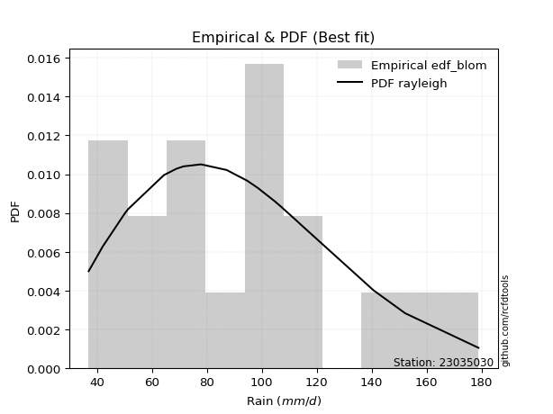</img>

</div>


### 7. EDF Tukey (1962)

In hydrology, the Tukey formula is used as a plotting position formula to estimate the empirical probability or frequency of a flood event (or other hydrological data). The formula parameter is given as _c=0.333_ (or 1/3).

<div align="center">


$P=(m-c)/(n+1-2c)$


</div>


**7.1. Empirical values**

<div align="center">

|                | 0                    | 1                   | 2                   | 3                   | 4                  | 5                  | 6                   | 7                  | 8         | 9                  | 10                 | 11                 | 12                 | 13                 | 14                 | 15                 | 16                 |
|:---------------|:---------------------|:--------------------|:--------------------|:--------------------|:-------------------|:-------------------|:--------------------|:-------------------|:----------|:-------------------|:-------------------|:-------------------|:-------------------|:-------------------|:-------------------|:-------------------|:-------------------|
| date           | 2020                 | 2015                | 2005                | 2017                | 2019               | 2018               | 2014                | 2009               | 2007      | 2013               | 2012               | 2016               | 2010               | 2008               | 2006               | 2024               | 2011               |
| x              | 37.0                 | 42.1                | 50.2                | 51.3                | 64.4               | 69.0               | 71.6                | 77.9               | 94.7      | 98.6               | 104.7              | 106.7              | 112.7              | 114.1              | 140.7              | 152.2              | 178.9              |
| m              | 1                    | 2                   | 3                   | 4                   | 5                  | 6                  | 7                   | 8                  | 9         | 10                 | 11                 | 12                 | 13                 | 14                 | 15                 | 16                 | 17                 |
| empirical_dist | edf_tukey            | edf_tukey           | edf_tukey           | edf_tukey           | edf_tukey          | edf_tukey          | edf_tukey           | edf_tukey          | edf_tukey | edf_tukey          | edf_tukey          | edf_tukey          | edf_tukey          | edf_tukey          | edf_tukey          | edf_tukey          | edf_tukey          |
| empirical      | 0.038461538461538464 | 0.09615384615384616 | 0.15384615384615385 | 0.21153846153846154 | 0.2692307692307692 | 0.3269230769230769 | 0.38461538461538464 | 0.4423076923076923 | 0.5       | 0.5576923076923077 | 0.6153846153846154 | 0.6730769230769231 | 0.7307692307692307 | 0.7884615384615384 | 0.8461538461538461 | 0.9038461538461539 | 0.9615384615384616 |
| empirical_tr   | 1.04                 | 1.1063829787234043  | 1.1818181818181819  | 1.2682926829268293  | 1.3684210526315788 | 1.4857142857142855 | 1.625               | 1.793103448275862  | 2.0       | 2.2608695652173916 | 2.6                | 3.0588235294117654 | 3.7142857142857135 | 4.727272727272727  | 6.5                | 10.4               | 26.000000000000018 |

</div>


**7.2. Kolmogorov-Smirnov fit test (sorted by Δ)**


<div align="center">

|                | 0                   | 1                   | 2                   | 3                   | 4                   | 5                   | 6                   | 7                  | 8                   | 9                   | 10                  | 11                  | 12                  | 13                  | 14                  | 15                 | 16                  | 17                 | 18                  | 19                  | 20                  | 21                  | 22                  | 23                  | 24                  | 25                  | 26                  | 27                  | 28                  | 29                    | 30                 | 31                  | 32                 | 33                  | 34                  | 35                  | 36                  | 37                  | 38                  | 39                  | 40                  | 41                  | 42                  | 43                  | 44                  | 45                  | 46                  | 47                  | 48                  | 49                  | 50                  | 51                  | 52                  | 53                  | 54                  | 55                  | 56                  | 57                  | 58                  | 59                  | 60                  | 61                  | 62                  | 63                 | 64                  | 65                 | 66                  | 67                  | 68                 | 69                  | 70                 | 71                  | 72                 | 73                  | 74                  | 75                  | 76                  | 77                  | 78                  | 79                  | 80                  | 81                  | 82                  | 83                 | 84                  | 85                 | 86                 | 87                 |
|:---------------|:--------------------|:--------------------|:--------------------|:--------------------|:--------------------|:--------------------|:--------------------|:-------------------|:--------------------|:--------------------|:--------------------|:--------------------|:--------------------|:--------------------|:--------------------|:-------------------|:--------------------|:-------------------|:--------------------|:--------------------|:--------------------|:--------------------|:--------------------|:--------------------|:--------------------|:--------------------|:--------------------|:--------------------|:--------------------|:----------------------|:-------------------|:--------------------|:-------------------|:--------------------|:--------------------|:--------------------|:--------------------|:--------------------|:--------------------|:--------------------|:--------------------|:--------------------|:--------------------|:--------------------|:--------------------|:--------------------|:--------------------|:--------------------|:--------------------|:--------------------|:--------------------|:--------------------|:--------------------|:--------------------|:--------------------|:--------------------|:--------------------|:--------------------|:--------------------|:--------------------|:--------------------|:--------------------|:--------------------|:-------------------|:--------------------|:-------------------|:--------------------|:--------------------|:-------------------|:--------------------|:-------------------|:--------------------|:-------------------|:--------------------|:--------------------|:--------------------|:--------------------|:--------------------|:--------------------|:--------------------|:--------------------|:--------------------|:--------------------|:-------------------|:--------------------|:-------------------|:-------------------|:-------------------|
| station        | 23035030            | 23035030            | 23035030            | 23035030            | 23035030            | 23035030            | 23035030            | 23035030           | 23035030            | 23035030            | 23035030            | 23035030            | 23035030            | 23035030            | 23035030            | 23035030           | 23035030            | 23035030           | 23035030            | 23035030            | 23035030            | 23035030            | 23035030            | 23035030            | 23035030            | 23035030            | 23035030            | 23035030            | 23035030            | 23035030              | 23035030           | 23035030            | 23035030           | 23035030            | 23035030            | 23035030            | 23035030            | 23035030            | 23035030            | 23035030            | 23035030            | 23035030            | 23035030            | 23035030            | 23035030            | 23035030            | 23035030            | 23035030            | 23035030            | 23035030            | 23035030            | 23035030            | 23035030            | 23035030            | 23035030            | 23035030            | 23035030            | 23035030            | 23035030            | 23035030            | 23035030            | 23035030            | 23035030            | 23035030           | 23035030            | 23035030           | 23035030            | 23035030            | 23035030           | 23035030            | 23035030           | 23035030            | 23035030           | 23035030            | 23035030            | 23035030            | 23035030            | 23035030            | 23035030            | 23035030            | 23035030            | 23035030            | 23035030            | 23035030           | 23035030            | 23035030           | 23035030           | 23035030           |
| empirical_dist | edf_tukey           | edf_tukey           | edf_tukey           | edf_tukey           | edf_tukey           | edf_tukey           | edf_tukey           | edf_tukey          | edf_tukey           | edf_tukey           | edf_tukey           | edf_tukey           | edf_tukey           | edf_tukey           | edf_tukey           | edf_tukey          | edf_tukey           | edf_tukey          | edf_tukey           | edf_tukey           | edf_tukey           | edf_tukey           | edf_tukey           | edf_tukey           | edf_tukey           | edf_tukey           | edf_tukey           | edf_tukey           | edf_tukey           | edf_tukey             | edf_tukey          | edf_tukey           | edf_tukey          | edf_tukey           | edf_tukey           | edf_tukey           | edf_tukey           | edf_tukey           | edf_tukey           | edf_tukey           | edf_tukey           | edf_tukey           | edf_tukey           | edf_tukey           | edf_tukey           | edf_tukey           | edf_tukey           | edf_tukey           | edf_tukey           | edf_tukey           | edf_tukey           | edf_tukey           | edf_tukey           | edf_tukey           | edf_tukey           | edf_tukey           | edf_tukey           | edf_tukey           | edf_tukey           | edf_tukey           | edf_tukey           | edf_tukey           | edf_tukey           | edf_tukey          | edf_tukey           | edf_tukey          | edf_tukey           | edf_tukey           | edf_tukey          | edf_tukey           | edf_tukey          | edf_tukey           | edf_tukey          | edf_tukey           | edf_tukey           | edf_tukey           | edf_tukey           | edf_tukey           | edf_tukey           | edf_tukey           | edf_tukey           | edf_tukey           | edf_tukey           | edf_tukey          | edf_tukey           | edf_tukey          | edf_tukey          | edf_tukey          |
| p_dist         | maxwell             | rayleigh            | pearson3            | gompertz            | loggenlogistic      | mielke              | ncf                 | logjohnsonsu       | logloggamma         | t                   | crystalball         | norm                | truncnorm           | loggumbel_l         | alpha               | betaprime          | rice                | exponnorm          | kstwobign           | nct                 | invgamma            | logweibull_min      | logpearson3         | invweibull          | genlogistic         | gumbel_r            | halfnorm            | fisk                | logfisk             | loglaplace_asymmetric | johnsonsu          | invgauss            | lognct             | logf                | logt                | lognorm             | lognorm             | logcrystalball      | loglognorm          | logexponnorm        | logistic            | lognakagami         | logncf              | logfatiguelife      | weibull_min         | logbetaprime        | logerlang           | loggamma            | loggamma            | logrice             | loginvgamma         | loglogistic         | moyal               | hypsecant           | chi2                | gamma               | erlang              | logalpha            | laplace_asymmetric  | loghypsecant        | halflogistic        | loginvgauss         | logmaxwell          | logmielke          | f                   | loginvweibull      | lograyleigh         | gumbel_l            | laplace            | genexpon            | expon              | logkstwobign        | nakagami           | loglaplace          | loggompertz         | loghalfnorm         | loggumbel_r         | loggenexpon         | loghalflogistic     | logmoyal            | wald                | logexpon            | logchi2             | gibrat             | logwald             | loggibrat          | logtruncnorm       | fatiguelife        |
| delta          | 0.06365660445295848 | 0.06821729202621973 | 0.07077904179023853 | 0.07339196942516435 | 0.07796647598160833 | 0.07821338130304417 | 0.07959275148823353 | 0.0809005403110139 | 0.08477287774320863 | 0.08596126718626557 | 0.08612206590920207 | 0.08612206873330558 | 0.08612207646703474 | 0.08672127413442032 | 0.08711925499030093 | 0.0871828931556573 | 0.09039537853020076 | 0.0906524248704017 | 0.09242971381335474 | 0.09275078789533486 | 0.09380646283961491 | 0.09449748087572396 | 0.09536567325364165 | 0.09638770484492698 | 0.09649679989120952 | 0.09664771318317422 | 0.09750789878866284 | 0.09875597988034246 | 0.09886568437500487 | 0.09888068473362582   | 0.1001725268489504 | 0.10437186740570614 | 0.1064875728177086 | 0.10746836191051945 | 0.10751534718285904 | 0.10752053718955557 | 0.10752053718955557 | 0.10752054429761448 | 0.10752166364557225 | 0.10752197240684402 | 0.10754216972153152 | 0.10815380880205039 | 0.10848391128969892 | 0.10863576049439505 | 0.10908150958036056 | 0.11220182694650382 | 0.11472508110747781 | 0.11517900382592305 | 0.11517900382592305 | 0.11816399487440032 | 0.11944781256248937 | 0.12126425432774601 | 0.12278868584349129 | 0.12296850425764883 | 0.12326665278417503 | 0.12326697764959904 | 0.12326731657001488 | 0.12503401651285662 | 0.12857248961325835 | 0.13243616637835764 | 0.13300731135372784 | 0.13321532995356045 | 0.13337109184893325 | 0.1390174017704361 | 0.13973789711742834 | 0.1404011933649142 | 0.14135463913992397 | 0.14644810279246157 | 0.1479000110526237 | 0.14848774119703245 | 0.1486451602008404 | 0.15488818500369894 | 0.1576708305043486 | 0.16007592894136446 | 0.16203817937253473 | 0.16414012878068995 | 0.17322899781044743 | 0.18436988272407778 | 0.19249208317704658 | 0.19556817969836837 | 0.21153846153846154 | 0.22233654122058472 | 0.23740532250738827 | 0.2568452313783344 | 0.25792252997970955 | 0.2898117724476611 | 0.3177033763024199 | 0.553933239497902  |
| deltao         | 0.3260541228310003  | 0.3260541228310003  | 0.3260541228310003  | 0.3260541228310003  | 0.3260541228310003  | 0.3260541228310003  | 0.3260541228310003  | 0.3260541228310003 | 0.3260541228310003  | 0.3260541228310003  | 0.3260541228310003  | 0.3260541228310003  | 0.3260541228310003  | 0.3260541228310003  | 0.3260541228310003  | 0.3260541228310003 | 0.3260541228310003  | 0.3260541228310003 | 0.3260541228310003  | 0.3260541228310003  | 0.3260541228310003  | 0.3260541228310003  | 0.3260541228310003  | 0.3260541228310003  | 0.3260541228310003  | 0.3260541228310003  | 0.3260541228310003  | 0.3260541228310003  | 0.3260541228310003  | 0.3260541228310003    | 0.3260541228310003 | 0.3260541228310003  | 0.3260541228310003 | 0.3260541228310003  | 0.3260541228310003  | 0.3260541228310003  | 0.3260541228310003  | 0.3260541228310003  | 0.3260541228310003  | 0.3260541228310003  | 0.3260541228310003  | 0.3260541228310003  | 0.3260541228310003  | 0.3260541228310003  | 0.3260541228310003  | 0.3260541228310003  | 0.3260541228310003  | 0.3260541228310003  | 0.3260541228310003  | 0.3260541228310003  | 0.3260541228310003  | 0.3260541228310003  | 0.3260541228310003  | 0.3260541228310003  | 0.3260541228310003  | 0.3260541228310003  | 0.3260541228310003  | 0.3260541228310003  | 0.3260541228310003  | 0.3260541228310003  | 0.3260541228310003  | 0.3260541228310003  | 0.3260541228310003  | 0.3260541228310003 | 0.3260541228310003  | 0.3260541228310003 | 0.3260541228310003  | 0.3260541228310003  | 0.3260541228310003 | 0.3260541228310003  | 0.3260541228310003 | 0.3260541228310003  | 0.3260541228310003 | 0.3260541228310003  | 0.3260541228310003  | 0.3260541228310003  | 0.3260541228310003  | 0.3260541228310003  | 0.3260541228310003  | 0.3260541228310003  | 0.3260541228310003  | 0.3260541228310003  | 0.3260541228310003  | 0.3260541228310003 | 0.3260541228310003  | 0.3260541228310003 | 0.3260541228310003 | 0.3260541228310003 |
| eval           | Δo > Δ              | Δo > Δ              | Δo > Δ              | Δo > Δ              | Δo > Δ              | Δo > Δ              | Δo > Δ              | Δo > Δ             | Δo > Δ              | Δo > Δ              | Δo > Δ              | Δo > Δ              | Δo > Δ              | Δo > Δ              | Δo > Δ              | Δo > Δ             | Δo > Δ              | Δo > Δ             | Δo > Δ              | Δo > Δ              | Δo > Δ              | Δo > Δ              | Δo > Δ              | Δo > Δ              | Δo > Δ              | Δo > Δ              | Δo > Δ              | Δo > Δ              | Δo > Δ              | Δo > Δ                | Δo > Δ             | Δo > Δ              | Δo > Δ             | Δo > Δ              | Δo > Δ              | Δo > Δ              | Δo > Δ              | Δo > Δ              | Δo > Δ              | Δo > Δ              | Δo > Δ              | Δo > Δ              | Δo > Δ              | Δo > Δ              | Δo > Δ              | Δo > Δ              | Δo > Δ              | Δo > Δ              | Δo > Δ              | Δo > Δ              | Δo > Δ              | Δo > Δ              | Δo > Δ              | Δo > Δ              | Δo > Δ              | Δo > Δ              | Δo > Δ              | Δo > Δ              | Δo > Δ              | Δo > Δ              | Δo > Δ              | Δo > Δ              | Δo > Δ              | Δo > Δ             | Δo > Δ              | Δo > Δ             | Δo > Δ              | Δo > Δ              | Δo > Δ             | Δo > Δ              | Δo > Δ             | Δo > Δ              | Δo > Δ             | Δo > Δ              | Δo > Δ              | Δo > Δ              | Δo > Δ              | Δo > Δ              | Δo > Δ              | Δo > Δ              | Δo > Δ              | Δo > Δ              | Δo > Δ              | Δo > Δ             | Δo > Δ              | Δo > Δ             | Δo > Δ             | Δo <= Δ            |
| fit            | 1                   | 1                   | 1                   | 1                   | 1                   | 1                   | 1                   | 1                  | 1                   | 1                   | 1                   | 1                   | 1                   | 1                   | 1                   | 1                  | 1                   | 1                  | 1                   | 1                   | 1                   | 1                   | 1                   | 1                   | 1                   | 1                   | 1                   | 1                   | 1                   | 1                     | 1                  | 1                   | 1                  | 1                   | 1                   | 1                   | 1                   | 1                   | 1                   | 1                   | 1                   | 1                   | 1                   | 1                   | 1                   | 1                   | 1                   | 1                   | 1                   | 1                   | 1                   | 1                   | 1                   | 1                   | 1                   | 1                   | 1                   | 1                   | 1                   | 1                   | 1                   | 1                   | 1                   | 1                  | 1                   | 1                  | 1                   | 1                   | 1                  | 1                   | 1                  | 1                   | 1                  | 1                   | 1                   | 1                   | 1                   | 1                   | 1                   | 1                   | 1                   | 1                   | 1                   | 1                  | 1                   | 1                  | 1                  | 0                  |
| n              | 17                  | 17                  | 17                  | 17                  | 17                  | 17                  | 17                  | 17                 | 17                  | 17                  | 17                  | 17                  | 17                  | 17                  | 17                  | 17                 | 17                  | 17                 | 17                  | 17                  | 17                  | 17                  | 17                  | 17                  | 17                  | 17                  | 17                  | 17                  | 17                  | 17                    | 17                 | 17                  | 17                 | 17                  | 17                  | 17                  | 17                  | 17                  | 17                  | 17                  | 17                  | 17                  | 17                  | 17                  | 17                  | 17                  | 17                  | 17                  | 17                  | 17                  | 17                  | 17                  | 17                  | 17                  | 17                  | 17                  | 17                  | 17                  | 17                  | 17                  | 17                  | 17                  | 17                  | 17                 | 17                  | 17                 | 17                  | 17                  | 17                 | 17                  | 17                 | 17                  | 17                 | 17                  | 17                  | 17                  | 17                  | 17                  | 17                  | 17                  | 17                  | 17                  | 17                  | 17                 | 17                  | 17                 | 17                 | 17                 |
| best_fit       | 1                   | 0                   | 0                   | 0                   | 0                   | 0                   | 0                   | 0                  | 0                   | 0                   | 0                   | 0                   | 0                   | 0                   | 0                   | 0                  | 0                   | 0                  | 0                   | 0                   | 0                   | 0                   | 0                   | 0                   | 0                   | 0                   | 0                   | 0                   | 0                   | 0                     | 0                  | 0                   | 0                  | 0                   | 0                   | 0                   | 0                   | 0                   | 0                   | 0                   | 0                   | 0                   | 0                   | 0                   | 0                   | 0                   | 0                   | 0                   | 0                   | 0                   | 0                   | 0                   | 0                   | 0                   | 0                   | 0                   | 0                   | 0                   | 0                   | 0                   | 0                   | 0                   | 0                   | 0                  | 0                   | 0                  | 0                   | 0                   | 0                  | 0                   | 0                  | 0                   | 0                  | 0                   | 0                   | 0                   | 0                   | 0                   | 0                   | 0                   | 0                   | 0                   | 0                   | 0                  | 0                   | 0                  | 0                  | 0                  |
| best_fit_sort  | 1                   | 2                   | 3                   | 4                   | 5                   | 6                   | 7                   | 8                  | 9                   | 10                  | 11                  | 12                  | 13                  | 14                  | 15                  | 16                 | 17                  | 18                 | 19                  | 20                  | 21                  | 22                  | 23                  | 24                  | 25                  | 26                  | 27                  | 28                  | 29                  | 30                    | 31                 | 32                  | 33                 | 34                  | 35                  | 36                  | 37                  | 38                  | 39                  | 40                  | 41                  | 42                  | 43                  | 44                  | 45                  | 46                  | 47                  | 48                  | 49                  | 50                  | 51                  | 52                  | 53                  | 54                  | 55                  | 56                  | 57                  | 58                  | 59                  | 60                  | 61                  | 62                  | 63                  | 64                 | 65                  | 66                 | 67                  | 68                  | 69                 | 70                  | 71                 | 72                  | 73                 | 74                  | 75                  | 76                  | 77                  | 78                  | 79                  | 80                  | 81                  | 82                  | 83                  | 84                 | 85                  | 86                 | 87                 | 88                 |

</div>


**7.3. Best fit**

<div align="center">

|   id |   station | empirical_dist   | p_dist   |     delta |   deltao | eval   |   fit |   n |   best_fit |   best_fit_sort |
|-----:|----------:|:-----------------|:---------|----------:|---------:|:-------|------:|----:|-----------:|----------------:|
|    0 |  23035030 | edf_tukey        | maxwell  | 0.0636566 | 0.326054 | Δo > Δ |     1 |  17 |          1 |               1 |

</div>


<div align="center">

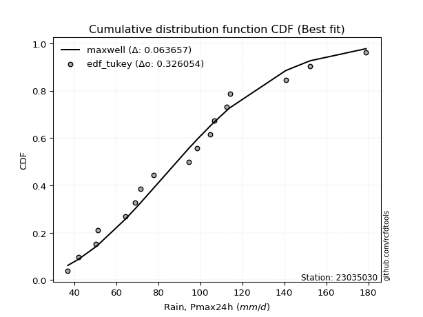</img>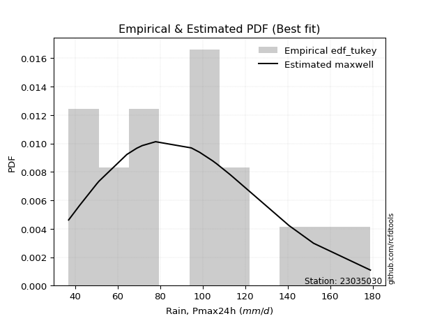</img>

</div>


### 8. EDF Gringorten (1963)

Gringorten plotting position formula is essential for estimating the probability and return periods of extreme events like floods and heavy rainfall. The constant _a=0.44_.

<div align="center">


$P=(m-a)/(n+1-2a)$


</div>


**8.1. Empirical values**

<div align="center">

|                | 0                   | 1                  | 2                   | 3                   | 4                   | 5                   | 6                  | 7                   | 8              | 9                  | 10                 | 11                 | 12                 | 13                 | 14                 | 15                 | 16                 |
|:---------------|:--------------------|:-------------------|:--------------------|:--------------------|:--------------------|:--------------------|:-------------------|:--------------------|:---------------|:-------------------|:-------------------|:-------------------|:-------------------|:-------------------|:-------------------|:-------------------|:-------------------|
| date           | 2020                | 2015               | 2005                | 2017                | 2019                | 2018                | 2014               | 2009                | 2007           | 2013               | 2012               | 2016               | 2010               | 2008               | 2006               | 2024               | 2011               |
| x              | 37.0                | 42.1               | 50.2                | 51.3                | 64.4                | 69.0                | 71.6               | 77.9                | 94.7           | 98.6               | 104.7              | 106.7              | 112.7              | 114.1              | 140.7              | 152.2              | 178.9              |
| m              | 1                   | 2                  | 3                   | 4                   | 5                   | 6                   | 7                  | 8                   | 9              | 10                 | 11                 | 12                 | 13                 | 14                 | 15                 | 16                 | 17                 |
| empirical_dist | edf_gringorten      | edf_gringorten     | edf_gringorten      | edf_gringorten      | edf_gringorten      | edf_gringorten      | edf_gringorten     | edf_gringorten      | edf_gringorten | edf_gringorten     | edf_gringorten     | edf_gringorten     | edf_gringorten     | edf_gringorten     | edf_gringorten     | edf_gringorten     | edf_gringorten     |
| empirical      | 0.03271028037383178 | 0.0911214953271028 | 0.14953271028037382 | 0.20794392523364486 | 0.26635514018691586 | 0.32476635514018687 | 0.3831775700934579 | 0.44158878504672894 | 0.5            | 0.5584112149532711 | 0.616822429906542  | 0.6752336448598131 | 0.7336448598130841 | 0.7920560747663551 | 0.8504672897196262 | 0.9088785046728972 | 0.967289719626168  |
| empirical_tr   | 1.0338164251207729  | 1.1002570694087404 | 1.1758241758241759  | 1.262536873156342   | 1.3630573248407643  | 1.480968858131488   | 1.621212121212121  | 1.7907949790794977  | 2.0            | 2.2645502645502646 | 2.6097560975609753 | 3.079136690647482  | 3.7543859649122813 | 4.808988764044942  | 6.687499999999999  | 10.974358974358976 | 30.571428571428413 |

</div>


**8.2. Kolmogorov-Smirnov fit test (sorted by Δ)**


<div align="center">

|                | 0                   | 1                   | 2                   | 3                   | 4                   | 5                   | 6                   | 7                  | 8                   | 9                   | 10                  | 11                  | 12                  | 13                  | 14                  | 15                  | 16                 | 17                 | 18                  | 19                  | 20                  | 21                  | 22                  | 23                  | 24                  | 25                  | 26                  | 27                    | 28                  | 29                  | 30                 | 31                  | 32                  | 33                 | 34                  | 35                  | 36                  | 37                  | 38                  | 39                  | 40                  | 41                  | 42                  | 43                  | 44                  | 45                  | 46                  | 47                  | 48                  | 49                  | 50                  | 51                  | 52                  | 53                  | 54                  | 55                  | 56                  | 57                  | 58                 | 59                  | 60                  | 61                  | 62                  | 63                 | 64                  | 65                 | 66                  | 67                 | 68                  | 69                  | 70                 | 71                  | 72                 | 73                  | 74                  | 75                  | 76                  | 77                  | 78                  | 79                  | 80                  | 81                  | 82                  | 83                  | 84                  | 85                 | 86                  | 87                 |
|:---------------|:--------------------|:--------------------|:--------------------|:--------------------|:--------------------|:--------------------|:--------------------|:-------------------|:--------------------|:--------------------|:--------------------|:--------------------|:--------------------|:--------------------|:--------------------|:--------------------|:-------------------|:-------------------|:--------------------|:--------------------|:--------------------|:--------------------|:--------------------|:--------------------|:--------------------|:--------------------|:--------------------|:----------------------|:--------------------|:--------------------|:-------------------|:--------------------|:--------------------|:-------------------|:--------------------|:--------------------|:--------------------|:--------------------|:--------------------|:--------------------|:--------------------|:--------------------|:--------------------|:--------------------|:--------------------|:--------------------|:--------------------|:--------------------|:--------------------|:--------------------|:--------------------|:--------------------|:--------------------|:--------------------|:--------------------|:--------------------|:--------------------|:--------------------|:-------------------|:--------------------|:--------------------|:--------------------|:--------------------|:-------------------|:--------------------|:-------------------|:--------------------|:-------------------|:--------------------|:--------------------|:-------------------|:--------------------|:-------------------|:--------------------|:--------------------|:--------------------|:--------------------|:--------------------|:--------------------|:--------------------|:--------------------|:--------------------|:--------------------|:--------------------|:--------------------|:-------------------|:--------------------|:-------------------|
| station        | 23035030            | 23035030            | 23035030            | 23035030            | 23035030            | 23035030            | 23035030            | 23035030           | 23035030            | 23035030            | 23035030            | 23035030            | 23035030            | 23035030            | 23035030            | 23035030            | 23035030           | 23035030           | 23035030            | 23035030            | 23035030            | 23035030            | 23035030            | 23035030            | 23035030            | 23035030            | 23035030            | 23035030              | 23035030            | 23035030            | 23035030           | 23035030            | 23035030            | 23035030           | 23035030            | 23035030            | 23035030            | 23035030            | 23035030            | 23035030            | 23035030            | 23035030            | 23035030            | 23035030            | 23035030            | 23035030            | 23035030            | 23035030            | 23035030            | 23035030            | 23035030            | 23035030            | 23035030            | 23035030            | 23035030            | 23035030            | 23035030            | 23035030            | 23035030           | 23035030            | 23035030            | 23035030            | 23035030            | 23035030           | 23035030            | 23035030           | 23035030            | 23035030           | 23035030            | 23035030            | 23035030           | 23035030            | 23035030           | 23035030            | 23035030            | 23035030            | 23035030            | 23035030            | 23035030            | 23035030            | 23035030            | 23035030            | 23035030            | 23035030            | 23035030            | 23035030           | 23035030            | 23035030           |
| empirical_dist | edf_gringorten      | edf_gringorten      | edf_gringorten      | edf_gringorten      | edf_gringorten      | edf_gringorten      | edf_gringorten      | edf_gringorten     | edf_gringorten      | edf_gringorten      | edf_gringorten      | edf_gringorten      | edf_gringorten      | edf_gringorten      | edf_gringorten      | edf_gringorten      | edf_gringorten     | edf_gringorten     | edf_gringorten      | edf_gringorten      | edf_gringorten      | edf_gringorten      | edf_gringorten      | edf_gringorten      | edf_gringorten      | edf_gringorten      | edf_gringorten      | edf_gringorten        | edf_gringorten      | edf_gringorten      | edf_gringorten     | edf_gringorten      | edf_gringorten      | edf_gringorten     | edf_gringorten      | edf_gringorten      | edf_gringorten      | edf_gringorten      | edf_gringorten      | edf_gringorten      | edf_gringorten      | edf_gringorten      | edf_gringorten      | edf_gringorten      | edf_gringorten      | edf_gringorten      | edf_gringorten      | edf_gringorten      | edf_gringorten      | edf_gringorten      | edf_gringorten      | edf_gringorten      | edf_gringorten      | edf_gringorten      | edf_gringorten      | edf_gringorten      | edf_gringorten      | edf_gringorten      | edf_gringorten     | edf_gringorten      | edf_gringorten      | edf_gringorten      | edf_gringorten      | edf_gringorten     | edf_gringorten      | edf_gringorten     | edf_gringorten      | edf_gringorten     | edf_gringorten      | edf_gringorten      | edf_gringorten     | edf_gringorten      | edf_gringorten     | edf_gringorten      | edf_gringorten      | edf_gringorten      | edf_gringorten      | edf_gringorten      | edf_gringorten      | edf_gringorten      | edf_gringorten      | edf_gringorten      | edf_gringorten      | edf_gringorten      | edf_gringorten      | edf_gringorten     | edf_gringorten      | edf_gringorten     |
| p_dist         | maxwell             | pearson3            | rayleigh            | gompertz            | loggenlogistic      | mielke              | ncf                 | logjohnsonsu       | t                   | crystalball         | norm                | truncnorm           | logloggamma         | loggumbel_l         | rice                | alpha               | betaprime          | exponnorm          | kstwobign           | nct                 | invgamma            | logweibull_min      | logpearson3         | invweibull          | genlogistic         | gumbel_r            | halfnorm            | loglaplace_asymmetric | fisk                | logfisk             | johnsonsu          | invgauss            | logistic            | lognct             | logf                | logt                | lognorm             | lognorm             | logcrystalball      | loglognorm          | logexponnorm        | lognakagami         | logncf              | logfatiguelife      | weibull_min         | logbetaprime        | logerlang           | loggamma            | loggamma            | logrice             | loginvgamma         | loglogistic         | hypsecant           | moyal               | chi2                | gamma               | erlang              | logalpha            | laplace_asymmetric | halflogistic        | loghypsecant        | loginvgauss         | logmaxwell          | logmielke          | f                   | loginvweibull      | lograyleigh         | gumbel_l           | laplace             | genexpon            | expon              | logkstwobign        | nakagami           | loglaplace          | loggompertz         | loghalfnorm         | loggumbel_r         | loggenexpon         | loghalflogistic     | logmoyal            | wald                | logexpon            | logchi2             | gibrat              | logwald             | loggibrat          | logtruncnorm        | fatiguelife        |
| delta          | 0.06419865933508695 | 0.06718450548542185 | 0.06821729202621973 | 0.07339196942516435 | 0.07437193967679165 | 0.07461884499822749 | 0.07959275148823353 | 0.0809005403110139 | 0.08455776621714695 | 0.08468962187728607 | 0.08468962505049138 | 0.08468963248027517 | 0.08477287774320863 | 0.08528345961249356 | 0.08680084222538408 | 0.08711925499030093 | 0.0871828931556573 | 0.0906524248704017 | 0.09242971381335474 | 0.09275078789533486 | 0.09380646283961491 | 0.09449748087572396 | 0.09536567325364165 | 0.09638770484492698 | 0.09649679989120952 | 0.09664771318317422 | 0.09750789878866284 | 0.09816177747266247   | 0.09875597988034246 | 0.09886568437500487 | 0.1001725268489504 | 0.10437186740570614 | 0.10610435519960476 | 0.1064875728177086 | 0.10746836191051945 | 0.10751534718285904 | 0.10752053718955557 | 0.10752053718955557 | 0.10752054429761448 | 0.10752166364557225 | 0.10752197240684402 | 0.10815380880205039 | 0.10848391128969892 | 0.10863576049439505 | 0.10908150958036056 | 0.11220182694650382 | 0.11472508110747781 | 0.11517900382592305 | 0.11517900382592305 | 0.11816399487440032 | 0.11944781256248937 | 0.12126425432774601 | 0.12153068973572206 | 0.12213015506317859 | 0.12326665278417503 | 0.12326697764959904 | 0.12326731657001488 | 0.12503401651285662 | 0.127853582352295  | 0.12941277504891116 | 0.13243616637835764 | 0.13321532995356045 | 0.13337109184893325 | 0.1390174017704361 | 0.13973789711742834 | 0.1404011933649142 | 0.14135463913992397 | 0.1457291955314982 | 0.14646219653069695 | 0.14848774119703245 | 0.1486451602008404 | 0.15488818500369894 | 0.1576708305043486 | 0.16007592894136446 | 0.16203817937253473 | 0.16414012878068995 | 0.17322899781044743 | 0.18724551176793114 | 0.19249208317704658 | 0.19556817969836837 | 0.20794392523364486 | 0.22521217026443807 | 0.24028095155124163 | 0.25396960233448107 | 0.25792252997970955 | 0.2898117724476611 | 0.32057900534627326 | 0.558246683063682  |
| deltao         | 0.3260541228310003  | 0.3260541228310003  | 0.3260541228310003  | 0.3260541228310003  | 0.3260541228310003  | 0.3260541228310003  | 0.3260541228310003  | 0.3260541228310003 | 0.3260541228310003  | 0.3260541228310003  | 0.3260541228310003  | 0.3260541228310003  | 0.3260541228310003  | 0.3260541228310003  | 0.3260541228310003  | 0.3260541228310003  | 0.3260541228310003 | 0.3260541228310003 | 0.3260541228310003  | 0.3260541228310003  | 0.3260541228310003  | 0.3260541228310003  | 0.3260541228310003  | 0.3260541228310003  | 0.3260541228310003  | 0.3260541228310003  | 0.3260541228310003  | 0.3260541228310003    | 0.3260541228310003  | 0.3260541228310003  | 0.3260541228310003 | 0.3260541228310003  | 0.3260541228310003  | 0.3260541228310003 | 0.3260541228310003  | 0.3260541228310003  | 0.3260541228310003  | 0.3260541228310003  | 0.3260541228310003  | 0.3260541228310003  | 0.3260541228310003  | 0.3260541228310003  | 0.3260541228310003  | 0.3260541228310003  | 0.3260541228310003  | 0.3260541228310003  | 0.3260541228310003  | 0.3260541228310003  | 0.3260541228310003  | 0.3260541228310003  | 0.3260541228310003  | 0.3260541228310003  | 0.3260541228310003  | 0.3260541228310003  | 0.3260541228310003  | 0.3260541228310003  | 0.3260541228310003  | 0.3260541228310003  | 0.3260541228310003 | 0.3260541228310003  | 0.3260541228310003  | 0.3260541228310003  | 0.3260541228310003  | 0.3260541228310003 | 0.3260541228310003  | 0.3260541228310003 | 0.3260541228310003  | 0.3260541228310003 | 0.3260541228310003  | 0.3260541228310003  | 0.3260541228310003 | 0.3260541228310003  | 0.3260541228310003 | 0.3260541228310003  | 0.3260541228310003  | 0.3260541228310003  | 0.3260541228310003  | 0.3260541228310003  | 0.3260541228310003  | 0.3260541228310003  | 0.3260541228310003  | 0.3260541228310003  | 0.3260541228310003  | 0.3260541228310003  | 0.3260541228310003  | 0.3260541228310003 | 0.3260541228310003  | 0.3260541228310003 |
| eval           | Δo > Δ              | Δo > Δ              | Δo > Δ              | Δo > Δ              | Δo > Δ              | Δo > Δ              | Δo > Δ              | Δo > Δ             | Δo > Δ              | Δo > Δ              | Δo > Δ              | Δo > Δ              | Δo > Δ              | Δo > Δ              | Δo > Δ              | Δo > Δ              | Δo > Δ             | Δo > Δ             | Δo > Δ              | Δo > Δ              | Δo > Δ              | Δo > Δ              | Δo > Δ              | Δo > Δ              | Δo > Δ              | Δo > Δ              | Δo > Δ              | Δo > Δ                | Δo > Δ              | Δo > Δ              | Δo > Δ             | Δo > Δ              | Δo > Δ              | Δo > Δ             | Δo > Δ              | Δo > Δ              | Δo > Δ              | Δo > Δ              | Δo > Δ              | Δo > Δ              | Δo > Δ              | Δo > Δ              | Δo > Δ              | Δo > Δ              | Δo > Δ              | Δo > Δ              | Δo > Δ              | Δo > Δ              | Δo > Δ              | Δo > Δ              | Δo > Δ              | Δo > Δ              | Δo > Δ              | Δo > Δ              | Δo > Δ              | Δo > Δ              | Δo > Δ              | Δo > Δ              | Δo > Δ             | Δo > Δ              | Δo > Δ              | Δo > Δ              | Δo > Δ              | Δo > Δ             | Δo > Δ              | Δo > Δ             | Δo > Δ              | Δo > Δ             | Δo > Δ              | Δo > Δ              | Δo > Δ             | Δo > Δ              | Δo > Δ             | Δo > Δ              | Δo > Δ              | Δo > Δ              | Δo > Δ              | Δo > Δ              | Δo > Δ              | Δo > Δ              | Δo > Δ              | Δo > Δ              | Δo > Δ              | Δo > Δ              | Δo > Δ              | Δo > Δ             | Δo > Δ              | Δo <= Δ            |
| fit            | 1                   | 1                   | 1                   | 1                   | 1                   | 1                   | 1                   | 1                  | 1                   | 1                   | 1                   | 1                   | 1                   | 1                   | 1                   | 1                   | 1                  | 1                  | 1                   | 1                   | 1                   | 1                   | 1                   | 1                   | 1                   | 1                   | 1                   | 1                     | 1                   | 1                   | 1                  | 1                   | 1                   | 1                  | 1                   | 1                   | 1                   | 1                   | 1                   | 1                   | 1                   | 1                   | 1                   | 1                   | 1                   | 1                   | 1                   | 1                   | 1                   | 1                   | 1                   | 1                   | 1                   | 1                   | 1                   | 1                   | 1                   | 1                   | 1                  | 1                   | 1                   | 1                   | 1                   | 1                  | 1                   | 1                  | 1                   | 1                  | 1                   | 1                   | 1                  | 1                   | 1                  | 1                   | 1                   | 1                   | 1                   | 1                   | 1                   | 1                   | 1                   | 1                   | 1                   | 1                   | 1                   | 1                  | 1                   | 0                  |
| n              | 17                  | 17                  | 17                  | 17                  | 17                  | 17                  | 17                  | 17                 | 17                  | 17                  | 17                  | 17                  | 17                  | 17                  | 17                  | 17                  | 17                 | 17                 | 17                  | 17                  | 17                  | 17                  | 17                  | 17                  | 17                  | 17                  | 17                  | 17                    | 17                  | 17                  | 17                 | 17                  | 17                  | 17                 | 17                  | 17                  | 17                  | 17                  | 17                  | 17                  | 17                  | 17                  | 17                  | 17                  | 17                  | 17                  | 17                  | 17                  | 17                  | 17                  | 17                  | 17                  | 17                  | 17                  | 17                  | 17                  | 17                  | 17                  | 17                 | 17                  | 17                  | 17                  | 17                  | 17                 | 17                  | 17                 | 17                  | 17                 | 17                  | 17                  | 17                 | 17                  | 17                 | 17                  | 17                  | 17                  | 17                  | 17                  | 17                  | 17                  | 17                  | 17                  | 17                  | 17                  | 17                  | 17                 | 17                  | 17                 |
| best_fit       | 1                   | 0                   | 0                   | 0                   | 0                   | 0                   | 0                   | 0                  | 0                   | 0                   | 0                   | 0                   | 0                   | 0                   | 0                   | 0                   | 0                  | 0                  | 0                   | 0                   | 0                   | 0                   | 0                   | 0                   | 0                   | 0                   | 0                   | 0                     | 0                   | 0                   | 0                  | 0                   | 0                   | 0                  | 0                   | 0                   | 0                   | 0                   | 0                   | 0                   | 0                   | 0                   | 0                   | 0                   | 0                   | 0                   | 0                   | 0                   | 0                   | 0                   | 0                   | 0                   | 0                   | 0                   | 0                   | 0                   | 0                   | 0                   | 0                  | 0                   | 0                   | 0                   | 0                   | 0                  | 0                   | 0                  | 0                   | 0                  | 0                   | 0                   | 0                  | 0                   | 0                  | 0                   | 0                   | 0                   | 0                   | 0                   | 0                   | 0                   | 0                   | 0                   | 0                   | 0                   | 0                   | 0                  | 0                   | 0                  |
| best_fit_sort  | 1                   | 2                   | 3                   | 4                   | 5                   | 6                   | 7                   | 8                  | 9                   | 10                  | 11                  | 12                  | 13                  | 14                  | 15                  | 16                  | 17                 | 18                 | 19                  | 20                  | 21                  | 22                  | 23                  | 24                  | 25                  | 26                  | 27                  | 28                    | 29                  | 30                  | 31                 | 32                  | 33                  | 34                 | 35                  | 36                  | 37                  | 38                  | 39                  | 40                  | 41                  | 42                  | 43                  | 44                  | 45                  | 46                  | 47                  | 48                  | 49                  | 50                  | 51                  | 52                  | 53                  | 54                  | 55                  | 56                  | 57                  | 58                  | 59                 | 60                  | 61                  | 62                  | 63                  | 64                 | 65                  | 66                 | 67                  | 68                 | 69                  | 70                  | 71                 | 72                  | 73                 | 74                  | 75                  | 76                  | 77                  | 78                  | 79                  | 80                  | 81                  | 82                  | 83                  | 84                  | 85                  | 86                 | 87                  | 88                 |

</div>


**8.3. Best fit**

<div align="center">

|   id |   station | empirical_dist   | p_dist   |     delta |   deltao | eval   |   fit |   n |   best_fit |   best_fit_sort |
|-----:|----------:|:-----------------|:---------|----------:|---------:|:-------|------:|----:|-----------:|----------------:|
|    0 |  23035030 | edf_gringorten   | maxwell  | 0.0641987 | 0.326054 | Δo > Δ |     1 |  17 |          1 |               1 |

</div>


<div align="center">

</img></img>

</div>


### 9. EDF Filliben (1975)

The specific values of the constants (0.3175) (often denoted as $alpha$) and (0.365) are derived from a method proposed by James J. Filliben in a 1975 paper. This particular formula is the mean value of the $i$-th order statistic of the normal distribution and is considered a robust and effective plotting position formula for the normal probability plot correlation coefficient test for normality.

<div align="center">


$P=(m-0.3175)/(n+0.365)$


</div>


**9.1. Empirical values**

<div align="center">

|                | 0                   | 1                   | 2                  | 3                   | 4                  | 5                 | 6                  | 7                  | 8            | 9                  | 10                 | 11                 | 12                 | 13                 | 14                 | 15                 | 16                 |
|:---------------|:--------------------|:--------------------|:-------------------|:--------------------|:-------------------|:------------------|:-------------------|:-------------------|:-------------|:-------------------|:-------------------|:-------------------|:-------------------|:-------------------|:-------------------|:-------------------|:-------------------|
| date           | 2020                | 2015                | 2005               | 2017                | 2019               | 2018              | 2014               | 2009               | 2007         | 2013               | 2012               | 2016               | 2010               | 2008               | 2006               | 2024               | 2011               |
| x              | 37.0                | 42.1                | 50.2               | 51.3                | 64.4               | 69.0              | 71.6               | 77.9               | 94.7         | 98.6               | 104.7              | 106.7              | 112.7              | 114.1              | 140.7              | 152.2              | 178.9              |
| m              | 1                   | 2                   | 3                  | 4                   | 5                  | 6                 | 7                  | 8                  | 9            | 10                 | 11                 | 12                 | 13                 | 14                 | 15                 | 16                 | 17                 |
| empirical_dist | edf_filliben        | edf_filliben        | edf_filliben       | edf_filliben        | edf_filliben       | edf_filliben      | edf_filliben       | edf_filliben       | edf_filliben | edf_filliben       | edf_filliben       | edf_filliben       | edf_filliben       | edf_filliben       | edf_filliben       | edf_filliben       | edf_filliben       |
| empirical      | 0.03930319608407717 | 0.09689029657356754 | 0.1544773970630579 | 0.21206449755254825 | 0.2696515980420386 | 0.327238698531529 | 0.3848257990210193 | 0.4424128995105097 | 0.5          | 0.5575871004894903 | 0.6151742009789807 | 0.6727613014684711 | 0.7303484019579615 | 0.7879355024474518 | 0.8455226029369421 | 0.9031097034264325 | 0.9606968039159229 |
| empirical_tr   | 1.0409111344222988  | 1.1072851904989638  | 1.1827004937851184 | 1.2691394116572265  | 1.369209540705697  | 1.486411298951423 | 1.6255558155862393 | 1.793441776400723  | 2.0          | 2.2603319232020826 | 2.598578376356154  | 3.055873295204576  | 3.708489054991992  | 4.7155465037338775 | 6.473438956197578  | 10.320950965824666 | 25.44322344322351  |

</div>


**9.2. Kolmogorov-Smirnov fit test (sorted by Δ)**


<div align="center">

|                | 0                  | 1                   | 2                   | 3                   | 4                   | 5                   | 6                   | 7                  | 8                   | 9                   | 10                  | 11                  | 12                  | 13                  | 14                  | 15                 | 16                 | 17                  | 18                  | 19                  | 20                  | 21                  | 22                  | 23                  | 24                  | 25                  | 26                  | 27                  | 28                  | 29                    | 30                 | 31                  | 32                 | 33                  | 34                  | 35                  | 36                  | 37                  | 38                  | 39                  | 40                 | 41                  | 42                  | 43                  | 44                  | 45                  | 46                  | 47                  | 48                  | 49                  | 50                  | 51                  | 52                  | 53                  | 54                  | 55                  | 56                 | 57                  | 58                  | 59                  | 60                  | 61                  | 62                  | 63                 | 64                  | 65                 | 66                  | 67                 | 68                 | 69                  | 70                 | 71                  | 72                 | 73                  | 74                  | 75                  | 76                  | 77                 | 78                  | 79                  | 80                  | 81                  | 82                 | 83                 | 84                  | 85                 | 86                  | 87                 |
|:---------------|:-------------------|:--------------------|:--------------------|:--------------------|:--------------------|:--------------------|:--------------------|:-------------------|:--------------------|:--------------------|:--------------------|:--------------------|:--------------------|:--------------------|:--------------------|:-------------------|:-------------------|:--------------------|:--------------------|:--------------------|:--------------------|:--------------------|:--------------------|:--------------------|:--------------------|:--------------------|:--------------------|:--------------------|:--------------------|:----------------------|:-------------------|:--------------------|:-------------------|:--------------------|:--------------------|:--------------------|:--------------------|:--------------------|:--------------------|:--------------------|:-------------------|:--------------------|:--------------------|:--------------------|:--------------------|:--------------------|:--------------------|:--------------------|:--------------------|:--------------------|:--------------------|:--------------------|:--------------------|:--------------------|:--------------------|:--------------------|:-------------------|:--------------------|:--------------------|:--------------------|:--------------------|:--------------------|:--------------------|:-------------------|:--------------------|:-------------------|:--------------------|:-------------------|:-------------------|:--------------------|:-------------------|:--------------------|:-------------------|:--------------------|:--------------------|:--------------------|:--------------------|:-------------------|:--------------------|:--------------------|:--------------------|:--------------------|:-------------------|:-------------------|:--------------------|:-------------------|:--------------------|:-------------------|
| station        | 23035030           | 23035030            | 23035030            | 23035030            | 23035030            | 23035030            | 23035030            | 23035030           | 23035030            | 23035030            | 23035030            | 23035030            | 23035030            | 23035030            | 23035030            | 23035030           | 23035030           | 23035030            | 23035030            | 23035030            | 23035030            | 23035030            | 23035030            | 23035030            | 23035030            | 23035030            | 23035030            | 23035030            | 23035030            | 23035030              | 23035030           | 23035030            | 23035030           | 23035030            | 23035030            | 23035030            | 23035030            | 23035030            | 23035030            | 23035030            | 23035030           | 23035030            | 23035030            | 23035030            | 23035030            | 23035030            | 23035030            | 23035030            | 23035030            | 23035030            | 23035030            | 23035030            | 23035030            | 23035030            | 23035030            | 23035030            | 23035030           | 23035030            | 23035030            | 23035030            | 23035030            | 23035030            | 23035030            | 23035030           | 23035030            | 23035030           | 23035030            | 23035030           | 23035030           | 23035030            | 23035030           | 23035030            | 23035030           | 23035030            | 23035030            | 23035030            | 23035030            | 23035030           | 23035030            | 23035030            | 23035030            | 23035030            | 23035030           | 23035030           | 23035030            | 23035030           | 23035030            | 23035030           |
| empirical_dist | edf_filliben       | edf_filliben        | edf_filliben        | edf_filliben        | edf_filliben        | edf_filliben        | edf_filliben        | edf_filliben       | edf_filliben        | edf_filliben        | edf_filliben        | edf_filliben        | edf_filliben        | edf_filliben        | edf_filliben        | edf_filliben       | edf_filliben       | edf_filliben        | edf_filliben        | edf_filliben        | edf_filliben        | edf_filliben        | edf_filliben        | edf_filliben        | edf_filliben        | edf_filliben        | edf_filliben        | edf_filliben        | edf_filliben        | edf_filliben          | edf_filliben       | edf_filliben        | edf_filliben       | edf_filliben        | edf_filliben        | edf_filliben        | edf_filliben        | edf_filliben        | edf_filliben        | edf_filliben        | edf_filliben       | edf_filliben        | edf_filliben        | edf_filliben        | edf_filliben        | edf_filliben        | edf_filliben        | edf_filliben        | edf_filliben        | edf_filliben        | edf_filliben        | edf_filliben        | edf_filliben        | edf_filliben        | edf_filliben        | edf_filliben        | edf_filliben       | edf_filliben        | edf_filliben        | edf_filliben        | edf_filliben        | edf_filliben        | edf_filliben        | edf_filliben       | edf_filliben        | edf_filliben       | edf_filliben        | edf_filliben       | edf_filliben       | edf_filliben        | edf_filliben       | edf_filliben        | edf_filliben       | edf_filliben        | edf_filliben        | edf_filliben        | edf_filliben        | edf_filliben       | edf_filliben        | edf_filliben        | edf_filliben        | edf_filliben        | edf_filliben       | edf_filliben       | edf_filliben        | edf_filliben       | edf_filliben        | edf_filliben       |
| p_dist         | maxwell            | rayleigh            | pearson3            | gompertz            | loggenlogistic      | mielke              | ncf                 | logjohnsonsu       | logloggamma         | t                   | crystalball         | norm                | truncnorm           | loggumbel_l         | alpha               | betaprime          | exponnorm          | rice                | kstwobign           | nct                 | invgamma            | logweibull_min      | logpearson3         | invweibull          | genlogistic         | gumbel_r            | halfnorm            | fisk                | logfisk             | loglaplace_asymmetric | johnsonsu          | invgauss            | lognct             | logf                | logt                | lognorm             | lognorm             | logcrystalball      | loglognorm          | logexponnorm        | logistic           | lognakagami         | logncf              | logfatiguelife      | weibull_min         | logbetaprime        | logerlang           | loggamma            | loggamma            | logrice             | loginvgamma         | loglogistic         | hypsecant           | chi2                | gamma               | erlang              | moyal              | logalpha            | laplace_asymmetric  | loghypsecant        | loginvgauss         | logmaxwell          | halflogistic        | logmielke          | f                   | loginvweibull      | lograyleigh         | gumbel_l           | laplace            | genexpon            | expon              | logkstwobign        | nakagami           | loglaplace          | loggompertz         | loghalfnorm         | loggumbel_r         | loggenexpon        | loghalflogistic     | logmoyal            | wald                | logexpon            | logchi2            | gibrat             | logwald             | loggibrat          | logtruncnorm        | fatiguelife        |
| delta          | 0.0641826404670452 | 0.06821729202621973 | 0.07130507780432524 | 0.07339196942516435 | 0.07849251199569504 | 0.07873941731713088 | 0.07959275148823353 | 0.0809005403110139 | 0.08477287774320863 | 0.08617168159190025 | 0.08633248031483676 | 0.08633248313894026 | 0.08633249087266942 | 0.08693168854005501 | 0.08711925499030093 | 0.0871828931556573 | 0.0906524248704017 | 0.09092141454428747 | 0.09242971381335474 | 0.09275078789533486 | 0.09380646283961491 | 0.09449748087572396 | 0.09536567325364165 | 0.09638770484492698 | 0.09649679989120952 | 0.09679294790097381 | 0.09750789878866284 | 0.09875597988034246 | 0.09886568437500487 | 0.09898589193644325   | 0.1001725268489504 | 0.10437186740570614 | 0.1064875728177086 | 0.10746836191051945 | 0.10751534718285904 | 0.10752053718955557 | 0.10752053718955557 | 0.10752054429761448 | 0.10752166364557225 | 0.10752197240684402 | 0.1077525841271662 | 0.10815380880205039 | 0.10848391128969892 | 0.10863576049439505 | 0.10908150958036056 | 0.11220182694650382 | 0.11472508110747781 | 0.11517900382592305 | 0.11517900382592305 | 0.11816399487440032 | 0.11944781256248937 | 0.12126425432774601 | 0.12317891866328351 | 0.12326665278417503 | 0.12326697764959904 | 0.12326731657001488 | 0.123314721857578  | 0.12503401651285662 | 0.12867769681607577 | 0.13243616637835764 | 0.13321532995356045 | 0.13337109184893325 | 0.13353334736781455 | 0.1390174017704361 | 0.13973789711742834 | 0.1404011933649142 | 0.14135463913992397 | 0.146553309995279  | 0.1481104254582584 | 0.14848774119703245 | 0.1486451602008404 | 0.15488818500369894 | 0.1576708305043486 | 0.16007592894136446 | 0.16203817937253473 | 0.16414012878068995 | 0.17322899781044743 | 0.1839490539128084 | 0.19249208317704658 | 0.19556817969836837 | 0.21206449755254825 | 0.22191571240931535 | 0.2369844936961189 | 0.2572660601896038 | 0.25792252997970955 | 0.2898117724476611 | 0.31728254749115054 | 0.553301996280998  |
| deltao         | 0.3260541228310003 | 0.3260541228310003  | 0.3260541228310003  | 0.3260541228310003  | 0.3260541228310003  | 0.3260541228310003  | 0.3260541228310003  | 0.3260541228310003 | 0.3260541228310003  | 0.3260541228310003  | 0.3260541228310003  | 0.3260541228310003  | 0.3260541228310003  | 0.3260541228310003  | 0.3260541228310003  | 0.3260541228310003 | 0.3260541228310003 | 0.3260541228310003  | 0.3260541228310003  | 0.3260541228310003  | 0.3260541228310003  | 0.3260541228310003  | 0.3260541228310003  | 0.3260541228310003  | 0.3260541228310003  | 0.3260541228310003  | 0.3260541228310003  | 0.3260541228310003  | 0.3260541228310003  | 0.3260541228310003    | 0.3260541228310003 | 0.3260541228310003  | 0.3260541228310003 | 0.3260541228310003  | 0.3260541228310003  | 0.3260541228310003  | 0.3260541228310003  | 0.3260541228310003  | 0.3260541228310003  | 0.3260541228310003  | 0.3260541228310003 | 0.3260541228310003  | 0.3260541228310003  | 0.3260541228310003  | 0.3260541228310003  | 0.3260541228310003  | 0.3260541228310003  | 0.3260541228310003  | 0.3260541228310003  | 0.3260541228310003  | 0.3260541228310003  | 0.3260541228310003  | 0.3260541228310003  | 0.3260541228310003  | 0.3260541228310003  | 0.3260541228310003  | 0.3260541228310003 | 0.3260541228310003  | 0.3260541228310003  | 0.3260541228310003  | 0.3260541228310003  | 0.3260541228310003  | 0.3260541228310003  | 0.3260541228310003 | 0.3260541228310003  | 0.3260541228310003 | 0.3260541228310003  | 0.3260541228310003 | 0.3260541228310003 | 0.3260541228310003  | 0.3260541228310003 | 0.3260541228310003  | 0.3260541228310003 | 0.3260541228310003  | 0.3260541228310003  | 0.3260541228310003  | 0.3260541228310003  | 0.3260541228310003 | 0.3260541228310003  | 0.3260541228310003  | 0.3260541228310003  | 0.3260541228310003  | 0.3260541228310003 | 0.3260541228310003 | 0.3260541228310003  | 0.3260541228310003 | 0.3260541228310003  | 0.3260541228310003 |
| eval           | Δo > Δ             | Δo > Δ              | Δo > Δ              | Δo > Δ              | Δo > Δ              | Δo > Δ              | Δo > Δ              | Δo > Δ             | Δo > Δ              | Δo > Δ              | Δo > Δ              | Δo > Δ              | Δo > Δ              | Δo > Δ              | Δo > Δ              | Δo > Δ             | Δo > Δ             | Δo > Δ              | Δo > Δ              | Δo > Δ              | Δo > Δ              | Δo > Δ              | Δo > Δ              | Δo > Δ              | Δo > Δ              | Δo > Δ              | Δo > Δ              | Δo > Δ              | Δo > Δ              | Δo > Δ                | Δo > Δ             | Δo > Δ              | Δo > Δ             | Δo > Δ              | Δo > Δ              | Δo > Δ              | Δo > Δ              | Δo > Δ              | Δo > Δ              | Δo > Δ              | Δo > Δ             | Δo > Δ              | Δo > Δ              | Δo > Δ              | Δo > Δ              | Δo > Δ              | Δo > Δ              | Δo > Δ              | Δo > Δ              | Δo > Δ              | Δo > Δ              | Δo > Δ              | Δo > Δ              | Δo > Δ              | Δo > Δ              | Δo > Δ              | Δo > Δ             | Δo > Δ              | Δo > Δ              | Δo > Δ              | Δo > Δ              | Δo > Δ              | Δo > Δ              | Δo > Δ             | Δo > Δ              | Δo > Δ             | Δo > Δ              | Δo > Δ             | Δo > Δ             | Δo > Δ              | Δo > Δ             | Δo > Δ              | Δo > Δ             | Δo > Δ              | Δo > Δ              | Δo > Δ              | Δo > Δ              | Δo > Δ             | Δo > Δ              | Δo > Δ              | Δo > Δ              | Δo > Δ              | Δo > Δ             | Δo > Δ             | Δo > Δ              | Δo > Δ             | Δo > Δ              | Δo <= Δ            |
| fit            | 1                  | 1                   | 1                   | 1                   | 1                   | 1                   | 1                   | 1                  | 1                   | 1                   | 1                   | 1                   | 1                   | 1                   | 1                   | 1                  | 1                  | 1                   | 1                   | 1                   | 1                   | 1                   | 1                   | 1                   | 1                   | 1                   | 1                   | 1                   | 1                   | 1                     | 1                  | 1                   | 1                  | 1                   | 1                   | 1                   | 1                   | 1                   | 1                   | 1                   | 1                  | 1                   | 1                   | 1                   | 1                   | 1                   | 1                   | 1                   | 1                   | 1                   | 1                   | 1                   | 1                   | 1                   | 1                   | 1                   | 1                  | 1                   | 1                   | 1                   | 1                   | 1                   | 1                   | 1                  | 1                   | 1                  | 1                   | 1                  | 1                  | 1                   | 1                  | 1                   | 1                  | 1                   | 1                   | 1                   | 1                   | 1                  | 1                   | 1                   | 1                   | 1                   | 1                  | 1                  | 1                   | 1                  | 1                   | 0                  |
| n              | 17                 | 17                  | 17                  | 17                  | 17                  | 17                  | 17                  | 17                 | 17                  | 17                  | 17                  | 17                  | 17                  | 17                  | 17                  | 17                 | 17                 | 17                  | 17                  | 17                  | 17                  | 17                  | 17                  | 17                  | 17                  | 17                  | 17                  | 17                  | 17                  | 17                    | 17                 | 17                  | 17                 | 17                  | 17                  | 17                  | 17                  | 17                  | 17                  | 17                  | 17                 | 17                  | 17                  | 17                  | 17                  | 17                  | 17                  | 17                  | 17                  | 17                  | 17                  | 17                  | 17                  | 17                  | 17                  | 17                  | 17                 | 17                  | 17                  | 17                  | 17                  | 17                  | 17                  | 17                 | 17                  | 17                 | 17                  | 17                 | 17                 | 17                  | 17                 | 17                  | 17                 | 17                  | 17                  | 17                  | 17                  | 17                 | 17                  | 17                  | 17                  | 17                  | 17                 | 17                 | 17                  | 17                 | 17                  | 17                 |
| best_fit       | 1                  | 0                   | 0                   | 0                   | 0                   | 0                   | 0                   | 0                  | 0                   | 0                   | 0                   | 0                   | 0                   | 0                   | 0                   | 0                  | 0                  | 0                   | 0                   | 0                   | 0                   | 0                   | 0                   | 0                   | 0                   | 0                   | 0                   | 0                   | 0                   | 0                     | 0                  | 0                   | 0                  | 0                   | 0                   | 0                   | 0                   | 0                   | 0                   | 0                   | 0                  | 0                   | 0                   | 0                   | 0                   | 0                   | 0                   | 0                   | 0                   | 0                   | 0                   | 0                   | 0                   | 0                   | 0                   | 0                   | 0                  | 0                   | 0                   | 0                   | 0                   | 0                   | 0                   | 0                  | 0                   | 0                  | 0                   | 0                  | 0                  | 0                   | 0                  | 0                   | 0                  | 0                   | 0                   | 0                   | 0                   | 0                  | 0                   | 0                   | 0                   | 0                   | 0                  | 0                  | 0                   | 0                  | 0                   | 0                  |
| best_fit_sort  | 1                  | 2                   | 3                   | 4                   | 5                   | 6                   | 7                   | 8                  | 9                   | 10                  | 11                  | 12                  | 13                  | 14                  | 15                  | 16                 | 17                 | 18                  | 19                  | 20                  | 21                  | 22                  | 23                  | 24                  | 25                  | 26                  | 27                  | 28                  | 29                  | 30                    | 31                 | 32                  | 33                 | 34                  | 35                  | 36                  | 37                  | 38                  | 39                  | 40                  | 41                 | 42                  | 43                  | 44                  | 45                  | 46                  | 47                  | 48                  | 49                  | 50                  | 51                  | 52                  | 53                  | 54                  | 55                  | 56                  | 57                 | 58                  | 59                  | 60                  | 61                  | 62                  | 63                  | 64                 | 65                  | 66                 | 67                  | 68                 | 69                 | 70                  | 71                 | 72                  | 73                 | 74                  | 75                  | 76                  | 77                  | 78                 | 79                  | 80                  | 81                  | 82                  | 83                 | 84                 | 85                  | 86                 | 87                  | 88                 |

</div>


**9.3. Best fit**

<div align="center">

|   id |   station | empirical_dist   | p_dist   |     delta |   deltao | eval   |   fit |   n |   best_fit |   best_fit_sort |
|-----:|----------:|:-----------------|:---------|----------:|---------:|:-------|------:|----:|-----------:|----------------:|
|    0 |  23035030 | edf_filliben     | maxwell  | 0.0641826 | 0.326054 | Δo > Δ |     1 |  17 |          1 |               1 |

</div>


<div align="center">

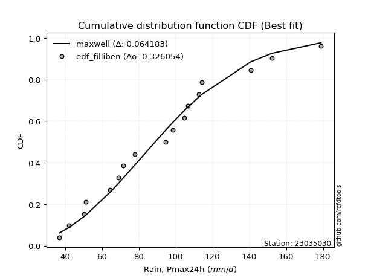</img></img>

</div>


### 10. EDF Jenkinson (1977)

The Jenkinson formula in hydrology is an empirical plotting position formula used to estimate the non-exceedance probability _(P)_ or return period _(T)_ of a given ordered observation within a sample. It is a widely used method in the frequency analysis of extreme events such as floods and rainfall, as it provides a distribution-free way to plot data. _a≈0.31_ and _b≈0.38_ are constants derived to approximate the median of the probability distribution for the given rank.

<div align="center">


$P=(m-a)/(n+b)$


</div>


**10.1. Empirical values**

<div align="center">

|                | 0                   | 1                   | 2                   | 3                   | 4                  | 5                   | 6                   | 7                   | 8             | 9                  | 10                 | 11                 | 12                 | 13                 | 14                 | 15                 | 16                 |
|:---------------|:--------------------|:--------------------|:--------------------|:--------------------|:-------------------|:--------------------|:--------------------|:--------------------|:--------------|:-------------------|:-------------------|:-------------------|:-------------------|:-------------------|:-------------------|:-------------------|:-------------------|
| date           | 2020                | 2015                | 2005                | 2017                | 2019               | 2018                | 2014                | 2009                | 2007          | 2013               | 2012               | 2016               | 2010               | 2008               | 2006               | 2024               | 2011               |
| x              | 37.0                | 42.1                | 50.2                | 51.3                | 64.4               | 69.0                | 71.6                | 77.9                | 94.7          | 98.6               | 104.7              | 106.7              | 112.7              | 114.1              | 140.7              | 152.2              | 178.9              |
| m              | 1                   | 2                   | 3                   | 4                   | 5                  | 6                   | 7                   | 8                   | 9             | 10                 | 11                 | 12                 | 13                 | 14                 | 15                 | 16                 | 17                 |
| empirical_dist | edf_jenkinson       | edf_jenkinson       | edf_jenkinson       | edf_jenkinson       | edf_jenkinson      | edf_jenkinson       | edf_jenkinson       | edf_jenkinson       | edf_jenkinson | edf_jenkinson      | edf_jenkinson      | edf_jenkinson      | edf_jenkinson      | edf_jenkinson      | edf_jenkinson      | edf_jenkinson      | edf_jenkinson      |
| empirical      | 0.03970080552359033 | 0.09723820483314155 | 0.15477560414269276 | 0.21231300345224396 | 0.2698504027617952 | 0.32738780207134643 | 0.38492520138089764 | 0.44246260069044885 | 0.5           | 0.5575373993095513 | 0.6150747986191024 | 0.6726121979286537 | 0.7301495972382048 | 0.7876869965477561 | 0.8452243958573072 | 0.9027617951668585 | 0.9602991944764098 |
| empirical_tr   | 1.0413421210305571  | 1.1077119184193753  | 1.1831177671885638  | 1.2695398100803508  | 1.3695823483057525 | 1.4867408041060737  | 1.6258185219831622  | 1.7936016511867907  | 2.0           | 2.2600780234070226 | 2.5979073243647233 | 3.0544815465729354 | 3.7057569296375266 | 4.710027100271004  | 6.460966542750929  | 10.284023668639058 | 25.188405797101513 |

</div>


**10.2. Kolmogorov-Smirnov fit test (sorted by Δ)**


<div align="center">

|                | 0                   | 1                   | 2                   | 3                   | 4                   | 5                  | 6                   | 7                  | 8                   | 9                   | 10                  | 11                  | 12                  | 13                  | 14                  | 15                 | 16                 | 17                  | 18                  | 19                  | 20                  | 21                  | 22                  | 23                  | 24                  | 25                  | 26                  | 27                  | 28                  | 29                    | 30                 | 31                  | 32                 | 33                  | 34                  | 35                  | 36                  | 37                  | 38                  | 39                  | 40                  | 41                  | 42                  | 43                  | 44                  | 45                  | 46                  | 47                  | 48                  | 49                  | 50                  | 51                  | 52                  | 53                  | 54                  | 55                  | 56                  | 57                  | 58                 | 59                  | 60                  | 61                  | 62                  | 63                 | 64                  | 65                 | 66                  | 67                  | 68                 | 69                  | 70                 | 71                  | 72                 | 73                  | 74                  | 75                  | 76                  | 77                  | 78                  | 79                  | 80                  | 81                 | 82                  | 83                  | 84                  | 85                 | 86                 | 87                 |
|:---------------|:--------------------|:--------------------|:--------------------|:--------------------|:--------------------|:-------------------|:--------------------|:-------------------|:--------------------|:--------------------|:--------------------|:--------------------|:--------------------|:--------------------|:--------------------|:-------------------|:-------------------|:--------------------|:--------------------|:--------------------|:--------------------|:--------------------|:--------------------|:--------------------|:--------------------|:--------------------|:--------------------|:--------------------|:--------------------|:----------------------|:-------------------|:--------------------|:-------------------|:--------------------|:--------------------|:--------------------|:--------------------|:--------------------|:--------------------|:--------------------|:--------------------|:--------------------|:--------------------|:--------------------|:--------------------|:--------------------|:--------------------|:--------------------|:--------------------|:--------------------|:--------------------|:--------------------|:--------------------|:--------------------|:--------------------|:--------------------|:--------------------|:--------------------|:-------------------|:--------------------|:--------------------|:--------------------|:--------------------|:-------------------|:--------------------|:-------------------|:--------------------|:--------------------|:-------------------|:--------------------|:-------------------|:--------------------|:-------------------|:--------------------|:--------------------|:--------------------|:--------------------|:--------------------|:--------------------|:--------------------|:--------------------|:-------------------|:--------------------|:--------------------|:--------------------|:-------------------|:-------------------|:-------------------|
| station        | 23035030            | 23035030            | 23035030            | 23035030            | 23035030            | 23035030           | 23035030            | 23035030           | 23035030            | 23035030            | 23035030            | 23035030            | 23035030            | 23035030            | 23035030            | 23035030           | 23035030           | 23035030            | 23035030            | 23035030            | 23035030            | 23035030            | 23035030            | 23035030            | 23035030            | 23035030            | 23035030            | 23035030            | 23035030            | 23035030              | 23035030           | 23035030            | 23035030           | 23035030            | 23035030            | 23035030            | 23035030            | 23035030            | 23035030            | 23035030            | 23035030            | 23035030            | 23035030            | 23035030            | 23035030            | 23035030            | 23035030            | 23035030            | 23035030            | 23035030            | 23035030            | 23035030            | 23035030            | 23035030            | 23035030            | 23035030            | 23035030            | 23035030            | 23035030           | 23035030            | 23035030            | 23035030            | 23035030            | 23035030           | 23035030            | 23035030           | 23035030            | 23035030            | 23035030           | 23035030            | 23035030           | 23035030            | 23035030           | 23035030            | 23035030            | 23035030            | 23035030            | 23035030            | 23035030            | 23035030            | 23035030            | 23035030           | 23035030            | 23035030            | 23035030            | 23035030           | 23035030           | 23035030           |
| empirical_dist | edf_jenkinson       | edf_jenkinson       | edf_jenkinson       | edf_jenkinson       | edf_jenkinson       | edf_jenkinson      | edf_jenkinson       | edf_jenkinson      | edf_jenkinson       | edf_jenkinson       | edf_jenkinson       | edf_jenkinson       | edf_jenkinson       | edf_jenkinson       | edf_jenkinson       | edf_jenkinson      | edf_jenkinson      | edf_jenkinson       | edf_jenkinson       | edf_jenkinson       | edf_jenkinson       | edf_jenkinson       | edf_jenkinson       | edf_jenkinson       | edf_jenkinson       | edf_jenkinson       | edf_jenkinson       | edf_jenkinson       | edf_jenkinson       | edf_jenkinson         | edf_jenkinson      | edf_jenkinson       | edf_jenkinson      | edf_jenkinson       | edf_jenkinson       | edf_jenkinson       | edf_jenkinson       | edf_jenkinson       | edf_jenkinson       | edf_jenkinson       | edf_jenkinson       | edf_jenkinson       | edf_jenkinson       | edf_jenkinson       | edf_jenkinson       | edf_jenkinson       | edf_jenkinson       | edf_jenkinson       | edf_jenkinson       | edf_jenkinson       | edf_jenkinson       | edf_jenkinson       | edf_jenkinson       | edf_jenkinson       | edf_jenkinson       | edf_jenkinson       | edf_jenkinson       | edf_jenkinson       | edf_jenkinson      | edf_jenkinson       | edf_jenkinson       | edf_jenkinson       | edf_jenkinson       | edf_jenkinson      | edf_jenkinson       | edf_jenkinson      | edf_jenkinson       | edf_jenkinson       | edf_jenkinson      | edf_jenkinson       | edf_jenkinson      | edf_jenkinson       | edf_jenkinson      | edf_jenkinson       | edf_jenkinson       | edf_jenkinson       | edf_jenkinson       | edf_jenkinson       | edf_jenkinson       | edf_jenkinson       | edf_jenkinson       | edf_jenkinson      | edf_jenkinson       | edf_jenkinson       | edf_jenkinson       | edf_jenkinson      | edf_jenkinson      | edf_jenkinson      |
| p_dist         | maxwell             | rayleigh            | pearson3            | gompertz            | loggenlogistic      | mielke             | ncf                 | logjohnsonsu       | logloggamma         | t                   | crystalball         | norm                | truncnorm           | loggumbel_l         | alpha               | betaprime          | exponnorm          | rice                | kstwobign           | nct                 | invgamma            | logweibull_min      | logpearson3         | invweibull          | genlogistic         | gumbel_r            | halfnorm            | fisk                | logfisk             | loglaplace_asymmetric | johnsonsu          | invgauss            | lognct             | logf                | logt                | lognorm             | lognorm             | logcrystalball      | loglognorm          | logexponnorm        | logistic            | lognakagami         | logncf              | logfatiguelife      | weibull_min         | logbetaprime        | logerlang           | loggamma            | loggamma            | logrice             | loginvgamma         | loglogistic         | chi2                | gamma               | erlang              | hypsecant           | moyal               | logalpha            | laplace_asymmetric | loghypsecant        | loginvgauss         | logmaxwell          | halflogistic        | logmielke          | f                   | loginvweibull      | lograyleigh         | gumbel_l            | laplace            | genexpon            | expon              | logkstwobign        | nakagami           | loglaplace          | loggompertz         | loghalfnorm         | loggumbel_r         | loggenexpon         | loghalflogistic     | logmoyal            | wald                | logexpon           | logchi2             | gibrat              | logwald             | loggibrat          | logtruncnorm       | fatiguelife        |
| delta          | 0.06443114636674091 | 0.06821729202621973 | 0.07155358370402096 | 0.07339196942516435 | 0.07874101789539076 | 0.0789879232168266 | 0.07959275148823353 | 0.0809005403110139 | 0.08477287774320863 | 0.08627108395177857 | 0.08643188267471508 | 0.08643188549881858 | 0.08643189323254774 | 0.08703109089993333 | 0.08711925499030093 | 0.0871828931556573 | 0.0906524248704017 | 0.09116992044398319 | 0.09242971381335474 | 0.09275078789533486 | 0.09380646283961491 | 0.09449748087572396 | 0.09536567325364165 | 0.09638770484492698 | 0.09649679989120952 | 0.09704145380066953 | 0.09750789878866284 | 0.09875597988034246 | 0.09886568437500487 | 0.09903559311638238   | 0.1001725268489504 | 0.10437186740570614 | 0.1064875728177086 | 0.10746836191051945 | 0.10751534718285904 | 0.10752053718955557 | 0.10752053718955557 | 0.10752054429761448 | 0.10752166364557225 | 0.10752197240684402 | 0.10785198648704453 | 0.10815380880205039 | 0.10848391128969892 | 0.10863576049439505 | 0.10908150958036056 | 0.11220182694650382 | 0.11472508110747781 | 0.11517900382592305 | 0.11517900382592305 | 0.11816399487440032 | 0.11944781256248937 | 0.12126425432774601 | 0.12326665278417503 | 0.12326697764959904 | 0.12326731657001488 | 0.12327832102316183 | 0.12356322775727371 | 0.12503401651285662 | 0.1287273979960149 | 0.13243616637835764 | 0.13321532995356045 | 0.13337109184893325 | 0.13378185326751027 | 0.1390174017704361 | 0.13973789711742834 | 0.1404011933649142 | 0.14135463913992397 | 0.14660301117521812 | 0.1482098278181367 | 0.14848774119703245 | 0.1486451602008404 | 0.15488818500369894 | 0.1576708305043486 | 0.16007592894136446 | 0.16203817937253473 | 0.16414012878068995 | 0.17322899781044743 | 0.18375024919305177 | 0.19249208317704658 | 0.19556817969836837 | 0.21231300345224396 | 0.2217169076895587 | 0.23678568897636226 | 0.25746486490936044 | 0.25792252997970955 | 0.2898117724476611 | 0.3170837427713939 | 0.5530037892013631 |
| deltao         | 0.3260541228310003  | 0.3260541228310003  | 0.3260541228310003  | 0.3260541228310003  | 0.3260541228310003  | 0.3260541228310003 | 0.3260541228310003  | 0.3260541228310003 | 0.3260541228310003  | 0.3260541228310003  | 0.3260541228310003  | 0.3260541228310003  | 0.3260541228310003  | 0.3260541228310003  | 0.3260541228310003  | 0.3260541228310003 | 0.3260541228310003 | 0.3260541228310003  | 0.3260541228310003  | 0.3260541228310003  | 0.3260541228310003  | 0.3260541228310003  | 0.3260541228310003  | 0.3260541228310003  | 0.3260541228310003  | 0.3260541228310003  | 0.3260541228310003  | 0.3260541228310003  | 0.3260541228310003  | 0.3260541228310003    | 0.3260541228310003 | 0.3260541228310003  | 0.3260541228310003 | 0.3260541228310003  | 0.3260541228310003  | 0.3260541228310003  | 0.3260541228310003  | 0.3260541228310003  | 0.3260541228310003  | 0.3260541228310003  | 0.3260541228310003  | 0.3260541228310003  | 0.3260541228310003  | 0.3260541228310003  | 0.3260541228310003  | 0.3260541228310003  | 0.3260541228310003  | 0.3260541228310003  | 0.3260541228310003  | 0.3260541228310003  | 0.3260541228310003  | 0.3260541228310003  | 0.3260541228310003  | 0.3260541228310003  | 0.3260541228310003  | 0.3260541228310003  | 0.3260541228310003  | 0.3260541228310003  | 0.3260541228310003 | 0.3260541228310003  | 0.3260541228310003  | 0.3260541228310003  | 0.3260541228310003  | 0.3260541228310003 | 0.3260541228310003  | 0.3260541228310003 | 0.3260541228310003  | 0.3260541228310003  | 0.3260541228310003 | 0.3260541228310003  | 0.3260541228310003 | 0.3260541228310003  | 0.3260541228310003 | 0.3260541228310003  | 0.3260541228310003  | 0.3260541228310003  | 0.3260541228310003  | 0.3260541228310003  | 0.3260541228310003  | 0.3260541228310003  | 0.3260541228310003  | 0.3260541228310003 | 0.3260541228310003  | 0.3260541228310003  | 0.3260541228310003  | 0.3260541228310003 | 0.3260541228310003 | 0.3260541228310003 |
| eval           | Δo > Δ              | Δo > Δ              | Δo > Δ              | Δo > Δ              | Δo > Δ              | Δo > Δ             | Δo > Δ              | Δo > Δ             | Δo > Δ              | Δo > Δ              | Δo > Δ              | Δo > Δ              | Δo > Δ              | Δo > Δ              | Δo > Δ              | Δo > Δ             | Δo > Δ             | Δo > Δ              | Δo > Δ              | Δo > Δ              | Δo > Δ              | Δo > Δ              | Δo > Δ              | Δo > Δ              | Δo > Δ              | Δo > Δ              | Δo > Δ              | Δo > Δ              | Δo > Δ              | Δo > Δ                | Δo > Δ             | Δo > Δ              | Δo > Δ             | Δo > Δ              | Δo > Δ              | Δo > Δ              | Δo > Δ              | Δo > Δ              | Δo > Δ              | Δo > Δ              | Δo > Δ              | Δo > Δ              | Δo > Δ              | Δo > Δ              | Δo > Δ              | Δo > Δ              | Δo > Δ              | Δo > Δ              | Δo > Δ              | Δo > Δ              | Δo > Δ              | Δo > Δ              | Δo > Δ              | Δo > Δ              | Δo > Δ              | Δo > Δ              | Δo > Δ              | Δo > Δ              | Δo > Δ             | Δo > Δ              | Δo > Δ              | Δo > Δ              | Δo > Δ              | Δo > Δ             | Δo > Δ              | Δo > Δ             | Δo > Δ              | Δo > Δ              | Δo > Δ             | Δo > Δ              | Δo > Δ             | Δo > Δ              | Δo > Δ             | Δo > Δ              | Δo > Δ              | Δo > Δ              | Δo > Δ              | Δo > Δ              | Δo > Δ              | Δo > Δ              | Δo > Δ              | Δo > Δ             | Δo > Δ              | Δo > Δ              | Δo > Δ              | Δo > Δ             | Δo > Δ             | Δo <= Δ            |
| fit            | 1                   | 1                   | 1                   | 1                   | 1                   | 1                  | 1                   | 1                  | 1                   | 1                   | 1                   | 1                   | 1                   | 1                   | 1                   | 1                  | 1                  | 1                   | 1                   | 1                   | 1                   | 1                   | 1                   | 1                   | 1                   | 1                   | 1                   | 1                   | 1                   | 1                     | 1                  | 1                   | 1                  | 1                   | 1                   | 1                   | 1                   | 1                   | 1                   | 1                   | 1                   | 1                   | 1                   | 1                   | 1                   | 1                   | 1                   | 1                   | 1                   | 1                   | 1                   | 1                   | 1                   | 1                   | 1                   | 1                   | 1                   | 1                   | 1                  | 1                   | 1                   | 1                   | 1                   | 1                  | 1                   | 1                  | 1                   | 1                   | 1                  | 1                   | 1                  | 1                   | 1                  | 1                   | 1                   | 1                   | 1                   | 1                   | 1                   | 1                   | 1                   | 1                  | 1                   | 1                   | 1                   | 1                  | 1                  | 0                  |
| n              | 17                  | 17                  | 17                  | 17                  | 17                  | 17                 | 17                  | 17                 | 17                  | 17                  | 17                  | 17                  | 17                  | 17                  | 17                  | 17                 | 17                 | 17                  | 17                  | 17                  | 17                  | 17                  | 17                  | 17                  | 17                  | 17                  | 17                  | 17                  | 17                  | 17                    | 17                 | 17                  | 17                 | 17                  | 17                  | 17                  | 17                  | 17                  | 17                  | 17                  | 17                  | 17                  | 17                  | 17                  | 17                  | 17                  | 17                  | 17                  | 17                  | 17                  | 17                  | 17                  | 17                  | 17                  | 17                  | 17                  | 17                  | 17                  | 17                 | 17                  | 17                  | 17                  | 17                  | 17                 | 17                  | 17                 | 17                  | 17                  | 17                 | 17                  | 17                 | 17                  | 17                 | 17                  | 17                  | 17                  | 17                  | 17                  | 17                  | 17                  | 17                  | 17                 | 17                  | 17                  | 17                  | 17                 | 17                 | 17                 |
| best_fit       | 1                   | 0                   | 0                   | 0                   | 0                   | 0                  | 0                   | 0                  | 0                   | 0                   | 0                   | 0                   | 0                   | 0                   | 0                   | 0                  | 0                  | 0                   | 0                   | 0                   | 0                   | 0                   | 0                   | 0                   | 0                   | 0                   | 0                   | 0                   | 0                   | 0                     | 0                  | 0                   | 0                  | 0                   | 0                   | 0                   | 0                   | 0                   | 0                   | 0                   | 0                   | 0                   | 0                   | 0                   | 0                   | 0                   | 0                   | 0                   | 0                   | 0                   | 0                   | 0                   | 0                   | 0                   | 0                   | 0                   | 0                   | 0                   | 0                  | 0                   | 0                   | 0                   | 0                   | 0                  | 0                   | 0                  | 0                   | 0                   | 0                  | 0                   | 0                  | 0                   | 0                  | 0                   | 0                   | 0                   | 0                   | 0                   | 0                   | 0                   | 0                   | 0                  | 0                   | 0                   | 0                   | 0                  | 0                  | 0                  |
| best_fit_sort  | 1                   | 2                   | 3                   | 4                   | 5                   | 6                  | 7                   | 8                  | 9                   | 10                  | 11                  | 12                  | 13                  | 14                  | 15                  | 16                 | 17                 | 18                  | 19                  | 20                  | 21                  | 22                  | 23                  | 24                  | 25                  | 26                  | 27                  | 28                  | 29                  | 30                    | 31                 | 32                  | 33                 | 34                  | 35                  | 36                  | 37                  | 38                  | 39                  | 40                  | 41                  | 42                  | 43                  | 44                  | 45                  | 46                  | 47                  | 48                  | 49                  | 50                  | 51                  | 52                  | 53                  | 54                  | 55                  | 56                  | 57                  | 58                  | 59                 | 60                  | 61                  | 62                  | 63                  | 64                 | 65                  | 66                 | 67                  | 68                  | 69                 | 70                  | 71                 | 72                  | 73                 | 74                  | 75                  | 76                  | 77                  | 78                  | 79                  | 80                  | 81                  | 82                 | 83                  | 84                  | 85                  | 86                 | 87                 | 88                 |

</div>


**10.3. Best fit**

<div align="center">

|   id |   station | empirical_dist   | p_dist   |     delta |   deltao | eval   |   fit |   n |   best_fit |   best_fit_sort |
|-----:|----------:|:-----------------|:---------|----------:|---------:|:-------|------:|----:|-----------:|----------------:|
|    0 |  23035030 | edf_jenkinson    | maxwell  | 0.0644311 | 0.326054 | Δo > Δ |     1 |  17 |          1 |               1 |

</div>


<div align="center">

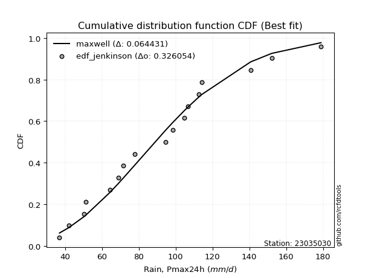</img></img>

</div>


### 11. EDF Cunnane (1978)

Cunnane´s work in statistical hydrology has focused on the performance and evaluation of different probability distributions (such as GEV, Gumbel, Lognormal) for flood frequency estimation. _b_ is a constant, typically set to 0.4.

<div align="center">


$P=(m-b)/(n+1-2b)$


</div>


**11.1. Empirical values**

<div align="center">

|                | 0                   | 1                  | 2                   | 3                   | 4                   | 5                  | 6                   | 7                  | 8           | 9                  | 10                 | 11                 | 12                 | 13                 | 14                 | 15                 | 16                 |
|:---------------|:--------------------|:-------------------|:--------------------|:--------------------|:--------------------|:-------------------|:--------------------|:-------------------|:------------|:-------------------|:-------------------|:-------------------|:-------------------|:-------------------|:-------------------|:-------------------|:-------------------|
| date           | 2020                | 2015               | 2005                | 2017                | 2019                | 2018               | 2014                | 2009               | 2007        | 2013               | 2012               | 2016               | 2010               | 2008               | 2006               | 2024               | 2011               |
| x              | 37.0                | 42.1               | 50.2                | 51.3                | 64.4                | 69.0               | 71.6                | 77.9               | 94.7        | 98.6               | 104.7              | 106.7              | 112.7              | 114.1              | 140.7              | 152.2              | 178.9              |
| m              | 1                   | 2                  | 3                   | 4                   | 5                   | 6                  | 7                   | 8                  | 9           | 10                 | 11                 | 12                 | 13                 | 14                 | 15                 | 16                 | 17                 |
| empirical_dist | edf_cunnane         | edf_cunnane        | edf_cunnane         | edf_cunnane         | edf_cunnane         | edf_cunnane        | edf_cunnane         | edf_cunnane        | edf_cunnane | edf_cunnane        | edf_cunnane        | edf_cunnane        | edf_cunnane        | edf_cunnane        | edf_cunnane        | edf_cunnane        | edf_cunnane        |
| empirical      | 0.03488372093023256 | 0.0930232558139535 | 0.15116279069767444 | 0.20930232558139536 | 0.26744186046511625 | 0.3255813953488372 | 0.38372093023255816 | 0.4418604651162791 | 0.5         | 0.5581395348837209 | 0.6162790697674418 | 0.6744186046511628 | 0.7325581395348837 | 0.7906976744186046 | 0.8488372093023256 | 0.9069767441860466 | 0.9651162790697676 |
| empirical_tr   | 1.036144578313253   | 1.1025641025641026 | 1.178082191780822   | 1.2647058823529413  | 1.3650793650793651  | 1.482758620689655  | 1.6226415094339623  | 1.7916666666666667 | 2.0         | 2.263157894736842  | 2.606060606060606  | 3.071428571428571  | 3.7391304347826084 | 4.777777777777777  | 6.6153846153846185 | 10.750000000000007 | 28.6666666666668   |

</div>


**11.2. Kolmogorov-Smirnov fit test (sorted by Δ)**


<div align="center">

|                | 0                   | 1                   | 2                   | 3                   | 4                   | 5                  | 6                   | 7                  | 8                   | 9                   | 10                  | 11                 | 12                  | 13                  | 14                  | 15                 | 16                  | 17                 | 18                  | 19                  | 20                  | 21                  | 22                  | 23                  | 24                  | 25                  | 26                  | 27                    | 28                  | 29                  | 30                 | 31                  | 32                 | 33                  | 34                  | 35                  | 36                  | 37                  | 38                  | 39                  | 40                  | 41                  | 42                  | 43                  | 44                  | 45                  | 46                  | 47                  | 48                  | 49                  | 50                  | 51                  | 52                  | 53                  | 54                  | 55                  | 56                  | 57                  | 58                  | 59                  | 60                  | 61                  | 62                  | 63                 | 64                  | 65                 | 66                  | 67                  | 68                  | 69                  | 70                 | 71                  | 72                 | 73                  | 74                  | 75                  | 76                  | 77                  | 78                  | 79                  | 80                  | 81                  | 82                  | 83                  | 84                  | 85                 | 86                  | 87                 |
|:---------------|:--------------------|:--------------------|:--------------------|:--------------------|:--------------------|:-------------------|:--------------------|:-------------------|:--------------------|:--------------------|:--------------------|:-------------------|:--------------------|:--------------------|:--------------------|:-------------------|:--------------------|:-------------------|:--------------------|:--------------------|:--------------------|:--------------------|:--------------------|:--------------------|:--------------------|:--------------------|:--------------------|:----------------------|:--------------------|:--------------------|:-------------------|:--------------------|:-------------------|:--------------------|:--------------------|:--------------------|:--------------------|:--------------------|:--------------------|:--------------------|:--------------------|:--------------------|:--------------------|:--------------------|:--------------------|:--------------------|:--------------------|:--------------------|:--------------------|:--------------------|:--------------------|:--------------------|:--------------------|:--------------------|:--------------------|:--------------------|:--------------------|:--------------------|:--------------------|:--------------------|:--------------------|:--------------------|:--------------------|:-------------------|:--------------------|:-------------------|:--------------------|:--------------------|:--------------------|:--------------------|:-------------------|:--------------------|:-------------------|:--------------------|:--------------------|:--------------------|:--------------------|:--------------------|:--------------------|:--------------------|:--------------------|:--------------------|:--------------------|:--------------------|:--------------------|:-------------------|:--------------------|:-------------------|
| station        | 23035030            | 23035030            | 23035030            | 23035030            | 23035030            | 23035030           | 23035030            | 23035030           | 23035030            | 23035030            | 23035030            | 23035030           | 23035030            | 23035030            | 23035030            | 23035030           | 23035030            | 23035030           | 23035030            | 23035030            | 23035030            | 23035030            | 23035030            | 23035030            | 23035030            | 23035030            | 23035030            | 23035030              | 23035030            | 23035030            | 23035030           | 23035030            | 23035030           | 23035030            | 23035030            | 23035030            | 23035030            | 23035030            | 23035030            | 23035030            | 23035030            | 23035030            | 23035030            | 23035030            | 23035030            | 23035030            | 23035030            | 23035030            | 23035030            | 23035030            | 23035030            | 23035030            | 23035030            | 23035030            | 23035030            | 23035030            | 23035030            | 23035030            | 23035030            | 23035030            | 23035030            | 23035030            | 23035030            | 23035030           | 23035030            | 23035030           | 23035030            | 23035030            | 23035030            | 23035030            | 23035030           | 23035030            | 23035030           | 23035030            | 23035030            | 23035030            | 23035030            | 23035030            | 23035030            | 23035030            | 23035030            | 23035030            | 23035030            | 23035030            | 23035030            | 23035030           | 23035030            | 23035030           |
| empirical_dist | edf_cunnane         | edf_cunnane         | edf_cunnane         | edf_cunnane         | edf_cunnane         | edf_cunnane        | edf_cunnane         | edf_cunnane        | edf_cunnane         | edf_cunnane         | edf_cunnane         | edf_cunnane        | edf_cunnane         | edf_cunnane         | edf_cunnane         | edf_cunnane        | edf_cunnane         | edf_cunnane        | edf_cunnane         | edf_cunnane         | edf_cunnane         | edf_cunnane         | edf_cunnane         | edf_cunnane         | edf_cunnane         | edf_cunnane         | edf_cunnane         | edf_cunnane           | edf_cunnane         | edf_cunnane         | edf_cunnane        | edf_cunnane         | edf_cunnane        | edf_cunnane         | edf_cunnane         | edf_cunnane         | edf_cunnane         | edf_cunnane         | edf_cunnane         | edf_cunnane         | edf_cunnane         | edf_cunnane         | edf_cunnane         | edf_cunnane         | edf_cunnane         | edf_cunnane         | edf_cunnane         | edf_cunnane         | edf_cunnane         | edf_cunnane         | edf_cunnane         | edf_cunnane         | edf_cunnane         | edf_cunnane         | edf_cunnane         | edf_cunnane         | edf_cunnane         | edf_cunnane         | edf_cunnane         | edf_cunnane         | edf_cunnane         | edf_cunnane         | edf_cunnane         | edf_cunnane        | edf_cunnane         | edf_cunnane        | edf_cunnane         | edf_cunnane         | edf_cunnane         | edf_cunnane         | edf_cunnane        | edf_cunnane         | edf_cunnane        | edf_cunnane         | edf_cunnane         | edf_cunnane         | edf_cunnane         | edf_cunnane         | edf_cunnane         | edf_cunnane         | edf_cunnane         | edf_cunnane         | edf_cunnane         | edf_cunnane         | edf_cunnane         | edf_cunnane        | edf_cunnane         | edf_cunnane        |
| p_dist         | maxwell             | rayleigh            | pearson3            | gompertz            | loggenlogistic      | mielke             | ncf                 | logjohnsonsu       | logloggamma         | t                   | crystalball         | norm               | truncnorm           | loggumbel_l         | alpha               | betaprime          | rice                | exponnorm          | kstwobign           | nct                 | invgamma            | logweibull_min      | logpearson3         | invweibull          | genlogistic         | gumbel_r            | halfnorm            | loglaplace_asymmetric | fisk                | logfisk             | johnsonsu          | invgauss            | lognct             | logistic            | logf                | logt                | lognorm             | lognorm             | logcrystalball      | loglognorm          | logexponnorm        | lognakagami         | logncf              | logfatiguelife      | weibull_min         | logbetaprime        | logerlang           | loggamma            | loggamma            | logrice             | loginvgamma         | loglogistic         | hypsecant           | moyal               | chi2                | gamma               | erlang              | logalpha            | laplace_asymmetric  | halflogistic        | loghypsecant        | loginvgauss         | logmaxwell          | logmielke          | f                   | loginvweibull      | lograyleigh         | gumbel_l            | laplace             | genexpon            | expon              | logkstwobign        | nakagami           | loglaplace          | loggompertz         | loghalfnorm         | loggumbel_r         | loggenexpon         | loghalflogistic     | logmoyal            | wald                | logexpon            | logchi2             | gibrat              | logwald             | loggibrat          | logtruncnorm        | fatiguelife        |
| delta          | 0.06284025898733647 | 0.06821729202621973 | 0.06854290583317235 | 0.07339196942516435 | 0.07573034002454215 | 0.075977245345978  | 0.07959275148823353 | 0.0809005403110139 | 0.08477287774320863 | 0.08506681280343908 | 0.08522761152637559 | 0.0852276143504791 | 0.08522762208420825 | 0.08582681975159384 | 0.08711925499030093 | 0.0871828931556573 | 0.08815924257313458 | 0.0906524248704017 | 0.09242971381335474 | 0.09275078789533486 | 0.09380646283961491 | 0.09449748087572396 | 0.09536567325364165 | 0.09638770484492698 | 0.09649679989120952 | 0.09664771318317422 | 0.09750789878866284 | 0.09843345754221261   | 0.09875597988034246 | 0.09886568437500487 | 0.1001725268489504 | 0.10437186740570614 | 0.1064875728177086 | 0.10664771533870504 | 0.10746836191051945 | 0.10751534718285904 | 0.10752053718955557 | 0.10752053718955557 | 0.10752054429761448 | 0.10752166364557225 | 0.10752197240684402 | 0.10815380880205039 | 0.10848391128969892 | 0.10863576049439505 | 0.10908150958036056 | 0.11220182694650382 | 0.11472508110747781 | 0.11517900382592305 | 0.11517900382592305 | 0.11816399487440032 | 0.11944781256248937 | 0.12126425432774601 | 0.12207404987482234 | 0.12213015506317859 | 0.12326665278417503 | 0.12326697764959904 | 0.12326731657001488 | 0.12503401651285662 | 0.12812526242184513 | 0.13077117539666167 | 0.13243616637835764 | 0.13321532995356045 | 0.13337109184893325 | 0.1390174017704361 | 0.13973789711742834 | 0.1404011933649142 | 0.14135463913992397 | 0.14600087560104835 | 0.14700555666979723 | 0.14848774119703245 | 0.1486451602008404 | 0.15488818500369894 | 0.1576708305043486 | 0.16007592894136446 | 0.16203817937253473 | 0.16414012878068995 | 0.17322899781044743 | 0.18615879148973075 | 0.19249208317704658 | 0.19556817969836837 | 0.20930232558139536 | 0.22412544998623768 | 0.23919423127304124 | 0.25505632261268146 | 0.25792252997970955 | 0.2898117724476611 | 0.31949228506807287 | 0.5566166026463814 |
| deltao         | 0.3260541228310003  | 0.3260541228310003  | 0.3260541228310003  | 0.3260541228310003  | 0.3260541228310003  | 0.3260541228310003 | 0.3260541228310003  | 0.3260541228310003 | 0.3260541228310003  | 0.3260541228310003  | 0.3260541228310003  | 0.3260541228310003 | 0.3260541228310003  | 0.3260541228310003  | 0.3260541228310003  | 0.3260541228310003 | 0.3260541228310003  | 0.3260541228310003 | 0.3260541228310003  | 0.3260541228310003  | 0.3260541228310003  | 0.3260541228310003  | 0.3260541228310003  | 0.3260541228310003  | 0.3260541228310003  | 0.3260541228310003  | 0.3260541228310003  | 0.3260541228310003    | 0.3260541228310003  | 0.3260541228310003  | 0.3260541228310003 | 0.3260541228310003  | 0.3260541228310003 | 0.3260541228310003  | 0.3260541228310003  | 0.3260541228310003  | 0.3260541228310003  | 0.3260541228310003  | 0.3260541228310003  | 0.3260541228310003  | 0.3260541228310003  | 0.3260541228310003  | 0.3260541228310003  | 0.3260541228310003  | 0.3260541228310003  | 0.3260541228310003  | 0.3260541228310003  | 0.3260541228310003  | 0.3260541228310003  | 0.3260541228310003  | 0.3260541228310003  | 0.3260541228310003  | 0.3260541228310003  | 0.3260541228310003  | 0.3260541228310003  | 0.3260541228310003  | 0.3260541228310003  | 0.3260541228310003  | 0.3260541228310003  | 0.3260541228310003  | 0.3260541228310003  | 0.3260541228310003  | 0.3260541228310003  | 0.3260541228310003 | 0.3260541228310003  | 0.3260541228310003 | 0.3260541228310003  | 0.3260541228310003  | 0.3260541228310003  | 0.3260541228310003  | 0.3260541228310003 | 0.3260541228310003  | 0.3260541228310003 | 0.3260541228310003  | 0.3260541228310003  | 0.3260541228310003  | 0.3260541228310003  | 0.3260541228310003  | 0.3260541228310003  | 0.3260541228310003  | 0.3260541228310003  | 0.3260541228310003  | 0.3260541228310003  | 0.3260541228310003  | 0.3260541228310003  | 0.3260541228310003 | 0.3260541228310003  | 0.3260541228310003 |
| eval           | Δo > Δ              | Δo > Δ              | Δo > Δ              | Δo > Δ              | Δo > Δ              | Δo > Δ             | Δo > Δ              | Δo > Δ             | Δo > Δ              | Δo > Δ              | Δo > Δ              | Δo > Δ             | Δo > Δ              | Δo > Δ              | Δo > Δ              | Δo > Δ             | Δo > Δ              | Δo > Δ             | Δo > Δ              | Δo > Δ              | Δo > Δ              | Δo > Δ              | Δo > Δ              | Δo > Δ              | Δo > Δ              | Δo > Δ              | Δo > Δ              | Δo > Δ                | Δo > Δ              | Δo > Δ              | Δo > Δ             | Δo > Δ              | Δo > Δ             | Δo > Δ              | Δo > Δ              | Δo > Δ              | Δo > Δ              | Δo > Δ              | Δo > Δ              | Δo > Δ              | Δo > Δ              | Δo > Δ              | Δo > Δ              | Δo > Δ              | Δo > Δ              | Δo > Δ              | Δo > Δ              | Δo > Δ              | Δo > Δ              | Δo > Δ              | Δo > Δ              | Δo > Δ              | Δo > Δ              | Δo > Δ              | Δo > Δ              | Δo > Δ              | Δo > Δ              | Δo > Δ              | Δo > Δ              | Δo > Δ              | Δo > Δ              | Δo > Δ              | Δo > Δ              | Δo > Δ             | Δo > Δ              | Δo > Δ             | Δo > Δ              | Δo > Δ              | Δo > Δ              | Δo > Δ              | Δo > Δ             | Δo > Δ              | Δo > Δ             | Δo > Δ              | Δo > Δ              | Δo > Δ              | Δo > Δ              | Δo > Δ              | Δo > Δ              | Δo > Δ              | Δo > Δ              | Δo > Δ              | Δo > Δ              | Δo > Δ              | Δo > Δ              | Δo > Δ             | Δo > Δ              | Δo <= Δ            |
| fit            | 1                   | 1                   | 1                   | 1                   | 1                   | 1                  | 1                   | 1                  | 1                   | 1                   | 1                   | 1                  | 1                   | 1                   | 1                   | 1                  | 1                   | 1                  | 1                   | 1                   | 1                   | 1                   | 1                   | 1                   | 1                   | 1                   | 1                   | 1                     | 1                   | 1                   | 1                  | 1                   | 1                  | 1                   | 1                   | 1                   | 1                   | 1                   | 1                   | 1                   | 1                   | 1                   | 1                   | 1                   | 1                   | 1                   | 1                   | 1                   | 1                   | 1                   | 1                   | 1                   | 1                   | 1                   | 1                   | 1                   | 1                   | 1                   | 1                   | 1                   | 1                   | 1                   | 1                   | 1                  | 1                   | 1                  | 1                   | 1                   | 1                   | 1                   | 1                  | 1                   | 1                  | 1                   | 1                   | 1                   | 1                   | 1                   | 1                   | 1                   | 1                   | 1                   | 1                   | 1                   | 1                   | 1                  | 1                   | 0                  |
| n              | 17                  | 17                  | 17                  | 17                  | 17                  | 17                 | 17                  | 17                 | 17                  | 17                  | 17                  | 17                 | 17                  | 17                  | 17                  | 17                 | 17                  | 17                 | 17                  | 17                  | 17                  | 17                  | 17                  | 17                  | 17                  | 17                  | 17                  | 17                    | 17                  | 17                  | 17                 | 17                  | 17                 | 17                  | 17                  | 17                  | 17                  | 17                  | 17                  | 17                  | 17                  | 17                  | 17                  | 17                  | 17                  | 17                  | 17                  | 17                  | 17                  | 17                  | 17                  | 17                  | 17                  | 17                  | 17                  | 17                  | 17                  | 17                  | 17                  | 17                  | 17                  | 17                  | 17                  | 17                 | 17                  | 17                 | 17                  | 17                  | 17                  | 17                  | 17                 | 17                  | 17                 | 17                  | 17                  | 17                  | 17                  | 17                  | 17                  | 17                  | 17                  | 17                  | 17                  | 17                  | 17                  | 17                 | 17                  | 17                 |
| best_fit       | 1                   | 0                   | 0                   | 0                   | 0                   | 0                  | 0                   | 0                  | 0                   | 0                   | 0                   | 0                  | 0                   | 0                   | 0                   | 0                  | 0                   | 0                  | 0                   | 0                   | 0                   | 0                   | 0                   | 0                   | 0                   | 0                   | 0                   | 0                     | 0                   | 0                   | 0                  | 0                   | 0                  | 0                   | 0                   | 0                   | 0                   | 0                   | 0                   | 0                   | 0                   | 0                   | 0                   | 0                   | 0                   | 0                   | 0                   | 0                   | 0                   | 0                   | 0                   | 0                   | 0                   | 0                   | 0                   | 0                   | 0                   | 0                   | 0                   | 0                   | 0                   | 0                   | 0                   | 0                  | 0                   | 0                  | 0                   | 0                   | 0                   | 0                   | 0                  | 0                   | 0                  | 0                   | 0                   | 0                   | 0                   | 0                   | 0                   | 0                   | 0                   | 0                   | 0                   | 0                   | 0                   | 0                  | 0                   | 0                  |
| best_fit_sort  | 1                   | 2                   | 3                   | 4                   | 5                   | 6                  | 7                   | 8                  | 9                   | 10                  | 11                  | 12                 | 13                  | 14                  | 15                  | 16                 | 17                  | 18                 | 19                  | 20                  | 21                  | 22                  | 23                  | 24                  | 25                  | 26                  | 27                  | 28                    | 29                  | 30                  | 31                 | 32                  | 33                 | 34                  | 35                  | 36                  | 37                  | 38                  | 39                  | 40                  | 41                  | 42                  | 43                  | 44                  | 45                  | 46                  | 47                  | 48                  | 49                  | 50                  | 51                  | 52                  | 53                  | 54                  | 55                  | 56                  | 57                  | 58                  | 59                  | 60                  | 61                  | 62                  | 63                  | 64                 | 65                  | 66                 | 67                  | 68                  | 69                  | 70                  | 71                 | 72                  | 73                 | 74                  | 75                  | 76                  | 77                  | 78                  | 79                  | 80                  | 81                  | 82                  | 83                  | 84                  | 85                  | 86                 | 87                  | 88                 |

</div>


**11.3. Best fit**

<div align="center">

|   id |   station | empirical_dist   | p_dist   |     delta |   deltao | eval   |   fit |   n |   best_fit |   best_fit_sort |
|-----:|----------:|:-----------------|:---------|----------:|---------:|:-------|------:|----:|-----------:|----------------:|
|    0 |  23035030 | edf_cunnane      | maxwell  | 0.0628403 | 0.326054 | Δo > Δ |     1 |  17 |          1 |               1 |

</div>


<div align="center">

</img></img>

</div>


### 12. EDF Adamowski (1981)

The Adamowski formula in hydrology refers to a specific plotting position formula used for estimating the non-parametric empirical distribution of hydrological events (like flood peaks) to calculate their return periods. This formula provides an alternative to traditional parametric methods (like the Gumbel or Log Pearson Type III distributions). 

<div align="center">


$P=(m-0.25)/(n+0.5)$


</div>


**12.1. Empirical values**

<div align="center">

|                | 0                   | 1                  | 2                   | 3                   | 4                  | 5                   | 6                   | 7                   | 8             | 9                  | 10                 | 11                 | 12                 | 13                 | 14                 | 15                 | 16                 |
|:---------------|:--------------------|:-------------------|:--------------------|:--------------------|:-------------------|:--------------------|:--------------------|:--------------------|:--------------|:-------------------|:-------------------|:-------------------|:-------------------|:-------------------|:-------------------|:-------------------|:-------------------|
| date           | 2020                | 2015               | 2005                | 2017                | 2019               | 2018                | 2014                | 2009                | 2007          | 2013               | 2012               | 2016               | 2010               | 2008               | 2006               | 2024               | 2011               |
| x              | 37.0                | 42.1               | 50.2                | 51.3                | 64.4               | 69.0                | 71.6                | 77.9                | 94.7          | 98.6               | 104.7              | 106.7              | 112.7              | 114.1              | 140.7              | 152.2              | 178.9              |
| m              | 1                   | 2                  | 3                   | 4                   | 5                  | 6                   | 7                   | 8                   | 9             | 10                 | 11                 | 12                 | 13                 | 14                 | 15                 | 16                 | 17                 |
| empirical_dist | edf_adamowski       | edf_adamowski      | edf_adamowski       | edf_adamowski       | edf_adamowski      | edf_adamowski       | edf_adamowski       | edf_adamowski       | edf_adamowski | edf_adamowski      | edf_adamowski      | edf_adamowski      | edf_adamowski      | edf_adamowski      | edf_adamowski      | edf_adamowski      | edf_adamowski      |
| empirical      | 0.04285714285714286 | 0.1                | 0.15714285714285714 | 0.21428571428571427 | 0.2714285714285714 | 0.32857142857142857 | 0.38571428571428573 | 0.44285714285714284 | 0.5           | 0.5571428571428572 | 0.6142857142857143 | 0.6714285714285714 | 0.7285714285714285 | 0.7857142857142857 | 0.8428571428571429 | 0.9                | 0.9571428571428572 |
| empirical_tr   | 1.044776119402985   | 1.1111111111111112 | 1.1864406779661016  | 1.2727272727272727  | 1.372549019607843  | 1.4893617021276595  | 1.627906976744186   | 1.7948717948717947  | 2.0           | 2.2580645161290325 | 2.592592592592593  | 3.0434782608695645 | 3.684210526315789  | 4.666666666666666  | 6.363636363636364  | 10.000000000000002 | 23.333333333333357 |

</div>


**12.2. Kolmogorov-Smirnov fit test (sorted by Δ)**


<div align="center">

|                | 0                   | 1                   | 2                   | 3                   | 4                   | 5                   | 6                  | 7                   | 8                   | 9                   | 10                  | 11                 | 12                  | 13                  | 14                  | 15                  | 16                 | 17                  | 18                  | 19                 | 20                  | 21                  | 22                  | 23                  | 24                  | 25                  | 26                  | 27                  | 28                  | 29                    | 30                 | 31                  | 32                 | 33                  | 34                  | 35                  | 36                  | 37                  | 38                  | 39                  | 40                  | 41                  | 42                  | 43                  | 44                  | 45                  | 46                  | 47                  | 48                  | 49                  | 50                  | 51                  | 52                  | 53                  | 54                  | 55                  | 56                  | 57                  | 58                 | 59                  | 60                  | 61                  | 62                  | 63                 | 64                  | 65                 | 66                  | 67                 | 68                  | 69                 | 70                 | 71                  | 72                 | 73                  | 74                  | 75                  | 76                  | 77                 | 78                  | 79                  | 80                  | 81                  | 82                  | 83                  | 84                 | 85                 | 86                 | 87                 |
|:---------------|:--------------------|:--------------------|:--------------------|:--------------------|:--------------------|:--------------------|:-------------------|:--------------------|:--------------------|:--------------------|:--------------------|:-------------------|:--------------------|:--------------------|:--------------------|:--------------------|:-------------------|:--------------------|:--------------------|:-------------------|:--------------------|:--------------------|:--------------------|:--------------------|:--------------------|:--------------------|:--------------------|:--------------------|:--------------------|:----------------------|:-------------------|:--------------------|:-------------------|:--------------------|:--------------------|:--------------------|:--------------------|:--------------------|:--------------------|:--------------------|:--------------------|:--------------------|:--------------------|:--------------------|:--------------------|:--------------------|:--------------------|:--------------------|:--------------------|:--------------------|:--------------------|:--------------------|:--------------------|:--------------------|:--------------------|:--------------------|:--------------------|:--------------------|:-------------------|:--------------------|:--------------------|:--------------------|:--------------------|:-------------------|:--------------------|:-------------------|:--------------------|:-------------------|:--------------------|:-------------------|:-------------------|:--------------------|:-------------------|:--------------------|:--------------------|:--------------------|:--------------------|:-------------------|:--------------------|:--------------------|:--------------------|:--------------------|:--------------------|:--------------------|:-------------------|:-------------------|:-------------------|:-------------------|
| station        | 23035030            | 23035030            | 23035030            | 23035030            | 23035030            | 23035030            | 23035030           | 23035030            | 23035030            | 23035030            | 23035030            | 23035030           | 23035030            | 23035030            | 23035030            | 23035030            | 23035030           | 23035030            | 23035030            | 23035030           | 23035030            | 23035030            | 23035030            | 23035030            | 23035030            | 23035030            | 23035030            | 23035030            | 23035030            | 23035030              | 23035030           | 23035030            | 23035030           | 23035030            | 23035030            | 23035030            | 23035030            | 23035030            | 23035030            | 23035030            | 23035030            | 23035030            | 23035030            | 23035030            | 23035030            | 23035030            | 23035030            | 23035030            | 23035030            | 23035030            | 23035030            | 23035030            | 23035030            | 23035030            | 23035030            | 23035030            | 23035030            | 23035030            | 23035030           | 23035030            | 23035030            | 23035030            | 23035030            | 23035030           | 23035030            | 23035030           | 23035030            | 23035030           | 23035030            | 23035030           | 23035030           | 23035030            | 23035030           | 23035030            | 23035030            | 23035030            | 23035030            | 23035030           | 23035030            | 23035030            | 23035030            | 23035030            | 23035030            | 23035030            | 23035030           | 23035030           | 23035030           | 23035030           |
| empirical_dist | edf_adamowski       | edf_adamowski       | edf_adamowski       | edf_adamowski       | edf_adamowski       | edf_adamowski       | edf_adamowski      | edf_adamowski       | edf_adamowski       | edf_adamowski       | edf_adamowski       | edf_adamowski      | edf_adamowski       | edf_adamowski       | edf_adamowski       | edf_adamowski       | edf_adamowski      | edf_adamowski       | edf_adamowski       | edf_adamowski      | edf_adamowski       | edf_adamowski       | edf_adamowski       | edf_adamowski       | edf_adamowski       | edf_adamowski       | edf_adamowski       | edf_adamowski       | edf_adamowski       | edf_adamowski         | edf_adamowski      | edf_adamowski       | edf_adamowski      | edf_adamowski       | edf_adamowski       | edf_adamowski       | edf_adamowski       | edf_adamowski       | edf_adamowski       | edf_adamowski       | edf_adamowski       | edf_adamowski       | edf_adamowski       | edf_adamowski       | edf_adamowski       | edf_adamowski       | edf_adamowski       | edf_adamowski       | edf_adamowski       | edf_adamowski       | edf_adamowski       | edf_adamowski       | edf_adamowski       | edf_adamowski       | edf_adamowski       | edf_adamowski       | edf_adamowski       | edf_adamowski       | edf_adamowski      | edf_adamowski       | edf_adamowski       | edf_adamowski       | edf_adamowski       | edf_adamowski      | edf_adamowski       | edf_adamowski      | edf_adamowski       | edf_adamowski      | edf_adamowski       | edf_adamowski      | edf_adamowski      | edf_adamowski       | edf_adamowski      | edf_adamowski       | edf_adamowski       | edf_adamowski       | edf_adamowski       | edf_adamowski      | edf_adamowski       | edf_adamowski       | edf_adamowski       | edf_adamowski       | edf_adamowski       | edf_adamowski       | edf_adamowski      | edf_adamowski      | edf_adamowski      | edf_adamowski      |
| p_dist         | maxwell             | rayleigh            | gompertz            | pearson3            | ncf                 | loggenlogistic      | logjohnsonsu       | mielke              | logloggamma         | t                   | alpha               | betaprime          | crystalball         | norm                | truncnorm           | loggumbel_l         | exponnorm          | kstwobign           | nct                 | rice               | invgamma            | logweibull_min      | logpearson3         | invweibull          | genlogistic         | halfnorm            | fisk                | logfisk             | gumbel_r            | loglaplace_asymmetric | johnsonsu          | invgauss            | lognct             | logf                | logt                | lognorm             | lognorm             | logcrystalball      | loglognorm          | logexponnorm        | lognakagami         | logncf              | logfatiguelife      | logistic            | weibull_min         | logbetaprime        | logerlang           | loggamma            | loggamma            | logrice             | loginvgamma         | loglogistic         | chi2                | gamma               | erlang              | hypsecant           | logalpha            | moyal               | laplace_asymmetric | loghypsecant        | loginvgauss         | logmaxwell          | halflogistic        | logmielke          | f                   | loginvweibull      | lograyleigh         | gumbel_l           | genexpon            | expon              | laplace            | logkstwobign        | nakagami           | loglaplace          | loggompertz         | loghalfnorm         | loggumbel_r         | loggenexpon        | loghalflogistic     | logmoyal            | wald                | logexpon            | logchi2             | logwald             | gibrat             | loggibrat          | logtruncnorm       | fatiguelife        |
| delta          | 0.06640385720021122 | 0.06821729202621973 | 0.07339196942516435 | 0.07352629453749127 | 0.08011031804852742 | 0.08071372872886107 | 0.0809005403110139 | 0.08096063405029691 | 0.08477287774320863 | 0.08706016828516666 | 0.08711925499030093 | 0.0871828931556573 | 0.08722096700810317 | 0.08722096983220667 | 0.08722097756593583 | 0.08862008871779939 | 0.0906524248704017 | 0.09242971381335474 | 0.09275078789533486 | 0.0931426312774535 | 0.09380646283961491 | 0.09449748087572396 | 0.09536567325364165 | 0.09638770484492698 | 0.09649679989120952 | 0.09750789878866284 | 0.09875597988034246 | 0.09886568437500487 | 0.09901416463413984 | 0.09943013528307637   | 0.1001725268489504 | 0.10437186740570614 | 0.1064875728177086 | 0.10746836191051945 | 0.10751534718285904 | 0.10752053718955557 | 0.10752053718955557 | 0.10752054429761448 | 0.10752166364557225 | 0.10752197240684402 | 0.10815380880205039 | 0.10848391128969892 | 0.10863576049439505 | 0.10864107082043262 | 0.10908150958036056 | 0.11220182694650382 | 0.11472508110747781 | 0.11517900382592305 | 0.11517900382592305 | 0.11816399487440032 | 0.11944781256248937 | 0.12126425432774601 | 0.12326665278417503 | 0.12326697764959904 | 0.12326731657001488 | 0.12406740535654992 | 0.12503401651285662 | 0.12553593859074402 | 0.1291219401627089 | 0.13243616637835764 | 0.13321532995356045 | 0.13337109184893325 | 0.13575456410098058 | 0.1390174017704361 | 0.13973789711742834 | 0.1404011933649142 | 0.14135463913992397 | 0.1469975533419121 | 0.14848774119703245 | 0.1486451602008404 | 0.1489989121515248 | 0.15488818500369894 | 0.1576708305043486 | 0.16007592894136446 | 0.16203817937253473 | 0.16414012878068995 | 0.17322899781044743 | 0.1821720805262756 | 0.19249208317704658 | 0.19556817969836837 | 0.21428571428571427 | 0.22013873902278253 | 0.23520752030958608 | 0.25792252997970955 | 0.2590430335761366 | 0.2898117724476611 | 0.3155055741046177 | 0.5506365362011987 |
| deltao         | 0.3260541228310003  | 0.3260541228310003  | 0.3260541228310003  | 0.3260541228310003  | 0.3260541228310003  | 0.3260541228310003  | 0.3260541228310003 | 0.3260541228310003  | 0.3260541228310003  | 0.3260541228310003  | 0.3260541228310003  | 0.3260541228310003 | 0.3260541228310003  | 0.3260541228310003  | 0.3260541228310003  | 0.3260541228310003  | 0.3260541228310003 | 0.3260541228310003  | 0.3260541228310003  | 0.3260541228310003 | 0.3260541228310003  | 0.3260541228310003  | 0.3260541228310003  | 0.3260541228310003  | 0.3260541228310003  | 0.3260541228310003  | 0.3260541228310003  | 0.3260541228310003  | 0.3260541228310003  | 0.3260541228310003    | 0.3260541228310003 | 0.3260541228310003  | 0.3260541228310003 | 0.3260541228310003  | 0.3260541228310003  | 0.3260541228310003  | 0.3260541228310003  | 0.3260541228310003  | 0.3260541228310003  | 0.3260541228310003  | 0.3260541228310003  | 0.3260541228310003  | 0.3260541228310003  | 0.3260541228310003  | 0.3260541228310003  | 0.3260541228310003  | 0.3260541228310003  | 0.3260541228310003  | 0.3260541228310003  | 0.3260541228310003  | 0.3260541228310003  | 0.3260541228310003  | 0.3260541228310003  | 0.3260541228310003  | 0.3260541228310003  | 0.3260541228310003  | 0.3260541228310003  | 0.3260541228310003  | 0.3260541228310003 | 0.3260541228310003  | 0.3260541228310003  | 0.3260541228310003  | 0.3260541228310003  | 0.3260541228310003 | 0.3260541228310003  | 0.3260541228310003 | 0.3260541228310003  | 0.3260541228310003 | 0.3260541228310003  | 0.3260541228310003 | 0.3260541228310003 | 0.3260541228310003  | 0.3260541228310003 | 0.3260541228310003  | 0.3260541228310003  | 0.3260541228310003  | 0.3260541228310003  | 0.3260541228310003 | 0.3260541228310003  | 0.3260541228310003  | 0.3260541228310003  | 0.3260541228310003  | 0.3260541228310003  | 0.3260541228310003  | 0.3260541228310003 | 0.3260541228310003 | 0.3260541228310003 | 0.3260541228310003 |
| eval           | Δo > Δ              | Δo > Δ              | Δo > Δ              | Δo > Δ              | Δo > Δ              | Δo > Δ              | Δo > Δ             | Δo > Δ              | Δo > Δ              | Δo > Δ              | Δo > Δ              | Δo > Δ             | Δo > Δ              | Δo > Δ              | Δo > Δ              | Δo > Δ              | Δo > Δ             | Δo > Δ              | Δo > Δ              | Δo > Δ             | Δo > Δ              | Δo > Δ              | Δo > Δ              | Δo > Δ              | Δo > Δ              | Δo > Δ              | Δo > Δ              | Δo > Δ              | Δo > Δ              | Δo > Δ                | Δo > Δ             | Δo > Δ              | Δo > Δ             | Δo > Δ              | Δo > Δ              | Δo > Δ              | Δo > Δ              | Δo > Δ              | Δo > Δ              | Δo > Δ              | Δo > Δ              | Δo > Δ              | Δo > Δ              | Δo > Δ              | Δo > Δ              | Δo > Δ              | Δo > Δ              | Δo > Δ              | Δo > Δ              | Δo > Δ              | Δo > Δ              | Δo > Δ              | Δo > Δ              | Δo > Δ              | Δo > Δ              | Δo > Δ              | Δo > Δ              | Δo > Δ              | Δo > Δ             | Δo > Δ              | Δo > Δ              | Δo > Δ              | Δo > Δ              | Δo > Δ             | Δo > Δ              | Δo > Δ             | Δo > Δ              | Δo > Δ             | Δo > Δ              | Δo > Δ             | Δo > Δ             | Δo > Δ              | Δo > Δ             | Δo > Δ              | Δo > Δ              | Δo > Δ              | Δo > Δ              | Δo > Δ             | Δo > Δ              | Δo > Δ              | Δo > Δ              | Δo > Δ              | Δo > Δ              | Δo > Δ              | Δo > Δ             | Δo > Δ             | Δo > Δ             | Δo <= Δ            |
| fit            | 1                   | 1                   | 1                   | 1                   | 1                   | 1                   | 1                  | 1                   | 1                   | 1                   | 1                   | 1                  | 1                   | 1                   | 1                   | 1                   | 1                  | 1                   | 1                   | 1                  | 1                   | 1                   | 1                   | 1                   | 1                   | 1                   | 1                   | 1                   | 1                   | 1                     | 1                  | 1                   | 1                  | 1                   | 1                   | 1                   | 1                   | 1                   | 1                   | 1                   | 1                   | 1                   | 1                   | 1                   | 1                   | 1                   | 1                   | 1                   | 1                   | 1                   | 1                   | 1                   | 1                   | 1                   | 1                   | 1                   | 1                   | 1                   | 1                  | 1                   | 1                   | 1                   | 1                   | 1                  | 1                   | 1                  | 1                   | 1                  | 1                   | 1                  | 1                  | 1                   | 1                  | 1                   | 1                   | 1                   | 1                   | 1                  | 1                   | 1                   | 1                   | 1                   | 1                   | 1                   | 1                  | 1                  | 1                  | 0                  |
| n              | 17                  | 17                  | 17                  | 17                  | 17                  | 17                  | 17                 | 17                  | 17                  | 17                  | 17                  | 17                 | 17                  | 17                  | 17                  | 17                  | 17                 | 17                  | 17                  | 17                 | 17                  | 17                  | 17                  | 17                  | 17                  | 17                  | 17                  | 17                  | 17                  | 17                    | 17                 | 17                  | 17                 | 17                  | 17                  | 17                  | 17                  | 17                  | 17                  | 17                  | 17                  | 17                  | 17                  | 17                  | 17                  | 17                  | 17                  | 17                  | 17                  | 17                  | 17                  | 17                  | 17                  | 17                  | 17                  | 17                  | 17                  | 17                  | 17                 | 17                  | 17                  | 17                  | 17                  | 17                 | 17                  | 17                 | 17                  | 17                 | 17                  | 17                 | 17                 | 17                  | 17                 | 17                  | 17                  | 17                  | 17                  | 17                 | 17                  | 17                  | 17                  | 17                  | 17                  | 17                  | 17                 | 17                 | 17                 | 17                 |
| best_fit       | 1                   | 0                   | 0                   | 0                   | 0                   | 0                   | 0                  | 0                   | 0                   | 0                   | 0                   | 0                  | 0                   | 0                   | 0                   | 0                   | 0                  | 0                   | 0                   | 0                  | 0                   | 0                   | 0                   | 0                   | 0                   | 0                   | 0                   | 0                   | 0                   | 0                     | 0                  | 0                   | 0                  | 0                   | 0                   | 0                   | 0                   | 0                   | 0                   | 0                   | 0                   | 0                   | 0                   | 0                   | 0                   | 0                   | 0                   | 0                   | 0                   | 0                   | 0                   | 0                   | 0                   | 0                   | 0                   | 0                   | 0                   | 0                   | 0                  | 0                   | 0                   | 0                   | 0                   | 0                  | 0                   | 0                  | 0                   | 0                  | 0                   | 0                  | 0                  | 0                   | 0                  | 0                   | 0                   | 0                   | 0                   | 0                  | 0                   | 0                   | 0                   | 0                   | 0                   | 0                   | 0                  | 0                  | 0                  | 0                  |
| best_fit_sort  | 1                   | 2                   | 3                   | 4                   | 5                   | 6                   | 7                  | 8                   | 9                   | 10                  | 11                  | 12                 | 13                  | 14                  | 15                  | 16                  | 17                 | 18                  | 19                  | 20                 | 21                  | 22                  | 23                  | 24                  | 25                  | 26                  | 27                  | 28                  | 29                  | 30                    | 31                 | 32                  | 33                 | 34                  | 35                  | 36                  | 37                  | 38                  | 39                  | 40                  | 41                  | 42                  | 43                  | 44                  | 45                  | 46                  | 47                  | 48                  | 49                  | 50                  | 51                  | 52                  | 53                  | 54                  | 55                  | 56                  | 57                  | 58                  | 59                 | 60                  | 61                  | 62                  | 63                  | 64                 | 65                  | 66                 | 67                  | 68                 | 69                  | 70                 | 71                 | 72                  | 73                 | 74                  | 75                  | 76                  | 77                  | 78                 | 79                  | 80                  | 81                  | 82                  | 83                  | 84                  | 85                 | 86                 | 87                 | 88                 |

</div>


**12.3. Best fit**

<div align="center">

|   id |   station | empirical_dist   | p_dist   |     delta |   deltao | eval   |   fit |   n |   best_fit |   best_fit_sort |
|-----:|----------:|:-----------------|:---------|----------:|---------:|:-------|------:|----:|-----------:|----------------:|
|    0 |  23035030 | edf_adamowski    | maxwell  | 0.0664039 | 0.326054 | Δo > Δ |     1 |  17 |          1 |               1 |

</div>


<div align="center">

</img></img>

</div>


## C. Best fit & Estimate extreme values for specific return periods - Tr

Best fit in probability distribution analysis means finding the theoretical distribution (like Normal, Poisson, Exponential) that most accurately mirrors your real-world data´s patterns (shape, center, spread) for better predictions, using methods like visual checks (Q-Q plots), goodness-of-fit tests (Kolmogorov-Smirnov, Chi-Squared), and information criteria (AIC) to score and select the simplest, most representative model.


### 1. Best fit (ordered by delta Δ)

<div align="center">

|   id |   station | empirical_dist   | p_dist      |     delta |   deltao | eval   |   fit |   n |   best_fit |   best_fit_sort |
|-----:|----------:|:-----------------|:------------|----------:|---------:|:-------|------:|----:|-----------:|----------------:|
|    0 |  23035030 | edf_blom         | maxwell     | 0.0622631 | 0.326054 | Δo > Δ |     1 |  17 |          1 |               1 |
|    1 |  23035030 | edf_cunnane      | maxwell     | 0.0628403 | 0.326054 | Δo > Δ |     1 |  17 |          1 |               2 |
|    2 |  23035030 | edf_tukey        | maxwell     | 0.0636566 | 0.326054 | Δo > Δ |     1 |  17 |          1 |               3 |
|    3 |  23035030 | edf_filliben     | maxwell     | 0.0641826 | 0.326054 | Δo > Δ |     1 |  17 |          1 |               4 |
|    4 |  23035030 | edf_gringorten   | maxwell     | 0.0641987 | 0.326054 | Δo > Δ |     1 |  17 |          1 |               5 |
|    5 |  23035030 | edf_jenkinson    | maxwell     | 0.0644311 | 0.326054 | Δo > Δ |     1 |  17 |          1 |               6 |
|    6 |  23035030 | edf_beard        | maxwell     | 0.0644311 | 0.326054 | Δo > Δ |     1 |  17 |          1 |               7 |
|    7 |  23035030 | edf_chegodayev   | maxwell     | 0.0647618 | 0.326054 | Δo > Δ |     1 |  17 |          1 |               8 |
|    8 |  23035030 | edf_hazen        | pearson3    | 0.0651229 | 0.326054 | Δo > Δ |     1 |  17 |          1 |               9 |
|    9 |  23035030 | edf_adamowski    | maxwell     | 0.0664039 | 0.326054 | Δo > Δ |     1 |  17 |          1 |              10 |
|   10 |  23035030 | edf_weibull      | gompertz    | 0.0738554 | 0.326054 | Δo > Δ |     1 |  17 |          1 |              11 |
|   11 |  23035030 | edf_california   | weibull_min | 0.0888956 | 0.326054 | Δo > Δ |     1 |  17 |          1 |              12 |

</div>

:file_folder:Tables: [bestfit_23035030.csv](table/bestfit_23035030.csv) | [extreme_23035030.csv](table/extreme_23035030.csv)


### 2. Extreme values

In hydrology, a return period (or recurrence interval $Tr$) is the statistical average time between extreme events like floods or droughts of a specific magnitude, indicating how rare an event is, with a 100-year flood, for example, having a 1% chance of occurring in any given year, not that it happens exactly every century. It is a key tool for infrastructure design (like bridges or dams) and risk assessment, calculated from historical data to determine the probability of future events, although it is important to remember it is statistical average, and events can cluster or be missed.

> risk_rate: assuming the return period as the project useful life.

|   id |      tr |   prob_l |     prob_g |    alpha |   betaprime |     chi2 |   crystalball |   erlang |    expon |   exponnorm |        f |   fatiguelife |     fisk |    gamma |   genexpon |   genlogistic |   gibrat |   gompertz |   gumbel_l |   gumbel_r |   halflogistic |   halfnorm |   hypsecant |   invgamma |   invgauss |   invweibull |   johnsonsu |   kstwobign |   laplace |   laplace_asymmetric |   loggamma |   logistic |   lognorm |   maxwell |   mielke |    moyal |   nakagami |      ncf |      nct |     norm |   pearson3 |   rayleigh |     rice |        t |   truncnorm |     wald |   weibull_min |   logalpha |   logbetaprime |          logchi2 |   logcrystalball |   logerlang |   logexpon |   logexponnorm |     logf |   logfatiguelife |   logfisk |   loggenexpon |   loggenlogistic |   loggibrat |   loggompertz |   loggumbel_l |   loggumbel_r |   loghalflogistic |   loghalfnorm |   loghypsecant |   loginvgamma |   loginvgauss |   loginvweibull |   logjohnsonsu |   logkstwobign |   loglaplace |   loglaplace_asymmetric |   logloggamma |   loglogistic |   loglognorm |   logmaxwell |   logmielke |   logmoyal |   lognakagami |   logncf |   lognct |   logpearson3 |   lograyleigh |   logrice |     logt |   logtruncnorm |   logwald |   logweibull_min |   station |   n |   risk_rate |
|-----:|--------:|---------:|-----------:|---------:|------------:|---------:|--------------:|---------:|---------:|------------:|---------:|--------------:|---------:|---------:|-----------:|--------------:|---------:|-----------:|-----------:|-----------:|---------------:|-----------:|------------:|-----------:|-----------:|-------------:|------------:|------------:|----------:|---------------------:|-----------:|-----------:|----------:|----------:|---------:|---------:|-----------:|---------:|---------:|---------:|-----------:|-----------:|---------:|---------:|------------:|---------:|--------------:|-----------:|---------------:|-----------------:|-----------------:|------------:|-----------:|---------------:|---------:|-----------------:|----------:|--------------:|-----------------:|------------:|--------------:|--------------:|--------------:|------------------:|--------------:|---------------:|--------------:|--------------:|----------------:|---------------:|---------------:|-------------:|------------------------:|--------------:|--------------:|-------------:|-------------:|------------:|-----------:|--------------:|---------:|---------:|--------------:|--------------:|----------:|---------:|---------------:|----------:|-----------------:|----------:|----:|------------:|
|    0 |    2    | 0.5      | 0.5        |  86.3817 |     86.1655 |  80.9706 |       92.1647 |  80.9705 |  75.2373 |     86.3588 |  79.7877 |       37.0002 |  85.2577 |  80.9706 |    75.2537 |       85.3659 |  80.49   |    86.5151 |    98.5544 |    85.7751 |        82.5985 |    84.2032 |     92.1647 |    85.6104 |    84.2357 |      85.3876 |      84.825 |     85.4997 |   92.1647 |              93.4077 |    83.0504 |    92.1647 |   83.9501 |   88.8383 |  88.2506 |  83.7123 |    75.2888 |  86.8479 |  86.0192 |  92.1647 |    88.7648 |    87.6585 |  88.9779 |  92.1606 |     92.1647 |  79.5569 |       82.9562 |    82.0557 |        83.2962 |     63.4139      |          83.9501 |     83.121  |    65.2885 |        83.9499 |  83.9315 |          83.8285 |   85.2472 |       68.9562 |          88.3513 |     73.5276 |       73.504  |       90.2666 |       78.0755 |           75.3101 |       76.695  |        83.9501 |       82.5305 |       80.8369 |         78.4301 |        86.7205 |        76.4606 |      83.9501 |                 92.8765 |       86.3492 |       83.9501 |      83.9499 |      80.8386 |     75.4264 |    76.2682 |       83.8696 |  83.8181 |  84.0455 |       85.2183 |       79.763  |   82.4545 |  83.9508 |        57.749  |   72.7526 |          85.2604 |  23035030 |  17 |    0.75     |
|    1 |    2.33 | 0.570815 | 0.429185   |  93.0812 |     93.033  |  88.4844 |       99.1053 |  88.4843 |  83.6621 |     92.8006 |  86.8914 |       38.4057 |  91.8827 |  88.4844 |    83.6821 |       92.1033 |  84.0059 |    94.4035 |   104.593  |    92.2063 |        89.2108 |    91.6939 |     97.7193 |    92.3734 |    91.1635 |      92.1174 |      91.666 |     92.4551 |   96.3649 |              98.1524 |    89.9518 |    98.2799 |   90.833  |   96.0491 |  94.7691 |  89.8003 |    83.3829 |  93.8017 |  92.5593 |  99.1053 |    95.7204 |    94.976  |  95.9176 |  99.1059 |     99.1053 |  84.108  |       90.3628 |    88.869  |        90.2497 |     76.1039      |          90.833  |     90.0108 |    73.9908 |        90.8329 |  90.8289 |          90.7094 |   91.8714 |       77.2068 |          94.8743 |     76.5222 |       81.7287 |       96.6722 |       83.9897 |           81.1814 |       83.5027 |        89.4148 |       89.4373 |       87.7558 |         85.8601 |        93.6682 |        83.8516 |      88.0504 |                 98.8179 |       93.271  |       89.9857 |      90.8329 |      87.7353 |     84.618  |    81.7264 |       90.7591 |  90.7156 |  90.94   |       92.1466 |       86.6728 |   89.4943 |  90.8337 |        63.0387 |   76.6109 |          92.2271 |  23035030 |  17 |    0.729209 |
|    2 |    5    | 0.8      | 0.2        | 121.595  |    122.136  | 123.251  |      124.899  | 123.251  | 125.784  |    120.764  | 119.32   |       68.2586 | 122.653  | 123.251  |   125.822  |      121.369  | 104.248  |   125.576  |   124.1    |   120.147  |       119.13   |   123.371  |    120      |   121.633  |   121.819  |     121.354  |     121.69  |    122      |  117.365  |             121.624  |   121.56   |   121.891  |  121.738  |  124.43   | 122.238  | 118.001  |   118.858  | 122.87   | 120.872  | 124.899  |   123.514  |   124.271  | 123.7    | 124.917  |    124.899  | 109.585  |      122.901  |   120.835  |       122.103  |    217.056       |         121.738  |    121.558  |   138.315  |       121.738  | 121.846  |         121.695  |  122.65   |      127.911  |         122.274  |     96.2944 |      123.553  |      120.64   |      115.344  |          114.019  |      119.642  |       115.152  |      121.68   |      121.094  |        127.223  |       122.646  |       124.089  |     111.758  |                119.397  |      122.419  |      117.652  |     121.738  |     121.092  |    124.601  |   112.567  |      121.729  | 121.796  | 121.868  |      122.188  |      120.874  |  122.017  | 121.738  |        92.0827 |  102.311  |         122.229  |  23035030 |  17 |    0.67232  |
|    3 |   10    | 0.9      | 0.1        | 144.407  |    144.893  | 152.688  |      142.009  | 152.688  | 164.021  |    144.451  | 146.499  |      109.478  | 151.713  | 152.688  |   164.076  |      145.202  | 127.321  |   146.466  |   134.961  |   142.904  |       143.977  |   146.812  |    137.792  |   145.381  |   146.981  |     145.168  |     146.34  |    144.495  |  136.428  |             142.93   |   149.022  |   139.28   |  147.841  |  144.404  | 145.488  | 142.553  |   145.701  | 145.091  | 144.338  | 142.009  |   143.685  |   145.159  | 143.51   | 142.039  |    142.009  | 136.622  |      148.61   |   149.637  |       149.785  |    628.526       |         147.841  |    148.957  |   244.065  |       147.84   | 148.1    |         147.977  |  151.734  |      191.76   |         145.382  |    125.134  |      162.321  |      136.472  |      149.35   |          151.179  |      156.12   |       140.929  |      150.492  |      152.228  |        175.251  |       144.659  |       167.239  |     138.763  |                139.836  |      144.909  |      143.331  |     147.841  |     151.915  |    150.978  |   148.757  |      147.929  | 148.181  | 147.957  |      146.295  |      153.224  |  150.359  | 147.843  |       118.843  |  139.074  |         145.923  |  23035030 |  17 |    0.651322 |
|    4 |   15    | 0.933333 | 0.0666667  | 157.252  |    157.394  | 169.388  |      150.548  | 169.388  | 186.389  |    158.218  | 161.873  |      136.436  | 170.344  | 169.388  |   186.453  |      158.648  | 143.236  |   156.662  |   139.88   |   155.743  |       158.039  |   159.01   |    147.945  |   158.805  |   161.145  |     158.603  |     160.313 |    156.437  |  147.579  |             155.394  |   165.159  |   148.755  |  162.891  |  154.652  | 159.565  | 156.803  |   159.745  | 157.095  | 157.927  | 150.548  |   154.281  |   155.922  | 153.716  | 150.584  |    150.548  | 153.984  |      162.588  |   167.008  |       166.056  |   1204.42        |         162.891  |    165.056  |   340.234  |       162.89   | 163.258  |         163.174  |  170.387  |      239.478  |         159.351  |    149.918  |      185.279  |      144.31   |      172.788  |          177.346  |      179.309  |       158.148  |      167.76   |      171.447  |        209.959  |       156.481  |       195.948  |     157.491  |                153.378  |      157.126  |      159.608  |     162.891  |     170.66   |    163.732  |   174.879  |      163.051  | 163.446  | 162.984  |      159.713  |      173.139  |  166.988  | 162.895  |       132.77   |  169.379  |         158.95   |  23035030 |  17 |    0.644736 |
|    5 |   20    | 0.95     | 0.05       | 166.277  |    166.022  | 181.07   |      156.139  | 181.07   | 202.259  |    167.982  | 172.621  |      156.395  | 184.541  | 181.07   |   202.329  |      168.062  | 155.72   |   163.218  |   142.942  |   164.733  |       167.89   |   167.143  |    155.108  |   168.238  |   171.035  |     168.01   |     170.132 |    164.482  |  155.491  |             164.237  |   176.737  |   155.303  |  173.567  |  161.453  | 169.973  | 166.894  |   169.122  | 165.295  | 167.642  | 156.139  |   161.414  |   163.075  | 160.5    | 156.18   |    156.139  | 166.922  |      172.14   |   179.673  |       177.732  |   1928.27        |         173.567  |    176.606  |   430.666  |       173.567  | 174.021  |         173.973  |  184.603  |      278.997  |         169.671  |    172.748  |      201.678  |      149.414  |      191.355  |          198.334  |      196.653  |       171.547  |      180.299  |      185.652  |        238.277  |       164.524  |       218.017  |     172.293  |                163.775  |      165.495  |      171.927  |     173.568  |     184.361  |    172.181  |   196.109  |      173.786  | 174.296  | 173.64   |      169.032  |      187.788  |  178.897  | 173.573  |       141.4    |  196.182  |         167.933  |  23035030 |  17 |    0.641514 |
|    6 |   25    | 0.96     | 0.04       | 173.26   |    172.605  | 190.052  |      160.256  | 190.052  | 214.568  |    175.556  | 180.883  |      172.254  | 196.194  | 190.052  |   214.644  |      175.313  | 166.127  |   167.977  |   145.12   |   171.657  |       175.481  |   173.194  |    160.652  |   175.531  |   178.637  |     175.256  |     177.72  |    170.507  |  161.628  |             171.096  |   185.816  |   160.313  |  181.871  |  166.502  | 178.343  | 174.716  |   176.103  | 171.504  | 175.255  | 160.256  |   166.763  |   168.39   | 165.541  | 160.299  |    160.256  | 177.285  |      179.367  |   189.722  |       186.889  |   2789.98        |         181.871  |    185.661  |   517.059  |       181.871  | 182.397  |         182.383  |  196.273  |      313.339  |         177.968  |    194.417  |      214.456  |      153.156  |      207.006  |          216.183  |      210.638  |       182.691  |      190.217  |      197.031  |        262.667  |       170.596  |       236.16   |     184.726  |                172.322  |      171.847  |      181.989  |     181.872  |     195.238  |    178.555  |   214.322  |      182.139  | 182.748  | 181.924  |      176.172  |      199.468  |  188.219  | 181.879  |       147.292  |  220.68   |         174.779  |  23035030 |  17 |    0.639603 |
|    7 |   50    | 0.98     | 0.02       | 195.041  |    192.598  | 217.591  |      172.043  | 217.59   | 252.806  |    199.08   | 206.226  |      223.135  | 236.551  | 217.591  |   252.898  |      197.651  | 202.813  |   181.257  |   151.035  |   192.988  |       198.867  |   190.783  |    177.839  |   198.205  |   201.961  |     197.577  |     201.263 |    188.201  |  180.691  |             192.403  |   214.695  |   175.618  |  207.914  |  181.146  | 206.358  | 198.999  |   196.405  | 190.113  | 199.533  | 172.043  |   182.55   |   183.819  | 180.173  | 172.095  |    172.043  | 211.12   |      200.951  |   222.363  |       216.023  |   8963.56        |         207.914  |    214.465  |   912.378  |       207.914  | 208.693  |         208.814  |  236.703  |      444.478  |         205.716  |    294.874  |      254.44   |      163.793  |      263.732  |          281.924  |      257.191  |       222.057  |      222.256  |      234.617  |        354.636  |       188.69   |       298.642  |     229.364  |                201.821  |      190.944  |      216.528  |     207.916  |     230.553  |    198.187  |   282.358  |      208.356  | 209.321  | 207.887  |      197.979  |      237.655  |  217.771  | 207.93   |       161.169  |  324.05   |         195.508  |  23035030 |  17 |    0.63583  |
|    8 |   75    | 0.986667 | 0.0133333  | 207.959  |    204.057  | 233.494  |      178.368  | 233.494  | 275.173  |    212.84   | 220.878  |      253.777  | 263.537  | 233.494  |   275.275  |      210.634  | 227.591  |   188.159  |   154.025  |   205.387  |       212.462  |   200.357  |    187.883  |   211.57   |   215.458  |     210.55   |     215.088 |    197.937  |  191.842  |             204.866  |   232.143  |   184.458  |  223.393  |  189.108  | 224.402  | 213.199  |   207.457  | 200.612  | 214.302  | 178.368  |   191.308  |   192.212  | 188.133  | 178.424  |    178.368  | 231.941  |      213.06   |   242.579  |       233.631  |  17939.9         |         223.393  |    231.866  |  1271.88   |       223.393  | 224.341  |         224.563  |  263.745  |      541.897  |         223.575  |    390.678  |      278.016  |      169.45   |      303.596  |          328.975  |      286.722  |       248.88   |      241.967  |      258.338  |        422.244  |       198.827  |       339.814  |     260.321  |                221.366  |      201.758  |      239.387  |     223.395  |     252.364  |    210.028  |   331.755  |      223.952  | 225.161  | 223.307  |      210.546  |      261.417  |  235.544  | 223.415  |       166.571  |  410.472  |         207.339  |  23035030 |  17 |    0.634587 |
|    9 |  100    | 0.99     | 0.01       | 217.25   |    212.111  | 244.702  |      182.645  | 244.702  | 291.043  |    222.604  | 231.216  |      275.826  | 284.422  | 244.702  |   291.152  |      219.824  | 246.786  |   192.738  |   155.981  |   214.162  |       222.084  |   206.879  |    195.008  |   221.13   |   224.989  |     219.733  |     224.948 |    204.607  |  199.754  |             213.709  |   244.801  |   190.699  |  234.511  |  194.531  | 238.054  | 223.274  |   214.985  | 207.919  | 225.087  | 182.645  |   197.348  |   197.93   | 193.556  | 182.705  |    182.645  | 247.122  |      221.452  |   257.476  |       246.407  |  29470           |         234.511  |    244.489  |  1609.94   |       234.51   | 235.589  |         235.892  |  284.678  |      622.254  |         237.083  |    485.812  |      294.82   |      173.256  |      335.401  |          366.949  |      308.759  |       269.849  |      256.429  |      276.019  |        477.747  |       205.85   |       371.254  |     284.787  |                236.371  |      209.3    |      256.966  |     234.513  |     268.39   |    218.763  |   371.957  |      235.16   | 236.558  | 234.376  |      219.402  |      278.953  |  248.398  | 234.537  |       169.45   |  487.686  |         215.63   |  23035030 |  17 |    0.633968 |
|   10 |  200    | 0.995    | 0.005      | 240.189  |    231.334  | 271.491  |      192.349  | 271.491  | 329.28   |    246.128  | 255.969  |      329.797  | 341.513  | 271.491  |   329.405  |      241.915  | 299.007  |   202.85   |   160.233  |   235.258  |       245.217  |   221.797  |    212.172  |   244.515  |   247.837  |     241.808  |     248.943 |    219.97   |  218.817  |             235.016  |   276.336  |   205.671  |  261.823  |  206.938  | 274.208  | 247.546  |   232.196  | 225.12   | 252.268  | 192.349  |   211.393  |   211.015  | 205.964  | 192.416  |    192.349  | 284.934  |      241.078  |   295.42   |       278.245  |  98568.4         |         261.823  |    275.936  |  2840.83   |       261.822  | 263.247  |         263.782  |  341.918  |      862.493  |         272.836  |    878.97   |      335.548  |      181.825  |      426.173  |          477.159  |      365.738  |       327.91   |      293.037  |      321.772  |        642.896  |       222.276  |       455.182  |     353.603  |                276.835  |      227.103  |      304.576  |     261.826  |     308.989  |    241.408  |   489.976  |      262.715  | 264.626  | 261.553  |      240.593  |      323.628  |  280.268  | 261.864  |       174.015  |  749.207  |         235.322  |  23035030 |  17 |    0.633042 |
|   11 |  250    | 0.996    | 0.004      | 247.772  |    237.482  | 280.059  |      195.314  | 280.059  | 341.59   |    253.701  | 263.901  |      347.386  | 362.169  | 280.059  |   341.72   |      249.017  | 317.744  |   205.864  |   161.484  |   242.04   |       252.653  |   226.386  |    217.698  |   252.167  |   255.166  |     248.905  |     256.753 |    224.725  |  224.954  |             241.875  |   286.819  |   210.477  |  270.788  |  210.757  | 286.925  | 255.36   |   237.489  | 230.552  | 261.417  | 195.314  |   215.782  |   215.042  | 209.784  | 195.383  |    195.314  | 297.444  |      247.234  |   308.294  |       288.832  | 145826           |         270.788  |    286.389  |  3410.7    |       270.787  | 272.334  |         272.955  |  362.632  |      956.414  |         285.407  |   1087.35   |      348.727  |      184.426  |      460.286  |          519.196  |      385.299  |       349.139  |      305.386  |      337.515  |        707.284  |       227.43   |       484.818  |     379.12   |                291.282  |      232.738  |      321.659  |     270.791  |     322.682  |    249.289  |   535.431  |      271.765  | 273.859  | 270.467  |      247.382  |      338.77   |  290.814  | 270.835  |       174.965  |  863.551  |         241.591  |  23035030 |  17 |    0.632858 |
|   12 |  500    | 0.998    | 0.002      | 272.07   |    256.507  | 306.525  |      204.108  | 306.524  | 379.827  |    277.225  | 288.456  |      402.563  | 434.511  | 306.524  |   379.974  |      271.061  | 382.498  |   214.6    |   165.071  |   263.091  |       275.736  |   240.069  |    234.861  |   276.387  |   277.879  |     270.932  |     281.326 |    238.973  |  244.017  |             263.182  |   320.484  |   225.384  |  299.219  |  222.153  | 330.2    | 279.632  |   253.262  | 247.15   | 291.225  | 204.108  |   229.064  |   227.06   | 221.181  | 204.184  |    204.108  | 337.22   |      265.918  |   350.503  |       322.841  | 496073           |         299.219  |    319.957  |  6018.37   |       299.218  | 301.178  |         302.1    |  435.199  |     1312.61   |         328.166  |   2268.19   |      389.859  |      192.09   |      584.551  |          674.75   |      450.051  |       424.254  |      345.63   |      389.852  |        951.166  |       243.084  |       585.692  |     470.73   |                341.147  |      249.994  |      380.975  |     299.222  |     367.255  |    276.053  |   705.315  |      300.487  | 303.207  | 298.723  |      268.41   |      388.293  |  324.522  | 299.286  |       176.908  | 1356.54   |         260.892  |  23035030 |  17 |    0.632489 |
|   13 |  750    | 0.998667 | 0.00133333 | 286.874  |    267.608  | 321.915  |      208.993  | 321.914  | 402.194  |    290.985  | 302.776  |      435.164  | 483.287  | 321.915  |   402.351  |      283.947  | 425.323  |   219.322  |   166.987  |   275.397  |       289.23   |   247.713  |    244.9    |   290.905  |   291.139  |     283.81   |     295.941 |    246.977  |  255.168  |             275.645  |   340.989  |   234.092  |  316.283  |  228.527  | 358.422  | 293.83   |   262.069  | 256.689  | 309.724  | 208.993  |   236.617  |   233.779  | 227.554  | 209.073  |    208.993  | 361.069  |      276.567  |   376.852  |       343.562  |      1.02004e+06 |         316.283  |    340.402  |  8389.8    |       316.282  | 318.509  |         319.632  |  484.141  |     1575.34   |         356.039  |   3688.51   |      414.048  |      196.316  |      672.204  |          786.46   |      490.852  |       475.477  |      370.571  |      423.048  |       1131.02   |       252.013  |       651.308  |     534.264  |                374.185  |      259.937  |      420.57   |     316.287  |     394.819  |    293.57   |   828.689  |      317.74   | 320.868  | 315.669  |      280.682  |      419.078  |  344.932  | 316.364  |       177.567  | 1778.42   |         272.083  |  23035030 |  17 |    0.632366 |
|   14 | 1000    | 0.999    | 0.001      | 297.677  |    275.48   | 332.799  |      212.356  | 332.798  | 418.064  |    300.749  | 312.921  |      458.419  | 521.159  | 332.798  |   418.227  |      293.088  | 458.095  |   222.52   |   168.277  |   284.126  |       298.802  |   252.992  |    252.023  |   301.375  |   300.539  |     292.944  |     306.427 |    252.523  |  263.08   |             284.488  |   355.919  |   240.268  |  328.594  |  232.933  | 379.88   | 303.904  |   268.15   | 263.391  | 323.365  | 212.356  |   241.89   |   238.423  | 231.958  | 212.439  |    212.356  | 378.224  |      284.008  |   396.338  |       358.653  |      1.70427e+06 |         328.594  |    355.288  | 10619.7    |       328.592  | 331.02   |         332.299  |  522.15   |     1791.15   |         377.224  |   5351.19   |      431.264  |      199.213  |      742.237  |          876.742  |      521.17   |       515.528  |      388.93   |      447.838  |       1278.87   |       258.257  |       701.028  |     584.478  |                399.548  |      266.932  |      451.118  |     328.598  |     415.069  |    306.964  |   929.101  |      330.193  | 333.629  | 327.891  |      289.383  |      441.766  |  359.736  | 328.686  |       177.9    | 2160.88   |         279.987  |  23035030 |  17 |    0.632305 |

<div align="center">

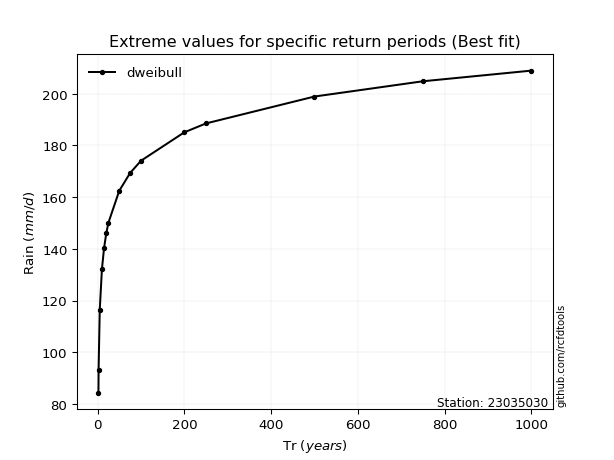</img>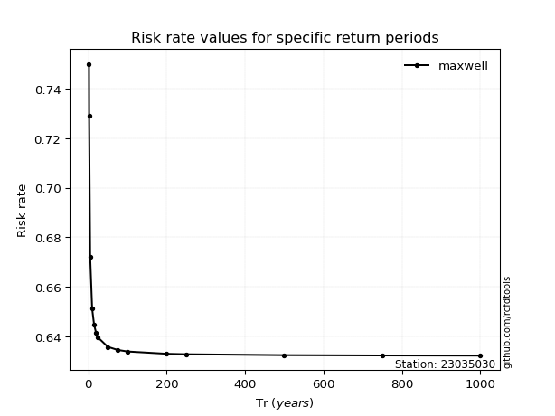</img>

</div>


<sub>**APP DISCLAIMER**: NO WARRANTY - This software is provided by [github.com/rcfdtools](https://github.com/rcfdtools) "as is", without any express or implied warranty, including warranties of merchantability, fitness for a particular purpose, or non-infringement. There is no guarantee that the software will be error-free or operate without interruption. LIMITATION OF LIABILITY - Neither the authors nor copyright holders will be liable for claims or damages arising from the software or its use. You are responsible for determining if the software is appropriate for your use and assume all associated risks, including errors, legal compliance, and data loss. NO PROFESSIONAL ADVICE - The software provides general information and does not offer professional advice. It should not replace consultation with professional advisors.</sub>