<div align="center">


</div>

# Station (rain, Pmax24h): 23037010

Probable Maximum Precipitation (PMP) is the greatest amount of rainfall for a specific duration that is meteorologically possible for a given location, acting as a "worst-case" scenario for extreme storms, crucial for designing safety-critical infrastructure like bridges, river deviations, dams, spillways, and nuclear plants to prevent catastrophic failure. PMP is calculated by hydrologists using meteorological data to determine the upper limit of extreme rainfall, often leading to the Probable Maximum Flood (PMF) for flood control design, and is increasingly being studied for climate change impacts.

<div align="center">

</img>

</div>


## A. General information


### 1. General running parameters

• app_version: _v20251225_. • runtime: _2025-12-26 14:29:50.888910_. • Python version: _3.14.0_. • SciPy version: _1.16.3_. • Pandas version: _2.3.3_. • NumPy version: _2.3.5_. • Stations dataset (station_dataset_file): _dataset/pmax24h_in/automatic_colombia.csv_. • Stations catalog (station_catalog_file): _dataset/CNE_IDEAM.xls_. • Plot only fit distributions with Δo > Δ (plot_only_fit): _True_. • Eval low extreme values, if False, evaluates high extreme values (low_extreme): _False_. • Eval every SciPy distribution as logarithmic (pdist_logarithmic_on): _True_. • Standard deviation normalized (ddof): _1.0_. • Return periods to eval in years (Tr): _[2, 2.33, 5, 10, 15, 20, 25, 50, 75, 100, 200, 250, 500, 750, 1000]_. • Minimum data sample per station, 0 means any (minimum_sample): _5_. • Z-Score threshold to adjust a value, 0 means disable (zscore): _3.5_. • Avoid zeros, e.g. rain = 0 (avoid_zeros): _True_. • Avoid null values (avoid_nans): _True_. [:file_folder:Dataset file.](../../dataset/pmax24h_in/automatic_colombia.csv)


### 2. Station info and location

|   id |   CODIGO | NOMBRE                         | CATEGORIA    | TECNOLOGIA                              | ESTADO   | FECHA_INSTALACION   |   FECHA_SUSPENSION |   ALTITUD |   LATITUD |   LONGITUD | DEPARTAMENTO   | MUNICIPIO     | AREA_OPERATIVA             | ENTIDAD                                                     | AREA_HIDROGRAFICA   | ZONA_HIDROGRAFICA   | SUBZONA_HIDROGRAFICA                               | CORRIENTE   | OBSERVACION                                                                                                                                                                                                                                                                                                                           | SUBRED                                          | Catalogo   |
|-----:|---------:|:-------------------------------|:-------------|:----------------------------------------|:---------|:--------------------|-------------------:|----------:|----------:|-----------:|:---------------|:--------------|:---------------------------|:------------------------------------------------------------|:--------------------|:--------------------|:---------------------------------------------------|:------------|:--------------------------------------------------------------------------------------------------------------------------------------------------------------------------------------------------------------------------------------------------------------------------------------------------------------------------------------|:------------------------------------------------|:-----------|
|    0 | 23037010 | PUERTO SALGAR - AUT [23037010] | Limnigráfica | Automática con Telemetría, Convencional | Activa   | 15/01/1936          |                nan |       168 |   5.46967 |   -74.6622 | Cundinamarca   | Puerto Salgar | Area Operativa 10 - Tolima | INSTITUTO DE HIDROLOGIA METEOROLOGIA Y ESTUDIOS AMBIENTALES | Magdalena Cauca     | Medio Magdalena     | Directos al Magdalena entre Ríos Seco y Negro (md) | Magdalena   | EL GRUPO DE AUTOMATIZACION REPORTA QUE LA ESTACION DEJO DE TRANSMITIR EL 23/11/22 FALLA BATERIA. ESTACION EN MANTENIMIENTO (07/12/2022)|17/10/2024$mvelez$SE ACTIVÓ LA ESTACION EL (25/06/2024) POR INSTALACIÓN DE SIM CARD Y CONFIGURACION GPRS EN MODEN EXTERNO. Se recibe solicitud mediante correo electrónico ing Manuel padilla | Magdalena Medio,RED ALERTAS - AREA OPERATIVA 10 | CNE_IDEAM  |
|      |          |                                |              |                                         |          |                     |                    |           |           |            |                |               |                            |                                                             |                     |                     |                                                    |             | |02/01/2025$mvelez$Se realiza el cambio de elevación y coordenadas a solicitud del coordinador mediante memorando 20243170190253 del 10/10/2024                                                                                                                                                                                       |                                                 |            |

<div align="center">

Map location in: [:earth_americas:Google](http://maps.google.com/maps?q=5.469666667,-74.66216667) [:earth_americas:OSM](https://www.openstreetmap.org/#map=18/5.469666667/-74.66216667&layers=P) [:earth_americas:Bing](https://www.bing.com/maps?cp=5.469666667~-74.66216667&lvl=18) [:earth_americas:Apple](https://maps.apple.com/frame?center=5.469666667%2C-74.66216667&span=0.003%2C0.006)

</div>


<div align="center">

```geojson
{
  "type": "Feature",
  "geometry": {
    "type": "Point", 
    "coordinates": [-74.66216667, 5.469666667]
  }, 
  "properties": {
    "Name": "23037010"
  }
}
```

</div>


### 3. Discrete values table and plot

|               |           0 |           1 |          2 |          3 |            4 |          5 |          6 |           7 |           8 |           9 |          10 |         11 |          12 |          13 |         14 |         15 |         16 |         17 |
|:--------------|------------:|------------:|-----------:|-----------:|-------------:|-----------:|-----------:|------------:|------------:|------------:|------------:|-----------:|------------:|------------:|-----------:|-----------:|-----------:|-----------:|
| Date          | 2005        | 2006        | 2007       | 2008       | 2011         | 2013       | 2014       | 2015        | 2016        | 2017        | 2018        | 2019       | 2020        | 2021        | 2022       | 2023       | 2024       | 2025       |
| Value         |   53.4      |   32.1      |   85.6     |   85.6     |   37.6       |   78.3     |   86.9     |   18.2      |   45        |   42        |   10.5      |    8.4     |    3.5      |   68.6      |    0.4     |    0.2     |    0.4     |    0.4     |
| Value_initial |   53.4      |   32.1      |   85.6     |   85.6     |   37.6       |   78.3     |   86.9     |   18.2      |   45        |   42        |   10.5      |    8.4     |    3.5      |   68.6      |    0.4     |    0.2     |    0.4     |    0.4     |
| count         |   18        |   18        |   18       |   18       |   18         |   18       |   18       |   18        |   18        |   18        |   18        |   18       |   18        |   18        |   18       |   18       |   18       |   18       |
| mean          |   36.5056   |   36.5056   |   36.5056  |   36.5056  |   36.5056    |   36.5056  |   36.5056  |   36.5056   |   36.5056   |   36.5056   |   36.5056   |   36.5056  |   36.5056   |   36.5056   |   36.5056  |   36.5056  |   36.5056  |   36.5056  |
| std           |   33.1351   |   33.1351   |   33.1351  |   33.1351  |   33.1351    |   33.1351  |   33.1351  |   33.1351   |   33.1351   |   33.1351   |   33.1351   |   33.1351  |   33.1351   |   33.1351   |   33.1351  |   33.1351  |   33.1351  |   33.1351  |
| zscore        |    0.509865 |   -0.132957 |    1.48164 |    1.48164 |    0.0330297 |    1.26133 |    1.52088 |   -0.552452 |    0.256358 |    0.165819 |   -0.784833 |   -0.84821 |   -0.996089 |    0.968593 |   -1.08965 |   -1.09568 |   -1.08965 |   -1.08965 |

<div align="center">

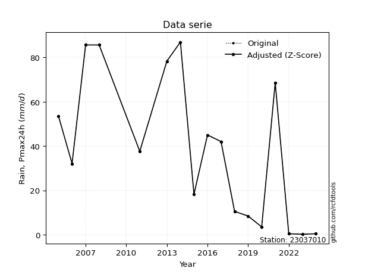</img>

</div>

> If Z-Score is active, values out of range or outliers are replaced with the station mean value.


### 4. Active continuous probability distributions from SciPy (45 of 104 available)

[scipy.stats](https://docs.scipy.org/doc/scipy/reference/stats.html) is a Python´s powerful submodule within the SciPy library for comprehensive statistical analysis, offering over 130 probability distributions (like Normal, Poisson), functions for descriptive stats (mean, variance), hypothesis testing (t-tests, chi-square), random variable generation, and statistical tests, making it essential for data science, modeling, and research. It provides tools to explore, model, and draw conclusions from data efficiently, working seamlessly with NumPy.

<div align="center">

|   id | p_dist             |   n_parameter | fit_method   | label                                                                       | active   | ref                                                                                                        |
|-----:|:-------------------|--------------:|:-------------|:----------------------------------------------------------------------------|:---------|:-----------------------------------------------------------------------------------------------------------|
|    0 | alpha              |             3 | MLE          | Alpha                                                                       | True     | [:mortar_board:](https://docs.scipy.org/doc/scipy/reference/generated/scipy.stats.alpha.html)              |
|    1 | betaprime          |             4 | MLE          | Beta prime                                                                  | True     | [:mortar_board:](https://docs.scipy.org/doc/scipy/reference/generated/scipy.stats.betaprime.html)          |
|    2 | chi2               |             3 | MLE          | Chi²                                                                        | True     | [:mortar_board:](https://docs.scipy.org/doc/scipy/reference/generated/scipy.stats.chi2.html)               |
|    3 | crystalball        |             4 | MLE          | Crystalball                                                                 | True     | [:mortar_board:](https://docs.scipy.org/doc/scipy/reference/generated/scipy.stats.crystalball.html)        |
|    4 | erlang             |             3 | MLE          | Erlang                                                                      | True     | [:mortar_board:](https://docs.scipy.org/doc/scipy/reference/generated/scipy.stats.erlang.html)             |
|    5 | expon              |             2 | MLE          | Exponential                                                                 | True     | [:mortar_board:](https://docs.scipy.org/doc/scipy/reference/generated/scipy.stats.expon.html)              |
|    6 | exponnorm          |             3 | MLE          | Exponentially modified Normal                                               | True     | [:mortar_board:](https://docs.scipy.org/doc/scipy/reference/generated/scipy.stats.exponnorm.html)          |
|    7 | f                  |             4 | MLE          | F                                                                           | True     | [:mortar_board:](https://docs.scipy.org/doc/scipy/reference/generated/scipy.stats.f.html)                  |
|    8 | fatiguelife        |             3 | MLE          | Fatigue-life (Birnbaum-Saunders)                                            | True     | [:mortar_board:](https://docs.scipy.org/doc/scipy/reference/generated/scipy.stats.fatiguelife.html)        |
|    9 | fisk               |             3 | MLE          | Fisk                                                                        | True     | [:mortar_board:](https://docs.scipy.org/doc/scipy/reference/generated/scipy.stats.fisk.html)               |
|   10 | gamma              |             3 | MLE          | Gamma                                                                       | True     | [:mortar_board:](https://docs.scipy.org/doc/scipy/reference/generated/scipy.stats.gamma.html)              |
|   11 | genexpon           |             5 | MLE          | Generalized exponential                                                     | True     | [:mortar_board:](https://docs.scipy.org/doc/scipy/reference/generated/scipy.stats.genexpon.html)           |
|   12 | genlogistic        |             3 | MLE          | Generalized logistic                                                        | True     | [:mortar_board:](https://docs.scipy.org/doc/scipy/reference/generated/scipy.stats.genlogistic.html)        |
|   13 | gibrat             |             2 | MM           | Gibrat                                                                      | True     | [:mortar_board:](https://docs.scipy.org/doc/scipy/reference/generated/scipy.stats.gibrat.html)             |
|   14 | gompertz           |             3 | MLE          | Gompertz (or truncated Gumbel)                                              | True     | [:mortar_board:](https://docs.scipy.org/doc/scipy/reference/generated/scipy.stats.gompertz.html)           |
|   15 | gumbel_l           |             2 | MM           | Gumbel Left Skew                                                            | True     | [:mortar_board:](https://docs.scipy.org/doc/scipy/reference/generated/scipy.stats.gumbel_l.html)           |
|   16 | gumbel_r           |             2 | MM           | Gumbel Right Skew                                                           | True     | [:mortar_board:](https://docs.scipy.org/doc/scipy/reference/generated/scipy.stats.gumbel_r.html)           |
|   17 | halflogistic       |             2 | MM           | Half-logistic                                                               | True     | [:mortar_board:](https://docs.scipy.org/doc/scipy/reference/generated/scipy.stats.halflogistic.html)       |
|   18 | halfnorm           |             2 | MM           | Half Normal                                                                 | True     | [:mortar_board:](https://docs.scipy.org/doc/scipy/reference/generated/scipy.stats.halfnorm.html)           |
|   19 | hypsecant          |             2 | MM           | hyperbolic secant                                                           | True     | [:mortar_board:](https://docs.scipy.org/doc/scipy/reference/generated/scipy.stats.hypsecant.html)          |
|   20 | invgamma           |             3 | MLE          | Inverted gamma                                                              | True     | [:mortar_board:](https://docs.scipy.org/doc/scipy/reference/generated/scipy.stats.invgamma.html)           |
|   21 | invgauss           |             3 | MLE          | Inverse Gaussian                                                            | True     | [:mortar_board:](https://docs.scipy.org/doc/scipy/reference/generated/scipy.stats.invgauss.html)           |
|   22 | invweibull         |             3 | MLE          | Inverted Weibull                                                            | True     | [:mortar_board:](https://docs.scipy.org/doc/scipy/reference/generated/scipy.stats.invweibull.html)         |
|   23 | johnsonsu          |             4 | MLE          | Johnson Su                                                                  | True     | [:mortar_board:](https://docs.scipy.org/doc/scipy/reference/generated/scipy.stats.johnsonsu.html)          |
|   24 | kstwobign          |             2 | MLE          | Limiting distribution of scaled Kolmogorov-Smirnov two-sided test statistic | True     | [:mortar_board:](https://docs.scipy.org/doc/scipy/reference/generated/scipy.stats.kstwobign.html)          |
|   25 | laplace            |             2 | MM           | Laplace                                                                     | True     | [:mortar_board:](https://docs.scipy.org/doc/scipy/reference/generated/scipy.stats.laplace.html)            |
|   26 | laplace_asymmetric |             3 | MLE          | Asymmetric Laplace                                                          | True     | [:mortar_board:](https://docs.scipy.org/doc/scipy/reference/generated/scipy.stats.laplace_asymmetric.html) |
|   27 | loggamma           |             3 | MLE          | Log gamma                                                                   | True     | [:mortar_board:](https://docs.scipy.org/doc/scipy/reference/generated/scipy.stats.loggamma.html)           |
|   28 | logistic           |             2 | MM           | Logistic (or Sech-squared)                                                  | True     | [:mortar_board:](https://docs.scipy.org/doc/scipy/reference/generated/scipy.stats.logistic.html)           |
|   29 | lognorm            |             3 | MLE          | Log Normal                                                                  | True     | [:mortar_board:](https://docs.scipy.org/doc/scipy/reference/generated/scipy.stats.lognorm.html)            |
|   30 | maxwell            |             2 | MM           | Maxwell                                                                     | True     | [:mortar_board:](https://docs.scipy.org/doc/scipy/reference/generated/scipy.stats.maxwell.html)            |
|   31 | mielke             |             4 | MLE          | Mielke Beta-Kappa / Dagum                                                   | True     | [:mortar_board:](https://docs.scipy.org/doc/scipy/reference/generated/scipy.stats.mielke.html)             |
|   32 | moyal              |             2 | MM           | Moyal                                                                       | True     | [:mortar_board:](https://docs.scipy.org/doc/scipy/reference/generated/scipy.stats.moyal.html)              |
|   33 | nakagami           |             3 | MLE          | Nakagami                                                                    | True     | [:mortar_board:](https://docs.scipy.org/doc/scipy/reference/generated/scipy.stats.nakagami.html)           |
|   34 | ncf                |             5 | MLE          | Non-central F distribution                                                  | True     | [:mortar_board:](https://docs.scipy.org/doc/scipy/reference/generated/scipy.stats.ncf.html)                |
|   35 | nct                |             4 | MLE          | Non-central Student’s t                                                     | True     | [:mortar_board:](https://docs.scipy.org/doc/scipy/reference/generated/scipy.stats.nct.html)                |
|   36 | norm               |             2 | MM           | Normal                                                                      | True     | [:mortar_board:](https://docs.scipy.org/doc/scipy/reference/generated/scipy.stats.norm.html)               |
|   37 | pareto             |             3 | MLE          | Pareto                                                                      | True     | [:mortar_board:](https://docs.scipy.org/doc/scipy/reference/generated/scipy.stats.pareto.html)             |
|   38 | pearson3           |             3 | MM           | Pearson type III                                                            | True     | [:mortar_board:](https://docs.scipy.org/doc/scipy/reference/generated/scipy.stats.pearson3.html)           |
|   39 | rayleigh           |             2 | MM           | Rayleigh                                                                    | True     | [:mortar_board:](https://docs.scipy.org/doc/scipy/reference/generated/scipy.stats.rayleigh.html)           |
|   40 | rice               |             3 | MLE          | Rice                                                                        | True     | [:mortar_board:](https://docs.scipy.org/doc/scipy/reference/generated/scipy.stats.rice.html)               |
|   41 | t                  |             3 | MLE          | Student’s t                                                                 | True     | [:mortar_board:](https://docs.scipy.org/doc/scipy/reference/generated/scipy.stats.t.html)                  |
|   42 | truncnorm          |             4 | MLE          | Truncated normal                                                            | True     | [:mortar_board:](https://docs.scipy.org/doc/scipy/reference/generated/scipy.stats.truncnorm.html)          |
|   43 | wald               |             2 | MM           | Wald                                                                        | True     | [:mortar_board:](https://docs.scipy.org/doc/scipy/reference/generated/scipy.stats.wald.html)               |
|   44 | weibull_min        |             3 | MLE          | Weibull minimum                                                             | True     | [:mortar_board:](https://docs.scipy.org/doc/scipy/reference/generated/scipy.stats.weibull_min.html)        |

</div>

> **n_parameter:** # arguments & localization & scale.
>
> **Fit methods:** (MLE) maximum likelihood, (MM) L-moments.
>
>**Inactive:** foldnorm, gennorm, norminvgauss, powernorm, powerlognorm, skewnorm, genextreme, anglit, arcsine, argus, beta, bradford, burr, burr12, cauchy, cosine, halfcauchy, foldcauchy, skewcauchy, wrapcauchy, dgamma, gengamma, exponweib, exponpow, truncexpon, gausshyper, genhalflogistic, genhyperbolic, geninvgauss, halfgennorm, johnsonsb, kappa4, kappa3, ksone, kstwo, loglaplace, levy, levy_l, levy_stable, ncx2, genpareto, truncpareto, lomax, powerlaw, rdist, rel_breitwigner, recipinvgauss, semicircular, studentized_range, trapezoid, triang, truncweibull_min, tukeylambda, uniform, loguniform, vonmises, vonmises_line, weibull_max, dweibull, 


## B. Probability distributions vs. Empirical distributions

A continuous probability distribution (CPD) describes probabilities for variables that can take any value within a range (like rain any time), unlike discrete variables with specific outcomes (like temperature). It uses a Probability Density Function (PDF), a curve where the total area under it equals 1, and the probability of the variable falling within an interval (a to b) is found by calculating the area under the curve between those points. A key feature is that the probability of hitting any single exact value is zero, so probabilities are always expressed for ranges, e.g., $P(a ≤ X ≤ b)$.

<div align="center">

Distributions parameters
|    |   station | p_dist                |   n |               loc |            scale | shape                  | shape1              | shape2                | shape3   |
|---:|----------:|:----------------------|----:|------------------:|-----------------:|:-----------------------|:--------------------|:----------------------|:---------|
|  0 |  23037010 | alpha                 |  18 |       0.00278366  |      0.63201     | 5.75420447924921e-08   |                     |                       |          |
|  1 |  23037010 | betaprime             |  18 |       0.2         |     21.0447      | 0.7435836781179939     | 0.9260063095926976  |                       |          |
|  2 |  23037010 | chi2                  |  18 |       0.2         |     13.1554      | 1.2866246942909112     |                     |                       |          |
|  3 |  23037010 | crystalball           |  18 |      36.5056      |     32.2016      | 1612.452257366093      | 4501.189670389003   |                       |          |
|  4 |  23037010 | erlang                |  18 |       0.2         |     40.4812      | 0.5010084550372097     |                     |                       |          |
|  5 |  23037010 | expon                 |  18 |       0.2         |     36.3056      |                        |                     |                       |          |
|  6 |  23037010 | exponnorm             |  18 |       0.174517    |      0.00777967  | 4647.5861619803945     |                     |                       |          |
|  7 |  23037010 | f                     |  18 |       0.2         |     54.9374      | 1.0217053379777603     | 24.72699089044497   |                       |          |
|  8 |  23037010 | fatiguelife           |  18 |       0.158289    |      2.865       | 4.074129661793334      |                     |                       |          |
|  9 |  23037010 | fisk                  |  18 |       0.2         |     15.0572      | 0.6098367635861441     |                     |                       |          |
| 10 |  23037010 | gamma                 |  18 |       0.2         |     30.9981      | 0.5488246400238437     |                     |                       |          |
| 11 |  23037010 | genexpon              |  18 |       0.180923    |      0.429678    | 0.01031798646401641    | 2.151209674720546   | 9.306161153853515e-06 |          |
| 12 |  23037010 | genlogistic           |  18 |    -159.094       |     25.7795      | 1083.5045654334817     |                     |                       |          |
| 13 |  23037010 | gibrat                |  18 |      11.9398      |     14.8999      |                        |                     |                       |          |
| 14 |  23037010 | gompertz              |  18 |       0.194412    |    131.634       | 2.817414015494851      |                     |                       |          |
| 15 |  23037010 | gumbel_l              |  18 |      50.998       |     25.1075      |                        |                     |                       |          |
| 16 |  23037010 | gumbel_r              |  18 |      22.0131      |     25.1075      |                        |                     |                       |          |
| 17 |  23037010 | halflogistic          |  18 |      -1.66078     |     27.5312      |                        |                     |                       |          |
| 18 |  23037010 | halfnorm              |  18 |      -6.11669     |     53.4191      |                        |                     |                       |          |
| 19 |  23037010 | hypsecant             |  18 |      36.5056      |     20.5002      |                        |                     |                       |          |
| 20 |  23037010 | invgamma              |  18 |     -16.3452      |     77.4742      | 2.303552570391476      |                     |                       |          |
| 21 |  23037010 | invgauss              |  18 |      -4.89783     |     22.5593      | 1.8353128020850518     |                     |                       |          |
| 22 |  23037010 | invweibull            |  18 |       0.140645    |      2.91346     | 0.38436053272481197    |                     |                       |          |
| 23 |  23037010 | johnsonsu             |  18 |       0.317957    |      0.114547    | -1.1897303318022219    | 0.2905061827022756  |                       |          |
| 24 |  23037010 | kstwobign             |  18 |     -67.1766      |    118.455       |                        |                     |                       |          |
| 25 |  23037010 | laplace               |  18 |      36.5056      |     22.7699      |                        |                     |                       |          |
| 26 |  23037010 | laplace_asymmetric    |  18 |      32.1         |     28.0131      | 0.9244533470126867     |                     |                       |          |
| 27 |  23037010 | loggamma              |  18 |   -6188.73        |    929.106       | 812.9252359463749      |                     |                       |          |
| 28 |  23037010 | logistic              |  18 |      36.5056      |     17.7537      |                        |                     |                       |          |
| 29 |  23037010 | lognorm               |  18 |       0.2         |      1.40363     | 9.557793750618323      |                     |                       |          |
| 30 |  23037010 | maxwell               |  18 |     -39.7986      |     47.8166      |                        |                     |                       |          |
| 31 |  23037010 | mielke                |  18 |       0.2         |     89.8097      | 0.3593927314651049     | 116.06299529750153  |                       |          |
| 32 |  23037010 | moyal                 |  18 |      18.0906      |     14.4958      |                        |                     |                       |          |
| 33 |  23037010 | nakagami              |  18 |       0.2         |     65.1007      | 0.19661145297276028    |                     |                       |          |
| 34 |  23037010 | ncf                   |  18 |       0.2         |      7.04029     | 0.6512483963671821     | 54.098095315053186  | 2.726892703136819     |          |
| 35 |  23037010 | nct                   |  18 |     -36.756       |      6.10543     | 3.0187849837776053     | 9.104910837638883   |                       |          |
| 36 |  23037010 | norm                  |  18 |      36.5056      |     32.2016      |                        |                     |                       |          |
| 37 |  23037010 | pareto                |  18 |       0.2         |      2.05382e-07 | 0.05882373154935056    |                     |                       |          |
| 38 |  23037010 | pearson3              |  18 |      36.5056      |     32.2015      | 0.3415626203624771     |                     |                       |          |
| 39 |  23037010 | rayleigh              |  18 |     -25.0979      |     49.1525      |                        |                     |                       |          |
| 40 |  23037010 | rice                  |  18 |     -18.7769      |     43.7486      | 0.3722455363630285     |                     |                       |          |
| 41 |  23037010 | t                     |  18 |      36.5043      |     32.2024      | 16112275.87431798      |                     |                       |          |
| 42 |  23037010 | truncnorm             |  18 |     -21.3888      |     56.0259      | 0.3853360302450094     | 288.9212113151129   |                       |          |
| 43 |  23037010 | wald                  |  18 |       4.30395     |     32.2016      |                        |                     |                       |          |
| 44 |  23037010 | weibull_min           |  18 |       0.2         |     48.8966      | 0.5448994783712832     |                     |                       |          |
| 45 |  23037010 | logalpha              |  18 |      -2.30679     |      1.70816     | 4.12909518669013e-08   |                     |                       |          |
| 46 |  23037010 | logbetaprime          |  18 |      -5.83567     |      8.34631e+06 | 11.062014519708061     | 11019410.73022221   |                       |          |
| 47 |  23037010 | logchi2               |  18 |      -1.60944     |      1.17821     | 1.0730194701205873     |                     |                       |          |
| 48 |  23037010 | logcrystalball        |  18 |       2.49147     |      2.0992      | 7.406959921871006      | 75.03871492253447   |                       |          |
| 49 |  23037010 | logerlang             |  18 |     -28.7853      |      0.153715    | 203.41510259508743     |                     |                       |          |
| 50 |  23037010 | logexpon              |  18 |      -1.60944     |      4.10091     |                        |                     |                       |          |
| 51 |  23037010 | logexponnorm          |  18 |       2.48997     |      2.0992      | 0.000710225774326802   |                     |                       |          |
| 52 |  23037010 | logf                  |  18 |      -1.60944     |      1.04242     | 1.1854837617242941     | 1.0993808018618103  |                       |          |
| 53 |  23037010 | logfatiguelife        |  18 |    -723.88        |    726.372       | 0.002879773732552553   |                     |                       |          |
| 54 |  23037010 | logfisk               |  18 |      -1.60944     |      2.30501     | 0.4490986061907296     |                     |                       |          |
| 55 |  23037010 | loggamma              |  18 |     -30.8301      |      0.14232     | 233.95881616963425     |                     |                       |          |
| 56 |  23037010 | loggenexpon           |  18 |      -1.6217      |      1.3455      | 0.0955436370714271     | 8.263807038796667   | 0.014386896748755713  |          |
| 57 |  23037010 | loggenlogistic        |  18 |       4.46478     |      2.20082e-06 | 1.1140584464164847e-06 |                     |                       |          |
| 58 |  23037010 | loggibrat             |  18 |       0.890038    |      0.97132     |                        |                     |                       |          |
| 59 |  23037010 | loggompertz           |  18 |      -1.60944     |      1.01621e+12 | 1305402252744.4624     |                     |                       |          |
| 60 |  23037010 | loggumbel_l           |  18 |       3.43622     |      1.63674     |                        |                     |                       |          |
| 61 |  23037010 | loggumbel_r           |  18 |       1.54672     |      1.63674     |                        |                     |                       |          |
| 62 |  23037010 | loghalflogistic       |  18 |       0.00343349  |      1.79475     |                        |                     |                       |          |
| 63 |  23037010 | loghalfnorm           |  18 |      -0.287091    |      3.48239     |                        |                     |                       |          |
| 64 |  23037010 | loghypsecant          |  18 |       2.49147     |      1.33639     |                        |                     |                       |          |
| 65 |  23037010 | loginvgamma           |  18 |     -40.5928      |  16035.6         | 373.250744770201       |                     |                       |          |
| 66 |  23037010 | loginvgauss           |  18 |     -17.1896      |   1416.91        | 0.01390402933958966    |                     |                       |          |
| 67 |  23037010 | loginvweibull         |  18 | -304853           | 304855           | 135672.35881690367     |                     |                       |          |
| 68 |  23037010 | logjohnsonsu          |  18 |       4.46772     |      9.0443e-05  | 4.397775402932027      | 0.46290586648429105 |                       |          |
| 69 |  23037010 | logkstwobign          |  18 |      -6.44966     |     10.1848      |                        |                     |                       |          |
| 70 |  23037010 | loglaplace            |  18 |       2.49147     |      1.48436     |                        |                     |                       |          |
| 71 |  23037010 | loglaplace_asymmetric |  18 |       4.46481     |      0.0173236   | 113.5944408703663      |                     |                       |          |
| 72 |  23037010 | logloggamma           |  18 |       4.46479     |      3.1912e-06  | 1.6152735591854277e-06 |                     |                       |          |
| 73 |  23037010 | loglogistic           |  18 |       2.49147     |      1.15735     |                        |                     |                       |          |
| 74 |  23037010 | loglognorm            |  18 |    -509.228       |    511.733       | 0.004096736719925942   |                     |                       |          |
| 75 |  23037010 | logmaxwell            |  18 |      -2.48276     |      3.11714     |                        |                     |                       |          |
| 76 |  23037010 | logmielke             |  18 |      -1.60944     |      8.54622     | 0.7404316319001139     | 3.955346312358194   |                       |          |
| 77 |  23037010 | logmoyal              |  18 |       1.29101     |      0.944973    |                        |                     |                       |          |
| 78 |  23037010 | lognakagami           |  18 |    -924.865       |    927.356       | 48910.23031962855      |                     |                       |          |
| 79 |  23037010 | logncf                |  18 |      -1.60944     |      1.11477     | 1.042631896460105      | 1.1170931243777553  | 1.0267705502076045    |          |
| 80 |  23037010 | lognct                |  18 |    -129.174       |      2.06827     | 62996.895123350376     | 63.65875943391093   |                       |          |
| 81 |  23037010 | lognorm               |  18 |       2.49147     |      2.0992      |                        |                     |                       |          |
| 82 |  23037010 | logpareto             |  18 |      -1.60944     |      5.38782e-08 | 0.0588235430528241     |                     |                       |          |
| 83 |  23037010 | logpearson3           |  18 |       2.49146     |      2.09922     | -0.8720672474120137    |                     |                       |          |
| 84 |  23037010 | lograyleigh           |  18 |      -1.52446     |      3.20425     |                        |                     |                       |          |
| 85 |  23037010 | logrice               |  18 |      -2.72242     |      2.29626     | 1.9978221946301415     |                     |                       |          |
| 86 |  23037010 | logt                  |  18 |       2.49147     |      2.0992      | 4168103605.652747      |                     |                       |          |
| 87 |  23037010 | logtruncnorm          |  18 |       1.80475     |      6.65191     | -0.5132666441537178    | 0.3998881880131941  |                       |          |
| 88 |  23037010 | logwald               |  18 |       0.392228    |      2.09922     |                        |                     |                       |          |
| 89 |  23037010 | logweibull_min        |  18 |      -2.46588e+08 |      2.46588e+08 | 172695937.55620056     |                     |                       |          |

</div>

> **loc** (Location parameter): This shifts the distribution along the x-axis. For many common distributions, like the normal (Gaussian) distribution, loc represents the mean $μ$. For others, like the uniform distribution, it might represent the minimum value, or for the beta distribution, the left end of the support interval.
>
> **scale** (Scale parameter): This determines the width or spread of the distribution. For the normal distribution, scale represents the standard deviation $σ$. For a uniform distribution, it defines the length of the interval (from $loc$ to $loc + scale$).
>
> **shape** (Shape parameters): Refers to parameters that define the specific form of a probability distribution, distinct from its location (loc) and scale (scale). These parameters are required arguments for most distribution functions. For example, a normal (Gaussian) distribution is fully defined by its location (mean) and scale (standard deviation), so it has no specific shape parameters beyond loc and scale. However, other distributions have intrinsic properties that need specification, as Gamma distribution that takes a shape parameter, often named $a$ or $alpha$.


### 0. Cumulative distribution values - CDF (90 evaluated)

> Ordered by x ascending and calculating $log(f(x))$ separately. 

|   id |   Station |   date |    x |   count |    mean |     std |     zscore |   Value_initial |   station |   m |      alpha |   alpha_pdf |   betaprime |   betaprime_pdf |        chi2 |        chi2_pdf |   crystalball |   crystalball_pdf |      erlang |   erlang_pdf |      expon |   expon_pdf |   exponnorm |   exponnorm_pdf |           f |       f_pdf |   fatiguelife |   fatiguelife_pdf |        fisk |        fisk_pdf |       gamma |   gamma_pdf |    genexpon |   genexpon_pdf |   genlogistic |   genlogistic_pdf |   gibrat |   gibrat_pdf |    gompertz |   gompertz_pdf |   gumbel_l |   gumbel_l_pdf |   gumbel_r |   gumbel_r_pdf |   halflogistic |   halflogistic_pdf |   halfnorm |   halfnorm_pdf |   hypsecant |   hypsecant_pdf |   invgamma |   invgamma_pdf |   invgauss |   invgauss_pdf |   invweibull |   invweibull_pdf |   johnsonsu |   johnsonsu_pdf |   kstwobign |   kstwobign_pdf |   laplace |   laplace_pdf |   laplace_asymmetric |   laplace_asymmetric_pdf |   loggamma |   loggamma_pdf |   logistic |   logistic_pdf |   lognorm |   lognorm_pdf |   maxwell |   maxwell_pdf |      mielke |      mielke_pdf |     moyal |   moyal_pdf |    nakagami |   nakagami_pdf |         ncf |     ncf_pdf |       nct |    nct_pdf |     norm |   norm_pdf |   pareto |       pareto_pdf |   pearson3 |   pearson3_pdf |   rayleigh |   rayleigh_pdf |      rice |   rice_pdf |        t |      t_pdf |   truncnorm |   truncnorm_pdf |      wald |   wald_pdf |   weibull_min |   weibull_min_pdf |   logalpha |   logalpha_pdf |   logbetaprime |   logbetaprime_pdf |     logchi2 |   logchi2_pdf |   logcrystalball |   logcrystalball_pdf |   logerlang |   logerlang_pdf |   logexpon |   logexpon_pdf |   logexponnorm |   logexponnorm_pdf |        logf |       logf_pdf |   logfatiguelife |   logfatiguelife_pdf |     logfisk |   logfisk_pdf |   loggenexpon |   loggenexpon_pdf |   loggenlogistic |   loggenlogistic_pdf |   loggibrat |   loggibrat_pdf |   loggompertz |   loggompertz_pdf |   loggumbel_l |   loggumbel_l_pdf |   loggumbel_r |   loggumbel_r_pdf |   loghalflogistic |   loghalflogistic_pdf |   loghalfnorm |   loghalfnorm_pdf |   loghypsecant |   loghypsecant_pdf |   loginvgamma |   loginvgamma_pdf |   loginvgauss |   loginvgauss_pdf |   loginvweibull |   loginvweibull_pdf |   logjohnsonsu |   logjohnsonsu_pdf |   logkstwobign |   logkstwobign_pdf |   loglaplace |   loglaplace_pdf |   loglaplace_asymmetric |   loglaplace_asymmetric_pdf |   logloggamma |   logloggamma_pdf |   loglogistic |   loglogistic_pdf |   loglognorm |   loglognorm_pdf |   logmaxwell |   logmaxwell_pdf |   logmielke |   logmielke_pdf |    logmoyal |   logmoyal_pdf |   lognakagami |   lognakagami_pdf |      logncf |   logncf_pdf |    lognct |   lognct_pdf |   logpareto |   logpareto_pdf |   logpearson3 |   logpearson3_pdf |   lograyleigh |   lograyleigh_pdf |   logrice |   logrice_pdf |      logt |   logt_pdf |   logtruncnorm |   logtruncnorm_pdf |   logwald |   logwald_pdf |   logweibull_min |   logweibull_min_pdf |
|-----:|----------:|-------:|-----:|--------:|--------:|--------:|-----------:|----------------:|----------:|----:|-----------:|------------:|------------:|----------------:|------------:|----------------:|--------------:|------------------:|------------:|-------------:|-----------:|------------:|------------:|----------------:|------------:|------------:|--------------:|------------------:|------------:|----------------:|------------:|------------:|------------:|---------------:|--------------:|------------------:|---------:|-------------:|------------:|---------------:|-----------:|---------------:|-----------:|---------------:|---------------:|-------------------:|-----------:|---------------:|------------:|----------------:|-----------:|---------------:|-----------:|---------------:|-------------:|-----------------:|------------:|----------------:|------------:|----------------:|----------:|--------------:|---------------------:|-------------------------:|-----------:|---------------:|-----------:|---------------:|----------:|--------------:|----------:|--------------:|------------:|----------------:|----------:|------------:|------------:|---------------:|------------:|------------:|----------:|-----------:|---------:|-----------:|---------:|-----------------:|-----------:|---------------:|-----------:|---------------:|----------:|-----------:|---------:|-----------:|------------:|----------------:|----------:|-----------:|--------------:|------------------:|-----------:|---------------:|---------------:|-------------------:|------------:|--------------:|-----------------:|---------------------:|------------:|----------------:|-----------:|---------------:|---------------:|-------------------:|------------:|---------------:|-----------------:|---------------------:|------------:|--------------:|--------------:|------------------:|-----------------:|---------------------:|------------:|----------------:|--------------:|------------------:|--------------:|------------------:|--------------:|------------------:|------------------:|----------------------:|--------------:|------------------:|---------------:|-------------------:|--------------:|------------------:|--------------:|------------------:|----------------:|--------------------:|---------------:|-------------------:|---------------:|-------------------:|-------------:|-----------------:|------------------------:|----------------------------:|--------------:|------------------:|--------------:|------------------:|-------------:|-----------------:|-------------:|-----------------:|------------:|----------------:|------------:|---------------:|--------------:|------------------:|------------:|-------------:|----------:|-------------:|------------:|----------------:|--------------:|------------------:|--------------:|------------------:|----------:|--------------:|----------:|-----------:|---------------:|-------------------:|----------:|--------------:|-----------------:|---------------------:|
|    0 |  23037010 |   2023 |  0.2 |      18 | 36.5056 | 33.1351 | -1.09568   |             0.2 |  23037010 |   1 | 0.00135226 | 0.0763344   | 4.08165e-13 |    607.495      | 3.03036e-12 | 70237.1         |      0.129777 |        0.00656159 | 2.19801e-09 |  6.61262e+06 | 0          |  0.027544   | 0.000704563 |      0.0276233  | 3.56476e-10 | 6.56108e+06 |      0.022502 |        1.32343    | 1.53079e-11 | 336340          | 2.99537e-10 | 1.48072e+06 | 0.000458027 |     0.0240044  |      0.106133 |        0.00922503 | 0        |   0          | 0.000119608 |     0.0214017  |   0.123859 |     0.0046142  |  0.0921786 |     0.00875263 |      0.0337811 |         0.0181405  |  0.0941287 |     0.0148323  |    0.107302 |      0.00513565 |  0.0766595 |     0.0167616  |  0.0595231 |     0.0300347  |    0.0114914 |      0.332343    |   0.0732724 |     0.245691    |   0.0972857 |      0.00956814 |  0.10151  |    0.00445807 |             0.134446 |               0.0051916  |  0.0266251 |      0.0308864 |   0.114562 |     0.00571363 | 0.0253769 |     0.0281929 |  0.126734 |    0.00822905 | 1.99065e-05 | 958633          | 0.063805  |  0.00915454 | 4.72244e-08 |    6.69045e+08 | 6.68237e-07 | 1.95991e+09 | 0.0920878 | 0.0130744  | 0.129777 | 0.00656159 | 0        | 286412           |   0.124808 |     0.00736795 |   0.124052 |     0.00917218 | 0.0840478 | 0.0084757  | 0.129791 | 0.00656192 |  1.8275e-09 |      0.0188894  | 0         | 0          |   1.14236e-10 |       2.24269e+06 |  0.0143051 |      0.139529  |      0.0262925 |          0.038609  | 2.84187e-09 |   6.86659e+06 |        0.0253769 |            0.0281929 |   0.026731  |       0.0309713 |   0        |      0.243848  |      0.025377  |          0.028193  | 3.48222e-10 | 929568         |        0.0246316 |            0.0277513 | 6.41405e-08 |   1.29728e+08 |   0.000875245 |         0.0717523 |         0        |            0.0233865 |    0        |       0         |   1.88397e-12 |       1.28458     |     0.0447987 |         0.0267482 |    0.00103029 |        0.00432948 |          0        |             0         |      0        |         0         |      0.0295716 |          0.0220961 |     0.0270775 |         0.0319903 |      0.026226 |         0.0334033 |       0.0233649 |           0.0390618 |       0.142662 |          0.0171718 |      0.0223802 |          0.0458908 |    0.0315592 |        0.0212611 |               0.0456476 |                   0.0231966 |     0.0462098 |         0.0233898 |     0.0281035 |         0.0236001 |    0.0243762 |        0.0275147 |   0.00571307 |        0.0193186 | 5.24438e-13 |    1748.8       | 3.48737e-06 |    4.14275e-05 |     0.02526   |         0.0281605 | 2.56139e-09 |  6.01362e+06 | 0.0254211 |    0.0282595 |    0        |     1.09179e+06 |     0.0434294 |         0.029249  |     0         |         0         | 0.0168635 |     0.0318513 | 0.0253765 |  0.0281926 |    2.69692e-06 |           0.149567 |  0        |     0         |        0.0289698 |            0.019992  |
|    1 |  23037010 |   2022 |  0.4 |      18 | 36.5056 | 33.1351 | -1.08965   |             0.4 |  23037010 |   2 | 0.111588   | 0.901326    | 0.029243    |      0.107743   | 0.0480446   |     0.153825    |      0.131094 |        0.00660757 | 0.0787564   |  0.19664     | 0.00549365 |  0.0273927  | 0.00621685  |      0.0274855  | 0.0449452   | 0.114655    |      0.219539 |        0.560576   | 0.0669018   |      0.190348   | 0.0704886   | 0.192625    | 0.00524954  |     0.0239109  |      0.107987 |        0.00931378 | 0        |   0          | 0.00439404  |     0.0213426  |   0.124785 |     0.00464619 |  0.0939387 |     0.00884899 |      0.0374088 |         0.0181358  |  0.0970945 |     0.0148256  |    0.108334 |      0.00518312 |  0.0800394 |     0.0170359  |  0.0656064 |     0.0307793  |    0.0793553 |      0.297985    |   0.159558  |     0.50076     |   0.0992087 |      0.00966222 |  0.102406 |    0.0044974  |             0.135488 |               0.00523185 |  0.056129  |      0.0557838 |   0.11571  |     0.00576339 | 0.0522563 |     0.0508872 |  0.128385 |    0.00828245 | 0.111374    |      0.200136   | 0.0656512 |  0.00930814 | 0.08124     |    0.159727    | 0.0624731   | 0.103974    | 0.0947191 | 0.0132385  | 0.131094 | 0.00660757 | 0.555639 |      0.130695    |   0.126287 |     0.00742215 |   0.125892 |     0.00922527 | 0.0857503 | 0.00854915 | 0.131108 | 0.0066079  |  0.00377527 |      0.0188633  | 0         | 0          |   0.0487349   |       0.129489    |  0.219276  |      0.331461  |      0.06394   |          0.07127   | 0.529102    |   0.336896    |        0.0522563 |            0.0508872 |   0.0562777 |       0.0558023 |   0.15551  |      0.205927  |      0.0522564 |          0.0508874 | 0.420051    |      0.245387  |        0.0512116 |            0.0504915 | 0.368272    |   0.150735    |   0.0642336   |         0.109636  |         0        |            0.033216  |    0        |       0         |   0.58951     |       0.527308    |     0.0676065 |         0.0398767 |    0.0110717  |        0.030463   |          0        |             0         |      0        |         0         |      0.0496093 |          0.0369717 |     0.0576435 |         0.0577256 |      0.058501 |         0.0612492 |       0.0633298 |           0.0777722 |       0.155679 |          0.0205466 |      0.0706088 |          0.0939085 |    0.0503416 |        0.0339147 |               0.0649219 |                   0.0329911 |     0.0656304 |         0.0332198 |     0.0499996 |         0.0410417 |    0.0507456 |        0.0501145 |   0.0313077  |        0.0569741 | 0.155677    |       0.166288  | 0.00130313  |    0.00772366  |     0.0521365 |         0.0509199 | 0.296594    |  0.202976    | 0.0523623 |    0.0509992 |    0.618232 |     0.0323985   |     0.0685826 |         0.0441831 |     0.0178507 |         0.0581764 | 0.0478688 |     0.0587542 | 0.0522556 |  0.0508868 |    0.106302    |           0.15693  |  0        |     0         |        0.0466451 |            0.0318935 |
|    2 |  23037010 |   2025 |  0.4 |      18 | 36.5056 | 33.1351 | -1.08965   |             0.4 |  23037010 |   3 | 0.111588   | 0.901326    | 0.029243    |      0.107743   | 0.0480446   |     0.153825    |      0.131094 |        0.00660757 | 0.0787564   |  0.19664     | 0.00549365 |  0.0273927  | 0.00621685  |      0.0274855  | 0.0449452   | 0.114655    |      0.219539 |        0.560576   | 0.0669018   |      0.190348   | 0.0704886   | 0.192625    | 0.00524954  |     0.0239109  |      0.107987 |        0.00931378 | 0        |   0          | 0.00439404  |     0.0213426  |   0.124785 |     0.00464619 |  0.0939387 |     0.00884899 |      0.0374088 |         0.0181358  |  0.0970945 |     0.0148256  |    0.108334 |      0.00518312 |  0.0800394 |     0.0170359  |  0.0656064 |     0.0307793  |    0.0793553 |      0.297985    |   0.159558  |     0.50076     |   0.0992087 |      0.00966222 |  0.102406 |    0.0044974  |             0.135488 |               0.00523185 |  0.056129  |      0.0557838 |   0.11571  |     0.00576339 | 0.0522563 |     0.0508872 |  0.128385 |    0.00828245 | 0.111374    |      0.200136   | 0.0656512 |  0.00930814 | 0.08124     |    0.159727    | 0.0624731   | 0.103974    | 0.0947191 | 0.0132385  | 0.131094 | 0.00660757 | 0.555639 |      0.130695    |   0.126287 |     0.00742215 |   0.125892 |     0.00922527 | 0.0857503 | 0.00854915 | 0.131108 | 0.0066079  |  0.00377527 |      0.0188633  | 0         | 0          |   0.0487349   |       0.129489    |  0.219276  |      0.331461  |      0.06394   |          0.07127   | 0.529102    |   0.336896    |        0.0522563 |            0.0508872 |   0.0562777 |       0.0558023 |   0.15551  |      0.205927  |      0.0522564 |          0.0508874 | 0.420051    |      0.245387  |        0.0512116 |            0.0504915 | 0.368272    |   0.150735    |   0.0642336   |         0.109636  |         0        |            0.033216  |    0        |       0         |   0.58951     |       0.527308    |     0.0676065 |         0.0398767 |    0.0110717  |        0.030463   |          0        |             0         |      0        |         0         |      0.0496093 |          0.0369717 |     0.0576435 |         0.0577256 |      0.058501 |         0.0612492 |       0.0633298 |           0.0777722 |       0.155679 |          0.0205466 |      0.0706088 |          0.0939085 |    0.0503416 |        0.0339147 |               0.0649219 |                   0.0329911 |     0.0656304 |         0.0332198 |     0.0499996 |         0.0410417 |    0.0507456 |        0.0501145 |   0.0313077  |        0.0569741 | 0.155677    |       0.166288  | 0.00130313  |    0.00772366  |     0.0521365 |         0.0509199 | 0.296594    |  0.202976    | 0.0523623 |    0.0509992 |    0.618232 |     0.0323985   |     0.0685826 |         0.0441831 |     0.0178507 |         0.0581764 | 0.0478688 |     0.0587542 | 0.0522556 |  0.0508868 |    0.106302    |           0.15693  |  0        |     0         |        0.0466451 |            0.0318935 |
|    3 |  23037010 |   2024 |  0.4 |      18 | 36.5056 | 33.1351 | -1.08965   |             0.4 |  23037010 |   4 | 0.111588   | 0.901326    | 0.029243    |      0.107743   | 0.0480446   |     0.153825    |      0.131094 |        0.00660757 | 0.0787564   |  0.19664     | 0.00549365 |  0.0273927  | 0.00621685  |      0.0274855  | 0.0449452   | 0.114655    |      0.219539 |        0.560576   | 0.0669018   |      0.190348   | 0.0704886   | 0.192625    | 0.00524954  |     0.0239109  |      0.107987 |        0.00931378 | 0        |   0          | 0.00439404  |     0.0213426  |   0.124785 |     0.00464619 |  0.0939387 |     0.00884899 |      0.0374088 |         0.0181358  |  0.0970945 |     0.0148256  |    0.108334 |      0.00518312 |  0.0800394 |     0.0170359  |  0.0656064 |     0.0307793  |    0.0793553 |      0.297985    |   0.159558  |     0.50076     |   0.0992087 |      0.00966222 |  0.102406 |    0.0044974  |             0.135488 |               0.00523185 |  0.056129  |      0.0557838 |   0.11571  |     0.00576339 | 0.0522563 |     0.0508872 |  0.128385 |    0.00828245 | 0.111374    |      0.200136   | 0.0656512 |  0.00930814 | 0.08124     |    0.159727    | 0.0624731   | 0.103974    | 0.0947191 | 0.0132385  | 0.131094 | 0.00660757 | 0.555639 |      0.130695    |   0.126287 |     0.00742215 |   0.125892 |     0.00922527 | 0.0857503 | 0.00854915 | 0.131108 | 0.0066079  |  0.00377527 |      0.0188633  | 0         | 0          |   0.0487349   |       0.129489    |  0.219276  |      0.331461  |      0.06394   |          0.07127   | 0.529102    |   0.336896    |        0.0522563 |            0.0508872 |   0.0562777 |       0.0558023 |   0.15551  |      0.205927  |      0.0522564 |          0.0508874 | 0.420051    |      0.245387  |        0.0512116 |            0.0504915 | 0.368272    |   0.150735    |   0.0642336   |         0.109636  |         0        |            0.033216  |    0        |       0         |   0.58951     |       0.527308    |     0.0676065 |         0.0398767 |    0.0110717  |        0.030463   |          0        |             0         |      0        |         0         |      0.0496093 |          0.0369717 |     0.0576435 |         0.0577256 |      0.058501 |         0.0612492 |       0.0633298 |           0.0777722 |       0.155679 |          0.0205466 |      0.0706088 |          0.0939085 |    0.0503416 |        0.0339147 |               0.0649219 |                   0.0329911 |     0.0656304 |         0.0332198 |     0.0499996 |         0.0410417 |    0.0507456 |        0.0501145 |   0.0313077  |        0.0569741 | 0.155677    |       0.166288  | 0.00130313  |    0.00772366  |     0.0521365 |         0.0509199 | 0.296594    |  0.202976    | 0.0523623 |    0.0509992 |    0.618232 |     0.0323985   |     0.0685826 |         0.0441831 |     0.0178507 |         0.0581764 | 0.0478688 |     0.0587542 | 0.0522556 |  0.0508868 |    0.106302    |           0.15693  |  0        |     0         |        0.0466451 |            0.0318935 |
|    4 |  23037010 |   2020 |  3.5 |      18 | 36.5056 | 33.1351 | -0.996089  |             3.5 |  23037010 |   5 | 0.856589   | 0.0405627   | 0.21338     |      0.0418257  | 0.278702    |     0.0503032   |      0.152689 |        0.00732668 | 0.312811    |  0.0449675   | 0.0868866  |  0.0251508  | 0.0878713   |      0.0252271  | 0.186318    | 0.0282387   |      0.515083 |        0.0293684  | 0.2838      |      0.0375618  | 0.317054    | 0.0492019   | 0.0771598   |     0.0224925  |      0.138929 |        0.0106273  | 0        |   0          | 0.0691401   |     0.0204302  |   0.139982 |     0.00516549 |  0.123637  |     0.0102938  |      0.0934525 |         0.0180026  |  0.142866  |     0.0146962  |    0.125595 |      0.00596882 |  0.138078  |     0.0200242  |  0.168045  |     0.033161   |    0.388006  |      0.042029    |   0.491007  |     0.0363888   |   0.131317  |      0.0110198  |  0.117341 |    0.00515333 |             0.152717 |               0.00589716 |  0.293641  |      0.162114  |   0.13481  |     0.00656969 | 0.277567  |     0.159678  |  0.155312 |    0.00908033 | 0.305028    |      0.0332197  | 0.0981024 |  0.0115903  | 0.244611    |    0.0291352   | 0.172393    | 0.022187    | 0.139273  | 0.0153747  | 0.152689 | 0.00732668 | 0.623193 |      0.00671673  |   0.150591 |     0.00825525 |   0.155709 |     0.00999393 | 0.113952  | 0.00962555 | 0.152705 | 0.00732698 |  0.0615974  |      0.0184335  | 0         | 0          |   0.205602    |       0.030192    |  0.631312  |      0.0958678 |      0.330221  |          0.160485  | 0.869394    |   0.0695477   |        0.277567  |            0.159678  |   0.292853  |       0.161089  |   0.502392 |      0.121341  |      0.277568  |          0.159679  | 0.658567    |      0.0530057 |        0.276608  |            0.160246  | 0.524289    |   0.0391341   |   0.376663    |         0.160142  |         0        |            0.0995847 |    0.162309 |       0.67709   |   0.974694    |       0.0325072   |     0.231576  |         0.123669  |    0.302179   |        0.220944   |          0.334647 |             0.247392  |      0.341643 |         0.20778   |      0.239917  |          0.163004  |     0.298675  |         0.161608  |      0.307807 |         0.162101  |       0.349605  |           0.163515  |       0.219556 |          0.0425836 |      0.383367  |          0.164952  |    0.217045  |        0.146221  |               0.195473  |                   0.0993329 |     0.196751  |         0.0995885 |     0.255347  |         0.164293  |    0.274827  |        0.159502  |   0.30291    |        0.179277  | 0.443786    |       0.113307  | 0.307518    |    0.255955    |     0.27791   |         0.160043  | 0.531124    |  0.0613355   | 0.277932  |    0.159715  |    0.648786 |     0.00721809  |     0.245399  |         0.128182  |     0.31313   |         0.185794  | 0.290603  |     0.163183  | 0.277566  |  0.159678  |    0.463874    |           0.170038 |  0.280542 |     0.473531  |        0.19604   |            0.12286   |
|    5 |  23037010 |   2019 |  8.4 |      18 | 36.5056 | 33.1351 | -0.84821   |             8.4 |  23037010 |   6 | 0.940005   | 0.00713121  | 0.36828     |      0.0243843  | 0.467034    |     0.0301798   |      0.191386 |        0.00846475 | 0.474721    |  0.0252976   | 0.202171   |  0.0219754  | 0.203474    |      0.0220298  | 0.291975    | 0.0172571   |      0.607031 |        0.0130866  | 0.408393    |      0.0179685  | 0.495314    | 0.02786     | 0.182112    |     0.0203691  |      0.195463 |        0.0123676  | 0        |   0          | 0.165745    |     0.0190043  |   0.167482 |     0.00607792 |  0.179106  |     0.0122682  |      0.180709  |         0.0175681  |  0.214187  |     0.0143949  |    0.158266 |      0.00740605 |  0.239907  |     0.0209261  |  0.315102  |     0.0264333  |    0.511718  |      0.0159546   |   0.597996  |     0.0139036   |   0.189689  |      0.0127035  |  0.145515 |    0.00639067 |             0.184528 |               0.00712552 |  0.446597  |      0.18284   |   0.170359 |     0.007961   | 0.431312  |     0.187221  |  0.20263  |    0.010201   | 0.423066    |      0.0185423  | 0.162443  |  0.0144913  | 0.349728    |    0.0167272   | 0.26372     | 0.0165237   | 0.21971   | 0.0171384  | 0.191386 | 0.00846475 | 0.642837 |      0.00256215  |   0.194157 |     0.00950894 |   0.207235 |     0.0109919  | 0.164791  | 0.0110706  | 0.191403 | 0.00846498 |  0.150077   |      0.0176633  | 0.013017  | 0.0136724  |   0.314744    |       0.0172109   |  0.700124  |      0.0643377 |      0.473466  |          0.163059  | 0.917282    |   0.0423851   |        0.431312  |            0.187221  |   0.444773  |       0.181576  |   0.598049 |      0.0980151 |      0.431313  |          0.187221  | 0.697581    |      0.03758   |        0.430949  |            0.187949  | 0.554059    |   0.0296875   |   0.514179    |         0.151773  |         0        |            0.155116  |    0.595902 |       0.312842  |   0.991781    |       0.0105577   |     0.36219   |         0.175246  |    0.496103   |        0.212467   |          0.531296 |             0.199951  |      0.512055 |         0.180137  |      0.414528  |          0.22965   |     0.449835  |         0.179308  |      0.45701  |         0.174432  |       0.490748  |           0.155464  |       0.265479 |          0.0648693 |      0.522788  |          0.151054  |    0.391466  |        0.263727  |               0.304999  |                   0.15499   |     0.306455  |         0.155117  |     0.422175  |         0.210777  |    0.42857   |        0.187375  |   0.465714   |        0.187547  | 0.538304    |       0.102738  | 0.520798    |    0.220583    |     0.431964  |         0.187531  | 0.577445    |  0.0457495   | 0.431639  |    0.187095  |    0.654257 |     0.00544131  |     0.376786  |         0.171475  |     0.477821  |         0.185772  | 0.444329  |     0.183745  | 0.43131   |  0.187221  |    0.613121    |           0.170423 |  0.589082 |     0.248172  |        0.331588  |            0.188581  |
|    6 |  23037010 |   2018 | 10.5 |      18 | 36.5056 | 33.1351 | -0.784833  |            10.5 |  23037010 |   7 | 0.95199    | 0.00456802  | 0.41519     |      0.020485   | 0.525479    |     0.0256881   |      0.209664 |        0.0089415  | 0.523573    |  0.0214357   | 0.24701    |  0.0207404  | 0.248419    |      0.0207868  | 0.325858    | 0.0151273   |      0.631996 |        0.0108519  | 0.442367    |      0.0146052  | 0.548996    | 0.02349     | 0.223973    |     0.0195032  |      0.222068 |        0.0129533  | 0        |   0          | 0.20502     |     0.0184009  |   0.180689 |     0.00650332 |  0.205608  |     0.0129534  |      0.217332  |         0.0173034  |  0.244247  |     0.0142309  |    0.174533 |      0.00809352 |  0.28339   |     0.0204263  |  0.367468  |     0.0234894  |    0.541122  |      0.0123296   |   0.623717  |     0.0108298   |   0.216943  |      0.013233   |  0.159574 |    0.0070081  |             0.200115 |               0.00772741 |  0.487515  |      0.183576  |   0.187734 |     0.00858922 | 0.473396  |     0.189622  |  0.224497 |    0.010618   | 0.459194    |      0.0160224  | 0.193843  |  0.0153743  | 0.38242     |    0.0145397   | 0.297314    | 0.0155215   | 0.255977  | 0.0173545  | 0.209664 | 0.0089415  | 0.647596 |      0.00201259  |   0.214653 |     0.0100062  |   0.230687 |     0.0113354  | 0.188593  | 0.011587   | 0.209681 | 0.0089417  |  0.186795   |      0.0173026  | 0.0570436 | 0.0269556  |   0.348165    |       0.0147579   |  0.713841  |      0.0587272 |      0.509575  |          0.160381  | 0.926186    |   0.0375332   |        0.473396  |            0.189622  |   0.48541   |       0.182336  |   0.619336 |      0.0928243 |      0.473398  |          0.189622  | 0.705651    |      0.0348103 |        0.473193  |            0.190325  | 0.560484    |   0.0279316   |   0.547603    |         0.147693  |         0        |            0.173665  |    0.658529 |       0.25115   |   0.99383     |       0.00792647  |     0.402739  |         0.188074  |    0.542464   |        0.202713   |          0.574434 |             0.186663  |      0.551345 |         0.171953  |      0.466692  |          0.236883  |     0.489894  |         0.17943   |      0.495852 |         0.173431  |       0.524908  |           0.150565  |       0.280909 |          0.0737449 |      0.55589   |          0.145548  |    0.454968  |        0.306508  |               0.341621  |                   0.1736    |     0.343099  |         0.173665  |     0.469775  |         0.215221  |    0.470696  |        0.189839  |   0.507307   |        0.184952  | 0.560934    |       0.100082  | 0.568266    |    0.204704    |     0.474112  |         0.189889  | 0.58732     |  0.042808    | 0.473691  |    0.189457  |    0.655434 |     0.00511728  |     0.41617   |         0.181374  |     0.51884   |         0.181636  | 0.485464  |     0.184627  | 0.473395  |  0.189622  |    0.651111    |           0.170049 |  0.640093 |     0.210282  |        0.375617  |            0.205956  |
|    7 |  23037010 |   2015 | 18.2 |      18 | 36.5056 | 33.1351 | -0.552452  |            18.2 |  23037010 |   8 | 0.972294   | 0.00152192  | 0.537119    |      0.0123026  | 0.680284    |     0.0157094   |      0.284859 |        0.0105405  | 0.653646    |  0.0134139   | 0.390912   |  0.0167767  | 0.392582    |      0.0167996  | 0.423041    | 0.0106938   |      0.697817 |        0.00690011 | 0.527189    |      0.00844491 | 0.689659    | 0.0142437   | 0.362562    |     0.0165522  |      0.327448 |        0.0141734  | 0.192932 |   0.0437565  | 0.338325    |     0.016238   |   0.237246 |     0.00822738 |  0.312231  |     0.0144754  |      0.345827  |         0.0159892  |  0.351039  |     0.0134663  |    0.247406 |      0.0108895  |  0.428017  |     0.0168947  |  0.514921  |     0.0155152  |    0.608967  |      0.00642842  |   0.68398   |     0.00577892  |   0.323529  |      0.0142094  |  0.223782 |    0.00982796 |             0.269408 |               0.0104031  |  0.587277  |      0.1773    |   0.262873 |     0.0109144  | 0.577417  |     0.186455  |  0.311072 |    0.0117644  | 0.56121     |      0.0112053  | 0.319136  |  0.0166922  | 0.475503    |    0.010258    | 0.406868    | 0.0131203   | 0.387     | 0.0162904  | 0.284859 | 0.0105405  | 0.65898  |      0.00111445  |   0.297867 |     0.0115148  |   0.321577 |     0.0121584  | 0.283532  | 0.0129261  | 0.284877 | 0.0105405  |  0.314553   |      0.0158503  | 0.301735  | 0.0300539  |   0.440163    |       0.00983141  |  0.742931  |      0.0476139 |      0.594996  |          0.149249  | 0.944064    |   0.0279811   |        0.577417  |            0.186455  |   0.584539  |       0.176276  |   0.667118 |      0.0811728 |      0.577419  |          0.186455  | 0.723198    |      0.0292551 |        0.577562  |            0.186997  | 0.574816    |   0.0243326   |   0.62554     |         0.135175  |         0        |            0.229421  |    0.766669 |       0.152179  |   0.996956    |       0.00391036  |     0.513864  |         0.214227  |    0.645932   |        0.172484   |          0.668127 |             0.154229  |      0.640129 |         0.150667  |      0.596148  |          0.227402  |     0.587082  |         0.172247  |      0.589178 |         0.164463  |       0.603757  |           0.135579  |       0.329672 |          0.106987  |      0.631819  |          0.130215  |    0.620662  |        0.255556  |               0.451789  |                   0.229584  |     0.453245  |         0.229417  |     0.58764   |         0.209374  |    0.574871  |        0.18679   |   0.605826   |        0.171811  | 0.614148    |       0.0933536 | 0.669728    |    0.16441     |     0.578244  |         0.186581  | 0.609132    |  0.036756    | 0.577599  |    0.186218  |    0.65806  |     0.00445905  |     0.521591  |         0.200377  |     0.614776  |         0.166058  | 0.585939  |     0.178859  | 0.577416  |  0.186456  |    0.744223    |           0.168321 |  0.735837 |     0.143123  |        0.499591  |            0.242632  |
|    8 |  23037010 |   2006 | 32.1 |      18 | 36.5056 | 33.1351 | -0.132957  |            32.1 |  23037010 |   9 | 0.98429    | 0.000489379 | 0.660108    |      0.00638927 | 0.833596    |     0.00755228  |      0.44559  |        0.0122735  | 0.790178    |  0.00715195  | 0.584658   |  0.0114402  | 0.586449    |      0.0114377  | 0.543243    | 0.00708263  |      0.772182 |        0.00422227 | 0.6125      |      0.00453733 | 0.829896    | 0.00702672  | 0.56032     |     0.0120794  |      0.521386 |        0.0131677  | 0.61881  |   0.0189045  | 0.538262    |     0.0125934  |   0.375685 |     0.0117143  |  0.512144  |     0.0136494  |      0.546331  |         0.0127405  |  0.525646  |     0.0115639  |    0.432115 |      0.0151754  |  0.615971  |     0.0105205  |  0.6739    |     0.00839092 |    0.671472  |      0.00321633  |   0.740837  |     0.00295994  |   0.51642   |      0.0130712  |  0.412043 |    0.0180959  |             0.460804 |               0.0177939  |  0.683498  |      0.160302  |   0.438279 |     0.013867   | 0.679249  |     0.170523  |  0.479951 |    0.0121813  | 0.689352    |      0.0077664  | 0.537371  |  0.0140345  | 0.592389    |    0.00701926  | 0.566739    | 0.0100059   | 0.582369  | 0.0116818  | 0.44559  | 0.0122735  | 0.670268 |      0.000608027 |   0.467794 |     0.0125348  |   0.491901 |     0.0120292  | 0.468174  | 0.0132112  | 0.445606 | 0.0122733  |  0.514675   |      0.0128984  | 0.60742   | 0.0152815  |   0.547229    |       0.00612818  |  0.767419  |      0.0391088 |      0.675223  |          0.132899  | 0.957802    |   0.0208178   |        0.679249  |            0.170523  |   0.680291  |       0.159698  |   0.710133 |      0.0706835 |      0.679251  |          0.170523  | 0.73851     |      0.024908  |        0.679632  |            0.170812  | 0.587766    |   0.0214275   |   0.697949    |         0.119728  |         0        |            0.305759  |    0.835574 |       0.0960412 |   0.998531    |       0.00188649  |     0.639455  |         0.224718  |    0.734171   |        0.13861    |          0.746691 |             0.123263  |      0.719213 |         0.128074  |      0.714452  |          0.186144  |     0.680424  |         0.155391  |      0.677985 |         0.147482  |       0.675719  |           0.117875  |       0.408044 |          0.179949  |      0.700909  |          0.11323   |    0.741175  |        0.174368  |               0.602789  |                   0.306317  |     0.604045  |         0.305746  |     0.699413  |         0.181652  |    0.676918  |        0.17094   |   0.697625   |        0.150775  | 0.665054    |       0.0859938 | 0.752079    |    0.126873    |     0.6801    |         0.170484  | 0.628546    |  0.0318644   | 0.679288  |    0.170267  |    0.660435 |     0.00393329  |     0.637938  |         0.206979  |     0.703057  |         0.144414  | 0.683186  |     0.162315  | 0.679248  |  0.170523  |    0.838951    |           0.165368 |  0.803742 |     0.0994735 |        0.643047  |            0.257527  |
|    9 |  23037010 |   2011 | 37.6 |      18 | 36.5056 | 33.1351 |  0.0330297 |            37.6 |  23037010 |  10 | 0.986588   | 0.00035669  | 0.691808    |      0.00520085 | 0.870044    |     0.00578966  |      0.513556 |        0.0123818  | 0.825531    |  0.00576698  | 0.643045   |  0.00983197 | 0.644806    |      0.00982374 | 0.579738    | 0.00622103  |      0.793728 |        0.00363766 | 0.635257    |      0.00377814 | 0.864071    | 0.00547681  | 0.6226      |     0.0105933  |      0.590863 |        0.0120568  | 0.706638 |   0.0134118  | 0.603842    |     0.0112658  |   0.443715 |     0.012994   |  0.584201  |     0.0125068  |      0.612569  |         0.0113464  |  0.586855  |     0.0106859  |    0.516986 |      0.0155051  |  0.6686    |     0.00868094 |  0.715572  |     0.00683821 |    0.687494  |      0.00264322  |   0.755624  |     0.0024462   |   0.585554  |      0.0120365  |  0.523464 |    0.0209283  |             0.550303 |               0.0148404  |  0.708365  |      0.154087  |   0.515407 |     0.0140682  | 0.705724  |     0.164178  |  0.546015 |    0.011796   | 0.729908    |      0.007014   | 0.609904  |  0.0123279  | 0.628834    |    0.00626175  | 0.618814    | 0.00894442  | 0.641697  | 0.00992344 | 0.513556 | 0.0123818  | 0.673339 |      0.000513782 |   0.536197 |     0.0122805  |   0.55672  |     0.0115038  | 0.539515  | 0.0126799  | 0.513571 | 0.0123814  |  0.582287   |      0.0116879  | 0.681323  | 0.0117765  |   0.578574    |       0.00530561  |  0.773446  |      0.0371372 |      0.695839  |          0.127788  | 0.960964    |   0.0191918   |        0.705724  |            0.164178  |   0.705074  |       0.153622  |   0.721099 |      0.0680096 |      0.705726  |          0.164178  | 0.742367    |      0.0238837 |        0.706147  |            0.164394  | 0.591099    |   0.0207293   |   0.716523    |         0.115152  |         0        |            0.331243  |    0.849887 |       0.0852315 |   0.998801    |       0.00153966  |     0.674901  |         0.223181  |    0.755366   |        0.129477   |          0.765553 |             0.115317  |      0.738973 |         0.121826  |      0.742791  |          0.172193  |     0.704531  |         0.149405  |      0.700861 |         0.141759  |       0.693962  |           0.11283   |       0.439281 |          0.217112  |      0.71844   |          0.108479  |    0.767333  |        0.156746  |               0.653232  |                   0.33195   |     0.654386  |         0.331227  |     0.727336  |         0.171355  |    0.703461  |        0.164615  |   0.720941   |        0.144039  | 0.678486    |       0.0838571 | 0.771402    |    0.117589    |     0.706566  |         0.164097  | 0.633492    |  0.0306902   | 0.705724  |    0.163928  |    0.661047 |     0.00380763  |     0.670586  |         0.205635  |     0.725374  |         0.137791  | 0.708377  |     0.156169  | 0.705724  |  0.164179  |    0.865024    |           0.164341 |  0.818738 |     0.090352  |        0.683618  |            0.25499   |
|   10 |  23037010 |   2017 | 42   |      18 | 36.5056 | 33.1351 |  0.165819  |            42   |  23037010 |  11 | 0.987993   | 0.000285873 | 0.71304     |      0.00447772 | 0.893048    |     0.00470755  |      0.567741 |        0.0122099  | 0.84892     |  0.00489373  | 0.683787   |  0.00870977 | 0.685504    |      0.00869814 | 0.605827    | 0.00565283  |      0.808882 |        0.00326175 | 0.650825    |      0.00331547 | 0.885985    | 0.00451948  | 0.666796    |     0.00951158 |      0.641704 |        0.0110405  | 0.758613 |   0.0103742  | 0.651174    |     0.0102569  |   0.502823 |     0.0138378  |  0.636923  |     0.0114436  |      0.660067  |         0.0102486  |  0.632273  |     0.00995555 |    0.58431  |      0.0149857  |  0.704047  |     0.00746637 |  0.743465  |     0.00587495 |    0.698344  |      0.0023023   |   0.765683  |     0.00213831  |   0.636488  |      0.0111049  |  0.607198 |    0.0172509  |             0.611081 |               0.0128346  |  0.725162  |      0.149444  |   0.576759 |     0.0137497  | 0.723628  |     0.159341  |  0.596889 |    0.0113041  | 0.759677    |      0.00653163 | 0.661121  |  0.0109592  | 0.655252    |    0.00575923  | 0.656414    | 0.00815536  | 0.682545  | 0.00866782 | 0.567741 | 0.0122099  | 0.675469 |      0.000456702 |   0.589331 |     0.0118387  |   0.606135 |     0.0109387  | 0.59399   | 0.0120559  | 0.567755 | 0.0122095  |  0.631596   |      0.0107272  | 0.728295  | 0.00966061 |   0.600724    |       0.00477864  |  0.777484  |      0.0358436 |      0.709778  |          0.124121  | 0.963028    |   0.0181347   |        0.723628  |            0.159341  |   0.721825  |       0.149081  |   0.728525 |      0.0661988 |      0.72363   |          0.159341  | 0.744973    |      0.0232076 |        0.724072  |            0.159506  | 0.593367    |   0.0202651   |   0.729087    |         0.111908  |         0        |            0.350328  |    0.858944 |       0.0785618 |   0.99896     |       0.00133563  |     0.699476  |         0.220742  |    0.769349   |        0.123252   |          0.778016 |             0.109957  |      0.752215 |         0.117492  |      0.761302  |          0.162338  |     0.720821  |         0.144965  |      0.716318 |         0.137571  |       0.706254  |           0.10931   |       0.465154 |          0.251993  |      0.730262  |          0.105175  |    0.784048  |        0.145485  |               0.69102   |                   0.351153  |     0.692087  |         0.35031   |     0.745882  |         0.163772  |    0.721414  |        0.15979   |   0.736614   |        0.13918   | 0.687682    |       0.0823405 | 0.784072    |    0.11142     |     0.72446   |         0.159231  | 0.636845    |  0.0299103   | 0.723601  |    0.159098  |    0.661464 |     0.00372424  |     0.693245  |         0.203751  |     0.740362  |         0.133069  | 0.725406  |     0.151554  | 0.723628  |  0.159341  |    0.883169    |           0.163571 |  0.828413 |     0.0845742 |        0.71164   |            0.251135  |
|   11 |  23037010 |   2016 | 45   |      18 | 36.5056 | 33.1351 |  0.256358  |            45   |  23037010 |  12 | 0.988794   | 0.000249029 | 0.725846    |      0.00406936 | 0.906232    |     0.00409769  |      0.604029 |        0.0119653  | 0.862829    |  0.0043897   | 0.708866   |  0.008019   | 0.710545    |      0.00800557 | 0.622267    | 0.0053128   |      0.818328 |        0.00304025 | 0.660368    |      0.00305302 | 0.898709    | 0.00397627  | 0.694293    |     0.00882603 |      0.673746 |        0.0103188  | 0.787268 |   0.00878373 | 0.68095     |     0.00959766 |   0.545019 |     0.0142706  |  0.670119  |     0.010684   |      0.689717  |         0.00952174 |  0.661382  |     0.00944955 |    0.628275 |      0.0142834  |  0.725352  |     0.00675111 |  0.760246  |     0.00532498 |    0.704958  |      0.00211175  |   0.771832  |     0.00196537  |   0.668814  |      0.0104439  |  0.655686 |    0.0151214  |             0.64774  |               0.0116248  |  0.73537   |      0.146444  |   0.617385 |     0.0133055  | 0.734513  |     0.156178  |  0.630196 |    0.0108907  | 0.778838    |      0.00624796 | 0.692641  |  0.0100609  | 0.672068    |    0.00545588  | 0.680112    | 0.00764776  | 0.707371  | 0.0078946  | 0.604029 | 0.0119653  | 0.676789 |      0.000424385 |   0.624258 |     0.0114333  |   0.638295 |     0.0104947  | 0.629413  | 0.0115496  | 0.604041 | 0.0119649  |  0.662807   |      0.0100822  | 0.755464  | 0.00848328 |   0.614587    |       0.00446949  |  0.77993   |      0.0350706 |      0.718262  |          0.121805  | 0.964258    |   0.0175071   |        0.734513  |            0.156178  |   0.73201   |       0.146144  |   0.733054 |      0.0650944 |      0.734515  |          0.156178  | 0.74656     |      0.0228018 |        0.734968  |            0.156312  | 0.594756    |   0.0199853   |   0.736737    |         0.109874  |         0        |            0.362779  |    0.864231 |       0.0747322 |   0.999048    |       0.00122235  |     0.714635  |         0.218632  |    0.777721   |        0.11945    |          0.78549  |             0.106702  |      0.760229 |         0.11481   |      0.772291  |          0.156225  |     0.730725  |         0.142108  |      0.725717 |         0.134897  |       0.71372   |           0.107126  |       0.483448 |          0.279119  |      0.737448  |          0.103128  |    0.793856  |        0.138877  |               0.715677  |                   0.363683  |     0.716683  |         0.36276   |     0.757015  |         0.158935  |    0.73233   |        0.156635  |   0.74611    |        0.136104  | 0.69333     |       0.0813865 | 0.79163     |    0.10771     |     0.735336  |         0.156051  | 0.638892    |  0.0294405   | 0.734469  |    0.15594   |    0.661719 |     0.00367403  |     0.70725   |         0.202168  |     0.749441  |         0.1301    | 0.73576   |     0.148563  | 0.734513  |  0.156178  |    0.894437    |           0.16307  |  0.834131 |     0.0812001 |        0.728856  |            0.247831  |
|   12 |  23037010 |   2005 | 53.4 |      18 | 36.5056 | 33.1351 |  0.509865  |            53.4 |  23037010 |  13 | 0.990556   | 0.000176846 | 0.75609     |      0.00318661 | 0.934836    |     0.00280069  |      0.700086 |        0.010796   | 0.894749    |  0.00327398  | 0.769001   |  0.00636264 | 0.770552    |      0.00634594 | 0.663406    | 0.00451594  |      0.841627 |        0.00253084 | 0.683464    |      0.00247994 | 0.926879    | 0.00280619  | 0.761041    |     0.00711637 |      0.751937 |        0.00831476 | 0.846936 |   0.00569979 | 0.754224    |     0.00788063 |   0.667261 |     0.0145831  |  0.750905  |     0.00856782 |      0.761582  |         0.00762758 |  0.734784  |     0.0080296  |    0.736851 |      0.0114234  |  0.774943  |     0.00514415 |  0.799622  |     0.00412196 |    0.72087   |      0.00170271  |   0.786675  |     0.00159183  |   0.748706  |      0.00858588 |  0.761911 |    0.0104563  |             0.733023 |               0.00881045 |  0.759777  |      0.138705  |   0.721438 |     0.0113197  | 0.760543  |     0.147908  |  0.715991 |    0.00948626 | 0.828457    |      0.00559664 | 0.767348  |  0.00779341 | 0.714742    |    0.00473144  | 0.738795    | 0.00635577  | 0.765691  | 0.00607178 | 0.700086 | 0.010796   | 0.68004  |      0.000353782 |   0.714406 |     0.00996065 |   0.720639 |     0.00907681 | 0.71967   | 0.00989364 | 0.700094 | 0.0107956  |  0.740124   |      0.0083467  | 0.815616  | 0.00601279 |   0.649023    |       0.00376396  |  0.785775  |      0.0332561 |      0.738612  |          0.115989  | 0.967127    |   0.0160475   |        0.760543  |            0.147908  |   0.756379  |       0.138563  |   0.743965 |      0.0624337 |      0.760545  |          0.147908  | 0.75038     |      0.0218443 |        0.761014  |            0.14797   | 0.598119    |   0.019321    |   0.755108    |         0.104802  |         0        |            0.39561   |    0.876272 |       0.0661923 |   0.999236    |       0.000981104 |     0.751475  |         0.211395  |    0.797376   |        0.11031    |          0.803079 |             0.0989175 |      0.779314 |         0.108234  |      0.797749  |          0.141361  |     0.754423  |         0.134772  |      0.748225 |         0.128092  |       0.731593  |           0.101755  |       0.538714 |          0.375176  |      0.754666  |          0.0980976 |    0.816306  |        0.123753  |               0.780707  |                   0.396729  |     0.781537  |         0.395587  |     0.783174  |         0.146725  |    0.75844   |        0.148383  |   0.768743   |        0.128358  | 0.707055    |       0.078993  | 0.809306    |    0.0989555   |     0.761341  |         0.147742  | 0.643834    |  0.0283261   | 0.760459  |    0.147686  |    0.662337 |     0.00355497  |     0.741425  |         0.196854  |     0.771073  |         0.122684  | 0.760529  |     0.140814  | 0.760543  |  0.147909  |    0.922235    |           0.161758 |  0.847357 |     0.0735129 |        0.770373  |            0.23661   |
|   13 |  23037010 |   2021 | 68.6 |      18 | 36.5056 | 33.1351 |  0.968593  |            68.6 |  23037010 |  14 | 0.992649   | 0.00010716  | 0.796225    |      0.00218922 | 0.965839    |     0.00143694  |      0.840539 |        0.00753925 | 0.933792    |  0.00198401  | 0.84802    |  0.00418612 | 0.849301    |      0.00416794 | 0.723581    | 0.00346924  |      0.874816 |        0.0018816  | 0.715653    |      0.0018143  | 0.958825    | 0.00153432  | 0.849928    |     0.00471627 |      0.853756 |        0.00523584 | 0.90918  |   0.00288542 | 0.853388    |     0.00527642 |   0.8668   |     0.0106948  |  0.855239  |     0.00532662 |      0.855421  |         0.00487183 |  0.838094  |     0.00561606 |    0.868854 |      0.00621787 |  0.837573  |     0.00327169 |  0.850815  |     0.00274228 |    0.742904  |      0.00123957  |   0.807327  |     0.00116445  |   0.855563  |      0.00558424 |  0.877868 |    0.00536372 |             0.838331 |               0.0053352  |  0.793042  |      0.126818  |   0.859092 |     0.0068185  | 0.795987  |     0.134961  |  0.838113 |    0.00656601 | 0.906767    |      0.00476441 | 0.860975  |  0.00474653 | 0.778645    |    0.00372845  | 0.820399    | 0.00447502  | 0.839415  | 0.00382014 | 0.840539 | 0.00753925 | 0.684736 |      0.000271126 |   0.841672 |     0.00675669 |   0.837477 |     0.00630311 | 0.845121  | 0.00662576 | 0.840541 | 0.00753896 |  0.845383   |      0.00560076 | 0.885109  | 0.00342405 |   0.699016    |       0.00287897  |  0.793797  |      0.0308412 |      0.766588  |          0.107382  | 0.970903    |   0.0141389   |        0.795987  |            0.134961  |   0.789637  |       0.126904  |   0.759136 |      0.0587344 |      0.795989  |          0.134961  | 0.755687    |      0.0205576 |        0.796462  |            0.134929  | 0.602844    |   0.0184189   |   0.780427    |         0.0973637 |         0        |            0.44909   |    0.891501 |       0.0557744 |   0.999446    |       0.000711172 |     0.802584  |         0.195691  |    0.823413   |        0.0977475  |          0.826506 |             0.0882823 |      0.805243 |         0.0988512 |      0.830555  |          0.120888  |     0.786787  |         0.123575  |      0.779031 |         0.117837  |       0.756114  |           0.0940723 |       0.6659   |          0.703615  |      0.778332  |          0.0908983 |    0.844829  |        0.104537  |               0.886682  |                   0.450582  |     0.88718   |         0.44906   |     0.817677  |         0.128812  |    0.794006  |        0.135462  |   0.799458   |        0.116877  | 0.726396    |       0.0754292 | 0.832601    |    0.0872621   |     0.796737  |         0.134748  | 0.650737    |  0.0268159   | 0.795852  |    0.13477   |    0.663207 |     0.00339367  |     0.789395  |         0.185453  |     0.80044   |         0.111814  | 0.794313  |     0.128833  | 0.795987  |  0.134961  |    0.962495    |           0.159667 |  0.864518 |     0.0637919 |        0.82682   |            0.212665  |
|   14 |  23037010 |   2013 | 78.3 |      18 | 36.5056 | 33.1351 |  1.26133   |            78.3 |  23037010 |  15 | 0.99356    | 8.2254e-05  | 0.815381    |      0.00178183 | 0.977236    |     0.000947946 |      0.902839 |        0.00533628 | 0.95036     |  0.0014613   | 0.883654   |  0.00320464 | 0.884761    |      0.00318721 | 0.754748    | 0.00297441  |      0.891561 |        0.00158252 | 0.731819    |      0.00153248 | 0.97124     | 0.00105689  | 0.889923    |     0.00357496 |      0.89715  |        0.00377682 | 0.932379 |   0.0019701  | 0.897945    |     0.00395373 |   0.948521 |     0.00608256 |  0.899188  |     0.00380566 |      0.896124  |         0.00357706 |  0.885956  |     0.00428519 |    0.91758  |      0.00397567 |  0.865425  |     0.00251324 |  0.87452   |     0.00217474 |    0.753948  |      0.00104716  |   0.817711  |     0.000985284 |   0.902071  |      0.0040598  |  0.920234 |    0.00350313 |             0.882617 |               0.00387373 |  0.809389  |      0.120378  |   0.913262 |     0.00446187 | 0.813368  |     0.127852  |  0.893157 |    0.00482044 | 0.951031    |      0.00437636 | 0.900261  |  0.00342231 | 0.812283    |    0.0032207   | 0.859152    | 0.00354745  | 0.871675  | 0.00288235 | 0.902839 | 0.00533628 | 0.687185 |      0.000235607 |   0.897735 |     0.00484895 |   0.890584 |     0.00468275 | 0.900073  | 0.00475379 | 0.90284  | 0.00533611 |  0.892591   |      0.00417798 | 0.91337   | 0.00246518 |   0.724915    |       0.00247713  |  0.797798  |      0.0296696 |      0.780489  |          0.102837  | 0.972712    |   0.0132292   |        0.813368  |            0.127852  |   0.806004  |       0.12058   |   0.76678  |      0.0568704 |      0.81337   |          0.127852  | 0.758364    |      0.0199278 |        0.813835  |            0.127778  | 0.60525     |   0.0179732   |   0.793046    |         0.0934558 |         0        |            0.480185  |    0.898562 |       0.0510977 |   0.999533    |       0.000600056 |     0.82778   |         0.185082  |    0.835926   |        0.0915299  |          0.837831 |             0.0830309 |      0.817996 |         0.0940335 |      0.845875  |          0.110875  |     0.802732  |         0.117535  |      0.794253 |         0.112355  |       0.768293  |           0.0901238 |       0.78835  |          1.25054   |      0.790107  |          0.08719   |    0.858057  |        0.0956259 |               0.948322  |                   0.481905  |     0.948604  |         0.48015   |     0.834099  |         0.119564  |    0.811454  |        0.128365  |   0.814515   |        0.11082   | 0.736246    |       0.0735233 | 0.843764    |    0.0816021   |     0.814089  |         0.127618  | 0.654234    |  0.0260712   | 0.813208  |    0.12768   |    0.663651 |     0.00331412  |     0.813423  |         0.177716  |     0.814852  |         0.106124  | 0.810921  |     0.122306  | 0.813368  |  0.127853  |    0.983534    |           0.158484 |  0.872653 |     0.0592876 |        0.853918  |            0.196797  |
|   15 |  23037010 |   2007 | 85.6 |      18 | 36.5056 | 33.1351 |  1.48164   |            85.6 |  23037010 |  16 | 0.994109   | 6.88229e-05 | 0.827499    |      0.00154668 | 0.983187    |     0.000695737 |      0.93632  |        0.00387522 | 0.95991     |  0.00116697  | 0.904846   |  0.00262093 | 0.905829    |      0.00260452 | 0.775299    | 0.00266378  |      0.90242  |        0.00139749 | 0.742378    |      0.00136573 | 0.977981    | 0.000802131 | 0.913407    |     0.00288069 |      0.921485 |        0.00292268 | 0.944991 |   0.0015104  | 0.923697    |     0.00312464 |   0.981081 |     0.00298967 |  0.923621  |     0.00292282 |      0.919342  |         0.00281153 |  0.914008  |     0.0034208  |    0.942108 |      0.00280843 |  0.882147  |     0.00208493 |  0.889156  |     0.00184717 |    0.761167  |      0.000934259 |   0.824506  |     0.000879661 |   0.928193  |      0.00312691 |  0.942113 |    0.00254227 |             0.907747 |               0.00304443 |  0.819925  |      0.116007  |   0.940773 |     0.00313849 | 0.824548  |     0.122998  |  0.924093 |    0.00368439 | 0.982059    |      0.0041209  | 0.922382  |  0.0026688  | 0.834552    |    0.0028864   | 0.882878    | 0.00296861  | 0.890701  | 0.00235121 | 0.93632  | 0.00387522 | 0.688825 |      0.000214338 |   0.928561 |     0.00363226 |   0.920822 |     0.0036279  | 0.930316  | 0.00356691 | 0.93632  | 0.00387513 |  0.91974    |      0.00328543 | 0.929395  | 0.00194902 |   0.742072    |       0.00223008  |  0.800409  |      0.0289167 |      0.78952   |          0.0997874 | 0.973865    |   0.0126509   |        0.824548  |            0.122998  |   0.816561  |       0.116284  |   0.771794 |      0.0556476 |      0.82455   |          0.122997  | 0.760122    |      0.0195211 |        0.825008  |            0.122897  | 0.606839    |   0.0176838   |   0.801259    |         0.0908375 |         0        |            0.502348  |    0.902987 |       0.0482196 |   0.999583    |       0.000535134 |     0.843927  |         0.177117  |    0.843904   |        0.0875058  |          0.84508  |             0.0796323 |      0.826236 |         0.0908456 |      0.85547   |          0.104471  |     0.813026  |         0.113444  |      0.804103 |         0.108655  |       0.77621   |           0.0875111 |       0.947989 |          2.73155   |      0.797769  |          0.0847313 |    0.86633   |        0.0900524 |               0.992266  |                   0.504236  |     0.992383  |         0.50231   |     0.844484  |         0.113475  |    0.82268   |        0.123519  |   0.824212   |        0.106762  | 0.742742    |       0.0722313 | 0.850875    |    0.077979    |     0.825247  |         0.122752  | 0.656537    |  0.0255883   | 0.824374  |    0.122839  |    0.663944 |     0.00326252  |     0.829007  |         0.171856  |     0.824142  |         0.102326  | 0.821625  |     0.117864  | 0.824548  |  0.122998  |    0.997624    |           0.157656 |  0.877811 |     0.0564672 |        0.870943  |            0.185061  |
|   16 |  23037010 |   2008 | 85.6 |      18 | 36.5056 | 33.1351 |  1.48164   |            85.6 |  23037010 |  17 | 0.994109   | 6.88229e-05 | 0.827499    |      0.00154668 | 0.983187    |     0.000695737 |      0.93632  |        0.00387522 | 0.95991     |  0.00116697  | 0.904846   |  0.00262093 | 0.905829    |      0.00260452 | 0.775299    | 0.00266378  |      0.90242  |        0.00139749 | 0.742378    |      0.00136573 | 0.977981    | 0.000802131 | 0.913407    |     0.00288069 |      0.921485 |        0.00292268 | 0.944991 |   0.0015104  | 0.923697    |     0.00312464 |   0.981081 |     0.00298967 |  0.923621  |     0.00292282 |      0.919342  |         0.00281153 |  0.914008  |     0.0034208  |    0.942108 |      0.00280843 |  0.882147  |     0.00208493 |  0.889156  |     0.00184717 |    0.761167  |      0.000934259 |   0.824506  |     0.000879661 |   0.928193  |      0.00312691 |  0.942113 |    0.00254227 |             0.907747 |               0.00304443 |  0.819925  |      0.116007  |   0.940773 |     0.00313849 | 0.824548  |     0.122998  |  0.924093 |    0.00368439 | 0.982059    |      0.0041209  | 0.922382  |  0.0026688  | 0.834552    |    0.0028864   | 0.882878    | 0.00296861  | 0.890701  | 0.00235121 | 0.93632  | 0.00387522 | 0.688825 |      0.000214338 |   0.928561 |     0.00363226 |   0.920822 |     0.0036279  | 0.930316  | 0.00356691 | 0.93632  | 0.00387513 |  0.91974    |      0.00328543 | 0.929395  | 0.00194902 |   0.742072    |       0.00223008  |  0.800409  |      0.0289167 |      0.78952   |          0.0997874 | 0.973865    |   0.0126509   |        0.824548  |            0.122998  |   0.816561  |       0.116284  |   0.771794 |      0.0556476 |      0.82455   |          0.122997  | 0.760122    |      0.0195211 |        0.825008  |            0.122897  | 0.606839    |   0.0176838   |   0.801259    |         0.0908375 |         0        |            0.502348  |    0.902987 |       0.0482196 |   0.999583    |       0.000535134 |     0.843927  |         0.177117  |    0.843904   |        0.0875058  |          0.84508  |             0.0796323 |      0.826236 |         0.0908456 |      0.85547   |          0.104471  |     0.813026  |         0.113444  |      0.804103 |         0.108655  |       0.77621   |           0.0875111 |       0.947989 |          2.73155   |      0.797769  |          0.0847313 |    0.86633   |        0.0900524 |               0.992266  |                   0.504236  |     0.992383  |         0.50231   |     0.844484  |         0.113475  |    0.82268   |        0.123519  |   0.824212   |        0.106762  | 0.742742    |       0.0722313 | 0.850875    |    0.077979    |     0.825247  |         0.122752  | 0.656537    |  0.0255883   | 0.824374  |    0.122839  |    0.663944 |     0.00326252  |     0.829007  |         0.171856  |     0.824142  |         0.102326  | 0.821625  |     0.117864  | 0.824548  |  0.122998  |    0.997624    |           0.157656 |  0.877811 |     0.0564672 |        0.870943  |            0.185061  |
|   17 |  23037010 |   2014 | 86.9 |      18 | 36.5056 | 33.1351 |  1.52088   |            86.9 |  23037010 |  18 | 0.994197   | 6.67791e-05 | 0.829486    |      0.00150979 | 0.984067    |     0.000658638 |      0.941205 |        0.00364093 | 0.961397    |  0.0011216   | 0.908193   |  0.00252874 | 0.909155    |      0.00251254 | 0.778729    | 0.00261309  |      0.904217 |        0.00136751 | 0.744136    |      0.00133923 | 0.978999    | 0.000763962 | 0.91708     |     0.00277017 |      0.925198 |        0.00279016 | 0.94691  |   0.00144307 | 0.927672    |     0.00299126 |   0.984677 |     0.00255001 |  0.927332  |     0.00278648 |      0.922919  |         0.00269186 |  0.918363  |     0.00327984 |    0.945647 |      0.00263846 |  0.884814  |     0.00201868 |  0.891524  |     0.00179584 |    0.76237   |      0.000916381 |   0.825638  |     0.000862901 |   0.932162  |      0.0029793  |  0.945325 |    0.00240119 |             0.911621 |               0.00291658 |  0.821667  |      0.115267  |   0.944723 |     0.00294144 | 0.826396  |     0.122174  |  0.928763 |    0.00350106 | 0.987364    |      0.00402548 | 0.925776  |  0.00255281 | 0.838267    |    0.00283053  | 0.886676    | 0.00287517  | 0.893704  | 0.00226918 | 0.941205 | 0.00364093 | 0.689102 |      0.000210937 |   0.933156 |     0.00343857 |   0.925426 |     0.00345704 | 0.934829  | 0.00337788 | 0.941204 | 0.00364085 |  0.923918   |      0.00314218 | 0.931878  | 0.00187098 |   0.744945    |       0.00219013  |  0.800844  |      0.0287922 |      0.79102   |          0.0992733 | 0.974055    |   0.0125558   |        0.826396  |            0.122173  |   0.818308  |       0.115557  |   0.772632 |      0.0554435 |      0.826398  |          0.122173  | 0.760416    |      0.0194536 |        0.826854  |            0.122069  | 0.607105    |   0.0176357   |   0.802625    |         0.0903963 |         0.999989 |            0.506161  |    0.90371  |       0.0477531 |   0.999591    |       0.000524873 |     0.846586  |         0.17571   |    0.845218   |        0.0868386  |          0.846276 |             0.0790687 |      0.827601 |         0.0903115 |      0.857037  |          0.103416  |     0.814731  |         0.112752  |      0.805736 |         0.10803   |       0.777526  |           0.0870734 |       0.993087 |          3.01049   |      0.799043  |          0.0843189 |    0.86768   |        0.0891426 |               0.999895  |                   0.508113  |     0.999984  |         0.506146  |     0.846187  |         0.112459  |    0.824536  |        0.122696  |   0.825816   |        0.106079  | 0.74383     |       0.0720123 | 0.852046    |    0.0773812   |     0.827091  |         0.121926  | 0.656922    |  0.0255081   | 0.826219  |    0.122017  |    0.663993 |     0.00325395  |     0.83159   |         0.170816  |     0.825679  |         0.101687  | 0.823396  |     0.117111  | 0.826396  |  0.122174  |    0.999999    |           0.157513 |  0.878658 |     0.0560063 |        0.873717  |            0.183005  |

An Empirical Distribution Function (EDF) is a step-function estimate of a true cumulative distribution function (CDF) based on observed sample data, representing the proportion of data points less than or equal to a given value. It is calculated by ordering your data and jumping up by $1/n$ (where $n$ is sample size) at each unique data point, allowing analysis without assuming an underlying population distribution, and it gets closer to the true CDF as the sample size grows.


### 1. Empirical - EDF California (1923)

California´s estimates the true probability distribution of water-related data (like rainfall, streamflow) using observed samples, crucial for risk assessment.

<div align="center">


$P=m/n$


</div>


**1.1. Empirical values**

<div align="center">

|                | 0                   | 1                  | 2                   | 3                  | 4                  | 5                  | 6                  | 7                  | 8              | 9                  | 10                 | 11                 | 12                 | 13                 | 14                 | 15                 | 16                 | 17             |
|:---------------|:--------------------|:-------------------|:--------------------|:-------------------|:-------------------|:-------------------|:-------------------|:-------------------|:---------------|:-------------------|:-------------------|:-------------------|:-------------------|:-------------------|:-------------------|:-------------------|:-------------------|:---------------|
| date           | 2023                | 2022               | 2025                | 2024               | 2020               | 2019               | 2018               | 2015               | 2006           | 2011               | 2017               | 2016               | 2005               | 2021               | 2013               | 2007               | 2008               | 2014           |
| x              | 0.2                 | 0.4                | 0.4                 | 0.4                | 3.5                | 8.4                | 10.5               | 18.2               | 32.1           | 37.6               | 42.0               | 45.0               | 53.4               | 68.6               | 78.3               | 85.6               | 85.6               | 86.9           |
| m              | 1                   | 2                  | 3                   | 4                  | 5                  | 6                  | 7                  | 8                  | 9              | 10                 | 11                 | 12                 | 13                 | 14                 | 15                 | 16                 | 17                 | 18             |
| empirical_dist | edf_california      | edf_california     | edf_california      | edf_california     | edf_california     | edf_california     | edf_california     | edf_california     | edf_california | edf_california     | edf_california     | edf_california     | edf_california     | edf_california     | edf_california     | edf_california     | edf_california     | edf_california |
| empirical      | 0.05555555555555555 | 0.1111111111111111 | 0.16666666666666666 | 0.2222222222222222 | 0.2777777777777778 | 0.3333333333333333 | 0.3888888888888889 | 0.4444444444444444 | 0.5            | 0.5555555555555556 | 0.6111111111111112 | 0.6666666666666666 | 0.7222222222222222 | 0.7777777777777778 | 0.8333333333333334 | 0.8888888888888888 | 0.9444444444444444 | 1.0            |
| empirical_tr   | 1.0588235294117647  | 1.125              | 1.2                 | 1.2857142857142856 | 1.3846153846153846 | 1.4999999999999998 | 1.6363636363636362 | 1.7999999999999998 | 2.0            | 2.25               | 2.5714285714285716 | 2.9999999999999996 | 3.5999999999999996 | 4.5                | 6.000000000000002  | 8.999999999999996  | 17.999999999999993 | inf            |

</div>


**1.2. Kolmogorov-Smirnov fit test (sorted by Δ)**


<div align="center">

|                | 0                   | 1                   | 2                   | 3                   | 4                   | 5                     | 6                   | 7                   | 8                   | 9                   | 10                  | 11                  | 12                  | 13                  | 14                  | 15                  | 16                  | 17                  | 18                  | 19                  | 20                  | 21                  | 22                  | 23                  | 24                  | 25                  | 26                  | 27                  | 28                  | 29                  | 30                  | 31                  | 32                  | 33                  | 34                  | 35                  | 36                  | 37                  | 38                  | 39                  | 40                  | 41                  | 42                  | 43                  | 44                  | 45                  | 46                  | 47                  | 48                  | 49                  | 50                  | 51                  | 52                  | 53                  | 54                  | 55                  | 56                  | 57                  | 58                  | 59                  | 60                  | 61                  | 62                  | 63                  | 64                  | 65                  | 66                  | 67                  | 68                  | 69                  | 70                  | 71                  | 72                  | 73                  | 74                  | 75                  | 76                  | 77                  | 78                  | 79                  | 80                  | 81                  | 82                  | 83                  | 84                  | 85                  | 86                  | 87                  | 88                  | 89                  |
|:---------------|:--------------------|:--------------------|:--------------------|:--------------------|:--------------------|:----------------------|:--------------------|:--------------------|:--------------------|:--------------------|:--------------------|:--------------------|:--------------------|:--------------------|:--------------------|:--------------------|:--------------------|:--------------------|:--------------------|:--------------------|:--------------------|:--------------------|:--------------------|:--------------------|:--------------------|:--------------------|:--------------------|:--------------------|:--------------------|:--------------------|:--------------------|:--------------------|:--------------------|:--------------------|:--------------------|:--------------------|:--------------------|:--------------------|:--------------------|:--------------------|:--------------------|:--------------------|:--------------------|:--------------------|:--------------------|:--------------------|:--------------------|:--------------------|:--------------------|:--------------------|:--------------------|:--------------------|:--------------------|:--------------------|:--------------------|:--------------------|:--------------------|:--------------------|:--------------------|:--------------------|:--------------------|:--------------------|:--------------------|:--------------------|:--------------------|:--------------------|:--------------------|:--------------------|:--------------------|:--------------------|:--------------------|:--------------------|:--------------------|:--------------------|:--------------------|:--------------------|:--------------------|:--------------------|:--------------------|:--------------------|:--------------------|:--------------------|:--------------------|:--------------------|:--------------------|:--------------------|:--------------------|:--------------------|:--------------------|:--------------------|
| station        | 23037010            | 23037010            | 23037010            | 23037010            | 23037010            | 23037010              | 23037010            | 23037010            | 23037010            | 23037010            | 23037010            | 23037010            | 23037010            | 23037010            | 23037010            | 23037010            | 23037010            | 23037010            | 23037010            | 23037010            | 23037010            | 23037010            | 23037010            | 23037010            | 23037010            | 23037010            | 23037010            | 23037010            | 23037010            | 23037010            | 23037010            | 23037010            | 23037010            | 23037010            | 23037010            | 23037010            | 23037010            | 23037010            | 23037010            | 23037010            | 23037010            | 23037010            | 23037010            | 23037010            | 23037010            | 23037010            | 23037010            | 23037010            | 23037010            | 23037010            | 23037010            | 23037010            | 23037010            | 23037010            | 23037010            | 23037010            | 23037010            | 23037010            | 23037010            | 23037010            | 23037010            | 23037010            | 23037010            | 23037010            | 23037010            | 23037010            | 23037010            | 23037010            | 23037010            | 23037010            | 23037010            | 23037010            | 23037010            | 23037010            | 23037010            | 23037010            | 23037010            | 23037010            | 23037010            | 23037010            | 23037010            | 23037010            | 23037010            | 23037010            | 23037010            | 23037010            | 23037010            | 23037010            | 23037010            | 23037010            |
| empirical_dist | edf_california      | edf_california      | edf_california      | edf_california      | edf_california      | edf_california        | edf_california      | edf_california      | edf_california      | edf_california      | edf_california      | edf_california      | edf_california      | edf_california      | edf_california      | edf_california      | edf_california      | edf_california      | edf_california      | edf_california      | edf_california      | edf_california      | edf_california      | edf_california      | edf_california      | edf_california      | edf_california      | edf_california      | edf_california      | edf_california      | edf_california      | edf_california      | edf_california      | edf_california      | edf_california      | edf_california      | edf_california      | edf_california      | edf_california      | edf_california      | edf_california      | edf_california      | edf_california      | edf_california      | edf_california      | edf_california      | edf_california      | edf_california      | edf_california      | edf_california      | edf_california      | edf_california      | edf_california      | edf_california      | edf_california      | edf_california      | edf_california      | edf_california      | edf_california      | edf_california      | edf_california      | edf_california      | edf_california      | edf_california      | edf_california      | edf_california      | edf_california      | edf_california      | edf_california      | edf_california      | edf_california      | edf_california      | edf_california      | edf_california      | edf_california      | edf_california      | edf_california      | edf_california      | edf_california      | edf_california      | edf_california      | edf_california      | edf_california      | edf_california      | edf_california      | edf_california      | edf_california      | edf_california      | edf_california      | edf_california      |
| p_dist         | nct                 | invgamma            | halfnorm            | loggumbel_l         | logloggamma         | loglaplace_asymmetric | rayleigh            | ncf                 | nakagami            | maxwell             | genlogistic         | logpearson3         | kstwobign           | invgauss            | pearson3            | logweibull_min      | loglognorm          | t                   | norm                | crystalball         | logt                | lognorm             | lognorm             | logcrystalball      | logexponnorm        | lognct              | logfatiguelife      | lognakagami         | logerlang           | logrice             | gumbel_r            | loggamma            | loggamma            | logjohnsonsu        | halflogistic        | loginvgamma         | laplace_asymmetric  | mielke              | betaprime           | loginvgauss         | moyal               | logmaxwell          | loggenexpon         | loglogistic         | rice                | logkstwobign        | logistic            | lograyleigh         | gumbel_l            | logbetaprime        | hypsecant           | loghypsecant        | exponnorm           | expon               | genexpon            | gompertz            | truncnorm           | f                   | loghalfnorm         | loginvweibull       | laplace             | loggumbel_r         | invweibull          | loglaplace          | loghalflogistic     | logmoyal            | weibull_min         | fisk                | logmielke           | johnsonsu           | logexpon            | fatiguelife         | erlang              | logwald             | gamma               | wald                | chi2                | loggibrat           | logtruncnorm        | logncf              | logalpha            | logf                | gibrat              | logfisk             | pareto              | logpareto           | logchi2             | alpha               | loggompertz         | loggenlogistic      |
| delta          | 0.13850452274246738 | 0.14218281299030933 | 0.14464166351437677 | 0.15461571606326568 | 0.15659178757653047 | 0.1573003438436194    | 0.15820147265366166 | 0.15974916465047453 | 0.16173252285286743 | 0.16439147189701825 | 0.16682043397023094 | 0.16841032747449614 | 0.1719456885321793  | 0.17389997245665145 | 0.1742355740135861  | 0.17557711031922146 | 0.17691779608317315 | 0.179207444116679   | 0.17922464512360342 | 0.17922464670660257 | 0.1792483127139639  | 0.179248684133679   | 0.179248684133679   | 0.17924877809114148 | 0.179250876296002   | 0.17928847396816383 | 0.17963177369519145 | 0.180100127039177   | 0.18169222979805744 | 0.183185530380105   | 0.18328135375776367 | 0.18349795872842    | 0.18349795872842    | 0.1835086188647922  | 0.18481346101251733 | 0.18526888968521904 | 0.1887737733649538  | 0.18935225529067012 | 0.192979229254767   | 0.1942635228331242  | 0.19504625606879883 | 0.19762548638796762 | 0.197948581482146   | 0.19941274843050816 | 0.20029606414152393 | 0.20095651323948605 | 0.20115467855243882 | 0.20437153120510745 | 0.20819980024304982 | 0.20897980950137762 | 0.214355612309805   | 0.2144516603177994  | 0.21600536726643016 | 0.21672856905424473 | 0.21697267745599927 | 0.21782818128584663 | 0.21844695410861992 | 0.22127123344164557 | 0.2222222222222222  | 0.2224741432364713  | 0.2293148685765347  | 0.23417066333581682 | 0.2376304383205753  | 0.24117508690847256 | 0.2466914049110257  | 0.2520789398890272  | 0.25505496827285656 | 0.25586381406534153 | 0.25617048029722633 | 0.2646624279382234  | 0.2647156286258478  | 0.27369727773389557 | 0.29017816321229695 | 0.30374203906389063 | 0.3298956216430071  | 0.3318452802034842  | 0.3335958153977948  | 0.3355744565065526  | 0.3389514198695929  | 0.3430783419149954  | 0.3667909032362687  | 0.3807895224833806  | 0.3888888888888889  | 0.39289453912077965 | 0.44452791854229373 | 0.5071211915565128  | 0.5916161803814403  | 0.6066711750771907  | 0.6969164795219644  | 0.9444444444444444  |
| deltao         | 0.32102346734599996 | 0.32102346734599996 | 0.32102346734599996 | 0.32102346734599996 | 0.32102346734599996 | 0.32102346734599996   | 0.32102346734599996 | 0.32102346734599996 | 0.32102346734599996 | 0.32102346734599996 | 0.32102346734599996 | 0.32102346734599996 | 0.32102346734599996 | 0.32102346734599996 | 0.32102346734599996 | 0.32102346734599996 | 0.32102346734599996 | 0.32102346734599996 | 0.32102346734599996 | 0.32102346734599996 | 0.32102346734599996 | 0.32102346734599996 | 0.32102346734599996 | 0.32102346734599996 | 0.32102346734599996 | 0.32102346734599996 | 0.32102346734599996 | 0.32102346734599996 | 0.32102346734599996 | 0.32102346734599996 | 0.32102346734599996 | 0.32102346734599996 | 0.32102346734599996 | 0.32102346734599996 | 0.32102346734599996 | 0.32102346734599996 | 0.32102346734599996 | 0.32102346734599996 | 0.32102346734599996 | 0.32102346734599996 | 0.32102346734599996 | 0.32102346734599996 | 0.32102346734599996 | 0.32102346734599996 | 0.32102346734599996 | 0.32102346734599996 | 0.32102346734599996 | 0.32102346734599996 | 0.32102346734599996 | 0.32102346734599996 | 0.32102346734599996 | 0.32102346734599996 | 0.32102346734599996 | 0.32102346734599996 | 0.32102346734599996 | 0.32102346734599996 | 0.32102346734599996 | 0.32102346734599996 | 0.32102346734599996 | 0.32102346734599996 | 0.32102346734599996 | 0.32102346734599996 | 0.32102346734599996 | 0.32102346734599996 | 0.32102346734599996 | 0.32102346734599996 | 0.32102346734599996 | 0.32102346734599996 | 0.32102346734599996 | 0.32102346734599996 | 0.32102346734599996 | 0.32102346734599996 | 0.32102346734599996 | 0.32102346734599996 | 0.32102346734599996 | 0.32102346734599996 | 0.32102346734599996 | 0.32102346734599996 | 0.32102346734599996 | 0.32102346734599996 | 0.32102346734599996 | 0.32102346734599996 | 0.32102346734599996 | 0.32102346734599996 | 0.32102346734599996 | 0.32102346734599996 | 0.32102346734599996 | 0.32102346734599996 | 0.32102346734599996 | 0.32102346734599996 |
| eval           | Δo > Δ              | Δo > Δ              | Δo > Δ              | Δo > Δ              | Δo > Δ              | Δo > Δ                | Δo > Δ              | Δo > Δ              | Δo > Δ              | Δo > Δ              | Δo > Δ              | Δo > Δ              | Δo > Δ              | Δo > Δ              | Δo > Δ              | Δo > Δ              | Δo > Δ              | Δo > Δ              | Δo > Δ              | Δo > Δ              | Δo > Δ              | Δo > Δ              | Δo > Δ              | Δo > Δ              | Δo > Δ              | Δo > Δ              | Δo > Δ              | Δo > Δ              | Δo > Δ              | Δo > Δ              | Δo > Δ              | Δo > Δ              | Δo > Δ              | Δo > Δ              | Δo > Δ              | Δo > Δ              | Δo > Δ              | Δo > Δ              | Δo > Δ              | Δo > Δ              | Δo > Δ              | Δo > Δ              | Δo > Δ              | Δo > Δ              | Δo > Δ              | Δo > Δ              | Δo > Δ              | Δo > Δ              | Δo > Δ              | Δo > Δ              | Δo > Δ              | Δo > Δ              | Δo > Δ              | Δo > Δ              | Δo > Δ              | Δo > Δ              | Δo > Δ              | Δo > Δ              | Δo > Δ              | Δo > Δ              | Δo > Δ              | Δo > Δ              | Δo > Δ              | Δo > Δ              | Δo > Δ              | Δo > Δ              | Δo > Δ              | Δo > Δ              | Δo > Δ              | Δo > Δ              | Δo > Δ              | Δo > Δ              | Δo > Δ              | Δo > Δ              | Δo <= Δ             | Δo <= Δ             | Δo <= Δ             | Δo <= Δ             | Δo <= Δ             | Δo <= Δ             | Δo <= Δ             | Δo <= Δ             | Δo <= Δ             | Δo <= Δ             | Δo <= Δ             | Δo <= Δ             | Δo <= Δ             | Δo <= Δ             | Δo <= Δ             | Δo <= Δ             |
| fit            | 1                   | 1                   | 1                   | 1                   | 1                   | 1                     | 1                   | 1                   | 1                   | 1                   | 1                   | 1                   | 1                   | 1                   | 1                   | 1                   | 1                   | 1                   | 1                   | 1                   | 1                   | 1                   | 1                   | 1                   | 1                   | 1                   | 1                   | 1                   | 1                   | 1                   | 1                   | 1                   | 1                   | 1                   | 1                   | 1                   | 1                   | 1                   | 1                   | 1                   | 1                   | 1                   | 1                   | 1                   | 1                   | 1                   | 1                   | 1                   | 1                   | 1                   | 1                   | 1                   | 1                   | 1                   | 1                   | 1                   | 1                   | 1                   | 1                   | 1                   | 1                   | 1                   | 1                   | 1                   | 1                   | 1                   | 1                   | 1                   | 1                   | 1                   | 1                   | 1                   | 1                   | 1                   | 0                   | 0                   | 0                   | 0                   | 0                   | 0                   | 0                   | 0                   | 0                   | 0                   | 0                   | 0                   | 0                   | 0                   | 0                   | 0                   |
| n              | 18                  | 18                  | 18                  | 18                  | 18                  | 18                    | 18                  | 18                  | 18                  | 18                  | 18                  | 18                  | 18                  | 18                  | 18                  | 18                  | 18                  | 18                  | 18                  | 18                  | 18                  | 18                  | 18                  | 18                  | 18                  | 18                  | 18                  | 18                  | 18                  | 18                  | 18                  | 18                  | 18                  | 18                  | 18                  | 18                  | 18                  | 18                  | 18                  | 18                  | 18                  | 18                  | 18                  | 18                  | 18                  | 18                  | 18                  | 18                  | 18                  | 18                  | 18                  | 18                  | 18                  | 18                  | 18                  | 18                  | 18                  | 18                  | 18                  | 18                  | 18                  | 18                  | 18                  | 18                  | 18                  | 18                  | 18                  | 18                  | 18                  | 18                  | 18                  | 18                  | 18                  | 18                  | 18                  | 18                  | 18                  | 18                  | 18                  | 18                  | 18                  | 18                  | 18                  | 18                  | 18                  | 18                  | 18                  | 18                  | 18                  | 18                  |
| best_fit       | 1                   | 0                   | 0                   | 0                   | 0                   | 0                     | 0                   | 0                   | 0                   | 0                   | 0                   | 0                   | 0                   | 0                   | 0                   | 0                   | 0                   | 0                   | 0                   | 0                   | 0                   | 0                   | 0                   | 0                   | 0                   | 0                   | 0                   | 0                   | 0                   | 0                   | 0                   | 0                   | 0                   | 0                   | 0                   | 0                   | 0                   | 0                   | 0                   | 0                   | 0                   | 0                   | 0                   | 0                   | 0                   | 0                   | 0                   | 0                   | 0                   | 0                   | 0                   | 0                   | 0                   | 0                   | 0                   | 0                   | 0                   | 0                   | 0                   | 0                   | 0                   | 0                   | 0                   | 0                   | 0                   | 0                   | 0                   | 0                   | 0                   | 0                   | 0                   | 0                   | 0                   | 0                   | 0                   | 0                   | 0                   | 0                   | 0                   | 0                   | 0                   | 0                   | 0                   | 0                   | 0                   | 0                   | 0                   | 0                   | 0                   | 0                   |
| best_fit_sort  | 1                   | 2                   | 3                   | 4                   | 5                   | 6                     | 7                   | 8                   | 9                   | 10                  | 11                  | 12                  | 13                  | 14                  | 15                  | 16                  | 17                  | 18                  | 19                  | 20                  | 21                  | 22                  | 23                  | 24                  | 25                  | 26                  | 27                  | 28                  | 29                  | 30                  | 31                  | 32                  | 33                  | 34                  | 35                  | 36                  | 37                  | 38                  | 39                  | 40                  | 41                  | 42                  | 43                  | 44                  | 45                  | 46                  | 47                  | 48                  | 49                  | 50                  | 51                  | 52                  | 53                  | 54                  | 55                  | 56                  | 57                  | 58                  | 59                  | 60                  | 61                  | 62                  | 63                  | 64                  | 65                  | 66                  | 67                  | 68                  | 69                  | 70                  | 71                  | 72                  | 73                  | 74                  | 75                  | 76                  | 77                  | 78                  | 79                  | 80                  | 81                  | 82                  | 83                  | 84                  | 85                  | 86                  | 87                  | 88                  | 89                  | 90                  |

</div>


<div align="center">

</img>

</div>


**1.3. Best fit**

<div align="center">

|   id |   station | empirical_dist   | p_dist   |    delta |   deltao | eval   |   fit |   n |   best_fit |   best_fit_sort |
|-----:|----------:|:-----------------|:---------|---------:|---------:|:-------|------:|----:|-----------:|----------------:|
|    0 |  23037010 | edf_california   | nct      | 0.138505 | 0.321023 | Δo > Δ |     1 |  18 |          1 |               1 |

</div>


<div align="center">

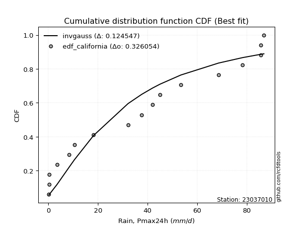</img>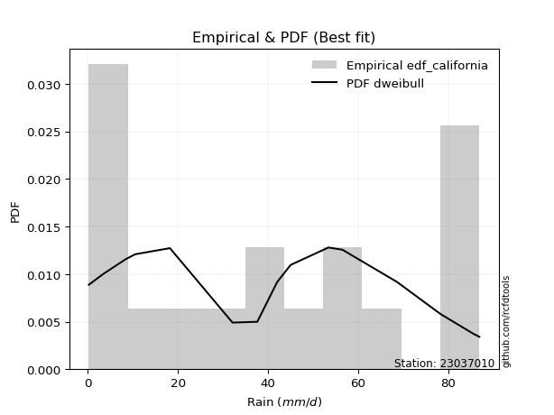</img>

</div>


### 2. Empirical - EDF Hazen (1930)

Hazen method for plotting positions is a formula used to estimate the empirical cumulative probability distribution of flood events or other hydrological data. This formula often results in biased estimations, particularly when extrapolating to extreme events (high return periods).

<div align="center">


$P=(m-0.5)/n$


</div>


**2.1. Empirical values**

<div align="center">

|                | 0                    | 1                   | 2                  | 3                   | 4                  | 5                  | 6                  | 7                  | 8                  | 9                  | 10                 | 11                 | 12                 | 13        | 14                 | 15                 | 16                 | 17                 |
|:---------------|:---------------------|:--------------------|:-------------------|:--------------------|:-------------------|:-------------------|:-------------------|:-------------------|:-------------------|:-------------------|:-------------------|:-------------------|:-------------------|:----------|:-------------------|:-------------------|:-------------------|:-------------------|
| date           | 2023                 | 2022                | 2025               | 2024                | 2020               | 2019               | 2018               | 2015               | 2006               | 2011               | 2017               | 2016               | 2005               | 2021      | 2013               | 2007               | 2008               | 2014               |
| x              | 0.2                  | 0.4                 | 0.4                | 0.4                 | 3.5                | 8.4                | 10.5               | 18.2               | 32.1               | 37.6               | 42.0               | 45.0               | 53.4               | 68.6      | 78.3               | 85.6               | 85.6               | 86.9               |
| m              | 1                    | 2                   | 3                  | 4                   | 5                  | 6                  | 7                  | 8                  | 9                  | 10                 | 11                 | 12                 | 13                 | 14        | 15                 | 16                 | 17                 | 18                 |
| empirical_dist | edf_hazen            | edf_hazen           | edf_hazen          | edf_hazen           | edf_hazen          | edf_hazen          | edf_hazen          | edf_hazen          | edf_hazen          | edf_hazen          | edf_hazen          | edf_hazen          | edf_hazen          | edf_hazen | edf_hazen          | edf_hazen          | edf_hazen          | edf_hazen          |
| empirical      | 0.027777777777777776 | 0.08333333333333333 | 0.1388888888888889 | 0.19444444444444445 | 0.25               | 0.3055555555555556 | 0.3611111111111111 | 0.4166666666666667 | 0.4722222222222222 | 0.5277777777777778 | 0.5833333333333334 | 0.6388888888888888 | 0.6944444444444444 | 0.75      | 0.8055555555555556 | 0.8611111111111112 | 0.9166666666666666 | 0.9722222222222222 |
| empirical_tr   | 1.0285714285714287   | 1.090909090909091   | 1.161290322580645  | 1.2413793103448276  | 1.3333333333333333 | 1.44               | 1.565217391304348  | 1.7142857142857144 | 1.894736842105263  | 2.1176470588235294 | 2.4000000000000004 | 2.7692307692307687 | 3.2727272727272725 | 4.0       | 5.142857142857143  | 7.200000000000003  | 11.999999999999995 | 35.999999999999986 |

</div>


**2.2. Kolmogorov-Smirnov fit test (sorted by Δ)**


<div align="center">

|                | 0                   | 1                   | 2                   | 3                   | 4                   | 5                   | 6                   | 7                     | 8                   | 9                   | 10                  | 11                  | 12                  | 13                  | 14                  | 15                  | 16                  | 17                  | 18                  | 19                  | 20                  | 21                  | 22                  | 23                  | 24                  | 25                  | 26                  | 27                  | 28                  | 29                  | 30                  | 31                  | 32                  | 33                  | 34                  | 35                  | 36                  | 37                  | 38                  | 39                  | 40                  | 41                  | 42                  | 43                  | 44                  | 45                  | 46                  | 47                  | 48                  | 49                  | 50                  | 51                  | 52                  | 53                  | 54                  | 55                  | 56                  | 57                  | 58                  | 59                  | 60                  | 61                  | 62                  | 63                  | 64                  | 65                  | 66                  | 67                  | 68                  | 69                  | 70                  | 71                  | 72                  | 73                  | 74                  | 75                  | 76                  | 77                  | 78                  | 79                  | 80                  | 81                  | 82                  | 83                  | 84                  | 85                  | 86                  | 87                  | 88                  | 89                  |
|:---------------|:--------------------|:--------------------|:--------------------|:--------------------|:--------------------|:--------------------|:--------------------|:----------------------|:--------------------|:--------------------|:--------------------|:--------------------|:--------------------|:--------------------|:--------------------|:--------------------|:--------------------|:--------------------|:--------------------|:--------------------|:--------------------|:--------------------|:--------------------|:--------------------|:--------------------|:--------------------|:--------------------|:--------------------|:--------------------|:--------------------|:--------------------|:--------------------|:--------------------|:--------------------|:--------------------|:--------------------|:--------------------|:--------------------|:--------------------|:--------------------|:--------------------|:--------------------|:--------------------|:--------------------|:--------------------|:--------------------|:--------------------|:--------------------|:--------------------|:--------------------|:--------------------|:--------------------|:--------------------|:--------------------|:--------------------|:--------------------|:--------------------|:--------------------|:--------------------|:--------------------|:--------------------|:--------------------|:--------------------|:--------------------|:--------------------|:--------------------|:--------------------|:--------------------|:--------------------|:--------------------|:--------------------|:--------------------|:--------------------|:--------------------|:--------------------|:--------------------|:--------------------|:--------------------|:--------------------|:--------------------|:--------------------|:--------------------|:--------------------|:--------------------|:--------------------|:--------------------|:--------------------|:--------------------|:--------------------|:--------------------|
| station        | 23037010            | 23037010            | 23037010            | 23037010            | 23037010            | 23037010            | 23037010            | 23037010              | 23037010            | 23037010            | 23037010            | 23037010            | 23037010            | 23037010            | 23037010            | 23037010            | 23037010            | 23037010            | 23037010            | 23037010            | 23037010            | 23037010            | 23037010            | 23037010            | 23037010            | 23037010            | 23037010            | 23037010            | 23037010            | 23037010            | 23037010            | 23037010            | 23037010            | 23037010            | 23037010            | 23037010            | 23037010            | 23037010            | 23037010            | 23037010            | 23037010            | 23037010            | 23037010            | 23037010            | 23037010            | 23037010            | 23037010            | 23037010            | 23037010            | 23037010            | 23037010            | 23037010            | 23037010            | 23037010            | 23037010            | 23037010            | 23037010            | 23037010            | 23037010            | 23037010            | 23037010            | 23037010            | 23037010            | 23037010            | 23037010            | 23037010            | 23037010            | 23037010            | 23037010            | 23037010            | 23037010            | 23037010            | 23037010            | 23037010            | 23037010            | 23037010            | 23037010            | 23037010            | 23037010            | 23037010            | 23037010            | 23037010            | 23037010            | 23037010            | 23037010            | 23037010            | 23037010            | 23037010            | 23037010            | 23037010            |
| empirical_dist | edf_hazen           | edf_hazen           | edf_hazen           | edf_hazen           | edf_hazen           | edf_hazen           | edf_hazen           | edf_hazen             | edf_hazen           | edf_hazen           | edf_hazen           | edf_hazen           | edf_hazen           | edf_hazen           | edf_hazen           | edf_hazen           | edf_hazen           | edf_hazen           | edf_hazen           | edf_hazen           | edf_hazen           | edf_hazen           | edf_hazen           | edf_hazen           | edf_hazen           | edf_hazen           | edf_hazen           | edf_hazen           | edf_hazen           | edf_hazen           | edf_hazen           | edf_hazen           | edf_hazen           | edf_hazen           | edf_hazen           | edf_hazen           | edf_hazen           | edf_hazen           | edf_hazen           | edf_hazen           | edf_hazen           | edf_hazen           | edf_hazen           | edf_hazen           | edf_hazen           | edf_hazen           | edf_hazen           | edf_hazen           | edf_hazen           | edf_hazen           | edf_hazen           | edf_hazen           | edf_hazen           | edf_hazen           | edf_hazen           | edf_hazen           | edf_hazen           | edf_hazen           | edf_hazen           | edf_hazen           | edf_hazen           | edf_hazen           | edf_hazen           | edf_hazen           | edf_hazen           | edf_hazen           | edf_hazen           | edf_hazen           | edf_hazen           | edf_hazen           | edf_hazen           | edf_hazen           | edf_hazen           | edf_hazen           | edf_hazen           | edf_hazen           | edf_hazen           | edf_hazen           | edf_hazen           | edf_hazen           | edf_hazen           | edf_hazen           | edf_hazen           | edf_hazen           | edf_hazen           | edf_hazen           | edf_hazen           | edf_hazen           | edf_hazen           | edf_hazen           |
| p_dist         | nct                 | halfnorm            | rayleigh            | ncf                 | nakagami            | maxwell             | genlogistic         | loglaplace_asymmetric | logloggamma         | invgamma            | kstwobign           | pearson3            | t                   | norm                | crystalball         | gumbel_r            | logjohnsonsu        | halflogistic        | laplace_asymmetric  | logpearson3         | loggumbel_l         | moyal               | logweibull_min      | rice                | logistic            | gumbel_l            | hypsecant           | betaprime           | exponnorm           | expon               | genexpon            | gompertz            | truncnorm           | f                   | laplace             | invgauss            | logbetaprime        | loginvweibull       | loglognorm          | loginvgauss         | logt                | lognorm             | lognorm             | logcrystalball      | logexponnorm        | lognct              | logfatiguelife      | lognakagami         | logerlang           | loginvgamma         | invweibull          | logrice             | loggamma            | loggamma            | mielke              | logmaxwell          | loggenexpon         | loglogistic         | weibull_min         | fisk                | logkstwobign        | lograyleigh         | logmielke           | loghypsecant        | loghalfnorm         | loggumbel_r         | loglaplace          | loghalflogistic     | logmoyal            | johnsonsu           | logexpon            | fatiguelife         | wald                | logncf              | erlang              | logwald             | gamma               | gibrat              | chi2                | loggibrat           | logfisk             | logtruncnorm        | logalpha            | logf                | pareto              | logpareto           | logchi2             | alpha               | loggompertz         | loggenlogistic      |
| delta          | 0.1139187233975234  | 0.11686388573659898 | 0.13042369487588387 | 0.13197138687269677 | 0.13395474507508964 | 0.13661369411924046 | 0.13904265619245315 | 0.14276667099693108   | 0.14304813478380418 | 0.14374894143405326 | 0.14416791075440152 | 0.14645779623580832 | 0.1514296663389012  | 0.15144686734582563 | 0.15144686892882478 | 0.15550357597998588 | 0.1557308410870144  | 0.15703568323473957 | 0.160995995587176   | 0.16571609019206124 | 0.16723267378003792 | 0.16726847829102104 | 0.17082432264003622 | 0.17251828636374614 | 0.17337690077466103 | 0.18042202246527203 | 0.1865778345320272  | 0.18788531226174532 | 0.1882275894886524  | 0.18895079127646697 | 0.1891948996782215  | 0.19005040350806887 | 0.19066917633084215 | 0.19349345566386777 | 0.2015370907987569  | 0.20167775023442924 | 0.20300066638401582 | 0.20349699324163062 | 0.20469557386095094 | 0.205762461395253   | 0.2070260904917417  | 0.2070264619114568  | 0.2070264619114568  | 0.20702655586891927 | 0.2070286540737798  | 0.20706625174594162 | 0.20740955147296924 | 0.20787790481695478 | 0.20806898289678655 | 0.20820150635583023 | 0.2098526605427975  | 0.21096330815788278 | 0.2112757365061978  | 0.2112757365061978  | 0.21713003306844791 | 0.2254032641657454  | 0.2257263592599238  | 0.22719052620828595 | 0.22727719049507877 | 0.22808603628756374 | 0.22868656116902697 | 0.2308345929091088  | 0.23274867513351793 | 0.24222943809557718 | 0.24699127080010752 | 0.2619484411135946  | 0.26895286468625035 | 0.2744691826888035  | 0.279856717666805   | 0.29244020571600116 | 0.29249340640362553 | 0.3014750555116733  | 0.3040675024257064  | 0.31530056413721763 | 0.31795594099007474 | 0.3315198168416684  | 0.3576733994207849  | 0.3611111111111111  | 0.3613735931755726  | 0.3633522342843304  | 0.36511676134300186 | 0.36672919764737066 | 0.3945686810140464  | 0.4085673002611584  | 0.4723056963200715  | 0.5348989693342906  | 0.619393958159218   | 0.6344489528549684  | 0.7246942572997422  | 0.9166666666666666  |
| deltao         | 0.32102346734599996 | 0.32102346734599996 | 0.32102346734599996 | 0.32102346734599996 | 0.32102346734599996 | 0.32102346734599996 | 0.32102346734599996 | 0.32102346734599996   | 0.32102346734599996 | 0.32102346734599996 | 0.32102346734599996 | 0.32102346734599996 | 0.32102346734599996 | 0.32102346734599996 | 0.32102346734599996 | 0.32102346734599996 | 0.32102346734599996 | 0.32102346734599996 | 0.32102346734599996 | 0.32102346734599996 | 0.32102346734599996 | 0.32102346734599996 | 0.32102346734599996 | 0.32102346734599996 | 0.32102346734599996 | 0.32102346734599996 | 0.32102346734599996 | 0.32102346734599996 | 0.32102346734599996 | 0.32102346734599996 | 0.32102346734599996 | 0.32102346734599996 | 0.32102346734599996 | 0.32102346734599996 | 0.32102346734599996 | 0.32102346734599996 | 0.32102346734599996 | 0.32102346734599996 | 0.32102346734599996 | 0.32102346734599996 | 0.32102346734599996 | 0.32102346734599996 | 0.32102346734599996 | 0.32102346734599996 | 0.32102346734599996 | 0.32102346734599996 | 0.32102346734599996 | 0.32102346734599996 | 0.32102346734599996 | 0.32102346734599996 | 0.32102346734599996 | 0.32102346734599996 | 0.32102346734599996 | 0.32102346734599996 | 0.32102346734599996 | 0.32102346734599996 | 0.32102346734599996 | 0.32102346734599996 | 0.32102346734599996 | 0.32102346734599996 | 0.32102346734599996 | 0.32102346734599996 | 0.32102346734599996 | 0.32102346734599996 | 0.32102346734599996 | 0.32102346734599996 | 0.32102346734599996 | 0.32102346734599996 | 0.32102346734599996 | 0.32102346734599996 | 0.32102346734599996 | 0.32102346734599996 | 0.32102346734599996 | 0.32102346734599996 | 0.32102346734599996 | 0.32102346734599996 | 0.32102346734599996 | 0.32102346734599996 | 0.32102346734599996 | 0.32102346734599996 | 0.32102346734599996 | 0.32102346734599996 | 0.32102346734599996 | 0.32102346734599996 | 0.32102346734599996 | 0.32102346734599996 | 0.32102346734599996 | 0.32102346734599996 | 0.32102346734599996 | 0.32102346734599996 |
| eval           | Δo > Δ              | Δo > Δ              | Δo > Δ              | Δo > Δ              | Δo > Δ              | Δo > Δ              | Δo > Δ              | Δo > Δ                | Δo > Δ              | Δo > Δ              | Δo > Δ              | Δo > Δ              | Δo > Δ              | Δo > Δ              | Δo > Δ              | Δo > Δ              | Δo > Δ              | Δo > Δ              | Δo > Δ              | Δo > Δ              | Δo > Δ              | Δo > Δ              | Δo > Δ              | Δo > Δ              | Δo > Δ              | Δo > Δ              | Δo > Δ              | Δo > Δ              | Δo > Δ              | Δo > Δ              | Δo > Δ              | Δo > Δ              | Δo > Δ              | Δo > Δ              | Δo > Δ              | Δo > Δ              | Δo > Δ              | Δo > Δ              | Δo > Δ              | Δo > Δ              | Δo > Δ              | Δo > Δ              | Δo > Δ              | Δo > Δ              | Δo > Δ              | Δo > Δ              | Δo > Δ              | Δo > Δ              | Δo > Δ              | Δo > Δ              | Δo > Δ              | Δo > Δ              | Δo > Δ              | Δo > Δ              | Δo > Δ              | Δo > Δ              | Δo > Δ              | Δo > Δ              | Δo > Δ              | Δo > Δ              | Δo > Δ              | Δo > Δ              | Δo > Δ              | Δo > Δ              | Δo > Δ              | Δo > Δ              | Δo > Δ              | Δo > Δ              | Δo > Δ              | Δo > Δ              | Δo > Δ              | Δo > Δ              | Δo > Δ              | Δo > Δ              | Δo > Δ              | Δo <= Δ             | Δo <= Δ             | Δo <= Δ             | Δo <= Δ             | Δo <= Δ             | Δo <= Δ             | Δo <= Δ             | Δo <= Δ             | Δo <= Δ             | Δo <= Δ             | Δo <= Δ             | Δo <= Δ             | Δo <= Δ             | Δo <= Δ             | Δo <= Δ             |
| fit            | 1                   | 1                   | 1                   | 1                   | 1                   | 1                   | 1                   | 1                     | 1                   | 1                   | 1                   | 1                   | 1                   | 1                   | 1                   | 1                   | 1                   | 1                   | 1                   | 1                   | 1                   | 1                   | 1                   | 1                   | 1                   | 1                   | 1                   | 1                   | 1                   | 1                   | 1                   | 1                   | 1                   | 1                   | 1                   | 1                   | 1                   | 1                   | 1                   | 1                   | 1                   | 1                   | 1                   | 1                   | 1                   | 1                   | 1                   | 1                   | 1                   | 1                   | 1                   | 1                   | 1                   | 1                   | 1                   | 1                   | 1                   | 1                   | 1                   | 1                   | 1                   | 1                   | 1                   | 1                   | 1                   | 1                   | 1                   | 1                   | 1                   | 1                   | 1                   | 1                   | 1                   | 1                   | 1                   | 0                   | 0                   | 0                   | 0                   | 0                   | 0                   | 0                   | 0                   | 0                   | 0                   | 0                   | 0                   | 0                   | 0                   | 0                   |
| n              | 18                  | 18                  | 18                  | 18                  | 18                  | 18                  | 18                  | 18                    | 18                  | 18                  | 18                  | 18                  | 18                  | 18                  | 18                  | 18                  | 18                  | 18                  | 18                  | 18                  | 18                  | 18                  | 18                  | 18                  | 18                  | 18                  | 18                  | 18                  | 18                  | 18                  | 18                  | 18                  | 18                  | 18                  | 18                  | 18                  | 18                  | 18                  | 18                  | 18                  | 18                  | 18                  | 18                  | 18                  | 18                  | 18                  | 18                  | 18                  | 18                  | 18                  | 18                  | 18                  | 18                  | 18                  | 18                  | 18                  | 18                  | 18                  | 18                  | 18                  | 18                  | 18                  | 18                  | 18                  | 18                  | 18                  | 18                  | 18                  | 18                  | 18                  | 18                  | 18                  | 18                  | 18                  | 18                  | 18                  | 18                  | 18                  | 18                  | 18                  | 18                  | 18                  | 18                  | 18                  | 18                  | 18                  | 18                  | 18                  | 18                  | 18                  |
| best_fit       | 1                   | 0                   | 0                   | 0                   | 0                   | 0                   | 0                   | 0                     | 0                   | 0                   | 0                   | 0                   | 0                   | 0                   | 0                   | 0                   | 0                   | 0                   | 0                   | 0                   | 0                   | 0                   | 0                   | 0                   | 0                   | 0                   | 0                   | 0                   | 0                   | 0                   | 0                   | 0                   | 0                   | 0                   | 0                   | 0                   | 0                   | 0                   | 0                   | 0                   | 0                   | 0                   | 0                   | 0                   | 0                   | 0                   | 0                   | 0                   | 0                   | 0                   | 0                   | 0                   | 0                   | 0                   | 0                   | 0                   | 0                   | 0                   | 0                   | 0                   | 0                   | 0                   | 0                   | 0                   | 0                   | 0                   | 0                   | 0                   | 0                   | 0                   | 0                   | 0                   | 0                   | 0                   | 0                   | 0                   | 0                   | 0                   | 0                   | 0                   | 0                   | 0                   | 0                   | 0                   | 0                   | 0                   | 0                   | 0                   | 0                   | 0                   |
| best_fit_sort  | 1                   | 2                   | 3                   | 4                   | 5                   | 6                   | 7                   | 8                     | 9                   | 10                  | 11                  | 12                  | 13                  | 14                  | 15                  | 16                  | 17                  | 18                  | 19                  | 20                  | 21                  | 22                  | 23                  | 24                  | 25                  | 26                  | 27                  | 28                  | 29                  | 30                  | 31                  | 32                  | 33                  | 34                  | 35                  | 36                  | 37                  | 38                  | 39                  | 40                  | 41                  | 42                  | 43                  | 44                  | 45                  | 46                  | 47                  | 48                  | 49                  | 50                  | 51                  | 52                  | 53                  | 54                  | 55                  | 56                  | 57                  | 58                  | 59                  | 60                  | 61                  | 62                  | 63                  | 64                  | 65                  | 66                  | 67                  | 68                  | 69                  | 70                  | 71                  | 72                  | 73                  | 74                  | 75                  | 76                  | 77                  | 78                  | 79                  | 80                  | 81                  | 82                  | 83                  | 84                  | 85                  | 86                  | 87                  | 88                  | 89                  | 90                  |

</div>


<div align="center">

</img>

</div>


**2.3. Best fit**

<div align="center">

|   id |   station | empirical_dist   | p_dist   |    delta |   deltao | eval   |   fit |   n |   best_fit |   best_fit_sort |
|-----:|----------:|:-----------------|:---------|---------:|---------:|:-------|------:|----:|-----------:|----------------:|
|    0 |  23037010 | edf_hazen        | nct      | 0.113919 | 0.321023 | Δo > Δ |     1 |  18 |          1 |               1 |

</div>


<div align="center">

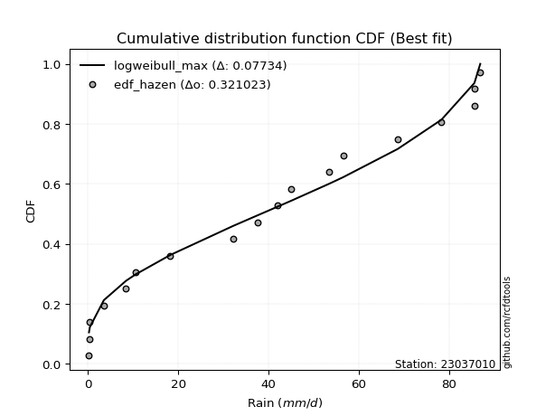</img></img>

</div>


### 3. Empirical - EDF Weibull (1939)

Weibull plotting position formula is an empirical method used to estimate the non-exceedance probability or plotting position for a set of observed data, is often recommended or widely used in practice, particularly in flood frequency analysis.

<div align="center">


$P=m/(n+1)$


</div>


**3.1. Empirical values**

<div align="center">

|                | 0                   | 1                   | 2                   | 3                   | 4                  | 5                  | 6                  | 7                   | 8                   | 9                  | 10                 | 11                | 12                 | 13                 | 14                 | 15                 | 16                 | 17                 |
|:---------------|:--------------------|:--------------------|:--------------------|:--------------------|:-------------------|:-------------------|:-------------------|:--------------------|:--------------------|:-------------------|:-------------------|:------------------|:-------------------|:-------------------|:-------------------|:-------------------|:-------------------|:-------------------|
| date           | 2023                | 2022                | 2025                | 2024                | 2020               | 2019               | 2018               | 2015                | 2006                | 2011               | 2017               | 2016              | 2005               | 2021               | 2013               | 2007               | 2008               | 2014               |
| x              | 0.2                 | 0.4                 | 0.4                 | 0.4                 | 3.5                | 8.4                | 10.5               | 18.2                | 32.1                | 37.6               | 42.0               | 45.0              | 53.4               | 68.6               | 78.3               | 85.6               | 85.6               | 86.9               |
| m              | 1                   | 2                   | 3                   | 4                   | 5                  | 6                  | 7                  | 8                   | 9                   | 10                 | 11                 | 12                | 13                 | 14                 | 15                 | 16                 | 17                 | 18                 |
| empirical_dist | edf_weibull         | edf_weibull         | edf_weibull         | edf_weibull         | edf_weibull        | edf_weibull        | edf_weibull        | edf_weibull         | edf_weibull         | edf_weibull        | edf_weibull        | edf_weibull       | edf_weibull        | edf_weibull        | edf_weibull        | edf_weibull        | edf_weibull        | edf_weibull        |
| empirical      | 0.05263157894736842 | 0.10526315789473684 | 0.15789473684210525 | 0.21052631578947367 | 0.2631578947368421 | 0.3157894736842105 | 0.3684210526315789 | 0.42105263157894735 | 0.47368421052631576 | 0.5263157894736842 | 0.5789473684210527 | 0.631578947368421 | 0.6842105263157895 | 0.7368421052631579 | 0.7894736842105263 | 0.8421052631578947 | 0.8947368421052632 | 0.9473684210526315 |
| empirical_tr   | 1.0555555555555556  | 1.1176470588235294  | 1.1875              | 1.2666666666666666  | 1.357142857142857  | 1.4615384615384615 | 1.5833333333333335 | 1.7272727272727273  | 1.8999999999999997  | 2.111111111111111  | 2.375              | 2.714285714285714 | 3.166666666666667  | 3.7999999999999994 | 4.75               | 6.333333333333331  | 9.5                | 18.999999999999982 |

</div>


**3.2. Kolmogorov-Smirnov fit test (sorted by Δ)**


<div align="center">

|                | 0                   | 1                   | 2                   | 3                   | 4                   | 5                   | 6                   | 7                   | 8                   | 9                   | 10                  | 11                  | 12                  | 13                  | 14                    | 15                  | 16                  | 17                  | 18                  | 19                  | 20                  | 21                  | 22                  | 23                  | 24                  | 25                  | 26                  | 27                  | 28                  | 29                  | 30                  | 31                  | 32                  | 33                  | 34                  | 35                  | 36                  | 37                  | 38                  | 39                  | 40                  | 41                  | 42                  | 43                  | 44                  | 45                  | 46                  | 47                  | 48                  | 49                  | 50                  | 51                  | 52                  | 53                  | 54                  | 55                  | 56                  | 57                  | 58                  | 59                  | 60                  | 61                  | 62                  | 63                  | 64                  | 65                  | 66                  | 67                  | 68                  | 69                  | 70                  | 71                  | 72                  | 73                  | 74                  | 75                  | 76                  | 77                  | 78                  | 79                  | 80                  | 81                  | 82                  | 83                  | 84                  | 85                  | 86                  | 87                  | 88                  | 89                  |
|:---------------|:--------------------|:--------------------|:--------------------|:--------------------|:--------------------|:--------------------|:--------------------|:--------------------|:--------------------|:--------------------|:--------------------|:--------------------|:--------------------|:--------------------|:----------------------|:--------------------|:--------------------|:--------------------|:--------------------|:--------------------|:--------------------|:--------------------|:--------------------|:--------------------|:--------------------|:--------------------|:--------------------|:--------------------|:--------------------|:--------------------|:--------------------|:--------------------|:--------------------|:--------------------|:--------------------|:--------------------|:--------------------|:--------------------|:--------------------|:--------------------|:--------------------|:--------------------|:--------------------|:--------------------|:--------------------|:--------------------|:--------------------|:--------------------|:--------------------|:--------------------|:--------------------|:--------------------|:--------------------|:--------------------|:--------------------|:--------------------|:--------------------|:--------------------|:--------------------|:--------------------|:--------------------|:--------------------|:--------------------|:--------------------|:--------------------|:--------------------|:--------------------|:--------------------|:--------------------|:--------------------|:--------------------|:--------------------|:--------------------|:--------------------|:--------------------|:--------------------|:--------------------|:--------------------|:--------------------|:--------------------|:--------------------|:--------------------|:--------------------|:--------------------|:--------------------|:--------------------|:--------------------|:--------------------|:--------------------|:--------------------|
| station        | 23037010            | 23037010            | 23037010            | 23037010            | 23037010            | 23037010            | 23037010            | 23037010            | 23037010            | 23037010            | 23037010            | 23037010            | 23037010            | 23037010            | 23037010              | 23037010            | 23037010            | 23037010            | 23037010            | 23037010            | 23037010            | 23037010            | 23037010            | 23037010            | 23037010            | 23037010            | 23037010            | 23037010            | 23037010            | 23037010            | 23037010            | 23037010            | 23037010            | 23037010            | 23037010            | 23037010            | 23037010            | 23037010            | 23037010            | 23037010            | 23037010            | 23037010            | 23037010            | 23037010            | 23037010            | 23037010            | 23037010            | 23037010            | 23037010            | 23037010            | 23037010            | 23037010            | 23037010            | 23037010            | 23037010            | 23037010            | 23037010            | 23037010            | 23037010            | 23037010            | 23037010            | 23037010            | 23037010            | 23037010            | 23037010            | 23037010            | 23037010            | 23037010            | 23037010            | 23037010            | 23037010            | 23037010            | 23037010            | 23037010            | 23037010            | 23037010            | 23037010            | 23037010            | 23037010            | 23037010            | 23037010            | 23037010            | 23037010            | 23037010            | 23037010            | 23037010            | 23037010            | 23037010            | 23037010            | 23037010            |
| empirical_dist | edf_weibull         | edf_weibull         | edf_weibull         | edf_weibull         | edf_weibull         | edf_weibull         | edf_weibull         | edf_weibull         | edf_weibull         | edf_weibull         | edf_weibull         | edf_weibull         | edf_weibull         | edf_weibull         | edf_weibull           | edf_weibull         | edf_weibull         | edf_weibull         | edf_weibull         | edf_weibull         | edf_weibull         | edf_weibull         | edf_weibull         | edf_weibull         | edf_weibull         | edf_weibull         | edf_weibull         | edf_weibull         | edf_weibull         | edf_weibull         | edf_weibull         | edf_weibull         | edf_weibull         | edf_weibull         | edf_weibull         | edf_weibull         | edf_weibull         | edf_weibull         | edf_weibull         | edf_weibull         | edf_weibull         | edf_weibull         | edf_weibull         | edf_weibull         | edf_weibull         | edf_weibull         | edf_weibull         | edf_weibull         | edf_weibull         | edf_weibull         | edf_weibull         | edf_weibull         | edf_weibull         | edf_weibull         | edf_weibull         | edf_weibull         | edf_weibull         | edf_weibull         | edf_weibull         | edf_weibull         | edf_weibull         | edf_weibull         | edf_weibull         | edf_weibull         | edf_weibull         | edf_weibull         | edf_weibull         | edf_weibull         | edf_weibull         | edf_weibull         | edf_weibull         | edf_weibull         | edf_weibull         | edf_weibull         | edf_weibull         | edf_weibull         | edf_weibull         | edf_weibull         | edf_weibull         | edf_weibull         | edf_weibull         | edf_weibull         | edf_weibull         | edf_weibull         | edf_weibull         | edf_weibull         | edf_weibull         | edf_weibull         | edf_weibull         | edf_weibull         |
| p_dist         | nct                 | halfnorm            | nakagami            | rayleigh            | invgamma            | maxwell             | genlogistic         | ncf                 | logjohnsonsu        | kstwobign           | pearson3            | t                   | norm                | crystalball         | loglaplace_asymmetric | logloggamma         | gumbel_r            | logpearson3         | loggumbel_l         | laplace_asymmetric  | f                   | logweibull_min      | halflogistic        | moyal               | rice                | logistic            | betaprime           | gumbel_l            | hypsecant           | invweibull          | invgauss            | logbetaprime        | loginvweibull       | weibull_min         | fisk                | loglognorm          | loginvgauss         | exponnorm           | expon               | genexpon            | logt                | lognorm             | lognorm             | logcrystalball      | logexponnorm        | lognct              | logfatiguelife      | gompertz            | lognakagami         | logerlang           | loginvgamma         | truncnorm           | laplace             | logrice             | loggamma            | loggamma            | mielke              | logmielke           | logmaxwell          | loggenexpon         | loglogistic         | logkstwobign        | lograyleigh         | loghypsecant        | loghalfnorm         | loggumbel_r         | loglaplace          | loghalflogistic     | logmoyal            | johnsonsu           | logexpon            | logncf              | fatiguelife         | wald                | erlang              | logwald             | logfisk             | gamma               | chi2                | loggibrat           | logtruncnorm        | gibrat              | logalpha            | logf                | pareto              | logpareto           | logchi2             | alpha               | loggompertz         | loggenlogistic      |
| delta          | 0.12388463970153168 | 0.1241738272570668  | 0.12928635951494208 | 0.1377336363963517  | 0.1422869531299597  | 0.14392363563970828 | 0.14635259771292097 | 0.148053258217726   | 0.1481313661008672  | 0.15147785227486935 | 0.15376773775627614 | 0.15873960785936903 | 0.15875680886629345 | 0.1587568104492926  | 0.15884854234196033   | 0.15913000612883343 | 0.1628135175004537  | 0.16425410188796769 | 0.16577068547594437 | 0.16830593710764383 | 0.1686396544942771  | 0.16936233433594267 | 0.1731175545797688  | 0.17457841981148886 | 0.17982822788421396 | 0.18068684229512885 | 0.18642332395765177 | 0.18773196398573985 | 0.19388777605249502 | 0.1977875156794155  | 0.2002157619303357  | 0.20153867807992226 | 0.20203500493753707 | 0.2024233893254881  | 0.20323223511797306 | 0.2032335855568574  | 0.20430047309115945 | 0.20430946083368162 | 0.2050326626214962  | 0.20527677102325073 | 0.20556410218764815 | 0.20556447360736324 | 0.20556447360736324 | 0.20556456756482572 | 0.20556666576968624 | 0.20560426344184807 | 0.2059475631688757  | 0.2061322748530981  | 0.20641591651286123 | 0.206606994592693   | 0.20673951805173668 | 0.20675104767587138 | 0.20884703231922472 | 0.20950131985378923 | 0.20981374820210424 | 0.20981374820210424 | 0.21566804476435436 | 0.222514757004863   | 0.22394127586165186 | 0.22426437095583024 | 0.2257285379041924  | 0.22722457286493342 | 0.22937260460501524 | 0.24076744979148362 | 0.24552928249601397 | 0.26048645280950106 | 0.2674908763821568  | 0.27300719438470994 | 0.2783947293627114  | 0.2822062875873462  | 0.2822594882749706  | 0.29044676296762695 | 0.29849770051790164 | 0.3113774439461742  | 0.3164939526859812  | 0.33005782853757487 | 0.3402629601734112  | 0.35621141111669136 | 0.35991160487147905 | 0.36189024598023684 | 0.3652672093432771  | 0.3684210526315789  | 0.3843347628853915  | 0.3954094055243163  | 0.450375871758668   | 0.5129691447728871  | 0.606236063422376   | 0.6242150347263135  | 0.7115363625629001  | 0.8947368421052632  |
| deltao         | 0.32102346734599996 | 0.32102346734599996 | 0.32102346734599996 | 0.32102346734599996 | 0.32102346734599996 | 0.32102346734599996 | 0.32102346734599996 | 0.32102346734599996 | 0.32102346734599996 | 0.32102346734599996 | 0.32102346734599996 | 0.32102346734599996 | 0.32102346734599996 | 0.32102346734599996 | 0.32102346734599996   | 0.32102346734599996 | 0.32102346734599996 | 0.32102346734599996 | 0.32102346734599996 | 0.32102346734599996 | 0.32102346734599996 | 0.32102346734599996 | 0.32102346734599996 | 0.32102346734599996 | 0.32102346734599996 | 0.32102346734599996 | 0.32102346734599996 | 0.32102346734599996 | 0.32102346734599996 | 0.32102346734599996 | 0.32102346734599996 | 0.32102346734599996 | 0.32102346734599996 | 0.32102346734599996 | 0.32102346734599996 | 0.32102346734599996 | 0.32102346734599996 | 0.32102346734599996 | 0.32102346734599996 | 0.32102346734599996 | 0.32102346734599996 | 0.32102346734599996 | 0.32102346734599996 | 0.32102346734599996 | 0.32102346734599996 | 0.32102346734599996 | 0.32102346734599996 | 0.32102346734599996 | 0.32102346734599996 | 0.32102346734599996 | 0.32102346734599996 | 0.32102346734599996 | 0.32102346734599996 | 0.32102346734599996 | 0.32102346734599996 | 0.32102346734599996 | 0.32102346734599996 | 0.32102346734599996 | 0.32102346734599996 | 0.32102346734599996 | 0.32102346734599996 | 0.32102346734599996 | 0.32102346734599996 | 0.32102346734599996 | 0.32102346734599996 | 0.32102346734599996 | 0.32102346734599996 | 0.32102346734599996 | 0.32102346734599996 | 0.32102346734599996 | 0.32102346734599996 | 0.32102346734599996 | 0.32102346734599996 | 0.32102346734599996 | 0.32102346734599996 | 0.32102346734599996 | 0.32102346734599996 | 0.32102346734599996 | 0.32102346734599996 | 0.32102346734599996 | 0.32102346734599996 | 0.32102346734599996 | 0.32102346734599996 | 0.32102346734599996 | 0.32102346734599996 | 0.32102346734599996 | 0.32102346734599996 | 0.32102346734599996 | 0.32102346734599996 | 0.32102346734599996 |
| eval           | Δo > Δ              | Δo > Δ              | Δo > Δ              | Δo > Δ              | Δo > Δ              | Δo > Δ              | Δo > Δ              | Δo > Δ              | Δo > Δ              | Δo > Δ              | Δo > Δ              | Δo > Δ              | Δo > Δ              | Δo > Δ              | Δo > Δ                | Δo > Δ              | Δo > Δ              | Δo > Δ              | Δo > Δ              | Δo > Δ              | Δo > Δ              | Δo > Δ              | Δo > Δ              | Δo > Δ              | Δo > Δ              | Δo > Δ              | Δo > Δ              | Δo > Δ              | Δo > Δ              | Δo > Δ              | Δo > Δ              | Δo > Δ              | Δo > Δ              | Δo > Δ              | Δo > Δ              | Δo > Δ              | Δo > Δ              | Δo > Δ              | Δo > Δ              | Δo > Δ              | Δo > Δ              | Δo > Δ              | Δo > Δ              | Δo > Δ              | Δo > Δ              | Δo > Δ              | Δo > Δ              | Δo > Δ              | Δo > Δ              | Δo > Δ              | Δo > Δ              | Δo > Δ              | Δo > Δ              | Δo > Δ              | Δo > Δ              | Δo > Δ              | Δo > Δ              | Δo > Δ              | Δo > Δ              | Δo > Δ              | Δo > Δ              | Δo > Δ              | Δo > Δ              | Δo > Δ              | Δo > Δ              | Δo > Δ              | Δo > Δ              | Δo > Δ              | Δo > Δ              | Δo > Δ              | Δo > Δ              | Δo > Δ              | Δo > Δ              | Δo > Δ              | Δo > Δ              | Δo <= Δ             | Δo <= Δ             | Δo <= Δ             | Δo <= Δ             | Δo <= Δ             | Δo <= Δ             | Δo <= Δ             | Δo <= Δ             | Δo <= Δ             | Δo <= Δ             | Δo <= Δ             | Δo <= Δ             | Δo <= Δ             | Δo <= Δ             | Δo <= Δ             |
| fit            | 1                   | 1                   | 1                   | 1                   | 1                   | 1                   | 1                   | 1                   | 1                   | 1                   | 1                   | 1                   | 1                   | 1                   | 1                     | 1                   | 1                   | 1                   | 1                   | 1                   | 1                   | 1                   | 1                   | 1                   | 1                   | 1                   | 1                   | 1                   | 1                   | 1                   | 1                   | 1                   | 1                   | 1                   | 1                   | 1                   | 1                   | 1                   | 1                   | 1                   | 1                   | 1                   | 1                   | 1                   | 1                   | 1                   | 1                   | 1                   | 1                   | 1                   | 1                   | 1                   | 1                   | 1                   | 1                   | 1                   | 1                   | 1                   | 1                   | 1                   | 1                   | 1                   | 1                   | 1                   | 1                   | 1                   | 1                   | 1                   | 1                   | 1                   | 1                   | 1                   | 1                   | 1                   | 1                   | 0                   | 0                   | 0                   | 0                   | 0                   | 0                   | 0                   | 0                   | 0                   | 0                   | 0                   | 0                   | 0                   | 0                   | 0                   |
| n              | 18                  | 18                  | 18                  | 18                  | 18                  | 18                  | 18                  | 18                  | 18                  | 18                  | 18                  | 18                  | 18                  | 18                  | 18                    | 18                  | 18                  | 18                  | 18                  | 18                  | 18                  | 18                  | 18                  | 18                  | 18                  | 18                  | 18                  | 18                  | 18                  | 18                  | 18                  | 18                  | 18                  | 18                  | 18                  | 18                  | 18                  | 18                  | 18                  | 18                  | 18                  | 18                  | 18                  | 18                  | 18                  | 18                  | 18                  | 18                  | 18                  | 18                  | 18                  | 18                  | 18                  | 18                  | 18                  | 18                  | 18                  | 18                  | 18                  | 18                  | 18                  | 18                  | 18                  | 18                  | 18                  | 18                  | 18                  | 18                  | 18                  | 18                  | 18                  | 18                  | 18                  | 18                  | 18                  | 18                  | 18                  | 18                  | 18                  | 18                  | 18                  | 18                  | 18                  | 18                  | 18                  | 18                  | 18                  | 18                  | 18                  | 18                  |
| best_fit       | 1                   | 0                   | 0                   | 0                   | 0                   | 0                   | 0                   | 0                   | 0                   | 0                   | 0                   | 0                   | 0                   | 0                   | 0                     | 0                   | 0                   | 0                   | 0                   | 0                   | 0                   | 0                   | 0                   | 0                   | 0                   | 0                   | 0                   | 0                   | 0                   | 0                   | 0                   | 0                   | 0                   | 0                   | 0                   | 0                   | 0                   | 0                   | 0                   | 0                   | 0                   | 0                   | 0                   | 0                   | 0                   | 0                   | 0                   | 0                   | 0                   | 0                   | 0                   | 0                   | 0                   | 0                   | 0                   | 0                   | 0                   | 0                   | 0                   | 0                   | 0                   | 0                   | 0                   | 0                   | 0                   | 0                   | 0                   | 0                   | 0                   | 0                   | 0                   | 0                   | 0                   | 0                   | 0                   | 0                   | 0                   | 0                   | 0                   | 0                   | 0                   | 0                   | 0                   | 0                   | 0                   | 0                   | 0                   | 0                   | 0                   | 0                   |
| best_fit_sort  | 1                   | 2                   | 3                   | 4                   | 5                   | 6                   | 7                   | 8                   | 9                   | 10                  | 11                  | 12                  | 13                  | 14                  | 15                    | 16                  | 17                  | 18                  | 19                  | 20                  | 21                  | 22                  | 23                  | 24                  | 25                  | 26                  | 27                  | 28                  | 29                  | 30                  | 31                  | 32                  | 33                  | 34                  | 35                  | 36                  | 37                  | 38                  | 39                  | 40                  | 41                  | 42                  | 43                  | 44                  | 45                  | 46                  | 47                  | 48                  | 49                  | 50                  | 51                  | 52                  | 53                  | 54                  | 55                  | 56                  | 57                  | 58                  | 59                  | 60                  | 61                  | 62                  | 63                  | 64                  | 65                  | 66                  | 67                  | 68                  | 69                  | 70                  | 71                  | 72                  | 73                  | 74                  | 75                  | 76                  | 77                  | 78                  | 79                  | 80                  | 81                  | 82                  | 83                  | 84                  | 85                  | 86                  | 87                  | 88                  | 89                  | 90                  |

</div>


<div align="center">

</img>

</div>


**3.3. Best fit**

<div align="center">

|   id |   station | empirical_dist   | p_dist   |    delta |   deltao | eval   |   fit |   n |   best_fit |   best_fit_sort |
|-----:|----------:|:-----------------|:---------|---------:|---------:|:-------|------:|----:|-----------:|----------------:|
|    0 |  23037010 | edf_weibull      | nct      | 0.123885 | 0.321023 | Δo > Δ |     1 |  18 |          1 |               1 |

</div>


<div align="center">

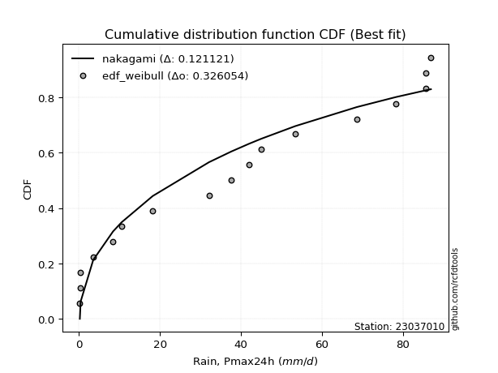</img>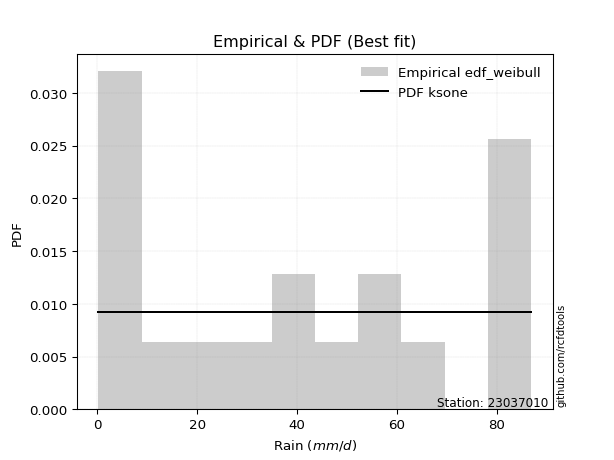</img>

</div>


### 4. Empirical - EDF Beard (1943)

The Beard formula (or Beard´s plotting position formula) in hydrology is used to estimate the empirical non-exceedance probability _(P)_ of a flood event (or other extreme hydrological data point) within a given dataset.

<div align="center">


$P=(m-0.31)/(n+0.38)$


</div>


**4.1. Empirical values**

<div align="center">

|                | 0                   | 1                   | 2                   | 3                   | 4                  | 5                   | 6                  | 7                  | 8                   | 9                  | 10                 | 11                 | 12                | 13                 | 14                 | 15                 | 16                 | 17                 |
|:---------------|:--------------------|:--------------------|:--------------------|:--------------------|:-------------------|:--------------------|:-------------------|:-------------------|:--------------------|:-------------------|:-------------------|:-------------------|:------------------|:-------------------|:-------------------|:-------------------|:-------------------|:-------------------|
| date           | 2023                | 2022                | 2025                | 2024                | 2020               | 2019                | 2018               | 2015               | 2006                | 2011               | 2017               | 2016               | 2005              | 2021               | 2013               | 2007               | 2008               | 2014               |
| x              | 0.2                 | 0.4                 | 0.4                 | 0.4                 | 3.5                | 8.4                 | 10.5               | 18.2               | 32.1                | 37.6               | 42.0               | 45.0               | 53.4              | 68.6               | 78.3               | 85.6               | 85.6               | 86.9               |
| m              | 1                   | 2                   | 3                   | 4                   | 5                  | 6                   | 7                  | 8                  | 9                   | 10                 | 11                 | 12                 | 13                | 14                 | 15                 | 16                 | 17                 | 18                 |
| empirical_dist | edf_beard           | edf_beard           | edf_beard           | edf_beard           | edf_beard          | edf_beard           | edf_beard          | edf_beard          | edf_beard           | edf_beard          | edf_beard          | edf_beard          | edf_beard         | edf_beard          | edf_beard          | edf_beard          | edf_beard          | edf_beard          |
| empirical      | 0.03754080522306855 | 0.09194776931447225 | 0.14635473340587596 | 0.20076169749727965 | 0.2551686615886834 | 0.30957562568008706 | 0.3639825897714908 | 0.4183895538628945 | 0.47279651795429817 | 0.5272034820457019 | 0.5816104461371056 | 0.6360174102285092 | 0.690424374319913 | 0.7448313384113167 | 0.7992383025027203 | 0.8536452665941241 | 0.9080522306855279 | 0.9624591947769315 |
| empirical_tr   | 1.0390050876201244  | 1.1012582384661473  | 1.17144678138942    | 1.2511912865895167  | 1.3425858290723158 | 1.4483845547675334  | 1.572284003421728  | 1.7193638914873717 | 1.896800825593395   | 2.1150747986191027 | 2.390117035110533  | 2.747384155455904  | 3.230228471001758 | 3.9189765458422174 | 4.981029810298102  | 6.832713754646843  | 10.875739644970428 | 26.637681159420353 |

</div>


**4.2. Kolmogorov-Smirnov fit test (sorted by Δ)**


<div align="center">

|                | 0                   | 1                   | 2                   | 3                   | 4                   | 5                   | 6                   | 7                   | 8                   | 9                     | 10                  | 11                  | 12                  | 13                  | 14                  | 15                  | 16                  | 17                  | 18                  | 19                  | 20                  | 21                  | 22                  | 23                  | 24                  | 25                  | 26                  | 27                  | 28                  | 29                  | 30                  | 31                  | 32                  | 33                  | 34                  | 35                  | 36                  | 37                  | 38                  | 39                  | 40                  | 41                  | 42                  | 43                  | 44                  | 45                  | 46                  | 47                  | 48                  | 49                  | 50                  | 51                  | 52                  | 53                  | 54                  | 55                  | 56                  | 57                  | 58                  | 59                  | 60                  | 61                  | 62                  | 63                  | 64                  | 65                  | 66                  | 67                  | 68                  | 69                  | 70                  | 71                  | 72                  | 73                  | 74                  | 75                  | 76                  | 77                  | 78                  | 79                  | 80                  | 81                  | 82                  | 83                  | 84                  | 85                  | 86                  | 87                  | 88                  | 89                  |
|:---------------|:--------------------|:--------------------|:--------------------|:--------------------|:--------------------|:--------------------|:--------------------|:--------------------|:--------------------|:----------------------|:--------------------|:--------------------|:--------------------|:--------------------|:--------------------|:--------------------|:--------------------|:--------------------|:--------------------|:--------------------|:--------------------|:--------------------|:--------------------|:--------------------|:--------------------|:--------------------|:--------------------|:--------------------|:--------------------|:--------------------|:--------------------|:--------------------|:--------------------|:--------------------|:--------------------|:--------------------|:--------------------|:--------------------|:--------------------|:--------------------|:--------------------|:--------------------|:--------------------|:--------------------|:--------------------|:--------------------|:--------------------|:--------------------|:--------------------|:--------------------|:--------------------|:--------------------|:--------------------|:--------------------|:--------------------|:--------------------|:--------------------|:--------------------|:--------------------|:--------------------|:--------------------|:--------------------|:--------------------|:--------------------|:--------------------|:--------------------|:--------------------|:--------------------|:--------------------|:--------------------|:--------------------|:--------------------|:--------------------|:--------------------|:--------------------|:--------------------|:--------------------|:--------------------|:--------------------|:--------------------|:--------------------|:--------------------|:--------------------|:--------------------|:--------------------|:--------------------|:--------------------|:--------------------|:--------------------|:--------------------|
| station        | 23037010            | 23037010            | 23037010            | 23037010            | 23037010            | 23037010            | 23037010            | 23037010            | 23037010            | 23037010              | 23037010            | 23037010            | 23037010            | 23037010            | 23037010            | 23037010            | 23037010            | 23037010            | 23037010            | 23037010            | 23037010            | 23037010            | 23037010            | 23037010            | 23037010            | 23037010            | 23037010            | 23037010            | 23037010            | 23037010            | 23037010            | 23037010            | 23037010            | 23037010            | 23037010            | 23037010            | 23037010            | 23037010            | 23037010            | 23037010            | 23037010            | 23037010            | 23037010            | 23037010            | 23037010            | 23037010            | 23037010            | 23037010            | 23037010            | 23037010            | 23037010            | 23037010            | 23037010            | 23037010            | 23037010            | 23037010            | 23037010            | 23037010            | 23037010            | 23037010            | 23037010            | 23037010            | 23037010            | 23037010            | 23037010            | 23037010            | 23037010            | 23037010            | 23037010            | 23037010            | 23037010            | 23037010            | 23037010            | 23037010            | 23037010            | 23037010            | 23037010            | 23037010            | 23037010            | 23037010            | 23037010            | 23037010            | 23037010            | 23037010            | 23037010            | 23037010            | 23037010            | 23037010            | 23037010            | 23037010            |
| empirical_dist | edf_beard           | edf_beard           | edf_beard           | edf_beard           | edf_beard           | edf_beard           | edf_beard           | edf_beard           | edf_beard           | edf_beard             | edf_beard           | edf_beard           | edf_beard           | edf_beard           | edf_beard           | edf_beard           | edf_beard           | edf_beard           | edf_beard           | edf_beard           | edf_beard           | edf_beard           | edf_beard           | edf_beard           | edf_beard           | edf_beard           | edf_beard           | edf_beard           | edf_beard           | edf_beard           | edf_beard           | edf_beard           | edf_beard           | edf_beard           | edf_beard           | edf_beard           | edf_beard           | edf_beard           | edf_beard           | edf_beard           | edf_beard           | edf_beard           | edf_beard           | edf_beard           | edf_beard           | edf_beard           | edf_beard           | edf_beard           | edf_beard           | edf_beard           | edf_beard           | edf_beard           | edf_beard           | edf_beard           | edf_beard           | edf_beard           | edf_beard           | edf_beard           | edf_beard           | edf_beard           | edf_beard           | edf_beard           | edf_beard           | edf_beard           | edf_beard           | edf_beard           | edf_beard           | edf_beard           | edf_beard           | edf_beard           | edf_beard           | edf_beard           | edf_beard           | edf_beard           | edf_beard           | edf_beard           | edf_beard           | edf_beard           | edf_beard           | edf_beard           | edf_beard           | edf_beard           | edf_beard           | edf_beard           | edf_beard           | edf_beard           | edf_beard           | edf_beard           | edf_beard           | edf_beard           |
| p_dist         | nct                 | halfnorm            | nakagami            | rayleigh            | ncf                 | maxwell             | genlogistic         | invgamma            | kstwobign           | loglaplace_asymmetric | pearson3            | logloggamma         | logjohnsonsu        | t                   | norm                | crystalball         | gumbel_r            | halflogistic        | laplace_asymmetric  | logpearson3         | loggumbel_l         | moyal               | logweibull_min      | rice                | logistic            | gumbel_l            | f                   | betaprime           | hypsecant           | exponnorm           | expon               | genexpon            | gompertz            | truncnorm           | invgauss            | invweibull          | logbetaprime        | loginvweibull       | loglognorm          | laplace             | loginvgauss         | logt                | lognorm             | lognorm             | logcrystalball      | logexponnorm        | lognct              | logfatiguelife      | lognakagami         | logerlang           | loginvgamma         | logrice             | loggamma            | loggamma            | mielke              | weibull_min         | fisk                | logmaxwell          | loggenexpon         | loglogistic         | logkstwobign        | logmielke           | lograyleigh         | loghypsecant        | loghalfnorm         | loggumbel_r         | loglaplace          | loghalflogistic     | logmoyal            | johnsonsu           | logexpon            | fatiguelife         | logncf              | wald                | erlang              | logwald             | logfisk             | gamma               | chi2                | loggibrat           | gibrat              | logtruncnorm        | logalpha            | logf                | pareto              | logpareto           | logchi2             | alpha               | loggompertz         | loggenlogistic      |
| delta          | 0.11589540655337299 | 0.11973536439697866 | 0.12419171762979897 | 0.13329517353626355 | 0.13828863992553198 | 0.13948517277962014 | 0.14191413485283283 | 0.1431746457019773  | 0.1470393894147812  | 0.14908392404976634   | 0.149329274896188   | 0.14936538783663944 | 0.1525698289609554  | 0.15430114499928088 | 0.1543183460062053  | 0.15431834758920446 | 0.15837505464036555 | 0.16335293628757477 | 0.16386747424755568 | 0.16514179445998528 | 0.16665837804796196 | 0.17013995695140072 | 0.17025002690796026 | 0.17538976502412582 | 0.1762483794350407  | 0.1832935011256517  | 0.1837304282185771  | 0.18731101652966936 | 0.18944931319240688 | 0.1945448425414876  | 0.19526804432930217 | 0.1955121527310567  | 0.19636765656090407 | 0.19698642938367736 | 0.20110345450235328 | 0.20214278090067678 | 0.20242637065193986 | 0.20292269750955466 | 0.20412127812887498 | 0.20440856945913657 | 0.20518816566317705 | 0.20645179475966574 | 0.20645216617938084 | 0.20645216617938084 | 0.2064522601368433  | 0.20645435834170384 | 0.20649195601386566 | 0.2068352557408933  | 0.20730360908487883 | 0.2074946871647106  | 0.20762721062375428 | 0.21038901242580682 | 0.21070144077412184 | 0.21070144077412184 | 0.21655573733637196 | 0.2175141630497881  | 0.21832300884227307 | 0.22482896843366945 | 0.22515206352784783 | 0.22661623047621    | 0.228112265436951   | 0.22872860500898645 | 0.23026029717703284 | 0.24165514236350122 | 0.24641697506803156 | 0.26137414538151865 | 0.2683785689541744  | 0.27389488695672753 | 0.279282421934729   | 0.2884201355914697  | 0.28847333627909405 | 0.29938539308991924 | 0.30553753669192696 | 0.3069389810860861  | 0.3173816452579988  | 0.33094552110959247 | 0.3553537338977112  | 0.35709910368870895 | 0.36079929744349665 | 0.36277793855225443 | 0.3639825897714908  | 0.3661549019152947  | 0.3905486108895149  | 0.403398638672475   | 0.4636912603389326  | 0.5262845333531517  | 0.6142252965705346  | 0.630428882730437   | 0.7195255957110589  | 0.9080522306855279  |
| deltao         | 0.32102346734599996 | 0.32102346734599996 | 0.32102346734599996 | 0.32102346734599996 | 0.32102346734599996 | 0.32102346734599996 | 0.32102346734599996 | 0.32102346734599996 | 0.32102346734599996 | 0.32102346734599996   | 0.32102346734599996 | 0.32102346734599996 | 0.32102346734599996 | 0.32102346734599996 | 0.32102346734599996 | 0.32102346734599996 | 0.32102346734599996 | 0.32102346734599996 | 0.32102346734599996 | 0.32102346734599996 | 0.32102346734599996 | 0.32102346734599996 | 0.32102346734599996 | 0.32102346734599996 | 0.32102346734599996 | 0.32102346734599996 | 0.32102346734599996 | 0.32102346734599996 | 0.32102346734599996 | 0.32102346734599996 | 0.32102346734599996 | 0.32102346734599996 | 0.32102346734599996 | 0.32102346734599996 | 0.32102346734599996 | 0.32102346734599996 | 0.32102346734599996 | 0.32102346734599996 | 0.32102346734599996 | 0.32102346734599996 | 0.32102346734599996 | 0.32102346734599996 | 0.32102346734599996 | 0.32102346734599996 | 0.32102346734599996 | 0.32102346734599996 | 0.32102346734599996 | 0.32102346734599996 | 0.32102346734599996 | 0.32102346734599996 | 0.32102346734599996 | 0.32102346734599996 | 0.32102346734599996 | 0.32102346734599996 | 0.32102346734599996 | 0.32102346734599996 | 0.32102346734599996 | 0.32102346734599996 | 0.32102346734599996 | 0.32102346734599996 | 0.32102346734599996 | 0.32102346734599996 | 0.32102346734599996 | 0.32102346734599996 | 0.32102346734599996 | 0.32102346734599996 | 0.32102346734599996 | 0.32102346734599996 | 0.32102346734599996 | 0.32102346734599996 | 0.32102346734599996 | 0.32102346734599996 | 0.32102346734599996 | 0.32102346734599996 | 0.32102346734599996 | 0.32102346734599996 | 0.32102346734599996 | 0.32102346734599996 | 0.32102346734599996 | 0.32102346734599996 | 0.32102346734599996 | 0.32102346734599996 | 0.32102346734599996 | 0.32102346734599996 | 0.32102346734599996 | 0.32102346734599996 | 0.32102346734599996 | 0.32102346734599996 | 0.32102346734599996 | 0.32102346734599996 |
| eval           | Δo > Δ              | Δo > Δ              | Δo > Δ              | Δo > Δ              | Δo > Δ              | Δo > Δ              | Δo > Δ              | Δo > Δ              | Δo > Δ              | Δo > Δ                | Δo > Δ              | Δo > Δ              | Δo > Δ              | Δo > Δ              | Δo > Δ              | Δo > Δ              | Δo > Δ              | Δo > Δ              | Δo > Δ              | Δo > Δ              | Δo > Δ              | Δo > Δ              | Δo > Δ              | Δo > Δ              | Δo > Δ              | Δo > Δ              | Δo > Δ              | Δo > Δ              | Δo > Δ              | Δo > Δ              | Δo > Δ              | Δo > Δ              | Δo > Δ              | Δo > Δ              | Δo > Δ              | Δo > Δ              | Δo > Δ              | Δo > Δ              | Δo > Δ              | Δo > Δ              | Δo > Δ              | Δo > Δ              | Δo > Δ              | Δo > Δ              | Δo > Δ              | Δo > Δ              | Δo > Δ              | Δo > Δ              | Δo > Δ              | Δo > Δ              | Δo > Δ              | Δo > Δ              | Δo > Δ              | Δo > Δ              | Δo > Δ              | Δo > Δ              | Δo > Δ              | Δo > Δ              | Δo > Δ              | Δo > Δ              | Δo > Δ              | Δo > Δ              | Δo > Δ              | Δo > Δ              | Δo > Δ              | Δo > Δ              | Δo > Δ              | Δo > Δ              | Δo > Δ              | Δo > Δ              | Δo > Δ              | Δo > Δ              | Δo > Δ              | Δo > Δ              | Δo > Δ              | Δo <= Δ             | Δo <= Δ             | Δo <= Δ             | Δo <= Δ             | Δo <= Δ             | Δo <= Δ             | Δo <= Δ             | Δo <= Δ             | Δo <= Δ             | Δo <= Δ             | Δo <= Δ             | Δo <= Δ             | Δo <= Δ             | Δo <= Δ             | Δo <= Δ             |
| fit            | 1                   | 1                   | 1                   | 1                   | 1                   | 1                   | 1                   | 1                   | 1                   | 1                     | 1                   | 1                   | 1                   | 1                   | 1                   | 1                   | 1                   | 1                   | 1                   | 1                   | 1                   | 1                   | 1                   | 1                   | 1                   | 1                   | 1                   | 1                   | 1                   | 1                   | 1                   | 1                   | 1                   | 1                   | 1                   | 1                   | 1                   | 1                   | 1                   | 1                   | 1                   | 1                   | 1                   | 1                   | 1                   | 1                   | 1                   | 1                   | 1                   | 1                   | 1                   | 1                   | 1                   | 1                   | 1                   | 1                   | 1                   | 1                   | 1                   | 1                   | 1                   | 1                   | 1                   | 1                   | 1                   | 1                   | 1                   | 1                   | 1                   | 1                   | 1                   | 1                   | 1                   | 1                   | 1                   | 0                   | 0                   | 0                   | 0                   | 0                   | 0                   | 0                   | 0                   | 0                   | 0                   | 0                   | 0                   | 0                   | 0                   | 0                   |
| n              | 18                  | 18                  | 18                  | 18                  | 18                  | 18                  | 18                  | 18                  | 18                  | 18                    | 18                  | 18                  | 18                  | 18                  | 18                  | 18                  | 18                  | 18                  | 18                  | 18                  | 18                  | 18                  | 18                  | 18                  | 18                  | 18                  | 18                  | 18                  | 18                  | 18                  | 18                  | 18                  | 18                  | 18                  | 18                  | 18                  | 18                  | 18                  | 18                  | 18                  | 18                  | 18                  | 18                  | 18                  | 18                  | 18                  | 18                  | 18                  | 18                  | 18                  | 18                  | 18                  | 18                  | 18                  | 18                  | 18                  | 18                  | 18                  | 18                  | 18                  | 18                  | 18                  | 18                  | 18                  | 18                  | 18                  | 18                  | 18                  | 18                  | 18                  | 18                  | 18                  | 18                  | 18                  | 18                  | 18                  | 18                  | 18                  | 18                  | 18                  | 18                  | 18                  | 18                  | 18                  | 18                  | 18                  | 18                  | 18                  | 18                  | 18                  |
| best_fit       | 1                   | 0                   | 0                   | 0                   | 0                   | 0                   | 0                   | 0                   | 0                   | 0                     | 0                   | 0                   | 0                   | 0                   | 0                   | 0                   | 0                   | 0                   | 0                   | 0                   | 0                   | 0                   | 0                   | 0                   | 0                   | 0                   | 0                   | 0                   | 0                   | 0                   | 0                   | 0                   | 0                   | 0                   | 0                   | 0                   | 0                   | 0                   | 0                   | 0                   | 0                   | 0                   | 0                   | 0                   | 0                   | 0                   | 0                   | 0                   | 0                   | 0                   | 0                   | 0                   | 0                   | 0                   | 0                   | 0                   | 0                   | 0                   | 0                   | 0                   | 0                   | 0                   | 0                   | 0                   | 0                   | 0                   | 0                   | 0                   | 0                   | 0                   | 0                   | 0                   | 0                   | 0                   | 0                   | 0                   | 0                   | 0                   | 0                   | 0                   | 0                   | 0                   | 0                   | 0                   | 0                   | 0                   | 0                   | 0                   | 0                   | 0                   |
| best_fit_sort  | 1                   | 2                   | 3                   | 4                   | 5                   | 6                   | 7                   | 8                   | 9                   | 10                    | 11                  | 12                  | 13                  | 14                  | 15                  | 16                  | 17                  | 18                  | 19                  | 20                  | 21                  | 22                  | 23                  | 24                  | 25                  | 26                  | 27                  | 28                  | 29                  | 30                  | 31                  | 32                  | 33                  | 34                  | 35                  | 36                  | 37                  | 38                  | 39                  | 40                  | 41                  | 42                  | 43                  | 44                  | 45                  | 46                  | 47                  | 48                  | 49                  | 50                  | 51                  | 52                  | 53                  | 54                  | 55                  | 56                  | 57                  | 58                  | 59                  | 60                  | 61                  | 62                  | 63                  | 64                  | 65                  | 66                  | 67                  | 68                  | 69                  | 70                  | 71                  | 72                  | 73                  | 74                  | 75                  | 76                  | 77                  | 78                  | 79                  | 80                  | 81                  | 82                  | 83                  | 84                  | 85                  | 86                  | 87                  | 88                  | 89                  | 90                  |

</div>


<div align="center">

</img>

</div>


**4.3. Best fit**

<div align="center">

|   id |   station | empirical_dist   | p_dist   |    delta |   deltao | eval   |   fit |   n |   best_fit |   best_fit_sort |
|-----:|----------:|:-----------------|:---------|---------:|---------:|:-------|------:|----:|-----------:|----------------:|
|    0 |  23037010 | edf_beard        | nct      | 0.115895 | 0.321023 | Δo > Δ |     1 |  18 |          1 |               1 |

</div>


<div align="center">

</img>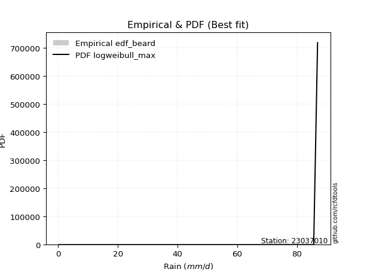</img>

</div>


### 5. Empirical - EDF Chegodayev (1955)

The Chegodayev formula is an empirical plotting position formula used in hydrological frequency analysis to estimate the exceedance probability or return period of a specific event from a set of observed data. It is primarily used for plotting observed data points on probability paper to fit a theoretical distribution, particularly for analyzing extreme events like maximum flood flows or rainfall intensities. The constant _b_ value in the generalized plotting position formula is 0.3.

<div align="center">


$P=(m-b)/(n+1-2b)$


</div>


**5.1. Empirical values**

<div align="center">

|                | 0                   | 1                  | 2                   | 3                   | 4                  | 5                  | 6                   | 7                   | 8                   | 9                  | 10                 | 11                 | 12                 | 13                 | 14                 | 15                 | 16                | 17                 |
|:---------------|:--------------------|:-------------------|:--------------------|:--------------------|:-------------------|:-------------------|:--------------------|:--------------------|:--------------------|:-------------------|:-------------------|:-------------------|:-------------------|:-------------------|:-------------------|:-------------------|:------------------|:-------------------|
| date           | 2023                | 2022               | 2025                | 2024                | 2020               | 2019               | 2018                | 2015                | 2006                | 2011               | 2017               | 2016               | 2005               | 2021               | 2013               | 2007               | 2008              | 2014               |
| x              | 0.2                 | 0.4                | 0.4                 | 0.4                 | 3.5                | 8.4                | 10.5                | 18.2                | 32.1                | 37.6               | 42.0               | 45.0               | 53.4               | 68.6               | 78.3               | 85.6               | 85.6              | 86.9               |
| m              | 1                   | 2                  | 3                   | 4                   | 5                  | 6                  | 7                   | 8                   | 9                   | 10                 | 11                 | 12                 | 13                 | 14                 | 15                 | 16                 | 17                | 18                 |
| empirical_dist | edf_chegodayev      | edf_chegodayev     | edf_chegodayev      | edf_chegodayev      | edf_chegodayev     | edf_chegodayev     | edf_chegodayev      | edf_chegodayev      | edf_chegodayev      | edf_chegodayev     | edf_chegodayev     | edf_chegodayev     | edf_chegodayev     | edf_chegodayev     | edf_chegodayev     | edf_chegodayev     | edf_chegodayev    | edf_chegodayev     |
| empirical      | 0.03804347826086957 | 0.0923913043478261 | 0.14673913043478262 | 0.20108695652173916 | 0.2554347826086957 | 0.3097826086956522 | 0.36413043478260876 | 0.41847826086956524 | 0.47282608695652173 | 0.5271739130434783 | 0.5815217391304348 | 0.6358695652173914 | 0.6902173913043479 | 0.7445652173913043 | 0.7989130434782609 | 0.8532608695652174 | 0.907608695652174 | 0.9619565217391305 |
| empirical_tr   | 1.03954802259887    | 1.1017964071856288 | 1.1719745222929936  | 1.251700680272109   | 1.343065693430657  | 1.4488188976377954 | 1.5726495726495728  | 1.719626168224299   | 1.8969072164948453  | 2.1149425287356323 | 2.38961038961039   | 2.7462686567164183 | 3.228070175438597  | 3.914893617021276  | 4.972972972972973  | 6.814814814814816  | 10.82352941176471 | 26.285714285714324 |

</div>


**5.2. Kolmogorov-Smirnov fit test (sorted by Δ)**


<div align="center">

|                | 0                   | 1                   | 2                   | 3                   | 4                   | 5                   | 6                   | 7                   | 8                   | 9                     | 10                  | 11                  | 12                  | 13                  | 14                  | 15                  | 16                  | 17                  | 18                  | 19                  | 20                  | 21                  | 22                  | 23                  | 24                  | 25                  | 26                  | 27                  | 28                  | 29                  | 30                  | 31                  | 32                  | 33                  | 34                  | 35                  | 36                  | 37                  | 38                  | 39                  | 40                  | 41                  | 42                  | 43                  | 44                  | 45                  | 46                  | 47                  | 48                  | 49                  | 50                  | 51                  | 52                  | 53                  | 54                  | 55                  | 56                  | 57                  | 58                  | 59                  | 60                  | 61                  | 62                  | 63                  | 64                  | 65                  | 66                  | 67                  | 68                  | 69                  | 70                  | 71                  | 72                  | 73                  | 74                  | 75                  | 76                  | 77                  | 78                  | 79                  | 80                  | 81                  | 82                  | 83                  | 84                  | 85                  | 86                  | 87                  | 88                  | 89                  |
|:---------------|:--------------------|:--------------------|:--------------------|:--------------------|:--------------------|:--------------------|:--------------------|:--------------------|:--------------------|:----------------------|:--------------------|:--------------------|:--------------------|:--------------------|:--------------------|:--------------------|:--------------------|:--------------------|:--------------------|:--------------------|:--------------------|:--------------------|:--------------------|:--------------------|:--------------------|:--------------------|:--------------------|:--------------------|:--------------------|:--------------------|:--------------------|:--------------------|:--------------------|:--------------------|:--------------------|:--------------------|:--------------------|:--------------------|:--------------------|:--------------------|:--------------------|:--------------------|:--------------------|:--------------------|:--------------------|:--------------------|:--------------------|:--------------------|:--------------------|:--------------------|:--------------------|:--------------------|:--------------------|:--------------------|:--------------------|:--------------------|:--------------------|:--------------------|:--------------------|:--------------------|:--------------------|:--------------------|:--------------------|:--------------------|:--------------------|:--------------------|:--------------------|:--------------------|:--------------------|:--------------------|:--------------------|:--------------------|:--------------------|:--------------------|:--------------------|:--------------------|:--------------------|:--------------------|:--------------------|:--------------------|:--------------------|:--------------------|:--------------------|:--------------------|:--------------------|:--------------------|:--------------------|:--------------------|:--------------------|:--------------------|
| station        | 23037010            | 23037010            | 23037010            | 23037010            | 23037010            | 23037010            | 23037010            | 23037010            | 23037010            | 23037010              | 23037010            | 23037010            | 23037010            | 23037010            | 23037010            | 23037010            | 23037010            | 23037010            | 23037010            | 23037010            | 23037010            | 23037010            | 23037010            | 23037010            | 23037010            | 23037010            | 23037010            | 23037010            | 23037010            | 23037010            | 23037010            | 23037010            | 23037010            | 23037010            | 23037010            | 23037010            | 23037010            | 23037010            | 23037010            | 23037010            | 23037010            | 23037010            | 23037010            | 23037010            | 23037010            | 23037010            | 23037010            | 23037010            | 23037010            | 23037010            | 23037010            | 23037010            | 23037010            | 23037010            | 23037010            | 23037010            | 23037010            | 23037010            | 23037010            | 23037010            | 23037010            | 23037010            | 23037010            | 23037010            | 23037010            | 23037010            | 23037010            | 23037010            | 23037010            | 23037010            | 23037010            | 23037010            | 23037010            | 23037010            | 23037010            | 23037010            | 23037010            | 23037010            | 23037010            | 23037010            | 23037010            | 23037010            | 23037010            | 23037010            | 23037010            | 23037010            | 23037010            | 23037010            | 23037010            | 23037010            |
| empirical_dist | edf_chegodayev      | edf_chegodayev      | edf_chegodayev      | edf_chegodayev      | edf_chegodayev      | edf_chegodayev      | edf_chegodayev      | edf_chegodayev      | edf_chegodayev      | edf_chegodayev        | edf_chegodayev      | edf_chegodayev      | edf_chegodayev      | edf_chegodayev      | edf_chegodayev      | edf_chegodayev      | edf_chegodayev      | edf_chegodayev      | edf_chegodayev      | edf_chegodayev      | edf_chegodayev      | edf_chegodayev      | edf_chegodayev      | edf_chegodayev      | edf_chegodayev      | edf_chegodayev      | edf_chegodayev      | edf_chegodayev      | edf_chegodayev      | edf_chegodayev      | edf_chegodayev      | edf_chegodayev      | edf_chegodayev      | edf_chegodayev      | edf_chegodayev      | edf_chegodayev      | edf_chegodayev      | edf_chegodayev      | edf_chegodayev      | edf_chegodayev      | edf_chegodayev      | edf_chegodayev      | edf_chegodayev      | edf_chegodayev      | edf_chegodayev      | edf_chegodayev      | edf_chegodayev      | edf_chegodayev      | edf_chegodayev      | edf_chegodayev      | edf_chegodayev      | edf_chegodayev      | edf_chegodayev      | edf_chegodayev      | edf_chegodayev      | edf_chegodayev      | edf_chegodayev      | edf_chegodayev      | edf_chegodayev      | edf_chegodayev      | edf_chegodayev      | edf_chegodayev      | edf_chegodayev      | edf_chegodayev      | edf_chegodayev      | edf_chegodayev      | edf_chegodayev      | edf_chegodayev      | edf_chegodayev      | edf_chegodayev      | edf_chegodayev      | edf_chegodayev      | edf_chegodayev      | edf_chegodayev      | edf_chegodayev      | edf_chegodayev      | edf_chegodayev      | edf_chegodayev      | edf_chegodayev      | edf_chegodayev      | edf_chegodayev      | edf_chegodayev      | edf_chegodayev      | edf_chegodayev      | edf_chegodayev      | edf_chegodayev      | edf_chegodayev      | edf_chegodayev      | edf_chegodayev      | edf_chegodayev      |
| p_dist         | nct                 | halfnorm            | nakagami            | rayleigh            | ncf                 | maxwell             | genlogistic         | invgamma            | kstwobign           | loglaplace_asymmetric | pearson3            | logloggamma         | logjohnsonsu        | t                   | norm                | crystalball         | gumbel_r            | halflogistic        | laplace_asymmetric  | logpearson3         | loggumbel_l         | logweibull_min      | moyal               | rice                | logistic            | f                   | gumbel_l            | betaprime           | hypsecant           | exponnorm           | expon               | genexpon            | gompertz            | truncnorm           | invgauss            | invweibull          | logbetaprime        | loginvweibull       | loglognorm          | laplace             | loginvgauss         | logt                | lognorm             | lognorm             | logcrystalball      | logexponnorm        | lognct              | logfatiguelife      | lognakagami         | logerlang           | loginvgamma         | logrice             | loggamma            | loggamma            | mielke              | weibull_min         | fisk                | logmaxwell          | loggenexpon         | loglogistic         | logkstwobign        | logmielke           | lograyleigh         | loghypsecant        | loghalfnorm         | loggumbel_r         | loglaplace          | loghalflogistic     | logmoyal            | johnsonsu           | logexpon            | fatiguelife         | logncf              | wald                | erlang              | logwald             | logfisk             | gamma               | chi2                | loggibrat           | gibrat              | logtruncnorm        | logalpha            | logf                | pareto              | logpareto           | logchi2             | alpha               | loggompertz         | loggenlogistic      |
| delta          | 0.11616152757338527 | 0.11988320940809663 | 0.12368904459199792 | 0.13344301854738153 | 0.1386138989499915  | 0.1396330177907381  | 0.1420619798639508  | 0.14314507669975374 | 0.14718723442589918 | 0.1494091830742258    | 0.14947711990730597 | 0.1496906468610989  | 0.15242198394983753 | 0.15444899001039886 | 0.15446619101732328 | 0.15446619260032243 | 0.15852289965148353 | 0.16367819531203429 | 0.16401531925867366 | 0.16511222545776172 | 0.1666288090457384  | 0.1702204579057367  | 0.1702878019625187  | 0.1755376100352438  | 0.17639622444615868 | 0.18322775518077605 | 0.18344134613676968 | 0.1872814475274458  | 0.18959715820352485 | 0.1948701015659471  | 0.19559330335376168 | 0.19583741175551622 | 0.1966929155853636  | 0.19731168840813687 | 0.20107388550012972 | 0.20193579788511162 | 0.2023968016497163  | 0.2028931285073311  | 0.20409170912665142 | 0.20455641447025455 | 0.20515859666095349 | 0.20642222575744218 | 0.20642259717715727 | 0.20642259717715727 | 0.20642269113461975 | 0.20642478933948027 | 0.2064623870116421  | 0.20680568673866973 | 0.20727404008265526 | 0.20746511816248703 | 0.20759764162153072 | 0.21035944342358326 | 0.21067187177189828 | 0.21067187177189828 | 0.2165261683341484  | 0.21701149001198705 | 0.21782033580447202 | 0.2247993994314459  | 0.22512249452562427 | 0.22658666147398643 | 0.22808269643472745 | 0.2285216219934213  | 0.23023072817480927 | 0.24162557336127766 | 0.246387406065808   | 0.2613445763792951  | 0.26834899995195083 | 0.273865317954504   | 0.27925285293250546 | 0.2882131525759045  | 0.2882663532635289  | 0.2993558240876957  | 0.3050348636541259  | 0.30708682609720406 | 0.3173520762557752  | 0.3309159521073689  | 0.35485106085991014 | 0.3570695346864854  | 0.3607697284412731  | 0.36274836955003087 | 0.36413043478260876 | 0.36612533291307114 | 0.39034162787394977 | 0.4031325176524627  | 0.46324772530557873 | 0.5258409983197979  | 0.6139591755505224  | 0.6302218997148717  | 0.7192594746910466  | 0.907608695652174   |
| deltao         | 0.32102346734599996 | 0.32102346734599996 | 0.32102346734599996 | 0.32102346734599996 | 0.32102346734599996 | 0.32102346734599996 | 0.32102346734599996 | 0.32102346734599996 | 0.32102346734599996 | 0.32102346734599996   | 0.32102346734599996 | 0.32102346734599996 | 0.32102346734599996 | 0.32102346734599996 | 0.32102346734599996 | 0.32102346734599996 | 0.32102346734599996 | 0.32102346734599996 | 0.32102346734599996 | 0.32102346734599996 | 0.32102346734599996 | 0.32102346734599996 | 0.32102346734599996 | 0.32102346734599996 | 0.32102346734599996 | 0.32102346734599996 | 0.32102346734599996 | 0.32102346734599996 | 0.32102346734599996 | 0.32102346734599996 | 0.32102346734599996 | 0.32102346734599996 | 0.32102346734599996 | 0.32102346734599996 | 0.32102346734599996 | 0.32102346734599996 | 0.32102346734599996 | 0.32102346734599996 | 0.32102346734599996 | 0.32102346734599996 | 0.32102346734599996 | 0.32102346734599996 | 0.32102346734599996 | 0.32102346734599996 | 0.32102346734599996 | 0.32102346734599996 | 0.32102346734599996 | 0.32102346734599996 | 0.32102346734599996 | 0.32102346734599996 | 0.32102346734599996 | 0.32102346734599996 | 0.32102346734599996 | 0.32102346734599996 | 0.32102346734599996 | 0.32102346734599996 | 0.32102346734599996 | 0.32102346734599996 | 0.32102346734599996 | 0.32102346734599996 | 0.32102346734599996 | 0.32102346734599996 | 0.32102346734599996 | 0.32102346734599996 | 0.32102346734599996 | 0.32102346734599996 | 0.32102346734599996 | 0.32102346734599996 | 0.32102346734599996 | 0.32102346734599996 | 0.32102346734599996 | 0.32102346734599996 | 0.32102346734599996 | 0.32102346734599996 | 0.32102346734599996 | 0.32102346734599996 | 0.32102346734599996 | 0.32102346734599996 | 0.32102346734599996 | 0.32102346734599996 | 0.32102346734599996 | 0.32102346734599996 | 0.32102346734599996 | 0.32102346734599996 | 0.32102346734599996 | 0.32102346734599996 | 0.32102346734599996 | 0.32102346734599996 | 0.32102346734599996 | 0.32102346734599996 |
| eval           | Δo > Δ              | Δo > Δ              | Δo > Δ              | Δo > Δ              | Δo > Δ              | Δo > Δ              | Δo > Δ              | Δo > Δ              | Δo > Δ              | Δo > Δ                | Δo > Δ              | Δo > Δ              | Δo > Δ              | Δo > Δ              | Δo > Δ              | Δo > Δ              | Δo > Δ              | Δo > Δ              | Δo > Δ              | Δo > Δ              | Δo > Δ              | Δo > Δ              | Δo > Δ              | Δo > Δ              | Δo > Δ              | Δo > Δ              | Δo > Δ              | Δo > Δ              | Δo > Δ              | Δo > Δ              | Δo > Δ              | Δo > Δ              | Δo > Δ              | Δo > Δ              | Δo > Δ              | Δo > Δ              | Δo > Δ              | Δo > Δ              | Δo > Δ              | Δo > Δ              | Δo > Δ              | Δo > Δ              | Δo > Δ              | Δo > Δ              | Δo > Δ              | Δo > Δ              | Δo > Δ              | Δo > Δ              | Δo > Δ              | Δo > Δ              | Δo > Δ              | Δo > Δ              | Δo > Δ              | Δo > Δ              | Δo > Δ              | Δo > Δ              | Δo > Δ              | Δo > Δ              | Δo > Δ              | Δo > Δ              | Δo > Δ              | Δo > Δ              | Δo > Δ              | Δo > Δ              | Δo > Δ              | Δo > Δ              | Δo > Δ              | Δo > Δ              | Δo > Δ              | Δo > Δ              | Δo > Δ              | Δo > Δ              | Δo > Δ              | Δo > Δ              | Δo > Δ              | Δo <= Δ             | Δo <= Δ             | Δo <= Δ             | Δo <= Δ             | Δo <= Δ             | Δo <= Δ             | Δo <= Δ             | Δo <= Δ             | Δo <= Δ             | Δo <= Δ             | Δo <= Δ             | Δo <= Δ             | Δo <= Δ             | Δo <= Δ             | Δo <= Δ             |
| fit            | 1                   | 1                   | 1                   | 1                   | 1                   | 1                   | 1                   | 1                   | 1                   | 1                     | 1                   | 1                   | 1                   | 1                   | 1                   | 1                   | 1                   | 1                   | 1                   | 1                   | 1                   | 1                   | 1                   | 1                   | 1                   | 1                   | 1                   | 1                   | 1                   | 1                   | 1                   | 1                   | 1                   | 1                   | 1                   | 1                   | 1                   | 1                   | 1                   | 1                   | 1                   | 1                   | 1                   | 1                   | 1                   | 1                   | 1                   | 1                   | 1                   | 1                   | 1                   | 1                   | 1                   | 1                   | 1                   | 1                   | 1                   | 1                   | 1                   | 1                   | 1                   | 1                   | 1                   | 1                   | 1                   | 1                   | 1                   | 1                   | 1                   | 1                   | 1                   | 1                   | 1                   | 1                   | 1                   | 0                   | 0                   | 0                   | 0                   | 0                   | 0                   | 0                   | 0                   | 0                   | 0                   | 0                   | 0                   | 0                   | 0                   | 0                   |
| n              | 18                  | 18                  | 18                  | 18                  | 18                  | 18                  | 18                  | 18                  | 18                  | 18                    | 18                  | 18                  | 18                  | 18                  | 18                  | 18                  | 18                  | 18                  | 18                  | 18                  | 18                  | 18                  | 18                  | 18                  | 18                  | 18                  | 18                  | 18                  | 18                  | 18                  | 18                  | 18                  | 18                  | 18                  | 18                  | 18                  | 18                  | 18                  | 18                  | 18                  | 18                  | 18                  | 18                  | 18                  | 18                  | 18                  | 18                  | 18                  | 18                  | 18                  | 18                  | 18                  | 18                  | 18                  | 18                  | 18                  | 18                  | 18                  | 18                  | 18                  | 18                  | 18                  | 18                  | 18                  | 18                  | 18                  | 18                  | 18                  | 18                  | 18                  | 18                  | 18                  | 18                  | 18                  | 18                  | 18                  | 18                  | 18                  | 18                  | 18                  | 18                  | 18                  | 18                  | 18                  | 18                  | 18                  | 18                  | 18                  | 18                  | 18                  |
| best_fit       | 1                   | 0                   | 0                   | 0                   | 0                   | 0                   | 0                   | 0                   | 0                   | 0                     | 0                   | 0                   | 0                   | 0                   | 0                   | 0                   | 0                   | 0                   | 0                   | 0                   | 0                   | 0                   | 0                   | 0                   | 0                   | 0                   | 0                   | 0                   | 0                   | 0                   | 0                   | 0                   | 0                   | 0                   | 0                   | 0                   | 0                   | 0                   | 0                   | 0                   | 0                   | 0                   | 0                   | 0                   | 0                   | 0                   | 0                   | 0                   | 0                   | 0                   | 0                   | 0                   | 0                   | 0                   | 0                   | 0                   | 0                   | 0                   | 0                   | 0                   | 0                   | 0                   | 0                   | 0                   | 0                   | 0                   | 0                   | 0                   | 0                   | 0                   | 0                   | 0                   | 0                   | 0                   | 0                   | 0                   | 0                   | 0                   | 0                   | 0                   | 0                   | 0                   | 0                   | 0                   | 0                   | 0                   | 0                   | 0                   | 0                   | 0                   |
| best_fit_sort  | 1                   | 2                   | 3                   | 4                   | 5                   | 6                   | 7                   | 8                   | 9                   | 10                    | 11                  | 12                  | 13                  | 14                  | 15                  | 16                  | 17                  | 18                  | 19                  | 20                  | 21                  | 22                  | 23                  | 24                  | 25                  | 26                  | 27                  | 28                  | 29                  | 30                  | 31                  | 32                  | 33                  | 34                  | 35                  | 36                  | 37                  | 38                  | 39                  | 40                  | 41                  | 42                  | 43                  | 44                  | 45                  | 46                  | 47                  | 48                  | 49                  | 50                  | 51                  | 52                  | 53                  | 54                  | 55                  | 56                  | 57                  | 58                  | 59                  | 60                  | 61                  | 62                  | 63                  | 64                  | 65                  | 66                  | 67                  | 68                  | 69                  | 70                  | 71                  | 72                  | 73                  | 74                  | 75                  | 76                  | 77                  | 78                  | 79                  | 80                  | 81                  | 82                  | 83                  | 84                  | 85                  | 86                  | 87                  | 88                  | 89                  | 90                  |

</div>


<div align="center">

</img>

</div>


**5.3. Best fit**

<div align="center">

|   id |   station | empirical_dist   | p_dist   |    delta |   deltao | eval   |   fit |   n |   best_fit |   best_fit_sort |
|-----:|----------:|:-----------------|:---------|---------:|---------:|:-------|------:|----:|-----------:|----------------:|
|    0 |  23037010 | edf_chegodayev   | nct      | 0.116162 | 0.321023 | Δo > Δ |     1 |  18 |          1 |               1 |

</div>


<div align="center">

</img>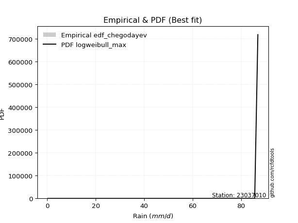</img>

</div>


### 6. Empirical - EDF Blom (1958)

The Blom formula is a specific "plotting position" formula used in hydrology and statistical analysis to estimate the empirical cumulative probability (or non-exceedance probability) of a data series. It is particularly recommended for data that are approximately normally distributed. The constant _a_ is set to 0.375 (or 3/8).

<div align="center">


$P=(m-a)/(n+1-2a)$


</div>


**6.1. Empirical values**

<div align="center">

|                | 0                   | 1                   | 2                   | 3                   | 4                  | 5                  | 6                  | 7                  | 8                  | 9                  | 10                 | 11                 | 12                 | 13                 | 14                 | 15                 | 16                 | 17                 |
|:---------------|:--------------------|:--------------------|:--------------------|:--------------------|:-------------------|:-------------------|:-------------------|:-------------------|:-------------------|:-------------------|:-------------------|:-------------------|:-------------------|:-------------------|:-------------------|:-------------------|:-------------------|:-------------------|
| date           | 2023                | 2022                | 2025                | 2024                | 2020               | 2019               | 2018               | 2015               | 2006               | 2011               | 2017               | 2016               | 2005               | 2021               | 2013               | 2007               | 2008               | 2014               |
| x              | 0.2                 | 0.4                 | 0.4                 | 0.4                 | 3.5                | 8.4                | 10.5               | 18.2               | 32.1               | 37.6               | 42.0               | 45.0               | 53.4               | 68.6               | 78.3               | 85.6               | 85.6               | 86.9               |
| m              | 1                   | 2                   | 3                   | 4                   | 5                  | 6                  | 7                  | 8                  | 9                  | 10                 | 11                 | 12                 | 13                 | 14                 | 15                 | 16                 | 17                 | 18                 |
| empirical_dist | edf_blom            | edf_blom            | edf_blom            | edf_blom            | edf_blom           | edf_blom           | edf_blom           | edf_blom           | edf_blom           | edf_blom           | edf_blom           | edf_blom           | edf_blom           | edf_blom           | edf_blom           | edf_blom           | edf_blom           | edf_blom           |
| empirical      | 0.03424657534246575 | 0.08904109589041095 | 0.14383561643835616 | 0.19863013698630136 | 0.2534246575342466 | 0.3082191780821918 | 0.363013698630137  | 0.4178082191780822 | 0.4726027397260274 | 0.5273972602739726 | 0.5821917808219178 | 0.636986301369863  | 0.6917808219178082 | 0.7465753424657534 | 0.8013698630136986 | 0.8561643835616438 | 0.910958904109589  | 0.9657534246575342 |
| empirical_tr   | 1.0354609929078014  | 1.0977443609022557  | 1.168               | 1.2478632478632479  | 1.3394495412844036 | 1.4455445544554455 | 1.5698924731182795 | 1.7176470588235295 | 1.896103896103896  | 2.1159420289855073 | 2.3934426229508197 | 2.7547169811320753 | 3.2444444444444445 | 3.9459459459459456 | 5.0344827586206895 | 6.952380952380952  | 11.230769230769228 | 29.199999999999978 |

</div>


**6.2. Kolmogorov-Smirnov fit test (sorted by Δ)**


<div align="center">

|                | 0                   | 1                   | 2                   | 3                   | 4                   | 5                   | 6                   | 7                   | 8                   | 9                     | 10                  | 11                  | 12                  | 13                  | 14                  | 15                  | 16                  | 17                  | 18                  | 19                  | 20                  | 21                  | 22                  | 23                  | 24                  | 25                  | 26                  | 27                  | 28                  | 29                  | 30                  | 31                  | 32                  | 33                  | 34                  | 35                  | 36                  | 37                  | 38                  | 39                  | 40                  | 41                  | 42                  | 43                  | 44                  | 45                  | 46                  | 47                  | 48                  | 49                  | 50                  | 51                  | 52                  | 53                  | 54                  | 55                  | 56                  | 57                  | 58                  | 59                  | 60                  | 61                  | 62                  | 63                  | 64                  | 65                  | 66                  | 67                  | 68                  | 69                  | 70                  | 71                  | 72                  | 73                  | 74                  | 75                  | 76                  | 77                  | 78                  | 79                  | 80                  | 81                  | 82                  | 83                  | 84                  | 85                  | 86                  | 87                  | 88                  | 89                  |
|:---------------|:--------------------|:--------------------|:--------------------|:--------------------|:--------------------|:--------------------|:--------------------|:--------------------|:--------------------|:----------------------|:--------------------|:--------------------|:--------------------|:--------------------|:--------------------|:--------------------|:--------------------|:--------------------|:--------------------|:--------------------|:--------------------|:--------------------|:--------------------|:--------------------|:--------------------|:--------------------|:--------------------|:--------------------|:--------------------|:--------------------|:--------------------|:--------------------|:--------------------|:--------------------|:--------------------|:--------------------|:--------------------|:--------------------|:--------------------|:--------------------|:--------------------|:--------------------|:--------------------|:--------------------|:--------------------|:--------------------|:--------------------|:--------------------|:--------------------|:--------------------|:--------------------|:--------------------|:--------------------|:--------------------|:--------------------|:--------------------|:--------------------|:--------------------|:--------------------|:--------------------|:--------------------|:--------------------|:--------------------|:--------------------|:--------------------|:--------------------|:--------------------|:--------------------|:--------------------|:--------------------|:--------------------|:--------------------|:--------------------|:--------------------|:--------------------|:--------------------|:--------------------|:--------------------|:--------------------|:--------------------|:--------------------|:--------------------|:--------------------|:--------------------|:--------------------|:--------------------|:--------------------|:--------------------|:--------------------|:--------------------|
| station        | 23037010            | 23037010            | 23037010            | 23037010            | 23037010            | 23037010            | 23037010            | 23037010            | 23037010            | 23037010              | 23037010            | 23037010            | 23037010            | 23037010            | 23037010            | 23037010            | 23037010            | 23037010            | 23037010            | 23037010            | 23037010            | 23037010            | 23037010            | 23037010            | 23037010            | 23037010            | 23037010            | 23037010            | 23037010            | 23037010            | 23037010            | 23037010            | 23037010            | 23037010            | 23037010            | 23037010            | 23037010            | 23037010            | 23037010            | 23037010            | 23037010            | 23037010            | 23037010            | 23037010            | 23037010            | 23037010            | 23037010            | 23037010            | 23037010            | 23037010            | 23037010            | 23037010            | 23037010            | 23037010            | 23037010            | 23037010            | 23037010            | 23037010            | 23037010            | 23037010            | 23037010            | 23037010            | 23037010            | 23037010            | 23037010            | 23037010            | 23037010            | 23037010            | 23037010            | 23037010            | 23037010            | 23037010            | 23037010            | 23037010            | 23037010            | 23037010            | 23037010            | 23037010            | 23037010            | 23037010            | 23037010            | 23037010            | 23037010            | 23037010            | 23037010            | 23037010            | 23037010            | 23037010            | 23037010            | 23037010            |
| empirical_dist | edf_blom            | edf_blom            | edf_blom            | edf_blom            | edf_blom            | edf_blom            | edf_blom            | edf_blom            | edf_blom            | edf_blom              | edf_blom            | edf_blom            | edf_blom            | edf_blom            | edf_blom            | edf_blom            | edf_blom            | edf_blom            | edf_blom            | edf_blom            | edf_blom            | edf_blom            | edf_blom            | edf_blom            | edf_blom            | edf_blom            | edf_blom            | edf_blom            | edf_blom            | edf_blom            | edf_blom            | edf_blom            | edf_blom            | edf_blom            | edf_blom            | edf_blom            | edf_blom            | edf_blom            | edf_blom            | edf_blom            | edf_blom            | edf_blom            | edf_blom            | edf_blom            | edf_blom            | edf_blom            | edf_blom            | edf_blom            | edf_blom            | edf_blom            | edf_blom            | edf_blom            | edf_blom            | edf_blom            | edf_blom            | edf_blom            | edf_blom            | edf_blom            | edf_blom            | edf_blom            | edf_blom            | edf_blom            | edf_blom            | edf_blom            | edf_blom            | edf_blom            | edf_blom            | edf_blom            | edf_blom            | edf_blom            | edf_blom            | edf_blom            | edf_blom            | edf_blom            | edf_blom            | edf_blom            | edf_blom            | edf_blom            | edf_blom            | edf_blom            | edf_blom            | edf_blom            | edf_blom            | edf_blom            | edf_blom            | edf_blom            | edf_blom            | edf_blom            | edf_blom            | edf_blom            |
| p_dist         | nct                 | halfnorm            | nakagami            | rayleigh            | ncf                 | maxwell             | genlogistic         | invgamma            | kstwobign           | loglaplace_asymmetric | logloggamma         | pearson3            | t                   | norm                | crystalball         | logjohnsonsu        | gumbel_r            | halflogistic        | laplace_asymmetric  | logpearson3         | loggumbel_l         | moyal               | logweibull_min      | rice                | logistic            | gumbel_l            | f                   | betaprime           | hypsecant           | exponnorm           | expon               | genexpon            | gompertz            | truncnorm           | invgauss            | logbetaprime        | loginvweibull       | laplace             | invweibull          | loglognorm          | loginvgauss         | logt                | lognorm             | lognorm             | logcrystalball      | logexponnorm        | lognct              | logfatiguelife      | lognakagami         | logerlang           | loginvgamma         | logrice             | loggamma            | loggamma            | mielke              | weibull_min         | fisk                | logmaxwell          | loggenexpon         | loglogistic         | logkstwobign        | logmielke           | lograyleigh         | loghypsecant        | loghalfnorm         | loggumbel_r         | loglaplace          | loghalflogistic     | logmoyal            | johnsonsu           | logexpon            | fatiguelife         | wald                | logncf              | erlang              | logwald             | gamma               | logfisk             | chi2                | loggibrat           | gibrat              | logtruncnorm        | logalpha            | logf                | pareto              | logpareto           | logchi2             | alpha               | loggompertz         | loggenlogistic      |
| delta          | 0.11429924090132859 | 0.11876647325562487 | 0.12748594751040165 | 0.13232628239490976 | 0.13615707941455368 | 0.13851628163826635 | 0.14094524371147904 | 0.14336842393024807 | 0.1460704982734274  | 0.14695236353878804   | 0.14723382732566115 | 0.1483603837548342  | 0.1533322538579271  | 0.15334945486485152 | 0.15334945644785067 | 0.15353872010230918 | 0.15740616349901176 | 0.16122137577659648 | 0.1628985831062019  | 0.16533557268825605 | 0.16685215627623273 | 0.16917106581004693 | 0.17044380513623103 | 0.17442087388277203 | 0.17527948829368692 | 0.18232460998429792 | 0.18702465809917979 | 0.18750479475794013 | 0.1884804220510531  | 0.1924132820305093  | 0.19313648381832388 | 0.19338059222007842 | 0.19423609604992578 | 0.19485486887269907 | 0.20129723273062405 | 0.20262014888021063 | 0.20311647573782543 | 0.20343967831778278 | 0.20349922849857205 | 0.20431505635714575 | 0.20538194389144782 | 0.2066455729879365  | 0.2066459444076516  | 0.2066459444076516  | 0.20664603836511408 | 0.2066481365699746  | 0.20668573424213643 | 0.20702903396916406 | 0.2074973873131496  | 0.20768846539298136 | 0.20782098885202505 | 0.2105827906540776  | 0.2108952190023926  | 0.2108952190023926  | 0.21674951556464273 | 0.22080839293039078 | 0.22161723872287575 | 0.22502274666194022 | 0.2253458417561186  | 0.22681000870448076 | 0.22830604366522178 | 0.23008505260688172 | 0.2304540754053036  | 0.241848920591772   | 0.24661075329630233 | 0.2615679236097894  | 0.26857234718244516 | 0.2740886651849983  | 0.2794762001629998  | 0.28977658318936494 | 0.2898297838769893  | 0.29957917131819    | 0.3059700899447323  | 0.30883176657252964 | 0.31757542348626955 | 0.33113929933786324 | 0.3572928819169797  | 0.35864796377831387 | 0.3609930756717674  | 0.3629717167805252  | 0.363013698630137   | 0.3663486801435655  | 0.3919050584874102  | 0.4051426427269118  | 0.46659793376299386 | 0.529191206777213   | 0.6159693006249715  | 0.6317853303283322  | 0.7212695997654957  | 0.910958904109589   |
| deltao         | 0.32102346734599996 | 0.32102346734599996 | 0.32102346734599996 | 0.32102346734599996 | 0.32102346734599996 | 0.32102346734599996 | 0.32102346734599996 | 0.32102346734599996 | 0.32102346734599996 | 0.32102346734599996   | 0.32102346734599996 | 0.32102346734599996 | 0.32102346734599996 | 0.32102346734599996 | 0.32102346734599996 | 0.32102346734599996 | 0.32102346734599996 | 0.32102346734599996 | 0.32102346734599996 | 0.32102346734599996 | 0.32102346734599996 | 0.32102346734599996 | 0.32102346734599996 | 0.32102346734599996 | 0.32102346734599996 | 0.32102346734599996 | 0.32102346734599996 | 0.32102346734599996 | 0.32102346734599996 | 0.32102346734599996 | 0.32102346734599996 | 0.32102346734599996 | 0.32102346734599996 | 0.32102346734599996 | 0.32102346734599996 | 0.32102346734599996 | 0.32102346734599996 | 0.32102346734599996 | 0.32102346734599996 | 0.32102346734599996 | 0.32102346734599996 | 0.32102346734599996 | 0.32102346734599996 | 0.32102346734599996 | 0.32102346734599996 | 0.32102346734599996 | 0.32102346734599996 | 0.32102346734599996 | 0.32102346734599996 | 0.32102346734599996 | 0.32102346734599996 | 0.32102346734599996 | 0.32102346734599996 | 0.32102346734599996 | 0.32102346734599996 | 0.32102346734599996 | 0.32102346734599996 | 0.32102346734599996 | 0.32102346734599996 | 0.32102346734599996 | 0.32102346734599996 | 0.32102346734599996 | 0.32102346734599996 | 0.32102346734599996 | 0.32102346734599996 | 0.32102346734599996 | 0.32102346734599996 | 0.32102346734599996 | 0.32102346734599996 | 0.32102346734599996 | 0.32102346734599996 | 0.32102346734599996 | 0.32102346734599996 | 0.32102346734599996 | 0.32102346734599996 | 0.32102346734599996 | 0.32102346734599996 | 0.32102346734599996 | 0.32102346734599996 | 0.32102346734599996 | 0.32102346734599996 | 0.32102346734599996 | 0.32102346734599996 | 0.32102346734599996 | 0.32102346734599996 | 0.32102346734599996 | 0.32102346734599996 | 0.32102346734599996 | 0.32102346734599996 | 0.32102346734599996 |
| eval           | Δo > Δ              | Δo > Δ              | Δo > Δ              | Δo > Δ              | Δo > Δ              | Δo > Δ              | Δo > Δ              | Δo > Δ              | Δo > Δ              | Δo > Δ                | Δo > Δ              | Δo > Δ              | Δo > Δ              | Δo > Δ              | Δo > Δ              | Δo > Δ              | Δo > Δ              | Δo > Δ              | Δo > Δ              | Δo > Δ              | Δo > Δ              | Δo > Δ              | Δo > Δ              | Δo > Δ              | Δo > Δ              | Δo > Δ              | Δo > Δ              | Δo > Δ              | Δo > Δ              | Δo > Δ              | Δo > Δ              | Δo > Δ              | Δo > Δ              | Δo > Δ              | Δo > Δ              | Δo > Δ              | Δo > Δ              | Δo > Δ              | Δo > Δ              | Δo > Δ              | Δo > Δ              | Δo > Δ              | Δo > Δ              | Δo > Δ              | Δo > Δ              | Δo > Δ              | Δo > Δ              | Δo > Δ              | Δo > Δ              | Δo > Δ              | Δo > Δ              | Δo > Δ              | Δo > Δ              | Δo > Δ              | Δo > Δ              | Δo > Δ              | Δo > Δ              | Δo > Δ              | Δo > Δ              | Δo > Δ              | Δo > Δ              | Δo > Δ              | Δo > Δ              | Δo > Δ              | Δo > Δ              | Δo > Δ              | Δo > Δ              | Δo > Δ              | Δo > Δ              | Δo > Δ              | Δo > Δ              | Δo > Δ              | Δo > Δ              | Δo > Δ              | Δo > Δ              | Δo <= Δ             | Δo <= Δ             | Δo <= Δ             | Δo <= Δ             | Δo <= Δ             | Δo <= Δ             | Δo <= Δ             | Δo <= Δ             | Δo <= Δ             | Δo <= Δ             | Δo <= Δ             | Δo <= Δ             | Δo <= Δ             | Δo <= Δ             | Δo <= Δ             |
| fit            | 1                   | 1                   | 1                   | 1                   | 1                   | 1                   | 1                   | 1                   | 1                   | 1                     | 1                   | 1                   | 1                   | 1                   | 1                   | 1                   | 1                   | 1                   | 1                   | 1                   | 1                   | 1                   | 1                   | 1                   | 1                   | 1                   | 1                   | 1                   | 1                   | 1                   | 1                   | 1                   | 1                   | 1                   | 1                   | 1                   | 1                   | 1                   | 1                   | 1                   | 1                   | 1                   | 1                   | 1                   | 1                   | 1                   | 1                   | 1                   | 1                   | 1                   | 1                   | 1                   | 1                   | 1                   | 1                   | 1                   | 1                   | 1                   | 1                   | 1                   | 1                   | 1                   | 1                   | 1                   | 1                   | 1                   | 1                   | 1                   | 1                   | 1                   | 1                   | 1                   | 1                   | 1                   | 1                   | 0                   | 0                   | 0                   | 0                   | 0                   | 0                   | 0                   | 0                   | 0                   | 0                   | 0                   | 0                   | 0                   | 0                   | 0                   |
| n              | 18                  | 18                  | 18                  | 18                  | 18                  | 18                  | 18                  | 18                  | 18                  | 18                    | 18                  | 18                  | 18                  | 18                  | 18                  | 18                  | 18                  | 18                  | 18                  | 18                  | 18                  | 18                  | 18                  | 18                  | 18                  | 18                  | 18                  | 18                  | 18                  | 18                  | 18                  | 18                  | 18                  | 18                  | 18                  | 18                  | 18                  | 18                  | 18                  | 18                  | 18                  | 18                  | 18                  | 18                  | 18                  | 18                  | 18                  | 18                  | 18                  | 18                  | 18                  | 18                  | 18                  | 18                  | 18                  | 18                  | 18                  | 18                  | 18                  | 18                  | 18                  | 18                  | 18                  | 18                  | 18                  | 18                  | 18                  | 18                  | 18                  | 18                  | 18                  | 18                  | 18                  | 18                  | 18                  | 18                  | 18                  | 18                  | 18                  | 18                  | 18                  | 18                  | 18                  | 18                  | 18                  | 18                  | 18                  | 18                  | 18                  | 18                  |
| best_fit       | 1                   | 0                   | 0                   | 0                   | 0                   | 0                   | 0                   | 0                   | 0                   | 0                     | 0                   | 0                   | 0                   | 0                   | 0                   | 0                   | 0                   | 0                   | 0                   | 0                   | 0                   | 0                   | 0                   | 0                   | 0                   | 0                   | 0                   | 0                   | 0                   | 0                   | 0                   | 0                   | 0                   | 0                   | 0                   | 0                   | 0                   | 0                   | 0                   | 0                   | 0                   | 0                   | 0                   | 0                   | 0                   | 0                   | 0                   | 0                   | 0                   | 0                   | 0                   | 0                   | 0                   | 0                   | 0                   | 0                   | 0                   | 0                   | 0                   | 0                   | 0                   | 0                   | 0                   | 0                   | 0                   | 0                   | 0                   | 0                   | 0                   | 0                   | 0                   | 0                   | 0                   | 0                   | 0                   | 0                   | 0                   | 0                   | 0                   | 0                   | 0                   | 0                   | 0                   | 0                   | 0                   | 0                   | 0                   | 0                   | 0                   | 0                   |
| best_fit_sort  | 1                   | 2                   | 3                   | 4                   | 5                   | 6                   | 7                   | 8                   | 9                   | 10                    | 11                  | 12                  | 13                  | 14                  | 15                  | 16                  | 17                  | 18                  | 19                  | 20                  | 21                  | 22                  | 23                  | 24                  | 25                  | 26                  | 27                  | 28                  | 29                  | 30                  | 31                  | 32                  | 33                  | 34                  | 35                  | 36                  | 37                  | 38                  | 39                  | 40                  | 41                  | 42                  | 43                  | 44                  | 45                  | 46                  | 47                  | 48                  | 49                  | 50                  | 51                  | 52                  | 53                  | 54                  | 55                  | 56                  | 57                  | 58                  | 59                  | 60                  | 61                  | 62                  | 63                  | 64                  | 65                  | 66                  | 67                  | 68                  | 69                  | 70                  | 71                  | 72                  | 73                  | 74                  | 75                  | 76                  | 77                  | 78                  | 79                  | 80                  | 81                  | 82                  | 83                  | 84                  | 85                  | 86                  | 87                  | 88                  | 89                  | 90                  |

</div>


<div align="center">

</img>

</div>


**6.3. Best fit**

<div align="center">

|   id |   station | empirical_dist   | p_dist   |    delta |   deltao | eval   |   fit |   n |   best_fit |   best_fit_sort |
|-----:|----------:|:-----------------|:---------|---------:|---------:|:-------|------:|----:|-----------:|----------------:|
|    0 |  23037010 | edf_blom         | nct      | 0.114299 | 0.321023 | Δo > Δ |     1 |  18 |          1 |               1 |

</div>


<div align="center">

</img></img>

</div>


### 7. Empirical - EDF Tukey (1962)

In hydrology, the Tukey formula is used as a plotting position formula to estimate the empirical probability or frequency of a flood event (or other hydrological data). The formula parameter is given as _c=0.333_ (or 1/3).

<div align="center">


$P=(m-c)/(n+1-2c)$


</div>


**7.1. Empirical values**

<div align="center">

|                | 0                   | 1                   | 2                   | 3         | 4                  | 5                  | 6                   | 7                   | 8                  | 9                  | 10                 | 11                 | 12                 | 13                 | 14                | 15                 | 16                 | 17                 |
|:---------------|:--------------------|:--------------------|:--------------------|:----------|:-------------------|:-------------------|:--------------------|:--------------------|:-------------------|:-------------------|:-------------------|:-------------------|:-------------------|:-------------------|:------------------|:-------------------|:-------------------|:-------------------|
| date           | 2023                | 2022                | 2025                | 2024      | 2020               | 2019               | 2018                | 2015                | 2006               | 2011               | 2017               | 2016               | 2005               | 2021               | 2013              | 2007               | 2008               | 2014               |
| x              | 0.2                 | 0.4                 | 0.4                 | 0.4       | 3.5                | 8.4                | 10.5                | 18.2                | 32.1               | 37.6               | 42.0               | 45.0               | 53.4               | 68.6               | 78.3              | 85.6               | 85.6               | 86.9               |
| m              | 1                   | 2                   | 3                   | 4         | 5                  | 6                  | 7                   | 8                   | 9                  | 10                 | 11                 | 12                 | 13                 | 14                 | 15                | 16                 | 17                 | 18                 |
| empirical_dist | edf_tukey           | edf_tukey           | edf_tukey           | edf_tukey | edf_tukey          | edf_tukey          | edf_tukey           | edf_tukey           | edf_tukey          | edf_tukey          | edf_tukey          | edf_tukey          | edf_tukey          | edf_tukey          | edf_tukey         | edf_tukey          | edf_tukey          | edf_tukey          |
| empirical      | 0.03636363636363636 | 0.09090909090909091 | 0.14545454545454545 | 0.2       | 0.2545454545454545 | 0.3090909090909091 | 0.36363636363636365 | 0.41818181818181815 | 0.4727272727272727 | 0.5272727272727272 | 0.5818181818181818 | 0.6363636363636364 | 0.6909090909090909 | 0.7454545454545455 | 0.8               | 0.8545454545454545 | 0.9090909090909091 | 0.9636363636363636 |
| empirical_tr   | 1.0377358490566038  | 1.1                 | 1.1702127659574468  | 1.25      | 1.3414634146341462 | 1.4473684210526316 | 1.5714285714285714  | 1.71875             | 1.8965517241379308 | 2.115384615384615  | 2.391304347826087  | 2.75               | 3.235294117647059  | 3.928571428571429  | 5.000000000000001 | 6.874999999999997  | 10.999999999999996 | 27.49999999999999  |

</div>


**7.2. Kolmogorov-Smirnov fit test (sorted by Δ)**


<div align="center">

|                | 0                   | 1                   | 2                   | 3                   | 4                   | 5                   | 6                   | 7                   | 8                   | 9                     | 10                  | 11                  | 12                  | 13                  | 14                  | 15                  | 16                  | 17                  | 18                  | 19                  | 20                  | 21                  | 22                  | 23                  | 24                  | 25                  | 26                  | 27                  | 28                  | 29                  | 30                  | 31                  | 32                  | 33                  | 34                  | 35                  | 36                  | 37                  | 38                  | 39                  | 40                  | 41                  | 42                  | 43                  | 44                  | 45                  | 46                  | 47                  | 48                  | 49                  | 50                  | 51                  | 52                  | 53                  | 54                  | 55                  | 56                  | 57                  | 58                  | 59                  | 60                  | 61                  | 62                  | 63                  | 64                  | 65                  | 66                  | 67                  | 68                  | 69                  | 70                  | 71                  | 72                  | 73                  | 74                  | 75                  | 76                  | 77                  | 78                  | 79                  | 80                  | 81                  | 82                  | 83                  | 84                  | 85                  | 86                  | 87                  | 88                  | 89                  |
|:---------------|:--------------------|:--------------------|:--------------------|:--------------------|:--------------------|:--------------------|:--------------------|:--------------------|:--------------------|:----------------------|:--------------------|:--------------------|:--------------------|:--------------------|:--------------------|:--------------------|:--------------------|:--------------------|:--------------------|:--------------------|:--------------------|:--------------------|:--------------------|:--------------------|:--------------------|:--------------------|:--------------------|:--------------------|:--------------------|:--------------------|:--------------------|:--------------------|:--------------------|:--------------------|:--------------------|:--------------------|:--------------------|:--------------------|:--------------------|:--------------------|:--------------------|:--------------------|:--------------------|:--------------------|:--------------------|:--------------------|:--------------------|:--------------------|:--------------------|:--------------------|:--------------------|:--------------------|:--------------------|:--------------------|:--------------------|:--------------------|:--------------------|:--------------------|:--------------------|:--------------------|:--------------------|:--------------------|:--------------------|:--------------------|:--------------------|:--------------------|:--------------------|:--------------------|:--------------------|:--------------------|:--------------------|:--------------------|:--------------------|:--------------------|:--------------------|:--------------------|:--------------------|:--------------------|:--------------------|:--------------------|:--------------------|:--------------------|:--------------------|:--------------------|:--------------------|:--------------------|:--------------------|:--------------------|:--------------------|:--------------------|
| station        | 23037010            | 23037010            | 23037010            | 23037010            | 23037010            | 23037010            | 23037010            | 23037010            | 23037010            | 23037010              | 23037010            | 23037010            | 23037010            | 23037010            | 23037010            | 23037010            | 23037010            | 23037010            | 23037010            | 23037010            | 23037010            | 23037010            | 23037010            | 23037010            | 23037010            | 23037010            | 23037010            | 23037010            | 23037010            | 23037010            | 23037010            | 23037010            | 23037010            | 23037010            | 23037010            | 23037010            | 23037010            | 23037010            | 23037010            | 23037010            | 23037010            | 23037010            | 23037010            | 23037010            | 23037010            | 23037010            | 23037010            | 23037010            | 23037010            | 23037010            | 23037010            | 23037010            | 23037010            | 23037010            | 23037010            | 23037010            | 23037010            | 23037010            | 23037010            | 23037010            | 23037010            | 23037010            | 23037010            | 23037010            | 23037010            | 23037010            | 23037010            | 23037010            | 23037010            | 23037010            | 23037010            | 23037010            | 23037010            | 23037010            | 23037010            | 23037010            | 23037010            | 23037010            | 23037010            | 23037010            | 23037010            | 23037010            | 23037010            | 23037010            | 23037010            | 23037010            | 23037010            | 23037010            | 23037010            | 23037010            |
| empirical_dist | edf_tukey           | edf_tukey           | edf_tukey           | edf_tukey           | edf_tukey           | edf_tukey           | edf_tukey           | edf_tukey           | edf_tukey           | edf_tukey             | edf_tukey           | edf_tukey           | edf_tukey           | edf_tukey           | edf_tukey           | edf_tukey           | edf_tukey           | edf_tukey           | edf_tukey           | edf_tukey           | edf_tukey           | edf_tukey           | edf_tukey           | edf_tukey           | edf_tukey           | edf_tukey           | edf_tukey           | edf_tukey           | edf_tukey           | edf_tukey           | edf_tukey           | edf_tukey           | edf_tukey           | edf_tukey           | edf_tukey           | edf_tukey           | edf_tukey           | edf_tukey           | edf_tukey           | edf_tukey           | edf_tukey           | edf_tukey           | edf_tukey           | edf_tukey           | edf_tukey           | edf_tukey           | edf_tukey           | edf_tukey           | edf_tukey           | edf_tukey           | edf_tukey           | edf_tukey           | edf_tukey           | edf_tukey           | edf_tukey           | edf_tukey           | edf_tukey           | edf_tukey           | edf_tukey           | edf_tukey           | edf_tukey           | edf_tukey           | edf_tukey           | edf_tukey           | edf_tukey           | edf_tukey           | edf_tukey           | edf_tukey           | edf_tukey           | edf_tukey           | edf_tukey           | edf_tukey           | edf_tukey           | edf_tukey           | edf_tukey           | edf_tukey           | edf_tukey           | edf_tukey           | edf_tukey           | edf_tukey           | edf_tukey           | edf_tukey           | edf_tukey           | edf_tukey           | edf_tukey           | edf_tukey           | edf_tukey           | edf_tukey           | edf_tukey           | edf_tukey           |
| p_dist         | nct                 | halfnorm            | nakagami            | rayleigh            | ncf                 | maxwell             | genlogistic         | invgamma            | kstwobign           | loglaplace_asymmetric | logloggamma         | pearson3            | logjohnsonsu        | t                   | norm                | crystalball         | gumbel_r            | halflogistic        | laplace_asymmetric  | logpearson3         | loggumbel_l         | moyal               | logweibull_min      | rice                | logistic            | gumbel_l            | f                   | betaprime           | hypsecant           | exponnorm           | expon               | genexpon            | gompertz            | truncnorm           | invgauss            | logbetaprime        | invweibull          | loginvweibull       | laplace             | loglognorm          | loginvgauss         | logt                | lognorm             | lognorm             | logcrystalball      | logexponnorm        | lognct              | logfatiguelife      | lognakagami         | logerlang           | loginvgamma         | logrice             | loggamma            | loggamma            | mielke              | weibull_min         | fisk                | logmaxwell          | loggenexpon         | loglogistic         | logkstwobign        | logmielke           | lograyleigh         | loghypsecant        | loghalfnorm         | loggumbel_r         | loglaplace          | loghalflogistic     | logmoyal            | johnsonsu           | logexpon            | fatiguelife         | wald                | logncf              | erlang              | logwald             | logfisk             | gamma               | chi2                | loggibrat           | gibrat              | logtruncnorm        | logalpha            | logf                | pareto              | logpareto           | logchi2             | alpha               | loggompertz         | loggenlogistic      |
| delta          | 0.11527219951014411 | 0.11938913826185152 | 0.12536888648923106 | 0.1329489474011364  | 0.13752694242825234 | 0.139138946644493   | 0.1415679087177057  | 0.14324389092900275 | 0.14669316327965407 | 0.1483222265524866    | 0.14860369033935972 | 0.14898304876106086 | 0.15291605509608253 | 0.15395491886415374 | 0.15397211987107817 | 0.15397212145407732 | 0.15802882850523842 | 0.16259123879029513 | 0.16352124811242855 | 0.16521103968701073 | 0.1667276232749874  | 0.16979373081627358 | 0.1703192721349857  | 0.17504353888899868 | 0.17590215329991357 | 0.18294727499052457 | 0.1849075970780092  | 0.1873802617566948  | 0.18910308705727974 | 0.19378314504420796 | 0.19450634683202253 | 0.19475045523377707 | 0.19560595906362443 | 0.19622473188639772 | 0.20117269972937873 | 0.2024956158789653  | 0.20262749748985476 | 0.2029919427365801  | 0.20406234332400944 | 0.20419052335590043 | 0.2052574108902025  | 0.2065210399866912  | 0.20652141140640629 | 0.20652141140640629 | 0.20652150536386876 | 0.20652360356872929 | 0.2065612012408911  | 0.20690450096791874 | 0.20737285431190428 | 0.20756393239173604 | 0.20769645585077973 | 0.21045825765283227 | 0.2107706860011473  | 0.2107706860011473  | 0.2166249825633974  | 0.2186913319092202  | 0.21950017770170516 | 0.2248982136606949  | 0.22522130875487328 | 0.22668547570323544 | 0.22818151066397646 | 0.22921332159816443 | 0.23032954240405829 | 0.24172438759052667 | 0.246486220295057   | 0.2614433906085441  | 0.26844781418119984 | 0.273964132183753   | 0.27935166716175447 | 0.28890485218064765 | 0.28895805286827203 | 0.2994546383169447  | 0.30659275495095895 | 0.30671470555135905 | 0.31745089048502423 | 0.3310147663366179  | 0.3565309027571433  | 0.3571683489157344  | 0.3608685426705221  | 0.3628471837792799  | 0.36363636363636365 | 0.36622414714232016 | 0.3910333274786929  | 0.4040218457157039  | 0.4647299387443139  | 0.527323211758533   | 0.6148485036137635  | 0.6309135993196149  | 0.7201488027542877  | 0.9090909090909091  |
| deltao         | 0.32102346734599996 | 0.32102346734599996 | 0.32102346734599996 | 0.32102346734599996 | 0.32102346734599996 | 0.32102346734599996 | 0.32102346734599996 | 0.32102346734599996 | 0.32102346734599996 | 0.32102346734599996   | 0.32102346734599996 | 0.32102346734599996 | 0.32102346734599996 | 0.32102346734599996 | 0.32102346734599996 | 0.32102346734599996 | 0.32102346734599996 | 0.32102346734599996 | 0.32102346734599996 | 0.32102346734599996 | 0.32102346734599996 | 0.32102346734599996 | 0.32102346734599996 | 0.32102346734599996 | 0.32102346734599996 | 0.32102346734599996 | 0.32102346734599996 | 0.32102346734599996 | 0.32102346734599996 | 0.32102346734599996 | 0.32102346734599996 | 0.32102346734599996 | 0.32102346734599996 | 0.32102346734599996 | 0.32102346734599996 | 0.32102346734599996 | 0.32102346734599996 | 0.32102346734599996 | 0.32102346734599996 | 0.32102346734599996 | 0.32102346734599996 | 0.32102346734599996 | 0.32102346734599996 | 0.32102346734599996 | 0.32102346734599996 | 0.32102346734599996 | 0.32102346734599996 | 0.32102346734599996 | 0.32102346734599996 | 0.32102346734599996 | 0.32102346734599996 | 0.32102346734599996 | 0.32102346734599996 | 0.32102346734599996 | 0.32102346734599996 | 0.32102346734599996 | 0.32102346734599996 | 0.32102346734599996 | 0.32102346734599996 | 0.32102346734599996 | 0.32102346734599996 | 0.32102346734599996 | 0.32102346734599996 | 0.32102346734599996 | 0.32102346734599996 | 0.32102346734599996 | 0.32102346734599996 | 0.32102346734599996 | 0.32102346734599996 | 0.32102346734599996 | 0.32102346734599996 | 0.32102346734599996 | 0.32102346734599996 | 0.32102346734599996 | 0.32102346734599996 | 0.32102346734599996 | 0.32102346734599996 | 0.32102346734599996 | 0.32102346734599996 | 0.32102346734599996 | 0.32102346734599996 | 0.32102346734599996 | 0.32102346734599996 | 0.32102346734599996 | 0.32102346734599996 | 0.32102346734599996 | 0.32102346734599996 | 0.32102346734599996 | 0.32102346734599996 | 0.32102346734599996 |
| eval           | Δo > Δ              | Δo > Δ              | Δo > Δ              | Δo > Δ              | Δo > Δ              | Δo > Δ              | Δo > Δ              | Δo > Δ              | Δo > Δ              | Δo > Δ                | Δo > Δ              | Δo > Δ              | Δo > Δ              | Δo > Δ              | Δo > Δ              | Δo > Δ              | Δo > Δ              | Δo > Δ              | Δo > Δ              | Δo > Δ              | Δo > Δ              | Δo > Δ              | Δo > Δ              | Δo > Δ              | Δo > Δ              | Δo > Δ              | Δo > Δ              | Δo > Δ              | Δo > Δ              | Δo > Δ              | Δo > Δ              | Δo > Δ              | Δo > Δ              | Δo > Δ              | Δo > Δ              | Δo > Δ              | Δo > Δ              | Δo > Δ              | Δo > Δ              | Δo > Δ              | Δo > Δ              | Δo > Δ              | Δo > Δ              | Δo > Δ              | Δo > Δ              | Δo > Δ              | Δo > Δ              | Δo > Δ              | Δo > Δ              | Δo > Δ              | Δo > Δ              | Δo > Δ              | Δo > Δ              | Δo > Δ              | Δo > Δ              | Δo > Δ              | Δo > Δ              | Δo > Δ              | Δo > Δ              | Δo > Δ              | Δo > Δ              | Δo > Δ              | Δo > Δ              | Δo > Δ              | Δo > Δ              | Δo > Δ              | Δo > Δ              | Δo > Δ              | Δo > Δ              | Δo > Δ              | Δo > Δ              | Δo > Δ              | Δo > Δ              | Δo > Δ              | Δo > Δ              | Δo <= Δ             | Δo <= Δ             | Δo <= Δ             | Δo <= Δ             | Δo <= Δ             | Δo <= Δ             | Δo <= Δ             | Δo <= Δ             | Δo <= Δ             | Δo <= Δ             | Δo <= Δ             | Δo <= Δ             | Δo <= Δ             | Δo <= Δ             | Δo <= Δ             |
| fit            | 1                   | 1                   | 1                   | 1                   | 1                   | 1                   | 1                   | 1                   | 1                   | 1                     | 1                   | 1                   | 1                   | 1                   | 1                   | 1                   | 1                   | 1                   | 1                   | 1                   | 1                   | 1                   | 1                   | 1                   | 1                   | 1                   | 1                   | 1                   | 1                   | 1                   | 1                   | 1                   | 1                   | 1                   | 1                   | 1                   | 1                   | 1                   | 1                   | 1                   | 1                   | 1                   | 1                   | 1                   | 1                   | 1                   | 1                   | 1                   | 1                   | 1                   | 1                   | 1                   | 1                   | 1                   | 1                   | 1                   | 1                   | 1                   | 1                   | 1                   | 1                   | 1                   | 1                   | 1                   | 1                   | 1                   | 1                   | 1                   | 1                   | 1                   | 1                   | 1                   | 1                   | 1                   | 1                   | 0                   | 0                   | 0                   | 0                   | 0                   | 0                   | 0                   | 0                   | 0                   | 0                   | 0                   | 0                   | 0                   | 0                   | 0                   |
| n              | 18                  | 18                  | 18                  | 18                  | 18                  | 18                  | 18                  | 18                  | 18                  | 18                    | 18                  | 18                  | 18                  | 18                  | 18                  | 18                  | 18                  | 18                  | 18                  | 18                  | 18                  | 18                  | 18                  | 18                  | 18                  | 18                  | 18                  | 18                  | 18                  | 18                  | 18                  | 18                  | 18                  | 18                  | 18                  | 18                  | 18                  | 18                  | 18                  | 18                  | 18                  | 18                  | 18                  | 18                  | 18                  | 18                  | 18                  | 18                  | 18                  | 18                  | 18                  | 18                  | 18                  | 18                  | 18                  | 18                  | 18                  | 18                  | 18                  | 18                  | 18                  | 18                  | 18                  | 18                  | 18                  | 18                  | 18                  | 18                  | 18                  | 18                  | 18                  | 18                  | 18                  | 18                  | 18                  | 18                  | 18                  | 18                  | 18                  | 18                  | 18                  | 18                  | 18                  | 18                  | 18                  | 18                  | 18                  | 18                  | 18                  | 18                  |
| best_fit       | 1                   | 0                   | 0                   | 0                   | 0                   | 0                   | 0                   | 0                   | 0                   | 0                     | 0                   | 0                   | 0                   | 0                   | 0                   | 0                   | 0                   | 0                   | 0                   | 0                   | 0                   | 0                   | 0                   | 0                   | 0                   | 0                   | 0                   | 0                   | 0                   | 0                   | 0                   | 0                   | 0                   | 0                   | 0                   | 0                   | 0                   | 0                   | 0                   | 0                   | 0                   | 0                   | 0                   | 0                   | 0                   | 0                   | 0                   | 0                   | 0                   | 0                   | 0                   | 0                   | 0                   | 0                   | 0                   | 0                   | 0                   | 0                   | 0                   | 0                   | 0                   | 0                   | 0                   | 0                   | 0                   | 0                   | 0                   | 0                   | 0                   | 0                   | 0                   | 0                   | 0                   | 0                   | 0                   | 0                   | 0                   | 0                   | 0                   | 0                   | 0                   | 0                   | 0                   | 0                   | 0                   | 0                   | 0                   | 0                   | 0                   | 0                   |
| best_fit_sort  | 1                   | 2                   | 3                   | 4                   | 5                   | 6                   | 7                   | 8                   | 9                   | 10                    | 11                  | 12                  | 13                  | 14                  | 15                  | 16                  | 17                  | 18                  | 19                  | 20                  | 21                  | 22                  | 23                  | 24                  | 25                  | 26                  | 27                  | 28                  | 29                  | 30                  | 31                  | 32                  | 33                  | 34                  | 35                  | 36                  | 37                  | 38                  | 39                  | 40                  | 41                  | 42                  | 43                  | 44                  | 45                  | 46                  | 47                  | 48                  | 49                  | 50                  | 51                  | 52                  | 53                  | 54                  | 55                  | 56                  | 57                  | 58                  | 59                  | 60                  | 61                  | 62                  | 63                  | 64                  | 65                  | 66                  | 67                  | 68                  | 69                  | 70                  | 71                  | 72                  | 73                  | 74                  | 75                  | 76                  | 77                  | 78                  | 79                  | 80                  | 81                  | 82                  | 83                  | 84                  | 85                  | 86                  | 87                  | 88                  | 89                  | 90                  |

</div>


<div align="center">

</img>

</div>


**7.3. Best fit**

<div align="center">

|   id |   station | empirical_dist   | p_dist   |    delta |   deltao | eval   |   fit |   n |   best_fit |   best_fit_sort |
|-----:|----------:|:-----------------|:---------|---------:|---------:|:-------|------:|----:|-----------:|----------------:|
|    0 |  23037010 | edf_tukey        | nct      | 0.115272 | 0.321023 | Δo > Δ |     1 |  18 |          1 |               1 |

</div>


<div align="center">

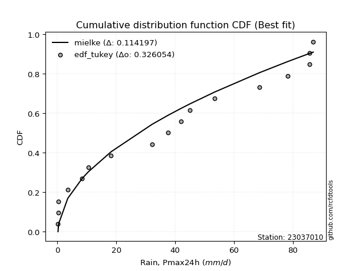</img>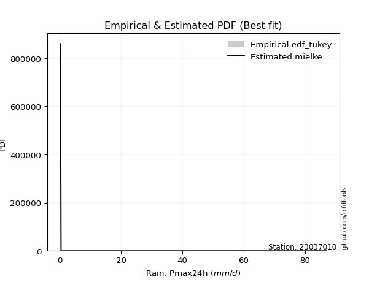</img>

</div>


### 8. Empirical - EDF Gringorten (1963)

Gringorten plotting position formula is essential for estimating the probability and return periods of extreme events like floods and heavy rainfall. The constant _a=0.44_.

<div align="center">


$P=(m-a)/(n+1-2a)$


</div>


**8.1. Empirical values**

<div align="center">

|                | 0                   | 1                   | 2                  | 3                   | 4                  | 5                  | 6                   | 7                  | 8                   | 9                  | 10                 | 11                 | 12                 | 13                 | 14                 | 15                 | 16                 | 17                 |
|:---------------|:--------------------|:--------------------|:-------------------|:--------------------|:-------------------|:-------------------|:--------------------|:-------------------|:--------------------|:-------------------|:-------------------|:-------------------|:-------------------|:-------------------|:-------------------|:-------------------|:-------------------|:-------------------|
| date           | 2023                | 2022                | 2025               | 2024                | 2020               | 2019               | 2018                | 2015               | 2006                | 2011               | 2017               | 2016               | 2005               | 2021               | 2013               | 2007               | 2008               | 2014               |
| x              | 0.2                 | 0.4                 | 0.4                | 0.4                 | 3.5                | 8.4                | 10.5                | 18.2               | 32.1                | 37.6               | 42.0               | 45.0               | 53.4               | 68.6               | 78.3               | 85.6               | 85.6               | 86.9               |
| m              | 1                   | 2                   | 3                  | 4                   | 5                  | 6                  | 7                   | 8                  | 9                   | 10                 | 11                 | 12                 | 13                 | 14                 | 15                 | 16                 | 17                 | 18                 |
| empirical_dist | edf_gringorten      | edf_gringorten      | edf_gringorten     | edf_gringorten      | edf_gringorten     | edf_gringorten     | edf_gringorten      | edf_gringorten     | edf_gringorten      | edf_gringorten     | edf_gringorten     | edf_gringorten     | edf_gringorten     | edf_gringorten     | edf_gringorten     | edf_gringorten     | edf_gringorten     | edf_gringorten     |
| empirical      | 0.03090507726269316 | 0.08609271523178808 | 0.141280353200883  | 0.19646799116997793 | 0.2516556291390728 | 0.3068432671081677 | 0.36203090507726265 | 0.4172185430463576 | 0.47240618101545256 | 0.5275938189845475 | 0.5827814569536424 | 0.6379690949227373 | 0.6931567328918322 | 0.7483443708609271 | 0.8035320088300221 | 0.8587196467991169 | 0.9139072847682118 | 0.9690949227373067 |
| empirical_tr   | 1.031890660592255   | 1.0942028985507246  | 1.1645244215938304 | 1.2445054945054945  | 1.3362831858407078 | 1.4426751592356688 | 1.5674740484429064  | 1.7159090909090906 | 1.8953974895397487  | 2.1168224299065423 | 2.3968253968253967 | 2.76219512195122   | 3.2589928057553954 | 3.9736842105263146 | 5.089887640449438  | 7.078124999999997  | 11.6153846153846   | 32.35714285714269  |

</div>


**8.2. Kolmogorov-Smirnov fit test (sorted by Δ)**


<div align="center">

|                | 0                   | 1                   | 2                   | 3                   | 4                   | 5                   | 6                   | 7                   | 8                     | 9                   | 10                  | 11                  | 12                  | 13                  | 14                  | 15                  | 16                  | 17                  | 18                  | 19                  | 20                  | 21                  | 22                  | 23                  | 24                  | 25                  | 26                  | 27                  | 28                  | 29                  | 30                  | 31                  | 32                  | 33                  | 34                  | 35                  | 36                  | 37                  | 38                  | 39                  | 40                  | 41                  | 42                  | 43                  | 44                  | 45                  | 46                  | 47                  | 48                  | 49                  | 50                  | 51                  | 52                  | 53                  | 54                  | 55                  | 56                  | 57                  | 58                  | 59                  | 60                  | 61                  | 62                  | 63                  | 64                  | 65                  | 66                  | 67                  | 68                  | 69                  | 70                  | 71                  | 72                  | 73                  | 74                  | 75                  | 76                  | 77                  | 78                  | 79                  | 80                  | 81                  | 82                  | 83                  | 84                  | 85                  | 86                  | 87                  | 88                  | 89                  |
|:---------------|:--------------------|:--------------------|:--------------------|:--------------------|:--------------------|:--------------------|:--------------------|:--------------------|:----------------------|:--------------------|:--------------------|:--------------------|:--------------------|:--------------------|:--------------------|:--------------------|:--------------------|:--------------------|:--------------------|:--------------------|:--------------------|:--------------------|:--------------------|:--------------------|:--------------------|:--------------------|:--------------------|:--------------------|:--------------------|:--------------------|:--------------------|:--------------------|:--------------------|:--------------------|:--------------------|:--------------------|:--------------------|:--------------------|:--------------------|:--------------------|:--------------------|:--------------------|:--------------------|:--------------------|:--------------------|:--------------------|:--------------------|:--------------------|:--------------------|:--------------------|:--------------------|:--------------------|:--------------------|:--------------------|:--------------------|:--------------------|:--------------------|:--------------------|:--------------------|:--------------------|:--------------------|:--------------------|:--------------------|:--------------------|:--------------------|:--------------------|:--------------------|:--------------------|:--------------------|:--------------------|:--------------------|:--------------------|:--------------------|:--------------------|:--------------------|:--------------------|:--------------------|:--------------------|:--------------------|:--------------------|:--------------------|:--------------------|:--------------------|:--------------------|:--------------------|:--------------------|:--------------------|:--------------------|:--------------------|:--------------------|
| station        | 23037010            | 23037010            | 23037010            | 23037010            | 23037010            | 23037010            | 23037010            | 23037010            | 23037010              | 23037010            | 23037010            | 23037010            | 23037010            | 23037010            | 23037010            | 23037010            | 23037010            | 23037010            | 23037010            | 23037010            | 23037010            | 23037010            | 23037010            | 23037010            | 23037010            | 23037010            | 23037010            | 23037010            | 23037010            | 23037010            | 23037010            | 23037010            | 23037010            | 23037010            | 23037010            | 23037010            | 23037010            | 23037010            | 23037010            | 23037010            | 23037010            | 23037010            | 23037010            | 23037010            | 23037010            | 23037010            | 23037010            | 23037010            | 23037010            | 23037010            | 23037010            | 23037010            | 23037010            | 23037010            | 23037010            | 23037010            | 23037010            | 23037010            | 23037010            | 23037010            | 23037010            | 23037010            | 23037010            | 23037010            | 23037010            | 23037010            | 23037010            | 23037010            | 23037010            | 23037010            | 23037010            | 23037010            | 23037010            | 23037010            | 23037010            | 23037010            | 23037010            | 23037010            | 23037010            | 23037010            | 23037010            | 23037010            | 23037010            | 23037010            | 23037010            | 23037010            | 23037010            | 23037010            | 23037010            | 23037010            |
| empirical_dist | edf_gringorten      | edf_gringorten      | edf_gringorten      | edf_gringorten      | edf_gringorten      | edf_gringorten      | edf_gringorten      | edf_gringorten      | edf_gringorten        | edf_gringorten      | edf_gringorten      | edf_gringorten      | edf_gringorten      | edf_gringorten      | edf_gringorten      | edf_gringorten      | edf_gringorten      | edf_gringorten      | edf_gringorten      | edf_gringorten      | edf_gringorten      | edf_gringorten      | edf_gringorten      | edf_gringorten      | edf_gringorten      | edf_gringorten      | edf_gringorten      | edf_gringorten      | edf_gringorten      | edf_gringorten      | edf_gringorten      | edf_gringorten      | edf_gringorten      | edf_gringorten      | edf_gringorten      | edf_gringorten      | edf_gringorten      | edf_gringorten      | edf_gringorten      | edf_gringorten      | edf_gringorten      | edf_gringorten      | edf_gringorten      | edf_gringorten      | edf_gringorten      | edf_gringorten      | edf_gringorten      | edf_gringorten      | edf_gringorten      | edf_gringorten      | edf_gringorten      | edf_gringorten      | edf_gringorten      | edf_gringorten      | edf_gringorten      | edf_gringorten      | edf_gringorten      | edf_gringorten      | edf_gringorten      | edf_gringorten      | edf_gringorten      | edf_gringorten      | edf_gringorten      | edf_gringorten      | edf_gringorten      | edf_gringorten      | edf_gringorten      | edf_gringorten      | edf_gringorten      | edf_gringorten      | edf_gringorten      | edf_gringorten      | edf_gringorten      | edf_gringorten      | edf_gringorten      | edf_gringorten      | edf_gringorten      | edf_gringorten      | edf_gringorten      | edf_gringorten      | edf_gringorten      | edf_gringorten      | edf_gringorten      | edf_gringorten      | edf_gringorten      | edf_gringorten      | edf_gringorten      | edf_gringorten      | edf_gringorten      | edf_gringorten      |
| p_dist         | nct                 | halfnorm            | nakagami            | rayleigh            | ncf                 | maxwell             | genlogistic         | invgamma            | loglaplace_asymmetric | logloggamma         | kstwobign           | pearson3            | t                   | norm                | crystalball         | logjohnsonsu        | gumbel_r            | halflogistic        | laplace_asymmetric  | logpearson3         | loggumbel_l         | moyal               | logweibull_min      | rice                | logistic            | gumbel_l            | hypsecant           | betaprime           | exponnorm           | f                   | expon               | genexpon            | gompertz            | truncnorm           | invgauss            | laplace             | logbetaprime        | loginvweibull       | loglognorm          | loginvgauss         | invweibull          | logt                | lognorm             | lognorm             | logcrystalball      | logexponnorm        | lognct              | logfatiguelife      | lognakagami         | logerlang           | loginvgamma         | logrice             | loggamma            | loggamma            | mielke              | weibull_min         | fisk                | logmaxwell          | loggenexpon         | loglogistic         | logkstwobign        | lograyleigh         | logmielke           | loghypsecant        | loghalfnorm         | loggumbel_r         | loglaplace          | loghalflogistic     | logmoyal            | johnsonsu           | logexpon            | fatiguelife         | wald                | logncf              | erlang              | logwald             | gamma               | chi2                | logfisk             | gibrat              | loggibrat           | logtruncnorm        | logalpha            | logf                | pareto              | logpareto           | logchi2             | alpha               | loggompertz         | loggenlogistic      |
| delta          | 0.1141026821907537  | 0.11778367970275053 | 0.13082744559017412 | 0.13134348884203542 | 0.13399493359823025 | 0.137533488085392   | 0.1399624501586047  | 0.1435649826408229  | 0.1447902177224646    | 0.1450716815093377  | 0.14508770472055307 | 0.14737759020195987 | 0.15234946030505275 | 0.15236666131197718 | 0.15236666289497633 | 0.15452151365518352 | 0.15642336994613742 | 0.15905922996027305 | 0.16191578955332755 | 0.16553213139883088 | 0.16704871498680757 | 0.1681882722571726  | 0.17064036384680586 | 0.1734380803298977  | 0.17429669474081258 | 0.18134181643142358 | 0.18749762849817875 | 0.18770135346851496 | 0.19025113621418588 | 0.19036615617895225 | 0.19097433800200045 | 0.191218446403755   | 0.19207395023360235 | 0.19269272305637564 | 0.2014937914411989  | 0.20245688476490845 | 0.20281670759078546 | 0.20331303444840026 | 0.2045116150677206  | 0.20557850260202265 | 0.20672536105788197 | 0.20684213169851134 | 0.20684250311822644 | 0.20684250311822644 | 0.20684259707568892 | 0.20684469528054944 | 0.20688229295271127 | 0.2072255926797389  | 0.20769394602372443 | 0.2078850241035562  | 0.20801754756259988 | 0.21077934936465242 | 0.21109177771296744 | 0.21109177771296744 | 0.21694607427521756 | 0.22414989101016325 | 0.22495873680264822 | 0.22521930537251506 | 0.22554240046669344 | 0.2270065674150556  | 0.22850260237579662 | 0.23065063411587844 | 0.2314609635809058  | 0.24204547930234682 | 0.24680731200687717 | 0.26176448232036426 | 0.26876890589302    | 0.27428522389557314 | 0.2796727588735746  | 0.291152494163389   | 0.2912056948510134  | 0.30018734395906116 | 0.30498729639185795 | 0.3121732646523021  | 0.3177719821968444  | 0.33133585804843807 | 0.35748944062755456 | 0.36118963438234225 | 0.36198946185808634 | 0.36203090507726265 | 0.36316827549110003 | 0.3665452388541403  | 0.39328096946143426 | 0.4069116711220856  | 0.46954631442161676 | 0.5321395874358359  | 0.6177383290201452  | 0.6331612413023562  | 0.7230386281606694  | 0.9139072847682118  |
| deltao         | 0.32102346734599996 | 0.32102346734599996 | 0.32102346734599996 | 0.32102346734599996 | 0.32102346734599996 | 0.32102346734599996 | 0.32102346734599996 | 0.32102346734599996 | 0.32102346734599996   | 0.32102346734599996 | 0.32102346734599996 | 0.32102346734599996 | 0.32102346734599996 | 0.32102346734599996 | 0.32102346734599996 | 0.32102346734599996 | 0.32102346734599996 | 0.32102346734599996 | 0.32102346734599996 | 0.32102346734599996 | 0.32102346734599996 | 0.32102346734599996 | 0.32102346734599996 | 0.32102346734599996 | 0.32102346734599996 | 0.32102346734599996 | 0.32102346734599996 | 0.32102346734599996 | 0.32102346734599996 | 0.32102346734599996 | 0.32102346734599996 | 0.32102346734599996 | 0.32102346734599996 | 0.32102346734599996 | 0.32102346734599996 | 0.32102346734599996 | 0.32102346734599996 | 0.32102346734599996 | 0.32102346734599996 | 0.32102346734599996 | 0.32102346734599996 | 0.32102346734599996 | 0.32102346734599996 | 0.32102346734599996 | 0.32102346734599996 | 0.32102346734599996 | 0.32102346734599996 | 0.32102346734599996 | 0.32102346734599996 | 0.32102346734599996 | 0.32102346734599996 | 0.32102346734599996 | 0.32102346734599996 | 0.32102346734599996 | 0.32102346734599996 | 0.32102346734599996 | 0.32102346734599996 | 0.32102346734599996 | 0.32102346734599996 | 0.32102346734599996 | 0.32102346734599996 | 0.32102346734599996 | 0.32102346734599996 | 0.32102346734599996 | 0.32102346734599996 | 0.32102346734599996 | 0.32102346734599996 | 0.32102346734599996 | 0.32102346734599996 | 0.32102346734599996 | 0.32102346734599996 | 0.32102346734599996 | 0.32102346734599996 | 0.32102346734599996 | 0.32102346734599996 | 0.32102346734599996 | 0.32102346734599996 | 0.32102346734599996 | 0.32102346734599996 | 0.32102346734599996 | 0.32102346734599996 | 0.32102346734599996 | 0.32102346734599996 | 0.32102346734599996 | 0.32102346734599996 | 0.32102346734599996 | 0.32102346734599996 | 0.32102346734599996 | 0.32102346734599996 | 0.32102346734599996 |
| eval           | Δo > Δ              | Δo > Δ              | Δo > Δ              | Δo > Δ              | Δo > Δ              | Δo > Δ              | Δo > Δ              | Δo > Δ              | Δo > Δ                | Δo > Δ              | Δo > Δ              | Δo > Δ              | Δo > Δ              | Δo > Δ              | Δo > Δ              | Δo > Δ              | Δo > Δ              | Δo > Δ              | Δo > Δ              | Δo > Δ              | Δo > Δ              | Δo > Δ              | Δo > Δ              | Δo > Δ              | Δo > Δ              | Δo > Δ              | Δo > Δ              | Δo > Δ              | Δo > Δ              | Δo > Δ              | Δo > Δ              | Δo > Δ              | Δo > Δ              | Δo > Δ              | Δo > Δ              | Δo > Δ              | Δo > Δ              | Δo > Δ              | Δo > Δ              | Δo > Δ              | Δo > Δ              | Δo > Δ              | Δo > Δ              | Δo > Δ              | Δo > Δ              | Δo > Δ              | Δo > Δ              | Δo > Δ              | Δo > Δ              | Δo > Δ              | Δo > Δ              | Δo > Δ              | Δo > Δ              | Δo > Δ              | Δo > Δ              | Δo > Δ              | Δo > Δ              | Δo > Δ              | Δo > Δ              | Δo > Δ              | Δo > Δ              | Δo > Δ              | Δo > Δ              | Δo > Δ              | Δo > Δ              | Δo > Δ              | Δo > Δ              | Δo > Δ              | Δo > Δ              | Δo > Δ              | Δo > Δ              | Δo > Δ              | Δo > Δ              | Δo > Δ              | Δo > Δ              | Δo <= Δ             | Δo <= Δ             | Δo <= Δ             | Δo <= Δ             | Δo <= Δ             | Δo <= Δ             | Δo <= Δ             | Δo <= Δ             | Δo <= Δ             | Δo <= Δ             | Δo <= Δ             | Δo <= Δ             | Δo <= Δ             | Δo <= Δ             | Δo <= Δ             |
| fit            | 1                   | 1                   | 1                   | 1                   | 1                   | 1                   | 1                   | 1                   | 1                     | 1                   | 1                   | 1                   | 1                   | 1                   | 1                   | 1                   | 1                   | 1                   | 1                   | 1                   | 1                   | 1                   | 1                   | 1                   | 1                   | 1                   | 1                   | 1                   | 1                   | 1                   | 1                   | 1                   | 1                   | 1                   | 1                   | 1                   | 1                   | 1                   | 1                   | 1                   | 1                   | 1                   | 1                   | 1                   | 1                   | 1                   | 1                   | 1                   | 1                   | 1                   | 1                   | 1                   | 1                   | 1                   | 1                   | 1                   | 1                   | 1                   | 1                   | 1                   | 1                   | 1                   | 1                   | 1                   | 1                   | 1                   | 1                   | 1                   | 1                   | 1                   | 1                   | 1                   | 1                   | 1                   | 1                   | 0                   | 0                   | 0                   | 0                   | 0                   | 0                   | 0                   | 0                   | 0                   | 0                   | 0                   | 0                   | 0                   | 0                   | 0                   |
| n              | 18                  | 18                  | 18                  | 18                  | 18                  | 18                  | 18                  | 18                  | 18                    | 18                  | 18                  | 18                  | 18                  | 18                  | 18                  | 18                  | 18                  | 18                  | 18                  | 18                  | 18                  | 18                  | 18                  | 18                  | 18                  | 18                  | 18                  | 18                  | 18                  | 18                  | 18                  | 18                  | 18                  | 18                  | 18                  | 18                  | 18                  | 18                  | 18                  | 18                  | 18                  | 18                  | 18                  | 18                  | 18                  | 18                  | 18                  | 18                  | 18                  | 18                  | 18                  | 18                  | 18                  | 18                  | 18                  | 18                  | 18                  | 18                  | 18                  | 18                  | 18                  | 18                  | 18                  | 18                  | 18                  | 18                  | 18                  | 18                  | 18                  | 18                  | 18                  | 18                  | 18                  | 18                  | 18                  | 18                  | 18                  | 18                  | 18                  | 18                  | 18                  | 18                  | 18                  | 18                  | 18                  | 18                  | 18                  | 18                  | 18                  | 18                  |
| best_fit       | 1                   | 0                   | 0                   | 0                   | 0                   | 0                   | 0                   | 0                   | 0                     | 0                   | 0                   | 0                   | 0                   | 0                   | 0                   | 0                   | 0                   | 0                   | 0                   | 0                   | 0                   | 0                   | 0                   | 0                   | 0                   | 0                   | 0                   | 0                   | 0                   | 0                   | 0                   | 0                   | 0                   | 0                   | 0                   | 0                   | 0                   | 0                   | 0                   | 0                   | 0                   | 0                   | 0                   | 0                   | 0                   | 0                   | 0                   | 0                   | 0                   | 0                   | 0                   | 0                   | 0                   | 0                   | 0                   | 0                   | 0                   | 0                   | 0                   | 0                   | 0                   | 0                   | 0                   | 0                   | 0                   | 0                   | 0                   | 0                   | 0                   | 0                   | 0                   | 0                   | 0                   | 0                   | 0                   | 0                   | 0                   | 0                   | 0                   | 0                   | 0                   | 0                   | 0                   | 0                   | 0                   | 0                   | 0                   | 0                   | 0                   | 0                   |
| best_fit_sort  | 1                   | 2                   | 3                   | 4                   | 5                   | 6                   | 7                   | 8                   | 9                     | 10                  | 11                  | 12                  | 13                  | 14                  | 15                  | 16                  | 17                  | 18                  | 19                  | 20                  | 21                  | 22                  | 23                  | 24                  | 25                  | 26                  | 27                  | 28                  | 29                  | 30                  | 31                  | 32                  | 33                  | 34                  | 35                  | 36                  | 37                  | 38                  | 39                  | 40                  | 41                  | 42                  | 43                  | 44                  | 45                  | 46                  | 47                  | 48                  | 49                  | 50                  | 51                  | 52                  | 53                  | 54                  | 55                  | 56                  | 57                  | 58                  | 59                  | 60                  | 61                  | 62                  | 63                  | 64                  | 65                  | 66                  | 67                  | 68                  | 69                  | 70                  | 71                  | 72                  | 73                  | 74                  | 75                  | 76                  | 77                  | 78                  | 79                  | 80                  | 81                  | 82                  | 83                  | 84                  | 85                  | 86                  | 87                  | 88                  | 89                  | 90                  |

</div>


<div align="center">

</img>

</div>


**8.3. Best fit**

<div align="center">

|   id |   station | empirical_dist   | p_dist   |    delta |   deltao | eval   |   fit |   n |   best_fit |   best_fit_sort |
|-----:|----------:|:-----------------|:---------|---------:|---------:|:-------|------:|----:|-----------:|----------------:|
|    0 |  23037010 | edf_gringorten   | nct      | 0.114103 | 0.321023 | Δo > Δ |     1 |  18 |          1 |               1 |

</div>


<div align="center">

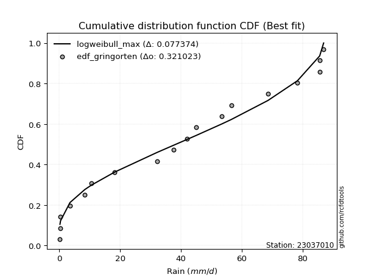</img></img>

</div>


### 9. Empirical - EDF Filliben (1975)

The specific values of the constants (0.3175) (often denoted as $alpha$) and (0.365) are derived from a method proposed by James J. Filliben in a 1975 paper. This particular formula is the mean value of the $i$-th order statistic of the normal distribution and is considered a robust and effective plotting position formula for the normal probability plot correlation coefficient test for normality.

<div align="center">


$P=(m-0.3175)/(n+0.365)$


</div>


**9.1. Empirical values**

<div align="center">

|                | 0                  | 1                  | 2                   | 3                   | 4                   | 5                  | 6                   | 7                  | 8                   | 9                  | 10                | 11                 | 12                 | 13                 | 14                 | 15                 | 16                 | 17                 |
|:---------------|:-------------------|:-------------------|:--------------------|:--------------------|:--------------------|:-------------------|:--------------------|:-------------------|:--------------------|:-------------------|:------------------|:-------------------|:-------------------|:-------------------|:-------------------|:-------------------|:-------------------|:-------------------|
| date           | 2023               | 2022               | 2025                | 2024                | 2020                | 2019               | 2018                | 2015               | 2006                | 2011               | 2017              | 2016               | 2005               | 2021               | 2013               | 2007               | 2008               | 2014               |
| x              | 0.2                | 0.4                | 0.4                 | 0.4                 | 3.5                 | 8.4                | 10.5                | 18.2               | 32.1                | 37.6               | 42.0              | 45.0               | 53.4               | 68.6               | 78.3               | 85.6               | 85.6               | 86.9               |
| m              | 1                  | 2                  | 3                   | 4                   | 5                   | 6                  | 7                   | 8                  | 9                   | 10                 | 11                | 12                 | 13                 | 14                 | 15                 | 16                 | 17                 | 18                 |
| empirical_dist | edf_filliben       | edf_filliben       | edf_filliben        | edf_filliben        | edf_filliben        | edf_filliben       | edf_filliben        | edf_filliben       | edf_filliben        | edf_filliben       | edf_filliben      | edf_filliben       | edf_filliben       | edf_filliben       | edf_filliben       | edf_filliben       | edf_filliben       | edf_filliben       |
| empirical      | 0.0371630819493602 | 0.0916144840729649 | 0.14606588619656957 | 0.20051728832017426 | 0.25496869044377896 | 0.3094200925673836 | 0.36387149469098834 | 0.418322896814593  | 0.47277429893819767 | 0.5272257010618023 | 0.581677103185407 | 0.6361285053090118 | 0.6905799074326164 | 0.7450313095562211 | 0.7994827116798258 | 0.8539341138034304 | 0.9083855159270352 | 0.96283691805064   |
| empirical_tr   | 1.03859748338753   | 1.100854188520905  | 1.1710505340347521  | 1.2508087859696917  | 1.3422254704915038  | 1.4480583481174847 | 1.5720094157928526  | 1.7191668616896794 | 1.8967208882003614  | 2.1151742009789807 | 2.390497884803124 | 2.7482229704451933 | 3.2318521777386717 | 3.9220501868659907 | 4.987101154107265  | 6.846225535880707  | 10.915304606240722 | 26.908424908425033 |

</div>


**9.2. Kolmogorov-Smirnov fit test (sorted by Δ)**


<div align="center">

|                | 0                   | 1                   | 2                   | 3                   | 4                   | 5                   | 6                   | 7                   | 8                   | 9                     | 10                  | 11                  | 12                  | 13                  | 14                  | 15                  | 16                  | 17                  | 18                  | 19                  | 20                  | 21                  | 22                  | 23                  | 24                  | 25                  | 26                  | 27                  | 28                  | 29                  | 30                  | 31                  | 32                  | 33                  | 34                  | 35                  | 36                  | 37                  | 38                  | 39                  | 40                  | 41                  | 42                  | 43                  | 44                  | 45                  | 46                  | 47                  | 48                  | 49                  | 50                  | 51                  | 52                  | 53                  | 54                  | 55                  | 56                  | 57                  | 58                  | 59                  | 60                  | 61                  | 62                  | 63                  | 64                  | 65                  | 66                  | 67                  | 68                  | 69                  | 70                  | 71                  | 72                  | 73                  | 74                  | 75                  | 76                  | 77                  | 78                  | 79                  | 80                  | 81                  | 82                  | 83                  | 84                  | 85                  | 86                  | 87                  | 88                  | 89                  |
|:---------------|:--------------------|:--------------------|:--------------------|:--------------------|:--------------------|:--------------------|:--------------------|:--------------------|:--------------------|:----------------------|:--------------------|:--------------------|:--------------------|:--------------------|:--------------------|:--------------------|:--------------------|:--------------------|:--------------------|:--------------------|:--------------------|:--------------------|:--------------------|:--------------------|:--------------------|:--------------------|:--------------------|:--------------------|:--------------------|:--------------------|:--------------------|:--------------------|:--------------------|:--------------------|:--------------------|:--------------------|:--------------------|:--------------------|:--------------------|:--------------------|:--------------------|:--------------------|:--------------------|:--------------------|:--------------------|:--------------------|:--------------------|:--------------------|:--------------------|:--------------------|:--------------------|:--------------------|:--------------------|:--------------------|:--------------------|:--------------------|:--------------------|:--------------------|:--------------------|:--------------------|:--------------------|:--------------------|:--------------------|:--------------------|:--------------------|:--------------------|:--------------------|:--------------------|:--------------------|:--------------------|:--------------------|:--------------------|:--------------------|:--------------------|:--------------------|:--------------------|:--------------------|:--------------------|:--------------------|:--------------------|:--------------------|:--------------------|:--------------------|:--------------------|:--------------------|:--------------------|:--------------------|:--------------------|:--------------------|:--------------------|
| station        | 23037010            | 23037010            | 23037010            | 23037010            | 23037010            | 23037010            | 23037010            | 23037010            | 23037010            | 23037010              | 23037010            | 23037010            | 23037010            | 23037010            | 23037010            | 23037010            | 23037010            | 23037010            | 23037010            | 23037010            | 23037010            | 23037010            | 23037010            | 23037010            | 23037010            | 23037010            | 23037010            | 23037010            | 23037010            | 23037010            | 23037010            | 23037010            | 23037010            | 23037010            | 23037010            | 23037010            | 23037010            | 23037010            | 23037010            | 23037010            | 23037010            | 23037010            | 23037010            | 23037010            | 23037010            | 23037010            | 23037010            | 23037010            | 23037010            | 23037010            | 23037010            | 23037010            | 23037010            | 23037010            | 23037010            | 23037010            | 23037010            | 23037010            | 23037010            | 23037010            | 23037010            | 23037010            | 23037010            | 23037010            | 23037010            | 23037010            | 23037010            | 23037010            | 23037010            | 23037010            | 23037010            | 23037010            | 23037010            | 23037010            | 23037010            | 23037010            | 23037010            | 23037010            | 23037010            | 23037010            | 23037010            | 23037010            | 23037010            | 23037010            | 23037010            | 23037010            | 23037010            | 23037010            | 23037010            | 23037010            |
| empirical_dist | edf_filliben        | edf_filliben        | edf_filliben        | edf_filliben        | edf_filliben        | edf_filliben        | edf_filliben        | edf_filliben        | edf_filliben        | edf_filliben          | edf_filliben        | edf_filliben        | edf_filliben        | edf_filliben        | edf_filliben        | edf_filliben        | edf_filliben        | edf_filliben        | edf_filliben        | edf_filliben        | edf_filliben        | edf_filliben        | edf_filliben        | edf_filliben        | edf_filliben        | edf_filliben        | edf_filliben        | edf_filliben        | edf_filliben        | edf_filliben        | edf_filliben        | edf_filliben        | edf_filliben        | edf_filliben        | edf_filliben        | edf_filliben        | edf_filliben        | edf_filliben        | edf_filliben        | edf_filliben        | edf_filliben        | edf_filliben        | edf_filliben        | edf_filliben        | edf_filliben        | edf_filliben        | edf_filliben        | edf_filliben        | edf_filliben        | edf_filliben        | edf_filliben        | edf_filliben        | edf_filliben        | edf_filliben        | edf_filliben        | edf_filliben        | edf_filliben        | edf_filliben        | edf_filliben        | edf_filliben        | edf_filliben        | edf_filliben        | edf_filliben        | edf_filliben        | edf_filliben        | edf_filliben        | edf_filliben        | edf_filliben        | edf_filliben        | edf_filliben        | edf_filliben        | edf_filliben        | edf_filliben        | edf_filliben        | edf_filliben        | edf_filliben        | edf_filliben        | edf_filliben        | edf_filliben        | edf_filliben        | edf_filliben        | edf_filliben        | edf_filliben        | edf_filliben        | edf_filliben        | edf_filliben        | edf_filliben        | edf_filliben        | edf_filliben        | edf_filliben        |
| p_dist         | nct                 | halfnorm            | nakagami            | rayleigh            | ncf                 | maxwell             | genlogistic         | invgamma            | kstwobign           | loglaplace_asymmetric | logloggamma         | pearson3            | logjohnsonsu        | t                   | norm                | crystalball         | gumbel_r            | halflogistic        | laplace_asymmetric  | logpearson3         | loggumbel_l         | moyal               | logweibull_min      | rice                | logistic            | gumbel_l            | f                   | betaprime           | hypsecant           | exponnorm           | expon               | genexpon            | gompertz            | truncnorm           | invgauss            | invweibull          | logbetaprime        | loginvweibull       | loglognorm          | laplace             | loginvgauss         | logt                | lognorm             | lognorm             | logcrystalball      | logexponnorm        | lognct              | logfatiguelife      | lognakagami         | logerlang           | loginvgamma         | logrice             | loggamma            | loggamma            | mielke              | weibull_min         | fisk                | logmaxwell          | loggenexpon         | loglogistic         | logkstwobign        | logmielke           | lograyleigh         | loghypsecant        | loghalfnorm         | loggumbel_r         | loglaplace          | loghalflogistic     | logmoyal            | johnsonsu           | logexpon            | fatiguelife         | logncf              | wald                | erlang              | logwald             | logfisk             | gamma               | chi2                | loggibrat           | gibrat              | logtruncnorm        | logalpha            | logf                | pareto              | logpareto           | logchi2             | alpha               | loggompertz         | loggenlogistic      |
| delta          | 0.11569543540846855 | 0.11962426931647621 | 0.12456944090350741 | 0.1331840784557611  | 0.1380442307484266  | 0.1393740776991177  | 0.14180303977233039 | 0.1431968647180778  | 0.14692829433427876 | 0.1488395148726609    | 0.149120978659534   | 0.14921817981568555 | 0.15268092404145794 | 0.15419004991877844 | 0.15420725092570287 | 0.15420725250870201 | 0.1582639595598631  | 0.1631085271104694  | 0.16375637916705324 | 0.16516401347608578 | 0.16668059706406246 | 0.17002886187089827 | 0.17027224592406076 | 0.17527866994362337 | 0.17613728435453826 | 0.18318240604514927 | 0.18410815149228554 | 0.18733323554576986 | 0.18933821811190443 | 0.1943004333643822  | 0.19502363515219678 | 0.19526774355395132 | 0.1961232473837987  | 0.19674202020657197 | 0.20112567351845378 | 0.20229831401338022 | 0.20244858966804036 | 0.20294491652565516 | 0.20414349714497548 | 0.20429747437863413 | 0.20521038467927755 | 0.20647401377576624 | 0.20647438519548134 | 0.20647438519548134 | 0.2064744791529438  | 0.20647657735780434 | 0.20651417502996616 | 0.2068574747569938  | 0.20732582810097933 | 0.2075169061808111  | 0.20764942963985478 | 0.21041123144190732 | 0.21072365979022234 | 0.21072365979022234 | 0.21657795635247246 | 0.21789188632349654 | 0.2187007321159815  | 0.22485118744976995 | 0.22517428254394833 | 0.2266384494923105  | 0.2281344844530515  | 0.2288841381216899  | 0.23028251619313334 | 0.24167736137960172 | 0.24643919408413206 | 0.26139636439761915 | 0.2684007879702749  | 0.27391710597282803 | 0.2793046409508295  | 0.2885756687041731  | 0.2886288693917975  | 0.29940761210601974 | 0.3059152599656354  | 0.30682788600558364 | 0.3174038642740993  | 0.33096774012569297 | 0.35573145717141963 | 0.35712132270480945 | 0.36082151645959715 | 0.36280015756835493 | 0.36387149469098834 | 0.3661771209313952  | 0.39070414400221837 | 0.40359860981737944 | 0.46402454558043993 | 0.5266178185946591  | 0.6144252677154391  | 0.6305844158431404  | 0.7197255668559632  | 0.9083855159270352  |
| deltao         | 0.32102346734599996 | 0.32102346734599996 | 0.32102346734599996 | 0.32102346734599996 | 0.32102346734599996 | 0.32102346734599996 | 0.32102346734599996 | 0.32102346734599996 | 0.32102346734599996 | 0.32102346734599996   | 0.32102346734599996 | 0.32102346734599996 | 0.32102346734599996 | 0.32102346734599996 | 0.32102346734599996 | 0.32102346734599996 | 0.32102346734599996 | 0.32102346734599996 | 0.32102346734599996 | 0.32102346734599996 | 0.32102346734599996 | 0.32102346734599996 | 0.32102346734599996 | 0.32102346734599996 | 0.32102346734599996 | 0.32102346734599996 | 0.32102346734599996 | 0.32102346734599996 | 0.32102346734599996 | 0.32102346734599996 | 0.32102346734599996 | 0.32102346734599996 | 0.32102346734599996 | 0.32102346734599996 | 0.32102346734599996 | 0.32102346734599996 | 0.32102346734599996 | 0.32102346734599996 | 0.32102346734599996 | 0.32102346734599996 | 0.32102346734599996 | 0.32102346734599996 | 0.32102346734599996 | 0.32102346734599996 | 0.32102346734599996 | 0.32102346734599996 | 0.32102346734599996 | 0.32102346734599996 | 0.32102346734599996 | 0.32102346734599996 | 0.32102346734599996 | 0.32102346734599996 | 0.32102346734599996 | 0.32102346734599996 | 0.32102346734599996 | 0.32102346734599996 | 0.32102346734599996 | 0.32102346734599996 | 0.32102346734599996 | 0.32102346734599996 | 0.32102346734599996 | 0.32102346734599996 | 0.32102346734599996 | 0.32102346734599996 | 0.32102346734599996 | 0.32102346734599996 | 0.32102346734599996 | 0.32102346734599996 | 0.32102346734599996 | 0.32102346734599996 | 0.32102346734599996 | 0.32102346734599996 | 0.32102346734599996 | 0.32102346734599996 | 0.32102346734599996 | 0.32102346734599996 | 0.32102346734599996 | 0.32102346734599996 | 0.32102346734599996 | 0.32102346734599996 | 0.32102346734599996 | 0.32102346734599996 | 0.32102346734599996 | 0.32102346734599996 | 0.32102346734599996 | 0.32102346734599996 | 0.32102346734599996 | 0.32102346734599996 | 0.32102346734599996 | 0.32102346734599996 |
| eval           | Δo > Δ              | Δo > Δ              | Δo > Δ              | Δo > Δ              | Δo > Δ              | Δo > Δ              | Δo > Δ              | Δo > Δ              | Δo > Δ              | Δo > Δ                | Δo > Δ              | Δo > Δ              | Δo > Δ              | Δo > Δ              | Δo > Δ              | Δo > Δ              | Δo > Δ              | Δo > Δ              | Δo > Δ              | Δo > Δ              | Δo > Δ              | Δo > Δ              | Δo > Δ              | Δo > Δ              | Δo > Δ              | Δo > Δ              | Δo > Δ              | Δo > Δ              | Δo > Δ              | Δo > Δ              | Δo > Δ              | Δo > Δ              | Δo > Δ              | Δo > Δ              | Δo > Δ              | Δo > Δ              | Δo > Δ              | Δo > Δ              | Δo > Δ              | Δo > Δ              | Δo > Δ              | Δo > Δ              | Δo > Δ              | Δo > Δ              | Δo > Δ              | Δo > Δ              | Δo > Δ              | Δo > Δ              | Δo > Δ              | Δo > Δ              | Δo > Δ              | Δo > Δ              | Δo > Δ              | Δo > Δ              | Δo > Δ              | Δo > Δ              | Δo > Δ              | Δo > Δ              | Δo > Δ              | Δo > Δ              | Δo > Δ              | Δo > Δ              | Δo > Δ              | Δo > Δ              | Δo > Δ              | Δo > Δ              | Δo > Δ              | Δo > Δ              | Δo > Δ              | Δo > Δ              | Δo > Δ              | Δo > Δ              | Δo > Δ              | Δo > Δ              | Δo > Δ              | Δo <= Δ             | Δo <= Δ             | Δo <= Δ             | Δo <= Δ             | Δo <= Δ             | Δo <= Δ             | Δo <= Δ             | Δo <= Δ             | Δo <= Δ             | Δo <= Δ             | Δo <= Δ             | Δo <= Δ             | Δo <= Δ             | Δo <= Δ             | Δo <= Δ             |
| fit            | 1                   | 1                   | 1                   | 1                   | 1                   | 1                   | 1                   | 1                   | 1                   | 1                     | 1                   | 1                   | 1                   | 1                   | 1                   | 1                   | 1                   | 1                   | 1                   | 1                   | 1                   | 1                   | 1                   | 1                   | 1                   | 1                   | 1                   | 1                   | 1                   | 1                   | 1                   | 1                   | 1                   | 1                   | 1                   | 1                   | 1                   | 1                   | 1                   | 1                   | 1                   | 1                   | 1                   | 1                   | 1                   | 1                   | 1                   | 1                   | 1                   | 1                   | 1                   | 1                   | 1                   | 1                   | 1                   | 1                   | 1                   | 1                   | 1                   | 1                   | 1                   | 1                   | 1                   | 1                   | 1                   | 1                   | 1                   | 1                   | 1                   | 1                   | 1                   | 1                   | 1                   | 1                   | 1                   | 0                   | 0                   | 0                   | 0                   | 0                   | 0                   | 0                   | 0                   | 0                   | 0                   | 0                   | 0                   | 0                   | 0                   | 0                   |
| n              | 18                  | 18                  | 18                  | 18                  | 18                  | 18                  | 18                  | 18                  | 18                  | 18                    | 18                  | 18                  | 18                  | 18                  | 18                  | 18                  | 18                  | 18                  | 18                  | 18                  | 18                  | 18                  | 18                  | 18                  | 18                  | 18                  | 18                  | 18                  | 18                  | 18                  | 18                  | 18                  | 18                  | 18                  | 18                  | 18                  | 18                  | 18                  | 18                  | 18                  | 18                  | 18                  | 18                  | 18                  | 18                  | 18                  | 18                  | 18                  | 18                  | 18                  | 18                  | 18                  | 18                  | 18                  | 18                  | 18                  | 18                  | 18                  | 18                  | 18                  | 18                  | 18                  | 18                  | 18                  | 18                  | 18                  | 18                  | 18                  | 18                  | 18                  | 18                  | 18                  | 18                  | 18                  | 18                  | 18                  | 18                  | 18                  | 18                  | 18                  | 18                  | 18                  | 18                  | 18                  | 18                  | 18                  | 18                  | 18                  | 18                  | 18                  |
| best_fit       | 1                   | 0                   | 0                   | 0                   | 0                   | 0                   | 0                   | 0                   | 0                   | 0                     | 0                   | 0                   | 0                   | 0                   | 0                   | 0                   | 0                   | 0                   | 0                   | 0                   | 0                   | 0                   | 0                   | 0                   | 0                   | 0                   | 0                   | 0                   | 0                   | 0                   | 0                   | 0                   | 0                   | 0                   | 0                   | 0                   | 0                   | 0                   | 0                   | 0                   | 0                   | 0                   | 0                   | 0                   | 0                   | 0                   | 0                   | 0                   | 0                   | 0                   | 0                   | 0                   | 0                   | 0                   | 0                   | 0                   | 0                   | 0                   | 0                   | 0                   | 0                   | 0                   | 0                   | 0                   | 0                   | 0                   | 0                   | 0                   | 0                   | 0                   | 0                   | 0                   | 0                   | 0                   | 0                   | 0                   | 0                   | 0                   | 0                   | 0                   | 0                   | 0                   | 0                   | 0                   | 0                   | 0                   | 0                   | 0                   | 0                   | 0                   |
| best_fit_sort  | 1                   | 2                   | 3                   | 4                   | 5                   | 6                   | 7                   | 8                   | 9                   | 10                    | 11                  | 12                  | 13                  | 14                  | 15                  | 16                  | 17                  | 18                  | 19                  | 20                  | 21                  | 22                  | 23                  | 24                  | 25                  | 26                  | 27                  | 28                  | 29                  | 30                  | 31                  | 32                  | 33                  | 34                  | 35                  | 36                  | 37                  | 38                  | 39                  | 40                  | 41                  | 42                  | 43                  | 44                  | 45                  | 46                  | 47                  | 48                  | 49                  | 50                  | 51                  | 52                  | 53                  | 54                  | 55                  | 56                  | 57                  | 58                  | 59                  | 60                  | 61                  | 62                  | 63                  | 64                  | 65                  | 66                  | 67                  | 68                  | 69                  | 70                  | 71                  | 72                  | 73                  | 74                  | 75                  | 76                  | 77                  | 78                  | 79                  | 80                  | 81                  | 82                  | 83                  | 84                  | 85                  | 86                  | 87                  | 88                  | 89                  | 90                  |

</div>


<div align="center">

</img>

</div>


**9.3. Best fit**

<div align="center">

|   id |   station | empirical_dist   | p_dist   |    delta |   deltao | eval   |   fit |   n |   best_fit |   best_fit_sort |
|-----:|----------:|:-----------------|:---------|---------:|---------:|:-------|------:|----:|-----------:|----------------:|
|    0 |  23037010 | edf_filliben     | nct      | 0.115695 | 0.321023 | Δo > Δ |     1 |  18 |          1 |               1 |

</div>


<div align="center">

</img>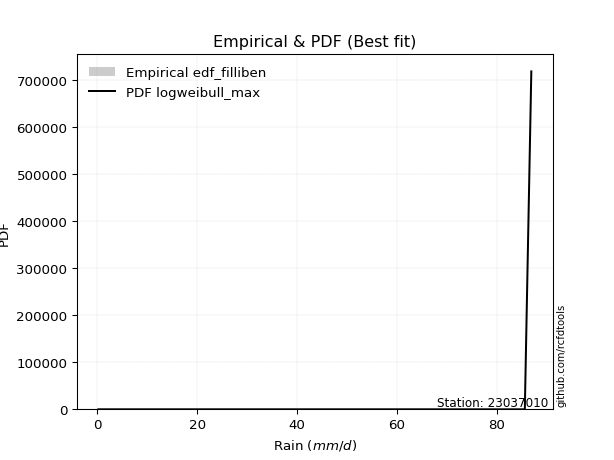</img>

</div>


### 10. Empirical - EDF Jenkinson (1977)

The Jenkinson formula in hydrology is an empirical plotting position formula used to estimate the non-exceedance probability _(P)_ or return period _(T)_ of a given ordered observation within a sample. It is a widely used method in the frequency analysis of extreme events such as floods and rainfall, as it provides a distribution-free way to plot data. _a≈0.31_ and _b≈0.38_ are constants derived to approximate the median of the probability distribution for the given rank.

<div align="center">


$P=(m-a)/(n+b)$


</div>


**10.1. Empirical values**

<div align="center">

|                | 0                   | 1                   | 2                   | 3                   | 4                  | 5                   | 6                  | 7                  | 8                   | 9                  | 10                 | 11                 | 12                | 13                 | 14                 | 15                 | 16                 | 17                 |
|:---------------|:--------------------|:--------------------|:--------------------|:--------------------|:-------------------|:--------------------|:-------------------|:-------------------|:--------------------|:-------------------|:-------------------|:-------------------|:------------------|:-------------------|:-------------------|:-------------------|:-------------------|:-------------------|
| date           | 2023                | 2022                | 2025                | 2024                | 2020               | 2019                | 2018               | 2015               | 2006                | 2011               | 2017               | 2016               | 2005              | 2021               | 2013               | 2007               | 2008               | 2014               |
| x              | 0.2                 | 0.4                 | 0.4                 | 0.4                 | 3.5                | 8.4                 | 10.5               | 18.2               | 32.1                | 37.6               | 42.0               | 45.0               | 53.4              | 68.6               | 78.3               | 85.6               | 85.6               | 86.9               |
| m              | 1                   | 2                   | 3                   | 4                   | 5                  | 6                   | 7                  | 8                  | 9                   | 10                 | 11                 | 12                 | 13                | 14                 | 15                 | 16                 | 17                 | 18                 |
| empirical_dist | edf_jenkinson       | edf_jenkinson       | edf_jenkinson       | edf_jenkinson       | edf_jenkinson      | edf_jenkinson       | edf_jenkinson      | edf_jenkinson      | edf_jenkinson       | edf_jenkinson      | edf_jenkinson      | edf_jenkinson      | edf_jenkinson     | edf_jenkinson      | edf_jenkinson      | edf_jenkinson      | edf_jenkinson      | edf_jenkinson      |
| empirical      | 0.03754080522306855 | 0.09194776931447225 | 0.14635473340587596 | 0.20076169749727965 | 0.2551686615886834 | 0.30957562568008706 | 0.3639825897714908 | 0.4183895538628945 | 0.47279651795429817 | 0.5272034820457019 | 0.5816104461371056 | 0.6360174102285092 | 0.690424374319913 | 0.7448313384113167 | 0.7992383025027203 | 0.8536452665941241 | 0.9080522306855279 | 0.9624591947769315 |
| empirical_tr   | 1.0390050876201244  | 1.1012582384661473  | 1.17144678138942    | 1.2511912865895167  | 1.3425858290723158 | 1.4483845547675334  | 1.572284003421728  | 1.7193638914873717 | 1.896800825593395   | 2.1150747986191027 | 2.390117035110533  | 2.747384155455904  | 3.230228471001758 | 3.9189765458422174 | 4.981029810298102  | 6.832713754646843  | 10.875739644970428 | 26.637681159420353 |

</div>


**10.2. Kolmogorov-Smirnov fit test (sorted by Δ)**


<div align="center">

|                | 0                   | 1                   | 2                   | 3                   | 4                   | 5                   | 6                   | 7                   | 8                   | 9                     | 10                  | 11                  | 12                  | 13                  | 14                  | 15                  | 16                  | 17                  | 18                  | 19                  | 20                  | 21                  | 22                  | 23                  | 24                  | 25                  | 26                  | 27                  | 28                  | 29                  | 30                  | 31                  | 32                  | 33                  | 34                  | 35                  | 36                  | 37                  | 38                  | 39                  | 40                  | 41                  | 42                  | 43                  | 44                  | 45                  | 46                  | 47                  | 48                  | 49                  | 50                  | 51                  | 52                  | 53                  | 54                  | 55                  | 56                  | 57                  | 58                  | 59                  | 60                  | 61                  | 62                  | 63                  | 64                  | 65                  | 66                  | 67                  | 68                  | 69                  | 70                  | 71                  | 72                  | 73                  | 74                  | 75                  | 76                  | 77                  | 78                  | 79                  | 80                  | 81                  | 82                  | 83                  | 84                  | 85                  | 86                  | 87                  | 88                  | 89                  |
|:---------------|:--------------------|:--------------------|:--------------------|:--------------------|:--------------------|:--------------------|:--------------------|:--------------------|:--------------------|:----------------------|:--------------------|:--------------------|:--------------------|:--------------------|:--------------------|:--------------------|:--------------------|:--------------------|:--------------------|:--------------------|:--------------------|:--------------------|:--------------------|:--------------------|:--------------------|:--------------------|:--------------------|:--------------------|:--------------------|:--------------------|:--------------------|:--------------------|:--------------------|:--------------------|:--------------------|:--------------------|:--------------------|:--------------------|:--------------------|:--------------------|:--------------------|:--------------------|:--------------------|:--------------------|:--------------------|:--------------------|:--------------------|:--------------------|:--------------------|:--------------------|:--------------------|:--------------------|:--------------------|:--------------------|:--------------------|:--------------------|:--------------------|:--------------------|:--------------------|:--------------------|:--------------------|:--------------------|:--------------------|:--------------------|:--------------------|:--------------------|:--------------------|:--------------------|:--------------------|:--------------------|:--------------------|:--------------------|:--------------------|:--------------------|:--------------------|:--------------------|:--------------------|:--------------------|:--------------------|:--------------------|:--------------------|:--------------------|:--------------------|:--------------------|:--------------------|:--------------------|:--------------------|:--------------------|:--------------------|:--------------------|
| station        | 23037010            | 23037010            | 23037010            | 23037010            | 23037010            | 23037010            | 23037010            | 23037010            | 23037010            | 23037010              | 23037010            | 23037010            | 23037010            | 23037010            | 23037010            | 23037010            | 23037010            | 23037010            | 23037010            | 23037010            | 23037010            | 23037010            | 23037010            | 23037010            | 23037010            | 23037010            | 23037010            | 23037010            | 23037010            | 23037010            | 23037010            | 23037010            | 23037010            | 23037010            | 23037010            | 23037010            | 23037010            | 23037010            | 23037010            | 23037010            | 23037010            | 23037010            | 23037010            | 23037010            | 23037010            | 23037010            | 23037010            | 23037010            | 23037010            | 23037010            | 23037010            | 23037010            | 23037010            | 23037010            | 23037010            | 23037010            | 23037010            | 23037010            | 23037010            | 23037010            | 23037010            | 23037010            | 23037010            | 23037010            | 23037010            | 23037010            | 23037010            | 23037010            | 23037010            | 23037010            | 23037010            | 23037010            | 23037010            | 23037010            | 23037010            | 23037010            | 23037010            | 23037010            | 23037010            | 23037010            | 23037010            | 23037010            | 23037010            | 23037010            | 23037010            | 23037010            | 23037010            | 23037010            | 23037010            | 23037010            |
| empirical_dist | edf_jenkinson       | edf_jenkinson       | edf_jenkinson       | edf_jenkinson       | edf_jenkinson       | edf_jenkinson       | edf_jenkinson       | edf_jenkinson       | edf_jenkinson       | edf_jenkinson         | edf_jenkinson       | edf_jenkinson       | edf_jenkinson       | edf_jenkinson       | edf_jenkinson       | edf_jenkinson       | edf_jenkinson       | edf_jenkinson       | edf_jenkinson       | edf_jenkinson       | edf_jenkinson       | edf_jenkinson       | edf_jenkinson       | edf_jenkinson       | edf_jenkinson       | edf_jenkinson       | edf_jenkinson       | edf_jenkinson       | edf_jenkinson       | edf_jenkinson       | edf_jenkinson       | edf_jenkinson       | edf_jenkinson       | edf_jenkinson       | edf_jenkinson       | edf_jenkinson       | edf_jenkinson       | edf_jenkinson       | edf_jenkinson       | edf_jenkinson       | edf_jenkinson       | edf_jenkinson       | edf_jenkinson       | edf_jenkinson       | edf_jenkinson       | edf_jenkinson       | edf_jenkinson       | edf_jenkinson       | edf_jenkinson       | edf_jenkinson       | edf_jenkinson       | edf_jenkinson       | edf_jenkinson       | edf_jenkinson       | edf_jenkinson       | edf_jenkinson       | edf_jenkinson       | edf_jenkinson       | edf_jenkinson       | edf_jenkinson       | edf_jenkinson       | edf_jenkinson       | edf_jenkinson       | edf_jenkinson       | edf_jenkinson       | edf_jenkinson       | edf_jenkinson       | edf_jenkinson       | edf_jenkinson       | edf_jenkinson       | edf_jenkinson       | edf_jenkinson       | edf_jenkinson       | edf_jenkinson       | edf_jenkinson       | edf_jenkinson       | edf_jenkinson       | edf_jenkinson       | edf_jenkinson       | edf_jenkinson       | edf_jenkinson       | edf_jenkinson       | edf_jenkinson       | edf_jenkinson       | edf_jenkinson       | edf_jenkinson       | edf_jenkinson       | edf_jenkinson       | edf_jenkinson       | edf_jenkinson       |
| p_dist         | nct                 | halfnorm            | nakagami            | rayleigh            | ncf                 | maxwell             | genlogistic         | invgamma            | kstwobign           | loglaplace_asymmetric | pearson3            | logloggamma         | logjohnsonsu        | t                   | norm                | crystalball         | gumbel_r            | halflogistic        | laplace_asymmetric  | logpearson3         | loggumbel_l         | moyal               | logweibull_min      | rice                | logistic            | gumbel_l            | f                   | betaprime           | hypsecant           | exponnorm           | expon               | genexpon            | gompertz            | truncnorm           | invgauss            | invweibull          | logbetaprime        | loginvweibull       | loglognorm          | laplace             | loginvgauss         | logt                | lognorm             | lognorm             | logcrystalball      | logexponnorm        | lognct              | logfatiguelife      | lognakagami         | logerlang           | loginvgamma         | logrice             | loggamma            | loggamma            | mielke              | weibull_min         | fisk                | logmaxwell          | loggenexpon         | loglogistic         | logkstwobign        | logmielke           | lograyleigh         | loghypsecant        | loghalfnorm         | loggumbel_r         | loglaplace          | loghalflogistic     | logmoyal            | johnsonsu           | logexpon            | fatiguelife         | logncf              | wald                | erlang              | logwald             | logfisk             | gamma               | chi2                | loggibrat           | gibrat              | logtruncnorm        | logalpha            | logf                | pareto              | logpareto           | logchi2             | alpha               | loggompertz         | loggenlogistic      |
| delta          | 0.11589540655337299 | 0.11973536439697866 | 0.12419171762979897 | 0.13329517353626355 | 0.13828863992553198 | 0.13948517277962014 | 0.14191413485283283 | 0.1431746457019773  | 0.1470393894147812  | 0.14908392404976634   | 0.149329274896188   | 0.14936538783663944 | 0.1525698289609554  | 0.15430114499928088 | 0.1543183460062053  | 0.15431834758920446 | 0.15837505464036555 | 0.16335293628757477 | 0.16386747424755568 | 0.16514179445998528 | 0.16665837804796196 | 0.17013995695140072 | 0.17025002690796026 | 0.17538976502412582 | 0.1762483794350407  | 0.1832935011256517  | 0.1837304282185771  | 0.18731101652966936 | 0.18944931319240688 | 0.1945448425414876  | 0.19526804432930217 | 0.1955121527310567  | 0.19636765656090407 | 0.19698642938367736 | 0.20110345450235328 | 0.20214278090067678 | 0.20242637065193986 | 0.20292269750955466 | 0.20412127812887498 | 0.20440856945913657 | 0.20518816566317705 | 0.20645179475966574 | 0.20645216617938084 | 0.20645216617938084 | 0.2064522601368433  | 0.20645435834170384 | 0.20649195601386566 | 0.2068352557408933  | 0.20730360908487883 | 0.2074946871647106  | 0.20762721062375428 | 0.21038901242580682 | 0.21070144077412184 | 0.21070144077412184 | 0.21655573733637196 | 0.2175141630497881  | 0.21832300884227307 | 0.22482896843366945 | 0.22515206352784783 | 0.22661623047621    | 0.228112265436951   | 0.22872860500898645 | 0.23026029717703284 | 0.24165514236350122 | 0.24641697506803156 | 0.26137414538151865 | 0.2683785689541744  | 0.27389488695672753 | 0.279282421934729   | 0.2884201355914697  | 0.28847333627909405 | 0.29938539308991924 | 0.30553753669192696 | 0.3069389810860861  | 0.3173816452579988  | 0.33094552110959247 | 0.3553537338977112  | 0.35709910368870895 | 0.36079929744349665 | 0.36277793855225443 | 0.3639825897714908  | 0.3661549019152947  | 0.3905486108895149  | 0.403398638672475   | 0.4636912603389326  | 0.5262845333531517  | 0.6142252965705346  | 0.630428882730437   | 0.7195255957110589  | 0.9080522306855279  |
| deltao         | 0.32102346734599996 | 0.32102346734599996 | 0.32102346734599996 | 0.32102346734599996 | 0.32102346734599996 | 0.32102346734599996 | 0.32102346734599996 | 0.32102346734599996 | 0.32102346734599996 | 0.32102346734599996   | 0.32102346734599996 | 0.32102346734599996 | 0.32102346734599996 | 0.32102346734599996 | 0.32102346734599996 | 0.32102346734599996 | 0.32102346734599996 | 0.32102346734599996 | 0.32102346734599996 | 0.32102346734599996 | 0.32102346734599996 | 0.32102346734599996 | 0.32102346734599996 | 0.32102346734599996 | 0.32102346734599996 | 0.32102346734599996 | 0.32102346734599996 | 0.32102346734599996 | 0.32102346734599996 | 0.32102346734599996 | 0.32102346734599996 | 0.32102346734599996 | 0.32102346734599996 | 0.32102346734599996 | 0.32102346734599996 | 0.32102346734599996 | 0.32102346734599996 | 0.32102346734599996 | 0.32102346734599996 | 0.32102346734599996 | 0.32102346734599996 | 0.32102346734599996 | 0.32102346734599996 | 0.32102346734599996 | 0.32102346734599996 | 0.32102346734599996 | 0.32102346734599996 | 0.32102346734599996 | 0.32102346734599996 | 0.32102346734599996 | 0.32102346734599996 | 0.32102346734599996 | 0.32102346734599996 | 0.32102346734599996 | 0.32102346734599996 | 0.32102346734599996 | 0.32102346734599996 | 0.32102346734599996 | 0.32102346734599996 | 0.32102346734599996 | 0.32102346734599996 | 0.32102346734599996 | 0.32102346734599996 | 0.32102346734599996 | 0.32102346734599996 | 0.32102346734599996 | 0.32102346734599996 | 0.32102346734599996 | 0.32102346734599996 | 0.32102346734599996 | 0.32102346734599996 | 0.32102346734599996 | 0.32102346734599996 | 0.32102346734599996 | 0.32102346734599996 | 0.32102346734599996 | 0.32102346734599996 | 0.32102346734599996 | 0.32102346734599996 | 0.32102346734599996 | 0.32102346734599996 | 0.32102346734599996 | 0.32102346734599996 | 0.32102346734599996 | 0.32102346734599996 | 0.32102346734599996 | 0.32102346734599996 | 0.32102346734599996 | 0.32102346734599996 | 0.32102346734599996 |
| eval           | Δo > Δ              | Δo > Δ              | Δo > Δ              | Δo > Δ              | Δo > Δ              | Δo > Δ              | Δo > Δ              | Δo > Δ              | Δo > Δ              | Δo > Δ                | Δo > Δ              | Δo > Δ              | Δo > Δ              | Δo > Δ              | Δo > Δ              | Δo > Δ              | Δo > Δ              | Δo > Δ              | Δo > Δ              | Δo > Δ              | Δo > Δ              | Δo > Δ              | Δo > Δ              | Δo > Δ              | Δo > Δ              | Δo > Δ              | Δo > Δ              | Δo > Δ              | Δo > Δ              | Δo > Δ              | Δo > Δ              | Δo > Δ              | Δo > Δ              | Δo > Δ              | Δo > Δ              | Δo > Δ              | Δo > Δ              | Δo > Δ              | Δo > Δ              | Δo > Δ              | Δo > Δ              | Δo > Δ              | Δo > Δ              | Δo > Δ              | Δo > Δ              | Δo > Δ              | Δo > Δ              | Δo > Δ              | Δo > Δ              | Δo > Δ              | Δo > Δ              | Δo > Δ              | Δo > Δ              | Δo > Δ              | Δo > Δ              | Δo > Δ              | Δo > Δ              | Δo > Δ              | Δo > Δ              | Δo > Δ              | Δo > Δ              | Δo > Δ              | Δo > Δ              | Δo > Δ              | Δo > Δ              | Δo > Δ              | Δo > Δ              | Δo > Δ              | Δo > Δ              | Δo > Δ              | Δo > Δ              | Δo > Δ              | Δo > Δ              | Δo > Δ              | Δo > Δ              | Δo <= Δ             | Δo <= Δ             | Δo <= Δ             | Δo <= Δ             | Δo <= Δ             | Δo <= Δ             | Δo <= Δ             | Δo <= Δ             | Δo <= Δ             | Δo <= Δ             | Δo <= Δ             | Δo <= Δ             | Δo <= Δ             | Δo <= Δ             | Δo <= Δ             |
| fit            | 1                   | 1                   | 1                   | 1                   | 1                   | 1                   | 1                   | 1                   | 1                   | 1                     | 1                   | 1                   | 1                   | 1                   | 1                   | 1                   | 1                   | 1                   | 1                   | 1                   | 1                   | 1                   | 1                   | 1                   | 1                   | 1                   | 1                   | 1                   | 1                   | 1                   | 1                   | 1                   | 1                   | 1                   | 1                   | 1                   | 1                   | 1                   | 1                   | 1                   | 1                   | 1                   | 1                   | 1                   | 1                   | 1                   | 1                   | 1                   | 1                   | 1                   | 1                   | 1                   | 1                   | 1                   | 1                   | 1                   | 1                   | 1                   | 1                   | 1                   | 1                   | 1                   | 1                   | 1                   | 1                   | 1                   | 1                   | 1                   | 1                   | 1                   | 1                   | 1                   | 1                   | 1                   | 1                   | 0                   | 0                   | 0                   | 0                   | 0                   | 0                   | 0                   | 0                   | 0                   | 0                   | 0                   | 0                   | 0                   | 0                   | 0                   |
| n              | 18                  | 18                  | 18                  | 18                  | 18                  | 18                  | 18                  | 18                  | 18                  | 18                    | 18                  | 18                  | 18                  | 18                  | 18                  | 18                  | 18                  | 18                  | 18                  | 18                  | 18                  | 18                  | 18                  | 18                  | 18                  | 18                  | 18                  | 18                  | 18                  | 18                  | 18                  | 18                  | 18                  | 18                  | 18                  | 18                  | 18                  | 18                  | 18                  | 18                  | 18                  | 18                  | 18                  | 18                  | 18                  | 18                  | 18                  | 18                  | 18                  | 18                  | 18                  | 18                  | 18                  | 18                  | 18                  | 18                  | 18                  | 18                  | 18                  | 18                  | 18                  | 18                  | 18                  | 18                  | 18                  | 18                  | 18                  | 18                  | 18                  | 18                  | 18                  | 18                  | 18                  | 18                  | 18                  | 18                  | 18                  | 18                  | 18                  | 18                  | 18                  | 18                  | 18                  | 18                  | 18                  | 18                  | 18                  | 18                  | 18                  | 18                  |
| best_fit       | 1                   | 0                   | 0                   | 0                   | 0                   | 0                   | 0                   | 0                   | 0                   | 0                     | 0                   | 0                   | 0                   | 0                   | 0                   | 0                   | 0                   | 0                   | 0                   | 0                   | 0                   | 0                   | 0                   | 0                   | 0                   | 0                   | 0                   | 0                   | 0                   | 0                   | 0                   | 0                   | 0                   | 0                   | 0                   | 0                   | 0                   | 0                   | 0                   | 0                   | 0                   | 0                   | 0                   | 0                   | 0                   | 0                   | 0                   | 0                   | 0                   | 0                   | 0                   | 0                   | 0                   | 0                   | 0                   | 0                   | 0                   | 0                   | 0                   | 0                   | 0                   | 0                   | 0                   | 0                   | 0                   | 0                   | 0                   | 0                   | 0                   | 0                   | 0                   | 0                   | 0                   | 0                   | 0                   | 0                   | 0                   | 0                   | 0                   | 0                   | 0                   | 0                   | 0                   | 0                   | 0                   | 0                   | 0                   | 0                   | 0                   | 0                   |
| best_fit_sort  | 1                   | 2                   | 3                   | 4                   | 5                   | 6                   | 7                   | 8                   | 9                   | 10                    | 11                  | 12                  | 13                  | 14                  | 15                  | 16                  | 17                  | 18                  | 19                  | 20                  | 21                  | 22                  | 23                  | 24                  | 25                  | 26                  | 27                  | 28                  | 29                  | 30                  | 31                  | 32                  | 33                  | 34                  | 35                  | 36                  | 37                  | 38                  | 39                  | 40                  | 41                  | 42                  | 43                  | 44                  | 45                  | 46                  | 47                  | 48                  | 49                  | 50                  | 51                  | 52                  | 53                  | 54                  | 55                  | 56                  | 57                  | 58                  | 59                  | 60                  | 61                  | 62                  | 63                  | 64                  | 65                  | 66                  | 67                  | 68                  | 69                  | 70                  | 71                  | 72                  | 73                  | 74                  | 75                  | 76                  | 77                  | 78                  | 79                  | 80                  | 81                  | 82                  | 83                  | 84                  | 85                  | 86                  | 87                  | 88                  | 89                  | 90                  |

</div>


<div align="center">

</img>

</div>


**10.3. Best fit**

<div align="center">

|   id |   station | empirical_dist   | p_dist   |    delta |   deltao | eval   |   fit |   n |   best_fit |   best_fit_sort |
|-----:|----------:|:-----------------|:---------|---------:|---------:|:-------|------:|----:|-----------:|----------------:|
|    0 |  23037010 | edf_jenkinson    | nct      | 0.115895 | 0.321023 | Δo > Δ |     1 |  18 |          1 |               1 |

</div>


<div align="center">

</img>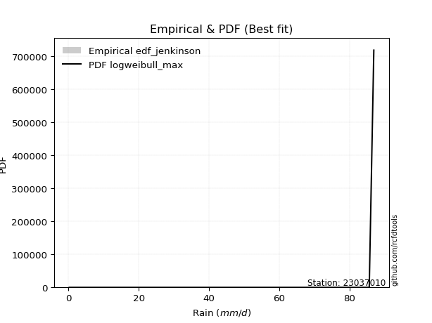</img>

</div>


### 11. Empirical - EDF Cunnane (1978)

Cunnane´s work in statistical hydrology has focused on the performance and evaluation of different probability distributions (such as GEV, Gumbel, Lognormal) for flood frequency estimation. _b_ is a constant, typically set to 0.4.

<div align="center">


$P=(m-b)/(n+1-2b)$


</div>


**11.1. Empirical values**

<div align="center">

|                | 0                   | 1                   | 2                   | 3                   | 4                   | 5                  | 6                  | 7                  | 8                  | 9                  | 10                 | 11                 | 12                 | 13                 | 14                 | 15                 | 16                 | 17                 |
|:---------------|:--------------------|:--------------------|:--------------------|:--------------------|:--------------------|:-------------------|:-------------------|:-------------------|:-------------------|:-------------------|:-------------------|:-------------------|:-------------------|:-------------------|:-------------------|:-------------------|:-------------------|:-------------------|
| date           | 2023                | 2022                | 2025                | 2024                | 2020                | 2019               | 2018               | 2015               | 2006               | 2011               | 2017               | 2016               | 2005               | 2021               | 2013               | 2007               | 2008               | 2014               |
| x              | 0.2                 | 0.4                 | 0.4                 | 0.4                 | 3.5                 | 8.4                | 10.5               | 18.2               | 32.1               | 37.6               | 42.0               | 45.0               | 53.4               | 68.6               | 78.3               | 85.6               | 85.6               | 86.9               |
| m              | 1                   | 2                   | 3                   | 4                   | 5                   | 6                  | 7                  | 8                  | 9                  | 10                 | 11                 | 12                 | 13                 | 14                 | 15                 | 16                 | 17                 | 18                 |
| empirical_dist | edf_cunnane         | edf_cunnane         | edf_cunnane         | edf_cunnane         | edf_cunnane         | edf_cunnane        | edf_cunnane        | edf_cunnane        | edf_cunnane        | edf_cunnane        | edf_cunnane        | edf_cunnane        | edf_cunnane        | edf_cunnane        | edf_cunnane        | edf_cunnane        | edf_cunnane        | edf_cunnane        |
| empirical      | 0.03296703296703297 | 0.08791208791208792 | 0.14285714285714288 | 0.19780219780219782 | 0.25274725274725274 | 0.3076923076923077 | 0.3626373626373626 | 0.4175824175824176 | 0.4725274725274725 | 0.5274725274725275 | 0.5824175824175825 | 0.6373626373626373 | 0.6923076923076923 | 0.7472527472527473 | 0.8021978021978022 | 0.8571428571428572 | 0.9120879120879122 | 0.9670329670329672 |
| empirical_tr   | 1.0340909090909092  | 1.0963855421686748  | 1.1666666666666667  | 1.2465753424657533  | 1.338235294117647   | 1.4444444444444444 | 1.5689655172413794 | 1.716981132075472  | 1.8958333333333333 | 2.116279069767442  | 2.3947368421052633 | 2.7575757575757573 | 3.25               | 3.956521739130435  | 5.055555555555556  | 7.0000000000000036 | 11.375000000000012 | 30.333333333333442 |

</div>


**11.2. Kolmogorov-Smirnov fit test (sorted by Δ)**


<div align="center">

|                | 0                   | 1                   | 2                   | 3                   | 4                   | 5                   | 6                   | 7                   | 8                   | 9                     | 10                  | 11                  | 12                  | 13                  | 14                  | 15                  | 16                  | 17                  | 18                  | 19                  | 20                  | 21                  | 22                  | 23                  | 24                  | 25                  | 26                  | 27                  | 28                  | 29                  | 30                  | 31                  | 32                  | 33                  | 34                  | 35                  | 36                  | 37                  | 38                  | 39                  | 40                  | 41                  | 42                  | 43                  | 44                  | 45                  | 46                  | 47                  | 48                  | 49                  | 50                  | 51                  | 52                  | 53                  | 54                  | 55                  | 56                  | 57                  | 58                  | 59                  | 60                  | 61                  | 62                  | 63                  | 64                  | 65                  | 66                  | 67                  | 68                  | 69                  | 70                  | 71                  | 72                  | 73                  | 74                  | 75                  | 76                  | 77                  | 78                  | 79                  | 80                  | 81                  | 82                  | 83                  | 84                  | 85                  | 86                  | 87                  | 88                  | 89                  |
|:---------------|:--------------------|:--------------------|:--------------------|:--------------------|:--------------------|:--------------------|:--------------------|:--------------------|:--------------------|:----------------------|:--------------------|:--------------------|:--------------------|:--------------------|:--------------------|:--------------------|:--------------------|:--------------------|:--------------------|:--------------------|:--------------------|:--------------------|:--------------------|:--------------------|:--------------------|:--------------------|:--------------------|:--------------------|:--------------------|:--------------------|:--------------------|:--------------------|:--------------------|:--------------------|:--------------------|:--------------------|:--------------------|:--------------------|:--------------------|:--------------------|:--------------------|:--------------------|:--------------------|:--------------------|:--------------------|:--------------------|:--------------------|:--------------------|:--------------------|:--------------------|:--------------------|:--------------------|:--------------------|:--------------------|:--------------------|:--------------------|:--------------------|:--------------------|:--------------------|:--------------------|:--------------------|:--------------------|:--------------------|:--------------------|:--------------------|:--------------------|:--------------------|:--------------------|:--------------------|:--------------------|:--------------------|:--------------------|:--------------------|:--------------------|:--------------------|:--------------------|:--------------------|:--------------------|:--------------------|:--------------------|:--------------------|:--------------------|:--------------------|:--------------------|:--------------------|:--------------------|:--------------------|:--------------------|:--------------------|:--------------------|
| station        | 23037010            | 23037010            | 23037010            | 23037010            | 23037010            | 23037010            | 23037010            | 23037010            | 23037010            | 23037010              | 23037010            | 23037010            | 23037010            | 23037010            | 23037010            | 23037010            | 23037010            | 23037010            | 23037010            | 23037010            | 23037010            | 23037010            | 23037010            | 23037010            | 23037010            | 23037010            | 23037010            | 23037010            | 23037010            | 23037010            | 23037010            | 23037010            | 23037010            | 23037010            | 23037010            | 23037010            | 23037010            | 23037010            | 23037010            | 23037010            | 23037010            | 23037010            | 23037010            | 23037010            | 23037010            | 23037010            | 23037010            | 23037010            | 23037010            | 23037010            | 23037010            | 23037010            | 23037010            | 23037010            | 23037010            | 23037010            | 23037010            | 23037010            | 23037010            | 23037010            | 23037010            | 23037010            | 23037010            | 23037010            | 23037010            | 23037010            | 23037010            | 23037010            | 23037010            | 23037010            | 23037010            | 23037010            | 23037010            | 23037010            | 23037010            | 23037010            | 23037010            | 23037010            | 23037010            | 23037010            | 23037010            | 23037010            | 23037010            | 23037010            | 23037010            | 23037010            | 23037010            | 23037010            | 23037010            | 23037010            |
| empirical_dist | edf_cunnane         | edf_cunnane         | edf_cunnane         | edf_cunnane         | edf_cunnane         | edf_cunnane         | edf_cunnane         | edf_cunnane         | edf_cunnane         | edf_cunnane           | edf_cunnane         | edf_cunnane         | edf_cunnane         | edf_cunnane         | edf_cunnane         | edf_cunnane         | edf_cunnane         | edf_cunnane         | edf_cunnane         | edf_cunnane         | edf_cunnane         | edf_cunnane         | edf_cunnane         | edf_cunnane         | edf_cunnane         | edf_cunnane         | edf_cunnane         | edf_cunnane         | edf_cunnane         | edf_cunnane         | edf_cunnane         | edf_cunnane         | edf_cunnane         | edf_cunnane         | edf_cunnane         | edf_cunnane         | edf_cunnane         | edf_cunnane         | edf_cunnane         | edf_cunnane         | edf_cunnane         | edf_cunnane         | edf_cunnane         | edf_cunnane         | edf_cunnane         | edf_cunnane         | edf_cunnane         | edf_cunnane         | edf_cunnane         | edf_cunnane         | edf_cunnane         | edf_cunnane         | edf_cunnane         | edf_cunnane         | edf_cunnane         | edf_cunnane         | edf_cunnane         | edf_cunnane         | edf_cunnane         | edf_cunnane         | edf_cunnane         | edf_cunnane         | edf_cunnane         | edf_cunnane         | edf_cunnane         | edf_cunnane         | edf_cunnane         | edf_cunnane         | edf_cunnane         | edf_cunnane         | edf_cunnane         | edf_cunnane         | edf_cunnane         | edf_cunnane         | edf_cunnane         | edf_cunnane         | edf_cunnane         | edf_cunnane         | edf_cunnane         | edf_cunnane         | edf_cunnane         | edf_cunnane         | edf_cunnane         | edf_cunnane         | edf_cunnane         | edf_cunnane         | edf_cunnane         | edf_cunnane         | edf_cunnane         | edf_cunnane         |
| p_dist         | nct                 | halfnorm            | nakagami            | rayleigh            | ncf                 | maxwell             | genlogistic         | invgamma            | kstwobign           | loglaplace_asymmetric | logloggamma         | pearson3            | t                   | norm                | crystalball         | logjohnsonsu        | gumbel_r            | halflogistic        | laplace_asymmetric  | logpearson3         | loggumbel_l         | moyal               | logweibull_min      | rice                | logistic            | gumbel_l            | betaprime           | hypsecant           | f                   | exponnorm           | expon               | genexpon            | gompertz            | truncnorm           | invgauss            | logbetaprime        | laplace             | loginvweibull       | loglognorm          | invweibull          | loginvgauss         | logt                | lognorm             | lognorm             | logcrystalball      | logexponnorm        | lognct              | logfatiguelife      | lognakagami         | logerlang           | loginvgamma         | logrice             | loggamma            | loggamma            | mielke              | weibull_min         | fisk                | logmaxwell          | loggenexpon         | loglogistic         | logkstwobign        | lograyleigh         | logmielke           | loghypsecant        | loghalfnorm         | loggumbel_r         | loglaplace          | loghalflogistic     | logmoyal            | johnsonsu           | logexpon            | fatiguelife         | wald                | logncf              | erlang              | logwald             | gamma               | logfisk             | chi2                | gibrat              | loggibrat           | logtruncnorm        | logalpha            | logf                | pareto              | logpareto           | logchi2             | alpha               | loggompertz         | loggenlogistic      |
| delta          | 0.1142239737027737  | 0.1183901372628505  | 0.12876548988583458 | 0.1319499464021354  | 0.13532914023045015 | 0.13813994564549198 | 0.14056890771870467 | 0.14344369112880295 | 0.14569416228065304 | 0.14612442435468442   | 0.14640588814155753 | 0.14798404776205984 | 0.15295591786515272 | 0.15297311887207715 | 0.1529731204550763  | 0.1539150560950835  | 0.1570298275062374  | 0.16039343659249294 | 0.16252224711342753 | 0.16541083988681093 | 0.16692742347478762 | 0.16879472981727256 | 0.17051907233478591 | 0.17404453788999766 | 0.17490315230091255 | 0.18194827399152355 | 0.18758006195649501 | 0.18810408605827872 | 0.18830420047461272 | 0.19158534284640577 | 0.19230854463422034 | 0.19255265303597488 | 0.19340815686582224 | 0.19402692968859553 | 0.20137249992917894 | 0.2026954160787655  | 0.20306334232500842 | 0.20319174293638032 | 0.20439032355570064 | 0.20466340535354244 | 0.2054572110900027  | 0.2067208401864914  | 0.2067212116062065  | 0.2067212116062065  | 0.20672130556366897 | 0.2067234037685295  | 0.20676100144069132 | 0.20710430116771894 | 0.20757265451170448 | 0.20776373259153624 | 0.20789625605057993 | 0.21065805785263247 | 0.2109704862009475  | 0.2109704862009475  | 0.2168247827631976  | 0.2220879353058237  | 0.22289678109830868 | 0.2250980138604951  | 0.2254211089546735  | 0.22688527590303564 | 0.22838131086377667 | 0.2305293426038585  | 0.2306119229967658  | 0.24192418779032687 | 0.24668602049485722 | 0.2616431908083443  | 0.26864761438100004 | 0.2741639323835532  | 0.2795514673615547  | 0.290303453579249   | 0.2903566542668734  | 0.2996544385167449  | 0.3055937539519579  | 0.31011130894796257 | 0.31765069068482443 | 0.3312145665364181  | 0.3573681491155346  | 0.3599275061537468  | 0.3610683428703223  | 0.3626373626373626  | 0.3630469839790801  | 0.36642394734212036 | 0.3924319288772943  | 0.40582004751390566 | 0.4677269417413169  | 0.530320214755536   | 0.6166467054119653  | 0.6323122007182163  | 0.7219470045524895  | 0.9120879120879122  |
| deltao         | 0.32102346734599996 | 0.32102346734599996 | 0.32102346734599996 | 0.32102346734599996 | 0.32102346734599996 | 0.32102346734599996 | 0.32102346734599996 | 0.32102346734599996 | 0.32102346734599996 | 0.32102346734599996   | 0.32102346734599996 | 0.32102346734599996 | 0.32102346734599996 | 0.32102346734599996 | 0.32102346734599996 | 0.32102346734599996 | 0.32102346734599996 | 0.32102346734599996 | 0.32102346734599996 | 0.32102346734599996 | 0.32102346734599996 | 0.32102346734599996 | 0.32102346734599996 | 0.32102346734599996 | 0.32102346734599996 | 0.32102346734599996 | 0.32102346734599996 | 0.32102346734599996 | 0.32102346734599996 | 0.32102346734599996 | 0.32102346734599996 | 0.32102346734599996 | 0.32102346734599996 | 0.32102346734599996 | 0.32102346734599996 | 0.32102346734599996 | 0.32102346734599996 | 0.32102346734599996 | 0.32102346734599996 | 0.32102346734599996 | 0.32102346734599996 | 0.32102346734599996 | 0.32102346734599996 | 0.32102346734599996 | 0.32102346734599996 | 0.32102346734599996 | 0.32102346734599996 | 0.32102346734599996 | 0.32102346734599996 | 0.32102346734599996 | 0.32102346734599996 | 0.32102346734599996 | 0.32102346734599996 | 0.32102346734599996 | 0.32102346734599996 | 0.32102346734599996 | 0.32102346734599996 | 0.32102346734599996 | 0.32102346734599996 | 0.32102346734599996 | 0.32102346734599996 | 0.32102346734599996 | 0.32102346734599996 | 0.32102346734599996 | 0.32102346734599996 | 0.32102346734599996 | 0.32102346734599996 | 0.32102346734599996 | 0.32102346734599996 | 0.32102346734599996 | 0.32102346734599996 | 0.32102346734599996 | 0.32102346734599996 | 0.32102346734599996 | 0.32102346734599996 | 0.32102346734599996 | 0.32102346734599996 | 0.32102346734599996 | 0.32102346734599996 | 0.32102346734599996 | 0.32102346734599996 | 0.32102346734599996 | 0.32102346734599996 | 0.32102346734599996 | 0.32102346734599996 | 0.32102346734599996 | 0.32102346734599996 | 0.32102346734599996 | 0.32102346734599996 | 0.32102346734599996 |
| eval           | Δo > Δ              | Δo > Δ              | Δo > Δ              | Δo > Δ              | Δo > Δ              | Δo > Δ              | Δo > Δ              | Δo > Δ              | Δo > Δ              | Δo > Δ                | Δo > Δ              | Δo > Δ              | Δo > Δ              | Δo > Δ              | Δo > Δ              | Δo > Δ              | Δo > Δ              | Δo > Δ              | Δo > Δ              | Δo > Δ              | Δo > Δ              | Δo > Δ              | Δo > Δ              | Δo > Δ              | Δo > Δ              | Δo > Δ              | Δo > Δ              | Δo > Δ              | Δo > Δ              | Δo > Δ              | Δo > Δ              | Δo > Δ              | Δo > Δ              | Δo > Δ              | Δo > Δ              | Δo > Δ              | Δo > Δ              | Δo > Δ              | Δo > Δ              | Δo > Δ              | Δo > Δ              | Δo > Δ              | Δo > Δ              | Δo > Δ              | Δo > Δ              | Δo > Δ              | Δo > Δ              | Δo > Δ              | Δo > Δ              | Δo > Δ              | Δo > Δ              | Δo > Δ              | Δo > Δ              | Δo > Δ              | Δo > Δ              | Δo > Δ              | Δo > Δ              | Δo > Δ              | Δo > Δ              | Δo > Δ              | Δo > Δ              | Δo > Δ              | Δo > Δ              | Δo > Δ              | Δo > Δ              | Δo > Δ              | Δo > Δ              | Δo > Δ              | Δo > Δ              | Δo > Δ              | Δo > Δ              | Δo > Δ              | Δo > Δ              | Δo > Δ              | Δo > Δ              | Δo <= Δ             | Δo <= Δ             | Δo <= Δ             | Δo <= Δ             | Δo <= Δ             | Δo <= Δ             | Δo <= Δ             | Δo <= Δ             | Δo <= Δ             | Δo <= Δ             | Δo <= Δ             | Δo <= Δ             | Δo <= Δ             | Δo <= Δ             | Δo <= Δ             |
| fit            | 1                   | 1                   | 1                   | 1                   | 1                   | 1                   | 1                   | 1                   | 1                   | 1                     | 1                   | 1                   | 1                   | 1                   | 1                   | 1                   | 1                   | 1                   | 1                   | 1                   | 1                   | 1                   | 1                   | 1                   | 1                   | 1                   | 1                   | 1                   | 1                   | 1                   | 1                   | 1                   | 1                   | 1                   | 1                   | 1                   | 1                   | 1                   | 1                   | 1                   | 1                   | 1                   | 1                   | 1                   | 1                   | 1                   | 1                   | 1                   | 1                   | 1                   | 1                   | 1                   | 1                   | 1                   | 1                   | 1                   | 1                   | 1                   | 1                   | 1                   | 1                   | 1                   | 1                   | 1                   | 1                   | 1                   | 1                   | 1                   | 1                   | 1                   | 1                   | 1                   | 1                   | 1                   | 1                   | 0                   | 0                   | 0                   | 0                   | 0                   | 0                   | 0                   | 0                   | 0                   | 0                   | 0                   | 0                   | 0                   | 0                   | 0                   |
| n              | 18                  | 18                  | 18                  | 18                  | 18                  | 18                  | 18                  | 18                  | 18                  | 18                    | 18                  | 18                  | 18                  | 18                  | 18                  | 18                  | 18                  | 18                  | 18                  | 18                  | 18                  | 18                  | 18                  | 18                  | 18                  | 18                  | 18                  | 18                  | 18                  | 18                  | 18                  | 18                  | 18                  | 18                  | 18                  | 18                  | 18                  | 18                  | 18                  | 18                  | 18                  | 18                  | 18                  | 18                  | 18                  | 18                  | 18                  | 18                  | 18                  | 18                  | 18                  | 18                  | 18                  | 18                  | 18                  | 18                  | 18                  | 18                  | 18                  | 18                  | 18                  | 18                  | 18                  | 18                  | 18                  | 18                  | 18                  | 18                  | 18                  | 18                  | 18                  | 18                  | 18                  | 18                  | 18                  | 18                  | 18                  | 18                  | 18                  | 18                  | 18                  | 18                  | 18                  | 18                  | 18                  | 18                  | 18                  | 18                  | 18                  | 18                  |
| best_fit       | 1                   | 0                   | 0                   | 0                   | 0                   | 0                   | 0                   | 0                   | 0                   | 0                     | 0                   | 0                   | 0                   | 0                   | 0                   | 0                   | 0                   | 0                   | 0                   | 0                   | 0                   | 0                   | 0                   | 0                   | 0                   | 0                   | 0                   | 0                   | 0                   | 0                   | 0                   | 0                   | 0                   | 0                   | 0                   | 0                   | 0                   | 0                   | 0                   | 0                   | 0                   | 0                   | 0                   | 0                   | 0                   | 0                   | 0                   | 0                   | 0                   | 0                   | 0                   | 0                   | 0                   | 0                   | 0                   | 0                   | 0                   | 0                   | 0                   | 0                   | 0                   | 0                   | 0                   | 0                   | 0                   | 0                   | 0                   | 0                   | 0                   | 0                   | 0                   | 0                   | 0                   | 0                   | 0                   | 0                   | 0                   | 0                   | 0                   | 0                   | 0                   | 0                   | 0                   | 0                   | 0                   | 0                   | 0                   | 0                   | 0                   | 0                   |
| best_fit_sort  | 1                   | 2                   | 3                   | 4                   | 5                   | 6                   | 7                   | 8                   | 9                   | 10                    | 11                  | 12                  | 13                  | 14                  | 15                  | 16                  | 17                  | 18                  | 19                  | 20                  | 21                  | 22                  | 23                  | 24                  | 25                  | 26                  | 27                  | 28                  | 29                  | 30                  | 31                  | 32                  | 33                  | 34                  | 35                  | 36                  | 37                  | 38                  | 39                  | 40                  | 41                  | 42                  | 43                  | 44                  | 45                  | 46                  | 47                  | 48                  | 49                  | 50                  | 51                  | 52                  | 53                  | 54                  | 55                  | 56                  | 57                  | 58                  | 59                  | 60                  | 61                  | 62                  | 63                  | 64                  | 65                  | 66                  | 67                  | 68                  | 69                  | 70                  | 71                  | 72                  | 73                  | 74                  | 75                  | 76                  | 77                  | 78                  | 79                  | 80                  | 81                  | 82                  | 83                  | 84                  | 85                  | 86                  | 87                  | 88                  | 89                  | 90                  |

</div>


<div align="center">

</img>

</div>


**11.3. Best fit**

<div align="center">

|   id |   station | empirical_dist   | p_dist   |    delta |   deltao | eval   |   fit |   n |   best_fit |   best_fit_sort |
|-----:|----------:|:-----------------|:---------|---------:|---------:|:-------|------:|----:|-----------:|----------------:|
|    0 |  23037010 | edf_cunnane      | nct      | 0.114224 | 0.321023 | Δo > Δ |     1 |  18 |          1 |               1 |

</div>


<div align="center">

</img></img>

</div>


### 12. Empirical - EDF Adamowski (1981)

The Adamowski formula in hydrology refers to a specific plotting position formula used for estimating the non-parametric empirical distribution of hydrological events (like flood peaks) to calculate their return periods. This formula provides an alternative to traditional parametric methods (like the Gumbel or Log Pearson Type III distributions). 

<div align="center">


$P=(m-0.25)/(n+0.5)$


</div>


**12.1. Empirical values**

<div align="center">

|                | 0                   | 1                  | 2                   | 3                   | 4                   | 5                  | 6                   | 7                  | 8                   | 9                 | 10                | 11                 | 12                 | 13                 | 14                 | 15                 | 16                 | 17                 |
|:---------------|:--------------------|:-------------------|:--------------------|:--------------------|:--------------------|:-------------------|:--------------------|:-------------------|:--------------------|:------------------|:------------------|:-------------------|:-------------------|:-------------------|:-------------------|:-------------------|:-------------------|:-------------------|
| date           | 2023                | 2022               | 2025                | 2024                | 2020                | 2019               | 2018                | 2015               | 2006                | 2011              | 2017              | 2016               | 2005               | 2021               | 2013               | 2007               | 2008               | 2014               |
| x              | 0.2                 | 0.4                | 0.4                 | 0.4                 | 3.5                 | 8.4                | 10.5                | 18.2               | 32.1                | 37.6              | 42.0              | 45.0               | 53.4               | 68.6               | 78.3               | 85.6               | 85.6               | 86.9               |
| m              | 1                   | 2                  | 3                   | 4                   | 5                   | 6                  | 7                   | 8                  | 9                   | 10                | 11                | 12                 | 13                 | 14                 | 15                 | 16                 | 17                 | 18                 |
| empirical_dist | edf_adamowski       | edf_adamowski      | edf_adamowski       | edf_adamowski       | edf_adamowski       | edf_adamowski      | edf_adamowski       | edf_adamowski      | edf_adamowski       | edf_adamowski     | edf_adamowski     | edf_adamowski      | edf_adamowski      | edf_adamowski      | edf_adamowski      | edf_adamowski      | edf_adamowski      | edf_adamowski      |
| empirical      | 0.04054054054054054 | 0.0945945945945946 | 0.14864864864864866 | 0.20270270270270271 | 0.25675675675675674 | 0.3108108108108108 | 0.36486486486486486 | 0.4189189189189189 | 0.47297297297297297 | 0.527027027027027 | 0.581081081081081 | 0.6351351351351351 | 0.6891891891891891 | 0.7432432432432432 | 0.7972972972972973 | 0.8513513513513513 | 0.9054054054054054 | 0.9594594594594594 |
| empirical_tr   | 1.0422535211267605  | 1.1044776119402986 | 1.1746031746031746  | 1.2542372881355932  | 1.3454545454545455  | 1.4509803921568627 | 1.574468085106383   | 1.7209302325581393 | 1.8974358974358976  | 2.114285714285714 | 2.387096774193548 | 2.7407407407407405 | 3.2173913043478257 | 3.8947368421052624 | 4.933333333333333  | 6.727272727272726  | 10.571428571428568 | 24.66666666666665  |

</div>


**12.2. Kolmogorov-Smirnov fit test (sorted by Δ)**


<div align="center">

|                | 0                   | 1                   | 2                   | 3                   | 4                   | 5                   | 6                   | 7                   | 8                   | 9                   | 10                    | 11                  | 12                  | 13                  | 14                  | 15                  | 16                  | 17                  | 18                  | 19                  | 20                  | 21                  | 22                  | 23                  | 24                  | 25                  | 26                  | 27                  | 28                  | 29                  | 30                  | 31                  | 32                  | 33                  | 34                  | 35                  | 36                  | 37                  | 38                  | 39                  | 40                  | 41                  | 42                  | 43                  | 44                  | 45                  | 46                  | 47                  | 48                  | 49                  | 50                  | 51                  | 52                  | 53                  | 54                  | 55                  | 56                  | 57                  | 58                  | 59                  | 60                  | 61                  | 62                  | 63                  | 64                  | 65                  | 66                  | 67                  | 68                  | 69                  | 70                  | 71                  | 72                  | 73                  | 74                  | 75                  | 76                  | 77                  | 78                  | 79                  | 80                  | 81                  | 82                  | 83                  | 84                  | 85                  | 86                  | 87                  | 88                  | 89                  |
|:---------------|:--------------------|:--------------------|:--------------------|:--------------------|:--------------------|:--------------------|:--------------------|:--------------------|:--------------------|:--------------------|:----------------------|:--------------------|:--------------------|:--------------------|:--------------------|:--------------------|:--------------------|:--------------------|:--------------------|:--------------------|:--------------------|:--------------------|:--------------------|:--------------------|:--------------------|:--------------------|:--------------------|:--------------------|:--------------------|:--------------------|:--------------------|:--------------------|:--------------------|:--------------------|:--------------------|:--------------------|:--------------------|:--------------------|:--------------------|:--------------------|:--------------------|:--------------------|:--------------------|:--------------------|:--------------------|:--------------------|:--------------------|:--------------------|:--------------------|:--------------------|:--------------------|:--------------------|:--------------------|:--------------------|:--------------------|:--------------------|:--------------------|:--------------------|:--------------------|:--------------------|:--------------------|:--------------------|:--------------------|:--------------------|:--------------------|:--------------------|:--------------------|:--------------------|:--------------------|:--------------------|:--------------------|:--------------------|:--------------------|:--------------------|:--------------------|:--------------------|:--------------------|:--------------------|:--------------------|:--------------------|:--------------------|:--------------------|:--------------------|:--------------------|:--------------------|:--------------------|:--------------------|:--------------------|:--------------------|:--------------------|
| station        | 23037010            | 23037010            | 23037010            | 23037010            | 23037010            | 23037010            | 23037010            | 23037010            | 23037010            | 23037010            | 23037010              | 23037010            | 23037010            | 23037010            | 23037010            | 23037010            | 23037010            | 23037010            | 23037010            | 23037010            | 23037010            | 23037010            | 23037010            | 23037010            | 23037010            | 23037010            | 23037010            | 23037010            | 23037010            | 23037010            | 23037010            | 23037010            | 23037010            | 23037010            | 23037010            | 23037010            | 23037010            | 23037010            | 23037010            | 23037010            | 23037010            | 23037010            | 23037010            | 23037010            | 23037010            | 23037010            | 23037010            | 23037010            | 23037010            | 23037010            | 23037010            | 23037010            | 23037010            | 23037010            | 23037010            | 23037010            | 23037010            | 23037010            | 23037010            | 23037010            | 23037010            | 23037010            | 23037010            | 23037010            | 23037010            | 23037010            | 23037010            | 23037010            | 23037010            | 23037010            | 23037010            | 23037010            | 23037010            | 23037010            | 23037010            | 23037010            | 23037010            | 23037010            | 23037010            | 23037010            | 23037010            | 23037010            | 23037010            | 23037010            | 23037010            | 23037010            | 23037010            | 23037010            | 23037010            | 23037010            |
| empirical_dist | edf_adamowski       | edf_adamowski       | edf_adamowski       | edf_adamowski       | edf_adamowski       | edf_adamowski       | edf_adamowski       | edf_adamowski       | edf_adamowski       | edf_adamowski       | edf_adamowski         | edf_adamowski       | edf_adamowski       | edf_adamowski       | edf_adamowski       | edf_adamowski       | edf_adamowski       | edf_adamowski       | edf_adamowski       | edf_adamowski       | edf_adamowski       | edf_adamowski       | edf_adamowski       | edf_adamowski       | edf_adamowski       | edf_adamowski       | edf_adamowski       | edf_adamowski       | edf_adamowski       | edf_adamowski       | edf_adamowski       | edf_adamowski       | edf_adamowski       | edf_adamowski       | edf_adamowski       | edf_adamowski       | edf_adamowski       | edf_adamowski       | edf_adamowski       | edf_adamowski       | edf_adamowski       | edf_adamowski       | edf_adamowski       | edf_adamowski       | edf_adamowski       | edf_adamowski       | edf_adamowski       | edf_adamowski       | edf_adamowski       | edf_adamowski       | edf_adamowski       | edf_adamowski       | edf_adamowski       | edf_adamowski       | edf_adamowski       | edf_adamowski       | edf_adamowski       | edf_adamowski       | edf_adamowski       | edf_adamowski       | edf_adamowski       | edf_adamowski       | edf_adamowski       | edf_adamowski       | edf_adamowski       | edf_adamowski       | edf_adamowski       | edf_adamowski       | edf_adamowski       | edf_adamowski       | edf_adamowski       | edf_adamowski       | edf_adamowski       | edf_adamowski       | edf_adamowski       | edf_adamowski       | edf_adamowski       | edf_adamowski       | edf_adamowski       | edf_adamowski       | edf_adamowski       | edf_adamowski       | edf_adamowski       | edf_adamowski       | edf_adamowski       | edf_adamowski       | edf_adamowski       | edf_adamowski       | edf_adamowski       | edf_adamowski       |
| p_dist         | nct                 | halfnorm            | nakagami            | rayleigh            | ncf                 | maxwell             | genlogistic         | invgamma            | kstwobign           | pearson3            | loglaplace_asymmetric | logloggamma         | logjohnsonsu        | t                   | norm                | crystalball         | gumbel_r            | laplace_asymmetric  | logpearson3         | halflogistic        | loggumbel_l         | logweibull_min      | moyal               | rice                | logistic            | f                   | gumbel_l            | betaprime           | hypsecant           | exponnorm           | expon               | genexpon            | gompertz            | truncnorm           | invweibull          | invgauss            | logbetaprime        | loginvweibull       | loglognorm          | loginvgauss         | laplace             | logt                | lognorm             | lognorm             | logcrystalball      | logexponnorm        | lognct              | logfatiguelife      | lognakagami         | logerlang           | loginvgamma         | logrice             | loggamma            | loggamma            | weibull_min         | fisk                | mielke              | logmaxwell          | loggenexpon         | loglogistic         | logmielke           | logkstwobign        | lograyleigh         | loghypsecant        | loghalfnorm         | loggumbel_r         | loglaplace          | loghalflogistic     | logmoyal            | johnsonsu           | logexpon            | fatiguelife         | logncf              | wald                | erlang              | logwald             | logfisk             | gamma               | chi2                | loggibrat           | gibrat              | logtruncnorm        | logalpha            | logf                | pareto              | logpareto           | logchi2             | alpha               | loggompertz         | loggenlogistic      |
| delta          | 0.11748350172144634 | 0.12061763949035273 | 0.12146274642817112 | 0.13417744862963762 | 0.14022964513095504 | 0.1403674478729942  | 0.1427964099462069  | 0.1429981906833025  | 0.14792166450815528 | 0.15021154998956207 | 0.1510249292551894    | 0.1513063930420625  | 0.15168755386758126 | 0.15518342009265496 | 0.15520062109957938 | 0.15520062268257853 | 0.15925732973373963 | 0.16474974934092976 | 0.16496533944131048 | 0.16529394149299784 | 0.16648192302928716 | 0.17007357188928546 | 0.1710222320447748  | 0.1762720401174999  | 0.17713065452841478 | 0.180730692901105   | 0.18417577621902578 | 0.18713456151099456 | 0.19033158828578095 | 0.19648584774691066 | 0.19720904953472523 | 0.19745315793647977 | 0.19830866176632714 | 0.19892743458910042 | 0.20090759576995304 | 0.20092699948367848 | 0.20224991563326505 | 0.20274624249087986 | 0.20394482311020018 | 0.20501171064450224 | 0.20529084455251065 | 0.20627533974099094 | 0.20627571116070603 | 0.20627571116070603 | 0.2062758051181685  | 0.20627790332302903 | 0.20631550099519086 | 0.20665880072221848 | 0.20712715406620402 | 0.20731823214603579 | 0.20745075560507947 | 0.21021255740713202 | 0.21052498575544704 | 0.21052498575544704 | 0.214514427732316   | 0.21532327352480096 | 0.21637928231769715 | 0.22465251341499465 | 0.22497560850917303 | 0.2264397754575352  | 0.22749341987826271 | 0.2279358104182762  | 0.23008384215835803 | 0.24147868734482641 | 0.24624052004935676 | 0.26119769036284385 | 0.2682021139354996  | 0.27371843193805273 | 0.2791059669160542  | 0.28718495046074594 | 0.2872381511483703  | 0.29920893807124443 | 0.30253780137445485 | 0.30782125617946016 | 0.317205190239324   | 0.33076906609091766 | 0.3523539985802391  | 0.35692264867003415 | 0.36062284242482184 | 0.3626014835335796  | 0.36486486486486486 | 0.3659784468966199  | 0.3893134257587912  | 0.40181054350440165 | 0.4610444350588102  | 0.5236377080730293  | 0.6126372014024613  | 0.6291936975997132  | 0.7179375005429856  | 0.9054054054054054  |
| deltao         | 0.32102346734599996 | 0.32102346734599996 | 0.32102346734599996 | 0.32102346734599996 | 0.32102346734599996 | 0.32102346734599996 | 0.32102346734599996 | 0.32102346734599996 | 0.32102346734599996 | 0.32102346734599996 | 0.32102346734599996   | 0.32102346734599996 | 0.32102346734599996 | 0.32102346734599996 | 0.32102346734599996 | 0.32102346734599996 | 0.32102346734599996 | 0.32102346734599996 | 0.32102346734599996 | 0.32102346734599996 | 0.32102346734599996 | 0.32102346734599996 | 0.32102346734599996 | 0.32102346734599996 | 0.32102346734599996 | 0.32102346734599996 | 0.32102346734599996 | 0.32102346734599996 | 0.32102346734599996 | 0.32102346734599996 | 0.32102346734599996 | 0.32102346734599996 | 0.32102346734599996 | 0.32102346734599996 | 0.32102346734599996 | 0.32102346734599996 | 0.32102346734599996 | 0.32102346734599996 | 0.32102346734599996 | 0.32102346734599996 | 0.32102346734599996 | 0.32102346734599996 | 0.32102346734599996 | 0.32102346734599996 | 0.32102346734599996 | 0.32102346734599996 | 0.32102346734599996 | 0.32102346734599996 | 0.32102346734599996 | 0.32102346734599996 | 0.32102346734599996 | 0.32102346734599996 | 0.32102346734599996 | 0.32102346734599996 | 0.32102346734599996 | 0.32102346734599996 | 0.32102346734599996 | 0.32102346734599996 | 0.32102346734599996 | 0.32102346734599996 | 0.32102346734599996 | 0.32102346734599996 | 0.32102346734599996 | 0.32102346734599996 | 0.32102346734599996 | 0.32102346734599996 | 0.32102346734599996 | 0.32102346734599996 | 0.32102346734599996 | 0.32102346734599996 | 0.32102346734599996 | 0.32102346734599996 | 0.32102346734599996 | 0.32102346734599996 | 0.32102346734599996 | 0.32102346734599996 | 0.32102346734599996 | 0.32102346734599996 | 0.32102346734599996 | 0.32102346734599996 | 0.32102346734599996 | 0.32102346734599996 | 0.32102346734599996 | 0.32102346734599996 | 0.32102346734599996 | 0.32102346734599996 | 0.32102346734599996 | 0.32102346734599996 | 0.32102346734599996 | 0.32102346734599996 |
| eval           | Δo > Δ              | Δo > Δ              | Δo > Δ              | Δo > Δ              | Δo > Δ              | Δo > Δ              | Δo > Δ              | Δo > Δ              | Δo > Δ              | Δo > Δ              | Δo > Δ                | Δo > Δ              | Δo > Δ              | Δo > Δ              | Δo > Δ              | Δo > Δ              | Δo > Δ              | Δo > Δ              | Δo > Δ              | Δo > Δ              | Δo > Δ              | Δo > Δ              | Δo > Δ              | Δo > Δ              | Δo > Δ              | Δo > Δ              | Δo > Δ              | Δo > Δ              | Δo > Δ              | Δo > Δ              | Δo > Δ              | Δo > Δ              | Δo > Δ              | Δo > Δ              | Δo > Δ              | Δo > Δ              | Δo > Δ              | Δo > Δ              | Δo > Δ              | Δo > Δ              | Δo > Δ              | Δo > Δ              | Δo > Δ              | Δo > Δ              | Δo > Δ              | Δo > Δ              | Δo > Δ              | Δo > Δ              | Δo > Δ              | Δo > Δ              | Δo > Δ              | Δo > Δ              | Δo > Δ              | Δo > Δ              | Δo > Δ              | Δo > Δ              | Δo > Δ              | Δo > Δ              | Δo > Δ              | Δo > Δ              | Δo > Δ              | Δo > Δ              | Δo > Δ              | Δo > Δ              | Δo > Δ              | Δo > Δ              | Δo > Δ              | Δo > Δ              | Δo > Δ              | Δo > Δ              | Δo > Δ              | Δo > Δ              | Δo > Δ              | Δo > Δ              | Δo > Δ              | Δo <= Δ             | Δo <= Δ             | Δo <= Δ             | Δo <= Δ             | Δo <= Δ             | Δo <= Δ             | Δo <= Δ             | Δo <= Δ             | Δo <= Δ             | Δo <= Δ             | Δo <= Δ             | Δo <= Δ             | Δo <= Δ             | Δo <= Δ             | Δo <= Δ             |
| fit            | 1                   | 1                   | 1                   | 1                   | 1                   | 1                   | 1                   | 1                   | 1                   | 1                   | 1                     | 1                   | 1                   | 1                   | 1                   | 1                   | 1                   | 1                   | 1                   | 1                   | 1                   | 1                   | 1                   | 1                   | 1                   | 1                   | 1                   | 1                   | 1                   | 1                   | 1                   | 1                   | 1                   | 1                   | 1                   | 1                   | 1                   | 1                   | 1                   | 1                   | 1                   | 1                   | 1                   | 1                   | 1                   | 1                   | 1                   | 1                   | 1                   | 1                   | 1                   | 1                   | 1                   | 1                   | 1                   | 1                   | 1                   | 1                   | 1                   | 1                   | 1                   | 1                   | 1                   | 1                   | 1                   | 1                   | 1                   | 1                   | 1                   | 1                   | 1                   | 1                   | 1                   | 1                   | 1                   | 0                   | 0                   | 0                   | 0                   | 0                   | 0                   | 0                   | 0                   | 0                   | 0                   | 0                   | 0                   | 0                   | 0                   | 0                   |
| n              | 18                  | 18                  | 18                  | 18                  | 18                  | 18                  | 18                  | 18                  | 18                  | 18                  | 18                    | 18                  | 18                  | 18                  | 18                  | 18                  | 18                  | 18                  | 18                  | 18                  | 18                  | 18                  | 18                  | 18                  | 18                  | 18                  | 18                  | 18                  | 18                  | 18                  | 18                  | 18                  | 18                  | 18                  | 18                  | 18                  | 18                  | 18                  | 18                  | 18                  | 18                  | 18                  | 18                  | 18                  | 18                  | 18                  | 18                  | 18                  | 18                  | 18                  | 18                  | 18                  | 18                  | 18                  | 18                  | 18                  | 18                  | 18                  | 18                  | 18                  | 18                  | 18                  | 18                  | 18                  | 18                  | 18                  | 18                  | 18                  | 18                  | 18                  | 18                  | 18                  | 18                  | 18                  | 18                  | 18                  | 18                  | 18                  | 18                  | 18                  | 18                  | 18                  | 18                  | 18                  | 18                  | 18                  | 18                  | 18                  | 18                  | 18                  |
| best_fit       | 1                   | 0                   | 0                   | 0                   | 0                   | 0                   | 0                   | 0                   | 0                   | 0                   | 0                     | 0                   | 0                   | 0                   | 0                   | 0                   | 0                   | 0                   | 0                   | 0                   | 0                   | 0                   | 0                   | 0                   | 0                   | 0                   | 0                   | 0                   | 0                   | 0                   | 0                   | 0                   | 0                   | 0                   | 0                   | 0                   | 0                   | 0                   | 0                   | 0                   | 0                   | 0                   | 0                   | 0                   | 0                   | 0                   | 0                   | 0                   | 0                   | 0                   | 0                   | 0                   | 0                   | 0                   | 0                   | 0                   | 0                   | 0                   | 0                   | 0                   | 0                   | 0                   | 0                   | 0                   | 0                   | 0                   | 0                   | 0                   | 0                   | 0                   | 0                   | 0                   | 0                   | 0                   | 0                   | 0                   | 0                   | 0                   | 0                   | 0                   | 0                   | 0                   | 0                   | 0                   | 0                   | 0                   | 0                   | 0                   | 0                   | 0                   |
| best_fit_sort  | 1                   | 2                   | 3                   | 4                   | 5                   | 6                   | 7                   | 8                   | 9                   | 10                  | 11                    | 12                  | 13                  | 14                  | 15                  | 16                  | 17                  | 18                  | 19                  | 20                  | 21                  | 22                  | 23                  | 24                  | 25                  | 26                  | 27                  | 28                  | 29                  | 30                  | 31                  | 32                  | 33                  | 34                  | 35                  | 36                  | 37                  | 38                  | 39                  | 40                  | 41                  | 42                  | 43                  | 44                  | 45                  | 46                  | 47                  | 48                  | 49                  | 50                  | 51                  | 52                  | 53                  | 54                  | 55                  | 56                  | 57                  | 58                  | 59                  | 60                  | 61                  | 62                  | 63                  | 64                  | 65                  | 66                  | 67                  | 68                  | 69                  | 70                  | 71                  | 72                  | 73                  | 74                  | 75                  | 76                  | 77                  | 78                  | 79                  | 80                  | 81                  | 82                  | 83                  | 84                  | 85                  | 86                  | 87                  | 88                  | 89                  | 90                  |

</div>


<div align="center">

</img>

</div>


**12.3. Best fit**

<div align="center">

|   id |   station | empirical_dist   | p_dist   |    delta |   deltao | eval   |   fit |   n |   best_fit |   best_fit_sort |
|-----:|----------:|:-----------------|:---------|---------:|---------:|:-------|------:|----:|-----------:|----------------:|
|    0 |  23037010 | edf_adamowski    | nct      | 0.117484 | 0.321023 | Δo > Δ |     1 |  18 |          1 |               1 |

</div>


<div align="center">

</img>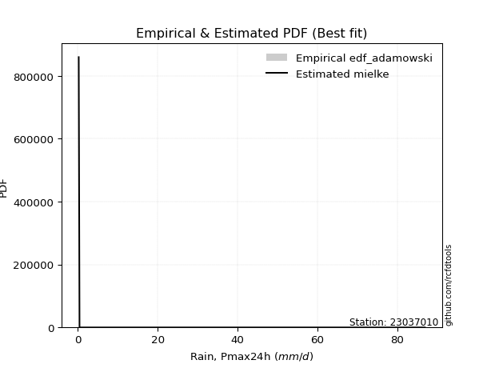</img>

</div>


## C. Best fit & Estimate extreme values for specific return periods - Tr


### 1. Best fit (ordered by delta Δ)

<div align="center">

|   id |   station | empirical_dist   | p_dist   |    delta |   deltao | eval   |   fit |   n |   best_fit |   best_fit_sort |
|-----:|----------:|:-----------------|:---------|---------:|---------:|:-------|------:|----:|-----------:|----------------:|
|    0 |  23037010 | edf_hazen        | nct      | 0.113919 | 0.321023 | Δo > Δ |     1 |  18 |          1 |               1 |
|    1 |  23037010 | edf_gringorten   | nct      | 0.114103 | 0.321023 | Δo > Δ |     1 |  18 |          1 |               2 |
|    2 |  23037010 | edf_cunnane      | nct      | 0.114224 | 0.321023 | Δo > Δ |     1 |  18 |          1 |               3 |
|    3 |  23037010 | edf_blom         | nct      | 0.114299 | 0.321023 | Δo > Δ |     1 |  18 |          1 |               4 |
|    4 |  23037010 | edf_tukey        | nct      | 0.115272 | 0.321023 | Δo > Δ |     1 |  18 |          1 |               5 |
|    5 |  23037010 | edf_filliben     | nct      | 0.115695 | 0.321023 | Δo > Δ |     1 |  18 |          1 |               6 |
|    6 |  23037010 | edf_beard        | nct      | 0.115895 | 0.321023 | Δo > Δ |     1 |  18 |          1 |               7 |
|    7 |  23037010 | edf_jenkinson    | nct      | 0.115895 | 0.321023 | Δo > Δ |     1 |  18 |          1 |               8 |
|    8 |  23037010 | edf_chegodayev   | nct      | 0.116162 | 0.321023 | Δo > Δ |     1 |  18 |          1 |               9 |
|    9 |  23037010 | edf_adamowski    | nct      | 0.117484 | 0.321023 | Δo > Δ |     1 |  18 |          1 |              10 |
|   10 |  23037010 | edf_weibull      | nct      | 0.123885 | 0.321023 | Δo > Δ |     1 |  18 |          1 |              11 |
|   11 |  23037010 | edf_california   | nct      | 0.138505 | 0.321023 | Δo > Δ |     1 |  18 |          1 |              12 |

</div>

:file_folder:Tables: [bestfit_23037010.csv](table/bestfit_23037010.csv) | [extreme_23037010.csv](table/extreme_23037010.csv)


### 2. Extreme values

In hydrology, a return period (or recurrence interval $Tr$) is the statistical average time between extreme events like floods or droughts of a specific magnitude, indicating how rare an event is, with a 100-year flood, for example, having a 1% chance of occurring in any given year, not that it happens exactly every century. It is a key tool for infrastructure design (like bridges or dams) and risk assessment, calculated from historical data to determine the probability of future events, although it is important to remember it is statistical average, and events can cluster or be missed.

> risk_rate: assuming the return period as the project useful life.

|   id |      tr |   prob_l |     prob_g |      alpha |   betaprime |      chi2 |   crystalball |    erlang |    expon |   exponnorm |        f |   fatiguelife |             fisk |     gamma |   genexpon |   genlogistic |   gibrat |   gompertz |   gumbel_l |   gumbel_r |   halflogistic |   halfnorm |   hypsecant |   invgamma |   invgauss |       invweibull |    johnsonsu |   kstwobign |   laplace |   laplace_asymmetric |   loggamma |   logistic |   lognorm |   maxwell |   mielke |    moyal |   nakagami |      ncf |      nct |     norm |           pareto |   pearson3 |   rayleigh |     rice |        t |   truncnorm |     wald |   weibull_min |         logalpha |   logbetaprime |      logchi2 |   logcrystalball |   logerlang |         logexpon |   logexponnorm |            logf |   logfatiguelife |        logfisk |   loggenexpon |   loggenlogistic |        loggibrat |   loggompertz |   loggumbel_l |   loggumbel_r |   loghalflogistic |   loghalfnorm |   loghypsecant |   loginvgamma |   loginvgauss |    loginvweibull |   logjohnsonsu |   logkstwobign |   loglaplace |   loglaplace_asymmetric |   logloggamma |   loglogistic |   loglognorm |   logmaxwell |        logmielke |         logmoyal |   lognakagami |         logncf |    lognct |   logpareto |   logpearson3 |   lograyleigh |    logrice |      logt |   logtruncnorm |          logwald |   logweibull_min |   station |   n |   risk_rate |
|-----:|--------:|---------:|-----------:|-----------:|------------:|----------:|--------------:|----------:|---------:|------------:|---------:|--------------:|-----------------:|----------:|-----------:|--------------:|---------:|-----------:|-----------:|-----------:|---------------:|-----------:|------------:|-----------:|-----------:|-----------------:|-------------:|------------:|----------:|---------------------:|-----------:|-----------:|----------:|----------:|---------:|---------:|-----------:|---------:|---------:|---------:|-----------------:|-----------:|-----------:|---------:|---------:|------------:|---------:|--------------:|-----------------:|---------------:|-------------:|-----------------:|------------:|-----------------:|---------------:|----------------:|-----------------:|---------------:|--------------:|-----------------:|-----------------:|--------------:|--------------:|--------------:|------------------:|--------------:|---------------:|--------------:|--------------:|-----------------:|---------------:|---------------:|-------------:|------------------------:|--------------:|--------------:|-------------:|-------------:|-----------------:|-----------------:|--------------:|---------------:|----------:|------------:|--------------:|--------------:|-----------:|----------:|---------------:|-----------------:|-----------------:|----------:|----:|------------:|
|    0 |    2    | 0.5      | 0.5        |   0.939803 |     15.4228 |   9.54276 |       36.5056 |   9.44324 |  25.3651 |     25.2364 |  26.4304 |       3.02329 |     15.2572      |   8.56944 |    27.3765 |       30.4927 |  26.8397 |    29.1482 |    41.7958 |    31.2153 |        28.5853 |    29.9139 |     36.5056 |    22.78   |    17.261  |      7.7009      |      3.75694 |     30.8536 |   36.5056 |              34.3869 |    11.2392 |    36.5056 |   12.079  |   33.7515 |  13.2532 |  29.5075 |    20.6907 |  25.8354 |  25.6591 |  36.5056 |      0.226918    |    34.6757 |    32.7747 |  34.5261 |  36.5043 |     30.9731 |  26.0671 |       25.1552 |     1.25324      |        9.89304 |     0.368342 |          12.079  |     11.3751 |      3.43183     |        12.0789 |    0.601112     |          12.0858 |   2.00485      |       7.65437 |              inf |      6.43247     |      0.343061 |       17.0532 |       8.55575 |            7.2078 |       7.85968 |        12.079  |       11.1088 |       10.7543 |      8.91718     |        47.6247 |        7.23585 |      12.079  |                 22.219  |       22.0957 |       12.079  |      12.2495 |      10.0939 |      5.8304      |      7.65431     |       12.0314 |   2.20179      |   12.0618 |    0.201417 |       16.3281 |       9.47121 |    11.3603 |   12.0791 |        4.32744 |      6.11637     |          18.2307 |  23037010 |  18 |    0.75     |
|    1 |    2.33 | 0.570815 | 0.429185   |   1.11773  |     21.1699 |  12.3852  |       42.2519 |  12.8932  |  30.9097 |     30.7583 |  36.1885 |       5.99677 |     24.2344      |  11.4627  |    32.9779 |       35.9615 |  29.7506 |    34.7537 |    46.7952 |    36.54   |        34.0599 |    36.1158 |     41.1044 |    28.1027 |    22.1647 |     13.2676      |      6.67552 |     36.3878 |   39.983  |              39.0147 |    16.5944 |    41.5685 |   17.5679 |   39.7216 |  19.0703 |  34.548  |    29.1282 |  32.5091 |  31.1247 |  42.2519 |      0.561069    |    40.4479 |    38.8331 |  40.1008 |  42.2509 |     36.6274 |  29.8351 |       36.1637 |     2.02715      |       15.5101  |     0.456753 |          17.5679 |     16.8425 |      6.41982     |        17.5677 |    1.05221      |          17.5561 |  15.4897       |      12.3085  |              inf |      7.7766      |      0.38637  |       23.6236 |      12.1062  |           10.299  |      11.7758  |        16.3016 |       16.5689 |       16.2912 |     14.361       |        57.7823 |       11.6451  |      15.1525 |                 28.8354 |       28.705  |       16.8024 |      17.8095 |      14.8964 |     11.5965      |     10.6319      |       17.4909 |   7.2896       |   17.55   |    0.219871 |       23.1943 |      14.0582  |    16.7308 |   17.568  |        6.55457 |      7.81937     |          24.226  |  23037010 |  18 |    0.729209 |
|    2 |    5    | 0.8      | 0.2        |   2.49742  |     70.3584 |  28.081   |       63.6071 |  33.5126  |  58.6315 |     58.3665 |  95.5636 |      39.3632  |    146.415       |  28.2216  |    59.3126 |       59.7176 |  46.5094 |    59.6758 |    62.9462 |    59.6728 |        58.8314 |    62.3426 |     59.5514 |    58.6813 |    53.4918 |    144.423       |     62.6538  |     59.8959 |   57.3694 |              62.1527 |    72.5117 |    61.1173 |   70.6829 |   63.2194 |  48.4696 |  57.8959 |    74.5916 |  64.2701 |  59.612  |  63.6071 | 156679           |    62.936  |    63.0876 |  62.4021 |  63.6066 |     61.2942 |  50.9282 |      117.303  |    84.4012       |       95.2648  |     1.60304  |          70.6828 |     74.533  |    147.042       |        70.6818 | 1210.29         |          70.4324 |   1.70511e+21  |      84.4242  |              inf |     23.1877      |      0.70009  |       67.7025 |      54.6927  |           51.7743 |      65.0901  |        54.2614 |       76.5091 |       82.4497 |    113.841       |        79.0131 |       87.8932  |      47.0671 |                 56.0278 |       55.921  |       60.0933 |      71.7317 |      68.9191 |    204.132       |     48.7106      |       70.2895 |   1.80439e+07  |   70.7578 |  inf        |       72.6732 |      68.3305  |    71.7233 |   70.6829 |       25.3886  |     30.9281      |          60.7001 |  23037010 |  18 |    0.67232  |
|    3 |   10    | 0.9      | 0.1        |   5.03225  |    168.48   |  43.5299  |       77.7735 |  55.0493  |  83.7966 |     83.4284 | 159.994  |      83.8931  |    552.907       |  45.3269  |    81.2419 |       79.0646 |  65.6125 |    78.8241 |    71.9384 |    78.5141 |        79.4031 |    81.7499 |     74.2818 |    95.207  |    91.8747 |   1016.7         |    283.728   |     77.7943 |   73.1524 |              83.1566 |   197.417  |    75.5143 |  177.986  |   79.756  |  67.1892 |  78.224  |   113.409  |  91.8215 |  89.7846 |  77.7735 |      2.05354e+10 |    78.7712 |    80.3816 |  78.2847 |  77.7734 |     80.1256 |  73.313  |      226.153  | 79743.3          |      361.322   |     5.81553  |         177.986  |    205.017  |   2523.12        |       177.983  |    2.63607e+13  |         177.276  |   5.37587e+132 |     338.85    |              inf |     80.5558      |      1.20087  |      121.671  |     186.79    |          197.938  |     230.657   |       141.753  |      219.665  |      259.386  |    614.634       |        83.914  |      409.542   |     131.691  |                 70.6423 |       70.5722 |      153.612  |     181.134  |     202.542  |   1927.84        |    183.29        |      176.924  |   2.37738e+28  |  178.513  |  inf        |      135.723  |     210.977   |   190.327  |  177.986  |       46.563   |    133.078       |         101.224  |  23037010 |  18 |    0.651322 |
|    4 |   15    | 0.933333 | 0.0666667  |   7.55803  |    270.869  |  52.8698  |       84.8429 |  68.3698  |  98.5173 |     98.0887 | 201.209  |     112.969   |   1140.83        |  55.8145  |    93.3629 |       89.9797 |  78.7889 |    88.8563 |    76.0107 |    89.1442 |        91.0449 |    91.8493 |     82.6883 |   121.933  |   118.412  |   3058.72        |    603.725   |     87.2962 |   82.3848 |              95.4432 |   327.709  |    83.3585 |  282.182  |   88.2407 |  74.3228 |  90.0215 |   134.272  | 107.682  | 110.26   |  84.8429 |      2.02322e+13 |    86.9515 |    89.2922 |  86.4613 |  84.8429 |     90.0647 |  87.6875 |      304.492  |     7.35225e+07  |      731.1     |    12.8366   |         282.182  |    342.27   |  13306.7         |       282.177  |    1.45129e+29  |         281.117  | inf            |     696.356   |              inf |    190.17        |      1.64655  |      158.664  |     373.515   |          422.79   |     445.553   |       245.207  |      376.434  |      469.673  |   1591.43        |        85.1246 |      927.059   |     240.402  |                 75.8832 |       75.8294 |      256.156  |     287.755  |     352.151  |   7146.12        |    395.497       |      280.473  |   1.16481e+60  |  283.329  |  inf        |      178.645  |     377.146   |   310.428  |  282.181  |       57.1992  |    339.681       |         127.604  |  23037010 |  18 |    0.644736 |
|    5 |   20    | 0.95     | 0.05       |  10.0816   |    376.093  |  59.5944  |       89.4724 |  78.0543  | 108.962  |    108.49   | 231.861  |     134.489   |   1882.21        |  63.4113  |   101.688  |       97.6221 |  89.1249 |    95.5374 |    78.5456 |    96.5872 |        99.2014 |    98.5828 |     88.6188 |   143.865  |   138.908  |   6614.3         |    990.094   |     93.697  |   88.9353 |             104.161  |   457.856  |    88.7801 |  381.591  |   93.8718 |  78.0646 |  98.3766 |   148.302  | 118.88   | 126.335  |  89.4724 |      2.69151e+15 |    92.4099 |    95.2149 |  91.8933 |  89.4726 |     96.7343 |  98.3994 |      366.433  |     6.73814e+10  |     1176.82    |    22.7905   |         381.591  |    480.089  |  43294.6         |       381.584  |    8.10478e+49  |         380.265  | inf            |    1125.61    |              inf |    373.052       |      2.05985  |      187.174  |     606.775   |          719.53   |     691.089   |       360.937  |      538.097  |      698.457  |   3097.98        |        85.6627 |     1607.38    |     368.461  |                 78.5728 |       78.5279 |      364.753  |     389.731  |     508.336  |  18646.7         |    681.852       |      379.274  |   2.71398e+101 |  383.44   |  inf        |      211.17   |     554.868   |   427.942  |  381.59   |       63.4469  |    682.877       |         147.391  |  23037010 |  18 |    0.641514 |
|    6 |   25    | 0.96     | 0.04       |  12.6043   |    483.469  |  64.8568  |       92.8804 |  85.6771  | 117.063  |    116.558  | 256.405  |     151.585   |   2760.72        |  69.3777  |   108      |      103.509  |  97.7415 |   100.496  |    80.3494 |   102.32   |       105.486  |   103.593  |     93.2085 |   162.824  |   155.694  |  11980.7         |   1425.11    |     98.4914 |   94.0163 |             110.922  |   586.414  |    92.9276 |  476.522  |   98.0522 |  80.3666 | 104.853  |   158.777  | 127.549  | 139.801  |  92.8804 |      1.19525e+17 |    96.4796 |    99.6153 |  95.9278 |  92.8807 |    101.717  | 106.979  |      418.048  |     6.16059e+13  |     1683.08    |    35.7815   |         476.522  |    616.741  | 108107           |       476.513  |    2.53377e+75  |         475.008  | inf            |    1609.37    |              inf |    654.213       |      2.45063  |      210.53   |     881.734   |         1083.84   |     958.017   |       486.824  |      701.617  |      939.273  |   5175           |        85.9662 |     2427.44    |     513.146  |                 80.2087 |       80.1693 |      477.992  |     487.299  |     667.582  |  40256           |   1040.01        |      473.632  |   7.97895e+151 |  479.118  |  inf        |      237.361  |     739.217   |   542.191  |  476.52   |       67.537   |   1194.69        |         163.314  |  23037010 |  18 |    0.639603 |
|    7 |   50    | 0.98     | 0.02       |  25.2137   |   1042.05   |  81.4127  |      102.639  | 109.855   | 142.228  |    141.62   | 336.772  |     206.429   |   8898.34        |  88.2439  |   126.881  |      121.642  | 128.115  |   114.805  |    85.2459 |   119.981  |       124.848  |   118.155  |    107.438  |   234.72   |   212.303  |  74690.6         |   4044.38    |    112.57   |  109.799  |             131.926  |  1198.39   |   105.6    |  900.279  |  110.176  |  85.1016 | 124.957  |   189.303  | 154.471  | 188.09   | 102.639  |      1.56658e+22 |   108.377  |   112.389  | 107.632  | 102.64   |    116.282  | 134.993  |      597.86   |     3.89378e+28  |     4855.96    |   149.138    |         900.278  |   1271.9    |      1.85502e+06 |       900.261  |    4.36379e+268 |         898.524  | inf            |    4558.41    |              inf |   4738.58        |      4.20357  |      289.695  |    2788.28    |         3829.57   |    2475.41    |      1230.95   |     1516.81   |     2237.11   |  25139.1         |        86.5366 |     8144.49    |    1435.75   |                 83.5302 |       83.5026 |     1091.9    |     924.451  |    1471.48   | 535029           |   3856.8         |      894.927  | inf            |  906.862  |  inf        |      322.581  |    1699.86    |  1069.04   |  900.273  |       76.5745  |   7419.39        |         215.754  |  23037010 |  18 |    0.63583  |
|    8 |   75    | 0.986667 | 0.0133333  |  37.8213   |   1624.44   |  91.216   |      107.876  | 124.28    | 156.949  |    156.281  | 386.611  |     239.456   |  17493.8         |  99.4685  |   137.466  |      132.182  | 148.63   |   122.506  |    87.722  |   130.246  |       136.104  |   126.082  |    115.754  |   287.865  |   248.208  | 216384           |   7078.45    |    120.316  |  119.032  |             144.213  |  1765.04   |   112.918  | 1266.57   |  116.768  |  86.7271 | 136.714  |   205.926  | 170.266  | 221.643  | 107.876  |      1.54345e+25 |   114.91   |   119.338  | 113.995  | 107.877  |    124.256  | 152.231  |      716.435  |     2.44936e+43  |     8761.1     |   348.881    |        1266.56   |   1883.05   |      9.78324e+06 |      1266.54   |  inf            |        1265.22   | inf            |    8047.82    |              inf |  18048.7         |      5.76368  |      340.441  |    5444.47    |         7976.45   |    4150.23    |      2116.77   |     2309.89   |     3607.24   |  62999.4         |        86.7202 |    15852.9     |    2620.96   |                 84.6521 |       84.6285 |     1759.5    |    1303.89   |    2261.38   |      2.89393e+06 |   8299.99        |     1259.19   | inf            | 1277.2    |  inf        |      374.113  |    2674       |  1539.92   | 1266.56   |       79.8641  |  22825.2         |         248.379  |  23037010 |  18 |    0.634587 |
|    9 |  100    | 0.99     | 0.01       |  50.4285   |   2222.85   |  98.2148  |      111.418  | 134.617   | 167.393  |    166.682  | 423.227  |     263.219   |  28194           | 107.501   |   144.791  |      139.642  | 164.521  |   127.709  |    89.3416 |   137.511  |       144.07   |   131.482  |    121.653  |   331.631  |   274.785  | 459392           |  10336.1     |    125.624  |  125.582  |             152.93   |  2296.83   |   118.086  | 1595.5    |  121.258  |  87.5629 | 145.055  |   217.242  | 181.513  | 248.236  | 111.418  |      2.05326e+27 |   119.389  |   124.073  | 118.328  | 111.418  |    129.705  | 164.8    |      806.446  |     1.53892e+58  |    13171.7     |   641.049    |        1595.5    |   2459.31   |      3.18306e+07 |      1595.47   |  inf            |        1594.92   | inf            |   11863.2     |              inf |  50859           |      7.21041  |      378.35   |    8742.68    |        13407.6    |    5901.45    |      3109.41   |     3078.52   |     5007.52   | 120705           |        86.8126 |    25020       |    4017.12   |                 85.2158 |       85.1943 |     2464.23   |    1645.56   |    3030.31   |      1.05371e+07 |  14296.2         |     1586.39   | inf            | 1610.13   |  inf        |      411.003  |    3640.83    |  1971.58   | 1595.49   |       81.5647  |  51789.9         |         272.343  |  23037010 |  18 |    0.633968 |
|   10 |  200    | 0.995    | 0.005      | 100.856    |   4718.97   | 115.201   |      119.451  | 159.815   | 192.558  |    191.744  | 515.741  |     321.384   |  88586.1         | 127.049   |   161.867  |      157.576  | 207.757  |   139.461  |    92.8619 |   154.977  |       163.222  |   143.832  |    135.864  |   462.413  |   342.135  |      2.80687e+06 |  24395.6     |    137.848  |  141.365  |             173.934  |  4192.57   |   130.481  | 2693.66   |  131.53   |  88.9345 | 165.151  |   243.078  | 208.8    | 323.451  | 119.451  |      2.69114e+32 |   129.727  |   134.905  | 128.237  | 119.452  |    142.209  | 196.106  |     1043.04   |     2.391e+117   |    34088.6     |  2819.31     |        2693.66   |   4527.96   |      5.46187e+08 |      2693.6    |  inf            |        2697.64   | inf            |   28895.2     |              inf | 851987           |     12.3681   |      475.948  |   27298.6     |        46728.1    |   13201.7     |      7852.51   |     5956.38   |    10693.8    | 576257           |        86.9563 |    71571.7     |   11239.6    |                 86.0648 |       86.0465 |     5528.55   |    2790.95   |    5919.78   |      3.46049e+08 |  52986.9         |     2679.12   | inf            | 2723.32   |  inf        |      499.804  |    7377.28    |  3455.7    | 2693.64   |       84.1878  | 398641           |         332.707  |  23037010 |  18 |    0.633042 |
|   11 |  250    | 0.996    | 0.004      | 126.07     |   6009.75   | 120.701   |      121.906  | 168.002   | 200.66   |    199.812  | 546.827  |     340.34    | 127936           | 133.392   |   167.205  |      163.342  | 223.27   |   143.032  |    93.8976 |   160.593  |       169.38   |   147.632  |    140.439  |   513.584  |   364.712  |      5.02253e+06 |  31716.6     |    141.631  |  146.446  |             180.696  |  5045.22   |   134.46   | 3161.18   |  134.692  |  89.2592 | 171.62   |   251.01   | 217.652  | 351.503  | 121.906  |      1.19509e+34 |   132.936  |   138.24   | 131.286  | 121.907  |    146.066  | 206.463  |     1125.06   |     9.41954e+146 |    45915.1     |  4559.79     |        3161.18   |   5463.72   |      1.36383e+09 |      3161.11   |  inf            |        3167.87   | inf            |   38029.3     |              inf |      2.34224e+06 |     14.7144   |      509.194  |   39365.4     |        69806.8    |   16912.2     |     10580.9    |     7304.78   |    13540      | 952513           |        86.9869 |    99083.8     |   15653.1    |                 86.2351 |       86.2174 |     7165.98   |    3280.3    |    7274.89   |      1.21114e+09 |  80784           |     3144.47   | inf            | 3197.86   |  inf        |      528.1    |    9168.62    |  4102.92   | 3161.15   |       84.7231  | 783082           |         352.894  |  23037010 |  18 |    0.632858 |
|   12 |  500    | 0.998    | 0.002      | 252.138    |  12724.1    | 137.868   |      129.187  | 193.627   | 225.825  |    224.874  | 647.516  |     399.803   | 399985           | 153.226   |   183.338  |      181.236  | 276.883  |   153.543  |    96.8668 |   178.021  |       188.49   |   158.961  |    154.648  |   708.113  |   437.26   |      3.0567e+07  |  69068.9     |    152.967  |  162.229  |             201.7    |  8765.44   |   146.802  | 5081.26   |  144.127  |  90.0837 | 191.716  |   274.61   | 245.397  | 452.926  | 129.187  |      1.56637e+39 |   142.591  |   148.19   | 140.377  | 129.188  |    157.595  | 239.395  |     1397.7    |     8.92921e+294 |   113308       | 20511.2      |        5081.25   |   9572.4    |      2.34022e+10 |      5081.13   |  inf            |        5102.72   | inf            |   86462.5     |              inf |      7.7177e+07  |     25.2397   |      617.939  |  122613       |       242634      |   35394.3     |     26719.2    |    13467.9    |    27575.8    |      4.53201e+06 |        87.053  |   262623       |   43796.4    |                 86.5762 |       86.5598 |    16020.7    |    5297.97   |   13457.4    |      9.4543e+10  | 299405           |     5056.41   | inf            | 5149.53   |  inf        |      614.194  |   17538.4     |  6829.39   | 5081.21   |       85.8044  |      6.70145e+06 |         417.811  |  23037010 |  18 |    0.632489 |
|   13 |  750    | 0.998667 | 0.00133333 | 378.206    |  19724.6    | 147.961   |      133.231  | 208.735   | 240.545  |    239.535  | 709.372  |     434.936   | 778522           | 164.908   |   192.485  |      191.698  | 312.339  |   159.323  |    98.4537 |   188.21   |       199.663  |   165.289  |    162.961  |   852.159  |   481.213  |      8.78558e+07 | 106425       |    159.336  |  171.461  |             213.986  | 11939.5    |   154.012  | 6614.16   |  149.405  |  90.4898 | 203.471  |   287.759  | 261.821  | 523.875  | 133.231  |      1.54325e+42 |   148.043  |   153.753  | 145.458  | 133.233  |    164.051  | 259.14   |     1569.58   |   inf            |   189611       | 49741.2      |        6614.14   |  13102      |      1.23421e+11 |      6613.99   |  inf            |        6650.73   | inf            |  137024       |              inf |      7.78582e+08 |     34.607    |      685.287  |  238226       |       502632      |   53470.2     |     45935.8    |    19001.1    |    41246.2    |      1.128e+07   |        87.078  |   454098       |   79950.6    |                 86.69   |       86.6741 |    25634      |    6915.88   |   18983.3    |      1.74915e+12 | 644261           |     6583.49   | inf            | 6710.1    |  inf        |      662.895  |   25206.1     |  9066.23   | 6614.09   |       86.1681  |      2.42768e+07 |         457.271  |  23037010 |  18 |    0.632366 |
|   14 | 1000    | 0.999    | 0.001      | 504.273    |  26917.5    | 155.142   |      136.016  | 219.5     | 250.99   |    249.936  | 754.616  |     459.997   |      1.24848e+06 | 173.227   |   198.855  |      199.118  | 339.471  |   163.276  |    99.5218 |   195.437  |       207.587  |   169.66   |    168.858  |   970.869  |   513.003  |      1.85787e+08 | 143324       |    163.748  |  178.012  |             222.704  | 14783.9    |   159.126  | 7930.67   |  153.052  |  90.7587 | 211.811  |   296.826  | 273.568  | 580.274  | 136.016  |      2.05299e+44 |   151.835  |   157.598  | 148.968  | 136.017  |    168.516  | 273.344  |     1697      |   inf            |   271758       | 93484.7      |        7930.66   |  16278.6    |      4.01562e+11 |      7930.47   |  inf            |        7982.12   | inf            |  188449       |              inf |      4.56537e+09 |     43.2937   |      734.7    |  381592       |       842585      |   71097.6     |     67471.3    |    24126      |    54592.9    |      2.15389e+07 |        87.0916 |   663600       |  122539      |                 86.747  |       86.7312 |    35775.2    |    8309.37   |   24078.9    |      1.67078e+13 |      1.10966e+06 |     7895.41   | inf            | 8051.73   |  inf        |      696.556  |   32386       | 11020.2    | 7930.58   |       86.3506  |      6.12789e+07 |         485.906  |  23037010 |  18 |    0.632305 |

<div align="center">

</img>

</div>


<div align="center">

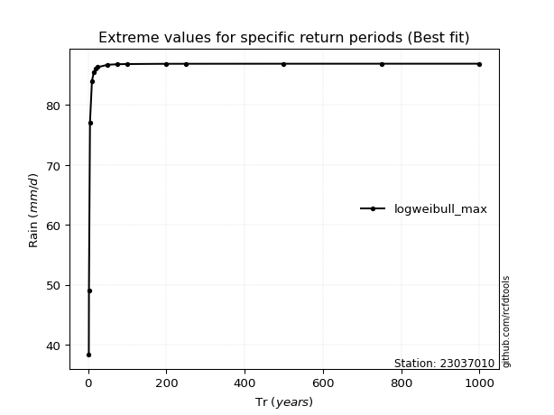</img>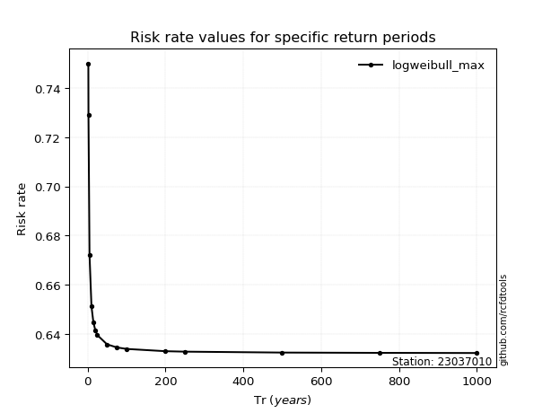</img>

</div>


<sub>**APP DISCLAIMER**: NO WARRANTY - This software is provided by [github.com/rcfdtools](https://github.com/rcfdtools) "as is", without any express or implied warranty, including warranties of merchantability, fitness for a particular purpose, or non-infringement. There is no guarantee that the software will be error-free or operate without interruption. LIMITATION OF LIABILITY - Neither the authors nor copyright holders will be liable for claims or damages arising from the software or its use. You are responsible for determining if the software is appropriate for your use and assume all associated risks, including errors, legal compliance, and data loss. NO PROFESSIONAL ADVICE - The software provides general information and does not offer professional advice. It should not replace consultation with professional advisors.</sub>