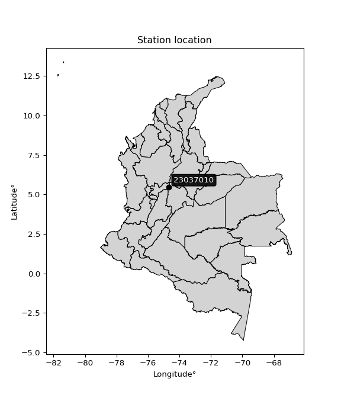

<div align="center">


</div>

# Station (rain, Pmax24h): 23037010

Probable Maximum Precipitation (PMP) is the greatest amount of rainfall for a specific duration that is meteorologically possible for a given location, acting as a "worst-case" scenario for extreme storms, crucial for designing safety-critical infrastructure like bridges, river deviations, dams, spillways, and nuclear plants to prevent catastrophic failure. PMP is calculated by hydrologists using meteorological data to determine the upper limit of extreme rainfall, often leading to the Probable Maximum Flood (PMF) for flood control design, and is increasingly being studied for climate change impacts.

<div align="center">

</img>

</div>


## A. General information


### 1. General running parameters

• app_version: _v20251226_. • runtime: _2025-12-26 15:38:16.554582_. • Python version: _3.14.0_. • SciPy version: _1.16.3_. • Pandas version: _2.3.3_. • NumPy version: _2.3.5_. • Stations dataset (station_dataset_file): _dataset/pmax24h_in/automatic_colombia_2003_2024.csv_. • Stations catalog (station_catalog_file): _dataset/CNE_IDEAM.xls_. • Minimum year to eval til year_max (date_min): _2003_. • Maximum year to eval since year_min (date_max): _2024_. • Creates, save and include plots into reports (create_plot): _False_. • Plot only fit distributions with Δo > Δ (plot_only_fit): _True_. • Eval low extreme values, if False, evaluates high extreme values (low_extreme): _False_. • Eval every SciPy distribution as logarithmic (pdist_logarithmic_on): _True_. • Standard deviation normalized (ddof): _1.0_. • Return periods to eval in years (Tr): _[2, 2.33, 5, 10, 15, 20, 25, 50, 75, 100, 200, 250, 500, 750, 1000]_. • Minimum data sample per station, 0 means any (minimum_sample): _5_. • Z-Score threshold to adjust a value, 0 means disable (zscore): _3.5_. • Avoid zeros, e.g. rain = 0 (avoid_zeros): _True_. • Avoid null values (avoid_nans): _True_. [:file_folder:Dataset file.](../../dataset/pmax24h_in/automatic_colombia_2003_2024.csv)


### 2. Station info and location

|   id |   CODIGO | NOMBRE                         | CATEGORIA    | TECNOLOGIA                              | ESTADO   | FECHA_INSTALACION   |   FECHA_SUSPENSION |   ALTITUD |   LATITUD |   LONGITUD | DEPARTAMENTO   | MUNICIPIO     | AREA_OPERATIVA             | ENTIDAD                                                     | AREA_HIDROGRAFICA   | ZONA_HIDROGRAFICA   | SUBZONA_HIDROGRAFICA                               | CORRIENTE   | OBSERVACION                                                                                                                                                                                                                                                                                                                           | SUBRED                                          | Catalogo   |
|-----:|---------:|:-------------------------------|:-------------|:----------------------------------------|:---------|:--------------------|-------------------:|----------:|----------:|-----------:|:---------------|:--------------|:---------------------------|:------------------------------------------------------------|:--------------------|:--------------------|:---------------------------------------------------|:------------|:--------------------------------------------------------------------------------------------------------------------------------------------------------------------------------------------------------------------------------------------------------------------------------------------------------------------------------------|:------------------------------------------------|:-----------|
|    0 | 23037010 | PUERTO SALGAR - AUT [23037010] | Limnigráfica | Automática con Telemetría, Convencional | Activa   | 15/01/1936          |                nan |       168 |   5.46967 |   -74.6622 | Cundinamarca   | Puerto Salgar | Area Operativa 10 - Tolima | INSTITUTO DE HIDROLOGIA METEOROLOGIA Y ESTUDIOS AMBIENTALES | Magdalena Cauca     | Medio Magdalena     | Directos al Magdalena entre Ríos Seco y Negro (md) | Magdalena   | EL GRUPO DE AUTOMATIZACION REPORTA QUE LA ESTACION DEJO DE TRANSMITIR EL 23/11/22 FALLA BATERIA. ESTACION EN MANTENIMIENTO (07/12/2022)|17/10/2024$mvelez$SE ACTIVÓ LA ESTACION EL (25/06/2024) POR INSTALACIÓN DE SIM CARD Y CONFIGURACION GPRS EN MODEN EXTERNO. Se recibe solicitud mediante correo electrónico ing Manuel padilla | Magdalena Medio,RED ALERTAS - AREA OPERATIVA 10 | CNE_IDEAM  |
|      |          |                                |              |                                         |          |                     |                    |           |           |            |                |               |                            |                                                             |                     |                     |                                                    |             | |02/01/2025$mvelez$Se realiza el cambio de elevación y coordenadas a solicitud del coordinador mediante memorando 20243170190253 del 10/10/2024                                                                                                                                                                                       |                                                 |            |

<div align="center">

Map location in: [:earth_americas:Google](http://maps.google.com/maps?q=5.469666667,-74.66216667) [:earth_americas:OSM](https://www.openstreetmap.org/#map=18/5.469666667/-74.66216667&layers=P) [:earth_americas:Bing](https://www.bing.com/maps?cp=5.469666667~-74.66216667&lvl=18) [:earth_americas:Apple](https://maps.apple.com/frame?center=5.469666667%2C-74.66216667&span=0.003%2C0.006)

</div>


<div align="center">

```geojson
{
  "type": "Feature",
  "geometry": {
    "type": "Point", 
    "coordinates": [-74.66216667, 5.469666667]
  }, 
  "properties": {
    "Name": "23037010"
  }
}
```

</div>


### 3. Discrete values table and plot

|               |           0 |           1 |          2 |          3 |            4 |          5 |          6 |           7 |           8 |          9 |          10 |          11 |         12 |          13 |         14 |         15 |         16 |
|:--------------|------------:|------------:|-----------:|-----------:|-------------:|-----------:|-----------:|------------:|------------:|-----------:|------------:|------------:|-----------:|------------:|-----------:|-----------:|-----------:|
| Date          | 2005        | 2006        | 2007       | 2008       | 2011         | 2013       | 2014       | 2015        | 2016        | 2017       | 2018        | 2019        | 2020       | 2021        | 2022       | 2023       | 2024       |
| Value         |   53.4      |   32.1      |   85.6     |   85.6     |   37.6       |   78.3     |   86.9     |   18.2      |   45        |   42       |   10.5      |    8.4      |    3.5     |   68.6      |    0.4     |    0.2     |    0.4     |
| Value_initial |   53.4      |   32.1      |   85.6     |   85.6     |   37.6       |   78.3     |   86.9     |   18.2      |   45        |   42       |   10.5      |    8.4      |    3.5     |   68.6      |    0.4     |    0.2     |    0.4     |
| count         |   17        |   17        |   17       |   17       |   17         |   17       |   17       |   17        |   17        |   17       |   17        |   17        |   17       |   17        |   17       |   17       |   17       |
| mean          |   38.6294   |   38.6294   |   38.6294  |   38.6294  |   38.6294    |   38.6294  |   38.6294  |   38.6294   |   38.6294   |   38.6294  |   38.6294   |   38.6294   |   38.6294  |   38.6294   |   38.6294  |   38.6294  |   38.6294  |
| std           |   32.8678   |   32.8678   |   32.8678  |   32.8678  |   32.8678    |   32.8678  |   32.8678  |   32.8678   |   32.8678   |   32.8678  |   32.8678   |   32.8678   |   32.8678  |   32.8678   |   32.8678  |   32.8678  |   32.8678  |
| zscore        |    0.449394 |   -0.198657 |    1.42908 |    1.42908 |   -0.0313198 |    1.20698 |    1.46863 |   -0.621564 |    0.193825 |    0.10255 |   -0.855836 |   -0.919728 |   -1.06881 |    0.911854 |   -1.16313 |   -1.16921 |   -1.16313 |
> If Z-Score is active, values out of range or outliers are replaced with the station mean value.


### 4. Active continuous probability distributions from SciPy (45 of 104 available)

[scipy.stats](https://docs.scipy.org/doc/scipy/reference/stats.html) is a Python´s powerful submodule within the SciPy library for comprehensive statistical analysis, offering over 130 probability distributions (like Normal, Poisson), functions for descriptive stats (mean, variance), hypothesis testing (t-tests, chi-square), random variable generation, and statistical tests, making it essential for data science, modeling, and research. It provides tools to explore, model, and draw conclusions from data efficiently, working seamlessly with NumPy.

<div align="center">

|   id | p_dist             |   n_parameter | fit_method   | label                                                                       | active   | ref                                                                                                        |
|-----:|:-------------------|--------------:|:-------------|:----------------------------------------------------------------------------|:---------|:-----------------------------------------------------------------------------------------------------------|
|    0 | alpha              |             3 | MLE          | Alpha                                                                       | True     | [:mortar_board:](https://docs.scipy.org/doc/scipy/reference/generated/scipy.stats.alpha.html)              |
|    1 | betaprime          |             4 | MLE          | Beta prime                                                                  | True     | [:mortar_board:](https://docs.scipy.org/doc/scipy/reference/generated/scipy.stats.betaprime.html)          |
|    2 | chi2               |             3 | MLE          | Chi²                                                                        | True     | [:mortar_board:](https://docs.scipy.org/doc/scipy/reference/generated/scipy.stats.chi2.html)               |
|    3 | crystalball        |             4 | MLE          | Crystalball                                                                 | True     | [:mortar_board:](https://docs.scipy.org/doc/scipy/reference/generated/scipy.stats.crystalball.html)        |
|    4 | erlang             |             3 | MLE          | Erlang                                                                      | True     | [:mortar_board:](https://docs.scipy.org/doc/scipy/reference/generated/scipy.stats.erlang.html)             |
|    5 | expon              |             2 | MLE          | Exponential                                                                 | True     | [:mortar_board:](https://docs.scipy.org/doc/scipy/reference/generated/scipy.stats.expon.html)              |
|    6 | exponnorm          |             3 | MLE          | Exponentially modified Normal                                               | True     | [:mortar_board:](https://docs.scipy.org/doc/scipy/reference/generated/scipy.stats.exponnorm.html)          |
|    7 | f                  |             4 | MLE          | F                                                                           | True     | [:mortar_board:](https://docs.scipy.org/doc/scipy/reference/generated/scipy.stats.f.html)                  |
|    8 | fatiguelife        |             3 | MLE          | Fatigue-life (Birnbaum-Saunders)                                            | True     | [:mortar_board:](https://docs.scipy.org/doc/scipy/reference/generated/scipy.stats.fatiguelife.html)        |
|    9 | fisk               |             3 | MLE          | Fisk                                                                        | True     | [:mortar_board:](https://docs.scipy.org/doc/scipy/reference/generated/scipy.stats.fisk.html)               |
|   10 | gamma              |             3 | MLE          | Gamma                                                                       | True     | [:mortar_board:](https://docs.scipy.org/doc/scipy/reference/generated/scipy.stats.gamma.html)              |
|   11 | genexpon           |             5 | MLE          | Generalized exponential                                                     | True     | [:mortar_board:](https://docs.scipy.org/doc/scipy/reference/generated/scipy.stats.genexpon.html)           |
|   12 | genlogistic        |             3 | MLE          | Generalized logistic                                                        | True     | [:mortar_board:](https://docs.scipy.org/doc/scipy/reference/generated/scipy.stats.genlogistic.html)        |
|   13 | gibrat             |             2 | MM           | Gibrat                                                                      | True     | [:mortar_board:](https://docs.scipy.org/doc/scipy/reference/generated/scipy.stats.gibrat.html)             |
|   14 | gompertz           |             3 | MLE          | Gompertz (or truncated Gumbel)                                              | True     | [:mortar_board:](https://docs.scipy.org/doc/scipy/reference/generated/scipy.stats.gompertz.html)           |
|   15 | gumbel_l           |             2 | MM           | Gumbel Left Skew                                                            | True     | [:mortar_board:](https://docs.scipy.org/doc/scipy/reference/generated/scipy.stats.gumbel_l.html)           |
|   16 | gumbel_r           |             2 | MM           | Gumbel Right Skew                                                           | True     | [:mortar_board:](https://docs.scipy.org/doc/scipy/reference/generated/scipy.stats.gumbel_r.html)           |
|   17 | halflogistic       |             2 | MM           | Half-logistic                                                               | True     | [:mortar_board:](https://docs.scipy.org/doc/scipy/reference/generated/scipy.stats.halflogistic.html)       |
|   18 | halfnorm           |             2 | MM           | Half Normal                                                                 | True     | [:mortar_board:](https://docs.scipy.org/doc/scipy/reference/generated/scipy.stats.halfnorm.html)           |
|   19 | hypsecant          |             2 | MM           | hyperbolic secant                                                           | True     | [:mortar_board:](https://docs.scipy.org/doc/scipy/reference/generated/scipy.stats.hypsecant.html)          |
|   20 | invgamma           |             3 | MLE          | Inverted gamma                                                              | True     | [:mortar_board:](https://docs.scipy.org/doc/scipy/reference/generated/scipy.stats.invgamma.html)           |
|   21 | invgauss           |             3 | MLE          | Inverse Gaussian                                                            | True     | [:mortar_board:](https://docs.scipy.org/doc/scipy/reference/generated/scipy.stats.invgauss.html)           |
|   22 | invweibull         |             3 | MLE          | Inverted Weibull                                                            | True     | [:mortar_board:](https://docs.scipy.org/doc/scipy/reference/generated/scipy.stats.invweibull.html)         |
|   23 | johnsonsu          |             4 | MLE          | Johnson Su                                                                  | True     | [:mortar_board:](https://docs.scipy.org/doc/scipy/reference/generated/scipy.stats.johnsonsu.html)          |
|   24 | kstwobign          |             2 | MLE          | Limiting distribution of scaled Kolmogorov-Smirnov two-sided test statistic | True     | [:mortar_board:](https://docs.scipy.org/doc/scipy/reference/generated/scipy.stats.kstwobign.html)          |
|   25 | laplace            |             2 | MM           | Laplace                                                                     | True     | [:mortar_board:](https://docs.scipy.org/doc/scipy/reference/generated/scipy.stats.laplace.html)            |
|   26 | laplace_asymmetric |             3 | MLE          | Asymmetric Laplace                                                          | True     | [:mortar_board:](https://docs.scipy.org/doc/scipy/reference/generated/scipy.stats.laplace_asymmetric.html) |
|   27 | loggamma           |             3 | MLE          | Log gamma                                                                   | True     | [:mortar_board:](https://docs.scipy.org/doc/scipy/reference/generated/scipy.stats.loggamma.html)           |
|   28 | logistic           |             2 | MM           | Logistic (or Sech-squared)                                                  | True     | [:mortar_board:](https://docs.scipy.org/doc/scipy/reference/generated/scipy.stats.logistic.html)           |
|   29 | lognorm            |             3 | MLE          | Log Normal                                                                  | True     | [:mortar_board:](https://docs.scipy.org/doc/scipy/reference/generated/scipy.stats.lognorm.html)            |
|   30 | maxwell            |             2 | MM           | Maxwell                                                                     | True     | [:mortar_board:](https://docs.scipy.org/doc/scipy/reference/generated/scipy.stats.maxwell.html)            |
|   31 | mielke             |             4 | MLE          | Mielke Beta-Kappa / Dagum                                                   | True     | [:mortar_board:](https://docs.scipy.org/doc/scipy/reference/generated/scipy.stats.mielke.html)             |
|   32 | moyal              |             2 | MM           | Moyal                                                                       | True     | [:mortar_board:](https://docs.scipy.org/doc/scipy/reference/generated/scipy.stats.moyal.html)              |
|   33 | nakagami           |             3 | MLE          | Nakagami                                                                    | True     | [:mortar_board:](https://docs.scipy.org/doc/scipy/reference/generated/scipy.stats.nakagami.html)           |
|   34 | ncf                |             5 | MLE          | Non-central F distribution                                                  | True     | [:mortar_board:](https://docs.scipy.org/doc/scipy/reference/generated/scipy.stats.ncf.html)                |
|   35 | nct                |             4 | MLE          | Non-central Student’s t                                                     | True     | [:mortar_board:](https://docs.scipy.org/doc/scipy/reference/generated/scipy.stats.nct.html)                |
|   36 | norm               |             2 | MM           | Normal                                                                      | True     | [:mortar_board:](https://docs.scipy.org/doc/scipy/reference/generated/scipy.stats.norm.html)               |
|   37 | pareto             |             3 | MLE          | Pareto                                                                      | True     | [:mortar_board:](https://docs.scipy.org/doc/scipy/reference/generated/scipy.stats.pareto.html)             |
|   38 | pearson3           |             3 | MM           | Pearson type III                                                            | True     | [:mortar_board:](https://docs.scipy.org/doc/scipy/reference/generated/scipy.stats.pearson3.html)           |
|   39 | rayleigh           |             2 | MM           | Rayleigh                                                                    | True     | [:mortar_board:](https://docs.scipy.org/doc/scipy/reference/generated/scipy.stats.rayleigh.html)           |
|   40 | rice               |             3 | MLE          | Rice                                                                        | True     | [:mortar_board:](https://docs.scipy.org/doc/scipy/reference/generated/scipy.stats.rice.html)               |
|   41 | t                  |             3 | MLE          | Student’s t                                                                 | True     | [:mortar_board:](https://docs.scipy.org/doc/scipy/reference/generated/scipy.stats.t.html)                  |
|   42 | truncnorm          |             4 | MLE          | Truncated normal                                                            | True     | [:mortar_board:](https://docs.scipy.org/doc/scipy/reference/generated/scipy.stats.truncnorm.html)          |
|   43 | wald               |             2 | MM           | Wald                                                                        | True     | [:mortar_board:](https://docs.scipy.org/doc/scipy/reference/generated/scipy.stats.wald.html)               |
|   44 | weibull_min        |             3 | MLE          | Weibull minimum                                                             | True     | [:mortar_board:](https://docs.scipy.org/doc/scipy/reference/generated/scipy.stats.weibull_min.html)        |

</div>

> **n_parameter:** # arguments & localization & scale.
>
> **Fit methods:** (MLE) maximum likelihood, (MM) L-moments.
>
>**Inactive:** foldnorm, gennorm, norminvgauss, powernorm, powerlognorm, skewnorm, genextreme, anglit, arcsine, argus, beta, bradford, burr, burr12, cauchy, cosine, halfcauchy, foldcauchy, skewcauchy, wrapcauchy, dgamma, gengamma, exponweib, exponpow, truncexpon, gausshyper, genhalflogistic, genhyperbolic, geninvgauss, halfgennorm, johnsonsb, kappa4, kappa3, ksone, kstwo, loglaplace, levy, levy_l, levy_stable, ncx2, genpareto, truncpareto, lomax, powerlaw, rdist, rel_breitwigner, recipinvgauss, semicircular, studentized_range, trapezoid, triang, truncweibull_min, tukeylambda, uniform, loguniform, vonmises, vonmises_line, weibull_max, dweibull, 


## B. Probability distributions vs. Empirical distributions

A continuous probability distribution (CPD) describes probabilities for variables that can take any value within a range (like rain any time), unlike discrete variables with specific outcomes (like temperature). It uses a Probability Density Function (PDF), a curve where the total area under it equals 1, and the probability of the variable falling within an interval (a to b) is found by calculating the area under the curve between those points. A key feature is that the probability of hitting any single exact value is zero, so probabilities are always expressed for ranges, e.g., $P(a ≤ X ≤ b)$.

<div align="center">

Distributions parameters
|    |   station | p_dist                |   n |             loc |           scale | shape                  | shape1                | shape2                 | shape3   |
|---:|----------:|:----------------------|----:|----------------:|----------------:|:-----------------------|:----------------------|:-----------------------|:---------|
|  0 |  23037010 | alpha                 |  17 |     0.00405989  |     0.657924    | 1.2076620186420855e-08 |                       |                        |          |
|  1 |  23037010 | betaprime             |  17 |     0.2         |   184.319       | 0.4822715199398163     | 2.9665906728917557    |                        |          |
|  2 |  23037010 | chi2                  |  17 |     0.2         |    15.7158      | 1.6904122465191436     |                       |                        |          |
|  3 |  23037010 | crystalball           |  17 |    38.6294      |    31.8864      | 3397.229814701929      | 955.1951838038327     |                        |          |
|  4 |  23037010 | erlang                |  17 |     0.2         |    29.8075      | 0.6420719361643399     |                       |                        |          |
|  5 |  23037010 | expon                 |  17 |     0.2         |    38.4294      |                        |                       |                        |          |
|  6 |  23037010 | exponnorm             |  17 |    32.399       |    31.2739      | 0.1992210272614461     |                       |                        |          |
|  7 |  23037010 | f                     |  17 |     0.2         |    33.5567      | 1.0923890148839464     | 7.07266689630023      |                        |          |
|  8 |  23037010 | fatiguelife           |  17 |     0.150504    |     3.03516     | 3.9813597698503616     |                       |                        |          |
|  9 |  23037010 | fisk                  |  17 |     0.2         |    13.5031      | 0.837924682387907      |                       |                        |          |
| 10 |  23037010 | gamma                 |  17 |     0.2         |    30.4212      | 0.7553303019049638     |                       |                        |          |
| 11 |  23037010 | genexpon              |  17 |     0.199948    |     2.22868     | 0.06324020577061357    | 5.146653509252236e-08 | 3.361086806886827      |          |
| 12 |  23037010 | genlogistic           |  17 |  -157.863       |    26.2141      | 999.5152761791508      |                       |                        |          |
| 13 |  23037010 | gibrat                |  17 |    14.3041      |    14.754       |                        |                       |                        |          |
| 14 |  23037010 | gompertz              |  17 |     0.2         |    84.7058      | 1.4470752612281101     |                       |                        |          |
| 15 |  23037010 | gumbel_l              |  17 |    52.98        |    24.8617      |                        |                       |                        |          |
| 16 |  23037010 | gumbel_r              |  17 |    24.2788      |    24.8617      |                        |                       |                        |          |
| 17 |  23037010 | halflogistic          |  17 |     0.836563    |    27.2618      |                        |                       |                        |          |
| 18 |  23037010 | halfnorm              |  17 |    -3.5757      |    52.8963      |                        |                       |                        |          |
| 19 |  23037010 | hypsecant             |  17 |    38.6294      |    20.2995      |                        |                       |                        |          |
| 20 |  23037010 | invgamma              |  17 |   -44.0994      |   457.792       | 6.476312912324298      |                       |                        |          |
| 21 |  23037010 | invgauss              |  17 |   -10.1942      |    56.6893      | 0.8612493572248763     |                       |                        |          |
| 22 |  23037010 | invweibull            |  17 |    -1.55068e+09 |     1.55068e+09 | 59241663.04624309      |                       |                        |          |
| 23 |  23037010 | johnsonsu             |  17 |    -1.19975     |     0.559103    | -3.015074914222798     | 0.7019034183938725    |                        |          |
| 24 |  23037010 | kstwobign             |  17 |   -66.5444      |   120.088       |                        |                       |                        |          |
| 25 |  23037010 | laplace               |  17 |    38.6294      |    22.5471      |                        |                       |                        |          |
| 26 |  23037010 | laplace_asymmetric    |  17 |    32.1         |    27.4925      | 0.8882796736035625     |                       |                        |          |
| 27 |  23037010 | loggamma              |  17 | -8194.53        |  1150.46        | 1282.8258540895827     |                       |                        |          |
| 28 |  23037010 | logistic              |  17 |    38.6294      |    17.5799      |                        |                       |                        |          |
| 29 |  23037010 | lognorm               |  17 |     0.2         |     1.57409     | 9.82285929779822       |                       |                        |          |
| 30 |  23037010 | maxwell               |  17 |   -36.928       |    47.3486      |                        |                       |                        |          |
| 31 |  23037010 | mielke                |  17 |     0.2         |   104.382       | 0.5158131363491087     | 23.2223871475286      |                        |          |
| 32 |  23037010 | moyal                 |  17 |    20.3947      |    14.3539      |                        |                       |                        |          |
| 33 |  23037010 | nakagami              |  17 |     0.2         |    66.4037      | 0.21780964974927364    |                       |                        |          |
| 34 |  23037010 | ncf                   |  17 |     0.2         |    14.0522      | 0.8998204021529634     | 9.635361493835902     | 2.520843642629067      |          |
| 35 |  23037010 | nct                   |  17 |    -2.43815     |     0.11389     | 0.5467773770847425     | 54.736216814838926    |                        |          |
| 36 |  23037010 | norm                  |  17 |    38.6294      |    31.8864      |                        |                       |                        |          |
| 37 |  23037010 | pareto                |  17 |     0.199999    |     7.26425e-07 | 0.06250051903570657    |                       |                        |          |
| 38 |  23037010 | pearson3              |  17 |    38.6294      |    31.8864      | 0.2577579799655255     |                       |                        |          |
| 39 |  23037010 | rayleigh              |  17 |   -22.3712      |    48.6714      |                        |                       |                        |          |
| 40 |  23037010 | rice                  |  17 |   -17.4052      |    42.2059      | 0.5774327708736293     |                       |                        |          |
| 41 |  23037010 | t                     |  17 |    38.6292      |    31.8847      | 6619998.027082659      |                       |                        |          |
| 42 |  23037010 | truncnorm             |  17 |   -14.2206      |    55.2063      | 0.26121305481107304    | 58.8670045546403      |                        |          |
| 43 |  23037010 | wald                  |  17 |     6.74304     |    31.8864      |                        |                       |                        |          |
| 44 |  23037010 | weibull_min           |  17 |     0.2         |    44.4605      | 0.8994309789001421     |                       |                        |          |
| 45 |  23037010 | logalpha              |  17 |    -2.31715     |     1.70808     | 2.633390803720162e-09  |                       |                        |          |
| 46 |  23037010 | logbetaprime          |  17 | -1006.45        |   732.377       | 615711.7467754355      | 446850.31644761655    |                        |          |
| 47 |  23037010 | logchi2               |  17 |    -1.60944     |     1.17821     | 1.0730194701205873     |                       |                        |          |
| 48 |  23037010 | logcrystalball        |  17 |     2.69193     |     1.98559     | 7.801327580144555      | 7.202867137016506     |                        |          |
| 49 |  23037010 | logerlang             |  17 |   -31.3113      |     0.126172    | 269.3849670002718      |                       |                        |          |
| 50 |  23037010 | logexpon              |  17 |    -1.60944     |     4.30136     |                        |                       |                        |          |
| 51 |  23037010 | logexponnorm          |  17 |     2.69055     |     1.98559     | 0.0006943766096721325  |                       |                        |          |
| 52 |  23037010 | logf                  |  17 |    -1.60944     |     1.18548     | 1.0424155858938522     | 1.0993808018618103    |                        |          |
| 53 |  23037010 | logfatiguelife        |  17 | -1114.72        |  1117.41        | 0.0017682556784884254  |                       |                        |          |
| 54 |  23037010 | logfisk               |  17 |    -1.60944     |     1.23939     | 0.8758261100160314     |                       |                        |          |
| 55 |  23037010 | loggamma              |  17 |   -33.6697      |     0.11657     | 311.9075802030984      |                       |                        |          |
| 56 |  23037010 | loggenexpon           |  17 |    -1.61119     |     0.133658    | 0.007690450071509293   | 5.649949857293411     | 0.00021261834531962113 |          |
| 57 |  23037010 | loggenlogistic        |  17 |     4.46481     |     3.43645e-06 | 1.93565814835731e-06   |                       |                        |          |
| 58 |  23037010 | loggibrat             |  17 |     1.1772      |     0.918733    |                        |                       |                        |          |
| 59 |  23037010 | loggompertz           |  17 |    -1.60944     |     1.67158e+12 | 2144444972218.858      |                       |                        |          |
| 60 |  23037010 | loggumbel_l           |  17 |     3.58555     |     1.54816     |                        |                       |                        |          |
| 61 |  23037010 | loggumbel_r           |  17 |     1.7983      |     1.54816     |                        |                       |                        |          |
| 62 |  23037010 | loghalflogistic       |  17 |     0.338565    |     1.6976      |                        |                       |                        |          |
| 63 |  23037010 | loghalfnorm           |  17 |     0.0637466   |     3.29392     |                        |                       |                        |          |
| 64 |  23037010 | loghypsecant          |  17 |     2.69193     |     1.26407     |                        |                       |                        |          |
| 65 |  23037010 | loginvgamma           |  17 |   -44.2317      | 23940.3         | 511.19159184841885     |                       |                        |          |
| 66 |  23037010 | loginvgauss           |  17 |   -17.5608      |  1714.82        | 0.011794326670662145   |                       |                        |          |
| 67 |  23037010 | loginvweibull         |  17 |    -4.9772e+07  |     4.9772e+07  | 22199517.38686715      |                       |                        |          |
| 68 |  23037010 | logjohnsonsu          |  17 |     4.46706     |     6.73883e-07 | 6.488557989598946      | 0.45522468738617416   |                        |          |
| 69 |  23037010 | logkstwobign          |  17 |    -6.32845     |    10.2965      |                        |                       |                        |          |
| 70 |  23037010 | loglaplace            |  17 |     2.69193     |     1.40403     |                        |                       |                        |          |
| 71 |  23037010 | loglaplace_asymmetric |  17 |     4.46484     |     0.0157613   | 112.41461171482203     |                       |                        |          |
| 72 |  23037010 | logloggamma           |  17 |     4.4648      |     2.60208e-06 | 1.4641366905391301e-06 |                       |                        |          |
| 73 |  23037010 | loglogistic           |  17 |     2.69193     |     1.09471     |                        |                       |                        |          |
| 74 |  23037010 | loglognorm            |  17 |  -840.537       |   843.226       | 0.0023544140967065794  |                       |                        |          |
| 75 |  23037010 | logmaxwell            |  17 |    -2.01309     |     2.94843     |                        |                       |                        |          |
| 76 |  23037010 | logmielke             |  17 |    -3.632e+08   |     3.632e+08   | 185602237.86789718     | 629155296.9589751     |                        |          |
| 77 |  23037010 | logmoyal              |  17 |     1.55644     |     0.89383     |                        |                       |                        |          |
| 78 |  23037010 | lognakagami           |  17 | -1384.95        |  1387.65        | 122016.97532655642     |                       |                        |          |
| 79 |  23037010 | logncf                |  17 |    -1.60944     |     1.0445      | 1.028191392945533      | 1.1151265211443286    | 1.1152414913822586     |          |
| 80 |  23037010 | lognct                |  17 |  -105.826       |     1.94092     | 30577.361966969263     | 55.908757458017305    |                        |          |
| 81 |  23037010 | lognorm               |  17 |     2.69193     |     1.98559     |                        |                       |                        |          |
| 82 |  23037010 | logpareto             |  17 |    -1.60944     |     1.62165e-07 | 0.06250006149979473    |                       |                        |          |
| 83 |  23037010 | logpearson3           |  17 |     2.69193     |     1.98557     | -1.0976326032882597    |                       |                        |          |
| 84 |  23037010 | lograyleigh           |  17 |    -1.10667     |     3.03083     |                        |                       |                        |          |
| 85 |  23037010 | logrice               |  17 |    -1.89188     |     3.32572     | 2.2410428721074507e-08 |                       |                        |          |
| 86 |  23037010 | logt                  |  17 |     2.69193     |     1.98559     | 40165496426.844894     |                       |                        |          |
| 87 |  23037010 | logtruncnorm          |  17 |     1.70965     |     6.54867     | -0.507055474625747     | 0.4207132535520549    |                        |          |
| 88 |  23037010 | logwald               |  17 |     0.706362    |     1.98558     |                        |                       |                        |          |
| 89 |  23037010 | logweibull_min        |  17 |    -5.27127e+06 |     5.27127e+06 | 4108865.18891279       |                       |                        |          |

</div>

> **loc** (Location parameter): This shifts the distribution along the x-axis. For many common distributions, like the normal (Gaussian) distribution, loc represents the mean $μ$. For others, like the uniform distribution, it might represent the minimum value, or for the beta distribution, the left end of the support interval.
>
> **scale** (Scale parameter): This determines the width or spread of the distribution. For the normal distribution, scale represents the standard deviation $σ$. For a uniform distribution, it defines the length of the interval (from $loc$ to $loc + scale$).
>
> **shape** (Shape parameters): Refers to parameters that define the specific form of a probability distribution, distinct from its location (loc) and scale (scale). These parameters are required arguments for most distribution functions. For example, a normal (Gaussian) distribution is fully defined by its location (mean) and scale (standard deviation), so it has no specific shape parameters beyond loc and scale. However, other distributions have intrinsic properties that need specification, as Gamma distribution that takes a shape parameter, often named $a$ or $alpha$.


### 0. Cumulative distribution values - CDF (90 evaluated)

> Ordered by x ascending and calculating $log(f(x))$ separately. 

|   id |   Station |   date |    x |   count |    mean |     std |     zscore |   Value_initial |   station |   m |      alpha |   alpha_pdf |   betaprime |   betaprime_pdf |        chi2 |   chi2_pdf |   crystalball |   crystalball_pdf |      erlang |    erlang_pdf |      expon |   expon_pdf |   exponnorm |   exponnorm_pdf |           f |      f_pdf |   fatiguelife |   fatiguelife_pdf |        fisk |    fisk_pdf |      gamma |   gamma_pdf |    genexpon |   genexpon_pdf |   genlogistic |   genlogistic_pdf |    gibrat |   gibrat_pdf |    gompertz |   gompertz_pdf |   gumbel_l |   gumbel_l_pdf |   gumbel_r |   gumbel_r_pdf |   halflogistic |   halflogistic_pdf |   halfnorm |   halfnorm_pdf |   hypsecant |   hypsecant_pdf |   invgamma |   invgamma_pdf |   invgauss |   invgauss_pdf |   invweibull |   invweibull_pdf |   johnsonsu |   johnsonsu_pdf |   kstwobign |   kstwobign_pdf |   laplace |   laplace_pdf |   laplace_asymmetric |   laplace_asymmetric_pdf |   loggamma |   loggamma_pdf |   logistic |   logistic_pdf |   lognorm |   lognorm_pdf |   maxwell |   maxwell_pdf |      mielke |      mielke_pdf |     moyal |   moyal_pdf |    nakagami |   nakagami_pdf |         ncf |     ncf_pdf |       nct |    nct_pdf |     norm |   norm_pdf |   pareto |      pareto_pdf |   pearson3 |   pearson3_pdf |   rayleigh |   rayleigh_pdf |      rice |   rice_pdf |        t |      t_pdf |   truncnorm |   truncnorm_pdf |        wald |    wald_pdf |   weibull_min |   weibull_min_pdf |   logalpha |   logalpha_pdf |   logbetaprime |   logbetaprime_pdf |     logchi2 |   logchi2_pdf |   logcrystalball |   logcrystalball_pdf |   logerlang |   logerlang_pdf |   logexpon |   logexpon_pdf |   logexponnorm |   logexponnorm_pdf |        logf |    logf_pdf |   logfatiguelife |   logfatiguelife_pdf |     logfisk |   logfisk_pdf |   loggenexpon |   loggenexpon_pdf |   loggenlogistic |   loggenlogistic_pdf |   loggibrat |   loggibrat_pdf |   loggompertz |   loggompertz_pdf |   loggumbel_l |   loggumbel_l_pdf |   loggumbel_r |   loggumbel_r_pdf |   loghalflogistic |   loghalflogistic_pdf |   loghalfnorm |   loghalfnorm_pdf |   loghypsecant |   loghypsecant_pdf |   loginvgamma |   loginvgamma_pdf |   loginvgauss |   loginvgauss_pdf |   loginvweibull |   loginvweibull_pdf |   logjohnsonsu |   logjohnsonsu_pdf |   logkstwobign |   logkstwobign_pdf |   loglaplace |   loglaplace_pdf |   loglaplace_asymmetric |   loglaplace_asymmetric_pdf |   logloggamma |   logloggamma_pdf |   loglogistic |   loglogistic_pdf |   loglognorm |   loglognorm_pdf |   logmaxwell |   logmaxwell_pdf |   logmielke |   logmielke_pdf |    logmoyal |   logmoyal_pdf |   lognakagami |   lognakagami_pdf |      logncf |   logncf_pdf |    lognct |   lognct_pdf |   logpareto |   logpareto_pdf |   logpearson3 |   logpearson3_pdf |   lograyleigh |   lograyleigh_pdf |    logrice |   logrice_pdf |      logt |   logt_pdf |   logtruncnorm |   logtruncnorm_pdf |   logwald |   logwald_pdf |   logweibull_min |   logweibull_min_pdf |
|-----:|----------:|-------:|-----:|--------:|--------:|--------:|-----------:|----------------:|----------:|----:|-----------:|------------:|------------:|----------------:|------------:|-----------:|--------------:|------------------:|------------:|--------------:|-----------:|------------:|------------:|----------------:|------------:|-----------:|--------------:|------------------:|------------:|------------:|-----------:|------------:|------------:|---------------:|--------------:|------------------:|----------:|-------------:|------------:|---------------:|-----------:|---------------:|-----------:|---------------:|---------------:|-------------------:|-----------:|---------------:|------------:|----------------:|-----------:|---------------:|-----------:|---------------:|-------------:|-----------------:|------------:|----------------:|------------:|----------------:|----------:|--------------:|---------------------:|-------------------------:|-----------:|---------------:|-----------:|---------------:|----------:|--------------:|----------:|--------------:|------------:|----------------:|----------:|------------:|------------:|---------------:|------------:|------------:|----------:|-----------:|---------:|-----------:|---------:|----------------:|-----------:|---------------:|-----------:|---------------:|----------:|-----------:|---------:|-----------:|------------:|----------------:|------------:|------------:|--------------:|------------------:|-----------:|---------------:|---------------:|-------------------:|------------:|--------------:|-----------------:|---------------------:|------------:|----------------:|-----------:|---------------:|---------------:|-------------------:|------------:|------------:|-----------------:|---------------------:|------------:|--------------:|--------------:|------------------:|-----------------:|---------------------:|------------:|----------------:|--------------:|------------------:|--------------:|------------------:|--------------:|------------------:|------------------:|----------------------:|--------------:|------------------:|---------------:|-------------------:|--------------:|------------------:|--------------:|------------------:|----------------:|--------------------:|---------------:|-------------------:|---------------:|-------------------:|-------------:|-----------------:|------------------------:|----------------------------:|--------------:|------------------:|--------------:|------------------:|-------------:|-----------------:|-------------:|-----------------:|------------:|----------------:|------------:|---------------:|--------------:|------------------:|------------:|-------------:|----------:|-------------:|------------:|----------------:|--------------:|------------------:|--------------:|------------------:|-----------:|--------------:|----------:|-----------:|---------------:|-------------------:|----------:|--------------:|-----------------:|---------------------:|
|    0 |  23037010 |   2023 |  0.2 |      17 | 38.6294 | 32.8678 | -1.16921   |             0.2 |  23037010 |   1 | 0.00078571 | 0.0487081   | 1.53031e-09 |     2.65902e+07 | 1.74621e-12 | 4.09733    |      0.114064 |        0.00605199 | 2.68901e-07 | 116.962       | 0          |  0.0260217  |    0.113769 |      0.00607248 | 1.03802e-10 | 2.0427e+06 |     0.0265083 |        1.23948    | 1.51202e-15 | 45.647      | 3.5077e-09 | 15.1878     | 1.48559e-06 |     0.0283756  |     0.0905245 |        0.00828527 | 0         |   0          | 9.19479e-11 |     0.0170835  |   0.112795 |     0.00427082 |  0.0717896 |     0.00760586 |      0         |         0          |  0.0569042 |     0.0150456  |   0.0951606 |      0.00461831 |  0.0784659 |     0.00985187 |  0.0565645 |     0.0165482  |    0.0900349 |       0.00828119 |    0.031588 |      0.0330678  |   0.0831209 |      0.00870198 | 0.0909402 |    0.00403334 |             0.119449 |               0.00489123 |  0.015487  |      0.0205686 |   0.101016 |     0.00516566 | 0.0151446 |     0.0192305 |  0.106982 |    0.00761909 | 1.66491e-09 | 859470          | 0.0433083 |  0.0072906  | 7.74239e-09 |    1.21516e+08 | 2.35892e-09 | 3.82375e+07 | 0.0361767 | 0.0560806  | 0.114064 | 0.00605199 | 0        | 86038.5         |   0.109277 |     0.0065705  |   0.10195  |     0.0085567  | 0.071031  | 0.00778011 | 0.114052 | 0.00605188 | 5.53557e-13 |      0.0175935  | 0           | 0           |    4.2286e-17 |        1.3703     |  0.0157994 |      0.147855  |      0.0148795 |          0.0190495 | 2.84187e-09 |   6.86659e+06 |        0.0151446 |            0.0192305 |   0.0160301 |       0.0211895 |   0        |      0.232484  |      0.0151442 |          0.0192302 | 4.14923e-09 | 9.73953e+06 |        0.0145967 |            0.0187949 | 1.61647e-14 |    63.7596    |   0.000100925 |         0.0576504 |         0        |            0.0183992 |  0          |       0         |   1.24483e-13 |       1.28288     |     0.0342873 |         0.021763  |   0.000119111 |       0.000695161 |          0        |             0         |      0        |         0         |      0.0211789 |          0.0167422 |     0.0146915 |         0.0203664 |     0.0161719 |         0.0235195 |       0.0150297 |           0.02814   |       0.131946 |          0.0160116 |      0.0153875 |          0.0350422 |    0.0233597 |        0.0166377 |               0.0324395 |                   0.0183088 |     0.0327831 |         0.0184464 |     0.0192801 |         0.0172725 |    0.0149908 |        0.019163  |  0.000678635 |       0.00502479 |   0.0467914 |       0.0239106 | 4.1906e-09  |    8.31766e-08 |     0.0150384 |         0.0191278 | 3.27895e-09 |  7.59169e+06 | 0.0152183 |    0.0193407 |    0        | 385411          |     0.0350189 |         0.0232937 |    0          |         0         | 0.00359968 |     0.0254441 | 0.0151446 |  0.0192305 |    0.000217951 |           0.150092 |  0        |     0         |        0.0177653 |            0.013724  |
|    1 |  23037010 |   2022 |  0.4 |      17 | 38.6294 | 32.8678 | -1.16313   |             0.4 |  23037010 |   2 | 0.0965779  | 0.841933    | 0.0679139   |     0.163352    | 0.0147004   | 0.0619106  |      0.115279 |        0.00609779 | 0.0446393   |   0.142724    | 0.00519083 |  0.0258867  |    0.114988 |      0.00611862 | 0.0475345   | 0.1295     |     0.210688  |        0.548621   | 0.0284807   |  0.115925   | 0.0243561  |  0.0916405  | 0.00566052  |     0.028215   |     0.0921904 |        0.00837376 | 0         |   0          | 0.0034149   |     0.0170654  |   0.113652 |     0.00430115 |  0.0733207 |     0.00770584 |      0         |         0          |  0.0599129 |     0.0150414  |   0.0960887 |      0.00466198 |  0.0804489 |     0.00997846 |  0.0599087 |     0.0168912  |    0.0917001 |       0.00837015 |    0.038351 |      0.0344901  |   0.0848709 |      0.00879823 | 0.0917504 |    0.00406928 |             0.120431 |               0.00493145 |  0.0364255 |      0.0415864 |   0.102054 |     0.00521271 | 0.0345933 |     0.0385437 |  0.108511 |    0.00767586 | 0.0396487   |      0.102257   | 0.0447821 |  0.00744743 | 0.0626305   |    0.136415    | 0.0322803   | 0.0732416   | 0.047975  | 0.0616255  | 0.115279 | 0.00609779 | 0.542904 |     0.142843    |   0.110597 |     0.00662305 |   0.103668 |     0.00861601 | 0.0725946 | 0.00785545 | 0.115267 | 0.00609769 | 0.00351704  |      0.0175768  | 0           | 0           |    0.00771622 |        0.0345668  |  0.222728  |      0.330235  |      0.0342033 |          0.0383775 | 0.529102    |   0.336896    |        0.0345933 |            0.0385437 |   0.0375249 |       0.0425688 |   0.148832 |      0.197883  |      0.0345927 |          0.0385432 | 0.418477    | 0.231634    |        0.0337139 |            0.038045  | 0.375434    |     0.296281  |   0.0546624   |         0.0985427 |         0        |            0.027187  |  0          |       0         |   0.589027    |       0.527231    |     0.0531288 |         0.0333892 |   0.00310608  |       0.0115852   |          0        |             0         |      0        |         0         |      0.0366209 |          0.0289068 |     0.0357021 |         0.0420809 |     0.0404439 |         0.0484049 |       0.0458953 |           0.0630774 |       0.144095 |          0.0191923 |      0.0548495 |          0.0803717 |    0.0382713 |        0.0272583 |               0.0479706 |                   0.0270744 |     0.048421  |         0.0272455 |     0.0357075 |         0.0314534 |    0.0344138 |        0.0385497 |  0.0131363   |       0.0349441  |   0.066679  |       0.0340707 | 6.67113e-05 |    0.00062708  |     0.0343964 |         0.0383835 | 0.297254    |  0.20353     | 0.0347746 |    0.0387465 |    0.614903 |      0.0347236  |     0.0551555 |         0.035579  |    0.00197093 |         0.0206845 | 0.0421134  |     0.0844907 | 0.0345933 |  0.0385437 |    0.106893    |           0.157479 |  0        |     0         |        0.0303001 |            0.0232569 |
|    2 |  23037010 |   2024 |  0.4 |      17 | 38.6294 | 32.8678 | -1.16313   |             0.4 |  23037010 |   3 | 0.0965779  | 0.841933    | 0.0679139   |     0.163352    | 0.0147004   | 0.0619106  |      0.115279 |        0.00609779 | 0.0446393   |   0.142724    | 0.00519083 |  0.0258867  |    0.114988 |      0.00611862 | 0.0475345   | 0.1295     |     0.210688  |        0.548621   | 0.0284807   |  0.115925   | 0.0243561  |  0.0916405  | 0.00566052  |     0.028215   |     0.0921904 |        0.00837376 | 0         |   0          | 0.0034149   |     0.0170654  |   0.113652 |     0.00430115 |  0.0733207 |     0.00770584 |      0         |         0          |  0.0599129 |     0.0150414  |   0.0960887 |      0.00466198 |  0.0804489 |     0.00997846 |  0.0599087 |     0.0168912  |    0.0917001 |       0.00837015 |    0.038351 |      0.0344901  |   0.0848709 |      0.00879823 | 0.0917504 |    0.00406928 |             0.120431 |               0.00493145 |  0.0364255 |      0.0415864 |   0.102054 |     0.00521271 | 0.0345933 |     0.0385437 |  0.108511 |    0.00767586 | 0.0396487   |      0.102257   | 0.0447821 |  0.00744743 | 0.0626305   |    0.136415    | 0.0322803   | 0.0732416   | 0.047975  | 0.0616255  | 0.115279 | 0.00609779 | 0.542904 |     0.142843    |   0.110597 |     0.00662305 |   0.103668 |     0.00861601 | 0.0725946 | 0.00785545 | 0.115267 | 0.00609769 | 0.00351704  |      0.0175768  | 0           | 0           |    0.00771622 |        0.0345668  |  0.222728  |      0.330235  |      0.0342033 |          0.0383775 | 0.529102    |   0.336896    |        0.0345933 |            0.0385437 |   0.0375249 |       0.0425688 |   0.148832 |      0.197883  |      0.0345927 |          0.0385432 | 0.418477    | 0.231634    |        0.0337139 |            0.038045  | 0.375434    |     0.296281  |   0.0546624   |         0.0985427 |         0        |            0.027187  |  0          |       0         |   0.589027    |       0.527231    |     0.0531288 |         0.0333892 |   0.00310608  |       0.0115852   |          0        |             0         |      0        |         0         |      0.0366209 |          0.0289068 |     0.0357021 |         0.0420809 |     0.0404439 |         0.0484049 |       0.0458953 |           0.0630774 |       0.144095 |          0.0191923 |      0.0548495 |          0.0803717 |    0.0382713 |        0.0272583 |               0.0479706 |                   0.0270744 |     0.048421  |         0.0272455 |     0.0357075 |         0.0314534 |    0.0344138 |        0.0385497 |  0.0131363   |       0.0349441  |   0.066679  |       0.0340707 | 6.67113e-05 |    0.00062708  |     0.0343964 |         0.0383835 | 0.297254    |  0.20353     | 0.0347746 |    0.0387465 |    0.614903 |      0.0347236  |     0.0551555 |         0.035579  |    0.00197093 |         0.0206845 | 0.0421134  |     0.0844907 | 0.0345933 |  0.0385437 |    0.106893    |           0.157479 |  0        |     0         |        0.0303001 |            0.0232569 |
|    3 |  23037010 |   2020 |  3.5 |      17 | 38.6294 | 32.8678 | -1.06881   |             3.5 |  23037010 |   4 | 0.850723   | 0.0421985   | 0.257655    |     0.0361279   | 0.150295    | 0.0363473  |      0.135295 |        0.00681932 | 0.259422    |   0.0471582   | 0.0822881  |  0.0238805  |    0.135077 |      0.00684538 | 0.215364    | 0.034251   |     0.509877  |        0.0299428  | 0.234939    |  0.0456396  | 0.193817   |  0.0416822  | 0.0893904   |     0.0258391  |     0.120236  |        0.00970569 | 0         |   0          | 0.055867    |     0.0167699  |   0.127739 |     0.00479489 |  0.0995991 |     0.00924053 |      0.0488105 |         0.018297   |  0.106412  |     0.0149496  |   0.111642  |      0.00538765 |  0.114265  |     0.0117863  |  0.118413  |     0.0202994  |    0.119746  |       0.00970933 |    0.151088 |      0.0347451  |   0.114376  |      0.0102099  | 0.105274  |    0.00466905 |             0.136731 |               0.00559891 |  0.245667  |      0.15708   |   0.119385 |     0.00598023 | 0.234286  |     0.154506  |  0.133647 |    0.00853247 | 0.168354    |      0.0263149  | 0.0716567 |  0.00988451 | 0.212375    |    0.0280224   | 0.120482    | 0.0184374   | 0.248899  | 0.0544047  | 0.135295 | 0.00681932 | 0.616369 |     0.0072658   |   0.132396 |     0.00744215 |   0.131746 |     0.00948232 | 0.0986978 | 0.00896742 | 0.135283 | 0.00681929 | 0.0575736   |      0.0172901  | 0           | 0           |    0.0919096  |        0.0238622  |  0.63232   |      0.095372  |      0.234012  |          0.154827  | 0.869394    |   0.0695477   |        0.234286  |            0.154506  |   0.249055  |       0.15757   |   0.485941 |      0.119511  |      0.234285  |          0.154505  | 0.648958    | 0.0526393   |        0.233138  |            0.155043  | 0.675472    |     0.0670776 |   0.356058    |         0.160783  |         0        |            0.0922504 |  0.00624541 |       0.233137  |   0.974571    |       0.0326222   |     0.198777  |         0.114693  |   0.241123    |       0.221544    |          0.262938 |             0.27417   |      0.281881 |         0.226951  |      0.197332  |          0.1463    |     0.248833  |         0.159105  |     0.269877  |         0.162141  |       0.31003   |           0.161939  |       0.204022 |          0.0401248 |      0.349726  |          0.163826  |    0.179394  |        0.127771  |               0.16317   |                   0.0920927 |     0.16409   |         0.0923298 |     0.21171   |         0.15245   |    0.23462   |        0.154913  |  0.253441    |       0.17978    |   0.201754  |       0.102646  | 0.235957    |    0.262076    |     0.233584  |         0.154249  | 0.532485    |  0.0614284   | 0.235021  |    0.154632  |    0.647566 |      0.00769588 |     0.204666  |         0.113769  |    0.261411   |         0.189709  | 0.360478   |     0.181826  | 0.234286  |  0.154506  |    0.465406    |           0.170248 |  0.139182 |     0.535834  |        0.153693  |            0.110083  |
|    4 |  23037010 |   2019 |  8.4 |      17 | 38.6294 | 32.8678 | -0.919728  |             8.4 |  23037010 |   5 | 0.93754    | 0.0074241   | 0.388436    |     0.0206333   | 0.302772    | 0.0270134  |      0.171556 |        0.00798251 | 0.437651    |   0.0288852   | 0.192149   |  0.0210217  |    0.171485 |      0.00801592 | 0.343202    | 0.020717   |     0.603237  |        0.0132352  | 0.397009    |  0.0244626  | 0.360612   |  0.0283975  | 0.207594    |     0.022485   |     0.172482  |        0.0115535  | 0         |   0          | 0.136783    |     0.0162457  |   0.153327 |     0.00566818 |  0.15047   |     0.011463   |      0.137836  |         0.0179923  |  0.179109  |     0.0147023  |   0.141232  |      0.00673139 |  0.177606  |     0.0139023  |  0.220938  |     0.0208835  |    0.172036  |       0.0115678  |    0.297247 |      0.025273   |   0.169111  |      0.0120389  | 0.130828  |    0.00580244 |             0.167112 |               0.00684295 |  0.399366  |      0.189522  |   0.15193  |     0.00732923 | 0.388246  |     0.192983  |  0.178549 |    0.00976659 | 0.269231    |      0.0169357  | 0.128851  |  0.0133227  | 0.315565    |    0.0167185   | 0.195231    | 0.0133133   | 0.436087  | 0.0264893  | 0.171556 | 0.00798251 | 0.637584 |     0.00276234  |   0.172017 |     0.0087221  |   0.181149 |     0.0106366  | 0.146494  | 0.0104909  | 0.171544 | 0.00798259 | 0.140991    |      0.0167383  | 3.05354e-05 | 0.000185353 |    0.196366   |        0.0192702  |  0.700803  |      0.0640575 |      0.388288  |          0.193339  | 0.917282    |   0.0423851   |        0.388246  |            0.192983  |   0.402709  |       0.188912  |   0.580608 |      0.097502  |      0.388245  |          0.192983  | 0.687886    | 0.0376753   |        0.387794  |            0.193966  | 0.724475    |     0.0467736 |   0.495597    |         0.155481  |         0        |            0.151054  |  0.513784   |       0.419231  |   0.991729    |       0.0106108   |     0.323019  |         0.170589  |   0.445719    |       0.232644    |          0.483174 |             0.225772  |      0.469181 |         0.199034  |      0.362537  |          0.228696  |     0.403497  |         0.189471  |     0.423241  |         0.183397  |       0.452707  |           0.160022  |       0.24743  |          0.0615118 |      0.49012   |          0.154036  |    0.334663  |        0.23836   |               0.267443  |                   0.150944  |     0.268546  |         0.151105  |     0.37404   |         0.213877  |    0.388887  |        0.193231  |  0.421941    |       0.199087   |   0.314143  |       0.157364  | 0.467683    |    0.249006    |     0.387351  |         0.192814  | 0.578851    |  0.0457684   | 0.388945  |    0.192758  |    0.653395 |      0.0057958  |     0.325547  |         0.163455  |    0.434247   |         0.199234  | 0.518376   |     0.175055  | 0.388247  |  0.192983  |    0.614704    |           0.170314 |  0.525889 |     0.313417  |        0.281208  |            0.184997  |
|    5 |  23037010 |   2018 | 10.5 |      17 | 38.6294 | 32.8678 | -0.855836  |            10.5 |  23037010 |   6 | 0.950018   | 0.00475576  | 0.428475    |     0.0176625   | 0.356664    | 0.0243913  |      0.188841 |        0.00847839 | 0.493836    |   0.0248105   | 0.23511    |  0.0199038  |    0.188843 |      0.0085144  | 0.383693    | 0.0179867  |     0.628464  |        0.0109561  | 0.44352     |  0.0200785  | 0.416616   |  0.0250653  | 0.253433    |     0.0211843  |     0.197449  |        0.0122093  | 0         |   0          | 0.170644    |     0.0160003  |   0.165657 |     0.00607794 |  0.175419  |     0.0122811  |      0.175401  |         0.0177764  |  0.209838  |     0.0145593  |   0.156045  |      0.00738289 |  0.207462  |     0.0145009  |  0.264182  |     0.0202504  |    0.197037  |       0.0122275  |    0.346912 |      0.022124   |   0.195049  |      0.0126445  | 0.143599  |    0.00636884 |             0.182118 |               0.00745742 |  0.442077  |      0.192915  |   0.167969 |     0.00794973 | 0.431911  |     0.197985  |  0.19956  |    0.0102379  | 0.302832    |      0.0151655  | 0.15809   |  0.0144872  | 0.348398    |    0.0146716   | 0.222177    | 0.0124004   | 0.485238  | 0.0206928  | 0.188841 | 0.00847838 | 0.642712 |     0.00216803  |   0.190891 |     0.00924948 |   0.203925 |     0.0110464  | 0.16912   | 0.0110483  | 0.18883  | 0.00847853 | 0.17586     |      0.0164676  | 0.00925089  | 0.0113809   |    0.235377   |        0.0179191  |  0.714461  |      0.0584817 |      0.432028  |          0.198308  | 0.926186    |   0.0375332   |        0.431911  |            0.197985  |   0.445254  |       0.192041  |   0.60181  |      0.0925728 |      0.43191   |          0.197986  | 0.695985    | 0.0349659   |        0.431682  |            0.199     | 0.734497    |     0.0431215 |   0.529908    |         0.151916  |         0        |            0.171284  |  0.5969     |       0.32969   |   0.993788    |       0.00796934  |     0.362751  |         0.185472  |   0.496783    |       0.224493    |          0.531935 |             0.211194  |      0.512632 |         0.190323  |      0.415263  |          0.242944  |     0.446122  |         0.192193  |     0.464271  |         0.184019  |       0.488004  |           0.156157  |       0.262077 |          0.0700786 |      0.523969  |          0.149235  |    0.392311  |        0.279419  |               0.303338  |                   0.171203  |     0.304472  |         0.17132   |     0.42285   |         0.222933  |    0.432598  |        0.198152  |  0.466314    |       0.198252   |   0.351126  |       0.174267  | 0.521504    |    0.232972    |     0.430982  |         0.197852  | 0.588729    |  0.0428153   | 0.432549  |    0.197668  |    0.654649 |      0.0054495  |     0.363495  |         0.176634  |    0.478419   |         0.196349  | 0.556895   |     0.169994  | 0.431911  |  0.197985  |    0.65266     |           0.169845 |  0.589866 |     0.261751  |        0.324911  |            0.206758  |
|    6 |  23037010 |   2015 | 18.2 |      17 | 38.6294 | 32.8678 | -0.621564  |            18.2 |  23037010 |   7 | 0.971157   | 0.00158447  | 0.537855    |     0.0115722   | 0.515888    | 0.0175112  |      0.260861 |        0.0101899  | 0.645682    |   0.0156918   | 0.373991   |  0.0162898  |    0.261164 |      0.0102309  | 0.497036    | 0.012188   |     0.694802  |        0.00694473 | 0.559927    |  0.0114707  | 0.575445   |  0.0169758  | 0.399962    |     0.0170264  |     0.298312  |        0.0137569  | 0.0914965 |   0.0421959  | 0.290091    |     0.0149992  |   0.218749 |     0.00775726 |  0.278876  |     0.0143241  |      0.308112  |         0.0165996  |  0.319417  |     0.0138585  |   0.2231    |      0.0101124  |  0.32333   |     0.0152438  |  0.406879  |     0.016669   |    0.29808   |       0.0137837  |    0.484454 |      0.0144172  |   0.298247  |      0.0139181  | 0.202053  |    0.00896138 |             0.249624 |               0.0102217  |  0.548456  |      0.191588  |   0.238288 |     0.0103247  | 0.542014  |     0.199803  |  0.284025 |    0.0115984  | 0.403881    |      0.0115737  | 0.280388  |  0.016754   | 0.443458    |    0.010592    | 0.309183    | 0.0104106   | 0.597968  | 0.0104443  | 0.260861 | 0.0101899  | 0.654963 |     0.00119806  |   0.268964 |     0.0109588  |   0.293493 |     0.0121     | 0.260576  | 0.0125666  | 0.260852 | 0.0101902  | 0.298391    |      0.0153208  | 0.228826    | 0.0328117   |    0.358147   |        0.0142208  |  0.743435  |      0.0474331 |      0.542274  |          0.19999   | 0.944064    |   0.0279811   |        0.542014  |            0.199803  |   0.551002  |       0.190216  |   0.649609 |      0.0814605 |      0.542013  |          0.199804  | 0.713646    | 0.0295077   |        0.54233   |            0.200732  | 0.756106    |     0.0358049 |   0.61042     |         0.14021   |         0        |            0.233493  |  0.735502   |       0.189783  |   0.996933    |       0.00393518  |     0.47419   |         0.218323  |   0.612382    |       0.19398     |          0.638031 |             0.174633  |      0.611032 |         0.167135  |      0.552514  |          0.248395  |     0.551669  |         0.189349  |     0.564189  |         0.177457  |       0.570439  |           0.142824  |       0.308575 |          0.102372  |      0.602294  |          0.135125  |    0.569306  |        0.306756  |               0.413762  |                   0.233526  |     0.414917  |         0.233465  |     0.547697  |         0.226292  |    0.542731  |        0.199744  |  0.572915    |       0.187425   |   0.458977  |       0.217806  | 0.637464    |    0.188227    |     0.541039  |         0.199776  | 0.610538    |  0.036742    | 0.542424  |    0.199309  |    0.657445 |      0.00474626 |     0.469186  |         0.206798  |    0.582898   |         0.181994  | 0.646067   |     0.153386  | 0.542014  |  0.199803  |    0.74559     |           0.16786  |  0.707065 |     0.171988  |        0.45297   |            0.257227  |
|    7 |  23037010 |   2006 | 32.1 |      17 | 38.6294 | 32.8678 | -0.198657  |            32.1 |  23037010 |   8 | 0.983646   | 0.000509477 | 0.661066    |     0.00684271  | 0.703958    | 0.0102988  |      0.418876 |        0.0122518  | 0.80302     |   0.00802044  | 0.563991   |  0.0113457  |    0.419686 |      0.0122785  | 0.628929    | 0.00743662 |     0.769589  |        0.00424457 | 0.672685    |  0.00578352 | 0.75195    |  0.0093452  | 0.595532    |     0.011477   |     0.490669  |        0.013322   | 0.574346  |   0.0220273  | 0.484064    |     0.0128448  |   0.350646 |     0.0112774  |  0.481865  |     0.0141505  |      0.517847  |         0.0134224  |  0.499973  |     0.0120154  |   0.399336  |      0.014903   |  0.52253   |     0.0129212  |  0.595136  |     0.0107903  |    0.490804  |       0.0133449  |    0.63313  |      0.00793524 |   0.490302  |      0.0132052  | 0.374285  |    0.0166002  |             0.441041 |               0.0180599  |  0.653537  |      0.176716  |   0.4082   |     0.0137414  | 0.652206  |     0.186112  |  0.453205 |    0.0123751  | 0.542553    |      0.00877292 | 0.505953  |  0.014818   | 0.565566    |    0.00741033  | 0.437964    | 0.00825846  | 0.69558   | 0.00478568 | 0.418876 | 0.0122518  | 0.667085 |     0.000652269 |   0.435051 |     0.0125617  |   0.465413 |     0.0122924  | 0.442777  | 0.013219   | 0.418874 | 0.0122524  | 0.494357    |      0.0128026  | 0.572119    | 0.0171837   |    0.523768   |        0.00996121 |  0.767835  |      0.0389732 |      0.652524  |          0.186126  | 0.957802    |   0.0208178   |        0.652206  |            0.186112  |   0.655233  |       0.175148  |   0.692913 |      0.0713929 |      0.652206  |          0.186113  | 0.729118    | 0.025212    |        0.652974  |            0.186746  | 0.774731    |     0.030099  |   0.685776    |         0.124988  |         0        |            0.321427  |  0.819651   |       0.114641  |   0.998519    |       0.00190029  |     0.604417  |         0.236966  |   0.71183     |       0.15629     |          0.72683  |             0.138937  |      0.69875  |         0.141962  |      0.684373  |          0.21074   |     0.655172  |         0.17353   |     0.66051   |         0.160606  |       0.646727  |           0.125718  |       0.383997 |          0.174188  |      0.674377  |          0.118781  |    0.712492  |        0.204774  |               0.56995   |                   0.321678  |     0.570985  |         0.321281  |     0.670337  |         0.201866  |    0.652828  |        0.185844  |  0.673605    |       0.166104   |   0.593305  |       0.251528  | 0.731537    |    0.144375    |     0.65125   |         0.186201  | 0.62994     |  0.0318367   | 0.652313  |    0.185557  |    0.659972 |      0.00418482 |     0.593281  |         0.228145  |    0.680033   |         0.159376  | 0.727227   |     0.132207  | 0.652206  |  0.186112  |    0.839975    |           0.164614 |  0.787448 |     0.115879  |        0.608917  |            0.286197  |
|    8 |  23037010 |   2011 | 37.6 |      17 | 38.6294 | 32.8678 | -0.0313198 |            37.6 |  23037010 |   9 | 0.986038   | 0.000371336 | 0.695648    |     0.00577882  | 0.75529     | 0.0084353  |      0.487123 |        0.0125048  | 0.842181    |   0.00629996  | 0.622133   |  0.00983276 |    0.488046 |      0.0125186  | 0.66666     | 0.0063287  |     0.791249  |        0.00365713 | 0.70133     |  0.00469297 | 0.79807    |  0.00750185 | 0.653977    |     0.00981862 |     0.561428  |        0.0123599  | 0.676078  |   0.0154286  | 0.552127    |     0.0118983  |   0.416486 |     0.0126432  |  0.556997  |     0.0131106  |      0.58778   |         0.0120043  |  0.563681  |     0.0111413  |   0.483865  |      0.0156605  |  0.589722  |     0.0114991  |  0.649652  |     0.00908831 |    0.561675  |       0.0123777  |    0.672721 |      0.0065289  |   0.560475  |      0.0122745  | 0.477685  |    0.0211861  |             0.532045 |               0.0151195  |  0.681006  |      0.170543  |   0.485365 |     0.0142086  | 0.681155  |     0.17983   |  0.520641 |    0.0120966  | 0.588946    |      0.00812262 | 0.58288   |  0.013127   | 0.604151    |    0.00664772  | 0.481477    | 0.00757518  | 0.719071  | 0.00381654 | 0.487123 | 0.0125048  | 0.670378 |     0.000550843 |   0.504254 |     0.0125397  |   0.531919 |     0.0118499  | 0.514531  | 0.0128195  | 0.487125 | 0.0125055  | 0.5618      |      0.0117177  | 0.654904    | 0.0131356   |    0.575122   |        0.00874602 |  0.773841  |      0.0370115 |      0.681471  |          0.1798    | 0.960964    |   0.0191918   |        0.681155  |            0.17983   |   0.682454  |       0.168983  |   0.703999 |      0.0688157 |      0.681155  |          0.179831  | 0.733024    | 0.0241964   |        0.682015  |            0.180359  | 0.779384    |     0.0287587 |   0.70518     |         0.120379  |         0        |            0.351374  |  0.836647   |       0.10067   |   0.998791    |       0.00155134  |     0.64197   |         0.237538  |   0.735719    |       0.145849    |          0.748068 |             0.129711  |      0.720645 |         0.134932  |      0.71653   |          0.195764  |     0.682128  |         0.16725   |     0.685438  |         0.154555  |       0.666212  |           0.120685  |       0.414307 |          0.211179  |      0.692793  |          0.114119  |    0.74312   |        0.18296   |               0.623162  |                   0.351711  |     0.624124  |         0.351181  |     0.701442  |         0.191302  |    0.681731  |        0.179519  |  0.699311    |       0.158908   |   0.633395  |       0.254839  | 0.753495    |    0.133419    |     0.680215  |         0.17995   | 0.634881    |  0.0306596   | 0.681174  |    0.179284  |    0.660623 |      0.00405066 |     0.629606  |         0.230956  |    0.704673   |         0.152187  | 0.74764    |     0.125922  | 0.681155  |  0.17983   |    0.865921    |           0.163502 |  0.80485  |     0.104447  |        0.654238  |            0.286227  |
|    9 |  23037010 |   2017 | 42   |      17 | 38.6294 | 32.8678 |  0.10255   |            42   |  23037010 |  10 | 0.987501   | 0.00029761  | 0.719531    |     0.00509797  | 0.789629    | 0.00720821 |      0.542092 |        0.0124417  | 0.867449    |   0.00522324  | 0.663012   |  0.00876901 |    0.54305  |      0.0124435  | 0.69288     | 0.00561075 |     0.806485  |        0.00327974 | 0.720479    |  0.00403706 | 0.82839    |  0.00631735 | 0.694591    |     0.00866618 |     0.613795  |        0.0114258  | 0.735576  |   0.0118133  | 0.602764    |     0.0111157  |   0.474276 |     0.0135964  |  0.612458  |     0.0120777  |      0.638102  |         0.0108728  |  0.611095  |     0.0104067  |   0.552612  |      0.015467   |  0.637771  |     0.0103444  |  0.68706   |     0.00794517 |    0.614111  |       0.0114393  |    0.699454 |      0.00565343 |   0.612593  |      0.0114018  | 0.569427  |    0.0190966  |             0.594059 |               0.0131159  |  0.69962   |      0.165801  |   0.547786 |     0.0140909  | 0.700787  |     0.174899  |  0.572989 |    0.0116704  | 0.623722    |      0.00769675 | 0.637538  |  0.011719   | 0.63225     |    0.0061367   | 0.513687    | 0.00707153  | 0.734568  | 0.00325215 | 0.542092 | 0.0124417  | 0.672662 |     0.000489445 |   0.558891 |     0.0122581  |   0.582967 |     0.0113322  | 0.569828  | 0.012287   | 0.542097 | 0.0124423  | 0.611425    |      0.0108385  | 0.707134    | 0.0107066   |    0.611714   |        0.00790388 |  0.777865  |      0.0357243 |      0.701098  |          0.17484   | 0.963028    |   0.0181347   |        0.700787  |            0.174899  |   0.700896  |       0.16426   |   0.711517 |      0.0670678 |      0.700787  |          0.1749    | 0.735665    | 0.0235253   |        0.701701  |            0.175352  | 0.782518    |     0.0278751 |   0.718321    |         0.117092  |         0        |            0.373974  |  0.847307   |       0.0921447 |   0.998951    |       0.00134601  |     0.668209  |         0.236441  |   0.751462    |       0.138693    |          0.762076 |             0.12348   |      0.735306 |         0.130043  |      0.737593  |          0.184863  |     0.700375  |         0.162475  |     0.702295  |         0.150061  |       0.679372  |           0.117142  |       0.439524 |          0.246119  |      0.705242  |          0.110858  |    0.76259   |        0.169093  |               0.663326  |                   0.374379  |     0.664223  |         0.373744  |     0.722173  |         0.18328   |    0.701327  |        0.174564  |  0.716607    |       0.153651   |   0.661611  |       0.254744  | 0.767854    |    0.126132    |     0.699861  |         0.17504   | 0.638231    |  0.029878    | 0.700746  |    0.174366  |    0.661067 |      0.00396165 |     0.655223  |         0.231841  |    0.72123    |         0.147014  | 0.761329   |     0.121479  | 0.700787  |  0.174899  |    0.88397     |           0.162672 |  0.816006 |     0.0972647 |        0.685786  |            0.283544  |
|   10 |  23037010 |   2016 | 45   |      17 | 38.6294 | 32.8678 |  0.193825  |            45   |  23037010 |  11 | 0.988334   | 0.000259252 | 0.734215    |     0.00469971  | 0.810144    | 0.00648211 |      0.579178 |        0.0122641  | 0.882174    |   0.0046074   | 0.688319   |  0.00811049 |    0.580128 |      0.0122577  | 0.709065    | 0.00518737 |     0.815985  |        0.00305747 | 0.732024    |  0.003669   | 0.846286   |  0.00562784 | 0.719513    |     0.00795898 |     0.647054  |        0.010743   | 0.768102  |   0.00993763 | 0.635299    |     0.0105732  |   0.515889 |     0.0141259  |  0.647559  |     0.0113183  |      0.669584  |         0.0101178  |  0.641549  |     0.00989446 |   0.598295  |      0.0149389  |  0.667648  |     0.00957743 |  0.709852  |     0.00726145 |    0.647406  |       0.0107536  |    0.715645 |      0.00515201 |   0.645856  |      0.0107703  | 0.623069  |    0.0167175  |             0.63156  |               0.0119042  |  0.710952  |      0.162686  |   0.589616 |     0.013764   | 0.712742  |     0.171624  |  0.607448 |    0.0112914  | 0.646425    |      0.00744274 | 0.671278  |  0.0107795  | 0.650187    |    0.00582603  | 0.534412    | 0.00674759  | 0.743846  | 0.00294152 | 0.579178 | 0.0122641  | 0.674077 |     0.000454696 |   0.595217 |     0.0119437  |   0.616344 |     0.0109111  | 0.606026  | 0.0118344  | 0.579184 | 0.0122648  | 0.643041    |      0.0102399  | 0.737183    | 0.00936317  |    0.634637   |        0.00738559 |  0.780303  |      0.0349551 |      0.713048  |          0.171548  | 0.964258    |   0.0175071   |        0.712742  |            0.171624  |   0.712123  |       0.161164  |   0.716107 |      0.0660006 |      0.712741  |          0.171625  | 0.737274    | 0.0231223   |        0.713686  |            0.172029  | 0.784422    |     0.0273454 |   0.726328    |         0.115023  |         0        |            0.388794  |  0.853495   |       0.0872839 |   0.99904     |       0.001232    |     0.684478  |         0.235094  |   0.760879    |       0.13431     |          0.770465 |             0.119694  |      0.744174 |         0.127012  |      0.750111  |          0.177998  |     0.711478  |         0.159359  |     0.712548  |         0.147166  |       0.687377  |           0.114931  |       0.457418 |          0.273429  |      0.71282   |          0.108829  |    0.773974  |        0.160984  |               0.689665  |                   0.389244  |     0.690516  |         0.388539  |     0.734639  |         0.178078  |    0.713258  |        0.171276  |  0.727092    |       0.150298   |   0.679151  |       0.253561  | 0.776405    |    0.12175     |     0.711826  |         0.171777  | 0.640276    |  0.0294072   | 0.712665  |    0.171102  |    0.661338 |      0.00390805 |     0.671222  |         0.231895  |    0.73126    |         0.143742  | 0.769615   |     0.118699  | 0.712742  |  0.171624  |    0.895175    |           0.162133 |  0.822571 |     0.0930925 |        0.705255  |            0.280671  |
|   11 |  23037010 |   2005 | 53.4 |      17 | 38.6294 | 32.8678 |  0.449394  |            53.4 |  23037010 |  12 | 0.990169   | 0.000184105 | 0.769711    |     0.00379752  | 0.857305    | 0.0048317  |      0.678399 |        0.0112385  | 0.914903    |   0.00326855  | 0.749515   |  0.00651805 |    0.679204 |      0.0112114  | 0.748372    | 0.00421831 |     0.839421  |        0.00254655 | 0.759312    |  0.00287851 | 0.886753   |  0.00409414 | 0.778998    |     0.00627106 |     0.729066  |        0.00878695 | 0.835096  |   0.00634695 | 0.717674    |     0.00903838 |   0.638335 |     0.0147949  |  0.733479  |     0.00914443 |      0.746078  |         0.00813167 |  0.718574  |     0.00844467 |   0.713523  |      0.012283   |  0.7396    |     0.00760269 |  0.763914  |     0.00568615 |    0.729476  |       0.00879058 |    0.754022 |      0.00404974 |   0.728714  |      0.00895715 | 0.740305  |    0.0115179  |             0.719134 |               0.00907472 |  0.738104  |      0.154508  |   0.698507 |     0.0119793  | 0.741381  |     0.162911  |  0.696874 |    0.00993977 | 0.706342    |      0.00684851 | 0.751446  |  0.00837238 | 0.69587     |    0.00507682  | 0.587526    | 0.0059166   | 0.765626  | 0.0022889  | 0.678399 | 0.0112385  | 0.677559 |     0.000378811 |   0.690434 |     0.0106341  |   0.702338 |     0.00952093 | 0.699171  | 0.010286   | 0.67841  | 0.011239   | 0.722111    |      0.0085977  | 0.803245    | 0.00656892  |    0.691232   |        0.00613462 |  0.786129  |      0.0331493 |      0.741671  |          0.162797  | 0.967127    |   0.0160475   |        0.741381  |            0.162911  |   0.73902   |       0.153049  |   0.727181 |      0.0634261 |      0.74138   |          0.162911  | 0.741149    | 0.0221703   |        0.742383  |            0.163195  | 0.788994    |     0.0260968 |   0.745571    |         0.109838  |         0        |            0.428141  |  0.867489   |       0.0765399 |   0.999229    |       0.000989134 |     0.724279  |         0.229453  |   0.782955    |       0.123743    |          0.790168 |             0.110637  |      0.765273 |         0.119569  |      0.77912   |          0.161048  |     0.738063  |         0.151231  |     0.737104  |         0.13973   |       0.706579  |           0.109459  |       0.511812 |          0.371033  |      0.731017  |          0.103824  |    0.799913  |        0.14251   |               0.759607  |                   0.428719  |     0.760321  |         0.427816  |     0.763981  |         0.164713  |    0.741835  |        0.162537  |  0.752091    |       0.141788   |   0.722038  |       0.246643  | 0.796347    |    0.111415    |     0.740494  |         0.163093  | 0.645212    |  0.0282905   | 0.741217  |    0.162422  |    0.661996 |      0.00378098 |     0.710805  |         0.230219  |    0.755159   |         0.135521  | 0.789339   |     0.111797  | 0.741381  |  0.162911  |    0.922804    |           0.160727 |  0.837678 |     0.0836505 |        0.752413  |            0.269412  |
|   12 |  23037010 |   2021 | 68.6 |      17 | 38.6294 | 32.8678 |  0.911854  |            68.6 |  23037010 |  13 | 0.992347   | 0.000111558 | 0.818364    |     0.00269205  | 0.914461    | 0.0028654  |      0.82637  |        0.0080439  | 0.952194    |   0.00179401  | 0.831343   |  0.00438875 |    0.826613 |      0.00800317 | 0.802612    | 0.00301067 |     0.872835  |        0.00189567 | 0.795678    |  0.0019916  | 0.934317   |  0.00233594 | 0.856424    |     0.00407404 |     0.83781   |        0.00565531 | 0.903701  |   0.00314418 | 0.83432     |     0.0063466  |   0.846549 |     0.011569   |  0.8452    |     0.00571753 |      0.84626   |         0.00520588 |  0.827582  |     0.00594609 |   0.857015  |      0.00680925 |  0.83287   |     0.00484826 |  0.834424  |     0.00375016 |    0.838211  |       0.00565154 |    0.80499  |      0.00277251 |   0.841229  |      0.00594256 | 0.867661  |    0.00586943 |             0.828125 |               0.00555325 |  0.775211  |      0.141626  |   0.846163 |     0.00740453 | 0.780463  |     0.148941  |  0.825794 |    0.0069842  | 0.804105    |      0.00606353 | 0.85203   |  0.00509485 | 0.764629    |    0.00402107  | 0.667555    | 0.00466347  | 0.794477  | 0.00157928 | 0.82637  | 0.0080439  | 0.682584 |     0.000290039 |   0.82818  |     0.00740315 |   0.82566  |     0.00669505 | 0.831122  | 0.00705833 | 0.826385 | 0.00804391 | 0.83177     |      0.00590823 | 0.878646    | 0.00368757  |    0.770813   |        0.00443985 |  0.794126  |      0.0307455 |      0.780719  |          0.148785  | 0.970903    |   0.0141389   |        0.780463  |            0.148941  |   0.775777  |       0.140299  |   0.742615 |      0.0598381 |      0.780463  |          0.148941  | 0.746539    | 0.0208891   |        0.781515  |            0.149056  | 0.795318    |     0.0244227 |   0.772125    |         0.102178  |         0        |            0.493016  |  0.884981   |       0.0636247 |   0.999441    |       0.000717297 |     0.780109  |         0.215128  |   0.812102    |       0.109176    |          0.816309 |             0.0982678 |      0.793883 |         0.108923  |      0.816448  |          0.137293  |     0.774373  |         0.138558  |     0.770691  |         0.128376  |       0.733002  |           0.101549  |       0.639147 |          0.71385   |      0.756116  |          0.0966072 |    0.832606  |        0.119224  |               0.874955  |                   0.493821  |     0.8754    |         0.492569  |     0.802729  |         0.144654  |    0.780821  |        0.148551  |  0.786013    |       0.129027   |   0.781505  |       0.226212  | 0.822496    |    0.0976396   |     0.779626  |         0.14916   | 0.652106    |  0.0267776   | 0.780185  |    0.14852   |    0.662921 |      0.00360884 |     0.76765   |         0.222576  |    0.787583   |         0.123366  | 0.816083   |     0.101769  | 0.780463  |  0.148941  |    0.962788    |           0.158496 |  0.857107 |     0.0718435 |        0.816764  |            0.242378  |
|   13 |  23037010 |   2013 | 78.3 |      17 | 38.6294 | 32.8678 |  1.20698   |            78.3 |  23037010 |  14 | 0.993295   | 8.56292e-05 | 0.84202     |     0.00220724  | 0.938139    | 0.00206178 |      0.893273 |        0.00577026 | 0.966712    |   0.00123561  | 0.868966   |  0.00340974 |    0.893155 |      0.00573853 | 0.829098    | 0.00247355 |     0.889713  |        0.00159582 | 0.813151    |  0.0016301  | 0.953417   |  0.00164397 | 0.890971    |     0.00309378 |     0.884941  |        0.00412617 | 0.928853  |   0.00212444 | 0.888237    |     0.00480065 |   0.937266 |     0.00698668 |  0.892391  |     0.00408659 |      0.889752  |         0.00382113 |  0.878343  |     0.00455263 |   0.910407  |      0.00435551 |  0.873596  |     0.00360834 |  0.866579  |     0.00292046 |    0.885295  |       0.00412062 |    0.829176 |      0.00224108 |   0.891022  |      0.00437612 | 0.913931  |    0.00381732 |             0.874368 |               0.00405917 |  0.793474  |      0.134523  |   0.905217 |     0.00488051 | 0.799648  |     0.141146  |  0.884556 |    0.00516523 | 0.861014    |      0.00567984 | 0.894156  |  0.00366522 | 0.800935    |    0.00347817  | 0.709532    | 0.00400868  | 0.808349  | 0.00129624 | 0.893273 | 0.00577026 | 0.685204 |     0.00025192  |   0.889836 |     0.00534694 |   0.88224  |     0.00500444 | 0.890055  | 0.00513514 | 0.893286 | 0.00577004 | 0.881908    |      0.00446969 | 0.908977    | 0.0026361   |    0.809833   |        0.00363514 |  0.798114  |      0.0295792 |      0.799882  |          0.140974  | 0.972712    |   0.0132292   |        0.799648  |            0.141146  |   0.79387   |       0.133281  |   0.750408 |      0.0580262 |      0.799648  |          0.141146  | 0.74926     | 0.0202611   |        0.80071   |            0.141177  | 0.798493    |     0.0236051 |   0.785371    |         0.0981294 |         0        |            0.531146  |  0.89301    |       0.0579011 |   0.999528    |       0.000605359 |     0.807893  |         0.204707  |   0.826061    |       0.10196     |          0.828899 |             0.0921673 |      0.807925 |         0.103448  |      0.833823  |          0.125571  |     0.79224   |         0.131622  |     0.787265  |         0.122252  |       0.746161  |           0.0974503 |       0.765357 |          1.31224   |      0.768645  |          0.0928676 |    0.847654  |        0.108506  |               0.942764  |                   0.532093  |     0.94303   |         0.530623  |     0.821164  |         0.134148  |    0.799955  |        0.140757  |  0.802629    |       0.122242   |   0.810448  |       0.211032  | 0.834965    |    0.0909911   |     0.798842  |         0.141381  | 0.655598    |  0.0260318   | 0.799317  |    0.140767  |    0.663393 |      0.00352396 |     0.79666   |         0.215796  |    0.803475   |         0.116966  | 0.829197   |     0.0965548 | 0.799648  |  0.141146  |    0.983668    |           0.157237 |  0.866245 |     0.0664263 |        0.847602  |            0.223478  |
|   14 |  23037010 |   2008 | 85.6 |      17 | 38.6294 | 32.8678 |  1.42908   |            85.6 |  23037010 |  15 | 0.993867   | 7.16468e-05 | 0.857041    |     0.00191717  | 0.95148     | 0.00161202 |      0.929633 |        0.00422781 | 0.974589    |   0.000936767 | 0.891636   |  0.00281983 |    0.929325 |      0.00420776 | 0.845937    | 0.00214992 |     0.900667  |        0.00141026 | 0.824262    |  0.00142128 | 0.963973   |  0.00126527 | 0.91137     |     0.00251494 |     0.911626  |        0.00321752 | 0.942409  |   0.00161795 | 0.919448    |     0.00377145 |   0.975615 |     0.00364253 |  0.91862   |     0.00313633 |      0.914545  |         0.00300069 |  0.908177  |     0.00364213 |   0.937257  |      0.0030709  |  0.89721   |     0.00288827 |  0.886069  |     0.00243622 |    0.911938  |       0.00321159 |    0.844368 |      0.00193204 |   0.919313  |      0.00340432 | 0.937736  |    0.00276152 |             0.900764 |               0.00320629 |  0.805249  |      0.129662  |   0.935344 |     0.00344004 | 0.811991  |     0.135783  |  0.917778 |    0.00396583 | 0.901463    |      0.00539379 | 0.917825  |  0.00285232 | 0.824987    |    0.00311777  | 0.737198    | 0.00357967  | 0.817198  | 0.0011341  | 0.929633 | 0.00422781 | 0.686957 |     0.000229103 |   0.923829 |     0.00400205 |   0.914615 |     0.00389173 | 0.922874  | 0.00388961 | 0.929644 | 0.0042275  | 0.911094    |      0.00355008 | 0.926074    | 0.00207455  |    0.834496   |        0.00313539 |  0.800717  |      0.0288297 |      0.81221   |          0.135603  | 0.973865    |   0.0126509   |        0.811991  |            0.135783  |   0.805536  |       0.128483  |   0.755527 |      0.0568361 |      0.811991  |          0.135784  | 0.751048    | 0.0198552   |        0.813053  |            0.135761  | 0.800574    |     0.0230776 |   0.793996    |         0.0954087 |         0        |            0.558495  |  0.898013   |       0.054403  |   0.999579    |       0.000539946 |     0.825786  |         0.196642  |   0.83494     |       0.0972895   |          0.836938 |             0.0882231 |      0.816984 |         0.0998236 |      0.844679  |          0.118055  |     0.803762  |         0.126893  |     0.797977  |         0.118103  |       0.754726  |           0.0947269 |       0.93931  |          3.14856   |      0.776812  |          0.0903801 |    0.857026  |        0.101832  |               0.991407  |                   0.559547  |     0.991535  |         0.557916  |     0.832811  |         0.12719   |    0.812264  |        0.135399  |  0.813321    |       0.11768    |   0.828751  |       0.199463  | 0.842885    |    0.0867438   |     0.811206  |         0.136028  | 0.657897    |  0.0255482   | 0.811627  |    0.135435  |    0.663704 |      0.0034689  |     0.815649  |         0.210091  |    0.81371    |         0.112682  | 0.837649   |     0.0930855 | 0.811991  |  0.135783  |    0.997644    |           0.156359 |  0.872014 |     0.0630524 |        0.866896  |            0.20923   |
|   15 |  23037010 |   2007 | 85.6 |      17 | 38.6294 | 32.8678 |  1.42908   |            85.6 |  23037010 |  16 | 0.993867   | 7.16468e-05 | 0.857041    |     0.00191717  | 0.95148     | 0.00161202 |      0.929633 |        0.00422781 | 0.974589    |   0.000936767 | 0.891636   |  0.00281983 |    0.929325 |      0.00420776 | 0.845937    | 0.00214992 |     0.900667  |        0.00141026 | 0.824262    |  0.00142128 | 0.963973   |  0.00126527 | 0.91137     |     0.00251494 |     0.911626  |        0.00321752 | 0.942409  |   0.00161795 | 0.919448    |     0.00377145 |   0.975615 |     0.00364253 |  0.91862   |     0.00313633 |      0.914545  |         0.00300069 |  0.908177  |     0.00364213 |   0.937257  |      0.0030709  |  0.89721   |     0.00288827 |  0.886069  |     0.00243622 |    0.911938  |       0.00321159 |    0.844368 |      0.00193204 |   0.919313  |      0.00340432 | 0.937736  |    0.00276152 |             0.900764 |               0.00320629 |  0.805249  |      0.129662  |   0.935344 |     0.00344004 | 0.811991  |     0.135783  |  0.917778 |    0.00396583 | 0.901463    |      0.00539379 | 0.917825  |  0.00285232 | 0.824987    |    0.00311777  | 0.737198    | 0.00357967  | 0.817198  | 0.0011341  | 0.929633 | 0.00422781 | 0.686957 |     0.000229103 |   0.923829 |     0.00400205 |   0.914615 |     0.00389173 | 0.922874  | 0.00388961 | 0.929644 | 0.0042275  | 0.911094    |      0.00355008 | 0.926074    | 0.00207455  |    0.834496   |        0.00313539 |  0.800717  |      0.0288297 |      0.81221   |          0.135603  | 0.973865    |   0.0126509   |        0.811991  |            0.135783  |   0.805536  |       0.128483  |   0.755527 |      0.0568361 |      0.811991  |          0.135784  | 0.751048    | 0.0198552   |        0.813053  |            0.135761  | 0.800574    |     0.0230776 |   0.793996    |         0.0954087 |         0        |            0.558495  |  0.898013   |       0.054403  |   0.999579    |       0.000539946 |     0.825786  |         0.196642  |   0.83494     |       0.0972895   |          0.836938 |             0.0882231 |      0.816984 |         0.0998236 |      0.844679  |          0.118055  |     0.803762  |         0.126893  |     0.797977  |         0.118103  |       0.754726  |           0.0947269 |       0.93931  |          3.14856   |      0.776812  |          0.0903801 |    0.857026  |        0.101832  |               0.991407  |                   0.559547  |     0.991535  |         0.557916  |     0.832811  |         0.12719   |    0.812264  |        0.135399  |  0.813321    |       0.11768    |   0.828751  |       0.199463  | 0.842885    |    0.0867438   |     0.811206  |         0.136028  | 0.657897    |  0.0255482   | 0.811627  |    0.135435  |    0.663704 |      0.0034689  |     0.815649  |         0.210091  |    0.81371    |         0.112682  | 0.837649   |     0.0930855 | 0.811991  |  0.135783  |    0.997644    |           0.156359 |  0.872014 |     0.0630524 |        0.866896  |            0.20923   |
|   16 |  23037010 |   2014 | 86.9 |      17 | 38.6294 | 32.8678 |  1.46863   |            86.9 |  23037010 |  17 | 0.993959   | 6.95191e-05 | 0.859503    |     0.00187095  | 0.95353     | 0.0015431  |      0.934965 |        0.00397807 | 0.975778    |   0.000891953 | 0.89524    |  0.00272603 |    0.934633 |      0.00396024 | 0.848698    | 0.00209819 |     0.902481  |        0.00138019 | 0.826088    |  0.00138849 | 0.965581   |  0.00120787 | 0.914579    |     0.00242386 |     0.915716  |        0.0030756  | 0.944464  |   0.00154413 | 0.92424     |     0.00360194 |   0.980023 |     0.00314435 |  0.922601  |     0.00298945 |      0.918362  |         0.00287237 |  0.912815  |     0.00349326 |   0.941126  |      0.00288375 |  0.900891  |     0.0027763  |  0.889186  |     0.00236017 |    0.916021  |       0.00306967 |    0.846848 |      0.00188343 |   0.923638  |      0.00324949 | 0.941224  |    0.0026068  |             0.904846 |               0.00307441 |  0.807197  |      0.128836  |   0.939675 |     0.00322449 | 0.814031  |     0.13487   |  0.922806 |    0.00377121 | 0.908436    |      0.00533301 | 0.921451  |  0.00272729 | 0.829001    |    0.00305733  | 0.741805    | 0.0035085   | 0.818656  | 0.00110872 | 0.934965 | 0.00397807 | 0.687252 |     0.000225454 |   0.92889  |     0.00378612 |   0.919556 |     0.00371068 | 0.927799  | 0.0036893  | 0.934977 | 0.00397775 | 0.915612    |      0.00340115 | 0.928716    | 0.00198995  |    0.83852    |        0.00305453 |  0.801151  |      0.0287058 |      0.814247  |          0.134689  | 0.974055    |   0.0125558   |        0.814031  |            0.13487   |   0.807467  |       0.127667  |   0.756382 |      0.0566373 |      0.814031  |          0.13487   | 0.751346    | 0.0197879   |        0.815093  |            0.134839  | 0.800921    |     0.0229903 |   0.795431    |         0.0949497 |         0.999972 |            0.563256  |  0.898829   |       0.0538379 |   0.999587    |       0.000529606 |     0.828739  |         0.1952    |   0.8364      |       0.0965154   |          0.838263 |             0.0875694 |      0.818484 |         0.0992162 |      0.846449  |          0.116817  |     0.805669  |         0.12609   |     0.799752  |         0.117401  |       0.75615   |           0.0942698 |       0.993218 |          3.74249   |      0.778171  |          0.0899622 |    0.858552  |        0.100744  |               0.999877  |                   0.564327  |     0.99998   |         0.562667  |     0.834719  |         0.126027  |    0.814297  |        0.134486  |  0.815089    |       0.116911   |   0.831742  |       0.19742   | 0.844187    |    0.0860437   |     0.813249  |         0.135117  | 0.658281    |  0.0254678   | 0.813662  |    0.134527  |    0.663757 |      0.00345976 |     0.818807  |         0.209034  |    0.815403   |         0.111961  | 0.839047   |     0.0925029 | 0.814031  |  0.13487   |    1           |           0.156208 |  0.87296  |     0.0625025 |        0.87003   |            0.206716  |

An Empirical Distribution Function (EDF) is a step-function estimate of a true cumulative distribution function (CDF) based on observed sample data, representing the proportion of data points less than or equal to a given value. It is calculated by ordering your data and jumping up by $1/n$ (where $n$ is sample size) at each unique data point, allowing analysis without assuming an underlying population distribution, and it gets closer to the true CDF as the sample size grows.


### 1. Empirical - EDF California (1923)

California´s estimates the true probability distribution of water-related data (like rainfall, streamflow) using observed samples, crucial for risk assessment.

<div align="center">


$P=m/n$


</div>


**1.1. Empirical values**

<div align="center">

|                | 0                    | 1                   | 2                   | 3                   | 4                   | 5                   | 6                  | 7                   | 8                  | 9                  | 10                 | 11                 | 12                 | 13                 | 14                 | 15                 | 16             |
|:---------------|:---------------------|:--------------------|:--------------------|:--------------------|:--------------------|:--------------------|:-------------------|:--------------------|:-------------------|:-------------------|:-------------------|:-------------------|:-------------------|:-------------------|:-------------------|:-------------------|:---------------|
| date           | 2023                 | 2022                | 2024                | 2020                | 2019                | 2018                | 2015               | 2006                | 2011               | 2017               | 2016               | 2005               | 2021               | 2013               | 2008               | 2007               | 2014           |
| x              | 0.2                  | 0.4                 | 0.4                 | 3.5                 | 8.4                 | 10.5                | 18.2               | 32.1                | 37.6               | 42.0               | 45.0               | 53.4               | 68.6               | 78.3               | 85.6               | 85.6               | 86.9           |
| m              | 1                    | 2                   | 3                   | 4                   | 5                   | 6                   | 7                  | 8                   | 9                  | 10                 | 11                 | 12                 | 13                 | 14                 | 15                 | 16                 | 17             |
| empirical_dist | edf_california       | edf_california      | edf_california      | edf_california      | edf_california      | edf_california      | edf_california     | edf_california      | edf_california     | edf_california     | edf_california     | edf_california     | edf_california     | edf_california     | edf_california     | edf_california     | edf_california |
| empirical      | 0.058823529411764705 | 0.11764705882352941 | 0.17647058823529413 | 0.23529411764705882 | 0.29411764705882354 | 0.35294117647058826 | 0.4117647058823529 | 0.47058823529411764 | 0.5294117647058824 | 0.5882352941176471 | 0.6470588235294118 | 0.7058823529411765 | 0.7647058823529411 | 0.8235294117647058 | 0.8823529411764706 | 0.9411764705882353 | 1.0            |
| empirical_tr   | 1.0625               | 1.1333333333333333  | 1.2142857142857144  | 1.3076923076923077  | 1.4166666666666667  | 1.5454545454545456  | 1.7                | 1.8888888888888888  | 2.125              | 2.428571428571429  | 2.8333333333333335 | 3.4000000000000004 | 4.249999999999999  | 5.666666666666665  | 8.499999999999998  | 16.999999999999996 | inf            |

</div>


**1.2. Kolmogorov-Smirnov fit test (sorted by Δ)**


<div align="center">

|                | 0                   | 1                   | 2                     | 3                   | 4                  | 5                   | 6                   | 7                   | 8                   | 9                  | 10                  | 11                  | 12                  | 13                  | 14                  | 15                  | 16                  | 17                  | 18                  | 19                  | 20                  | 21                  | 22                  | 23                  | 24                  | 25                  | 26                  | 27                  | 28                  | 29                 | 30                 | 31                  | 32                  | 33                  | 34                 | 35                  | 36                  | 37                  | 38                 | 39                 | 40                  | 41                  | 42                  | 43                 | 44                  | 45                  | 46                  | 47                  | 48                 | 49                 | 50                  | 51                  | 52                  | 53                  | 54                 | 55                 | 56                  | 57                  | 58                  | 59                  | 60                  | 61                  | 62                  | 63                 | 64                 | 65                  | 66                  | 67                  | 68                  | 69                  | 70                  | 71                  | 72                 | 73                 | 74                  | 75                 | 76                  | 77                 | 78                 | 79                  | 80                 | 81                 | 82                 | 83                 | 84                 | 85                 | 86                 | 87                 | 88                 | 89                 |
|:---------------|:--------------------|:--------------------|:----------------------|:--------------------|:-------------------|:--------------------|:--------------------|:--------------------|:--------------------|:-------------------|:--------------------|:--------------------|:--------------------|:--------------------|:--------------------|:--------------------|:--------------------|:--------------------|:--------------------|:--------------------|:--------------------|:--------------------|:--------------------|:--------------------|:--------------------|:--------------------|:--------------------|:--------------------|:--------------------|:-------------------|:-------------------|:--------------------|:--------------------|:--------------------|:-------------------|:--------------------|:--------------------|:--------------------|:-------------------|:-------------------|:--------------------|:--------------------|:--------------------|:-------------------|:--------------------|:--------------------|:--------------------|:--------------------|:-------------------|:-------------------|:--------------------|:--------------------|:--------------------|:--------------------|:-------------------|:-------------------|:--------------------|:--------------------|:--------------------|:--------------------|:--------------------|:--------------------|:--------------------|:-------------------|:-------------------|:--------------------|:--------------------|:--------------------|:--------------------|:--------------------|:--------------------|:--------------------|:-------------------|:-------------------|:--------------------|:-------------------|:--------------------|:-------------------|:-------------------|:--------------------|:-------------------|:-------------------|:-------------------|:-------------------|:-------------------|:-------------------|:-------------------|:-------------------|:-------------------|:-------------------|
| station        | 23037010            | 23037010            | 23037010              | 23037010            | 23037010           | 23037010            | 23037010            | 23037010            | 23037010            | 23037010           | 23037010            | 23037010            | 23037010            | 23037010            | 23037010            | 23037010            | 23037010            | 23037010            | 23037010            | 23037010            | 23037010            | 23037010            | 23037010            | 23037010            | 23037010            | 23037010            | 23037010            | 23037010            | 23037010            | 23037010           | 23037010           | 23037010            | 23037010            | 23037010            | 23037010           | 23037010            | 23037010            | 23037010            | 23037010           | 23037010           | 23037010            | 23037010            | 23037010            | 23037010           | 23037010            | 23037010            | 23037010            | 23037010            | 23037010           | 23037010           | 23037010            | 23037010            | 23037010            | 23037010            | 23037010           | 23037010           | 23037010            | 23037010            | 23037010            | 23037010            | 23037010            | 23037010            | 23037010            | 23037010           | 23037010           | 23037010            | 23037010            | 23037010            | 23037010            | 23037010            | 23037010            | 23037010            | 23037010           | 23037010           | 23037010            | 23037010           | 23037010            | 23037010           | 23037010           | 23037010            | 23037010           | 23037010           | 23037010           | 23037010           | 23037010           | 23037010           | 23037010           | 23037010           | 23037010           | 23037010           |
| empirical_dist | edf_california      | edf_california      | edf_california        | edf_california      | edf_california     | edf_california      | edf_california      | edf_california      | edf_california      | edf_california     | edf_california      | edf_california      | edf_california      | edf_california      | edf_california      | edf_california      | edf_california      | edf_california      | edf_california      | edf_california      | edf_california      | edf_california      | edf_california      | edf_california      | edf_california      | edf_california      | edf_california      | edf_california      | edf_california      | edf_california     | edf_california     | edf_california      | edf_california      | edf_california      | edf_california     | edf_california      | edf_california      | edf_california      | edf_california     | edf_california     | edf_california      | edf_california      | edf_california      | edf_california     | edf_california      | edf_california      | edf_california      | edf_california      | edf_california     | edf_california     | edf_california      | edf_california      | edf_california      | edf_california      | edf_california     | edf_california     | edf_california      | edf_california      | edf_california      | edf_california      | edf_california      | edf_california      | edf_california      | edf_california     | edf_california     | edf_california      | edf_california      | edf_california      | edf_california      | edf_california      | edf_california      | edf_california      | edf_california     | edf_california     | edf_california      | edf_california     | edf_california      | edf_california     | edf_california     | edf_california      | edf_california     | edf_california     | edf_california     | edf_california     | edf_california     | edf_california     | edf_california     | edf_california     | edf_california     | edf_california     |
| p_dist         | invgauss            | logloggamma         | loglaplace_asymmetric | mielke              | halfnorm           | invgamma            | logweibull_min      | rayleigh            | maxwell             | genlogistic        | invweibull          | kstwobign           | f                   | pearson3            | johnsonsu           | exponnorm           | crystalball         | norm                | t                   | logmielke           | weibull_min         | genexpon            | laplace_asymmetric  | nakagami            | loggumbel_l         | expon               | gumbel_r            | truncnorm           | logpearson3         | gompertz           | rice               | logfatiguelife      | logistic            | loglognorm          | logbetaprime       | logt                | lognorm             | lognorm             | logcrystalball     | logexponnorm       | lognct              | halflogistic        | lognakagami         | betaprime          | logerlang           | loggamma            | loggamma            | gumbel_l            | logjohnsonsu       | loginvgamma        | moyal               | hypsecant           | loglogistic         | loginvgauss         | fisk               | logmaxwell         | lograyleigh         | laplace             | loghypsecant        | loggenexpon         | logkstwobign        | nct                 | loghalfnorm         | chi2               | loggumbel_r        | loglaplace          | loginvweibull       | loghalflogistic     | logrice             | ncf                 | logmoyal            | gamma               | logexpon           | fatiguelife        | logwald             | erlang             | logncf              | wald               | loggibrat          | gibrat              | logtruncnorm       | logalpha           | logf               | pareto             | logfisk            | logpareto          | logchi2            | alpha              | loggompertz        | loggenlogistic     |
| delta          | 0.12454743371745969 | 0.12804961173440452 | 0.12850001477421583   | 0.13682184198326472 | 0.1431032987046082 | 0.14547931467243105 | 0.14617053382857328 | 0.14901643518306726 | 0.15338079478733074 | 0.1554922958943789 | 0.15590371626213662 | 0.15789261737015262 | 0.15834095931039127 | 0.16205053080984458 | 0.16254221819360548 | 0.16409856233140774 | 0.16410021598527122 | 0.16410022684710035 | 0.16411153706417764 | 0.16825836284519535 | 0.16875437175996455 | 0.17081006328911075 | 0.17082296257139337 | 0.17099887224131682 | 0.17126060382264063 | 0.17127976022645444 | 0.17752254947598478 | 0.17772049063586953 | 0.18119266882899876 | 0.1822972588451882 | 0.1838207120786668 | 0.18490717306447446 | 0.18497205511923062 | 0.18570253836260675 | 0.1857534161408152 | 0.18596915625057442 | 0.18596928529769707 | 0.18596928529769707 | 0.1859692918969661 | 0.1859693378700885 | 0.18633801653314275 | 0.18648362896734555 | 0.18675057443723353 | 0.1904774250515494 | 0.19253313544757356 | 0.19280304471176613 | 0.19280304471176613 | 0.19301532608674063 | 0.1940706357319103 | 0.1943312057018206 | 0.19485069813479966 | 0.19689656833742464 | 0.19974889304285792 | 0.20024792709984707 | 0.2020968506555838 | 0.2030170613460066 | 0.20944463685940407 | 0.20971153567869316 | 0.21378500224216157 | 0.21518824916737744 | 0.22182907165638355 | 0.22499172438372816 | 0.22816197610825428 | 0.2333695508253124 | 0.241241837878865  | 0.24190416278630733 | 0.24384987620253185 | 0.25624204004338313 | 0.25663882636288005 | 0.25819474984405044 | 0.26094921109137414 | 0.28136135563954145 | 0.2864906105069865 | 0.3091196494524036 | 0.31685933260883714 | 0.3324317989378637 | 0.34171891507088237 | 0.3436902876582827 | 0.3490630317833471 | 0.35294117647058826 | 0.3693864970822248 | 0.4066856627364925 | 0.4136634057696314 | 0.4252572482879099 | 0.4401775007287822 | 0.4972558423166893 | 0.6340998405121592 | 0.643422339161394  | 0.7392770523975061 | 0.9411764705882353 |
| deltao         | 0.3260541228310003  | 0.3260541228310003  | 0.3260541228310003    | 0.3260541228310003  | 0.3260541228310003 | 0.3260541228310003  | 0.3260541228310003  | 0.3260541228310003  | 0.3260541228310003  | 0.3260541228310003 | 0.3260541228310003  | 0.3260541228310003  | 0.3260541228310003  | 0.3260541228310003  | 0.3260541228310003  | 0.3260541228310003  | 0.3260541228310003  | 0.3260541228310003  | 0.3260541228310003  | 0.3260541228310003  | 0.3260541228310003  | 0.3260541228310003  | 0.3260541228310003  | 0.3260541228310003  | 0.3260541228310003  | 0.3260541228310003  | 0.3260541228310003  | 0.3260541228310003  | 0.3260541228310003  | 0.3260541228310003 | 0.3260541228310003 | 0.3260541228310003  | 0.3260541228310003  | 0.3260541228310003  | 0.3260541228310003 | 0.3260541228310003  | 0.3260541228310003  | 0.3260541228310003  | 0.3260541228310003 | 0.3260541228310003 | 0.3260541228310003  | 0.3260541228310003  | 0.3260541228310003  | 0.3260541228310003 | 0.3260541228310003  | 0.3260541228310003  | 0.3260541228310003  | 0.3260541228310003  | 0.3260541228310003 | 0.3260541228310003 | 0.3260541228310003  | 0.3260541228310003  | 0.3260541228310003  | 0.3260541228310003  | 0.3260541228310003 | 0.3260541228310003 | 0.3260541228310003  | 0.3260541228310003  | 0.3260541228310003  | 0.3260541228310003  | 0.3260541228310003  | 0.3260541228310003  | 0.3260541228310003  | 0.3260541228310003 | 0.3260541228310003 | 0.3260541228310003  | 0.3260541228310003  | 0.3260541228310003  | 0.3260541228310003  | 0.3260541228310003  | 0.3260541228310003  | 0.3260541228310003  | 0.3260541228310003 | 0.3260541228310003 | 0.3260541228310003  | 0.3260541228310003 | 0.3260541228310003  | 0.3260541228310003 | 0.3260541228310003 | 0.3260541228310003  | 0.3260541228310003 | 0.3260541228310003 | 0.3260541228310003 | 0.3260541228310003 | 0.3260541228310003 | 0.3260541228310003 | 0.3260541228310003 | 0.3260541228310003 | 0.3260541228310003 | 0.3260541228310003 |
| eval           | Δo > Δ              | Δo > Δ              | Δo > Δ                | Δo > Δ              | Δo > Δ             | Δo > Δ              | Δo > Δ              | Δo > Δ              | Δo > Δ              | Δo > Δ             | Δo > Δ              | Δo > Δ              | Δo > Δ              | Δo > Δ              | Δo > Δ              | Δo > Δ              | Δo > Δ              | Δo > Δ              | Δo > Δ              | Δo > Δ              | Δo > Δ              | Δo > Δ              | Δo > Δ              | Δo > Δ              | Δo > Δ              | Δo > Δ              | Δo > Δ              | Δo > Δ              | Δo > Δ              | Δo > Δ             | Δo > Δ             | Δo > Δ              | Δo > Δ              | Δo > Δ              | Δo > Δ             | Δo > Δ              | Δo > Δ              | Δo > Δ              | Δo > Δ             | Δo > Δ             | Δo > Δ              | Δo > Δ              | Δo > Δ              | Δo > Δ             | Δo > Δ              | Δo > Δ              | Δo > Δ              | Δo > Δ              | Δo > Δ             | Δo > Δ             | Δo > Δ              | Δo > Δ              | Δo > Δ              | Δo > Δ              | Δo > Δ             | Δo > Δ             | Δo > Δ              | Δo > Δ              | Δo > Δ              | Δo > Δ              | Δo > Δ              | Δo > Δ              | Δo > Δ              | Δo > Δ             | Δo > Δ             | Δo > Δ              | Δo > Δ              | Δo > Δ              | Δo > Δ              | Δo > Δ              | Δo > Δ              | Δo > Δ              | Δo > Δ             | Δo > Δ             | Δo > Δ              | Δo <= Δ            | Δo <= Δ             | Δo <= Δ            | Δo <= Δ            | Δo <= Δ             | Δo <= Δ            | Δo <= Δ            | Δo <= Δ            | Δo <= Δ            | Δo <= Δ            | Δo <= Δ            | Δo <= Δ            | Δo <= Δ            | Δo <= Δ            | Δo <= Δ            |
| fit            | 1                   | 1                   | 1                     | 1                   | 1                  | 1                   | 1                   | 1                   | 1                   | 1                  | 1                   | 1                   | 1                   | 1                   | 1                   | 1                   | 1                   | 1                   | 1                   | 1                   | 1                   | 1                   | 1                   | 1                   | 1                   | 1                   | 1                   | 1                   | 1                   | 1                  | 1                  | 1                   | 1                   | 1                   | 1                  | 1                   | 1                   | 1                   | 1                  | 1                  | 1                   | 1                   | 1                   | 1                  | 1                   | 1                   | 1                   | 1                   | 1                  | 1                  | 1                   | 1                   | 1                   | 1                   | 1                  | 1                  | 1                   | 1                   | 1                   | 1                   | 1                   | 1                   | 1                   | 1                  | 1                  | 1                   | 1                   | 1                   | 1                   | 1                   | 1                   | 1                   | 1                  | 1                  | 1                   | 0                  | 0                   | 0                  | 0                  | 0                   | 0                  | 0                  | 0                  | 0                  | 0                  | 0                  | 0                  | 0                  | 0                  | 0                  |
| n              | 17                  | 17                  | 17                    | 17                  | 17                 | 17                  | 17                  | 17                  | 17                  | 17                 | 17                  | 17                  | 17                  | 17                  | 17                  | 17                  | 17                  | 17                  | 17                  | 17                  | 17                  | 17                  | 17                  | 17                  | 17                  | 17                  | 17                  | 17                  | 17                  | 17                 | 17                 | 17                  | 17                  | 17                  | 17                 | 17                  | 17                  | 17                  | 17                 | 17                 | 17                  | 17                  | 17                  | 17                 | 17                  | 17                  | 17                  | 17                  | 17                 | 17                 | 17                  | 17                  | 17                  | 17                  | 17                 | 17                 | 17                  | 17                  | 17                  | 17                  | 17                  | 17                  | 17                  | 17                 | 17                 | 17                  | 17                  | 17                  | 17                  | 17                  | 17                  | 17                  | 17                 | 17                 | 17                  | 17                 | 17                  | 17                 | 17                 | 17                  | 17                 | 17                 | 17                 | 17                 | 17                 | 17                 | 17                 | 17                 | 17                 | 17                 |
| best_fit       | 1                   | 0                   | 0                     | 0                   | 0                  | 0                   | 0                   | 0                   | 0                   | 0                  | 0                   | 0                   | 0                   | 0                   | 0                   | 0                   | 0                   | 0                   | 0                   | 0                   | 0                   | 0                   | 0                   | 0                   | 0                   | 0                   | 0                   | 0                   | 0                   | 0                  | 0                  | 0                   | 0                   | 0                   | 0                  | 0                   | 0                   | 0                   | 0                  | 0                  | 0                   | 0                   | 0                   | 0                  | 0                   | 0                   | 0                   | 0                   | 0                  | 0                  | 0                   | 0                   | 0                   | 0                   | 0                  | 0                  | 0                   | 0                   | 0                   | 0                   | 0                   | 0                   | 0                   | 0                  | 0                  | 0                   | 0                   | 0                   | 0                   | 0                   | 0                   | 0                   | 0                  | 0                  | 0                   | 0                  | 0                   | 0                  | 0                  | 0                   | 0                  | 0                  | 0                  | 0                  | 0                  | 0                  | 0                  | 0                  | 0                  | 0                  |
| best_fit_sort  | 1                   | 2                   | 3                     | 4                   | 5                  | 6                   | 7                   | 8                   | 9                   | 10                 | 11                  | 12                  | 13                  | 14                  | 15                  | 16                  | 17                  | 18                  | 19                  | 20                  | 21                  | 22                  | 23                  | 24                  | 25                  | 26                  | 27                  | 28                  | 29                  | 30                 | 31                 | 32                  | 33                  | 34                  | 35                 | 36                  | 37                  | 38                  | 39                 | 40                 | 41                  | 42                  | 43                  | 44                 | 45                  | 46                  | 47                  | 48                  | 49                 | 50                 | 51                  | 52                  | 53                  | 54                  | 55                 | 56                 | 57                  | 58                  | 59                  | 60                  | 61                  | 62                  | 63                  | 64                 | 65                 | 66                  | 67                  | 68                  | 69                  | 70                  | 71                  | 72                  | 73                 | 74                 | 75                  | 76                 | 77                  | 78                 | 79                 | 80                  | 81                 | 82                 | 83                 | 84                 | 85                 | 86                 | 87                 | 88                 | 89                 | 90                 |

</div>


**1.3. Best fit**

<div align="center">

|   id |   station | empirical_dist   | p_dist   |    delta |   deltao | eval   |   fit |   n |   best_fit |   best_fit_sort |
|-----:|----------:|:-----------------|:---------|---------:|---------:|:-------|------:|----:|-----------:|----------------:|
|    0 |  23037010 | edf_california   | invgauss | 0.124547 | 0.326054 | Δo > Δ |     1 |  17 |          1 |               1 |

</div>


### 2. Empirical - EDF Hazen (1930)

Hazen method for plotting positions is a formula used to estimate the empirical cumulative probability distribution of flood events or other hydrological data. This formula often results in biased estimations, particularly when extrapolating to extreme events (high return periods).

<div align="center">


$P=(m-0.5)/n$


</div>


**2.1. Empirical values**

<div align="center">

|                | 0                    | 1                   | 2                   | 3                   | 4                  | 5                  | 6                   | 7                  | 8         | 9                  | 10                 | 11                 | 12                 | 13                 | 14                 | 15                 | 16                 |
|:---------------|:---------------------|:--------------------|:--------------------|:--------------------|:-------------------|:-------------------|:--------------------|:-------------------|:----------|:-------------------|:-------------------|:-------------------|:-------------------|:-------------------|:-------------------|:-------------------|:-------------------|
| date           | 2023                 | 2022                | 2024                | 2020                | 2019               | 2018               | 2015                | 2006               | 2011      | 2017               | 2016               | 2005               | 2021               | 2013               | 2008               | 2007               | 2014               |
| x              | 0.2                  | 0.4                 | 0.4                 | 3.5                 | 8.4                | 10.5               | 18.2                | 32.1               | 37.6      | 42.0               | 45.0               | 53.4               | 68.6               | 78.3               | 85.6               | 85.6               | 86.9               |
| m              | 1                    | 2                   | 3                   | 4                   | 5                  | 6                  | 7                   | 8                  | 9         | 10                 | 11                 | 12                 | 13                 | 14                 | 15                 | 16                 | 17                 |
| empirical_dist | edf_hazen            | edf_hazen           | edf_hazen           | edf_hazen           | edf_hazen          | edf_hazen          | edf_hazen           | edf_hazen          | edf_hazen | edf_hazen          | edf_hazen          | edf_hazen          | edf_hazen          | edf_hazen          | edf_hazen          | edf_hazen          | edf_hazen          |
| empirical      | 0.029411764705882353 | 0.08823529411764706 | 0.14705882352941177 | 0.20588235294117646 | 0.2647058823529412 | 0.3235294117647059 | 0.38235294117647056 | 0.4411764705882353 | 0.5       | 0.5588235294117647 | 0.6176470588235294 | 0.6764705882352942 | 0.7352941176470589 | 0.7941176470588235 | 0.8529411764705882 | 0.9117647058823529 | 0.9705882352941176 |
| empirical_tr   | 1.0303030303030303   | 1.096774193548387   | 1.1724137931034484  | 1.259259259259259   | 1.3599999999999999 | 1.4782608695652173 | 1.619047619047619   | 1.7894736842105263 | 2.0       | 2.2666666666666666 | 2.6153846153846154 | 3.0909090909090913 | 3.7777777777777786 | 4.857142857142856  | 6.799999999999999  | 11.33333333333333  | 33.99999999999999  |

</div>


**2.2. Kolmogorov-Smirnov fit test (sorted by Δ)**


<div align="center">

|                | 0                   | 1                   | 2                  | 3                  | 4                   | 5                   | 6                   | 7                   | 8                   | 9                   | 10                  | 11                 | 12                  | 13                 | 14                 | 15                  | 16                  | 17                  | 18                  | 19                    | 20                  | 21                 | 22                  | 23                  | 24                  | 25                 | 26                  | 27                  | 28                 | 29                  | 30                  | 31                  | 32                 | 33                  | 34                  | 35                 | 36                  | 37                  | 38                 | 39                  | 40                  | 41                  | 42                  | 43                  | 44                 | 45                  | 46                 | 47                  | 48                  | 49                  | 50                  | 51                 | 52                  | 53                  | 54                  | 55                  | 56                  | 57                  | 58                  | 59                  | 60                  | 61                  | 62                 | 63                 | 64                  | 65                  | 66                  | 67                 | 68                 | 69                 | 70                 | 71                 | 72                  | 73                  | 74                 | 75                  | 76                  | 77                 | 78                  | 79                  | 80                 | 81                  | 82                  | 83                  | 84                  | 85                 | 86                 | 87                 | 88                 | 89                 |
|:---------------|:--------------------|:--------------------|:-------------------|:-------------------|:--------------------|:--------------------|:--------------------|:--------------------|:--------------------|:--------------------|:--------------------|:-------------------|:--------------------|:-------------------|:-------------------|:--------------------|:--------------------|:--------------------|:--------------------|:----------------------|:--------------------|:-------------------|:--------------------|:--------------------|:--------------------|:-------------------|:--------------------|:--------------------|:-------------------|:--------------------|:--------------------|:--------------------|:-------------------|:--------------------|:--------------------|:-------------------|:--------------------|:--------------------|:-------------------|:--------------------|:--------------------|:--------------------|:--------------------|:--------------------|:-------------------|:--------------------|:-------------------|:--------------------|:--------------------|:--------------------|:--------------------|:-------------------|:--------------------|:--------------------|:--------------------|:--------------------|:--------------------|:--------------------|:--------------------|:--------------------|:--------------------|:--------------------|:-------------------|:-------------------|:--------------------|:--------------------|:--------------------|:-------------------|:-------------------|:-------------------|:-------------------|:-------------------|:--------------------|:--------------------|:-------------------|:--------------------|:--------------------|:-------------------|:--------------------|:--------------------|:-------------------|:--------------------|:--------------------|:--------------------|:--------------------|:-------------------|:-------------------|:-------------------|:-------------------|:-------------------|
| station        | 23037010            | 23037010            | 23037010           | 23037010           | 23037010            | 23037010            | 23037010            | 23037010            | 23037010            | 23037010            | 23037010            | 23037010           | 23037010            | 23037010           | 23037010           | 23037010            | 23037010            | 23037010            | 23037010            | 23037010              | 23037010            | 23037010           | 23037010            | 23037010            | 23037010            | 23037010           | 23037010            | 23037010            | 23037010           | 23037010            | 23037010            | 23037010            | 23037010           | 23037010            | 23037010            | 23037010           | 23037010            | 23037010            | 23037010           | 23037010            | 23037010            | 23037010            | 23037010            | 23037010            | 23037010           | 23037010            | 23037010           | 23037010            | 23037010            | 23037010            | 23037010            | 23037010           | 23037010            | 23037010            | 23037010            | 23037010            | 23037010            | 23037010            | 23037010            | 23037010            | 23037010            | 23037010            | 23037010           | 23037010           | 23037010            | 23037010            | 23037010            | 23037010           | 23037010           | 23037010           | 23037010           | 23037010           | 23037010            | 23037010            | 23037010           | 23037010            | 23037010            | 23037010           | 23037010            | 23037010            | 23037010           | 23037010            | 23037010            | 23037010            | 23037010            | 23037010           | 23037010           | 23037010           | 23037010           | 23037010           |
| empirical_dist | edf_hazen           | edf_hazen           | edf_hazen          | edf_hazen          | edf_hazen           | edf_hazen           | edf_hazen           | edf_hazen           | edf_hazen           | edf_hazen           | edf_hazen           | edf_hazen          | edf_hazen           | edf_hazen          | edf_hazen          | edf_hazen           | edf_hazen           | edf_hazen           | edf_hazen           | edf_hazen             | edf_hazen           | edf_hazen          | edf_hazen           | edf_hazen           | edf_hazen           | edf_hazen          | edf_hazen           | edf_hazen           | edf_hazen          | edf_hazen           | edf_hazen           | edf_hazen           | edf_hazen          | edf_hazen           | edf_hazen           | edf_hazen          | edf_hazen           | edf_hazen           | edf_hazen          | edf_hazen           | edf_hazen           | edf_hazen           | edf_hazen           | edf_hazen           | edf_hazen          | edf_hazen           | edf_hazen          | edf_hazen           | edf_hazen           | edf_hazen           | edf_hazen           | edf_hazen          | edf_hazen           | edf_hazen           | edf_hazen           | edf_hazen           | edf_hazen           | edf_hazen           | edf_hazen           | edf_hazen           | edf_hazen           | edf_hazen           | edf_hazen          | edf_hazen          | edf_hazen           | edf_hazen           | edf_hazen           | edf_hazen          | edf_hazen          | edf_hazen          | edf_hazen          | edf_hazen          | edf_hazen           | edf_hazen           | edf_hazen          | edf_hazen           | edf_hazen           | edf_hazen          | edf_hazen           | edf_hazen           | edf_hazen          | edf_hazen           | edf_hazen           | edf_hazen           | edf_hazen           | edf_hazen          | edf_hazen          | edf_hazen          | edf_hazen          | edf_hazen          |
| p_dist         | mielke              | halfnorm            | invgamma           | rayleigh           | maxwell             | genlogistic         | invweibull          | kstwobign           | pearson3            | exponnorm           | crystalball         | norm               | t                   | weibull_min        | laplace_asymmetric | nakagami            | expon               | gumbel_r            | truncnorm           | loglaplace_asymmetric | logloggamma         | logpearson3        | logmielke           | gompertz            | invgauss            | genexpon           | rice                | logistic            | halflogistic       | loggumbel_l         | gumbel_l            | logjohnsonsu        | moyal              | hypsecant           | logweibull_min      | laplace            | f                   | johnsonsu           | lognakagami        | logexponnorm        | logcrystalball      | lognorm             | lognorm             | logt                | lognct             | logbetaprime        | loglognorm         | logfatiguelife      | loggamma            | loggamma            | loginvgamma         | logerlang          | loginvweibull       | loginvgauss         | betaprime           | ncf                 | loglogistic         | fisk                | logmaxwell          | logkstwobign        | lograyleigh         | loghypsecant        | loggenexpon        | nct                | loghalfnorm         | chi2                | loggumbel_r         | loglaplace         | loghalflogistic    | logrice            | logmoyal           | gamma              | wald                | logexpon            | gibrat             | logncf              | fatiguelife         | logwald            | erlang              | loggibrat           | logtruncnorm       | logalpha            | logf                | pareto              | logfisk             | logpareto          | logchi2            | alpha              | loggompertz        | loggenlogistic     |
| delta          | 0.10741007727738236 | 0.11369153399872584 | 0.1160675499665487 | 0.1196046704771849 | 0.12396903008144838 | 0.12608053118849655 | 0.12649195155625426 | 0.12848085266427026 | 0.13263876610396222 | 0.13468679762552538 | 0.13468845127938886 | 0.134688462141218  | 0.13469977235829528 | 0.1393426070540822 | 0.141411197865511  | 0.14158710753543446 | 0.14186799552057208 | 0.14811078477010242 | 0.14830872592998717 | 0.14864672799009826   | 0.14891244390717429 | 0.152104179516257  | 0.15212804589209694 | 0.15288549413930583 | 0.15395919842334205 | 0.1543560248350755 | 0.15440894737278443 | 0.15556029041334826 | 0.1570718642614632 | 0.16324101551789805 | 0.16360356138085827 | 0.16465887102602794 | 0.1654389334289173 | 0.16748480363154228 | 0.16774038236119626 | 0.1802997709728108 | 0.18775272401627363 | 0.19195398289948784 | 0.2100731584596296 | 0.21102915326958016 | 0.21102977106888476 | 0.21102977783258825 | 0.21102977783258825 | 0.21102991535603555 | 0.2111360545855    | 0.21134723500649266 | 0.2116513753681174 | 0.21179754552056074 | 0.21236039532801265 | 0.21236039532801265 | 0.21399519560266633 | 0.214056393687325  | 0.21443811149664949 | 0.21933398571901797 | 0.21988918975743177 | 0.22878298513816808 | 0.22916065774874028 | 0.23150861536146616 | 0.23242882605188897 | 0.23320046853308152 | 0.23885640156528642 | 0.24319676694804393 | 0.2446000138732598 | 0.2544034890896105 | 0.25757374081413664 | 0.26278131553119477 | 0.27065360258474735 | 0.2713159274921897 | 0.2856538047492655 | 0.2860505910687624 | 0.2903609757972565 | 0.3107731203454238 | 0.31427852295240033 | 0.31590237521286885 | 0.3235294117647059 | 0.32660231312563753 | 0.33853141415828597 | 0.3462710973147195 | 0.36184356364374604 | 0.37847479648922944 | 0.3987982617881072 | 0.43609742744237484 | 0.44307517047551376 | 0.45466901299379225 | 0.46958926543466456 | 0.5266676070225716 | 0.6635116052180416 | 0.6728341038672765 | 0.7686888171033883 | 0.9117647058823529 |
| deltao         | 0.3260541228310003  | 0.3260541228310003  | 0.3260541228310003 | 0.3260541228310003 | 0.3260541228310003  | 0.3260541228310003  | 0.3260541228310003  | 0.3260541228310003  | 0.3260541228310003  | 0.3260541228310003  | 0.3260541228310003  | 0.3260541228310003 | 0.3260541228310003  | 0.3260541228310003 | 0.3260541228310003 | 0.3260541228310003  | 0.3260541228310003  | 0.3260541228310003  | 0.3260541228310003  | 0.3260541228310003    | 0.3260541228310003  | 0.3260541228310003 | 0.3260541228310003  | 0.3260541228310003  | 0.3260541228310003  | 0.3260541228310003 | 0.3260541228310003  | 0.3260541228310003  | 0.3260541228310003 | 0.3260541228310003  | 0.3260541228310003  | 0.3260541228310003  | 0.3260541228310003 | 0.3260541228310003  | 0.3260541228310003  | 0.3260541228310003 | 0.3260541228310003  | 0.3260541228310003  | 0.3260541228310003 | 0.3260541228310003  | 0.3260541228310003  | 0.3260541228310003  | 0.3260541228310003  | 0.3260541228310003  | 0.3260541228310003 | 0.3260541228310003  | 0.3260541228310003 | 0.3260541228310003  | 0.3260541228310003  | 0.3260541228310003  | 0.3260541228310003  | 0.3260541228310003 | 0.3260541228310003  | 0.3260541228310003  | 0.3260541228310003  | 0.3260541228310003  | 0.3260541228310003  | 0.3260541228310003  | 0.3260541228310003  | 0.3260541228310003  | 0.3260541228310003  | 0.3260541228310003  | 0.3260541228310003 | 0.3260541228310003 | 0.3260541228310003  | 0.3260541228310003  | 0.3260541228310003  | 0.3260541228310003 | 0.3260541228310003 | 0.3260541228310003 | 0.3260541228310003 | 0.3260541228310003 | 0.3260541228310003  | 0.3260541228310003  | 0.3260541228310003 | 0.3260541228310003  | 0.3260541228310003  | 0.3260541228310003 | 0.3260541228310003  | 0.3260541228310003  | 0.3260541228310003 | 0.3260541228310003  | 0.3260541228310003  | 0.3260541228310003  | 0.3260541228310003  | 0.3260541228310003 | 0.3260541228310003 | 0.3260541228310003 | 0.3260541228310003 | 0.3260541228310003 |
| eval           | Δo > Δ              | Δo > Δ              | Δo > Δ             | Δo > Δ             | Δo > Δ              | Δo > Δ              | Δo > Δ              | Δo > Δ              | Δo > Δ              | Δo > Δ              | Δo > Δ              | Δo > Δ             | Δo > Δ              | Δo > Δ             | Δo > Δ             | Δo > Δ              | Δo > Δ              | Δo > Δ              | Δo > Δ              | Δo > Δ                | Δo > Δ              | Δo > Δ             | Δo > Δ              | Δo > Δ              | Δo > Δ              | Δo > Δ             | Δo > Δ              | Δo > Δ              | Δo > Δ             | Δo > Δ              | Δo > Δ              | Δo > Δ              | Δo > Δ             | Δo > Δ              | Δo > Δ              | Δo > Δ             | Δo > Δ              | Δo > Δ              | Δo > Δ             | Δo > Δ              | Δo > Δ              | Δo > Δ              | Δo > Δ              | Δo > Δ              | Δo > Δ             | Δo > Δ              | Δo > Δ             | Δo > Δ              | Δo > Δ              | Δo > Δ              | Δo > Δ              | Δo > Δ             | Δo > Δ              | Δo > Δ              | Δo > Δ              | Δo > Δ              | Δo > Δ              | Δo > Δ              | Δo > Δ              | Δo > Δ              | Δo > Δ              | Δo > Δ              | Δo > Δ             | Δo > Δ             | Δo > Δ              | Δo > Δ              | Δo > Δ              | Δo > Δ             | Δo > Δ             | Δo > Δ             | Δo > Δ             | Δo > Δ             | Δo > Δ              | Δo > Δ              | Δo > Δ             | Δo <= Δ             | Δo <= Δ             | Δo <= Δ            | Δo <= Δ             | Δo <= Δ             | Δo <= Δ            | Δo <= Δ             | Δo <= Δ             | Δo <= Δ             | Δo <= Δ             | Δo <= Δ            | Δo <= Δ            | Δo <= Δ            | Δo <= Δ            | Δo <= Δ            |
| fit            | 1                   | 1                   | 1                  | 1                  | 1                   | 1                   | 1                   | 1                   | 1                   | 1                   | 1                   | 1                  | 1                   | 1                  | 1                  | 1                   | 1                   | 1                   | 1                   | 1                     | 1                   | 1                  | 1                   | 1                   | 1                   | 1                  | 1                   | 1                   | 1                  | 1                   | 1                   | 1                   | 1                  | 1                   | 1                   | 1                  | 1                   | 1                   | 1                  | 1                   | 1                   | 1                   | 1                   | 1                   | 1                  | 1                   | 1                  | 1                   | 1                   | 1                   | 1                   | 1                  | 1                   | 1                   | 1                   | 1                   | 1                   | 1                   | 1                   | 1                   | 1                   | 1                   | 1                  | 1                  | 1                   | 1                   | 1                   | 1                  | 1                  | 1                  | 1                  | 1                  | 1                   | 1                   | 1                  | 0                   | 0                   | 0                  | 0                   | 0                   | 0                  | 0                   | 0                   | 0                   | 0                   | 0                  | 0                  | 0                  | 0                  | 0                  |
| n              | 17                  | 17                  | 17                 | 17                 | 17                  | 17                  | 17                  | 17                  | 17                  | 17                  | 17                  | 17                 | 17                  | 17                 | 17                 | 17                  | 17                  | 17                  | 17                  | 17                    | 17                  | 17                 | 17                  | 17                  | 17                  | 17                 | 17                  | 17                  | 17                 | 17                  | 17                  | 17                  | 17                 | 17                  | 17                  | 17                 | 17                  | 17                  | 17                 | 17                  | 17                  | 17                  | 17                  | 17                  | 17                 | 17                  | 17                 | 17                  | 17                  | 17                  | 17                  | 17                 | 17                  | 17                  | 17                  | 17                  | 17                  | 17                  | 17                  | 17                  | 17                  | 17                  | 17                 | 17                 | 17                  | 17                  | 17                  | 17                 | 17                 | 17                 | 17                 | 17                 | 17                  | 17                  | 17                 | 17                  | 17                  | 17                 | 17                  | 17                  | 17                 | 17                  | 17                  | 17                  | 17                  | 17                 | 17                 | 17                 | 17                 | 17                 |
| best_fit       | 1                   | 0                   | 0                  | 0                  | 0                   | 0                   | 0                   | 0                   | 0                   | 0                   | 0                   | 0                  | 0                   | 0                  | 0                  | 0                   | 0                   | 0                   | 0                   | 0                     | 0                   | 0                  | 0                   | 0                   | 0                   | 0                  | 0                   | 0                   | 0                  | 0                   | 0                   | 0                   | 0                  | 0                   | 0                   | 0                  | 0                   | 0                   | 0                  | 0                   | 0                   | 0                   | 0                   | 0                   | 0                  | 0                   | 0                  | 0                   | 0                   | 0                   | 0                   | 0                  | 0                   | 0                   | 0                   | 0                   | 0                   | 0                   | 0                   | 0                   | 0                   | 0                   | 0                  | 0                  | 0                   | 0                   | 0                   | 0                  | 0                  | 0                  | 0                  | 0                  | 0                   | 0                   | 0                  | 0                   | 0                   | 0                  | 0                   | 0                   | 0                  | 0                   | 0                   | 0                   | 0                   | 0                  | 0                  | 0                  | 0                  | 0                  |
| best_fit_sort  | 1                   | 2                   | 3                  | 4                  | 5                   | 6                   | 7                   | 8                   | 9                   | 10                  | 11                  | 12                 | 13                  | 14                 | 15                 | 16                  | 17                  | 18                  | 19                  | 20                    | 21                  | 22                 | 23                  | 24                  | 25                  | 26                 | 27                  | 28                  | 29                 | 30                  | 31                  | 32                  | 33                 | 34                  | 35                  | 36                 | 37                  | 38                  | 39                 | 40                  | 41                  | 42                  | 43                  | 44                  | 45                 | 46                  | 47                 | 48                  | 49                  | 50                  | 51                  | 52                 | 53                  | 54                  | 55                  | 56                  | 57                  | 58                  | 59                  | 60                  | 61                  | 62                  | 63                 | 64                 | 65                  | 66                  | 67                  | 68                 | 69                 | 70                 | 71                 | 72                 | 73                  | 74                  | 75                 | 76                  | 77                  | 78                 | 79                  | 80                  | 81                 | 82                  | 83                  | 84                  | 85                  | 86                 | 87                 | 88                 | 89                 | 90                 |

</div>


**2.3. Best fit**

<div align="center">

|   id |   station | empirical_dist   | p_dist   |   delta |   deltao | eval   |   fit |   n |   best_fit |   best_fit_sort |
|-----:|----------:|:-----------------|:---------|--------:|---------:|:-------|------:|----:|-----------:|----------------:|
|    0 |  23037010 | edf_hazen        | mielke   | 0.10741 | 0.326054 | Δo > Δ |     1 |  17 |          1 |               1 |

</div>


### 3. Empirical - EDF Weibull (1939)

Weibull plotting position formula is an empirical method used to estimate the non-exceedance probability or plotting position for a set of observed data, is often recommended or widely used in practice, particularly in flood frequency analysis.

<div align="center">


$P=m/(n+1)$


</div>


**3.1. Empirical values**

<div align="center">

|                | 0                   | 1                  | 2                   | 3                  | 4                  | 5                  | 6                  | 7                  | 8           | 9                  | 10                 | 11                 | 12                 | 13                 | 14                 | 15                 | 16                 |
|:---------------|:--------------------|:-------------------|:--------------------|:-------------------|:-------------------|:-------------------|:-------------------|:-------------------|:------------|:-------------------|:-------------------|:-------------------|:-------------------|:-------------------|:-------------------|:-------------------|:-------------------|
| date           | 2023                | 2022               | 2024                | 2020               | 2019               | 2018               | 2015               | 2006               | 2011        | 2017               | 2016               | 2005               | 2021               | 2013               | 2008               | 2007               | 2014               |
| x              | 0.2                 | 0.4                | 0.4                 | 3.5                | 8.4                | 10.5               | 18.2               | 32.1               | 37.6        | 42.0               | 45.0               | 53.4               | 68.6               | 78.3               | 85.6               | 85.6               | 86.9               |
| m              | 1                   | 2                  | 3                   | 4                  | 5                  | 6                  | 7                  | 8                  | 9           | 10                 | 11                 | 12                 | 13                 | 14                 | 15                 | 16                 | 17                 |
| empirical_dist | edf_weibull         | edf_weibull        | edf_weibull         | edf_weibull        | edf_weibull        | edf_weibull        | edf_weibull        | edf_weibull        | edf_weibull | edf_weibull        | edf_weibull        | edf_weibull        | edf_weibull        | edf_weibull        | edf_weibull        | edf_weibull        | edf_weibull        |
| empirical      | 0.05555555555555555 | 0.1111111111111111 | 0.16666666666666666 | 0.2222222222222222 | 0.2777777777777778 | 0.3333333333333333 | 0.3888888888888889 | 0.4444444444444444 | 0.5         | 0.5555555555555556 | 0.6111111111111112 | 0.6666666666666666 | 0.7222222222222222 | 0.7777777777777778 | 0.8333333333333334 | 0.8888888888888888 | 0.9444444444444444 |
| empirical_tr   | 1.0588235294117647  | 1.125              | 1.2                 | 1.2857142857142856 | 1.3846153846153846 | 1.4999999999999998 | 1.6363636363636362 | 1.7999999999999998 | 2.0         | 2.25               | 2.5714285714285716 | 2.9999999999999996 | 3.5999999999999996 | 4.5                | 6.000000000000002  | 8.999999999999996  | 17.999999999999993 |

</div>


**3.2. Kolmogorov-Smirnov fit test (sorted by Δ)**


<div align="center">

|                | 0                   | 1                   | 2                  | 3                   | 4                   | 5                  | 6                   | 7                   | 8                   | 9                   | 10                 | 11                  | 12                 | 13                 | 14                  | 15                 | 16                 | 17                  | 18                  | 19                  | 20                  | 21                 | 22                  | 23                  | 24                  | 25                  | 26                  | 27                    | 28                  | 29                  | 30                  | 31                 | 32                  | 33                  | 34                 | 35                 | 36                 | 37                  | 38                  | 39                  | 40                  | 41                  | 42                  | 43                 | 44                 | 45                 | 46                  | 47                  | 48                  | 49                 | 50                 | 51                 | 52                 | 53                  | 54                  | 55                  | 56                  | 57                  | 58                  | 59                  | 60                  | 61                 | 62                  | 63                 | 64                 | 65                  | 66                 | 67                  | 68                  | 69                  | 70                  | 71                  | 72                 | 73                 | 74                  | 75                  | 76                 | 77                  | 78                 | 79                 | 80                  | 81                  | 82                 | 83                 | 84                 | 85                 | 86                 | 87                 | 88                 | 89                 |
|:---------------|:--------------------|:--------------------|:-------------------|:--------------------|:--------------------|:-------------------|:--------------------|:--------------------|:--------------------|:--------------------|:-------------------|:--------------------|:-------------------|:-------------------|:--------------------|:-------------------|:-------------------|:--------------------|:--------------------|:--------------------|:--------------------|:-------------------|:--------------------|:--------------------|:--------------------|:--------------------|:--------------------|:----------------------|:--------------------|:--------------------|:--------------------|:-------------------|:--------------------|:--------------------|:-------------------|:-------------------|:-------------------|:--------------------|:--------------------|:--------------------|:--------------------|:--------------------|:--------------------|:-------------------|:-------------------|:-------------------|:--------------------|:--------------------|:--------------------|:-------------------|:-------------------|:-------------------|:-------------------|:--------------------|:--------------------|:--------------------|:--------------------|:--------------------|:--------------------|:--------------------|:--------------------|:-------------------|:--------------------|:-------------------|:-------------------|:--------------------|:-------------------|:--------------------|:--------------------|:--------------------|:--------------------|:--------------------|:-------------------|:-------------------|:--------------------|:--------------------|:-------------------|:--------------------|:-------------------|:-------------------|:--------------------|:--------------------|:-------------------|:-------------------|:-------------------|:-------------------|:-------------------|:-------------------|:-------------------|:-------------------|
| station        | 23037010            | 23037010            | 23037010           | 23037010            | 23037010            | 23037010           | 23037010            | 23037010            | 23037010            | 23037010            | 23037010           | 23037010            | 23037010           | 23037010           | 23037010            | 23037010           | 23037010           | 23037010            | 23037010            | 23037010            | 23037010            | 23037010           | 23037010            | 23037010            | 23037010            | 23037010            | 23037010            | 23037010              | 23037010            | 23037010            | 23037010            | 23037010           | 23037010            | 23037010            | 23037010           | 23037010           | 23037010           | 23037010            | 23037010            | 23037010            | 23037010            | 23037010            | 23037010            | 23037010           | 23037010           | 23037010           | 23037010            | 23037010            | 23037010            | 23037010           | 23037010           | 23037010           | 23037010           | 23037010            | 23037010            | 23037010            | 23037010            | 23037010            | 23037010            | 23037010            | 23037010            | 23037010           | 23037010            | 23037010           | 23037010           | 23037010            | 23037010           | 23037010            | 23037010            | 23037010            | 23037010            | 23037010            | 23037010           | 23037010           | 23037010            | 23037010            | 23037010           | 23037010            | 23037010           | 23037010           | 23037010            | 23037010            | 23037010           | 23037010           | 23037010           | 23037010           | 23037010           | 23037010           | 23037010           | 23037010           |
| empirical_dist | edf_weibull         | edf_weibull         | edf_weibull        | edf_weibull         | edf_weibull         | edf_weibull        | edf_weibull         | edf_weibull         | edf_weibull         | edf_weibull         | edf_weibull        | edf_weibull         | edf_weibull        | edf_weibull        | edf_weibull         | edf_weibull        | edf_weibull        | edf_weibull         | edf_weibull         | edf_weibull         | edf_weibull         | edf_weibull        | edf_weibull         | edf_weibull         | edf_weibull         | edf_weibull         | edf_weibull         | edf_weibull           | edf_weibull         | edf_weibull         | edf_weibull         | edf_weibull        | edf_weibull         | edf_weibull         | edf_weibull        | edf_weibull        | edf_weibull        | edf_weibull         | edf_weibull         | edf_weibull         | edf_weibull         | edf_weibull         | edf_weibull         | edf_weibull        | edf_weibull        | edf_weibull        | edf_weibull         | edf_weibull         | edf_weibull         | edf_weibull        | edf_weibull        | edf_weibull        | edf_weibull        | edf_weibull         | edf_weibull         | edf_weibull         | edf_weibull         | edf_weibull         | edf_weibull         | edf_weibull         | edf_weibull         | edf_weibull        | edf_weibull         | edf_weibull        | edf_weibull        | edf_weibull         | edf_weibull        | edf_weibull         | edf_weibull         | edf_weibull         | edf_weibull         | edf_weibull         | edf_weibull        | edf_weibull        | edf_weibull         | edf_weibull         | edf_weibull        | edf_weibull         | edf_weibull        | edf_weibull        | edf_weibull         | edf_weibull         | edf_weibull        | edf_weibull        | edf_weibull        | edf_weibull        | edf_weibull        | edf_weibull        | edf_weibull        | edf_weibull        |
| p_dist         | nakagami            | halfnorm            | invgamma           | mielke              | rayleigh            | maxwell            | genlogistic         | invweibull          | kstwobign           | pearson3            | exponnorm          | crystalball         | norm               | t                  | logpearson3         | logmielke          | invgauss           | laplace_asymmetric  | logjohnsonsu        | gumbel_r            | weibull_min         | loggumbel_l        | genexpon            | expon               | rice                | logweibull_min      | truncnorm           | loglaplace_asymmetric | logloggamma         | logistic            | gompertz            | gumbel_l           | halflogistic        | moyal               | hypsecant          | f                  | johnsonsu          | laplace             | loginvweibull       | ncf                 | lognakagami         | logexponnorm        | logcrystalball      | lognorm            | lognorm            | logt               | lognct              | logbetaprime        | loglognorm          | logfatiguelife     | loggamma           | loggamma           | loginvgamma        | logerlang           | loginvgauss         | betaprime           | loglogistic         | fisk                | logmaxwell          | logkstwobign        | lograyleigh         | loghypsecant       | loggenexpon         | nct                | loghalfnorm        | chi2                | loggumbel_r        | loglaplace          | loghalflogistic     | logrice             | logmoyal            | logexpon            | gamma              | logncf             | wald                | fatiguelife         | gibrat             | logwald             | erlang             | loggibrat          | logtruncnorm        | logalpha            | logf               | pareto             | logfisk            | logpareto          | logchi2            | alpha              | loggompertz        | loggenlogistic     |
| delta          | 0.12112120476052746 | 0.12349545556735325 | 0.1258714715351761 | 0.12701792041463725 | 0.12940859204581232 | 0.1337729516500758 | 0.13588445275712396 | 0.13629587312488167 | 0.13828477423289767 | 0.14244268767258964 | 0.1444907191941528 | 0.14449237284801628 | 0.1444923837098454 | 0.1445036939269227 | 0.14883620566004785 | 0.1488600720358878 | 0.1506912245671329 | 0.15121511943413843 | 0.15485494945740041 | 0.15791470633872984 | 0.15895045019133708 | 0.1599730416616889 | 0.16100614172048328 | 0.16147583865782697 | 0.16421286894141185 | 0.16447240850498712 | 0.16464859521103292 | 0.16498659727114395   | 0.16525231318821998 | 0.16536421198197568 | 0.16635523970326138 | 0.1701395090932766 | 0.17341173354250894 | 0.17524285499754472 | 0.1772887252001697 | 0.1844847501600645 | 0.1886860090432787 | 0.18973450216010376 | 0.20228274924128653 | 0.20263919428849486 | 0.20680518460342046 | 0.20776117941337102 | 0.20776179721267563 | 0.2077618039763791 | 0.2077618039763791 | 0.2077619414998264 | 0.20786808072929086 | 0.20807926115028352 | 0.20838340151190826 | 0.2085295716643516 | 0.2090924214718035 | 0.2090924214718035 | 0.2107272217464572 | 0.21078841983111585 | 0.21606601186280883 | 0.21662121590122263 | 0.22589268389253114 | 0.22824064150525702 | 0.22916085219567983 | 0.22993249467687238 | 0.23558842770907729 | 0.2399287930918348 | 0.24133204001705066 | 0.2511355152334014 | 0.2543057669579275 | 0.25951334167498563 | 0.2673856287285382 | 0.26804795363598055 | 0.28238583089305636 | 0.28278261721255327 | 0.28709300194104737 | 0.30283047978803224 | 0.3075051464892147 | 0.3102624438445918 | 0.32408244452102775 | 0.32545951873344936 | 0.3333333333333333 | 0.34300312345851036 | 0.3585755897875369 | 0.3752068226330203 | 0.39553028793189804 | 0.42302553201753823 | 0.426735301194468  | 0.4317931960003282 | 0.4532493961536188 | 0.5037917900291076 | 0.6471717359369958 | 0.6597622084424398 | 0.7523489478223426 | 0.8888888888888888 |
| deltao         | 0.3260541228310003  | 0.3260541228310003  | 0.3260541228310003 | 0.3260541228310003  | 0.3260541228310003  | 0.3260541228310003 | 0.3260541228310003  | 0.3260541228310003  | 0.3260541228310003  | 0.3260541228310003  | 0.3260541228310003 | 0.3260541228310003  | 0.3260541228310003 | 0.3260541228310003 | 0.3260541228310003  | 0.3260541228310003 | 0.3260541228310003 | 0.3260541228310003  | 0.3260541228310003  | 0.3260541228310003  | 0.3260541228310003  | 0.3260541228310003 | 0.3260541228310003  | 0.3260541228310003  | 0.3260541228310003  | 0.3260541228310003  | 0.3260541228310003  | 0.3260541228310003    | 0.3260541228310003  | 0.3260541228310003  | 0.3260541228310003  | 0.3260541228310003 | 0.3260541228310003  | 0.3260541228310003  | 0.3260541228310003 | 0.3260541228310003 | 0.3260541228310003 | 0.3260541228310003  | 0.3260541228310003  | 0.3260541228310003  | 0.3260541228310003  | 0.3260541228310003  | 0.3260541228310003  | 0.3260541228310003 | 0.3260541228310003 | 0.3260541228310003 | 0.3260541228310003  | 0.3260541228310003  | 0.3260541228310003  | 0.3260541228310003 | 0.3260541228310003 | 0.3260541228310003 | 0.3260541228310003 | 0.3260541228310003  | 0.3260541228310003  | 0.3260541228310003  | 0.3260541228310003  | 0.3260541228310003  | 0.3260541228310003  | 0.3260541228310003  | 0.3260541228310003  | 0.3260541228310003 | 0.3260541228310003  | 0.3260541228310003 | 0.3260541228310003 | 0.3260541228310003  | 0.3260541228310003 | 0.3260541228310003  | 0.3260541228310003  | 0.3260541228310003  | 0.3260541228310003  | 0.3260541228310003  | 0.3260541228310003 | 0.3260541228310003 | 0.3260541228310003  | 0.3260541228310003  | 0.3260541228310003 | 0.3260541228310003  | 0.3260541228310003 | 0.3260541228310003 | 0.3260541228310003  | 0.3260541228310003  | 0.3260541228310003 | 0.3260541228310003 | 0.3260541228310003 | 0.3260541228310003 | 0.3260541228310003 | 0.3260541228310003 | 0.3260541228310003 | 0.3260541228310003 |
| eval           | Δo > Δ              | Δo > Δ              | Δo > Δ             | Δo > Δ              | Δo > Δ              | Δo > Δ             | Δo > Δ              | Δo > Δ              | Δo > Δ              | Δo > Δ              | Δo > Δ             | Δo > Δ              | Δo > Δ             | Δo > Δ             | Δo > Δ              | Δo > Δ             | Δo > Δ             | Δo > Δ              | Δo > Δ              | Δo > Δ              | Δo > Δ              | Δo > Δ             | Δo > Δ              | Δo > Δ              | Δo > Δ              | Δo > Δ              | Δo > Δ              | Δo > Δ                | Δo > Δ              | Δo > Δ              | Δo > Δ              | Δo > Δ             | Δo > Δ              | Δo > Δ              | Δo > Δ             | Δo > Δ             | Δo > Δ             | Δo > Δ              | Δo > Δ              | Δo > Δ              | Δo > Δ              | Δo > Δ              | Δo > Δ              | Δo > Δ             | Δo > Δ             | Δo > Δ             | Δo > Δ              | Δo > Δ              | Δo > Δ              | Δo > Δ             | Δo > Δ             | Δo > Δ             | Δo > Δ             | Δo > Δ              | Δo > Δ              | Δo > Δ              | Δo > Δ              | Δo > Δ              | Δo > Δ              | Δo > Δ              | Δo > Δ              | Δo > Δ             | Δo > Δ              | Δo > Δ             | Δo > Δ             | Δo > Δ              | Δo > Δ             | Δo > Δ              | Δo > Δ              | Δo > Δ              | Δo > Δ              | Δo > Δ              | Δo > Δ             | Δo > Δ             | Δo > Δ              | Δo > Δ              | Δo <= Δ            | Δo <= Δ             | Δo <= Δ            | Δo <= Δ            | Δo <= Δ             | Δo <= Δ             | Δo <= Δ            | Δo <= Δ            | Δo <= Δ            | Δo <= Δ            | Δo <= Δ            | Δo <= Δ            | Δo <= Δ            | Δo <= Δ            |
| fit            | 1                   | 1                   | 1                  | 1                   | 1                   | 1                  | 1                   | 1                   | 1                   | 1                   | 1                  | 1                   | 1                  | 1                  | 1                   | 1                  | 1                  | 1                   | 1                   | 1                   | 1                   | 1                  | 1                   | 1                   | 1                   | 1                   | 1                   | 1                     | 1                   | 1                   | 1                   | 1                  | 1                   | 1                   | 1                  | 1                  | 1                  | 1                   | 1                   | 1                   | 1                   | 1                   | 1                   | 1                  | 1                  | 1                  | 1                   | 1                   | 1                   | 1                  | 1                  | 1                  | 1                  | 1                   | 1                   | 1                   | 1                   | 1                   | 1                   | 1                   | 1                   | 1                  | 1                   | 1                  | 1                  | 1                   | 1                  | 1                   | 1                   | 1                   | 1                   | 1                   | 1                  | 1                  | 1                   | 1                   | 0                  | 0                   | 0                  | 0                  | 0                   | 0                   | 0                  | 0                  | 0                  | 0                  | 0                  | 0                  | 0                  | 0                  |
| n              | 17                  | 17                  | 17                 | 17                  | 17                  | 17                 | 17                  | 17                  | 17                  | 17                  | 17                 | 17                  | 17                 | 17                 | 17                  | 17                 | 17                 | 17                  | 17                  | 17                  | 17                  | 17                 | 17                  | 17                  | 17                  | 17                  | 17                  | 17                    | 17                  | 17                  | 17                  | 17                 | 17                  | 17                  | 17                 | 17                 | 17                 | 17                  | 17                  | 17                  | 17                  | 17                  | 17                  | 17                 | 17                 | 17                 | 17                  | 17                  | 17                  | 17                 | 17                 | 17                 | 17                 | 17                  | 17                  | 17                  | 17                  | 17                  | 17                  | 17                  | 17                  | 17                 | 17                  | 17                 | 17                 | 17                  | 17                 | 17                  | 17                  | 17                  | 17                  | 17                  | 17                 | 17                 | 17                  | 17                  | 17                 | 17                  | 17                 | 17                 | 17                  | 17                  | 17                 | 17                 | 17                 | 17                 | 17                 | 17                 | 17                 | 17                 |
| best_fit       | 1                   | 0                   | 0                  | 0                   | 0                   | 0                  | 0                   | 0                   | 0                   | 0                   | 0                  | 0                   | 0                  | 0                  | 0                   | 0                  | 0                  | 0                   | 0                   | 0                   | 0                   | 0                  | 0                   | 0                   | 0                   | 0                   | 0                   | 0                     | 0                   | 0                   | 0                   | 0                  | 0                   | 0                   | 0                  | 0                  | 0                  | 0                   | 0                   | 0                   | 0                   | 0                   | 0                   | 0                  | 0                  | 0                  | 0                   | 0                   | 0                   | 0                  | 0                  | 0                  | 0                  | 0                   | 0                   | 0                   | 0                   | 0                   | 0                   | 0                   | 0                   | 0                  | 0                   | 0                  | 0                  | 0                   | 0                  | 0                   | 0                   | 0                   | 0                   | 0                   | 0                  | 0                  | 0                   | 0                   | 0                  | 0                   | 0                  | 0                  | 0                   | 0                   | 0                  | 0                  | 0                  | 0                  | 0                  | 0                  | 0                  | 0                  |
| best_fit_sort  | 1                   | 2                   | 3                  | 4                   | 5                   | 6                  | 7                   | 8                   | 9                   | 10                  | 11                 | 12                  | 13                 | 14                 | 15                  | 16                 | 17                 | 18                  | 19                  | 20                  | 21                  | 22                 | 23                  | 24                  | 25                  | 26                  | 27                  | 28                    | 29                  | 30                  | 31                  | 32                 | 33                  | 34                  | 35                 | 36                 | 37                 | 38                  | 39                  | 40                  | 41                  | 42                  | 43                  | 44                 | 45                 | 46                 | 47                  | 48                  | 49                  | 50                 | 51                 | 52                 | 53                 | 54                  | 55                  | 56                  | 57                  | 58                  | 59                  | 60                  | 61                  | 62                 | 63                  | 64                 | 65                 | 66                  | 67                 | 68                  | 69                  | 70                  | 71                  | 72                  | 73                 | 74                 | 75                  | 76                  | 77                 | 78                  | 79                 | 80                 | 81                  | 82                  | 83                 | 84                 | 85                 | 86                 | 87                 | 88                 | 89                 | 90                 |

</div>


**3.3. Best fit**

<div align="center">

|   id |   station | empirical_dist   | p_dist   |    delta |   deltao | eval   |   fit |   n |   best_fit |   best_fit_sort |
|-----:|----------:|:-----------------|:---------|---------:|---------:|:-------|------:|----:|-----------:|----------------:|
|    0 |  23037010 | edf_weibull      | nakagami | 0.121121 | 0.326054 | Δo > Δ |     1 |  17 |          1 |               1 |

</div>


### 4. Empirical - EDF Beard (1943)

The Beard formula (or Beard´s plotting position formula) in hydrology is used to estimate the empirical non-exceedance probability _(P)_ of a flood event (or other extreme hydrological data point) within a given dataset.

<div align="center">


$P=(m-0.31)/(n+0.38)$


</div>


**4.1. Empirical values**

<div align="center">

|                | 0                   | 1                   | 2                   | 3                   | 4                  | 5                   | 6                   | 7                   | 8         | 9                  | 10                 | 11                 | 12                 | 13                 | 14                 | 15                 | 16                 |
|:---------------|:--------------------|:--------------------|:--------------------|:--------------------|:-------------------|:--------------------|:--------------------|:--------------------|:----------|:-------------------|:-------------------|:-------------------|:-------------------|:-------------------|:-------------------|:-------------------|:-------------------|
| date           | 2023                | 2022                | 2024                | 2020                | 2019               | 2018                | 2015                | 2006                | 2011      | 2017               | 2016               | 2005               | 2021               | 2013               | 2008               | 2007               | 2014               |
| x              | 0.2                 | 0.4                 | 0.4                 | 3.5                 | 8.4                | 10.5                | 18.2                | 32.1                | 37.6      | 42.0               | 45.0               | 53.4               | 68.6               | 78.3               | 85.6               | 85.6               | 86.9               |
| m              | 1                   | 2                   | 3                   | 4                   | 5                  | 6                   | 7                   | 8                   | 9         | 10                 | 11                 | 12                 | 13                 | 14                 | 15                 | 16                 | 17                 |
| empirical_dist | edf_beard           | edf_beard           | edf_beard           | edf_beard           | edf_beard          | edf_beard           | edf_beard           | edf_beard           | edf_beard | edf_beard          | edf_beard          | edf_beard          | edf_beard          | edf_beard          | edf_beard          | edf_beard          | edf_beard          |
| empirical      | 0.03970080552359033 | 0.09723820483314155 | 0.15477560414269276 | 0.21231300345224396 | 0.2698504027617952 | 0.32738780207134643 | 0.38492520138089764 | 0.44246260069044885 | 0.5       | 0.5575373993095513 | 0.6150747986191024 | 0.6726121979286537 | 0.7301495972382048 | 0.7876869965477561 | 0.8452243958573072 | 0.9027617951668585 | 0.9602991944764098 |
| empirical_tr   | 1.0413421210305571  | 1.1077119184193753  | 1.1831177671885638  | 1.2695398100803508  | 1.3695823483057525 | 1.4867408041060737  | 1.6258185219831622  | 1.7936016511867907  | 2.0       | 2.2600780234070226 | 2.5979073243647233 | 3.0544815465729354 | 3.7057569296375266 | 4.710027100271004  | 6.460966542750929  | 10.284023668639058 | 25.188405797101513 |

</div>


**4.2. Kolmogorov-Smirnov fit test (sorted by Δ)**


<div align="center">

|                | 0                   | 1                   | 2                   | 3                   | 4                   | 5                   | 6                  | 7                  | 8                  | 9                   | 10                  | 11                 | 12                  | 13                 | 14                  | 15                  | 16                  | 17                  | 18                  | 19                  | 20                  | 21                  | 22                  | 23                    | 24                  | 25                  | 26                  | 27                 | 28                  | 29                  | 30                 | 31                  | 32                 | 33                  | 34                  | 35                  | 36                  | 37                  | 38                 | 39                  | 40                 | 41                 | 42                  | 43                  | 44                  | 45                  | 46                 | 47                  | 48                  | 49                  | 50                  | 51                  | 52                  | 53                 | 54                 | 55                 | 56                  | 57                 | 58                 | 59                  | 60                  | 61                  | 62                  | 63                  | 64                 | 65                 | 66                 | 67                 | 68                 | 69                  | 70                  | 71                  | 72                 | 73                  | 74                  | 75                  | 76                 | 77                  | 78                  | 79                  | 80                 | 81                 | 82                  | 83                 | 84                  | 85                 | 86                 | 87                 | 88                 | 89                 |
|:---------------|:--------------------|:--------------------|:--------------------|:--------------------|:--------------------|:--------------------|:-------------------|:-------------------|:-------------------|:--------------------|:--------------------|:-------------------|:--------------------|:-------------------|:--------------------|:--------------------|:--------------------|:--------------------|:--------------------|:--------------------|:--------------------|:--------------------|:--------------------|:----------------------|:--------------------|:--------------------|:--------------------|:-------------------|:--------------------|:--------------------|:-------------------|:--------------------|:-------------------|:--------------------|:--------------------|:--------------------|:--------------------|:--------------------|:-------------------|:--------------------|:-------------------|:-------------------|:--------------------|:--------------------|:--------------------|:--------------------|:-------------------|:--------------------|:--------------------|:--------------------|:--------------------|:--------------------|:--------------------|:-------------------|:-------------------|:-------------------|:--------------------|:-------------------|:-------------------|:--------------------|:--------------------|:--------------------|:--------------------|:--------------------|:-------------------|:-------------------|:-------------------|:-------------------|:-------------------|:--------------------|:--------------------|:--------------------|:-------------------|:--------------------|:--------------------|:--------------------|:-------------------|:--------------------|:--------------------|:--------------------|:-------------------|:-------------------|:--------------------|:-------------------|:--------------------|:-------------------|:-------------------|:-------------------|:-------------------|:-------------------|
| station        | 23037010            | 23037010            | 23037010            | 23037010            | 23037010            | 23037010            | 23037010           | 23037010           | 23037010           | 23037010            | 23037010            | 23037010           | 23037010            | 23037010           | 23037010            | 23037010            | 23037010            | 23037010            | 23037010            | 23037010            | 23037010            | 23037010            | 23037010            | 23037010              | 23037010            | 23037010            | 23037010            | 23037010           | 23037010            | 23037010            | 23037010           | 23037010            | 23037010           | 23037010            | 23037010            | 23037010            | 23037010            | 23037010            | 23037010           | 23037010            | 23037010           | 23037010           | 23037010            | 23037010            | 23037010            | 23037010            | 23037010           | 23037010            | 23037010            | 23037010            | 23037010            | 23037010            | 23037010            | 23037010           | 23037010           | 23037010           | 23037010            | 23037010           | 23037010           | 23037010            | 23037010            | 23037010            | 23037010            | 23037010            | 23037010           | 23037010           | 23037010           | 23037010           | 23037010           | 23037010            | 23037010            | 23037010            | 23037010           | 23037010            | 23037010            | 23037010            | 23037010           | 23037010            | 23037010            | 23037010            | 23037010           | 23037010           | 23037010            | 23037010           | 23037010            | 23037010           | 23037010           | 23037010           | 23037010           | 23037010           |
| empirical_dist | edf_beard           | edf_beard           | edf_beard           | edf_beard           | edf_beard           | edf_beard           | edf_beard          | edf_beard          | edf_beard          | edf_beard           | edf_beard           | edf_beard          | edf_beard           | edf_beard          | edf_beard           | edf_beard           | edf_beard           | edf_beard           | edf_beard           | edf_beard           | edf_beard           | edf_beard           | edf_beard           | edf_beard             | edf_beard           | edf_beard           | edf_beard           | edf_beard          | edf_beard           | edf_beard           | edf_beard          | edf_beard           | edf_beard          | edf_beard           | edf_beard           | edf_beard           | edf_beard           | edf_beard           | edf_beard          | edf_beard           | edf_beard          | edf_beard          | edf_beard           | edf_beard           | edf_beard           | edf_beard           | edf_beard          | edf_beard           | edf_beard           | edf_beard           | edf_beard           | edf_beard           | edf_beard           | edf_beard          | edf_beard          | edf_beard          | edf_beard           | edf_beard          | edf_beard          | edf_beard           | edf_beard           | edf_beard           | edf_beard           | edf_beard           | edf_beard          | edf_beard          | edf_beard          | edf_beard          | edf_beard          | edf_beard           | edf_beard           | edf_beard           | edf_beard          | edf_beard           | edf_beard           | edf_beard           | edf_beard          | edf_beard           | edf_beard           | edf_beard           | edf_beard          | edf_beard          | edf_beard           | edf_beard          | edf_beard           | edf_beard          | edf_beard          | edf_beard          | edf_beard          | edf_beard          |
| p_dist         | mielke              | halfnorm            | invgamma            | rayleigh            | maxwell             | genlogistic         | invweibull         | nakagami           | kstwobign          | pearson3            | exponnorm           | crystalball        | norm                | t                  | laplace_asymmetric  | weibull_min         | expon               | logpearson3         | logmielke           | gumbel_r            | invgauss            | genexpon            | truncnorm           | loglaplace_asymmetric | logloggamma         | gompertz            | rice                | logistic           | logjohnsonsu        | loggumbel_l         | halflogistic       | gumbel_l            | logweibull_min     | moyal               | hypsecant           | laplace             | f                   | johnsonsu           | loginvweibull      | lognakagami         | logexponnorm       | logcrystalball     | lognorm             | lognorm             | logt                | lognct              | logbetaprime       | loglognorm          | logfatiguelife      | loggamma            | loggamma            | loginvgamma         | logerlang           | loginvgauss        | ncf                | betaprime          | loglogistic         | fisk               | logmaxwell         | logkstwobign        | lograyleigh         | loghypsecant        | loggenexpon         | nct                 | loghalfnorm        | chi2               | loggumbel_r        | loglaplace         | loghalflogistic    | logrice             | logmoyal            | gamma               | logexpon           | wald                | logncf              | gibrat              | fatiguelife        | logwald             | erlang              | loggibrat           | logtruncnorm       | logalpha           | logf                | pareto             | logfisk             | logpareto          | logchi2            | alpha              | loggompertz        | loggenlogistic     |
| delta          | 0.11512685789066335 | 0.11754992430536637 | 0.11992594027318923 | 0.12346306078382543 | 0.12782742038808892 | 0.12993892149513708 | 0.1303503418628948 | 0.1312980667177266 | 0.1323392429709108 | 0.13649715641060275 | 0.13854518793216591 | 0.1385468415860294 | 0.13854685244785853 | 0.1385581626649358 | 0.14526958817215155 | 0.14705938766736318 | 0.14958477613385307 | 0.15081804941404342 | 0.15084191578988337 | 0.15196917507674296 | 0.15267306832112848 | 0.15397692427435206 | 0.15473937644105468 | 0.15507737850116565   | 0.15534309441824168 | 0.15674388444594636 | 0.15826733767942497 | 0.1594186807199888 | 0.16080048071938746 | 0.16195488541568448 | 0.1635025147725307 | 0.16617582158528535 | 0.1664542522589827 | 0.16929732373555784 | 0.17134319393818281 | 0.18378897089811688 | 0.18646659391406006 | 0.19066785279727427 | 0.2042645929952821 | 0.20878702835741603 | 0.2097430231673666 | 0.2097436409666712 | 0.20974364773037468 | 0.20974364773037468 | 0.20974378525382198 | 0.20984992448328643 | 0.2100611049042791 | 0.21036524526590383 | 0.21051141541834717 | 0.21107426522579908 | 0.21107426522579908 | 0.21270906550045277 | 0.21277026358511142 | 0.2180478556168044 | 0.2184939443204602 | 0.2186030596552182 | 0.22787452764652671 | 0.2302224852592526 | 0.2311426959496754 | 0.23191433843086795 | 0.23757027146307286 | 0.24191063684583036 | 0.24331388377104624 | 0.25311735898739696 | 0.2562876107119231 | 0.2614951854289812 | 0.2693674724825338 | 0.2700297973899761 | 0.2843676746470519 | 0.28476446096654884 | 0.28907484569504294 | 0.30948699024321025 | 0.3107578548040148 | 0.31813691325904087 | 0.32017166261457003 | 0.32738780207134643 | 0.3333868937494319 | 0.34498496721250593 | 0.36055743354153247 | 0.37718866638701587 | 0.3975121316858936 | 0.4309529070335208 | 0.43664451996444625 | 0.4456661022782978 | 0.46315861492359706 | 0.5176646963070772 | 0.657080954706974  | 0.6676895834584224 | 0.7622581665923209 | 0.9027617951668585 |
| deltao         | 0.3260541228310003  | 0.3260541228310003  | 0.3260541228310003  | 0.3260541228310003  | 0.3260541228310003  | 0.3260541228310003  | 0.3260541228310003 | 0.3260541228310003 | 0.3260541228310003 | 0.3260541228310003  | 0.3260541228310003  | 0.3260541228310003 | 0.3260541228310003  | 0.3260541228310003 | 0.3260541228310003  | 0.3260541228310003  | 0.3260541228310003  | 0.3260541228310003  | 0.3260541228310003  | 0.3260541228310003  | 0.3260541228310003  | 0.3260541228310003  | 0.3260541228310003  | 0.3260541228310003    | 0.3260541228310003  | 0.3260541228310003  | 0.3260541228310003  | 0.3260541228310003 | 0.3260541228310003  | 0.3260541228310003  | 0.3260541228310003 | 0.3260541228310003  | 0.3260541228310003 | 0.3260541228310003  | 0.3260541228310003  | 0.3260541228310003  | 0.3260541228310003  | 0.3260541228310003  | 0.3260541228310003 | 0.3260541228310003  | 0.3260541228310003 | 0.3260541228310003 | 0.3260541228310003  | 0.3260541228310003  | 0.3260541228310003  | 0.3260541228310003  | 0.3260541228310003 | 0.3260541228310003  | 0.3260541228310003  | 0.3260541228310003  | 0.3260541228310003  | 0.3260541228310003  | 0.3260541228310003  | 0.3260541228310003 | 0.3260541228310003 | 0.3260541228310003 | 0.3260541228310003  | 0.3260541228310003 | 0.3260541228310003 | 0.3260541228310003  | 0.3260541228310003  | 0.3260541228310003  | 0.3260541228310003  | 0.3260541228310003  | 0.3260541228310003 | 0.3260541228310003 | 0.3260541228310003 | 0.3260541228310003 | 0.3260541228310003 | 0.3260541228310003  | 0.3260541228310003  | 0.3260541228310003  | 0.3260541228310003 | 0.3260541228310003  | 0.3260541228310003  | 0.3260541228310003  | 0.3260541228310003 | 0.3260541228310003  | 0.3260541228310003  | 0.3260541228310003  | 0.3260541228310003 | 0.3260541228310003 | 0.3260541228310003  | 0.3260541228310003 | 0.3260541228310003  | 0.3260541228310003 | 0.3260541228310003 | 0.3260541228310003 | 0.3260541228310003 | 0.3260541228310003 |
| eval           | Δo > Δ              | Δo > Δ              | Δo > Δ              | Δo > Δ              | Δo > Δ              | Δo > Δ              | Δo > Δ             | Δo > Δ             | Δo > Δ             | Δo > Δ              | Δo > Δ              | Δo > Δ             | Δo > Δ              | Δo > Δ             | Δo > Δ              | Δo > Δ              | Δo > Δ              | Δo > Δ              | Δo > Δ              | Δo > Δ              | Δo > Δ              | Δo > Δ              | Δo > Δ              | Δo > Δ                | Δo > Δ              | Δo > Δ              | Δo > Δ              | Δo > Δ             | Δo > Δ              | Δo > Δ              | Δo > Δ             | Δo > Δ              | Δo > Δ             | Δo > Δ              | Δo > Δ              | Δo > Δ              | Δo > Δ              | Δo > Δ              | Δo > Δ             | Δo > Δ              | Δo > Δ             | Δo > Δ             | Δo > Δ              | Δo > Δ              | Δo > Δ              | Δo > Δ              | Δo > Δ             | Δo > Δ              | Δo > Δ              | Δo > Δ              | Δo > Δ              | Δo > Δ              | Δo > Δ              | Δo > Δ             | Δo > Δ             | Δo > Δ             | Δo > Δ              | Δo > Δ             | Δo > Δ             | Δo > Δ              | Δo > Δ              | Δo > Δ              | Δo > Δ              | Δo > Δ              | Δo > Δ             | Δo > Δ             | Δo > Δ             | Δo > Δ             | Δo > Δ             | Δo > Δ              | Δo > Δ              | Δo > Δ              | Δo > Δ             | Δo > Δ              | Δo > Δ              | Δo <= Δ             | Δo <= Δ            | Δo <= Δ             | Δo <= Δ             | Δo <= Δ             | Δo <= Δ            | Δo <= Δ            | Δo <= Δ             | Δo <= Δ            | Δo <= Δ             | Δo <= Δ            | Δo <= Δ            | Δo <= Δ            | Δo <= Δ            | Δo <= Δ            |
| fit            | 1                   | 1                   | 1                   | 1                   | 1                   | 1                   | 1                  | 1                  | 1                  | 1                   | 1                   | 1                  | 1                   | 1                  | 1                   | 1                   | 1                   | 1                   | 1                   | 1                   | 1                   | 1                   | 1                   | 1                     | 1                   | 1                   | 1                   | 1                  | 1                   | 1                   | 1                  | 1                   | 1                  | 1                   | 1                   | 1                   | 1                   | 1                   | 1                  | 1                   | 1                  | 1                  | 1                   | 1                   | 1                   | 1                   | 1                  | 1                   | 1                   | 1                   | 1                   | 1                   | 1                   | 1                  | 1                  | 1                  | 1                   | 1                  | 1                  | 1                   | 1                   | 1                   | 1                   | 1                   | 1                  | 1                  | 1                  | 1                  | 1                  | 1                   | 1                   | 1                   | 1                  | 1                   | 1                   | 0                   | 0                  | 0                   | 0                   | 0                   | 0                  | 0                  | 0                   | 0                  | 0                   | 0                  | 0                  | 0                  | 0                  | 0                  |
| n              | 17                  | 17                  | 17                  | 17                  | 17                  | 17                  | 17                 | 17                 | 17                 | 17                  | 17                  | 17                 | 17                  | 17                 | 17                  | 17                  | 17                  | 17                  | 17                  | 17                  | 17                  | 17                  | 17                  | 17                    | 17                  | 17                  | 17                  | 17                 | 17                  | 17                  | 17                 | 17                  | 17                 | 17                  | 17                  | 17                  | 17                  | 17                  | 17                 | 17                  | 17                 | 17                 | 17                  | 17                  | 17                  | 17                  | 17                 | 17                  | 17                  | 17                  | 17                  | 17                  | 17                  | 17                 | 17                 | 17                 | 17                  | 17                 | 17                 | 17                  | 17                  | 17                  | 17                  | 17                  | 17                 | 17                 | 17                 | 17                 | 17                 | 17                  | 17                  | 17                  | 17                 | 17                  | 17                  | 17                  | 17                 | 17                  | 17                  | 17                  | 17                 | 17                 | 17                  | 17                 | 17                  | 17                 | 17                 | 17                 | 17                 | 17                 |
| best_fit       | 1                   | 0                   | 0                   | 0                   | 0                   | 0                   | 0                  | 0                  | 0                  | 0                   | 0                   | 0                  | 0                   | 0                  | 0                   | 0                   | 0                   | 0                   | 0                   | 0                   | 0                   | 0                   | 0                   | 0                     | 0                   | 0                   | 0                   | 0                  | 0                   | 0                   | 0                  | 0                   | 0                  | 0                   | 0                   | 0                   | 0                   | 0                   | 0                  | 0                   | 0                  | 0                  | 0                   | 0                   | 0                   | 0                   | 0                  | 0                   | 0                   | 0                   | 0                   | 0                   | 0                   | 0                  | 0                  | 0                  | 0                   | 0                  | 0                  | 0                   | 0                   | 0                   | 0                   | 0                   | 0                  | 0                  | 0                  | 0                  | 0                  | 0                   | 0                   | 0                   | 0                  | 0                   | 0                   | 0                   | 0                  | 0                   | 0                   | 0                   | 0                  | 0                  | 0                   | 0                  | 0                   | 0                  | 0                  | 0                  | 0                  | 0                  |
| best_fit_sort  | 1                   | 2                   | 3                   | 4                   | 5                   | 6                   | 7                  | 8                  | 9                  | 10                  | 11                  | 12                 | 13                  | 14                 | 15                  | 16                  | 17                  | 18                  | 19                  | 20                  | 21                  | 22                  | 23                  | 24                    | 25                  | 26                  | 27                  | 28                 | 29                  | 30                  | 31                 | 32                  | 33                 | 34                  | 35                  | 36                  | 37                  | 38                  | 39                 | 40                  | 41                 | 42                 | 43                  | 44                  | 45                  | 46                  | 47                 | 48                  | 49                  | 50                  | 51                  | 52                  | 53                  | 54                 | 55                 | 56                 | 57                  | 58                 | 59                 | 60                  | 61                  | 62                  | 63                  | 64                  | 65                 | 66                 | 67                 | 68                 | 69                 | 70                  | 71                  | 72                  | 73                 | 74                  | 75                  | 76                  | 77                 | 78                  | 79                  | 80                  | 81                 | 82                 | 83                  | 84                 | 85                  | 86                 | 87                 | 88                 | 89                 | 90                 |

</div>


**4.3. Best fit**

<div align="center">

|   id |   station | empirical_dist   | p_dist   |    delta |   deltao | eval   |   fit |   n |   best_fit |   best_fit_sort |
|-----:|----------:|:-----------------|:---------|---------:|---------:|:-------|------:|----:|-----------:|----------------:|
|    0 |  23037010 | edf_beard        | mielke   | 0.115127 | 0.326054 | Δo > Δ |     1 |  17 |          1 |               1 |

</div>


### 5. Empirical - EDF Chegodayev (1955)

The Chegodayev formula is an empirical plotting position formula used in hydrological frequency analysis to estimate the exceedance probability or return period of a specific event from a set of observed data. It is primarily used for plotting observed data points on probability paper to fit a theoretical distribution, particularly for analyzing extreme events like maximum flood flows or rainfall intensities. The constant _b_ value in the generalized plotting position formula is 0.3.

<div align="center">


$P=(m-b)/(n+1-2b)$


</div>


**5.1. Empirical values**

<div align="center">

|                | 0                    | 1                   | 2                   | 3                   | 4                  | 5                   | 6                   | 7                 | 8              | 9                  | 10                 | 11                 | 12                 | 13                 | 14                 | 15                 | 16                 |
|:---------------|:---------------------|:--------------------|:--------------------|:--------------------|:-------------------|:--------------------|:--------------------|:------------------|:---------------|:-------------------|:-------------------|:-------------------|:-------------------|:-------------------|:-------------------|:-------------------|:-------------------|
| date           | 2023                 | 2022                | 2024                | 2020                | 2019               | 2018                | 2015                | 2006              | 2011           | 2017               | 2016               | 2005               | 2021               | 2013               | 2008               | 2007               | 2014               |
| x              | 0.2                  | 0.4                 | 0.4                 | 3.5                 | 8.4                | 10.5                | 18.2                | 32.1              | 37.6           | 42.0               | 45.0               | 53.4               | 68.6               | 78.3               | 85.6               | 85.6               | 86.9               |
| m              | 1                    | 2                   | 3                   | 4                   | 5                  | 6                   | 7                   | 8                 | 9              | 10                 | 11                 | 12                 | 13                 | 14                 | 15                 | 16                 | 17                 |
| empirical_dist | edf_chegodayev       | edf_chegodayev      | edf_chegodayev      | edf_chegodayev      | edf_chegodayev     | edf_chegodayev      | edf_chegodayev      | edf_chegodayev    | edf_chegodayev | edf_chegodayev     | edf_chegodayev     | edf_chegodayev     | edf_chegodayev     | edf_chegodayev     | edf_chegodayev     | edf_chegodayev     | edf_chegodayev     |
| empirical      | 0.040229885057471264 | 0.09770114942528736 | 0.15517241379310348 | 0.21264367816091956 | 0.2701149425287357 | 0.32758620689655177 | 0.38505747126436785 | 0.442528735632184 | 0.5            | 0.5574712643678161 | 0.6149425287356322 | 0.6724137931034483 | 0.7298850574712644 | 0.7873563218390804 | 0.8448275862068966 | 0.9022988505747127 | 0.9597701149425287 |
| empirical_tr   | 1.0419161676646707   | 1.10828025477707    | 1.183673469387755   | 1.27007299270073    | 1.3700787401574803 | 1.4871794871794874  | 1.6261682242990656  | 1.793814432989691 | 2.0            | 2.25974025974026   | 2.5970149253731343 | 3.0526315789473686 | 3.7021276595744688 | 4.702702702702703  | 6.4444444444444455 | 10.235294117647065 | 24.857142857142854 |

</div>


**5.2. Kolmogorov-Smirnov fit test (sorted by Δ)**


<div align="center">

|                | 0                   | 1                  | 2                   | 3                   | 4                   | 5                   | 6                   | 7                   | 8                   | 9                  | 10                  | 11                  | 12                  | 13                  | 14                  | 15                 | 16                 | 17                 | 18                  | 19                 | 20                  | 21                  | 22                  | 23                    | 24                  | 25                 | 26                 | 27                  | 28                  | 29                  | 30                 | 31                  | 32                  | 33                  | 34                  | 35                  | 36                  | 37                  | 38                  | 39                 | 40                  | 41                  | 42                  | 43                  | 44                  | 45                 | 46                  | 47                 | 48                  | 49                  | 50                  | 51                  | 52                 | 53                  | 54                  | 55                  | 56                  | 57                  | 58                  | 59                  | 60                  | 61                  | 62                 | 63                 | 64                  | 65                 | 66                  | 67                 | 68                 | 69                 | 70                 | 71                 | 72                  | 73                 | 74                  | 75                  | 76                  | 77                 | 78                  | 79                  | 80                 | 81                  | 82                  | 83                 | 84                  | 85                 | 86                 | 87                 | 88                 | 89                 |
|:---------------|:--------------------|:-------------------|:--------------------|:--------------------|:--------------------|:--------------------|:--------------------|:--------------------|:--------------------|:-------------------|:--------------------|:--------------------|:--------------------|:--------------------|:--------------------|:-------------------|:-------------------|:-------------------|:--------------------|:-------------------|:--------------------|:--------------------|:--------------------|:----------------------|:--------------------|:-------------------|:-------------------|:--------------------|:--------------------|:--------------------|:-------------------|:--------------------|:--------------------|:--------------------|:--------------------|:--------------------|:--------------------|:--------------------|:--------------------|:-------------------|:--------------------|:--------------------|:--------------------|:--------------------|:--------------------|:-------------------|:--------------------|:-------------------|:--------------------|:--------------------|:--------------------|:--------------------|:-------------------|:--------------------|:--------------------|:--------------------|:--------------------|:--------------------|:--------------------|:--------------------|:--------------------|:--------------------|:-------------------|:-------------------|:--------------------|:-------------------|:--------------------|:-------------------|:-------------------|:-------------------|:-------------------|:-------------------|:--------------------|:-------------------|:--------------------|:--------------------|:--------------------|:-------------------|:--------------------|:--------------------|:-------------------|:--------------------|:--------------------|:-------------------|:--------------------|:-------------------|:-------------------|:-------------------|:-------------------|:-------------------|
| station        | 23037010            | 23037010           | 23037010            | 23037010            | 23037010            | 23037010            | 23037010            | 23037010            | 23037010            | 23037010           | 23037010            | 23037010            | 23037010            | 23037010            | 23037010            | 23037010           | 23037010           | 23037010           | 23037010            | 23037010           | 23037010            | 23037010            | 23037010            | 23037010              | 23037010            | 23037010           | 23037010           | 23037010            | 23037010            | 23037010            | 23037010           | 23037010            | 23037010            | 23037010            | 23037010            | 23037010            | 23037010            | 23037010            | 23037010            | 23037010           | 23037010            | 23037010            | 23037010            | 23037010            | 23037010            | 23037010           | 23037010            | 23037010           | 23037010            | 23037010            | 23037010            | 23037010            | 23037010           | 23037010            | 23037010            | 23037010            | 23037010            | 23037010            | 23037010            | 23037010            | 23037010            | 23037010            | 23037010           | 23037010           | 23037010            | 23037010           | 23037010            | 23037010           | 23037010           | 23037010           | 23037010           | 23037010           | 23037010            | 23037010           | 23037010            | 23037010            | 23037010            | 23037010           | 23037010            | 23037010            | 23037010           | 23037010            | 23037010            | 23037010           | 23037010            | 23037010           | 23037010           | 23037010           | 23037010           | 23037010           |
| empirical_dist | edf_chegodayev      | edf_chegodayev     | edf_chegodayev      | edf_chegodayev      | edf_chegodayev      | edf_chegodayev      | edf_chegodayev      | edf_chegodayev      | edf_chegodayev      | edf_chegodayev     | edf_chegodayev      | edf_chegodayev      | edf_chegodayev      | edf_chegodayev      | edf_chegodayev      | edf_chegodayev     | edf_chegodayev     | edf_chegodayev     | edf_chegodayev      | edf_chegodayev     | edf_chegodayev      | edf_chegodayev      | edf_chegodayev      | edf_chegodayev        | edf_chegodayev      | edf_chegodayev     | edf_chegodayev     | edf_chegodayev      | edf_chegodayev      | edf_chegodayev      | edf_chegodayev     | edf_chegodayev      | edf_chegodayev      | edf_chegodayev      | edf_chegodayev      | edf_chegodayev      | edf_chegodayev      | edf_chegodayev      | edf_chegodayev      | edf_chegodayev     | edf_chegodayev      | edf_chegodayev      | edf_chegodayev      | edf_chegodayev      | edf_chegodayev      | edf_chegodayev     | edf_chegodayev      | edf_chegodayev     | edf_chegodayev      | edf_chegodayev      | edf_chegodayev      | edf_chegodayev      | edf_chegodayev     | edf_chegodayev      | edf_chegodayev      | edf_chegodayev      | edf_chegodayev      | edf_chegodayev      | edf_chegodayev      | edf_chegodayev      | edf_chegodayev      | edf_chegodayev      | edf_chegodayev     | edf_chegodayev     | edf_chegodayev      | edf_chegodayev     | edf_chegodayev      | edf_chegodayev     | edf_chegodayev     | edf_chegodayev     | edf_chegodayev     | edf_chegodayev     | edf_chegodayev      | edf_chegodayev     | edf_chegodayev      | edf_chegodayev      | edf_chegodayev      | edf_chegodayev     | edf_chegodayev      | edf_chegodayev      | edf_chegodayev     | edf_chegodayev      | edf_chegodayev      | edf_chegodayev     | edf_chegodayev      | edf_chegodayev     | edf_chegodayev     | edf_chegodayev     | edf_chegodayev     | edf_chegodayev     |
| p_dist         | mielke              | halfnorm           | invgamma            | rayleigh            | maxwell             | genlogistic         | invweibull          | nakagami            | kstwobign           | pearson3           | exponnorm           | crystalball         | norm                | t                   | laplace_asymmetric  | weibull_min        | expon              | logpearson3        | logmielke           | gumbel_r           | invgauss            | genexpon            | truncnorm           | loglaplace_asymmetric | logloggamma         | gompertz           | rice               | logistic            | logjohnsonsu        | loggumbel_l         | halflogistic       | gumbel_l            | logweibull_min      | moyal               | hypsecant           | laplace             | f                   | johnsonsu           | loginvweibull       | lognakagami        | logexponnorm        | logcrystalball      | lognorm             | lognorm             | logt                | lognct             | logbetaprime        | loglognorm         | logfatiguelife      | loggamma            | loggamma            | loginvgamma         | logerlang          | ncf                 | loginvgauss         | betaprime           | loglogistic         | fisk                | logmaxwell          | logkstwobign        | lograyleigh         | loghypsecant        | loggenexpon        | nct                | loghalfnorm         | chi2               | loggumbel_r         | loglaplace         | loghalflogistic    | logrice            | logmoyal           | gamma              | logexpon            | wald               | logncf              | gibrat              | fatiguelife         | logwald            | erlang              | loggibrat           | logtruncnorm       | logalpha            | logf                | pareto             | logfisk             | logpareto          | logchi2            | alpha              | loggompertz        | loggenlogistic     |
| delta          | 0.11552366754107407 | 0.1177483291305717 | 0.12012434509839456 | 0.12366146560903077 | 0.12802582521329425 | 0.13013732632034242 | 0.13054874668810013 | 0.13076898718384555 | 0.13253764779611613 | 0.1366955612358081 | 0.13874359275737125 | 0.13874524641123473 | 0.13874525727306386 | 0.13875656749014115 | 0.14546799299735688 | 0.1474561973177739 | 0.1499815857842638 | 0.1507519144723083 | 0.15077578084814824 | 0.1521675799019483 | 0.15260693337939335 | 0.15397692427435206 | 0.15507005114973027 | 0.1554080532098413    | 0.15567376912691733 | 0.1569422892711517 | 0.1584657425046303 | 0.15961708554519413 | 0.16060207589418207 | 0.16188875047394935 | 0.1638331894812063 | 0.16630809146875555 | 0.16638811731724756 | 0.16949572856076317 | 0.17154159876338815 | 0.18398737572332222 | 0.18640045897232493 | 0.19060171785553914 | 0.20419845805354697 | 0.2087208934156809 | 0.20967688822563146 | 0.20967750602493607 | 0.20967751278863955 | 0.20967751278863955 | 0.20967765031208685 | 0.2097837895415513 | 0.20999496996254396 | 0.2102991103241687 | 0.21044528047661204 | 0.21100813028406395 | 0.21100813028406395 | 0.21264293055871764 | 0.2127041286433763 | 0.21796486478657917 | 0.21798172067506927 | 0.21853692471348307 | 0.22780839270479158 | 0.23015635031751747 | 0.23107656100794027 | 0.23184820348913282 | 0.23750413652133773 | 0.24184450190409523 | 0.2432477488293111 | 0.2530512240456618 | 0.25622147577018795 | 0.2614290504872461 | 0.26930133754079866 | 0.269963662448241  | 0.2843015397053168 | 0.2846983260248137 | 0.2890087107533078 | 0.3094208553014751 | 0.31049331503707434 | 0.3183353180842462 | 0.31984098790589444 | 0.32758620689655177 | 0.33312235398249146 | 0.3449188322707708 | 0.36049129859979734 | 0.37712253144528074 | 0.3974459967441585 | 0.43068836726658033 | 0.43631384525577066 | 0.445203157686152  | 0.46282794021492146 | 0.5172017517149313 | 0.6567502799982985 | 0.6674250436914819 | 0.7619274918836453 | 0.9022988505747127 |
| deltao         | 0.3260541228310003  | 0.3260541228310003 | 0.3260541228310003  | 0.3260541228310003  | 0.3260541228310003  | 0.3260541228310003  | 0.3260541228310003  | 0.3260541228310003  | 0.3260541228310003  | 0.3260541228310003 | 0.3260541228310003  | 0.3260541228310003  | 0.3260541228310003  | 0.3260541228310003  | 0.3260541228310003  | 0.3260541228310003 | 0.3260541228310003 | 0.3260541228310003 | 0.3260541228310003  | 0.3260541228310003 | 0.3260541228310003  | 0.3260541228310003  | 0.3260541228310003  | 0.3260541228310003    | 0.3260541228310003  | 0.3260541228310003 | 0.3260541228310003 | 0.3260541228310003  | 0.3260541228310003  | 0.3260541228310003  | 0.3260541228310003 | 0.3260541228310003  | 0.3260541228310003  | 0.3260541228310003  | 0.3260541228310003  | 0.3260541228310003  | 0.3260541228310003  | 0.3260541228310003  | 0.3260541228310003  | 0.3260541228310003 | 0.3260541228310003  | 0.3260541228310003  | 0.3260541228310003  | 0.3260541228310003  | 0.3260541228310003  | 0.3260541228310003 | 0.3260541228310003  | 0.3260541228310003 | 0.3260541228310003  | 0.3260541228310003  | 0.3260541228310003  | 0.3260541228310003  | 0.3260541228310003 | 0.3260541228310003  | 0.3260541228310003  | 0.3260541228310003  | 0.3260541228310003  | 0.3260541228310003  | 0.3260541228310003  | 0.3260541228310003  | 0.3260541228310003  | 0.3260541228310003  | 0.3260541228310003 | 0.3260541228310003 | 0.3260541228310003  | 0.3260541228310003 | 0.3260541228310003  | 0.3260541228310003 | 0.3260541228310003 | 0.3260541228310003 | 0.3260541228310003 | 0.3260541228310003 | 0.3260541228310003  | 0.3260541228310003 | 0.3260541228310003  | 0.3260541228310003  | 0.3260541228310003  | 0.3260541228310003 | 0.3260541228310003  | 0.3260541228310003  | 0.3260541228310003 | 0.3260541228310003  | 0.3260541228310003  | 0.3260541228310003 | 0.3260541228310003  | 0.3260541228310003 | 0.3260541228310003 | 0.3260541228310003 | 0.3260541228310003 | 0.3260541228310003 |
| eval           | Δo > Δ              | Δo > Δ             | Δo > Δ              | Δo > Δ              | Δo > Δ              | Δo > Δ              | Δo > Δ              | Δo > Δ              | Δo > Δ              | Δo > Δ             | Δo > Δ              | Δo > Δ              | Δo > Δ              | Δo > Δ              | Δo > Δ              | Δo > Δ             | Δo > Δ             | Δo > Δ             | Δo > Δ              | Δo > Δ             | Δo > Δ              | Δo > Δ              | Δo > Δ              | Δo > Δ                | Δo > Δ              | Δo > Δ             | Δo > Δ             | Δo > Δ              | Δo > Δ              | Δo > Δ              | Δo > Δ             | Δo > Δ              | Δo > Δ              | Δo > Δ              | Δo > Δ              | Δo > Δ              | Δo > Δ              | Δo > Δ              | Δo > Δ              | Δo > Δ             | Δo > Δ              | Δo > Δ              | Δo > Δ              | Δo > Δ              | Δo > Δ              | Δo > Δ             | Δo > Δ              | Δo > Δ             | Δo > Δ              | Δo > Δ              | Δo > Δ              | Δo > Δ              | Δo > Δ             | Δo > Δ              | Δo > Δ              | Δo > Δ              | Δo > Δ              | Δo > Δ              | Δo > Δ              | Δo > Δ              | Δo > Δ              | Δo > Δ              | Δo > Δ             | Δo > Δ             | Δo > Δ              | Δo > Δ             | Δo > Δ              | Δo > Δ             | Δo > Δ             | Δo > Δ             | Δo > Δ             | Δo > Δ             | Δo > Δ              | Δo > Δ             | Δo > Δ              | Δo <= Δ             | Δo <= Δ             | Δo <= Δ            | Δo <= Δ             | Δo <= Δ             | Δo <= Δ            | Δo <= Δ             | Δo <= Δ             | Δo <= Δ            | Δo <= Δ             | Δo <= Δ            | Δo <= Δ            | Δo <= Δ            | Δo <= Δ            | Δo <= Δ            |
| fit            | 1                   | 1                  | 1                   | 1                   | 1                   | 1                   | 1                   | 1                   | 1                   | 1                  | 1                   | 1                   | 1                   | 1                   | 1                   | 1                  | 1                  | 1                  | 1                   | 1                  | 1                   | 1                   | 1                   | 1                     | 1                   | 1                  | 1                  | 1                   | 1                   | 1                   | 1                  | 1                   | 1                   | 1                   | 1                   | 1                   | 1                   | 1                   | 1                   | 1                  | 1                   | 1                   | 1                   | 1                   | 1                   | 1                  | 1                   | 1                  | 1                   | 1                   | 1                   | 1                   | 1                  | 1                   | 1                   | 1                   | 1                   | 1                   | 1                   | 1                   | 1                   | 1                   | 1                  | 1                  | 1                   | 1                  | 1                   | 1                  | 1                  | 1                  | 1                  | 1                  | 1                   | 1                  | 1                   | 0                   | 0                   | 0                  | 0                   | 0                   | 0                  | 0                   | 0                   | 0                  | 0                   | 0                  | 0                  | 0                  | 0                  | 0                  |
| n              | 17                  | 17                 | 17                  | 17                  | 17                  | 17                  | 17                  | 17                  | 17                  | 17                 | 17                  | 17                  | 17                  | 17                  | 17                  | 17                 | 17                 | 17                 | 17                  | 17                 | 17                  | 17                  | 17                  | 17                    | 17                  | 17                 | 17                 | 17                  | 17                  | 17                  | 17                 | 17                  | 17                  | 17                  | 17                  | 17                  | 17                  | 17                  | 17                  | 17                 | 17                  | 17                  | 17                  | 17                  | 17                  | 17                 | 17                  | 17                 | 17                  | 17                  | 17                  | 17                  | 17                 | 17                  | 17                  | 17                  | 17                  | 17                  | 17                  | 17                  | 17                  | 17                  | 17                 | 17                 | 17                  | 17                 | 17                  | 17                 | 17                 | 17                 | 17                 | 17                 | 17                  | 17                 | 17                  | 17                  | 17                  | 17                 | 17                  | 17                  | 17                 | 17                  | 17                  | 17                 | 17                  | 17                 | 17                 | 17                 | 17                 | 17                 |
| best_fit       | 1                   | 0                  | 0                   | 0                   | 0                   | 0                   | 0                   | 0                   | 0                   | 0                  | 0                   | 0                   | 0                   | 0                   | 0                   | 0                  | 0                  | 0                  | 0                   | 0                  | 0                   | 0                   | 0                   | 0                     | 0                   | 0                  | 0                  | 0                   | 0                   | 0                   | 0                  | 0                   | 0                   | 0                   | 0                   | 0                   | 0                   | 0                   | 0                   | 0                  | 0                   | 0                   | 0                   | 0                   | 0                   | 0                  | 0                   | 0                  | 0                   | 0                   | 0                   | 0                   | 0                  | 0                   | 0                   | 0                   | 0                   | 0                   | 0                   | 0                   | 0                   | 0                   | 0                  | 0                  | 0                   | 0                  | 0                   | 0                  | 0                  | 0                  | 0                  | 0                  | 0                   | 0                  | 0                   | 0                   | 0                   | 0                  | 0                   | 0                   | 0                  | 0                   | 0                   | 0                  | 0                   | 0                  | 0                  | 0                  | 0                  | 0                  |
| best_fit_sort  | 1                   | 2                  | 3                   | 4                   | 5                   | 6                   | 7                   | 8                   | 9                   | 10                 | 11                  | 12                  | 13                  | 14                  | 15                  | 16                 | 17                 | 18                 | 19                  | 20                 | 21                  | 22                  | 23                  | 24                    | 25                  | 26                 | 27                 | 28                  | 29                  | 30                  | 31                 | 32                  | 33                  | 34                  | 35                  | 36                  | 37                  | 38                  | 39                  | 40                 | 41                  | 42                  | 43                  | 44                  | 45                  | 46                 | 47                  | 48                 | 49                  | 50                  | 51                  | 52                  | 53                 | 54                  | 55                  | 56                  | 57                  | 58                  | 59                  | 60                  | 61                  | 62                  | 63                 | 64                 | 65                  | 66                 | 67                  | 68                 | 69                 | 70                 | 71                 | 72                 | 73                  | 74                 | 75                  | 76                  | 77                  | 78                 | 79                  | 80                  | 81                 | 82                  | 83                  | 84                 | 85                  | 86                 | 87                 | 88                 | 89                 | 90                 |

</div>


**5.3. Best fit**

<div align="center">

|   id |   station | empirical_dist   | p_dist   |    delta |   deltao | eval   |   fit |   n |   best_fit |   best_fit_sort |
|-----:|----------:|:-----------------|:---------|---------:|---------:|:-------|------:|----:|-----------:|----------------:|
|    0 |  23037010 | edf_chegodayev   | mielke   | 0.115524 | 0.326054 | Δo > Δ |     1 |  17 |          1 |               1 |

</div>


### 6. Empirical - EDF Blom (1958)

The Blom formula is a specific "plotting position" formula used in hydrology and statistical analysis to estimate the empirical cumulative probability (or non-exceedance probability) of a data series. It is particularly recommended for data that are approximately normally distributed. The constant _a_ is set to 0.375 (or 3/8).

<div align="center">


$P=(m-a)/(n+1-2a)$


</div>


**6.1. Empirical values**

<div align="center">

|                | 0                    | 1                   | 2                   | 3                   | 4                   | 5                   | 6                   | 7                  | 8        | 9                  | 10                 | 11                 | 12                 | 13                 | 14                 | 15                 | 16                 |
|:---------------|:---------------------|:--------------------|:--------------------|:--------------------|:--------------------|:--------------------|:--------------------|:-------------------|:---------|:-------------------|:-------------------|:-------------------|:-------------------|:-------------------|:-------------------|:-------------------|:-------------------|
| date           | 2023                 | 2022                | 2024                | 2020                | 2019                | 2018                | 2015                | 2006               | 2011     | 2017               | 2016               | 2005               | 2021               | 2013               | 2008               | 2007               | 2014               |
| x              | 0.2                  | 0.4                 | 0.4                 | 3.5                 | 8.4                 | 10.5                | 18.2                | 32.1               | 37.6     | 42.0               | 45.0               | 53.4               | 68.6               | 78.3               | 85.6               | 85.6               | 86.9               |
| m              | 1                    | 2                   | 3                   | 4                   | 5                   | 6                   | 7                   | 8                  | 9        | 10                 | 11                 | 12                 | 13                 | 14                 | 15                 | 16                 | 17                 |
| empirical_dist | edf_blom             | edf_blom            | edf_blom            | edf_blom            | edf_blom            | edf_blom            | edf_blom            | edf_blom           | edf_blom | edf_blom           | edf_blom           | edf_blom           | edf_blom           | edf_blom           | edf_blom           | edf_blom           | edf_blom           |
| empirical      | 0.036231884057971016 | 0.09420289855072464 | 0.15217391304347827 | 0.21014492753623187 | 0.26811594202898553 | 0.32608695652173914 | 0.38405797101449274 | 0.4420289855072464 | 0.5      | 0.5579710144927537 | 0.6159420289855072 | 0.6739130434782609 | 0.7318840579710145 | 0.7898550724637681 | 0.8478260869565217 | 0.9057971014492754 | 0.9637681159420289 |
| empirical_tr   | 1.037593984962406    | 1.1039999999999999  | 1.1794871794871795  | 1.2660550458715598  | 1.3663366336633664  | 1.4838709677419355  | 1.6235294117647057  | 1.7922077922077921 | 2.0      | 2.2622950819672134 | 2.6037735849056602 | 3.0666666666666664 | 3.7297297297297303 | 4.758620689655172  | 6.571428571428571  | 10.615384615384619 | 27.599999999999962 |

</div>


**6.2. Kolmogorov-Smirnov fit test (sorted by Δ)**


<div align="center">

|                | 0                   | 1                   | 2                   | 3                   | 4                   | 5                   | 6                  | 7                  | 8                   | 9                   | 10                  | 11                 | 12                  | 13                  | 14                  | 15                 | 16                  | 17                  | 18                  | 19                  | 20                  | 21                    | 22                  | 23                 | 24                  | 25                  | 26                  | 27                 | 28                 | 29                  | 30                  | 31                  | 32                  | 33                  | 34                  | 35                  | 36                  | 37                  | 38                  | 39                  | 40                  | 41                  | 42                  | 43                  | 44                  | 45                  | 46                  | 47                  | 48                  | 49                  | 50                  | 51                  | 52                  | 53                  | 54                  | 55                  | 56                  | 57                  | 58                  | 59                 | 60                 | 61                  | 62                 | 63                 | 64                 | 65                  | 66                  | 67                 | 68                 | 69                 | 70                 | 71                 | 72                 | 73                  | 74                 | 75                  | 76                 | 77                 | 78                 | 79                 | 80                  | 81                 | 82                  | 83                 | 84                  | 85                 | 86                 | 87                 | 88                 | 89                 |
|:---------------|:--------------------|:--------------------|:--------------------|:--------------------|:--------------------|:--------------------|:-------------------|:-------------------|:--------------------|:--------------------|:--------------------|:-------------------|:--------------------|:--------------------|:--------------------|:-------------------|:--------------------|:--------------------|:--------------------|:--------------------|:--------------------|:----------------------|:--------------------|:-------------------|:--------------------|:--------------------|:--------------------|:-------------------|:-------------------|:--------------------|:--------------------|:--------------------|:--------------------|:--------------------|:--------------------|:--------------------|:--------------------|:--------------------|:--------------------|:--------------------|:--------------------|:--------------------|:--------------------|:--------------------|:--------------------|:--------------------|:--------------------|:--------------------|:--------------------|:--------------------|:--------------------|:--------------------|:--------------------|:--------------------|:--------------------|:--------------------|:--------------------|:--------------------|:--------------------|:-------------------|:-------------------|:--------------------|:-------------------|:-------------------|:-------------------|:--------------------|:--------------------|:-------------------|:-------------------|:-------------------|:-------------------|:-------------------|:-------------------|:--------------------|:-------------------|:--------------------|:-------------------|:-------------------|:-------------------|:-------------------|:--------------------|:-------------------|:--------------------|:-------------------|:--------------------|:-------------------|:-------------------|:-------------------|:-------------------|:-------------------|
| station        | 23037010            | 23037010            | 23037010            | 23037010            | 23037010            | 23037010            | 23037010           | 23037010           | 23037010            | 23037010            | 23037010            | 23037010           | 23037010            | 23037010            | 23037010            | 23037010           | 23037010            | 23037010            | 23037010            | 23037010            | 23037010            | 23037010              | 23037010            | 23037010           | 23037010            | 23037010            | 23037010            | 23037010           | 23037010           | 23037010            | 23037010            | 23037010            | 23037010            | 23037010            | 23037010            | 23037010            | 23037010            | 23037010            | 23037010            | 23037010            | 23037010            | 23037010            | 23037010            | 23037010            | 23037010            | 23037010            | 23037010            | 23037010            | 23037010            | 23037010            | 23037010            | 23037010            | 23037010            | 23037010            | 23037010            | 23037010            | 23037010            | 23037010            | 23037010            | 23037010           | 23037010           | 23037010            | 23037010           | 23037010           | 23037010           | 23037010            | 23037010            | 23037010           | 23037010           | 23037010           | 23037010           | 23037010           | 23037010           | 23037010            | 23037010           | 23037010            | 23037010           | 23037010           | 23037010           | 23037010           | 23037010            | 23037010           | 23037010            | 23037010           | 23037010            | 23037010           | 23037010           | 23037010           | 23037010           | 23037010           |
| empirical_dist | edf_blom            | edf_blom            | edf_blom            | edf_blom            | edf_blom            | edf_blom            | edf_blom           | edf_blom           | edf_blom            | edf_blom            | edf_blom            | edf_blom           | edf_blom            | edf_blom            | edf_blom            | edf_blom           | edf_blom            | edf_blom            | edf_blom            | edf_blom            | edf_blom            | edf_blom              | edf_blom            | edf_blom           | edf_blom            | edf_blom            | edf_blom            | edf_blom           | edf_blom           | edf_blom            | edf_blom            | edf_blom            | edf_blom            | edf_blom            | edf_blom            | edf_blom            | edf_blom            | edf_blom            | edf_blom            | edf_blom            | edf_blom            | edf_blom            | edf_blom            | edf_blom            | edf_blom            | edf_blom            | edf_blom            | edf_blom            | edf_blom            | edf_blom            | edf_blom            | edf_blom            | edf_blom            | edf_blom            | edf_blom            | edf_blom            | edf_blom            | edf_blom            | edf_blom            | edf_blom           | edf_blom           | edf_blom            | edf_blom           | edf_blom           | edf_blom           | edf_blom            | edf_blom            | edf_blom           | edf_blom           | edf_blom           | edf_blom           | edf_blom           | edf_blom           | edf_blom            | edf_blom           | edf_blom            | edf_blom           | edf_blom           | edf_blom           | edf_blom           | edf_blom            | edf_blom           | edf_blom            | edf_blom           | edf_blom            | edf_blom           | edf_blom           | edf_blom           | edf_blom           | edf_blom           |
| p_dist         | mielke              | halfnorm            | invgamma            | rayleigh            | maxwell             | genlogistic         | invweibull         | kstwobign          | nakagami            | pearson3            | exponnorm           | crystalball        | norm                | t                   | laplace_asymmetric  | weibull_min        | expon               | gumbel_r            | logpearson3         | logmielke           | truncnorm           | loglaplace_asymmetric | invgauss            | logloggamma        | genexpon            | gompertz            | rice                | logistic           | halflogistic       | logjohnsonsu        | loggumbel_l         | gumbel_l            | logweibull_min      | moyal               | hypsecant           | laplace             | f                   | johnsonsu           | loginvweibull       | lognakagami         | logexponnorm        | logcrystalball      | lognorm             | lognorm             | logt                | lognct              | logbetaprime        | loglognorm          | logfatiguelife      | loggamma            | loggamma            | loginvgamma         | logerlang           | loginvgauss         | betaprime           | ncf                 | loglogistic         | fisk                | logmaxwell          | logkstwobign       | lograyleigh        | loghypsecant        | loggenexpon        | nct                | loghalfnorm        | chi2                | loggumbel_r         | loglaplace         | loghalflogistic    | logrice            | logmoyal           | gamma              | logexpon           | wald                | logncf             | gibrat              | fatiguelife        | logwald            | erlang             | loggibrat          | logtruncnorm        | logalpha           | logf                | pareto             | logfisk             | logpareto          | logchi2            | alpha              | loggompertz        | loggenlogistic     |
| delta          | 0.11252516679144886 | 0.11624907875575907 | 0.11862509472358193 | 0.12216221523421814 | 0.12652657483848162 | 0.12863807594552978 | 0.1290494963132875 | 0.1310383974213035 | 0.13476698818334576 | 0.13519631086099546 | 0.13724434238255862 | 0.1372459960364221 | 0.13724600689825123 | 0.13725731711532851 | 0.14396874262254425 | 0.1444576965681487 | 0.14698308503463858 | 0.15066832952713566 | 0.15125166459724587 | 0.15127553097308583 | 0.15257130052504259 | 0.15290930258515367   | 0.15310668350433093 | 0.1531750185022297 | 0.15397692427435206 | 0.15544303889633906 | 0.15696649212981767 | 0.1581178351703815 | 0.1613344388565186 | 0.16210132626899465 | 0.16238850059888693 | 0.16530859121888045 | 0.16688786744218514 | 0.16799647818595054 | 0.17004234838857551 | 0.18248812534850958 | 0.18690020909726252 | 0.19110146798047672 | 0.20761799214456078 | 0.20922064354061848 | 0.21017663835056904 | 0.21017725614987365 | 0.21017726291357713 | 0.21017726291357713 | 0.21017740043702443 | 0.21028353966648888 | 0.21049472008748155 | 0.21079886044910628 | 0.21094503060154962 | 0.21150788040900154 | 0.21150788040900154 | 0.21314268068365522 | 0.21320387876831387 | 0.21848147080000685 | 0.21903667483842065 | 0.22196286578607938 | 0.22830814282972917 | 0.23065610044245505 | 0.23157631113287785 | 0.2323479536140704 | 0.2380038866462753 | 0.24234425202903281 | 0.2437474989542487 | 0.2535509741705994 | 0.2567212258951255 | 0.26192880061218365 | 0.26980108766573624 | 0.2704634125731786 | 0.2848012898302544 | 0.2851980761497513 | 0.2895084608782454 | 0.3099206054264127 | 0.3124923155368245 | 0.31683606770943357 | 0.3223397385305821 | 0.32608695652173914 | 0.3351213544822416 | 0.3454185823957084 | 0.3609910487247349 | 0.3776222815702183 | 0.39794574686909606 | 0.4326873677663305 | 0.43881259588045834 | 0.4487014085607147 | 0.46532669083960915 | 0.5207000025894941 | 0.6592490306229861 | 0.669424044191232  | 0.764426242508333  | 0.9057971014492754 |
| deltao         | 0.3260541228310003  | 0.3260541228310003  | 0.3260541228310003  | 0.3260541228310003  | 0.3260541228310003  | 0.3260541228310003  | 0.3260541228310003 | 0.3260541228310003 | 0.3260541228310003  | 0.3260541228310003  | 0.3260541228310003  | 0.3260541228310003 | 0.3260541228310003  | 0.3260541228310003  | 0.3260541228310003  | 0.3260541228310003 | 0.3260541228310003  | 0.3260541228310003  | 0.3260541228310003  | 0.3260541228310003  | 0.3260541228310003  | 0.3260541228310003    | 0.3260541228310003  | 0.3260541228310003 | 0.3260541228310003  | 0.3260541228310003  | 0.3260541228310003  | 0.3260541228310003 | 0.3260541228310003 | 0.3260541228310003  | 0.3260541228310003  | 0.3260541228310003  | 0.3260541228310003  | 0.3260541228310003  | 0.3260541228310003  | 0.3260541228310003  | 0.3260541228310003  | 0.3260541228310003  | 0.3260541228310003  | 0.3260541228310003  | 0.3260541228310003  | 0.3260541228310003  | 0.3260541228310003  | 0.3260541228310003  | 0.3260541228310003  | 0.3260541228310003  | 0.3260541228310003  | 0.3260541228310003  | 0.3260541228310003  | 0.3260541228310003  | 0.3260541228310003  | 0.3260541228310003  | 0.3260541228310003  | 0.3260541228310003  | 0.3260541228310003  | 0.3260541228310003  | 0.3260541228310003  | 0.3260541228310003  | 0.3260541228310003  | 0.3260541228310003 | 0.3260541228310003 | 0.3260541228310003  | 0.3260541228310003 | 0.3260541228310003 | 0.3260541228310003 | 0.3260541228310003  | 0.3260541228310003  | 0.3260541228310003 | 0.3260541228310003 | 0.3260541228310003 | 0.3260541228310003 | 0.3260541228310003 | 0.3260541228310003 | 0.3260541228310003  | 0.3260541228310003 | 0.3260541228310003  | 0.3260541228310003 | 0.3260541228310003 | 0.3260541228310003 | 0.3260541228310003 | 0.3260541228310003  | 0.3260541228310003 | 0.3260541228310003  | 0.3260541228310003 | 0.3260541228310003  | 0.3260541228310003 | 0.3260541228310003 | 0.3260541228310003 | 0.3260541228310003 | 0.3260541228310003 |
| eval           | Δo > Δ              | Δo > Δ              | Δo > Δ              | Δo > Δ              | Δo > Δ              | Δo > Δ              | Δo > Δ             | Δo > Δ             | Δo > Δ              | Δo > Δ              | Δo > Δ              | Δo > Δ             | Δo > Δ              | Δo > Δ              | Δo > Δ              | Δo > Δ             | Δo > Δ              | Δo > Δ              | Δo > Δ              | Δo > Δ              | Δo > Δ              | Δo > Δ                | Δo > Δ              | Δo > Δ             | Δo > Δ              | Δo > Δ              | Δo > Δ              | Δo > Δ             | Δo > Δ             | Δo > Δ              | Δo > Δ              | Δo > Δ              | Δo > Δ              | Δo > Δ              | Δo > Δ              | Δo > Δ              | Δo > Δ              | Δo > Δ              | Δo > Δ              | Δo > Δ              | Δo > Δ              | Δo > Δ              | Δo > Δ              | Δo > Δ              | Δo > Δ              | Δo > Δ              | Δo > Δ              | Δo > Δ              | Δo > Δ              | Δo > Δ              | Δo > Δ              | Δo > Δ              | Δo > Δ              | Δo > Δ              | Δo > Δ              | Δo > Δ              | Δo > Δ              | Δo > Δ              | Δo > Δ              | Δo > Δ             | Δo > Δ             | Δo > Δ              | Δo > Δ             | Δo > Δ             | Δo > Δ             | Δo > Δ              | Δo > Δ              | Δo > Δ             | Δo > Δ             | Δo > Δ             | Δo > Δ             | Δo > Δ             | Δo > Δ             | Δo > Δ              | Δo > Δ             | Δo <= Δ             | Δo <= Δ            | Δo <= Δ            | Δo <= Δ            | Δo <= Δ            | Δo <= Δ             | Δo <= Δ            | Δo <= Δ             | Δo <= Δ            | Δo <= Δ             | Δo <= Δ            | Δo <= Δ            | Δo <= Δ            | Δo <= Δ            | Δo <= Δ            |
| fit            | 1                   | 1                   | 1                   | 1                   | 1                   | 1                   | 1                  | 1                  | 1                   | 1                   | 1                   | 1                  | 1                   | 1                   | 1                   | 1                  | 1                   | 1                   | 1                   | 1                   | 1                   | 1                     | 1                   | 1                  | 1                   | 1                   | 1                   | 1                  | 1                  | 1                   | 1                   | 1                   | 1                   | 1                   | 1                   | 1                   | 1                   | 1                   | 1                   | 1                   | 1                   | 1                   | 1                   | 1                   | 1                   | 1                   | 1                   | 1                   | 1                   | 1                   | 1                   | 1                   | 1                   | 1                   | 1                   | 1                   | 1                   | 1                   | 1                   | 1                  | 1                  | 1                   | 1                  | 1                  | 1                  | 1                   | 1                   | 1                  | 1                  | 1                  | 1                  | 1                  | 1                  | 1                   | 1                  | 0                   | 0                  | 0                  | 0                  | 0                  | 0                   | 0                  | 0                   | 0                  | 0                   | 0                  | 0                  | 0                  | 0                  | 0                  |
| n              | 17                  | 17                  | 17                  | 17                  | 17                  | 17                  | 17                 | 17                 | 17                  | 17                  | 17                  | 17                 | 17                  | 17                  | 17                  | 17                 | 17                  | 17                  | 17                  | 17                  | 17                  | 17                    | 17                  | 17                 | 17                  | 17                  | 17                  | 17                 | 17                 | 17                  | 17                  | 17                  | 17                  | 17                  | 17                  | 17                  | 17                  | 17                  | 17                  | 17                  | 17                  | 17                  | 17                  | 17                  | 17                  | 17                  | 17                  | 17                  | 17                  | 17                  | 17                  | 17                  | 17                  | 17                  | 17                  | 17                  | 17                  | 17                  | 17                  | 17                 | 17                 | 17                  | 17                 | 17                 | 17                 | 17                  | 17                  | 17                 | 17                 | 17                 | 17                 | 17                 | 17                 | 17                  | 17                 | 17                  | 17                 | 17                 | 17                 | 17                 | 17                  | 17                 | 17                  | 17                 | 17                  | 17                 | 17                 | 17                 | 17                 | 17                 |
| best_fit       | 1                   | 0                   | 0                   | 0                   | 0                   | 0                   | 0                  | 0                  | 0                   | 0                   | 0                   | 0                  | 0                   | 0                   | 0                   | 0                  | 0                   | 0                   | 0                   | 0                   | 0                   | 0                     | 0                   | 0                  | 0                   | 0                   | 0                   | 0                  | 0                  | 0                   | 0                   | 0                   | 0                   | 0                   | 0                   | 0                   | 0                   | 0                   | 0                   | 0                   | 0                   | 0                   | 0                   | 0                   | 0                   | 0                   | 0                   | 0                   | 0                   | 0                   | 0                   | 0                   | 0                   | 0                   | 0                   | 0                   | 0                   | 0                   | 0                   | 0                  | 0                  | 0                   | 0                  | 0                  | 0                  | 0                   | 0                   | 0                  | 0                  | 0                  | 0                  | 0                  | 0                  | 0                   | 0                  | 0                   | 0                  | 0                  | 0                  | 0                  | 0                   | 0                  | 0                   | 0                  | 0                   | 0                  | 0                  | 0                  | 0                  | 0                  |
| best_fit_sort  | 1                   | 2                   | 3                   | 4                   | 5                   | 6                   | 7                  | 8                  | 9                   | 10                  | 11                  | 12                 | 13                  | 14                  | 15                  | 16                 | 17                  | 18                  | 19                  | 20                  | 21                  | 22                    | 23                  | 24                 | 25                  | 26                  | 27                  | 28                 | 29                 | 30                  | 31                  | 32                  | 33                  | 34                  | 35                  | 36                  | 37                  | 38                  | 39                  | 40                  | 41                  | 42                  | 43                  | 44                  | 45                  | 46                  | 47                  | 48                  | 49                  | 50                  | 51                  | 52                  | 53                  | 54                  | 55                  | 56                  | 57                  | 58                  | 59                  | 60                 | 61                 | 62                  | 63                 | 64                 | 65                 | 66                  | 67                  | 68                 | 69                 | 70                 | 71                 | 72                 | 73                 | 74                  | 75                 | 76                  | 77                 | 78                 | 79                 | 80                 | 81                  | 82                 | 83                  | 84                 | 85                  | 86                 | 87                 | 88                 | 89                 | 90                 |

</div>


**6.3. Best fit**

<div align="center">

|   id |   station | empirical_dist   | p_dist   |    delta |   deltao | eval   |   fit |   n |   best_fit |   best_fit_sort |
|-----:|----------:|:-----------------|:---------|---------:|---------:|:-------|------:|----:|-----------:|----------------:|
|    0 |  23037010 | edf_blom         | mielke   | 0.112525 | 0.326054 | Δo > Δ |     1 |  17 |          1 |               1 |

</div>


### 7. Empirical - EDF Tukey (1962)

In hydrology, the Tukey formula is used as a plotting position formula to estimate the empirical probability or frequency of a flood event (or other hydrological data). The formula parameter is given as _c=0.333_ (or 1/3).

<div align="center">


$P=(m-c)/(n+1-2c)$


</div>


**7.1. Empirical values**

<div align="center">

|                | 0                    | 1                   | 2                   | 3                   | 4                  | 5                  | 6                   | 7                  | 8         | 9                  | 10                 | 11                 | 12                 | 13                 | 14                 | 15                 | 16                 |
|:---------------|:---------------------|:--------------------|:--------------------|:--------------------|:-------------------|:-------------------|:--------------------|:-------------------|:----------|:-------------------|:-------------------|:-------------------|:-------------------|:-------------------|:-------------------|:-------------------|:-------------------|
| date           | 2023                 | 2022                | 2024                | 2020                | 2019               | 2018               | 2015                | 2006               | 2011      | 2017               | 2016               | 2005               | 2021               | 2013               | 2008               | 2007               | 2014               |
| x              | 0.2                  | 0.4                 | 0.4                 | 3.5                 | 8.4                | 10.5               | 18.2                | 32.1               | 37.6      | 42.0               | 45.0               | 53.4               | 68.6               | 78.3               | 85.6               | 85.6               | 86.9               |
| m              | 1                    | 2                   | 3                   | 4                   | 5                  | 6                  | 7                   | 8                  | 9         | 10                 | 11                 | 12                 | 13                 | 14                 | 15                 | 16                 | 17                 |
| empirical_dist | edf_tukey            | edf_tukey           | edf_tukey           | edf_tukey           | edf_tukey          | edf_tukey          | edf_tukey           | edf_tukey          | edf_tukey | edf_tukey          | edf_tukey          | edf_tukey          | edf_tukey          | edf_tukey          | edf_tukey          | edf_tukey          | edf_tukey          |
| empirical      | 0.038461538461538464 | 0.09615384615384616 | 0.15384615384615385 | 0.21153846153846154 | 0.2692307692307692 | 0.3269230769230769 | 0.38461538461538464 | 0.4423076923076923 | 0.5       | 0.5576923076923077 | 0.6153846153846154 | 0.6730769230769231 | 0.7307692307692307 | 0.7884615384615384 | 0.8461538461538461 | 0.9038461538461539 | 0.9615384615384616 |
| empirical_tr   | 1.04                 | 1.1063829787234043  | 1.1818181818181819  | 1.2682926829268293  | 1.3684210526315788 | 1.4857142857142855 | 1.625               | 1.793103448275862  | 2.0       | 2.2608695652173916 | 2.6                | 3.0588235294117654 | 3.7142857142857135 | 4.727272727272727  | 6.5                | 10.4               | 26.000000000000018 |

</div>


**7.2. Kolmogorov-Smirnov fit test (sorted by Δ)**


<div align="center">

|                | 0                   | 1                   | 2                   | 3                   | 4                  | 5                   | 6                   | 7                   | 8                  | 9                   | 10                 | 11                 | 12                  | 13                 | 14                  | 15                  | 16                  | 17                  | 18                  | 19                  | 20                  | 21                  | 22                  | 23                    | 24                  | 25                  | 26                  | 27                 | 28                 | 29                  | 30                  | 31                  | 32                  | 33                  | 34                 | 35                  | 36                  | 37                  | 38                 | 39                  | 40                  | 41                  | 42                  | 43                  | 44                  | 45                 | 46                  | 47                 | 48                  | 49                  | 50                  | 51                  | 52                  | 53                  | 54                  | 55                 | 56                  | 57                  | 58                  | 59                 | 60                  | 61                  | 62                 | 63                 | 64                  | 65                  | 66                  | 67                 | 68                 | 69                 | 70                 | 71                 | 72                 | 73                  | 74                  | 75                 | 76                  | 77                 | 78                 | 79                 | 80                  | 81                 | 82                  | 83                 | 84                  | 85                 | 86                 | 87                 | 88                 | 89                 |
|:---------------|:--------------------|:--------------------|:--------------------|:--------------------|:-------------------|:--------------------|:--------------------|:--------------------|:-------------------|:--------------------|:-------------------|:-------------------|:--------------------|:-------------------|:--------------------|:--------------------|:--------------------|:--------------------|:--------------------|:--------------------|:--------------------|:--------------------|:--------------------|:----------------------|:--------------------|:--------------------|:--------------------|:-------------------|:-------------------|:--------------------|:--------------------|:--------------------|:--------------------|:--------------------|:-------------------|:--------------------|:--------------------|:--------------------|:-------------------|:--------------------|:--------------------|:--------------------|:--------------------|:--------------------|:--------------------|:-------------------|:--------------------|:-------------------|:--------------------|:--------------------|:--------------------|:--------------------|:--------------------|:--------------------|:--------------------|:-------------------|:--------------------|:--------------------|:--------------------|:-------------------|:--------------------|:--------------------|:-------------------|:-------------------|:--------------------|:--------------------|:--------------------|:-------------------|:-------------------|:-------------------|:-------------------|:-------------------|:-------------------|:--------------------|:--------------------|:-------------------|:--------------------|:-------------------|:-------------------|:-------------------|:--------------------|:-------------------|:--------------------|:-------------------|:--------------------|:-------------------|:-------------------|:-------------------|:-------------------|:-------------------|
| station        | 23037010            | 23037010            | 23037010            | 23037010            | 23037010           | 23037010            | 23037010            | 23037010            | 23037010           | 23037010            | 23037010           | 23037010           | 23037010            | 23037010           | 23037010            | 23037010            | 23037010            | 23037010            | 23037010            | 23037010            | 23037010            | 23037010            | 23037010            | 23037010              | 23037010            | 23037010            | 23037010            | 23037010           | 23037010           | 23037010            | 23037010            | 23037010            | 23037010            | 23037010            | 23037010           | 23037010            | 23037010            | 23037010            | 23037010           | 23037010            | 23037010            | 23037010            | 23037010            | 23037010            | 23037010            | 23037010           | 23037010            | 23037010           | 23037010            | 23037010            | 23037010            | 23037010            | 23037010            | 23037010            | 23037010            | 23037010           | 23037010            | 23037010            | 23037010            | 23037010           | 23037010            | 23037010            | 23037010           | 23037010           | 23037010            | 23037010            | 23037010            | 23037010           | 23037010           | 23037010           | 23037010           | 23037010           | 23037010           | 23037010            | 23037010            | 23037010           | 23037010            | 23037010           | 23037010           | 23037010           | 23037010            | 23037010           | 23037010            | 23037010           | 23037010            | 23037010           | 23037010           | 23037010           | 23037010           | 23037010           |
| empirical_dist | edf_tukey           | edf_tukey           | edf_tukey           | edf_tukey           | edf_tukey          | edf_tukey           | edf_tukey           | edf_tukey           | edf_tukey          | edf_tukey           | edf_tukey          | edf_tukey          | edf_tukey           | edf_tukey          | edf_tukey           | edf_tukey           | edf_tukey           | edf_tukey           | edf_tukey           | edf_tukey           | edf_tukey           | edf_tukey           | edf_tukey           | edf_tukey             | edf_tukey           | edf_tukey           | edf_tukey           | edf_tukey          | edf_tukey          | edf_tukey           | edf_tukey           | edf_tukey           | edf_tukey           | edf_tukey           | edf_tukey          | edf_tukey           | edf_tukey           | edf_tukey           | edf_tukey          | edf_tukey           | edf_tukey           | edf_tukey           | edf_tukey           | edf_tukey           | edf_tukey           | edf_tukey          | edf_tukey           | edf_tukey          | edf_tukey           | edf_tukey           | edf_tukey           | edf_tukey           | edf_tukey           | edf_tukey           | edf_tukey           | edf_tukey          | edf_tukey           | edf_tukey           | edf_tukey           | edf_tukey          | edf_tukey           | edf_tukey           | edf_tukey          | edf_tukey          | edf_tukey           | edf_tukey           | edf_tukey           | edf_tukey          | edf_tukey          | edf_tukey          | edf_tukey          | edf_tukey          | edf_tukey          | edf_tukey           | edf_tukey           | edf_tukey          | edf_tukey           | edf_tukey          | edf_tukey          | edf_tukey          | edf_tukey           | edf_tukey          | edf_tukey           | edf_tukey          | edf_tukey           | edf_tukey          | edf_tukey          | edf_tukey          | edf_tukey          | edf_tukey          |
| p_dist         | mielke              | halfnorm            | invgamma            | rayleigh            | maxwell            | genlogistic         | invweibull          | kstwobign           | nakagami           | pearson3            | exponnorm          | crystalball        | norm                | t                  | laplace_asymmetric  | weibull_min         | expon               | logpearson3         | logmielke           | gumbel_r            | invgauss            | truncnorm           | genexpon            | loglaplace_asymmetric | logloggamma         | gompertz            | rice                | logistic           | logjohnsonsu       | loggumbel_l         | halflogistic        | gumbel_l            | logweibull_min      | moyal               | hypsecant          | laplace             | f                   | johnsonsu           | loginvweibull      | lognakagami         | logexponnorm        | logcrystalball      | lognorm             | lognorm             | logt                | lognct             | logbetaprime        | loglognorm         | logfatiguelife      | loggamma            | loggamma            | loginvgamma         | logerlang           | loginvgauss         | betaprime           | ncf                | loglogistic         | fisk                | logmaxwell          | logkstwobign       | lograyleigh         | loghypsecant        | loggenexpon        | nct                | loghalfnorm         | chi2                | loggumbel_r         | loglaplace         | loghalflogistic    | logrice            | logmoyal           | gamma              | logexpon           | wald                | logncf              | gibrat             | fatiguelife         | logwald            | erlang             | loggibrat          | logtruncnorm        | logalpha           | logf                | pareto             | logfisk             | logpareto          | logchi2            | alpha              | loggompertz        | loggenlogistic     |
| delta          | 0.11419740759412444 | 0.11708519915709686 | 0.11946121512491972 | 0.12299833563555593 | 0.1273626952398194 | 0.12947419634686758 | 0.12988561671462528 | 0.13187451782264129 | 0.1325373337797784 | 0.13603243126233325 | 0.1380804627838964 | 0.1380821164377599 | 0.13808212729958902 | 0.1380934375166663 | 0.14480486302388204 | 0.14612993737082428 | 0.14865532583731417 | 0.15097295779679998 | 0.15099682417263993 | 0.15150444992847345 | 0.15282797670388504 | 0.15396483452727225 | 0.15397692427435206 | 0.1543028365873833    | 0.15456855250445933 | 0.15627915929767686 | 0.15780261253115546 | 0.1589539555717193 | 0.1612652058676569 | 0.16210979379844104 | 0.16272797285874827 | 0.16586600481977234 | 0.16660916064173925 | 0.16883259858728833 | 0.1708784687899133 | 0.18332424574984738 | 0.18662150229681662 | 0.19082276118003083 | 0.2053883377409934 | 0.20894193674017258 | 0.20989793155012315 | 0.20989854934942775 | 0.20989855611313124 | 0.20989855611313124 | 0.20989869363657854 | 0.210004832866043  | 0.21021601328703565 | 0.2105201536486604 | 0.21066632380110373 | 0.21122917360855564 | 0.21122917360855564 | 0.21286397388320932 | 0.21292517196786798 | 0.21820276399956096 | 0.21875796803797476 | 0.219733211382512  | 0.22802943602928327 | 0.23037739364200915 | 0.23129760433243196 | 0.2320692468136245 | 0.23772517984582942 | 0.24206554522858692 | 0.2434687921538028 | 0.2532722673701535 | 0.25644251909467963 | 0.26165009381173776 | 0.26952238086529035 | 0.2701847057727327 | 0.2845225830298085 | 0.2849193693493054 | 0.2892297540777995 | 0.3096418986259668 | 0.3113774883350408 | 0.31767218811077136 | 0.32094620452835243 | 0.3269230769230769 | 0.33400652728045793 | 0.3451398755952625 | 0.360712341924289  | 0.3773435747697724 | 0.39766704006865017 | 0.4315725405645468 | 0.43741906187822865 | 0.4467504609575932 | 0.46393315683737946 | 0.5187490549863726 | 0.6578554966207565 | 0.6683092169894485 | 0.7630327085061033 | 0.9038461538461539 |
| deltao         | 0.3260541228310003  | 0.3260541228310003  | 0.3260541228310003  | 0.3260541228310003  | 0.3260541228310003 | 0.3260541228310003  | 0.3260541228310003  | 0.3260541228310003  | 0.3260541228310003 | 0.3260541228310003  | 0.3260541228310003 | 0.3260541228310003 | 0.3260541228310003  | 0.3260541228310003 | 0.3260541228310003  | 0.3260541228310003  | 0.3260541228310003  | 0.3260541228310003  | 0.3260541228310003  | 0.3260541228310003  | 0.3260541228310003  | 0.3260541228310003  | 0.3260541228310003  | 0.3260541228310003    | 0.3260541228310003  | 0.3260541228310003  | 0.3260541228310003  | 0.3260541228310003 | 0.3260541228310003 | 0.3260541228310003  | 0.3260541228310003  | 0.3260541228310003  | 0.3260541228310003  | 0.3260541228310003  | 0.3260541228310003 | 0.3260541228310003  | 0.3260541228310003  | 0.3260541228310003  | 0.3260541228310003 | 0.3260541228310003  | 0.3260541228310003  | 0.3260541228310003  | 0.3260541228310003  | 0.3260541228310003  | 0.3260541228310003  | 0.3260541228310003 | 0.3260541228310003  | 0.3260541228310003 | 0.3260541228310003  | 0.3260541228310003  | 0.3260541228310003  | 0.3260541228310003  | 0.3260541228310003  | 0.3260541228310003  | 0.3260541228310003  | 0.3260541228310003 | 0.3260541228310003  | 0.3260541228310003  | 0.3260541228310003  | 0.3260541228310003 | 0.3260541228310003  | 0.3260541228310003  | 0.3260541228310003 | 0.3260541228310003 | 0.3260541228310003  | 0.3260541228310003  | 0.3260541228310003  | 0.3260541228310003 | 0.3260541228310003 | 0.3260541228310003 | 0.3260541228310003 | 0.3260541228310003 | 0.3260541228310003 | 0.3260541228310003  | 0.3260541228310003  | 0.3260541228310003 | 0.3260541228310003  | 0.3260541228310003 | 0.3260541228310003 | 0.3260541228310003 | 0.3260541228310003  | 0.3260541228310003 | 0.3260541228310003  | 0.3260541228310003 | 0.3260541228310003  | 0.3260541228310003 | 0.3260541228310003 | 0.3260541228310003 | 0.3260541228310003 | 0.3260541228310003 |
| eval           | Δo > Δ              | Δo > Δ              | Δo > Δ              | Δo > Δ              | Δo > Δ             | Δo > Δ              | Δo > Δ              | Δo > Δ              | Δo > Δ             | Δo > Δ              | Δo > Δ             | Δo > Δ             | Δo > Δ              | Δo > Δ             | Δo > Δ              | Δo > Δ              | Δo > Δ              | Δo > Δ              | Δo > Δ              | Δo > Δ              | Δo > Δ              | Δo > Δ              | Δo > Δ              | Δo > Δ                | Δo > Δ              | Δo > Δ              | Δo > Δ              | Δo > Δ             | Δo > Δ             | Δo > Δ              | Δo > Δ              | Δo > Δ              | Δo > Δ              | Δo > Δ              | Δo > Δ             | Δo > Δ              | Δo > Δ              | Δo > Δ              | Δo > Δ             | Δo > Δ              | Δo > Δ              | Δo > Δ              | Δo > Δ              | Δo > Δ              | Δo > Δ              | Δo > Δ             | Δo > Δ              | Δo > Δ             | Δo > Δ              | Δo > Δ              | Δo > Δ              | Δo > Δ              | Δo > Δ              | Δo > Δ              | Δo > Δ              | Δo > Δ             | Δo > Δ              | Δo > Δ              | Δo > Δ              | Δo > Δ             | Δo > Δ              | Δo > Δ              | Δo > Δ             | Δo > Δ             | Δo > Δ              | Δo > Δ              | Δo > Δ              | Δo > Δ             | Δo > Δ             | Δo > Δ             | Δo > Δ             | Δo > Δ             | Δo > Δ             | Δo > Δ              | Δo > Δ              | Δo <= Δ            | Δo <= Δ             | Δo <= Δ            | Δo <= Δ            | Δo <= Δ            | Δo <= Δ             | Δo <= Δ            | Δo <= Δ             | Δo <= Δ            | Δo <= Δ             | Δo <= Δ            | Δo <= Δ            | Δo <= Δ            | Δo <= Δ            | Δo <= Δ            |
| fit            | 1                   | 1                   | 1                   | 1                   | 1                  | 1                   | 1                   | 1                   | 1                  | 1                   | 1                  | 1                  | 1                   | 1                  | 1                   | 1                   | 1                   | 1                   | 1                   | 1                   | 1                   | 1                   | 1                   | 1                     | 1                   | 1                   | 1                   | 1                  | 1                  | 1                   | 1                   | 1                   | 1                   | 1                   | 1                  | 1                   | 1                   | 1                   | 1                  | 1                   | 1                   | 1                   | 1                   | 1                   | 1                   | 1                  | 1                   | 1                  | 1                   | 1                   | 1                   | 1                   | 1                   | 1                   | 1                   | 1                  | 1                   | 1                   | 1                   | 1                  | 1                   | 1                   | 1                  | 1                  | 1                   | 1                   | 1                   | 1                  | 1                  | 1                  | 1                  | 1                  | 1                  | 1                   | 1                   | 0                  | 0                   | 0                  | 0                  | 0                  | 0                   | 0                  | 0                   | 0                  | 0                   | 0                  | 0                  | 0                  | 0                  | 0                  |
| n              | 17                  | 17                  | 17                  | 17                  | 17                 | 17                  | 17                  | 17                  | 17                 | 17                  | 17                 | 17                 | 17                  | 17                 | 17                  | 17                  | 17                  | 17                  | 17                  | 17                  | 17                  | 17                  | 17                  | 17                    | 17                  | 17                  | 17                  | 17                 | 17                 | 17                  | 17                  | 17                  | 17                  | 17                  | 17                 | 17                  | 17                  | 17                  | 17                 | 17                  | 17                  | 17                  | 17                  | 17                  | 17                  | 17                 | 17                  | 17                 | 17                  | 17                  | 17                  | 17                  | 17                  | 17                  | 17                  | 17                 | 17                  | 17                  | 17                  | 17                 | 17                  | 17                  | 17                 | 17                 | 17                  | 17                  | 17                  | 17                 | 17                 | 17                 | 17                 | 17                 | 17                 | 17                  | 17                  | 17                 | 17                  | 17                 | 17                 | 17                 | 17                  | 17                 | 17                  | 17                 | 17                  | 17                 | 17                 | 17                 | 17                 | 17                 |
| best_fit       | 1                   | 0                   | 0                   | 0                   | 0                  | 0                   | 0                   | 0                   | 0                  | 0                   | 0                  | 0                  | 0                   | 0                  | 0                   | 0                   | 0                   | 0                   | 0                   | 0                   | 0                   | 0                   | 0                   | 0                     | 0                   | 0                   | 0                   | 0                  | 0                  | 0                   | 0                   | 0                   | 0                   | 0                   | 0                  | 0                   | 0                   | 0                   | 0                  | 0                   | 0                   | 0                   | 0                   | 0                   | 0                   | 0                  | 0                   | 0                  | 0                   | 0                   | 0                   | 0                   | 0                   | 0                   | 0                   | 0                  | 0                   | 0                   | 0                   | 0                  | 0                   | 0                   | 0                  | 0                  | 0                   | 0                   | 0                   | 0                  | 0                  | 0                  | 0                  | 0                  | 0                  | 0                   | 0                   | 0                  | 0                   | 0                  | 0                  | 0                  | 0                   | 0                  | 0                   | 0                  | 0                   | 0                  | 0                  | 0                  | 0                  | 0                  |
| best_fit_sort  | 1                   | 2                   | 3                   | 4                   | 5                  | 6                   | 7                   | 8                   | 9                  | 10                  | 11                 | 12                 | 13                  | 14                 | 15                  | 16                  | 17                  | 18                  | 19                  | 20                  | 21                  | 22                  | 23                  | 24                    | 25                  | 26                  | 27                  | 28                 | 29                 | 30                  | 31                  | 32                  | 33                  | 34                  | 35                 | 36                  | 37                  | 38                  | 39                 | 40                  | 41                  | 42                  | 43                  | 44                  | 45                  | 46                 | 47                  | 48                 | 49                  | 50                  | 51                  | 52                  | 53                  | 54                  | 55                  | 56                 | 57                  | 58                  | 59                  | 60                 | 61                  | 62                  | 63                 | 64                 | 65                  | 66                  | 67                  | 68                 | 69                 | 70                 | 71                 | 72                 | 73                 | 74                  | 75                  | 76                 | 77                  | 78                 | 79                 | 80                 | 81                  | 82                 | 83                  | 84                 | 85                  | 86                 | 87                 | 88                 | 89                 | 90                 |

</div>


**7.3. Best fit**

<div align="center">

|   id |   station | empirical_dist   | p_dist   |    delta |   deltao | eval   |   fit |   n |   best_fit |   best_fit_sort |
|-----:|----------:|:-----------------|:---------|---------:|---------:|:-------|------:|----:|-----------:|----------------:|
|    0 |  23037010 | edf_tukey        | mielke   | 0.114197 | 0.326054 | Δo > Δ |     1 |  17 |          1 |               1 |

</div>


### 8. Empirical - EDF Gringorten (1963)

Gringorten plotting position formula is essential for estimating the probability and return periods of extreme events like floods and heavy rainfall. The constant _a=0.44_.

<div align="center">


$P=(m-a)/(n+1-2a)$


</div>


**8.1. Empirical values**

<div align="center">

|                | 0                   | 1                  | 2                   | 3                   | 4                   | 5                   | 6                  | 7                   | 8              | 9                  | 10                 | 11                 | 12                 | 13                 | 14                 | 15                 | 16                 |
|:---------------|:--------------------|:-------------------|:--------------------|:--------------------|:--------------------|:--------------------|:-------------------|:--------------------|:---------------|:-------------------|:-------------------|:-------------------|:-------------------|:-------------------|:-------------------|:-------------------|:-------------------|
| date           | 2023                | 2022               | 2024                | 2020                | 2019                | 2018                | 2015               | 2006                | 2011           | 2017               | 2016               | 2005               | 2021               | 2013               | 2008               | 2007               | 2014               |
| x              | 0.2                 | 0.4                | 0.4                 | 3.5                 | 8.4                 | 10.5                | 18.2               | 32.1                | 37.6           | 42.0               | 45.0               | 53.4               | 68.6               | 78.3               | 85.6               | 85.6               | 86.9               |
| m              | 1                   | 2                  | 3                   | 4                   | 5                   | 6                   | 7                  | 8                   | 9              | 10                 | 11                 | 12                 | 13                 | 14                 | 15                 | 16                 | 17                 |
| empirical_dist | edf_gringorten      | edf_gringorten     | edf_gringorten      | edf_gringorten      | edf_gringorten      | edf_gringorten      | edf_gringorten     | edf_gringorten      | edf_gringorten | edf_gringorten     | edf_gringorten     | edf_gringorten     | edf_gringorten     | edf_gringorten     | edf_gringorten     | edf_gringorten     | edf_gringorten     |
| empirical      | 0.03271028037383178 | 0.0911214953271028 | 0.14953271028037382 | 0.20794392523364486 | 0.26635514018691586 | 0.32476635514018687 | 0.3831775700934579 | 0.44158878504672894 | 0.5            | 0.5584112149532711 | 0.616822429906542  | 0.6752336448598131 | 0.7336448598130841 | 0.7920560747663551 | 0.8504672897196262 | 0.9088785046728972 | 0.967289719626168  |
| empirical_tr   | 1.0338164251207729  | 1.1002570694087404 | 1.1758241758241759  | 1.262536873156342   | 1.3630573248407643  | 1.480968858131488   | 1.621212121212121  | 1.7907949790794977  | 2.0            | 2.2645502645502646 | 2.6097560975609753 | 3.079136690647482  | 3.7543859649122813 | 4.808988764044942  | 6.687499999999999  | 10.974358974358976 | 30.571428571428413 |

</div>


**8.2. Kolmogorov-Smirnov fit test (sorted by Δ)**


<div align="center">

|                | 0                   | 1                  | 2                   | 3                   | 4                   | 5                   | 6                   | 7                   | 8                  | 9                   | 10                  | 11                  | 12                  | 13                  | 14                  | 15                  | 16                  | 17                 | 18                  | 19                    | 20                  | 21                  | 22                  | 23                 | 24                  | 25                 | 26                 | 27                  | 28                  | 29                 | 30                  | 31                  | 32                  | 33                 | 34                  | 35                  | 36                  | 37                  | 38                  | 39                 | 40                 | 41                 | 42                 | 43                 | 44                  | 45                 | 46                 | 47                  | 48                  | 49                 | 50                 | 51                  | 52                  | 53                 | 54                 | 55                 | 56                  | 57                 | 58                 | 59                  | 60                  | 61                  | 62                  | 63                  | 64                 | 65                 | 66                 | 67                  | 68                  | 69                  | 70                  | 71                  | 72                  | 73                 | 74                  | 75                  | 76                 | 77                  | 78                 | 79                 | 80                 | 81                  | 82                  | 83                  | 84                  | 85                 | 86                 | 87                 | 88                 | 89                 |
|:---------------|:--------------------|:-------------------|:--------------------|:--------------------|:--------------------|:--------------------|:--------------------|:--------------------|:-------------------|:--------------------|:--------------------|:--------------------|:--------------------|:--------------------|:--------------------|:--------------------|:--------------------|:-------------------|:--------------------|:----------------------|:--------------------|:--------------------|:--------------------|:-------------------|:--------------------|:-------------------|:-------------------|:--------------------|:--------------------|:-------------------|:--------------------|:--------------------|:--------------------|:-------------------|:--------------------|:--------------------|:--------------------|:--------------------|:--------------------|:-------------------|:-------------------|:-------------------|:-------------------|:-------------------|:--------------------|:-------------------|:-------------------|:--------------------|:--------------------|:-------------------|:-------------------|:--------------------|:--------------------|:-------------------|:-------------------|:-------------------|:--------------------|:-------------------|:-------------------|:--------------------|:--------------------|:--------------------|:--------------------|:--------------------|:-------------------|:-------------------|:-------------------|:--------------------|:--------------------|:--------------------|:--------------------|:--------------------|:--------------------|:-------------------|:--------------------|:--------------------|:-------------------|:--------------------|:-------------------|:-------------------|:-------------------|:--------------------|:--------------------|:--------------------|:--------------------|:-------------------|:-------------------|:-------------------|:-------------------|:-------------------|
| station        | 23037010            | 23037010           | 23037010            | 23037010            | 23037010            | 23037010            | 23037010            | 23037010            | 23037010           | 23037010            | 23037010            | 23037010            | 23037010            | 23037010            | 23037010            | 23037010            | 23037010            | 23037010           | 23037010            | 23037010              | 23037010            | 23037010            | 23037010            | 23037010           | 23037010            | 23037010           | 23037010           | 23037010            | 23037010            | 23037010           | 23037010            | 23037010            | 23037010            | 23037010           | 23037010            | 23037010            | 23037010            | 23037010            | 23037010            | 23037010           | 23037010           | 23037010           | 23037010           | 23037010           | 23037010            | 23037010           | 23037010           | 23037010            | 23037010            | 23037010           | 23037010           | 23037010            | 23037010            | 23037010           | 23037010           | 23037010           | 23037010            | 23037010           | 23037010           | 23037010            | 23037010            | 23037010            | 23037010            | 23037010            | 23037010           | 23037010           | 23037010           | 23037010            | 23037010            | 23037010            | 23037010            | 23037010            | 23037010            | 23037010           | 23037010            | 23037010            | 23037010           | 23037010            | 23037010           | 23037010           | 23037010           | 23037010            | 23037010            | 23037010            | 23037010            | 23037010           | 23037010           | 23037010           | 23037010           | 23037010           |
| empirical_dist | edf_gringorten      | edf_gringorten     | edf_gringorten      | edf_gringorten      | edf_gringorten      | edf_gringorten      | edf_gringorten      | edf_gringorten      | edf_gringorten     | edf_gringorten      | edf_gringorten      | edf_gringorten      | edf_gringorten      | edf_gringorten      | edf_gringorten      | edf_gringorten      | edf_gringorten      | edf_gringorten     | edf_gringorten      | edf_gringorten        | edf_gringorten      | edf_gringorten      | edf_gringorten      | edf_gringorten     | edf_gringorten      | edf_gringorten     | edf_gringorten     | edf_gringorten      | edf_gringorten      | edf_gringorten     | edf_gringorten      | edf_gringorten      | edf_gringorten      | edf_gringorten     | edf_gringorten      | edf_gringorten      | edf_gringorten      | edf_gringorten      | edf_gringorten      | edf_gringorten     | edf_gringorten     | edf_gringorten     | edf_gringorten     | edf_gringorten     | edf_gringorten      | edf_gringorten     | edf_gringorten     | edf_gringorten      | edf_gringorten      | edf_gringorten     | edf_gringorten     | edf_gringorten      | edf_gringorten      | edf_gringorten     | edf_gringorten     | edf_gringorten     | edf_gringorten      | edf_gringorten     | edf_gringorten     | edf_gringorten      | edf_gringorten      | edf_gringorten      | edf_gringorten      | edf_gringorten      | edf_gringorten     | edf_gringorten     | edf_gringorten     | edf_gringorten      | edf_gringorten      | edf_gringorten      | edf_gringorten      | edf_gringorten      | edf_gringorten      | edf_gringorten     | edf_gringorten      | edf_gringorten      | edf_gringorten     | edf_gringorten      | edf_gringorten     | edf_gringorten     | edf_gringorten     | edf_gringorten      | edf_gringorten      | edf_gringorten      | edf_gringorten      | edf_gringorten     | edf_gringorten     | edf_gringorten     | edf_gringorten     | edf_gringorten     |
| p_dist         | mielke              | halfnorm           | invgamma            | rayleigh            | maxwell             | genlogistic         | invweibull          | kstwobign           | pearson3           | exponnorm           | crystalball         | norm                | t                   | nakagami            | weibull_min         | laplace_asymmetric  | expon               | gumbel_r           | truncnorm           | loglaplace_asymmetric | logloggamma         | logpearson3         | logmielke           | invgauss           | genexpon            | gompertz           | rice               | logistic            | halflogistic        | loggumbel_l        | logjohnsonsu        | gumbel_l            | moyal               | logweibull_min     | hypsecant           | laplace             | f                   | johnsonsu           | lognakagami         | logexponnorm       | logcrystalball     | lognorm            | lognorm            | logt               | lognct              | logbetaprime       | loginvweibull      | loglognorm          | logfatiguelife      | loggamma           | loggamma           | loginvgamma         | logerlang           | loginvgauss        | betaprime          | ncf                | loglogistic         | fisk               | logmaxwell         | logkstwobign        | lograyleigh         | loghypsecant        | loggenexpon         | nct                 | loghalfnorm        | chi2               | loggumbel_r        | loglaplace          | loghalflogistic     | logrice             | logmoyal            | gamma               | logexpon            | wald               | logncf              | gibrat              | fatiguelife        | logwald             | erlang             | loggibrat          | logtruncnorm       | logalpha            | logf                | pareto              | logfisk             | logpareto          | logchi2            | alpha              | loggompertz        | loggenlogistic     |
| delta          | 0.10988396402834441 | 0.1149284773742068 | 0.11730449334202966 | 0.12084161385266587 | 0.12520597345692935 | 0.12731747456397752 | 0.12772889493173523 | 0.12971779603975123 | 0.1338757094794432 | 0.13592374100100635 | 0.13592539465486983 | 0.13592540551669896 | 0.13593671573377625 | 0.13828859186748488 | 0.14181649380504424 | 0.14264814124099198 | 0.14434188227153413 | 0.1493477281455834 | 0.15037029822245557 | 0.15070830028256665   | 0.15097401619964268 | 0.15169186505776333 | 0.15171573143360328 | 0.1535468839648484 | 0.15397692427435206 | 0.1541224375147868 | 0.1556458907482654 | 0.15679723378882923 | 0.15913343655393158 | 0.1628287010594044 | 0.16342192765054686 | 0.16442819029784558 | 0.16667587680439827 | 0.1673280679027026 | 0.16872174700702325 | 0.18116752396695732 | 0.18734040955777997 | 0.19154166844099418 | 0.20966084400113594 | 0.2106168388110865 | 0.2106174566103911 | 0.2106174633740946 | 0.2106174633740946 | 0.2106176008975419 | 0.21072374012700634 | 0.210934920547999  | 0.2111395958286999 | 0.21123906090962374 | 0.21138523106206708 | 0.211948080869519  | 0.211948080869519  | 0.21358288114417268 | 0.21364407922883133 | 0.2189216712605243 | 0.2194768752989381 | 0.2254844694702185 | 0.22874834329024663 | 0.2310963009029725 | 0.2320165115933953 | 0.23278815407458786 | 0.23844408710679277 | 0.24278445248955027 | 0.24418769941476615 | 0.25399117463111687 | 0.257161426355643  | 0.2623690010727011 | 0.2702412881262537 | 0.27090361303369603 | 0.28524149029077184 | 0.28563827661026875 | 0.28994866133876285 | 0.31036080588693016 | 0.31425311737889416 | 0.3155154663278813 | 0.32454074083316914 | 0.32476635514018687 | 0.3368821563243113 | 0.34585878285622584 | 0.3614312491852524 | 0.3780624820307358 | 0.3983859473296135 | 0.43444816960840016 | 0.44101359818304536 | 0.45178281178433655 | 0.46752769314219617 | 0.5237814058131159 | 0.6614500329255733 | 0.6711848460333018 | 0.7666272448109199 | 0.9088785046728972 |
| deltao         | 0.3260541228310003  | 0.3260541228310003 | 0.3260541228310003  | 0.3260541228310003  | 0.3260541228310003  | 0.3260541228310003  | 0.3260541228310003  | 0.3260541228310003  | 0.3260541228310003 | 0.3260541228310003  | 0.3260541228310003  | 0.3260541228310003  | 0.3260541228310003  | 0.3260541228310003  | 0.3260541228310003  | 0.3260541228310003  | 0.3260541228310003  | 0.3260541228310003 | 0.3260541228310003  | 0.3260541228310003    | 0.3260541228310003  | 0.3260541228310003  | 0.3260541228310003  | 0.3260541228310003 | 0.3260541228310003  | 0.3260541228310003 | 0.3260541228310003 | 0.3260541228310003  | 0.3260541228310003  | 0.3260541228310003 | 0.3260541228310003  | 0.3260541228310003  | 0.3260541228310003  | 0.3260541228310003 | 0.3260541228310003  | 0.3260541228310003  | 0.3260541228310003  | 0.3260541228310003  | 0.3260541228310003  | 0.3260541228310003 | 0.3260541228310003 | 0.3260541228310003 | 0.3260541228310003 | 0.3260541228310003 | 0.3260541228310003  | 0.3260541228310003 | 0.3260541228310003 | 0.3260541228310003  | 0.3260541228310003  | 0.3260541228310003 | 0.3260541228310003 | 0.3260541228310003  | 0.3260541228310003  | 0.3260541228310003 | 0.3260541228310003 | 0.3260541228310003 | 0.3260541228310003  | 0.3260541228310003 | 0.3260541228310003 | 0.3260541228310003  | 0.3260541228310003  | 0.3260541228310003  | 0.3260541228310003  | 0.3260541228310003  | 0.3260541228310003 | 0.3260541228310003 | 0.3260541228310003 | 0.3260541228310003  | 0.3260541228310003  | 0.3260541228310003  | 0.3260541228310003  | 0.3260541228310003  | 0.3260541228310003  | 0.3260541228310003 | 0.3260541228310003  | 0.3260541228310003  | 0.3260541228310003 | 0.3260541228310003  | 0.3260541228310003 | 0.3260541228310003 | 0.3260541228310003 | 0.3260541228310003  | 0.3260541228310003  | 0.3260541228310003  | 0.3260541228310003  | 0.3260541228310003 | 0.3260541228310003 | 0.3260541228310003 | 0.3260541228310003 | 0.3260541228310003 |
| eval           | Δo > Δ              | Δo > Δ             | Δo > Δ              | Δo > Δ              | Δo > Δ              | Δo > Δ              | Δo > Δ              | Δo > Δ              | Δo > Δ             | Δo > Δ              | Δo > Δ              | Δo > Δ              | Δo > Δ              | Δo > Δ              | Δo > Δ              | Δo > Δ              | Δo > Δ              | Δo > Δ             | Δo > Δ              | Δo > Δ                | Δo > Δ              | Δo > Δ              | Δo > Δ              | Δo > Δ             | Δo > Δ              | Δo > Δ             | Δo > Δ             | Δo > Δ              | Δo > Δ              | Δo > Δ             | Δo > Δ              | Δo > Δ              | Δo > Δ              | Δo > Δ             | Δo > Δ              | Δo > Δ              | Δo > Δ              | Δo > Δ              | Δo > Δ              | Δo > Δ             | Δo > Δ             | Δo > Δ             | Δo > Δ             | Δo > Δ             | Δo > Δ              | Δo > Δ             | Δo > Δ             | Δo > Δ              | Δo > Δ              | Δo > Δ             | Δo > Δ             | Δo > Δ              | Δo > Δ              | Δo > Δ             | Δo > Δ             | Δo > Δ             | Δo > Δ              | Δo > Δ             | Δo > Δ             | Δo > Δ              | Δo > Δ              | Δo > Δ              | Δo > Δ              | Δo > Δ              | Δo > Δ             | Δo > Δ             | Δo > Δ             | Δo > Δ              | Δo > Δ              | Δo > Δ              | Δo > Δ              | Δo > Δ              | Δo > Δ              | Δo > Δ             | Δo > Δ              | Δo > Δ              | Δo <= Δ            | Δo <= Δ             | Δo <= Δ            | Δo <= Δ            | Δo <= Δ            | Δo <= Δ             | Δo <= Δ             | Δo <= Δ             | Δo <= Δ             | Δo <= Δ            | Δo <= Δ            | Δo <= Δ            | Δo <= Δ            | Δo <= Δ            |
| fit            | 1                   | 1                  | 1                   | 1                   | 1                   | 1                   | 1                   | 1                   | 1                  | 1                   | 1                   | 1                   | 1                   | 1                   | 1                   | 1                   | 1                   | 1                  | 1                   | 1                     | 1                   | 1                   | 1                   | 1                  | 1                   | 1                  | 1                  | 1                   | 1                   | 1                  | 1                   | 1                   | 1                   | 1                  | 1                   | 1                   | 1                   | 1                   | 1                   | 1                  | 1                  | 1                  | 1                  | 1                  | 1                   | 1                  | 1                  | 1                   | 1                   | 1                  | 1                  | 1                   | 1                   | 1                  | 1                  | 1                  | 1                   | 1                  | 1                  | 1                   | 1                   | 1                   | 1                   | 1                   | 1                  | 1                  | 1                  | 1                   | 1                   | 1                   | 1                   | 1                   | 1                   | 1                  | 1                   | 1                   | 0                  | 0                   | 0                  | 0                  | 0                  | 0                   | 0                   | 0                   | 0                   | 0                  | 0                  | 0                  | 0                  | 0                  |
| n              | 17                  | 17                 | 17                  | 17                  | 17                  | 17                  | 17                  | 17                  | 17                 | 17                  | 17                  | 17                  | 17                  | 17                  | 17                  | 17                  | 17                  | 17                 | 17                  | 17                    | 17                  | 17                  | 17                  | 17                 | 17                  | 17                 | 17                 | 17                  | 17                  | 17                 | 17                  | 17                  | 17                  | 17                 | 17                  | 17                  | 17                  | 17                  | 17                  | 17                 | 17                 | 17                 | 17                 | 17                 | 17                  | 17                 | 17                 | 17                  | 17                  | 17                 | 17                 | 17                  | 17                  | 17                 | 17                 | 17                 | 17                  | 17                 | 17                 | 17                  | 17                  | 17                  | 17                  | 17                  | 17                 | 17                 | 17                 | 17                  | 17                  | 17                  | 17                  | 17                  | 17                  | 17                 | 17                  | 17                  | 17                 | 17                  | 17                 | 17                 | 17                 | 17                  | 17                  | 17                  | 17                  | 17                 | 17                 | 17                 | 17                 | 17                 |
| best_fit       | 1                   | 0                  | 0                   | 0                   | 0                   | 0                   | 0                   | 0                   | 0                  | 0                   | 0                   | 0                   | 0                   | 0                   | 0                   | 0                   | 0                   | 0                  | 0                   | 0                     | 0                   | 0                   | 0                   | 0                  | 0                   | 0                  | 0                  | 0                   | 0                   | 0                  | 0                   | 0                   | 0                   | 0                  | 0                   | 0                   | 0                   | 0                   | 0                   | 0                  | 0                  | 0                  | 0                  | 0                  | 0                   | 0                  | 0                  | 0                   | 0                   | 0                  | 0                  | 0                   | 0                   | 0                  | 0                  | 0                  | 0                   | 0                  | 0                  | 0                   | 0                   | 0                   | 0                   | 0                   | 0                  | 0                  | 0                  | 0                   | 0                   | 0                   | 0                   | 0                   | 0                   | 0                  | 0                   | 0                   | 0                  | 0                   | 0                  | 0                  | 0                  | 0                   | 0                   | 0                   | 0                   | 0                  | 0                  | 0                  | 0                  | 0                  |
| best_fit_sort  | 1                   | 2                  | 3                   | 4                   | 5                   | 6                   | 7                   | 8                   | 9                  | 10                  | 11                  | 12                  | 13                  | 14                  | 15                  | 16                  | 17                  | 18                 | 19                  | 20                    | 21                  | 22                  | 23                  | 24                 | 25                  | 26                 | 27                 | 28                  | 29                  | 30                 | 31                  | 32                  | 33                  | 34                 | 35                  | 36                  | 37                  | 38                  | 39                  | 40                 | 41                 | 42                 | 43                 | 44                 | 45                  | 46                 | 47                 | 48                  | 49                  | 50                 | 51                 | 52                  | 53                  | 54                 | 55                 | 56                 | 57                  | 58                 | 59                 | 60                  | 61                  | 62                  | 63                  | 64                  | 65                 | 66                 | 67                 | 68                  | 69                  | 70                  | 71                  | 72                  | 73                  | 74                 | 75                  | 76                  | 77                 | 78                  | 79                 | 80                 | 81                 | 82                  | 83                  | 84                  | 85                  | 86                 | 87                 | 88                 | 89                 | 90                 |

</div>


**8.3. Best fit**

<div align="center">

|   id |   station | empirical_dist   | p_dist   |    delta |   deltao | eval   |   fit |   n |   best_fit |   best_fit_sort |
|-----:|----------:|:-----------------|:---------|---------:|---------:|:-------|------:|----:|-----------:|----------------:|
|    0 |  23037010 | edf_gringorten   | mielke   | 0.109884 | 0.326054 | Δo > Δ |     1 |  17 |          1 |               1 |

</div>


### 9. Empirical - EDF Filliben (1975)

The specific values of the constants (0.3175) (often denoted as $alpha$) and (0.365) are derived from a method proposed by James J. Filliben in a 1975 paper. This particular formula is the mean value of the $i$-th order statistic of the normal distribution and is considered a robust and effective plotting position formula for the normal probability plot correlation coefficient test for normality.

<div align="center">


$P=(m-0.3175)/(n+0.365)$


</div>


**9.1. Empirical values**

<div align="center">

|                | 0                   | 1                   | 2                  | 3                   | 4                  | 5                 | 6                  | 7                  | 8            | 9                  | 10                 | 11                 | 12                 | 13                 | 14                 | 15                 | 16                 |
|:---------------|:--------------------|:--------------------|:-------------------|:--------------------|:-------------------|:------------------|:-------------------|:-------------------|:-------------|:-------------------|:-------------------|:-------------------|:-------------------|:-------------------|:-------------------|:-------------------|:-------------------|
| date           | 2023                | 2022                | 2024               | 2020                | 2019               | 2018              | 2015               | 2006               | 2011         | 2017               | 2016               | 2005               | 2021               | 2013               | 2008               | 2007               | 2014               |
| x              | 0.2                 | 0.4                 | 0.4                | 3.5                 | 8.4                | 10.5              | 18.2               | 32.1               | 37.6         | 42.0               | 45.0               | 53.4               | 68.6               | 78.3               | 85.6               | 85.6               | 86.9               |
| m              | 1                   | 2                   | 3                  | 4                   | 5                  | 6                 | 7                  | 8                  | 9            | 10                 | 11                 | 12                 | 13                 | 14                 | 15                 | 16                 | 17                 |
| empirical_dist | edf_filliben        | edf_filliben        | edf_filliben       | edf_filliben        | edf_filliben       | edf_filliben      | edf_filliben       | edf_filliben       | edf_filliben | edf_filliben       | edf_filliben       | edf_filliben       | edf_filliben       | edf_filliben       | edf_filliben       | edf_filliben       | edf_filliben       |
| empirical      | 0.03930319608407717 | 0.09689029657356754 | 0.1544773970630579 | 0.21206449755254825 | 0.2696515980420386 | 0.327238698531529 | 0.3848257990210193 | 0.4424128995105097 | 0.5          | 0.5575871004894903 | 0.6151742009789807 | 0.6727613014684711 | 0.7303484019579615 | 0.7879355024474518 | 0.8455226029369421 | 0.9031097034264325 | 0.9606968039159229 |
| empirical_tr   | 1.0409111344222988  | 1.1072851904989638  | 1.1827004937851184 | 1.2691394116572265  | 1.369209540705697  | 1.486411298951423 | 1.6255558155862393 | 1.793441776400723  | 2.0          | 2.2603319232020826 | 2.598578376356154  | 3.055873295204576  | 3.708489054991992  | 4.7155465037338775 | 6.473438956197578  | 10.320950965824666 | 25.44322344322351  |

</div>


**9.2. Kolmogorov-Smirnov fit test (sorted by Δ)**


<div align="center">

|                | 0                  | 1                   | 2                   | 3                   | 4                   | 5                   | 6                   | 7                   | 8                   | 9                  | 10                  | 11                  | 12                  | 13                  | 14                 | 15                  | 16                  | 17                  | 18                 | 19                 | 20                 | 21                  | 22                  | 23                    | 24                  | 25                 | 26                  | 27                  | 28                  | 29                 | 30                  | 31                  | 32                  | 33                  | 34                  | 35                  | 36                 | 37                 | 38                  | 39                  | 40                  | 41                  | 42                  | 43                  | 44                 | 45                  | 46                  | 47                  | 48                 | 49                  | 50                  | 51                 | 52                  | 53                  | 54                  | 55                  | 56                  | 57                  | 58                  | 59                  | 60                 | 61                 | 62                  | 63                 | 64                 | 65                  | 66                 | 67                  | 68                  | 69                  | 70                  | 71                 | 72                  | 73                 | 74                  | 75                 | 76                  | 77                  | 78                 | 79                 | 80                  | 81                  | 82                  | 83                 | 84                 | 85                 | 86                 | 87                 | 88                 | 89                 |
|:---------------|:-------------------|:--------------------|:--------------------|:--------------------|:--------------------|:--------------------|:--------------------|:--------------------|:--------------------|:-------------------|:--------------------|:--------------------|:--------------------|:--------------------|:-------------------|:--------------------|:--------------------|:--------------------|:-------------------|:-------------------|:-------------------|:--------------------|:--------------------|:----------------------|:--------------------|:-------------------|:--------------------|:--------------------|:--------------------|:-------------------|:--------------------|:--------------------|:--------------------|:--------------------|:--------------------|:--------------------|:-------------------|:-------------------|:--------------------|:--------------------|:--------------------|:--------------------|:--------------------|:--------------------|:-------------------|:--------------------|:--------------------|:--------------------|:-------------------|:--------------------|:--------------------|:-------------------|:--------------------|:--------------------|:--------------------|:--------------------|:--------------------|:--------------------|:--------------------|:--------------------|:-------------------|:-------------------|:--------------------|:-------------------|:-------------------|:--------------------|:-------------------|:--------------------|:--------------------|:--------------------|:--------------------|:-------------------|:--------------------|:-------------------|:--------------------|:-------------------|:--------------------|:--------------------|:-------------------|:-------------------|:--------------------|:--------------------|:--------------------|:-------------------|:-------------------|:-------------------|:-------------------|:-------------------|:-------------------|:-------------------|
| station        | 23037010           | 23037010            | 23037010            | 23037010            | 23037010            | 23037010            | 23037010            | 23037010            | 23037010            | 23037010           | 23037010            | 23037010            | 23037010            | 23037010            | 23037010           | 23037010            | 23037010            | 23037010            | 23037010           | 23037010           | 23037010           | 23037010            | 23037010            | 23037010              | 23037010            | 23037010           | 23037010            | 23037010            | 23037010            | 23037010           | 23037010            | 23037010            | 23037010            | 23037010            | 23037010            | 23037010            | 23037010           | 23037010           | 23037010            | 23037010            | 23037010            | 23037010            | 23037010            | 23037010            | 23037010           | 23037010            | 23037010            | 23037010            | 23037010           | 23037010            | 23037010            | 23037010           | 23037010            | 23037010            | 23037010            | 23037010            | 23037010            | 23037010            | 23037010            | 23037010            | 23037010           | 23037010           | 23037010            | 23037010           | 23037010           | 23037010            | 23037010           | 23037010            | 23037010            | 23037010            | 23037010            | 23037010           | 23037010            | 23037010           | 23037010            | 23037010           | 23037010            | 23037010            | 23037010           | 23037010           | 23037010            | 23037010            | 23037010            | 23037010           | 23037010           | 23037010           | 23037010           | 23037010           | 23037010           | 23037010           |
| empirical_dist | edf_filliben       | edf_filliben        | edf_filliben        | edf_filliben        | edf_filliben        | edf_filliben        | edf_filliben        | edf_filliben        | edf_filliben        | edf_filliben       | edf_filliben        | edf_filliben        | edf_filliben        | edf_filliben        | edf_filliben       | edf_filliben        | edf_filliben        | edf_filliben        | edf_filliben       | edf_filliben       | edf_filliben       | edf_filliben        | edf_filliben        | edf_filliben          | edf_filliben        | edf_filliben       | edf_filliben        | edf_filliben        | edf_filliben        | edf_filliben       | edf_filliben        | edf_filliben        | edf_filliben        | edf_filliben        | edf_filliben        | edf_filliben        | edf_filliben       | edf_filliben       | edf_filliben        | edf_filliben        | edf_filliben        | edf_filliben        | edf_filliben        | edf_filliben        | edf_filliben       | edf_filliben        | edf_filliben        | edf_filliben        | edf_filliben       | edf_filliben        | edf_filliben        | edf_filliben       | edf_filliben        | edf_filliben        | edf_filliben        | edf_filliben        | edf_filliben        | edf_filliben        | edf_filliben        | edf_filliben        | edf_filliben       | edf_filliben       | edf_filliben        | edf_filliben       | edf_filliben       | edf_filliben        | edf_filliben       | edf_filliben        | edf_filliben        | edf_filliben        | edf_filliben        | edf_filliben       | edf_filliben        | edf_filliben       | edf_filliben        | edf_filliben       | edf_filliben        | edf_filliben        | edf_filliben       | edf_filliben       | edf_filliben        | edf_filliben        | edf_filliben        | edf_filliben       | edf_filliben       | edf_filliben       | edf_filliben       | edf_filliben       | edf_filliben       | edf_filliben       |
| p_dist         | mielke             | halfnorm            | invgamma            | rayleigh            | maxwell             | genlogistic         | invweibull          | nakagami            | kstwobign           | pearson3           | exponnorm           | crystalball         | norm                | t                   | laplace_asymmetric | weibull_min         | expon               | logpearson3         | logmielke          | gumbel_r           | invgauss           | genexpon            | truncnorm           | loglaplace_asymmetric | logloggamma         | gompertz           | rice                | logistic            | logjohnsonsu        | loggumbel_l        | halflogistic        | gumbel_l            | logweibull_min      | moyal               | hypsecant           | laplace             | f                  | johnsonsu          | loginvweibull       | lognakagami         | logexponnorm        | logcrystalball      | lognorm             | lognorm             | logt               | lognct              | logbetaprime        | loglognorm          | logfatiguelife     | loggamma            | loggamma            | loginvgamma        | logerlang           | loginvgauss         | betaprime           | ncf                 | loglogistic         | fisk                | logmaxwell          | logkstwobign        | lograyleigh        | loghypsecant       | loggenexpon         | nct                | loghalfnorm        | chi2                | loggumbel_r        | loglaplace          | loghalflogistic     | logrice             | logmoyal            | gamma              | logexpon            | wald               | logncf              | gibrat             | fatiguelife         | logwald             | erlang             | loggibrat          | logtruncnorm        | logalpha            | logf                | pareto             | logfisk            | logpareto          | logchi2            | alpha              | loggompertz        | loggenlogistic     |
| delta          | 0.1148286508110285 | 0.11740082076554892 | 0.11977683673337178 | 0.12331395724400798 | 0.12767831684827147 | 0.12978981795531963 | 0.13020123832307734 | 0.13169567615723976 | 0.13219013943109334 | 0.1363480528707853 | 0.13839608439234846 | 0.13839773804621194 | 0.13839774890804107 | 0.13840905912511836 | 0.1451204846323341 | 0.14676118058772833 | 0.14928656905421822 | 0.15086775059398255 | 0.1508916169698225 | 0.1518200715369255 | 0.1527227695010676 | 0.15397692427435206 | 0.15449087054135896 | 0.15482887260146994   | 0.15509458851854596 | 0.1565947809061289 | 0.15811823413960752 | 0.15926957718017135 | 0.16094958425920491 | 0.1620045865956236 | 0.16325400887283498 | 0.16607641922540703 | 0.16650395343892183 | 0.16914822019574038 | 0.17119409039836536 | 0.18363986735829943 | 0.1865162950939992 | 0.1907175539772134 | 0.20454668011845478 | 0.20883672953735516 | 0.20979272434730573 | 0.20979334214661033 | 0.20979334891031381 | 0.20979334891031381 | 0.2097934864337611 | 0.20989962566322556 | 0.21011080608421823 | 0.21041494644584297 | 0.2105611165982863 | 0.21112396640573822 | 0.21112396640573822 | 0.2127587666803919 | 0.21281996476505055 | 0.21809755679674353 | 0.21865276083515733 | 0.21889155375997338 | 0.22792422882646585 | 0.23027218643919173 | 0.23119239712961454 | 0.23196403961080708 | 0.237619972643012  | 0.2419603380257695 | 0.24336358495098537 | 0.2531670601673361 | 0.2563373118918622 | 0.26154488660892034 | 0.2694171736624729 | 0.27007949856991526 | 0.28441737582699106 | 0.28481416214648797 | 0.28912454687498207 | 0.3095366914231494 | 0.31095665952377144 | 0.3179878097192234 | 0.32042016851426575 | 0.327238698531529  | 0.33358569846918856 | 0.34503466839244507 | 0.3606071347214716 | 0.377238367566955  | 0.39756183286583274 | 0.43115171175327743 | 0.43689302586414197 | 0.4460140105378718 | 0.4634071208232928 | 0.5180126045666512 | 0.6573294606066697 | 0.667888388178179  | 0.7625066724920166 | 0.9031097034264325 |
| deltao         | 0.3260541228310003 | 0.3260541228310003  | 0.3260541228310003  | 0.3260541228310003  | 0.3260541228310003  | 0.3260541228310003  | 0.3260541228310003  | 0.3260541228310003  | 0.3260541228310003  | 0.3260541228310003 | 0.3260541228310003  | 0.3260541228310003  | 0.3260541228310003  | 0.3260541228310003  | 0.3260541228310003 | 0.3260541228310003  | 0.3260541228310003  | 0.3260541228310003  | 0.3260541228310003 | 0.3260541228310003 | 0.3260541228310003 | 0.3260541228310003  | 0.3260541228310003  | 0.3260541228310003    | 0.3260541228310003  | 0.3260541228310003 | 0.3260541228310003  | 0.3260541228310003  | 0.3260541228310003  | 0.3260541228310003 | 0.3260541228310003  | 0.3260541228310003  | 0.3260541228310003  | 0.3260541228310003  | 0.3260541228310003  | 0.3260541228310003  | 0.3260541228310003 | 0.3260541228310003 | 0.3260541228310003  | 0.3260541228310003  | 0.3260541228310003  | 0.3260541228310003  | 0.3260541228310003  | 0.3260541228310003  | 0.3260541228310003 | 0.3260541228310003  | 0.3260541228310003  | 0.3260541228310003  | 0.3260541228310003 | 0.3260541228310003  | 0.3260541228310003  | 0.3260541228310003 | 0.3260541228310003  | 0.3260541228310003  | 0.3260541228310003  | 0.3260541228310003  | 0.3260541228310003  | 0.3260541228310003  | 0.3260541228310003  | 0.3260541228310003  | 0.3260541228310003 | 0.3260541228310003 | 0.3260541228310003  | 0.3260541228310003 | 0.3260541228310003 | 0.3260541228310003  | 0.3260541228310003 | 0.3260541228310003  | 0.3260541228310003  | 0.3260541228310003  | 0.3260541228310003  | 0.3260541228310003 | 0.3260541228310003  | 0.3260541228310003 | 0.3260541228310003  | 0.3260541228310003 | 0.3260541228310003  | 0.3260541228310003  | 0.3260541228310003 | 0.3260541228310003 | 0.3260541228310003  | 0.3260541228310003  | 0.3260541228310003  | 0.3260541228310003 | 0.3260541228310003 | 0.3260541228310003 | 0.3260541228310003 | 0.3260541228310003 | 0.3260541228310003 | 0.3260541228310003 |
| eval           | Δo > Δ             | Δo > Δ              | Δo > Δ              | Δo > Δ              | Δo > Δ              | Δo > Δ              | Δo > Δ              | Δo > Δ              | Δo > Δ              | Δo > Δ             | Δo > Δ              | Δo > Δ              | Δo > Δ              | Δo > Δ              | Δo > Δ             | Δo > Δ              | Δo > Δ              | Δo > Δ              | Δo > Δ             | Δo > Δ             | Δo > Δ             | Δo > Δ              | Δo > Δ              | Δo > Δ                | Δo > Δ              | Δo > Δ             | Δo > Δ              | Δo > Δ              | Δo > Δ              | Δo > Δ             | Δo > Δ              | Δo > Δ              | Δo > Δ              | Δo > Δ              | Δo > Δ              | Δo > Δ              | Δo > Δ             | Δo > Δ             | Δo > Δ              | Δo > Δ              | Δo > Δ              | Δo > Δ              | Δo > Δ              | Δo > Δ              | Δo > Δ             | Δo > Δ              | Δo > Δ              | Δo > Δ              | Δo > Δ             | Δo > Δ              | Δo > Δ              | Δo > Δ             | Δo > Δ              | Δo > Δ              | Δo > Δ              | Δo > Δ              | Δo > Δ              | Δo > Δ              | Δo > Δ              | Δo > Δ              | Δo > Δ             | Δo > Δ             | Δo > Δ              | Δo > Δ             | Δo > Δ             | Δo > Δ              | Δo > Δ             | Δo > Δ              | Δo > Δ              | Δo > Δ              | Δo > Δ              | Δo > Δ             | Δo > Δ              | Δo > Δ             | Δo > Δ              | Δo <= Δ            | Δo <= Δ             | Δo <= Δ             | Δo <= Δ            | Δo <= Δ            | Δo <= Δ             | Δo <= Δ             | Δo <= Δ             | Δo <= Δ            | Δo <= Δ            | Δo <= Δ            | Δo <= Δ            | Δo <= Δ            | Δo <= Δ            | Δo <= Δ            |
| fit            | 1                  | 1                   | 1                   | 1                   | 1                   | 1                   | 1                   | 1                   | 1                   | 1                  | 1                   | 1                   | 1                   | 1                   | 1                  | 1                   | 1                   | 1                   | 1                  | 1                  | 1                  | 1                   | 1                   | 1                     | 1                   | 1                  | 1                   | 1                   | 1                   | 1                  | 1                   | 1                   | 1                   | 1                   | 1                   | 1                   | 1                  | 1                  | 1                   | 1                   | 1                   | 1                   | 1                   | 1                   | 1                  | 1                   | 1                   | 1                   | 1                  | 1                   | 1                   | 1                  | 1                   | 1                   | 1                   | 1                   | 1                   | 1                   | 1                   | 1                   | 1                  | 1                  | 1                   | 1                  | 1                  | 1                   | 1                  | 1                   | 1                   | 1                   | 1                   | 1                  | 1                   | 1                  | 1                   | 0                  | 0                   | 0                   | 0                  | 0                  | 0                   | 0                   | 0                   | 0                  | 0                  | 0                  | 0                  | 0                  | 0                  | 0                  |
| n              | 17                 | 17                  | 17                  | 17                  | 17                  | 17                  | 17                  | 17                  | 17                  | 17                 | 17                  | 17                  | 17                  | 17                  | 17                 | 17                  | 17                  | 17                  | 17                 | 17                 | 17                 | 17                  | 17                  | 17                    | 17                  | 17                 | 17                  | 17                  | 17                  | 17                 | 17                  | 17                  | 17                  | 17                  | 17                  | 17                  | 17                 | 17                 | 17                  | 17                  | 17                  | 17                  | 17                  | 17                  | 17                 | 17                  | 17                  | 17                  | 17                 | 17                  | 17                  | 17                 | 17                  | 17                  | 17                  | 17                  | 17                  | 17                  | 17                  | 17                  | 17                 | 17                 | 17                  | 17                 | 17                 | 17                  | 17                 | 17                  | 17                  | 17                  | 17                  | 17                 | 17                  | 17                 | 17                  | 17                 | 17                  | 17                  | 17                 | 17                 | 17                  | 17                  | 17                  | 17                 | 17                 | 17                 | 17                 | 17                 | 17                 | 17                 |
| best_fit       | 1                  | 0                   | 0                   | 0                   | 0                   | 0                   | 0                   | 0                   | 0                   | 0                  | 0                   | 0                   | 0                   | 0                   | 0                  | 0                   | 0                   | 0                   | 0                  | 0                  | 0                  | 0                   | 0                   | 0                     | 0                   | 0                  | 0                   | 0                   | 0                   | 0                  | 0                   | 0                   | 0                   | 0                   | 0                   | 0                   | 0                  | 0                  | 0                   | 0                   | 0                   | 0                   | 0                   | 0                   | 0                  | 0                   | 0                   | 0                   | 0                  | 0                   | 0                   | 0                  | 0                   | 0                   | 0                   | 0                   | 0                   | 0                   | 0                   | 0                   | 0                  | 0                  | 0                   | 0                  | 0                  | 0                   | 0                  | 0                   | 0                   | 0                   | 0                   | 0                  | 0                   | 0                  | 0                   | 0                  | 0                   | 0                   | 0                  | 0                  | 0                   | 0                   | 0                   | 0                  | 0                  | 0                  | 0                  | 0                  | 0                  | 0                  |
| best_fit_sort  | 1                  | 2                   | 3                   | 4                   | 5                   | 6                   | 7                   | 8                   | 9                   | 10                 | 11                  | 12                  | 13                  | 14                  | 15                 | 16                  | 17                  | 18                  | 19                 | 20                 | 21                 | 22                  | 23                  | 24                    | 25                  | 26                 | 27                  | 28                  | 29                  | 30                 | 31                  | 32                  | 33                  | 34                  | 35                  | 36                  | 37                 | 38                 | 39                  | 40                  | 41                  | 42                  | 43                  | 44                  | 45                 | 46                  | 47                  | 48                  | 49                 | 50                  | 51                  | 52                 | 53                  | 54                  | 55                  | 56                  | 57                  | 58                  | 59                  | 60                  | 61                 | 62                 | 63                  | 64                 | 65                 | 66                  | 67                 | 68                  | 69                  | 70                  | 71                  | 72                 | 73                  | 74                 | 75                  | 76                 | 77                  | 78                  | 79                 | 80                 | 81                  | 82                  | 83                  | 84                 | 85                 | 86                 | 87                 | 88                 | 89                 | 90                 |

</div>


**9.3. Best fit**

<div align="center">

|   id |   station | empirical_dist   | p_dist   |    delta |   deltao | eval   |   fit |   n |   best_fit |   best_fit_sort |
|-----:|----------:|:-----------------|:---------|---------:|---------:|:-------|------:|----:|-----------:|----------------:|
|    0 |  23037010 | edf_filliben     | mielke   | 0.114829 | 0.326054 | Δo > Δ |     1 |  17 |          1 |               1 |

</div>


### 10. Empirical - EDF Jenkinson (1977)

The Jenkinson formula in hydrology is an empirical plotting position formula used to estimate the non-exceedance probability _(P)_ or return period _(T)_ of a given ordered observation within a sample. It is a widely used method in the frequency analysis of extreme events such as floods and rainfall, as it provides a distribution-free way to plot data. _a≈0.31_ and _b≈0.38_ are constants derived to approximate the median of the probability distribution for the given rank.

<div align="center">


$P=(m-a)/(n+b)$


</div>


**10.1. Empirical values**

<div align="center">

|                | 0                   | 1                   | 2                   | 3                   | 4                  | 5                   | 6                   | 7                   | 8             | 9                  | 10                 | 11                 | 12                 | 13                 | 14                 | 15                 | 16                 |
|:---------------|:--------------------|:--------------------|:--------------------|:--------------------|:-------------------|:--------------------|:--------------------|:--------------------|:--------------|:-------------------|:-------------------|:-------------------|:-------------------|:-------------------|:-------------------|:-------------------|:-------------------|
| date           | 2023                | 2022                | 2024                | 2020                | 2019               | 2018                | 2015                | 2006                | 2011          | 2017               | 2016               | 2005               | 2021               | 2013               | 2008               | 2007               | 2014               |
| x              | 0.2                 | 0.4                 | 0.4                 | 3.5                 | 8.4                | 10.5                | 18.2                | 32.1                | 37.6          | 42.0               | 45.0               | 53.4               | 68.6               | 78.3               | 85.6               | 85.6               | 86.9               |
| m              | 1                   | 2                   | 3                   | 4                   | 5                  | 6                   | 7                   | 8                   | 9             | 10                 | 11                 | 12                 | 13                 | 14                 | 15                 | 16                 | 17                 |
| empirical_dist | edf_jenkinson       | edf_jenkinson       | edf_jenkinson       | edf_jenkinson       | edf_jenkinson      | edf_jenkinson       | edf_jenkinson       | edf_jenkinson       | edf_jenkinson | edf_jenkinson      | edf_jenkinson      | edf_jenkinson      | edf_jenkinson      | edf_jenkinson      | edf_jenkinson      | edf_jenkinson      | edf_jenkinson      |
| empirical      | 0.03970080552359033 | 0.09723820483314155 | 0.15477560414269276 | 0.21231300345224396 | 0.2698504027617952 | 0.32738780207134643 | 0.38492520138089764 | 0.44246260069044885 | 0.5           | 0.5575373993095513 | 0.6150747986191024 | 0.6726121979286537 | 0.7301495972382048 | 0.7876869965477561 | 0.8452243958573072 | 0.9027617951668585 | 0.9602991944764098 |
| empirical_tr   | 1.0413421210305571  | 1.1077119184193753  | 1.1831177671885638  | 1.2695398100803508  | 1.3695823483057525 | 1.4867408041060737  | 1.6258185219831622  | 1.7936016511867907  | 2.0           | 2.2600780234070226 | 2.5979073243647233 | 3.0544815465729354 | 3.7057569296375266 | 4.710027100271004  | 6.460966542750929  | 10.284023668639058 | 25.188405797101513 |

</div>


**10.2. Kolmogorov-Smirnov fit test (sorted by Δ)**


<div align="center">

|                | 0                   | 1                   | 2                   | 3                   | 4                   | 5                   | 6                  | 7                  | 8                  | 9                   | 10                  | 11                 | 12                  | 13                 | 14                  | 15                  | 16                  | 17                  | 18                  | 19                  | 20                  | 21                  | 22                  | 23                    | 24                  | 25                  | 26                  | 27                 | 28                  | 29                  | 30                 | 31                  | 32                 | 33                  | 34                  | 35                  | 36                  | 37                  | 38                 | 39                  | 40                 | 41                 | 42                  | 43                  | 44                  | 45                  | 46                 | 47                  | 48                  | 49                  | 50                  | 51                  | 52                  | 53                 | 54                 | 55                 | 56                  | 57                 | 58                 | 59                  | 60                  | 61                  | 62                  | 63                  | 64                 | 65                 | 66                 | 67                 | 68                 | 69                  | 70                  | 71                  | 72                 | 73                  | 74                  | 75                  | 76                 | 77                  | 78                  | 79                  | 80                 | 81                 | 82                  | 83                 | 84                  | 85                 | 86                 | 87                 | 88                 | 89                 |
|:---------------|:--------------------|:--------------------|:--------------------|:--------------------|:--------------------|:--------------------|:-------------------|:-------------------|:-------------------|:--------------------|:--------------------|:-------------------|:--------------------|:-------------------|:--------------------|:--------------------|:--------------------|:--------------------|:--------------------|:--------------------|:--------------------|:--------------------|:--------------------|:----------------------|:--------------------|:--------------------|:--------------------|:-------------------|:--------------------|:--------------------|:-------------------|:--------------------|:-------------------|:--------------------|:--------------------|:--------------------|:--------------------|:--------------------|:-------------------|:--------------------|:-------------------|:-------------------|:--------------------|:--------------------|:--------------------|:--------------------|:-------------------|:--------------------|:--------------------|:--------------------|:--------------------|:--------------------|:--------------------|:-------------------|:-------------------|:-------------------|:--------------------|:-------------------|:-------------------|:--------------------|:--------------------|:--------------------|:--------------------|:--------------------|:-------------------|:-------------------|:-------------------|:-------------------|:-------------------|:--------------------|:--------------------|:--------------------|:-------------------|:--------------------|:--------------------|:--------------------|:-------------------|:--------------------|:--------------------|:--------------------|:-------------------|:-------------------|:--------------------|:-------------------|:--------------------|:-------------------|:-------------------|:-------------------|:-------------------|:-------------------|
| station        | 23037010            | 23037010            | 23037010            | 23037010            | 23037010            | 23037010            | 23037010           | 23037010           | 23037010           | 23037010            | 23037010            | 23037010           | 23037010            | 23037010           | 23037010            | 23037010            | 23037010            | 23037010            | 23037010            | 23037010            | 23037010            | 23037010            | 23037010            | 23037010              | 23037010            | 23037010            | 23037010            | 23037010           | 23037010            | 23037010            | 23037010           | 23037010            | 23037010           | 23037010            | 23037010            | 23037010            | 23037010            | 23037010            | 23037010           | 23037010            | 23037010           | 23037010           | 23037010            | 23037010            | 23037010            | 23037010            | 23037010           | 23037010            | 23037010            | 23037010            | 23037010            | 23037010            | 23037010            | 23037010           | 23037010           | 23037010           | 23037010            | 23037010           | 23037010           | 23037010            | 23037010            | 23037010            | 23037010            | 23037010            | 23037010           | 23037010           | 23037010           | 23037010           | 23037010           | 23037010            | 23037010            | 23037010            | 23037010           | 23037010            | 23037010            | 23037010            | 23037010           | 23037010            | 23037010            | 23037010            | 23037010           | 23037010           | 23037010            | 23037010           | 23037010            | 23037010           | 23037010           | 23037010           | 23037010           | 23037010           |
| empirical_dist | edf_jenkinson       | edf_jenkinson       | edf_jenkinson       | edf_jenkinson       | edf_jenkinson       | edf_jenkinson       | edf_jenkinson      | edf_jenkinson      | edf_jenkinson      | edf_jenkinson       | edf_jenkinson       | edf_jenkinson      | edf_jenkinson       | edf_jenkinson      | edf_jenkinson       | edf_jenkinson       | edf_jenkinson       | edf_jenkinson       | edf_jenkinson       | edf_jenkinson       | edf_jenkinson       | edf_jenkinson       | edf_jenkinson       | edf_jenkinson         | edf_jenkinson       | edf_jenkinson       | edf_jenkinson       | edf_jenkinson      | edf_jenkinson       | edf_jenkinson       | edf_jenkinson      | edf_jenkinson       | edf_jenkinson      | edf_jenkinson       | edf_jenkinson       | edf_jenkinson       | edf_jenkinson       | edf_jenkinson       | edf_jenkinson      | edf_jenkinson       | edf_jenkinson      | edf_jenkinson      | edf_jenkinson       | edf_jenkinson       | edf_jenkinson       | edf_jenkinson       | edf_jenkinson      | edf_jenkinson       | edf_jenkinson       | edf_jenkinson       | edf_jenkinson       | edf_jenkinson       | edf_jenkinson       | edf_jenkinson      | edf_jenkinson      | edf_jenkinson      | edf_jenkinson       | edf_jenkinson      | edf_jenkinson      | edf_jenkinson       | edf_jenkinson       | edf_jenkinson       | edf_jenkinson       | edf_jenkinson       | edf_jenkinson      | edf_jenkinson      | edf_jenkinson      | edf_jenkinson      | edf_jenkinson      | edf_jenkinson       | edf_jenkinson       | edf_jenkinson       | edf_jenkinson      | edf_jenkinson       | edf_jenkinson       | edf_jenkinson       | edf_jenkinson      | edf_jenkinson       | edf_jenkinson       | edf_jenkinson       | edf_jenkinson      | edf_jenkinson      | edf_jenkinson       | edf_jenkinson      | edf_jenkinson       | edf_jenkinson      | edf_jenkinson      | edf_jenkinson      | edf_jenkinson      | edf_jenkinson      |
| p_dist         | mielke              | halfnorm            | invgamma            | rayleigh            | maxwell             | genlogistic         | invweibull         | nakagami           | kstwobign          | pearson3            | exponnorm           | crystalball        | norm                | t                  | laplace_asymmetric  | weibull_min         | expon               | logpearson3         | logmielke           | gumbel_r            | invgauss            | genexpon            | truncnorm           | loglaplace_asymmetric | logloggamma         | gompertz            | rice                | logistic           | logjohnsonsu        | loggumbel_l         | halflogistic       | gumbel_l            | logweibull_min     | moyal               | hypsecant           | laplace             | f                   | johnsonsu           | loginvweibull      | lognakagami         | logexponnorm       | logcrystalball     | lognorm             | lognorm             | logt                | lognct              | logbetaprime       | loglognorm          | logfatiguelife      | loggamma            | loggamma            | loginvgamma         | logerlang           | loginvgauss        | ncf                | betaprime          | loglogistic         | fisk               | logmaxwell         | logkstwobign        | lograyleigh         | loghypsecant        | loggenexpon         | nct                 | loghalfnorm        | chi2               | loggumbel_r        | loglaplace         | loghalflogistic    | logrice             | logmoyal            | gamma               | logexpon           | wald                | logncf              | gibrat              | fatiguelife        | logwald             | erlang              | loggibrat           | logtruncnorm       | logalpha           | logf                | pareto             | logfisk             | logpareto          | logchi2            | alpha              | loggompertz        | loggenlogistic     |
| delta          | 0.11512685789066335 | 0.11754992430536637 | 0.11992594027318923 | 0.12346306078382543 | 0.12782742038808892 | 0.12993892149513708 | 0.1303503418628948 | 0.1312980667177266 | 0.1323392429709108 | 0.13649715641060275 | 0.13854518793216591 | 0.1385468415860294 | 0.13854685244785853 | 0.1385581626649358 | 0.14526958817215155 | 0.14705938766736318 | 0.14958477613385307 | 0.15081804941404342 | 0.15084191578988337 | 0.15196917507674296 | 0.15267306832112848 | 0.15397692427435206 | 0.15473937644105468 | 0.15507737850116565   | 0.15534309441824168 | 0.15674388444594636 | 0.15826733767942497 | 0.1594186807199888 | 0.16080048071938746 | 0.16195488541568448 | 0.1635025147725307 | 0.16617582158528535 | 0.1664542522589827 | 0.16929732373555784 | 0.17134319393818281 | 0.18378897089811688 | 0.18646659391406006 | 0.19066785279727427 | 0.2042645929952821 | 0.20878702835741603 | 0.2097430231673666 | 0.2097436409666712 | 0.20974364773037468 | 0.20974364773037468 | 0.20974378525382198 | 0.20984992448328643 | 0.2100611049042791 | 0.21036524526590383 | 0.21051141541834717 | 0.21107426522579908 | 0.21107426522579908 | 0.21270906550045277 | 0.21277026358511142 | 0.2180478556168044 | 0.2184939443204602 | 0.2186030596552182 | 0.22787452764652671 | 0.2302224852592526 | 0.2311426959496754 | 0.23191433843086795 | 0.23757027146307286 | 0.24191063684583036 | 0.24331388377104624 | 0.25311735898739696 | 0.2562876107119231 | 0.2614951854289812 | 0.2693674724825338 | 0.2700297973899761 | 0.2843676746470519 | 0.28476446096654884 | 0.28907484569504294 | 0.30948699024321025 | 0.3107578548040148 | 0.31813691325904087 | 0.32017166261457003 | 0.32738780207134643 | 0.3333868937494319 | 0.34498496721250593 | 0.36055743354153247 | 0.37718866638701587 | 0.3975121316858936 | 0.4309529070335208 | 0.43664451996444625 | 0.4456661022782978 | 0.46315861492359706 | 0.5176646963070772 | 0.657080954706974  | 0.6676895834584224 | 0.7622581665923209 | 0.9027617951668585 |
| deltao         | 0.3260541228310003  | 0.3260541228310003  | 0.3260541228310003  | 0.3260541228310003  | 0.3260541228310003  | 0.3260541228310003  | 0.3260541228310003 | 0.3260541228310003 | 0.3260541228310003 | 0.3260541228310003  | 0.3260541228310003  | 0.3260541228310003 | 0.3260541228310003  | 0.3260541228310003 | 0.3260541228310003  | 0.3260541228310003  | 0.3260541228310003  | 0.3260541228310003  | 0.3260541228310003  | 0.3260541228310003  | 0.3260541228310003  | 0.3260541228310003  | 0.3260541228310003  | 0.3260541228310003    | 0.3260541228310003  | 0.3260541228310003  | 0.3260541228310003  | 0.3260541228310003 | 0.3260541228310003  | 0.3260541228310003  | 0.3260541228310003 | 0.3260541228310003  | 0.3260541228310003 | 0.3260541228310003  | 0.3260541228310003  | 0.3260541228310003  | 0.3260541228310003  | 0.3260541228310003  | 0.3260541228310003 | 0.3260541228310003  | 0.3260541228310003 | 0.3260541228310003 | 0.3260541228310003  | 0.3260541228310003  | 0.3260541228310003  | 0.3260541228310003  | 0.3260541228310003 | 0.3260541228310003  | 0.3260541228310003  | 0.3260541228310003  | 0.3260541228310003  | 0.3260541228310003  | 0.3260541228310003  | 0.3260541228310003 | 0.3260541228310003 | 0.3260541228310003 | 0.3260541228310003  | 0.3260541228310003 | 0.3260541228310003 | 0.3260541228310003  | 0.3260541228310003  | 0.3260541228310003  | 0.3260541228310003  | 0.3260541228310003  | 0.3260541228310003 | 0.3260541228310003 | 0.3260541228310003 | 0.3260541228310003 | 0.3260541228310003 | 0.3260541228310003  | 0.3260541228310003  | 0.3260541228310003  | 0.3260541228310003 | 0.3260541228310003  | 0.3260541228310003  | 0.3260541228310003  | 0.3260541228310003 | 0.3260541228310003  | 0.3260541228310003  | 0.3260541228310003  | 0.3260541228310003 | 0.3260541228310003 | 0.3260541228310003  | 0.3260541228310003 | 0.3260541228310003  | 0.3260541228310003 | 0.3260541228310003 | 0.3260541228310003 | 0.3260541228310003 | 0.3260541228310003 |
| eval           | Δo > Δ              | Δo > Δ              | Δo > Δ              | Δo > Δ              | Δo > Δ              | Δo > Δ              | Δo > Δ             | Δo > Δ             | Δo > Δ             | Δo > Δ              | Δo > Δ              | Δo > Δ             | Δo > Δ              | Δo > Δ             | Δo > Δ              | Δo > Δ              | Δo > Δ              | Δo > Δ              | Δo > Δ              | Δo > Δ              | Δo > Δ              | Δo > Δ              | Δo > Δ              | Δo > Δ                | Δo > Δ              | Δo > Δ              | Δo > Δ              | Δo > Δ             | Δo > Δ              | Δo > Δ              | Δo > Δ             | Δo > Δ              | Δo > Δ             | Δo > Δ              | Δo > Δ              | Δo > Δ              | Δo > Δ              | Δo > Δ              | Δo > Δ             | Δo > Δ              | Δo > Δ             | Δo > Δ             | Δo > Δ              | Δo > Δ              | Δo > Δ              | Δo > Δ              | Δo > Δ             | Δo > Δ              | Δo > Δ              | Δo > Δ              | Δo > Δ              | Δo > Δ              | Δo > Δ              | Δo > Δ             | Δo > Δ             | Δo > Δ             | Δo > Δ              | Δo > Δ             | Δo > Δ             | Δo > Δ              | Δo > Δ              | Δo > Δ              | Δo > Δ              | Δo > Δ              | Δo > Δ             | Δo > Δ             | Δo > Δ             | Δo > Δ             | Δo > Δ             | Δo > Δ              | Δo > Δ              | Δo > Δ              | Δo > Δ             | Δo > Δ              | Δo > Δ              | Δo <= Δ             | Δo <= Δ            | Δo <= Δ             | Δo <= Δ             | Δo <= Δ             | Δo <= Δ            | Δo <= Δ            | Δo <= Δ             | Δo <= Δ            | Δo <= Δ             | Δo <= Δ            | Δo <= Δ            | Δo <= Δ            | Δo <= Δ            | Δo <= Δ            |
| fit            | 1                   | 1                   | 1                   | 1                   | 1                   | 1                   | 1                  | 1                  | 1                  | 1                   | 1                   | 1                  | 1                   | 1                  | 1                   | 1                   | 1                   | 1                   | 1                   | 1                   | 1                   | 1                   | 1                   | 1                     | 1                   | 1                   | 1                   | 1                  | 1                   | 1                   | 1                  | 1                   | 1                  | 1                   | 1                   | 1                   | 1                   | 1                   | 1                  | 1                   | 1                  | 1                  | 1                   | 1                   | 1                   | 1                   | 1                  | 1                   | 1                   | 1                   | 1                   | 1                   | 1                   | 1                  | 1                  | 1                  | 1                   | 1                  | 1                  | 1                   | 1                   | 1                   | 1                   | 1                   | 1                  | 1                  | 1                  | 1                  | 1                  | 1                   | 1                   | 1                   | 1                  | 1                   | 1                   | 0                   | 0                  | 0                   | 0                   | 0                   | 0                  | 0                  | 0                   | 0                  | 0                   | 0                  | 0                  | 0                  | 0                  | 0                  |
| n              | 17                  | 17                  | 17                  | 17                  | 17                  | 17                  | 17                 | 17                 | 17                 | 17                  | 17                  | 17                 | 17                  | 17                 | 17                  | 17                  | 17                  | 17                  | 17                  | 17                  | 17                  | 17                  | 17                  | 17                    | 17                  | 17                  | 17                  | 17                 | 17                  | 17                  | 17                 | 17                  | 17                 | 17                  | 17                  | 17                  | 17                  | 17                  | 17                 | 17                  | 17                 | 17                 | 17                  | 17                  | 17                  | 17                  | 17                 | 17                  | 17                  | 17                  | 17                  | 17                  | 17                  | 17                 | 17                 | 17                 | 17                  | 17                 | 17                 | 17                  | 17                  | 17                  | 17                  | 17                  | 17                 | 17                 | 17                 | 17                 | 17                 | 17                  | 17                  | 17                  | 17                 | 17                  | 17                  | 17                  | 17                 | 17                  | 17                  | 17                  | 17                 | 17                 | 17                  | 17                 | 17                  | 17                 | 17                 | 17                 | 17                 | 17                 |
| best_fit       | 1                   | 0                   | 0                   | 0                   | 0                   | 0                   | 0                  | 0                  | 0                  | 0                   | 0                   | 0                  | 0                   | 0                  | 0                   | 0                   | 0                   | 0                   | 0                   | 0                   | 0                   | 0                   | 0                   | 0                     | 0                   | 0                   | 0                   | 0                  | 0                   | 0                   | 0                  | 0                   | 0                  | 0                   | 0                   | 0                   | 0                   | 0                   | 0                  | 0                   | 0                  | 0                  | 0                   | 0                   | 0                   | 0                   | 0                  | 0                   | 0                   | 0                   | 0                   | 0                   | 0                   | 0                  | 0                  | 0                  | 0                   | 0                  | 0                  | 0                   | 0                   | 0                   | 0                   | 0                   | 0                  | 0                  | 0                  | 0                  | 0                  | 0                   | 0                   | 0                   | 0                  | 0                   | 0                   | 0                   | 0                  | 0                   | 0                   | 0                   | 0                  | 0                  | 0                   | 0                  | 0                   | 0                  | 0                  | 0                  | 0                  | 0                  |
| best_fit_sort  | 1                   | 2                   | 3                   | 4                   | 5                   | 6                   | 7                  | 8                  | 9                  | 10                  | 11                  | 12                 | 13                  | 14                 | 15                  | 16                  | 17                  | 18                  | 19                  | 20                  | 21                  | 22                  | 23                  | 24                    | 25                  | 26                  | 27                  | 28                 | 29                  | 30                  | 31                 | 32                  | 33                 | 34                  | 35                  | 36                  | 37                  | 38                  | 39                 | 40                  | 41                 | 42                 | 43                  | 44                  | 45                  | 46                  | 47                 | 48                  | 49                  | 50                  | 51                  | 52                  | 53                  | 54                 | 55                 | 56                 | 57                  | 58                 | 59                 | 60                  | 61                  | 62                  | 63                  | 64                  | 65                 | 66                 | 67                 | 68                 | 69                 | 70                  | 71                  | 72                  | 73                 | 74                  | 75                  | 76                  | 77                 | 78                  | 79                  | 80                  | 81                 | 82                 | 83                  | 84                 | 85                  | 86                 | 87                 | 88                 | 89                 | 90                 |

</div>


**10.3. Best fit**

<div align="center">

|   id |   station | empirical_dist   | p_dist   |    delta |   deltao | eval   |   fit |   n |   best_fit |   best_fit_sort |
|-----:|----------:|:-----------------|:---------|---------:|---------:|:-------|------:|----:|-----------:|----------------:|
|    0 |  23037010 | edf_jenkinson    | mielke   | 0.115127 | 0.326054 | Δo > Δ |     1 |  17 |          1 |               1 |

</div>


### 11. Empirical - EDF Cunnane (1978)

Cunnane´s work in statistical hydrology has focused on the performance and evaluation of different probability distributions (such as GEV, Gumbel, Lognormal) for flood frequency estimation. _b_ is a constant, typically set to 0.4.

<div align="center">


$P=(m-b)/(n+1-2b)$


</div>


**11.1. Empirical values**

<div align="center">

|                | 0                   | 1                  | 2                   | 3                   | 4                   | 5                  | 6                   | 7                  | 8           | 9                  | 10                 | 11                 | 12                 | 13                 | 14                 | 15                 | 16                 |
|:---------------|:--------------------|:-------------------|:--------------------|:--------------------|:--------------------|:-------------------|:--------------------|:-------------------|:------------|:-------------------|:-------------------|:-------------------|:-------------------|:-------------------|:-------------------|:-------------------|:-------------------|
| date           | 2023                | 2022               | 2024                | 2020                | 2019                | 2018               | 2015                | 2006               | 2011        | 2017               | 2016               | 2005               | 2021               | 2013               | 2008               | 2007               | 2014               |
| x              | 0.2                 | 0.4                | 0.4                 | 3.5                 | 8.4                 | 10.5               | 18.2                | 32.1               | 37.6        | 42.0               | 45.0               | 53.4               | 68.6               | 78.3               | 85.6               | 85.6               | 86.9               |
| m              | 1                   | 2                  | 3                   | 4                   | 5                   | 6                  | 7                   | 8                  | 9           | 10                 | 11                 | 12                 | 13                 | 14                 | 15                 | 16                 | 17                 |
| empirical_dist | edf_cunnane         | edf_cunnane        | edf_cunnane         | edf_cunnane         | edf_cunnane         | edf_cunnane        | edf_cunnane         | edf_cunnane        | edf_cunnane | edf_cunnane        | edf_cunnane        | edf_cunnane        | edf_cunnane        | edf_cunnane        | edf_cunnane        | edf_cunnane        | edf_cunnane        |
| empirical      | 0.03488372093023256 | 0.0930232558139535 | 0.15116279069767444 | 0.20930232558139536 | 0.26744186046511625 | 0.3255813953488372 | 0.38372093023255816 | 0.4418604651162791 | 0.5         | 0.5581395348837209 | 0.6162790697674418 | 0.6744186046511628 | 0.7325581395348837 | 0.7906976744186046 | 0.8488372093023256 | 0.9069767441860466 | 0.9651162790697676 |
| empirical_tr   | 1.036144578313253   | 1.1025641025641026 | 1.178082191780822   | 1.2647058823529413  | 1.3650793650793651  | 1.482758620689655  | 1.6226415094339623  | 1.7916666666666667 | 2.0         | 2.263157894736842  | 2.606060606060606  | 3.071428571428571  | 3.7391304347826084 | 4.777777777777777  | 6.6153846153846185 | 10.750000000000007 | 28.6666666666668   |

</div>


**11.2. Kolmogorov-Smirnov fit test (sorted by Δ)**


<div align="center">

|                | 0                   | 1                   | 2                   | 3                   | 4                   | 5                   | 6                   | 7                   | 8                  | 9                   | 10                  | 11                  | 12                  | 13                  | 14                  | 15                 | 16                  | 17                 | 18                 | 19                  | 20                  | 21                    | 22                  | 23                  | 24                  | 25                 | 26                 | 27                  | 28                 | 29                  | 30                  | 31                  | 32                  | 33                  | 34                  | 35                  | 36                  | 37                  | 38                  | 39                 | 40                  | 41                  | 42                  | 43                  | 44                  | 45                 | 46                  | 47                 | 48                  | 49                  | 50                  | 51                  | 52                 | 53                  | 54                  | 55                  | 56                  | 57                  | 58                  | 59                  | 60                  | 61                  | 62                 | 63                 | 64                  | 65                 | 66                  | 67                 | 68                 | 69                 | 70                 | 71                 | 72                  | 73                 | 74                 | 75                 | 76                 | 77                 | 78                  | 79                  | 80                 | 81                  | 82                  | 83                  | 84                  | 85                 | 86                 | 87                 | 88                 | 89                 |
|:---------------|:--------------------|:--------------------|:--------------------|:--------------------|:--------------------|:--------------------|:--------------------|:--------------------|:-------------------|:--------------------|:--------------------|:--------------------|:--------------------|:--------------------|:--------------------|:-------------------|:--------------------|:-------------------|:-------------------|:--------------------|:--------------------|:----------------------|:--------------------|:--------------------|:--------------------|:-------------------|:-------------------|:--------------------|:-------------------|:--------------------|:--------------------|:--------------------|:--------------------|:--------------------|:--------------------|:--------------------|:--------------------|:--------------------|:--------------------|:-------------------|:--------------------|:--------------------|:--------------------|:--------------------|:--------------------|:-------------------|:--------------------|:-------------------|:--------------------|:--------------------|:--------------------|:--------------------|:-------------------|:--------------------|:--------------------|:--------------------|:--------------------|:--------------------|:--------------------|:--------------------|:--------------------|:--------------------|:-------------------|:-------------------|:--------------------|:-------------------|:--------------------|:-------------------|:-------------------|:-------------------|:-------------------|:-------------------|:--------------------|:-------------------|:-------------------|:-------------------|:-------------------|:-------------------|:--------------------|:--------------------|:-------------------|:--------------------|:--------------------|:--------------------|:--------------------|:-------------------|:-------------------|:-------------------|:-------------------|:-------------------|
| station        | 23037010            | 23037010            | 23037010            | 23037010            | 23037010            | 23037010            | 23037010            | 23037010            | 23037010           | 23037010            | 23037010            | 23037010            | 23037010            | 23037010            | 23037010            | 23037010           | 23037010            | 23037010           | 23037010           | 23037010            | 23037010            | 23037010              | 23037010            | 23037010            | 23037010            | 23037010           | 23037010           | 23037010            | 23037010           | 23037010            | 23037010            | 23037010            | 23037010            | 23037010            | 23037010            | 23037010            | 23037010            | 23037010            | 23037010            | 23037010           | 23037010            | 23037010            | 23037010            | 23037010            | 23037010            | 23037010           | 23037010            | 23037010           | 23037010            | 23037010            | 23037010            | 23037010            | 23037010           | 23037010            | 23037010            | 23037010            | 23037010            | 23037010            | 23037010            | 23037010            | 23037010            | 23037010            | 23037010           | 23037010           | 23037010            | 23037010           | 23037010            | 23037010           | 23037010           | 23037010           | 23037010           | 23037010           | 23037010            | 23037010           | 23037010           | 23037010           | 23037010           | 23037010           | 23037010            | 23037010            | 23037010           | 23037010            | 23037010            | 23037010            | 23037010            | 23037010           | 23037010           | 23037010           | 23037010           | 23037010           |
| empirical_dist | edf_cunnane         | edf_cunnane         | edf_cunnane         | edf_cunnane         | edf_cunnane         | edf_cunnane         | edf_cunnane         | edf_cunnane         | edf_cunnane        | edf_cunnane         | edf_cunnane         | edf_cunnane         | edf_cunnane         | edf_cunnane         | edf_cunnane         | edf_cunnane        | edf_cunnane         | edf_cunnane        | edf_cunnane        | edf_cunnane         | edf_cunnane         | edf_cunnane           | edf_cunnane         | edf_cunnane         | edf_cunnane         | edf_cunnane        | edf_cunnane        | edf_cunnane         | edf_cunnane        | edf_cunnane         | edf_cunnane         | edf_cunnane         | edf_cunnane         | edf_cunnane         | edf_cunnane         | edf_cunnane         | edf_cunnane         | edf_cunnane         | edf_cunnane         | edf_cunnane        | edf_cunnane         | edf_cunnane         | edf_cunnane         | edf_cunnane         | edf_cunnane         | edf_cunnane        | edf_cunnane         | edf_cunnane        | edf_cunnane         | edf_cunnane         | edf_cunnane         | edf_cunnane         | edf_cunnane        | edf_cunnane         | edf_cunnane         | edf_cunnane         | edf_cunnane         | edf_cunnane         | edf_cunnane         | edf_cunnane         | edf_cunnane         | edf_cunnane         | edf_cunnane        | edf_cunnane        | edf_cunnane         | edf_cunnane        | edf_cunnane         | edf_cunnane        | edf_cunnane        | edf_cunnane        | edf_cunnane        | edf_cunnane        | edf_cunnane         | edf_cunnane        | edf_cunnane        | edf_cunnane        | edf_cunnane        | edf_cunnane        | edf_cunnane         | edf_cunnane         | edf_cunnane        | edf_cunnane         | edf_cunnane         | edf_cunnane         | edf_cunnane         | edf_cunnane        | edf_cunnane        | edf_cunnane        | edf_cunnane        | edf_cunnane        |
| p_dist         | mielke              | halfnorm            | invgamma            | rayleigh            | maxwell             | genlogistic         | invweibull          | kstwobign           | pearson3           | nakagami            | exponnorm           | crystalball         | norm                | t                   | weibull_min         | laplace_asymmetric | expon               | gumbel_r           | logpearson3        | logmielke           | truncnorm           | loglaplace_asymmetric | logloggamma         | invgauss            | genexpon            | gompertz           | rice               | logistic            | halflogistic       | loggumbel_l         | logjohnsonsu        | gumbel_l            | logweibull_min      | moyal               | hypsecant           | laplace             | f                   | johnsonsu           | loginvweibull       | lognakagami        | logexponnorm        | logcrystalball      | lognorm             | lognorm             | logt                | lognct             | logbetaprime        | loglognorm         | logfatiguelife      | loggamma            | loggamma            | loginvgamma         | logerlang          | loginvgauss         | betaprime           | ncf                 | loglogistic         | fisk                | logmaxwell          | logkstwobign        | lograyleigh         | loghypsecant        | loggenexpon        | nct                | loghalfnorm         | chi2               | loggumbel_r         | loglaplace         | loghalflogistic    | logrice            | logmoyal           | gamma              | logexpon            | wald               | logncf             | gibrat             | fatiguelife        | logwald            | erlang              | loggibrat           | logtruncnorm       | logalpha            | logf                | pareto              | logfisk             | logpareto          | logchi2            | alpha              | loggompertz        | loggenlogistic     |
| delta          | 0.11151404444564503 | 0.11574351758285711 | 0.11811953355067997 | 0.12165665406131618 | 0.12602101366557966 | 0.12813251477262783 | 0.12854393514038553 | 0.13053283624840153 | 0.1346907496880935 | 0.13611515131108443 | 0.13673878120965666 | 0.13674043486352014 | 0.13674044572534927 | 0.13675175594242656 | 0.14344657422234486 | 0.1434631814496423 | 0.14597196268883475 | 0.1501627683542337 | 0.1514201849882132 | 0.15144405136405314 | 0.15172869857020607 | 0.15206670063031713   | 0.15233241654739316 | 0.15327520389529825 | 0.15397692427435206 | 0.1549374777234371 | 0.1564609309569157 | 0.15761227399747954 | 0.1604918369016821 | 0.16255702098985425 | 0.16260688744189655 | 0.16497155043694586 | 0.16705638783315246 | 0.16749091701304858 | 0.16953678721567356 | 0.18198256417560763 | 0.18706872948822983 | 0.19126998837144404 | 0.20896615527229945 | 0.2093891639315858 | 0.21034515874153636 | 0.21034577654084097 | 0.21034578330454445 | 0.21034578330454445 | 0.21034592082799175 | 0.2104520600574562 | 0.21066324047844887 | 0.2109673808400736 | 0.21111355099251694 | 0.21167640079996886 | 0.21167640079996886 | 0.21331120107462254 | 0.2133723991592812 | 0.21864999119097417 | 0.21920519522938797 | 0.22331102891381804 | 0.22847666322069649 | 0.23082462083342237 | 0.23174483152384517 | 0.23251647400503772 | 0.23817240703724263 | 0.24251277242000013 | 0.243916019345216  | 0.2537194945615667 | 0.25688974628609285 | 0.262097321003151  | 0.26996960805670356 | 0.2706319329641459 | 0.2849698102212217 | 0.2853665965407186 | 0.2896769812692127 | 0.31008912581738   | 0.31316639710069377 | 0.3163305065365316 | 0.3231823404854186 | 0.3255813953488372 | 0.3357954360461109 | 0.3455871027866757 | 0.36115956911570224 | 0.37779080196118564 | 0.3981142672600634 | 0.43336144933019977 | 0.43965519783529483 | 0.44988105129748585 | 0.46616929279444563 | 0.5218796453262652 | 0.6600916325778227 | 0.6700981257551013 | 0.7652688444631695 | 0.9069767441860466 |
| deltao         | 0.3260541228310003  | 0.3260541228310003  | 0.3260541228310003  | 0.3260541228310003  | 0.3260541228310003  | 0.3260541228310003  | 0.3260541228310003  | 0.3260541228310003  | 0.3260541228310003 | 0.3260541228310003  | 0.3260541228310003  | 0.3260541228310003  | 0.3260541228310003  | 0.3260541228310003  | 0.3260541228310003  | 0.3260541228310003 | 0.3260541228310003  | 0.3260541228310003 | 0.3260541228310003 | 0.3260541228310003  | 0.3260541228310003  | 0.3260541228310003    | 0.3260541228310003  | 0.3260541228310003  | 0.3260541228310003  | 0.3260541228310003 | 0.3260541228310003 | 0.3260541228310003  | 0.3260541228310003 | 0.3260541228310003  | 0.3260541228310003  | 0.3260541228310003  | 0.3260541228310003  | 0.3260541228310003  | 0.3260541228310003  | 0.3260541228310003  | 0.3260541228310003  | 0.3260541228310003  | 0.3260541228310003  | 0.3260541228310003 | 0.3260541228310003  | 0.3260541228310003  | 0.3260541228310003  | 0.3260541228310003  | 0.3260541228310003  | 0.3260541228310003 | 0.3260541228310003  | 0.3260541228310003 | 0.3260541228310003  | 0.3260541228310003  | 0.3260541228310003  | 0.3260541228310003  | 0.3260541228310003 | 0.3260541228310003  | 0.3260541228310003  | 0.3260541228310003  | 0.3260541228310003  | 0.3260541228310003  | 0.3260541228310003  | 0.3260541228310003  | 0.3260541228310003  | 0.3260541228310003  | 0.3260541228310003 | 0.3260541228310003 | 0.3260541228310003  | 0.3260541228310003 | 0.3260541228310003  | 0.3260541228310003 | 0.3260541228310003 | 0.3260541228310003 | 0.3260541228310003 | 0.3260541228310003 | 0.3260541228310003  | 0.3260541228310003 | 0.3260541228310003 | 0.3260541228310003 | 0.3260541228310003 | 0.3260541228310003 | 0.3260541228310003  | 0.3260541228310003  | 0.3260541228310003 | 0.3260541228310003  | 0.3260541228310003  | 0.3260541228310003  | 0.3260541228310003  | 0.3260541228310003 | 0.3260541228310003 | 0.3260541228310003 | 0.3260541228310003 | 0.3260541228310003 |
| eval           | Δo > Δ              | Δo > Δ              | Δo > Δ              | Δo > Δ              | Δo > Δ              | Δo > Δ              | Δo > Δ              | Δo > Δ              | Δo > Δ             | Δo > Δ              | Δo > Δ              | Δo > Δ              | Δo > Δ              | Δo > Δ              | Δo > Δ              | Δo > Δ             | Δo > Δ              | Δo > Δ             | Δo > Δ             | Δo > Δ              | Δo > Δ              | Δo > Δ                | Δo > Δ              | Δo > Δ              | Δo > Δ              | Δo > Δ             | Δo > Δ             | Δo > Δ              | Δo > Δ             | Δo > Δ              | Δo > Δ              | Δo > Δ              | Δo > Δ              | Δo > Δ              | Δo > Δ              | Δo > Δ              | Δo > Δ              | Δo > Δ              | Δo > Δ              | Δo > Δ             | Δo > Δ              | Δo > Δ              | Δo > Δ              | Δo > Δ              | Δo > Δ              | Δo > Δ             | Δo > Δ              | Δo > Δ             | Δo > Δ              | Δo > Δ              | Δo > Δ              | Δo > Δ              | Δo > Δ             | Δo > Δ              | Δo > Δ              | Δo > Δ              | Δo > Δ              | Δo > Δ              | Δo > Δ              | Δo > Δ              | Δo > Δ              | Δo > Δ              | Δo > Δ             | Δo > Δ             | Δo > Δ              | Δo > Δ             | Δo > Δ              | Δo > Δ             | Δo > Δ             | Δo > Δ             | Δo > Δ             | Δo > Δ             | Δo > Δ              | Δo > Δ             | Δo > Δ             | Δo > Δ             | Δo <= Δ            | Δo <= Δ            | Δo <= Δ             | Δo <= Δ             | Δo <= Δ            | Δo <= Δ             | Δo <= Δ             | Δo <= Δ             | Δo <= Δ             | Δo <= Δ            | Δo <= Δ            | Δo <= Δ            | Δo <= Δ            | Δo <= Δ            |
| fit            | 1                   | 1                   | 1                   | 1                   | 1                   | 1                   | 1                   | 1                   | 1                  | 1                   | 1                   | 1                   | 1                   | 1                   | 1                   | 1                  | 1                   | 1                  | 1                  | 1                   | 1                   | 1                     | 1                   | 1                   | 1                   | 1                  | 1                  | 1                   | 1                  | 1                   | 1                   | 1                   | 1                   | 1                   | 1                   | 1                   | 1                   | 1                   | 1                   | 1                  | 1                   | 1                   | 1                   | 1                   | 1                   | 1                  | 1                   | 1                  | 1                   | 1                   | 1                   | 1                   | 1                  | 1                   | 1                   | 1                   | 1                   | 1                   | 1                   | 1                   | 1                   | 1                   | 1                  | 1                  | 1                   | 1                  | 1                   | 1                  | 1                  | 1                  | 1                  | 1                  | 1                   | 1                  | 1                  | 1                  | 0                  | 0                  | 0                   | 0                   | 0                  | 0                   | 0                   | 0                   | 0                   | 0                  | 0                  | 0                  | 0                  | 0                  |
| n              | 17                  | 17                  | 17                  | 17                  | 17                  | 17                  | 17                  | 17                  | 17                 | 17                  | 17                  | 17                  | 17                  | 17                  | 17                  | 17                 | 17                  | 17                 | 17                 | 17                  | 17                  | 17                    | 17                  | 17                  | 17                  | 17                 | 17                 | 17                  | 17                 | 17                  | 17                  | 17                  | 17                  | 17                  | 17                  | 17                  | 17                  | 17                  | 17                  | 17                 | 17                  | 17                  | 17                  | 17                  | 17                  | 17                 | 17                  | 17                 | 17                  | 17                  | 17                  | 17                  | 17                 | 17                  | 17                  | 17                  | 17                  | 17                  | 17                  | 17                  | 17                  | 17                  | 17                 | 17                 | 17                  | 17                 | 17                  | 17                 | 17                 | 17                 | 17                 | 17                 | 17                  | 17                 | 17                 | 17                 | 17                 | 17                 | 17                  | 17                  | 17                 | 17                  | 17                  | 17                  | 17                  | 17                 | 17                 | 17                 | 17                 | 17                 |
| best_fit       | 1                   | 0                   | 0                   | 0                   | 0                   | 0                   | 0                   | 0                   | 0                  | 0                   | 0                   | 0                   | 0                   | 0                   | 0                   | 0                  | 0                   | 0                  | 0                  | 0                   | 0                   | 0                     | 0                   | 0                   | 0                   | 0                  | 0                  | 0                   | 0                  | 0                   | 0                   | 0                   | 0                   | 0                   | 0                   | 0                   | 0                   | 0                   | 0                   | 0                  | 0                   | 0                   | 0                   | 0                   | 0                   | 0                  | 0                   | 0                  | 0                   | 0                   | 0                   | 0                   | 0                  | 0                   | 0                   | 0                   | 0                   | 0                   | 0                   | 0                   | 0                   | 0                   | 0                  | 0                  | 0                   | 0                  | 0                   | 0                  | 0                  | 0                  | 0                  | 0                  | 0                   | 0                  | 0                  | 0                  | 0                  | 0                  | 0                   | 0                   | 0                  | 0                   | 0                   | 0                   | 0                   | 0                  | 0                  | 0                  | 0                  | 0                  |
| best_fit_sort  | 1                   | 2                   | 3                   | 4                   | 5                   | 6                   | 7                   | 8                   | 9                  | 10                  | 11                  | 12                  | 13                  | 14                  | 15                  | 16                 | 17                  | 18                 | 19                 | 20                  | 21                  | 22                    | 23                  | 24                  | 25                  | 26                 | 27                 | 28                  | 29                 | 30                  | 31                  | 32                  | 33                  | 34                  | 35                  | 36                  | 37                  | 38                  | 39                  | 40                 | 41                  | 42                  | 43                  | 44                  | 45                  | 46                 | 47                  | 48                 | 49                  | 50                  | 51                  | 52                  | 53                 | 54                  | 55                  | 56                  | 57                  | 58                  | 59                  | 60                  | 61                  | 62                  | 63                 | 64                 | 65                  | 66                 | 67                  | 68                 | 69                 | 70                 | 71                 | 72                 | 73                  | 74                 | 75                 | 76                 | 77                 | 78                 | 79                  | 80                  | 81                 | 82                  | 83                  | 84                  | 85                  | 86                 | 87                 | 88                 | 89                 | 90                 |

</div>


**11.3. Best fit**

<div align="center">

|   id |   station | empirical_dist   | p_dist   |    delta |   deltao | eval   |   fit |   n |   best_fit |   best_fit_sort |
|-----:|----------:|:-----------------|:---------|---------:|---------:|:-------|------:|----:|-----------:|----------------:|
|    0 |  23037010 | edf_cunnane      | mielke   | 0.111514 | 0.326054 | Δo > Δ |     1 |  17 |          1 |               1 |

</div>


### 12. Empirical - EDF Adamowski (1981)

The Adamowski formula in hydrology refers to a specific plotting position formula used for estimating the non-parametric empirical distribution of hydrological events (like flood peaks) to calculate their return periods. This formula provides an alternative to traditional parametric methods (like the Gumbel or Log Pearson Type III distributions). 

<div align="center">


$P=(m-0.25)/(n+0.5)$


</div>


**12.1. Empirical values**

<div align="center">

|                | 0                   | 1                  | 2                   | 3                   | 4                  | 5                   | 6                   | 7                   | 8             | 9                  | 10                 | 11                 | 12                 | 13                 | 14                 | 15                 | 16                 |
|:---------------|:--------------------|:-------------------|:--------------------|:--------------------|:-------------------|:--------------------|:--------------------|:--------------------|:--------------|:-------------------|:-------------------|:-------------------|:-------------------|:-------------------|:-------------------|:-------------------|:-------------------|
| date           | 2023                | 2022               | 2024                | 2020                | 2019               | 2018                | 2015                | 2006                | 2011          | 2017               | 2016               | 2005               | 2021               | 2013               | 2008               | 2007               | 2014               |
| x              | 0.2                 | 0.4                | 0.4                 | 3.5                 | 8.4                | 10.5                | 18.2                | 32.1                | 37.6          | 42.0               | 45.0               | 53.4               | 68.6               | 78.3               | 85.6               | 85.6               | 86.9               |
| m              | 1                   | 2                  | 3                   | 4                   | 5                  | 6                   | 7                   | 8                   | 9             | 10                 | 11                 | 12                 | 13                 | 14                 | 15                 | 16                 | 17                 |
| empirical_dist | edf_adamowski       | edf_adamowski      | edf_adamowski       | edf_adamowski       | edf_adamowski      | edf_adamowski       | edf_adamowski       | edf_adamowski       | edf_adamowski | edf_adamowski      | edf_adamowski      | edf_adamowski      | edf_adamowski      | edf_adamowski      | edf_adamowski      | edf_adamowski      | edf_adamowski      |
| empirical      | 0.04285714285714286 | 0.1                | 0.15714285714285714 | 0.21428571428571427 | 0.2714285714285714 | 0.32857142857142857 | 0.38571428571428573 | 0.44285714285714284 | 0.5           | 0.5571428571428572 | 0.6142857142857143 | 0.6714285714285714 | 0.7285714285714285 | 0.7857142857142857 | 0.8428571428571429 | 0.9                | 0.9571428571428572 |
| empirical_tr   | 1.044776119402985   | 1.1111111111111112 | 1.1864406779661016  | 1.2727272727272727  | 1.372549019607843  | 1.4893617021276595  | 1.627906976744186   | 1.7948717948717947  | 2.0           | 2.2580645161290325 | 2.592592592592593  | 3.0434782608695645 | 3.684210526315789  | 4.666666666666666  | 6.363636363636364  | 10.000000000000002 | 23.333333333333357 |

</div>


**12.2. Kolmogorov-Smirnov fit test (sorted by Δ)**


<div align="center">

|                | 0                   | 1                  | 2                   | 3                   | 4                  | 5                   | 6                   | 7                   | 8                   | 9                  | 10                  | 11                  | 12                  | 13                  | 14                  | 15                  | 16                  | 17                  | 18                  | 19                 | 20                 | 21                  | 22                  | 23                    | 24                  | 25                  | 26                 | 27                  | 28                  | 29                 | 30                 | 31                 | 32                  | 33                  | 34                  | 35                  | 36                  | 37                  | 38                 | 39                  | 40                 | 41                 | 42                 | 43                 | 44                 | 45                  | 46                 | 47                  | 48                  | 49                 | 50                 | 51                  | 52                  | 53                  | 54                 | 55                 | 56                  | 57                 | 58                 | 59                  | 60                  | 61                  | 62                  | 63                  | 64                 | 65                 | 66                 | 67                  | 68                  | 69                  | 70                  | 71                  | 72                 | 73                 | 74                 | 75                  | 76                  | 77                  | 78                 | 79                 | 80                 | 81                 | 82                 | 83                  | 84                 | 85                 | 86                 | 87                 | 88                 | 89                 |
|:---------------|:--------------------|:-------------------|:--------------------|:--------------------|:-------------------|:--------------------|:--------------------|:--------------------|:--------------------|:-------------------|:--------------------|:--------------------|:--------------------|:--------------------|:--------------------|:--------------------|:--------------------|:--------------------|:--------------------|:-------------------|:-------------------|:--------------------|:--------------------|:----------------------|:--------------------|:--------------------|:-------------------|:--------------------|:--------------------|:-------------------|:-------------------|:-------------------|:--------------------|:--------------------|:--------------------|:--------------------|:--------------------|:--------------------|:-------------------|:--------------------|:-------------------|:-------------------|:-------------------|:-------------------|:-------------------|:--------------------|:-------------------|:--------------------|:--------------------|:-------------------|:-------------------|:--------------------|:--------------------|:--------------------|:-------------------|:-------------------|:--------------------|:-------------------|:-------------------|:--------------------|:--------------------|:--------------------|:--------------------|:--------------------|:-------------------|:-------------------|:-------------------|:--------------------|:--------------------|:--------------------|:--------------------|:--------------------|:-------------------|:-------------------|:-------------------|:--------------------|:--------------------|:--------------------|:-------------------|:-------------------|:-------------------|:-------------------|:-------------------|:--------------------|:-------------------|:-------------------|:-------------------|:-------------------|:-------------------|:-------------------|
| station        | 23037010            | 23037010           | 23037010            | 23037010            | 23037010           | 23037010            | 23037010            | 23037010            | 23037010            | 23037010           | 23037010            | 23037010            | 23037010            | 23037010            | 23037010            | 23037010            | 23037010            | 23037010            | 23037010            | 23037010           | 23037010           | 23037010            | 23037010            | 23037010              | 23037010            | 23037010            | 23037010           | 23037010            | 23037010            | 23037010           | 23037010           | 23037010           | 23037010            | 23037010            | 23037010            | 23037010            | 23037010            | 23037010            | 23037010           | 23037010            | 23037010           | 23037010           | 23037010           | 23037010           | 23037010           | 23037010            | 23037010           | 23037010            | 23037010            | 23037010           | 23037010           | 23037010            | 23037010            | 23037010            | 23037010           | 23037010           | 23037010            | 23037010           | 23037010           | 23037010            | 23037010            | 23037010            | 23037010            | 23037010            | 23037010           | 23037010           | 23037010           | 23037010            | 23037010            | 23037010            | 23037010            | 23037010            | 23037010           | 23037010           | 23037010           | 23037010            | 23037010            | 23037010            | 23037010           | 23037010           | 23037010           | 23037010           | 23037010           | 23037010            | 23037010           | 23037010           | 23037010           | 23037010           | 23037010           | 23037010           |
| empirical_dist | edf_adamowski       | edf_adamowski      | edf_adamowski       | edf_adamowski       | edf_adamowski      | edf_adamowski       | edf_adamowski       | edf_adamowski       | edf_adamowski       | edf_adamowski      | edf_adamowski       | edf_adamowski       | edf_adamowski       | edf_adamowski       | edf_adamowski       | edf_adamowski       | edf_adamowski       | edf_adamowski       | edf_adamowski       | edf_adamowski      | edf_adamowski      | edf_adamowski       | edf_adamowski       | edf_adamowski         | edf_adamowski       | edf_adamowski       | edf_adamowski      | edf_adamowski       | edf_adamowski       | edf_adamowski      | edf_adamowski      | edf_adamowski      | edf_adamowski       | edf_adamowski       | edf_adamowski       | edf_adamowski       | edf_adamowski       | edf_adamowski       | edf_adamowski      | edf_adamowski       | edf_adamowski      | edf_adamowski      | edf_adamowski      | edf_adamowski      | edf_adamowski      | edf_adamowski       | edf_adamowski      | edf_adamowski       | edf_adamowski       | edf_adamowski      | edf_adamowski      | edf_adamowski       | edf_adamowski       | edf_adamowski       | edf_adamowski      | edf_adamowski      | edf_adamowski       | edf_adamowski      | edf_adamowski      | edf_adamowski       | edf_adamowski       | edf_adamowski       | edf_adamowski       | edf_adamowski       | edf_adamowski      | edf_adamowski      | edf_adamowski      | edf_adamowski       | edf_adamowski       | edf_adamowski       | edf_adamowski       | edf_adamowski       | edf_adamowski      | edf_adamowski      | edf_adamowski      | edf_adamowski       | edf_adamowski       | edf_adamowski       | edf_adamowski      | edf_adamowski      | edf_adamowski      | edf_adamowski      | edf_adamowski      | edf_adamowski       | edf_adamowski      | edf_adamowski      | edf_adamowski      | edf_adamowski      | edf_adamowski      | edf_adamowski      |
| p_dist         | mielke              | halfnorm           | invgamma            | rayleigh            | nakagami           | maxwell             | genlogistic         | invweibull          | kstwobign           | pearson3           | exponnorm           | crystalball         | norm                | t                   | laplace_asymmetric  | weibull_min         | logpearson3         | logmielke           | expon               | invgauss           | gumbel_r           | genexpon            | truncnorm           | loglaplace_asymmetric | logloggamma         | gompertz            | rice               | logjohnsonsu        | logistic            | loggumbel_l        | halflogistic       | logweibull_min     | gumbel_l            | moyal               | hypsecant           | laplace             | f                   | johnsonsu           | loginvweibull      | lognakagami         | logexponnorm       | logcrystalball     | lognorm            | lognorm            | logt               | lognct              | logbetaprime       | loglognorm          | logfatiguelife      | loggamma           | loggamma           | loginvgamma         | logerlang           | ncf                 | loginvgauss        | betaprime          | loglogistic         | fisk               | logmaxwell         | logkstwobign        | lograyleigh         | loghypsecant        | loggenexpon         | nct                 | loghalfnorm        | chi2               | loggumbel_r        | loglaplace          | loghalflogistic     | logrice             | logmoyal            | gamma               | logexpon           | logncf             | wald               | gibrat              | fatiguelife         | logwald             | erlang             | loggibrat          | logtruncnorm       | logalpha           | logf               | pareto              | logfisk            | logpareto          | logchi2            | alpha              | loggompertz        | loggenlogistic     |
| delta          | 0.11749411089082773 | 0.1187335508054485 | 0.12110956677327137 | 0.12464668728390757 | 0.128141729384174  | 0.12901104688817105 | 0.13112254799521922 | 0.13153396836297693 | 0.13352286947099293 | 0.1376807829106849 | 0.13972881443224805 | 0.13973046808611153 | 0.13973047894794066 | 0.13974178916501795 | 0.14645321467223368 | 0.14942664066752756 | 0.15042350724734943 | 0.15044737362318938 | 0.15195202913401745 | 0.1522785261544345 | 0.1531528015768251 | 0.15397692427435206 | 0.15671208727452499 | 0.15705008933463604   | 0.15731580525171207 | 0.15841873176675347 | 0.1594509641795071 | 0.15961685421930516 | 0.16060230722007093 | 0.1615603432489905 | 0.165475225606001  | 0.1660597100922887 | 0.16696490591867344 | 0.17048095023563997 | 0.17252682043826495 | 0.18497259739819902 | 0.18607205174736607 | 0.19027331063058028 | 0.2038700508285881 | 0.20839248619072204 | 0.2093484810006726 | 0.2093490987999772 | 0.2093491055636807 | 0.2093491055636807 | 0.209349243087128  | 0.20945538231659244 | 0.2096665627375851 | 0.20997070309920984 | 0.21011687325165318 | 0.2106797230591051 | 0.2106797230591051 | 0.21231452333375878 | 0.21237572141841743 | 0.21533760698690763 | 0.2176533134501104 | 0.2182085174885242 | 0.22747998547983272 | 0.2298279430925586 | 0.2307481537829814 | 0.23151979626417396 | 0.23717572929637887 | 0.24151609467913637 | 0.24291934160435225 | 0.25272281682070297 | 0.2558930685452291 | 0.2611006432622872 | 0.2689729303158398 | 0.26963525522328213 | 0.28397313248035794 | 0.28436991879985485 | 0.28868030352834895 | 0.30909244807651626 | 0.3091796861372386 | 0.3181989517810997 | 0.319320539759123  | 0.32857142857142857 | 0.33180872508265574 | 0.34459042504581194 | 0.3601628913748385 | 0.3767941242203219 | 0.3971175895191996 | 0.4293747383667446 | 0.4346718091309759 | 0.44290430711143935 | 0.4611859040901267 | 0.5149029011402187 | 0.6551082438735037 | 0.6661114147916463 | 0.7602854557588505 | 0.9                |
| deltao         | 0.3260541228310003  | 0.3260541228310003 | 0.3260541228310003  | 0.3260541228310003  | 0.3260541228310003 | 0.3260541228310003  | 0.3260541228310003  | 0.3260541228310003  | 0.3260541228310003  | 0.3260541228310003 | 0.3260541228310003  | 0.3260541228310003  | 0.3260541228310003  | 0.3260541228310003  | 0.3260541228310003  | 0.3260541228310003  | 0.3260541228310003  | 0.3260541228310003  | 0.3260541228310003  | 0.3260541228310003 | 0.3260541228310003 | 0.3260541228310003  | 0.3260541228310003  | 0.3260541228310003    | 0.3260541228310003  | 0.3260541228310003  | 0.3260541228310003 | 0.3260541228310003  | 0.3260541228310003  | 0.3260541228310003 | 0.3260541228310003 | 0.3260541228310003 | 0.3260541228310003  | 0.3260541228310003  | 0.3260541228310003  | 0.3260541228310003  | 0.3260541228310003  | 0.3260541228310003  | 0.3260541228310003 | 0.3260541228310003  | 0.3260541228310003 | 0.3260541228310003 | 0.3260541228310003 | 0.3260541228310003 | 0.3260541228310003 | 0.3260541228310003  | 0.3260541228310003 | 0.3260541228310003  | 0.3260541228310003  | 0.3260541228310003 | 0.3260541228310003 | 0.3260541228310003  | 0.3260541228310003  | 0.3260541228310003  | 0.3260541228310003 | 0.3260541228310003 | 0.3260541228310003  | 0.3260541228310003 | 0.3260541228310003 | 0.3260541228310003  | 0.3260541228310003  | 0.3260541228310003  | 0.3260541228310003  | 0.3260541228310003  | 0.3260541228310003 | 0.3260541228310003 | 0.3260541228310003 | 0.3260541228310003  | 0.3260541228310003  | 0.3260541228310003  | 0.3260541228310003  | 0.3260541228310003  | 0.3260541228310003 | 0.3260541228310003 | 0.3260541228310003 | 0.3260541228310003  | 0.3260541228310003  | 0.3260541228310003  | 0.3260541228310003 | 0.3260541228310003 | 0.3260541228310003 | 0.3260541228310003 | 0.3260541228310003 | 0.3260541228310003  | 0.3260541228310003 | 0.3260541228310003 | 0.3260541228310003 | 0.3260541228310003 | 0.3260541228310003 | 0.3260541228310003 |
| eval           | Δo > Δ              | Δo > Δ             | Δo > Δ              | Δo > Δ              | Δo > Δ             | Δo > Δ              | Δo > Δ              | Δo > Δ              | Δo > Δ              | Δo > Δ             | Δo > Δ              | Δo > Δ              | Δo > Δ              | Δo > Δ              | Δo > Δ              | Δo > Δ              | Δo > Δ              | Δo > Δ              | Δo > Δ              | Δo > Δ             | Δo > Δ             | Δo > Δ              | Δo > Δ              | Δo > Δ                | Δo > Δ              | Δo > Δ              | Δo > Δ             | Δo > Δ              | Δo > Δ              | Δo > Δ             | Δo > Δ             | Δo > Δ             | Δo > Δ              | Δo > Δ              | Δo > Δ              | Δo > Δ              | Δo > Δ              | Δo > Δ              | Δo > Δ             | Δo > Δ              | Δo > Δ             | Δo > Δ             | Δo > Δ             | Δo > Δ             | Δo > Δ             | Δo > Δ              | Δo > Δ             | Δo > Δ              | Δo > Δ              | Δo > Δ             | Δo > Δ             | Δo > Δ              | Δo > Δ              | Δo > Δ              | Δo > Δ             | Δo > Δ             | Δo > Δ              | Δo > Δ             | Δo > Δ             | Δo > Δ              | Δo > Δ              | Δo > Δ              | Δo > Δ              | Δo > Δ              | Δo > Δ             | Δo > Δ             | Δo > Δ             | Δo > Δ              | Δo > Δ              | Δo > Δ              | Δo > Δ              | Δo > Δ              | Δo > Δ             | Δo > Δ             | Δo > Δ             | Δo <= Δ             | Δo <= Δ             | Δo <= Δ             | Δo <= Δ            | Δo <= Δ            | Δo <= Δ            | Δo <= Δ            | Δo <= Δ            | Δo <= Δ             | Δo <= Δ            | Δo <= Δ            | Δo <= Δ            | Δo <= Δ            | Δo <= Δ            | Δo <= Δ            |
| fit            | 1                   | 1                  | 1                   | 1                   | 1                  | 1                   | 1                   | 1                   | 1                   | 1                  | 1                   | 1                   | 1                   | 1                   | 1                   | 1                   | 1                   | 1                   | 1                   | 1                  | 1                  | 1                   | 1                   | 1                     | 1                   | 1                   | 1                  | 1                   | 1                   | 1                  | 1                  | 1                  | 1                   | 1                   | 1                   | 1                   | 1                   | 1                   | 1                  | 1                   | 1                  | 1                  | 1                  | 1                  | 1                  | 1                   | 1                  | 1                   | 1                   | 1                  | 1                  | 1                   | 1                   | 1                   | 1                  | 1                  | 1                   | 1                  | 1                  | 1                   | 1                   | 1                   | 1                   | 1                   | 1                  | 1                  | 1                  | 1                   | 1                   | 1                   | 1                   | 1                   | 1                  | 1                  | 1                  | 0                   | 0                   | 0                   | 0                  | 0                  | 0                  | 0                  | 0                  | 0                   | 0                  | 0                  | 0                  | 0                  | 0                  | 0                  |
| n              | 17                  | 17                 | 17                  | 17                  | 17                 | 17                  | 17                  | 17                  | 17                  | 17                 | 17                  | 17                  | 17                  | 17                  | 17                  | 17                  | 17                  | 17                  | 17                  | 17                 | 17                 | 17                  | 17                  | 17                    | 17                  | 17                  | 17                 | 17                  | 17                  | 17                 | 17                 | 17                 | 17                  | 17                  | 17                  | 17                  | 17                  | 17                  | 17                 | 17                  | 17                 | 17                 | 17                 | 17                 | 17                 | 17                  | 17                 | 17                  | 17                  | 17                 | 17                 | 17                  | 17                  | 17                  | 17                 | 17                 | 17                  | 17                 | 17                 | 17                  | 17                  | 17                  | 17                  | 17                  | 17                 | 17                 | 17                 | 17                  | 17                  | 17                  | 17                  | 17                  | 17                 | 17                 | 17                 | 17                  | 17                  | 17                  | 17                 | 17                 | 17                 | 17                 | 17                 | 17                  | 17                 | 17                 | 17                 | 17                 | 17                 | 17                 |
| best_fit       | 1                   | 0                  | 0                   | 0                   | 0                  | 0                   | 0                   | 0                   | 0                   | 0                  | 0                   | 0                   | 0                   | 0                   | 0                   | 0                   | 0                   | 0                   | 0                   | 0                  | 0                  | 0                   | 0                   | 0                     | 0                   | 0                   | 0                  | 0                   | 0                   | 0                  | 0                  | 0                  | 0                   | 0                   | 0                   | 0                   | 0                   | 0                   | 0                  | 0                   | 0                  | 0                  | 0                  | 0                  | 0                  | 0                   | 0                  | 0                   | 0                   | 0                  | 0                  | 0                   | 0                   | 0                   | 0                  | 0                  | 0                   | 0                  | 0                  | 0                   | 0                   | 0                   | 0                   | 0                   | 0                  | 0                  | 0                  | 0                   | 0                   | 0                   | 0                   | 0                   | 0                  | 0                  | 0                  | 0                   | 0                   | 0                   | 0                  | 0                  | 0                  | 0                  | 0                  | 0                   | 0                  | 0                  | 0                  | 0                  | 0                  | 0                  |
| best_fit_sort  | 1                   | 2                  | 3                   | 4                   | 5                  | 6                   | 7                   | 8                   | 9                   | 10                 | 11                  | 12                  | 13                  | 14                  | 15                  | 16                  | 17                  | 18                  | 19                  | 20                 | 21                 | 22                  | 23                  | 24                    | 25                  | 26                  | 27                 | 28                  | 29                  | 30                 | 31                 | 32                 | 33                  | 34                  | 35                  | 36                  | 37                  | 38                  | 39                 | 40                  | 41                 | 42                 | 43                 | 44                 | 45                 | 46                  | 47                 | 48                  | 49                  | 50                 | 51                 | 52                  | 53                  | 54                  | 55                 | 56                 | 57                  | 58                 | 59                 | 60                  | 61                  | 62                  | 63                  | 64                  | 65                 | 66                 | 67                 | 68                  | 69                  | 70                  | 71                  | 72                  | 73                 | 74                 | 75                 | 76                  | 77                  | 78                  | 79                 | 80                 | 81                 | 82                 | 83                 | 84                  | 85                 | 86                 | 87                 | 88                 | 89                 | 90                 |

</div>


**12.3. Best fit**

<div align="center">

|   id |   station | empirical_dist   | p_dist   |    delta |   deltao | eval   |   fit |   n |   best_fit |   best_fit_sort |
|-----:|----------:|:-----------------|:---------|---------:|---------:|:-------|------:|----:|-----------:|----------------:|
|    0 |  23037010 | edf_adamowski    | mielke   | 0.117494 | 0.326054 | Δo > Δ |     1 |  17 |          1 |               1 |

</div>


## C. Best fit & Estimate extreme values for specific return periods - Tr


### 1. Best fit (ordered by delta Δ)

<div align="center">

|   id |   station | empirical_dist   | p_dist   |    delta |   deltao | eval   |   fit |   n |   best_fit |   best_fit_sort |
|-----:|----------:|:-----------------|:---------|---------:|---------:|:-------|------:|----:|-----------:|----------------:|
|    0 |  23037010 | edf_hazen        | mielke   | 0.10741  | 0.326054 | Δo > Δ |     1 |  17 |          1 |               1 |
|    1 |  23037010 | edf_gringorten   | mielke   | 0.109884 | 0.326054 | Δo > Δ |     1 |  17 |          1 |               2 |
|    2 |  23037010 | edf_cunnane      | mielke   | 0.111514 | 0.326054 | Δo > Δ |     1 |  17 |          1 |               3 |
|    3 |  23037010 | edf_blom         | mielke   | 0.112525 | 0.326054 | Δo > Δ |     1 |  17 |          1 |               4 |
|    4 |  23037010 | edf_tukey        | mielke   | 0.114197 | 0.326054 | Δo > Δ |     1 |  17 |          1 |               5 |
|    5 |  23037010 | edf_filliben     | mielke   | 0.114829 | 0.326054 | Δo > Δ |     1 |  17 |          1 |               6 |
|    6 |  23037010 | edf_beard        | mielke   | 0.115127 | 0.326054 | Δo > Δ |     1 |  17 |          1 |               7 |
|    7 |  23037010 | edf_jenkinson    | mielke   | 0.115127 | 0.326054 | Δo > Δ |     1 |  17 |          1 |               8 |
|    8 |  23037010 | edf_chegodayev   | mielke   | 0.115524 | 0.326054 | Δo > Δ |     1 |  17 |          1 |               9 |
|    9 |  23037010 | edf_adamowski    | mielke   | 0.117494 | 0.326054 | Δo > Δ |     1 |  17 |          1 |              10 |
|   10 |  23037010 | edf_weibull      | nakagami | 0.121121 | 0.326054 | Δo > Δ |     1 |  17 |          1 |              11 |
|   11 |  23037010 | edf_california   | invgauss | 0.124547 | 0.326054 | Δo > Δ |     1 |  17 |          1 |              12 |

</div>

:file_folder:Tables: [bestfit_23037010.csv](table/bestfit_23037010.csv) | [extreme_23037010.csv](table/extreme_23037010.csv)


### 2. Extreme values

In hydrology, a return period (or recurrence interval $Tr$) is the statistical average time between extreme events like floods or droughts of a specific magnitude, indicating how rare an event is, with a 100-year flood, for example, having a 1% chance of occurring in any given year, not that it happens exactly every century. It is a key tool for infrastructure design (like bridges or dams) and risk assessment, calculated from historical data to determine the probability of future events, although it is important to remember it is statistical average, and events can cluster or be missed.

> risk_rate: assuming the return period as the project useful life.

|   id |      tr |   prob_l |     prob_g |      alpha |   betaprime |     chi2 |   crystalball |   erlang |    expon |   exponnorm |        f |   fatiguelife |       fisk |    gamma |   genexpon |   genlogistic |   gibrat |   gompertz |   gumbel_l |   gumbel_r |   halflogistic |   halfnorm |   hypsecant |   invgamma |   invgauss |   invweibull |   johnsonsu |   kstwobign |   laplace |   laplace_asymmetric |   loggamma |   logistic |   lognorm |   maxwell |   mielke |    moyal |   nakagami |      ncf |              nct |     norm |           pareto |   pearson3 |   rayleigh |     rice |        t |   truncnorm |     wald |   weibull_min |         logalpha |   logbetaprime |      logchi2 |   logcrystalball |   logerlang |         logexpon |   logexponnorm |            logf |   logfatiguelife |           logfisk |   loggenexpon |   loggenlogistic |        loggibrat |   loggompertz |   loggumbel_l |   loggumbel_r |   loghalflogistic |   loghalfnorm |   loghypsecant |   loginvgamma |   loginvgauss |    loginvweibull |   logjohnsonsu |   logkstwobign |   loglaplace |   loglaplace_asymmetric |   logloggamma |   loglogistic |   loglognorm |   logmaxwell |   logmielke |     logmoyal |   lognakagami |         logncf |    lognct |   logpareto |   logpearson3 |   lograyleigh |     logrice |      logt |   logtruncnorm |          logwald |   logweibull_min |   station |   n |   risk_rate |
|-----:|--------:|---------:|-----------:|-----------:|------------:|---------:|--------------:|---------:|---------:|------------:|---------:|--------------:|-----------:|---------:|-----------:|--------------:|---------:|-----------:|-----------:|-----------:|---------------:|-----------:|------------:|-----------:|-----------:|-------------:|------------:|------------:|----------:|---------------------:|-----------:|-----------:|----------:|----------:|---------:|---------:|-----------:|---------:|-----------------:|---------:|-----------------:|-----------:|-----------:|---------:|---------:|------------:|---------:|--------------:|-----------------:|---------------:|-------------:|-----------------:|------------:|-----------------:|---------------:|----------------:|-----------------:|------------------:|--------------:|-----------------:|-----------------:|--------------:|--------------:|--------------:|------------------:|--------------:|---------------:|--------------:|--------------:|-----------------:|---------------:|---------------:|-------------:|------------------------:|--------------:|--------------:|-------------:|-------------:|------------:|-------------:|--------------:|---------------:|----------:|------------:|--------------:|--------------:|------------:|----------:|---------------:|-----------------:|-----------------:|----------:|----:|------------:|
|    0 |    2    | 0.5      | 0.5        |   0.979499 |     15.1602 |  17.309  |       38.6294 |  10.7506 |  26.8372 |     38.5547 |  18.4444 |       3.18567 |    13.7031 |  14.1687 |    24.6275 |       32.8032 |  29.0582 |    33.3509 |    43.8678 |    33.391  |        30.7867 |    32.1023 |     38.6294 |    30.3844 |    24.3239 |      32.7918 |     19.3083 |     32.8375 |   38.6294 |              35.55   |    14.1587 |    38.6294 |   14.7601 |   35.9023 |  27.4283 |  31.6998 |    24.0254 |  40.0932 |     11.2424      |  38.6294 |      0.247602    |    37.2609 |    34.9351 |  36.4714 |  38.6292 |     32.5422 |  28.2932 |       29.7803 |     1.24017      |        14.7443 |     0.368342 |          14.7601 |     13.9496 |      3.94339     |        14.7602 |    0.623979     |          14.7517 |      0.690705     |       8.64162 |         inf      |      8.13298     |      0.343306 |       20.453  |       10.6518 |           9.05729 |        9.8302 |        14.7601 |       13.8892 |       12.7555 |     11.3428      |        51.6726 |        8.95888 |      14.7601 |                 25.4535 |       25.3537 |       14.7601 |      14.7072 |      12.4548 |     21.8473 |      9.58707 |       14.8311 |   2.16337      |   14.7227 |    0.202137 |       21.0724 |       11.7266 |     7.56745 |   14.7601 |        4.28779 |      7.75468     |          21.7503 |  23037010 |  17 |    0.75     |
|    1 |    2.33 | 0.570815 | 0.429185   |   1.16472  |     21.2443 |  21.5513 |       44.3196 |  13.9653 |  32.7062 |     44.2421 |  25.1242 |       6.24014 |    19.1775 |  17.929  |    30.0096 |       38.3643 |  31.9406 |    39.1894 |    48.8183 |    38.6635 |        36.2077 |    38.2434 |     43.1832 |    35.9857 |    29.9227 |      38.3429 |     25.2468 |     38.448  |   42.0728 |              40.2767 |    20.4651 |    43.6428 |   21.0364 |   41.814  |  35.4002 |  36.691  |    32.8137 |  50.6363 |     15.8257      |  44.3196 |      0.74807     |    42.9764 |    40.9342 |  42.0804 |  44.3191 |     38.3745 |  32.0243 |       37.1104 |     2.00596      |        21.0062 |     0.456753 |          21.0364 |     20.2078 |      7.60609     |        21.0365 |    1.14429      |          20.9891 |      1.1129       |      13.8093  |         inf      |      9.73196     |      0.386707 |       27.8379 |       14.7915 |          12.6941  |       14.4093 |        19.5993 |       20.1468 |       18.8941 |     18.2481      |        61.2067 |       14.4934  |      18.2899 |                 32.1864 |       32.0831 |       20.1684 |      20.9616 |      17.9975 |     29.3374 |     13.0818  |       21.1405 |   7.07989      |   21.0005 |    0.226032 |       29.0741 |       17.0378 |    11.4019  |   21.0364 |        6.49346 |      9.78286     |          28.0806 |  23037010 |  17 |    0.729209 |
|    2 |    5    | 0.8      | 0.2        |   2.60099  |     62.2361 |  43.4768 |       65.4657 |  31.7266 |  62.0498 |     65.4232 |  67.7402 |      40.0684  |    70.8229 |  37.8586 |    56.919  |       62.5211 |  48.5353 |    63.5371 |    64.8113 |    61.5699 |        60.7368 |    64.2136 |     61.4497 |    62.4316 |    60.3908 |      62.4598 |     66.8364 |     62.2802 |   59.2891 |              63.9094 |    82.232  |    63.0003 |   78.4956 |   65.0819 |  67.9246 |  59.8105 |    78.0318 | 106.039  |     72.2345      |  65.4657 | 110820           |    64.989  |    64.9513 |  64.4495 |  65.464  |     63.5744 |  52.911  |       75.6671 |    83.5039       |        78.3654 |     1.60304  |          78.4956 |     82.0212 |    203.027       |        78.4957 | 2501.43         |          77.9075 |     83.504        |      91.2184  |         inf      |     27.3515      |      0.70125  |       75.3613 |       61.587  |          58.4737  |       72.6077 |        61.1275 |       83.1144 |       87.0838 |    143.992       |        80.2275 |      111.842   |      53.4326 |                 58.5341 |       58.4528 |       67.3244 |      78.325  |      76.6417 |     74.5691 |     55.1958  |       78.9453 |   1.53795e+07  |   78.6813 |  inf        |       79.5238 |       76.0213 |    58.8426  |   78.4955 |       25.2081  |     35.9185      |          64.0934 |  23037010 |  17 |    0.67232  |
|    3 |   10    | 0.9      | 0.1        |   5.23975  |    114.229  |  63.9437 |       79.4935 |  49.2157 |  88.687  |     79.5217 | 118.943  |      85.1288  |   186.087  |  56.8487 |    81.3465 |       82.1944 |  67.4515 |    80.8502 |    73.7155 |    80.2269 |        81.1072 |    83.4309 |     76.0359 |    86.5806 |    91.7562 |      82.1026 |    126.135  |     80.4253 |   74.9176 |              85.3626 |   210.87   |    77.2564 |  188.023  |   81.4566 |  85.3291 |  79.9395 |   115.633  | 162.053  |    263.031       |  79.4935 |      7.26203e+09 |    80.2722 |    82.076  |  80.308  |  79.4911 |     82.6235 |  75.0767 |      112.581  | 78869.7          |       187.871  |     5.81553  |         188.023  |    212.077  |   4003.08        |       188.023  |    4.94342e+14  |         186.121  | 824147            |     352.85    |         inf      |     88.8257      |      1.20372  |      131.205  |      196.809  |         207.898   |      240.269  |       151.602  |      219.577  |      255.09   |    774.515       |        84.4189 |      530       |     141.404  |                 72.1176 |       72.0634 |      163.573  |     188.001  |     212.472  |    130.427  |    193.319   |      189.241  |   1.45578e+28  |  189.142  |  inf        |      133.146  |      220.83   |   189.616   |  188.023  |       46.3604  |    142.81        |         101.475  |  23037010 |  17 |    0.651322 |
|    4 |   15    | 0.933333 | 0.0666667  |   7.8691   |    151.799  |  76.0564 |       86.4937 |  59.7907 | 104.269  |     86.5743 | 154.75   |     114.547   |   315.156  |  68.1821 |    95.6357 |       93.2936 |  80.499  |    89.5476 |    77.748  |    90.7529 |        92.635  |    93.4315 |     84.3602 |   101.315  |   111.59   |      93.1849 |    172.894  |     90.0582 |   84.0596 |              97.9118 |   339.3    |    85.0238 |  290.752  |   89.8583 |  91.6937 |  91.6216 |   135.726  | 198.095  |    554.859       |  86.4937 |      4.76974e+12 |    88.1044 |    90.8995 |  88.4486 |  86.4909 |     92.6315 |  89.3105 |      134.789  |     7.26935e+07  |       290.726  |    12.8366   |         290.752  |    342.819  |  22899.5         |       290.751  |    7.84504e+31  |         287.504  |      1.80384e+10  |     709.42    |         inf      |    200.165       |      1.65115  |      168.657  |      379.062  |         426.192   |      447.873  |       254.581  |      360.02   |      444.423  |   2001.15        |        85.435  |     1210.53    |     249.86   |                 76.9175 |       76.8748 |      265.321  |     291.115  |     358.521  |    172.873  |    400.13    |      292.764  |   4.87004e+59  |  293.082  |  inf        |      165.287  |      382.543  |   346.507   |  290.752  |       57.0218  |    346.493       |         124.947  |  23037010 |  17 |    0.644736 |
|    5 |   20    | 0.95     | 0.05       |  10.4961   |    182.054  |  84.6959 |       91.0779 |  67.405  | 115.324  |     91.1999 | 183.026  |     136.32    |   453.649  |  76.2959 |   105.774  |      101.065  |  90.7338 |    95.2181 |    80.258  |    98.123  |       100.712  |   100.099  |     90.2326 |   112.143  |   126.26   |     100.944  |    212.467  |     96.5473 |   90.546  |             106.816  |   464.259  |    90.3924 |  386.81   |   95.4342 |  95.1278 |  99.895  |   149.217  | 225.353  |    940.734       |  91.0779 |      4.7588e+14  |    93.3083 |    96.7641 |  93.848  |  91.0749 |     99.333  |  99.9175 |      150.777  |     6.65999e+10  |       387      |    22.7905   |         386.81   |    470.574  |  78928.5         |       386.809  |    3.67984e+54  |         382.257  |      6.70846e+14  |    1128.99    |         inf      |    378.593       |      2.06621  |      197.191  |      599.827  |         704.742   |      678.378  |       366.977  |      499.456  |      643.724  |   3889.8         |        85.8829 |     2111.57    |     374.209  |                 79.3679 |       79.3314 |      370.645  |     387.688  |     507.352  |    208.845  |    669.801   |      389.609  |   7.62087e+100 |  390.47   |  inf        |      187.835  |      551.168  |   517.307   |  386.81   |       63.2943  |    670.729       |         142.225  |  23037010 |  17 |    0.641514 |
|    6 |   25    | 0.96     | 0.04       |  13.1222   |    207.767  |  91.4187 |       94.4525 |  73.364  | 123.9    |     94.6088 | 206.719  |     153.616   |   599.454  |  82.6239 |   113.638  |      107.051  |  99.266  |    99.3691 |    82.0442 |   103.8    |       106.934  |   105.06   |     94.7774 |   120.785  |   137.956  |     106.921  |    247.239  |    101.408  |   95.5773 |             113.722  |   585.411  |    94.4993 |  477.266  |   99.5737 |  97.3617 | 106.308  |   159.283  | 247.542  |   1416.07        |  94.4525 |      1.69062e+16 |    97.1771 |   101.121  |  97.8538 |  94.4493 |    104.332  | 108.413  |      163.297  |     6.08716e+13  |       477.731  |    35.7815   |         477.266  |    594.822  | 206100           |       477.264  |    2.66401e+82  |         471.459  |      3.73888e+19  |    1594.77    |         inf      |    644.043       |      2.45876  |      220.39   |      854.184  |        1038.28    |      923.919  |       487.02   |      636.713  |      848.567  |   6490.24        |        86.1341 |     3203.29    |     511.892  |                 80.8542 |       80.8216 |      478.658  |     478.737  |     656.535  |    240.789  |    998.554   |      480.836  |   1.51072e+151 |  482.315  |  inf        |      205.014  |      722.977  |   696.712   |  477.266  |       67.4043  |   1138.44        |         155.957  |  23037010 |  17 |    0.639603 |
|    7 |   50    | 0.98     | 0.02       |  26.2487   |    301.807  | 112.399  |      104.116  |  92.1126 | 150.537  |    104.39   | 291.165  |     209.104   |  1404.81   | 102.436  |   138.066  |      125.49   | 129.342  |   111.101  |    86.8928 |   121.288  |       126.108  |   119.479  |    108.868  |   149.174  |   175.883  |     125.333  |    381.393  |    115.681  |  111.206  |             135.175  |  1142.8    |   107.047  |  871.167  |  111.579  | 102.825  | 126.216  |   188.605  | 322.914  |   5037.03        | 104.116  |      1.10786e+21 |   108.435  |   113.77   | 109.454  | 104.112  |    118.92   | 136.153  |      202.788  |     3.84111e+28  |       873.441  |   149.138    |         871.167  |   1169.79   |      4.06367e+06 |       871.161  |    3.84295e+293 |         859.766  |      1.24946e+45  |    4350.29    |         inf      |   4190.71        |      4.22052  |      298.068  |     2537.99   |        3426.34    |     2267.75   |      1171.15   |     1287.23   |     1903.7    |  31417.1         |        86.6025 |    10891.2     |    1354.67   |                 83.8627 |       83.8382 |     1045.61   |     876.138  |    1386.54   |    368.893  |   3449.49    |      878.346  | inf            |  883.377  |  inf        |      255.814  |     1589.26   |  1653.5     |  871.166  |       76.4961  |   6404.49        |         200.292  |  23037010 |  17 |    0.63583  |
|    8 |   75    | 0.986667 | 0.0133333  |  39.3733   |    368.255  | 124.727  |      109.301  | 103.215  | 166.119  |    109.652  | 349.104  |     242.517   |  2297.51   | 114.114  |   152.355  |      136.208  | 149.656  |   117.279  |    89.3446 |   131.452  |       137.253  |   127.329  |    117.102  |   166.997  |   199.071  |     136.035  |    481.139  |    123.534  |  120.348  |             147.724  |  1641.2    |   114.294  | 1203.17   |  118.106  | 105.422  | 137.857  |   204.572  | 372.02   |  10576.4         | 109.301  |      7.27649e+23 |   114.585  |   120.651  | 115.749  | 109.297  |    126.892  | 153.223  |      226.265  |     2.4123e+43   |      1207.56   |   348.881    |        1203.17   |   1687.08   |      2.32462e+07 |      1203.17   |  inf            |        1186.99   |      4.21341e+72  |    7513.29    |         inf      |  14847.1         |      5.78933  |      347.235  |     4779.48   |        6858.69    |     3697.21   |      1955.7    |     1888.08   |     2967.67   |  78570.5         |        86.7518 |    21354.6     |    2393.7    |                 84.8761 |       84.8545 |     1641.96   |    1211.95   |    2081.85   |    470.23   |   7121.83    |     1213.62   | inf            | 1222.43   |  inf        |      283.311  |     2439.46   |  2646.13    | 1203.17   |       79.8087  |  18539.9         |         227.306  |  23037010 |  17 |    0.634587 |
|    9 |  100    | 0.99     | 0.01       |  52.4974   |    421.338  | 133.494  |      112.808  | 111.141  | 177.174  |    113.217  | 394.537  |     266.558   |  3251.62   | 122.432  |   162.493  |      143.793  | 165.392  |   121.404  |    90.9483 |   138.647  |       145.141  |   132.676  |    122.944  |   180.248  |   215.921  |     143.609  |    562.963  |    128.914  |  126.834  |             156.628  |  2098.95   |   119.411  | 1496.83   |  122.552  | 107.121  | 146.117  |   215.441  | 409.354  |  17901           | 112.808  |      7.25981e+25 |   118.789  |   125.339  | 120.03   | 112.804  |    132.332  | 165.668  |      243.074  |     1.51318e+58  |      1503.43   |   641.049    |        1496.83   |   2164.01   |      8.01232e+07 |      1496.82   |  inf            |        1476.41   |      3.37866e+101 |   10903.9     |         inf      |  39555.2         |      7.24465  |      383.702  |     7480.61   |       11209.2     |     5158.05   |      2813.64   |     2451.75   |     4023.91   | 150319           |        86.8266 |    33872.1     |    3584.97   |                 85.3848 |       85.3647 |     2258.08   |    1509.47   |    2745.9    |    557.57   |  11911.2     |     1510.3    | inf            | 1522.89   |  inf        |      301.709  |     3266.47   |  3645.28    | 1496.83   |       81.5218  |  40241.7         |         246.917  |  23037010 |  17 |    0.633968 |
|   10 |  200    | 0.995    | 0.005      | 104.993    |    572.843  | 154.675  |      120.763  | 130.379  | 203.811  |    121.322  | 520.746  |     325.404   |  7480.87   | 142.564  |   186.921  |      162.029  | 208.205  |   130.589  |    94.4342 |   155.942  |       164.106  |   144.906  |    137.015  |   214.443  |   257.734  |     161.819  |    803.749  |    141.307  |  142.463  |             178.081  |  3680.51   |   131.685  | 2456.45   |  132.724  | 110.943  | 166.016  |   240.264  | 508.722  |  63602.5         | 120.763  |      4.75735e+30 |   128.456  |   136.066  | 129.807  | 120.759  |    144.805  | 196.668  |      284.045  |     2.33577e+117 |      2472      |  2819.31     |        2456.45   |   3821.33   |      1.57978e+09 |      2456.43   |  inf            |        2422.24   |      1.48162e+226 |   25580.3     |         inf      | 568851           |     12.4356   |      476.722  |    21962      |       36513.4     |    11046.6    |      6758.11   |     4463.34   |     8130.03   | 715126           |        86.9421 |    98016.3     |    9487.24   |                 86.1504 |       86.1324 |     4849.27   |    2484.12   |    5173.24   |    837.258  |  41125.4     |     2480.41   | inf            | 2507.5    |  inf        |      342.113  |     6370.54   |  7586.71    | 2456.45   |       84.1653  | 277351           |         295.576  |  23037010 |  17 |    0.633042 |
|   11 |  250    | 0.996    | 0.004      | 131.24     |    629.725  | 161.508  |      123.194  | 136.609  | 212.386  |    123.805  | 567.002  |     344.582   |  9775.18   | 149.07   |   194.785  |      167.892  | 223.566  |   133.346  |    95.4598 |   161.502  |       170.203  |   148.668  |    141.545  |   226.187  |   271.525  |     167.673  |    896.107  |    145.142  |  147.494  |             184.988  |  4374      |   135.626  | 2857.94   |  135.855  | 112.127  | 172.422  |   247.887  | 543.8    |  95657.3         | 123.194  |      1.6901e+32  |   131.446  |   139.368  | 132.812  | 123.19   |    148.649  | 206.924  |      297.367  |     9.17208e+146 |      2877.86   |  4559.79     |        2857.94   |   4551.48   |      4.12518e+09 |      2857.91   |  inf            |        2818.01   |      2.18462e+292 |   33262.8     |         inf      |      1.48054e+06 |     14.7982   |      508.162  |    31048.5    |       53374.8     |    13963.1    |      8960.45   |     5369.87   |    10115.2    |      1.18072e+06 |        86.9665 |   136178       |   12977.9    |                 86.3039 |       86.2863 |     6197.87   |    2892.77   |    6286.94   |    953.58   |  61285       |     2886.51   | inf            | 2920.42   |  inf        |      353.941  |     7824.83   |  9506.93    | 2857.93   |       84.7048  | 525266           |         311.64   |  23037010 |  17 |    0.632858 |
|   12 |  500    | 0.998    | 0.002      | 262.477    |    836.542  | 182.774  |      130.404  | 156.053  | 239.024  |    131.185  | 730.976  |     404.741   | 22408.7    | 169.338  |   219.212  |      186.089  | 276.654  |   141.378  |    98.4    |   178.76   |       189.127  |   159.886  |    155.616  |   265.187  |   315.274  |     185.842  |   1237.12   |    156.635  |  163.122  |             206.441  |  7318.12   |   147.846  | 4477.33   |  145.198  | 115.753  | 192.321  |   270.575  | 663.529  | 339844           | 130.404  |      1.10752e+37 |   140.416  |   149.22   | 141.761  | 130.399  |    160.128  | 239.533  |      339.125  |     8.55443e+294 |      4517.67   | 20511.2      |        4477.33   |   7667.37   |      8.13359e+10 |      4477.27   |  inf            |        4414.73   |    inf            |   72846.6     |         inf      |      4.03738e+07 |     25.4015   |      610.26   |    90940.5    |      173422       |    28077.2    |     21520.8    |     9339.34   |    19526.4    |      5.5981e+06  |        87.0189 |   364820       |   34344.6    |                 86.6112 |       86.5945 |    13265.9    |    4544.91   |   11249.1    |   1426.4    | 211591       |     4525.47   | inf            | 4590.17   |  inf        |      387.15   |    14451.6    | 18638.2     | 4477.32   |       85.7949  |      4.0019e+06  |         362.696  |  23037010 |  17 |    0.632489 |
|   13 |  750    | 0.998667 | 0.00133333 | 393.714    |    982.027  | 195.238  |      134.409  | 167.485  | 254.606  |    135.298  | 843.003  |     440.285   | 36384.2    | 181.233  |   233.501  |      196.726  | 311.763  |   145.746  |    99.9713 |   188.849  |       200.19   |   166.153  |    163.847  |   289.906  |   341.441  |     196.464  |   1479.76   |    163.092  |  172.264  |             218.99   |  9757.59   |   154.986  | 5745.46   |  150.424  | 117.867  | 203.961  |   283.221  | 741.861  | 713401           | 134.409  |      7.27426e+39 |   145.465  |   154.73   | 146.757  | 134.403  |    166.551  | 259.085  |      363.798  |   inf            |      5804.29   | 49741.2      |        5745.46   |  10263.8    |      4.65281e+11 |      5745.39   |  inf            |        5665.55   |    inf            |  112949       |          86.6987 |      3.59393e+08 |     34.8435   |      672.993  |   170451      |      345368       |    41479.7    |     35929.4    |    12743.2    |    28320.4    |      1.39049e+07 |        87.0386 |   634603       |   60686.8    |                 86.7137 |       86.6973 |    20693.1    |    5842.09   |   15575.4    |   1804.11   | 436806       |     5809.78   | inf            | 5901.45   |  inf        |      404.223  |    20366.1    | 27157.6     | 5745.45   |       86.1616  |      1.35214e+07 |         393.331  |  23037010 |  17 |    0.632366 |
|   14 | 1000    | 0.999    | 0.001      | 524.951    |   1098.04   | 204.09   |      137.166  | 175.618  | 265.661  |    138.135  | 930.685  |     465.639   | 51308.5    | 189.687  |   243.64   |      204.272  | 338.63   |   148.714  |   101.029  |   196.005  |       208.037  |   170.481  |    169.687  |   308.367  |   360.24   |     203.999  |   1673.93   |    167.565  |  178.751  |             227.894  | 11903.9    |   160.049  | 6821.72   |  154.036  | 119.373  | 212.22   |   291.942  | 801.53   |      1.20735e+06 | 137.166  |      7.25759e+41 |   148.968  |   158.537  | 150.205  | 137.16   |    170.991  | 273.15   |      381.407  |   inf            |      6897.6    | 93484.7      |        6821.72   |  12556.3    |      1.6037e+12  |      6821.63   |  inf            |        6727.38   |    inf            |  152950       |          86.7501 |      1.91493e+09 |     43.6025   |      718.806  |   266156      |      562991       |    54310.2    |     51687      |    15805.5    |    36681.3    |      2.65122e+07 |        87.0493 |   931246       |   90889.1    |                 86.765  |       86.7487 |    28363.2    |    6944.85   |   19503.7    |   2130.95   | 730528       |     6900.21   | inf            | 7016.34   |  inf        |      415.352  |    25814.7    | 35226.5     | 6821.71   |       86.3456  |      3.24619e+07 |         415.392  |  23037010 |  17 |    0.632305 |

<sub>**APP DISCLAIMER**: NO WARRANTY - This software is provided by [github.com/rcfdtools](https://github.com/rcfdtools) "as is", without any express or implied warranty, including warranties of merchantability, fitness for a particular purpose, or non-infringement. There is no guarantee that the software will be error-free or operate without interruption. LIMITATION OF LIABILITY - Neither the authors nor copyright holders will be liable for claims or damages arising from the software or its use. You are responsible for determining if the software is appropriate for your use and assume all associated risks, including errors, legal compliance, and data loss. NO PROFESSIONAL ADVICE - The software provides general information and does not offer professional advice. It should not replace consultation with professional advisors.</sub>