<div align="center">


</div>

# Station (rain, Pmax24h): 23050420

Probable Maximum Precipitation (PMP) is the greatest amount of rainfall for a specific duration that is meteorologically possible for a given location, acting as a "worst-case" scenario for extreme storms, crucial for designing safety-critical infrastructure like bridges, river deviations, dams, spillways, and nuclear plants to prevent catastrophic failure. PMP is calculated by hydrologists using meteorological data to determine the upper limit of extreme rainfall, often leading to the Probable Maximum Flood (PMF) for flood control design, and is increasingly being studied for climate change impacts.

<div align="center">

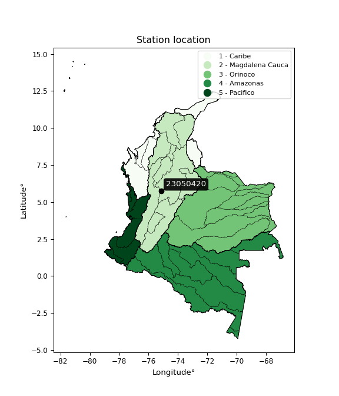</img>

</div>


## A. General information


### 1. General running parameters

• app_version: _v20251225_. • runtime: _2025-12-26 14:29:50.888910_. • Python version: _3.14.0_. • SciPy version: _1.16.3_. • Pandas version: _2.3.3_. • NumPy version: _2.3.5_. • Stations dataset (station_dataset_file): _dataset/pmax24h_in/automatic_colombia.csv_. • Stations catalog (station_catalog_file): _dataset/CNE_IDEAM.xls_. • Plot only fit distributions with Δo > Δ (plot_only_fit): _True_. • Eval low extreme values, if False, evaluates high extreme values (low_extreme): _False_. • Eval every SciPy distribution as logarithmic (pdist_logarithmic_on): _True_. • Standard deviation normalized (ddof): _1.0_. • Return periods to eval in years (Tr): _[2, 2.33, 5, 10, 15, 20, 25, 50, 75, 100, 200, 250, 500, 750, 1000]_. • Minimum data sample per station, 0 means any (minimum_sample): _5_. • Z-Score threshold to adjust a value, 0 means disable (zscore): _3.5_. • Avoid zeros, e.g. rain = 0 (avoid_zeros): _True_. • Avoid null values (avoid_nans): _True_. [:file_folder:Dataset file.](../../dataset/pmax24h_in/automatic_colombia.csv)


### 2. Station info and location

|   id |   CODIGO | NOMBRE                       | CATEGORIA     | TECNOLOGIA                | ESTADO           | FECHA_INSTALACION   |   FECHA_SUSPENSION |   ALTITUD |   LATITUD |   LONGITUD | DEPARTAMENTO   | MUNICIPIO   | AREA_OPERATIVA                      | ENTIDAD                                                     | AREA_HIDROGRAFICA   | ZONA_HIDROGRAFICA   | SUBZONA_HIDROGRAFICA   |   CORRIENTE | OBSERVACION                                                                                                                                                                                                                                                                                                                                                                                                                                                                                                                |   SUBRED | Catalogo   |
|-----:|---------:|:-----------------------------|:--------------|:--------------------------|:-----------------|:--------------------|-------------------:|----------:|----------:|-----------:|:---------------|:------------|:------------------------------------|:------------------------------------------------------------|:--------------------|:--------------------|:-----------------------|------------:|:---------------------------------------------------------------------------------------------------------------------------------------------------------------------------------------------------------------------------------------------------------------------------------------------------------------------------------------------------------------------------------------------------------------------------------------------------------------------------------------------------------------------------|---------:|:-----------|
|    0 | 23050420 | ARGELIA ANTIOQUIA [23050420] | Pluviográfica | Automática con Telemetría | En Mantenimiento | 23/10/2007          |                nan |      1740 |      5.73 |     -75.14 | Antioquia      | Argelia     | Area Operativa 01 - Antioquia-Chocó | INSTITUTO DE HIDROLOGIA METEOROLOGIA Y ESTUDIOS AMBIENTALES | Magdalena Cauca     | Medio Magdalena     | Río La Miel (Samaná)   |         nan | ESTACION ACTIVADA NUEVAMENTE EN SU COMPONENTE CONVENCIONAL POR SOLICITUD DEL AO. (10012023) ESTACION YA CUENTA CON OBSERVADOR |12/12/2024$mvelez$Se realiza el cambio de coordenadas y elevación se realiza el cambio de departamento, municipio y subzona hidrográfica de acuerdo con la solicitud de la coordinadora Gladys del Gallego mediante memorando Orfeo 20243080236763|15/10/2025$mvelez$Se cambio de estado bajo el memorando 20253080178903 atendiendo a la solicitud del aop 1 y del grupo de automatización |      nan | CNE_IDEAM  |

<div align="center">

Map location in: [:earth_americas:Google](http://maps.google.com/maps?q=5.73,-75.14) [:earth_americas:OSM](https://www.openstreetmap.org/#map=18/5.73/-75.14&layers=P) [:earth_americas:Bing](https://www.bing.com/maps?cp=5.73~-75.14&lvl=18) [:earth_americas:Apple](https://maps.apple.com/frame?center=5.73%2C-75.14&span=0.003%2C0.006)

</div>


<div align="center">

```geojson
{
  "type": "Feature",
  "geometry": {
    "type": "Point", 
    "coordinates": [-75.14, 5.73]
  }, 
  "properties": {
    "Name": "23050420"
  }
}
```

</div>


### 3. Discrete values table and plot

|               |           0 |           1 |           2 |           3 |           4 |           5 |           6 |           7 |           8 |           9 |          10 |         11 |          12 |          13 |           14 |
|:--------------|------------:|------------:|------------:|------------:|------------:|------------:|------------:|------------:|------------:|------------:|------------:|-----------:|------------:|------------:|-------------:|
| Date          | 2007        | 2008        | 2009        | 2010        | 2011        | 2012        | 2013        | 2014        | 2015        | 2016        | 2017        | 2018       | 2019        | 2024        | 2025         |
| Value         |  164.7      |   94.1      |  106.2      |  115.3      |  120.2      |   76.5      |  103.3      |   87.9      |   42.9      |   59.7      |   27.1      |  236.2     |    7.5      |  140.4      |  228.4       |
| Value_initial |  164.7      |   94.1      |  106.2      |  115.3      |  120.2      |   76.5      |  103.3      |   87.9      |   42.9      |   59.7      |   27.1      | 2168.8     |    7.5      |  140.4      |  228.4       |
| count         |   15        |   15        |   15        |   15        |   15        |   15        |   15        |   15        |   15        |   15        |   15        |   15       |   15        |   15        |   15         |
| mean          |  236.2      |  236.2      |  236.2      |  236.2      |  236.2      |  236.2      |  236.2      |  236.2      |  236.2      |  236.2      |  236.2      |  236.2     |  236.2      |  236.2      |  236.2       |
| std           |  537.465    |  537.465    |  537.465    |  537.465    |  537.465    |  537.465    |  537.465    |  537.465    |  537.465    |  537.465    |  537.465    |  537.465   |  537.465    |  537.465    |  537.465     |
| zscore        |   -0.133032 |   -0.264389 |   -0.241876 |   -0.224945 |   -0.215828 |   -0.297136 |   -0.247272 |   -0.275925 |   -0.359651 |   -0.328393 |   -0.389049 |    3.59577 |   -0.425516 |   -0.178244 |   -0.0145126 |

<div align="center">

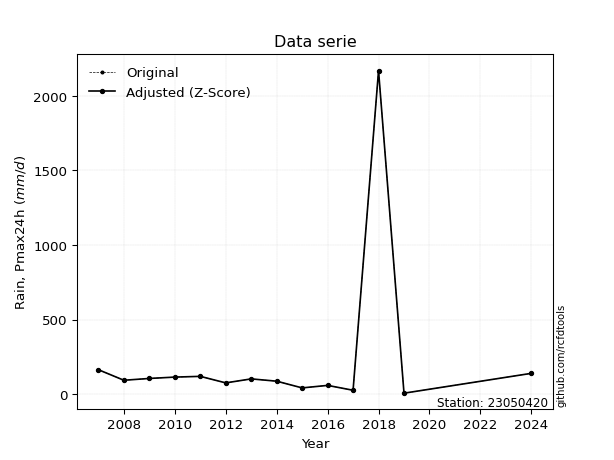</img>

</div>

> If Z-Score is active, values out of range or outliers are replaced with the station mean value.


### 4. Active continuous probability distributions from SciPy (45 of 104 available)

[scipy.stats](https://docs.scipy.org/doc/scipy/reference/stats.html) is a Python´s powerful submodule within the SciPy library for comprehensive statistical analysis, offering over 130 probability distributions (like Normal, Poisson), functions for descriptive stats (mean, variance), hypothesis testing (t-tests, chi-square), random variable generation, and statistical tests, making it essential for data science, modeling, and research. It provides tools to explore, model, and draw conclusions from data efficiently, working seamlessly with NumPy.

<div align="center">

|   id | p_dist             |   n_parameter | fit_method   | label                                                                       | active   | ref                                                                                                        |
|-----:|:-------------------|--------------:|:-------------|:----------------------------------------------------------------------------|:---------|:-----------------------------------------------------------------------------------------------------------|
|    0 | alpha              |             3 | MLE          | Alpha                                                                       | True     | [:mortar_board:](https://docs.scipy.org/doc/scipy/reference/generated/scipy.stats.alpha.html)              |
|    1 | betaprime          |             4 | MLE          | Beta prime                                                                  | True     | [:mortar_board:](https://docs.scipy.org/doc/scipy/reference/generated/scipy.stats.betaprime.html)          |
|    2 | chi2               |             3 | MLE          | Chi²                                                                        | True     | [:mortar_board:](https://docs.scipy.org/doc/scipy/reference/generated/scipy.stats.chi2.html)               |
|    3 | crystalball        |             4 | MLE          | Crystalball                                                                 | True     | [:mortar_board:](https://docs.scipy.org/doc/scipy/reference/generated/scipy.stats.crystalball.html)        |
|    4 | erlang             |             3 | MLE          | Erlang                                                                      | True     | [:mortar_board:](https://docs.scipy.org/doc/scipy/reference/generated/scipy.stats.erlang.html)             |
|    5 | expon              |             2 | MLE          | Exponential                                                                 | True     | [:mortar_board:](https://docs.scipy.org/doc/scipy/reference/generated/scipy.stats.expon.html)              |
|    6 | exponnorm          |             3 | MLE          | Exponentially modified Normal                                               | True     | [:mortar_board:](https://docs.scipy.org/doc/scipy/reference/generated/scipy.stats.exponnorm.html)          |
|    7 | f                  |             4 | MLE          | F                                                                           | True     | [:mortar_board:](https://docs.scipy.org/doc/scipy/reference/generated/scipy.stats.f.html)                  |
|    8 | fatiguelife        |             3 | MLE          | Fatigue-life (Birnbaum-Saunders)                                            | True     | [:mortar_board:](https://docs.scipy.org/doc/scipy/reference/generated/scipy.stats.fatiguelife.html)        |
|    9 | fisk               |             3 | MLE          | Fisk                                                                        | True     | [:mortar_board:](https://docs.scipy.org/doc/scipy/reference/generated/scipy.stats.fisk.html)               |
|   10 | gamma              |             3 | MLE          | Gamma                                                                       | True     | [:mortar_board:](https://docs.scipy.org/doc/scipy/reference/generated/scipy.stats.gamma.html)              |
|   11 | genexpon           |             5 | MLE          | Generalized exponential                                                     | True     | [:mortar_board:](https://docs.scipy.org/doc/scipy/reference/generated/scipy.stats.genexpon.html)           |
|   12 | genlogistic        |             3 | MLE          | Generalized logistic                                                        | True     | [:mortar_board:](https://docs.scipy.org/doc/scipy/reference/generated/scipy.stats.genlogistic.html)        |
|   13 | gibrat             |             2 | MM           | Gibrat                                                                      | True     | [:mortar_board:](https://docs.scipy.org/doc/scipy/reference/generated/scipy.stats.gibrat.html)             |
|   14 | gompertz           |             3 | MLE          | Gompertz (or truncated Gumbel)                                              | True     | [:mortar_board:](https://docs.scipy.org/doc/scipy/reference/generated/scipy.stats.gompertz.html)           |
|   15 | gumbel_l           |             2 | MM           | Gumbel Left Skew                                                            | True     | [:mortar_board:](https://docs.scipy.org/doc/scipy/reference/generated/scipy.stats.gumbel_l.html)           |
|   16 | gumbel_r           |             2 | MM           | Gumbel Right Skew                                                           | True     | [:mortar_board:](https://docs.scipy.org/doc/scipy/reference/generated/scipy.stats.gumbel_r.html)           |
|   17 | halflogistic       |             2 | MM           | Half-logistic                                                               | True     | [:mortar_board:](https://docs.scipy.org/doc/scipy/reference/generated/scipy.stats.halflogistic.html)       |
|   18 | halfnorm           |             2 | MM           | Half Normal                                                                 | True     | [:mortar_board:](https://docs.scipy.org/doc/scipy/reference/generated/scipy.stats.halfnorm.html)           |
|   19 | hypsecant          |             2 | MM           | hyperbolic secant                                                           | True     | [:mortar_board:](https://docs.scipy.org/doc/scipy/reference/generated/scipy.stats.hypsecant.html)          |
|   20 | invgamma           |             3 | MLE          | Inverted gamma                                                              | True     | [:mortar_board:](https://docs.scipy.org/doc/scipy/reference/generated/scipy.stats.invgamma.html)           |
|   21 | invgauss           |             3 | MLE          | Inverse Gaussian                                                            | True     | [:mortar_board:](https://docs.scipy.org/doc/scipy/reference/generated/scipy.stats.invgauss.html)           |
|   22 | invweibull         |             3 | MLE          | Inverted Weibull                                                            | True     | [:mortar_board:](https://docs.scipy.org/doc/scipy/reference/generated/scipy.stats.invweibull.html)         |
|   23 | johnsonsu          |             4 | MLE          | Johnson Su                                                                  | True     | [:mortar_board:](https://docs.scipy.org/doc/scipy/reference/generated/scipy.stats.johnsonsu.html)          |
|   24 | kstwobign          |             2 | MLE          | Limiting distribution of scaled Kolmogorov-Smirnov two-sided test statistic | True     | [:mortar_board:](https://docs.scipy.org/doc/scipy/reference/generated/scipy.stats.kstwobign.html)          |
|   25 | laplace            |             2 | MM           | Laplace                                                                     | True     | [:mortar_board:](https://docs.scipy.org/doc/scipy/reference/generated/scipy.stats.laplace.html)            |
|   26 | laplace_asymmetric |             3 | MLE          | Asymmetric Laplace                                                          | True     | [:mortar_board:](https://docs.scipy.org/doc/scipy/reference/generated/scipy.stats.laplace_asymmetric.html) |
|   27 | loggamma           |             3 | MLE          | Log gamma                                                                   | True     | [:mortar_board:](https://docs.scipy.org/doc/scipy/reference/generated/scipy.stats.loggamma.html)           |
|   28 | logistic           |             2 | MM           | Logistic (or Sech-squared)                                                  | True     | [:mortar_board:](https://docs.scipy.org/doc/scipy/reference/generated/scipy.stats.logistic.html)           |
|   29 | lognorm            |             3 | MLE          | Log Normal                                                                  | True     | [:mortar_board:](https://docs.scipy.org/doc/scipy/reference/generated/scipy.stats.lognorm.html)            |
|   30 | maxwell            |             2 | MM           | Maxwell                                                                     | True     | [:mortar_board:](https://docs.scipy.org/doc/scipy/reference/generated/scipy.stats.maxwell.html)            |
|   31 | mielke             |             4 | MLE          | Mielke Beta-Kappa / Dagum                                                   | True     | [:mortar_board:](https://docs.scipy.org/doc/scipy/reference/generated/scipy.stats.mielke.html)             |
|   32 | moyal              |             2 | MM           | Moyal                                                                       | True     | [:mortar_board:](https://docs.scipy.org/doc/scipy/reference/generated/scipy.stats.moyal.html)              |
|   33 | nakagami           |             3 | MLE          | Nakagami                                                                    | True     | [:mortar_board:](https://docs.scipy.org/doc/scipy/reference/generated/scipy.stats.nakagami.html)           |
|   34 | ncf                |             5 | MLE          | Non-central F distribution                                                  | True     | [:mortar_board:](https://docs.scipy.org/doc/scipy/reference/generated/scipy.stats.ncf.html)                |
|   35 | nct                |             4 | MLE          | Non-central Student’s t                                                     | True     | [:mortar_board:](https://docs.scipy.org/doc/scipy/reference/generated/scipy.stats.nct.html)                |
|   36 | norm               |             2 | MM           | Normal                                                                      | True     | [:mortar_board:](https://docs.scipy.org/doc/scipy/reference/generated/scipy.stats.norm.html)               |
|   37 | pareto             |             3 | MLE          | Pareto                                                                      | True     | [:mortar_board:](https://docs.scipy.org/doc/scipy/reference/generated/scipy.stats.pareto.html)             |
|   38 | pearson3           |             3 | MM           | Pearson type III                                                            | True     | [:mortar_board:](https://docs.scipy.org/doc/scipy/reference/generated/scipy.stats.pearson3.html)           |
|   39 | rayleigh           |             2 | MM           | Rayleigh                                                                    | True     | [:mortar_board:](https://docs.scipy.org/doc/scipy/reference/generated/scipy.stats.rayleigh.html)           |
|   40 | rice               |             3 | MLE          | Rice                                                                        | True     | [:mortar_board:](https://docs.scipy.org/doc/scipy/reference/generated/scipy.stats.rice.html)               |
|   41 | t                  |             3 | MLE          | Student’s t                                                                 | True     | [:mortar_board:](https://docs.scipy.org/doc/scipy/reference/generated/scipy.stats.t.html)                  |
|   42 | truncnorm          |             4 | MLE          | Truncated normal                                                            | True     | [:mortar_board:](https://docs.scipy.org/doc/scipy/reference/generated/scipy.stats.truncnorm.html)          |
|   43 | wald               |             2 | MM           | Wald                                                                        | True     | [:mortar_board:](https://docs.scipy.org/doc/scipy/reference/generated/scipy.stats.wald.html)               |
|   44 | weibull_min        |             3 | MLE          | Weibull minimum                                                             | True     | [:mortar_board:](https://docs.scipy.org/doc/scipy/reference/generated/scipy.stats.weibull_min.html)        |

</div>

> **n_parameter:** # arguments & localization & scale.
>
> **Fit methods:** (MLE) maximum likelihood, (MM) L-moments.
>
>**Inactive:** foldnorm, gennorm, norminvgauss, powernorm, powerlognorm, skewnorm, genextreme, anglit, arcsine, argus, beta, bradford, burr, burr12, cauchy, cosine, halfcauchy, foldcauchy, skewcauchy, wrapcauchy, dgamma, gengamma, exponweib, exponpow, truncexpon, gausshyper, genhalflogistic, genhyperbolic, geninvgauss, halfgennorm, johnsonsb, kappa4, kappa3, ksone, kstwo, loglaplace, levy, levy_l, levy_stable, ncx2, genpareto, truncpareto, lomax, powerlaw, rdist, rel_breitwigner, recipinvgauss, semicircular, studentized_range, trapezoid, triang, truncweibull_min, tukeylambda, uniform, loguniform, vonmises, vonmises_line, weibull_max, dweibull, 


## B. Probability distributions vs. Empirical distributions

A continuous probability distribution (CPD) describes probabilities for variables that can take any value within a range (like rain any time), unlike discrete variables with specific outcomes (like temperature). It uses a Probability Density Function (PDF), a curve where the total area under it equals 1, and the probability of the variable falling within an interval (a to b) is found by calculating the area under the curve between those points. A key feature is that the probability of hitting any single exact value is zero, so probabilities are always expressed for ranges, e.g., $P(a ≤ X ≤ b)$.

<div align="center">

Distributions parameters
|    |   station | p_dist                |   n |               loc |            scale | shape                  | shape1                 | shape2                | shape3   |
|---:|----------:|:----------------------|----:|------------------:|-----------------:|:-----------------------|:-----------------------|:----------------------|:---------|
|  0 |  23050420 | alpha                 |  15 |      -0.0775908   |     27.1671      | 1.801242697713343e-11  |                        |                       |          |
|  1 |  23050420 | betaprime             |  15 |     -45.7911      |   4842.39        | 5.814809615804353      | 184.83550602125905     |                       |          |
|  2 |  23050420 | chi2                  |  15 |     -39.6585      |     14.2904      | 10.28794052572924      |                        |                       |          |
|  3 |  23050420 | crystalball           |  15 |     107.36        |     63.3629      | 9321.87794638487       | 1555.0494252261954     |                       |          |
|  4 |  23050420 | erlang                |  15 |     -39.6586      |     28.5807      | 5.143978830763975      |                        |                       |          |
|  5 |  23050420 | expon                 |  15 |       7.5         |     99.86        |                        |                        |                       |          |
|  6 |  23050420 | exponnorm             |  15 |      53.5724      |     38.026       | 1.4144948300739426     |                        |                       |          |
|  7 |  23050420 | f                     |  15 |     -39.8458      |    147.178       | 10.327686708685057     | 9989.459443372154      |                       |          |
|  8 |  23050420 | fatiguelife           |  15 |       7.5         |      0.000623285 | 390.37872791340055     |                        |                       |          |
|  9 |  23050420 | fisk                  |  15 |    -105.124       |    204.004       | 5.846093609526195      |                        |                       |          |
| 10 |  23050420 | gamma                 |  15 |     -39.6586      |     28.5807      | 5.1439755334670885     |                        |                       |          |
| 11 |  23050420 | genexpon              |  15 |       7.47441     |      2.55322     | 0.02550978675726371    | 4.6980357412569776e-08 | 2.914563842440777     |          |
| 12 |  23050420 | genlogistic           |  15 |     -93.8832      |     51.7743      | 28.1631645452583       |                        |                       |          |
| 13 |  23050420 | gibrat                |  15 |      59.0222      |     29.3184      |                        |                        |                       |          |
| 14 |  23050420 | gompertz              |  15 |      94.1         |     11.1363      | 1.7227718813611826e-05 |                        |                       |          |
| 15 |  23050420 | gumbel_l              |  15 |     135.877       |     49.4038      |                        |                        |                       |          |
| 16 |  23050420 | gumbel_r              |  15 |      78.8433      |     49.4038      |                        |                        |                       |          |
| 17 |  23050420 | halflogistic          |  15 |      32.2603      |     54.173       |                        |                        |                       |          |
| 18 |  23050420 | halfnorm              |  15 |      23.4924      |    105.112       |                        |                        |                       |          |
| 19 |  23050420 | hypsecant             |  15 |     107.36        |     40.3381      |                        |                        |                       |          |
| 20 |  23050420 | invgamma              |  15 |    -200.036       |   7312.98        | 24.785187911544124     |                        |                       |          |
| 21 |  23050420 | invgauss              |  15 |     -12.9826      |    122.892       | 0.9824453561887116     |                        |                       |          |
| 22 |  23050420 | invweibull            |  15 |      -3.19086e+09 |      3.19086e+09 | 60304203.97364409      |                        |                       |          |
| 23 |  23050420 | johnsonsu             |  15 |    -118.69        |     24.9693      | -10.307182150667781    | 3.6029289142798486     |                       |          |
| 24 |  23050420 | kstwobign             |  15 |    -111.298       |    251.251       |                        |                        |                       |          |
| 25 |  23050420 | laplace               |  15 |     107.36        |     44.8043      |                        |                        |                       |          |
| 26 |  23050420 | laplace_asymmetric    |  15 |     103.3         |     47.5835      | 0.9582468169337546     |                        |                       |          |
| 27 |  23050420 | loggamma              |  15 |  -15308.1         |   2182           | 1170.4647258543273     |                        |                       |          |
| 28 |  23050420 | logistic              |  15 |     107.36        |     34.9338      |                        |                        |                       |          |
| 29 |  23050420 | lognorm               |  15 |    -119.908       |    218.707       | 0.2780608572568542     |                        |                       |          |
| 30 |  23050420 | maxwell               |  15 |     -42.7834      |     94.0884      |                        |                        |                       |          |
| 31 |  23050420 | mielke                |  15 |      -0.576156    |    161.802       | 1.3599241379978828     | 4.7762657193420335     |                       |          |
| 32 |  23050420 | moyal                 |  15 |      71.125       |     28.5233      |                        |                        |                       |          |
| 33 |  23050420 | nakagami              |  15 |      27.1         |     90.1717      | 0.45666797704506035    |                        |                       |          |
| 34 |  23050420 | ncf                   |  15 |      -0.0104957   |      2.24937e-05 | 9.943855178346943e-07  | 6.229542552538338      | 3.346246910298494     |          |
| 35 |  23050420 | nct                   |  15 |      -0.166074    |     49.0964      | 7.902949761104434      | 1.9710932203088742     |                       |          |
| 36 |  23050420 | norm                  |  15 |     107.36        |     63.3629      |                        |                        |                       |          |
| 37 |  23050420 | pareto                |  15 |       7.49997     |      2.73748e-05 | 0.0714289870952637     |                        |                       |          |
| 38 |  23050420 | pearson3              |  15 |     107.36        |     63.3629      | 0.579467398261978      |                        |                       |          |
| 39 |  23050420 | rayleigh              |  15 |     -13.8569      |     96.7171      |                        |                        |                       |          |
| 40 |  23050420 | rice                  |  15 |     -11.1031      |     94.1315      | 0.1920732228127884     |                        |                       |          |
| 41 |  23050420 | t                     |  15 |     107.361       |     63.3656      | 514870.42868487537     |                        |                       |          |
| 42 |  23050420 | truncnorm             |  15 |     131.61        |     11.3548      | -10.930180401250873    | 9.227744350022505      |                       |          |
| 43 |  23050420 | wald                  |  15 |      43.9971      |     63.3629      |                        |                        |                       |          |
| 44 |  23050420 | weibull_min           |  15 |      -5.2877      |    126.458       | 1.8177590713951965     |                        |                       |          |
| 45 |  23050420 | logalpha              |  15 |     -22.4977      |    805.756       | 29.956366743123112     |                        |                       |          |
| 46 |  23050420 | logbetaprime          |  15 |     -17.4073      |    113.91        | 726.1256347198853      | 3790.879630225926      |                       |          |
| 47 |  23050420 | logchi2               |  15 |       2.0149      |      1.10643     | 1.0875341196305683     |                        |                       |          |
| 48 |  23050420 | logcrystalball        |  15 |       4.75174     |      0.431881    | 0.617863176846785      | 18.096149995507744     |                       |          |
| 49 |  23050420 | logerlang             |  15 |     -11.0041      |      0.0510516   | 301.7992308676344      |                        |                       |          |
| 50 |  23050420 | logexpon              |  15 |       2.0149      |      2.4054      |                        |                        |                       |          |
| 51 |  23050420 | logexponnorm          |  15 |       4.41978     |      0.8493      | 0.000610614264561574   |                        |                       |          |
| 52 |  23050420 | logf                  |  15 |     -63.3322      |     67.7416      | 14033.299632009886     | 101905.21009548157     |                       |          |
| 53 |  23050420 | logfatiguelife        |  15 |    -744.893       |    749.312       | 0.0011349003948470347  |                        |                       |          |
| 54 |  23050420 | logfisk               |  15 |      -1.14657e+06 |      1.14657e+06 | 2642749.269954066      |                        |                       |          |
| 55 |  23050420 | loggamma              |  15 |     -13.4896      |      0.044861    | 398.97248580584926     |                        |                       |          |
| 56 |  23050420 | loggenexpon           |  15 |       1.75541     |      0.0207971   | 6.891659152200003e-06  | 1.5192137234719167     | 7.272037465383559e-05 |          |
| 57 |  23050420 | loggenlogistic        |  15 |       5.09011     |      0.208702    | 0.2787640117853324     |                        |                       |          |
| 58 |  23050420 | loggibrat             |  15 |       3.77237     |      0.39299     |                        |                        |                       |          |
| 59 |  23050420 | loggompertz           |  15 |       2.01489     |      0.617949    | 0.011615915101122809   |                        |                       |          |
| 60 |  23050420 | loggumbel_l           |  15 |       4.80253     |      0.662199    |                        |                        |                       |          |
| 61 |  23050420 | loggumbel_r           |  15 |       4.03807     |      0.662199    |                        |                        |                       |          |
| 62 |  23050420 | loghalflogistic       |  15 |       3.41365     |      0.726146    |                        |                        |                       |          |
| 63 |  23050420 | loghalfnorm           |  15 |       3.29621     |      1.40885     |                        |                        |                       |          |
| 64 |  23050420 | loghypsecant          |  15 |       4.4203      |      0.540683    |                        |                        |                       |          |
| 65 |  23050420 | loginvgamma           |  15 |     -17.4607      |  13643.7         | 625.2505531493287      |                        |                       |          |
| 66 |  23050420 | loginvgauss           |  15 |      -5.88701     |   1247.92        | 0.008259304190413756   |                        |                       |          |
| 67 |  23050420 | loginvweibull         |  15 | -270441           | 270445           | 252109.11811995943     |                        |                       |          |
| 68 |  23050420 | logjohnsonsu          |  15 |       5.99327     |      0.0639067   | 7.329247217456506      | 1.946450220356926      |                       |          |
| 69 |  23050420 | logkstwobign          |  15 |      -0.110245    |      5.21703     |                        |                        |                       |          |
| 70 |  23050420 | loglaplace            |  15 |       4.4203      |      0.600548    |                        |                        |                       |          |
| 71 |  23050420 | loglaplace_asymmetric |  15 |       4.74754     |      0.519095    | 1.3638680772643985     |                        |                       |          |
| 72 |  23050420 | logloggamma           |  15 |       5.17264     |      0.368383    | 0.4844806961021326     |                        |                       |          |
| 73 |  23050420 | loglogistic           |  15 |       4.4203      |      0.468245    |                        |                        |                       |          |
| 74 |  23050420 | loglognorm            |  15 | -113890           | 113894           | 7.456987177012262e-06  |                        |                       |          |
| 75 |  23050420 | logmaxwell            |  15 |       2.40784     |      1.26113     |                        |                        |                       |          |
| 76 |  23050420 | logmielke             |  15 |      -1.17062e+06 |      1.17062e+06 | 1573957.8932836144     | 5547984.389565233      |                       |          |
| 77 |  23050420 | logmoyal              |  15 |       3.93462     |      0.382321    |                        |                        |                       |          |
| 78 |  23050420 | lognakagami           |  15 |       2.53606     |      2.12219     | 2.993675940041138      |                        |                       |          |
| 79 |  23050420 | logncf                |  15 |      -9.35263     |     13.6148      | 623.1440003569278      | 2035.9678163310855     | 6.628208509808317     |          |
| 80 |  23050420 | lognct                |  15 |      61.9427      |      0.828159    | 50686.61994400651      | -69.45733173193497     |                       |          |
| 81 |  23050420 | lognorm               |  15 |       4.4203      |      0.849303    |                        |                        |                       |          |
| 82 |  23050420 | logpareto             |  15 |       2.0149      |      7.65562e-07 | 0.0714289112940713     |                        |                       |          |
| 83 |  23050420 | logpearson3           |  15 |       4.4203      |      0.849299    | -1.4041675419640336    |                        |                       |          |
| 84 |  23050420 | lograyleigh           |  15 |       2.79547     |      1.29642     |                        |                        |                       |          |
| 85 |  23050420 | logrice               |  15 |    -930.983       |      0.84907     | 1101.6801437578388     |                        |                       |          |
| 86 |  23050420 | logt                  |  15 |       4.4205      |      0.849013    | 5640.360500576247      |                        |                       |          |
| 87 |  23050420 | logtruncnorm          |  15 |      -0.289797    |      2.90335     | 1.2358198594355256     | 1.982012957837795      |                       |          |
| 88 |  23050420 | logwald               |  15 |       3.57097     |      0.84933     |                        |                        |                       |          |
| 89 |  23050420 | logweibull_min        |  15 |       2.0149      |      1.45998     | 0.38877553297230705    |                        |                       |          |

</div>

> **loc** (Location parameter): This shifts the distribution along the x-axis. For many common distributions, like the normal (Gaussian) distribution, loc represents the mean $μ$. For others, like the uniform distribution, it might represent the minimum value, or for the beta distribution, the left end of the support interval.
>
> **scale** (Scale parameter): This determines the width or spread of the distribution. For the normal distribution, scale represents the standard deviation $σ$. For a uniform distribution, it defines the length of the interval (from $loc$ to $loc + scale$).
>
> **shape** (Shape parameters): Refers to parameters that define the specific form of a probability distribution, distinct from its location (loc) and scale (scale). These parameters are required arguments for most distribution functions. For example, a normal (Gaussian) distribution is fully defined by its location (mean) and scale (standard deviation), so it has no specific shape parameters beyond loc and scale. However, other distributions have intrinsic properties that need specification, as Gamma distribution that takes a shape parameter, often named $a$ or $alpha$.


### 0. Cumulative distribution values - CDF (90 evaluated)

> Ordered by x ascending and calculating $log(f(x))$ separately. 

|   id |   Station |   date |     x |   count |   mean |     std |     zscore |   Value_initial |   station |   m |       alpha |   alpha_pdf |   betaprime |   betaprime_pdf |      chi2 |    chi2_pdf |   crystalball |   crystalball_pdf |    erlang |   erlang_pdf |    expon |   expon_pdf |   exponnorm |   exponnorm_pdf |         f |       f_pdf |   fatiguelife |   fatiguelife_pdf |      fisk |    fisk_pdf |     gamma |   gamma_pdf |    genexpon |   genexpon_pdf |   genlogistic |   genlogistic_pdf |      gibrat |   gibrat_pdf |    gompertz |   gompertz_pdf |   gumbel_l |   gumbel_l_pdf |   gumbel_r |   gumbel_r_pdf |   halflogistic |   halflogistic_pdf |   halfnorm |   halfnorm_pdf |   hypsecant |   hypsecant_pdf |   invgamma |   invgamma_pdf |   invgauss |   invgauss_pdf |   invweibull |   invweibull_pdf |   johnsonsu |   johnsonsu_pdf |   kstwobign |   kstwobign_pdf |   laplace |   laplace_pdf |   laplace_asymmetric |   laplace_asymmetric_pdf |   loggamma |   loggamma_pdf |   logistic |   logistic_pdf |    lognorm |   lognorm_pdf |   maxwell |   maxwell_pdf |    mielke |   mielke_pdf |      moyal |   moyal_pdf |    nakagami |   nakagami_pdf |      ncf |     ncf_pdf |       nct |     nct_pdf |      norm |    norm_pdf |   pareto |     pareto_pdf |   pearson3 |   pearson3_pdf |   rayleigh |   rayleigh_pdf |      rice |    rice_pdf |         t |       t_pdf |   truncnorm |   truncnorm_pdf |     wald |    wald_pdf |   weibull_min |   weibull_min_pdf |   logalpha |   logalpha_pdf |   logbetaprime |   logbetaprime_pdf |     logchi2 |   logchi2_pdf |   logcrystalball |   logcrystalball_pdf |   logerlang |   logerlang_pdf |   logexpon |   logexpon_pdf |   logexponnorm |   logexponnorm_pdf |       logf |   logf_pdf |   logfatiguelife |   logfatiguelife_pdf |    logfisk |   logfisk_pdf |   loggenexpon |   loggenexpon_pdf |   loggenlogistic |   loggenlogistic_pdf |   loggibrat |   loggibrat_pdf |   loggompertz |   loggompertz_pdf |   loggumbel_l |   loggumbel_l_pdf |   loggumbel_r |   loggumbel_r_pdf |   loghalflogistic |   loghalflogistic_pdf |   loghalfnorm |   loghalfnorm_pdf |   loghypsecant |   loghypsecant_pdf |   loginvgamma |   loginvgamma_pdf |   loginvgauss |   loginvgauss_pdf |   loginvweibull |   loginvweibull_pdf |   logjohnsonsu |   logjohnsonsu_pdf |   logkstwobign |   logkstwobign_pdf |   loglaplace |   loglaplace_pdf |   loglaplace_asymmetric |   loglaplace_asymmetric_pdf |   logloggamma |   logloggamma_pdf |   loglogistic |   loglogistic_pdf |   loglognorm |   loglognorm_pdf |   logmaxwell |   logmaxwell_pdf |   logmielke |   logmielke_pdf |    logmoyal |   logmoyal_pdf |   lognakagami |   lognakagami_pdf |     logncf |   logncf_pdf |     lognct |   lognct_pdf |   logpareto |   logpareto_pdf |   logpearson3 |   logpearson3_pdf |   lograyleigh |   lograyleigh_pdf |    logrice |   logrice_pdf |       logt |   logt_pdf |   logtruncnorm |   logtruncnorm_pdf |   logwald |   logwald_pdf |   logweibull_min |   logweibull_min_pdf |
|-----:|----------:|-------:|------:|--------:|-------:|--------:|-----------:|----------------:|----------:|----:|------------:|------------:|------------:|----------------:|----------:|------------:|--------------:|------------------:|----------:|-------------:|---------:|------------:|------------:|----------------:|----------:|------------:|--------------:|------------------:|----------:|------------:|----------:|------------:|------------:|---------------:|--------------:|------------------:|------------:|-------------:|------------:|---------------:|-----------:|---------------:|-----------:|---------------:|---------------:|-------------------:|-----------:|---------------:|------------:|----------------:|-----------:|---------------:|-----------:|---------------:|-------------:|-----------------:|------------:|----------------:|------------:|----------------:|----------:|--------------:|---------------------:|-------------------------:|-----------:|---------------:|-----------:|---------------:|-----------:|--------------:|----------:|--------------:|----------:|-------------:|-----------:|------------:|------------:|---------------:|---------:|------------:|----------:|------------:|----------:|------------:|---------:|---------------:|-----------:|---------------:|-----------:|---------------:|----------:|------------:|----------:|------------:|------------:|----------------:|---------:|------------:|--------------:|------------------:|-----------:|---------------:|---------------:|-------------------:|------------:|--------------:|-----------------:|---------------------:|------------:|----------------:|-----------:|---------------:|---------------:|-------------------:|-----------:|-----------:|-----------------:|---------------------:|-----------:|--------------:|--------------:|------------------:|-----------------:|---------------------:|------------:|----------------:|--------------:|------------------:|--------------:|------------------:|--------------:|------------------:|------------------:|----------------------:|--------------:|------------------:|---------------:|-------------------:|--------------:|------------------:|--------------:|------------------:|----------------:|--------------------:|---------------:|-------------------:|---------------:|-------------------:|-------------:|-----------------:|------------------------:|----------------------------:|--------------:|------------------:|--------------:|------------------:|-------------:|-----------------:|-------------:|-----------------:|------------:|----------------:|------------:|---------------:|--------------:|------------------:|-----------:|-------------:|-----------:|-------------:|------------:|----------------:|--------------:|------------------:|--------------:|------------------:|-----------:|--------------:|-----------:|-----------:|---------------:|-------------------:|----------:|--------------:|-----------------:|---------------------:|
|    0 |  23050420 |   2019 |   7.5 |      15 |  236.2 | 537.465 | -0.425516  |             7.5 |  23050420 |   1 | 0.000336838 | 0.000610668 |   0.02296   |     0.0017764   | 0.0221047 | 0.00179154  |     0.0575127 |        0.00181856 | 0.0221048 |  0.00179154  | 0        |  0.010014   |   0.0296232 |     0.001547    | 0.0221331 | 0.00179107  |     0.0611115 |       5.45391e+07 | 0.0300887 | 0.00151485  | 0.0221048 | 0.00179154  | 0.000255691 |     0.00998868 |     0.0242892 |        0.0016339  | 0           |  0           | 0           |    0           |  0.0716847 |    0.0013977   |  0.0144368 |    0.00123842  |      0         |        0           |   0        |    0           |   0.0534231 |     0.00131818  |  0.0270716 |     0.00168889 |  0.0369481 |    0.00602991  |    0.0232812 |      0.00165442  |   0.0263233 |     0.0017092   |   0.0212717 |     0.00179715  | 0.0538286 |   0.00120142  |            0.0585583 |              0.00128426  |  0.0026856 |      0.0101733 |  0.054241  |    0.00146846  | 0.00231141 |     0.0085119 | 0.0372887 |   0.00209972  | 0.01697   |  0.00285753  | 0.00228435 | 0.000406787 | 0           |    0           | 0.238754 | 0.00665482  | 0.0344986 | 0.00153301  | 0.0575127 | 0.00181857  | 0        | 2609.3         |  0.0351298 |     0.00185223 |  0.0240855 |    0.00222814  | 0.0189891 | 0.00202199  | 0.0575186 | 0.00181863  | 2.02581e-33 |     4.01237e-28 | 0        | 0           |     0.0154057 |       0.00217295  | 0.00178009 |     0.00764805 |     0.00236103 |         0.00912045 | 3.27796e-09 |   4.01371e+06 |        0.02064   |            0.0233391 |  0.00235072 |      0.00926666 |   0        |      0.415731  |     0.00231136 |         0.00851176 | 0.00247685 | 0.00916481 |       0.00231943 |           0.00855511 | 0.00298155 |    0.00685173 |    0.00864579 |         0.0660082 |        0.0164477 |            0.0219693 |    0        |       0         |    2.2081e-07 |         0.0187979 |     0.0147417 |         0.0220968 |   6.04866e-10 |       1.93883e-08 |          0        |              0        |    0          |          0        |     0.00744327 |          0.0137652 |     0.0017969 |        0.00767319 |    0.00192526 |        0.00861333 |      0.00238288 |           0.0134157 |      0.0196404 |           0.023324 |     0.00363217 |          0.0237055 |   0.00910903 |        0.0151679 |               0.0137049 |                   0.0193579 |     0.0177434 |         0.0233324 |    0.00584068 |         0.0124007 |   0.00231133 |       0.00851176 |    0         |         0        |   0.0161189 |       0.0216726 | 7.76808e-35 |     1.5501e-32 |    0          |          0        | 0.00194394 |   0.00810406 | 0.00230767 |   0.00848315 |    0        |  93302.6        |      0.017182 |         0.0246204 |     0         |          0        | 0.00230582 |    0.00849556 | 0.00231093 | 0.00850372 |    0           |           0        | 0         |      0        |      9.27722e-07 |          8.12169e+08 |
|    1 |  23050420 |   2017 |  27.1 |      15 |  236.2 | 537.465 | -0.389049  |            27.1 |  23050420 |   2 | 0.317498    | 0.0178066   |   0.0767383 |     0.00374651  | 0.0767326 | 0.00380991  |     0.102636  |        0.00282274 | 0.0767327 |  0.00380992  | 0.178214 |  0.00822939 |   0.0745345 |     0.00313508  | 0.0767338 | 0.00380789  |     0.675172  |       0.00416996  | 0.0734342 | 0.00300835  | 0.0767327 | 0.00380991  | 0.178057    |     0.00821224 |     0.0744123 |        0.00356708 | 0           |  0           | 0           |    0           |  0.104708  |    0.00200438  |  0.0578384 |    0.00333669  |      0         |        0           |   0.027379 |    0.0075863   |   0.0865139 |     0.00211841  |  0.0767495 |     0.00344801 |  0.196438  |    0.00879323  |    0.0745606 |      0.00365829  |   0.0768987 |     0.00351435  |   0.078024  |     0.00402079  | 0.0833678 |   0.00186071  |            0.0900062 |              0.00197396  |  0.106099  |      0.213378  |  0.0913311 |    0.00237563  | 0.0934786  |     0.196653  | 0.0925973 |   0.00355048  | 0.0905897 |  0.00445034  | 0.030501   | 0.00291368  | 8.21253e-16 |    0.211129    | 0.360343 | 0.00572847  | 0.0778704 | 0.00298915  | 0.102636  | 0.00282274  | 0.61824  |    0.00139126  |  0.0858844 |     0.00336937 |  0.0857615 |    0.00400295  | 0.0776695 | 0.003904    | 0.102643  | 0.00282275  | 1.72364e-20 |     1.41328e-20 | 0        | 0           |     0.080639  |       0.00433827  | 0.100656   |     0.213502   |     0.101235   |         0.208594   | 0.692605    |   0.198366    |        0.0941886 |            0.116395  |  0.104516   |      0.214737   |   0.413781 |      0.24371   |     0.0934784  |         0.196653   | 0.0982999  | 0.203413   |       0.0939348  |           0.197402   | 0.0546109  |    0.118999   |    0.262491   |         0.290345  |        0.0914711 |            0.122156  |    0        |       0         |    0.0780454  |         0.138566  |     0.0981814 |         0.140737  |   0.0473388   |       0.218067    |          0        |              0        |    0.00188273 |          0.566338 |     0.0796829  |          0.14584   |     0.102022  |        0.218089   |    0.110675   |        0.226831   |      0.161455   |           0.274457  |      0.0963936 |           0.123411 |     0.213562   |          0.299138  |   0.0773518  |        0.128802  |               0.0841217 |                   0.11882   |     0.0959231 |         0.125629  |    0.0836658  |         0.16373   |   0.0934793  |       0.196655   |    0.0810947 |         0.246341 |   0.0906657 |       0.121879  | 0.0217554   |     0.172131   |    0.00737373 |          0.052329 | 0.101226   |   0.212875   | 0.0931744  |   0.196215   |    0.640773 |      0.019974   |      0.101922 |         0.135142  |     0.0728008 |          0.278077 | 0.0934186  |    0.196613   | 0.0933912  | 0.19653    |    0.000995014 |           0.757095 | 0         |      0        |      0.613828    |          0.111198    |
|    2 |  23050420 |   2015 |  42.9 |      15 |  236.2 | 537.465 | -0.359651  |            42.9 |  23050420 |   3 | 0.527307    | 0.00961018  |   0.14805   |     0.00522576  | 0.14907   | 0.00528605  |     0.154502  |        0.00375269 | 0.14907   |  0.00528605  | 0.298473 |  0.0070251  |   0.136366  |     0.00470591  | 0.149039  | 0.00528416  |     0.729225  |       0.00285517  | 0.13294   | 0.00455238  | 0.14907   | 0.00528605  | 0.298087    |     0.00701299 |     0.144034  |        0.00520935 | 0           |  0           | 0           |    0           |  0.14126   |    0.0026471   |  0.126188  |    0.00528717  |      0.0978866 |        0.00914126  |   0.146486 |    0.00746248  |   0.127074  |     0.00306722  |  0.143229  |     0.00494194 |  0.327947  |    0.00770864  |    0.145737  |      0.00530462  |   0.144495  |     0.00501054  |   0.154389  |     0.00555776  | 0.118618  |   0.00264747  |            0.127281  |              0.00279144  |  0.236564  |      0.352781  |  0.136437  |    0.00337272  | 0.218051   |     0.346852  | 0.157557  |   0.00464559  | 0.167346  |  0.00522473  | 0.10098    | 0.00597667  | 0.160155    |    0.00916919  | 0.44471  | 0.00495701  | 0.136628  | 0.00446936  | 0.154502  | 0.00375269  | 0.634026 |    0.000738451 |  0.149251  |     0.00463426 |  0.158178  |    0.00510778  | 0.149184  | 0.00509079  | 0.154508  | 0.00375262  | 2.80176e-15 |     1.95834e-15 | 0        | 0           |     0.158961  |       0.00549232  | 0.232265   |     0.35684    |     0.230249   |         0.351899   | 0.769319    |   0.1402      |        0.167766  |            0.21444   |  0.236465   |      0.357715   |   0.515686 |      0.201344  |     0.218051   |         0.346853   | 0.225555   | 0.35069    |       0.21884    |           0.347433   | 0.142751   |    0.282059   |    0.400763   |         0.305782  |        0.168872  |            0.225182  |    0        |       0         |    0.167809   |         0.263022  |     0.186809  |         0.25394   |   0.217744    |       0.501264    |          0.233331 |              0.651079 |    0.25739    |          0.53661  |     0.182184   |          0.318853  |     0.237075  |        0.36728    |    0.246691   |        0.36051    |      0.304719   |           0.337566  |      0.173968  |           0.223623 |     0.358733   |          0.323215  |   0.166206   |        0.276757  |               0.160946  |                   0.227332  |     0.174628  |         0.226349  |    0.195828   |         0.336319  |   0.218053   |       0.346853   |    0.234418  |         0.409058 |   0.168058  |       0.225542  | 0.208248    |     0.594885   |    0.0798573  |          0.298949 | 0.232578   |   0.356771   | 0.217601   |   0.346755   |    0.648531 |      0.0143953  |      0.184774 |         0.232952  |     0.241275  |          0.434909 | 0.217989   |    0.34689    | 0.21792    | 0.346807   |    0.315612    |           0.614853 | 0.0836951 |      1.14626  |      0.657521    |          0.0818097   |
|    3 |  23050420 |   2016 |  59.7 |      15 |  236.2 | 537.465 | -0.328393  |            59.7 |  23050420 |   4 | 0.649491    | 0.00547087  |   0.245731  |     0.00629891  | 0.247517  | 0.00632709  |     0.225973  |        0.00474483 | 0.247517  |  0.00632709  | 0.407101 |  0.0059373  |   0.228798  |     0.00623214  | 0.247462  | 0.00632624  |     0.770748  |       0.00215223  | 0.223266  | 0.00615092  | 0.247517  | 0.00632709  | 0.406548    |     0.00592933 |     0.243173  |        0.00647721 | 8.25854e-05 |  0.000487847 | 0           |    0           |  0.192628  |    0.00349677  |  0.229174  |    0.00683421  |      0.247981  |        0.00866212  |   0.269504 |    0.00715352  |   0.189519  |     0.00442557  |  0.237364  |     0.00617573 |  0.444997  |    0.00624264  |    0.246098  |      0.00652085  |   0.239543  |     0.00621161  |   0.256736  |     0.0064964   | 0.172582  |   0.0038519   |            0.183983  |              0.00403499  |  0.366246  |      0.424996  |  0.203543  |    0.00464059  | 0.34838    |     0.435382  | 0.243734  |   0.00555921  | 0.260443  |  0.00582388  | 0.221806   | 0.00810148  | 0.305976    |    0.0082269   | 0.52154  | 0.00420449  | 0.224688  | 0.00596159  | 0.225973  | 0.00474483  | 0.644038 |    0.000487087 |  0.236874  |     0.0057352  |  0.251144  |    0.00588865  | 0.24249   | 0.00594266  | 0.225977  | 0.00474466  | 1.20204e-10 |     6.86392e-11 | 0.110441 | 0.0162977   |     0.257821  |       0.00618972  | 0.363178   |     0.427737   |     0.360331   |         0.428282   | 0.81069     |   0.11156     |        0.257308  |            0.337226  |  0.367984   |      0.430802   |   0.577854 |      0.175499  |     0.348381   |         0.435384   | 0.356287   | 0.433677   |       0.34928    |           0.435426   | 0.2629     |    0.446654   |    0.500712   |         0.296606  |        0.262098  |            0.347215  |    0.414885 |       1.22988   |    0.275148   |         0.391081  |     0.288663  |         0.365883  |   0.396329    |       0.553922    |          0.434356 |              0.558658 |    0.426537   |          0.483346 |     0.316291   |          0.493362  |     0.371937  |        0.440659   |    0.376844   |        0.419369   |      0.417572   |           0.33994   |      0.265256  |           0.334833 |     0.46393    |          0.310181  |   0.288153   |        0.479818  |               0.256682  |                   0.362557  |     0.266975  |         0.338797  |    0.330299   |         0.472405  |   0.348382   |       0.435382   |    0.380214  |         0.462402 |   0.261553  |       0.348558  | 0.414031    |     0.610561   |    0.218851   |          0.53566  | 0.363754   |   0.429533   | 0.347985   |   0.435827   |    0.652861 |      0.0119531  |      0.277456 |         0.331998  |     0.392271  |          0.467847 | 0.348342   |    0.435484   | 0.348252   | 0.435444   |    0.503103    |           0.521227 | 0.45407   |      0.869906 |      0.682198    |          0.0682756   |
|    4 |  23050420 |   2012 |  76.5 |      15 |  236.2 | 537.465 | -0.297136  |            76.5 |  23050420 |   5 | 0.722765    | 0.00347096  |   0.356025  |     0.00672386  | 0.357969  | 0.00671543  |     0.313116  |        0.005592   | 0.357969  |  0.00671543  | 0.498909 |  0.00501794 |   0.342296  |     0.00714722  | 0.35791   | 0.00671571  |     0.802975  |       0.00171353  | 0.336416  | 0.00718561  | 0.357969  | 0.00671543  | 0.498249    |     0.00501312 |     0.357284  |        0.00697425 | 0.30248     |  0.0199672   | 0           |    0           |  0.259651  |    0.00450519  |  0.350437  |    0.00743787  |      0.387044  |        0.00784706  |   0.385945 |    0.0066844   |   0.27726   |     0.00603664  |  0.347202  |     0.0067871  |  0.538966  |    0.00498978  |    0.36037   |      0.00695111  |   0.34961   |     0.00677903  |   0.368541  |     0.00670458  | 0.251096  |   0.00560428  |            0.265945  |              0.00583253  |  0.474853  |      0.445484  |  0.292477  |    0.00592361  | 0.461069   |     0.467491  | 0.342256  |   0.00610208  | 0.361817  |  0.00620422  | 0.362779   | 0.00841276  | 0.436822    |    0.00734498  | 0.586532 | 0.00354962  | 0.333951  | 0.00692808  | 0.313116  | 0.005592    | 0.651063 |    0.000361221 |  0.339402  |     0.00638511 |  0.353642  |    0.0062435   | 0.346329  | 0.00634497  | 0.313117  | 0.00559176  | 6.06583e-07 |     2.69501e-07 | 0.376258 | 0.0135998   |     0.364199  |       0.00639945  | 0.47212    |     0.445295   |     0.470082   |         0.451251   | 0.836196    |   0.0947271   |        0.357228  |            0.477252  |  0.477945   |      0.450381   |   0.619203 |      0.158309  |     0.46107    |         0.467492   | 0.46799    | 0.461366   |       0.461917   |           0.467038   | 0.387122   |    0.54686    |    0.57244    |         0.280844  |        0.363127  |            0.47222   |    0.641662 |       0.661185  |    0.385158   |         0.495502  |     0.390617  |         0.455804  |   0.52917     |       0.50859     |          0.562163 |              0.470961 |    0.540069   |          0.431023 |     0.45132    |          0.581847  |     0.484038  |        0.457413   |    0.482715   |        0.429387   |      0.500039   |           0.323064  |      0.360992  |           0.43983  |     0.538476   |          0.289981  |   0.43545    |        0.725088  |               0.364334  |                   0.514614  |     0.363962  |         0.446203  |    0.455795   |         0.529735  |   0.46107    |       0.467489   |    0.495237  |         0.459463 |   0.363022  |       0.474381  | 0.554789    |     0.517646   |    0.367154   |          0.645008 | 0.473335   |   0.448607   | 0.460833   |   0.468319   |    0.655649 |      0.0105911  |      0.370516 |         0.420085  |     0.506979  |          0.452278 | 0.461059   |    0.467618   | 0.460965   | 0.467617   |    0.624225    |           0.456561 | 0.626073  |      0.545173 |      0.698132    |          0.0605275   |
|    5 |  23050420 |   2014 |  87.9 |      15 |  236.2 | 537.465 | -0.275925  |            87.9 |  23050420 |   6 | 0.757477    | 0.00267013  |   0.432604  |     0.00666935  | 0.434339  | 0.00664254  |     0.379376  |        0.00600611 | 0.43434   |  0.00664254  | 0.552969 |  0.00447658 |   0.424933  |     0.00728301  | 0.434287  | 0.00664337  |     0.821218  |       0.00149495  | 0.419842  | 0.0073771   | 0.434339  | 0.00664254  | 0.552264    |     0.00447344 |     0.436582  |        0.00688677 | 0.49396     |  0.0138132   | 0           |    0           |  0.315223  |    0.00524856  |  0.434959  |    0.00732949  |      0.472697  |        0.00716739  |   0.459958 |    0.00629152  |   0.352072  |     0.00705415  |  0.425058  |     0.00682361 |  0.591767  |    0.00429334  |    0.439198  |      0.00682963  |   0.427233  |     0.00679207  |   0.444139  |     0.00652265  | 0.323848  |   0.00722806  |            0.341486  |              0.00748925  |  0.536629  |      0.442194  |  0.364229  |    0.00662872  | 0.526237   |     0.468713  | 0.412761  |   0.00623534  | 0.433266  |  0.0063066   | 0.45613    | 0.00789596  | 0.517027    |    0.00672253  | 0.624748 | 0.00316236  | 0.41452   | 0.00714482  | 0.379376  | 0.00600611  | 0.654853 |    0.000306635 |  0.413232  |     0.0065272  |  0.425047  |    0.00625446  | 0.419003  | 0.00637357  | 0.379374  | 0.00600584  | 5.91801e-05 |     2.12767e-05 | 0.511164 | 0.0101983   |     0.436788  |       0.0063072   | 0.533744   |     0.440219   |     0.532722   |         0.448784   | 0.848783    |   0.0866366   |        0.43051   |            0.581467  |  0.540334   |      0.446075   |   0.640571 |      0.149426  |     0.526239   |         0.468714   | 0.532166   | 0.460645   |       0.527006   |           0.468015   | 0.465243   |    0.573443   |    0.610677   |         0.269414  |        0.434162  |            0.550837  |    0.719971 |       0.478297  |    0.457691   |         0.547211  |     0.457144  |         0.500811  |   0.596897    |       0.465125    |          0.624066 |              0.420398 |    0.597721   |          0.398793 |     0.532849   |          0.585586  |     0.547243  |        0.450733   |    0.541931   |        0.421681   |      0.543953   |           0.308752  |      0.426452  |           0.502687 |     0.577818   |          0.276231  |   0.544438   |        0.758577  |               0.443314  |                   0.62617   |     0.43043   |         0.510825  |    0.529808   |         0.532011  |   0.526239   |       0.46871    |    0.558053  |         0.443418 |   0.434372  |       0.553133  | 0.622374    |     0.455209   |    0.458286   |          0.661369 | 0.535464   |   0.444129   | 0.526128   |   0.469681   |    0.657075 |      0.00995197 |      0.432458 |         0.47176   |     0.56845   |          0.431554 | 0.526246   |    0.468841   | 0.526152   | 0.468858   |    0.685265    |           0.422558 | 0.693113  |      0.426019 |      0.706279    |          0.0568395   |
|    6 |  23050420 |   2008 |  94.1 |      15 |  236.2 | 537.465 | -0.264389  |            94.1 |  23050420 |   7 | 0.77299     | 0.00234433  |   0.473593  |     0.00654299  | 0.475141  | 0.00650936  |     0.417118  |        0.00615978 | 0.475141  |  0.00650936  | 0.57988  |  0.00420709 |   0.469864  |     0.00719267  | 0.475094  | 0.00651038  |     0.830168  |       0.00139419  | 0.465406  | 0.00730095  | 0.475141  | 0.00650936  | 0.579158    |     0.00420474 |     0.478808  |        0.00672245 | 0.57117     |  0.0111916   | 3.85768e-11 |    1.54699e-06 |  0.349031  |    0.00565658  |  0.479833  |    0.00713203  |      0.515918  |        0.00677301  |   0.498247 |    0.00605764  |   0.3972    |     0.0074831   |  0.467109  |     0.00672893 |  0.617342  |    0.00396193  |    0.481029  |      0.00665304  |   0.469059  |     0.00668862  |   0.484051  |     0.00634418  | 0.371911  |   0.00830078  |            0.391224  |              0.00858008  |  0.566597  |      0.436762  |  0.406229  |    0.00690469  | 0.558066   |     0.464745  | 0.451429  |   0.00622916  | 0.472365  |  0.00629799  | 0.503823   | 0.00747765  | 0.557635    |    0.00637604  | 0.643752 | 0.00297018  | 0.458763  | 0.00710979  | 0.417118  | 0.00615978  | 0.65668  |    0.000283176 |  0.453668  |     0.00650564 |  0.463649  |    0.00619004  | 0.45836   | 0.00631399  | 0.417114  | 0.0061595   | 0.000477472 |     0.000149973 | 0.569645 | 0.00870977  |     0.475553  |       0.00619073  | 0.56355    |     0.433987   |     0.563148   |         0.443578   | 0.854562    |   0.0829684   |        0.472021  |            0.634972  |  0.570547   |      0.44005    |   0.650612 |      0.145251  |     0.558067   |         0.464746   | 0.563419   | 0.455953   |       0.558783   |           0.463947   | 0.504461   |    0.576182   |    0.628831   |         0.263251  |        0.473007  |            0.588722  |    0.750222 |       0.411439  |    0.495723   |         0.568171  |     0.491932  |         0.519531  |   0.627795    |       0.441355    |          0.651885 |              0.395958 |    0.624349   |          0.382509 |     0.572401   |          0.573555  |     0.57773   |        0.443438   |    0.570445   |        0.414675   |      0.56473    |           0.300812  |      0.461751  |           0.532951 |     0.596402   |          0.269052  |   0.593315   |        0.677189  |               0.488114  |                   0.68945   |     0.466311  |         0.541844  |    0.565849   |         0.524648  |   0.558067   |       0.464742   |    0.58791   |         0.432359 |   0.473369  |       0.590874  | 0.652358    |     0.424716   |    0.503259   |          0.656962 | 0.565543   |   0.438083   | 0.558024   |   0.465753   |    0.657744 |      0.00966493 |      0.465468 |         0.496775  |     0.597441  |          0.418888 | 0.558083   |    0.464869   | 0.557991   | 0.464894   |    0.713515    |           0.406472 | 0.720519  |      0.379296 |      0.710096    |          0.055172    |
|    7 |  23050420 |   2013 | 103.3 |      15 |  236.2 | 537.465 | -0.247272  |           103.3 |  23050420 |   8 | 0.792709    | 0.00195945  |   0.532546  |     0.00625478  | 0.533753  | 0.00621519  |     0.474455  |        0.00628324 | 0.533753  |  0.00621519  | 0.616856 |  0.00383682 |   0.534728  |     0.00687499  | 0.533716  | 0.00621638  |     0.842376  |       0.00126289  | 0.531289  | 0.00698479  | 0.533753  | 0.00621519  | 0.616117    |     0.00383547 |     0.539094  |        0.00636339 | 0.659929    |  0.00827592  | 2.2128e-05  |    3.53395e-06 |  0.403791  |    0.00624117  |  0.543596  |    0.00670694  |      0.575478  |        0.00617305  |   0.552302 |    0.00568992  |   0.468016  |     0.00785126  |  0.527902  |     0.00646453 |  0.651732  |    0.00352441  |    0.540624  |      0.00628395  |   0.529442  |     0.00641679  |   0.540915  |     0.00600477  | 0.456684  |   0.0101929   |            0.478688  |              0.0104983   |  0.606846  |      0.425501  |  0.470978  |    0.00713229  | 0.600985   |     0.454598  | 0.50834   |   0.00612453  | 0.529906  |  0.00619175  | 0.569409   | 0.00676828  | 0.613904    |    0.00585562  | 0.669849 | 0.00270746  | 0.523271  | 0.00688119  | 0.474455  | 0.00628324  | 0.659147 |    0.000254142 |  0.512939  |     0.00635731 |  0.519855  |    0.00601359  | 0.515719  | 0.00613915  | 0.474448  | 0.00628296  | 0.00632903  |     0.00156993  | 0.641262 | 0.00693843  |     0.531444  |       0.00594625  | 0.603495   |     0.421785   |     0.604039   |         0.432431   | 0.862078    |   0.0782402   |        0.533936  |            0.688122  |  0.611062   |      0.427912   |   0.663902 |      0.139726  |     0.600987   |         0.4546     | 0.605483   | 0.445106   |       0.601622   |           0.45369    | 0.55795    |    0.568487   |    0.652974   |         0.254314  |        0.530168  |            0.635451  |    0.785019 |       0.33767   |    0.549805   |         0.589884  |     0.541396  |         0.539888  |   0.667395    |       0.407546    |          0.687289 |              0.363312 |    0.658978   |          0.359927 |     0.624636   |          0.544162  |     0.618479  |        0.429533   |    0.60856    |        0.401984   |      0.592254   |           0.2892    |      0.513309  |           0.571858 |     0.621027   |          0.25889   |   0.651822   |        0.579768  |               0.556855  |                   0.786544  |     0.518731  |         0.581321  |    0.613997   |         0.506155  |   0.600986   |       0.454595   |    0.627424  |         0.414337 |   0.53071   |       0.637076  | 0.690075    |     0.38429    |    0.563788   |          0.638566 | 0.605877   |   0.426003   | 0.601038   |   0.455628   |    0.658628 |      0.00929711 |      0.513355 |         0.529617  |     0.635623  |          0.39938  | 0.601013   |    0.454715   | 0.600924   | 0.454748   |    0.750428    |           0.385101 | 0.753294  |      0.32515  |      0.715141    |          0.0530251   |
|    8 |  23050420 |   2009 | 106.2 |      15 |  236.2 | 537.465 | -0.241876  |           106.2 |  23050420 |   9 | 0.798241    | 0.00185742  |   0.550525  |     0.00614332  | 0.551616  | 0.00610282  |     0.492697  |        0.0062951  | 0.551616  |  0.00610282  | 0.627822 |  0.003727   |   0.554469  |     0.00673669  | 0.551582  | 0.00610403  |     0.845983  |       0.00122535  | 0.551344  | 0.00684309  | 0.551616  | 0.00610282  | 0.62708     |     0.00372593 |     0.557354  |        0.00622791 | 0.682859    |  0.00755148  | 3.38346e-05 |    4.5851e-06  |  0.422144  |    0.00641476  |  0.562818  |    0.00654822  |      0.593104  |        0.00598294  |   0.56863  |    0.00556985  |   0.490848  |     0.0078878   |  0.546493  |     0.0063553  |  0.66177   |    0.00339871  |    0.558651  |      0.00614718  |   0.547894  |     0.00630653  |   0.558154  |     0.00588365  | 0.487221  |   0.0108744   |            0.508261  |              0.00990274  |  0.61857   |      0.421357  |  0.491699  |    0.00715442  | 0.613517   |     0.450582  | 0.526024  |   0.00606957  | 0.547781  |  0.00613411  | 0.588698   | 0.00653425  | 0.630647    |    0.00569091  | 0.677588 | 0.00262992  | 0.543071  | 0.00677116  | 0.492697  | 0.0062951   | 0.659872 |    0.00024615  |  0.531272  |     0.00628455 |  0.53719   |    0.00593996  | 0.533417  | 0.00606477  | 0.492689  | 0.00629482  | 0.0126154   |     0.00287251  | 0.660697 | 0.00647198  |     0.548555  |       0.00585391  | 0.615113   |     0.417405   |     0.615955   |         0.428279   | 0.864226    |   0.0768981   |        0.553137  |            0.698439  |  0.622849   |      0.423499   |   0.667748 |      0.138127  |     0.613518   |         0.450583   | 0.61775    | 0.440949   |       0.614129   |           0.449648   | 0.573626   |    0.563733   |    0.659978   |         0.251562  |        0.547928  |            0.647311  |    0.794107 |       0.319008  |    0.566202   |         0.594445  |     0.55641   |         0.54451   |   0.678538    |       0.397384    |          0.697216 |              0.353847 |    0.66885    |          0.353187 |     0.63955    |          0.533041  |     0.630304  |        0.4246     |    0.619629   |        0.397583   |      0.600211   |           0.285618  |      0.529291  |           0.582503 |     0.628153   |          0.255815  |   0.667509   |        0.553646  |               0.579063  |                   0.817913  |     0.534975  |         0.591966  |    0.627913   |         0.498965  |   0.613517   |       0.450579   |    0.638814  |         0.408423 |   0.548512  |       0.648696  | 0.700554    |     0.372689   |    0.58136    |          0.630578 | 0.617612   |   0.421627   | 0.613598   |   0.451611   |    0.658884 |      0.00919309 |      0.528148 |         0.538871  |     0.646595  |          0.393176 | 0.613548   |    0.450695   | 0.61346    | 0.450731   |    0.761005    |           0.378901 | 0.762098  |      0.310947 |      0.716601    |          0.0524159   |
|    9 |  23050420 |   2010 | 115.3 |      15 |  236.2 | 537.465 | -0.224945  |           115.3 |  23050420 |  10 | 0.81385     | 0.0015838   |   0.604666  |     0.00574471  | 0.605384  | 0.0057039   |     0.549861  |        0.00624691 | 0.605384  |  0.0057039   | 0.660238 |  0.00340238 |   0.613485  |     0.0062143   | 0.605362  | 0.0057051   |     0.856633  |       0.00111765  | 0.611252  | 0.00630224  | 0.605384  | 0.0057039   | 0.659491    |     0.00340211 |     0.611922  |        0.00575459 | 0.742827    |  0.0057311   | 9.83754e-05 |    1.03801e-05 |  0.482813  |    0.00690245  |  0.619959  |    0.00599961  |      0.644849  |        0.0053917   |   0.617567 |    0.0051836   |   0.562254  |     0.00774062  |  0.602547  |     0.00594986 |  0.69102   |    0.00303813  |    0.612482  |      0.00567464  |   0.603501  |     0.00590142  |   0.609858  |     0.00547324  | 0.5812    |   0.00934731  |            0.590601  |              0.00824456  |  0.652643  |      0.407067  |  0.556578  |    0.00706476  | 0.649992   |     0.436125  | 0.580261  |   0.00583596  | 0.602522  |  0.00587798  | 0.644801   | 0.00579775  | 0.680086    |    0.00517546  | 0.700466 | 0.00240198  | 0.602789  | 0.00633234  | 0.549861  | 0.00624691  | 0.662008 |    0.000223956 |  0.587183  |     0.00598715 |  0.590025  |    0.00566068  | 0.587365  | 0.00577974  | 0.549851  | 0.00624666  | 0.0754401   |     0.0125223   | 0.713733 | 0.00523765  |     0.600372  |       0.00552539  | 0.648836   |     0.402546   |     0.650594   |         0.413856   | 0.870389    |   0.0730681   |        0.611311  |            0.712527  |  0.657065   |      0.4084     |   0.678913 |      0.133486  |     0.649993   |         0.436126   | 0.653421   | 0.426262   |       0.650524   |           0.435133   | 0.619201   |    0.543477   |    0.680316   |         0.243159  |        0.602342  |            0.673997  |    0.818279 |       0.270691  |    0.615447   |         0.601949  |     0.601602  |         0.553681  |   0.709968    |       0.367245    |          0.725174 |              0.326465 |    0.697062   |          0.333147 |     0.681862   |          0.495217  |     0.664548  |        0.407998   |    0.651731   |        0.382989   |      0.623247   |           0.274699  |      0.578372  |           0.610476 |     0.648805   |          0.246565  |   0.710048   |        0.482812  |               0.650366  |                   0.918627  |     0.584813  |         0.619237  |    0.667933   |         0.47368   |   0.649992   |       0.436121   |    0.671629  |         0.389563 |   0.603003  |       0.674448  | 0.729816    |     0.33952    |    0.632038   |          0.600861 | 0.651681   |   0.406697   | 0.650157   |   0.437128   |    0.659627 |      0.00889707 |      0.573521 |         0.564375  |     0.678133  |          0.373833 | 0.650032   |    0.436226   | 0.649947   | 0.436266   |    0.79141     |           0.36088  | 0.786063  |      0.273058 |      0.720838    |          0.0506771   |
|   10 |  23050420 |   2011 | 120.2 |      15 |  236.2 | 537.465 | -0.215828  |           120.2 |  23050420 |  11 | 0.821303    | 0.00146061  |   0.632237  |     0.00550654  | 0.632757  | 0.00546692  |     0.580293  |        0.0061682  | 0.632758  |  0.00546692  | 0.676508 |  0.00323946 |   0.643156  |     0.005893    | 0.632741  | 0.00546807  |     0.86198   |       0.00106525  | 0.641323  | 0.00596813  | 0.632757  | 0.00546692  | 0.67576     |     0.00323957 |     0.639448  |        0.00547899 | 0.769004    |  0.00497537  | 0.000162265 |    1.61163e-05 |  0.517175  |    0.00711575  |  0.648588  |    0.005684    |      0.670503  |        0.00508026  |   0.642448 |    0.00497138  |   0.599652  |     0.0075075   |  0.631098  |     0.00570091 |  0.705473  |    0.00286332  |    0.639623  |      0.00540196  |   0.63182   |     0.00565451  |   0.636106  |     0.00523906  | 0.624586  |   0.00837896  |            0.62907   |              0.00746986  |  0.669415  |      0.398785  |  0.590867  |    0.00692004  | 0.667965   |     0.427454  | 0.608474  |   0.00567593  | 0.630887  |  0.0056948   | 0.672257   | 0.00541054  | 0.704771    |    0.00490055  | 0.711954 | 0.00228837  | 0.633137  | 0.00605022  | 0.580293  | 0.0061682   | 0.663079 |    0.000213539 |  0.616046  |     0.00578998 |  0.617336  |    0.00548403  | 0.615248  | 0.00559816  | 0.580282  | 0.00616796  | 0.157474    |     0.0212056   | 0.738033 | 0.00469306  |     0.626969  |       0.00532842  | 0.665415   |     0.394058   |     0.667646   |         0.405448   | 0.873391    |   0.0712139   |        0.640934  |            0.709891  |  0.673884   |      0.39971    |   0.68442  |      0.131196  |     0.667967   |         0.427455   | 0.670984   | 0.417582   |       0.668456   |           0.426444   | 0.641547   |    0.530047   |    0.690346   |         0.238788  |        0.63056   |            0.681177  |    0.829102 |       0.249717  |    0.640509   |         0.601925  |     0.624689  |         0.55543   |   0.724938    |       0.352146    |          0.738481 |              0.313054 |    0.710717   |          0.32302  |     0.702036   |          0.47406   |     0.681335  |        0.398583   |    0.667503   |        0.374812   |      0.634562   |           0.269043  |      0.604026  |           0.621966 |     0.658968   |          0.241831  |   0.729462   |        0.450485  |               0.686583  |                   0.823471  |     0.610815  |         0.629862  |    0.687345   |         0.458951  |   0.667966   |       0.42745    |    0.687632  |         0.379372 |   0.631228  |       0.681049  | 0.743612    |     0.323518   |    0.656676   |          0.582797 | 0.668431   |   0.398125   | 0.668172   |   0.428433   |    0.659995 |      0.00875414 |      0.597252 |         0.575833  |     0.693479  |          0.363599 | 0.66801    |    0.427549   | 0.667926   | 0.42759    |    0.806244    |           0.351979 | 0.797069  |      0.256049 |      0.722929    |          0.0498349   |
|   11 |  23050420 |   2024 | 140.4 |      15 |  236.2 | 537.465 | -0.178244  |           140.4 |  23050420 |  12 | 0.846653    | 0.00107807  |   0.732856  |     0.00444364  | 0.732676  | 0.00441517  |     0.69897   |        0.00549582 | 0.732676  |  0.00441517  | 0.735751 |  0.0026462  |   0.747939  |     0.00447793  | 0.73268   | 0.00441597  |     0.881566  |       0.000882003 | 0.747067  | 0.00449921  | 0.732676  | 0.00441518  | 0.735018    |     0.0026475  |     0.738249  |        0.00430399 | 0.846346    |  0.00291132  | 0.00108332  |    9.87704e-05 |  0.665755  |    0.00741426  |  0.75002   |    0.00436702  |      0.760793  |        0.00388749  |   0.733954 |    0.0040895   |   0.73567   |     0.00582528  |  0.734956  |     0.00456482 |  0.756934  |    0.00226092  |    0.737077  |      0.00424955  |   0.73489   |     0.0045348   |   0.731902  |     0.00424461  | 0.760829  |   0.00533813  |            0.753041  |              0.00497331  |  0.728655  |      0.362693  |  0.720268  |    0.00576755  | 0.73145    |     0.388264  | 0.71501   |   0.0048306   | 0.736251  |  0.00467915  | 0.766542   | 0.00397356  | 0.792619    |    0.00381204  | 0.753901 | 0.00187992  | 0.742238  | 0.00472821  | 0.69897   | 0.00549582  | 0.667024 |    0.000178963 |  0.723373  |     0.00479994 |  0.719701  |    0.00462231  | 0.719641  | 0.00470705  | 0.698956  | 0.0054957   | 0.780559    |     0.0260384   | 0.814994 | 0.00306821  |     0.725676  |       0.00442716  | 0.723891   |     0.357721   |     0.727866   |         0.368585   | 0.883942    |   0.0647565   |        0.747228  |            0.645008  |  0.733153   |      0.362166   |   0.704156 |      0.122992  |     0.731452   |         0.388264   | 0.732967   | 0.378954   |       0.731782   |           0.387253   | 0.719125   |    0.465555   |    0.726139   |         0.221935  |        0.735577  |            0.656003  |    0.862758 |       0.187335  |    0.732537   |         0.575824  |     0.710353  |         0.541981  |   0.775374    |       0.29789     |          0.783392 |              0.265992 |    0.757981   |          0.285658 |     0.769218   |          0.39041   |     0.740236  |        0.358654   |    0.723132   |        0.340546   |      0.674687   |           0.247492  |      0.702704  |           0.641452 |     0.695152   |          0.224022  |   0.791122   |        0.347813  |               0.791613  |                   0.547517  |     0.71024   |         0.641999  |    0.753893   |         0.396242  |   0.731449   |       0.388261   |    0.743441  |         0.338571 |   0.736047  |       0.653647  | 0.789513    |     0.268798   |    0.741174   |          0.502212 | 0.727498   |   0.361205   | 0.731798   |   0.389089   |    0.661315 |      0.00825777 |      0.689322 |         0.605595  |     0.746885  |          0.323642 | 0.731507   |    0.388329   | 0.73143    | 0.388374   |    0.858415    |           0.320072 | 0.83253   |      0.203023 |      0.730439    |          0.0468963   |
|   12 |  23050420 |   2007 | 164.7 |      15 |  236.2 | 537.465 | -0.133032  |           164.7 |  23050420 |  13 | 0.869045    | 0.000787561 |   0.825418  |     0.00319961  | 0.824756  | 0.0031881   |     0.817253  |        0.00418068 | 0.824756  |  0.0031881   | 0.792828 |  0.00207463 |   0.837786  |     0.00298355  | 0.824773  | 0.00318839  |     0.900858  |       0.000713598 | 0.83682   | 0.00295858  | 0.824756  | 0.0031881   | 0.792138    |     0.0020768  |     0.826811  |        0.00302683 | 0.90011     |  0.00165935  | 0.0096964   |    0.000867998 |  0.833401  |    0.00604353  |  0.838704  |    0.00298612  |      0.840354  |        0.00271173  |   0.820856 |    0.00307892  |   0.849232  |     0.00359942  |  0.829283  |     0.00322758 |  0.805057  |    0.00172898  |    0.824707  |      0.00300387  |   0.828767  |     0.00321969  |   0.821105  |     0.00312187  | 0.860952  |   0.00310346  |            0.848609  |              0.00304873  |  0.783162  |      0.31946   |  0.837724  |    0.00389143  | 0.789636   |     0.339684  | 0.817883  |   0.00362523  | 0.832539  |  0.0032515   | 0.846241   | 0.00266171  | 0.870847    |    0.00266152  | 0.794699 | 0.00149506  | 0.838006  | 0.00319895  | 0.817253  | 0.00418068  | 0.670994 |    0.000149495 |  0.824057  |     0.00349227 |  0.81808   |    0.00347258  | 0.819568  | 0.00351548  | 0.817237  | 0.00418072  | 0.998217    |     0.000503118 | 0.874451 | 0.00193153  |     0.819513  |       0.0033044   | 0.777641   |     0.31507    |     0.783225   |         0.324197   | 0.893796    |   0.0588087   |        0.840115  |            0.510804  |  0.787471   |      0.317671   |   0.723152 |      0.115094  |     0.789637   |         0.339684   | 0.78977    | 0.331783   |       0.789813   |           0.33877    | 0.787188   |    0.386125   |    0.760144   |         0.204046  |        0.83192   |            0.536947  |    0.888857 |       0.142244  |    0.819299   |         0.503702  |     0.793378  |         0.492019  |   0.818802    |       0.247191    |          0.822341 |              0.222927 |    0.800599   |          0.248592 |     0.824833   |          0.307868  |     0.793843  |        0.312393   |    0.774389   |        0.301167   |      0.712412   |           0.225198  |      0.803138  |           0.605491 |     0.729454   |          0.205773  |   0.839877   |        0.266628  |               0.862999  |                   0.359956  |     0.809672  |         0.591436  |    0.811593   |         0.326559  |   0.789635   |       0.339681   |    0.79396   |         0.294176 |   0.83192   |       0.533823  | 0.828484    |     0.220822   |    0.813884   |          0.407907 | 0.781731   |   0.31759    | 0.790097   |   0.340273   |    0.662596 |      0.00780144 |      0.786335 |         0.602573  |     0.795176  |          0.28135  | 0.7897     |    0.339716   | 0.789631   | 0.339761   |    0.907034    |           0.289429 | 0.861501  |      0.161841 |      0.737704    |          0.0441763   |
|   13 |  23050420 |   2025 | 228.4 |      15 |  236.2 | 537.465 | -0.0145126 |           228.4 |  23050420 |  14 | 0.905351    | 0.000412312 |   0.951399  |     0.00104868  | 0.950838  | 0.00105658  |     0.971951  |        0.0010155  | 0.950838  |  0.00105658  | 0.890529 |  0.00109624 |   0.950235  |     0.000925177 | 0.95085   | 0.00105635  |     0.936369  |       0.000430484 | 0.946536  | 0.000887025 | 0.950838  | 0.00105658  | 0.890005    |     0.00109898 |     0.945821  |        0.00101657 | 0.960278    |  0.000505894 | 0.949015    |    0.013626    |  0.998506  |    0.000196726 |  0.952705  |    0.000934307 |      0.947863  |        0.000937324 |   0.948754 |    0.00113522  |   0.968351  |     0.000783303 |  0.953456  |     0.00100221 |  0.885947  |    0.000914569 |    0.943816  |      0.00103142  |   0.953279  |     0.00101144  |   0.948327  |     0.00111219  | 0.966448  |   0.000748846 |            0.958026  |              0.000845289 |  0.872145  |      0.224891  |  0.969671  |    0.000841863 | 0.883006   |     0.23135   | 0.959928  |   0.00110656  | 0.951583  |  0.000904015 | 0.94938    | 0.000886145 | 0.971363    |    0.000766024 | 0.867291 | 0.000854813 | 0.955788  | 0.000905678 | 0.971951  | 0.0010155   | 0.678892 |    0.000103832 |  0.958505  |     0.0010477  |  0.956588  |    0.0011243   | 0.958353  | 0.0011057   | 0.971944  | 0.00101565  | 1           |     5.85888e-18 | 0.949496 | 0.000677485 |     0.952799  |       0.00112105  | 0.865639   |     0.223553   |     0.873311   |         0.226904   | 0.911271    |   0.0484547   |        0.95537   |            0.20678   |  0.875582   |      0.221608   |   0.758339 |      0.100466  |     0.883007   |         0.231349   | 0.881224   | 0.227671   |       0.882944   |           0.230827   | 0.887125   |    0.230801   |    0.82082    |         0.167211  |        0.951514  |            0.207546  |    0.92507  |       0.0852791 |    0.945649   |         0.25717   |     0.924503  |         0.294562  |   0.885138    |       0.163089    |          0.882984 |              0.151719 |    0.870315   |          0.179658 |     0.902598   |          0.177348  |     0.879946  |        0.215119   |    0.859153   |        0.217731   |      0.778796   |           0.181502  |      0.959201  |           0.301256 |     0.790784   |          0.169794  |   0.907103   |        0.154686  |               0.941974  |                   0.152459  |     0.957453  |         0.277514  |    0.896478   |         0.198198  |   0.883004   |       0.231349   |    0.875406  |         0.205443 |   0.950978  |       0.207608  | 0.887659    |     0.145945   |    0.916452   |          0.22619  | 0.870152   |   0.223575   | 0.883567   |   0.231376   |    0.665012 |      0.00700423 |      0.957895 |         0.383503  |     0.873377  |          0.198565 | 0.883071   |    0.231322   | 0.883015   | 0.231362   |    0.992254    |           0.233304 | 0.904303  |      0.104883 |      0.751339    |          0.0393821   |
|   14 |  23050420 |   2018 | 236.2 |      15 |  236.2 | 537.465 |  3.59577   |          2168.8 |  23050420 |  15 | 0.908461    | 0.000385716 |   0.958977  |     0.000897786 | 0.958478  | 0.000905729 |     0.978992  |        0.00079664 | 0.958478  |  0.000905728 | 0.898754 |  0.00101388 |   0.956952  |     0.00080031  | 0.958488  | 0.000905505 |     0.939631  |       0.00040606  | 0.952977  | 0.000767527 | 0.958478  | 0.000905729 | 0.898252    |     0.00101659 |     0.953212  |        0.00088147 | 0.963986    |  0.00044645  | 0.997511    |    0.00134011  |  0.999509  |    7.57092e-05 |  0.959471  |    0.000803517 |      0.954696  |        0.000817335 |   0.956991 |    0.000979626 |   0.973909  |     0.000646095 |  0.960682  |     0.00085401 |  0.892828  |    0.000850511 |    0.951326  |      0.000897133 |   0.960574  |     0.000862507 |   0.956397  |     0.000960057 | 0.971809  |   0.000629196 |            0.964127  |              0.000722416 |  0.879539  |      0.215458  |  0.975592  |    0.000681648 | 0.890593   |     0.220543  | 0.967811  |   0.000919061 | 0.95809   |  0.000768242 | 0.955842   | 0.000773273 | 0.976826    |    0.000637867 | 0.873748 | 0.000801498 | 0.962304  | 0.000768808 | 0.978992  | 0.000796639 | 0.679687 |    0.000100042 |  0.965998  |     0.0008776  |  0.964643  |    0.000945157 | 0.966258  | 0.000925055 | 0.978987  | 0.000796781 | 1           |     1.32542e-20 | 0.954483 | 0.000602849 |     0.96088   |       0.000954407 | 0.872994   |     0.214503   |     0.880767   |         0.217208   | 0.912882    |   0.0475124   |        0.9619    |            0.182422  |  0.882864   |      0.21211    |   0.761689 |      0.0990732 |     0.890594   |         0.220542   | 0.888695   | 0.217312   |       0.890514   |           0.220066   | 0.894646   |    0.217248   |    0.826372   |         0.1635    |        0.958053  |            0.182339  |    0.927864 |       0.0811926 |    0.953837   |         0.230625  |     0.933997  |         0.270915  |   0.890494    |       0.155963    |          0.887976 |              0.145631 |    0.87624    |          0.173236 |     0.90838    |          0.167122  |     0.88701   |        0.20566    |    0.866326   |        0.209488   |      0.784819   |           0.177269  |      0.968597  |           0.258338 |     0.796426   |          0.166262  |   0.912155   |        0.146274  |               0.946874  |                   0.139584  |     0.966126  |         0.239256  |    0.902947   |         0.187154  |   0.890591   |       0.220542   |    0.882162  |         0.196974 |   0.957524  |       0.182644  | 0.892456    |     0.139792   |    0.92378    |          0.210377 | 0.877503   |   0.214271   | 0.891154   |   0.220516   |    0.665246 |      0.0069312  |      0.969984 |         0.335432  |     0.879913  |          0.190715 | 0.890657   |    0.220511   | 0.890602   | 0.220551   |    1           |           0.228032 | 0.907751  |      0.100513 |      0.752654    |          0.0389403   |

An Empirical Distribution Function (EDF) is a step-function estimate of a true cumulative distribution function (CDF) based on observed sample data, representing the proportion of data points less than or equal to a given value. It is calculated by ordering your data and jumping up by $1/n$ (where $n$ is sample size) at each unique data point, allowing analysis without assuming an underlying population distribution, and it gets closer to the true CDF as the sample size grows.


### 1. Empirical - EDF California (1923)

California´s estimates the true probability distribution of water-related data (like rainfall, streamflow) using observed samples, crucial for risk assessment.

<div align="center">


$P=m/n$


</div>


**1.1. Empirical values**

<div align="center">

|                | 0                   | 1                   | 2              | 3                   | 4                  | 5                  | 6                  | 7                  | 8              | 9                  | 10                 | 11                | 12                 | 13                 | 14                 |
|:---------------|:--------------------|:--------------------|:---------------|:--------------------|:-------------------|:-------------------|:-------------------|:-------------------|:---------------|:-------------------|:-------------------|:------------------|:-------------------|:-------------------|:-------------------|
| date           | 2019                | 2017                | 2015           | 2016                | 2012               | 2014               | 2008               | 2013               | 2009           | 2010               | 2011               | 2024              | 2007               | 2025               | 2018               |
| x              | 7.5                 | 27.1                | 42.9           | 59.7                | 76.5               | 87.9               | 94.1               | 103.3              | 106.2          | 115.3              | 120.2              | 140.4             | 164.7              | 228.4              | 236.20000000000002 |
| m              | 1                   | 2                   | 3              | 4                   | 5                  | 6                  | 7                  | 8                  | 9              | 10                 | 11                 | 12                | 13                 | 14                 | 15                 |
| empirical_dist | edf_california      | edf_california      | edf_california | edf_california      | edf_california     | edf_california     | edf_california     | edf_california     | edf_california | edf_california     | edf_california     | edf_california    | edf_california     | edf_california     | edf_california     |
| empirical      | 0.06666666666666667 | 0.13333333333333333 | 0.2            | 0.26666666666666666 | 0.3333333333333333 | 0.4                | 0.4666666666666667 | 0.5333333333333333 | 0.6            | 0.6666666666666666 | 0.7333333333333333 | 0.8               | 0.8666666666666667 | 0.9333333333333333 | 1.0                |
| empirical_tr   | 1.0714285714285714  | 1.1538461538461537  | 1.25           | 1.3636363636363635  | 1.4999999999999998 | 1.6666666666666667 | 1.875              | 2.142857142857143  | 2.5            | 2.9999999999999996 | 3.749999999999999  | 5.000000000000001 | 7.500000000000002  | 15.000000000000004 | inf                |

</div>


**1.2. Kolmogorov-Smirnov fit test (sorted by Δ)**


<div align="center">

|                | 0                     | 1                   | 2                   | 3                   | 4                   | 5                   | 6                   | 7                   | 8                  | 9                  | 10                 | 11                  | 12                  | 13                  | 14                  | 15                 | 16                  | 17                  | 18                  | 19                  | 20                  | 21                  | 22                  | 23                  | 24                  | 25                  | 26                  | 27                  | 28                  | 29                  | 30                  | 31                  | 32                 | 33                  | 34                 | 35                  | 36                  | 37                  | 38                  | 39                  | 40                 | 41                  | 42                 | 43                 | 44                 | 45                  | 46                 | 47                  | 48                  | 49                  | 50                  | 51                  | 52                 | 53                 | 54                  | 55                  | 56                 | 57                 | 58                  | 59                 | 60                 | 61                  | 62                  | 63                  | 64                  | 65                  | 66                  | 67                 | 68                  | 69                  | 70                  | 71                  | 72                  | 73                  | 74                 | 75                 | 76                  | 77                 | 78                  | 79                  | 80                 | 81                 | 82                  | 83                  | 84                  | 85                 | 86                 | 87                 | 88                 | 89                 |
|:---------------|:----------------------|:--------------------|:--------------------|:--------------------|:--------------------|:--------------------|:--------------------|:--------------------|:-------------------|:-------------------|:-------------------|:--------------------|:--------------------|:--------------------|:--------------------|:-------------------|:--------------------|:--------------------|:--------------------|:--------------------|:--------------------|:--------------------|:--------------------|:--------------------|:--------------------|:--------------------|:--------------------|:--------------------|:--------------------|:--------------------|:--------------------|:--------------------|:-------------------|:--------------------|:-------------------|:--------------------|:--------------------|:--------------------|:--------------------|:--------------------|:-------------------|:--------------------|:-------------------|:-------------------|:-------------------|:--------------------|:-------------------|:--------------------|:--------------------|:--------------------|:--------------------|:--------------------|:-------------------|:-------------------|:--------------------|:--------------------|:-------------------|:-------------------|:--------------------|:-------------------|:-------------------|:--------------------|:--------------------|:--------------------|:--------------------|:--------------------|:--------------------|:-------------------|:--------------------|:--------------------|:--------------------|:--------------------|:--------------------|:--------------------|:-------------------|:-------------------|:--------------------|:-------------------|:--------------------|:--------------------|:-------------------|:-------------------|:--------------------|:--------------------|:--------------------|:-------------------|:-------------------|:-------------------|:-------------------|:-------------------|
| station        | 23050420              | 23050420            | 23050420            | 23050420            | 23050420            | 23050420            | 23050420            | 23050420            | 23050420           | 23050420           | 23050420           | 23050420            | 23050420            | 23050420            | 23050420            | 23050420           | 23050420            | 23050420            | 23050420            | 23050420            | 23050420            | 23050420            | 23050420            | 23050420            | 23050420            | 23050420            | 23050420            | 23050420            | 23050420            | 23050420            | 23050420            | 23050420            | 23050420           | 23050420            | 23050420           | 23050420            | 23050420            | 23050420            | 23050420            | 23050420            | 23050420           | 23050420            | 23050420           | 23050420           | 23050420           | 23050420            | 23050420           | 23050420            | 23050420            | 23050420            | 23050420            | 23050420            | 23050420           | 23050420           | 23050420            | 23050420            | 23050420           | 23050420           | 23050420            | 23050420           | 23050420           | 23050420            | 23050420            | 23050420            | 23050420            | 23050420            | 23050420            | 23050420           | 23050420            | 23050420            | 23050420            | 23050420            | 23050420            | 23050420            | 23050420           | 23050420           | 23050420            | 23050420           | 23050420            | 23050420            | 23050420           | 23050420           | 23050420            | 23050420            | 23050420            | 23050420           | 23050420           | 23050420           | 23050420           | 23050420           |
| empirical_dist | edf_california        | edf_california      | edf_california      | edf_california      | edf_california      | edf_california      | edf_california      | edf_california      | edf_california     | edf_california     | edf_california     | edf_california      | edf_california      | edf_california      | edf_california      | edf_california     | edf_california      | edf_california      | edf_california      | edf_california      | edf_california      | edf_california      | edf_california      | edf_california      | edf_california      | edf_california      | edf_california      | edf_california      | edf_california      | edf_california      | edf_california      | edf_california      | edf_california     | edf_california      | edf_california     | edf_california      | edf_california      | edf_california      | edf_california      | edf_california      | edf_california     | edf_california      | edf_california     | edf_california     | edf_california     | edf_california      | edf_california     | edf_california      | edf_california      | edf_california      | edf_california      | edf_california      | edf_california     | edf_california     | edf_california      | edf_california      | edf_california     | edf_california     | edf_california      | edf_california     | edf_california     | edf_california      | edf_california      | edf_california      | edf_california      | edf_california      | edf_california      | edf_california     | edf_california      | edf_california      | edf_california      | edf_california      | edf_california      | edf_california      | edf_california     | edf_california     | edf_california      | edf_california     | edf_california      | edf_california      | edf_california     | edf_california     | edf_california      | edf_california      | edf_california      | edf_california     | edf_california     | edf_california     | edf_california     | edf_california     |
| p_dist         | loglaplace_asymmetric | gumbel_r            | exponnorm           | fisk                | logcrystalball      | loggompertz         | invweibull          | genlogistic         | kstwobign          | nct                | erlang             | chi2                | gamma               | f                   | betaprime           | johnsonsu          | logmielke           | invgamma            | mielke              | loggenlogistic      | moyal               | laplace_asymmetric  | logfisk             | halfnorm            | weibull_min         | loggumbel_l         | laplace             | rayleigh            | pearson3            | rice                | logloggamma         | maxwell             | lognakagami        | lognct              | logt               | logrice             | lognorm             | lognorm             | logexponnorm        | loglognorm          | logfatiguelife     | logjohnsonsu        | loglogistic        | loghypsecant       | nakagami           | halflogistic        | hypsecant          | logf                | logpearson3         | logbetaprime        | logalpha            | logncf              | loggamma           | loggamma           | logistic            | loglaplace          | logerlang          | loginvgauss        | loginvgamma         | norm               | crystalball        | t                   | logmaxwell          | genexpon            | expon               | lograyleigh         | loggumbel_r         | wald               | logkstwobign        | invgauss            | loghalfnorm         | loginvweibull       | gumbel_l            | logmoyal            | loghalflogistic    | loggenexpon        | ncf                 | gibrat             | logtruncnorm        | logwald             | logexpon           | loggibrat          | alpha               | logweibull_min      | pareto              | logpareto          | fatiguelife        | logchi2            | truncnorm          | gompertz           |
| delta          | 0.05312618947227288   | 0.08474559785540836 | 0.09017704641341329 | 0.09201034967283761 | 0.09239936164280327 | 0.09282457101037667 | 0.09370992601577899 | 0.09388504117444973 | 0.0972273970300247 | 0.1001961645291286 | 0.1005757917168767 | 0.10057587025738723 | 0.10057589896783792 | 0.10059241089939341 | 0.10109640138607812 | 0.1015136025754636 | 0.10210498321116634 | 0.10223490610299468 | 0.10244592007944031 | 0.10277327157634097 | 0.10283236139109782 | 0.10426328828223563 | 0.10535401571998759 | 0.10595435101645068 | 0.10636426199775617 | 0.10864401699309034 | 0.11277904124775517 | 0.11599712744203117 | 0.11728726258842426 | 0.11808517081496539 | 0.12251813394559252 | 0.12485933641136515 | 0.1259596001885119 | 0.12750014091466266 | 0.1276311856224855 | 0.12772607715569811 | 0.12773544218729593 | 0.12773544218729593 | 0.12773663450724648 | 0.12773711160540974 | 0.1285840605039097 | 0.12930725850322433 | 0.129808418333486  | 0.1328490457951984 | 0.1333333333333325 | 0.13333333333333333 | 0.1336810548867844 | 0.13465672418104863 | 0.13608085950311588 | 0.13674894718769726 | 0.13878644144305818 | 0.14000189341761277 | 0.1415193550681383 | 0.1415193550681383 | 0.14246587701130198 | 0.14443809629688664 | 0.1446115658142132 | 0.1493814776148698 | 0.15070425865823467 | 0.1530406295888197 | 0.1530406390612682 | 0.15305165834621948 | 0.16190341817196824 | 0.16491609593709494 | 0.16557556476044916 | 0.17364516935478286 | 0.19689667479373418 | 0.2                | 0.20514262937476485 | 0.20563235230341365 | 0.20673585935168132 | 0.21518064983773444 | 0.21615878088463159 | 0.22237382574577513 | 0.2288295254279183 | 0.2391064674554853 | 0.25487311630671367 | 0.2665840813002392 | 0.29089165465659933 | 0.29311272683326894 | 0.3156862808950828 | 0.3199711329644749 | 0.38943205816841425 | 0.48049461746143396 | 0.48490704207019086 | 0.5074392867600698 | 0.5418383972037708 | 0.5693192105481779 | 0.5912265815216289 | 0.8569702666681371 |
| deltao         | 0.3366456264050002    | 0.3366456264050002  | 0.3366456264050002  | 0.3366456264050002  | 0.3366456264050002  | 0.3366456264050002  | 0.3366456264050002  | 0.3366456264050002  | 0.3366456264050002 | 0.3366456264050002 | 0.3366456264050002 | 0.3366456264050002  | 0.3366456264050002  | 0.3366456264050002  | 0.3366456264050002  | 0.3366456264050002 | 0.3366456264050002  | 0.3366456264050002  | 0.3366456264050002  | 0.3366456264050002  | 0.3366456264050002  | 0.3366456264050002  | 0.3366456264050002  | 0.3366456264050002  | 0.3366456264050002  | 0.3366456264050002  | 0.3366456264050002  | 0.3366456264050002  | 0.3366456264050002  | 0.3366456264050002  | 0.3366456264050002  | 0.3366456264050002  | 0.3366456264050002 | 0.3366456264050002  | 0.3366456264050002 | 0.3366456264050002  | 0.3366456264050002  | 0.3366456264050002  | 0.3366456264050002  | 0.3366456264050002  | 0.3366456264050002 | 0.3366456264050002  | 0.3366456264050002 | 0.3366456264050002 | 0.3366456264050002 | 0.3366456264050002  | 0.3366456264050002 | 0.3366456264050002  | 0.3366456264050002  | 0.3366456264050002  | 0.3366456264050002  | 0.3366456264050002  | 0.3366456264050002 | 0.3366456264050002 | 0.3366456264050002  | 0.3366456264050002  | 0.3366456264050002 | 0.3366456264050002 | 0.3366456264050002  | 0.3366456264050002 | 0.3366456264050002 | 0.3366456264050002  | 0.3366456264050002  | 0.3366456264050002  | 0.3366456264050002  | 0.3366456264050002  | 0.3366456264050002  | 0.3366456264050002 | 0.3366456264050002  | 0.3366456264050002  | 0.3366456264050002  | 0.3366456264050002  | 0.3366456264050002  | 0.3366456264050002  | 0.3366456264050002 | 0.3366456264050002 | 0.3366456264050002  | 0.3366456264050002 | 0.3366456264050002  | 0.3366456264050002  | 0.3366456264050002 | 0.3366456264050002 | 0.3366456264050002  | 0.3366456264050002  | 0.3366456264050002  | 0.3366456264050002 | 0.3366456264050002 | 0.3366456264050002 | 0.3366456264050002 | 0.3366456264050002 |
| eval           | Δo > Δ                | Δo > Δ              | Δo > Δ              | Δo > Δ              | Δo > Δ              | Δo > Δ              | Δo > Δ              | Δo > Δ              | Δo > Δ             | Δo > Δ             | Δo > Δ             | Δo > Δ              | Δo > Δ              | Δo > Δ              | Δo > Δ              | Δo > Δ             | Δo > Δ              | Δo > Δ              | Δo > Δ              | Δo > Δ              | Δo > Δ              | Δo > Δ              | Δo > Δ              | Δo > Δ              | Δo > Δ              | Δo > Δ              | Δo > Δ              | Δo > Δ              | Δo > Δ              | Δo > Δ              | Δo > Δ              | Δo > Δ              | Δo > Δ             | Δo > Δ              | Δo > Δ             | Δo > Δ              | Δo > Δ              | Δo > Δ              | Δo > Δ              | Δo > Δ              | Δo > Δ             | Δo > Δ              | Δo > Δ             | Δo > Δ             | Δo > Δ             | Δo > Δ              | Δo > Δ             | Δo > Δ              | Δo > Δ              | Δo > Δ              | Δo > Δ              | Δo > Δ              | Δo > Δ             | Δo > Δ             | Δo > Δ              | Δo > Δ              | Δo > Δ             | Δo > Δ             | Δo > Δ              | Δo > Δ             | Δo > Δ             | Δo > Δ              | Δo > Δ              | Δo > Δ              | Δo > Δ              | Δo > Δ              | Δo > Δ              | Δo > Δ             | Δo > Δ              | Δo > Δ              | Δo > Δ              | Δo > Δ              | Δo > Δ              | Δo > Δ              | Δo > Δ             | Δo > Δ             | Δo > Δ              | Δo > Δ             | Δo > Δ              | Δo > Δ              | Δo > Δ             | Δo > Δ             | Δo <= Δ             | Δo <= Δ             | Δo <= Δ             | Δo <= Δ            | Δo <= Δ            | Δo <= Δ            | Δo <= Δ            | Δo <= Δ            |
| fit            | 1                     | 1                   | 1                   | 1                   | 1                   | 1                   | 1                   | 1                   | 1                  | 1                  | 1                  | 1                   | 1                   | 1                   | 1                   | 1                  | 1                   | 1                   | 1                   | 1                   | 1                   | 1                   | 1                   | 1                   | 1                   | 1                   | 1                   | 1                   | 1                   | 1                   | 1                   | 1                   | 1                  | 1                   | 1                  | 1                   | 1                   | 1                   | 1                   | 1                   | 1                  | 1                   | 1                  | 1                  | 1                  | 1                   | 1                  | 1                   | 1                   | 1                   | 1                   | 1                   | 1                  | 1                  | 1                   | 1                   | 1                  | 1                  | 1                   | 1                  | 1                  | 1                   | 1                   | 1                   | 1                   | 1                   | 1                   | 1                  | 1                   | 1                   | 1                   | 1                   | 1                   | 1                   | 1                  | 1                  | 1                   | 1                  | 1                   | 1                   | 1                  | 1                  | 0                   | 0                   | 0                   | 0                  | 0                  | 0                  | 0                  | 0                  |
| n              | 15                    | 15                  | 15                  | 15                  | 15                  | 15                  | 15                  | 15                  | 15                 | 15                 | 15                 | 15                  | 15                  | 15                  | 15                  | 15                 | 15                  | 15                  | 15                  | 15                  | 15                  | 15                  | 15                  | 15                  | 15                  | 15                  | 15                  | 15                  | 15                  | 15                  | 15                  | 15                  | 15                 | 15                  | 15                 | 15                  | 15                  | 15                  | 15                  | 15                  | 15                 | 15                  | 15                 | 15                 | 15                 | 15                  | 15                 | 15                  | 15                  | 15                  | 15                  | 15                  | 15                 | 15                 | 15                  | 15                  | 15                 | 15                 | 15                  | 15                 | 15                 | 15                  | 15                  | 15                  | 15                  | 15                  | 15                  | 15                 | 15                  | 15                  | 15                  | 15                  | 15                  | 15                  | 15                 | 15                 | 15                  | 15                 | 15                  | 15                  | 15                 | 15                 | 15                  | 15                  | 15                  | 15                 | 15                 | 15                 | 15                 | 15                 |
| best_fit       | 1                     | 0                   | 0                   | 0                   | 0                   | 0                   | 0                   | 0                   | 0                  | 0                  | 0                  | 0                   | 0                   | 0                   | 0                   | 0                  | 0                   | 0                   | 0                   | 0                   | 0                   | 0                   | 0                   | 0                   | 0                   | 0                   | 0                   | 0                   | 0                   | 0                   | 0                   | 0                   | 0                  | 0                   | 0                  | 0                   | 0                   | 0                   | 0                   | 0                   | 0                  | 0                   | 0                  | 0                  | 0                  | 0                   | 0                  | 0                   | 0                   | 0                   | 0                   | 0                   | 0                  | 0                  | 0                   | 0                   | 0                  | 0                  | 0                   | 0                  | 0                  | 0                   | 0                   | 0                   | 0                   | 0                   | 0                   | 0                  | 0                   | 0                   | 0                   | 0                   | 0                   | 0                   | 0                  | 0                  | 0                   | 0                  | 0                   | 0                   | 0                  | 0                  | 0                   | 0                   | 0                   | 0                  | 0                  | 0                  | 0                  | 0                  |
| best_fit_sort  | 1                     | 2                   | 3                   | 4                   | 5                   | 6                   | 7                   | 8                   | 9                  | 10                 | 11                 | 12                  | 13                  | 14                  | 15                  | 16                 | 17                  | 18                  | 19                  | 20                  | 21                  | 22                  | 23                  | 24                  | 25                  | 26                  | 27                  | 28                  | 29                  | 30                  | 31                  | 32                  | 33                 | 34                  | 35                 | 36                  | 37                  | 38                  | 39                  | 40                  | 41                 | 42                  | 43                 | 44                 | 45                 | 46                  | 47                 | 48                  | 49                  | 50                  | 51                  | 52                  | 53                 | 54                 | 55                  | 56                  | 57                 | 58                 | 59                  | 60                 | 61                 | 62                  | 63                  | 64                  | 65                  | 66                  | 67                  | 68                 | 69                  | 70                  | 71                  | 72                  | 73                  | 74                  | 75                 | 76                 | 77                  | 78                 | 79                  | 80                  | 81                 | 82                 | 83                  | 84                  | 85                  | 86                 | 87                 | 88                 | 89                 | 90                 |

</div>


<div align="center">

</img>

</div>


**1.3. Best fit**

<div align="center">

|   id |   station | empirical_dist   | p_dist                |     delta |   deltao | eval   |   fit |   n |   best_fit |   best_fit_sort |
|-----:|----------:|:-----------------|:----------------------|----------:|---------:|:-------|------:|----:|-----------:|----------------:|
|    0 |  23050420 | edf_california   | loglaplace_asymmetric | 0.0531262 | 0.336646 | Δo > Δ |     1 |  15 |          1 |               1 |

</div>


<div align="center">

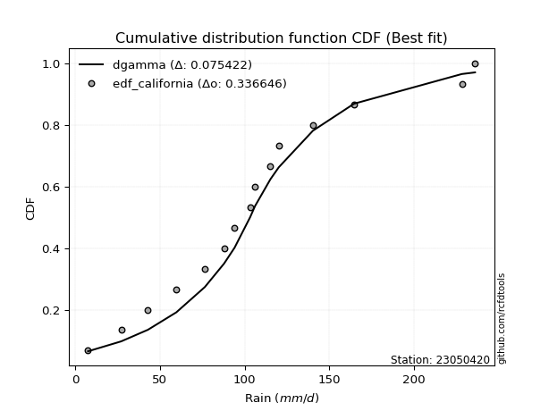</img>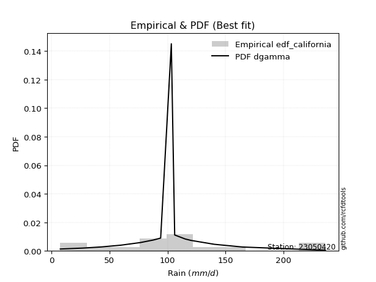</img>

</div>


### 2. Empirical - EDF Hazen (1930)

Hazen method for plotting positions is a formula used to estimate the empirical cumulative probability distribution of flood events or other hydrological data. This formula often results in biased estimations, particularly when extrapolating to extreme events (high return periods).

<div align="center">


$P=(m-0.5)/n$


</div>


**2.1. Empirical values**

<div align="center">

|                | 0                   | 1                  | 2                   | 3                   | 4                  | 5                   | 6                   | 7         | 8                  | 9                  | 10                | 11                 | 12                 | 13                 | 14                 |
|:---------------|:--------------------|:-------------------|:--------------------|:--------------------|:-------------------|:--------------------|:--------------------|:----------|:-------------------|:-------------------|:------------------|:-------------------|:-------------------|:-------------------|:-------------------|
| date           | 2019                | 2017               | 2015                | 2016                | 2012               | 2014                | 2008                | 2013      | 2009               | 2010               | 2011              | 2024               | 2007               | 2025               | 2018               |
| x              | 7.5                 | 27.1               | 42.9                | 59.7                | 76.5               | 87.9                | 94.1                | 103.3     | 106.2              | 115.3              | 120.2             | 140.4              | 164.7              | 228.4              | 236.20000000000002 |
| m              | 1                   | 2                  | 3                   | 4                   | 5                  | 6                   | 7                   | 8         | 9                  | 10                 | 11                | 12                 | 13                 | 14                 | 15                 |
| empirical_dist | edf_hazen           | edf_hazen          | edf_hazen           | edf_hazen           | edf_hazen          | edf_hazen           | edf_hazen           | edf_hazen | edf_hazen          | edf_hazen          | edf_hazen         | edf_hazen          | edf_hazen          | edf_hazen          | edf_hazen          |
| empirical      | 0.03333333333333333 | 0.1                | 0.16666666666666666 | 0.23333333333333334 | 0.3                | 0.36666666666666664 | 0.43333333333333335 | 0.5       | 0.5666666666666667 | 0.6333333333333333 | 0.7               | 0.7666666666666667 | 0.8333333333333334 | 0.9                | 0.9666666666666667 |
| empirical_tr   | 1.0344827586206897  | 1.1111111111111112 | 1.2                 | 1.3043478260869565  | 1.4285714285714286 | 1.5789473684210527  | 1.7647058823529411  | 2.0       | 2.3076923076923075 | 2.727272727272727  | 3.333333333333333 | 4.2857142857142865 | 6.000000000000002  | 10.000000000000002 | 30.000000000000007 |

</div>


**2.2. Kolmogorov-Smirnov fit test (sorted by Δ)**


<div align="center">

|                | 0                   | 1                    | 2                   | 3                   | 4                   | 5                   | 6                   | 7                   | 8                   | 9                   | 10                  | 11                  | 12                  | 13                  | 14                  | 15                  | 16                  | 17                  | 18                  | 19                    | 20                  | 21                  | 22                  | 23                  | 24                  | 25                 | 26                  | 27                  | 28                  | 29                  | 30                  | 31                  | 32                 | 33                  | 34                  | 35                  | 36                  | 37                  | 38                  | 39                  | 40                  | 41                  | 42                 | 43                 | 44                  | 45                  | 46                  | 47                 | 48                  | 49                  | 50                  | 51                 | 52                  | 53                  | 54                  | 55                 | 56                 | 57                 | 58                 | 59                  | 60                  | 61                  | 62                  | 63                 | 64                  | 65                  | 66                  | 67                  | 68                  | 69                  | 70                 | 71                  | 72                  | 73                  | 74                 | 75                 | 76                  | 77                 | 78                  | 79                 | 80                 | 81                  | 82                 | 83                 | 84                 | 85                 | 86                 | 87                 | 88                 | 89                 |
|:---------------|:--------------------|:---------------------|:--------------------|:--------------------|:--------------------|:--------------------|:--------------------|:--------------------|:--------------------|:--------------------|:--------------------|:--------------------|:--------------------|:--------------------|:--------------------|:--------------------|:--------------------|:--------------------|:--------------------|:----------------------|:--------------------|:--------------------|:--------------------|:--------------------|:--------------------|:-------------------|:--------------------|:--------------------|:--------------------|:--------------------|:--------------------|:--------------------|:-------------------|:--------------------|:--------------------|:--------------------|:--------------------|:--------------------|:--------------------|:--------------------|:--------------------|:--------------------|:-------------------|:-------------------|:--------------------|:--------------------|:--------------------|:-------------------|:--------------------|:--------------------|:--------------------|:-------------------|:--------------------|:--------------------|:--------------------|:-------------------|:-------------------|:-------------------|:-------------------|:--------------------|:--------------------|:--------------------|:--------------------|:-------------------|:--------------------|:--------------------|:--------------------|:--------------------|:--------------------|:--------------------|:-------------------|:--------------------|:--------------------|:--------------------|:-------------------|:-------------------|:--------------------|:-------------------|:--------------------|:-------------------|:-------------------|:--------------------|:-------------------|:-------------------|:-------------------|:-------------------|:-------------------|:-------------------|:-------------------|:-------------------|
| station        | 23050420            | 23050420             | 23050420            | 23050420            | 23050420            | 23050420            | 23050420            | 23050420            | 23050420            | 23050420            | 23050420            | 23050420            | 23050420            | 23050420            | 23050420            | 23050420            | 23050420            | 23050420            | 23050420            | 23050420              | 23050420            | 23050420            | 23050420            | 23050420            | 23050420            | 23050420           | 23050420            | 23050420            | 23050420            | 23050420            | 23050420            | 23050420            | 23050420           | 23050420            | 23050420            | 23050420            | 23050420            | 23050420            | 23050420            | 23050420            | 23050420            | 23050420            | 23050420           | 23050420           | 23050420            | 23050420            | 23050420            | 23050420           | 23050420            | 23050420            | 23050420            | 23050420           | 23050420            | 23050420            | 23050420            | 23050420           | 23050420           | 23050420           | 23050420           | 23050420            | 23050420            | 23050420            | 23050420            | 23050420           | 23050420            | 23050420            | 23050420            | 23050420            | 23050420            | 23050420            | 23050420           | 23050420            | 23050420            | 23050420            | 23050420           | 23050420           | 23050420            | 23050420           | 23050420            | 23050420           | 23050420           | 23050420            | 23050420           | 23050420           | 23050420           | 23050420           | 23050420           | 23050420           | 23050420           | 23050420           |
| empirical_dist | edf_hazen           | edf_hazen            | edf_hazen           | edf_hazen           | edf_hazen           | edf_hazen           | edf_hazen           | edf_hazen           | edf_hazen           | edf_hazen           | edf_hazen           | edf_hazen           | edf_hazen           | edf_hazen           | edf_hazen           | edf_hazen           | edf_hazen           | edf_hazen           | edf_hazen           | edf_hazen             | edf_hazen           | edf_hazen           | edf_hazen           | edf_hazen           | edf_hazen           | edf_hazen          | edf_hazen           | edf_hazen           | edf_hazen           | edf_hazen           | edf_hazen           | edf_hazen           | edf_hazen          | edf_hazen           | edf_hazen           | edf_hazen           | edf_hazen           | edf_hazen           | edf_hazen           | edf_hazen           | edf_hazen           | edf_hazen           | edf_hazen          | edf_hazen          | edf_hazen           | edf_hazen           | edf_hazen           | edf_hazen          | edf_hazen           | edf_hazen           | edf_hazen           | edf_hazen          | edf_hazen           | edf_hazen           | edf_hazen           | edf_hazen          | edf_hazen          | edf_hazen          | edf_hazen          | edf_hazen           | edf_hazen           | edf_hazen           | edf_hazen           | edf_hazen          | edf_hazen           | edf_hazen           | edf_hazen           | edf_hazen           | edf_hazen           | edf_hazen           | edf_hazen          | edf_hazen           | edf_hazen           | edf_hazen           | edf_hazen          | edf_hazen          | edf_hazen           | edf_hazen          | edf_hazen           | edf_hazen          | edf_hazen          | edf_hazen           | edf_hazen          | edf_hazen          | edf_hazen          | edf_hazen          | edf_hazen          | edf_hazen          | edf_hazen          | edf_hazen          |
| p_dist         | exponnorm           | fisk                 | logcrystalball      | nct                 | f                   | gamma               | chi2                | erlang              | betaprime           | johnsonsu           | gumbel_r            | logmielke           | invgamma            | mielke              | loggenlogistic      | genlogistic         | laplace_asymmetric  | invweibull          | weibull_min         | loglaplace_asymmetric | kstwobign           | laplace             | rayleigh            | pearson3            | rice                | logloggamma        | moyal               | loggumbel_l         | loggompertz         | maxwell             | lognakagami         | halfnorm            | logjohnsonsu       | logfisk             | hypsecant           | logpearson3         | halflogistic        | logistic            | norm                | crystalball         | t                   | nakagami            | lognct             | logt               | logrice             | lognorm             | lognorm             | logexponnorm       | loglognorm          | logfatiguelife      | loglogistic         | loghypsecant       | wald                | logf                | logbetaprime        | logalpha           | logncf             | loggamma           | loggamma           | loglaplace          | logerlang           | loginvgauss         | gumbel_l            | loginvgamma        | logmaxwell          | genexpon            | expon               | loginvweibull       | lograyleigh         | loggumbel_r         | gibrat             | logkstwobign        | invgauss            | loghalfnorm         | logmoyal           | loghalflogistic    | loggenexpon         | ncf                | logtruncnorm        | logwald            | logexpon           | loggibrat           | alpha              | logweibull_min     | pareto             | logpareto          | truncnorm          | fatiguelife        | logchi2            | gompertz           |
| delta          | 0.05826612178346391 | 0.058677016339504284 | 0.06384336429951037 | 0.06686283119579528 | 0.06761988876358416 | 0.06767280317221247 | 0.06767281304963685 | 0.06767289757188372 | 0.06776306805274479 | 0.06818026924213028 | 0.06829276677669621 | 0.06877164987783302 | 0.06890157276966136 | 0.06911258674610699 | 0.06943993824300765 | 0.06991546512381042 | 0.07092995494890231 | 0.07253109047668271 | 0.07303092866442285 | 0.07664709802167352   | 0.07747282243107528 | 0.07944570791442185 | 0.08266379410869784 | 0.08395392925509093 | 0.08475183748163206 | 0.0891848006122592 | 0.08946357232745533 | 0.09061725302186696 | 0.09102385452661771 | 0.09152600307803183 | 0.09262626685517857 | 0.09329127558744288 | 0.095973925169891  | 0.09857633608205973 | 0.10034772155345106 | 0.10274752616978255 | 0.10603002491161784 | 0.10913254367796865 | 0.11970729625548637 | 0.11970730572793487 | 0.11971832501288615 | 0.15036032369419478 | 0.160833474247996  | 0.1609645189558188 | 0.16105941048903144 | 0.16106877552062926 | 0.16106877552062926 | 0.1610699678405798 | 0.16107044493874306 | 0.16191739383724302 | 0.16314175166681938 | 0.1661823791285318 | 0.16666666666666666 | 0.16799005751438195 | 0.17008228052103058 | 0.1721197747763915 | 0.1733352267509461 | 0.1748526884014716 | 0.1748526884014716 | 0.17777142963022002 | 0.17794489914754652 | 0.18271481094820313 | 0.18282544755129826 | 0.184037591991568  | 0.19523675150530156 | 0.19824942927042827 | 0.19890889809378248 | 0.20003851780701448 | 0.20697850268811618 | 0.23023000812706756 | 0.2332507479669059 | 0.23847596270809818 | 0.23896568563674697 | 0.24006919268501464 | 0.2557071590791085 | 0.2621628587612516 | 0.27243980078881863 | 0.288206449640047  | 0.32422498798993266 | 0.3264460601666023 | 0.3490196142284162 | 0.35330446629780826 | 0.4227653915017476 | 0.5138279507947673 | 0.5182403754035242 | 0.5407726200934031 | 0.5578932481882956 | 0.5751717305371041 | 0.6026525438815113 | 0.8236369333348038 |
| deltao         | 0.3366456264050002  | 0.3366456264050002   | 0.3366456264050002  | 0.3366456264050002  | 0.3366456264050002  | 0.3366456264050002  | 0.3366456264050002  | 0.3366456264050002  | 0.3366456264050002  | 0.3366456264050002  | 0.3366456264050002  | 0.3366456264050002  | 0.3366456264050002  | 0.3366456264050002  | 0.3366456264050002  | 0.3366456264050002  | 0.3366456264050002  | 0.3366456264050002  | 0.3366456264050002  | 0.3366456264050002    | 0.3366456264050002  | 0.3366456264050002  | 0.3366456264050002  | 0.3366456264050002  | 0.3366456264050002  | 0.3366456264050002 | 0.3366456264050002  | 0.3366456264050002  | 0.3366456264050002  | 0.3366456264050002  | 0.3366456264050002  | 0.3366456264050002  | 0.3366456264050002 | 0.3366456264050002  | 0.3366456264050002  | 0.3366456264050002  | 0.3366456264050002  | 0.3366456264050002  | 0.3366456264050002  | 0.3366456264050002  | 0.3366456264050002  | 0.3366456264050002  | 0.3366456264050002 | 0.3366456264050002 | 0.3366456264050002  | 0.3366456264050002  | 0.3366456264050002  | 0.3366456264050002 | 0.3366456264050002  | 0.3366456264050002  | 0.3366456264050002  | 0.3366456264050002 | 0.3366456264050002  | 0.3366456264050002  | 0.3366456264050002  | 0.3366456264050002 | 0.3366456264050002 | 0.3366456264050002 | 0.3366456264050002 | 0.3366456264050002  | 0.3366456264050002  | 0.3366456264050002  | 0.3366456264050002  | 0.3366456264050002 | 0.3366456264050002  | 0.3366456264050002  | 0.3366456264050002  | 0.3366456264050002  | 0.3366456264050002  | 0.3366456264050002  | 0.3366456264050002 | 0.3366456264050002  | 0.3366456264050002  | 0.3366456264050002  | 0.3366456264050002 | 0.3366456264050002 | 0.3366456264050002  | 0.3366456264050002 | 0.3366456264050002  | 0.3366456264050002 | 0.3366456264050002 | 0.3366456264050002  | 0.3366456264050002 | 0.3366456264050002 | 0.3366456264050002 | 0.3366456264050002 | 0.3366456264050002 | 0.3366456264050002 | 0.3366456264050002 | 0.3366456264050002 |
| eval           | Δo > Δ              | Δo > Δ               | Δo > Δ              | Δo > Δ              | Δo > Δ              | Δo > Δ              | Δo > Δ              | Δo > Δ              | Δo > Δ              | Δo > Δ              | Δo > Δ              | Δo > Δ              | Δo > Δ              | Δo > Δ              | Δo > Δ              | Δo > Δ              | Δo > Δ              | Δo > Δ              | Δo > Δ              | Δo > Δ                | Δo > Δ              | Δo > Δ              | Δo > Δ              | Δo > Δ              | Δo > Δ              | Δo > Δ             | Δo > Δ              | Δo > Δ              | Δo > Δ              | Δo > Δ              | Δo > Δ              | Δo > Δ              | Δo > Δ             | Δo > Δ              | Δo > Δ              | Δo > Δ              | Δo > Δ              | Δo > Δ              | Δo > Δ              | Δo > Δ              | Δo > Δ              | Δo > Δ              | Δo > Δ             | Δo > Δ             | Δo > Δ              | Δo > Δ              | Δo > Δ              | Δo > Δ             | Δo > Δ              | Δo > Δ              | Δo > Δ              | Δo > Δ             | Δo > Δ              | Δo > Δ              | Δo > Δ              | Δo > Δ             | Δo > Δ             | Δo > Δ             | Δo > Δ             | Δo > Δ              | Δo > Δ              | Δo > Δ              | Δo > Δ              | Δo > Δ             | Δo > Δ              | Δo > Δ              | Δo > Δ              | Δo > Δ              | Δo > Δ              | Δo > Δ              | Δo > Δ             | Δo > Δ              | Δo > Δ              | Δo > Δ              | Δo > Δ             | Δo > Δ             | Δo > Δ              | Δo > Δ             | Δo > Δ              | Δo > Δ             | Δo <= Δ            | Δo <= Δ             | Δo <= Δ            | Δo <= Δ            | Δo <= Δ            | Δo <= Δ            | Δo <= Δ            | Δo <= Δ            | Δo <= Δ            | Δo <= Δ            |
| fit            | 1                   | 1                    | 1                   | 1                   | 1                   | 1                   | 1                   | 1                   | 1                   | 1                   | 1                   | 1                   | 1                   | 1                   | 1                   | 1                   | 1                   | 1                   | 1                   | 1                     | 1                   | 1                   | 1                   | 1                   | 1                   | 1                  | 1                   | 1                   | 1                   | 1                   | 1                   | 1                   | 1                  | 1                   | 1                   | 1                   | 1                   | 1                   | 1                   | 1                   | 1                   | 1                   | 1                  | 1                  | 1                   | 1                   | 1                   | 1                  | 1                   | 1                   | 1                   | 1                  | 1                   | 1                   | 1                   | 1                  | 1                  | 1                  | 1                  | 1                   | 1                   | 1                   | 1                   | 1                  | 1                   | 1                   | 1                   | 1                   | 1                   | 1                   | 1                  | 1                   | 1                   | 1                   | 1                  | 1                  | 1                   | 1                  | 1                   | 1                  | 0                  | 0                   | 0                  | 0                  | 0                  | 0                  | 0                  | 0                  | 0                  | 0                  |
| n              | 15                  | 15                   | 15                  | 15                  | 15                  | 15                  | 15                  | 15                  | 15                  | 15                  | 15                  | 15                  | 15                  | 15                  | 15                  | 15                  | 15                  | 15                  | 15                  | 15                    | 15                  | 15                  | 15                  | 15                  | 15                  | 15                 | 15                  | 15                  | 15                  | 15                  | 15                  | 15                  | 15                 | 15                  | 15                  | 15                  | 15                  | 15                  | 15                  | 15                  | 15                  | 15                  | 15                 | 15                 | 15                  | 15                  | 15                  | 15                 | 15                  | 15                  | 15                  | 15                 | 15                  | 15                  | 15                  | 15                 | 15                 | 15                 | 15                 | 15                  | 15                  | 15                  | 15                  | 15                 | 15                  | 15                  | 15                  | 15                  | 15                  | 15                  | 15                 | 15                  | 15                  | 15                  | 15                 | 15                 | 15                  | 15                 | 15                  | 15                 | 15                 | 15                  | 15                 | 15                 | 15                 | 15                 | 15                 | 15                 | 15                 | 15                 |
| best_fit       | 1                   | 0                    | 0                   | 0                   | 0                   | 0                   | 0                   | 0                   | 0                   | 0                   | 0                   | 0                   | 0                   | 0                   | 0                   | 0                   | 0                   | 0                   | 0                   | 0                     | 0                   | 0                   | 0                   | 0                   | 0                   | 0                  | 0                   | 0                   | 0                   | 0                   | 0                   | 0                   | 0                  | 0                   | 0                   | 0                   | 0                   | 0                   | 0                   | 0                   | 0                   | 0                   | 0                  | 0                  | 0                   | 0                   | 0                   | 0                  | 0                   | 0                   | 0                   | 0                  | 0                   | 0                   | 0                   | 0                  | 0                  | 0                  | 0                  | 0                   | 0                   | 0                   | 0                   | 0                  | 0                   | 0                   | 0                   | 0                   | 0                   | 0                   | 0                  | 0                   | 0                   | 0                   | 0                  | 0                  | 0                   | 0                  | 0                   | 0                  | 0                  | 0                   | 0                  | 0                  | 0                  | 0                  | 0                  | 0                  | 0                  | 0                  |
| best_fit_sort  | 1                   | 2                    | 3                   | 4                   | 5                   | 6                   | 7                   | 8                   | 9                   | 10                  | 11                  | 12                  | 13                  | 14                  | 15                  | 16                  | 17                  | 18                  | 19                  | 20                    | 21                  | 22                  | 23                  | 24                  | 25                  | 26                 | 27                  | 28                  | 29                  | 30                  | 31                  | 32                  | 33                 | 34                  | 35                  | 36                  | 37                  | 38                  | 39                  | 40                  | 41                  | 42                  | 43                 | 44                 | 45                  | 46                  | 47                  | 48                 | 49                  | 50                  | 51                  | 52                 | 53                  | 54                  | 55                  | 56                 | 57                 | 58                 | 59                 | 60                  | 61                  | 62                  | 63                  | 64                 | 65                  | 66                  | 67                  | 68                  | 69                  | 70                  | 71                 | 72                  | 73                  | 74                  | 75                 | 76                 | 77                  | 78                 | 79                  | 80                 | 81                 | 82                  | 83                 | 84                 | 85                 | 86                 | 87                 | 88                 | 89                 | 90                 |

</div>


<div align="center">

</img>

</div>


**2.3. Best fit**

<div align="center">

|   id |   station | empirical_dist   | p_dist    |     delta |   deltao | eval   |   fit |   n |   best_fit |   best_fit_sort |
|-----:|----------:|:-----------------|:----------|----------:|---------:|:-------|------:|----:|-----------:|----------------:|
|    0 |  23050420 | edf_hazen        | exponnorm | 0.0582661 | 0.336646 | Δo > Δ |     1 |  15 |          1 |               1 |

</div>


<div align="center">

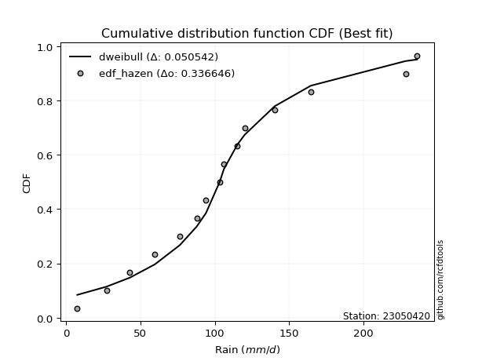</img>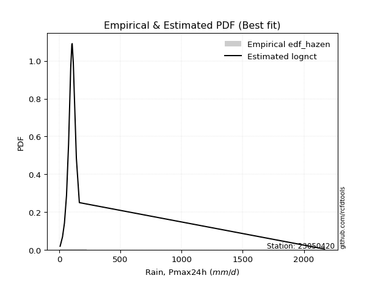</img>

</div>


### 3. Empirical - EDF Weibull (1939)

Weibull plotting position formula is an empirical method used to estimate the non-exceedance probability or plotting position for a set of observed data, is often recommended or widely used in practice, particularly in flood frequency analysis.

<div align="center">


$P=m/(n+1)$


</div>


**3.1. Empirical values**

<div align="center">

|                | 0                  | 1                  | 2                  | 3                  | 4                  | 5           | 6                  | 7           | 8                  | 9                  | 10          | 11          | 12                | 13          | 14                 |
|:---------------|:-------------------|:-------------------|:-------------------|:-------------------|:-------------------|:------------|:-------------------|:------------|:-------------------|:-------------------|:------------|:------------|:------------------|:------------|:-------------------|
| date           | 2019               | 2017               | 2015               | 2016               | 2012               | 2014        | 2008               | 2013        | 2009               | 2010               | 2011        | 2024        | 2007              | 2025        | 2018               |
| x              | 7.5                | 27.1               | 42.9               | 59.7               | 76.5               | 87.9        | 94.1               | 103.3       | 106.2              | 115.3              | 120.2       | 140.4       | 164.7             | 228.4       | 236.20000000000002 |
| m              | 1                  | 2                  | 3                  | 4                  | 5                  | 6           | 7                  | 8           | 9                  | 10                 | 11          | 12          | 13                | 14          | 15                 |
| empirical_dist | edf_weibull        | edf_weibull        | edf_weibull        | edf_weibull        | edf_weibull        | edf_weibull | edf_weibull        | edf_weibull | edf_weibull        | edf_weibull        | edf_weibull | edf_weibull | edf_weibull       | edf_weibull | edf_weibull        |
| empirical      | 0.0625             | 0.125              | 0.1875             | 0.25               | 0.3125             | 0.375       | 0.4375             | 0.5         | 0.5625             | 0.625              | 0.6875      | 0.75        | 0.8125            | 0.875       | 0.9375             |
| empirical_tr   | 1.0666666666666667 | 1.1428571428571428 | 1.2307692307692308 | 1.3333333333333333 | 1.4545454545454546 | 1.6         | 1.7777777777777777 | 2.0         | 2.2857142857142856 | 2.6666666666666665 | 3.2         | 4.0         | 5.333333333333333 | 8.0         | 16.0               |

</div>


**3.2. Kolmogorov-Smirnov fit test (sorted by Δ)**


<div align="center">

|                | 0                     | 1                   | 2                   | 3                   | 4                  | 5                  | 6                   | 7                   | 8                  | 9                   | 10                  | 11                  | 12                  | 13                  | 14                  | 15                  | 16                  | 17                 | 18                  | 19                  | 20                  | 21                  | 22                  | 23                  | 24                  | 25                  | 26                  | 27                  | 28                  | 29                  | 30                 | 31                  | 32                  | 33                  | 34                 | 35                  | 36                  | 37                  | 38                 | 39                  | 40                 | 41                  | 42                 | 43                 | 44                 | 45                 | 46                  | 47                  | 48                  | 49                  | 50                  | 51                  | 52                 | 53                  | 54                 | 55                  | 56                 | 57                 | 58                 | 59                  | 60                  | 61                 | 62                  | 63                  | 64                  | 65                  | 66                 | 67                  | 68                  | 69                 | 70                  | 71                  | 72                  | 73                  | 74                 | 75                  | 76                 | 77                 | 78                  | 79                  | 80                  | 81                 | 82                  | 83                  | 84                  | 85                 | 86                 | 87                 | 88                 | 89                 |
|:---------------|:----------------------|:--------------------|:--------------------|:--------------------|:-------------------|:-------------------|:--------------------|:--------------------|:-------------------|:--------------------|:--------------------|:--------------------|:--------------------|:--------------------|:--------------------|:--------------------|:--------------------|:-------------------|:--------------------|:--------------------|:--------------------|:--------------------|:--------------------|:--------------------|:--------------------|:--------------------|:--------------------|:--------------------|:--------------------|:--------------------|:-------------------|:--------------------|:--------------------|:--------------------|:-------------------|:--------------------|:--------------------|:--------------------|:-------------------|:--------------------|:-------------------|:--------------------|:-------------------|:-------------------|:-------------------|:-------------------|:--------------------|:--------------------|:--------------------|:--------------------|:--------------------|:--------------------|:-------------------|:--------------------|:-------------------|:--------------------|:-------------------|:-------------------|:-------------------|:--------------------|:--------------------|:-------------------|:--------------------|:--------------------|:--------------------|:--------------------|:-------------------|:--------------------|:--------------------|:-------------------|:--------------------|:--------------------|:--------------------|:--------------------|:-------------------|:--------------------|:-------------------|:-------------------|:--------------------|:--------------------|:--------------------|:-------------------|:--------------------|:--------------------|:--------------------|:-------------------|:-------------------|:-------------------|:-------------------|:-------------------|
| station        | 23050420              | 23050420            | 23050420            | 23050420            | 23050420           | 23050420           | 23050420            | 23050420            | 23050420           | 23050420            | 23050420            | 23050420            | 23050420            | 23050420            | 23050420            | 23050420            | 23050420            | 23050420           | 23050420            | 23050420            | 23050420            | 23050420            | 23050420            | 23050420            | 23050420            | 23050420            | 23050420            | 23050420            | 23050420            | 23050420            | 23050420           | 23050420            | 23050420            | 23050420            | 23050420           | 23050420            | 23050420            | 23050420            | 23050420           | 23050420            | 23050420           | 23050420            | 23050420           | 23050420           | 23050420           | 23050420           | 23050420            | 23050420            | 23050420            | 23050420            | 23050420            | 23050420            | 23050420           | 23050420            | 23050420           | 23050420            | 23050420           | 23050420           | 23050420           | 23050420            | 23050420            | 23050420           | 23050420            | 23050420            | 23050420            | 23050420            | 23050420           | 23050420            | 23050420            | 23050420           | 23050420            | 23050420            | 23050420            | 23050420            | 23050420           | 23050420            | 23050420           | 23050420           | 23050420            | 23050420            | 23050420            | 23050420           | 23050420            | 23050420            | 23050420            | 23050420           | 23050420           | 23050420           | 23050420           | 23050420           |
| empirical_dist | edf_weibull           | edf_weibull         | edf_weibull         | edf_weibull         | edf_weibull        | edf_weibull        | edf_weibull         | edf_weibull         | edf_weibull        | edf_weibull         | edf_weibull         | edf_weibull         | edf_weibull         | edf_weibull         | edf_weibull         | edf_weibull         | edf_weibull         | edf_weibull        | edf_weibull         | edf_weibull         | edf_weibull         | edf_weibull         | edf_weibull         | edf_weibull         | edf_weibull         | edf_weibull         | edf_weibull         | edf_weibull         | edf_weibull         | edf_weibull         | edf_weibull        | edf_weibull         | edf_weibull         | edf_weibull         | edf_weibull        | edf_weibull         | edf_weibull         | edf_weibull         | edf_weibull        | edf_weibull         | edf_weibull        | edf_weibull         | edf_weibull        | edf_weibull        | edf_weibull        | edf_weibull        | edf_weibull         | edf_weibull         | edf_weibull         | edf_weibull         | edf_weibull         | edf_weibull         | edf_weibull        | edf_weibull         | edf_weibull        | edf_weibull         | edf_weibull        | edf_weibull        | edf_weibull        | edf_weibull         | edf_weibull         | edf_weibull        | edf_weibull         | edf_weibull         | edf_weibull         | edf_weibull         | edf_weibull        | edf_weibull         | edf_weibull         | edf_weibull        | edf_weibull         | edf_weibull         | edf_weibull         | edf_weibull         | edf_weibull        | edf_weibull         | edf_weibull        | edf_weibull        | edf_weibull         | edf_weibull         | edf_weibull         | edf_weibull        | edf_weibull         | edf_weibull         | edf_weibull         | edf_weibull        | edf_weibull        | edf_weibull        | edf_weibull        | edf_weibull        |
| p_dist         | loglaplace_asymmetric | invweibull          | genlogistic         | fisk                | kstwobign          | exponnorm          | gamma               | chi2                | erlang             | f                   | logmielke           | betaprime           | loggenlogistic      | mielke              | gumbel_r            | weibull_min         | johnsonsu           | invgamma           | logcrystalball      | nct                 | rayleigh            | loggumbel_l         | logloggamma         | loggompertz         | laplace_asymmetric  | rice                | pearson3            | logjohnsonsu        | maxwell             | logfisk             | logpearson3        | laplace             | hypsecant           | moyal               | logistic           | halfnorm            | norm                | crystalball         | t                  | lognakagami         | halflogistic       | nakagami            | lognct             | logt               | lognorm            | lognorm            | loglognorm          | logexponnorm        | logrice             | logfatiguelife      | loglogistic         | logf                | logbetaprime       | loghypsecant        | logalpha           | logncf              | loggamma           | loggamma           | logerlang          | loglaplace          | loginvgauss         | gumbel_l           | loginvgamma         | logmaxwell          | genexpon            | expon               | wald               | loginvweibull       | lograyleigh         | loggumbel_r        | logkstwobign        | invgauss            | loghalfnorm         | logmoyal            | loghalflogistic    | gibrat              | loggenexpon        | ncf                | logtruncnorm        | logwald             | logexpon            | loggibrat          | alpha               | logweibull_min      | pareto              | logpareto          | truncnorm          | fatiguelife        | logchi2            | gompertz           |
| delta          | 0.06831376468834016   | 0.06881608581500964 | 0.07082101304201516 | 0.07153609808795969 | 0.0733272068801879 | 0.0752348464543171 | 0.07583833271355711 | 0.07583833725091249 | 0.0758383815469661 | 0.07585019315474628 | 0.07597797792588623 | 0.07639889640920927 | 0.07651399667682879 | 0.07658294987495329 | 0.07770522347783992 | 0.07779936967596934 | 0.07827911377015973 | 0.0784563165909622 | 0.08037017758524911 | 0.08078802404168872 | 0.08158761314458218 | 0.08214368788642878 | 0.08245265770425692 | 0.08269052119328435 | 0.08302557974800862 | 0.08335349414149507 | 0.08350544693105577 | 0.08420110043893969 | 0.08492805741457121 | 0.09024300274872638 | 0.0902475261697826 | 0.09144846841027932 | 0.09335096107758367 | 0.09449902805776449 | 0.0966325436779687 | 0.09762101768311734 | 0.10720729625548642 | 0.10720730572793491 | 0.1072183250128862 | 0.11762626685517856 | 0.125              | 0.14202699036086142 | 0.151127780624283  | 0.1511522407116126 | 0.1512374494325952 | 0.1512374494325952 | 0.15123879007742091 | 0.15123889081345188 | 0.15124595986479805 | 0.15200563517933607 | 0.15480841833348602 | 0.15716640679410865 | 0.157722305118557  | 0.15784904579519843 | 0.1596197747763915 | 0.16083522675094608 | 0.1623526884014716 | 0.1623526884014716 | 0.1654448991475465 | 0.16943809629688666 | 0.17021481094820312 | 0.1703254475512983 | 0.17224333844076434 | 0.18305335484386187 | 0.18574942927042826 | 0.18640889809378247 | 0.1875             | 0.18753851780701447 | 0.19447850268811617 | 0.2218966747937342 | 0.22597596270809817 | 0.22646568563674696 | 0.22756919268501463 | 0.24737382574577516 | 0.2496628587612516 | 0.24991741463357256 | 0.2599398007888186 | 0.2740320272634623 | 0.31172498798993264 | 0.31811272683326897 | 0.32818628089508284 | 0.3449711329644749 | 0.41026539150174757 | 0.48882795079476726 | 0.49324037540352417 | 0.5157726200934031 | 0.5498845798244661 | 0.5501717305371041 | 0.581819210548178  | 0.8028036000014704 |
| deltao         | 0.3366456264050002    | 0.3366456264050002  | 0.3366456264050002  | 0.3366456264050002  | 0.3366456264050002 | 0.3366456264050002 | 0.3366456264050002  | 0.3366456264050002  | 0.3366456264050002 | 0.3366456264050002  | 0.3366456264050002  | 0.3366456264050002  | 0.3366456264050002  | 0.3366456264050002  | 0.3366456264050002  | 0.3366456264050002  | 0.3366456264050002  | 0.3366456264050002 | 0.3366456264050002  | 0.3366456264050002  | 0.3366456264050002  | 0.3366456264050002  | 0.3366456264050002  | 0.3366456264050002  | 0.3366456264050002  | 0.3366456264050002  | 0.3366456264050002  | 0.3366456264050002  | 0.3366456264050002  | 0.3366456264050002  | 0.3366456264050002 | 0.3366456264050002  | 0.3366456264050002  | 0.3366456264050002  | 0.3366456264050002 | 0.3366456264050002  | 0.3366456264050002  | 0.3366456264050002  | 0.3366456264050002 | 0.3366456264050002  | 0.3366456264050002 | 0.3366456264050002  | 0.3366456264050002 | 0.3366456264050002 | 0.3366456264050002 | 0.3366456264050002 | 0.3366456264050002  | 0.3366456264050002  | 0.3366456264050002  | 0.3366456264050002  | 0.3366456264050002  | 0.3366456264050002  | 0.3366456264050002 | 0.3366456264050002  | 0.3366456264050002 | 0.3366456264050002  | 0.3366456264050002 | 0.3366456264050002 | 0.3366456264050002 | 0.3366456264050002  | 0.3366456264050002  | 0.3366456264050002 | 0.3366456264050002  | 0.3366456264050002  | 0.3366456264050002  | 0.3366456264050002  | 0.3366456264050002 | 0.3366456264050002  | 0.3366456264050002  | 0.3366456264050002 | 0.3366456264050002  | 0.3366456264050002  | 0.3366456264050002  | 0.3366456264050002  | 0.3366456264050002 | 0.3366456264050002  | 0.3366456264050002 | 0.3366456264050002 | 0.3366456264050002  | 0.3366456264050002  | 0.3366456264050002  | 0.3366456264050002 | 0.3366456264050002  | 0.3366456264050002  | 0.3366456264050002  | 0.3366456264050002 | 0.3366456264050002 | 0.3366456264050002 | 0.3366456264050002 | 0.3366456264050002 |
| eval           | Δo > Δ                | Δo > Δ              | Δo > Δ              | Δo > Δ              | Δo > Δ             | Δo > Δ             | Δo > Δ              | Δo > Δ              | Δo > Δ             | Δo > Δ              | Δo > Δ              | Δo > Δ              | Δo > Δ              | Δo > Δ              | Δo > Δ              | Δo > Δ              | Δo > Δ              | Δo > Δ             | Δo > Δ              | Δo > Δ              | Δo > Δ              | Δo > Δ              | Δo > Δ              | Δo > Δ              | Δo > Δ              | Δo > Δ              | Δo > Δ              | Δo > Δ              | Δo > Δ              | Δo > Δ              | Δo > Δ             | Δo > Δ              | Δo > Δ              | Δo > Δ              | Δo > Δ             | Δo > Δ              | Δo > Δ              | Δo > Δ              | Δo > Δ             | Δo > Δ              | Δo > Δ             | Δo > Δ              | Δo > Δ             | Δo > Δ             | Δo > Δ             | Δo > Δ             | Δo > Δ              | Δo > Δ              | Δo > Δ              | Δo > Δ              | Δo > Δ              | Δo > Δ              | Δo > Δ             | Δo > Δ              | Δo > Δ             | Δo > Δ              | Δo > Δ             | Δo > Δ             | Δo > Δ             | Δo > Δ              | Δo > Δ              | Δo > Δ             | Δo > Δ              | Δo > Δ              | Δo > Δ              | Δo > Δ              | Δo > Δ             | Δo > Δ              | Δo > Δ              | Δo > Δ             | Δo > Δ              | Δo > Δ              | Δo > Δ              | Δo > Δ              | Δo > Δ             | Δo > Δ              | Δo > Δ             | Δo > Δ             | Δo > Δ              | Δo > Δ              | Δo > Δ              | Δo <= Δ            | Δo <= Δ             | Δo <= Δ             | Δo <= Δ             | Δo <= Δ            | Δo <= Δ            | Δo <= Δ            | Δo <= Δ            | Δo <= Δ            |
| fit            | 1                     | 1                   | 1                   | 1                   | 1                  | 1                  | 1                   | 1                   | 1                  | 1                   | 1                   | 1                   | 1                   | 1                   | 1                   | 1                   | 1                   | 1                  | 1                   | 1                   | 1                   | 1                   | 1                   | 1                   | 1                   | 1                   | 1                   | 1                   | 1                   | 1                   | 1                  | 1                   | 1                   | 1                   | 1                  | 1                   | 1                   | 1                   | 1                  | 1                   | 1                  | 1                   | 1                  | 1                  | 1                  | 1                  | 1                   | 1                   | 1                   | 1                   | 1                   | 1                   | 1                  | 1                   | 1                  | 1                   | 1                  | 1                  | 1                  | 1                   | 1                   | 1                  | 1                   | 1                   | 1                   | 1                   | 1                  | 1                   | 1                   | 1                  | 1                   | 1                   | 1                   | 1                   | 1                  | 1                   | 1                  | 1                  | 1                   | 1                   | 1                   | 0                  | 0                   | 0                   | 0                   | 0                  | 0                  | 0                  | 0                  | 0                  |
| n              | 15                    | 15                  | 15                  | 15                  | 15                 | 15                 | 15                  | 15                  | 15                 | 15                  | 15                  | 15                  | 15                  | 15                  | 15                  | 15                  | 15                  | 15                 | 15                  | 15                  | 15                  | 15                  | 15                  | 15                  | 15                  | 15                  | 15                  | 15                  | 15                  | 15                  | 15                 | 15                  | 15                  | 15                  | 15                 | 15                  | 15                  | 15                  | 15                 | 15                  | 15                 | 15                  | 15                 | 15                 | 15                 | 15                 | 15                  | 15                  | 15                  | 15                  | 15                  | 15                  | 15                 | 15                  | 15                 | 15                  | 15                 | 15                 | 15                 | 15                  | 15                  | 15                 | 15                  | 15                  | 15                  | 15                  | 15                 | 15                  | 15                  | 15                 | 15                  | 15                  | 15                  | 15                  | 15                 | 15                  | 15                 | 15                 | 15                  | 15                  | 15                  | 15                 | 15                  | 15                  | 15                  | 15                 | 15                 | 15                 | 15                 | 15                 |
| best_fit       | 1                     | 0                   | 0                   | 0                   | 0                  | 0                  | 0                   | 0                   | 0                  | 0                   | 0                   | 0                   | 0                   | 0                   | 0                   | 0                   | 0                   | 0                  | 0                   | 0                   | 0                   | 0                   | 0                   | 0                   | 0                   | 0                   | 0                   | 0                   | 0                   | 0                   | 0                  | 0                   | 0                   | 0                   | 0                  | 0                   | 0                   | 0                   | 0                  | 0                   | 0                  | 0                   | 0                  | 0                  | 0                  | 0                  | 0                   | 0                   | 0                   | 0                   | 0                   | 0                   | 0                  | 0                   | 0                  | 0                   | 0                  | 0                  | 0                  | 0                   | 0                   | 0                  | 0                   | 0                   | 0                   | 0                   | 0                  | 0                   | 0                   | 0                  | 0                   | 0                   | 0                   | 0                   | 0                  | 0                   | 0                  | 0                  | 0                   | 0                   | 0                   | 0                  | 0                   | 0                   | 0                   | 0                  | 0                  | 0                  | 0                  | 0                  |
| best_fit_sort  | 1                     | 2                   | 3                   | 4                   | 5                  | 6                  | 7                   | 8                   | 9                  | 10                  | 11                  | 12                  | 13                  | 14                  | 15                  | 16                  | 17                  | 18                 | 19                  | 20                  | 21                  | 22                  | 23                  | 24                  | 25                  | 26                  | 27                  | 28                  | 29                  | 30                  | 31                 | 32                  | 33                  | 34                  | 35                 | 36                  | 37                  | 38                  | 39                 | 40                  | 41                 | 42                  | 43                 | 44                 | 45                 | 46                 | 47                  | 48                  | 49                  | 50                  | 51                  | 52                  | 53                 | 54                  | 55                 | 56                  | 57                 | 58                 | 59                 | 60                  | 61                  | 62                 | 63                  | 64                  | 65                  | 66                  | 67                 | 68                  | 69                  | 70                 | 71                  | 72                  | 73                  | 74                  | 75                 | 76                  | 77                 | 78                 | 79                  | 80                  | 81                  | 82                 | 83                  | 84                  | 85                  | 86                 | 87                 | 88                 | 89                 | 90                 |

</div>


<div align="center">

</img>

</div>


**3.3. Best fit**

<div align="center">

|   id |   station | empirical_dist   | p_dist                |     delta |   deltao | eval   |   fit |   n |   best_fit |   best_fit_sort |
|-----:|----------:|:-----------------|:----------------------|----------:|---------:|:-------|------:|----:|-----------:|----------------:|
|    0 |  23050420 | edf_weibull      | loglaplace_asymmetric | 0.0683138 | 0.336646 | Δo > Δ |     1 |  15 |          1 |               1 |

</div>


<div align="center">

</img></img>

</div>


### 4. Empirical - EDF Beard (1943)

The Beard formula (or Beard´s plotting position formula) in hydrology is used to estimate the empirical non-exceedance probability _(P)_ of a flood event (or other extreme hydrological data point) within a given dataset.

<div align="center">


$P=(m-0.31)/(n+0.38)$


</div>


**4.1. Empirical values**

<div align="center">

|                | 0                   | 1                   | 2                   | 3                   | 4                  | 5                   | 6                   | 7         | 8                  | 9                  | 10                 | 11                | 12                 | 13                 | 14                 |
|:---------------|:--------------------|:--------------------|:--------------------|:--------------------|:-------------------|:--------------------|:--------------------|:----------|:-------------------|:-------------------|:-------------------|:------------------|:-------------------|:-------------------|:-------------------|
| date           | 2019                | 2017                | 2015                | 2016                | 2012               | 2014                | 2008                | 2013      | 2009               | 2010               | 2011               | 2024              | 2007               | 2025               | 2018               |
| x              | 7.5                 | 27.1                | 42.9                | 59.7                | 76.5               | 87.9                | 94.1                | 103.3     | 106.2              | 115.3              | 120.2              | 140.4             | 164.7              | 228.4              | 236.20000000000002 |
| m              | 1                   | 2                   | 3                   | 4                   | 5                  | 6                   | 7                   | 8         | 9                  | 10                 | 11                 | 12                | 13                 | 14                 | 15                 |
| empirical_dist | edf_beard           | edf_beard           | edf_beard           | edf_beard           | edf_beard          | edf_beard           | edf_beard           | edf_beard | edf_beard          | edf_beard          | edf_beard          | edf_beard         | edf_beard          | edf_beard          | edf_beard          |
| empirical      | 0.04486345903771131 | 0.10988296488946683 | 0.17490247074122237 | 0.23992197659297787 | 0.3049414824447334 | 0.36996098829648894 | 0.43498049414824447 | 0.5       | 0.5650195058517554 | 0.630039011703511  | 0.6950585175552665 | 0.760078023407022 | 0.8250975292587776 | 0.8901170351105331 | 0.9551365409622886 |
| empirical_tr   | 1.0469707283866576  | 1.1234477720964207  | 1.2119779353821907  | 1.3156544054747648  | 1.4387277829747427 | 1.587203302373581   | 1.7698504027617952  | 2.0       | 2.298953662182361  | 2.7029876977152894 | 3.279317697228144  | 4.168021680216801 | 5.717472118959106  | 9.100591715976325  | 22.289855072463734 |

</div>


**4.2. Kolmogorov-Smirnov fit test (sorted by Δ)**


<div align="center">

|                | 0                    | 1                   | 2                   | 3                  | 4                   | 5                   | 6                   | 7                   | 8                   | 9                   | 10                 | 11                  | 12                  | 13                  | 14                  | 15                  | 16                  | 17                  | 18                  | 19                    | 20                  | 21                  | 22                  | 23                  | 24                 | 25                  | 26                  | 27                  | 28                  | 29                  | 30                  | 31                  | 32                  | 33                 | 34                  | 35                 | 36                  | 37                  | 38                 | 39                 | 40                  | 41                  | 42                  | 43                  | 44                  | 45                  | 46                  | 47                  | 48                  | 49                  | 50                  | 51                 | 52                  | 53                  | 54                 | 55                  | 56                 | 57                 | 58                 | 59                  | 60                  | 61                  | 62                 | 63                  | 64                  | 65                  | 66                  | 67                  | 68                  | 69                  | 70                  | 71                  | 72                  | 73                  | 74                 | 75                 | 76                 | 77                  | 78                  | 79                  | 80                 | 81                  | 82                  | 83                 | 84                 | 85                 | 86                 | 87                 | 88                 | 89                 |
|:---------------|:---------------------|:--------------------|:--------------------|:-------------------|:--------------------|:--------------------|:--------------------|:--------------------|:--------------------|:--------------------|:-------------------|:--------------------|:--------------------|:--------------------|:--------------------|:--------------------|:--------------------|:--------------------|:--------------------|:----------------------|:--------------------|:--------------------|:--------------------|:--------------------|:-------------------|:--------------------|:--------------------|:--------------------|:--------------------|:--------------------|:--------------------|:--------------------|:--------------------|:-------------------|:--------------------|:-------------------|:--------------------|:--------------------|:-------------------|:-------------------|:--------------------|:--------------------|:--------------------|:--------------------|:--------------------|:--------------------|:--------------------|:--------------------|:--------------------|:--------------------|:--------------------|:-------------------|:--------------------|:--------------------|:-------------------|:--------------------|:-------------------|:-------------------|:-------------------|:--------------------|:--------------------|:--------------------|:-------------------|:--------------------|:--------------------|:--------------------|:--------------------|:--------------------|:--------------------|:--------------------|:--------------------|:--------------------|:--------------------|:--------------------|:-------------------|:-------------------|:-------------------|:--------------------|:--------------------|:--------------------|:-------------------|:--------------------|:--------------------|:-------------------|:-------------------|:-------------------|:-------------------|:-------------------|:-------------------|:-------------------|
| station        | 23050420             | 23050420            | 23050420            | 23050420           | 23050420            | 23050420            | 23050420            | 23050420            | 23050420            | 23050420            | 23050420           | 23050420            | 23050420            | 23050420            | 23050420            | 23050420            | 23050420            | 23050420            | 23050420            | 23050420              | 23050420            | 23050420            | 23050420            | 23050420            | 23050420           | 23050420            | 23050420            | 23050420            | 23050420            | 23050420            | 23050420            | 23050420            | 23050420            | 23050420           | 23050420            | 23050420           | 23050420            | 23050420            | 23050420           | 23050420           | 23050420            | 23050420            | 23050420            | 23050420            | 23050420            | 23050420            | 23050420            | 23050420            | 23050420            | 23050420            | 23050420            | 23050420           | 23050420            | 23050420            | 23050420           | 23050420            | 23050420           | 23050420           | 23050420           | 23050420            | 23050420            | 23050420            | 23050420           | 23050420            | 23050420            | 23050420            | 23050420            | 23050420            | 23050420            | 23050420            | 23050420            | 23050420            | 23050420            | 23050420            | 23050420           | 23050420           | 23050420           | 23050420            | 23050420            | 23050420            | 23050420           | 23050420            | 23050420            | 23050420           | 23050420           | 23050420           | 23050420           | 23050420           | 23050420           | 23050420           |
| empirical_dist | edf_beard            | edf_beard           | edf_beard           | edf_beard          | edf_beard           | edf_beard           | edf_beard           | edf_beard           | edf_beard           | edf_beard           | edf_beard          | edf_beard           | edf_beard           | edf_beard           | edf_beard           | edf_beard           | edf_beard           | edf_beard           | edf_beard           | edf_beard             | edf_beard           | edf_beard           | edf_beard           | edf_beard           | edf_beard          | edf_beard           | edf_beard           | edf_beard           | edf_beard           | edf_beard           | edf_beard           | edf_beard           | edf_beard           | edf_beard          | edf_beard           | edf_beard          | edf_beard           | edf_beard           | edf_beard          | edf_beard          | edf_beard           | edf_beard           | edf_beard           | edf_beard           | edf_beard           | edf_beard           | edf_beard           | edf_beard           | edf_beard           | edf_beard           | edf_beard           | edf_beard          | edf_beard           | edf_beard           | edf_beard          | edf_beard           | edf_beard          | edf_beard          | edf_beard          | edf_beard           | edf_beard           | edf_beard           | edf_beard          | edf_beard           | edf_beard           | edf_beard           | edf_beard           | edf_beard           | edf_beard           | edf_beard           | edf_beard           | edf_beard           | edf_beard           | edf_beard           | edf_beard          | edf_beard          | edf_beard          | edf_beard           | edf_beard           | edf_beard           | edf_beard          | edf_beard           | edf_beard           | edf_beard          | edf_beard          | edf_beard          | edf_beard          | edf_beard          | edf_beard          | edf_beard          |
| p_dist         | fisk                 | exponnorm           | betaprime           | johnsonsu          | invgamma            | mielke              | f                   | gamma               | chi2                | erlang              | logmielke          | loggenlogistic      | gumbel_r            | logcrystalball      | nct                 | genlogistic         | laplace_asymmetric  | weibull_min         | invweibull          | loglaplace_asymmetric | kstwobign           | rayleigh            | laplace             | pearson3            | rice               | logloggamma         | moyal               | maxwell             | loggumbel_l         | loggompertz         | halfnorm            | logjohnsonsu        | logfisk             | hypsecant          | logpearson3         | lognakagami        | logistic            | halflogistic        | norm               | crystalball        | t                   | nakagami            | lognct              | logt                | lognorm             | lognorm             | loglognorm          | logexponnorm        | logrice             | logfatiguelife      | loglogistic         | loghypsecant       | logf                | logbetaprime        | logalpha           | logncf              | loggamma           | loggamma           | logerlang          | loglaplace          | wald                | loginvgauss         | gumbel_l           | loginvgamma         | logmaxwell          | genexpon            | expon               | loginvweibull       | lograyleigh         | loggumbel_r         | logkstwobign        | invgauss            | loghalfnorm         | gibrat              | logmoyal           | loghalflogistic    | loggenexpon        | ncf                 | logtruncnorm        | logwald             | logexpon           | loggibrat           | alpha               | logweibull_min     | pareto             | logpareto          | truncnorm          | fatiguelife        | logchi2            | gompertz           |
| delta          | 0.056419062977426604 | 0.06011781134378402 | 0.06282158560801132 | 0.0632387867973968 | 0.06396009032492789 | 0.06417110430137352 | 0.06432556713376186 | 0.06437848154239018 | 0.06437849141981455 | 0.06437857594206142 | 0.0644106145411007 | 0.06449845579827418 | 0.06499844514687392 | 0.06525314247471603 | 0.06567098893115564 | 0.06662114349398812 | 0.06790854463747553 | 0.06808944621968938 | 0.06923676884686042 | 0.07335277639185123   | 0.07417850080125299 | 0.07772231166396437 | 0.07779854709951062 | 0.07901244681035746 | 0.0798103550368986 | 0.08424331816752573 | 0.08616925069763304 | 0.08658452063329836 | 0.08718269958993985 | 0.08772953289679541 | 0.08999695395762058 | 0.09103244272515754 | 0.09528201445223744 | 0.0954062391087176 | 0.09780604372504909 | 0.1025092317446454 | 0.10419106123323518 | 0.10988296488946683 | 0.1147658138107529 | 0.1147658232832014 | 0.11477684256815268 | 0.14706600206437248 | 0.15616679232779407 | 0.15619125241512366 | 0.15627646113610627 | 0.15627646113610627 | 0.15627780178093198 | 0.15627790251696294 | 0.15628497156830912 | 0.15704464688284714 | 0.15984743003699708 | 0.1628880574987095 | 0.16304857506964854 | 0.16514079807629717 | 0.1671782923316581 | 0.16839374430621268 | 0.1699112059567382 | 0.1699112059567382 | 0.1730034167028131 | 0.17447710800039773 | 0.17490247074122237 | 0.17777332850346972 | 0.1778839651065648 | 0.17909610954683458 | 0.19029526906056815 | 0.19330794682569485 | 0.19396741564904907 | 0.19509703536228107 | 0.20203702024338277 | 0.22693568649724527 | 0.23353448026336476 | 0.23402420319201356 | 0.23512771024028123 | 0.23983939122655043 | 0.2524128374492862 | 0.2572213763165182 | 0.2674983183440852 | 0.28161780638040246 | 0.31928350554519924 | 0.32315173853678003 | 0.3407838101538605 | 0.35001014466798597 | 0.41782390905701416 | 0.5039449859053005 | 0.5083574105140574 | 0.5308896552039363 | 0.5545989265584732 | 0.5652887656476373 | 0.5944167398069556 | 0.815401129260248  |
| deltao         | 0.3366456264050002   | 0.3366456264050002  | 0.3366456264050002  | 0.3366456264050002 | 0.3366456264050002  | 0.3366456264050002  | 0.3366456264050002  | 0.3366456264050002  | 0.3366456264050002  | 0.3366456264050002  | 0.3366456264050002 | 0.3366456264050002  | 0.3366456264050002  | 0.3366456264050002  | 0.3366456264050002  | 0.3366456264050002  | 0.3366456264050002  | 0.3366456264050002  | 0.3366456264050002  | 0.3366456264050002    | 0.3366456264050002  | 0.3366456264050002  | 0.3366456264050002  | 0.3366456264050002  | 0.3366456264050002 | 0.3366456264050002  | 0.3366456264050002  | 0.3366456264050002  | 0.3366456264050002  | 0.3366456264050002  | 0.3366456264050002  | 0.3366456264050002  | 0.3366456264050002  | 0.3366456264050002 | 0.3366456264050002  | 0.3366456264050002 | 0.3366456264050002  | 0.3366456264050002  | 0.3366456264050002 | 0.3366456264050002 | 0.3366456264050002  | 0.3366456264050002  | 0.3366456264050002  | 0.3366456264050002  | 0.3366456264050002  | 0.3366456264050002  | 0.3366456264050002  | 0.3366456264050002  | 0.3366456264050002  | 0.3366456264050002  | 0.3366456264050002  | 0.3366456264050002 | 0.3366456264050002  | 0.3366456264050002  | 0.3366456264050002 | 0.3366456264050002  | 0.3366456264050002 | 0.3366456264050002 | 0.3366456264050002 | 0.3366456264050002  | 0.3366456264050002  | 0.3366456264050002  | 0.3366456264050002 | 0.3366456264050002  | 0.3366456264050002  | 0.3366456264050002  | 0.3366456264050002  | 0.3366456264050002  | 0.3366456264050002  | 0.3366456264050002  | 0.3366456264050002  | 0.3366456264050002  | 0.3366456264050002  | 0.3366456264050002  | 0.3366456264050002 | 0.3366456264050002 | 0.3366456264050002 | 0.3366456264050002  | 0.3366456264050002  | 0.3366456264050002  | 0.3366456264050002 | 0.3366456264050002  | 0.3366456264050002  | 0.3366456264050002 | 0.3366456264050002 | 0.3366456264050002 | 0.3366456264050002 | 0.3366456264050002 | 0.3366456264050002 | 0.3366456264050002 |
| eval           | Δo > Δ               | Δo > Δ              | Δo > Δ              | Δo > Δ             | Δo > Δ              | Δo > Δ              | Δo > Δ              | Δo > Δ              | Δo > Δ              | Δo > Δ              | Δo > Δ             | Δo > Δ              | Δo > Δ              | Δo > Δ              | Δo > Δ              | Δo > Δ              | Δo > Δ              | Δo > Δ              | Δo > Δ              | Δo > Δ                | Δo > Δ              | Δo > Δ              | Δo > Δ              | Δo > Δ              | Δo > Δ             | Δo > Δ              | Δo > Δ              | Δo > Δ              | Δo > Δ              | Δo > Δ              | Δo > Δ              | Δo > Δ              | Δo > Δ              | Δo > Δ             | Δo > Δ              | Δo > Δ             | Δo > Δ              | Δo > Δ              | Δo > Δ             | Δo > Δ             | Δo > Δ              | Δo > Δ              | Δo > Δ              | Δo > Δ              | Δo > Δ              | Δo > Δ              | Δo > Δ              | Δo > Δ              | Δo > Δ              | Δo > Δ              | Δo > Δ              | Δo > Δ             | Δo > Δ              | Δo > Δ              | Δo > Δ             | Δo > Δ              | Δo > Δ             | Δo > Δ             | Δo > Δ             | Δo > Δ              | Δo > Δ              | Δo > Δ              | Δo > Δ             | Δo > Δ              | Δo > Δ              | Δo > Δ              | Δo > Δ              | Δo > Δ              | Δo > Δ              | Δo > Δ              | Δo > Δ              | Δo > Δ              | Δo > Δ              | Δo > Δ              | Δo > Δ             | Δo > Δ             | Δo > Δ             | Δo > Δ              | Δo > Δ              | Δo > Δ              | Δo <= Δ            | Δo <= Δ             | Δo <= Δ             | Δo <= Δ            | Δo <= Δ            | Δo <= Δ            | Δo <= Δ            | Δo <= Δ            | Δo <= Δ            | Δo <= Δ            |
| fit            | 1                    | 1                   | 1                   | 1                  | 1                   | 1                   | 1                   | 1                   | 1                   | 1                   | 1                  | 1                   | 1                   | 1                   | 1                   | 1                   | 1                   | 1                   | 1                   | 1                     | 1                   | 1                   | 1                   | 1                   | 1                  | 1                   | 1                   | 1                   | 1                   | 1                   | 1                   | 1                   | 1                   | 1                  | 1                   | 1                  | 1                   | 1                   | 1                  | 1                  | 1                   | 1                   | 1                   | 1                   | 1                   | 1                   | 1                   | 1                   | 1                   | 1                   | 1                   | 1                  | 1                   | 1                   | 1                  | 1                   | 1                  | 1                  | 1                  | 1                   | 1                   | 1                   | 1                  | 1                   | 1                   | 1                   | 1                   | 1                   | 1                   | 1                   | 1                   | 1                   | 1                   | 1                   | 1                  | 1                  | 1                  | 1                   | 1                   | 1                   | 0                  | 0                   | 0                   | 0                  | 0                  | 0                  | 0                  | 0                  | 0                  | 0                  |
| n              | 15                   | 15                  | 15                  | 15                 | 15                  | 15                  | 15                  | 15                  | 15                  | 15                  | 15                 | 15                  | 15                  | 15                  | 15                  | 15                  | 15                  | 15                  | 15                  | 15                    | 15                  | 15                  | 15                  | 15                  | 15                 | 15                  | 15                  | 15                  | 15                  | 15                  | 15                  | 15                  | 15                  | 15                 | 15                  | 15                 | 15                  | 15                  | 15                 | 15                 | 15                  | 15                  | 15                  | 15                  | 15                  | 15                  | 15                  | 15                  | 15                  | 15                  | 15                  | 15                 | 15                  | 15                  | 15                 | 15                  | 15                 | 15                 | 15                 | 15                  | 15                  | 15                  | 15                 | 15                  | 15                  | 15                  | 15                  | 15                  | 15                  | 15                  | 15                  | 15                  | 15                  | 15                  | 15                 | 15                 | 15                 | 15                  | 15                  | 15                  | 15                 | 15                  | 15                  | 15                 | 15                 | 15                 | 15                 | 15                 | 15                 | 15                 |
| best_fit       | 1                    | 0                   | 0                   | 0                  | 0                   | 0                   | 0                   | 0                   | 0                   | 0                   | 0                  | 0                   | 0                   | 0                   | 0                   | 0                   | 0                   | 0                   | 0                   | 0                     | 0                   | 0                   | 0                   | 0                   | 0                  | 0                   | 0                   | 0                   | 0                   | 0                   | 0                   | 0                   | 0                   | 0                  | 0                   | 0                  | 0                   | 0                   | 0                  | 0                  | 0                   | 0                   | 0                   | 0                   | 0                   | 0                   | 0                   | 0                   | 0                   | 0                   | 0                   | 0                  | 0                   | 0                   | 0                  | 0                   | 0                  | 0                  | 0                  | 0                   | 0                   | 0                   | 0                  | 0                   | 0                   | 0                   | 0                   | 0                   | 0                   | 0                   | 0                   | 0                   | 0                   | 0                   | 0                  | 0                  | 0                  | 0                   | 0                   | 0                   | 0                  | 0                   | 0                   | 0                  | 0                  | 0                  | 0                  | 0                  | 0                  | 0                  |
| best_fit_sort  | 1                    | 2                   | 3                   | 4                  | 5                   | 6                   | 7                   | 8                   | 9                   | 10                  | 11                 | 12                  | 13                  | 14                  | 15                  | 16                  | 17                  | 18                  | 19                  | 20                    | 21                  | 22                  | 23                  | 24                  | 25                 | 26                  | 27                  | 28                  | 29                  | 30                  | 31                  | 32                  | 33                  | 34                 | 35                  | 36                 | 37                  | 38                  | 39                 | 40                 | 41                  | 42                  | 43                  | 44                  | 45                  | 46                  | 47                  | 48                  | 49                  | 50                  | 51                  | 52                 | 53                  | 54                  | 55                 | 56                  | 57                 | 58                 | 59                 | 60                  | 61                  | 62                  | 63                 | 64                  | 65                  | 66                  | 67                  | 68                  | 69                  | 70                  | 71                  | 72                  | 73                  | 74                  | 75                 | 76                 | 77                 | 78                  | 79                  | 80                  | 81                 | 82                  | 83                  | 84                 | 85                 | 86                 | 87                 | 88                 | 89                 | 90                 |

</div>


<div align="center">

</img>

</div>


**4.3. Best fit**

<div align="center">

|   id |   station | empirical_dist   | p_dist   |     delta |   deltao | eval   |   fit |   n |   best_fit |   best_fit_sort |
|-----:|----------:|:-----------------|:---------|----------:|---------:|:-------|------:|----:|-----------:|----------------:|
|    0 |  23050420 | edf_beard        | fisk     | 0.0564191 | 0.336646 | Δo > Δ |     1 |  15 |          1 |               1 |

</div>


<div align="center">

</img>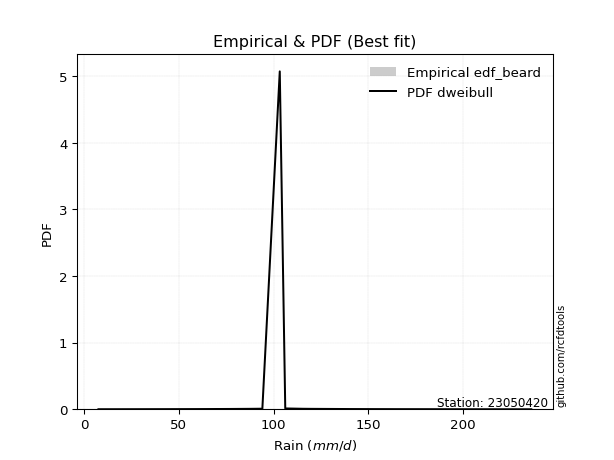</img>

</div>


### 5. Empirical - EDF Chegodayev (1955)

The Chegodayev formula is an empirical plotting position formula used in hydrological frequency analysis to estimate the exceedance probability or return period of a specific event from a set of observed data. It is primarily used for plotting observed data points on probability paper to fit a theoretical distribution, particularly for analyzing extreme events like maximum flood flows or rainfall intensities. The constant _b_ value in the generalized plotting position formula is 0.3.

<div align="center">


$P=(m-b)/(n+1-2b)$


</div>


**5.1. Empirical values**

<div align="center">

|                | 0                   | 1                   | 2                   | 3                   | 4                  | 5                   | 6                   | 7              | 8                  | 9                  | 10                 | 11                 | 12                 | 13                 | 14                 |
|:---------------|:--------------------|:--------------------|:--------------------|:--------------------|:-------------------|:--------------------|:--------------------|:---------------|:-------------------|:-------------------|:-------------------|:-------------------|:-------------------|:-------------------|:-------------------|
| date           | 2019                | 2017                | 2015                | 2016                | 2012               | 2014                | 2008                | 2013           | 2009               | 2010               | 2011               | 2024               | 2007               | 2025               | 2018               |
| x              | 7.5                 | 27.1                | 42.9                | 59.7                | 76.5               | 87.9                | 94.1                | 103.3          | 106.2              | 115.3              | 120.2              | 140.4              | 164.7              | 228.4              | 236.20000000000002 |
| m              | 1                   | 2                   | 3                   | 4                   | 5                  | 6                   | 7                   | 8              | 9                  | 10                 | 11                 | 12                 | 13                 | 14                 | 15                 |
| empirical_dist | edf_chegodayev      | edf_chegodayev      | edf_chegodayev      | edf_chegodayev      | edf_chegodayev     | edf_chegodayev      | edf_chegodayev      | edf_chegodayev | edf_chegodayev     | edf_chegodayev     | edf_chegodayev     | edf_chegodayev     | edf_chegodayev     | edf_chegodayev     | edf_chegodayev     |
| empirical      | 0.04545454545454545 | 0.11038961038961038 | 0.17532467532467533 | 0.24025974025974026 | 0.3051948051948052 | 0.37012987012987014 | 0.43506493506493504 | 0.5            | 0.5649350649350648 | 0.6298701298701298 | 0.6948051948051948 | 0.7597402597402597 | 0.8246753246753246 | 0.8896103896103895 | 0.9545454545454545 |
| empirical_tr   | 1.0476190476190477  | 1.1240875912408759  | 1.2125984251968505  | 1.3162393162393162  | 1.4392523364485983 | 1.5876288659793814  | 1.7701149425287355  | 2.0            | 2.2985074626865667 | 2.701754385964912  | 3.2765957446808507 | 4.162162162162161  | 5.7037037037037    | 9.058823529411757  | 21.999999999999964 |

</div>


**5.2. Kolmogorov-Smirnov fit test (sorted by Δ)**


<div align="center">

|                | 0                   | 1                   | 2                  | 3                  | 4                   | 5                   | 6                   | 7                   | 8                   | 9                   | 10                  | 11                  | 12                  | 13                 | 14                 | 15                  | 16                  | 17                 | 18                  | 19                    | 20                  | 21                  | 22                  | 23                  | 24                  | 25                 | 26                  | 27                  | 28                  | 29                  | 30                  | 31                  | 32                  | 33                  | 34                  | 35                  | 36                  | 37                  | 38                  | 39                  | 40                  | 41                  | 42                  | 43                  | 44                  | 45                  | 46                  | 47                  | 48                 | 49                  | 50                  | 51                 | 52                  | 53                  | 54                 | 55                 | 56                  | 57                  | 58                  | 59                  | 60                  | 61                  | 62                  | 63                 | 64                  | 65                  | 66                  | 67                  | 68                 | 69                  | 70                  | 71                  | 72                  | 73                  | 74                 | 75                 | 76                  | 77                  | 78                  | 79                 | 80                 | 81                  | 82                 | 83                 | 84                 | 85                 | 86                 | 87                 | 88                 | 89                 |
|:---------------|:--------------------|:--------------------|:-------------------|:-------------------|:--------------------|:--------------------|:--------------------|:--------------------|:--------------------|:--------------------|:--------------------|:--------------------|:--------------------|:-------------------|:-------------------|:--------------------|:--------------------|:-------------------|:--------------------|:----------------------|:--------------------|:--------------------|:--------------------|:--------------------|:--------------------|:-------------------|:--------------------|:--------------------|:--------------------|:--------------------|:--------------------|:--------------------|:--------------------|:--------------------|:--------------------|:--------------------|:--------------------|:--------------------|:--------------------|:--------------------|:--------------------|:--------------------|:--------------------|:--------------------|:--------------------|:--------------------|:--------------------|:--------------------|:-------------------|:--------------------|:--------------------|:-------------------|:--------------------|:--------------------|:-------------------|:-------------------|:--------------------|:--------------------|:--------------------|:--------------------|:--------------------|:--------------------|:--------------------|:-------------------|:--------------------|:--------------------|:--------------------|:--------------------|:-------------------|:--------------------|:--------------------|:--------------------|:--------------------|:--------------------|:-------------------|:-------------------|:--------------------|:--------------------|:--------------------|:-------------------|:-------------------|:--------------------|:-------------------|:-------------------|:-------------------|:-------------------|:-------------------|:-------------------|:-------------------|:-------------------|
| station        | 23050420            | 23050420            | 23050420           | 23050420           | 23050420            | 23050420            | 23050420            | 23050420            | 23050420            | 23050420            | 23050420            | 23050420            | 23050420            | 23050420           | 23050420           | 23050420            | 23050420            | 23050420           | 23050420            | 23050420              | 23050420            | 23050420            | 23050420            | 23050420            | 23050420            | 23050420           | 23050420            | 23050420            | 23050420            | 23050420            | 23050420            | 23050420            | 23050420            | 23050420            | 23050420            | 23050420            | 23050420            | 23050420            | 23050420            | 23050420            | 23050420            | 23050420            | 23050420            | 23050420            | 23050420            | 23050420            | 23050420            | 23050420            | 23050420           | 23050420            | 23050420            | 23050420           | 23050420            | 23050420            | 23050420           | 23050420           | 23050420            | 23050420            | 23050420            | 23050420            | 23050420            | 23050420            | 23050420            | 23050420           | 23050420            | 23050420            | 23050420            | 23050420            | 23050420           | 23050420            | 23050420            | 23050420            | 23050420            | 23050420            | 23050420           | 23050420           | 23050420            | 23050420            | 23050420            | 23050420           | 23050420           | 23050420            | 23050420           | 23050420           | 23050420           | 23050420           | 23050420           | 23050420           | 23050420           | 23050420           |
| empirical_dist | edf_chegodayev      | edf_chegodayev      | edf_chegodayev     | edf_chegodayev     | edf_chegodayev      | edf_chegodayev      | edf_chegodayev      | edf_chegodayev      | edf_chegodayev      | edf_chegodayev      | edf_chegodayev      | edf_chegodayev      | edf_chegodayev      | edf_chegodayev     | edf_chegodayev     | edf_chegodayev      | edf_chegodayev      | edf_chegodayev     | edf_chegodayev      | edf_chegodayev        | edf_chegodayev      | edf_chegodayev      | edf_chegodayev      | edf_chegodayev      | edf_chegodayev      | edf_chegodayev     | edf_chegodayev      | edf_chegodayev      | edf_chegodayev      | edf_chegodayev      | edf_chegodayev      | edf_chegodayev      | edf_chegodayev      | edf_chegodayev      | edf_chegodayev      | edf_chegodayev      | edf_chegodayev      | edf_chegodayev      | edf_chegodayev      | edf_chegodayev      | edf_chegodayev      | edf_chegodayev      | edf_chegodayev      | edf_chegodayev      | edf_chegodayev      | edf_chegodayev      | edf_chegodayev      | edf_chegodayev      | edf_chegodayev     | edf_chegodayev      | edf_chegodayev      | edf_chegodayev     | edf_chegodayev      | edf_chegodayev      | edf_chegodayev     | edf_chegodayev     | edf_chegodayev      | edf_chegodayev      | edf_chegodayev      | edf_chegodayev      | edf_chegodayev      | edf_chegodayev      | edf_chegodayev      | edf_chegodayev     | edf_chegodayev      | edf_chegodayev      | edf_chegodayev      | edf_chegodayev      | edf_chegodayev     | edf_chegodayev      | edf_chegodayev      | edf_chegodayev      | edf_chegodayev      | edf_chegodayev      | edf_chegodayev     | edf_chegodayev     | edf_chegodayev      | edf_chegodayev      | edf_chegodayev      | edf_chegodayev     | edf_chegodayev     | edf_chegodayev      | edf_chegodayev     | edf_chegodayev     | edf_chegodayev     | edf_chegodayev     | edf_chegodayev     | edf_chegodayev     | edf_chegodayev     | edf_chegodayev     |
| p_dist         | fisk                | exponnorm           | betaprime          | johnsonsu          | invgamma            | mielke              | f                   | gamma               | chi2                | erlang              | logmielke           | loggenlogistic      | gumbel_r            | logcrystalball     | nct                | genlogistic         | weibull_min         | laplace_asymmetric | invweibull          | loglaplace_asymmetric | kstwobign           | rayleigh            | laplace             | pearson3            | rice                | logloggamma        | moyal               | maxwell             | loggumbel_l         | loggompertz         | halfnorm            | logjohnsonsu        | logfisk             | hypsecant           | logpearson3         | lognakagami         | logistic            | halflogistic        | norm                | crystalball         | t                   | nakagami            | lognct              | logt                | lognorm             | lognorm             | loglognorm          | logexponnorm        | logrice            | logfatiguelife      | loglogistic         | loghypsecant       | logf                | logbetaprime        | logalpha           | logncf             | loggamma            | loggamma            | logerlang           | loglaplace          | wald                | loginvgauss         | gumbel_l            | loginvgamma        | logmaxwell          | genexpon            | expon               | loginvweibull       | lograyleigh        | loggumbel_r         | logkstwobign        | invgauss            | loghalfnorm         | gibrat              | logmoyal           | loghalflogistic    | loggenexpon         | ncf                 | logtruncnorm        | logwald            | logexpon           | loggibrat           | alpha              | logweibull_min     | pareto             | logpareto          | truncnorm          | fatiguelife        | logchi2            | gompertz           |
| delta          | 0.05692570847757017 | 0.06062445684392759 | 0.0625682628579396 | 0.0636687241597702 | 0.06384592698057268 | 0.06391778155130179 | 0.06415668530038066 | 0.06420959970900897 | 0.06420960958643335 | 0.06420969410868022 | 0.06424173270771949 | 0.06424513304820245 | 0.06482956331349271 | 0.0657597879748596 | 0.0661776344312992 | 0.06645226166060691 | 0.06783612346961765 | 0.0684151901376191 | 0.06906788701347921 | 0.07318389455847002   | 0.07400961896787178 | 0.07746898891389264 | 0.07771410618282004 | 0.07875912406028573 | 0.07955703228682687 | 0.083989995417454  | 0.08600036886425183 | 0.08633119788322663 | 0.08701381775655864 | 0.08756065106341421 | 0.08982807212423938 | 0.09077911997508581 | 0.09511313261885623 | 0.09515291635864587 | 0.09755272097497736 | 0.10301587724478894 | 0.10393773848316346 | 0.11038961038961038 | 0.11451249106068118 | 0.11451250053312967 | 0.11452351981808095 | 0.14689712023099127 | 0.15599791049441286 | 0.15602237058174245 | 0.15610757930272506 | 0.15610757930272506 | 0.15610891994755077 | 0.15610902068358173 | 0.1561160897349279 | 0.15687576504946593 | 0.15967854820361588 | 0.1627191756653283 | 0.16279525231957676 | 0.16488747532622539 | 0.1669249695815863 | 0.1681404215561409 | 0.16965788320666642 | 0.16965788320666642 | 0.17275009395274132 | 0.17430822616701652 | 0.17532467532467533 | 0.17752000575339794 | 0.17763064235649306 | 0.1788427867967628 | 0.19004194631049637 | 0.19305462407562307 | 0.19371409289897729 | 0.19484371261220929 | 0.201783697493311  | 0.22676680466386406 | 0.23328115751329298 | 0.23377088044194178 | 0.23487438749020945 | 0.24017715489331282 | 0.252243955615905  | 0.2569680535664464 | 0.26724499559401343 | 0.28133722206865713 | 0.31903018279512746 | 0.3229828567033988 | 0.3403616055704075 | 0.34984126283460476 | 0.4175705863069424 | 0.5034383404051569 | 0.5078507650139138 | 0.5303830097037927 | 0.554430044725092  | 0.5647821201474937 | 0.5939945352235027 | 0.814978924676795  |
| deltao         | 0.3366456264050002  | 0.3366456264050002  | 0.3366456264050002 | 0.3366456264050002 | 0.3366456264050002  | 0.3366456264050002  | 0.3366456264050002  | 0.3366456264050002  | 0.3366456264050002  | 0.3366456264050002  | 0.3366456264050002  | 0.3366456264050002  | 0.3366456264050002  | 0.3366456264050002 | 0.3366456264050002 | 0.3366456264050002  | 0.3366456264050002  | 0.3366456264050002 | 0.3366456264050002  | 0.3366456264050002    | 0.3366456264050002  | 0.3366456264050002  | 0.3366456264050002  | 0.3366456264050002  | 0.3366456264050002  | 0.3366456264050002 | 0.3366456264050002  | 0.3366456264050002  | 0.3366456264050002  | 0.3366456264050002  | 0.3366456264050002  | 0.3366456264050002  | 0.3366456264050002  | 0.3366456264050002  | 0.3366456264050002  | 0.3366456264050002  | 0.3366456264050002  | 0.3366456264050002  | 0.3366456264050002  | 0.3366456264050002  | 0.3366456264050002  | 0.3366456264050002  | 0.3366456264050002  | 0.3366456264050002  | 0.3366456264050002  | 0.3366456264050002  | 0.3366456264050002  | 0.3366456264050002  | 0.3366456264050002 | 0.3366456264050002  | 0.3366456264050002  | 0.3366456264050002 | 0.3366456264050002  | 0.3366456264050002  | 0.3366456264050002 | 0.3366456264050002 | 0.3366456264050002  | 0.3366456264050002  | 0.3366456264050002  | 0.3366456264050002  | 0.3366456264050002  | 0.3366456264050002  | 0.3366456264050002  | 0.3366456264050002 | 0.3366456264050002  | 0.3366456264050002  | 0.3366456264050002  | 0.3366456264050002  | 0.3366456264050002 | 0.3366456264050002  | 0.3366456264050002  | 0.3366456264050002  | 0.3366456264050002  | 0.3366456264050002  | 0.3366456264050002 | 0.3366456264050002 | 0.3366456264050002  | 0.3366456264050002  | 0.3366456264050002  | 0.3366456264050002 | 0.3366456264050002 | 0.3366456264050002  | 0.3366456264050002 | 0.3366456264050002 | 0.3366456264050002 | 0.3366456264050002 | 0.3366456264050002 | 0.3366456264050002 | 0.3366456264050002 | 0.3366456264050002 |
| eval           | Δo > Δ              | Δo > Δ              | Δo > Δ             | Δo > Δ             | Δo > Δ              | Δo > Δ              | Δo > Δ              | Δo > Δ              | Δo > Δ              | Δo > Δ              | Δo > Δ              | Δo > Δ              | Δo > Δ              | Δo > Δ             | Δo > Δ             | Δo > Δ              | Δo > Δ              | Δo > Δ             | Δo > Δ              | Δo > Δ                | Δo > Δ              | Δo > Δ              | Δo > Δ              | Δo > Δ              | Δo > Δ              | Δo > Δ             | Δo > Δ              | Δo > Δ              | Δo > Δ              | Δo > Δ              | Δo > Δ              | Δo > Δ              | Δo > Δ              | Δo > Δ              | Δo > Δ              | Δo > Δ              | Δo > Δ              | Δo > Δ              | Δo > Δ              | Δo > Δ              | Δo > Δ              | Δo > Δ              | Δo > Δ              | Δo > Δ              | Δo > Δ              | Δo > Δ              | Δo > Δ              | Δo > Δ              | Δo > Δ             | Δo > Δ              | Δo > Δ              | Δo > Δ             | Δo > Δ              | Δo > Δ              | Δo > Δ             | Δo > Δ             | Δo > Δ              | Δo > Δ              | Δo > Δ              | Δo > Δ              | Δo > Δ              | Δo > Δ              | Δo > Δ              | Δo > Δ             | Δo > Δ              | Δo > Δ              | Δo > Δ              | Δo > Δ              | Δo > Δ             | Δo > Δ              | Δo > Δ              | Δo > Δ              | Δo > Δ              | Δo > Δ              | Δo > Δ             | Δo > Δ             | Δo > Δ              | Δo > Δ              | Δo > Δ              | Δo > Δ             | Δo <= Δ            | Δo <= Δ             | Δo <= Δ            | Δo <= Δ            | Δo <= Δ            | Δo <= Δ            | Δo <= Δ            | Δo <= Δ            | Δo <= Δ            | Δo <= Δ            |
| fit            | 1                   | 1                   | 1                  | 1                  | 1                   | 1                   | 1                   | 1                   | 1                   | 1                   | 1                   | 1                   | 1                   | 1                  | 1                  | 1                   | 1                   | 1                  | 1                   | 1                     | 1                   | 1                   | 1                   | 1                   | 1                   | 1                  | 1                   | 1                   | 1                   | 1                   | 1                   | 1                   | 1                   | 1                   | 1                   | 1                   | 1                   | 1                   | 1                   | 1                   | 1                   | 1                   | 1                   | 1                   | 1                   | 1                   | 1                   | 1                   | 1                  | 1                   | 1                   | 1                  | 1                   | 1                   | 1                  | 1                  | 1                   | 1                   | 1                   | 1                   | 1                   | 1                   | 1                   | 1                  | 1                   | 1                   | 1                   | 1                   | 1                  | 1                   | 1                   | 1                   | 1                   | 1                   | 1                  | 1                  | 1                   | 1                   | 1                   | 1                  | 0                  | 0                   | 0                  | 0                  | 0                  | 0                  | 0                  | 0                  | 0                  | 0                  |
| n              | 15                  | 15                  | 15                 | 15                 | 15                  | 15                  | 15                  | 15                  | 15                  | 15                  | 15                  | 15                  | 15                  | 15                 | 15                 | 15                  | 15                  | 15                 | 15                  | 15                    | 15                  | 15                  | 15                  | 15                  | 15                  | 15                 | 15                  | 15                  | 15                  | 15                  | 15                  | 15                  | 15                  | 15                  | 15                  | 15                  | 15                  | 15                  | 15                  | 15                  | 15                  | 15                  | 15                  | 15                  | 15                  | 15                  | 15                  | 15                  | 15                 | 15                  | 15                  | 15                 | 15                  | 15                  | 15                 | 15                 | 15                  | 15                  | 15                  | 15                  | 15                  | 15                  | 15                  | 15                 | 15                  | 15                  | 15                  | 15                  | 15                 | 15                  | 15                  | 15                  | 15                  | 15                  | 15                 | 15                 | 15                  | 15                  | 15                  | 15                 | 15                 | 15                  | 15                 | 15                 | 15                 | 15                 | 15                 | 15                 | 15                 | 15                 |
| best_fit       | 1                   | 0                   | 0                  | 0                  | 0                   | 0                   | 0                   | 0                   | 0                   | 0                   | 0                   | 0                   | 0                   | 0                  | 0                  | 0                   | 0                   | 0                  | 0                   | 0                     | 0                   | 0                   | 0                   | 0                   | 0                   | 0                  | 0                   | 0                   | 0                   | 0                   | 0                   | 0                   | 0                   | 0                   | 0                   | 0                   | 0                   | 0                   | 0                   | 0                   | 0                   | 0                   | 0                   | 0                   | 0                   | 0                   | 0                   | 0                   | 0                  | 0                   | 0                   | 0                  | 0                   | 0                   | 0                  | 0                  | 0                   | 0                   | 0                   | 0                   | 0                   | 0                   | 0                   | 0                  | 0                   | 0                   | 0                   | 0                   | 0                  | 0                   | 0                   | 0                   | 0                   | 0                   | 0                  | 0                  | 0                   | 0                   | 0                   | 0                  | 0                  | 0                   | 0                  | 0                  | 0                  | 0                  | 0                  | 0                  | 0                  | 0                  |
| best_fit_sort  | 1                   | 2                   | 3                  | 4                  | 5                   | 6                   | 7                   | 8                   | 9                   | 10                  | 11                  | 12                  | 13                  | 14                 | 15                 | 16                  | 17                  | 18                 | 19                  | 20                    | 21                  | 22                  | 23                  | 24                  | 25                  | 26                 | 27                  | 28                  | 29                  | 30                  | 31                  | 32                  | 33                  | 34                  | 35                  | 36                  | 37                  | 38                  | 39                  | 40                  | 41                  | 42                  | 43                  | 44                  | 45                  | 46                  | 47                  | 48                  | 49                 | 50                  | 51                  | 52                 | 53                  | 54                  | 55                 | 56                 | 57                  | 58                  | 59                  | 60                  | 61                  | 62                  | 63                  | 64                 | 65                  | 66                  | 67                  | 68                  | 69                 | 70                  | 71                  | 72                  | 73                  | 74                  | 75                 | 76                 | 77                  | 78                  | 79                  | 80                 | 81                 | 82                  | 83                 | 84                 | 85                 | 86                 | 87                 | 88                 | 89                 | 90                 |

</div>


<div align="center">

</img>

</div>


**5.3. Best fit**

<div align="center">

|   id |   station | empirical_dist   | p_dist   |     delta |   deltao | eval   |   fit |   n |   best_fit |   best_fit_sort |
|-----:|----------:|:-----------------|:---------|----------:|---------:|:-------|------:|----:|-----------:|----------------:|
|    0 |  23050420 | edf_chegodayev   | fisk     | 0.0569257 | 0.336646 | Δo > Δ |     1 |  15 |          1 |               1 |

</div>


<div align="center">

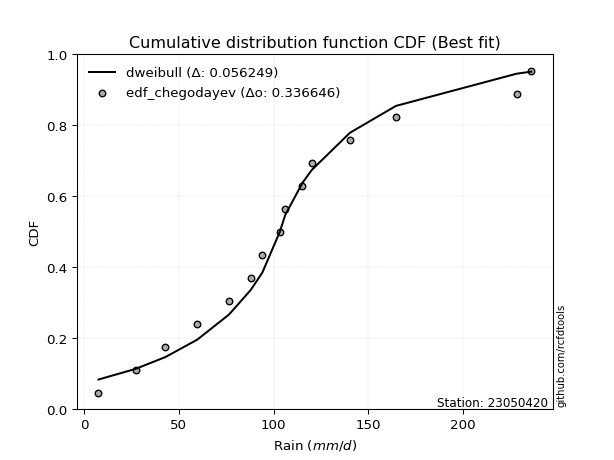</img>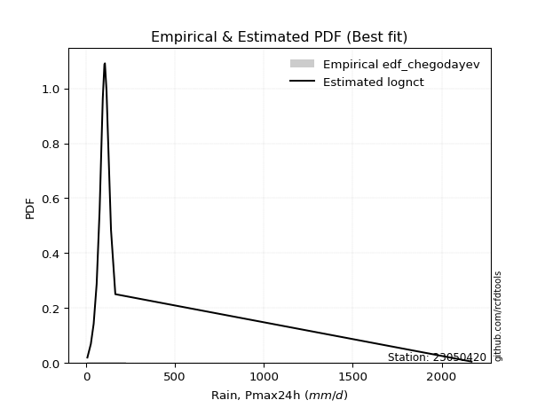</img>

</div>


### 6. Empirical - EDF Blom (1958)

The Blom formula is a specific "plotting position" formula used in hydrology and statistical analysis to estimate the empirical cumulative probability (or non-exceedance probability) of a data series. It is particularly recommended for data that are approximately normally distributed. The constant _a_ is set to 0.375 (or 3/8).

<div align="center">


$P=(m-a)/(n+1-2a)$


</div>


**6.1. Empirical values**

<div align="center">

|                | 0                    | 1                   | 2                  | 3                   | 4                   | 5                   | 6                  | 7        | 8                  | 9                  | 10                 | 11                 | 12                 | 13                 | 14                 |
|:---------------|:---------------------|:--------------------|:-------------------|:--------------------|:--------------------|:--------------------|:-------------------|:---------|:-------------------|:-------------------|:-------------------|:-------------------|:-------------------|:-------------------|:-------------------|
| date           | 2019                 | 2017                | 2015               | 2016                | 2012                | 2014                | 2008               | 2013     | 2009               | 2010               | 2011               | 2024               | 2007               | 2025               | 2018               |
| x              | 7.5                  | 27.1                | 42.9               | 59.7                | 76.5                | 87.9                | 94.1               | 103.3    | 106.2              | 115.3              | 120.2              | 140.4              | 164.7              | 228.4              | 236.20000000000002 |
| m              | 1                    | 2                   | 3                  | 4                   | 5                   | 6                   | 7                  | 8        | 9                  | 10                 | 11                 | 12                 | 13                 | 14                 | 15                 |
| empirical_dist | edf_blom             | edf_blom            | edf_blom           | edf_blom            | edf_blom            | edf_blom            | edf_blom           | edf_blom | edf_blom           | edf_blom           | edf_blom           | edf_blom           | edf_blom           | edf_blom           | edf_blom           |
| empirical      | 0.040983606557377046 | 0.10655737704918032 | 0.1721311475409836 | 0.23770491803278687 | 0.30327868852459017 | 0.36885245901639346 | 0.4344262295081967 | 0.5      | 0.5655737704918032 | 0.6311475409836066 | 0.6967213114754098 | 0.7622950819672131 | 0.8278688524590164 | 0.8934426229508197 | 0.9590163934426229 |
| empirical_tr   | 1.0427350427350428   | 1.1192660550458715  | 1.2079207920792079 | 1.3118279569892473  | 1.4352941176470588  | 1.5844155844155845  | 1.7681159420289854 | 2.0      | 2.30188679245283   | 2.7111111111111112 | 3.2972972972972974 | 4.206896551724137  | 5.80952380952381   | 9.384615384615383  | 24.399999999999974 |

</div>


**6.2. Kolmogorov-Smirnov fit test (sorted by Δ)**


<div align="center">

|                | 0                   | 1                   | 2                   | 3                   | 4                   | 5                   | 6                   | 7                   | 8                   | 9                  | 10                  | 11                  | 12                  | 13                  | 14                  | 15                  | 16                 | 17                  | 18                  | 19                    | 20                  | 21                  | 22                  | 23                  | 24                  | 25                  | 26                  | 27                 | 28                  | 29                  | 30                  | 31                  | 32                  | 33                  | 34                  | 35                  | 36                  | 37                  | 38                  | 39                  | 40                  | 41                  | 42                 | 43                  | 44                  | 45                  | 46                  | 47                  | 48                  | 49                  | 50                  | 51                  | 52                  | 53                 | 54                  | 55                 | 56                  | 57                  | 58                 | 59                  | 60                 | 61                  | 62                  | 63                  | 64                  | 65                 | 66                 | 67                 | 68                 | 69                  | 70                 | 71                 | 72                  | 73                  | 74                 | 75                  | 76                  | 77                  | 78                 | 79                 | 80                  | 81                  | 82                 | 83                 | 84                 | 85                 | 86                 | 87                 | 88                 | 89                 |
|:---------------|:--------------------|:--------------------|:--------------------|:--------------------|:--------------------|:--------------------|:--------------------|:--------------------|:--------------------|:-------------------|:--------------------|:--------------------|:--------------------|:--------------------|:--------------------|:--------------------|:-------------------|:--------------------|:--------------------|:----------------------|:--------------------|:--------------------|:--------------------|:--------------------|:--------------------|:--------------------|:--------------------|:-------------------|:--------------------|:--------------------|:--------------------|:--------------------|:--------------------|:--------------------|:--------------------|:--------------------|:--------------------|:--------------------|:--------------------|:--------------------|:--------------------|:--------------------|:-------------------|:--------------------|:--------------------|:--------------------|:--------------------|:--------------------|:--------------------|:--------------------|:--------------------|:--------------------|:--------------------|:-------------------|:--------------------|:-------------------|:--------------------|:--------------------|:-------------------|:--------------------|:-------------------|:--------------------|:--------------------|:--------------------|:--------------------|:-------------------|:-------------------|:-------------------|:-------------------|:--------------------|:-------------------|:-------------------|:--------------------|:--------------------|:-------------------|:--------------------|:--------------------|:--------------------|:-------------------|:-------------------|:--------------------|:--------------------|:-------------------|:-------------------|:-------------------|:-------------------|:-------------------|:-------------------|:-------------------|:-------------------|
| station        | 23050420            | 23050420            | 23050420            | 23050420            | 23050420            | 23050420            | 23050420            | 23050420            | 23050420            | 23050420           | 23050420            | 23050420            | 23050420            | 23050420            | 23050420            | 23050420            | 23050420           | 23050420            | 23050420            | 23050420              | 23050420            | 23050420            | 23050420            | 23050420            | 23050420            | 23050420            | 23050420            | 23050420           | 23050420            | 23050420            | 23050420            | 23050420            | 23050420            | 23050420            | 23050420            | 23050420            | 23050420            | 23050420            | 23050420            | 23050420            | 23050420            | 23050420            | 23050420           | 23050420            | 23050420            | 23050420            | 23050420            | 23050420            | 23050420            | 23050420            | 23050420            | 23050420            | 23050420            | 23050420           | 23050420            | 23050420           | 23050420            | 23050420            | 23050420           | 23050420            | 23050420           | 23050420            | 23050420            | 23050420            | 23050420            | 23050420           | 23050420           | 23050420           | 23050420           | 23050420            | 23050420           | 23050420           | 23050420            | 23050420            | 23050420           | 23050420            | 23050420            | 23050420            | 23050420           | 23050420           | 23050420            | 23050420            | 23050420           | 23050420           | 23050420           | 23050420           | 23050420           | 23050420           | 23050420           | 23050420           |
| empirical_dist | edf_blom            | edf_blom            | edf_blom            | edf_blom            | edf_blom            | edf_blom            | edf_blom            | edf_blom            | edf_blom            | edf_blom           | edf_blom            | edf_blom            | edf_blom            | edf_blom            | edf_blom            | edf_blom            | edf_blom           | edf_blom            | edf_blom            | edf_blom              | edf_blom            | edf_blom            | edf_blom            | edf_blom            | edf_blom            | edf_blom            | edf_blom            | edf_blom           | edf_blom            | edf_blom            | edf_blom            | edf_blom            | edf_blom            | edf_blom            | edf_blom            | edf_blom            | edf_blom            | edf_blom            | edf_blom            | edf_blom            | edf_blom            | edf_blom            | edf_blom           | edf_blom            | edf_blom            | edf_blom            | edf_blom            | edf_blom            | edf_blom            | edf_blom            | edf_blom            | edf_blom            | edf_blom            | edf_blom           | edf_blom            | edf_blom           | edf_blom            | edf_blom            | edf_blom           | edf_blom            | edf_blom           | edf_blom            | edf_blom            | edf_blom            | edf_blom            | edf_blom           | edf_blom           | edf_blom           | edf_blom           | edf_blom            | edf_blom           | edf_blom           | edf_blom            | edf_blom            | edf_blom           | edf_blom            | edf_blom            | edf_blom            | edf_blom           | edf_blom           | edf_blom            | edf_blom            | edf_blom           | edf_blom           | edf_blom           | edf_blom           | edf_blom           | edf_blom           | edf_blom           | edf_blom           |
| p_dist         | fisk                | exponnorm           | logcrystalball      | nct                 | betaprime           | johnsonsu           | f                   | gamma               | chi2                | erlang             | logmielke           | invgamma            | mielke              | gumbel_r            | loggenlogistic      | laplace_asymmetric  | genlogistic        | weibull_min         | invweibull          | loglaplace_asymmetric | kstwobign           | laplace             | rayleigh            | pearson3            | rice                | logloggamma         | moyal               | maxwell            | loggumbel_l         | loggompertz         | halfnorm            | logjohnsonsu        | logfisk             | hypsecant           | lognakagami         | logpearson3         | logistic            | halflogistic        | norm                | crystalball         | t                   | nakagami            | lognct             | logt                | logrice             | lognorm             | lognorm             | logexponnorm        | loglognorm          | logfatiguelife      | loglogistic         | loghypsecant        | logf                | logbetaprime       | logalpha            | logncf             | loggamma            | loggamma            | wald               | logerlang           | loglaplace         | loginvgauss         | gumbel_l            | loginvgamma         | logmaxwell          | genexpon           | expon              | loginvweibull      | lograyleigh        | loggumbel_r         | logkstwobign       | invgauss           | loghalfnorm         | gibrat              | logmoyal           | loghalflogistic     | loggenexpon         | ncf                 | logtruncnorm       | logwald            | logexpon            | loggibrat           | alpha              | logweibull_min     | pareto             | logpareto          | truncnorm          | fatiguelife        | logchi2            | gompertz           |
| delta          | 0.05539832781491416 | 0.05679222350349744 | 0.06192755463442945 | 0.06358414267120516 | 0.06448437952815467 | 0.06490158071754015 | 0.06543409641385733 | 0.06548701082248565 | 0.06548702069991003 | 0.0654871052221569 | 0.06551914382119617 | 0.06562288424507123 | 0.06583389822151686 | 0.06610697442696939 | 0.06616124971841753 | 0.06765126642431218 | 0.0677296727740836 | 0.06975224013983272 | 0.07034529812695589 | 0.0744613056719467    | 0.07528703008134846 | 0.07835281173955844 | 0.07938510558410772 | 0.08067524073050081 | 0.08147314895704194 | 0.08590611208766907 | 0.08727777997772851 | 0.0882473145534417 | 0.08829122887003532 | 0.08883806217689089 | 0.09110548323771606 | 0.09269523664530088 | 0.09639054373233291 | 0.09706903302886094 | 0.09918364390435888 | 0.09946883764519243 | 0.10585385515337853 | 0.10655737704918032 | 0.11642860773089625 | 0.11642861720334474 | 0.11643963648829603 | 0.14817453134446795 | 0.1575547857234058 | 0.15768583043122864 | 0.15778072196444126 | 0.15779008699603908 | 0.15779008699603908 | 0.15779127931598963 | 0.15779175641415288 | 0.15863870531265284 | 0.16095595931709256 | 0.16399658677880496 | 0.16471136898979177 | 0.1668035919964404 | 0.16884108625180133 | 0.1700565382263559 | 0.17157399987688143 | 0.17157399987688143 | 0.1721311475409836 | 0.17466621062295634 | 0.1755856372804932 | 0.17943612242361295 | 0.17954675902670814 | 0.18075890346697782 | 0.19195806298071139 | 0.1949707407458381 | 0.1956302095691923 | 0.1967598292824243 | 0.203699814163526  | 0.22804421577734074 | 0.235197274183508  | 0.2356869971121568 | 0.23679050416042446 | 0.23762233266635943 | 0.2535213667293817 | 0.25888417023666144 | 0.26916111226422845 | 0.28383486494059346 | 0.3209462994653425 | 0.3242602678168755 | 0.34355513335409926 | 0.35111867394808144 | 0.4194867029771574 | 0.5072705737455869 | 0.5116829983543438 | 0.5342152430442227 | 0.5557074558385688 | 0.5686143534879238 | 0.5971880630071944 | 0.8181724524604869 |
| deltao         | 0.3366456264050002  | 0.3366456264050002  | 0.3366456264050002  | 0.3366456264050002  | 0.3366456264050002  | 0.3366456264050002  | 0.3366456264050002  | 0.3366456264050002  | 0.3366456264050002  | 0.3366456264050002 | 0.3366456264050002  | 0.3366456264050002  | 0.3366456264050002  | 0.3366456264050002  | 0.3366456264050002  | 0.3366456264050002  | 0.3366456264050002 | 0.3366456264050002  | 0.3366456264050002  | 0.3366456264050002    | 0.3366456264050002  | 0.3366456264050002  | 0.3366456264050002  | 0.3366456264050002  | 0.3366456264050002  | 0.3366456264050002  | 0.3366456264050002  | 0.3366456264050002 | 0.3366456264050002  | 0.3366456264050002  | 0.3366456264050002  | 0.3366456264050002  | 0.3366456264050002  | 0.3366456264050002  | 0.3366456264050002  | 0.3366456264050002  | 0.3366456264050002  | 0.3366456264050002  | 0.3366456264050002  | 0.3366456264050002  | 0.3366456264050002  | 0.3366456264050002  | 0.3366456264050002 | 0.3366456264050002  | 0.3366456264050002  | 0.3366456264050002  | 0.3366456264050002  | 0.3366456264050002  | 0.3366456264050002  | 0.3366456264050002  | 0.3366456264050002  | 0.3366456264050002  | 0.3366456264050002  | 0.3366456264050002 | 0.3366456264050002  | 0.3366456264050002 | 0.3366456264050002  | 0.3366456264050002  | 0.3366456264050002 | 0.3366456264050002  | 0.3366456264050002 | 0.3366456264050002  | 0.3366456264050002  | 0.3366456264050002  | 0.3366456264050002  | 0.3366456264050002 | 0.3366456264050002 | 0.3366456264050002 | 0.3366456264050002 | 0.3366456264050002  | 0.3366456264050002 | 0.3366456264050002 | 0.3366456264050002  | 0.3366456264050002  | 0.3366456264050002 | 0.3366456264050002  | 0.3366456264050002  | 0.3366456264050002  | 0.3366456264050002 | 0.3366456264050002 | 0.3366456264050002  | 0.3366456264050002  | 0.3366456264050002 | 0.3366456264050002 | 0.3366456264050002 | 0.3366456264050002 | 0.3366456264050002 | 0.3366456264050002 | 0.3366456264050002 | 0.3366456264050002 |
| eval           | Δo > Δ              | Δo > Δ              | Δo > Δ              | Δo > Δ              | Δo > Δ              | Δo > Δ              | Δo > Δ              | Δo > Δ              | Δo > Δ              | Δo > Δ             | Δo > Δ              | Δo > Δ              | Δo > Δ              | Δo > Δ              | Δo > Δ              | Δo > Δ              | Δo > Δ             | Δo > Δ              | Δo > Δ              | Δo > Δ                | Δo > Δ              | Δo > Δ              | Δo > Δ              | Δo > Δ              | Δo > Δ              | Δo > Δ              | Δo > Δ              | Δo > Δ             | Δo > Δ              | Δo > Δ              | Δo > Δ              | Δo > Δ              | Δo > Δ              | Δo > Δ              | Δo > Δ              | Δo > Δ              | Δo > Δ              | Δo > Δ              | Δo > Δ              | Δo > Δ              | Δo > Δ              | Δo > Δ              | Δo > Δ             | Δo > Δ              | Δo > Δ              | Δo > Δ              | Δo > Δ              | Δo > Δ              | Δo > Δ              | Δo > Δ              | Δo > Δ              | Δo > Δ              | Δo > Δ              | Δo > Δ             | Δo > Δ              | Δo > Δ             | Δo > Δ              | Δo > Δ              | Δo > Δ             | Δo > Δ              | Δo > Δ             | Δo > Δ              | Δo > Δ              | Δo > Δ              | Δo > Δ              | Δo > Δ             | Δo > Δ             | Δo > Δ             | Δo > Δ             | Δo > Δ              | Δo > Δ             | Δo > Δ             | Δo > Δ              | Δo > Δ              | Δo > Δ             | Δo > Δ              | Δo > Δ              | Δo > Δ              | Δo > Δ             | Δo > Δ             | Δo <= Δ             | Δo <= Δ             | Δo <= Δ            | Δo <= Δ            | Δo <= Δ            | Δo <= Δ            | Δo <= Δ            | Δo <= Δ            | Δo <= Δ            | Δo <= Δ            |
| fit            | 1                   | 1                   | 1                   | 1                   | 1                   | 1                   | 1                   | 1                   | 1                   | 1                  | 1                   | 1                   | 1                   | 1                   | 1                   | 1                   | 1                  | 1                   | 1                   | 1                     | 1                   | 1                   | 1                   | 1                   | 1                   | 1                   | 1                   | 1                  | 1                   | 1                   | 1                   | 1                   | 1                   | 1                   | 1                   | 1                   | 1                   | 1                   | 1                   | 1                   | 1                   | 1                   | 1                  | 1                   | 1                   | 1                   | 1                   | 1                   | 1                   | 1                   | 1                   | 1                   | 1                   | 1                  | 1                   | 1                  | 1                   | 1                   | 1                  | 1                   | 1                  | 1                   | 1                   | 1                   | 1                   | 1                  | 1                  | 1                  | 1                  | 1                   | 1                  | 1                  | 1                   | 1                   | 1                  | 1                   | 1                   | 1                   | 1                  | 1                  | 0                   | 0                   | 0                  | 0                  | 0                  | 0                  | 0                  | 0                  | 0                  | 0                  |
| n              | 15                  | 15                  | 15                  | 15                  | 15                  | 15                  | 15                  | 15                  | 15                  | 15                 | 15                  | 15                  | 15                  | 15                  | 15                  | 15                  | 15                 | 15                  | 15                  | 15                    | 15                  | 15                  | 15                  | 15                  | 15                  | 15                  | 15                  | 15                 | 15                  | 15                  | 15                  | 15                  | 15                  | 15                  | 15                  | 15                  | 15                  | 15                  | 15                  | 15                  | 15                  | 15                  | 15                 | 15                  | 15                  | 15                  | 15                  | 15                  | 15                  | 15                  | 15                  | 15                  | 15                  | 15                 | 15                  | 15                 | 15                  | 15                  | 15                 | 15                  | 15                 | 15                  | 15                  | 15                  | 15                  | 15                 | 15                 | 15                 | 15                 | 15                  | 15                 | 15                 | 15                  | 15                  | 15                 | 15                  | 15                  | 15                  | 15                 | 15                 | 15                  | 15                  | 15                 | 15                 | 15                 | 15                 | 15                 | 15                 | 15                 | 15                 |
| best_fit       | 1                   | 0                   | 0                   | 0                   | 0                   | 0                   | 0                   | 0                   | 0                   | 0                  | 0                   | 0                   | 0                   | 0                   | 0                   | 0                   | 0                  | 0                   | 0                   | 0                     | 0                   | 0                   | 0                   | 0                   | 0                   | 0                   | 0                   | 0                  | 0                   | 0                   | 0                   | 0                   | 0                   | 0                   | 0                   | 0                   | 0                   | 0                   | 0                   | 0                   | 0                   | 0                   | 0                  | 0                   | 0                   | 0                   | 0                   | 0                   | 0                   | 0                   | 0                   | 0                   | 0                   | 0                  | 0                   | 0                  | 0                   | 0                   | 0                  | 0                   | 0                  | 0                   | 0                   | 0                   | 0                   | 0                  | 0                  | 0                  | 0                  | 0                   | 0                  | 0                  | 0                   | 0                   | 0                  | 0                   | 0                   | 0                   | 0                  | 0                  | 0                   | 0                   | 0                  | 0                  | 0                  | 0                  | 0                  | 0                  | 0                  | 0                  |
| best_fit_sort  | 1                   | 2                   | 3                   | 4                   | 5                   | 6                   | 7                   | 8                   | 9                   | 10                 | 11                  | 12                  | 13                  | 14                  | 15                  | 16                  | 17                 | 18                  | 19                  | 20                    | 21                  | 22                  | 23                  | 24                  | 25                  | 26                  | 27                  | 28                 | 29                  | 30                  | 31                  | 32                  | 33                  | 34                  | 35                  | 36                  | 37                  | 38                  | 39                  | 40                  | 41                  | 42                  | 43                 | 44                  | 45                  | 46                  | 47                  | 48                  | 49                  | 50                  | 51                  | 52                  | 53                  | 54                 | 55                  | 56                 | 57                  | 58                  | 59                 | 60                  | 61                 | 62                  | 63                  | 64                  | 65                  | 66                 | 67                 | 68                 | 69                 | 70                  | 71                 | 72                 | 73                  | 74                  | 75                 | 76                  | 77                  | 78                  | 79                 | 80                 | 81                  | 82                  | 83                 | 84                 | 85                 | 86                 | 87                 | 88                 | 89                 | 90                 |

</div>


<div align="center">

</img>

</div>


**6.3. Best fit**

<div align="center">

|   id |   station | empirical_dist   | p_dist   |     delta |   deltao | eval   |   fit |   n |   best_fit |   best_fit_sort |
|-----:|----------:|:-----------------|:---------|----------:|---------:|:-------|------:|----:|-----------:|----------------:|
|    0 |  23050420 | edf_blom         | fisk     | 0.0553983 | 0.336646 | Δo > Δ |     1 |  15 |          1 |               1 |

</div>


<div align="center">

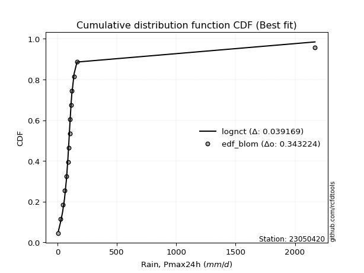</img></img>

</div>


### 7. Empirical - EDF Tukey (1962)

In hydrology, the Tukey formula is used as a plotting position formula to estimate the empirical probability or frequency of a flood event (or other hydrological data). The formula parameter is given as _c=0.333_ (or 1/3).

<div align="center">


$P=(m-c)/(n+1-2c)$


</div>


**7.1. Empirical values**

<div align="center">

|                | 0                    | 1                   | 2                   | 3                  | 4                   | 5                  | 6                   | 7         | 8                  | 9                  | 10                 | 11                 | 12                 | 13                 | 14                 |
|:---------------|:---------------------|:--------------------|:--------------------|:-------------------|:--------------------|:-------------------|:--------------------|:----------|:-------------------|:-------------------|:-------------------|:-------------------|:-------------------|:-------------------|:-------------------|
| date           | 2019                 | 2017                | 2015                | 2016               | 2012                | 2014               | 2008                | 2013      | 2009               | 2010               | 2011               | 2024               | 2007               | 2025               | 2018               |
| x              | 7.5                  | 27.1                | 42.9                | 59.7               | 76.5                | 87.9               | 94.1                | 103.3     | 106.2              | 115.3              | 120.2              | 140.4              | 164.7              | 228.4              | 236.20000000000002 |
| m              | 1                    | 2                   | 3                   | 4                  | 5                   | 6                  | 7                   | 8         | 9                  | 10                 | 11                 | 12                 | 13                 | 14                 | 15                 |
| empirical_dist | edf_tukey            | edf_tukey           | edf_tukey           | edf_tukey          | edf_tukey           | edf_tukey          | edf_tukey           | edf_tukey | edf_tukey          | edf_tukey          | edf_tukey          | edf_tukey          | edf_tukey          | edf_tukey          | edf_tukey          |
| empirical      | 0.043478260869565216 | 0.10869565217391304 | 0.17391304347826086 | 0.2391304347826087 | 0.30434782608695654 | 0.3695652173913043 | 0.43478260869565216 | 0.5       | 0.5652173913043478 | 0.6304347826086957 | 0.6956521739130435 | 0.7608695652173914 | 0.8260869565217391 | 0.8913043478260869 | 0.9565217391304348 |
| empirical_tr   | 1.0454545454545454   | 1.1219512195121952  | 1.2105263157894737  | 1.3142857142857143 | 1.4375              | 1.586206896551724  | 1.769230769230769   | 2.0       | 2.3                | 2.7058823529411766 | 3.2857142857142856 | 4.1818181818181825 | 5.75               | 9.199999999999998  | 23.000000000000014 |

</div>


**7.2. Kolmogorov-Smirnov fit test (sorted by Δ)**


<div align="center">

|                | 0                   | 1                   | 2                  | 3                   | 4                  | 5                  | 6                   | 7                   | 8                   | 9                   | 10                  | 11                  | 12                  | 13                  | 14                  | 15                 | 16                  | 17                  | 18                  | 19                    | 20                 | 21                  | 22                  | 23                  | 24                  | 25                 | 26                  | 27                  | 28                  | 29                  | 30                 | 31                  | 32                  | 33                  | 34                  | 35                 | 36                  | 37                  | 38                  | 39                  | 40                  | 41                 | 42                  | 43                  | 44                 | 45                 | 46                 | 47                  | 48                 | 49                  | 50                 | 51                 | 52                 | 53                  | 54                  | 55                  | 56                  | 57                  | 58                  | 59                  | 60                  | 61                  | 62                  | 63                  | 64                 | 65                  | 66                  | 67                  | 68                  | 69                  | 70                  | 71                  | 72                 | 73                  | 74                  | 75                  | 76                 | 77                 | 78                 | 79                  | 80                 | 81                 | 82                 | 83                 | 84                 | 85                 | 86                 | 87                 | 88                 | 89                 |
|:---------------|:--------------------|:--------------------|:-------------------|:--------------------|:-------------------|:-------------------|:--------------------|:--------------------|:--------------------|:--------------------|:--------------------|:--------------------|:--------------------|:--------------------|:--------------------|:-------------------|:--------------------|:--------------------|:--------------------|:----------------------|:-------------------|:--------------------|:--------------------|:--------------------|:--------------------|:-------------------|:--------------------|:--------------------|:--------------------|:--------------------|:-------------------|:--------------------|:--------------------|:--------------------|:--------------------|:-------------------|:--------------------|:--------------------|:--------------------|:--------------------|:--------------------|:-------------------|:--------------------|:--------------------|:-------------------|:-------------------|:-------------------|:--------------------|:-------------------|:--------------------|:-------------------|:-------------------|:-------------------|:--------------------|:--------------------|:--------------------|:--------------------|:--------------------|:--------------------|:--------------------|:--------------------|:--------------------|:--------------------|:--------------------|:-------------------|:--------------------|:--------------------|:--------------------|:--------------------|:--------------------|:--------------------|:--------------------|:-------------------|:--------------------|:--------------------|:--------------------|:-------------------|:-------------------|:-------------------|:--------------------|:-------------------|:-------------------|:-------------------|:-------------------|:-------------------|:-------------------|:-------------------|:-------------------|:-------------------|:-------------------|
| station        | 23050420            | 23050420            | 23050420           | 23050420            | 23050420           | 23050420           | 23050420            | 23050420            | 23050420            | 23050420            | 23050420            | 23050420            | 23050420            | 23050420            | 23050420            | 23050420           | 23050420            | 23050420            | 23050420            | 23050420              | 23050420           | 23050420            | 23050420            | 23050420            | 23050420            | 23050420           | 23050420            | 23050420            | 23050420            | 23050420            | 23050420           | 23050420            | 23050420            | 23050420            | 23050420            | 23050420           | 23050420            | 23050420            | 23050420            | 23050420            | 23050420            | 23050420           | 23050420            | 23050420            | 23050420           | 23050420           | 23050420           | 23050420            | 23050420           | 23050420            | 23050420           | 23050420           | 23050420           | 23050420            | 23050420            | 23050420            | 23050420            | 23050420            | 23050420            | 23050420            | 23050420            | 23050420            | 23050420            | 23050420            | 23050420           | 23050420            | 23050420            | 23050420            | 23050420            | 23050420            | 23050420            | 23050420            | 23050420           | 23050420            | 23050420            | 23050420            | 23050420           | 23050420           | 23050420           | 23050420            | 23050420           | 23050420           | 23050420           | 23050420           | 23050420           | 23050420           | 23050420           | 23050420           | 23050420           | 23050420           |
| empirical_dist | edf_tukey           | edf_tukey           | edf_tukey          | edf_tukey           | edf_tukey          | edf_tukey          | edf_tukey           | edf_tukey           | edf_tukey           | edf_tukey           | edf_tukey           | edf_tukey           | edf_tukey           | edf_tukey           | edf_tukey           | edf_tukey          | edf_tukey           | edf_tukey           | edf_tukey           | edf_tukey             | edf_tukey          | edf_tukey           | edf_tukey           | edf_tukey           | edf_tukey           | edf_tukey          | edf_tukey           | edf_tukey           | edf_tukey           | edf_tukey           | edf_tukey          | edf_tukey           | edf_tukey           | edf_tukey           | edf_tukey           | edf_tukey          | edf_tukey           | edf_tukey           | edf_tukey           | edf_tukey           | edf_tukey           | edf_tukey          | edf_tukey           | edf_tukey           | edf_tukey          | edf_tukey          | edf_tukey          | edf_tukey           | edf_tukey          | edf_tukey           | edf_tukey          | edf_tukey          | edf_tukey          | edf_tukey           | edf_tukey           | edf_tukey           | edf_tukey           | edf_tukey           | edf_tukey           | edf_tukey           | edf_tukey           | edf_tukey           | edf_tukey           | edf_tukey           | edf_tukey          | edf_tukey           | edf_tukey           | edf_tukey           | edf_tukey           | edf_tukey           | edf_tukey           | edf_tukey           | edf_tukey          | edf_tukey           | edf_tukey           | edf_tukey           | edf_tukey          | edf_tukey          | edf_tukey          | edf_tukey           | edf_tukey          | edf_tukey          | edf_tukey          | edf_tukey          | edf_tukey          | edf_tukey          | edf_tukey          | edf_tukey          | edf_tukey          | edf_tukey          |
| p_dist         | fisk                | exponnorm           | betaprime          | johnsonsu           | logcrystalball     | nct                | invgamma            | f                   | mielke              | gamma               | chi2                | erlang              | logmielke           | loggenlogistic      | gumbel_r            | laplace_asymmetric | genlogistic         | weibull_min         | invweibull          | loglaplace_asymmetric | kstwobign          | laplace             | rayleigh            | pearson3            | rice                | logloggamma        | moyal               | maxwell             | loggumbel_l         | loggompertz         | halfnorm           | logjohnsonsu        | logfisk             | hypsecant           | logpearson3         | lognakagami        | logistic            | halflogistic        | norm                | crystalball         | t                   | nakagami           | lognct              | logt                | logrice            | lognorm            | lognorm            | logexponnorm        | loglognorm         | logfatiguelife      | loglogistic        | loghypsecant       | logf               | logbetaprime        | logalpha            | logncf              | loggamma            | loggamma            | logerlang           | wald                | loglaplace          | loginvgauss         | gumbel_l            | loginvgamma         | logmaxwell         | genexpon            | expon               | loginvweibull       | lograyleigh         | loggumbel_r         | logkstwobign        | invgauss            | loghalfnorm        | gibrat              | logmoyal            | loghalflogistic     | loggenexpon        | ncf                | logtruncnorm       | logwald             | logexpon           | loggibrat          | alpha              | logweibull_min     | pareto             | logpareto          | truncnorm          | fatiguelife        | logchi2            | gompertz           |
| delta          | 0.05523175026187277 | 0.05893049862823019 | 0.0634152419657883 | 0.06383244315517378 | 0.0640658297591622 | 0.0644836762156018 | 0.06455374668270486 | 0.06472133803894647 | 0.06476476065915049 | 0.06477425244757479 | 0.06477426232499917 | 0.06477434684724603 | 0.06480638544628531 | 0.06509211215605115 | 0.06539421605205853 | 0.0667212319219217 | 0.06701691439917273 | 0.06868310257746635 | 0.06963253975204503 | 0.07374854729703584   | 0.0745742717064376 | 0.07799643255210298 | 0.07831596802174134 | 0.07960610316813443 | 0.08040401139467557 | 0.0848369745253027 | 0.08656502160281765 | 0.08717817699107533 | 0.08757847049512446 | 0.08812530380198003 | 0.0903927248628052 | 0.09162609908293451 | 0.09567778535742205 | 0.09599989546649457 | 0.09839970008282606 | 0.1013219190290916 | 0.10478471759101216 | 0.10869565217391304 | 0.11535947016852988 | 0.11535947964097837 | 0.11537049892592965 | 0.1474617729695571 | 0.15656256323297868 | 0.15661669286886226 | 0.1567115844020749 | 0.1567209494336727 | 0.1567209494336727 | 0.15672214175362326 | 0.1567226188517865 | 0.15756956775028647 | 0.1602432009421817 | 0.1632838284038941 | 0.1636422314274254 | 0.16573445443407403 | 0.16777194868943496 | 0.16898740066398954 | 0.17050486231451506 | 0.17050486231451506 | 0.17359707306058997 | 0.17391304347826086 | 0.17487287890558234 | 0.17836698486124658 | 0.17847762146434176 | 0.17968976590461144 | 0.190888925418345  | 0.19390160318347172 | 0.19456107200682593 | 0.19569069172005793 | 0.20263067660115963 | 0.22733145740242988 | 0.23412813662114162 | 0.23461785954979042 | 0.2357213665980581 | 0.23904784941618126 | 0.25280860835447083 | 0.25781503267429506 | 0.2680919747018621 | 0.2824093481907716 | 0.3198771619029761 | 0.32354750944196464 | 0.341773237416822  | 0.3504059155731706 | 0.418417565414791  | 0.5051322986208542 | 0.5095447232296111 | 0.53207696791949   | 0.5549946974636579 | 0.566476078363191  | 0.5954061670699171 | 0.8163905565232096 |
| deltao         | 0.3366456264050002  | 0.3366456264050002  | 0.3366456264050002 | 0.3366456264050002  | 0.3366456264050002 | 0.3366456264050002 | 0.3366456264050002  | 0.3366456264050002  | 0.3366456264050002  | 0.3366456264050002  | 0.3366456264050002  | 0.3366456264050002  | 0.3366456264050002  | 0.3366456264050002  | 0.3366456264050002  | 0.3366456264050002 | 0.3366456264050002  | 0.3366456264050002  | 0.3366456264050002  | 0.3366456264050002    | 0.3366456264050002 | 0.3366456264050002  | 0.3366456264050002  | 0.3366456264050002  | 0.3366456264050002  | 0.3366456264050002 | 0.3366456264050002  | 0.3366456264050002  | 0.3366456264050002  | 0.3366456264050002  | 0.3366456264050002 | 0.3366456264050002  | 0.3366456264050002  | 0.3366456264050002  | 0.3366456264050002  | 0.3366456264050002 | 0.3366456264050002  | 0.3366456264050002  | 0.3366456264050002  | 0.3366456264050002  | 0.3366456264050002  | 0.3366456264050002 | 0.3366456264050002  | 0.3366456264050002  | 0.3366456264050002 | 0.3366456264050002 | 0.3366456264050002 | 0.3366456264050002  | 0.3366456264050002 | 0.3366456264050002  | 0.3366456264050002 | 0.3366456264050002 | 0.3366456264050002 | 0.3366456264050002  | 0.3366456264050002  | 0.3366456264050002  | 0.3366456264050002  | 0.3366456264050002  | 0.3366456264050002  | 0.3366456264050002  | 0.3366456264050002  | 0.3366456264050002  | 0.3366456264050002  | 0.3366456264050002  | 0.3366456264050002 | 0.3366456264050002  | 0.3366456264050002  | 0.3366456264050002  | 0.3366456264050002  | 0.3366456264050002  | 0.3366456264050002  | 0.3366456264050002  | 0.3366456264050002 | 0.3366456264050002  | 0.3366456264050002  | 0.3366456264050002  | 0.3366456264050002 | 0.3366456264050002 | 0.3366456264050002 | 0.3366456264050002  | 0.3366456264050002 | 0.3366456264050002 | 0.3366456264050002 | 0.3366456264050002 | 0.3366456264050002 | 0.3366456264050002 | 0.3366456264050002 | 0.3366456264050002 | 0.3366456264050002 | 0.3366456264050002 |
| eval           | Δo > Δ              | Δo > Δ              | Δo > Δ             | Δo > Δ              | Δo > Δ             | Δo > Δ             | Δo > Δ              | Δo > Δ              | Δo > Δ              | Δo > Δ              | Δo > Δ              | Δo > Δ              | Δo > Δ              | Δo > Δ              | Δo > Δ              | Δo > Δ             | Δo > Δ              | Δo > Δ              | Δo > Δ              | Δo > Δ                | Δo > Δ             | Δo > Δ              | Δo > Δ              | Δo > Δ              | Δo > Δ              | Δo > Δ             | Δo > Δ              | Δo > Δ              | Δo > Δ              | Δo > Δ              | Δo > Δ             | Δo > Δ              | Δo > Δ              | Δo > Δ              | Δo > Δ              | Δo > Δ             | Δo > Δ              | Δo > Δ              | Δo > Δ              | Δo > Δ              | Δo > Δ              | Δo > Δ             | Δo > Δ              | Δo > Δ              | Δo > Δ             | Δo > Δ             | Δo > Δ             | Δo > Δ              | Δo > Δ             | Δo > Δ              | Δo > Δ             | Δo > Δ             | Δo > Δ             | Δo > Δ              | Δo > Δ              | Δo > Δ              | Δo > Δ              | Δo > Δ              | Δo > Δ              | Δo > Δ              | Δo > Δ              | Δo > Δ              | Δo > Δ              | Δo > Δ              | Δo > Δ             | Δo > Δ              | Δo > Δ              | Δo > Δ              | Δo > Δ              | Δo > Δ              | Δo > Δ              | Δo > Δ              | Δo > Δ             | Δo > Δ              | Δo > Δ              | Δo > Δ              | Δo > Δ             | Δo > Δ             | Δo > Δ             | Δo > Δ              | Δo <= Δ            | Δo <= Δ            | Δo <= Δ            | Δo <= Δ            | Δo <= Δ            | Δo <= Δ            | Δo <= Δ            | Δo <= Δ            | Δo <= Δ            | Δo <= Δ            |
| fit            | 1                   | 1                   | 1                  | 1                   | 1                  | 1                  | 1                   | 1                   | 1                   | 1                   | 1                   | 1                   | 1                   | 1                   | 1                   | 1                  | 1                   | 1                   | 1                   | 1                     | 1                  | 1                   | 1                   | 1                   | 1                   | 1                  | 1                   | 1                   | 1                   | 1                   | 1                  | 1                   | 1                   | 1                   | 1                   | 1                  | 1                   | 1                   | 1                   | 1                   | 1                   | 1                  | 1                   | 1                   | 1                  | 1                  | 1                  | 1                   | 1                  | 1                   | 1                  | 1                  | 1                  | 1                   | 1                   | 1                   | 1                   | 1                   | 1                   | 1                   | 1                   | 1                   | 1                   | 1                   | 1                  | 1                   | 1                   | 1                   | 1                   | 1                   | 1                   | 1                   | 1                  | 1                   | 1                   | 1                   | 1                  | 1                  | 1                  | 1                   | 0                  | 0                  | 0                  | 0                  | 0                  | 0                  | 0                  | 0                  | 0                  | 0                  |
| n              | 15                  | 15                  | 15                 | 15                  | 15                 | 15                 | 15                  | 15                  | 15                  | 15                  | 15                  | 15                  | 15                  | 15                  | 15                  | 15                 | 15                  | 15                  | 15                  | 15                    | 15                 | 15                  | 15                  | 15                  | 15                  | 15                 | 15                  | 15                  | 15                  | 15                  | 15                 | 15                  | 15                  | 15                  | 15                  | 15                 | 15                  | 15                  | 15                  | 15                  | 15                  | 15                 | 15                  | 15                  | 15                 | 15                 | 15                 | 15                  | 15                 | 15                  | 15                 | 15                 | 15                 | 15                  | 15                  | 15                  | 15                  | 15                  | 15                  | 15                  | 15                  | 15                  | 15                  | 15                  | 15                 | 15                  | 15                  | 15                  | 15                  | 15                  | 15                  | 15                  | 15                 | 15                  | 15                  | 15                  | 15                 | 15                 | 15                 | 15                  | 15                 | 15                 | 15                 | 15                 | 15                 | 15                 | 15                 | 15                 | 15                 | 15                 |
| best_fit       | 1                   | 0                   | 0                  | 0                   | 0                  | 0                  | 0                   | 0                   | 0                   | 0                   | 0                   | 0                   | 0                   | 0                   | 0                   | 0                  | 0                   | 0                   | 0                   | 0                     | 0                  | 0                   | 0                   | 0                   | 0                   | 0                  | 0                   | 0                   | 0                   | 0                   | 0                  | 0                   | 0                   | 0                   | 0                   | 0                  | 0                   | 0                   | 0                   | 0                   | 0                   | 0                  | 0                   | 0                   | 0                  | 0                  | 0                  | 0                   | 0                  | 0                   | 0                  | 0                  | 0                  | 0                   | 0                   | 0                   | 0                   | 0                   | 0                   | 0                   | 0                   | 0                   | 0                   | 0                   | 0                  | 0                   | 0                   | 0                   | 0                   | 0                   | 0                   | 0                   | 0                  | 0                   | 0                   | 0                   | 0                  | 0                  | 0                  | 0                   | 0                  | 0                  | 0                  | 0                  | 0                  | 0                  | 0                  | 0                  | 0                  | 0                  |
| best_fit_sort  | 1                   | 2                   | 3                  | 4                   | 5                  | 6                  | 7                   | 8                   | 9                   | 10                  | 11                  | 12                  | 13                  | 14                  | 15                  | 16                 | 17                  | 18                  | 19                  | 20                    | 21                 | 22                  | 23                  | 24                  | 25                  | 26                 | 27                  | 28                  | 29                  | 30                  | 31                 | 32                  | 33                  | 34                  | 35                  | 36                 | 37                  | 38                  | 39                  | 40                  | 41                  | 42                 | 43                  | 44                  | 45                 | 46                 | 47                 | 48                  | 49                 | 50                  | 51                 | 52                 | 53                 | 54                  | 55                  | 56                  | 57                  | 58                  | 59                  | 60                  | 61                  | 62                  | 63                  | 64                  | 65                 | 66                  | 67                  | 68                  | 69                  | 70                  | 71                  | 72                  | 73                 | 74                  | 75                  | 76                  | 77                 | 78                 | 79                 | 80                  | 81                 | 82                 | 83                 | 84                 | 85                 | 86                 | 87                 | 88                 | 89                 | 90                 |

</div>


<div align="center">

</img>

</div>


**7.3. Best fit**

<div align="center">

|   id |   station | empirical_dist   | p_dist   |     delta |   deltao | eval   |   fit |   n |   best_fit |   best_fit_sort |
|-----:|----------:|:-----------------|:---------|----------:|---------:|:-------|------:|----:|-----------:|----------------:|
|    0 |  23050420 | edf_tukey        | fisk     | 0.0552318 | 0.336646 | Δo > Δ |     1 |  15 |          1 |               1 |

</div>


<div align="center">

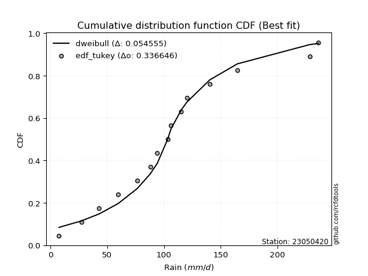</img></img>

</div>


### 8. Empirical - EDF Gringorten (1963)

Gringorten plotting position formula is essential for estimating the probability and return periods of extreme events like floods and heavy rainfall. The constant _a=0.44_.

<div align="center">


$P=(m-a)/(n+1-2a)$


</div>


**8.1. Empirical values**

<div align="center">

|                | 0                   | 1                   | 2                   | 3                   | 4                   | 5                   | 6                   | 7              | 8                  | 9                  | 10                 | 11                 | 12                 | 13                 | 14                 |
|:---------------|:--------------------|:--------------------|:--------------------|:--------------------|:--------------------|:--------------------|:--------------------|:---------------|:-------------------|:-------------------|:-------------------|:-------------------|:-------------------|:-------------------|:-------------------|
| date           | 2019                | 2017                | 2015                | 2016                | 2012                | 2014                | 2008                | 2013           | 2009               | 2010               | 2011               | 2024               | 2007               | 2025               | 2018               |
| x              | 7.5                 | 27.1                | 42.9                | 59.7                | 76.5                | 87.9                | 94.1                | 103.3          | 106.2              | 115.3              | 120.2              | 140.4              | 164.7              | 228.4              | 236.20000000000002 |
| m              | 1                   | 2                   | 3                   | 4                   | 5                   | 6                   | 7                   | 8              | 9                  | 10                 | 11                 | 12                 | 13                 | 14                 | 15                 |
| empirical_dist | edf_gringorten      | edf_gringorten      | edf_gringorten      | edf_gringorten      | edf_gringorten      | edf_gringorten      | edf_gringorten      | edf_gringorten | edf_gringorten     | edf_gringorten     | edf_gringorten     | edf_gringorten     | edf_gringorten     | edf_gringorten     | edf_gringorten     |
| empirical      | 0.03703703703703704 | 0.10317460317460318 | 0.16931216931216933 | 0.23544973544973546 | 0.30158730158730157 | 0.36772486772486773 | 0.43386243386243384 | 0.5            | 0.5661375661375662 | 0.6322751322751323 | 0.6984126984126985 | 0.7645502645502646 | 0.8306878306878308 | 0.8968253968253969 | 0.962962962962963  |
| empirical_tr   | 1.0384615384615385  | 1.1150442477876106  | 1.2038216560509554  | 1.3079584775086506  | 1.4318181818181819  | 1.5815899581589956  | 1.7663551401869158  | 2.0            | 2.304878048780488  | 2.719424460431655  | 3.3157894736842115 | 4.247191011235957  | 5.906250000000004  | 9.692307692307695  | 27.000000000000043 |

</div>


**8.2. Kolmogorov-Smirnov fit test (sorted by Δ)**


<div align="center">

|                | 0                    | 1                   | 2                   | 3                   | 4                   | 5                   | 6                  | 7                   | 8                   | 9                   | 10                  | 11                  | 12                  | 13                  | 14                  | 15                  | 16                  | 17                  | 18                  | 19                    | 20                  | 21                  | 22                  | 23                  | 24                 | 25                  | 26                  | 27                  | 28                  | 29                  | 30                  | 31                  | 32                  | 33                  | 34                  | 35                  | 36                  | 37                  | 38                 | 39                 | 40                  | 41                  | 42                 | 43                  | 44                  | 45                  | 46                  | 47                  | 48                  | 49                  | 50                 | 51                 | 52                  | 53                 | 54                  | 55                  | 56                 | 57                  | 58                  | 59                  | 60                  | 61                  | 62                 | 63                 | 64                  | 65                 | 66                 | 67                 | 68                 | 69                  | 70                  | 71                 | 72                 | 73                  | 74                 | 75                  | 76                  | 77                  | 78                 | 79                  | 80                  | 81                  | 82                 | 83                 | 84                 | 85                 | 86                 | 87                 | 88                 | 89                 |
|:---------------|:---------------------|:--------------------|:--------------------|:--------------------|:--------------------|:--------------------|:-------------------|:--------------------|:--------------------|:--------------------|:--------------------|:--------------------|:--------------------|:--------------------|:--------------------|:--------------------|:--------------------|:--------------------|:--------------------|:----------------------|:--------------------|:--------------------|:--------------------|:--------------------|:-------------------|:--------------------|:--------------------|:--------------------|:--------------------|:--------------------|:--------------------|:--------------------|:--------------------|:--------------------|:--------------------|:--------------------|:--------------------|:--------------------|:-------------------|:-------------------|:--------------------|:--------------------|:-------------------|:--------------------|:--------------------|:--------------------|:--------------------|:--------------------|:--------------------|:--------------------|:-------------------|:-------------------|:--------------------|:-------------------|:--------------------|:--------------------|:-------------------|:--------------------|:--------------------|:--------------------|:--------------------|:--------------------|:-------------------|:-------------------|:--------------------|:-------------------|:-------------------|:-------------------|:-------------------|:--------------------|:--------------------|:-------------------|:-------------------|:--------------------|:-------------------|:--------------------|:--------------------|:--------------------|:-------------------|:--------------------|:--------------------|:--------------------|:-------------------|:-------------------|:-------------------|:-------------------|:-------------------|:-------------------|:-------------------|:-------------------|
| station        | 23050420             | 23050420            | 23050420            | 23050420            | 23050420            | 23050420            | 23050420           | 23050420            | 23050420            | 23050420            | 23050420            | 23050420            | 23050420            | 23050420            | 23050420            | 23050420            | 23050420            | 23050420            | 23050420            | 23050420              | 23050420            | 23050420            | 23050420            | 23050420            | 23050420           | 23050420            | 23050420            | 23050420            | 23050420            | 23050420            | 23050420            | 23050420            | 23050420            | 23050420            | 23050420            | 23050420            | 23050420            | 23050420            | 23050420           | 23050420           | 23050420            | 23050420            | 23050420           | 23050420            | 23050420            | 23050420            | 23050420            | 23050420            | 23050420            | 23050420            | 23050420           | 23050420           | 23050420            | 23050420           | 23050420            | 23050420            | 23050420           | 23050420            | 23050420            | 23050420            | 23050420            | 23050420            | 23050420           | 23050420           | 23050420            | 23050420           | 23050420           | 23050420           | 23050420           | 23050420            | 23050420            | 23050420           | 23050420           | 23050420            | 23050420           | 23050420            | 23050420            | 23050420            | 23050420           | 23050420            | 23050420            | 23050420            | 23050420           | 23050420           | 23050420           | 23050420           | 23050420           | 23050420           | 23050420           | 23050420           |
| empirical_dist | edf_gringorten       | edf_gringorten      | edf_gringorten      | edf_gringorten      | edf_gringorten      | edf_gringorten      | edf_gringorten     | edf_gringorten      | edf_gringorten      | edf_gringorten      | edf_gringorten      | edf_gringorten      | edf_gringorten      | edf_gringorten      | edf_gringorten      | edf_gringorten      | edf_gringorten      | edf_gringorten      | edf_gringorten      | edf_gringorten        | edf_gringorten      | edf_gringorten      | edf_gringorten      | edf_gringorten      | edf_gringorten     | edf_gringorten      | edf_gringorten      | edf_gringorten      | edf_gringorten      | edf_gringorten      | edf_gringorten      | edf_gringorten      | edf_gringorten      | edf_gringorten      | edf_gringorten      | edf_gringorten      | edf_gringorten      | edf_gringorten      | edf_gringorten     | edf_gringorten     | edf_gringorten      | edf_gringorten      | edf_gringorten     | edf_gringorten      | edf_gringorten      | edf_gringorten      | edf_gringorten      | edf_gringorten      | edf_gringorten      | edf_gringorten      | edf_gringorten     | edf_gringorten     | edf_gringorten      | edf_gringorten     | edf_gringorten      | edf_gringorten      | edf_gringorten     | edf_gringorten      | edf_gringorten      | edf_gringorten      | edf_gringorten      | edf_gringorten      | edf_gringorten     | edf_gringorten     | edf_gringorten      | edf_gringorten     | edf_gringorten     | edf_gringorten     | edf_gringorten     | edf_gringorten      | edf_gringorten      | edf_gringorten     | edf_gringorten     | edf_gringorten      | edf_gringorten     | edf_gringorten      | edf_gringorten      | edf_gringorten      | edf_gringorten     | edf_gringorten      | edf_gringorten      | edf_gringorten      | edf_gringorten     | edf_gringorten     | edf_gringorten     | edf_gringorten     | edf_gringorten     | edf_gringorten     | edf_gringorten     | edf_gringorten     |
| p_dist         | fisk                 | exponnorm           | logcrystalball      | nct                 | betaprime           | f                   | johnsonsu          | gamma               | chi2                | erlang              | logmielke           | gumbel_r            | invgamma            | mielke              | loggenlogistic      | genlogistic         | laplace_asymmetric  | weibull_min         | invweibull          | loglaplace_asymmetric | kstwobign           | laplace             | rayleigh            | pearson3            | rice               | logloggamma         | moyal               | loggumbel_l         | maxwell             | loggompertz         | halfnorm            | logjohnsonsu        | lognakagami         | logfisk             | hypsecant           | logpearson3         | halflogistic        | logistic            | norm               | crystalball        | t                   | nakagami            | lognct             | logt                | logrice             | lognorm             | lognorm             | logexponnorm        | loglognorm          | logfatiguelife      | loglogistic        | loghypsecant       | logf                | logbetaprime       | wald                | logalpha            | logncf             | loggamma            | loggamma            | logerlang           | loglaplace          | loginvgauss         | gumbel_l           | loginvgamma        | logmaxwell          | genexpon           | expon              | loginvweibull      | lograyleigh        | loggumbel_r         | gibrat              | logkstwobign       | invgauss           | loghalfnorm         | logmoyal           | loghalflogistic     | loggenexpon         | ncf                 | logtruncnorm       | logwald             | logexpon            | loggibrat           | alpha              | logweibull_min     | pareto             | logpareto          | truncnorm          | fatiguelife        | logchi2            | gompertz           |
| delta          | 0.057089714752202814 | 0.05720792072526282 | 0.06278516324130928 | 0.06527552960849381 | 0.06617576646544332 | 0.06656168770538307 | 0.0665929676548288 | 0.06661460211401138 | 0.06661461199143576 | 0.06661469651368263 | 0.06718434829053155 | 0.06723456571849512 | 0.06731427118235989 | 0.06752528515880551 | 0.06785263665570618 | 0.06885726406560932 | 0.06934265336160084 | 0.07144362707712137 | 0.07147288941848162 | 0.07558889696347243   | 0.07641462137287419 | 0.07891660738532136 | 0.08107649252139637 | 0.08236662766778946 | 0.0831645358943306 | 0.08759749902495773 | 0.08840537126925424 | 0.08941882016156105 | 0.08993870149073036 | 0.08996565346841662 | 0.09223307452924179 | 0.09438662358258953 | 0.09580087002978174 | 0.09751813502385864 | 0.09876041996614959 | 0.10116022458248108 | 0.10497182385341675 | 0.10754524209066718 | 0.1181199946681849 | 0.1181200041406334 | 0.11813102342558468 | 0.14930212263599368 | 0.1592461726606944 | 0.15937721736851723 | 0.15947210890172986 | 0.15948147393332768 | 0.15948147393332768 | 0.15948266625327823 | 0.15948314335144148 | 0.16033009224994144 | 0.1620835506086183 | 0.1651241780703307 | 0.16640275592708037 | 0.168494978933729  | 0.16931216931216933 | 0.17053247318908993 | 0.1717479251636445 | 0.17326538681417003 | 0.17326538681417003 | 0.17635759756024494 | 0.17671322857201893 | 0.18112750936090155 | 0.1812381459639968 | 0.1824502904042664 | 0.19364944991799998 | 0.1966621276831267 | 0.1973215965064809 | 0.1984512162197129 | 0.2053912011008146 | 0.22917180706886647 | 0.23536715008330802 | 0.2368886611207966 | 0.2373783840494454 | 0.23848189109771306 | 0.2546489580209074 | 0.26057555717395003 | 0.27085249920151705 | 0.28609004752364486 | 0.3226376864026311 | 0.32538785910840123 | 0.34637411158291354 | 0.35224626523960717 | 0.421178089914446  | 0.5106533476201641 | 0.515065772228921  | 0.5375980169187999 | 0.5568350471300946 | 0.571997127362501  | 0.6000070412360087 | 0.8209914306893012 |
| deltao         | 0.3366456264050002   | 0.3366456264050002  | 0.3366456264050002  | 0.3366456264050002  | 0.3366456264050002  | 0.3366456264050002  | 0.3366456264050002 | 0.3366456264050002  | 0.3366456264050002  | 0.3366456264050002  | 0.3366456264050002  | 0.3366456264050002  | 0.3366456264050002  | 0.3366456264050002  | 0.3366456264050002  | 0.3366456264050002  | 0.3366456264050002  | 0.3366456264050002  | 0.3366456264050002  | 0.3366456264050002    | 0.3366456264050002  | 0.3366456264050002  | 0.3366456264050002  | 0.3366456264050002  | 0.3366456264050002 | 0.3366456264050002  | 0.3366456264050002  | 0.3366456264050002  | 0.3366456264050002  | 0.3366456264050002  | 0.3366456264050002  | 0.3366456264050002  | 0.3366456264050002  | 0.3366456264050002  | 0.3366456264050002  | 0.3366456264050002  | 0.3366456264050002  | 0.3366456264050002  | 0.3366456264050002 | 0.3366456264050002 | 0.3366456264050002  | 0.3366456264050002  | 0.3366456264050002 | 0.3366456264050002  | 0.3366456264050002  | 0.3366456264050002  | 0.3366456264050002  | 0.3366456264050002  | 0.3366456264050002  | 0.3366456264050002  | 0.3366456264050002 | 0.3366456264050002 | 0.3366456264050002  | 0.3366456264050002 | 0.3366456264050002  | 0.3366456264050002  | 0.3366456264050002 | 0.3366456264050002  | 0.3366456264050002  | 0.3366456264050002  | 0.3366456264050002  | 0.3366456264050002  | 0.3366456264050002 | 0.3366456264050002 | 0.3366456264050002  | 0.3366456264050002 | 0.3366456264050002 | 0.3366456264050002 | 0.3366456264050002 | 0.3366456264050002  | 0.3366456264050002  | 0.3366456264050002 | 0.3366456264050002 | 0.3366456264050002  | 0.3366456264050002 | 0.3366456264050002  | 0.3366456264050002  | 0.3366456264050002  | 0.3366456264050002 | 0.3366456264050002  | 0.3366456264050002  | 0.3366456264050002  | 0.3366456264050002 | 0.3366456264050002 | 0.3366456264050002 | 0.3366456264050002 | 0.3366456264050002 | 0.3366456264050002 | 0.3366456264050002 | 0.3366456264050002 |
| eval           | Δo > Δ               | Δo > Δ              | Δo > Δ              | Δo > Δ              | Δo > Δ              | Δo > Δ              | Δo > Δ             | Δo > Δ              | Δo > Δ              | Δo > Δ              | Δo > Δ              | Δo > Δ              | Δo > Δ              | Δo > Δ              | Δo > Δ              | Δo > Δ              | Δo > Δ              | Δo > Δ              | Δo > Δ              | Δo > Δ                | Δo > Δ              | Δo > Δ              | Δo > Δ              | Δo > Δ              | Δo > Δ             | Δo > Δ              | Δo > Δ              | Δo > Δ              | Δo > Δ              | Δo > Δ              | Δo > Δ              | Δo > Δ              | Δo > Δ              | Δo > Δ              | Δo > Δ              | Δo > Δ              | Δo > Δ              | Δo > Δ              | Δo > Δ             | Δo > Δ             | Δo > Δ              | Δo > Δ              | Δo > Δ             | Δo > Δ              | Δo > Δ              | Δo > Δ              | Δo > Δ              | Δo > Δ              | Δo > Δ              | Δo > Δ              | Δo > Δ             | Δo > Δ             | Δo > Δ              | Δo > Δ             | Δo > Δ              | Δo > Δ              | Δo > Δ             | Δo > Δ              | Δo > Δ              | Δo > Δ              | Δo > Δ              | Δo > Δ              | Δo > Δ             | Δo > Δ             | Δo > Δ              | Δo > Δ             | Δo > Δ             | Δo > Δ             | Δo > Δ             | Δo > Δ              | Δo > Δ              | Δo > Δ             | Δo > Δ             | Δo > Δ              | Δo > Δ             | Δo > Δ              | Δo > Δ              | Δo > Δ              | Δo > Δ             | Δo > Δ              | Δo <= Δ             | Δo <= Δ             | Δo <= Δ            | Δo <= Δ            | Δo <= Δ            | Δo <= Δ            | Δo <= Δ            | Δo <= Δ            | Δo <= Δ            | Δo <= Δ            |
| fit            | 1                    | 1                   | 1                   | 1                   | 1                   | 1                   | 1                  | 1                   | 1                   | 1                   | 1                   | 1                   | 1                   | 1                   | 1                   | 1                   | 1                   | 1                   | 1                   | 1                     | 1                   | 1                   | 1                   | 1                   | 1                  | 1                   | 1                   | 1                   | 1                   | 1                   | 1                   | 1                   | 1                   | 1                   | 1                   | 1                   | 1                   | 1                   | 1                  | 1                  | 1                   | 1                   | 1                  | 1                   | 1                   | 1                   | 1                   | 1                   | 1                   | 1                   | 1                  | 1                  | 1                   | 1                  | 1                   | 1                   | 1                  | 1                   | 1                   | 1                   | 1                   | 1                   | 1                  | 1                  | 1                   | 1                  | 1                  | 1                  | 1                  | 1                   | 1                   | 1                  | 1                  | 1                   | 1                  | 1                   | 1                   | 1                   | 1                  | 1                   | 0                   | 0                   | 0                  | 0                  | 0                  | 0                  | 0                  | 0                  | 0                  | 0                  |
| n              | 15                   | 15                  | 15                  | 15                  | 15                  | 15                  | 15                 | 15                  | 15                  | 15                  | 15                  | 15                  | 15                  | 15                  | 15                  | 15                  | 15                  | 15                  | 15                  | 15                    | 15                  | 15                  | 15                  | 15                  | 15                 | 15                  | 15                  | 15                  | 15                  | 15                  | 15                  | 15                  | 15                  | 15                  | 15                  | 15                  | 15                  | 15                  | 15                 | 15                 | 15                  | 15                  | 15                 | 15                  | 15                  | 15                  | 15                  | 15                  | 15                  | 15                  | 15                 | 15                 | 15                  | 15                 | 15                  | 15                  | 15                 | 15                  | 15                  | 15                  | 15                  | 15                  | 15                 | 15                 | 15                  | 15                 | 15                 | 15                 | 15                 | 15                  | 15                  | 15                 | 15                 | 15                  | 15                 | 15                  | 15                  | 15                  | 15                 | 15                  | 15                  | 15                  | 15                 | 15                 | 15                 | 15                 | 15                 | 15                 | 15                 | 15                 |
| best_fit       | 1                    | 0                   | 0                   | 0                   | 0                   | 0                   | 0                  | 0                   | 0                   | 0                   | 0                   | 0                   | 0                   | 0                   | 0                   | 0                   | 0                   | 0                   | 0                   | 0                     | 0                   | 0                   | 0                   | 0                   | 0                  | 0                   | 0                   | 0                   | 0                   | 0                   | 0                   | 0                   | 0                   | 0                   | 0                   | 0                   | 0                   | 0                   | 0                  | 0                  | 0                   | 0                   | 0                  | 0                   | 0                   | 0                   | 0                   | 0                   | 0                   | 0                   | 0                  | 0                  | 0                   | 0                  | 0                   | 0                   | 0                  | 0                   | 0                   | 0                   | 0                   | 0                   | 0                  | 0                  | 0                   | 0                  | 0                  | 0                  | 0                  | 0                   | 0                   | 0                  | 0                  | 0                   | 0                  | 0                   | 0                   | 0                   | 0                  | 0                   | 0                   | 0                   | 0                  | 0                  | 0                  | 0                  | 0                  | 0                  | 0                  | 0                  |
| best_fit_sort  | 1                    | 2                   | 3                   | 4                   | 5                   | 6                   | 7                  | 8                   | 9                   | 10                  | 11                  | 12                  | 13                  | 14                  | 15                  | 16                  | 17                  | 18                  | 19                  | 20                    | 21                  | 22                  | 23                  | 24                  | 25                 | 26                  | 27                  | 28                  | 29                  | 30                  | 31                  | 32                  | 33                  | 34                  | 35                  | 36                  | 37                  | 38                  | 39                 | 40                 | 41                  | 42                  | 43                 | 44                  | 45                  | 46                  | 47                  | 48                  | 49                  | 50                  | 51                 | 52                 | 53                  | 54                 | 55                  | 56                  | 57                 | 58                  | 59                  | 60                  | 61                  | 62                  | 63                 | 64                 | 65                  | 66                 | 67                 | 68                 | 69                 | 70                  | 71                  | 72                 | 73                 | 74                  | 75                 | 76                  | 77                  | 78                  | 79                 | 80                  | 81                  | 82                  | 83                 | 84                 | 85                 | 86                 | 87                 | 88                 | 89                 | 90                 |

</div>


<div align="center">

</img>

</div>


**8.3. Best fit**

<div align="center">

|   id |   station | empirical_dist   | p_dist   |     delta |   deltao | eval   |   fit |   n |   best_fit |   best_fit_sort |
|-----:|----------:|:-----------------|:---------|----------:|---------:|:-------|------:|----:|-----------:|----------------:|
|    0 |  23050420 | edf_gringorten   | fisk     | 0.0570897 | 0.336646 | Δo > Δ |     1 |  15 |          1 |               1 |

</div>


<div align="center">

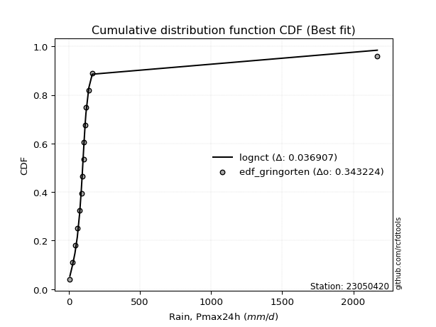</img>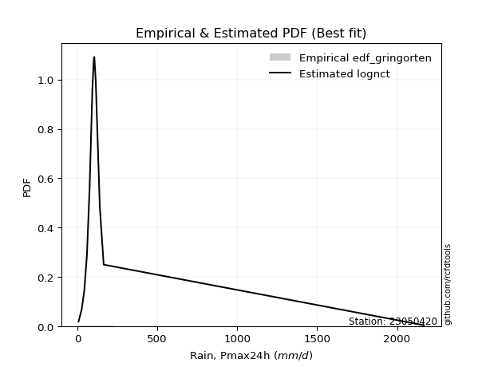</img>

</div>


### 9. Empirical - EDF Filliben (1975)

The specific values of the constants (0.3175) (often denoted as $alpha$) and (0.365) are derived from a method proposed by James J. Filliben in a 1975 paper. This particular formula is the mean value of the $i$-th order statistic of the normal distribution and is considered a robust and effective plotting position formula for the normal probability plot correlation coefficient test for normality.

<div align="center">


$P=(m-0.3175)/(n+0.365)$


</div>


**9.1. Empirical values**

<div align="center">

|                | 0                   | 1                   | 2                  | 3                   | 4                  | 5                  | 6                   | 7            | 8                  | 9                  | 10                 | 11                 | 12                 | 13                | 14                 |
|:---------------|:--------------------|:--------------------|:-------------------|:--------------------|:-------------------|:-------------------|:--------------------|:-------------|:-------------------|:-------------------|:-------------------|:-------------------|:-------------------|:------------------|:-------------------|
| date           | 2019                | 2017                | 2015               | 2016                | 2012               | 2014               | 2008                | 2013         | 2009               | 2010               | 2011               | 2024               | 2007               | 2025              | 2018               |
| x              | 7.5                 | 27.1                | 42.9               | 59.7                | 76.5               | 87.9               | 94.1                | 103.3        | 106.2              | 115.3              | 120.2              | 140.4              | 164.7              | 228.4             | 236.20000000000002 |
| m              | 1                   | 2                   | 3                  | 4                   | 5                  | 6                  | 7                   | 8            | 9                  | 10                 | 11                 | 12                 | 13                 | 14                | 15                 |
| empirical_dist | edf_filliben        | edf_filliben        | edf_filliben       | edf_filliben        | edf_filliben       | edf_filliben       | edf_filliben        | edf_filliben | edf_filliben       | edf_filliben       | edf_filliben       | edf_filliben       | edf_filliben       | edf_filliben      | edf_filliben       |
| empirical      | 0.04441913439635535 | 0.10950211519687603 | 0.1745850959973967 | 0.23966807679791735 | 0.304751057598438  | 0.3698340383989587 | 0.43491701919947934 | 0.5          | 0.5650829808005206 | 0.6301659616010412 | 0.6952489424015619 | 0.7603319232020826 | 0.8254149040026033 | 0.890497884803124 | 0.9555808656036446 |
| empirical_tr   | 1.0464839094159715  | 1.1229672939886717  | 1.211511925882121  | 1.3152150652685641  | 1.4383337233793587 | 1.586883552801446  | 1.7696515980420386  | 2.0          | 2.2992891881780766 | 2.7039155301363826 | 3.2813667912439923 | 4.172437202987101  | 5.727865796831314  | 9.13224368499257  | 22.512820512820507 |

</div>


**9.2. Kolmogorov-Smirnov fit test (sorted by Δ)**


<div align="center">

|                | 0                    | 1                   | 2                   | 3                  | 4                   | 5                  | 6                   | 7                   | 8                   | 9                   | 10                  | 11                  | 12                  | 13                  | 14                  | 15                  | 16                  | 17                  | 18                  | 19                    | 20                  | 21                  | 22                  | 23                  | 24                  | 25                  | 26                 | 27                  | 28                  | 29                  | 30                  | 31                  | 32                 | 33                  | 34                  | 35                  | 36                  | 37                  | 38                  | 39                  | 40                  | 41                  | 42                  | 43                  | 44                  | 45                  | 46                  | 47                 | 48                  | 49                 | 50                  | 51                  | 52                  | 53                  | 54                  | 55                  | 56                 | 57                 | 58                 | 59                 | 60                 | 61                 | 62                  | 63                  | 64                  | 65                  | 66                  | 67                  | 68                  | 69                  | 70                  | 71                  | 72                  | 73                 | 74                 | 75                 | 76                 | 77                 | 78                  | 79                 | 80                  | 81                 | 82                  | 83                 | 84                 | 85                 | 86                 | 87                 | 88                 | 89                 |
|:---------------|:---------------------|:--------------------|:--------------------|:-------------------|:--------------------|:-------------------|:--------------------|:--------------------|:--------------------|:--------------------|:--------------------|:--------------------|:--------------------|:--------------------|:--------------------|:--------------------|:--------------------|:--------------------|:--------------------|:----------------------|:--------------------|:--------------------|:--------------------|:--------------------|:--------------------|:--------------------|:-------------------|:--------------------|:--------------------|:--------------------|:--------------------|:--------------------|:-------------------|:--------------------|:--------------------|:--------------------|:--------------------|:--------------------|:--------------------|:--------------------|:--------------------|:--------------------|:--------------------|:--------------------|:--------------------|:--------------------|:--------------------|:-------------------|:--------------------|:-------------------|:--------------------|:--------------------|:--------------------|:--------------------|:--------------------|:--------------------|:-------------------|:-------------------|:-------------------|:-------------------|:-------------------|:-------------------|:--------------------|:--------------------|:--------------------|:--------------------|:--------------------|:--------------------|:--------------------|:--------------------|:--------------------|:--------------------|:--------------------|:-------------------|:-------------------|:-------------------|:-------------------|:-------------------|:--------------------|:-------------------|:--------------------|:-------------------|:--------------------|:-------------------|:-------------------|:-------------------|:-------------------|:-------------------|:-------------------|:-------------------|
| station        | 23050420             | 23050420            | 23050420            | 23050420           | 23050420            | 23050420           | 23050420            | 23050420            | 23050420            | 23050420            | 23050420            | 23050420            | 23050420            | 23050420            | 23050420            | 23050420            | 23050420            | 23050420            | 23050420            | 23050420              | 23050420            | 23050420            | 23050420            | 23050420            | 23050420            | 23050420            | 23050420           | 23050420            | 23050420            | 23050420            | 23050420            | 23050420            | 23050420           | 23050420            | 23050420            | 23050420            | 23050420            | 23050420            | 23050420            | 23050420            | 23050420            | 23050420            | 23050420            | 23050420            | 23050420            | 23050420            | 23050420            | 23050420           | 23050420            | 23050420           | 23050420            | 23050420            | 23050420            | 23050420            | 23050420            | 23050420            | 23050420           | 23050420           | 23050420           | 23050420           | 23050420           | 23050420           | 23050420            | 23050420            | 23050420            | 23050420            | 23050420            | 23050420            | 23050420            | 23050420            | 23050420            | 23050420            | 23050420            | 23050420           | 23050420           | 23050420           | 23050420           | 23050420           | 23050420            | 23050420           | 23050420            | 23050420           | 23050420            | 23050420           | 23050420           | 23050420           | 23050420           | 23050420           | 23050420           | 23050420           |
| empirical_dist | edf_filliben         | edf_filliben        | edf_filliben        | edf_filliben       | edf_filliben        | edf_filliben       | edf_filliben        | edf_filliben        | edf_filliben        | edf_filliben        | edf_filliben        | edf_filliben        | edf_filliben        | edf_filliben        | edf_filliben        | edf_filliben        | edf_filliben        | edf_filliben        | edf_filliben        | edf_filliben          | edf_filliben        | edf_filliben        | edf_filliben        | edf_filliben        | edf_filliben        | edf_filliben        | edf_filliben       | edf_filliben        | edf_filliben        | edf_filliben        | edf_filliben        | edf_filliben        | edf_filliben       | edf_filliben        | edf_filliben        | edf_filliben        | edf_filliben        | edf_filliben        | edf_filliben        | edf_filliben        | edf_filliben        | edf_filliben        | edf_filliben        | edf_filliben        | edf_filliben        | edf_filliben        | edf_filliben        | edf_filliben       | edf_filliben        | edf_filliben       | edf_filliben        | edf_filliben        | edf_filliben        | edf_filliben        | edf_filliben        | edf_filliben        | edf_filliben       | edf_filliben       | edf_filliben       | edf_filliben       | edf_filliben       | edf_filliben       | edf_filliben        | edf_filliben        | edf_filliben        | edf_filliben        | edf_filliben        | edf_filliben        | edf_filliben        | edf_filliben        | edf_filliben        | edf_filliben        | edf_filliben        | edf_filliben       | edf_filliben       | edf_filliben       | edf_filliben       | edf_filliben       | edf_filliben        | edf_filliben       | edf_filliben        | edf_filliben       | edf_filliben        | edf_filliben       | edf_filliben       | edf_filliben       | edf_filliben       | edf_filliben       | edf_filliben       | edf_filliben       |
| p_dist         | fisk                 | exponnorm           | betaprime           | johnsonsu          | invgamma            | mielke             | f                   | gamma               | chi2                | erlang              | logmielke           | loggenlogistic      | logcrystalball      | gumbel_r            | nct                 | genlogistic         | laplace_asymmetric  | weibull_min         | invweibull          | loglaplace_asymmetric | kstwobign           | laplace             | rayleigh            | pearson3            | rice                | logloggamma         | moyal              | maxwell             | loggumbel_l         | loggompertz         | halfnorm            | logjohnsonsu        | logfisk            | hypsecant           | logpearson3         | lognakagami         | logistic            | halflogistic        | norm                | crystalball         | t                   | nakagami            | lognct              | logt                | lognorm             | lognorm             | loglognorm          | logexponnorm       | logrice             | logfatiguelife     | loglogistic         | loghypsecant        | logf                | logbetaprime        | logalpha            | logncf              | loggamma           | loggamma           | logerlang          | wald               | loglaplace         | loginvgauss        | gumbel_l            | loginvgamma         | logmaxwell          | genexpon            | expon               | loginvweibull       | lograyleigh         | loggumbel_r         | logkstwobign        | invgauss            | loghalfnorm         | gibrat             | logmoyal           | loghalflogistic    | loggenexpon        | ncf                | logtruncnorm        | logwald            | logexpon            | loggibrat          | alpha               | logweibull_min     | pareto             | logpareto          | truncnorm          | fatiguelife        | logchi2            | gompertz           |
| delta          | 0.056038213284835714 | 0.05973696165119313 | 0.06301201045430671 | 0.0634292116436922 | 0.06415051517122328 | 0.0643615291476689 | 0.06445251703129212 | 0.06450543143992044 | 0.06450544131734481 | 0.06450552583959168 | 0.06453756443863096 | 0.06468888064456957 | 0.06487229278212514 | 0.06512539504440418 | 0.06529013923856475 | 0.06674809339151838 | 0.06752769494488464 | 0.06827987106598477 | 0.06936371874439068 | 0.07347972628938149   | 0.07430545069878325 | 0.07786202204827575 | 0.07791273651025976 | 0.07920287165665285 | 0.08000077988319398 | 0.08443374301382112 | 0.0862962005951633 | 0.08677494547959375 | 0.08730964948747011 | 0.08785648279432567 | 0.09012390385515084 | 0.09122286757145293 | 0.0954089643497677 | 0.09559666395501298 | 0.09799646857134447 | 0.10212838205205459 | 0.10438148607953057 | 0.10950211519687603 | 0.11495623865704829 | 0.11495624812949679 | 0.11496726741444807 | 0.14719295196190274 | 0.15629374222532433 | 0.15631820231265392 | 0.15640341103363653 | 0.15640341103363653 | 0.15640475167846224 | 0.1564048524144932 | 0.15641192146583938 | 0.1571715967803774 | 0.15997437993452734 | 0.16301500739623975 | 0.16323899991594393 | 0.16533122292259256 | 0.16736871717795349 | 0.16858416915250807 | 0.1701016308030336 | 0.1701016308030336 | 0.1731938415491085 | 0.1745850959973967 | 0.174604057897928  | 0.1779637533497651 | 0.17807438995286018 | 0.17928653439312997 | 0.19048569390686354 | 0.19349837167199024 | 0.19415784049534446 | 0.19528746020857646 | 0.20222744508967816 | 0.22706263639477553 | 0.23372490510966015 | 0.23421462803830895 | 0.23531813508657662 | 0.2395854914314899 | 0.2525397873468165 | 0.2574118011628136 | 0.2676887431903806 | 0.281871706175463  | 0.31947393039149463 | 0.3232786884343103 | 0.34110118489768615 | 0.3501370945655162 | 0.41801433390330955 | 0.5043258355978912 | 0.5087382602066481 | 0.531270504896527  | 0.5547258764560035 | 0.5656696153402281 | 0.5947341145507813 | 0.8157185040040738 |
| deltao         | 0.3366456264050002   | 0.3366456264050002  | 0.3366456264050002  | 0.3366456264050002 | 0.3366456264050002  | 0.3366456264050002 | 0.3366456264050002  | 0.3366456264050002  | 0.3366456264050002  | 0.3366456264050002  | 0.3366456264050002  | 0.3366456264050002  | 0.3366456264050002  | 0.3366456264050002  | 0.3366456264050002  | 0.3366456264050002  | 0.3366456264050002  | 0.3366456264050002  | 0.3366456264050002  | 0.3366456264050002    | 0.3366456264050002  | 0.3366456264050002  | 0.3366456264050002  | 0.3366456264050002  | 0.3366456264050002  | 0.3366456264050002  | 0.3366456264050002 | 0.3366456264050002  | 0.3366456264050002  | 0.3366456264050002  | 0.3366456264050002  | 0.3366456264050002  | 0.3366456264050002 | 0.3366456264050002  | 0.3366456264050002  | 0.3366456264050002  | 0.3366456264050002  | 0.3366456264050002  | 0.3366456264050002  | 0.3366456264050002  | 0.3366456264050002  | 0.3366456264050002  | 0.3366456264050002  | 0.3366456264050002  | 0.3366456264050002  | 0.3366456264050002  | 0.3366456264050002  | 0.3366456264050002 | 0.3366456264050002  | 0.3366456264050002 | 0.3366456264050002  | 0.3366456264050002  | 0.3366456264050002  | 0.3366456264050002  | 0.3366456264050002  | 0.3366456264050002  | 0.3366456264050002 | 0.3366456264050002 | 0.3366456264050002 | 0.3366456264050002 | 0.3366456264050002 | 0.3366456264050002 | 0.3366456264050002  | 0.3366456264050002  | 0.3366456264050002  | 0.3366456264050002  | 0.3366456264050002  | 0.3366456264050002  | 0.3366456264050002  | 0.3366456264050002  | 0.3366456264050002  | 0.3366456264050002  | 0.3366456264050002  | 0.3366456264050002 | 0.3366456264050002 | 0.3366456264050002 | 0.3366456264050002 | 0.3366456264050002 | 0.3366456264050002  | 0.3366456264050002 | 0.3366456264050002  | 0.3366456264050002 | 0.3366456264050002  | 0.3366456264050002 | 0.3366456264050002 | 0.3366456264050002 | 0.3366456264050002 | 0.3366456264050002 | 0.3366456264050002 | 0.3366456264050002 |
| eval           | Δo > Δ               | Δo > Δ              | Δo > Δ              | Δo > Δ             | Δo > Δ              | Δo > Δ             | Δo > Δ              | Δo > Δ              | Δo > Δ              | Δo > Δ              | Δo > Δ              | Δo > Δ              | Δo > Δ              | Δo > Δ              | Δo > Δ              | Δo > Δ              | Δo > Δ              | Δo > Δ              | Δo > Δ              | Δo > Δ                | Δo > Δ              | Δo > Δ              | Δo > Δ              | Δo > Δ              | Δo > Δ              | Δo > Δ              | Δo > Δ             | Δo > Δ              | Δo > Δ              | Δo > Δ              | Δo > Δ              | Δo > Δ              | Δo > Δ             | Δo > Δ              | Δo > Δ              | Δo > Δ              | Δo > Δ              | Δo > Δ              | Δo > Δ              | Δo > Δ              | Δo > Δ              | Δo > Δ              | Δo > Δ              | Δo > Δ              | Δo > Δ              | Δo > Δ              | Δo > Δ              | Δo > Δ             | Δo > Δ              | Δo > Δ             | Δo > Δ              | Δo > Δ              | Δo > Δ              | Δo > Δ              | Δo > Δ              | Δo > Δ              | Δo > Δ             | Δo > Δ             | Δo > Δ             | Δo > Δ             | Δo > Δ             | Δo > Δ             | Δo > Δ              | Δo > Δ              | Δo > Δ              | Δo > Δ              | Δo > Δ              | Δo > Δ              | Δo > Δ              | Δo > Δ              | Δo > Δ              | Δo > Δ              | Δo > Δ              | Δo > Δ             | Δo > Δ             | Δo > Δ             | Δo > Δ             | Δo > Δ             | Δo > Δ              | Δo > Δ             | Δo <= Δ             | Δo <= Δ            | Δo <= Δ             | Δo <= Δ            | Δo <= Δ            | Δo <= Δ            | Δo <= Δ            | Δo <= Δ            | Δo <= Δ            | Δo <= Δ            |
| fit            | 1                    | 1                   | 1                   | 1                  | 1                   | 1                  | 1                   | 1                   | 1                   | 1                   | 1                   | 1                   | 1                   | 1                   | 1                   | 1                   | 1                   | 1                   | 1                   | 1                     | 1                   | 1                   | 1                   | 1                   | 1                   | 1                   | 1                  | 1                   | 1                   | 1                   | 1                   | 1                   | 1                  | 1                   | 1                   | 1                   | 1                   | 1                   | 1                   | 1                   | 1                   | 1                   | 1                   | 1                   | 1                   | 1                   | 1                   | 1                  | 1                   | 1                  | 1                   | 1                   | 1                   | 1                   | 1                   | 1                   | 1                  | 1                  | 1                  | 1                  | 1                  | 1                  | 1                   | 1                   | 1                   | 1                   | 1                   | 1                   | 1                   | 1                   | 1                   | 1                   | 1                   | 1                  | 1                  | 1                  | 1                  | 1                  | 1                   | 1                  | 0                   | 0                  | 0                   | 0                  | 0                  | 0                  | 0                  | 0                  | 0                  | 0                  |
| n              | 15                   | 15                  | 15                  | 15                 | 15                  | 15                 | 15                  | 15                  | 15                  | 15                  | 15                  | 15                  | 15                  | 15                  | 15                  | 15                  | 15                  | 15                  | 15                  | 15                    | 15                  | 15                  | 15                  | 15                  | 15                  | 15                  | 15                 | 15                  | 15                  | 15                  | 15                  | 15                  | 15                 | 15                  | 15                  | 15                  | 15                  | 15                  | 15                  | 15                  | 15                  | 15                  | 15                  | 15                  | 15                  | 15                  | 15                  | 15                 | 15                  | 15                 | 15                  | 15                  | 15                  | 15                  | 15                  | 15                  | 15                 | 15                 | 15                 | 15                 | 15                 | 15                 | 15                  | 15                  | 15                  | 15                  | 15                  | 15                  | 15                  | 15                  | 15                  | 15                  | 15                  | 15                 | 15                 | 15                 | 15                 | 15                 | 15                  | 15                 | 15                  | 15                 | 15                  | 15                 | 15                 | 15                 | 15                 | 15                 | 15                 | 15                 |
| best_fit       | 1                    | 0                   | 0                   | 0                  | 0                   | 0                  | 0                   | 0                   | 0                   | 0                   | 0                   | 0                   | 0                   | 0                   | 0                   | 0                   | 0                   | 0                   | 0                   | 0                     | 0                   | 0                   | 0                   | 0                   | 0                   | 0                   | 0                  | 0                   | 0                   | 0                   | 0                   | 0                   | 0                  | 0                   | 0                   | 0                   | 0                   | 0                   | 0                   | 0                   | 0                   | 0                   | 0                   | 0                   | 0                   | 0                   | 0                   | 0                  | 0                   | 0                  | 0                   | 0                   | 0                   | 0                   | 0                   | 0                   | 0                  | 0                  | 0                  | 0                  | 0                  | 0                  | 0                   | 0                   | 0                   | 0                   | 0                   | 0                   | 0                   | 0                   | 0                   | 0                   | 0                   | 0                  | 0                  | 0                  | 0                  | 0                  | 0                   | 0                  | 0                   | 0                  | 0                   | 0                  | 0                  | 0                  | 0                  | 0                  | 0                  | 0                  |
| best_fit_sort  | 1                    | 2                   | 3                   | 4                  | 5                   | 6                  | 7                   | 8                   | 9                   | 10                  | 11                  | 12                  | 13                  | 14                  | 15                  | 16                  | 17                  | 18                  | 19                  | 20                    | 21                  | 22                  | 23                  | 24                  | 25                  | 26                  | 27                 | 28                  | 29                  | 30                  | 31                  | 32                  | 33                 | 34                  | 35                  | 36                  | 37                  | 38                  | 39                  | 40                  | 41                  | 42                  | 43                  | 44                  | 45                  | 46                  | 47                  | 48                 | 49                  | 50                 | 51                  | 52                  | 53                  | 54                  | 55                  | 56                  | 57                 | 58                 | 59                 | 60                 | 61                 | 62                 | 63                  | 64                  | 65                  | 66                  | 67                  | 68                  | 69                  | 70                  | 71                  | 72                  | 73                  | 74                 | 75                 | 76                 | 77                 | 78                 | 79                  | 80                 | 81                  | 82                 | 83                  | 84                 | 85                 | 86                 | 87                 | 88                 | 89                 | 90                 |

</div>


<div align="center">

</img>

</div>


**9.3. Best fit**

<div align="center">

|   id |   station | empirical_dist   | p_dist   |     delta |   deltao | eval   |   fit |   n |   best_fit |   best_fit_sort |
|-----:|----------:|:-----------------|:---------|----------:|---------:|:-------|------:|----:|-----------:|----------------:|
|    0 |  23050420 | edf_filliben     | fisk     | 0.0560382 | 0.336646 | Δo > Δ |     1 |  15 |          1 |               1 |

</div>


<div align="center">

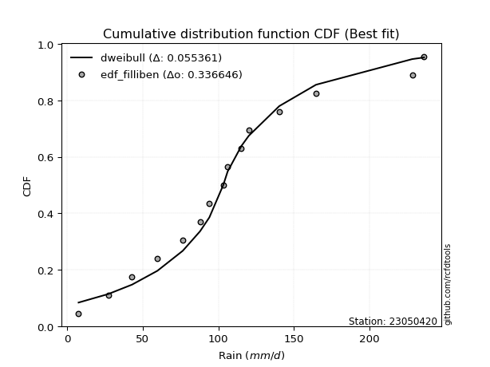</img>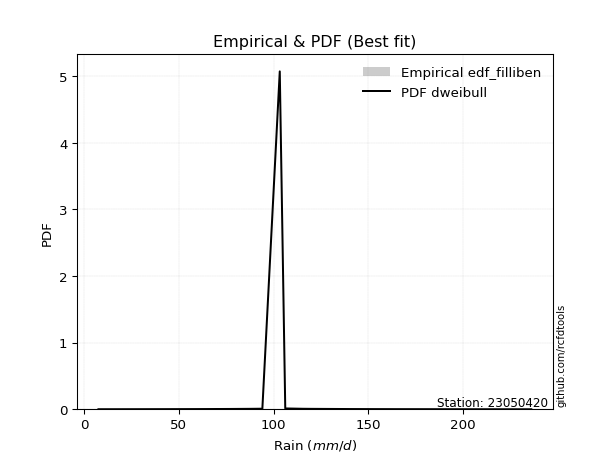</img>

</div>


### 10. Empirical - EDF Jenkinson (1977)

The Jenkinson formula in hydrology is an empirical plotting position formula used to estimate the non-exceedance probability _(P)_ or return period _(T)_ of a given ordered observation within a sample. It is a widely used method in the frequency analysis of extreme events such as floods and rainfall, as it provides a distribution-free way to plot data. _a≈0.31_ and _b≈0.38_ are constants derived to approximate the median of the probability distribution for the given rank.

<div align="center">


$P=(m-a)/(n+b)$


</div>


**10.1. Empirical values**

<div align="center">

|                | 0                   | 1                   | 2                   | 3                   | 4                  | 5                   | 6                   | 7             | 8                  | 9                  | 10                 | 11                | 12                 | 13                 | 14                 |
|:---------------|:--------------------|:--------------------|:--------------------|:--------------------|:-------------------|:--------------------|:--------------------|:--------------|:-------------------|:-------------------|:-------------------|:------------------|:-------------------|:-------------------|:-------------------|
| date           | 2019                | 2017                | 2015                | 2016                | 2012               | 2014                | 2008                | 2013          | 2009               | 2010               | 2011               | 2024              | 2007               | 2025               | 2018               |
| x              | 7.5                 | 27.1                | 42.9                | 59.7                | 76.5               | 87.9                | 94.1                | 103.3         | 106.2              | 115.3              | 120.2              | 140.4             | 164.7              | 228.4              | 236.20000000000002 |
| m              | 1                   | 2                   | 3                   | 4                   | 5                  | 6                   | 7                   | 8             | 9                  | 10                 | 11                 | 12                | 13                 | 14                 | 15                 |
| empirical_dist | edf_jenkinson       | edf_jenkinson       | edf_jenkinson       | edf_jenkinson       | edf_jenkinson      | edf_jenkinson       | edf_jenkinson       | edf_jenkinson | edf_jenkinson      | edf_jenkinson      | edf_jenkinson      | edf_jenkinson     | edf_jenkinson      | edf_jenkinson      | edf_jenkinson      |
| empirical      | 0.04486345903771131 | 0.10988296488946683 | 0.17490247074122237 | 0.23992197659297787 | 0.3049414824447334 | 0.36996098829648894 | 0.43498049414824447 | 0.5           | 0.5650195058517554 | 0.630039011703511  | 0.6950585175552665 | 0.760078023407022 | 0.8250975292587776 | 0.8901170351105331 | 0.9551365409622886 |
| empirical_tr   | 1.0469707283866576  | 1.1234477720964207  | 1.2119779353821907  | 1.3156544054747648  | 1.4387277829747427 | 1.587203302373581   | 1.7698504027617952  | 2.0           | 2.298953662182361  | 2.7029876977152894 | 3.279317697228144  | 4.168021680216801 | 5.717472118959106  | 9.100591715976325  | 22.289855072463734 |

</div>


**10.2. Kolmogorov-Smirnov fit test (sorted by Δ)**


<div align="center">

|                | 0                    | 1                   | 2                   | 3                  | 4                   | 5                   | 6                   | 7                   | 8                   | 9                   | 10                 | 11                  | 12                  | 13                  | 14                  | 15                  | 16                  | 17                  | 18                  | 19                    | 20                  | 21                  | 22                  | 23                  | 24                 | 25                  | 26                  | 27                  | 28                  | 29                  | 30                  | 31                  | 32                  | 33                 | 34                  | 35                 | 36                  | 37                  | 38                 | 39                 | 40                  | 41                  | 42                  | 43                  | 44                  | 45                  | 46                  | 47                  | 48                  | 49                  | 50                  | 51                 | 52                  | 53                  | 54                 | 55                  | 56                 | 57                 | 58                 | 59                  | 60                  | 61                  | 62                 | 63                  | 64                  | 65                  | 66                  | 67                  | 68                  | 69                  | 70                  | 71                  | 72                  | 73                  | 74                 | 75                 | 76                 | 77                  | 78                  | 79                  | 80                 | 81                  | 82                  | 83                 | 84                 | 85                 | 86                 | 87                 | 88                 | 89                 |
|:---------------|:---------------------|:--------------------|:--------------------|:-------------------|:--------------------|:--------------------|:--------------------|:--------------------|:--------------------|:--------------------|:-------------------|:--------------------|:--------------------|:--------------------|:--------------------|:--------------------|:--------------------|:--------------------|:--------------------|:----------------------|:--------------------|:--------------------|:--------------------|:--------------------|:-------------------|:--------------------|:--------------------|:--------------------|:--------------------|:--------------------|:--------------------|:--------------------|:--------------------|:-------------------|:--------------------|:-------------------|:--------------------|:--------------------|:-------------------|:-------------------|:--------------------|:--------------------|:--------------------|:--------------------|:--------------------|:--------------------|:--------------------|:--------------------|:--------------------|:--------------------|:--------------------|:-------------------|:--------------------|:--------------------|:-------------------|:--------------------|:-------------------|:-------------------|:-------------------|:--------------------|:--------------------|:--------------------|:-------------------|:--------------------|:--------------------|:--------------------|:--------------------|:--------------------|:--------------------|:--------------------|:--------------------|:--------------------|:--------------------|:--------------------|:-------------------|:-------------------|:-------------------|:--------------------|:--------------------|:--------------------|:-------------------|:--------------------|:--------------------|:-------------------|:-------------------|:-------------------|:-------------------|:-------------------|:-------------------|:-------------------|
| station        | 23050420             | 23050420            | 23050420            | 23050420           | 23050420            | 23050420            | 23050420            | 23050420            | 23050420            | 23050420            | 23050420           | 23050420            | 23050420            | 23050420            | 23050420            | 23050420            | 23050420            | 23050420            | 23050420            | 23050420              | 23050420            | 23050420            | 23050420            | 23050420            | 23050420           | 23050420            | 23050420            | 23050420            | 23050420            | 23050420            | 23050420            | 23050420            | 23050420            | 23050420           | 23050420            | 23050420           | 23050420            | 23050420            | 23050420           | 23050420           | 23050420            | 23050420            | 23050420            | 23050420            | 23050420            | 23050420            | 23050420            | 23050420            | 23050420            | 23050420            | 23050420            | 23050420           | 23050420            | 23050420            | 23050420           | 23050420            | 23050420           | 23050420           | 23050420           | 23050420            | 23050420            | 23050420            | 23050420           | 23050420            | 23050420            | 23050420            | 23050420            | 23050420            | 23050420            | 23050420            | 23050420            | 23050420            | 23050420            | 23050420            | 23050420           | 23050420           | 23050420           | 23050420            | 23050420            | 23050420            | 23050420           | 23050420            | 23050420            | 23050420           | 23050420           | 23050420           | 23050420           | 23050420           | 23050420           | 23050420           |
| empirical_dist | edf_jenkinson        | edf_jenkinson       | edf_jenkinson       | edf_jenkinson      | edf_jenkinson       | edf_jenkinson       | edf_jenkinson       | edf_jenkinson       | edf_jenkinson       | edf_jenkinson       | edf_jenkinson      | edf_jenkinson       | edf_jenkinson       | edf_jenkinson       | edf_jenkinson       | edf_jenkinson       | edf_jenkinson       | edf_jenkinson       | edf_jenkinson       | edf_jenkinson         | edf_jenkinson       | edf_jenkinson       | edf_jenkinson       | edf_jenkinson       | edf_jenkinson      | edf_jenkinson       | edf_jenkinson       | edf_jenkinson       | edf_jenkinson       | edf_jenkinson       | edf_jenkinson       | edf_jenkinson       | edf_jenkinson       | edf_jenkinson      | edf_jenkinson       | edf_jenkinson      | edf_jenkinson       | edf_jenkinson       | edf_jenkinson      | edf_jenkinson      | edf_jenkinson       | edf_jenkinson       | edf_jenkinson       | edf_jenkinson       | edf_jenkinson       | edf_jenkinson       | edf_jenkinson       | edf_jenkinson       | edf_jenkinson       | edf_jenkinson       | edf_jenkinson       | edf_jenkinson      | edf_jenkinson       | edf_jenkinson       | edf_jenkinson      | edf_jenkinson       | edf_jenkinson      | edf_jenkinson      | edf_jenkinson      | edf_jenkinson       | edf_jenkinson       | edf_jenkinson       | edf_jenkinson      | edf_jenkinson       | edf_jenkinson       | edf_jenkinson       | edf_jenkinson       | edf_jenkinson       | edf_jenkinson       | edf_jenkinson       | edf_jenkinson       | edf_jenkinson       | edf_jenkinson       | edf_jenkinson       | edf_jenkinson      | edf_jenkinson      | edf_jenkinson      | edf_jenkinson       | edf_jenkinson       | edf_jenkinson       | edf_jenkinson      | edf_jenkinson       | edf_jenkinson       | edf_jenkinson      | edf_jenkinson      | edf_jenkinson      | edf_jenkinson      | edf_jenkinson      | edf_jenkinson      | edf_jenkinson      |
| p_dist         | fisk                 | exponnorm           | betaprime           | johnsonsu          | invgamma            | mielke              | f                   | gamma               | chi2                | erlang              | logmielke          | loggenlogistic      | gumbel_r            | logcrystalball      | nct                 | genlogistic         | laplace_asymmetric  | weibull_min         | invweibull          | loglaplace_asymmetric | kstwobign           | rayleigh            | laplace             | pearson3            | rice               | logloggamma         | moyal               | maxwell             | loggumbel_l         | loggompertz         | halfnorm            | logjohnsonsu        | logfisk             | hypsecant          | logpearson3         | lognakagami        | logistic            | halflogistic        | norm               | crystalball        | t                   | nakagami            | lognct              | logt                | lognorm             | lognorm             | loglognorm          | logexponnorm        | logrice             | logfatiguelife      | loglogistic         | loghypsecant       | logf                | logbetaprime        | logalpha           | logncf              | loggamma           | loggamma           | logerlang          | loglaplace          | wald                | loginvgauss         | gumbel_l           | loginvgamma         | logmaxwell          | genexpon            | expon               | loginvweibull       | lograyleigh         | loggumbel_r         | logkstwobign        | invgauss            | loghalfnorm         | gibrat              | logmoyal           | loghalflogistic    | loggenexpon        | ncf                 | logtruncnorm        | logwald             | logexpon           | loggibrat           | alpha               | logweibull_min     | pareto             | logpareto          | truncnorm          | fatiguelife        | logchi2            | gompertz           |
| delta          | 0.056419062977426604 | 0.06011781134378402 | 0.06282158560801132 | 0.0632387867973968 | 0.06396009032492789 | 0.06417110430137352 | 0.06432556713376186 | 0.06437848154239018 | 0.06437849141981455 | 0.06437857594206142 | 0.0644106145411007 | 0.06449845579827418 | 0.06499844514687392 | 0.06525314247471603 | 0.06567098893115564 | 0.06662114349398812 | 0.06790854463747553 | 0.06808944621968938 | 0.06923676884686042 | 0.07335277639185123   | 0.07417850080125299 | 0.07772231166396437 | 0.07779854709951062 | 0.07901244681035746 | 0.0798103550368986 | 0.08424331816752573 | 0.08616925069763304 | 0.08658452063329836 | 0.08718269958993985 | 0.08772953289679541 | 0.08999695395762058 | 0.09103244272515754 | 0.09528201445223744 | 0.0954062391087176 | 0.09780604372504909 | 0.1025092317446454 | 0.10419106123323518 | 0.10988296488946683 | 0.1147658138107529 | 0.1147658232832014 | 0.11477684256815268 | 0.14706600206437248 | 0.15616679232779407 | 0.15619125241512366 | 0.15627646113610627 | 0.15627646113610627 | 0.15627780178093198 | 0.15627790251696294 | 0.15628497156830912 | 0.15704464688284714 | 0.15984743003699708 | 0.1628880574987095 | 0.16304857506964854 | 0.16514079807629717 | 0.1671782923316581 | 0.16839374430621268 | 0.1699112059567382 | 0.1699112059567382 | 0.1730034167028131 | 0.17447710800039773 | 0.17490247074122237 | 0.17777332850346972 | 0.1778839651065648 | 0.17909610954683458 | 0.19029526906056815 | 0.19330794682569485 | 0.19396741564904907 | 0.19509703536228107 | 0.20203702024338277 | 0.22693568649724527 | 0.23353448026336476 | 0.23402420319201356 | 0.23512771024028123 | 0.23983939122655043 | 0.2524128374492862 | 0.2572213763165182 | 0.2674983183440852 | 0.28161780638040246 | 0.31928350554519924 | 0.32315173853678003 | 0.3407838101538605 | 0.35001014466798597 | 0.41782390905701416 | 0.5039449859053005 | 0.5083574105140574 | 0.5308896552039363 | 0.5545989265584732 | 0.5652887656476373 | 0.5944167398069556 | 0.815401129260248  |
| deltao         | 0.3366456264050002   | 0.3366456264050002  | 0.3366456264050002  | 0.3366456264050002 | 0.3366456264050002  | 0.3366456264050002  | 0.3366456264050002  | 0.3366456264050002  | 0.3366456264050002  | 0.3366456264050002  | 0.3366456264050002 | 0.3366456264050002  | 0.3366456264050002  | 0.3366456264050002  | 0.3366456264050002  | 0.3366456264050002  | 0.3366456264050002  | 0.3366456264050002  | 0.3366456264050002  | 0.3366456264050002    | 0.3366456264050002  | 0.3366456264050002  | 0.3366456264050002  | 0.3366456264050002  | 0.3366456264050002 | 0.3366456264050002  | 0.3366456264050002  | 0.3366456264050002  | 0.3366456264050002  | 0.3366456264050002  | 0.3366456264050002  | 0.3366456264050002  | 0.3366456264050002  | 0.3366456264050002 | 0.3366456264050002  | 0.3366456264050002 | 0.3366456264050002  | 0.3366456264050002  | 0.3366456264050002 | 0.3366456264050002 | 0.3366456264050002  | 0.3366456264050002  | 0.3366456264050002  | 0.3366456264050002  | 0.3366456264050002  | 0.3366456264050002  | 0.3366456264050002  | 0.3366456264050002  | 0.3366456264050002  | 0.3366456264050002  | 0.3366456264050002  | 0.3366456264050002 | 0.3366456264050002  | 0.3366456264050002  | 0.3366456264050002 | 0.3366456264050002  | 0.3366456264050002 | 0.3366456264050002 | 0.3366456264050002 | 0.3366456264050002  | 0.3366456264050002  | 0.3366456264050002  | 0.3366456264050002 | 0.3366456264050002  | 0.3366456264050002  | 0.3366456264050002  | 0.3366456264050002  | 0.3366456264050002  | 0.3366456264050002  | 0.3366456264050002  | 0.3366456264050002  | 0.3366456264050002  | 0.3366456264050002  | 0.3366456264050002  | 0.3366456264050002 | 0.3366456264050002 | 0.3366456264050002 | 0.3366456264050002  | 0.3366456264050002  | 0.3366456264050002  | 0.3366456264050002 | 0.3366456264050002  | 0.3366456264050002  | 0.3366456264050002 | 0.3366456264050002 | 0.3366456264050002 | 0.3366456264050002 | 0.3366456264050002 | 0.3366456264050002 | 0.3366456264050002 |
| eval           | Δo > Δ               | Δo > Δ              | Δo > Δ              | Δo > Δ             | Δo > Δ              | Δo > Δ              | Δo > Δ              | Δo > Δ              | Δo > Δ              | Δo > Δ              | Δo > Δ             | Δo > Δ              | Δo > Δ              | Δo > Δ              | Δo > Δ              | Δo > Δ              | Δo > Δ              | Δo > Δ              | Δo > Δ              | Δo > Δ                | Δo > Δ              | Δo > Δ              | Δo > Δ              | Δo > Δ              | Δo > Δ             | Δo > Δ              | Δo > Δ              | Δo > Δ              | Δo > Δ              | Δo > Δ              | Δo > Δ              | Δo > Δ              | Δo > Δ              | Δo > Δ             | Δo > Δ              | Δo > Δ             | Δo > Δ              | Δo > Δ              | Δo > Δ             | Δo > Δ             | Δo > Δ              | Δo > Δ              | Δo > Δ              | Δo > Δ              | Δo > Δ              | Δo > Δ              | Δo > Δ              | Δo > Δ              | Δo > Δ              | Δo > Δ              | Δo > Δ              | Δo > Δ             | Δo > Δ              | Δo > Δ              | Δo > Δ             | Δo > Δ              | Δo > Δ             | Δo > Δ             | Δo > Δ             | Δo > Δ              | Δo > Δ              | Δo > Δ              | Δo > Δ             | Δo > Δ              | Δo > Δ              | Δo > Δ              | Δo > Δ              | Δo > Δ              | Δo > Δ              | Δo > Δ              | Δo > Δ              | Δo > Δ              | Δo > Δ              | Δo > Δ              | Δo > Δ             | Δo > Δ             | Δo > Δ             | Δo > Δ              | Δo > Δ              | Δo > Δ              | Δo <= Δ            | Δo <= Δ             | Δo <= Δ             | Δo <= Δ            | Δo <= Δ            | Δo <= Δ            | Δo <= Δ            | Δo <= Δ            | Δo <= Δ            | Δo <= Δ            |
| fit            | 1                    | 1                   | 1                   | 1                  | 1                   | 1                   | 1                   | 1                   | 1                   | 1                   | 1                  | 1                   | 1                   | 1                   | 1                   | 1                   | 1                   | 1                   | 1                   | 1                     | 1                   | 1                   | 1                   | 1                   | 1                  | 1                   | 1                   | 1                   | 1                   | 1                   | 1                   | 1                   | 1                   | 1                  | 1                   | 1                  | 1                   | 1                   | 1                  | 1                  | 1                   | 1                   | 1                   | 1                   | 1                   | 1                   | 1                   | 1                   | 1                   | 1                   | 1                   | 1                  | 1                   | 1                   | 1                  | 1                   | 1                  | 1                  | 1                  | 1                   | 1                   | 1                   | 1                  | 1                   | 1                   | 1                   | 1                   | 1                   | 1                   | 1                   | 1                   | 1                   | 1                   | 1                   | 1                  | 1                  | 1                  | 1                   | 1                   | 1                   | 0                  | 0                   | 0                   | 0                  | 0                  | 0                  | 0                  | 0                  | 0                  | 0                  |
| n              | 15                   | 15                  | 15                  | 15                 | 15                  | 15                  | 15                  | 15                  | 15                  | 15                  | 15                 | 15                  | 15                  | 15                  | 15                  | 15                  | 15                  | 15                  | 15                  | 15                    | 15                  | 15                  | 15                  | 15                  | 15                 | 15                  | 15                  | 15                  | 15                  | 15                  | 15                  | 15                  | 15                  | 15                 | 15                  | 15                 | 15                  | 15                  | 15                 | 15                 | 15                  | 15                  | 15                  | 15                  | 15                  | 15                  | 15                  | 15                  | 15                  | 15                  | 15                  | 15                 | 15                  | 15                  | 15                 | 15                  | 15                 | 15                 | 15                 | 15                  | 15                  | 15                  | 15                 | 15                  | 15                  | 15                  | 15                  | 15                  | 15                  | 15                  | 15                  | 15                  | 15                  | 15                  | 15                 | 15                 | 15                 | 15                  | 15                  | 15                  | 15                 | 15                  | 15                  | 15                 | 15                 | 15                 | 15                 | 15                 | 15                 | 15                 |
| best_fit       | 1                    | 0                   | 0                   | 0                  | 0                   | 0                   | 0                   | 0                   | 0                   | 0                   | 0                  | 0                   | 0                   | 0                   | 0                   | 0                   | 0                   | 0                   | 0                   | 0                     | 0                   | 0                   | 0                   | 0                   | 0                  | 0                   | 0                   | 0                   | 0                   | 0                   | 0                   | 0                   | 0                   | 0                  | 0                   | 0                  | 0                   | 0                   | 0                  | 0                  | 0                   | 0                   | 0                   | 0                   | 0                   | 0                   | 0                   | 0                   | 0                   | 0                   | 0                   | 0                  | 0                   | 0                   | 0                  | 0                   | 0                  | 0                  | 0                  | 0                   | 0                   | 0                   | 0                  | 0                   | 0                   | 0                   | 0                   | 0                   | 0                   | 0                   | 0                   | 0                   | 0                   | 0                   | 0                  | 0                  | 0                  | 0                   | 0                   | 0                   | 0                  | 0                   | 0                   | 0                  | 0                  | 0                  | 0                  | 0                  | 0                  | 0                  |
| best_fit_sort  | 1                    | 2                   | 3                   | 4                  | 5                   | 6                   | 7                   | 8                   | 9                   | 10                  | 11                 | 12                  | 13                  | 14                  | 15                  | 16                  | 17                  | 18                  | 19                  | 20                    | 21                  | 22                  | 23                  | 24                  | 25                 | 26                  | 27                  | 28                  | 29                  | 30                  | 31                  | 32                  | 33                  | 34                 | 35                  | 36                 | 37                  | 38                  | 39                 | 40                 | 41                  | 42                  | 43                  | 44                  | 45                  | 46                  | 47                  | 48                  | 49                  | 50                  | 51                  | 52                 | 53                  | 54                  | 55                 | 56                  | 57                 | 58                 | 59                 | 60                  | 61                  | 62                  | 63                 | 64                  | 65                  | 66                  | 67                  | 68                  | 69                  | 70                  | 71                  | 72                  | 73                  | 74                  | 75                 | 76                 | 77                 | 78                  | 79                  | 80                  | 81                 | 82                  | 83                  | 84                 | 85                 | 86                 | 87                 | 88                 | 89                 | 90                 |

</div>


<div align="center">

</img>

</div>


**10.3. Best fit**

<div align="center">

|   id |   station | empirical_dist   | p_dist   |     delta |   deltao | eval   |   fit |   n |   best_fit |   best_fit_sort |
|-----:|----------:|:-----------------|:---------|----------:|---------:|:-------|------:|----:|-----------:|----------------:|
|    0 |  23050420 | edf_jenkinson    | fisk     | 0.0564191 | 0.336646 | Δo > Δ |     1 |  15 |          1 |               1 |

</div>


<div align="center">

</img>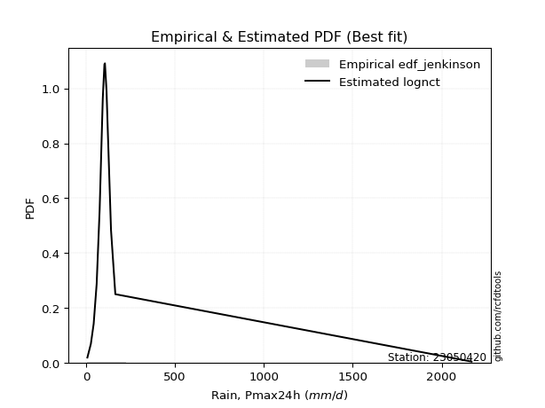</img>

</div>


### 11. Empirical - EDF Cunnane (1978)

Cunnane´s work in statistical hydrology has focused on the performance and evaluation of different probability distributions (such as GEV, Gumbel, Lognormal) for flood frequency estimation. _b_ is a constant, typically set to 0.4.

<div align="center">


$P=(m-b)/(n+1-2b)$


</div>


**11.1. Empirical values**

<div align="center">

|                | 0                    | 1                   | 2                   | 3                  | 4                  | 5                  | 6                  | 7           | 8                  | 9                 | 10                 | 11                 | 12                 | 13                 | 14                 |
|:---------------|:---------------------|:--------------------|:--------------------|:-------------------|:-------------------|:-------------------|:-------------------|:------------|:-------------------|:------------------|:-------------------|:-------------------|:-------------------|:-------------------|:-------------------|
| date           | 2019                 | 2017                | 2015                | 2016               | 2012               | 2014               | 2008               | 2013        | 2009               | 2010              | 2011               | 2024               | 2007               | 2025               | 2018               |
| x              | 7.5                  | 27.1                | 42.9                | 59.7               | 76.5               | 87.9               | 94.1               | 103.3       | 106.2              | 115.3             | 120.2              | 140.4              | 164.7              | 228.4              | 236.20000000000002 |
| m              | 1                    | 2                   | 3                   | 4                  | 5                  | 6                  | 7                  | 8           | 9                  | 10                | 11                 | 12                 | 13                 | 14                 | 15                 |
| empirical_dist | edf_cunnane          | edf_cunnane         | edf_cunnane         | edf_cunnane        | edf_cunnane        | edf_cunnane        | edf_cunnane        | edf_cunnane | edf_cunnane        | edf_cunnane       | edf_cunnane        | edf_cunnane        | edf_cunnane        | edf_cunnane        | edf_cunnane        |
| empirical      | 0.039473684210526314 | 0.10526315789473685 | 0.17105263157894737 | 0.2368421052631579 | 0.3026315789473684 | 0.3684210526315789 | 0.4342105263157895 | 0.5         | 0.5657894736842105 | 0.631578947368421 | 0.6973684210526316 | 0.7631578947368421 | 0.8289473684210527 | 0.8947368421052632 | 0.9605263157894737 |
| empirical_tr   | 1.0410958904109588   | 1.1176470588235294  | 1.2063492063492063  | 1.310344827586207  | 1.4339622641509433 | 1.5833333333333335 | 1.7674418604651163 | 2.0         | 2.3030303030303028 | 2.714285714285714 | 3.304347826086957  | 4.222222222222223  | 5.846153846153847  | 9.5                | 25.333333333333325 |

</div>


**11.2. Kolmogorov-Smirnov fit test (sorted by Δ)**


<div align="center">

|                | 0                    | 1                   | 2                   | 3                   | 4                   | 5                   | 6                   | 7                   | 8                   | 9                   | 10                 | 11                  | 12                  | 13                  | 14                  | 15                  | 16                  | 17                  | 18                  | 19                    | 20                 | 21                 | 22                  | 23                  | 24                  | 25                  | 26                  | 27                  | 28                  | 29                  | 30                  | 31                  | 32                  | 33                  | 34                  | 35                  | 36                  | 37                  | 38                  | 39                  | 40                  | 41                 | 42                  | 43                  | 44                 | 45                  | 46                  | 47                  | 48                  | 49                 | 50                 | 51                 | 52                  | 53                  | 54                  | 55                  | 56                  | 57                  | 58                  | 59                 | 60                  | 61                 | 62                  | 63                  | 64                  | 65                  | 66                  | 67                  | 68                  | 69                  | 70                  | 71                  | 72                  | 73                 | 74                  | 75                 | 76                 | 77                 | 78                 | 79                  | 80                 | 81                 | 82                  | 83                 | 84                 | 85                 | 86                 | 87                 | 88                 | 89                 |
|:---------------|:---------------------|:--------------------|:--------------------|:--------------------|:--------------------|:--------------------|:--------------------|:--------------------|:--------------------|:--------------------|:-------------------|:--------------------|:--------------------|:--------------------|:--------------------|:--------------------|:--------------------|:--------------------|:--------------------|:----------------------|:-------------------|:-------------------|:--------------------|:--------------------|:--------------------|:--------------------|:--------------------|:--------------------|:--------------------|:--------------------|:--------------------|:--------------------|:--------------------|:--------------------|:--------------------|:--------------------|:--------------------|:--------------------|:--------------------|:--------------------|:--------------------|:-------------------|:--------------------|:--------------------|:-------------------|:--------------------|:--------------------|:--------------------|:--------------------|:-------------------|:-------------------|:-------------------|:--------------------|:--------------------|:--------------------|:--------------------|:--------------------|:--------------------|:--------------------|:-------------------|:--------------------|:-------------------|:--------------------|:--------------------|:--------------------|:--------------------|:--------------------|:--------------------|:--------------------|:--------------------|:--------------------|:--------------------|:--------------------|:-------------------|:--------------------|:-------------------|:-------------------|:-------------------|:-------------------|:--------------------|:-------------------|:-------------------|:--------------------|:-------------------|:-------------------|:-------------------|:-------------------|:-------------------|:-------------------|:-------------------|
| station        | 23050420             | 23050420            | 23050420            | 23050420            | 23050420            | 23050420            | 23050420            | 23050420            | 23050420            | 23050420            | 23050420           | 23050420            | 23050420            | 23050420            | 23050420            | 23050420            | 23050420            | 23050420            | 23050420            | 23050420              | 23050420           | 23050420           | 23050420            | 23050420            | 23050420            | 23050420            | 23050420            | 23050420            | 23050420            | 23050420            | 23050420            | 23050420            | 23050420            | 23050420            | 23050420            | 23050420            | 23050420            | 23050420            | 23050420            | 23050420            | 23050420            | 23050420           | 23050420            | 23050420            | 23050420           | 23050420            | 23050420            | 23050420            | 23050420            | 23050420           | 23050420           | 23050420           | 23050420            | 23050420            | 23050420            | 23050420            | 23050420            | 23050420            | 23050420            | 23050420           | 23050420            | 23050420           | 23050420            | 23050420            | 23050420            | 23050420            | 23050420            | 23050420            | 23050420            | 23050420            | 23050420            | 23050420            | 23050420            | 23050420           | 23050420            | 23050420           | 23050420           | 23050420           | 23050420           | 23050420            | 23050420           | 23050420           | 23050420            | 23050420           | 23050420           | 23050420           | 23050420           | 23050420           | 23050420           | 23050420           |
| empirical_dist | edf_cunnane          | edf_cunnane         | edf_cunnane         | edf_cunnane         | edf_cunnane         | edf_cunnane         | edf_cunnane         | edf_cunnane         | edf_cunnane         | edf_cunnane         | edf_cunnane        | edf_cunnane         | edf_cunnane         | edf_cunnane         | edf_cunnane         | edf_cunnane         | edf_cunnane         | edf_cunnane         | edf_cunnane         | edf_cunnane           | edf_cunnane        | edf_cunnane        | edf_cunnane         | edf_cunnane         | edf_cunnane         | edf_cunnane         | edf_cunnane         | edf_cunnane         | edf_cunnane         | edf_cunnane         | edf_cunnane         | edf_cunnane         | edf_cunnane         | edf_cunnane         | edf_cunnane         | edf_cunnane         | edf_cunnane         | edf_cunnane         | edf_cunnane         | edf_cunnane         | edf_cunnane         | edf_cunnane        | edf_cunnane         | edf_cunnane         | edf_cunnane        | edf_cunnane         | edf_cunnane         | edf_cunnane         | edf_cunnane         | edf_cunnane        | edf_cunnane        | edf_cunnane        | edf_cunnane         | edf_cunnane         | edf_cunnane         | edf_cunnane         | edf_cunnane         | edf_cunnane         | edf_cunnane         | edf_cunnane        | edf_cunnane         | edf_cunnane        | edf_cunnane         | edf_cunnane         | edf_cunnane         | edf_cunnane         | edf_cunnane         | edf_cunnane         | edf_cunnane         | edf_cunnane         | edf_cunnane         | edf_cunnane         | edf_cunnane         | edf_cunnane        | edf_cunnane         | edf_cunnane        | edf_cunnane        | edf_cunnane        | edf_cunnane        | edf_cunnane         | edf_cunnane        | edf_cunnane        | edf_cunnane         | edf_cunnane        | edf_cunnane        | edf_cunnane        | edf_cunnane        | edf_cunnane        | edf_cunnane        | edf_cunnane        |
| p_dist         | fisk                 | exponnorm           | logcrystalball      | nct                 | betaprime           | johnsonsu           | f                   | gamma               | chi2                | erlang              | logmielke          | invgamma            | mielke              | gumbel_r            | loggenlogistic      | genlogistic         | laplace_asymmetric  | weibull_min         | invweibull          | loglaplace_asymmetric | kstwobign          | laplace            | rayleigh            | pearson3            | rice                | logloggamma         | moyal               | loggumbel_l         | maxwell             | loggompertz         | halfnorm            | logjohnsonsu        | logfisk             | hypsecant           | lognakagami         | logpearson3         | halflogistic        | logistic            | norm                | crystalball         | t                   | nakagami           | lognct              | logt                | logrice            | lognorm             | lognorm             | logexponnorm        | loglognorm          | logfatiguelife     | loglogistic        | loghypsecant       | logf                | logbetaprime        | logalpha            | logncf              | wald                | loggamma            | loggamma            | logerlang          | loglaplace          | loginvgauss        | gumbel_l            | loginvgamma         | logmaxwell          | genexpon            | expon               | loginvweibull       | lograyleigh         | loggumbel_r         | logkstwobign        | invgauss            | gibrat              | loghalfnorm        | logmoyal            | loghalflogistic    | loggenexpon        | ncf                | logtruncnorm       | logwald             | logexpon           | loggibrat          | alpha               | logweibull_min     | pareto             | logpareto          | truncnorm          | fatiguelife        | logchi2            | gompertz           |
| delta          | 0.056045437392135966 | 0.05651173581855162 | 0.06208897833459809 | 0.06423125224842696 | 0.06513148910537647 | 0.06554869029476196 | 0.06586550279867187 | 0.06591841720730018 | 0.06591842708472456 | 0.06591851160697143 | 0.0661400709304647 | 0.06626999382229304 | 0.06648100779873867 | 0.06653838081178393 | 0.06680835929563933 | 0.06816107915889813 | 0.06829837600153399 | 0.07039934971705453 | 0.07077670451177043 | 0.07489271205676123   | 0.075718436466163  | 0.0785685149319657 | 0.08003221516132952 | 0.08132235030772261 | 0.08212025853426375 | 0.08655322166489088 | 0.08770918636254305 | 0.08872263525484986 | 0.08889442413066351 | 0.08926946856170542 | 0.09153688962253059 | 0.09334234622252269 | 0.09682195011714745 | 0.09771614260608275 | 0.09788942474991541 | 0.10011594722241424 | 0.10526315789473685 | 0.10650096473060033 | 0.11707571730811805 | 0.11707572678056655 | 0.11708674606551783 | 0.1486059377292825 | 0.15820189530062756 | 0.15833294000845038 | 0.158427831541663  | 0.15843719657326083 | 0.15843719657326083 | 0.15843838889321138 | 0.15843886599137463 | 0.1592858148898746 | 0.1613873657019071 | 0.1644279931636195 | 0.16535847856701352 | 0.16745070157366215 | 0.16948819582902308 | 0.17070364780357766 | 0.17105263157894737 | 0.17222110945410318 | 0.17222110945410318 | 0.1753133202001781 | 0.17601704366530774 | 0.1800832320008347 | 0.18019386860392994 | 0.18140601304419957 | 0.19260517255793314 | 0.19561785032305984 | 0.19627731914641405 | 0.19740693885964605 | 0.20434692374074775 | 0.22847562216215528 | 0.23584438376072975 | 0.23633410668937854 | 0.23675951989673047 | 0.2374376137376462 | 0.25395277311419623 | 0.2595312798138832 | 0.2698082218414502 | 0.2846976777102224 | 0.3215934090425642 | 0.32469167420169004 | 0.3446336493161355 | 0.351550080332896  | 0.42013381255437915 | 0.5085647929000304 | 0.5129772175087873 | 0.5355094621986662 | 0.5561388622233833 | 0.5699085726423673 | 0.5982665789692306 | 0.8192509684225231 |
| deltao         | 0.3366456264050002   | 0.3366456264050002  | 0.3366456264050002  | 0.3366456264050002  | 0.3366456264050002  | 0.3366456264050002  | 0.3366456264050002  | 0.3366456264050002  | 0.3366456264050002  | 0.3366456264050002  | 0.3366456264050002 | 0.3366456264050002  | 0.3366456264050002  | 0.3366456264050002  | 0.3366456264050002  | 0.3366456264050002  | 0.3366456264050002  | 0.3366456264050002  | 0.3366456264050002  | 0.3366456264050002    | 0.3366456264050002 | 0.3366456264050002 | 0.3366456264050002  | 0.3366456264050002  | 0.3366456264050002  | 0.3366456264050002  | 0.3366456264050002  | 0.3366456264050002  | 0.3366456264050002  | 0.3366456264050002  | 0.3366456264050002  | 0.3366456264050002  | 0.3366456264050002  | 0.3366456264050002  | 0.3366456264050002  | 0.3366456264050002  | 0.3366456264050002  | 0.3366456264050002  | 0.3366456264050002  | 0.3366456264050002  | 0.3366456264050002  | 0.3366456264050002 | 0.3366456264050002  | 0.3366456264050002  | 0.3366456264050002 | 0.3366456264050002  | 0.3366456264050002  | 0.3366456264050002  | 0.3366456264050002  | 0.3366456264050002 | 0.3366456264050002 | 0.3366456264050002 | 0.3366456264050002  | 0.3366456264050002  | 0.3366456264050002  | 0.3366456264050002  | 0.3366456264050002  | 0.3366456264050002  | 0.3366456264050002  | 0.3366456264050002 | 0.3366456264050002  | 0.3366456264050002 | 0.3366456264050002  | 0.3366456264050002  | 0.3366456264050002  | 0.3366456264050002  | 0.3366456264050002  | 0.3366456264050002  | 0.3366456264050002  | 0.3366456264050002  | 0.3366456264050002  | 0.3366456264050002  | 0.3366456264050002  | 0.3366456264050002 | 0.3366456264050002  | 0.3366456264050002 | 0.3366456264050002 | 0.3366456264050002 | 0.3366456264050002 | 0.3366456264050002  | 0.3366456264050002 | 0.3366456264050002 | 0.3366456264050002  | 0.3366456264050002 | 0.3366456264050002 | 0.3366456264050002 | 0.3366456264050002 | 0.3366456264050002 | 0.3366456264050002 | 0.3366456264050002 |
| eval           | Δo > Δ               | Δo > Δ              | Δo > Δ              | Δo > Δ              | Δo > Δ              | Δo > Δ              | Δo > Δ              | Δo > Δ              | Δo > Δ              | Δo > Δ              | Δo > Δ             | Δo > Δ              | Δo > Δ              | Δo > Δ              | Δo > Δ              | Δo > Δ              | Δo > Δ              | Δo > Δ              | Δo > Δ              | Δo > Δ                | Δo > Δ             | Δo > Δ             | Δo > Δ              | Δo > Δ              | Δo > Δ              | Δo > Δ              | Δo > Δ              | Δo > Δ              | Δo > Δ              | Δo > Δ              | Δo > Δ              | Δo > Δ              | Δo > Δ              | Δo > Δ              | Δo > Δ              | Δo > Δ              | Δo > Δ              | Δo > Δ              | Δo > Δ              | Δo > Δ              | Δo > Δ              | Δo > Δ             | Δo > Δ              | Δo > Δ              | Δo > Δ             | Δo > Δ              | Δo > Δ              | Δo > Δ              | Δo > Δ              | Δo > Δ             | Δo > Δ             | Δo > Δ             | Δo > Δ              | Δo > Δ              | Δo > Δ              | Δo > Δ              | Δo > Δ              | Δo > Δ              | Δo > Δ              | Δo > Δ             | Δo > Δ              | Δo > Δ             | Δo > Δ              | Δo > Δ              | Δo > Δ              | Δo > Δ              | Δo > Δ              | Δo > Δ              | Δo > Δ              | Δo > Δ              | Δo > Δ              | Δo > Δ              | Δo > Δ              | Δo > Δ             | Δo > Δ              | Δo > Δ             | Δo > Δ             | Δo > Δ             | Δo > Δ             | Δo > Δ              | Δo <= Δ            | Δo <= Δ            | Δo <= Δ             | Δo <= Δ            | Δo <= Δ            | Δo <= Δ            | Δo <= Δ            | Δo <= Δ            | Δo <= Δ            | Δo <= Δ            |
| fit            | 1                    | 1                   | 1                   | 1                   | 1                   | 1                   | 1                   | 1                   | 1                   | 1                   | 1                  | 1                   | 1                   | 1                   | 1                   | 1                   | 1                   | 1                   | 1                   | 1                     | 1                  | 1                  | 1                   | 1                   | 1                   | 1                   | 1                   | 1                   | 1                   | 1                   | 1                   | 1                   | 1                   | 1                   | 1                   | 1                   | 1                   | 1                   | 1                   | 1                   | 1                   | 1                  | 1                   | 1                   | 1                  | 1                   | 1                   | 1                   | 1                   | 1                  | 1                  | 1                  | 1                   | 1                   | 1                   | 1                   | 1                   | 1                   | 1                   | 1                  | 1                   | 1                  | 1                   | 1                   | 1                   | 1                   | 1                   | 1                   | 1                   | 1                   | 1                   | 1                   | 1                   | 1                  | 1                   | 1                  | 1                  | 1                  | 1                  | 1                   | 0                  | 0                  | 0                   | 0                  | 0                  | 0                  | 0                  | 0                  | 0                  | 0                  |
| n              | 15                   | 15                  | 15                  | 15                  | 15                  | 15                  | 15                  | 15                  | 15                  | 15                  | 15                 | 15                  | 15                  | 15                  | 15                  | 15                  | 15                  | 15                  | 15                  | 15                    | 15                 | 15                 | 15                  | 15                  | 15                  | 15                  | 15                  | 15                  | 15                  | 15                  | 15                  | 15                  | 15                  | 15                  | 15                  | 15                  | 15                  | 15                  | 15                  | 15                  | 15                  | 15                 | 15                  | 15                  | 15                 | 15                  | 15                  | 15                  | 15                  | 15                 | 15                 | 15                 | 15                  | 15                  | 15                  | 15                  | 15                  | 15                  | 15                  | 15                 | 15                  | 15                 | 15                  | 15                  | 15                  | 15                  | 15                  | 15                  | 15                  | 15                  | 15                  | 15                  | 15                  | 15                 | 15                  | 15                 | 15                 | 15                 | 15                 | 15                  | 15                 | 15                 | 15                  | 15                 | 15                 | 15                 | 15                 | 15                 | 15                 | 15                 |
| best_fit       | 1                    | 0                   | 0                   | 0                   | 0                   | 0                   | 0                   | 0                   | 0                   | 0                   | 0                  | 0                   | 0                   | 0                   | 0                   | 0                   | 0                   | 0                   | 0                   | 0                     | 0                  | 0                  | 0                   | 0                   | 0                   | 0                   | 0                   | 0                   | 0                   | 0                   | 0                   | 0                   | 0                   | 0                   | 0                   | 0                   | 0                   | 0                   | 0                   | 0                   | 0                   | 0                  | 0                   | 0                   | 0                  | 0                   | 0                   | 0                   | 0                   | 0                  | 0                  | 0                  | 0                   | 0                   | 0                   | 0                   | 0                   | 0                   | 0                   | 0                  | 0                   | 0                  | 0                   | 0                   | 0                   | 0                   | 0                   | 0                   | 0                   | 0                   | 0                   | 0                   | 0                   | 0                  | 0                   | 0                  | 0                  | 0                  | 0                  | 0                   | 0                  | 0                  | 0                   | 0                  | 0                  | 0                  | 0                  | 0                  | 0                  | 0                  |
| best_fit_sort  | 1                    | 2                   | 3                   | 4                   | 5                   | 6                   | 7                   | 8                   | 9                   | 10                  | 11                 | 12                  | 13                  | 14                  | 15                  | 16                  | 17                  | 18                  | 19                  | 20                    | 21                 | 22                 | 23                  | 24                  | 25                  | 26                  | 27                  | 28                  | 29                  | 30                  | 31                  | 32                  | 33                  | 34                  | 35                  | 36                  | 37                  | 38                  | 39                  | 40                  | 41                  | 42                 | 43                  | 44                  | 45                 | 46                  | 47                  | 48                  | 49                  | 50                 | 51                 | 52                 | 53                  | 54                  | 55                  | 56                  | 57                  | 58                  | 59                  | 60                 | 61                  | 62                 | 63                  | 64                  | 65                  | 66                  | 67                  | 68                  | 69                  | 70                  | 71                  | 72                  | 73                  | 74                 | 75                  | 76                 | 77                 | 78                 | 79                 | 80                  | 81                 | 82                 | 83                  | 84                 | 85                 | 86                 | 87                 | 88                 | 89                 | 90                 |

</div>


<div align="center">

</img>

</div>


**11.3. Best fit**

<div align="center">

|   id |   station | empirical_dist   | p_dist   |     delta |   deltao | eval   |   fit |   n |   best_fit |   best_fit_sort |
|-----:|----------:|:-----------------|:---------|----------:|---------:|:-------|------:|----:|-----------:|----------------:|
|    0 |  23050420 | edf_cunnane      | fisk     | 0.0560454 | 0.336646 | Δo > Δ |     1 |  15 |          1 |               1 |

</div>


<div align="center">

</img></img>

</div>


### 12. Empirical - EDF Adamowski (1981)

The Adamowski formula in hydrology refers to a specific plotting position formula used for estimating the non-parametric empirical distribution of hydrological events (like flood peaks) to calculate their return periods. This formula provides an alternative to traditional parametric methods (like the Gumbel or Log Pearson Type III distributions). 

<div align="center">


$P=(m-0.25)/(n+0.5)$


</div>


**12.1. Empirical values**

<div align="center">

|                | 0                   | 1                   | 2                  | 3                   | 4                  | 5                  | 6                   | 7             | 8                  | 9                  | 10                 | 11                 | 12                 | 13                 | 14                 |
|:---------------|:--------------------|:--------------------|:-------------------|:--------------------|:-------------------|:-------------------|:--------------------|:--------------|:-------------------|:-------------------|:-------------------|:-------------------|:-------------------|:-------------------|:-------------------|
| date           | 2019                | 2017                | 2015               | 2016                | 2012               | 2014               | 2008                | 2013          | 2009               | 2010               | 2011               | 2024               | 2007               | 2025               | 2018               |
| x              | 7.5                 | 27.1                | 42.9               | 59.7                | 76.5               | 87.9               | 94.1                | 103.3         | 106.2              | 115.3              | 120.2              | 140.4              | 164.7              | 228.4              | 236.20000000000002 |
| m              | 1                   | 2                   | 3                  | 4                   | 5                  | 6                  | 7                   | 8             | 9                  | 10                 | 11                 | 12                 | 13                 | 14                 | 15                 |
| empirical_dist | edf_adamowski       | edf_adamowski       | edf_adamowski      | edf_adamowski       | edf_adamowski      | edf_adamowski      | edf_adamowski       | edf_adamowski | edf_adamowski      | edf_adamowski      | edf_adamowski      | edf_adamowski      | edf_adamowski      | edf_adamowski      | edf_adamowski      |
| empirical      | 0.04838709677419355 | 0.11290322580645161 | 0.1774193548387097 | 0.24193548387096775 | 0.3064516129032258 | 0.3709677419354839 | 0.43548387096774194 | 0.5           | 0.5645161290322581 | 0.6290322580645161 | 0.6935483870967742 | 0.7580645161290323 | 0.8225806451612904 | 0.8870967741935484 | 0.9516129032258065 |
| empirical_tr   | 1.0508474576271185  | 1.1272727272727272  | 1.215686274509804  | 1.3191489361702127  | 1.441860465116279  | 1.5897435897435896 | 1.7714285714285716  | 2.0           | 2.2962962962962967 | 2.6956521739130435 | 3.2631578947368425 | 4.133333333333333  | 5.636363636363638  | 8.857142857142856  | 20.666666666666686 |

</div>


**12.2. Kolmogorov-Smirnov fit test (sorted by Δ)**


<div align="center">

|                | 0                   | 1                   | 2                   | 3                   | 4                   | 5                  | 6                   | 7                  | 8                   | 9                   | 10                  | 11                  | 12                  | 13                  | 14                  | 15                  | 16                  | 17                  | 18                  | 19                    | 20                  | 21                  | 22                  | 23                  | 24                  | 25                  | 26                  | 27                 | 28                  | 29                  | 30                  | 31                 | 32                  | 33                 | 34                  | 35                  | 36                  | 37                  | 38                  | 39                  | 40                  | 41                  | 42                  | 43                  | 44                  | 45                  | 46                  | 47                 | 48                  | 49                 | 50                  | 51                  | 52                  | 53                  | 54                 | 55                  | 56                 | 57                 | 58                 | 59                 | 60                 | 61                  | 62                 | 63                  | 64                  | 65                  | 66                  | 67                  | 68                  | 69                  | 70                  | 71                  | 72                  | 73                 | 74                 | 75                 | 76                 | 77                 | 78                  | 79                 | 80                  | 81                  | 82                  | 83                 | 84                 | 85                 | 86                 | 87                 | 88                 | 89                 |
|:---------------|:--------------------|:--------------------|:--------------------|:--------------------|:--------------------|:-------------------|:--------------------|:-------------------|:--------------------|:--------------------|:--------------------|:--------------------|:--------------------|:--------------------|:--------------------|:--------------------|:--------------------|:--------------------|:--------------------|:----------------------|:--------------------|:--------------------|:--------------------|:--------------------|:--------------------|:--------------------|:--------------------|:-------------------|:--------------------|:--------------------|:--------------------|:-------------------|:--------------------|:-------------------|:--------------------|:--------------------|:--------------------|:--------------------|:--------------------|:--------------------|:--------------------|:--------------------|:--------------------|:--------------------|:--------------------|:--------------------|:--------------------|:-------------------|:--------------------|:-------------------|:--------------------|:--------------------|:--------------------|:--------------------|:-------------------|:--------------------|:-------------------|:-------------------|:-------------------|:-------------------|:-------------------|:--------------------|:-------------------|:--------------------|:--------------------|:--------------------|:--------------------|:--------------------|:--------------------|:--------------------|:--------------------|:--------------------|:--------------------|:-------------------|:-------------------|:-------------------|:-------------------|:-------------------|:--------------------|:-------------------|:--------------------|:--------------------|:--------------------|:-------------------|:-------------------|:-------------------|:-------------------|:-------------------|:-------------------|:-------------------|
| station        | 23050420            | 23050420            | 23050420            | 23050420            | 23050420            | 23050420           | 23050420            | 23050420           | 23050420            | 23050420            | 23050420            | 23050420            | 23050420            | 23050420            | 23050420            | 23050420            | 23050420            | 23050420            | 23050420            | 23050420              | 23050420            | 23050420            | 23050420            | 23050420            | 23050420            | 23050420            | 23050420            | 23050420           | 23050420            | 23050420            | 23050420            | 23050420           | 23050420            | 23050420           | 23050420            | 23050420            | 23050420            | 23050420            | 23050420            | 23050420            | 23050420            | 23050420            | 23050420            | 23050420            | 23050420            | 23050420            | 23050420            | 23050420           | 23050420            | 23050420           | 23050420            | 23050420            | 23050420            | 23050420            | 23050420           | 23050420            | 23050420           | 23050420           | 23050420           | 23050420           | 23050420           | 23050420            | 23050420           | 23050420            | 23050420            | 23050420            | 23050420            | 23050420            | 23050420            | 23050420            | 23050420            | 23050420            | 23050420            | 23050420           | 23050420           | 23050420           | 23050420           | 23050420           | 23050420            | 23050420           | 23050420            | 23050420            | 23050420            | 23050420           | 23050420           | 23050420           | 23050420           | 23050420           | 23050420           | 23050420           |
| empirical_dist | edf_adamowski       | edf_adamowski       | edf_adamowski       | edf_adamowski       | edf_adamowski       | edf_adamowski      | edf_adamowski       | edf_adamowski      | edf_adamowski       | edf_adamowski       | edf_adamowski       | edf_adamowski       | edf_adamowski       | edf_adamowski       | edf_adamowski       | edf_adamowski       | edf_adamowski       | edf_adamowski       | edf_adamowski       | edf_adamowski         | edf_adamowski       | edf_adamowski       | edf_adamowski       | edf_adamowski       | edf_adamowski       | edf_adamowski       | edf_adamowski       | edf_adamowski      | edf_adamowski       | edf_adamowski       | edf_adamowski       | edf_adamowski      | edf_adamowski       | edf_adamowski      | edf_adamowski       | edf_adamowski       | edf_adamowski       | edf_adamowski       | edf_adamowski       | edf_adamowski       | edf_adamowski       | edf_adamowski       | edf_adamowski       | edf_adamowski       | edf_adamowski       | edf_adamowski       | edf_adamowski       | edf_adamowski      | edf_adamowski       | edf_adamowski      | edf_adamowski       | edf_adamowski       | edf_adamowski       | edf_adamowski       | edf_adamowski      | edf_adamowski       | edf_adamowski      | edf_adamowski      | edf_adamowski      | edf_adamowski      | edf_adamowski      | edf_adamowski       | edf_adamowski      | edf_adamowski       | edf_adamowski       | edf_adamowski       | edf_adamowski       | edf_adamowski       | edf_adamowski       | edf_adamowski       | edf_adamowski       | edf_adamowski       | edf_adamowski       | edf_adamowski      | edf_adamowski      | edf_adamowski      | edf_adamowski      | edf_adamowski      | edf_adamowski       | edf_adamowski      | edf_adamowski       | edf_adamowski       | edf_adamowski       | edf_adamowski      | edf_adamowski      | edf_adamowski      | edf_adamowski      | edf_adamowski      | edf_adamowski      | edf_adamowski      |
| p_dist         | fisk                | exponnorm           | gamma               | chi2                | erlang              | f                  | logmielke           | betaprime          | loggenlogistic      | mielke              | gumbel_r            | genlogistic         | johnsonsu           | invgamma            | weibull_min         | invweibull          | logcrystalball      | nct                 | laplace_asymmetric  | loglaplace_asymmetric | kstwobign           | rayleigh            | pearson3            | rice                | laplace             | logloggamma         | maxwell             | moyal              | loggumbel_l         | loggompertz         | halfnorm            | logjohnsonsu       | hypsecant           | logfisk            | logpearson3         | logistic            | lognakagami         | halflogistic        | norm                | crystalball         | t                   | nakagami            | lognct              | logt                | lognorm             | lognorm             | loglognorm          | logexponnorm       | logrice             | logfatiguelife     | loglogistic         | logf                | loghypsecant        | logbetaprime        | logalpha           | logncf              | loggamma           | loggamma           | logerlang          | loglaplace         | loginvgauss        | gumbel_l            | wald               | loginvgamma         | logmaxwell          | genexpon            | expon               | loginvweibull       | lograyleigh         | loggumbel_r         | logkstwobign        | invgauss            | loghalfnorm         | gibrat             | logmoyal           | loghalflogistic    | loggenexpon        | ncf                | logtruncnorm        | logwald            | logexpon            | loggibrat           | alpha               | logweibull_min     | pareto             | logpareto          | truncnorm          | fatiguelife        | logchi2            | gompertz           |
| delta          | 0.05943932389441131 | 0.06313807226076873 | 0.06374155852000873 | 0.06374156305736411 | 0.06374160735341772 | 0.0637534189611979 | 0.06388120373233785 | 0.0643021222156609 | 0.06441722248328041 | 0.06448617568140491 | 0.06560844928429155 | 0.06561438985499318 | 0.06618233957661135 | 0.06635954239741382 | 0.06657931576119713 | 0.06823001520786548 | 0.06827340339170074 | 0.06869124984814035 | 0.07092880555446024 | 0.07234602275285629   | 0.07317174716225805 | 0.07621218120547213 | 0.07750231635186522 | 0.07830022457840635 | 0.07935169421673094 | 0.08273318770903348 | 0.08507439017480611 | 0.0851624970586381 | 0.08617594595094491 | 0.08672277925780048 | 0.08899020031862565 | 0.0895223122666653 | 0.09389610865022535 | 0.0942752608132425 | 0.09629591326655684 | 0.10268093077474294 | 0.10552949266163017 | 0.11290322580645161 | 0.11325568335226066 | 0.11325569282470915 | 0.11326671210966044 | 0.14605924842537754 | 0.15516003868879913 | 0.15518449877612872 | 0.15526970749711133 | 0.15526970749711133 | 0.15527104814193704 | 0.155271148877968  | 0.15527821792931418 | 0.1560378932438522 | 0.15884067639800215 | 0.16153844461115613 | 0.16188130385971455 | 0.16363066761780476 | 0.1656681618731657 | 0.16688361384772027 | 0.1684010754982458 | 0.1684010754982458 | 0.1714932862443207 | 0.1734703543614028 | 0.1762631980449773 | 0.17637383464807255 | 0.1774193548387097 | 0.17758597908834217 | 0.18878513860207574 | 0.19179781636720244 | 0.19245728519055666 | 0.19358690490378866 | 0.20052688978489036 | 0.22592893285825033 | 0.23202434980487235 | 0.23251407273352115 | 0.23361757978178882 | 0.2418528985045403 | 0.2514060838102913 | 0.2557112458580258 | 0.2659881878855928 | 0.2800804143602365 | 0.31777337508670683 | 0.3221449848977851 | 0.33826692605637315 | 0.34900339102899103 | 0.41631377859852176 | 0.5009247249883156 | 0.5053371495970725 | 0.5278693942869515 | 0.5535921729194784 | 0.5622685047306525 | 0.5918998557094683 | 0.8128842451627608 |
| deltao         | 0.3366456264050002  | 0.3366456264050002  | 0.3366456264050002  | 0.3366456264050002  | 0.3366456264050002  | 0.3366456264050002 | 0.3366456264050002  | 0.3366456264050002 | 0.3366456264050002  | 0.3366456264050002  | 0.3366456264050002  | 0.3366456264050002  | 0.3366456264050002  | 0.3366456264050002  | 0.3366456264050002  | 0.3366456264050002  | 0.3366456264050002  | 0.3366456264050002  | 0.3366456264050002  | 0.3366456264050002    | 0.3366456264050002  | 0.3366456264050002  | 0.3366456264050002  | 0.3366456264050002  | 0.3366456264050002  | 0.3366456264050002  | 0.3366456264050002  | 0.3366456264050002 | 0.3366456264050002  | 0.3366456264050002  | 0.3366456264050002  | 0.3366456264050002 | 0.3366456264050002  | 0.3366456264050002 | 0.3366456264050002  | 0.3366456264050002  | 0.3366456264050002  | 0.3366456264050002  | 0.3366456264050002  | 0.3366456264050002  | 0.3366456264050002  | 0.3366456264050002  | 0.3366456264050002  | 0.3366456264050002  | 0.3366456264050002  | 0.3366456264050002  | 0.3366456264050002  | 0.3366456264050002 | 0.3366456264050002  | 0.3366456264050002 | 0.3366456264050002  | 0.3366456264050002  | 0.3366456264050002  | 0.3366456264050002  | 0.3366456264050002 | 0.3366456264050002  | 0.3366456264050002 | 0.3366456264050002 | 0.3366456264050002 | 0.3366456264050002 | 0.3366456264050002 | 0.3366456264050002  | 0.3366456264050002 | 0.3366456264050002  | 0.3366456264050002  | 0.3366456264050002  | 0.3366456264050002  | 0.3366456264050002  | 0.3366456264050002  | 0.3366456264050002  | 0.3366456264050002  | 0.3366456264050002  | 0.3366456264050002  | 0.3366456264050002 | 0.3366456264050002 | 0.3366456264050002 | 0.3366456264050002 | 0.3366456264050002 | 0.3366456264050002  | 0.3366456264050002 | 0.3366456264050002  | 0.3366456264050002  | 0.3366456264050002  | 0.3366456264050002 | 0.3366456264050002 | 0.3366456264050002 | 0.3366456264050002 | 0.3366456264050002 | 0.3366456264050002 | 0.3366456264050002 |
| eval           | Δo > Δ              | Δo > Δ              | Δo > Δ              | Δo > Δ              | Δo > Δ              | Δo > Δ             | Δo > Δ              | Δo > Δ             | Δo > Δ              | Δo > Δ              | Δo > Δ              | Δo > Δ              | Δo > Δ              | Δo > Δ              | Δo > Δ              | Δo > Δ              | Δo > Δ              | Δo > Δ              | Δo > Δ              | Δo > Δ                | Δo > Δ              | Δo > Δ              | Δo > Δ              | Δo > Δ              | Δo > Δ              | Δo > Δ              | Δo > Δ              | Δo > Δ             | Δo > Δ              | Δo > Δ              | Δo > Δ              | Δo > Δ             | Δo > Δ              | Δo > Δ             | Δo > Δ              | Δo > Δ              | Δo > Δ              | Δo > Δ              | Δo > Δ              | Δo > Δ              | Δo > Δ              | Δo > Δ              | Δo > Δ              | Δo > Δ              | Δo > Δ              | Δo > Δ              | Δo > Δ              | Δo > Δ             | Δo > Δ              | Δo > Δ             | Δo > Δ              | Δo > Δ              | Δo > Δ              | Δo > Δ              | Δo > Δ             | Δo > Δ              | Δo > Δ             | Δo > Δ             | Δo > Δ             | Δo > Δ             | Δo > Δ             | Δo > Δ              | Δo > Δ             | Δo > Δ              | Δo > Δ              | Δo > Δ              | Δo > Δ              | Δo > Δ              | Δo > Δ              | Δo > Δ              | Δo > Δ              | Δo > Δ              | Δo > Δ              | Δo > Δ             | Δo > Δ             | Δo > Δ             | Δo > Δ             | Δo > Δ             | Δo > Δ              | Δo > Δ             | Δo <= Δ             | Δo <= Δ             | Δo <= Δ             | Δo <= Δ            | Δo <= Δ            | Δo <= Δ            | Δo <= Δ            | Δo <= Δ            | Δo <= Δ            | Δo <= Δ            |
| fit            | 1                   | 1                   | 1                   | 1                   | 1                   | 1                  | 1                   | 1                  | 1                   | 1                   | 1                   | 1                   | 1                   | 1                   | 1                   | 1                   | 1                   | 1                   | 1                   | 1                     | 1                   | 1                   | 1                   | 1                   | 1                   | 1                   | 1                   | 1                  | 1                   | 1                   | 1                   | 1                  | 1                   | 1                  | 1                   | 1                   | 1                   | 1                   | 1                   | 1                   | 1                   | 1                   | 1                   | 1                   | 1                   | 1                   | 1                   | 1                  | 1                   | 1                  | 1                   | 1                   | 1                   | 1                   | 1                  | 1                   | 1                  | 1                  | 1                  | 1                  | 1                  | 1                   | 1                  | 1                   | 1                   | 1                   | 1                   | 1                   | 1                   | 1                   | 1                   | 1                   | 1                   | 1                  | 1                  | 1                  | 1                  | 1                  | 1                   | 1                  | 0                   | 0                   | 0                   | 0                  | 0                  | 0                  | 0                  | 0                  | 0                  | 0                  |
| n              | 15                  | 15                  | 15                  | 15                  | 15                  | 15                 | 15                  | 15                 | 15                  | 15                  | 15                  | 15                  | 15                  | 15                  | 15                  | 15                  | 15                  | 15                  | 15                  | 15                    | 15                  | 15                  | 15                  | 15                  | 15                  | 15                  | 15                  | 15                 | 15                  | 15                  | 15                  | 15                 | 15                  | 15                 | 15                  | 15                  | 15                  | 15                  | 15                  | 15                  | 15                  | 15                  | 15                  | 15                  | 15                  | 15                  | 15                  | 15                 | 15                  | 15                 | 15                  | 15                  | 15                  | 15                  | 15                 | 15                  | 15                 | 15                 | 15                 | 15                 | 15                 | 15                  | 15                 | 15                  | 15                  | 15                  | 15                  | 15                  | 15                  | 15                  | 15                  | 15                  | 15                  | 15                 | 15                 | 15                 | 15                 | 15                 | 15                  | 15                 | 15                  | 15                  | 15                  | 15                 | 15                 | 15                 | 15                 | 15                 | 15                 | 15                 |
| best_fit       | 1                   | 0                   | 0                   | 0                   | 0                   | 0                  | 0                   | 0                  | 0                   | 0                   | 0                   | 0                   | 0                   | 0                   | 0                   | 0                   | 0                   | 0                   | 0                   | 0                     | 0                   | 0                   | 0                   | 0                   | 0                   | 0                   | 0                   | 0                  | 0                   | 0                   | 0                   | 0                  | 0                   | 0                  | 0                   | 0                   | 0                   | 0                   | 0                   | 0                   | 0                   | 0                   | 0                   | 0                   | 0                   | 0                   | 0                   | 0                  | 0                   | 0                  | 0                   | 0                   | 0                   | 0                   | 0                  | 0                   | 0                  | 0                  | 0                  | 0                  | 0                  | 0                   | 0                  | 0                   | 0                   | 0                   | 0                   | 0                   | 0                   | 0                   | 0                   | 0                   | 0                   | 0                  | 0                  | 0                  | 0                  | 0                  | 0                   | 0                  | 0                   | 0                   | 0                   | 0                  | 0                  | 0                  | 0                  | 0                  | 0                  | 0                  |
| best_fit_sort  | 1                   | 2                   | 3                   | 4                   | 5                   | 6                  | 7                   | 8                  | 9                   | 10                  | 11                  | 12                  | 13                  | 14                  | 15                  | 16                  | 17                  | 18                  | 19                  | 20                    | 21                  | 22                  | 23                  | 24                  | 25                  | 26                  | 27                  | 28                 | 29                  | 30                  | 31                  | 32                 | 33                  | 34                 | 35                  | 36                  | 37                  | 38                  | 39                  | 40                  | 41                  | 42                  | 43                  | 44                  | 45                  | 46                  | 47                  | 48                 | 49                  | 50                 | 51                  | 52                  | 53                  | 54                  | 55                 | 56                  | 57                 | 58                 | 59                 | 60                 | 61                 | 62                  | 63                 | 64                  | 65                  | 66                  | 67                  | 68                  | 69                  | 70                  | 71                  | 72                  | 73                  | 74                 | 75                 | 76                 | 77                 | 78                 | 79                  | 80                 | 81                  | 82                  | 83                  | 84                 | 85                 | 86                 | 87                 | 88                 | 89                 | 90                 |

</div>


<div align="center">

</img>

</div>


**12.3. Best fit**

<div align="center">

|   id |   station | empirical_dist   | p_dist   |     delta |   deltao | eval   |   fit |   n |   best_fit |   best_fit_sort |
|-----:|----------:|:-----------------|:---------|----------:|---------:|:-------|------:|----:|-----------:|----------------:|
|    0 |  23050420 | edf_adamowski    | fisk     | 0.0594393 | 0.336646 | Δo > Δ |     1 |  15 |          1 |               1 |

</div>


<div align="center">

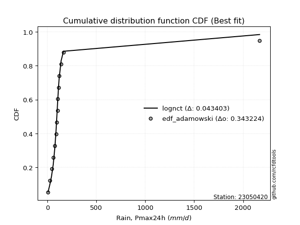</img>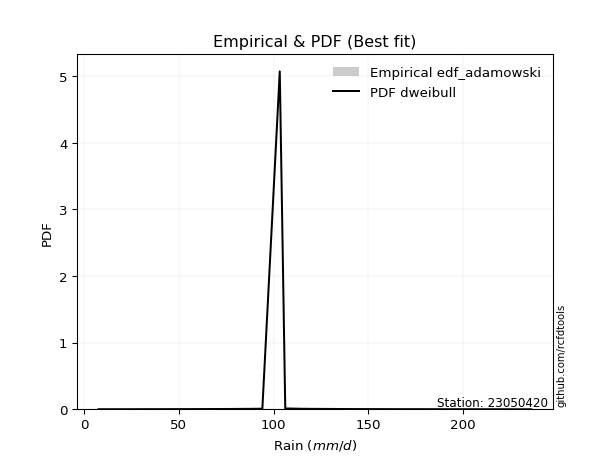</img>

</div>


## C. Best fit & Estimate extreme values for specific return periods - Tr


### 1. Best fit (ordered by delta Δ)

<div align="center">

|   id |   station | empirical_dist   | p_dist                |     delta |   deltao | eval   |   fit |   n |   best_fit |   best_fit_sort |
|-----:|----------:|:-----------------|:----------------------|----------:|---------:|:-------|------:|----:|-----------:|----------------:|
|    0 |  23050420 | edf_california   | loglaplace_asymmetric | 0.0531262 | 0.336646 | Δo > Δ |     1 |  15 |          1 |               1 |
|    1 |  23050420 | edf_tukey        | fisk                  | 0.0552318 | 0.336646 | Δo > Δ |     1 |  15 |          1 |               2 |
|    2 |  23050420 | edf_blom         | fisk                  | 0.0553983 | 0.336646 | Δo > Δ |     1 |  15 |          1 |               3 |
|    3 |  23050420 | edf_filliben     | fisk                  | 0.0560382 | 0.336646 | Δo > Δ |     1 |  15 |          1 |               4 |
|    4 |  23050420 | edf_cunnane      | fisk                  | 0.0560454 | 0.336646 | Δo > Δ |     1 |  15 |          1 |               5 |
|    5 |  23050420 | edf_jenkinson    | fisk                  | 0.0564191 | 0.336646 | Δo > Δ |     1 |  15 |          1 |               6 |
|    6 |  23050420 | edf_beard        | fisk                  | 0.0564191 | 0.336646 | Δo > Δ |     1 |  15 |          1 |               7 |
|    7 |  23050420 | edf_chegodayev   | fisk                  | 0.0569257 | 0.336646 | Δo > Δ |     1 |  15 |          1 |               8 |
|    8 |  23050420 | edf_gringorten   | fisk                  | 0.0570897 | 0.336646 | Δo > Δ |     1 |  15 |          1 |               9 |
|    9 |  23050420 | edf_hazen        | exponnorm             | 0.0582661 | 0.336646 | Δo > Δ |     1 |  15 |          1 |              10 |
|   10 |  23050420 | edf_adamowski    | fisk                  | 0.0594393 | 0.336646 | Δo > Δ |     1 |  15 |          1 |              11 |
|   11 |  23050420 | edf_weibull      | loglaplace_asymmetric | 0.0683138 | 0.336646 | Δo > Δ |     1 |  15 |          1 |              12 |

</div>

:file_folder:Tables: [bestfit_23050420.csv](table/bestfit_23050420.csv) | [extreme_23050420.csv](table/extreme_23050420.csv)


### 2. Extreme values

In hydrology, a return period (or recurrence interval $Tr$) is the statistical average time between extreme events like floods or droughts of a specific magnitude, indicating how rare an event is, with a 100-year flood, for example, having a 1% chance of occurring in any given year, not that it happens exactly every century. It is a key tool for infrastructure design (like bridges or dams) and risk assessment, calculated from historical data to determine the probability of future events, although it is important to remember it is statistical average, and events can cluster or be missed.

> risk_rate: assuming the return period as the project useful life.

|   id |      tr |   prob_l |     prob_g |      alpha |   betaprime |     chi2 |   crystalball |   erlang |    expon |   exponnorm |        f |   fatiguelife |     fisk |    gamma |   genexpon |   genlogistic |   gibrat |   gompertz |   gumbel_l |   gumbel_r |   halflogistic |   halfnorm |   hypsecant |   invgamma |   invgauss |   invweibull |   johnsonsu |   kstwobign |   laplace |   laplace_asymmetric |   loggamma |   logistic |   lognorm |   maxwell |   mielke |    moyal |   nakagami |       ncf |      nct |    norm |           pareto |   pearson3 |   rayleigh |    rice |       t |   truncnorm |     wald |   weibull_min |   logalpha |   logbetaprime |          logchi2 |   logcrystalball |   logerlang |         logexpon |   logexponnorm |      logf |   logfatiguelife |   logfisk |   loggenexpon |   loggenlogistic |   loggibrat |   loggompertz |   loggumbel_l |   loggumbel_r |   loghalflogistic |   loghalfnorm |   loghypsecant |   loginvgamma |   loginvgauss |   loginvweibull |   logjohnsonsu |   logkstwobign |   loglaplace |   loglaplace_asymmetric |   logloggamma |   loglogistic |   loglognorm |   logmaxwell |   logmielke |   logmoyal |   lognakagami |    logncf |    lognct |   logpareto |   logpearson3 |   lograyleigh |   logrice |      logt |   logtruncnorm |    logwald |   logweibull_min |   station |   n |   risk_rate |
|-----:|--------:|---------:|-----------:|-----------:|------------:|---------:|--------------:|---------:|---------:|------------:|---------:|--------------:|---------:|---------:|-----------:|--------------:|---------:|-----------:|-----------:|-----------:|---------------:|-----------:|------------:|-----------:|-----------:|-------------:|------------:|------------:|----------:|---------------------:|-----------:|-----------:|----------:|----------:|---------:|---------:|-----------:|----------:|---------:|--------:|-----------------:|-----------:|-----------:|--------:|--------:|------------:|---------:|--------------:|-----------:|---------------:|-----------------:|-----------------:|------------:|-----------------:|---------------:|----------:|-----------------:|----------:|--------------:|-----------------:|------------:|--------------:|--------------:|--------------:|------------------:|--------------:|---------------:|--------------:|--------------:|----------------:|---------------:|---------------:|-------------:|------------------------:|--------------:|--------------:|-------------:|-------------:|------------:|-----------:|--------------:|----------:|----------:|------------:|--------------:|--------------:|----------:|----------:|---------------:|-----------:|-----------------:|----------:|----:|------------:|
|    0 |    2    | 0.5      | 0.5        |    40.2004 |     98.1702 |  97.9507 |       107.36  |  97.9507 |  76.7177 |     98.3232 |  97.9574 |       7.50062 |  98.8796 |  97.9507 |    76.8498 |       97.2779 |  88.3406 |    212.173 |    117.77  |    96.9505 |        91.7754 |    94.3897 |     107.36  |    99.0313 |    69.0713 |      96.9733 |     98.7663 |     96.6308 |   107.36  |              105.373 |    80.9413 |    107.36  |   83.1215 |   101.941 |  98.4991 |  93.5899 |    85.3931 |   54.7034 |  99.9449 | 107.36  |      7.94846     |    101.272 |    100.019 | 100.752 | 107.361 |     131.61  |  86.8204 |        98.079 |    81.4464 |        81.74   |     13.4975      |          98.2433 |     80.3396 |     39.7337      |        83.1212 |   81.986  |          82.979  |   93.3742 |       59.5569 |          98.4254 |     64.4157 |       94.8098 |       95.5672 |       72.2965 |           67.451  |       69.8577 |        83.1215 |       79.2182 |       79.6467 |         76.4909 |        100.904 |        67.1703 |      83.1215 |                 95.7165 |       99.9878 |       83.1215 |      83.1212 |      77.298  |     98.3525 |    69.1122 |       93.6346 |   81.1864 |   83.1502 |     7.59465 |       100.707 |       75.331  |   83.1212 |   83.1379 |        59.3462 |    63.1166 |     13.2454      |  23050420 |  15 |    0.75     |
|    1 |    2.33 | 0.570815 | 0.429185   |    47.8487 |    109.54   | 109.38   |       118.667 | 109.38   |  91.9684 |    108.65   | 109.385  |      10.526   | 109.078  | 109.38   |    92.1353 |      108.38   |  94.0683 |    214.39  |    127.607 |   107.428  |       102.548  |   106.593  |     116.409 |   110.076  |    83.1695 |     108.195  |    109.879  |    108.369  |   114.203 |              112.956 |    95.0143 |    117.322 |   96.724  |   113.688 | 109.983  | 103.508  |    96.1864 |   72.1687 | 110.352  | 118.667 |     11.3045      |    112.589 |    111.94  | 112.461 | 118.669 |     133.637 |  94.2346 |       110.045 |    95.6921 |        95.7439 |     16.5635      |         108.908  |     94.1575 |     57.3719      |        96.7237 |   95.6415 |          96.5785 |  105.672  |       76.0592 |         109.982  |     69.5561 |      107.027  |      109.037  |       83.197  |           77.9288 |       82.2715 |        93.8404 |       92.6471 |       94.1841 |         96.0311 |        113.877 |        85.71   |      91.1056 |                105.127  |      112.709  |       94.9962 |      96.7238 |      90.4796 |    109.878  |    78.9388 |      104.446  |   95.241  |   96.727  |     8.34199 |       114.748 |       88.3836 |   96.7197 |   96.7389 |        68.2981 |    69.7115 |     19.3773      |  23050420 |  15 |    0.729209 |
|    2 |    5    | 0.8      | 0.2        |   107.155  |    157.184  | 157.341  |       160.688 | 157.341  | 168.218  |    153.257  | 157.337  |      74.7822  | 153.473  | 157.341  |   168.559  |      156.394  | 127.045  |    221.554 |    159.387 |   152.946  |       151.291  |   158.199  |     152.707 |   156.208  |   161.82   |     156.946  |    156.323  |    158.231  |   148.414 |              150.873 |   173.84   |    155.789 |  169.88   |   159.925 | 155.45   | 149.45   |   142.362  |  168.305  | 153.891  | 160.688 | 167068           |    158.137 |    159.665 | 159.333 | 160.691 |     141.167 | 135.739  |       159.015 |   177.235  |       173.667  |     54.4063      |         153.018  |    171.452  |    360.051       |       169.879  |  169.936  |         169.803  |  170.386  |      202.627  |         155.63   |    108.219  |      158.635  |      166.945  |      153.137  |          149.778  |      164.304  |       152.647  |      168.01   |      179.914  |        258.02   |        163.85  |       241.367  |     144.11   |                142.613  |      162.048  |      159.083  |     169.881  |     168.151  |    155.582  |   146.125  |      159.318  |  174.727  |  169.634  |   inf       |       168.491 |      167.572  |  169.847  |  169.882  |       118.097  |   121.596  |   1075.19        |  23050420 |  15 |    0.67232  |
|    3 |   10    | 0.9      | 0.1        |   216.115  |    193.739  | 194.125  |       188.563 | 194.125  | 237.436  |    190.847  | 194.116  |     163.504   | 191.951  | 194.125  |   237.935  |      195.355  | 164.634  |    225.542 |    177.081 |   190.02   |       191.769  |   196.387  |     181.692 |   191.929  |   244.978  |     196.653  |    192.177  |    196.195  |   179.47  |              185.292 |   261.441  |    184.117 |  246.837  |   192.464 | 190.865  | 189.449  |   176.783  |  274.208  | 188.659  | 188.563 |      2.73696e+09 |    191.472 |    193.695 | 192.752 | 188.568 |     146.162 | 179.786  |       194.796 |   270.987  |       259.564  |    183.661       |         188.472  |    257.299  |   1907.49        |       246.835  |  249.321  |         246.955  |  242.232  |      407.772  |         191.041  |    179.111  |      197.668  |      211.628  |      251.706  |          257.686  |      274.117  |       225.121  |      252.337  |      282.442  |        577.121  |        196.446 |       530.917  |     218.513  |                185.665  |      195.336  |      232.559  |     246.839  |     260.084  |    191.237  |   249.787  |      213.443  |  264.466  |  246.171  |   inf       |       201.137 |      264.423  |  246.763  |  246.826  |       160.776  |   219.448  |      1.96228e+06 |  23050420 |  15 |    0.651322 |
|    4 |   15    | 0.933333 | 0.0666667  |   324.686  |    213.538  | 214.019  |       202.473 | 214.019  | 277.926  |    212.671  | 214.008  |     221.529   | 215.273  | 214.019  |   278.517  |      217.309  | 190.561  |    227.348 |    185.094 |   210.937  |       214.677  |   216.26   |     198.234 |   211.528  |   298.278  |     219.056  |    211.769  |    216.349  |   197.636 |              205.427 |   321.194  |    199.552 |  297.43   |   209.159 | 211.57   | 212.663  |   194.727  |  346.979  | 208.415  | 202.473 |      7.98974e+11 |    209.064 |    211.228 | 209.969 | 202.479 |     148.655 | 208.071  |       213.47  |   336.589  |       317.859  |    387.482       |         208.604  |    315.864  |   5058.61        |       297.428  |  302.059  |         297.731  |  293.415  |      584.795  |         211.7    |    253.544  |      218.405  |      235.624  |      333.161  |          350.302  |      357.777  |       281      |      310.253  |      356.083  |        908.899  |        212.034 |       806.812  |     278.759  |                216.647  |      211.875  |      286.011  |     297.433  |     325.311  |    212.102  |   340.959  |      247.781  |  326.422  |  296.419  |   inf       |       215.42  |      334.479  |  297.325  |  297.415  |       180.866  |   320.617  |      1.25176e+09 |  23050420 |  15 |    0.644736 |
|    5 |   20    | 0.95     | 0.05       |   433.162  |    227.083  | 227.613  |       211.583 | 227.613  | 306.654  |    228.147  | 227.601  |     264.49    | 232.454  | 227.613  |   307.31   |      232.673  | 210.899  |    228.473 |    190.082 |   225.582  |       230.726  |   229.509  |     209.903 |   225.067  |   337.962  |     234.741  |    225.26   |    229.926  |   210.526 |              219.712 |   367.836  |    210.22  |  336.057  |   220.239 | 226.68   | 229.103  |   206.697  |  404.351  | 222.402  | 211.583 |      4.48399e+13 |    220.933 |    222.882 | 221.413 | 211.589 |     150.287 | 229.148  |       225.964 |   388.641  |       363.231  |    665.576       |         222.799  |    361.592  |  10105.5         |       336.055  |  342.578  |         336.523  |  334.983  |      743.222  |         226.762  |    333.004  |      232.406  |      251.915  |      405.423  |          434.383  |      427.304  |       328.576  |      355.682  |      415.436  |       1249.18   |        221.917 |      1069.55   |     331.33   |                241.716  |      222.65   |      329.977  |     336.062  |     377.396  |    227.336  |   425.016  |      273.502  |  375.162  |  334.751  |   inf       |       223.897 |      391.031  |  335.928  |  336.041  |       192.517  |   425.293  |      3.43302e+11 |  23050420 |  15 |    0.641514 |
|    6 |   25    | 0.96     | 0.04       |   541.6    |    237.353  | 237.909  |       218.288 | 237.909  | 328.937  |    240.149  | 237.898  |     298.624   | 246.217  | 237.909  |   329.644  |      244.505  | 227.854  |    229.273 |    193.631 |   236.863  |       243.092  |   239.367  |     218.934 |   235.408  |   369.729  |     246.823  |    235.539  |    240.095  |   220.524 |              230.793 |   406.609  |    218.381 |  367.663  |   228.465 | 238.753  | 241.846  |   215.605  |  452.5    | 233.293  | 218.288 |      1.01952e+15 |    229.85  |    231.541 | 229.915 | 218.295 |     151.489 | 246.031  |       235.287 |   432.44   |       400.872  |   1018.03        |         233.8    |    399.617  |  17284.9         |       367.66   |  375.881  |         368.279  |  370.716  |      888.163  |         238.79   |    417.974  |      242.916  |      264.189  |      471.603  |          512.693  |      487.663  |       370.858  |      393.593  |      465.941  |       1595.9    |        229.01  |      1321.01   |     378.844  |                263.141  |      230.548  |      368.121  |     367.668  |     421.386  |    239.513  |   504.18   |      294.28   |  415.915  |  366.097  |   inf       |       229.669 |      439.154  |  367.511  |  367.648  |       200.119  |   533.296  |      5.00577e+13 |  23050420 |  15 |    0.639603 |
|    7 |   50    | 0.98     | 0.02       |  1083.62   |    268.189  | 268.766  |       237.491 | 268.766  | 398.155  |    277.432  | 268.758  |     408.141   | 291.842  | 268.766  |   399.019  |      280.942  | 287.62   |    231.445 |    203.266 |   271.614  |       281.192  |   268.021  |     246.934 |   266.906  |   473.363  |     284.042  |    266.699  |    269.957  |   251.58  |              265.212 |   542.793  |    243.316 |  475.591  |   252.322 | 278.875  | 281.406  |   241.5    |  625.399  | 267.679  | 237.491 |      1.67029e+19 |    256.228 |    256.675 | 254.593 | 237.499 |     154.93  | 301.153  |       262.533 |   589.765  |       532.615  |   3904.33        |         268.127  |    533.255  |  91572.2         |       475.586  |  490.511  |         476.811  |  505.278  |     1490      |         278.731  |    931.26   |      273.92   |      300.609  |      751.394  |          854.379  |      715.995  |       539.761  |      527.733  |      650.993  |       3394      |        248.391 |      2455.82   |     574.438  |                342.58   |      252.983  |      514.209  |     475.6    |     580.166  |    280.012  |   856.781  |      363.765  |  560.593  |  473.026  |   inf       |       243.962 |      615.085  |  475.362  |  475.594  |       216.911  |  1116.49   |      1.13106e+22 |  23050420 |  15 |    0.63583  |
|    8 |   75    | 0.986667 | 0.0133333  |  1625.56   |    285.626  | 286.172  |       247.795 | 286.172  | 438.644  |    299.241  | 286.167  |     474.097   | 320.846  | 286.172  |   439.601  |      302.116  | 327.986  |    232.543 |    208.138 |   291.813  |       303.339  |   283.618  |     263.297 |   285.041  |   537.085  |     305.675  |    284.528  |    286.387  |   269.746 |              285.346 |   634.533  |    257.717 |  546.026  |   265.292 | 304.617  | 304.54   |   255.598  |  745.5    | 288.38   | 247.795 |      4.87591e+21 |    270.902 |    270.349 | 268.018 | 247.803 |     156.777 | 335.073  |       277.464 |   698.55   |       621.025  |   8689.04        |         288.432  |    623.357  | 242847           |       546.021  |  565.995  |         547.708  |  604.235  |     1974.63   |         304.337  |   1599.77   |      291.083  |      320.895  |      985.026  |         1149.68   |      882.479  |       672.131  |      618.912  |      781.796  |       5262.46   |        258.189 |      3454.29   |     732.815  |                399.745  |      264.899  |      623.695  |     546.038  |     690.326  |    306.018  |  1168.25   |      408.127  |  659.279  |  542.727  |   inf       |       250.287 |      738.819  |  545.742  |  546.053  |       223.038  |  1759.2    |      1.47425e+28 |  23050420 |  15 |    0.634587 |
|    9 |  100    | 0.99     | 0.01       |  2167.48   |    297.78   | 298.285  |       254.764 | 298.285  | 467.372  |    314.715  | 298.283  |     521.555   | 342.59   | 298.285  |   468.395  |      317.101  | 359.256  |    233.261 |    211.325 |   306.108  |       319.014  |   294.244  |     274.904 |   297.831  |   583.526  |     320.987  |    297.05   |    297.644  |   282.636 |              299.632 |   705.545  |    267.885 |  599.489  |   274.127 | 324.083  | 320.952  |   265.201  |  840.577  | 303.407  | 254.764 |      2.73645e+23 |    281.035 |    279.665 | 277.164 | 254.772 |     158.026 | 359.804  |       287.678 |   784.174  |       689.301  |  15403.8         |         302.98   |    693.145  | 485133           |       599.483  |  623.607  |         601.553  |  685.562  |     2392.37   |         323.694  |   2432.73   |      302.889  |      334.9    |     1193.07   |         1418.5    |     1017.55   |       785.274  |      689.912  |      886.155  |       7177.96   |        264.57  |      4363.88   |     871.016  |                446.001  |      272.907  |      714.76   |     599.503  |     777.108  |    325.695  |  1455.71   |      441.379  |  736.28   |  595.595  |   inf       |       254.058 |      837.086  |  599.162  |  599.54   |       226.211  |  2450.66   |      1.24304e+33 |  23050420 |  15 |    0.633968 |
|   10 |  200    | 0.995    | 0.005      |  4335.13   |    326.448  | 326.786  |       270.572 | 326.786  | 536.59   |    351.998  | 326.794  |     637.722   | 399.383  | 326.786  |   537.77   |      353.123  | 444.331  |    234.823 |    218.252 |   340.477  |       356.7    |   318.547  |     302.867 |   328.514  |   699.151  |     357.796  |    326.909  |    323.572  |   313.691 |              334.051 |   898.723  |    292.275 |  740.972  |   294.339 | 375.686  | 360.495  |   287.161  | 1108.8    | 340.998  | 270.572 |      4.48315e+27 |    304.649 |    300.981 | 298.09  | 270.581 |     160.859 | 421.405  |       311.17  |  1022.85   |       874.452  |  62066.6         |         338.614  |    883.178  |      2.57015e+06 |       740.964  |  777.262  |         744.165  |  928.112  |     3711.88   |         374.982  |   7609.25   |      330.235  |      367.483  |     1891.17   |         2350.79   |     1409.35   |      1142.35   |      884.785  |     1182.66   |      15139.2    |        278.294 |      7476.25   |    1320.71   |                580.643  |      290.917  |      991.152  |     740.994  |    1018.92   |    377.9    |  2473.22   |      527.942  |  948.197  |  735.361  |   inf       |       261.204 |     1113.93   |  740.524  |  741.114  |       231.115  |  5596.13   |      1.21863e+47 |  23050420 |  15 |    0.633042 |
|   11 |  250    | 0.996    | 0.004      |  5418.95   |    335.517  | 335.782  |       275.403 | 335.782  | 558.873  |    364      | 335.794  |     675.582   | 419.102  | 335.782  |   560.104  |      364.703  | 474.856  |    235.282 |    220.29  |   351.526  |       368.816  |   326.023  |     311.868 |   338.379  |   737.39   |     369.63   |    336.454  |    331.596  |   323.689 |              345.132 |   968.079  |    300.105 |  790.538  |   300.561 | 393.869  | 373.225  |   293.917  | 1208.56   | 353.57   | 275.403 |      1.01933e+29 |    312.04  |    307.543 | 304.531 | 275.412 |     161.724 | 441.785  |       318.434 |  1110.45   |       940.743  |  97562.3         |         350.283  |    951.468  |      4.39608e+06 |       790.529  |  831.467  |         794.163  | 1022.9    |     4249.48   |         393.047  |  11456.2    |      338.743  |      377.661  |     2193.05   |         2765.3    |     1557.9    |      1288.83   |      955.328  |     1293.3    |      19244.1    |        282.28  |      8831.66   |    1510.11   |                632.111  |      296.377  |     1100.84   |     790.563  |    1107.54   |    396.309  |  2933.35   |      557.849  | 1025.08   |  784.282  |   inf       |       263.028 |     1216.34   |  790.047  |  790.721  |       232.117  |  7354.01   |      1.81523e+52 |  23050420 |  15 |    0.632858 |
|   12 |  500    | 0.998    | 0.002      | 10838      |    363.28   | 363.255  |       289.729 | 363.255  | 628.091  |    401.283  | 363.281  |     794.346   | 485.295  | 363.255  |   629.479  |      400.644  | 580.349  |    236.599 |    226.133 |   385.819  |       406.42   |   348.314  |     339.829 |   369.077  |   858.941  |     406.359  |    365.973  |    355.642  |   354.745 |              379.551 |  1208.12   |    324.39  |  957.892  |   319.127 | 455.908  | 412.767  |   314.054  | 1567.96   | 394.293  | 289.729 |      1.66998e+33 |    334.442 |    327.12  | 323.748 | 289.738 |     164.291 | 506.585  |       340.195 |  1420.72   |      1169.56   | 401351           |         387.21   |   1188.07   |      2.32897e+07 |       957.88   | 1015.76   |         963.103  | 1382.98   |     6362.95   |         454.661  |  47114.4    |      364.372  |      408.425  |     3472.8    |         4577.73   |     2100.37   |      1874.83   |     1201.64   |     1691.88   |      40522.5    |        293.534 |     14550.8    |    2289.77   |                822.938  |      312.448  |     1524.36   |     957.926  |    1420.48   |    459.163  |  4983.63   |      657.519  | 1294.12   |  949.305  |   inf       |       267.562 |     1581.33   |  957.246  |  958.246  |       234.144  | 17528.8    |      3.36514e+70 |  23050420 |  15 |    0.632489 |
|   13 |  750    | 0.998667 | 0.00133333 | 16257.1    |    379.272  | 379.034  |       297.687 | 379.034  | 668.581  |    423.092  | 379.07   |     864.517   | 527.77   | 379.034  |   670.061  |      421.655  | 650.115  |    237.303 |    229.255 |   405.867  |       428.403  |   360.767  |     356.185 |   387.114  |   931.8    |     427.831  |    383.189  |    369.15   |   372.912 |              399.685 |  1367.25   |    338.578 | 1065.72   |   329.511 | 496.509  | 435.897  |   325.302  | 1818.26   | 419.404  | 297.687 |      4.87499e+35 |    347.203 |    338.068 | 334.493 | 297.697 |     165.718 | 545.438  |       352.418 |  1632.03   |      1320.78   | 923277           |         409.324  |   1345.11   |      6.17637e+07 |      1065.71   | 1135.46   |        1072.05   | 1649.46   |     7975.06   |         494.968  | 120030      |      378.858  |      425.881  |     4543.42   |         6146.43   |     2481.9    |      2334.38   |     1366.63   |     1968.57   |      62626.1    |        299.425 |     19262.2    |    2921.07   |                960.259  |      321.297  |     1843.64   |    1065.76   |    1632.61   |    500.335  |  6795.05   |      720.828  | 1474.77   | 1055.52   |   inf       |       269.576 |     1831.27   | 1064.97   | 1066.21   |       234.826  | 29507.1    |      6.64994e+82 |  23050420 |  15 |    0.632366 |
|   14 | 1000    | 0.999    | 0.001      | 21676.1    |    390.521  | 390.113  |       303.166 | 390.113  | 697.308  |    438.565  | 390.157  |     914.572   | 559.731  | 390.113  |   698.855  |      436.558  | 703.504  |    237.777 |    231.357 |   420.088  |       443.997  |   369.368  |     367.789 |   399.964  |   984.201  |     443.062  |    395.395  |    378.509  |   385.801 |              413.971 |  1489.25   |    348.639 | 1146.93   |   336.689 | 527.452  | 452.309  |   333.069  | 2016.64   | 437.851  | 303.166 |      2.73594e+37 |    356.12  |    345.633 | 341.919 | 303.177 |     166.7   | 573.386  |       360.888 |  1796.87   |      1436.51   |      1.67114e+06 |         425.258  |   1465.61   |      1.23385e+08 |      1146.92   | 1226.06   |        1154.15   | 1869      |     9322.3    |         525.68   | 245521      |      388.932  |      438.049  |     5497.5    |         7575.29   |     2785.14   |      2727.24   |     1494      |     2186.99   |      85283      |        303.334 |     23393.7    |    3471.96   |               1071.37   |      327.358  |     2109.82   |    1146.98   |    1797.47   |    531.731  |  8466.93   |      768.111  | 1614.41   | 1135.47   |   inf       |       270.779 |     2026.72   | 1146.1    | 1147.54   |       235.168  | 42916.3    |      1.98677e+92 |  23050420 |  15 |    0.632305 |

<div align="center">

</img>

</div>


<div align="center">

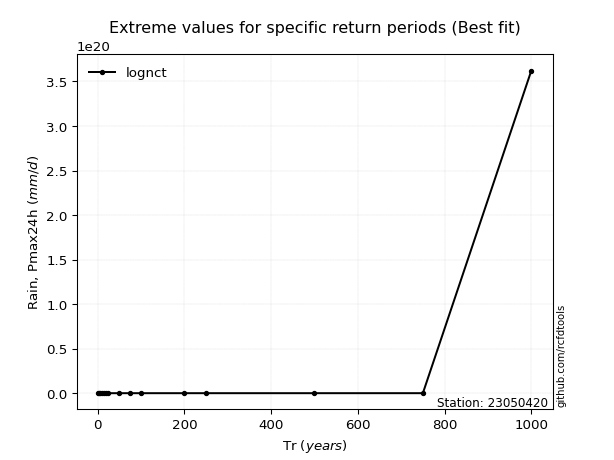</img>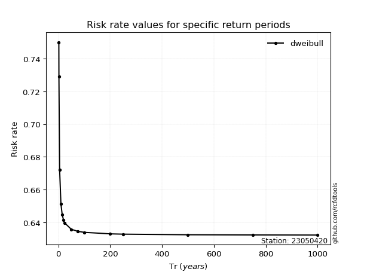</img>

</div>


<sub>**APP DISCLAIMER**: NO WARRANTY - This software is provided by [github.com/rcfdtools](https://github.com/rcfdtools) "as is", without any express or implied warranty, including warranties of merchantability, fitness for a particular purpose, or non-infringement. There is no guarantee that the software will be error-free or operate without interruption. LIMITATION OF LIABILITY - Neither the authors nor copyright holders will be liable for claims or damages arising from the software or its use. You are responsible for determining if the software is appropriate for your use and assume all associated risks, including errors, legal compliance, and data loss. NO PROFESSIONAL ADVICE - The software provides general information and does not offer professional advice. It should not replace consultation with professional advisors.</sub>