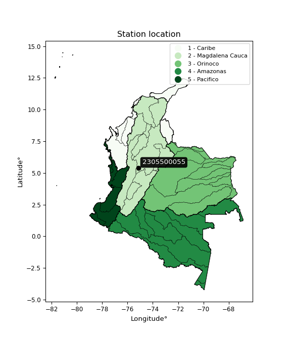

<div align="center">


</div>

# PMax24h Station (Rain, Pmax24h): 2305500055

Maximum Precipitation in 24 hours (PMax24h) is the greatest amount of rainfall for a specific duration that is meteorologically possible for a given location, acting as a "worst-case" scenario for extreme storms, crucial for designing safety-critical infrastructure like bridges, river deviations, dams, spillways, and nuclear plants to prevent catastrophic failure. The PMax24h is related with the Probable Maximum Precipitation (PMP) and it is calculated by hydrologists using meteorological data to determine the upper limit of extreme rainfall, often leading to the Probable Maximum Flood (PMF) for flood control design, and is increasingly being studied for climate change impacts. Probable Maximum Precipitation (PMP) is the theoretical upper limit of rainfall, a deterministic estimate for extreme events, while probability distributions (like GEV, Gumbel) describe the likelihood and frequency of various precipitation amounts, including rare ones, showing how often events occur, with PMP representing the extreme end of these distributions, used for critical infrastructure design to ensure safety against the worst conceivable weather, unlike standard statistical forecasts which cover typical probabilities.

The most common probability distributions in hydrology, used for analyzing floods, rainfall, and streamflow, include the Normal, Log-Normal, Gumbel, Gamma (including Log-Pearson Type III), and Generalized Extreme Value (GEV) distributions, often chosen based on the data´s skewness and whether modeling extremes or general conditions, with Gumbel and GEV popular for extreme events like floods, while the Normal distribution serves as a baseline, though often requiring transformations for skewed hydrological data. These distributions help in designing water infrastructure, managing water resources, and forecasting hydrologic events.

> Hydrological data often isn´t perfectly normal (it´s skewed), so different distributions are needed for different applications, such as: **Flood Frequency Analysis**: Using Gumbel, GEV, or Log-Pearson Type III for predicting extreme flood magnitudes and their return periods, **Rainfall Analysis**: Normal for annual totals, but Log-Normal, Weibull, or GEV for intensity or extreme daily rainfall, **Streamflow Modeling**: Gamma and Log-Normal for maximum flows, GEV for minimum flows, and Kappa for daily flows.

<div align="center">

</img>

</div>


## A. General information


### 1. General running parameters

• app_version: _v20260225_. • runtime: _2026-02-27 14:50:08.749431_. • Python version: _3.14.0_. • SciPy version: _1.16.3_. • Pandas version: _2.3.3_. • NumPy version: _2.3.5_. • Stations dataset (station_dataset_file): _dataset/pmax24h_in/automatic_colombia_2003_2025.csv_. • Stations catalog (station_catalog_file): _dataset/CNE.xls_. • Minimum year to eval til year_max (date_min): _1900_. • Maximum year to eval since year_min (date_max): _2025_. • Creates, save and include plots into reports (create_plot): _False_. • Plot only fit distributions with Δo > Δ (plot_only_fit): _True_. • Plot only simple graphs avoiding multiple CDFs and multiple Extreme values plots (plot_only_simple): _False_. • Eval low extreme values, if False, evaluates high extreme values (low_extreme): _False_. • Eval every SciPy distribution as logarithmic (pdist_logarithmic_on): _True_. • Standard deviation normalized (ddof): _1.0_. • Return periods to eval in years (Tr): _[2, 2.33, 5, 10, 15, 20, 25, 50, 75, 100, 200, 250, 500, 750, 1000]_. • Minimum data sample per station, 0 means any (minimum_sample): _5_. • Z-Score maximum threshold to adjust a value, 0 means disable (zscore_max): _3.5_. • Z-Score minimum threshold to adjust a value, 0 means disable (zscore_min): _-2.5_. • Avoid zeros, e.g. rain = 0 (avoid_zeros): _True_. • Avoid null values (avoid_nans): _True_. 

:file_folder:Table: [dataset.csv](../../dataset/pmax24h_in/automatic_colombia_2003_2025.csv)

> Delta Degrees of Freedom (DDOF): is a parameter used in the formulas for calculating variance and standard deviation. When ddof=0, the divisor is $N$ (the total number of observations) and this is used when your data set is the entire population. When ddof=1, the divisor is $N-1$ and this is used when your data set is a sample drawn from a larger population. Using $N-1$ provides an unbiased estimate of the population variance (known as Bessel´s correction).


### 2. Station info and location

|   id |     CODIGO | NOMBRE                                       | CATEGORIA               | TECNOLOGIA                | ESTADO   | FECHA_INSTALACION   |   FECHA_SUSPENSION |   ALTITUD |   LATITUD |   LONGITUD | DEPARTAMENTO   | MUNICIPIO   | AREA_OPERATIVA             | ENTIDAD                                                     | AREA_HIDROGRAFICA   | ZONA_HIDROGRAFICA   | SUBZONA_HIDROGRAFICA   |   CORRIENTE | Catalogo   |   Version |
|-----:|-----------:|:---------------------------------------------|:------------------------|:--------------------------|:---------|:--------------------|-------------------:|----------:|----------:|-----------:|:---------------|:------------|:---------------------------|:------------------------------------------------------------|:--------------------|:--------------------|:-----------------------|------------:|:-----------|----------:|
|    0 | 2305500055 | SAN JOSE DE PENSILVANIA - AUT   [2305500055] | Climatológica Principal | Automática con Telemetría | Activa   | 24/04/2017          |                nan |      2029 |   5.37264 |   -75.1501 | Caldas         | Pensilvania | Area Operativa 10 - Tolima | INSTITUTO DE HIDROLOGIA METEOROLOGIA Y ESTUDIOS AMBIENTALES | Magdalena Cauca     | Medio Magdalena     | Río La Miel (Samaná)   |         nan | CNE_IDEAM  |  20251226 |

<div align="center">

Dynamic map: [:earth_americas:Google](http://maps.google.com/maps?q=5.372638889,-75.150138889) [:earth_americas:OSM](https://www.openstreetmap.org/#map=18/5.372638889/-75.150138889&layers=P) [:earth_americas:Bing](https://www.bing.com/maps?cp=5.372638889~-75.150138889&lvl=18) [:earth_americas:Apple](https://maps.apple.com/frame?center=5.372638889%2C-75.150138889&span=0.003%2C0.006)

</div>


<div align="center">

```geojson
{
  "type": "Feature",
  "geometry": {
    "type": "Point", 
    "coordinates": [-75.150138889, 5.372638889]
  }, 
  "properties": {
    "Name": "2305500055"
  }
}
```

</div>


### 3. Discrete values table and plot

<div align="center">

|               |           0 |           1 |          2 |          3 |           4 |
|:--------------|------------:|------------:|-----------:|-----------:|------------:|
| Date          | 2019        | 2020        | 2023       | 2024       | 2025        |
| Value         |   79.2      |   43.7      |   19.4     |   94.6     |   77.6      |
| Value_initial |   79.2      |   43.7      |   19.4     |   94.6     |   77.6      |
| count         |    5        |    5        |    5       |    5       |    5        |
| mean          |   62.9      |   62.9      |   62.9     |   62.9     |   62.9      |
| std           |   30.6087   |   30.6087   |   30.6087  |   30.6087  |   30.6087   |
| zscore        |    0.532529 |   -0.627273 |   -1.42117 |    1.03565 |    0.480256 |


</div>


> The initial value (value_initial) correspond to the initial obtained or null completed value, and value (value) is adjusted only when the initial value is outside the valid range (outlier) definite through the Z-Score value. If Z-Score is active, values out of range or outliers are replaced with the station mean value. A Z-Score (or standard score) measures how many standard deviations a data point is from the mean of a dataset, indicating its relative position; positive scores mean above the mean, negative mean below, and a score of zero is exactly at the mean, allowing for comparison of values from different distributions. It´s calculated using the formula $z=(x–μ)/σ$, where $x$ is the data point, $μ$ is the mean, and $σ$ is the standard deviation, helping identify outliers and understand probability.
>
> <sub>**Note**: In this study, "completing" (filling gaps in) and "extending" (forecasting or lengthening the historical record) rainfall data series are avoided for certain critical analyses because they introduce artificial bias and uncertainty, which can distort the statistics of rare events (extremes), alter day-to-day variability, and compromise the integrity and homogeneity of the original data. Some reasons against Completing/Extending rainfall data are: **Distortion of Extremes and Variability**: The primary issue is that most gap-filling or extension methods rely on averaging or regression with nearby stations, which inherently smooths the data. Rainfall is highly variable in space and time, with a large percentage of zero values and occasional large storms. Infilling methods often underestimate the highest values and overestimate the lowest (zero) values, which severely distorts analyses focused on flood frequency, drought severity, and intensity-duration-frequency (IDF) curves, **Loss of Data Homogeneity**: Infilled or extended data are synthetic estimates, not actual measurements. Combining these estimates with observed data can violate the assumption of data homogeneity, which requires that the data properties do not change over time. Inhomogeneity can lead to incorrect conclusions about long-term trends or changes in climate patterns, **Propagation of Errors**: Errors and biases from the original data (e.g., wind-induced undercatch, instrument errors, site changes) or the data used for imputation can propagate through the analysis, leading to unreliable hydrological models and inaccurate predictions, **Compromised Statistical Integrity**: For statistical analyses, especially those involving the frequency of events, using artificial data can introduce time bias or autocorrelation that doesn´t exist in reality, making it difficult to assess the true probability of events, **Difficulty in Validation**: It is difficult to accurately validate the quality of filled or extended data, especially for past periods where ground-truth measurements are unavailable. The reliability of imputation techniques heavily depends on the density of the surrounding station network and the complexity of the local topography.</sub>


### 4. Active continuous probability distributions from SciPy (80 of 104 available)

A Probability Density Function (PDF) describes the relative likelihood of a continuous random variable falling within a specific range, where the total area under its curve equals 1, and the area over any interval gives the actual probability for that range. Unlike discrete probabilities (like rolling a die), a PDF shows density, not direct probability for a single point (which is zero), with higher points indicating higher likelihood, often visualized as a bell curve for normal distributions.

A log of a probability density function (log-PDF) is simply the logarithm of the PDF´s value, denoted as $log(f(x))$, useful for converting multiplication of probabilities into addition, improving numerical stability with tiny numbers, and connecting to information theory concepts like entropy. Instead of dealing with very small probabilities (e.g., 0.000001), log-PDFs use negative numbers (e.g., $log(0.00001) ≈ -11.51$ that are easier for computers to handle, preventing underflow errors and simplifying complex calculations. In this study, each active probability distribution from SciPy is also evaluated in the $log$ form.

[scipy.stats](https://docs.scipy.org/doc/scipy/reference/stats.html) is a Python´s powerful submodule within the SciPy library for comprehensive statistical analysis, offering over 130 probability distributions (like Normal, Poisson, etc.), functions for descriptive stats (mean, variance), hypothesis testing (t-tests, chi-square), random variable generation, and statistical tests, making it essential for data science, modeling, and research. It provides tools to explore, model, and draw conclusions from data efficiently, working seamlessly with [NumPy](https://numpy.org/).

<div align="center">

|   id | p_dist           |   n_parameter | fit_method   | label                                                                       | active   | ref                                                                                                      |
|-----:|:-----------------|--------------:|:-------------|:----------------------------------------------------------------------------|:---------|:---------------------------------------------------------------------------------------------------------|
|    0 | alpha            |             3 | MLE          | Alpha                                                                       | True     | [:mortar_board:](https://docs.scipy.org/doc/scipy/reference/generated/scipy.stats.alpha.html)            |
|    1 | anglit           |             2 | MM           | Anglit                                                                      | True     | [:mortar_board:](https://docs.scipy.org/doc/scipy/reference/generated/scipy.stats.anglit.html)           |
|    2 | arcsine          |             2 | MM           | Arcsine                                                                     | True     | [:mortar_board:](https://docs.scipy.org/doc/scipy/reference/generated/scipy.stats.arcsine.html)          |
|    3 | argus            |             3 | MLE          | Argus                                                                       | True     | [:mortar_board:](https://docs.scipy.org/doc/scipy/reference/generated/scipy.stats.argus.html)            |
|    4 | beta             |             4 | MLE          | Beta                                                                        | True     | [:mortar_board:](https://docs.scipy.org/doc/scipy/reference/generated/scipy.stats.beta.html)             |
|    5 | betaprime        |             4 | MLE          | Beta prime                                                                  | True     | [:mortar_board:](https://docs.scipy.org/doc/scipy/reference/generated/scipy.stats.betaprime.html)        |
|    6 | bradford         |             3 | MLE          | Bradford                                                                    | True     | [:mortar_board:](https://docs.scipy.org/doc/scipy/reference/generated/scipy.stats.bradford.html)         |
|    7 | burr             |             4 | MLE          | Burr (Type III)                                                             | True     | [:mortar_board:](https://docs.scipy.org/doc/scipy/reference/generated/scipy.stats.burr.html)             |
|    8 | burr12           |             4 | MLE          | Burr (Type III) 12                                                          | True     | [:mortar_board:](https://docs.scipy.org/doc/scipy/reference/generated/scipy.stats.burr12.html)           |
|    9 | cosine           |             2 | MLE          | Cosine                                                                      | True     | [:mortar_board:](https://docs.scipy.org/doc/scipy/reference/generated/scipy.stats.cosine.html)           |
|   10 | crystalball      |             4 | MLE          | Crystalball                                                                 | True     | [:mortar_board:](https://docs.scipy.org/doc/scipy/reference/generated/scipy.stats.crystalball.html)      |
|   11 | dgamma           |             3 | MLE          | Double gamma                                                                | True     | [:mortar_board:](https://docs.scipy.org/doc/scipy/reference/generated/scipy.stats.dgamma.html)           |
|   12 | dweibull         |             3 | MLE          | Double Weibull                                                              | True     | [:mortar_board:](https://docs.scipy.org/doc/scipy/reference/generated/scipy.stats.dweibull.html)         |
|   13 | erlang           |             3 | MLE          | Erlang                                                                      | True     | [:mortar_board:](https://docs.scipy.org/doc/scipy/reference/generated/scipy.stats.erlang.html)           |
|   14 | exponnorm        |             3 | MLE          | Exponentially modified Normal                                               | True     | [:mortar_board:](https://docs.scipy.org/doc/scipy/reference/generated/scipy.stats.exponnorm.html)        |
|   15 | exponpow         |             3 | MLE          | Exponential power                                                           | True     | [:mortar_board:](https://docs.scipy.org/doc/scipy/reference/generated/scipy.stats.exponpow.html)         |
|   16 | exponweib        |             4 | MLE          | Exponentiated Weibull                                                       | True     | [:mortar_board:](https://docs.scipy.org/doc/scipy/reference/generated/scipy.stats.exponweib.html)        |
|   17 | f                |             4 | MLE          | F                                                                           | True     | [:mortar_board:](https://docs.scipy.org/doc/scipy/reference/generated/scipy.stats.f.html)                |
|   18 | fatiguelife      |             3 | MLE          | Fatigue-life (Birnbaum-Saunders)                                            | True     | [:mortar_board:](https://docs.scipy.org/doc/scipy/reference/generated/scipy.stats.fatiguelife.html)      |
|   19 | foldnorm         |             3 | MM           | Fold Normal                                                                 | True     | [:mortar_board:](https://docs.scipy.org/doc/scipy/reference/generated/scipy.stats.foldnorm.html)         |
|   20 | gamma            |             3 | MLE          | Gamma                                                                       | True     | [:mortar_board:](https://docs.scipy.org/doc/scipy/reference/generated/scipy.stats.gamma.html)            |
|   21 | gausshyper       |             6 | MLE          | Gauss hypergeometric                                                        | True     | [:mortar_board:](https://docs.scipy.org/doc/scipy/reference/generated/scipy.stats.gausshyper.html)       |
|   22 | genexpon         |             5 | MLE          | Generalized exponential                                                     | True     | [:mortar_board:](https://docs.scipy.org/doc/scipy/reference/generated/scipy.stats.genexpon.html)         |
|   23 | genextreme       |             3 | MLE          | Generalized exponential                                                     | True     | [:mortar_board:](https://docs.scipy.org/doc/scipy/reference/generated/scipy.stats.genextreme.html)       |
|   24 | gengamma         |             4 | MLE          | Generalized gamma                                                           | True     | [:mortar_board:](https://docs.scipy.org/doc/scipy/reference/generated/scipy.stats.gengamma.html)         |
|   25 | genhalflogistic  |             3 | MLE          | Generalized half-logistic                                                   | True     | [:mortar_board:](https://docs.scipy.org/doc/scipy/reference/generated/scipy.stats.genhalflogistic.html)  |
|   26 | genlogistic      |             3 | MLE          | Generalized logistic                                                        | True     | [:mortar_board:](https://docs.scipy.org/doc/scipy/reference/generated/scipy.stats.genlogistic.html)      |
|   27 | gennorm          |             3 | MLE          | Generalized Normal                                                          | True     | [:mortar_board:](https://docs.scipy.org/doc/scipy/reference/generated/scipy.stats.gennorm.html)          |
|   28 | genpareto        |             3 | MLE          | Generalized Pareto                                                          | True     | [:mortar_board:](https://docs.scipy.org/doc/scipy/reference/generated/scipy.stats.genpareto.html)        |
|   29 | gompertz         |             3 | MLE          | Gompertz (or truncated Gumbel)                                              | True     | [:mortar_board:](https://docs.scipy.org/doc/scipy/reference/generated/scipy.stats.gompertz.html)         |
|   30 | gumbel_l         |             2 | MM           | Gumbel Left Skew                                                            | True     | [:mortar_board:](https://docs.scipy.org/doc/scipy/reference/generated/scipy.stats.gumbel_l.html)         |
|   31 | gumbel_r         |             2 | MM           | Gumbel Right Skew                                                           | True     | [:mortar_board:](https://docs.scipy.org/doc/scipy/reference/generated/scipy.stats.gumbel_r.html)         |
|   32 | halfgennorm      |             3 | MLE          | Upper half of a generalized normal                                          | True     | [:mortar_board:](https://docs.scipy.org/doc/scipy/reference/generated/scipy.stats.halfgennorm.html)      |
|   33 | halflogistic     |             2 | MM           | Half-logistic                                                               | True     | [:mortar_board:](https://docs.scipy.org/doc/scipy/reference/generated/scipy.stats.halflogistic.html)     |
|   34 | halfnorm         |             2 | MM           | Half Normal                                                                 | True     | [:mortar_board:](https://docs.scipy.org/doc/scipy/reference/generated/scipy.stats.halfnorm.html)         |
|   35 | hypsecant        |             2 | MM           | hyperbolic secant                                                           | True     | [:mortar_board:](https://docs.scipy.org/doc/scipy/reference/generated/scipy.stats.hypsecant.html)        |
|   36 | invgamma         |             3 | MLE          | Inverted gamma                                                              | True     | [:mortar_board:](https://docs.scipy.org/doc/scipy/reference/generated/scipy.stats.invgamma.html)         |
|   37 | invgauss         |             3 | MLE          | Inverse Gaussian                                                            | True     | [:mortar_board:](https://docs.scipy.org/doc/scipy/reference/generated/scipy.stats.invgauss.html)         |
|   38 | invweibull       |             3 | MLE          | Inverted Weibull                                                            | True     | [:mortar_board:](https://docs.scipy.org/doc/scipy/reference/generated/scipy.stats.invweibull.html)       |
|   39 | johnsonsb        |             4 | MLE          | Johnson SB                                                                  | True     | [:mortar_board:](https://docs.scipy.org/doc/scipy/reference/generated/scipy.stats.johnsonsb.html)        |
|   40 | johnsonsu        |             4 | MLE          | Johnson Su                                                                  | True     | [:mortar_board:](https://docs.scipy.org/doc/scipy/reference/generated/scipy.stats.johnsonsu.html)        |
|   41 | kappa3           |             3 | MLE          | Kappa 3                                                                     | True     | [:mortar_board:](https://docs.scipy.org/doc/scipy/reference/generated/scipy.stats.kappa3.html)           |
|   42 | kappa4           |             4 | MLE          | Kappa 4                                                                     | True     | [:mortar_board:](https://docs.scipy.org/doc/scipy/reference/generated/scipy.stats.kappa4.html)           |
|   43 | ksone            |             3 | MLE          | Kolmogorov-Smirnov one-sided test statistic distribution                    | True     | [:mortar_board:](https://docs.scipy.org/doc/scipy/reference/generated/scipy.stats.ksone.html)            |
|   44 | kstwobign        |             2 | MLE          | Limiting distribution of scaled Kolmogorov-Smirnov two-sided test statistic | True     | [:mortar_board:](https://docs.scipy.org/doc/scipy/reference/generated/scipy.stats.kstwobign.html)        |
|   45 | laplace          |             2 | MM           | Laplace                                                                     | True     | [:mortar_board:](https://docs.scipy.org/doc/scipy/reference/generated/scipy.stats.laplace.html)          |
|   46 | levy_l           |             2 | MLE          | Left-skewed Levy                                                            | True     | [:mortar_board:](https://docs.scipy.org/doc/scipy/reference/generated/scipy.stats.levy_l.html)           |
|   47 | loggamma         |             3 | MLE          | Log gamma                                                                   | True     | [:mortar_board:](https://docs.scipy.org/doc/scipy/reference/generated/scipy.stats.loggamma.html)         |
|   48 | logistic         |             2 | MM           | Logistic (or Sech-squared)                                                  | True     | [:mortar_board:](https://docs.scipy.org/doc/scipy/reference/generated/scipy.stats.logistic.html)         |
|   49 | loglaplace       |             3 | MLE          | Log-Laplace                                                                 | True     | [:mortar_board:](https://docs.scipy.org/doc/scipy/reference/generated/scipy.stats.loglaplace.html)       |
|   50 | lomax            |             3 | MLE          | Lomax (Pareto of the second kind)                                           | True     | [:mortar_board:](https://docs.scipy.org/doc/scipy/reference/generated/scipy.stats.lomax.html)            |
|   51 | maxwell          |             2 | MM           | Maxwell                                                                     | True     | [:mortar_board:](https://docs.scipy.org/doc/scipy/reference/generated/scipy.stats.maxwell.html)          |
|   52 | mielke           |             4 | MLE          | Mielke Beta-Kappa / Dagum                                                   | True     | [:mortar_board:](https://docs.scipy.org/doc/scipy/reference/generated/scipy.stats.mielke.html)           |
|   53 | moyal            |             2 | MM           | Moyal                                                                       | True     | [:mortar_board:](https://docs.scipy.org/doc/scipy/reference/generated/scipy.stats.moyal.html)            |
|   54 | nakagami         |             3 | MLE          | Nakagami                                                                    | True     | [:mortar_board:](https://docs.scipy.org/doc/scipy/reference/generated/scipy.stats.nakagami.html)         |
|   55 | ncf              |             5 | MLE          | Non-central F distribution                                                  | True     | [:mortar_board:](https://docs.scipy.org/doc/scipy/reference/generated/scipy.stats.ncf.html)              |
|   56 | nct              |             4 | MLE          | Non-central Student’s t                                                     | True     | [:mortar_board:](https://docs.scipy.org/doc/scipy/reference/generated/scipy.stats.nct.html)              |
|   57 | norm             |             2 | MM           | Normal                                                                      | True     | [:mortar_board:](https://docs.scipy.org/doc/scipy/reference/generated/scipy.stats.norm.html)             |
|   58 | pearson3         |             3 | MM           | Pearson type III                                                            | True     | [:mortar_board:](https://docs.scipy.org/doc/scipy/reference/generated/scipy.stats.pearson3.html)         |
|   59 | powerlaw         |             3 | MLE          | Power-function                                                              | True     | [:mortar_board:](https://docs.scipy.org/doc/scipy/reference/generated/scipy.stats.powerlaw.html)         |
|   60 | rayleigh         |             2 | MM           | Rayleigh                                                                    | True     | [:mortar_board:](https://docs.scipy.org/doc/scipy/reference/generated/scipy.stats.rayleigh.html)         |
|   61 | rdist            |             3 | MLE          | R-distributed (symmetric beta)                                              | True     | [:mortar_board:](https://docs.scipy.org/doc/scipy/reference/generated/scipy.stats.rdist.html)            |
|   62 | rice             |             3 | MLE          | Rice                                                                        | True     | [:mortar_board:](https://docs.scipy.org/doc/scipy/reference/generated/scipy.stats.rice.html)             |
|   63 | semicircular     |             2 | MM           | Semicircular                                                                | True     | [:mortar_board:](https://docs.scipy.org/doc/scipy/reference/generated/scipy.stats.semicircular.html)     |
|   64 | skewnorm         |             3 | MLE          | Skew normal                                                                 | True     | [:mortar_board:](https://docs.scipy.org/doc/scipy/reference/generated/scipy.stats.skewnorm.html)         |
|   65 | t                |             3 | MLE          | Student’s t                                                                 | True     | [:mortar_board:](https://docs.scipy.org/doc/scipy/reference/generated/scipy.stats.t.html)                |
|   66 | trapezoid        |             4 | MLE          | Trapezoid                                                                   | True     | [:mortar_board:](https://docs.scipy.org/doc/scipy/reference/generated/scipy.stats.trapezoid.html)        |
|   67 | triang           |             3 | MLE          | Triangular                                                                  | True     | [:mortar_board:](https://docs.scipy.org/doc/scipy/reference/generated/scipy.stats.triang.html)           |
|   68 | truncexpon       |             3 | MLE          | Truncated exponential                                                       | True     | [:mortar_board:](https://docs.scipy.org/doc/scipy/reference/generated/scipy.stats.truncexpon.html)       |
|   69 | truncnorm        |             4 | MLE          | Truncated normal                                                            | True     | [:mortar_board:](https://docs.scipy.org/doc/scipy/reference/generated/scipy.stats.truncnorm.html)        |
|   70 | truncpareto      |             4 | MLE          | Upper truncated Pareto                                                      | True     | [:mortar_board:](https://docs.scipy.org/doc/scipy/reference/generated/scipy.stats.truncpareto.html)      |
|   71 | truncweibull_min |             5 | MLE          | Doubly truncated Weibull minimum                                            | True     | [:mortar_board:](https://docs.scipy.org/doc/scipy/reference/generated/scipy.stats.truncweibull_min.html) |
|   72 | tukeylambda      |             3 | MLE          | Tukey-Lamdba                                                                | True     | [:mortar_board:](https://docs.scipy.org/doc/scipy/reference/generated/scipy.stats.tukeylambda.html)      |
|   73 | uniform          |             2 | MLE          | Uniform                                                                     | True     | [:mortar_board:](https://docs.scipy.org/doc/scipy/reference/generated/scipy.stats.uniform.html)          |
|   74 | vonmises         |             3 | MLE          | Von Mises                                                                   | True     | [:mortar_board:](https://docs.scipy.org/doc/scipy/reference/generated/scipy.stats.vonmises.html)         |
|   75 | vonmises_line    |             3 | MLE          | Von Mises line                                                              | True     | [:mortar_board:](https://docs.scipy.org/doc/scipy/reference/generated/scipy.stats.vonmises_line.html)    |
|   76 | wald             |             2 | MM           | Wald                                                                        | True     | [:mortar_board:](https://docs.scipy.org/doc/scipy/reference/generated/scipy.stats.wald.html)             |
|   77 | weibull_max      |             3 | MLE          | Weibull maximum                                                             | True     | [:mortar_board:](https://docs.scipy.org/doc/scipy/reference/generated/scipy.stats.weibull_max.html)      |
|   78 | weibull_min      |             3 | MLE          | Weibull minimum                                                             | True     | [:mortar_board:](https://docs.scipy.org/doc/scipy/reference/generated/scipy.stats.weibull_min.html)      |
|   79 | wrapcauchy       |             3 | MLE          | Wrapped  Cauchy                                                             | True     | [:mortar_board:](https://docs.scipy.org/doc/scipy/reference/generated/scipy.stats.wrapcauchy.html)       |

</div>

> **n_parameter:** # arguments & localization & scale.
>
> **Fit methods:** (MLE) maximum likelihood, (MM) L-moments.
>
>**Inactive** (With the only purpose of prevent loops, zero divisions, infinite values, over high estimated values or horizontal trending for recurrence intervals estimations, the follow distributions were disabled.)**:** lognorm, norminvgauss, powernorm, powerlognorm, cauchy, halfcauchy, foldcauchy, skewcauchy, chi2, expon, fisk, genhyperbolic, geninvgauss, gibrat, kstwo, laplace_asymmetric, levy, levy_stable, ncx2, pareto, rel_breitwigner, recipinvgauss, studentized_range, loguniform, 


## B. Probability (PDF) vs. Empirical (EDF) distributions functions

A continuous probability distribution (CPD) describes probabilities for variables that can take any value within a range (like rain any time), unlike discrete variables with specific outcomes (like temperature). It uses a Probability Density Function (PDF), a curve where the total area under it equals 1, and the probability of the variable falling within an interval (a to b) is found by calculating the area under the curve between those points. A key feature is that the probability of hitting any single exact value is zero, so probabilities are always expressed for ranges, e.g., $P(a ≤ X ≤ b)$.

<div align="center">

Distributions parameters from station values
|     |    station | p_dist              |   n |             loc |           scale | shape                  | shape1                 | shape2                | shape3             |
|----:|-----------:|:--------------------|----:|----------------:|----------------:|:-----------------------|:-----------------------|:----------------------|:-------------------|
|   0 | 2305500055 | alpha               |   5 |  -392.24        |  7230.23        | 15.986036094537262     |                        |                       |                    |
|   1 | 2305500055 | anglit              |   5 |    62.9         |    80.0893      |                        |                        |                       |                    |
|   2 | 2305500055 | arcsine             |   5 |    24.1827      |    77.4345      |                        |                        |                       |                    |
|   3 | 2305500055 | argus               |   5 |    -7.25531     |   105.545       | 1.7499733179963683     |                        |                       |                    |
|   4 | 2305500055 | beta                |   5 |    12.3384      |    82.2616      | 0.573988368887625      | 0.3480871777789214     |                       |                    |
|   5 | 2305500055 | betaprime           |   5 |  -398.99        | 40467.7         | 278.0372280372168      | 24365.25830626418      |                       |                    |
|   6 | 2305500055 | bradford            |   5 |    17.7321      |    77.0734      | 2.8227799806363743e-07 |                        |                       |                    |
|   7 | 2305500055 | burr                |   5 |    -5.64958     |   101.01        | 506.43667349886357     | 0.003911501262956432   |                       |                    |
|   8 | 2305500055 | burr12              |   5 |    -1.99709     |    21.1919      | 467.90800183887785     | 0.002153705478294338   |                       |                    |
|   9 | 2305500055 | cosine              |   5 |    60.9837      |    22.1126      |                        |                        |                       |                    |
|  10 | 2305500055 | crystalball         |   5 |    62.9         |    27.3772      | 4979.36628519885       | 33.64419213094203      |                       |                    |
|  11 | 2305500055 | dgamma              |   5 |    59.3927      |     3.60062     | 7.160274268913691      |                        |                       |                    |
|  12 | 2305500055 | dweibull            |   5 |    57.9608      |    29.3474      | 2.989145011317772      |                        |                       |                    |
|  13 | 2305500055 | erlang              |   5 |  -344.593       |     1.8927      | 215.11140980849245     |                        |                       |                    |
|  14 | 2305500055 | exponnorm           |   5 |    62.881       |    27.3773      | 0.0006873040233773587  |                        |                       |                    |
|  15 | 2305500055 | exponpow            |   5 |    19.4         |     0.588438    | 0.10092766882689873    |                        |                       |                    |
|  16 | 2305500055 | exponweib           |   5 |    19.4         |     0.573794    | 1.2996720237714734     | 0.18069544056832396    |                       |                    |
|  17 | 2305500055 | f                   |   5 | -5464.87        |  5527.63        | 81952.26460253491      | 7937945.479739055      |                       |                    |
|  18 | 2305500055 | fatiguelife         |   5 |    19.4         |     1.46054e-05 | 2658.9940823940296     |                        |                       |                    |
|  19 | 2305500055 | foldnorm            |   5 |   -84.7186      |    26.0821      | 5.6711724515225255     |                        |                       |                    |
|  20 | 2305500055 | gamma               |   5 |  -337.908       |     1.92278     | 208.3239468627445      |                        |                       |                    |
|  21 | 2305500055 | gausshyper          |   5 |    17.2458      |    77.3542      | 1.1323531083803404     | 0.45588502591098734    | 1.1575473072320928    | 1.0326037283098635 |
|  22 | 2305500055 | genexpon            |   5 |    19.4         |     1.29998     | 0.02983916829376801    | 3.1547907432404716e-07 | 1.103506676764345     |                    |
|  23 | 2305500055 | genextreme          |   5 |    65.6816      |    33.3441      | 1.1530397042327643     |                        |                       |                    |
|  24 | 2305500055 | gengamma            |   5 |    19.4         |     0.20576     | 1.750572776869285      | 0.18130059048600367    |                       |                    |
|  25 | 2305500055 | genhalflogistic     |   5 |     2.79734     |    96.6024      | 1.0522835071046972     |                        |                       |                    |
|  26 | 2305500055 | genlogistic         |   5 |    94.6003      |     1.31705e-05 | 4.147222871875368e-07  |                        |                       |                    |
|  27 | 2305500055 | gennorm             |   5 |    77.6         |     0.314471    | 0.3214646987433384     |                        |                       |                    |
|  28 | 2305500055 | genpareto           |   5 |    -1.03458     |   170.062       | -1.7782446143561539    |                        |                       |                    |
|  29 | 2305500055 | gompertz            |   5 |   -60.2548      |    21.1549      | 0.001618110141541805   |                        |                       |                    |
|  30 | 2305500055 | gumbel_l            |   5 |    75.2212      |    21.3459      |                        |                        |                       |                    |
|  31 | 2305500055 | gumbel_r            |   5 |    50.5788      |    21.3459      |                        |                        |                       |                    |
|  32 | 2305500055 | halfgennorm         |   5 |    19.4         |     0.80072     | 0.3146846141382559     |                        |                       |                    |
|  33 | 2305500055 | halflogistic        |   5 |    30.4517      |    23.4065      |                        |                        |                       |                    |
|  34 | 2305500055 | halfnorm            |   5 |    26.6633      |    45.416       |                        |                        |                       |                    |
|  35 | 2305500055 | hypsecant           |   5 |    62.9         |    17.4289      |                        |                        |                       |                    |
|  36 | 2305500055 | invgamma            |   5 |  -194.623       | 20811.1         | 81.58671774459691      |                        |                       |                    |
|  37 | 2305500055 | invgauss            |   5 |   -62.3996      |  2045.75        | 0.06113514047246521    |                        |                       |                    |
|  38 | 2305500055 | invweibull          |   5 |    19.4         |     1.38151     | 0.07523012685743719    |                        |                       |                    |
|  39 | 2305500055 | johnsonsb           |   5 |    12.2515      |    82.3485      | -0.15617407007256573   | 0.16074528036147595    |                       |                    |
|  40 | 2305500055 | johnsonsu           |   5 |   101.749       |     0.237527    | 6.425998104368064      | 1.1731556106963024     |                       |                    |
|  41 | 2305500055 | kappa3              |   5 |    19.4         |    76.0259      | 739.6031607894374      |                        |                       |                    |
|  42 | 2305500055 | kappa4              |   5 |    16.1296      |    88.926       | 1.0264728170040889     | 1.1332433743200614     |                       |                    |
|  43 | 2305500055 | ksone               |   5 |    15.4813      |    94.8375      | 1.0                    |                        |                       |                    |
|  44 | 2305500055 | kstwobign           |   5 |   -44.4254      |   122.197       |                        |                        |                       |                    |
|  45 | 2305500055 | laplace             |   5 |    62.9         |    19.3586      |                        |                        |                       |                    |
|  46 | 2305500055 | levy_l              |   5 |    96.8144      |     8.4439      |                        |                        |                       |                    |
|  47 | 2305500055 | loggamma            |   5 |    94.6002      |     1.28344e-05 | 4.044829631505898e-07  |                        |                       |                    |
|  48 | 2305500055 | logistic            |   5 |    62.9         |    15.0939      |                        |                        |                       |                    |
|  49 | 2305500055 | loglaplace          |   5 |    -0.20886     |    77.8089      | 2.3047237890541483     |                        |                       |                    |
|  50 | 2305500055 | lomax               |   5 |    19.4         |     8.69818e+10 | 1166992516.147264      |                        |                       |                    |
|  51 | 2305500055 | maxwell             |   5 |    -1.97251     |    40.6528      |                        |                        |                       |                    |
|  52 | 2305500055 | mielke              |   5 |   -12.7641      |   107.806       | 2.277073765403154      | 1113.43525035317       |                       |                    |
|  53 | 2305500055 | moyal               |   5 |    47.2439      |    12.3241      |                        |                        |                       |                    |
|  54 | 2305500055 | nakagami            |   5 |    43.7         |    31.7261      | 0.05055261132270844    |                        |                       |                    |
|  55 | 2305500055 | ncf                 |   5 |    -8.61434     |     5.51824     | 1.6321755428549851     | 4210.091602272565      | 19.498775134885037    |                    |
|  56 | 2305500055 | nct                 |   5 | -1940.29        |    27.3007      | 407089.0763317314      | 73.37501984238486      |                       |                    |
|  57 | 2305500055 | norm                |   5 |    62.9         |    27.3772      |                        |                        |                       |                    |
|  58 | 2305500055 | pearson3            |   5 |    62.9         |    27.3772      | -0.4876192403652631    |                        |                       |                    |
|  59 | 2305500055 | powerlaw            |   5 |    19.4         |    75.2         | 0.1275305171946333     |                        |                       |                    |
|  60 | 2305500055 | rayleigh            |   5 |    10.5258      |    41.7886      |                        |                        |                       |                    |
|  61 | 2305500055 | rdist               |   5 |    13.8854      |    29.8146      | 1.188469117420663      |                        |                       |                    |
|  62 | 2305500055 | rice                |   5 |     2.78859     |    31.004       | 1.5933575202935208     |                        |                       |                    |
|  63 | 2305500055 | semicircular        |   5 |    62.9         |    54.7544      |                        |                        |                       |                    |
|  64 | 2305500055 | skewnorm            |   5 |    94.6         |    41.8847      | -22256257.898635045    |                        |                       |                    |
|  65 | 2305500055 | t                   |   5 |    62.9         |    27.3771      | 1416191908.3259158     |                        |                       |                    |
|  66 | 2305500055 | trapezoid           |   5 |   -15.2612      |   116.152       | 1.0                    | 1.0                    |                       |                    |
|  67 | 2305500055 | triang              |   5 |   -13.7044      |   108.304       | 0.9999993345642615     |                        |                       |                    |
|  68 | 2305500055 | truncexpon          |   5 |    16.3599      |   116.369       | 0.6723418697371639     |                        |                       |                    |
|  69 | 2305500055 | truncnorm           |   5 |    62.9         |    27.3772      | -377.2935949689995     | 733.7058750221793      |                       |                    |
|  70 | 2305500055 | truncpareto         |   5 |    18.9722      |     0.42777     | 0.26178327703347726    | 176.79529918412        |                       |                    |
|  71 | 2305500055 | truncweibull_min    |   5 |    15.0671      |   124.637       | 1.2941131605422993     | 5.2938788060644106e-05 | 0.6381159665828575    |                    |
|  72 | 2305500055 | tukeylambda         |   5 |    57.0336      |    42.1143      | 1.119061543982835      |                        |                       |                    |
|  73 | 2305500055 | uniform             |   5 |    19.4         |    75.2         |                        |                        |                       |                    |
|  74 | 2305500055 | vonmises            |   5 |     0.519123    |     1           | 0.6662738612567937     |                        |                       |                    |
|  75 | 2305500055 | vonmises_line       |   5 |    56.871       |    12.0097      | 5.827241221228905e-07  |                        |                       |                    |
|  76 | 2305500055 | wald                |   5 |    35.5228      |    27.3772      |                        |                        |                       |                    |
|  77 | 2305500055 | weibull_max         |   5 |    94.6         |     1.50402     | 0.2841638782497552     |                        |                       |                    |
|  78 | 2305500055 | weibull_min         |   5 |    -1.90163e+08 |     1.90163e+08 | 9014695.994832698      |                        |                       |                    |
|  79 | 2305500055 | wrapcauchy          |   5 |    19.3993      |    11.9686      | 0.405943639332073      |                        |                       |                    |
|  80 | 2305500055 | logalpha            |   5 |   -14.7479      |   592.437       | 31.630311385894217     |                        |                       |                    |
|  81 | 2305500055 | loganglit           |   5 |     4.00316     |     1.69788     |                        |                        |                       |                    |
|  82 | 2305500055 | logarcsine          |   5 |     3.18235     |     1.64162     |                        |                        |                       |                    |
|  83 | 2305500055 | logargus            |   5 |     2.239       |     2.3678      | 2.485954544340487      |                        |                       |                    |
|  84 | 2305500055 | logbeta             |   5 |     2.89539     |     1.65427     | 0.530909178649239      | 0.219421388881988      |                       |                    |
|  85 | 2305500055 | logbetaprime        |   5 |   -11.0378      |    15.7049      | 1202.9740181197708     | 1257.277905805758      |                       |                    |
|  86 | 2305500055 | logbradford         |   5 |     2.96526     |     1.58441     | 1.0816274182672245     |                        |                       |                    |
|  87 | 2305500055 | logburr             |   5 |     0.645676    |     3.91498     | 1356.0601451051157     | 0.004318836091390707   |                       |                    |
|  88 | 2305500055 | logburr12           |   5 |  -437.731       |   446.828       | 1161.0941015927867     | 304419.79440769495     |                       |                    |
|  89 | 2305500055 | logcosine           |   5 |     3.92884     |     0.481811    |                        |                        |                       |                    |
|  90 | 2305500055 | logcrystalball      |   5 |     4.00316     |     0.580391    | 5.3898964783399315     | 233.46954945999386     |                       |                    |
|  91 | 2305500055 | logdgamma           |   5 |     4.37198     |     0.619687    | 0.9325604235827191     |                        |                       |                    |
|  92 | 2305500055 | logdweibull         |   5 |     4.37198     |     0.76205     | 0.3675515342621188     |                        |                       |                    |
|  93 | 2305500055 | logerlang           |   5 |    -5.38403     |     0.0374039   | 250.67020137834493     |                        |                       |                    |
|  94 | 2305500055 | logexponnorm        |   5 |     4.0027      |     0.580392    | 0.0008053514798605734  |                        |                       |                    |
|  95 | 2305500055 | logexponpow         |   5 |     2.96527     |     1.7014      | 0.5456648083330657     |                        |                       |                    |
|  96 | 2305500055 | logexponweib        |   5 |     2.96527     |     1.11142     | 0.8795938222629718     | 1.062966358196408      |                       |                    |
|  97 | 2305500055 | logf                |   5 |   -44.9456      |    48.9484      | 14685.350637112737     | 302245.4601013574      |                       |                    |
|  98 | 2305500055 | logfatiguelife      |   5 |  -261.811       |   265.81        | 0.002176690743971701   |                        |                       |                    |
|  99 | 2305500055 | logfoldnorm         |   5 |     3.17354     |     0.664635    | 1.1206435997994313     |                        |                       |                    |
| 100 | 2305500055 | loggamma            |   5 |    -5.85299     |     0.0357009   | 276.1124365733865      |                        |                       |                    |
| 101 | 2305500055 | loggausshyper       |   5 |     2.87973     |     1.66993     | 1.166888452782323      | 0.7022922146001194     | 1.07927432162605      | 1.072220622063492  |
| 102 | 2305500055 | loggenexpon         |   5 |     2.96195     |     0.0285356   | 0.011973974520546741   | 9.366182159741863      | 6.896013827106652e-05 |                    |
| 103 | 2305500055 | loggenextreme       |   5 |     4.01272     |     0.62459     | 1.163239252507351      |                        |                       |                    |
| 104 | 2305500055 | loggengamma         |   5 |     2.96527     |     1.07039     | 0.9175768704666774     | 0.994756558131985      |                       |                    |
| 105 | 2305500055 | loggenhalflogistic  |   5 |     2.62757     |     2.04369     | 1.0632669561345693     |                        |                       |                    |
| 106 | 2305500055 | loggenlogistic      |   5 |     4.54981     |     2.02066e-06 | 3.6996436661498832e-06 |                        |                       |                    |
| 107 | 2305500055 | loggennorm          |   5 |     4.35149     |     9.68592e-10 | 0.1170567573591322     |                        |                       |                    |
| 108 | 2305500055 | loggenpareto        |   5 |    -0.00457032  |    11.2776      | -2.4762997278598524    |                        |                       |                    |
| 109 | 2305500055 | loggompertz         |   5 |     2.96527     |     1.18548     | 0.6225514422246813     |                        |                       |                    |
| 110 | 2305500055 | loggumbel_l         |   5 |     4.26437     |     0.45253     |                        |                        |                       |                    |
| 111 | 2305500055 | loggumbel_r         |   5 |     3.74196     |     0.45253     |                        |                        |                       |                    |
| 112 | 2305500055 | loghalfgennorm      |   5 |     2.96527     |     0.993384    | 1.015737267784659      |                        |                       |                    |
| 113 | 2305500055 | loghalflogistic     |   5 |     3.31529     |     0.496196    |                        |                        |                       |                    |
| 114 | 2305500055 | loghalfnorm         |   5 |     3.23498     |     0.962774    |                        |                        |                       |                    |
| 115 | 2305500055 | loghypsecant        |   5 |     4.00316     |     0.369489    |                        |                        |                       |                    |
| 116 | 2305500055 | loginvgamma         |   5 |   -10.3437      |  8080.34        | 564.2918285056819      |                        |                       |                    |
| 117 | 2305500055 | loginvgauss         |   5 |    -1.71119     |   484.137       | 0.011767121675902319   |                        |                       |                    |
| 118 | 2305500055 | loginvweibull       |   5 |    -5.66731e+07 |     5.66732e+07 | 90381867.47366217      |                        |                       |                    |
| 119 | 2305500055 | logjohnsonsb        |   5 |     2.47431     |     2.07535     | -0.4543783194634782    | 0.12697139044485134    |                       |                    |
| 120 | 2305500055 | logjohnsonsu        |   5 |     4.54966     |     8.43621e-15 | 3.1291577654620193     | 0.11442810752580132    |                       |                    |
| 121 | 2305500055 | logkappa3           |   5 |     2.96527     |     1.58295     | 1773.304772550898      |                        |                       |                    |
| 122 | 2305500055 | logkappa4           |   5 |     2.81687     |     1.92811     | 1.0834135822169646     | 1.1127238534607664     |                       |                    |
| 123 | 2305500055 | logksone            |   5 |     2.80683     |     1.90126     | 1.0                    |                        |                       |                    |
| 124 | 2305500055 | logkstwobign        |   5 |     1.51469     |     2.83504     |                        |                        |                       |                    |
| 125 | 2305500055 | loglaplace          |   5 |     4.00316     |     0.410399    |                        |                        |                       |                    |
| 126 | 2305500055 | loglevy_l           |   5 |     4.57781     |     0.107124    |                        |                        |                       |                    |
| 127 | 2305500055 | logloggamma         |   5 |     4.54969     |     1.90862e-06 | 3.5161885573552407e-06 |                        |                       |                    |
| 128 | 2305500055 | loglogistic         |   5 |     4.00316     |     0.319987    |                        |                        |                       |                    |
| 129 | 2305500055 | logloglaplace       |   5 |    -0.00379533  |     4.35536     | 8.580701299931107      |                        |                       |                    |
| 130 | 2305500055 | loglomax            |   5 |     2.96527     |     1.54911e+09 | 1260280609.5996041     |                        |                       |                    |
| 131 | 2305500055 | logmaxwell          |   5 |     2.62788     |     0.861832    |                        |                        |                       |                    |
| 132 | 2305500055 | logmielke           |   5 |    -2.02051e+07 |     2.02052e+07 | 36463425.62816262      | 10615573033.259659     |                       |                    |
| 133 | 2305500055 | logmoyal            |   5 |     3.67126     |     0.261268    |                        |                        |                       |                    |
| 134 | 2305500055 | lognakagami         |   5 |     3.77735     |     0.547343    | 0.1914801414431822     |                        |                       |                    |
| 135 | 2305500055 | logncf              |   5 |   -91.1154      |    39.6702      | 69161.91619156714      | 105632.3603589146      | 96672.09741349233     |                    |
| 136 | 2305500055 | lognct              |   5 |   -28.9357      |     0.48838     | 5164.671253608898      | 67.4360303535272       |                       |                    |
| 137 | 2305500055 | lognorm             |   5 |     4.00316     |     0.580392    |                        |                        |                       |                    |
| 138 | 2305500055 | logpearson3         |   5 |     4.00316     |     0.580391    | -0.893928802509556     |                        |                       |                    |
| 139 | 2305500055 | logpowerlaw         |   5 |     2.96527     |     1.58438     | 0.13612268891968848    |                        |                       |                    |
| 140 | 2305500055 | lograyleigh         |   5 |     2.89284     |     0.88591     |                        |                        |                       |                    |
| 141 | 2305500055 | logrdist            |   5 |     3.67473     |     0.874927    | 1.0967841785084187     |                        |                       |                    |
| 142 | 2305500055 | logrice             |   5 |     2.56116     |     0.634158    | 2.0020496832853256     |                        |                       |                    |
| 143 | 2305500055 | logsemicircular     |   5 |     4.00316     |     1.16078     |                        |                        |                       |                    |
| 144 | 2305500055 | logskewnorm         |   5 |     4.54966     |     0.797154    | -33790694.34236842     |                        |                       |                    |
| 145 | 2305500055 | logt                |   5 |     4.00317     |     0.580394    | 386064784.95660543     |                        |                       |                    |
| 146 | 2305500055 | logtrapezoid        |   5 |     2.36157     |     2.46239     | 1.0                    | 1.0                    |                       |                    |
| 147 | 2305500055 | logtriang           |   5 |     2.58234     |     1.96731     | 0.9999999157224851     |                        |                       |                    |
| 148 | 2305500055 | logtruncexpon       |   5 |     2.96493     |     1.773       | 0.8938185505546947     |                        |                       |                    |
| 149 | 2305500055 | logtruncnorm        |   5 |    -0.284923    |     1.56034     | 2.603151344038409      | 3.098422022272228      |                       |                    |
| 150 | 2305500055 | logtruncpareto      |   5 |     2.95475     |     0.0105276   | 0.2608317800640686     | 151.49749797375543     |                       |                    |
| 151 | 2305500055 | logtruncweibull_min |   5 |     2.86508     |     2.28393     | 1.5511234962373648     | 1.3921895883878626e-07 | 0.7375778134981836    |                    |
| 152 | 2305500055 | logtukeylambda      |   5 |     3.75975     |     0.863245    | 1.0865586194556265     |                        |                       |                    |
| 153 | 2305500055 | loguniform          |   5 |     2.96527     |     1.58438     |                        |                        |                       |                    |
| 154 | 2305500055 | logvonmises         |   5 |    -2.24764     |     1           | 3.5245732001207686     |                        |                       |                    |
| 155 | 2305500055 | logvonmises_line    |   5 |     4.20072     |     0.393255    | 1.0693648558392952     |                        |                       |                    |
| 156 | 2305500055 | logwald             |   5 |     3.42276     |     0.580408    |                        |                        |                       |                    |
| 157 | 2305500055 | logweibull_max      |   5 |     4.54966     |     0.853556    | 0.14353571011757765    |                        |                       |                    |
| 158 | 2305500055 | logweibull_min      |   5 |    -5.20557e+07 |     5.20557e+07 | 133664114.18817252     |                        |                       |                    |
| 159 | 2305500055 | logwrapcauchy       |   5 |     2.96403     |     0.252361    | 0.6292508011626514     |                        |                       |                    |

</div>

> **loc** (Location parameter): This shifts the distribution along the x-axis. For many common distributions, like the normal (Gaussian) distribution, loc represents the mean $μ$. For others, like the uniform distribution, it might represent the minimum value, or for the beta distribution, the left end of the support interval.
>
> **scale** (Scale parameter): This determines the width or spread of the distribution. For the normal distribution, scale represents the standard deviation $σ$. For a uniform distribution, it defines the length of the interval (from $loc$ to $loc + scale$).
>
> **shape** (Shape parameters): Refers to parameters that define the specific form of a probability distribution, distinct from its location (loc) and scale (scale). These parameters are required arguments for most distribution functions. For example, a normal (Gaussian) distribution is fully defined by its location (mean) and scale (standard deviation), so it has no specific shape parameters beyond loc and scale. However, other distributions have intrinsic properties that need specification, as Gamma distribution that takes a shape parameter, often named $a$ or $alpha$.


### 0. Cumulative distribution values - CDF (160 evaluated)

Cumulative Distribution Function (CDF), denoted as $F$<sub>$X$</sub>$(x)$, is a function that gives the probability that a random variable $X$ will take a value less than or equal to a specific value, $x$ (i.e., $(P(X≥x)$. It essentially "accumulates" probabilities from a given point up to the far right (positive infinity), providing a complete picture of the distribution´s probabilities for both discrete (like rain) and continuous (like temperature) variables, helping to find probabilities over ranges or above certain values. Each station is evaluated separately ordering the $x$ values ascending, calculating the CDF and PDF values for the activated distributions and their logarithmic forms.

<div align="center">

CDF ordered by x ascending and calculating $log(f(x))$ separately
|   id |    Station |   date |    x |   count |   mean |     std |    zscore |   Value_initial |    station |   m |    alpha |   alpha_pdf |    anglit |   anglit_pdf |   arcsine |   arcsine_pdf |     argus |   argus_pdf |     beta |    beta_pdf |   betaprime |   betaprime_pdf |   bradford |   bradford_pdf |      burr |   burr_pdf |     burr12 |   burr12_pdf |    cosine |   cosine_pdf |   crystalball |   crystalball_pdf |    dgamma |   dgamma_pdf |   dweibull |   dweibull_pdf |    erlang |   erlang_pdf |   exponnorm |   exponnorm_pdf |   exponpow |   exponpow_pdf |   exponweib |   exponweib_pdf |         f |      f_pdf |   fatiguelife |   fatiguelife_pdf |   foldnorm |   foldnorm_pdf |     gamma |   gamma_pdf |   gausshyper |   gausshyper_pdf |    genexpon |   genexpon_pdf |   genextreme |   genextreme_pdf |    gengamma |   gengamma_pdf |   genhalflogistic |   genhalflogistic_pdf |   genlogistic |   genlogistic_pdf |   gennorm |   gennorm_pdf |   genpareto |   genpareto_pdf |   gompertz |   gompertz_pdf |   gumbel_l |   gumbel_l_pdf |   gumbel_r |   gumbel_r_pdf |   halfgennorm |   halfgennorm_pdf |   halflogistic |   halflogistic_pdf |   halfnorm |   halfnorm_pdf |   hypsecant |   hypsecant_pdf |   invgamma |   invgamma_pdf |   invgauss |   invgauss_pdf |   invweibull |   invweibull_pdf |   johnsonsb |   johnsonsb_pdf |   johnsonsu |   johnsonsu_pdf |      kappa3 |   kappa3_pdf |    kappa4 |   kappa4_pdf |     ksone |   ksone_pdf |   kstwobign |   kstwobign_pdf |   laplace |   laplace_pdf |   levy_l |   levy_l_pdf |   loggamma |   loggamma_pdf |   logistic |   logistic_pdf |   loglaplace |   loglaplace_pdf |      lomax |   lomax_pdf |   maxwell |   maxwell_pdf |    mielke |   mielke_pdf |      moyal |   moyal_pdf |   nakagami |   nakagami_pdf |       ncf |    ncf_pdf |       nct |    nct_pdf |      norm |   norm_pdf |   pearson3 |   pearson3_pdf |   powerlaw |   powerlaw_pdf |   rayleigh |   rayleigh_pdf |    rdist |     rdist_pdf |      rice |   rice_pdf |   semicircular |   semicircular_pdf |   skewnorm |   skewnorm_pdf |         t |      t_pdf |   trapezoid |   trapezoid_pdf |    triang |   triang_pdf |   truncexpon |   truncexpon_pdf |   truncnorm |   truncnorm_pdf |   truncpareto |   truncpareto_pdf |   truncweibull_min |   truncweibull_min_pdf |   tukeylambda |   tukeylambda_pdf |   uniform |   uniform_pdf |   vonmises |   vonmises_pdf |   vonmises_line |   vonmises_line_pdf |     wald |   wald_pdf |   weibull_max |   weibull_max_pdf |   weibull_min |   weibull_min_pdf |   wrapcauchy |   wrapcauchy_pdf |   logalpha |   logalpha_pdf |   loganglit |   loganglit_pdf |   logarcsine |   logarcsine_pdf |   logargus |   logargus_pdf |   logbeta |   logbeta_pdf |   logbetaprime |   logbetaprime_pdf |   logbradford |   logbradford_pdf |   logburr |   logburr_pdf |   logburr12 |   logburr12_pdf |   logcosine |   logcosine_pdf |   logcrystalball |   logcrystalball_pdf |   logdgamma |   logdgamma_pdf |   logdweibull |   logdweibull_pdf |   logerlang |   logerlang_pdf |   logexponnorm |   logexponnorm_pdf |   logexponpow |   logexponpow_pdf |   logexponweib |   logexponweib_pdf |      logf |   logf_pdf |   logfatiguelife |   logfatiguelife_pdf |   logfoldnorm |   logfoldnorm_pdf |   loggausshyper |   loggausshyper_pdf |   loggenexpon |   loggenexpon_pdf |   loggenextreme |   loggenextreme_pdf |   loggengamma |   loggengamma_pdf |   loggenhalflogistic |   loggenhalflogistic_pdf |   loggenlogistic |   loggenlogistic_pdf |   loggennorm |   loggennorm_pdf |   loggenpareto |   loggenpareto_pdf |   loggompertz |   loggompertz_pdf |   loggumbel_l |   loggumbel_l_pdf |   loggumbel_r |   loggumbel_r_pdf |   loghalfgennorm |   loghalfgennorm_pdf |   loghalflogistic |   loghalflogistic_pdf |   loghalfnorm |   loghalfnorm_pdf |   loghypsecant |   loghypsecant_pdf |   loginvgamma |   loginvgamma_pdf |   loginvgauss |   loginvgauss_pdf |   loginvweibull |   loginvweibull_pdf |   logjohnsonsb |   logjohnsonsb_pdf |   logjohnsonsu |   logjohnsonsu_pdf |   logkappa3 |   logkappa3_pdf |   logkappa4 |   logkappa4_pdf |   logksone |   logksone_pdf |   logkstwobign |   logkstwobign_pdf |   loglevy_l |   loglevy_l_pdf |   logloggamma |   logloggamma_pdf |   loglogistic |   loglogistic_pdf |   logloglaplace |   logloglaplace_pdf |    loglomax |   loglomax_pdf |   logmaxwell |   logmaxwell_pdf |   logmielke |   logmielke_pdf |    logmoyal |   logmoyal_pdf |   lognakagami |   lognakagami_pdf |    logncf |   logncf_pdf |    lognct |   lognct_pdf |   lognorm |   lognorm_pdf |   logpearson3 |   logpearson3_pdf |   logpowerlaw |   logpowerlaw_pdf |   lograyleigh |   lograyleigh_pdf |   logrdist |   logrdist_pdf |   logrice |   logrice_pdf |   logsemicircular |   logsemicircular_pdf |   logskewnorm |   logskewnorm_pdf |      logt |   logt_pdf |   logtrapezoid |   logtrapezoid_pdf |   logtriang |   logtriang_pdf |   logtruncexpon |   logtruncexpon_pdf |   logtruncnorm |   logtruncnorm_pdf |   logtruncpareto |   logtruncpareto_pdf |   logtruncweibull_min |   logtruncweibull_min_pdf |   logtukeylambda |   logtukeylambda_pdf |   loguniform |   loguniform_pdf |   logvonmises |   logvonmises_pdf |   logvonmises_line |   logvonmises_line_pdf |   logwald |   logwald_pdf |   logweibull_max |   logweibull_max_pdf |   logweibull_min |   logweibull_min_pdf |   logwrapcauchy |   logwrapcauchy_pdf |
|-----:|-----------:|-------:|-----:|--------:|-------:|--------:|----------:|----------------:|-----------:|----:|---------:|------------:|----------:|-------------:|----------:|--------------:|----------:|------------:|---------:|------------:|------------:|----------------:|-----------:|---------------:|----------:|-----------:|-----------:|-------------:|----------:|-------------:|--------------:|------------------:|----------:|-------------:|-----------:|---------------:|----------:|-------------:|------------:|----------------:|-----------:|---------------:|------------:|----------------:|----------:|-----------:|--------------:|------------------:|-----------:|---------------:|----------:|------------:|-------------:|-----------------:|------------:|---------------:|-------------:|-----------------:|------------:|---------------:|------------------:|----------------------:|--------------:|------------------:|----------:|--------------:|------------:|----------------:|-----------:|---------------:|-----------:|---------------:|-----------:|---------------:|--------------:|------------------:|---------------:|-------------------:|-----------:|---------------:|------------:|----------------:|-----------:|---------------:|-----------:|---------------:|-------------:|-----------------:|------------:|----------------:|------------:|----------------:|------------:|-------------:|----------:|-------------:|----------:|------------:|------------:|----------------:|----------:|--------------:|---------:|-------------:|-----------:|---------------:|-----------:|---------------:|-------------:|-----------------:|-----------:|------------:|----------:|--------------:|----------:|-------------:|-----------:|------------:|-----------:|---------------:|----------:|-----------:|----------:|-----------:|----------:|-----------:|-----------:|---------------:|-----------:|---------------:|-----------:|---------------:|---------:|--------------:|----------:|-----------:|---------------:|-------------------:|-----------:|---------------:|----------:|-----------:|------------:|----------------:|----------:|-------------:|-------------:|-----------------:|------------:|----------------:|--------------:|------------------:|-------------------:|-----------------------:|--------------:|------------------:|----------:|--------------:|-----------:|---------------:|----------------:|--------------------:|---------:|-----------:|--------------:|------------------:|--------------:|------------------:|-------------:|-----------------:|-----------:|---------------:|------------:|----------------:|-------------:|-----------------:|-----------:|---------------:|----------:|--------------:|---------------:|-------------------:|--------------:|------------------:|----------:|--------------:|------------:|----------------:|------------:|----------------:|-----------------:|---------------------:|------------:|----------------:|--------------:|------------------:|------------:|----------------:|---------------:|-------------------:|--------------:|------------------:|---------------:|-------------------:|----------:|-----------:|-----------------:|---------------------:|--------------:|------------------:|----------------:|--------------------:|--------------:|------------------:|----------------:|--------------------:|--------------:|------------------:|---------------------:|-------------------------:|-----------------:|---------------------:|-------------:|-----------------:|---------------:|-------------------:|--------------:|------------------:|--------------:|------------------:|--------------:|------------------:|-----------------:|---------------------:|------------------:|----------------------:|--------------:|------------------:|---------------:|-------------------:|--------------:|------------------:|--------------:|------------------:|----------------:|--------------------:|---------------:|-------------------:|---------------:|-------------------:|------------:|----------------:|------------:|----------------:|-----------:|---------------:|---------------:|-------------------:|------------:|----------------:|--------------:|------------------:|--------------:|------------------:|----------------:|--------------------:|------------:|---------------:|-------------:|-----------------:|------------:|----------------:|------------:|---------------:|--------------:|------------------:|----------:|-------------:|----------:|-------------:|----------:|--------------:|--------------:|------------------:|--------------:|------------------:|--------------:|------------------:|-----------:|---------------:|----------:|--------------:|------------------:|----------------------:|--------------:|------------------:|----------:|-----------:|---------------:|-------------------:|------------:|----------------:|----------------:|--------------------:|---------------:|-------------------:|-----------------:|---------------------:|----------------------:|--------------------------:|-----------------:|---------------------:|-------------:|-----------------:|--------------:|------------------:|-------------------:|-----------------------:|----------:|--------------:|-----------------:|---------------------:|-----------------:|---------------------:|----------------:|--------------------:|
|    0 | 2305500055 |   2023 | 19.4 |       5 |   62.9 | 30.6087 | -1.42117  |            19.4 | 2305500055 |   1 | 0.057235 |  0.00489809 | 0.0575481 |   0.00581568 |  0        |    0          | 0.0493164 |  0.00382062 | 0.115016 | 0.00970501  |   0.0558584 |      0.00432191 |  0.0216399 |      0.0129747 | 0.0631569 | 0.00499447 | 0.00968526 |   0.0461323  | 0.0491211 |   0.00500355 |     0.0560401 |        0.00412384 | 0.0413185 |   0.00590852 |  0.0520857 |     0.00913184 | 0.0559173 |   0.00437579 |   0.0560413 |      0.0041239  |   0.036711 |    1.04243e+12 | 0.000459743 |     3.03492e+10 | 0.0567908 | 0.00417875 |     0.0401133 |       1.11921e+11 |  0.0465553 |     0.00373479 | 0.0553359 |  0.00434752 |    0.0134559 |      0.00701607  | 7.64168e-07 |     0.0229535  |     0.101202 |       0.00267352 | 2.65762e-05 |    2.37142e+09 |         0.0945062 |            0.00626214 |       0       |        0.00294958 | 0.0542252 |    0.00108599 |    0.126441 |      0.00653255 |  0.0659702 |     0.00308467 |   0.07055  |     0.00318565 |  0.0134506 |     0.00271504 |    2.8264e-14 |        0.165738   |       0        |         0          |   0        |     0          |   0.0523555 |      0.00299042 |  0.0475347 |     0.00443439 |   0.052452 |     0.00546047 |  3.65415e-06 |      9.68747e+08 |    0.296516 |      0.00851617 |    0.10596  |      0.00260757 | 1.60211e-10 |    0.0130364 | 0.0127625 |    0.0126849 | 0.0413205 |   0.0105444 |   0.0521463 |      0.00657226 | 0.0528547 |    0.00273029 | 0.258799 |   0.00161162 |  0.0361544 |       0.144113 |  0.0530522 |     0.00332835 |    0.0398701 |        0.0971496 | 1.5665e-09 |  0.0134165  | 0.0355949 |    0.00472455 | 0.0636672 |   0.00450736 | 0.00197083 | 0.000834155 |  0         |     0          | 0.0519985 | 0.00554786 | 0.0561187 | 0.0041275  | 0.0560401 | 0.00412384 |  0.0668766 |     0.00381114 | 0.00827905 |     2.9719e+11 |   0.022296 |     0.00496846 | 0.566546 |     0.0121817 | 0.0410145 | 0.00500883 |      0.0541746 |         0.00706122 |  0.0725894 |     0.00380116 | 0.0560397 | 0.00412383 |   0.0890504 |      0.00513833 | 0.0934283 |   0.00564447 |    0.0526796 |        0.017103  |   0.0560401 |      0.00412384 |   1.49629e-16 |        0.82478    |          0.0300201 |             0.00891023 |   7.10543e-15 |         0.0232639 |  0        |     0.0132979 |    3.50871 |      0.278044  |      0.00342549 |           0.0132522 | 0        | 0          |     0.0478648 |       0.000549733 |     0.0668054 |        0.0030587  |  2.16447e-05 |       0.0314716  |  0.0347075 |       0.144899 |   0.0300094 |        0.200972 |     0        |         0        |  0.0331017 |       0.102554 | 0.0625268 |   0.485587    |      0.0402406 |           0.153185 |    1.2691e-05 |          0.931137 | 0.0466335 |     nan       |   0.0322064 |       0.0834724 |    0.036981 |        0.192895 |        0.0368669 |             0.138924 |   0.0458129 |       0.0755687 |      0.142865 |        0.0467618  |   0.0375239 |        0.149278 |       0.036867 |           0.138925 |    3.1385e-09 |       3.85636e+06 |    4.00697e-15 |           8.43622  | 0.0372557 |   0.141124 |        0.0366614 |             0.139264 |      0        |          0        |       0.0344629 |            0.461193 |    0.00139677 |          0.42166  |       0.0792571 |            0.109018 |   9.41755e-15 |         19.3565   |            0.0906095 |                 0.294365 |         0        |             0.100627 |    0.0669878 |        0.0296698 |       0.347136 |        0.166402    |   2.76885e-08 |          0.525148 |     0.0550814 |          0.118303 |    0.00383342 |         0.0471331 |      3.20582e-07 |             1.0132   |          0        |              0        |      0        |          0        |       0.03832  |           0.10346  |      0.038054 |          0.15135  |     0.0382675 |          0.16491  |       0.0413435 |            0.210056 |       0.273209 |        0.112669    |       0.238541 |        0.0223774   | 2.16307e-11 |        0.629074 | 0.000641154 |        0.966384 |  0.0833333 |       0.525967 |      0.0440071 |           0.255591 |    0.203396 |       0.0616829 |     0.0539923 |         0.0994683 |     0.0375595 |          0.11297  |       0.0186683 |           0.0539521 | 2.58616e-08 |       0.813549 |    0.0152433 |         0.131421 |   0.0565184 |        0.101997 | 0.000112657 |     0.00340827 |    0          |       0           | 0.0374319 |     0.140684 | 0.0373491 |     0.141567 |  0.036867 |      0.138925 |     0.0550022 |          0.130084 |    0.00763777 |       2.34114e+12 |    0.00333676 |         0.0919813 |   0.184316 |    0.628945    | 0.0299705 |      0.160322 |         0.0203443 |              0.245595 |     0.0468614 |          0.138864 | 0.0368671 |   0.138924 |      0.0601082 |           0.199131 |   0.0378868 |        0.197879 |     0.000330784 |            0.9543   |     0          |           0        |      1.52075e-16 |           33.9372    |             0.0168094 |                  0.259223 |      7.10543e-15 |             1.09325  |     0        |          0.63116 |       1.03469 |          0.114669 |        2.13012e-08 |               0.106282 |  0        |      0        |         0.335262 |          0.0331926   |        0.0351607 |            0.0886764 |      0.00345584 |            2.77113  |
|    1 | 2305500055 |   2020 | 43.7 |       5 |   62.9 | 30.6087 | -0.627273 |            43.7 | 2305500055 |   2 | 0.274471 |  0.0126825  | 0.269348  |   0.0110782  |  0.334837 |    0.00946753 | 0.196095  |  0.0085666  | 0.295195 | 0.00663217  |   0.249618  |      0.0117288  |  0.336924  |      0.0129746 | 0.241975  | 0.00971305 | 0.539001   |   0.0101662  | 0.263487  |   0.0123061  |     0.241554  |        0.0113951  | 0.431898  |   0.0158358  |  0.445397  |     0.0107962  | 0.252405  |   0.0118741  |   0.241557  |      0.0113952  |   0.962662 |    0.000968    | 0.822276    |     0.00254081  | 0.24397   | 0.0114539  |     0.686196  |       0.00354001  |  0.227369  |     0.0115671  | 0.251155  |  0.0118546  |    0.214287  |      0.00880438  | 0.427519    |     0.0131406  |     0.195367 |       0.00543554 | 0.749666    |    0.00343195  |         0.273125  |            0.00863874 |       0       |        0.00633977 | 0.0948511 |    0.0025517  |    0.298588 |      0.00774933 |  0.196466  |     0.00836975 |   0.204189 |     0.00851489 |  0.25152   |     0.0162633  |    0.517846   |        0.00887863 |       0.275684 |         0.019738   |   0.292433 |     0.0163747  |   0.204259  |      0.0109317  |  0.255437  |     0.0124575  |   0.291525 |     0.013227   |  0.446654    |      0.00111449  |    0.407658 |      0.00321025 |    0.200994 |      0.0056748  | 0.316786    |    0.0130364 | 0.30887   |    0.0122062 | 0.297548  |   0.0105444 |   0.324244  |      0.013776   | 0.185453  |    0.00957987 | 0.309899 |   0.00276593 |  0.35728   |       0.638783 |  0.218908  |     0.0113283  |    0.288407  |        0.702747  | 0.27821    |  0.0096839  | 0.261872  |    0.0131794  | 0.229316  |   0.00924784 | 0.248241   | 0.0191913   |  0.0231192 |     3.2897e+11 | 0.28829   | 0.0129493  | 0.241689  | 0.0113944  | 0.241554  | 0.0113951  |  0.228077  |     0.00992696 | 0.865829   |     0.00454402 |   0.270288 |     0.0138623  | 1        | 20375.1       | 0.255049  | 0.0122717  |      0.281428  |         0.0108886  |  0.224275  |     0.00910331 | 0.241554  | 0.0113952  |   0.25768   |      0.00874068 | 0.28093   |   0.00978774 |    0.427759  |        0.0138798 |   0.241554  |      0.0113951  |   0.881779    |        0.00493297 |          0.323316  |             0.0135511  |   0.327709    |         0.0129793 |  0.323138 |     0.0132979 |    7.29159 |      0.227091  |      0.325455   |           0.0132523 | 0.164319 | 0.0391855  |     0.0658544 |       0.00100012  |     0.196507  |        0.00833353 |  0.418338    |       0.00728327 |  0.363331  |       0.647868 |   0.368564  |        0.568257 |     0.411286 |         0.403364 |  0.232424  |       0.478056 | 0.287438  |   0.259041    |      0.362826  |           0.627658 |    0.601626   |          0.599043 | 0.270512  |       0.50589 |   0.242379  |       0.55304   |    0.400735 |        0.644458 |        0.34861   |             0.637261 |   0.176637  |       0.296953  |      0.200689 |        0.113239   |   0.365355  |        0.644737 |       0.34861  |           0.637261 |    0.613331   |       0.338433    |    0.554478    |           0.436803 | 0.35104   |   0.635946 |        0.350512  |             0.641055 |      0.394768 |          0.663489 |       0.46117   |            0.548163 |    0.454291   |          0.581593 |       0.254916  |            0.387836 |   0.572006    |          0.422164 |            0.404287  |                 0.509365 |         0        |             0.44508  |    0.109132  |        0.0943077 |       0.511572 |        0.255391    |   0.457991    |          0.564662 |     0.288856  |          0.535688 |    0.396621   |         0.810521  |      0.564571    |             0.448528 |          0.434636 |              0.81731  |      0.426793 |          0.707139 |       0.316552 |           0.722334 |      0.364611 |          0.635001 |     0.385946  |          0.643557 |       0.417899  |            0.581498 |       0.349022 |        0.0968889   |       0.264747 |        0.0485065   | 0.510856    |        0.629074 | 0.503924    |        0.596002 |  0.510458  |       0.525967 |      0.452768  |           0.575035 |    0.285505 |       0.170524  |     0.241025  |         0.444033  |     0.330548  |          0.691548 |       0.148629  |           0.33729   | 0.483491    |       0.420205 |    0.38046   |         0.676683 |   0.244713  |        0.441624 | 0.414354    |     0.893245   |    1.3163e-06 |       1.13511e+09 | 0.349103  |     0.632373 | 0.351416  |     0.635333 |  0.34861  |      0.637261 |     0.302859  |          0.53807  |    0.913037   |       0.153046    |    0.392509   |         0.68464   |   0.539864 |    0.390092    | 0.362113  |      0.637928 |         0.376939  |              0.537962 |     0.332628  |          0.626001 | 0.348609  |   0.637258 |      0.33058   |           0.466993 |   0.36897   |        0.617522 |     0.622076    |            0.603626 |     0.00109345 |           2.3664   |      0.930297    |            0.139347  |             0.461302  |                  0.693677 |      0.510824    |             0.615037 |     0.512549 |          0.63116 |       1.32182 |          0.638042 |        0.181271    |               0.514245 |  0.454528 |      1.27169  |         0.373161 |          0.0683643   |        0.250236  |            0.554444  |      0.502944   |            0.143737 |
|    2 | 2305500055 |   2025 | 77.6 |       5 |   62.9 | 30.6087 |  0.480256 |            77.6 | 2305500055 |   3 | 0.724856 |  0.0109316  | 0.679451  |   0.0116542  |  0.623965 |    0.00888685 | 0.645878  |  0.0182403  | 0.550036 | 0.00992108  |   0.707291  |      0.0120828  |  0.776764  |      0.0129746 | 0.681768  | 0.0162227  | 0.736472   |   0.00333639 | 0.72825   |   0.0124567  |     0.704346  |        0.0126158  | 0.613086  |   0.0196776  |  0.629959  |     0.0169523  | 0.711689  |   0.012002   |   0.704349  |      0.0126158  |   0.979825 |    0.000272748 | 0.872221    |     0.000899511 | 0.706026  | 0.0125278  |     0.773594  |       0.00194115  |  0.709596  |     0.0131327  | 0.710558  |  0.0120246  |    0.556685  |      0.0127708   | 0.73708     |     0.00603498 |     0.532161 |       0.0171257  | 0.818327    |    0.00125784  |         0.664773  |            0.0155985  |       0       |        0.0184361  | 0.5       |    0.230071   |    0.621433 |      0.0125228  |  0.66462   |     0.0173455  |   0.67303  |     0.0171234  |  0.754279  |     0.0099645  |    0.705366   |        0.00351764 |       0.764586 |         0.00887378 |   0.73795  |     0.00936662 |   0.741345  |      0.0132605  |  0.706822  |     0.0111684  |   0.719671 |     0.00981558 |  0.470144    |      0.000458652 |    0.524031 |      0.00474494 |    0.575664 |      0.0190301  | 0.758721    |    0.0130364 | 0.739691  |    0.0135687 | 0.655002  |   0.0105444 |   0.728494  |      0.00880777 | 0.766015  |    0.0120869  | 0.492615 |   0.0110488  |  0.725204  |       0.549402 |  0.725897  |     0.0131822  |    0.786065  |        0.521285  | 0.54198    |  0.00614504 | 0.719732  |    0.0110724  | 0.669064  |   0.0168597  | 0.770415   | 0.00905307  |  0.887099  |     0.0025042  | 0.714125  | 0.0100069  | 0.70429   | 0.0126094  | 0.704346  | 0.0126158  |  0.684401  |     0.0142442  | 0.967847   |     0.00212079 |   0.724219 |     0.0105926  | 1        |     0         | 0.710212  | 0.0117666  |      0.668838  |         0.0112     |  0.684834  |     0.0175433  | 0.704348  | 0.0126158  |   0.639171  |      0.0137662  | 0.710707  |   0.0155679  |    0.835948  |        0.0103721 |   0.704346  |      0.0126158  |   0.976032    |        0.00165975 |          0.784701  |             0.01314    |   0.766623    |         0.0131203 |  0.773936 |     0.0132979 |   12.8654  |      0.132616  |      0.774707   |           0.0132523 | 0.817978 | 0.00696306 |     0.136428  |       0.00454259  |     0.664223  |        0.0173709  |  0.645384    |       0.0106471  |  0.729696  |       0.537285 |   0.699487  |        0.540064 |     0.639538 |         0.428298 |  0.70844   |       1.23849  | 0.491049  |   0.59222     |      0.723029  |           0.539501 |    0.908377   |          0.478396 | 0.725104  |       1.14592 |   0.715035  |       0.939579  |    0.762037 |        0.541464 |        0.725843  |             0.574038 |   0.479038  |       0.941624  |      0.38386  |        1.82734    |   0.732556  |        0.541868 |       0.725843 |           0.574038 |    0.764377   |       0.202826    |    0.746946    |           0.250621 | 0.725177  |   0.567433 |        0.728496  |             0.5723   |      0.740828 |          0.494507 |       0.804822  |            0.711481 |    0.740267   |          0.394799 |       0.654204  |            1.20473  |   0.755524    |          0.236309 |            0.788938  |                 0.896333 |         0        |             1.27359  |    0.511543  |       92.2496    |       0.718054 |        0.574779    |   0.748948    |          0.42453  |     0.702548  |          0.79699  |    0.77106    |         0.442992  |      0.759378    |             0.249136 |          0.779549 |              0.395311 |      0.753852 |          0.423005 |       0.763554 |           0.58268  |      0.725334 |          0.534403 |     0.735268  |          0.498738 |       0.705258  |            0.39275  |       0.432962 |        0.278696    |       0.318078 |        0.206054    | 0.872082    |        0.629074 | 0.856695    |        0.654467 |  0.812478  |       0.525967 |      0.730693  |           0.377403 |    0.508618 |       0.957593  |     0.694206  |         1.27891   |     0.748156  |          0.588832 |       0.5       |           0.985072  | 0.676261    |       0.263377 |    0.738548  |         0.50116  |   0.689769  |        1.2448   | 0.785618    |     0.400253   |    0.780493   |       0.435563    | 0.722619  |     0.569259 | 0.72476   |     0.565985 |  0.725843 |      0.574038 |     0.695385  |          0.740966 |    0.981983   |       0.0964227   |    0.742213   |         0.479133  |   0.795912 |    0.585332    | 0.727538  |      0.546501 |         0.688169  |              0.523153 |     0.80375   |          0.970485 | 0.725841  |   0.574038 |      0.653116  |           0.656399 |   0.808757  |        0.914251 |     0.91816     |            0.43663  |     0.860335   |           0.848372 |      0.986986    |            0.0714776 |             0.86569   |                  0.691104 |      0.867126    |             0.633904 |     0.874973 |          0.63116 |       1.71406 |          0.602265 |        0.632632    |               0.834731 |  0.829583 |      0.303383 |         0.444476 |          0.261151    |        0.715814  |            0.918065  |      0.659993   |            0.753368 |
|    3 | 2305500055 |   2019 | 79.2 |       5 |   62.9 | 30.6087 |  0.532529 |            79.2 | 2305500055 |   4 | 0.74201  |  0.0105097  | 0.697949  |   0.0114659  |  0.638321 |    0.00906378 | 0.675368  |  0.0186143  | 0.566338 | 0.0104728   |   0.726299  |      0.0116734  |  0.797524  |      0.0129746 | 0.707969  | 0.0165285  | 0.741704   |   0.0032057  | 0.747889  |   0.0120877  |     0.724207  |        0.0122052  | 0.645892  |   0.0211995  |  0.658203  |     0.0182981  | 0.730561  |   0.0115839  |   0.72421   |      0.0122051  |   0.980253 |    0.000261676 | 0.873636    |     0.000870168 | 0.725745  | 0.0121162  |     0.776667  |       0.00190023  |  0.730244  |     0.0126714  | 0.729467  |  0.0116074  |    0.577561  |      0.0133404   | 0.746561    |     0.00581736 |     0.560467 |       0.0182748  | 0.820307    |    0.00121795  |         0.690173  |            0.0161572  |       0       |        0.0193888  | 0.608669  |    0.0425982  |    0.641902 |      0.0130764  |  0.692245  |     0.0171673  |   0.700278 |     0.0169182  |  0.769796  |     0.00943511 |    0.710902   |        0.00340338 |       0.778417 |         0.00841789 |   0.752641 |     0.00899815 |   0.761891  |      0.0124228  |  0.724366  |     0.0107597  |   0.735075 |     0.00943903 |  0.470868    |      0.000446156 |    0.531901 |      0.00510565 |    0.606894 |      0.0200051  | 0.77958     |    0.0130364 | 0.761517  |    0.0137168 | 0.671873  |   0.0105444 |   0.742322  |      0.00847824 | 0.784577  |    0.011128   | 0.511294 |   0.0123391  |  0.736295  |       0.537451 |  0.746477  |     0.0125382  |    0.796444  |        0.495996  | 0.551707   |  0.00601453 | 0.737119  |    0.0106596  | 0.696345  |   0.0172418  | 0.784476   | 0.00852817  |  0.891013  |     0.00238915 | 0.729846  | 0.00964399 | 0.724141  | 0.0121993  | 0.724207  | 0.0122052  |  0.706953  |     0.0139361  | 0.9712     |     0.0020712  |   0.740847 |     0.0101914  | 1        |     0         | 0.728726  | 0.0113725  |      0.686679  |         0.0110997  |  0.713115  |     0.0178045  | 0.724208  | 0.0122052  |   0.661387  |      0.0140034  | 0.735834  |   0.0158407  |    0.85243   |        0.0102305 |   0.724207  |      0.0122052  |   0.978643    |        0.00160431 |          0.805661  |             0.013059   |   0.787651    |         0.0131659 |  0.795213 |     0.0132979 |   13.0104  |      0.0738604 |      0.79591    |           0.0132523 | 0.828719 | 0.00647103 |     0.144167  |       0.00515222  |     0.691891  |        0.0171956  |  0.663353    |       0.0118503  |  0.740537  |       0.525098 |   0.710451  |        0.534259 |     0.648337 |         0.434088 |  0.733951  |       1.26095  | 0.503612  |   0.640483    |      0.733924  |           0.528127 |    0.918106   |          0.474996 | 0.748806  |       1.17689 |   0.734069  |       0.925062  |    0.772976 |        0.530517 |        0.737434  |             0.5617   |   0.5       |       7.39539   |      0.500002 |        6.7137e+08 |   0.743491  |        0.529655 |       0.737434 |           0.5617   |    0.768481   |       0.199396    |    0.752011    |           0.245706 | 0.736635  |   0.555275 |        0.740049  |             0.559778 |      0.750812 |          0.483884 |       0.819539  |            0.731261 |    0.748242   |          0.386739 |       0.679452  |            1.27047  |   0.760298    |          0.23158  |            0.80748   |                 0.920949 |         0        |             1.32208  |    0.678002  |        2.93273   |       0.730166 |        0.613271    |   0.757537    |          0.417126 |     0.718729  |          0.7884   |    0.779951   |         0.42834   |      0.76441     |             0.243964 |          0.787489 |              0.382774 |      0.762379 |          0.412639 |       0.775205 |           0.55907  |      0.736123 |          0.522802 |     0.74533   |          0.487247 |       0.713189  |            0.384447 |       0.438939 |        0.308119    |       0.322529 |        0.23106     | 0.884921    |        0.629074 | 0.870116    |        0.660858 |  0.823212  |       0.525967 |      0.738315  |           0.369588 |    0.529349 |       1.07789   |     0.720804  |         1.32791   |     0.759983  |          0.570052 |       0.51966   |           0.941927  | 0.681592    |       0.25904  |    0.748654  |         0.489226 |   0.715647  |        1.2915   | 0.793641    |     0.385993   |    0.78922    |       0.419827    | 0.734115  |     0.55727  | 0.736188  |     0.553882 |  0.737434 |      0.5617   |     0.710447  |          0.734837 |    0.983939   |       0.095213    |    0.751874   |         0.467628  |   0.808115 |    0.611174    | 0.738573  |      0.534826 |         0.698814  |              0.520021 |     0.823618  |          0.976359 | 0.737431  |   0.561701 |      0.666582  |           0.663131 |   0.827524  |        0.924798 |     0.92702     |            0.431633 |     0.877317   |           0.815962 |      0.988431    |            0.0701822 |             0.879771  |                  0.688713 |      0.880085    |             0.636046 |     0.887855 |          0.63116 |       1.72621 |          0.588541 |        0.649485    |               0.816489 |  0.835642 |      0.290478 |         0.450092 |          0.29026     |        0.734413  |            0.904139  |      0.67654    |            0.872307 |
|    4 | 2305500055 |   2024 | 94.6 |       5 |   62.9 | 30.6087 |  1.03565  |            94.6 | 2305500055 |   5 | 0.871747 |  0.00639307 | 0.855745  |   0.00877391 |  0.805336 |    0.0143195  | 0.96099   |  0.0149285  | 0.999997 | 5.15333e+07 |   0.87201   |      0.00718383 |  0.997333  |      0.0129746 | 0.985058  | 0.01905    | 0.783175   |   0.002262   | 0.900904  |   0.00756125 |     0.876547  |        0.00745394 | 0.920797  |   0.0101792  |  0.928238  |     0.0113652  | 0.874559  |   0.0070678  |   0.876548  |      0.00745387 |   0.983623 |    0.000183319 | 0.885251    |     0.000655964 | 0.876858  | 0.00739307 |     0.803271  |       0.00157276  |  0.885704  |     0.00740954 | 0.873854  |  0.00709283 |    1         |      1.66057e+06 | 0.822026    |     0.00408516 |     1        |       3.93177    | 0.836626    |    0.00092508  |         1         |            0.128457   |       0.99999 |        0.0314885  | 0.837756  |    0.00625017 |    1        |  56478.4        |  0.913025  |     0.0100471  |   0.916171 |     0.00973536 |  0.880589  |     0.00524594 |    0.756214   |        0.00254524 |       0.878762 |         0.00486566 |   0.865314 |     0.00573895 |   0.897621  |      0.00577333 |  0.858619  |     0.00671132 |   0.853224 |     0.00599847 |  0.476968    |      0.000353244 |    1        | 439829          |    0.947231 |      0.0176565  | 0.980341    |    0.0130364 | 1         |    0.845015  | 0.834256  |   0.0105444 |   0.849844  |      0.00558503 | 0.902769  |    0.00502265 | 0.949147 |   0.0522733  |  0.821884  |       0.423908 |  0.890922  |     0.00643839 |    0.867975  |        0.3217    | 0.635388   |  0.00489182 | 0.86968   |    0.00659127 | 0.990666  |   0.0207967  | 0.88359    | 0.00468919  |  0.921234  |     0.00161642 | 0.851522  | 0.00622033 | 0.876431  | 0.00745356 | 0.876547  | 0.00745394 |  0.886058  |     0.00879968 | 1          |     0.00169588 |   0.867856 |     0.00636204 | 1        |     0         | 0.871396  | 0.00709453 |      0.846796  |         0.00948009 |  1         |     0.0190495  | 0.876548  | 0.00745392 |   0.894618  |      0.0162863  | 0.999999  |   0.0184664  |    1         |        0.0089624 |   0.876547  |      0.00745394 |   1           |        0.0012037  |          1         |             0.0121443  |   0.998859    |         0.0164193 |  1        |     0.0132979 |   15.4537  |      0.275572  |      0.999995   |           0.0132522 | 0.901382 | 0.00336945 |     0.999897  |       2.06828e+09 |     0.913108  |        0.0100634  |  1           |       0.0314716  |  0.823892  |       0.411732 |   0.800094  |        0.471093 |     0.73191  |         0.519748 |  0.956532  |       1.06163  | 0.999747  |   3.02564e+11 |      0.818324  |           0.419857 |    0.999995   |          0.447318 | 0.983573  |       1.44365 |   0.878994  |       0.67089   |    0.857927 |        0.422342 |        0.8268    |             0.441232 |   0.64002   |       0.631358  |      0.721607 |        0.337223   |   0.827561  |        0.414921 |       0.8268   |           0.441231 |    0.801422   |       0.172125    |    0.792107    |           0.206723 | 0.825053  |   0.437197 |        0.828959  |             0.438172 |      0.828196 |          0.386    |       1         |        20221        |    0.810754   |          0.317286 |       1         |          277.548    |   0.798038    |          0.19436  |            1         |                 8.70867  |         0.999712 |             1.83038  |    0.826876  |        0.327746  |       1        |        2.88042e+08 |   0.825648    |          0.34845  |     0.847167  |          0.634396 |    0.845505   |         0.313557  |      0.804027    |             0.203195 |          0.846544 |              0.285536 |      0.827906 |          0.326228 |       0.857379 |           0.37321  |      0.819481 |          0.413824 |     0.822742  |          0.383615 |       0.775224  |            0.314772 |       0.999981 |        2.24554e+10 |       0.997148 |        9.76085e+09 | 0.996694    |        0.627301 | 1           |       21.4357   |  0.916667  |       0.525967 |      0.798085  |           0.30403  |    0.948915 |       4.1237    |     0.999948  |         1.84217   |     0.846559  |          0.405945 |       0.658633  |           0.643285  | 0.724447    |       0.224176 |    0.826167  |         0.383131 |   0.986124  |        1.74916  | 0.852302    |     0.279406   |    0.853152   |       0.305907    | 0.822991  |     0.440204 | 0.824413  |     0.436452 |  0.8268   |      0.441232 |     0.832651  |          0.623284 |    1          |       0.0859152   |    0.826017   |         0.367284  |   1        |    3.32487e+06 | 0.823886  |      0.423245 |         0.788246  |              0.483856 |     1         |          1.00092  | 0.826798  |   0.441233 |      0.789614  |           0.721739 |   1         |        1.01661  |     0.999996    |            0.390474 |     0.999988   |           0.577106 |      1           |            0.0604716 |             1         |                  0.663304 |      0.996613    |             0.719114 |     1        |          0.63116 |       1.81916 |          0.454689 |        0.776975    |               0.608357 |  0.87884  |      0.202206 |         0.992955 |          1.13457e+12 |        0.876596  |            0.662976  |      1          |            2.77144  |


</div>

An Empirical Distribution Function (EDF) is a step-function estimate of a true cumulative distribution function (CDF) based on observed sample data, representing the proportion of data points less than or equal to a given value. It is calculated by ordering your data and jumping up by $1/n$ (where $n$ is sample size) at each unique data point, allowing analysis without assuming an underlying population distribution, and it gets closer to the true CDF as the sample size grows. For the empirical probability calculations, the parameter $m$ correspond to the order number which means the position of the $x$ values in an ascending order list.

The Kolmogorov-Smirnov (K-S) test is a non-parametric statistical test used to determine if a sample data set comes from a specific theoretical distribution (one-sample) or if two different samples come from the same underlying distribution (two-sample), by comparing their cumulative distribution functions (CDFs). It calculates the maximum vertical difference (D statistic) between these functions, with a small p-value indicating a significant difference and rejection of the null hypothesis (that the data/samples match).


### 1. EDF California (1923)

California´s estimates the true probability distribution of water-related data (like rainfall, streamflow) using observed samples, crucial for risk assessment.

<div align="center">


$P=m/n$


</div>


**1.1. Empirical values**

<div align="center">

|                | 0              | 1                  | 2              | 3                 | 4              |
|:---------------|:---------------|:-------------------|:---------------|:------------------|:---------------|
| date           | 2023           | 2020               | 2025           | 2019              | 2024           |
| x              | 19.4           | 43.7               | 77.6           | 79.2              | 94.6           |
| m              | 1              | 2                  | 3              | 4                 | 5              |
| empirical_dist | edf_california | edf_california     | edf_california | edf_california    | edf_california |
| empirical      | 0.2            | 0.4                | 0.6            | 0.8               | 1.0            |
| empirical_tr   | 1.25           | 1.6666666666666667 | 2.5            | 5.000000000000001 | inf            |

</div>


**1.2. Kolmogorov-Smirnov fit test (sorted by Δ)**


<div align="center">

|                | 0                   | 1                  | 2                   | 3                  | 4                   | 5                   | 6                  | 7                   | 8                   | 9                  | 10                 | 11                 | 12                  | 13                  | 14                  | 15                  | 16                  | 17                  | 18                 | 19                  | 20                  | 21                  | 22                  | 23                 | 24                  | 25                  | 26                  | 27                  | 28                 | 29                 | 30                  | 31                  | 32                  | 33                  | 34                 | 35                  | 36                  | 37                 | 38                  | 39                  | 40                  | 41                 | 42                 | 43                 | 44                 | 45                  | 46                  | 47                  | 48                 | 49                  | 50                 | 51                 | 52                 | 53                  | 54                  | 55                  | 56                  | 57                  | 58                 | 59                 | 60                  | 61                 | 62                  | 63                  | 64                  | 65                  | 66                  | 67                  | 68                 | 69                 | 70                  | 71                  | 72                  | 73                  | 74                 | 75                 | 76                  | 77                 | 78                 | 79                  | 80                  | 81                  | 82                  | 83                 | 84                 | 85                  | 86                  | 87                  | 88                 | 89                 | 90                 | 91                 | 92                 | 93                 | 94                 | 95                 | 96                  | 97                  | 98                 | 99                  | 100                 | 101                 | 102                 | 103                 | 104                 | 105                 | 106                 | 107                 | 108                 | 109                 | 110                | 111                 | 112                 | 113                 | 114                 | 115                 | 116                | 117                 | 118                 | 119                 | 120                 | 121                 | 122                | 123                | 124                | 125                | 126                 | 127                | 128                | 129                | 130                | 131                | 132                 | 133                 | 134                 | 135                | 136                | 137                | 138                | 139                | 140                | 141                 | 142                 | 143                 | 144                 | 145                | 146                 | 147                 | 148                | 149                | 150                | 151                | 152                | 153                | 154                | 155                | 156                | 157                | 158                | 159                |
|:---------------|:--------------------|:-------------------|:--------------------|:-------------------|:--------------------|:--------------------|:-------------------|:--------------------|:--------------------|:-------------------|:-------------------|:-------------------|:--------------------|:--------------------|:--------------------|:--------------------|:--------------------|:--------------------|:-------------------|:--------------------|:--------------------|:--------------------|:--------------------|:-------------------|:--------------------|:--------------------|:--------------------|:--------------------|:-------------------|:-------------------|:--------------------|:--------------------|:--------------------|:--------------------|:-------------------|:--------------------|:--------------------|:-------------------|:--------------------|:--------------------|:--------------------|:-------------------|:-------------------|:-------------------|:-------------------|:--------------------|:--------------------|:--------------------|:-------------------|:--------------------|:-------------------|:-------------------|:-------------------|:--------------------|:--------------------|:--------------------|:--------------------|:--------------------|:-------------------|:-------------------|:--------------------|:-------------------|:--------------------|:--------------------|:--------------------|:--------------------|:--------------------|:--------------------|:-------------------|:-------------------|:--------------------|:--------------------|:--------------------|:--------------------|:-------------------|:-------------------|:--------------------|:-------------------|:-------------------|:--------------------|:--------------------|:--------------------|:--------------------|:-------------------|:-------------------|:--------------------|:--------------------|:--------------------|:-------------------|:-------------------|:-------------------|:-------------------|:-------------------|:-------------------|:-------------------|:-------------------|:--------------------|:--------------------|:-------------------|:--------------------|:--------------------|:--------------------|:--------------------|:--------------------|:--------------------|:--------------------|:--------------------|:--------------------|:--------------------|:--------------------|:-------------------|:--------------------|:--------------------|:--------------------|:--------------------|:--------------------|:-------------------|:--------------------|:--------------------|:--------------------|:--------------------|:--------------------|:-------------------|:-------------------|:-------------------|:-------------------|:--------------------|:-------------------|:-------------------|:-------------------|:-------------------|:-------------------|:--------------------|:--------------------|:--------------------|:-------------------|:-------------------|:-------------------|:-------------------|:-------------------|:-------------------|:--------------------|:--------------------|:--------------------|:--------------------|:-------------------|:--------------------|:--------------------|:-------------------|:-------------------|:-------------------|:-------------------|:-------------------|:-------------------|:-------------------|:-------------------|:-------------------|:-------------------|:-------------------|:-------------------|
| station        | 2305500055          | 2305500055         | 2305500055          | 2305500055         | 2305500055          | 2305500055          | 2305500055         | 2305500055          | 2305500055          | 2305500055         | 2305500055         | 2305500055         | 2305500055          | 2305500055          | 2305500055          | 2305500055          | 2305500055          | 2305500055          | 2305500055         | 2305500055          | 2305500055          | 2305500055          | 2305500055          | 2305500055         | 2305500055          | 2305500055          | 2305500055          | 2305500055          | 2305500055         | 2305500055         | 2305500055          | 2305500055          | 2305500055          | 2305500055          | 2305500055         | 2305500055          | 2305500055          | 2305500055         | 2305500055          | 2305500055          | 2305500055          | 2305500055         | 2305500055         | 2305500055         | 2305500055         | 2305500055          | 2305500055          | 2305500055          | 2305500055         | 2305500055          | 2305500055         | 2305500055         | 2305500055         | 2305500055          | 2305500055          | 2305500055          | 2305500055          | 2305500055          | 2305500055         | 2305500055         | 2305500055          | 2305500055         | 2305500055          | 2305500055          | 2305500055          | 2305500055          | 2305500055          | 2305500055          | 2305500055         | 2305500055         | 2305500055          | 2305500055          | 2305500055          | 2305500055          | 2305500055         | 2305500055         | 2305500055          | 2305500055         | 2305500055         | 2305500055          | 2305500055          | 2305500055          | 2305500055          | 2305500055         | 2305500055         | 2305500055          | 2305500055          | 2305500055          | 2305500055         | 2305500055         | 2305500055         | 2305500055         | 2305500055         | 2305500055         | 2305500055         | 2305500055         | 2305500055          | 2305500055          | 2305500055         | 2305500055          | 2305500055          | 2305500055          | 2305500055          | 2305500055          | 2305500055          | 2305500055          | 2305500055          | 2305500055          | 2305500055          | 2305500055          | 2305500055         | 2305500055          | 2305500055          | 2305500055          | 2305500055          | 2305500055          | 2305500055         | 2305500055          | 2305500055          | 2305500055          | 2305500055          | 2305500055          | 2305500055         | 2305500055         | 2305500055         | 2305500055         | 2305500055          | 2305500055         | 2305500055         | 2305500055         | 2305500055         | 2305500055         | 2305500055          | 2305500055          | 2305500055          | 2305500055         | 2305500055         | 2305500055         | 2305500055         | 2305500055         | 2305500055         | 2305500055          | 2305500055          | 2305500055          | 2305500055          | 2305500055         | 2305500055          | 2305500055          | 2305500055         | 2305500055         | 2305500055         | 2305500055         | 2305500055         | 2305500055         | 2305500055         | 2305500055         | 2305500055         | 2305500055         | 2305500055         | 2305500055         |
| empirical_dist | edf_california      | edf_california     | edf_california      | edf_california     | edf_california      | edf_california      | edf_california     | edf_california      | edf_california      | edf_california     | edf_california     | edf_california     | edf_california      | edf_california      | edf_california      | edf_california      | edf_california      | edf_california      | edf_california     | edf_california      | edf_california      | edf_california      | edf_california      | edf_california     | edf_california      | edf_california      | edf_california      | edf_california      | edf_california     | edf_california     | edf_california      | edf_california      | edf_california      | edf_california      | edf_california     | edf_california      | edf_california      | edf_california     | edf_california      | edf_california      | edf_california      | edf_california     | edf_california     | edf_california     | edf_california     | edf_california      | edf_california      | edf_california      | edf_california     | edf_california      | edf_california     | edf_california     | edf_california     | edf_california      | edf_california      | edf_california      | edf_california      | edf_california      | edf_california     | edf_california     | edf_california      | edf_california     | edf_california      | edf_california      | edf_california      | edf_california      | edf_california      | edf_california      | edf_california     | edf_california     | edf_california      | edf_california      | edf_california      | edf_california      | edf_california     | edf_california     | edf_california      | edf_california     | edf_california     | edf_california      | edf_california      | edf_california      | edf_california      | edf_california     | edf_california     | edf_california      | edf_california      | edf_california      | edf_california     | edf_california     | edf_california     | edf_california     | edf_california     | edf_california     | edf_california     | edf_california     | edf_california      | edf_california      | edf_california     | edf_california      | edf_california      | edf_california      | edf_california      | edf_california      | edf_california      | edf_california      | edf_california      | edf_california      | edf_california      | edf_california      | edf_california     | edf_california      | edf_california      | edf_california      | edf_california      | edf_california      | edf_california     | edf_california      | edf_california      | edf_california      | edf_california      | edf_california      | edf_california     | edf_california     | edf_california     | edf_california     | edf_california      | edf_california     | edf_california     | edf_california     | edf_california     | edf_california     | edf_california      | edf_california      | edf_california      | edf_california     | edf_california     | edf_california     | edf_california     | edf_california     | edf_california     | edf_california      | edf_california      | edf_california      | edf_california      | edf_california     | edf_california      | edf_california      | edf_california     | edf_california     | edf_california     | edf_california     | edf_california     | edf_california     | edf_california     | edf_california     | edf_california     | edf_california     | edf_california     | edf_california     |
| p_dist         | triang              | genhalflogistic    | trapezoid           | alpha              | anglit              | loggenextreme       | loggenpareto       | invgauss            | erlang              | dweibull           | ncf                | gamma              | kstwobign           | betaprime           | cosine              | invgamma            | loggumbel_l         | semicircular        | logburr            | logmielke           | f                   | burr                | genpareto           | nct                | exponnorm           | norm                | crystalball         | truncnorm           | t                  | dgamma             | logloggamma         | rice                | loglogistic         | logcosine           | loghypsecant       | maxwell             | logweibull_min      | ksone              | logpearson3         | logargus            | logburr12           | mielke             | logfatiguelife     | pearson3           | logerlang          | foldnorm            | logcrystalball      | logexponnorm        | lognorm            | logt                | logf               | lognct             | skewnorm           | logalpha            | logrice             | logncf              | loginvgauss         | rayleigh            | loggamma           | loggamma           | bradford            | loginvgamma        | logistic            | logbetaprime        | truncweibull_min    | logmaxwell          | loglaplace          | loglaplace          | gumbel_r           | kappa4             | loggenhalflogistic  | hypsecant           | gumbel_l            | logrdist            | loggumbel_r        | logwrapcauchy      | vonmises_line       | lograyleigh        | moyal              | loggenexpon         | johnsonsu           | logmoyal            | loganglit           | wrapcauchy         | genexpon           | loghalfgennorm      | loggompertz         | kappa3              | tukeylambda        | halfnorm           | halflogistic       | loghalfnorm        | uniform            | logfoldnorm        | loghalflogistic    | arcsine            | logkstwobign        | loggengamma         | weibull_min        | gompertz            | logskewnorm         | argus               | loggausshyper       | logexponweib        | logtriang           | logtrapezoid        | logsemicircular     | logksone            | logexponpow         | laplace             | burr12             | gausshyper          | logvonmises_line    | loginvweibull       | logwald             | beta                | wald               | truncexpon          | genextreme          | halfgennorm         | logkappa4           | logtruncweibull_min | logtukeylambda     | logarcsine         | johnsonsb          | loglevy_l          | logkappa3           | loguniform         | loglomax           | fatiguelife        | levy_l             | loggennorm         | logbeta             | logdweibull         | gennorm             | logbradford        | logtruncexpon      | logloglaplace      | gengamma           | logweibull_max     | logdgamma          | logjohnsonsb        | lomax               | nakagami            | logtruncnorm        | lognakagami        | exponweib           | powerlaw            | logjohnsonsu       | truncpareto        | logpowerlaw        | invweibull         | logtruncpareto     | exponpow           | rdist              | weibull_max        | genlogistic        | loggenlogistic     | logvonmises        | vonmises           |
| delta          | 0.11907033208421935 | 0.1268752336994719 | 0.14231963789135083 | 0.1427650021984434 | 0.14425494872289013 | 0.14508409490100066 | 0.1471358453827834 | 0.14754802938802614 | 0.14759540084474554 | 0.147914301103174  | 0.1484784513899019 | 0.148845216082245  | 0.15015647126858456 | 0.15038249743713308 | 0.15087893823116288 | 0.15246529996864405 | 0.15283320309812165 | 0.15320379690685137 | 0.1533664567402811 | 0.15528701000449546 | 0.15602996466603858 | 0.15802497651147643 | 0.15809777087967603 | 0.1583105383677261 | 0.15844324235078322 | 0.15844617094904434 | 0.15844617841643913 | 0.15844618050664872 | 0.1584463090609773 | 0.1586814614717539 | 0.15897471983014405 | 0.15898545003743242 | 0.16244046587865282 | 0.16301898281265673 | 0.1635541846279388 | 0.16440508838082518 | 0.16483929005830425 | 0.1657438982288778 | 0.16734882798896433 | 0.16757648072289388 | 0.16779358042599485 | 0.1706835084550103 | 0.171041089215753  | 0.1719234497770614 | 0.1724393422508418 | 0.17263065585430326 | 0.17320023546175334 | 0.17320039843013169 | 0.173200447520919  | 0.17320239755168954 | 0.1749470272664322 | 0.175587079058387  | 0.1757254912653174 | 0.17610837413428493 | 0.17611388500716452 | 0.17700925149420343 | 0.17725841398898945 | 0.17770397040390584 | 0.1781157074964952 | 0.1781157074964952 | 0.17836007856467215 | 0.18051892268919   | 0.18109196792241888 | 0.18167579345345874 | 0.18470108151631603 | 0.18475665040589517 | 0.18606529375483472 | 0.18606529375483472 | 0.186549408020649  | 0.1872374615538728 | 0.18893841590213212 | 0.19574097429314022 | 0.19581093112914386 | 0.19591225933527256 | 0.1961665815023084 | 0.1965441574726457 | 0.19657450668569476 | 0.1966632371929189 | 0.1980291719277875 | 0.19860322851593115 | 0.19900574140893118 | 0.19988734331638927 | 0.19990579492065808 | 0.1999783553019736 | 0.1999992358324571 | 0.19999967941761593 | 0.19999997231150768 | 0.19999999983978897 | 0.1999999999999929 | 0.2                | 0.2                | 0.2                | 0.2                | 0.2                | 0.2                | 0.2                | 0.20191542346008062 | 0.20196178223472416 | 0.2034926958123615 | 0.20353427978843386 | 0.20375013278059195 | 0.20390516413312854 | 0.20482181520448672 | 0.20789252332664176 | 0.20875716035389658 | 0.21038588359964305 | 0.21175447682911608 | 0.21247791065317156 | 0.21333070508090968 | 0.21454697015759225 | 0.2168253873345103 | 0.22243904540338977 | 0.22302544175326644 | 0.22477633599516156 | 0.22958279628047573 | 0.23366167921155956 | 0.2356811645162007 | 0.23594802745066723 | 0.23953297004083252 | 0.24378590763134522 | 0.25669508680841535 | 0.2656901493873315  | 0.2671264397767189 | 0.2680902272413396 | 0.2680986402396567 | 0.2706509007091631 | 0.27208233321224173 | 0.2749734927838058 | 0.2755530550837262 | 0.2861962877257771 | 0.2887062044292923 | 0.2908678900043706 | 0.29638847292468373 | 0.29999837764993664 | 0.30514890658010335 | 0.3083768508817256 | 0.3181600894173128 | 0.3413667728152133 | 0.3496661935522487 | 0.3499075635989932 | 0.3599796575036741 | 0.36106130524562086 | 0.36461175281204183 | 0.37688078256810015 | 0.39890654526976016 | 0.3999986836963735 | 0.42227571295350375 | 0.46582885083137304 | 0.477470835367441  | 0.4817786556409922 | 0.513037109422857  | 0.5230316428436029 | 0.5302968920672659 | 0.5626617748613014 | 0.5999999997730079 | 0.6558332207133649 | 0.8                | 0.8                | 1.1140609472287557 | 14.453721584800213 |
| deltao         | 0.5865427407550001  | 0.5865427407550001 | 0.5865427407550001  | 0.5865427407550001 | 0.5865427407550001  | 0.5865427407550001  | 0.5865427407550001 | 0.5865427407550001  | 0.5865427407550001  | 0.5865427407550001 | 0.5865427407550001 | 0.5865427407550001 | 0.5865427407550001  | 0.5865427407550001  | 0.5865427407550001  | 0.5865427407550001  | 0.5865427407550001  | 0.5865427407550001  | 0.5865427407550001 | 0.5865427407550001  | 0.5865427407550001  | 0.5865427407550001  | 0.5865427407550001  | 0.5865427407550001 | 0.5865427407550001  | 0.5865427407550001  | 0.5865427407550001  | 0.5865427407550001  | 0.5865427407550001 | 0.5865427407550001 | 0.5865427407550001  | 0.5865427407550001  | 0.5865427407550001  | 0.5865427407550001  | 0.5865427407550001 | 0.5865427407550001  | 0.5865427407550001  | 0.5865427407550001 | 0.5865427407550001  | 0.5865427407550001  | 0.5865427407550001  | 0.5865427407550001 | 0.5865427407550001 | 0.5865427407550001 | 0.5865427407550001 | 0.5865427407550001  | 0.5865427407550001  | 0.5865427407550001  | 0.5865427407550001 | 0.5865427407550001  | 0.5865427407550001 | 0.5865427407550001 | 0.5865427407550001 | 0.5865427407550001  | 0.5865427407550001  | 0.5865427407550001  | 0.5865427407550001  | 0.5865427407550001  | 0.5865427407550001 | 0.5865427407550001 | 0.5865427407550001  | 0.5865427407550001 | 0.5865427407550001  | 0.5865427407550001  | 0.5865427407550001  | 0.5865427407550001  | 0.5865427407550001  | 0.5865427407550001  | 0.5865427407550001 | 0.5865427407550001 | 0.5865427407550001  | 0.5865427407550001  | 0.5865427407550001  | 0.5865427407550001  | 0.5865427407550001 | 0.5865427407550001 | 0.5865427407550001  | 0.5865427407550001 | 0.5865427407550001 | 0.5865427407550001  | 0.5865427407550001  | 0.5865427407550001  | 0.5865427407550001  | 0.5865427407550001 | 0.5865427407550001 | 0.5865427407550001  | 0.5865427407550001  | 0.5865427407550001  | 0.5865427407550001 | 0.5865427407550001 | 0.5865427407550001 | 0.5865427407550001 | 0.5865427407550001 | 0.5865427407550001 | 0.5865427407550001 | 0.5865427407550001 | 0.5865427407550001  | 0.5865427407550001  | 0.5865427407550001 | 0.5865427407550001  | 0.5865427407550001  | 0.5865427407550001  | 0.5865427407550001  | 0.5865427407550001  | 0.5865427407550001  | 0.5865427407550001  | 0.5865427407550001  | 0.5865427407550001  | 0.5865427407550001  | 0.5865427407550001  | 0.5865427407550001 | 0.5865427407550001  | 0.5865427407550001  | 0.5865427407550001  | 0.5865427407550001  | 0.5865427407550001  | 0.5865427407550001 | 0.5865427407550001  | 0.5865427407550001  | 0.5865427407550001  | 0.5865427407550001  | 0.5865427407550001  | 0.5865427407550001 | 0.5865427407550001 | 0.5865427407550001 | 0.5865427407550001 | 0.5865427407550001  | 0.5865427407550001 | 0.5865427407550001 | 0.5865427407550001 | 0.5865427407550001 | 0.5865427407550001 | 0.5865427407550001  | 0.5865427407550001  | 0.5865427407550001  | 0.5865427407550001 | 0.5865427407550001 | 0.5865427407550001 | 0.5865427407550001 | 0.5865427407550001 | 0.5865427407550001 | 0.5865427407550001  | 0.5865427407550001  | 0.5865427407550001  | 0.5865427407550001  | 0.5865427407550001 | 0.5865427407550001  | 0.5865427407550001  | 0.5865427407550001 | 0.5865427407550001 | 0.5865427407550001 | 0.5865427407550001 | 0.5865427407550001 | 0.5865427407550001 | 0.5865427407550001 | 0.5865427407550001 | 0.5865427407550001 | 0.5865427407550001 | 0.5865427407550001 | 0.5865427407550001 |
| eval           | Δo > Δ              | Δo > Δ             | Δo > Δ              | Δo > Δ             | Δo > Δ              | Δo > Δ              | Δo > Δ             | Δo > Δ              | Δo > Δ              | Δo > Δ             | Δo > Δ             | Δo > Δ             | Δo > Δ              | Δo > Δ              | Δo > Δ              | Δo > Δ              | Δo > Δ              | Δo > Δ              | Δo > Δ             | Δo > Δ              | Δo > Δ              | Δo > Δ              | Δo > Δ              | Δo > Δ             | Δo > Δ              | Δo > Δ              | Δo > Δ              | Δo > Δ              | Δo > Δ             | Δo > Δ             | Δo > Δ              | Δo > Δ              | Δo > Δ              | Δo > Δ              | Δo > Δ             | Δo > Δ              | Δo > Δ              | Δo > Δ             | Δo > Δ              | Δo > Δ              | Δo > Δ              | Δo > Δ             | Δo > Δ             | Δo > Δ             | Δo > Δ             | Δo > Δ              | Δo > Δ              | Δo > Δ              | Δo > Δ             | Δo > Δ              | Δo > Δ             | Δo > Δ             | Δo > Δ             | Δo > Δ              | Δo > Δ              | Δo > Δ              | Δo > Δ              | Δo > Δ              | Δo > Δ             | Δo > Δ             | Δo > Δ              | Δo > Δ             | Δo > Δ              | Δo > Δ              | Δo > Δ              | Δo > Δ              | Δo > Δ              | Δo > Δ              | Δo > Δ             | Δo > Δ             | Δo > Δ              | Δo > Δ              | Δo > Δ              | Δo > Δ              | Δo > Δ             | Δo > Δ             | Δo > Δ              | Δo > Δ             | Δo > Δ             | Δo > Δ              | Δo > Δ              | Δo > Δ              | Δo > Δ              | Δo > Δ             | Δo > Δ             | Δo > Δ              | Δo > Δ              | Δo > Δ              | Δo > Δ             | Δo > Δ             | Δo > Δ             | Δo > Δ             | Δo > Δ             | Δo > Δ             | Δo > Δ             | Δo > Δ             | Δo > Δ              | Δo > Δ              | Δo > Δ             | Δo > Δ              | Δo > Δ              | Δo > Δ              | Δo > Δ              | Δo > Δ              | Δo > Δ              | Δo > Δ              | Δo > Δ              | Δo > Δ              | Δo > Δ              | Δo > Δ              | Δo > Δ             | Δo > Δ              | Δo > Δ              | Δo > Δ              | Δo > Δ              | Δo > Δ              | Δo > Δ             | Δo > Δ              | Δo > Δ              | Δo > Δ              | Δo > Δ              | Δo > Δ              | Δo > Δ             | Δo > Δ             | Δo > Δ             | Δo > Δ             | Δo > Δ              | Δo > Δ             | Δo > Δ             | Δo > Δ             | Δo > Δ             | Δo > Δ             | Δo > Δ              | Δo > Δ              | Δo > Δ              | Δo > Δ             | Δo > Δ             | Δo > Δ             | Δo > Δ             | Δo > Δ             | Δo > Δ             | Δo > Δ              | Δo > Δ              | Δo > Δ              | Δo > Δ              | Δo > Δ             | Δo > Δ              | Δo > Δ              | Δo > Δ             | Δo > Δ             | Δo > Δ             | Δo > Δ             | Δo > Δ             | Δo > Δ             | Δo <= Δ            | Δo <= Δ            | Δo <= Δ            | Δo <= Δ            | Δo <= Δ            | Δo <= Δ            |
| fit            | 1                   | 1                  | 1                   | 1                  | 1                   | 1                   | 1                  | 1                   | 1                   | 1                  | 1                  | 1                  | 1                   | 1                   | 1                   | 1                   | 1                   | 1                   | 1                  | 1                   | 1                   | 1                   | 1                   | 1                  | 1                   | 1                   | 1                   | 1                   | 1                  | 1                  | 1                   | 1                   | 1                   | 1                   | 1                  | 1                   | 1                   | 1                  | 1                   | 1                   | 1                   | 1                  | 1                  | 1                  | 1                  | 1                   | 1                   | 1                   | 1                  | 1                   | 1                  | 1                  | 1                  | 1                   | 1                   | 1                   | 1                   | 1                   | 1                  | 1                  | 1                   | 1                  | 1                   | 1                   | 1                   | 1                   | 1                   | 1                   | 1                  | 1                  | 1                   | 1                   | 1                   | 1                   | 1                  | 1                  | 1                   | 1                  | 1                  | 1                   | 1                   | 1                   | 1                   | 1                  | 1                  | 1                   | 1                   | 1                   | 1                  | 1                  | 1                  | 1                  | 1                  | 1                  | 1                  | 1                  | 1                   | 1                   | 1                  | 1                   | 1                   | 1                   | 1                   | 1                   | 1                   | 1                   | 1                   | 1                   | 1                   | 1                   | 1                  | 1                   | 1                   | 1                   | 1                   | 1                   | 1                  | 1                   | 1                   | 1                   | 1                   | 1                   | 1                  | 1                  | 1                  | 1                  | 1                   | 1                  | 1                  | 1                  | 1                  | 1                  | 1                   | 1                   | 1                   | 1                  | 1                  | 1                  | 1                  | 1                  | 1                  | 1                   | 1                   | 1                   | 1                   | 1                  | 1                   | 1                   | 1                  | 1                  | 1                  | 1                  | 1                  | 1                  | 0                  | 0                  | 0                  | 0                  | 0                  | 0                  |
| n              | 5                   | 5                  | 5                   | 5                  | 5                   | 5                   | 5                  | 5                   | 5                   | 5                  | 5                  | 5                  | 5                   | 5                   | 5                   | 5                   | 5                   | 5                   | 5                  | 5                   | 5                   | 5                   | 5                   | 5                  | 5                   | 5                   | 5                   | 5                   | 5                  | 5                  | 5                   | 5                   | 5                   | 5                   | 5                  | 5                   | 5                   | 5                  | 5                   | 5                   | 5                   | 5                  | 5                  | 5                  | 5                  | 5                   | 5                   | 5                   | 5                  | 5                   | 5                  | 5                  | 5                  | 5                   | 5                   | 5                   | 5                   | 5                   | 5                  | 5                  | 5                   | 5                  | 5                   | 5                   | 5                   | 5                   | 5                   | 5                   | 5                  | 5                  | 5                   | 5                   | 5                   | 5                   | 5                  | 5                  | 5                   | 5                  | 5                  | 5                   | 5                   | 5                   | 5                   | 5                  | 5                  | 5                   | 5                   | 5                   | 5                  | 5                  | 5                  | 5                  | 5                  | 5                  | 5                  | 5                  | 5                   | 5                   | 5                  | 5                   | 5                   | 5                   | 5                   | 5                   | 5                   | 5                   | 5                   | 5                   | 5                   | 5                   | 5                  | 5                   | 5                   | 5                   | 5                   | 5                   | 5                  | 5                   | 5                   | 5                   | 5                   | 5                   | 5                  | 5                  | 5                  | 5                  | 5                   | 5                  | 5                  | 5                  | 5                  | 5                  | 5                   | 5                   | 5                   | 5                  | 5                  | 5                  | 5                  | 5                  | 5                  | 5                   | 5                   | 5                   | 5                   | 5                  | 5                   | 5                   | 5                  | 5                  | 5                  | 5                  | 5                  | 5                  | 5                  | 5                  | 5                  | 5                  | 5                  | 5                  |
| best_fit       | 1                   | 0                  | 0                   | 0                  | 0                   | 0                   | 0                  | 0                   | 0                   | 0                  | 0                  | 0                  | 0                   | 0                   | 0                   | 0                   | 0                   | 0                   | 0                  | 0                   | 0                   | 0                   | 0                   | 0                  | 0                   | 0                   | 0                   | 0                   | 0                  | 0                  | 0                   | 0                   | 0                   | 0                   | 0                  | 0                   | 0                   | 0                  | 0                   | 0                   | 0                   | 0                  | 0                  | 0                  | 0                  | 0                   | 0                   | 0                   | 0                  | 0                   | 0                  | 0                  | 0                  | 0                   | 0                   | 0                   | 0                   | 0                   | 0                  | 0                  | 0                   | 0                  | 0                   | 0                   | 0                   | 0                   | 0                   | 0                   | 0                  | 0                  | 0                   | 0                   | 0                   | 0                   | 0                  | 0                  | 0                   | 0                  | 0                  | 0                   | 0                   | 0                   | 0                   | 0                  | 0                  | 0                   | 0                   | 0                   | 0                  | 0                  | 0                  | 0                  | 0                  | 0                  | 0                  | 0                  | 0                   | 0                   | 0                  | 0                   | 0                   | 0                   | 0                   | 0                   | 0                   | 0                   | 0                   | 0                   | 0                   | 0                   | 0                  | 0                   | 0                   | 0                   | 0                   | 0                   | 0                  | 0                   | 0                   | 0                   | 0                   | 0                   | 0                  | 0                  | 0                  | 0                  | 0                   | 0                  | 0                  | 0                  | 0                  | 0                  | 0                   | 0                   | 0                   | 0                  | 0                  | 0                  | 0                  | 0                  | 0                  | 0                   | 0                   | 0                   | 0                   | 0                  | 0                   | 0                   | 0                  | 0                  | 0                  | 0                  | 0                  | 0                  | 0                  | 0                  | 0                  | 0                  | 0                  | 0                  |
| best_fit_sort  | 1                   | 2                  | 3                   | 4                  | 5                   | 6                   | 7                  | 8                   | 9                   | 10                 | 11                 | 12                 | 13                  | 14                  | 15                  | 16                  | 17                  | 18                  | 19                 | 20                  | 21                  | 22                  | 23                  | 24                 | 25                  | 26                  | 27                  | 28                  | 29                 | 30                 | 31                  | 32                  | 33                  | 34                  | 35                 | 36                  | 37                  | 38                 | 39                  | 40                  | 41                  | 42                 | 43                 | 44                 | 45                 | 46                  | 47                  | 48                  | 49                 | 50                  | 51                 | 52                 | 53                 | 54                  | 55                  | 56                  | 57                  | 58                  | 59                 | 60                 | 61                  | 62                 | 63                  | 64                  | 65                  | 66                  | 67                  | 68                  | 69                 | 70                 | 71                  | 72                  | 73                  | 74                  | 75                 | 76                 | 77                  | 78                 | 79                 | 80                  | 81                  | 82                  | 83                  | 84                 | 85                 | 86                  | 87                  | 88                  | 89                 | 90                 | 91                 | 92                 | 93                 | 94                 | 95                 | 96                 | 97                  | 98                  | 99                 | 100                 | 101                 | 102                 | 103                 | 104                 | 105                 | 106                 | 107                 | 108                 | 109                 | 110                 | 111                | 112                 | 113                 | 114                 | 115                 | 116                 | 117                | 118                 | 119                 | 120                 | 121                 | 122                 | 123                | 124                | 125                | 126                | 127                 | 128                | 129                | 130                | 131                | 132                | 133                 | 134                 | 135                 | 136                | 137                | 138                | 139                | 140                | 141                | 142                 | 143                 | 144                 | 145                 | 146                | 147                 | 148                 | 149                | 150                | 151                | 152                | 153                | 154                | 155                | 156                | 157                | 158                | 159                | 160                |

</div>


**1.3. Best fit**

<div align="center">

|   id |    station | empirical_dist   | p_dist   |   delta |   deltao | eval   |   fit |   n |   best_fit |   best_fit_sort |
|-----:|-----------:|:-----------------|:---------|--------:|---------:|:-------|------:|----:|-----------:|----------------:|
|    0 | 2305500055 | edf_california   | triang   | 0.11907 | 0.586543 | Δo > Δ |     1 |   5 |          1 |               1 |

</div>


### 2. EDF Hazen (1930)

Hazen method for plotting positions is a formula used to estimate the empirical cumulative probability distribution of flood events or other hydrological data. This formula often results in biased estimations, particularly when extrapolating to extreme events (high return periods).

<div align="center">


$P=(m-0.5)/n$


</div>


**2.1. Empirical values**

<div align="center">

|                | 0                  | 1                  | 2         | 3                 | 4                  |
|:---------------|:-------------------|:-------------------|:----------|:------------------|:-------------------|
| date           | 2023               | 2020               | 2025      | 2019              | 2024               |
| x              | 19.4               | 43.7               | 77.6      | 79.2              | 94.6               |
| m              | 1                  | 2                  | 3         | 4                 | 5                  |
| empirical_dist | edf_hazen          | edf_hazen          | edf_hazen | edf_hazen         | edf_hazen          |
| empirical      | 0.1                | 0.3                | 0.5       | 0.7               | 0.9                |
| empirical_tr   | 1.1111111111111112 | 1.4285714285714286 | 2.0       | 3.333333333333333 | 10.000000000000002 |

</div>


**2.2. Kolmogorov-Smirnov fit test (sorted by Δ)**


<div align="center">

|                | 0                   | 1                   | 2                   | 3                   | 4                   | 5                   | 6                   | 7                   | 8                   | 9                   | 10                 | 11                  | 12                 | 13                  | 14                 | 15                  | 16                  | 17                  | 18                 | 19                  | 20                 | 21                 | 22                  | 23                  | 24                  | 25                  | 26                  | 27                  | 28                 | 29                 | 30                  | 31                  | 32                  | 33                  | 34                  | 35                  | 36                 | 37                  | 38                  | 39                 | 40                  | 41                 | 42                  | 43                 | 44                  | 45                 | 46                  | 47                  | 48                  | 49                  | 50                  | 51                  | 52                  | 53                  | 54                  | 55                  | 56                 | 57                 | 58                  | 59                  | 60                  | 61                 | 62                 | 63                  | 64                  | 65                  | 66                 | 67                  | 68                  | 69                  | 70                  | 71                  | 72                 | 73                  | 74                  | 75                  | 76                  | 77                  | 78                  | 79                 | 80                 | 81                  | 82                  | 83                  | 84                 | 85                 | 86                  | 87                 | 88                  | 89                  | 90                  | 91                 | 92                  | 93                 | 94                  | 95                 | 96                 | 97                  | 98                  | 99                  | 100                 | 101                | 102                | 103                | 104                 | 105                 | 106                 | 107                | 108                | 109                | 110                 | 111                | 112                | 113                | 114                 | 115                 | 116                 | 117                | 118                 | 119                | 120                | 121                 | 122                | 123                | 124                | 125                 | 126                 | 127                 | 128                | 129                 | 130                 | 131                | 132                 | 133                | 134                | 135                 | 136                | 137                 | 138                | 139                | 140                 | 141                | 142                 | 143                 | 144                | 145                 | 146                 | 147                 | 148                | 149                | 150                | 151                | 152                | 153                | 154                | 155                | 156                | 157                | 158                | 159                |
|:---------------|:--------------------|:--------------------|:--------------------|:--------------------|:--------------------|:--------------------|:--------------------|:--------------------|:--------------------|:--------------------|:-------------------|:--------------------|:-------------------|:--------------------|:-------------------|:--------------------|:--------------------|:--------------------|:-------------------|:--------------------|:-------------------|:-------------------|:--------------------|:--------------------|:--------------------|:--------------------|:--------------------|:--------------------|:-------------------|:-------------------|:--------------------|:--------------------|:--------------------|:--------------------|:--------------------|:--------------------|:-------------------|:--------------------|:--------------------|:-------------------|:--------------------|:-------------------|:--------------------|:-------------------|:--------------------|:-------------------|:--------------------|:--------------------|:--------------------|:--------------------|:--------------------|:--------------------|:--------------------|:--------------------|:--------------------|:--------------------|:-------------------|:-------------------|:--------------------|:--------------------|:--------------------|:-------------------|:-------------------|:--------------------|:--------------------|:--------------------|:-------------------|:--------------------|:--------------------|:--------------------|:--------------------|:--------------------|:-------------------|:--------------------|:--------------------|:--------------------|:--------------------|:--------------------|:--------------------|:-------------------|:-------------------|:--------------------|:--------------------|:--------------------|:-------------------|:-------------------|:--------------------|:-------------------|:--------------------|:--------------------|:--------------------|:-------------------|:--------------------|:-------------------|:--------------------|:-------------------|:-------------------|:--------------------|:--------------------|:--------------------|:--------------------|:-------------------|:-------------------|:-------------------|:--------------------|:--------------------|:--------------------|:-------------------|:-------------------|:-------------------|:--------------------|:-------------------|:-------------------|:-------------------|:--------------------|:--------------------|:--------------------|:-------------------|:--------------------|:-------------------|:-------------------|:--------------------|:-------------------|:-------------------|:-------------------|:--------------------|:--------------------|:--------------------|:-------------------|:--------------------|:--------------------|:-------------------|:--------------------|:-------------------|:-------------------|:--------------------|:-------------------|:--------------------|:-------------------|:-------------------|:--------------------|:-------------------|:--------------------|:--------------------|:-------------------|:--------------------|:--------------------|:--------------------|:-------------------|:-------------------|:-------------------|:-------------------|:-------------------|:-------------------|:-------------------|:-------------------|:-------------------|:-------------------|:-------------------|:-------------------|
| station        | 2305500055          | 2305500055          | 2305500055          | 2305500055          | 2305500055          | 2305500055          | 2305500055          | 2305500055          | 2305500055          | 2305500055          | 2305500055         | 2305500055          | 2305500055         | 2305500055          | 2305500055         | 2305500055          | 2305500055          | 2305500055          | 2305500055         | 2305500055          | 2305500055         | 2305500055         | 2305500055          | 2305500055          | 2305500055          | 2305500055          | 2305500055          | 2305500055          | 2305500055         | 2305500055         | 2305500055          | 2305500055          | 2305500055          | 2305500055          | 2305500055          | 2305500055          | 2305500055         | 2305500055          | 2305500055          | 2305500055         | 2305500055          | 2305500055         | 2305500055          | 2305500055         | 2305500055          | 2305500055         | 2305500055          | 2305500055          | 2305500055          | 2305500055          | 2305500055          | 2305500055          | 2305500055          | 2305500055          | 2305500055          | 2305500055          | 2305500055         | 2305500055         | 2305500055          | 2305500055          | 2305500055          | 2305500055         | 2305500055         | 2305500055          | 2305500055          | 2305500055          | 2305500055         | 2305500055          | 2305500055          | 2305500055          | 2305500055          | 2305500055          | 2305500055         | 2305500055          | 2305500055          | 2305500055          | 2305500055          | 2305500055          | 2305500055          | 2305500055         | 2305500055         | 2305500055          | 2305500055          | 2305500055          | 2305500055         | 2305500055         | 2305500055          | 2305500055         | 2305500055          | 2305500055          | 2305500055          | 2305500055         | 2305500055          | 2305500055         | 2305500055          | 2305500055         | 2305500055         | 2305500055          | 2305500055          | 2305500055          | 2305500055          | 2305500055         | 2305500055         | 2305500055         | 2305500055          | 2305500055          | 2305500055          | 2305500055         | 2305500055         | 2305500055         | 2305500055          | 2305500055         | 2305500055         | 2305500055         | 2305500055          | 2305500055          | 2305500055          | 2305500055         | 2305500055          | 2305500055         | 2305500055         | 2305500055          | 2305500055         | 2305500055         | 2305500055         | 2305500055          | 2305500055          | 2305500055          | 2305500055         | 2305500055          | 2305500055          | 2305500055         | 2305500055          | 2305500055         | 2305500055         | 2305500055          | 2305500055         | 2305500055          | 2305500055         | 2305500055         | 2305500055          | 2305500055         | 2305500055          | 2305500055          | 2305500055         | 2305500055          | 2305500055          | 2305500055          | 2305500055         | 2305500055         | 2305500055         | 2305500055         | 2305500055         | 2305500055         | 2305500055         | 2305500055         | 2305500055         | 2305500055         | 2305500055         | 2305500055         |
| empirical_dist | edf_hazen           | edf_hazen           | edf_hazen           | edf_hazen           | edf_hazen           | edf_hazen           | edf_hazen           | edf_hazen           | edf_hazen           | edf_hazen           | edf_hazen          | edf_hazen           | edf_hazen          | edf_hazen           | edf_hazen          | edf_hazen           | edf_hazen           | edf_hazen           | edf_hazen          | edf_hazen           | edf_hazen          | edf_hazen          | edf_hazen           | edf_hazen           | edf_hazen           | edf_hazen           | edf_hazen           | edf_hazen           | edf_hazen          | edf_hazen          | edf_hazen           | edf_hazen           | edf_hazen           | edf_hazen           | edf_hazen           | edf_hazen           | edf_hazen          | edf_hazen           | edf_hazen           | edf_hazen          | edf_hazen           | edf_hazen          | edf_hazen           | edf_hazen          | edf_hazen           | edf_hazen          | edf_hazen           | edf_hazen           | edf_hazen           | edf_hazen           | edf_hazen           | edf_hazen           | edf_hazen           | edf_hazen           | edf_hazen           | edf_hazen           | edf_hazen          | edf_hazen          | edf_hazen           | edf_hazen           | edf_hazen           | edf_hazen          | edf_hazen          | edf_hazen           | edf_hazen           | edf_hazen           | edf_hazen          | edf_hazen           | edf_hazen           | edf_hazen           | edf_hazen           | edf_hazen           | edf_hazen          | edf_hazen           | edf_hazen           | edf_hazen           | edf_hazen           | edf_hazen           | edf_hazen           | edf_hazen          | edf_hazen          | edf_hazen           | edf_hazen           | edf_hazen           | edf_hazen          | edf_hazen          | edf_hazen           | edf_hazen          | edf_hazen           | edf_hazen           | edf_hazen           | edf_hazen          | edf_hazen           | edf_hazen          | edf_hazen           | edf_hazen          | edf_hazen          | edf_hazen           | edf_hazen           | edf_hazen           | edf_hazen           | edf_hazen          | edf_hazen          | edf_hazen          | edf_hazen           | edf_hazen           | edf_hazen           | edf_hazen          | edf_hazen          | edf_hazen          | edf_hazen           | edf_hazen          | edf_hazen          | edf_hazen          | edf_hazen           | edf_hazen           | edf_hazen           | edf_hazen          | edf_hazen           | edf_hazen          | edf_hazen          | edf_hazen           | edf_hazen          | edf_hazen          | edf_hazen          | edf_hazen           | edf_hazen           | edf_hazen           | edf_hazen          | edf_hazen           | edf_hazen           | edf_hazen          | edf_hazen           | edf_hazen          | edf_hazen          | edf_hazen           | edf_hazen          | edf_hazen           | edf_hazen          | edf_hazen          | edf_hazen           | edf_hazen          | edf_hazen           | edf_hazen           | edf_hazen          | edf_hazen           | edf_hazen           | edf_hazen           | edf_hazen          | edf_hazen          | edf_hazen          | edf_hazen          | edf_hazen          | edf_hazen          | edf_hazen          | edf_hazen          | edf_hazen          | edf_hazen          | edf_hazen          | edf_hazen          |
| p_dist         | johnsonsu           | genpareto           | gausshyper          | arcsine             | dgamma              | logvonmises_line    | beta                | trapezoid           | genextreme          | wrapcauchy          | dweibull           | argus               | logtrapezoid       | loggenextreme       | ksone              | weibull_min         | gompertz            | genhalflogistic     | logarcsine         | semicircular        | mielke             | loglevy_l          | gumbel_l            | anglit              | burr                | loglomax            | pearson3            | skewnorm            | logsemicircular    | levy_l             | logmielke           | loggennorm          | logloggamma         | logpearson3         | logbeta             | johnsonsb           | loganglit          | logdweibull         | loggumbel_l         | logwrapcauchy      | nct                 | truncnorm          | norm                | crystalball        | t                   | exponnorm          | gennorm             | loginvweibull       | f                   | invgamma            | betaprime           | logargus            | foldnorm            | rice                | gamma               | triang              | erlang             | ncf                | logburr12           | logweibull_min      | halfgennorm         | invgauss           | maxwell            | logncf              | logbetaprime        | rayleigh            | lognct             | alpha               | logburr             | logf                | loggamma            | loggamma            | loginvgamma        | logt                | lognorm             | logexponnorm        | logcrystalball      | logistic            | logrice             | cosine             | kstwobign          | logfatiguelife      | logalpha            | logkstwobign        | logerlang          | loginvgauss        | genexpon            | halfnorm           | logmaxwell          | burr12              | kappa4              | loggenexpon        | logfoldnorm         | hypsecant          | logloglaplace       | lograyleigh        | loggenpareto       | loglogistic         | loggompertz         | logweibull_max      | loghalfnorm         | gumbel_r           | logexponweib       | kappa3             | logdgamma           | logjohnsonsb        | logcosine           | loghypsecant       | loghalfgennorm     | halflogistic       | lomax               | laplace            | tukeylambda        | moyal              | loggumbel_r         | loggengamma         | uniform             | vonmises_line      | bradford            | loghalflogistic    | truncweibull_min   | logmoyal            | loglaplace         | loglaplace         | loggenhalflogistic | logrdist            | lognakagami         | logskewnorm         | loggausshyper      | logtriang           | logksone            | logexponpow        | wald                | logwald            | truncexpon         | logkappa4           | logtruncnorm       | logtruncweibull_min | logtukeylambda     | logkappa3          | loguniform          | logjohnsonsu       | fatiguelife         | nakagami            | logbradford        | logtruncexpon       | invweibull          | gengamma            | exponweib          | weibull_max        | powerlaw           | truncpareto        | logpowerlaw        | logtruncpareto     | exponpow           | rdist              | genlogistic        | loggenlogistic     | logvonmises        | vonmises           |
| delta          | 0.09900574140893115 | 0.12143331584430206 | 0.12243904540338968 | 0.12396450027404138 | 0.13189818417199928 | 0.13263205097180253 | 0.13366167921155947 | 0.13917142958129503 | 0.13953297004083243 | 0.14538432491080477 | 0.1453966555328074 | 0.14587776068978875 | 0.1531164546324858 | 0.15420449548367154 | 0.1550020408844005 | 0.16422304081484485 | 0.16461995388501682 | 0.16477309109297467 | 0.1680902272413396 | 0.16883825686863618 | 0.1690636139794225 | 0.170650900709163  | 0.17303003325599742 | 0.17945055443286628 | 0.18176775546936808 | 0.18349134063905376 | 0.18440135455759998 | 0.18483367832591524 | 0.1881690048538711 | 0.1887062044292922 | 0.18976881355977926 | 0.19086789000437054 | 0.19420558507112462 | 0.19538495284862867 | 0.19638847292468364 | 0.19651629164035747 | 0.199487249361736  | 0.19999837764993655 | 0.20254760916085834 | 0.2029444526824818 | 0.20429011521565643 | 0.2043464220573481 | 0.20434644415981762 | 0.2043464467266105 | 0.20434756770375384 | 0.2043490391146019 | 0.20514890658010332 | 0.20525804792885993 | 0.20602646653795165 | 0.20682179656670352 | 0.20729128635268368 | 0.20844005667141596 | 0.20959611775851883 | 0.21021196884928128 | 0.21055843787951278 | 0.21070715596033196 | 0.2116889412585875 | 0.2141247918019582 | 0.21503543241829204 | 0.21581351364222678 | 0.21784647573575927 | 0.2196707123964896 | 0.2197323026675273 | 0.22261911407242307 | 0.22302896514776216 | 0.22421915996426334 | 0.2247599411291391 | 0.22485557987831617 | 0.22510409733129155 | 0.22517746600857458 | 0.22520359811470125 | 0.22520359811470125 | 0.2253338947109167 | 0.22584109608040648 | 0.22584326905820307 | 0.22584332078347535 | 0.22584345709726883 | 0.22589747007673222 | 0.22753842558004556 | 0.2282495562967829 | 0.2284937032212907 | 0.22849585708942965 | 0.22969598803856417 | 0.23069291433342798 | 0.2325557394374954 | 0.2352682788580237 | 0.23708032128246237 | 0.2379500684973479 | 0.23854783476910513 | 0.23900054877968807 | 0.23969064695633235 | 0.240267007097265  | 0.24082764004406032 | 0.2413446451412422 | 0.24136677281521335 | 0.2422130664365847 | 0.2471358453827834 | 0.24815649931561345 | 0.24894797583581618 | 0.24990756359899313 | 0.25385183601932515 | 0.2542786574709094 | 0.2544783592693666 | 0.2587212824599677 | 0.25997965750367413 | 0.26106130524562077 | 0.26203661075269813 | 0.2635541846279388 | 0.2645706979289511 | 0.2645855757723157 | 0.26461175281204186 | 0.2660151710032759 | 0.2666225044156576 | 0.2704146223878171 | 0.27106019217067157 | 0.27200606075973893 | 0.27393617021276606 | 0.2747066782321558 | 0.27676448498867123 | 0.2795491194735882 | 0.284701081516316  | 0.28561824635818533 | 0.2860652937548347 | 0.2860652937548347 | 0.2889384159021321 | 0.29591225933527254 | 0.29999868369637345 | 0.30375013278059193 | 0.3048218152044867 | 0.30875716035389655 | 0.31247791065317154 | 0.3133307050809097 | 0.31797808313919285 | 0.3295827962804757 | 0.3359480274506672 | 0.35669508680841533 | 0.3603354877107262 | 0.36569014938733146 | 0.3671264397767189 | 0.3720823332122417 | 0.37497349278380576 | 0.3774708353674409 | 0.38619628772577713 | 0.38709924826274544 | 0.4083768508817256 | 0.41816008941731275 | 0.42303164284360295 | 0.44966619355224874 | 0.5222757129535038 | 0.5558332207133648 | 0.5658288508313731 | 0.5817786556409923 | 0.613037109422857  | 0.630296892067266  | 0.6626617748613015 | 0.699999999773008  | 0.7                | 0.7                | 1.2140609472287556 | 14.553721584800213 |
| deltao         | 0.5865427407550001  | 0.5865427407550001  | 0.5865427407550001  | 0.5865427407550001  | 0.5865427407550001  | 0.5865427407550001  | 0.5865427407550001  | 0.5865427407550001  | 0.5865427407550001  | 0.5865427407550001  | 0.5865427407550001 | 0.5865427407550001  | 0.5865427407550001 | 0.5865427407550001  | 0.5865427407550001 | 0.5865427407550001  | 0.5865427407550001  | 0.5865427407550001  | 0.5865427407550001 | 0.5865427407550001  | 0.5865427407550001 | 0.5865427407550001 | 0.5865427407550001  | 0.5865427407550001  | 0.5865427407550001  | 0.5865427407550001  | 0.5865427407550001  | 0.5865427407550001  | 0.5865427407550001 | 0.5865427407550001 | 0.5865427407550001  | 0.5865427407550001  | 0.5865427407550001  | 0.5865427407550001  | 0.5865427407550001  | 0.5865427407550001  | 0.5865427407550001 | 0.5865427407550001  | 0.5865427407550001  | 0.5865427407550001 | 0.5865427407550001  | 0.5865427407550001 | 0.5865427407550001  | 0.5865427407550001 | 0.5865427407550001  | 0.5865427407550001 | 0.5865427407550001  | 0.5865427407550001  | 0.5865427407550001  | 0.5865427407550001  | 0.5865427407550001  | 0.5865427407550001  | 0.5865427407550001  | 0.5865427407550001  | 0.5865427407550001  | 0.5865427407550001  | 0.5865427407550001 | 0.5865427407550001 | 0.5865427407550001  | 0.5865427407550001  | 0.5865427407550001  | 0.5865427407550001 | 0.5865427407550001 | 0.5865427407550001  | 0.5865427407550001  | 0.5865427407550001  | 0.5865427407550001 | 0.5865427407550001  | 0.5865427407550001  | 0.5865427407550001  | 0.5865427407550001  | 0.5865427407550001  | 0.5865427407550001 | 0.5865427407550001  | 0.5865427407550001  | 0.5865427407550001  | 0.5865427407550001  | 0.5865427407550001  | 0.5865427407550001  | 0.5865427407550001 | 0.5865427407550001 | 0.5865427407550001  | 0.5865427407550001  | 0.5865427407550001  | 0.5865427407550001 | 0.5865427407550001 | 0.5865427407550001  | 0.5865427407550001 | 0.5865427407550001  | 0.5865427407550001  | 0.5865427407550001  | 0.5865427407550001 | 0.5865427407550001  | 0.5865427407550001 | 0.5865427407550001  | 0.5865427407550001 | 0.5865427407550001 | 0.5865427407550001  | 0.5865427407550001  | 0.5865427407550001  | 0.5865427407550001  | 0.5865427407550001 | 0.5865427407550001 | 0.5865427407550001 | 0.5865427407550001  | 0.5865427407550001  | 0.5865427407550001  | 0.5865427407550001 | 0.5865427407550001 | 0.5865427407550001 | 0.5865427407550001  | 0.5865427407550001 | 0.5865427407550001 | 0.5865427407550001 | 0.5865427407550001  | 0.5865427407550001  | 0.5865427407550001  | 0.5865427407550001 | 0.5865427407550001  | 0.5865427407550001 | 0.5865427407550001 | 0.5865427407550001  | 0.5865427407550001 | 0.5865427407550001 | 0.5865427407550001 | 0.5865427407550001  | 0.5865427407550001  | 0.5865427407550001  | 0.5865427407550001 | 0.5865427407550001  | 0.5865427407550001  | 0.5865427407550001 | 0.5865427407550001  | 0.5865427407550001 | 0.5865427407550001 | 0.5865427407550001  | 0.5865427407550001 | 0.5865427407550001  | 0.5865427407550001 | 0.5865427407550001 | 0.5865427407550001  | 0.5865427407550001 | 0.5865427407550001  | 0.5865427407550001  | 0.5865427407550001 | 0.5865427407550001  | 0.5865427407550001  | 0.5865427407550001  | 0.5865427407550001 | 0.5865427407550001 | 0.5865427407550001 | 0.5865427407550001 | 0.5865427407550001 | 0.5865427407550001 | 0.5865427407550001 | 0.5865427407550001 | 0.5865427407550001 | 0.5865427407550001 | 0.5865427407550001 | 0.5865427407550001 |
| eval           | Δo > Δ              | Δo > Δ              | Δo > Δ              | Δo > Δ              | Δo > Δ              | Δo > Δ              | Δo > Δ              | Δo > Δ              | Δo > Δ              | Δo > Δ              | Δo > Δ             | Δo > Δ              | Δo > Δ             | Δo > Δ              | Δo > Δ             | Δo > Δ              | Δo > Δ              | Δo > Δ              | Δo > Δ             | Δo > Δ              | Δo > Δ             | Δo > Δ             | Δo > Δ              | Δo > Δ              | Δo > Δ              | Δo > Δ              | Δo > Δ              | Δo > Δ              | Δo > Δ             | Δo > Δ             | Δo > Δ              | Δo > Δ              | Δo > Δ              | Δo > Δ              | Δo > Δ              | Δo > Δ              | Δo > Δ             | Δo > Δ              | Δo > Δ              | Δo > Δ             | Δo > Δ              | Δo > Δ             | Δo > Δ              | Δo > Δ             | Δo > Δ              | Δo > Δ             | Δo > Δ              | Δo > Δ              | Δo > Δ              | Δo > Δ              | Δo > Δ              | Δo > Δ              | Δo > Δ              | Δo > Δ              | Δo > Δ              | Δo > Δ              | Δo > Δ             | Δo > Δ             | Δo > Δ              | Δo > Δ              | Δo > Δ              | Δo > Δ             | Δo > Δ             | Δo > Δ              | Δo > Δ              | Δo > Δ              | Δo > Δ             | Δo > Δ              | Δo > Δ              | Δo > Δ              | Δo > Δ              | Δo > Δ              | Δo > Δ             | Δo > Δ              | Δo > Δ              | Δo > Δ              | Δo > Δ              | Δo > Δ              | Δo > Δ              | Δo > Δ             | Δo > Δ             | Δo > Δ              | Δo > Δ              | Δo > Δ              | Δo > Δ             | Δo > Δ             | Δo > Δ              | Δo > Δ             | Δo > Δ              | Δo > Δ              | Δo > Δ              | Δo > Δ             | Δo > Δ              | Δo > Δ             | Δo > Δ              | Δo > Δ             | Δo > Δ             | Δo > Δ              | Δo > Δ              | Δo > Δ              | Δo > Δ              | Δo > Δ             | Δo > Δ             | Δo > Δ             | Δo > Δ              | Δo > Δ              | Δo > Δ              | Δo > Δ             | Δo > Δ             | Δo > Δ             | Δo > Δ              | Δo > Δ             | Δo > Δ             | Δo > Δ             | Δo > Δ              | Δo > Δ              | Δo > Δ              | Δo > Δ             | Δo > Δ              | Δo > Δ             | Δo > Δ             | Δo > Δ              | Δo > Δ             | Δo > Δ             | Δo > Δ             | Δo > Δ              | Δo > Δ              | Δo > Δ              | Δo > Δ             | Δo > Δ              | Δo > Δ              | Δo > Δ             | Δo > Δ              | Δo > Δ             | Δo > Δ             | Δo > Δ              | Δo > Δ             | Δo > Δ              | Δo > Δ             | Δo > Δ             | Δo > Δ              | Δo > Δ             | Δo > Δ              | Δo > Δ              | Δo > Δ             | Δo > Δ              | Δo > Δ              | Δo > Δ              | Δo > Δ             | Δo > Δ             | Δo > Δ             | Δo > Δ             | Δo <= Δ            | Δo <= Δ            | Δo <= Δ            | Δo <= Δ            | Δo <= Δ            | Δo <= Δ            | Δo <= Δ            | Δo <= Δ            |
| fit            | 1                   | 1                   | 1                   | 1                   | 1                   | 1                   | 1                   | 1                   | 1                   | 1                   | 1                  | 1                   | 1                  | 1                   | 1                  | 1                   | 1                   | 1                   | 1                  | 1                   | 1                  | 1                  | 1                   | 1                   | 1                   | 1                   | 1                   | 1                   | 1                  | 1                  | 1                   | 1                   | 1                   | 1                   | 1                   | 1                   | 1                  | 1                   | 1                   | 1                  | 1                   | 1                  | 1                   | 1                  | 1                   | 1                  | 1                   | 1                   | 1                   | 1                   | 1                   | 1                   | 1                   | 1                   | 1                   | 1                   | 1                  | 1                  | 1                   | 1                   | 1                   | 1                  | 1                  | 1                   | 1                   | 1                   | 1                  | 1                   | 1                   | 1                   | 1                   | 1                   | 1                  | 1                   | 1                   | 1                   | 1                   | 1                   | 1                   | 1                  | 1                  | 1                   | 1                   | 1                   | 1                  | 1                  | 1                   | 1                  | 1                   | 1                   | 1                   | 1                  | 1                   | 1                  | 1                   | 1                  | 1                  | 1                   | 1                   | 1                   | 1                   | 1                  | 1                  | 1                  | 1                   | 1                   | 1                   | 1                  | 1                  | 1                  | 1                   | 1                  | 1                  | 1                  | 1                   | 1                   | 1                   | 1                  | 1                   | 1                  | 1                  | 1                   | 1                  | 1                  | 1                  | 1                   | 1                   | 1                   | 1                  | 1                   | 1                   | 1                  | 1                   | 1                  | 1                  | 1                   | 1                  | 1                   | 1                  | 1                  | 1                   | 1                  | 1                   | 1                   | 1                  | 1                   | 1                   | 1                   | 1                  | 1                  | 1                  | 1                  | 0                  | 0                  | 0                  | 0                  | 0                  | 0                  | 0                  | 0                  |
| n              | 5                   | 5                   | 5                   | 5                   | 5                   | 5                   | 5                   | 5                   | 5                   | 5                   | 5                  | 5                   | 5                  | 5                   | 5                  | 5                   | 5                   | 5                   | 5                  | 5                   | 5                  | 5                  | 5                   | 5                   | 5                   | 5                   | 5                   | 5                   | 5                  | 5                  | 5                   | 5                   | 5                   | 5                   | 5                   | 5                   | 5                  | 5                   | 5                   | 5                  | 5                   | 5                  | 5                   | 5                  | 5                   | 5                  | 5                   | 5                   | 5                   | 5                   | 5                   | 5                   | 5                   | 5                   | 5                   | 5                   | 5                  | 5                  | 5                   | 5                   | 5                   | 5                  | 5                  | 5                   | 5                   | 5                   | 5                  | 5                   | 5                   | 5                   | 5                   | 5                   | 5                  | 5                   | 5                   | 5                   | 5                   | 5                   | 5                   | 5                  | 5                  | 5                   | 5                   | 5                   | 5                  | 5                  | 5                   | 5                  | 5                   | 5                   | 5                   | 5                  | 5                   | 5                  | 5                   | 5                  | 5                  | 5                   | 5                   | 5                   | 5                   | 5                  | 5                  | 5                  | 5                   | 5                   | 5                   | 5                  | 5                  | 5                  | 5                   | 5                  | 5                  | 5                  | 5                   | 5                   | 5                   | 5                  | 5                   | 5                  | 5                  | 5                   | 5                  | 5                  | 5                  | 5                   | 5                   | 5                   | 5                  | 5                   | 5                   | 5                  | 5                   | 5                  | 5                  | 5                   | 5                  | 5                   | 5                  | 5                  | 5                   | 5                  | 5                   | 5                   | 5                  | 5                   | 5                   | 5                   | 5                  | 5                  | 5                  | 5                  | 5                  | 5                  | 5                  | 5                  | 5                  | 5                  | 5                  | 5                  |
| best_fit       | 1                   | 0                   | 0                   | 0                   | 0                   | 0                   | 0                   | 0                   | 0                   | 0                   | 0                  | 0                   | 0                  | 0                   | 0                  | 0                   | 0                   | 0                   | 0                  | 0                   | 0                  | 0                  | 0                   | 0                   | 0                   | 0                   | 0                   | 0                   | 0                  | 0                  | 0                   | 0                   | 0                   | 0                   | 0                   | 0                   | 0                  | 0                   | 0                   | 0                  | 0                   | 0                  | 0                   | 0                  | 0                   | 0                  | 0                   | 0                   | 0                   | 0                   | 0                   | 0                   | 0                   | 0                   | 0                   | 0                   | 0                  | 0                  | 0                   | 0                   | 0                   | 0                  | 0                  | 0                   | 0                   | 0                   | 0                  | 0                   | 0                   | 0                   | 0                   | 0                   | 0                  | 0                   | 0                   | 0                   | 0                   | 0                   | 0                   | 0                  | 0                  | 0                   | 0                   | 0                   | 0                  | 0                  | 0                   | 0                  | 0                   | 0                   | 0                   | 0                  | 0                   | 0                  | 0                   | 0                  | 0                  | 0                   | 0                   | 0                   | 0                   | 0                  | 0                  | 0                  | 0                   | 0                   | 0                   | 0                  | 0                  | 0                  | 0                   | 0                  | 0                  | 0                  | 0                   | 0                   | 0                   | 0                  | 0                   | 0                  | 0                  | 0                   | 0                  | 0                  | 0                  | 0                   | 0                   | 0                   | 0                  | 0                   | 0                   | 0                  | 0                   | 0                  | 0                  | 0                   | 0                  | 0                   | 0                  | 0                  | 0                   | 0                  | 0                   | 0                   | 0                  | 0                   | 0                   | 0                   | 0                  | 0                  | 0                  | 0                  | 0                  | 0                  | 0                  | 0                  | 0                  | 0                  | 0                  | 0                  |
| best_fit_sort  | 1                   | 2                   | 3                   | 4                   | 5                   | 6                   | 7                   | 8                   | 9                   | 10                  | 11                 | 12                  | 13                 | 14                  | 15                 | 16                  | 17                  | 18                  | 19                 | 20                  | 21                 | 22                 | 23                  | 24                  | 25                  | 26                  | 27                  | 28                  | 29                 | 30                 | 31                  | 32                  | 33                  | 34                  | 35                  | 36                  | 37                 | 38                  | 39                  | 40                 | 41                  | 42                 | 43                  | 44                 | 45                  | 46                 | 47                  | 48                  | 49                  | 50                  | 51                  | 52                  | 53                  | 54                  | 55                  | 56                  | 57                 | 58                 | 59                  | 60                  | 61                  | 62                 | 63                 | 64                  | 65                  | 66                  | 67                 | 68                  | 69                  | 70                  | 71                  | 72                  | 73                 | 74                  | 75                  | 76                  | 77                  | 78                  | 79                  | 80                 | 81                 | 82                  | 83                  | 84                  | 85                 | 86                 | 87                  | 88                 | 89                  | 90                  | 91                  | 92                 | 93                  | 94                 | 95                  | 96                 | 97                 | 98                  | 99                  | 100                 | 101                 | 102                | 103                | 104                | 105                 | 106                 | 107                 | 108                | 109                | 110                | 111                 | 112                | 113                | 114                | 115                 | 116                 | 117                 | 118                | 119                 | 120                | 121                | 122                 | 123                | 124                | 125                | 126                 | 127                 | 128                 | 129                | 130                 | 131                 | 132                | 133                 | 134                | 135                | 136                 | 137                | 138                 | 139                | 140                | 141                 | 142                | 143                 | 144                 | 145                | 146                 | 147                 | 148                 | 149                | 150                | 151                | 152                | 153                | 154                | 155                | 156                | 157                | 158                | 159                | 160                |

</div>


**2.3. Best fit**

<div align="center">

|   id |    station | empirical_dist   | p_dist    |     delta |   deltao | eval   |   fit |   n |   best_fit |   best_fit_sort |
|-----:|-----------:|:-----------------|:----------|----------:|---------:|:-------|------:|----:|-----------:|----------------:|
|    0 | 2305500055 | edf_hazen        | johnsonsu | 0.0990057 | 0.586543 | Δo > Δ |     1 |   5 |          1 |               1 |

</div>


### 3. EDF Weibull (1939)

Weibull plotting position formula is an empirical method used to estimate the non-exceedance probability or plotting position for a set of observed data, is often recommended or widely used in practice, particularly in flood frequency analysis.

<div align="center">


$P=m/(n+1)$


</div>


**3.1. Empirical values**

<div align="center">

|                | 0                   | 1                  | 2           | 3                  | 4                  |
|:---------------|:--------------------|:-------------------|:------------|:-------------------|:-------------------|
| date           | 2023                | 2020               | 2025        | 2019               | 2024               |
| x              | 19.4                | 43.7               | 77.6        | 79.2               | 94.6               |
| m              | 1                   | 2                  | 3           | 4                  | 5                  |
| empirical_dist | edf_weibull         | edf_weibull        | edf_weibull | edf_weibull        | edf_weibull        |
| empirical      | 0.16666666666666666 | 0.3333333333333333 | 0.5         | 0.6666666666666666 | 0.8333333333333334 |
| empirical_tr   | 1.2                 | 1.4999999999999998 | 2.0         | 2.9999999999999996 | 6.000000000000002  |

</div>


**3.2. Kolmogorov-Smirnov fit test (sorted by Δ)**


<div align="center">

|                | 0                   | 1                  | 2                   | 3                   | 4                   | 5                   | 6                  | 7                  | 8                   | 9                   | 10                  | 11                  | 12                  | 13                  | 14                  | 15                 | 16                 | 17                  | 18                 | 19                  | 20                  | 21                  | 22                  | 23                  | 24                  | 25                 | 26                  | 27                  | 28                 | 29                  | 30                  | 31                  | 32                  | 33                  | 34                 | 35                  | 36                  | 37                  | 38                  | 39                 | 40                 | 41                  | 42                  | 43                 | 44                  | 45                 | 46                  | 47                 | 48                  | 49                  | 50                  | 51                  | 52                  | 53                  | 54                  | 55                  | 56                  | 57                  | 58                 | 59                 | 60                  | 61                  | 62                 | 63                  | 64                 | 65                 | 66                  | 67                  | 68                  | 69                  | 70                 | 71                  | 72                  | 73                  | 74                  | 75                  | 76                 | 77                  | 78                  | 79                  | 80                  | 81                  | 82                  | 83                  | 84                 | 85                 | 86                  | 87                  | 88                  | 89                 | 90                 | 91                  | 92                  | 93                 | 94                  | 95                  | 96                  | 97                 | 98                  | 99                 | 100                | 101                 | 102                 | 103                 | 104                 | 105                | 106                | 107                | 108                | 109                 | 110                | 111                | 112                | 113                | 114                | 115                 | 116                 | 117                | 118                 | 119                | 120                | 121                | 122                 | 123                | 124                | 125                | 126                 | 127                 | 128                | 129                 | 130                 | 131                 | 132                | 133                | 134                | 135                | 136                | 137                | 138                 | 139                | 140                 | 141                | 142                | 143                 | 144                 | 145                | 146                | 147                 | 148                 | 149                | 150                | 151                | 152                | 153                | 154                | 155                | 156                | 157                | 158                | 159                |
|:---------------|:--------------------|:-------------------|:--------------------|:--------------------|:--------------------|:--------------------|:-------------------|:-------------------|:--------------------|:--------------------|:--------------------|:--------------------|:--------------------|:--------------------|:--------------------|:-------------------|:-------------------|:--------------------|:-------------------|:--------------------|:--------------------|:--------------------|:--------------------|:--------------------|:--------------------|:-------------------|:--------------------|:--------------------|:-------------------|:--------------------|:--------------------|:--------------------|:--------------------|:--------------------|:-------------------|:--------------------|:--------------------|:--------------------|:--------------------|:-------------------|:-------------------|:--------------------|:--------------------|:-------------------|:--------------------|:-------------------|:--------------------|:-------------------|:--------------------|:--------------------|:--------------------|:--------------------|:--------------------|:--------------------|:--------------------|:--------------------|:--------------------|:--------------------|:-------------------|:-------------------|:--------------------|:--------------------|:-------------------|:--------------------|:-------------------|:-------------------|:--------------------|:--------------------|:--------------------|:--------------------|:-------------------|:--------------------|:--------------------|:--------------------|:--------------------|:--------------------|:-------------------|:--------------------|:--------------------|:--------------------|:--------------------|:--------------------|:--------------------|:--------------------|:-------------------|:-------------------|:--------------------|:--------------------|:--------------------|:-------------------|:-------------------|:--------------------|:--------------------|:-------------------|:--------------------|:--------------------|:--------------------|:-------------------|:--------------------|:-------------------|:-------------------|:--------------------|:--------------------|:--------------------|:--------------------|:-------------------|:-------------------|:-------------------|:-------------------|:--------------------|:-------------------|:-------------------|:-------------------|:-------------------|:-------------------|:--------------------|:--------------------|:-------------------|:--------------------|:-------------------|:-------------------|:-------------------|:--------------------|:-------------------|:-------------------|:-------------------|:--------------------|:--------------------|:-------------------|:--------------------|:--------------------|:--------------------|:-------------------|:-------------------|:-------------------|:-------------------|:-------------------|:-------------------|:--------------------|:-------------------|:--------------------|:-------------------|:-------------------|:--------------------|:--------------------|:-------------------|:-------------------|:--------------------|:--------------------|:-------------------|:-------------------|:-------------------|:-------------------|:-------------------|:-------------------|:-------------------|:-------------------|:-------------------|:-------------------|:-------------------|
| station        | 2305500055          | 2305500055         | 2305500055          | 2305500055          | 2305500055          | 2305500055          | 2305500055         | 2305500055         | 2305500055          | 2305500055          | 2305500055          | 2305500055          | 2305500055          | 2305500055          | 2305500055          | 2305500055         | 2305500055         | 2305500055          | 2305500055         | 2305500055          | 2305500055          | 2305500055          | 2305500055          | 2305500055          | 2305500055          | 2305500055         | 2305500055          | 2305500055          | 2305500055         | 2305500055          | 2305500055          | 2305500055          | 2305500055          | 2305500055          | 2305500055         | 2305500055          | 2305500055          | 2305500055          | 2305500055          | 2305500055         | 2305500055         | 2305500055          | 2305500055          | 2305500055         | 2305500055          | 2305500055         | 2305500055          | 2305500055         | 2305500055          | 2305500055          | 2305500055          | 2305500055          | 2305500055          | 2305500055          | 2305500055          | 2305500055          | 2305500055          | 2305500055          | 2305500055         | 2305500055         | 2305500055          | 2305500055          | 2305500055         | 2305500055          | 2305500055         | 2305500055         | 2305500055          | 2305500055          | 2305500055          | 2305500055          | 2305500055         | 2305500055          | 2305500055          | 2305500055          | 2305500055          | 2305500055          | 2305500055         | 2305500055          | 2305500055          | 2305500055          | 2305500055          | 2305500055          | 2305500055          | 2305500055          | 2305500055         | 2305500055         | 2305500055          | 2305500055          | 2305500055          | 2305500055         | 2305500055         | 2305500055          | 2305500055          | 2305500055         | 2305500055          | 2305500055          | 2305500055          | 2305500055         | 2305500055          | 2305500055         | 2305500055         | 2305500055          | 2305500055          | 2305500055          | 2305500055          | 2305500055         | 2305500055         | 2305500055         | 2305500055         | 2305500055          | 2305500055         | 2305500055         | 2305500055         | 2305500055         | 2305500055         | 2305500055          | 2305500055          | 2305500055         | 2305500055          | 2305500055         | 2305500055         | 2305500055         | 2305500055          | 2305500055         | 2305500055         | 2305500055         | 2305500055          | 2305500055          | 2305500055         | 2305500055          | 2305500055          | 2305500055          | 2305500055         | 2305500055         | 2305500055         | 2305500055         | 2305500055         | 2305500055         | 2305500055          | 2305500055         | 2305500055          | 2305500055         | 2305500055         | 2305500055          | 2305500055          | 2305500055         | 2305500055         | 2305500055          | 2305500055          | 2305500055         | 2305500055         | 2305500055         | 2305500055         | 2305500055         | 2305500055         | 2305500055         | 2305500055         | 2305500055         | 2305500055         | 2305500055         |
| empirical_dist | edf_weibull         | edf_weibull        | edf_weibull         | edf_weibull         | edf_weibull         | edf_weibull         | edf_weibull        | edf_weibull        | edf_weibull         | edf_weibull         | edf_weibull         | edf_weibull         | edf_weibull         | edf_weibull         | edf_weibull         | edf_weibull        | edf_weibull        | edf_weibull         | edf_weibull        | edf_weibull         | edf_weibull         | edf_weibull         | edf_weibull         | edf_weibull         | edf_weibull         | edf_weibull        | edf_weibull         | edf_weibull         | edf_weibull        | edf_weibull         | edf_weibull         | edf_weibull         | edf_weibull         | edf_weibull         | edf_weibull        | edf_weibull         | edf_weibull         | edf_weibull         | edf_weibull         | edf_weibull        | edf_weibull        | edf_weibull         | edf_weibull         | edf_weibull        | edf_weibull         | edf_weibull        | edf_weibull         | edf_weibull        | edf_weibull         | edf_weibull         | edf_weibull         | edf_weibull         | edf_weibull         | edf_weibull         | edf_weibull         | edf_weibull         | edf_weibull         | edf_weibull         | edf_weibull        | edf_weibull        | edf_weibull         | edf_weibull         | edf_weibull        | edf_weibull         | edf_weibull        | edf_weibull        | edf_weibull         | edf_weibull         | edf_weibull         | edf_weibull         | edf_weibull        | edf_weibull         | edf_weibull         | edf_weibull         | edf_weibull         | edf_weibull         | edf_weibull        | edf_weibull         | edf_weibull         | edf_weibull         | edf_weibull         | edf_weibull         | edf_weibull         | edf_weibull         | edf_weibull        | edf_weibull        | edf_weibull         | edf_weibull         | edf_weibull         | edf_weibull        | edf_weibull        | edf_weibull         | edf_weibull         | edf_weibull        | edf_weibull         | edf_weibull         | edf_weibull         | edf_weibull        | edf_weibull         | edf_weibull        | edf_weibull        | edf_weibull         | edf_weibull         | edf_weibull         | edf_weibull         | edf_weibull        | edf_weibull        | edf_weibull        | edf_weibull        | edf_weibull         | edf_weibull        | edf_weibull        | edf_weibull        | edf_weibull        | edf_weibull        | edf_weibull         | edf_weibull         | edf_weibull        | edf_weibull         | edf_weibull        | edf_weibull        | edf_weibull        | edf_weibull         | edf_weibull        | edf_weibull        | edf_weibull        | edf_weibull         | edf_weibull         | edf_weibull        | edf_weibull         | edf_weibull         | edf_weibull         | edf_weibull        | edf_weibull        | edf_weibull        | edf_weibull        | edf_weibull        | edf_weibull        | edf_weibull         | edf_weibull        | edf_weibull         | edf_weibull        | edf_weibull        | edf_weibull         | edf_weibull         | edf_weibull        | edf_weibull        | edf_weibull         | edf_weibull         | edf_weibull        | edf_weibull        | edf_weibull        | edf_weibull        | edf_weibull        | edf_weibull        | edf_weibull        | edf_weibull        | edf_weibull        | edf_weibull        | edf_weibull        |
| p_dist         | dgamma              | dweibull           | johnsonsu           | loglevy_l           | trapezoid           | argus               | logtrapezoid       | ksone              | levy_l              | weibull_min         | gompertz            | logbeta             | beta                | logdweibull         | logvonmises_line    | johnsonsb          | wrapcauchy         | loggenextreme       | genhalflogistic    | genpareto           | genextreme          | logarcsine          | arcsine             | gausshyper          | semicircular        | mielke             | logwrapcauchy       | gumbel_l            | loglomax           | anglit              | burr                | pearson3            | logloglaplace       | skewnorm            | logsemicircular    | logmielke           | logdgamma           | logloggamma         | logpearson3         | lomax              | loganglit          | loggumbel_l         | nct                 | truncnorm          | norm                | crystalball        | t                   | exponnorm          | loginvweibull       | halfgennorm         | f                   | invgamma            | betaprime           | logargus            | foldnorm            | rice                | gamma               | triang              | erlang             | ncf                | logburr12           | logweibull_min      | logweibull_max     | loggenpareto        | invgauss           | maxwell            | logncf              | logbetaprime        | loggennorm          | rayleigh            | lognct             | alpha               | logburr             | logf                | loggamma            | loggamma            | loginvgamma        | logt                | lognorm             | logexponnorm        | logcrystalball      | logistic            | logrice             | logjohnsonsb        | cosine             | kstwobign          | logfatiguelife      | logalpha            | logkstwobign        | logerlang          | loginvgauss        | burr12              | genexpon            | halfnorm           | gennorm             | logmaxwell          | kappa4              | loggenexpon        | logfoldnorm         | hypsecant          | lograyleigh        | logexponweib        | loglogistic         | loggompertz         | loghalfnorm         | gumbel_r           | loggengamma        | kappa3             | loghalfgennorm     | logcosine           | loghypsecant       | halflogistic       | laplace            | tukeylambda        | moyal              | loggumbel_r         | uniform             | vonmises_line      | bradford            | loghalflogistic    | logexponpow        | truncweibull_min   | logmoyal            | loglaplace         | loglaplace         | loggenhalflogistic | logrdist            | logskewnorm         | loggausshyper      | logtriang           | logksone            | wald                | logwald            | lognakagami        | truncexpon         | logjohnsonsu       | fatiguelife        | invweibull         | logkappa4           | logtruncnorm       | logtruncweibull_min | logtukeylambda     | logkappa3          | loguniform          | nakagami            | logbradford        | gengamma           | logtruncexpon       | exponweib           | weibull_max        | powerlaw           | truncpareto        | logpowerlaw        | logtruncpareto     | exponpow           | rdist              | genlogistic        | loggenlogistic     | logvonmises        | vonmises           |
| delta          | 0.12534812813842056 | 0.1299586350147348 | 0.13233907474226447 | 0.13731756737582967 | 0.13917142958129503 | 0.14587776068978875 | 0.1531164546324858 | 0.1550020408844005 | 0.15537287109595888 | 0.16422304081484485 | 0.16461995388501682 | 0.16641341319839942 | 0.16666396247396054 | 0.16666504431660323 | 0.16666664536550185 | 0.166666658048501  | 0.166666663834516  | 0.16666666666664742 | 0.1666666666666653 | 0.16666666666666663 | 0.16666666666666663 | 0.16666666666666666 | 0.16666666666666666 | 0.16666666667764696 | 0.16883825686863618 | 0.1690636139794225 | 0.16961111934914846 | 0.17303003325599742 | 0.1762614525354067 | 0.17945055443286628 | 0.18176775546936808 | 0.18440135455759998 | 0.18470404633416293 | 0.18483367832591524 | 0.1881690048538711 | 0.18976881355977926 | 0.19331299083700748 | 0.19420558507112462 | 0.19538495284862867 | 0.1979450861453752 | 0.199487249361736  | 0.20254760916085834 | 0.20429011521565643 | 0.2043464220573481 | 0.20434644415981762 | 0.2043464467266105 | 0.20434756770375384 | 0.2043490391146019 | 0.20525804792885993 | 0.20536566300843928 | 0.20602646653795165 | 0.20682179656670352 | 0.20729128635268368 | 0.20844005667141596 | 0.20959611775851883 | 0.21021196884928128 | 0.21055843787951278 | 0.21070715596033196 | 0.2116889412585875 | 0.2141247918019582 | 0.21503543241829204 | 0.21581351364222678 | 0.2165742302656598 | 0.21805351542517082 | 0.2196707123964896 | 0.2197323026675273 | 0.22261911407242307 | 0.22302896514776216 | 0.22420122333770387 | 0.22421915996426334 | 0.2247599411291391 | 0.22485557987831617 | 0.22510409733129155 | 0.22517746600857458 | 0.22520359811470125 | 0.22520359811470125 | 0.2253338947109167 | 0.22584109608040648 | 0.22584326905820307 | 0.22584332078347535 | 0.22584345709726883 | 0.22589747007673222 | 0.22753842558004556 | 0.22772797191228744 | 0.2282495562967829 | 0.2284937032212907 | 0.22849585708942965 | 0.22969598803856417 | 0.23069291433342798 | 0.2325557394374954 | 0.2352682788580237 | 0.23647166111559514 | 0.23708032128246237 | 0.2379500684973479 | 0.23848223991343664 | 0.23854783476910513 | 0.23969064695633235 | 0.240267007097265  | 0.24082764004406032 | 0.2413446451412422 | 0.2422130664365847 | 0.24694646817917143 | 0.24815649931561345 | 0.24894797583581618 | 0.25385183601932515 | 0.2542786574709094 | 0.2555238080879323 | 0.2587212824599677 | 0.2593783994726361 | 0.26203661075269813 | 0.2635541846279388 | 0.2645855757723157 | 0.2660151710032759 | 0.2666225044156576 | 0.2704146223878171 | 0.27106019217067157 | 0.27393617021276606 | 0.2747066782321558 | 0.27676448498867123 | 0.2795491194735882 | 0.2799973717475764 | 0.284701081516316  | 0.28561824635818533 | 0.2860652937548347 | 0.2860652937548347 | 0.2889384159021321 | 0.29591225933527254 | 0.30375013278059193 | 0.3048218152044867 | 0.30875716035389655 | 0.31247791065317154 | 0.31797808313919285 | 0.3295827962804757 | 0.3333320170297068 | 0.3359480274506672 | 0.3441375020341076 | 0.3528629543924438 | 0.3563649761769363 | 0.35669508680841533 | 0.3603354877107262 | 0.36569014938733146 | 0.3671264397767189 | 0.3720823332122417 | 0.37497349278380576 | 0.38709924826274544 | 0.4083768508817256 | 0.4163328602189154 | 0.41816008941731275 | 0.48894237962017045 | 0.5224998873800315 | 0.5324955174980397 | 0.5484453223076589 | 0.5797037760895236 | 0.5969635587339326 | 0.6293284415279681 | 0.6666666664396745 | 0.6666666666666666 | 0.6666666666666666 | 1.2140609472287556 | 14.62038825146688  |
| deltao         | 0.5865427407550001  | 0.5865427407550001 | 0.5865427407550001  | 0.5865427407550001  | 0.5865427407550001  | 0.5865427407550001  | 0.5865427407550001 | 0.5865427407550001 | 0.5865427407550001  | 0.5865427407550001  | 0.5865427407550001  | 0.5865427407550001  | 0.5865427407550001  | 0.5865427407550001  | 0.5865427407550001  | 0.5865427407550001 | 0.5865427407550001 | 0.5865427407550001  | 0.5865427407550001 | 0.5865427407550001  | 0.5865427407550001  | 0.5865427407550001  | 0.5865427407550001  | 0.5865427407550001  | 0.5865427407550001  | 0.5865427407550001 | 0.5865427407550001  | 0.5865427407550001  | 0.5865427407550001 | 0.5865427407550001  | 0.5865427407550001  | 0.5865427407550001  | 0.5865427407550001  | 0.5865427407550001  | 0.5865427407550001 | 0.5865427407550001  | 0.5865427407550001  | 0.5865427407550001  | 0.5865427407550001  | 0.5865427407550001 | 0.5865427407550001 | 0.5865427407550001  | 0.5865427407550001  | 0.5865427407550001 | 0.5865427407550001  | 0.5865427407550001 | 0.5865427407550001  | 0.5865427407550001 | 0.5865427407550001  | 0.5865427407550001  | 0.5865427407550001  | 0.5865427407550001  | 0.5865427407550001  | 0.5865427407550001  | 0.5865427407550001  | 0.5865427407550001  | 0.5865427407550001  | 0.5865427407550001  | 0.5865427407550001 | 0.5865427407550001 | 0.5865427407550001  | 0.5865427407550001  | 0.5865427407550001 | 0.5865427407550001  | 0.5865427407550001 | 0.5865427407550001 | 0.5865427407550001  | 0.5865427407550001  | 0.5865427407550001  | 0.5865427407550001  | 0.5865427407550001 | 0.5865427407550001  | 0.5865427407550001  | 0.5865427407550001  | 0.5865427407550001  | 0.5865427407550001  | 0.5865427407550001 | 0.5865427407550001  | 0.5865427407550001  | 0.5865427407550001  | 0.5865427407550001  | 0.5865427407550001  | 0.5865427407550001  | 0.5865427407550001  | 0.5865427407550001 | 0.5865427407550001 | 0.5865427407550001  | 0.5865427407550001  | 0.5865427407550001  | 0.5865427407550001 | 0.5865427407550001 | 0.5865427407550001  | 0.5865427407550001  | 0.5865427407550001 | 0.5865427407550001  | 0.5865427407550001  | 0.5865427407550001  | 0.5865427407550001 | 0.5865427407550001  | 0.5865427407550001 | 0.5865427407550001 | 0.5865427407550001  | 0.5865427407550001  | 0.5865427407550001  | 0.5865427407550001  | 0.5865427407550001 | 0.5865427407550001 | 0.5865427407550001 | 0.5865427407550001 | 0.5865427407550001  | 0.5865427407550001 | 0.5865427407550001 | 0.5865427407550001 | 0.5865427407550001 | 0.5865427407550001 | 0.5865427407550001  | 0.5865427407550001  | 0.5865427407550001 | 0.5865427407550001  | 0.5865427407550001 | 0.5865427407550001 | 0.5865427407550001 | 0.5865427407550001  | 0.5865427407550001 | 0.5865427407550001 | 0.5865427407550001 | 0.5865427407550001  | 0.5865427407550001  | 0.5865427407550001 | 0.5865427407550001  | 0.5865427407550001  | 0.5865427407550001  | 0.5865427407550001 | 0.5865427407550001 | 0.5865427407550001 | 0.5865427407550001 | 0.5865427407550001 | 0.5865427407550001 | 0.5865427407550001  | 0.5865427407550001 | 0.5865427407550001  | 0.5865427407550001 | 0.5865427407550001 | 0.5865427407550001  | 0.5865427407550001  | 0.5865427407550001 | 0.5865427407550001 | 0.5865427407550001  | 0.5865427407550001  | 0.5865427407550001 | 0.5865427407550001 | 0.5865427407550001 | 0.5865427407550001 | 0.5865427407550001 | 0.5865427407550001 | 0.5865427407550001 | 0.5865427407550001 | 0.5865427407550001 | 0.5865427407550001 | 0.5865427407550001 |
| eval           | Δo > Δ              | Δo > Δ             | Δo > Δ              | Δo > Δ              | Δo > Δ              | Δo > Δ              | Δo > Δ             | Δo > Δ             | Δo > Δ              | Δo > Δ              | Δo > Δ              | Δo > Δ              | Δo > Δ              | Δo > Δ              | Δo > Δ              | Δo > Δ             | Δo > Δ             | Δo > Δ              | Δo > Δ             | Δo > Δ              | Δo > Δ              | Δo > Δ              | Δo > Δ              | Δo > Δ              | Δo > Δ              | Δo > Δ             | Δo > Δ              | Δo > Δ              | Δo > Δ             | Δo > Δ              | Δo > Δ              | Δo > Δ              | Δo > Δ              | Δo > Δ              | Δo > Δ             | Δo > Δ              | Δo > Δ              | Δo > Δ              | Δo > Δ              | Δo > Δ             | Δo > Δ             | Δo > Δ              | Δo > Δ              | Δo > Δ             | Δo > Δ              | Δo > Δ             | Δo > Δ              | Δo > Δ             | Δo > Δ              | Δo > Δ              | Δo > Δ              | Δo > Δ              | Δo > Δ              | Δo > Δ              | Δo > Δ              | Δo > Δ              | Δo > Δ              | Δo > Δ              | Δo > Δ             | Δo > Δ             | Δo > Δ              | Δo > Δ              | Δo > Δ             | Δo > Δ              | Δo > Δ             | Δo > Δ             | Δo > Δ              | Δo > Δ              | Δo > Δ              | Δo > Δ              | Δo > Δ             | Δo > Δ              | Δo > Δ              | Δo > Δ              | Δo > Δ              | Δo > Δ              | Δo > Δ             | Δo > Δ              | Δo > Δ              | Δo > Δ              | Δo > Δ              | Δo > Δ              | Δo > Δ              | Δo > Δ              | Δo > Δ             | Δo > Δ             | Δo > Δ              | Δo > Δ              | Δo > Δ              | Δo > Δ             | Δo > Δ             | Δo > Δ              | Δo > Δ              | Δo > Δ             | Δo > Δ              | Δo > Δ              | Δo > Δ              | Δo > Δ             | Δo > Δ              | Δo > Δ             | Δo > Δ             | Δo > Δ              | Δo > Δ              | Δo > Δ              | Δo > Δ              | Δo > Δ             | Δo > Δ             | Δo > Δ             | Δo > Δ             | Δo > Δ              | Δo > Δ             | Δo > Δ             | Δo > Δ             | Δo > Δ             | Δo > Δ             | Δo > Δ              | Δo > Δ              | Δo > Δ             | Δo > Δ              | Δo > Δ             | Δo > Δ             | Δo > Δ             | Δo > Δ              | Δo > Δ             | Δo > Δ             | Δo > Δ             | Δo > Δ              | Δo > Δ              | Δo > Δ             | Δo > Δ              | Δo > Δ              | Δo > Δ              | Δo > Δ             | Δo > Δ             | Δo > Δ             | Δo > Δ             | Δo > Δ             | Δo > Δ             | Δo > Δ              | Δo > Δ             | Δo > Δ              | Δo > Δ             | Δo > Δ             | Δo > Δ              | Δo > Δ              | Δo > Δ             | Δo > Δ             | Δo > Δ              | Δo > Δ              | Δo > Δ             | Δo > Δ             | Δo > Δ             | Δo > Δ             | Δo <= Δ            | Δo <= Δ            | Δo <= Δ            | Δo <= Δ            | Δo <= Δ            | Δo <= Δ            | Δo <= Δ            |
| fit            | 1                   | 1                  | 1                   | 1                   | 1                   | 1                   | 1                  | 1                  | 1                   | 1                   | 1                   | 1                   | 1                   | 1                   | 1                   | 1                  | 1                  | 1                   | 1                  | 1                   | 1                   | 1                   | 1                   | 1                   | 1                   | 1                  | 1                   | 1                   | 1                  | 1                   | 1                   | 1                   | 1                   | 1                   | 1                  | 1                   | 1                   | 1                   | 1                   | 1                  | 1                  | 1                   | 1                   | 1                  | 1                   | 1                  | 1                   | 1                  | 1                   | 1                   | 1                   | 1                   | 1                   | 1                   | 1                   | 1                   | 1                   | 1                   | 1                  | 1                  | 1                   | 1                   | 1                  | 1                   | 1                  | 1                  | 1                   | 1                   | 1                   | 1                   | 1                  | 1                   | 1                   | 1                   | 1                   | 1                   | 1                  | 1                   | 1                   | 1                   | 1                   | 1                   | 1                   | 1                   | 1                  | 1                  | 1                   | 1                   | 1                   | 1                  | 1                  | 1                   | 1                   | 1                  | 1                   | 1                   | 1                   | 1                  | 1                   | 1                  | 1                  | 1                   | 1                   | 1                   | 1                   | 1                  | 1                  | 1                  | 1                  | 1                   | 1                  | 1                  | 1                  | 1                  | 1                  | 1                   | 1                   | 1                  | 1                   | 1                  | 1                  | 1                  | 1                   | 1                  | 1                  | 1                  | 1                   | 1                   | 1                  | 1                   | 1                   | 1                   | 1                  | 1                  | 1                  | 1                  | 1                  | 1                  | 1                   | 1                  | 1                   | 1                  | 1                  | 1                   | 1                   | 1                  | 1                  | 1                   | 1                   | 1                  | 1                  | 1                  | 1                  | 0                  | 0                  | 0                  | 0                  | 0                  | 0                  | 0                  |
| n              | 5                   | 5                  | 5                   | 5                   | 5                   | 5                   | 5                  | 5                  | 5                   | 5                   | 5                   | 5                   | 5                   | 5                   | 5                   | 5                  | 5                  | 5                   | 5                  | 5                   | 5                   | 5                   | 5                   | 5                   | 5                   | 5                  | 5                   | 5                   | 5                  | 5                   | 5                   | 5                   | 5                   | 5                   | 5                  | 5                   | 5                   | 5                   | 5                   | 5                  | 5                  | 5                   | 5                   | 5                  | 5                   | 5                  | 5                   | 5                  | 5                   | 5                   | 5                   | 5                   | 5                   | 5                   | 5                   | 5                   | 5                   | 5                   | 5                  | 5                  | 5                   | 5                   | 5                  | 5                   | 5                  | 5                  | 5                   | 5                   | 5                   | 5                   | 5                  | 5                   | 5                   | 5                   | 5                   | 5                   | 5                  | 5                   | 5                   | 5                   | 5                   | 5                   | 5                   | 5                   | 5                  | 5                  | 5                   | 5                   | 5                   | 5                  | 5                  | 5                   | 5                   | 5                  | 5                   | 5                   | 5                   | 5                  | 5                   | 5                  | 5                  | 5                   | 5                   | 5                   | 5                   | 5                  | 5                  | 5                  | 5                  | 5                   | 5                  | 5                  | 5                  | 5                  | 5                  | 5                   | 5                   | 5                  | 5                   | 5                  | 5                  | 5                  | 5                   | 5                  | 5                  | 5                  | 5                   | 5                   | 5                  | 5                   | 5                   | 5                   | 5                  | 5                  | 5                  | 5                  | 5                  | 5                  | 5                   | 5                  | 5                   | 5                  | 5                  | 5                   | 5                   | 5                  | 5                  | 5                   | 5                   | 5                  | 5                  | 5                  | 5                  | 5                  | 5                  | 5                  | 5                  | 5                  | 5                  | 5                  |
| best_fit       | 1                   | 0                  | 0                   | 0                   | 0                   | 0                   | 0                  | 0                  | 0                   | 0                   | 0                   | 0                   | 0                   | 0                   | 0                   | 0                  | 0                  | 0                   | 0                  | 0                   | 0                   | 0                   | 0                   | 0                   | 0                   | 0                  | 0                   | 0                   | 0                  | 0                   | 0                   | 0                   | 0                   | 0                   | 0                  | 0                   | 0                   | 0                   | 0                   | 0                  | 0                  | 0                   | 0                   | 0                  | 0                   | 0                  | 0                   | 0                  | 0                   | 0                   | 0                   | 0                   | 0                   | 0                   | 0                   | 0                   | 0                   | 0                   | 0                  | 0                  | 0                   | 0                   | 0                  | 0                   | 0                  | 0                  | 0                   | 0                   | 0                   | 0                   | 0                  | 0                   | 0                   | 0                   | 0                   | 0                   | 0                  | 0                   | 0                   | 0                   | 0                   | 0                   | 0                   | 0                   | 0                  | 0                  | 0                   | 0                   | 0                   | 0                  | 0                  | 0                   | 0                   | 0                  | 0                   | 0                   | 0                   | 0                  | 0                   | 0                  | 0                  | 0                   | 0                   | 0                   | 0                   | 0                  | 0                  | 0                  | 0                  | 0                   | 0                  | 0                  | 0                  | 0                  | 0                  | 0                   | 0                   | 0                  | 0                   | 0                  | 0                  | 0                  | 0                   | 0                  | 0                  | 0                  | 0                   | 0                   | 0                  | 0                   | 0                   | 0                   | 0                  | 0                  | 0                  | 0                  | 0                  | 0                  | 0                   | 0                  | 0                   | 0                  | 0                  | 0                   | 0                   | 0                  | 0                  | 0                   | 0                   | 0                  | 0                  | 0                  | 0                  | 0                  | 0                  | 0                  | 0                  | 0                  | 0                  | 0                  |
| best_fit_sort  | 1                   | 2                  | 3                   | 4                   | 5                   | 6                   | 7                  | 8                  | 9                   | 10                  | 11                  | 12                  | 13                  | 14                  | 15                  | 16                 | 17                 | 18                  | 19                 | 20                  | 21                  | 22                  | 23                  | 24                  | 25                  | 26                 | 27                  | 28                  | 29                 | 30                  | 31                  | 32                  | 33                  | 34                  | 35                 | 36                  | 37                  | 38                  | 39                  | 40                 | 41                 | 42                  | 43                  | 44                 | 45                  | 46                 | 47                  | 48                 | 49                  | 50                  | 51                  | 52                  | 53                  | 54                  | 55                  | 56                  | 57                  | 58                  | 59                 | 60                 | 61                  | 62                  | 63                 | 64                  | 65                 | 66                 | 67                  | 68                  | 69                  | 70                  | 71                 | 72                  | 73                  | 74                  | 75                  | 76                  | 77                 | 78                  | 79                  | 80                  | 81                  | 82                  | 83                  | 84                  | 85                 | 86                 | 87                  | 88                  | 89                  | 90                 | 91                 | 92                  | 93                  | 94                 | 95                  | 96                  | 97                  | 98                 | 99                  | 100                | 101                | 102                 | 103                 | 104                 | 105                 | 106                | 107                | 108                | 109                | 110                 | 111                | 112                | 113                | 114                | 115                | 116                 | 117                 | 118                | 119                 | 120                | 121                | 122                | 123                 | 124                | 125                | 126                | 127                 | 128                 | 129                | 130                 | 131                 | 132                 | 133                | 134                | 135                | 136                | 137                | 138                | 139                 | 140                | 141                 | 142                | 143                | 144                 | 145                 | 146                | 147                | 148                 | 149                 | 150                | 151                | 152                | 153                | 154                | 155                | 156                | 157                | 158                | 159                | 160                |

</div>


**3.3. Best fit**

<div align="center">

|   id |    station | empirical_dist   | p_dist   |    delta |   deltao | eval   |   fit |   n |   best_fit |   best_fit_sort |
|-----:|-----------:|:-----------------|:---------|---------:|---------:|:-------|------:|----:|-----------:|----------------:|
|    0 | 2305500055 | edf_weibull      | dgamma   | 0.125348 | 0.586543 | Δo > Δ |     1 |   5 |          1 |               1 |

</div>


### 4. EDF Beard (1943)

The Beard formula (or Beard´s plotting position formula) in hydrology is used to estimate the empirical non-exceedance probability _(P)_ of a flood event (or other extreme hydrological data point) within a given dataset.

<div align="center">


$P=(m-0.31)/(n+0.38)$


</div>


**4.1. Empirical values**

<div align="center">

|                | 0                   | 1                  | 2         | 3                  | 4                  |
|:---------------|:--------------------|:-------------------|:----------|:-------------------|:-------------------|
| date           | 2023                | 2020               | 2025      | 2019               | 2024               |
| x              | 19.4                | 43.7               | 77.6      | 79.2               | 94.6               |
| m              | 1                   | 2                  | 3         | 4                  | 5                  |
| empirical_dist | edf_beard           | edf_beard          | edf_beard | edf_beard          | edf_beard          |
| empirical      | 0.12825278810408922 | 0.3141263940520446 | 0.5       | 0.6858736059479554 | 0.8717472118959109 |
| empirical_tr   | 1.1471215351812367  | 1.4579945799457996 | 2.0       | 3.183431952662722  | 7.797101449275368  |

</div>


**4.2. Kolmogorov-Smirnov fit test (sorted by Δ)**


<div align="center">

|                | 0                   | 1                   | 2                   | 3                   | 4                   | 5                   | 6                   | 7                   | 8                   | 9                   | 10                  | 11                  | 12                  | 13                 | 14                  | 15                 | 16                  | 17                  | 18                  | 19                  | 20                  | 21                  | 22                 | 23                  | 24                  | 25                 | 26                  | 27                  | 28                  | 29                  | 30                  | 31                  | 32                 | 33                  | 34                  | 35                  | 36                  | 37                 | 38                  | 39                  | 40                 | 41                  | 42                 | 43                  | 44                 | 45                  | 46                  | 47                  | 48                  | 49                  | 50                  | 51                  | 52                  | 53                  | 54                  | 55                  | 56                 | 57                 | 58                 | 59                  | 60                  | 61                 | 62                  | 63                 | 64                 | 65                  | 66                  | 67                  | 68                 | 69                  | 70                  | 71                  | 72                  | 73                  | 74                 | 75                  | 76                  | 77                  | 78                  | 79                  | 80                  | 81                 | 82                 | 83                  | 84                  | 85                  | 86                  | 87                 | 88                 | 89                 | 90                 | 91                  | 92                  | 93                 | 94                  | 95                  | 96                 | 97                  | 98                 | 99                 | 100                 | 101                 | 102                 | 103                 | 104                 | 105                | 106                | 107                | 108                | 109                 | 110                | 111                | 112                | 113                | 114                | 115                 | 116                 | 117                | 118                 | 119                | 120                | 121                 | 122                | 123                | 124                | 125                 | 126                | 127                 | 128                | 129                 | 130                 | 131                | 132                 | 133                | 134                | 135                 | 136                | 137                | 138                 | 139                | 140                | 141                | 142                 | 143                 | 144                | 145                | 146                 | 147                | 148                | 149                | 150                | 151                | 152                | 153                | 154                | 155                | 156                | 157                | 158                | 159                |
|:---------------|:--------------------|:--------------------|:--------------------|:--------------------|:--------------------|:--------------------|:--------------------|:--------------------|:--------------------|:--------------------|:--------------------|:--------------------|:--------------------|:-------------------|:--------------------|:-------------------|:--------------------|:--------------------|:--------------------|:--------------------|:--------------------|:--------------------|:-------------------|:--------------------|:--------------------|:-------------------|:--------------------|:--------------------|:--------------------|:--------------------|:--------------------|:--------------------|:-------------------|:--------------------|:--------------------|:--------------------|:--------------------|:-------------------|:--------------------|:--------------------|:-------------------|:--------------------|:-------------------|:--------------------|:-------------------|:--------------------|:--------------------|:--------------------|:--------------------|:--------------------|:--------------------|:--------------------|:--------------------|:--------------------|:--------------------|:--------------------|:-------------------|:-------------------|:-------------------|:--------------------|:--------------------|:-------------------|:--------------------|:-------------------|:-------------------|:--------------------|:--------------------|:--------------------|:-------------------|:--------------------|:--------------------|:--------------------|:--------------------|:--------------------|:-------------------|:--------------------|:--------------------|:--------------------|:--------------------|:--------------------|:--------------------|:-------------------|:-------------------|:--------------------|:--------------------|:--------------------|:--------------------|:-------------------|:-------------------|:-------------------|:-------------------|:--------------------|:--------------------|:-------------------|:--------------------|:--------------------|:-------------------|:--------------------|:-------------------|:-------------------|:--------------------|:--------------------|:--------------------|:--------------------|:--------------------|:-------------------|:-------------------|:-------------------|:-------------------|:--------------------|:-------------------|:-------------------|:-------------------|:-------------------|:-------------------|:--------------------|:--------------------|:-------------------|:--------------------|:-------------------|:-------------------|:--------------------|:-------------------|:-------------------|:-------------------|:--------------------|:-------------------|:--------------------|:-------------------|:--------------------|:--------------------|:-------------------|:--------------------|:-------------------|:-------------------|:--------------------|:-------------------|:-------------------|:--------------------|:-------------------|:-------------------|:-------------------|:--------------------|:--------------------|:-------------------|:-------------------|:--------------------|:-------------------|:-------------------|:-------------------|:-------------------|:-------------------|:-------------------|:-------------------|:-------------------|:-------------------|:-------------------|:-------------------|:-------------------|:-------------------|
| station        | 2305500055          | 2305500055          | 2305500055          | 2305500055          | 2305500055          | 2305500055          | 2305500055          | 2305500055          | 2305500055          | 2305500055          | 2305500055          | 2305500055          | 2305500055          | 2305500055         | 2305500055          | 2305500055         | 2305500055          | 2305500055          | 2305500055          | 2305500055          | 2305500055          | 2305500055          | 2305500055         | 2305500055          | 2305500055          | 2305500055         | 2305500055          | 2305500055          | 2305500055          | 2305500055          | 2305500055          | 2305500055          | 2305500055         | 2305500055          | 2305500055          | 2305500055          | 2305500055          | 2305500055         | 2305500055          | 2305500055          | 2305500055         | 2305500055          | 2305500055         | 2305500055          | 2305500055         | 2305500055          | 2305500055          | 2305500055          | 2305500055          | 2305500055          | 2305500055          | 2305500055          | 2305500055          | 2305500055          | 2305500055          | 2305500055          | 2305500055         | 2305500055         | 2305500055         | 2305500055          | 2305500055          | 2305500055         | 2305500055          | 2305500055         | 2305500055         | 2305500055          | 2305500055          | 2305500055          | 2305500055         | 2305500055          | 2305500055          | 2305500055          | 2305500055          | 2305500055          | 2305500055         | 2305500055          | 2305500055          | 2305500055          | 2305500055          | 2305500055          | 2305500055          | 2305500055         | 2305500055         | 2305500055          | 2305500055          | 2305500055          | 2305500055          | 2305500055         | 2305500055         | 2305500055         | 2305500055         | 2305500055          | 2305500055          | 2305500055         | 2305500055          | 2305500055          | 2305500055         | 2305500055          | 2305500055         | 2305500055         | 2305500055          | 2305500055          | 2305500055          | 2305500055          | 2305500055          | 2305500055         | 2305500055         | 2305500055         | 2305500055         | 2305500055          | 2305500055         | 2305500055         | 2305500055         | 2305500055         | 2305500055         | 2305500055          | 2305500055          | 2305500055         | 2305500055          | 2305500055         | 2305500055         | 2305500055          | 2305500055         | 2305500055         | 2305500055         | 2305500055          | 2305500055         | 2305500055          | 2305500055         | 2305500055          | 2305500055          | 2305500055         | 2305500055          | 2305500055         | 2305500055         | 2305500055          | 2305500055         | 2305500055         | 2305500055          | 2305500055         | 2305500055         | 2305500055         | 2305500055          | 2305500055          | 2305500055         | 2305500055         | 2305500055          | 2305500055         | 2305500055         | 2305500055         | 2305500055         | 2305500055         | 2305500055         | 2305500055         | 2305500055         | 2305500055         | 2305500055         | 2305500055         | 2305500055         | 2305500055         |
| empirical_dist | edf_beard           | edf_beard           | edf_beard           | edf_beard           | edf_beard           | edf_beard           | edf_beard           | edf_beard           | edf_beard           | edf_beard           | edf_beard           | edf_beard           | edf_beard           | edf_beard          | edf_beard           | edf_beard          | edf_beard           | edf_beard           | edf_beard           | edf_beard           | edf_beard           | edf_beard           | edf_beard          | edf_beard           | edf_beard           | edf_beard          | edf_beard           | edf_beard           | edf_beard           | edf_beard           | edf_beard           | edf_beard           | edf_beard          | edf_beard           | edf_beard           | edf_beard           | edf_beard           | edf_beard          | edf_beard           | edf_beard           | edf_beard          | edf_beard           | edf_beard          | edf_beard           | edf_beard          | edf_beard           | edf_beard           | edf_beard           | edf_beard           | edf_beard           | edf_beard           | edf_beard           | edf_beard           | edf_beard           | edf_beard           | edf_beard           | edf_beard          | edf_beard          | edf_beard          | edf_beard           | edf_beard           | edf_beard          | edf_beard           | edf_beard          | edf_beard          | edf_beard           | edf_beard           | edf_beard           | edf_beard          | edf_beard           | edf_beard           | edf_beard           | edf_beard           | edf_beard           | edf_beard          | edf_beard           | edf_beard           | edf_beard           | edf_beard           | edf_beard           | edf_beard           | edf_beard          | edf_beard          | edf_beard           | edf_beard           | edf_beard           | edf_beard           | edf_beard          | edf_beard          | edf_beard          | edf_beard          | edf_beard           | edf_beard           | edf_beard          | edf_beard           | edf_beard           | edf_beard          | edf_beard           | edf_beard          | edf_beard          | edf_beard           | edf_beard           | edf_beard           | edf_beard           | edf_beard           | edf_beard          | edf_beard          | edf_beard          | edf_beard          | edf_beard           | edf_beard          | edf_beard          | edf_beard          | edf_beard          | edf_beard          | edf_beard           | edf_beard           | edf_beard          | edf_beard           | edf_beard          | edf_beard          | edf_beard           | edf_beard          | edf_beard          | edf_beard          | edf_beard           | edf_beard          | edf_beard           | edf_beard          | edf_beard           | edf_beard           | edf_beard          | edf_beard           | edf_beard          | edf_beard          | edf_beard           | edf_beard          | edf_beard          | edf_beard           | edf_beard          | edf_beard          | edf_beard          | edf_beard           | edf_beard           | edf_beard          | edf_beard          | edf_beard           | edf_beard          | edf_beard          | edf_beard          | edf_beard          | edf_beard          | edf_beard          | edf_beard          | edf_beard          | edf_beard          | edf_beard          | edf_beard          | edf_beard          | edf_beard          |
| p_dist         | johnsonsu           | dgamma              | beta                | genpareto           | genextreme          | arcsine             | gausshyper          | dweibull            | logvonmises_line    | trapezoid           | logarcsine          | wrapcauchy          | argus               | logtrapezoid       | loggenextreme       | ksone              | loglevy_l           | weibull_min         | gompertz            | genhalflogistic     | johnsonsb           | semicircular        | mielke             | gumbel_l            | levy_l              | loglomax           | anglit              | burr                | logbeta             | pearson3            | skewnorm            | logdweibull         | logsemicircular    | logwrapcauchy       | logmielke           | logloggamma         | logpearson3         | loganglit          | loggumbel_l         | nct                 | truncnorm          | norm                | crystalball        | t                   | exponnorm          | loggennorm          | loginvweibull       | halfgennorm         | f                   | invgamma            | betaprime           | logargus            | foldnorm            | rice                | gamma               | triang              | erlang             | logloglaplace      | ncf                | logburr12           | logweibull_min      | loggenpareto       | gennorm             | invgauss           | maxwell            | logncf              | logbetaprime        | rayleigh            | lognct             | alpha               | logburr             | logf                | loggamma            | loggamma            | loginvgamma        | logt                | lognorm             | logexponnorm        | logcrystalball      | logistic            | logrice             | cosine             | kstwobign          | logfatiguelife      | logalpha            | logkstwobign        | logdgamma           | logerlang          | loginvgauss        | logweibull_max     | lomax              | burr12              | genexpon            | halfnorm           | logmaxwell          | kappa4              | loggenexpon        | logfoldnorm         | hypsecant          | lograyleigh        | logjohnsonsb        | logexponweib        | loglogistic         | loggompertz         | loghalfnorm         | gumbel_r           | loggengamma        | kappa3             | loghalfgennorm     | logcosine           | loghypsecant       | halflogistic       | laplace            | tukeylambda        | moyal              | loggumbel_r         | uniform             | vonmises_line      | bradford            | loghalflogistic    | truncweibull_min   | logmoyal            | loglaplace         | loglaplace         | loggenhalflogistic | logrdist            | logexponpow        | logskewnorm         | loggausshyper      | logtriang           | logksone            | lognakagami        | wald                | logwald            | truncexpon         | logkappa4           | logtruncnorm       | logjohnsonsu       | logtruncweibull_min | logtukeylambda     | fatiguelife        | logkappa3          | loguniform          | nakagami            | invweibull         | logbradford        | logtruncexpon       | gengamma           | exponweib          | weibull_max        | powerlaw           | truncpareto        | logpowerlaw        | logtruncpareto     | exponpow           | rdist              | genlogistic        | loggenlogistic     | logvonmises        | vonmises           |
| delta          | 0.11313213546097578 | 0.11777179011995464 | 0.12825008391138304 | 0.12825278810408913 | 0.12825278810408913 | 0.12825278810408922 | 0.12825278811506946 | 0.13127026148076276 | 0.13285584562605124 | 0.13917142958129503 | 0.13983743913725044 | 0.14538432491080477 | 0.14587776068978875 | 0.1531164546324858 | 0.15420449548367154 | 0.1550020408844005 | 0.15652450665711848 | 0.16422304081484485 | 0.16461995388501682 | 0.16477309109297467 | 0.16826350353626826 | 0.16883825686863618 | 0.1690636139794225 | 0.17303003325599742 | 0.17457981037724768 | 0.1762614525354067 | 0.17945055443286628 | 0.18176775546936808 | 0.18226207887263912 | 0.18440135455759998 | 0.18483367832591524 | 0.18587198359789203 | 0.1881690048538711 | 0.18881805863043716 | 0.18976881355977926 | 0.19420558507112462 | 0.19538495284862867 | 0.199487249361736  | 0.20254760916085834 | 0.20429011521565643 | 0.2043464220573481 | 0.20434644415981762 | 0.2043464467266105 | 0.20434756770375384 | 0.2043490391146019 | 0.20499428405641518 | 0.20525804792885993 | 0.20536566300843928 | 0.20602646653795165 | 0.20682179656670352 | 0.20729128635268368 | 0.20844005667141596 | 0.20959611775851883 | 0.21021196884928128 | 0.21055843787951278 | 0.21070715596033196 | 0.2116889412585875 | 0.2131139847111242 | 0.2141247918019582 | 0.21503543241829204 | 0.21581351364222678 | 0.2188830572786942 | 0.21927530063214795 | 0.2196707123964896 | 0.2197323026675273 | 0.22261911407242307 | 0.22302896514776216 | 0.22421915996426334 | 0.2247599411291391 | 0.22485557987831617 | 0.22510409733129155 | 0.22517746600857458 | 0.22520359811470125 | 0.22520359811470125 | 0.2253338947109167 | 0.22584109608040648 | 0.22584326905820307 | 0.22584332078347535 | 0.22584345709726883 | 0.22589747007673222 | 0.22753842558004556 | 0.2282495562967829 | 0.2284937032212907 | 0.22849585708942965 | 0.22969598803856417 | 0.23069291433342798 | 0.23172686939958498 | 0.2325557394374954 | 0.2352682788580237 | 0.2357811695469486 | 0.2363589647079527 | 0.23647166111559514 | 0.23708032128246237 | 0.2379500684973479 | 0.23854783476910513 | 0.23969064695633235 | 0.240267007097265  | 0.24082764004406032 | 0.2413446451412422 | 0.2422130664365847 | 0.24693491119357625 | 0.24694646817917143 | 0.24815649931561345 | 0.24894797583581618 | 0.25385183601932515 | 0.2542786574709094 | 0.2578796667076943 | 0.2587212824599677 | 0.2593783994726361 | 0.26203661075269813 | 0.2635541846279388 | 0.2645855757723157 | 0.2660151710032759 | 0.2666225044156576 | 0.2704146223878171 | 0.27106019217067157 | 0.27393617021276606 | 0.2747066782321558 | 0.27676448498867123 | 0.2795491194735882 | 0.284701081516316  | 0.28561824635818533 | 0.2860652937548347 | 0.2860652937548347 | 0.2889384159021321 | 0.29591225933527254 | 0.2992043110288651 | 0.30375013278059193 | 0.3048218152044867 | 0.30875716035389655 | 0.31247791065317154 | 0.3141250777484181 | 0.31797808313919285 | 0.3295827962804757 | 0.3359480274506672 | 0.35669508680841533 | 0.3603354877107262 | 0.3633444413153964 | 0.36569014938733146 | 0.3671264397767189 | 0.3720698936737325 | 0.3720823332122417 | 0.37497349278380576 | 0.38709924826274544 | 0.3947788547395138 | 0.4083768508817256 | 0.41816008941731275 | 0.4355397995002041 | 0.5081493189014592 | 0.5417068266613203 | 0.5517024567793285 | 0.5676522615889477 | 0.5989107153708124 | 0.6161704980152214 | 0.6485353808092569 | 0.6858736057209633 | 0.6858736059479554 | 0.6858736059479554 | 1.2140609472287556 | 14.581974372904302 |
| deltao         | 0.5865427407550001  | 0.5865427407550001  | 0.5865427407550001  | 0.5865427407550001  | 0.5865427407550001  | 0.5865427407550001  | 0.5865427407550001  | 0.5865427407550001  | 0.5865427407550001  | 0.5865427407550001  | 0.5865427407550001  | 0.5865427407550001  | 0.5865427407550001  | 0.5865427407550001 | 0.5865427407550001  | 0.5865427407550001 | 0.5865427407550001  | 0.5865427407550001  | 0.5865427407550001  | 0.5865427407550001  | 0.5865427407550001  | 0.5865427407550001  | 0.5865427407550001 | 0.5865427407550001  | 0.5865427407550001  | 0.5865427407550001 | 0.5865427407550001  | 0.5865427407550001  | 0.5865427407550001  | 0.5865427407550001  | 0.5865427407550001  | 0.5865427407550001  | 0.5865427407550001 | 0.5865427407550001  | 0.5865427407550001  | 0.5865427407550001  | 0.5865427407550001  | 0.5865427407550001 | 0.5865427407550001  | 0.5865427407550001  | 0.5865427407550001 | 0.5865427407550001  | 0.5865427407550001 | 0.5865427407550001  | 0.5865427407550001 | 0.5865427407550001  | 0.5865427407550001  | 0.5865427407550001  | 0.5865427407550001  | 0.5865427407550001  | 0.5865427407550001  | 0.5865427407550001  | 0.5865427407550001  | 0.5865427407550001  | 0.5865427407550001  | 0.5865427407550001  | 0.5865427407550001 | 0.5865427407550001 | 0.5865427407550001 | 0.5865427407550001  | 0.5865427407550001  | 0.5865427407550001 | 0.5865427407550001  | 0.5865427407550001 | 0.5865427407550001 | 0.5865427407550001  | 0.5865427407550001  | 0.5865427407550001  | 0.5865427407550001 | 0.5865427407550001  | 0.5865427407550001  | 0.5865427407550001  | 0.5865427407550001  | 0.5865427407550001  | 0.5865427407550001 | 0.5865427407550001  | 0.5865427407550001  | 0.5865427407550001  | 0.5865427407550001  | 0.5865427407550001  | 0.5865427407550001  | 0.5865427407550001 | 0.5865427407550001 | 0.5865427407550001  | 0.5865427407550001  | 0.5865427407550001  | 0.5865427407550001  | 0.5865427407550001 | 0.5865427407550001 | 0.5865427407550001 | 0.5865427407550001 | 0.5865427407550001  | 0.5865427407550001  | 0.5865427407550001 | 0.5865427407550001  | 0.5865427407550001  | 0.5865427407550001 | 0.5865427407550001  | 0.5865427407550001 | 0.5865427407550001 | 0.5865427407550001  | 0.5865427407550001  | 0.5865427407550001  | 0.5865427407550001  | 0.5865427407550001  | 0.5865427407550001 | 0.5865427407550001 | 0.5865427407550001 | 0.5865427407550001 | 0.5865427407550001  | 0.5865427407550001 | 0.5865427407550001 | 0.5865427407550001 | 0.5865427407550001 | 0.5865427407550001 | 0.5865427407550001  | 0.5865427407550001  | 0.5865427407550001 | 0.5865427407550001  | 0.5865427407550001 | 0.5865427407550001 | 0.5865427407550001  | 0.5865427407550001 | 0.5865427407550001 | 0.5865427407550001 | 0.5865427407550001  | 0.5865427407550001 | 0.5865427407550001  | 0.5865427407550001 | 0.5865427407550001  | 0.5865427407550001  | 0.5865427407550001 | 0.5865427407550001  | 0.5865427407550001 | 0.5865427407550001 | 0.5865427407550001  | 0.5865427407550001 | 0.5865427407550001 | 0.5865427407550001  | 0.5865427407550001 | 0.5865427407550001 | 0.5865427407550001 | 0.5865427407550001  | 0.5865427407550001  | 0.5865427407550001 | 0.5865427407550001 | 0.5865427407550001  | 0.5865427407550001 | 0.5865427407550001 | 0.5865427407550001 | 0.5865427407550001 | 0.5865427407550001 | 0.5865427407550001 | 0.5865427407550001 | 0.5865427407550001 | 0.5865427407550001 | 0.5865427407550001 | 0.5865427407550001 | 0.5865427407550001 | 0.5865427407550001 |
| eval           | Δo > Δ              | Δo > Δ              | Δo > Δ              | Δo > Δ              | Δo > Δ              | Δo > Δ              | Δo > Δ              | Δo > Δ              | Δo > Δ              | Δo > Δ              | Δo > Δ              | Δo > Δ              | Δo > Δ              | Δo > Δ             | Δo > Δ              | Δo > Δ             | Δo > Δ              | Δo > Δ              | Δo > Δ              | Δo > Δ              | Δo > Δ              | Δo > Δ              | Δo > Δ             | Δo > Δ              | Δo > Δ              | Δo > Δ             | Δo > Δ              | Δo > Δ              | Δo > Δ              | Δo > Δ              | Δo > Δ              | Δo > Δ              | Δo > Δ             | Δo > Δ              | Δo > Δ              | Δo > Δ              | Δo > Δ              | Δo > Δ             | Δo > Δ              | Δo > Δ              | Δo > Δ             | Δo > Δ              | Δo > Δ             | Δo > Δ              | Δo > Δ             | Δo > Δ              | Δo > Δ              | Δo > Δ              | Δo > Δ              | Δo > Δ              | Δo > Δ              | Δo > Δ              | Δo > Δ              | Δo > Δ              | Δo > Δ              | Δo > Δ              | Δo > Δ             | Δo > Δ             | Δo > Δ             | Δo > Δ              | Δo > Δ              | Δo > Δ             | Δo > Δ              | Δo > Δ             | Δo > Δ             | Δo > Δ              | Δo > Δ              | Δo > Δ              | Δo > Δ             | Δo > Δ              | Δo > Δ              | Δo > Δ              | Δo > Δ              | Δo > Δ              | Δo > Δ             | Δo > Δ              | Δo > Δ              | Δo > Δ              | Δo > Δ              | Δo > Δ              | Δo > Δ              | Δo > Δ             | Δo > Δ             | Δo > Δ              | Δo > Δ              | Δo > Δ              | Δo > Δ              | Δo > Δ             | Δo > Δ             | Δo > Δ             | Δo > Δ             | Δo > Δ              | Δo > Δ              | Δo > Δ             | Δo > Δ              | Δo > Δ              | Δo > Δ             | Δo > Δ              | Δo > Δ             | Δo > Δ             | Δo > Δ              | Δo > Δ              | Δo > Δ              | Δo > Δ              | Δo > Δ              | Δo > Δ             | Δo > Δ             | Δo > Δ             | Δo > Δ             | Δo > Δ              | Δo > Δ             | Δo > Δ             | Δo > Δ             | Δo > Δ             | Δo > Δ             | Δo > Δ              | Δo > Δ              | Δo > Δ             | Δo > Δ              | Δo > Δ             | Δo > Δ             | Δo > Δ              | Δo > Δ             | Δo > Δ             | Δo > Δ             | Δo > Δ              | Δo > Δ             | Δo > Δ              | Δo > Δ             | Δo > Δ              | Δo > Δ              | Δo > Δ             | Δo > Δ              | Δo > Δ             | Δo > Δ             | Δo > Δ              | Δo > Δ             | Δo > Δ             | Δo > Δ              | Δo > Δ             | Δo > Δ             | Δo > Δ             | Δo > Δ              | Δo > Δ              | Δo > Δ             | Δo > Δ             | Δo > Δ              | Δo > Δ             | Δo > Δ             | Δo > Δ             | Δo > Δ             | Δo > Δ             | Δo <= Δ            | Δo <= Δ            | Δo <= Δ            | Δo <= Δ            | Δo <= Δ            | Δo <= Δ            | Δo <= Δ            | Δo <= Δ            |
| fit            | 1                   | 1                   | 1                   | 1                   | 1                   | 1                   | 1                   | 1                   | 1                   | 1                   | 1                   | 1                   | 1                   | 1                  | 1                   | 1                  | 1                   | 1                   | 1                   | 1                   | 1                   | 1                   | 1                  | 1                   | 1                   | 1                  | 1                   | 1                   | 1                   | 1                   | 1                   | 1                   | 1                  | 1                   | 1                   | 1                   | 1                   | 1                  | 1                   | 1                   | 1                  | 1                   | 1                  | 1                   | 1                  | 1                   | 1                   | 1                   | 1                   | 1                   | 1                   | 1                   | 1                   | 1                   | 1                   | 1                   | 1                  | 1                  | 1                  | 1                   | 1                   | 1                  | 1                   | 1                  | 1                  | 1                   | 1                   | 1                   | 1                  | 1                   | 1                   | 1                   | 1                   | 1                   | 1                  | 1                   | 1                   | 1                   | 1                   | 1                   | 1                   | 1                  | 1                  | 1                   | 1                   | 1                   | 1                   | 1                  | 1                  | 1                  | 1                  | 1                   | 1                   | 1                  | 1                   | 1                   | 1                  | 1                   | 1                  | 1                  | 1                   | 1                   | 1                   | 1                   | 1                   | 1                  | 1                  | 1                  | 1                  | 1                   | 1                  | 1                  | 1                  | 1                  | 1                  | 1                   | 1                   | 1                  | 1                   | 1                  | 1                  | 1                   | 1                  | 1                  | 1                  | 1                   | 1                  | 1                   | 1                  | 1                   | 1                   | 1                  | 1                   | 1                  | 1                  | 1                   | 1                  | 1                  | 1                   | 1                  | 1                  | 1                  | 1                   | 1                   | 1                  | 1                  | 1                   | 1                  | 1                  | 1                  | 1                  | 1                  | 0                  | 0                  | 0                  | 0                  | 0                  | 0                  | 0                  | 0                  |
| n              | 5                   | 5                   | 5                   | 5                   | 5                   | 5                   | 5                   | 5                   | 5                   | 5                   | 5                   | 5                   | 5                   | 5                  | 5                   | 5                  | 5                   | 5                   | 5                   | 5                   | 5                   | 5                   | 5                  | 5                   | 5                   | 5                  | 5                   | 5                   | 5                   | 5                   | 5                   | 5                   | 5                  | 5                   | 5                   | 5                   | 5                   | 5                  | 5                   | 5                   | 5                  | 5                   | 5                  | 5                   | 5                  | 5                   | 5                   | 5                   | 5                   | 5                   | 5                   | 5                   | 5                   | 5                   | 5                   | 5                   | 5                  | 5                  | 5                  | 5                   | 5                   | 5                  | 5                   | 5                  | 5                  | 5                   | 5                   | 5                   | 5                  | 5                   | 5                   | 5                   | 5                   | 5                   | 5                  | 5                   | 5                   | 5                   | 5                   | 5                   | 5                   | 5                  | 5                  | 5                   | 5                   | 5                   | 5                   | 5                  | 5                  | 5                  | 5                  | 5                   | 5                   | 5                  | 5                   | 5                   | 5                  | 5                   | 5                  | 5                  | 5                   | 5                   | 5                   | 5                   | 5                   | 5                  | 5                  | 5                  | 5                  | 5                   | 5                  | 5                  | 5                  | 5                  | 5                  | 5                   | 5                   | 5                  | 5                   | 5                  | 5                  | 5                   | 5                  | 5                  | 5                  | 5                   | 5                  | 5                   | 5                  | 5                   | 5                   | 5                  | 5                   | 5                  | 5                  | 5                   | 5                  | 5                  | 5                   | 5                  | 5                  | 5                  | 5                   | 5                   | 5                  | 5                  | 5                   | 5                  | 5                  | 5                  | 5                  | 5                  | 5                  | 5                  | 5                  | 5                  | 5                  | 5                  | 5                  | 5                  |
| best_fit       | 1                   | 0                   | 0                   | 0                   | 0                   | 0                   | 0                   | 0                   | 0                   | 0                   | 0                   | 0                   | 0                   | 0                  | 0                   | 0                  | 0                   | 0                   | 0                   | 0                   | 0                   | 0                   | 0                  | 0                   | 0                   | 0                  | 0                   | 0                   | 0                   | 0                   | 0                   | 0                   | 0                  | 0                   | 0                   | 0                   | 0                   | 0                  | 0                   | 0                   | 0                  | 0                   | 0                  | 0                   | 0                  | 0                   | 0                   | 0                   | 0                   | 0                   | 0                   | 0                   | 0                   | 0                   | 0                   | 0                   | 0                  | 0                  | 0                  | 0                   | 0                   | 0                  | 0                   | 0                  | 0                  | 0                   | 0                   | 0                   | 0                  | 0                   | 0                   | 0                   | 0                   | 0                   | 0                  | 0                   | 0                   | 0                   | 0                   | 0                   | 0                   | 0                  | 0                  | 0                   | 0                   | 0                   | 0                   | 0                  | 0                  | 0                  | 0                  | 0                   | 0                   | 0                  | 0                   | 0                   | 0                  | 0                   | 0                  | 0                  | 0                   | 0                   | 0                   | 0                   | 0                   | 0                  | 0                  | 0                  | 0                  | 0                   | 0                  | 0                  | 0                  | 0                  | 0                  | 0                   | 0                   | 0                  | 0                   | 0                  | 0                  | 0                   | 0                  | 0                  | 0                  | 0                   | 0                  | 0                   | 0                  | 0                   | 0                   | 0                  | 0                   | 0                  | 0                  | 0                   | 0                  | 0                  | 0                   | 0                  | 0                  | 0                  | 0                   | 0                   | 0                  | 0                  | 0                   | 0                  | 0                  | 0                  | 0                  | 0                  | 0                  | 0                  | 0                  | 0                  | 0                  | 0                  | 0                  | 0                  |
| best_fit_sort  | 1                   | 2                   | 3                   | 4                   | 5                   | 6                   | 7                   | 8                   | 9                   | 10                  | 11                  | 12                  | 13                  | 14                 | 15                  | 16                 | 17                  | 18                  | 19                  | 20                  | 21                  | 22                  | 23                 | 24                  | 25                  | 26                 | 27                  | 28                  | 29                  | 30                  | 31                  | 32                  | 33                 | 34                  | 35                  | 36                  | 37                  | 38                 | 39                  | 40                  | 41                 | 42                  | 43                 | 44                  | 45                 | 46                  | 47                  | 48                  | 49                  | 50                  | 51                  | 52                  | 53                  | 54                  | 55                  | 56                  | 57                 | 58                 | 59                 | 60                  | 61                  | 62                 | 63                  | 64                 | 65                 | 66                  | 67                  | 68                  | 69                 | 70                  | 71                  | 72                  | 73                  | 74                  | 75                 | 76                  | 77                  | 78                  | 79                  | 80                  | 81                  | 82                 | 83                 | 84                  | 85                  | 86                  | 87                  | 88                 | 89                 | 90                 | 91                 | 92                  | 93                  | 94                 | 95                  | 96                  | 97                 | 98                  | 99                 | 100                | 101                 | 102                 | 103                 | 104                 | 105                 | 106                | 107                | 108                | 109                | 110                 | 111                | 112                | 113                | 114                | 115                | 116                 | 117                 | 118                | 119                 | 120                | 121                | 122                 | 123                | 124                | 125                | 126                 | 127                | 128                 | 129                | 130                 | 131                 | 132                | 133                 | 134                | 135                | 136                 | 137                | 138                | 139                 | 140                | 141                | 142                | 143                 | 144                 | 145                | 146                | 147                 | 148                | 149                | 150                | 151                | 152                | 153                | 154                | 155                | 156                | 157                | 158                | 159                | 160                |

</div>


**4.3. Best fit**

<div align="center">

|   id |    station | empirical_dist   | p_dist    |    delta |   deltao | eval   |   fit |   n |   best_fit |   best_fit_sort |
|-----:|-----------:|:-----------------|:----------|---------:|---------:|:-------|------:|----:|-----------:|----------------:|
|    0 | 2305500055 | edf_beard        | johnsonsu | 0.113132 | 0.586543 | Δo > Δ |     1 |   5 |          1 |               1 |

</div>


### 5. EDF Chegodayev (1955)

The Chegodayev formula is an empirical plotting position formula used in hydrological frequency analysis to estimate the exceedance probability or return period of a specific event from a set of observed data. It is primarily used for plotting observed data points on probability paper to fit a theoretical distribution, particularly for analyzing extreme events like maximum flood flows or rainfall intensities. The constant _b_ value in the generalized plotting position formula is 0.3.

<div align="center">


$P=(m-b)/(n+1-2b)$


</div>


**5.1. Empirical values**

<div align="center">

|                | 0                   | 1                   | 2              | 3                  | 4                  |
|:---------------|:--------------------|:--------------------|:---------------|:-------------------|:-------------------|
| date           | 2023                | 2020                | 2025           | 2019               | 2024               |
| x              | 19.4                | 43.7                | 77.6           | 79.2               | 94.6               |
| m              | 1                   | 2                   | 3              | 4                  | 5                  |
| empirical_dist | edf_chegodayev      | edf_chegodayev      | edf_chegodayev | edf_chegodayev     | edf_chegodayev     |
| empirical      | 0.12962962962962962 | 0.31481481481481477 | 0.5            | 0.6851851851851851 | 0.8703703703703703 |
| empirical_tr   | 1.148936170212766   | 1.4594594594594594  | 2.0            | 3.1764705882352935 | 7.714285714285713  |

</div>


**5.2. Kolmogorov-Smirnov fit test (sorted by Δ)**


<div align="center">

|                | 0                   | 1                  | 2                   | 3                   | 4                   | 5                   | 6                   | 7                   | 8                  | 9                   | 10                  | 11                  | 12                  | 13                 | 14                  | 15                 | 16                  | 17                  | 18                  | 19                  | 20                  | 21                  | 22                 | 23                  | 24                  | 25                 | 26                  | 27                 | 28                  | 29                  | 30                  | 31                  | 32                 | 33                 | 34                  | 35                  | 36                  | 37                 | 38                  | 39                  | 40                 | 41                  | 42                 | 43                  | 44                 | 45                  | 46                  | 47                  | 48                  | 49                  | 50                  | 51                  | 52                  | 53                  | 54                  | 55                  | 56                 | 57                  | 58                 | 59                  | 60                  | 61                  | 62                 | 63                 | 64                 | 65                  | 66                  | 67                  | 68                 | 69                  | 70                  | 71                  | 72                  | 73                  | 74                 | 75                  | 76                  | 77                  | 78                  | 79                  | 80                  | 81                 | 82                 | 83                  | 84                  | 85                  | 86                  | 87                 | 88                  | 89                 | 90                 | 91                  | 92                  | 93                 | 94                  | 95                  | 96                 | 97                  | 98                 | 99                 | 100                 | 101                 | 102                 | 103                 | 104                 | 105                | 106                 | 107                | 108                | 109                 | 110                | 111                | 112                | 113                | 114                | 115                 | 116                 | 117                | 118                 | 119                | 120                | 121                 | 122                | 123                | 124                | 125                 | 126                 | 127                 | 128                | 129                 | 130                 | 131                 | 132                 | 133                | 134                | 135                 | 136                | 137                | 138                 | 139                | 140                 | 141                | 142                 | 143                 | 144                | 145                | 146                 | 147                 | 148                | 149                | 150                | 151                | 152                | 153                | 154                | 155                | 156                | 157                | 158                | 159                |
|:---------------|:--------------------|:-------------------|:--------------------|:--------------------|:--------------------|:--------------------|:--------------------|:--------------------|:-------------------|:--------------------|:--------------------|:--------------------|:--------------------|:-------------------|:--------------------|:-------------------|:--------------------|:--------------------|:--------------------|:--------------------|:--------------------|:--------------------|:-------------------|:--------------------|:--------------------|:-------------------|:--------------------|:-------------------|:--------------------|:--------------------|:--------------------|:--------------------|:-------------------|:-------------------|:--------------------|:--------------------|:--------------------|:-------------------|:--------------------|:--------------------|:-------------------|:--------------------|:-------------------|:--------------------|:-------------------|:--------------------|:--------------------|:--------------------|:--------------------|:--------------------|:--------------------|:--------------------|:--------------------|:--------------------|:--------------------|:--------------------|:-------------------|:--------------------|:-------------------|:--------------------|:--------------------|:--------------------|:-------------------|:-------------------|:-------------------|:--------------------|:--------------------|:--------------------|:-------------------|:--------------------|:--------------------|:--------------------|:--------------------|:--------------------|:-------------------|:--------------------|:--------------------|:--------------------|:--------------------|:--------------------|:--------------------|:-------------------|:-------------------|:--------------------|:--------------------|:--------------------|:--------------------|:-------------------|:--------------------|:-------------------|:-------------------|:--------------------|:--------------------|:-------------------|:--------------------|:--------------------|:-------------------|:--------------------|:-------------------|:-------------------|:--------------------|:--------------------|:--------------------|:--------------------|:--------------------|:-------------------|:--------------------|:-------------------|:-------------------|:--------------------|:-------------------|:-------------------|:-------------------|:-------------------|:-------------------|:--------------------|:--------------------|:-------------------|:--------------------|:-------------------|:-------------------|:--------------------|:-------------------|:-------------------|:-------------------|:--------------------|:--------------------|:--------------------|:-------------------|:--------------------|:--------------------|:--------------------|:--------------------|:-------------------|:-------------------|:--------------------|:-------------------|:-------------------|:--------------------|:-------------------|:--------------------|:-------------------|:--------------------|:--------------------|:-------------------|:-------------------|:--------------------|:--------------------|:-------------------|:-------------------|:-------------------|:-------------------|:-------------------|:-------------------|:-------------------|:-------------------|:-------------------|:-------------------|:-------------------|:-------------------|
| station        | 2305500055          | 2305500055         | 2305500055          | 2305500055          | 2305500055          | 2305500055          | 2305500055          | 2305500055          | 2305500055         | 2305500055          | 2305500055          | 2305500055          | 2305500055          | 2305500055         | 2305500055          | 2305500055         | 2305500055          | 2305500055          | 2305500055          | 2305500055          | 2305500055          | 2305500055          | 2305500055         | 2305500055          | 2305500055          | 2305500055         | 2305500055          | 2305500055         | 2305500055          | 2305500055          | 2305500055          | 2305500055          | 2305500055         | 2305500055         | 2305500055          | 2305500055          | 2305500055          | 2305500055         | 2305500055          | 2305500055          | 2305500055         | 2305500055          | 2305500055         | 2305500055          | 2305500055         | 2305500055          | 2305500055          | 2305500055          | 2305500055          | 2305500055          | 2305500055          | 2305500055          | 2305500055          | 2305500055          | 2305500055          | 2305500055          | 2305500055         | 2305500055          | 2305500055         | 2305500055          | 2305500055          | 2305500055          | 2305500055         | 2305500055         | 2305500055         | 2305500055          | 2305500055          | 2305500055          | 2305500055         | 2305500055          | 2305500055          | 2305500055          | 2305500055          | 2305500055          | 2305500055         | 2305500055          | 2305500055          | 2305500055          | 2305500055          | 2305500055          | 2305500055          | 2305500055         | 2305500055         | 2305500055          | 2305500055          | 2305500055          | 2305500055          | 2305500055         | 2305500055          | 2305500055         | 2305500055         | 2305500055          | 2305500055          | 2305500055         | 2305500055          | 2305500055          | 2305500055         | 2305500055          | 2305500055         | 2305500055         | 2305500055          | 2305500055          | 2305500055          | 2305500055          | 2305500055          | 2305500055         | 2305500055          | 2305500055         | 2305500055         | 2305500055          | 2305500055         | 2305500055         | 2305500055         | 2305500055         | 2305500055         | 2305500055          | 2305500055          | 2305500055         | 2305500055          | 2305500055         | 2305500055         | 2305500055          | 2305500055         | 2305500055         | 2305500055         | 2305500055          | 2305500055          | 2305500055          | 2305500055         | 2305500055          | 2305500055          | 2305500055          | 2305500055          | 2305500055         | 2305500055         | 2305500055          | 2305500055         | 2305500055         | 2305500055          | 2305500055         | 2305500055          | 2305500055         | 2305500055          | 2305500055          | 2305500055         | 2305500055         | 2305500055          | 2305500055          | 2305500055         | 2305500055         | 2305500055         | 2305500055         | 2305500055         | 2305500055         | 2305500055         | 2305500055         | 2305500055         | 2305500055         | 2305500055         | 2305500055         |
| empirical_dist | edf_chegodayev      | edf_chegodayev     | edf_chegodayev      | edf_chegodayev      | edf_chegodayev      | edf_chegodayev      | edf_chegodayev      | edf_chegodayev      | edf_chegodayev     | edf_chegodayev      | edf_chegodayev      | edf_chegodayev      | edf_chegodayev      | edf_chegodayev     | edf_chegodayev      | edf_chegodayev     | edf_chegodayev      | edf_chegodayev      | edf_chegodayev      | edf_chegodayev      | edf_chegodayev      | edf_chegodayev      | edf_chegodayev     | edf_chegodayev      | edf_chegodayev      | edf_chegodayev     | edf_chegodayev      | edf_chegodayev     | edf_chegodayev      | edf_chegodayev      | edf_chegodayev      | edf_chegodayev      | edf_chegodayev     | edf_chegodayev     | edf_chegodayev      | edf_chegodayev      | edf_chegodayev      | edf_chegodayev     | edf_chegodayev      | edf_chegodayev      | edf_chegodayev     | edf_chegodayev      | edf_chegodayev     | edf_chegodayev      | edf_chegodayev     | edf_chegodayev      | edf_chegodayev      | edf_chegodayev      | edf_chegodayev      | edf_chegodayev      | edf_chegodayev      | edf_chegodayev      | edf_chegodayev      | edf_chegodayev      | edf_chegodayev      | edf_chegodayev      | edf_chegodayev     | edf_chegodayev      | edf_chegodayev     | edf_chegodayev      | edf_chegodayev      | edf_chegodayev      | edf_chegodayev     | edf_chegodayev     | edf_chegodayev     | edf_chegodayev      | edf_chegodayev      | edf_chegodayev      | edf_chegodayev     | edf_chegodayev      | edf_chegodayev      | edf_chegodayev      | edf_chegodayev      | edf_chegodayev      | edf_chegodayev     | edf_chegodayev      | edf_chegodayev      | edf_chegodayev      | edf_chegodayev      | edf_chegodayev      | edf_chegodayev      | edf_chegodayev     | edf_chegodayev     | edf_chegodayev      | edf_chegodayev      | edf_chegodayev      | edf_chegodayev      | edf_chegodayev     | edf_chegodayev      | edf_chegodayev     | edf_chegodayev     | edf_chegodayev      | edf_chegodayev      | edf_chegodayev     | edf_chegodayev      | edf_chegodayev      | edf_chegodayev     | edf_chegodayev      | edf_chegodayev     | edf_chegodayev     | edf_chegodayev      | edf_chegodayev      | edf_chegodayev      | edf_chegodayev      | edf_chegodayev      | edf_chegodayev     | edf_chegodayev      | edf_chegodayev     | edf_chegodayev     | edf_chegodayev      | edf_chegodayev     | edf_chegodayev     | edf_chegodayev     | edf_chegodayev     | edf_chegodayev     | edf_chegodayev      | edf_chegodayev      | edf_chegodayev     | edf_chegodayev      | edf_chegodayev     | edf_chegodayev     | edf_chegodayev      | edf_chegodayev     | edf_chegodayev     | edf_chegodayev     | edf_chegodayev      | edf_chegodayev      | edf_chegodayev      | edf_chegodayev     | edf_chegodayev      | edf_chegodayev      | edf_chegodayev      | edf_chegodayev      | edf_chegodayev     | edf_chegodayev     | edf_chegodayev      | edf_chegodayev     | edf_chegodayev     | edf_chegodayev      | edf_chegodayev     | edf_chegodayev      | edf_chegodayev     | edf_chegodayev      | edf_chegodayev      | edf_chegodayev     | edf_chegodayev     | edf_chegodayev      | edf_chegodayev      | edf_chegodayev     | edf_chegodayev     | edf_chegodayev     | edf_chegodayev     | edf_chegodayev     | edf_chegodayev     | edf_chegodayev     | edf_chegodayev     | edf_chegodayev     | edf_chegodayev     | edf_chegodayev     | edf_chegodayev     |
| p_dist         | johnsonsu           | dgamma             | beta                | arcsine             | genpareto           | genextreme          | gausshyper          | dweibull            | logvonmises_line   | trapezoid           | logarcsine          | wrapcauchy          | argus               | logtrapezoid       | loggenextreme       | ksone              | loglevy_l           | weibull_min         | gompertz            | genhalflogistic     | johnsonsb           | semicircular        | mielke             | gumbel_l            | levy_l              | loglomax           | anglit              | logbeta            | burr                | pearson3            | skewnorm            | logdweibull         | logwrapcauchy      | logsemicircular    | logmielke           | logloggamma         | logpearson3         | loganglit          | loggumbel_l         | nct                 | truncnorm          | norm                | crystalball        | t                   | exponnorm          | loginvweibull       | halfgennorm         | loggennorm          | f                   | invgamma            | betaprime           | logargus            | foldnorm            | rice                | gamma               | triang              | erlang             | logloglaplace       | ncf                | logburr12           | logweibull_min      | loggenpareto        | invgauss           | maxwell            | gennorm            | logncf              | logbetaprime        | rayleigh            | lognct             | alpha               | logburr             | logf                | loggamma            | loggamma            | loginvgamma        | logt                | lognorm             | logexponnorm        | logcrystalball      | logistic            | logrice             | cosine             | kstwobign          | logfatiguelife      | logalpha            | logdgamma           | logkstwobign        | logerlang          | lomax               | logweibull_max     | loginvgauss        | burr12              | genexpon            | halfnorm           | logmaxwell          | kappa4              | loggenexpon        | logfoldnorm         | hypsecant          | lograyleigh        | logjohnsonsb        | logexponweib        | loglogistic         | loggompertz         | loghalfnorm         | gumbel_r           | loggengamma         | kappa3             | loghalfgennorm     | logcosine           | loghypsecant       | halflogistic       | laplace            | tukeylambda        | moyal              | loggumbel_r         | uniform             | vonmises_line      | bradford            | loghalflogistic    | truncweibull_min   | logmoyal            | loglaplace         | loglaplace         | loggenhalflogistic | logrdist            | logexponpow         | logskewnorm         | loggausshyper      | logtriang           | logksone            | lognakagami         | wald                | logwald            | truncexpon         | logkappa4           | logtruncnorm       | logjohnsonsu       | logtruncweibull_min | logtukeylambda     | fatiguelife         | logkappa3          | loguniform          | nakagami            | invweibull         | logbradford        | logtruncexpon       | gengamma            | exponweib          | weibull_max        | powerlaw           | truncpareto        | logpowerlaw        | logtruncpareto     | exponpow           | rdist              | genlogistic        | loggenlogistic     | logvonmises        | vonmises           |
| delta          | 0.11382055622374593 | 0.1170833693571845 | 0.12962692543692356 | 0.12962962962962962 | 0.12962962962962965 | 0.12962962962962965 | 0.12962962964060998 | 0.13058184071799261 | 0.1335442663888214 | 0.13917142958129503 | 0.13953805458673674 | 0.14538432491080477 | 0.14587776068978875 | 0.1531164546324858 | 0.15420449548367154 | 0.1550020408844005 | 0.15583608589434816 | 0.16422304081484485 | 0.16461995388501682 | 0.16477309109297467 | 0.16688666201072785 | 0.16883825686863618 | 0.1690636139794225 | 0.17303003325599742 | 0.17389138961447737 | 0.1762614525354067 | 0.17945055443286628 | 0.1815736581098688 | 0.18176775546936808 | 0.18440135455759998 | 0.18483367832591524 | 0.18518356283512172 | 0.188129637867667  | 0.1881690048538711 | 0.18976881355977926 | 0.19420558507112462 | 0.19538495284862867 | 0.199487249361736  | 0.20254760916085834 | 0.20429011521565643 | 0.2043464220573481 | 0.20434644415981762 | 0.2043464467266105 | 0.20434756770375384 | 0.2043490391146019 | 0.20525804792885993 | 0.20536566300843928 | 0.20568270481918532 | 0.20602646653795165 | 0.20682179656670352 | 0.20729128635268368 | 0.20844005667141596 | 0.20959611775851883 | 0.21021196884928128 | 0.21055843787951278 | 0.21070715596033196 | 0.2116889412585875 | 0.21173714318558368 | 0.2141247918019582 | 0.21503543241829204 | 0.21581351364222678 | 0.21805351542517082 | 0.2196707123964896 | 0.2197323026675273 | 0.2199637213949181 | 0.22261911407242307 | 0.22302896514776216 | 0.22421915996426334 | 0.2247599411291391 | 0.22485557987831617 | 0.22510409733129155 | 0.22517746600857458 | 0.22520359811470125 | 0.22520359811470125 | 0.2253338947109167 | 0.22584109608040648 | 0.22584326905820307 | 0.22584332078347535 | 0.22584345709726883 | 0.22589747007673222 | 0.22753842558004556 | 0.2282495562967829 | 0.2284937032212907 | 0.22849585708942965 | 0.22969598803856417 | 0.23035002787404446 | 0.23069291433342798 | 0.2325557394374954 | 0.23498212318241218 | 0.2350927487841783 | 0.2352682788580237 | 0.23647166111559514 | 0.23708032128246237 | 0.2379500684973479 | 0.23854783476910513 | 0.23969064695633235 | 0.240267007097265  | 0.24082764004406032 | 0.2413446451412422 | 0.2422130664365847 | 0.24624649043080593 | 0.24694646817917143 | 0.24815649931561345 | 0.24894797583581618 | 0.25385183601932515 | 0.2542786574709094 | 0.25719124594492415 | 0.2587212824599677 | 0.2593783994726361 | 0.26203661075269813 | 0.2635541846279388 | 0.2645855757723157 | 0.2660151710032759 | 0.2666225044156576 | 0.2704146223878171 | 0.27106019217067157 | 0.27393617021276606 | 0.2747066782321558 | 0.27676448498867123 | 0.2795491194735882 | 0.284701081516316  | 0.28561824635818533 | 0.2860652937548347 | 0.2860652937548347 | 0.2889384159021321 | 0.29591225933527254 | 0.29851589026609493 | 0.30375013278059193 | 0.3048218152044867 | 0.30875716035389655 | 0.31247791065317154 | 0.31481349851118823 | 0.31797808313919285 | 0.3295827962804757 | 0.3359480274506672 | 0.35669508680841533 | 0.3603354877107262 | 0.3626560205526261 | 0.36569014938733146 | 0.3671264397767189 | 0.37138147291096235 | 0.3720823332122417 | 0.37497349278380576 | 0.38709924826274544 | 0.3934020132139733 | 0.4083768508817256 | 0.41816008941731275 | 0.43485137873743396 | 0.507460898138689  | 0.54101840589855   | 0.5510140360165583 | 0.5669638408261775 | 0.5982222946080422 | 0.6154820772524512 | 0.6478469600464867 | 0.6851851849581931 | 0.6851851851851851 | 0.6851851851851851 | 1.2140609472287556 | 14.583351214429843 |
| deltao         | 0.5865427407550001  | 0.5865427407550001 | 0.5865427407550001  | 0.5865427407550001  | 0.5865427407550001  | 0.5865427407550001  | 0.5865427407550001  | 0.5865427407550001  | 0.5865427407550001 | 0.5865427407550001  | 0.5865427407550001  | 0.5865427407550001  | 0.5865427407550001  | 0.5865427407550001 | 0.5865427407550001  | 0.5865427407550001 | 0.5865427407550001  | 0.5865427407550001  | 0.5865427407550001  | 0.5865427407550001  | 0.5865427407550001  | 0.5865427407550001  | 0.5865427407550001 | 0.5865427407550001  | 0.5865427407550001  | 0.5865427407550001 | 0.5865427407550001  | 0.5865427407550001 | 0.5865427407550001  | 0.5865427407550001  | 0.5865427407550001  | 0.5865427407550001  | 0.5865427407550001 | 0.5865427407550001 | 0.5865427407550001  | 0.5865427407550001  | 0.5865427407550001  | 0.5865427407550001 | 0.5865427407550001  | 0.5865427407550001  | 0.5865427407550001 | 0.5865427407550001  | 0.5865427407550001 | 0.5865427407550001  | 0.5865427407550001 | 0.5865427407550001  | 0.5865427407550001  | 0.5865427407550001  | 0.5865427407550001  | 0.5865427407550001  | 0.5865427407550001  | 0.5865427407550001  | 0.5865427407550001  | 0.5865427407550001  | 0.5865427407550001  | 0.5865427407550001  | 0.5865427407550001 | 0.5865427407550001  | 0.5865427407550001 | 0.5865427407550001  | 0.5865427407550001  | 0.5865427407550001  | 0.5865427407550001 | 0.5865427407550001 | 0.5865427407550001 | 0.5865427407550001  | 0.5865427407550001  | 0.5865427407550001  | 0.5865427407550001 | 0.5865427407550001  | 0.5865427407550001  | 0.5865427407550001  | 0.5865427407550001  | 0.5865427407550001  | 0.5865427407550001 | 0.5865427407550001  | 0.5865427407550001  | 0.5865427407550001  | 0.5865427407550001  | 0.5865427407550001  | 0.5865427407550001  | 0.5865427407550001 | 0.5865427407550001 | 0.5865427407550001  | 0.5865427407550001  | 0.5865427407550001  | 0.5865427407550001  | 0.5865427407550001 | 0.5865427407550001  | 0.5865427407550001 | 0.5865427407550001 | 0.5865427407550001  | 0.5865427407550001  | 0.5865427407550001 | 0.5865427407550001  | 0.5865427407550001  | 0.5865427407550001 | 0.5865427407550001  | 0.5865427407550001 | 0.5865427407550001 | 0.5865427407550001  | 0.5865427407550001  | 0.5865427407550001  | 0.5865427407550001  | 0.5865427407550001  | 0.5865427407550001 | 0.5865427407550001  | 0.5865427407550001 | 0.5865427407550001 | 0.5865427407550001  | 0.5865427407550001 | 0.5865427407550001 | 0.5865427407550001 | 0.5865427407550001 | 0.5865427407550001 | 0.5865427407550001  | 0.5865427407550001  | 0.5865427407550001 | 0.5865427407550001  | 0.5865427407550001 | 0.5865427407550001 | 0.5865427407550001  | 0.5865427407550001 | 0.5865427407550001 | 0.5865427407550001 | 0.5865427407550001  | 0.5865427407550001  | 0.5865427407550001  | 0.5865427407550001 | 0.5865427407550001  | 0.5865427407550001  | 0.5865427407550001  | 0.5865427407550001  | 0.5865427407550001 | 0.5865427407550001 | 0.5865427407550001  | 0.5865427407550001 | 0.5865427407550001 | 0.5865427407550001  | 0.5865427407550001 | 0.5865427407550001  | 0.5865427407550001 | 0.5865427407550001  | 0.5865427407550001  | 0.5865427407550001 | 0.5865427407550001 | 0.5865427407550001  | 0.5865427407550001  | 0.5865427407550001 | 0.5865427407550001 | 0.5865427407550001 | 0.5865427407550001 | 0.5865427407550001 | 0.5865427407550001 | 0.5865427407550001 | 0.5865427407550001 | 0.5865427407550001 | 0.5865427407550001 | 0.5865427407550001 | 0.5865427407550001 |
| eval           | Δo > Δ              | Δo > Δ             | Δo > Δ              | Δo > Δ              | Δo > Δ              | Δo > Δ              | Δo > Δ              | Δo > Δ              | Δo > Δ             | Δo > Δ              | Δo > Δ              | Δo > Δ              | Δo > Δ              | Δo > Δ             | Δo > Δ              | Δo > Δ             | Δo > Δ              | Δo > Δ              | Δo > Δ              | Δo > Δ              | Δo > Δ              | Δo > Δ              | Δo > Δ             | Δo > Δ              | Δo > Δ              | Δo > Δ             | Δo > Δ              | Δo > Δ             | Δo > Δ              | Δo > Δ              | Δo > Δ              | Δo > Δ              | Δo > Δ             | Δo > Δ             | Δo > Δ              | Δo > Δ              | Δo > Δ              | Δo > Δ             | Δo > Δ              | Δo > Δ              | Δo > Δ             | Δo > Δ              | Δo > Δ             | Δo > Δ              | Δo > Δ             | Δo > Δ              | Δo > Δ              | Δo > Δ              | Δo > Δ              | Δo > Δ              | Δo > Δ              | Δo > Δ              | Δo > Δ              | Δo > Δ              | Δo > Δ              | Δo > Δ              | Δo > Δ             | Δo > Δ              | Δo > Δ             | Δo > Δ              | Δo > Δ              | Δo > Δ              | Δo > Δ             | Δo > Δ             | Δo > Δ             | Δo > Δ              | Δo > Δ              | Δo > Δ              | Δo > Δ             | Δo > Δ              | Δo > Δ              | Δo > Δ              | Δo > Δ              | Δo > Δ              | Δo > Δ             | Δo > Δ              | Δo > Δ              | Δo > Δ              | Δo > Δ              | Δo > Δ              | Δo > Δ              | Δo > Δ             | Δo > Δ             | Δo > Δ              | Δo > Δ              | Δo > Δ              | Δo > Δ              | Δo > Δ             | Δo > Δ              | Δo > Δ             | Δo > Δ             | Δo > Δ              | Δo > Δ              | Δo > Δ             | Δo > Δ              | Δo > Δ              | Δo > Δ             | Δo > Δ              | Δo > Δ             | Δo > Δ             | Δo > Δ              | Δo > Δ              | Δo > Δ              | Δo > Δ              | Δo > Δ              | Δo > Δ             | Δo > Δ              | Δo > Δ             | Δo > Δ             | Δo > Δ              | Δo > Δ             | Δo > Δ             | Δo > Δ             | Δo > Δ             | Δo > Δ             | Δo > Δ              | Δo > Δ              | Δo > Δ             | Δo > Δ              | Δo > Δ             | Δo > Δ             | Δo > Δ              | Δo > Δ             | Δo > Δ             | Δo > Δ             | Δo > Δ              | Δo > Δ              | Δo > Δ              | Δo > Δ             | Δo > Δ              | Δo > Δ              | Δo > Δ              | Δo > Δ              | Δo > Δ             | Δo > Δ             | Δo > Δ              | Δo > Δ             | Δo > Δ             | Δo > Δ              | Δo > Δ             | Δo > Δ              | Δo > Δ             | Δo > Δ              | Δo > Δ              | Δo > Δ             | Δo > Δ             | Δo > Δ              | Δo > Δ              | Δo > Δ             | Δo > Δ             | Δo > Δ             | Δo > Δ             | Δo <= Δ            | Δo <= Δ            | Δo <= Δ            | Δo <= Δ            | Δo <= Δ            | Δo <= Δ            | Δo <= Δ            | Δo <= Δ            |
| fit            | 1                   | 1                  | 1                   | 1                   | 1                   | 1                   | 1                   | 1                   | 1                  | 1                   | 1                   | 1                   | 1                   | 1                  | 1                   | 1                  | 1                   | 1                   | 1                   | 1                   | 1                   | 1                   | 1                  | 1                   | 1                   | 1                  | 1                   | 1                  | 1                   | 1                   | 1                   | 1                   | 1                  | 1                  | 1                   | 1                   | 1                   | 1                  | 1                   | 1                   | 1                  | 1                   | 1                  | 1                   | 1                  | 1                   | 1                   | 1                   | 1                   | 1                   | 1                   | 1                   | 1                   | 1                   | 1                   | 1                   | 1                  | 1                   | 1                  | 1                   | 1                   | 1                   | 1                  | 1                  | 1                  | 1                   | 1                   | 1                   | 1                  | 1                   | 1                   | 1                   | 1                   | 1                   | 1                  | 1                   | 1                   | 1                   | 1                   | 1                   | 1                   | 1                  | 1                  | 1                   | 1                   | 1                   | 1                   | 1                  | 1                   | 1                  | 1                  | 1                   | 1                   | 1                  | 1                   | 1                   | 1                  | 1                   | 1                  | 1                  | 1                   | 1                   | 1                   | 1                   | 1                   | 1                  | 1                   | 1                  | 1                  | 1                   | 1                  | 1                  | 1                  | 1                  | 1                  | 1                   | 1                   | 1                  | 1                   | 1                  | 1                  | 1                   | 1                  | 1                  | 1                  | 1                   | 1                   | 1                   | 1                  | 1                   | 1                   | 1                   | 1                   | 1                  | 1                  | 1                   | 1                  | 1                  | 1                   | 1                  | 1                   | 1                  | 1                   | 1                   | 1                  | 1                  | 1                   | 1                   | 1                  | 1                  | 1                  | 1                  | 0                  | 0                  | 0                  | 0                  | 0                  | 0                  | 0                  | 0                  |
| n              | 5                   | 5                  | 5                   | 5                   | 5                   | 5                   | 5                   | 5                   | 5                  | 5                   | 5                   | 5                   | 5                   | 5                  | 5                   | 5                  | 5                   | 5                   | 5                   | 5                   | 5                   | 5                   | 5                  | 5                   | 5                   | 5                  | 5                   | 5                  | 5                   | 5                   | 5                   | 5                   | 5                  | 5                  | 5                   | 5                   | 5                   | 5                  | 5                   | 5                   | 5                  | 5                   | 5                  | 5                   | 5                  | 5                   | 5                   | 5                   | 5                   | 5                   | 5                   | 5                   | 5                   | 5                   | 5                   | 5                   | 5                  | 5                   | 5                  | 5                   | 5                   | 5                   | 5                  | 5                  | 5                  | 5                   | 5                   | 5                   | 5                  | 5                   | 5                   | 5                   | 5                   | 5                   | 5                  | 5                   | 5                   | 5                   | 5                   | 5                   | 5                   | 5                  | 5                  | 5                   | 5                   | 5                   | 5                   | 5                  | 5                   | 5                  | 5                  | 5                   | 5                   | 5                  | 5                   | 5                   | 5                  | 5                   | 5                  | 5                  | 5                   | 5                   | 5                   | 5                   | 5                   | 5                  | 5                   | 5                  | 5                  | 5                   | 5                  | 5                  | 5                  | 5                  | 5                  | 5                   | 5                   | 5                  | 5                   | 5                  | 5                  | 5                   | 5                  | 5                  | 5                  | 5                   | 5                   | 5                   | 5                  | 5                   | 5                   | 5                   | 5                   | 5                  | 5                  | 5                   | 5                  | 5                  | 5                   | 5                  | 5                   | 5                  | 5                   | 5                   | 5                  | 5                  | 5                   | 5                   | 5                  | 5                  | 5                  | 5                  | 5                  | 5                  | 5                  | 5                  | 5                  | 5                  | 5                  | 5                  |
| best_fit       | 1                   | 0                  | 0                   | 0                   | 0                   | 0                   | 0                   | 0                   | 0                  | 0                   | 0                   | 0                   | 0                   | 0                  | 0                   | 0                  | 0                   | 0                   | 0                   | 0                   | 0                   | 0                   | 0                  | 0                   | 0                   | 0                  | 0                   | 0                  | 0                   | 0                   | 0                   | 0                   | 0                  | 0                  | 0                   | 0                   | 0                   | 0                  | 0                   | 0                   | 0                  | 0                   | 0                  | 0                   | 0                  | 0                   | 0                   | 0                   | 0                   | 0                   | 0                   | 0                   | 0                   | 0                   | 0                   | 0                   | 0                  | 0                   | 0                  | 0                   | 0                   | 0                   | 0                  | 0                  | 0                  | 0                   | 0                   | 0                   | 0                  | 0                   | 0                   | 0                   | 0                   | 0                   | 0                  | 0                   | 0                   | 0                   | 0                   | 0                   | 0                   | 0                  | 0                  | 0                   | 0                   | 0                   | 0                   | 0                  | 0                   | 0                  | 0                  | 0                   | 0                   | 0                  | 0                   | 0                   | 0                  | 0                   | 0                  | 0                  | 0                   | 0                   | 0                   | 0                   | 0                   | 0                  | 0                   | 0                  | 0                  | 0                   | 0                  | 0                  | 0                  | 0                  | 0                  | 0                   | 0                   | 0                  | 0                   | 0                  | 0                  | 0                   | 0                  | 0                  | 0                  | 0                   | 0                   | 0                   | 0                  | 0                   | 0                   | 0                   | 0                   | 0                  | 0                  | 0                   | 0                  | 0                  | 0                   | 0                  | 0                   | 0                  | 0                   | 0                   | 0                  | 0                  | 0                   | 0                   | 0                  | 0                  | 0                  | 0                  | 0                  | 0                  | 0                  | 0                  | 0                  | 0                  | 0                  | 0                  |
| best_fit_sort  | 1                   | 2                  | 3                   | 4                   | 5                   | 6                   | 7                   | 8                   | 9                  | 10                  | 11                  | 12                  | 13                  | 14                 | 15                  | 16                 | 17                  | 18                  | 19                  | 20                  | 21                  | 22                  | 23                 | 24                  | 25                  | 26                 | 27                  | 28                 | 29                  | 30                  | 31                  | 32                  | 33                 | 34                 | 35                  | 36                  | 37                  | 38                 | 39                  | 40                  | 41                 | 42                  | 43                 | 44                  | 45                 | 46                  | 47                  | 48                  | 49                  | 50                  | 51                  | 52                  | 53                  | 54                  | 55                  | 56                  | 57                 | 58                  | 59                 | 60                  | 61                  | 62                  | 63                 | 64                 | 65                 | 66                  | 67                  | 68                  | 69                 | 70                  | 71                  | 72                  | 73                  | 74                  | 75                 | 76                  | 77                  | 78                  | 79                  | 80                  | 81                  | 82                 | 83                 | 84                  | 85                  | 86                  | 87                  | 88                 | 89                  | 90                 | 91                 | 92                  | 93                  | 94                 | 95                  | 96                  | 97                 | 98                  | 99                 | 100                | 101                 | 102                 | 103                 | 104                 | 105                 | 106                | 107                 | 108                | 109                | 110                 | 111                | 112                | 113                | 114                | 115                | 116                 | 117                 | 118                | 119                 | 120                | 121                | 122                 | 123                | 124                | 125                | 126                 | 127                 | 128                 | 129                | 130                 | 131                 | 132                 | 133                 | 134                | 135                | 136                 | 137                | 138                | 139                 | 140                | 141                 | 142                | 143                 | 144                 | 145                | 146                | 147                 | 148                 | 149                | 150                | 151                | 152                | 153                | 154                | 155                | 156                | 157                | 158                | 159                | 160                |

</div>


**5.3. Best fit**

<div align="center">

|   id |    station | empirical_dist   | p_dist    |    delta |   deltao | eval   |   fit |   n |   best_fit |   best_fit_sort |
|-----:|-----------:|:-----------------|:----------|---------:|---------:|:-------|------:|----:|-----------:|----------------:|
|    0 | 2305500055 | edf_chegodayev   | johnsonsu | 0.113821 | 0.586543 | Δo > Δ |     1 |   5 |          1 |               1 |

</div>


### 6. EDF Blom (1958)

The Blom formula is a specific "plotting position" formula used in hydrology and statistical analysis to estimate the empirical cumulative probability (or non-exceedance probability) of a data series. It is particularly recommended for data that are approximately normally distributed. The constant _a_ is set to 0.375 (or 3/8).

<div align="center">


$P=(m-a)/(n+1-2a)$


</div>


**6.1. Empirical values**

<div align="center">

|                | 0                   | 1                   | 2        | 3                  | 4                  |
|:---------------|:--------------------|:--------------------|:---------|:-------------------|:-------------------|
| date           | 2023                | 2020                | 2025     | 2019               | 2024               |
| x              | 19.4                | 43.7                | 77.6     | 79.2               | 94.6               |
| m              | 1                   | 2                   | 3        | 4                  | 5                  |
| empirical_dist | edf_blom            | edf_blom            | edf_blom | edf_blom           | edf_blom           |
| empirical      | 0.11904761904761904 | 0.30952380952380953 | 0.5      | 0.6904761904761905 | 0.8809523809523809 |
| empirical_tr   | 1.135135135135135   | 1.4482758620689655  | 2.0      | 3.230769230769231  | 8.399999999999999  |

</div>


**6.2. Kolmogorov-Smirnov fit test (sorted by Δ)**


<div align="center">

|                | 0                   | 1                  | 2                   | 3                   | 4                   | 5                   | 6                   | 7                   | 8                   | 9                   | 10                  | 11                  | 12                 | 13                 | 14                  | 15                 | 16                 | 17                  | 18                  | 19                  | 20                  | 21                 | 22                  | 23                 | 24                  | 25                 | 26                  | 27                  | 28                  | 29                  | 30                  | 31                 | 32                  | 33                  | 34                  | 35                  | 36                  | 37                 | 38                 | 39                  | 40                  | 41                 | 42                  | 43                 | 44                  | 45                 | 46                  | 47                  | 48                  | 49                  | 50                  | 51                  | 52                  | 53                  | 54                  | 55                  | 56                 | 57                 | 58                  | 59                  | 60                  | 61                 | 62                 | 63                  | 64                  | 65                  | 66                  | 67                 | 68                  | 69                  | 70                  | 71                  | 72                  | 73                 | 74                  | 75                  | 76                  | 77                  | 78                  | 79                  | 80                  | 81                 | 82                 | 83                  | 84                  | 85                  | 86                 | 87                 | 88                  | 89                  | 90                 | 91                  | 92                  | 93                 | 94                  | 95                  | 96                  | 97                 | 98                 | 99                  | 100                 | 101                 | 102                 | 103                | 104                 | 105                | 106                | 107                | 108                 | 109                | 110                | 111                | 112                | 113                | 114                | 115                 | 116                 | 117                | 118                 | 119                | 120                | 121                 | 122                | 123                | 124                | 125                 | 126                 | 127                 | 128                | 129                 | 130                | 131                 | 132                 | 133                | 134                | 135                 | 136                | 137                 | 138                | 139                | 140                | 141                 | 142                | 143                 | 144                 | 145                | 146                 | 147                | 148                | 149                | 150                | 151                | 152                | 153                | 154                | 155                | 156                | 157                | 158                | 159                |
|:---------------|:--------------------|:-------------------|:--------------------|:--------------------|:--------------------|:--------------------|:--------------------|:--------------------|:--------------------|:--------------------|:--------------------|:--------------------|:-------------------|:-------------------|:--------------------|:-------------------|:-------------------|:--------------------|:--------------------|:--------------------|:--------------------|:-------------------|:--------------------|:-------------------|:--------------------|:-------------------|:--------------------|:--------------------|:--------------------|:--------------------|:--------------------|:-------------------|:--------------------|:--------------------|:--------------------|:--------------------|:--------------------|:-------------------|:-------------------|:--------------------|:--------------------|:-------------------|:--------------------|:-------------------|:--------------------|:-------------------|:--------------------|:--------------------|:--------------------|:--------------------|:--------------------|:--------------------|:--------------------|:--------------------|:--------------------|:--------------------|:-------------------|:-------------------|:--------------------|:--------------------|:--------------------|:-------------------|:-------------------|:--------------------|:--------------------|:--------------------|:--------------------|:-------------------|:--------------------|:--------------------|:--------------------|:--------------------|:--------------------|:-------------------|:--------------------|:--------------------|:--------------------|:--------------------|:--------------------|:--------------------|:--------------------|:-------------------|:-------------------|:--------------------|:--------------------|:--------------------|:-------------------|:-------------------|:--------------------|:--------------------|:-------------------|:--------------------|:--------------------|:-------------------|:--------------------|:--------------------|:--------------------|:-------------------|:-------------------|:--------------------|:--------------------|:--------------------|:--------------------|:-------------------|:--------------------|:-------------------|:-------------------|:-------------------|:--------------------|:-------------------|:-------------------|:-------------------|:-------------------|:-------------------|:-------------------|:--------------------|:--------------------|:-------------------|:--------------------|:-------------------|:-------------------|:--------------------|:-------------------|:-------------------|:-------------------|:--------------------|:--------------------|:--------------------|:-------------------|:--------------------|:-------------------|:--------------------|:--------------------|:-------------------|:-------------------|:--------------------|:-------------------|:--------------------|:-------------------|:-------------------|:-------------------|:--------------------|:-------------------|:--------------------|:--------------------|:-------------------|:--------------------|:-------------------|:-------------------|:-------------------|:-------------------|:-------------------|:-------------------|:-------------------|:-------------------|:-------------------|:-------------------|:-------------------|:-------------------|:-------------------|
| station        | 2305500055          | 2305500055         | 2305500055          | 2305500055          | 2305500055          | 2305500055          | 2305500055          | 2305500055          | 2305500055          | 2305500055          | 2305500055          | 2305500055          | 2305500055         | 2305500055         | 2305500055          | 2305500055         | 2305500055         | 2305500055          | 2305500055          | 2305500055          | 2305500055          | 2305500055         | 2305500055          | 2305500055         | 2305500055          | 2305500055         | 2305500055          | 2305500055          | 2305500055          | 2305500055          | 2305500055          | 2305500055         | 2305500055          | 2305500055          | 2305500055          | 2305500055          | 2305500055          | 2305500055         | 2305500055         | 2305500055          | 2305500055          | 2305500055         | 2305500055          | 2305500055         | 2305500055          | 2305500055         | 2305500055          | 2305500055          | 2305500055          | 2305500055          | 2305500055          | 2305500055          | 2305500055          | 2305500055          | 2305500055          | 2305500055          | 2305500055         | 2305500055         | 2305500055          | 2305500055          | 2305500055          | 2305500055         | 2305500055         | 2305500055          | 2305500055          | 2305500055          | 2305500055          | 2305500055         | 2305500055          | 2305500055          | 2305500055          | 2305500055          | 2305500055          | 2305500055         | 2305500055          | 2305500055          | 2305500055          | 2305500055          | 2305500055          | 2305500055          | 2305500055          | 2305500055         | 2305500055         | 2305500055          | 2305500055          | 2305500055          | 2305500055         | 2305500055         | 2305500055          | 2305500055          | 2305500055         | 2305500055          | 2305500055          | 2305500055         | 2305500055          | 2305500055          | 2305500055          | 2305500055         | 2305500055         | 2305500055          | 2305500055          | 2305500055          | 2305500055          | 2305500055         | 2305500055          | 2305500055         | 2305500055         | 2305500055         | 2305500055          | 2305500055         | 2305500055         | 2305500055         | 2305500055         | 2305500055         | 2305500055         | 2305500055          | 2305500055          | 2305500055         | 2305500055          | 2305500055         | 2305500055         | 2305500055          | 2305500055         | 2305500055         | 2305500055         | 2305500055          | 2305500055          | 2305500055          | 2305500055         | 2305500055          | 2305500055         | 2305500055          | 2305500055          | 2305500055         | 2305500055         | 2305500055          | 2305500055         | 2305500055          | 2305500055         | 2305500055         | 2305500055         | 2305500055          | 2305500055         | 2305500055          | 2305500055          | 2305500055         | 2305500055          | 2305500055         | 2305500055         | 2305500055         | 2305500055         | 2305500055         | 2305500055         | 2305500055         | 2305500055         | 2305500055         | 2305500055         | 2305500055         | 2305500055         | 2305500055         |
| empirical_dist | edf_blom            | edf_blom           | edf_blom            | edf_blom            | edf_blom            | edf_blom            | edf_blom            | edf_blom            | edf_blom            | edf_blom            | edf_blom            | edf_blom            | edf_blom           | edf_blom           | edf_blom            | edf_blom           | edf_blom           | edf_blom            | edf_blom            | edf_blom            | edf_blom            | edf_blom           | edf_blom            | edf_blom           | edf_blom            | edf_blom           | edf_blom            | edf_blom            | edf_blom            | edf_blom            | edf_blom            | edf_blom           | edf_blom            | edf_blom            | edf_blom            | edf_blom            | edf_blom            | edf_blom           | edf_blom           | edf_blom            | edf_blom            | edf_blom           | edf_blom            | edf_blom           | edf_blom            | edf_blom           | edf_blom            | edf_blom            | edf_blom            | edf_blom            | edf_blom            | edf_blom            | edf_blom            | edf_blom            | edf_blom            | edf_blom            | edf_blom           | edf_blom           | edf_blom            | edf_blom            | edf_blom            | edf_blom           | edf_blom           | edf_blom            | edf_blom            | edf_blom            | edf_blom            | edf_blom           | edf_blom            | edf_blom            | edf_blom            | edf_blom            | edf_blom            | edf_blom           | edf_blom            | edf_blom            | edf_blom            | edf_blom            | edf_blom            | edf_blom            | edf_blom            | edf_blom           | edf_blom           | edf_blom            | edf_blom            | edf_blom            | edf_blom           | edf_blom           | edf_blom            | edf_blom            | edf_blom           | edf_blom            | edf_blom            | edf_blom           | edf_blom            | edf_blom            | edf_blom            | edf_blom           | edf_blom           | edf_blom            | edf_blom            | edf_blom            | edf_blom            | edf_blom           | edf_blom            | edf_blom           | edf_blom           | edf_blom           | edf_blom            | edf_blom           | edf_blom           | edf_blom           | edf_blom           | edf_blom           | edf_blom           | edf_blom            | edf_blom            | edf_blom           | edf_blom            | edf_blom           | edf_blom           | edf_blom            | edf_blom           | edf_blom           | edf_blom           | edf_blom            | edf_blom            | edf_blom            | edf_blom           | edf_blom            | edf_blom           | edf_blom            | edf_blom            | edf_blom           | edf_blom           | edf_blom            | edf_blom           | edf_blom            | edf_blom           | edf_blom           | edf_blom           | edf_blom            | edf_blom           | edf_blom            | edf_blom            | edf_blom           | edf_blom            | edf_blom           | edf_blom           | edf_blom           | edf_blom           | edf_blom           | edf_blom           | edf_blom           | edf_blom           | edf_blom           | edf_blom           | edf_blom           | edf_blom           | edf_blom           |
| p_dist         | johnsonsu           | gausshyper         | genpareto           | dgamma              | arcsine             | beta                | genextreme          | logvonmises_line    | dweibull            | trapezoid           | wrapcauchy          | argus               | logarcsine         | logtrapezoid       | loggenextreme       | ksone              | loglevy_l          | weibull_min         | gompertz            | genhalflogistic     | semicircular        | mielke             | gumbel_l            | loglomax           | johnsonsb           | levy_l             | anglit              | burr                | pearson3            | skewnorm            | logbeta             | logsemicircular    | logmielke           | logdweibull         | logwrapcauchy       | logloggamma         | logpearson3         | loganglit          | loggennorm         | loggumbel_l         | nct                 | truncnorm          | norm                | crystalball        | t                   | exponnorm          | loginvweibull       | f                   | invgamma            | betaprime           | halfgennorm         | logargus            | foldnorm            | rice                | gamma               | triang              | erlang             | ncf                | gennorm             | logburr12           | logweibull_min      | invgauss           | maxwell            | logloglaplace       | logncf              | logbetaprime        | rayleigh            | lognct             | alpha               | logburr             | logf                | loggamma            | loggamma            | loginvgamma        | logt                | lognorm             | logexponnorm        | logcrystalball      | logistic            | logrice             | loggenpareto        | cosine             | kstwobign          | logfatiguelife      | logalpha            | logkstwobign        | logerlang          | loginvgauss        | burr12              | genexpon            | halfnorm           | logmaxwell          | kappa4              | loggenexpon        | logweibull_max      | logfoldnorm         | logdgamma           | hypsecant          | lograyleigh        | lomax               | logexponweib        | loglogistic         | loggompertz         | logjohnsonsb       | loghalfnorm         | gumbel_r           | kappa3             | loghalfgennorm     | logcosine           | loggengamma        | loghypsecant       | halflogistic       | laplace            | tukeylambda        | moyal              | loggumbel_r         | uniform             | vonmises_line      | bradford            | loghalflogistic    | truncweibull_min   | logmoyal            | loglaplace         | loglaplace         | loggenhalflogistic | logrdist            | logskewnorm         | logexponpow         | loggausshyper      | logtriang           | lognakagami        | logksone            | wald                | logwald            | truncexpon         | logkappa4           | logtruncnorm       | logtruncweibull_min | logtukeylambda     | logjohnsonsu       | logkappa3          | loguniform          | fatiguelife        | nakagami            | invweibull          | logbradford        | logtruncexpon       | gengamma           | exponweib          | weibull_max        | powerlaw           | truncpareto        | logpowerlaw        | logtruncpareto     | exponpow           | rdist              | genlogistic        | loggenlogistic     | logvonmises        | vonmises           |
| delta          | 0.10852955093274069 | 0.1190476190585994 | 0.12143331584430206 | 0.12237437464818973 | 0.12396450027404138 | 0.12413786968774998 | 0.13000916051702294 | 0.13263205097180253 | 0.13587284600899785 | 0.13917142958129503 | 0.14538432491080477 | 0.14587776068978875 | 0.1490426081937205 | 0.1531164546324858 | 0.15420449548367154 | 0.1550020408844005 | 0.1611270911853535 | 0.16422304081484485 | 0.16461995388501682 | 0.16477309109297467 | 0.16883825686863618 | 0.1690636139794225 | 0.17303003325599742 | 0.1762614525354067 | 0.17746867259273844 | 0.1791823949054827 | 0.17945055443286628 | 0.18176775546936808 | 0.18440135455759998 | 0.18483367832591524 | 0.18686466340087415 | 0.1881690048538711 | 0.18976881355977926 | 0.19047456812612706 | 0.19342064315867225 | 0.19420558507112462 | 0.19538495284862867 | 0.199487249361736  | 0.2003916995281801 | 0.20254760916085834 | 0.20429011521565643 | 0.2043464220573481 | 0.20434644415981762 | 0.2043464467266105 | 0.20434756770375384 | 0.2043490391146019 | 0.20525804792885993 | 0.20602646653795165 | 0.20682179656670352 | 0.20729128635268368 | 0.20832266621194973 | 0.20844005667141596 | 0.20959611775851883 | 0.21021196884928128 | 0.21055843787951278 | 0.21070715596033196 | 0.2116889412585875 | 0.2141247918019582 | 0.21467271610391286 | 0.21503543241829204 | 0.21581351364222678 | 0.2196707123964896 | 0.2197323026675273 | 0.22231915376759426 | 0.22261911407242307 | 0.22302896514776216 | 0.22421915996426334 | 0.2247599411291391 | 0.22485557987831617 | 0.22510409733129155 | 0.22517746600857458 | 0.22520359811470125 | 0.22520359811470125 | 0.2253338947109167 | 0.22584109608040648 | 0.22584326905820307 | 0.22584332078347535 | 0.22584345709726883 | 0.22589747007673222 | 0.22753842558004556 | 0.22808822633516437 | 0.2282495562967829 | 0.2284937032212907 | 0.22849585708942965 | 0.22969598803856417 | 0.23069291433342798 | 0.2325557394374954 | 0.2352682788580237 | 0.23647166111559514 | 0.23708032128246237 | 0.2379500684973479 | 0.23854783476910513 | 0.23969064695633235 | 0.240267007097265  | 0.24038375407518364 | 0.24082764004406032 | 0.24093203845605504 | 0.2413446451412422 | 0.2422130664365847 | 0.24556413376442277 | 0.24694646817917143 | 0.24815649931561345 | 0.24894797583581618 | 0.2515374957218113 | 0.25385183601932515 | 0.2542786574709094 | 0.2587212824599677 | 0.2593783994726361 | 0.26203661075269813 | 0.2624822512359294 | 0.2635541846279388 | 0.2645855757723157 | 0.2660151710032759 | 0.2666225044156576 | 0.2704146223878171 | 0.27106019217067157 | 0.27393617021276606 | 0.2747066782321558 | 0.27676448498867123 | 0.2795491194735882 | 0.284701081516316  | 0.28561824635818533 | 0.2860652937548347 | 0.2860652937548347 | 0.2889384159021321 | 0.29591225933527254 | 0.30375013278059193 | 0.30380689555710017 | 0.3048218152044867 | 0.30875716035389655 | 0.309522493220183  | 0.31247791065317154 | 0.31797808313919285 | 0.3295827962804757 | 0.3359480274506672 | 0.35669508680841533 | 0.3603354877107262 | 0.36569014938733146 | 0.3671264397767189 | 0.3679470258436314 | 0.3720823332122417 | 0.37497349278380576 | 0.3766724782019676 | 0.38709924826274544 | 0.40398402379598386 | 0.4083768508817256 | 0.41816008941731275 | 0.4401423840284392 | 0.5127519034296942 | 0.5463094111895553 | 0.5563050413075635 | 0.5722548461171827 | 0.6035132998990475 | 0.6207730825434564 | 0.6531379653374919 | 0.6904761902491984 | 0.6904761904761905 | 0.6904761904761905 | 1.2140609472287556 | 14.572769203847832 |
| deltao         | 0.5865427407550001  | 0.5865427407550001 | 0.5865427407550001  | 0.5865427407550001  | 0.5865427407550001  | 0.5865427407550001  | 0.5865427407550001  | 0.5865427407550001  | 0.5865427407550001  | 0.5865427407550001  | 0.5865427407550001  | 0.5865427407550001  | 0.5865427407550001 | 0.5865427407550001 | 0.5865427407550001  | 0.5865427407550001 | 0.5865427407550001 | 0.5865427407550001  | 0.5865427407550001  | 0.5865427407550001  | 0.5865427407550001  | 0.5865427407550001 | 0.5865427407550001  | 0.5865427407550001 | 0.5865427407550001  | 0.5865427407550001 | 0.5865427407550001  | 0.5865427407550001  | 0.5865427407550001  | 0.5865427407550001  | 0.5865427407550001  | 0.5865427407550001 | 0.5865427407550001  | 0.5865427407550001  | 0.5865427407550001  | 0.5865427407550001  | 0.5865427407550001  | 0.5865427407550001 | 0.5865427407550001 | 0.5865427407550001  | 0.5865427407550001  | 0.5865427407550001 | 0.5865427407550001  | 0.5865427407550001 | 0.5865427407550001  | 0.5865427407550001 | 0.5865427407550001  | 0.5865427407550001  | 0.5865427407550001  | 0.5865427407550001  | 0.5865427407550001  | 0.5865427407550001  | 0.5865427407550001  | 0.5865427407550001  | 0.5865427407550001  | 0.5865427407550001  | 0.5865427407550001 | 0.5865427407550001 | 0.5865427407550001  | 0.5865427407550001  | 0.5865427407550001  | 0.5865427407550001 | 0.5865427407550001 | 0.5865427407550001  | 0.5865427407550001  | 0.5865427407550001  | 0.5865427407550001  | 0.5865427407550001 | 0.5865427407550001  | 0.5865427407550001  | 0.5865427407550001  | 0.5865427407550001  | 0.5865427407550001  | 0.5865427407550001 | 0.5865427407550001  | 0.5865427407550001  | 0.5865427407550001  | 0.5865427407550001  | 0.5865427407550001  | 0.5865427407550001  | 0.5865427407550001  | 0.5865427407550001 | 0.5865427407550001 | 0.5865427407550001  | 0.5865427407550001  | 0.5865427407550001  | 0.5865427407550001 | 0.5865427407550001 | 0.5865427407550001  | 0.5865427407550001  | 0.5865427407550001 | 0.5865427407550001  | 0.5865427407550001  | 0.5865427407550001 | 0.5865427407550001  | 0.5865427407550001  | 0.5865427407550001  | 0.5865427407550001 | 0.5865427407550001 | 0.5865427407550001  | 0.5865427407550001  | 0.5865427407550001  | 0.5865427407550001  | 0.5865427407550001 | 0.5865427407550001  | 0.5865427407550001 | 0.5865427407550001 | 0.5865427407550001 | 0.5865427407550001  | 0.5865427407550001 | 0.5865427407550001 | 0.5865427407550001 | 0.5865427407550001 | 0.5865427407550001 | 0.5865427407550001 | 0.5865427407550001  | 0.5865427407550001  | 0.5865427407550001 | 0.5865427407550001  | 0.5865427407550001 | 0.5865427407550001 | 0.5865427407550001  | 0.5865427407550001 | 0.5865427407550001 | 0.5865427407550001 | 0.5865427407550001  | 0.5865427407550001  | 0.5865427407550001  | 0.5865427407550001 | 0.5865427407550001  | 0.5865427407550001 | 0.5865427407550001  | 0.5865427407550001  | 0.5865427407550001 | 0.5865427407550001 | 0.5865427407550001  | 0.5865427407550001 | 0.5865427407550001  | 0.5865427407550001 | 0.5865427407550001 | 0.5865427407550001 | 0.5865427407550001  | 0.5865427407550001 | 0.5865427407550001  | 0.5865427407550001  | 0.5865427407550001 | 0.5865427407550001  | 0.5865427407550001 | 0.5865427407550001 | 0.5865427407550001 | 0.5865427407550001 | 0.5865427407550001 | 0.5865427407550001 | 0.5865427407550001 | 0.5865427407550001 | 0.5865427407550001 | 0.5865427407550001 | 0.5865427407550001 | 0.5865427407550001 | 0.5865427407550001 |
| eval           | Δo > Δ              | Δo > Δ             | Δo > Δ              | Δo > Δ              | Δo > Δ              | Δo > Δ              | Δo > Δ              | Δo > Δ              | Δo > Δ              | Δo > Δ              | Δo > Δ              | Δo > Δ              | Δo > Δ             | Δo > Δ             | Δo > Δ              | Δo > Δ             | Δo > Δ             | Δo > Δ              | Δo > Δ              | Δo > Δ              | Δo > Δ              | Δo > Δ             | Δo > Δ              | Δo > Δ             | Δo > Δ              | Δo > Δ             | Δo > Δ              | Δo > Δ              | Δo > Δ              | Δo > Δ              | Δo > Δ              | Δo > Δ             | Δo > Δ              | Δo > Δ              | Δo > Δ              | Δo > Δ              | Δo > Δ              | Δo > Δ             | Δo > Δ             | Δo > Δ              | Δo > Δ              | Δo > Δ             | Δo > Δ              | Δo > Δ             | Δo > Δ              | Δo > Δ             | Δo > Δ              | Δo > Δ              | Δo > Δ              | Δo > Δ              | Δo > Δ              | Δo > Δ              | Δo > Δ              | Δo > Δ              | Δo > Δ              | Δo > Δ              | Δo > Δ             | Δo > Δ             | Δo > Δ              | Δo > Δ              | Δo > Δ              | Δo > Δ             | Δo > Δ             | Δo > Δ              | Δo > Δ              | Δo > Δ              | Δo > Δ              | Δo > Δ             | Δo > Δ              | Δo > Δ              | Δo > Δ              | Δo > Δ              | Δo > Δ              | Δo > Δ             | Δo > Δ              | Δo > Δ              | Δo > Δ              | Δo > Δ              | Δo > Δ              | Δo > Δ              | Δo > Δ              | Δo > Δ             | Δo > Δ             | Δo > Δ              | Δo > Δ              | Δo > Δ              | Δo > Δ             | Δo > Δ             | Δo > Δ              | Δo > Δ              | Δo > Δ             | Δo > Δ              | Δo > Δ              | Δo > Δ             | Δo > Δ              | Δo > Δ              | Δo > Δ              | Δo > Δ             | Δo > Δ             | Δo > Δ              | Δo > Δ              | Δo > Δ              | Δo > Δ              | Δo > Δ             | Δo > Δ              | Δo > Δ             | Δo > Δ             | Δo > Δ             | Δo > Δ              | Δo > Δ             | Δo > Δ             | Δo > Δ             | Δo > Δ             | Δo > Δ             | Δo > Δ             | Δo > Δ              | Δo > Δ              | Δo > Δ             | Δo > Δ              | Δo > Δ             | Δo > Δ             | Δo > Δ              | Δo > Δ             | Δo > Δ             | Δo > Δ             | Δo > Δ              | Δo > Δ              | Δo > Δ              | Δo > Δ             | Δo > Δ              | Δo > Δ             | Δo > Δ              | Δo > Δ              | Δo > Δ             | Δo > Δ             | Δo > Δ              | Δo > Δ             | Δo > Δ              | Δo > Δ             | Δo > Δ             | Δo > Δ             | Δo > Δ              | Δo > Δ             | Δo > Δ              | Δo > Δ              | Δo > Δ             | Δo > Δ              | Δo > Δ             | Δo > Δ             | Δo > Δ             | Δo > Δ             | Δo > Δ             | Δo <= Δ            | Δo <= Δ            | Δo <= Δ            | Δo <= Δ            | Δo <= Δ            | Δo <= Δ            | Δo <= Δ            | Δo <= Δ            |
| fit            | 1                   | 1                  | 1                   | 1                   | 1                   | 1                   | 1                   | 1                   | 1                   | 1                   | 1                   | 1                   | 1                  | 1                  | 1                   | 1                  | 1                  | 1                   | 1                   | 1                   | 1                   | 1                  | 1                   | 1                  | 1                   | 1                  | 1                   | 1                   | 1                   | 1                   | 1                   | 1                  | 1                   | 1                   | 1                   | 1                   | 1                   | 1                  | 1                  | 1                   | 1                   | 1                  | 1                   | 1                  | 1                   | 1                  | 1                   | 1                   | 1                   | 1                   | 1                   | 1                   | 1                   | 1                   | 1                   | 1                   | 1                  | 1                  | 1                   | 1                   | 1                   | 1                  | 1                  | 1                   | 1                   | 1                   | 1                   | 1                  | 1                   | 1                   | 1                   | 1                   | 1                   | 1                  | 1                   | 1                   | 1                   | 1                   | 1                   | 1                   | 1                   | 1                  | 1                  | 1                   | 1                   | 1                   | 1                  | 1                  | 1                   | 1                   | 1                  | 1                   | 1                   | 1                  | 1                   | 1                   | 1                   | 1                  | 1                  | 1                   | 1                   | 1                   | 1                   | 1                  | 1                   | 1                  | 1                  | 1                  | 1                   | 1                  | 1                  | 1                  | 1                  | 1                  | 1                  | 1                   | 1                   | 1                  | 1                   | 1                  | 1                  | 1                   | 1                  | 1                  | 1                  | 1                   | 1                   | 1                   | 1                  | 1                   | 1                  | 1                   | 1                   | 1                  | 1                  | 1                   | 1                  | 1                   | 1                  | 1                  | 1                  | 1                   | 1                  | 1                   | 1                   | 1                  | 1                   | 1                  | 1                  | 1                  | 1                  | 1                  | 0                  | 0                  | 0                  | 0                  | 0                  | 0                  | 0                  | 0                  |
| n              | 5                   | 5                  | 5                   | 5                   | 5                   | 5                   | 5                   | 5                   | 5                   | 5                   | 5                   | 5                   | 5                  | 5                  | 5                   | 5                  | 5                  | 5                   | 5                   | 5                   | 5                   | 5                  | 5                   | 5                  | 5                   | 5                  | 5                   | 5                   | 5                   | 5                   | 5                   | 5                  | 5                   | 5                   | 5                   | 5                   | 5                   | 5                  | 5                  | 5                   | 5                   | 5                  | 5                   | 5                  | 5                   | 5                  | 5                   | 5                   | 5                   | 5                   | 5                   | 5                   | 5                   | 5                   | 5                   | 5                   | 5                  | 5                  | 5                   | 5                   | 5                   | 5                  | 5                  | 5                   | 5                   | 5                   | 5                   | 5                  | 5                   | 5                   | 5                   | 5                   | 5                   | 5                  | 5                   | 5                   | 5                   | 5                   | 5                   | 5                   | 5                   | 5                  | 5                  | 5                   | 5                   | 5                   | 5                  | 5                  | 5                   | 5                   | 5                  | 5                   | 5                   | 5                  | 5                   | 5                   | 5                   | 5                  | 5                  | 5                   | 5                   | 5                   | 5                   | 5                  | 5                   | 5                  | 5                  | 5                  | 5                   | 5                  | 5                  | 5                  | 5                  | 5                  | 5                  | 5                   | 5                   | 5                  | 5                   | 5                  | 5                  | 5                   | 5                  | 5                  | 5                  | 5                   | 5                   | 5                   | 5                  | 5                   | 5                  | 5                   | 5                   | 5                  | 5                  | 5                   | 5                  | 5                   | 5                  | 5                  | 5                  | 5                   | 5                  | 5                   | 5                   | 5                  | 5                   | 5                  | 5                  | 5                  | 5                  | 5                  | 5                  | 5                  | 5                  | 5                  | 5                  | 5                  | 5                  | 5                  |
| best_fit       | 1                   | 0                  | 0                   | 0                   | 0                   | 0                   | 0                   | 0                   | 0                   | 0                   | 0                   | 0                   | 0                  | 0                  | 0                   | 0                  | 0                  | 0                   | 0                   | 0                   | 0                   | 0                  | 0                   | 0                  | 0                   | 0                  | 0                   | 0                   | 0                   | 0                   | 0                   | 0                  | 0                   | 0                   | 0                   | 0                   | 0                   | 0                  | 0                  | 0                   | 0                   | 0                  | 0                   | 0                  | 0                   | 0                  | 0                   | 0                   | 0                   | 0                   | 0                   | 0                   | 0                   | 0                   | 0                   | 0                   | 0                  | 0                  | 0                   | 0                   | 0                   | 0                  | 0                  | 0                   | 0                   | 0                   | 0                   | 0                  | 0                   | 0                   | 0                   | 0                   | 0                   | 0                  | 0                   | 0                   | 0                   | 0                   | 0                   | 0                   | 0                   | 0                  | 0                  | 0                   | 0                   | 0                   | 0                  | 0                  | 0                   | 0                   | 0                  | 0                   | 0                   | 0                  | 0                   | 0                   | 0                   | 0                  | 0                  | 0                   | 0                   | 0                   | 0                   | 0                  | 0                   | 0                  | 0                  | 0                  | 0                   | 0                  | 0                  | 0                  | 0                  | 0                  | 0                  | 0                   | 0                   | 0                  | 0                   | 0                  | 0                  | 0                   | 0                  | 0                  | 0                  | 0                   | 0                   | 0                   | 0                  | 0                   | 0                  | 0                   | 0                   | 0                  | 0                  | 0                   | 0                  | 0                   | 0                  | 0                  | 0                  | 0                   | 0                  | 0                   | 0                   | 0                  | 0                   | 0                  | 0                  | 0                  | 0                  | 0                  | 0                  | 0                  | 0                  | 0                  | 0                  | 0                  | 0                  | 0                  |
| best_fit_sort  | 1                   | 2                  | 3                   | 4                   | 5                   | 6                   | 7                   | 8                   | 9                   | 10                  | 11                  | 12                  | 13                 | 14                 | 15                  | 16                 | 17                 | 18                  | 19                  | 20                  | 21                  | 22                 | 23                  | 24                 | 25                  | 26                 | 27                  | 28                  | 29                  | 30                  | 31                  | 32                 | 33                  | 34                  | 35                  | 36                  | 37                  | 38                 | 39                 | 40                  | 41                  | 42                 | 43                  | 44                 | 45                  | 46                 | 47                  | 48                  | 49                  | 50                  | 51                  | 52                  | 53                  | 54                  | 55                  | 56                  | 57                 | 58                 | 59                  | 60                  | 61                  | 62                 | 63                 | 64                  | 65                  | 66                  | 67                  | 68                 | 69                  | 70                  | 71                  | 72                  | 73                  | 74                 | 75                  | 76                  | 77                  | 78                  | 79                  | 80                  | 81                  | 82                 | 83                 | 84                  | 85                  | 86                  | 87                 | 88                 | 89                  | 90                  | 91                 | 92                  | 93                  | 94                 | 95                  | 96                  | 97                  | 98                 | 99                 | 100                 | 101                 | 102                 | 103                 | 104                | 105                 | 106                | 107                | 108                | 109                 | 110                | 111                | 112                | 113                | 114                | 115                | 116                 | 117                 | 118                | 119                 | 120                | 121                | 122                 | 123                | 124                | 125                | 126                 | 127                 | 128                 | 129                | 130                 | 131                | 132                 | 133                 | 134                | 135                | 136                 | 137                | 138                 | 139                | 140                | 141                | 142                 | 143                | 144                 | 145                 | 146                | 147                 | 148                | 149                | 150                | 151                | 152                | 153                | 154                | 155                | 156                | 157                | 158                | 159                | 160                |

</div>


**6.3. Best fit**

<div align="center">

|   id |    station | empirical_dist   | p_dist    |   delta |   deltao | eval   |   fit |   n |   best_fit |   best_fit_sort |
|-----:|-----------:|:-----------------|:----------|--------:|---------:|:-------|------:|----:|-----------:|----------------:|
|    0 | 2305500055 | edf_blom         | johnsonsu | 0.10853 | 0.586543 | Δo > Δ |     1 |   5 |          1 |               1 |

</div>


### 7. EDF Tukey (1962)

In hydrology, the Tukey formula is used as a plotting position formula to estimate the empirical probability or frequency of a flood event (or other hydrological data). The formula parameter is given as _c=0.333_ (or 1/3).

<div align="center">


$P=(m-c)/(n+1-2c)$


</div>


**7.1. Empirical values**

<div align="center">

|                | 0                  | 1                  | 2         | 3         | 4         |
|:---------------|:-------------------|:-------------------|:----------|:----------|:----------|
| date           | 2023               | 2020               | 2025      | 2019      | 2024      |
| x              | 19.4               | 43.7               | 77.6      | 79.2      | 94.6      |
| m              | 1                  | 2                  | 3         | 4         | 5         |
| empirical_dist | edf_tukey          | edf_tukey          | edf_tukey | edf_tukey | edf_tukey |
| empirical      | 0.125              | 0.3125             | 0.5       | 0.6875    | 0.875     |
| empirical_tr   | 1.1428571428571428 | 1.4545454545454546 | 2.0       | 3.2       | 8.0       |

</div>


**7.2. Kolmogorov-Smirnov fit test (sorted by Δ)**


<div align="center">

|                | 0                   | 1                   | 2                  | 3                  | 4                  | 5                   | 6                   | 7                   | 8                   | 9                   | 10                  | 11                  | 12                  | 13                 | 14                  | 15                 | 16                  | 17                  | 18                  | 19                  | 20                  | 21                 | 22                  | 23                  | 24                  | 25                 | 26                  | 27                  | 28                 | 29                  | 30                  | 31                 | 32                 | 33                  | 34                  | 35                  | 36                  | 37                 | 38                  | 39                  | 40                  | 41                 | 42                  | 43                 | 44                  | 45                 | 46                  | 47                  | 48                  | 49                  | 50                  | 51                  | 52                  | 53                  | 54                  | 55                  | 56                 | 57                 | 58                  | 59                  | 60                  | 61                  | 62                 | 63                 | 64                  | 65                  | 66                  | 67                  | 68                 | 69                  | 70                  | 71                  | 72                  | 73                  | 74                 | 75                  | 76                  | 77                  | 78                  | 79                  | 80                  | 81                 | 82                 | 83                  | 84                  | 85                  | 86                 | 87                 | 88                 | 89                  | 90                  | 91                  | 92                 | 93                  | 94                  | 95                  | 96                 | 97                  | 98                 | 99                 | 100                 | 101                 | 102                | 103                 | 104                 | 105                | 106                | 107                | 108                | 109                 | 110                | 111                | 112                | 113                | 114                | 115                 | 116                 | 117                | 118                 | 119                | 120                | 121                 | 122                | 123                | 124                | 125                 | 126                | 127                 | 128                | 129                 | 130                 | 131                 | 132                 | 133                | 134                | 135                 | 136                | 137                 | 138                 | 139                | 140                | 141                | 142                 | 143                 | 144                 | 145                | 146                 | 147                | 148                | 149                | 150                | 151                | 152                | 153                | 154                | 155                | 156                | 157                | 158                | 159                |
|:---------------|:--------------------|:--------------------|:-------------------|:-------------------|:-------------------|:--------------------|:--------------------|:--------------------|:--------------------|:--------------------|:--------------------|:--------------------|:--------------------|:-------------------|:--------------------|:-------------------|:--------------------|:--------------------|:--------------------|:--------------------|:--------------------|:-------------------|:--------------------|:--------------------|:--------------------|:-------------------|:--------------------|:--------------------|:-------------------|:--------------------|:--------------------|:-------------------|:-------------------|:--------------------|:--------------------|:--------------------|:--------------------|:-------------------|:--------------------|:--------------------|:--------------------|:-------------------|:--------------------|:-------------------|:--------------------|:-------------------|:--------------------|:--------------------|:--------------------|:--------------------|:--------------------|:--------------------|:--------------------|:--------------------|:--------------------|:--------------------|:-------------------|:-------------------|:--------------------|:--------------------|:--------------------|:--------------------|:-------------------|:-------------------|:--------------------|:--------------------|:--------------------|:--------------------|:-------------------|:--------------------|:--------------------|:--------------------|:--------------------|:--------------------|:-------------------|:--------------------|:--------------------|:--------------------|:--------------------|:--------------------|:--------------------|:-------------------|:-------------------|:--------------------|:--------------------|:--------------------|:-------------------|:-------------------|:-------------------|:--------------------|:--------------------|:--------------------|:-------------------|:--------------------|:--------------------|:--------------------|:-------------------|:--------------------|:-------------------|:-------------------|:--------------------|:--------------------|:-------------------|:--------------------|:--------------------|:-------------------|:-------------------|:-------------------|:-------------------|:--------------------|:-------------------|:-------------------|:-------------------|:-------------------|:-------------------|:--------------------|:--------------------|:-------------------|:--------------------|:-------------------|:-------------------|:--------------------|:-------------------|:-------------------|:-------------------|:--------------------|:-------------------|:--------------------|:-------------------|:--------------------|:--------------------|:--------------------|:--------------------|:-------------------|:-------------------|:--------------------|:-------------------|:--------------------|:--------------------|:-------------------|:-------------------|:-------------------|:--------------------|:--------------------|:--------------------|:-------------------|:--------------------|:-------------------|:-------------------|:-------------------|:-------------------|:-------------------|:-------------------|:-------------------|:-------------------|:-------------------|:-------------------|:-------------------|:-------------------|:-------------------|
| station        | 2305500055          | 2305500055          | 2305500055         | 2305500055         | 2305500055         | 2305500055          | 2305500055          | 2305500055          | 2305500055          | 2305500055          | 2305500055          | 2305500055          | 2305500055          | 2305500055         | 2305500055          | 2305500055         | 2305500055          | 2305500055          | 2305500055          | 2305500055          | 2305500055          | 2305500055         | 2305500055          | 2305500055          | 2305500055          | 2305500055         | 2305500055          | 2305500055          | 2305500055         | 2305500055          | 2305500055          | 2305500055         | 2305500055         | 2305500055          | 2305500055          | 2305500055          | 2305500055          | 2305500055         | 2305500055          | 2305500055          | 2305500055          | 2305500055         | 2305500055          | 2305500055         | 2305500055          | 2305500055         | 2305500055          | 2305500055          | 2305500055          | 2305500055          | 2305500055          | 2305500055          | 2305500055          | 2305500055          | 2305500055          | 2305500055          | 2305500055         | 2305500055         | 2305500055          | 2305500055          | 2305500055          | 2305500055          | 2305500055         | 2305500055         | 2305500055          | 2305500055          | 2305500055          | 2305500055          | 2305500055         | 2305500055          | 2305500055          | 2305500055          | 2305500055          | 2305500055          | 2305500055         | 2305500055          | 2305500055          | 2305500055          | 2305500055          | 2305500055          | 2305500055          | 2305500055         | 2305500055         | 2305500055          | 2305500055          | 2305500055          | 2305500055         | 2305500055         | 2305500055         | 2305500055          | 2305500055          | 2305500055          | 2305500055         | 2305500055          | 2305500055          | 2305500055          | 2305500055         | 2305500055          | 2305500055         | 2305500055         | 2305500055          | 2305500055          | 2305500055         | 2305500055          | 2305500055          | 2305500055         | 2305500055         | 2305500055         | 2305500055         | 2305500055          | 2305500055         | 2305500055         | 2305500055         | 2305500055         | 2305500055         | 2305500055          | 2305500055          | 2305500055         | 2305500055          | 2305500055         | 2305500055         | 2305500055          | 2305500055         | 2305500055         | 2305500055         | 2305500055          | 2305500055         | 2305500055          | 2305500055         | 2305500055          | 2305500055          | 2305500055          | 2305500055          | 2305500055         | 2305500055         | 2305500055          | 2305500055         | 2305500055          | 2305500055          | 2305500055         | 2305500055         | 2305500055         | 2305500055          | 2305500055          | 2305500055          | 2305500055         | 2305500055          | 2305500055         | 2305500055         | 2305500055         | 2305500055         | 2305500055         | 2305500055         | 2305500055         | 2305500055         | 2305500055         | 2305500055         | 2305500055         | 2305500055         | 2305500055         |
| empirical_dist | edf_tukey           | edf_tukey           | edf_tukey          | edf_tukey          | edf_tukey          | edf_tukey           | edf_tukey           | edf_tukey           | edf_tukey           | edf_tukey           | edf_tukey           | edf_tukey           | edf_tukey           | edf_tukey          | edf_tukey           | edf_tukey          | edf_tukey           | edf_tukey           | edf_tukey           | edf_tukey           | edf_tukey           | edf_tukey          | edf_tukey           | edf_tukey           | edf_tukey           | edf_tukey          | edf_tukey           | edf_tukey           | edf_tukey          | edf_tukey           | edf_tukey           | edf_tukey          | edf_tukey          | edf_tukey           | edf_tukey           | edf_tukey           | edf_tukey           | edf_tukey          | edf_tukey           | edf_tukey           | edf_tukey           | edf_tukey          | edf_tukey           | edf_tukey          | edf_tukey           | edf_tukey          | edf_tukey           | edf_tukey           | edf_tukey           | edf_tukey           | edf_tukey           | edf_tukey           | edf_tukey           | edf_tukey           | edf_tukey           | edf_tukey           | edf_tukey          | edf_tukey          | edf_tukey           | edf_tukey           | edf_tukey           | edf_tukey           | edf_tukey          | edf_tukey          | edf_tukey           | edf_tukey           | edf_tukey           | edf_tukey           | edf_tukey          | edf_tukey           | edf_tukey           | edf_tukey           | edf_tukey           | edf_tukey           | edf_tukey          | edf_tukey           | edf_tukey           | edf_tukey           | edf_tukey           | edf_tukey           | edf_tukey           | edf_tukey          | edf_tukey          | edf_tukey           | edf_tukey           | edf_tukey           | edf_tukey          | edf_tukey          | edf_tukey          | edf_tukey           | edf_tukey           | edf_tukey           | edf_tukey          | edf_tukey           | edf_tukey           | edf_tukey           | edf_tukey          | edf_tukey           | edf_tukey          | edf_tukey          | edf_tukey           | edf_tukey           | edf_tukey          | edf_tukey           | edf_tukey           | edf_tukey          | edf_tukey          | edf_tukey          | edf_tukey          | edf_tukey           | edf_tukey          | edf_tukey          | edf_tukey          | edf_tukey          | edf_tukey          | edf_tukey           | edf_tukey           | edf_tukey          | edf_tukey           | edf_tukey          | edf_tukey          | edf_tukey           | edf_tukey          | edf_tukey          | edf_tukey          | edf_tukey           | edf_tukey          | edf_tukey           | edf_tukey          | edf_tukey           | edf_tukey           | edf_tukey           | edf_tukey           | edf_tukey          | edf_tukey          | edf_tukey           | edf_tukey          | edf_tukey           | edf_tukey           | edf_tukey          | edf_tukey          | edf_tukey          | edf_tukey           | edf_tukey           | edf_tukey           | edf_tukey          | edf_tukey           | edf_tukey          | edf_tukey          | edf_tukey          | edf_tukey          | edf_tukey          | edf_tukey          | edf_tukey          | edf_tukey          | edf_tukey          | edf_tukey          | edf_tukey          | edf_tukey          | edf_tukey          |
| p_dist         | johnsonsu           | dgamma              | beta               | arcsine            | genpareto          | gausshyper          | genextreme          | logvonmises_line    | dweibull            | trapezoid           | logarcsine          | wrapcauchy          | argus               | logtrapezoid       | loggenextreme       | ksone              | loglevy_l           | weibull_min         | gompertz            | genhalflogistic     | semicircular        | mielke             | johnsonsb           | gumbel_l            | levy_l              | loglomax           | anglit              | burr                | logbeta            | pearson3            | skewnorm            | logdweibull        | logsemicircular    | logmielke           | logwrapcauchy       | logloggamma         | logpearson3         | loganglit          | loggumbel_l         | loggennorm          | nct                 | truncnorm          | norm                | crystalball        | t                   | exponnorm          | loginvweibull       | halfgennorm         | f                   | invgamma            | betaprime           | logargus            | foldnorm            | rice                | gamma               | triang              | erlang             | ncf                | logburr12           | logweibull_min      | logloglaplace       | gennorm             | invgauss           | maxwell            | loggenpareto        | logncf              | logbetaprime        | rayleigh            | lognct             | alpha               | logburr             | logf                | loggamma            | loggamma            | loginvgamma        | logt                | lognorm             | logexponnorm        | logcrystalball      | logistic            | logrice             | cosine             | kstwobign          | logfatiguelife      | logalpha            | logkstwobign        | logerlang          | logdgamma          | loginvgauss        | burr12              | genexpon            | logweibull_max      | halfnorm           | logmaxwell          | lomax               | kappa4              | loggenexpon        | logfoldnorm         | hypsecant          | lograyleigh        | logexponweib        | loglogistic         | logjohnsonsb       | loggompertz         | loghalfnorm         | gumbel_r           | kappa3             | loghalfgennorm     | loggengamma        | logcosine           | loghypsecant       | halflogistic       | laplace            | tukeylambda        | moyal              | loggumbel_r         | uniform             | vonmises_line      | bradford            | loghalflogistic    | truncweibull_min   | logmoyal            | loglaplace         | loglaplace         | loggenhalflogistic | logrdist            | logexponpow        | logskewnorm         | loggausshyper      | logtriang           | logksone            | lognakagami         | wald                | logwald            | truncexpon         | logkappa4           | logtruncnorm       | logjohnsonsu        | logtruncweibull_min | logtukeylambda     | logkappa3          | fatiguelife        | loguniform          | nakagami            | invweibull          | logbradford        | logtruncexpon       | gengamma           | exponweib          | weibull_max        | powerlaw           | truncpareto        | logpowerlaw        | logtruncpareto     | exponpow           | rdist              | genlogistic        | loggenlogistic     | logvonmises        | vonmises           |
| delta          | 0.11150574140893116 | 0.11939818417199927 | 0.1249972958072939 | 0.125              | 0.125              | 0.12500000001098033 | 0.12703297004083247 | 0.13263205097180253 | 0.13289665553280738 | 0.13917142958129503 | 0.14309022724133957 | 0.14538432491080477 | 0.14587776068978875 | 0.1531164546324858 | 0.15420449548367154 | 0.1550020408844005 | 0.15815090070916304 | 0.16422304081484485 | 0.16461995388501682 | 0.16477309109297467 | 0.16883825686863618 | 0.1690636139794225 | 0.17151629164035748 | 0.17303003325599742 | 0.17620620442929225 | 0.1762614525354067 | 0.17945055443286628 | 0.18176775546936808 | 0.1838884729246837 | 0.18440135455759998 | 0.18483367832591524 | 0.1874983776499366 | 0.1881690048538711 | 0.18976881355977926 | 0.19044445268248178 | 0.19420558507112462 | 0.19538495284862867 | 0.199487249361736  | 0.20254760916085834 | 0.20336789000437056 | 0.20429011521565643 | 0.2043464220573481 | 0.20434644415981762 | 0.2043464467266105 | 0.20434756770375384 | 0.2043490391146019 | 0.20525804792885993 | 0.20536566300843928 | 0.20602646653795165 | 0.20682179656670352 | 0.20729128635268368 | 0.20844005667141596 | 0.20959611775851883 | 0.21021196884928128 | 0.21055843787951278 | 0.21070715596033196 | 0.2116889412585875 | 0.2141247918019582 | 0.21503543241829204 | 0.21581351364222678 | 0.21636677281521333 | 0.21764890658010333 | 0.2196707123964896 | 0.2197323026675273 | 0.22213584538278341 | 0.22261911407242307 | 0.22302896514776216 | 0.22421915996426334 | 0.2247599411291391 | 0.22485557987831617 | 0.22510409733129155 | 0.22517746600857458 | 0.22520359811470125 | 0.22520359811470125 | 0.2253338947109167 | 0.22584109608040648 | 0.22584326905820307 | 0.22584332078347535 | 0.22584345709726883 | 0.22589747007673222 | 0.22753842558004556 | 0.2282495562967829 | 0.2284937032212907 | 0.22849585708942965 | 0.22969598803856417 | 0.23069291433342798 | 0.2325557394374954 | 0.2349796575036741 | 0.2352682788580237 | 0.23647166111559514 | 0.23708032128246237 | 0.23740756359899318 | 0.2379500684973479 | 0.23854783476910513 | 0.23961175281204183 | 0.23969064695633235 | 0.240267007097265  | 0.24082764004406032 | 0.2413446451412422 | 0.2422130664365847 | 0.24694646817917143 | 0.24815649931561345 | 0.2485613052456208 | 0.24894797583581618 | 0.25385183601932515 | 0.2542786574709094 | 0.2587212824599677 | 0.2593783994726361 | 0.2595060607597389 | 0.26203661075269813 | 0.2635541846279388 | 0.2645855757723157 | 0.2660151710032759 | 0.2666225044156576 | 0.2704146223878171 | 0.27106019217067157 | 0.27393617021276606 | 0.2747066782321558 | 0.27676448498867123 | 0.2795491194735882 | 0.284701081516316  | 0.28561824635818533 | 0.2860652937548347 | 0.2860652937548347 | 0.2889384159021321 | 0.29591225933527254 | 0.3008307050809097 | 0.30375013278059193 | 0.3048218152044867 | 0.30875716035389655 | 0.31247791065317154 | 0.31249868369637346 | 0.31797808313919285 | 0.3295827962804757 | 0.3359480274506672 | 0.35669508680841533 | 0.3603354877107262 | 0.36497083536744096 | 0.36569014938733146 | 0.3671264397767189 | 0.3720823332122417 | 0.3736962877257771 | 0.37497349278380576 | 0.38709924826274544 | 0.39803164284360293 | 0.4083768508817256 | 0.41816008941731275 | 0.4371661935522487 | 0.5097757129535038 | 0.5433332207133649 | 0.5533288508313731 | 0.5692786556409922 | 0.600537109422857  | 0.617796892067266  | 0.6501617748613014 | 0.6874999997730079 | 0.6875             | 0.6875             | 1.2140609472287556 | 14.578721584800213 |
| deltao         | 0.5865427407550001  | 0.5865427407550001  | 0.5865427407550001 | 0.5865427407550001 | 0.5865427407550001 | 0.5865427407550001  | 0.5865427407550001  | 0.5865427407550001  | 0.5865427407550001  | 0.5865427407550001  | 0.5865427407550001  | 0.5865427407550001  | 0.5865427407550001  | 0.5865427407550001 | 0.5865427407550001  | 0.5865427407550001 | 0.5865427407550001  | 0.5865427407550001  | 0.5865427407550001  | 0.5865427407550001  | 0.5865427407550001  | 0.5865427407550001 | 0.5865427407550001  | 0.5865427407550001  | 0.5865427407550001  | 0.5865427407550001 | 0.5865427407550001  | 0.5865427407550001  | 0.5865427407550001 | 0.5865427407550001  | 0.5865427407550001  | 0.5865427407550001 | 0.5865427407550001 | 0.5865427407550001  | 0.5865427407550001  | 0.5865427407550001  | 0.5865427407550001  | 0.5865427407550001 | 0.5865427407550001  | 0.5865427407550001  | 0.5865427407550001  | 0.5865427407550001 | 0.5865427407550001  | 0.5865427407550001 | 0.5865427407550001  | 0.5865427407550001 | 0.5865427407550001  | 0.5865427407550001  | 0.5865427407550001  | 0.5865427407550001  | 0.5865427407550001  | 0.5865427407550001  | 0.5865427407550001  | 0.5865427407550001  | 0.5865427407550001  | 0.5865427407550001  | 0.5865427407550001 | 0.5865427407550001 | 0.5865427407550001  | 0.5865427407550001  | 0.5865427407550001  | 0.5865427407550001  | 0.5865427407550001 | 0.5865427407550001 | 0.5865427407550001  | 0.5865427407550001  | 0.5865427407550001  | 0.5865427407550001  | 0.5865427407550001 | 0.5865427407550001  | 0.5865427407550001  | 0.5865427407550001  | 0.5865427407550001  | 0.5865427407550001  | 0.5865427407550001 | 0.5865427407550001  | 0.5865427407550001  | 0.5865427407550001  | 0.5865427407550001  | 0.5865427407550001  | 0.5865427407550001  | 0.5865427407550001 | 0.5865427407550001 | 0.5865427407550001  | 0.5865427407550001  | 0.5865427407550001  | 0.5865427407550001 | 0.5865427407550001 | 0.5865427407550001 | 0.5865427407550001  | 0.5865427407550001  | 0.5865427407550001  | 0.5865427407550001 | 0.5865427407550001  | 0.5865427407550001  | 0.5865427407550001  | 0.5865427407550001 | 0.5865427407550001  | 0.5865427407550001 | 0.5865427407550001 | 0.5865427407550001  | 0.5865427407550001  | 0.5865427407550001 | 0.5865427407550001  | 0.5865427407550001  | 0.5865427407550001 | 0.5865427407550001 | 0.5865427407550001 | 0.5865427407550001 | 0.5865427407550001  | 0.5865427407550001 | 0.5865427407550001 | 0.5865427407550001 | 0.5865427407550001 | 0.5865427407550001 | 0.5865427407550001  | 0.5865427407550001  | 0.5865427407550001 | 0.5865427407550001  | 0.5865427407550001 | 0.5865427407550001 | 0.5865427407550001  | 0.5865427407550001 | 0.5865427407550001 | 0.5865427407550001 | 0.5865427407550001  | 0.5865427407550001 | 0.5865427407550001  | 0.5865427407550001 | 0.5865427407550001  | 0.5865427407550001  | 0.5865427407550001  | 0.5865427407550001  | 0.5865427407550001 | 0.5865427407550001 | 0.5865427407550001  | 0.5865427407550001 | 0.5865427407550001  | 0.5865427407550001  | 0.5865427407550001 | 0.5865427407550001 | 0.5865427407550001 | 0.5865427407550001  | 0.5865427407550001  | 0.5865427407550001  | 0.5865427407550001 | 0.5865427407550001  | 0.5865427407550001 | 0.5865427407550001 | 0.5865427407550001 | 0.5865427407550001 | 0.5865427407550001 | 0.5865427407550001 | 0.5865427407550001 | 0.5865427407550001 | 0.5865427407550001 | 0.5865427407550001 | 0.5865427407550001 | 0.5865427407550001 | 0.5865427407550001 |
| eval           | Δo > Δ              | Δo > Δ              | Δo > Δ             | Δo > Δ             | Δo > Δ             | Δo > Δ              | Δo > Δ              | Δo > Δ              | Δo > Δ              | Δo > Δ              | Δo > Δ              | Δo > Δ              | Δo > Δ              | Δo > Δ             | Δo > Δ              | Δo > Δ             | Δo > Δ              | Δo > Δ              | Δo > Δ              | Δo > Δ              | Δo > Δ              | Δo > Δ             | Δo > Δ              | Δo > Δ              | Δo > Δ              | Δo > Δ             | Δo > Δ              | Δo > Δ              | Δo > Δ             | Δo > Δ              | Δo > Δ              | Δo > Δ             | Δo > Δ             | Δo > Δ              | Δo > Δ              | Δo > Δ              | Δo > Δ              | Δo > Δ             | Δo > Δ              | Δo > Δ              | Δo > Δ              | Δo > Δ             | Δo > Δ              | Δo > Δ             | Δo > Δ              | Δo > Δ             | Δo > Δ              | Δo > Δ              | Δo > Δ              | Δo > Δ              | Δo > Δ              | Δo > Δ              | Δo > Δ              | Δo > Δ              | Δo > Δ              | Δo > Δ              | Δo > Δ             | Δo > Δ             | Δo > Δ              | Δo > Δ              | Δo > Δ              | Δo > Δ              | Δo > Δ             | Δo > Δ             | Δo > Δ              | Δo > Δ              | Δo > Δ              | Δo > Δ              | Δo > Δ             | Δo > Δ              | Δo > Δ              | Δo > Δ              | Δo > Δ              | Δo > Δ              | Δo > Δ             | Δo > Δ              | Δo > Δ              | Δo > Δ              | Δo > Δ              | Δo > Δ              | Δo > Δ              | Δo > Δ             | Δo > Δ             | Δo > Δ              | Δo > Δ              | Δo > Δ              | Δo > Δ             | Δo > Δ             | Δo > Δ             | Δo > Δ              | Δo > Δ              | Δo > Δ              | Δo > Δ             | Δo > Δ              | Δo > Δ              | Δo > Δ              | Δo > Δ             | Δo > Δ              | Δo > Δ             | Δo > Δ             | Δo > Δ              | Δo > Δ              | Δo > Δ             | Δo > Δ              | Δo > Δ              | Δo > Δ             | Δo > Δ             | Δo > Δ             | Δo > Δ             | Δo > Δ              | Δo > Δ             | Δo > Δ             | Δo > Δ             | Δo > Δ             | Δo > Δ             | Δo > Δ              | Δo > Δ              | Δo > Δ             | Δo > Δ              | Δo > Δ             | Δo > Δ             | Δo > Δ              | Δo > Δ             | Δo > Δ             | Δo > Δ             | Δo > Δ              | Δo > Δ             | Δo > Δ              | Δo > Δ             | Δo > Δ              | Δo > Δ              | Δo > Δ              | Δo > Δ              | Δo > Δ             | Δo > Δ             | Δo > Δ              | Δo > Δ             | Δo > Δ              | Δo > Δ              | Δo > Δ             | Δo > Δ             | Δo > Δ             | Δo > Δ              | Δo > Δ              | Δo > Δ              | Δo > Δ             | Δo > Δ              | Δo > Δ             | Δo > Δ             | Δo > Δ             | Δo > Δ             | Δo > Δ             | Δo <= Δ            | Δo <= Δ            | Δo <= Δ            | Δo <= Δ            | Δo <= Δ            | Δo <= Δ            | Δo <= Δ            | Δo <= Δ            |
| fit            | 1                   | 1                   | 1                  | 1                  | 1                  | 1                   | 1                   | 1                   | 1                   | 1                   | 1                   | 1                   | 1                   | 1                  | 1                   | 1                  | 1                   | 1                   | 1                   | 1                   | 1                   | 1                  | 1                   | 1                   | 1                   | 1                  | 1                   | 1                   | 1                  | 1                   | 1                   | 1                  | 1                  | 1                   | 1                   | 1                   | 1                   | 1                  | 1                   | 1                   | 1                   | 1                  | 1                   | 1                  | 1                   | 1                  | 1                   | 1                   | 1                   | 1                   | 1                   | 1                   | 1                   | 1                   | 1                   | 1                   | 1                  | 1                  | 1                   | 1                   | 1                   | 1                   | 1                  | 1                  | 1                   | 1                   | 1                   | 1                   | 1                  | 1                   | 1                   | 1                   | 1                   | 1                   | 1                  | 1                   | 1                   | 1                   | 1                   | 1                   | 1                   | 1                  | 1                  | 1                   | 1                   | 1                   | 1                  | 1                  | 1                  | 1                   | 1                   | 1                   | 1                  | 1                   | 1                   | 1                   | 1                  | 1                   | 1                  | 1                  | 1                   | 1                   | 1                  | 1                   | 1                   | 1                  | 1                  | 1                  | 1                  | 1                   | 1                  | 1                  | 1                  | 1                  | 1                  | 1                   | 1                   | 1                  | 1                   | 1                  | 1                  | 1                   | 1                  | 1                  | 1                  | 1                   | 1                  | 1                   | 1                  | 1                   | 1                   | 1                   | 1                   | 1                  | 1                  | 1                   | 1                  | 1                   | 1                   | 1                  | 1                  | 1                  | 1                   | 1                   | 1                   | 1                  | 1                   | 1                  | 1                  | 1                  | 1                  | 1                  | 0                  | 0                  | 0                  | 0                  | 0                  | 0                  | 0                  | 0                  |
| n              | 5                   | 5                   | 5                  | 5                  | 5                  | 5                   | 5                   | 5                   | 5                   | 5                   | 5                   | 5                   | 5                   | 5                  | 5                   | 5                  | 5                   | 5                   | 5                   | 5                   | 5                   | 5                  | 5                   | 5                   | 5                   | 5                  | 5                   | 5                   | 5                  | 5                   | 5                   | 5                  | 5                  | 5                   | 5                   | 5                   | 5                   | 5                  | 5                   | 5                   | 5                   | 5                  | 5                   | 5                  | 5                   | 5                  | 5                   | 5                   | 5                   | 5                   | 5                   | 5                   | 5                   | 5                   | 5                   | 5                   | 5                  | 5                  | 5                   | 5                   | 5                   | 5                   | 5                  | 5                  | 5                   | 5                   | 5                   | 5                   | 5                  | 5                   | 5                   | 5                   | 5                   | 5                   | 5                  | 5                   | 5                   | 5                   | 5                   | 5                   | 5                   | 5                  | 5                  | 5                   | 5                   | 5                   | 5                  | 5                  | 5                  | 5                   | 5                   | 5                   | 5                  | 5                   | 5                   | 5                   | 5                  | 5                   | 5                  | 5                  | 5                   | 5                   | 5                  | 5                   | 5                   | 5                  | 5                  | 5                  | 5                  | 5                   | 5                  | 5                  | 5                  | 5                  | 5                  | 5                   | 5                   | 5                  | 5                   | 5                  | 5                  | 5                   | 5                  | 5                  | 5                  | 5                   | 5                  | 5                   | 5                  | 5                   | 5                   | 5                   | 5                   | 5                  | 5                  | 5                   | 5                  | 5                   | 5                   | 5                  | 5                  | 5                  | 5                   | 5                   | 5                   | 5                  | 5                   | 5                  | 5                  | 5                  | 5                  | 5                  | 5                  | 5                  | 5                  | 5                  | 5                  | 5                  | 5                  | 5                  |
| best_fit       | 1                   | 0                   | 0                  | 0                  | 0                  | 0                   | 0                   | 0                   | 0                   | 0                   | 0                   | 0                   | 0                   | 0                  | 0                   | 0                  | 0                   | 0                   | 0                   | 0                   | 0                   | 0                  | 0                   | 0                   | 0                   | 0                  | 0                   | 0                   | 0                  | 0                   | 0                   | 0                  | 0                  | 0                   | 0                   | 0                   | 0                   | 0                  | 0                   | 0                   | 0                   | 0                  | 0                   | 0                  | 0                   | 0                  | 0                   | 0                   | 0                   | 0                   | 0                   | 0                   | 0                   | 0                   | 0                   | 0                   | 0                  | 0                  | 0                   | 0                   | 0                   | 0                   | 0                  | 0                  | 0                   | 0                   | 0                   | 0                   | 0                  | 0                   | 0                   | 0                   | 0                   | 0                   | 0                  | 0                   | 0                   | 0                   | 0                   | 0                   | 0                   | 0                  | 0                  | 0                   | 0                   | 0                   | 0                  | 0                  | 0                  | 0                   | 0                   | 0                   | 0                  | 0                   | 0                   | 0                   | 0                  | 0                   | 0                  | 0                  | 0                   | 0                   | 0                  | 0                   | 0                   | 0                  | 0                  | 0                  | 0                  | 0                   | 0                  | 0                  | 0                  | 0                  | 0                  | 0                   | 0                   | 0                  | 0                   | 0                  | 0                  | 0                   | 0                  | 0                  | 0                  | 0                   | 0                  | 0                   | 0                  | 0                   | 0                   | 0                   | 0                   | 0                  | 0                  | 0                   | 0                  | 0                   | 0                   | 0                  | 0                  | 0                  | 0                   | 0                   | 0                   | 0                  | 0                   | 0                  | 0                  | 0                  | 0                  | 0                  | 0                  | 0                  | 0                  | 0                  | 0                  | 0                  | 0                  | 0                  |
| best_fit_sort  | 1                   | 2                   | 3                  | 4                  | 5                  | 6                   | 7                   | 8                   | 9                   | 10                  | 11                  | 12                  | 13                  | 14                 | 15                  | 16                 | 17                  | 18                  | 19                  | 20                  | 21                  | 22                 | 23                  | 24                  | 25                  | 26                 | 27                  | 28                  | 29                 | 30                  | 31                  | 32                 | 33                 | 34                  | 35                  | 36                  | 37                  | 38                 | 39                  | 40                  | 41                  | 42                 | 43                  | 44                 | 45                  | 46                 | 47                  | 48                  | 49                  | 50                  | 51                  | 52                  | 53                  | 54                  | 55                  | 56                  | 57                 | 58                 | 59                  | 60                  | 61                  | 62                  | 63                 | 64                 | 65                  | 66                  | 67                  | 68                  | 69                 | 70                  | 71                  | 72                  | 73                  | 74                  | 75                 | 76                  | 77                  | 78                  | 79                  | 80                  | 81                  | 82                 | 83                 | 84                  | 85                  | 86                  | 87                 | 88                 | 89                 | 90                  | 91                  | 92                  | 93                 | 94                  | 95                  | 96                  | 97                 | 98                  | 99                 | 100                | 101                 | 102                 | 103                | 104                 | 105                 | 106                | 107                | 108                | 109                | 110                 | 111                | 112                | 113                | 114                | 115                | 116                 | 117                 | 118                | 119                 | 120                | 121                | 122                 | 123                | 124                | 125                | 126                 | 127                | 128                 | 129                | 130                 | 131                 | 132                 | 133                 | 134                | 135                | 136                 | 137                | 138                 | 139                 | 140                | 141                | 142                | 143                 | 144                 | 145                 | 146                | 147                 | 148                | 149                | 150                | 151                | 152                | 153                | 154                | 155                | 156                | 157                | 158                | 159                | 160                |

</div>


**7.3. Best fit**

<div align="center">

|   id |    station | empirical_dist   | p_dist    |    delta |   deltao | eval   |   fit |   n |   best_fit |   best_fit_sort |
|-----:|-----------:|:-----------------|:----------|---------:|---------:|:-------|------:|----:|-----------:|----------------:|
|    0 | 2305500055 | edf_tukey        | johnsonsu | 0.111506 | 0.586543 | Δo > Δ |     1 |   5 |          1 |               1 |

</div>


### 8. EDF Gringorten (1963)

Gringorten plotting position formula is essential for estimating the probability and return periods of extreme events like floods and heavy rainfall. The constant _a=0.44_.

<div align="center">


$P=(m-a)/(n+1-2a)$


</div>


**8.1. Empirical values**

<div align="center">

|                | 0                   | 1                  | 2              | 3                 | 4                  |
|:---------------|:--------------------|:-------------------|:---------------|:------------------|:-------------------|
| date           | 2023                | 2020               | 2025           | 2019              | 2024               |
| x              | 19.4                | 43.7               | 77.6           | 79.2              | 94.6               |
| m              | 1                   | 2                  | 3              | 4                 | 5                  |
| empirical_dist | edf_gringorten      | edf_gringorten     | edf_gringorten | edf_gringorten    | edf_gringorten     |
| empirical      | 0.10937500000000001 | 0.3046875          | 0.5            | 0.6953125         | 0.8906249999999999 |
| empirical_tr   | 1.1228070175438596  | 1.4382022471910112 | 2.0            | 3.282051282051282 | 9.142857142857133  |

</div>


**8.2. Kolmogorov-Smirnov fit test (sorted by Δ)**


<div align="center">

|                | 0                   | 1                   | 2                   | 3                   | 4                   | 5                   | 6                   | 7                   | 8                   | 9                   | 10                  | 11                  | 12                 | 13                  | 14                 | 15                  | 16                  | 17                  | 18                  | 19                  | 20                  | 21                 | 22                  | 23                  | 24                  | 25                  | 26                  | 27                  | 28                  | 29                  | 30                 | 31                  | 32                 | 33                  | 34                 | 35                  | 36                  | 37                  | 38                 | 39                  | 40                  | 41                 | 42                  | 43                 | 44                  | 45                 | 46                  | 47                  | 48                  | 49                  | 50                  | 51                  | 52                  | 53                  | 54                  | 55                  | 56                 | 57                  | 58                 | 59                  | 60                  | 61                 | 62                 | 63                  | 64                  | 65                  | 66                 | 67                  | 68                  | 69                  | 70                  | 71                  | 72                 | 73                  | 74                  | 75                  | 76                  | 77                  | 78                  | 79                 | 80                 | 81                  | 82                  | 83                  | 84                  | 85                 | 86                 | 87                  | 88                  | 89                  | 90                 | 91                  | 92                  | 93                 | 94                  | 95                 | 96                 | 97                  | 98                  | 99                  | 100                 | 101                | 102                 | 103                | 104                | 105                | 106                | 107                | 108                 | 109                | 110                | 111                | 112                | 113                | 114                | 115                 | 116                 | 117                | 118                 | 119                | 120                | 121                 | 122                | 123                | 124                | 125                 | 126                 | 127                 | 128                | 129                | 130                 | 131                 | 132                 | 133                | 134                | 135                 | 136                | 137                 | 138                | 139                | 140                 | 141                 | 142                | 143                 | 144                | 145                | 146                 | 147                | 148                | 149                | 150                | 151                | 152                | 153                | 154                | 155                | 156                | 157                | 158                | 159                |
|:---------------|:--------------------|:--------------------|:--------------------|:--------------------|:--------------------|:--------------------|:--------------------|:--------------------|:--------------------|:--------------------|:--------------------|:--------------------|:-------------------|:--------------------|:-------------------|:--------------------|:--------------------|:--------------------|:--------------------|:--------------------|:--------------------|:-------------------|:--------------------|:--------------------|:--------------------|:--------------------|:--------------------|:--------------------|:--------------------|:--------------------|:-------------------|:--------------------|:-------------------|:--------------------|:-------------------|:--------------------|:--------------------|:--------------------|:-------------------|:--------------------|:--------------------|:-------------------|:--------------------|:-------------------|:--------------------|:-------------------|:--------------------|:--------------------|:--------------------|:--------------------|:--------------------|:--------------------|:--------------------|:--------------------|:--------------------|:--------------------|:-------------------|:--------------------|:-------------------|:--------------------|:--------------------|:-------------------|:-------------------|:--------------------|:--------------------|:--------------------|:-------------------|:--------------------|:--------------------|:--------------------|:--------------------|:--------------------|:-------------------|:--------------------|:--------------------|:--------------------|:--------------------|:--------------------|:--------------------|:-------------------|:-------------------|:--------------------|:--------------------|:--------------------|:--------------------|:-------------------|:-------------------|:--------------------|:--------------------|:--------------------|:-------------------|:--------------------|:--------------------|:-------------------|:--------------------|:-------------------|:-------------------|:--------------------|:--------------------|:--------------------|:--------------------|:-------------------|:--------------------|:-------------------|:-------------------|:-------------------|:-------------------|:-------------------|:--------------------|:-------------------|:-------------------|:-------------------|:-------------------|:-------------------|:-------------------|:--------------------|:--------------------|:-------------------|:--------------------|:-------------------|:-------------------|:--------------------|:-------------------|:-------------------|:-------------------|:--------------------|:--------------------|:--------------------|:-------------------|:-------------------|:--------------------|:--------------------|:--------------------|:-------------------|:-------------------|:--------------------|:-------------------|:--------------------|:-------------------|:-------------------|:--------------------|:--------------------|:-------------------|:--------------------|:-------------------|:-------------------|:--------------------|:-------------------|:-------------------|:-------------------|:-------------------|:-------------------|:-------------------|:-------------------|:-------------------|:-------------------|:-------------------|:-------------------|:-------------------|:-------------------|
| station        | 2305500055          | 2305500055          | 2305500055          | 2305500055          | 2305500055          | 2305500055          | 2305500055          | 2305500055          | 2305500055          | 2305500055          | 2305500055          | 2305500055          | 2305500055         | 2305500055          | 2305500055         | 2305500055          | 2305500055          | 2305500055          | 2305500055          | 2305500055          | 2305500055          | 2305500055         | 2305500055          | 2305500055          | 2305500055          | 2305500055          | 2305500055          | 2305500055          | 2305500055          | 2305500055          | 2305500055         | 2305500055          | 2305500055         | 2305500055          | 2305500055         | 2305500055          | 2305500055          | 2305500055          | 2305500055         | 2305500055          | 2305500055          | 2305500055         | 2305500055          | 2305500055         | 2305500055          | 2305500055         | 2305500055          | 2305500055          | 2305500055          | 2305500055          | 2305500055          | 2305500055          | 2305500055          | 2305500055          | 2305500055          | 2305500055          | 2305500055         | 2305500055          | 2305500055         | 2305500055          | 2305500055          | 2305500055         | 2305500055         | 2305500055          | 2305500055          | 2305500055          | 2305500055         | 2305500055          | 2305500055          | 2305500055          | 2305500055          | 2305500055          | 2305500055         | 2305500055          | 2305500055          | 2305500055          | 2305500055          | 2305500055          | 2305500055          | 2305500055         | 2305500055         | 2305500055          | 2305500055          | 2305500055          | 2305500055          | 2305500055         | 2305500055         | 2305500055          | 2305500055          | 2305500055          | 2305500055         | 2305500055          | 2305500055          | 2305500055         | 2305500055          | 2305500055         | 2305500055         | 2305500055          | 2305500055          | 2305500055          | 2305500055          | 2305500055         | 2305500055          | 2305500055         | 2305500055         | 2305500055         | 2305500055         | 2305500055         | 2305500055          | 2305500055         | 2305500055         | 2305500055         | 2305500055         | 2305500055         | 2305500055         | 2305500055          | 2305500055          | 2305500055         | 2305500055          | 2305500055         | 2305500055         | 2305500055          | 2305500055         | 2305500055         | 2305500055         | 2305500055          | 2305500055          | 2305500055          | 2305500055         | 2305500055         | 2305500055          | 2305500055          | 2305500055          | 2305500055         | 2305500055         | 2305500055          | 2305500055         | 2305500055          | 2305500055         | 2305500055         | 2305500055          | 2305500055          | 2305500055         | 2305500055          | 2305500055         | 2305500055         | 2305500055          | 2305500055         | 2305500055         | 2305500055         | 2305500055         | 2305500055         | 2305500055         | 2305500055         | 2305500055         | 2305500055         | 2305500055         | 2305500055         | 2305500055         | 2305500055         |
| empirical_dist | edf_gringorten      | edf_gringorten      | edf_gringorten      | edf_gringorten      | edf_gringorten      | edf_gringorten      | edf_gringorten      | edf_gringorten      | edf_gringorten      | edf_gringorten      | edf_gringorten      | edf_gringorten      | edf_gringorten     | edf_gringorten      | edf_gringorten     | edf_gringorten      | edf_gringorten      | edf_gringorten      | edf_gringorten      | edf_gringorten      | edf_gringorten      | edf_gringorten     | edf_gringorten      | edf_gringorten      | edf_gringorten      | edf_gringorten      | edf_gringorten      | edf_gringorten      | edf_gringorten      | edf_gringorten      | edf_gringorten     | edf_gringorten      | edf_gringorten     | edf_gringorten      | edf_gringorten     | edf_gringorten      | edf_gringorten      | edf_gringorten      | edf_gringorten     | edf_gringorten      | edf_gringorten      | edf_gringorten     | edf_gringorten      | edf_gringorten     | edf_gringorten      | edf_gringorten     | edf_gringorten      | edf_gringorten      | edf_gringorten      | edf_gringorten      | edf_gringorten      | edf_gringorten      | edf_gringorten      | edf_gringorten      | edf_gringorten      | edf_gringorten      | edf_gringorten     | edf_gringorten      | edf_gringorten     | edf_gringorten      | edf_gringorten      | edf_gringorten     | edf_gringorten     | edf_gringorten      | edf_gringorten      | edf_gringorten      | edf_gringorten     | edf_gringorten      | edf_gringorten      | edf_gringorten      | edf_gringorten      | edf_gringorten      | edf_gringorten     | edf_gringorten      | edf_gringorten      | edf_gringorten      | edf_gringorten      | edf_gringorten      | edf_gringorten      | edf_gringorten     | edf_gringorten     | edf_gringorten      | edf_gringorten      | edf_gringorten      | edf_gringorten      | edf_gringorten     | edf_gringorten     | edf_gringorten      | edf_gringorten      | edf_gringorten      | edf_gringorten     | edf_gringorten      | edf_gringorten      | edf_gringorten     | edf_gringorten      | edf_gringorten     | edf_gringorten     | edf_gringorten      | edf_gringorten      | edf_gringorten      | edf_gringorten      | edf_gringorten     | edf_gringorten      | edf_gringorten     | edf_gringorten     | edf_gringorten     | edf_gringorten     | edf_gringorten     | edf_gringorten      | edf_gringorten     | edf_gringorten     | edf_gringorten     | edf_gringorten     | edf_gringorten     | edf_gringorten     | edf_gringorten      | edf_gringorten      | edf_gringorten     | edf_gringorten      | edf_gringorten     | edf_gringorten     | edf_gringorten      | edf_gringorten     | edf_gringorten     | edf_gringorten     | edf_gringorten      | edf_gringorten      | edf_gringorten      | edf_gringorten     | edf_gringorten     | edf_gringorten      | edf_gringorten      | edf_gringorten      | edf_gringorten     | edf_gringorten     | edf_gringorten      | edf_gringorten     | edf_gringorten      | edf_gringorten     | edf_gringorten     | edf_gringorten      | edf_gringorten      | edf_gringorten     | edf_gringorten      | edf_gringorten     | edf_gringorten     | edf_gringorten      | edf_gringorten     | edf_gringorten     | edf_gringorten     | edf_gringorten     | edf_gringorten     | edf_gringorten     | edf_gringorten     | edf_gringorten     | edf_gringorten     | edf_gringorten     | edf_gringorten     | edf_gringorten     | edf_gringorten     |
| p_dist         | johnsonsu           | gausshyper          | genpareto           | arcsine             | dgamma              | beta                | logvonmises_line    | genextreme          | trapezoid           | dweibull            | wrapcauchy          | argus               | logtrapezoid       | loggenextreme       | ksone              | logarcsine          | weibull_min         | gompertz            | genhalflogistic     | loglevy_l           | semicircular        | mielke             | gumbel_l            | loglomax            | anglit              | burr                | levy_l              | pearson3            | skewnorm            | johnsonsb           | logsemicircular    | logmielke           | logbeta            | logloggamma         | logdweibull        | logpearson3         | loggennorm          | logwrapcauchy       | loganglit          | loggumbel_l         | nct                 | truncnorm          | norm                | crystalball        | t                   | exponnorm          | loginvweibull       | f                   | invgamma            | betaprime           | logargus            | foldnorm            | gennorm             | rice                | gamma               | triang              | erlang             | halfgennorm         | ncf                | logburr12           | logweibull_min      | invgauss           | maxwell            | logncf              | logbetaprime        | rayleigh            | lognct             | alpha               | logburr             | logf                | loggamma            | loggamma            | loginvgamma        | logt                | lognorm             | logexponnorm        | logcrystalball      | logistic            | logrice             | cosine             | kstwobign          | logfatiguelife      | logalpha            | logkstwobign        | logloglaplace       | logerlang          | loginvgauss        | burr12              | genexpon            | loggenpareto        | halfnorm           | logmaxwell          | kappa4              | loggenexpon        | logfoldnorm         | hypsecant          | lograyleigh        | logweibull_max      | loglogistic         | loggompertz         | logexponweib        | logdgamma          | loghalfnorm         | gumbel_r           | lomax              | logjohnsonsb       | kappa3             | loghalfgennorm     | logcosine           | loghypsecant       | halflogistic       | laplace            | tukeylambda        | loggengamma        | moyal              | loggumbel_r         | uniform             | vonmises_line      | bradford            | loghalflogistic    | truncweibull_min   | logmoyal            | loglaplace         | loglaplace         | loggenhalflogistic | logrdist            | logskewnorm         | lognakagami         | loggausshyper      | logexponpow        | logtriang           | logksone            | wald                | logwald            | truncexpon         | logkappa4           | logtruncnorm       | logtruncweibull_min | logtukeylambda     | logkappa3          | logjohnsonsu        | loguniform          | fatiguelife        | nakagami            | logbradford        | invweibull         | logtruncexpon       | gengamma           | exponweib          | weibull_max        | powerlaw           | truncpareto        | logpowerlaw        | logtruncpareto     | exponpow           | rdist              | genlogistic        | loggenlogistic     | logvonmises        | vonmises           |
| delta          | 0.10369324140893116 | 0.11775154540338972 | 0.12143331584430206 | 0.12396450027404138 | 0.12721068417199927 | 0.12897417921155951 | 0.13263205097180253 | 0.13484547004083247 | 0.13917142958129503 | 0.14070915553280738 | 0.14538432491080477 | 0.14587776068978875 | 0.1531164546324858 | 0.15420449548367154 | 0.1550020408844005 | 0.15871522724133946 | 0.16422304081484485 | 0.16461995388501682 | 0.16477309109297467 | 0.16596340070916304 | 0.16883825686863618 | 0.1690636139794225 | 0.17303003325599742 | 0.17880384063905375 | 0.17945055443286628 | 0.18176775546936808 | 0.18401870442929225 | 0.18440135455759998 | 0.18483367832591524 | 0.18714129164035748 | 0.1881690048538711 | 0.18976881355977926 | 0.1917009729246837 | 0.19420558507112462 | 0.1953108776499366 | 0.19538495284862867 | 0.19555539000437056 | 0.19825695268248178 | 0.199487249361736  | 0.20254760916085834 | 0.20429011521565643 | 0.2043464220573481 | 0.20434644415981762 | 0.2043464467266105 | 0.20434756770375384 | 0.2043490391146019 | 0.20525804792885993 | 0.20602646653795165 | 0.20682179656670352 | 0.20729128635268368 | 0.20844005667141596 | 0.20959611775851883 | 0.20983640658010333 | 0.21021196884928128 | 0.21055843787951278 | 0.21070715596033196 | 0.2116889412585875 | 0.21315897573575926 | 0.2141247918019582 | 0.21503543241829204 | 0.21581351364222678 | 0.2196707123964896 | 0.2197323026675273 | 0.22261911407242307 | 0.22302896514776216 | 0.22421915996426334 | 0.2247599411291391 | 0.22485557987831617 | 0.22510409733129155 | 0.22517746600857458 | 0.22520359811470125 | 0.22520359811470125 | 0.2253338947109167 | 0.22584109608040648 | 0.22584326905820307 | 0.22584332078347535 | 0.22584345709726883 | 0.22589747007673222 | 0.22753842558004556 | 0.2282495562967829 | 0.2284937032212907 | 0.22849585708942965 | 0.22969598803856417 | 0.23069291433342798 | 0.23199177281521322 | 0.2325557394374954 | 0.2352682788580237 | 0.23647166111559514 | 0.23708032128246237 | 0.23776084538278341 | 0.2379500684973479 | 0.23854783476910513 | 0.23969064695633235 | 0.240267007097265  | 0.24082764004406032 | 0.2413446451412422 | 0.2422130664365847 | 0.24522006359899318 | 0.24815649931561345 | 0.24894797583581618 | 0.24979085926936662 | 0.250604657503674  | 0.25385183601932515 | 0.2542786574709094 | 0.2552367528120417 | 0.2563738052456208 | 0.2587212824599677 | 0.2598831979289511 | 0.26203661075269813 | 0.2635541846279388 | 0.2645855757723157 | 0.2660151710032759 | 0.2666225044156576 | 0.2673185607597389 | 0.2704146223878171 | 0.27106019217067157 | 0.27393617021276606 | 0.2747066782321558 | 0.27676448498867123 | 0.2795491194735882 | 0.284701081516316  | 0.28561824635818533 | 0.2860652937548347 | 0.2860652937548347 | 0.2889384159021321 | 0.29591225933527254 | 0.30375013278059193 | 0.30468618369637346 | 0.3048218152044867 | 0.3086432050809097 | 0.30875716035389655 | 0.31247791065317154 | 0.31797808313919285 | 0.3295827962804757 | 0.3359480274506672 | 0.35669508680841533 | 0.3603354877107262 | 0.36569014938733146 | 0.3671264397767189 | 0.3720823332122417 | 0.37278333536744096 | 0.37497349278380576 | 0.3815087877257771 | 0.38709924826274544 | 0.4083768508817256 | 0.4136566428436028 | 0.41816008941731275 | 0.4449786935522487 | 0.5175882129535038 | 0.5511457207133649 | 0.5611413508313731 | 0.5770911556409922 | 0.608349609422857  | 0.625609392067266  | 0.6579742748613014 | 0.6953124997730079 | 0.6953125          | 0.6953125          | 1.2140609472287556 | 14.563096584800213 |
| deltao         | 0.5865427407550001  | 0.5865427407550001  | 0.5865427407550001  | 0.5865427407550001  | 0.5865427407550001  | 0.5865427407550001  | 0.5865427407550001  | 0.5865427407550001  | 0.5865427407550001  | 0.5865427407550001  | 0.5865427407550001  | 0.5865427407550001  | 0.5865427407550001 | 0.5865427407550001  | 0.5865427407550001 | 0.5865427407550001  | 0.5865427407550001  | 0.5865427407550001  | 0.5865427407550001  | 0.5865427407550001  | 0.5865427407550001  | 0.5865427407550001 | 0.5865427407550001  | 0.5865427407550001  | 0.5865427407550001  | 0.5865427407550001  | 0.5865427407550001  | 0.5865427407550001  | 0.5865427407550001  | 0.5865427407550001  | 0.5865427407550001 | 0.5865427407550001  | 0.5865427407550001 | 0.5865427407550001  | 0.5865427407550001 | 0.5865427407550001  | 0.5865427407550001  | 0.5865427407550001  | 0.5865427407550001 | 0.5865427407550001  | 0.5865427407550001  | 0.5865427407550001 | 0.5865427407550001  | 0.5865427407550001 | 0.5865427407550001  | 0.5865427407550001 | 0.5865427407550001  | 0.5865427407550001  | 0.5865427407550001  | 0.5865427407550001  | 0.5865427407550001  | 0.5865427407550001  | 0.5865427407550001  | 0.5865427407550001  | 0.5865427407550001  | 0.5865427407550001  | 0.5865427407550001 | 0.5865427407550001  | 0.5865427407550001 | 0.5865427407550001  | 0.5865427407550001  | 0.5865427407550001 | 0.5865427407550001 | 0.5865427407550001  | 0.5865427407550001  | 0.5865427407550001  | 0.5865427407550001 | 0.5865427407550001  | 0.5865427407550001  | 0.5865427407550001  | 0.5865427407550001  | 0.5865427407550001  | 0.5865427407550001 | 0.5865427407550001  | 0.5865427407550001  | 0.5865427407550001  | 0.5865427407550001  | 0.5865427407550001  | 0.5865427407550001  | 0.5865427407550001 | 0.5865427407550001 | 0.5865427407550001  | 0.5865427407550001  | 0.5865427407550001  | 0.5865427407550001  | 0.5865427407550001 | 0.5865427407550001 | 0.5865427407550001  | 0.5865427407550001  | 0.5865427407550001  | 0.5865427407550001 | 0.5865427407550001  | 0.5865427407550001  | 0.5865427407550001 | 0.5865427407550001  | 0.5865427407550001 | 0.5865427407550001 | 0.5865427407550001  | 0.5865427407550001  | 0.5865427407550001  | 0.5865427407550001  | 0.5865427407550001 | 0.5865427407550001  | 0.5865427407550001 | 0.5865427407550001 | 0.5865427407550001 | 0.5865427407550001 | 0.5865427407550001 | 0.5865427407550001  | 0.5865427407550001 | 0.5865427407550001 | 0.5865427407550001 | 0.5865427407550001 | 0.5865427407550001 | 0.5865427407550001 | 0.5865427407550001  | 0.5865427407550001  | 0.5865427407550001 | 0.5865427407550001  | 0.5865427407550001 | 0.5865427407550001 | 0.5865427407550001  | 0.5865427407550001 | 0.5865427407550001 | 0.5865427407550001 | 0.5865427407550001  | 0.5865427407550001  | 0.5865427407550001  | 0.5865427407550001 | 0.5865427407550001 | 0.5865427407550001  | 0.5865427407550001  | 0.5865427407550001  | 0.5865427407550001 | 0.5865427407550001 | 0.5865427407550001  | 0.5865427407550001 | 0.5865427407550001  | 0.5865427407550001 | 0.5865427407550001 | 0.5865427407550001  | 0.5865427407550001  | 0.5865427407550001 | 0.5865427407550001  | 0.5865427407550001 | 0.5865427407550001 | 0.5865427407550001  | 0.5865427407550001 | 0.5865427407550001 | 0.5865427407550001 | 0.5865427407550001 | 0.5865427407550001 | 0.5865427407550001 | 0.5865427407550001 | 0.5865427407550001 | 0.5865427407550001 | 0.5865427407550001 | 0.5865427407550001 | 0.5865427407550001 | 0.5865427407550001 |
| eval           | Δo > Δ              | Δo > Δ              | Δo > Δ              | Δo > Δ              | Δo > Δ              | Δo > Δ              | Δo > Δ              | Δo > Δ              | Δo > Δ              | Δo > Δ              | Δo > Δ              | Δo > Δ              | Δo > Δ             | Δo > Δ              | Δo > Δ             | Δo > Δ              | Δo > Δ              | Δo > Δ              | Δo > Δ              | Δo > Δ              | Δo > Δ              | Δo > Δ             | Δo > Δ              | Δo > Δ              | Δo > Δ              | Δo > Δ              | Δo > Δ              | Δo > Δ              | Δo > Δ              | Δo > Δ              | Δo > Δ             | Δo > Δ              | Δo > Δ             | Δo > Δ              | Δo > Δ             | Δo > Δ              | Δo > Δ              | Δo > Δ              | Δo > Δ             | Δo > Δ              | Δo > Δ              | Δo > Δ             | Δo > Δ              | Δo > Δ             | Δo > Δ              | Δo > Δ             | Δo > Δ              | Δo > Δ              | Δo > Δ              | Δo > Δ              | Δo > Δ              | Δo > Δ              | Δo > Δ              | Δo > Δ              | Δo > Δ              | Δo > Δ              | Δo > Δ             | Δo > Δ              | Δo > Δ             | Δo > Δ              | Δo > Δ              | Δo > Δ             | Δo > Δ             | Δo > Δ              | Δo > Δ              | Δo > Δ              | Δo > Δ             | Δo > Δ              | Δo > Δ              | Δo > Δ              | Δo > Δ              | Δo > Δ              | Δo > Δ             | Δo > Δ              | Δo > Δ              | Δo > Δ              | Δo > Δ              | Δo > Δ              | Δo > Δ              | Δo > Δ             | Δo > Δ             | Δo > Δ              | Δo > Δ              | Δo > Δ              | Δo > Δ              | Δo > Δ             | Δo > Δ             | Δo > Δ              | Δo > Δ              | Δo > Δ              | Δo > Δ             | Δo > Δ              | Δo > Δ              | Δo > Δ             | Δo > Δ              | Δo > Δ             | Δo > Δ             | Δo > Δ              | Δo > Δ              | Δo > Δ              | Δo > Δ              | Δo > Δ             | Δo > Δ              | Δo > Δ             | Δo > Δ             | Δo > Δ             | Δo > Δ             | Δo > Δ             | Δo > Δ              | Δo > Δ             | Δo > Δ             | Δo > Δ             | Δo > Δ             | Δo > Δ             | Δo > Δ             | Δo > Δ              | Δo > Δ              | Δo > Δ             | Δo > Δ              | Δo > Δ             | Δo > Δ             | Δo > Δ              | Δo > Δ             | Δo > Δ             | Δo > Δ             | Δo > Δ              | Δo > Δ              | Δo > Δ              | Δo > Δ             | Δo > Δ             | Δo > Δ              | Δo > Δ              | Δo > Δ              | Δo > Δ             | Δo > Δ             | Δo > Δ              | Δo > Δ             | Δo > Δ              | Δo > Δ             | Δo > Δ             | Δo > Δ              | Δo > Δ              | Δo > Δ             | Δo > Δ              | Δo > Δ             | Δo > Δ             | Δo > Δ              | Δo > Δ             | Δo > Δ             | Δo > Δ             | Δo > Δ             | Δo > Δ             | Δo <= Δ            | Δo <= Δ            | Δo <= Δ            | Δo <= Δ            | Δo <= Δ            | Δo <= Δ            | Δo <= Δ            | Δo <= Δ            |
| fit            | 1                   | 1                   | 1                   | 1                   | 1                   | 1                   | 1                   | 1                   | 1                   | 1                   | 1                   | 1                   | 1                  | 1                   | 1                  | 1                   | 1                   | 1                   | 1                   | 1                   | 1                   | 1                  | 1                   | 1                   | 1                   | 1                   | 1                   | 1                   | 1                   | 1                   | 1                  | 1                   | 1                  | 1                   | 1                  | 1                   | 1                   | 1                   | 1                  | 1                   | 1                   | 1                  | 1                   | 1                  | 1                   | 1                  | 1                   | 1                   | 1                   | 1                   | 1                   | 1                   | 1                   | 1                   | 1                   | 1                   | 1                  | 1                   | 1                  | 1                   | 1                   | 1                  | 1                  | 1                   | 1                   | 1                   | 1                  | 1                   | 1                   | 1                   | 1                   | 1                   | 1                  | 1                   | 1                   | 1                   | 1                   | 1                   | 1                   | 1                  | 1                  | 1                   | 1                   | 1                   | 1                   | 1                  | 1                  | 1                   | 1                   | 1                   | 1                  | 1                   | 1                   | 1                  | 1                   | 1                  | 1                  | 1                   | 1                   | 1                   | 1                   | 1                  | 1                   | 1                  | 1                  | 1                  | 1                  | 1                  | 1                   | 1                  | 1                  | 1                  | 1                  | 1                  | 1                  | 1                   | 1                   | 1                  | 1                   | 1                  | 1                  | 1                   | 1                  | 1                  | 1                  | 1                   | 1                   | 1                   | 1                  | 1                  | 1                   | 1                   | 1                   | 1                  | 1                  | 1                   | 1                  | 1                   | 1                  | 1                  | 1                   | 1                   | 1                  | 1                   | 1                  | 1                  | 1                   | 1                  | 1                  | 1                  | 1                  | 1                  | 0                  | 0                  | 0                  | 0                  | 0                  | 0                  | 0                  | 0                  |
| n              | 5                   | 5                   | 5                   | 5                   | 5                   | 5                   | 5                   | 5                   | 5                   | 5                   | 5                   | 5                   | 5                  | 5                   | 5                  | 5                   | 5                   | 5                   | 5                   | 5                   | 5                   | 5                  | 5                   | 5                   | 5                   | 5                   | 5                   | 5                   | 5                   | 5                   | 5                  | 5                   | 5                  | 5                   | 5                  | 5                   | 5                   | 5                   | 5                  | 5                   | 5                   | 5                  | 5                   | 5                  | 5                   | 5                  | 5                   | 5                   | 5                   | 5                   | 5                   | 5                   | 5                   | 5                   | 5                   | 5                   | 5                  | 5                   | 5                  | 5                   | 5                   | 5                  | 5                  | 5                   | 5                   | 5                   | 5                  | 5                   | 5                   | 5                   | 5                   | 5                   | 5                  | 5                   | 5                   | 5                   | 5                   | 5                   | 5                   | 5                  | 5                  | 5                   | 5                   | 5                   | 5                   | 5                  | 5                  | 5                   | 5                   | 5                   | 5                  | 5                   | 5                   | 5                  | 5                   | 5                  | 5                  | 5                   | 5                   | 5                   | 5                   | 5                  | 5                   | 5                  | 5                  | 5                  | 5                  | 5                  | 5                   | 5                  | 5                  | 5                  | 5                  | 5                  | 5                  | 5                   | 5                   | 5                  | 5                   | 5                  | 5                  | 5                   | 5                  | 5                  | 5                  | 5                   | 5                   | 5                   | 5                  | 5                  | 5                   | 5                   | 5                   | 5                  | 5                  | 5                   | 5                  | 5                   | 5                  | 5                  | 5                   | 5                   | 5                  | 5                   | 5                  | 5                  | 5                   | 5                  | 5                  | 5                  | 5                  | 5                  | 5                  | 5                  | 5                  | 5                  | 5                  | 5                  | 5                  | 5                  |
| best_fit       | 1                   | 0                   | 0                   | 0                   | 0                   | 0                   | 0                   | 0                   | 0                   | 0                   | 0                   | 0                   | 0                  | 0                   | 0                  | 0                   | 0                   | 0                   | 0                   | 0                   | 0                   | 0                  | 0                   | 0                   | 0                   | 0                   | 0                   | 0                   | 0                   | 0                   | 0                  | 0                   | 0                  | 0                   | 0                  | 0                   | 0                   | 0                   | 0                  | 0                   | 0                   | 0                  | 0                   | 0                  | 0                   | 0                  | 0                   | 0                   | 0                   | 0                   | 0                   | 0                   | 0                   | 0                   | 0                   | 0                   | 0                  | 0                   | 0                  | 0                   | 0                   | 0                  | 0                  | 0                   | 0                   | 0                   | 0                  | 0                   | 0                   | 0                   | 0                   | 0                   | 0                  | 0                   | 0                   | 0                   | 0                   | 0                   | 0                   | 0                  | 0                  | 0                   | 0                   | 0                   | 0                   | 0                  | 0                  | 0                   | 0                   | 0                   | 0                  | 0                   | 0                   | 0                  | 0                   | 0                  | 0                  | 0                   | 0                   | 0                   | 0                   | 0                  | 0                   | 0                  | 0                  | 0                  | 0                  | 0                  | 0                   | 0                  | 0                  | 0                  | 0                  | 0                  | 0                  | 0                   | 0                   | 0                  | 0                   | 0                  | 0                  | 0                   | 0                  | 0                  | 0                  | 0                   | 0                   | 0                   | 0                  | 0                  | 0                   | 0                   | 0                   | 0                  | 0                  | 0                   | 0                  | 0                   | 0                  | 0                  | 0                   | 0                   | 0                  | 0                   | 0                  | 0                  | 0                   | 0                  | 0                  | 0                  | 0                  | 0                  | 0                  | 0                  | 0                  | 0                  | 0                  | 0                  | 0                  | 0                  |
| best_fit_sort  | 1                   | 2                   | 3                   | 4                   | 5                   | 6                   | 7                   | 8                   | 9                   | 10                  | 11                  | 12                  | 13                 | 14                  | 15                 | 16                  | 17                  | 18                  | 19                  | 20                  | 21                  | 22                 | 23                  | 24                  | 25                  | 26                  | 27                  | 28                  | 29                  | 30                  | 31                 | 32                  | 33                 | 34                  | 35                 | 36                  | 37                  | 38                  | 39                 | 40                  | 41                  | 42                 | 43                  | 44                 | 45                  | 46                 | 47                  | 48                  | 49                  | 50                  | 51                  | 52                  | 53                  | 54                  | 55                  | 56                  | 57                 | 58                  | 59                 | 60                  | 61                  | 62                 | 63                 | 64                  | 65                  | 66                  | 67                 | 68                  | 69                  | 70                  | 71                  | 72                  | 73                 | 74                  | 75                  | 76                  | 77                  | 78                  | 79                  | 80                 | 81                 | 82                  | 83                  | 84                  | 85                  | 86                 | 87                 | 88                  | 89                  | 90                  | 91                 | 92                  | 93                  | 94                 | 95                  | 96                 | 97                 | 98                  | 99                  | 100                 | 101                 | 102                | 103                 | 104                | 105                | 106                | 107                | 108                | 109                 | 110                | 111                | 112                | 113                | 114                | 115                | 116                 | 117                 | 118                | 119                 | 120                | 121                | 122                 | 123                | 124                | 125                | 126                 | 127                 | 128                 | 129                | 130                | 131                 | 132                 | 133                 | 134                | 135                | 136                 | 137                | 138                 | 139                | 140                | 141                 | 142                 | 143                | 144                 | 145                | 146                | 147                 | 148                | 149                | 150                | 151                | 152                | 153                | 154                | 155                | 156                | 157                | 158                | 159                | 160                |

</div>


**8.3. Best fit**

<div align="center">

|   id |    station | empirical_dist   | p_dist    |    delta |   deltao | eval   |   fit |   n |   best_fit |   best_fit_sort |
|-----:|-----------:|:-----------------|:----------|---------:|---------:|:-------|------:|----:|-----------:|----------------:|
|    0 | 2305500055 | edf_gringorten   | johnsonsu | 0.103693 | 0.586543 | Δo > Δ |     1 |   5 |          1 |               1 |

</div>


### 9. EDF Filliben (1975)

The specific values of the constants (0.3175) (often denoted as $alpha$) and (0.365) are derived from a method proposed by James J. Filliben in a 1975 paper. This particular formula is the mean value of the $i$-th order statistic of the normal distribution and is considered a robust and effective plotting position formula for the normal probability plot correlation coefficient test for normality.

<div align="center">


$P=(m-0.3175)/(n+0.365)$


</div>


**9.1. Empirical values**

<div align="center">

|                | 0                   | 1                  | 2            | 3                  | 4                  |
|:---------------|:--------------------|:-------------------|:-------------|:-------------------|:-------------------|
| date           | 2023                | 2020               | 2025         | 2019               | 2024               |
| x              | 19.4                | 43.7               | 77.6         | 79.2               | 94.6               |
| m              | 1                   | 2                  | 3            | 4                  | 5                  |
| empirical_dist | edf_filliben        | edf_filliben       | edf_filliben | edf_filliben       | edf_filliben       |
| empirical      | 0.12721342031686858 | 0.3136067101584343 | 0.5          | 0.6863932898415657 | 0.8727865796831314 |
| empirical_tr   | 1.1457554725040042  | 1.456890699253225  | 2.0          | 3.188707280832095  | 7.860805860805863  |

</div>


**9.2. Kolmogorov-Smirnov fit test (sorted by Δ)**


<div align="center">

|                | 0                   | 1                   | 2                   | 3                   | 4                   | 5                   | 6                   | 7                  | 8                   | 9                   | 10                  | 11                  | 12                  | 13                 | 14                  | 15                 | 16                 | 17                  | 18                  | 19                  | 20                  | 21                 | 22                 | 23                  | 24                 | 25                 | 26                  | 27                  | 28                  | 29                  | 30                  | 31                  | 32                 | 33                 | 34                  | 35                  | 36                  | 37                 | 38                  | 39                  | 40                 | 41                  | 42                 | 43                  | 44                 | 45                  | 46                  | 47                  | 48                  | 49                  | 50                  | 51                  | 52                  | 53                  | 54                  | 55                  | 56                 | 57                 | 58                  | 59                  | 60                  | 61                 | 62                 | 63                 | 64                  | 65                  | 66                  | 67                  | 68                 | 69                  | 70                  | 71                  | 72                  | 73                  | 74                 | 75                  | 76                  | 77                  | 78                  | 79                  | 80                  | 81                 | 82                 | 83                  | 84                  | 85                  | 86                 | 87                  | 88                 | 89                  | 90                  | 91                  | 92                  | 93                 | 94                  | 95                  | 96                 | 97                  | 98                 | 99                 | 100                 | 101                 | 102                 | 103                 | 104                 | 105                | 106                 | 107                | 108                | 109                 | 110                | 111                | 112                | 113                | 114                | 115                 | 116                 | 117                | 118                 | 119                | 120                | 121                 | 122                | 123                | 124                | 125                 | 126                | 127                 | 128                | 129                 | 130                 | 131                 | 132                 | 133                | 134                | 135                 | 136                | 137                 | 138                 | 139                | 140                | 141                 | 142                 | 143                 | 144                | 145                | 146                 | 147                 | 148                | 149                | 150                | 151                | 152                | 153                | 154                | 155                | 156                | 157                | 158                | 159                |
|:---------------|:--------------------|:--------------------|:--------------------|:--------------------|:--------------------|:--------------------|:--------------------|:-------------------|:--------------------|:--------------------|:--------------------|:--------------------|:--------------------|:-------------------|:--------------------|:-------------------|:-------------------|:--------------------|:--------------------|:--------------------|:--------------------|:-------------------|:-------------------|:--------------------|:-------------------|:-------------------|:--------------------|:--------------------|:--------------------|:--------------------|:--------------------|:--------------------|:-------------------|:-------------------|:--------------------|:--------------------|:--------------------|:-------------------|:--------------------|:--------------------|:-------------------|:--------------------|:-------------------|:--------------------|:-------------------|:--------------------|:--------------------|:--------------------|:--------------------|:--------------------|:--------------------|:--------------------|:--------------------|:--------------------|:--------------------|:--------------------|:-------------------|:-------------------|:--------------------|:--------------------|:--------------------|:-------------------|:-------------------|:-------------------|:--------------------|:--------------------|:--------------------|:--------------------|:-------------------|:--------------------|:--------------------|:--------------------|:--------------------|:--------------------|:-------------------|:--------------------|:--------------------|:--------------------|:--------------------|:--------------------|:--------------------|:-------------------|:-------------------|:--------------------|:--------------------|:--------------------|:-------------------|:--------------------|:-------------------|:--------------------|:--------------------|:--------------------|:--------------------|:-------------------|:--------------------|:--------------------|:-------------------|:--------------------|:-------------------|:-------------------|:--------------------|:--------------------|:--------------------|:--------------------|:--------------------|:-------------------|:--------------------|:-------------------|:-------------------|:--------------------|:-------------------|:-------------------|:-------------------|:-------------------|:-------------------|:--------------------|:--------------------|:-------------------|:--------------------|:-------------------|:-------------------|:--------------------|:-------------------|:-------------------|:-------------------|:--------------------|:-------------------|:--------------------|:-------------------|:--------------------|:--------------------|:--------------------|:--------------------|:-------------------|:-------------------|:--------------------|:-------------------|:--------------------|:--------------------|:-------------------|:-------------------|:--------------------|:--------------------|:--------------------|:-------------------|:-------------------|:--------------------|:--------------------|:-------------------|:-------------------|:-------------------|:-------------------|:-------------------|:-------------------|:-------------------|:-------------------|:-------------------|:-------------------|:-------------------|:-------------------|
| station        | 2305500055          | 2305500055          | 2305500055          | 2305500055          | 2305500055          | 2305500055          | 2305500055          | 2305500055         | 2305500055          | 2305500055          | 2305500055          | 2305500055          | 2305500055          | 2305500055         | 2305500055          | 2305500055         | 2305500055         | 2305500055          | 2305500055          | 2305500055          | 2305500055          | 2305500055         | 2305500055         | 2305500055          | 2305500055         | 2305500055         | 2305500055          | 2305500055          | 2305500055          | 2305500055          | 2305500055          | 2305500055          | 2305500055         | 2305500055         | 2305500055          | 2305500055          | 2305500055          | 2305500055         | 2305500055          | 2305500055          | 2305500055         | 2305500055          | 2305500055         | 2305500055          | 2305500055         | 2305500055          | 2305500055          | 2305500055          | 2305500055          | 2305500055          | 2305500055          | 2305500055          | 2305500055          | 2305500055          | 2305500055          | 2305500055          | 2305500055         | 2305500055         | 2305500055          | 2305500055          | 2305500055          | 2305500055         | 2305500055         | 2305500055         | 2305500055          | 2305500055          | 2305500055          | 2305500055          | 2305500055         | 2305500055          | 2305500055          | 2305500055          | 2305500055          | 2305500055          | 2305500055         | 2305500055          | 2305500055          | 2305500055          | 2305500055          | 2305500055          | 2305500055          | 2305500055         | 2305500055         | 2305500055          | 2305500055          | 2305500055          | 2305500055         | 2305500055          | 2305500055         | 2305500055          | 2305500055          | 2305500055          | 2305500055          | 2305500055         | 2305500055          | 2305500055          | 2305500055         | 2305500055          | 2305500055         | 2305500055         | 2305500055          | 2305500055          | 2305500055          | 2305500055          | 2305500055          | 2305500055         | 2305500055          | 2305500055         | 2305500055         | 2305500055          | 2305500055         | 2305500055         | 2305500055         | 2305500055         | 2305500055         | 2305500055          | 2305500055          | 2305500055         | 2305500055          | 2305500055         | 2305500055         | 2305500055          | 2305500055         | 2305500055         | 2305500055         | 2305500055          | 2305500055         | 2305500055          | 2305500055         | 2305500055          | 2305500055          | 2305500055          | 2305500055          | 2305500055         | 2305500055         | 2305500055          | 2305500055         | 2305500055          | 2305500055          | 2305500055         | 2305500055         | 2305500055          | 2305500055          | 2305500055          | 2305500055         | 2305500055         | 2305500055          | 2305500055          | 2305500055         | 2305500055         | 2305500055         | 2305500055         | 2305500055         | 2305500055         | 2305500055         | 2305500055         | 2305500055         | 2305500055         | 2305500055         | 2305500055         |
| empirical_dist | edf_filliben        | edf_filliben        | edf_filliben        | edf_filliben        | edf_filliben        | edf_filliben        | edf_filliben        | edf_filliben       | edf_filliben        | edf_filliben        | edf_filliben        | edf_filliben        | edf_filliben        | edf_filliben       | edf_filliben        | edf_filliben       | edf_filliben       | edf_filliben        | edf_filliben        | edf_filliben        | edf_filliben        | edf_filliben       | edf_filliben       | edf_filliben        | edf_filliben       | edf_filliben       | edf_filliben        | edf_filliben        | edf_filliben        | edf_filliben        | edf_filliben        | edf_filliben        | edf_filliben       | edf_filliben       | edf_filliben        | edf_filliben        | edf_filliben        | edf_filliben       | edf_filliben        | edf_filliben        | edf_filliben       | edf_filliben        | edf_filliben       | edf_filliben        | edf_filliben       | edf_filliben        | edf_filliben        | edf_filliben        | edf_filliben        | edf_filliben        | edf_filliben        | edf_filliben        | edf_filliben        | edf_filliben        | edf_filliben        | edf_filliben        | edf_filliben       | edf_filliben       | edf_filliben        | edf_filliben        | edf_filliben        | edf_filliben       | edf_filliben       | edf_filliben       | edf_filliben        | edf_filliben        | edf_filliben        | edf_filliben        | edf_filliben       | edf_filliben        | edf_filliben        | edf_filliben        | edf_filliben        | edf_filliben        | edf_filliben       | edf_filliben        | edf_filliben        | edf_filliben        | edf_filliben        | edf_filliben        | edf_filliben        | edf_filliben       | edf_filliben       | edf_filliben        | edf_filliben        | edf_filliben        | edf_filliben       | edf_filliben        | edf_filliben       | edf_filliben        | edf_filliben        | edf_filliben        | edf_filliben        | edf_filliben       | edf_filliben        | edf_filliben        | edf_filliben       | edf_filliben        | edf_filliben       | edf_filliben       | edf_filliben        | edf_filliben        | edf_filliben        | edf_filliben        | edf_filliben        | edf_filliben       | edf_filliben        | edf_filliben       | edf_filliben       | edf_filliben        | edf_filliben       | edf_filliben       | edf_filliben       | edf_filliben       | edf_filliben       | edf_filliben        | edf_filliben        | edf_filliben       | edf_filliben        | edf_filliben       | edf_filliben       | edf_filliben        | edf_filliben       | edf_filliben       | edf_filliben       | edf_filliben        | edf_filliben       | edf_filliben        | edf_filliben       | edf_filliben        | edf_filliben        | edf_filliben        | edf_filliben        | edf_filliben       | edf_filliben       | edf_filliben        | edf_filliben       | edf_filliben        | edf_filliben        | edf_filliben       | edf_filliben       | edf_filliben        | edf_filliben        | edf_filliben        | edf_filliben       | edf_filliben       | edf_filliben        | edf_filliben        | edf_filliben       | edf_filliben       | edf_filliben       | edf_filliben       | edf_filliben       | edf_filliben       | edf_filliben       | edf_filliben       | edf_filliben       | edf_filliben       | edf_filliben       | edf_filliben       |
| p_dist         | johnsonsu           | dgamma              | beta                | genpareto           | genextreme          | arcsine             | gausshyper          | dweibull           | logvonmises_line    | trapezoid           | logarcsine          | wrapcauchy          | argus               | logtrapezoid       | loggenextreme       | ksone              | loglevy_l          | weibull_min         | gompertz            | genhalflogistic     | semicircular        | mielke             | johnsonsb          | gumbel_l            | levy_l             | loglomax           | anglit              | burr                | logbeta             | pearson3            | skewnorm            | logdweibull         | logsemicircular    | logwrapcauchy      | logmielke           | logloggamma         | logpearson3         | loganglit          | loggumbel_l         | nct                 | truncnorm          | norm                | crystalball        | t                   | exponnorm          | loggennorm          | loginvweibull       | halfgennorm         | f                   | invgamma            | betaprime           | logargus            | foldnorm            | rice                | gamma               | triang              | erlang             | ncf                | logloglaplace       | logburr12           | logweibull_min      | gennorm            | invgauss           | maxwell            | loggenpareto        | logncf              | logbetaprime        | rayleigh            | lognct             | alpha               | logburr             | logf                | loggamma            | loggamma            | loginvgamma        | logt                | lognorm             | logexponnorm        | logcrystalball      | logistic            | logrice             | cosine             | kstwobign          | logfatiguelife      | logalpha            | logkstwobign        | logerlang          | logdgamma           | loginvgauss        | logweibull_max      | burr12              | genexpon            | lomax               | halfnorm           | logmaxwell          | kappa4              | loggenexpon        | logfoldnorm         | hypsecant          | lograyleigh        | logexponweib        | logjohnsonsb        | loglogistic         | loggompertz         | loghalfnorm         | gumbel_r           | loggengamma         | kappa3             | loghalfgennorm     | logcosine           | loghypsecant       | halflogistic       | laplace            | tukeylambda        | moyal              | loggumbel_r         | uniform             | vonmises_line      | bradford            | loghalflogistic    | truncweibull_min   | logmoyal            | loglaplace         | loglaplace         | loggenhalflogistic | logrdist            | logexponpow        | logskewnorm         | loggausshyper      | logtriang           | logksone            | lognakagami         | wald                | logwald            | truncexpon         | logkappa4           | logtruncnorm       | logjohnsonsu        | logtruncweibull_min | logtukeylambda     | logkappa3          | fatiguelife         | loguniform          | nakagami            | invweibull         | logbradford        | logtruncexpon       | gengamma            | exponweib          | weibull_max        | powerlaw           | truncpareto        | logpowerlaw        | logtruncpareto     | exponpow           | rdist              | genlogistic        | loggenlogistic     | logvonmises        | vonmises           |
| delta          | 0.11261245156736543 | 0.11829147401356499 | 0.12721071612416246 | 0.12721342031686855 | 0.12721342031686855 | 0.12721342031686858 | 0.12721342032784888 | 0.1317899453743731 | 0.13263205097180253 | 0.13917142958129503 | 0.14087680692447102 | 0.14538432491080477 | 0.14587776068978875 | 0.1531164546324858 | 0.15420449548367154 | 0.1550020408844005 | 0.1570441905507287 | 0.16422304081484485 | 0.16461995388501682 | 0.16477309109297467 | 0.16883825686863618 | 0.1690636139794225 | 0.1693028713234889 | 0.17303003325599742 | 0.1750994942708579 | 0.1762614525354067 | 0.17945055443286628 | 0.18176775546936808 | 0.18278176276624936 | 0.18440135455759998 | 0.18483367832591524 | 0.18639166749150227 | 0.1881690048538711 | 0.1893377425240475 | 0.18976881355977926 | 0.19420558507112462 | 0.19538495284862867 | 0.199487249361736  | 0.20254760916085834 | 0.20429011521565643 | 0.2043464220573481 | 0.20434644415981762 | 0.2043464467266105 | 0.20434756770375384 | 0.2043490391146019 | 0.20447460016280483 | 0.20525804792885993 | 0.20536566300843928 | 0.20602646653795165 | 0.20682179656670352 | 0.20729128635268368 | 0.20844005667141596 | 0.20959611775851883 | 0.21021196884928128 | 0.21055843787951278 | 0.21070715596033196 | 0.2116889412585875 | 0.2141247918019582 | 0.21415335249834477 | 0.21503543241829204 | 0.21581351364222678 | 0.2187556167385376 | 0.2196707123964896 | 0.2197323026675273 | 0.21992242506591483 | 0.22261911407242307 | 0.22302896514776216 | 0.22421915996426334 | 0.2247599411291391 | 0.22485557987831617 | 0.22510409733129155 | 0.22517746600857458 | 0.22520359811470125 | 0.22520359811470125 | 0.2253338947109167 | 0.22584109608040648 | 0.22584326905820307 | 0.22584332078347535 | 0.22584345709726883 | 0.22589747007673222 | 0.22753842558004556 | 0.2282495562967829 | 0.2284937032212907 | 0.22849585708942965 | 0.22969598803856417 | 0.23069291433342798 | 0.2325557394374954 | 0.23276623718680556 | 0.2352682788580237 | 0.23630085344055884 | 0.23647166111559514 | 0.23708032128246237 | 0.23739833249517328 | 0.2379500684973479 | 0.23854783476910513 | 0.23969064695633235 | 0.240267007097265  | 0.24082764004406032 | 0.2413446451412422 | 0.2422130664365847 | 0.24694646817917143 | 0.24745459508718648 | 0.24815649931561345 | 0.24894797583581618 | 0.25385183601932515 | 0.2542786574709094 | 0.25839935060130464 | 0.2587212824599677 | 0.2593783994726361 | 0.26203661075269813 | 0.2635541846279388 | 0.2645855757723157 | 0.2660151710032759 | 0.2666225044156576 | 0.2704146223878171 | 0.27106019217067157 | 0.27393617021276606 | 0.2747066782321558 | 0.27676448498867123 | 0.2795491194735882 | 0.284701081516316  | 0.28561824635818533 | 0.2860652937548347 | 0.2860652937548347 | 0.2889384159021321 | 0.29591225933527254 | 0.2997239949224754 | 0.30375013278059193 | 0.3048218152044867 | 0.30875716035389655 | 0.31247791065317154 | 0.31360539385480773 | 0.31797808313919285 | 0.3295827962804757 | 0.3359480274506672 | 0.35669508680841533 | 0.3603354877107262 | 0.36386412520900663 | 0.36569014938733146 | 0.3671264397767189 | 0.3720823332122417 | 0.37258957756734284 | 0.37497349278380576 | 0.38709924826274544 | 0.3958182225267344 | 0.4083768508817256 | 0.41816008941731275 | 0.43605948339381445 | 0.5086690027950695 | 0.5422265105549305 | 0.5522221406729388 | 0.568171945482558  | 0.5994303992644228 | 0.6166901819088317 | 0.6490550647028672 | 0.6863932896145737 | 0.6863932898415657 | 0.6863932898415657 | 1.2140609472287556 | 14.580935005117082 |
| deltao         | 0.5865427407550001  | 0.5865427407550001  | 0.5865427407550001  | 0.5865427407550001  | 0.5865427407550001  | 0.5865427407550001  | 0.5865427407550001  | 0.5865427407550001 | 0.5865427407550001  | 0.5865427407550001  | 0.5865427407550001  | 0.5865427407550001  | 0.5865427407550001  | 0.5865427407550001 | 0.5865427407550001  | 0.5865427407550001 | 0.5865427407550001 | 0.5865427407550001  | 0.5865427407550001  | 0.5865427407550001  | 0.5865427407550001  | 0.5865427407550001 | 0.5865427407550001 | 0.5865427407550001  | 0.5865427407550001 | 0.5865427407550001 | 0.5865427407550001  | 0.5865427407550001  | 0.5865427407550001  | 0.5865427407550001  | 0.5865427407550001  | 0.5865427407550001  | 0.5865427407550001 | 0.5865427407550001 | 0.5865427407550001  | 0.5865427407550001  | 0.5865427407550001  | 0.5865427407550001 | 0.5865427407550001  | 0.5865427407550001  | 0.5865427407550001 | 0.5865427407550001  | 0.5865427407550001 | 0.5865427407550001  | 0.5865427407550001 | 0.5865427407550001  | 0.5865427407550001  | 0.5865427407550001  | 0.5865427407550001  | 0.5865427407550001  | 0.5865427407550001  | 0.5865427407550001  | 0.5865427407550001  | 0.5865427407550001  | 0.5865427407550001  | 0.5865427407550001  | 0.5865427407550001 | 0.5865427407550001 | 0.5865427407550001  | 0.5865427407550001  | 0.5865427407550001  | 0.5865427407550001 | 0.5865427407550001 | 0.5865427407550001 | 0.5865427407550001  | 0.5865427407550001  | 0.5865427407550001  | 0.5865427407550001  | 0.5865427407550001 | 0.5865427407550001  | 0.5865427407550001  | 0.5865427407550001  | 0.5865427407550001  | 0.5865427407550001  | 0.5865427407550001 | 0.5865427407550001  | 0.5865427407550001  | 0.5865427407550001  | 0.5865427407550001  | 0.5865427407550001  | 0.5865427407550001  | 0.5865427407550001 | 0.5865427407550001 | 0.5865427407550001  | 0.5865427407550001  | 0.5865427407550001  | 0.5865427407550001 | 0.5865427407550001  | 0.5865427407550001 | 0.5865427407550001  | 0.5865427407550001  | 0.5865427407550001  | 0.5865427407550001  | 0.5865427407550001 | 0.5865427407550001  | 0.5865427407550001  | 0.5865427407550001 | 0.5865427407550001  | 0.5865427407550001 | 0.5865427407550001 | 0.5865427407550001  | 0.5865427407550001  | 0.5865427407550001  | 0.5865427407550001  | 0.5865427407550001  | 0.5865427407550001 | 0.5865427407550001  | 0.5865427407550001 | 0.5865427407550001 | 0.5865427407550001  | 0.5865427407550001 | 0.5865427407550001 | 0.5865427407550001 | 0.5865427407550001 | 0.5865427407550001 | 0.5865427407550001  | 0.5865427407550001  | 0.5865427407550001 | 0.5865427407550001  | 0.5865427407550001 | 0.5865427407550001 | 0.5865427407550001  | 0.5865427407550001 | 0.5865427407550001 | 0.5865427407550001 | 0.5865427407550001  | 0.5865427407550001 | 0.5865427407550001  | 0.5865427407550001 | 0.5865427407550001  | 0.5865427407550001  | 0.5865427407550001  | 0.5865427407550001  | 0.5865427407550001 | 0.5865427407550001 | 0.5865427407550001  | 0.5865427407550001 | 0.5865427407550001  | 0.5865427407550001  | 0.5865427407550001 | 0.5865427407550001 | 0.5865427407550001  | 0.5865427407550001  | 0.5865427407550001  | 0.5865427407550001 | 0.5865427407550001 | 0.5865427407550001  | 0.5865427407550001  | 0.5865427407550001 | 0.5865427407550001 | 0.5865427407550001 | 0.5865427407550001 | 0.5865427407550001 | 0.5865427407550001 | 0.5865427407550001 | 0.5865427407550001 | 0.5865427407550001 | 0.5865427407550001 | 0.5865427407550001 | 0.5865427407550001 |
| eval           | Δo > Δ              | Δo > Δ              | Δo > Δ              | Δo > Δ              | Δo > Δ              | Δo > Δ              | Δo > Δ              | Δo > Δ             | Δo > Δ              | Δo > Δ              | Δo > Δ              | Δo > Δ              | Δo > Δ              | Δo > Δ             | Δo > Δ              | Δo > Δ             | Δo > Δ             | Δo > Δ              | Δo > Δ              | Δo > Δ              | Δo > Δ              | Δo > Δ             | Δo > Δ             | Δo > Δ              | Δo > Δ             | Δo > Δ             | Δo > Δ              | Δo > Δ              | Δo > Δ              | Δo > Δ              | Δo > Δ              | Δo > Δ              | Δo > Δ             | Δo > Δ             | Δo > Δ              | Δo > Δ              | Δo > Δ              | Δo > Δ             | Δo > Δ              | Δo > Δ              | Δo > Δ             | Δo > Δ              | Δo > Δ             | Δo > Δ              | Δo > Δ             | Δo > Δ              | Δo > Δ              | Δo > Δ              | Δo > Δ              | Δo > Δ              | Δo > Δ              | Δo > Δ              | Δo > Δ              | Δo > Δ              | Δo > Δ              | Δo > Δ              | Δo > Δ             | Δo > Δ             | Δo > Δ              | Δo > Δ              | Δo > Δ              | Δo > Δ             | Δo > Δ             | Δo > Δ             | Δo > Δ              | Δo > Δ              | Δo > Δ              | Δo > Δ              | Δo > Δ             | Δo > Δ              | Δo > Δ              | Δo > Δ              | Δo > Δ              | Δo > Δ              | Δo > Δ             | Δo > Δ              | Δo > Δ              | Δo > Δ              | Δo > Δ              | Δo > Δ              | Δo > Δ              | Δo > Δ             | Δo > Δ             | Δo > Δ              | Δo > Δ              | Δo > Δ              | Δo > Δ             | Δo > Δ              | Δo > Δ             | Δo > Δ              | Δo > Δ              | Δo > Δ              | Δo > Δ              | Δo > Δ             | Δo > Δ              | Δo > Δ              | Δo > Δ             | Δo > Δ              | Δo > Δ             | Δo > Δ             | Δo > Δ              | Δo > Δ              | Δo > Δ              | Δo > Δ              | Δo > Δ              | Δo > Δ             | Δo > Δ              | Δo > Δ             | Δo > Δ             | Δo > Δ              | Δo > Δ             | Δo > Δ             | Δo > Δ             | Δo > Δ             | Δo > Δ             | Δo > Δ              | Δo > Δ              | Δo > Δ             | Δo > Δ              | Δo > Δ             | Δo > Δ             | Δo > Δ              | Δo > Δ             | Δo > Δ             | Δo > Δ             | Δo > Δ              | Δo > Δ             | Δo > Δ              | Δo > Δ             | Δo > Δ              | Δo > Δ              | Δo > Δ              | Δo > Δ              | Δo > Δ             | Δo > Δ             | Δo > Δ              | Δo > Δ             | Δo > Δ              | Δo > Δ              | Δo > Δ             | Δo > Δ             | Δo > Δ              | Δo > Δ              | Δo > Δ              | Δo > Δ             | Δo > Δ             | Δo > Δ              | Δo > Δ              | Δo > Δ             | Δo > Δ             | Δo > Δ             | Δo > Δ             | Δo <= Δ            | Δo <= Δ            | Δo <= Δ            | Δo <= Δ            | Δo <= Δ            | Δo <= Δ            | Δo <= Δ            | Δo <= Δ            |
| fit            | 1                   | 1                   | 1                   | 1                   | 1                   | 1                   | 1                   | 1                  | 1                   | 1                   | 1                   | 1                   | 1                   | 1                  | 1                   | 1                  | 1                  | 1                   | 1                   | 1                   | 1                   | 1                  | 1                  | 1                   | 1                  | 1                  | 1                   | 1                   | 1                   | 1                   | 1                   | 1                   | 1                  | 1                  | 1                   | 1                   | 1                   | 1                  | 1                   | 1                   | 1                  | 1                   | 1                  | 1                   | 1                  | 1                   | 1                   | 1                   | 1                   | 1                   | 1                   | 1                   | 1                   | 1                   | 1                   | 1                   | 1                  | 1                  | 1                   | 1                   | 1                   | 1                  | 1                  | 1                  | 1                   | 1                   | 1                   | 1                   | 1                  | 1                   | 1                   | 1                   | 1                   | 1                   | 1                  | 1                   | 1                   | 1                   | 1                   | 1                   | 1                   | 1                  | 1                  | 1                   | 1                   | 1                   | 1                  | 1                   | 1                  | 1                   | 1                   | 1                   | 1                   | 1                  | 1                   | 1                   | 1                  | 1                   | 1                  | 1                  | 1                   | 1                   | 1                   | 1                   | 1                   | 1                  | 1                   | 1                  | 1                  | 1                   | 1                  | 1                  | 1                  | 1                  | 1                  | 1                   | 1                   | 1                  | 1                   | 1                  | 1                  | 1                   | 1                  | 1                  | 1                  | 1                   | 1                  | 1                   | 1                  | 1                   | 1                   | 1                   | 1                   | 1                  | 1                  | 1                   | 1                  | 1                   | 1                   | 1                  | 1                  | 1                   | 1                   | 1                   | 1                  | 1                  | 1                   | 1                   | 1                  | 1                  | 1                  | 1                  | 0                  | 0                  | 0                  | 0                  | 0                  | 0                  | 0                  | 0                  |
| n              | 5                   | 5                   | 5                   | 5                   | 5                   | 5                   | 5                   | 5                  | 5                   | 5                   | 5                   | 5                   | 5                   | 5                  | 5                   | 5                  | 5                  | 5                   | 5                   | 5                   | 5                   | 5                  | 5                  | 5                   | 5                  | 5                  | 5                   | 5                   | 5                   | 5                   | 5                   | 5                   | 5                  | 5                  | 5                   | 5                   | 5                   | 5                  | 5                   | 5                   | 5                  | 5                   | 5                  | 5                   | 5                  | 5                   | 5                   | 5                   | 5                   | 5                   | 5                   | 5                   | 5                   | 5                   | 5                   | 5                   | 5                  | 5                  | 5                   | 5                   | 5                   | 5                  | 5                  | 5                  | 5                   | 5                   | 5                   | 5                   | 5                  | 5                   | 5                   | 5                   | 5                   | 5                   | 5                  | 5                   | 5                   | 5                   | 5                   | 5                   | 5                   | 5                  | 5                  | 5                   | 5                   | 5                   | 5                  | 5                   | 5                  | 5                   | 5                   | 5                   | 5                   | 5                  | 5                   | 5                   | 5                  | 5                   | 5                  | 5                  | 5                   | 5                   | 5                   | 5                   | 5                   | 5                  | 5                   | 5                  | 5                  | 5                   | 5                  | 5                  | 5                  | 5                  | 5                  | 5                   | 5                   | 5                  | 5                   | 5                  | 5                  | 5                   | 5                  | 5                  | 5                  | 5                   | 5                  | 5                   | 5                  | 5                   | 5                   | 5                   | 5                   | 5                  | 5                  | 5                   | 5                  | 5                   | 5                   | 5                  | 5                  | 5                   | 5                   | 5                   | 5                  | 5                  | 5                   | 5                   | 5                  | 5                  | 5                  | 5                  | 5                  | 5                  | 5                  | 5                  | 5                  | 5                  | 5                  | 5                  |
| best_fit       | 1                   | 0                   | 0                   | 0                   | 0                   | 0                   | 0                   | 0                  | 0                   | 0                   | 0                   | 0                   | 0                   | 0                  | 0                   | 0                  | 0                  | 0                   | 0                   | 0                   | 0                   | 0                  | 0                  | 0                   | 0                  | 0                  | 0                   | 0                   | 0                   | 0                   | 0                   | 0                   | 0                  | 0                  | 0                   | 0                   | 0                   | 0                  | 0                   | 0                   | 0                  | 0                   | 0                  | 0                   | 0                  | 0                   | 0                   | 0                   | 0                   | 0                   | 0                   | 0                   | 0                   | 0                   | 0                   | 0                   | 0                  | 0                  | 0                   | 0                   | 0                   | 0                  | 0                  | 0                  | 0                   | 0                   | 0                   | 0                   | 0                  | 0                   | 0                   | 0                   | 0                   | 0                   | 0                  | 0                   | 0                   | 0                   | 0                   | 0                   | 0                   | 0                  | 0                  | 0                   | 0                   | 0                   | 0                  | 0                   | 0                  | 0                   | 0                   | 0                   | 0                   | 0                  | 0                   | 0                   | 0                  | 0                   | 0                  | 0                  | 0                   | 0                   | 0                   | 0                   | 0                   | 0                  | 0                   | 0                  | 0                  | 0                   | 0                  | 0                  | 0                  | 0                  | 0                  | 0                   | 0                   | 0                  | 0                   | 0                  | 0                  | 0                   | 0                  | 0                  | 0                  | 0                   | 0                  | 0                   | 0                  | 0                   | 0                   | 0                   | 0                   | 0                  | 0                  | 0                   | 0                  | 0                   | 0                   | 0                  | 0                  | 0                   | 0                   | 0                   | 0                  | 0                  | 0                   | 0                   | 0                  | 0                  | 0                  | 0                  | 0                  | 0                  | 0                  | 0                  | 0                  | 0                  | 0                  | 0                  |
| best_fit_sort  | 1                   | 2                   | 3                   | 4                   | 5                   | 6                   | 7                   | 8                  | 9                   | 10                  | 11                  | 12                  | 13                  | 14                 | 15                  | 16                 | 17                 | 18                  | 19                  | 20                  | 21                  | 22                 | 23                 | 24                  | 25                 | 26                 | 27                  | 28                  | 29                  | 30                  | 31                  | 32                  | 33                 | 34                 | 35                  | 36                  | 37                  | 38                 | 39                  | 40                  | 41                 | 42                  | 43                 | 44                  | 45                 | 46                  | 47                  | 48                  | 49                  | 50                  | 51                  | 52                  | 53                  | 54                  | 55                  | 56                  | 57                 | 58                 | 59                  | 60                  | 61                  | 62                 | 63                 | 64                 | 65                  | 66                  | 67                  | 68                  | 69                 | 70                  | 71                  | 72                  | 73                  | 74                  | 75                 | 76                  | 77                  | 78                  | 79                  | 80                  | 81                  | 82                 | 83                 | 84                  | 85                  | 86                  | 87                 | 88                  | 89                 | 90                  | 91                  | 92                  | 93                  | 94                 | 95                  | 96                  | 97                 | 98                  | 99                 | 100                | 101                 | 102                 | 103                 | 104                 | 105                 | 106                | 107                 | 108                | 109                | 110                 | 111                | 112                | 113                | 114                | 115                | 116                 | 117                 | 118                | 119                 | 120                | 121                | 122                 | 123                | 124                | 125                | 126                 | 127                | 128                 | 129                | 130                 | 131                 | 132                 | 133                 | 134                | 135                | 136                 | 137                | 138                 | 139                 | 140                | 141                | 142                 | 143                 | 144                 | 145                | 146                | 147                 | 148                 | 149                | 150                | 151                | 152                | 153                | 154                | 155                | 156                | 157                | 158                | 159                | 160                |

</div>


**9.3. Best fit**

<div align="center">

|   id |    station | empirical_dist   | p_dist    |    delta |   deltao | eval   |   fit |   n |   best_fit |   best_fit_sort |
|-----:|-----------:|:-----------------|:----------|---------:|---------:|:-------|------:|----:|-----------:|----------------:|
|    0 | 2305500055 | edf_filliben     | johnsonsu | 0.112612 | 0.586543 | Δo > Δ |     1 |   5 |          1 |               1 |

</div>


### 10. EDF Jenkinson (1977)

The Jenkinson formula in hydrology is an empirical plotting position formula used to estimate the non-exceedance probability _(P)_ or return period _(T)_ of a given ordered observation within a sample. It is a widely used method in the frequency analysis of extreme events such as floods and rainfall, as it provides a distribution-free way to plot data. _a≈0.31_ and _b≈0.38_ are constants derived to approximate the median of the probability distribution for the given rank.

<div align="center">


$P=(m-a)/(n+b)$


</div>


**10.1. Empirical values**

<div align="center">

|                | 0                   | 1                  | 2             | 3                  | 4                  |
|:---------------|:--------------------|:-------------------|:--------------|:-------------------|:-------------------|
| date           | 2023                | 2020               | 2025          | 2019               | 2024               |
| x              | 19.4                | 43.7               | 77.6          | 79.2               | 94.6               |
| m              | 1                   | 2                  | 3             | 4                  | 5                  |
| empirical_dist | edf_jenkinson       | edf_jenkinson      | edf_jenkinson | edf_jenkinson      | edf_jenkinson      |
| empirical      | 0.12825278810408922 | 0.3141263940520446 | 0.5           | 0.6858736059479554 | 0.8717472118959109 |
| empirical_tr   | 1.1471215351812367  | 1.4579945799457996 | 2.0           | 3.183431952662722  | 7.797101449275368  |

</div>


**10.2. Kolmogorov-Smirnov fit test (sorted by Δ)**


<div align="center">

|                | 0                   | 1                   | 2                   | 3                   | 4                   | 5                   | 6                   | 7                   | 8                   | 9                   | 10                  | 11                  | 12                  | 13                 | 14                  | 15                 | 16                  | 17                  | 18                  | 19                  | 20                  | 21                  | 22                 | 23                  | 24                  | 25                 | 26                  | 27                  | 28                  | 29                  | 30                  | 31                  | 32                 | 33                  | 34                  | 35                  | 36                  | 37                 | 38                  | 39                  | 40                 | 41                  | 42                 | 43                  | 44                 | 45                  | 46                  | 47                  | 48                  | 49                  | 50                  | 51                  | 52                  | 53                  | 54                  | 55                  | 56                 | 57                 | 58                 | 59                  | 60                  | 61                 | 62                  | 63                 | 64                 | 65                  | 66                  | 67                  | 68                 | 69                  | 70                  | 71                  | 72                  | 73                  | 74                 | 75                  | 76                  | 77                  | 78                  | 79                  | 80                  | 81                 | 82                 | 83                  | 84                  | 85                  | 86                  | 87                 | 88                 | 89                 | 90                 | 91                  | 92                  | 93                 | 94                  | 95                  | 96                 | 97                  | 98                 | 99                 | 100                 | 101                 | 102                 | 103                 | 104                 | 105                | 106                | 107                | 108                | 109                 | 110                | 111                | 112                | 113                | 114                | 115                 | 116                 | 117                | 118                 | 119                | 120                | 121                 | 122                | 123                | 124                | 125                 | 126                | 127                 | 128                | 129                 | 130                 | 131                | 132                 | 133                | 134                | 135                 | 136                | 137                | 138                 | 139                | 140                | 141                | 142                 | 143                 | 144                | 145                | 146                 | 147                | 148                | 149                | 150                | 151                | 152                | 153                | 154                | 155                | 156                | 157                | 158                | 159                |
|:---------------|:--------------------|:--------------------|:--------------------|:--------------------|:--------------------|:--------------------|:--------------------|:--------------------|:--------------------|:--------------------|:--------------------|:--------------------|:--------------------|:-------------------|:--------------------|:-------------------|:--------------------|:--------------------|:--------------------|:--------------------|:--------------------|:--------------------|:-------------------|:--------------------|:--------------------|:-------------------|:--------------------|:--------------------|:--------------------|:--------------------|:--------------------|:--------------------|:-------------------|:--------------------|:--------------------|:--------------------|:--------------------|:-------------------|:--------------------|:--------------------|:-------------------|:--------------------|:-------------------|:--------------------|:-------------------|:--------------------|:--------------------|:--------------------|:--------------------|:--------------------|:--------------------|:--------------------|:--------------------|:--------------------|:--------------------|:--------------------|:-------------------|:-------------------|:-------------------|:--------------------|:--------------------|:-------------------|:--------------------|:-------------------|:-------------------|:--------------------|:--------------------|:--------------------|:-------------------|:--------------------|:--------------------|:--------------------|:--------------------|:--------------------|:-------------------|:--------------------|:--------------------|:--------------------|:--------------------|:--------------------|:--------------------|:-------------------|:-------------------|:--------------------|:--------------------|:--------------------|:--------------------|:-------------------|:-------------------|:-------------------|:-------------------|:--------------------|:--------------------|:-------------------|:--------------------|:--------------------|:-------------------|:--------------------|:-------------------|:-------------------|:--------------------|:--------------------|:--------------------|:--------------------|:--------------------|:-------------------|:-------------------|:-------------------|:-------------------|:--------------------|:-------------------|:-------------------|:-------------------|:-------------------|:-------------------|:--------------------|:--------------------|:-------------------|:--------------------|:-------------------|:-------------------|:--------------------|:-------------------|:-------------------|:-------------------|:--------------------|:-------------------|:--------------------|:-------------------|:--------------------|:--------------------|:-------------------|:--------------------|:-------------------|:-------------------|:--------------------|:-------------------|:-------------------|:--------------------|:-------------------|:-------------------|:-------------------|:--------------------|:--------------------|:-------------------|:-------------------|:--------------------|:-------------------|:-------------------|:-------------------|:-------------------|:-------------------|:-------------------|:-------------------|:-------------------|:-------------------|:-------------------|:-------------------|:-------------------|:-------------------|
| station        | 2305500055          | 2305500055          | 2305500055          | 2305500055          | 2305500055          | 2305500055          | 2305500055          | 2305500055          | 2305500055          | 2305500055          | 2305500055          | 2305500055          | 2305500055          | 2305500055         | 2305500055          | 2305500055         | 2305500055          | 2305500055          | 2305500055          | 2305500055          | 2305500055          | 2305500055          | 2305500055         | 2305500055          | 2305500055          | 2305500055         | 2305500055          | 2305500055          | 2305500055          | 2305500055          | 2305500055          | 2305500055          | 2305500055         | 2305500055          | 2305500055          | 2305500055          | 2305500055          | 2305500055         | 2305500055          | 2305500055          | 2305500055         | 2305500055          | 2305500055         | 2305500055          | 2305500055         | 2305500055          | 2305500055          | 2305500055          | 2305500055          | 2305500055          | 2305500055          | 2305500055          | 2305500055          | 2305500055          | 2305500055          | 2305500055          | 2305500055         | 2305500055         | 2305500055         | 2305500055          | 2305500055          | 2305500055         | 2305500055          | 2305500055         | 2305500055         | 2305500055          | 2305500055          | 2305500055          | 2305500055         | 2305500055          | 2305500055          | 2305500055          | 2305500055          | 2305500055          | 2305500055         | 2305500055          | 2305500055          | 2305500055          | 2305500055          | 2305500055          | 2305500055          | 2305500055         | 2305500055         | 2305500055          | 2305500055          | 2305500055          | 2305500055          | 2305500055         | 2305500055         | 2305500055         | 2305500055         | 2305500055          | 2305500055          | 2305500055         | 2305500055          | 2305500055          | 2305500055         | 2305500055          | 2305500055         | 2305500055         | 2305500055          | 2305500055          | 2305500055          | 2305500055          | 2305500055          | 2305500055         | 2305500055         | 2305500055         | 2305500055         | 2305500055          | 2305500055         | 2305500055         | 2305500055         | 2305500055         | 2305500055         | 2305500055          | 2305500055          | 2305500055         | 2305500055          | 2305500055         | 2305500055         | 2305500055          | 2305500055         | 2305500055         | 2305500055         | 2305500055          | 2305500055         | 2305500055          | 2305500055         | 2305500055          | 2305500055          | 2305500055         | 2305500055          | 2305500055         | 2305500055         | 2305500055          | 2305500055         | 2305500055         | 2305500055          | 2305500055         | 2305500055         | 2305500055         | 2305500055          | 2305500055          | 2305500055         | 2305500055         | 2305500055          | 2305500055         | 2305500055         | 2305500055         | 2305500055         | 2305500055         | 2305500055         | 2305500055         | 2305500055         | 2305500055         | 2305500055         | 2305500055         | 2305500055         | 2305500055         |
| empirical_dist | edf_jenkinson       | edf_jenkinson       | edf_jenkinson       | edf_jenkinson       | edf_jenkinson       | edf_jenkinson       | edf_jenkinson       | edf_jenkinson       | edf_jenkinson       | edf_jenkinson       | edf_jenkinson       | edf_jenkinson       | edf_jenkinson       | edf_jenkinson      | edf_jenkinson       | edf_jenkinson      | edf_jenkinson       | edf_jenkinson       | edf_jenkinson       | edf_jenkinson       | edf_jenkinson       | edf_jenkinson       | edf_jenkinson      | edf_jenkinson       | edf_jenkinson       | edf_jenkinson      | edf_jenkinson       | edf_jenkinson       | edf_jenkinson       | edf_jenkinson       | edf_jenkinson       | edf_jenkinson       | edf_jenkinson      | edf_jenkinson       | edf_jenkinson       | edf_jenkinson       | edf_jenkinson       | edf_jenkinson      | edf_jenkinson       | edf_jenkinson       | edf_jenkinson      | edf_jenkinson       | edf_jenkinson      | edf_jenkinson       | edf_jenkinson      | edf_jenkinson       | edf_jenkinson       | edf_jenkinson       | edf_jenkinson       | edf_jenkinson       | edf_jenkinson       | edf_jenkinson       | edf_jenkinson       | edf_jenkinson       | edf_jenkinson       | edf_jenkinson       | edf_jenkinson      | edf_jenkinson      | edf_jenkinson      | edf_jenkinson       | edf_jenkinson       | edf_jenkinson      | edf_jenkinson       | edf_jenkinson      | edf_jenkinson      | edf_jenkinson       | edf_jenkinson       | edf_jenkinson       | edf_jenkinson      | edf_jenkinson       | edf_jenkinson       | edf_jenkinson       | edf_jenkinson       | edf_jenkinson       | edf_jenkinson      | edf_jenkinson       | edf_jenkinson       | edf_jenkinson       | edf_jenkinson       | edf_jenkinson       | edf_jenkinson       | edf_jenkinson      | edf_jenkinson      | edf_jenkinson       | edf_jenkinson       | edf_jenkinson       | edf_jenkinson       | edf_jenkinson      | edf_jenkinson      | edf_jenkinson      | edf_jenkinson      | edf_jenkinson       | edf_jenkinson       | edf_jenkinson      | edf_jenkinson       | edf_jenkinson       | edf_jenkinson      | edf_jenkinson       | edf_jenkinson      | edf_jenkinson      | edf_jenkinson       | edf_jenkinson       | edf_jenkinson       | edf_jenkinson       | edf_jenkinson       | edf_jenkinson      | edf_jenkinson      | edf_jenkinson      | edf_jenkinson      | edf_jenkinson       | edf_jenkinson      | edf_jenkinson      | edf_jenkinson      | edf_jenkinson      | edf_jenkinson      | edf_jenkinson       | edf_jenkinson       | edf_jenkinson      | edf_jenkinson       | edf_jenkinson      | edf_jenkinson      | edf_jenkinson       | edf_jenkinson      | edf_jenkinson      | edf_jenkinson      | edf_jenkinson       | edf_jenkinson      | edf_jenkinson       | edf_jenkinson      | edf_jenkinson       | edf_jenkinson       | edf_jenkinson      | edf_jenkinson       | edf_jenkinson      | edf_jenkinson      | edf_jenkinson       | edf_jenkinson      | edf_jenkinson      | edf_jenkinson       | edf_jenkinson      | edf_jenkinson      | edf_jenkinson      | edf_jenkinson       | edf_jenkinson       | edf_jenkinson      | edf_jenkinson      | edf_jenkinson       | edf_jenkinson      | edf_jenkinson      | edf_jenkinson      | edf_jenkinson      | edf_jenkinson      | edf_jenkinson      | edf_jenkinson      | edf_jenkinson      | edf_jenkinson      | edf_jenkinson      | edf_jenkinson      | edf_jenkinson      | edf_jenkinson      |
| p_dist         | johnsonsu           | dgamma              | beta                | genpareto           | genextreme          | arcsine             | gausshyper          | dweibull            | logvonmises_line    | trapezoid           | logarcsine          | wrapcauchy          | argus               | logtrapezoid       | loggenextreme       | ksone              | loglevy_l           | weibull_min         | gompertz            | genhalflogistic     | johnsonsb           | semicircular        | mielke             | gumbel_l            | levy_l              | loglomax           | anglit              | burr                | logbeta             | pearson3            | skewnorm            | logdweibull         | logsemicircular    | logwrapcauchy       | logmielke           | logloggamma         | logpearson3         | loganglit          | loggumbel_l         | nct                 | truncnorm          | norm                | crystalball        | t                   | exponnorm          | loggennorm          | loginvweibull       | halfgennorm         | f                   | invgamma            | betaprime           | logargus            | foldnorm            | rice                | gamma               | triang              | erlang             | logloglaplace      | ncf                | logburr12           | logweibull_min      | loggenpareto       | gennorm             | invgauss           | maxwell            | logncf              | logbetaprime        | rayleigh            | lognct             | alpha               | logburr             | logf                | loggamma            | loggamma            | loginvgamma        | logt                | lognorm             | logexponnorm        | logcrystalball      | logistic            | logrice             | cosine             | kstwobign          | logfatiguelife      | logalpha            | logkstwobign        | logdgamma           | logerlang          | loginvgauss        | logweibull_max     | lomax              | burr12              | genexpon            | halfnorm           | logmaxwell          | kappa4              | loggenexpon        | logfoldnorm         | hypsecant          | lograyleigh        | logjohnsonsb        | logexponweib        | loglogistic         | loggompertz         | loghalfnorm         | gumbel_r           | loggengamma        | kappa3             | loghalfgennorm     | logcosine           | loghypsecant       | halflogistic       | laplace            | tukeylambda        | moyal              | loggumbel_r         | uniform             | vonmises_line      | bradford            | loghalflogistic    | truncweibull_min   | logmoyal            | loglaplace         | loglaplace         | loggenhalflogistic | logrdist            | logexponpow        | logskewnorm         | loggausshyper      | logtriang           | logksone            | lognakagami        | wald                | logwald            | truncexpon         | logkappa4           | logtruncnorm       | logjohnsonsu       | logtruncweibull_min | logtukeylambda     | fatiguelife        | logkappa3          | loguniform          | nakagami            | invweibull         | logbradford        | logtruncexpon       | gengamma           | exponweib          | weibull_max        | powerlaw           | truncpareto        | logpowerlaw        | logtruncpareto     | exponpow           | rdist              | genlogistic        | loggenlogistic     | logvonmises        | vonmises           |
| delta          | 0.11313213546097578 | 0.11777179011995464 | 0.12825008391138304 | 0.12825278810408913 | 0.12825278810408913 | 0.12825278810408922 | 0.12825278811506946 | 0.13127026148076276 | 0.13285584562605124 | 0.13917142958129503 | 0.13983743913725044 | 0.14538432491080477 | 0.14587776068978875 | 0.1531164546324858 | 0.15420449548367154 | 0.1550020408844005 | 0.15652450665711848 | 0.16422304081484485 | 0.16461995388501682 | 0.16477309109297467 | 0.16826350353626826 | 0.16883825686863618 | 0.1690636139794225 | 0.17303003325599742 | 0.17457981037724768 | 0.1762614525354067 | 0.17945055443286628 | 0.18176775546936808 | 0.18226207887263912 | 0.18440135455759998 | 0.18483367832591524 | 0.18587198359789203 | 0.1881690048538711 | 0.18881805863043716 | 0.18976881355977926 | 0.19420558507112462 | 0.19538495284862867 | 0.199487249361736  | 0.20254760916085834 | 0.20429011521565643 | 0.2043464220573481 | 0.20434644415981762 | 0.2043464467266105 | 0.20434756770375384 | 0.2043490391146019 | 0.20499428405641518 | 0.20525804792885993 | 0.20536566300843928 | 0.20602646653795165 | 0.20682179656670352 | 0.20729128635268368 | 0.20844005667141596 | 0.20959611775851883 | 0.21021196884928128 | 0.21055843787951278 | 0.21070715596033196 | 0.2116889412585875 | 0.2131139847111242 | 0.2141247918019582 | 0.21503543241829204 | 0.21581351364222678 | 0.2188830572786942 | 0.21927530063214795 | 0.2196707123964896 | 0.2197323026675273 | 0.22261911407242307 | 0.22302896514776216 | 0.22421915996426334 | 0.2247599411291391 | 0.22485557987831617 | 0.22510409733129155 | 0.22517746600857458 | 0.22520359811470125 | 0.22520359811470125 | 0.2253338947109167 | 0.22584109608040648 | 0.22584326905820307 | 0.22584332078347535 | 0.22584345709726883 | 0.22589747007673222 | 0.22753842558004556 | 0.2282495562967829 | 0.2284937032212907 | 0.22849585708942965 | 0.22969598803856417 | 0.23069291433342798 | 0.23172686939958498 | 0.2325557394374954 | 0.2352682788580237 | 0.2357811695469486 | 0.2363589647079527 | 0.23647166111559514 | 0.23708032128246237 | 0.2379500684973479 | 0.23854783476910513 | 0.23969064695633235 | 0.240267007097265  | 0.24082764004406032 | 0.2413446451412422 | 0.2422130664365847 | 0.24693491119357625 | 0.24694646817917143 | 0.24815649931561345 | 0.24894797583581618 | 0.25385183601932515 | 0.2542786574709094 | 0.2578796667076943 | 0.2587212824599677 | 0.2593783994726361 | 0.26203661075269813 | 0.2635541846279388 | 0.2645855757723157 | 0.2660151710032759 | 0.2666225044156576 | 0.2704146223878171 | 0.27106019217067157 | 0.27393617021276606 | 0.2747066782321558 | 0.27676448498867123 | 0.2795491194735882 | 0.284701081516316  | 0.28561824635818533 | 0.2860652937548347 | 0.2860652937548347 | 0.2889384159021321 | 0.29591225933527254 | 0.2992043110288651 | 0.30375013278059193 | 0.3048218152044867 | 0.30875716035389655 | 0.31247791065317154 | 0.3141250777484181 | 0.31797808313919285 | 0.3295827962804757 | 0.3359480274506672 | 0.35669508680841533 | 0.3603354877107262 | 0.3633444413153964 | 0.36569014938733146 | 0.3671264397767189 | 0.3720698936737325 | 0.3720823332122417 | 0.37497349278380576 | 0.38709924826274544 | 0.3947788547395138 | 0.4083768508817256 | 0.41816008941731275 | 0.4355397995002041 | 0.5081493189014592 | 0.5417068266613203 | 0.5517024567793285 | 0.5676522615889477 | 0.5989107153708124 | 0.6161704980152214 | 0.6485353808092569 | 0.6858736057209633 | 0.6858736059479554 | 0.6858736059479554 | 1.2140609472287556 | 14.581974372904302 |
| deltao         | 0.5865427407550001  | 0.5865427407550001  | 0.5865427407550001  | 0.5865427407550001  | 0.5865427407550001  | 0.5865427407550001  | 0.5865427407550001  | 0.5865427407550001  | 0.5865427407550001  | 0.5865427407550001  | 0.5865427407550001  | 0.5865427407550001  | 0.5865427407550001  | 0.5865427407550001 | 0.5865427407550001  | 0.5865427407550001 | 0.5865427407550001  | 0.5865427407550001  | 0.5865427407550001  | 0.5865427407550001  | 0.5865427407550001  | 0.5865427407550001  | 0.5865427407550001 | 0.5865427407550001  | 0.5865427407550001  | 0.5865427407550001 | 0.5865427407550001  | 0.5865427407550001  | 0.5865427407550001  | 0.5865427407550001  | 0.5865427407550001  | 0.5865427407550001  | 0.5865427407550001 | 0.5865427407550001  | 0.5865427407550001  | 0.5865427407550001  | 0.5865427407550001  | 0.5865427407550001 | 0.5865427407550001  | 0.5865427407550001  | 0.5865427407550001 | 0.5865427407550001  | 0.5865427407550001 | 0.5865427407550001  | 0.5865427407550001 | 0.5865427407550001  | 0.5865427407550001  | 0.5865427407550001  | 0.5865427407550001  | 0.5865427407550001  | 0.5865427407550001  | 0.5865427407550001  | 0.5865427407550001  | 0.5865427407550001  | 0.5865427407550001  | 0.5865427407550001  | 0.5865427407550001 | 0.5865427407550001 | 0.5865427407550001 | 0.5865427407550001  | 0.5865427407550001  | 0.5865427407550001 | 0.5865427407550001  | 0.5865427407550001 | 0.5865427407550001 | 0.5865427407550001  | 0.5865427407550001  | 0.5865427407550001  | 0.5865427407550001 | 0.5865427407550001  | 0.5865427407550001  | 0.5865427407550001  | 0.5865427407550001  | 0.5865427407550001  | 0.5865427407550001 | 0.5865427407550001  | 0.5865427407550001  | 0.5865427407550001  | 0.5865427407550001  | 0.5865427407550001  | 0.5865427407550001  | 0.5865427407550001 | 0.5865427407550001 | 0.5865427407550001  | 0.5865427407550001  | 0.5865427407550001  | 0.5865427407550001  | 0.5865427407550001 | 0.5865427407550001 | 0.5865427407550001 | 0.5865427407550001 | 0.5865427407550001  | 0.5865427407550001  | 0.5865427407550001 | 0.5865427407550001  | 0.5865427407550001  | 0.5865427407550001 | 0.5865427407550001  | 0.5865427407550001 | 0.5865427407550001 | 0.5865427407550001  | 0.5865427407550001  | 0.5865427407550001  | 0.5865427407550001  | 0.5865427407550001  | 0.5865427407550001 | 0.5865427407550001 | 0.5865427407550001 | 0.5865427407550001 | 0.5865427407550001  | 0.5865427407550001 | 0.5865427407550001 | 0.5865427407550001 | 0.5865427407550001 | 0.5865427407550001 | 0.5865427407550001  | 0.5865427407550001  | 0.5865427407550001 | 0.5865427407550001  | 0.5865427407550001 | 0.5865427407550001 | 0.5865427407550001  | 0.5865427407550001 | 0.5865427407550001 | 0.5865427407550001 | 0.5865427407550001  | 0.5865427407550001 | 0.5865427407550001  | 0.5865427407550001 | 0.5865427407550001  | 0.5865427407550001  | 0.5865427407550001 | 0.5865427407550001  | 0.5865427407550001 | 0.5865427407550001 | 0.5865427407550001  | 0.5865427407550001 | 0.5865427407550001 | 0.5865427407550001  | 0.5865427407550001 | 0.5865427407550001 | 0.5865427407550001 | 0.5865427407550001  | 0.5865427407550001  | 0.5865427407550001 | 0.5865427407550001 | 0.5865427407550001  | 0.5865427407550001 | 0.5865427407550001 | 0.5865427407550001 | 0.5865427407550001 | 0.5865427407550001 | 0.5865427407550001 | 0.5865427407550001 | 0.5865427407550001 | 0.5865427407550001 | 0.5865427407550001 | 0.5865427407550001 | 0.5865427407550001 | 0.5865427407550001 |
| eval           | Δo > Δ              | Δo > Δ              | Δo > Δ              | Δo > Δ              | Δo > Δ              | Δo > Δ              | Δo > Δ              | Δo > Δ              | Δo > Δ              | Δo > Δ              | Δo > Δ              | Δo > Δ              | Δo > Δ              | Δo > Δ             | Δo > Δ              | Δo > Δ             | Δo > Δ              | Δo > Δ              | Δo > Δ              | Δo > Δ              | Δo > Δ              | Δo > Δ              | Δo > Δ             | Δo > Δ              | Δo > Δ              | Δo > Δ             | Δo > Δ              | Δo > Δ              | Δo > Δ              | Δo > Δ              | Δo > Δ              | Δo > Δ              | Δo > Δ             | Δo > Δ              | Δo > Δ              | Δo > Δ              | Δo > Δ              | Δo > Δ             | Δo > Δ              | Δo > Δ              | Δo > Δ             | Δo > Δ              | Δo > Δ             | Δo > Δ              | Δo > Δ             | Δo > Δ              | Δo > Δ              | Δo > Δ              | Δo > Δ              | Δo > Δ              | Δo > Δ              | Δo > Δ              | Δo > Δ              | Δo > Δ              | Δo > Δ              | Δo > Δ              | Δo > Δ             | Δo > Δ             | Δo > Δ             | Δo > Δ              | Δo > Δ              | Δo > Δ             | Δo > Δ              | Δo > Δ             | Δo > Δ             | Δo > Δ              | Δo > Δ              | Δo > Δ              | Δo > Δ             | Δo > Δ              | Δo > Δ              | Δo > Δ              | Δo > Δ              | Δo > Δ              | Δo > Δ             | Δo > Δ              | Δo > Δ              | Δo > Δ              | Δo > Δ              | Δo > Δ              | Δo > Δ              | Δo > Δ             | Δo > Δ             | Δo > Δ              | Δo > Δ              | Δo > Δ              | Δo > Δ              | Δo > Δ             | Δo > Δ             | Δo > Δ             | Δo > Δ             | Δo > Δ              | Δo > Δ              | Δo > Δ             | Δo > Δ              | Δo > Δ              | Δo > Δ             | Δo > Δ              | Δo > Δ             | Δo > Δ             | Δo > Δ              | Δo > Δ              | Δo > Δ              | Δo > Δ              | Δo > Δ              | Δo > Δ             | Δo > Δ             | Δo > Δ             | Δo > Δ             | Δo > Δ              | Δo > Δ             | Δo > Δ             | Δo > Δ             | Δo > Δ             | Δo > Δ             | Δo > Δ              | Δo > Δ              | Δo > Δ             | Δo > Δ              | Δo > Δ             | Δo > Δ             | Δo > Δ              | Δo > Δ             | Δo > Δ             | Δo > Δ             | Δo > Δ              | Δo > Δ             | Δo > Δ              | Δo > Δ             | Δo > Δ              | Δo > Δ              | Δo > Δ             | Δo > Δ              | Δo > Δ             | Δo > Δ             | Δo > Δ              | Δo > Δ             | Δo > Δ             | Δo > Δ              | Δo > Δ             | Δo > Δ             | Δo > Δ             | Δo > Δ              | Δo > Δ              | Δo > Δ             | Δo > Δ             | Δo > Δ              | Δo > Δ             | Δo > Δ             | Δo > Δ             | Δo > Δ             | Δo > Δ             | Δo <= Δ            | Δo <= Δ            | Δo <= Δ            | Δo <= Δ            | Δo <= Δ            | Δo <= Δ            | Δo <= Δ            | Δo <= Δ            |
| fit            | 1                   | 1                   | 1                   | 1                   | 1                   | 1                   | 1                   | 1                   | 1                   | 1                   | 1                   | 1                   | 1                   | 1                  | 1                   | 1                  | 1                   | 1                   | 1                   | 1                   | 1                   | 1                   | 1                  | 1                   | 1                   | 1                  | 1                   | 1                   | 1                   | 1                   | 1                   | 1                   | 1                  | 1                   | 1                   | 1                   | 1                   | 1                  | 1                   | 1                   | 1                  | 1                   | 1                  | 1                   | 1                  | 1                   | 1                   | 1                   | 1                   | 1                   | 1                   | 1                   | 1                   | 1                   | 1                   | 1                   | 1                  | 1                  | 1                  | 1                   | 1                   | 1                  | 1                   | 1                  | 1                  | 1                   | 1                   | 1                   | 1                  | 1                   | 1                   | 1                   | 1                   | 1                   | 1                  | 1                   | 1                   | 1                   | 1                   | 1                   | 1                   | 1                  | 1                  | 1                   | 1                   | 1                   | 1                   | 1                  | 1                  | 1                  | 1                  | 1                   | 1                   | 1                  | 1                   | 1                   | 1                  | 1                   | 1                  | 1                  | 1                   | 1                   | 1                   | 1                   | 1                   | 1                  | 1                  | 1                  | 1                  | 1                   | 1                  | 1                  | 1                  | 1                  | 1                  | 1                   | 1                   | 1                  | 1                   | 1                  | 1                  | 1                   | 1                  | 1                  | 1                  | 1                   | 1                  | 1                   | 1                  | 1                   | 1                   | 1                  | 1                   | 1                  | 1                  | 1                   | 1                  | 1                  | 1                   | 1                  | 1                  | 1                  | 1                   | 1                   | 1                  | 1                  | 1                   | 1                  | 1                  | 1                  | 1                  | 1                  | 0                  | 0                  | 0                  | 0                  | 0                  | 0                  | 0                  | 0                  |
| n              | 5                   | 5                   | 5                   | 5                   | 5                   | 5                   | 5                   | 5                   | 5                   | 5                   | 5                   | 5                   | 5                   | 5                  | 5                   | 5                  | 5                   | 5                   | 5                   | 5                   | 5                   | 5                   | 5                  | 5                   | 5                   | 5                  | 5                   | 5                   | 5                   | 5                   | 5                   | 5                   | 5                  | 5                   | 5                   | 5                   | 5                   | 5                  | 5                   | 5                   | 5                  | 5                   | 5                  | 5                   | 5                  | 5                   | 5                   | 5                   | 5                   | 5                   | 5                   | 5                   | 5                   | 5                   | 5                   | 5                   | 5                  | 5                  | 5                  | 5                   | 5                   | 5                  | 5                   | 5                  | 5                  | 5                   | 5                   | 5                   | 5                  | 5                   | 5                   | 5                   | 5                   | 5                   | 5                  | 5                   | 5                   | 5                   | 5                   | 5                   | 5                   | 5                  | 5                  | 5                   | 5                   | 5                   | 5                   | 5                  | 5                  | 5                  | 5                  | 5                   | 5                   | 5                  | 5                   | 5                   | 5                  | 5                   | 5                  | 5                  | 5                   | 5                   | 5                   | 5                   | 5                   | 5                  | 5                  | 5                  | 5                  | 5                   | 5                  | 5                  | 5                  | 5                  | 5                  | 5                   | 5                   | 5                  | 5                   | 5                  | 5                  | 5                   | 5                  | 5                  | 5                  | 5                   | 5                  | 5                   | 5                  | 5                   | 5                   | 5                  | 5                   | 5                  | 5                  | 5                   | 5                  | 5                  | 5                   | 5                  | 5                  | 5                  | 5                   | 5                   | 5                  | 5                  | 5                   | 5                  | 5                  | 5                  | 5                  | 5                  | 5                  | 5                  | 5                  | 5                  | 5                  | 5                  | 5                  | 5                  |
| best_fit       | 1                   | 0                   | 0                   | 0                   | 0                   | 0                   | 0                   | 0                   | 0                   | 0                   | 0                   | 0                   | 0                   | 0                  | 0                   | 0                  | 0                   | 0                   | 0                   | 0                   | 0                   | 0                   | 0                  | 0                   | 0                   | 0                  | 0                   | 0                   | 0                   | 0                   | 0                   | 0                   | 0                  | 0                   | 0                   | 0                   | 0                   | 0                  | 0                   | 0                   | 0                  | 0                   | 0                  | 0                   | 0                  | 0                   | 0                   | 0                   | 0                   | 0                   | 0                   | 0                   | 0                   | 0                   | 0                   | 0                   | 0                  | 0                  | 0                  | 0                   | 0                   | 0                  | 0                   | 0                  | 0                  | 0                   | 0                   | 0                   | 0                  | 0                   | 0                   | 0                   | 0                   | 0                   | 0                  | 0                   | 0                   | 0                   | 0                   | 0                   | 0                   | 0                  | 0                  | 0                   | 0                   | 0                   | 0                   | 0                  | 0                  | 0                  | 0                  | 0                   | 0                   | 0                  | 0                   | 0                   | 0                  | 0                   | 0                  | 0                  | 0                   | 0                   | 0                   | 0                   | 0                   | 0                  | 0                  | 0                  | 0                  | 0                   | 0                  | 0                  | 0                  | 0                  | 0                  | 0                   | 0                   | 0                  | 0                   | 0                  | 0                  | 0                   | 0                  | 0                  | 0                  | 0                   | 0                  | 0                   | 0                  | 0                   | 0                   | 0                  | 0                   | 0                  | 0                  | 0                   | 0                  | 0                  | 0                   | 0                  | 0                  | 0                  | 0                   | 0                   | 0                  | 0                  | 0                   | 0                  | 0                  | 0                  | 0                  | 0                  | 0                  | 0                  | 0                  | 0                  | 0                  | 0                  | 0                  | 0                  |
| best_fit_sort  | 1                   | 2                   | 3                   | 4                   | 5                   | 6                   | 7                   | 8                   | 9                   | 10                  | 11                  | 12                  | 13                  | 14                 | 15                  | 16                 | 17                  | 18                  | 19                  | 20                  | 21                  | 22                  | 23                 | 24                  | 25                  | 26                 | 27                  | 28                  | 29                  | 30                  | 31                  | 32                  | 33                 | 34                  | 35                  | 36                  | 37                  | 38                 | 39                  | 40                  | 41                 | 42                  | 43                 | 44                  | 45                 | 46                  | 47                  | 48                  | 49                  | 50                  | 51                  | 52                  | 53                  | 54                  | 55                  | 56                  | 57                 | 58                 | 59                 | 60                  | 61                  | 62                 | 63                  | 64                 | 65                 | 66                  | 67                  | 68                  | 69                 | 70                  | 71                  | 72                  | 73                  | 74                  | 75                 | 76                  | 77                  | 78                  | 79                  | 80                  | 81                  | 82                 | 83                 | 84                  | 85                  | 86                  | 87                  | 88                 | 89                 | 90                 | 91                 | 92                  | 93                  | 94                 | 95                  | 96                  | 97                 | 98                  | 99                 | 100                | 101                 | 102                 | 103                 | 104                 | 105                 | 106                | 107                | 108                | 109                | 110                 | 111                | 112                | 113                | 114                | 115                | 116                 | 117                 | 118                | 119                 | 120                | 121                | 122                 | 123                | 124                | 125                | 126                 | 127                | 128                 | 129                | 130                 | 131                 | 132                | 133                 | 134                | 135                | 136                 | 137                | 138                | 139                 | 140                | 141                | 142                | 143                 | 144                 | 145                | 146                | 147                 | 148                | 149                | 150                | 151                | 152                | 153                | 154                | 155                | 156                | 157                | 158                | 159                | 160                |

</div>


**10.3. Best fit**

<div align="center">

|   id |    station | empirical_dist   | p_dist    |    delta |   deltao | eval   |   fit |   n |   best_fit |   best_fit_sort |
|-----:|-----------:|:-----------------|:----------|---------:|---------:|:-------|------:|----:|-----------:|----------------:|
|    0 | 2305500055 | edf_jenkinson    | johnsonsu | 0.113132 | 0.586543 | Δo > Δ |     1 |   5 |          1 |               1 |

</div>


### 11. EDF Cunnane (1978)

Cunnane´s work in statistical hydrology has focused on the performance and evaluation of different probability distributions (such as GEV, Gumbel, Lognormal) for flood frequency estimation. _b_ is a constant, typically set to 0.4.

<div align="center">


$P=(m-b)/(n+1-2b)$


</div>


**11.1. Empirical values**

<div align="center">

|                | 0                   | 1                  | 2           | 3                  | 4                  |
|:---------------|:--------------------|:-------------------|:------------|:-------------------|:-------------------|
| date           | 2023                | 2020               | 2025        | 2019               | 2024               |
| x              | 19.4                | 43.7               | 77.6        | 79.2               | 94.6               |
| m              | 1                   | 2                  | 3           | 4                  | 5                  |
| empirical_dist | edf_cunnane         | edf_cunnane        | edf_cunnane | edf_cunnane        | edf_cunnane        |
| empirical      | 0.11538461538461538 | 0.3076923076923077 | 0.5         | 0.6923076923076923 | 0.8846153846153845 |
| empirical_tr   | 1.1304347826086958  | 1.4444444444444444 | 2.0         | 3.25               | 8.666666666666655  |

</div>


**11.2. Kolmogorov-Smirnov fit test (sorted by Δ)**


<div align="center">

|                | 0                   | 1                   | 2                   | 3                   | 4                   | 5                  | 6                   | 7                   | 8                   | 9                   | 10                  | 11                  | 12                  | 13                 | 14                  | 15                 | 16                  | 17                  | 18                  | 19                  | 20                  | 21                 | 22                  | 23                 | 24                  | 25                  | 26                 | 27                  | 28                  | 29                  | 30                 | 31                  | 32                  | 33                 | 34                  | 35                  | 36                  | 37                  | 38                 | 39                  | 40                  | 41                 | 42                  | 43                 | 44                  | 45                 | 46                  | 47                  | 48                  | 49                  | 50                  | 51                  | 52                  | 53                  | 54                  | 55                  | 56                 | 57                  | 58                 | 59                  | 60                  | 61                 | 62                 | 63                  | 64                  | 65                  | 66                 | 67                  | 68                  | 69                  | 70                  | 71                  | 72                 | 73                  | 74                  | 75                  | 76                  | 77                  | 78                 | 79                  | 80                 | 81                 | 82                  | 83                  | 84                  | 85                  | 86                 | 87                 | 88                  | 89                  | 90                 | 91                  | 92                  | 93                 | 94                  | 95                 | 96                 | 97                  | 98                  | 99                  | 100                 | 101                 | 102                | 103                | 104                 | 105                | 106                | 107                | 108                 | 109                | 110                | 111                | 112                | 113                | 114                | 115                 | 116                 | 117                | 118                 | 119                | 120                | 121                 | 122                | 123                | 124                | 125                 | 126                 | 127                | 128                | 129                 | 130                 | 131                 | 132                 | 133                | 134                | 135                 | 136                | 137                 | 138                | 139                 | 140                | 141                 | 142                | 143                 | 144                | 145                | 146                 | 147                | 148                | 149                | 150                | 151                | 152                | 153                | 154                | 155                | 156                | 157                | 158                | 159                |
|:---------------|:--------------------|:--------------------|:--------------------|:--------------------|:--------------------|:-------------------|:--------------------|:--------------------|:--------------------|:--------------------|:--------------------|:--------------------|:--------------------|:-------------------|:--------------------|:-------------------|:--------------------|:--------------------|:--------------------|:--------------------|:--------------------|:-------------------|:--------------------|:-------------------|:--------------------|:--------------------|:-------------------|:--------------------|:--------------------|:--------------------|:-------------------|:--------------------|:--------------------|:-------------------|:--------------------|:--------------------|:--------------------|:--------------------|:-------------------|:--------------------|:--------------------|:-------------------|:--------------------|:-------------------|:--------------------|:-------------------|:--------------------|:--------------------|:--------------------|:--------------------|:--------------------|:--------------------|:--------------------|:--------------------|:--------------------|:--------------------|:-------------------|:--------------------|:-------------------|:--------------------|:--------------------|:-------------------|:-------------------|:--------------------|:--------------------|:--------------------|:-------------------|:--------------------|:--------------------|:--------------------|:--------------------|:--------------------|:-------------------|:--------------------|:--------------------|:--------------------|:--------------------|:--------------------|:-------------------|:--------------------|:-------------------|:-------------------|:--------------------|:--------------------|:--------------------|:--------------------|:-------------------|:-------------------|:--------------------|:--------------------|:-------------------|:--------------------|:--------------------|:-------------------|:--------------------|:-------------------|:-------------------|:--------------------|:--------------------|:--------------------|:--------------------|:--------------------|:-------------------|:-------------------|:--------------------|:-------------------|:-------------------|:-------------------|:--------------------|:-------------------|:-------------------|:-------------------|:-------------------|:-------------------|:-------------------|:--------------------|:--------------------|:-------------------|:--------------------|:-------------------|:-------------------|:--------------------|:-------------------|:-------------------|:-------------------|:--------------------|:--------------------|:-------------------|:-------------------|:--------------------|:--------------------|:--------------------|:--------------------|:-------------------|:-------------------|:--------------------|:-------------------|:--------------------|:-------------------|:--------------------|:-------------------|:--------------------|:-------------------|:--------------------|:-------------------|:-------------------|:--------------------|:-------------------|:-------------------|:-------------------|:-------------------|:-------------------|:-------------------|:-------------------|:-------------------|:-------------------|:-------------------|:-------------------|:-------------------|:-------------------|
| station        | 2305500055          | 2305500055          | 2305500055          | 2305500055          | 2305500055          | 2305500055         | 2305500055          | 2305500055          | 2305500055          | 2305500055          | 2305500055          | 2305500055          | 2305500055          | 2305500055         | 2305500055          | 2305500055         | 2305500055          | 2305500055          | 2305500055          | 2305500055          | 2305500055          | 2305500055         | 2305500055          | 2305500055         | 2305500055          | 2305500055          | 2305500055         | 2305500055          | 2305500055          | 2305500055          | 2305500055         | 2305500055          | 2305500055          | 2305500055         | 2305500055          | 2305500055          | 2305500055          | 2305500055          | 2305500055         | 2305500055          | 2305500055          | 2305500055         | 2305500055          | 2305500055         | 2305500055          | 2305500055         | 2305500055          | 2305500055          | 2305500055          | 2305500055          | 2305500055          | 2305500055          | 2305500055          | 2305500055          | 2305500055          | 2305500055          | 2305500055         | 2305500055          | 2305500055         | 2305500055          | 2305500055          | 2305500055         | 2305500055         | 2305500055          | 2305500055          | 2305500055          | 2305500055         | 2305500055          | 2305500055          | 2305500055          | 2305500055          | 2305500055          | 2305500055         | 2305500055          | 2305500055          | 2305500055          | 2305500055          | 2305500055          | 2305500055         | 2305500055          | 2305500055         | 2305500055         | 2305500055          | 2305500055          | 2305500055          | 2305500055          | 2305500055         | 2305500055         | 2305500055          | 2305500055          | 2305500055         | 2305500055          | 2305500055          | 2305500055         | 2305500055          | 2305500055         | 2305500055         | 2305500055          | 2305500055          | 2305500055          | 2305500055          | 2305500055          | 2305500055         | 2305500055         | 2305500055          | 2305500055         | 2305500055         | 2305500055         | 2305500055          | 2305500055         | 2305500055         | 2305500055         | 2305500055         | 2305500055         | 2305500055         | 2305500055          | 2305500055          | 2305500055         | 2305500055          | 2305500055         | 2305500055         | 2305500055          | 2305500055         | 2305500055         | 2305500055         | 2305500055          | 2305500055          | 2305500055         | 2305500055         | 2305500055          | 2305500055          | 2305500055          | 2305500055          | 2305500055         | 2305500055         | 2305500055          | 2305500055         | 2305500055          | 2305500055         | 2305500055          | 2305500055         | 2305500055          | 2305500055         | 2305500055          | 2305500055         | 2305500055         | 2305500055          | 2305500055         | 2305500055         | 2305500055         | 2305500055         | 2305500055         | 2305500055         | 2305500055         | 2305500055         | 2305500055         | 2305500055         | 2305500055         | 2305500055         | 2305500055         |
| empirical_dist | edf_cunnane         | edf_cunnane         | edf_cunnane         | edf_cunnane         | edf_cunnane         | edf_cunnane        | edf_cunnane         | edf_cunnane         | edf_cunnane         | edf_cunnane         | edf_cunnane         | edf_cunnane         | edf_cunnane         | edf_cunnane        | edf_cunnane         | edf_cunnane        | edf_cunnane         | edf_cunnane         | edf_cunnane         | edf_cunnane         | edf_cunnane         | edf_cunnane        | edf_cunnane         | edf_cunnane        | edf_cunnane         | edf_cunnane         | edf_cunnane        | edf_cunnane         | edf_cunnane         | edf_cunnane         | edf_cunnane        | edf_cunnane         | edf_cunnane         | edf_cunnane        | edf_cunnane         | edf_cunnane         | edf_cunnane         | edf_cunnane         | edf_cunnane        | edf_cunnane         | edf_cunnane         | edf_cunnane        | edf_cunnane         | edf_cunnane        | edf_cunnane         | edf_cunnane        | edf_cunnane         | edf_cunnane         | edf_cunnane         | edf_cunnane         | edf_cunnane         | edf_cunnane         | edf_cunnane         | edf_cunnane         | edf_cunnane         | edf_cunnane         | edf_cunnane        | edf_cunnane         | edf_cunnane        | edf_cunnane         | edf_cunnane         | edf_cunnane        | edf_cunnane        | edf_cunnane         | edf_cunnane         | edf_cunnane         | edf_cunnane        | edf_cunnane         | edf_cunnane         | edf_cunnane         | edf_cunnane         | edf_cunnane         | edf_cunnane        | edf_cunnane         | edf_cunnane         | edf_cunnane         | edf_cunnane         | edf_cunnane         | edf_cunnane        | edf_cunnane         | edf_cunnane        | edf_cunnane        | edf_cunnane         | edf_cunnane         | edf_cunnane         | edf_cunnane         | edf_cunnane        | edf_cunnane        | edf_cunnane         | edf_cunnane         | edf_cunnane        | edf_cunnane         | edf_cunnane         | edf_cunnane        | edf_cunnane         | edf_cunnane        | edf_cunnane        | edf_cunnane         | edf_cunnane         | edf_cunnane         | edf_cunnane         | edf_cunnane         | edf_cunnane        | edf_cunnane        | edf_cunnane         | edf_cunnane        | edf_cunnane        | edf_cunnane        | edf_cunnane         | edf_cunnane        | edf_cunnane        | edf_cunnane        | edf_cunnane        | edf_cunnane        | edf_cunnane        | edf_cunnane         | edf_cunnane         | edf_cunnane        | edf_cunnane         | edf_cunnane        | edf_cunnane        | edf_cunnane         | edf_cunnane        | edf_cunnane        | edf_cunnane        | edf_cunnane         | edf_cunnane         | edf_cunnane        | edf_cunnane        | edf_cunnane         | edf_cunnane         | edf_cunnane         | edf_cunnane         | edf_cunnane        | edf_cunnane        | edf_cunnane         | edf_cunnane        | edf_cunnane         | edf_cunnane        | edf_cunnane         | edf_cunnane        | edf_cunnane         | edf_cunnane        | edf_cunnane         | edf_cunnane        | edf_cunnane        | edf_cunnane         | edf_cunnane        | edf_cunnane        | edf_cunnane        | edf_cunnane        | edf_cunnane        | edf_cunnane        | edf_cunnane        | edf_cunnane        | edf_cunnane        | edf_cunnane        | edf_cunnane        | edf_cunnane        | edf_cunnane        |
| p_dist         | johnsonsu           | gausshyper          | genpareto           | arcsine             | dgamma              | beta               | genextreme          | logvonmises_line    | dweibull            | trapezoid           | wrapcauchy          | argus               | logarcsine          | logtrapezoid       | loggenextreme       | ksone              | loglevy_l           | weibull_min         | gompertz            | genhalflogistic     | semicircular        | mielke             | gumbel_l            | loglomax           | anglit              | levy_l              | johnsonsb          | burr                | pearson3            | skewnorm            | logsemicircular    | logbeta             | logmielke           | logdweibull        | logloggamma         | logwrapcauchy       | logpearson3         | loggennorm          | loganglit          | loggumbel_l         | nct                 | truncnorm          | norm                | crystalball        | t                   | exponnorm          | loginvweibull       | f                   | invgamma            | betaprime           | logargus            | foldnorm            | halfgennorm         | rice                | gamma               | triang              | erlang             | gennorm             | ncf                | logburr12           | logweibull_min      | invgauss           | maxwell            | logncf              | logbetaprime        | rayleigh            | lognct             | alpha               | logburr             | logf                | loggamma            | loggamma            | loginvgamma        | logt                | lognorm             | logexponnorm        | logcrystalball      | logistic            | logloglaplace      | logrice             | cosine             | kstwobign          | logfatiguelife      | logalpha            | logkstwobign        | loggenpareto        | logerlang          | loginvgauss        | burr12              | genexpon            | halfnorm           | logmaxwell          | kappa4              | loggenexpon        | logfoldnorm         | hypsecant          | lograyleigh        | logweibull_max      | logdgamma           | logexponweib        | loglogistic         | loggompertz         | lomax              | logjohnsonsb       | loghalfnorm         | gumbel_r           | kappa3             | loghalfgennorm     | logcosine           | loghypsecant       | loggengamma        | halflogistic       | laplace            | tukeylambda        | moyal              | loggumbel_r         | uniform             | vonmises_line      | bradford            | loghalflogistic    | truncweibull_min   | logmoyal            | loglaplace         | loglaplace         | loggenhalflogistic | logrdist            | logskewnorm         | loggausshyper      | logexponpow        | lognakagami         | logtriang           | logksone            | wald                | logwald            | truncexpon         | logkappa4           | logtruncnorm       | logtruncweibull_min | logtukeylambda     | logjohnsonsu        | logkappa3          | loguniform          | fatiguelife        | nakagami            | invweibull         | logbradford        | logtruncexpon       | gengamma           | exponweib          | weibull_max        | powerlaw           | truncpareto        | logpowerlaw        | logtruncpareto     | exponpow           | rdist              | genlogistic        | loggenlogistic     | logvonmises        | vonmises           |
| delta          | 0.10669804910123887 | 0.11538461539559586 | 0.12143331584430206 | 0.12396450027404138 | 0.12420587647969156 | 0.1259693715192518 | 0.13184066234852476 | 0.13263205097180253 | 0.13770434784049967 | 0.13917142958129503 | 0.14538432491080477 | 0.14587776068978875 | 0.15270561185672404 | 0.1531164546324858 | 0.15420449548367154 | 0.1550020408844005 | 0.16295859301685534 | 0.16422304081484485 | 0.16461995388501682 | 0.16477309109297467 | 0.16883825686863618 | 0.1690636139794225 | 0.17303003325599742 | 0.1762614525354067 | 0.17945055443286628 | 0.18101389673698454 | 0.1811316762557421 | 0.18176775546936808 | 0.18440135455759998 | 0.18483367832591524 | 0.1881690048538711 | 0.18869616523237598 | 0.18976881355977926 | 0.1923060699576289 | 0.19420558507112462 | 0.19525214499017407 | 0.19538495284862867 | 0.19856019769667826 | 0.199487249361736  | 0.20254760916085834 | 0.20429011521565643 | 0.2043464220573481 | 0.20434644415981762 | 0.2043464467266105 | 0.20434756770375384 | 0.2043490391146019 | 0.20525804792885993 | 0.20602646653795165 | 0.20682179656670352 | 0.20729128635268368 | 0.20844005667141596 | 0.20959611775851883 | 0.21015416804345155 | 0.21021196884928128 | 0.21055843787951278 | 0.21070715596033196 | 0.2116889412585875 | 0.21284121427241104 | 0.2141247918019582 | 0.21503543241829204 | 0.21581351364222678 | 0.2196707123964896 | 0.2197323026675273 | 0.22261911407242307 | 0.22302896514776216 | 0.22421915996426334 | 0.2247599411291391 | 0.22485557987831617 | 0.22510409733129155 | 0.22517746600857458 | 0.22520359811470125 | 0.22520359811470125 | 0.2253338947109167 | 0.22584109608040648 | 0.22584326905820307 | 0.22584332078347535 | 0.22584345709726883 | 0.22589747007673222 | 0.2259821574305978 | 0.22753842558004556 | 0.2282495562967829 | 0.2284937032212907 | 0.22849585708942965 | 0.22969598803856417 | 0.23069291433342798 | 0.23175122999816805 | 0.2325557394374954 | 0.2352682788580237 | 0.23647166111559514 | 0.23708032128246237 | 0.2379500684973479 | 0.23854783476910513 | 0.23969064695633235 | 0.240267007097265  | 0.24082764004406032 | 0.2413446451412422 | 0.2422130664365847 | 0.24221525590668547 | 0.24459504211905858 | 0.24694646817917143 | 0.24815649931561345 | 0.24894797583581618 | 0.2492271374274263 | 0.2533689975533131 | 0.25385183601932515 | 0.2542786574709094 | 0.2587212824599677 | 0.2593783994726361 | 0.26203661075269813 | 0.2635541846279388 | 0.2643137530674312 | 0.2645855757723157 | 0.2660151710032759 | 0.2666225044156576 | 0.2704146223878171 | 0.27106019217067157 | 0.27393617021276606 | 0.2747066782321558 | 0.27676448498867123 | 0.2795491194735882 | 0.284701081516316  | 0.28561824635818533 | 0.2860652937548347 | 0.2860652937548347 | 0.2889384159021321 | 0.29591225933527254 | 0.30375013278059193 | 0.3048218152044867 | 0.305638397388602  | 0.30769099138868117 | 0.30875716035389655 | 0.31247791065317154 | 0.31797808313919285 | 0.3295827962804757 | 0.3359480274506672 | 0.35669508680841533 | 0.3603354877107262 | 0.36569014938733146 | 0.3671264397767189 | 0.36977852767513325 | 0.3720823332122417 | 0.37497349278380576 | 0.3785039800334694 | 0.38709924826274544 | 0.4076470274589874 | 0.4083768508817256 | 0.41816008941731275 | 0.441973885859941  | 0.5145834052611961 | 0.5481409130210572 | 0.5581365431390654 | 0.5740863479486845 | 0.6053448017305493 | 0.6226045843749582 | 0.6549694671689937 | 0.6923076920807002 | 0.6923076923076923 | 0.6923076923076923 | 1.2140609472287556 | 14.569106200184828 |
| deltao         | 0.5865427407550001  | 0.5865427407550001  | 0.5865427407550001  | 0.5865427407550001  | 0.5865427407550001  | 0.5865427407550001 | 0.5865427407550001  | 0.5865427407550001  | 0.5865427407550001  | 0.5865427407550001  | 0.5865427407550001  | 0.5865427407550001  | 0.5865427407550001  | 0.5865427407550001 | 0.5865427407550001  | 0.5865427407550001 | 0.5865427407550001  | 0.5865427407550001  | 0.5865427407550001  | 0.5865427407550001  | 0.5865427407550001  | 0.5865427407550001 | 0.5865427407550001  | 0.5865427407550001 | 0.5865427407550001  | 0.5865427407550001  | 0.5865427407550001 | 0.5865427407550001  | 0.5865427407550001  | 0.5865427407550001  | 0.5865427407550001 | 0.5865427407550001  | 0.5865427407550001  | 0.5865427407550001 | 0.5865427407550001  | 0.5865427407550001  | 0.5865427407550001  | 0.5865427407550001  | 0.5865427407550001 | 0.5865427407550001  | 0.5865427407550001  | 0.5865427407550001 | 0.5865427407550001  | 0.5865427407550001 | 0.5865427407550001  | 0.5865427407550001 | 0.5865427407550001  | 0.5865427407550001  | 0.5865427407550001  | 0.5865427407550001  | 0.5865427407550001  | 0.5865427407550001  | 0.5865427407550001  | 0.5865427407550001  | 0.5865427407550001  | 0.5865427407550001  | 0.5865427407550001 | 0.5865427407550001  | 0.5865427407550001 | 0.5865427407550001  | 0.5865427407550001  | 0.5865427407550001 | 0.5865427407550001 | 0.5865427407550001  | 0.5865427407550001  | 0.5865427407550001  | 0.5865427407550001 | 0.5865427407550001  | 0.5865427407550001  | 0.5865427407550001  | 0.5865427407550001  | 0.5865427407550001  | 0.5865427407550001 | 0.5865427407550001  | 0.5865427407550001  | 0.5865427407550001  | 0.5865427407550001  | 0.5865427407550001  | 0.5865427407550001 | 0.5865427407550001  | 0.5865427407550001 | 0.5865427407550001 | 0.5865427407550001  | 0.5865427407550001  | 0.5865427407550001  | 0.5865427407550001  | 0.5865427407550001 | 0.5865427407550001 | 0.5865427407550001  | 0.5865427407550001  | 0.5865427407550001 | 0.5865427407550001  | 0.5865427407550001  | 0.5865427407550001 | 0.5865427407550001  | 0.5865427407550001 | 0.5865427407550001 | 0.5865427407550001  | 0.5865427407550001  | 0.5865427407550001  | 0.5865427407550001  | 0.5865427407550001  | 0.5865427407550001 | 0.5865427407550001 | 0.5865427407550001  | 0.5865427407550001 | 0.5865427407550001 | 0.5865427407550001 | 0.5865427407550001  | 0.5865427407550001 | 0.5865427407550001 | 0.5865427407550001 | 0.5865427407550001 | 0.5865427407550001 | 0.5865427407550001 | 0.5865427407550001  | 0.5865427407550001  | 0.5865427407550001 | 0.5865427407550001  | 0.5865427407550001 | 0.5865427407550001 | 0.5865427407550001  | 0.5865427407550001 | 0.5865427407550001 | 0.5865427407550001 | 0.5865427407550001  | 0.5865427407550001  | 0.5865427407550001 | 0.5865427407550001 | 0.5865427407550001  | 0.5865427407550001  | 0.5865427407550001  | 0.5865427407550001  | 0.5865427407550001 | 0.5865427407550001 | 0.5865427407550001  | 0.5865427407550001 | 0.5865427407550001  | 0.5865427407550001 | 0.5865427407550001  | 0.5865427407550001 | 0.5865427407550001  | 0.5865427407550001 | 0.5865427407550001  | 0.5865427407550001 | 0.5865427407550001 | 0.5865427407550001  | 0.5865427407550001 | 0.5865427407550001 | 0.5865427407550001 | 0.5865427407550001 | 0.5865427407550001 | 0.5865427407550001 | 0.5865427407550001 | 0.5865427407550001 | 0.5865427407550001 | 0.5865427407550001 | 0.5865427407550001 | 0.5865427407550001 | 0.5865427407550001 |
| eval           | Δo > Δ              | Δo > Δ              | Δo > Δ              | Δo > Δ              | Δo > Δ              | Δo > Δ             | Δo > Δ              | Δo > Δ              | Δo > Δ              | Δo > Δ              | Δo > Δ              | Δo > Δ              | Δo > Δ              | Δo > Δ             | Δo > Δ              | Δo > Δ             | Δo > Δ              | Δo > Δ              | Δo > Δ              | Δo > Δ              | Δo > Δ              | Δo > Δ             | Δo > Δ              | Δo > Δ             | Δo > Δ              | Δo > Δ              | Δo > Δ             | Δo > Δ              | Δo > Δ              | Δo > Δ              | Δo > Δ             | Δo > Δ              | Δo > Δ              | Δo > Δ             | Δo > Δ              | Δo > Δ              | Δo > Δ              | Δo > Δ              | Δo > Δ             | Δo > Δ              | Δo > Δ              | Δo > Δ             | Δo > Δ              | Δo > Δ             | Δo > Δ              | Δo > Δ             | Δo > Δ              | Δo > Δ              | Δo > Δ              | Δo > Δ              | Δo > Δ              | Δo > Δ              | Δo > Δ              | Δo > Δ              | Δo > Δ              | Δo > Δ              | Δo > Δ             | Δo > Δ              | Δo > Δ             | Δo > Δ              | Δo > Δ              | Δo > Δ             | Δo > Δ             | Δo > Δ              | Δo > Δ              | Δo > Δ              | Δo > Δ             | Δo > Δ              | Δo > Δ              | Δo > Δ              | Δo > Δ              | Δo > Δ              | Δo > Δ             | Δo > Δ              | Δo > Δ              | Δo > Δ              | Δo > Δ              | Δo > Δ              | Δo > Δ             | Δo > Δ              | Δo > Δ             | Δo > Δ             | Δo > Δ              | Δo > Δ              | Δo > Δ              | Δo > Δ              | Δo > Δ             | Δo > Δ             | Δo > Δ              | Δo > Δ              | Δo > Δ             | Δo > Δ              | Δo > Δ              | Δo > Δ             | Δo > Δ              | Δo > Δ             | Δo > Δ             | Δo > Δ              | Δo > Δ              | Δo > Δ              | Δo > Δ              | Δo > Δ              | Δo > Δ             | Δo > Δ             | Δo > Δ              | Δo > Δ             | Δo > Δ             | Δo > Δ             | Δo > Δ              | Δo > Δ             | Δo > Δ             | Δo > Δ             | Δo > Δ             | Δo > Δ             | Δo > Δ             | Δo > Δ              | Δo > Δ              | Δo > Δ             | Δo > Δ              | Δo > Δ             | Δo > Δ             | Δo > Δ              | Δo > Δ             | Δo > Δ             | Δo > Δ             | Δo > Δ              | Δo > Δ              | Δo > Δ             | Δo > Δ             | Δo > Δ              | Δo > Δ              | Δo > Δ              | Δo > Δ              | Δo > Δ             | Δo > Δ             | Δo > Δ              | Δo > Δ             | Δo > Δ              | Δo > Δ             | Δo > Δ              | Δo > Δ             | Δo > Δ              | Δo > Δ             | Δo > Δ              | Δo > Δ             | Δo > Δ             | Δo > Δ              | Δo > Δ             | Δo > Δ             | Δo > Δ             | Δo > Δ             | Δo > Δ             | Δo <= Δ            | Δo <= Δ            | Δo <= Δ            | Δo <= Δ            | Δo <= Δ            | Δo <= Δ            | Δo <= Δ            | Δo <= Δ            |
| fit            | 1                   | 1                   | 1                   | 1                   | 1                   | 1                  | 1                   | 1                   | 1                   | 1                   | 1                   | 1                   | 1                   | 1                  | 1                   | 1                  | 1                   | 1                   | 1                   | 1                   | 1                   | 1                  | 1                   | 1                  | 1                   | 1                   | 1                  | 1                   | 1                   | 1                   | 1                  | 1                   | 1                   | 1                  | 1                   | 1                   | 1                   | 1                   | 1                  | 1                   | 1                   | 1                  | 1                   | 1                  | 1                   | 1                  | 1                   | 1                   | 1                   | 1                   | 1                   | 1                   | 1                   | 1                   | 1                   | 1                   | 1                  | 1                   | 1                  | 1                   | 1                   | 1                  | 1                  | 1                   | 1                   | 1                   | 1                  | 1                   | 1                   | 1                   | 1                   | 1                   | 1                  | 1                   | 1                   | 1                   | 1                   | 1                   | 1                  | 1                   | 1                  | 1                  | 1                   | 1                   | 1                   | 1                   | 1                  | 1                  | 1                   | 1                   | 1                  | 1                   | 1                   | 1                  | 1                   | 1                  | 1                  | 1                   | 1                   | 1                   | 1                   | 1                   | 1                  | 1                  | 1                   | 1                  | 1                  | 1                  | 1                   | 1                  | 1                  | 1                  | 1                  | 1                  | 1                  | 1                   | 1                   | 1                  | 1                   | 1                  | 1                  | 1                   | 1                  | 1                  | 1                  | 1                   | 1                   | 1                  | 1                  | 1                   | 1                   | 1                   | 1                   | 1                  | 1                  | 1                   | 1                  | 1                   | 1                  | 1                   | 1                  | 1                   | 1                  | 1                   | 1                  | 1                  | 1                   | 1                  | 1                  | 1                  | 1                  | 1                  | 0                  | 0                  | 0                  | 0                  | 0                  | 0                  | 0                  | 0                  |
| n              | 5                   | 5                   | 5                   | 5                   | 5                   | 5                  | 5                   | 5                   | 5                   | 5                   | 5                   | 5                   | 5                   | 5                  | 5                   | 5                  | 5                   | 5                   | 5                   | 5                   | 5                   | 5                  | 5                   | 5                  | 5                   | 5                   | 5                  | 5                   | 5                   | 5                   | 5                  | 5                   | 5                   | 5                  | 5                   | 5                   | 5                   | 5                   | 5                  | 5                   | 5                   | 5                  | 5                   | 5                  | 5                   | 5                  | 5                   | 5                   | 5                   | 5                   | 5                   | 5                   | 5                   | 5                   | 5                   | 5                   | 5                  | 5                   | 5                  | 5                   | 5                   | 5                  | 5                  | 5                   | 5                   | 5                   | 5                  | 5                   | 5                   | 5                   | 5                   | 5                   | 5                  | 5                   | 5                   | 5                   | 5                   | 5                   | 5                  | 5                   | 5                  | 5                  | 5                   | 5                   | 5                   | 5                   | 5                  | 5                  | 5                   | 5                   | 5                  | 5                   | 5                   | 5                  | 5                   | 5                  | 5                  | 5                   | 5                   | 5                   | 5                   | 5                   | 5                  | 5                  | 5                   | 5                  | 5                  | 5                  | 5                   | 5                  | 5                  | 5                  | 5                  | 5                  | 5                  | 5                   | 5                   | 5                  | 5                   | 5                  | 5                  | 5                   | 5                  | 5                  | 5                  | 5                   | 5                   | 5                  | 5                  | 5                   | 5                   | 5                   | 5                   | 5                  | 5                  | 5                   | 5                  | 5                   | 5                  | 5                   | 5                  | 5                   | 5                  | 5                   | 5                  | 5                  | 5                   | 5                  | 5                  | 5                  | 5                  | 5                  | 5                  | 5                  | 5                  | 5                  | 5                  | 5                  | 5                  | 5                  |
| best_fit       | 1                   | 0                   | 0                   | 0                   | 0                   | 0                  | 0                   | 0                   | 0                   | 0                   | 0                   | 0                   | 0                   | 0                  | 0                   | 0                  | 0                   | 0                   | 0                   | 0                   | 0                   | 0                  | 0                   | 0                  | 0                   | 0                   | 0                  | 0                   | 0                   | 0                   | 0                  | 0                   | 0                   | 0                  | 0                   | 0                   | 0                   | 0                   | 0                  | 0                   | 0                   | 0                  | 0                   | 0                  | 0                   | 0                  | 0                   | 0                   | 0                   | 0                   | 0                   | 0                   | 0                   | 0                   | 0                   | 0                   | 0                  | 0                   | 0                  | 0                   | 0                   | 0                  | 0                  | 0                   | 0                   | 0                   | 0                  | 0                   | 0                   | 0                   | 0                   | 0                   | 0                  | 0                   | 0                   | 0                   | 0                   | 0                   | 0                  | 0                   | 0                  | 0                  | 0                   | 0                   | 0                   | 0                   | 0                  | 0                  | 0                   | 0                   | 0                  | 0                   | 0                   | 0                  | 0                   | 0                  | 0                  | 0                   | 0                   | 0                   | 0                   | 0                   | 0                  | 0                  | 0                   | 0                  | 0                  | 0                  | 0                   | 0                  | 0                  | 0                  | 0                  | 0                  | 0                  | 0                   | 0                   | 0                  | 0                   | 0                  | 0                  | 0                   | 0                  | 0                  | 0                  | 0                   | 0                   | 0                  | 0                  | 0                   | 0                   | 0                   | 0                   | 0                  | 0                  | 0                   | 0                  | 0                   | 0                  | 0                   | 0                  | 0                   | 0                  | 0                   | 0                  | 0                  | 0                   | 0                  | 0                  | 0                  | 0                  | 0                  | 0                  | 0                  | 0                  | 0                  | 0                  | 0                  | 0                  | 0                  |
| best_fit_sort  | 1                   | 2                   | 3                   | 4                   | 5                   | 6                  | 7                   | 8                   | 9                   | 10                  | 11                  | 12                  | 13                  | 14                 | 15                  | 16                 | 17                  | 18                  | 19                  | 20                  | 21                  | 22                 | 23                  | 24                 | 25                  | 26                  | 27                 | 28                  | 29                  | 30                  | 31                 | 32                  | 33                  | 34                 | 35                  | 36                  | 37                  | 38                  | 39                 | 40                  | 41                  | 42                 | 43                  | 44                 | 45                  | 46                 | 47                  | 48                  | 49                  | 50                  | 51                  | 52                  | 53                  | 54                  | 55                  | 56                  | 57                 | 58                  | 59                 | 60                  | 61                  | 62                 | 63                 | 64                  | 65                  | 66                  | 67                 | 68                  | 69                  | 70                  | 71                  | 72                  | 73                 | 74                  | 75                  | 76                  | 77                  | 78                  | 79                 | 80                  | 81                 | 82                 | 83                  | 84                  | 85                  | 86                  | 87                 | 88                 | 89                  | 90                  | 91                 | 92                  | 93                  | 94                 | 95                  | 96                 | 97                 | 98                  | 99                  | 100                 | 101                 | 102                 | 103                | 104                | 105                 | 106                | 107                | 108                | 109                 | 110                | 111                | 112                | 113                | 114                | 115                | 116                 | 117                 | 118                | 119                 | 120                | 121                | 122                 | 123                | 124                | 125                | 126                 | 127                 | 128                | 129                | 130                 | 131                 | 132                 | 133                 | 134                | 135                | 136                 | 137                | 138                 | 139                | 140                 | 141                | 142                 | 143                | 144                 | 145                | 146                | 147                 | 148                | 149                | 150                | 151                | 152                | 153                | 154                | 155                | 156                | 157                | 158                | 159                | 160                |

</div>


**11.3. Best fit**

<div align="center">

|   id |    station | empirical_dist   | p_dist    |    delta |   deltao | eval   |   fit |   n |   best_fit |   best_fit_sort |
|-----:|-----------:|:-----------------|:----------|---------:|---------:|:-------|------:|----:|-----------:|----------------:|
|    0 | 2305500055 | edf_cunnane      | johnsonsu | 0.106698 | 0.586543 | Δo > Δ |     1 |   5 |          1 |               1 |

</div>


### 12. EDF Adamowski (1981)

The Adamowski formula in hydrology refers to a specific plotting position formula used for estimating the non-parametric empirical distribution of hydrological events (like flood peaks) to calculate their return periods. This formula provides an alternative to traditional parametric methods (like the Gumbel or Log Pearson Type III distributions). 

<div align="center">


$P=(m-0.25)/(n+0.5)$


</div>


**12.1. Empirical values**

<div align="center">

|                | 0                   | 1                  | 2             | 3                  | 4                  |
|:---------------|:--------------------|:-------------------|:--------------|:-------------------|:-------------------|
| date           | 2023                | 2020               | 2025          | 2019               | 2024               |
| x              | 19.4                | 43.7               | 77.6          | 79.2               | 94.6               |
| m              | 1                   | 2                  | 3             | 4                  | 5                  |
| empirical_dist | edf_adamowski       | edf_adamowski      | edf_adamowski | edf_adamowski      | edf_adamowski      |
| empirical      | 0.13636363636363635 | 0.3181818181818182 | 0.5           | 0.6818181818181818 | 0.8636363636363636 |
| empirical_tr   | 1.1578947368421053  | 1.4666666666666666 | 2.0           | 3.1428571428571423 | 7.333333333333334  |

</div>


**12.2. Kolmogorov-Smirnov fit test (sorted by Δ)**


<div align="center">

|                | 0                   | 1                   | 2                  | 3                   | 4                   | 5                   | 6                   | 7                   | 8                  | 9                   | 10                  | 11                  | 12                  | 13                 | 14                 | 15                  | 16                 | 17                  | 18                  | 19                  | 20                  | 21                  | 22                 | 23                 | 24                  | 25                 | 26                  | 27                  | 28                  | 29                  | 30                  | 31                 | 32                  | 33                 | 34                  | 35                  | 36                  | 37                 | 38                  | 39                  | 40                 | 41                  | 42                 | 43                  | 44                 | 45                  | 46                  | 47                  | 48                  | 49                  | 50                  | 51                  | 52                  | 53                  | 54                  | 55                  | 56                  | 57                 | 58                 | 59                  | 60                  | 61                  | 62                 | 63                 | 64                  | 65                  | 66                 | 67                  | 68                  | 69                 | 70                  | 71                  | 72                  | 73                  | 74                  | 75                 | 76                  | 77                  | 78                  | 79                  | 80                  | 81                  | 82                  | 83                 | 84                 | 85                  | 86                  | 87                  | 88                  | 89                 | 90                 | 91                  | 92                  | 93                 | 94                  | 95                  | 96                 | 97                  | 98                 | 99                 | 100                 | 101                 | 102                 | 103                 | 104                 | 105                | 106                | 107                | 108                | 109                 | 110                | 111                | 112                | 113                | 114                | 115                 | 116                 | 117                | 118                 | 119                | 120                | 121                 | 122                | 123                | 124                | 125                | 126                 | 127                 | 128                | 129                 | 130                 | 131                 | 132                 | 133                | 134                | 135                 | 136                | 137                | 138                 | 139                | 140                 | 141                | 142                 | 143                | 144                 | 145                | 146                 | 147                 | 148                | 149                | 150                | 151                | 152                | 153                | 154                | 155                | 156                | 157                | 158                | 159                |
|:---------------|:--------------------|:--------------------|:-------------------|:--------------------|:--------------------|:--------------------|:--------------------|:--------------------|:-------------------|:--------------------|:--------------------|:--------------------|:--------------------|:-------------------|:-------------------|:--------------------|:-------------------|:--------------------|:--------------------|:--------------------|:--------------------|:--------------------|:-------------------|:-------------------|:--------------------|:-------------------|:--------------------|:--------------------|:--------------------|:--------------------|:--------------------|:-------------------|:--------------------|:-------------------|:--------------------|:--------------------|:--------------------|:-------------------|:--------------------|:--------------------|:-------------------|:--------------------|:-------------------|:--------------------|:-------------------|:--------------------|:--------------------|:--------------------|:--------------------|:--------------------|:--------------------|:--------------------|:--------------------|:--------------------|:--------------------|:--------------------|:--------------------|:-------------------|:-------------------|:--------------------|:--------------------|:--------------------|:-------------------|:-------------------|:--------------------|:--------------------|:-------------------|:--------------------|:--------------------|:-------------------|:--------------------|:--------------------|:--------------------|:--------------------|:--------------------|:-------------------|:--------------------|:--------------------|:--------------------|:--------------------|:--------------------|:--------------------|:--------------------|:-------------------|:-------------------|:--------------------|:--------------------|:--------------------|:--------------------|:-------------------|:-------------------|:--------------------|:--------------------|:-------------------|:--------------------|:--------------------|:-------------------|:--------------------|:-------------------|:-------------------|:--------------------|:--------------------|:--------------------|:--------------------|:--------------------|:-------------------|:-------------------|:-------------------|:-------------------|:--------------------|:-------------------|:-------------------|:-------------------|:-------------------|:-------------------|:--------------------|:--------------------|:-------------------|:--------------------|:-------------------|:-------------------|:--------------------|:-------------------|:-------------------|:-------------------|:-------------------|:--------------------|:--------------------|:-------------------|:--------------------|:--------------------|:--------------------|:--------------------|:-------------------|:-------------------|:--------------------|:-------------------|:-------------------|:--------------------|:-------------------|:--------------------|:-------------------|:--------------------|:-------------------|:--------------------|:-------------------|:--------------------|:--------------------|:-------------------|:-------------------|:-------------------|:-------------------|:-------------------|:-------------------|:-------------------|:-------------------|:-------------------|:-------------------|:-------------------|:-------------------|
| station        | 2305500055          | 2305500055          | 2305500055         | 2305500055          | 2305500055          | 2305500055          | 2305500055          | 2305500055          | 2305500055         | 2305500055          | 2305500055          | 2305500055          | 2305500055          | 2305500055         | 2305500055         | 2305500055          | 2305500055         | 2305500055          | 2305500055          | 2305500055          | 2305500055          | 2305500055          | 2305500055         | 2305500055         | 2305500055          | 2305500055         | 2305500055          | 2305500055          | 2305500055          | 2305500055          | 2305500055          | 2305500055         | 2305500055          | 2305500055         | 2305500055          | 2305500055          | 2305500055          | 2305500055         | 2305500055          | 2305500055          | 2305500055         | 2305500055          | 2305500055         | 2305500055          | 2305500055         | 2305500055          | 2305500055          | 2305500055          | 2305500055          | 2305500055          | 2305500055          | 2305500055          | 2305500055          | 2305500055          | 2305500055          | 2305500055          | 2305500055          | 2305500055         | 2305500055         | 2305500055          | 2305500055          | 2305500055          | 2305500055         | 2305500055         | 2305500055          | 2305500055          | 2305500055         | 2305500055          | 2305500055          | 2305500055         | 2305500055          | 2305500055          | 2305500055          | 2305500055          | 2305500055          | 2305500055         | 2305500055          | 2305500055          | 2305500055          | 2305500055          | 2305500055          | 2305500055          | 2305500055          | 2305500055         | 2305500055         | 2305500055          | 2305500055          | 2305500055          | 2305500055          | 2305500055         | 2305500055         | 2305500055          | 2305500055          | 2305500055         | 2305500055          | 2305500055          | 2305500055         | 2305500055          | 2305500055         | 2305500055         | 2305500055          | 2305500055          | 2305500055          | 2305500055          | 2305500055          | 2305500055         | 2305500055         | 2305500055         | 2305500055         | 2305500055          | 2305500055         | 2305500055         | 2305500055         | 2305500055         | 2305500055         | 2305500055          | 2305500055          | 2305500055         | 2305500055          | 2305500055         | 2305500055         | 2305500055          | 2305500055         | 2305500055         | 2305500055         | 2305500055         | 2305500055          | 2305500055          | 2305500055         | 2305500055          | 2305500055          | 2305500055          | 2305500055          | 2305500055         | 2305500055         | 2305500055          | 2305500055         | 2305500055         | 2305500055          | 2305500055         | 2305500055          | 2305500055         | 2305500055          | 2305500055         | 2305500055          | 2305500055         | 2305500055          | 2305500055          | 2305500055         | 2305500055         | 2305500055         | 2305500055         | 2305500055         | 2305500055         | 2305500055         | 2305500055         | 2305500055         | 2305500055         | 2305500055         | 2305500055         |
| empirical_dist | edf_adamowski       | edf_adamowski       | edf_adamowski      | edf_adamowski       | edf_adamowski       | edf_adamowski       | edf_adamowski       | edf_adamowski       | edf_adamowski      | edf_adamowski       | edf_adamowski       | edf_adamowski       | edf_adamowski       | edf_adamowski      | edf_adamowski      | edf_adamowski       | edf_adamowski      | edf_adamowski       | edf_adamowski       | edf_adamowski       | edf_adamowski       | edf_adamowski       | edf_adamowski      | edf_adamowski      | edf_adamowski       | edf_adamowski      | edf_adamowski       | edf_adamowski       | edf_adamowski       | edf_adamowski       | edf_adamowski       | edf_adamowski      | edf_adamowski       | edf_adamowski      | edf_adamowski       | edf_adamowski       | edf_adamowski       | edf_adamowski      | edf_adamowski       | edf_adamowski       | edf_adamowski      | edf_adamowski       | edf_adamowski      | edf_adamowski       | edf_adamowski      | edf_adamowski       | edf_adamowski       | edf_adamowski       | edf_adamowski       | edf_adamowski       | edf_adamowski       | edf_adamowski       | edf_adamowski       | edf_adamowski       | edf_adamowski       | edf_adamowski       | edf_adamowski       | edf_adamowski      | edf_adamowski      | edf_adamowski       | edf_adamowski       | edf_adamowski       | edf_adamowski      | edf_adamowski      | edf_adamowski       | edf_adamowski       | edf_adamowski      | edf_adamowski       | edf_adamowski       | edf_adamowski      | edf_adamowski       | edf_adamowski       | edf_adamowski       | edf_adamowski       | edf_adamowski       | edf_adamowski      | edf_adamowski       | edf_adamowski       | edf_adamowski       | edf_adamowski       | edf_adamowski       | edf_adamowski       | edf_adamowski       | edf_adamowski      | edf_adamowski      | edf_adamowski       | edf_adamowski       | edf_adamowski       | edf_adamowski       | edf_adamowski      | edf_adamowski      | edf_adamowski       | edf_adamowski       | edf_adamowski      | edf_adamowski       | edf_adamowski       | edf_adamowski      | edf_adamowski       | edf_adamowski      | edf_adamowski      | edf_adamowski       | edf_adamowski       | edf_adamowski       | edf_adamowski       | edf_adamowski       | edf_adamowski      | edf_adamowski      | edf_adamowski      | edf_adamowski      | edf_adamowski       | edf_adamowski      | edf_adamowski      | edf_adamowski      | edf_adamowski      | edf_adamowski      | edf_adamowski       | edf_adamowski       | edf_adamowski      | edf_adamowski       | edf_adamowski      | edf_adamowski      | edf_adamowski       | edf_adamowski      | edf_adamowski      | edf_adamowski      | edf_adamowski      | edf_adamowski       | edf_adamowski       | edf_adamowski      | edf_adamowski       | edf_adamowski       | edf_adamowski       | edf_adamowski       | edf_adamowski      | edf_adamowski      | edf_adamowski       | edf_adamowski      | edf_adamowski      | edf_adamowski       | edf_adamowski      | edf_adamowski       | edf_adamowski      | edf_adamowski       | edf_adamowski      | edf_adamowski       | edf_adamowski      | edf_adamowski       | edf_adamowski       | edf_adamowski      | edf_adamowski      | edf_adamowski      | edf_adamowski      | edf_adamowski      | edf_adamowski      | edf_adamowski      | edf_adamowski      | edf_adamowski      | edf_adamowski      | edf_adamowski      | edf_adamowski      |
| p_dist         | dgamma              | johnsonsu           | dweibull           | beta                | genpareto           | genextreme          | arcsine             | gausshyper          | logvonmises_line   | trapezoid           | logarcsine          | wrapcauchy          | argus               | loglevy_l          | logtrapezoid       | loggenextreme       | ksone              | johnsonsb           | weibull_min         | gompertz            | genhalflogistic     | semicircular        | mielke             | levy_l             | gumbel_l            | loglomax           | logbeta             | anglit              | burr                | logdweibull         | pearson3            | logwrapcauchy      | skewnorm            | logsemicircular    | logmielke           | logloggamma         | logpearson3         | loganglit          | loggumbel_l         | nct                 | truncnorm          | norm                | crystalball        | t                   | exponnorm          | logloglaplace       | loginvweibull       | halfgennorm         | f                   | invgamma            | betaprime           | logargus            | loggennorm          | foldnorm            | rice                | gamma               | triang              | erlang             | ncf                | logburr12           | logweibull_min      | loggenpareto        | invgauss           | maxwell            | logncf              | logbetaprime        | gennorm            | logdgamma           | rayleigh            | lognct             | alpha               | logburr             | logf                | loggamma            | loggamma            | loginvgamma        | logt                | lognorm             | logexponnorm        | logcrystalball      | logistic            | logrice             | lomax               | cosine             | kstwobign          | logfatiguelife      | logalpha            | logkstwobign        | logweibull_max      | logerlang          | loginvgauss        | burr12              | genexpon            | halfnorm           | logmaxwell          | kappa4              | loggenexpon        | logfoldnorm         | hypsecant          | lograyleigh        | logjohnsonsb        | logexponweib        | loglogistic         | loggompertz         | loghalfnorm         | gumbel_r           | loggengamma        | kappa3             | loghalfgennorm     | logcosine           | loghypsecant       | halflogistic       | laplace            | tukeylambda        | moyal              | loggumbel_r         | uniform             | vonmises_line      | bradford            | loghalflogistic    | truncweibull_min   | logmoyal            | loglaplace         | loglaplace         | loggenhalflogistic | logexponpow        | logrdist            | logskewnorm         | loggausshyper      | logtriang           | logksone            | wald                | lognakagami         | logwald            | truncexpon         | logkappa4           | logjohnsonsu       | logtruncnorm       | logtruncweibull_min | logtukeylambda     | fatiguelife         | logkappa3          | loguniform          | invweibull         | nakagami            | logbradford        | logtruncexpon       | gengamma            | exponweib          | weibull_max        | powerlaw           | truncpareto        | logpowerlaw        | logtruncpareto     | exponpow           | rdist              | genlogistic        | loggenlogistic     | logvonmises        | vonmises           |
| delta          | 0.11371636599018109 | 0.11718755959074934 | 0.1299586350147348 | 0.13636093217093026 | 0.13636363636363635 | 0.13636363636363635 | 0.13636363636363635 | 0.13636363637461668 | 0.1369112697558248 | 0.13917142958129503 | 0.13953805458673674 | 0.14538432491080477 | 0.14587776068978875 | 0.1524690825273448 | 0.1531164546324858 | 0.15420449548367154 | 0.1550020408844005 | 0.16015265527672112 | 0.16422304081484485 | 0.16461995388501682 | 0.16477309109297467 | 0.16883825686863618 | 0.1690636139794225 | 0.170524386247474  | 0.17303003325599742 | 0.1762614525354067 | 0.17820665474286546 | 0.17945055443286628 | 0.18176775546936808 | 0.18181655946811837 | 0.18440135455759998 | 0.1847626345006636 | 0.18483367832591524 | 0.1881690048538711 | 0.18976881355977926 | 0.19420558507112462 | 0.19538495284862867 | 0.199487249361736  | 0.20254760916085834 | 0.20429011521565643 | 0.2043464220573481 | 0.20434644415981762 | 0.2043464467266105 | 0.20434756770375384 | 0.2043490391146019 | 0.20500313645157697 | 0.20525804792885993 | 0.20536566300843928 | 0.20602646653795165 | 0.20682179656670352 | 0.20729128635268368 | 0.20844005667141596 | 0.20904970818618873 | 0.20959611775851883 | 0.21021196884928128 | 0.21055843787951278 | 0.21070715596033196 | 0.2116889412585875 | 0.2141247918019582 | 0.21503543241829204 | 0.21581351364222678 | 0.21805351542517082 | 0.2196707123964896 | 0.2197323026675273 | 0.22261911407242307 | 0.22302896514776216 | 0.2233307247619215 | 0.22361602114003776 | 0.22421915996426334 | 0.2247599411291391 | 0.22485557987831617 | 0.22510409733129155 | 0.22517746600857458 | 0.22520359811470125 | 0.22520359811470125 | 0.2253338947109167 | 0.22584109608040648 | 0.22584326905820307 | 0.22584332078347535 | 0.22584345709726883 | 0.22589747007673222 | 0.22753842558004556 | 0.22824811644840548 | 0.2282495562967829 | 0.2284937032212907 | 0.22849585708942965 | 0.22969598803856417 | 0.23069291433342798 | 0.23172574541717494 | 0.2325557394374954 | 0.2352682788580237 | 0.23647166111559514 | 0.23708032128246237 | 0.2379500684973479 | 0.23854783476910513 | 0.23969064695633235 | 0.240267007097265  | 0.24082764004406032 | 0.2413446451412422 | 0.2422130664365847 | 0.24287948706380258 | 0.24694646817917143 | 0.24815649931561345 | 0.24894797583581618 | 0.25385183601932515 | 0.2542786574709094 | 0.2555238080879323 | 0.2587212824599677 | 0.2593783994726361 | 0.26203661075269813 | 0.2635541846279388 | 0.2645855757723157 | 0.2660151710032759 | 0.2666225044156576 | 0.2704146223878171 | 0.27106019217067157 | 0.27393617021276606 | 0.2747066782321558 | 0.27676448498867123 | 0.2795491194735882 | 0.284701081516316  | 0.28561824635818533 | 0.2860652937548347 | 0.2860652937548347 | 0.2889384159021321 | 0.2951488868990915 | 0.29591225933527254 | 0.30375013278059193 | 0.3048218152044867 | 0.30875716035389655 | 0.31247791065317154 | 0.31797808313919285 | 0.31818050187819163 | 0.3295827962804757 | 0.3359480274506672 | 0.35669508680841533 | 0.3592890171856227 | 0.3603354877107262 | 0.36569014938733146 | 0.3671264397767189 | 0.36801446954395894 | 0.3720823332122417 | 0.37497349278380576 | 0.3866680064799666 | 0.38709924826274544 | 0.4083768508817256 | 0.41816008941731275 | 0.43148437537043055 | 0.5040938947716855 | 0.5376514025315466 | 0.5476470326495548 | 0.563596837459174  | 0.5948552912410388 | 0.6121150738854477 | 0.6444799566794832 | 0.6818181815911897 | 0.6818181818181818 | 0.6818181818181818 | 1.2140609472287556 | 14.59008522116385  |
| deltao         | 0.5865427407550001  | 0.5865427407550001  | 0.5865427407550001 | 0.5865427407550001  | 0.5865427407550001  | 0.5865427407550001  | 0.5865427407550001  | 0.5865427407550001  | 0.5865427407550001 | 0.5865427407550001  | 0.5865427407550001  | 0.5865427407550001  | 0.5865427407550001  | 0.5865427407550001 | 0.5865427407550001 | 0.5865427407550001  | 0.5865427407550001 | 0.5865427407550001  | 0.5865427407550001  | 0.5865427407550001  | 0.5865427407550001  | 0.5865427407550001  | 0.5865427407550001 | 0.5865427407550001 | 0.5865427407550001  | 0.5865427407550001 | 0.5865427407550001  | 0.5865427407550001  | 0.5865427407550001  | 0.5865427407550001  | 0.5865427407550001  | 0.5865427407550001 | 0.5865427407550001  | 0.5865427407550001 | 0.5865427407550001  | 0.5865427407550001  | 0.5865427407550001  | 0.5865427407550001 | 0.5865427407550001  | 0.5865427407550001  | 0.5865427407550001 | 0.5865427407550001  | 0.5865427407550001 | 0.5865427407550001  | 0.5865427407550001 | 0.5865427407550001  | 0.5865427407550001  | 0.5865427407550001  | 0.5865427407550001  | 0.5865427407550001  | 0.5865427407550001  | 0.5865427407550001  | 0.5865427407550001  | 0.5865427407550001  | 0.5865427407550001  | 0.5865427407550001  | 0.5865427407550001  | 0.5865427407550001 | 0.5865427407550001 | 0.5865427407550001  | 0.5865427407550001  | 0.5865427407550001  | 0.5865427407550001 | 0.5865427407550001 | 0.5865427407550001  | 0.5865427407550001  | 0.5865427407550001 | 0.5865427407550001  | 0.5865427407550001  | 0.5865427407550001 | 0.5865427407550001  | 0.5865427407550001  | 0.5865427407550001  | 0.5865427407550001  | 0.5865427407550001  | 0.5865427407550001 | 0.5865427407550001  | 0.5865427407550001  | 0.5865427407550001  | 0.5865427407550001  | 0.5865427407550001  | 0.5865427407550001  | 0.5865427407550001  | 0.5865427407550001 | 0.5865427407550001 | 0.5865427407550001  | 0.5865427407550001  | 0.5865427407550001  | 0.5865427407550001  | 0.5865427407550001 | 0.5865427407550001 | 0.5865427407550001  | 0.5865427407550001  | 0.5865427407550001 | 0.5865427407550001  | 0.5865427407550001  | 0.5865427407550001 | 0.5865427407550001  | 0.5865427407550001 | 0.5865427407550001 | 0.5865427407550001  | 0.5865427407550001  | 0.5865427407550001  | 0.5865427407550001  | 0.5865427407550001  | 0.5865427407550001 | 0.5865427407550001 | 0.5865427407550001 | 0.5865427407550001 | 0.5865427407550001  | 0.5865427407550001 | 0.5865427407550001 | 0.5865427407550001 | 0.5865427407550001 | 0.5865427407550001 | 0.5865427407550001  | 0.5865427407550001  | 0.5865427407550001 | 0.5865427407550001  | 0.5865427407550001 | 0.5865427407550001 | 0.5865427407550001  | 0.5865427407550001 | 0.5865427407550001 | 0.5865427407550001 | 0.5865427407550001 | 0.5865427407550001  | 0.5865427407550001  | 0.5865427407550001 | 0.5865427407550001  | 0.5865427407550001  | 0.5865427407550001  | 0.5865427407550001  | 0.5865427407550001 | 0.5865427407550001 | 0.5865427407550001  | 0.5865427407550001 | 0.5865427407550001 | 0.5865427407550001  | 0.5865427407550001 | 0.5865427407550001  | 0.5865427407550001 | 0.5865427407550001  | 0.5865427407550001 | 0.5865427407550001  | 0.5865427407550001 | 0.5865427407550001  | 0.5865427407550001  | 0.5865427407550001 | 0.5865427407550001 | 0.5865427407550001 | 0.5865427407550001 | 0.5865427407550001 | 0.5865427407550001 | 0.5865427407550001 | 0.5865427407550001 | 0.5865427407550001 | 0.5865427407550001 | 0.5865427407550001 | 0.5865427407550001 |
| eval           | Δo > Δ              | Δo > Δ              | Δo > Δ             | Δo > Δ              | Δo > Δ              | Δo > Δ              | Δo > Δ              | Δo > Δ              | Δo > Δ             | Δo > Δ              | Δo > Δ              | Δo > Δ              | Δo > Δ              | Δo > Δ             | Δo > Δ             | Δo > Δ              | Δo > Δ             | Δo > Δ              | Δo > Δ              | Δo > Δ              | Δo > Δ              | Δo > Δ              | Δo > Δ             | Δo > Δ             | Δo > Δ              | Δo > Δ             | Δo > Δ              | Δo > Δ              | Δo > Δ              | Δo > Δ              | Δo > Δ              | Δo > Δ             | Δo > Δ              | Δo > Δ             | Δo > Δ              | Δo > Δ              | Δo > Δ              | Δo > Δ             | Δo > Δ              | Δo > Δ              | Δo > Δ             | Δo > Δ              | Δo > Δ             | Δo > Δ              | Δo > Δ             | Δo > Δ              | Δo > Δ              | Δo > Δ              | Δo > Δ              | Δo > Δ              | Δo > Δ              | Δo > Δ              | Δo > Δ              | Δo > Δ              | Δo > Δ              | Δo > Δ              | Δo > Δ              | Δo > Δ             | Δo > Δ             | Δo > Δ              | Δo > Δ              | Δo > Δ              | Δo > Δ             | Δo > Δ             | Δo > Δ              | Δo > Δ              | Δo > Δ             | Δo > Δ              | Δo > Δ              | Δo > Δ             | Δo > Δ              | Δo > Δ              | Δo > Δ              | Δo > Δ              | Δo > Δ              | Δo > Δ             | Δo > Δ              | Δo > Δ              | Δo > Δ              | Δo > Δ              | Δo > Δ              | Δo > Δ              | Δo > Δ              | Δo > Δ             | Δo > Δ             | Δo > Δ              | Δo > Δ              | Δo > Δ              | Δo > Δ              | Δo > Δ             | Δo > Δ             | Δo > Δ              | Δo > Δ              | Δo > Δ             | Δo > Δ              | Δo > Δ              | Δo > Δ             | Δo > Δ              | Δo > Δ             | Δo > Δ             | Δo > Δ              | Δo > Δ              | Δo > Δ              | Δo > Δ              | Δo > Δ              | Δo > Δ             | Δo > Δ             | Δo > Δ             | Δo > Δ             | Δo > Δ              | Δo > Δ             | Δo > Δ             | Δo > Δ             | Δo > Δ             | Δo > Δ             | Δo > Δ              | Δo > Δ              | Δo > Δ             | Δo > Δ              | Δo > Δ             | Δo > Δ             | Δo > Δ              | Δo > Δ             | Δo > Δ             | Δo > Δ             | Δo > Δ             | Δo > Δ              | Δo > Δ              | Δo > Δ             | Δo > Δ              | Δo > Δ              | Δo > Δ              | Δo > Δ              | Δo > Δ             | Δo > Δ             | Δo > Δ              | Δo > Δ             | Δo > Δ             | Δo > Δ              | Δo > Δ             | Δo > Δ              | Δo > Δ             | Δo > Δ              | Δo > Δ             | Δo > Δ              | Δo > Δ             | Δo > Δ              | Δo > Δ              | Δo > Δ             | Δo > Δ             | Δo > Δ             | Δo > Δ             | Δo <= Δ            | Δo <= Δ            | Δo <= Δ            | Δo <= Δ            | Δo <= Δ            | Δo <= Δ            | Δo <= Δ            | Δo <= Δ            |
| fit            | 1                   | 1                   | 1                  | 1                   | 1                   | 1                   | 1                   | 1                   | 1                  | 1                   | 1                   | 1                   | 1                   | 1                  | 1                  | 1                   | 1                  | 1                   | 1                   | 1                   | 1                   | 1                   | 1                  | 1                  | 1                   | 1                  | 1                   | 1                   | 1                   | 1                   | 1                   | 1                  | 1                   | 1                  | 1                   | 1                   | 1                   | 1                  | 1                   | 1                   | 1                  | 1                   | 1                  | 1                   | 1                  | 1                   | 1                   | 1                   | 1                   | 1                   | 1                   | 1                   | 1                   | 1                   | 1                   | 1                   | 1                   | 1                  | 1                  | 1                   | 1                   | 1                   | 1                  | 1                  | 1                   | 1                   | 1                  | 1                   | 1                   | 1                  | 1                   | 1                   | 1                   | 1                   | 1                   | 1                  | 1                   | 1                   | 1                   | 1                   | 1                   | 1                   | 1                   | 1                  | 1                  | 1                   | 1                   | 1                   | 1                   | 1                  | 1                  | 1                   | 1                   | 1                  | 1                   | 1                   | 1                  | 1                   | 1                  | 1                  | 1                   | 1                   | 1                   | 1                   | 1                   | 1                  | 1                  | 1                  | 1                  | 1                   | 1                  | 1                  | 1                  | 1                  | 1                  | 1                   | 1                   | 1                  | 1                   | 1                  | 1                  | 1                   | 1                  | 1                  | 1                  | 1                  | 1                   | 1                   | 1                  | 1                   | 1                   | 1                   | 1                   | 1                  | 1                  | 1                   | 1                  | 1                  | 1                   | 1                  | 1                   | 1                  | 1                   | 1                  | 1                   | 1                  | 1                   | 1                   | 1                  | 1                  | 1                  | 1                  | 0                  | 0                  | 0                  | 0                  | 0                  | 0                  | 0                  | 0                  |
| n              | 5                   | 5                   | 5                  | 5                   | 5                   | 5                   | 5                   | 5                   | 5                  | 5                   | 5                   | 5                   | 5                   | 5                  | 5                  | 5                   | 5                  | 5                   | 5                   | 5                   | 5                   | 5                   | 5                  | 5                  | 5                   | 5                  | 5                   | 5                   | 5                   | 5                   | 5                   | 5                  | 5                   | 5                  | 5                   | 5                   | 5                   | 5                  | 5                   | 5                   | 5                  | 5                   | 5                  | 5                   | 5                  | 5                   | 5                   | 5                   | 5                   | 5                   | 5                   | 5                   | 5                   | 5                   | 5                   | 5                   | 5                   | 5                  | 5                  | 5                   | 5                   | 5                   | 5                  | 5                  | 5                   | 5                   | 5                  | 5                   | 5                   | 5                  | 5                   | 5                   | 5                   | 5                   | 5                   | 5                  | 5                   | 5                   | 5                   | 5                   | 5                   | 5                   | 5                   | 5                  | 5                  | 5                   | 5                   | 5                   | 5                   | 5                  | 5                  | 5                   | 5                   | 5                  | 5                   | 5                   | 5                  | 5                   | 5                  | 5                  | 5                   | 5                   | 5                   | 5                   | 5                   | 5                  | 5                  | 5                  | 5                  | 5                   | 5                  | 5                  | 5                  | 5                  | 5                  | 5                   | 5                   | 5                  | 5                   | 5                  | 5                  | 5                   | 5                  | 5                  | 5                  | 5                  | 5                   | 5                   | 5                  | 5                   | 5                   | 5                   | 5                   | 5                  | 5                  | 5                   | 5                  | 5                  | 5                   | 5                  | 5                   | 5                  | 5                   | 5                  | 5                   | 5                  | 5                   | 5                   | 5                  | 5                  | 5                  | 5                  | 5                  | 5                  | 5                  | 5                  | 5                  | 5                  | 5                  | 5                  |
| best_fit       | 1                   | 0                   | 0                  | 0                   | 0                   | 0                   | 0                   | 0                   | 0                  | 0                   | 0                   | 0                   | 0                   | 0                  | 0                  | 0                   | 0                  | 0                   | 0                   | 0                   | 0                   | 0                   | 0                  | 0                  | 0                   | 0                  | 0                   | 0                   | 0                   | 0                   | 0                   | 0                  | 0                   | 0                  | 0                   | 0                   | 0                   | 0                  | 0                   | 0                   | 0                  | 0                   | 0                  | 0                   | 0                  | 0                   | 0                   | 0                   | 0                   | 0                   | 0                   | 0                   | 0                   | 0                   | 0                   | 0                   | 0                   | 0                  | 0                  | 0                   | 0                   | 0                   | 0                  | 0                  | 0                   | 0                   | 0                  | 0                   | 0                   | 0                  | 0                   | 0                   | 0                   | 0                   | 0                   | 0                  | 0                   | 0                   | 0                   | 0                   | 0                   | 0                   | 0                   | 0                  | 0                  | 0                   | 0                   | 0                   | 0                   | 0                  | 0                  | 0                   | 0                   | 0                  | 0                   | 0                   | 0                  | 0                   | 0                  | 0                  | 0                   | 0                   | 0                   | 0                   | 0                   | 0                  | 0                  | 0                  | 0                  | 0                   | 0                  | 0                  | 0                  | 0                  | 0                  | 0                   | 0                   | 0                  | 0                   | 0                  | 0                  | 0                   | 0                  | 0                  | 0                  | 0                  | 0                   | 0                   | 0                  | 0                   | 0                   | 0                   | 0                   | 0                  | 0                  | 0                   | 0                  | 0                  | 0                   | 0                  | 0                   | 0                  | 0                   | 0                  | 0                   | 0                  | 0                   | 0                   | 0                  | 0                  | 0                  | 0                  | 0                  | 0                  | 0                  | 0                  | 0                  | 0                  | 0                  | 0                  |
| best_fit_sort  | 1                   | 2                   | 3                  | 4                   | 5                   | 6                   | 7                   | 8                   | 9                  | 10                  | 11                  | 12                  | 13                  | 14                 | 15                 | 16                  | 17                 | 18                  | 19                  | 20                  | 21                  | 22                  | 23                 | 24                 | 25                  | 26                 | 27                  | 28                  | 29                  | 30                  | 31                  | 32                 | 33                  | 34                 | 35                  | 36                  | 37                  | 38                 | 39                  | 40                  | 41                 | 42                  | 43                 | 44                  | 45                 | 46                  | 47                  | 48                  | 49                  | 50                  | 51                  | 52                  | 53                  | 54                  | 55                  | 56                  | 57                  | 58                 | 59                 | 60                  | 61                  | 62                  | 63                 | 64                 | 65                  | 66                  | 67                 | 68                  | 69                  | 70                 | 71                  | 72                  | 73                  | 74                  | 75                  | 76                 | 77                  | 78                  | 79                  | 80                  | 81                  | 82                  | 83                  | 84                 | 85                 | 86                  | 87                  | 88                  | 89                  | 90                 | 91                 | 92                  | 93                  | 94                 | 95                  | 96                  | 97                 | 98                  | 99                 | 100                | 101                 | 102                 | 103                 | 104                 | 105                 | 106                | 107                | 108                | 109                | 110                 | 111                | 112                | 113                | 114                | 115                | 116                 | 117                 | 118                | 119                 | 120                | 121                | 122                 | 123                | 124                | 125                | 126                | 127                 | 128                 | 129                | 130                 | 131                 | 132                 | 133                 | 134                | 135                | 136                 | 137                | 138                | 139                 | 140                | 141                 | 142                | 143                 | 144                | 145                 | 146                | 147                 | 148                 | 149                | 150                | 151                | 152                | 153                | 154                | 155                | 156                | 157                | 158                | 159                | 160                |

</div>


**12.3. Best fit**

<div align="center">

|   id |    station | empirical_dist   | p_dist   |    delta |   deltao | eval   |   fit |   n |   best_fit |   best_fit_sort |
|-----:|-----------:|:-----------------|:---------|---------:|---------:|:-------|------:|----:|-----------:|----------------:|
|    0 | 2305500055 | edf_adamowski    | dgamma   | 0.113716 | 0.586543 | Δo > Δ |     1 |   5 |          1 |               1 |

</div>


## C. Best fit & Estimate extreme values for specific return periods - Tr

Best fit in probability distribution analysis means finding the theoretical distribution (like Normal, Poisson, Exponential, etc.) that most accurately mirrors your real-world data´s patterns (shape, center, spread) for better predictions, using methods like visual checks (Q-Q plots), goodness-of-fit tests (Kolmogorov-Smirnov, Chi-Squared), and information criteria (AIC) to score and select the simplest, most representative model.


### 1. Best fit (ordered by delta Δ)

:file_folder:Table: [bestfit_2305500055.csv](table/bestfit_2305500055.csv)

<div align="center">

|   id |    station | empirical_dist   | p_dist    |     delta |   deltao | eval   |   fit |   n |   best_fit |   best_fit_sort |
|-----:|-----------:|:-----------------|:----------|----------:|---------:|:-------|------:|----:|-----------:|----------------:|
|    0 | 2305500055 | edf_hazen        | johnsonsu | 0.0990057 | 0.586543 | Δo > Δ |     1 |   5 |          1 |               1 |
|    1 | 2305500055 | edf_gringorten   | johnsonsu | 0.103693  | 0.586543 | Δo > Δ |     1 |   5 |          1 |               2 |
|    2 | 2305500055 | edf_cunnane      | johnsonsu | 0.106698  | 0.586543 | Δo > Δ |     1 |   5 |          1 |               3 |
|    3 | 2305500055 | edf_blom         | johnsonsu | 0.10853   | 0.586543 | Δo > Δ |     1 |   5 |          1 |               4 |
|    4 | 2305500055 | edf_tukey        | johnsonsu | 0.111506  | 0.586543 | Δo > Δ |     1 |   5 |          1 |               5 |
|    5 | 2305500055 | edf_filliben     | johnsonsu | 0.112612  | 0.586543 | Δo > Δ |     1 |   5 |          1 |               6 |
|    6 | 2305500055 | edf_beard        | johnsonsu | 0.113132  | 0.586543 | Δo > Δ |     1 |   5 |          1 |               7 |
|    7 | 2305500055 | edf_jenkinson    | johnsonsu | 0.113132  | 0.586543 | Δo > Δ |     1 |   5 |          1 |               8 |
|    8 | 2305500055 | edf_adamowski    | dgamma    | 0.113716  | 0.586543 | Δo > Δ |     1 |   5 |          1 |               9 |
|    9 | 2305500055 | edf_chegodayev   | johnsonsu | 0.113821  | 0.586543 | Δo > Δ |     1 |   5 |          1 |              10 |
|   10 | 2305500055 | edf_california   | triang    | 0.11907   | 0.586543 | Δo > Δ |     1 |   5 |          1 |              11 |
|   11 | 2305500055 | edf_weibull      | dgamma    | 0.125348  | 0.586543 | Δo > Δ |     1 |   5 |          1 |              12 |

</div>


### 2. Extreme values and % difference analysis

In hydrology, a return period (or recurrence interval $Tr$) is the statistical average time between extreme events like floods or droughts of a specific magnitude, indicating how rare an event is, with a 100-year flood, for example, having a 1% chance of occurring in any given year, not that it happens exactly every century. It is a key tool for infrastructure design (like bridges or dams) and risk assessment, calculated from historical data to determine the probability of future events, although it is important to remember it is statistical average, and events can cluster or be missed.

The extreme value porcentage difference is evaluated as $pdiff = 1 - (ETrBf / ETr) * 100$, where _ETrBf_ correspond to the bestfit extreme value for a specific recurrence interval and _ETr_ correspond to the extreme value for one of the most used PDFsused in hydrology.

> risk_rate: assuming the return period as the project useful life.

:file_folder:Table: [extreme_2305500055.csv](table/extreme_2305500055.csv), all PDFs.  
:file_folder:Table: [extremepdiff_2305500055.csv](table/extremepdiff_2305500055.csv), % difference between bestfit and most used PDFs in Hydrology.

<div align="center">

Extreme values table for only best fit PDFs
|   id |      tr |   prob_l |     prob_g |    alpha |   anglit |   arcsine |   argus |    beta |   betaprime |   bradford |    burr |   burr12 |   cosine |   crystalball |   dgamma |   dweibull |   erlang |   exponnorm |   exponpow |   exponweib |        f |   fatiguelife |   foldnorm |    gamma |   gausshyper |   genexpon |   genextreme |   gengamma |   genhalflogistic |   genlogistic |   gennorm |   genpareto |   gompertz |   gumbel_l |   gumbel_r |   halfgennorm |   halflogistic |   halfnorm |   hypsecant |   invgamma |   invgauss |     invweibull |   johnsonsb |   johnsonsu |   kappa3 |   kappa4 |    ksone |   kstwobign |   laplace |   levy_l |   loggamma |   logistic |   loglaplace |    lomax |   maxwell |   mielke |    moyal |   nakagami |      ncf |      nct |     norm |   pearson3 |   powerlaw |   rayleigh |   rdist |     rice |   semicircular |   skewnorm |        t |   trapezoid |   triang |   truncexpon |   truncnorm |   truncpareto |   truncweibull_min |   tukeylambda |   uniform |   vonmises |   vonmises_line |     wald |   weibull_max |   weibull_min |   wrapcauchy |   logalpha |   loganglit |   logarcsine |   logargus |   logbeta |   logbetaprime |   logbradford |   logburr |   logburr12 |   logcosine |   logcrystalball |   logdgamma |      logdweibull |   logerlang |   logexponnorm |   logexponpow |   logexponweib |     logf |   logfatiguelife |   logfoldnorm |   loggausshyper |   loggenexpon |   loggenextreme |   loggengamma |   loggenhalflogistic |   loggenlogistic |      loggennorm |   loggenpareto |   loggompertz |   loggumbel_l |   loggumbel_r |   loghalfgennorm |   loghalflogistic |   loghalfnorm |   loghypsecant |   loginvgamma |   loginvgauss |   loginvweibull |   logjohnsonsb |   logjohnsonsu |   logkappa3 |   logkappa4 |   logksone |   logkstwobign |   loglevy_l |   logloggamma |   loglogistic |   logloglaplace |   loglomax |   logmaxwell |   logmielke |   logmoyal |   lognakagami |   logncf |   lognct |   lognorm |   logpearson3 |   logpowerlaw |   lograyleigh |   logrdist |   logrice |   logsemicircular |   logskewnorm |     logt |   logtrapezoid |   logtriang |   logtruncexpon |   logtruncnorm |   logtruncpareto |   logtruncweibull_min |   logtukeylambda |   loguniform |   logvonmises |   logvonmises_line |   logwald |   logweibull_max |   logweibull_min |   logwrapcauchy |    station |   n |   risk_rate |
|-----:|--------:|---------:|-----------:|---------:|---------:|----------:|--------:|--------:|------------:|-----------:|--------:|---------:|---------:|--------------:|---------:|-----------:|---------:|------------:|-----------:|------------:|---------:|--------------:|-----------:|---------:|-------------:|-----------:|-------------:|-----------:|------------------:|--------------:|----------:|------------:|-----------:|-----------:|-----------:|--------------:|---------------:|-----------:|------------:|-----------:|-----------:|---------------:|------------:|------------:|---------:|---------:|---------:|------------:|----------:|---------:|-----------:|-----------:|-------------:|---------:|----------:|---------:|---------:|-----------:|---------:|---------:|---------:|-----------:|-----------:|-----------:|--------:|---------:|---------------:|-----------:|---------:|------------:|---------:|-------------:|------------:|--------------:|-------------------:|--------------:|----------:|-----------:|----------------:|---------:|--------------:|--------------:|-------------:|-----------:|------------:|-------------:|-----------:|----------:|---------------:|--------------:|----------:|------------:|------------:|-----------------:|------------:|-----------------:|------------:|---------------:|--------------:|---------------:|---------:|-----------------:|--------------:|----------------:|--------------:|----------------:|--------------:|---------------------:|-----------------:|----------------:|---------------:|--------------:|--------------:|--------------:|-----------------:|------------------:|--------------:|---------------:|--------------:|--------------:|----------------:|---------------:|---------------:|------------:|------------:|-----------:|---------------:|------------:|--------------:|--------------:|----------------:|-----------:|-------------:|------------:|-----------:|--------------:|---------:|---------:|----------:|--------------:|--------------:|--------------:|-----------:|----------:|------------------:|--------------:|---------:|---------------:|------------:|----------------:|---------------:|-----------------:|----------------------:|-----------------:|-------------:|--------------:|-------------------:|----------:|-----------------:|-----------------:|----------------:|-----------:|----:|------------:|
|    0 |    2    | 0.5      | 0.5        |  60.0442 |  62.9    |   62.9    | 69.0426 | 72.1609 |     62.2487 |    56.2688 | 65.5374 |  40.1619 |  60.9837 |       62.9    |  59.3927 |    57.9608 |  61.9178 |     62.8998 |    19.401  |     19.689  |  62.7151 |       19.4    |    63.1973 |  62.0133 |      72.9178 |    49.5976 |      75.6486 |    20.8845 |           65.7073 |           inf |   77.6    |     66.7189 |    67.9931 |    67.3976 |    58.4024 |       41.7642 |        56.1664 |    57.2959 |     62.9    |    61.5021 |    58.9754 |  199.78        |     71.9896 |     73.3345 |  57.754  |  59.1534 |  62.9    |     56.7014 |   62.9    |  78.2538 |    54.1942 |    62.9    |      54.7712 |  71.0637 |   60.5585 |  66.7498 |  56.9504 |    43.8137 |  59.4734 |  62.8964 |  62.9    |    65.1169 |    19.7279 |    59.7281 | 13.8854 |  61.7028 |        62.9    |    66.3492 |  62.9    |     66.8705 |  62.8784 |      49.0247 |     62.9    |       21.486  |            56.5719 |       57.0336 |   57      |   0.519123 |         56.871  |  54.0254 |       94.1859 |       68.0253 |      56.9997 |    53.6287 |     54.7712 |      54.771  |    64.2331 |   78.7495 |        53.9766 |       37.1093 |   61.7856 |     61.8973 |     50.8481 |          54.7712 |     79.2    |     79.2         |     53.4924 |        54.7712 |       32.8031 |        38.8461 |  54.6383 |          54.5653 |       51.2992 |         46.8911 |       47.3264 |         66.6259 |       37.3527 |              52.0384 |         inf      |    77.5939      |        41.7309 |       47.1042 |       60.2507 |       49.7901 |          38.2066 |           47.4852 |       48.6361 |        54.7712 |       53.741  |       52.061  |         50.4839 |        89.4158 |        94.3004 |     19.4    |     43.4132 |    42.8397 |        47.508  |     76.887  |       64.9384 |       54.7712 |         77.6    |    45.4802 |      52.1188 |     64.9281 |    48.2808 |       51.5961 |  54.8451 |  54.6269 |   54.7712 |       59.6525 |       19.5898 |       51.2093 |    39.438  |   53.866  |           54.7712 |       55.2565 |  54.7713 |        60.5061 |     53.1674 |         36.0835 |        56.7426 |          20.385  |               46.1944 |          42.9376 |      42.8397 |      0.105648 |            66.7343 |   45.3776 |          88.5211 |          61.5224 |         42.813  | 2305500055 |   5 |    0.75     |
|    1 |    2.33 | 0.570815 | 0.429185   |  65.15   |  68.5907 |   71.4427 | 73.3533 | 79.6242 |     67.2335 |    61.7268 | 70.4602 |  47.0605 |  65.9236 |       67.7855 |  75.255  |    73.612  |  66.8872 |     67.7853 |    19.4046 |     20.1464 |  67.6146 |       22.6884 |    67.8517 |  66.9815 |      78.6907 |    56.251  |      79.7597 |    22.6639 |           71.1624 |           inf |   78.4362 |     73.3496 |    72.1966 |    71.6481 |    62.9293 |       50.4111 |        60.8208 |    62.5686 |     66.8098 |    66.6384 |    64.4089 | 3042.66        |     85.4686 |     77.3441 |  63.1861 |  64.7398 |  69.616  |     62.4105 |   65.8565 |  83.3048 |    60.2643 |    67.2044 |      58.3139 |  82.4468 |   65.6342 |  71.5124 |  61.2357 |    44.1213 |  64.9593 |  67.7844 |  67.7855 |    69.8753 |    20.3265 |    64.8788 | 19.7502 |  66.7703 |        69.0034 |    70.8576 |  67.7854 |     72.4941 |  68.1221 |      54.4921 |     67.7855 |       22.4801 |            61.7188 |       62.5239 |   62.3253 |   0.775586 |         62.2146 |  57.2289 |       94.4037 |       72.2257 |      68.766  |    59.6416 |     61.794  |      65.6454 |    68.8923 |   86.1568 |        60.1654 |       41.5332 |   66.9019 |     66.7704 |     56.6266 |          60.7481 |     85.7116 |     79.5642      |     59.4737 |        60.7481 |       38.8254 |        45.3969 |  60.6545 |          60.5014 |       57.3668 |         53.2008 |       53.8652 |         71.9329 |       43.5771 |              58.3165 |         inf      |    77.7572      |        53.9985 |       53.6537 |       65.9319 |       54.8052 |          44.3171 |           52.4095 |       54.3879 |        59.5045 |       59.8821 |       58.1459 |         57.6641 |        93.2744 |        94.5369 |     19.4    |     48.8772 |    49.0139 |        54.2363 |     81.9752 |       69.7794 |       60.0044 |         83.9129 |    54.8718 |      58.0398 |     69.8729 |    52.8724 |       55.36   |  60.9003 |  60.6562 |   60.7481 |       65.7147 |       19.9063 |       57.1178 |    47.2857 |   59.9455 |           62.337  |       60.2071 |  60.7483 |        68.1673 |     58.4806 |         40.2214 |        59.5923 |          20.8616 |               51.0793 |          48.176  |      47.9263 |      0.11668  |            72.2243 |   48.5665 |          93.177  |          66.4832 |         63.5457 | 2305500055 |   5 |    0.729209 |
|    2 |    5    | 0.8      | 0.2        |  85.179  |  88.6688 |   94.2229 | 85.714  | 92.8359 |     86.076  |    79.3908 | 84.5996 | inf      |  83.7255 |       85.9412 |  86.4359 |    86.4623 |  85.7088 |     85.9411 |    19.7892 |     36.5002 |  85.848  |       92.5445 |    85.1486 |  85.8046 |      91.4547 |    89.5166 |      89.4706 |    64.9591 |           85.5067 |           inf |   89.6019 |     89.1339 |    85.7859 |    85.3794 |    82.5964 |      114.842  |        81.8811 |    84.8662 |     82.4931 |    86.9735 |    86.7941 |    6.29981e+08 |     94.4344 |     87.8829 |  80.7664 |  81.9758 |  91.3512 |     86.6611 |   80.6381 |  91.6732 |    90.0135 |    83.8245 |      79.7749 | 139.359  |   85.6117 |  84.9787 |  81.0857 |    55.6119 |  87.2418 |  85.9509 |  85.9412 |    86.3456 |    32.4714 |    85.4996 | 36.4584 |  86.0076 |        89.8316 |    83.9886 |  85.9411 |     88.628  |  83.1661 |      74.1848 |     85.9412 |       32.3053 |            78.7669 |       80.1369 |   79.56   |   1.77529  |         79.5086 |  75.1619 |       94.5923 |       85.7955 |      87.4702 |    89.4855 |     94.5811 |     106.401  |    83.3873 |   94.322  |        90.6822 |       62.4141 |   82.6233 |     85.2996 |     83.4596 |          89.2672 |    133.333  |    144.419       |     88.8039 |        89.2672 |       93.8243 |        98.3532 |  89.5461 |          88.8362 |       88.2467 |         77.0737 |       91.5084 |         86.1305 |       95.5645 |              78.5558 |         inf      |    88.5361      |        86.9229 |       88.1393 |       88.2103 |       83.1565 |          92.7623 |           81.9038 |       87.2545 |        82.9747 |       90.3925 |       89.3751 |        102.756  |        94.5928 |        94.5998 |     69.1987 |     71.0556 |    75.7807 |        95.2001 |     91.1569 |       83.8108 |       85.35   |        126.773  |   140.269  |      88.6457 |     84.2441 |    80.5355 |       81.3095 |  89.9646 |  89.6582 |   89.2672 |       89.9315 |       26.386  |       88.4354 |    78.14   |   89.6117 |           96.9417 |       77.3005 |  89.2676 |        95.9666 |     76.8583 |         60.3231 |        72.5916 |          26.0164 |               70.6114 |          69.7515 |      68.9086 |      0.169612 |            98.4104 |   71.0314 |          94.5977 |          85.411  |         87.0915 | 2305500055 |   5 |    0.67232  |
|    3 |   10    | 0.9      | 0.1        |  99.4624 | 100.033  |   99.7223 | 90.9745 | 94.3577 |     98.854  |    87.0982 | 90.1284 | inf      |  94.4807 |       97.9853 |  92.7402 |    92.3729 |  98.5046 |     97.9851 |    22.8293 |    122.013  |  97.9658 |      188.998  |    96.6229 |  98.6064 |      93.9055 |   119.714  |      92.4408 |   230.204  |           90.4577 |           inf |  109.565  |     93.0064 |    93.3561 |    93.0244 |    98.615  |      206.979  |        99.3708 |   101.366  |     95.0167 |   101.636  |   103.696  |    1.35349e+13 |     94.5893 |     92.2197 |  88.4372 |  88.8351 | 100.835  |    105.125  |   94.0565 |  93.6935 |   118.15   |    96.0646 |     106.025  | 191.023  |   99.6708 |  90.1675 |  98.3683 |    83.176  | 103.676  |  98.0033 |  97.9853 |    96.2476 |    52.3171 |   100.203  | 41.3935 |  99.0033 |       100.519  |    89.3367 |  97.9852 |     94.93   |  89.0422 |      83.9453 |     97.9853 |       47.7702 |            86.5363 |       87.6206 |   87.08   |   2.48808  |         87.0545 |  94.1931 |       94.5995 |       93.3505 |      91.3341 |   118.274  |    120.347  |     119.558  |    90.1309 |   94.5882 |       119.775  |       76.2571 |   89.1972 |     97.7667 |    105.5    |         115.234  |    201.767  |   1278.58        |    116.571  |       115.234  |      204.889  |       196.415  | 116.09   |         114.654  |      118.029  |         87.5238 |      134.429  |         90.9652 |      197.258  |              86.9809 |         inf      |   153.491       |        93.1721 |      121.453  |      103.73   |      116.783  |         180.774  |          118.666  |      123.793  |       108.206  |      119.82   |      120.927  |        164.5    |        94.5998 |        94.6    |     81.1214 |     82.8169 |    91.6493 |       146.109  |     93.5235 |       89.3441 |      110.636  |        190.588  |   328.839  |     119.426  |     89.9258 |   116.174  |      113.175  | 116.642  | 116.366  |  115.234  |      106.657  |       40.2829 |      120.78   |    89.5095 |  117.335  |          121.593  |       85.583  | 115.235  |       109.684  |     85.5158 |         74.4745 |        81.4951 |          36.2999 |               81.5671 |          81.7115 |      80.7388 |      0.219702 |           124.77   |  106.334  |          94.6    |          98.1951 |         91.1409 | 2305500055 |   5 |    0.651322 |
|    4 |   15    | 0.933333 | 0.0666667  | 106.915  | 104.886  |  100.771  | 92.8695 | 94.5244 |    105.314  |    89.6673 | 91.903  | inf      |  99.3798 |      103.996  |  95.9187 |    95.0593 | 104.983  |    103.995  |    27.9762 |    253.189  | 104.02   |      252.08   |   102.349  | 105.089  |      94.3142 |   137.379  |      93.2748 |   447.961  |           91.9454 |           inf |  125.989  |     93.8251 |    96.7851 |    96.4866 |   107.653  |      277.376  |       109.268  |   109.952  |    102.164  |   109.333  |   112.787  |    3.7636e+15  |     94.5973 |     93.8466 |  90.9941 |  90.957  | 103.996  |    114.927  |  101.906  |  94.3038 |   135.564  |   102.734  |     125.221  | 221.244  |  106.884  |  91.8247 | 108.398  |   102.785  | 112.372  | 104.018  | 103.996  |   100.893  |    63.1793 |   107.778  | 42.5284 | 105.536  |       104.687  |    91.0963 | 103.995  |     96.952  |  90.9277 |      87.3896 |    103.996  |       57.672  |            89.1881 |       90.0535 |   89.5867 |   2.82027  |         89.5698 | 106.414  |       94.5999 |       96.772  |      92.4559 |   136.353  |    133.388  |     122.246  |    92.6537 |   94.5981 |       137.872  |       81.7949 |   91.3594 |    103.998  |    117.385  |         130.893  |    257.649  |  13331.4         |    133.767  |       130.893  |      316.712  |       293.113  | 132.194  |         130.233  |      136.524  |         90.5412 |      164.102  |         92.3619 |      302.328  |              89.6664 |         inf      |   313.747       |        94.0743 |      141.658  |      111.631  |      141.445  |         266.777  |          146.369  |      148.507  |       125.908  |      138.282  |      141.366  |        214.517  |        94.6    |        94.6    |     85.5357 |     86.9034 |    97.6457 |       183.417  |     94.2505 |       91.1253 |      127.438  |        245.756  |   541.292  |     139.16   |     91.7564 |   143.699  |      135.229  | 132.816  | 132.596  |  130.893  |      114.931  |       50.3852 |      141.823  |    92.1227 |  134.31   |          132.825  |       88.4975 | 130.894  |       114.488  |     88.4953 |         80.3718 |        85.251  |          44.6792 |               85.6539 |          86.0516 |      85.1174 |      0.251415 |           142.155  |  137.783  |          94.6    |         104.598  |         92.3203 | 2305500055 |   5 |    0.644736 |
|    5 |   20    | 0.95     | 0.05       | 111.919  | 107.741  |  101.141  | 93.8865 | 94.5669 |    109.575  |    90.9518 | 92.7786 | inf      | 102.393  |      107.932  |  98.0337 |    96.7532 | 109.26   |    107.931  |    34.256  |    411.203  | 107.986  |      298.785  |   106.099  | 109.369  |      94.4478 |   149.912  |      93.6585 |   689.259  |           92.6564 |           inf |  139.929  |     94.1354 |    98.9197 |    98.6417 |   113.98   |      335.275  |       116.203  |   115.677  |    107.206  |   114.517  |   118.986  |    1.93613e+17 |     94.5989 |     94.7584 |  92.2726 |  91.9698 | 105.577  |    121.53   |  107.475  |  94.6163 |   148.43   |   107.343  |     140.913  | 242.687  |  111.672  |  92.6408 | 115.502  |   117.01   | 118.245  | 107.957  | 107.932  |   103.831  |    69.6971 |   112.814  | 42.9766 | 109.827  |       106.998  |    91.9736 | 107.931  |     97.9495 |  91.8577 |      89.1507 |    107.932  |       64.242  |            90.527  |       91.2507 |   90.84   |   3.01043  |         90.8274 | 115.521  |       94.6    |       98.9018 |      93.0005 |   149.833  |    141.71   |     123.207  |    94.0291 |   94.5995 |       151.283  |       84.7677 |   92.4356 |    108.077  |    125.349  |         142.284  |    306.641  | 125738           |    146.479  |       142.284  |      426.969  |       388.711  | 143.951  |         141.57   |      150.192  |         91.8801 |      187.435  |         93.0091 |      409.727  |              90.9736 |         inf      |   685.315       |        94.3418 |      156.277  |      116.849  |      161.751  |         351.462  |          169.548  |      167.668  |       140.112  |      152.037  |      156.895  |        258.338  |        94.6    |        94.6    |     87.8322 |     88.9428 |   100.789  |       213.782  |     94.6249 |       92.005  |      140.519  |        296.527  |   770.91   |     154.025  |     92.6607 |   167.053  |      152.434  | 144.617  | 144.456  |  142.284  |      120.264  |       57.5254 |      157.799  |    93.1234 |  146.763  |          139.497  |       89.9875 | 142.285  |       116.934  |     90.0031 |         83.599  |        87.3303 |          51.1883 |               87.7897 |          88.2794 |      87.395  |      0.275408 |           154.992  |  167.127  |          94.6    |         108.793  |         92.8954 | 2305500055 |   5 |    0.641514 |
|    6 |   25    | 0.96     | 0.04       | 115.667  | 109.675  |  101.312  | 94.5339 | 94.5826 |    112.727  |    91.7226 | 93.3002 | inf      | 104.506  |      110.829  |  99.6116 |    97.9724 | 112.425  |    110.829  |    41.1511 |    586.161  | 110.908  |      335.894  |   108.859  | 112.537  |      94.5067 |   159.633  |      93.8764 |   942.035  |           93.0714 |           inf |  152.113  |     94.2876 |   100.439  |   100.175  |   118.854  |      384.943  |       121.546  |   119.936  |    111.108  |   118.408  |   123.677  |    4.02817e+18 |     94.5994 |     95.3618 |  93.0397 |  92.5572 | 106.525  |    126.476  |  111.795  |  94.8125 |   158.727  |   110.869  |     154.427  | 259.319  |  115.226  |  93.1266 | 121.008  |   127.976  | 122.659  | 110.857  | 110.829  |   105.942  |    74.0012 |   116.555  | 43.2026 | 112.993  |       108.498  |    92.4993 | 110.829  |     98.5438 |  92.4119 |      90.2204 |    110.829  |       68.8666 |            91.3347 |       91.9606 |   91.592  |   3.13218  |         91.582  | 122.816  |       94.6    |      100.417  |      93.3235 |   160.694  |    147.642  |     123.656  |    94.9126 |   94.5998 |       162.037  |       86.6212 |   93.0798 |    111.076  |    131.255  |         151.297  |    351.068  |      1.03604e+06 |    156.655  |       151.297  |      535.171  |       483.398  | 153.278  |         150.544  |      161.125  |         92.6105 |      206.927  |         93.3778 |      518.93   |              91.7431 |         inf      |  1541           |        94.4513 |      167.767  |      120.71   |      179.359  |         435.161  |          189.881  |      183.512  |       152.195  |      163.11   |      169.574  |        298.106  |        94.6    |        94.6    |     89.2396 |     90.1548 |   102.724  |       239.776  |     94.8607 |       92.5295 |      151.426  |        344.539  |  1014.2    |     166.079  |     93.1999 |   187.736  |      166.695  | 153.977  | 153.873  |  151.298  |      124.132  |       62.7489 |      170.824  |    93.6135 |  156.676  |          144.003  |       90.8925 | 151.298  |       118.417  |     90.9136 |         85.6337 |        88.6521 |          56.2888 |               89.1023 |          89.6313 |      88.7907 |      0.295039 |           164.842  |  195.078  |          94.6    |         111.879  |         93.2377 | 2305500055 |   5 |    0.639603 |
|    7 |   50    | 0.98     | 0.02       | 126.715  | 114.438  |  101.541  | 95.9777 | 94.5976 |    121.825  |    93.264  | 94.3367 | inf      | 110.038  |      119.126  | 104.244  |   101.354  | 121.569  |    119.126  |    78.2466 |   1574.44   | 119.279  |      454.955  |   116.763  | 121.691  |      94.5796 |   189.831  |      94.2785 |  2241.33   |           93.8707 |           inf |  198.06   |     94.5089 |   104.563  |   104.338  |   133.869  |      567.314  |       138.008  |   132.317  |    123.206  |   129.915  |   137.722  |    4.63209e+22 |     94.5999 |     96.817  |  94.5739 |  93.6684 | 108.422  |    140.999  |  125.213  |  95.2542 |   192.627  |   121.643  |     205.242  | 310.983  |  125.534  |  94.0898 | 138.1    |   160.836  | 135.725  | 119.161  | 119.126  |   111.746  |    83.5829 |   127.415  | 43.5448 | 122.084  |       111.924  |    93.55   | 119.126  |     99.7231 |  93.5115 |      92.3896 |    119.126  |       80.0537 |            92.9604 |       93.3535 |   93.096  |   3.39034  |         93.0912 | 146.632  |       94.6    |      104.531  |      93.9638 |   196.894  |    163.326  |     124.257  |    96.9055 |   94.6    |       197.575  |       90.494  |   94.3674 |    119.646  |    148.071  |         180.394  |    535.098  |      7.27491e+09 |    190.179  |       180.394  |     1046.37   |       946.872  | 183.524  |         179.527  |      197.053  |         93.8522 |      275.951  |         94.0588 |     1083.53   |              93.2366 |         inf      | 92743.8         |        94.5733 |      204.227  |      131.848  |      246.583  |         843.991  |          269.177  |      238.587  |       196.692  |      199.963  |      212.847  |        463.364  |        94.6    |        94.6    |     92.1223 |     92.5159 |   106.705  |       335.848  |     95.3938 |       93.5709 |      190.28   |        563.43   |  2377.63   |     206.641  |     94.2714 |   269.723  |      216.335  | 184.309  | 184.445  |  180.394  |      134.845  |       76.03   |      215.048  |    94.3199 |  188.987  |          154.851  |       92.7283 | 180.395  |       121.415  |     92.7479 |         89.9429 |        91.4836 |          70.6685 |               91.8003 |          92.3559 |      91.6493 |      0.363167 |           191.521  |  323.216  |          94.6    |         120.708  |         93.9189 | 2305500055 |   5 |    0.63583  |
|    8 |   75    | 0.986667 | 0.0133333  | 132.844  | 116.533  |  101.583  | 96.5413 | 94.5993 |    126.751  |    93.7779 | 94.6849 | inf      | 112.68   |      123.578  | 106.808  |   103.111  | 126.525  |    123.578  |   114.674  |   2620.04   | 123.774  |      526.659  |   121.005  | 126.653  |      94.5916 |   207.495  |      94.3993 |  3503.59   |           94.1257 |           inf |  230.979  |     94.5557 |   106.648  |   106.443  |   142.596  |      694.902  |       147.577  |   139.056  |    130.276  |   136.32   |   145.642  |    1.06168e+25 |     94.6    |     97.4562 |  95.0852 |  94.0115 | 109.054  |    148.99   |  133.062  |  95.4357 |   213.908  |   127.865  |     242.4    | 341.204  |  131.138  |  94.4086 | 148.096  |   178.978  | 142.995  | 123.617  | 123.578  |   114.715  |    87.0873 |   133.323  | 43.6216 | 126.976  |       113.292  |    93.9    | 123.578  |    100.114  |  93.8756 |      93.1217 |    123.578  |       84.4751 |            93.5053 |       93.806  |   93.5973 |   3.47966  |         93.5943 | 161.288  |       94.6    |      106.612  |      94.1761 |   219.951  |    170.747  |     124.369  |    97.6921 |   94.6    |       219.978  |       91.8361 |   94.8048 |    124.229  |    156.845  |         198.249  |    685.151  |      7.86182e+12 |    211.239  |       198.249  |     1517.46   |      1398.74   | 202.181  |         197.325  |      219.535  |         94.1793 |      322.848  |         94.2633 |     1668.96   |              93.715  |         inf      |     4.71679e+06 |        94.5902 |      226.05   |      137.865  |      296.698  |        1242.55   |          329.715  |      275.228  |       228.496  |      223.388  |      241.16   |        598.768  |        94.6    |        94.6    |     93.1038 |     93.2669 |   108.066  |       404.257  |     95.6137 |       93.9159 |      217.111  |        765.641  |  3913.74   |     232.71   |     94.6294 |   333.384  |      249.333  | 203.005  | 203.331  |  198.249  |      140.324  |       81.5224 |      243.744  |    94.4661 |  209.031  |          159.409  |       93.3481 | 198.25   |       122.424  |     93.3633 |         91.455  |        92.4888 |          77.2553 |               92.722  |          93.2638 |      92.6225 |      0.409455 |           202.937  |  440.993  |          94.6    |         125.434  |         94.1457 | 2305500055 |   5 |    0.634587 |
|    9 |  100    | 0.99     | 0.01       | 137.072  | 117.78   |  101.598  | 96.8537 | 94.5997 |    130.1    |    94.0348 | 94.8651 | inf      | 114.336  |      126.589  | 108.575  |   104.279  | 129.896  |    126.589  |   148.986  |   3664.82   | 126.816  |      578.253  |   123.873  | 130.029  |      94.5955 |   220.029  |      94.4562 |  4704.75   |           94.2502 |           inf |  257.208  |     94.5734 |   108.012  |   107.82   |   148.773  |      795.354  |       154.35   |   143.647  |    135.291  |   140.747  |   151.153  |    4.97122e+26 |     94.6    |     97.841  |  95.341  |  94.1752 | 109.37   |    154.465  |  138.631  |  95.5418 |   229.704  |   132.258  |     272.777  | 362.646  |  134.955  |  94.568  | 155.187  |   191.347  | 148.016  | 126.631  | 126.589  |   116.668  |    88.9012 |   137.348  | 43.6517 | 130.289  |       114.059  |    94.075  | 126.589  |    100.308  |  94.0572 |      93.4895 |    126.589  |       86.8374 |            93.7784 |       94.0288 |   93.848  |   3.52471  |         93.8458 | 171.973  |       94.6    |      107.972  |      94.2822 |   237.223  |    175.318  |     124.408  |    98.1302 |   94.6    |       236.647  |       92.5172 |   95.034  |    127.321  |    162.608  |         211.316  |    816.681  |      2.72648e+15 |    226.878  |       211.317  |     1958.64   |      1842.5    | 215.88   |         210.356  |      236.18   |         94.3204 |      359.328  |         94.3594 |     2268.66   |              93.9486 |         inf      |     1.94129e+08 |        94.5952 |      241.739  |      141.949  |      338.208  |        1634.45   |          380.622  |      303.362  |       254.128  |      240.91   |      262.723  |        717.892  |        94.6    |        94.6    |     93.5984 |     93.63   |   108.753  |       459.01   |     95.7425 |       94.088  |      238.303  |        960.312  |  5573.97   |     252.324  |     94.8127 |   387.466  |      274.629  | 216.725  | 217.211  |  211.317  |      143.907  |       84.5119 |      265.456  |    94.5207 |  223.794  |          162.02   |       93.6596 | 211.318  |       122.931  |     93.6717 |         92.226  |        93.0039 |          81.0087 |               93.1871 |          93.7155 |      93.113  |      0.446057 |           209.142  |  553.114  |          94.6    |         128.625  |         94.2592 | 2305500055 |   5 |    0.633968 |
|   10 |  200    | 0.995    | 0.005      | 146.919  | 120.134  |  101.612  | 97.393  | 94.6    |    137.75   |    94.4202 | 95.1699 | inf      | 117.703  |      133.419  | 112.688  |   106.877  | 137.603  |    133.419  |   267.256  |   7641.34   | 133.72   |      704.545  |   130.38   | 137.746  |      94.599  |   250.226  |      94.5355 |  8986.44   |           94.4318 |           inf |  330.773  |     94.5923 |   110.977  |   110.813  |   163.623  |     1073.17   |       170.633  |   154.148  |    147.373  |   151.082  |   164.129  |    5.15752e+30 |     94.6    |     98.5911 |  95.727  |  94.4063 | 109.845  |    167.075  |  152.05   |  95.7428 |   270.292  |   142.796  |     362.535  | 414.31   |  143.688  |  94.8137 | 172.272  |   219.528  | 159.715  | 133.467  | 133.419  |   120.931  |    91.7016 |   146.558  | 43.6849 | 137.819  |       115.395  |    94.3375 | 133.419  |    100.6    |  94.329  |      94.0434 |    133.419  |       90.5861 |            94.1887 |       94.3565 |   94.224  |   3.59261  |         94.2231 | 198.59   |       94.6    |      110.93   |      94.4411 |   282.195  |    184.291  |     124.446  |    98.8901 |   94.6    |       279.632  |       93.5514 |   95.4293 |    134.312  |    174.986  |         244.24   |   1247.62   |      9.95127e+22 |    267.087  |       244.241  |     3526.66   |      3564.68   | 250.548  |         243.209  |      278.768  |         94.4957 |      459.211  |         94.4928 |     4760.18   |              94.2885 |         inf      |     1.03674e+14 |        94.5991 |      280.187  |      151.247  |      463.344  |        3161.09   |          537.532  |      378.995  |       328.314  |      286.434  |      320.193  |       1110.46   |        94.6    |        94.6    |     94.3454 |     94.1501 |   109.792  |       615.007  |     95.9869 |       94.3456 |      297.958  |       1711.86   | 13067.3    |     303.644  |     95.1156 |   556.593  |      342.413  | 251.423  | 252.38   |  244.241  |      151.627  |       89.3334 |      322.691  |    94.5776 |  261.313  |          166.675  |       94.1286 | 244.243  |       123.693  |     94.1353 |         93.4017 |        93.7928 |          87.3224 |               93.8903 |          94.3865 |      93.8535 |      0.551531 |           219.037  |  972.468  |          94.6    |         135.844  |         94.4295 | 2305500055 |   5 |    0.633042 |
|   11 |  250    | 0.996    | 0.004      | 150.002  | 120.733  |  101.614  | 97.5186 | 94.6    |    140.103  |    94.4972 | 95.2449 | inf      | 118.626  |      135.506  | 113.975  |   107.658  | 139.974  |    135.506  |   317.833  |   9496.83   | 135.831  |      745.704  |   132.369  | 140.121  |      94.5994 |   259.948  |      94.5502 | 10888.3    |           94.467  |           inf |  357.723  |     94.5948 |   111.85   |   111.694  |   168.397  |     1173.87   |       175.867  |   157.378  |    151.262  |   154.324  |   168.228  |    1.00814e+32 |     94.6    |     98.7904 |  95.8067 |  94.4496 | 109.939  |    170.978  |  156.369  |  95.7951 |   284.159  |   146.18   |     397.303  | 430.942  |  146.376  |  94.8672 | 177.772  |   228.148  | 163.375  | 135.556  | 135.506  |   122.189  |    92.2734 |   149.393  | 43.6897 | 140.123  |       115.708  |    94.39   | 135.506  |    100.658  |  94.3832 |      94.1545 |    135.506  |       91.367  |            94.2709 |       94.4208 |   94.2992 |   3.60622  |         94.2986 | 207.395  |       94.6    |      111.8    |      94.4729 |   297.747  |    186.647  |     124.45   |    99.0677 |   94.6    |       294.364  |       93.76   |   95.5285 |    136.441  |    178.541  |         255.291  |   1430.2    |      7.88357e+25 |    280.832  |       255.291  |     4229.82   |      4403.6    | 262.23   |         254.241  |      293.256  |         94.5241 |      495.265  |         94.5173 |     6045.1    |              94.3544 |         inf      |     3.59805e+16 |        94.5995 |      292.749  |      154.097  |      512.692  |        3907.94   |          600.619  |      405.858  |       356.532  |      302.143  |      340.486  |       1277.63   |        94.6    |        94.6    |     94.4955 |     94.2488 |   110.001  |       673.288  |     96.0507 |       94.3971 |      320.114  |       2083.06   | 17191.2    |     321.452  |     95.1882 |   625.428  |      366.407  | 263.108  | 264.245  |  255.291  |      153.866  |       90.3496 |      342.681  |    94.5851 |  274.001  |          167.787  |       94.2227 | 255.293  |       123.845  |     94.2282 |         93.6397 |        93.953  |          88.6951 |               94.0317 |          94.5191 |      94.0024 |      0.592313 |           221.095  | 1172.06   |          94.6    |         138.044  |         94.4636 | 2305500055 |   5 |    0.632858 |
|   12 |  500    | 0.998    | 0.002      | 159.354  | 122.219  |  101.616  | 97.8063 | 94.6    |    147.12   |    94.6514 | 95.4409 | inf      | 121.083  |      141.696  | 117.878  |   109.939  | 147.051  |    141.696  |   521.301  |  17755.2    | 142.094  |      874.819  |   138.266  | 147.209  |      94.5999 |   290.145  |      94.5776 | 18948.9    |           94.536  |           inf |  452.207  |     94.5985 |   114.351  |   114.218  |   183.214  |     1523.77   |       192.115  |   167.009  |    163.343  |   164.175  |   180.757  |    1.02509e+36 |     94.6    |     99.3109 |  95.9813 |  94.5314 | 110.129  |    182.673  |  169.788  |  95.9302 |   329.884  |   156.672  |     528.037  | 482.606  |  154.398  |  94.9929 | 194.857  |   253.673  | 174.467  | 141.752  | 141.696  |   125.797  |    93.4287 |   157.852  | 43.6968 | 146.965  |       116.43   |    94.495  | 141.696  |    100.774  |  94.4917 |      94.3771 |    141.696  |       92.9612 |            94.4354 |       94.5471 |   94.4496 |   3.63346  |         94.4495 | 235.393  |       94.6    |      114.295  |      94.5364 |   349.676  |    192.62   |     124.456  |    99.4755 |   94.6    |       343.096  |       94.1793 |   95.7917 |    142.733  |    188.357  |         291.088  |   2186.86   |      2.93179e+36 |    326.184  |       291.088  |     7283.6    |      8463.77   | 300.226  |         290.002  |      340.802  |         94.5717 |      620.678  |         94.5631 |    12712.1    |              94.4825 |          94.5115 |     2.18782e+27 |        94.5999 |      332.299  |      162.568  |      701.905  |        7546.8    |          847.587  |      497.791  |       460.603  |      354.476  |      409.677  |       1974.41   |        94.6    |        94.6    |     94.7988 |     94.4374 |   110.42   |       883.159  |     96.2154 |       94.4999 |      399.861  |       3963.23   | 40301.9    |     381.043  |     95.3747 |   898.415  |      448.193  | 301.09   | 302.881  |  291.088  |      160.158  |       92.4369 |      409.987  |    94.5958 |  315.405  |          170.374  |       94.4112 | 291.09   |       124.151  |     94.414  |         94.1185 |        94.2758 |          91.5616 |               94.3153 |          94.7812 |      94.3007 |      0.750392 |           225.282  | 2121.95   |          94.6    |         144.551  |         94.5318 | 2305500055 |   5 |    0.632489 |
|   13 |  750    | 0.998667 | 0.00133333 | 164.691  | 122.877  |  101.617  | 97.9215 | 94.6    |    151.044  |    94.7028 | 95.5402 | inf      | 122.273  |      145.135  | 120.102  |   111.186  | 151.012  |    145.134  |   677.154  |  24840.8    | 145.575  |      951.105  |   141.542  | 151.177  |      94.5999 |   307.81   |      94.586  | 25535      |           94.5582 |           inf |  515.385  |     94.5993 |   115.688  |   115.567  |   191.876  |     1755.67   |       201.613  |   172.39   |    170.41   |   169.806  |   187.963  |    2.25627e+38 |     94.6    |     99.5596 |  96.0541 |  94.5567 | 110.192  |    189.243  |  177.637  |  95.9943 |   358.589  |   162.802  |     623.637  | 512.827  |  158.885  |  95.0501 | 204.851  |   267.809  | 180.782  | 145.195  | 145.135  |   127.724  |    93.8174 |   162.582  | 43.6984 | 150.771  |       116.721  |    94.53   | 145.134  |    100.813  |  94.5278 |      94.4513 |    145.135  |       93.5025 |            94.4902 |       94.5882 |   94.4997 |   3.64254  |         94.4998 | 252.18   |       94.6    |      115.628  |      94.5576 |   382.76   |    195.325  |     124.458  |    99.6392 |   94.6    |       373.801  |       94.3196 |   95.9268 |    146.215  |    193.306  |         313.099  |   2804.2    |      6.5718e+43  |    354.675  |       313.1    |     9871.83   |     12378.4    | 323.699  |         312.006  |      370.47   |         94.5841 |      704.263  |         94.577  |    19648.3    |              94.5237 |          94.5459 |     1.54574e+36 |        94.6    |      355.787  |      167.285  |      843.394  |       11085.4    |         1036.65   |      557.936  |       535.046  |      387.722  |      454.84   |       2546.5    |        94.6    |        94.6    |     94.9052 |     94.4964 |   110.56   |      1028.58   |     96.2937 |       94.5342 |      455.353  |       5918.74   | 66339.8    |     419.066  |     95.4675 |  1110.43   |      501.438  | 324.535  | 326.781  |  313.1    |      163.421  |       93.1493 |      453.231  |    94.598  |  341.077  |          171.426  |       94.4741 | 313.102  |       124.253  |     94.476  |         94.2789 |        94.3842 |          92.5547 |               94.4101 |          94.8671 |      94.4004 |      0.873466 |           226.699  | 3028.98   |          94.6    |         148.153  |         94.5545 | 2305500055 |   5 |    0.632366 |
|   14 | 1000    | 0.999    | 0.001      | 168.425  | 123.269  |  101.617  | 97.9861 | 94.6    |    153.756  |    94.7284 | 95.6067 | inf      | 123.024  |      147.502  | 121.658  |   112.036  | 153.751  |    147.502  |   806.225  |  31155.5    | 147.973  |     1005.52   |   143.797  | 153.921  |      94.6    |   320.343  |      94.5899 | 31238.4    |           94.5691 |           inf |  563.917  |     94.5996 |   116.587  |   116.475  |   198.021  |     1932.96   |       208.351  |   176.106  |    175.424  |   173.751  |   193.028  |    1.0354e+40  |     94.6    |     99.7161 |  96.0985 |  94.5687 | 110.224  |    193.794  |  183.206  |  96.0346 |   379.877  |   167.15   |     701.789  | 534.269  |  161.986  |  95.0867 | 211.942  |   277.519  | 185.194  | 147.564  | 147.502  |   129.019  |    94.0124 |   165.851  | 43.699  | 153.394  |       116.884  |    94.5475 | 147.502  |    100.832  |  94.5459 |      94.4885 |    147.502  |       93.775  |            94.5177 |       94.6085 |   94.5248 |   3.64709  |         94.5249 | 264.256  |       94.6    |      116.526  |      94.5682 |   407.53   |    196.955  |     124.458  |    99.7311 |   94.6    |       396.624  |       94.3898 |   96.0179 |    148.606  |    196.495  |         329.214  |   3345.56   |      3.86618e+49 |    375.813  |       329.215  |    12178.6    |     16197.1    | 340.934  |         328.123  |      392.386  |         94.5894 |      768.549  |         94.5835 |    26767.7    |              94.5438 |          94.5632 |     7.66951e+43 |        94.6    |      372.602  |      170.537  |      960.731  |       14559.4    |         1195.81   |      603.664  |       595.052  |      412.565  |      489.166  |       3050.22   |        94.6    |        94.6    |     94.963  |     94.5248 |   110.63   |      1143.14   |     96.3429 |       94.5513 |      499.314  |       7959.75   | 94481.4    |     447.542  |     95.5291 |  1290.55   |      541.788  | 341.741  | 344.345  |  329.215  |      165.568  |       93.5087 |      485.752  |    94.5988 |  359.966  |          172.02   |       94.5055 | 329.217  |       124.304  |     94.507  |         94.3593 |        94.4385 |          93.0585 |               94.4575 |          94.9096 |      94.4502 |      0.979275 |           227.411  | 3912.71   |          94.6    |         150.628  |         94.5659 | 2305500055 |   5 |    0.632305 |


</div>


<sub>**APP DISCLAIMER**: NO WARRANTY - This software is provided by [github.com/rcfdtools](https://github.com/rcfdtools) "as is", without any express or implied warranty, including warranties of merchantability, fitness for a particular purpose, or non-infringement. There is no guarantee that the software will be error-free or operate without interruption. LIMITATION OF LIABILITY - Neither the authors nor copyright holders will be liable for claims or damages arising from the software or its use. You are responsible for determining if the software is appropriate for your use and assume all associated risks, including errors, legal compliance, and data loss. NO PROFESSIONAL ADVICE - The software provides general information and does not offer professional advice. It should not replace consultation with professional advisors.</sub>