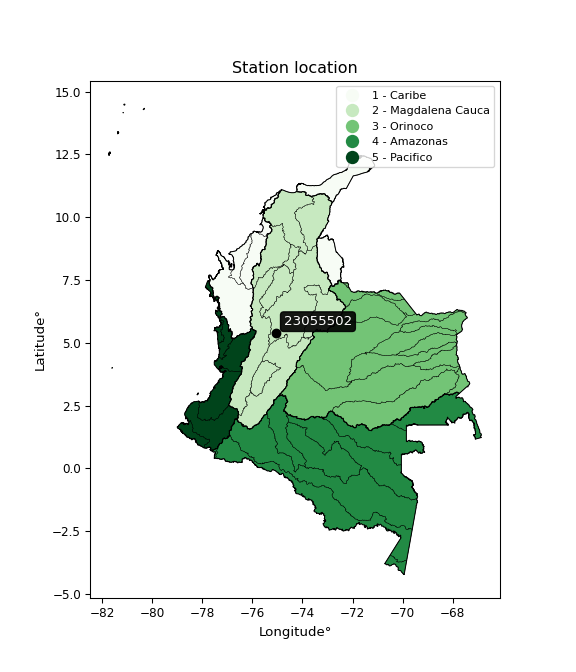

<div align="center">


</div>

# PMP Station (rain, Pmax24h): 23055502

Probable Maximum Precipitation (PMP) is the greatest amount of rainfall for a specific duration that is meteorologically possible for a given location, acting as a "worst-case" scenario for extreme storms, crucial for designing safety-critical infrastructure like bridges, river deviations, dams, spillways, and nuclear plants to prevent catastrophic failure. PMP is calculated by hydrologists using meteorological data to determine the upper limit of extreme rainfall, often leading to the Probable Maximum Flood (PMF) for flood control design, and is increasingly being studied for climate change impacts.

<div align="center">

</img>

</div>


## A. General information


### 1. General running parameters

• app_version: _v20251227_. • runtime: _2025-12-27 09:02:11.367833_. • Python version: _3.14.0_. • SciPy version: _1.16.3_. • Pandas version: _2.3.3_. • NumPy version: _2.3.5_. • Stations dataset (station_dataset_file): _dataset/pmax24h_in/automatic_colombia_2003_2024_filter.csv_. • Stations catalog (station_catalog_file): _dataset/CNE_IDEAM.xls_. • Minimum year to eval til year_max (date_min): _2003_. • Maximum year to eval since year_min (date_max): _2024_. • Creates, save and include plots into reports (create_plot): _False_. • Plot only fit distributions with Δo > Δ (plot_only_fit): _True_. • Eval low extreme values, if False, evaluates high extreme values (low_extreme): _False_. • Eval every SciPy distribution as logarithmic (pdist_logarithmic_on): _True_. • Standard deviation normalized (ddof): _1.0_. • Return periods to eval in years (Tr): _[2, 2.33, 5, 10, 15, 20, 25, 50, 75, 100, 200, 250, 500, 750, 1000]_. • Minimum data sample per station, 0 means any (minimum_sample): _5_. • Z-Score threshold to adjust a value, 0 means disable (zscore): _3.5_. • Avoid zeros, e.g. rain = 0 (avoid_zeros): _True_. • Avoid null values (avoid_nans): _True_. [:file_folder:Dataset file.](../../dataset/pmax24h_in/automatic_colombia_2003_2024_filter.csv)

> Delta Degrees of Freedom (DDOF): is a parameter used in the formulas for calculating variance and standard deviation. When ddof=0, the divisor is $N$ (the total number of observations) and this is used when your data set is the entire population. When ddof=1, the divisor is $N-1$ and this is used when your data set is a sample drawn from a larger population. Using $N-1$ provides an unbiased estimate of the population variance (known as Bessel´s correction).


### 2. Station info and location

|   id |   CODIGO | NOMBRE                      | CATEGORIA               | TECNOLOGIA                | ESTADO   | FECHA_INSTALACION   |   FECHA_SUSPENSION |   ALTITUD |   LATITUD |   LONGITUD | DEPARTAMENTO   | MUNICIPIO   | AREA_OPERATIVA             | ENTIDAD                                    | AREA_HIDROGRAFICA   | ZONA_HIDROGRAFICA   | SUBZONA_HIDROGRAFICA   |   CORRIENTE | Catalogo   |
|-----:|---------:|:----------------------------|:------------------------|:--------------------------|:---------|:--------------------|-------------------:|----------:|----------:|-----------:|:---------------|:------------|:---------------------------|:-------------------------------------------|:--------------------|:--------------------|:-----------------------|------------:|:-----------|
|    0 | 23055502 | VILLARAZ  - AUT  [23055502] | Climatológica Principal | Automática con Telemetría | Activa   | 09/12/2013          |                nan |      1641 |   5.38333 |   -75.0664 | Caldas         | Pensilvania | Area Operativa 10 - Tolima | CENTRO NACIONAL DE INVESTIGACIONES DE CAFE | Magdalena Cauca     | Medio Magdalena     | Río La Miel (Samaná)   |         nan | CNE_OE     |

<div align="center">

Map location in: [:earth_americas:Google](http://maps.google.com/maps?q=5.383333333,-75.06638889) [:earth_americas:OSM](https://www.openstreetmap.org/#map=18/5.383333333/-75.06638889&layers=P) [:earth_americas:Bing](https://www.bing.com/maps?cp=5.383333333~-75.06638889&lvl=18) [:earth_americas:Apple](https://maps.apple.com/frame?center=5.383333333%2C-75.06638889&span=0.003%2C0.006)

</div>


<div align="center">

```geojson
{
  "type": "Feature",
  "geometry": {
    "type": "Point", 
    "coordinates": [-75.06638889, 5.383333333]
  }, 
  "properties": {
    "Name": "23055502"
  }
}
```

</div>


### 3. Discrete values table and plot

|               |          0 |           1 |           2 |          3 |           4 |
|:--------------|-----------:|------------:|------------:|-----------:|------------:|
| Date          | 2017       | 2018        | 2020        | 2021       | 2022        |
| Value         |   79.9     |   95.1      |  103.1      |  160.6     |  118.8      |
| Value_initial |   79.9     |   95.1      |  103.1      |  160.6     |  118.8      |
| count         |    5       |    5        |    5        |    5       |    5        |
| mean          |  111.5     |  111.5      |  111.5      |  111.5     |  111.5      |
| std           |   30.8309  |   30.8309   |   30.8309   |   30.8309  |   30.8309   |
| zscore        |   -1.02495 |   -0.531934 |   -0.272454 |    1.59256 |    0.236775 |

> The initial value (value_initial) correspond to the initial obtained or null completed value, and value (value) is adjusted only when the initial value is outside the valid range definite through the Z-Score value. If Z-Score is active, values out of range or outliers are replaced with the station mean value


### 4. Active continuous probability distributions from SciPy (45 of 104 available)

[scipy.stats](https://docs.scipy.org/doc/scipy/reference/stats.html) is a Python´s powerful submodule within the SciPy library for comprehensive statistical analysis, offering over 130 probability distributions (like Normal, Poisson), functions for descriptive stats (mean, variance), hypothesis testing (t-tests, chi-square), random variable generation, and statistical tests, making it essential for data science, modeling, and research. It provides tools to explore, model, and draw conclusions from data efficiently, working seamlessly with NumPy.

<div align="center">

|   id | p_dist             |   n_parameter | fit_method   | label                                                                       | active   | ref                                                                                                        |
|-----:|:-------------------|--------------:|:-------------|:----------------------------------------------------------------------------|:---------|:-----------------------------------------------------------------------------------------------------------|
|    0 | alpha              |             3 | MLE          | Alpha                                                                       | True     | [:mortar_board:](https://docs.scipy.org/doc/scipy/reference/generated/scipy.stats.alpha.html)              |
|    1 | betaprime          |             4 | MLE          | Beta prime                                                                  | True     | [:mortar_board:](https://docs.scipy.org/doc/scipy/reference/generated/scipy.stats.betaprime.html)          |
|    2 | chi2               |             3 | MLE          | Chi²                                                                        | True     | [:mortar_board:](https://docs.scipy.org/doc/scipy/reference/generated/scipy.stats.chi2.html)               |
|    3 | crystalball        |             4 | MLE          | Crystalball                                                                 | True     | [:mortar_board:](https://docs.scipy.org/doc/scipy/reference/generated/scipy.stats.crystalball.html)        |
|    4 | erlang             |             3 | MLE          | Erlang                                                                      | True     | [:mortar_board:](https://docs.scipy.org/doc/scipy/reference/generated/scipy.stats.erlang.html)             |
|    5 | expon              |             2 | MLE          | Exponential                                                                 | True     | [:mortar_board:](https://docs.scipy.org/doc/scipy/reference/generated/scipy.stats.expon.html)              |
|    6 | exponnorm          |             3 | MLE          | Exponentially modified Normal                                               | True     | [:mortar_board:](https://docs.scipy.org/doc/scipy/reference/generated/scipy.stats.exponnorm.html)          |
|    7 | f                  |             4 | MLE          | F                                                                           | True     | [:mortar_board:](https://docs.scipy.org/doc/scipy/reference/generated/scipy.stats.f.html)                  |
|    8 | fatiguelife        |             3 | MLE          | Fatigue-life (Birnbaum-Saunders)                                            | True     | [:mortar_board:](https://docs.scipy.org/doc/scipy/reference/generated/scipy.stats.fatiguelife.html)        |
|    9 | fisk               |             3 | MLE          | Fisk                                                                        | True     | [:mortar_board:](https://docs.scipy.org/doc/scipy/reference/generated/scipy.stats.fisk.html)               |
|   10 | gamma              |             3 | MLE          | Gamma                                                                       | True     | [:mortar_board:](https://docs.scipy.org/doc/scipy/reference/generated/scipy.stats.gamma.html)              |
|   11 | genexpon           |             5 | MLE          | Generalized exponential                                                     | True     | [:mortar_board:](https://docs.scipy.org/doc/scipy/reference/generated/scipy.stats.genexpon.html)           |
|   12 | genlogistic        |             3 | MLE          | Generalized logistic                                                        | True     | [:mortar_board:](https://docs.scipy.org/doc/scipy/reference/generated/scipy.stats.genlogistic.html)        |
|   13 | gibrat             |             2 | MM           | Gibrat                                                                      | True     | [:mortar_board:](https://docs.scipy.org/doc/scipy/reference/generated/scipy.stats.gibrat.html)             |
|   14 | gompertz           |             3 | MLE          | Gompertz (or truncated Gumbel)                                              | True     | [:mortar_board:](https://docs.scipy.org/doc/scipy/reference/generated/scipy.stats.gompertz.html)           |
|   15 | gumbel_l           |             2 | MM           | Gumbel Left Skew                                                            | True     | [:mortar_board:](https://docs.scipy.org/doc/scipy/reference/generated/scipy.stats.gumbel_l.html)           |
|   16 | gumbel_r           |             2 | MM           | Gumbel Right Skew                                                           | True     | [:mortar_board:](https://docs.scipy.org/doc/scipy/reference/generated/scipy.stats.gumbel_r.html)           |
|   17 | halflogistic       |             2 | MM           | Half-logistic                                                               | True     | [:mortar_board:](https://docs.scipy.org/doc/scipy/reference/generated/scipy.stats.halflogistic.html)       |
|   18 | halfnorm           |             2 | MM           | Half Normal                                                                 | True     | [:mortar_board:](https://docs.scipy.org/doc/scipy/reference/generated/scipy.stats.halfnorm.html)           |
|   19 | hypsecant          |             2 | MM           | hyperbolic secant                                                           | True     | [:mortar_board:](https://docs.scipy.org/doc/scipy/reference/generated/scipy.stats.hypsecant.html)          |
|   20 | invgamma           |             3 | MLE          | Inverted gamma                                                              | True     | [:mortar_board:](https://docs.scipy.org/doc/scipy/reference/generated/scipy.stats.invgamma.html)           |
|   21 | invgauss           |             3 | MLE          | Inverse Gaussian                                                            | True     | [:mortar_board:](https://docs.scipy.org/doc/scipy/reference/generated/scipy.stats.invgauss.html)           |
|   22 | invweibull         |             3 | MLE          | Inverted Weibull                                                            | True     | [:mortar_board:](https://docs.scipy.org/doc/scipy/reference/generated/scipy.stats.invweibull.html)         |
|   23 | johnsonsu          |             4 | MLE          | Johnson Su                                                                  | True     | [:mortar_board:](https://docs.scipy.org/doc/scipy/reference/generated/scipy.stats.johnsonsu.html)          |
|   24 | kstwobign          |             2 | MLE          | Limiting distribution of scaled Kolmogorov-Smirnov two-sided test statistic | True     | [:mortar_board:](https://docs.scipy.org/doc/scipy/reference/generated/scipy.stats.kstwobign.html)          |
|   25 | laplace            |             2 | MM           | Laplace                                                                     | True     | [:mortar_board:](https://docs.scipy.org/doc/scipy/reference/generated/scipy.stats.laplace.html)            |
|   26 | laplace_asymmetric |             3 | MLE          | Asymmetric Laplace                                                          | True     | [:mortar_board:](https://docs.scipy.org/doc/scipy/reference/generated/scipy.stats.laplace_asymmetric.html) |
|   27 | loggamma           |             3 | MLE          | Log gamma                                                                   | True     | [:mortar_board:](https://docs.scipy.org/doc/scipy/reference/generated/scipy.stats.loggamma.html)           |
|   28 | logistic           |             2 | MM           | Logistic (or Sech-squared)                                                  | True     | [:mortar_board:](https://docs.scipy.org/doc/scipy/reference/generated/scipy.stats.logistic.html)           |
|   29 | lognorm            |             3 | MLE          | Log Normal                                                                  | True     | [:mortar_board:](https://docs.scipy.org/doc/scipy/reference/generated/scipy.stats.lognorm.html)            |
|   30 | maxwell            |             2 | MM           | Maxwell                                                                     | True     | [:mortar_board:](https://docs.scipy.org/doc/scipy/reference/generated/scipy.stats.maxwell.html)            |
|   31 | mielke             |             4 | MLE          | Mielke Beta-Kappa / Dagum                                                   | True     | [:mortar_board:](https://docs.scipy.org/doc/scipy/reference/generated/scipy.stats.mielke.html)             |
|   32 | moyal              |             2 | MM           | Moyal                                                                       | True     | [:mortar_board:](https://docs.scipy.org/doc/scipy/reference/generated/scipy.stats.moyal.html)              |
|   33 | nakagami           |             3 | MLE          | Nakagami                                                                    | True     | [:mortar_board:](https://docs.scipy.org/doc/scipy/reference/generated/scipy.stats.nakagami.html)           |
|   34 | ncf                |             5 | MLE          | Non-central F distribution                                                  | True     | [:mortar_board:](https://docs.scipy.org/doc/scipy/reference/generated/scipy.stats.ncf.html)                |
|   35 | nct                |             4 | MLE          | Non-central Student’s t                                                     | True     | [:mortar_board:](https://docs.scipy.org/doc/scipy/reference/generated/scipy.stats.nct.html)                |
|   36 | norm               |             2 | MM           | Normal                                                                      | True     | [:mortar_board:](https://docs.scipy.org/doc/scipy/reference/generated/scipy.stats.norm.html)               |
|   37 | pareto             |             3 | MLE          | Pareto                                                                      | True     | [:mortar_board:](https://docs.scipy.org/doc/scipy/reference/generated/scipy.stats.pareto.html)             |
|   38 | pearson3           |             3 | MM           | Pearson type III                                                            | True     | [:mortar_board:](https://docs.scipy.org/doc/scipy/reference/generated/scipy.stats.pearson3.html)           |
|   39 | rayleigh           |             2 | MM           | Rayleigh                                                                    | True     | [:mortar_board:](https://docs.scipy.org/doc/scipy/reference/generated/scipy.stats.rayleigh.html)           |
|   40 | rice               |             3 | MLE          | Rice                                                                        | True     | [:mortar_board:](https://docs.scipy.org/doc/scipy/reference/generated/scipy.stats.rice.html)               |
|   41 | t                  |             3 | MLE          | Student’s t                                                                 | True     | [:mortar_board:](https://docs.scipy.org/doc/scipy/reference/generated/scipy.stats.t.html)                  |
|   42 | truncnorm          |             4 | MLE          | Truncated normal                                                            | True     | [:mortar_board:](https://docs.scipy.org/doc/scipy/reference/generated/scipy.stats.truncnorm.html)          |
|   43 | wald               |             2 | MM           | Wald                                                                        | True     | [:mortar_board:](https://docs.scipy.org/doc/scipy/reference/generated/scipy.stats.wald.html)               |
|   44 | weibull_min        |             3 | MLE          | Weibull minimum                                                             | True     | [:mortar_board:](https://docs.scipy.org/doc/scipy/reference/generated/scipy.stats.weibull_min.html)        |

</div>

> **n_parameter:** # arguments & localization & scale.
>
> **Fit methods:** (MLE) maximum likelihood, (MM) L-moments.
>
>**Inactive:** foldnorm, gennorm, norminvgauss, powernorm, powerlognorm, skewnorm, genextreme, anglit, arcsine, argus, beta, bradford, burr, burr12, cauchy, cosine, halfcauchy, foldcauchy, skewcauchy, wrapcauchy, dgamma, gengamma, exponweib, exponpow, truncexpon, gausshyper, genhalflogistic, genhyperbolic, geninvgauss, halfgennorm, johnsonsb, kappa4, kappa3, ksone, kstwo, loglaplace, levy, levy_l, levy_stable, ncx2, genpareto, truncpareto, lomax, powerlaw, rdist, rel_breitwigner, recipinvgauss, semicircular, studentized_range, trapezoid, triang, truncweibull_min, tukeylambda, uniform, loguniform, vonmises, vonmises_line, weibull_max, dweibull, 


## B. Probability distributions vs. Empirical distributions

A continuous probability distribution (CPD) describes probabilities for variables that can take any value within a range (like rain any time), unlike discrete variables with specific outcomes (like temperature). It uses a Probability Density Function (PDF), a curve where the total area under it equals 1, and the probability of the variable falling within an interval (a to b) is found by calculating the area under the curve between those points. A key feature is that the probability of hitting any single exact value is zero, so probabilities are always expressed for ranges, e.g., $P(a ≤ X ≤ b)$.

<div align="center">

Distributions parameters from station values
|    |   station | p_dist                |   n |             loc |           scale | shape                  | shape1             | shape2                | shape3   |
|---:|----------:|:----------------------|----:|----------------:|----------------:|:-----------------------|:-------------------|:----------------------|:---------|
|  0 |  23055502 | alpha                 |   5 |    17.564       |   331.028       | 3.806503871563053      |                    |                       |          |
|  1 |  23055502 | betaprime             |   5 |    -2.1258      |     5.02025     | 442.26729513927125     | 20.5597249044621   |                       |          |
|  2 |  23055502 | chi2                  |   5 |    79.9         |    14.3889      | 1.7749167538936619     |                    |                       |          |
|  3 |  23055502 | crystalball           |   5 |   111.5         |    27.576       | 8092.416408327104      | 5429.906314305551  |                       |          |
|  4 |  23055502 | erlang                |   5 |    79.9         |    29.3051      | 0.5830215092453301     |                    |                       |          |
|  5 |  23055502 | expon                 |   5 |    79.9         |    31.6         |                        |                    |                       |          |
|  6 |  23055502 | exponnorm             |   5 |    79.8625      |     0.0111877   | 2800.3178976465542     |                    |                       |          |
|  7 |  23055502 | f                     |   5 |    -2.35636     |   108.215       | 994.4540705221775      | 41.14395958397863  |                       |          |
|  8 |  23055502 | fatiguelife           |   5 |    79.9         |     2.51876e-05 | 1300.1966176310634     |                    |                       |          |
|  9 |  23055502 | fisk                  |   5 |    72.0186      |    31.1873      | 2.1382836578605193     |                    |                       |          |
| 10 |  23055502 | gamma                 |   5 |    79.9         |    29.8794      | 0.9090453557928546     |                    |                       |          |
| 11 |  23055502 | genexpon              |   5 |    79.8984      |    35.8225      | 0.9589392413397069     | 24.18921725709037  | 0.009388113295916118  |          |
| 12 |  23055502 | genlogistic           |   5 |   -46.5612      |    20.405       | 1252.6780223510123     |                    |                       |          |
| 13 |  23055502 | gibrat                |   5 |    90.463       |    12.7596      |                        |                    |                       |          |
| 14 |  23055502 | gompertz              |   5 |    79.9         |   138.458       | 3.536095385633815      |                    |                       |          |
| 15 |  23055502 | gumbel_l              |   5 |   123.911       |    21.5009      |                        |                    |                       |          |
| 16 |  23055502 | gumbel_r              |   5 |    99.0893      |    21.5009      |                        |                    |                       |          |
| 17 |  23055502 | halflogistic          |   5 |    78.816       |    23.5765      |                        |                    |                       |          |
| 18 |  23055502 | halfnorm              |   5 |    75.0002      |    45.7457      |                        |                    |                       |          |
| 19 |  23055502 | hypsecant             |   5 |   111.5         |    17.5554      |                        |                    |                       |          |
| 20 |  23055502 | invgamma              |   5 |    53.1382      |   236.681       | 5.005719373177927      |                    |                       |          |
| 21 |  23055502 | invgauss              |   5 |    66.6658      |    88.5229      | 0.5064701188067138     |                    |                       |          |
| 22 |  23055502 | invweibull            |   5 |    79.9         |     1.81015     | 0.04895779835619943    |                    |                       |          |
| 23 |  23055502 | johnsonsu             |   5 |    68.9456      |     0.465587    | -7.075779294360235     | 1.420746748803765  |                       |          |
| 24 |  23055502 | kstwobign             |   5 |    26.5383      |    97.7431      |                        |                    |                       |          |
| 25 |  23055502 | laplace               |   5 |   111.5         |    19.4992      |                        |                    |                       |          |
| 26 |  23055502 | laplace_asymmetric    |   5 |    95.1         |    17.059       | 0.6288443270294498     |                    |                       |          |
| 27 |  23055502 | loggamma              |   5 | -6704.43        |   963.089       | 1185.1460122159253     |                    |                       |          |
| 28 |  23055502 | logistic              |   5 |   111.5         |    15.2034      |                        |                    |                       |          |
| 29 |  23055502 | lognorm               |   5 |    79.9         |     0.0275014   | 14.15658382163586      |                    |                       |          |
| 30 |  23055502 | maxwell               |   5 |    46.1564      |    40.948       |                        |                    |                       |          |
| 31 |  23055502 | mielke                |   5 |    -6.53629     |    36.7634      | 1769.0459896148377     | 5.559495782713751  |                       |          |
| 32 |  23055502 | moyal                 |   5 |    95.7303      |    12.4136      |                        |                    |                       |          |
| 33 |  23055502 | nakagami              |   5 |    95.1         |    38.4562      | 0.22186125374698257    |                    |                       |          |
| 34 |  23055502 | ncf                   |   5 |    -1.92554     |     0.277213    | 1.1039187748815333     | 46.98663811730151  | 430.39612308869766    |          |
| 35 |  23055502 | nct                   |   5 |    -0.302825    |     2.25261     | 10.408583646122267     | 45.86764186385004  |                       |          |
| 36 |  23055502 | norm                  |   5 |   111.5         |    27.576       |                        |                    |                       |          |
| 37 |  23055502 | pareto                |   5 |    79.6176      |     0.282387    | 0.2629320138273438     |                    |                       |          |
| 38 |  23055502 | pearson3              |   5 |   111.5         |    27.576       | 0.7840212754948677     |                    |                       |          |
| 39 |  23055502 | rayleigh              |   5 |    58.7455      |    42.092       |                        |                    |                       |          |
| 40 |  23055502 | rice                  |   5 |    65.6475      |    37.8345      | 0.00043691154247244316 |                    |                       |          |
| 41 |  23055502 | t                     |   5 |   111.5         |    27.5737      | 1296205.4301042783     |                    |                       |          |
| 42 |  23055502 | truncnorm             |   5 |   111.5         |    27.576       | -216.7182781138407     | 2165.9134184729182 |                       |          |
| 43 |  23055502 | wald                  |   5 |    83.924       |    27.576       |                        |                    |                       |          |
| 44 |  23055502 | weibull_min           |   5 |    79.9         |    42.2567      | 0.4249132325596967     |                    |                       |          |
| 45 |  23055502 | logalpha              |   5 |     2.57081     |    19.5197      | 9.367838799572795      |                    |                       |          |
| 46 |  23055502 | logbetaprime          |   5 |    -2.32891     |    17.2991      | 270.70160048825073     | 667.4228244838591  |                       |          |
| 47 |  23055502 | logchi2               |   5 |     4.38078     |     1.00929     | 0.9367019176316609     |                    |                       |          |
| 48 |  23055502 | logcrystalball        |   5 |     4.68555     |     0.234784    | 6.9540139497894335     | 302.68308500202795 |                       |          |
| 49 |  23055502 | logerlang             |   5 |     4.38078     |     0.25359     | 0.8099234377592415     |                    |                       |          |
| 50 |  23055502 | logexpon              |   5 |     4.38078     |     0.304777    |                        |                    |                       |          |
| 51 |  23055502 | logexponnorm          |   5 |     4.45746     |     0.119676    | 1.9058809321310597     |                    |                       |          |
| 52 |  23055502 | logf                  |   5 |     3.85295     |     0.776316    | 224.82998777775174     | 29.24998155564981  |                       |          |
| 53 |  23055502 | logfatiguelife        |   5 |     4.12921     |     0.505229    | 0.4493966878673059     |                    |                       |          |
| 54 |  23055502 | logfisk               |   5 |     4.12711     |     0.515486    | 3.864042373633234      |                    |                       |          |
| 55 |  23055502 | loggamma              |   5 |     4.38078     |     0.771657    | 0.13534741456611227    |                    |                       |          |
| 56 |  23055502 | loggenexpon           |   5 |     4.38078     | 17212.9         | 41498.72504460713      | 104905.79045881203 | 11469.11264574028     |          |
| 57 |  23055502 | loggenlogistic        |   5 |     3.34442     |     0.191576    | 614.1903671383166      |                    |                       |          |
| 58 |  23055502 | loggibrat             |   5 |     4.50648     |     0.108616    |                        |                    |                       |          |
| 59 |  23055502 | loggompertz           |   5 |     4.38078     |     0.606367    | 1.2685944166790273     |                    |                       |          |
| 60 |  23055502 | loggumbel_l           |   5 |     4.79122     |     0.18306     |                        |                    |                       |          |
| 61 |  23055502 | loggumbel_r           |   5 |     4.57989     |     0.18306     |                        |                    |                       |          |
| 62 |  23055502 | loghalflogistic       |   5 |     4.40726     |     0.200748    |                        |                    |                       |          |
| 63 |  23055502 | loghalfnorm           |   5 |     4.37479     |     0.389481    |                        |                    |                       |          |
| 64 |  23055502 | loghypsecant          |   5 |     4.68555     |     0.149468    |                        |                    |                       |          |
| 65 |  23055502 | loginvgamma           |   5 |     3.60252     |    23.0063      | 22.342450691892928     |                    |                       |          |
| 66 |  23055502 | loginvgauss           |   5 |     4.09249     |     3.30025     | 0.179702522141236      |                    |                       |          |
| 67 |  23055502 | loginvweibull         |   5 |    -7.00515e+06 |     7.00516e+06 | 36553451.020525716     |                    |                       |          |
| 68 |  23055502 | logjohnsonsu          |   5 |     4.07543     |     0.0266211   | -9.470925627404037     | 2.5262522750884995 |                       |          |
| 69 |  23055502 | logkstwobign          |   5 |     3.90154     |     0.89888     |                        |                    |                       |          |
| 70 |  23055502 | loglaplace            |   5 |     4.68555     |     0.166017    |                        |                    |                       |          |
| 71 |  23055502 | loglaplace_asymmetric |   5 |     4.6357      |     0.178948    | 0.8703396880803838     |                    |                       |          |
| 72 |  23055502 | logloggamma           |   5 |   -63.9195      |     9.34391     | 1544.4315952224065     |                    |                       |          |
| 73 |  23055502 | loglogistic           |   5 |     4.68555     |     0.129443    |                        |                    |                       |          |
| 74 |  23055502 | loglognorm            |   5 |     4.38078     |     0.000405174 | 13.431053105969937     |                    |                       |          |
| 75 |  23055502 | logmaxwell            |   5 |     4.12921     |     0.348633    |                        |                    |                       |          |
| 76 |  23055502 | logmielke             |   5 | -6085.13        |  6089.04        | 1102909.2509726598     | 32145.768042435084 |                       |          |
| 77 |  23055502 | logmoyal              |   5 |     4.55129     |     0.10569     |                        |                    |                       |          |
| 78 |  23055502 | lognakagami           |   5 |     4.38078     |     0.455997    | 0.062293575839966864   |                    |                       |          |
| 79 |  23055502 | logncf                |   5 |     1.30486     |     3.37457     | 688.4669936364689      | 1126.8911631872188 | 9.702128278630973e-10 |          |
| 80 |  23055502 | lognct                |   5 |    -0.223408    |     0.0568513   | 240.12930391978608     | 86.06856902994313  |                       |          |
| 81 |  23055502 | lognorm               |   5 |     4.68555     |     0.234783    |                        |                    |                       |          |
| 82 |  23055502 | logpareto             |   5 |     4.37792     |     0.00285483  | 0.26212307572354215    |                    |                       |          |
| 83 |  23055502 | logpearson3           |   5 |     4.68555     |     0.234783    | 0.4787601311276872     |                    |                       |          |
| 84 |  23055502 | lograyleigh           |   5 |     4.2364      |     0.358373    |                        |                    |                       |          |
| 85 |  23055502 | logrice               |   5 |     4.26709     |     0.336787    | 0.17266103101253966    |                    |                       |          |
| 86 |  23055502 | logt                  |   5 |     4.68555     |     0.234787    | 54671888.23198886      |                    |                       |          |
| 87 |  23055502 | logtruncnorm          |   5 |    -0.0660072   |     1.22785     | 3.6215988471859113     | 7.031075104734679  |                       |          |
| 88 |  23055502 | logwald               |   5 |     4.4508      |     0.23475     |                        |                    |                       |          |
| 89 |  23055502 | logweibull_min        |   5 |     4.38078     |     0.31637     | 0.14948918408519474    |                    |                       |          |

</div>

> **loc** (Location parameter): This shifts the distribution along the x-axis. For many common distributions, like the normal (Gaussian) distribution, loc represents the mean $μ$. For others, like the uniform distribution, it might represent the minimum value, or for the beta distribution, the left end of the support interval.
>
> **scale** (Scale parameter): This determines the width or spread of the distribution. For the normal distribution, scale represents the standard deviation $σ$. For a uniform distribution, it defines the length of the interval (from $loc$ to $loc + scale$).
>
> **shape** (Shape parameters): Refers to parameters that define the specific form of a probability distribution, distinct from its location (loc) and scale (scale). These parameters are required arguments for most distribution functions. For example, a normal (Gaussian) distribution is fully defined by its location (mean) and scale (standard deviation), so it has no specific shape parameters beyond loc and scale. However, other distributions have intrinsic properties that need specification, as Gamma distribution that takes a shape parameter, often named $a$ or $alpha$.


### 0. Cumulative distribution values - CDF (90 evaluated)

Cumulative Distribution Function (CDF), denoted as $F$<sub>$X$</sub>$(x)$, is a function that gives the probability that a random variable $X$ will take a value less than or equal to a specific value, $x$ (i.e., $(P(X≥x)$. It essentially "accumulates" probabilities from a given point up to the far right (positive infinity), providing a complete picture of the distribution´s probabilities for both discrete (like rain) and continuous (like temperature) variables, helping to find probabilities over ranges or above certain values.

<div align="center">

CDF ordered by x ascending and calculating $log(f(x))$ separately
|   id |   Station |   date |     x |   count |   mean |     std |    zscore |   Value_initial |   station |   m |     alpha |   alpha_pdf |   betaprime |   betaprime_pdf |        chi2 |   chi2_pdf |   crystalball |   crystalball_pdf |      erlang |     erlang_pdf |    expon |   expon_pdf |   exponnorm |   exponnorm_pdf |         f |      f_pdf |   fatiguelife |   fatiguelife_pdf |      fisk |   fisk_pdf |       gamma |   gamma_pdf |    genexpon |   genexpon_pdf |   genlogistic |   genlogistic_pdf |   gibrat |   gibrat_pdf |    gompertz |   gompertz_pdf |   gumbel_l |   gumbel_l_pdf |   gumbel_r |   gumbel_r_pdf |   halflogistic |   halflogistic_pdf |   halfnorm |   halfnorm_pdf |   hypsecant |   hypsecant_pdf |   invgamma |   invgamma_pdf |   invgauss |   invgauss_pdf |   invweibull |   invweibull_pdf |   johnsonsu |   johnsonsu_pdf |   kstwobign |   kstwobign_pdf |   laplace |   laplace_pdf |   laplace_asymmetric |   laplace_asymmetric_pdf |   loggamma |   loggamma_pdf |   logistic |   logistic_pdf |   lognorm |   lognorm_pdf |   maxwell |   maxwell_pdf |   mielke |   mielke_pdf |     moyal |   moyal_pdf |    nakagami |   nakagami_pdf |       ncf |    ncf_pdf |       nct |    nct_pdf |     norm |   norm_pdf |      pareto |   pareto_pdf |   pearson3 |   pearson3_pdf |   rayleigh |   rayleigh_pdf |      rice |   rice_pdf |        t |      t_pdf |   truncnorm |   truncnorm_pdf |     wald |   wald_pdf |   weibull_min |   weibull_min_pdf |   logalpha |   logalpha_pdf |   logbetaprime |   logbetaprime_pdf |     logchi2 |   logchi2_pdf |   logcrystalball |   logcrystalball_pdf |   logerlang |   logerlang_pdf |   logexpon |   logexpon_pdf |   logexponnorm |   logexponnorm_pdf |      logf |   logf_pdf |   logfatiguelife |   logfatiguelife_pdf |   logfisk |   logfisk_pdf |   loggenexpon |   loggenexpon_pdf |   loggenlogistic |   loggenlogistic_pdf |   loggibrat |   loggibrat_pdf |   loggompertz |   loggompertz_pdf |   loggumbel_l |   loggumbel_l_pdf |   loggumbel_r |   loggumbel_r_pdf |   loghalflogistic |   loghalflogistic_pdf |   loghalfnorm |   loghalfnorm_pdf |   loghypsecant |   loghypsecant_pdf |   loginvgamma |   loginvgamma_pdf |   loginvgauss |   loginvgauss_pdf |   loginvweibull |   loginvweibull_pdf |   logjohnsonsu |   logjohnsonsu_pdf |   logkstwobign |   logkstwobign_pdf |   loglaplace |   loglaplace_pdf |   loglaplace_asymmetric |   loglaplace_asymmetric_pdf |   logloggamma |   logloggamma_pdf |   loglogistic |   loglogistic_pdf |   loglognorm |   loglognorm_pdf |   logmaxwell |   logmaxwell_pdf |   logmielke |   logmielke_pdf |   logmoyal |   logmoyal_pdf |   lognakagami |   lognakagami_pdf |    logncf |   logncf_pdf |    lognct |   lognct_pdf |   logpareto |   logpareto_pdf |   logpearson3 |   logpearson3_pdf |   lograyleigh |   lograyleigh_pdf |   logrice |   logrice_pdf |      logt |   logt_pdf |   logtruncnorm |   logtruncnorm_pdf |   logwald |   logwald_pdf |   logweibull_min |   logweibull_min_pdf |
|-----:|----------:|-------:|------:|--------:|-------:|--------:|----------:|----------------:|----------:|----:|----------:|------------:|------------:|----------------:|------------:|-----------:|--------------:|------------------:|------------:|---------------:|---------:|------------:|------------:|----------------:|----------:|-----------:|--------------:|------------------:|----------:|-----------:|------------:|------------:|------------:|---------------:|--------------:|------------------:|---------:|-------------:|------------:|---------------:|-----------:|---------------:|-----------:|---------------:|---------------:|-------------------:|-----------:|---------------:|------------:|----------------:|-----------:|---------------:|-----------:|---------------:|-------------:|-----------------:|------------:|----------------:|------------:|----------------:|----------:|--------------:|---------------------:|-------------------------:|-----------:|---------------:|-----------:|---------------:|----------:|--------------:|----------:|--------------:|---------:|-------------:|----------:|------------:|------------:|---------------:|----------:|-----------:|----------:|-----------:|---------:|-----------:|------------:|-------------:|-----------:|---------------:|-----------:|---------------:|----------:|-----------:|---------:|-----------:|------------:|----------------:|---------:|-----------:|--------------:|------------------:|-----------:|---------------:|---------------:|-------------------:|------------:|--------------:|-----------------:|---------------------:|------------:|----------------:|-----------:|---------------:|---------------:|-------------------:|----------:|-----------:|-----------------:|---------------------:|----------:|--------------:|--------------:|------------------:|-----------------:|---------------------:|------------:|----------------:|--------------:|------------------:|--------------:|------------------:|--------------:|------------------:|------------------:|----------------------:|--------------:|------------------:|---------------:|-------------------:|--------------:|------------------:|--------------:|------------------:|----------------:|--------------------:|---------------:|-------------------:|---------------:|-------------------:|-------------:|-----------------:|------------------------:|----------------------------:|--------------:|------------------:|--------------:|------------------:|-------------:|-----------------:|-------------:|-----------------:|------------:|----------------:|-----------:|---------------:|--------------:|------------------:|----------:|-------------:|----------:|-------------:|------------:|----------------:|--------------:|------------------:|--------------:|------------------:|----------:|--------------:|----------:|-----------:|---------------:|-------------------:|----------:|--------------:|-----------------:|---------------------:|
|    0 |  23055502 |   2017 |  79.9 |       5 |  111.5 | 30.8309 | -1.02495  |            79.9 |  23055502 |   1 | 0.0663106 |  0.0109702  |   0.0904175 |      0.00956374 | 2.72283e-14 | 1.70039    |      0.125913 |        0.00750298 | 1.32189e-09 | 54232.4        | 0        |  0.0316456  |  0.00119579 |      0.0318682  | 0.0902466 | 0.00955732 |     0.0320826 |       1.53087e+10 | 0.0501537 | 0.0129246  | 1.22023e-14 |  0.780564   | 4.30286e-05 |     0.0267683  |     0.0784048 |        0.00977238 | 0        |   0          | 6.75054e-14 |     0.0255391  |   0.121142 |     0.00527832 |  0.0870565 |     0.00988433 |      0.0229844 |         0.0211964  |  0.0852982 |     0.017342   |    0.104288 |      0.0058348  |  0.0607471 |     0.0121981  |  0.0551435 |     0.0148026  |   0.00741653 |      1.25302e+11 |   0.0544288 |      0.0142961  |   0.0731625 |      0.00997934 | 0.0988919 |    0.00507159 |            0.0687088 |               0.00640493 |  0.0101353 |    1.54449e+12 |   0.111207 |     0.00650113 | 0.0971231 |      0.731687 |  0.121885 |    0.00942247 |      nan |          nan | 0.0584946 |  0.010154   | 0           |    0           | 0.0942096 | 0.00950747 | 0.0819395 | 0.0101174  | 0.125913 | 0.00750298 | 1.11022e-16 |  0.931106    |   0.106135 |     0.0099506  |   0.118643 |     0.0105234  | 0.0684957 | 0.00927475 | 0.125895 | 0.00750282 |    0.125913 |      0.00750298 | 0        | 0          |   2.66195e-07 |        7.9594e+06 |  0.0782815 |       0.871371 |       0.271617 |           0.681347 | 7.25268e-08 |   3.82446e+07 |        0.0971236 |             0.731688 | 2.09735e-12 |     1912.56     |   0        |       3.28109  |      0.0650134 |           0.858488 | 0.0636715 |   0.933965 |        0.0566831 |             1.06951  | 0.0606602 |      0.867958 |   7.11801e-09 |          2.41091  |        0.0644901 |             0.920727 |    0        |        0        |   8.53924e-10 |          2.09212  |      0.100785 |          0.521832 |     0.0514367 |          0.83379  |          0        |              0        |     0.0122588 |          2.04834  |      0.0823918 |           0.5451   |     0.0725559 |          0.92109  |     0.0579132 |          1.03262  |       0.0640904 |            0.918829 |      0.0603679 |           0.986546 |      0.0612787 |           0.982073 |    0.0797415 |         0.480322 |               0.0838754 |                     0.53854 |      0.101385 |          0.737465 |     0.0867065 |          0.611765 |    0.0228143 |      4.53671e+12 |    0.0856692 |         0.918465 |   0.0653169 |        0.904351 |  0.0250632 |       0.68744  |     0.0127772 |        1.7923e+12 | 0.0895636 |     0.76266  | 0.0893881 |     0.772074 | 1.11022e-16 |       91.8173   |      0.083532 |          0.840337 |     0.0779461 |          1.03654  | 0.0545824 |      0.933557 | 0.0971261 |   0.73169  |    1.24807e-07 |           3.14878  |  0        |      0        |       0.00665625 |          1.11658e+12 |
|    1 |  23055502 |   2018 |  95.1 |       5 |  111.5 | 30.8309 | -0.531934 |            95.1 |  23055502 |   2 | 0.321761  |  0.019737   |   0.29431   |      0.0161963  | 0.46791     | 0.0204055  |      0.276015 |        0.012122   | 0.639308    |     0.0174636  | 0.381843 |  0.0195619  |  0.385145   |      0.0196257  | 0.294141  | 0.0162029  |     0.724904  |       0.00655904  | 0.344437  | 0.0209183  | 0.444912    |  0.0201604  | 0.347768    |     0.0192108  |     0.298388  |        0.0176763  | 0.155719 |   0.0515451  | 0.336551    |     0.0189099  |   0.230376 |     0.009373   |  0.30003   |     0.0167992  |      0.332239  |         0.0188666  |  0.339615  |     0.0158368  |    0.238335 |      0.0123427  |  0.337006  |     0.0201579  |  0.361353  |     0.0201011  |   0.406136   |      0.00117871  |   0.356646  |      0.0202533  |   0.291176  |      0.0170503  | 0.215626  |    0.0110582  |            0.283383  |               0.0264165  |  0.849415  |    0.540486    |   0.253752 |     0.0124552  | 0.288983  |      1.45555  |  0.301167 |    0.0136272  |      nan |          nan | 0.305028  |  0.0194797  | 1.11412e-07 |    3.47876e+06 | 0.294987  | 0.0159351  | 0.303145  | 0.0174295  | 0.276015 | 0.012122   | 0.65105     |  0.00592609  |   0.303396 |     0.0150936  |   0.311322 |     0.0141311  | 0.2614    | 0.015197   | 0.276    | 0.0121227  |    0.276015 |      0.012122   | 0.275907 | 0.0362443  |   0.476707    |        0.00947366 |  0.319132  |       1.77114  |       0.399733 |           0.77639  | 0.348789    |   0.884186    |        0.288984  |             1.45555  | 0.592712    |        1.84802  |   0.435273 |       1.85292  |      0.332716  |           2.01491  | 0.331028  |   1.90042  |        0.351426  |             1.946    | 0.327337  |      1.9887   |   0.380681    |          1.90666  |        0.330902  |             1.90852  |    0.209768 |        5.94419  |   0.344307    |          1.82819  |      0.240472 |          1.14124  |     0.317883  |          1.99015  |          0.352073 |              2.18195  |     0.356282  |          1.84079  |      0.251681  |           1.5138   |     0.328569  |          1.83951  |     0.345928  |          1.93831  |       0.330447  |            1.90933  |      0.339276  |           1.92591  |      0.333878  |           1.87523  |    0.227648  |         1.37123  |               0.256601  |                     1.64756 |      0.292208 |          1.43797  |     0.267152  |          1.5125   |    0.674165  |      0.154033    |    0.315668  |         1.61915  |   0.328162  |        1.89918  |  0.325645  |       2.28878  |     0.770654  |        0.546621   | 0.293556  |     1.54312  | 0.295806  |     1.55646  | 0.661025    |        0.501972 |      0.307709 |          1.64585  |     0.326323  |          1.67083  | 0.302199  |      1.74466  | 0.288984  |   1.45553  |    0.427587    |           1.86505  |  0.31328  |      4.05788  |       0.599333   |          0.314561    |
|    2 |  23055502 |   2020 | 103.1 |       5 |  111.5 | 30.8309 | -0.272454 |           103.1 |  23055502 |   3 | 0.474701  |  0.0180149  |   0.427047  |      0.0166253  | 0.60701     | 0.014735   |      0.380331 |        0.0138112  | 0.751151    |     0.011143   | 0.5201   |  0.0151867  |  0.523707   |      0.0152029  | 0.426946  | 0.0166352  |     0.769786  |       0.00483303  | 0.498182  | 0.0171988  | 0.583654    |  0.0148429  | 0.487587    |     0.0158144  |     0.441645  |        0.0176827  | 0.496149 |   0.0315678  | 0.475358    |     0.015843   |   0.316057 |     0.012084   |  0.436124  |     0.0168322  |      0.473835  |         0.0164461  |  0.460957  |     0.014443   |    0.353193 |      0.0162372  |  0.488801  |     0.0174398  |  0.507603  |     0.0163551  |   0.413704   |      0.00077053  |   0.504657  |      0.0165924  |   0.428455  |      0.016909   | 0.324999  |    0.0166673  |            0.466404  |               0.0196699  |  0.884461  |    0.350142    |   0.365283 |     0.0152499  | 0.415922  |      1.66132  |  0.413752 |    0.0143285  |      nan |          nan | 0.457384  |  0.0181204  | 0.390205    |    0.0214734   | 0.425959  | 0.0164601  | 0.443488  | 0.0172386  | 0.380331 | 0.0138112  | 0.68725     |  0.00350186  |   0.42653  |     0.0154219  |   0.42604  |     0.0143688  | 0.387347  | 0.0160295  | 0.380323 | 0.0138122  |    0.380331 |      0.0138112  | 0.512781 | 0.023338   |   0.539335    |        0.00653953 |  0.466009  |       1.81974  |       0.463149 |           0.790478 | 0.411796    |   0.693728    |        0.415922  |             1.66131  | 0.715975    |        1.25005  |   0.566744 |       1.42155  |      0.494412  |           1.91762  | 0.483289  |   1.8221   |        0.502219  |             1.75267  | 0.487001  |      1.89809  |   0.522592    |          1.60551  |        0.483984  |             1.83228  |    0.568958 |        3.04099  |   0.484672    |          1.64155  |      0.347933 |          1.52316  |     0.478447  |          1.92678  |          0.514612 |              1.83109  |     0.497069  |          1.63685  |      0.395747  |           2.01642  |     0.478176  |          1.81813  |     0.497317  |          1.77178  |       0.483604  |            1.83328  |      0.491351  |           1.79639  |      0.482856  |           1.775    |    0.370302  |         2.23051  |               0.431007  |                     2.76737 |      0.417476 |          1.63882  |     0.404889  |          1.86147  |    0.68432   |      0.103848    |    0.450219  |         1.68139  |   0.481159  |        1.83839  |  0.502369  |       2.02185  |     0.807632  |        0.387539   | 0.426604  |     1.7188   | 0.429594  |     1.72293  | 0.692833    |        0.312344 |      0.445988 |          1.74056  |     0.462446  |          1.67129  | 0.44573   |      1.77472  | 0.415921  |   1.66129  |    0.560939    |           1.45289  |  0.567928 |      2.3626   |       0.620247   |          0.215616    |
|    3 |  23055502 |   2022 | 118.8 |       5 |  111.5 | 30.8309 |  0.236775 |           118.8 |  23055502 |   4 | 0.704291  |  0.0111584  |   0.664015  |      0.0128977  | 0.780246    | 0.00805666 |      0.604389 |        0.0139689  | 0.873024    |     0.00525696 | 0.708003 |  0.0092404  |  0.711441   |      0.00921059 | 0.664058  | 0.0129048  |     0.830416  |       0.00310401  | 0.704126  | 0.00952246 | 0.760724    |  0.00837343 | 0.691124    |     0.0103839  |     0.684762  |        0.0127061  | 0.787531 |   0.0102404  | 0.682434    |     0.0107412  |   0.545448 |     0.0166685  |  0.670439  |     0.0124672  |      0.690003  |         0.0111105  |  0.661666  |     0.0110287  |    0.628704 |      0.0166696  |  0.706525  |     0.010489   |  0.709243  |     0.00974943 |   0.422929   |      0.000458054 |   0.708493  |      0.00977819 |   0.664992  |      0.012755   | 0.65614   |    0.0176346  |            0.700866  |               0.0110269  |  0.921831  |    0.198813    |   0.617784 |     0.0155311  | 0.652241  |      1.57391  |  0.630523 |    0.0127123  |      nan |          nan | 0.692943  |  0.0117383  | 0.623434    |    0.0108918   | 0.662306  | 0.0129616  | 0.68001   | 0.0123825  | 0.604389 | 0.0139689  | 0.72664     |  0.00183437  |   0.650298 |     0.0125228  |   0.63861  |     0.0122496  | 0.627244  | 0.0138412  | 0.604399 | 0.0139699  |    0.604389 |      0.0139689  | 0.755718 | 0.00989358 |   0.619185    |        0.00401597 |  0.699135  |       1.39564  |       0.574216 |           0.766701 | 0.495805    |   0.511222    |        0.652241  |             1.57391  | 0.846267    |        0.657182 |   0.727876 |       0.892865 |      0.718533  |           1.21758  | 0.705766  |   1.27787  |        0.710912  |             1.18242  | 0.710523  |      1.22207  |   0.71333     |          1.09693  |        0.707234  |             1.27841  |    0.819686 |        0.969449 |   0.690129    |          1.24701  |      0.604462 |          2.00407  |     0.711859  |          1.32166  |          0.726851 |              1.17483  |     0.698776  |          1.20053  |      0.684413  |           1.78211  |     0.70499   |          1.32741  |     0.709546  |          1.20664  |       0.706983  |            1.27919  |      0.708001  |           1.23489  |      0.701586  |           1.28092  |    0.712531  |         1.73157  |               0.71443   |                     1.38891 |      0.651064 |          1.56111  |     0.670375  |          1.70711  |    0.695931  |      0.0656582   |    0.673636  |         1.40469  |   0.706006  |        1.29081  |  0.731564  |       1.22089  |     0.852004  |        0.25598    | 0.664349  |     1.53779  | 0.66656   |     1.52438  | 0.726161    |        0.179664 |      0.676912 |          1.43865  |     0.680062  |          1.34781  | 0.677362  |      1.43039  | 0.652236  |   1.57389  |    0.727056    |           0.927605 |  0.787481 |      0.97995  |       0.644557   |          0.138561    |
|    4 |  23055502 |   2021 | 160.6 |       5 |  111.5 | 30.8309 |  1.59256  |           160.6 |  23055502 |   5 | 0.932243  |  0.00212031 |   0.949347  |      0.00250815 | 0.951545    | 0.00173649 |      0.962506 |        0.00296454 | 0.975616    |     0.00093136 | 0.922214 |  0.00246157 |  0.924004   |      0.00242572 | 0.949428  | 0.00250619 |     0.915695  |       0.00131914  | 0.903102  | 0.00211239 | 0.943673    |  0.00193427 | 0.934946    |     0.00266074 |     0.952344  |        0.00227889 | 0.955825 |   0.00133146 | 0.939039    |     0.00278861 |   0.99595  |     0.00103762 |  0.944386  |     0.00251331 |      0.939578  |         0.00248537 |  0.938684  |     0.00302876 |    0.961213 |      0.00220392 |  0.927649  |     0.00221197 |  0.925103  |     0.00234299 |   0.435897   |      0.00021958  |   0.921331  |      0.00227537 |   0.953546  |      0.00260737 | 0.959692  |    0.00206717 |            0.935927  |               0.00236192 |  0.960794  |    0.0825057   |   0.961931 |     0.00240867 | 0.953076  |      0.417534 |  0.949921 |    0.0030637  |      nan |          nan | 0.941548  |  0.00235016 | 0.895375    |    0.00353657  | 0.950643  | 0.00251761 | 0.945456  | 0.00237057 | 0.962506 | 0.00296454 | 0.774144    |  0.000733306 |   0.945856 |     0.00280907 |   0.946482 |     0.00307669 | 0.957116  | 0.00284463 | 0.962518 | 0.00296398 |    0.962506 |      0.00296454 | 0.943564 | 0.00176441 |   0.731904    |        0.00185827 |  0.943539  |       0.352398 |       0.778232 |           0.561281 | 0.618178    |   0.326       |        0.953075  |             0.417535 | 0.956742    |        0.17977  |   0.898801 |       0.332044 |      0.924752  |           0.329908 | 0.929773  |   0.349864 |        0.923333  |             0.354202 | 0.914484  |      0.31748  |   0.92079     |          0.370543 |        0.9307    |             0.348882 |    0.951752 |        0.175107 |   0.935641    |          0.425813 |      0.991888 |          0.213342 |     0.93662   |          0.335015 |          0.931934 |              0.327523 |     0.929371  |          0.399708 |      0.954273  |           0.304879 |     0.93751   |          0.349987 |     0.925228  |          0.354383 |       0.93061   |            0.349217 |      0.926427  |           0.351048 |      0.935313  |           0.377006 |    0.953233  |         0.281702 |               0.934095  |                     0.32054 |      0.952254 |          0.423972 |     0.954301  |          0.336909 |    0.710492  |      0.0364765   |    0.940365  |         0.415576 |   0.931288  |        0.349564 |  0.934326  |       0.309992 |     0.909117  |        0.141362   | 0.950273  |     0.400925 | 0.949175  |     0.399291 | 0.763685    |        0.088365 |      0.94181  |          0.396211 |     0.936929  |          0.413752 | 0.942887  |      0.402856 | 0.953072  |   0.417552 |    0.904803    |           0.341698 |  0.93819  |      0.229764 |       0.675544   |          0.0782003   |


</div>

An Empirical Distribution Function (EDF) is a step-function estimate of a true cumulative distribution function (CDF) based on observed sample data, representing the proportion of data points less than or equal to a given value. It is calculated by ordering your data and jumping up by $1/n$ (where $n$ is sample size) at each unique data point, allowing analysis without assuming an underlying population distribution, and it gets closer to the true CDF as the sample size grows.


### 1. Empirical - EDF California (1923)

California´s estimates the true probability distribution of water-related data (like rainfall, streamflow) using observed samples, crucial for risk assessment.

<div align="center">


$P=m/n$


</div>


**1.1. Empirical values**

<div align="center">

|                | 0              | 1                  | 2              | 3                 | 4              |
|:---------------|:---------------|:-------------------|:---------------|:------------------|:---------------|
| date           | 2017           | 2018               | 2020           | 2022              | 2021           |
| x              | 79.9           | 95.1               | 103.1          | 118.8             | 160.6          |
| m              | 1              | 2                  | 3              | 4                 | 5              |
| empirical_dist | edf_california | edf_california     | edf_california | edf_california    | edf_california |
| empirical      | 0.2            | 0.4                | 0.6            | 0.8               | 1.0            |
| empirical_tr   | 1.25           | 1.6666666666666667 | 2.5            | 5.000000000000001 | inf            |

</div>


**1.2. Kolmogorov-Smirnov fit test (sorted by Δ)**


<div align="center">

|                | 0                   | 1                   | 2                   | 3                   | 4                   | 5                   | 6                   | 7                  | 8                  | 9                   | 10                 | 11                  | 12                 | 13                  | 14                  | 15                  | 16                 | 17                  | 18                  | 19                  | 20                  | 21                  | 22                  | 23                  | 24                 | 25                  | 26                  | 27                 | 28                    | 29                  | 30                 | 31                  | 32                  | 33                  | 34                 | 35                  | 36                  | 37                  | 38                  | 39                  | 40                  | 41                  | 42                  | 43                 | 44                 | 45                  | 46                  | 47                  | 48                  | 49                  | 50                 | 51                  | 52                  | 53                 | 54                  | 55                 | 56                 | 57                 | 58                 | 59                 | 60                 | 61                 | 62                  | 63                  | 64                  | 65                  | 66                 | 67                  | 68                  | 69                  | 70                  | 71                 | 72                  | 73                  | 74                 | 75                 | 76                 | 77                 | 78                 | 79                 | 80                 | 81                  | 82                  | 83                 | 84                  | 85                 | 86                 | 87                 | 88                 | 89                 |
|:---------------|:--------------------|:--------------------|:--------------------|:--------------------|:--------------------|:--------------------|:--------------------|:-------------------|:-------------------|:--------------------|:-------------------|:--------------------|:-------------------|:--------------------|:--------------------|:--------------------|:-------------------|:--------------------|:--------------------|:--------------------|:--------------------|:--------------------|:--------------------|:--------------------|:-------------------|:--------------------|:--------------------|:-------------------|:----------------------|:--------------------|:-------------------|:--------------------|:--------------------|:--------------------|:-------------------|:--------------------|:--------------------|:--------------------|:--------------------|:--------------------|:--------------------|:--------------------|:--------------------|:-------------------|:-------------------|:--------------------|:--------------------|:--------------------|:--------------------|:--------------------|:-------------------|:--------------------|:--------------------|:-------------------|:--------------------|:-------------------|:-------------------|:-------------------|:-------------------|:-------------------|:-------------------|:-------------------|:--------------------|:--------------------|:--------------------|:--------------------|:-------------------|:--------------------|:--------------------|:--------------------|:--------------------|:-------------------|:--------------------|:--------------------|:-------------------|:-------------------|:-------------------|:-------------------|:-------------------|:-------------------|:-------------------|:--------------------|:--------------------|:-------------------|:--------------------|:-------------------|:-------------------|:-------------------|:-------------------|:-------------------|
| station        | 23055502            | 23055502            | 23055502            | 23055502            | 23055502            | 23055502            | 23055502            | 23055502           | 23055502           | 23055502            | 23055502           | 23055502            | 23055502           | 23055502            | 23055502            | 23055502            | 23055502           | 23055502            | 23055502            | 23055502            | 23055502            | 23055502            | 23055502            | 23055502            | 23055502           | 23055502            | 23055502            | 23055502           | 23055502              | 23055502            | 23055502           | 23055502            | 23055502            | 23055502            | 23055502           | 23055502            | 23055502            | 23055502            | 23055502            | 23055502            | 23055502            | 23055502            | 23055502            | 23055502           | 23055502           | 23055502            | 23055502            | 23055502            | 23055502            | 23055502            | 23055502           | 23055502            | 23055502            | 23055502           | 23055502            | 23055502           | 23055502           | 23055502           | 23055502           | 23055502           | 23055502           | 23055502           | 23055502            | 23055502            | 23055502            | 23055502            | 23055502           | 23055502            | 23055502            | 23055502            | 23055502            | 23055502           | 23055502            | 23055502            | 23055502           | 23055502           | 23055502           | 23055502           | 23055502           | 23055502           | 23055502           | 23055502            | 23055502            | 23055502           | 23055502            | 23055502           | 23055502           | 23055502           | 23055502           | 23055502           |
| empirical_dist | edf_california      | edf_california      | edf_california      | edf_california      | edf_california      | edf_california      | edf_california      | edf_california     | edf_california     | edf_california      | edf_california     | edf_california      | edf_california     | edf_california      | edf_california      | edf_california      | edf_california     | edf_california      | edf_california      | edf_california      | edf_california      | edf_california      | edf_california      | edf_california      | edf_california     | edf_california      | edf_california      | edf_california     | edf_california        | edf_california      | edf_california     | edf_california      | edf_california      | edf_california      | edf_california     | edf_california      | edf_california      | edf_california      | edf_california      | edf_california      | edf_california      | edf_california      | edf_california      | edf_california     | edf_california     | edf_california      | edf_california      | edf_california      | edf_california      | edf_california      | edf_california     | edf_california      | edf_california      | edf_california     | edf_california      | edf_california     | edf_california     | edf_california     | edf_california     | edf_california     | edf_california     | edf_california     | edf_california      | edf_california      | edf_california      | edf_california      | edf_california     | edf_california      | edf_california      | edf_california      | edf_california      | edf_california     | edf_california      | edf_california      | edf_california     | edf_california     | edf_california     | edf_california     | edf_california     | edf_california     | edf_california     | edf_california      | edf_california      | edf_california     | edf_california      | edf_california     | edf_california     | edf_california     | edf_california     | edf_california     |
| p_dist         | loginvgamma         | laplace_asymmetric  | alpha               | logalpha            | logmielke           | logexponnorm        | loggenlogistic      | loginvweibull      | logf               | lograyleigh         | logkstwobign       | halfnorm            | invgamma           | logfisk             | logjohnsonsu        | loginvgauss         | moyal              | logfatiguelife      | invgauss            | johnsonsu           | loggumbel_r         | logmaxwell          | fisk                | logpearson3         | logrice            | nct                 | genlogistic         | gumbel_r           | loglaplace_asymmetric | lognct              | kstwobign          | betaprime           | f                   | logncf              | pearson3           | rayleigh            | ncf                 | logmoyal            | halflogistic        | logloggamma         | logcrystalball      | lognorm             | lognorm             | logt               | maxwell            | loghalfnorm         | loglogistic         | exponnorm           | genexpon            | logtruncnorm        | loggenexpon        | loggompertz         | logerlang           | gompertz           | chi2                | gamma              | expon              | logexpon           | loghalflogistic    | wald               | logwald            | loggibrat          | loghypsecant        | rice                | crystalball         | norm                | truncnorm          | t                   | logbetaprime        | loglaplace          | logistic            | erlang             | gibrat              | hypsecant           | pareto             | loggumbel_l        | logpareto          | weibull_min        | laplace            | gumbel_l           | loglognorm         | logweibull_min      | fatiguelife         | lognakagami        | logchi2             | nakagami           | loggamma           | loggamma           | invweibull         | mielke             |
| delta          | 0.12744414475009475 | 0.13359613122952463 | 0.13368944352816434 | 0.13399051700199988 | 0.13468310754612334 | 0.13498664477560615 | 0.13550990740413185 | 0.1359096096204498 | 0.136328521911101  | 0.13755405232859308 | 0.138721310563039  | 0.13904292363256332 | 0.13925293509284   | 0.13933976575302154 | 0.13963207162892957 | 0.14208681530144782 | 0.1426161233609533 | 0.14331693153558633 | 0.14485646619749268 | 0.14557120545138558 | 0.14856331511670512 | 0.14978141226094704 | 0.14984631018744884 | 0.15401166474154526 | 0.1542700372473813 | 0.15651181310952555 | 0.15835492038623583 | 0.1638764600209891 | 0.1689929286114244    | 0.17040568436259584 | 0.1715451255106597 | 0.17295283830606717 | 0.17305350484360238 | 0.17339617420477976 | 0.1734703173278786 | 0.17395980991389026 | 0.17404060887902134 | 0.17493684804864545 | 0.17701563382906482 | 0.18252402226054115 | 0.18407752387135634 | 0.18407783280104556 | 0.18407783280104556 | 0.1840786250354916 | 0.1862483514867062 | 0.18774119205820328 | 0.19511130286261813 | 0.19880421000471432 | 0.19995697139816038 | 0.19999987519318604 | 0.1999999928819879 | 0.19999999914607589 | 0.19999999999790266 | 0.1999999999999325 | 0.19999999999997278 | 0.1999999999999878 | 0.2                | 0.2                | 0.2                | 0.2                | 0.2                | 0.2                | 0.20425291491445025 | 0.21265291056487423 | 0.21966940979050797 | 0.21966941234156823 | 0.2196694310060573 | 0.21967724564292318 | 0.22578439581628773 | 0.22969810671235397 | 0.23471686500264533 | 0.2393077023697261 | 0.24428070645318267 | 0.24680664739904895 | 0.2510502144738146 | 0.2520668979882593 | 0.2610251986797786 | 0.2680959420433333 | 0.2750014434998581 | 0.2839426245267363 | 0.2895078164623971 | 0.32445568635121624 | 0.32490426709171394 | 0.3706541531401836 | 0.38182246284183563 | 0.3999998885877741 | 0.4494154023875654 | 0.4494154023875654 | 0.5641029692090318 | nan                |
| deltao         | 0.5865427407550001  | 0.5865427407550001  | 0.5865427407550001  | 0.5865427407550001  | 0.5865427407550001  | 0.5865427407550001  | 0.5865427407550001  | 0.5865427407550001 | 0.5865427407550001 | 0.5865427407550001  | 0.5865427407550001 | 0.5865427407550001  | 0.5865427407550001 | 0.5865427407550001  | 0.5865427407550001  | 0.5865427407550001  | 0.5865427407550001 | 0.5865427407550001  | 0.5865427407550001  | 0.5865427407550001  | 0.5865427407550001  | 0.5865427407550001  | 0.5865427407550001  | 0.5865427407550001  | 0.5865427407550001 | 0.5865427407550001  | 0.5865427407550001  | 0.5865427407550001 | 0.5865427407550001    | 0.5865427407550001  | 0.5865427407550001 | 0.5865427407550001  | 0.5865427407550001  | 0.5865427407550001  | 0.5865427407550001 | 0.5865427407550001  | 0.5865427407550001  | 0.5865427407550001  | 0.5865427407550001  | 0.5865427407550001  | 0.5865427407550001  | 0.5865427407550001  | 0.5865427407550001  | 0.5865427407550001 | 0.5865427407550001 | 0.5865427407550001  | 0.5865427407550001  | 0.5865427407550001  | 0.5865427407550001  | 0.5865427407550001  | 0.5865427407550001 | 0.5865427407550001  | 0.5865427407550001  | 0.5865427407550001 | 0.5865427407550001  | 0.5865427407550001 | 0.5865427407550001 | 0.5865427407550001 | 0.5865427407550001 | 0.5865427407550001 | 0.5865427407550001 | 0.5865427407550001 | 0.5865427407550001  | 0.5865427407550001  | 0.5865427407550001  | 0.5865427407550001  | 0.5865427407550001 | 0.5865427407550001  | 0.5865427407550001  | 0.5865427407550001  | 0.5865427407550001  | 0.5865427407550001 | 0.5865427407550001  | 0.5865427407550001  | 0.5865427407550001 | 0.5865427407550001 | 0.5865427407550001 | 0.5865427407550001 | 0.5865427407550001 | 0.5865427407550001 | 0.5865427407550001 | 0.5865427407550001  | 0.5865427407550001  | 0.5865427407550001 | 0.5865427407550001  | 0.5865427407550001 | 0.5865427407550001 | 0.5865427407550001 | 0.5865427407550001 | 0.5865427407550001 |
| eval           | Δo > Δ              | Δo > Δ              | Δo > Δ              | Δo > Δ              | Δo > Δ              | Δo > Δ              | Δo > Δ              | Δo > Δ             | Δo > Δ             | Δo > Δ              | Δo > Δ             | Δo > Δ              | Δo > Δ             | Δo > Δ              | Δo > Δ              | Δo > Δ              | Δo > Δ             | Δo > Δ              | Δo > Δ              | Δo > Δ              | Δo > Δ              | Δo > Δ              | Δo > Δ              | Δo > Δ              | Δo > Δ             | Δo > Δ              | Δo > Δ              | Δo > Δ             | Δo > Δ                | Δo > Δ              | Δo > Δ             | Δo > Δ              | Δo > Δ              | Δo > Δ              | Δo > Δ             | Δo > Δ              | Δo > Δ              | Δo > Δ              | Δo > Δ              | Δo > Δ              | Δo > Δ              | Δo > Δ              | Δo > Δ              | Δo > Δ             | Δo > Δ             | Δo > Δ              | Δo > Δ              | Δo > Δ              | Δo > Δ              | Δo > Δ              | Δo > Δ             | Δo > Δ              | Δo > Δ              | Δo > Δ             | Δo > Δ              | Δo > Δ             | Δo > Δ             | Δo > Δ             | Δo > Δ             | Δo > Δ             | Δo > Δ             | Δo > Δ             | Δo > Δ              | Δo > Δ              | Δo > Δ              | Δo > Δ              | Δo > Δ             | Δo > Δ              | Δo > Δ              | Δo > Δ              | Δo > Δ              | Δo > Δ             | Δo > Δ              | Δo > Δ              | Δo > Δ             | Δo > Δ             | Δo > Δ             | Δo > Δ             | Δo > Δ             | Δo > Δ             | Δo > Δ             | Δo > Δ              | Δo > Δ              | Δo > Δ             | Δo > Δ              | Δo > Δ             | Δo > Δ             | Δo > Δ             | Δo > Δ             | Δo <= Δ            |
| fit            | 1                   | 1                   | 1                   | 1                   | 1                   | 1                   | 1                   | 1                  | 1                  | 1                   | 1                  | 1                   | 1                  | 1                   | 1                   | 1                   | 1                  | 1                   | 1                   | 1                   | 1                   | 1                   | 1                   | 1                   | 1                  | 1                   | 1                   | 1                  | 1                     | 1                   | 1                  | 1                   | 1                   | 1                   | 1                  | 1                   | 1                   | 1                   | 1                   | 1                   | 1                   | 1                   | 1                   | 1                  | 1                  | 1                   | 1                   | 1                   | 1                   | 1                   | 1                  | 1                   | 1                   | 1                  | 1                   | 1                  | 1                  | 1                  | 1                  | 1                  | 1                  | 1                  | 1                   | 1                   | 1                   | 1                   | 1                  | 1                   | 1                   | 1                   | 1                   | 1                  | 1                   | 1                   | 1                  | 1                  | 1                  | 1                  | 1                  | 1                  | 1                  | 1                   | 1                   | 1                  | 1                   | 1                  | 1                  | 1                  | 1                  | 0                  |
| n              | 5                   | 5                   | 5                   | 5                   | 5                   | 5                   | 5                   | 5                  | 5                  | 5                   | 5                  | 5                   | 5                  | 5                   | 5                   | 5                   | 5                  | 5                   | 5                   | 5                   | 5                   | 5                   | 5                   | 5                   | 5                  | 5                   | 5                   | 5                  | 5                     | 5                   | 5                  | 5                   | 5                   | 5                   | 5                  | 5                   | 5                   | 5                   | 5                   | 5                   | 5                   | 5                   | 5                   | 5                  | 5                  | 5                   | 5                   | 5                   | 5                   | 5                   | 5                  | 5                   | 5                   | 5                  | 5                   | 5                  | 5                  | 5                  | 5                  | 5                  | 5                  | 5                  | 5                   | 5                   | 5                   | 5                   | 5                  | 5                   | 5                   | 5                   | 5                   | 5                  | 5                   | 5                   | 5                  | 5                  | 5                  | 5                  | 5                  | 5                  | 5                  | 5                   | 5                   | 5                  | 5                   | 5                  | 5                  | 5                  | 5                  | 5                  |
| best_fit       | 1                   | 0                   | 0                   | 0                   | 0                   | 0                   | 0                   | 0                  | 0                  | 0                   | 0                  | 0                   | 0                  | 0                   | 0                   | 0                   | 0                  | 0                   | 0                   | 0                   | 0                   | 0                   | 0                   | 0                   | 0                  | 0                   | 0                   | 0                  | 0                     | 0                   | 0                  | 0                   | 0                   | 0                   | 0                  | 0                   | 0                   | 0                   | 0                   | 0                   | 0                   | 0                   | 0                   | 0                  | 0                  | 0                   | 0                   | 0                   | 0                   | 0                   | 0                  | 0                   | 0                   | 0                  | 0                   | 0                  | 0                  | 0                  | 0                  | 0                  | 0                  | 0                  | 0                   | 0                   | 0                   | 0                   | 0                  | 0                   | 0                   | 0                   | 0                   | 0                  | 0                   | 0                   | 0                  | 0                  | 0                  | 0                  | 0                  | 0                  | 0                  | 0                   | 0                   | 0                  | 0                   | 0                  | 0                  | 0                  | 0                  | 0                  |
| best_fit_sort  | 1                   | 2                   | 3                   | 4                   | 5                   | 6                   | 7                   | 8                  | 9                  | 10                  | 11                 | 12                  | 13                 | 14                  | 15                  | 16                  | 17                 | 18                  | 19                  | 20                  | 21                  | 22                  | 23                  | 24                  | 25                 | 26                  | 27                  | 28                 | 29                    | 30                  | 31                 | 32                  | 33                  | 34                  | 35                 | 36                  | 37                  | 38                  | 39                  | 40                  | 41                  | 42                  | 43                  | 44                 | 45                 | 46                  | 47                  | 48                  | 49                  | 50                  | 51                 | 52                  | 53                  | 54                 | 55                  | 56                 | 57                 | 58                 | 59                 | 60                 | 61                 | 62                 | 63                  | 64                  | 65                  | 66                  | 67                 | 68                  | 69                  | 70                  | 71                  | 72                 | 73                  | 74                  | 75                 | 76                 | 77                 | 78                 | 79                 | 80                 | 81                 | 82                  | 83                  | 84                 | 85                  | 86                 | 87                 | 88                 | 89                 | 90                 |

</div>


**1.3. Best fit**

<div align="center">

|   id |   station | empirical_dist   | p_dist      |    delta |   deltao | eval   |   fit |   n |   best_fit |   best_fit_sort |
|-----:|----------:|:-----------------|:------------|---------:|---------:|:-------|------:|----:|-----------:|----------------:|
|    0 |  23055502 | edf_california   | loginvgamma | 0.127444 | 0.586543 | Δo > Δ |     1 |   5 |          1 |               1 |

</div>


### 2. Empirical - EDF Hazen (1930)

Hazen method for plotting positions is a formula used to estimate the empirical cumulative probability distribution of flood events or other hydrological data. This formula often results in biased estimations, particularly when extrapolating to extreme events (high return periods).

<div align="center">


$P=(m-0.5)/n$


</div>


**2.1. Empirical values**

<div align="center">

|                | 0                  | 1                  | 2         | 3                 | 4                  |
|:---------------|:-------------------|:-------------------|:----------|:------------------|:-------------------|
| date           | 2017               | 2018               | 2020      | 2022              | 2021               |
| x              | 79.9               | 95.1               | 103.1     | 118.8             | 160.6              |
| m              | 1                  | 2                  | 3         | 4                 | 5                  |
| empirical_dist | edf_hazen          | edf_hazen          | edf_hazen | edf_hazen         | edf_hazen          |
| empirical      | 0.1                | 0.3                | 0.5       | 0.7               | 0.9                |
| empirical_tr   | 1.1111111111111112 | 1.4285714285714286 | 2.0       | 3.333333333333333 | 10.000000000000002 |

</div>


**2.2. Kolmogorov-Smirnov fit test (sorted by Δ)**


<div align="center">

|                | 0                   | 1                   | 2                    | 3                    | 4                   | 5                   | 6                   | 7                    | 8                  | 9                  | 10                  | 11                  | 12                  | 13                  | 14                  | 15                   | 16                  | 17                  | 18                  | 19                   | 20                  | 21                   | 22                  | 23                  | 24                  | 25                  | 26                  | 27                  | 28                    | 29                  | 30                  | 31                  | 32                 | 33                  | 34                  | 35                  | 36                  | 37                  | 38                 | 39                  | 40                  | 41                  | 42                  | 43                  | 44                  | 45                  | 46                  | 47                  | 48                  | 49                 | 50                  | 51                 | 52                 | 53                 | 54                 | 55                 | 56                  | 57                  | 58                 | 59                  | 60                  | 61                 | 62                  | 63                  | 64                 | 65                  | 66                  | 67                  | 68                  | 69                  | 70                  | 71                  | 72                 | 73                  | 74                 | 75                  | 76                  | 77                 | 78                  | 79                  | 80                 | 81                 | 82                 | 83                 | 84                  | 85                 | 86                 | 87                 | 88                 | 89                 |
|:---------------|:--------------------|:--------------------|:---------------------|:---------------------|:--------------------|:--------------------|:--------------------|:---------------------|:-------------------|:-------------------|:--------------------|:--------------------|:--------------------|:--------------------|:--------------------|:---------------------|:--------------------|:--------------------|:--------------------|:---------------------|:--------------------|:---------------------|:--------------------|:--------------------|:--------------------|:--------------------|:--------------------|:--------------------|:----------------------|:--------------------|:--------------------|:--------------------|:-------------------|:--------------------|:--------------------|:--------------------|:--------------------|:--------------------|:-------------------|:--------------------|:--------------------|:--------------------|:--------------------|:--------------------|:--------------------|:--------------------|:--------------------|:--------------------|:--------------------|:-------------------|:--------------------|:-------------------|:-------------------|:-------------------|:-------------------|:-------------------|:--------------------|:--------------------|:-------------------|:--------------------|:--------------------|:-------------------|:--------------------|:--------------------|:-------------------|:--------------------|:--------------------|:--------------------|:--------------------|:--------------------|:--------------------|:--------------------|:-------------------|:--------------------|:-------------------|:--------------------|:--------------------|:-------------------|:--------------------|:--------------------|:-------------------|:-------------------|:-------------------|:-------------------|:--------------------|:-------------------|:-------------------|:-------------------|:-------------------|:-------------------|
| station        | 23055502            | 23055502            | 23055502             | 23055502             | 23055502            | 23055502            | 23055502            | 23055502             | 23055502           | 23055502           | 23055502            | 23055502            | 23055502            | 23055502            | 23055502            | 23055502             | 23055502            | 23055502            | 23055502            | 23055502             | 23055502            | 23055502             | 23055502            | 23055502            | 23055502            | 23055502            | 23055502            | 23055502            | 23055502              | 23055502            | 23055502            | 23055502            | 23055502           | 23055502            | 23055502            | 23055502            | 23055502            | 23055502            | 23055502           | 23055502            | 23055502            | 23055502            | 23055502            | 23055502            | 23055502            | 23055502            | 23055502            | 23055502            | 23055502            | 23055502           | 23055502            | 23055502           | 23055502           | 23055502           | 23055502           | 23055502           | 23055502            | 23055502            | 23055502           | 23055502            | 23055502            | 23055502           | 23055502            | 23055502            | 23055502           | 23055502            | 23055502            | 23055502            | 23055502            | 23055502            | 23055502            | 23055502            | 23055502           | 23055502            | 23055502           | 23055502            | 23055502            | 23055502           | 23055502            | 23055502            | 23055502           | 23055502           | 23055502           | 23055502           | 23055502            | 23055502           | 23055502           | 23055502           | 23055502           | 23055502           |
| empirical_dist | edf_hazen           | edf_hazen           | edf_hazen            | edf_hazen            | edf_hazen           | edf_hazen           | edf_hazen           | edf_hazen            | edf_hazen          | edf_hazen          | edf_hazen           | edf_hazen           | edf_hazen           | edf_hazen           | edf_hazen           | edf_hazen            | edf_hazen           | edf_hazen           | edf_hazen           | edf_hazen            | edf_hazen           | edf_hazen            | edf_hazen           | edf_hazen           | edf_hazen           | edf_hazen           | edf_hazen           | edf_hazen           | edf_hazen             | edf_hazen           | edf_hazen           | edf_hazen           | edf_hazen          | edf_hazen           | edf_hazen           | edf_hazen           | edf_hazen           | edf_hazen           | edf_hazen          | edf_hazen           | edf_hazen           | edf_hazen           | edf_hazen           | edf_hazen           | edf_hazen           | edf_hazen           | edf_hazen           | edf_hazen           | edf_hazen           | edf_hazen          | edf_hazen           | edf_hazen          | edf_hazen          | edf_hazen          | edf_hazen          | edf_hazen          | edf_hazen           | edf_hazen           | edf_hazen          | edf_hazen           | edf_hazen           | edf_hazen          | edf_hazen           | edf_hazen           | edf_hazen          | edf_hazen           | edf_hazen           | edf_hazen           | edf_hazen           | edf_hazen           | edf_hazen           | edf_hazen           | edf_hazen          | edf_hazen           | edf_hazen          | edf_hazen           | edf_hazen           | edf_hazen          | edf_hazen           | edf_hazen           | edf_hazen          | edf_hazen          | edf_hazen          | edf_hazen          | edf_hazen           | edf_hazen          | edf_hazen          | edf_hazen          | edf_hazen          | edf_hazen          |
| p_dist         | alpha               | logmielke           | logexponnorm         | loggenlogistic       | loginvweibull       | laplace_asymmetric  | logf                | loginvgamma          | lograyleigh        | logkstwobign       | invgamma            | logfisk             | halfnorm            | logjohnsonsu        | moyal               | logalpha             | loginvgauss         | loggumbel_r         | logmaxwell          | fisk                 | logfatiguelife      | logpearson3          | logrice             | nct                 | johnsonsu           | genlogistic         | invgauss            | gumbel_r            | loglaplace_asymmetric | lognct              | kstwobign           | betaprime           | f                  | logncf              | pearson3            | rayleigh            | ncf                 | logmoyal            | halflogistic       | logloggamma         | logcrystalball      | lognorm             | lognorm             | logt                | maxwell             | loghalfnorm         | loglogistic         | exponnorm           | genexpon            | loggenexpon        | loggompertz         | gompertz           | expon              | logwald            | loghalflogistic    | wald               | loghypsecant        | rice                | crystalball        | norm                | truncnorm           | t                  | loggibrat           | logtruncnorm        | loglaplace         | logistic            | logexpon            | gibrat              | gamma               | hypsecant           | loggumbel_l         | chi2                | logbetaprime       | laplace             | weibull_min        | gumbel_l            | logchi2             | logerlang          | logweibull_min      | nakagami            | erlang             | pareto             | logpareto          | loglognorm         | fatiguelife         | invweibull         | lognakagami        | loggamma           | loggamma           | mielke             |
| delta          | 0.03368944352816433 | 0.03468310754612333 | 0.034986644775606146 | 0.035509907404131846 | 0.03590960962044977 | 0.03592673193740947 | 0.03632852191110102 | 0.037509878604309765 | 0.0375540523285931 | 0.038721310563039  | 0.03925293509284001 | 0.03933976575302153 | 0.03961469621657071 | 0.03963207162892957 | 0.04261612336095333 | 0.043539112934267044 | 0.04592764908717517 | 0.04856331511670511 | 0.04978141226094707 | 0.049846310187448846 | 0.05142625308209697 | 0.054011664741545284 | 0.05427003724738133 | 0.05651181310952558 | 0.05664594805351447 | 0.05835492038623585 | 0.06135336222203114 | 0.06387646002098912 | 0.06899292861142442   | 0.07040568436259587 | 0.07154512551065972 | 0.07295283830606719 | 0.0730535048436024 | 0.07339617420477978 | 0.07347031732787862 | 0.07395980991389028 | 0.07404060887902136 | 0.07493684804864546 | 0.0770156338290648 | 0.08252402226054117 | 0.08407752387135636 | 0.08407783280104558 | 0.08407783280104558 | 0.08407862503549163 | 0.08624835148670623 | 0.08774119205820326 | 0.09511130286261815 | 0.09880421000471432 | 0.09995697139816036 | 0.0999999928819879 | 0.09999999914607588 | 0.0999999999999325 | 0.1                | 0.1                | 0.1                | 0.1                | 0.10425291491445027 | 0.11265291056487425 | 0.119669409790508  | 0.11966941234156825 | 0.11966943100605731 | 0.1196772456429232 | 0.11968603660279731 | 0.12758711656229166 | 0.129698106712354  | 0.13471686500264535 | 0.13527269051565355 | 0.14428070645318264 | 0.14491240960451174 | 0.14680664739904897 | 0.15206689798825934 | 0.16790958761604258 | 0.1716174800332609 | 0.17500144349985813 | 0.1767073280870976 | 0.18394262452673632 | 0.28182246284183565 | 0.2927115467531029 | 0.29933289947315106 | 0.29999988858777404 | 0.3393077023697261 | 0.3510502144738146 | 0.3610251986797786 | 0.374165337300611  | 0.42490426709171397 | 0.4641029692090319 | 0.4706541531401836 | 0.5494154023875655 | 0.5494154023875655 | nan                |
| deltao         | 0.5865427407550001  | 0.5865427407550001  | 0.5865427407550001   | 0.5865427407550001   | 0.5865427407550001  | 0.5865427407550001  | 0.5865427407550001  | 0.5865427407550001   | 0.5865427407550001 | 0.5865427407550001 | 0.5865427407550001  | 0.5865427407550001  | 0.5865427407550001  | 0.5865427407550001  | 0.5865427407550001  | 0.5865427407550001   | 0.5865427407550001  | 0.5865427407550001  | 0.5865427407550001  | 0.5865427407550001   | 0.5865427407550001  | 0.5865427407550001   | 0.5865427407550001  | 0.5865427407550001  | 0.5865427407550001  | 0.5865427407550001  | 0.5865427407550001  | 0.5865427407550001  | 0.5865427407550001    | 0.5865427407550001  | 0.5865427407550001  | 0.5865427407550001  | 0.5865427407550001 | 0.5865427407550001  | 0.5865427407550001  | 0.5865427407550001  | 0.5865427407550001  | 0.5865427407550001  | 0.5865427407550001 | 0.5865427407550001  | 0.5865427407550001  | 0.5865427407550001  | 0.5865427407550001  | 0.5865427407550001  | 0.5865427407550001  | 0.5865427407550001  | 0.5865427407550001  | 0.5865427407550001  | 0.5865427407550001  | 0.5865427407550001 | 0.5865427407550001  | 0.5865427407550001 | 0.5865427407550001 | 0.5865427407550001 | 0.5865427407550001 | 0.5865427407550001 | 0.5865427407550001  | 0.5865427407550001  | 0.5865427407550001 | 0.5865427407550001  | 0.5865427407550001  | 0.5865427407550001 | 0.5865427407550001  | 0.5865427407550001  | 0.5865427407550001 | 0.5865427407550001  | 0.5865427407550001  | 0.5865427407550001  | 0.5865427407550001  | 0.5865427407550001  | 0.5865427407550001  | 0.5865427407550001  | 0.5865427407550001 | 0.5865427407550001  | 0.5865427407550001 | 0.5865427407550001  | 0.5865427407550001  | 0.5865427407550001 | 0.5865427407550001  | 0.5865427407550001  | 0.5865427407550001 | 0.5865427407550001 | 0.5865427407550001 | 0.5865427407550001 | 0.5865427407550001  | 0.5865427407550001 | 0.5865427407550001 | 0.5865427407550001 | 0.5865427407550001 | 0.5865427407550001 |
| eval           | Δo > Δ              | Δo > Δ              | Δo > Δ               | Δo > Δ               | Δo > Δ              | Δo > Δ              | Δo > Δ              | Δo > Δ               | Δo > Δ             | Δo > Δ             | Δo > Δ              | Δo > Δ              | Δo > Δ              | Δo > Δ              | Δo > Δ              | Δo > Δ               | Δo > Δ              | Δo > Δ              | Δo > Δ              | Δo > Δ               | Δo > Δ              | Δo > Δ               | Δo > Δ              | Δo > Δ              | Δo > Δ              | Δo > Δ              | Δo > Δ              | Δo > Δ              | Δo > Δ                | Δo > Δ              | Δo > Δ              | Δo > Δ              | Δo > Δ             | Δo > Δ              | Δo > Δ              | Δo > Δ              | Δo > Δ              | Δo > Δ              | Δo > Δ             | Δo > Δ              | Δo > Δ              | Δo > Δ              | Δo > Δ              | Δo > Δ              | Δo > Δ              | Δo > Δ              | Δo > Δ              | Δo > Δ              | Δo > Δ              | Δo > Δ             | Δo > Δ              | Δo > Δ             | Δo > Δ             | Δo > Δ             | Δo > Δ             | Δo > Δ             | Δo > Δ              | Δo > Δ              | Δo > Δ             | Δo > Δ              | Δo > Δ              | Δo > Δ             | Δo > Δ              | Δo > Δ              | Δo > Δ             | Δo > Δ              | Δo > Δ              | Δo > Δ              | Δo > Δ              | Δo > Δ              | Δo > Δ              | Δo > Δ              | Δo > Δ             | Δo > Δ              | Δo > Δ             | Δo > Δ              | Δo > Δ              | Δo > Δ             | Δo > Δ              | Δo > Δ              | Δo > Δ             | Δo > Δ             | Δo > Δ             | Δo > Δ             | Δo > Δ              | Δo > Δ             | Δo > Δ             | Δo > Δ             | Δo > Δ             | Δo <= Δ            |
| fit            | 1                   | 1                   | 1                    | 1                    | 1                   | 1                   | 1                   | 1                    | 1                  | 1                  | 1                   | 1                   | 1                   | 1                   | 1                   | 1                    | 1                   | 1                   | 1                   | 1                    | 1                   | 1                    | 1                   | 1                   | 1                   | 1                   | 1                   | 1                   | 1                     | 1                   | 1                   | 1                   | 1                  | 1                   | 1                   | 1                   | 1                   | 1                   | 1                  | 1                   | 1                   | 1                   | 1                   | 1                   | 1                   | 1                   | 1                   | 1                   | 1                   | 1                  | 1                   | 1                  | 1                  | 1                  | 1                  | 1                  | 1                   | 1                   | 1                  | 1                   | 1                   | 1                  | 1                   | 1                   | 1                  | 1                   | 1                   | 1                   | 1                   | 1                   | 1                   | 1                   | 1                  | 1                   | 1                  | 1                   | 1                   | 1                  | 1                   | 1                   | 1                  | 1                  | 1                  | 1                  | 1                   | 1                  | 1                  | 1                  | 1                  | 0                  |
| n              | 5                   | 5                   | 5                    | 5                    | 5                   | 5                   | 5                   | 5                    | 5                  | 5                  | 5                   | 5                   | 5                   | 5                   | 5                   | 5                    | 5                   | 5                   | 5                   | 5                    | 5                   | 5                    | 5                   | 5                   | 5                   | 5                   | 5                   | 5                   | 5                     | 5                   | 5                   | 5                   | 5                  | 5                   | 5                   | 5                   | 5                   | 5                   | 5                  | 5                   | 5                   | 5                   | 5                   | 5                   | 5                   | 5                   | 5                   | 5                   | 5                   | 5                  | 5                   | 5                  | 5                  | 5                  | 5                  | 5                  | 5                   | 5                   | 5                  | 5                   | 5                   | 5                  | 5                   | 5                   | 5                  | 5                   | 5                   | 5                   | 5                   | 5                   | 5                   | 5                   | 5                  | 5                   | 5                  | 5                   | 5                   | 5                  | 5                   | 5                   | 5                  | 5                  | 5                  | 5                  | 5                   | 5                  | 5                  | 5                  | 5                  | 5                  |
| best_fit       | 1                   | 0                   | 0                    | 0                    | 0                   | 0                   | 0                   | 0                    | 0                  | 0                  | 0                   | 0                   | 0                   | 0                   | 0                   | 0                    | 0                   | 0                   | 0                   | 0                    | 0                   | 0                    | 0                   | 0                   | 0                   | 0                   | 0                   | 0                   | 0                     | 0                   | 0                   | 0                   | 0                  | 0                   | 0                   | 0                   | 0                   | 0                   | 0                  | 0                   | 0                   | 0                   | 0                   | 0                   | 0                   | 0                   | 0                   | 0                   | 0                   | 0                  | 0                   | 0                  | 0                  | 0                  | 0                  | 0                  | 0                   | 0                   | 0                  | 0                   | 0                   | 0                  | 0                   | 0                   | 0                  | 0                   | 0                   | 0                   | 0                   | 0                   | 0                   | 0                   | 0                  | 0                   | 0                  | 0                   | 0                   | 0                  | 0                   | 0                   | 0                  | 0                  | 0                  | 0                  | 0                   | 0                  | 0                  | 0                  | 0                  | 0                  |
| best_fit_sort  | 1                   | 2                   | 3                    | 4                    | 5                   | 6                   | 7                   | 8                    | 9                  | 10                 | 11                  | 12                  | 13                  | 14                  | 15                  | 16                   | 17                  | 18                  | 19                  | 20                   | 21                  | 22                   | 23                  | 24                  | 25                  | 26                  | 27                  | 28                  | 29                    | 30                  | 31                  | 32                  | 33                 | 34                  | 35                  | 36                  | 37                  | 38                  | 39                 | 40                  | 41                  | 42                  | 43                  | 44                  | 45                  | 46                  | 47                  | 48                  | 49                  | 50                 | 51                  | 52                 | 53                 | 54                 | 55                 | 56                 | 57                  | 58                  | 59                 | 60                  | 61                  | 62                 | 63                  | 64                  | 65                 | 66                  | 67                  | 68                  | 69                  | 70                  | 71                  | 72                  | 73                 | 74                  | 75                 | 76                  | 77                  | 78                 | 79                  | 80                  | 81                 | 82                 | 83                 | 84                 | 85                  | 86                 | 87                 | 88                 | 89                 | 90                 |

</div>


**2.3. Best fit**

<div align="center">

|   id |   station | empirical_dist   | p_dist   |     delta |   deltao | eval   |   fit |   n |   best_fit |   best_fit_sort |
|-----:|----------:|:-----------------|:---------|----------:|---------:|:-------|------:|----:|-----------:|----------------:|
|    0 |  23055502 | edf_hazen        | alpha    | 0.0336894 | 0.586543 | Δo > Δ |     1 |   5 |          1 |               1 |

</div>


### 3. Empirical - EDF Weibull (1939)

Weibull plotting position formula is an empirical method used to estimate the non-exceedance probability or plotting position for a set of observed data, is often recommended or widely used in practice, particularly in flood frequency analysis.

<div align="center">


$P=m/(n+1)$


</div>


**3.1. Empirical values**

<div align="center">

|                | 0                   | 1                  | 2           | 3                  | 4                  |
|:---------------|:--------------------|:-------------------|:------------|:-------------------|:-------------------|
| date           | 2017                | 2018               | 2020        | 2022               | 2021               |
| x              | 79.9                | 95.1               | 103.1       | 118.8              | 160.6              |
| m              | 1                   | 2                  | 3           | 4                  | 5                  |
| empirical_dist | edf_weibull         | edf_weibull        | edf_weibull | edf_weibull        | edf_weibull        |
| empirical      | 0.16666666666666666 | 0.3333333333333333 | 0.5         | 0.6666666666666666 | 0.8333333333333334 |
| empirical_tr   | 1.2                 | 1.4999999999999998 | 2.0         | 2.9999999999999996 | 6.000000000000002  |

</div>


**3.2. Kolmogorov-Smirnov fit test (sorted by Δ)**


<div align="center">

|                | 0                   | 1                     | 2                   | 3                  | 4                  | 5                   | 6                   | 7                   | 8                   | 9                   | 10                  | 11                  | 12                  | 13                  | 14                  | 15                  | 16                 | 17                  | 18                  | 19                  | 20                  | 21                 | 22                  | 23                  | 24                  | 25                  | 26                  | 27                  | 28                  | 29                  | 30                  | 31                 | 32                  | 33                  | 34                  | 35                 | 36                  | 37                  | 38                  | 39                  | 40                  | 41                  | 42                  | 43                  | 44                  | 45                  | 46                  | 47                  | 48                  | 49                  | 50                  | 51                 | 52                  | 53                 | 54                  | 55                  | 56                 | 57                  | 58                  | 59                  | 60                  | 61                 | 62                  | 63                  | 64                  | 65                  | 66                  | 67                  | 68                  | 69                  | 70                  | 71                  | 72                  | 73                  | 74                  | 75                  | 76                 | 77                 | 78                  | 79                 | 80                 | 81                 | 82                  | 83                 | 84                  | 85                 | 86                 | 87                 | 88                 | 89                 |
|:---------------|:--------------------|:----------------------|:--------------------|:-------------------|:-------------------|:--------------------|:--------------------|:--------------------|:--------------------|:--------------------|:--------------------|:--------------------|:--------------------|:--------------------|:--------------------|:--------------------|:-------------------|:--------------------|:--------------------|:--------------------|:--------------------|:-------------------|:--------------------|:--------------------|:--------------------|:--------------------|:--------------------|:--------------------|:--------------------|:--------------------|:--------------------|:-------------------|:--------------------|:--------------------|:--------------------|:-------------------|:--------------------|:--------------------|:--------------------|:--------------------|:--------------------|:--------------------|:--------------------|:--------------------|:--------------------|:--------------------|:--------------------|:--------------------|:--------------------|:--------------------|:--------------------|:-------------------|:--------------------|:-------------------|:--------------------|:--------------------|:-------------------|:--------------------|:--------------------|:--------------------|:--------------------|:-------------------|:--------------------|:--------------------|:--------------------|:--------------------|:--------------------|:--------------------|:--------------------|:--------------------|:--------------------|:--------------------|:--------------------|:--------------------|:--------------------|:--------------------|:-------------------|:-------------------|:--------------------|:-------------------|:-------------------|:-------------------|:--------------------|:-------------------|:--------------------|:-------------------|:-------------------|:-------------------|:-------------------|:-------------------|
| station        | 23055502            | 23055502              | 23055502            | 23055502           | 23055502           | 23055502            | 23055502            | 23055502            | 23055502            | 23055502            | 23055502            | 23055502            | 23055502            | 23055502            | 23055502            | 23055502            | 23055502           | 23055502            | 23055502            | 23055502            | 23055502            | 23055502           | 23055502            | 23055502            | 23055502            | 23055502            | 23055502            | 23055502            | 23055502            | 23055502            | 23055502            | 23055502           | 23055502            | 23055502            | 23055502            | 23055502           | 23055502            | 23055502            | 23055502            | 23055502            | 23055502            | 23055502            | 23055502            | 23055502            | 23055502            | 23055502            | 23055502            | 23055502            | 23055502            | 23055502            | 23055502            | 23055502           | 23055502            | 23055502           | 23055502            | 23055502            | 23055502           | 23055502            | 23055502            | 23055502            | 23055502            | 23055502           | 23055502            | 23055502            | 23055502            | 23055502            | 23055502            | 23055502            | 23055502            | 23055502            | 23055502            | 23055502            | 23055502            | 23055502            | 23055502            | 23055502            | 23055502           | 23055502           | 23055502            | 23055502           | 23055502           | 23055502           | 23055502            | 23055502           | 23055502            | 23055502           | 23055502           | 23055502           | 23055502           | 23055502           |
| empirical_dist | edf_weibull         | edf_weibull           | edf_weibull         | edf_weibull        | edf_weibull        | edf_weibull         | edf_weibull         | edf_weibull         | edf_weibull         | edf_weibull         | edf_weibull         | edf_weibull         | edf_weibull         | edf_weibull         | edf_weibull         | edf_weibull         | edf_weibull        | edf_weibull         | edf_weibull         | edf_weibull         | edf_weibull         | edf_weibull        | edf_weibull         | edf_weibull         | edf_weibull         | edf_weibull         | edf_weibull         | edf_weibull         | edf_weibull         | edf_weibull         | edf_weibull         | edf_weibull        | edf_weibull         | edf_weibull         | edf_weibull         | edf_weibull        | edf_weibull         | edf_weibull         | edf_weibull         | edf_weibull         | edf_weibull         | edf_weibull         | edf_weibull         | edf_weibull         | edf_weibull         | edf_weibull         | edf_weibull         | edf_weibull         | edf_weibull         | edf_weibull         | edf_weibull         | edf_weibull        | edf_weibull         | edf_weibull        | edf_weibull         | edf_weibull         | edf_weibull        | edf_weibull         | edf_weibull         | edf_weibull         | edf_weibull         | edf_weibull        | edf_weibull         | edf_weibull         | edf_weibull         | edf_weibull         | edf_weibull         | edf_weibull         | edf_weibull         | edf_weibull         | edf_weibull         | edf_weibull         | edf_weibull         | edf_weibull         | edf_weibull         | edf_weibull         | edf_weibull        | edf_weibull        | edf_weibull         | edf_weibull        | edf_weibull        | edf_weibull        | edf_weibull         | edf_weibull        | edf_weibull         | edf_weibull        | edf_weibull        | edf_weibull        | edf_weibull        | edf_weibull        |
| p_dist         | alpha               | loglaplace_asymmetric | logmielke           | logexponnorm       | loggenlogistic     | loginvweibull       | laplace_asymmetric  | logf                | lograyleigh         | loginvgamma         | logbetaprime        | halfnorm            | logkstwobign        | invgamma            | logfisk             | logjohnsonsu        | logmaxwell         | moyal               | logpearson3         | loginvgauss         | logfatiguelife      | logalpha           | gumbel_r            | invgauss            | logrice             | nct                 | johnsonsu           | pearson3            | rayleigh            | loggumbel_r         | lognct              | betaprime          | f                   | fisk                | maxwell             | logncf             | ncf                 | logloggamma         | genlogistic         | logt                | logcrystalball      | lognorm             | lognorm             | kstwobign           | loghypsecant        | loglogistic         | rice                | norm                | crystalball         | truncnorm           | t                   | loglaplace         | logistic            | logmoyal           | halflogistic        | hypsecant           | loghalfnorm        | loggumbel_l         | exponnorm           | genexpon            | weibull_min         | logtruncnorm       | loggenexpon         | loggompertz         | gompertz            | chi2                | gamma               | expon               | logwald             | logexpon            | loghalflogistic     | loggibrat           | wald                | laplace             | gibrat              | gumbel_l            | logchi2            | logerlang          | logweibull_min      | erlang             | pareto             | logpareto          | nakagami            | loglognorm         | fatiguelife         | invweibull         | lognakagami        | loggamma           | loggamma           | mielke             |
| delta          | 0.10035611019483098 | 0.10076130608237      | 0.10134977421278998 | 0.1016533114422728 | 0.1021765740707985 | 0.10257627628711642 | 0.10259339860407612 | 0.10299518857776767 | 0.10359549033667714 | 0.10417654527097642 | 0.10495081336659426 | 0.10535047555271937 | 0.10538797722970565 | 0.10591960175950665 | 0.10600643241968818 | 0.10629873829559622 | 0.1070321224630647 | 0.10821435586280348 | 0.10847621856783773 | 0.10875348196811446 | 0.10998359820225298 | 0.1102057796009337 | 0.11105223796098662 | 0.11152313286415932 | 0.11208426286356951 | 0.11212263220747931 | 0.11223787211805222 | 0.11252282250770562 | 0.11314836379586413 | 0.11522998178337177 | 0.11584144267055063 | 0.1160131979538177 | 0.11609497023974691 | 0.11651297685411549 | 0.11658736413319126 | 0.116939693016745  | 0.11731014054773425 | 0.11892062903479683 | 0.11901094078075347 | 0.11973884446385608 | 0.11974210209289016 | 0.11974236555015016 | 0.11974236555015016 | 0.12021220547369438 | 0.12094002307593588 | 0.12096780209579727 | 0.12378273861104805 | 0.12917232359562092 | 0.12917232364242692 | 0.12917232632032383 | 0.12918472986543317 | 0.129698106712354  | 0.13471686500264535 | 0.1416035147153121 | 0.14368230049573147 | 0.14680664739904897 | 0.1544078587248699 | 0.15855472815561666 | 0.16547087667138097 | 0.16662363806482702 | 0.16666640047127934 | 0.1666665418598527 | 0.16666665954865453 | 0.16666666581274253 | 0.16666666666659916 | 0.16666666666663943 | 0.16666666666665444 | 0.16666666666666666 | 0.16666666666666666 | 0.16666666666666666 | 0.16666666666666666 | 0.16666666666666666 | 0.16666666666666666 | 0.17500144349985813 | 0.17761403978651596 | 0.18394262452673632 | 0.215155796175169  | 0.2593782134197696 | 0.26599956613981773 | 0.3059743690363928 | 0.3177168811404813 | 0.3276918653464453 | 0.33333322192110737 | 0.3408320039672777 | 0.39157093375838065 | 0.3974363025423652 | 0.4373208198068503 | 0.516082069054232  | 0.516082069054232  | nan                |
| deltao         | 0.5865427407550001  | 0.5865427407550001    | 0.5865427407550001  | 0.5865427407550001 | 0.5865427407550001 | 0.5865427407550001  | 0.5865427407550001  | 0.5865427407550001  | 0.5865427407550001  | 0.5865427407550001  | 0.5865427407550001  | 0.5865427407550001  | 0.5865427407550001  | 0.5865427407550001  | 0.5865427407550001  | 0.5865427407550001  | 0.5865427407550001 | 0.5865427407550001  | 0.5865427407550001  | 0.5865427407550001  | 0.5865427407550001  | 0.5865427407550001 | 0.5865427407550001  | 0.5865427407550001  | 0.5865427407550001  | 0.5865427407550001  | 0.5865427407550001  | 0.5865427407550001  | 0.5865427407550001  | 0.5865427407550001  | 0.5865427407550001  | 0.5865427407550001 | 0.5865427407550001  | 0.5865427407550001  | 0.5865427407550001  | 0.5865427407550001 | 0.5865427407550001  | 0.5865427407550001  | 0.5865427407550001  | 0.5865427407550001  | 0.5865427407550001  | 0.5865427407550001  | 0.5865427407550001  | 0.5865427407550001  | 0.5865427407550001  | 0.5865427407550001  | 0.5865427407550001  | 0.5865427407550001  | 0.5865427407550001  | 0.5865427407550001  | 0.5865427407550001  | 0.5865427407550001 | 0.5865427407550001  | 0.5865427407550001 | 0.5865427407550001  | 0.5865427407550001  | 0.5865427407550001 | 0.5865427407550001  | 0.5865427407550001  | 0.5865427407550001  | 0.5865427407550001  | 0.5865427407550001 | 0.5865427407550001  | 0.5865427407550001  | 0.5865427407550001  | 0.5865427407550001  | 0.5865427407550001  | 0.5865427407550001  | 0.5865427407550001  | 0.5865427407550001  | 0.5865427407550001  | 0.5865427407550001  | 0.5865427407550001  | 0.5865427407550001  | 0.5865427407550001  | 0.5865427407550001  | 0.5865427407550001 | 0.5865427407550001 | 0.5865427407550001  | 0.5865427407550001 | 0.5865427407550001 | 0.5865427407550001 | 0.5865427407550001  | 0.5865427407550001 | 0.5865427407550001  | 0.5865427407550001 | 0.5865427407550001 | 0.5865427407550001 | 0.5865427407550001 | 0.5865427407550001 |
| eval           | Δo > Δ              | Δo > Δ                | Δo > Δ              | Δo > Δ             | Δo > Δ             | Δo > Δ              | Δo > Δ              | Δo > Δ              | Δo > Δ              | Δo > Δ              | Δo > Δ              | Δo > Δ              | Δo > Δ              | Δo > Δ              | Δo > Δ              | Δo > Δ              | Δo > Δ             | Δo > Δ              | Δo > Δ              | Δo > Δ              | Δo > Δ              | Δo > Δ             | Δo > Δ              | Δo > Δ              | Δo > Δ              | Δo > Δ              | Δo > Δ              | Δo > Δ              | Δo > Δ              | Δo > Δ              | Δo > Δ              | Δo > Δ             | Δo > Δ              | Δo > Δ              | Δo > Δ              | Δo > Δ             | Δo > Δ              | Δo > Δ              | Δo > Δ              | Δo > Δ              | Δo > Δ              | Δo > Δ              | Δo > Δ              | Δo > Δ              | Δo > Δ              | Δo > Δ              | Δo > Δ              | Δo > Δ              | Δo > Δ              | Δo > Δ              | Δo > Δ              | Δo > Δ             | Δo > Δ              | Δo > Δ             | Δo > Δ              | Δo > Δ              | Δo > Δ             | Δo > Δ              | Δo > Δ              | Δo > Δ              | Δo > Δ              | Δo > Δ             | Δo > Δ              | Δo > Δ              | Δo > Δ              | Δo > Δ              | Δo > Δ              | Δo > Δ              | Δo > Δ              | Δo > Δ              | Δo > Δ              | Δo > Δ              | Δo > Δ              | Δo > Δ              | Δo > Δ              | Δo > Δ              | Δo > Δ             | Δo > Δ             | Δo > Δ              | Δo > Δ             | Δo > Δ             | Δo > Δ             | Δo > Δ              | Δo > Δ             | Δo > Δ              | Δo > Δ             | Δo > Δ             | Δo > Δ             | Δo > Δ             | Δo <= Δ            |
| fit            | 1                   | 1                     | 1                   | 1                  | 1                  | 1                   | 1                   | 1                   | 1                   | 1                   | 1                   | 1                   | 1                   | 1                   | 1                   | 1                   | 1                  | 1                   | 1                   | 1                   | 1                   | 1                  | 1                   | 1                   | 1                   | 1                   | 1                   | 1                   | 1                   | 1                   | 1                   | 1                  | 1                   | 1                   | 1                   | 1                  | 1                   | 1                   | 1                   | 1                   | 1                   | 1                   | 1                   | 1                   | 1                   | 1                   | 1                   | 1                   | 1                   | 1                   | 1                   | 1                  | 1                   | 1                  | 1                   | 1                   | 1                  | 1                   | 1                   | 1                   | 1                   | 1                  | 1                   | 1                   | 1                   | 1                   | 1                   | 1                   | 1                   | 1                   | 1                   | 1                   | 1                   | 1                   | 1                   | 1                   | 1                  | 1                  | 1                   | 1                  | 1                  | 1                  | 1                   | 1                  | 1                   | 1                  | 1                  | 1                  | 1                  | 0                  |
| n              | 5                   | 5                     | 5                   | 5                  | 5                  | 5                   | 5                   | 5                   | 5                   | 5                   | 5                   | 5                   | 5                   | 5                   | 5                   | 5                   | 5                  | 5                   | 5                   | 5                   | 5                   | 5                  | 5                   | 5                   | 5                   | 5                   | 5                   | 5                   | 5                   | 5                   | 5                   | 5                  | 5                   | 5                   | 5                   | 5                  | 5                   | 5                   | 5                   | 5                   | 5                   | 5                   | 5                   | 5                   | 5                   | 5                   | 5                   | 5                   | 5                   | 5                   | 5                   | 5                  | 5                   | 5                  | 5                   | 5                   | 5                  | 5                   | 5                   | 5                   | 5                   | 5                  | 5                   | 5                   | 5                   | 5                   | 5                   | 5                   | 5                   | 5                   | 5                   | 5                   | 5                   | 5                   | 5                   | 5                   | 5                  | 5                  | 5                   | 5                  | 5                  | 5                  | 5                   | 5                  | 5                   | 5                  | 5                  | 5                  | 5                  | 5                  |
| best_fit       | 1                   | 0                     | 0                   | 0                  | 0                  | 0                   | 0                   | 0                   | 0                   | 0                   | 0                   | 0                   | 0                   | 0                   | 0                   | 0                   | 0                  | 0                   | 0                   | 0                   | 0                   | 0                  | 0                   | 0                   | 0                   | 0                   | 0                   | 0                   | 0                   | 0                   | 0                   | 0                  | 0                   | 0                   | 0                   | 0                  | 0                   | 0                   | 0                   | 0                   | 0                   | 0                   | 0                   | 0                   | 0                   | 0                   | 0                   | 0                   | 0                   | 0                   | 0                   | 0                  | 0                   | 0                  | 0                   | 0                   | 0                  | 0                   | 0                   | 0                   | 0                   | 0                  | 0                   | 0                   | 0                   | 0                   | 0                   | 0                   | 0                   | 0                   | 0                   | 0                   | 0                   | 0                   | 0                   | 0                   | 0                  | 0                  | 0                   | 0                  | 0                  | 0                  | 0                   | 0                  | 0                   | 0                  | 0                  | 0                  | 0                  | 0                  |
| best_fit_sort  | 1                   | 2                     | 3                   | 4                  | 5                  | 6                   | 7                   | 8                   | 9                   | 10                  | 11                  | 12                  | 13                  | 14                  | 15                  | 16                  | 17                 | 18                  | 19                  | 20                  | 21                  | 22                 | 23                  | 24                  | 25                  | 26                  | 27                  | 28                  | 29                  | 30                  | 31                  | 32                 | 33                  | 34                  | 35                  | 36                 | 37                  | 38                  | 39                  | 40                  | 41                  | 42                  | 43                  | 44                  | 45                  | 46                  | 47                  | 48                  | 49                  | 50                  | 51                  | 52                 | 53                  | 54                 | 55                  | 56                  | 57                 | 58                  | 59                  | 60                  | 61                  | 62                 | 63                  | 64                  | 65                  | 66                  | 67                  | 68                  | 69                  | 70                  | 71                  | 72                  | 73                  | 74                  | 75                  | 76                  | 77                 | 78                 | 79                  | 80                 | 81                 | 82                 | 83                  | 84                 | 85                  | 86                 | 87                 | 88                 | 89                 | 90                 |

</div>


**3.3. Best fit**

<div align="center">

|   id |   station | empirical_dist   | p_dist   |    delta |   deltao | eval   |   fit |   n |   best_fit |   best_fit_sort |
|-----:|----------:|:-----------------|:---------|---------:|---------:|:-------|------:|----:|-----------:|----------------:|
|    0 |  23055502 | edf_weibull      | alpha    | 0.100356 | 0.586543 | Δo > Δ |     1 |   5 |          1 |               1 |

</div>


### 4. Empirical - EDF Beard (1943)

The Beard formula (or Beard´s plotting position formula) in hydrology is used to estimate the empirical non-exceedance probability _(P)_ of a flood event (or other extreme hydrological data point) within a given dataset.

<div align="center">


$P=(m-0.31)/(n+0.38)$


</div>


**4.1. Empirical values**

<div align="center">

|                | 0                   | 1                  | 2         | 3                  | 4                  |
|:---------------|:--------------------|:-------------------|:----------|:-------------------|:-------------------|
| date           | 2017                | 2018               | 2020      | 2022               | 2021               |
| x              | 79.9                | 95.1               | 103.1     | 118.8              | 160.6              |
| m              | 1                   | 2                  | 3         | 4                  | 5                  |
| empirical_dist | edf_beard           | edf_beard          | edf_beard | edf_beard          | edf_beard          |
| empirical      | 0.12825278810408922 | 0.3141263940520446 | 0.5       | 0.6858736059479554 | 0.8717472118959109 |
| empirical_tr   | 1.1471215351812367  | 1.4579945799457996 | 2.0       | 3.183431952662722  | 7.797101449275368  |

</div>


**4.2. Kolmogorov-Smirnov fit test (sorted by Δ)**


<div align="center">

|                | 0                   | 1                   | 2                   | 3                   | 4                   | 5                   | 6                   | 7                   | 8                   | 9                   | 10                  | 11                  | 12                  | 13                  | 14                  | 15                    | 16                  | 17                  | 18                  | 19                  | 20                 | 21                  | 22                  | 23                  | 24                  | 25                  | 26                  | 27                  | 28                  | 29                  | 30                 | 31                  | 32                  | 33                  | 34                  | 35                  | 36                  | 37                  | 38                  | 39                  | 40                  | 41                  | 42                  | 43                  | 44                  | 45                  | 46                  | 47                  | 48                  | 49                 | 50                  | 51                  | 52                 | 53                  | 54                  | 55                  | 56                 | 57                 | 58                  | 59                  | 60                  | 61                  | 62                  | 63                  | 64                 | 65                 | 66                  | 67                  | 68                 | 69                  | 70                  | 71                  | 72                  | 73                  | 74                  | 75                  | 76                 | 77                  | 78                 | 79                 | 80                 | 81                 | 82                 | 83                 | 84                  | 85                 | 86                 | 87                 | 88                 | 89                 |
|:---------------|:--------------------|:--------------------|:--------------------|:--------------------|:--------------------|:--------------------|:--------------------|:--------------------|:--------------------|:--------------------|:--------------------|:--------------------|:--------------------|:--------------------|:--------------------|:----------------------|:--------------------|:--------------------|:--------------------|:--------------------|:-------------------|:--------------------|:--------------------|:--------------------|:--------------------|:--------------------|:--------------------|:--------------------|:--------------------|:--------------------|:-------------------|:--------------------|:--------------------|:--------------------|:--------------------|:--------------------|:--------------------|:--------------------|:--------------------|:--------------------|:--------------------|:--------------------|:--------------------|:--------------------|:--------------------|:--------------------|:--------------------|:--------------------|:--------------------|:-------------------|:--------------------|:--------------------|:-------------------|:--------------------|:--------------------|:--------------------|:-------------------|:-------------------|:--------------------|:--------------------|:--------------------|:--------------------|:--------------------|:--------------------|:-------------------|:-------------------|:--------------------|:--------------------|:-------------------|:--------------------|:--------------------|:--------------------|:--------------------|:--------------------|:--------------------|:--------------------|:-------------------|:--------------------|:-------------------|:-------------------|:-------------------|:-------------------|:-------------------|:-------------------|:--------------------|:-------------------|:-------------------|:-------------------|:-------------------|:-------------------|
| station        | 23055502            | 23055502            | 23055502            | 23055502            | 23055502            | 23055502            | 23055502            | 23055502            | 23055502            | 23055502            | 23055502            | 23055502            | 23055502            | 23055502            | 23055502            | 23055502              | 23055502            | 23055502            | 23055502            | 23055502            | 23055502           | 23055502            | 23055502            | 23055502            | 23055502            | 23055502            | 23055502            | 23055502            | 23055502            | 23055502            | 23055502           | 23055502            | 23055502            | 23055502            | 23055502            | 23055502            | 23055502            | 23055502            | 23055502            | 23055502            | 23055502            | 23055502            | 23055502            | 23055502            | 23055502            | 23055502            | 23055502            | 23055502            | 23055502            | 23055502           | 23055502            | 23055502            | 23055502           | 23055502            | 23055502            | 23055502            | 23055502           | 23055502           | 23055502            | 23055502            | 23055502            | 23055502            | 23055502            | 23055502            | 23055502           | 23055502           | 23055502            | 23055502            | 23055502           | 23055502            | 23055502            | 23055502            | 23055502            | 23055502            | 23055502            | 23055502            | 23055502           | 23055502            | 23055502           | 23055502           | 23055502           | 23055502           | 23055502           | 23055502           | 23055502            | 23055502           | 23055502           | 23055502           | 23055502           | 23055502           |
| empirical_dist | edf_beard           | edf_beard           | edf_beard           | edf_beard           | edf_beard           | edf_beard           | edf_beard           | edf_beard           | edf_beard           | edf_beard           | edf_beard           | edf_beard           | edf_beard           | edf_beard           | edf_beard           | edf_beard             | edf_beard           | edf_beard           | edf_beard           | edf_beard           | edf_beard          | edf_beard           | edf_beard           | edf_beard           | edf_beard           | edf_beard           | edf_beard           | edf_beard           | edf_beard           | edf_beard           | edf_beard          | edf_beard           | edf_beard           | edf_beard           | edf_beard           | edf_beard           | edf_beard           | edf_beard           | edf_beard           | edf_beard           | edf_beard           | edf_beard           | edf_beard           | edf_beard           | edf_beard           | edf_beard           | edf_beard           | edf_beard           | edf_beard           | edf_beard          | edf_beard           | edf_beard           | edf_beard          | edf_beard           | edf_beard           | edf_beard           | edf_beard          | edf_beard          | edf_beard           | edf_beard           | edf_beard           | edf_beard           | edf_beard           | edf_beard           | edf_beard          | edf_beard          | edf_beard           | edf_beard           | edf_beard          | edf_beard           | edf_beard           | edf_beard           | edf_beard           | edf_beard           | edf_beard           | edf_beard           | edf_beard          | edf_beard           | edf_beard          | edf_beard          | edf_beard          | edf_beard          | edf_beard          | edf_beard          | edf_beard           | edf_beard          | edf_beard          | edf_beard          | edf_beard          | edf_beard          |
| p_dist         | alpha               | logmielke           | logexponnorm        | loggenlogistic      | loginvweibull       | laplace_asymmetric  | logf                | lograyleigh         | loginvgamma         | halfnorm            | logkstwobign        | invgamma            | logfisk             | logjohnsonsu        | logmaxwell          | loglaplace_asymmetric | moyal               | logpearson3         | loginvgauss         | logfatiguelife      | logalpha           | gumbel_r            | invgauss            | logrice             | nct                 | johnsonsu           | pearson3            | rayleigh            | loggumbel_r         | lognct              | betaprime          | f                   | fisk                | logncf              | ncf                 | genlogistic         | kstwobign           | logloggamma         | logcrystalball      | lognorm             | lognorm             | logt                | maxwell             | loglogistic         | logmoyal            | loghypsecant        | halflogistic        | rice                | loghalfnorm         | crystalball        | norm                | truncnorm           | t                  | exponnorm           | genexpon            | logtruncnorm        | loggenexpon        | loggompertz        | gompertz            | logexpon            | logwald             | wald                | loghalflogistic     | expon               | loglaplace         | gamma              | loggibrat           | logistic            | logbetaprime       | hypsecant           | loggumbel_l         | chi2                | gibrat              | weibull_min         | laplace             | gumbel_l            | logchi2            | logerlang           | logweibull_min     | nakagami           | erlang             | pareto             | logpareto          | loglognorm         | fatiguelife         | invweibull         | lognakagami        | loggamma           | loggamma           | mielke             |
| delta          | 0.06194223163225354 | 0.06293589565021254 | 0.06323943287969536 | 0.06376269550822106 | 0.06416239772453898 | 0.06417952004149863 | 0.06458131001519023 | 0.06518161177409965 | 0.06576266670839892 | 0.06693659699014187 | 0.06697409866712821 | 0.06750572319692921 | 0.06759255385711074 | 0.06788485973301878 | 0.06861824390048721 | 0.06899292861142442   | 0.06980047730022598 | 0.07006234000526024 | 0.07033960340553702 | 0.07156971963967554 | 0.0717919010383562 | 0.07263835939840912 | 0.07310925430158188 | 0.07367038430099207 | 0.07370875364490181 | 0.07382399355547478 | 0.07410894394512813 | 0.07473448523328663 | 0.07681610322079432 | 0.07742756410797313 | 0.0775993193912402 | 0.07768109167716941 | 0.07809909829153805 | 0.07852581445416751 | 0.07889626198515676 | 0.08059706221817597 | 0.08179832691111688 | 0.08252402226054117 | 0.08407752387135636 | 0.08407783280104558 | 0.08407783280104558 | 0.08407862503549163 | 0.08624835148670623 | 0.09511130286261815 | 0.10318963615273467 | 0.10425291491445027 | 0.10526842193315401 | 0.11265291056487425 | 0.11599398016229247 | 0.119669409790508  | 0.11966941234156825 | 0.11966943100605731 | 0.1196772456429232 | 0.12705699810880353 | 0.12820975950224958 | 0.12825266329727525 | 0.1282527809860771 | 0.1282527872501651 | 0.12825278810402171 | 0.12825278810408922 | 0.12825278810408922 | 0.12825278810408922 | 0.12825278810408922 | 0.12825278810408922 | 0.129698106712354  | 0.1307860155524671 | 0.13381243065484183 | 0.13471686500264535 | 0.1433646919291717 | 0.14680664739904897 | 0.15206689798825934 | 0.15378319356399794 | 0.15840710050522727 | 0.16258093403505297 | 0.17500144349985813 | 0.18394262452673632 | 0.2535696747377465 | 0.27858515270105827 | 0.2852065054211064 | 0.3141262826398187 | 0.3251813083176815 | 0.33692382042177   | 0.346898804627734  | 0.3600389432485664 | 0.41077787303966934 | 0.4358501811049427 | 0.456527759088139  | 0.5352890083355208 | 0.5352890083355208 | nan                |
| deltao         | 0.5865427407550001  | 0.5865427407550001  | 0.5865427407550001  | 0.5865427407550001  | 0.5865427407550001  | 0.5865427407550001  | 0.5865427407550001  | 0.5865427407550001  | 0.5865427407550001  | 0.5865427407550001  | 0.5865427407550001  | 0.5865427407550001  | 0.5865427407550001  | 0.5865427407550001  | 0.5865427407550001  | 0.5865427407550001    | 0.5865427407550001  | 0.5865427407550001  | 0.5865427407550001  | 0.5865427407550001  | 0.5865427407550001 | 0.5865427407550001  | 0.5865427407550001  | 0.5865427407550001  | 0.5865427407550001  | 0.5865427407550001  | 0.5865427407550001  | 0.5865427407550001  | 0.5865427407550001  | 0.5865427407550001  | 0.5865427407550001 | 0.5865427407550001  | 0.5865427407550001  | 0.5865427407550001  | 0.5865427407550001  | 0.5865427407550001  | 0.5865427407550001  | 0.5865427407550001  | 0.5865427407550001  | 0.5865427407550001  | 0.5865427407550001  | 0.5865427407550001  | 0.5865427407550001  | 0.5865427407550001  | 0.5865427407550001  | 0.5865427407550001  | 0.5865427407550001  | 0.5865427407550001  | 0.5865427407550001  | 0.5865427407550001 | 0.5865427407550001  | 0.5865427407550001  | 0.5865427407550001 | 0.5865427407550001  | 0.5865427407550001  | 0.5865427407550001  | 0.5865427407550001 | 0.5865427407550001 | 0.5865427407550001  | 0.5865427407550001  | 0.5865427407550001  | 0.5865427407550001  | 0.5865427407550001  | 0.5865427407550001  | 0.5865427407550001 | 0.5865427407550001 | 0.5865427407550001  | 0.5865427407550001  | 0.5865427407550001 | 0.5865427407550001  | 0.5865427407550001  | 0.5865427407550001  | 0.5865427407550001  | 0.5865427407550001  | 0.5865427407550001  | 0.5865427407550001  | 0.5865427407550001 | 0.5865427407550001  | 0.5865427407550001 | 0.5865427407550001 | 0.5865427407550001 | 0.5865427407550001 | 0.5865427407550001 | 0.5865427407550001 | 0.5865427407550001  | 0.5865427407550001 | 0.5865427407550001 | 0.5865427407550001 | 0.5865427407550001 | 0.5865427407550001 |
| eval           | Δo > Δ              | Δo > Δ              | Δo > Δ              | Δo > Δ              | Δo > Δ              | Δo > Δ              | Δo > Δ              | Δo > Δ              | Δo > Δ              | Δo > Δ              | Δo > Δ              | Δo > Δ              | Δo > Δ              | Δo > Δ              | Δo > Δ              | Δo > Δ                | Δo > Δ              | Δo > Δ              | Δo > Δ              | Δo > Δ              | Δo > Δ             | Δo > Δ              | Δo > Δ              | Δo > Δ              | Δo > Δ              | Δo > Δ              | Δo > Δ              | Δo > Δ              | Δo > Δ              | Δo > Δ              | Δo > Δ             | Δo > Δ              | Δo > Δ              | Δo > Δ              | Δo > Δ              | Δo > Δ              | Δo > Δ              | Δo > Δ              | Δo > Δ              | Δo > Δ              | Δo > Δ              | Δo > Δ              | Δo > Δ              | Δo > Δ              | Δo > Δ              | Δo > Δ              | Δo > Δ              | Δo > Δ              | Δo > Δ              | Δo > Δ             | Δo > Δ              | Δo > Δ              | Δo > Δ             | Δo > Δ              | Δo > Δ              | Δo > Δ              | Δo > Δ             | Δo > Δ             | Δo > Δ              | Δo > Δ              | Δo > Δ              | Δo > Δ              | Δo > Δ              | Δo > Δ              | Δo > Δ             | Δo > Δ             | Δo > Δ              | Δo > Δ              | Δo > Δ             | Δo > Δ              | Δo > Δ              | Δo > Δ              | Δo > Δ              | Δo > Δ              | Δo > Δ              | Δo > Δ              | Δo > Δ             | Δo > Δ              | Δo > Δ             | Δo > Δ             | Δo > Δ             | Δo > Δ             | Δo > Δ             | Δo > Δ             | Δo > Δ              | Δo > Δ             | Δo > Δ             | Δo > Δ             | Δo > Δ             | Δo <= Δ            |
| fit            | 1                   | 1                   | 1                   | 1                   | 1                   | 1                   | 1                   | 1                   | 1                   | 1                   | 1                   | 1                   | 1                   | 1                   | 1                   | 1                     | 1                   | 1                   | 1                   | 1                   | 1                  | 1                   | 1                   | 1                   | 1                   | 1                   | 1                   | 1                   | 1                   | 1                   | 1                  | 1                   | 1                   | 1                   | 1                   | 1                   | 1                   | 1                   | 1                   | 1                   | 1                   | 1                   | 1                   | 1                   | 1                   | 1                   | 1                   | 1                   | 1                   | 1                  | 1                   | 1                   | 1                  | 1                   | 1                   | 1                   | 1                  | 1                  | 1                   | 1                   | 1                   | 1                   | 1                   | 1                   | 1                  | 1                  | 1                   | 1                   | 1                  | 1                   | 1                   | 1                   | 1                   | 1                   | 1                   | 1                   | 1                  | 1                   | 1                  | 1                  | 1                  | 1                  | 1                  | 1                  | 1                   | 1                  | 1                  | 1                  | 1                  | 0                  |
| n              | 5                   | 5                   | 5                   | 5                   | 5                   | 5                   | 5                   | 5                   | 5                   | 5                   | 5                   | 5                   | 5                   | 5                   | 5                   | 5                     | 5                   | 5                   | 5                   | 5                   | 5                  | 5                   | 5                   | 5                   | 5                   | 5                   | 5                   | 5                   | 5                   | 5                   | 5                  | 5                   | 5                   | 5                   | 5                   | 5                   | 5                   | 5                   | 5                   | 5                   | 5                   | 5                   | 5                   | 5                   | 5                   | 5                   | 5                   | 5                   | 5                   | 5                  | 5                   | 5                   | 5                  | 5                   | 5                   | 5                   | 5                  | 5                  | 5                   | 5                   | 5                   | 5                   | 5                   | 5                   | 5                  | 5                  | 5                   | 5                   | 5                  | 5                   | 5                   | 5                   | 5                   | 5                   | 5                   | 5                   | 5                  | 5                   | 5                  | 5                  | 5                  | 5                  | 5                  | 5                  | 5                   | 5                  | 5                  | 5                  | 5                  | 5                  |
| best_fit       | 1                   | 0                   | 0                   | 0                   | 0                   | 0                   | 0                   | 0                   | 0                   | 0                   | 0                   | 0                   | 0                   | 0                   | 0                   | 0                     | 0                   | 0                   | 0                   | 0                   | 0                  | 0                   | 0                   | 0                   | 0                   | 0                   | 0                   | 0                   | 0                   | 0                   | 0                  | 0                   | 0                   | 0                   | 0                   | 0                   | 0                   | 0                   | 0                   | 0                   | 0                   | 0                   | 0                   | 0                   | 0                   | 0                   | 0                   | 0                   | 0                   | 0                  | 0                   | 0                   | 0                  | 0                   | 0                   | 0                   | 0                  | 0                  | 0                   | 0                   | 0                   | 0                   | 0                   | 0                   | 0                  | 0                  | 0                   | 0                   | 0                  | 0                   | 0                   | 0                   | 0                   | 0                   | 0                   | 0                   | 0                  | 0                   | 0                  | 0                  | 0                  | 0                  | 0                  | 0                  | 0                   | 0                  | 0                  | 0                  | 0                  | 0                  |
| best_fit_sort  | 1                   | 2                   | 3                   | 4                   | 5                   | 6                   | 7                   | 8                   | 9                   | 10                  | 11                  | 12                  | 13                  | 14                  | 15                  | 16                    | 17                  | 18                  | 19                  | 20                  | 21                 | 22                  | 23                  | 24                  | 25                  | 26                  | 27                  | 28                  | 29                  | 30                  | 31                 | 32                  | 33                  | 34                  | 35                  | 36                  | 37                  | 38                  | 39                  | 40                  | 41                  | 42                  | 43                  | 44                  | 45                  | 46                  | 47                  | 48                  | 49                  | 50                 | 51                  | 52                  | 53                 | 54                  | 55                  | 56                  | 57                 | 58                 | 59                  | 60                  | 61                  | 62                  | 63                  | 64                  | 65                 | 66                 | 67                  | 68                  | 69                 | 70                  | 71                  | 72                  | 73                  | 74                  | 75                  | 76                  | 77                 | 78                  | 79                 | 80                 | 81                 | 82                 | 83                 | 84                 | 85                  | 86                 | 87                 | 88                 | 89                 | 90                 |

</div>


**4.3. Best fit**

<div align="center">

|   id |   station | empirical_dist   | p_dist   |     delta |   deltao | eval   |   fit |   n |   best_fit |   best_fit_sort |
|-----:|----------:|:-----------------|:---------|----------:|---------:|:-------|------:|----:|-----------:|----------------:|
|    0 |  23055502 | edf_beard        | alpha    | 0.0619422 | 0.586543 | Δo > Δ |     1 |   5 |          1 |               1 |

</div>


### 5. Empirical - EDF Chegodayev (1955)

The Chegodayev formula is an empirical plotting position formula used in hydrological frequency analysis to estimate the exceedance probability or return period of a specific event from a set of observed data. It is primarily used for plotting observed data points on probability paper to fit a theoretical distribution, particularly for analyzing extreme events like maximum flood flows or rainfall intensities. The constant _b_ value in the generalized plotting position formula is 0.3.

<div align="center">


$P=(m-b)/(n+1-2b)$


</div>


**5.1. Empirical values**

<div align="center">

|                | 0                   | 1                   | 2              | 3                  | 4                  |
|:---------------|:--------------------|:--------------------|:---------------|:-------------------|:-------------------|
| date           | 2017                | 2018                | 2020           | 2022               | 2021               |
| x              | 79.9                | 95.1                | 103.1          | 118.8              | 160.6              |
| m              | 1                   | 2                   | 3              | 4                  | 5                  |
| empirical_dist | edf_chegodayev      | edf_chegodayev      | edf_chegodayev | edf_chegodayev     | edf_chegodayev     |
| empirical      | 0.12962962962962962 | 0.31481481481481477 | 0.5            | 0.6851851851851851 | 0.8703703703703703 |
| empirical_tr   | 1.148936170212766   | 1.4594594594594594  | 2.0            | 3.1764705882352935 | 7.714285714285713  |

</div>


**5.2. Kolmogorov-Smirnov fit test (sorted by Δ)**


<div align="center">

|                | 0                   | 1                   | 2                   | 3                   | 4                   | 5                   | 6                   | 7                   | 8                   | 9                   | 10                  | 11                  | 12                  | 13                    | 14                  | 15                  | 16                 | 17                  | 18                  | 19                  | 20                  | 21                  | 22                  | 23                  | 24                  | 25                  | 26                  | 27                  | 28                  | 29                  | 30                  | 31                  | 32                  | 33                  | 34                  | 35                  | 36                  | 37                 | 38                  | 39                  | 40                  | 41                  | 42                  | 43                  | 44                  | 45                  | 46                  | 47                  | 48                  | 49                 | 50                  | 51                  | 52                 | 53                  | 54                 | 55                  | 56                 | 57                 | 58                  | 59                  | 60                  | 61                  | 62                  | 63                  | 64                 | 65                  | 66                  | 67                  | 68                 | 69                  | 70                  | 71                 | 72                  | 73                  | 74                  | 75                  | 76                 | 77                 | 78                 | 79                 | 80                  | 81                  | 82                  | 83                  | 84                 | 85                 | 86                 | 87                 | 88                 | 89                 |
|:---------------|:--------------------|:--------------------|:--------------------|:--------------------|:--------------------|:--------------------|:--------------------|:--------------------|:--------------------|:--------------------|:--------------------|:--------------------|:--------------------|:----------------------|:--------------------|:--------------------|:-------------------|:--------------------|:--------------------|:--------------------|:--------------------|:--------------------|:--------------------|:--------------------|:--------------------|:--------------------|:--------------------|:--------------------|:--------------------|:--------------------|:--------------------|:--------------------|:--------------------|:--------------------|:--------------------|:--------------------|:--------------------|:-------------------|:--------------------|:--------------------|:--------------------|:--------------------|:--------------------|:--------------------|:--------------------|:--------------------|:--------------------|:--------------------|:--------------------|:-------------------|:--------------------|:--------------------|:-------------------|:--------------------|:-------------------|:--------------------|:-------------------|:-------------------|:--------------------|:--------------------|:--------------------|:--------------------|:--------------------|:--------------------|:-------------------|:--------------------|:--------------------|:--------------------|:-------------------|:--------------------|:--------------------|:-------------------|:--------------------|:--------------------|:--------------------|:--------------------|:-------------------|:-------------------|:-------------------|:-------------------|:--------------------|:--------------------|:--------------------|:--------------------|:-------------------|:-------------------|:-------------------|:-------------------|:-------------------|:-------------------|
| station        | 23055502            | 23055502            | 23055502            | 23055502            | 23055502            | 23055502            | 23055502            | 23055502            | 23055502            | 23055502            | 23055502            | 23055502            | 23055502            | 23055502              | 23055502            | 23055502            | 23055502           | 23055502            | 23055502            | 23055502            | 23055502            | 23055502            | 23055502            | 23055502            | 23055502            | 23055502            | 23055502            | 23055502            | 23055502            | 23055502            | 23055502            | 23055502            | 23055502            | 23055502            | 23055502            | 23055502            | 23055502            | 23055502           | 23055502            | 23055502            | 23055502            | 23055502            | 23055502            | 23055502            | 23055502            | 23055502            | 23055502            | 23055502            | 23055502            | 23055502           | 23055502            | 23055502            | 23055502           | 23055502            | 23055502           | 23055502            | 23055502           | 23055502           | 23055502            | 23055502            | 23055502            | 23055502            | 23055502            | 23055502            | 23055502           | 23055502            | 23055502            | 23055502            | 23055502           | 23055502            | 23055502            | 23055502           | 23055502            | 23055502            | 23055502            | 23055502            | 23055502           | 23055502           | 23055502           | 23055502           | 23055502            | 23055502            | 23055502            | 23055502            | 23055502           | 23055502           | 23055502           | 23055502           | 23055502           | 23055502           |
| empirical_dist | edf_chegodayev      | edf_chegodayev      | edf_chegodayev      | edf_chegodayev      | edf_chegodayev      | edf_chegodayev      | edf_chegodayev      | edf_chegodayev      | edf_chegodayev      | edf_chegodayev      | edf_chegodayev      | edf_chegodayev      | edf_chegodayev      | edf_chegodayev        | edf_chegodayev      | edf_chegodayev      | edf_chegodayev     | edf_chegodayev      | edf_chegodayev      | edf_chegodayev      | edf_chegodayev      | edf_chegodayev      | edf_chegodayev      | edf_chegodayev      | edf_chegodayev      | edf_chegodayev      | edf_chegodayev      | edf_chegodayev      | edf_chegodayev      | edf_chegodayev      | edf_chegodayev      | edf_chegodayev      | edf_chegodayev      | edf_chegodayev      | edf_chegodayev      | edf_chegodayev      | edf_chegodayev      | edf_chegodayev     | edf_chegodayev      | edf_chegodayev      | edf_chegodayev      | edf_chegodayev      | edf_chegodayev      | edf_chegodayev      | edf_chegodayev      | edf_chegodayev      | edf_chegodayev      | edf_chegodayev      | edf_chegodayev      | edf_chegodayev     | edf_chegodayev      | edf_chegodayev      | edf_chegodayev     | edf_chegodayev      | edf_chegodayev     | edf_chegodayev      | edf_chegodayev     | edf_chegodayev     | edf_chegodayev      | edf_chegodayev      | edf_chegodayev      | edf_chegodayev      | edf_chegodayev      | edf_chegodayev      | edf_chegodayev     | edf_chegodayev      | edf_chegodayev      | edf_chegodayev      | edf_chegodayev     | edf_chegodayev      | edf_chegodayev      | edf_chegodayev     | edf_chegodayev      | edf_chegodayev      | edf_chegodayev      | edf_chegodayev      | edf_chegodayev     | edf_chegodayev     | edf_chegodayev     | edf_chegodayev     | edf_chegodayev      | edf_chegodayev      | edf_chegodayev      | edf_chegodayev      | edf_chegodayev     | edf_chegodayev     | edf_chegodayev     | edf_chegodayev     | edf_chegodayev     | edf_chegodayev     |
| p_dist         | alpha               | logmielke           | logexponnorm        | loggenlogistic      | loginvweibull       | laplace_asymmetric  | logf                | lograyleigh         | loginvgamma         | halfnorm            | logkstwobign        | invgamma            | logfisk             | loglaplace_asymmetric | logjohnsonsu        | logmaxwell          | moyal              | logpearson3         | loginvgauss         | logfatiguelife      | logalpha            | gumbel_r            | invgauss            | logrice             | nct                 | johnsonsu           | pearson3            | rayleigh            | loggumbel_r         | lognct              | betaprime           | f                   | fisk                | logncf              | ncf                 | genlogistic         | logloggamma         | kstwobign          | logcrystalball      | lognorm             | lognorm             | logt                | maxwell             | loglogistic         | loghypsecant        | logmoyal            | halflogistic        | rice                | loghalfnorm         | crystalball        | norm                | truncnorm           | t                  | exponnorm           | genexpon           | logtruncnorm        | loggenexpon        | loggompertz        | gompertz            | logexpon            | logwald             | wald                | loghalflogistic     | expon               | loglaplace         | gamma               | loggibrat           | logistic            | logbetaprime       | hypsecant           | loggumbel_l         | chi2               | gibrat              | weibull_min         | laplace             | gumbel_l            | logchi2            | logerlang          | logweibull_min     | nakagami           | erlang              | pareto              | logpareto           | loglognorm          | fatiguelife        | invweibull         | lognakagami        | loggamma           | loggamma           | mielke             |
| delta          | 0.06331907315779395 | 0.06431273717575295 | 0.06461627440523576 | 0.06513953703376146 | 0.06553923925007939 | 0.06555636156703915 | 0.06595815154073063 | 0.06655845329964016 | 0.06713950823393944 | 0.06831343851568239 | 0.06835094019266862 | 0.06888256472246962 | 0.06896939538265115 | 0.06899292861142442   | 0.06926170125855918 | 0.06999508542602773 | 0.0711773188257665 | 0.07143918153080075 | 0.07171644493107743 | 0.07294656116521595 | 0.07316874256389672 | 0.07401520092394964 | 0.07448609582712229 | 0.07504722582653248 | 0.07508559517044233 | 0.07520083508101519 | 0.07548578547066864 | 0.07611132675882715 | 0.07819294474633473 | 0.07880440563351365 | 0.07897616091678072 | 0.07905793320270993 | 0.07947593981707846 | 0.07990265597970803 | 0.08027310351069727 | 0.08197390374371649 | 0.08252402226054117 | 0.0831751684366574 | 0.08407752387135636 | 0.08407783280104558 | 0.08407783280104558 | 0.08407862503549163 | 0.08624835148670623 | 0.09511130286261815 | 0.10425291491445027 | 0.10456647767827508 | 0.10664526345869442 | 0.11265291056487425 | 0.11737082168783287 | 0.119669409790508  | 0.11966941234156825 | 0.11966943100605731 | 0.1196772456429232 | 0.12843383963434393 | 0.12958660102779   | 0.12962950482281566 | 0.1296296225116175 | 0.1296296287757055 | 0.12962962962956212 | 0.12962962962962962 | 0.12962962962962962 | 0.12962962962962962 | 0.12962962962962962 | 0.12962962962962962 | 0.129698106712354  | 0.13009759478969696 | 0.13450085141761214 | 0.13471686500264535 | 0.1419878504036313 | 0.14680664739904897 | 0.15206689798825934 | 0.1530947728012278 | 0.15909552126799742 | 0.16189251327228282 | 0.17500144349985813 | 0.18394262452673632 | 0.252192833212206  | 0.2778967319382881 | 0.2845180846583363 | 0.3148147034025888 | 0.32449288755491135 | 0.33623539965899985 | 0.34621038386496383 | 0.35935052248579624 | 0.4100894522768992 | 0.4344733395794022 | 0.4558393383253688 | 0.5346005875727506 | 0.5346005875727506 | nan                |
| deltao         | 0.5865427407550001  | 0.5865427407550001  | 0.5865427407550001  | 0.5865427407550001  | 0.5865427407550001  | 0.5865427407550001  | 0.5865427407550001  | 0.5865427407550001  | 0.5865427407550001  | 0.5865427407550001  | 0.5865427407550001  | 0.5865427407550001  | 0.5865427407550001  | 0.5865427407550001    | 0.5865427407550001  | 0.5865427407550001  | 0.5865427407550001 | 0.5865427407550001  | 0.5865427407550001  | 0.5865427407550001  | 0.5865427407550001  | 0.5865427407550001  | 0.5865427407550001  | 0.5865427407550001  | 0.5865427407550001  | 0.5865427407550001  | 0.5865427407550001  | 0.5865427407550001  | 0.5865427407550001  | 0.5865427407550001  | 0.5865427407550001  | 0.5865427407550001  | 0.5865427407550001  | 0.5865427407550001  | 0.5865427407550001  | 0.5865427407550001  | 0.5865427407550001  | 0.5865427407550001 | 0.5865427407550001  | 0.5865427407550001  | 0.5865427407550001  | 0.5865427407550001  | 0.5865427407550001  | 0.5865427407550001  | 0.5865427407550001  | 0.5865427407550001  | 0.5865427407550001  | 0.5865427407550001  | 0.5865427407550001  | 0.5865427407550001 | 0.5865427407550001  | 0.5865427407550001  | 0.5865427407550001 | 0.5865427407550001  | 0.5865427407550001 | 0.5865427407550001  | 0.5865427407550001 | 0.5865427407550001 | 0.5865427407550001  | 0.5865427407550001  | 0.5865427407550001  | 0.5865427407550001  | 0.5865427407550001  | 0.5865427407550001  | 0.5865427407550001 | 0.5865427407550001  | 0.5865427407550001  | 0.5865427407550001  | 0.5865427407550001 | 0.5865427407550001  | 0.5865427407550001  | 0.5865427407550001 | 0.5865427407550001  | 0.5865427407550001  | 0.5865427407550001  | 0.5865427407550001  | 0.5865427407550001 | 0.5865427407550001 | 0.5865427407550001 | 0.5865427407550001 | 0.5865427407550001  | 0.5865427407550001  | 0.5865427407550001  | 0.5865427407550001  | 0.5865427407550001 | 0.5865427407550001 | 0.5865427407550001 | 0.5865427407550001 | 0.5865427407550001 | 0.5865427407550001 |
| eval           | Δo > Δ              | Δo > Δ              | Δo > Δ              | Δo > Δ              | Δo > Δ              | Δo > Δ              | Δo > Δ              | Δo > Δ              | Δo > Δ              | Δo > Δ              | Δo > Δ              | Δo > Δ              | Δo > Δ              | Δo > Δ                | Δo > Δ              | Δo > Δ              | Δo > Δ             | Δo > Δ              | Δo > Δ              | Δo > Δ              | Δo > Δ              | Δo > Δ              | Δo > Δ              | Δo > Δ              | Δo > Δ              | Δo > Δ              | Δo > Δ              | Δo > Δ              | Δo > Δ              | Δo > Δ              | Δo > Δ              | Δo > Δ              | Δo > Δ              | Δo > Δ              | Δo > Δ              | Δo > Δ              | Δo > Δ              | Δo > Δ             | Δo > Δ              | Δo > Δ              | Δo > Δ              | Δo > Δ              | Δo > Δ              | Δo > Δ              | Δo > Δ              | Δo > Δ              | Δo > Δ              | Δo > Δ              | Δo > Δ              | Δo > Δ             | Δo > Δ              | Δo > Δ              | Δo > Δ             | Δo > Δ              | Δo > Δ             | Δo > Δ              | Δo > Δ             | Δo > Δ             | Δo > Δ              | Δo > Δ              | Δo > Δ              | Δo > Δ              | Δo > Δ              | Δo > Δ              | Δo > Δ             | Δo > Δ              | Δo > Δ              | Δo > Δ              | Δo > Δ             | Δo > Δ              | Δo > Δ              | Δo > Δ             | Δo > Δ              | Δo > Δ              | Δo > Δ              | Δo > Δ              | Δo > Δ             | Δo > Δ             | Δo > Δ             | Δo > Δ             | Δo > Δ              | Δo > Δ              | Δo > Δ              | Δo > Δ              | Δo > Δ             | Δo > Δ             | Δo > Δ             | Δo > Δ             | Δo > Δ             | Δo <= Δ            |
| fit            | 1                   | 1                   | 1                   | 1                   | 1                   | 1                   | 1                   | 1                   | 1                   | 1                   | 1                   | 1                   | 1                   | 1                     | 1                   | 1                   | 1                  | 1                   | 1                   | 1                   | 1                   | 1                   | 1                   | 1                   | 1                   | 1                   | 1                   | 1                   | 1                   | 1                   | 1                   | 1                   | 1                   | 1                   | 1                   | 1                   | 1                   | 1                  | 1                   | 1                   | 1                   | 1                   | 1                   | 1                   | 1                   | 1                   | 1                   | 1                   | 1                   | 1                  | 1                   | 1                   | 1                  | 1                   | 1                  | 1                   | 1                  | 1                  | 1                   | 1                   | 1                   | 1                   | 1                   | 1                   | 1                  | 1                   | 1                   | 1                   | 1                  | 1                   | 1                   | 1                  | 1                   | 1                   | 1                   | 1                   | 1                  | 1                  | 1                  | 1                  | 1                   | 1                   | 1                   | 1                   | 1                  | 1                  | 1                  | 1                  | 1                  | 0                  |
| n              | 5                   | 5                   | 5                   | 5                   | 5                   | 5                   | 5                   | 5                   | 5                   | 5                   | 5                   | 5                   | 5                   | 5                     | 5                   | 5                   | 5                  | 5                   | 5                   | 5                   | 5                   | 5                   | 5                   | 5                   | 5                   | 5                   | 5                   | 5                   | 5                   | 5                   | 5                   | 5                   | 5                   | 5                   | 5                   | 5                   | 5                   | 5                  | 5                   | 5                   | 5                   | 5                   | 5                   | 5                   | 5                   | 5                   | 5                   | 5                   | 5                   | 5                  | 5                   | 5                   | 5                  | 5                   | 5                  | 5                   | 5                  | 5                  | 5                   | 5                   | 5                   | 5                   | 5                   | 5                   | 5                  | 5                   | 5                   | 5                   | 5                  | 5                   | 5                   | 5                  | 5                   | 5                   | 5                   | 5                   | 5                  | 5                  | 5                  | 5                  | 5                   | 5                   | 5                   | 5                   | 5                  | 5                  | 5                  | 5                  | 5                  | 5                  |
| best_fit       | 1                   | 0                   | 0                   | 0                   | 0                   | 0                   | 0                   | 0                   | 0                   | 0                   | 0                   | 0                   | 0                   | 0                     | 0                   | 0                   | 0                  | 0                   | 0                   | 0                   | 0                   | 0                   | 0                   | 0                   | 0                   | 0                   | 0                   | 0                   | 0                   | 0                   | 0                   | 0                   | 0                   | 0                   | 0                   | 0                   | 0                   | 0                  | 0                   | 0                   | 0                   | 0                   | 0                   | 0                   | 0                   | 0                   | 0                   | 0                   | 0                   | 0                  | 0                   | 0                   | 0                  | 0                   | 0                  | 0                   | 0                  | 0                  | 0                   | 0                   | 0                   | 0                   | 0                   | 0                   | 0                  | 0                   | 0                   | 0                   | 0                  | 0                   | 0                   | 0                  | 0                   | 0                   | 0                   | 0                   | 0                  | 0                  | 0                  | 0                  | 0                   | 0                   | 0                   | 0                   | 0                  | 0                  | 0                  | 0                  | 0                  | 0                  |
| best_fit_sort  | 1                   | 2                   | 3                   | 4                   | 5                   | 6                   | 7                   | 8                   | 9                   | 10                  | 11                  | 12                  | 13                  | 14                    | 15                  | 16                  | 17                 | 18                  | 19                  | 20                  | 21                  | 22                  | 23                  | 24                  | 25                  | 26                  | 27                  | 28                  | 29                  | 30                  | 31                  | 32                  | 33                  | 34                  | 35                  | 36                  | 37                  | 38                 | 39                  | 40                  | 41                  | 42                  | 43                  | 44                  | 45                  | 46                  | 47                  | 48                  | 49                  | 50                 | 51                  | 52                  | 53                 | 54                  | 55                 | 56                  | 57                 | 58                 | 59                  | 60                  | 61                  | 62                  | 63                  | 64                  | 65                 | 66                  | 67                  | 68                  | 69                 | 70                  | 71                  | 72                 | 73                  | 74                  | 75                  | 76                  | 77                 | 78                 | 79                 | 80                 | 81                  | 82                  | 83                  | 84                  | 85                 | 86                 | 87                 | 88                 | 89                 | 90                 |

</div>


**5.3. Best fit**

<div align="center">

|   id |   station | empirical_dist   | p_dist   |     delta |   deltao | eval   |   fit |   n |   best_fit |   best_fit_sort |
|-----:|----------:|:-----------------|:---------|----------:|---------:|:-------|------:|----:|-----------:|----------------:|
|    0 |  23055502 | edf_chegodayev   | alpha    | 0.0633191 | 0.586543 | Δo > Δ |     1 |   5 |          1 |               1 |

</div>


### 6. Empirical - EDF Blom (1958)

The Blom formula is a specific "plotting position" formula used in hydrology and statistical analysis to estimate the empirical cumulative probability (or non-exceedance probability) of a data series. It is particularly recommended for data that are approximately normally distributed. The constant _a_ is set to 0.375 (or 3/8).

<div align="center">


$P=(m-a)/(n+1-2a)$


</div>


**6.1. Empirical values**

<div align="center">

|                | 0                   | 1                   | 2        | 3                  | 4                  |
|:---------------|:--------------------|:--------------------|:---------|:-------------------|:-------------------|
| date           | 2017                | 2018                | 2020     | 2022               | 2021               |
| x              | 79.9                | 95.1                | 103.1    | 118.8              | 160.6              |
| m              | 1                   | 2                   | 3        | 4                  | 5                  |
| empirical_dist | edf_blom            | edf_blom            | edf_blom | edf_blom           | edf_blom           |
| empirical      | 0.11904761904761904 | 0.30952380952380953 | 0.5      | 0.6904761904761905 | 0.8809523809523809 |
| empirical_tr   | 1.135135135135135   | 1.4482758620689655  | 2.0      | 3.230769230769231  | 8.399999999999999  |

</div>


**6.2. Kolmogorov-Smirnov fit test (sorted by Δ)**


<div align="center">

|                | 0                   | 1                   | 2                   | 3                   | 4                    | 5                    | 6                   | 7                   | 8                    | 9                   | 10                   | 11                   | 12                  | 13                  | 14                   | 15                  | 16                   | 17                  | 18                   | 19                  | 20                  | 21                  | 22                 | 23                  | 24                 | 25                  | 26                  | 27                    | 28                  | 29                  | 30                  | 31                  | 32                 | 33                  | 34                  | 35                  | 36                  | 37                  | 38                  | 39                  | 40                  | 41                  | 42                  | 43                 | 44                  | 45                  | 46                  | 47                  | 48                  | 49                  | 50                  | 51                  | 52                  | 53                  | 54                  | 55                  | 56                  | 57                  | 58                  | 59                 | 60                  | 61                  | 62                 | 63                 | 64                 | 65                 | 66                  | 67                 | 68                  | 69                  | 70                  | 71                  | 72                  | 73                  | 74                  | 75                  | 76                  | 77                  | 78                 | 79                 | 80                 | 81                 | 82                  | 83                 | 84                 | 85                 | 86                  | 87                 | 88                 | 89                 |
|:---------------|:--------------------|:--------------------|:--------------------|:--------------------|:---------------------|:---------------------|:--------------------|:--------------------|:---------------------|:--------------------|:---------------------|:---------------------|:--------------------|:--------------------|:---------------------|:--------------------|:---------------------|:--------------------|:---------------------|:--------------------|:--------------------|:--------------------|:-------------------|:--------------------|:-------------------|:--------------------|:--------------------|:----------------------|:--------------------|:--------------------|:--------------------|:--------------------|:-------------------|:--------------------|:--------------------|:--------------------|:--------------------|:--------------------|:--------------------|:--------------------|:--------------------|:--------------------|:--------------------|:-------------------|:--------------------|:--------------------|:--------------------|:--------------------|:--------------------|:--------------------|:--------------------|:--------------------|:--------------------|:--------------------|:--------------------|:--------------------|:--------------------|:--------------------|:--------------------|:-------------------|:--------------------|:--------------------|:-------------------|:-------------------|:-------------------|:-------------------|:--------------------|:-------------------|:--------------------|:--------------------|:--------------------|:--------------------|:--------------------|:--------------------|:--------------------|:--------------------|:--------------------|:--------------------|:-------------------|:-------------------|:-------------------|:-------------------|:--------------------|:-------------------|:-------------------|:-------------------|:--------------------|:-------------------|:-------------------|:-------------------|
| station        | 23055502            | 23055502            | 23055502            | 23055502            | 23055502             | 23055502             | 23055502            | 23055502            | 23055502             | 23055502            | 23055502             | 23055502             | 23055502            | 23055502            | 23055502             | 23055502            | 23055502             | 23055502            | 23055502             | 23055502            | 23055502            | 23055502            | 23055502           | 23055502            | 23055502           | 23055502            | 23055502            | 23055502              | 23055502            | 23055502            | 23055502            | 23055502            | 23055502           | 23055502            | 23055502            | 23055502            | 23055502            | 23055502            | 23055502            | 23055502            | 23055502            | 23055502            | 23055502            | 23055502           | 23055502            | 23055502            | 23055502            | 23055502            | 23055502            | 23055502            | 23055502            | 23055502            | 23055502            | 23055502            | 23055502            | 23055502            | 23055502            | 23055502            | 23055502            | 23055502           | 23055502            | 23055502            | 23055502           | 23055502           | 23055502           | 23055502           | 23055502            | 23055502           | 23055502            | 23055502            | 23055502            | 23055502            | 23055502            | 23055502            | 23055502            | 23055502            | 23055502            | 23055502            | 23055502           | 23055502           | 23055502           | 23055502           | 23055502            | 23055502           | 23055502           | 23055502           | 23055502            | 23055502           | 23055502           | 23055502           |
| empirical_dist | edf_blom            | edf_blom            | edf_blom            | edf_blom            | edf_blom             | edf_blom             | edf_blom            | edf_blom            | edf_blom             | edf_blom            | edf_blom             | edf_blom             | edf_blom            | edf_blom            | edf_blom             | edf_blom            | edf_blom             | edf_blom            | edf_blom             | edf_blom            | edf_blom            | edf_blom            | edf_blom           | edf_blom            | edf_blom           | edf_blom            | edf_blom            | edf_blom              | edf_blom            | edf_blom            | edf_blom            | edf_blom            | edf_blom           | edf_blom            | edf_blom            | edf_blom            | edf_blom            | edf_blom            | edf_blom            | edf_blom            | edf_blom            | edf_blom            | edf_blom            | edf_blom           | edf_blom            | edf_blom            | edf_blom            | edf_blom            | edf_blom            | edf_blom            | edf_blom            | edf_blom            | edf_blom            | edf_blom            | edf_blom            | edf_blom            | edf_blom            | edf_blom            | edf_blom            | edf_blom           | edf_blom            | edf_blom            | edf_blom           | edf_blom           | edf_blom           | edf_blom           | edf_blom            | edf_blom           | edf_blom            | edf_blom            | edf_blom            | edf_blom            | edf_blom            | edf_blom            | edf_blom            | edf_blom            | edf_blom            | edf_blom            | edf_blom           | edf_blom           | edf_blom           | edf_blom           | edf_blom            | edf_blom           | edf_blom           | edf_blom           | edf_blom            | edf_blom           | edf_blom           | edf_blom           |
| p_dist         | alpha               | logmielke           | logexponnorm        | loggenlogistic      | loginvweibull        | laplace_asymmetric   | logf                | lograyleigh         | loginvgamma          | halfnorm            | logkstwobign         | invgamma             | logfisk             | logjohnsonsu        | logmaxwell           | moyal               | logpearson3          | loginvgauss         | logfatiguelife       | logalpha            | gumbel_r            | invgauss            | logrice            | nct                 | johnsonsu          | loggumbel_r         | fisk                | loglaplace_asymmetric | lognct              | genlogistic         | kstwobign           | betaprime           | f                  | logncf              | pearson3            | rayleigh            | ncf                 | logloggamma         | logcrystalball      | lognorm             | lognorm             | logt                | maxwell             | logmoyal           | loglogistic         | halflogistic        | loghypsecant        | loghalfnorm         | rice                | exponnorm           | genexpon            | logtruncnorm        | loggenexpon         | loggompertz         | gompertz            | expon               | logwald             | wald                | loghalflogistic     | crystalball        | norm                | truncnorm           | t                  | logexpon           | loggibrat          | loglaplace         | logistic            | gamma              | hypsecant           | loggumbel_l         | logbetaprime        | gibrat              | chi2                | weibull_min         | laplace             | gumbel_l            | logchi2             | logerlang           | logweibull_min     | nakagami           | erlang             | pareto             | logpareto           | loglognorm         | fatiguelife        | invweibull         | lognakagami         | loggamma           | loggamma           | mielke             |
| delta          | 0.05273706257578337 | 0.05373072659374237 | 0.05403426382322518 | 0.05455752645175088 | 0.054957228668068805 | 0.054974350985028564 | 0.05537614095872005 | 0.05597644271762958 | 0.056557497651928856 | 0.05773142793367181 | 0.057768929610658035 | 0.058300554140459045 | 0.05838738480064057 | 0.05867969067654861 | 0.059413074844017144 | 0.06059530824375592 | 0.060857170948790174 | 0.06113443434906685 | 0.062364550583205364 | 0.06258673198188613 | 0.06387646002098912 | 0.06390408524511171 | 0.0644652152445219 | 0.06450358458843175 | 0.0646188244990046 | 0.06761093416432415 | 0.06889392923506787 | 0.06899292861142442   | 0.07040568436259587 | 0.07139189316170591 | 0.07259315785464682 | 0.07295283830606719 | 0.0730535048436024 | 0.07339617420477978 | 0.07347031732787862 | 0.07395980991389028 | 0.07404060887902136 | 0.08252402226054117 | 0.08407752387135636 | 0.08407783280104558 | 0.08407783280104558 | 0.08407862503549163 | 0.08624835148670623 | 0.0939844670962645 | 0.09511130286261815 | 0.09606325287668384 | 0.10425291491445027 | 0.10678881110582229 | 0.11265291056487425 | 0.11785182905233335 | 0.11900459044577939 | 0.11904749424080506 | 0.11904761192960693 | 0.11904761819369492 | 0.11904761904755154 | 0.11904761904761904 | 0.11904761904761904 | 0.11904761904761904 | 0.11904761904761904 | 0.119669409790508  | 0.11966941234156825 | 0.11966943100605731 | 0.1196772456429232 | 0.125748880991844  | 0.1292098461266068 | 0.129698106712354  | 0.13471686500264535 | 0.1353886000807022 | 0.14680664739904897 | 0.15206689798825934 | 0.15256986098564188 | 0.15380451597699218 | 0.15838577809223303 | 0.16718351856328806 | 0.17500144349985813 | 0.18394262452673632 | 0.26277484379421656 | 0.28318773722929336 | 0.2898090899493415 | 0.3095236981115836 | 0.3297838928459166 | 0.3415264049500051 | 0.35150138915596907 | 0.3646415277768015 | 0.4153804575679044 | 0.4450553501614128 | 0.46113034361637406 | 0.5398915928637559 | 0.5398915928637559 | nan                |
| deltao         | 0.5865427407550001  | 0.5865427407550001  | 0.5865427407550001  | 0.5865427407550001  | 0.5865427407550001   | 0.5865427407550001   | 0.5865427407550001  | 0.5865427407550001  | 0.5865427407550001   | 0.5865427407550001  | 0.5865427407550001   | 0.5865427407550001   | 0.5865427407550001  | 0.5865427407550001  | 0.5865427407550001   | 0.5865427407550001  | 0.5865427407550001   | 0.5865427407550001  | 0.5865427407550001   | 0.5865427407550001  | 0.5865427407550001  | 0.5865427407550001  | 0.5865427407550001 | 0.5865427407550001  | 0.5865427407550001 | 0.5865427407550001  | 0.5865427407550001  | 0.5865427407550001    | 0.5865427407550001  | 0.5865427407550001  | 0.5865427407550001  | 0.5865427407550001  | 0.5865427407550001 | 0.5865427407550001  | 0.5865427407550001  | 0.5865427407550001  | 0.5865427407550001  | 0.5865427407550001  | 0.5865427407550001  | 0.5865427407550001  | 0.5865427407550001  | 0.5865427407550001  | 0.5865427407550001  | 0.5865427407550001 | 0.5865427407550001  | 0.5865427407550001  | 0.5865427407550001  | 0.5865427407550001  | 0.5865427407550001  | 0.5865427407550001  | 0.5865427407550001  | 0.5865427407550001  | 0.5865427407550001  | 0.5865427407550001  | 0.5865427407550001  | 0.5865427407550001  | 0.5865427407550001  | 0.5865427407550001  | 0.5865427407550001  | 0.5865427407550001 | 0.5865427407550001  | 0.5865427407550001  | 0.5865427407550001 | 0.5865427407550001 | 0.5865427407550001 | 0.5865427407550001 | 0.5865427407550001  | 0.5865427407550001 | 0.5865427407550001  | 0.5865427407550001  | 0.5865427407550001  | 0.5865427407550001  | 0.5865427407550001  | 0.5865427407550001  | 0.5865427407550001  | 0.5865427407550001  | 0.5865427407550001  | 0.5865427407550001  | 0.5865427407550001 | 0.5865427407550001 | 0.5865427407550001 | 0.5865427407550001 | 0.5865427407550001  | 0.5865427407550001 | 0.5865427407550001 | 0.5865427407550001 | 0.5865427407550001  | 0.5865427407550001 | 0.5865427407550001 | 0.5865427407550001 |
| eval           | Δo > Δ              | Δo > Δ              | Δo > Δ              | Δo > Δ              | Δo > Δ               | Δo > Δ               | Δo > Δ              | Δo > Δ              | Δo > Δ               | Δo > Δ              | Δo > Δ               | Δo > Δ               | Δo > Δ              | Δo > Δ              | Δo > Δ               | Δo > Δ              | Δo > Δ               | Δo > Δ              | Δo > Δ               | Δo > Δ              | Δo > Δ              | Δo > Δ              | Δo > Δ             | Δo > Δ              | Δo > Δ             | Δo > Δ              | Δo > Δ              | Δo > Δ                | Δo > Δ              | Δo > Δ              | Δo > Δ              | Δo > Δ              | Δo > Δ             | Δo > Δ              | Δo > Δ              | Δo > Δ              | Δo > Δ              | Δo > Δ              | Δo > Δ              | Δo > Δ              | Δo > Δ              | Δo > Δ              | Δo > Δ              | Δo > Δ             | Δo > Δ              | Δo > Δ              | Δo > Δ              | Δo > Δ              | Δo > Δ              | Δo > Δ              | Δo > Δ              | Δo > Δ              | Δo > Δ              | Δo > Δ              | Δo > Δ              | Δo > Δ              | Δo > Δ              | Δo > Δ              | Δo > Δ              | Δo > Δ             | Δo > Δ              | Δo > Δ              | Δo > Δ             | Δo > Δ             | Δo > Δ             | Δo > Δ             | Δo > Δ              | Δo > Δ             | Δo > Δ              | Δo > Δ              | Δo > Δ              | Δo > Δ              | Δo > Δ              | Δo > Δ              | Δo > Δ              | Δo > Δ              | Δo > Δ              | Δo > Δ              | Δo > Δ             | Δo > Δ             | Δo > Δ             | Δo > Δ             | Δo > Δ              | Δo > Δ             | Δo > Δ             | Δo > Δ             | Δo > Δ              | Δo > Δ             | Δo > Δ             | Δo <= Δ            |
| fit            | 1                   | 1                   | 1                   | 1                   | 1                    | 1                    | 1                   | 1                   | 1                    | 1                   | 1                    | 1                    | 1                   | 1                   | 1                    | 1                   | 1                    | 1                   | 1                    | 1                   | 1                   | 1                   | 1                  | 1                   | 1                  | 1                   | 1                   | 1                     | 1                   | 1                   | 1                   | 1                   | 1                  | 1                   | 1                   | 1                   | 1                   | 1                   | 1                   | 1                   | 1                   | 1                   | 1                   | 1                  | 1                   | 1                   | 1                   | 1                   | 1                   | 1                   | 1                   | 1                   | 1                   | 1                   | 1                   | 1                   | 1                   | 1                   | 1                   | 1                  | 1                   | 1                   | 1                  | 1                  | 1                  | 1                  | 1                   | 1                  | 1                   | 1                   | 1                   | 1                   | 1                   | 1                   | 1                   | 1                   | 1                   | 1                   | 1                  | 1                  | 1                  | 1                  | 1                   | 1                  | 1                  | 1                  | 1                   | 1                  | 1                  | 0                  |
| n              | 5                   | 5                   | 5                   | 5                   | 5                    | 5                    | 5                   | 5                   | 5                    | 5                   | 5                    | 5                    | 5                   | 5                   | 5                    | 5                   | 5                    | 5                   | 5                    | 5                   | 5                   | 5                   | 5                  | 5                   | 5                  | 5                   | 5                   | 5                     | 5                   | 5                   | 5                   | 5                   | 5                  | 5                   | 5                   | 5                   | 5                   | 5                   | 5                   | 5                   | 5                   | 5                   | 5                   | 5                  | 5                   | 5                   | 5                   | 5                   | 5                   | 5                   | 5                   | 5                   | 5                   | 5                   | 5                   | 5                   | 5                   | 5                   | 5                   | 5                  | 5                   | 5                   | 5                  | 5                  | 5                  | 5                  | 5                   | 5                  | 5                   | 5                   | 5                   | 5                   | 5                   | 5                   | 5                   | 5                   | 5                   | 5                   | 5                  | 5                  | 5                  | 5                  | 5                   | 5                  | 5                  | 5                  | 5                   | 5                  | 5                  | 5                  |
| best_fit       | 1                   | 0                   | 0                   | 0                   | 0                    | 0                    | 0                   | 0                   | 0                    | 0                   | 0                    | 0                    | 0                   | 0                   | 0                    | 0                   | 0                    | 0                   | 0                    | 0                   | 0                   | 0                   | 0                  | 0                   | 0                  | 0                   | 0                   | 0                     | 0                   | 0                   | 0                   | 0                   | 0                  | 0                   | 0                   | 0                   | 0                   | 0                   | 0                   | 0                   | 0                   | 0                   | 0                   | 0                  | 0                   | 0                   | 0                   | 0                   | 0                   | 0                   | 0                   | 0                   | 0                   | 0                   | 0                   | 0                   | 0                   | 0                   | 0                   | 0                  | 0                   | 0                   | 0                  | 0                  | 0                  | 0                  | 0                   | 0                  | 0                   | 0                   | 0                   | 0                   | 0                   | 0                   | 0                   | 0                   | 0                   | 0                   | 0                  | 0                  | 0                  | 0                  | 0                   | 0                  | 0                  | 0                  | 0                   | 0                  | 0                  | 0                  |
| best_fit_sort  | 1                   | 2                   | 3                   | 4                   | 5                    | 6                    | 7                   | 8                   | 9                    | 10                  | 11                   | 12                   | 13                  | 14                  | 15                   | 16                  | 17                   | 18                  | 19                   | 20                  | 21                  | 22                  | 23                 | 24                  | 25                 | 26                  | 27                  | 28                    | 29                  | 30                  | 31                  | 32                  | 33                 | 34                  | 35                  | 36                  | 37                  | 38                  | 39                  | 40                  | 41                  | 42                  | 43                  | 44                 | 45                  | 46                  | 47                  | 48                  | 49                  | 50                  | 51                  | 52                  | 53                  | 54                  | 55                  | 56                  | 57                  | 58                  | 59                  | 60                 | 61                  | 62                  | 63                 | 64                 | 65                 | 66                 | 67                  | 68                 | 69                  | 70                  | 71                  | 72                  | 73                  | 74                  | 75                  | 76                  | 77                  | 78                  | 79                 | 80                 | 81                 | 82                 | 83                  | 84                 | 85                 | 86                 | 87                  | 88                 | 89                 | 90                 |

</div>


**6.3. Best fit**

<div align="center">

|   id |   station | empirical_dist   | p_dist   |     delta |   deltao | eval   |   fit |   n |   best_fit |   best_fit_sort |
|-----:|----------:|:-----------------|:---------|----------:|---------:|:-------|------:|----:|-----------:|----------------:|
|    0 |  23055502 | edf_blom         | alpha    | 0.0527371 | 0.586543 | Δo > Δ |     1 |   5 |          1 |               1 |

</div>


### 7. Empirical - EDF Tukey (1962)

In hydrology, the Tukey formula is used as a plotting position formula to estimate the empirical probability or frequency of a flood event (or other hydrological data). The formula parameter is given as _c=0.333_ (or 1/3).

<div align="center">


$P=(m-c)/(n+1-2c)$


</div>


**7.1. Empirical values**

<div align="center">

|                | 0                  | 1                  | 2         | 3         | 4         |
|:---------------|:-------------------|:-------------------|:----------|:----------|:----------|
| date           | 2017               | 2018               | 2020      | 2022      | 2021      |
| x              | 79.9               | 95.1               | 103.1     | 118.8     | 160.6     |
| m              | 1                  | 2                  | 3         | 4         | 5         |
| empirical_dist | edf_tukey          | edf_tukey          | edf_tukey | edf_tukey | edf_tukey |
| empirical      | 0.125              | 0.3125             | 0.5       | 0.6875    | 0.875     |
| empirical_tr   | 1.1428571428571428 | 1.4545454545454546 | 2.0       | 3.2       | 8.0       |

</div>


**7.2. Kolmogorov-Smirnov fit test (sorted by Δ)**


<div align="center">

|                | 0                    | 1                    | 2                   | 3                   | 4                    | 5                    | 6                   | 7                   | 8                   | 9                   | 10                 | 11                 | 12                  | 13                  | 14                  | 15                  | 16                 | 17                 | 18                  | 19                  | 20                    | 21                  | 22                  | 23                  | 24                  | 25                  | 26                  | 27                  | 28                  | 29                 | 30                  | 31                  | 32                  | 33                  | 34                  | 35                  | 36                  | 37                  | 38                  | 39                  | 40                  | 41                  | 42                  | 43                  | 44                  | 45                 | 46                  | 47                  | 48                  | 49                 | 50                  | 51                  | 52                 | 53                  | 54                  | 55                  | 56                  | 57                  | 58                 | 59                 | 60                 | 61                 | 62                 | 63                 | 64                 | 65                  | 66                  | 67                  | 68                  | 69                  | 70                  | 71                  | 72                  | 73                 | 74                  | 75                  | 76                  | 77                 | 78                  | 79                  | 80                 | 81                 | 82                 | 83                 | 84                  | 85                  | 86                 | 87                 | 88                 | 89                 |
|:---------------|:---------------------|:---------------------|:--------------------|:--------------------|:---------------------|:---------------------|:--------------------|:--------------------|:--------------------|:--------------------|:-------------------|:-------------------|:--------------------|:--------------------|:--------------------|:--------------------|:-------------------|:-------------------|:--------------------|:--------------------|:----------------------|:--------------------|:--------------------|:--------------------|:--------------------|:--------------------|:--------------------|:--------------------|:--------------------|:-------------------|:--------------------|:--------------------|:--------------------|:--------------------|:--------------------|:--------------------|:--------------------|:--------------------|:--------------------|:--------------------|:--------------------|:--------------------|:--------------------|:--------------------|:--------------------|:-------------------|:--------------------|:--------------------|:--------------------|:-------------------|:--------------------|:--------------------|:-------------------|:--------------------|:--------------------|:--------------------|:--------------------|:--------------------|:-------------------|:-------------------|:-------------------|:-------------------|:-------------------|:-------------------|:-------------------|:--------------------|:--------------------|:--------------------|:--------------------|:--------------------|:--------------------|:--------------------|:--------------------|:-------------------|:--------------------|:--------------------|:--------------------|:-------------------|:--------------------|:--------------------|:-------------------|:-------------------|:-------------------|:-------------------|:--------------------|:--------------------|:-------------------|:-------------------|:-------------------|:-------------------|
| station        | 23055502             | 23055502             | 23055502            | 23055502            | 23055502             | 23055502             | 23055502            | 23055502            | 23055502            | 23055502            | 23055502           | 23055502           | 23055502            | 23055502            | 23055502            | 23055502            | 23055502           | 23055502           | 23055502            | 23055502            | 23055502              | 23055502            | 23055502            | 23055502            | 23055502            | 23055502            | 23055502            | 23055502            | 23055502            | 23055502           | 23055502            | 23055502            | 23055502            | 23055502            | 23055502            | 23055502            | 23055502            | 23055502            | 23055502            | 23055502            | 23055502            | 23055502            | 23055502            | 23055502            | 23055502            | 23055502           | 23055502            | 23055502            | 23055502            | 23055502           | 23055502            | 23055502            | 23055502           | 23055502            | 23055502            | 23055502            | 23055502            | 23055502            | 23055502           | 23055502           | 23055502           | 23055502           | 23055502           | 23055502           | 23055502           | 23055502            | 23055502            | 23055502            | 23055502            | 23055502            | 23055502            | 23055502            | 23055502            | 23055502           | 23055502            | 23055502            | 23055502            | 23055502           | 23055502            | 23055502            | 23055502           | 23055502           | 23055502           | 23055502           | 23055502            | 23055502            | 23055502           | 23055502           | 23055502           | 23055502           |
| empirical_dist | edf_tukey            | edf_tukey            | edf_tukey           | edf_tukey           | edf_tukey            | edf_tukey            | edf_tukey           | edf_tukey           | edf_tukey           | edf_tukey           | edf_tukey          | edf_tukey          | edf_tukey           | edf_tukey           | edf_tukey           | edf_tukey           | edf_tukey          | edf_tukey          | edf_tukey           | edf_tukey           | edf_tukey             | edf_tukey           | edf_tukey           | edf_tukey           | edf_tukey           | edf_tukey           | edf_tukey           | edf_tukey           | edf_tukey           | edf_tukey          | edf_tukey           | edf_tukey           | edf_tukey           | edf_tukey           | edf_tukey           | edf_tukey           | edf_tukey           | edf_tukey           | edf_tukey           | edf_tukey           | edf_tukey           | edf_tukey           | edf_tukey           | edf_tukey           | edf_tukey           | edf_tukey          | edf_tukey           | edf_tukey           | edf_tukey           | edf_tukey          | edf_tukey           | edf_tukey           | edf_tukey          | edf_tukey           | edf_tukey           | edf_tukey           | edf_tukey           | edf_tukey           | edf_tukey          | edf_tukey          | edf_tukey          | edf_tukey          | edf_tukey          | edf_tukey          | edf_tukey          | edf_tukey           | edf_tukey           | edf_tukey           | edf_tukey           | edf_tukey           | edf_tukey           | edf_tukey           | edf_tukey           | edf_tukey          | edf_tukey           | edf_tukey           | edf_tukey           | edf_tukey          | edf_tukey           | edf_tukey           | edf_tukey          | edf_tukey          | edf_tukey          | edf_tukey          | edf_tukey           | edf_tukey           | edf_tukey          | edf_tukey          | edf_tukey          | edf_tukey          |
| p_dist         | alpha                | logmielke            | logexponnorm        | loggenlogistic      | loginvweibull        | laplace_asymmetric   | logf                | lograyleigh         | loginvgamma         | halfnorm            | logkstwobign       | invgamma           | logfisk             | logjohnsonsu        | logmaxwell          | moyal               | logpearson3        | loginvgauss        | logfatiguelife      | logalpha            | loglaplace_asymmetric | gumbel_r            | invgauss            | logrice             | nct                 | johnsonsu           | pearson3            | loggumbel_r         | rayleigh            | lognct             | betaprime           | f                   | fisk                | logncf              | ncf                 | genlogistic         | kstwobign           | logloggamma         | logcrystalball      | lognorm             | lognorm             | logt                | maxwell             | loglogistic         | logmoyal            | halflogistic       | loghypsecant        | rice                | loghalfnorm         | crystalball        | norm                | truncnorm           | t                  | exponnorm           | genexpon            | logtruncnorm        | loggenexpon         | loggompertz         | gompertz           | logexpon           | logwald            | wald               | loghalflogistic    | expon              | loglaplace         | loggibrat           | gamma               | logistic            | logbetaprime        | hypsecant           | loggumbel_l         | chi2                | gibrat              | weibull_min        | laplace             | gumbel_l            | logchi2             | logerlang          | logweibull_min      | nakagami            | erlang             | pareto             | logpareto          | loglognorm         | fatiguelife         | invweibull          | lognakagami        | loggamma           | loggamma           | mielke             |
| delta          | 0.058689443528164326 | 0.059683107546123326 | 0.05998664477560614 | 0.06050990740413184 | 0.060909609620449764 | 0.060926731937409495 | 0.06132852191110101 | 0.06192882367001051 | 0.06250987860430979 | 0.06368380888605274 | 0.063721310563039  | 0.06425293509284   | 0.06433976575302153 | 0.06463207162892956 | 0.06536545579639808 | 0.06654768919613685 | 0.0668095519011711 | 0.0670868153014478 | 0.06831693153558632 | 0.06853911293426707 | 0.06899292861142442   | 0.06938557129431999 | 0.06985646619749267 | 0.07041759619690285 | 0.07045596554081268 | 0.07057120545138557 | 0.07347031732787862 | 0.07356331511670511 | 0.07395980991389028 | 0.074174776003884  | 0.07434653128715107 | 0.07442830357308028 | 0.07484631018744883 | 0.07527302635007838 | 0.07564347388106762 | 0.07734427411408684 | 0.07854553880702775 | 0.08252402226054117 | 0.08407752387135636 | 0.08407783280104558 | 0.08407783280104558 | 0.08407862503549163 | 0.08624835148670623 | 0.09511130286261815 | 0.09993684804864546 | 0.1020156338290648 | 0.10425291491445027 | 0.11265291056487425 | 0.11274119205820325 | 0.119669409790508  | 0.11966941234156825 | 0.11966943100605731 | 0.1196772456429232 | 0.12380421000471431 | 0.12495697139816035 | 0.12499987519318602 | 0.12499999288198789 | 0.12499999914607587 | 0.1249999999999325 | 0.125              | 0.125              | 0.125              | 0.125              | 0.125              | 0.129698106712354  | 0.13218603660279726 | 0.13241240960451173 | 0.13471686500264535 | 0.14661748003326092 | 0.14680664739904897 | 0.15206689798825934 | 0.15540958761604257 | 0.15678070645318265 | 0.1642073280870976 | 0.17500144349985813 | 0.18394262452673632 | 0.25682246284183563 | 0.2802115467531029 | 0.28683289947315105 | 0.31249988858777406 | 0.3268077023697261 | 0.3385502144738146 | 0.3485251986797786 | 0.361665337300611  | 0.41240426709171396 | 0.43910296920903186 | 0.4581541531401836 | 0.5369154023875654 | 0.5369154023875654 | nan                |
| deltao         | 0.5865427407550001   | 0.5865427407550001   | 0.5865427407550001  | 0.5865427407550001  | 0.5865427407550001   | 0.5865427407550001   | 0.5865427407550001  | 0.5865427407550001  | 0.5865427407550001  | 0.5865427407550001  | 0.5865427407550001 | 0.5865427407550001 | 0.5865427407550001  | 0.5865427407550001  | 0.5865427407550001  | 0.5865427407550001  | 0.5865427407550001 | 0.5865427407550001 | 0.5865427407550001  | 0.5865427407550001  | 0.5865427407550001    | 0.5865427407550001  | 0.5865427407550001  | 0.5865427407550001  | 0.5865427407550001  | 0.5865427407550001  | 0.5865427407550001  | 0.5865427407550001  | 0.5865427407550001  | 0.5865427407550001 | 0.5865427407550001  | 0.5865427407550001  | 0.5865427407550001  | 0.5865427407550001  | 0.5865427407550001  | 0.5865427407550001  | 0.5865427407550001  | 0.5865427407550001  | 0.5865427407550001  | 0.5865427407550001  | 0.5865427407550001  | 0.5865427407550001  | 0.5865427407550001  | 0.5865427407550001  | 0.5865427407550001  | 0.5865427407550001 | 0.5865427407550001  | 0.5865427407550001  | 0.5865427407550001  | 0.5865427407550001 | 0.5865427407550001  | 0.5865427407550001  | 0.5865427407550001 | 0.5865427407550001  | 0.5865427407550001  | 0.5865427407550001  | 0.5865427407550001  | 0.5865427407550001  | 0.5865427407550001 | 0.5865427407550001 | 0.5865427407550001 | 0.5865427407550001 | 0.5865427407550001 | 0.5865427407550001 | 0.5865427407550001 | 0.5865427407550001  | 0.5865427407550001  | 0.5865427407550001  | 0.5865427407550001  | 0.5865427407550001  | 0.5865427407550001  | 0.5865427407550001  | 0.5865427407550001  | 0.5865427407550001 | 0.5865427407550001  | 0.5865427407550001  | 0.5865427407550001  | 0.5865427407550001 | 0.5865427407550001  | 0.5865427407550001  | 0.5865427407550001 | 0.5865427407550001 | 0.5865427407550001 | 0.5865427407550001 | 0.5865427407550001  | 0.5865427407550001  | 0.5865427407550001 | 0.5865427407550001 | 0.5865427407550001 | 0.5865427407550001 |
| eval           | Δo > Δ               | Δo > Δ               | Δo > Δ              | Δo > Δ              | Δo > Δ               | Δo > Δ               | Δo > Δ              | Δo > Δ              | Δo > Δ              | Δo > Δ              | Δo > Δ             | Δo > Δ             | Δo > Δ              | Δo > Δ              | Δo > Δ              | Δo > Δ              | Δo > Δ             | Δo > Δ             | Δo > Δ              | Δo > Δ              | Δo > Δ                | Δo > Δ              | Δo > Δ              | Δo > Δ              | Δo > Δ              | Δo > Δ              | Δo > Δ              | Δo > Δ              | Δo > Δ              | Δo > Δ             | Δo > Δ              | Δo > Δ              | Δo > Δ              | Δo > Δ              | Δo > Δ              | Δo > Δ              | Δo > Δ              | Δo > Δ              | Δo > Δ              | Δo > Δ              | Δo > Δ              | Δo > Δ              | Δo > Δ              | Δo > Δ              | Δo > Δ              | Δo > Δ             | Δo > Δ              | Δo > Δ              | Δo > Δ              | Δo > Δ             | Δo > Δ              | Δo > Δ              | Δo > Δ             | Δo > Δ              | Δo > Δ              | Δo > Δ              | Δo > Δ              | Δo > Δ              | Δo > Δ             | Δo > Δ             | Δo > Δ             | Δo > Δ             | Δo > Δ             | Δo > Δ             | Δo > Δ             | Δo > Δ              | Δo > Δ              | Δo > Δ              | Δo > Δ              | Δo > Δ              | Δo > Δ              | Δo > Δ              | Δo > Δ              | Δo > Δ             | Δo > Δ              | Δo > Δ              | Δo > Δ              | Δo > Δ             | Δo > Δ              | Δo > Δ              | Δo > Δ             | Δo > Δ             | Δo > Δ             | Δo > Δ             | Δo > Δ              | Δo > Δ              | Δo > Δ             | Δo > Δ             | Δo > Δ             | Δo <= Δ            |
| fit            | 1                    | 1                    | 1                   | 1                   | 1                    | 1                    | 1                   | 1                   | 1                   | 1                   | 1                  | 1                  | 1                   | 1                   | 1                   | 1                   | 1                  | 1                  | 1                   | 1                   | 1                     | 1                   | 1                   | 1                   | 1                   | 1                   | 1                   | 1                   | 1                   | 1                  | 1                   | 1                   | 1                   | 1                   | 1                   | 1                   | 1                   | 1                   | 1                   | 1                   | 1                   | 1                   | 1                   | 1                   | 1                   | 1                  | 1                   | 1                   | 1                   | 1                  | 1                   | 1                   | 1                  | 1                   | 1                   | 1                   | 1                   | 1                   | 1                  | 1                  | 1                  | 1                  | 1                  | 1                  | 1                  | 1                   | 1                   | 1                   | 1                   | 1                   | 1                   | 1                   | 1                   | 1                  | 1                   | 1                   | 1                   | 1                  | 1                   | 1                   | 1                  | 1                  | 1                  | 1                  | 1                   | 1                   | 1                  | 1                  | 1                  | 0                  |
| n              | 5                    | 5                    | 5                   | 5                   | 5                    | 5                    | 5                   | 5                   | 5                   | 5                   | 5                  | 5                  | 5                   | 5                   | 5                   | 5                   | 5                  | 5                  | 5                   | 5                   | 5                     | 5                   | 5                   | 5                   | 5                   | 5                   | 5                   | 5                   | 5                   | 5                  | 5                   | 5                   | 5                   | 5                   | 5                   | 5                   | 5                   | 5                   | 5                   | 5                   | 5                   | 5                   | 5                   | 5                   | 5                   | 5                  | 5                   | 5                   | 5                   | 5                  | 5                   | 5                   | 5                  | 5                   | 5                   | 5                   | 5                   | 5                   | 5                  | 5                  | 5                  | 5                  | 5                  | 5                  | 5                  | 5                   | 5                   | 5                   | 5                   | 5                   | 5                   | 5                   | 5                   | 5                  | 5                   | 5                   | 5                   | 5                  | 5                   | 5                   | 5                  | 5                  | 5                  | 5                  | 5                   | 5                   | 5                  | 5                  | 5                  | 5                  |
| best_fit       | 1                    | 0                    | 0                   | 0                   | 0                    | 0                    | 0                   | 0                   | 0                   | 0                   | 0                  | 0                  | 0                   | 0                   | 0                   | 0                   | 0                  | 0                  | 0                   | 0                   | 0                     | 0                   | 0                   | 0                   | 0                   | 0                   | 0                   | 0                   | 0                   | 0                  | 0                   | 0                   | 0                   | 0                   | 0                   | 0                   | 0                   | 0                   | 0                   | 0                   | 0                   | 0                   | 0                   | 0                   | 0                   | 0                  | 0                   | 0                   | 0                   | 0                  | 0                   | 0                   | 0                  | 0                   | 0                   | 0                   | 0                   | 0                   | 0                  | 0                  | 0                  | 0                  | 0                  | 0                  | 0                  | 0                   | 0                   | 0                   | 0                   | 0                   | 0                   | 0                   | 0                   | 0                  | 0                   | 0                   | 0                   | 0                  | 0                   | 0                   | 0                  | 0                  | 0                  | 0                  | 0                   | 0                   | 0                  | 0                  | 0                  | 0                  |
| best_fit_sort  | 1                    | 2                    | 3                   | 4                   | 5                    | 6                    | 7                   | 8                   | 9                   | 10                  | 11                 | 12                 | 13                  | 14                  | 15                  | 16                  | 17                 | 18                 | 19                  | 20                  | 21                    | 22                  | 23                  | 24                  | 25                  | 26                  | 27                  | 28                  | 29                  | 30                 | 31                  | 32                  | 33                  | 34                  | 35                  | 36                  | 37                  | 38                  | 39                  | 40                  | 41                  | 42                  | 43                  | 44                  | 45                  | 46                 | 47                  | 48                  | 49                  | 50                 | 51                  | 52                  | 53                 | 54                  | 55                  | 56                  | 57                  | 58                  | 59                 | 60                 | 61                 | 62                 | 63                 | 64                 | 65                 | 66                  | 67                  | 68                  | 69                  | 70                  | 71                  | 72                  | 73                  | 74                 | 75                  | 76                  | 77                  | 78                 | 79                  | 80                  | 81                 | 82                 | 83                 | 84                 | 85                  | 86                  | 87                 | 88                 | 89                 | 90                 |

</div>


**7.3. Best fit**

<div align="center">

|   id |   station | empirical_dist   | p_dist   |     delta |   deltao | eval   |   fit |   n |   best_fit |   best_fit_sort |
|-----:|----------:|:-----------------|:---------|----------:|---------:|:-------|------:|----:|-----------:|----------------:|
|    0 |  23055502 | edf_tukey        | alpha    | 0.0586894 | 0.586543 | Δo > Δ |     1 |   5 |          1 |               1 |

</div>


### 8. Empirical - EDF Gringorten (1963)

Gringorten plotting position formula is essential for estimating the probability and return periods of extreme events like floods and heavy rainfall. The constant _a=0.44_.

<div align="center">


$P=(m-a)/(n+1-2a)$


</div>


**8.1. Empirical values**

<div align="center">

|                | 0                   | 1                  | 2              | 3                 | 4                  |
|:---------------|:--------------------|:-------------------|:---------------|:------------------|:-------------------|
| date           | 2017                | 2018               | 2020           | 2022              | 2021               |
| x              | 79.9                | 95.1               | 103.1          | 118.8             | 160.6              |
| m              | 1                   | 2                  | 3              | 4                 | 5                  |
| empirical_dist | edf_gringorten      | edf_gringorten     | edf_gringorten | edf_gringorten    | edf_gringorten     |
| empirical      | 0.10937500000000001 | 0.3046875          | 0.5            | 0.6953125         | 0.8906249999999999 |
| empirical_tr   | 1.1228070175438596  | 1.4382022471910112 | 2.0            | 3.282051282051282 | 9.142857142857133  |

</div>


**8.2. Kolmogorov-Smirnov fit test (sorted by Δ)**


<div align="center">

|                | 0                   | 1                   | 2                    | 3                    | 4                   | 5                    | 6                    | 7                    | 8                  | 9                   | 10                  | 11                  | 12                  | 13                  | 14                  | 15                  | 16                   | 17                  | 18                  | 19                   | 20                  | 21                  | 22                  | 23                  | 24                   | 25                   | 26                  | 27                  | 28                    | 29                  | 30                  | 31                  | 32                 | 33                  | 34                  | 35                  | 36                  | 37                  | 38                  | 39                  | 40                  | 41                  | 42                  | 43                  | 44                  | 45                  | 46                  | 47                  | 48                  | 49                  | 50                 | 51                  | 52                  | 53                  | 54                  | 55                  | 56                  | 57                  | 58                 | 59                  | 60                  | 61                 | 62                  | 63                  | 64                 | 65                  | 66                  | 67                  | 68                  | 69                  | 70                  | 71                  | 72                  | 73                 | 74                  | 75                  | 76                 | 77                 | 78                  | 79                  | 80                 | 81                 | 82                 | 83                 | 84                  | 85                  | 86                 | 87                 | 88                 | 89                 |
|:---------------|:--------------------|:--------------------|:---------------------|:---------------------|:--------------------|:---------------------|:---------------------|:---------------------|:-------------------|:--------------------|:--------------------|:--------------------|:--------------------|:--------------------|:--------------------|:--------------------|:---------------------|:--------------------|:--------------------|:---------------------|:--------------------|:--------------------|:--------------------|:--------------------|:---------------------|:---------------------|:--------------------|:--------------------|:----------------------|:--------------------|:--------------------|:--------------------|:-------------------|:--------------------|:--------------------|:--------------------|:--------------------|:--------------------|:--------------------|:--------------------|:--------------------|:--------------------|:--------------------|:--------------------|:--------------------|:--------------------|:--------------------|:--------------------|:--------------------|:--------------------|:-------------------|:--------------------|:--------------------|:--------------------|:--------------------|:--------------------|:--------------------|:--------------------|:-------------------|:--------------------|:--------------------|:-------------------|:--------------------|:--------------------|:-------------------|:--------------------|:--------------------|:--------------------|:--------------------|:--------------------|:--------------------|:--------------------|:--------------------|:-------------------|:--------------------|:--------------------|:-------------------|:-------------------|:--------------------|:--------------------|:-------------------|:-------------------|:-------------------|:-------------------|:--------------------|:--------------------|:-------------------|:-------------------|:-------------------|:-------------------|
| station        | 23055502            | 23055502            | 23055502             | 23055502             | 23055502            | 23055502             | 23055502             | 23055502             | 23055502           | 23055502            | 23055502            | 23055502            | 23055502            | 23055502            | 23055502            | 23055502            | 23055502             | 23055502            | 23055502            | 23055502             | 23055502            | 23055502            | 23055502            | 23055502            | 23055502             | 23055502             | 23055502            | 23055502            | 23055502              | 23055502            | 23055502            | 23055502            | 23055502           | 23055502            | 23055502            | 23055502            | 23055502            | 23055502            | 23055502            | 23055502            | 23055502            | 23055502            | 23055502            | 23055502            | 23055502            | 23055502            | 23055502            | 23055502            | 23055502            | 23055502            | 23055502           | 23055502            | 23055502            | 23055502            | 23055502            | 23055502            | 23055502            | 23055502            | 23055502           | 23055502            | 23055502            | 23055502           | 23055502            | 23055502            | 23055502           | 23055502            | 23055502            | 23055502            | 23055502            | 23055502            | 23055502            | 23055502            | 23055502            | 23055502           | 23055502            | 23055502            | 23055502           | 23055502           | 23055502            | 23055502            | 23055502           | 23055502           | 23055502           | 23055502           | 23055502            | 23055502            | 23055502           | 23055502           | 23055502           | 23055502           |
| empirical_dist | edf_gringorten      | edf_gringorten      | edf_gringorten       | edf_gringorten       | edf_gringorten      | edf_gringorten       | edf_gringorten       | edf_gringorten       | edf_gringorten     | edf_gringorten      | edf_gringorten      | edf_gringorten      | edf_gringorten      | edf_gringorten      | edf_gringorten      | edf_gringorten      | edf_gringorten       | edf_gringorten      | edf_gringorten      | edf_gringorten       | edf_gringorten      | edf_gringorten      | edf_gringorten      | edf_gringorten      | edf_gringorten       | edf_gringorten       | edf_gringorten      | edf_gringorten      | edf_gringorten        | edf_gringorten      | edf_gringorten      | edf_gringorten      | edf_gringorten     | edf_gringorten      | edf_gringorten      | edf_gringorten      | edf_gringorten      | edf_gringorten      | edf_gringorten      | edf_gringorten      | edf_gringorten      | edf_gringorten      | edf_gringorten      | edf_gringorten      | edf_gringorten      | edf_gringorten      | edf_gringorten      | edf_gringorten      | edf_gringorten      | edf_gringorten      | edf_gringorten     | edf_gringorten      | edf_gringorten      | edf_gringorten      | edf_gringorten      | edf_gringorten      | edf_gringorten      | edf_gringorten      | edf_gringorten     | edf_gringorten      | edf_gringorten      | edf_gringorten     | edf_gringorten      | edf_gringorten      | edf_gringorten     | edf_gringorten      | edf_gringorten      | edf_gringorten      | edf_gringorten      | edf_gringorten      | edf_gringorten      | edf_gringorten      | edf_gringorten      | edf_gringorten     | edf_gringorten      | edf_gringorten      | edf_gringorten     | edf_gringorten     | edf_gringorten      | edf_gringorten      | edf_gringorten     | edf_gringorten     | edf_gringorten     | edf_gringorten     | edf_gringorten      | edf_gringorten      | edf_gringorten     | edf_gringorten     | edf_gringorten     | edf_gringorten     |
| p_dist         | alpha               | logmielke           | logexponnorm         | loggenlogistic       | loginvweibull       | laplace_asymmetric   | logf                 | lograyleigh          | loginvgamma        | halfnorm            | logkstwobign        | invgamma            | logfisk             | logjohnsonsu        | logmaxwell          | moyal               | loginvgauss          | logfatiguelife      | logalpha            | logpearson3          | logrice             | johnsonsu           | nct                 | invgauss            | loggumbel_r          | fisk                 | genlogistic         | gumbel_r            | loglaplace_asymmetric | lognct              | kstwobign           | betaprime           | f                  | logncf              | pearson3            | rayleigh            | ncf                 | logloggamma         | logcrystalball      | lognorm             | lognorm             | logt                | logmoyal            | maxwell             | halflogistic        | loglogistic         | loghalfnorm         | loghypsecant        | exponnorm           | genexpon            | loggenexpon        | loggompertz         | gompertz            | wald                | expon               | loghalflogistic     | logwald             | rice                | crystalball        | norm                | truncnorm           | t                  | logtruncnorm        | loggibrat           | loglaplace         | logexpon            | logistic            | gamma               | hypsecant           | gibrat              | loggumbel_l         | logbetaprime        | chi2                | weibull_min        | laplace             | gumbel_l            | logchi2            | logerlang          | logweibull_min      | nakagami            | erlang             | pareto             | logpareto          | loglognorm         | fatiguelife         | invweibull          | lognakagami        | loggamma           | loggamma           | mielke             |
| delta          | 0.04306444352816434 | 0.04405810754612334 | 0.044361644775606154 | 0.044884907404131855 | 0.04528460962044978 | 0.045301731937409606 | 0.045703521911101025 | 0.046303823670010624 | 0.0468848786043099 | 0.04805880888605285 | 0.04809631056303901 | 0.04862793509284002 | 0.04871476575302154 | 0.04900707162892958 | 0.04978141226094707 | 0.05092268919613696 | 0.051461815301447826 | 0.05269193153558634 | 0.05291411293426718 | 0.054011664741545284 | 0.05479259619690287 | 0.05494620545138558 | 0.05651181310952558 | 0.05666586222203113 | 0.057938315116705115 | 0.059221310187448854 | 0.06171927411408695 | 0.06387646002098912 | 0.06899292861142442   | 0.07040568436259587 | 0.07154512551065972 | 0.07295283830606719 | 0.0730535048436024 | 0.07339617420477978 | 0.07347031732787862 | 0.07395980991389028 | 0.07404060887902136 | 0.08252402226054117 | 0.08407752387135636 | 0.08407783280104558 | 0.08407783280104558 | 0.08407862503549163 | 0.08431184804864547 | 0.08624835148670623 | 0.08639063382906481 | 0.09511130286261815 | 0.09711619205820327 | 0.10425291491445027 | 0.10817921000471432 | 0.10933197139816037 | 0.1093749928819879 | 0.10937499914607589 | 0.10937499999993251 | 0.10937500000000001 | 0.10937500000000001 | 0.10937500000000001 | 0.10937500000000001 | 0.11265291056487425 | 0.119669409790508  | 0.11966941234156825 | 0.11966943100605731 | 0.1196772456429232 | 0.12289961656229165 | 0.12437353660279726 | 0.129698106712354  | 0.13058519051565354 | 0.13471686500264535 | 0.14022490960451173 | 0.14680664739904897 | 0.14896820645318265 | 0.15206689798825934 | 0.16224248003326092 | 0.16322208761604257 | 0.1720198280870976 | 0.17500144349985813 | 0.18394262452673632 | 0.2724474628418355 | 0.2880240467531029 | 0.29464539947315105 | 0.30468738858777406 | 0.3346202023697261 | 0.3463627144738146 | 0.3563376986797786 | 0.369477837300611  | 0.42021676709171396 | 0.45472796920903175 | 0.4659666531401836 | 0.5447279023875654 | 0.5447279023875654 | nan                |
| deltao         | 0.5865427407550001  | 0.5865427407550001  | 0.5865427407550001   | 0.5865427407550001   | 0.5865427407550001  | 0.5865427407550001   | 0.5865427407550001   | 0.5865427407550001   | 0.5865427407550001 | 0.5865427407550001  | 0.5865427407550001  | 0.5865427407550001  | 0.5865427407550001  | 0.5865427407550001  | 0.5865427407550001  | 0.5865427407550001  | 0.5865427407550001   | 0.5865427407550001  | 0.5865427407550001  | 0.5865427407550001   | 0.5865427407550001  | 0.5865427407550001  | 0.5865427407550001  | 0.5865427407550001  | 0.5865427407550001   | 0.5865427407550001   | 0.5865427407550001  | 0.5865427407550001  | 0.5865427407550001    | 0.5865427407550001  | 0.5865427407550001  | 0.5865427407550001  | 0.5865427407550001 | 0.5865427407550001  | 0.5865427407550001  | 0.5865427407550001  | 0.5865427407550001  | 0.5865427407550001  | 0.5865427407550001  | 0.5865427407550001  | 0.5865427407550001  | 0.5865427407550001  | 0.5865427407550001  | 0.5865427407550001  | 0.5865427407550001  | 0.5865427407550001  | 0.5865427407550001  | 0.5865427407550001  | 0.5865427407550001  | 0.5865427407550001  | 0.5865427407550001 | 0.5865427407550001  | 0.5865427407550001  | 0.5865427407550001  | 0.5865427407550001  | 0.5865427407550001  | 0.5865427407550001  | 0.5865427407550001  | 0.5865427407550001 | 0.5865427407550001  | 0.5865427407550001  | 0.5865427407550001 | 0.5865427407550001  | 0.5865427407550001  | 0.5865427407550001 | 0.5865427407550001  | 0.5865427407550001  | 0.5865427407550001  | 0.5865427407550001  | 0.5865427407550001  | 0.5865427407550001  | 0.5865427407550001  | 0.5865427407550001  | 0.5865427407550001 | 0.5865427407550001  | 0.5865427407550001  | 0.5865427407550001 | 0.5865427407550001 | 0.5865427407550001  | 0.5865427407550001  | 0.5865427407550001 | 0.5865427407550001 | 0.5865427407550001 | 0.5865427407550001 | 0.5865427407550001  | 0.5865427407550001  | 0.5865427407550001 | 0.5865427407550001 | 0.5865427407550001 | 0.5865427407550001 |
| eval           | Δo > Δ              | Δo > Δ              | Δo > Δ               | Δo > Δ               | Δo > Δ              | Δo > Δ               | Δo > Δ               | Δo > Δ               | Δo > Δ             | Δo > Δ              | Δo > Δ              | Δo > Δ              | Δo > Δ              | Δo > Δ              | Δo > Δ              | Δo > Δ              | Δo > Δ               | Δo > Δ              | Δo > Δ              | Δo > Δ               | Δo > Δ              | Δo > Δ              | Δo > Δ              | Δo > Δ              | Δo > Δ               | Δo > Δ               | Δo > Δ              | Δo > Δ              | Δo > Δ                | Δo > Δ              | Δo > Δ              | Δo > Δ              | Δo > Δ             | Δo > Δ              | Δo > Δ              | Δo > Δ              | Δo > Δ              | Δo > Δ              | Δo > Δ              | Δo > Δ              | Δo > Δ              | Δo > Δ              | Δo > Δ              | Δo > Δ              | Δo > Δ              | Δo > Δ              | Δo > Δ              | Δo > Δ              | Δo > Δ              | Δo > Δ              | Δo > Δ             | Δo > Δ              | Δo > Δ              | Δo > Δ              | Δo > Δ              | Δo > Δ              | Δo > Δ              | Δo > Δ              | Δo > Δ             | Δo > Δ              | Δo > Δ              | Δo > Δ             | Δo > Δ              | Δo > Δ              | Δo > Δ             | Δo > Δ              | Δo > Δ              | Δo > Δ              | Δo > Δ              | Δo > Δ              | Δo > Δ              | Δo > Δ              | Δo > Δ              | Δo > Δ             | Δo > Δ              | Δo > Δ              | Δo > Δ             | Δo > Δ             | Δo > Δ              | Δo > Δ              | Δo > Δ             | Δo > Δ             | Δo > Δ             | Δo > Δ             | Δo > Δ              | Δo > Δ              | Δo > Δ             | Δo > Δ             | Δo > Δ             | Δo <= Δ            |
| fit            | 1                   | 1                   | 1                    | 1                    | 1                   | 1                    | 1                    | 1                    | 1                  | 1                   | 1                   | 1                   | 1                   | 1                   | 1                   | 1                   | 1                    | 1                   | 1                   | 1                    | 1                   | 1                   | 1                   | 1                   | 1                    | 1                    | 1                   | 1                   | 1                     | 1                   | 1                   | 1                   | 1                  | 1                   | 1                   | 1                   | 1                   | 1                   | 1                   | 1                   | 1                   | 1                   | 1                   | 1                   | 1                   | 1                   | 1                   | 1                   | 1                   | 1                   | 1                  | 1                   | 1                   | 1                   | 1                   | 1                   | 1                   | 1                   | 1                  | 1                   | 1                   | 1                  | 1                   | 1                   | 1                  | 1                   | 1                   | 1                   | 1                   | 1                   | 1                   | 1                   | 1                   | 1                  | 1                   | 1                   | 1                  | 1                  | 1                   | 1                   | 1                  | 1                  | 1                  | 1                  | 1                   | 1                   | 1                  | 1                  | 1                  | 0                  |
| n              | 5                   | 5                   | 5                    | 5                    | 5                   | 5                    | 5                    | 5                    | 5                  | 5                   | 5                   | 5                   | 5                   | 5                   | 5                   | 5                   | 5                    | 5                   | 5                   | 5                    | 5                   | 5                   | 5                   | 5                   | 5                    | 5                    | 5                   | 5                   | 5                     | 5                   | 5                   | 5                   | 5                  | 5                   | 5                   | 5                   | 5                   | 5                   | 5                   | 5                   | 5                   | 5                   | 5                   | 5                   | 5                   | 5                   | 5                   | 5                   | 5                   | 5                   | 5                  | 5                   | 5                   | 5                   | 5                   | 5                   | 5                   | 5                   | 5                  | 5                   | 5                   | 5                  | 5                   | 5                   | 5                  | 5                   | 5                   | 5                   | 5                   | 5                   | 5                   | 5                   | 5                   | 5                  | 5                   | 5                   | 5                  | 5                  | 5                   | 5                   | 5                  | 5                  | 5                  | 5                  | 5                   | 5                   | 5                  | 5                  | 5                  | 5                  |
| best_fit       | 1                   | 0                   | 0                    | 0                    | 0                   | 0                    | 0                    | 0                    | 0                  | 0                   | 0                   | 0                   | 0                   | 0                   | 0                   | 0                   | 0                    | 0                   | 0                   | 0                    | 0                   | 0                   | 0                   | 0                   | 0                    | 0                    | 0                   | 0                   | 0                     | 0                   | 0                   | 0                   | 0                  | 0                   | 0                   | 0                   | 0                   | 0                   | 0                   | 0                   | 0                   | 0                   | 0                   | 0                   | 0                   | 0                   | 0                   | 0                   | 0                   | 0                   | 0                  | 0                   | 0                   | 0                   | 0                   | 0                   | 0                   | 0                   | 0                  | 0                   | 0                   | 0                  | 0                   | 0                   | 0                  | 0                   | 0                   | 0                   | 0                   | 0                   | 0                   | 0                   | 0                   | 0                  | 0                   | 0                   | 0                  | 0                  | 0                   | 0                   | 0                  | 0                  | 0                  | 0                  | 0                   | 0                   | 0                  | 0                  | 0                  | 0                  |
| best_fit_sort  | 1                   | 2                   | 3                    | 4                    | 5                   | 6                    | 7                    | 8                    | 9                  | 10                  | 11                  | 12                  | 13                  | 14                  | 15                  | 16                  | 17                   | 18                  | 19                  | 20                   | 21                  | 22                  | 23                  | 24                  | 25                   | 26                   | 27                  | 28                  | 29                    | 30                  | 31                  | 32                  | 33                 | 34                  | 35                  | 36                  | 37                  | 38                  | 39                  | 40                  | 41                  | 42                  | 43                  | 44                  | 45                  | 46                  | 47                  | 48                  | 49                  | 50                  | 51                 | 52                  | 53                  | 54                  | 55                  | 56                  | 57                  | 58                  | 59                 | 60                  | 61                  | 62                 | 63                  | 64                  | 65                 | 66                  | 67                  | 68                  | 69                  | 70                  | 71                  | 72                  | 73                  | 74                 | 75                  | 76                  | 77                 | 78                 | 79                  | 80                  | 81                 | 82                 | 83                 | 84                 | 85                  | 86                  | 87                 | 88                 | 89                 | 90                 |

</div>


**8.3. Best fit**

<div align="center">

|   id |   station | empirical_dist   | p_dist   |     delta |   deltao | eval   |   fit |   n |   best_fit |   best_fit_sort |
|-----:|----------:|:-----------------|:---------|----------:|---------:|:-------|------:|----:|-----------:|----------------:|
|    0 |  23055502 | edf_gringorten   | alpha    | 0.0430644 | 0.586543 | Δo > Δ |     1 |   5 |          1 |               1 |

</div>


### 9. Empirical - EDF Filliben (1975)

The specific values of the constants (0.3175) (often denoted as $alpha$) and (0.365) are derived from a method proposed by James J. Filliben in a 1975 paper. This particular formula is the mean value of the $i$-th order statistic of the normal distribution and is considered a robust and effective plotting position formula for the normal probability plot correlation coefficient test for normality.

<div align="center">


$P=(m-0.3175)/(n+0.365)$


</div>


**9.1. Empirical values**

<div align="center">

|                | 0                   | 1                  | 2            | 3                  | 4                  |
|:---------------|:--------------------|:-------------------|:-------------|:-------------------|:-------------------|
| date           | 2017                | 2018               | 2020         | 2022               | 2021               |
| x              | 79.9                | 95.1               | 103.1        | 118.8              | 160.6              |
| m              | 1                   | 2                  | 3            | 4                  | 5                  |
| empirical_dist | edf_filliben        | edf_filliben       | edf_filliben | edf_filliben       | edf_filliben       |
| empirical      | 0.12721342031686858 | 0.3136067101584343 | 0.5          | 0.6863932898415657 | 0.8727865796831314 |
| empirical_tr   | 1.1457554725040042  | 1.456890699253225  | 2.0          | 3.188707280832095  | 7.860805860805863  |

</div>


**9.2. Kolmogorov-Smirnov fit test (sorted by Δ)**


<div align="center">

|                | 0                    | 1                   | 2                   | 3                   | 4                   | 5                   | 6                   | 7                   | 8                   | 9                   | 10                  | 11                  | 12                  | 13                  | 14                  | 15                 | 16                    | 17                  | 18                  | 19                 | 20                  | 21                  | 22                  | 23                  | 24                  | 25                  | 26                  | 27                  | 28                  | 29                  | 30                  | 31                  | 32                  | 33                  | 34                  | 35                 | 36                 | 37                  | 38                  | 39                  | 40                  | 41                  | 42                  | 43                  | 44                  | 45                  | 46                  | 47                  | 48                  | 49                 | 50                  | 51                  | 52                 | 53                 | 54                  | 55                 | 56                  | 57                  | 58                  | 59                  | 60                  | 61                  | 62                  | 63                  | 64                 | 65                  | 66                 | 67                  | 68                  | 69                  | 70                  | 71                 | 72                  | 73                  | 74                  | 75                  | 76                 | 77                 | 78                  | 79                  | 80                  | 81                  | 82                 | 83                  | 84                 | 85                 | 86                 | 87                 | 88                 | 89                 |
|:---------------|:---------------------|:--------------------|:--------------------|:--------------------|:--------------------|:--------------------|:--------------------|:--------------------|:--------------------|:--------------------|:--------------------|:--------------------|:--------------------|:--------------------|:--------------------|:-------------------|:----------------------|:--------------------|:--------------------|:-------------------|:--------------------|:--------------------|:--------------------|:--------------------|:--------------------|:--------------------|:--------------------|:--------------------|:--------------------|:--------------------|:--------------------|:--------------------|:--------------------|:--------------------|:--------------------|:-------------------|:-------------------|:--------------------|:--------------------|:--------------------|:--------------------|:--------------------|:--------------------|:--------------------|:--------------------|:--------------------|:--------------------|:--------------------|:--------------------|:-------------------|:--------------------|:--------------------|:-------------------|:-------------------|:--------------------|:-------------------|:--------------------|:--------------------|:--------------------|:--------------------|:--------------------|:--------------------|:--------------------|:--------------------|:-------------------|:--------------------|:-------------------|:--------------------|:--------------------|:--------------------|:--------------------|:-------------------|:--------------------|:--------------------|:--------------------|:--------------------|:-------------------|:-------------------|:--------------------|:--------------------|:--------------------|:--------------------|:-------------------|:--------------------|:-------------------|:-------------------|:-------------------|:-------------------|:-------------------|:-------------------|
| station        | 23055502             | 23055502            | 23055502            | 23055502            | 23055502            | 23055502            | 23055502            | 23055502            | 23055502            | 23055502            | 23055502            | 23055502            | 23055502            | 23055502            | 23055502            | 23055502           | 23055502              | 23055502            | 23055502            | 23055502           | 23055502            | 23055502            | 23055502            | 23055502            | 23055502            | 23055502            | 23055502            | 23055502            | 23055502            | 23055502            | 23055502            | 23055502            | 23055502            | 23055502            | 23055502            | 23055502           | 23055502           | 23055502            | 23055502            | 23055502            | 23055502            | 23055502            | 23055502            | 23055502            | 23055502            | 23055502            | 23055502            | 23055502            | 23055502            | 23055502           | 23055502            | 23055502            | 23055502           | 23055502           | 23055502            | 23055502           | 23055502            | 23055502            | 23055502            | 23055502            | 23055502            | 23055502            | 23055502            | 23055502            | 23055502           | 23055502            | 23055502           | 23055502            | 23055502            | 23055502            | 23055502            | 23055502           | 23055502            | 23055502            | 23055502            | 23055502            | 23055502           | 23055502           | 23055502            | 23055502            | 23055502            | 23055502            | 23055502           | 23055502            | 23055502           | 23055502           | 23055502           | 23055502           | 23055502           | 23055502           |
| empirical_dist | edf_filliben         | edf_filliben        | edf_filliben        | edf_filliben        | edf_filliben        | edf_filliben        | edf_filliben        | edf_filliben        | edf_filliben        | edf_filliben        | edf_filliben        | edf_filliben        | edf_filliben        | edf_filliben        | edf_filliben        | edf_filliben       | edf_filliben          | edf_filliben        | edf_filliben        | edf_filliben       | edf_filliben        | edf_filliben        | edf_filliben        | edf_filliben        | edf_filliben        | edf_filliben        | edf_filliben        | edf_filliben        | edf_filliben        | edf_filliben        | edf_filliben        | edf_filliben        | edf_filliben        | edf_filliben        | edf_filliben        | edf_filliben       | edf_filliben       | edf_filliben        | edf_filliben        | edf_filliben        | edf_filliben        | edf_filliben        | edf_filliben        | edf_filliben        | edf_filliben        | edf_filliben        | edf_filliben        | edf_filliben        | edf_filliben        | edf_filliben       | edf_filliben        | edf_filliben        | edf_filliben       | edf_filliben       | edf_filliben        | edf_filliben       | edf_filliben        | edf_filliben        | edf_filliben        | edf_filliben        | edf_filliben        | edf_filliben        | edf_filliben        | edf_filliben        | edf_filliben       | edf_filliben        | edf_filliben       | edf_filliben        | edf_filliben        | edf_filliben        | edf_filliben        | edf_filliben       | edf_filliben        | edf_filliben        | edf_filliben        | edf_filliben        | edf_filliben       | edf_filliben       | edf_filliben        | edf_filliben        | edf_filliben        | edf_filliben        | edf_filliben       | edf_filliben        | edf_filliben       | edf_filliben       | edf_filliben       | edf_filliben       | edf_filliben       | edf_filliben       |
| p_dist         | alpha                | logmielke           | logexponnorm        | loggenlogistic      | loginvweibull       | laplace_asymmetric  | logf                | lograyleigh         | loginvgamma         | halfnorm            | logkstwobign        | invgamma            | logfisk             | logjohnsonsu        | logmaxwell          | moyal              | loglaplace_asymmetric | logpearson3         | loginvgauss         | logfatiguelife     | logalpha            | gumbel_r            | invgauss            | logrice             | nct                 | johnsonsu           | pearson3            | rayleigh            | loggumbel_r         | lognct              | betaprime           | f                   | fisk                | logncf              | ncf                 | genlogistic        | kstwobign          | logloggamma         | logcrystalball      | lognorm             | lognorm             | logt                | maxwell             | loglogistic         | logmoyal            | halflogistic        | loghypsecant        | rice                | loghalfnorm         | crystalball        | norm                | truncnorm           | t                  | exponnorm          | genexpon            | logtruncnorm       | loggenexpon         | loggompertz         | gompertz            | logexpon            | logwald             | wald                | loghalflogistic     | expon               | loglaplace         | gamma               | loggibrat          | logistic            | logbetaprime        | hypsecant           | loggumbel_l         | chi2               | gibrat              | weibull_min         | laplace             | gumbel_l            | logchi2            | logerlang          | logweibull_min      | nakagami            | erlang              | pareto              | logpareto          | loglognorm          | fatiguelife        | invweibull         | lognakagami        | loggamma           | loggamma           | mielke             |
| delta          | 0.060902863845032906 | 0.06189652786299191 | 0.06220006509247472 | 0.06272332772100042 | 0.06312302993731835 | 0.06314015225427805 | 0.06354194222796959 | 0.06414224398687907 | 0.06472329892117834 | 0.06589722920292129 | 0.06593473087990757 | 0.06646635540970858 | 0.06655318606989011 | 0.06684549194579814 | 0.06757887611326663 | 0.0687611095130054 | 0.06899292861142442   | 0.06902297221803966 | 0.06930023561831639 | 0.0705303518524549 | 0.07075253325113562 | 0.07159899161118854 | 0.07206988651436125 | 0.07263101651377143 | 0.07266938585768123 | 0.07278462576825415 | 0.07347031732787862 | 0.07395980991389028 | 0.07577673543357369 | 0.07638819632075255 | 0.07655995160401963 | 0.07664172388994883 | 0.07705973050431741 | 0.07748644666694693 | 0.07785689419793618 | 0.0795576944309554 | 0.0807589591238963 | 0.08252402226054117 | 0.08407752387135636 | 0.08407783280104558 | 0.08407783280104558 | 0.08407862503549163 | 0.08624835148670623 | 0.09511130286261815 | 0.10215026836551404 | 0.10422905414593338 | 0.10425291491445027 | 0.11265291056487425 | 0.11495461237507183 | 0.119669409790508  | 0.11966941234156825 | 0.11966943100605731 | 0.1196772456429232 | 0.1260176303215829 | 0.12717039171502895 | 0.1272132955100546 | 0.12721341319885646 | 0.12721341946294445 | 0.12721342031680108 | 0.12721342031686858 | 0.12721342031686858 | 0.12721342031686858 | 0.12721342031686858 | 0.12721342031686858 | 0.129698106712354  | 0.13130569944607745 | 0.1332927467612316 | 0.13471686500264535 | 0.14440405971639234 | 0.14680664739904897 | 0.15206689798825934 | 0.1543028774576083 | 0.15788741661161693 | 0.16310061792866332 | 0.17500144349985813 | 0.18394262452673632 | 0.2546090425249671 | 0.2791048365946686 | 0.28572618931471677 | 0.31360659874620833 | 0.32570099221129184 | 0.33744350431538034 | 0.3474184885213443 | 0.36055862714217674 | 0.4112975569332797 | 0.4368895488921633 | 0.4570474429817493 | 0.5358086922291312 | 0.5358086922291312 | nan                |
| deltao         | 0.5865427407550001   | 0.5865427407550001  | 0.5865427407550001  | 0.5865427407550001  | 0.5865427407550001  | 0.5865427407550001  | 0.5865427407550001  | 0.5865427407550001  | 0.5865427407550001  | 0.5865427407550001  | 0.5865427407550001  | 0.5865427407550001  | 0.5865427407550001  | 0.5865427407550001  | 0.5865427407550001  | 0.5865427407550001 | 0.5865427407550001    | 0.5865427407550001  | 0.5865427407550001  | 0.5865427407550001 | 0.5865427407550001  | 0.5865427407550001  | 0.5865427407550001  | 0.5865427407550001  | 0.5865427407550001  | 0.5865427407550001  | 0.5865427407550001  | 0.5865427407550001  | 0.5865427407550001  | 0.5865427407550001  | 0.5865427407550001  | 0.5865427407550001  | 0.5865427407550001  | 0.5865427407550001  | 0.5865427407550001  | 0.5865427407550001 | 0.5865427407550001 | 0.5865427407550001  | 0.5865427407550001  | 0.5865427407550001  | 0.5865427407550001  | 0.5865427407550001  | 0.5865427407550001  | 0.5865427407550001  | 0.5865427407550001  | 0.5865427407550001  | 0.5865427407550001  | 0.5865427407550001  | 0.5865427407550001  | 0.5865427407550001 | 0.5865427407550001  | 0.5865427407550001  | 0.5865427407550001 | 0.5865427407550001 | 0.5865427407550001  | 0.5865427407550001 | 0.5865427407550001  | 0.5865427407550001  | 0.5865427407550001  | 0.5865427407550001  | 0.5865427407550001  | 0.5865427407550001  | 0.5865427407550001  | 0.5865427407550001  | 0.5865427407550001 | 0.5865427407550001  | 0.5865427407550001 | 0.5865427407550001  | 0.5865427407550001  | 0.5865427407550001  | 0.5865427407550001  | 0.5865427407550001 | 0.5865427407550001  | 0.5865427407550001  | 0.5865427407550001  | 0.5865427407550001  | 0.5865427407550001 | 0.5865427407550001 | 0.5865427407550001  | 0.5865427407550001  | 0.5865427407550001  | 0.5865427407550001  | 0.5865427407550001 | 0.5865427407550001  | 0.5865427407550001 | 0.5865427407550001 | 0.5865427407550001 | 0.5865427407550001 | 0.5865427407550001 | 0.5865427407550001 |
| eval           | Δo > Δ               | Δo > Δ              | Δo > Δ              | Δo > Δ              | Δo > Δ              | Δo > Δ              | Δo > Δ              | Δo > Δ              | Δo > Δ              | Δo > Δ              | Δo > Δ              | Δo > Δ              | Δo > Δ              | Δo > Δ              | Δo > Δ              | Δo > Δ             | Δo > Δ                | Δo > Δ              | Δo > Δ              | Δo > Δ             | Δo > Δ              | Δo > Δ              | Δo > Δ              | Δo > Δ              | Δo > Δ              | Δo > Δ              | Δo > Δ              | Δo > Δ              | Δo > Δ              | Δo > Δ              | Δo > Δ              | Δo > Δ              | Δo > Δ              | Δo > Δ              | Δo > Δ              | Δo > Δ             | Δo > Δ             | Δo > Δ              | Δo > Δ              | Δo > Δ              | Δo > Δ              | Δo > Δ              | Δo > Δ              | Δo > Δ              | Δo > Δ              | Δo > Δ              | Δo > Δ              | Δo > Δ              | Δo > Δ              | Δo > Δ             | Δo > Δ              | Δo > Δ              | Δo > Δ             | Δo > Δ             | Δo > Δ              | Δo > Δ             | Δo > Δ              | Δo > Δ              | Δo > Δ              | Δo > Δ              | Δo > Δ              | Δo > Δ              | Δo > Δ              | Δo > Δ              | Δo > Δ             | Δo > Δ              | Δo > Δ             | Δo > Δ              | Δo > Δ              | Δo > Δ              | Δo > Δ              | Δo > Δ             | Δo > Δ              | Δo > Δ              | Δo > Δ              | Δo > Δ              | Δo > Δ             | Δo > Δ             | Δo > Δ              | Δo > Δ              | Δo > Δ              | Δo > Δ              | Δo > Δ             | Δo > Δ              | Δo > Δ             | Δo > Δ             | Δo > Δ             | Δo > Δ             | Δo > Δ             | Δo <= Δ            |
| fit            | 1                    | 1                   | 1                   | 1                   | 1                   | 1                   | 1                   | 1                   | 1                   | 1                   | 1                   | 1                   | 1                   | 1                   | 1                   | 1                  | 1                     | 1                   | 1                   | 1                  | 1                   | 1                   | 1                   | 1                   | 1                   | 1                   | 1                   | 1                   | 1                   | 1                   | 1                   | 1                   | 1                   | 1                   | 1                   | 1                  | 1                  | 1                   | 1                   | 1                   | 1                   | 1                   | 1                   | 1                   | 1                   | 1                   | 1                   | 1                   | 1                   | 1                  | 1                   | 1                   | 1                  | 1                  | 1                   | 1                  | 1                   | 1                   | 1                   | 1                   | 1                   | 1                   | 1                   | 1                   | 1                  | 1                   | 1                  | 1                   | 1                   | 1                   | 1                   | 1                  | 1                   | 1                   | 1                   | 1                   | 1                  | 1                  | 1                   | 1                   | 1                   | 1                   | 1                  | 1                   | 1                  | 1                  | 1                  | 1                  | 1                  | 0                  |
| n              | 5                    | 5                   | 5                   | 5                   | 5                   | 5                   | 5                   | 5                   | 5                   | 5                   | 5                   | 5                   | 5                   | 5                   | 5                   | 5                  | 5                     | 5                   | 5                   | 5                  | 5                   | 5                   | 5                   | 5                   | 5                   | 5                   | 5                   | 5                   | 5                   | 5                   | 5                   | 5                   | 5                   | 5                   | 5                   | 5                  | 5                  | 5                   | 5                   | 5                   | 5                   | 5                   | 5                   | 5                   | 5                   | 5                   | 5                   | 5                   | 5                   | 5                  | 5                   | 5                   | 5                  | 5                  | 5                   | 5                  | 5                   | 5                   | 5                   | 5                   | 5                   | 5                   | 5                   | 5                   | 5                  | 5                   | 5                  | 5                   | 5                   | 5                   | 5                   | 5                  | 5                   | 5                   | 5                   | 5                   | 5                  | 5                  | 5                   | 5                   | 5                   | 5                   | 5                  | 5                   | 5                  | 5                  | 5                  | 5                  | 5                  | 5                  |
| best_fit       | 1                    | 0                   | 0                   | 0                   | 0                   | 0                   | 0                   | 0                   | 0                   | 0                   | 0                   | 0                   | 0                   | 0                   | 0                   | 0                  | 0                     | 0                   | 0                   | 0                  | 0                   | 0                   | 0                   | 0                   | 0                   | 0                   | 0                   | 0                   | 0                   | 0                   | 0                   | 0                   | 0                   | 0                   | 0                   | 0                  | 0                  | 0                   | 0                   | 0                   | 0                   | 0                   | 0                   | 0                   | 0                   | 0                   | 0                   | 0                   | 0                   | 0                  | 0                   | 0                   | 0                  | 0                  | 0                   | 0                  | 0                   | 0                   | 0                   | 0                   | 0                   | 0                   | 0                   | 0                   | 0                  | 0                   | 0                  | 0                   | 0                   | 0                   | 0                   | 0                  | 0                   | 0                   | 0                   | 0                   | 0                  | 0                  | 0                   | 0                   | 0                   | 0                   | 0                  | 0                   | 0                  | 0                  | 0                  | 0                  | 0                  | 0                  |
| best_fit_sort  | 1                    | 2                   | 3                   | 4                   | 5                   | 6                   | 7                   | 8                   | 9                   | 10                  | 11                  | 12                  | 13                  | 14                  | 15                  | 16                 | 17                    | 18                  | 19                  | 20                 | 21                  | 22                  | 23                  | 24                  | 25                  | 26                  | 27                  | 28                  | 29                  | 30                  | 31                  | 32                  | 33                  | 34                  | 35                  | 36                 | 37                 | 38                  | 39                  | 40                  | 41                  | 42                  | 43                  | 44                  | 45                  | 46                  | 47                  | 48                  | 49                  | 50                 | 51                  | 52                  | 53                 | 54                 | 55                  | 56                 | 57                  | 58                  | 59                  | 60                  | 61                  | 62                  | 63                  | 64                  | 65                 | 66                  | 67                 | 68                  | 69                  | 70                  | 71                  | 72                 | 73                  | 74                  | 75                  | 76                  | 77                 | 78                 | 79                  | 80                  | 81                  | 82                  | 83                 | 84                  | 85                 | 86                 | 87                 | 88                 | 89                 | 90                 |

</div>


**9.3. Best fit**

<div align="center">

|   id |   station | empirical_dist   | p_dist   |     delta |   deltao | eval   |   fit |   n |   best_fit |   best_fit_sort |
|-----:|----------:|:-----------------|:---------|----------:|---------:|:-------|------:|----:|-----------:|----------------:|
|    0 |  23055502 | edf_filliben     | alpha    | 0.0609029 | 0.586543 | Δo > Δ |     1 |   5 |          1 |               1 |

</div>


### 10. Empirical - EDF Jenkinson (1977)

The Jenkinson formula in hydrology is an empirical plotting position formula used to estimate the non-exceedance probability _(P)_ or return period _(T)_ of a given ordered observation within a sample. It is a widely used method in the frequency analysis of extreme events such as floods and rainfall, as it provides a distribution-free way to plot data. _a≈0.31_ and _b≈0.38_ are constants derived to approximate the median of the probability distribution for the given rank.

<div align="center">


$P=(m-a)/(n+b)$


</div>


**10.1. Empirical values**

<div align="center">

|                | 0                   | 1                  | 2             | 3                  | 4                  |
|:---------------|:--------------------|:-------------------|:--------------|:-------------------|:-------------------|
| date           | 2017                | 2018               | 2020          | 2022               | 2021               |
| x              | 79.9                | 95.1               | 103.1         | 118.8              | 160.6              |
| m              | 1                   | 2                  | 3             | 4                  | 5                  |
| empirical_dist | edf_jenkinson       | edf_jenkinson      | edf_jenkinson | edf_jenkinson      | edf_jenkinson      |
| empirical      | 0.12825278810408922 | 0.3141263940520446 | 0.5           | 0.6858736059479554 | 0.8717472118959109 |
| empirical_tr   | 1.1471215351812367  | 1.4579945799457996 | 2.0           | 3.183431952662722  | 7.797101449275368  |

</div>


**10.2. Kolmogorov-Smirnov fit test (sorted by Δ)**


<div align="center">

|                | 0                   | 1                   | 2                   | 3                   | 4                   | 5                   | 6                   | 7                   | 8                   | 9                   | 10                  | 11                  | 12                  | 13                  | 14                  | 15                    | 16                  | 17                  | 18                  | 19                  | 20                 | 21                  | 22                  | 23                  | 24                  | 25                  | 26                  | 27                  | 28                  | 29                  | 30                 | 31                  | 32                  | 33                  | 34                  | 35                  | 36                  | 37                  | 38                  | 39                  | 40                  | 41                  | 42                  | 43                  | 44                  | 45                  | 46                  | 47                  | 48                  | 49                 | 50                  | 51                  | 52                 | 53                  | 54                  | 55                  | 56                 | 57                 | 58                  | 59                  | 60                  | 61                  | 62                  | 63                  | 64                 | 65                 | 66                  | 67                  | 68                 | 69                  | 70                  | 71                  | 72                  | 73                  | 74                  | 75                  | 76                 | 77                  | 78                 | 79                 | 80                 | 81                 | 82                 | 83                 | 84                  | 85                 | 86                 | 87                 | 88                 | 89                 |
|:---------------|:--------------------|:--------------------|:--------------------|:--------------------|:--------------------|:--------------------|:--------------------|:--------------------|:--------------------|:--------------------|:--------------------|:--------------------|:--------------------|:--------------------|:--------------------|:----------------------|:--------------------|:--------------------|:--------------------|:--------------------|:-------------------|:--------------------|:--------------------|:--------------------|:--------------------|:--------------------|:--------------------|:--------------------|:--------------------|:--------------------|:-------------------|:--------------------|:--------------------|:--------------------|:--------------------|:--------------------|:--------------------|:--------------------|:--------------------|:--------------------|:--------------------|:--------------------|:--------------------|:--------------------|:--------------------|:--------------------|:--------------------|:--------------------|:--------------------|:-------------------|:--------------------|:--------------------|:-------------------|:--------------------|:--------------------|:--------------------|:-------------------|:-------------------|:--------------------|:--------------------|:--------------------|:--------------------|:--------------------|:--------------------|:-------------------|:-------------------|:--------------------|:--------------------|:-------------------|:--------------------|:--------------------|:--------------------|:--------------------|:--------------------|:--------------------|:--------------------|:-------------------|:--------------------|:-------------------|:-------------------|:-------------------|:-------------------|:-------------------|:-------------------|:--------------------|:-------------------|:-------------------|:-------------------|:-------------------|:-------------------|
| station        | 23055502            | 23055502            | 23055502            | 23055502            | 23055502            | 23055502            | 23055502            | 23055502            | 23055502            | 23055502            | 23055502            | 23055502            | 23055502            | 23055502            | 23055502            | 23055502              | 23055502            | 23055502            | 23055502            | 23055502            | 23055502           | 23055502            | 23055502            | 23055502            | 23055502            | 23055502            | 23055502            | 23055502            | 23055502            | 23055502            | 23055502           | 23055502            | 23055502            | 23055502            | 23055502            | 23055502            | 23055502            | 23055502            | 23055502            | 23055502            | 23055502            | 23055502            | 23055502            | 23055502            | 23055502            | 23055502            | 23055502            | 23055502            | 23055502            | 23055502           | 23055502            | 23055502            | 23055502           | 23055502            | 23055502            | 23055502            | 23055502           | 23055502           | 23055502            | 23055502            | 23055502            | 23055502            | 23055502            | 23055502            | 23055502           | 23055502           | 23055502            | 23055502            | 23055502           | 23055502            | 23055502            | 23055502            | 23055502            | 23055502            | 23055502            | 23055502            | 23055502           | 23055502            | 23055502           | 23055502           | 23055502           | 23055502           | 23055502           | 23055502           | 23055502            | 23055502           | 23055502           | 23055502           | 23055502           | 23055502           |
| empirical_dist | edf_jenkinson       | edf_jenkinson       | edf_jenkinson       | edf_jenkinson       | edf_jenkinson       | edf_jenkinson       | edf_jenkinson       | edf_jenkinson       | edf_jenkinson       | edf_jenkinson       | edf_jenkinson       | edf_jenkinson       | edf_jenkinson       | edf_jenkinson       | edf_jenkinson       | edf_jenkinson         | edf_jenkinson       | edf_jenkinson       | edf_jenkinson       | edf_jenkinson       | edf_jenkinson      | edf_jenkinson       | edf_jenkinson       | edf_jenkinson       | edf_jenkinson       | edf_jenkinson       | edf_jenkinson       | edf_jenkinson       | edf_jenkinson       | edf_jenkinson       | edf_jenkinson      | edf_jenkinson       | edf_jenkinson       | edf_jenkinson       | edf_jenkinson       | edf_jenkinson       | edf_jenkinson       | edf_jenkinson       | edf_jenkinson       | edf_jenkinson       | edf_jenkinson       | edf_jenkinson       | edf_jenkinson       | edf_jenkinson       | edf_jenkinson       | edf_jenkinson       | edf_jenkinson       | edf_jenkinson       | edf_jenkinson       | edf_jenkinson      | edf_jenkinson       | edf_jenkinson       | edf_jenkinson      | edf_jenkinson       | edf_jenkinson       | edf_jenkinson       | edf_jenkinson      | edf_jenkinson      | edf_jenkinson       | edf_jenkinson       | edf_jenkinson       | edf_jenkinson       | edf_jenkinson       | edf_jenkinson       | edf_jenkinson      | edf_jenkinson      | edf_jenkinson       | edf_jenkinson       | edf_jenkinson      | edf_jenkinson       | edf_jenkinson       | edf_jenkinson       | edf_jenkinson       | edf_jenkinson       | edf_jenkinson       | edf_jenkinson       | edf_jenkinson      | edf_jenkinson       | edf_jenkinson      | edf_jenkinson      | edf_jenkinson      | edf_jenkinson      | edf_jenkinson      | edf_jenkinson      | edf_jenkinson       | edf_jenkinson      | edf_jenkinson      | edf_jenkinson      | edf_jenkinson      | edf_jenkinson      |
| p_dist         | alpha               | logmielke           | logexponnorm        | loggenlogistic      | loginvweibull       | laplace_asymmetric  | logf                | lograyleigh         | loginvgamma         | halfnorm            | logkstwobign        | invgamma            | logfisk             | logjohnsonsu        | logmaxwell          | loglaplace_asymmetric | moyal               | logpearson3         | loginvgauss         | logfatiguelife      | logalpha           | gumbel_r            | invgauss            | logrice             | nct                 | johnsonsu           | pearson3            | rayleigh            | loggumbel_r         | lognct              | betaprime          | f                   | fisk                | logncf              | ncf                 | genlogistic         | kstwobign           | logloggamma         | logcrystalball      | lognorm             | lognorm             | logt                | maxwell             | loglogistic         | logmoyal            | loghypsecant        | halflogistic        | rice                | loghalfnorm         | crystalball        | norm                | truncnorm           | t                  | exponnorm           | genexpon            | logtruncnorm        | loggenexpon        | loggompertz        | gompertz            | logexpon            | logwald             | wald                | loghalflogistic     | expon               | loglaplace         | gamma              | loggibrat           | logistic            | logbetaprime       | hypsecant           | loggumbel_l         | chi2                | gibrat              | weibull_min         | laplace             | gumbel_l            | logchi2            | logerlang           | logweibull_min     | nakagami           | erlang             | pareto             | logpareto          | loglognorm         | fatiguelife         | invweibull         | lognakagami        | loggamma           | loggamma           | mielke             |
| delta          | 0.06194223163225354 | 0.06293589565021254 | 0.06323943287969536 | 0.06376269550822106 | 0.06416239772453898 | 0.06417952004149863 | 0.06458131001519023 | 0.06518161177409965 | 0.06576266670839892 | 0.06693659699014187 | 0.06697409866712821 | 0.06750572319692921 | 0.06759255385711074 | 0.06788485973301878 | 0.06861824390048721 | 0.06899292861142442   | 0.06980047730022598 | 0.07006234000526024 | 0.07033960340553702 | 0.07156971963967554 | 0.0717919010383562 | 0.07263835939840912 | 0.07310925430158188 | 0.07367038430099207 | 0.07370875364490181 | 0.07382399355547478 | 0.07410894394512813 | 0.07473448523328663 | 0.07681610322079432 | 0.07742756410797313 | 0.0775993193912402 | 0.07768109167716941 | 0.07809909829153805 | 0.07852581445416751 | 0.07889626198515676 | 0.08059706221817597 | 0.08179832691111688 | 0.08252402226054117 | 0.08407752387135636 | 0.08407783280104558 | 0.08407783280104558 | 0.08407862503549163 | 0.08624835148670623 | 0.09511130286261815 | 0.10318963615273467 | 0.10425291491445027 | 0.10526842193315401 | 0.11265291056487425 | 0.11599398016229247 | 0.119669409790508  | 0.11966941234156825 | 0.11966943100605731 | 0.1196772456429232 | 0.12705699810880353 | 0.12820975950224958 | 0.12825266329727525 | 0.1282527809860771 | 0.1282527872501651 | 0.12825278810402171 | 0.12825278810408922 | 0.12825278810408922 | 0.12825278810408922 | 0.12825278810408922 | 0.12825278810408922 | 0.129698106712354  | 0.1307860155524671 | 0.13381243065484183 | 0.13471686500264535 | 0.1433646919291717 | 0.14680664739904897 | 0.15206689798825934 | 0.15378319356399794 | 0.15840710050522727 | 0.16258093403505297 | 0.17500144349985813 | 0.18394262452673632 | 0.2535696747377465 | 0.27858515270105827 | 0.2852065054211064 | 0.3141262826398187 | 0.3251813083176815 | 0.33692382042177   | 0.346898804627734  | 0.3600389432485664 | 0.41077787303966934 | 0.4358501811049427 | 0.456527759088139  | 0.5352890083355208 | 0.5352890083355208 | nan                |
| deltao         | 0.5865427407550001  | 0.5865427407550001  | 0.5865427407550001  | 0.5865427407550001  | 0.5865427407550001  | 0.5865427407550001  | 0.5865427407550001  | 0.5865427407550001  | 0.5865427407550001  | 0.5865427407550001  | 0.5865427407550001  | 0.5865427407550001  | 0.5865427407550001  | 0.5865427407550001  | 0.5865427407550001  | 0.5865427407550001    | 0.5865427407550001  | 0.5865427407550001  | 0.5865427407550001  | 0.5865427407550001  | 0.5865427407550001 | 0.5865427407550001  | 0.5865427407550001  | 0.5865427407550001  | 0.5865427407550001  | 0.5865427407550001  | 0.5865427407550001  | 0.5865427407550001  | 0.5865427407550001  | 0.5865427407550001  | 0.5865427407550001 | 0.5865427407550001  | 0.5865427407550001  | 0.5865427407550001  | 0.5865427407550001  | 0.5865427407550001  | 0.5865427407550001  | 0.5865427407550001  | 0.5865427407550001  | 0.5865427407550001  | 0.5865427407550001  | 0.5865427407550001  | 0.5865427407550001  | 0.5865427407550001  | 0.5865427407550001  | 0.5865427407550001  | 0.5865427407550001  | 0.5865427407550001  | 0.5865427407550001  | 0.5865427407550001 | 0.5865427407550001  | 0.5865427407550001  | 0.5865427407550001 | 0.5865427407550001  | 0.5865427407550001  | 0.5865427407550001  | 0.5865427407550001 | 0.5865427407550001 | 0.5865427407550001  | 0.5865427407550001  | 0.5865427407550001  | 0.5865427407550001  | 0.5865427407550001  | 0.5865427407550001  | 0.5865427407550001 | 0.5865427407550001 | 0.5865427407550001  | 0.5865427407550001  | 0.5865427407550001 | 0.5865427407550001  | 0.5865427407550001  | 0.5865427407550001  | 0.5865427407550001  | 0.5865427407550001  | 0.5865427407550001  | 0.5865427407550001  | 0.5865427407550001 | 0.5865427407550001  | 0.5865427407550001 | 0.5865427407550001 | 0.5865427407550001 | 0.5865427407550001 | 0.5865427407550001 | 0.5865427407550001 | 0.5865427407550001  | 0.5865427407550001 | 0.5865427407550001 | 0.5865427407550001 | 0.5865427407550001 | 0.5865427407550001 |
| eval           | Δo > Δ              | Δo > Δ              | Δo > Δ              | Δo > Δ              | Δo > Δ              | Δo > Δ              | Δo > Δ              | Δo > Δ              | Δo > Δ              | Δo > Δ              | Δo > Δ              | Δo > Δ              | Δo > Δ              | Δo > Δ              | Δo > Δ              | Δo > Δ                | Δo > Δ              | Δo > Δ              | Δo > Δ              | Δo > Δ              | Δo > Δ             | Δo > Δ              | Δo > Δ              | Δo > Δ              | Δo > Δ              | Δo > Δ              | Δo > Δ              | Δo > Δ              | Δo > Δ              | Δo > Δ              | Δo > Δ             | Δo > Δ              | Δo > Δ              | Δo > Δ              | Δo > Δ              | Δo > Δ              | Δo > Δ              | Δo > Δ              | Δo > Δ              | Δo > Δ              | Δo > Δ              | Δo > Δ              | Δo > Δ              | Δo > Δ              | Δo > Δ              | Δo > Δ              | Δo > Δ              | Δo > Δ              | Δo > Δ              | Δo > Δ             | Δo > Δ              | Δo > Δ              | Δo > Δ             | Δo > Δ              | Δo > Δ              | Δo > Δ              | Δo > Δ             | Δo > Δ             | Δo > Δ              | Δo > Δ              | Δo > Δ              | Δo > Δ              | Δo > Δ              | Δo > Δ              | Δo > Δ             | Δo > Δ             | Δo > Δ              | Δo > Δ              | Δo > Δ             | Δo > Δ              | Δo > Δ              | Δo > Δ              | Δo > Δ              | Δo > Δ              | Δo > Δ              | Δo > Δ              | Δo > Δ             | Δo > Δ              | Δo > Δ             | Δo > Δ             | Δo > Δ             | Δo > Δ             | Δo > Δ             | Δo > Δ             | Δo > Δ              | Δo > Δ             | Δo > Δ             | Δo > Δ             | Δo > Δ             | Δo <= Δ            |
| fit            | 1                   | 1                   | 1                   | 1                   | 1                   | 1                   | 1                   | 1                   | 1                   | 1                   | 1                   | 1                   | 1                   | 1                   | 1                   | 1                     | 1                   | 1                   | 1                   | 1                   | 1                  | 1                   | 1                   | 1                   | 1                   | 1                   | 1                   | 1                   | 1                   | 1                   | 1                  | 1                   | 1                   | 1                   | 1                   | 1                   | 1                   | 1                   | 1                   | 1                   | 1                   | 1                   | 1                   | 1                   | 1                   | 1                   | 1                   | 1                   | 1                   | 1                  | 1                   | 1                   | 1                  | 1                   | 1                   | 1                   | 1                  | 1                  | 1                   | 1                   | 1                   | 1                   | 1                   | 1                   | 1                  | 1                  | 1                   | 1                   | 1                  | 1                   | 1                   | 1                   | 1                   | 1                   | 1                   | 1                   | 1                  | 1                   | 1                  | 1                  | 1                  | 1                  | 1                  | 1                  | 1                   | 1                  | 1                  | 1                  | 1                  | 0                  |
| n              | 5                   | 5                   | 5                   | 5                   | 5                   | 5                   | 5                   | 5                   | 5                   | 5                   | 5                   | 5                   | 5                   | 5                   | 5                   | 5                     | 5                   | 5                   | 5                   | 5                   | 5                  | 5                   | 5                   | 5                   | 5                   | 5                   | 5                   | 5                   | 5                   | 5                   | 5                  | 5                   | 5                   | 5                   | 5                   | 5                   | 5                   | 5                   | 5                   | 5                   | 5                   | 5                   | 5                   | 5                   | 5                   | 5                   | 5                   | 5                   | 5                   | 5                  | 5                   | 5                   | 5                  | 5                   | 5                   | 5                   | 5                  | 5                  | 5                   | 5                   | 5                   | 5                   | 5                   | 5                   | 5                  | 5                  | 5                   | 5                   | 5                  | 5                   | 5                   | 5                   | 5                   | 5                   | 5                   | 5                   | 5                  | 5                   | 5                  | 5                  | 5                  | 5                  | 5                  | 5                  | 5                   | 5                  | 5                  | 5                  | 5                  | 5                  |
| best_fit       | 1                   | 0                   | 0                   | 0                   | 0                   | 0                   | 0                   | 0                   | 0                   | 0                   | 0                   | 0                   | 0                   | 0                   | 0                   | 0                     | 0                   | 0                   | 0                   | 0                   | 0                  | 0                   | 0                   | 0                   | 0                   | 0                   | 0                   | 0                   | 0                   | 0                   | 0                  | 0                   | 0                   | 0                   | 0                   | 0                   | 0                   | 0                   | 0                   | 0                   | 0                   | 0                   | 0                   | 0                   | 0                   | 0                   | 0                   | 0                   | 0                   | 0                  | 0                   | 0                   | 0                  | 0                   | 0                   | 0                   | 0                  | 0                  | 0                   | 0                   | 0                   | 0                   | 0                   | 0                   | 0                  | 0                  | 0                   | 0                   | 0                  | 0                   | 0                   | 0                   | 0                   | 0                   | 0                   | 0                   | 0                  | 0                   | 0                  | 0                  | 0                  | 0                  | 0                  | 0                  | 0                   | 0                  | 0                  | 0                  | 0                  | 0                  |
| best_fit_sort  | 1                   | 2                   | 3                   | 4                   | 5                   | 6                   | 7                   | 8                   | 9                   | 10                  | 11                  | 12                  | 13                  | 14                  | 15                  | 16                    | 17                  | 18                  | 19                  | 20                  | 21                 | 22                  | 23                  | 24                  | 25                  | 26                  | 27                  | 28                  | 29                  | 30                  | 31                 | 32                  | 33                  | 34                  | 35                  | 36                  | 37                  | 38                  | 39                  | 40                  | 41                  | 42                  | 43                  | 44                  | 45                  | 46                  | 47                  | 48                  | 49                  | 50                 | 51                  | 52                  | 53                 | 54                  | 55                  | 56                  | 57                 | 58                 | 59                  | 60                  | 61                  | 62                  | 63                  | 64                  | 65                 | 66                 | 67                  | 68                  | 69                 | 70                  | 71                  | 72                  | 73                  | 74                  | 75                  | 76                  | 77                 | 78                  | 79                 | 80                 | 81                 | 82                 | 83                 | 84                 | 85                  | 86                 | 87                 | 88                 | 89                 | 90                 |

</div>


**10.3. Best fit**

<div align="center">

|   id |   station | empirical_dist   | p_dist   |     delta |   deltao | eval   |   fit |   n |   best_fit |   best_fit_sort |
|-----:|----------:|:-----------------|:---------|----------:|---------:|:-------|------:|----:|-----------:|----------------:|
|    0 |  23055502 | edf_jenkinson    | alpha    | 0.0619422 | 0.586543 | Δo > Δ |     1 |   5 |          1 |               1 |

</div>


### 11. Empirical - EDF Cunnane (1978)

Cunnane´s work in statistical hydrology has focused on the performance and evaluation of different probability distributions (such as GEV, Gumbel, Lognormal) for flood frequency estimation. _b_ is a constant, typically set to 0.4.

<div align="center">


$P=(m-b)/(n+1-2b)$


</div>


**11.1. Empirical values**

<div align="center">

|                | 0                   | 1                  | 2           | 3                  | 4                  |
|:---------------|:--------------------|:-------------------|:------------|:-------------------|:-------------------|
| date           | 2017                | 2018               | 2020        | 2022               | 2021               |
| x              | 79.9                | 95.1               | 103.1       | 118.8              | 160.6              |
| m              | 1                   | 2                  | 3           | 4                  | 5                  |
| empirical_dist | edf_cunnane         | edf_cunnane        | edf_cunnane | edf_cunnane        | edf_cunnane        |
| empirical      | 0.11538461538461538 | 0.3076923076923077 | 0.5         | 0.6923076923076923 | 0.8846153846153845 |
| empirical_tr   | 1.1304347826086958  | 1.4444444444444444 | 2.0         | 3.25               | 8.666666666666655  |

</div>


**11.2. Kolmogorov-Smirnov fit test (sorted by Δ)**


<div align="center">

|                | 0                  | 1                  | 2                   | 3                   | 4                   | 5                    | 6                   | 7                   | 8                   | 9                   | 10                  | 11                  | 12                   | 13                   | 14                   | 15                  | 16                   | 17                  | 18                 | 19                   | 20                  | 21                  | 22                  | 23                  | 24                  | 25                  | 26                  | 27                  | 28                    | 29                  | 30                  | 31                  | 32                 | 33                  | 34                  | 35                  | 36                  | 37                  | 38                  | 39                  | 40                  | 41                  | 42                  | 43                  | 44                  | 45                  | 46                  | 47                  | 48                  | 49                  | 50                  | 51                  | 52                  | 53                  | 54                  | 55                  | 56                  | 57                  | 58                 | 59                  | 60                  | 61                 | 62                  | 63                  | 64                  | 65                 | 66                  | 67                  | 68                  | 69                  | 70                  | 71                  | 72                  | 73                  | 74                  | 75                  | 76                 | 77                 | 78                  | 79                  | 80                 | 81                 | 82                 | 83                 | 84                  | 85                 | 86                 | 87                 | 88                 | 89                 |
|:---------------|:-------------------|:-------------------|:--------------------|:--------------------|:--------------------|:---------------------|:--------------------|:--------------------|:--------------------|:--------------------|:--------------------|:--------------------|:---------------------|:---------------------|:---------------------|:--------------------|:---------------------|:--------------------|:-------------------|:---------------------|:--------------------|:--------------------|:--------------------|:--------------------|:--------------------|:--------------------|:--------------------|:--------------------|:----------------------|:--------------------|:--------------------|:--------------------|:-------------------|:--------------------|:--------------------|:--------------------|:--------------------|:--------------------|:--------------------|:--------------------|:--------------------|:--------------------|:--------------------|:--------------------|:--------------------|:--------------------|:--------------------|:--------------------|:--------------------|:--------------------|:--------------------|:--------------------|:--------------------|:--------------------|:--------------------|:--------------------|:--------------------|:--------------------|:-------------------|:--------------------|:--------------------|:-------------------|:--------------------|:--------------------|:--------------------|:-------------------|:--------------------|:--------------------|:--------------------|:--------------------|:--------------------|:--------------------|:--------------------|:--------------------|:--------------------|:--------------------|:-------------------|:-------------------|:--------------------|:--------------------|:-------------------|:-------------------|:-------------------|:-------------------|:--------------------|:-------------------|:-------------------|:-------------------|:-------------------|:-------------------|
| station        | 23055502           | 23055502           | 23055502            | 23055502            | 23055502            | 23055502             | 23055502            | 23055502            | 23055502            | 23055502            | 23055502            | 23055502            | 23055502             | 23055502             | 23055502             | 23055502            | 23055502             | 23055502            | 23055502           | 23055502             | 23055502            | 23055502            | 23055502            | 23055502            | 23055502            | 23055502            | 23055502            | 23055502            | 23055502              | 23055502            | 23055502            | 23055502            | 23055502           | 23055502            | 23055502            | 23055502            | 23055502            | 23055502            | 23055502            | 23055502            | 23055502            | 23055502            | 23055502            | 23055502            | 23055502            | 23055502            | 23055502            | 23055502            | 23055502            | 23055502            | 23055502            | 23055502            | 23055502            | 23055502            | 23055502            | 23055502            | 23055502            | 23055502            | 23055502           | 23055502            | 23055502            | 23055502           | 23055502            | 23055502            | 23055502            | 23055502           | 23055502            | 23055502            | 23055502            | 23055502            | 23055502            | 23055502            | 23055502            | 23055502            | 23055502            | 23055502            | 23055502           | 23055502           | 23055502            | 23055502            | 23055502           | 23055502           | 23055502           | 23055502           | 23055502            | 23055502           | 23055502           | 23055502           | 23055502           | 23055502           |
| empirical_dist | edf_cunnane        | edf_cunnane        | edf_cunnane         | edf_cunnane         | edf_cunnane         | edf_cunnane          | edf_cunnane         | edf_cunnane         | edf_cunnane         | edf_cunnane         | edf_cunnane         | edf_cunnane         | edf_cunnane          | edf_cunnane          | edf_cunnane          | edf_cunnane         | edf_cunnane          | edf_cunnane         | edf_cunnane        | edf_cunnane          | edf_cunnane         | edf_cunnane         | edf_cunnane         | edf_cunnane         | edf_cunnane         | edf_cunnane         | edf_cunnane         | edf_cunnane         | edf_cunnane           | edf_cunnane         | edf_cunnane         | edf_cunnane         | edf_cunnane        | edf_cunnane         | edf_cunnane         | edf_cunnane         | edf_cunnane         | edf_cunnane         | edf_cunnane         | edf_cunnane         | edf_cunnane         | edf_cunnane         | edf_cunnane         | edf_cunnane         | edf_cunnane         | edf_cunnane         | edf_cunnane         | edf_cunnane         | edf_cunnane         | edf_cunnane         | edf_cunnane         | edf_cunnane         | edf_cunnane         | edf_cunnane         | edf_cunnane         | edf_cunnane         | edf_cunnane         | edf_cunnane         | edf_cunnane        | edf_cunnane         | edf_cunnane         | edf_cunnane        | edf_cunnane         | edf_cunnane         | edf_cunnane         | edf_cunnane        | edf_cunnane         | edf_cunnane         | edf_cunnane         | edf_cunnane         | edf_cunnane         | edf_cunnane         | edf_cunnane         | edf_cunnane         | edf_cunnane         | edf_cunnane         | edf_cunnane        | edf_cunnane        | edf_cunnane         | edf_cunnane         | edf_cunnane        | edf_cunnane        | edf_cunnane        | edf_cunnane        | edf_cunnane         | edf_cunnane        | edf_cunnane        | edf_cunnane        | edf_cunnane        | edf_cunnane        |
| p_dist         | alpha              | logmielke          | logexponnorm        | loggenlogistic      | loginvweibull       | laplace_asymmetric   | logf                | lograyleigh         | loginvgamma         | halfnorm            | logkstwobign        | invgamma            | logfisk              | logjohnsonsu         | logmaxwell           | moyal               | logpearson3          | loginvgauss         | logfatiguelife     | logalpha             | invgauss            | logrice             | nct                 | johnsonsu           | gumbel_r            | loggumbel_r         | fisk                | genlogistic         | loglaplace_asymmetric | lognct              | kstwobign           | betaprime           | f                  | logncf              | pearson3            | rayleigh            | ncf                 | logloggamma         | logcrystalball      | lognorm             | lognorm             | logt                | maxwell             | logmoyal            | halflogistic        | loglogistic         | loghalfnorm         | loghypsecant        | rice                | exponnorm           | genexpon            | loggenexpon         | loggompertz         | gompertz            | expon               | wald                | loghalflogistic     | logwald             | crystalball        | norm                | truncnorm           | t                  | logtruncnorm        | loggibrat           | logexpon            | loglaplace         | logistic            | gamma               | hypsecant           | gibrat              | loggumbel_l         | logbetaprime        | chi2                | weibull_min         | laplace             | gumbel_l            | logchi2            | logerlang          | logweibull_min      | nakagami            | erlang             | pareto             | logpareto          | loglognorm         | fatiguelife         | invweibull         | lognakagami        | loggamma           | loggamma           | mielke             |
| delta          | 0.0490740589127797 | 0.0500677229307387 | 0.05037126016022152 | 0.05089452278874722 | 0.05129422500506514 | 0.051311347322025025 | 0.05171313729571639 | 0.05231343905462604 | 0.05289449398892532 | 0.05406842427066827 | 0.05410592594765437 | 0.05463755047745538 | 0.054724381137636904 | 0.055016687013544945 | 0.055750071181013605 | 0.05693230458075238 | 0.057194167285786635 | 0.05747143068606319 | 0.0587015469202017 | 0.058923728318882596 | 0.06024108158210805 | 0.06080221158151823 | 0.06084058092542821 | 0.06095582083600094 | 0.06387646002098912 | 0.06394793050132047 | 0.06523092557206422 | 0.06772888949870237 | 0.06899292861142442   | 0.07040568436259587 | 0.07154512551065972 | 0.07295283830606719 | 0.0730535048436024 | 0.07339617420477978 | 0.07347031732787862 | 0.07395980991389028 | 0.07404060887902136 | 0.08252402226054117 | 0.08407752387135636 | 0.08407783280104558 | 0.08407783280104558 | 0.08407862503549163 | 0.08624835148670623 | 0.09032146343326083 | 0.09240024921368017 | 0.09511130286261815 | 0.10312580744281863 | 0.10425291491445027 | 0.11265291056487425 | 0.11418882538932969 | 0.11534158678277573 | 0.11538460826660327 | 0.11538461453069125 | 0.11538461538454788 | 0.11538461538461538 | 0.11538461538461538 | 0.11538461538461538 | 0.11538461538461538 | 0.119669409790508  | 0.11966941234156825 | 0.11966943100605731 | 0.1196772456429232 | 0.11989480886998394 | 0.12737834429510497 | 0.12758038282334583 | 0.129698106712354  | 0.13471686500264535 | 0.13722010191220402 | 0.14680664739904897 | 0.15197301414549036 | 0.15206689798825934 | 0.15623286464864555 | 0.16021727992373486 | 0.16901502039478988 | 0.17500144349985813 | 0.18394262452673632 | 0.2664378474572201 | 0.2850192390607952 | 0.29164059178084334 | 0.30769219628008176 | 0.3316153946774184 | 0.3433579067815069 | 0.3533328909874709 | 0.3664730296083033 | 0.41721195939940625 | 0.4487183538244163 | 0.4629618454478759 | 0.5417230946952577 | 0.5417230946952577 | nan                |
| deltao         | 0.5865427407550001 | 0.5865427407550001 | 0.5865427407550001  | 0.5865427407550001  | 0.5865427407550001  | 0.5865427407550001   | 0.5865427407550001  | 0.5865427407550001  | 0.5865427407550001  | 0.5865427407550001  | 0.5865427407550001  | 0.5865427407550001  | 0.5865427407550001   | 0.5865427407550001   | 0.5865427407550001   | 0.5865427407550001  | 0.5865427407550001   | 0.5865427407550001  | 0.5865427407550001 | 0.5865427407550001   | 0.5865427407550001  | 0.5865427407550001  | 0.5865427407550001  | 0.5865427407550001  | 0.5865427407550001  | 0.5865427407550001  | 0.5865427407550001  | 0.5865427407550001  | 0.5865427407550001    | 0.5865427407550001  | 0.5865427407550001  | 0.5865427407550001  | 0.5865427407550001 | 0.5865427407550001  | 0.5865427407550001  | 0.5865427407550001  | 0.5865427407550001  | 0.5865427407550001  | 0.5865427407550001  | 0.5865427407550001  | 0.5865427407550001  | 0.5865427407550001  | 0.5865427407550001  | 0.5865427407550001  | 0.5865427407550001  | 0.5865427407550001  | 0.5865427407550001  | 0.5865427407550001  | 0.5865427407550001  | 0.5865427407550001  | 0.5865427407550001  | 0.5865427407550001  | 0.5865427407550001  | 0.5865427407550001  | 0.5865427407550001  | 0.5865427407550001  | 0.5865427407550001  | 0.5865427407550001  | 0.5865427407550001 | 0.5865427407550001  | 0.5865427407550001  | 0.5865427407550001 | 0.5865427407550001  | 0.5865427407550001  | 0.5865427407550001  | 0.5865427407550001 | 0.5865427407550001  | 0.5865427407550001  | 0.5865427407550001  | 0.5865427407550001  | 0.5865427407550001  | 0.5865427407550001  | 0.5865427407550001  | 0.5865427407550001  | 0.5865427407550001  | 0.5865427407550001  | 0.5865427407550001 | 0.5865427407550001 | 0.5865427407550001  | 0.5865427407550001  | 0.5865427407550001 | 0.5865427407550001 | 0.5865427407550001 | 0.5865427407550001 | 0.5865427407550001  | 0.5865427407550001 | 0.5865427407550001 | 0.5865427407550001 | 0.5865427407550001 | 0.5865427407550001 |
| eval           | Δo > Δ             | Δo > Δ             | Δo > Δ              | Δo > Δ              | Δo > Δ              | Δo > Δ               | Δo > Δ              | Δo > Δ              | Δo > Δ              | Δo > Δ              | Δo > Δ              | Δo > Δ              | Δo > Δ               | Δo > Δ               | Δo > Δ               | Δo > Δ              | Δo > Δ               | Δo > Δ              | Δo > Δ             | Δo > Δ               | Δo > Δ              | Δo > Δ              | Δo > Δ              | Δo > Δ              | Δo > Δ              | Δo > Δ              | Δo > Δ              | Δo > Δ              | Δo > Δ                | Δo > Δ              | Δo > Δ              | Δo > Δ              | Δo > Δ             | Δo > Δ              | Δo > Δ              | Δo > Δ              | Δo > Δ              | Δo > Δ              | Δo > Δ              | Δo > Δ              | Δo > Δ              | Δo > Δ              | Δo > Δ              | Δo > Δ              | Δo > Δ              | Δo > Δ              | Δo > Δ              | Δo > Δ              | Δo > Δ              | Δo > Δ              | Δo > Δ              | Δo > Δ              | Δo > Δ              | Δo > Δ              | Δo > Δ              | Δo > Δ              | Δo > Δ              | Δo > Δ              | Δo > Δ             | Δo > Δ              | Δo > Δ              | Δo > Δ             | Δo > Δ              | Δo > Δ              | Δo > Δ              | Δo > Δ             | Δo > Δ              | Δo > Δ              | Δo > Δ              | Δo > Δ              | Δo > Δ              | Δo > Δ              | Δo > Δ              | Δo > Δ              | Δo > Δ              | Δo > Δ              | Δo > Δ             | Δo > Δ             | Δo > Δ              | Δo > Δ              | Δo > Δ             | Δo > Δ             | Δo > Δ             | Δo > Δ             | Δo > Δ              | Δo > Δ             | Δo > Δ             | Δo > Δ             | Δo > Δ             | Δo <= Δ            |
| fit            | 1                  | 1                  | 1                   | 1                   | 1                   | 1                    | 1                   | 1                   | 1                   | 1                   | 1                   | 1                   | 1                    | 1                    | 1                    | 1                   | 1                    | 1                   | 1                  | 1                    | 1                   | 1                   | 1                   | 1                   | 1                   | 1                   | 1                   | 1                   | 1                     | 1                   | 1                   | 1                   | 1                  | 1                   | 1                   | 1                   | 1                   | 1                   | 1                   | 1                   | 1                   | 1                   | 1                   | 1                   | 1                   | 1                   | 1                   | 1                   | 1                   | 1                   | 1                   | 1                   | 1                   | 1                   | 1                   | 1                   | 1                   | 1                   | 1                  | 1                   | 1                   | 1                  | 1                   | 1                   | 1                   | 1                  | 1                   | 1                   | 1                   | 1                   | 1                   | 1                   | 1                   | 1                   | 1                   | 1                   | 1                  | 1                  | 1                   | 1                   | 1                  | 1                  | 1                  | 1                  | 1                   | 1                  | 1                  | 1                  | 1                  | 0                  |
| n              | 5                  | 5                  | 5                   | 5                   | 5                   | 5                    | 5                   | 5                   | 5                   | 5                   | 5                   | 5                   | 5                    | 5                    | 5                    | 5                   | 5                    | 5                   | 5                  | 5                    | 5                   | 5                   | 5                   | 5                   | 5                   | 5                   | 5                   | 5                   | 5                     | 5                   | 5                   | 5                   | 5                  | 5                   | 5                   | 5                   | 5                   | 5                   | 5                   | 5                   | 5                   | 5                   | 5                   | 5                   | 5                   | 5                   | 5                   | 5                   | 5                   | 5                   | 5                   | 5                   | 5                   | 5                   | 5                   | 5                   | 5                   | 5                   | 5                  | 5                   | 5                   | 5                  | 5                   | 5                   | 5                   | 5                  | 5                   | 5                   | 5                   | 5                   | 5                   | 5                   | 5                   | 5                   | 5                   | 5                   | 5                  | 5                  | 5                   | 5                   | 5                  | 5                  | 5                  | 5                  | 5                   | 5                  | 5                  | 5                  | 5                  | 5                  |
| best_fit       | 1                  | 0                  | 0                   | 0                   | 0                   | 0                    | 0                   | 0                   | 0                   | 0                   | 0                   | 0                   | 0                    | 0                    | 0                    | 0                   | 0                    | 0                   | 0                  | 0                    | 0                   | 0                   | 0                   | 0                   | 0                   | 0                   | 0                   | 0                   | 0                     | 0                   | 0                   | 0                   | 0                  | 0                   | 0                   | 0                   | 0                   | 0                   | 0                   | 0                   | 0                   | 0                   | 0                   | 0                   | 0                   | 0                   | 0                   | 0                   | 0                   | 0                   | 0                   | 0                   | 0                   | 0                   | 0                   | 0                   | 0                   | 0                   | 0                  | 0                   | 0                   | 0                  | 0                   | 0                   | 0                   | 0                  | 0                   | 0                   | 0                   | 0                   | 0                   | 0                   | 0                   | 0                   | 0                   | 0                   | 0                  | 0                  | 0                   | 0                   | 0                  | 0                  | 0                  | 0                  | 0                   | 0                  | 0                  | 0                  | 0                  | 0                  |
| best_fit_sort  | 1                  | 2                  | 3                   | 4                   | 5                   | 6                    | 7                   | 8                   | 9                   | 10                  | 11                  | 12                  | 13                   | 14                   | 15                   | 16                  | 17                   | 18                  | 19                 | 20                   | 21                  | 22                  | 23                  | 24                  | 25                  | 26                  | 27                  | 28                  | 29                    | 30                  | 31                  | 32                  | 33                 | 34                  | 35                  | 36                  | 37                  | 38                  | 39                  | 40                  | 41                  | 42                  | 43                  | 44                  | 45                  | 46                  | 47                  | 48                  | 49                  | 50                  | 51                  | 52                  | 53                  | 54                  | 55                  | 56                  | 57                  | 58                  | 59                 | 60                  | 61                  | 62                 | 63                  | 64                  | 65                  | 66                 | 67                  | 68                  | 69                  | 70                  | 71                  | 72                  | 73                  | 74                  | 75                  | 76                  | 77                 | 78                 | 79                  | 80                  | 81                 | 82                 | 83                 | 84                 | 85                  | 86                 | 87                 | 88                 | 89                 | 90                 |

</div>


**11.3. Best fit**

<div align="center">

|   id |   station | empirical_dist   | p_dist   |     delta |   deltao | eval   |   fit |   n |   best_fit |   best_fit_sort |
|-----:|----------:|:-----------------|:---------|----------:|---------:|:-------|------:|----:|-----------:|----------------:|
|    0 |  23055502 | edf_cunnane      | alpha    | 0.0490741 | 0.586543 | Δo > Δ |     1 |   5 |          1 |               1 |

</div>


### 12. Empirical - EDF Adamowski (1981)

The Adamowski formula in hydrology refers to a specific plotting position formula used for estimating the non-parametric empirical distribution of hydrological events (like flood peaks) to calculate their return periods. This formula provides an alternative to traditional parametric methods (like the Gumbel or Log Pearson Type III distributions). 

<div align="center">


$P=(m-0.25)/(n+0.5)$


</div>


**12.1. Empirical values**

<div align="center">

|                | 0                   | 1                  | 2             | 3                  | 4                  |
|:---------------|:--------------------|:-------------------|:--------------|:-------------------|:-------------------|
| date           | 2017                | 2018               | 2020          | 2022               | 2021               |
| x              | 79.9                | 95.1               | 103.1         | 118.8              | 160.6              |
| m              | 1                   | 2                  | 3             | 4                  | 5                  |
| empirical_dist | edf_adamowski       | edf_adamowski      | edf_adamowski | edf_adamowski      | edf_adamowski      |
| empirical      | 0.13636363636363635 | 0.3181818181818182 | 0.5           | 0.6818181818181818 | 0.8636363636363636 |
| empirical_tr   | 1.1578947368421053  | 1.4666666666666666 | 2.0           | 3.1428571428571423 | 7.333333333333334  |

</div>


**12.2. Kolmogorov-Smirnov fit test (sorted by Δ)**


<div align="center">

|                | 0                   | 1                     | 2                   | 3                  | 4                  | 5                   | 6                   | 7                   | 8                   | 9                   | 10                 | 11                  | 12                  | 13                  | 14                  | 15                  | 16                 | 17                  | 18                  | 19                  | 20                  | 21                  | 22                  | 23                  | 24                  | 25                  | 26                  | 27                  | 28                  | 29                  | 30                  | 31                  | 32                  | 33                  | 34                  | 35                  | 36                  | 37                 | 38                 | 39                  | 40                  | 41                  | 42                 | 43                  | 44                  | 45                  | 46                  | 47                  | 48                 | 49                  | 50                  | 51                 | 52                 | 53                 | 54                  | 55                  | 56                  | 57                  | 58                 | 59                  | 60                  | 61                  | 62                  | 63                  | 64                  | 65                  | 66                  | 67                  | 68                 | 69                  | 70                 | 71                  | 72                  | 73                  | 74                  | 75                  | 76                  | 77                 | 78                  | 79                  | 80                  | 81                  | 82                 | 83                  | 84                 | 85                 | 86                 | 87                 | 88                 | 89                 |
|:---------------|:--------------------|:----------------------|:--------------------|:-------------------|:-------------------|:--------------------|:--------------------|:--------------------|:--------------------|:--------------------|:-------------------|:--------------------|:--------------------|:--------------------|:--------------------|:--------------------|:-------------------|:--------------------|:--------------------|:--------------------|:--------------------|:--------------------|:--------------------|:--------------------|:--------------------|:--------------------|:--------------------|:--------------------|:--------------------|:--------------------|:--------------------|:--------------------|:--------------------|:--------------------|:--------------------|:--------------------|:--------------------|:-------------------|:-------------------|:--------------------|:--------------------|:--------------------|:-------------------|:--------------------|:--------------------|:--------------------|:--------------------|:--------------------|:-------------------|:--------------------|:--------------------|:-------------------|:-------------------|:-------------------|:--------------------|:--------------------|:--------------------|:--------------------|:-------------------|:--------------------|:--------------------|:--------------------|:--------------------|:--------------------|:--------------------|:--------------------|:--------------------|:--------------------|:-------------------|:--------------------|:-------------------|:--------------------|:--------------------|:--------------------|:--------------------|:--------------------|:--------------------|:-------------------|:--------------------|:--------------------|:--------------------|:--------------------|:-------------------|:--------------------|:-------------------|:-------------------|:-------------------|:-------------------|:-------------------|:-------------------|
| station        | 23055502            | 23055502              | 23055502            | 23055502           | 23055502           | 23055502            | 23055502            | 23055502            | 23055502            | 23055502            | 23055502           | 23055502            | 23055502            | 23055502            | 23055502            | 23055502            | 23055502           | 23055502            | 23055502            | 23055502            | 23055502            | 23055502            | 23055502            | 23055502            | 23055502            | 23055502            | 23055502            | 23055502            | 23055502            | 23055502            | 23055502            | 23055502            | 23055502            | 23055502            | 23055502            | 23055502            | 23055502            | 23055502           | 23055502           | 23055502            | 23055502            | 23055502            | 23055502           | 23055502            | 23055502            | 23055502            | 23055502            | 23055502            | 23055502           | 23055502            | 23055502            | 23055502           | 23055502           | 23055502           | 23055502            | 23055502            | 23055502            | 23055502            | 23055502           | 23055502            | 23055502            | 23055502            | 23055502            | 23055502            | 23055502            | 23055502            | 23055502            | 23055502            | 23055502           | 23055502            | 23055502           | 23055502            | 23055502            | 23055502            | 23055502            | 23055502            | 23055502            | 23055502           | 23055502            | 23055502            | 23055502            | 23055502            | 23055502           | 23055502            | 23055502           | 23055502           | 23055502           | 23055502           | 23055502           | 23055502           |
| empirical_dist | edf_adamowski       | edf_adamowski         | edf_adamowski       | edf_adamowski      | edf_adamowski      | edf_adamowski       | edf_adamowski       | edf_adamowski       | edf_adamowski       | edf_adamowski       | edf_adamowski      | edf_adamowski       | edf_adamowski       | edf_adamowski       | edf_adamowski       | edf_adamowski       | edf_adamowski      | edf_adamowski       | edf_adamowski       | edf_adamowski       | edf_adamowski       | edf_adamowski       | edf_adamowski       | edf_adamowski       | edf_adamowski       | edf_adamowski       | edf_adamowski       | edf_adamowski       | edf_adamowski       | edf_adamowski       | edf_adamowski       | edf_adamowski       | edf_adamowski       | edf_adamowski       | edf_adamowski       | edf_adamowski       | edf_adamowski       | edf_adamowski      | edf_adamowski      | edf_adamowski       | edf_adamowski       | edf_adamowski       | edf_adamowski      | edf_adamowski       | edf_adamowski       | edf_adamowski       | edf_adamowski       | edf_adamowski       | edf_adamowski      | edf_adamowski       | edf_adamowski       | edf_adamowski      | edf_adamowski      | edf_adamowski      | edf_adamowski       | edf_adamowski       | edf_adamowski       | edf_adamowski       | edf_adamowski      | edf_adamowski       | edf_adamowski       | edf_adamowski       | edf_adamowski       | edf_adamowski       | edf_adamowski       | edf_adamowski       | edf_adamowski       | edf_adamowski       | edf_adamowski      | edf_adamowski       | edf_adamowski      | edf_adamowski       | edf_adamowski       | edf_adamowski       | edf_adamowski       | edf_adamowski       | edf_adamowski       | edf_adamowski      | edf_adamowski       | edf_adamowski       | edf_adamowski       | edf_adamowski       | edf_adamowski      | edf_adamowski       | edf_adamowski      | edf_adamowski      | edf_adamowski      | edf_adamowski      | edf_adamowski      | edf_adamowski      |
| p_dist         | alpha               | loglaplace_asymmetric | logmielke           | logexponnorm       | loggenlogistic     | loginvweibull       | laplace_asymmetric  | logf                | lograyleigh         | loginvgamma         | halfnorm           | logkstwobign        | invgamma            | logfisk             | logjohnsonsu        | logmaxwell          | moyal              | logpearson3         | loginvgauss         | logfatiguelife      | logalpha            | gumbel_r            | invgauss            | logrice             | nct                 | johnsonsu           | pearson3            | rayleigh            | loggumbel_r         | lognct              | betaprime           | f                   | fisk                | maxwell             | logncf              | ncf                 | logloggamma         | genlogistic        | logt               | logcrystalball      | lognorm             | lognorm             | kstwobign          | loglogistic         | loghypsecant        | logmoyal            | rice                | halflogistic        | crystalball        | norm                | truncnorm           | t                  | loghalfnorm        | loglaplace         | logistic            | exponnorm           | logbetaprime        | genexpon            | logtruncnorm       | loggenexpon         | loggompertz         | gompertz            | gamma               | expon               | logwald             | loghalflogistic     | wald                | logexpon            | loggibrat          | hypsecant           | chi2               | loggumbel_l         | weibull_min         | gibrat              | laplace             | gumbel_l            | logchi2             | logerlang          | logweibull_min      | nakagami            | erlang              | pareto              | logpareto          | loglognorm          | fatiguelife        | invweibull         | lognakagami        | loggamma           | loggamma           | mielke             |
| delta          | 0.07005307989180068 | 0.07045827577933972   | 0.07104674390975968 | 0.0713502811392425 | 0.0718735437677682 | 0.07227324598408612 | 0.07229036830104585 | 0.07269215827473736 | 0.07329246003364687 | 0.07387351496794614 | 0.0750474452496891 | 0.07508494692667535 | 0.07561657145647635 | 0.07570340211665788 | 0.07599570799256591 | 0.07672909216003443 | 0.0779113255597732 | 0.07817318826480746 | 0.07845045166508416 | 0.07968056789922268 | 0.07990274929790342 | 0.08074920765795635 | 0.08122010256112902 | 0.08178123256053921 | 0.08181960190444904 | 0.08193484181502192 | 0.08221979220467535 | 0.08284533349283385 | 0.08492695148034146 | 0.08553841236752036 | 0.08571016765078743 | 0.08579193993671663 | 0.08620994655108519 | 0.08628433383016099 | 0.08663666271371473 | 0.08700711024470398 | 0.08861759873176656 | 0.0887079104777232 | 0.0894358141608258 | 0.08943907178985988 | 0.08943933524711989 | 0.08943933524711989 | 0.0899091751706641 | 0.09511130286261815 | 0.10425291491445027 | 0.11130048441228181 | 0.11265291056487425 | 0.11337927019270115 | 0.119669409790508  | 0.11966941234156825 | 0.11966943100605731 | 0.1196772456429232 | 0.1241048284218396 | 0.129698106712354  | 0.13471686500264535 | 0.13516784636835066 | 0.13525384366962456 | 0.13632060776179672 | 0.1363635115568224 | 0.13636362924562423 | 0.13636363550971223 | 0.13636363636356885 | 0.13636363636362414 | 0.13636363636363635 | 0.13636363636363635 | 0.13636363636363635 | 0.13636363636363635 | 0.13636363636363635 | 0.1378678547846155 | 0.14680664739904897 | 0.1497277694342244 | 0.15206689798825934 | 0.15852550990527942 | 0.16246252463500083 | 0.17500144349985813 | 0.18394262452673632 | 0.24545882647819928 | 0.2745297285712847 | 0.28115108129133287 | 0.31818170676959223 | 0.32112588418790794 | 0.33286839629199644 | 0.3428433804979604 | 0.35598351911879283 | 0.4067224489098958 | 0.4277393328453955 | 0.4524723349583654 | 0.5312335842057472 | 0.5312335842057472 | nan                |
| deltao         | 0.5865427407550001  | 0.5865427407550001    | 0.5865427407550001  | 0.5865427407550001 | 0.5865427407550001 | 0.5865427407550001  | 0.5865427407550001  | 0.5865427407550001  | 0.5865427407550001  | 0.5865427407550001  | 0.5865427407550001 | 0.5865427407550001  | 0.5865427407550001  | 0.5865427407550001  | 0.5865427407550001  | 0.5865427407550001  | 0.5865427407550001 | 0.5865427407550001  | 0.5865427407550001  | 0.5865427407550001  | 0.5865427407550001  | 0.5865427407550001  | 0.5865427407550001  | 0.5865427407550001  | 0.5865427407550001  | 0.5865427407550001  | 0.5865427407550001  | 0.5865427407550001  | 0.5865427407550001  | 0.5865427407550001  | 0.5865427407550001  | 0.5865427407550001  | 0.5865427407550001  | 0.5865427407550001  | 0.5865427407550001  | 0.5865427407550001  | 0.5865427407550001  | 0.5865427407550001 | 0.5865427407550001 | 0.5865427407550001  | 0.5865427407550001  | 0.5865427407550001  | 0.5865427407550001 | 0.5865427407550001  | 0.5865427407550001  | 0.5865427407550001  | 0.5865427407550001  | 0.5865427407550001  | 0.5865427407550001 | 0.5865427407550001  | 0.5865427407550001  | 0.5865427407550001 | 0.5865427407550001 | 0.5865427407550001 | 0.5865427407550001  | 0.5865427407550001  | 0.5865427407550001  | 0.5865427407550001  | 0.5865427407550001 | 0.5865427407550001  | 0.5865427407550001  | 0.5865427407550001  | 0.5865427407550001  | 0.5865427407550001  | 0.5865427407550001  | 0.5865427407550001  | 0.5865427407550001  | 0.5865427407550001  | 0.5865427407550001 | 0.5865427407550001  | 0.5865427407550001 | 0.5865427407550001  | 0.5865427407550001  | 0.5865427407550001  | 0.5865427407550001  | 0.5865427407550001  | 0.5865427407550001  | 0.5865427407550001 | 0.5865427407550001  | 0.5865427407550001  | 0.5865427407550001  | 0.5865427407550001  | 0.5865427407550001 | 0.5865427407550001  | 0.5865427407550001 | 0.5865427407550001 | 0.5865427407550001 | 0.5865427407550001 | 0.5865427407550001 | 0.5865427407550001 |
| eval           | Δo > Δ              | Δo > Δ                | Δo > Δ              | Δo > Δ             | Δo > Δ             | Δo > Δ              | Δo > Δ              | Δo > Δ              | Δo > Δ              | Δo > Δ              | Δo > Δ             | Δo > Δ              | Δo > Δ              | Δo > Δ              | Δo > Δ              | Δo > Δ              | Δo > Δ             | Δo > Δ              | Δo > Δ              | Δo > Δ              | Δo > Δ              | Δo > Δ              | Δo > Δ              | Δo > Δ              | Δo > Δ              | Δo > Δ              | Δo > Δ              | Δo > Δ              | Δo > Δ              | Δo > Δ              | Δo > Δ              | Δo > Δ              | Δo > Δ              | Δo > Δ              | Δo > Δ              | Δo > Δ              | Δo > Δ              | Δo > Δ             | Δo > Δ             | Δo > Δ              | Δo > Δ              | Δo > Δ              | Δo > Δ             | Δo > Δ              | Δo > Δ              | Δo > Δ              | Δo > Δ              | Δo > Δ              | Δo > Δ             | Δo > Δ              | Δo > Δ              | Δo > Δ             | Δo > Δ             | Δo > Δ             | Δo > Δ              | Δo > Δ              | Δo > Δ              | Δo > Δ              | Δo > Δ             | Δo > Δ              | Δo > Δ              | Δo > Δ              | Δo > Δ              | Δo > Δ              | Δo > Δ              | Δo > Δ              | Δo > Δ              | Δo > Δ              | Δo > Δ             | Δo > Δ              | Δo > Δ             | Δo > Δ              | Δo > Δ              | Δo > Δ              | Δo > Δ              | Δo > Δ              | Δo > Δ              | Δo > Δ             | Δo > Δ              | Δo > Δ              | Δo > Δ              | Δo > Δ              | Δo > Δ             | Δo > Δ              | Δo > Δ             | Δo > Δ             | Δo > Δ             | Δo > Δ             | Δo > Δ             | Δo <= Δ            |
| fit            | 1                   | 1                     | 1                   | 1                  | 1                  | 1                   | 1                   | 1                   | 1                   | 1                   | 1                  | 1                   | 1                   | 1                   | 1                   | 1                   | 1                  | 1                   | 1                   | 1                   | 1                   | 1                   | 1                   | 1                   | 1                   | 1                   | 1                   | 1                   | 1                   | 1                   | 1                   | 1                   | 1                   | 1                   | 1                   | 1                   | 1                   | 1                  | 1                  | 1                   | 1                   | 1                   | 1                  | 1                   | 1                   | 1                   | 1                   | 1                   | 1                  | 1                   | 1                   | 1                  | 1                  | 1                  | 1                   | 1                   | 1                   | 1                   | 1                  | 1                   | 1                   | 1                   | 1                   | 1                   | 1                   | 1                   | 1                   | 1                   | 1                  | 1                   | 1                  | 1                   | 1                   | 1                   | 1                   | 1                   | 1                   | 1                  | 1                   | 1                   | 1                   | 1                   | 1                  | 1                   | 1                  | 1                  | 1                  | 1                  | 1                  | 0                  |
| n              | 5                   | 5                     | 5                   | 5                  | 5                  | 5                   | 5                   | 5                   | 5                   | 5                   | 5                  | 5                   | 5                   | 5                   | 5                   | 5                   | 5                  | 5                   | 5                   | 5                   | 5                   | 5                   | 5                   | 5                   | 5                   | 5                   | 5                   | 5                   | 5                   | 5                   | 5                   | 5                   | 5                   | 5                   | 5                   | 5                   | 5                   | 5                  | 5                  | 5                   | 5                   | 5                   | 5                  | 5                   | 5                   | 5                   | 5                   | 5                   | 5                  | 5                   | 5                   | 5                  | 5                  | 5                  | 5                   | 5                   | 5                   | 5                   | 5                  | 5                   | 5                   | 5                   | 5                   | 5                   | 5                   | 5                   | 5                   | 5                   | 5                  | 5                   | 5                  | 5                   | 5                   | 5                   | 5                   | 5                   | 5                   | 5                  | 5                   | 5                   | 5                   | 5                   | 5                  | 5                   | 5                  | 5                  | 5                  | 5                  | 5                  | 5                  |
| best_fit       | 1                   | 0                     | 0                   | 0                  | 0                  | 0                   | 0                   | 0                   | 0                   | 0                   | 0                  | 0                   | 0                   | 0                   | 0                   | 0                   | 0                  | 0                   | 0                   | 0                   | 0                   | 0                   | 0                   | 0                   | 0                   | 0                   | 0                   | 0                   | 0                   | 0                   | 0                   | 0                   | 0                   | 0                   | 0                   | 0                   | 0                   | 0                  | 0                  | 0                   | 0                   | 0                   | 0                  | 0                   | 0                   | 0                   | 0                   | 0                   | 0                  | 0                   | 0                   | 0                  | 0                  | 0                  | 0                   | 0                   | 0                   | 0                   | 0                  | 0                   | 0                   | 0                   | 0                   | 0                   | 0                   | 0                   | 0                   | 0                   | 0                  | 0                   | 0                  | 0                   | 0                   | 0                   | 0                   | 0                   | 0                   | 0                  | 0                   | 0                   | 0                   | 0                   | 0                  | 0                   | 0                  | 0                  | 0                  | 0                  | 0                  | 0                  |
| best_fit_sort  | 1                   | 2                     | 3                   | 4                  | 5                  | 6                   | 7                   | 8                   | 9                   | 10                  | 11                 | 12                  | 13                  | 14                  | 15                  | 16                  | 17                 | 18                  | 19                  | 20                  | 21                  | 22                  | 23                  | 24                  | 25                  | 26                  | 27                  | 28                  | 29                  | 30                  | 31                  | 32                  | 33                  | 34                  | 35                  | 36                  | 37                  | 38                 | 39                 | 40                  | 41                  | 42                  | 43                 | 44                  | 45                  | 46                  | 47                  | 48                  | 49                 | 50                  | 51                  | 52                 | 53                 | 54                 | 55                  | 56                  | 57                  | 58                  | 59                 | 60                  | 61                  | 62                  | 63                  | 64                  | 65                  | 66                  | 67                  | 68                  | 69                 | 70                  | 71                 | 72                  | 73                  | 74                  | 75                  | 76                  | 77                  | 78                 | 79                  | 80                  | 81                  | 82                  | 83                 | 84                  | 85                 | 86                 | 87                 | 88                 | 89                 | 90                 |

</div>


**12.3. Best fit**

<div align="center">

|   id |   station | empirical_dist   | p_dist   |     delta |   deltao | eval   |   fit |   n |   best_fit |   best_fit_sort |
|-----:|----------:|:-----------------|:---------|----------:|---------:|:-------|------:|----:|-----------:|----------------:|
|    0 |  23055502 | edf_adamowski    | alpha    | 0.0700531 | 0.586543 | Δo > Δ |     1 |   5 |          1 |               1 |

</div>


## C. Best fit & Estimate extreme values for specific return periods - Tr


### 1. Best fit (ordered by delta Δ)

<div align="center">

|   id |   station | empirical_dist   | p_dist      |     delta |   deltao | eval   |   fit |   n |   best_fit |   best_fit_sort |
|-----:|----------:|:-----------------|:------------|----------:|---------:|:-------|------:|----:|-----------:|----------------:|
|    0 |  23055502 | edf_hazen        | alpha       | 0.0336894 | 0.586543 | Δo > Δ |     1 |   5 |          1 |               1 |
|    1 |  23055502 | edf_gringorten   | alpha       | 0.0430644 | 0.586543 | Δo > Δ |     1 |   5 |          1 |               2 |
|    2 |  23055502 | edf_cunnane      | alpha       | 0.0490741 | 0.586543 | Δo > Δ |     1 |   5 |          1 |               3 |
|    3 |  23055502 | edf_blom         | alpha       | 0.0527371 | 0.586543 | Δo > Δ |     1 |   5 |          1 |               4 |
|    4 |  23055502 | edf_tukey        | alpha       | 0.0586894 | 0.586543 | Δo > Δ |     1 |   5 |          1 |               5 |
|    5 |  23055502 | edf_filliben     | alpha       | 0.0609029 | 0.586543 | Δo > Δ |     1 |   5 |          1 |               6 |
|    6 |  23055502 | edf_beard        | alpha       | 0.0619422 | 0.586543 | Δo > Δ |     1 |   5 |          1 |               7 |
|    7 |  23055502 | edf_jenkinson    | alpha       | 0.0619422 | 0.586543 | Δo > Δ |     1 |   5 |          1 |               8 |
|    8 |  23055502 | edf_chegodayev   | alpha       | 0.0633191 | 0.586543 | Δo > Δ |     1 |   5 |          1 |               9 |
|    9 |  23055502 | edf_adamowski    | alpha       | 0.0700531 | 0.586543 | Δo > Δ |     1 |   5 |          1 |              10 |
|   10 |  23055502 | edf_weibull      | alpha       | 0.100356  | 0.586543 | Δo > Δ |     1 |   5 |          1 |              11 |
|   11 |  23055502 | edf_california   | loginvgamma | 0.127444  | 0.586543 | Δo > Δ |     1 |   5 |          1 |              12 |

</div>

:file_folder:Tables: [bestfit_23055502.csv](table/bestfit_23055502.csv) | [extreme_23055502.csv](table/extreme_23055502.csv)


### 2. Extreme values

In hydrology, a return period (or recurrence interval $Tr$) is the statistical average time between extreme events like floods or droughts of a specific magnitude, indicating how rare an event is, with a 100-year flood, for example, having a 1% chance of occurring in any given year, not that it happens exactly every century. It is a key tool for infrastructure design (like bridges or dams) and risk assessment, calculated from historical data to determine the probability of future events, although it is important to remember it is statistical average, and events can cluster or be missed.

> risk_rate: assuming the return period as the project useful life.

|   id |      tr |   prob_l |     prob_g |   alpha |   betaprime |     chi2 |   crystalball |   erlang |   expon |   exponnorm |       f |   fatiguelife |    fisk |    gamma |   genexpon |   genlogistic |   gibrat |   gompertz |   gumbel_l |   gumbel_r |   halflogistic |   halfnorm |   hypsecant |   invgamma |   invgauss |       invweibull |   johnsonsu |   kstwobign |   laplace |   laplace_asymmetric |   loggamma |   logistic |   lognorm |   maxwell |   mielke |   moyal |   nakagami |     ncf |     nct |    norm |           pareto |   pearson3 |   rayleigh |    rice |       t |   truncnorm |    wald |   weibull_min |   logalpha |   logbetaprime |          logchi2 |   logcrystalball |   logerlang |   logexpon |   logexponnorm |    logf |   logfatiguelife |   logfisk |   loggenexpon |   loggenlogistic |   loggibrat |   loggompertz |   loggumbel_l |   loggumbel_r |   loghalflogistic |   loghalfnorm |   loghypsecant |   loginvgamma |   loginvgauss |   loginvweibull |   logjohnsonsu |   logkstwobign |   loglaplace |   loglaplace_asymmetric |   logloggamma |   loglogistic |    loglognorm |   logmaxwell |   logmielke |   logmoyal |   lognakagami |   logncf |   lognct |      logpareto |   logpearson3 |   lograyleigh |   logrice |    logt |   logtruncnorm |   logwald |    logweibull_min |   station |   n |   risk_rate |
|-----:|--------:|---------:|-----------:|--------:|------------:|---------:|--------------:|---------:|--------:|------------:|--------:|--------------:|--------:|---------:|-----------:|--------------:|---------:|-----------:|-----------:|-----------:|---------------:|-----------:|------------:|-----------:|-----------:|-----------------:|------------:|------------:|----------:|---------------------:|-----------:|-----------:|----------:|----------:|---------:|--------:|-----------:|--------:|--------:|--------:|-----------------:|-----------:|-----------:|--------:|--------:|------------:|--------:|--------------:|-----------:|---------------:|-----------------:|-----------------:|------------:|-----------:|---------------:|--------:|-----------------:|----------:|--------------:|-----------------:|------------:|--------------:|--------------:|--------------:|------------------:|--------------:|---------------:|--------------:|--------------:|----------------:|---------------:|---------------:|-------------:|------------------------:|--------------:|--------------:|--------------:|-------------:|------------:|-----------:|--------------:|---------:|---------:|---------------:|--------------:|--------------:|----------:|--------:|---------------:|----------:|------------------:|----------:|----:|------------:|
|    0 |    2    | 0.5      | 0.5        | 104.526 |     107.558 |  96.7268 |       111.5   |  88.7041 | 101.803 |     101.578 | 107.562 |        79.9   | 103.206 |  97.9898 |    103.893 |       106.462 |  103.223 |    104.684 |    116.03  |    106.97  |        104.717 |    105.855 |     111.5   |    103.748 |    102.638 |   3308.2         |     102.82  |     107.428 |   111.5   |              104.864 |    80.1305 |    111.5   |   108.37  |   109.142 |  104.159 | 105.507 |    109.204 | 107.662 | 106.443 | 111.5   |     83.5598      |    107.931 |    108.305 | 110.194 | 111.5   |     111.5   | 102.561 |       97.7357 |    105.057 |        108.02  |    119.786       |          108.37  |     90.9491 |    98.6947 |        103.402 | 104.056 |          102.97  |   103.813 |       101.682 |          104.011 |     100.997 |       104.074 |       112.632 |       104.27  |           102.289 |       103.285 |        108.37  |       104.354 |       103.256 |         104.032 |        103.6   |        104.108 |      108.37  |                 105.877 |       108.341 |       108.37  |  79.9324      |      106.216 |     104.17  |    102.979 |       80.3312 |  107.572 |  107.383 |  82.9386       |       106.366 |       105.462 |   106.334 | 108.37  |        99.1144 |   100.43  |     82.1074       |  23055502 |   5 |    0.75     |
|    1 |    2.33 | 0.570815 | 0.429185   | 108.803 |     112.122 | 100.756  |       116.421 |  91.6007 | 106.629 |     106.363 | 112.123 |        81.256 | 107.655 | 102.249  |    108.752 |       110.79  |  105.715 |    109.596 |    120.312 |    111.53  |        109.406 |    111.166 |     115.438 |    108.135 |    107.214 | 245693           |     107.354 |     111.994 |   114.478 |              109.007 |    80.5181 |    115.836 |   113.007 |   114.254 |  108.468 | 109.824 |    114.306 | 112.249 | 110.899 | 116.421 |     86.6645      |    112.819 |    113.493 | 114.858 | 116.42  |     116.421 | 105.788 |      108.398  |    109.395 |        118.275 |    140.602       |          113.007 |     94.012  |   103.397  |        107.491 | 108.4   |          107.405 |   107.994 |       106.364 |          108.326 |     103.163 |       108.915 |       116.813 |       108.397 |           106.455 |       108.063 |        112.065 |       108.692 |       107.67  |         108.348 |        107.979 |        108.573 |      111.153 |                 109.254 |       113.034 |       112.445 |  80.2565      |      110.941 |     108.48  |    106.834 |       81.1551 |  112.122 |  111.933 |  85.6161       |       110.931 |       110.225 |   110.875 | 113.007 |       103.811  |   103.227 |     88.5906       |  23055502 |   5 |    0.729209 |
|    2 |    5    | 0.8      | 0.2        | 129.206 |     131.418 | 121.372  |       134.709 | 108.061  | 130.758 |     130.285 | 131.406 |       110.061 | 131.659 | 123.934  |    131.32  |       129.593 |  120.067 |    131.837 |    134.143 |    131.339 |        130.619 |    133.626 |     131.235 |    129.631 |    130.039 |      3.65907e+13 |     130.203 |     131.392 |   129.367 |              129.721 |    88.6397 |    132.576 |   132.046 |   134.377 |  129.21  | 129.818 |    140.361 | 131.474 | 130.447 | 134.709 |    208.209       |    133.051 |    134.264 | 133.527 | 134.706 |     134.709 | 123.851 |      209.405  |    129.048 |        167.162 |    375.442       |          132.046 |    111.743  |   130.49   |        128.493 | 129.435 |          129.677 |   129.678 |       130.091 |          129.245 |     116.569 |       131.303 |       131.411 |       128.312 |           127.529 |       130.834 |        128.199 |       128.996 |       129.616 |         129.271 |        129.562 |        129.776 |      126.175 |                 127.826 |       132.251 |       129.671 |   1.51118e+16 |      131.673 |     129.289 |    126.661 |      101.158  |  131.326 |  131.246 | 299.684        |       131.071 |       131.547 |   131.082 | 132.047 |       130.083  |   120.385 | 165119            |  23055502 |   5 |    0.67232  |
|    3 |   10    | 0.9      | 0.1        | 148.648 |     146.6   | 140.455  |       146.84  | 124.623  | 152.662 |     152     | 146.578 |       149.832 | 159.164 | 143.925  |    149.842 |       144.907 |  136.426 |    149.334 |    141.843 |    147.474 |        148.236 |    150.245 |     143.85  |    150.273 |    151.432 |      1.66057e+20 |     152.437 |     146.161 |   142.883 |              148.524 |   108.331  |    144.905 |   146.414 |   148.538 |  148.833 | 147.226 |    161.933 | 146.427 | 146.667 | 146.84  |   1874.8         |    148.339 |    149.074 | 146.839 | 146.837 |     146.84  | 143.02  |      380.744  |    146.165 |        211.962 |   1067.27        |          146.414 |    131.461  |   161.185  |        150.513 | 149.541 |          151.566 |   154.065 |       152.687 |          149.23  |     133.986 |       149.659 |       140.316 |       147.207 |           148.168 |       150.721 |        142.734 |       147.458 |       150.975 |         149.266 |        150.548 |        148.655 |      141.563 |                 147.406 |       146.697 |       144.022 | inf           |      148.546 |     149.089 |    146.896 |      151.066  |  146.388 |  146.525 |   9.97931e+09  |       147.805 |       149.225 |   147.7   | 146.415 |       158.41   |   141.724 |      1.96915e+38  |  23055502 |   5 |    0.651322 |
|    4 |   15    | 0.933333 | 0.0666667  | 161.119 |     155.016 | 151.71   |       152.894 | 134.721  | 165.474 |     164.703 | 154.987 |       175.844 | 179.166 | 155.695  |    160     |       153.546 |  147.71  |    158.63  |    145.331 |    156.577 |        158.205 |    158.894 |     151.049 |    163.294 |    164.333 |      9.46269e+23 |     166.388 |     154.001 |   150.789 |              159.524 |   126.697  |    151.623 |   154.159 |   155.804 |  161.129 | 157.329 |    173.449 | 154.654 | 155.987 | 152.894 |   8470.94        |    156.544 |    156.704 | 153.698 | 152.89  |     152.894 | 155.33  |      520.576  |    156.351 |        239.208 |   2045.62        |          154.159 |    144.776  |   182.386  |        165.097 | 162.285 |          165.517 |   172.026 |       166.569 |          161.84  |     147.494 |       159.743 |       144.544 |       159.07  |           161.295 |       162.238 |        151.756 |       158.752 |       164.525 |         161.882 |        163.948 |        159.77  |      151.42  |                 160.221 |       154.464 |       152.499 | inf           |      158.025 |     161.556 |    160.091 |      196.235  |  154.716 |  155.021 |   8.58684e+39  |       157.393 |       159.242 |   157.069 | 154.16  |       177.205  |   157.381 |      4.00111e+109 |  23055502 |   5 |    0.644736 |
|    5 |   20    | 0.95     | 0.05       | 170.655 |     160.862 | 159.724  |       156.858 | 142.018  | 174.565 |     173.716 | 160.829 |       195.102 | 195.615 | 164.071  |    166.95  |       159.595 |  156.561 |    164.867 |    147.501 |    162.951 |        165.19  |    164.66  |     156.127 |    173.054 |    173.656 |      4.03367e+26 |     176.765 |     159.283 |   156.399 |              167.328 |   143.503  |    156.266 |   159.451 |   160.626 |  170.312 | 164.484 |    181.179 | 160.346 | 162.603 | 156.858 |  25141           |    162.128 |    161.776 | 158.257 | 156.855 |     156.858 | 164.503 |      638.766  |    163.742 |        259.153 |   3287.29        |          159.451 |    155.104  |   199.1    |        176.294 | 171.896 |          176.024 |   187.087 |       176.764 |          171.297 |     159.037 |       166.654 |       147.241 |       167.941 |           171.179 |       170.402 |        158.462 |       167.081 |       174.706 |         171.345 |        174.085 |        167.722 |      158.828 |                 169.984 |       159.764 |       158.648 | inf           |      164.648 |     170.898 |    170.146 |      236.157  |  160.491 |  160.935 |   7.46305e+115 |       164.179 |       166.269 |   163.622 | 159.452 |       191.628  |   170.164 |      3.20231e+213 |  23055502 |   5 |    0.641514 |
|    6 |   25    | 0.96     | 0.04       | 178.523 |     165.346 | 165.955  |       159.777 | 147.742  | 181.616 |     180.707 | 165.31  |       210.403 | 209.884 | 170.579  |    172.206 |       164.255 |  163.94  |    169.518 |    149.046 |    167.861 |        170.572 |    168.95  |     160.058 |    180.955 |    180.982 |      4.27808e+28 |     185.103 |     163.239 |   160.75  |              173.381 |   159.079  |    159.817 |   163.463 |   164.206 |  177.728 | 170.03  |    186.947 | 164.699 | 167.756 | 159.777 |  58636.8         |    166.347 |    165.544 | 161.644 | 159.773 |     159.777 | 171.851 |      741.716  |    169.594 |        275.015 |   4778.22        |          163.463 |    163.656  |   213.111  |        185.499 | 179.721 |          184.553 |   200.419 |       184.884 |          178.957 |     169.347 |       171.889 |       149.19  |       175.109 |           179.205 |       176.741 |        163.854 |       173.751 |       182.96  |         179.009 |        182.351 |        173.936 |      164.822 |                 177.965 |       163.777 |       163.519 | inf           |      169.744 |     178.459 |    178.373 |      271.988  |  164.915 |  165.476 |   7.93673e+268 |       169.452 |       171.69  |   168.667 | 163.464 |       203.472  |   181.147 |    inf            |  23055502 |   5 |    0.639603 |
|    7 |   50    | 0.98     | 0.02       | 206.272 |     179.099 | 185.373  |       168.134 | 165.804  | 203.52  |     202.423 | 179.052 |       259.497 | 264.515 | 190.849  |    187.867 |       178.608 |  189.951 |    183.043 |    153.239 |    182.985 |        187.153 |    181.421 |     172.244 |    207.568 |    204.23  |      7.43025e+34 |     212.722 |     174.856 |   174.265 |              192.185 |   225.499  |    170.669 |   175.517 |   174.588 |  202.582 | 187.246 |    203.746 | 177.982 | 183.992 | 168.134 | 817559           |    178.942 |    176.483 | 171.476 | 168.129 |     168.134 | 195.84  |     1127.19   |    188.593 |        326.723 |  15691           |          175.518 |    193.534  |   263.241  |        217.271 | 206.436 |          213.402 |   254.284 |       211.4   |          204.774 |     211.318 |       187.531 |       154.612 |       199.173 |           206.379 |       196.539 |        181.767 |       195.841 |       210.816 |         204.842 |        210.622 |        193.547 |      184.923 |                 205.224 |       175.813 |       179.347 | inf           |      185.432 |     203.911 |    206.533 |      413.69   |  178.451 |  179.432 | inf            |       185.982 |       188.448 |   184.211 | 175.519 |       244.212  |   222.189 |    inf            |  23055502 |   5 |    0.63583  |
|    8 |   75    | 0.986667 | 0.0133333  | 225.474 |     187.08  | 196.768  |       172.618 | 176.53   | 216.333 |     215.125 | 187.026 |       289.064 | 305.446 | 202.736  |    196.613 |       186.95  |  207.518 |    190.382 |    155.36  |    191.775 |        196.792 |    188.209 |     179.365 |    224.763 |    218.149 |      3.1462e+38  |     230.157 |     181.248 |   182.172 |              203.184 |   281.04   |    176.937 |   182.348 |   180.233 |  218.54  | 197.314 |    212.893 | 185.647 | 193.717 | 172.618 |      3.82127e+06 |    186.016 |    182.434 | 176.825 | 172.613 |     172.618 | 210.602 |     1400.78   |    200.392 |        358.846 |  31945.4         |          182.348 |    213.599  |   297.866  |        238.323 | 224.036 |          232.112 |   298.076 |       227.894 |          221.458 |     245.406 |       196.298 |       157.429 |       214.652 |           224.031 |       208.233 |        193.129 |       209.873 |       228.844 |         221.537 |        229.254 |        205.265 |      197.799 |                 223.066 |       182.618 |       189.177 | inf           |      194.562 |     220.338 |    225.017 |      520.854  |  186.284 |  187.551 | inf            |       195.813 |       198.242 |   193.26  | 182.35  |       271.046  |   251.942 |    inf            |  23055502 |   5 |    0.634587 |
|    9 |  100    | 0.99     | 0.01       | 240.814 |     192.735 | 204.866  |       175.651 | 184.199  | 225.423 |     224.138 | 192.677 |       310.338 | 339.483 | 211.181  |    202.653 |       192.855 |  221.127 |    195.363 |    156.746 |    197.997 |        203.614 |    192.833 |     184.417 |    237.775 |    228.156 |      1.16061e+41 |     243.133 |     185.627 |   187.781 |              210.988 |   330.443  |    181.362 |   187.118 |   184.078 |  230.565 | 204.457 |    219.12  | 191.059 | 200.743 | 175.651 |      1.14124e+07 |    190.927 |    186.489 | 180.47  | 175.646 |     175.651 | 221.365 |     1617.32   |    209.12  |        382.55  |  53198.7         |          187.118 |    229.131  |   325.162  |        254.486 | 237.551 |          246.297 |   337.038 |       240.073 |          234.081 |     275.547 |       202.368 |       159.299 |       226.329 |           237.43  |       216.595 |        201.616 |       220.397 |       242.498 |         234.169 |        243.552 |        213.701 |      207.476 |                 236.658 |       187.364 |       196.44  | inf           |      201.036 |     232.757 |    239.126 |      609.326  |  191.824 |  193.311 | inf            |       202.882 |       205.205 |   199.678 | 187.12  |       291.546  |   276.116 |    inf            |  23055502 |   5 |    0.633968 |
|   10 |  200    | 0.995    | 0.005      | 285.496 |     206.391 | 224.414  |       182.531 | 202.843  | 247.327 |     245.854 | 206.32  |       362.414 | 442.759 | 231.56   |    216.699 |       207.05  |  258.152 |    206.677 |    159.761 |    212.954 |        220.015 |    203.41  |     196.586 |    272.203 |    252.677 |      1.72094e+47 |     276.57  |     195.714 |   201.297 |              229.791 |   495.96   |    191.976 |   198.406 |   192.875 |  262.171 | 221.666 |    233.342 | 204.067 | 218.178 | 182.531 |      1.5932e+08  |    202.45  |    195.765 | 188.808 | 182.525 |     182.531 | 248.175 |     2218.34   |    231.535 |        443.002 | 184690           |          198.406 |    271.511  |   401.649  |        298.074 | 274.198 |          283.911 |   471.3   |       271.156 |          267.452 |     377.638 |       216.529 |       163.441 |       257.067 |           273.015 |       237.004 |        223.627 |       247.948 |       278.655 |         267.565 |        282.234 |        234.472 |      232.779 |                 272.908 |       198.574 |       215.02  | inf           |      216.671 |     265.554 |    276.86  |      871.09   |  205.165 |  207.248 | inf            |       220.292 |       222.07  |   215.177 | 198.408 |       346.347  |   346.903 |    inf            |  23055502 |   5 |    0.633042 |
|   11 |  250    | 0.996    | 0.004      | 302.856 |     210.807 | 230.718  |       184.633 | 208.888  | 254.378 |     252.845 | 210.733 |       379.385 | 483.733 | 238.128  |    221.081 |       211.613 |  271.437 |    210.131 |    160.648 |    217.763 |        225.288 |    206.664 |     200.504 |    284.296 |    260.685 |      1.65836e+49 |     288.016 |     198.835 |   205.648 |              235.845 |   567.506  |    195.384 |   201.989 |   195.582 |  273.201 | 227.206 |    237.709 | 208.256 | 223.959 | 184.633 |      3.72259e+08 |    206.078 |    198.621 | 191.375 | 184.627 |     184.633 | 257.044 |     2436.37   |    239.214 |        463.525 | 276845           |          201.989 |    286.8    |   429.915  |        313.638 | 287.393 |          297.145 |   531.998 |       281.718 |          279.16  |     422.852 |       220.961 |       164.679 |       267.81  |           285.551 |       243.662 |        231.212 |       257.55  |       291.364 |         279.282 |        296.12  |        241.3   |      241.564 |                 285.72  |       202.126 |       221.35  | inf           |      221.724 |     277.049 |    290.232 |      971.759  |  209.469 |  211.762 | inf            |       226.024 |       227.535 |   220.185 | 201.992 |       365.735  |   374.11  |    inf            |  23055502 |   5 |    0.632858 |
|   12 |  500    | 0.998    | 0.002      | 369.998 |     224.628 | 250.322  |       190.868 | 227.776  | 276.282 |     274.56  | 224.541 |       432.625 | 641.9   | 258.553  |    234.303 |       225.778 |  317.349 |    220.34  |    163.191 |    232.688 |        241.653 |    216.365 |     212.672 |    325.374 |    285.882 |      2.38417e+55 |     325.805 |     208.19  |   219.164 |              254.648 |   871.328  |    205.953 |   213.001 |   203.663 |  310.402 | 244.415 |    250.709 | 221.312 | 242.505 | 190.868 |      5.19686e+09 |    217.134 |    207.141 | 199.033 | 190.862 |     190.868 | 285.246 |     3192.57   |    264.705 |        530.819 | 983744           |          213.001 |    340.138  |   531.043  |        367.358 | 333.546 |          342.162 |   812.662 |       316.385 |          318.865 |     625.058 |       234.376 |       168.283 |       304.098 |           328.248 |       264.642 |        256.451 |       289.976 |       334.558 |         319.018 |        344.474 |        262.978 |      271.024 |                 329.485 |       213.026 |       242.192 | inf           |      237.515 |     315.994 |    336.03  |     1343.71   |  222.903 |  225.914 | inf            |       244.268 |       244.654 |   235.832 | 213.004 |       431.915  |   475.622 |    inf            |  23055502 |   5 |    0.632489 |
|   13 |  750    | 0.998667 | 0.00133333 | 422.031 |     232.803 | 261.806  |       194.332 | 238.894  | 289.094 |     287.263 | 232.709 |       464.081 | 761.102 | 270.514  |    241.786 |       234.058 |  347.712 |    225.982 |    164.55  |    241.413 |        251.22  |    221.785 |     219.79  |    352.107 |    300.828 |      9.48624e+58 |     349.546 |     213.445 |   227.07  |              265.647 |  1126.56   |    212.128 |   219.375 |   208.182 |  334.402 | 254.482 |    257.956 | 228.997 | 253.8   | 194.332 |      2.4292e+10  |    223.468 |    211.906 | 203.316 | 194.325 |     194.332 | 302.155 |     3691.77   |    280.894 |        572.806 |      2.07866e+06 |          219.376 |    375.916  |   600.895  |        402.953 | 364.732 |          371.499 |  1080.85  |       338.048 |          344.643 |     809.414 |       241.996 |       170.242 |       327.548 |           356.108 |       277.14  |        272.474 |       310.979 |       362.685 |         344.818 |        376.937 |        276     |      289.896 |                 358.13  |       219.324 |       255.264 | inf           |      246.832 |     341.25  |    366.1   |     1608.18   |  230.825 |  234.3   | inf            |       255.273 |       254.783 |   245.061 | 219.378 |       475.136  |   549.258 |    inf            |  23055502 |   5 |    0.632366 |
|   14 | 1000    | 0.999    | 0.001      | 467.004 |     238.651 | 269.96   |       196.716 | 246.808  | 298.185 |     296.276 | 238.551 |       486.519 | 860.459 | 279.005  |    246.992 |       239.931 |  370.947 |    229.849 |    165.464 |    247.602 |        258.007 |    225.528 |     224.841 |    372.405 |    311.517 |      3.39267e+61 |     367.155 |     217.086 |   232.68  |              273.452 |  1354.97   |    216.506 |   223.875 |   211.306 |  352.519 | 261.624 |    262.953 | 234.478 | 262.029 | 196.716 |      7.25501e+10 |    227.909 |    215.198 | 206.275 | 196.709 |     196.716 | 314.318 |     4072.07   |    293.016 |        603.837 |      3.54318e+06 |          223.875 |    403.599  |   655.959  |        430.28  | 389.04  |          393.791 |  1348.43  |       354.077 |          364.182 |     986.439 |       247.31  |       171.573 |       345.27  |           377.292 |       286.114 |        284.445 |       326.9   |       384.048 |         364.374 |        402.114 |        285.397 |      304.077 |                 379.952 |       223.764 |       264.961 | inf           |      253.484 |     360.38  |    389.053 |     1819.57   |  236.48  |  240.306 | inf            |       263.24  |       262.026 |   251.649 | 223.878 |       507.983  |   609.178 |    inf            |  23055502 |   5 |    0.632305 |

<sub>**APP DISCLAIMER**: NO WARRANTY - This software is provided by [github.com/rcfdtools](https://github.com/rcfdtools) "as is", without any express or implied warranty, including warranties of merchantability, fitness for a particular purpose, or non-infringement. There is no guarantee that the software will be error-free or operate without interruption. LIMITATION OF LIABILITY - Neither the authors nor copyright holders will be liable for claims or damages arising from the software or its use. You are responsible for determining if the software is appropriate for your use and assume all associated risks, including errors, legal compliance, and data loss. NO PROFESSIONAL ADVICE - The software provides general information and does not offer professional advice. It should not replace consultation with professional advisors.</sub>