<div align="center">


</div>

# Station (rain, Pmax24h): 23057140

Probable Maximum Precipitation (PMP) is the greatest amount of rainfall for a specific duration that is meteorologically possible for a given location, acting as a "worst-case" scenario for extreme storms, crucial for designing safety-critical infrastructure like bridges, river deviations, dams, spillways, and nuclear plants to prevent catastrophic failure. PMP is calculated by hydrologists using meteorological data to determine the upper limit of extreme rainfall, often leading to the Probable Maximum Flood (PMF) for flood control design, and is increasingly being studied for climate change impacts.

<div align="center">

</img>

</div>


## A. General information


### 1. General running parameters

• app_version: _v20251225_. • runtime: _2025-12-26 14:29:50.888910_. • Python version: _3.14.0_. • SciPy version: _1.16.3_. • Pandas version: _2.3.3_. • NumPy version: _2.3.5_. • Stations dataset (station_dataset_file): _dataset/pmax24h_in/automatic_colombia.csv_. • Stations catalog (station_catalog_file): _dataset/CNE_IDEAM.xls_. • Plot only fit distributions with Δo > Δ (plot_only_fit): _True_. • Eval low extreme values, if False, evaluates high extreme values (low_extreme): _False_. • Eval every SciPy distribution as logarithmic (pdist_logarithmic_on): _True_. • Standard deviation normalized (ddof): _1.0_. • Return periods to eval in years (Tr): _[2, 2.33, 5, 10, 15, 20, 25, 50, 75, 100, 200, 250, 500, 750, 1000]_. • Minimum data sample per station, 0 means any (minimum_sample): _5_. • Z-Score threshold to adjust a value, 0 means disable (zscore): _3.5_. • Avoid zeros, e.g. rain = 0 (avoid_zeros): _True_. • Avoid null values (avoid_nans): _True_. [:file_folder:Dataset file.](../../dataset/pmax24h_in/automatic_colombia.csv)


### 2. Station info and location

|   id |   CODIGO | NOMBRE                      | CATEGORIA    | TECNOLOGIA                              | ESTADO   | FECHA_INSTALACION   |   FECHA_SUSPENSION |   ALTITUD |   LATITUD |   LONGITUD | DEPARTAMENTO   | MUNICIPIO   | AREA_OPERATIVA             | ENTIDAD                                                     | AREA_HIDROGRAFICA   | ZONA_HIDROGRAFICA   | SUBZONA_HIDROGRAFICA   | CORRIENTE   |   OBSERVACION | SUBRED                                          | Catalogo   |
|-----:|---------:|:----------------------------|:-------------|:----------------------------------------|:---------|:--------------------|-------------------:|----------:|----------:|-----------:|:---------------|:------------|:---------------------------|:------------------------------------------------------------|:--------------------|:--------------------|:-----------------------|:------------|--------------:|:------------------------------------------------|:-----------|
|    0 | 23057140 | SAN MIGUEL - AUT [23057140] | Limnigráfica | Automática con Telemetría, Convencional | Activa   | 15/08/1974          |                nan |       176 |   5.73103 |   -74.7258 | Antioquia      | Sonsón      | Area Operativa 10 - Tolima | INSTITUTO DE HIDROLOGIA METEOROLOGIA Y ESTUDIOS AMBIENTALES | Magdalena Cauca     | Medio Magdalena     | Río La Miel (Samaná)   | La Miel     |           nan | RED ALERTAS - AREA OPERATIVA 10,Magdalena Medio | CNE_IDEAM  |

<div align="center">

Map location in: [:earth_americas:Google](http://maps.google.com/maps?q=5.731027778,-74.72583333) [:earth_americas:OSM](https://www.openstreetmap.org/#map=18/5.731027778/-74.72583333&layers=P) [:earth_americas:Bing](https://www.bing.com/maps?cp=5.731027778~-74.72583333&lvl=18) [:earth_americas:Apple](https://maps.apple.com/frame?center=5.731027778%2C-74.72583333&span=0.003%2C0.006)

</div>


<div align="center">

```geojson
{
  "type": "Feature",
  "geometry": {
    "type": "Point", 
    "coordinates": [-74.72583333, 5.731027778]
  }, 
  "properties": {
    "Name": "23057140"
  }
}
```

</div>


### 3. Discrete values table and plot

|               |           0 |           1 |           2 |         3 |          4 |            5 |           6 |          7 |          8 |
|:--------------|------------:|------------:|------------:|----------:|-----------:|-------------:|------------:|-----------:|-----------:|
| Date          | 2007        | 2008        | 2009        | 2010      | 2011       | 2012         | 2013        | 2024       | 2025       |
| Value         |   72.9      |   61.7      |   94.4      |  128.9    |  144.2     |   80.2       |  104.2      |   17.8     |    7.1     |
| Value_initial |   72.9      |   61.7      |   94.4      |  128.9    |  144.2     |   80.2       |  104.2      |   17.8     |    7.1     |
| count         |    9        |    9        |    9        |    9      |    9       |    9         |    9        |    9       |    9       |
| mean          |   79.0444   |   79.0444   |   79.0444   |   79.0444 |   79.0444  |   79.0444    |   79.0444   |   79.0444  |   79.0444  |
| std           |   45.916    |   45.916    |   45.916    |   45.916  |   45.916   |   45.916     |   45.916    |   45.916   |   45.916   |
| zscore        |   -0.133819 |   -0.377743 |    0.334427 |    1.0858 |    1.41902 |    0.0251667 |    0.547861 |   -1.33384 |   -1.56687 |

<div align="center">

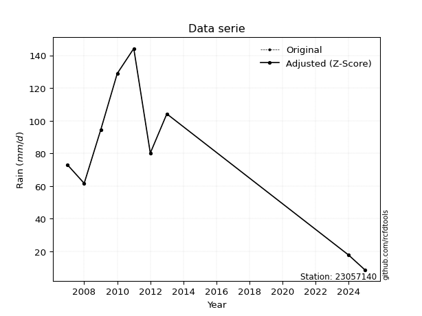</img>

</div>

> If Z-Score is active, values out of range or outliers are replaced with the station mean value.


### 4. Active continuous probability distributions from SciPy (45 of 104 available)

[scipy.stats](https://docs.scipy.org/doc/scipy/reference/stats.html) is a Python´s powerful submodule within the SciPy library for comprehensive statistical analysis, offering over 130 probability distributions (like Normal, Poisson), functions for descriptive stats (mean, variance), hypothesis testing (t-tests, chi-square), random variable generation, and statistical tests, making it essential for data science, modeling, and research. It provides tools to explore, model, and draw conclusions from data efficiently, working seamlessly with NumPy.

<div align="center">

|   id | p_dist             |   n_parameter | fit_method   | label                                                                       | active   | ref                                                                                                        |
|-----:|:-------------------|--------------:|:-------------|:----------------------------------------------------------------------------|:---------|:-----------------------------------------------------------------------------------------------------------|
|    0 | alpha              |             3 | MLE          | Alpha                                                                       | True     | [:mortar_board:](https://docs.scipy.org/doc/scipy/reference/generated/scipy.stats.alpha.html)              |
|    1 | betaprime          |             4 | MLE          | Beta prime                                                                  | True     | [:mortar_board:](https://docs.scipy.org/doc/scipy/reference/generated/scipy.stats.betaprime.html)          |
|    2 | chi2               |             3 | MLE          | Chi²                                                                        | True     | [:mortar_board:](https://docs.scipy.org/doc/scipy/reference/generated/scipy.stats.chi2.html)               |
|    3 | crystalball        |             4 | MLE          | Crystalball                                                                 | True     | [:mortar_board:](https://docs.scipy.org/doc/scipy/reference/generated/scipy.stats.crystalball.html)        |
|    4 | erlang             |             3 | MLE          | Erlang                                                                      | True     | [:mortar_board:](https://docs.scipy.org/doc/scipy/reference/generated/scipy.stats.erlang.html)             |
|    5 | expon              |             2 | MLE          | Exponential                                                                 | True     | [:mortar_board:](https://docs.scipy.org/doc/scipy/reference/generated/scipy.stats.expon.html)              |
|    6 | exponnorm          |             3 | MLE          | Exponentially modified Normal                                               | True     | [:mortar_board:](https://docs.scipy.org/doc/scipy/reference/generated/scipy.stats.exponnorm.html)          |
|    7 | f                  |             4 | MLE          | F                                                                           | True     | [:mortar_board:](https://docs.scipy.org/doc/scipy/reference/generated/scipy.stats.f.html)                  |
|    8 | fatiguelife        |             3 | MLE          | Fatigue-life (Birnbaum-Saunders)                                            | True     | [:mortar_board:](https://docs.scipy.org/doc/scipy/reference/generated/scipy.stats.fatiguelife.html)        |
|    9 | fisk               |             3 | MLE          | Fisk                                                                        | True     | [:mortar_board:](https://docs.scipy.org/doc/scipy/reference/generated/scipy.stats.fisk.html)               |
|   10 | gamma              |             3 | MLE          | Gamma                                                                       | True     | [:mortar_board:](https://docs.scipy.org/doc/scipy/reference/generated/scipy.stats.gamma.html)              |
|   11 | genexpon           |             5 | MLE          | Generalized exponential                                                     | True     | [:mortar_board:](https://docs.scipy.org/doc/scipy/reference/generated/scipy.stats.genexpon.html)           |
|   12 | genlogistic        |             3 | MLE          | Generalized logistic                                                        | True     | [:mortar_board:](https://docs.scipy.org/doc/scipy/reference/generated/scipy.stats.genlogistic.html)        |
|   13 | gibrat             |             2 | MM           | Gibrat                                                                      | True     | [:mortar_board:](https://docs.scipy.org/doc/scipy/reference/generated/scipy.stats.gibrat.html)             |
|   14 | gompertz           |             3 | MLE          | Gompertz (or truncated Gumbel)                                              | True     | [:mortar_board:](https://docs.scipy.org/doc/scipy/reference/generated/scipy.stats.gompertz.html)           |
|   15 | gumbel_l           |             2 | MM           | Gumbel Left Skew                                                            | True     | [:mortar_board:](https://docs.scipy.org/doc/scipy/reference/generated/scipy.stats.gumbel_l.html)           |
|   16 | gumbel_r           |             2 | MM           | Gumbel Right Skew                                                           | True     | [:mortar_board:](https://docs.scipy.org/doc/scipy/reference/generated/scipy.stats.gumbel_r.html)           |
|   17 | halflogistic       |             2 | MM           | Half-logistic                                                               | True     | [:mortar_board:](https://docs.scipy.org/doc/scipy/reference/generated/scipy.stats.halflogistic.html)       |
|   18 | halfnorm           |             2 | MM           | Half Normal                                                                 | True     | [:mortar_board:](https://docs.scipy.org/doc/scipy/reference/generated/scipy.stats.halfnorm.html)           |
|   19 | hypsecant          |             2 | MM           | hyperbolic secant                                                           | True     | [:mortar_board:](https://docs.scipy.org/doc/scipy/reference/generated/scipy.stats.hypsecant.html)          |
|   20 | invgamma           |             3 | MLE          | Inverted gamma                                                              | True     | [:mortar_board:](https://docs.scipy.org/doc/scipy/reference/generated/scipy.stats.invgamma.html)           |
|   21 | invgauss           |             3 | MLE          | Inverse Gaussian                                                            | True     | [:mortar_board:](https://docs.scipy.org/doc/scipy/reference/generated/scipy.stats.invgauss.html)           |
|   22 | invweibull         |             3 | MLE          | Inverted Weibull                                                            | True     | [:mortar_board:](https://docs.scipy.org/doc/scipy/reference/generated/scipy.stats.invweibull.html)         |
|   23 | johnsonsu          |             4 | MLE          | Johnson Su                                                                  | True     | [:mortar_board:](https://docs.scipy.org/doc/scipy/reference/generated/scipy.stats.johnsonsu.html)          |
|   24 | kstwobign          |             2 | MLE          | Limiting distribution of scaled Kolmogorov-Smirnov two-sided test statistic | True     | [:mortar_board:](https://docs.scipy.org/doc/scipy/reference/generated/scipy.stats.kstwobign.html)          |
|   25 | laplace            |             2 | MM           | Laplace                                                                     | True     | [:mortar_board:](https://docs.scipy.org/doc/scipy/reference/generated/scipy.stats.laplace.html)            |
|   26 | laplace_asymmetric |             3 | MLE          | Asymmetric Laplace                                                          | True     | [:mortar_board:](https://docs.scipy.org/doc/scipy/reference/generated/scipy.stats.laplace_asymmetric.html) |
|   27 | loggamma           |             3 | MLE          | Log gamma                                                                   | True     | [:mortar_board:](https://docs.scipy.org/doc/scipy/reference/generated/scipy.stats.loggamma.html)           |
|   28 | logistic           |             2 | MM           | Logistic (or Sech-squared)                                                  | True     | [:mortar_board:](https://docs.scipy.org/doc/scipy/reference/generated/scipy.stats.logistic.html)           |
|   29 | lognorm            |             3 | MLE          | Log Normal                                                                  | True     | [:mortar_board:](https://docs.scipy.org/doc/scipy/reference/generated/scipy.stats.lognorm.html)            |
|   30 | maxwell            |             2 | MM           | Maxwell                                                                     | True     | [:mortar_board:](https://docs.scipy.org/doc/scipy/reference/generated/scipy.stats.maxwell.html)            |
|   31 | mielke             |             4 | MLE          | Mielke Beta-Kappa / Dagum                                                   | True     | [:mortar_board:](https://docs.scipy.org/doc/scipy/reference/generated/scipy.stats.mielke.html)             |
|   32 | moyal              |             2 | MM           | Moyal                                                                       | True     | [:mortar_board:](https://docs.scipy.org/doc/scipy/reference/generated/scipy.stats.moyal.html)              |
|   33 | nakagami           |             3 | MLE          | Nakagami                                                                    | True     | [:mortar_board:](https://docs.scipy.org/doc/scipy/reference/generated/scipy.stats.nakagami.html)           |
|   34 | ncf                |             5 | MLE          | Non-central F distribution                                                  | True     | [:mortar_board:](https://docs.scipy.org/doc/scipy/reference/generated/scipy.stats.ncf.html)                |
|   35 | nct                |             4 | MLE          | Non-central Student’s t                                                     | True     | [:mortar_board:](https://docs.scipy.org/doc/scipy/reference/generated/scipy.stats.nct.html)                |
|   36 | norm               |             2 | MM           | Normal                                                                      | True     | [:mortar_board:](https://docs.scipy.org/doc/scipy/reference/generated/scipy.stats.norm.html)               |
|   37 | pareto             |             3 | MLE          | Pareto                                                                      | True     | [:mortar_board:](https://docs.scipy.org/doc/scipy/reference/generated/scipy.stats.pareto.html)             |
|   38 | pearson3           |             3 | MM           | Pearson type III                                                            | True     | [:mortar_board:](https://docs.scipy.org/doc/scipy/reference/generated/scipy.stats.pearson3.html)           |
|   39 | rayleigh           |             2 | MM           | Rayleigh                                                                    | True     | [:mortar_board:](https://docs.scipy.org/doc/scipy/reference/generated/scipy.stats.rayleigh.html)           |
|   40 | rice               |             3 | MLE          | Rice                                                                        | True     | [:mortar_board:](https://docs.scipy.org/doc/scipy/reference/generated/scipy.stats.rice.html)               |
|   41 | t                  |             3 | MLE          | Student’s t                                                                 | True     | [:mortar_board:](https://docs.scipy.org/doc/scipy/reference/generated/scipy.stats.t.html)                  |
|   42 | truncnorm          |             4 | MLE          | Truncated normal                                                            | True     | [:mortar_board:](https://docs.scipy.org/doc/scipy/reference/generated/scipy.stats.truncnorm.html)          |
|   43 | wald               |             2 | MM           | Wald                                                                        | True     | [:mortar_board:](https://docs.scipy.org/doc/scipy/reference/generated/scipy.stats.wald.html)               |
|   44 | weibull_min        |             3 | MLE          | Weibull minimum                                                             | True     | [:mortar_board:](https://docs.scipy.org/doc/scipy/reference/generated/scipy.stats.weibull_min.html)        |

</div>

> **n_parameter:** # arguments & localization & scale.
>
> **Fit methods:** (MLE) maximum likelihood, (MM) L-moments.
>
>**Inactive:** foldnorm, gennorm, norminvgauss, powernorm, powerlognorm, skewnorm, genextreme, anglit, arcsine, argus, beta, bradford, burr, burr12, cauchy, cosine, halfcauchy, foldcauchy, skewcauchy, wrapcauchy, dgamma, gengamma, exponweib, exponpow, truncexpon, gausshyper, genhalflogistic, genhyperbolic, geninvgauss, halfgennorm, johnsonsb, kappa4, kappa3, ksone, kstwo, loglaplace, levy, levy_l, levy_stable, ncx2, genpareto, truncpareto, lomax, powerlaw, rdist, rel_breitwigner, recipinvgauss, semicircular, studentized_range, trapezoid, triang, truncweibull_min, tukeylambda, uniform, loguniform, vonmises, vonmises_line, weibull_max, dweibull, 


## B. Probability distributions vs. Empirical distributions

A continuous probability distribution (CPD) describes probabilities for variables that can take any value within a range (like rain any time), unlike discrete variables with specific outcomes (like temperature). It uses a Probability Density Function (PDF), a curve where the total area under it equals 1, and the probability of the variable falling within an interval (a to b) is found by calculating the area under the curve between those points. A key feature is that the probability of hitting any single exact value is zero, so probabilities are always expressed for ranges, e.g., $P(a ≤ X ≤ b)$.

<div align="center">

Distributions parameters
|    |   station | p_dist                |   n |             loc |            scale | shape                 | shape1                | shape2                 | shape3   |
|---:|----------:|:----------------------|----:|----------------:|-----------------:|:----------------------|:----------------------|:-----------------------|:---------|
|  0 |  23057140 | alpha                 |   9 |    -0.0501942   |     19.5577      | 9.808310623488707e-10 |                       |                        |          |
|  1 |  23057140 | betaprime             |   9 | -1196.09        | 108504           | 864.6565409905288     | 73590.19746038034     |                        |          |
|  2 |  23057140 | chi2                  |   9 |     7.1         |      6.98638     | 0.5362796303699731    |                       |                        |          |
|  3 |  23057140 | crystalball           |   9 |    79.0444      |     43.29        | 7132.181921886182     | 426.63518890273804    |                        |          |
|  4 |  23057140 | erlang                |   9 |  -648.554       |      2.62592     | 277.078412808046      |                       |                        |          |
|  5 |  23057140 | expon                 |   9 |     7.1         |     71.9444      |                       |                       |                        |          |
|  6 |  23057140 | exponnorm             |   9 |    79.0031      |     43.2899      | 0.0009596087705979804 |                       |                        |          |
|  7 |  23057140 | f                     |   9 | -1160.67        |   1239.98        | 1611.9055198562182    | 16689784.164048716    |                        |          |
|  8 |  23057140 | fatiguelife           |   9 |     7.1         |      2.16336e-05 | 1861.8955988194475    |                       |                        |          |
|  9 |  23057140 | fisk                  |   9 |    -4.53358e+09 |      4.53358e+09 | 176623217.59997642    |                       |                        |          |
| 10 |  23057140 | gamma                 |   9 |  -724.587       |      2.41376     | 332.90310847279284    |                       |                        |          |
| 11 |  23057140 | genexpon              |   9 |     7.09996     |      2.68189     | 0.03727662563765084   | 3.009688702179891e-07 | 2.7546430638729476     |          |
| 12 |  23057140 | genlogistic           |   9 |   100.833       |     19.9086      | 0.5707648845214495    |                       |                        |          |
| 13 |  23057140 | gibrat                |   9 |    46.0196      |     20.0306      |                       |                       |                        |          |
| 14 |  23057140 | gompertz              |   9 |    17.6625      |      8.26553     | 1.531705083654587e-06 |                       |                        |          |
| 15 |  23057140 | gumbel_l              |   9 |    98.5273      |     33.7531      |                       |                       |                        |          |
| 16 |  23057140 | gumbel_r              |   9 |    59.5616      |     33.7531      |                       |                       |                        |          |
| 17 |  23057140 | halflogistic          |   9 |    27.7357      |     37.0114      |                       |                       |                        |          |
| 18 |  23057140 | halfnorm              |   9 |    21.7454      |     71.8136      |                       |                       |                        |          |
| 19 |  23057140 | hypsecant             |   9 |    79.0444      |     27.5593      |                       |                       |                        |          |
| 20 |  23057140 | invgamma              |   9 |  -417.62        |  61192           | 124.231793690172      |                       |                        |          |
| 21 |  23057140 | invgauss              |   9 |  -163.93        |   6625.34        | 0.03650816104610605   |                       |                        |          |
| 22 |  23057140 | invweibull            |   9 |     7.1         |      3.68513     | 0.06232053488410703   |                       |                        |          |
| 23 |  23057140 | johnsonsu             |   9 |   291.732       |     55.355       | 10.256911755365444    | 5.036112312021901     |                        |          |
| 24 |  23057140 | kstwobign             |   9 |   -89.4892      |    192.373       |                       |                       |                        |          |
| 25 |  23057140 | laplace               |   9 |    79.0444      |     30.6107      |                       |                       |                        |          |
| 26 |  23057140 | laplace_asymmetric    |   9 |    80.2         |     34.674       | 1.0168119523105048    |                       |                        |          |
| 27 |  23057140 | loggamma              |   9 |   -21.9044      |     81.4871      | 3.939618296283527     |                       |                        |          |
| 28 |  23057140 | logistic              |   9 |    79.0444      |     23.867       |                       |                       |                        |          |
| 29 |  23057140 | lognorm               |   9 |     7.1         |      0.890826    | 12.232774320573698    |                       |                        |          |
| 30 |  23057140 | maxwell               |   9 |   -23.5347      |     64.2819      |                       |                       |                        |          |
| 31 |  23057140 | mielke                |   9 |     7.1         |    138.324       | 0.8079165186594209    | 2688.3399605130853    |                        |          |
| 32 |  23057140 | moyal                 |   9 |    54.2884      |     19.4873      |                       |                       |                        |          |
| 33 |  23057140 | nakagami              |   9 |     7.1         |     88.7929      | 0.24145323752296638   |                       |                        |          |
| 34 |  23057140 | ncf                   |   9 |    -0.0137983   |      2.38669e-06 | 4.404621290684983e-07 | 6.503441563940859     | 12.3698462373998       |          |
| 35 |  23057140 | nct                   |   9 | -2470.61        |     43.2083      | 455581.90892309416    | 59.00837838014637     |                        |          |
| 36 |  23057140 | norm                  |   9 |    79.0444      |     43.29        |                       |                       |                        |          |
| 37 |  23057140 | pareto                |   9 |     7.09163     |      0.00837381  | 0.12520944063396963   |                       |                        |          |
| 38 |  23057140 | pearson3              |   9 |    79.0444      |     43.2901      | -0.2568110532336373   |                       |                        |          |
| 39 |  23057140 | rayleigh              |   9 |    -3.77187     |     66.0779      |                       |                       |                        |          |
| 40 |  23057140 | rice                  |   9 |   -16.0264      |     49.0157      | 1.5943869067512786    |                       |                        |          |
| 41 |  23057140 | t                     |   9 |    79.044       |     43.2891      | 3702904.4364982266    |                       |                        |          |
| 42 |  23057140 | truncnorm             |   9 |    79.0444      |     43.29        | -248.56506526385945   | 273.79687234230056    |                        |          |
| 43 |  23057140 | wald                  |   9 |    35.7544      |     43.29        |                       |                       |                        |          |
| 44 |  23057140 | weibull_min           |   9 |   -91.7834      |    187.39        | 4.63513496627872      |                       |                        |          |
| 45 |  23057140 | logalpha              |   9 |   -21.3528      |    662.547       | 26.119016571645005    |                       |                        |          |
| 46 |  23057140 | logbetaprime          |   9 |   -20.8131      |     84.3258      | 812.2823709798727     | 2754.1025495594367    |                        |          |
| 47 |  23057140 | logchi2               |   9 |     1.96009     |      0.995202    | 1.2625249691954163    |                       |                        |          |
| 48 |  23057140 | logcrystalball        |   9 |     4.07325     |      0.943645    | 7.7624375450587       | 10.329793550422451    |                        |          |
| 49 |  23057140 | logerlang             |   9 |   -12.4595      |      0.0601187   | 274.7997130782028     |                       |                        |          |
| 50 |  23057140 | logexpon              |   9 |     1.96009     |      2.11316     |                       |                       |                        |          |
| 51 |  23057140 | logexponnorm          |   9 |     4.07271     |      0.943641    | 0.0005898772038143616 |                       |                        |          |
| 52 |  23057140 | logf                  |   9 |  -926.155       |    930.229       | 9180881.796380531     | 2462474.6155312266    |                        |          |
| 53 |  23057140 | logfatiguelife        |   9 |  -695.616       |    699.684       | 0.001347420761885548  |                       |                        |          |
| 54 |  23057140 | logfisk               |   9 |    -1.08507e+08 |      1.08507e+08 | 217386902.0596618     |                       |                        |          |
| 55 |  23057140 | loggamma              |   9 |   -12.8529      |      0.0584743   | 289.46693013827144    |                       |                        |          |
| 56 |  23057140 | loggenexpon           |   9 |     1.916       |      0.00672129  | 0.0007271196864255839 | 0.7076274150779667    | 1.7552763879376756e-05 |          |
| 57 |  23057140 | loggenlogistic        |   9 |     4.97129     |      1.63988e-06 | 1.831593220247054e-06 |                       |                        |          |
| 58 |  23057140 | loggibrat             |   9 |     3.35334     |      0.436643    |                       |                       |                        |          |
| 59 |  23057140 | loggompertz           |   9 |     1.96009     |      0.626345    | 0.018868325236257748  |                       |                        |          |
| 60 |  23057140 | loggumbel_l           |   9 |     4.49794     |      0.735757    |                       |                       |                        |          |
| 61 |  23057140 | loggumbel_r           |   9 |     3.64856     |      0.735757    |                       |                       |                        |          |
| 62 |  23057140 | loghalflogistic       |   9 |     2.95486     |      0.806754    |                       |                       |                        |          |
| 63 |  23057140 | loghalfnorm           |   9 |     2.82427     |      1.56538     |                       |                       |                        |          |
| 64 |  23057140 | loghypsecant          |   9 |     4.07325     |      0.600743    |                       |                       |                        |          |
| 65 |  23057140 | loginvgamma           |   9 |   -20.8236      |  15500.3         | 623.8065259181944     |                       |                        |          |
| 66 |  23057140 | loginvgauss           |   9 |    -6.10897     |    965.414       | 0.010555855790607839  |                       |                        |          |
| 67 |  23057140 | loginvweibull         |   9 |    -2.2344e+08  |      2.2344e+08  | 201834303.32231086    |                       |                        |          |
| 68 |  23057140 | logjohnsonsu          |   9 |     5.05247     |      0.00229604  | 5.921963900200183     | 0.9458892209802596    |                        |          |
| 69 |  23057140 | logkstwobign          |   9 |    -0.406995    |      5.12174     |                       |                       |                        |          |
| 70 |  23057140 | loglaplace            |   9 |     4.07325     |      0.667258    |                       |                       |                        |          |
| 71 |  23057140 | loglaplace_asymmetric |   9 |     4.9712      |      0.00822526  | 109.1536769865861     |                       |                        |          |
| 72 |  23057140 | logloggamma           |   9 |     4.97128     |      7.97174e-06 | 8.866230793627127e-06 |                       |                        |          |
| 73 |  23057140 | loglogistic           |   9 |     4.07325     |      0.520259    |                       |                       |                        |          |
| 74 |  23057140 | loglognorm            |   9 |     1.96009     |      0.0376266   | 11.588527030895824    |                       |                        |          |
| 75 |  23057140 | logmaxwell            |   9 |     1.83721     |      1.40123     |                       |                       |                        |          |
| 76 |  23057140 | logmielke             |   9 |    -3.48056e+07 |      3.48056e+07 | 37749446.83021173     | 25383997178.65947     |                        |          |
| 77 |  23057140 | logmoyal              |   9 |     3.53362     |      0.42479     |                       |                       |                        |          |
| 78 |  23057140 | lognakagami           |   9 |  -653.108       |    657.184       | 120419.7171781245     |                       |                        |          |
| 79 |  23057140 | logncf                |   9 |    -1.53232     |      8.74366e-08 | 1.844599447321152e-06 | 418.52130197891313    | 117.75152064130342     |          |
| 80 |  23057140 | lognct                |   9 |   -57.3987      |      0.836766    | 9168.976414081953     | 73.45780563675919     |                        |          |
| 81 |  23057140 | lognorm               |   9 |     4.07325     |      0.943645    |                       |                       |                        |          |
| 82 |  23057140 | logpareto             |   9 |     1.95981     |      0.000282018 | 0.12515181507211465   |                       |                        |          |
| 83 |  23057140 | logpearson3           |   9 |     4.07325     |      0.943644    | -1.2686478974563866   |                       |                        |          |
| 84 |  23057140 | lograyleigh           |   9 |     2.26795     |      1.44042     |                       |                       |                        |          |
| 85 |  23057140 | logrice               |   9 |  -289.585       |      0.943603    | 311.2083859273917     |                       |                        |          |
| 86 |  23057140 | logt                  |   9 |     4.4827      |      0.333356    | 1.2309147134873706    |                       |                        |          |
| 87 |  23057140 | logtruncnorm          |   9 |    -0.125872    |      2.58408     | 1.1629171961612261    | 5.083207224214588     |                        |          |
| 88 |  23057140 | logwald               |   9 |     3.12959     |      0.943663    |                       |                       |                        |          |
| 89 |  23057140 | logweibull_min        |   9 |     1.96009     |      1.22675     | 0.7273240916252779    |                       |                        |          |

</div>

> **loc** (Location parameter): This shifts the distribution along the x-axis. For many common distributions, like the normal (Gaussian) distribution, loc represents the mean $μ$. For others, like the uniform distribution, it might represent the minimum value, or for the beta distribution, the left end of the support interval.
>
> **scale** (Scale parameter): This determines the width or spread of the distribution. For the normal distribution, scale represents the standard deviation $σ$. For a uniform distribution, it defines the length of the interval (from $loc$ to $loc + scale$).
>
> **shape** (Shape parameters): Refers to parameters that define the specific form of a probability distribution, distinct from its location (loc) and scale (scale). These parameters are required arguments for most distribution functions. For example, a normal (Gaussian) distribution is fully defined by its location (mean) and scale (standard deviation), so it has no specific shape parameters beyond loc and scale. However, other distributions have intrinsic properties that need specification, as Gamma distribution that takes a shape parameter, often named $a$ or $alpha$.


### 0. Cumulative distribution values - CDF (90 evaluated)

> Ordered by x ascending and calculating $log(f(x))$ separately. 

|   id |   Station |   date |     x |   count |    mean |    std |     zscore |   Value_initial |   station |   m |      alpha |   alpha_pdf |   betaprime |   betaprime_pdf |        chi2 |    chi2_pdf |   crystalball |   crystalball_pdf |    erlang |   erlang_pdf |    expon |   expon_pdf |   exponnorm |   exponnorm_pdf |         f |      f_pdf |   fatiguelife |   fatiguelife_pdf |      fisk |   fisk_pdf |     gamma |   gamma_pdf |   genexpon |   genexpon_pdf |   genlogistic |   genlogistic_pdf |   gibrat |   gibrat_pdf |    gompertz |   gompertz_pdf |   gumbel_l |   gumbel_l_pdf |   gumbel_r |   gumbel_r_pdf |   halflogistic |   halflogistic_pdf |   halfnorm |   halfnorm_pdf |   hypsecant |   hypsecant_pdf |   invgamma |   invgamma_pdf |   invgauss |   invgauss_pdf |   invweibull |   invweibull_pdf |   johnsonsu |   johnsonsu_pdf |   kstwobign |   kstwobign_pdf |   laplace |   laplace_pdf |   laplace_asymmetric |   laplace_asymmetric_pdf |   loggamma |   loggamma_pdf |   logistic |   logistic_pdf |   lognorm |   lognorm_pdf |   maxwell |   maxwell_pdf |      mielke |   mielke_pdf |       moyal |   moyal_pdf |    nakagami |   nakagami_pdf |       ncf |    ncf_pdf |       nct |    nct_pdf |      norm |   norm_pdf |   pareto |   pareto_pdf |   pearson3 |   pearson3_pdf |   rayleigh |   rayleigh_pdf |      rice |   rice_pdf |         t |      t_pdf |   truncnorm |   truncnorm_pdf |     wald |   wald_pdf |   weibull_min |   weibull_min_pdf |   logalpha |   logalpha_pdf |   logbetaprime |   logbetaprime_pdf |     logchi2 |    logchi2_pdf |   logcrystalball |   logcrystalball_pdf |   logerlang |   logerlang_pdf |   logexpon |   logexpon_pdf |   logexponnorm |   logexponnorm_pdf |      logf |   logf_pdf |   logfatiguelife |   logfatiguelife_pdf |   logfisk |   logfisk_pdf |   loggenexpon |   loggenexpon_pdf |   loggenlogistic |   loggenlogistic_pdf |   loggibrat |   loggibrat_pdf |   loggompertz |   loggompertz_pdf |   loggumbel_l |   loggumbel_l_pdf |   loggumbel_r |   loggumbel_r_pdf |   loghalflogistic |   loghalflogistic_pdf |   loghalfnorm |   loghalfnorm_pdf |   loghypsecant |   loghypsecant_pdf |   loginvgamma |   loginvgamma_pdf |   loginvgauss |   loginvgauss_pdf |   loginvweibull |   loginvweibull_pdf |   logjohnsonsu |   logjohnsonsu_pdf |   logkstwobign |   logkstwobign_pdf |   loglaplace |   loglaplace_pdf |   loglaplace_asymmetric |   loglaplace_asymmetric_pdf |   logloggamma |   logloggamma_pdf |   loglogistic |   loglogistic_pdf |   loglognorm |   loglognorm_pdf |   logmaxwell |   logmaxwell_pdf |   logmielke |   logmielke_pdf |   logmoyal |   logmoyal_pdf |   lognakagami |   lognakagami_pdf |    logncf |   logncf_pdf |    lognct |   lognct_pdf |   logpareto |   logpareto_pdf |   logpearson3 |   logpearson3_pdf |   lograyleigh |   lograyleigh_pdf |   logrice |   logrice_pdf |      logt |   logt_pdf |   logtruncnorm |   logtruncnorm_pdf |   logwald |   logwald_pdf |   logweibull_min |   logweibull_min_pdf |
|-----:|----------:|-------:|------:|--------:|--------:|-------:|-----------:|----------------:|----------:|----:|-----------:|------------:|------------:|----------------:|------------:|------------:|--------------:|------------------:|----------:|-------------:|---------:|------------:|------------:|----------------:|----------:|-----------:|--------------:|------------------:|----------:|-----------:|----------:|------------:|-----------:|---------------:|--------------:|------------------:|---------:|-------------:|------------:|---------------:|-----------:|---------------:|-----------:|---------------:|---------------:|-------------------:|-----------:|---------------:|------------:|----------------:|-----------:|---------------:|-----------:|---------------:|-------------:|-----------------:|------------:|----------------:|------------:|----------------:|----------:|--------------:|---------------------:|-------------------------:|-----------:|---------------:|-----------:|---------------:|----------:|--------------:|----------:|--------------:|------------:|-------------:|------------:|------------:|------------:|---------------:|----------:|-----------:|----------:|-----------:|----------:|-----------:|---------:|-------------:|-----------:|---------------:|-----------:|---------------:|----------:|-----------:|----------:|-----------:|------------:|----------------:|---------:|-----------:|--------------:|------------------:|-----------:|---------------:|---------------:|-------------------:|------------:|---------------:|-----------------:|---------------------:|------------:|----------------:|-----------:|---------------:|---------------:|-------------------:|----------:|-----------:|-----------------:|---------------------:|----------:|--------------:|--------------:|------------------:|-----------------:|---------------------:|------------:|----------------:|--------------:|------------------:|--------------:|------------------:|--------------:|------------------:|------------------:|----------------------:|--------------:|------------------:|---------------:|-------------------:|--------------:|------------------:|--------------:|------------------:|----------------:|--------------------:|---------------:|-------------------:|---------------:|-------------------:|-------------:|-----------------:|------------------------:|----------------------------:|--------------:|------------------:|--------------:|------------------:|-------------:|-----------------:|-------------:|-----------------:|------------:|----------------:|-----------:|---------------:|--------------:|------------------:|----------:|-------------:|----------:|-------------:|------------:|----------------:|--------------:|------------------:|--------------:|------------------:|----------:|--------------:|----------:|-----------:|---------------:|-------------------:|----------:|--------------:|-----------------:|---------------------:|
|    0 |  23057140 |   2025 |   7.1 |       9 | 79.0444 | 45.916 | -1.56687   |             7.1 |  23057140 |   1 | 0.00623303 | 0.00724432  |   0.0479547 |      0.0023785  | 5.02787e-05 | 1.51791e+10 |     0.0482646 |        0.00231616 | 0.0461815 |   0.00237378 | 0        |  0.0138996  |   0.0482639 |      0.00231613 | 0.0470062 | 0.0023393  |     0.0355186 |       3.68644e+10 | 0.0534394 | 0.00197068 | 0.0479889 |  0.00241271 |  4.866e-07 |     0.0138994  |     0.0677201 |        0.00192412 | 0        |   0          | 0           |    0           |   0.064452 |     0.00184661 | 0.00881179 |     0.00123528 |       0        |         0          |   0        |     0          |   0.0467045 |      0.00168862 |  0.0424363 |     0.00249359 |  0.0412114 |     0.00275549 |  8.23822e-05 |      5.43605e+10 |   0.0633696 |      0.00215911 |   0.0374094 |      0.00340343 | 0.0476699 |    0.0015573  |            0.0639303 |               0.00181327 |  0.0139063 |      0.0389957 |  0.0467802 |     0.00186834 | 0.0125663 |     0.0344484 | 0.0269026 |    0.00251642 | 1.28818e-14 |  11.7177     | 0.000790827 | 0.000246222 | 4.82445e-09 |    2.62307e+06 | 0.0190324 | 0.00369221 | 0.0482597 | 0.00231641 | 0.0482646 | 0.00231616 | 0        | 14.9525      |  0.0549506 |     0.00225849 |  0.0134441 |     0.00245648 | 0.0316507 | 0.00277007 | 0.0482621 | 0.00231611 |   0.0482646 |      0.00231616 | 0        | 0          |     0.0503517 |        0.00229978 |  0.0107013 |      0.0344684 |      0.0145761 |          0.0399762 | 9.47961e-11 | 269501         |        0.0125663 |            0.0344484 |    0.014461 |       0.0403342 |   0        |       0.473225 |      0.0125657 |           0.034447 | 0.0124659 |  0.0342864 |        0.0125592 |            0.0345676 | 0.0100234 |     0.0198799 |    0.00502479 |          0.1197   |         0        |            0.0386712 |    0        |        0        |   4.21868e-08 |         0.0301246 |     0.0312685 |         0.0418269 |   4.90259e-05 |       0.000661213 |          0        |              0        |     0         |          0        |      0.0188838 |          0.0314157 |     0.0135093 |         0.0390543 |     0.0129024 |         0.0404462 |       0.0147771 |           0.0562584 |      0.0606559 |          0.0367485 |      0.0168221 |          0.0749871 |    0.0210664 |        0.0315716 |               0.0349481 |                   0.0389256 |     0.0351174 |         0.0390578 |     0.0169275 |         0.0319859 |   0.00234752 |      2.84915e+12 |  0.000178968 |       0.00436246 |   0.0379236 |       0.0411312 | 1.8499e-10 |    9.05268e-09 |     0.0127194 |         0.0347285 | 0.0166089 |    0.0495296 | 0.0127749 |     0.035154 |    0        |     443.773     |     0.0337276 |         0.0445274 |     0         |          0        | 0.0125637 |     0.0344437 | 0.0277762 |  0.0133561 |    0           |           0        |  0        |      0        |      3.55005e-12 |        11628.5       |
|    1 |  23057140 |   2024 |  17.8 |       9 | 79.0444 | 45.916 | -1.33384   |            17.8 |  23057140 |   2 | 0.273229   | 0.0268716   |   0.0791745 |      0.00349613 | 0.894396    | 0.0120147   |     0.0785712 |        0.00338766 | 0.0775058 |   0.00352135 | 0.138195 |  0.0119788  |   0.0785702 |      0.00338763 | 0.0777454 | 0.00344567 |     0.647181  |       0.00655674  | 0.0788972 | 0.00283124 | 0.0796727 |  0.00354791 |  0.138194  |     0.0119787  |     0.0917001 |        0.00258899 | 0        |   0          | 2.56858e-08 |    1.8842e-07  |   0.087415 |     0.00247319 | 0.0318669  |     0.00325361 |       0        |         0          |   0        |     0          |   0.0687171 |      0.00247411 |  0.0759509 |     0.00381277 |  0.0787295 |     0.00429363 |  0.3923      |      0.00213804  |   0.0904805 |      0.00293793 |   0.08514   |      0.00550141 | 0.0676165 |    0.00220892 |            0.0865982 |               0.0024562  |  0.113109  |      0.202463  |  0.0713544 |     0.00277634 | 0.10287   |     0.189853  | 0.0625554 |    0.00417366 | 0.126471    |   0.00954931 | 0.0107632   | 0.00202033  | 0.281005    |    0.0126464   | 0.0787211 | 0.00723546 | 0.0785704 | 0.00338818 | 0.0785712 | 0.00338766 | 0.591681 |  0.00477433  |  0.0838931 |     0.00318553 |  0.0518936 |     0.00468417 | 0.0685237 | 0.00412881 | 0.0785684 | 0.00338764 |   0.0785712 |      0.00338766 | 0        | 0          |     0.079813  |        0.00323746 |  0.110691  |      0.213123  |      0.114502  |          0.202728  | 0.577631    |      0.296122  |        0.10287   |            0.189853  |    0.11599  |       0.205908  |   0.352698 |       0.306319 |      0.102868  |           0.18985  | 0.102603  |  0.189693  |        0.103407  |            0.191073  | 0.060008  |     0.113008  |    0.206763   |          0.295619 |         0        |            0.107948  |    0        |        0        |   0.0610398   |         0.122703  |     0.104874  |         0.134789  |   0.0581154   |       0.224744    |          0        |              0        |     0.0279926 |          0.509394 |      0.0866897 |          0.142527  |     0.114855  |         0.207589  |     0.120318  |         0.217749  |       0.159233  |           0.264282  |      0.112055  |          0.0829325 |      0.195128  |          0.296511  |    0.0835222 |        0.125172  |               0.097278  |                   0.108349  |     0.0976052 |         0.108557  |     0.0915282 |         0.159826  |   0.608635   |      0.0360582   |  0.0928918   |       0.238813   |   0.102762  |       0.111454  | 0.0307431  |    0.196692    |     0.103255  |         0.189827  | 0.135303  |    0.227544  | 0.104516  |     0.191978 |    0.636659 |       0.0494599 |     0.108991  |         0.133468  |     0.0861036 |          0.269238 | 0.102864  |     0.189853  | 0.047888  |  0.0354709 |    1.02704e-09 |           0.641279 |  0        |      0        |      0.555403    |            0.285187  |
|    2 |  23057140 |   2008 |  61.7 |       9 | 79.0444 | 45.916 | -0.377743  |            61.7 |  23057140 |   3 | 0.751454   | 0.00389222  |   0.351007  |      0.00857981 | 0.998098    | 0.000157478 |     0.344336  |        0.00850481 | 0.352099  |   0.00862921 | 0.531828 |  0.00650741 |   0.344334  |      0.00850481 | 0.347035  | 0.00853418 |     0.80324   |       0.00216607  | 0.321447  | 0.00849767 | 0.353269  |  0.00856112 |  0.531825  |     0.0065074  |     0.302181  |        0.00759893 | 0.403286 |   0.0246908  | 0.00031394  |    3.81612e-05 |   0.285273 |     0.00711177 | 0.39117    |     0.0108777  |       0.429135 |         0.0110215  |   0.422038 |     0.00951737 |   0.31172   |      0.00958774 |  0.368815  |     0.00884891 |  0.39325   |     0.00896692 |  0.429405    |      0.000414328 |   0.315999  |      0.00757162 |   0.432783  |      0.00857248 | 0.283722  |    0.00926872 |            0.300793  |               0.00853145 |  0.527357  |      0.399252  |  0.325917  |     0.00920496 | 0.520719  |     0.422197  | 0.375915  |    0.00906003 | 0.471889    |   0.00698254 | 0.408337    | 0.012026    | 0.607056    |    0.00498696  | 0.459465  | 0.00761306 | 0.344371  | 0.00850541 | 0.344336  | 0.00850481 | 0.667027 |  0.000763461 |  0.331193  |     0.008099   |  0.387907  |     0.00917826 | 0.362612  | 0.00867864 | 0.344337  | 0.008505   |   0.344336  |      0.00850481 | 0.44589  | 0.017372   |     0.327308  |        0.00805425 |  0.544319  |      0.404768  |      0.528849  |          0.39981   | 0.81097     |      0.115675  |        0.520719  |            0.422197  |    0.53243  |       0.397961  |   0.640558 |       0.170097 |      0.520715  |           0.422199 | 0.520259  |  0.421995  |        0.522824  |            0.422435  | 0.43513   |     0.492429  |    0.596092   |          0.288004 |         0        |            0.432705  |    0.714268 |        0.442057 |   0.438266    |         0.534156  |     0.451271  |         0.447593  |   0.5914      |       0.422205    |          0.619091 |              0.382227 |     0.59301   |          0.361423 |      0.525951  |          0.5281    |     0.533783  |         0.397454  |     0.535819  |         0.378486  |       0.550034  |           0.297003  |      0.339809  |          0.372516  |      0.585267  |          0.278492  |    0.535423  |        0.696248  |               0.388439  |                   0.432648  |     0.388969  |         0.432615  |     0.523543  |         0.479465  |   0.636675   |      0.0149779   |  0.552825    |       0.400621   |   0.395694  |       0.429162  | 0.616986   |    0.414479    |     0.519917  |         0.420775  | 0.540987  |    0.357232  | 0.521865  |     0.418279 |    0.673543 |       0.0188935 |     0.436009  |         0.422251  |     0.563358  |          0.390242 | 0.52073   |     0.422216  | 0.223593  |  0.470704  |    0.590867    |           0.326467 |  0.688049 |      0.391324 |      0.779125    |            0.112203  |
|    3 |  23057140 |   2007 |  72.9 |       9 | 79.0444 | 45.916 | -0.133819  |            72.9 |  23057140 |   4 | 0.788625   | 0.00282876  |   0.450572  |      0.00910576 | 0.99924     | 6.16314e-05 |     0.443565  |        0.00912321 | 0.451982  |   0.00911116 | 0.599321 |  0.00556928 |   0.443563  |      0.00912322 | 0.446201  | 0.00908116 |     0.825539  |       0.00183117  | 0.422922  | 0.00950827 | 0.45235   |  0.00903859 |  0.599319  |     0.00556928 |     0.396026  |        0.0091133  | 0.615673 |   0.0142131  | 0.00122095  |    0.000147811 |   0.373755 |     0.0086834  | 0.509889   |     0.0101751  |       0.544226 |         0.00950812 |   0.523736 |     0.00862088 |   0.429612  |      0.0112688  |  0.469609  |     0.00904923 |  0.493586  |     0.00885548 |  0.433622    |      0.000343167 |   0.407157  |      0.00865863 |   0.525731  |      0.00797299 | 0.409067  |    0.0133636  |            0.413265  |               0.0117215  |  0.593055  |      0.386729  |  0.435992  |     0.010303   | 0.590459  |     0.411852  | 0.47794   |    0.00906649 | 0.548666    |   0.00673672 | 0.535051    | 0.0104764   | 0.659189    |    0.00434509  | 0.538604  | 0.0065236  | 0.443603  | 0.00912333 | 0.443565  | 0.00912321 | 0.674715 |  0.0006189   |  0.427071  |     0.00894867 |  0.489915  |     0.00895708 | 0.461884  | 0.00896445 | 0.443568  | 0.00912342 |   0.443565  |      0.00912321 | 0.604887 | 0.011459   |     0.422777  |        0.00892781 |  0.610455  |      0.386494  |      0.594651  |          0.387402  | 0.829228    |      0.103501  |        0.590459  |            0.411852  |    0.597844 |       0.384638  |   0.66784  |       0.157186 |      0.590455  |           0.411855 | 0.589965  |  0.411662  |        0.592562  |            0.411589  | 0.5183    |     0.500189  |    0.642746   |          0.271024 |         0        |            0.521318  |    0.777038 |        0.318854 |   0.531617    |         0.581296  |     0.528987  |         0.481968  |   0.657892    |       0.374402    |          0.678814 |              0.334186 |     0.650604  |          0.328985 |      0.611979  |          0.49741   |     0.599025  |         0.383115  |     0.597747  |         0.362657  |       0.598001  |           0.277739  |      0.410581  |          0.48185   |      0.630167  |          0.259678  |    0.638182  |        0.542247  |               0.467746  |                   0.520981  |     0.468259  |         0.520802  |     0.602253  |         0.460433  |   0.639079   |      0.0138737   |  0.617806    |       0.377177   |   0.474164  |       0.514269  | 0.681093   |    0.354709    |     0.589435  |         0.410634  | 0.599372  |    0.341686  | 0.590909  |     0.4075   |    0.676565 |       0.0173781 |     0.510059  |         0.46462   |     0.626346  |          0.363987 | 0.590472  |     0.411868  | 0.324809  |  0.756579  |    0.642498    |           0.292986 |  0.745649 |      0.303855 |      0.796894    |            0.101106  |
|    4 |  23057140 |   2012 |  80.2 |       9 | 79.0444 | 45.916 |  0.0251667 |            80.2 |  23057140 |   5 | 0.807456   | 0.00235216  |   0.517297  |      0.00913225 | 0.999578    | 3.38429e-05 |     0.510648  |        0.00921229 | 0.518632  |   0.00910636 | 0.637982 |  0.00503191 |   0.510646  |      0.00921231 | 0.512805  | 0.00912393 |     0.838246  |       0.0016548   | 0.493403  | 0.00973803 | 0.518484  |  0.00903874 |  0.63798   |     0.00503191 |     0.46542   |        0.0098493  | 0.703465 |   0.0101186  | 0.0029526   |    0.000356875 |   0.440669 |     0.00962813 | 0.581257   |     0.00934339 |       0.609897 |         0.0084842  |   0.584341 |     0.00797739 |   0.513343  |      0.0115399  |  0.535136  |     0.00886406 |  0.557063  |     0.008503   |  0.435997    |      0.000308559 |   0.47234   |      0.00916646 |   0.582063  |      0.00744776 | 0.518523  |    0.0157291  |            0.508335  |               0.014418   |  0.629432  |      0.375092  |  0.512102  |     0.0104686  | 0.629247  |     0.400382  | 0.543242  |    0.00879087 | 0.597342    |   0.00660195 | 0.607       | 0.00922519  | 0.689584    |    0.0039892   | 0.58374   | 0.00584981 | 0.510686  | 0.00921206 | 0.510648  | 0.00921229 | 0.678971 |  0.000549812 |  0.493575  |     0.00923126 |  0.554014  |     0.00857714 | 0.527134  | 0.00887622 | 0.510652  | 0.00921249 |   0.510648  |      0.00921229 | 0.678541 | 0.00885544 |     0.489259  |        0.00924861 |  0.646659  |      0.37175   |      0.631092  |          0.375783  | 0.838801    |      0.0972052 |        0.629247  |            0.400382  |    0.634002 |       0.372625  |   0.682507 |       0.150245 |      0.629244  |           0.400385 | 0.628736  |  0.40021   |        0.631312  |            0.399845  | 0.565725  |     0.492205  |    0.66811    |          0.260435 |         0        |            0.579956  |    0.804924 |        0.267435 |   0.587868    |         0.59567   |     0.575626  |         0.494386  |   0.692271    |       0.346041    |          0.709441 |              0.307834 |     0.681103  |          0.310165 |      0.65801   |          0.465907  |     0.635014  |         0.370616  |     0.631778  |         0.350152  |       0.623944  |           0.265852  |      0.46028   |          0.562144  |      0.654418  |          0.248504  |    0.686401  |        0.469982  |               0.520205  |                   0.57941   |     0.520696  |         0.579122  |     0.645267  |         0.439969  |   0.640375   |      0.0133111   |  0.653024    |       0.360535   |   0.525873  |       0.570352  | 0.713392   |    0.322453    |     0.628114  |         0.399332  | 0.631437  |    0.329991  | 0.629278  |     0.395975 |    0.678186 |       0.0166105 |     0.555415  |         0.485315  |     0.660264  |          0.346574 | 0.629262  |     0.400395  | 0.405128  |  0.918743  |    0.669589    |           0.274883 |  0.772722 |      0.264618 |      0.806267    |            0.0953901 |
|    5 |  23057140 |   2009 |  94.4 |       9 | 79.0444 | 45.916 |  0.334427  |            94.4 |  23057140 |   6 | 0.835956   | 0.00171215  |   0.643384  |      0.00848042 | 0.999864    | 1.07569e-05 |     0.638598  |        0.00865367 | 0.643982  |   0.00840718 | 0.702826 |  0.00413061 |   0.638596  |      0.0086537  | 0.639004  | 0.00850401 |     0.859687  |       0.00137747  | 0.628743  | 0.009094   | 0.643021  |  0.00836257 |  0.702823  |     0.00413061 |     0.609417  |        0.0101349  | 0.811067 |   0.00558959 | 0.0163518   |    0.00196223  |   0.587246 |     0.0108212  | 0.700305   |     0.00739121 |       0.716585 |         0.00657237 |   0.688323 |     0.00665995 |   0.668834  |      0.00996305 |  0.655067  |     0.00791545 |  0.670321  |     0.00737038 |  0.439997    |      0.000257871 |   0.605796  |      0.00945628 |   0.679703  |      0.00628647 | 0.697232  |    0.00989094 |            0.675793  |               0.00950734 |  0.688537  |      0.34883   |  0.655517  |     0.00946136 | 0.692382  |     0.372603  | 0.661429  |    0.00776343 | 0.689463    |   0.00638062 | 0.720864    | 0.00686234  | 0.741875    |    0.00339411  | 0.658313  | 0.00468923 | 0.638628  | 0.00865287 | 0.638598  | 0.00865367 | 0.686027 |  0.00045027  |  0.624478  |     0.00903628 |  0.668342  |     0.00745702 | 0.648691  | 0.00812668 | 0.638605  | 0.0086538  |   0.638598  |      0.00865368 | 0.778827 | 0.00557934 |     0.621111  |        0.00915449 |  0.704829  |      0.340867  |      0.690307  |          0.34946   | 0.853835    |      0.0874377 |        0.692382  |            0.372603  |    0.692664 |       0.345881  |   0.706079 |       0.139091 |      0.692379  |           0.372606 | 0.691846  |  0.372483  |        0.694324  |            0.371653  | 0.643601  |     0.459546  |    0.709021   |          0.241288 |         0        |            0.695776  |    0.84282  |        0.201383 |   0.685109    |         0.590421  |     0.6569    |         0.498841  |   0.744765    |       0.298295    |          0.756119 |              0.265437 |     0.729046  |          0.278073 |      0.728651  |          0.398936  |     0.693295  |         0.343274  |     0.686811  |         0.324156  |       0.665572  |           0.244759  |      0.565497  |          0.737244  |      0.693352  |          0.229128  |    0.754375  |        0.368111  |               0.623777  |                   0.694771  |     0.624203  |         0.694243  |     0.713335  |         0.393051  |   0.642473   |      0.0124471   |  0.709214    |       0.328124   |   0.627577  |       0.680658  | 0.761756   |    0.271939    |     0.691106  |         0.371904  | 0.683355  |    0.30628   | 0.691708  |     0.368436 |    0.680796 |       0.0154378 |     0.636797  |         0.510597  |     0.71415   |          0.314062 | 0.692399  |     0.372611  | 0.563556  |  0.958322  |    0.711994    |           0.245732 |  0.811288 |      0.211018 |      0.821082    |            0.0865463 |
|    6 |  23057140 |   2013 | 104.2 |       9 | 79.0444 | 45.916 |  0.547861  |           104.2 |  23057140 |   7 | 0.851188   | 0.00141079  |   0.722346  |      0.00758559 | 0.999937    | 4.93482e-06 |     0.719411  |        0.00778392 | 0.72215   |   0.00749992 | 0.74067  |  0.00360459 |   0.71941   |      0.00778395 | 0.718291  | 0.00762738 |     0.872411  |       0.0012235   | 0.712718  | 0.00797687 | 0.720853  |  0.00747599 |  0.740667  |     0.0036046  |     0.705114  |        0.00925482 | 0.856853 |   0.00388368 | 0.0525318   |    0.00618577  |   0.693646 |     0.0107374  | 0.76608    |     0.00604794 |       0.775102 |         0.00539316 |   0.749103 |     0.00574734 |   0.75699   |      0.00798578 |  0.728058  |     0.00695186 |  0.73784   |     0.00639435 |  0.442391    |      0.000231566 |   0.696689  |      0.00899953 |   0.737262  |      0.00546272 | 0.780178  |    0.00718122 |            0.756772  |               0.00713264 |  0.722065  |      0.329724  |  0.74154   |     0.00803026 | 0.728168  |     0.351576  | 0.732928  |    0.00680565 | 0.751347    |   0.00625155 | 0.781115    | 0.00547303  | 0.773367    |    0.00303947  | 0.70088   | 0.00401492 | 0.719433  | 0.0077829  | 0.719411  | 0.00778392 | 0.690182 |  0.000399473 |  0.709909  |     0.00832557 |  0.73684   |     0.00650756 | 0.72425   | 0.00725516 | 0.719419  | 0.00778398 |   0.719411  |      0.00778392 | 0.826165 | 0.00416591 |     0.708004  |        0.00850126 |  0.737456  |      0.319527  |      0.723893  |          0.330261  | 0.862203    |      0.0820632 |        0.728168  |            0.351576  |    0.72589  |       0.326588  |   0.719501 |       0.132739 |      0.728166  |           0.351579 | 0.727623  |  0.351501  |        0.730006  |            0.350424  | 0.687597  |     0.430353  |    0.73226    |          0.229238 |         0        |            0.776927  |    0.861168 |        0.171166 |   0.742343    |         0.565626  |     0.705779  |         0.489234  |   0.772852    |       0.270658    |          0.781147 |              0.241591 |     0.755562  |          0.258897 |      0.765909  |          0.355481  |     0.726253  |         0.323778  |     0.717953  |         0.306212  |       0.689107  |           0.231783  |      0.644613  |          0.867345  |      0.715402  |          0.217379  |    0.788171  |        0.317463  |               0.696317  |                   0.775567  |     0.696682  |         0.774855  |     0.750539  |         0.359879  |   0.643679   |      0.0119752   |  0.740577    |       0.306787   |   0.698539  |       0.757622  | 0.787237   |    0.244411    |     0.726835  |         0.351115  | 0.71282   |    0.290156  | 0.727099  |     0.347743 |    0.682289 |       0.0148007 |     0.687616  |         0.517117  |     0.744149  |          0.293282 | 0.728186  |     0.351581  | 0.651662  |  0.812066  |    0.735439    |           0.229152 |  0.83081  |      0.184984 |      0.829387    |            0.08169   |
|    7 |  23057140 |   2010 | 128.9 |       9 | 79.0444 | 45.916 |  1.0858    |           128.9 |  23057140 |   8 | 0.879448   | 0.000927722 |   0.873931  |      0.0046266  | 0.999991    | 7.13712e-07 |     0.87527   |        0.00474803 | 0.871961  |   0.00458203 | 0.816028 |  0.00255714 |   0.87527   |      0.00474805 | 0.871226  | 0.00468725 |     0.898738  |       0.000926557 | 0.866563  | 0.00450487 | 0.870635  |  0.00459863 |  0.816026  |     0.00255715 |     0.882758  |        0.00496708 | 0.922216 |   0.00175597 | 0.657434    |    0.0443999   |   0.9145   |     0.00622951 | 0.879691   |     0.00334082 |       0.877929 |         0.00309688 |   0.864332 |     0.00364982 |   0.896632  |      0.00368519 |  0.866223  |     0.00425088 |  0.864583  |     0.00392276 |  0.44748     |      0.000184111 |   0.883538  |      0.00573504 |   0.848144  |      0.00357984 | 0.901908  |    0.00320451 |            0.882119  |               0.00345685 |  0.787351  |      0.283118  |  0.889818  |     0.00410782 | 0.797496  |     0.298903  | 0.868552  |    0.00419528 | 0.902323    |   0.00598524 | 0.882788    | 0.00298567  | 0.83882     |    0.00229081  | 0.78302   | 0.0027252  | 0.875268  | 0.00474729 | 0.87527   | 0.00474803 | 0.698849 |  0.000309559 |  0.879105  |     0.00516949 |  0.866767  |     0.00404837 | 0.870192  | 0.00451701 | 0.875278  | 0.00474794 |   0.875271  |      0.00474803 | 0.900805 | 0.00214539 |     0.881644  |        0.00530504 |  0.8002    |      0.269812  |      0.789262  |          0.283338  | 0.87853     |      0.0717015 |        0.797496  |            0.298903  |    0.790488 |       0.27984   |   0.746363 |       0.120027 |      0.797494  |           0.298906 | 0.796947  |  0.298943  |        0.799055  |            0.297463  | 0.771198  |     0.35351   |    0.778215   |          0.202767 |         0        |            0.985294  |    0.892122 |        0.123146 |   0.852247    |         0.455537  |     0.804772  |         0.433461  |   0.824505    |       0.216249    |          0.827498 |              0.19538  |     0.80635   |          0.218989 |      0.831905  |          0.266986  |     0.790242  |         0.277012  |     0.77868   |         0.264175  |       0.735457  |           0.204127  |      0.858245  |          1.09758   |      0.758985  |          0.192509  |    0.845996  |        0.230801  |               0.882484  |                   0.982922  |     0.882645  |         0.981685  |     0.819116  |         0.284791  |   0.646128   |      0.0110694   |  0.800765    |       0.258858   |   0.879812  |       0.954227  | 0.833576   |    0.193024    |     0.79612   |         0.29896   | 0.770608  |    0.252705  | 0.795719  |     0.296157 |    0.685305 |       0.0135846 |     0.796505  |         0.49792   |     0.801688  |          0.247658 | 0.797514  |     0.298901  | 0.783728  |  0.448629  |    0.780612    |           0.196167 |  0.865229 |      0.141026 |      0.845745    |            0.0723388 |
|    8 |  23057140 |   2011 | 144.2 |       9 | 79.0444 | 45.916 |  1.41902   |           144.2 |  23057140 |   9 | 0.892152   | 0.000743075 |   0.931319  |      0.00293345 | 0.999997    | 2.18961e-07 |     0.93385   |        0.00296904 | 0.92901   |   0.00293283 | 0.851272 |  0.00206726 |   0.93385   |      0.00296906 | 0.929504  | 0.0029874  |     0.911823  |       0.000788637 | 0.921794  | 0.00280853 | 0.928014  |  0.00295725 |  0.85127   |     0.00206727 |     0.940612  |        0.00274291 | 0.944032 |   0.00114876 | 0.998909    |    0.000900436 |   0.979133 |     0.00239231 | 0.921764   |     0.00222475 |       0.917558 |         0.00213566 |   0.911837 |     0.00259629 |   0.940317  |      0.00215294 |  0.91994   |     0.00282519 |  0.914714  |     0.00267998 |  0.450131    |      0.000163325 |   0.951624  |      0.00321045 |   0.895475  |      0.00263902 | 0.940494  |    0.00194397 |            0.924736  |               0.00220711 |  0.817642  |      0.256902  |  0.93877   |     0.00240837 | 0.829343  |     0.268829  | 0.92175   |    0.00280812 | 0.992844    |   0.00585073 | 0.920688    | 0.00202825  | 0.870876    |    0.00190867  | 0.820202  | 0.00215989 | 0.93384   | 0.00296876 | 0.93385   | 0.00296904 | 0.703278 |  0.000270971 |  0.941927  |     0.00309763 |  0.918517  |     0.00276144 | 0.926914  | 0.00294674 | 0.933856  | 0.00296891 |   0.93385   |      0.00296904 | 0.928159 | 0.00147885 |     0.945616  |        0.00311027 |  0.828954  |      0.242903  |      0.819566  |          0.25691   | 0.886296    |      0.0668306 |        0.829343  |            0.268829  |    0.820413 |       0.253679  |   0.759475 |       0.113822 |      0.829342  |           0.268832 | 0.828803  |  0.268936  |        0.830736  |            0.267324  | 0.808424  |     0.310281  |    0.800174   |          0.188805 |         0.999899 |            1.11679   |    0.904858 |        0.104585 |   0.898827    |         0.373099  |     0.850821  |         0.385765  |   0.847312    |       0.190808    |          0.848189 |              0.173892 |     0.829784  |          0.199002 |      0.859525  |          0.226318  |     0.81986   |         0.251046  |     0.807022  |         0.241175  |       0.757557  |           0.190001  |      0.970793  |          0.774248  |      0.779862  |          0.179807  |    0.869825  |        0.19509   |               0.999916  |                   1.11372   |     0.999918  |         1.11206   |     0.848895  |         0.246554  |   0.647345   |      0.0106439   |  0.828376    |       0.233537   |   0.993605  |       1.06323   | 0.853912   |    0.170019    |     0.827988  |         0.269138  | 0.797808  |    0.232275  | 0.827298  |     0.266785 |    0.686796 |       0.0130166 |     0.850613  |         0.463679  |     0.82813   |          0.223927 | 0.829361  |     0.268824  | 0.826472  |  0.321422  |    0.801713    |           0.18024  |  0.880006 |      0.122962 |      0.853609    |            0.0679439 |

An Empirical Distribution Function (EDF) is a step-function estimate of a true cumulative distribution function (CDF) based on observed sample data, representing the proportion of data points less than or equal to a given value. It is calculated by ordering your data and jumping up by $1/n$ (where $n$ is sample size) at each unique data point, allowing analysis without assuming an underlying population distribution, and it gets closer to the true CDF as the sample size grows.


### 1. Empirical - EDF California (1923)

California´s estimates the true probability distribution of water-related data (like rainfall, streamflow) using observed samples, crucial for risk assessment.

<div align="center">


$P=m/n$


</div>


**1.1. Empirical values**

<div align="center">

|                | 0                  | 1                  | 2                  | 3                  | 4                  | 5                  | 6                  | 7                  | 8              |
|:---------------|:-------------------|:-------------------|:-------------------|:-------------------|:-------------------|:-------------------|:-------------------|:-------------------|:---------------|
| date           | 2025               | 2024               | 2008               | 2007               | 2012               | 2009               | 2013               | 2010               | 2011           |
| x              | 7.1                | 17.8               | 61.7               | 72.9               | 80.2               | 94.4               | 104.2              | 128.9              | 144.2          |
| m              | 1                  | 2                  | 3                  | 4                  | 5                  | 6                  | 7                  | 8                  | 9              |
| empirical_dist | edf_california     | edf_california     | edf_california     | edf_california     | edf_california     | edf_california     | edf_california     | edf_california     | edf_california |
| empirical      | 0.1111111111111111 | 0.2222222222222222 | 0.3333333333333333 | 0.4444444444444444 | 0.5555555555555556 | 0.6666666666666666 | 0.7777777777777778 | 0.8888888888888888 | 1.0            |
| empirical_tr   | 1.125              | 1.2857142857142856 | 1.4999999999999998 | 1.7999999999999998 | 2.25               | 2.9999999999999996 | 4.5                | 8.999999999999996  | inf            |

</div>


**1.2. Kolmogorov-Smirnov fit test (sorted by Δ)**


<div align="center">

|                | 0                   | 1                   | 2                     | 3                   | 4                   | 5                   | 6                   | 7                   | 8                   | 9                   | 10                  | 11                  | 12                  | 13                  | 14                  | 15                  | 16                  | 17                  | 18                  | 19                  | 20                  | 21                  | 22                  | 23                  | 24                  | 25                  | 26                  | 27                  | 28                  | 29                  | 30                  | 31                  | 32                  | 33                  | 34                  | 35                  | 36                  | 37                  | 38                  | 39                  | 40                  | 41                  | 42                  | 43                  | 44                  | 45                  | 46                  | 47                  | 48                  | 49                  | 50                  | 51                  | 52                  | 53                  | 54                  | 55                  | 56                  | 57                  | 58                  | 59                  | 60                  | 61                  | 62                  | 63                  | 64                  | 65                  | 66                  | 67                  | 68                  | 69                  | 70                  | 71                  | 72                  | 73                  | 74                  | 75                  | 76                  | 77                  | 78                  | 79                  | 80                  | 81                  | 82                  | 83                  | 84                  | 85                  | 86                  | 87                  | 88                  | 89                  |
|:---------------|:--------------------|:--------------------|:----------------------|:--------------------|:--------------------|:--------------------|:--------------------|:--------------------|:--------------------|:--------------------|:--------------------|:--------------------|:--------------------|:--------------------|:--------------------|:--------------------|:--------------------|:--------------------|:--------------------|:--------------------|:--------------------|:--------------------|:--------------------|:--------------------|:--------------------|:--------------------|:--------------------|:--------------------|:--------------------|:--------------------|:--------------------|:--------------------|:--------------------|:--------------------|:--------------------|:--------------------|:--------------------|:--------------------|:--------------------|:--------------------|:--------------------|:--------------------|:--------------------|:--------------------|:--------------------|:--------------------|:--------------------|:--------------------|:--------------------|:--------------------|:--------------------|:--------------------|:--------------------|:--------------------|:--------------------|:--------------------|:--------------------|:--------------------|:--------------------|:--------------------|:--------------------|:--------------------|:--------------------|:--------------------|:--------------------|:--------------------|:--------------------|:--------------------|:--------------------|:--------------------|:--------------------|:--------------------|:--------------------|:--------------------|:--------------------|:--------------------|:--------------------|:--------------------|:--------------------|:--------------------|:--------------------|:--------------------|:--------------------|:--------------------|:--------------------|:--------------------|:--------------------|:--------------------|:--------------------|:--------------------|
| station        | 23057140            | 23057140            | 23057140              | 23057140            | 23057140            | 23057140            | 23057140            | 23057140            | 23057140            | 23057140            | 23057140            | 23057140            | 23057140            | 23057140            | 23057140            | 23057140            | 23057140            | 23057140            | 23057140            | 23057140            | 23057140            | 23057140            | 23057140            | 23057140            | 23057140            | 23057140            | 23057140            | 23057140            | 23057140            | 23057140            | 23057140            | 23057140            | 23057140            | 23057140            | 23057140            | 23057140            | 23057140            | 23057140            | 23057140            | 23057140            | 23057140            | 23057140            | 23057140            | 23057140            | 23057140            | 23057140            | 23057140            | 23057140            | 23057140            | 23057140            | 23057140            | 23057140            | 23057140            | 23057140            | 23057140            | 23057140            | 23057140            | 23057140            | 23057140            | 23057140            | 23057140            | 23057140            | 23057140            | 23057140            | 23057140            | 23057140            | 23057140            | 23057140            | 23057140            | 23057140            | 23057140            | 23057140            | 23057140            | 23057140            | 23057140            | 23057140            | 23057140            | 23057140            | 23057140            | 23057140            | 23057140            | 23057140            | 23057140            | 23057140            | 23057140            | 23057140            | 23057140            | 23057140            | 23057140            | 23057140            |
| empirical_dist | edf_california      | edf_california      | edf_california        | edf_california      | edf_california      | edf_california      | edf_california      | edf_california      | edf_california      | edf_california      | edf_california      | edf_california      | edf_california      | edf_california      | edf_california      | edf_california      | edf_california      | edf_california      | edf_california      | edf_california      | edf_california      | edf_california      | edf_california      | edf_california      | edf_california      | edf_california      | edf_california      | edf_california      | edf_california      | edf_california      | edf_california      | edf_california      | edf_california      | edf_california      | edf_california      | edf_california      | edf_california      | edf_california      | edf_california      | edf_california      | edf_california      | edf_california      | edf_california      | edf_california      | edf_california      | edf_california      | edf_california      | edf_california      | edf_california      | edf_california      | edf_california      | edf_california      | edf_california      | edf_california      | edf_california      | edf_california      | edf_california      | edf_california      | edf_california      | edf_california      | edf_california      | edf_california      | edf_california      | edf_california      | edf_california      | edf_california      | edf_california      | edf_california      | edf_california      | edf_california      | edf_california      | edf_california      | edf_california      | edf_california      | edf_california      | edf_california      | edf_california      | edf_california      | edf_california      | edf_california      | edf_california      | edf_california      | edf_california      | edf_california      | edf_california      | edf_california      | edf_california      | edf_california      | edf_california      | edf_california      |
| p_dist         | logmielke           | logloggamma         | loglaplace_asymmetric | genlogistic         | johnsonsu           | logjohnsonsu        | gumbel_l            | laplace_asymmetric  | kstwobign           | pearson3            | mielke              | weibull_min         | gamma               | betaprime           | fisk                | invgauss            | norm                | crystalball         | truncnorm           | nct                 | exponnorm           | t                   | f                   | erlang              | invgamma            | loggumbel_l         | logpearson3         | logistic            | hypsecant           | rice                | laplace             | maxwell             | loggompertz         | rayleigh            | logt                | ncf                 | lognakagami         | logf                | logexponnorm        | logcrystalball      | lognorm             | lognorm             | logrice             | lognct              | logfatiguelife      | loglogistic         | gumbel_r            | logfisk             | loghypsecant        | loggamma            | loggamma            | logbetaprime        | genexpon            | expon               | logerlang           | loginvgamma         | loglaplace          | loginvgauss         | logncf              | logalpha            | moyal               | logmaxwell          | halflogistic        | halfnorm            | gibrat              | wald                | lograyleigh         | loginvweibull       | logkstwobign        | logtruncnorm        | loggumbel_r         | loghalfnorm         | loggenexpon         | nakagami            | logmoyal            | loghalflogistic     | logexpon            | logwald             | pareto              | loggibrat           | loglognorm          | logpareto           | alpha               | logweibull_min      | fatiguelife         | logchi2             | invweibull          | chi2                | gompertz            | loggenlogistic      |
| delta          | 0.11946032516034855 | 0.12461705649677013 | 0.12494426440323507   | 0.13052209907142165 | 0.13174173700037228 | 0.1331648630054283  | 0.13480724775253872 | 0.13562400847763467 | 0.1370822066898732  | 0.138329099775479   | 0.13855568919303612 | 0.1424092151490729  | 0.14254955672325165 | 0.14304768083740332 | 0.1433250602359606  | 0.14349271210426084 | 0.14365100375378592 | 0.14365100512683915 | 0.14365103088239048 | 0.14365181355913573 | 0.1436520319069814  | 0.14365382994791615 | 0.14447678339005152 | 0.14471641499283056 | 0.14627128536618078 | 0.14917924569314067 | 0.14938675334661522 | 0.15086786165185495 | 0.15350516019933186 | 0.1536985150773407  | 0.15460569153022488 | 0.15966680019723817 | 0.1611823931438951  | 0.17032866024904741 | 0.17433422891855596 | 0.179798374589918   | 0.18658374617243684 | 0.18692582716845557 | 0.1873818808994649  | 0.1873858433370617  | 0.18738584409538256 | 0.18738584409538256 | 0.1873966269853607  | 0.18853159748975296 | 0.18949105365660784 | 0.19020988346412132 | 0.19035536993335142 | 0.19157562456285415 | 0.19261719482024636 | 0.19402408657251197 | 0.19402408657251197 | 0.19551523976293744 | 0.19849208547436387 | 0.1984943809423853  | 0.19909696779476654 | 0.2004498607593485  | 0.20208959076003302 | 0.20248532570304983 | 0.20765349386603488 | 0.21098564465873554 | 0.21145898835945687 | 0.21949199606574282 | 0.2222222222222222  | 0.2222222222222222  | 0.2222222222222222  | 0.2222222222222222  | 0.23002467505801366 | 0.24244287565446665 | 0.2519333334108635  | 0.2575334514375102  | 0.25806617022872774 | 0.2596771473959621  | 0.26275838468624196 | 0.2737231123541691  | 0.28365223595080374 | 0.2857579253168379  | 0.30722467798174463 | 0.3547153650384353  | 0.3694590614149742  | 0.38093506441138697 | 0.3864127530187068  | 0.4144371407491926  | 0.41812093064454675 | 0.4457913139668372  | 0.46990618441934745 | 0.4776366769334435  | 0.5498686059043649  | 0.6721739314768949  | 0.725245927846236   | 0.8888888888888888  |
| deltao         | 0.41761268023100007 | 0.41761268023100007 | 0.41761268023100007   | 0.41761268023100007 | 0.41761268023100007 | 0.41761268023100007 | 0.41761268023100007 | 0.41761268023100007 | 0.41761268023100007 | 0.41761268023100007 | 0.41761268023100007 | 0.41761268023100007 | 0.41761268023100007 | 0.41761268023100007 | 0.41761268023100007 | 0.41761268023100007 | 0.41761268023100007 | 0.41761268023100007 | 0.41761268023100007 | 0.41761268023100007 | 0.41761268023100007 | 0.41761268023100007 | 0.41761268023100007 | 0.41761268023100007 | 0.41761268023100007 | 0.41761268023100007 | 0.41761268023100007 | 0.41761268023100007 | 0.41761268023100007 | 0.41761268023100007 | 0.41761268023100007 | 0.41761268023100007 | 0.41761268023100007 | 0.41761268023100007 | 0.41761268023100007 | 0.41761268023100007 | 0.41761268023100007 | 0.41761268023100007 | 0.41761268023100007 | 0.41761268023100007 | 0.41761268023100007 | 0.41761268023100007 | 0.41761268023100007 | 0.41761268023100007 | 0.41761268023100007 | 0.41761268023100007 | 0.41761268023100007 | 0.41761268023100007 | 0.41761268023100007 | 0.41761268023100007 | 0.41761268023100007 | 0.41761268023100007 | 0.41761268023100007 | 0.41761268023100007 | 0.41761268023100007 | 0.41761268023100007 | 0.41761268023100007 | 0.41761268023100007 | 0.41761268023100007 | 0.41761268023100007 | 0.41761268023100007 | 0.41761268023100007 | 0.41761268023100007 | 0.41761268023100007 | 0.41761268023100007 | 0.41761268023100007 | 0.41761268023100007 | 0.41761268023100007 | 0.41761268023100007 | 0.41761268023100007 | 0.41761268023100007 | 0.41761268023100007 | 0.41761268023100007 | 0.41761268023100007 | 0.41761268023100007 | 0.41761268023100007 | 0.41761268023100007 | 0.41761268023100007 | 0.41761268023100007 | 0.41761268023100007 | 0.41761268023100007 | 0.41761268023100007 | 0.41761268023100007 | 0.41761268023100007 | 0.41761268023100007 | 0.41761268023100007 | 0.41761268023100007 | 0.41761268023100007 | 0.41761268023100007 | 0.41761268023100007 |
| eval           | Δo > Δ              | Δo > Δ              | Δo > Δ                | Δo > Δ              | Δo > Δ              | Δo > Δ              | Δo > Δ              | Δo > Δ              | Δo > Δ              | Δo > Δ              | Δo > Δ              | Δo > Δ              | Δo > Δ              | Δo > Δ              | Δo > Δ              | Δo > Δ              | Δo > Δ              | Δo > Δ              | Δo > Δ              | Δo > Δ              | Δo > Δ              | Δo > Δ              | Δo > Δ              | Δo > Δ              | Δo > Δ              | Δo > Δ              | Δo > Δ              | Δo > Δ              | Δo > Δ              | Δo > Δ              | Δo > Δ              | Δo > Δ              | Δo > Δ              | Δo > Δ              | Δo > Δ              | Δo > Δ              | Δo > Δ              | Δo > Δ              | Δo > Δ              | Δo > Δ              | Δo > Δ              | Δo > Δ              | Δo > Δ              | Δo > Δ              | Δo > Δ              | Δo > Δ              | Δo > Δ              | Δo > Δ              | Δo > Δ              | Δo > Δ              | Δo > Δ              | Δo > Δ              | Δo > Δ              | Δo > Δ              | Δo > Δ              | Δo > Δ              | Δo > Δ              | Δo > Δ              | Δo > Δ              | Δo > Δ              | Δo > Δ              | Δo > Δ              | Δo > Δ              | Δo > Δ              | Δo > Δ              | Δo > Δ              | Δo > Δ              | Δo > Δ              | Δo > Δ              | Δo > Δ              | Δo > Δ              | Δo > Δ              | Δo > Δ              | Δo > Δ              | Δo > Δ              | Δo > Δ              | Δo > Δ              | Δo > Δ              | Δo > Δ              | Δo > Δ              | Δo > Δ              | Δo > Δ              | Δo <= Δ             | Δo <= Δ             | Δo <= Δ             | Δo <= Δ             | Δo <= Δ             | Δo <= Δ             | Δo <= Δ             | Δo <= Δ             |
| fit            | 1                   | 1                   | 1                     | 1                   | 1                   | 1                   | 1                   | 1                   | 1                   | 1                   | 1                   | 1                   | 1                   | 1                   | 1                   | 1                   | 1                   | 1                   | 1                   | 1                   | 1                   | 1                   | 1                   | 1                   | 1                   | 1                   | 1                   | 1                   | 1                   | 1                   | 1                   | 1                   | 1                   | 1                   | 1                   | 1                   | 1                   | 1                   | 1                   | 1                   | 1                   | 1                   | 1                   | 1                   | 1                   | 1                   | 1                   | 1                   | 1                   | 1                   | 1                   | 1                   | 1                   | 1                   | 1                   | 1                   | 1                   | 1                   | 1                   | 1                   | 1                   | 1                   | 1                   | 1                   | 1                   | 1                   | 1                   | 1                   | 1                   | 1                   | 1                   | 1                   | 1                   | 1                   | 1                   | 1                   | 1                   | 1                   | 1                   | 1                   | 1                   | 1                   | 0                   | 0                   | 0                   | 0                   | 0                   | 0                   | 0                   | 0                   |
| n              | 9                   | 9                   | 9                     | 9                   | 9                   | 9                   | 9                   | 9                   | 9                   | 9                   | 9                   | 9                   | 9                   | 9                   | 9                   | 9                   | 9                   | 9                   | 9                   | 9                   | 9                   | 9                   | 9                   | 9                   | 9                   | 9                   | 9                   | 9                   | 9                   | 9                   | 9                   | 9                   | 9                   | 9                   | 9                   | 9                   | 9                   | 9                   | 9                   | 9                   | 9                   | 9                   | 9                   | 9                   | 9                   | 9                   | 9                   | 9                   | 9                   | 9                   | 9                   | 9                   | 9                   | 9                   | 9                   | 9                   | 9                   | 9                   | 9                   | 9                   | 9                   | 9                   | 9                   | 9                   | 9                   | 9                   | 9                   | 9                   | 9                   | 9                   | 9                   | 9                   | 9                   | 9                   | 9                   | 9                   | 9                   | 9                   | 9                   | 9                   | 9                   | 9                   | 9                   | 9                   | 9                   | 9                   | 9                   | 9                   | 9                   | 9                   |
| best_fit       | 1                   | 0                   | 0                     | 0                   | 0                   | 0                   | 0                   | 0                   | 0                   | 0                   | 0                   | 0                   | 0                   | 0                   | 0                   | 0                   | 0                   | 0                   | 0                   | 0                   | 0                   | 0                   | 0                   | 0                   | 0                   | 0                   | 0                   | 0                   | 0                   | 0                   | 0                   | 0                   | 0                   | 0                   | 0                   | 0                   | 0                   | 0                   | 0                   | 0                   | 0                   | 0                   | 0                   | 0                   | 0                   | 0                   | 0                   | 0                   | 0                   | 0                   | 0                   | 0                   | 0                   | 0                   | 0                   | 0                   | 0                   | 0                   | 0                   | 0                   | 0                   | 0                   | 0                   | 0                   | 0                   | 0                   | 0                   | 0                   | 0                   | 0                   | 0                   | 0                   | 0                   | 0                   | 0                   | 0                   | 0                   | 0                   | 0                   | 0                   | 0                   | 0                   | 0                   | 0                   | 0                   | 0                   | 0                   | 0                   | 0                   | 0                   |
| best_fit_sort  | 1                   | 2                   | 3                     | 4                   | 5                   | 6                   | 7                   | 8                   | 9                   | 10                  | 11                  | 12                  | 13                  | 14                  | 15                  | 16                  | 17                  | 18                  | 19                  | 20                  | 21                  | 22                  | 23                  | 24                  | 25                  | 26                  | 27                  | 28                  | 29                  | 30                  | 31                  | 32                  | 33                  | 34                  | 35                  | 36                  | 37                  | 38                  | 39                  | 40                  | 41                  | 42                  | 43                  | 44                  | 45                  | 46                  | 47                  | 48                  | 49                  | 50                  | 51                  | 52                  | 53                  | 54                  | 55                  | 56                  | 57                  | 58                  | 59                  | 60                  | 61                  | 62                  | 63                  | 64                  | 65                  | 66                  | 67                  | 68                  | 69                  | 70                  | 71                  | 72                  | 73                  | 74                  | 75                  | 76                  | 77                  | 78                  | 79                  | 80                  | 81                  | 82                  | 83                  | 84                  | 85                  | 86                  | 87                  | 88                  | 89                  | 90                  |

</div>


<div align="center">

</img>

</div>


**1.3. Best fit**

<div align="center">

|   id |   station | empirical_dist   | p_dist    |   delta |   deltao | eval   |   fit |   n |   best_fit |   best_fit_sort |
|-----:|----------:|:-----------------|:----------|--------:|---------:|:-------|------:|----:|-----------:|----------------:|
|    0 |  23057140 | edf_california   | logmielke | 0.11946 | 0.417613 | Δo > Δ |     1 |   9 |          1 |               1 |

</div>


<div align="center">

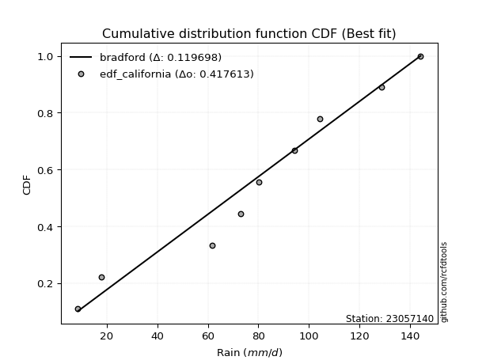</img>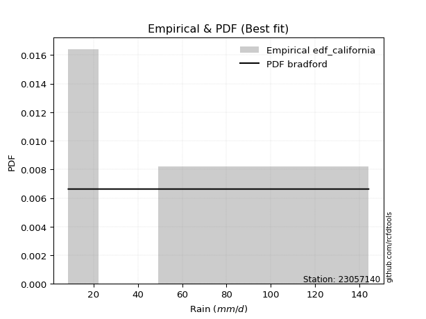</img>

</div>


### 2. Empirical - EDF Hazen (1930)

Hazen method for plotting positions is a formula used to estimate the empirical cumulative probability distribution of flood events or other hydrological data. This formula often results in biased estimations, particularly when extrapolating to extreme events (high return periods).

<div align="center">


$P=(m-0.5)/n$


</div>


**2.1. Empirical values**

<div align="center">

|                | 0                   | 1                   | 2                  | 3                  | 4         | 5                  | 6                  | 7                  | 8                  |
|:---------------|:--------------------|:--------------------|:-------------------|:-------------------|:----------|:-------------------|:-------------------|:-------------------|:-------------------|
| date           | 2025                | 2024                | 2008               | 2007               | 2012      | 2009               | 2013               | 2010               | 2011               |
| x              | 7.1                 | 17.8                | 61.7               | 72.9               | 80.2      | 94.4               | 104.2              | 128.9              | 144.2              |
| m              | 1                   | 2                   | 3                  | 4                  | 5         | 6                  | 7                  | 8                  | 9                  |
| empirical_dist | edf_hazen           | edf_hazen           | edf_hazen          | edf_hazen          | edf_hazen | edf_hazen          | edf_hazen          | edf_hazen          | edf_hazen          |
| empirical      | 0.05555555555555555 | 0.16666666666666666 | 0.2777777777777778 | 0.3888888888888889 | 0.5       | 0.6111111111111112 | 0.7222222222222222 | 0.8333333333333334 | 0.9444444444444444 |
| empirical_tr   | 1.0588235294117647  | 1.2                 | 1.3846153846153846 | 1.6363636363636362 | 2.0       | 2.5714285714285716 | 3.5999999999999996 | 6.000000000000002  | 17.999999999999993 |

</div>


**2.2. Kolmogorov-Smirnov fit test (sorted by Δ)**


<div align="center">

|                | 0                   | 1                   | 2                   | 3                   | 4                   | 5                   | 6                   | 7                   | 8                   | 9                   | 10                  | 11                  | 12                  | 13                  | 14                  | 15                  | 16                  | 17                  | 18                  | 19                  | 20                  | 21                  | 22                  | 23                  | 24                    | 25                  | 26                  | 27                  | 28                  | 29                  | 30                  | 31                  | 32                  | 33                  | 34                  | 35                  | 36                  | 37                  | 38                  | 39                  | 40                  | 41                  | 42                  | 43                  | 44                  | 45                  | 46                  | 47                  | 48                  | 49                  | 50                  | 51                  | 52                  | 53                  | 54                  | 55                  | 56                  | 57                  | 58                  | 59                  | 60                  | 61                  | 62                  | 63                  | 64                  | 65                  | 66                  | 67                  | 68                  | 69                  | 70                  | 71                  | 72                  | 73                  | 74                  | 75                  | 76                  | 77                  | 78                  | 79                  | 80                  | 81                  | 82                  | 83                  | 84                  | 85                  | 86                  | 87                  | 88                  | 89                  |
|:---------------|:--------------------|:--------------------|:--------------------|:--------------------|:--------------------|:--------------------|:--------------------|:--------------------|:--------------------|:--------------------|:--------------------|:--------------------|:--------------------|:--------------------|:--------------------|:--------------------|:--------------------|:--------------------|:--------------------|:--------------------|:--------------------|:--------------------|:--------------------|:--------------------|:----------------------|:--------------------|:--------------------|:--------------------|:--------------------|:--------------------|:--------------------|:--------------------|:--------------------|:--------------------|:--------------------|:--------------------|:--------------------|:--------------------|:--------------------|:--------------------|:--------------------|:--------------------|:--------------------|:--------------------|:--------------------|:--------------------|:--------------------|:--------------------|:--------------------|:--------------------|:--------------------|:--------------------|:--------------------|:--------------------|:--------------------|:--------------------|:--------------------|:--------------------|:--------------------|:--------------------|:--------------------|:--------------------|:--------------------|:--------------------|:--------------------|:--------------------|:--------------------|:--------------------|:--------------------|:--------------------|:--------------------|:--------------------|:--------------------|:--------------------|:--------------------|:--------------------|:--------------------|:--------------------|:--------------------|:--------------------|:--------------------|:--------------------|:--------------------|:--------------------|:--------------------|:--------------------|:--------------------|:--------------------|:--------------------|:--------------------|
| station        | 23057140            | 23057140            | 23057140            | 23057140            | 23057140            | 23057140            | 23057140            | 23057140            | 23057140            | 23057140            | 23057140            | 23057140            | 23057140            | 23057140            | 23057140            | 23057140            | 23057140            | 23057140            | 23057140            | 23057140            | 23057140            | 23057140            | 23057140            | 23057140            | 23057140              | 23057140            | 23057140            | 23057140            | 23057140            | 23057140            | 23057140            | 23057140            | 23057140            | 23057140            | 23057140            | 23057140            | 23057140            | 23057140            | 23057140            | 23057140            | 23057140            | 23057140            | 23057140            | 23057140            | 23057140            | 23057140            | 23057140            | 23057140            | 23057140            | 23057140            | 23057140            | 23057140            | 23057140            | 23057140            | 23057140            | 23057140            | 23057140            | 23057140            | 23057140            | 23057140            | 23057140            | 23057140            | 23057140            | 23057140            | 23057140            | 23057140            | 23057140            | 23057140            | 23057140            | 23057140            | 23057140            | 23057140            | 23057140            | 23057140            | 23057140            | 23057140            | 23057140            | 23057140            | 23057140            | 23057140            | 23057140            | 23057140            | 23057140            | 23057140            | 23057140            | 23057140            | 23057140            | 23057140            | 23057140            | 23057140            |
| empirical_dist | edf_hazen           | edf_hazen           | edf_hazen           | edf_hazen           | edf_hazen           | edf_hazen           | edf_hazen           | edf_hazen           | edf_hazen           | edf_hazen           | edf_hazen           | edf_hazen           | edf_hazen           | edf_hazen           | edf_hazen           | edf_hazen           | edf_hazen           | edf_hazen           | edf_hazen           | edf_hazen           | edf_hazen           | edf_hazen           | edf_hazen           | edf_hazen           | edf_hazen             | edf_hazen           | edf_hazen           | edf_hazen           | edf_hazen           | edf_hazen           | edf_hazen           | edf_hazen           | edf_hazen           | edf_hazen           | edf_hazen           | edf_hazen           | edf_hazen           | edf_hazen           | edf_hazen           | edf_hazen           | edf_hazen           | edf_hazen           | edf_hazen           | edf_hazen           | edf_hazen           | edf_hazen           | edf_hazen           | edf_hazen           | edf_hazen           | edf_hazen           | edf_hazen           | edf_hazen           | edf_hazen           | edf_hazen           | edf_hazen           | edf_hazen           | edf_hazen           | edf_hazen           | edf_hazen           | edf_hazen           | edf_hazen           | edf_hazen           | edf_hazen           | edf_hazen           | edf_hazen           | edf_hazen           | edf_hazen           | edf_hazen           | edf_hazen           | edf_hazen           | edf_hazen           | edf_hazen           | edf_hazen           | edf_hazen           | edf_hazen           | edf_hazen           | edf_hazen           | edf_hazen           | edf_hazen           | edf_hazen           | edf_hazen           | edf_hazen           | edf_hazen           | edf_hazen           | edf_hazen           | edf_hazen           | edf_hazen           | edf_hazen           | edf_hazen           | edf_hazen           |
| p_dist         | genlogistic         | johnsonsu           | logjohnsonsu        | laplace_asymmetric  | gumbel_l            | pearson3            | weibull_min         | gamma               | betaprime           | fisk                | norm                | crystalball         | truncnorm           | nct                 | exponnorm           | t                   | f                   | erlang              | invgamma            | logistic            | hypsecant           | rice                | laplace             | maxwell             | loglaplace_asymmetric | logloggamma         | rayleigh            | invgauss            | logmielke           | logt                | gumbel_r            | kstwobign           | moyal               | logfisk             | logpearson3         | loggompertz         | halfnorm            | halflogistic        | loggumbel_l         | ncf                 | mielke              | wald                | gibrat              | lognakagami         | logf                | logexponnorm        | logcrystalball      | lognorm             | lognorm             | logrice             | lognct              | logfatiguelife      | loglogistic         | loghypsecant        | loggamma            | loggamma            | logbetaprime        | genexpon            | expon               | logerlang           | loginvgamma         | loglaplace          | loginvgauss         | logncf              | logalpha            | loginvweibull       | logmaxwell          | lograyleigh         | logkstwobign        | logtruncnorm        | loggumbel_r         | loghalfnorm         | loggenexpon         | nakagami            | logmoyal            | loghalflogistic     | logexpon            | logwald             | pareto              | loggibrat           | loglognorm          | logpareto           | alpha               | invweibull          | logweibull_min      | fatiguelife         | logchi2             | gompertz            | chi2                | loggenlogistic      |
| delta          | 0.07496654351586611 | 0.07618618144481673 | 0.07760930744987271 | 0.08006845292207912 | 0.08116651498621708 | 0.08277354421992345 | 0.08685365959351735 | 0.08699400116769608 | 0.08749212528184777 | 0.08776950468040502 | 0.08809544819823036 | 0.0880954495712836  | 0.08809547532683493 | 0.08809625800358017 | 0.08809647635142585 | 0.0880982743923606  | 0.08892122783449596 | 0.08916085943727499 | 0.09103742715054741 | 0.09531230609629938 | 0.0979496046437763  | 0.09814295952178514 | 0.09905013597466933 | 0.10411124464168263 | 0.11066134613781525   | 0.1111915106790411  | 0.11477310469349185 | 0.1154725753130772  | 0.11791604023877666 | 0.11877867336300041 | 0.13479981437779587 | 0.15500540349821984 | 0.15590343280390132 | 0.15735270272029617 | 0.1582314279168967  | 0.16048808504704548 | 0.16666666666666666 | 0.16666666666666666 | 0.17349275081228288 | 0.18168687073882556 | 0.19411124474859165 | 0.21599824951118535 | 0.2267844326972907  | 0.24213930172799236 | 0.2424813827240111  | 0.24293743645502042 | 0.24294139889261723 | 0.24294139965093808 | 0.24294139965093808 | 0.24295218254091622 | 0.24408715304530848 | 0.24504660921216337 | 0.24576543901967685 | 0.2481727503758019  | 0.2495796421280675  | 0.2495796421280675  | 0.25107079531849297 | 0.2540476410299194  | 0.25404993649794083 | 0.25465252335032207 | 0.25600541631490403 | 0.25764514631558855 | 0.25804088125860536 | 0.2632090494215904  | 0.26654120021429106 | 0.27225633051356124 | 0.27504755162129835 | 0.2855802306135692  | 0.307488888966419   | 0.31308900699306574 | 0.31362172578428327 | 0.3152327029515176  | 0.3183139402417975  | 0.3292786679097246  | 0.33920779150635927 | 0.34131348087239344 | 0.36278023353730016 | 0.41027092059399084 | 0.4250146169705298  | 0.4364906199669425  | 0.4419683085742624  | 0.46999269630474816 | 0.4736764862001023  | 0.49431305034880935 | 0.5013468695223927  | 0.525461739974903   | 0.533192232488999   | 0.6696903722906804  | 0.7277294870324504  | 0.8333333333333334  |
| deltao         | 0.41761268023100007 | 0.41761268023100007 | 0.41761268023100007 | 0.41761268023100007 | 0.41761268023100007 | 0.41761268023100007 | 0.41761268023100007 | 0.41761268023100007 | 0.41761268023100007 | 0.41761268023100007 | 0.41761268023100007 | 0.41761268023100007 | 0.41761268023100007 | 0.41761268023100007 | 0.41761268023100007 | 0.41761268023100007 | 0.41761268023100007 | 0.41761268023100007 | 0.41761268023100007 | 0.41761268023100007 | 0.41761268023100007 | 0.41761268023100007 | 0.41761268023100007 | 0.41761268023100007 | 0.41761268023100007   | 0.41761268023100007 | 0.41761268023100007 | 0.41761268023100007 | 0.41761268023100007 | 0.41761268023100007 | 0.41761268023100007 | 0.41761268023100007 | 0.41761268023100007 | 0.41761268023100007 | 0.41761268023100007 | 0.41761268023100007 | 0.41761268023100007 | 0.41761268023100007 | 0.41761268023100007 | 0.41761268023100007 | 0.41761268023100007 | 0.41761268023100007 | 0.41761268023100007 | 0.41761268023100007 | 0.41761268023100007 | 0.41761268023100007 | 0.41761268023100007 | 0.41761268023100007 | 0.41761268023100007 | 0.41761268023100007 | 0.41761268023100007 | 0.41761268023100007 | 0.41761268023100007 | 0.41761268023100007 | 0.41761268023100007 | 0.41761268023100007 | 0.41761268023100007 | 0.41761268023100007 | 0.41761268023100007 | 0.41761268023100007 | 0.41761268023100007 | 0.41761268023100007 | 0.41761268023100007 | 0.41761268023100007 | 0.41761268023100007 | 0.41761268023100007 | 0.41761268023100007 | 0.41761268023100007 | 0.41761268023100007 | 0.41761268023100007 | 0.41761268023100007 | 0.41761268023100007 | 0.41761268023100007 | 0.41761268023100007 | 0.41761268023100007 | 0.41761268023100007 | 0.41761268023100007 | 0.41761268023100007 | 0.41761268023100007 | 0.41761268023100007 | 0.41761268023100007 | 0.41761268023100007 | 0.41761268023100007 | 0.41761268023100007 | 0.41761268023100007 | 0.41761268023100007 | 0.41761268023100007 | 0.41761268023100007 | 0.41761268023100007 | 0.41761268023100007 |
| eval           | Δo > Δ              | Δo > Δ              | Δo > Δ              | Δo > Δ              | Δo > Δ              | Δo > Δ              | Δo > Δ              | Δo > Δ              | Δo > Δ              | Δo > Δ              | Δo > Δ              | Δo > Δ              | Δo > Δ              | Δo > Δ              | Δo > Δ              | Δo > Δ              | Δo > Δ              | Δo > Δ              | Δo > Δ              | Δo > Δ              | Δo > Δ              | Δo > Δ              | Δo > Δ              | Δo > Δ              | Δo > Δ                | Δo > Δ              | Δo > Δ              | Δo > Δ              | Δo > Δ              | Δo > Δ              | Δo > Δ              | Δo > Δ              | Δo > Δ              | Δo > Δ              | Δo > Δ              | Δo > Δ              | Δo > Δ              | Δo > Δ              | Δo > Δ              | Δo > Δ              | Δo > Δ              | Δo > Δ              | Δo > Δ              | Δo > Δ              | Δo > Δ              | Δo > Δ              | Δo > Δ              | Δo > Δ              | Δo > Δ              | Δo > Δ              | Δo > Δ              | Δo > Δ              | Δo > Δ              | Δo > Δ              | Δo > Δ              | Δo > Δ              | Δo > Δ              | Δo > Δ              | Δo > Δ              | Δo > Δ              | Δo > Δ              | Δo > Δ              | Δo > Δ              | Δo > Δ              | Δo > Δ              | Δo > Δ              | Δo > Δ              | Δo > Δ              | Δo > Δ              | Δo > Δ              | Δo > Δ              | Δo > Δ              | Δo > Δ              | Δo > Δ              | Δo > Δ              | Δo > Δ              | Δo > Δ              | Δo > Δ              | Δo <= Δ             | Δo <= Δ             | Δo <= Δ             | Δo <= Δ             | Δo <= Δ             | Δo <= Δ             | Δo <= Δ             | Δo <= Δ             | Δo <= Δ             | Δo <= Δ             | Δo <= Δ             | Δo <= Δ             |
| fit            | 1                   | 1                   | 1                   | 1                   | 1                   | 1                   | 1                   | 1                   | 1                   | 1                   | 1                   | 1                   | 1                   | 1                   | 1                   | 1                   | 1                   | 1                   | 1                   | 1                   | 1                   | 1                   | 1                   | 1                   | 1                     | 1                   | 1                   | 1                   | 1                   | 1                   | 1                   | 1                   | 1                   | 1                   | 1                   | 1                   | 1                   | 1                   | 1                   | 1                   | 1                   | 1                   | 1                   | 1                   | 1                   | 1                   | 1                   | 1                   | 1                   | 1                   | 1                   | 1                   | 1                   | 1                   | 1                   | 1                   | 1                   | 1                   | 1                   | 1                   | 1                   | 1                   | 1                   | 1                   | 1                   | 1                   | 1                   | 1                   | 1                   | 1                   | 1                   | 1                   | 1                   | 1                   | 1                   | 1                   | 1                   | 1                   | 0                   | 0                   | 0                   | 0                   | 0                   | 0                   | 0                   | 0                   | 0                   | 0                   | 0                   | 0                   |
| n              | 9                   | 9                   | 9                   | 9                   | 9                   | 9                   | 9                   | 9                   | 9                   | 9                   | 9                   | 9                   | 9                   | 9                   | 9                   | 9                   | 9                   | 9                   | 9                   | 9                   | 9                   | 9                   | 9                   | 9                   | 9                     | 9                   | 9                   | 9                   | 9                   | 9                   | 9                   | 9                   | 9                   | 9                   | 9                   | 9                   | 9                   | 9                   | 9                   | 9                   | 9                   | 9                   | 9                   | 9                   | 9                   | 9                   | 9                   | 9                   | 9                   | 9                   | 9                   | 9                   | 9                   | 9                   | 9                   | 9                   | 9                   | 9                   | 9                   | 9                   | 9                   | 9                   | 9                   | 9                   | 9                   | 9                   | 9                   | 9                   | 9                   | 9                   | 9                   | 9                   | 9                   | 9                   | 9                   | 9                   | 9                   | 9                   | 9                   | 9                   | 9                   | 9                   | 9                   | 9                   | 9                   | 9                   | 9                   | 9                   | 9                   | 9                   |
| best_fit       | 1                   | 0                   | 0                   | 0                   | 0                   | 0                   | 0                   | 0                   | 0                   | 0                   | 0                   | 0                   | 0                   | 0                   | 0                   | 0                   | 0                   | 0                   | 0                   | 0                   | 0                   | 0                   | 0                   | 0                   | 0                     | 0                   | 0                   | 0                   | 0                   | 0                   | 0                   | 0                   | 0                   | 0                   | 0                   | 0                   | 0                   | 0                   | 0                   | 0                   | 0                   | 0                   | 0                   | 0                   | 0                   | 0                   | 0                   | 0                   | 0                   | 0                   | 0                   | 0                   | 0                   | 0                   | 0                   | 0                   | 0                   | 0                   | 0                   | 0                   | 0                   | 0                   | 0                   | 0                   | 0                   | 0                   | 0                   | 0                   | 0                   | 0                   | 0                   | 0                   | 0                   | 0                   | 0                   | 0                   | 0                   | 0                   | 0                   | 0                   | 0                   | 0                   | 0                   | 0                   | 0                   | 0                   | 0                   | 0                   | 0                   | 0                   |
| best_fit_sort  | 1                   | 2                   | 3                   | 4                   | 5                   | 6                   | 7                   | 8                   | 9                   | 10                  | 11                  | 12                  | 13                  | 14                  | 15                  | 16                  | 17                  | 18                  | 19                  | 20                  | 21                  | 22                  | 23                  | 24                  | 25                    | 26                  | 27                  | 28                  | 29                  | 30                  | 31                  | 32                  | 33                  | 34                  | 35                  | 36                  | 37                  | 38                  | 39                  | 40                  | 41                  | 42                  | 43                  | 44                  | 45                  | 46                  | 47                  | 48                  | 49                  | 50                  | 51                  | 52                  | 53                  | 54                  | 55                  | 56                  | 57                  | 58                  | 59                  | 60                  | 61                  | 62                  | 63                  | 64                  | 65                  | 66                  | 67                  | 68                  | 69                  | 70                  | 71                  | 72                  | 73                  | 74                  | 75                  | 76                  | 77                  | 78                  | 79                  | 80                  | 81                  | 82                  | 83                  | 84                  | 85                  | 86                  | 87                  | 88                  | 89                  | 90                  |

</div>


<div align="center">

</img>

</div>


**2.3. Best fit**

<div align="center">

|   id |   station | empirical_dist   | p_dist      |     delta |   deltao | eval   |   fit |   n |   best_fit |   best_fit_sort |
|-----:|----------:|:-----------------|:------------|----------:|---------:|:-------|------:|----:|-----------:|----------------:|
|    0 |  23057140 | edf_hazen        | genlogistic | 0.0749665 | 0.417613 | Δo > Δ |     1 |   9 |          1 |               1 |

</div>


<div align="center">

</img>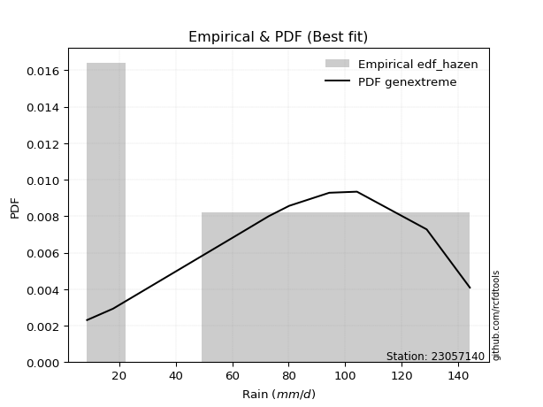</img>

</div>


### 3. Empirical - EDF Weibull (1939)

Weibull plotting position formula is an empirical method used to estimate the non-exceedance probability or plotting position for a set of observed data, is often recommended or widely used in practice, particularly in flood frequency analysis.

<div align="center">


$P=m/(n+1)$


</div>


**3.1. Empirical values**

<div align="center">

|                | 0                  | 1           | 2                  | 3                  | 4           | 5           | 6                 | 7                 | 8                  |
|:---------------|:-------------------|:------------|:-------------------|:-------------------|:------------|:------------|:------------------|:------------------|:-------------------|
| date           | 2025               | 2024        | 2008               | 2007               | 2012        | 2009        | 2013              | 2010              | 2011               |
| x              | 7.1                | 17.8        | 61.7               | 72.9               | 80.2        | 94.4        | 104.2             | 128.9             | 144.2              |
| m              | 1                  | 2           | 3                  | 4                  | 5           | 6           | 7                 | 8                 | 9                  |
| empirical_dist | edf_weibull        | edf_weibull | edf_weibull        | edf_weibull        | edf_weibull | edf_weibull | edf_weibull       | edf_weibull       | edf_weibull        |
| empirical      | 0.1                | 0.2         | 0.3                | 0.4                | 0.5         | 0.6         | 0.7               | 0.8               | 0.9                |
| empirical_tr   | 1.1111111111111112 | 1.25        | 1.4285714285714286 | 1.6666666666666667 | 2.0         | 2.5         | 3.333333333333333 | 5.000000000000001 | 10.000000000000002 |

</div>


**3.2. Kolmogorov-Smirnov fit test (sorted by Δ)**


<div align="center">

|                | 0                   | 1                   | 2                   | 3                     | 4                   | 5                   | 6                   | 7                   | 8                   | 9                   | 10                  | 11                  | 12                  | 13                  | 14                  | 15                  | 16                  | 17                  | 18                  | 19                  | 20                  | 21                  | 22                  | 23                  | 24                  | 25                  | 26                  | 27                  | 28                  | 29                  | 30                  | 31                  | 32                  | 33                  | 34                  | 35                  | 36                  | 37                  | 38                  | 39                  | 40                  | 41                  | 42                  | 43                  | 44                  | 45                  | 46                  | 47                  | 48                  | 49                  | 50                  | 51                  | 52                  | 53                  | 54                  | 55                  | 56                  | 57                  | 58                  | 59                  | 60                  | 61                  | 62                  | 63                  | 64                  | 65                  | 66                  | 67                  | 68                  | 69                  | 70                  | 71                  | 72                  | 73                  | 74                  | 75                  | 76                  | 77                  | 78                  | 79                  | 80                  | 81                  | 82                  | 83                  | 84                  | 85                  | 86                  | 87                  | 88                  | 89                  |
|:---------------|:--------------------|:--------------------|:--------------------|:----------------------|:--------------------|:--------------------|:--------------------|:--------------------|:--------------------|:--------------------|:--------------------|:--------------------|:--------------------|:--------------------|:--------------------|:--------------------|:--------------------|:--------------------|:--------------------|:--------------------|:--------------------|:--------------------|:--------------------|:--------------------|:--------------------|:--------------------|:--------------------|:--------------------|:--------------------|:--------------------|:--------------------|:--------------------|:--------------------|:--------------------|:--------------------|:--------------------|:--------------------|:--------------------|:--------------------|:--------------------|:--------------------|:--------------------|:--------------------|:--------------------|:--------------------|:--------------------|:--------------------|:--------------------|:--------------------|:--------------------|:--------------------|:--------------------|:--------------------|:--------------------|:--------------------|:--------------------|:--------------------|:--------------------|:--------------------|:--------------------|:--------------------|:--------------------|:--------------------|:--------------------|:--------------------|:--------------------|:--------------------|:--------------------|:--------------------|:--------------------|:--------------------|:--------------------|:--------------------|:--------------------|:--------------------|:--------------------|:--------------------|:--------------------|:--------------------|:--------------------|:--------------------|:--------------------|:--------------------|:--------------------|:--------------------|:--------------------|:--------------------|:--------------------|:--------------------|:--------------------|
| station        | 23057140            | 23057140            | 23057140            | 23057140              | 23057140            | 23057140            | 23057140            | 23057140            | 23057140            | 23057140            | 23057140            | 23057140            | 23057140            | 23057140            | 23057140            | 23057140            | 23057140            | 23057140            | 23057140            | 23057140            | 23057140            | 23057140            | 23057140            | 23057140            | 23057140            | 23057140            | 23057140            | 23057140            | 23057140            | 23057140            | 23057140            | 23057140            | 23057140            | 23057140            | 23057140            | 23057140            | 23057140            | 23057140            | 23057140            | 23057140            | 23057140            | 23057140            | 23057140            | 23057140            | 23057140            | 23057140            | 23057140            | 23057140            | 23057140            | 23057140            | 23057140            | 23057140            | 23057140            | 23057140            | 23057140            | 23057140            | 23057140            | 23057140            | 23057140            | 23057140            | 23057140            | 23057140            | 23057140            | 23057140            | 23057140            | 23057140            | 23057140            | 23057140            | 23057140            | 23057140            | 23057140            | 23057140            | 23057140            | 23057140            | 23057140            | 23057140            | 23057140            | 23057140            | 23057140            | 23057140            | 23057140            | 23057140            | 23057140            | 23057140            | 23057140            | 23057140            | 23057140            | 23057140            | 23057140            | 23057140            |
| empirical_dist | edf_weibull         | edf_weibull         | edf_weibull         | edf_weibull           | edf_weibull         | edf_weibull         | edf_weibull         | edf_weibull         | edf_weibull         | edf_weibull         | edf_weibull         | edf_weibull         | edf_weibull         | edf_weibull         | edf_weibull         | edf_weibull         | edf_weibull         | edf_weibull         | edf_weibull         | edf_weibull         | edf_weibull         | edf_weibull         | edf_weibull         | edf_weibull         | edf_weibull         | edf_weibull         | edf_weibull         | edf_weibull         | edf_weibull         | edf_weibull         | edf_weibull         | edf_weibull         | edf_weibull         | edf_weibull         | edf_weibull         | edf_weibull         | edf_weibull         | edf_weibull         | edf_weibull         | edf_weibull         | edf_weibull         | edf_weibull         | edf_weibull         | edf_weibull         | edf_weibull         | edf_weibull         | edf_weibull         | edf_weibull         | edf_weibull         | edf_weibull         | edf_weibull         | edf_weibull         | edf_weibull         | edf_weibull         | edf_weibull         | edf_weibull         | edf_weibull         | edf_weibull         | edf_weibull         | edf_weibull         | edf_weibull         | edf_weibull         | edf_weibull         | edf_weibull         | edf_weibull         | edf_weibull         | edf_weibull         | edf_weibull         | edf_weibull         | edf_weibull         | edf_weibull         | edf_weibull         | edf_weibull         | edf_weibull         | edf_weibull         | edf_weibull         | edf_weibull         | edf_weibull         | edf_weibull         | edf_weibull         | edf_weibull         | edf_weibull         | edf_weibull         | edf_weibull         | edf_weibull         | edf_weibull         | edf_weibull         | edf_weibull         | edf_weibull         | edf_weibull         |
| p_dist         | logjohnsonsu        | logmielke           | logloggamma         | loglaplace_asymmetric | genlogistic         | johnsonsu           | laplace_asymmetric  | gumbel_l            | pearson3            | weibull_min         | gamma               | betaprime           | fisk                | invgauss            | norm                | crystalball         | truncnorm           | nct                 | exponnorm           | t                   | f                   | erlang              | invgamma            | logistic            | hypsecant           | rice                | laplace             | kstwobign           | logpearson3         | maxwell             | loggompertz         | logfisk             | rayleigh            | loggumbel_l         | logt                | ncf                 | gumbel_r            | mielke              | moyal               | halfnorm            | halflogistic        | wald                | gibrat              | lognakagami         | logf                | logexponnorm        | logcrystalball      | lognorm             | lognorm             | logrice             | lognct              | logfatiguelife      | loglogistic         | loghypsecant        | loggamma            | loggamma            | logbetaprime        | genexpon            | expon               | logerlang           | loginvgamma         | loginvgauss         | loglaplace          | logncf              | logalpha            | loginvweibull       | logmaxwell          | lograyleigh         | logkstwobign        | logtruncnorm        | loggumbel_r         | loghalfnorm         | loggenexpon         | nakagami            | logmoyal            | loghalflogistic     | logexpon            | logwald             | pareto              | loglognorm          | loggibrat           | logpareto           | invweibull          | alpha               | logweibull_min      | fatiguelife         | logchi2             | gompertz            | chi2                | loggenlogistic      |
| delta          | 0.08794469555472212 | 0.09723810293812635 | 0.10239483427454793 | 0.10272204218101287   | 0.10829987684919946 | 0.10951951477815008 | 0.11340178625541247 | 0.1144998483195504  | 0.1161068775532568  | 0.1201869929268507  | 0.12032733450102943 | 0.12082545861518112 | 0.12110283801373838 | 0.12127048988203863 | 0.12142878153156371 | 0.12142878290461695 | 0.12142880866016828 | 0.12142959133691353 | 0.12142980968475921 | 0.12143160772569396 | 0.12225456116782932 | 0.12249419277060834 | 0.12404906314395858 | 0.12864563942963275 | 0.13128293797710966 | 0.1314762928551185  | 0.13238346930800268 | 0.13278318127599764 | 0.1360092056946745  | 0.13744457797501597 | 0.1389601709216729  | 0.1399920169263132  | 0.14810643802682522 | 0.15127052859006068 | 0.15211200669633376 | 0.15946464851660336 | 0.16813314771112922 | 0.17188902252636945 | 0.18923676613723467 | 0.2                 | 0.2                 | 0.20488713840007422 | 0.21567332158617958 | 0.21991707950577016 | 0.2202591605017889  | 0.22071521423279822 | 0.22071917667039503 | 0.22071917742871588 | 0.22071917742871588 | 0.22072996031869402 | 0.22186493082308628 | 0.22282438698994117 | 0.22354321679745465 | 0.2259505281535797  | 0.2273574199058453  | 0.2273574199058453  | 0.22884857309627077 | 0.2318254188076972  | 0.23182771427571863 | 0.23243030112809987 | 0.23378319409268183 | 0.23581865903638316 | 0.23818171513611508 | 0.2409868271993682  | 0.24431897799206886 | 0.25003410829133904 | 0.25282532939907615 | 0.263358008391347   | 0.2852666667441968  | 0.29086678477084354 | 0.29139950356206107 | 0.2930104807292954  | 0.2960917180195753  | 0.3070564456875024  | 0.31698556928413707 | 0.31909125865017124 | 0.34055801131507796 | 0.38804869837176864 | 0.3916812836371964  | 0.408634975240929   | 0.4142683977447203  | 0.4366593629714148  | 0.44986860590436495 | 0.4514542639778801  | 0.4791246473001705  | 0.5032395177526807  | 0.5109700102667769  | 0.6474681500684581  | 0.6980982610659363  | 0.8                 |
| deltao         | 0.41761268023100007 | 0.41761268023100007 | 0.41761268023100007 | 0.41761268023100007   | 0.41761268023100007 | 0.41761268023100007 | 0.41761268023100007 | 0.41761268023100007 | 0.41761268023100007 | 0.41761268023100007 | 0.41761268023100007 | 0.41761268023100007 | 0.41761268023100007 | 0.41761268023100007 | 0.41761268023100007 | 0.41761268023100007 | 0.41761268023100007 | 0.41761268023100007 | 0.41761268023100007 | 0.41761268023100007 | 0.41761268023100007 | 0.41761268023100007 | 0.41761268023100007 | 0.41761268023100007 | 0.41761268023100007 | 0.41761268023100007 | 0.41761268023100007 | 0.41761268023100007 | 0.41761268023100007 | 0.41761268023100007 | 0.41761268023100007 | 0.41761268023100007 | 0.41761268023100007 | 0.41761268023100007 | 0.41761268023100007 | 0.41761268023100007 | 0.41761268023100007 | 0.41761268023100007 | 0.41761268023100007 | 0.41761268023100007 | 0.41761268023100007 | 0.41761268023100007 | 0.41761268023100007 | 0.41761268023100007 | 0.41761268023100007 | 0.41761268023100007 | 0.41761268023100007 | 0.41761268023100007 | 0.41761268023100007 | 0.41761268023100007 | 0.41761268023100007 | 0.41761268023100007 | 0.41761268023100007 | 0.41761268023100007 | 0.41761268023100007 | 0.41761268023100007 | 0.41761268023100007 | 0.41761268023100007 | 0.41761268023100007 | 0.41761268023100007 | 0.41761268023100007 | 0.41761268023100007 | 0.41761268023100007 | 0.41761268023100007 | 0.41761268023100007 | 0.41761268023100007 | 0.41761268023100007 | 0.41761268023100007 | 0.41761268023100007 | 0.41761268023100007 | 0.41761268023100007 | 0.41761268023100007 | 0.41761268023100007 | 0.41761268023100007 | 0.41761268023100007 | 0.41761268023100007 | 0.41761268023100007 | 0.41761268023100007 | 0.41761268023100007 | 0.41761268023100007 | 0.41761268023100007 | 0.41761268023100007 | 0.41761268023100007 | 0.41761268023100007 | 0.41761268023100007 | 0.41761268023100007 | 0.41761268023100007 | 0.41761268023100007 | 0.41761268023100007 | 0.41761268023100007 |
| eval           | Δo > Δ              | Δo > Δ              | Δo > Δ              | Δo > Δ                | Δo > Δ              | Δo > Δ              | Δo > Δ              | Δo > Δ              | Δo > Δ              | Δo > Δ              | Δo > Δ              | Δo > Δ              | Δo > Δ              | Δo > Δ              | Δo > Δ              | Δo > Δ              | Δo > Δ              | Δo > Δ              | Δo > Δ              | Δo > Δ              | Δo > Δ              | Δo > Δ              | Δo > Δ              | Δo > Δ              | Δo > Δ              | Δo > Δ              | Δo > Δ              | Δo > Δ              | Δo > Δ              | Δo > Δ              | Δo > Δ              | Δo > Δ              | Δo > Δ              | Δo > Δ              | Δo > Δ              | Δo > Δ              | Δo > Δ              | Δo > Δ              | Δo > Δ              | Δo > Δ              | Δo > Δ              | Δo > Δ              | Δo > Δ              | Δo > Δ              | Δo > Δ              | Δo > Δ              | Δo > Δ              | Δo > Δ              | Δo > Δ              | Δo > Δ              | Δo > Δ              | Δo > Δ              | Δo > Δ              | Δo > Δ              | Δo > Δ              | Δo > Δ              | Δo > Δ              | Δo > Δ              | Δo > Δ              | Δo > Δ              | Δo > Δ              | Δo > Δ              | Δo > Δ              | Δo > Δ              | Δo > Δ              | Δo > Δ              | Δo > Δ              | Δo > Δ              | Δo > Δ              | Δo > Δ              | Δo > Δ              | Δo > Δ              | Δo > Δ              | Δo > Δ              | Δo > Δ              | Δo > Δ              | Δo > Δ              | Δo > Δ              | Δo > Δ              | Δo > Δ              | Δo > Δ              | Δo <= Δ             | Δo <= Δ             | Δo <= Δ             | Δo <= Δ             | Δo <= Δ             | Δo <= Δ             | Δo <= Δ             | Δo <= Δ             | Δo <= Δ             |
| fit            | 1                   | 1                   | 1                   | 1                     | 1                   | 1                   | 1                   | 1                   | 1                   | 1                   | 1                   | 1                   | 1                   | 1                   | 1                   | 1                   | 1                   | 1                   | 1                   | 1                   | 1                   | 1                   | 1                   | 1                   | 1                   | 1                   | 1                   | 1                   | 1                   | 1                   | 1                   | 1                   | 1                   | 1                   | 1                   | 1                   | 1                   | 1                   | 1                   | 1                   | 1                   | 1                   | 1                   | 1                   | 1                   | 1                   | 1                   | 1                   | 1                   | 1                   | 1                   | 1                   | 1                   | 1                   | 1                   | 1                   | 1                   | 1                   | 1                   | 1                   | 1                   | 1                   | 1                   | 1                   | 1                   | 1                   | 1                   | 1                   | 1                   | 1                   | 1                   | 1                   | 1                   | 1                   | 1                   | 1                   | 1                   | 1                   | 1                   | 1                   | 1                   | 0                   | 0                   | 0                   | 0                   | 0                   | 0                   | 0                   | 0                   | 0                   |
| n              | 9                   | 9                   | 9                   | 9                     | 9                   | 9                   | 9                   | 9                   | 9                   | 9                   | 9                   | 9                   | 9                   | 9                   | 9                   | 9                   | 9                   | 9                   | 9                   | 9                   | 9                   | 9                   | 9                   | 9                   | 9                   | 9                   | 9                   | 9                   | 9                   | 9                   | 9                   | 9                   | 9                   | 9                   | 9                   | 9                   | 9                   | 9                   | 9                   | 9                   | 9                   | 9                   | 9                   | 9                   | 9                   | 9                   | 9                   | 9                   | 9                   | 9                   | 9                   | 9                   | 9                   | 9                   | 9                   | 9                   | 9                   | 9                   | 9                   | 9                   | 9                   | 9                   | 9                   | 9                   | 9                   | 9                   | 9                   | 9                   | 9                   | 9                   | 9                   | 9                   | 9                   | 9                   | 9                   | 9                   | 9                   | 9                   | 9                   | 9                   | 9                   | 9                   | 9                   | 9                   | 9                   | 9                   | 9                   | 9                   | 9                   | 9                   |
| best_fit       | 1                   | 0                   | 0                   | 0                     | 0                   | 0                   | 0                   | 0                   | 0                   | 0                   | 0                   | 0                   | 0                   | 0                   | 0                   | 0                   | 0                   | 0                   | 0                   | 0                   | 0                   | 0                   | 0                   | 0                   | 0                   | 0                   | 0                   | 0                   | 0                   | 0                   | 0                   | 0                   | 0                   | 0                   | 0                   | 0                   | 0                   | 0                   | 0                   | 0                   | 0                   | 0                   | 0                   | 0                   | 0                   | 0                   | 0                   | 0                   | 0                   | 0                   | 0                   | 0                   | 0                   | 0                   | 0                   | 0                   | 0                   | 0                   | 0                   | 0                   | 0                   | 0                   | 0                   | 0                   | 0                   | 0                   | 0                   | 0                   | 0                   | 0                   | 0                   | 0                   | 0                   | 0                   | 0                   | 0                   | 0                   | 0                   | 0                   | 0                   | 0                   | 0                   | 0                   | 0                   | 0                   | 0                   | 0                   | 0                   | 0                   | 0                   |
| best_fit_sort  | 1                   | 2                   | 3                   | 4                     | 5                   | 6                   | 7                   | 8                   | 9                   | 10                  | 11                  | 12                  | 13                  | 14                  | 15                  | 16                  | 17                  | 18                  | 19                  | 20                  | 21                  | 22                  | 23                  | 24                  | 25                  | 26                  | 27                  | 28                  | 29                  | 30                  | 31                  | 32                  | 33                  | 34                  | 35                  | 36                  | 37                  | 38                  | 39                  | 40                  | 41                  | 42                  | 43                  | 44                  | 45                  | 46                  | 47                  | 48                  | 49                  | 50                  | 51                  | 52                  | 53                  | 54                  | 55                  | 56                  | 57                  | 58                  | 59                  | 60                  | 61                  | 62                  | 63                  | 64                  | 65                  | 66                  | 67                  | 68                  | 69                  | 70                  | 71                  | 72                  | 73                  | 74                  | 75                  | 76                  | 77                  | 78                  | 79                  | 80                  | 81                  | 82                  | 83                  | 84                  | 85                  | 86                  | 87                  | 88                  | 89                  | 90                  |

</div>


<div align="center">

</img>

</div>


**3.3. Best fit**

<div align="center">

|   id |   station | empirical_dist   | p_dist       |     delta |   deltao | eval   |   fit |   n |   best_fit |   best_fit_sort |
|-----:|----------:|:-----------------|:-------------|----------:|---------:|:-------|------:|----:|-----------:|----------------:|
|    0 |  23057140 | edf_weibull      | logjohnsonsu | 0.0879447 | 0.417613 | Δo > Δ |     1 |   9 |          1 |               1 |

</div>


<div align="center">

</img>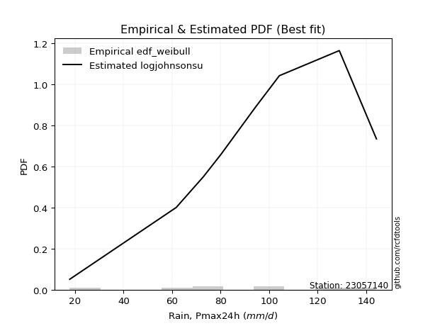</img>

</div>


### 4. Empirical - EDF Beard (1943)

The Beard formula (or Beard´s plotting position formula) in hydrology is used to estimate the empirical non-exceedance probability _(P)_ of a flood event (or other extreme hydrological data point) within a given dataset.

<div align="center">


$P=(m-0.31)/(n+0.38)$


</div>


**4.1. Empirical values**

<div align="center">

|                | 0                   | 1                   | 2                  | 3                   | 4         | 5                  | 6                  | 7                  | 8                  |
|:---------------|:--------------------|:--------------------|:-------------------|:--------------------|:----------|:-------------------|:-------------------|:-------------------|:-------------------|
| date           | 2025                | 2024                | 2008               | 2007                | 2012      | 2009               | 2013               | 2010               | 2011               |
| x              | 7.1                 | 17.8                | 61.7               | 72.9                | 80.2      | 94.4               | 104.2              | 128.9              | 144.2              |
| m              | 1                   | 2                   | 3                  | 4                   | 5         | 6                  | 7                  | 8                  | 9                  |
| empirical_dist | edf_beard           | edf_beard           | edf_beard          | edf_beard           | edf_beard | edf_beard          | edf_beard          | edf_beard          | edf_beard          |
| empirical      | 0.07356076759061833 | 0.18017057569296374 | 0.2867803837953091 | 0.39339019189765456 | 0.5       | 0.6066098081023454 | 0.7132196162046908 | 0.8198294243070362 | 0.9264392324093815 |
| empirical_tr   | 1.0794016110471807  | 1.2197659297789336  | 1.4020926756352765 | 1.6485061511423549  | 2.0       | 2.542005420054201  | 3.486988847583642  | 5.550295857988164  | 13.5942028985507   |

</div>


**4.2. Kolmogorov-Smirnov fit test (sorted by Δ)**


<div align="center">

|                | 0                   | 1                   | 2                   | 3                   | 4                   | 5                   | 6                   | 7                   | 8                   | 9                   | 10                  | 11                  | 12                  | 13                  | 14                  | 15                  | 16                    | 17                  | 18                  | 19                  | 20                  | 21                  | 22                  | 23                  | 24                  | 25                  | 26                  | 27                  | 28                  | 29                  | 30                  | 31                  | 32                  | 33                  | 34                  | 35                  | 36                  | 37                  | 38                  | 39                  | 40                  | 41                  | 42                  | 43                  | 44                  | 45                  | 46                  | 47                  | 48                  | 49                  | 50                  | 51                  | 52                  | 53                  | 54                  | 55                  | 56                  | 57                  | 58                  | 59                  | 60                  | 61                  | 62                  | 63                  | 64                  | 65                  | 66                  | 67                  | 68                  | 69                  | 70                  | 71                  | 72                  | 73                  | 74                  | 75                  | 76                  | 77                  | 78                  | 79                  | 80                  | 81                  | 82                  | 83                  | 84                  | 85                  | 86                  | 87                  | 88                  | 89                  |
|:---------------|:--------------------|:--------------------|:--------------------|:--------------------|:--------------------|:--------------------|:--------------------|:--------------------|:--------------------|:--------------------|:--------------------|:--------------------|:--------------------|:--------------------|:--------------------|:--------------------|:----------------------|:--------------------|:--------------------|:--------------------|:--------------------|:--------------------|:--------------------|:--------------------|:--------------------|:--------------------|:--------------------|:--------------------|:--------------------|:--------------------|:--------------------|:--------------------|:--------------------|:--------------------|:--------------------|:--------------------|:--------------------|:--------------------|:--------------------|:--------------------|:--------------------|:--------------------|:--------------------|:--------------------|:--------------------|:--------------------|:--------------------|:--------------------|:--------------------|:--------------------|:--------------------|:--------------------|:--------------------|:--------------------|:--------------------|:--------------------|:--------------------|:--------------------|:--------------------|:--------------------|:--------------------|:--------------------|:--------------------|:--------------------|:--------------------|:--------------------|:--------------------|:--------------------|:--------------------|:--------------------|:--------------------|:--------------------|:--------------------|:--------------------|:--------------------|:--------------------|:--------------------|:--------------------|:--------------------|:--------------------|:--------------------|:--------------------|:--------------------|:--------------------|:--------------------|:--------------------|:--------------------|:--------------------|:--------------------|:--------------------|
| station        | 23057140            | 23057140            | 23057140            | 23057140            | 23057140            | 23057140            | 23057140            | 23057140            | 23057140            | 23057140            | 23057140            | 23057140            | 23057140            | 23057140            | 23057140            | 23057140            | 23057140              | 23057140            | 23057140            | 23057140            | 23057140            | 23057140            | 23057140            | 23057140            | 23057140            | 23057140            | 23057140            | 23057140            | 23057140            | 23057140            | 23057140            | 23057140            | 23057140            | 23057140            | 23057140            | 23057140            | 23057140            | 23057140            | 23057140            | 23057140            | 23057140            | 23057140            | 23057140            | 23057140            | 23057140            | 23057140            | 23057140            | 23057140            | 23057140            | 23057140            | 23057140            | 23057140            | 23057140            | 23057140            | 23057140            | 23057140            | 23057140            | 23057140            | 23057140            | 23057140            | 23057140            | 23057140            | 23057140            | 23057140            | 23057140            | 23057140            | 23057140            | 23057140            | 23057140            | 23057140            | 23057140            | 23057140            | 23057140            | 23057140            | 23057140            | 23057140            | 23057140            | 23057140            | 23057140            | 23057140            | 23057140            | 23057140            | 23057140            | 23057140            | 23057140            | 23057140            | 23057140            | 23057140            | 23057140            | 23057140            |
| empirical_dist | edf_beard           | edf_beard           | edf_beard           | edf_beard           | edf_beard           | edf_beard           | edf_beard           | edf_beard           | edf_beard           | edf_beard           | edf_beard           | edf_beard           | edf_beard           | edf_beard           | edf_beard           | edf_beard           | edf_beard             | edf_beard           | edf_beard           | edf_beard           | edf_beard           | edf_beard           | edf_beard           | edf_beard           | edf_beard           | edf_beard           | edf_beard           | edf_beard           | edf_beard           | edf_beard           | edf_beard           | edf_beard           | edf_beard           | edf_beard           | edf_beard           | edf_beard           | edf_beard           | edf_beard           | edf_beard           | edf_beard           | edf_beard           | edf_beard           | edf_beard           | edf_beard           | edf_beard           | edf_beard           | edf_beard           | edf_beard           | edf_beard           | edf_beard           | edf_beard           | edf_beard           | edf_beard           | edf_beard           | edf_beard           | edf_beard           | edf_beard           | edf_beard           | edf_beard           | edf_beard           | edf_beard           | edf_beard           | edf_beard           | edf_beard           | edf_beard           | edf_beard           | edf_beard           | edf_beard           | edf_beard           | edf_beard           | edf_beard           | edf_beard           | edf_beard           | edf_beard           | edf_beard           | edf_beard           | edf_beard           | edf_beard           | edf_beard           | edf_beard           | edf_beard           | edf_beard           | edf_beard           | edf_beard           | edf_beard           | edf_beard           | edf_beard           | edf_beard           | edf_beard           | edf_beard           |
| p_dist         | logjohnsonsu        | genlogistic         | johnsonsu           | laplace_asymmetric  | gumbel_l            | pearson3            | weibull_min         | gamma               | betaprime           | fisk                | norm                | crystalball         | truncnorm           | nct                 | exponnorm           | t                   | loglaplace_asymmetric | logloggamma         | f                   | erlang              | invgamma            | invgauss            | logistic            | logmielke           | hypsecant           | rice                | laplace             | maxwell             | rayleigh            | logt                | kstwobign           | gumbel_r            | logfisk             | logpearson3         | loggompertz         | loggumbel_l         | moyal               | ncf                 | halflogistic        | halfnorm            | mielke              | wald                | gibrat              | lognakagami         | logf                | logexponnorm        | logcrystalball      | lognorm             | lognorm             | logrice             | lognct              | logfatiguelife      | loglogistic         | loghypsecant        | loggamma            | loggamma            | logbetaprime        | genexpon            | expon               | logerlang           | loginvgamma         | loglaplace          | loginvgauss         | logncf              | logalpha            | loginvweibull       | logmaxwell          | lograyleigh         | logkstwobign        | logtruncnorm        | loggumbel_r         | loghalfnorm         | loggenexpon         | nakagami            | logmoyal            | loghalflogistic     | logexpon            | logwald             | pareto              | loggibrat           | loglognorm          | logpareto           | alpha               | invweibull          | logweibull_min      | fatiguelife         | logchi2             | gompertz            | chi2                | loggenlogistic      |
| delta          | 0.06860670143234127 | 0.0884704525421632  | 0.08969009047111381 | 0.0935723619483762  | 0.09467042401251424 | 0.09627745324622053 | 0.10035756861981443 | 0.10049791019399316 | 0.10099603430814486 | 0.1012734137067021  | 0.10159935722452744 | 0.10159935859758068 | 0.10159938435313201 | 0.10160016702987726 | 0.10160038537772294 | 0.10160218341865769 | 0.10165874012028392   | 0.10218890466150976 | 0.10242513686079305 | 0.10266476846357207 | 0.10421963883692231 | 0.10646996929554586 | 0.10881621512259647 | 0.10891343422124533 | 0.11145351367007339 | 0.11164686854808223 | 0.11255404500096641 | 0.11761515366797971 | 0.12827701371978895 | 0.1322825823892975  | 0.1460027974806885  | 0.14830372340409295 | 0.14835009670276483 | 0.14922882189936537 | 0.15148547902951415 | 0.16449014479475155 | 0.1694073418301984  | 0.17268426472129422 | 0.18017057569296374 | 0.18017057569296374 | 0.18510863873106032 | 0.21149694650241968 | 0.22228312968852504 | 0.23313669571046103 | 0.23347877670647976 | 0.23393483043748908 | 0.2339387928750859  | 0.23393879363340675 | 0.23393879363340675 | 0.23394957652338488 | 0.23508454702777715 | 0.23604400319463203 | 0.2367628330021455  | 0.23917014435827055 | 0.24057703611053616 | 0.24057703611053616 | 0.24206818930096163 | 0.24504503501238806 | 0.2450473304804095  | 0.24564991733279073 | 0.2470028102973727  | 0.2486425402980572  | 0.24903827524107403 | 0.25420644340405907 | 0.25753859419675973 | 0.2632537244960299  | 0.266044945603767   | 0.27657762459603785 | 0.2984862829488877  | 0.3040864009755344  | 0.30461911976675193 | 0.3062300969339863  | 0.30931133422426615 | 0.32027606189219326 | 0.33020518548882793 | 0.3323108748548621  | 0.3537776275197688  | 0.4012683145764595  | 0.41151070794423267 | 0.42748801394941116 | 0.4284643995479653  | 0.45648878727845105 | 0.46467388018257094 | 0.47630783831374646 | 0.4923442635048614  | 0.5164591339573716  | 0.5241896264714677  | 0.660687766273149   | 0.7142255780061533  | 0.8198294243070362  |
| deltao         | 0.41761268023100007 | 0.41761268023100007 | 0.41761268023100007 | 0.41761268023100007 | 0.41761268023100007 | 0.41761268023100007 | 0.41761268023100007 | 0.41761268023100007 | 0.41761268023100007 | 0.41761268023100007 | 0.41761268023100007 | 0.41761268023100007 | 0.41761268023100007 | 0.41761268023100007 | 0.41761268023100007 | 0.41761268023100007 | 0.41761268023100007   | 0.41761268023100007 | 0.41761268023100007 | 0.41761268023100007 | 0.41761268023100007 | 0.41761268023100007 | 0.41761268023100007 | 0.41761268023100007 | 0.41761268023100007 | 0.41761268023100007 | 0.41761268023100007 | 0.41761268023100007 | 0.41761268023100007 | 0.41761268023100007 | 0.41761268023100007 | 0.41761268023100007 | 0.41761268023100007 | 0.41761268023100007 | 0.41761268023100007 | 0.41761268023100007 | 0.41761268023100007 | 0.41761268023100007 | 0.41761268023100007 | 0.41761268023100007 | 0.41761268023100007 | 0.41761268023100007 | 0.41761268023100007 | 0.41761268023100007 | 0.41761268023100007 | 0.41761268023100007 | 0.41761268023100007 | 0.41761268023100007 | 0.41761268023100007 | 0.41761268023100007 | 0.41761268023100007 | 0.41761268023100007 | 0.41761268023100007 | 0.41761268023100007 | 0.41761268023100007 | 0.41761268023100007 | 0.41761268023100007 | 0.41761268023100007 | 0.41761268023100007 | 0.41761268023100007 | 0.41761268023100007 | 0.41761268023100007 | 0.41761268023100007 | 0.41761268023100007 | 0.41761268023100007 | 0.41761268023100007 | 0.41761268023100007 | 0.41761268023100007 | 0.41761268023100007 | 0.41761268023100007 | 0.41761268023100007 | 0.41761268023100007 | 0.41761268023100007 | 0.41761268023100007 | 0.41761268023100007 | 0.41761268023100007 | 0.41761268023100007 | 0.41761268023100007 | 0.41761268023100007 | 0.41761268023100007 | 0.41761268023100007 | 0.41761268023100007 | 0.41761268023100007 | 0.41761268023100007 | 0.41761268023100007 | 0.41761268023100007 | 0.41761268023100007 | 0.41761268023100007 | 0.41761268023100007 | 0.41761268023100007 |
| eval           | Δo > Δ              | Δo > Δ              | Δo > Δ              | Δo > Δ              | Δo > Δ              | Δo > Δ              | Δo > Δ              | Δo > Δ              | Δo > Δ              | Δo > Δ              | Δo > Δ              | Δo > Δ              | Δo > Δ              | Δo > Δ              | Δo > Δ              | Δo > Δ              | Δo > Δ                | Δo > Δ              | Δo > Δ              | Δo > Δ              | Δo > Δ              | Δo > Δ              | Δo > Δ              | Δo > Δ              | Δo > Δ              | Δo > Δ              | Δo > Δ              | Δo > Δ              | Δo > Δ              | Δo > Δ              | Δo > Δ              | Δo > Δ              | Δo > Δ              | Δo > Δ              | Δo > Δ              | Δo > Δ              | Δo > Δ              | Δo > Δ              | Δo > Δ              | Δo > Δ              | Δo > Δ              | Δo > Δ              | Δo > Δ              | Δo > Δ              | Δo > Δ              | Δo > Δ              | Δo > Δ              | Δo > Δ              | Δo > Δ              | Δo > Δ              | Δo > Δ              | Δo > Δ              | Δo > Δ              | Δo > Δ              | Δo > Δ              | Δo > Δ              | Δo > Δ              | Δo > Δ              | Δo > Δ              | Δo > Δ              | Δo > Δ              | Δo > Δ              | Δo > Δ              | Δo > Δ              | Δo > Δ              | Δo > Δ              | Δo > Δ              | Δo > Δ              | Δo > Δ              | Δo > Δ              | Δo > Δ              | Δo > Δ              | Δo > Δ              | Δo > Δ              | Δo > Δ              | Δo > Δ              | Δo > Δ              | Δo > Δ              | Δo > Δ              | Δo <= Δ             | Δo <= Δ             | Δo <= Δ             | Δo <= Δ             | Δo <= Δ             | Δo <= Δ             | Δo <= Δ             | Δo <= Δ             | Δo <= Δ             | Δo <= Δ             | Δo <= Δ             |
| fit            | 1                   | 1                   | 1                   | 1                   | 1                   | 1                   | 1                   | 1                   | 1                   | 1                   | 1                   | 1                   | 1                   | 1                   | 1                   | 1                   | 1                     | 1                   | 1                   | 1                   | 1                   | 1                   | 1                   | 1                   | 1                   | 1                   | 1                   | 1                   | 1                   | 1                   | 1                   | 1                   | 1                   | 1                   | 1                   | 1                   | 1                   | 1                   | 1                   | 1                   | 1                   | 1                   | 1                   | 1                   | 1                   | 1                   | 1                   | 1                   | 1                   | 1                   | 1                   | 1                   | 1                   | 1                   | 1                   | 1                   | 1                   | 1                   | 1                   | 1                   | 1                   | 1                   | 1                   | 1                   | 1                   | 1                   | 1                   | 1                   | 1                   | 1                   | 1                   | 1                   | 1                   | 1                   | 1                   | 1                   | 1                   | 1                   | 1                   | 0                   | 0                   | 0                   | 0                   | 0                   | 0                   | 0                   | 0                   | 0                   | 0                   | 0                   |
| n              | 9                   | 9                   | 9                   | 9                   | 9                   | 9                   | 9                   | 9                   | 9                   | 9                   | 9                   | 9                   | 9                   | 9                   | 9                   | 9                   | 9                     | 9                   | 9                   | 9                   | 9                   | 9                   | 9                   | 9                   | 9                   | 9                   | 9                   | 9                   | 9                   | 9                   | 9                   | 9                   | 9                   | 9                   | 9                   | 9                   | 9                   | 9                   | 9                   | 9                   | 9                   | 9                   | 9                   | 9                   | 9                   | 9                   | 9                   | 9                   | 9                   | 9                   | 9                   | 9                   | 9                   | 9                   | 9                   | 9                   | 9                   | 9                   | 9                   | 9                   | 9                   | 9                   | 9                   | 9                   | 9                   | 9                   | 9                   | 9                   | 9                   | 9                   | 9                   | 9                   | 9                   | 9                   | 9                   | 9                   | 9                   | 9                   | 9                   | 9                   | 9                   | 9                   | 9                   | 9                   | 9                   | 9                   | 9                   | 9                   | 9                   | 9                   |
| best_fit       | 1                   | 0                   | 0                   | 0                   | 0                   | 0                   | 0                   | 0                   | 0                   | 0                   | 0                   | 0                   | 0                   | 0                   | 0                   | 0                   | 0                     | 0                   | 0                   | 0                   | 0                   | 0                   | 0                   | 0                   | 0                   | 0                   | 0                   | 0                   | 0                   | 0                   | 0                   | 0                   | 0                   | 0                   | 0                   | 0                   | 0                   | 0                   | 0                   | 0                   | 0                   | 0                   | 0                   | 0                   | 0                   | 0                   | 0                   | 0                   | 0                   | 0                   | 0                   | 0                   | 0                   | 0                   | 0                   | 0                   | 0                   | 0                   | 0                   | 0                   | 0                   | 0                   | 0                   | 0                   | 0                   | 0                   | 0                   | 0                   | 0                   | 0                   | 0                   | 0                   | 0                   | 0                   | 0                   | 0                   | 0                   | 0                   | 0                   | 0                   | 0                   | 0                   | 0                   | 0                   | 0                   | 0                   | 0                   | 0                   | 0                   | 0                   |
| best_fit_sort  | 1                   | 2                   | 3                   | 4                   | 5                   | 6                   | 7                   | 8                   | 9                   | 10                  | 11                  | 12                  | 13                  | 14                  | 15                  | 16                  | 17                    | 18                  | 19                  | 20                  | 21                  | 22                  | 23                  | 24                  | 25                  | 26                  | 27                  | 28                  | 29                  | 30                  | 31                  | 32                  | 33                  | 34                  | 35                  | 36                  | 37                  | 38                  | 39                  | 40                  | 41                  | 42                  | 43                  | 44                  | 45                  | 46                  | 47                  | 48                  | 49                  | 50                  | 51                  | 52                  | 53                  | 54                  | 55                  | 56                  | 57                  | 58                  | 59                  | 60                  | 61                  | 62                  | 63                  | 64                  | 65                  | 66                  | 67                  | 68                  | 69                  | 70                  | 71                  | 72                  | 73                  | 74                  | 75                  | 76                  | 77                  | 78                  | 79                  | 80                  | 81                  | 82                  | 83                  | 84                  | 85                  | 86                  | 87                  | 88                  | 89                  | 90                  |

</div>


<div align="center">

</img>

</div>


**4.3. Best fit**

<div align="center">

|   id |   station | empirical_dist   | p_dist       |     delta |   deltao | eval   |   fit |   n |   best_fit |   best_fit_sort |
|-----:|----------:|:-----------------|:-------------|----------:|---------:|:-------|------:|----:|-----------:|----------------:|
|    0 |  23057140 | edf_beard        | logjohnsonsu | 0.0686067 | 0.417613 | Δo > Δ |     1 |   9 |          1 |               1 |

</div>


<div align="center">

</img></img>

</div>


### 5. Empirical - EDF Chegodayev (1955)

The Chegodayev formula is an empirical plotting position formula used in hydrological frequency analysis to estimate the exceedance probability or return period of a specific event from a set of observed data. It is primarily used for plotting observed data points on probability paper to fit a theoretical distribution, particularly for analyzing extreme events like maximum flood flows or rainfall intensities. The constant _b_ value in the generalized plotting position formula is 0.3.

<div align="center">


$P=(m-b)/(n+1-2b)$


</div>


**5.1. Empirical values**

<div align="center">

|                | 0                   | 1                   | 2                  | 3                   | 4              | 5                  | 6                  | 7                  | 8                  |
|:---------------|:--------------------|:--------------------|:-------------------|:--------------------|:---------------|:-------------------|:-------------------|:-------------------|:-------------------|
| date           | 2025                | 2024                | 2008               | 2007                | 2012           | 2009               | 2013               | 2010               | 2011               |
| x              | 7.1                 | 17.8                | 61.7               | 72.9                | 80.2           | 94.4               | 104.2              | 128.9              | 144.2              |
| m              | 1                   | 2                   | 3                  | 4                   | 5              | 6                  | 7                  | 8                  | 9                  |
| empirical_dist | edf_chegodayev      | edf_chegodayev      | edf_chegodayev     | edf_chegodayev      | edf_chegodayev | edf_chegodayev     | edf_chegodayev     | edf_chegodayev     | edf_chegodayev     |
| empirical      | 0.07446808510638298 | 0.18085106382978722 | 0.2872340425531915 | 0.39361702127659576 | 0.5            | 0.6063829787234043 | 0.7127659574468085 | 0.8191489361702128 | 0.9255319148936169 |
| empirical_tr   | 1.0804597701149425  | 1.2207792207792207  | 1.4029850746268657 | 1.6491228070175437  | 2.0            | 2.540540540540541  | 3.481481481481481  | 5.529411764705883  | 13.428571428571399 |

</div>


**5.2. Kolmogorov-Smirnov fit test (sorted by Δ)**


<div align="center">

|                | 0                   | 1                   | 2                   | 3                   | 4                   | 5                   | 6                   | 7                   | 8                     | 9                   | 10                  | 11                  | 12                  | 13                  | 14                  | 15                  | 16                  | 17                  | 18                  | 19                  | 20                  | 21                  | 22                  | 23                  | 24                  | 25                  | 26                  | 27                  | 28                  | 29                  | 30                  | 31                  | 32                  | 33                  | 34                  | 35                  | 36                  | 37                  | 38                  | 39                  | 40                  | 41                  | 42                  | 43                  | 44                  | 45                  | 46                  | 47                  | 48                  | 49                  | 50                  | 51                  | 52                  | 53                  | 54                  | 55                  | 56                  | 57                  | 58                  | 59                  | 60                  | 61                  | 62                  | 63                  | 64                  | 65                  | 66                  | 67                  | 68                  | 69                  | 70                  | 71                  | 72                  | 73                  | 74                  | 75                  | 76                  | 77                  | 78                  | 79                  | 80                  | 81                  | 82                  | 83                  | 84                  | 85                  | 86                  | 87                  | 88                  | 89                  |
|:---------------|:--------------------|:--------------------|:--------------------|:--------------------|:--------------------|:--------------------|:--------------------|:--------------------|:----------------------|:--------------------|:--------------------|:--------------------|:--------------------|:--------------------|:--------------------|:--------------------|:--------------------|:--------------------|:--------------------|:--------------------|:--------------------|:--------------------|:--------------------|:--------------------|:--------------------|:--------------------|:--------------------|:--------------------|:--------------------|:--------------------|:--------------------|:--------------------|:--------------------|:--------------------|:--------------------|:--------------------|:--------------------|:--------------------|:--------------------|:--------------------|:--------------------|:--------------------|:--------------------|:--------------------|:--------------------|:--------------------|:--------------------|:--------------------|:--------------------|:--------------------|:--------------------|:--------------------|:--------------------|:--------------------|:--------------------|:--------------------|:--------------------|:--------------------|:--------------------|:--------------------|:--------------------|:--------------------|:--------------------|:--------------------|:--------------------|:--------------------|:--------------------|:--------------------|:--------------------|:--------------------|:--------------------|:--------------------|:--------------------|:--------------------|:--------------------|:--------------------|:--------------------|:--------------------|:--------------------|:--------------------|:--------------------|:--------------------|:--------------------|:--------------------|:--------------------|:--------------------|:--------------------|:--------------------|:--------------------|:--------------------|
| station        | 23057140            | 23057140            | 23057140            | 23057140            | 23057140            | 23057140            | 23057140            | 23057140            | 23057140              | 23057140            | 23057140            | 23057140            | 23057140            | 23057140            | 23057140            | 23057140            | 23057140            | 23057140            | 23057140            | 23057140            | 23057140            | 23057140            | 23057140            | 23057140            | 23057140            | 23057140            | 23057140            | 23057140            | 23057140            | 23057140            | 23057140            | 23057140            | 23057140            | 23057140            | 23057140            | 23057140            | 23057140            | 23057140            | 23057140            | 23057140            | 23057140            | 23057140            | 23057140            | 23057140            | 23057140            | 23057140            | 23057140            | 23057140            | 23057140            | 23057140            | 23057140            | 23057140            | 23057140            | 23057140            | 23057140            | 23057140            | 23057140            | 23057140            | 23057140            | 23057140            | 23057140            | 23057140            | 23057140            | 23057140            | 23057140            | 23057140            | 23057140            | 23057140            | 23057140            | 23057140            | 23057140            | 23057140            | 23057140            | 23057140            | 23057140            | 23057140            | 23057140            | 23057140            | 23057140            | 23057140            | 23057140            | 23057140            | 23057140            | 23057140            | 23057140            | 23057140            | 23057140            | 23057140            | 23057140            | 23057140            |
| empirical_dist | edf_chegodayev      | edf_chegodayev      | edf_chegodayev      | edf_chegodayev      | edf_chegodayev      | edf_chegodayev      | edf_chegodayev      | edf_chegodayev      | edf_chegodayev        | edf_chegodayev      | edf_chegodayev      | edf_chegodayev      | edf_chegodayev      | edf_chegodayev      | edf_chegodayev      | edf_chegodayev      | edf_chegodayev      | edf_chegodayev      | edf_chegodayev      | edf_chegodayev      | edf_chegodayev      | edf_chegodayev      | edf_chegodayev      | edf_chegodayev      | edf_chegodayev      | edf_chegodayev      | edf_chegodayev      | edf_chegodayev      | edf_chegodayev      | edf_chegodayev      | edf_chegodayev      | edf_chegodayev      | edf_chegodayev      | edf_chegodayev      | edf_chegodayev      | edf_chegodayev      | edf_chegodayev      | edf_chegodayev      | edf_chegodayev      | edf_chegodayev      | edf_chegodayev      | edf_chegodayev      | edf_chegodayev      | edf_chegodayev      | edf_chegodayev      | edf_chegodayev      | edf_chegodayev      | edf_chegodayev      | edf_chegodayev      | edf_chegodayev      | edf_chegodayev      | edf_chegodayev      | edf_chegodayev      | edf_chegodayev      | edf_chegodayev      | edf_chegodayev      | edf_chegodayev      | edf_chegodayev      | edf_chegodayev      | edf_chegodayev      | edf_chegodayev      | edf_chegodayev      | edf_chegodayev      | edf_chegodayev      | edf_chegodayev      | edf_chegodayev      | edf_chegodayev      | edf_chegodayev      | edf_chegodayev      | edf_chegodayev      | edf_chegodayev      | edf_chegodayev      | edf_chegodayev      | edf_chegodayev      | edf_chegodayev      | edf_chegodayev      | edf_chegodayev      | edf_chegodayev      | edf_chegodayev      | edf_chegodayev      | edf_chegodayev      | edf_chegodayev      | edf_chegodayev      | edf_chegodayev      | edf_chegodayev      | edf_chegodayev      | edf_chegodayev      | edf_chegodayev      | edf_chegodayev      | edf_chegodayev      |
| p_dist         | logjohnsonsu        | genlogistic         | johnsonsu           | laplace_asymmetric  | gumbel_l            | pearson3            | weibull_min         | gamma               | loglaplace_asymmetric | betaprime           | logloggamma         | fisk                | norm                | crystalball         | truncnorm           | nct                 | exponnorm           | t                   | f                   | erlang              | invgamma            | invgauss            | logmielke           | logistic            | hypsecant           | rice                | laplace             | maxwell             | rayleigh            | logt                | kstwobign           | logfisk             | logpearson3         | gumbel_r            | loggompertz         | loggumbel_l         | moyal               | ncf                 | halflogistic        | halfnorm            | mielke              | wald                | gibrat              | lognakagami         | logf                | logexponnorm        | logcrystalball      | lognorm             | lognorm             | logrice             | lognct              | logfatiguelife      | loglogistic         | loghypsecant        | loggamma            | loggamma            | logbetaprime        | genexpon            | expon               | logerlang           | loginvgamma         | loglaplace          | loginvgauss         | logncf              | logalpha            | loginvweibull       | logmaxwell          | lograyleigh         | logkstwobign        | logtruncnorm        | loggumbel_r         | loghalfnorm         | loggenexpon         | nakagami            | logmoyal            | loghalflogistic     | logexpon            | logwald             | pareto              | loggibrat           | loglognorm          | logpareto           | alpha               | invweibull          | logweibull_min      | fatiguelife         | logchi2             | gompertz            | chi2                | loggenlogistic      |
| delta          | 0.06879575938450933 | 0.08915094067898667 | 0.09037057860793729 | 0.09425285008519968 | 0.09535091214933766 | 0.096957941383044   | 0.1010380567566379  | 0.10117839833081664 | 0.10120508136240153   | 0.10167652244496833 | 0.10173524590362737 | 0.10195390184352558 | 0.10227984536135092 | 0.10227984673440416 | 0.10227987248995549 | 0.10228065516670073 | 0.10228087351454641 | 0.10228267155548117 | 0.10310562499761652 | 0.10334525660039555 | 0.10490012697374579 | 0.10601631053766347 | 0.10845977546336294 | 0.10949670325941994 | 0.11213400180689687 | 0.1123273566849057  | 0.11323453313778989 | 0.11829564180480319 | 0.12895750185661242 | 0.13296307052612097 | 0.14554913872280612 | 0.14789643794488244 | 0.14877516314148298 | 0.14898421154091643 | 0.15103182027163176 | 0.16403648603686916 | 0.17008782996702188 | 0.17223060596341183 | 0.18085106382978722 | 0.18085106382978722 | 0.18465497997317792 | 0.21127011712347848 | 0.22205630030958384 | 0.23268303695257864 | 0.23302511794859737 | 0.2334811716796067  | 0.2334851341172035  | 0.23348513487552436 | 0.23348513487552436 | 0.2334959177655025  | 0.23463088826989476 | 0.23559034443674964 | 0.23630917424426312 | 0.23871648560038816 | 0.24012337735265377 | 0.24012337735265377 | 0.24161453054307924 | 0.24459137625450567 | 0.2445936717225271  | 0.24519625857490834 | 0.2465491515394903  | 0.24818888154017482 | 0.24858461648319163 | 0.2537527846461767  | 0.25708493543887734 | 0.2628000657381475  | 0.2655912868458846  | 0.27612396583815546 | 0.2980326241910053  | 0.303632742217652   | 0.30416546100886954 | 0.3057764381761039  | 0.30885767546638376 | 0.3198224031343109  | 0.32975152673094554 | 0.3318572160969797  | 0.35332396876188643 | 0.4008146558185771  | 0.4108302198074092  | 0.42703435519152877 | 0.4277839114111418  | 0.45580829914162757 | 0.46422022142468855 | 0.4754005207979818  | 0.491890604746979   | 0.5160054751994892  | 0.5237359677135853  | 0.6602341075152667  | 0.7135450898693299  | 0.8191489361702128  |
| deltao         | 0.41761268023100007 | 0.41761268023100007 | 0.41761268023100007 | 0.41761268023100007 | 0.41761268023100007 | 0.41761268023100007 | 0.41761268023100007 | 0.41761268023100007 | 0.41761268023100007   | 0.41761268023100007 | 0.41761268023100007 | 0.41761268023100007 | 0.41761268023100007 | 0.41761268023100007 | 0.41761268023100007 | 0.41761268023100007 | 0.41761268023100007 | 0.41761268023100007 | 0.41761268023100007 | 0.41761268023100007 | 0.41761268023100007 | 0.41761268023100007 | 0.41761268023100007 | 0.41761268023100007 | 0.41761268023100007 | 0.41761268023100007 | 0.41761268023100007 | 0.41761268023100007 | 0.41761268023100007 | 0.41761268023100007 | 0.41761268023100007 | 0.41761268023100007 | 0.41761268023100007 | 0.41761268023100007 | 0.41761268023100007 | 0.41761268023100007 | 0.41761268023100007 | 0.41761268023100007 | 0.41761268023100007 | 0.41761268023100007 | 0.41761268023100007 | 0.41761268023100007 | 0.41761268023100007 | 0.41761268023100007 | 0.41761268023100007 | 0.41761268023100007 | 0.41761268023100007 | 0.41761268023100007 | 0.41761268023100007 | 0.41761268023100007 | 0.41761268023100007 | 0.41761268023100007 | 0.41761268023100007 | 0.41761268023100007 | 0.41761268023100007 | 0.41761268023100007 | 0.41761268023100007 | 0.41761268023100007 | 0.41761268023100007 | 0.41761268023100007 | 0.41761268023100007 | 0.41761268023100007 | 0.41761268023100007 | 0.41761268023100007 | 0.41761268023100007 | 0.41761268023100007 | 0.41761268023100007 | 0.41761268023100007 | 0.41761268023100007 | 0.41761268023100007 | 0.41761268023100007 | 0.41761268023100007 | 0.41761268023100007 | 0.41761268023100007 | 0.41761268023100007 | 0.41761268023100007 | 0.41761268023100007 | 0.41761268023100007 | 0.41761268023100007 | 0.41761268023100007 | 0.41761268023100007 | 0.41761268023100007 | 0.41761268023100007 | 0.41761268023100007 | 0.41761268023100007 | 0.41761268023100007 | 0.41761268023100007 | 0.41761268023100007 | 0.41761268023100007 | 0.41761268023100007 |
| eval           | Δo > Δ              | Δo > Δ              | Δo > Δ              | Δo > Δ              | Δo > Δ              | Δo > Δ              | Δo > Δ              | Δo > Δ              | Δo > Δ                | Δo > Δ              | Δo > Δ              | Δo > Δ              | Δo > Δ              | Δo > Δ              | Δo > Δ              | Δo > Δ              | Δo > Δ              | Δo > Δ              | Δo > Δ              | Δo > Δ              | Δo > Δ              | Δo > Δ              | Δo > Δ              | Δo > Δ              | Δo > Δ              | Δo > Δ              | Δo > Δ              | Δo > Δ              | Δo > Δ              | Δo > Δ              | Δo > Δ              | Δo > Δ              | Δo > Δ              | Δo > Δ              | Δo > Δ              | Δo > Δ              | Δo > Δ              | Δo > Δ              | Δo > Δ              | Δo > Δ              | Δo > Δ              | Δo > Δ              | Δo > Δ              | Δo > Δ              | Δo > Δ              | Δo > Δ              | Δo > Δ              | Δo > Δ              | Δo > Δ              | Δo > Δ              | Δo > Δ              | Δo > Δ              | Δo > Δ              | Δo > Δ              | Δo > Δ              | Δo > Δ              | Δo > Δ              | Δo > Δ              | Δo > Δ              | Δo > Δ              | Δo > Δ              | Δo > Δ              | Δo > Δ              | Δo > Δ              | Δo > Δ              | Δo > Δ              | Δo > Δ              | Δo > Δ              | Δo > Δ              | Δo > Δ              | Δo > Δ              | Δo > Δ              | Δo > Δ              | Δo > Δ              | Δo > Δ              | Δo > Δ              | Δo > Δ              | Δo > Δ              | Δo > Δ              | Δo <= Δ             | Δo <= Δ             | Δo <= Δ             | Δo <= Δ             | Δo <= Δ             | Δo <= Δ             | Δo <= Δ             | Δo <= Δ             | Δo <= Δ             | Δo <= Δ             | Δo <= Δ             |
| fit            | 1                   | 1                   | 1                   | 1                   | 1                   | 1                   | 1                   | 1                   | 1                     | 1                   | 1                   | 1                   | 1                   | 1                   | 1                   | 1                   | 1                   | 1                   | 1                   | 1                   | 1                   | 1                   | 1                   | 1                   | 1                   | 1                   | 1                   | 1                   | 1                   | 1                   | 1                   | 1                   | 1                   | 1                   | 1                   | 1                   | 1                   | 1                   | 1                   | 1                   | 1                   | 1                   | 1                   | 1                   | 1                   | 1                   | 1                   | 1                   | 1                   | 1                   | 1                   | 1                   | 1                   | 1                   | 1                   | 1                   | 1                   | 1                   | 1                   | 1                   | 1                   | 1                   | 1                   | 1                   | 1                   | 1                   | 1                   | 1                   | 1                   | 1                   | 1                   | 1                   | 1                   | 1                   | 1                   | 1                   | 1                   | 1                   | 1                   | 0                   | 0                   | 0                   | 0                   | 0                   | 0                   | 0                   | 0                   | 0                   | 0                   | 0                   |
| n              | 9                   | 9                   | 9                   | 9                   | 9                   | 9                   | 9                   | 9                   | 9                     | 9                   | 9                   | 9                   | 9                   | 9                   | 9                   | 9                   | 9                   | 9                   | 9                   | 9                   | 9                   | 9                   | 9                   | 9                   | 9                   | 9                   | 9                   | 9                   | 9                   | 9                   | 9                   | 9                   | 9                   | 9                   | 9                   | 9                   | 9                   | 9                   | 9                   | 9                   | 9                   | 9                   | 9                   | 9                   | 9                   | 9                   | 9                   | 9                   | 9                   | 9                   | 9                   | 9                   | 9                   | 9                   | 9                   | 9                   | 9                   | 9                   | 9                   | 9                   | 9                   | 9                   | 9                   | 9                   | 9                   | 9                   | 9                   | 9                   | 9                   | 9                   | 9                   | 9                   | 9                   | 9                   | 9                   | 9                   | 9                   | 9                   | 9                   | 9                   | 9                   | 9                   | 9                   | 9                   | 9                   | 9                   | 9                   | 9                   | 9                   | 9                   |
| best_fit       | 1                   | 0                   | 0                   | 0                   | 0                   | 0                   | 0                   | 0                   | 0                     | 0                   | 0                   | 0                   | 0                   | 0                   | 0                   | 0                   | 0                   | 0                   | 0                   | 0                   | 0                   | 0                   | 0                   | 0                   | 0                   | 0                   | 0                   | 0                   | 0                   | 0                   | 0                   | 0                   | 0                   | 0                   | 0                   | 0                   | 0                   | 0                   | 0                   | 0                   | 0                   | 0                   | 0                   | 0                   | 0                   | 0                   | 0                   | 0                   | 0                   | 0                   | 0                   | 0                   | 0                   | 0                   | 0                   | 0                   | 0                   | 0                   | 0                   | 0                   | 0                   | 0                   | 0                   | 0                   | 0                   | 0                   | 0                   | 0                   | 0                   | 0                   | 0                   | 0                   | 0                   | 0                   | 0                   | 0                   | 0                   | 0                   | 0                   | 0                   | 0                   | 0                   | 0                   | 0                   | 0                   | 0                   | 0                   | 0                   | 0                   | 0                   |
| best_fit_sort  | 1                   | 2                   | 3                   | 4                   | 5                   | 6                   | 7                   | 8                   | 9                     | 10                  | 11                  | 12                  | 13                  | 14                  | 15                  | 16                  | 17                  | 18                  | 19                  | 20                  | 21                  | 22                  | 23                  | 24                  | 25                  | 26                  | 27                  | 28                  | 29                  | 30                  | 31                  | 32                  | 33                  | 34                  | 35                  | 36                  | 37                  | 38                  | 39                  | 40                  | 41                  | 42                  | 43                  | 44                  | 45                  | 46                  | 47                  | 48                  | 49                  | 50                  | 51                  | 52                  | 53                  | 54                  | 55                  | 56                  | 57                  | 58                  | 59                  | 60                  | 61                  | 62                  | 63                  | 64                  | 65                  | 66                  | 67                  | 68                  | 69                  | 70                  | 71                  | 72                  | 73                  | 74                  | 75                  | 76                  | 77                  | 78                  | 79                  | 80                  | 81                  | 82                  | 83                  | 84                  | 85                  | 86                  | 87                  | 88                  | 89                  | 90                  |

</div>


<div align="center">

</img>

</div>


**5.3. Best fit**

<div align="center">

|   id |   station | empirical_dist   | p_dist       |     delta |   deltao | eval   |   fit |   n |   best_fit |   best_fit_sort |
|-----:|----------:|:-----------------|:-------------|----------:|---------:|:-------|------:|----:|-----------:|----------------:|
|    0 |  23057140 | edf_chegodayev   | logjohnsonsu | 0.0687958 | 0.417613 | Δo > Δ |     1 |   9 |          1 |               1 |

</div>


<div align="center">

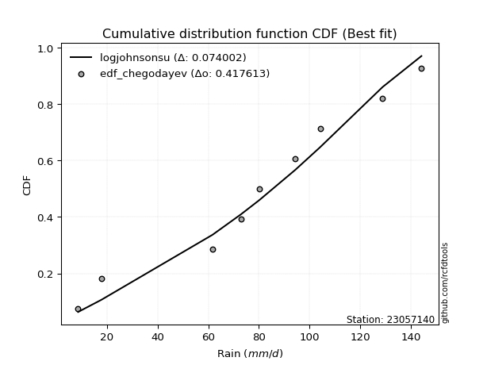</img>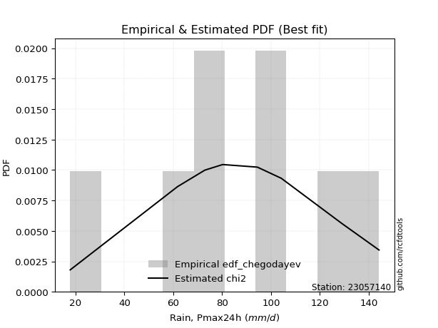</img>

</div>


### 6. Empirical - EDF Blom (1958)

The Blom formula is a specific "plotting position" formula used in hydrology and statistical analysis to estimate the empirical cumulative probability (or non-exceedance probability) of a data series. It is particularly recommended for data that are approximately normally distributed. The constant _a_ is set to 0.375 (or 3/8).

<div align="center">


$P=(m-a)/(n+1-2a)$


</div>


**6.1. Empirical values**

<div align="center">

|                | 0                   | 1                   | 2                   | 3                  | 4        | 5                  | 6                  | 7                  | 8                  |
|:---------------|:--------------------|:--------------------|:--------------------|:-------------------|:---------|:-------------------|:-------------------|:-------------------|:-------------------|
| date           | 2025                | 2024                | 2008                | 2007               | 2012     | 2009               | 2013               | 2010               | 2011               |
| x              | 7.1                 | 17.8                | 61.7                | 72.9               | 80.2     | 94.4               | 104.2              | 128.9              | 144.2              |
| m              | 1                   | 2                   | 3                   | 4                  | 5        | 6                  | 7                  | 8                  | 9                  |
| empirical_dist | edf_blom            | edf_blom            | edf_blom            | edf_blom           | edf_blom | edf_blom           | edf_blom           | edf_blom           | edf_blom           |
| empirical      | 0.06756756756756757 | 0.17567567567567569 | 0.28378378378378377 | 0.3918918918918919 | 0.5      | 0.6081081081081081 | 0.7162162162162162 | 0.8243243243243243 | 0.9324324324324325 |
| empirical_tr   | 1.072463768115942   | 1.2131147540983607  | 1.3962264150943395  | 1.6444444444444444 | 2.0      | 2.5517241379310347 | 3.523809523809524  | 5.6923076923076925 | 14.800000000000006 |

</div>


**6.2. Kolmogorov-Smirnov fit test (sorted by Δ)**


<div align="center">

|                | 0                   | 1                   | 2                   | 3                   | 4                   | 5                   | 6                   | 7                   | 8                   | 9                   | 10                  | 11                  | 12                  | 13                  | 14                  | 15                  | 16                  | 17                  | 18                  | 19                  | 20                    | 21                  | 22                  | 23                  | 24                  | 25                  | 26                  | 27                  | 28                  | 29                  | 30                  | 31                  | 32                  | 33                  | 34                  | 35                  | 36                  | 37                  | 38                  | 39                  | 40                  | 41                  | 42                  | 43                  | 44                  | 45                  | 46                  | 47                  | 48                  | 49                  | 50                  | 51                  | 52                  | 53                  | 54                  | 55                  | 56                  | 57                  | 58                  | 59                  | 60                  | 61                  | 62                  | 63                  | 64                  | 65                  | 66                  | 67                  | 68                  | 69                  | 70                  | 71                  | 72                  | 73                  | 74                  | 75                  | 76                  | 77                  | 78                  | 79                  | 80                  | 81                  | 82                  | 83                  | 84                  | 85                  | 86                  | 87                  | 88                  | 89                  |
|:---------------|:--------------------|:--------------------|:--------------------|:--------------------|:--------------------|:--------------------|:--------------------|:--------------------|:--------------------|:--------------------|:--------------------|:--------------------|:--------------------|:--------------------|:--------------------|:--------------------|:--------------------|:--------------------|:--------------------|:--------------------|:----------------------|:--------------------|:--------------------|:--------------------|:--------------------|:--------------------|:--------------------|:--------------------|:--------------------|:--------------------|:--------------------|:--------------------|:--------------------|:--------------------|:--------------------|:--------------------|:--------------------|:--------------------|:--------------------|:--------------------|:--------------------|:--------------------|:--------------------|:--------------------|:--------------------|:--------------------|:--------------------|:--------------------|:--------------------|:--------------------|:--------------------|:--------------------|:--------------------|:--------------------|:--------------------|:--------------------|:--------------------|:--------------------|:--------------------|:--------------------|:--------------------|:--------------------|:--------------------|:--------------------|:--------------------|:--------------------|:--------------------|:--------------------|:--------------------|:--------------------|:--------------------|:--------------------|:--------------------|:--------------------|:--------------------|:--------------------|:--------------------|:--------------------|:--------------------|:--------------------|:--------------------|:--------------------|:--------------------|:--------------------|:--------------------|:--------------------|:--------------------|:--------------------|:--------------------|:--------------------|
| station        | 23057140            | 23057140            | 23057140            | 23057140            | 23057140            | 23057140            | 23057140            | 23057140            | 23057140            | 23057140            | 23057140            | 23057140            | 23057140            | 23057140            | 23057140            | 23057140            | 23057140            | 23057140            | 23057140            | 23057140            | 23057140              | 23057140            | 23057140            | 23057140            | 23057140            | 23057140            | 23057140            | 23057140            | 23057140            | 23057140            | 23057140            | 23057140            | 23057140            | 23057140            | 23057140            | 23057140            | 23057140            | 23057140            | 23057140            | 23057140            | 23057140            | 23057140            | 23057140            | 23057140            | 23057140            | 23057140            | 23057140            | 23057140            | 23057140            | 23057140            | 23057140            | 23057140            | 23057140            | 23057140            | 23057140            | 23057140            | 23057140            | 23057140            | 23057140            | 23057140            | 23057140            | 23057140            | 23057140            | 23057140            | 23057140            | 23057140            | 23057140            | 23057140            | 23057140            | 23057140            | 23057140            | 23057140            | 23057140            | 23057140            | 23057140            | 23057140            | 23057140            | 23057140            | 23057140            | 23057140            | 23057140            | 23057140            | 23057140            | 23057140            | 23057140            | 23057140            | 23057140            | 23057140            | 23057140            | 23057140            |
| empirical_dist | edf_blom            | edf_blom            | edf_blom            | edf_blom            | edf_blom            | edf_blom            | edf_blom            | edf_blom            | edf_blom            | edf_blom            | edf_blom            | edf_blom            | edf_blom            | edf_blom            | edf_blom            | edf_blom            | edf_blom            | edf_blom            | edf_blom            | edf_blom            | edf_blom              | edf_blom            | edf_blom            | edf_blom            | edf_blom            | edf_blom            | edf_blom            | edf_blom            | edf_blom            | edf_blom            | edf_blom            | edf_blom            | edf_blom            | edf_blom            | edf_blom            | edf_blom            | edf_blom            | edf_blom            | edf_blom            | edf_blom            | edf_blom            | edf_blom            | edf_blom            | edf_blom            | edf_blom            | edf_blom            | edf_blom            | edf_blom            | edf_blom            | edf_blom            | edf_blom            | edf_blom            | edf_blom            | edf_blom            | edf_blom            | edf_blom            | edf_blom            | edf_blom            | edf_blom            | edf_blom            | edf_blom            | edf_blom            | edf_blom            | edf_blom            | edf_blom            | edf_blom            | edf_blom            | edf_blom            | edf_blom            | edf_blom            | edf_blom            | edf_blom            | edf_blom            | edf_blom            | edf_blom            | edf_blom            | edf_blom            | edf_blom            | edf_blom            | edf_blom            | edf_blom            | edf_blom            | edf_blom            | edf_blom            | edf_blom            | edf_blom            | edf_blom            | edf_blom            | edf_blom            | edf_blom            |
| p_dist         | logjohnsonsu        | genlogistic         | johnsonsu           | laplace_asymmetric  | gumbel_l            | pearson3            | weibull_min         | gamma               | betaprime           | fisk                | norm                | crystalball         | truncnorm           | nct                 | exponnorm           | t                   | f                   | erlang              | invgamma            | logistic            | loglaplace_asymmetric | logloggamma         | hypsecant           | rice                | laplace             | invgauss            | logmielke           | maxwell             | rayleigh            | logt                | gumbel_r            | kstwobign           | logfisk             | logpearson3         | loggompertz         | moyal               | loggumbel_l         | halflogistic        | halfnorm            | ncf                 | mielke              | wald                | gibrat              | lognakagami         | logf                | logexponnorm        | logcrystalball      | lognorm             | lognorm             | logrice             | lognct              | logfatiguelife      | loglogistic         | loghypsecant        | loggamma            | loggamma            | logbetaprime        | genexpon            | expon               | logerlang           | loginvgamma         | loglaplace          | loginvgauss         | logncf              | logalpha            | loginvweibull       | logmaxwell          | lograyleigh         | logkstwobign        | logtruncnorm        | loggumbel_r         | loghalfnorm         | loggenexpon         | nakagami            | logmoyal            | loghalflogistic     | logexpon            | logwald             | pareto              | loggibrat           | loglognorm          | logpareto           | alpha               | invweibull          | logweibull_min      | fatiguelife         | logchi2             | gompertz            | chi2                | loggenlogistic      |
| delta          | 0.07160330144386673 | 0.08397555252487514 | 0.08519519045382576 | 0.08907746193108815 | 0.0901755239952261  | 0.09178255322893247 | 0.09586266860252637 | 0.09600301017670511 | 0.0965011342908568  | 0.09677851368941405 | 0.09710445720723938 | 0.09710445858029262 | 0.09710448433584395 | 0.0971052670125892  | 0.09710548536043488 | 0.09710728340136963 | 0.09793023684350499 | 0.09816986844628402 | 0.09972473881963426 | 0.10432131510530841 | 0.10465534013180927   | 0.10518550467303511 | 0.10695861365278533 | 0.10715196853079417 | 0.10805914498367836 | 0.10946656930707122 | 0.11191003423277068 | 0.11312025365069166 | 0.12378211370250088 | 0.12778768237200944 | 0.1438088233868049  | 0.14899939749221386 | 0.15134669671429019 | 0.15222542191089072 | 0.1544820790410395  | 0.16491244181291034 | 0.1674867448062769  | 0.17567567567567569 | 0.17567567567567569 | 0.17568086473281957 | 0.18810523874258567 | 0.21299524650818236 | 0.22378142969428771 | 0.23613329572198638 | 0.23647537671800511 | 0.23693143044901444 | 0.23693539288661125 | 0.2369353936449321  | 0.2369353936449321  | 0.23694617653491024 | 0.2380811470393025  | 0.2390406032061574  | 0.23975943301367086 | 0.2421667443697959  | 0.2435736361220615  | 0.2435736361220615  | 0.24506478931248699 | 0.2480416350239134  | 0.24804393049193485 | 0.2486465173443161  | 0.24999941030889805 | 0.25163914030958257 | 0.2520348752525994  | 0.2572030434155844  | 0.2605351942082851  | 0.26625032450755526 | 0.26904154561529237 | 0.2795742246075632  | 0.30148288296041303 | 0.30708300098705976 | 0.3076157197782773  | 0.30922669694551164 | 0.3123079342357915  | 0.3232726619037186  | 0.3332017855003533  | 0.33530747486638746 | 0.3567742275312942  | 0.40426491458798486 | 0.41600560796152075 | 0.4304846139609365  | 0.43295929956525336 | 0.46098368729573913 | 0.4676704801940963  | 0.4823010383367974  | 0.49534086351638673 | 0.519455733968897   | 0.5271862264829931  | 0.6636843662846744  | 0.7187204780234414  | 0.8243243243243243  |
| deltao         | 0.41761268023100007 | 0.41761268023100007 | 0.41761268023100007 | 0.41761268023100007 | 0.41761268023100007 | 0.41761268023100007 | 0.41761268023100007 | 0.41761268023100007 | 0.41761268023100007 | 0.41761268023100007 | 0.41761268023100007 | 0.41761268023100007 | 0.41761268023100007 | 0.41761268023100007 | 0.41761268023100007 | 0.41761268023100007 | 0.41761268023100007 | 0.41761268023100007 | 0.41761268023100007 | 0.41761268023100007 | 0.41761268023100007   | 0.41761268023100007 | 0.41761268023100007 | 0.41761268023100007 | 0.41761268023100007 | 0.41761268023100007 | 0.41761268023100007 | 0.41761268023100007 | 0.41761268023100007 | 0.41761268023100007 | 0.41761268023100007 | 0.41761268023100007 | 0.41761268023100007 | 0.41761268023100007 | 0.41761268023100007 | 0.41761268023100007 | 0.41761268023100007 | 0.41761268023100007 | 0.41761268023100007 | 0.41761268023100007 | 0.41761268023100007 | 0.41761268023100007 | 0.41761268023100007 | 0.41761268023100007 | 0.41761268023100007 | 0.41761268023100007 | 0.41761268023100007 | 0.41761268023100007 | 0.41761268023100007 | 0.41761268023100007 | 0.41761268023100007 | 0.41761268023100007 | 0.41761268023100007 | 0.41761268023100007 | 0.41761268023100007 | 0.41761268023100007 | 0.41761268023100007 | 0.41761268023100007 | 0.41761268023100007 | 0.41761268023100007 | 0.41761268023100007 | 0.41761268023100007 | 0.41761268023100007 | 0.41761268023100007 | 0.41761268023100007 | 0.41761268023100007 | 0.41761268023100007 | 0.41761268023100007 | 0.41761268023100007 | 0.41761268023100007 | 0.41761268023100007 | 0.41761268023100007 | 0.41761268023100007 | 0.41761268023100007 | 0.41761268023100007 | 0.41761268023100007 | 0.41761268023100007 | 0.41761268023100007 | 0.41761268023100007 | 0.41761268023100007 | 0.41761268023100007 | 0.41761268023100007 | 0.41761268023100007 | 0.41761268023100007 | 0.41761268023100007 | 0.41761268023100007 | 0.41761268023100007 | 0.41761268023100007 | 0.41761268023100007 | 0.41761268023100007 |
| eval           | Δo > Δ              | Δo > Δ              | Δo > Δ              | Δo > Δ              | Δo > Δ              | Δo > Δ              | Δo > Δ              | Δo > Δ              | Δo > Δ              | Δo > Δ              | Δo > Δ              | Δo > Δ              | Δo > Δ              | Δo > Δ              | Δo > Δ              | Δo > Δ              | Δo > Δ              | Δo > Δ              | Δo > Δ              | Δo > Δ              | Δo > Δ                | Δo > Δ              | Δo > Δ              | Δo > Δ              | Δo > Δ              | Δo > Δ              | Δo > Δ              | Δo > Δ              | Δo > Δ              | Δo > Δ              | Δo > Δ              | Δo > Δ              | Δo > Δ              | Δo > Δ              | Δo > Δ              | Δo > Δ              | Δo > Δ              | Δo > Δ              | Δo > Δ              | Δo > Δ              | Δo > Δ              | Δo > Δ              | Δo > Δ              | Δo > Δ              | Δo > Δ              | Δo > Δ              | Δo > Δ              | Δo > Δ              | Δo > Δ              | Δo > Δ              | Δo > Δ              | Δo > Δ              | Δo > Δ              | Δo > Δ              | Δo > Δ              | Δo > Δ              | Δo > Δ              | Δo > Δ              | Δo > Δ              | Δo > Δ              | Δo > Δ              | Δo > Δ              | Δo > Δ              | Δo > Δ              | Δo > Δ              | Δo > Δ              | Δo > Δ              | Δo > Δ              | Δo > Δ              | Δo > Δ              | Δo > Δ              | Δo > Δ              | Δo > Δ              | Δo > Δ              | Δo > Δ              | Δo > Δ              | Δo > Δ              | Δo > Δ              | Δo > Δ              | Δo <= Δ             | Δo <= Δ             | Δo <= Δ             | Δo <= Δ             | Δo <= Δ             | Δo <= Δ             | Δo <= Δ             | Δo <= Δ             | Δo <= Δ             | Δo <= Δ             | Δo <= Δ             |
| fit            | 1                   | 1                   | 1                   | 1                   | 1                   | 1                   | 1                   | 1                   | 1                   | 1                   | 1                   | 1                   | 1                   | 1                   | 1                   | 1                   | 1                   | 1                   | 1                   | 1                   | 1                     | 1                   | 1                   | 1                   | 1                   | 1                   | 1                   | 1                   | 1                   | 1                   | 1                   | 1                   | 1                   | 1                   | 1                   | 1                   | 1                   | 1                   | 1                   | 1                   | 1                   | 1                   | 1                   | 1                   | 1                   | 1                   | 1                   | 1                   | 1                   | 1                   | 1                   | 1                   | 1                   | 1                   | 1                   | 1                   | 1                   | 1                   | 1                   | 1                   | 1                   | 1                   | 1                   | 1                   | 1                   | 1                   | 1                   | 1                   | 1                   | 1                   | 1                   | 1                   | 1                   | 1                   | 1                   | 1                   | 1                   | 1                   | 1                   | 0                   | 0                   | 0                   | 0                   | 0                   | 0                   | 0                   | 0                   | 0                   | 0                   | 0                   |
| n              | 9                   | 9                   | 9                   | 9                   | 9                   | 9                   | 9                   | 9                   | 9                   | 9                   | 9                   | 9                   | 9                   | 9                   | 9                   | 9                   | 9                   | 9                   | 9                   | 9                   | 9                     | 9                   | 9                   | 9                   | 9                   | 9                   | 9                   | 9                   | 9                   | 9                   | 9                   | 9                   | 9                   | 9                   | 9                   | 9                   | 9                   | 9                   | 9                   | 9                   | 9                   | 9                   | 9                   | 9                   | 9                   | 9                   | 9                   | 9                   | 9                   | 9                   | 9                   | 9                   | 9                   | 9                   | 9                   | 9                   | 9                   | 9                   | 9                   | 9                   | 9                   | 9                   | 9                   | 9                   | 9                   | 9                   | 9                   | 9                   | 9                   | 9                   | 9                   | 9                   | 9                   | 9                   | 9                   | 9                   | 9                   | 9                   | 9                   | 9                   | 9                   | 9                   | 9                   | 9                   | 9                   | 9                   | 9                   | 9                   | 9                   | 9                   |
| best_fit       | 1                   | 0                   | 0                   | 0                   | 0                   | 0                   | 0                   | 0                   | 0                   | 0                   | 0                   | 0                   | 0                   | 0                   | 0                   | 0                   | 0                   | 0                   | 0                   | 0                   | 0                     | 0                   | 0                   | 0                   | 0                   | 0                   | 0                   | 0                   | 0                   | 0                   | 0                   | 0                   | 0                   | 0                   | 0                   | 0                   | 0                   | 0                   | 0                   | 0                   | 0                   | 0                   | 0                   | 0                   | 0                   | 0                   | 0                   | 0                   | 0                   | 0                   | 0                   | 0                   | 0                   | 0                   | 0                   | 0                   | 0                   | 0                   | 0                   | 0                   | 0                   | 0                   | 0                   | 0                   | 0                   | 0                   | 0                   | 0                   | 0                   | 0                   | 0                   | 0                   | 0                   | 0                   | 0                   | 0                   | 0                   | 0                   | 0                   | 0                   | 0                   | 0                   | 0                   | 0                   | 0                   | 0                   | 0                   | 0                   | 0                   | 0                   |
| best_fit_sort  | 1                   | 2                   | 3                   | 4                   | 5                   | 6                   | 7                   | 8                   | 9                   | 10                  | 11                  | 12                  | 13                  | 14                  | 15                  | 16                  | 17                  | 18                  | 19                  | 20                  | 21                    | 22                  | 23                  | 24                  | 25                  | 26                  | 27                  | 28                  | 29                  | 30                  | 31                  | 32                  | 33                  | 34                  | 35                  | 36                  | 37                  | 38                  | 39                  | 40                  | 41                  | 42                  | 43                  | 44                  | 45                  | 46                  | 47                  | 48                  | 49                  | 50                  | 51                  | 52                  | 53                  | 54                  | 55                  | 56                  | 57                  | 58                  | 59                  | 60                  | 61                  | 62                  | 63                  | 64                  | 65                  | 66                  | 67                  | 68                  | 69                  | 70                  | 71                  | 72                  | 73                  | 74                  | 75                  | 76                  | 77                  | 78                  | 79                  | 80                  | 81                  | 82                  | 83                  | 84                  | 85                  | 86                  | 87                  | 88                  | 89                  | 90                  |

</div>


<div align="center">

</img>

</div>


**6.3. Best fit**

<div align="center">

|   id |   station | empirical_dist   | p_dist       |     delta |   deltao | eval   |   fit |   n |   best_fit |   best_fit_sort |
|-----:|----------:|:-----------------|:-------------|----------:|---------:|:-------|------:|----:|-----------:|----------------:|
|    0 |  23057140 | edf_blom         | logjohnsonsu | 0.0716033 | 0.417613 | Δo > Δ |     1 |   9 |          1 |               1 |

</div>


<div align="center">

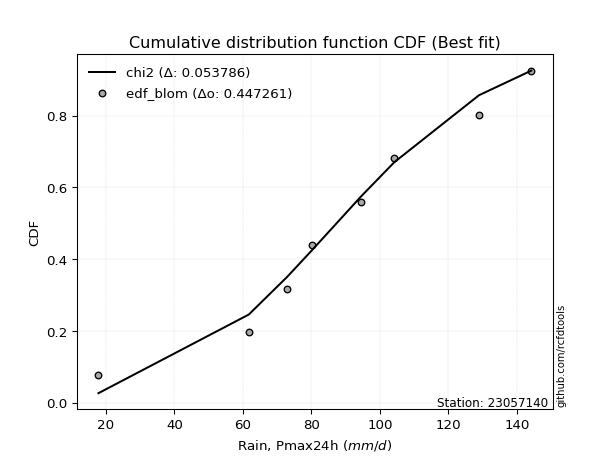</img>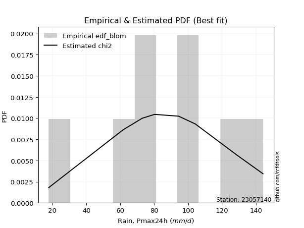</img>

</div>


### 7. Empirical - EDF Tukey (1962)

In hydrology, the Tukey formula is used as a plotting position formula to estimate the empirical probability or frequency of a flood event (or other hydrological data). The formula parameter is given as _c=0.333_ (or 1/3).

<div align="center">


$P=(m-c)/(n+1-2c)$


</div>


**7.1. Empirical values**

<div align="center">

|                | 0                   | 1                   | 2                  | 3                   | 4         | 5                  | 6                  | 7                  | 8                  |
|:---------------|:--------------------|:--------------------|:-------------------|:--------------------|:----------|:-------------------|:-------------------|:-------------------|:-------------------|
| date           | 2025                | 2024                | 2008               | 2007                | 2012      | 2009               | 2013               | 2010               | 2011               |
| x              | 7.1                 | 17.8                | 61.7               | 72.9                | 80.2      | 94.4               | 104.2              | 128.9              | 144.2              |
| m              | 1                   | 2                   | 3                  | 4                   | 5         | 6                  | 7                  | 8                  | 9                  |
| empirical_dist | edf_tukey           | edf_tukey           | edf_tukey          | edf_tukey           | edf_tukey | edf_tukey          | edf_tukey          | edf_tukey          | edf_tukey          |
| empirical      | 0.07142857142857142 | 0.17857142857142858 | 0.2857142857142857 | 0.39285714285714285 | 0.5       | 0.6071428571428571 | 0.7142857142857143 | 0.8214285714285714 | 0.9285714285714286 |
| empirical_tr   | 1.0769230769230769  | 1.2173913043478262  | 1.4                | 1.6470588235294117  | 2.0       | 2.545454545454545  | 3.5                | 5.599999999999999  | 14.000000000000007 |

</div>


**7.2. Kolmogorov-Smirnov fit test (sorted by Δ)**


<div align="center">

|                | 0                   | 1                   | 2                   | 3                   | 4                   | 5                   | 6                   | 7                   | 8                   | 9                   | 10                  | 11                  | 12                  | 13                  | 14                  | 15                  | 16                  | 17                  | 18                  | 19                    | 20                  | 21                  | 22                  | 23                  | 24                  | 25                  | 26                  | 27                  | 28                  | 29                  | 30                  | 31                  | 32                  | 33                  | 34                  | 35                  | 36                  | 37                  | 38                  | 39                  | 40                  | 41                  | 42                  | 43                  | 44                  | 45                  | 46                  | 47                  | 48                  | 49                  | 50                  | 51                  | 52                  | 53                  | 54                  | 55                  | 56                  | 57                  | 58                  | 59                  | 60                  | 61                  | 62                  | 63                  | 64                  | 65                  | 66                  | 67                  | 68                  | 69                  | 70                  | 71                  | 72                  | 73                  | 74                  | 75                  | 76                  | 77                  | 78                  | 79                  | 80                  | 81                  | 82                  | 83                  | 84                  | 85                  | 86                  | 87                  | 88                  | 89                  |
|:---------------|:--------------------|:--------------------|:--------------------|:--------------------|:--------------------|:--------------------|:--------------------|:--------------------|:--------------------|:--------------------|:--------------------|:--------------------|:--------------------|:--------------------|:--------------------|:--------------------|:--------------------|:--------------------|:--------------------|:----------------------|:--------------------|:--------------------|:--------------------|:--------------------|:--------------------|:--------------------|:--------------------|:--------------------|:--------------------|:--------------------|:--------------------|:--------------------|:--------------------|:--------------------|:--------------------|:--------------------|:--------------------|:--------------------|:--------------------|:--------------------|:--------------------|:--------------------|:--------------------|:--------------------|:--------------------|:--------------------|:--------------------|:--------------------|:--------------------|:--------------------|:--------------------|:--------------------|:--------------------|:--------------------|:--------------------|:--------------------|:--------------------|:--------------------|:--------------------|:--------------------|:--------------------|:--------------------|:--------------------|:--------------------|:--------------------|:--------------------|:--------------------|:--------------------|:--------------------|:--------------------|:--------------------|:--------------------|:--------------------|:--------------------|:--------------------|:--------------------|:--------------------|:--------------------|:--------------------|:--------------------|:--------------------|:--------------------|:--------------------|:--------------------|:--------------------|:--------------------|:--------------------|:--------------------|:--------------------|:--------------------|
| station        | 23057140            | 23057140            | 23057140            | 23057140            | 23057140            | 23057140            | 23057140            | 23057140            | 23057140            | 23057140            | 23057140            | 23057140            | 23057140            | 23057140            | 23057140            | 23057140            | 23057140            | 23057140            | 23057140            | 23057140              | 23057140            | 23057140            | 23057140            | 23057140            | 23057140            | 23057140            | 23057140            | 23057140            | 23057140            | 23057140            | 23057140            | 23057140            | 23057140            | 23057140            | 23057140            | 23057140            | 23057140            | 23057140            | 23057140            | 23057140            | 23057140            | 23057140            | 23057140            | 23057140            | 23057140            | 23057140            | 23057140            | 23057140            | 23057140            | 23057140            | 23057140            | 23057140            | 23057140            | 23057140            | 23057140            | 23057140            | 23057140            | 23057140            | 23057140            | 23057140            | 23057140            | 23057140            | 23057140            | 23057140            | 23057140            | 23057140            | 23057140            | 23057140            | 23057140            | 23057140            | 23057140            | 23057140            | 23057140            | 23057140            | 23057140            | 23057140            | 23057140            | 23057140            | 23057140            | 23057140            | 23057140            | 23057140            | 23057140            | 23057140            | 23057140            | 23057140            | 23057140            | 23057140            | 23057140            | 23057140            |
| empirical_dist | edf_tukey           | edf_tukey           | edf_tukey           | edf_tukey           | edf_tukey           | edf_tukey           | edf_tukey           | edf_tukey           | edf_tukey           | edf_tukey           | edf_tukey           | edf_tukey           | edf_tukey           | edf_tukey           | edf_tukey           | edf_tukey           | edf_tukey           | edf_tukey           | edf_tukey           | edf_tukey             | edf_tukey           | edf_tukey           | edf_tukey           | edf_tukey           | edf_tukey           | edf_tukey           | edf_tukey           | edf_tukey           | edf_tukey           | edf_tukey           | edf_tukey           | edf_tukey           | edf_tukey           | edf_tukey           | edf_tukey           | edf_tukey           | edf_tukey           | edf_tukey           | edf_tukey           | edf_tukey           | edf_tukey           | edf_tukey           | edf_tukey           | edf_tukey           | edf_tukey           | edf_tukey           | edf_tukey           | edf_tukey           | edf_tukey           | edf_tukey           | edf_tukey           | edf_tukey           | edf_tukey           | edf_tukey           | edf_tukey           | edf_tukey           | edf_tukey           | edf_tukey           | edf_tukey           | edf_tukey           | edf_tukey           | edf_tukey           | edf_tukey           | edf_tukey           | edf_tukey           | edf_tukey           | edf_tukey           | edf_tukey           | edf_tukey           | edf_tukey           | edf_tukey           | edf_tukey           | edf_tukey           | edf_tukey           | edf_tukey           | edf_tukey           | edf_tukey           | edf_tukey           | edf_tukey           | edf_tukey           | edf_tukey           | edf_tukey           | edf_tukey           | edf_tukey           | edf_tukey           | edf_tukey           | edf_tukey           | edf_tukey           | edf_tukey           | edf_tukey           |
| p_dist         | logjohnsonsu        | genlogistic         | johnsonsu           | laplace_asymmetric  | gumbel_l            | pearson3            | weibull_min         | gamma               | betaprime           | fisk                | norm                | crystalball         | truncnorm           | nct                 | exponnorm           | t                   | f                   | erlang              | invgamma            | loglaplace_asymmetric | logloggamma         | logistic            | invgauss            | hypsecant           | logmielke           | rice                | laplace             | maxwell             | rayleigh            | logt                | gumbel_r            | kstwobign           | logfisk             | logpearson3         | loggompertz         | loggumbel_l         | moyal               | ncf                 | halflogistic        | halfnorm            | mielke              | wald                | gibrat              | lognakagami         | logf                | logexponnorm        | logcrystalball      | lognorm             | lognorm             | logrice             | lognct              | logfatiguelife      | loglogistic         | loghypsecant        | loggamma            | loggamma            | logbetaprime        | genexpon            | expon               | logerlang           | loginvgamma         | loglaplace          | loginvgauss         | logncf              | logalpha            | loginvweibull       | logmaxwell          | lograyleigh         | logkstwobign        | logtruncnorm        | loggumbel_r         | loghalfnorm         | loggenexpon         | nakagami            | logmoyal            | loghalflogistic     | logexpon            | logwald             | pareto              | loggibrat           | loglognorm          | logpareto           | alpha               | invweibull          | logweibull_min      | fatiguelife         | logchi2             | gompertz            | chi2                | loggenlogistic      |
| delta          | 0.0696727995133648  | 0.08687130542062803 | 0.08809094334957865 | 0.09197321482684104 | 0.09307127689097905 | 0.09467830612468536 | 0.09875842149827926 | 0.098898763072458   | 0.09939688718660969 | 0.09967426658516694 | 0.10000021010299227 | 0.10000021147604551 | 0.10000023723159684 | 0.10000101990834209 | 0.10000123825618777 | 0.10000303629712252 | 0.10082598973925788 | 0.10106562134203691 | 0.10262049171538715 | 0.10272483820130734   | 0.10325500274253319 | 0.1072170680010613  | 0.10753606737656929 | 0.10985436654853822 | 0.10997953230226876 | 0.11004772142654706 | 0.11095489787943125 | 0.11601600654644455 | 0.12667786659825375 | 0.13068343526776233 | 0.14670457628255779 | 0.14706889556171193 | 0.14941619478378826 | 0.1502949199803888  | 0.15255157711053757 | 0.16555624287577497 | 0.16780819470866323 | 0.17375036280231765 | 0.17857142857142858 | 0.17857142857142858 | 0.18617473681208374 | 0.2120299955429314  | 0.22281617872903675 | 0.23420279379148445 | 0.2345448747875032  | 0.2350009285185125  | 0.23500489095610932 | 0.23500489171443018 | 0.23500489171443018 | 0.2350156746044083  | 0.23615064510880057 | 0.23711010127565546 | 0.23782893108316894 | 0.24023624243929398 | 0.24164313419155958 | 0.24164313419155958 | 0.24313428738198506 | 0.24611113309341148 | 0.24611342856143292 | 0.24671601541381416 | 0.24806890837839612 | 0.24970863837908064 | 0.25010437332209745 | 0.2552725414850825  | 0.25860469227778315 | 0.26431982257705333 | 0.26711104368479044 | 0.2776437226770613  | 0.2995523810299111  | 0.30515249905655784 | 0.30568521784777536 | 0.3072961950150097  | 0.3103774323052896  | 0.3213421599732167  | 0.33127128356985136 | 0.33337697293588553 | 0.35484372560079225 | 0.40233441265748293 | 0.4131098550657678  | 0.4285541120304346  | 0.4300635466695004  | 0.4580879343999862  | 0.46573997826359437 | 0.47844003447579353 | 0.4934103615858848  | 0.5175252320383951  | 0.5252557245524911  | 0.6617538643541725  | 0.7158247251276885  | 0.8214285714285714  |
| deltao         | 0.41761268023100007 | 0.41761268023100007 | 0.41761268023100007 | 0.41761268023100007 | 0.41761268023100007 | 0.41761268023100007 | 0.41761268023100007 | 0.41761268023100007 | 0.41761268023100007 | 0.41761268023100007 | 0.41761268023100007 | 0.41761268023100007 | 0.41761268023100007 | 0.41761268023100007 | 0.41761268023100007 | 0.41761268023100007 | 0.41761268023100007 | 0.41761268023100007 | 0.41761268023100007 | 0.41761268023100007   | 0.41761268023100007 | 0.41761268023100007 | 0.41761268023100007 | 0.41761268023100007 | 0.41761268023100007 | 0.41761268023100007 | 0.41761268023100007 | 0.41761268023100007 | 0.41761268023100007 | 0.41761268023100007 | 0.41761268023100007 | 0.41761268023100007 | 0.41761268023100007 | 0.41761268023100007 | 0.41761268023100007 | 0.41761268023100007 | 0.41761268023100007 | 0.41761268023100007 | 0.41761268023100007 | 0.41761268023100007 | 0.41761268023100007 | 0.41761268023100007 | 0.41761268023100007 | 0.41761268023100007 | 0.41761268023100007 | 0.41761268023100007 | 0.41761268023100007 | 0.41761268023100007 | 0.41761268023100007 | 0.41761268023100007 | 0.41761268023100007 | 0.41761268023100007 | 0.41761268023100007 | 0.41761268023100007 | 0.41761268023100007 | 0.41761268023100007 | 0.41761268023100007 | 0.41761268023100007 | 0.41761268023100007 | 0.41761268023100007 | 0.41761268023100007 | 0.41761268023100007 | 0.41761268023100007 | 0.41761268023100007 | 0.41761268023100007 | 0.41761268023100007 | 0.41761268023100007 | 0.41761268023100007 | 0.41761268023100007 | 0.41761268023100007 | 0.41761268023100007 | 0.41761268023100007 | 0.41761268023100007 | 0.41761268023100007 | 0.41761268023100007 | 0.41761268023100007 | 0.41761268023100007 | 0.41761268023100007 | 0.41761268023100007 | 0.41761268023100007 | 0.41761268023100007 | 0.41761268023100007 | 0.41761268023100007 | 0.41761268023100007 | 0.41761268023100007 | 0.41761268023100007 | 0.41761268023100007 | 0.41761268023100007 | 0.41761268023100007 | 0.41761268023100007 |
| eval           | Δo > Δ              | Δo > Δ              | Δo > Δ              | Δo > Δ              | Δo > Δ              | Δo > Δ              | Δo > Δ              | Δo > Δ              | Δo > Δ              | Δo > Δ              | Δo > Δ              | Δo > Δ              | Δo > Δ              | Δo > Δ              | Δo > Δ              | Δo > Δ              | Δo > Δ              | Δo > Δ              | Δo > Δ              | Δo > Δ                | Δo > Δ              | Δo > Δ              | Δo > Δ              | Δo > Δ              | Δo > Δ              | Δo > Δ              | Δo > Δ              | Δo > Δ              | Δo > Δ              | Δo > Δ              | Δo > Δ              | Δo > Δ              | Δo > Δ              | Δo > Δ              | Δo > Δ              | Δo > Δ              | Δo > Δ              | Δo > Δ              | Δo > Δ              | Δo > Δ              | Δo > Δ              | Δo > Δ              | Δo > Δ              | Δo > Δ              | Δo > Δ              | Δo > Δ              | Δo > Δ              | Δo > Δ              | Δo > Δ              | Δo > Δ              | Δo > Δ              | Δo > Δ              | Δo > Δ              | Δo > Δ              | Δo > Δ              | Δo > Δ              | Δo > Δ              | Δo > Δ              | Δo > Δ              | Δo > Δ              | Δo > Δ              | Δo > Δ              | Δo > Δ              | Δo > Δ              | Δo > Δ              | Δo > Δ              | Δo > Δ              | Δo > Δ              | Δo > Δ              | Δo > Δ              | Δo > Δ              | Δo > Δ              | Δo > Δ              | Δo > Δ              | Δo > Δ              | Δo > Δ              | Δo > Δ              | Δo > Δ              | Δo > Δ              | Δo <= Δ             | Δo <= Δ             | Δo <= Δ             | Δo <= Δ             | Δo <= Δ             | Δo <= Δ             | Δo <= Δ             | Δo <= Δ             | Δo <= Δ             | Δo <= Δ             | Δo <= Δ             |
| fit            | 1                   | 1                   | 1                   | 1                   | 1                   | 1                   | 1                   | 1                   | 1                   | 1                   | 1                   | 1                   | 1                   | 1                   | 1                   | 1                   | 1                   | 1                   | 1                   | 1                     | 1                   | 1                   | 1                   | 1                   | 1                   | 1                   | 1                   | 1                   | 1                   | 1                   | 1                   | 1                   | 1                   | 1                   | 1                   | 1                   | 1                   | 1                   | 1                   | 1                   | 1                   | 1                   | 1                   | 1                   | 1                   | 1                   | 1                   | 1                   | 1                   | 1                   | 1                   | 1                   | 1                   | 1                   | 1                   | 1                   | 1                   | 1                   | 1                   | 1                   | 1                   | 1                   | 1                   | 1                   | 1                   | 1                   | 1                   | 1                   | 1                   | 1                   | 1                   | 1                   | 1                   | 1                   | 1                   | 1                   | 1                   | 1                   | 1                   | 0                   | 0                   | 0                   | 0                   | 0                   | 0                   | 0                   | 0                   | 0                   | 0                   | 0                   |
| n              | 9                   | 9                   | 9                   | 9                   | 9                   | 9                   | 9                   | 9                   | 9                   | 9                   | 9                   | 9                   | 9                   | 9                   | 9                   | 9                   | 9                   | 9                   | 9                   | 9                     | 9                   | 9                   | 9                   | 9                   | 9                   | 9                   | 9                   | 9                   | 9                   | 9                   | 9                   | 9                   | 9                   | 9                   | 9                   | 9                   | 9                   | 9                   | 9                   | 9                   | 9                   | 9                   | 9                   | 9                   | 9                   | 9                   | 9                   | 9                   | 9                   | 9                   | 9                   | 9                   | 9                   | 9                   | 9                   | 9                   | 9                   | 9                   | 9                   | 9                   | 9                   | 9                   | 9                   | 9                   | 9                   | 9                   | 9                   | 9                   | 9                   | 9                   | 9                   | 9                   | 9                   | 9                   | 9                   | 9                   | 9                   | 9                   | 9                   | 9                   | 9                   | 9                   | 9                   | 9                   | 9                   | 9                   | 9                   | 9                   | 9                   | 9                   |
| best_fit       | 1                   | 0                   | 0                   | 0                   | 0                   | 0                   | 0                   | 0                   | 0                   | 0                   | 0                   | 0                   | 0                   | 0                   | 0                   | 0                   | 0                   | 0                   | 0                   | 0                     | 0                   | 0                   | 0                   | 0                   | 0                   | 0                   | 0                   | 0                   | 0                   | 0                   | 0                   | 0                   | 0                   | 0                   | 0                   | 0                   | 0                   | 0                   | 0                   | 0                   | 0                   | 0                   | 0                   | 0                   | 0                   | 0                   | 0                   | 0                   | 0                   | 0                   | 0                   | 0                   | 0                   | 0                   | 0                   | 0                   | 0                   | 0                   | 0                   | 0                   | 0                   | 0                   | 0                   | 0                   | 0                   | 0                   | 0                   | 0                   | 0                   | 0                   | 0                   | 0                   | 0                   | 0                   | 0                   | 0                   | 0                   | 0                   | 0                   | 0                   | 0                   | 0                   | 0                   | 0                   | 0                   | 0                   | 0                   | 0                   | 0                   | 0                   |
| best_fit_sort  | 1                   | 2                   | 3                   | 4                   | 5                   | 6                   | 7                   | 8                   | 9                   | 10                  | 11                  | 12                  | 13                  | 14                  | 15                  | 16                  | 17                  | 18                  | 19                  | 20                    | 21                  | 22                  | 23                  | 24                  | 25                  | 26                  | 27                  | 28                  | 29                  | 30                  | 31                  | 32                  | 33                  | 34                  | 35                  | 36                  | 37                  | 38                  | 39                  | 40                  | 41                  | 42                  | 43                  | 44                  | 45                  | 46                  | 47                  | 48                  | 49                  | 50                  | 51                  | 52                  | 53                  | 54                  | 55                  | 56                  | 57                  | 58                  | 59                  | 60                  | 61                  | 62                  | 63                  | 64                  | 65                  | 66                  | 67                  | 68                  | 69                  | 70                  | 71                  | 72                  | 73                  | 74                  | 75                  | 76                  | 77                  | 78                  | 79                  | 80                  | 81                  | 82                  | 83                  | 84                  | 85                  | 86                  | 87                  | 88                  | 89                  | 90                  |

</div>


<div align="center">

</img>

</div>


**7.3. Best fit**

<div align="center">

|   id |   station | empirical_dist   | p_dist       |     delta |   deltao | eval   |   fit |   n |   best_fit |   best_fit_sort |
|-----:|----------:|:-----------------|:-------------|----------:|---------:|:-------|------:|----:|-----------:|----------------:|
|    0 |  23057140 | edf_tukey        | logjohnsonsu | 0.0696728 | 0.417613 | Δo > Δ |     1 |   9 |          1 |               1 |

</div>


<div align="center">

</img>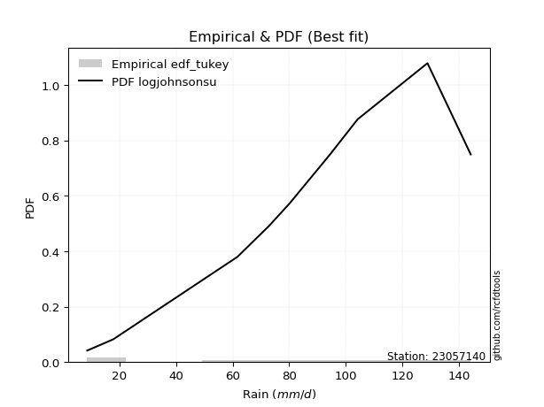</img>

</div>


### 8. Empirical - EDF Gringorten (1963)

Gringorten plotting position formula is essential for estimating the probability and return periods of extreme events like floods and heavy rainfall. The constant _a=0.44_.

<div align="center">


$P=(m-a)/(n+1-2a)$


</div>


**8.1. Empirical values**

<div align="center">

|                | 0                    | 1                  | 2                   | 3                  | 4              | 5                  | 6                  | 7                  | 8                  |
|:---------------|:---------------------|:-------------------|:--------------------|:-------------------|:---------------|:-------------------|:-------------------|:-------------------|:-------------------|
| date           | 2025                 | 2024               | 2008                | 2007               | 2012           | 2009               | 2013               | 2010               | 2011               |
| x              | 7.1                  | 17.8               | 61.7                | 72.9               | 80.2           | 94.4               | 104.2              | 128.9              | 144.2              |
| m              | 1                    | 2                  | 3                   | 4                  | 5              | 6                  | 7                  | 8                  | 9                  |
| empirical_dist | edf_gringorten       | edf_gringorten     | edf_gringorten      | edf_gringorten     | edf_gringorten | edf_gringorten     | edf_gringorten     | edf_gringorten     | edf_gringorten     |
| empirical      | 0.061403508771929835 | 0.1710526315789474 | 0.28070175438596495 | 0.3903508771929825 | 0.5            | 0.6096491228070176 | 0.7192982456140351 | 0.8289473684210527 | 0.9385964912280703 |
| empirical_tr   | 1.0654205607476634   | 1.2063492063492063 | 1.3902439024390243  | 1.6402877697841727 | 2.0            | 2.561797752808989  | 3.5625             | 5.846153846153847  | 16.285714285714324 |

</div>


**8.2. Kolmogorov-Smirnov fit test (sorted by Δ)**


<div align="center">

|                | 0                   | 1                   | 2                   | 3                   | 4                   | 5                   | 6                   | 7                   | 8                   | 9                   | 10                  | 11                  | 12                  | 13                  | 14                  | 15                  | 16                  | 17                  | 18                  | 19                  | 20                  | 21                  | 22                  | 23                    | 24                  | 25                  | 26                  | 27                  | 28                  | 29                  | 30                  | 31                  | 32                  | 33                  | 34                  | 35                  | 36                  | 37                  | 38                  | 39                  | 40                  | 41                  | 42                  | 43                  | 44                  | 45                  | 46                  | 47                  | 48                  | 49                  | 50                  | 51                  | 52                  | 53                  | 54                  | 55                  | 56                  | 57                  | 58                  | 59                  | 60                  | 61                  | 62                  | 63                  | 64                  | 65                  | 66                  | 67                  | 68                  | 69                  | 70                  | 71                  | 72                  | 73                  | 74                  | 75                  | 76                  | 77                  | 78                  | 79                  | 80                  | 81                  | 82                  | 83                  | 84                  | 85                  | 86                  | 87                  | 88                  | 89                  |
|:---------------|:--------------------|:--------------------|:--------------------|:--------------------|:--------------------|:--------------------|:--------------------|:--------------------|:--------------------|:--------------------|:--------------------|:--------------------|:--------------------|:--------------------|:--------------------|:--------------------|:--------------------|:--------------------|:--------------------|:--------------------|:--------------------|:--------------------|:--------------------|:----------------------|:--------------------|:--------------------|:--------------------|:--------------------|:--------------------|:--------------------|:--------------------|:--------------------|:--------------------|:--------------------|:--------------------|:--------------------|:--------------------|:--------------------|:--------------------|:--------------------|:--------------------|:--------------------|:--------------------|:--------------------|:--------------------|:--------------------|:--------------------|:--------------------|:--------------------|:--------------------|:--------------------|:--------------------|:--------------------|:--------------------|:--------------------|:--------------------|:--------------------|:--------------------|:--------------------|:--------------------|:--------------------|:--------------------|:--------------------|:--------------------|:--------------------|:--------------------|:--------------------|:--------------------|:--------------------|:--------------------|:--------------------|:--------------------|:--------------------|:--------------------|:--------------------|:--------------------|:--------------------|:--------------------|:--------------------|:--------------------|:--------------------|:--------------------|:--------------------|:--------------------|:--------------------|:--------------------|:--------------------|:--------------------|:--------------------|:--------------------|
| station        | 23057140            | 23057140            | 23057140            | 23057140            | 23057140            | 23057140            | 23057140            | 23057140            | 23057140            | 23057140            | 23057140            | 23057140            | 23057140            | 23057140            | 23057140            | 23057140            | 23057140            | 23057140            | 23057140            | 23057140            | 23057140            | 23057140            | 23057140            | 23057140              | 23057140            | 23057140            | 23057140            | 23057140            | 23057140            | 23057140            | 23057140            | 23057140            | 23057140            | 23057140            | 23057140            | 23057140            | 23057140            | 23057140            | 23057140            | 23057140            | 23057140            | 23057140            | 23057140            | 23057140            | 23057140            | 23057140            | 23057140            | 23057140            | 23057140            | 23057140            | 23057140            | 23057140            | 23057140            | 23057140            | 23057140            | 23057140            | 23057140            | 23057140            | 23057140            | 23057140            | 23057140            | 23057140            | 23057140            | 23057140            | 23057140            | 23057140            | 23057140            | 23057140            | 23057140            | 23057140            | 23057140            | 23057140            | 23057140            | 23057140            | 23057140            | 23057140            | 23057140            | 23057140            | 23057140            | 23057140            | 23057140            | 23057140            | 23057140            | 23057140            | 23057140            | 23057140            | 23057140            | 23057140            | 23057140            | 23057140            |
| empirical_dist | edf_gringorten      | edf_gringorten      | edf_gringorten      | edf_gringorten      | edf_gringorten      | edf_gringorten      | edf_gringorten      | edf_gringorten      | edf_gringorten      | edf_gringorten      | edf_gringorten      | edf_gringorten      | edf_gringorten      | edf_gringorten      | edf_gringorten      | edf_gringorten      | edf_gringorten      | edf_gringorten      | edf_gringorten      | edf_gringorten      | edf_gringorten      | edf_gringorten      | edf_gringorten      | edf_gringorten        | edf_gringorten      | edf_gringorten      | edf_gringorten      | edf_gringorten      | edf_gringorten      | edf_gringorten      | edf_gringorten      | edf_gringorten      | edf_gringorten      | edf_gringorten      | edf_gringorten      | edf_gringorten      | edf_gringorten      | edf_gringorten      | edf_gringorten      | edf_gringorten      | edf_gringorten      | edf_gringorten      | edf_gringorten      | edf_gringorten      | edf_gringorten      | edf_gringorten      | edf_gringorten      | edf_gringorten      | edf_gringorten      | edf_gringorten      | edf_gringorten      | edf_gringorten      | edf_gringorten      | edf_gringorten      | edf_gringorten      | edf_gringorten      | edf_gringorten      | edf_gringorten      | edf_gringorten      | edf_gringorten      | edf_gringorten      | edf_gringorten      | edf_gringorten      | edf_gringorten      | edf_gringorten      | edf_gringorten      | edf_gringorten      | edf_gringorten      | edf_gringorten      | edf_gringorten      | edf_gringorten      | edf_gringorten      | edf_gringorten      | edf_gringorten      | edf_gringorten      | edf_gringorten      | edf_gringorten      | edf_gringorten      | edf_gringorten      | edf_gringorten      | edf_gringorten      | edf_gringorten      | edf_gringorten      | edf_gringorten      | edf_gringorten      | edf_gringorten      | edf_gringorten      | edf_gringorten      | edf_gringorten      | edf_gringorten      |
| p_dist         | logjohnsonsu        | genlogistic         | johnsonsu           | laplace_asymmetric  | gumbel_l            | pearson3            | weibull_min         | gamma               | betaprime           | fisk                | norm                | crystalball         | truncnorm           | nct                 | exponnorm           | t                   | f                   | erlang              | invgamma            | logistic            | hypsecant           | rice                | laplace             | loglaplace_asymmetric | logloggamma         | maxwell             | invgauss            | logmielke           | rayleigh            | logt                | gumbel_r            | kstwobign           | logfisk             | logpearson3         | loggompertz         | moyal               | loggumbel_l         | halflogistic        | halfnorm            | ncf                 | mielke              | wald                | gibrat              | lognakagami         | logf                | logexponnorm        | logcrystalball      | lognorm             | lognorm             | logrice             | lognct              | logfatiguelife      | loglogistic         | loghypsecant        | loggamma            | loggamma            | logbetaprime        | genexpon            | expon               | logerlang           | loginvgamma         | loglaplace          | loginvgauss         | logncf              | logalpha            | loginvweibull       | logmaxwell          | lograyleigh         | logkstwobign        | logtruncnorm        | loggumbel_r         | loghalfnorm         | loggenexpon         | nakagami            | logmoyal            | loghalflogistic     | logexpon            | logwald             | pareto              | loggibrat           | loglognorm          | logpareto           | alpha               | invweibull          | logweibull_min      | fatiguelife         | logchi2             | gompertz            | chi2                | loggenlogistic      |
| delta          | 0.0746853308416856  | 0.07935250842814685 | 0.08057214635709747 | 0.08445441783435986 | 0.08555247989849779 | 0.08715950913220419 | 0.09123962450579809 | 0.09137996607997682 | 0.09187809019412851 | 0.09215546959268577 | 0.0924814131105111  | 0.09248141448356434 | 0.09248144023911567 | 0.09248222291586092 | 0.0924824412637066  | 0.09248423930464135 | 0.09330719274677671 | 0.09354682434955573 | 0.09510169472290597 | 0.09969827100858013 | 0.10233556955605705 | 0.10252892443406589 | 0.10343610088695007 | 0.10773736952962809   | 0.10826753407085393 | 0.10849720955396337 | 0.11254859870489003 | 0.1149920636305895  | 0.11915906960577259 | 0.12316463827528115 | 0.1391857792900766  | 0.15208142689003268 | 0.154428726112109   | 0.15530745130870954 | 0.15756410843885832 | 0.16028939771618206 | 0.17056877420409572 | 0.1710526315789474  | 0.1710526315789474  | 0.1787628941306384  | 0.1911872681404045  | 0.21453626120709174 | 0.2253224443931971  | 0.2392153251198052  | 0.23955740611582393 | 0.24001345984683325 | 0.24001742228443007 | 0.24001742304275092 | 0.24001742304275092 | 0.24002820593272906 | 0.24116317643712132 | 0.2421226326039762  | 0.24284146241148968 | 0.24524877376761473 | 0.24665566551988033 | 0.24665566551988033 | 0.2481468187103058  | 0.25112366442173223 | 0.25112595988975367 | 0.2517285467421349  | 0.25308143970671687 | 0.2547211697074014  | 0.2551169046504182  | 0.26028507281340324 | 0.2636172236061039  | 0.2693323539053741  | 0.2721235750131112  | 0.282656254005382   | 0.30456491235823185 | 0.3101650303848786  | 0.3106977491760961  | 0.31230872634333046 | 0.3153899636336103  | 0.32635469130153744 | 0.3362838148981721  | 0.3383895042642063  | 0.359856256929113   | 0.4073469439858037  | 0.420628652058249   | 0.43356664335875533 | 0.4375823436619816  | 0.4656067313924674  | 0.4707525095919151  | 0.48846509713243524 | 0.49842289291420555 | 0.5225377633667159  | 0.5302682558808118  | 0.6667663956824933  | 0.7233435221201696  | 0.8289473684210527  |
| deltao         | 0.41761268023100007 | 0.41761268023100007 | 0.41761268023100007 | 0.41761268023100007 | 0.41761268023100007 | 0.41761268023100007 | 0.41761268023100007 | 0.41761268023100007 | 0.41761268023100007 | 0.41761268023100007 | 0.41761268023100007 | 0.41761268023100007 | 0.41761268023100007 | 0.41761268023100007 | 0.41761268023100007 | 0.41761268023100007 | 0.41761268023100007 | 0.41761268023100007 | 0.41761268023100007 | 0.41761268023100007 | 0.41761268023100007 | 0.41761268023100007 | 0.41761268023100007 | 0.41761268023100007   | 0.41761268023100007 | 0.41761268023100007 | 0.41761268023100007 | 0.41761268023100007 | 0.41761268023100007 | 0.41761268023100007 | 0.41761268023100007 | 0.41761268023100007 | 0.41761268023100007 | 0.41761268023100007 | 0.41761268023100007 | 0.41761268023100007 | 0.41761268023100007 | 0.41761268023100007 | 0.41761268023100007 | 0.41761268023100007 | 0.41761268023100007 | 0.41761268023100007 | 0.41761268023100007 | 0.41761268023100007 | 0.41761268023100007 | 0.41761268023100007 | 0.41761268023100007 | 0.41761268023100007 | 0.41761268023100007 | 0.41761268023100007 | 0.41761268023100007 | 0.41761268023100007 | 0.41761268023100007 | 0.41761268023100007 | 0.41761268023100007 | 0.41761268023100007 | 0.41761268023100007 | 0.41761268023100007 | 0.41761268023100007 | 0.41761268023100007 | 0.41761268023100007 | 0.41761268023100007 | 0.41761268023100007 | 0.41761268023100007 | 0.41761268023100007 | 0.41761268023100007 | 0.41761268023100007 | 0.41761268023100007 | 0.41761268023100007 | 0.41761268023100007 | 0.41761268023100007 | 0.41761268023100007 | 0.41761268023100007 | 0.41761268023100007 | 0.41761268023100007 | 0.41761268023100007 | 0.41761268023100007 | 0.41761268023100007 | 0.41761268023100007 | 0.41761268023100007 | 0.41761268023100007 | 0.41761268023100007 | 0.41761268023100007 | 0.41761268023100007 | 0.41761268023100007 | 0.41761268023100007 | 0.41761268023100007 | 0.41761268023100007 | 0.41761268023100007 | 0.41761268023100007 |
| eval           | Δo > Δ              | Δo > Δ              | Δo > Δ              | Δo > Δ              | Δo > Δ              | Δo > Δ              | Δo > Δ              | Δo > Δ              | Δo > Δ              | Δo > Δ              | Δo > Δ              | Δo > Δ              | Δo > Δ              | Δo > Δ              | Δo > Δ              | Δo > Δ              | Δo > Δ              | Δo > Δ              | Δo > Δ              | Δo > Δ              | Δo > Δ              | Δo > Δ              | Δo > Δ              | Δo > Δ                | Δo > Δ              | Δo > Δ              | Δo > Δ              | Δo > Δ              | Δo > Δ              | Δo > Δ              | Δo > Δ              | Δo > Δ              | Δo > Δ              | Δo > Δ              | Δo > Δ              | Δo > Δ              | Δo > Δ              | Δo > Δ              | Δo > Δ              | Δo > Δ              | Δo > Δ              | Δo > Δ              | Δo > Δ              | Δo > Δ              | Δo > Δ              | Δo > Δ              | Δo > Δ              | Δo > Δ              | Δo > Δ              | Δo > Δ              | Δo > Δ              | Δo > Δ              | Δo > Δ              | Δo > Δ              | Δo > Δ              | Δo > Δ              | Δo > Δ              | Δo > Δ              | Δo > Δ              | Δo > Δ              | Δo > Δ              | Δo > Δ              | Δo > Δ              | Δo > Δ              | Δo > Δ              | Δo > Δ              | Δo > Δ              | Δo > Δ              | Δo > Δ              | Δo > Δ              | Δo > Δ              | Δo > Δ              | Δo > Δ              | Δo > Δ              | Δo > Δ              | Δo > Δ              | Δo > Δ              | Δo > Δ              | Δo <= Δ             | Δo <= Δ             | Δo <= Δ             | Δo <= Δ             | Δo <= Δ             | Δo <= Δ             | Δo <= Δ             | Δo <= Δ             | Δo <= Δ             | Δo <= Δ             | Δo <= Δ             | Δo <= Δ             |
| fit            | 1                   | 1                   | 1                   | 1                   | 1                   | 1                   | 1                   | 1                   | 1                   | 1                   | 1                   | 1                   | 1                   | 1                   | 1                   | 1                   | 1                   | 1                   | 1                   | 1                   | 1                   | 1                   | 1                   | 1                     | 1                   | 1                   | 1                   | 1                   | 1                   | 1                   | 1                   | 1                   | 1                   | 1                   | 1                   | 1                   | 1                   | 1                   | 1                   | 1                   | 1                   | 1                   | 1                   | 1                   | 1                   | 1                   | 1                   | 1                   | 1                   | 1                   | 1                   | 1                   | 1                   | 1                   | 1                   | 1                   | 1                   | 1                   | 1                   | 1                   | 1                   | 1                   | 1                   | 1                   | 1                   | 1                   | 1                   | 1                   | 1                   | 1                   | 1                   | 1                   | 1                   | 1                   | 1                   | 1                   | 1                   | 1                   | 0                   | 0                   | 0                   | 0                   | 0                   | 0                   | 0                   | 0                   | 0                   | 0                   | 0                   | 0                   |
| n              | 9                   | 9                   | 9                   | 9                   | 9                   | 9                   | 9                   | 9                   | 9                   | 9                   | 9                   | 9                   | 9                   | 9                   | 9                   | 9                   | 9                   | 9                   | 9                   | 9                   | 9                   | 9                   | 9                   | 9                     | 9                   | 9                   | 9                   | 9                   | 9                   | 9                   | 9                   | 9                   | 9                   | 9                   | 9                   | 9                   | 9                   | 9                   | 9                   | 9                   | 9                   | 9                   | 9                   | 9                   | 9                   | 9                   | 9                   | 9                   | 9                   | 9                   | 9                   | 9                   | 9                   | 9                   | 9                   | 9                   | 9                   | 9                   | 9                   | 9                   | 9                   | 9                   | 9                   | 9                   | 9                   | 9                   | 9                   | 9                   | 9                   | 9                   | 9                   | 9                   | 9                   | 9                   | 9                   | 9                   | 9                   | 9                   | 9                   | 9                   | 9                   | 9                   | 9                   | 9                   | 9                   | 9                   | 9                   | 9                   | 9                   | 9                   |
| best_fit       | 1                   | 0                   | 0                   | 0                   | 0                   | 0                   | 0                   | 0                   | 0                   | 0                   | 0                   | 0                   | 0                   | 0                   | 0                   | 0                   | 0                   | 0                   | 0                   | 0                   | 0                   | 0                   | 0                   | 0                     | 0                   | 0                   | 0                   | 0                   | 0                   | 0                   | 0                   | 0                   | 0                   | 0                   | 0                   | 0                   | 0                   | 0                   | 0                   | 0                   | 0                   | 0                   | 0                   | 0                   | 0                   | 0                   | 0                   | 0                   | 0                   | 0                   | 0                   | 0                   | 0                   | 0                   | 0                   | 0                   | 0                   | 0                   | 0                   | 0                   | 0                   | 0                   | 0                   | 0                   | 0                   | 0                   | 0                   | 0                   | 0                   | 0                   | 0                   | 0                   | 0                   | 0                   | 0                   | 0                   | 0                   | 0                   | 0                   | 0                   | 0                   | 0                   | 0                   | 0                   | 0                   | 0                   | 0                   | 0                   | 0                   | 0                   |
| best_fit_sort  | 1                   | 2                   | 3                   | 4                   | 5                   | 6                   | 7                   | 8                   | 9                   | 10                  | 11                  | 12                  | 13                  | 14                  | 15                  | 16                  | 17                  | 18                  | 19                  | 20                  | 21                  | 22                  | 23                  | 24                    | 25                  | 26                  | 27                  | 28                  | 29                  | 30                  | 31                  | 32                  | 33                  | 34                  | 35                  | 36                  | 37                  | 38                  | 39                  | 40                  | 41                  | 42                  | 43                  | 44                  | 45                  | 46                  | 47                  | 48                  | 49                  | 50                  | 51                  | 52                  | 53                  | 54                  | 55                  | 56                  | 57                  | 58                  | 59                  | 60                  | 61                  | 62                  | 63                  | 64                  | 65                  | 66                  | 67                  | 68                  | 69                  | 70                  | 71                  | 72                  | 73                  | 74                  | 75                  | 76                  | 77                  | 78                  | 79                  | 80                  | 81                  | 82                  | 83                  | 84                  | 85                  | 86                  | 87                  | 88                  | 89                  | 90                  |

</div>


<div align="center">

</img>

</div>


**8.3. Best fit**

<div align="center">

|   id |   station | empirical_dist   | p_dist       |     delta |   deltao | eval   |   fit |   n |   best_fit |   best_fit_sort |
|-----:|----------:|:-----------------|:-------------|----------:|---------:|:-------|------:|----:|-----------:|----------------:|
|    0 |  23057140 | edf_gringorten   | logjohnsonsu | 0.0746853 | 0.417613 | Δo > Δ |     1 |   9 |          1 |               1 |

</div>


<div align="center">

</img></img>

</div>


### 9. Empirical - EDF Filliben (1975)

The specific values of the constants (0.3175) (often denoted as $alpha$) and (0.365) are derived from a method proposed by James J. Filliben in a 1975 paper. This particular formula is the mean value of the $i$-th order statistic of the normal distribution and is considered a robust and effective plotting position formula for the normal probability plot correlation coefficient test for normality.

<div align="center">


$P=(m-0.3175)/(n+0.365)$


</div>


**9.1. Empirical values**

<div align="center">

|                | 0                   | 1                  | 2                   | 3                   | 4            | 5                  | 6                  | 7                  | 8                  |
|:---------------|:--------------------|:-------------------|:--------------------|:--------------------|:-------------|:-------------------|:-------------------|:-------------------|:-------------------|
| date           | 2025                | 2024               | 2008                | 2007                | 2012         | 2009               | 2013               | 2010               | 2011               |
| x              | 7.1                 | 17.8               | 61.7                | 72.9                | 80.2         | 94.4               | 104.2              | 128.9              | 144.2              |
| m              | 1                   | 2                  | 3                   | 4                   | 5            | 6                  | 7                  | 8                  | 9                  |
| empirical_dist | edf_filliben        | edf_filliben       | edf_filliben        | edf_filliben        | edf_filliben | edf_filliben       | edf_filliben       | edf_filliben       | edf_filliben       |
| empirical      | 0.07287773625200214 | 0.1796583021890016 | 0.28643886812600106 | 0.39321943406300053 | 0.5          | 0.6067805659369995 | 0.7135611318739989 | 0.8203416978109984 | 0.9271222637479978 |
| empirical_tr   | 1.0786063921681543  | 1.219004230393752  | 1.401421623643846   | 1.6480422349318082  | 2.0          | 2.5431093007467753 | 3.491146318732526  | 5.566121842496286  | 13.721611721611705 |

</div>


**9.2. Kolmogorov-Smirnov fit test (sorted by Δ)**


<div align="center">

|                | 0                   | 1                   | 2                   | 3                   | 4                   | 5                   | 6                   | 7                   | 8                   | 9                   | 10                  | 11                  | 12                  | 13                  | 14                  | 15                  | 16                  | 17                    | 18                  | 19                  | 20                  | 21                  | 22                  | 23                  | 24                  | 25                  | 26                  | 27                  | 28                  | 29                  | 30                  | 31                  | 32                  | 33                  | 34                  | 35                  | 36                  | 37                  | 38                  | 39                  | 40                  | 41                  | 42                  | 43                  | 44                  | 45                  | 46                  | 47                  | 48                  | 49                  | 50                  | 51                  | 52                  | 53                  | 54                  | 55                  | 56                  | 57                  | 58                  | 59                  | 60                  | 61                  | 62                  | 63                  | 64                  | 65                  | 66                  | 67                  | 68                  | 69                  | 70                  | 71                  | 72                  | 73                  | 74                  | 75                  | 76                  | 77                  | 78                  | 79                  | 80                  | 81                  | 82                  | 83                  | 84                  | 85                  | 86                  | 87                  | 88                  | 89                  |
|:---------------|:--------------------|:--------------------|:--------------------|:--------------------|:--------------------|:--------------------|:--------------------|:--------------------|:--------------------|:--------------------|:--------------------|:--------------------|:--------------------|:--------------------|:--------------------|:--------------------|:--------------------|:----------------------|:--------------------|:--------------------|:--------------------|:--------------------|:--------------------|:--------------------|:--------------------|:--------------------|:--------------------|:--------------------|:--------------------|:--------------------|:--------------------|:--------------------|:--------------------|:--------------------|:--------------------|:--------------------|:--------------------|:--------------------|:--------------------|:--------------------|:--------------------|:--------------------|:--------------------|:--------------------|:--------------------|:--------------------|:--------------------|:--------------------|:--------------------|:--------------------|:--------------------|:--------------------|:--------------------|:--------------------|:--------------------|:--------------------|:--------------------|:--------------------|:--------------------|:--------------------|:--------------------|:--------------------|:--------------------|:--------------------|:--------------------|:--------------------|:--------------------|:--------------------|:--------------------|:--------------------|:--------------------|:--------------------|:--------------------|:--------------------|:--------------------|:--------------------|:--------------------|:--------------------|:--------------------|:--------------------|:--------------------|:--------------------|:--------------------|:--------------------|:--------------------|:--------------------|:--------------------|:--------------------|:--------------------|:--------------------|
| station        | 23057140            | 23057140            | 23057140            | 23057140            | 23057140            | 23057140            | 23057140            | 23057140            | 23057140            | 23057140            | 23057140            | 23057140            | 23057140            | 23057140            | 23057140            | 23057140            | 23057140            | 23057140              | 23057140            | 23057140            | 23057140            | 23057140            | 23057140            | 23057140            | 23057140            | 23057140            | 23057140            | 23057140            | 23057140            | 23057140            | 23057140            | 23057140            | 23057140            | 23057140            | 23057140            | 23057140            | 23057140            | 23057140            | 23057140            | 23057140            | 23057140            | 23057140            | 23057140            | 23057140            | 23057140            | 23057140            | 23057140            | 23057140            | 23057140            | 23057140            | 23057140            | 23057140            | 23057140            | 23057140            | 23057140            | 23057140            | 23057140            | 23057140            | 23057140            | 23057140            | 23057140            | 23057140            | 23057140            | 23057140            | 23057140            | 23057140            | 23057140            | 23057140            | 23057140            | 23057140            | 23057140            | 23057140            | 23057140            | 23057140            | 23057140            | 23057140            | 23057140            | 23057140            | 23057140            | 23057140            | 23057140            | 23057140            | 23057140            | 23057140            | 23057140            | 23057140            | 23057140            | 23057140            | 23057140            | 23057140            |
| empirical_dist | edf_filliben        | edf_filliben        | edf_filliben        | edf_filliben        | edf_filliben        | edf_filliben        | edf_filliben        | edf_filliben        | edf_filliben        | edf_filliben        | edf_filliben        | edf_filliben        | edf_filliben        | edf_filliben        | edf_filliben        | edf_filliben        | edf_filliben        | edf_filliben          | edf_filliben        | edf_filliben        | edf_filliben        | edf_filliben        | edf_filliben        | edf_filliben        | edf_filliben        | edf_filliben        | edf_filliben        | edf_filliben        | edf_filliben        | edf_filliben        | edf_filliben        | edf_filliben        | edf_filliben        | edf_filliben        | edf_filliben        | edf_filliben        | edf_filliben        | edf_filliben        | edf_filliben        | edf_filliben        | edf_filliben        | edf_filliben        | edf_filliben        | edf_filliben        | edf_filliben        | edf_filliben        | edf_filliben        | edf_filliben        | edf_filliben        | edf_filliben        | edf_filliben        | edf_filliben        | edf_filliben        | edf_filliben        | edf_filliben        | edf_filliben        | edf_filliben        | edf_filliben        | edf_filliben        | edf_filliben        | edf_filliben        | edf_filliben        | edf_filliben        | edf_filliben        | edf_filliben        | edf_filliben        | edf_filliben        | edf_filliben        | edf_filliben        | edf_filliben        | edf_filliben        | edf_filliben        | edf_filliben        | edf_filliben        | edf_filliben        | edf_filliben        | edf_filliben        | edf_filliben        | edf_filliben        | edf_filliben        | edf_filliben        | edf_filliben        | edf_filliben        | edf_filliben        | edf_filliben        | edf_filliben        | edf_filliben        | edf_filliben        | edf_filliben        | edf_filliben        |
| p_dist         | logjohnsonsu        | genlogistic         | johnsonsu           | laplace_asymmetric  | gumbel_l            | pearson3            | weibull_min         | gamma               | betaprime           | fisk                | norm                | crystalball         | truncnorm           | nct                 | exponnorm           | t                   | f                   | loglaplace_asymmetric | erlang              | logloggamma         | invgamma            | invgauss            | logistic            | logmielke           | hypsecant           | rice                | laplace             | maxwell             | rayleigh            | logt                | kstwobign           | gumbel_r            | logfisk             | logpearson3         | loggompertz         | loggumbel_l         | moyal               | ncf                 | halflogistic        | halfnorm            | mielke              | wald                | gibrat              | lognakagami         | logf                | logexponnorm        | logcrystalball      | lognorm             | lognorm             | logrice             | lognct              | logfatiguelife      | loglogistic         | loghypsecant        | loggamma            | loggamma            | logbetaprime        | genexpon            | expon               | logerlang           | loginvgamma         | loglaplace          | loginvgauss         | logncf              | logalpha            | loginvweibull       | logmaxwell          | lograyleigh         | logkstwobign        | logtruncnorm        | loggumbel_r         | loghalfnorm         | loggenexpon         | nakagami            | logmoyal            | loghalflogistic     | logexpon            | logwald             | pareto              | loggibrat           | loglognorm          | logpareto           | alpha               | invweibull          | logweibull_min      | fatiguelife         | logchi2             | gompertz            | chi2                | loggenlogistic      |
| delta          | 0.06894821710164944 | 0.08795817903820106 | 0.08917781696715169 | 0.09306008844441407 | 0.09415815050855203 | 0.0957651797422584  | 0.0998452951158523  | 0.09998563669003104 | 0.10048376080418273 | 0.10076114020273998 | 0.10108708372056531 | 0.10108708509361855 | 0.10108711084916988 | 0.10108789352591513 | 0.10108811187376081 | 0.10108990991469556 | 0.10191286335683092 | 0.10200025578959199   | 0.10215249495960994 | 0.10253042033081783 | 0.10370736533296018 | 0.10681148496485393 | 0.10830394161863434 | 0.1092549498905534  | 0.11094124016611126 | 0.1111345950441201  | 0.11204177149700428 | 0.11710288016401758 | 0.1277647402158268  | 0.13177030888533536 | 0.14634431314999657 | 0.14779144990013082 | 0.1486916123720729  | 0.14957033756867344 | 0.15182699469882222 | 0.16483166046405962 | 0.16889506832623627 | 0.1730257803906023  | 0.1796583021890016  | 0.1796583021890016  | 0.18545015440036838 | 0.21166770433707371 | 0.22245388752317907 | 0.2334782113797691  | 0.23382029237578783 | 0.23427634610679715 | 0.23428030854439397 | 0.23428030930271482 | 0.23428030930271482 | 0.23429109219269295 | 0.23542606269708521 | 0.2363855188639401  | 0.23710434867145358 | 0.23951166002757862 | 0.24091855177984423 | 0.24091855177984423 | 0.2424097049702697  | 0.24538655068169613 | 0.24538884614971757 | 0.2459914330020988  | 0.24734432596668077 | 0.24898405596736528 | 0.2493797909103821  | 0.25454795907336714 | 0.2578801098660678  | 0.263595240165338   | 0.2663864612730751  | 0.2769191402653459  | 0.29882779861819575 | 0.3044279166448425  | 0.30496063543606    | 0.30657161260329435 | 0.3096528498935742  | 0.32061757756150133 | 0.330546701158136   | 0.33265239052417017 | 0.3541191431890769  | 0.4016098302457676  | 0.4120229814481948  | 0.42782952961871923 | 0.42897667305192744 | 0.4570010607824132  | 0.465015395851879   | 0.4769908696523627  | 0.49268577917416945 | 0.5168006496266797  | 0.5245311421407758  | 0.6610292819424571  | 0.7147378515101155  | 0.8203416978109984  |
| deltao         | 0.41761268023100007 | 0.41761268023100007 | 0.41761268023100007 | 0.41761268023100007 | 0.41761268023100007 | 0.41761268023100007 | 0.41761268023100007 | 0.41761268023100007 | 0.41761268023100007 | 0.41761268023100007 | 0.41761268023100007 | 0.41761268023100007 | 0.41761268023100007 | 0.41761268023100007 | 0.41761268023100007 | 0.41761268023100007 | 0.41761268023100007 | 0.41761268023100007   | 0.41761268023100007 | 0.41761268023100007 | 0.41761268023100007 | 0.41761268023100007 | 0.41761268023100007 | 0.41761268023100007 | 0.41761268023100007 | 0.41761268023100007 | 0.41761268023100007 | 0.41761268023100007 | 0.41761268023100007 | 0.41761268023100007 | 0.41761268023100007 | 0.41761268023100007 | 0.41761268023100007 | 0.41761268023100007 | 0.41761268023100007 | 0.41761268023100007 | 0.41761268023100007 | 0.41761268023100007 | 0.41761268023100007 | 0.41761268023100007 | 0.41761268023100007 | 0.41761268023100007 | 0.41761268023100007 | 0.41761268023100007 | 0.41761268023100007 | 0.41761268023100007 | 0.41761268023100007 | 0.41761268023100007 | 0.41761268023100007 | 0.41761268023100007 | 0.41761268023100007 | 0.41761268023100007 | 0.41761268023100007 | 0.41761268023100007 | 0.41761268023100007 | 0.41761268023100007 | 0.41761268023100007 | 0.41761268023100007 | 0.41761268023100007 | 0.41761268023100007 | 0.41761268023100007 | 0.41761268023100007 | 0.41761268023100007 | 0.41761268023100007 | 0.41761268023100007 | 0.41761268023100007 | 0.41761268023100007 | 0.41761268023100007 | 0.41761268023100007 | 0.41761268023100007 | 0.41761268023100007 | 0.41761268023100007 | 0.41761268023100007 | 0.41761268023100007 | 0.41761268023100007 | 0.41761268023100007 | 0.41761268023100007 | 0.41761268023100007 | 0.41761268023100007 | 0.41761268023100007 | 0.41761268023100007 | 0.41761268023100007 | 0.41761268023100007 | 0.41761268023100007 | 0.41761268023100007 | 0.41761268023100007 | 0.41761268023100007 | 0.41761268023100007 | 0.41761268023100007 | 0.41761268023100007 |
| eval           | Δo > Δ              | Δo > Δ              | Δo > Δ              | Δo > Δ              | Δo > Δ              | Δo > Δ              | Δo > Δ              | Δo > Δ              | Δo > Δ              | Δo > Δ              | Δo > Δ              | Δo > Δ              | Δo > Δ              | Δo > Δ              | Δo > Δ              | Δo > Δ              | Δo > Δ              | Δo > Δ                | Δo > Δ              | Δo > Δ              | Δo > Δ              | Δo > Δ              | Δo > Δ              | Δo > Δ              | Δo > Δ              | Δo > Δ              | Δo > Δ              | Δo > Δ              | Δo > Δ              | Δo > Δ              | Δo > Δ              | Δo > Δ              | Δo > Δ              | Δo > Δ              | Δo > Δ              | Δo > Δ              | Δo > Δ              | Δo > Δ              | Δo > Δ              | Δo > Δ              | Δo > Δ              | Δo > Δ              | Δo > Δ              | Δo > Δ              | Δo > Δ              | Δo > Δ              | Δo > Δ              | Δo > Δ              | Δo > Δ              | Δo > Δ              | Δo > Δ              | Δo > Δ              | Δo > Δ              | Δo > Δ              | Δo > Δ              | Δo > Δ              | Δo > Δ              | Δo > Δ              | Δo > Δ              | Δo > Δ              | Δo > Δ              | Δo > Δ              | Δo > Δ              | Δo > Δ              | Δo > Δ              | Δo > Δ              | Δo > Δ              | Δo > Δ              | Δo > Δ              | Δo > Δ              | Δo > Δ              | Δo > Δ              | Δo > Δ              | Δo > Δ              | Δo > Δ              | Δo > Δ              | Δo > Δ              | Δo > Δ              | Δo > Δ              | Δo <= Δ             | Δo <= Δ             | Δo <= Δ             | Δo <= Δ             | Δo <= Δ             | Δo <= Δ             | Δo <= Δ             | Δo <= Δ             | Δo <= Δ             | Δo <= Δ             | Δo <= Δ             |
| fit            | 1                   | 1                   | 1                   | 1                   | 1                   | 1                   | 1                   | 1                   | 1                   | 1                   | 1                   | 1                   | 1                   | 1                   | 1                   | 1                   | 1                   | 1                     | 1                   | 1                   | 1                   | 1                   | 1                   | 1                   | 1                   | 1                   | 1                   | 1                   | 1                   | 1                   | 1                   | 1                   | 1                   | 1                   | 1                   | 1                   | 1                   | 1                   | 1                   | 1                   | 1                   | 1                   | 1                   | 1                   | 1                   | 1                   | 1                   | 1                   | 1                   | 1                   | 1                   | 1                   | 1                   | 1                   | 1                   | 1                   | 1                   | 1                   | 1                   | 1                   | 1                   | 1                   | 1                   | 1                   | 1                   | 1                   | 1                   | 1                   | 1                   | 1                   | 1                   | 1                   | 1                   | 1                   | 1                   | 1                   | 1                   | 1                   | 1                   | 0                   | 0                   | 0                   | 0                   | 0                   | 0                   | 0                   | 0                   | 0                   | 0                   | 0                   |
| n              | 9                   | 9                   | 9                   | 9                   | 9                   | 9                   | 9                   | 9                   | 9                   | 9                   | 9                   | 9                   | 9                   | 9                   | 9                   | 9                   | 9                   | 9                     | 9                   | 9                   | 9                   | 9                   | 9                   | 9                   | 9                   | 9                   | 9                   | 9                   | 9                   | 9                   | 9                   | 9                   | 9                   | 9                   | 9                   | 9                   | 9                   | 9                   | 9                   | 9                   | 9                   | 9                   | 9                   | 9                   | 9                   | 9                   | 9                   | 9                   | 9                   | 9                   | 9                   | 9                   | 9                   | 9                   | 9                   | 9                   | 9                   | 9                   | 9                   | 9                   | 9                   | 9                   | 9                   | 9                   | 9                   | 9                   | 9                   | 9                   | 9                   | 9                   | 9                   | 9                   | 9                   | 9                   | 9                   | 9                   | 9                   | 9                   | 9                   | 9                   | 9                   | 9                   | 9                   | 9                   | 9                   | 9                   | 9                   | 9                   | 9                   | 9                   |
| best_fit       | 1                   | 0                   | 0                   | 0                   | 0                   | 0                   | 0                   | 0                   | 0                   | 0                   | 0                   | 0                   | 0                   | 0                   | 0                   | 0                   | 0                   | 0                     | 0                   | 0                   | 0                   | 0                   | 0                   | 0                   | 0                   | 0                   | 0                   | 0                   | 0                   | 0                   | 0                   | 0                   | 0                   | 0                   | 0                   | 0                   | 0                   | 0                   | 0                   | 0                   | 0                   | 0                   | 0                   | 0                   | 0                   | 0                   | 0                   | 0                   | 0                   | 0                   | 0                   | 0                   | 0                   | 0                   | 0                   | 0                   | 0                   | 0                   | 0                   | 0                   | 0                   | 0                   | 0                   | 0                   | 0                   | 0                   | 0                   | 0                   | 0                   | 0                   | 0                   | 0                   | 0                   | 0                   | 0                   | 0                   | 0                   | 0                   | 0                   | 0                   | 0                   | 0                   | 0                   | 0                   | 0                   | 0                   | 0                   | 0                   | 0                   | 0                   |
| best_fit_sort  | 1                   | 2                   | 3                   | 4                   | 5                   | 6                   | 7                   | 8                   | 9                   | 10                  | 11                  | 12                  | 13                  | 14                  | 15                  | 16                  | 17                  | 18                    | 19                  | 20                  | 21                  | 22                  | 23                  | 24                  | 25                  | 26                  | 27                  | 28                  | 29                  | 30                  | 31                  | 32                  | 33                  | 34                  | 35                  | 36                  | 37                  | 38                  | 39                  | 40                  | 41                  | 42                  | 43                  | 44                  | 45                  | 46                  | 47                  | 48                  | 49                  | 50                  | 51                  | 52                  | 53                  | 54                  | 55                  | 56                  | 57                  | 58                  | 59                  | 60                  | 61                  | 62                  | 63                  | 64                  | 65                  | 66                  | 67                  | 68                  | 69                  | 70                  | 71                  | 72                  | 73                  | 74                  | 75                  | 76                  | 77                  | 78                  | 79                  | 80                  | 81                  | 82                  | 83                  | 84                  | 85                  | 86                  | 87                  | 88                  | 89                  | 90                  |

</div>


<div align="center">

</img>

</div>


**9.3. Best fit**

<div align="center">

|   id |   station | empirical_dist   | p_dist       |     delta |   deltao | eval   |   fit |   n |   best_fit |   best_fit_sort |
|-----:|----------:|:-----------------|:-------------|----------:|---------:|:-------|------:|----:|-----------:|----------------:|
|    0 |  23057140 | edf_filliben     | logjohnsonsu | 0.0689482 | 0.417613 | Δo > Δ |     1 |   9 |          1 |               1 |

</div>


<div align="center">

</img></img>

</div>


### 10. Empirical - EDF Jenkinson (1977)

The Jenkinson formula in hydrology is an empirical plotting position formula used to estimate the non-exceedance probability _(P)_ or return period _(T)_ of a given ordered observation within a sample. It is a widely used method in the frequency analysis of extreme events such as floods and rainfall, as it provides a distribution-free way to plot data. _a≈0.31_ and _b≈0.38_ are constants derived to approximate the median of the probability distribution for the given rank.

<div align="center">


$P=(m-a)/(n+b)$


</div>


**10.1. Empirical values**

<div align="center">

|                | 0                   | 1                   | 2                  | 3                   | 4             | 5                  | 6                  | 7                  | 8                  |
|:---------------|:--------------------|:--------------------|:-------------------|:--------------------|:--------------|:-------------------|:-------------------|:-------------------|:-------------------|
| date           | 2025                | 2024                | 2008               | 2007                | 2012          | 2009               | 2013               | 2010               | 2011               |
| x              | 7.1                 | 17.8                | 61.7               | 72.9                | 80.2          | 94.4               | 104.2              | 128.9              | 144.2              |
| m              | 1                   | 2                   | 3                  | 4                   | 5             | 6                  | 7                  | 8                  | 9                  |
| empirical_dist | edf_jenkinson       | edf_jenkinson       | edf_jenkinson      | edf_jenkinson       | edf_jenkinson | edf_jenkinson      | edf_jenkinson      | edf_jenkinson      | edf_jenkinson      |
| empirical      | 0.07356076759061833 | 0.18017057569296374 | 0.2867803837953091 | 0.39339019189765456 | 0.5           | 0.6066098081023454 | 0.7132196162046908 | 0.8198294243070362 | 0.9264392324093815 |
| empirical_tr   | 1.0794016110471807  | 1.2197659297789336  | 1.4020926756352765 | 1.6485061511423549  | 2.0           | 2.542005420054201  | 3.486988847583642  | 5.550295857988164  | 13.5942028985507   |

</div>


**10.2. Kolmogorov-Smirnov fit test (sorted by Δ)**


<div align="center">

|                | 0                   | 1                   | 2                   | 3                   | 4                   | 5                   | 6                   | 7                   | 8                   | 9                   | 10                  | 11                  | 12                  | 13                  | 14                  | 15                  | 16                    | 17                  | 18                  | 19                  | 20                  | 21                  | 22                  | 23                  | 24                  | 25                  | 26                  | 27                  | 28                  | 29                  | 30                  | 31                  | 32                  | 33                  | 34                  | 35                  | 36                  | 37                  | 38                  | 39                  | 40                  | 41                  | 42                  | 43                  | 44                  | 45                  | 46                  | 47                  | 48                  | 49                  | 50                  | 51                  | 52                  | 53                  | 54                  | 55                  | 56                  | 57                  | 58                  | 59                  | 60                  | 61                  | 62                  | 63                  | 64                  | 65                  | 66                  | 67                  | 68                  | 69                  | 70                  | 71                  | 72                  | 73                  | 74                  | 75                  | 76                  | 77                  | 78                  | 79                  | 80                  | 81                  | 82                  | 83                  | 84                  | 85                  | 86                  | 87                  | 88                  | 89                  |
|:---------------|:--------------------|:--------------------|:--------------------|:--------------------|:--------------------|:--------------------|:--------------------|:--------------------|:--------------------|:--------------------|:--------------------|:--------------------|:--------------------|:--------------------|:--------------------|:--------------------|:----------------------|:--------------------|:--------------------|:--------------------|:--------------------|:--------------------|:--------------------|:--------------------|:--------------------|:--------------------|:--------------------|:--------------------|:--------------------|:--------------------|:--------------------|:--------------------|:--------------------|:--------------------|:--------------------|:--------------------|:--------------------|:--------------------|:--------------------|:--------------------|:--------------------|:--------------------|:--------------------|:--------------------|:--------------------|:--------------------|:--------------------|:--------------------|:--------------------|:--------------------|:--------------------|:--------------------|:--------------------|:--------------------|:--------------------|:--------------------|:--------------------|:--------------------|:--------------------|:--------------------|:--------------------|:--------------------|:--------------------|:--------------------|:--------------------|:--------------------|:--------------------|:--------------------|:--------------------|:--------------------|:--------------------|:--------------------|:--------------------|:--------------------|:--------------------|:--------------------|:--------------------|:--------------------|:--------------------|:--------------------|:--------------------|:--------------------|:--------------------|:--------------------|:--------------------|:--------------------|:--------------------|:--------------------|:--------------------|:--------------------|
| station        | 23057140            | 23057140            | 23057140            | 23057140            | 23057140            | 23057140            | 23057140            | 23057140            | 23057140            | 23057140            | 23057140            | 23057140            | 23057140            | 23057140            | 23057140            | 23057140            | 23057140              | 23057140            | 23057140            | 23057140            | 23057140            | 23057140            | 23057140            | 23057140            | 23057140            | 23057140            | 23057140            | 23057140            | 23057140            | 23057140            | 23057140            | 23057140            | 23057140            | 23057140            | 23057140            | 23057140            | 23057140            | 23057140            | 23057140            | 23057140            | 23057140            | 23057140            | 23057140            | 23057140            | 23057140            | 23057140            | 23057140            | 23057140            | 23057140            | 23057140            | 23057140            | 23057140            | 23057140            | 23057140            | 23057140            | 23057140            | 23057140            | 23057140            | 23057140            | 23057140            | 23057140            | 23057140            | 23057140            | 23057140            | 23057140            | 23057140            | 23057140            | 23057140            | 23057140            | 23057140            | 23057140            | 23057140            | 23057140            | 23057140            | 23057140            | 23057140            | 23057140            | 23057140            | 23057140            | 23057140            | 23057140            | 23057140            | 23057140            | 23057140            | 23057140            | 23057140            | 23057140            | 23057140            | 23057140            | 23057140            |
| empirical_dist | edf_jenkinson       | edf_jenkinson       | edf_jenkinson       | edf_jenkinson       | edf_jenkinson       | edf_jenkinson       | edf_jenkinson       | edf_jenkinson       | edf_jenkinson       | edf_jenkinson       | edf_jenkinson       | edf_jenkinson       | edf_jenkinson       | edf_jenkinson       | edf_jenkinson       | edf_jenkinson       | edf_jenkinson         | edf_jenkinson       | edf_jenkinson       | edf_jenkinson       | edf_jenkinson       | edf_jenkinson       | edf_jenkinson       | edf_jenkinson       | edf_jenkinson       | edf_jenkinson       | edf_jenkinson       | edf_jenkinson       | edf_jenkinson       | edf_jenkinson       | edf_jenkinson       | edf_jenkinson       | edf_jenkinson       | edf_jenkinson       | edf_jenkinson       | edf_jenkinson       | edf_jenkinson       | edf_jenkinson       | edf_jenkinson       | edf_jenkinson       | edf_jenkinson       | edf_jenkinson       | edf_jenkinson       | edf_jenkinson       | edf_jenkinson       | edf_jenkinson       | edf_jenkinson       | edf_jenkinson       | edf_jenkinson       | edf_jenkinson       | edf_jenkinson       | edf_jenkinson       | edf_jenkinson       | edf_jenkinson       | edf_jenkinson       | edf_jenkinson       | edf_jenkinson       | edf_jenkinson       | edf_jenkinson       | edf_jenkinson       | edf_jenkinson       | edf_jenkinson       | edf_jenkinson       | edf_jenkinson       | edf_jenkinson       | edf_jenkinson       | edf_jenkinson       | edf_jenkinson       | edf_jenkinson       | edf_jenkinson       | edf_jenkinson       | edf_jenkinson       | edf_jenkinson       | edf_jenkinson       | edf_jenkinson       | edf_jenkinson       | edf_jenkinson       | edf_jenkinson       | edf_jenkinson       | edf_jenkinson       | edf_jenkinson       | edf_jenkinson       | edf_jenkinson       | edf_jenkinson       | edf_jenkinson       | edf_jenkinson       | edf_jenkinson       | edf_jenkinson       | edf_jenkinson       | edf_jenkinson       |
| p_dist         | logjohnsonsu        | genlogistic         | johnsonsu           | laplace_asymmetric  | gumbel_l            | pearson3            | weibull_min         | gamma               | betaprime           | fisk                | norm                | crystalball         | truncnorm           | nct                 | exponnorm           | t                   | loglaplace_asymmetric | logloggamma         | f                   | erlang              | invgamma            | invgauss            | logistic            | logmielke           | hypsecant           | rice                | laplace             | maxwell             | rayleigh            | logt                | kstwobign           | gumbel_r            | logfisk             | logpearson3         | loggompertz         | loggumbel_l         | moyal               | ncf                 | halflogistic        | halfnorm            | mielke              | wald                | gibrat              | lognakagami         | logf                | logexponnorm        | logcrystalball      | lognorm             | lognorm             | logrice             | lognct              | logfatiguelife      | loglogistic         | loghypsecant        | loggamma            | loggamma            | logbetaprime        | genexpon            | expon               | logerlang           | loginvgamma         | loglaplace          | loginvgauss         | logncf              | logalpha            | loginvweibull       | logmaxwell          | lograyleigh         | logkstwobign        | logtruncnorm        | loggumbel_r         | loghalfnorm         | loggenexpon         | nakagami            | logmoyal            | loghalflogistic     | logexpon            | logwald             | pareto              | loggibrat           | loglognorm          | logpareto           | alpha               | invweibull          | logweibull_min      | fatiguelife         | logchi2             | gompertz            | chi2                | loggenlogistic      |
| delta          | 0.06860670143234127 | 0.0884704525421632  | 0.08969009047111381 | 0.0935723619483762  | 0.09467042401251424 | 0.09627745324622053 | 0.10035756861981443 | 0.10049791019399316 | 0.10099603430814486 | 0.1012734137067021  | 0.10159935722452744 | 0.10159935859758068 | 0.10159938435313201 | 0.10160016702987726 | 0.10160038537772294 | 0.10160218341865769 | 0.10165874012028392   | 0.10218890466150976 | 0.10242513686079305 | 0.10266476846357207 | 0.10421963883692231 | 0.10646996929554586 | 0.10881621512259647 | 0.10891343422124533 | 0.11145351367007339 | 0.11164686854808223 | 0.11255404500096641 | 0.11761515366797971 | 0.12827701371978895 | 0.1322825823892975  | 0.1460027974806885  | 0.14830372340409295 | 0.14835009670276483 | 0.14922882189936537 | 0.15148547902951415 | 0.16449014479475155 | 0.1694073418301984  | 0.17268426472129422 | 0.18017057569296374 | 0.18017057569296374 | 0.18510863873106032 | 0.21149694650241968 | 0.22228312968852504 | 0.23313669571046103 | 0.23347877670647976 | 0.23393483043748908 | 0.2339387928750859  | 0.23393879363340675 | 0.23393879363340675 | 0.23394957652338488 | 0.23508454702777715 | 0.23604400319463203 | 0.2367628330021455  | 0.23917014435827055 | 0.24057703611053616 | 0.24057703611053616 | 0.24206818930096163 | 0.24504503501238806 | 0.2450473304804095  | 0.24564991733279073 | 0.2470028102973727  | 0.2486425402980572  | 0.24903827524107403 | 0.25420644340405907 | 0.25753859419675973 | 0.2632537244960299  | 0.266044945603767   | 0.27657762459603785 | 0.2984862829488877  | 0.3040864009755344  | 0.30461911976675193 | 0.3062300969339863  | 0.30931133422426615 | 0.32027606189219326 | 0.33020518548882793 | 0.3323108748548621  | 0.3537776275197688  | 0.4012683145764595  | 0.41151070794423267 | 0.42748801394941116 | 0.4284643995479653  | 0.45648878727845105 | 0.46467388018257094 | 0.47630783831374646 | 0.4923442635048614  | 0.5164591339573716  | 0.5241896264714677  | 0.660687766273149   | 0.7142255780061533  | 0.8198294243070362  |
| deltao         | 0.41761268023100007 | 0.41761268023100007 | 0.41761268023100007 | 0.41761268023100007 | 0.41761268023100007 | 0.41761268023100007 | 0.41761268023100007 | 0.41761268023100007 | 0.41761268023100007 | 0.41761268023100007 | 0.41761268023100007 | 0.41761268023100007 | 0.41761268023100007 | 0.41761268023100007 | 0.41761268023100007 | 0.41761268023100007 | 0.41761268023100007   | 0.41761268023100007 | 0.41761268023100007 | 0.41761268023100007 | 0.41761268023100007 | 0.41761268023100007 | 0.41761268023100007 | 0.41761268023100007 | 0.41761268023100007 | 0.41761268023100007 | 0.41761268023100007 | 0.41761268023100007 | 0.41761268023100007 | 0.41761268023100007 | 0.41761268023100007 | 0.41761268023100007 | 0.41761268023100007 | 0.41761268023100007 | 0.41761268023100007 | 0.41761268023100007 | 0.41761268023100007 | 0.41761268023100007 | 0.41761268023100007 | 0.41761268023100007 | 0.41761268023100007 | 0.41761268023100007 | 0.41761268023100007 | 0.41761268023100007 | 0.41761268023100007 | 0.41761268023100007 | 0.41761268023100007 | 0.41761268023100007 | 0.41761268023100007 | 0.41761268023100007 | 0.41761268023100007 | 0.41761268023100007 | 0.41761268023100007 | 0.41761268023100007 | 0.41761268023100007 | 0.41761268023100007 | 0.41761268023100007 | 0.41761268023100007 | 0.41761268023100007 | 0.41761268023100007 | 0.41761268023100007 | 0.41761268023100007 | 0.41761268023100007 | 0.41761268023100007 | 0.41761268023100007 | 0.41761268023100007 | 0.41761268023100007 | 0.41761268023100007 | 0.41761268023100007 | 0.41761268023100007 | 0.41761268023100007 | 0.41761268023100007 | 0.41761268023100007 | 0.41761268023100007 | 0.41761268023100007 | 0.41761268023100007 | 0.41761268023100007 | 0.41761268023100007 | 0.41761268023100007 | 0.41761268023100007 | 0.41761268023100007 | 0.41761268023100007 | 0.41761268023100007 | 0.41761268023100007 | 0.41761268023100007 | 0.41761268023100007 | 0.41761268023100007 | 0.41761268023100007 | 0.41761268023100007 | 0.41761268023100007 |
| eval           | Δo > Δ              | Δo > Δ              | Δo > Δ              | Δo > Δ              | Δo > Δ              | Δo > Δ              | Δo > Δ              | Δo > Δ              | Δo > Δ              | Δo > Δ              | Δo > Δ              | Δo > Δ              | Δo > Δ              | Δo > Δ              | Δo > Δ              | Δo > Δ              | Δo > Δ                | Δo > Δ              | Δo > Δ              | Δo > Δ              | Δo > Δ              | Δo > Δ              | Δo > Δ              | Δo > Δ              | Δo > Δ              | Δo > Δ              | Δo > Δ              | Δo > Δ              | Δo > Δ              | Δo > Δ              | Δo > Δ              | Δo > Δ              | Δo > Δ              | Δo > Δ              | Δo > Δ              | Δo > Δ              | Δo > Δ              | Δo > Δ              | Δo > Δ              | Δo > Δ              | Δo > Δ              | Δo > Δ              | Δo > Δ              | Δo > Δ              | Δo > Δ              | Δo > Δ              | Δo > Δ              | Δo > Δ              | Δo > Δ              | Δo > Δ              | Δo > Δ              | Δo > Δ              | Δo > Δ              | Δo > Δ              | Δo > Δ              | Δo > Δ              | Δo > Δ              | Δo > Δ              | Δo > Δ              | Δo > Δ              | Δo > Δ              | Δo > Δ              | Δo > Δ              | Δo > Δ              | Δo > Δ              | Δo > Δ              | Δo > Δ              | Δo > Δ              | Δo > Δ              | Δo > Δ              | Δo > Δ              | Δo > Δ              | Δo > Δ              | Δo > Δ              | Δo > Δ              | Δo > Δ              | Δo > Δ              | Δo > Δ              | Δo > Δ              | Δo <= Δ             | Δo <= Δ             | Δo <= Δ             | Δo <= Δ             | Δo <= Δ             | Δo <= Δ             | Δo <= Δ             | Δo <= Δ             | Δo <= Δ             | Δo <= Δ             | Δo <= Δ             |
| fit            | 1                   | 1                   | 1                   | 1                   | 1                   | 1                   | 1                   | 1                   | 1                   | 1                   | 1                   | 1                   | 1                   | 1                   | 1                   | 1                   | 1                     | 1                   | 1                   | 1                   | 1                   | 1                   | 1                   | 1                   | 1                   | 1                   | 1                   | 1                   | 1                   | 1                   | 1                   | 1                   | 1                   | 1                   | 1                   | 1                   | 1                   | 1                   | 1                   | 1                   | 1                   | 1                   | 1                   | 1                   | 1                   | 1                   | 1                   | 1                   | 1                   | 1                   | 1                   | 1                   | 1                   | 1                   | 1                   | 1                   | 1                   | 1                   | 1                   | 1                   | 1                   | 1                   | 1                   | 1                   | 1                   | 1                   | 1                   | 1                   | 1                   | 1                   | 1                   | 1                   | 1                   | 1                   | 1                   | 1                   | 1                   | 1                   | 1                   | 0                   | 0                   | 0                   | 0                   | 0                   | 0                   | 0                   | 0                   | 0                   | 0                   | 0                   |
| n              | 9                   | 9                   | 9                   | 9                   | 9                   | 9                   | 9                   | 9                   | 9                   | 9                   | 9                   | 9                   | 9                   | 9                   | 9                   | 9                   | 9                     | 9                   | 9                   | 9                   | 9                   | 9                   | 9                   | 9                   | 9                   | 9                   | 9                   | 9                   | 9                   | 9                   | 9                   | 9                   | 9                   | 9                   | 9                   | 9                   | 9                   | 9                   | 9                   | 9                   | 9                   | 9                   | 9                   | 9                   | 9                   | 9                   | 9                   | 9                   | 9                   | 9                   | 9                   | 9                   | 9                   | 9                   | 9                   | 9                   | 9                   | 9                   | 9                   | 9                   | 9                   | 9                   | 9                   | 9                   | 9                   | 9                   | 9                   | 9                   | 9                   | 9                   | 9                   | 9                   | 9                   | 9                   | 9                   | 9                   | 9                   | 9                   | 9                   | 9                   | 9                   | 9                   | 9                   | 9                   | 9                   | 9                   | 9                   | 9                   | 9                   | 9                   |
| best_fit       | 1                   | 0                   | 0                   | 0                   | 0                   | 0                   | 0                   | 0                   | 0                   | 0                   | 0                   | 0                   | 0                   | 0                   | 0                   | 0                   | 0                     | 0                   | 0                   | 0                   | 0                   | 0                   | 0                   | 0                   | 0                   | 0                   | 0                   | 0                   | 0                   | 0                   | 0                   | 0                   | 0                   | 0                   | 0                   | 0                   | 0                   | 0                   | 0                   | 0                   | 0                   | 0                   | 0                   | 0                   | 0                   | 0                   | 0                   | 0                   | 0                   | 0                   | 0                   | 0                   | 0                   | 0                   | 0                   | 0                   | 0                   | 0                   | 0                   | 0                   | 0                   | 0                   | 0                   | 0                   | 0                   | 0                   | 0                   | 0                   | 0                   | 0                   | 0                   | 0                   | 0                   | 0                   | 0                   | 0                   | 0                   | 0                   | 0                   | 0                   | 0                   | 0                   | 0                   | 0                   | 0                   | 0                   | 0                   | 0                   | 0                   | 0                   |
| best_fit_sort  | 1                   | 2                   | 3                   | 4                   | 5                   | 6                   | 7                   | 8                   | 9                   | 10                  | 11                  | 12                  | 13                  | 14                  | 15                  | 16                  | 17                    | 18                  | 19                  | 20                  | 21                  | 22                  | 23                  | 24                  | 25                  | 26                  | 27                  | 28                  | 29                  | 30                  | 31                  | 32                  | 33                  | 34                  | 35                  | 36                  | 37                  | 38                  | 39                  | 40                  | 41                  | 42                  | 43                  | 44                  | 45                  | 46                  | 47                  | 48                  | 49                  | 50                  | 51                  | 52                  | 53                  | 54                  | 55                  | 56                  | 57                  | 58                  | 59                  | 60                  | 61                  | 62                  | 63                  | 64                  | 65                  | 66                  | 67                  | 68                  | 69                  | 70                  | 71                  | 72                  | 73                  | 74                  | 75                  | 76                  | 77                  | 78                  | 79                  | 80                  | 81                  | 82                  | 83                  | 84                  | 85                  | 86                  | 87                  | 88                  | 89                  | 90                  |

</div>


<div align="center">

</img>

</div>


**10.3. Best fit**

<div align="center">

|   id |   station | empirical_dist   | p_dist       |     delta |   deltao | eval   |   fit |   n |   best_fit |   best_fit_sort |
|-----:|----------:|:-----------------|:-------------|----------:|---------:|:-------|------:|----:|-----------:|----------------:|
|    0 |  23057140 | edf_jenkinson    | logjohnsonsu | 0.0686067 | 0.417613 | Δo > Δ |     1 |   9 |          1 |               1 |

</div>


<div align="center">

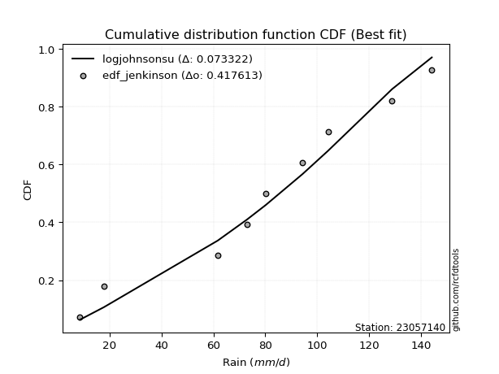</img></img>

</div>


### 11. Empirical - EDF Cunnane (1978)

Cunnane´s work in statistical hydrology has focused on the performance and evaluation of different probability distributions (such as GEV, Gumbel, Lognormal) for flood frequency estimation. _b_ is a constant, typically set to 0.4.

<div align="center">


$P=(m-b)/(n+1-2b)$


</div>


**11.1. Empirical values**

<div align="center">

|                | 0                   | 1                  | 2                   | 3                  | 4           | 5                  | 6                 | 7                  | 8                  |
|:---------------|:--------------------|:-------------------|:--------------------|:-------------------|:------------|:-------------------|:------------------|:-------------------|:-------------------|
| date           | 2025                | 2024               | 2008                | 2007               | 2012        | 2009               | 2013              | 2010               | 2011               |
| x              | 7.1                 | 17.8               | 61.7                | 72.9               | 80.2        | 94.4               | 104.2             | 128.9              | 144.2              |
| m              | 1                   | 2                  | 3                   | 4                  | 5           | 6                  | 7                 | 8                  | 9                  |
| empirical_dist | edf_cunnane         | edf_cunnane        | edf_cunnane         | edf_cunnane        | edf_cunnane | edf_cunnane        | edf_cunnane       | edf_cunnane        | edf_cunnane        |
| empirical      | 0.06521739130434782 | 0.1739130434782609 | 0.28260869565217395 | 0.391304347826087  | 0.5         | 0.6086956521739131 | 0.717391304347826 | 0.8260869565217391 | 0.9347826086956522 |
| empirical_tr   | 1.069767441860465   | 1.2105263157894737 | 1.393939393939394   | 1.6428571428571428 | 2.0         | 2.555555555555556  | 3.538461538461538 | 5.75               | 15.333333333333343 |

</div>


**11.2. Kolmogorov-Smirnov fit test (sorted by Δ)**


<div align="center">

|                | 0                   | 1                   | 2                   | 3                   | 4                   | 5                   | 6                   | 7                   | 8                   | 9                   | 10                  | 11                  | 12                  | 13                  | 14                  | 15                  | 16                  | 17                  | 18                  | 19                  | 20                  | 21                  | 22                    | 23                  | 24                  | 25                  | 26                  | 27                  | 28                  | 29                  | 30                  | 31                  | 32                  | 33                  | 34                  | 35                  | 36                  | 37                  | 38                  | 39                  | 40                  | 41                  | 42                  | 43                  | 44                  | 45                  | 46                  | 47                  | 48                  | 49                  | 50                  | 51                  | 52                  | 53                  | 54                  | 55                  | 56                  | 57                  | 58                  | 59                  | 60                  | 61                  | 62                  | 63                  | 64                  | 65                  | 66                  | 67                  | 68                  | 69                  | 70                  | 71                  | 72                  | 73                  | 74                  | 75                  | 76                  | 77                  | 78                  | 79                  | 80                  | 81                  | 82                  | 83                  | 84                  | 85                  | 86                  | 87                  | 88                  | 89                  |
|:---------------|:--------------------|:--------------------|:--------------------|:--------------------|:--------------------|:--------------------|:--------------------|:--------------------|:--------------------|:--------------------|:--------------------|:--------------------|:--------------------|:--------------------|:--------------------|:--------------------|:--------------------|:--------------------|:--------------------|:--------------------|:--------------------|:--------------------|:----------------------|:--------------------|:--------------------|:--------------------|:--------------------|:--------------------|:--------------------|:--------------------|:--------------------|:--------------------|:--------------------|:--------------------|:--------------------|:--------------------|:--------------------|:--------------------|:--------------------|:--------------------|:--------------------|:--------------------|:--------------------|:--------------------|:--------------------|:--------------------|:--------------------|:--------------------|:--------------------|:--------------------|:--------------------|:--------------------|:--------------------|:--------------------|:--------------------|:--------------------|:--------------------|:--------------------|:--------------------|:--------------------|:--------------------|:--------------------|:--------------------|:--------------------|:--------------------|:--------------------|:--------------------|:--------------------|:--------------------|:--------------------|:--------------------|:--------------------|:--------------------|:--------------------|:--------------------|:--------------------|:--------------------|:--------------------|:--------------------|:--------------------|:--------------------|:--------------------|:--------------------|:--------------------|:--------------------|:--------------------|:--------------------|:--------------------|:--------------------|:--------------------|
| station        | 23057140            | 23057140            | 23057140            | 23057140            | 23057140            | 23057140            | 23057140            | 23057140            | 23057140            | 23057140            | 23057140            | 23057140            | 23057140            | 23057140            | 23057140            | 23057140            | 23057140            | 23057140            | 23057140            | 23057140            | 23057140            | 23057140            | 23057140              | 23057140            | 23057140            | 23057140            | 23057140            | 23057140            | 23057140            | 23057140            | 23057140            | 23057140            | 23057140            | 23057140            | 23057140            | 23057140            | 23057140            | 23057140            | 23057140            | 23057140            | 23057140            | 23057140            | 23057140            | 23057140            | 23057140            | 23057140            | 23057140            | 23057140            | 23057140            | 23057140            | 23057140            | 23057140            | 23057140            | 23057140            | 23057140            | 23057140            | 23057140            | 23057140            | 23057140            | 23057140            | 23057140            | 23057140            | 23057140            | 23057140            | 23057140            | 23057140            | 23057140            | 23057140            | 23057140            | 23057140            | 23057140            | 23057140            | 23057140            | 23057140            | 23057140            | 23057140            | 23057140            | 23057140            | 23057140            | 23057140            | 23057140            | 23057140            | 23057140            | 23057140            | 23057140            | 23057140            | 23057140            | 23057140            | 23057140            | 23057140            |
| empirical_dist | edf_cunnane         | edf_cunnane         | edf_cunnane         | edf_cunnane         | edf_cunnane         | edf_cunnane         | edf_cunnane         | edf_cunnane         | edf_cunnane         | edf_cunnane         | edf_cunnane         | edf_cunnane         | edf_cunnane         | edf_cunnane         | edf_cunnane         | edf_cunnane         | edf_cunnane         | edf_cunnane         | edf_cunnane         | edf_cunnane         | edf_cunnane         | edf_cunnane         | edf_cunnane           | edf_cunnane         | edf_cunnane         | edf_cunnane         | edf_cunnane         | edf_cunnane         | edf_cunnane         | edf_cunnane         | edf_cunnane         | edf_cunnane         | edf_cunnane         | edf_cunnane         | edf_cunnane         | edf_cunnane         | edf_cunnane         | edf_cunnane         | edf_cunnane         | edf_cunnane         | edf_cunnane         | edf_cunnane         | edf_cunnane         | edf_cunnane         | edf_cunnane         | edf_cunnane         | edf_cunnane         | edf_cunnane         | edf_cunnane         | edf_cunnane         | edf_cunnane         | edf_cunnane         | edf_cunnane         | edf_cunnane         | edf_cunnane         | edf_cunnane         | edf_cunnane         | edf_cunnane         | edf_cunnane         | edf_cunnane         | edf_cunnane         | edf_cunnane         | edf_cunnane         | edf_cunnane         | edf_cunnane         | edf_cunnane         | edf_cunnane         | edf_cunnane         | edf_cunnane         | edf_cunnane         | edf_cunnane         | edf_cunnane         | edf_cunnane         | edf_cunnane         | edf_cunnane         | edf_cunnane         | edf_cunnane         | edf_cunnane         | edf_cunnane         | edf_cunnane         | edf_cunnane         | edf_cunnane         | edf_cunnane         | edf_cunnane         | edf_cunnane         | edf_cunnane         | edf_cunnane         | edf_cunnane         | edf_cunnane         | edf_cunnane         |
| p_dist         | logjohnsonsu        | genlogistic         | johnsonsu           | laplace_asymmetric  | gumbel_l            | pearson3            | weibull_min         | gamma               | betaprime           | fisk                | norm                | crystalball         | truncnorm           | nct                 | exponnorm           | t                   | f                   | erlang              | invgamma            | logistic            | hypsecant           | rice                | loglaplace_asymmetric | laplace             | logloggamma         | invgauss            | maxwell             | logmielke           | rayleigh            | logt                | gumbel_r            | kstwobign           | logfisk             | logpearson3         | loggompertz         | moyal               | loggumbel_l         | halflogistic        | halfnorm            | ncf                 | mielke              | wald                | gibrat              | lognakagami         | logf                | logexponnorm        | logcrystalball      | lognorm             | lognorm             | logrice             | lognct              | logfatiguelife      | loglogistic         | loghypsecant        | loggamma            | loggamma            | logbetaprime        | genexpon            | expon               | logerlang           | loginvgamma         | loglaplace          | loginvgauss         | logncf              | logalpha            | loginvweibull       | logmaxwell          | lograyleigh         | logkstwobign        | logtruncnorm        | loggumbel_r         | loghalfnorm         | loggenexpon         | nakagami            | logmoyal            | loghalflogistic     | logexpon            | logwald             | pareto              | loggibrat           | loglognorm          | logpareto           | alpha               | invweibull          | logweibull_min      | fatiguelife         | logchi2             | gompertz            | chi2                | loggenlogistic      |
| delta          | 0.07277838957547655 | 0.08221292032746035 | 0.08343255825641097 | 0.08731482973367335 | 0.08841289179781131 | 0.09001992103151768 | 0.09410003640511158 | 0.09424037797929032 | 0.094738502093442   | 0.09501588149199926 | 0.09534182500982459 | 0.09534182638287783 | 0.09534185213842916 | 0.09534263481517441 | 0.09534285316302009 | 0.09534465120395484 | 0.0961676046460902  | 0.09640723624886922 | 0.09796210662221946 | 0.10255868290789362 | 0.10519598145537054 | 0.10538933633337938 | 0.1058304282634191    | 0.10629651278626356 | 0.10636059280464494 | 0.11064165743868104 | 0.11135762145327686 | 0.11308512236438051 | 0.12201948150508608 | 0.12602505017459464 | 0.1420461911893901  | 0.15017448562382368 | 0.1525217848459     | 0.15340051004250055 | 0.15565716717264932 | 0.16314980961549555 | 0.16866183293788672 | 0.1739130434782609  | 0.1739130434782609  | 0.1768559528644294  | 0.1892803268741955  | 0.21358279057398727 | 0.22436897376009263 | 0.2373083838535962  | 0.23765046484961494 | 0.23810651858062426 | 0.23811048101822108 | 0.23811048177654193 | 0.23811048177654193 | 0.23812126466652006 | 0.23925623517091232 | 0.2402156913377672  | 0.2409345211452807  | 0.24334183250140573 | 0.24474872425367133 | 0.24474872425367133 | 0.2462398774440968  | 0.24921672315552323 | 0.24921901862354467 | 0.2498216054759259  | 0.2511744984405079  | 0.2528142284411924  | 0.2532099633842092  | 0.25837813154719425 | 0.2617102823398949  | 0.2674254126391651  | 0.2702166337469022  | 0.28074931273917303 | 0.30265797109202286 | 0.3082580891186696  | 0.3087908079098871  | 0.31040178507712146 | 0.31348302236740133 | 0.32444775003532844 | 0.3343768736319631  | 0.3364825629979973  | 0.357949315662904   | 0.4054400027195947  | 0.41776824015893554 | 0.43165970209254634 | 0.43472193176266816 | 0.4627463194931539  | 0.4688455683257061  | 0.48465121460001714 | 0.49651595164799656 | 0.5206308221005068  | 0.5283613146146029  | 0.6648594544162842  | 0.7204831102208562  | 0.8260869565217391  |
| deltao         | 0.41761268023100007 | 0.41761268023100007 | 0.41761268023100007 | 0.41761268023100007 | 0.41761268023100007 | 0.41761268023100007 | 0.41761268023100007 | 0.41761268023100007 | 0.41761268023100007 | 0.41761268023100007 | 0.41761268023100007 | 0.41761268023100007 | 0.41761268023100007 | 0.41761268023100007 | 0.41761268023100007 | 0.41761268023100007 | 0.41761268023100007 | 0.41761268023100007 | 0.41761268023100007 | 0.41761268023100007 | 0.41761268023100007 | 0.41761268023100007 | 0.41761268023100007   | 0.41761268023100007 | 0.41761268023100007 | 0.41761268023100007 | 0.41761268023100007 | 0.41761268023100007 | 0.41761268023100007 | 0.41761268023100007 | 0.41761268023100007 | 0.41761268023100007 | 0.41761268023100007 | 0.41761268023100007 | 0.41761268023100007 | 0.41761268023100007 | 0.41761268023100007 | 0.41761268023100007 | 0.41761268023100007 | 0.41761268023100007 | 0.41761268023100007 | 0.41761268023100007 | 0.41761268023100007 | 0.41761268023100007 | 0.41761268023100007 | 0.41761268023100007 | 0.41761268023100007 | 0.41761268023100007 | 0.41761268023100007 | 0.41761268023100007 | 0.41761268023100007 | 0.41761268023100007 | 0.41761268023100007 | 0.41761268023100007 | 0.41761268023100007 | 0.41761268023100007 | 0.41761268023100007 | 0.41761268023100007 | 0.41761268023100007 | 0.41761268023100007 | 0.41761268023100007 | 0.41761268023100007 | 0.41761268023100007 | 0.41761268023100007 | 0.41761268023100007 | 0.41761268023100007 | 0.41761268023100007 | 0.41761268023100007 | 0.41761268023100007 | 0.41761268023100007 | 0.41761268023100007 | 0.41761268023100007 | 0.41761268023100007 | 0.41761268023100007 | 0.41761268023100007 | 0.41761268023100007 | 0.41761268023100007 | 0.41761268023100007 | 0.41761268023100007 | 0.41761268023100007 | 0.41761268023100007 | 0.41761268023100007 | 0.41761268023100007 | 0.41761268023100007 | 0.41761268023100007 | 0.41761268023100007 | 0.41761268023100007 | 0.41761268023100007 | 0.41761268023100007 | 0.41761268023100007 |
| eval           | Δo > Δ              | Δo > Δ              | Δo > Δ              | Δo > Δ              | Δo > Δ              | Δo > Δ              | Δo > Δ              | Δo > Δ              | Δo > Δ              | Δo > Δ              | Δo > Δ              | Δo > Δ              | Δo > Δ              | Δo > Δ              | Δo > Δ              | Δo > Δ              | Δo > Δ              | Δo > Δ              | Δo > Δ              | Δo > Δ              | Δo > Δ              | Δo > Δ              | Δo > Δ                | Δo > Δ              | Δo > Δ              | Δo > Δ              | Δo > Δ              | Δo > Δ              | Δo > Δ              | Δo > Δ              | Δo > Δ              | Δo > Δ              | Δo > Δ              | Δo > Δ              | Δo > Δ              | Δo > Δ              | Δo > Δ              | Δo > Δ              | Δo > Δ              | Δo > Δ              | Δo > Δ              | Δo > Δ              | Δo > Δ              | Δo > Δ              | Δo > Δ              | Δo > Δ              | Δo > Δ              | Δo > Δ              | Δo > Δ              | Δo > Δ              | Δo > Δ              | Δo > Δ              | Δo > Δ              | Δo > Δ              | Δo > Δ              | Δo > Δ              | Δo > Δ              | Δo > Δ              | Δo > Δ              | Δo > Δ              | Δo > Δ              | Δo > Δ              | Δo > Δ              | Δo > Δ              | Δo > Δ              | Δo > Δ              | Δo > Δ              | Δo > Δ              | Δo > Δ              | Δo > Δ              | Δo > Δ              | Δo > Δ              | Δo > Δ              | Δo > Δ              | Δo > Δ              | Δo > Δ              | Δo > Δ              | Δo > Δ              | Δo <= Δ             | Δo <= Δ             | Δo <= Δ             | Δo <= Δ             | Δo <= Δ             | Δo <= Δ             | Δo <= Δ             | Δo <= Δ             | Δo <= Δ             | Δo <= Δ             | Δo <= Δ             | Δo <= Δ             |
| fit            | 1                   | 1                   | 1                   | 1                   | 1                   | 1                   | 1                   | 1                   | 1                   | 1                   | 1                   | 1                   | 1                   | 1                   | 1                   | 1                   | 1                   | 1                   | 1                   | 1                   | 1                   | 1                   | 1                     | 1                   | 1                   | 1                   | 1                   | 1                   | 1                   | 1                   | 1                   | 1                   | 1                   | 1                   | 1                   | 1                   | 1                   | 1                   | 1                   | 1                   | 1                   | 1                   | 1                   | 1                   | 1                   | 1                   | 1                   | 1                   | 1                   | 1                   | 1                   | 1                   | 1                   | 1                   | 1                   | 1                   | 1                   | 1                   | 1                   | 1                   | 1                   | 1                   | 1                   | 1                   | 1                   | 1                   | 1                   | 1                   | 1                   | 1                   | 1                   | 1                   | 1                   | 1                   | 1                   | 1                   | 1                   | 1                   | 0                   | 0                   | 0                   | 0                   | 0                   | 0                   | 0                   | 0                   | 0                   | 0                   | 0                   | 0                   |
| n              | 9                   | 9                   | 9                   | 9                   | 9                   | 9                   | 9                   | 9                   | 9                   | 9                   | 9                   | 9                   | 9                   | 9                   | 9                   | 9                   | 9                   | 9                   | 9                   | 9                   | 9                   | 9                   | 9                     | 9                   | 9                   | 9                   | 9                   | 9                   | 9                   | 9                   | 9                   | 9                   | 9                   | 9                   | 9                   | 9                   | 9                   | 9                   | 9                   | 9                   | 9                   | 9                   | 9                   | 9                   | 9                   | 9                   | 9                   | 9                   | 9                   | 9                   | 9                   | 9                   | 9                   | 9                   | 9                   | 9                   | 9                   | 9                   | 9                   | 9                   | 9                   | 9                   | 9                   | 9                   | 9                   | 9                   | 9                   | 9                   | 9                   | 9                   | 9                   | 9                   | 9                   | 9                   | 9                   | 9                   | 9                   | 9                   | 9                   | 9                   | 9                   | 9                   | 9                   | 9                   | 9                   | 9                   | 9                   | 9                   | 9                   | 9                   |
| best_fit       | 1                   | 0                   | 0                   | 0                   | 0                   | 0                   | 0                   | 0                   | 0                   | 0                   | 0                   | 0                   | 0                   | 0                   | 0                   | 0                   | 0                   | 0                   | 0                   | 0                   | 0                   | 0                   | 0                     | 0                   | 0                   | 0                   | 0                   | 0                   | 0                   | 0                   | 0                   | 0                   | 0                   | 0                   | 0                   | 0                   | 0                   | 0                   | 0                   | 0                   | 0                   | 0                   | 0                   | 0                   | 0                   | 0                   | 0                   | 0                   | 0                   | 0                   | 0                   | 0                   | 0                   | 0                   | 0                   | 0                   | 0                   | 0                   | 0                   | 0                   | 0                   | 0                   | 0                   | 0                   | 0                   | 0                   | 0                   | 0                   | 0                   | 0                   | 0                   | 0                   | 0                   | 0                   | 0                   | 0                   | 0                   | 0                   | 0                   | 0                   | 0                   | 0                   | 0                   | 0                   | 0                   | 0                   | 0                   | 0                   | 0                   | 0                   |
| best_fit_sort  | 1                   | 2                   | 3                   | 4                   | 5                   | 6                   | 7                   | 8                   | 9                   | 10                  | 11                  | 12                  | 13                  | 14                  | 15                  | 16                  | 17                  | 18                  | 19                  | 20                  | 21                  | 22                  | 23                    | 24                  | 25                  | 26                  | 27                  | 28                  | 29                  | 30                  | 31                  | 32                  | 33                  | 34                  | 35                  | 36                  | 37                  | 38                  | 39                  | 40                  | 41                  | 42                  | 43                  | 44                  | 45                  | 46                  | 47                  | 48                  | 49                  | 50                  | 51                  | 52                  | 53                  | 54                  | 55                  | 56                  | 57                  | 58                  | 59                  | 60                  | 61                  | 62                  | 63                  | 64                  | 65                  | 66                  | 67                  | 68                  | 69                  | 70                  | 71                  | 72                  | 73                  | 74                  | 75                  | 76                  | 77                  | 78                  | 79                  | 80                  | 81                  | 82                  | 83                  | 84                  | 85                  | 86                  | 87                  | 88                  | 89                  | 90                  |

</div>


<div align="center">

</img>

</div>


**11.3. Best fit**

<div align="center">

|   id |   station | empirical_dist   | p_dist       |     delta |   deltao | eval   |   fit |   n |   best_fit |   best_fit_sort |
|-----:|----------:|:-----------------|:-------------|----------:|---------:|:-------|------:|----:|-----------:|----------------:|
|    0 |  23057140 | edf_cunnane      | logjohnsonsu | 0.0727784 | 0.417613 | Δo > Δ |     1 |   9 |          1 |               1 |

</div>


<div align="center">

</img>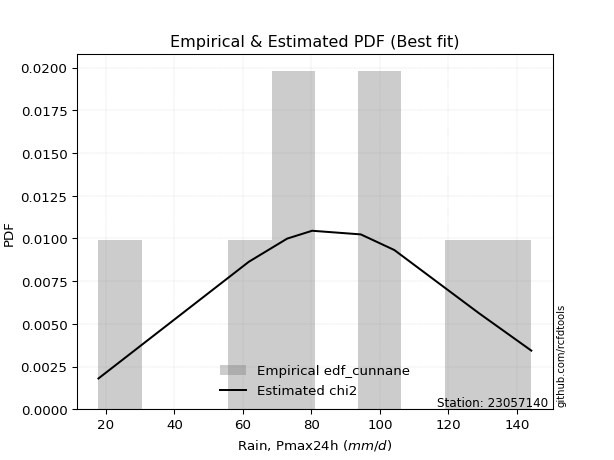</img>

</div>


### 12. Empirical - EDF Adamowski (1981)

The Adamowski formula in hydrology refers to a specific plotting position formula used for estimating the non-parametric empirical distribution of hydrological events (like flood peaks) to calculate their return periods. This formula provides an alternative to traditional parametric methods (like the Gumbel or Log Pearson Type III distributions). 

<div align="center">


$P=(m-0.25)/(n+0.5)$


</div>


**12.1. Empirical values**

<div align="center">

|                | 0                   | 1                   | 2                  | 3                   | 4             | 5                  | 6                  | 7                  | 8                  |
|:---------------|:--------------------|:--------------------|:-------------------|:--------------------|:--------------|:-------------------|:-------------------|:-------------------|:-------------------|
| date           | 2025                | 2024                | 2008               | 2007                | 2012          | 2009               | 2013               | 2010               | 2011               |
| x              | 7.1                 | 17.8                | 61.7               | 72.9                | 80.2          | 94.4               | 104.2              | 128.9              | 144.2              |
| m              | 1                   | 2                   | 3                  | 4                   | 5             | 6                  | 7                  | 8                  | 9                  |
| empirical_dist | edf_adamowski       | edf_adamowski       | edf_adamowski      | edf_adamowski       | edf_adamowski | edf_adamowski      | edf_adamowski      | edf_adamowski      | edf_adamowski      |
| empirical      | 0.07894736842105263 | 0.18421052631578946 | 0.2894736842105263 | 0.39473684210526316 | 0.5           | 0.6052631578947368 | 0.7105263157894737 | 0.8157894736842105 | 0.9210526315789473 |
| empirical_tr   | 1.0857142857142856  | 1.2258064516129032  | 1.4074074074074074 | 1.6521739130434783  | 2.0           | 2.533333333333333  | 3.4545454545454546 | 5.428571428571428  | 12.666666666666663 |

</div>


**12.2. Kolmogorov-Smirnov fit test (sorted by Δ)**


<div align="center">

|                | 0                   | 1                   | 2                   | 3                   | 4                   | 5                     | 6                   | 7                   | 8                   | 9                   | 10                  | 11                  | 12                  | 13                  | 14                  | 15                  | 16                  | 17                  | 18                  | 19                  | 20                  | 21                  | 22                  | 23                  | 24                  | 25                  | 26                  | 27                  | 28                  | 29                  | 30                  | 31                  | 32                  | 33                  | 34                  | 35                  | 36                  | 37                  | 38                  | 39                  | 40                  | 41                  | 42                  | 43                  | 44                  | 45                  | 46                  | 47                  | 48                  | 49                  | 50                  | 51                  | 52                  | 53                  | 54                  | 55                  | 56                  | 57                  | 58                  | 59                  | 60                  | 61                  | 62                  | 63                  | 64                  | 65                  | 66                  | 67                  | 68                  | 69                  | 70                  | 71                  | 72                  | 73                  | 74                  | 75                  | 76                  | 77                  | 78                  | 79                  | 80                  | 81                  | 82                  | 83                  | 84                  | 85                  | 86                  | 87                  | 88                  | 89                  |
|:---------------|:--------------------|:--------------------|:--------------------|:--------------------|:--------------------|:----------------------|:--------------------|:--------------------|:--------------------|:--------------------|:--------------------|:--------------------|:--------------------|:--------------------|:--------------------|:--------------------|:--------------------|:--------------------|:--------------------|:--------------------|:--------------------|:--------------------|:--------------------|:--------------------|:--------------------|:--------------------|:--------------------|:--------------------|:--------------------|:--------------------|:--------------------|:--------------------|:--------------------|:--------------------|:--------------------|:--------------------|:--------------------|:--------------------|:--------------------|:--------------------|:--------------------|:--------------------|:--------------------|:--------------------|:--------------------|:--------------------|:--------------------|:--------------------|:--------------------|:--------------------|:--------------------|:--------------------|:--------------------|:--------------------|:--------------------|:--------------------|:--------------------|:--------------------|:--------------------|:--------------------|:--------------------|:--------------------|:--------------------|:--------------------|:--------------------|:--------------------|:--------------------|:--------------------|:--------------------|:--------------------|:--------------------|:--------------------|:--------------------|:--------------------|:--------------------|:--------------------|:--------------------|:--------------------|:--------------------|:--------------------|:--------------------|:--------------------|:--------------------|:--------------------|:--------------------|:--------------------|:--------------------|:--------------------|:--------------------|:--------------------|
| station        | 23057140            | 23057140            | 23057140            | 23057140            | 23057140            | 23057140              | 23057140            | 23057140            | 23057140            | 23057140            | 23057140            | 23057140            | 23057140            | 23057140            | 23057140            | 23057140            | 23057140            | 23057140            | 23057140            | 23057140            | 23057140            | 23057140            | 23057140            | 23057140            | 23057140            | 23057140            | 23057140            | 23057140            | 23057140            | 23057140            | 23057140            | 23057140            | 23057140            | 23057140            | 23057140            | 23057140            | 23057140            | 23057140            | 23057140            | 23057140            | 23057140            | 23057140            | 23057140            | 23057140            | 23057140            | 23057140            | 23057140            | 23057140            | 23057140            | 23057140            | 23057140            | 23057140            | 23057140            | 23057140            | 23057140            | 23057140            | 23057140            | 23057140            | 23057140            | 23057140            | 23057140            | 23057140            | 23057140            | 23057140            | 23057140            | 23057140            | 23057140            | 23057140            | 23057140            | 23057140            | 23057140            | 23057140            | 23057140            | 23057140            | 23057140            | 23057140            | 23057140            | 23057140            | 23057140            | 23057140            | 23057140            | 23057140            | 23057140            | 23057140            | 23057140            | 23057140            | 23057140            | 23057140            | 23057140            | 23057140            |
| empirical_dist | edf_adamowski       | edf_adamowski       | edf_adamowski       | edf_adamowski       | edf_adamowski       | edf_adamowski         | edf_adamowski       | edf_adamowski       | edf_adamowski       | edf_adamowski       | edf_adamowski       | edf_adamowski       | edf_adamowski       | edf_adamowski       | edf_adamowski       | edf_adamowski       | edf_adamowski       | edf_adamowski       | edf_adamowski       | edf_adamowski       | edf_adamowski       | edf_adamowski       | edf_adamowski       | edf_adamowski       | edf_adamowski       | edf_adamowski       | edf_adamowski       | edf_adamowski       | edf_adamowski       | edf_adamowski       | edf_adamowski       | edf_adamowski       | edf_adamowski       | edf_adamowski       | edf_adamowski       | edf_adamowski       | edf_adamowski       | edf_adamowski       | edf_adamowski       | edf_adamowski       | edf_adamowski       | edf_adamowski       | edf_adamowski       | edf_adamowski       | edf_adamowski       | edf_adamowski       | edf_adamowski       | edf_adamowski       | edf_adamowski       | edf_adamowski       | edf_adamowski       | edf_adamowski       | edf_adamowski       | edf_adamowski       | edf_adamowski       | edf_adamowski       | edf_adamowski       | edf_adamowski       | edf_adamowski       | edf_adamowski       | edf_adamowski       | edf_adamowski       | edf_adamowski       | edf_adamowski       | edf_adamowski       | edf_adamowski       | edf_adamowski       | edf_adamowski       | edf_adamowski       | edf_adamowski       | edf_adamowski       | edf_adamowski       | edf_adamowski       | edf_adamowski       | edf_adamowski       | edf_adamowski       | edf_adamowski       | edf_adamowski       | edf_adamowski       | edf_adamowski       | edf_adamowski       | edf_adamowski       | edf_adamowski       | edf_adamowski       | edf_adamowski       | edf_adamowski       | edf_adamowski       | edf_adamowski       | edf_adamowski       | edf_adamowski       |
| p_dist         | logjohnsonsu        | genlogistic         | johnsonsu           | laplace_asymmetric  | gumbel_l            | loglaplace_asymmetric | logloggamma         | pearson3            | weibull_min         | gamma               | betaprime           | fisk                | invgauss            | norm                | crystalball         | truncnorm           | nct                 | exponnorm           | t                   | logmielke           | f                   | erlang              | invgamma            | logistic            | hypsecant           | rice                | laplace             | maxwell             | rayleigh            | logt                | kstwobign           | logfisk             | logpearson3         | loggompertz         | gumbel_r            | loggumbel_l         | ncf                 | moyal               | mielke              | halfnorm            | halflogistic        | wald                | gibrat              | lognakagami         | logf                | logexponnorm        | logcrystalball      | lognorm             | lognorm             | logrice             | lognct              | logfatiguelife      | loglogistic         | loghypsecant        | loggamma            | loggamma            | logbetaprime        | genexpon            | expon               | logerlang           | loginvgamma         | loglaplace          | loginvgauss         | logncf              | logalpha            | loginvweibull       | logmaxwell          | lograyleigh         | logkstwobign        | logtruncnorm        | loggumbel_r         | loghalfnorm         | loggenexpon         | nakagami            | logmoyal            | loghalflogistic     | logexpon            | logwald             | pareto              | loglognorm          | loggibrat           | logpareto           | alpha               | invweibull          | logweibull_min      | fatiguelife         | logchi2             | gompertz            | chi2                | loggenlogistic      |
| delta          | 0.07215522187051157 | 0.09251040316498892 | 0.09373004109393954 | 0.09761231257120193 | 0.09871037463533994 | 0.09896543970506672   | 0.09949560424629256 | 0.10031740386904625 | 0.10439751924264015 | 0.10453786081681889 | 0.10503598493097058 | 0.10531336432952783 | 0.10548101619782808 | 0.10563930784735316 | 0.1056393092204064  | 0.10563933497595773 | 0.10564011765270298 | 0.10564033600054866 | 0.10564213404148341 | 0.10622013380602813 | 0.10646508748361877 | 0.1067047190863978  | 0.10825958945974803 | 0.11285616574542219 | 0.11549346429289911 | 0.11568681917090795 | 0.11659399562379213 | 0.12165510429080544 | 0.13231696434261464 | 0.13632253301212321 | 0.1433094970654713  | 0.14565679628754763 | 0.14653552148414817 | 0.14879217861429694 | 0.15234367402691867 | 0.16179684437953434 | 0.16999096430607702 | 0.17344729245302412 | 0.1824153383158431  | 0.18421052631578946 | 0.18421052631578946 | 0.21015029629481108 | 0.22093647948091644 | 0.23044339529524382 | 0.23078547629126256 | 0.23124153002227188 | 0.2312454924598687  | 0.23124549321818955 | 0.23124549321818955 | 0.23125627610816768 | 0.23239124661255994 | 0.23335070277941483 | 0.2340695325869283  | 0.23647684394305335 | 0.23788373569531895 | 0.23788373569531895 | 0.23937488888574443 | 0.24235173459717085 | 0.2423540300651923  | 0.24295661691757353 | 0.2443095098821555  | 0.24594923988284    | 0.24634497482585682 | 0.25151314298884186 | 0.2548452937815425  | 0.2605604240808127  | 0.2633516451885498  | 0.27388432418082065 | 0.2957929825336705  | 0.3013931005603172  | 0.30192581935153473 | 0.3035367965187691  | 0.30661803380904895 | 0.31758276147697606 | 0.32751188507361073 | 0.3296175744396449  | 0.3510843271045516  | 0.3985750141612423  | 0.4074707573214069  | 0.42442444892513953 | 0.42479471353419396 | 0.4524488366556253  | 0.46198057976735374 | 0.47092123748331227 | 0.4896509630896442  | 0.5137658335421544  | 0.5214963260562505  | 0.6579944658579319  | 0.7101856273833276  | 0.8157894736842105  |
| deltao         | 0.41761268023100007 | 0.41761268023100007 | 0.41761268023100007 | 0.41761268023100007 | 0.41761268023100007 | 0.41761268023100007   | 0.41761268023100007 | 0.41761268023100007 | 0.41761268023100007 | 0.41761268023100007 | 0.41761268023100007 | 0.41761268023100007 | 0.41761268023100007 | 0.41761268023100007 | 0.41761268023100007 | 0.41761268023100007 | 0.41761268023100007 | 0.41761268023100007 | 0.41761268023100007 | 0.41761268023100007 | 0.41761268023100007 | 0.41761268023100007 | 0.41761268023100007 | 0.41761268023100007 | 0.41761268023100007 | 0.41761268023100007 | 0.41761268023100007 | 0.41761268023100007 | 0.41761268023100007 | 0.41761268023100007 | 0.41761268023100007 | 0.41761268023100007 | 0.41761268023100007 | 0.41761268023100007 | 0.41761268023100007 | 0.41761268023100007 | 0.41761268023100007 | 0.41761268023100007 | 0.41761268023100007 | 0.41761268023100007 | 0.41761268023100007 | 0.41761268023100007 | 0.41761268023100007 | 0.41761268023100007 | 0.41761268023100007 | 0.41761268023100007 | 0.41761268023100007 | 0.41761268023100007 | 0.41761268023100007 | 0.41761268023100007 | 0.41761268023100007 | 0.41761268023100007 | 0.41761268023100007 | 0.41761268023100007 | 0.41761268023100007 | 0.41761268023100007 | 0.41761268023100007 | 0.41761268023100007 | 0.41761268023100007 | 0.41761268023100007 | 0.41761268023100007 | 0.41761268023100007 | 0.41761268023100007 | 0.41761268023100007 | 0.41761268023100007 | 0.41761268023100007 | 0.41761268023100007 | 0.41761268023100007 | 0.41761268023100007 | 0.41761268023100007 | 0.41761268023100007 | 0.41761268023100007 | 0.41761268023100007 | 0.41761268023100007 | 0.41761268023100007 | 0.41761268023100007 | 0.41761268023100007 | 0.41761268023100007 | 0.41761268023100007 | 0.41761268023100007 | 0.41761268023100007 | 0.41761268023100007 | 0.41761268023100007 | 0.41761268023100007 | 0.41761268023100007 | 0.41761268023100007 | 0.41761268023100007 | 0.41761268023100007 | 0.41761268023100007 | 0.41761268023100007 |
| eval           | Δo > Δ              | Δo > Δ              | Δo > Δ              | Δo > Δ              | Δo > Δ              | Δo > Δ                | Δo > Δ              | Δo > Δ              | Δo > Δ              | Δo > Δ              | Δo > Δ              | Δo > Δ              | Δo > Δ              | Δo > Δ              | Δo > Δ              | Δo > Δ              | Δo > Δ              | Δo > Δ              | Δo > Δ              | Δo > Δ              | Δo > Δ              | Δo > Δ              | Δo > Δ              | Δo > Δ              | Δo > Δ              | Δo > Δ              | Δo > Δ              | Δo > Δ              | Δo > Δ              | Δo > Δ              | Δo > Δ              | Δo > Δ              | Δo > Δ              | Δo > Δ              | Δo > Δ              | Δo > Δ              | Δo > Δ              | Δo > Δ              | Δo > Δ              | Δo > Δ              | Δo > Δ              | Δo > Δ              | Δo > Δ              | Δo > Δ              | Δo > Δ              | Δo > Δ              | Δo > Δ              | Δo > Δ              | Δo > Δ              | Δo > Δ              | Δo > Δ              | Δo > Δ              | Δo > Δ              | Δo > Δ              | Δo > Δ              | Δo > Δ              | Δo > Δ              | Δo > Δ              | Δo > Δ              | Δo > Δ              | Δo > Δ              | Δo > Δ              | Δo > Δ              | Δo > Δ              | Δo > Δ              | Δo > Δ              | Δo > Δ              | Δo > Δ              | Δo > Δ              | Δo > Δ              | Δo > Δ              | Δo > Δ              | Δo > Δ              | Δo > Δ              | Δo > Δ              | Δo > Δ              | Δo > Δ              | Δo > Δ              | Δo > Δ              | Δo <= Δ             | Δo <= Δ             | Δo <= Δ             | Δo <= Δ             | Δo <= Δ             | Δo <= Δ             | Δo <= Δ             | Δo <= Δ             | Δo <= Δ             | Δo <= Δ             | Δo <= Δ             |
| fit            | 1                   | 1                   | 1                   | 1                   | 1                   | 1                     | 1                   | 1                   | 1                   | 1                   | 1                   | 1                   | 1                   | 1                   | 1                   | 1                   | 1                   | 1                   | 1                   | 1                   | 1                   | 1                   | 1                   | 1                   | 1                   | 1                   | 1                   | 1                   | 1                   | 1                   | 1                   | 1                   | 1                   | 1                   | 1                   | 1                   | 1                   | 1                   | 1                   | 1                   | 1                   | 1                   | 1                   | 1                   | 1                   | 1                   | 1                   | 1                   | 1                   | 1                   | 1                   | 1                   | 1                   | 1                   | 1                   | 1                   | 1                   | 1                   | 1                   | 1                   | 1                   | 1                   | 1                   | 1                   | 1                   | 1                   | 1                   | 1                   | 1                   | 1                   | 1                   | 1                   | 1                   | 1                   | 1                   | 1                   | 1                   | 1                   | 1                   | 0                   | 0                   | 0                   | 0                   | 0                   | 0                   | 0                   | 0                   | 0                   | 0                   | 0                   |
| n              | 9                   | 9                   | 9                   | 9                   | 9                   | 9                     | 9                   | 9                   | 9                   | 9                   | 9                   | 9                   | 9                   | 9                   | 9                   | 9                   | 9                   | 9                   | 9                   | 9                   | 9                   | 9                   | 9                   | 9                   | 9                   | 9                   | 9                   | 9                   | 9                   | 9                   | 9                   | 9                   | 9                   | 9                   | 9                   | 9                   | 9                   | 9                   | 9                   | 9                   | 9                   | 9                   | 9                   | 9                   | 9                   | 9                   | 9                   | 9                   | 9                   | 9                   | 9                   | 9                   | 9                   | 9                   | 9                   | 9                   | 9                   | 9                   | 9                   | 9                   | 9                   | 9                   | 9                   | 9                   | 9                   | 9                   | 9                   | 9                   | 9                   | 9                   | 9                   | 9                   | 9                   | 9                   | 9                   | 9                   | 9                   | 9                   | 9                   | 9                   | 9                   | 9                   | 9                   | 9                   | 9                   | 9                   | 9                   | 9                   | 9                   | 9                   |
| best_fit       | 1                   | 0                   | 0                   | 0                   | 0                   | 0                     | 0                   | 0                   | 0                   | 0                   | 0                   | 0                   | 0                   | 0                   | 0                   | 0                   | 0                   | 0                   | 0                   | 0                   | 0                   | 0                   | 0                   | 0                   | 0                   | 0                   | 0                   | 0                   | 0                   | 0                   | 0                   | 0                   | 0                   | 0                   | 0                   | 0                   | 0                   | 0                   | 0                   | 0                   | 0                   | 0                   | 0                   | 0                   | 0                   | 0                   | 0                   | 0                   | 0                   | 0                   | 0                   | 0                   | 0                   | 0                   | 0                   | 0                   | 0                   | 0                   | 0                   | 0                   | 0                   | 0                   | 0                   | 0                   | 0                   | 0                   | 0                   | 0                   | 0                   | 0                   | 0                   | 0                   | 0                   | 0                   | 0                   | 0                   | 0                   | 0                   | 0                   | 0                   | 0                   | 0                   | 0                   | 0                   | 0                   | 0                   | 0                   | 0                   | 0                   | 0                   |
| best_fit_sort  | 1                   | 2                   | 3                   | 4                   | 5                   | 6                     | 7                   | 8                   | 9                   | 10                  | 11                  | 12                  | 13                  | 14                  | 15                  | 16                  | 17                  | 18                  | 19                  | 20                  | 21                  | 22                  | 23                  | 24                  | 25                  | 26                  | 27                  | 28                  | 29                  | 30                  | 31                  | 32                  | 33                  | 34                  | 35                  | 36                  | 37                  | 38                  | 39                  | 40                  | 41                  | 42                  | 43                  | 44                  | 45                  | 46                  | 47                  | 48                  | 49                  | 50                  | 51                  | 52                  | 53                  | 54                  | 55                  | 56                  | 57                  | 58                  | 59                  | 60                  | 61                  | 62                  | 63                  | 64                  | 65                  | 66                  | 67                  | 68                  | 69                  | 70                  | 71                  | 72                  | 73                  | 74                  | 75                  | 76                  | 77                  | 78                  | 79                  | 80                  | 81                  | 82                  | 83                  | 84                  | 85                  | 86                  | 87                  | 88                  | 89                  | 90                  |

</div>


<div align="center">

</img>

</div>


**12.3. Best fit**

<div align="center">

|   id |   station | empirical_dist   | p_dist       |     delta |   deltao | eval   |   fit |   n |   best_fit |   best_fit_sort |
|-----:|----------:|:-----------------|:-------------|----------:|---------:|:-------|------:|----:|-----------:|----------------:|
|    0 |  23057140 | edf_adamowski    | logjohnsonsu | 0.0721552 | 0.417613 | Δo > Δ |     1 |   9 |          1 |               1 |

</div>


<div align="center">

</img>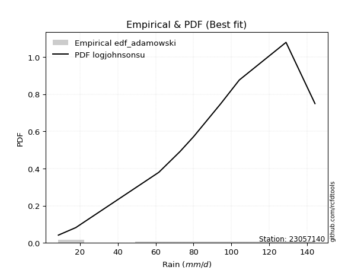</img>

</div>


## C. Best fit & Estimate extreme values for specific return periods - Tr


### 1. Best fit (ordered by delta Δ)

<div align="center">

|   id |   station | empirical_dist   | p_dist       |     delta |   deltao | eval   |   fit |   n |   best_fit |   best_fit_sort |
|-----:|----------:|:-----------------|:-------------|----------:|---------:|:-------|------:|----:|-----------:|----------------:|
|    0 |  23057140 | edf_jenkinson    | logjohnsonsu | 0.0686067 | 0.417613 | Δo > Δ |     1 |   9 |          1 |               1 |
|    1 |  23057140 | edf_beard        | logjohnsonsu | 0.0686067 | 0.417613 | Δo > Δ |     1 |   9 |          1 |               2 |
|    2 |  23057140 | edf_chegodayev   | logjohnsonsu | 0.0687958 | 0.417613 | Δo > Δ |     1 |   9 |          1 |               3 |
|    3 |  23057140 | edf_filliben     | logjohnsonsu | 0.0689482 | 0.417613 | Δo > Δ |     1 |   9 |          1 |               4 |
|    4 |  23057140 | edf_tukey        | logjohnsonsu | 0.0696728 | 0.417613 | Δo > Δ |     1 |   9 |          1 |               5 |
|    5 |  23057140 | edf_blom         | logjohnsonsu | 0.0716033 | 0.417613 | Δo > Δ |     1 |   9 |          1 |               6 |
|    6 |  23057140 | edf_adamowski    | logjohnsonsu | 0.0721552 | 0.417613 | Δo > Δ |     1 |   9 |          1 |               7 |
|    7 |  23057140 | edf_cunnane      | logjohnsonsu | 0.0727784 | 0.417613 | Δo > Δ |     1 |   9 |          1 |               8 |
|    8 |  23057140 | edf_gringorten   | logjohnsonsu | 0.0746853 | 0.417613 | Δo > Δ |     1 |   9 |          1 |               9 |
|    9 |  23057140 | edf_hazen        | genlogistic  | 0.0749665 | 0.417613 | Δo > Δ |     1 |   9 |          1 |              10 |
|   10 |  23057140 | edf_weibull      | logjohnsonsu | 0.0879447 | 0.417613 | Δo > Δ |     1 |   9 |          1 |              11 |
|   11 |  23057140 | edf_california   | logmielke    | 0.11946   | 0.417613 | Δo > Δ |     1 |   9 |          1 |              12 |

</div>

:file_folder:Tables: [bestfit_23057140.csv](table/bestfit_23057140.csv) | [extreme_23057140.csv](table/extreme_23057140.csv)


### 2. Extreme values

In hydrology, a return period (or recurrence interval $Tr$) is the statistical average time between extreme events like floods or droughts of a specific magnitude, indicating how rare an event is, with a 100-year flood, for example, having a 1% chance of occurring in any given year, not that it happens exactly every century. It is a key tool for infrastructure design (like bridges or dams) and risk assessment, calculated from historical data to determine the probability of future events, although it is important to remember it is statistical average, and events can cluster or be missed.

> risk_rate: assuming the return period as the project useful life.

|   id |      tr |   prob_l |     prob_g |      alpha |   betaprime |     chi2 |   crystalball |   erlang |    expon |   exponnorm |        f |   fatiguelife |     fisk |    gamma |   genexpon |   genlogistic |   gibrat |   gompertz |   gumbel_l |   gumbel_r |   halflogistic |   halfnorm |   hypsecant |   invgamma |   invgauss |      invweibull |   johnsonsu |   kstwobign |   laplace |   laplace_asymmetric |   loggamma |   logistic |   lognorm |   maxwell |   mielke |    moyal |   nakagami |       ncf |      nct |     norm |           pareto |   pearson3 |   rayleigh |     rice |        t |   truncnorm |     wald |   weibull_min |   logalpha |   logbetaprime |     logchi2 |   logcrystalball |   logerlang |         logexpon |   logexponnorm |      logf |   logfatiguelife |   logfisk |   loggenexpon |   loggenlogistic |   loggibrat |   loggompertz |   loggumbel_l |   loggumbel_r |   loghalflogistic |   loghalfnorm |   loghypsecant |   loginvgamma |   loginvgauss |   loginvweibull |   logjohnsonsu |   logkstwobign |   loglaplace |   loglaplace_asymmetric |   logloggamma |   loglogistic |     loglognorm |   logmaxwell |   logmielke |   logmoyal |   lognakagami |    logncf |    lognct |     logpareto |   logpearson3 |   lograyleigh |   logrice |            logt |   logtruncnorm |    logwald |   logweibull_min |   station |   n |   risk_rate |
|-----:|--------:|---------:|-----------:|-----------:|------------:|---------:|--------------:|---------:|---------:|------------:|---------:|--------------:|---------:|---------:|-----------:|--------------:|---------:|-----------:|-----------:|-----------:|---------------:|-----------:|------------:|-----------:|-----------:|----------------:|------------:|------------:|----------:|---------------------:|-----------:|-----------:|----------:|----------:|---------:|---------:|-----------:|----------:|---------:|---------:|-----------------:|-----------:|-----------:|---------:|---------:|------------:|---------:|--------------:|-----------:|---------------:|------------:|-----------------:|------------:|-----------------:|---------------:|----------:|-----------------:|----------:|--------------:|-----------------:|------------:|--------------:|--------------:|--------------:|------------------:|--------------:|---------------:|--------------:|--------------:|----------------:|---------------:|---------------:|-------------:|------------------------:|--------------:|--------------:|---------------:|-------------:|------------:|-----------:|--------------:|----------:|----------:|--------------:|--------------:|--------------:|----------:|----------------:|---------------:|-----------:|-----------------:|----------:|----:|------------:|
|    0 |    2    | 0.5      | 0.5        |    28.946  |     78.3081 |  7.85043 |       79.0444 |  78.1574 |  56.9681 |     79.0446 |  78.7975 |       7.10002 |  80.8774 |  78.1582 |    56.9684 |       83.6679 |  66.0502 |    125.301 |    86.1563 |    71.9326 |        68.3969 |    70.183  |     79.0444 |    76.2672 |    73.6253 |  1327.12        |     83.1927 |     69.7136 |   79.0444 |              79.6171 |    57.6253 |    79.0444 |   58.7478 |   75.342  |    7.1   |  69.6366 |    42.8943 |   67.2203 |  79.0403 |  79.0444 |      9.21553     |    80.8955 |    74.0289 |  77.1549 |  79.044  |     79.0444 |  65.0116 |       81.3595 |    55.3517 |        57.4169 |     14.0827 |          58.7478 |     56.8892 |     30.7173      |        58.7483 |   58.81   |          58.4583 |   70.2833 |       44.8574 |          inf     |     44.2558 |       69.0003 |       68.5991 |       50.3112 |           46.58   |       48.429  |        58.7478 |       56.6947 |       56.1674 |         52.374  |        85.7437 |        46.1371 |      58.7478 |                 77.3977 |       77.3281 |       58.7478 |   7.37224      |      54.1927 |     76.5547 |    47.8552 |       58.8499 |   55.0736 |   58.5612 |   7.62571     |       71.3301 |       52.6632 |   58.7464 |    88.4729      |        47.7328 |    43.2654 |     14.8983      |  23057140 |   9 |    0.75     |
|    1 |    2.33 | 0.570815 | 0.429185   |    34.4521 |     86.1046 |  8.36518 |       86.7696 |  85.98   |  67.9555 |     86.7698 |  86.6067 |       9.48827 |  88.1974 |  86.0384 |    67.9559 |       90.6146 |  69.9634 |    126.947 |    92.8773 |    79.0908 |        75.7567 |    78.5204 |     85.2269 |    84.2687 |    81.8271 | 39678.1         |     90.7087 |     78.7013 |   83.7193 |              84.8346 |    68.8547 |    85.8508 |   69.5223 |   83.3679 |    7.1   |  76.4128 |    54.7584 |   78.0268 |  86.7657 |  86.7696 |     14.2837      |    88.537  |    82.1735 |  85.1673 |  86.7689 |     86.7696 |  70.0771 |       88.9596 |    65.9047 |        68.5823 |     17.3991 |          69.5223 |     67.9968 |     42.417       |        69.5229 |   69.6033 |          69.1704 |   81.0348 |       56.5837 |          inf     |     48.1967 |       77.9311 |       79.4227 |       58.8071 |           54.6853 |       58.0809 |        67.2232 |       67.7754 |       67.739  |         66.2336 |        95.0794 |        58.61   |      65.0501 |                 87.1717 |       87.1083 |       68.1438 |   9.56085      |      64.5537 |     86.4991 |    55.4725 |       69.6842 |   67.1262 |   69.4118 |   9.05019     |       82.7695 |       62.8946 |   69.5201 |    95.1207      |        58.0921 |    48.3165 |     18.8148      |  23057140 |   9 |    0.729209 |
|    2 |    5    | 0.8      | 0.2        |    77.1469 |    115.36   | 12.6696  |      115.478  | 115.542  | 122.89   |    115.478  | 115.915  |      60.2219  | 116.461  | 115.774  |   122.891  |      115.512  |  92.493  |    132.264 |   114.59   |   110.189  |       109.058  |   113.778  |    110.026  |   115.563  |   114.839  |     1.045e+11   |    116.499  |    116.879  |  107.093  |             110.873  |   134.904  |   112.131  |  129.988  |  114.957  |  112.042 | 107.8    |   113.427  |  135.449  | 115.477  | 115.478  |   3208.42        |   115.913  |   114.78   | 115.583  | 115.477  |    115.478  |  98.4335 |      115.868  |   128.804  |       133.96   |     56.2813 |         129.988  |    133.422  |    212.957       |       129.989  |  130.229  |         129.311  |  140.4    |      144.067  |          inf     |     78.7604 |      115.841  |      127.495  |      115.834  |          113.011  |      125.259  |       115.422  |      133.593  |      140.111  |        183.675  |       122.189  |       161.959  |     108.273  |                118.03   |      117.995  |      120.842  |   1.13087e+282 |     128.52   |    118.079  |   109.956  |      130.593  |  145.573  |  130.789  |   8.97336e+47 |      129.809  |      128.027  |  129.98   |   133.947       |       142.841  |    89.6493 |     75.1961      |  23057140 |   9 |    0.67232  |
|    3 |   10    | 0.9      | 0.1        |   155.588  |    135.014  | 18.2822  |      134.523  | 135.582  | 172.758  |    134.523  | 135.608  |     130.272   | 137.276  | 135.895  |   172.759  |      132.604  | 118.174  |    135.225 |   126.678  |   135.518  |       136.714  |   139.868  |    129.829  |   137.767  |   139.071  |     1.77271e+16 |    131.904  |    145.946  |  128.31   |             134.51   |   212.786  |   131.486  |  196.878  |  137.188  |  128.512 | 135.128  |   161.109  |  196.915  | 134.524  | 134.523  | 811980           |   133.197  |   138.029  | 136.129  | 134.521  |    134.523  | 128.526  |      132.549  |   204.907  |       210.552  |    179.57   |         196.878  |    210.715  |    921.334       |       196.879  |  197.387  |         195.892  |  210.453  |      281.311  |          inf     |    137.859  |      144.656  |      165.934  |      201.197  |          206.5    |      221.204  |       177.729  |      212.411  |      233.234  |        421.545  |       133.941  |       351.156  |     171.943  |                131.195  |      131.177  |      184.266  | inf            |     208.655  |    131.625  |   199.494  |      198.12   |  251.919  |  199.426  | inf           |      161.415  |      212.522  |  196.862  |   205.814       |       294.94   |   172.757  |    337.543       |  23057140 |   9 |    0.651322 |
|    4 |   15    | 0.933333 | 0.0666667  |   233.749  |    144.895  | 22.0369  |      144.026  | 145.711  | 201.929  |    144.027  | 145.51   |     176.086   | 148.617  | 146.054  |   201.93   |      141.684  | 135.888  |    136.565 |   132.153  |   149.809  |       152.364  |   153.446  |    141.13   |   149.307  |   151.898  |     1.58157e+19 |    139.127  |    161.377  |  140.722  |             148.336  |   267.889  |   142.031  |  242.196  |  148.594  |  134.102 | 150.988  |   186.461  |  238.596  | 144.03   | 144.026  |      2.06974e+07 |   141.565  |   150.008  | 146.457  | 144.025  |    144.026  | 147.851  |      140.538  |   259.936  |       264.493  |    362.532  |         242.196  |    265.471  |   2170.33        |       242.196  |  242.931  |         241.03   |  262.381  |      397.359  |          inf     |    202.83   |      160.002  |      186.966  |      274.732  |          290.453  |      297.388  |       227.377  |      268.835  |      303.326  |        673.597  |       138.314  |       529.573  |     225.363  |                135.549  |      135.537  |      231.886  | inf            |     267.553  |    136.113  |   281.886  |      243.933  |  334.836  |  246.273  | inf           |      176.204  |      275.937  |  242.174  |   296.594       |       437.027  |   263.257  |    885.739       |  23057140 |   9 |    0.644736 |
|    5 |   20    | 0.95     | 0.05       |   311.841  |    151.392  | 24.855   |      150.25   | 152.391  | 222.626  |    150.25   | 152.022  |     210.006   | 156.455  | 152.749  |   222.628  |      147.9    | 149.783  |    137.4   |   135.561  |   159.815  |       163.329  |   162.498  |    149.103  |   157.037  |   160.572  |     1.84042e+21 |    143.7    |    171.772  |  149.528  |             158.147  |   311.818  |   149.319  |  277.386  |  156.164  |  136.915 | 162.221  |   203.46   |  271.229  | 150.255  | 150.25   |      2.05946e+08 |   146.953  |   157.97   | 153.242  | 150.248  |    150.25   | 162.251  |      145.653  |   304.457  |       307.374  |    601.413  |         277.386  |    309.157  |   3986.03        |       277.387  |  278.318  |         276.097  |  305.585  |      499.987  |          inf     |    274.586  |      170.375  |      201.383  |      341.69   |          368.874  |      362.256  |       270.534  |      314.159  |      361.403  |        935.246  |       140.733  |       698.424  |     273.055  |                137.72   |      137.711  |      271.816  | inf            |     315.555  |    138.353  |   360.086  |      279.536  |  405.041  |  282.814  | inf           |      185.332  |      328.237  |  277.36   |   415.259       |       570.988  |   360.338  |   1817.27        |  23057140 |   9 |    0.641514 |
|    6 |   25    | 0.96     | 0.04       |   389.905  |    156.189  | 27.114   |      154.832  | 157.332  | 238.68   |    154.832  | 156.829  |     236.957   | 162.452  | 157.7    |   238.682  |      152.631  | 161.367  |    137.993 |   137.986  |   167.522  |       171.778  |   169.233  |    155.273  |   162.817  |   167.099  |     7.1804e+22  |    146.989  |    179.559  |  156.359  |             165.756  |   348.88   |   154.895  |  306.519  |  161.784  |  138.609 | 170.927  |   216.137  |  298.489  | 154.838  | 154.832  |      1.22387e+09 |   150.873  |   163.886  | 158.247  | 154.83   |    154.832  | 173.786  |      149.362  |   342.442  |       343.477  |    893.869  |         306.519  |    346.035  |   6387.45        |       306.52   |  307.627  |         305.135  |  343.379  |      593.096  |          inf     |    353.462  |      178.169  |      212.314  |      404.199  |          443.458  |      419.541  |       309.48   |      352.613  |      411.804  |       1204.22   |       142.315  |       859.308  |     316.894  |                139.021  |      139.014  |      306.944  | inf            |     356.679  |    139.695  |   435.338  |      309.026  |  466.926  |  313.163  | inf           |      191.723  |      373.415  |  306.488  |   570.902       |       698.387  |   463.347  |   3231.74        |  23057140 |   9 |    0.639603 |
|    7 |   50    | 0.98     | 0.02       |   780.106  |    169.988  | 34.459   |      167.951  | 171.593  | 288.548  |    167.951  | 170.66   |     323.426   | 180.773  | 171.979  |   288.55   |      166.997  | 202.199  |    139.605 |   144.568  |   191.264  |       197.808  |   188.809  |    174.403  |   179.8    |   186.463  |     5.72767e+27 |    156.058  |    202.423  |  177.576  |             189.393  |   482.419  |   171.931  |  407.999  |  178.083  |  142.008 | 197.954  |   253.051  |  395.598  | 167.961  | 167.951  |      3.10419e+11 |   161.884  |   181.058  | 172.619  | 167.949  |    167.951  | 211.446  |      159.725  |   482.269  |       473.077  |   3111.96   |         407.999  |    479.04   |  27634.5         |       407.999  |  409.799  |         406.346  |  490.343  |      974.027  |          inf     |    860.817  |      201.187  |      245.073  |      678.2    |          782.108  |      642.83   |       469.605  |      492.626  |      603.019  |       2623.57   |       146.049  |      1579.5    |     503.243  |                141.619  |      141.615  |      444.97   | inf            |     508.836  |    142.376  |   784.678  |      411.85   |  708.518  |  419.491  | inf           |      208.3    |      542.954  |  407.952  |  2408.65        |      1267.66   |  1053.01   |  21227.4         |  23057140 |   9 |    0.63583  |
|    8 |   75    | 0.986667 | 0.0133333  |  1170.25   |    177.43   | 38.9398  |      174.991  | 179.313  | 317.719  |    174.991  | 178.121  |     375.502   | 191.354  | 179.703  |   317.721  |      175.256  | 229.778  |    140.421 |   147.897  |   205.064  |       212.939  |   199.466  |    185.582  |   189.184  |   197.274  |     4.04677e+30 |    160.719  |    215.003  |  189.988  |             203.219  |   574.917  |   181.77   |  475.665  |  186.945  |  143.145 | 213.759  |   273.149  |  462.475  | 175.002  | 174.991  |      7.91265e+12 |   167.661  |   190.4    | 180.353  | 174.988  |    174.991  | 234.62   |      165.133  |   581.611  |       562.469  |   6516.42   |         475.665  |    571.271  |  65096.9         |       475.665  |  477.989  |         473.88   |  602.371  |     1276.05   |          inf     |   1570.37   |      213.946  |      263.517  |      916.217  |         1087.69   |      810.92   |       599.192  |      590.792  |      743.426  |       4125.34   |       147.639  |      2207.88   |     659.593  |                142.483  |      142.481  |      551.411  | inf            |     617.259  |    143.269  |  1107.43   |      480.486  |  891.637  |  490.854  | inf           |      216.067  |      665.591  |  475.607  |  8825.84        |      1764.21   |  1745.12   |  67859.1         |  23057140 |   9 |    0.634587 |
|    9 |  100    | 0.99     | 0.01       |  1560.39   |    182.48   | 42.1852  |      179.752  | 184.562  | 338.416  |    179.752  | 183.182  |     412.972   | 198.825  | 184.952  |   338.419  |      181.076  | 251.142  |    140.954 |   150.074  |   214.831  |       223.649  |   206.725  |    193.512  |   195.641  |   204.757  |     4.20352e+32 |    163.795  |    223.622  |  198.794  |             213.03   |   647.726  |   188.716  |  527.685  |  192.981  |  143.714 | 224.972  |   286.833  |  515.142  | 179.765  | 179.752  |      7.87335e+13 |   171.518  |   196.765  | 185.592  | 179.749  |    179.752  | 251.516  |      168.734  |   661.12   |       632.649  |  11046.5    |         527.685  |    643.92   | 119557           |       527.685  |  530.441  |         525.822  |  696.558  |     1533.96   |          inf     |   2501.82   |      222.729  |      276.325  |     1133.6    |         1373.69   |      949.954  |       712.26   |      668.669  |      858.097  |       5683.06   |       148.578  |      2777.38   |     799.176  |                142.915  |      142.913  |      641.562  | inf            |     704.058  |    143.715  |  1414.06   |      533.285  | 1044.21   |  545.939  | inf           |      220.862  |      764.651  |  527.618  | 29795           |      2214.51   |  2522.22   | 158763           |  23057140 |   9 |    0.633968 |
|   10 |  200    | 0.995    | 0.005      |  3120.88   |    193.98   | 50.1908  |      190.552  | 196.549  | 388.284  |    190.552  | 194.711  |     504.693   | 216.746  | 196.933  |   388.287  |      195.013  | 309.265  |    142.113 |   154.807  |   238.312  |       249.396  |   223.329  |    212.616  |   210.629  |   222.247  |     2.96138e+37 |    170.546  |    243.474  |  220.012  |             236.666  |   850.443  |   205.38   |  667.756  |  206.79   |  144.569 | 251.988  |   318.09   |  662.633  | 190.569  | 190.552  |      1.99697e+16 |   180.113  |   211.328  | 197.496  | 190.549  |    190.552  | 293.603  |      176.735  |   888.043  |       827.316  |  39783      |         667.756  |    846.388  | 517249           |       667.755  |  671.789  |         665.77   |  986.975  |     2337.89   |          inf     |   8882.14   |      243.092  |      306.353  |     1891.25   |         2407.82   |     1364.22   |      1080.18   |      887.981  |     1194.84   |      12275.7    |       150.36   |      4711.68   |    1269.13   |                143.563  |      143.562  |      922.55   | inf            |     951.345  |    144.391  |  2548.15   |      675.579  | 1505.45   |  695.113  | inf           |      230.381  |     1050.35   |  667.663  |     2.45091e+06 |      3746.7    |  6312.73   |      1.33504e+06 |  23057140 |   9 |    0.633042 |
|   11 |  250    | 0.996    | 0.004      |  3901.12   |    197.507  | 52.8158  |      193.853  | 200.235  | 404.338  |    193.853  | 198.247  |     534.585   | 222.5    | 200.615  |   404.341  |      199.483  | 330.12   |    142.454 |   156.199  |   245.86   |       257.673  |   228.437  |    218.766  |   215.306  |   227.737  |     1.07156e+39 |    172.549  |    249.617  |  226.842  |             244.276  |   924.699  |   210.73   |  717.567  |  211.041  |  144.74  | 260.685  |   327.692  |  717.134  | 193.871  | 193.853  |      1.18674e+17 |   182.697  |   215.811  | 201.139  | 193.85   |    193.853  | 307.526  |      179.135  |   973.062  |       898.388  |  60246.6    |         717.567  |    920.618  | 828869           |       717.566  |  722.09   |         715.566  | 1103.81   |     2661.85   |          inf     |  13994.4    |      249.433  |      315.794  |     2229.52   |         2883.92   |     1524.89   |      1235.14   |      969.147  |     1324.15   |      15724.3    |       150.82   |      5548.97   |    1472.89   |                143.693  |      143.692  |     1036.66   | inf            |    1043.71   |    144.532  |  3080.06   |      726.22   | 1687.09   |  748.432  | inf           |      232.924  |     1158.17   |  717.465  |     1.87511e+07 |      4411.27   |  8551.27   |      2.712e+06   |  23057140 |   9 |    0.632858 |
|   12 |  500    | 0.998    | 0.002      |  7802.32   |    208.001  | 61.092   |      203.64   | 211.227  | 454.207  |    203.64   | 208.769  |     628.356   | 240.343  | 211.591  |   454.21   |      213.338  | 402.194  |    143.431 |   160.191  |   269.29   |       283.365  |   243.666  |    237.869  |   229.447  |   244.426  |     7.36807e+43 |    178.33   |    268.029  |  248.06   |             267.913  |  1186.9    |   227.321  |  888.218  |  223.725  |  145.082 | 287.701  |   356.276  |  912.19   | 203.662  | 203.64   |      3.01e+19    |   190.248  |   229.186  | 211.957  | 203.637  |    203.64   | 351.798  |      186.136  |  1280.63   |      1148.49   | 220099      |         888.218  |   1182.95   |      3.586e+06   |       888.216  |  894.548  |         886.27   | 1561.66   |     3921.07   |          inf     |  67341.7    |      268.546  |      344.502  |     3715.5    |         5048.83   |     2125.26   |      1873.1    |     1258.87   |     1803.78   |      33908.4    |       151.994  |      9059.34   |    2339.03   |                143.952  |      143.951  |     1488.34   | inf            |    1376.14   |    144.845  |  5550.2    |      899.848  | 2379.18   |  932.051  | inf           |      239.517  |     1550.25   |  888.083  |     2.00609e+11 |      7204.9    | 22446.8    |      2.62339e+07 |  23057140 |   9 |    0.632489 |
|   13 |  750    | 0.998667 | 0.00133333 | 11703.5    |    213.854  | 66.0073  |      209.077  | 217.373  | 483.377  |    209.077  | 214.638  |     683.76    | 250.768  | 217.725  |   483.381  |      221.429  | 449.859  |    143.954 |   162.324  |   282.987  |       298.384  |   252.174  |    249.044  |   237.483  |   253.963  |     4.9574e+46  |    181.443  |    278.372  |  260.472  |             281.739  |  1364.67   |   237.014  |  999.981  |  230.82   |  145.196 | 303.504  |   372.215  | 1047.01   | 209.101  | 209.077  |      7.67256e+20 |   194.368  |   236.666  | 217.974  | 209.074  |    209.077  | 378.343  |      189.952  |  1495.18   |      1317.41   | 471514      |         999.981  |   1360.99   |      8.44732e+06 |       999.978  | 1007.59   |         998.147  | 1912.61   |     4869.81   |          inf     | 190342      |      279.358  |      360.901  |     5008.23   |         7004.39   |     2558.32   |      2389.72   |     1457.79   |     2147.88   |      53138.5    |       152.538  |     11931.3    |    3065.73   |                144.038  |      144.038  |     1838.51   | inf            |    1606.3    |    144.979  |  7832.72   |     1013.66   | 2891.01   | 1053.03   | inf           |      242.604  |     1824.78   |  999.823  |     8.97264e+14 |      9497.68   | 40036.1    |      1.03541e+08 |  23057140 |   9 |    0.632366 |
|   14 | 1000    | 0.999    | 0.001      | 15604.7    |    217.893  | 69.5233  |      212.821  | 221.622  | 504.075  |    212.821  | 218.688  |     723.281   | 258.16   | 221.964  |   504.078  |      227.165  | 486.335  |    144.305 |   163.76   |   292.703  |       309.038  |   258.05   |    256.972  |   243.093  |   260.642  |     5.02565e+48 |    183.545  |    285.537  |  269.278  |             291.549  |  1502.87   |   243.888  | 1085      |  235.724  |  145.255 | 314.716  |   383.209  | 1153.36   | 212.846  | 212.821  |      7.63445e+21 |   197.175  |   241.834  | 222.12   | 212.817  |    212.821  | 397.437  |      192.549  |  1665.09   |      1448.41   | 810830      |        1085      |   1499.49   |      1.55144e+07 |      1085      | 1093.63   |        1083.29   | 2208.32   |     5656.67   |          144.084 | 421557      |      286.88   |      372.375  |     6189.59   |         8835.34   |     2907.89   |      2840.55   |     1613.7    |     2425.15   |      73080.7    |       152.874  |     14439.1    |    3714.5    |                144.081  |      144.081  |     2135.71   | inf            |    1787.51   |    145.061  | 10001.3    |     1100.28   | 3311.5    | 1145.4    | inf           |      244.509  |     2042.41   | 1084.83   |     2.38525e+18 |     11503.8    | 60703.9    |      2.79636e+08 |  23057140 |   9 |    0.632305 |

<div align="center">

</img>

</div>


<div align="center">

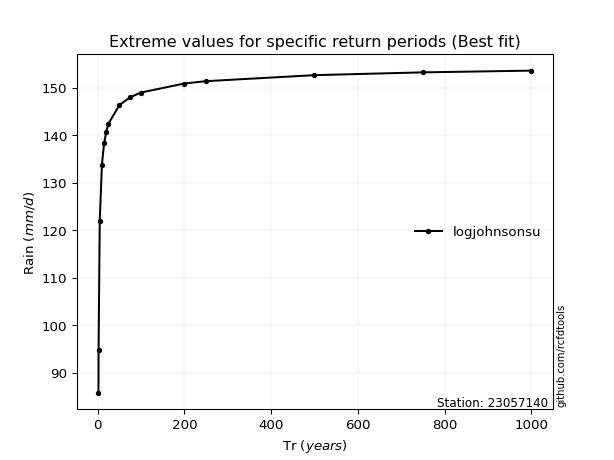</img>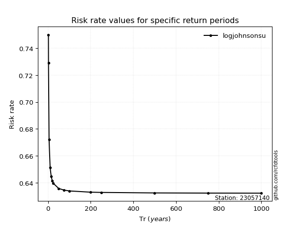</img>

</div>


<sub>**APP DISCLAIMER**: NO WARRANTY - This software is provided by [github.com/rcfdtools](https://github.com/rcfdtools) "as is", without any express or implied warranty, including warranties of merchantability, fitness for a particular purpose, or non-infringement. There is no guarantee that the software will be error-free or operate without interruption. LIMITATION OF LIABILITY - Neither the authors nor copyright holders will be liable for claims or damages arising from the software or its use. You are responsible for determining if the software is appropriate for your use and assume all associated risks, including errors, legal compliance, and data loss. NO PROFESSIONAL ADVICE - The software provides general information and does not offer professional advice. It should not replace consultation with professional advisors.</sub>