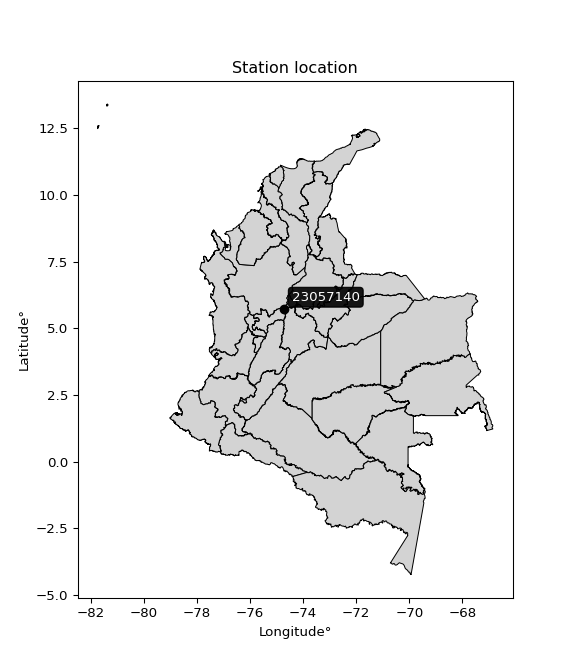

<div align="center">


</div>

# PMP Station (Rain, Pmax24h): 23057140

Probable Maximum Precipitation (PMP) is the greatest amount of rainfall for a specific duration that is meteorologically possible for a given location, acting as a "worst-case" scenario for extreme storms, crucial for designing safety-critical infrastructure like bridges, river deviations, dams, spillways, and nuclear plants to prevent catastrophic failure. PMP is calculated by hydrologists using meteorological data to determine the upper limit of extreme rainfall, often leading to the Probable Maximum Flood (PMF) for flood control design, and is increasingly being studied for climate change impacts.

<div align="center">

</img>

</div>


## A. General information


### 1. General running parameters

• app_version: _v20260103_. • runtime: _2026-01-03 07:24:50.581521_. • Python version: _3.14.0_. • SciPy version: _1.16.3_. • Pandas version: _2.3.3_. • NumPy version: _2.3.5_. • Stations dataset (station_dataset_file): _dataset/pmax24h_in/automatic_colombia_2003_2024.csv_. • Stations catalog (station_catalog_file): _dataset/CNE.xls_. • Minimum year to eval til year_max (date_min): _1900_. • Maximum year to eval since year_min (date_max): _2024_. • Creates, save and include plots into reports (create_plot): _False_. • Plot only fit distributions with Δo > Δ (plot_only_fit): _True_. • Eval low extreme values, if False, evaluates high extreme values (low_extreme): _False_. • Eval every SciPy distribution as logarithmic (pdist_logarithmic_on): _True_. • Standard deviation normalized (ddof): _1.0_. • Return periods to eval in years (Tr): _[2, 2.33, 5, 10, 15, 20, 25, 50, 75, 100, 200, 250, 500, 750, 1000]_. • Minimum data sample per station, 0 means any (minimum_sample): _5_. • Z-Score maximum threshold to adjust a value, 0 means disable (zscore_max): _3.5_. • Z-Score minimum threshold to adjust a value, 0 means disable (zscore_min): _-2.5_. • Avoid zeros, e.g. rain = 0 (avoid_zeros): _True_. • Avoid null values (avoid_nans): _True_. [:file_folder:Dataset file.](../../dataset/pmax24h_in/automatic_colombia_2003_2024.csv)

> Delta Degrees of Freedom (DDOF): is a parameter used in the formulas for calculating variance and standard deviation. When ddof=0, the divisor is $N$ (the total number of observations) and this is used when your data set is the entire population. When ddof=1, the divisor is $N-1$ and this is used when your data set is a sample drawn from a larger population. Using $N-1$ provides an unbiased estimate of the population variance (known as Bessel´s correction).


### 2. Station info and location

|   id |   CODIGO | NOMBRE                      | CATEGORIA    | TECNOLOGIA                              | ESTADO   | FECHA_INSTALACION   |   FECHA_SUSPENSION |   ALTITUD |   LATITUD |   LONGITUD | DEPARTAMENTO   | MUNICIPIO   | AREA_OPERATIVA             | ENTIDAD                                                     | AREA_HIDROGRAFICA   | ZONA_HIDROGRAFICA   | SUBZONA_HIDROGRAFICA   | CORRIENTE   | Catalogo   |   Version |
|-----:|---------:|:----------------------------|:-------------|:----------------------------------------|:---------|:--------------------|-------------------:|----------:|----------:|-----------:|:---------------|:------------|:---------------------------|:------------------------------------------------------------|:--------------------|:--------------------|:-----------------------|:------------|:-----------|----------:|
|    0 | 23057140 | SAN MIGUEL - AUT [23057140] | Limnigráfica | Automática con Telemetría, Convencional | Activa   | 15/08/1974          |                nan |       176 |   5.73103 |   -74.7258 | Antioquia      | Sonsón      | Area Operativa 10 - Tolima | INSTITUTO DE HIDROLOGIA METEOROLOGIA Y ESTUDIOS AMBIENTALES | Magdalena Cauca     | Medio Magdalena     | Río La Miel (Samaná)   | La Miel     | CNE_IDEAM  |  20251226 |

<div align="center">

Dynamic map: [:earth_americas:Google](http://maps.google.com/maps?q=5.731027778,-74.72583333) [:earth_americas:OSM](https://www.openstreetmap.org/#map=18/5.731027778/-74.72583333&layers=P) [:earth_americas:Bing](https://www.bing.com/maps?cp=5.731027778~-74.72583333&lvl=18) [:earth_americas:Apple](https://maps.apple.com/frame?center=5.731027778%2C-74.72583333&span=0.003%2C0.006)

</div>


<div align="center">

```geojson
{
  "type": "Feature",
  "geometry": {
    "type": "Point", 
    "coordinates": [-74.72583333, 5.731027778]
  }, 
  "properties": {
    "Name": "23057140"
  }
}
```

</div>


### 3. Discrete values table and plot

<div align="center">

|               |           0 |           1 |           2 |          3 |          4 |           5 |           6 |          7 |
|:--------------|------------:|------------:|------------:|-----------:|-----------:|------------:|------------:|-----------:|
| Date          | 2007        | 2008        | 2009        | 2010       | 2011       | 2012        | 2013        | 2024       |
| Value         |   72.9      |   61.7      |   94.4      |  128.9     |  144.2     |   80.2      |  104.2      |   17.8     |
| Value_initial |   72.9      |   61.7      |   94.4      |  128.9     |  144.2     |   80.2      |  104.2      |   17.8     |
| count         |    8        |    8        |    8        |    8       |    8       |    8        |    8        |    8       |
| mean          |   88.0375   |   88.0375   |   88.0375   |   88.0375  |   88.0375  |   88.0375   |   88.0375   |   88.0375  |
| std           |   39.719    |   39.719    |   39.719    |   39.719   |   39.719   |   39.719    |   39.719    |   39.719   |
| zscore        |   -0.381114 |   -0.663095 |    0.160188 |    1.02879 |    1.41399 |   -0.197323 |    0.406921 |   -1.76836 |


</div>


> The initial value (value_initial) correspond to the initial obtained or null completed value, and value (value) is adjusted only when the initial value is outside the valid range definite through the Z-Score value. If Z-Score is active, values out of range or outliers are replaced with the station mean value


### 4. Active continuous probability distributions from SciPy (44 of 104 available)

A Probability Density Function (PDF) describes the relative likelihood of a continuous random variable falling within a specific range, where the total area under its curve equals 1, and the area over any interval gives the actual probability for that range. Unlike discrete probabilities (like rolling a die), a PDF shows density, not direct probability for a single point (which is zero), with higher points indicating higher likelihood, often visualized as a bell curve for normal distributions.

A log of a probability density function (log-PDF) is simply the logarithm of the PDF´s value, denoted as $log(f(x))$, useful for converting multiplication of probabilities into addition, improving numerical stability with tiny numbers, and connecting to information theory concepts like entropy. Instead of dealing with very small probabilities (e.g., 0.000001), log-PDFs use negative numbers (e.g., $log(0.00001) ≈ -11.51$ that are easier for computers to handle, preventing underflow errors and simplifying complex calculations. In this study, each active probability distribution from SciPy is also evaluated in the $log$ form.

[scipy.stats](https://docs.scipy.org/doc/scipy/reference/stats.html) is a Python´s powerful submodule within the SciPy library for comprehensive statistical analysis, offering over 130 probability distributions (like Normal, Poisson), functions for descriptive stats (mean, variance), hypothesis testing (t-tests, chi-square), random variable generation, and statistical tests, making it essential for data science, modeling, and research. It provides tools to explore, model, and draw conclusions from data efficiently, working seamlessly with NumPy.

<div align="center">

|   id | p_dist             |   n_parameter | fit_method   | label                                                                       | active   | ref                                                                                                        |
|-----:|:-------------------|--------------:|:-------------|:----------------------------------------------------------------------------|:---------|:-----------------------------------------------------------------------------------------------------------|
|    0 | alpha              |             3 | MLE          | Alpha                                                                       | True     | [:mortar_board:](https://docs.scipy.org/doc/scipy/reference/generated/scipy.stats.alpha.html)              |
|    1 | betaprime          |             4 | MLE          | Beta prime                                                                  | True     | [:mortar_board:](https://docs.scipy.org/doc/scipy/reference/generated/scipy.stats.betaprime.html)          |
|    2 | chi2               |             3 | MLE          | Chi²                                                                        | True     | [:mortar_board:](https://docs.scipy.org/doc/scipy/reference/generated/scipy.stats.chi2.html)               |
|    3 | crystalball        |             4 | MLE          | Crystalball                                                                 | True     | [:mortar_board:](https://docs.scipy.org/doc/scipy/reference/generated/scipy.stats.crystalball.html)        |
|    4 | erlang             |             3 | MLE          | Erlang                                                                      | True     | [:mortar_board:](https://docs.scipy.org/doc/scipy/reference/generated/scipy.stats.erlang.html)             |
|    5 | expon              |             2 | MLE          | Exponential                                                                 | True     | [:mortar_board:](https://docs.scipy.org/doc/scipy/reference/generated/scipy.stats.expon.html)              |
|    6 | exponnorm          |             3 | MLE          | Exponentially modified Normal                                               | True     | [:mortar_board:](https://docs.scipy.org/doc/scipy/reference/generated/scipy.stats.exponnorm.html)          |
|    7 | f                  |             4 | MLE          | F                                                                           | True     | [:mortar_board:](https://docs.scipy.org/doc/scipy/reference/generated/scipy.stats.f.html)                  |
|    8 | fatiguelife        |             3 | MLE          | Fatigue-life (Birnbaum-Saunders)                                            | True     | [:mortar_board:](https://docs.scipy.org/doc/scipy/reference/generated/scipy.stats.fatiguelife.html)        |
|    9 | fisk               |             3 | MLE          | Fisk                                                                        | True     | [:mortar_board:](https://docs.scipy.org/doc/scipy/reference/generated/scipy.stats.fisk.html)               |
|   10 | gamma              |             3 | MLE          | Gamma                                                                       | True     | [:mortar_board:](https://docs.scipy.org/doc/scipy/reference/generated/scipy.stats.gamma.html)              |
|   11 | genexpon           |             5 | MLE          | Generalized exponential                                                     | True     | [:mortar_board:](https://docs.scipy.org/doc/scipy/reference/generated/scipy.stats.genexpon.html)           |
|   12 | genlogistic        |             3 | MLE          | Generalized logistic                                                        | True     | [:mortar_board:](https://docs.scipy.org/doc/scipy/reference/generated/scipy.stats.genlogistic.html)        |
|   13 | gibrat             |             2 | MM           | Gibrat                                                                      | True     | [:mortar_board:](https://docs.scipy.org/doc/scipy/reference/generated/scipy.stats.gibrat.html)             |
|   14 | gompertz           |             3 | MLE          | Gompertz (or truncated Gumbel)                                              | True     | [:mortar_board:](https://docs.scipy.org/doc/scipy/reference/generated/scipy.stats.gompertz.html)           |
|   15 | gumbel_l           |             2 | MM           | Gumbel Left Skew                                                            | True     | [:mortar_board:](https://docs.scipy.org/doc/scipy/reference/generated/scipy.stats.gumbel_l.html)           |
|   16 | gumbel_r           |             2 | MM           | Gumbel Right Skew                                                           | True     | [:mortar_board:](https://docs.scipy.org/doc/scipy/reference/generated/scipy.stats.gumbel_r.html)           |
|   17 | halflogistic       |             2 | MM           | Half-logistic                                                               | True     | [:mortar_board:](https://docs.scipy.org/doc/scipy/reference/generated/scipy.stats.halflogistic.html)       |
|   18 | halfnorm           |             2 | MM           | Half Normal                                                                 | True     | [:mortar_board:](https://docs.scipy.org/doc/scipy/reference/generated/scipy.stats.halfnorm.html)           |
|   19 | hypsecant          |             2 | MM           | hyperbolic secant                                                           | True     | [:mortar_board:](https://docs.scipy.org/doc/scipy/reference/generated/scipy.stats.hypsecant.html)          |
|   20 | invgamma           |             3 | MLE          | Inverted gamma                                                              | True     | [:mortar_board:](https://docs.scipy.org/doc/scipy/reference/generated/scipy.stats.invgamma.html)           |
|   21 | invgauss           |             3 | MLE          | Inverse Gaussian                                                            | True     | [:mortar_board:](https://docs.scipy.org/doc/scipy/reference/generated/scipy.stats.invgauss.html)           |
|   22 | invweibull         |             3 | MLE          | Inverted Weibull                                                            | True     | [:mortar_board:](https://docs.scipy.org/doc/scipy/reference/generated/scipy.stats.invweibull.html)         |
|   23 | johnsonsu          |             4 | MLE          | Johnson Su                                                                  | True     | [:mortar_board:](https://docs.scipy.org/doc/scipy/reference/generated/scipy.stats.johnsonsu.html)          |
|   24 | kstwobign          |             2 | MLE          | Limiting distribution of scaled Kolmogorov-Smirnov two-sided test statistic | True     | [:mortar_board:](https://docs.scipy.org/doc/scipy/reference/generated/scipy.stats.kstwobign.html)          |
|   25 | laplace            |             2 | MM           | Laplace                                                                     | True     | [:mortar_board:](https://docs.scipy.org/doc/scipy/reference/generated/scipy.stats.laplace.html)            |
|   26 | laplace_asymmetric |             3 | MLE          | Asymmetric Laplace                                                          | True     | [:mortar_board:](https://docs.scipy.org/doc/scipy/reference/generated/scipy.stats.laplace_asymmetric.html) |
|   27 | loggamma           |             3 | MLE          | Log gamma                                                                   | True     | [:mortar_board:](https://docs.scipy.org/doc/scipy/reference/generated/scipy.stats.loggamma.html)           |
|   28 | logistic           |             2 | MM           | Logistic (or Sech-squared)                                                  | True     | [:mortar_board:](https://docs.scipy.org/doc/scipy/reference/generated/scipy.stats.logistic.html)           |
|   29 | lognorm            |             3 | MLE          | Log Normal                                                                  | True     | [:mortar_board:](https://docs.scipy.org/doc/scipy/reference/generated/scipy.stats.lognorm.html)            |
|   30 | maxwell            |             2 | MM           | Maxwell                                                                     | True     | [:mortar_board:](https://docs.scipy.org/doc/scipy/reference/generated/scipy.stats.maxwell.html)            |
|   31 | mielke             |             4 | MLE          | Mielke Beta-Kappa / Dagum                                                   | True     | [:mortar_board:](https://docs.scipy.org/doc/scipy/reference/generated/scipy.stats.mielke.html)             |
|   32 | moyal              |             2 | MM           | Moyal                                                                       | True     | [:mortar_board:](https://docs.scipy.org/doc/scipy/reference/generated/scipy.stats.moyal.html)              |
|   33 | nakagami           |             3 | MLE          | Nakagami                                                                    | True     | [:mortar_board:](https://docs.scipy.org/doc/scipy/reference/generated/scipy.stats.nakagami.html)           |
|   34 | ncf                |             5 | MLE          | Non-central F distribution                                                  | True     | [:mortar_board:](https://docs.scipy.org/doc/scipy/reference/generated/scipy.stats.ncf.html)                |
|   35 | nct                |             4 | MLE          | Non-central Student’s t                                                     | True     | [:mortar_board:](https://docs.scipy.org/doc/scipy/reference/generated/scipy.stats.nct.html)                |
|   36 | norm               |             2 | MM           | Normal                                                                      | True     | [:mortar_board:](https://docs.scipy.org/doc/scipy/reference/generated/scipy.stats.norm.html)               |
|   37 | pearson3           |             3 | MM           | Pearson type III                                                            | True     | [:mortar_board:](https://docs.scipy.org/doc/scipy/reference/generated/scipy.stats.pearson3.html)           |
|   38 | rayleigh           |             2 | MM           | Rayleigh                                                                    | True     | [:mortar_board:](https://docs.scipy.org/doc/scipy/reference/generated/scipy.stats.rayleigh.html)           |
|   39 | rice               |             3 | MLE          | Rice                                                                        | True     | [:mortar_board:](https://docs.scipy.org/doc/scipy/reference/generated/scipy.stats.rice.html)               |
|   40 | t                  |             3 | MLE          | Student’s t                                                                 | True     | [:mortar_board:](https://docs.scipy.org/doc/scipy/reference/generated/scipy.stats.t.html)                  |
|   41 | truncnorm          |             4 | MLE          | Truncated normal                                                            | True     | [:mortar_board:](https://docs.scipy.org/doc/scipy/reference/generated/scipy.stats.truncnorm.html)          |
|   42 | wald               |             2 | MM           | Wald                                                                        | True     | [:mortar_board:](https://docs.scipy.org/doc/scipy/reference/generated/scipy.stats.wald.html)               |
|   43 | weibull_min        |             3 | MLE          | Weibull minimum                                                             | True     | [:mortar_board:](https://docs.scipy.org/doc/scipy/reference/generated/scipy.stats.weibull_min.html)        |

</div>

> **n_parameter:** # arguments & localization & scale.
>
> **Fit methods:** (MLE) maximum likelihood, (MM) L-moments.
>
>**Inactive** (With the only purpose of prevent loops, zero divisions, infinite values, over high estimated values or horizontal trending for recurrence intervals estimations, the follow distributions were disabled.)**:** foldnorm, gennorm, norminvgauss, powernorm, powerlognorm, skewnorm, genextreme, anglit, arcsine, argus, beta, bradford, burr, burr12, cauchy, cosine, halfcauchy, foldcauchy, skewcauchy, wrapcauchy, dgamma, gengamma, exponweib, exponpow, truncexpon, gausshyper, genhalflogistic, genhyperbolic, geninvgauss, halfgennorm, johnsonsb, kappa4, kappa3, ksone, kstwo, loglaplace, levy, levy_l, levy_stable, ncx2, pareto, genpareto, truncpareto, lomax, powerlaw, rdist, rel_breitwigner, recipinvgauss, semicircular, studentized_range, trapezoid, triang, truncweibull_min, tukeylambda, uniform, loguniform, vonmises, vonmises_line, weibull_max, dweibull, 


## B. Probability distributions vs. Empirical distributions

A continuous probability distribution (CPD) describes probabilities for variables that can take any value within a range (like rain any time), unlike discrete variables with specific outcomes (like temperature). It uses a Probability Density Function (PDF), a curve where the total area under it equals 1, and the probability of the variable falling within an interval (a to b) is found by calculating the area under the curve between those points. A key feature is that the probability of hitting any single exact value is zero, so probabilities are always expressed for ranges, e.g., $P(a ≤ X ≤ b)$.

<div align="center">

Distributions parameters from station values
|    |   station | p_dist                |   n |              loc |            scale | shape                  | shape1                | shape2               | shape3   |
|---:|----------:|:----------------------|----:|-----------------:|-----------------:|:-----------------------|:----------------------|:---------------------|:---------|
|  0 |  23057140 | alpha                 |   8 |     -0.117157    |     44.5781      | 7.517837826236321e-11  |                       |                      |          |
|  1 |  23057140 | betaprime             |   8 |   -865.56        | 106551           | 654.1627323333923      | 73092.64485087988     |                      |          |
|  2 |  23057140 | chi2                  |   8 |   -368.3         |      1.57699     | 289.56538597783594     |                       |                      |          |
|  3 |  23057140 | crystalball           |   8 |     88.0375      |     37.1538      | 7570.6014163138        | 252.15314050066172    |                      |          |
|  4 |  23057140 | erlang                |   8 |   -567.536       |      2.14792     | 305.08347274746427     |                       |                      |          |
|  5 |  23057140 | expon                 |   8 |     17.8         |     70.2375      |                        |                       |                      |          |
|  6 |  23057140 | exponnorm             |   8 |     88.0119      |     37.1537      | 0.000683394520442109   |                       |                      |          |
|  7 |  23057140 | f                     |   8 | -10826           |  10914           | 179077.5107419942      | 4138254.5278721163    |                      |          |
|  8 |  23057140 | fatiguelife           |   8 |     17.8         |      0.000343498 | 406.92378286242706     |                       |                      |          |
|  9 |  23057140 | fisk                  |   8 |     -2.42234e+06 |      2.42243e+06 | 112976.70353824351     |                       |                      |          |
| 10 |  23057140 | gamma                 |   8 |   -563.88        |      2.17881     | 299.0928525884408      |                       |                      |          |
| 11 |  23057140 | genexpon              |   8 |     17.7999      |      2.0967      | 0.029866373450342005   | 3.135224711217859e-07 | 1.066217577235464    |          |
| 12 |  23057140 | genlogistic           |   8 |     96.3529      |     19.6307      | 0.7917326498647159     |                       |                      |          |
| 13 |  23057140 | gibrat                |   8 |     59.6938      |     17.1913      |                        |                       |                      |          |
| 14 |  23057140 | gompertz              |   8 |    -40.1178      |     33.5513      | 0.013132809532315097   |                       |                      |          |
| 15 |  23057140 | gumbel_l              |   8 |    104.759       |     28.9687      |                        |                       |                      |          |
| 16 |  23057140 | gumbel_r              |   8 |     71.3163      |     28.9687      |                        |                       |                      |          |
| 17 |  23057140 | halflogistic          |   8 |     44.0017      |     31.7651      |                        |                       |                      |          |
| 18 |  23057140 | halfnorm              |   8 |     38.8605      |     61.6342      |                        |                       |                      |          |
| 19 |  23057140 | hypsecant             |   8 |     88.0375      |     23.6528      |                        |                       |                      |          |
| 20 |  23057140 | invgamma              |   8 |   -337.936       |  50284.6         | 119.12303536733458     |                       |                      |          |
| 21 |  23057140 | invgauss              |   8 |   -115.347       |   5090.04        | 0.03973001773748269    |                       |                      |          |
| 22 |  23057140 | invweibull            |   8 |     -1.05004e+06 |      1.05011e+06 | 28236.32375911335      |                       |                      |          |
| 23 |  23057140 | johnsonsu             |   8 |    292.184       |     90.2685      | 9.26013974164783       | 6.008620502444739     |                      |          |
| 24 |  23057140 | kstwobign             |   8 |    -65.5683      |    175.926       |                        |                       |                      |          |
| 25 |  23057140 | laplace               |   8 |     88.0375      |     26.2717      |                        |                       |                      |          |
| 26 |  23057140 | laplace_asymmetric    |   8 |     80.2         |     29.1018      | 0.8743727683024218     |                       |                      |          |
| 27 |  23057140 | loggamma              |   8 |    -44.0618      |     82.933       | 5.409278636847983      |                       |                      |          |
| 28 |  23057140 | logistic              |   8 |     88.0375      |     20.4839      |                        |                       |                      |          |
| 29 |  23057140 | lognorm               |   8 |     17.8         |      0.687378    | 12.437928286858055     |                       |                      |          |
| 30 |  23057140 | maxwell               |   8 |     -0.00132612  |     55.1702      |                        |                       |                      |          |
| 31 |  23057140 | mielke                |   8 |     -9.23253     |    154.183       | 1.7906690885977072     | 838.1135846487714     |                      |          |
| 32 |  23057140 | moyal                 |   8 |     66.7906      |     16.7251      |                        |                       |                      |          |
| 33 |  23057140 | nakagami              |   8 |     61.7         |     46.1571      | 0.2429297623554437     |                       |                      |          |
| 34 |  23057140 | ncf                   |   8 |   -100.082       |      0.29744     | 0.14038990517230096    | 25951.08323577866     | 88.55726279856371    |          |
| 35 |  23057140 | nct                   |   8 |  -2073.53        |     37.0827      | 388102.6278386527      | 58.29046423330104     |                      |          |
| 36 |  23057140 | norm                  |   8 |     88.0375      |     37.1538      |                        |                       |                      |          |
| 37 |  23057140 | pearson3              |   8 |     88.0375      |     37.1537      | -0.28968708932845566   |                       |                      |          |
| 38 |  23057140 | rayleigh              |   8 |     16.9602      |     56.7115      |                        |                       |                      |          |
| 39 |  23057140 | rice                  |   8 |     -4.33893     |     40.4041      | 2.018123147967321      |                       |                      |          |
| 40 |  23057140 | t                     |   8 |     88.0512      |     37.0958      | 17032.5620461973       |                       |                      |          |
| 41 |  23057140 | truncnorm             |   8 |     92.2541      |     30.8382      | -2.4143462862993283    | 2.5141832942472746    |                      |          |
| 42 |  23057140 | wald                  |   8 |     50.8837      |     37.1538      |                        |                       |                      |          |
| 43 |  23057140 | weibull_min           |   8 |    -74.5144      |    177.076       | 5.112538655285225      |                       |                      |          |
| 44 |  23057140 | logalpha              |   8 |    -17.3509      |    728.944       | 33.63508520063759      |                       |                      |          |
| 45 |  23057140 | logbetaprime          |   8 |    -27.3957      |     22.2769      | 6059.352156725781      | 4254.7642440095915    |                      |          |
| 46 |  23057140 | logchi2               |   8 |      2.8792      |      0.973667    | 1.1218084535686237     |                       |                      |          |
| 47 |  23057140 | logcrystalball        |   8 |      4.3374      |      0.61141     | 2067.9043162448106     | 101.7104769808058     |                      |          |
| 48 |  23057140 | logerlang             |   8 |     -7.5223      |      0.0351179   | 337.3048422088933      |                       |                      |          |
| 49 |  23057140 | logexpon              |   8 |      2.8792      |      1.4582      |                        |                       |                      |          |
| 50 |  23057140 | logexponnorm          |   8 |      4.33697     |      0.611406    | 0.0006968607067443011  |                       |                      |          |
| 51 |  23057140 | logf                  |   8 |   -998.629       |   1002.96        | 17520573.806360822     | 7680751.24880157      |                      |          |
| 52 |  23057140 | logfatiguelife        |   8 |   -440.781       |    445.12        | 0.0013736518773636423  |                       |                      |          |
| 53 |  23057140 | logfisk               |   8 | -10872.2         |  10876.7         | 35747.11709127424      |                       |                      |          |
| 54 |  23057140 | loggamma              |   8 |     -8.20354     |      0.0330211   | 379.6894218364953      |                       |                      |          |
| 55 |  23057140 | loggenexpon           |   8 |      2.80417     |      0.00824871  | 0.0009718363784206826  | 3.169066683887424     | 1.29135402013373e-05 |          |
| 56 |  23057140 | loggenlogistic        |   8 |      4.97122     |      1.10992e-06 | 1.7414753415763284e-06 |                       |                      |          |
| 57 |  23057140 | loggibrat             |   8 |      3.87093     |      0.282923    |                        |                       |                      |          |
| 58 |  23057140 | loggompertz           |   8 |      2.8792      |      0.415924    | 0.016853566335089006   |                       |                      |          |
| 59 |  23057140 | loggumbel_l           |   8 |      4.61257     |      0.476714    |                        |                       |                      |          |
| 60 |  23057140 | loggumbel_r           |   8 |      4.06223     |      0.476714    |                        |                       |                      |          |
| 61 |  23057140 | loghalflogistic       |   8 |      3.61271     |      0.522752    |                        |                       |                      |          |
| 62 |  23057140 | loghalfnorm           |   8 |      3.52815     |      1.01425     |                        |                       |                      |          |
| 63 |  23057140 | loghypsecant          |   8 |      4.3374      |      0.389236    |                        |                       |                      |          |
| 64 |  23057140 | loginvgamma           |   8 |    -15.3401      |  18882.8         | 960.5204703955046      |                       |                      |          |
| 65 |  23057140 | loginvgauss           |   8 |     -2.74742     |    736.319       | 0.009603277360672867   |                       |                      |          |
| 66 |  23057140 | loginvweibull         |   8 |     -3.26196e+07 |      3.26196e+07 | 43313649.114158764     |                       |                      |          |
| 67 |  23057140 | logjohnsonsu          |   8 |      5.10891     |      0.00504474  | 6.800728141006777      | 1.2534065727649017    |                      |          |
| 68 |  23057140 | logkstwobign          |   8 |      1.2519      |      3.53554     |                        |                       |                      |          |
| 69 |  23057140 | loglaplace            |   8 |      4.3374      |      0.432332    |                        |                       |                      |          |
| 70 |  23057140 | loglaplace_asymmetric |   8 |      4.64631     |      0.347903    | 1.5381062486837913     |                       |                      |          |
| 71 |  23057140 | logloggamma           |   8 |      4.97121     |      1.37395e-06 | 2.1584134791666773e-06 |                       |                      |          |
| 72 |  23057140 | loglogistic           |   8 |      4.3374      |      0.337088    |                        |                       |                      |          |
| 73 |  23057140 | loglognorm            |   8 |      2.8792      |      0.0185969   | 11.856232220814482     |                       |                      |          |
| 74 |  23057140 | logmaxwell            |   8 |      2.88863     |      0.907879    |                        |                       |                      |          |
| 75 |  23057140 | logmielke             |   8 |     -1.62806e+07 |      1.62807e+07 | 25118430.73301096      | 3041457188.7722254    |                      |          |
| 76 |  23057140 | logmoyal              |   8 |      3.98775     |      0.275231    |                        |                       |                      |          |
| 77 |  23057140 | lognakagami           |   8 |      4.12228     |      0.502621    | 0.4033740723507342     |                       |                      |          |
| 78 |  23057140 | logncf                |   8 |    -93.3913      |     96.1283      | 170484.4679098724      | 70900.24184257208     | 2829.6297819288666   |          |
| 79 |  23057140 | lognct                |   8 |     41.8653      |      0.593981    | 36468.168138159526     | -63.17783783576651    |                      |          |
| 80 |  23057140 | lognorm               |   8 |      4.3374      |      0.61141     |                        |                       |                      |          |
| 81 |  23057140 | logpearson3           |   8 |      4.3374      |      0.611409    | -1.463123697455564     |                       |                      |          |
| 82 |  23057140 | lograyleigh           |   8 |      3.16772     |      0.93327     |                        |                       |                      |          |
| 83 |  23057140 | logrice               |   8 |   -285.733       |      0.611191    | 474.597007135324       |                       |                      |          |
| 84 |  23057140 | logt                  |   8 |      4.43952     |      0.468402    | 4.161529548189943      |                       |                      |          |
| 85 |  23057140 | logtruncnorm          |   8 |     -0.208805    |      1.39019     | 3.115230885140981      | 3.7261244028399645    |                      |          |
| 86 |  23057140 | logwald               |   8 |      3.72596     |      0.611436    |                        |                       |                      |          |
| 87 |  23057140 | logweibull_min        |   8 |      2.8792      |      1.594       | 0.9628390751848008     |                       |                      |          |

</div>

> **loc** (Location parameter): This shifts the distribution along the x-axis. For many common distributions, like the normal (Gaussian) distribution, loc represents the mean $μ$. For others, like the uniform distribution, it might represent the minimum value, or for the beta distribution, the left end of the support interval.
>
> **scale** (Scale parameter): This determines the width or spread of the distribution. For the normal distribution, scale represents the standard deviation $σ$. For a uniform distribution, it defines the length of the interval (from $loc$ to $loc + scale$).
>
> **shape** (Shape parameters): Refers to parameters that define the specific form of a probability distribution, distinct from its location (loc) and scale (scale). These parameters are required arguments for most distribution functions. For example, a normal (Gaussian) distribution is fully defined by its location (mean) and scale (standard deviation), so it has no specific shape parameters beyond loc and scale. However, other distributions have intrinsic properties that need specification, as Gamma distribution that takes a shape parameter, often named $a$ or $alpha$.


### 0. Cumulative distribution values - CDF (88 evaluated)

Cumulative Distribution Function (CDF), denoted as $F$<sub>$X$</sub>$(x)$, is a function that gives the probability that a random variable $X$ will take a value less than or equal to a specific value, $x$ (i.e., $(P(X≥x)$. It essentially "accumulates" probabilities from a given point up to the far right (positive infinity), providing a complete picture of the distribution´s probabilities for both discrete (like rain) and continuous (like temperature) variables, helping to find probabilities over ranges or above certain values. Each station is evaluated separately ordering the $x$ values ascending, calculating the CDF and PDF values for the activated distributions and their logarithmic forms.

<div align="center">

CDF ordered by x ascending and calculating $log(f(x))$ separately
|   id |   Station |   date |     x |   count |    mean |    std |    zscore |   Value_initial |   station |   m |     alpha |   alpha_pdf |   betaprime |   betaprime_pdf |      chi2 |   chi2_pdf |   crystalball |   crystalball_pdf |   erlang |   erlang_pdf |    expon |   expon_pdf |   exponnorm |   exponnorm_pdf |         f |      f_pdf |   fatiguelife |   fatiguelife_pdf |      fisk |   fisk_pdf |     gamma |   gamma_pdf |    genexpon |   genexpon_pdf |   genlogistic |   genlogistic_pdf |    gibrat |   gibrat_pdf |   gompertz |   gompertz_pdf |   gumbel_l |   gumbel_l_pdf |   gumbel_r |   gumbel_r_pdf |   halflogistic |   halflogistic_pdf |   halfnorm |   halfnorm_pdf |   hypsecant |   hypsecant_pdf |   invgamma |   invgamma_pdf |   invgauss |   invgauss_pdf |   invweibull |   invweibull_pdf |   johnsonsu |   johnsonsu_pdf |   kstwobign |   kstwobign_pdf |   laplace |   laplace_pdf |   laplace_asymmetric |   laplace_asymmetric_pdf |   loggamma |   loggamma_pdf |   logistic |   logistic_pdf |    lognorm |   lognorm_pdf |    maxwell |   maxwell_pdf |    mielke |   mielke_pdf |       moyal |   moyal_pdf |    nakagami |   nakagami_pdf |       ncf |    ncf_pdf |       nct |    nct_pdf |      norm |   norm_pdf |   pearson3 |   pearson3_pdf |    rayleigh |   rayleigh_pdf |      rice |   rice_pdf |         t |      t_pdf |   truncnorm |   truncnorm_pdf |     wald |   wald_pdf |   weibull_min |   weibull_min_pdf |   logalpha |   logalpha_pdf |   logbetaprime |   logbetaprime_pdf |     logchi2 |   logchi2_pdf |   logcrystalball |   logcrystalball_pdf |   logerlang |   logerlang_pdf |   logexpon |   logexpon_pdf |   logexponnorm |   logexponnorm_pdf |      logf |   logf_pdf |   logfatiguelife |   logfatiguelife_pdf |    logfisk |   logfisk_pdf |   loggenexpon |   loggenexpon_pdf |   loggenlogistic |   loggenlogistic_pdf |   loggibrat |   loggibrat_pdf |   loggompertz |   loggompertz_pdf |   loggumbel_l |   loggumbel_l_pdf |   loggumbel_r |   loggumbel_r_pdf |   loghalflogistic |   loghalflogistic_pdf |   loghalfnorm |   loghalfnorm_pdf |   loghypsecant |   loghypsecant_pdf |   loginvgamma |   loginvgamma_pdf |   loginvgauss |   loginvgauss_pdf |   loginvweibull |   loginvweibull_pdf |   logjohnsonsu |   logjohnsonsu_pdf |   logkstwobign |   logkstwobign_pdf |   loglaplace |   loglaplace_pdf |   loglaplace_asymmetric |   loglaplace_asymmetric_pdf |   logloggamma |   logloggamma_pdf |   loglogistic |   loglogistic_pdf |   loglognorm |   loglognorm_pdf |   logmaxwell |   logmaxwell_pdf |   logmielke |   logmielke_pdf |    logmoyal |   logmoyal_pdf |   lognakagami |   lognakagami_pdf |     logncf |   logncf_pdf |     lognct |   lognct_pdf |   logpearson3 |   logpearson3_pdf |   lograyleigh |   lograyleigh_pdf |    logrice |   logrice_pdf |      logt |   logt_pdf |   logtruncnorm |   logtruncnorm_pdf |   logwald |   logwald_pdf |   logweibull_min |   logweibull_min_pdf |
|-----:|----------:|-------:|------:|--------:|--------:|-------:|----------:|----------------:|----------:|----:|----------:|------------:|------------:|----------------:|----------:|-----------:|--------------:|------------------:|---------:|-------------:|---------:|------------:|------------:|----------------:|----------:|-----------:|--------------:|------------------:|----------:|-----------:|----------:|------------:|------------:|---------------:|--------------:|------------------:|----------:|-------------:|-----------:|---------------:|-----------:|---------------:|-----------:|---------------:|---------------:|-------------------:|-----------:|---------------:|------------:|----------------:|-----------:|---------------:|-----------:|---------------:|-------------:|-----------------:|------------:|----------------:|------------:|----------------:|----------:|--------------:|---------------------:|-------------------------:|-----------:|---------------:|-----------:|---------------:|-----------:|--------------:|-----------:|--------------:|----------:|-------------:|------------:|------------:|------------:|---------------:|----------:|-----------:|----------:|-----------:|----------:|-----------:|-----------:|---------------:|------------:|---------------:|----------:|-----------:|----------:|-----------:|------------:|----------------:|---------:|-----------:|--------------:|------------------:|-----------:|---------------:|---------------:|-------------------:|------------:|--------------:|-----------------:|---------------------:|------------:|----------------:|-----------:|---------------:|---------------:|-------------------:|----------:|-----------:|-----------------:|---------------------:|-----------:|--------------:|--------------:|------------------:|-----------------:|---------------------:|------------:|----------------:|--------------:|------------------:|--------------:|------------------:|--------------:|------------------:|------------------:|----------------------:|--------------:|------------------:|---------------:|-------------------:|--------------:|------------------:|--------------:|------------------:|----------------:|--------------------:|---------------:|-------------------:|---------------:|-------------------:|-------------:|-----------------:|------------------------:|----------------------------:|--------------:|------------------:|--------------:|------------------:|-------------:|-----------------:|-------------:|-----------------:|------------:|----------------:|------------:|---------------:|--------------:|------------------:|-----------:|-------------:|-----------:|-------------:|--------------:|------------------:|--------------:|------------------:|-----------:|--------------:|----------:|-----------:|---------------:|-------------------:|----------:|--------------:|-----------------:|---------------------:|
|    0 |  23057140 |   2024 |  17.8 |       8 | 88.0375 | 39.719 | -1.76836  |            17.8 |  23057140 |   1 | 0.0128459 |  0.00501576 |   0.0279754 |      0.00180505 | 0.0264283 | 0.00180538 |     0.0293486 |        0.0017983  | 0.027663 |   0.00182839 | 0        |  0.0142374  |   0.0293489 |      0.00179832 | 0.0296131 | 0.00181497 |     0.0406765 |       1.11474e+08 | 0.0348718 | 0.00156968 | 0.0281381 |  0.00184732 | 1.35168e-06 |     0.0142444  |     0.0414822 |        0.00164299 | 0         |   0          |  0.0588635 |     0.00207014 |   0.048482 |     0.00163236 | 0.00175863 |    0.000385085 |       0        |         0          |   0        |     0          |   0.0326478 |      0.00137787 |  0.0254422 |     0.00192761 |  0.0214833 |     0.00199119 |    0.0194389 |       0.00205975 |   0.0408329 |      0.00182282 |   0.0217528 |      0.00260598 | 0.0345049 |    0.00131339 |            0.0373042 |               0.00146603 | 0.00969345 |       0.043781 |  0.0314042 |     0.00148497 | 0.00854005 |     0.0379679 | 0.00866043 |    0.0014293  | 0.0442575 |   0.00293167 | 1.52014e-05 | 8.91909e-06 | 0           |    0           | 0.0287788 | 0.00207226 | 0.0293681 | 0.00179931 | 0.0293486 | 0.0017983  |  0.0368551 |     0.00184825 | 0.000109643 |    0.000261095 | 0.0210411 | 0.00202544 | 0.0291358 | 0.00178995 | 2.28524e-08 |     0.000711396 | 0        | 0          |     0.0351533 |        0.00191223 | 0.00825083 |      0.0401157 |     0.00954674 |          0.0423745 | 1.89279e-09 |   2.39068e+06 |       0.00854004 |            0.0379679 |    0.010212 |       0.0459143 |   0        |       0.685777 |     0.00853973 |          0.0379669 | 0.0087968 |  0.0388784 |       0.00840191 |            0.0375498 | 0.00589651 |     0.0192679 |     0.0104771 |          0.161233 |         0        |            0.0588976 |    0        |        0        |   1.05227e-07 |          0.040521 |     0.0260114 |         0.0538481 |   6.38952e-06 |       0.000160314 |          0        |              0        |      0        |          0        |      0.0150243 |          0.0385852 |     0.0082458 |         0.0392797 |     0.0109866 |         0.0528762 |       0.0123425 |           0.0720243 |      0.0442916 |          0.0526066 |      0.0161046 |           0.105369 |    0.0171455 |        0.0396583 |               0.0258645 |                   0.0483348 |     0.0373856 |         0.0587313 |     0.0130495 |         0.0382071 |   0.00407843 |      2.28951e+12 |     0        |         0        |   0.0387909 |       0.0598481 | 6.77215e-14 |    7.02488e-12 |   0           |          0        | 0.00879656 |    0.0392401 | 0.00847884 |    0.0376601 |     0.0300296 |         0.0575941 |      0        |          0        | 0.00852012 |     0.0379038 | 0.0136938 |  0.0280704 |    0           |           0        |  0        |      0        |      1.05444e-15 |             2.28615  |
|    1 |  23057140 |   2008 |  61.7 |       8 | 88.0375 | 39.719 | -0.663095 |            61.7 |  23057140 |   2 | 0.47083   |  0.00717664 |   0.242793  |      0.00851185 | 0.24563   | 0.00863338 |     0.2392    |        0.00835197 | 0.246709 |   0.00864083 | 0.46475  |  0.00762057 |   0.239202  |      0.008352   | 0.240563  | 0.00836928 |     0.81017   |       0.00271382  | 0.21872   | 0.00796964 | 0.247485  |  0.00861925 | 0.46492     |     0.007622   |     0.218127  |        0.00751176 | 0.0158496 |   0.0197915  |  0.228915  |     0.00627622 |   0.202432 |     0.00622744 | 0.248157   |    0.0119389   |       0.271591 |         0.0145795  |   0.289039 |     0.0120865  |   0.202006  |      0.00797861 |  0.263237  |     0.00907789 |  0.283625  |     0.00966825 |    0.298116  |       0.00970163 |   0.22502   |      0.00728052 |   0.328021  |      0.00957444 | 0.183479  |    0.00698393 |            0.20942   |               0.00823002 | 0.3767     |       0.596871 |  0.216571  |     0.00828297 | 0.362482   |     0.613335  | 0.259147   |    0.00967862 | 0.249002  |   0.00628598 | 0.244272    | 0.0141005   | 1.62165e-08 |    1.10886e+06 | 0.266246  | 0.00883748 | 0.239262  | 0.00835176 | 0.2392    | 0.00835197 |  0.231511  |     0.0076828  | 0.26742     |    0.0101908   | 0.249409  | 0.00865546 | 0.238747  | 0.00835604 | 0.155161    |     0.00802993  | 0.156206 | 0.0288386  |     0.230115  |        0.00755675 | 0.37764    |      0.600783  |     0.37111    |          0.59972   | 0.707052    |   0.208239    |       0.362482   |            0.613335  |    0.383991 |       0.59895   |   0.573644 |       0.292385 |     0.362481   |          0.613339  | 0.364307  |  0.612119  |       0.361636   |            0.613115  | 0.260838   |     0.633677  |     0.492079  |          0.4621   |         0        |            0.414143  |    0.452909 |        1.57611  |   0.272301    |          0.585626 |     0.300617  |         0.524569  |   0.414103    |       0.765846    |          0.452149 |              0.760936 |      0.441985 |          0.662645 |      0.33241   |          0.707031  |     0.37349   |         0.605072  |     0.402726  |         0.575651  |       0.430211  |           0.48184   |      0.247944  |          0.401928  |      0.475037  |           0.45403  |    0.304004  |        0.703172  |               0.263991  |                   0.493338  |     0.263518  |         0.413976  |     0.345664  |         0.670983  |   0.638496   |      0.0254204   |     0.395112 |         0.644611 |   0.264031  |       0.407357  | 0.433522    |    0.835376    |   9.80035e-13 |        890.183    | 0.366355   |    0.610883  | 0.361443   |    0.613764  |     0.285318  |         0.470874  |      0.407309 |          0.649563 | 0.362433   |     0.613527  | 0.267013  |  0.612698  |    0.000919053 |           2.72528  |  0.481209 |      1.13643  |      0.544834    |             0.277491 |
|    2 |  23057140 |   2007 |  72.9 |       8 | 88.0375 | 39.719 | -0.381114 |            72.9 |  23057140 |   3 | 0.54152   |  0.005537   |   0.34685   |      0.00996384 | 0.350569  | 0.00999079 |     0.341847  |        0.00988237 | 0.351978 |   0.0100447  | 0.543644 |  0.00649733 |   0.341849  |      0.0098824  | 0.343305  | 0.00988106 |     0.8375    |       0.00219522  | 0.320649  | 0.0101593  | 0.352414  |  0.0100065  | 0.543825    |     0.00649803 |     0.314961  |        0.00975042 | 0.395998  |   0.0291764  |  0.308007  |     0.00786453 |   0.283194 |     0.00823857 | 0.387981   |    0.0126806   |       0.425898 |         0.0128854  |   0.419245 |     0.0111144  |   0.308918  |      0.0111047  |  0.371592  |     0.0101335  |  0.396507  |     0.0103304  |    0.40838   |       0.00983398 |   0.316468  |      0.00901892 |   0.434704  |      0.00936447 | 0.281018  |    0.0106966  |            0.325217  |               0.0127807  | 0.478807   |       0.620588 |  0.323224  |     0.0106791  | 0.468511   |     0.650462  | 0.37326    |    0.0105473  | 0.323754  |   0.00705854 | 0.404807    | 0.014045    | 0.391433    |    0.0167861   | 0.37154   | 0.00984191 | 0.341899  | 0.00988087 | 0.341847  | 0.00988237 |  0.327166  |     0.00934457 | 0.385217    |    0.010693    | 0.354088  | 0.00993324 | 0.34148   | 0.00989356 | 0.260863    |     0.0107732   | 0.44077  | 0.0204628  |     0.324086  |        0.00918185 | 0.480055   |      0.620224  |     0.474102   |          0.628202  | 0.739432    |   0.180863    |       0.468511   |            0.650462  |    0.486165 |       0.619308  |   0.619729 |       0.260781 |     0.468511   |          0.650466  | 0.469748  |  0.648141  |       0.467641   |            0.650388  | 0.379095   |     0.773614  |     0.567224  |          0.437057 |         0        |            0.538038  |    0.651985 |        0.883947 |   0.383079    |          0.74143  |     0.397911  |         0.640782  |   0.537224    |       0.700207    |          0.569608 |              0.646145 |      0.546898 |          0.593701 |      0.460594  |          0.811524  |     0.477021  |         0.629137  |     0.49953   |         0.579248  |       0.508699  |           0.456551  |      0.326773  |          0.551481  |      0.548317  |           0.423099 |    0.447138  |        1.03425   |               0.360551  |                   0.673787  |     0.342463  |         0.537996  |     0.464233  |         0.737851  |   0.642468   |      0.0223274   |     0.502535 |         0.636351 |   0.341524  |       0.526917  | 0.562967    |    0.709276    |   0.316971    |          1.48513  | 0.471688   |    0.644683  | 0.467616   |    0.651736  |     0.37349   |         0.588397  |      0.514154 |          0.62551  | 0.468498   |     0.650694  | 0.381791  |  0.753352  |    0.379385    |           1.86182  |  0.634622 |      0.735701 |      0.588745    |             0.24955  |
|    3 |  23057140 |   2012 |  80.2 |       8 | 88.0375 | 39.719 | -0.197323 |            80.2 |  23057140 |   4 | 0.578877  |  0.00472664 |   0.421785  |      0.0105048  | 0.425408  | 0.0104506  |     0.416464  |        0.0105013  | 0.427332 |   0.010537   | 0.588693 |  0.00585595 |   0.416466  |      0.0105014  | 0.417862  | 0.010486   |     0.852544  |       0.0019346   | 0.398832  | 0.0111822  | 0.427464  |  0.0104925  | 0.588878    |     0.00585628 |     0.390738  |        0.0109499  | 0.569979  |   0.0191547  |  0.36926   |     0.00891074 |   0.34843  |     0.00963501 | 0.479075   |    0.0121701   |       0.515198 |         0.0115625  |   0.497603 |     0.0103378  |   0.396405  |      0.0127511  |  0.446593  |     0.0103502  |  0.471896  |     0.0102618  |    0.479052  |       0.00947976 |   0.385927  |      0.00997563 |   0.501577  |      0.00892569 | 0.37103   |    0.0141228  |            0.433276  |               0.0170274  | 0.537899   |       0.615528 |  0.405496  |     0.0117687  | 0.530719   |     0.65056   | 0.450767   |    0.0106243  | 0.377081  |   0.00755013 | 0.503029    | 0.0127657   | 0.497135    |    0.0126519   | 0.444444  | 0.0100739  | 0.416502  | 0.010499   | 0.416464  | 0.0105013  |  0.398581  |     0.0101767  | 0.462991    |    0.0105592   | 0.42844   | 0.0103798  | 0.416193  | 0.010516   | 0.344835    |     0.0121534   | 0.568719 | 0.0148937  |     0.39437   |        0.0100363  | 0.538989   |      0.612617  |     0.534026   |          0.625245  | 0.756035    |   0.167331    |       0.530719   |            0.65056   |    0.545047 |       0.612432  |   0.643819 |       0.24426  |     0.530719   |          0.650564  | 0.532046  |  0.647813  |       0.529845   |            0.65057   | 0.455188   |     0.815051  |     0.60806   |          0.418261 |         0        |            0.624947  |    0.724498 |        0.650266 |   0.4577      |          0.819842 |     0.461947  |         0.699547  |   0.60133     |       0.641565    |          0.628071 |              0.579172 |      0.601525 |          0.550791 |      0.538444  |          0.811825  |     0.536903  |         0.62344   |     0.554271  |         0.566201  |       0.551313  |           0.435905  |      0.384486  |          0.661135  |      0.587706  |           0.402048 |    0.551636  |        1.03708   |               0.430944  |                   0.805337  |     0.397856  |         0.625014  |     0.534893  |         0.738034  |   0.644527   |      0.0208695   |     0.562288 |         0.613955 |   0.395701  |       0.610503  | 0.626707    |    0.626339    |   0.448292    |          1.27467  | 0.533272   |    0.643347  | 0.529964   |    0.652217  |     0.433031  |         0.659548  |      0.572569 |          0.597137 | 0.530728   |     0.650792  | 0.455995  |  0.795666  |    0.538601    |           1.48749  |  0.697155 |      0.582091 |      0.611857    |             0.234953 |
|    4 |  23057140 |   2009 |  94.4 |       8 | 88.0375 | 39.719 |  0.160188 |            94.4 |  23057140 |   5 | 0.637183  |  0.00356236 |   0.572217  |      0.0104303  | 0.574017  | 0.0102384  |     0.567986  |        0.0105813  | 0.57749  |   0.0103616  | 0.66398  |  0.00478405 |   0.567988  |      0.0105813  | 0.568994  | 0.0105438  |     0.877073  |       0.0015412   | 0.56265   | 0.0114764  | 0.57698   |  0.010319   | 0.664166    |     0.00478383 |     0.5548    |        0.011744   | 0.758821  |   0.00898123 |  0.508652  |     0.0105989  |   0.503099 |     0.0119962  | 0.637152   |    0.00991396  |       0.660272 |         0.00887829 |   0.632473 |     0.00862567 |   0.58461   |      0.012985   |  0.59067   |     0.00973011 |  0.611385  |     0.00921383 |    0.605094  |       0.00817356 |   0.536349  |      0.0109799  |   0.619971  |      0.00769067 | 0.607543  |    0.0149384  |            0.630101  |               0.0111137  | 0.635599   |       0.57728  |  0.577034  |     0.011915   | 0.634465   |     0.615072  | 0.597115   |    0.00979514 | 0.490951  |   0.00848316 | 0.66134     | 0.00949313  | 0.645397    |    0.0086889   | 0.585317  | 0.0095694  | 0.567984  | 0.0105782  | 0.567986  | 0.0105813  |  0.549453  |     0.0108288  | 0.606353    |    0.00947826  | 0.576289  | 0.0102142  | 0.567944  | 0.0105979  | 0.527156    |     0.0130865   | 0.728488 | 0.0083656  |     0.544177  |        0.0108392  | 0.63591    |      0.570887  |     0.633495   |          0.58886   | 0.781619    |   0.1471      |       0.634465   |            0.615072  |    0.642026 |       0.57168   |   0.681493 |       0.218425 |     0.634466   |          0.615075  | 0.635269  |  0.612065  |       0.633605   |            0.615234  | 0.588081   |     0.796141  |     0.673258  |          0.380638 |         0        |            0.807097  |    0.808374 |        0.403168 |   0.598946    |          0.897244 |     0.582092  |         0.764865  |   0.696766    |       0.528085    |          0.713436 |              0.469639 |      0.685139 |          0.474721 |      0.664064  |          0.71154   |     0.635735  |         0.583089  |     0.643327  |         0.522322  |       0.619058  |           0.394201  |      0.510301  |          0.890419  |      0.650098  |           0.36295  |    0.69248   |        0.711305  |               0.584421  |                   1.09215   |     0.513979  |         0.80744   |     0.650993  |         0.674011  |   0.647752   |      0.0187691   |     0.657719 |         0.552704 |   0.508858  |       0.785086  | 0.717576    |    0.491081    |   0.630793    |          0.970751 | 0.635724   |    0.60671   | 0.634015   |    0.617077  |     0.550282  |         0.776578  |      0.664777 |          0.53106  | 0.63451    |     0.615267  | 0.585748  |  0.77661   |    0.739218    |           1.00277  |  0.776145 |      0.400885 |      0.648262    |             0.212104 |
|    5 |  23057140 |   2013 | 104.2 |       8 | 88.0375 | 39.719 |  0.406921 |           104.2 |  23057140 |   6 | 0.669137  |  0.0029833  |   0.670622  |      0.00955374 | 0.670304  | 0.00932299 |     0.668225  |        0.0097682  | 0.674959 |   0.00943599 | 0.70774  |  0.00416102 |   0.668227  |      0.00976818 | 0.668829  | 0.00972474 |     0.891115  |       0.00133138  | 0.670174  | 0.0103088  | 0.674082  |  0.00940465 | 0.707922    |     0.00416053 |     0.666141  |        0.0107835  | 0.829255  |   0.00570176 |  0.615615  |     0.0111043  |   0.625026 |     0.0126969  | 0.725151   |    0.00804475  |       0.738673 |         0.00715189 |   0.710909 |     0.00738036 |   0.702324  |      0.0108294  |  0.681185  |     0.00867754 |  0.696105  |     0.00803622 |    0.679771  |       0.00705519 |   0.643481  |      0.0107433  |   0.690577  |      0.0067125  | 0.729735  |    0.0102873  |            0.724446  |               0.00827911 | 0.690797   |       0.538746 |  0.687624  |     0.0104861  | 0.693308   |     0.574308  | 0.687861   |    0.00866857 | 0.577174  |   0.00911139 | 0.743808    | 0.0073901   | 0.721791    |    0.00698135  | 0.67478   | 0.00862381 | 0.668193  | 0.00976529 | 0.668225  | 0.0097682  |  0.653926  |     0.0103635  | 0.693702    |    0.00830838  | 0.672596  | 0.00935064 | 0.668334  | 0.00978194 | 0.651905    |     0.01217     | 0.797227 | 0.00584771 |     0.649437  |        0.0105122  | 0.69041    |      0.531166  |     0.68984    |          0.550261  | 0.795608    |   0.136338    |       0.693308   |            0.574308  |    0.696617 |       0.53214   |   0.702353 |       0.20412  |     0.693309   |          0.574311  | 0.69382   |  0.571437  |       0.692469   |            0.574574  | 0.663884   |     0.733361  |     0.709622  |          0.355477 |         0        |            0.942387  |    0.843316 |        0.309514 |   0.687476    |          0.886593 |     0.658141  |         0.76972   |   0.745506    |       0.459289    |          0.756773 |              0.408698 |      0.729738 |          0.428422 |      0.729642  |          0.614035  |     0.691428  |         0.542951  |     0.693147  |         0.485427  |       0.656646  |           0.36674   |      0.605794  |          1.04265   |      0.684735  |           0.338356 |    0.755289  |        0.566026  |               0.702891  |                   1.31354   |     0.600251  |         0.942969  |     0.714312  |         0.605392  |   0.649552   |      0.0176873   |     0.710031 |         0.505619 |   0.592622  |       0.914321  | 0.762432    |    0.418593    |   0.718279    |          0.802714 | 0.693746   |    0.566149  | 0.693057   |    0.576307  |     0.629968  |         0.834208  |      0.714933 |          0.483929 | 0.69337    |     0.574463  | 0.659584  |  0.713072  |    0.827073    |           0.784393 |  0.81181  |      0.324586 |      0.668579    |             0.199426 |
|    6 |  23057140 |   2010 | 128.9 |       8 | 88.0375 | 39.719 |  1.02879  |           128.9 |  23057140 |   7 | 0.729703  |  0.002013   |   0.861754  |      0.00572846 | 0.856817  | 0.00562658 |     0.864295  |        0.00586468 | 0.862897 |   0.00561616 | 0.79439  |  0.00292735 |   0.864296  |      0.00586465 | 0.864005  | 0.00584222 |     0.918882  |       0.000944938 | 0.865403  | 0.0054323  | 0.86173   |  0.00562307 | 0.794555    |     0.00292648 |     0.871034  |        0.00562201 | 0.918143  |   0.00218571 |  0.866093  |     0.00807699 |   0.899845 |     0.0079555  | 0.871972   |    0.0041237   |       0.870791 |         0.00380484 |   0.855948 |     0.00445345 |   0.888034  |      0.0046367  |  0.853125  |     0.00519779 |  0.853575  |     0.004755   |    0.81981   |       0.00437948 |   0.868645  |      0.00686179 |   0.826455  |      0.00435319 | 0.894446  |    0.0040178  |            0.868807  |               0.00394172 | 0.794333   |       0.430485 |  0.880256  |     0.00514576 | 0.803218   |     0.453435  | 0.858883   |    0.00515174 | 0.821322  |   0.0106471  | 0.875895    | 0.00368009  | 0.855098    |    0.00404999  | 0.848007  | 0.0053215  | 0.86422   | 0.00586434 | 0.864295  | 0.00586468 |  0.867651  |     0.00647332 | 0.857446    |    0.00496159  | 0.860542  | 0.00568195 | 0.864581  | 0.00586497 | 0.887049    |     0.00647499  | 0.895851 | 0.00264573 |     0.868905  |        0.00669466 | 0.792294   |      0.423142  |     0.795585   |          0.439215  | 0.822408    |   0.116278    |       0.803218   |            0.453435  |    0.798638 |       0.423161  |   0.742755 |       0.176412 |     0.80322    |          0.453435  | 0.8032    |  0.451418  |       0.802462   |            0.453936  | 0.798954   |     0.527892  |     0.779213  |          0.298448 |         0        |            1.31578   |    0.894463 |        0.184705 |   0.857857    |          0.67249  |     0.813071  |         0.657595  |   0.828636    |       0.326741    |          0.831224 |              0.295614 |      0.810546 |          0.332583 |      0.836989  |          0.40073   |     0.795496  |         0.431396  |     0.786608  |         0.390995  |       0.728252  |           0.306645  |      0.850893  |          1.16469   |      0.751078  |           0.285651 |    0.850389  |        0.346056  |               0.883996  |                   0.512863  |     0.838429  |         1.31714   |     0.82455   |         0.429167  |   0.653098   |      0.0157281   |     0.805724 |         0.392757 |   0.822836  |       1.2695    | 0.837263    |    0.291502    |   0.854392    |          0.489762 | 0.802135   |    0.447658  | 0.803349   |    0.454927  |     0.8133    |         0.856571  |      0.806433 |          0.375875 | 0.803302   |     0.453481  | 0.790384  |  0.509181  |    0.955896    |           0.454318 |  0.867917 |      0.212524 |      0.708319    |             0.174774 |
|    7 |  23057140 |   2011 | 144.2 |       8 | 88.0375 | 39.719 |  1.41399  |           144.2 |  23057140 |   8 | 0.757405  |  0.0016282  |   0.931012  |      0.00341147 | 0.925523  | 0.00343599 |     0.934685  |        0.00342551 | 0.930858 |   0.0033554  | 0.834636 |  0.00235435 |   0.934686  |      0.00342547 | 0.934212  | 0.0034232  |     0.931983  |       0.000774418 | 0.929199  | 0.00306813 | 0.92991   |  0.00337507 | 0.834787    |     0.0023534  |     0.93582   |        0.00303331 | 0.944355  |   0.00132855 |  0.958409  |     0.0039581  |   0.979801 |     0.00272087 | 0.922391   |    0.00257231  |       0.918159 |         0.002471   |   0.912569 |     0.00300484 |   0.940923  |      0.00248336 |  0.917509  |     0.00329578 |  0.913073  |     0.00309613 |    0.876626  |       0.00310356 |   0.948573  |      0.00365606 |   0.883577  |      0.00315443 | 0.941041  |    0.00224422 |            0.917155  |               0.00248911 | 0.83908    |       0.367227 |  0.939448  |     0.0027771  | 0.850045   |     0.38127   | 0.922541   |    0.00324546 | 0.991268  |   0.011378   | 0.921259    | 0.00234632  | 0.90711     |    0.00280692  | 0.914416  | 0.00342578 | 0.934617  | 0.00342658 | 0.934685  | 0.00342551 |  0.944011  |     0.00358438 | 0.919294    |    0.0031929   | 0.929672  | 0.00343191 | 0.934929  | 0.00342052 | 0.959357    |     0.00317497  | 0.928575 | 0.00171167 |     0.947336  |        0.00362398 | 0.83629    |      0.361305  |     0.841179   |          0.373564  | 0.83493     |   0.107146    |       0.850045   |            0.38127   |    0.842577 |       0.360227  |   0.761801 |       0.163352 |     0.850047   |          0.38127   | 0.849834  |  0.37986   |       0.849351   |            0.381884  | 0.85175    |     0.414983  |     0.810988  |          0.268205 |         0.999971 |            1.56896   |    0.91279  |        0.14417  |   0.922697    |          0.478932 |     0.880195  |         0.53326   |   0.861945    |       0.268618    |          0.86156  |              0.246497 |      0.845201 |          0.285905 |      0.876627  |          0.309087  |     0.840268  |         0.366839  |     0.827511  |         0.33839   |       0.760919  |           0.276064  |      0.963014  |          0.735348  |      0.781608  |           0.258903 |    0.884578  |        0.266976  |               0.92935   |                   0.312349  |     0.99998   |         1.57085   |     0.867638  |         0.34069   |   0.654812   |      0.0148575   |     0.846406 |         0.333003 |   0.977745  |       1.40964   | 0.866952    |    0.23945     |   0.901739    |          0.358722 | 0.848417   |    0.37738   | 0.850319   |    0.382327  |     0.904541  |         0.749987  |      0.845438 |          0.320039 | 0.85013    |     0.381262  | 0.841276  |  0.400055  |    0.999999    |           0.33745  |  0.889413 |      0.17244  |      0.727259    |             0.163091 |


</div>

An Empirical Distribution Function (EDF) is a step-function estimate of a true cumulative distribution function (CDF) based on observed sample data, representing the proportion of data points less than or equal to a given value. It is calculated by ordering your data and jumping up by $1/n$ (where $n$ is sample size) at each unique data point, allowing analysis without assuming an underlying population distribution, and it gets closer to the true CDF as the sample size grows. For the empirical probability calculations, the parameter $m$ correspond to the order number which means the position of the $x$ values in an ascending order list.


### 1. Empirical - EDF California (1923)

California´s estimates the true probability distribution of water-related data (like rainfall, streamflow) using observed samples, crucial for risk assessment.

<div align="center">


$P=m/n$


</div>


**1.1. Empirical values**

<div align="center">

|                | 0                  | 1                  | 2              | 3              | 4                  | 5              | 6              | 7              |
|:---------------|:-------------------|:-------------------|:---------------|:---------------|:-------------------|:---------------|:---------------|:---------------|
| date           | 2024               | 2008               | 2007           | 2012           | 2009               | 2013           | 2010           | 2011           |
| x              | 17.8               | 61.7               | 72.9           | 80.2           | 94.4               | 104.2          | 128.9          | 144.2          |
| m              | 1                  | 2                  | 3              | 4              | 5                  | 6              | 7              | 8              |
| empirical_dist | edf_california     | edf_california     | edf_california | edf_california | edf_california     | edf_california | edf_california | edf_california |
| empirical      | 0.125              | 0.25               | 0.375          | 0.5            | 0.625              | 0.75           | 0.875          | 1.0            |
| empirical_tr   | 1.1428571428571428 | 1.3333333333333333 | 1.6            | 2.0            | 2.6666666666666665 | 4.0            | 8.0            | inf            |

</div>


**1.2. Kolmogorov-Smirnov fit test (sorted by Δ)**


<div align="center">

|                | 0                   | 1                   | 2                   | 3                   | 4                   | 5                   | 6                   | 7                   | 8                   | 9                   | 10                  | 11                  | 12                  | 13                    | 14                  | 15                  | 16                  | 17                 | 18                  | 19                  | 20                  | 21                  | 22                  | 23                 | 24                  | 25                  | 26                  | 27                  | 28                  | 29                  | 30                  | 31                  | 32                  | 33                 | 34                 | 35                 | 36                 | 37                  | 38                 | 39                  | 40                  | 41                  | 42                  | 43                  | 44                  | 45                  | 46                  | 47                  | 48                  | 49                  | 50                 | 51                  | 52                 | 53                  | 54                  | 55                  | 56                  | 57                 | 58                  | 59                 | 60                  | 61                  | 62                  | 63                 | 64                  | 65                  | 66                 | 67                 | 68                 | 69                  | 70                  | 71                  | 72                 | 73                  | 74                  | 75                  | 76                  | 77                  | 78                  | 79                  | 80                 | 81                  | 82                  | 83                 | 84                 | 85                 | 86                 | 87                 |
|:---------------|:--------------------|:--------------------|:--------------------|:--------------------|:--------------------|:--------------------|:--------------------|:--------------------|:--------------------|:--------------------|:--------------------|:--------------------|:--------------------|:----------------------|:--------------------|:--------------------|:--------------------|:-------------------|:--------------------|:--------------------|:--------------------|:--------------------|:--------------------|:-------------------|:--------------------|:--------------------|:--------------------|:--------------------|:--------------------|:--------------------|:--------------------|:--------------------|:--------------------|:-------------------|:-------------------|:-------------------|:-------------------|:--------------------|:-------------------|:--------------------|:--------------------|:--------------------|:--------------------|:--------------------|:--------------------|:--------------------|:--------------------|:--------------------|:--------------------|:--------------------|:-------------------|:--------------------|:-------------------|:--------------------|:--------------------|:--------------------|:--------------------|:-------------------|:--------------------|:-------------------|:--------------------|:--------------------|:--------------------|:-------------------|:--------------------|:--------------------|:-------------------|:-------------------|:-------------------|:--------------------|:--------------------|:--------------------|:-------------------|:--------------------|:--------------------|:--------------------|:--------------------|:--------------------|:--------------------|:--------------------|:-------------------|:--------------------|:--------------------|:-------------------|:-------------------|:-------------------|:-------------------|:-------------------|
| station        | 23057140            | 23057140            | 23057140            | 23057140            | 23057140            | 23057140            | 23057140            | 23057140            | 23057140            | 23057140            | 23057140            | 23057140            | 23057140            | 23057140              | 23057140            | 23057140            | 23057140            | 23057140           | 23057140            | 23057140            | 23057140            | 23057140            | 23057140            | 23057140           | 23057140            | 23057140            | 23057140            | 23057140            | 23057140            | 23057140            | 23057140            | 23057140            | 23057140            | 23057140           | 23057140           | 23057140           | 23057140           | 23057140            | 23057140           | 23057140            | 23057140            | 23057140            | 23057140            | 23057140            | 23057140            | 23057140            | 23057140            | 23057140            | 23057140            | 23057140            | 23057140           | 23057140            | 23057140           | 23057140            | 23057140            | 23057140            | 23057140            | 23057140           | 23057140            | 23057140           | 23057140            | 23057140            | 23057140            | 23057140           | 23057140            | 23057140            | 23057140           | 23057140           | 23057140           | 23057140            | 23057140            | 23057140            | 23057140           | 23057140            | 23057140            | 23057140            | 23057140            | 23057140            | 23057140            | 23057140            | 23057140           | 23057140            | 23057140            | 23057140           | 23057140           | 23057140           | 23057140           | 23057140           |
| empirical_dist | edf_california      | edf_california      | edf_california      | edf_california      | edf_california      | edf_california      | edf_california      | edf_california      | edf_california      | edf_california      | edf_california      | edf_california      | edf_california      | edf_california        | edf_california      | edf_california      | edf_california      | edf_california     | edf_california      | edf_california      | edf_california      | edf_california      | edf_california      | edf_california     | edf_california      | edf_california      | edf_california      | edf_california      | edf_california      | edf_california      | edf_california      | edf_california      | edf_california      | edf_california     | edf_california     | edf_california     | edf_california     | edf_california      | edf_california     | edf_california      | edf_california      | edf_california      | edf_california      | edf_california      | edf_california      | edf_california      | edf_california      | edf_california      | edf_california      | edf_california      | edf_california     | edf_california      | edf_california     | edf_california      | edf_california      | edf_california      | edf_california      | edf_california     | edf_california      | edf_california     | edf_california      | edf_california      | edf_california      | edf_california     | edf_california      | edf_california      | edf_california     | edf_california     | edf_california     | edf_california      | edf_california      | edf_california      | edf_california     | edf_california      | edf_california      | edf_california      | edf_california      | edf_california      | edf_california      | edf_california      | edf_california     | edf_california      | edf_california      | edf_california     | edf_california     | edf_california     | edf_california     | edf_california     |
| p_dist         | laplace_asymmetric  | logistic            | f                   | nct                 | exponnorm           | norm                | crystalball         | t                   | ncf                 | gamma               | betaprime           | erlang              | chi2                | loglaplace_asymmetric | invgamma            | fisk                | pearson3            | invgauss           | hypsecant           | rice                | weibull_min         | genlogistic         | johnsonsu           | loglaplace         | maxwell             | kstwobign           | loggumbel_l         | logpearson3         | gumbel_r            | loghypsecant        | invweibull          | rayleigh            | moyal               | loggompertz        | wald               | halflogistic       | halfnorm           | laplace             | loglogistic        | gompertz            | logjohnsonsu        | logfisk             | lognct              | logloggamma         | logrice             | logexponnorm        | logcrystalball      | lognorm             | lognorm             | logf                | logfatiguelife     | gumbel_l            | logncf             | logmaxwell          | truncnorm           | lograyleigh         | logmielke           | logerlang          | logt                | logbetaprime       | loginvgamma         | loggamma            | loggamma            | logalpha           | loggumbel_r         | loginvgauss         | mielke             | logmoyal           | loghalfnorm        | loghalflogistic     | expon               | genexpon            | logkstwobign       | gibrat              | loginvweibull       | loggenexpon         | alpha               | logtruncnorm        | nakagami            | lognakagami         | logwald            | loggibrat           | logweibull_min      | logexpon           | loglognorm         | logchi2            | fatiguelife        | loggenlogistic     |
| delta          | 0.08769575079182378 | 0.09450407092325414 | 0.09538693277506309 | 0.09563185781955187 | 0.09565109131019298 | 0.09565139167683143 | 0.09565139341050445 | 0.09586423231457984 | 0.09622124362570432 | 0.09686189366711503 | 0.09702464795266817 | 0.09733702776652718 | 0.09857169789720126 | 0.09913550037093023   | 0.09955784414387306 | 0.10116814019371823 | 0.10141868533066795 | 0.1035167307621699 | 0.10359506359067033 | 0.10395887429347028 | 0.10563021215685331 | 0.10926194977132447 | 0.11407259819504728 | 0.1154224000122821 | 0.11633957335436791 | 0.11642313460419607 | 0.11980477330455497 | 0.12003219222493478 | 0.12324136689919278 | 0.12337340963762033 | 0.12337416907661647 | 0.12489035715297403 | 0.12498479860003803 | 0.1249998947727568 | 0.125              | 0.125              | 0.125              | 0.12896994937267414 | 0.1323624075639378 | 0.13438459239121991 | 0.14420588370565868 | 0.14825000733591331 | 0.14968131505020021 | 0.14974891451077088 | 0.14986962633699186 | 0.14995343662689276 | 0.14995521106526377 | 0.14995524279839623 | 0.14995524279839623 | 0.15016567849922824 | 0.150649289002468  | 0.15156989230489581 | 0.1515826085135582 | 0.15359382192273419 | 0.15516485973145855 | 0.15730859437559064 | 0.15737774501796853 | 0.1574230077419434 | 0.15872410869237752 | 0.1588206158113108 | 0.15973193545890618 | 0.16092016319325075 | 0.16092016319325075 | 0.1637096245983325 | 0.16410343073716877 | 0.17248855883827297 | 0.1728258787594099 | 0.1879667456691536 | 0.1919846397917777 | 0.20214872400905065 | 0.21475047874820286 | 0.21492009941344292 | 0.2250367751022312 | 0.23415039360589984 | 0.23908057817382822 | 0.24207919560512892 | 0.24259477380842553 | 0.24908094710761794 | 0.24999998378351856 | 0.24999999999901998 | 0.259621899734625  | 0.27698481965242494 | 0.29483391660432323 | 0.3236435470609298 | 0.3884964563798562 | 0.4570518655821383 | 0.5601703578713548 | 0.875              |
| deltao         | 0.4472608134160001  | 0.4472608134160001  | 0.4472608134160001  | 0.4472608134160001  | 0.4472608134160001  | 0.4472608134160001  | 0.4472608134160001  | 0.4472608134160001  | 0.4472608134160001  | 0.4472608134160001  | 0.4472608134160001  | 0.4472608134160001  | 0.4472608134160001  | 0.4472608134160001    | 0.4472608134160001  | 0.4472608134160001  | 0.4472608134160001  | 0.4472608134160001 | 0.4472608134160001  | 0.4472608134160001  | 0.4472608134160001  | 0.4472608134160001  | 0.4472608134160001  | 0.4472608134160001 | 0.4472608134160001  | 0.4472608134160001  | 0.4472608134160001  | 0.4472608134160001  | 0.4472608134160001  | 0.4472608134160001  | 0.4472608134160001  | 0.4472608134160001  | 0.4472608134160001  | 0.4472608134160001 | 0.4472608134160001 | 0.4472608134160001 | 0.4472608134160001 | 0.4472608134160001  | 0.4472608134160001 | 0.4472608134160001  | 0.4472608134160001  | 0.4472608134160001  | 0.4472608134160001  | 0.4472608134160001  | 0.4472608134160001  | 0.4472608134160001  | 0.4472608134160001  | 0.4472608134160001  | 0.4472608134160001  | 0.4472608134160001  | 0.4472608134160001 | 0.4472608134160001  | 0.4472608134160001 | 0.4472608134160001  | 0.4472608134160001  | 0.4472608134160001  | 0.4472608134160001  | 0.4472608134160001 | 0.4472608134160001  | 0.4472608134160001 | 0.4472608134160001  | 0.4472608134160001  | 0.4472608134160001  | 0.4472608134160001 | 0.4472608134160001  | 0.4472608134160001  | 0.4472608134160001 | 0.4472608134160001 | 0.4472608134160001 | 0.4472608134160001  | 0.4472608134160001  | 0.4472608134160001  | 0.4472608134160001 | 0.4472608134160001  | 0.4472608134160001  | 0.4472608134160001  | 0.4472608134160001  | 0.4472608134160001  | 0.4472608134160001  | 0.4472608134160001  | 0.4472608134160001 | 0.4472608134160001  | 0.4472608134160001  | 0.4472608134160001 | 0.4472608134160001 | 0.4472608134160001 | 0.4472608134160001 | 0.4472608134160001 |
| eval           | Δo > Δ              | Δo > Δ              | Δo > Δ              | Δo > Δ              | Δo > Δ              | Δo > Δ              | Δo > Δ              | Δo > Δ              | Δo > Δ              | Δo > Δ              | Δo > Δ              | Δo > Δ              | Δo > Δ              | Δo > Δ                | Δo > Δ              | Δo > Δ              | Δo > Δ              | Δo > Δ             | Δo > Δ              | Δo > Δ              | Δo > Δ              | Δo > Δ              | Δo > Δ              | Δo > Δ             | Δo > Δ              | Δo > Δ              | Δo > Δ              | Δo > Δ              | Δo > Δ              | Δo > Δ              | Δo > Δ              | Δo > Δ              | Δo > Δ              | Δo > Δ             | Δo > Δ             | Δo > Δ             | Δo > Δ             | Δo > Δ              | Δo > Δ             | Δo > Δ              | Δo > Δ              | Δo > Δ              | Δo > Δ              | Δo > Δ              | Δo > Δ              | Δo > Δ              | Δo > Δ              | Δo > Δ              | Δo > Δ              | Δo > Δ              | Δo > Δ             | Δo > Δ              | Δo > Δ             | Δo > Δ              | Δo > Δ              | Δo > Δ              | Δo > Δ              | Δo > Δ             | Δo > Δ              | Δo > Δ             | Δo > Δ              | Δo > Δ              | Δo > Δ              | Δo > Δ             | Δo > Δ              | Δo > Δ              | Δo > Δ             | Δo > Δ             | Δo > Δ             | Δo > Δ              | Δo > Δ              | Δo > Δ              | Δo > Δ             | Δo > Δ              | Δo > Δ              | Δo > Δ              | Δo > Δ              | Δo > Δ              | Δo > Δ              | Δo > Δ              | Δo > Δ             | Δo > Δ              | Δo > Δ              | Δo > Δ             | Δo > Δ             | Δo <= Δ            | Δo <= Δ            | Δo <= Δ            |
| fit            | 1                   | 1                   | 1                   | 1                   | 1                   | 1                   | 1                   | 1                   | 1                   | 1                   | 1                   | 1                   | 1                   | 1                     | 1                   | 1                   | 1                   | 1                  | 1                   | 1                   | 1                   | 1                   | 1                   | 1                  | 1                   | 1                   | 1                   | 1                   | 1                   | 1                   | 1                   | 1                   | 1                   | 1                  | 1                  | 1                  | 1                  | 1                   | 1                  | 1                   | 1                   | 1                   | 1                   | 1                   | 1                   | 1                   | 1                   | 1                   | 1                   | 1                   | 1                  | 1                   | 1                  | 1                   | 1                   | 1                   | 1                   | 1                  | 1                   | 1                  | 1                   | 1                   | 1                   | 1                  | 1                   | 1                   | 1                  | 1                  | 1                  | 1                   | 1                   | 1                   | 1                  | 1                   | 1                   | 1                   | 1                   | 1                   | 1                   | 1                   | 1                  | 1                   | 1                   | 1                  | 1                  | 0                  | 0                  | 0                  |
| n              | 8                   | 8                   | 8                   | 8                   | 8                   | 8                   | 8                   | 8                   | 8                   | 8                   | 8                   | 8                   | 8                   | 8                     | 8                   | 8                   | 8                   | 8                  | 8                   | 8                   | 8                   | 8                   | 8                   | 8                  | 8                   | 8                   | 8                   | 8                   | 8                   | 8                   | 8                   | 8                   | 8                   | 8                  | 8                  | 8                  | 8                  | 8                   | 8                  | 8                   | 8                   | 8                   | 8                   | 8                   | 8                   | 8                   | 8                   | 8                   | 8                   | 8                   | 8                  | 8                   | 8                  | 8                   | 8                   | 8                   | 8                   | 8                  | 8                   | 8                  | 8                   | 8                   | 8                   | 8                  | 8                   | 8                   | 8                  | 8                  | 8                  | 8                   | 8                   | 8                   | 8                  | 8                   | 8                   | 8                   | 8                   | 8                   | 8                   | 8                   | 8                  | 8                   | 8                   | 8                  | 8                  | 8                  | 8                  | 8                  |
| best_fit       | 1                   | 0                   | 0                   | 0                   | 0                   | 0                   | 0                   | 0                   | 0                   | 0                   | 0                   | 0                   | 0                   | 0                     | 0                   | 0                   | 0                   | 0                  | 0                   | 0                   | 0                   | 0                   | 0                   | 0                  | 0                   | 0                   | 0                   | 0                   | 0                   | 0                   | 0                   | 0                   | 0                   | 0                  | 0                  | 0                  | 0                  | 0                   | 0                  | 0                   | 0                   | 0                   | 0                   | 0                   | 0                   | 0                   | 0                   | 0                   | 0                   | 0                   | 0                  | 0                   | 0                  | 0                   | 0                   | 0                   | 0                   | 0                  | 0                   | 0                  | 0                   | 0                   | 0                   | 0                  | 0                   | 0                   | 0                  | 0                  | 0                  | 0                   | 0                   | 0                   | 0                  | 0                   | 0                   | 0                   | 0                   | 0                   | 0                   | 0                   | 0                  | 0                   | 0                   | 0                  | 0                  | 0                  | 0                  | 0                  |
| best_fit_sort  | 1                   | 2                   | 3                   | 4                   | 5                   | 6                   | 7                   | 8                   | 9                   | 10                  | 11                  | 12                  | 13                  | 14                    | 15                  | 16                  | 17                  | 18                 | 19                  | 20                  | 21                  | 22                  | 23                  | 24                 | 25                  | 26                  | 27                  | 28                  | 29                  | 30                  | 31                  | 32                  | 33                  | 34                 | 35                 | 36                 | 37                 | 38                  | 39                 | 40                  | 41                  | 42                  | 43                  | 44                  | 45                  | 46                  | 47                  | 48                  | 49                  | 50                  | 51                 | 52                  | 53                 | 54                  | 55                  | 56                  | 57                  | 58                 | 59                  | 60                 | 61                  | 62                  | 63                  | 64                 | 65                  | 66                  | 67                 | 68                 | 69                 | 70                  | 71                  | 72                  | 73                 | 74                  | 75                  | 76                  | 77                  | 78                  | 79                  | 80                  | 81                 | 82                  | 83                  | 84                 | 85                 | 86                 | 87                 | 88                 |

</div>


**1.3. Best fit**

<div align="center">

|   id |   station | empirical_dist   | p_dist             |     delta |   deltao | eval   |   fit |   n |   best_fit |   best_fit_sort |
|-----:|----------:|:-----------------|:-------------------|----------:|---------:|:-------|------:|----:|-----------:|----------------:|
|    0 |  23057140 | edf_california   | laplace_asymmetric | 0.0876958 | 0.447261 | Δo > Δ |     1 |   8 |          1 |               1 |

</div>


### 2. Empirical - EDF Hazen (1930)

Hazen method for plotting positions is a formula used to estimate the empirical cumulative probability distribution of flood events or other hydrological data. This formula often results in biased estimations, particularly when extrapolating to extreme events (high return periods).

<div align="center">


$P=(m-0.5)/n$


</div>


**2.1. Empirical values**

<div align="center">

|                | 0                  | 1                  | 2                  | 3                  | 4                  | 5         | 6                 | 7         |
|:---------------|:-------------------|:-------------------|:-------------------|:-------------------|:-------------------|:----------|:------------------|:----------|
| date           | 2024               | 2008               | 2007               | 2012               | 2009               | 2013      | 2010              | 2011      |
| x              | 17.8               | 61.7               | 72.9               | 80.2               | 94.4               | 104.2     | 128.9             | 144.2     |
| m              | 1                  | 2                  | 3                  | 4                  | 5                  | 6         | 7                 | 8         |
| empirical_dist | edf_hazen          | edf_hazen          | edf_hazen          | edf_hazen          | edf_hazen          | edf_hazen | edf_hazen         | edf_hazen |
| empirical      | 0.0625             | 0.1875             | 0.3125             | 0.4375             | 0.5625             | 0.6875    | 0.8125            | 0.9375    |
| empirical_tr   | 1.0666666666666667 | 1.2307692307692308 | 1.4545454545454546 | 1.7777777777777777 | 2.2857142857142856 | 3.2       | 5.333333333333333 | 16.0      |

</div>


**2.2. Kolmogorov-Smirnov fit test (sorted by Δ)**


<div align="center">

|                | 0                   | 1                   | 2                    | 3                   | 4                   | 5                    | 6                   | 7                   | 8                    | 9                    | 10                   | 11                   | 12                  | 13                  | 14                  | 15                   | 16                  | 17                 | 18                  | 19                  | 20                  | 21                  | 22                  | 23                    | 24                  | 25                  | 26                  | 27                  | 28                  | 29                  | 30                  | 31                  | 32                  | 33                  | 34                  | 35                  | 36                  | 37                  | 38                  | 39                  | 40                  | 41                  | 42                  | 43                 | 44                 | 45                  | 46                  | 47                  | 48                  | 49                  | 50                  | 51                 | 52                  | 53                 | 54                 | 55                  | 56                 | 57                  | 58                  | 59                  | 60                  | 61                  | 62                 | 63                 | 64                 | 65                  | 66                 | 67                  | 68                  | 69                  | 70                  | 71                 | 72                 | 73                 | 74                  | 75                  | 76                 | 77                 | 78                 | 79                 | 80                 | 81                  | 82                  | 83                 | 84                 | 85                 | 86                 | 87                 |
|:---------------|:--------------------|:--------------------|:---------------------|:--------------------|:--------------------|:---------------------|:--------------------|:--------------------|:---------------------|:---------------------|:---------------------|:---------------------|:--------------------|:--------------------|:--------------------|:---------------------|:--------------------|:-------------------|:--------------------|:--------------------|:--------------------|:--------------------|:--------------------|:----------------------|:--------------------|:--------------------|:--------------------|:--------------------|:--------------------|:--------------------|:--------------------|:--------------------|:--------------------|:--------------------|:--------------------|:--------------------|:--------------------|:--------------------|:--------------------|:--------------------|:--------------------|:--------------------|:--------------------|:-------------------|:-------------------|:--------------------|:--------------------|:--------------------|:--------------------|:--------------------|:--------------------|:-------------------|:--------------------|:-------------------|:-------------------|:--------------------|:-------------------|:--------------------|:--------------------|:--------------------|:--------------------|:--------------------|:-------------------|:-------------------|:-------------------|:--------------------|:-------------------|:--------------------|:--------------------|:--------------------|:--------------------|:-------------------|:-------------------|:-------------------|:--------------------|:--------------------|:-------------------|:-------------------|:-------------------|:-------------------|:-------------------|:--------------------|:--------------------|:-------------------|:-------------------|:-------------------|:-------------------|:-------------------|
| station        | 23057140            | 23057140            | 23057140             | 23057140            | 23057140            | 23057140             | 23057140            | 23057140            | 23057140             | 23057140             | 23057140             | 23057140             | 23057140            | 23057140            | 23057140            | 23057140             | 23057140            | 23057140           | 23057140            | 23057140            | 23057140            | 23057140            | 23057140            | 23057140              | 23057140            | 23057140            | 23057140            | 23057140            | 23057140            | 23057140            | 23057140            | 23057140            | 23057140            | 23057140            | 23057140            | 23057140            | 23057140            | 23057140            | 23057140            | 23057140            | 23057140            | 23057140            | 23057140            | 23057140           | 23057140           | 23057140            | 23057140            | 23057140            | 23057140            | 23057140            | 23057140            | 23057140           | 23057140            | 23057140           | 23057140           | 23057140            | 23057140           | 23057140            | 23057140            | 23057140            | 23057140            | 23057140            | 23057140           | 23057140           | 23057140           | 23057140            | 23057140           | 23057140            | 23057140            | 23057140            | 23057140            | 23057140           | 23057140           | 23057140           | 23057140            | 23057140            | 23057140           | 23057140           | 23057140           | 23057140           | 23057140           | 23057140            | 23057140            | 23057140           | 23057140           | 23057140           | 23057140           | 23057140           |
| empirical_dist | edf_hazen           | edf_hazen           | edf_hazen            | edf_hazen           | edf_hazen           | edf_hazen            | edf_hazen           | edf_hazen           | edf_hazen            | edf_hazen            | edf_hazen            | edf_hazen            | edf_hazen           | edf_hazen           | edf_hazen           | edf_hazen            | edf_hazen           | edf_hazen          | edf_hazen           | edf_hazen           | edf_hazen           | edf_hazen           | edf_hazen           | edf_hazen             | edf_hazen           | edf_hazen           | edf_hazen           | edf_hazen           | edf_hazen           | edf_hazen           | edf_hazen           | edf_hazen           | edf_hazen           | edf_hazen           | edf_hazen           | edf_hazen           | edf_hazen           | edf_hazen           | edf_hazen           | edf_hazen           | edf_hazen           | edf_hazen           | edf_hazen           | edf_hazen          | edf_hazen          | edf_hazen           | edf_hazen           | edf_hazen           | edf_hazen           | edf_hazen           | edf_hazen           | edf_hazen          | edf_hazen           | edf_hazen          | edf_hazen          | edf_hazen           | edf_hazen          | edf_hazen           | edf_hazen           | edf_hazen           | edf_hazen           | edf_hazen           | edf_hazen          | edf_hazen          | edf_hazen          | edf_hazen           | edf_hazen          | edf_hazen           | edf_hazen           | edf_hazen           | edf_hazen           | edf_hazen          | edf_hazen          | edf_hazen          | edf_hazen           | edf_hazen           | edf_hazen          | edf_hazen          | edf_hazen          | edf_hazen          | edf_hazen          | edf_hazen           | edf_hazen           | edf_hazen          | edf_hazen          | edf_hazen          | edf_hazen          | edf_hazen          |
| p_dist         | nct                 | norm                | crystalball          | exponnorm           | t                   | fisk                 | f                   | pearson3            | betaprime            | johnsonsu            | weibull_min          | chi2                 | genlogistic         | erlang              | gamma               | rice                 | laplace_asymmetric  | logistic           | maxwell             | gompertz            | gumbel_r            | hypsecant           | invgamma            | loglaplace_asymmetric | ncf                 | rayleigh            | logjohnsonsu        | laplace             | loggompertz         | logfisk             | logloggamma         | gumbel_l            | truncnorm           | logmielke           | invgauss            | logt                | logpearson3         | moyal               | halfnorm            | mielke              | invweibull          | loggumbel_l         | halflogistic        | loglaplace         | kstwobign          | loghypsecant        | loglogistic         | wald                | lognct              | logfatiguelife      | logrice             | logexponnorm       | logcrystalball      | lognorm            | lognorm            | logf                | logncf             | logbetaprime        | loginvgamma         | logtruncnorm        | nakagami            | lognakagami         | loggamma           | loggamma           | logalpha           | gibrat              | logerlang          | logmaxwell          | loginvgauss         | lograyleigh         | loggumbel_r         | loginvweibull      | logmoyal           | loghalfnorm        | loghalflogistic     | expon               | genexpon           | alpha              | logkstwobign       | loggenexpon        | logwald            | loggibrat           | logweibull_min      | logexpon           | loglognorm         | logchi2            | fatiguelife        | loggenlogistic     |
| delta          | 0.05176155295403778 | 0.05179498477854705 | 0.051794985764508805 | 0.05179632119634214 | 0.05208074198367352 | 0.052903277893128764 | 0.05306293149768454 | 0.05515122611828416 | 0.055292527467186325 | 0.056145446072329186 | 0.056405322967675864 | 0.058130163942187174 | 0.05853437817539342 | 0.05920892363589428 | 0.05998495015133662 | 0.061909213120411866 | 0.06760140688817651 | 0.0677558273899529 | 0.07164711471807905 | 0.07188459239121991 | 0.07548095231601182 | 0.07553439782529936 | 0.07573651774837803 | 0.0764905926022163    | 0.07874588079359357 | 0.07992042002377764 | 0.08170588370565868 | 0.08194564523316683 | 0.08480080845426152 | 0.08575000733591331 | 0.08724891451077088 | 0.08906989230489581 | 0.09266485973145855 | 0.09487774501796853 | 0.09612545251693211 | 0.09622410869237752 | 0.09781757507359873 | 0.09883977028350177 | 0.10674511024505678 | 0.11032587875940991 | 0.11061583351571569 | 0.11311746502978542 | 0.11339799425623448 | 0.1346375315256677 | 0.1405214337345999 | 0.14809432140474266 | 0.15816375373390873 | 0.16598809393052016 | 0.17394265687136945 | 0.17413592010657442 | 0.17493275548885284 | 0.1749812991930076 | 0.17498167265515896 | 0.1749816729653072 | 0.1749816729653072 | 0.17680691190684694 | 0.1788549895472622 | 0.18361008837178677 | 0.18598973761105975 | 0.18658094710761794 | 0.18749998378351856 | 0.18749999999901998 | 0.1892000680090719 | 0.1892000680090719 | 0.1901401472666469 | 0.19632062300984932 | 0.196490893525874  | 0.20761222815192765 | 0.21522552957939917 | 0.21980859437559064 | 0.22660343073716877 | 0.2427113851441533 | 0.2504667456691536 | 0.2544846397917777 | 0.26464872400905065 | 0.27725047874820286 | 0.2774200994134429 | 0.2833303694000713 | 0.2875367751022312 | 0.3045791956051289 | 0.322121899734625  | 0.33948481965242494 | 0.35733391660432323 | 0.3861435470609298 | 0.4509964563798562 | 0.5195518655821383 | 0.6226703578713548 | 0.8125             |
| deltao         | 0.4472608134160001  | 0.4472608134160001  | 0.4472608134160001   | 0.4472608134160001  | 0.4472608134160001  | 0.4472608134160001   | 0.4472608134160001  | 0.4472608134160001  | 0.4472608134160001   | 0.4472608134160001   | 0.4472608134160001   | 0.4472608134160001   | 0.4472608134160001  | 0.4472608134160001  | 0.4472608134160001  | 0.4472608134160001   | 0.4472608134160001  | 0.4472608134160001 | 0.4472608134160001  | 0.4472608134160001  | 0.4472608134160001  | 0.4472608134160001  | 0.4472608134160001  | 0.4472608134160001    | 0.4472608134160001  | 0.4472608134160001  | 0.4472608134160001  | 0.4472608134160001  | 0.4472608134160001  | 0.4472608134160001  | 0.4472608134160001  | 0.4472608134160001  | 0.4472608134160001  | 0.4472608134160001  | 0.4472608134160001  | 0.4472608134160001  | 0.4472608134160001  | 0.4472608134160001  | 0.4472608134160001  | 0.4472608134160001  | 0.4472608134160001  | 0.4472608134160001  | 0.4472608134160001  | 0.4472608134160001 | 0.4472608134160001 | 0.4472608134160001  | 0.4472608134160001  | 0.4472608134160001  | 0.4472608134160001  | 0.4472608134160001  | 0.4472608134160001  | 0.4472608134160001 | 0.4472608134160001  | 0.4472608134160001 | 0.4472608134160001 | 0.4472608134160001  | 0.4472608134160001 | 0.4472608134160001  | 0.4472608134160001  | 0.4472608134160001  | 0.4472608134160001  | 0.4472608134160001  | 0.4472608134160001 | 0.4472608134160001 | 0.4472608134160001 | 0.4472608134160001  | 0.4472608134160001 | 0.4472608134160001  | 0.4472608134160001  | 0.4472608134160001  | 0.4472608134160001  | 0.4472608134160001 | 0.4472608134160001 | 0.4472608134160001 | 0.4472608134160001  | 0.4472608134160001  | 0.4472608134160001 | 0.4472608134160001 | 0.4472608134160001 | 0.4472608134160001 | 0.4472608134160001 | 0.4472608134160001  | 0.4472608134160001  | 0.4472608134160001 | 0.4472608134160001 | 0.4472608134160001 | 0.4472608134160001 | 0.4472608134160001 |
| eval           | Δo > Δ              | Δo > Δ              | Δo > Δ               | Δo > Δ              | Δo > Δ              | Δo > Δ               | Δo > Δ              | Δo > Δ              | Δo > Δ               | Δo > Δ               | Δo > Δ               | Δo > Δ               | Δo > Δ              | Δo > Δ              | Δo > Δ              | Δo > Δ               | Δo > Δ              | Δo > Δ             | Δo > Δ              | Δo > Δ              | Δo > Δ              | Δo > Δ              | Δo > Δ              | Δo > Δ                | Δo > Δ              | Δo > Δ              | Δo > Δ              | Δo > Δ              | Δo > Δ              | Δo > Δ              | Δo > Δ              | Δo > Δ              | Δo > Δ              | Δo > Δ              | Δo > Δ              | Δo > Δ              | Δo > Δ              | Δo > Δ              | Δo > Δ              | Δo > Δ              | Δo > Δ              | Δo > Δ              | Δo > Δ              | Δo > Δ             | Δo > Δ             | Δo > Δ              | Δo > Δ              | Δo > Δ              | Δo > Δ              | Δo > Δ              | Δo > Δ              | Δo > Δ             | Δo > Δ              | Δo > Δ             | Δo > Δ             | Δo > Δ              | Δo > Δ             | Δo > Δ              | Δo > Δ              | Δo > Δ              | Δo > Δ              | Δo > Δ              | Δo > Δ             | Δo > Δ             | Δo > Δ             | Δo > Δ              | Δo > Δ             | Δo > Δ              | Δo > Δ              | Δo > Δ              | Δo > Δ              | Δo > Δ             | Δo > Δ             | Δo > Δ             | Δo > Δ              | Δo > Δ              | Δo > Δ             | Δo > Δ             | Δo > Δ             | Δo > Δ             | Δo > Δ             | Δo > Δ              | Δo > Δ              | Δo > Δ             | Δo <= Δ            | Δo <= Δ            | Δo <= Δ            | Δo <= Δ            |
| fit            | 1                   | 1                   | 1                    | 1                   | 1                   | 1                    | 1                   | 1                   | 1                    | 1                    | 1                    | 1                    | 1                   | 1                   | 1                   | 1                    | 1                   | 1                  | 1                   | 1                   | 1                   | 1                   | 1                   | 1                     | 1                   | 1                   | 1                   | 1                   | 1                   | 1                   | 1                   | 1                   | 1                   | 1                   | 1                   | 1                   | 1                   | 1                   | 1                   | 1                   | 1                   | 1                   | 1                   | 1                  | 1                  | 1                   | 1                   | 1                   | 1                   | 1                   | 1                   | 1                  | 1                   | 1                  | 1                  | 1                   | 1                  | 1                   | 1                   | 1                   | 1                   | 1                   | 1                  | 1                  | 1                  | 1                   | 1                  | 1                   | 1                   | 1                   | 1                   | 1                  | 1                  | 1                  | 1                   | 1                   | 1                  | 1                  | 1                  | 1                  | 1                  | 1                   | 1                   | 1                  | 0                  | 0                  | 0                  | 0                  |
| n              | 8                   | 8                   | 8                    | 8                   | 8                   | 8                    | 8                   | 8                   | 8                    | 8                    | 8                    | 8                    | 8                   | 8                   | 8                   | 8                    | 8                   | 8                  | 8                   | 8                   | 8                   | 8                   | 8                   | 8                     | 8                   | 8                   | 8                   | 8                   | 8                   | 8                   | 8                   | 8                   | 8                   | 8                   | 8                   | 8                   | 8                   | 8                   | 8                   | 8                   | 8                   | 8                   | 8                   | 8                  | 8                  | 8                   | 8                   | 8                   | 8                   | 8                   | 8                   | 8                  | 8                   | 8                  | 8                  | 8                   | 8                  | 8                   | 8                   | 8                   | 8                   | 8                   | 8                  | 8                  | 8                  | 8                   | 8                  | 8                   | 8                   | 8                   | 8                   | 8                  | 8                  | 8                  | 8                   | 8                   | 8                  | 8                  | 8                  | 8                  | 8                  | 8                   | 8                   | 8                  | 8                  | 8                  | 8                  | 8                  |
| best_fit       | 1                   | 0                   | 0                    | 0                   | 0                   | 0                    | 0                   | 0                   | 0                    | 0                    | 0                    | 0                    | 0                   | 0                   | 0                   | 0                    | 0                   | 0                  | 0                   | 0                   | 0                   | 0                   | 0                   | 0                     | 0                   | 0                   | 0                   | 0                   | 0                   | 0                   | 0                   | 0                   | 0                   | 0                   | 0                   | 0                   | 0                   | 0                   | 0                   | 0                   | 0                   | 0                   | 0                   | 0                  | 0                  | 0                   | 0                   | 0                   | 0                   | 0                   | 0                   | 0                  | 0                   | 0                  | 0                  | 0                   | 0                  | 0                   | 0                   | 0                   | 0                   | 0                   | 0                  | 0                  | 0                  | 0                   | 0                  | 0                   | 0                   | 0                   | 0                   | 0                  | 0                  | 0                  | 0                   | 0                   | 0                  | 0                  | 0                  | 0                  | 0                  | 0                   | 0                   | 0                  | 0                  | 0                  | 0                  | 0                  |
| best_fit_sort  | 1                   | 2                   | 3                    | 4                   | 5                   | 6                    | 7                   | 8                   | 9                    | 10                   | 11                   | 12                   | 13                  | 14                  | 15                  | 16                   | 17                  | 18                 | 19                  | 20                  | 21                  | 22                  | 23                  | 24                    | 25                  | 26                  | 27                  | 28                  | 29                  | 30                  | 31                  | 32                  | 33                  | 34                  | 35                  | 36                  | 37                  | 38                  | 39                  | 40                  | 41                  | 42                  | 43                  | 44                 | 45                 | 46                  | 47                  | 48                  | 49                  | 50                  | 51                  | 52                 | 53                  | 54                 | 55                 | 56                  | 57                 | 58                  | 59                  | 60                  | 61                  | 62                  | 63                 | 64                 | 65                 | 66                  | 67                 | 68                  | 69                  | 70                  | 71                  | 72                 | 73                 | 74                 | 75                  | 76                  | 77                 | 78                 | 79                 | 80                 | 81                 | 82                  | 83                  | 84                 | 85                 | 86                 | 87                 | 88                 |

</div>


**2.3. Best fit**

<div align="center">

|   id |   station | empirical_dist   | p_dist   |     delta |   deltao | eval   |   fit |   n |   best_fit |   best_fit_sort |
|-----:|----------:|:-----------------|:---------|----------:|---------:|:-------|------:|----:|-----------:|----------------:|
|    0 |  23057140 | edf_hazen        | nct      | 0.0517616 | 0.447261 | Δo > Δ |     1 |   8 |          1 |               1 |

</div>


### 3. Empirical - EDF Weibull (1939)

Weibull plotting position formula is an empirical method used to estimate the non-exceedance probability or plotting position for a set of observed data, is often recommended or widely used in practice, particularly in flood frequency analysis.

<div align="center">


$P=m/(n+1)$


</div>


**3.1. Empirical values**

<div align="center">

|                | 0                  | 1                  | 2                  | 3                  | 4                  | 5                  | 6                  | 7                  |
|:---------------|:-------------------|:-------------------|:-------------------|:-------------------|:-------------------|:-------------------|:-------------------|:-------------------|
| date           | 2024               | 2008               | 2007               | 2012               | 2009               | 2013               | 2010               | 2011               |
| x              | 17.8               | 61.7               | 72.9               | 80.2               | 94.4               | 104.2              | 128.9              | 144.2              |
| m              | 1                  | 2                  | 3                  | 4                  | 5                  | 6                  | 7                  | 8                  |
| empirical_dist | edf_weibull        | edf_weibull        | edf_weibull        | edf_weibull        | edf_weibull        | edf_weibull        | edf_weibull        | edf_weibull        |
| empirical      | 0.1111111111111111 | 0.2222222222222222 | 0.3333333333333333 | 0.4444444444444444 | 0.5555555555555556 | 0.6666666666666666 | 0.7777777777777778 | 0.8888888888888888 |
| empirical_tr   | 1.125              | 1.2857142857142856 | 1.4999999999999998 | 1.7999999999999998 | 2.25               | 2.9999999999999996 | 4.5                | 8.999999999999996  |

</div>


**3.2. Kolmogorov-Smirnov fit test (sorted by Δ)**


<div align="center">

|                | 0                  | 1                  | 2                   | 3                   | 4                  | 5                   | 6                   | 7                  | 8                   | 9                  | 10                  | 11                  | 12                  | 13                  | 14                  | 15                  | 16                 | 17                  | 18                 | 19                  | 20                  | 21                 | 22                  | 23                  | 24                  | 25                  | 26                  | 27                  | 28                  | 29                 | 30                  | 31                 | 32                    | 33                  | 34                  | 35                  | 36                  | 37                  | 38                  | 39                  | 40                 | 41                 | 42                  | 43                  | 44                  | 45                 | 46                 | 47                  | 48                 | 49                  | 50                  | 51                  | 52                 | 53                 | 54                  | 55                 | 56                  | 57                  | 58                 | 59                 | 60                 | 61                 | 62                  | 63                  | 64                  | 65                  | 66                 | 67                  | 68                 | 69                 | 70                  | 71                  | 72                 | 73                 | 74                 | 75                  | 76                 | 77                  | 78                 | 79                 | 80                 | 81                 | 82                 | 83                 | 84                 | 85                 | 86                 | 87                 |
|:---------------|:-------------------|:-------------------|:--------------------|:--------------------|:-------------------|:--------------------|:--------------------|:-------------------|:--------------------|:-------------------|:--------------------|:--------------------|:--------------------|:--------------------|:--------------------|:--------------------|:-------------------|:--------------------|:-------------------|:--------------------|:--------------------|:-------------------|:--------------------|:--------------------|:--------------------|:--------------------|:--------------------|:--------------------|:--------------------|:-------------------|:--------------------|:-------------------|:----------------------|:--------------------|:--------------------|:--------------------|:--------------------|:--------------------|:--------------------|:--------------------|:-------------------|:-------------------|:--------------------|:--------------------|:--------------------|:-------------------|:-------------------|:--------------------|:-------------------|:--------------------|:--------------------|:--------------------|:-------------------|:-------------------|:--------------------|:-------------------|:--------------------|:--------------------|:-------------------|:-------------------|:-------------------|:-------------------|:--------------------|:--------------------|:--------------------|:--------------------|:-------------------|:--------------------|:-------------------|:-------------------|:--------------------|:--------------------|:-------------------|:-------------------|:-------------------|:--------------------|:-------------------|:--------------------|:-------------------|:-------------------|:-------------------|:-------------------|:-------------------|:-------------------|:-------------------|:-------------------|:-------------------|:-------------------|
| station        | 23057140           | 23057140           | 23057140            | 23057140            | 23057140           | 23057140            | 23057140            | 23057140           | 23057140            | 23057140           | 23057140            | 23057140            | 23057140            | 23057140            | 23057140            | 23057140            | 23057140           | 23057140            | 23057140           | 23057140            | 23057140            | 23057140           | 23057140            | 23057140            | 23057140            | 23057140            | 23057140            | 23057140            | 23057140            | 23057140           | 23057140            | 23057140           | 23057140              | 23057140            | 23057140            | 23057140            | 23057140            | 23057140            | 23057140            | 23057140            | 23057140           | 23057140           | 23057140            | 23057140            | 23057140            | 23057140           | 23057140           | 23057140            | 23057140           | 23057140            | 23057140            | 23057140            | 23057140           | 23057140           | 23057140            | 23057140           | 23057140            | 23057140            | 23057140           | 23057140           | 23057140           | 23057140           | 23057140            | 23057140            | 23057140            | 23057140            | 23057140           | 23057140            | 23057140           | 23057140           | 23057140            | 23057140            | 23057140           | 23057140           | 23057140           | 23057140            | 23057140           | 23057140            | 23057140           | 23057140           | 23057140           | 23057140           | 23057140           | 23057140           | 23057140           | 23057140           | 23057140           | 23057140           |
| empirical_dist | edf_weibull        | edf_weibull        | edf_weibull         | edf_weibull         | edf_weibull        | edf_weibull         | edf_weibull         | edf_weibull        | edf_weibull         | edf_weibull        | edf_weibull         | edf_weibull         | edf_weibull         | edf_weibull         | edf_weibull         | edf_weibull         | edf_weibull        | edf_weibull         | edf_weibull        | edf_weibull         | edf_weibull         | edf_weibull        | edf_weibull         | edf_weibull         | edf_weibull         | edf_weibull         | edf_weibull         | edf_weibull         | edf_weibull         | edf_weibull        | edf_weibull         | edf_weibull        | edf_weibull           | edf_weibull         | edf_weibull         | edf_weibull         | edf_weibull         | edf_weibull         | edf_weibull         | edf_weibull         | edf_weibull        | edf_weibull        | edf_weibull         | edf_weibull         | edf_weibull         | edf_weibull        | edf_weibull        | edf_weibull         | edf_weibull        | edf_weibull         | edf_weibull         | edf_weibull         | edf_weibull        | edf_weibull        | edf_weibull         | edf_weibull        | edf_weibull         | edf_weibull         | edf_weibull        | edf_weibull        | edf_weibull        | edf_weibull        | edf_weibull         | edf_weibull         | edf_weibull         | edf_weibull         | edf_weibull        | edf_weibull         | edf_weibull        | edf_weibull        | edf_weibull         | edf_weibull         | edf_weibull        | edf_weibull        | edf_weibull        | edf_weibull         | edf_weibull        | edf_weibull         | edf_weibull        | edf_weibull        | edf_weibull        | edf_weibull        | edf_weibull        | edf_weibull        | edf_weibull        | edf_weibull        | edf_weibull        | edf_weibull        |
| p_dist         | logjohnsonsu       | logpearson3        | ncf                 | gamma               | betaprime          | chi2                | loggumbel_l         | erlang             | invgamma            | f                  | nct                 | norm                | crystalball         | exponnorm           | t                   | fisk                | gompertz           | logmielke           | invgauss           | pearson3            | rice                | johnsonsu          | laplace_asymmetric  | weibull_min         | invweibull          | genlogistic         | logt                | mielke              | maxwell             | logistic           | logfisk             | kstwobign          | loglaplace_asymmetric | gumbel_r            | hypsecant           | rayleigh            | logloggamma         | moyal               | loggompertz         | truncnorm           | halfnorm           | halflogistic       | laplace             | gumbel_l            | loghypsecant        | loglogistic        | loglaplace         | lognct              | logfatiguelife     | logrice             | logexponnorm        | logcrystalball      | lognorm            | lognorm            | logf                | logncf             | logbetaprime        | loginvgamma         | loggamma           | loggamma           | logalpha           | logerlang          | logmaxwell          | wald                | loginvgauss         | lograyleigh         | loggumbel_r        | gibrat              | loginvweibull      | loghalfnorm        | logtruncnorm        | nakagami            | lognakagami        | logmoyal           | loghalflogistic    | expon               | genexpon           | alpha               | logkstwobign       | loggenexpon        | logwald            | loggibrat          | logweibull_min     | logexpon           | loglognorm         | logchi2            | fatiguelife        | loggenlogistic     |
| delta          | 0.0741255388643397 | 0.0810814733065826 | 0.08233235473681542 | 0.08395224711785787 | 0.0839759660387277 | 0.08468280900831236 | 0.08509967830160442 | 0.0851193951261886 | 0.08566895525498416 | 0.0862268816531283 | 0.08644202121945888 | 0.08651720700076926 | 0.08651720798673102 | 0.08651854341856435 | 0.08680296420589573 | 0.08762550011535097 | 0.0883148357141269 | 0.08885622067030907 | 0.089627841873281  | 0.08987344834050637 | 0.09006998540458139 | 0.0908676682945514 | 0.09102969087381341 | 0.09112754518989807 | 0.09167224005635786 | 0.09325660039761563 | 0.09741727068846553 | 0.10237911247190601 | 0.10245068446547902 | 0.1024780496121751 | 0.10521460384266454 | 0.1057992115123777 | 0.10621828552451129   | 0.10935247801030389 | 0.11025662004752157 | 0.11100146826408513 | 0.11109098300852249 | 0.11109590971114913 | 0.11111100588386791 | 0.11111108825866324 | 0.1111111111111111 | 0.1111111111111111 | 0.11666786745538904 | 0.12206728069081707 | 0.12726098807140934 | 0.1308992343279523 | 0.1369244907995495 | 0.13922043464914724 | 0.1394136978843522 | 0.14021053326663063 | 0.14025907697078538 | 0.14025945043293675 | 0.140259450743085  | 0.140259450743085  | 0.14208468968462473 | 0.14413276732504   | 0.14888786614956456 | 0.15126751538883754 | 0.1544778457868497 | 0.1544778457868497 | 0.1554179250444247 | 0.1617686713036518 | 0.17289000592970544 | 0.17293253837496458 | 0.18050330735717696 | 0.18508637215336843 | 0.2038907921146817 | 0.20637261582812205 | 0.2079891629219311 | 0.2197624175695555 | 0.22130316932984015 | 0.22222220600574077 | 0.2222222222212422 | 0.2296334123358203 | 0.2362749038969822 | 0.24252825652598065 | 0.2426978771912207 | 0.24860814717784907 | 0.252814552880009  | 0.2698569733829067 | 0.3012885664012917 | 0.3186514863190916 | 0.322611694382101  | 0.3514213248387076 | 0.416274234157634  | 0.4848296433599161 | 0.5879481356491326 | 0.7777777777777778 |
| deltao         | 0.4472608134160001 | 0.4472608134160001 | 0.4472608134160001  | 0.4472608134160001  | 0.4472608134160001 | 0.4472608134160001  | 0.4472608134160001  | 0.4472608134160001 | 0.4472608134160001  | 0.4472608134160001 | 0.4472608134160001  | 0.4472608134160001  | 0.4472608134160001  | 0.4472608134160001  | 0.4472608134160001  | 0.4472608134160001  | 0.4472608134160001 | 0.4472608134160001  | 0.4472608134160001 | 0.4472608134160001  | 0.4472608134160001  | 0.4472608134160001 | 0.4472608134160001  | 0.4472608134160001  | 0.4472608134160001  | 0.4472608134160001  | 0.4472608134160001  | 0.4472608134160001  | 0.4472608134160001  | 0.4472608134160001 | 0.4472608134160001  | 0.4472608134160001 | 0.4472608134160001    | 0.4472608134160001  | 0.4472608134160001  | 0.4472608134160001  | 0.4472608134160001  | 0.4472608134160001  | 0.4472608134160001  | 0.4472608134160001  | 0.4472608134160001 | 0.4472608134160001 | 0.4472608134160001  | 0.4472608134160001  | 0.4472608134160001  | 0.4472608134160001 | 0.4472608134160001 | 0.4472608134160001  | 0.4472608134160001 | 0.4472608134160001  | 0.4472608134160001  | 0.4472608134160001  | 0.4472608134160001 | 0.4472608134160001 | 0.4472608134160001  | 0.4472608134160001 | 0.4472608134160001  | 0.4472608134160001  | 0.4472608134160001 | 0.4472608134160001 | 0.4472608134160001 | 0.4472608134160001 | 0.4472608134160001  | 0.4472608134160001  | 0.4472608134160001  | 0.4472608134160001  | 0.4472608134160001 | 0.4472608134160001  | 0.4472608134160001 | 0.4472608134160001 | 0.4472608134160001  | 0.4472608134160001  | 0.4472608134160001 | 0.4472608134160001 | 0.4472608134160001 | 0.4472608134160001  | 0.4472608134160001 | 0.4472608134160001  | 0.4472608134160001 | 0.4472608134160001 | 0.4472608134160001 | 0.4472608134160001 | 0.4472608134160001 | 0.4472608134160001 | 0.4472608134160001 | 0.4472608134160001 | 0.4472608134160001 | 0.4472608134160001 |
| eval           | Δo > Δ             | Δo > Δ             | Δo > Δ              | Δo > Δ              | Δo > Δ             | Δo > Δ              | Δo > Δ              | Δo > Δ             | Δo > Δ              | Δo > Δ             | Δo > Δ              | Δo > Δ              | Δo > Δ              | Δo > Δ              | Δo > Δ              | Δo > Δ              | Δo > Δ             | Δo > Δ              | Δo > Δ             | Δo > Δ              | Δo > Δ              | Δo > Δ             | Δo > Δ              | Δo > Δ              | Δo > Δ              | Δo > Δ              | Δo > Δ              | Δo > Δ              | Δo > Δ              | Δo > Δ             | Δo > Δ              | Δo > Δ             | Δo > Δ                | Δo > Δ              | Δo > Δ              | Δo > Δ              | Δo > Δ              | Δo > Δ              | Δo > Δ              | Δo > Δ              | Δo > Δ             | Δo > Δ             | Δo > Δ              | Δo > Δ              | Δo > Δ              | Δo > Δ             | Δo > Δ             | Δo > Δ              | Δo > Δ             | Δo > Δ              | Δo > Δ              | Δo > Δ              | Δo > Δ             | Δo > Δ             | Δo > Δ              | Δo > Δ             | Δo > Δ              | Δo > Δ              | Δo > Δ             | Δo > Δ             | Δo > Δ             | Δo > Δ             | Δo > Δ              | Δo > Δ              | Δo > Δ              | Δo > Δ              | Δo > Δ             | Δo > Δ              | Δo > Δ             | Δo > Δ             | Δo > Δ              | Δo > Δ              | Δo > Δ             | Δo > Δ             | Δo > Δ             | Δo > Δ              | Δo > Δ             | Δo > Δ              | Δo > Δ             | Δo > Δ             | Δo > Δ             | Δo > Δ             | Δo > Δ             | Δo > Δ             | Δo > Δ             | Δo <= Δ            | Δo <= Δ            | Δo <= Δ            |
| fit            | 1                  | 1                  | 1                   | 1                   | 1                  | 1                   | 1                   | 1                  | 1                   | 1                  | 1                   | 1                   | 1                   | 1                   | 1                   | 1                   | 1                  | 1                   | 1                  | 1                   | 1                   | 1                  | 1                   | 1                   | 1                   | 1                   | 1                   | 1                   | 1                   | 1                  | 1                   | 1                  | 1                     | 1                   | 1                   | 1                   | 1                   | 1                   | 1                   | 1                   | 1                  | 1                  | 1                   | 1                   | 1                   | 1                  | 1                  | 1                   | 1                  | 1                   | 1                   | 1                   | 1                  | 1                  | 1                   | 1                  | 1                   | 1                   | 1                  | 1                  | 1                  | 1                  | 1                   | 1                   | 1                   | 1                   | 1                  | 1                   | 1                  | 1                  | 1                   | 1                   | 1                  | 1                  | 1                  | 1                   | 1                  | 1                   | 1                  | 1                  | 1                  | 1                  | 1                  | 1                  | 1                  | 0                  | 0                  | 0                  |
| n              | 8                  | 8                  | 8                   | 8                   | 8                  | 8                   | 8                   | 8                  | 8                   | 8                  | 8                   | 8                   | 8                   | 8                   | 8                   | 8                   | 8                  | 8                   | 8                  | 8                   | 8                   | 8                  | 8                   | 8                   | 8                   | 8                   | 8                   | 8                   | 8                   | 8                  | 8                   | 8                  | 8                     | 8                   | 8                   | 8                   | 8                   | 8                   | 8                   | 8                   | 8                  | 8                  | 8                   | 8                   | 8                   | 8                  | 8                  | 8                   | 8                  | 8                   | 8                   | 8                   | 8                  | 8                  | 8                   | 8                  | 8                   | 8                   | 8                  | 8                  | 8                  | 8                  | 8                   | 8                   | 8                   | 8                   | 8                  | 8                   | 8                  | 8                  | 8                   | 8                   | 8                  | 8                  | 8                  | 8                   | 8                  | 8                   | 8                  | 8                  | 8                  | 8                  | 8                  | 8                  | 8                  | 8                  | 8                  | 8                  |
| best_fit       | 1                  | 0                  | 0                   | 0                   | 0                  | 0                   | 0                   | 0                  | 0                   | 0                  | 0                   | 0                   | 0                   | 0                   | 0                   | 0                   | 0                  | 0                   | 0                  | 0                   | 0                   | 0                  | 0                   | 0                   | 0                   | 0                   | 0                   | 0                   | 0                   | 0                  | 0                   | 0                  | 0                     | 0                   | 0                   | 0                   | 0                   | 0                   | 0                   | 0                   | 0                  | 0                  | 0                   | 0                   | 0                   | 0                  | 0                  | 0                   | 0                  | 0                   | 0                   | 0                   | 0                  | 0                  | 0                   | 0                  | 0                   | 0                   | 0                  | 0                  | 0                  | 0                  | 0                   | 0                   | 0                   | 0                   | 0                  | 0                   | 0                  | 0                  | 0                   | 0                   | 0                  | 0                  | 0                  | 0                   | 0                  | 0                   | 0                  | 0                  | 0                  | 0                  | 0                  | 0                  | 0                  | 0                  | 0                  | 0                  |
| best_fit_sort  | 1                  | 2                  | 3                   | 4                   | 5                  | 6                   | 7                   | 8                  | 9                   | 10                 | 11                  | 12                  | 13                  | 14                  | 15                  | 16                  | 17                 | 18                  | 19                 | 20                  | 21                  | 22                 | 23                  | 24                  | 25                  | 26                  | 27                  | 28                  | 29                  | 30                 | 31                  | 32                 | 33                    | 34                  | 35                  | 36                  | 37                  | 38                  | 39                  | 40                  | 41                 | 42                 | 43                  | 44                  | 45                  | 46                 | 47                 | 48                  | 49                 | 50                  | 51                  | 52                  | 53                 | 54                 | 55                  | 56                 | 57                  | 58                  | 59                 | 60                 | 61                 | 62                 | 63                  | 64                  | 65                  | 66                  | 67                 | 68                  | 69                 | 70                 | 71                  | 72                  | 73                 | 74                 | 75                 | 76                  | 77                 | 78                  | 79                 | 80                 | 81                 | 82                 | 83                 | 84                 | 85                 | 86                 | 87                 | 88                 |

</div>


**3.3. Best fit**

<div align="center">

|   id |   station | empirical_dist   | p_dist       |     delta |   deltao | eval   |   fit |   n |   best_fit |   best_fit_sort |
|-----:|----------:|:-----------------|:-------------|----------:|---------:|:-------|------:|----:|-----------:|----------------:|
|    0 |  23057140 | edf_weibull      | logjohnsonsu | 0.0741255 | 0.447261 | Δo > Δ |     1 |   8 |          1 |               1 |

</div>


### 4. Empirical - EDF Beard (1943)

The Beard formula (or Beard´s plotting position formula) in hydrology is used to estimate the empirical non-exceedance probability _(P)_ of a flood event (or other extreme hydrological data point) within a given dataset.

<div align="center">


$P=(m-0.31)/(n+0.38)$


</div>


**4.1. Empirical values**

<div align="center">

|                | 0                   | 1                   | 2                  | 3                   | 4                  | 5                  | 6                  | 7                  |
|:---------------|:--------------------|:--------------------|:-------------------|:--------------------|:-------------------|:-------------------|:-------------------|:-------------------|
| date           | 2024                | 2008                | 2007               | 2012                | 2009               | 2013               | 2010               | 2011               |
| x              | 17.8                | 61.7                | 72.9               | 80.2                | 94.4               | 104.2              | 128.9              | 144.2              |
| m              | 1                   | 2                   | 3                  | 4                   | 5                  | 6                  | 7                  | 8                  |
| empirical_dist | edf_beard           | edf_beard           | edf_beard          | edf_beard           | edf_beard          | edf_beard          | edf_beard          | edf_beard          |
| empirical      | 0.08233890214797135 | 0.20167064439140808 | 0.3210023866348448 | 0.44033412887828155 | 0.5596658711217184 | 0.6789976133651551 | 0.7983293556085919 | 0.9176610978520287 |
| empirical_tr   | 1.0897269180754225  | 1.2526158445440956  | 1.4727592267135323 | 1.7867803837953091  | 2.2710027100271004 | 3.115241635687732  | 4.958579881656804  | 12.144927536231886 |

</div>


**4.2. Kolmogorov-Smirnov fit test (sorted by Δ)**


<div align="center">

|                | 0                    | 1                   | 2                   | 3                  | 4                   | 5                   | 6                   | 7                   | 8                  | 9                   | 10                  | 11                  | 12                  | 13                 | 14                 | 15                  | 16                  | 17                 | 18                  | 19                  | 20                  | 21                  | 22                  | 23                  | 24                  | 25                  | 26                  | 27                  | 28                  | 29                  | 30                  | 31                    | 32                 | 33                 | 34                 | 35                  | 36                 | 37                  | 38                  | 39                 | 40                  | 41                  | 42                  | 43                  | 44                  | 45                  | 46                  | 47                  | 48                  | 49                  | 50                 | 51                  | 52                  | 53                  | 54                  | 55                  | 56                  | 57                 | 58                  | 59                  | 60                  | 61                  | 62                  | 63                  | 64                  | 65                  | 66                  | 67                  | 68                  | 69                  | 70                 | 71                  | 72                  | 73                 | 74                  | 75                 | 76                  | 77                 | 78                 | 79                  | 80                 | 81                 | 82                  | 83                 | 84                 | 85                 | 86                 | 87                 |
|:---------------|:---------------------|:--------------------|:--------------------|:-------------------|:--------------------|:--------------------|:--------------------|:--------------------|:-------------------|:--------------------|:--------------------|:--------------------|:--------------------|:-------------------|:-------------------|:--------------------|:--------------------|:-------------------|:--------------------|:--------------------|:--------------------|:--------------------|:--------------------|:--------------------|:--------------------|:--------------------|:--------------------|:--------------------|:--------------------|:--------------------|:--------------------|:----------------------|:-------------------|:-------------------|:-------------------|:--------------------|:-------------------|:--------------------|:--------------------|:-------------------|:--------------------|:--------------------|:--------------------|:--------------------|:--------------------|:--------------------|:--------------------|:--------------------|:--------------------|:--------------------|:-------------------|:--------------------|:--------------------|:--------------------|:--------------------|:--------------------|:--------------------|:-------------------|:--------------------|:--------------------|:--------------------|:--------------------|:--------------------|:--------------------|:--------------------|:--------------------|:--------------------|:--------------------|:--------------------|:--------------------|:-------------------|:--------------------|:--------------------|:-------------------|:--------------------|:-------------------|:--------------------|:-------------------|:-------------------|:--------------------|:-------------------|:-------------------|:--------------------|:-------------------|:-------------------|:-------------------|:-------------------|:-------------------|
| station        | 23057140             | 23057140            | 23057140            | 23057140           | 23057140            | 23057140            | 23057140            | 23057140            | 23057140           | 23057140            | 23057140            | 23057140            | 23057140            | 23057140           | 23057140           | 23057140            | 23057140            | 23057140           | 23057140            | 23057140            | 23057140            | 23057140            | 23057140            | 23057140            | 23057140            | 23057140            | 23057140            | 23057140            | 23057140            | 23057140            | 23057140            | 23057140              | 23057140           | 23057140           | 23057140           | 23057140            | 23057140           | 23057140            | 23057140            | 23057140           | 23057140            | 23057140            | 23057140            | 23057140            | 23057140            | 23057140            | 23057140            | 23057140            | 23057140            | 23057140            | 23057140           | 23057140            | 23057140            | 23057140            | 23057140            | 23057140            | 23057140            | 23057140           | 23057140            | 23057140            | 23057140            | 23057140            | 23057140            | 23057140            | 23057140            | 23057140            | 23057140            | 23057140            | 23057140            | 23057140            | 23057140           | 23057140            | 23057140            | 23057140           | 23057140            | 23057140           | 23057140            | 23057140           | 23057140           | 23057140            | 23057140           | 23057140           | 23057140            | 23057140           | 23057140           | 23057140           | 23057140           | 23057140           |
| empirical_dist | edf_beard            | edf_beard           | edf_beard           | edf_beard          | edf_beard           | edf_beard           | edf_beard           | edf_beard           | edf_beard          | edf_beard           | edf_beard           | edf_beard           | edf_beard           | edf_beard          | edf_beard          | edf_beard           | edf_beard           | edf_beard          | edf_beard           | edf_beard           | edf_beard           | edf_beard           | edf_beard           | edf_beard           | edf_beard           | edf_beard           | edf_beard           | edf_beard           | edf_beard           | edf_beard           | edf_beard           | edf_beard             | edf_beard          | edf_beard          | edf_beard          | edf_beard           | edf_beard          | edf_beard           | edf_beard           | edf_beard          | edf_beard           | edf_beard           | edf_beard           | edf_beard           | edf_beard           | edf_beard           | edf_beard           | edf_beard           | edf_beard           | edf_beard           | edf_beard          | edf_beard           | edf_beard           | edf_beard           | edf_beard           | edf_beard           | edf_beard           | edf_beard          | edf_beard           | edf_beard           | edf_beard           | edf_beard           | edf_beard           | edf_beard           | edf_beard           | edf_beard           | edf_beard           | edf_beard           | edf_beard           | edf_beard           | edf_beard          | edf_beard           | edf_beard           | edf_beard          | edf_beard           | edf_beard          | edf_beard           | edf_beard          | edf_beard          | edf_beard           | edf_beard          | edf_beard          | edf_beard           | edf_beard          | edf_beard          | edf_beard          | edf_beard          | edf_beard          |
| p_dist         | chi2                 | invgamma            | rice                | gamma              | betaprime           | erlang              | ncf                 | f                   | nct                | norm                | crystalball         | exponnorm           | t                   | fisk               | pearson3           | johnsonsu           | laplace_asymmetric  | weibull_min        | gompertz            | genlogistic         | logjohnsonsu        | maxwell             | logt                | logfisk             | gumbel_r            | logistic            | invgauss            | rayleigh            | logloggamma         | loggompertz         | logpearson3         | loglaplace_asymmetric | logmielke          | hypsecant          | truncnorm          | laplace             | invweibull         | halfnorm            | loggumbel_l         | gumbel_l           | moyal               | mielke              | halflogistic        | kstwobign           | loglaplace          | loghypsecant        | loglogistic         | lognct              | logfatiguelife      | logrice             | logexponnorm       | logcrystalball      | lognorm             | lognorm             | logf                | logncf              | wald                | logbetaprime       | loginvgamma         | loggamma            | loggamma            | logalpha            | logerlang           | logmaxwell          | gibrat              | logtruncnorm        | loginvgauss         | nakagami            | lognakagami         | lograyleigh         | loggumbel_r        | loginvweibull       | loghalfnorm         | logmoyal           | loghalflogistic     | expon              | genexpon            | alpha              | logkstwobign       | loggenexpon         | logwald            | loggibrat          | logweibull_min      | logexpon           | loglognorm         | logchi2            | fatiguelife        | loggenlogistic     |
| delta          | 0.058487147154483554 | 0.06156587335696995 | 0.06221275460391318 | 0.0634006692870438 | 0.06342438820791363 | 0.06456781729537453 | 0.06457523640218549 | 0.06567530382231423 | 0.0658904433886448 | 0.06596562916995519 | 0.06596563015591694 | 0.06596696558775028 | 0.06625138637508166 | 0.0670739222845369 | 0.0693218705096923 | 0.07031609046373732 | 0.07047811304299934 | 0.070575967359084  | 0.07107426804018296 | 0.07270502256680156 | 0.07320349707081375 | 0.07367847550233926 | 0.07638520654440617 | 0.07644239487952478 | 0.08058026904716413 | 0.08192647178136103 | 0.08195480812552403 | 0.08222925930094538 | 0.08231877404538268 | 0.08233879692072815 | 0.08364693068219065 | 0.08566670769369722   | 0.0863753583831236 | 0.0897050422167075 | 0.0954989886097401 | 0.09611628962457497 | 0.0964451891243076 | 0.09824272361021197 | 0.09894682063837734 | 0.101515702860003  | 0.10167389916178338 | 0.10182349212456498 | 0.10489560762138966 | 0.12635078934319183 | 0.13281417523338668 | 0.13959193476989784 | 0.14399310934250065 | 0.15977201247996137 | 0.15996527571516633 | 0.16076211109744476 | 0.1608106548015995 | 0.16081102826375088 | 0.16081102857389912 | 0.16081102857389912 | 0.16263626751543886 | 0.16468434515585412 | 0.16882222280880177 | 0.1694394439803787 | 0.17181909321965166 | 0.17502942361766383 | 0.17502942361766383 | 0.17596950287523883 | 0.18232024913446593 | 0.19344158376051956 | 0.19915475188813092 | 0.20075159149902602 | 0.20105488518799108 | 0.20167062817492665 | 0.20167064439042806 | 0.20563794998418256 | 0.2162217388131702 | 0.22854074075274522 | 0.24031399540036963 | 0.2419643590343088 | 0.25047807961764257 | 0.2630798343567948 | 0.26324945502203484 | 0.2691597250086632 | 0.2733661307108231 | 0.29040855121372083 | 0.3136195130997802 | 0.3309824330175801 | 0.34316327221291515 | 0.3719729026695217 | 0.4368258119884481 | 0.5053812211907303 | 0.6084997134799468 | 0.7983293556085919 |
| deltao         | 0.4472608134160001   | 0.4472608134160001  | 0.4472608134160001  | 0.4472608134160001 | 0.4472608134160001  | 0.4472608134160001  | 0.4472608134160001  | 0.4472608134160001  | 0.4472608134160001 | 0.4472608134160001  | 0.4472608134160001  | 0.4472608134160001  | 0.4472608134160001  | 0.4472608134160001 | 0.4472608134160001 | 0.4472608134160001  | 0.4472608134160001  | 0.4472608134160001 | 0.4472608134160001  | 0.4472608134160001  | 0.4472608134160001  | 0.4472608134160001  | 0.4472608134160001  | 0.4472608134160001  | 0.4472608134160001  | 0.4472608134160001  | 0.4472608134160001  | 0.4472608134160001  | 0.4472608134160001  | 0.4472608134160001  | 0.4472608134160001  | 0.4472608134160001    | 0.4472608134160001 | 0.4472608134160001 | 0.4472608134160001 | 0.4472608134160001  | 0.4472608134160001 | 0.4472608134160001  | 0.4472608134160001  | 0.4472608134160001 | 0.4472608134160001  | 0.4472608134160001  | 0.4472608134160001  | 0.4472608134160001  | 0.4472608134160001  | 0.4472608134160001  | 0.4472608134160001  | 0.4472608134160001  | 0.4472608134160001  | 0.4472608134160001  | 0.4472608134160001 | 0.4472608134160001  | 0.4472608134160001  | 0.4472608134160001  | 0.4472608134160001  | 0.4472608134160001  | 0.4472608134160001  | 0.4472608134160001 | 0.4472608134160001  | 0.4472608134160001  | 0.4472608134160001  | 0.4472608134160001  | 0.4472608134160001  | 0.4472608134160001  | 0.4472608134160001  | 0.4472608134160001  | 0.4472608134160001  | 0.4472608134160001  | 0.4472608134160001  | 0.4472608134160001  | 0.4472608134160001 | 0.4472608134160001  | 0.4472608134160001  | 0.4472608134160001 | 0.4472608134160001  | 0.4472608134160001 | 0.4472608134160001  | 0.4472608134160001 | 0.4472608134160001 | 0.4472608134160001  | 0.4472608134160001 | 0.4472608134160001 | 0.4472608134160001  | 0.4472608134160001 | 0.4472608134160001 | 0.4472608134160001 | 0.4472608134160001 | 0.4472608134160001 |
| eval           | Δo > Δ               | Δo > Δ              | Δo > Δ              | Δo > Δ             | Δo > Δ              | Δo > Δ              | Δo > Δ              | Δo > Δ              | Δo > Δ             | Δo > Δ              | Δo > Δ              | Δo > Δ              | Δo > Δ              | Δo > Δ             | Δo > Δ             | Δo > Δ              | Δo > Δ              | Δo > Δ             | Δo > Δ              | Δo > Δ              | Δo > Δ              | Δo > Δ              | Δo > Δ              | Δo > Δ              | Δo > Δ              | Δo > Δ              | Δo > Δ              | Δo > Δ              | Δo > Δ              | Δo > Δ              | Δo > Δ              | Δo > Δ                | Δo > Δ             | Δo > Δ             | Δo > Δ             | Δo > Δ              | Δo > Δ             | Δo > Δ              | Δo > Δ              | Δo > Δ             | Δo > Δ              | Δo > Δ              | Δo > Δ              | Δo > Δ              | Δo > Δ              | Δo > Δ              | Δo > Δ              | Δo > Δ              | Δo > Δ              | Δo > Δ              | Δo > Δ             | Δo > Δ              | Δo > Δ              | Δo > Δ              | Δo > Δ              | Δo > Δ              | Δo > Δ              | Δo > Δ             | Δo > Δ              | Δo > Δ              | Δo > Δ              | Δo > Δ              | Δo > Δ              | Δo > Δ              | Δo > Δ              | Δo > Δ              | Δo > Δ              | Δo > Δ              | Δo > Δ              | Δo > Δ              | Δo > Δ             | Δo > Δ              | Δo > Δ              | Δo > Δ             | Δo > Δ              | Δo > Δ             | Δo > Δ              | Δo > Δ             | Δo > Δ             | Δo > Δ              | Δo > Δ             | Δo > Δ             | Δo > Δ              | Δo > Δ             | Δo > Δ             | Δo <= Δ            | Δo <= Δ            | Δo <= Δ            |
| fit            | 1                    | 1                   | 1                   | 1                  | 1                   | 1                   | 1                   | 1                   | 1                  | 1                   | 1                   | 1                   | 1                   | 1                  | 1                  | 1                   | 1                   | 1                  | 1                   | 1                   | 1                   | 1                   | 1                   | 1                   | 1                   | 1                   | 1                   | 1                   | 1                   | 1                   | 1                   | 1                     | 1                  | 1                  | 1                  | 1                   | 1                  | 1                   | 1                   | 1                  | 1                   | 1                   | 1                   | 1                   | 1                   | 1                   | 1                   | 1                   | 1                   | 1                   | 1                  | 1                   | 1                   | 1                   | 1                   | 1                   | 1                   | 1                  | 1                   | 1                   | 1                   | 1                   | 1                   | 1                   | 1                   | 1                   | 1                   | 1                   | 1                   | 1                   | 1                  | 1                   | 1                   | 1                  | 1                   | 1                  | 1                   | 1                  | 1                  | 1                   | 1                  | 1                  | 1                   | 1                  | 1                  | 0                  | 0                  | 0                  |
| n              | 8                    | 8                   | 8                   | 8                  | 8                   | 8                   | 8                   | 8                   | 8                  | 8                   | 8                   | 8                   | 8                   | 8                  | 8                  | 8                   | 8                   | 8                  | 8                   | 8                   | 8                   | 8                   | 8                   | 8                   | 8                   | 8                   | 8                   | 8                   | 8                   | 8                   | 8                   | 8                     | 8                  | 8                  | 8                  | 8                   | 8                  | 8                   | 8                   | 8                  | 8                   | 8                   | 8                   | 8                   | 8                   | 8                   | 8                   | 8                   | 8                   | 8                   | 8                  | 8                   | 8                   | 8                   | 8                   | 8                   | 8                   | 8                  | 8                   | 8                   | 8                   | 8                   | 8                   | 8                   | 8                   | 8                   | 8                   | 8                   | 8                   | 8                   | 8                  | 8                   | 8                   | 8                  | 8                   | 8                  | 8                   | 8                  | 8                  | 8                   | 8                  | 8                  | 8                   | 8                  | 8                  | 8                  | 8                  | 8                  |
| best_fit       | 1                    | 0                   | 0                   | 0                  | 0                   | 0                   | 0                   | 0                   | 0                  | 0                   | 0                   | 0                   | 0                   | 0                  | 0                  | 0                   | 0                   | 0                  | 0                   | 0                   | 0                   | 0                   | 0                   | 0                   | 0                   | 0                   | 0                   | 0                   | 0                   | 0                   | 0                   | 0                     | 0                  | 0                  | 0                  | 0                   | 0                  | 0                   | 0                   | 0                  | 0                   | 0                   | 0                   | 0                   | 0                   | 0                   | 0                   | 0                   | 0                   | 0                   | 0                  | 0                   | 0                   | 0                   | 0                   | 0                   | 0                   | 0                  | 0                   | 0                   | 0                   | 0                   | 0                   | 0                   | 0                   | 0                   | 0                   | 0                   | 0                   | 0                   | 0                  | 0                   | 0                   | 0                  | 0                   | 0                  | 0                   | 0                  | 0                  | 0                   | 0                  | 0                  | 0                   | 0                  | 0                  | 0                  | 0                  | 0                  |
| best_fit_sort  | 1                    | 2                   | 3                   | 4                  | 5                   | 6                   | 7                   | 8                   | 9                  | 10                  | 11                  | 12                  | 13                  | 14                 | 15                 | 16                  | 17                  | 18                 | 19                  | 20                  | 21                  | 22                  | 23                  | 24                  | 25                  | 26                  | 27                  | 28                  | 29                  | 30                  | 31                  | 32                    | 33                 | 34                 | 35                 | 36                  | 37                 | 38                  | 39                  | 40                 | 41                  | 42                  | 43                  | 44                  | 45                  | 46                  | 47                  | 48                  | 49                  | 50                  | 51                 | 52                  | 53                  | 54                  | 55                  | 56                  | 57                  | 58                 | 59                  | 60                  | 61                  | 62                  | 63                  | 64                  | 65                  | 66                  | 67                  | 68                  | 69                  | 70                  | 71                 | 72                  | 73                  | 74                 | 75                  | 76                 | 77                  | 78                 | 79                 | 80                  | 81                 | 82                 | 83                  | 84                 | 85                 | 86                 | 87                 | 88                 |

</div>


**4.3. Best fit**

<div align="center">

|   id |   station | empirical_dist   | p_dist   |     delta |   deltao | eval   |   fit |   n |   best_fit |   best_fit_sort |
|-----:|----------:|:-----------------|:---------|----------:|---------:|:-------|------:|----:|-----------:|----------------:|
|    0 |  23057140 | edf_beard        | chi2     | 0.0584871 | 0.447261 | Δo > Δ |     1 |   8 |          1 |               1 |

</div>


### 5. Empirical - EDF Chegodayev (1955)

The Chegodayev formula is an empirical plotting position formula used in hydrological frequency analysis to estimate the exceedance probability or return period of a specific event from a set of observed data. It is primarily used for plotting observed data points on probability paper to fit a theoretical distribution, particularly for analyzing extreme events like maximum flood flows or rainfall intensities. The constant _b_ value in the generalized plotting position formula is 0.3.

<div align="center">


$P=(m-b)/(n+1-2b)$


</div>


**5.1. Empirical values**

<div align="center">

|                | 0                   | 1                   | 2                   | 3                   | 4                  | 5                  | 6                  | 7                  |
|:---------------|:--------------------|:--------------------|:--------------------|:--------------------|:-------------------|:-------------------|:-------------------|:-------------------|
| date           | 2024                | 2008                | 2007                | 2012                | 2009               | 2013               | 2010               | 2011               |
| x              | 17.8                | 61.7                | 72.9                | 80.2                | 94.4               | 104.2              | 128.9              | 144.2              |
| m              | 1                   | 2                   | 3                   | 4                   | 5                  | 6                  | 7                  | 8                  |
| empirical_dist | edf_chegodayev      | edf_chegodayev      | edf_chegodayev      | edf_chegodayev      | edf_chegodayev     | edf_chegodayev     | edf_chegodayev     | edf_chegodayev     |
| empirical      | 0.08333333333333333 | 0.20238095238095236 | 0.32142857142857145 | 0.44047619047619047 | 0.5595238095238095 | 0.6785714285714286 | 0.7976190476190476 | 0.9166666666666666 |
| empirical_tr   | 1.090909090909091   | 1.253731343283582   | 1.4736842105263157  | 1.7872340425531914  | 2.27027027027027   | 3.1111111111111116 | 4.941176470588234  | 11.999999999999995 |

</div>


**5.2. Kolmogorov-Smirnov fit test (sorted by Δ)**


<div align="center">

|                | 0                    | 1                    | 2                   | 3                   | 4                  | 5                   | 6                   | 7                   | 8                  | 9                   | 10                  | 11                  | 12                  | 13                 | 14                 | 15                  | 16                  | 17                  | 18                 | 19                  | 20                  | 21                  | 22                  | 23                  | 24                  | 25                  | 26                  | 27                  | 28                  | 29                 | 30                  | 31                  | 32                    | 33                 | 34                  | 35                  | 36                  | 37                  | 38                  | 39                  | 40                  | 41                 | 42                  | 43                  | 44                  | 45                 | 46                  | 47                 | 48                  | 49                 | 50                  | 51                 | 52                  | 53                  | 54                  | 55                  | 56                  | 57                  | 58                 | 59                  | 60                  | 61                  | 62                  | 63                 | 64                  | 65                 | 66                 | 67                  | 68                  | 69                  | 70                  | 71                  | 72                  | 73                  | 74                 | 75                 | 76                 | 77                  | 78                  | 79                 | 80                  | 81                 | 82                 | 83                  | 84                  | 85                 | 86                 | 87                 |
|:---------------|:---------------------|:---------------------|:--------------------|:--------------------|:-------------------|:--------------------|:--------------------|:--------------------|:-------------------|:--------------------|:--------------------|:--------------------|:--------------------|:-------------------|:-------------------|:--------------------|:--------------------|:--------------------|:-------------------|:--------------------|:--------------------|:--------------------|:--------------------|:--------------------|:--------------------|:--------------------|:--------------------|:--------------------|:--------------------|:-------------------|:--------------------|:--------------------|:----------------------|:-------------------|:--------------------|:--------------------|:--------------------|:--------------------|:--------------------|:--------------------|:--------------------|:-------------------|:--------------------|:--------------------|:--------------------|:-------------------|:--------------------|:-------------------|:--------------------|:-------------------|:--------------------|:-------------------|:--------------------|:--------------------|:--------------------|:--------------------|:--------------------|:--------------------|:-------------------|:--------------------|:--------------------|:--------------------|:--------------------|:-------------------|:--------------------|:-------------------|:-------------------|:--------------------|:--------------------|:--------------------|:--------------------|:--------------------|:--------------------|:--------------------|:-------------------|:-------------------|:-------------------|:--------------------|:--------------------|:-------------------|:--------------------|:-------------------|:-------------------|:--------------------|:--------------------|:-------------------|:-------------------|:-------------------|
| station        | 23057140             | 23057140             | 23057140            | 23057140            | 23057140           | 23057140            | 23057140            | 23057140            | 23057140           | 23057140            | 23057140            | 23057140            | 23057140            | 23057140           | 23057140           | 23057140            | 23057140            | 23057140            | 23057140           | 23057140            | 23057140            | 23057140            | 23057140            | 23057140            | 23057140            | 23057140            | 23057140            | 23057140            | 23057140            | 23057140           | 23057140            | 23057140            | 23057140              | 23057140           | 23057140            | 23057140            | 23057140            | 23057140            | 23057140            | 23057140            | 23057140            | 23057140           | 23057140            | 23057140            | 23057140            | 23057140           | 23057140            | 23057140           | 23057140            | 23057140           | 23057140            | 23057140           | 23057140            | 23057140            | 23057140            | 23057140            | 23057140            | 23057140            | 23057140           | 23057140            | 23057140            | 23057140            | 23057140            | 23057140           | 23057140            | 23057140           | 23057140           | 23057140            | 23057140            | 23057140            | 23057140            | 23057140            | 23057140            | 23057140            | 23057140           | 23057140           | 23057140           | 23057140            | 23057140            | 23057140           | 23057140            | 23057140           | 23057140           | 23057140            | 23057140            | 23057140           | 23057140           | 23057140           |
| empirical_dist | edf_chegodayev       | edf_chegodayev       | edf_chegodayev      | edf_chegodayev      | edf_chegodayev     | edf_chegodayev      | edf_chegodayev      | edf_chegodayev      | edf_chegodayev     | edf_chegodayev      | edf_chegodayev      | edf_chegodayev      | edf_chegodayev      | edf_chegodayev     | edf_chegodayev     | edf_chegodayev      | edf_chegodayev      | edf_chegodayev      | edf_chegodayev     | edf_chegodayev      | edf_chegodayev      | edf_chegodayev      | edf_chegodayev      | edf_chegodayev      | edf_chegodayev      | edf_chegodayev      | edf_chegodayev      | edf_chegodayev      | edf_chegodayev      | edf_chegodayev     | edf_chegodayev      | edf_chegodayev      | edf_chegodayev        | edf_chegodayev     | edf_chegodayev      | edf_chegodayev      | edf_chegodayev      | edf_chegodayev      | edf_chegodayev      | edf_chegodayev      | edf_chegodayev      | edf_chegodayev     | edf_chegodayev      | edf_chegodayev      | edf_chegodayev      | edf_chegodayev     | edf_chegodayev      | edf_chegodayev     | edf_chegodayev      | edf_chegodayev     | edf_chegodayev      | edf_chegodayev     | edf_chegodayev      | edf_chegodayev      | edf_chegodayev      | edf_chegodayev      | edf_chegodayev      | edf_chegodayev      | edf_chegodayev     | edf_chegodayev      | edf_chegodayev      | edf_chegodayev      | edf_chegodayev      | edf_chegodayev     | edf_chegodayev      | edf_chegodayev     | edf_chegodayev     | edf_chegodayev      | edf_chegodayev      | edf_chegodayev      | edf_chegodayev      | edf_chegodayev      | edf_chegodayev      | edf_chegodayev      | edf_chegodayev     | edf_chegodayev     | edf_chegodayev     | edf_chegodayev      | edf_chegodayev      | edf_chegodayev     | edf_chegodayev      | edf_chegodayev     | edf_chegodayev     | edf_chegodayev      | edf_chegodayev      | edf_chegodayev     | edf_chegodayev     | edf_chegodayev     |
| p_dist         | chi2                 | invgamma             | rice                | ncf                 | gamma              | betaprime           | erlang              | f                   | nct                | norm                | crystalball         | exponnorm           | t                   | fisk               | pearson3           | johnsonsu           | laplace_asymmetric  | gompertz            | weibull_min        | logjohnsonsu        | genlogistic         | maxwell             | logt                | logfisk             | invgauss            | gumbel_r            | logistic            | logpearson3         | rayleigh            | logloggamma        | loggompertz         | logmielke           | loglaplace_asymmetric | hypsecant          | truncnorm           | invweibull          | laplace             | halfnorm            | loggumbel_l         | mielke              | moyal               | gumbel_l           | halflogistic        | kstwobign           | loglaplace          | loghypsecant       | loglogistic         | lognct             | logfatiguelife      | logrice            | logexponnorm        | logcrystalball     | lognorm             | lognorm             | logf                | logncf              | logbetaprime        | wald                | loginvgamma        | loggamma            | loggamma            | logalpha            | logerlang           | logmaxwell         | gibrat              | loginvgauss        | logtruncnorm       | nakagami            | lognakagami         | lograyleigh         | loggumbel_r         | loginvweibull       | loghalfnorm         | logmoyal            | loghalflogistic    | expon              | genexpon           | alpha               | logkstwobign        | loggenexpon        | logwald             | loggibrat          | logweibull_min     | logexpon            | loglognorm          | logchi2            | fatiguelife        | loggenlogistic     |
| delta          | 0.059197455144027855 | 0.060855565367425674 | 0.06292306259345748 | 0.06386492841264121 | 0.0641109772765881 | 0.06413469619745793 | 0.06527812528491883 | 0.06638561181185854 | 0.0666007513781891 | 0.06667593715949949 | 0.06667593814546124 | 0.06667727357729458 | 0.06696169436462596 | 0.0677842302740812 | 0.0700321784992366 | 0.07102639845328163 | 0.07118842103254364 | 0.07121632963809188 | 0.0712862753486283 | 0.07277731227708728 | 0.07341533055634586 | 0.07467290668770124 | 0.07539077535904415 | 0.07743682606488676 | 0.08124450013597975 | 0.08157470023252611 | 0.08263677977090533 | 0.08293662269264637 | 0.08322369048630736 | 0.0833132052307447 | 0.08333322810609013 | 0.08594917358939713 | 0.08637701568324152   | 0.0904153502062518 | 0.09564105020764901 | 0.09573488113476333 | 0.09682659761411927 | 0.09781653881648533 | 0.09823651264883307 | 0.10139730733083852 | 0.10181596075969224 | 0.1022260108495473 | 0.10446942282766303 | 0.12564048135364755 | 0.13295623683129554 | 0.1391657499761712 | 0.14328280135295637 | 0.1590617044904171 | 0.15925496772562206 | 0.1600518031079005 | 0.16010034681205523 | 0.1601007202742066 | 0.16010072058435484 | 0.16010072058435484 | 0.16192595952589459 | 0.16397403716630984 | 0.16872913599083442 | 0.16896428440671063 | 0.1711087852301074 | 0.17431911562811955 | 0.17431911562811955 | 0.17525919488569455 | 0.18160994114492165 | 0.1927312757709753 | 0.19929681348603978 | 0.2003445771984468 | 0.2014618994885703 | 0.20238093616447092 | 0.20238095237997233 | 0.20492764199463828 | 0.21579555401944356 | 0.22783043276320095 | 0.23960368741082536 | 0.24153817424058216 | 0.2497677716280983 | 0.2623695263672505 | 0.2625391470324906 | 0.26844941701911895 | 0.27265582272127886 | 0.2896982432241766 | 0.31319332830605356 | 0.3305562482238535 | 0.3424529642233709 | 0.37126259467997746 | 0.43611550399890386 | 0.504670913201186  | 0.6077894054904025 | 0.7976190476190476 |
| deltao         | 0.4472608134160001   | 0.4472608134160001   | 0.4472608134160001  | 0.4472608134160001  | 0.4472608134160001 | 0.4472608134160001  | 0.4472608134160001  | 0.4472608134160001  | 0.4472608134160001 | 0.4472608134160001  | 0.4472608134160001  | 0.4472608134160001  | 0.4472608134160001  | 0.4472608134160001 | 0.4472608134160001 | 0.4472608134160001  | 0.4472608134160001  | 0.4472608134160001  | 0.4472608134160001 | 0.4472608134160001  | 0.4472608134160001  | 0.4472608134160001  | 0.4472608134160001  | 0.4472608134160001  | 0.4472608134160001  | 0.4472608134160001  | 0.4472608134160001  | 0.4472608134160001  | 0.4472608134160001  | 0.4472608134160001 | 0.4472608134160001  | 0.4472608134160001  | 0.4472608134160001    | 0.4472608134160001 | 0.4472608134160001  | 0.4472608134160001  | 0.4472608134160001  | 0.4472608134160001  | 0.4472608134160001  | 0.4472608134160001  | 0.4472608134160001  | 0.4472608134160001 | 0.4472608134160001  | 0.4472608134160001  | 0.4472608134160001  | 0.4472608134160001 | 0.4472608134160001  | 0.4472608134160001 | 0.4472608134160001  | 0.4472608134160001 | 0.4472608134160001  | 0.4472608134160001 | 0.4472608134160001  | 0.4472608134160001  | 0.4472608134160001  | 0.4472608134160001  | 0.4472608134160001  | 0.4472608134160001  | 0.4472608134160001 | 0.4472608134160001  | 0.4472608134160001  | 0.4472608134160001  | 0.4472608134160001  | 0.4472608134160001 | 0.4472608134160001  | 0.4472608134160001 | 0.4472608134160001 | 0.4472608134160001  | 0.4472608134160001  | 0.4472608134160001  | 0.4472608134160001  | 0.4472608134160001  | 0.4472608134160001  | 0.4472608134160001  | 0.4472608134160001 | 0.4472608134160001 | 0.4472608134160001 | 0.4472608134160001  | 0.4472608134160001  | 0.4472608134160001 | 0.4472608134160001  | 0.4472608134160001 | 0.4472608134160001 | 0.4472608134160001  | 0.4472608134160001  | 0.4472608134160001 | 0.4472608134160001 | 0.4472608134160001 |
| eval           | Δo > Δ               | Δo > Δ               | Δo > Δ              | Δo > Δ              | Δo > Δ             | Δo > Δ              | Δo > Δ              | Δo > Δ              | Δo > Δ             | Δo > Δ              | Δo > Δ              | Δo > Δ              | Δo > Δ              | Δo > Δ             | Δo > Δ             | Δo > Δ              | Δo > Δ              | Δo > Δ              | Δo > Δ             | Δo > Δ              | Δo > Δ              | Δo > Δ              | Δo > Δ              | Δo > Δ              | Δo > Δ              | Δo > Δ              | Δo > Δ              | Δo > Δ              | Δo > Δ              | Δo > Δ             | Δo > Δ              | Δo > Δ              | Δo > Δ                | Δo > Δ             | Δo > Δ              | Δo > Δ              | Δo > Δ              | Δo > Δ              | Δo > Δ              | Δo > Δ              | Δo > Δ              | Δo > Δ             | Δo > Δ              | Δo > Δ              | Δo > Δ              | Δo > Δ             | Δo > Δ              | Δo > Δ             | Δo > Δ              | Δo > Δ             | Δo > Δ              | Δo > Δ             | Δo > Δ              | Δo > Δ              | Δo > Δ              | Δo > Δ              | Δo > Δ              | Δo > Δ              | Δo > Δ             | Δo > Δ              | Δo > Δ              | Δo > Δ              | Δo > Δ              | Δo > Δ             | Δo > Δ              | Δo > Δ             | Δo > Δ             | Δo > Δ              | Δo > Δ              | Δo > Δ              | Δo > Δ              | Δo > Δ              | Δo > Δ              | Δo > Δ              | Δo > Δ             | Δo > Δ             | Δo > Δ             | Δo > Δ              | Δo > Δ              | Δo > Δ             | Δo > Δ              | Δo > Δ             | Δo > Δ             | Δo > Δ              | Δo > Δ              | Δo <= Δ            | Δo <= Δ            | Δo <= Δ            |
| fit            | 1                    | 1                    | 1                   | 1                   | 1                  | 1                   | 1                   | 1                   | 1                  | 1                   | 1                   | 1                   | 1                   | 1                  | 1                  | 1                   | 1                   | 1                   | 1                  | 1                   | 1                   | 1                   | 1                   | 1                   | 1                   | 1                   | 1                   | 1                   | 1                   | 1                  | 1                   | 1                   | 1                     | 1                  | 1                   | 1                   | 1                   | 1                   | 1                   | 1                   | 1                   | 1                  | 1                   | 1                   | 1                   | 1                  | 1                   | 1                  | 1                   | 1                  | 1                   | 1                  | 1                   | 1                   | 1                   | 1                   | 1                   | 1                   | 1                  | 1                   | 1                   | 1                   | 1                   | 1                  | 1                   | 1                  | 1                  | 1                   | 1                   | 1                   | 1                   | 1                   | 1                   | 1                   | 1                  | 1                  | 1                  | 1                   | 1                   | 1                  | 1                   | 1                  | 1                  | 1                   | 1                   | 0                  | 0                  | 0                  |
| n              | 8                    | 8                    | 8                   | 8                   | 8                  | 8                   | 8                   | 8                   | 8                  | 8                   | 8                   | 8                   | 8                   | 8                  | 8                  | 8                   | 8                   | 8                   | 8                  | 8                   | 8                   | 8                   | 8                   | 8                   | 8                   | 8                   | 8                   | 8                   | 8                   | 8                  | 8                   | 8                   | 8                     | 8                  | 8                   | 8                   | 8                   | 8                   | 8                   | 8                   | 8                   | 8                  | 8                   | 8                   | 8                   | 8                  | 8                   | 8                  | 8                   | 8                  | 8                   | 8                  | 8                   | 8                   | 8                   | 8                   | 8                   | 8                   | 8                  | 8                   | 8                   | 8                   | 8                   | 8                  | 8                   | 8                  | 8                  | 8                   | 8                   | 8                   | 8                   | 8                   | 8                   | 8                   | 8                  | 8                  | 8                  | 8                   | 8                   | 8                  | 8                   | 8                  | 8                  | 8                   | 8                   | 8                  | 8                  | 8                  |
| best_fit       | 1                    | 0                    | 0                   | 0                   | 0                  | 0                   | 0                   | 0                   | 0                  | 0                   | 0                   | 0                   | 0                   | 0                  | 0                  | 0                   | 0                   | 0                   | 0                  | 0                   | 0                   | 0                   | 0                   | 0                   | 0                   | 0                   | 0                   | 0                   | 0                   | 0                  | 0                   | 0                   | 0                     | 0                  | 0                   | 0                   | 0                   | 0                   | 0                   | 0                   | 0                   | 0                  | 0                   | 0                   | 0                   | 0                  | 0                   | 0                  | 0                   | 0                  | 0                   | 0                  | 0                   | 0                   | 0                   | 0                   | 0                   | 0                   | 0                  | 0                   | 0                   | 0                   | 0                   | 0                  | 0                   | 0                  | 0                  | 0                   | 0                   | 0                   | 0                   | 0                   | 0                   | 0                   | 0                  | 0                  | 0                  | 0                   | 0                   | 0                  | 0                   | 0                  | 0                  | 0                   | 0                   | 0                  | 0                  | 0                  |
| best_fit_sort  | 1                    | 2                    | 3                   | 4                   | 5                  | 6                   | 7                   | 8                   | 9                  | 10                  | 11                  | 12                  | 13                  | 14                 | 15                 | 16                  | 17                  | 18                  | 19                 | 20                  | 21                  | 22                  | 23                  | 24                  | 25                  | 26                  | 27                  | 28                  | 29                  | 30                 | 31                  | 32                  | 33                    | 34                 | 35                  | 36                  | 37                  | 38                  | 39                  | 40                  | 41                  | 42                 | 43                  | 44                  | 45                  | 46                 | 47                  | 48                 | 49                  | 50                 | 51                  | 52                 | 53                  | 54                  | 55                  | 56                  | 57                  | 58                  | 59                 | 60                  | 61                  | 62                  | 63                  | 64                 | 65                  | 66                 | 67                 | 68                  | 69                  | 70                  | 71                  | 72                  | 73                  | 74                  | 75                 | 76                 | 77                 | 78                  | 79                  | 80                 | 81                  | 82                 | 83                 | 84                  | 85                  | 86                 | 87                 | 88                 |

</div>


**5.3. Best fit**

<div align="center">

|   id |   station | empirical_dist   | p_dist   |     delta |   deltao | eval   |   fit |   n |   best_fit |   best_fit_sort |
|-----:|----------:|:-----------------|:---------|----------:|---------:|:-------|------:|----:|-----------:|----------------:|
|    0 |  23057140 | edf_chegodayev   | chi2     | 0.0591975 | 0.447261 | Δo > Δ |     1 |   8 |          1 |               1 |

</div>


### 6. Empirical - EDF Blom (1958)

The Blom formula is a specific "plotting position" formula used in hydrology and statistical analysis to estimate the empirical cumulative probability (or non-exceedance probability) of a data series. It is particularly recommended for data that are approximately normally distributed. The constant _a_ is set to 0.375 (or 3/8).

<div align="center">


$P=(m-a)/(n+1-2a)$


</div>


**6.1. Empirical values**

<div align="center">

|                | 0                   | 1                   | 2                  | 3                  | 4                  | 5                  | 6                 | 7                  |
|:---------------|:--------------------|:--------------------|:-------------------|:-------------------|:-------------------|:-------------------|:------------------|:-------------------|
| date           | 2024                | 2008                | 2007               | 2012               | 2009               | 2013               | 2010              | 2011               |
| x              | 17.8                | 61.7                | 72.9               | 80.2               | 94.4               | 104.2              | 128.9             | 144.2              |
| m              | 1                   | 2                   | 3                  | 4                  | 5                  | 6                  | 7                 | 8                  |
| empirical_dist | edf_blom            | edf_blom            | edf_blom           | edf_blom           | edf_blom           | edf_blom           | edf_blom          | edf_blom           |
| empirical      | 0.07575757575757576 | 0.19696969696969696 | 0.3181818181818182 | 0.4393939393939394 | 0.5606060606060606 | 0.6818181818181818 | 0.803030303030303 | 0.9242424242424242 |
| empirical_tr   | 1.0819672131147542  | 1.2452830188679247  | 1.4666666666666666 | 1.783783783783784  | 2.275862068965517  | 3.1428571428571423 | 5.076923076923076 | 13.199999999999992 |

</div>


**6.2. Kolmogorov-Smirnov fit test (sorted by Δ)**


<div align="center">

|                | 0                   | 1                   | 2                   | 3                   | 4                   | 5                    | 6                   | 7                    | 8                   | 9                   | 10                   | 11                  | 12                  | 13                 | 14                  | 15                  | 16                  | 17                  | 18                  | 19                  | 20                 | 21                  | 22                  | 23                  | 24                  | 25                  | 26                  | 27                    | 28                  | 29                  | 30                  | 31                  | 32                  | 33                 | 34                  | 35                  | 36                  | 37                  | 38                  | 39                  | 40                  | 41                  | 42                 | 43                  | 44                  | 45                  | 46                  | 47                 | 48                  | 49                  | 50                  | 51                 | 52                  | 53                  | 54                  | 55                 | 56                  | 57                 | 58                  | 59                  | 60                  | 61                  | 62                  | 63                 | 64                  | 65                  | 66                  | 67                  | 68                 | 69                  | 70                  | 71                  | 72                  | 73                  | 74                 | 75                 | 76                  | 77                 | 78                  | 79                  | 80                  | 81                  | 82                  | 83                  | 84                  | 85                 | 86                 | 87                 |
|:---------------|:--------------------|:--------------------|:--------------------|:--------------------|:--------------------|:---------------------|:--------------------|:---------------------|:--------------------|:--------------------|:---------------------|:--------------------|:--------------------|:-------------------|:--------------------|:--------------------|:--------------------|:--------------------|:--------------------|:--------------------|:-------------------|:--------------------|:--------------------|:--------------------|:--------------------|:--------------------|:--------------------|:----------------------|:--------------------|:--------------------|:--------------------|:--------------------|:--------------------|:-------------------|:--------------------|:--------------------|:--------------------|:--------------------|:--------------------|:--------------------|:--------------------|:--------------------|:-------------------|:--------------------|:--------------------|:--------------------|:--------------------|:-------------------|:--------------------|:--------------------|:--------------------|:-------------------|:--------------------|:--------------------|:--------------------|:-------------------|:--------------------|:-------------------|:--------------------|:--------------------|:--------------------|:--------------------|:--------------------|:-------------------|:--------------------|:--------------------|:--------------------|:--------------------|:-------------------|:--------------------|:--------------------|:--------------------|:--------------------|:--------------------|:-------------------|:-------------------|:--------------------|:-------------------|:--------------------|:--------------------|:--------------------|:--------------------|:--------------------|:--------------------|:--------------------|:-------------------|:-------------------|:-------------------|
| station        | 23057140            | 23057140            | 23057140            | 23057140            | 23057140            | 23057140             | 23057140            | 23057140             | 23057140            | 23057140            | 23057140             | 23057140            | 23057140            | 23057140           | 23057140            | 23057140            | 23057140            | 23057140            | 23057140            | 23057140            | 23057140           | 23057140            | 23057140            | 23057140            | 23057140            | 23057140            | 23057140            | 23057140              | 23057140            | 23057140            | 23057140            | 23057140            | 23057140            | 23057140           | 23057140            | 23057140            | 23057140            | 23057140            | 23057140            | 23057140            | 23057140            | 23057140            | 23057140           | 23057140            | 23057140            | 23057140            | 23057140            | 23057140           | 23057140            | 23057140            | 23057140            | 23057140           | 23057140            | 23057140            | 23057140            | 23057140           | 23057140            | 23057140           | 23057140            | 23057140            | 23057140            | 23057140            | 23057140            | 23057140           | 23057140            | 23057140            | 23057140            | 23057140            | 23057140           | 23057140            | 23057140            | 23057140            | 23057140            | 23057140            | 23057140           | 23057140           | 23057140            | 23057140           | 23057140            | 23057140            | 23057140            | 23057140            | 23057140            | 23057140            | 23057140            | 23057140           | 23057140           | 23057140           |
| empirical_dist | edf_blom            | edf_blom            | edf_blom            | edf_blom            | edf_blom            | edf_blom             | edf_blom            | edf_blom             | edf_blom            | edf_blom            | edf_blom             | edf_blom            | edf_blom            | edf_blom           | edf_blom            | edf_blom            | edf_blom            | edf_blom            | edf_blom            | edf_blom            | edf_blom           | edf_blom            | edf_blom            | edf_blom            | edf_blom            | edf_blom            | edf_blom            | edf_blom              | edf_blom            | edf_blom            | edf_blom            | edf_blom            | edf_blom            | edf_blom           | edf_blom            | edf_blom            | edf_blom            | edf_blom            | edf_blom            | edf_blom            | edf_blom            | edf_blom            | edf_blom           | edf_blom            | edf_blom            | edf_blom            | edf_blom            | edf_blom           | edf_blom            | edf_blom            | edf_blom            | edf_blom           | edf_blom            | edf_blom            | edf_blom            | edf_blom           | edf_blom            | edf_blom           | edf_blom            | edf_blom            | edf_blom            | edf_blom            | edf_blom            | edf_blom           | edf_blom            | edf_blom            | edf_blom            | edf_blom            | edf_blom           | edf_blom            | edf_blom            | edf_blom            | edf_blom            | edf_blom            | edf_blom           | edf_blom           | edf_blom            | edf_blom           | edf_blom            | edf_blom            | edf_blom            | edf_blom            | edf_blom            | edf_blom            | edf_blom            | edf_blom           | edf_blom           | edf_blom           |
| p_dist         | chi2                | rice                | gamma               | betaprime           | erlang              | f                    | nct                 | norm                 | crystalball         | exponnorm           | t                    | fisk                | pearson3            | johnsonsu          | weibull_min         | invgamma            | maxwell             | genlogistic         | ncf                 | laplace_asymmetric  | gompertz           | logfisk             | rayleigh            | loggompertz         | logjohnsonsu        | gumbel_r            | logistic            | loglaplace_asymmetric | logloggamma         | logt                | hypsecant           | invgauss            | logpearson3         | logmielke          | laplace             | truncnorm           | gumbel_l            | moyal               | halfnorm            | invweibull          | loggumbel_l         | mielke              | halflogistic       | kstwobign           | loglaplace          | loghypsecant        | loglogistic         | lognct             | logfatiguelife      | logrice             | logexponnorm        | logcrystalball     | lognorm             | lognorm             | logf                | wald               | logncf              | logbetaprime       | loginvgamma         | loggamma            | loggamma            | logalpha            | logerlang           | logtruncnorm       | nakagami            | lognakagami         | logmaxwell          | gibrat              | loginvgauss        | lograyleigh         | loggumbel_r         | loginvweibull       | logmoyal            | loghalfnorm         | loghalflogistic    | expon              | genexpon            | alpha              | logkstwobign        | loggenexpon         | logwald             | loggibrat           | logweibull_min      | logexpon            | loglognorm          | logchi2            | fatiguelife        | loggenlogistic     |
| delta          | 0.05378619973277243 | 0.05751180718220206 | 0.05869972186533268 | 0.05872344078620251 | 0.05986686987366341 | 0.060974356400603114 | 0.06118949596693368 | 0.061264681748244065 | 0.06126468273420582 | 0.06126601816603916 | 0.061550438953370534 | 0.06237297486282578 | 0.06462092308798117 | 0.0656151430420262 | 0.06587501993737288 | 0.06626682077868107 | 0.06709714911194367 | 0.06800407514509044 | 0.06927618382389661 | 0.06949534628211596 | 0.0701340785558408 | 0.07249243157833751 | 0.07564793291054979 | 0.07575747053033256 | 0.07602406552384045 | 0.07654607671751057 | 0.07722552435964991 | 0.0809657602719861    | 0.08156709632895265 | 0.08296653293480172 | 0.08500409479499638 | 0.08665575554723515 | 0.08834787810390177 | 0.0891959268361503 | 0.09141534220286385 | 0.09455879912539794 | 0.09681475543829188 | 0.10073370967744122 | 0.10106329206323861 | 0.10114613654601873 | 0.10364776806008846 | 0.10464406057759168 | 0.1077161760744163 | 0.13105173676490295 | 0.13187398574904452 | 0.14241250322292448 | 0.14869405676421177 | 0.1644729599016725 | 0.16466622313687745 | 0.16546305851915588 | 0.16551160222331063 | 0.165511975685462  | 0.16551197599561024 | 0.16551197599561024 | 0.16733721493714998 | 0.1678820333244596 | 0.16938529257756524 | 0.1741403914020898 | 0.17652004064136279 | 0.17973037103937495 | 0.17973037103937495 | 0.18067045029694995 | 0.18702119655617705 | 0.1960506440773149 | 0.19696968075321553 | 0.19696969696871694 | 0.19814253118223069 | 0.19821456240378876 | 0.2057558326097022 | 0.21033889740589368 | 0.21904230726619683 | 0.23324168817445634 | 0.24478492748733544 | 0.24501494282208075 | 0.2551790270393537 | 0.2677807817785059 | 0.26795040244374596 | 0.2738606724303743 | 0.27806707813253423 | 0.29510949863543195 | 0.31644008155280684 | 0.33380300147060676 | 0.34786421963462627 | 0.37667385009123283 | 0.44152675941015923 | 0.5100821686124413 | 0.6132006609016578 | 0.803030303030303  |
| deltao         | 0.4472608134160001  | 0.4472608134160001  | 0.4472608134160001  | 0.4472608134160001  | 0.4472608134160001  | 0.4472608134160001   | 0.4472608134160001  | 0.4472608134160001   | 0.4472608134160001  | 0.4472608134160001  | 0.4472608134160001   | 0.4472608134160001  | 0.4472608134160001  | 0.4472608134160001 | 0.4472608134160001  | 0.4472608134160001  | 0.4472608134160001  | 0.4472608134160001  | 0.4472608134160001  | 0.4472608134160001  | 0.4472608134160001 | 0.4472608134160001  | 0.4472608134160001  | 0.4472608134160001  | 0.4472608134160001  | 0.4472608134160001  | 0.4472608134160001  | 0.4472608134160001    | 0.4472608134160001  | 0.4472608134160001  | 0.4472608134160001  | 0.4472608134160001  | 0.4472608134160001  | 0.4472608134160001 | 0.4472608134160001  | 0.4472608134160001  | 0.4472608134160001  | 0.4472608134160001  | 0.4472608134160001  | 0.4472608134160001  | 0.4472608134160001  | 0.4472608134160001  | 0.4472608134160001 | 0.4472608134160001  | 0.4472608134160001  | 0.4472608134160001  | 0.4472608134160001  | 0.4472608134160001 | 0.4472608134160001  | 0.4472608134160001  | 0.4472608134160001  | 0.4472608134160001 | 0.4472608134160001  | 0.4472608134160001  | 0.4472608134160001  | 0.4472608134160001 | 0.4472608134160001  | 0.4472608134160001 | 0.4472608134160001  | 0.4472608134160001  | 0.4472608134160001  | 0.4472608134160001  | 0.4472608134160001  | 0.4472608134160001 | 0.4472608134160001  | 0.4472608134160001  | 0.4472608134160001  | 0.4472608134160001  | 0.4472608134160001 | 0.4472608134160001  | 0.4472608134160001  | 0.4472608134160001  | 0.4472608134160001  | 0.4472608134160001  | 0.4472608134160001 | 0.4472608134160001 | 0.4472608134160001  | 0.4472608134160001 | 0.4472608134160001  | 0.4472608134160001  | 0.4472608134160001  | 0.4472608134160001  | 0.4472608134160001  | 0.4472608134160001  | 0.4472608134160001  | 0.4472608134160001 | 0.4472608134160001 | 0.4472608134160001 |
| eval           | Δo > Δ              | Δo > Δ              | Δo > Δ              | Δo > Δ              | Δo > Δ              | Δo > Δ               | Δo > Δ              | Δo > Δ               | Δo > Δ              | Δo > Δ              | Δo > Δ               | Δo > Δ              | Δo > Δ              | Δo > Δ             | Δo > Δ              | Δo > Δ              | Δo > Δ              | Δo > Δ              | Δo > Δ              | Δo > Δ              | Δo > Δ             | Δo > Δ              | Δo > Δ              | Δo > Δ              | Δo > Δ              | Δo > Δ              | Δo > Δ              | Δo > Δ                | Δo > Δ              | Δo > Δ              | Δo > Δ              | Δo > Δ              | Δo > Δ              | Δo > Δ             | Δo > Δ              | Δo > Δ              | Δo > Δ              | Δo > Δ              | Δo > Δ              | Δo > Δ              | Δo > Δ              | Δo > Δ              | Δo > Δ             | Δo > Δ              | Δo > Δ              | Δo > Δ              | Δo > Δ              | Δo > Δ             | Δo > Δ              | Δo > Δ              | Δo > Δ              | Δo > Δ             | Δo > Δ              | Δo > Δ              | Δo > Δ              | Δo > Δ             | Δo > Δ              | Δo > Δ             | Δo > Δ              | Δo > Δ              | Δo > Δ              | Δo > Δ              | Δo > Δ              | Δo > Δ             | Δo > Δ              | Δo > Δ              | Δo > Δ              | Δo > Δ              | Δo > Δ             | Δo > Δ              | Δo > Δ              | Δo > Δ              | Δo > Δ              | Δo > Δ              | Δo > Δ             | Δo > Δ             | Δo > Δ              | Δo > Δ             | Δo > Δ              | Δo > Δ              | Δo > Δ              | Δo > Δ              | Δo > Δ              | Δo > Δ              | Δo > Δ              | Δo <= Δ            | Δo <= Δ            | Δo <= Δ            |
| fit            | 1                   | 1                   | 1                   | 1                   | 1                   | 1                    | 1                   | 1                    | 1                   | 1                   | 1                    | 1                   | 1                   | 1                  | 1                   | 1                   | 1                   | 1                   | 1                   | 1                   | 1                  | 1                   | 1                   | 1                   | 1                   | 1                   | 1                   | 1                     | 1                   | 1                   | 1                   | 1                   | 1                   | 1                  | 1                   | 1                   | 1                   | 1                   | 1                   | 1                   | 1                   | 1                   | 1                  | 1                   | 1                   | 1                   | 1                   | 1                  | 1                   | 1                   | 1                   | 1                  | 1                   | 1                   | 1                   | 1                  | 1                   | 1                  | 1                   | 1                   | 1                   | 1                   | 1                   | 1                  | 1                   | 1                   | 1                   | 1                   | 1                  | 1                   | 1                   | 1                   | 1                   | 1                   | 1                  | 1                  | 1                   | 1                  | 1                   | 1                   | 1                   | 1                   | 1                   | 1                   | 1                   | 0                  | 0                  | 0                  |
| n              | 8                   | 8                   | 8                   | 8                   | 8                   | 8                    | 8                   | 8                    | 8                   | 8                   | 8                    | 8                   | 8                   | 8                  | 8                   | 8                   | 8                   | 8                   | 8                   | 8                   | 8                  | 8                   | 8                   | 8                   | 8                   | 8                   | 8                   | 8                     | 8                   | 8                   | 8                   | 8                   | 8                   | 8                  | 8                   | 8                   | 8                   | 8                   | 8                   | 8                   | 8                   | 8                   | 8                  | 8                   | 8                   | 8                   | 8                   | 8                  | 8                   | 8                   | 8                   | 8                  | 8                   | 8                   | 8                   | 8                  | 8                   | 8                  | 8                   | 8                   | 8                   | 8                   | 8                   | 8                  | 8                   | 8                   | 8                   | 8                   | 8                  | 8                   | 8                   | 8                   | 8                   | 8                   | 8                  | 8                  | 8                   | 8                  | 8                   | 8                   | 8                   | 8                   | 8                   | 8                   | 8                   | 8                  | 8                  | 8                  |
| best_fit       | 1                   | 0                   | 0                   | 0                   | 0                   | 0                    | 0                   | 0                    | 0                   | 0                   | 0                    | 0                   | 0                   | 0                  | 0                   | 0                   | 0                   | 0                   | 0                   | 0                   | 0                  | 0                   | 0                   | 0                   | 0                   | 0                   | 0                   | 0                     | 0                   | 0                   | 0                   | 0                   | 0                   | 0                  | 0                   | 0                   | 0                   | 0                   | 0                   | 0                   | 0                   | 0                   | 0                  | 0                   | 0                   | 0                   | 0                   | 0                  | 0                   | 0                   | 0                   | 0                  | 0                   | 0                   | 0                   | 0                  | 0                   | 0                  | 0                   | 0                   | 0                   | 0                   | 0                   | 0                  | 0                   | 0                   | 0                   | 0                   | 0                  | 0                   | 0                   | 0                   | 0                   | 0                   | 0                  | 0                  | 0                   | 0                  | 0                   | 0                   | 0                   | 0                   | 0                   | 0                   | 0                   | 0                  | 0                  | 0                  |
| best_fit_sort  | 1                   | 2                   | 3                   | 4                   | 5                   | 6                    | 7                   | 8                    | 9                   | 10                  | 11                   | 12                  | 13                  | 14                 | 15                  | 16                  | 17                  | 18                  | 19                  | 20                  | 21                 | 22                  | 23                  | 24                  | 25                  | 26                  | 27                  | 28                    | 29                  | 30                  | 31                  | 32                  | 33                  | 34                 | 35                  | 36                  | 37                  | 38                  | 39                  | 40                  | 41                  | 42                  | 43                 | 44                  | 45                  | 46                  | 47                  | 48                 | 49                  | 50                  | 51                  | 52                 | 53                  | 54                  | 55                  | 56                 | 57                  | 58                 | 59                  | 60                  | 61                  | 62                  | 63                  | 64                 | 65                  | 66                  | 67                  | 68                  | 69                 | 70                  | 71                  | 72                  | 73                  | 74                  | 75                 | 76                 | 77                  | 78                 | 79                  | 80                  | 81                  | 82                  | 83                  | 84                  | 85                  | 86                 | 87                 | 88                 |

</div>


**6.3. Best fit**

<div align="center">

|   id |   station | empirical_dist   | p_dist   |     delta |   deltao | eval   |   fit |   n |   best_fit |   best_fit_sort |
|-----:|----------:|:-----------------|:---------|----------:|---------:|:-------|------:|----:|-----------:|----------------:|
|    0 |  23057140 | edf_blom         | chi2     | 0.0537862 | 0.447261 | Δo > Δ |     1 |   8 |          1 |               1 |

</div>


### 7. Empirical - EDF Tukey (1962)

In hydrology, the Tukey formula is used as a plotting position formula to estimate the empirical probability or frequency of a flood event (or other hydrological data). The formula parameter is given as _c=0.333_ (or 1/3).

<div align="center">


$P=(m-c)/(n+1-2c)$


</div>


**7.1. Empirical values**

<div align="center">

|                | 0                  | 1         | 2                  | 3                  | 4                 | 5                  | 6                 | 7                  |
|:---------------|:-------------------|:----------|:-------------------|:-------------------|:------------------|:-------------------|:------------------|:-------------------|
| date           | 2024               | 2008      | 2007               | 2012               | 2009              | 2013               | 2010              | 2011               |
| x              | 17.8               | 61.7      | 72.9               | 80.2               | 94.4              | 104.2              | 128.9             | 144.2              |
| m              | 1                  | 2         | 3                  | 4                  | 5                 | 6                  | 7                 | 8                  |
| empirical_dist | edf_tukey          | edf_tukey | edf_tukey          | edf_tukey          | edf_tukey         | edf_tukey          | edf_tukey         | edf_tukey          |
| empirical      | 0.08               | 0.2       | 0.32               | 0.44               | 0.56              | 0.68               | 0.8               | 0.92               |
| empirical_tr   | 1.0869565217391304 | 1.25      | 1.4705882352941178 | 1.7857142857142856 | 2.272727272727273 | 3.1250000000000004 | 5.000000000000001 | 12.500000000000007 |

</div>


**7.2. Kolmogorov-Smirnov fit test (sorted by Δ)**


<div align="center">

|                | 0                   | 1                    | 2                    | 3                    | 4                   | 5                   | 6                   | 7                   | 8                  | 9                   | 10                 | 11                  | 12                  | 13                  | 14                  | 15                  | 16                  | 17                  | 18                  | 19                  | 20                  | 21                  | 22                  | 23                  | 24                  | 25                  | 26                  | 27                 | 28                  | 29                 | 30                    | 31                  | 32                  | 33                  | 34                  | 35                  | 36                  | 37                  | 38                  | 39                  | 40                  | 41                  | 42                  | 43                 | 44                  | 45                  | 46                  | 47                  | 48                 | 49                  | 50                  | 51                  | 52                 | 53                 | 54                  | 55                 | 56                 | 57                  | 58                  | 59                 | 60                 | 61                 | 62                 | 63                  | 64                  | 65                  | 66                  | 67                 | 68                  | 69                  | 70                 | 71                 | 72                 | 73                 | 74                  | 75                  | 76                 | 77                  | 78                 | 79                 | 80                 | 81                  | 82                 | 83                 | 84                 | 85                 | 86                 | 87                 |
|:---------------|:--------------------|:---------------------|:---------------------|:---------------------|:--------------------|:--------------------|:--------------------|:--------------------|:-------------------|:--------------------|:-------------------|:--------------------|:--------------------|:--------------------|:--------------------|:--------------------|:--------------------|:--------------------|:--------------------|:--------------------|:--------------------|:--------------------|:--------------------|:--------------------|:--------------------|:--------------------|:--------------------|:-------------------|:--------------------|:-------------------|:----------------------|:--------------------|:--------------------|:--------------------|:--------------------|:--------------------|:--------------------|:--------------------|:--------------------|:--------------------|:--------------------|:--------------------|:--------------------|:-------------------|:--------------------|:--------------------|:--------------------|:--------------------|:-------------------|:--------------------|:--------------------|:--------------------|:-------------------|:-------------------|:--------------------|:-------------------|:-------------------|:--------------------|:--------------------|:-------------------|:-------------------|:-------------------|:-------------------|:--------------------|:--------------------|:--------------------|:--------------------|:-------------------|:--------------------|:--------------------|:-------------------|:-------------------|:-------------------|:-------------------|:--------------------|:--------------------|:-------------------|:--------------------|:-------------------|:-------------------|:-------------------|:--------------------|:-------------------|:-------------------|:-------------------|:-------------------|:-------------------|:-------------------|
| station        | 23057140            | 23057140             | 23057140             | 23057140             | 23057140            | 23057140            | 23057140            | 23057140            | 23057140           | 23057140            | 23057140           | 23057140            | 23057140            | 23057140            | 23057140            | 23057140            | 23057140            | 23057140            | 23057140            | 23057140            | 23057140            | 23057140            | 23057140            | 23057140            | 23057140            | 23057140            | 23057140            | 23057140           | 23057140            | 23057140           | 23057140              | 23057140            | 23057140            | 23057140            | 23057140            | 23057140            | 23057140            | 23057140            | 23057140            | 23057140            | 23057140            | 23057140            | 23057140            | 23057140           | 23057140            | 23057140            | 23057140            | 23057140            | 23057140           | 23057140            | 23057140            | 23057140            | 23057140           | 23057140           | 23057140            | 23057140           | 23057140           | 23057140            | 23057140            | 23057140           | 23057140           | 23057140           | 23057140           | 23057140            | 23057140            | 23057140            | 23057140            | 23057140           | 23057140            | 23057140            | 23057140           | 23057140           | 23057140           | 23057140           | 23057140            | 23057140            | 23057140           | 23057140            | 23057140           | 23057140           | 23057140           | 23057140            | 23057140           | 23057140           | 23057140           | 23057140           | 23057140           | 23057140           |
| empirical_dist | edf_tukey           | edf_tukey            | edf_tukey            | edf_tukey            | edf_tukey           | edf_tukey           | edf_tukey           | edf_tukey           | edf_tukey          | edf_tukey           | edf_tukey          | edf_tukey           | edf_tukey           | edf_tukey           | edf_tukey           | edf_tukey           | edf_tukey           | edf_tukey           | edf_tukey           | edf_tukey           | edf_tukey           | edf_tukey           | edf_tukey           | edf_tukey           | edf_tukey           | edf_tukey           | edf_tukey           | edf_tukey          | edf_tukey           | edf_tukey          | edf_tukey             | edf_tukey           | edf_tukey           | edf_tukey           | edf_tukey           | edf_tukey           | edf_tukey           | edf_tukey           | edf_tukey           | edf_tukey           | edf_tukey           | edf_tukey           | edf_tukey           | edf_tukey          | edf_tukey           | edf_tukey           | edf_tukey           | edf_tukey           | edf_tukey          | edf_tukey           | edf_tukey           | edf_tukey           | edf_tukey          | edf_tukey          | edf_tukey           | edf_tukey          | edf_tukey          | edf_tukey           | edf_tukey           | edf_tukey          | edf_tukey          | edf_tukey          | edf_tukey          | edf_tukey           | edf_tukey           | edf_tukey           | edf_tukey           | edf_tukey          | edf_tukey           | edf_tukey           | edf_tukey          | edf_tukey          | edf_tukey          | edf_tukey          | edf_tukey           | edf_tukey           | edf_tukey          | edf_tukey           | edf_tukey          | edf_tukey          | edf_tukey          | edf_tukey           | edf_tukey          | edf_tukey          | edf_tukey          | edf_tukey          | edf_tukey          | edf_tukey          |
| p_dist         | chi2                | rice                 | gamma                | betaprime            | erlang              | invgamma            | f                   | nct                 | norm               | crystalball         | exponnorm          | t                   | fisk                | ncf                 | pearson3            | johnsonsu           | weibull_min         | laplace_asymmetric  | gompertz            | genlogistic         | maxwell             | logfisk             | logjohnsonsu        | gumbel_r            | logt                | rayleigh            | logloggamma         | loggompertz        | logistic            | invgauss           | loglaplace_asymmetric | logpearson3         | logmielke           | hypsecant           | laplace             | truncnorm           | invweibull          | halfnorm            | gumbel_l            | loggumbel_l         | moyal               | mielke              | halflogistic        | kstwobign          | loglaplace          | loghypsecant        | loglogistic         | lognct              | logfatiguelife     | logrice             | logexponnorm        | logcrystalball      | lognorm            | lognorm            | logf                | logncf             | wald               | logbetaprime        | loginvgamma         | loggamma           | loggamma           | logalpha           | logerlang          | logmaxwell          | gibrat              | logtruncnorm        | nakagami            | lognakagami        | loginvgauss         | lograyleigh         | loggumbel_r        | loginvweibull      | loghalfnorm        | logmoyal           | loghalflogistic     | expon               | genexpon           | alpha               | logkstwobign       | loggenexpon        | logwald            | loggibrat           | logweibull_min     | logexpon           | loglognorm         | logchi2            | fatiguelife        | loggenlogistic     |
| delta          | 0.05681650276307537 | 0.060542110212504996 | 0.061730024895635616 | 0.061753743816505446 | 0.06289717290396635 | 0.06323651774837802 | 0.06400465943090605 | 0.06421979899723662 | 0.064294984778547  | 0.06429498576450876 | 0.0642963211963421 | 0.06458074198367347 | 0.06540327789312872 | 0.06624588079359356 | 0.06765122611828411 | 0.06864544607232914 | 0.06890532296767582 | 0.07010140688817645 | 0.07074013916190142 | 0.07103437817539338 | 0.07133957335436791 | 0.07410349273155344 | 0.07420588370565873 | 0.07824136689919278 | 0.07872410869237756 | 0.07989035715297403 | 0.07997987189741129 | 0.0799998947727568 | 0.08025582738995285 | 0.0836254525169321 | 0.08399606330228904   | 0.08531757507359872 | 0.08737774501796858 | 0.08803439782529932 | 0.09444564523316679 | 0.09516485973145855 | 0.09811583351571568 | 0.09924511024505678 | 0.09984505846859482 | 0.10061746502978541 | 0.10133977028350172 | 0.10282587875940996 | 0.10589799425623447 | 0.1280214337345999 | 0.13248004635510502 | 0.14059432140474265 | 0.14566375373390872 | 0.16144265687136944 | 0.1616359201065744 | 0.16243275548885283 | 0.16248129919300758 | 0.16248167265515895 | 0.1624816729653072 | 0.1624816729653072 | 0.16430691190684693 | 0.1663549895472622 | 0.1684880939305201 | 0.17111008837178676 | 0.17348973761105974 | 0.1767000680090719 | 0.1767000680090719 | 0.1776401472666469 | 0.183990893525874  | 0.19511222815192764 | 0.19882062300984926 | 0.19908094710761795 | 0.19999998378351858 | 0.19999999999902   | 0.20272552957939916 | 0.20730859437559063 | 0.217224125448015  | 0.2302113851441533 | 0.2419846397917777 | 0.2429667456691536 | 0.25214872400905064 | 0.26475047874820284 | 0.2649200994134429 | 0.27083036940007127 | 0.2750367751022312 | 0.2920791956051289 | 0.314621899734625  | 0.33198481965242493 | 0.3448339166043232 | 0.3736435470609298 | 0.4384964563798562 | 0.5070518655821383 | 0.6101703578713549 | 0.8                |
| deltao         | 0.4472608134160001  | 0.4472608134160001   | 0.4472608134160001   | 0.4472608134160001   | 0.4472608134160001  | 0.4472608134160001  | 0.4472608134160001  | 0.4472608134160001  | 0.4472608134160001 | 0.4472608134160001  | 0.4472608134160001 | 0.4472608134160001  | 0.4472608134160001  | 0.4472608134160001  | 0.4472608134160001  | 0.4472608134160001  | 0.4472608134160001  | 0.4472608134160001  | 0.4472608134160001  | 0.4472608134160001  | 0.4472608134160001  | 0.4472608134160001  | 0.4472608134160001  | 0.4472608134160001  | 0.4472608134160001  | 0.4472608134160001  | 0.4472608134160001  | 0.4472608134160001 | 0.4472608134160001  | 0.4472608134160001 | 0.4472608134160001    | 0.4472608134160001  | 0.4472608134160001  | 0.4472608134160001  | 0.4472608134160001  | 0.4472608134160001  | 0.4472608134160001  | 0.4472608134160001  | 0.4472608134160001  | 0.4472608134160001  | 0.4472608134160001  | 0.4472608134160001  | 0.4472608134160001  | 0.4472608134160001 | 0.4472608134160001  | 0.4472608134160001  | 0.4472608134160001  | 0.4472608134160001  | 0.4472608134160001 | 0.4472608134160001  | 0.4472608134160001  | 0.4472608134160001  | 0.4472608134160001 | 0.4472608134160001 | 0.4472608134160001  | 0.4472608134160001 | 0.4472608134160001 | 0.4472608134160001  | 0.4472608134160001  | 0.4472608134160001 | 0.4472608134160001 | 0.4472608134160001 | 0.4472608134160001 | 0.4472608134160001  | 0.4472608134160001  | 0.4472608134160001  | 0.4472608134160001  | 0.4472608134160001 | 0.4472608134160001  | 0.4472608134160001  | 0.4472608134160001 | 0.4472608134160001 | 0.4472608134160001 | 0.4472608134160001 | 0.4472608134160001  | 0.4472608134160001  | 0.4472608134160001 | 0.4472608134160001  | 0.4472608134160001 | 0.4472608134160001 | 0.4472608134160001 | 0.4472608134160001  | 0.4472608134160001 | 0.4472608134160001 | 0.4472608134160001 | 0.4472608134160001 | 0.4472608134160001 | 0.4472608134160001 |
| eval           | Δo > Δ              | Δo > Δ               | Δo > Δ               | Δo > Δ               | Δo > Δ              | Δo > Δ              | Δo > Δ              | Δo > Δ              | Δo > Δ             | Δo > Δ              | Δo > Δ             | Δo > Δ              | Δo > Δ              | Δo > Δ              | Δo > Δ              | Δo > Δ              | Δo > Δ              | Δo > Δ              | Δo > Δ              | Δo > Δ              | Δo > Δ              | Δo > Δ              | Δo > Δ              | Δo > Δ              | Δo > Δ              | Δo > Δ              | Δo > Δ              | Δo > Δ             | Δo > Δ              | Δo > Δ             | Δo > Δ                | Δo > Δ              | Δo > Δ              | Δo > Δ              | Δo > Δ              | Δo > Δ              | Δo > Δ              | Δo > Δ              | Δo > Δ              | Δo > Δ              | Δo > Δ              | Δo > Δ              | Δo > Δ              | Δo > Δ             | Δo > Δ              | Δo > Δ              | Δo > Δ              | Δo > Δ              | Δo > Δ             | Δo > Δ              | Δo > Δ              | Δo > Δ              | Δo > Δ             | Δo > Δ             | Δo > Δ              | Δo > Δ             | Δo > Δ             | Δo > Δ              | Δo > Δ              | Δo > Δ             | Δo > Δ             | Δo > Δ             | Δo > Δ             | Δo > Δ              | Δo > Δ              | Δo > Δ              | Δo > Δ              | Δo > Δ             | Δo > Δ              | Δo > Δ              | Δo > Δ             | Δo > Δ             | Δo > Δ             | Δo > Δ             | Δo > Δ              | Δo > Δ              | Δo > Δ             | Δo > Δ              | Δo > Δ             | Δo > Δ             | Δo > Δ             | Δo > Δ              | Δo > Δ             | Δo > Δ             | Δo > Δ             | Δo <= Δ            | Δo <= Δ            | Δo <= Δ            |
| fit            | 1                   | 1                    | 1                    | 1                    | 1                   | 1                   | 1                   | 1                   | 1                  | 1                   | 1                  | 1                   | 1                   | 1                   | 1                   | 1                   | 1                   | 1                   | 1                   | 1                   | 1                   | 1                   | 1                   | 1                   | 1                   | 1                   | 1                   | 1                  | 1                   | 1                  | 1                     | 1                   | 1                   | 1                   | 1                   | 1                   | 1                   | 1                   | 1                   | 1                   | 1                   | 1                   | 1                   | 1                  | 1                   | 1                   | 1                   | 1                   | 1                  | 1                   | 1                   | 1                   | 1                  | 1                  | 1                   | 1                  | 1                  | 1                   | 1                   | 1                  | 1                  | 1                  | 1                  | 1                   | 1                   | 1                   | 1                   | 1                  | 1                   | 1                   | 1                  | 1                  | 1                  | 1                  | 1                   | 1                   | 1                  | 1                   | 1                  | 1                  | 1                  | 1                   | 1                  | 1                  | 1                  | 0                  | 0                  | 0                  |
| n              | 8                   | 8                    | 8                    | 8                    | 8                   | 8                   | 8                   | 8                   | 8                  | 8                   | 8                  | 8                   | 8                   | 8                   | 8                   | 8                   | 8                   | 8                   | 8                   | 8                   | 8                   | 8                   | 8                   | 8                   | 8                   | 8                   | 8                   | 8                  | 8                   | 8                  | 8                     | 8                   | 8                   | 8                   | 8                   | 8                   | 8                   | 8                   | 8                   | 8                   | 8                   | 8                   | 8                   | 8                  | 8                   | 8                   | 8                   | 8                   | 8                  | 8                   | 8                   | 8                   | 8                  | 8                  | 8                   | 8                  | 8                  | 8                   | 8                   | 8                  | 8                  | 8                  | 8                  | 8                   | 8                   | 8                   | 8                   | 8                  | 8                   | 8                   | 8                  | 8                  | 8                  | 8                  | 8                   | 8                   | 8                  | 8                   | 8                  | 8                  | 8                  | 8                   | 8                  | 8                  | 8                  | 8                  | 8                  | 8                  |
| best_fit       | 1                   | 0                    | 0                    | 0                    | 0                   | 0                   | 0                   | 0                   | 0                  | 0                   | 0                  | 0                   | 0                   | 0                   | 0                   | 0                   | 0                   | 0                   | 0                   | 0                   | 0                   | 0                   | 0                   | 0                   | 0                   | 0                   | 0                   | 0                  | 0                   | 0                  | 0                     | 0                   | 0                   | 0                   | 0                   | 0                   | 0                   | 0                   | 0                   | 0                   | 0                   | 0                   | 0                   | 0                  | 0                   | 0                   | 0                   | 0                   | 0                  | 0                   | 0                   | 0                   | 0                  | 0                  | 0                   | 0                  | 0                  | 0                   | 0                   | 0                  | 0                  | 0                  | 0                  | 0                   | 0                   | 0                   | 0                   | 0                  | 0                   | 0                   | 0                  | 0                  | 0                  | 0                  | 0                   | 0                   | 0                  | 0                   | 0                  | 0                  | 0                  | 0                   | 0                  | 0                  | 0                  | 0                  | 0                  | 0                  |
| best_fit_sort  | 1                   | 2                    | 3                    | 4                    | 5                   | 6                   | 7                   | 8                   | 9                  | 10                  | 11                 | 12                  | 13                  | 14                  | 15                  | 16                  | 17                  | 18                  | 19                  | 20                  | 21                  | 22                  | 23                  | 24                  | 25                  | 26                  | 27                  | 28                 | 29                  | 30                 | 31                    | 32                  | 33                  | 34                  | 35                  | 36                  | 37                  | 38                  | 39                  | 40                  | 41                  | 42                  | 43                  | 44                 | 45                  | 46                  | 47                  | 48                  | 49                 | 50                  | 51                  | 52                  | 53                 | 54                 | 55                  | 56                 | 57                 | 58                  | 59                  | 60                 | 61                 | 62                 | 63                 | 64                  | 65                  | 66                  | 67                  | 68                 | 69                  | 70                  | 71                 | 72                 | 73                 | 74                 | 75                  | 76                  | 77                 | 78                  | 79                 | 80                 | 81                 | 82                  | 83                 | 84                 | 85                 | 86                 | 87                 | 88                 |

</div>


**7.3. Best fit**

<div align="center">

|   id |   station | empirical_dist   | p_dist   |     delta |   deltao | eval   |   fit |   n |   best_fit |   best_fit_sort |
|-----:|----------:|:-----------------|:---------|----------:|---------:|:-------|------:|----:|-----------:|----------------:|
|    0 |  23057140 | edf_tukey        | chi2     | 0.0568165 | 0.447261 | Δo > Δ |     1 |   8 |          1 |               1 |

</div>


### 8. Empirical - EDF Gringorten (1963)

Gringorten plotting position formula is essential for estimating the probability and return periods of extreme events like floods and heavy rainfall. The constant _a=0.44_.

<div align="center">


$P=(m-a)/(n+1-2a)$


</div>


**8.1. Empirical values**

<div align="center">

|                | 0                   | 1                   | 2                  | 3                  | 4                  | 5                  | 6                  | 7                  |
|:---------------|:--------------------|:--------------------|:-------------------|:-------------------|:-------------------|:-------------------|:-------------------|:-------------------|
| date           | 2024                | 2008                | 2007               | 2012               | 2009               | 2013               | 2010               | 2011               |
| x              | 17.8                | 61.7                | 72.9               | 80.2               | 94.4               | 104.2              | 128.9              | 144.2              |
| m              | 1                   | 2                   | 3                  | 4                  | 5                  | 6                  | 7                  | 8                  |
| empirical_dist | edf_gringorten      | edf_gringorten      | edf_gringorten     | edf_gringorten     | edf_gringorten     | edf_gringorten     | edf_gringorten     | edf_gringorten     |
| empirical      | 0.06896551724137932 | 0.19211822660098524 | 0.3152709359605912 | 0.4384236453201971 | 0.5615763546798029 | 0.6847290640394089 | 0.8078817733990148 | 0.9310344827586208 |
| empirical_tr   | 1.0740740740740742  | 1.2378048780487805  | 1.460431654676259  | 1.780701754385965  | 2.2808988764044944 | 3.1718750000000004 | 5.205128205128205  | 14.500000000000018 |

</div>


**8.2. Kolmogorov-Smirnov fit test (sorted by Δ)**


<div align="center">

|                | 0                   | 1                  | 2                  | 3                   | 4                    | 5                    | 6                   | 7                    | 8                   | 9                   | 10                  | 11                  | 12                  | 13                   | 14                  | 15                  | 16                  | 17                  | 18                  | 19                  | 20                 | 21                  | 22                 | 23                  | 24                    | 25                 | 26                  | 27                  | 28                  | 29                 | 30                  | 31                  | 32                  | 33                  | 34                  | 35                  | 36                  | 37                  | 38                  | 39                  | 40                  | 41                  | 42                  | 43                  | 44                  | 45                  | 46                 | 47                  | 48                 | 49                  | 50                 | 51                  | 52                  | 53                  | 54                  | 55                 | 56                  | 57                  | 58                 | 59                  | 60                  | 61                  | 62                  | 63                  | 64                 | 65                  | 66                  | 67                 | 68                  | 69                 | 70                  | 71                  | 72                  | 73                  | 74                 | 75                  | 76                 | 77                  | 78                 | 79                 | 80                 | 81                  | 82                 | 83                 | 84                 | 85                 | 86                 | 87                 |
|:---------------|:--------------------|:-------------------|:-------------------|:--------------------|:---------------------|:---------------------|:--------------------|:---------------------|:--------------------|:--------------------|:--------------------|:--------------------|:--------------------|:---------------------|:--------------------|:--------------------|:--------------------|:--------------------|:--------------------|:--------------------|:-------------------|:--------------------|:-------------------|:--------------------|:----------------------|:-------------------|:--------------------|:--------------------|:--------------------|:-------------------|:--------------------|:--------------------|:--------------------|:--------------------|:--------------------|:--------------------|:--------------------|:--------------------|:--------------------|:--------------------|:--------------------|:--------------------|:--------------------|:--------------------|:--------------------|:--------------------|:-------------------|:--------------------|:-------------------|:--------------------|:-------------------|:--------------------|:--------------------|:--------------------|:--------------------|:-------------------|:--------------------|:--------------------|:-------------------|:--------------------|:--------------------|:--------------------|:--------------------|:--------------------|:-------------------|:--------------------|:--------------------|:-------------------|:--------------------|:-------------------|:--------------------|:--------------------|:--------------------|:--------------------|:-------------------|:--------------------|:-------------------|:--------------------|:-------------------|:-------------------|:-------------------|:--------------------|:-------------------|:-------------------|:-------------------|:-------------------|:-------------------|:-------------------|
| station        | 23057140            | 23057140           | 23057140           | 23057140            | 23057140             | 23057140             | 23057140            | 23057140             | 23057140            | 23057140            | 23057140            | 23057140            | 23057140            | 23057140             | 23057140            | 23057140            | 23057140            | 23057140            | 23057140            | 23057140            | 23057140           | 23057140            | 23057140           | 23057140            | 23057140              | 23057140           | 23057140            | 23057140            | 23057140            | 23057140           | 23057140            | 23057140            | 23057140            | 23057140            | 23057140            | 23057140            | 23057140            | 23057140            | 23057140            | 23057140            | 23057140            | 23057140            | 23057140            | 23057140            | 23057140            | 23057140            | 23057140           | 23057140            | 23057140           | 23057140            | 23057140           | 23057140            | 23057140            | 23057140            | 23057140            | 23057140           | 23057140            | 23057140            | 23057140           | 23057140            | 23057140            | 23057140            | 23057140            | 23057140            | 23057140           | 23057140            | 23057140            | 23057140           | 23057140            | 23057140           | 23057140            | 23057140            | 23057140            | 23057140            | 23057140           | 23057140            | 23057140           | 23057140            | 23057140           | 23057140           | 23057140           | 23057140            | 23057140           | 23057140           | 23057140           | 23057140           | 23057140           | 23057140           |
| empirical_dist | edf_gringorten      | edf_gringorten     | edf_gringorten     | edf_gringorten      | edf_gringorten       | edf_gringorten       | edf_gringorten      | edf_gringorten       | edf_gringorten      | edf_gringorten      | edf_gringorten      | edf_gringorten      | edf_gringorten      | edf_gringorten       | edf_gringorten      | edf_gringorten      | edf_gringorten      | edf_gringorten      | edf_gringorten      | edf_gringorten      | edf_gringorten     | edf_gringorten      | edf_gringorten     | edf_gringorten      | edf_gringorten        | edf_gringorten     | edf_gringorten      | edf_gringorten      | edf_gringorten      | edf_gringorten     | edf_gringorten      | edf_gringorten      | edf_gringorten      | edf_gringorten      | edf_gringorten      | edf_gringorten      | edf_gringorten      | edf_gringorten      | edf_gringorten      | edf_gringorten      | edf_gringorten      | edf_gringorten      | edf_gringorten      | edf_gringorten      | edf_gringorten      | edf_gringorten      | edf_gringorten     | edf_gringorten      | edf_gringorten     | edf_gringorten      | edf_gringorten     | edf_gringorten      | edf_gringorten      | edf_gringorten      | edf_gringorten      | edf_gringorten     | edf_gringorten      | edf_gringorten      | edf_gringorten     | edf_gringorten      | edf_gringorten      | edf_gringorten      | edf_gringorten      | edf_gringorten      | edf_gringorten     | edf_gringorten      | edf_gringorten      | edf_gringorten     | edf_gringorten      | edf_gringorten     | edf_gringorten      | edf_gringorten      | edf_gringorten      | edf_gringorten      | edf_gringorten     | edf_gringorten      | edf_gringorten     | edf_gringorten      | edf_gringorten     | edf_gringorten     | edf_gringorten     | edf_gringorten      | edf_gringorten     | edf_gringorten     | edf_gringorten     | edf_gringorten     | edf_gringorten     | edf_gringorten     |
| p_dist         | chi2                | betaprime          | erlang             | gamma               | f                    | nct                  | norm                | crystalball          | exponnorm           | t                   | rice                | fisk                | pearson3            | johnsonsu            | weibull_min         | genlogistic         | maxwell             | laplace_asymmetric  | gompertz            | invgamma            | logistic           | ncf                 | rayleigh           | gumbel_r            | loglaplace_asymmetric | logjohnsonsu       | logfisk             | hypsecant           | loggompertz         | logloggamma        | laplace             | logt                | invgauss            | gumbel_l            | logmielke           | logpearson3         | truncnorm           | moyal               | halfnorm            | invweibull          | mielke              | loggumbel_l         | halflogistic        | loglaplace          | kstwobign           | loghypsecant        | loglogistic        | wald                | lognct             | logfatiguelife      | logrice            | logexponnorm        | logcrystalball      | lognorm             | lognorm             | logf               | logncf              | logbetaprime        | loginvgamma        | loggamma            | loggamma            | logalpha            | logtruncnorm        | logerlang           | nakagami           | lognakagami         | gibrat              | logmaxwell         | loginvgauss         | lograyleigh        | loggumbel_r         | loginvweibull       | logmoyal            | loghalfnorm         | loghalflogistic    | expon               | genexpon           | alpha               | logkstwobign       | loggenexpon        | logwald            | loggibrat           | logweibull_min     | logexpon           | loglognorm         | logchi2            | fatiguelife        | loggenlogistic     |
| delta          | 0.05351193734120194 | 0.0538719704174907 | 0.0550153995049516 | 0.05536672355035138 | 0.056122886031891306 | 0.056338025598221875 | 0.05641321137953226 | 0.056413212365494014 | 0.05641454779732735 | 0.05669896858465873 | 0.05729098651942663 | 0.05752150449411397 | 0.05976945271926937 | 0.060763672673314395 | 0.06102354956866107 | 0.06315260477637863 | 0.06702888811709382 | 0.06852505220837357 | 0.06916378448209853 | 0.07111829114739279 | 0.0723740539909381 | 0.07412765419260833 | 0.0753021934227924 | 0.07557578264376819 | 0.07611428990327429   | 0.0789349477450676 | 0.07928449009453409 | 0.08015262442628457 | 0.08018258185327629 | 0.0844779785501798 | 0.08656387183415204 | 0.08975859145099829 | 0.09150722591594687 | 0.09196328506958007 | 0.09210680905737745 | 0.09319934847261349 | 0.09358850505165567 | 0.09976341560369884 | 0.10397417428446559 | 0.10599760691473045 | 0.10755494279881883 | 0.10849923842880019 | 0.11062705829564329 | 0.13186659556507652 | 0.13590320713361467 | 0.14532338544415146 | 0.1535455271329235 | 0.16691173925071723 | 0.1693244302703842 | 0.16951769350558918 | 0.1703145288878676 | 0.17036307259202235 | 0.17036344605417372 | 0.17036344636432196 | 0.17036344636432196 | 0.1721886853058617 | 0.17423676294627696 | 0.17899186177080154 | 0.1813715110100745 | 0.18458184140808667 | 0.18458184140808667 | 0.18552192066566167 | 0.19119917370860318 | 0.19187266692488877 | 0.1921182103845038 | 0.19211822660000522 | 0.19724426833004638 | 0.2029940015509424 | 0.21060730297841393 | 0.2151903677746054 | 0.22198520413618353 | 0.23809315854316807 | 0.24769580970856242 | 0.24986641319079247 | 0.2600304974080654 | 0.27263225214721765 | 0.2728018728124577 | 0.27871214279908607 | 0.282918548501246  | 0.2999609690041437 | 0.3193509637740338 | 0.33671388369183375 | 0.352715690003338  | 0.3815253204599446 | 0.446378229778871  | 0.5149336389811531 | 0.6180521312703696 | 0.8078817733990148 |
| deltao         | 0.4472608134160001  | 0.4472608134160001 | 0.4472608134160001 | 0.4472608134160001  | 0.4472608134160001   | 0.4472608134160001   | 0.4472608134160001  | 0.4472608134160001   | 0.4472608134160001  | 0.4472608134160001  | 0.4472608134160001  | 0.4472608134160001  | 0.4472608134160001  | 0.4472608134160001   | 0.4472608134160001  | 0.4472608134160001  | 0.4472608134160001  | 0.4472608134160001  | 0.4472608134160001  | 0.4472608134160001  | 0.4472608134160001 | 0.4472608134160001  | 0.4472608134160001 | 0.4472608134160001  | 0.4472608134160001    | 0.4472608134160001 | 0.4472608134160001  | 0.4472608134160001  | 0.4472608134160001  | 0.4472608134160001 | 0.4472608134160001  | 0.4472608134160001  | 0.4472608134160001  | 0.4472608134160001  | 0.4472608134160001  | 0.4472608134160001  | 0.4472608134160001  | 0.4472608134160001  | 0.4472608134160001  | 0.4472608134160001  | 0.4472608134160001  | 0.4472608134160001  | 0.4472608134160001  | 0.4472608134160001  | 0.4472608134160001  | 0.4472608134160001  | 0.4472608134160001 | 0.4472608134160001  | 0.4472608134160001 | 0.4472608134160001  | 0.4472608134160001 | 0.4472608134160001  | 0.4472608134160001  | 0.4472608134160001  | 0.4472608134160001  | 0.4472608134160001 | 0.4472608134160001  | 0.4472608134160001  | 0.4472608134160001 | 0.4472608134160001  | 0.4472608134160001  | 0.4472608134160001  | 0.4472608134160001  | 0.4472608134160001  | 0.4472608134160001 | 0.4472608134160001  | 0.4472608134160001  | 0.4472608134160001 | 0.4472608134160001  | 0.4472608134160001 | 0.4472608134160001  | 0.4472608134160001  | 0.4472608134160001  | 0.4472608134160001  | 0.4472608134160001 | 0.4472608134160001  | 0.4472608134160001 | 0.4472608134160001  | 0.4472608134160001 | 0.4472608134160001 | 0.4472608134160001 | 0.4472608134160001  | 0.4472608134160001 | 0.4472608134160001 | 0.4472608134160001 | 0.4472608134160001 | 0.4472608134160001 | 0.4472608134160001 |
| eval           | Δo > Δ              | Δo > Δ             | Δo > Δ             | Δo > Δ              | Δo > Δ               | Δo > Δ               | Δo > Δ              | Δo > Δ               | Δo > Δ              | Δo > Δ              | Δo > Δ              | Δo > Δ              | Δo > Δ              | Δo > Δ               | Δo > Δ              | Δo > Δ              | Δo > Δ              | Δo > Δ              | Δo > Δ              | Δo > Δ              | Δo > Δ             | Δo > Δ              | Δo > Δ             | Δo > Δ              | Δo > Δ                | Δo > Δ             | Δo > Δ              | Δo > Δ              | Δo > Δ              | Δo > Δ             | Δo > Δ              | Δo > Δ              | Δo > Δ              | Δo > Δ              | Δo > Δ              | Δo > Δ              | Δo > Δ              | Δo > Δ              | Δo > Δ              | Δo > Δ              | Δo > Δ              | Δo > Δ              | Δo > Δ              | Δo > Δ              | Δo > Δ              | Δo > Δ              | Δo > Δ             | Δo > Δ              | Δo > Δ             | Δo > Δ              | Δo > Δ             | Δo > Δ              | Δo > Δ              | Δo > Δ              | Δo > Δ              | Δo > Δ             | Δo > Δ              | Δo > Δ              | Δo > Δ             | Δo > Δ              | Δo > Δ              | Δo > Δ              | Δo > Δ              | Δo > Δ              | Δo > Δ             | Δo > Δ              | Δo > Δ              | Δo > Δ             | Δo > Δ              | Δo > Δ             | Δo > Δ              | Δo > Δ              | Δo > Δ              | Δo > Δ              | Δo > Δ             | Δo > Δ              | Δo > Δ             | Δo > Δ              | Δo > Δ             | Δo > Δ             | Δo > Δ             | Δo > Δ              | Δo > Δ             | Δo > Δ             | Δo > Δ             | Δo <= Δ            | Δo <= Δ            | Δo <= Δ            |
| fit            | 1                   | 1                  | 1                  | 1                   | 1                    | 1                    | 1                   | 1                    | 1                   | 1                   | 1                   | 1                   | 1                   | 1                    | 1                   | 1                   | 1                   | 1                   | 1                   | 1                   | 1                  | 1                   | 1                  | 1                   | 1                     | 1                  | 1                   | 1                   | 1                   | 1                  | 1                   | 1                   | 1                   | 1                   | 1                   | 1                   | 1                   | 1                   | 1                   | 1                   | 1                   | 1                   | 1                   | 1                   | 1                   | 1                   | 1                  | 1                   | 1                  | 1                   | 1                  | 1                   | 1                   | 1                   | 1                   | 1                  | 1                   | 1                   | 1                  | 1                   | 1                   | 1                   | 1                   | 1                   | 1                  | 1                   | 1                   | 1                  | 1                   | 1                  | 1                   | 1                   | 1                   | 1                   | 1                  | 1                   | 1                  | 1                   | 1                  | 1                  | 1                  | 1                   | 1                  | 1                  | 1                  | 0                  | 0                  | 0                  |
| n              | 8                   | 8                  | 8                  | 8                   | 8                    | 8                    | 8                   | 8                    | 8                   | 8                   | 8                   | 8                   | 8                   | 8                    | 8                   | 8                   | 8                   | 8                   | 8                   | 8                   | 8                  | 8                   | 8                  | 8                   | 8                     | 8                  | 8                   | 8                   | 8                   | 8                  | 8                   | 8                   | 8                   | 8                   | 8                   | 8                   | 8                   | 8                   | 8                   | 8                   | 8                   | 8                   | 8                   | 8                   | 8                   | 8                   | 8                  | 8                   | 8                  | 8                   | 8                  | 8                   | 8                   | 8                   | 8                   | 8                  | 8                   | 8                   | 8                  | 8                   | 8                   | 8                   | 8                   | 8                   | 8                  | 8                   | 8                   | 8                  | 8                   | 8                  | 8                   | 8                   | 8                   | 8                   | 8                  | 8                   | 8                  | 8                   | 8                  | 8                  | 8                  | 8                   | 8                  | 8                  | 8                  | 8                  | 8                  | 8                  |
| best_fit       | 1                   | 0                  | 0                  | 0                   | 0                    | 0                    | 0                   | 0                    | 0                   | 0                   | 0                   | 0                   | 0                   | 0                    | 0                   | 0                   | 0                   | 0                   | 0                   | 0                   | 0                  | 0                   | 0                  | 0                   | 0                     | 0                  | 0                   | 0                   | 0                   | 0                  | 0                   | 0                   | 0                   | 0                   | 0                   | 0                   | 0                   | 0                   | 0                   | 0                   | 0                   | 0                   | 0                   | 0                   | 0                   | 0                   | 0                  | 0                   | 0                  | 0                   | 0                  | 0                   | 0                   | 0                   | 0                   | 0                  | 0                   | 0                   | 0                  | 0                   | 0                   | 0                   | 0                   | 0                   | 0                  | 0                   | 0                   | 0                  | 0                   | 0                  | 0                   | 0                   | 0                   | 0                   | 0                  | 0                   | 0                  | 0                   | 0                  | 0                  | 0                  | 0                   | 0                  | 0                  | 0                  | 0                  | 0                  | 0                  |
| best_fit_sort  | 1                   | 2                  | 3                  | 4                   | 5                    | 6                    | 7                   | 8                    | 9                   | 10                  | 11                  | 12                  | 13                  | 14                   | 15                  | 16                  | 17                  | 18                  | 19                  | 20                  | 21                 | 22                  | 23                 | 24                  | 25                    | 26                 | 27                  | 28                  | 29                  | 30                 | 31                  | 32                  | 33                  | 34                  | 35                  | 36                  | 37                  | 38                  | 39                  | 40                  | 41                  | 42                  | 43                  | 44                  | 45                  | 46                  | 47                 | 48                  | 49                 | 50                  | 51                 | 52                  | 53                  | 54                  | 55                  | 56                 | 57                  | 58                  | 59                 | 60                  | 61                  | 62                  | 63                  | 64                  | 65                 | 66                  | 67                  | 68                 | 69                  | 70                 | 71                  | 72                  | 73                  | 74                  | 75                 | 76                  | 77                 | 78                  | 79                 | 80                 | 81                 | 82                  | 83                 | 84                 | 85                 | 86                 | 87                 | 88                 |

</div>


**8.3. Best fit**

<div align="center">

|   id |   station | empirical_dist   | p_dist   |     delta |   deltao | eval   |   fit |   n |   best_fit |   best_fit_sort |
|-----:|----------:|:-----------------|:---------|----------:|---------:|:-------|------:|----:|-----------:|----------------:|
|    0 |  23057140 | edf_gringorten   | chi2     | 0.0535119 | 0.447261 | Δo > Δ |     1 |   8 |          1 |               1 |

</div>


### 9. Empirical - EDF Filliben (1975)

The specific values of the constants (0.3175) (often denoted as $alpha$) and (0.365) are derived from a method proposed by James J. Filliben in a 1975 paper. This particular formula is the mean value of the $i$-th order statistic of the normal distribution and is considered a robust and effective plotting position formula for the normal probability plot correlation coefficient test for normality.

<div align="center">


$P=(m-0.3175)/(n+0.365)$


</div>


**9.1. Empirical values**

<div align="center">

|                | 0                  | 1                   | 2                  | 3                   | 4                  | 5                  | 6                  | 7                  |
|:---------------|:-------------------|:--------------------|:-------------------|:--------------------|:-------------------|:-------------------|:-------------------|:-------------------|
| date           | 2024               | 2008                | 2007               | 2012                | 2009               | 2013               | 2010               | 2011               |
| x              | 17.8               | 61.7                | 72.9               | 80.2                | 94.4               | 104.2              | 128.9              | 144.2              |
| m              | 1                  | 2                   | 3                  | 4                   | 5                  | 6                  | 7                  | 8                  |
| empirical_dist | edf_filliben       | edf_filliben        | edf_filliben       | edf_filliben        | edf_filliben       | edf_filliben       | edf_filliben       | edf_filliben       |
| empirical      | 0.0815899581589958 | 0.20113568439928273 | 0.3206814106395696 | 0.44022713687985654 | 0.5597728631201434 | 0.6793185893604303 | 0.7988643156007172 | 0.9184100418410042 |
| empirical_tr   | 1.0888382687927107 | 1.2517770295548074  | 1.4720633523977125 | 1.7864388681260008  | 2.271554650373387  | 3.118359739049394  | 4.971768202080237  | 12.256410256410254 |

</div>


**9.2. Kolmogorov-Smirnov fit test (sorted by Δ)**


<div align="center">

|                | 0                   | 1                    | 2                  | 3                   | 4                   | 5                   | 6                   | 7                   | 8                   | 9                  | 10                  | 11                 | 12                  | 13                  | 14                  | 15                  | 16                  | 17                 | 18                  | 19                  | 20                  | 21                 | 22                  | 23                  | 24                  | 25                  | 26                  | 27                  | 28                  | 29                  | 30                 | 31                    | 32                  | 33                  | 34                  | 35                  | 36                  | 37                  | 38                 | 39                  | 40                  | 41                  | 42                  | 43                  | 44                  | 45                  | 46                 | 47                  | 48                 | 49                  | 50                  | 51                  | 52                  | 53                  | 54                  | 55                  | 56                  | 57                  | 58                  | 59                  | 60                  | 61                  | 62                  | 63                  | 64                 | 65                  | 66                 | 67                 | 68                  | 69                 | 70                 | 71                  | 72                  | 73                 | 74                  | 75                 | 76                  | 77                 | 78                  | 79                  | 80                 | 81                 | 82                 | 83                  | 84                  | 85                 | 86                 | 87                 |
|:---------------|:--------------------|:---------------------|:-------------------|:--------------------|:--------------------|:--------------------|:--------------------|:--------------------|:--------------------|:-------------------|:--------------------|:-------------------|:--------------------|:--------------------|:--------------------|:--------------------|:--------------------|:-------------------|:--------------------|:--------------------|:--------------------|:-------------------|:--------------------|:--------------------|:--------------------|:--------------------|:--------------------|:--------------------|:--------------------|:--------------------|:-------------------|:----------------------|:--------------------|:--------------------|:--------------------|:--------------------|:--------------------|:--------------------|:-------------------|:--------------------|:--------------------|:--------------------|:--------------------|:--------------------|:--------------------|:--------------------|:-------------------|:--------------------|:-------------------|:--------------------|:--------------------|:--------------------|:--------------------|:--------------------|:--------------------|:--------------------|:--------------------|:--------------------|:--------------------|:--------------------|:--------------------|:--------------------|:--------------------|:--------------------|:-------------------|:--------------------|:-------------------|:-------------------|:--------------------|:-------------------|:-------------------|:--------------------|:--------------------|:-------------------|:--------------------|:-------------------|:--------------------|:-------------------|:--------------------|:--------------------|:-------------------|:-------------------|:-------------------|:--------------------|:--------------------|:-------------------|:-------------------|:-------------------|
| station        | 23057140            | 23057140             | 23057140           | 23057140            | 23057140            | 23057140            | 23057140            | 23057140            | 23057140            | 23057140           | 23057140            | 23057140           | 23057140            | 23057140            | 23057140            | 23057140            | 23057140            | 23057140           | 23057140            | 23057140            | 23057140            | 23057140           | 23057140            | 23057140            | 23057140            | 23057140            | 23057140            | 23057140            | 23057140            | 23057140            | 23057140           | 23057140              | 23057140            | 23057140            | 23057140            | 23057140            | 23057140            | 23057140            | 23057140           | 23057140            | 23057140            | 23057140            | 23057140            | 23057140            | 23057140            | 23057140            | 23057140           | 23057140            | 23057140           | 23057140            | 23057140            | 23057140            | 23057140            | 23057140            | 23057140            | 23057140            | 23057140            | 23057140            | 23057140            | 23057140            | 23057140            | 23057140            | 23057140            | 23057140            | 23057140           | 23057140            | 23057140           | 23057140           | 23057140            | 23057140           | 23057140           | 23057140            | 23057140            | 23057140           | 23057140            | 23057140           | 23057140            | 23057140           | 23057140            | 23057140            | 23057140           | 23057140           | 23057140           | 23057140            | 23057140            | 23057140           | 23057140           | 23057140           |
| empirical_dist | edf_filliben        | edf_filliben         | edf_filliben       | edf_filliben        | edf_filliben        | edf_filliben        | edf_filliben        | edf_filliben        | edf_filliben        | edf_filliben       | edf_filliben        | edf_filliben       | edf_filliben        | edf_filliben        | edf_filliben        | edf_filliben        | edf_filliben        | edf_filliben       | edf_filliben        | edf_filliben        | edf_filliben        | edf_filliben       | edf_filliben        | edf_filliben        | edf_filliben        | edf_filliben        | edf_filliben        | edf_filliben        | edf_filliben        | edf_filliben        | edf_filliben       | edf_filliben          | edf_filliben        | edf_filliben        | edf_filliben        | edf_filliben        | edf_filliben        | edf_filliben        | edf_filliben       | edf_filliben        | edf_filliben        | edf_filliben        | edf_filliben        | edf_filliben        | edf_filliben        | edf_filliben        | edf_filliben       | edf_filliben        | edf_filliben       | edf_filliben        | edf_filliben        | edf_filliben        | edf_filliben        | edf_filliben        | edf_filliben        | edf_filliben        | edf_filliben        | edf_filliben        | edf_filliben        | edf_filliben        | edf_filliben        | edf_filliben        | edf_filliben        | edf_filliben        | edf_filliben       | edf_filliben        | edf_filliben       | edf_filliben       | edf_filliben        | edf_filliben       | edf_filliben       | edf_filliben        | edf_filliben        | edf_filliben       | edf_filliben        | edf_filliben       | edf_filliben        | edf_filliben       | edf_filliben        | edf_filliben        | edf_filliben       | edf_filliben       | edf_filliben       | edf_filliben        | edf_filliben        | edf_filliben       | edf_filliben       | edf_filliben       |
| p_dist         | chi2                | rice                 | invgamma           | gamma               | betaprime           | erlang              | ncf                 | f                   | nct                 | norm               | crystalball         | exponnorm          | t                   | fisk                | pearson3            | johnsonsu           | weibull_min         | laplace_asymmetric | gompertz            | genlogistic         | maxwell             | logjohnsonsu       | logfisk             | logt                | gumbel_r            | logistic            | rayleigh            | logloggamma         | loggompertz         | invgauss            | logpearson3        | loglaplace_asymmetric | logmielke           | hypsecant           | truncnorm           | laplace             | invweibull          | halfnorm            | loggumbel_l        | gumbel_l            | moyal               | mielke              | halflogistic        | kstwobign           | loglaplace          | loghypsecant        | loglogistic        | lognct              | logfatiguelife     | logrice             | logexponnorm        | logcrystalball      | lognorm             | lognorm             | logf                | logncf              | wald                | logbetaprime        | loginvgamma         | loggamma            | loggamma            | logalpha            | logerlang           | logmaxwell          | gibrat             | logtruncnorm        | nakagami           | lognakagami        | loginvgauss         | lograyleigh        | loggumbel_r        | loginvweibull       | loghalfnorm         | logmoyal           | loghalflogistic     | expon              | genexpon            | alpha              | logkstwobign        | loggenexpon         | logwald            | loggibrat          | logweibull_min     | logexpon            | loglognorm          | logchi2            | fatiguelife        | loggenlogistic     |
| delta          | 0.05795218716235817 | 0.061677794611787795 | 0.0621008333490953 | 0.06286570929491841 | 0.06288942821578825 | 0.06403285730324915 | 0.06511019639431084 | 0.06514034383018885 | 0.06535548339651942 | 0.0654306691778298 | 0.06543067016379156 | 0.0654320055956249 | 0.06571642638295627 | 0.06653896229241152 | 0.06878691051756691 | 0.06978113047161194 | 0.07004100736695862 | 0.0703285437680331 | 0.07096727604175795 | 0.07217006257467617 | 0.07292953151336372 | 0.073524473066089  | 0.07569345089054924 | 0.07713415053338168 | 0.07983132505818859 | 0.08139151178923565 | 0.08148031531196984 | 0.08156983005640717 | 0.08158985293175261 | 0.08248976811764938 | 0.084181890674316  | 0.08513174770157184   | 0.08669633437839885 | 0.08917008222458211 | 0.09539199661131509 | 0.09558132963244959 | 0.09698014911643296 | 0.09856369960548717 | 0.0994817806305027 | 0.10098074286787762 | 0.10156690716335837 | 0.10214446811984024 | 0.10521658361666486 | 0.12688574933531718 | 0.13270718323496167 | 0.13991291076517304 | 0.144528069334626  | 0.16030697247208672 | 0.1605002357072917 | 0.16129707108957012 | 0.16134561479372486 | 0.16134598825587623 | 0.16134598856602447 | 0.16134598856602447 | 0.16317122750756421 | 0.16521930514797947 | 0.16871523081037676 | 0.16997440397250405 | 0.17235405321177702 | 0.17556438360978918 | 0.17556438360978918 | 0.17650446286736418 | 0.18285520912659128 | 0.19397654375264492 | 0.1990477598897059 | 0.20021663150690067 | 0.2011356681828013 | 0.2011356843983027 | 0.20158984518011644 | 0.2061729099763079 | 0.2165427148084454 | 0.22907570074487058 | 0.24084895539249498 | 0.242285335029584  | 0.25101303960976795 | 0.2636147943489201 | 0.26378441501416017 | 0.2696946850007885 | 0.27390109070294844 | 0.29094351120584616 | 0.3139404890950554 | 0.3313034090128553 | 0.3436982322050405 | 0.37250786266164704 | 0.43736077198057344 | 0.5059161811828555 | 0.6090346734720721 | 0.7988643156007172 |
| deltao         | 0.4472608134160001  | 0.4472608134160001   | 0.4472608134160001 | 0.4472608134160001  | 0.4472608134160001  | 0.4472608134160001  | 0.4472608134160001  | 0.4472608134160001  | 0.4472608134160001  | 0.4472608134160001 | 0.4472608134160001  | 0.4472608134160001 | 0.4472608134160001  | 0.4472608134160001  | 0.4472608134160001  | 0.4472608134160001  | 0.4472608134160001  | 0.4472608134160001 | 0.4472608134160001  | 0.4472608134160001  | 0.4472608134160001  | 0.4472608134160001 | 0.4472608134160001  | 0.4472608134160001  | 0.4472608134160001  | 0.4472608134160001  | 0.4472608134160001  | 0.4472608134160001  | 0.4472608134160001  | 0.4472608134160001  | 0.4472608134160001 | 0.4472608134160001    | 0.4472608134160001  | 0.4472608134160001  | 0.4472608134160001  | 0.4472608134160001  | 0.4472608134160001  | 0.4472608134160001  | 0.4472608134160001 | 0.4472608134160001  | 0.4472608134160001  | 0.4472608134160001  | 0.4472608134160001  | 0.4472608134160001  | 0.4472608134160001  | 0.4472608134160001  | 0.4472608134160001 | 0.4472608134160001  | 0.4472608134160001 | 0.4472608134160001  | 0.4472608134160001  | 0.4472608134160001  | 0.4472608134160001  | 0.4472608134160001  | 0.4472608134160001  | 0.4472608134160001  | 0.4472608134160001  | 0.4472608134160001  | 0.4472608134160001  | 0.4472608134160001  | 0.4472608134160001  | 0.4472608134160001  | 0.4472608134160001  | 0.4472608134160001  | 0.4472608134160001 | 0.4472608134160001  | 0.4472608134160001 | 0.4472608134160001 | 0.4472608134160001  | 0.4472608134160001 | 0.4472608134160001 | 0.4472608134160001  | 0.4472608134160001  | 0.4472608134160001 | 0.4472608134160001  | 0.4472608134160001 | 0.4472608134160001  | 0.4472608134160001 | 0.4472608134160001  | 0.4472608134160001  | 0.4472608134160001 | 0.4472608134160001 | 0.4472608134160001 | 0.4472608134160001  | 0.4472608134160001  | 0.4472608134160001 | 0.4472608134160001 | 0.4472608134160001 |
| eval           | Δo > Δ              | Δo > Δ               | Δo > Δ             | Δo > Δ              | Δo > Δ              | Δo > Δ              | Δo > Δ              | Δo > Δ              | Δo > Δ              | Δo > Δ             | Δo > Δ              | Δo > Δ             | Δo > Δ              | Δo > Δ              | Δo > Δ              | Δo > Δ              | Δo > Δ              | Δo > Δ             | Δo > Δ              | Δo > Δ              | Δo > Δ              | Δo > Δ             | Δo > Δ              | Δo > Δ              | Δo > Δ              | Δo > Δ              | Δo > Δ              | Δo > Δ              | Δo > Δ              | Δo > Δ              | Δo > Δ             | Δo > Δ                | Δo > Δ              | Δo > Δ              | Δo > Δ              | Δo > Δ              | Δo > Δ              | Δo > Δ              | Δo > Δ             | Δo > Δ              | Δo > Δ              | Δo > Δ              | Δo > Δ              | Δo > Δ              | Δo > Δ              | Δo > Δ              | Δo > Δ             | Δo > Δ              | Δo > Δ             | Δo > Δ              | Δo > Δ              | Δo > Δ              | Δo > Δ              | Δo > Δ              | Δo > Δ              | Δo > Δ              | Δo > Δ              | Δo > Δ              | Δo > Δ              | Δo > Δ              | Δo > Δ              | Δo > Δ              | Δo > Δ              | Δo > Δ              | Δo > Δ             | Δo > Δ              | Δo > Δ             | Δo > Δ             | Δo > Δ              | Δo > Δ             | Δo > Δ             | Δo > Δ              | Δo > Δ              | Δo > Δ             | Δo > Δ              | Δo > Δ             | Δo > Δ              | Δo > Δ             | Δo > Δ              | Δo > Δ              | Δo > Δ             | Δo > Δ             | Δo > Δ             | Δo > Δ              | Δo > Δ              | Δo <= Δ            | Δo <= Δ            | Δo <= Δ            |
| fit            | 1                   | 1                    | 1                  | 1                   | 1                   | 1                   | 1                   | 1                   | 1                   | 1                  | 1                   | 1                  | 1                   | 1                   | 1                   | 1                   | 1                   | 1                  | 1                   | 1                   | 1                   | 1                  | 1                   | 1                   | 1                   | 1                   | 1                   | 1                   | 1                   | 1                   | 1                  | 1                     | 1                   | 1                   | 1                   | 1                   | 1                   | 1                   | 1                  | 1                   | 1                   | 1                   | 1                   | 1                   | 1                   | 1                   | 1                  | 1                   | 1                  | 1                   | 1                   | 1                   | 1                   | 1                   | 1                   | 1                   | 1                   | 1                   | 1                   | 1                   | 1                   | 1                   | 1                   | 1                   | 1                  | 1                   | 1                  | 1                  | 1                   | 1                  | 1                  | 1                   | 1                   | 1                  | 1                   | 1                  | 1                   | 1                  | 1                   | 1                   | 1                  | 1                  | 1                  | 1                   | 1                   | 0                  | 0                  | 0                  |
| n              | 8                   | 8                    | 8                  | 8                   | 8                   | 8                   | 8                   | 8                   | 8                   | 8                  | 8                   | 8                  | 8                   | 8                   | 8                   | 8                   | 8                   | 8                  | 8                   | 8                   | 8                   | 8                  | 8                   | 8                   | 8                   | 8                   | 8                   | 8                   | 8                   | 8                   | 8                  | 8                     | 8                   | 8                   | 8                   | 8                   | 8                   | 8                   | 8                  | 8                   | 8                   | 8                   | 8                   | 8                   | 8                   | 8                   | 8                  | 8                   | 8                  | 8                   | 8                   | 8                   | 8                   | 8                   | 8                   | 8                   | 8                   | 8                   | 8                   | 8                   | 8                   | 8                   | 8                   | 8                   | 8                  | 8                   | 8                  | 8                  | 8                   | 8                  | 8                  | 8                   | 8                   | 8                  | 8                   | 8                  | 8                   | 8                  | 8                   | 8                   | 8                  | 8                  | 8                  | 8                   | 8                   | 8                  | 8                  | 8                  |
| best_fit       | 1                   | 0                    | 0                  | 0                   | 0                   | 0                   | 0                   | 0                   | 0                   | 0                  | 0                   | 0                  | 0                   | 0                   | 0                   | 0                   | 0                   | 0                  | 0                   | 0                   | 0                   | 0                  | 0                   | 0                   | 0                   | 0                   | 0                   | 0                   | 0                   | 0                   | 0                  | 0                     | 0                   | 0                   | 0                   | 0                   | 0                   | 0                   | 0                  | 0                   | 0                   | 0                   | 0                   | 0                   | 0                   | 0                   | 0                  | 0                   | 0                  | 0                   | 0                   | 0                   | 0                   | 0                   | 0                   | 0                   | 0                   | 0                   | 0                   | 0                   | 0                   | 0                   | 0                   | 0                   | 0                  | 0                   | 0                  | 0                  | 0                   | 0                  | 0                  | 0                   | 0                   | 0                  | 0                   | 0                  | 0                   | 0                  | 0                   | 0                   | 0                  | 0                  | 0                  | 0                   | 0                   | 0                  | 0                  | 0                  |
| best_fit_sort  | 1                   | 2                    | 3                  | 4                   | 5                   | 6                   | 7                   | 8                   | 9                   | 10                 | 11                  | 12                 | 13                  | 14                  | 15                  | 16                  | 17                  | 18                 | 19                  | 20                  | 21                  | 22                 | 23                  | 24                  | 25                  | 26                  | 27                  | 28                  | 29                  | 30                  | 31                 | 32                    | 33                  | 34                  | 35                  | 36                  | 37                  | 38                  | 39                 | 40                  | 41                  | 42                  | 43                  | 44                  | 45                  | 46                  | 47                 | 48                  | 49                 | 50                  | 51                  | 52                  | 53                  | 54                  | 55                  | 56                  | 57                  | 58                  | 59                  | 60                  | 61                  | 62                  | 63                  | 64                  | 65                 | 66                  | 67                 | 68                 | 69                  | 70                 | 71                 | 72                  | 73                  | 74                 | 75                  | 76                 | 77                  | 78                 | 79                  | 80                  | 81                 | 82                 | 83                 | 84                  | 85                  | 86                 | 87                 | 88                 |

</div>


**9.3. Best fit**

<div align="center">

|   id |   station | empirical_dist   | p_dist   |     delta |   deltao | eval   |   fit |   n |   best_fit |   best_fit_sort |
|-----:|----------:|:-----------------|:---------|----------:|---------:|:-------|------:|----:|-----------:|----------------:|
|    0 |  23057140 | edf_filliben     | chi2     | 0.0579522 | 0.447261 | Δo > Δ |     1 |   8 |          1 |               1 |

</div>


### 10. Empirical - EDF Jenkinson (1977)

The Jenkinson formula in hydrology is an empirical plotting position formula used to estimate the non-exceedance probability _(P)_ or return period _(T)_ of a given ordered observation within a sample. It is a widely used method in the frequency analysis of extreme events such as floods and rainfall, as it provides a distribution-free way to plot data. _a≈0.31_ and _b≈0.38_ are constants derived to approximate the median of the probability distribution for the given rank.

<div align="center">


$P=(m-a)/(n+b)$


</div>


**10.1. Empirical values**

<div align="center">

|                | 0                   | 1                   | 2                  | 3                   | 4                  | 5                  | 6                  | 7                  |
|:---------------|:--------------------|:--------------------|:-------------------|:--------------------|:-------------------|:-------------------|:-------------------|:-------------------|
| date           | 2024                | 2008                | 2007               | 2012                | 2009               | 2013               | 2010               | 2011               |
| x              | 17.8                | 61.7                | 72.9               | 80.2                | 94.4               | 104.2              | 128.9              | 144.2              |
| m              | 1                   | 2                   | 3                  | 4                   | 5                  | 6                  | 7                  | 8                  |
| empirical_dist | edf_jenkinson       | edf_jenkinson       | edf_jenkinson      | edf_jenkinson       | edf_jenkinson      | edf_jenkinson      | edf_jenkinson      | edf_jenkinson      |
| empirical      | 0.08233890214797135 | 0.20167064439140808 | 0.3210023866348448 | 0.44033412887828155 | 0.5596658711217184 | 0.6789976133651551 | 0.7983293556085919 | 0.9176610978520287 |
| empirical_tr   | 1.0897269180754225  | 1.2526158445440956  | 1.4727592267135323 | 1.7867803837953091  | 2.2710027100271004 | 3.115241635687732  | 4.958579881656804  | 12.144927536231886 |

</div>


**10.2. Kolmogorov-Smirnov fit test (sorted by Δ)**


<div align="center">

|                | 0                    | 1                   | 2                   | 3                  | 4                   | 5                   | 6                   | 7                   | 8                  | 9                   | 10                  | 11                  | 12                  | 13                 | 14                 | 15                  | 16                  | 17                 | 18                  | 19                  | 20                  | 21                  | 22                  | 23                  | 24                  | 25                  | 26                  | 27                  | 28                  | 29                  | 30                  | 31                    | 32                 | 33                 | 34                 | 35                  | 36                 | 37                  | 38                  | 39                 | 40                  | 41                  | 42                  | 43                  | 44                  | 45                  | 46                  | 47                  | 48                  | 49                  | 50                 | 51                  | 52                  | 53                  | 54                  | 55                  | 56                  | 57                 | 58                  | 59                  | 60                  | 61                  | 62                  | 63                  | 64                  | 65                  | 66                  | 67                  | 68                  | 69                  | 70                 | 71                  | 72                  | 73                 | 74                  | 75                 | 76                  | 77                 | 78                 | 79                  | 80                 | 81                 | 82                  | 83                 | 84                 | 85                 | 86                 | 87                 |
|:---------------|:---------------------|:--------------------|:--------------------|:-------------------|:--------------------|:--------------------|:--------------------|:--------------------|:-------------------|:--------------------|:--------------------|:--------------------|:--------------------|:-------------------|:-------------------|:--------------------|:--------------------|:-------------------|:--------------------|:--------------------|:--------------------|:--------------------|:--------------------|:--------------------|:--------------------|:--------------------|:--------------------|:--------------------|:--------------------|:--------------------|:--------------------|:----------------------|:-------------------|:-------------------|:-------------------|:--------------------|:-------------------|:--------------------|:--------------------|:-------------------|:--------------------|:--------------------|:--------------------|:--------------------|:--------------------|:--------------------|:--------------------|:--------------------|:--------------------|:--------------------|:-------------------|:--------------------|:--------------------|:--------------------|:--------------------|:--------------------|:--------------------|:-------------------|:--------------------|:--------------------|:--------------------|:--------------------|:--------------------|:--------------------|:--------------------|:--------------------|:--------------------|:--------------------|:--------------------|:--------------------|:-------------------|:--------------------|:--------------------|:-------------------|:--------------------|:-------------------|:--------------------|:-------------------|:-------------------|:--------------------|:-------------------|:-------------------|:--------------------|:-------------------|:-------------------|:-------------------|:-------------------|:-------------------|
| station        | 23057140             | 23057140            | 23057140            | 23057140           | 23057140            | 23057140            | 23057140            | 23057140            | 23057140           | 23057140            | 23057140            | 23057140            | 23057140            | 23057140           | 23057140           | 23057140            | 23057140            | 23057140           | 23057140            | 23057140            | 23057140            | 23057140            | 23057140            | 23057140            | 23057140            | 23057140            | 23057140            | 23057140            | 23057140            | 23057140            | 23057140            | 23057140              | 23057140           | 23057140           | 23057140           | 23057140            | 23057140           | 23057140            | 23057140            | 23057140           | 23057140            | 23057140            | 23057140            | 23057140            | 23057140            | 23057140            | 23057140            | 23057140            | 23057140            | 23057140            | 23057140           | 23057140            | 23057140            | 23057140            | 23057140            | 23057140            | 23057140            | 23057140           | 23057140            | 23057140            | 23057140            | 23057140            | 23057140            | 23057140            | 23057140            | 23057140            | 23057140            | 23057140            | 23057140            | 23057140            | 23057140           | 23057140            | 23057140            | 23057140           | 23057140            | 23057140           | 23057140            | 23057140           | 23057140           | 23057140            | 23057140           | 23057140           | 23057140            | 23057140           | 23057140           | 23057140           | 23057140           | 23057140           |
| empirical_dist | edf_jenkinson        | edf_jenkinson       | edf_jenkinson       | edf_jenkinson      | edf_jenkinson       | edf_jenkinson       | edf_jenkinson       | edf_jenkinson       | edf_jenkinson      | edf_jenkinson       | edf_jenkinson       | edf_jenkinson       | edf_jenkinson       | edf_jenkinson      | edf_jenkinson      | edf_jenkinson       | edf_jenkinson       | edf_jenkinson      | edf_jenkinson       | edf_jenkinson       | edf_jenkinson       | edf_jenkinson       | edf_jenkinson       | edf_jenkinson       | edf_jenkinson       | edf_jenkinson       | edf_jenkinson       | edf_jenkinson       | edf_jenkinson       | edf_jenkinson       | edf_jenkinson       | edf_jenkinson         | edf_jenkinson      | edf_jenkinson      | edf_jenkinson      | edf_jenkinson       | edf_jenkinson      | edf_jenkinson       | edf_jenkinson       | edf_jenkinson      | edf_jenkinson       | edf_jenkinson       | edf_jenkinson       | edf_jenkinson       | edf_jenkinson       | edf_jenkinson       | edf_jenkinson       | edf_jenkinson       | edf_jenkinson       | edf_jenkinson       | edf_jenkinson      | edf_jenkinson       | edf_jenkinson       | edf_jenkinson       | edf_jenkinson       | edf_jenkinson       | edf_jenkinson       | edf_jenkinson      | edf_jenkinson       | edf_jenkinson       | edf_jenkinson       | edf_jenkinson       | edf_jenkinson       | edf_jenkinson       | edf_jenkinson       | edf_jenkinson       | edf_jenkinson       | edf_jenkinson       | edf_jenkinson       | edf_jenkinson       | edf_jenkinson      | edf_jenkinson       | edf_jenkinson       | edf_jenkinson      | edf_jenkinson       | edf_jenkinson      | edf_jenkinson       | edf_jenkinson      | edf_jenkinson      | edf_jenkinson       | edf_jenkinson      | edf_jenkinson      | edf_jenkinson       | edf_jenkinson      | edf_jenkinson      | edf_jenkinson      | edf_jenkinson      | edf_jenkinson      |
| p_dist         | chi2                 | invgamma            | rice                | gamma              | betaprime           | erlang              | ncf                 | f                   | nct                | norm                | crystalball         | exponnorm           | t                   | fisk               | pearson3           | johnsonsu           | laplace_asymmetric  | weibull_min        | gompertz            | genlogistic         | logjohnsonsu        | maxwell             | logt                | logfisk             | gumbel_r            | logistic            | invgauss            | rayleigh            | logloggamma         | loggompertz         | logpearson3         | loglaplace_asymmetric | logmielke          | hypsecant          | truncnorm          | laplace             | invweibull         | halfnorm            | loggumbel_l         | gumbel_l           | moyal               | mielke              | halflogistic        | kstwobign           | loglaplace          | loghypsecant        | loglogistic         | lognct              | logfatiguelife      | logrice             | logexponnorm       | logcrystalball      | lognorm             | lognorm             | logf                | logncf              | wald                | logbetaprime       | loginvgamma         | loggamma            | loggamma            | logalpha            | logerlang           | logmaxwell          | gibrat              | logtruncnorm        | loginvgauss         | nakagami            | lognakagami         | lograyleigh         | loggumbel_r        | loginvweibull       | loghalfnorm         | logmoyal           | loghalflogistic     | expon              | genexpon            | alpha              | logkstwobign       | loggenexpon         | logwald            | loggibrat          | logweibull_min      | logexpon           | loglognorm         | logchi2            | fatiguelife        | loggenlogistic     |
| delta          | 0.058487147154483554 | 0.06156587335696995 | 0.06221275460391318 | 0.0634006692870438 | 0.06342438820791363 | 0.06456781729537453 | 0.06457523640218549 | 0.06567530382231423 | 0.0658904433886448 | 0.06596562916995519 | 0.06596563015591694 | 0.06596696558775028 | 0.06625138637508166 | 0.0670739222845369 | 0.0693218705096923 | 0.07031609046373732 | 0.07047811304299934 | 0.070575967359084  | 0.07107426804018296 | 0.07270502256680156 | 0.07320349707081375 | 0.07367847550233926 | 0.07638520654440617 | 0.07644239487952478 | 0.08058026904716413 | 0.08192647178136103 | 0.08195480812552403 | 0.08222925930094538 | 0.08231877404538268 | 0.08233879692072815 | 0.08364693068219065 | 0.08566670769369722   | 0.0863753583831236 | 0.0897050422167075 | 0.0954989886097401 | 0.09611628962457497 | 0.0964451891243076 | 0.09824272361021197 | 0.09894682063837734 | 0.101515702860003  | 0.10167389916178338 | 0.10182349212456498 | 0.10489560762138966 | 0.12635078934319183 | 0.13281417523338668 | 0.13959193476989784 | 0.14399310934250065 | 0.15977201247996137 | 0.15996527571516633 | 0.16076211109744476 | 0.1608106548015995 | 0.16081102826375088 | 0.16081102857389912 | 0.16081102857389912 | 0.16263626751543886 | 0.16468434515585412 | 0.16882222280880177 | 0.1694394439803787 | 0.17181909321965166 | 0.17502942361766383 | 0.17502942361766383 | 0.17596950287523883 | 0.18232024913446593 | 0.19344158376051956 | 0.19915475188813092 | 0.20075159149902602 | 0.20105488518799108 | 0.20167062817492665 | 0.20167064439042806 | 0.20563794998418256 | 0.2162217388131702 | 0.22854074075274522 | 0.24031399540036963 | 0.2419643590343088 | 0.25047807961764257 | 0.2630798343567948 | 0.26324945502203484 | 0.2691597250086632 | 0.2733661307108231 | 0.29040855121372083 | 0.3136195130997802 | 0.3309824330175801 | 0.34316327221291515 | 0.3719729026695217 | 0.4368258119884481 | 0.5053812211907303 | 0.6084997134799468 | 0.7983293556085919 |
| deltao         | 0.4472608134160001   | 0.4472608134160001  | 0.4472608134160001  | 0.4472608134160001 | 0.4472608134160001  | 0.4472608134160001  | 0.4472608134160001  | 0.4472608134160001  | 0.4472608134160001 | 0.4472608134160001  | 0.4472608134160001  | 0.4472608134160001  | 0.4472608134160001  | 0.4472608134160001 | 0.4472608134160001 | 0.4472608134160001  | 0.4472608134160001  | 0.4472608134160001 | 0.4472608134160001  | 0.4472608134160001  | 0.4472608134160001  | 0.4472608134160001  | 0.4472608134160001  | 0.4472608134160001  | 0.4472608134160001  | 0.4472608134160001  | 0.4472608134160001  | 0.4472608134160001  | 0.4472608134160001  | 0.4472608134160001  | 0.4472608134160001  | 0.4472608134160001    | 0.4472608134160001 | 0.4472608134160001 | 0.4472608134160001 | 0.4472608134160001  | 0.4472608134160001 | 0.4472608134160001  | 0.4472608134160001  | 0.4472608134160001 | 0.4472608134160001  | 0.4472608134160001  | 0.4472608134160001  | 0.4472608134160001  | 0.4472608134160001  | 0.4472608134160001  | 0.4472608134160001  | 0.4472608134160001  | 0.4472608134160001  | 0.4472608134160001  | 0.4472608134160001 | 0.4472608134160001  | 0.4472608134160001  | 0.4472608134160001  | 0.4472608134160001  | 0.4472608134160001  | 0.4472608134160001  | 0.4472608134160001 | 0.4472608134160001  | 0.4472608134160001  | 0.4472608134160001  | 0.4472608134160001  | 0.4472608134160001  | 0.4472608134160001  | 0.4472608134160001  | 0.4472608134160001  | 0.4472608134160001  | 0.4472608134160001  | 0.4472608134160001  | 0.4472608134160001  | 0.4472608134160001 | 0.4472608134160001  | 0.4472608134160001  | 0.4472608134160001 | 0.4472608134160001  | 0.4472608134160001 | 0.4472608134160001  | 0.4472608134160001 | 0.4472608134160001 | 0.4472608134160001  | 0.4472608134160001 | 0.4472608134160001 | 0.4472608134160001  | 0.4472608134160001 | 0.4472608134160001 | 0.4472608134160001 | 0.4472608134160001 | 0.4472608134160001 |
| eval           | Δo > Δ               | Δo > Δ              | Δo > Δ              | Δo > Δ             | Δo > Δ              | Δo > Δ              | Δo > Δ              | Δo > Δ              | Δo > Δ             | Δo > Δ              | Δo > Δ              | Δo > Δ              | Δo > Δ              | Δo > Δ             | Δo > Δ             | Δo > Δ              | Δo > Δ              | Δo > Δ             | Δo > Δ              | Δo > Δ              | Δo > Δ              | Δo > Δ              | Δo > Δ              | Δo > Δ              | Δo > Δ              | Δo > Δ              | Δo > Δ              | Δo > Δ              | Δo > Δ              | Δo > Δ              | Δo > Δ              | Δo > Δ                | Δo > Δ             | Δo > Δ             | Δo > Δ             | Δo > Δ              | Δo > Δ             | Δo > Δ              | Δo > Δ              | Δo > Δ             | Δo > Δ              | Δo > Δ              | Δo > Δ              | Δo > Δ              | Δo > Δ              | Δo > Δ              | Δo > Δ              | Δo > Δ              | Δo > Δ              | Δo > Δ              | Δo > Δ             | Δo > Δ              | Δo > Δ              | Δo > Δ              | Δo > Δ              | Δo > Δ              | Δo > Δ              | Δo > Δ             | Δo > Δ              | Δo > Δ              | Δo > Δ              | Δo > Δ              | Δo > Δ              | Δo > Δ              | Δo > Δ              | Δo > Δ              | Δo > Δ              | Δo > Δ              | Δo > Δ              | Δo > Δ              | Δo > Δ             | Δo > Δ              | Δo > Δ              | Δo > Δ             | Δo > Δ              | Δo > Δ             | Δo > Δ              | Δo > Δ             | Δo > Δ             | Δo > Δ              | Δo > Δ             | Δo > Δ             | Δo > Δ              | Δo > Δ             | Δo > Δ             | Δo <= Δ            | Δo <= Δ            | Δo <= Δ            |
| fit            | 1                    | 1                   | 1                   | 1                  | 1                   | 1                   | 1                   | 1                   | 1                  | 1                   | 1                   | 1                   | 1                   | 1                  | 1                  | 1                   | 1                   | 1                  | 1                   | 1                   | 1                   | 1                   | 1                   | 1                   | 1                   | 1                   | 1                   | 1                   | 1                   | 1                   | 1                   | 1                     | 1                  | 1                  | 1                  | 1                   | 1                  | 1                   | 1                   | 1                  | 1                   | 1                   | 1                   | 1                   | 1                   | 1                   | 1                   | 1                   | 1                   | 1                   | 1                  | 1                   | 1                   | 1                   | 1                   | 1                   | 1                   | 1                  | 1                   | 1                   | 1                   | 1                   | 1                   | 1                   | 1                   | 1                   | 1                   | 1                   | 1                   | 1                   | 1                  | 1                   | 1                   | 1                  | 1                   | 1                  | 1                   | 1                  | 1                  | 1                   | 1                  | 1                  | 1                   | 1                  | 1                  | 0                  | 0                  | 0                  |
| n              | 8                    | 8                   | 8                   | 8                  | 8                   | 8                   | 8                   | 8                   | 8                  | 8                   | 8                   | 8                   | 8                   | 8                  | 8                  | 8                   | 8                   | 8                  | 8                   | 8                   | 8                   | 8                   | 8                   | 8                   | 8                   | 8                   | 8                   | 8                   | 8                   | 8                   | 8                   | 8                     | 8                  | 8                  | 8                  | 8                   | 8                  | 8                   | 8                   | 8                  | 8                   | 8                   | 8                   | 8                   | 8                   | 8                   | 8                   | 8                   | 8                   | 8                   | 8                  | 8                   | 8                   | 8                   | 8                   | 8                   | 8                   | 8                  | 8                   | 8                   | 8                   | 8                   | 8                   | 8                   | 8                   | 8                   | 8                   | 8                   | 8                   | 8                   | 8                  | 8                   | 8                   | 8                  | 8                   | 8                  | 8                   | 8                  | 8                  | 8                   | 8                  | 8                  | 8                   | 8                  | 8                  | 8                  | 8                  | 8                  |
| best_fit       | 1                    | 0                   | 0                   | 0                  | 0                   | 0                   | 0                   | 0                   | 0                  | 0                   | 0                   | 0                   | 0                   | 0                  | 0                  | 0                   | 0                   | 0                  | 0                   | 0                   | 0                   | 0                   | 0                   | 0                   | 0                   | 0                   | 0                   | 0                   | 0                   | 0                   | 0                   | 0                     | 0                  | 0                  | 0                  | 0                   | 0                  | 0                   | 0                   | 0                  | 0                   | 0                   | 0                   | 0                   | 0                   | 0                   | 0                   | 0                   | 0                   | 0                   | 0                  | 0                   | 0                   | 0                   | 0                   | 0                   | 0                   | 0                  | 0                   | 0                   | 0                   | 0                   | 0                   | 0                   | 0                   | 0                   | 0                   | 0                   | 0                   | 0                   | 0                  | 0                   | 0                   | 0                  | 0                   | 0                  | 0                   | 0                  | 0                  | 0                   | 0                  | 0                  | 0                   | 0                  | 0                  | 0                  | 0                  | 0                  |
| best_fit_sort  | 1                    | 2                   | 3                   | 4                  | 5                   | 6                   | 7                   | 8                   | 9                  | 10                  | 11                  | 12                  | 13                  | 14                 | 15                 | 16                  | 17                  | 18                 | 19                  | 20                  | 21                  | 22                  | 23                  | 24                  | 25                  | 26                  | 27                  | 28                  | 29                  | 30                  | 31                  | 32                    | 33                 | 34                 | 35                 | 36                  | 37                 | 38                  | 39                  | 40                 | 41                  | 42                  | 43                  | 44                  | 45                  | 46                  | 47                  | 48                  | 49                  | 50                  | 51                 | 52                  | 53                  | 54                  | 55                  | 56                  | 57                  | 58                 | 59                  | 60                  | 61                  | 62                  | 63                  | 64                  | 65                  | 66                  | 67                  | 68                  | 69                  | 70                  | 71                 | 72                  | 73                  | 74                 | 75                  | 76                 | 77                  | 78                 | 79                 | 80                  | 81                 | 82                 | 83                  | 84                 | 85                 | 86                 | 87                 | 88                 |

</div>


**10.3. Best fit**

<div align="center">

|   id |   station | empirical_dist   | p_dist   |     delta |   deltao | eval   |   fit |   n |   best_fit |   best_fit_sort |
|-----:|----------:|:-----------------|:---------|----------:|---------:|:-------|------:|----:|-----------:|----------------:|
|    0 |  23057140 | edf_jenkinson    | chi2     | 0.0584871 | 0.447261 | Δo > Δ |     1 |   8 |          1 |               1 |

</div>


### 11. Empirical - EDF Cunnane (1978)

Cunnane´s work in statistical hydrology has focused on the performance and evaluation of different probability distributions (such as GEV, Gumbel, Lognormal) for flood frequency estimation. _b_ is a constant, typically set to 0.4.

<div align="center">


$P=(m-b)/(n+1-2b)$


</div>


**11.1. Empirical values**

<div align="center">

|                | 0                   | 1                   | 2                  | 3                  | 4                  | 5                  | 6                  | 7                  |
|:---------------|:--------------------|:--------------------|:-------------------|:-------------------|:-------------------|:-------------------|:-------------------|:-------------------|
| date           | 2024                | 2008                | 2007               | 2012               | 2009               | 2013               | 2010               | 2011               |
| x              | 17.8                | 61.7                | 72.9               | 80.2               | 94.4               | 104.2              | 128.9              | 144.2              |
| m              | 1                   | 2                   | 3                  | 4                  | 5                  | 6                  | 7                  | 8                  |
| empirical_dist | edf_cunnane         | edf_cunnane         | edf_cunnane        | edf_cunnane        | edf_cunnane        | edf_cunnane        | edf_cunnane        | edf_cunnane        |
| empirical      | 0.07317073170731708 | 0.19512195121951223 | 0.3170731707317074 | 0.4390243902439025 | 0.5609756097560976 | 0.6829268292682927 | 0.8048780487804879 | 0.926829268292683  |
| empirical_tr   | 1.0789473684210527  | 1.2424242424242424  | 1.4642857142857144 | 1.782608695652174  | 2.277777777777778  | 3.153846153846154  | 5.125000000000001  | 13.666666666666675 |

</div>


**11.2. Kolmogorov-Smirnov fit test (sorted by Δ)**


<div align="center">

|                | 0                   | 1                   | 2                    | 3                   | 4                   | 5                   | 6                   | 7                    | 8                   | 9                   | 10                   | 11                  | 12                 | 13                  | 14                  | 15                 | 16                  | 17                 | 18                  | 19                  | 20                  | 21                  | 22                  | 23                  | 24                 | 25                  | 26                  | 27                    | 28                  | 29                 | 30                  | 31                  | 32                  | 33                 | 34                  | 35                  | 36                 | 37                  | 38                  | 39                  | 40                 | 41                  | 42                 | 43                  | 44                  | 45                  | 46                 | 47                  | 48                  | 49                 | 50                  | 51                  | 52                  | 53                  | 54                  | 55                 | 56                  | 57                  | 58                  | 59                  | 60                  | 61                  | 62                  | 63                  | 64                 | 65                 | 66                 | 67                  | 68                  | 69                 | 70                  | 71                  | 72                  | 73                  | 74                  | 75                 | 76                  | 77                 | 78                  | 79                  | 80                  | 81                  | 82                 | 83                  | 84                  | 85                 | 86                 | 87                 |
|:---------------|:--------------------|:--------------------|:---------------------|:--------------------|:--------------------|:--------------------|:--------------------|:---------------------|:--------------------|:--------------------|:---------------------|:--------------------|:-------------------|:--------------------|:--------------------|:-------------------|:--------------------|:-------------------|:--------------------|:--------------------|:--------------------|:--------------------|:--------------------|:--------------------|:-------------------|:--------------------|:--------------------|:----------------------|:--------------------|:-------------------|:--------------------|:--------------------|:--------------------|:-------------------|:--------------------|:--------------------|:-------------------|:--------------------|:--------------------|:--------------------|:-------------------|:--------------------|:-------------------|:--------------------|:--------------------|:--------------------|:-------------------|:--------------------|:--------------------|:-------------------|:--------------------|:--------------------|:--------------------|:--------------------|:--------------------|:-------------------|:--------------------|:--------------------|:--------------------|:--------------------|:--------------------|:--------------------|:--------------------|:--------------------|:-------------------|:-------------------|:-------------------|:--------------------|:--------------------|:-------------------|:--------------------|:--------------------|:--------------------|:--------------------|:--------------------|:-------------------|:--------------------|:-------------------|:--------------------|:--------------------|:--------------------|:--------------------|:-------------------|:--------------------|:--------------------|:-------------------|:-------------------|:-------------------|
| station        | 23057140            | 23057140            | 23057140             | 23057140            | 23057140            | 23057140            | 23057140            | 23057140             | 23057140            | 23057140            | 23057140             | 23057140            | 23057140           | 23057140            | 23057140            | 23057140           | 23057140            | 23057140           | 23057140            | 23057140            | 23057140            | 23057140            | 23057140            | 23057140            | 23057140           | 23057140            | 23057140            | 23057140              | 23057140            | 23057140           | 23057140            | 23057140            | 23057140            | 23057140           | 23057140            | 23057140            | 23057140           | 23057140            | 23057140            | 23057140            | 23057140           | 23057140            | 23057140           | 23057140            | 23057140            | 23057140            | 23057140           | 23057140            | 23057140            | 23057140           | 23057140            | 23057140            | 23057140            | 23057140            | 23057140            | 23057140           | 23057140            | 23057140            | 23057140            | 23057140            | 23057140            | 23057140            | 23057140            | 23057140            | 23057140           | 23057140           | 23057140           | 23057140            | 23057140            | 23057140           | 23057140            | 23057140            | 23057140            | 23057140            | 23057140            | 23057140           | 23057140            | 23057140           | 23057140            | 23057140            | 23057140            | 23057140            | 23057140           | 23057140            | 23057140            | 23057140           | 23057140           | 23057140           |
| empirical_dist | edf_cunnane         | edf_cunnane         | edf_cunnane          | edf_cunnane         | edf_cunnane         | edf_cunnane         | edf_cunnane         | edf_cunnane          | edf_cunnane         | edf_cunnane         | edf_cunnane          | edf_cunnane         | edf_cunnane        | edf_cunnane         | edf_cunnane         | edf_cunnane        | edf_cunnane         | edf_cunnane        | edf_cunnane         | edf_cunnane         | edf_cunnane         | edf_cunnane         | edf_cunnane         | edf_cunnane         | edf_cunnane        | edf_cunnane         | edf_cunnane         | edf_cunnane           | edf_cunnane         | edf_cunnane        | edf_cunnane         | edf_cunnane         | edf_cunnane         | edf_cunnane        | edf_cunnane         | edf_cunnane         | edf_cunnane        | edf_cunnane         | edf_cunnane         | edf_cunnane         | edf_cunnane        | edf_cunnane         | edf_cunnane        | edf_cunnane         | edf_cunnane         | edf_cunnane         | edf_cunnane        | edf_cunnane         | edf_cunnane         | edf_cunnane        | edf_cunnane         | edf_cunnane         | edf_cunnane         | edf_cunnane         | edf_cunnane         | edf_cunnane        | edf_cunnane         | edf_cunnane         | edf_cunnane         | edf_cunnane         | edf_cunnane         | edf_cunnane         | edf_cunnane         | edf_cunnane         | edf_cunnane        | edf_cunnane        | edf_cunnane        | edf_cunnane         | edf_cunnane         | edf_cunnane        | edf_cunnane         | edf_cunnane         | edf_cunnane         | edf_cunnane         | edf_cunnane         | edf_cunnane        | edf_cunnane         | edf_cunnane        | edf_cunnane         | edf_cunnane         | edf_cunnane         | edf_cunnane         | edf_cunnane        | edf_cunnane         | edf_cunnane         | edf_cunnane        | edf_cunnane        | edf_cunnane        |
| p_dist         | chi2                | rice                | gamma                | betaprime           | erlang              | f                   | nct                 | norm                 | crystalball         | exponnorm           | t                    | fisk                | pearson3           | johnsonsu           | weibull_min         | maxwell            | genlogistic         | invgamma           | laplace_asymmetric  | gompertz            | ncf                 | rayleigh            | logfisk             | logistic            | gumbel_r           | logjohnsonsu        | loggompertz         | loglaplace_asymmetric | logloggamma         | hypsecant          | logt                | invgauss            | laplace             | logpearson3        | logmielke           | truncnorm           | gumbel_l           | moyal               | halfnorm            | invweibull          | loggumbel_l        | mielke              | halflogistic       | loglaplace          | kstwobign           | loghypsecant        | loglogistic        | lognct              | logfatiguelife      | logrice            | logexponnorm        | logcrystalball      | lognorm             | lognorm             | wald                | logf               | logncf              | logbetaprime        | loginvgamma         | loggamma            | loggamma            | logalpha            | logerlang           | logtruncnorm        | nakagami           | lognakagami        | gibrat             | logmaxwell          | loginvgauss         | lograyleigh        | loggumbel_r         | loginvweibull       | logmoyal            | loghalfnorm         | loghalflogistic     | expon              | genexpon            | alpha              | logkstwobign        | loggenexpon         | logwald             | loggibrat           | logweibull_min     | logexpon            | loglognorm          | logchi2            | fatiguelife        | loggenlogistic     |
| delta          | 0.05193845398258756 | 0.05566406143201719 | 0.056851976115147806 | 0.05687569503601764 | 0.05801912412347854 | 0.05912661065041824 | 0.05934175021674881 | 0.059416935998059195 | 0.05941693698402095 | 0.05941827241585429 | 0.059702693203185664 | 0.06052522911264091 | 0.0627731773377963 | 0.06376739729184133 | 0.06402727418718801 | 0.064510305061685  | 0.06615632939490557 | 0.0681145665288658 | 0.06912579713207889 | 0.06976452940580391 | 0.07112392957408134 | 0.07306108886029111 | 0.07507927562859629 | 0.07537777860946504 | 0.0761765275674735 | 0.07713271297395141 | 0.07717885723474929 | 0.07911801452180123   | 0.08267574377906362 | 0.0831563490448115 | 0.08555337698506049 | 0.08850350129741988 | 0.08956759645267898 | 0.0901956238540865 | 0.09030457428626126 | 0.09418924997536104 | 0.094967009688107  | 0.10036416052740416 | 0.10217193951334941 | 0.10299388229620346 | 0.1054955138102732 | 0.10575270802770265 | 0.1088248235245271 | 0.13150443659900746 | 0.13289948251508768 | 0.14352115067303528 | 0.1505418025143965 | 0.16632070565185722 | 0.16651396888706219 | 0.1673108042693406 | 0.16735934797349536 | 0.16735972143564673 | 0.16735972174579497 | 0.16735972174579497 | 0.16751248417442255 | 0.1691849606873347 | 0.17123303832774997 | 0.17598813715227454 | 0.17836778639154752 | 0.18157811678955968 | 0.18157811678955968 | 0.18251819604713468 | 0.18886894230636178 | 0.19420289832713017 | 0.1951219350030308 | 0.1951219512185322 | 0.1978450132537517 | 0.19999027693241542 | 0.20760357835988694 | 0.2121866431560784 | 0.22015095471630763 | 0.23508943392464107 | 0.24589357493744624 | 0.24686268857226548 | 0.25702677278953845 | 0.2696285275286906 | 0.26979814819393066 | 0.275708418180559  | 0.27991482388271893 | 0.29695724438561666 | 0.31754872900291764 | 0.33491164892071756 | 0.349711965384811  | 0.37852159584141754 | 0.44337450516034393 | 0.511929914362626  | 0.6150484066518426 | 0.8048780487804879 |
| deltao         | 0.4472608134160001  | 0.4472608134160001  | 0.4472608134160001   | 0.4472608134160001  | 0.4472608134160001  | 0.4472608134160001  | 0.4472608134160001  | 0.4472608134160001   | 0.4472608134160001  | 0.4472608134160001  | 0.4472608134160001   | 0.4472608134160001  | 0.4472608134160001 | 0.4472608134160001  | 0.4472608134160001  | 0.4472608134160001 | 0.4472608134160001  | 0.4472608134160001 | 0.4472608134160001  | 0.4472608134160001  | 0.4472608134160001  | 0.4472608134160001  | 0.4472608134160001  | 0.4472608134160001  | 0.4472608134160001 | 0.4472608134160001  | 0.4472608134160001  | 0.4472608134160001    | 0.4472608134160001  | 0.4472608134160001 | 0.4472608134160001  | 0.4472608134160001  | 0.4472608134160001  | 0.4472608134160001 | 0.4472608134160001  | 0.4472608134160001  | 0.4472608134160001 | 0.4472608134160001  | 0.4472608134160001  | 0.4472608134160001  | 0.4472608134160001 | 0.4472608134160001  | 0.4472608134160001 | 0.4472608134160001  | 0.4472608134160001  | 0.4472608134160001  | 0.4472608134160001 | 0.4472608134160001  | 0.4472608134160001  | 0.4472608134160001 | 0.4472608134160001  | 0.4472608134160001  | 0.4472608134160001  | 0.4472608134160001  | 0.4472608134160001  | 0.4472608134160001 | 0.4472608134160001  | 0.4472608134160001  | 0.4472608134160001  | 0.4472608134160001  | 0.4472608134160001  | 0.4472608134160001  | 0.4472608134160001  | 0.4472608134160001  | 0.4472608134160001 | 0.4472608134160001 | 0.4472608134160001 | 0.4472608134160001  | 0.4472608134160001  | 0.4472608134160001 | 0.4472608134160001  | 0.4472608134160001  | 0.4472608134160001  | 0.4472608134160001  | 0.4472608134160001  | 0.4472608134160001 | 0.4472608134160001  | 0.4472608134160001 | 0.4472608134160001  | 0.4472608134160001  | 0.4472608134160001  | 0.4472608134160001  | 0.4472608134160001 | 0.4472608134160001  | 0.4472608134160001  | 0.4472608134160001 | 0.4472608134160001 | 0.4472608134160001 |
| eval           | Δo > Δ              | Δo > Δ              | Δo > Δ               | Δo > Δ              | Δo > Δ              | Δo > Δ              | Δo > Δ              | Δo > Δ               | Δo > Δ              | Δo > Δ              | Δo > Δ               | Δo > Δ              | Δo > Δ             | Δo > Δ              | Δo > Δ              | Δo > Δ             | Δo > Δ              | Δo > Δ             | Δo > Δ              | Δo > Δ              | Δo > Δ              | Δo > Δ              | Δo > Δ              | Δo > Δ              | Δo > Δ             | Δo > Δ              | Δo > Δ              | Δo > Δ                | Δo > Δ              | Δo > Δ             | Δo > Δ              | Δo > Δ              | Δo > Δ              | Δo > Δ             | Δo > Δ              | Δo > Δ              | Δo > Δ             | Δo > Δ              | Δo > Δ              | Δo > Δ              | Δo > Δ             | Δo > Δ              | Δo > Δ             | Δo > Δ              | Δo > Δ              | Δo > Δ              | Δo > Δ             | Δo > Δ              | Δo > Δ              | Δo > Δ             | Δo > Δ              | Δo > Δ              | Δo > Δ              | Δo > Δ              | Δo > Δ              | Δo > Δ             | Δo > Δ              | Δo > Δ              | Δo > Δ              | Δo > Δ              | Δo > Δ              | Δo > Δ              | Δo > Δ              | Δo > Δ              | Δo > Δ             | Δo > Δ             | Δo > Δ             | Δo > Δ              | Δo > Δ              | Δo > Δ             | Δo > Δ              | Δo > Δ              | Δo > Δ              | Δo > Δ              | Δo > Δ              | Δo > Δ             | Δo > Δ              | Δo > Δ             | Δo > Δ              | Δo > Δ              | Δo > Δ              | Δo > Δ              | Δo > Δ             | Δo > Δ              | Δo > Δ              | Δo <= Δ            | Δo <= Δ            | Δo <= Δ            |
| fit            | 1                   | 1                   | 1                    | 1                   | 1                   | 1                   | 1                   | 1                    | 1                   | 1                   | 1                    | 1                   | 1                  | 1                   | 1                   | 1                  | 1                   | 1                  | 1                   | 1                   | 1                   | 1                   | 1                   | 1                   | 1                  | 1                   | 1                   | 1                     | 1                   | 1                  | 1                   | 1                   | 1                   | 1                  | 1                   | 1                   | 1                  | 1                   | 1                   | 1                   | 1                  | 1                   | 1                  | 1                   | 1                   | 1                   | 1                  | 1                   | 1                   | 1                  | 1                   | 1                   | 1                   | 1                   | 1                   | 1                  | 1                   | 1                   | 1                   | 1                   | 1                   | 1                   | 1                   | 1                   | 1                  | 1                  | 1                  | 1                   | 1                   | 1                  | 1                   | 1                   | 1                   | 1                   | 1                   | 1                  | 1                   | 1                  | 1                   | 1                   | 1                   | 1                   | 1                  | 1                   | 1                   | 0                  | 0                  | 0                  |
| n              | 8                   | 8                   | 8                    | 8                   | 8                   | 8                   | 8                   | 8                    | 8                   | 8                   | 8                    | 8                   | 8                  | 8                   | 8                   | 8                  | 8                   | 8                  | 8                   | 8                   | 8                   | 8                   | 8                   | 8                   | 8                  | 8                   | 8                   | 8                     | 8                   | 8                  | 8                   | 8                   | 8                   | 8                  | 8                   | 8                   | 8                  | 8                   | 8                   | 8                   | 8                  | 8                   | 8                  | 8                   | 8                   | 8                   | 8                  | 8                   | 8                   | 8                  | 8                   | 8                   | 8                   | 8                   | 8                   | 8                  | 8                   | 8                   | 8                   | 8                   | 8                   | 8                   | 8                   | 8                   | 8                  | 8                  | 8                  | 8                   | 8                   | 8                  | 8                   | 8                   | 8                   | 8                   | 8                   | 8                  | 8                   | 8                  | 8                   | 8                   | 8                   | 8                   | 8                  | 8                   | 8                   | 8                  | 8                  | 8                  |
| best_fit       | 1                   | 0                   | 0                    | 0                   | 0                   | 0                   | 0                   | 0                    | 0                   | 0                   | 0                    | 0                   | 0                  | 0                   | 0                   | 0                  | 0                   | 0                  | 0                   | 0                   | 0                   | 0                   | 0                   | 0                   | 0                  | 0                   | 0                   | 0                     | 0                   | 0                  | 0                   | 0                   | 0                   | 0                  | 0                   | 0                   | 0                  | 0                   | 0                   | 0                   | 0                  | 0                   | 0                  | 0                   | 0                   | 0                   | 0                  | 0                   | 0                   | 0                  | 0                   | 0                   | 0                   | 0                   | 0                   | 0                  | 0                   | 0                   | 0                   | 0                   | 0                   | 0                   | 0                   | 0                   | 0                  | 0                  | 0                  | 0                   | 0                   | 0                  | 0                   | 0                   | 0                   | 0                   | 0                   | 0                  | 0                   | 0                  | 0                   | 0                   | 0                   | 0                   | 0                  | 0                   | 0                   | 0                  | 0                  | 0                  |
| best_fit_sort  | 1                   | 2                   | 3                    | 4                   | 5                   | 6                   | 7                   | 8                    | 9                   | 10                  | 11                   | 12                  | 13                 | 14                  | 15                  | 16                 | 17                  | 18                 | 19                  | 20                  | 21                  | 22                  | 23                  | 24                  | 25                 | 26                  | 27                  | 28                    | 29                  | 30                 | 31                  | 32                  | 33                  | 34                 | 35                  | 36                  | 37                 | 38                  | 39                  | 40                  | 41                 | 42                  | 43                 | 44                  | 45                  | 46                  | 47                 | 48                  | 49                  | 50                 | 51                  | 52                  | 53                  | 54                  | 55                  | 56                 | 57                  | 58                  | 59                  | 60                  | 61                  | 62                  | 63                  | 64                  | 65                 | 66                 | 67                 | 68                  | 69                  | 70                 | 71                  | 72                  | 73                  | 74                  | 75                  | 76                 | 77                  | 78                 | 79                  | 80                  | 81                  | 82                  | 83                 | 84                  | 85                  | 86                 | 87                 | 88                 |

</div>


**11.3. Best fit**

<div align="center">

|   id |   station | empirical_dist   | p_dist   |     delta |   deltao | eval   |   fit |   n |   best_fit |   best_fit_sort |
|-----:|----------:|:-----------------|:---------|----------:|---------:|:-------|------:|----:|-----------:|----------------:|
|    0 |  23057140 | edf_cunnane      | chi2     | 0.0519385 | 0.447261 | Δo > Δ |     1 |   8 |          1 |               1 |

</div>


### 12. Empirical - EDF Adamowski (1981)

The Adamowski formula in hydrology refers to a specific plotting position formula used for estimating the non-parametric empirical distribution of hydrological events (like flood peaks) to calculate their return periods. This formula provides an alternative to traditional parametric methods (like the Gumbel or Log Pearson Type III distributions). 

<div align="center">


$P=(m-0.25)/(n+0.5)$


</div>


**12.1. Empirical values**

<div align="center">

|                | 0                   | 1                   | 2                  | 3                  | 4                  | 5                  | 6                  | 7                  |
|:---------------|:--------------------|:--------------------|:-------------------|:-------------------|:-------------------|:-------------------|:-------------------|:-------------------|
| date           | 2024                | 2008                | 2007               | 2012               | 2009               | 2013               | 2010               | 2011               |
| x              | 17.8                | 61.7                | 72.9               | 80.2               | 94.4               | 104.2              | 128.9              | 144.2              |
| m              | 1                   | 2                   | 3                  | 4                  | 5                  | 6                  | 7                  | 8                  |
| empirical_dist | edf_adamowski       | edf_adamowski       | edf_adamowski      | edf_adamowski      | edf_adamowski      | edf_adamowski      | edf_adamowski      | edf_adamowski      |
| empirical      | 0.08823529411764706 | 0.20588235294117646 | 0.3235294117647059 | 0.4411764705882353 | 0.5588235294117647 | 0.6764705882352942 | 0.7941176470588235 | 0.9117647058823529 |
| empirical_tr   | 1.096774193548387   | 1.259259259259259   | 1.4782608695652173 | 1.7894736842105263 | 2.2666666666666666 | 3.0909090909090913 | 4.857142857142856  | 11.33333333333333  |

</div>


**12.2. Kolmogorov-Smirnov fit test (sorted by Δ)**


<div align="center">

|                | 0                   | 1                   | 2                   | 3                   | 4                   | 5                   | 6                   | 7                   | 8                   | 9                   | 10                  | 11                  | 12                  | 13                  | 14                  | 15                  | 16                  | 17                 | 18                 | 19                  | 20                  | 21                  | 22                  | 23                  | 24                  | 25                 | 26                  | 27                  | 28                  | 29                 | 30                  | 31                  | 32                    | 33                  | 34                  | 35                  | 36                  | 37                  | 38                  | 39                  | 40                  | 41                  | 42                  | 43                  | 44                  | 45                  | 46                  | 47                 | 48                  | 49                  | 50                  | 51                 | 52                  | 53                  | 54                  | 55                  | 56                 | 57                  | 58                  | 59                  | 60                  | 61                  | 62                  | 63                  | 64                 | 65                 | 66                  | 67                 | 68                  | 69                  | 70                 | 71                  | 72                  | 73                 | 74                 | 75                 | 76                  | 77                 | 78                  | 79                  | 80                 | 81                  | 82                  | 83                  | 84                  | 85                 | 86                 | 87                 |
|:---------------|:--------------------|:--------------------|:--------------------|:--------------------|:--------------------|:--------------------|:--------------------|:--------------------|:--------------------|:--------------------|:--------------------|:--------------------|:--------------------|:--------------------|:--------------------|:--------------------|:--------------------|:-------------------|:-------------------|:--------------------|:--------------------|:--------------------|:--------------------|:--------------------|:--------------------|:-------------------|:--------------------|:--------------------|:--------------------|:-------------------|:--------------------|:--------------------|:----------------------|:--------------------|:--------------------|:--------------------|:--------------------|:--------------------|:--------------------|:--------------------|:--------------------|:--------------------|:--------------------|:--------------------|:--------------------|:--------------------|:--------------------|:-------------------|:--------------------|:--------------------|:--------------------|:-------------------|:--------------------|:--------------------|:--------------------|:--------------------|:-------------------|:--------------------|:--------------------|:--------------------|:--------------------|:--------------------|:--------------------|:--------------------|:-------------------|:-------------------|:--------------------|:-------------------|:--------------------|:--------------------|:-------------------|:--------------------|:--------------------|:-------------------|:-------------------|:-------------------|:--------------------|:-------------------|:--------------------|:--------------------|:-------------------|:--------------------|:--------------------|:--------------------|:--------------------|:-------------------|:-------------------|:-------------------|
| station        | 23057140            | 23057140            | 23057140            | 23057140            | 23057140            | 23057140            | 23057140            | 23057140            | 23057140            | 23057140            | 23057140            | 23057140            | 23057140            | 23057140            | 23057140            | 23057140            | 23057140            | 23057140           | 23057140           | 23057140            | 23057140            | 23057140            | 23057140            | 23057140            | 23057140            | 23057140           | 23057140            | 23057140            | 23057140            | 23057140           | 23057140            | 23057140            | 23057140              | 23057140            | 23057140            | 23057140            | 23057140            | 23057140            | 23057140            | 23057140            | 23057140            | 23057140            | 23057140            | 23057140            | 23057140            | 23057140            | 23057140            | 23057140           | 23057140            | 23057140            | 23057140            | 23057140           | 23057140            | 23057140            | 23057140            | 23057140            | 23057140           | 23057140            | 23057140            | 23057140            | 23057140            | 23057140            | 23057140            | 23057140            | 23057140           | 23057140           | 23057140            | 23057140           | 23057140            | 23057140            | 23057140           | 23057140            | 23057140            | 23057140           | 23057140           | 23057140           | 23057140            | 23057140           | 23057140            | 23057140            | 23057140           | 23057140            | 23057140            | 23057140            | 23057140            | 23057140           | 23057140           | 23057140           |
| empirical_dist | edf_adamowski       | edf_adamowski       | edf_adamowski       | edf_adamowski       | edf_adamowski       | edf_adamowski       | edf_adamowski       | edf_adamowski       | edf_adamowski       | edf_adamowski       | edf_adamowski       | edf_adamowski       | edf_adamowski       | edf_adamowski       | edf_adamowski       | edf_adamowski       | edf_adamowski       | edf_adamowski      | edf_adamowski      | edf_adamowski       | edf_adamowski       | edf_adamowski       | edf_adamowski       | edf_adamowski       | edf_adamowski       | edf_adamowski      | edf_adamowski       | edf_adamowski       | edf_adamowski       | edf_adamowski      | edf_adamowski       | edf_adamowski       | edf_adamowski         | edf_adamowski       | edf_adamowski       | edf_adamowski       | edf_adamowski       | edf_adamowski       | edf_adamowski       | edf_adamowski       | edf_adamowski       | edf_adamowski       | edf_adamowski       | edf_adamowski       | edf_adamowski       | edf_adamowski       | edf_adamowski       | edf_adamowski      | edf_adamowski       | edf_adamowski       | edf_adamowski       | edf_adamowski      | edf_adamowski       | edf_adamowski       | edf_adamowski       | edf_adamowski       | edf_adamowski      | edf_adamowski       | edf_adamowski       | edf_adamowski       | edf_adamowski       | edf_adamowski       | edf_adamowski       | edf_adamowski       | edf_adamowski      | edf_adamowski      | edf_adamowski       | edf_adamowski      | edf_adamowski       | edf_adamowski       | edf_adamowski      | edf_adamowski       | edf_adamowski       | edf_adamowski      | edf_adamowski      | edf_adamowski      | edf_adamowski       | edf_adamowski      | edf_adamowski       | edf_adamowski       | edf_adamowski      | edf_adamowski       | edf_adamowski       | edf_adamowski       | edf_adamowski       | edf_adamowski      | edf_adamowski      | edf_adamowski      |
| p_dist         | ncf                 | chi2                | invgamma            | rice                | gamma               | betaprime           | erlang              | f                   | nct                 | norm                | crystalball         | exponnorm           | t                   | logjohnsonsu        | fisk                | gompertz            | pearson3            | johnsonsu          | logt               | laplace_asymmetric  | weibull_min         | genlogistic         | invgauss            | logpearson3         | maxwell             | logfisk            | logmielke           | logistic            | gumbel_r            | rayleigh           | logloggamma         | loggompertz         | loglaplace_asymmetric | invweibull          | hypsecant           | loggumbel_l         | halfnorm            | truncnorm           | mielke              | laplace             | halflogistic        | moyal               | gumbel_l            | kstwobign           | loglaplace          | loghypsecant        | loglogistic         | lognct             | logfatiguelife      | logrice             | logexponnorm        | logcrystalball     | lognorm             | lognorm             | logf                | logncf              | logbetaprime       | loginvgamma         | wald                | loggamma            | loggamma            | logalpha            | logerlang           | logmaxwell          | loginvgauss        | gibrat             | lograyleigh         | logtruncnorm       | nakagami            | lognakagami         | loggumbel_r        | loginvweibull       | loghalfnorm         | logmoyal           | loghalflogistic    | expon              | genexpon            | alpha              | logkstwobign        | loggenexpon         | logwald            | loggibrat           | logweibull_min      | logexpon            | loglognorm          | logchi2            | fatiguelife        | loggenlogistic     |
| delta          | 0.06036352785241711 | 0.06269885570425193 | 0.06279313826152011 | 0.06719416841111733 | 0.06761237783681218 | 0.06763609675768201 | 0.06877952584514291 | 0.06988701237208261 | 0.07010215193841318 | 0.07017733771972356 | 0.07017733870568532 | 0.07017867413751866 | 0.07046309492485003 | 0.07067647194095283 | 0.07128563083430528 | 0.07197496643308121 | 0.07353357905946067 | 0.0745277990135057 | 0.0745414536950015 | 0.07468982159276771 | 0.07478767590885238 | 0.07691673111656994 | 0.07774309957575565 | 0.07943522213242227 | 0.07957486747201498 | 0.0823387868492005 | 0.08384833325326269 | 0.08613818033112941 | 0.08647666101683985 | 0.0881256512706211 | 0.08821516601505841 | 0.08823518889040387 | 0.0898784162434656    | 0.09223348057453923 | 0.09391675076647588 | 0.09473511208860896 | 0.09571569848035089 | 0.09634133031969383 | 0.09929646699470407 | 0.10032799817434335 | 0.10236858249152858 | 0.10251624087173705 | 0.10572741140977138 | 0.12213908079342345 | 0.13365651694334035 | 0.13706490964003676 | 0.14070315589657972 | 0.155560303930193  | 0.15575356716539795 | 0.15655040254767638 | 0.15659894625183113 | 0.1565993197139825 | 0.15659932002413074 | 0.15659932002413074 | 0.15842455896567048 | 0.16047263660608574 | 0.1652277354306103 | 0.16760738466988329 | 0.16966456451875545 | 0.17081771506789545 | 0.17081771506789545 | 0.17175779432547045 | 0.17810854058469755 | 0.18922987521075119 | 0.1968431766382227 | 0.1999970935980846 | 0.20142624143441418 | 0.2049633000487944 | 0.20588233672469503 | 0.20588235294019644 | 0.2136947136833091 | 0.22432903220297684 | 0.23610228685060125 | 0.2394373339044477 | 0.2462663710678742 | 0.2588681258070264 | 0.25903774647226646 | 0.2649480164588948 | 0.26915442216105473 | 0.28619684266395246 | 0.3110924879699191 | 0.32845540788771904 | 0.33895156366314677 | 0.36776119411975333 | 0.43261410343867973 | 0.5011695126409619 | 0.6042880049301784 | 0.7941176470588235 |
| deltao         | 0.4472608134160001  | 0.4472608134160001  | 0.4472608134160001  | 0.4472608134160001  | 0.4472608134160001  | 0.4472608134160001  | 0.4472608134160001  | 0.4472608134160001  | 0.4472608134160001  | 0.4472608134160001  | 0.4472608134160001  | 0.4472608134160001  | 0.4472608134160001  | 0.4472608134160001  | 0.4472608134160001  | 0.4472608134160001  | 0.4472608134160001  | 0.4472608134160001 | 0.4472608134160001 | 0.4472608134160001  | 0.4472608134160001  | 0.4472608134160001  | 0.4472608134160001  | 0.4472608134160001  | 0.4472608134160001  | 0.4472608134160001 | 0.4472608134160001  | 0.4472608134160001  | 0.4472608134160001  | 0.4472608134160001 | 0.4472608134160001  | 0.4472608134160001  | 0.4472608134160001    | 0.4472608134160001  | 0.4472608134160001  | 0.4472608134160001  | 0.4472608134160001  | 0.4472608134160001  | 0.4472608134160001  | 0.4472608134160001  | 0.4472608134160001  | 0.4472608134160001  | 0.4472608134160001  | 0.4472608134160001  | 0.4472608134160001  | 0.4472608134160001  | 0.4472608134160001  | 0.4472608134160001 | 0.4472608134160001  | 0.4472608134160001  | 0.4472608134160001  | 0.4472608134160001 | 0.4472608134160001  | 0.4472608134160001  | 0.4472608134160001  | 0.4472608134160001  | 0.4472608134160001 | 0.4472608134160001  | 0.4472608134160001  | 0.4472608134160001  | 0.4472608134160001  | 0.4472608134160001  | 0.4472608134160001  | 0.4472608134160001  | 0.4472608134160001 | 0.4472608134160001 | 0.4472608134160001  | 0.4472608134160001 | 0.4472608134160001  | 0.4472608134160001  | 0.4472608134160001 | 0.4472608134160001  | 0.4472608134160001  | 0.4472608134160001 | 0.4472608134160001 | 0.4472608134160001 | 0.4472608134160001  | 0.4472608134160001 | 0.4472608134160001  | 0.4472608134160001  | 0.4472608134160001 | 0.4472608134160001  | 0.4472608134160001  | 0.4472608134160001  | 0.4472608134160001  | 0.4472608134160001 | 0.4472608134160001 | 0.4472608134160001 |
| eval           | Δo > Δ              | Δo > Δ              | Δo > Δ              | Δo > Δ              | Δo > Δ              | Δo > Δ              | Δo > Δ              | Δo > Δ              | Δo > Δ              | Δo > Δ              | Δo > Δ              | Δo > Δ              | Δo > Δ              | Δo > Δ              | Δo > Δ              | Δo > Δ              | Δo > Δ              | Δo > Δ             | Δo > Δ             | Δo > Δ              | Δo > Δ              | Δo > Δ              | Δo > Δ              | Δo > Δ              | Δo > Δ              | Δo > Δ             | Δo > Δ              | Δo > Δ              | Δo > Δ              | Δo > Δ             | Δo > Δ              | Δo > Δ              | Δo > Δ                | Δo > Δ              | Δo > Δ              | Δo > Δ              | Δo > Δ              | Δo > Δ              | Δo > Δ              | Δo > Δ              | Δo > Δ              | Δo > Δ              | Δo > Δ              | Δo > Δ              | Δo > Δ              | Δo > Δ              | Δo > Δ              | Δo > Δ             | Δo > Δ              | Δo > Δ              | Δo > Δ              | Δo > Δ             | Δo > Δ              | Δo > Δ              | Δo > Δ              | Δo > Δ              | Δo > Δ             | Δo > Δ              | Δo > Δ              | Δo > Δ              | Δo > Δ              | Δo > Δ              | Δo > Δ              | Δo > Δ              | Δo > Δ             | Δo > Δ             | Δo > Δ              | Δo > Δ             | Δo > Δ              | Δo > Δ              | Δo > Δ             | Δo > Δ              | Δo > Δ              | Δo > Δ             | Δo > Δ             | Δo > Δ             | Δo > Δ              | Δo > Δ             | Δo > Δ              | Δo > Δ              | Δo > Δ             | Δo > Δ              | Δo > Δ              | Δo > Δ              | Δo > Δ              | Δo <= Δ            | Δo <= Δ            | Δo <= Δ            |
| fit            | 1                   | 1                   | 1                   | 1                   | 1                   | 1                   | 1                   | 1                   | 1                   | 1                   | 1                   | 1                   | 1                   | 1                   | 1                   | 1                   | 1                   | 1                  | 1                  | 1                   | 1                   | 1                   | 1                   | 1                   | 1                   | 1                  | 1                   | 1                   | 1                   | 1                  | 1                   | 1                   | 1                     | 1                   | 1                   | 1                   | 1                   | 1                   | 1                   | 1                   | 1                   | 1                   | 1                   | 1                   | 1                   | 1                   | 1                   | 1                  | 1                   | 1                   | 1                   | 1                  | 1                   | 1                   | 1                   | 1                   | 1                  | 1                   | 1                   | 1                   | 1                   | 1                   | 1                   | 1                   | 1                  | 1                  | 1                   | 1                  | 1                   | 1                   | 1                  | 1                   | 1                   | 1                  | 1                  | 1                  | 1                   | 1                  | 1                   | 1                   | 1                  | 1                   | 1                   | 1                   | 1                   | 0                  | 0                  | 0                  |
| n              | 8                   | 8                   | 8                   | 8                   | 8                   | 8                   | 8                   | 8                   | 8                   | 8                   | 8                   | 8                   | 8                   | 8                   | 8                   | 8                   | 8                   | 8                  | 8                  | 8                   | 8                   | 8                   | 8                   | 8                   | 8                   | 8                  | 8                   | 8                   | 8                   | 8                  | 8                   | 8                   | 8                     | 8                   | 8                   | 8                   | 8                   | 8                   | 8                   | 8                   | 8                   | 8                   | 8                   | 8                   | 8                   | 8                   | 8                   | 8                  | 8                   | 8                   | 8                   | 8                  | 8                   | 8                   | 8                   | 8                   | 8                  | 8                   | 8                   | 8                   | 8                   | 8                   | 8                   | 8                   | 8                  | 8                  | 8                   | 8                  | 8                   | 8                   | 8                  | 8                   | 8                   | 8                  | 8                  | 8                  | 8                   | 8                  | 8                   | 8                   | 8                  | 8                   | 8                   | 8                   | 8                   | 8                  | 8                  | 8                  |
| best_fit       | 1                   | 0                   | 0                   | 0                   | 0                   | 0                   | 0                   | 0                   | 0                   | 0                   | 0                   | 0                   | 0                   | 0                   | 0                   | 0                   | 0                   | 0                  | 0                  | 0                   | 0                   | 0                   | 0                   | 0                   | 0                   | 0                  | 0                   | 0                   | 0                   | 0                  | 0                   | 0                   | 0                     | 0                   | 0                   | 0                   | 0                   | 0                   | 0                   | 0                   | 0                   | 0                   | 0                   | 0                   | 0                   | 0                   | 0                   | 0                  | 0                   | 0                   | 0                   | 0                  | 0                   | 0                   | 0                   | 0                   | 0                  | 0                   | 0                   | 0                   | 0                   | 0                   | 0                   | 0                   | 0                  | 0                  | 0                   | 0                  | 0                   | 0                   | 0                  | 0                   | 0                   | 0                  | 0                  | 0                  | 0                   | 0                  | 0                   | 0                   | 0                  | 0                   | 0                   | 0                   | 0                   | 0                  | 0                  | 0                  |
| best_fit_sort  | 1                   | 2                   | 3                   | 4                   | 5                   | 6                   | 7                   | 8                   | 9                   | 10                  | 11                  | 12                  | 13                  | 14                  | 15                  | 16                  | 17                  | 18                 | 19                 | 20                  | 21                  | 22                  | 23                  | 24                  | 25                  | 26                 | 27                  | 28                  | 29                  | 30                 | 31                  | 32                  | 33                    | 34                  | 35                  | 36                  | 37                  | 38                  | 39                  | 40                  | 41                  | 42                  | 43                  | 44                  | 45                  | 46                  | 47                  | 48                 | 49                  | 50                  | 51                  | 52                 | 53                  | 54                  | 55                  | 56                  | 57                 | 58                  | 59                  | 60                  | 61                  | 62                  | 63                  | 64                  | 65                 | 66                 | 67                  | 68                 | 69                  | 70                  | 71                 | 72                  | 73                  | 74                 | 75                 | 76                 | 77                  | 78                 | 79                  | 80                  | 81                 | 82                  | 83                  | 84                  | 85                  | 86                 | 87                 | 88                 |

</div>


**12.3. Best fit**

<div align="center">

|   id |   station | empirical_dist   | p_dist   |     delta |   deltao | eval   |   fit |   n |   best_fit |   best_fit_sort |
|-----:|----------:|:-----------------|:---------|----------:|---------:|:-------|------:|----:|-----------:|----------------:|
|    0 |  23057140 | edf_adamowski    | ncf      | 0.0603635 | 0.447261 | Δo > Δ |     1 |   8 |          1 |               1 |

</div>


## C. Best fit & Estimate extreme values for specific return periods - Tr

Best fit in probability distribution analysis means finding the theoretical distribution (like Normal, Poisson, Exponential) that most accurately mirrors your real-world data´s patterns (shape, center, spread) for better predictions, using methods like visual checks (Q-Q plots), goodness-of-fit tests (Kolmogorov-Smirnov, Chi-Squared), and information criteria (AIC) to score and select the simplest, most representative model.


### 1. Best fit (ordered by delta Δ)

<div align="center">

|   id |   station | empirical_dist   | p_dist             |     delta |   deltao | eval   |   fit |   n |   best_fit |   best_fit_sort |
|-----:|----------:|:-----------------|:-------------------|----------:|---------:|:-------|------:|----:|-----------:|----------------:|
|    0 |  23057140 | edf_hazen        | nct                | 0.0517616 | 0.447261 | Δo > Δ |     1 |   8 |          1 |               1 |
|    1 |  23057140 | edf_cunnane      | chi2               | 0.0519385 | 0.447261 | Δo > Δ |     1 |   8 |          1 |               2 |
|    2 |  23057140 | edf_gringorten   | chi2               | 0.0535119 | 0.447261 | Δo > Δ |     1 |   8 |          1 |               3 |
|    3 |  23057140 | edf_blom         | chi2               | 0.0537862 | 0.447261 | Δo > Δ |     1 |   8 |          1 |               4 |
|    4 |  23057140 | edf_tukey        | chi2               | 0.0568165 | 0.447261 | Δo > Δ |     1 |   8 |          1 |               5 |
|    5 |  23057140 | edf_filliben     | chi2               | 0.0579522 | 0.447261 | Δo > Δ |     1 |   8 |          1 |               6 |
|    6 |  23057140 | edf_beard        | chi2               | 0.0584871 | 0.447261 | Δo > Δ |     1 |   8 |          1 |               7 |
|    7 |  23057140 | edf_jenkinson    | chi2               | 0.0584871 | 0.447261 | Δo > Δ |     1 |   8 |          1 |               8 |
|    8 |  23057140 | edf_chegodayev   | chi2               | 0.0591975 | 0.447261 | Δo > Δ |     1 |   8 |          1 |               9 |
|    9 |  23057140 | edf_adamowski    | ncf                | 0.0603635 | 0.447261 | Δo > Δ |     1 |   8 |          1 |              10 |
|   10 |  23057140 | edf_weibull      | logjohnsonsu       | 0.0741255 | 0.447261 | Δo > Δ |     1 |   8 |          1 |              11 |
|   11 |  23057140 | edf_california   | laplace_asymmetric | 0.0876958 | 0.447261 | Δo > Δ |     1 |   8 |          1 |              12 |

</div>

:file_folder:Tables: [bestfit_23057140.csv](table/bestfit_23057140.csv) | [extreme_23057140.csv](table/extreme_23057140.csv)


### 2. Extreme values

In hydrology, a return period (or recurrence interval $Tr$) is the statistical average time between extreme events like floods or droughts of a specific magnitude, indicating how rare an event is, with a 100-year flood, for example, having a 1% chance of occurring in any given year, not that it happens exactly every century. It is a key tool for infrastructure design (like bridges or dams) and risk assessment, calculated from historical data to determine the probability of future events, although it is important to remember it is statistical average, and events can cluster or be missed.

> risk_rate: assuming the return period as the project useful life.

|   id |      tr |   prob_l |     prob_g |      alpha |   betaprime |     chi2 |   crystalball |   erlang |    expon |   exponnorm |        f |   fatiguelife |     fisk |    gamma |   genexpon |   genlogistic |   gibrat |   gompertz |   gumbel_l |   gumbel_r |   halflogistic |   halfnorm |   hypsecant |   invgamma |   invgauss |   invweibull |   johnsonsu |   kstwobign |   laplace |   laplace_asymmetric |   loggamma |   logistic |   lognorm |   maxwell |   mielke |    moyal |   nakagami |      ncf |      nct |     norm |   pearson3 |   rayleigh |     rice |        t |   truncnorm |     wald |   weibull_min |   logalpha |   logbetaprime |          logchi2 |   logcrystalball |   logerlang |    logexpon |   logexponnorm |     logf |   logfatiguelife |   logfisk |   loggenexpon |   loggenlogistic |   loggibrat |   loggompertz |   loggumbel_l |   loggumbel_r |   loghalflogistic |   loghalfnorm |   loghypsecant |   loginvgamma |   loginvgauss |   loginvweibull |   logjohnsonsu |   logkstwobign |   loglaplace |   loglaplace_asymmetric |   logloggamma |   loglogistic |     loglognorm |   logmaxwell |   logmielke |   logmoyal |   lognakagami |   logncf |   lognct |   logpearson3 |   lograyleigh |   logrice |      logt |   logtruncnorm |   logwald |   logweibull_min |   station |   n |   risk_rate |
|-----:|--------:|---------:|-----------:|-----------:|------------:|---------:|--------------:|---------:|---------:|------------:|---------:|--------------:|---------:|---------:|-----------:|--------------:|---------:|-----------:|-----------:|-----------:|---------------:|-----------:|------------:|-----------:|-----------:|-------------:|------------:|------------:|----------:|---------------------:|-----------:|-----------:|----------:|----------:|---------:|---------:|-----------:|---------:|---------:|---------:|-----------:|-----------:|---------:|---------:|------------:|---------:|--------------:|-----------:|---------------:|-----------------:|-----------------:|------------:|------------:|---------------:|---------:|-----------------:|----------:|--------------:|-----------------:|------------:|--------------:|--------------:|--------------:|------------------:|--------------:|---------------:|--------------:|--------------:|----------------:|---------------:|---------------:|-------------:|------------------------:|--------------:|--------------:|---------------:|-------------:|------------:|-----------:|--------------:|---------:|---------:|--------------:|--------------:|----------:|----------:|---------------:|----------:|-----------------:|----------:|----:|------------:|
|    0 |    2    | 0.5      | 0.5        |    65.9745 |     87.5687 |  87.2909 |       88.0375 |  87.0436 |  66.4849 |     88.0373 |  87.9234 |       17.8003 |  88.9983 |  87.0607 |    66.4603 |       89.7473 |  76.8851 |    93.5808 |    94.1413 |    81.9337 |        78.8992 |    80.4322 |     88.0375 |    85.3713 |    82.9535 |      82.4283 |     91.0757 |     80.0235 |   88.0375 |              84.3692 |    75.4324 |    88.0375 |   76.5082 |   84.8599 |  95.4624 |  79.9632 |    80.4273 |  85.7207 |  88.0359 |  88.0375 |    89.8291 |    83.7329 |  87.0458 |  88.0512 |     92.3282 |  75.9938 |       90.3114 |    75.284  |        75.9659 |     30.7473      |          76.5082 |     74.5473 |     48.9082 |        76.5082 |  76.3394 |          76.6106 |   84.708  |       62.7691 |          inf     |     63.6789 |       84.356  |       84.5923 |       69.1967 |           65.8256 |       67.508  |        76.5082 |       75.6122 |       72.9591 |         71.5296 |        93.3032 |        65.2235 |      76.5082 |                 86.8391 |       92.7575 |       76.5082 |  18.1341       |      72.6104 |     93.3316 |    66.9889 |       83.634  |  76.168  |  76.6052 |       88.3091 |       71.2758 |   76.5084 |   84.7339 |        78.2056 |   62.7522 |     52.908       |  23057140 |   8 |    0.75     |
|    1 |    2.33 | 0.570815 | 0.429185   |    78.5245 |     94.2656 |  94.0876 |       94.6676 |  93.7571 |  77.2117 |     94.6674 |  94.5728 |       19.612  |  95.1131 |  93.8037 |    77.1816 |       95.767  |  80.2437 |   100.149  |    99.9096 |    88.0773 |        85.2158 |    87.5878 |     93.3436 |    92.3768 |    90.0982 |      90.3155 |     97.5348 |     88.2427 |   92.0497 |              89.4522 |    84.6353 |    93.8791 |   85.3282 |   91.7481 | 103.5    |  85.7789 |    86.596  |  92.8932 |  94.6679 |  94.6676 |    96.3751 |    90.723  |  93.8649 |  94.6711 |     97.7555 |  80.3412 |       96.8577 |    84.5094 |        85.0927 |     37.0179      |          85.3282 |     83.6662 |     61.108  |        85.3281 |  85.1805 |          85.444  |   92.3865 |       73.5025 |          inf     |     67.2977 |       91.4762 |       93.0156 |       76.5583 |           73.0365 |       75.9441 |        83.4891 |       84.716  |       82.5907 |         83.9168 |       100.676  |        76.938  |      81.7303 |                 93.2176 |      100.918  |       84.2281 |  20.7693       |      81.3255 |    101.698  |    73.7167 |       89.0244 |  85.0483 |  85.4138 |       96.9017 |       79.9651 |   85.3251 |   92.6119 |        82.0033 |   67.4063 |     67.9538      |  23057140 |   8 |    0.729209 |
|    2 |    5    | 0.8      | 0.2        |   175.84   |    119.43   | 119.937  |      119.307  | 119.108  | 130.843  |    119.307  | 119.309  |       58.0894 | 118.723  | 119.27   |   130.786  |      118.382  |  99.5798 |   121.487  |   118.544  |   114.768  |       113.797  |   117.848  |    114.627  |   119.806  |   118.954  |     124.582  |    120.077  |    123.156  |  112.11   |             114.866  |   130.623  |   116.434  |  127.993  |  118.86   | 126.886  | 112.717  |   117.035  | 120.739  | 119.316  | 119.307  |   119.714  |   118.708  | 119.496  | 119.273  |    117.858  | 104.678  |      119.836  |   131.298  |       130.211  |    107.654       |         127.993  |    129.317  |    186.062  |       127.992  | 127.994  |         128.205  |  129.156  |      138.523  |          inf     |     92.5128 |      119.076  |      126.397  |      118.78   |          116.899  |      124.955  |       118.507  |      130.262  |      133.489  |        167.955  |       123.485  |       155.19   |     113.697  |                113.958  |      125.107  |      122.083  |   2.27282e+175 |     127.053  |    126.57   |   114.84   |      116.877  | 128.289  | 127.959  |      126.921  |      126.737  |  127.97   |  131.406  |       100.807  |  100.61   |    242.789       |  23057140 |   8 |    0.67232  |
|    3 |   10    | 0.9      | 0.1        |   354.631  |    136.366  | 137.603  |      135.652  | 136.276  | 179.528  |    135.652  | 135.739  |      111.217  | 136.111  | 136.519  |   179.446  |      134.624  | 121.621  |   133.422  |   128.919  |   136.506  |       137.532  |   140.24   |    131.623  |   139.296  |   140.223  |     152.492  |    133.858  |    149.738  |  130.32   |             137.936  |   175.14   |   133.045  |  167.495  |  137.939  | 136.14   | 136.172  |   141.744  | 140.248  | 135.668  | 135.652  |   134.351  |   138.661  | 136.677  | 135.593  |    130.983  | 130.506  |      133.939  |   177.633  |       173.242  |    318.238       |         167.495  |    173.617  |    511.234  |       167.494  | 167.706  |         167.841  |  165.302  |      217.869  |          inf     |    132.964  |      138.023  |      149.929  |      169.867  |          172.763  |      180.627  |       156.75   |      174.489  |      186.762  |        295.552  |       134.666  |       264.771  |     153.425  |                133.302  |      134.848  |      160.462  | inf            |     173.918  |    136.611  |   168.933  |      143.507  | 168.689  | 167.27   |      143.335  |      175.999  |  167.448  |  172.832  |       115.851  |  153.898  |    788.067       |  23057140 |   8 |    0.651322 |
|    4 |   15    | 0.933333 | 0.0666667  |   532.784  |    144.89   | 146.574  |      143.808  | 144.949  | 208.007  |    143.808  | 143.945  |      145.963  | 145.585  | 145.234  |   207.911  |      143.395  | 136.824  |   138.835  |   133.618  |   148.771  |       150.964  |   151.892  |    141.323  |   149.434  |   151.51   |     168.239  |    140.412  |    163.85   |  140.972  |             151.431  |   203.071  |   142.096  |  191.555  |  147.729  | 139.123  | 149.784  |   154.877  | 150.293  | 143.828  | 143.808  |   141.408  |   148.942  | 145.289  | 143.738  |    137.376  | 147.091  |      140.658  |   207.192  |       199.972  |    617.708       |         191.555  |    201.458  |    923.413  |       191.554  | 191.924  |         192.002  |  189.089  |      275.181  |          inf     |    170.764  |      147.589  |      161.981  |      207.856  |          215.501  |      218.807  |       183.877  |      202.318  |      222.014  |        406.546  |       139.202  |       351.591  |     182.821  |                146.105  |      138.006  |      186.232  | inf            |     204.318  |    139.869  |   211.347  |      159.763  | 193.446  | 191.182  |      150.124  |      208.444  |  191.493  |  202.674  |       123.02   |  202.194  |   1579.76        |  23057140 |   8 |    0.644736 |
|    5 |   20    | 0.95     | 0.05       |   710.781  |    150.498  | 152.506  |      149.15   | 150.666  | 228.213  |    149.15   | 149.321  |      171.689  | 152.133  | 150.98   |   228.106  |      149.436  | 148.749  |   142.207  |   136.543  |   157.359  |       160.375  |   159.661  |    148.165  |   156.229  |   159.151  |     179.265  |    144.594  |    173.357  |  148.53   |             161.006  |   223.865  |   148.351  |  209.155  |  154.226  | 140.596  | 159.424  |   163.682  | 156.982  | 149.173  | 149.15   |   145.941  |   155.776  | 150.94   | 149.072  |    141.464  | 159.45   |      144.949  |   229.429  |       219.754  |    998.25        |         209.155  |    222.206  |   1404.69   |       209.154  | 209.65   |         209.684  |  207.502  |      321.408  |          inf     |    207.793  |      153.881  |      169.968  |      239.407  |          251.6    |      248.647  |       205.793  |      223.077  |      249.117  |        508.237  |       141.837  |       425.606  |     207.033  |                155.929  |      139.57   |      206.424  | inf            |     227.373  |    141.485  |   247.681  |      171.626  | 211.621  | 208.659  |      154.039  |      233.253  |  209.081  |  227.476  |       127.265  |  247.8    |   2593.97        |  23057140 |   8 |    0.641514 |
|    6 |   25    | 0.96     | 0.04       |   888.715  |    154.639  | 156.901  |      153.082  | 154.895  | 243.886  |    153.082  | 153.279  |      192.129  | 157.143  | 155.23   |   243.772  |      154.05   | 158.691  |   144.607  |   138.624  |   163.974  |       167.626  |   165.442  |    153.461  |   161.311  |   164.906  |     187.758  |    147.619  |    180.477  |  154.393  |             168.433  |   240.591  |   153.137  |  223.137  |  159.049  | 141.475  | 166.896  |   170.249  | 161.963  | 153.107  | 153.082  |   149.234  |   160.853  | 155.105  | 152.998  |    144.404  | 169.349  |      148.055  |   247.454  |       235.599  |   1455.04        |         223.137  |    238.908  |   1944.89   |       223.135  | 223.739  |         223.735  |  222.79   |      360.723  |          inf     |    244.73   |      158.523  |      175.89   |      266.939  |          283.486  |      273.46   |       224.531  |      239.803  |      271.432  |        603.599  |       143.62   |       491.084  |     228.001  |                164.001  |      140.503  |      223.337  | inf            |     246.156  |    142.452  |   280.088  |      181.026  | 226.096  | 222.534  |      156.654  |      253.579  |  223.052  |  249.332  |       130.084  |  291.645  |   3815.72        |  23057140 |   8 |    0.639603 |
|    7 |   50    | 0.98     | 0.02       |  1778.11   |    166.562  | 169.622  |      164.342  | 167.094  | 292.571  |    164.342  | 164.62   |      257.709  | 172.447  | 167.491  |   292.432  |      168.115  | 193.736  |   151.126  |   144.274  |   184.35   |       189.966  |   182.243  |    169.879  |   176.252  |   182.003  |     213.921  |    156.035  |    201.387  |  172.603  |             191.503  |   296.144  |   167.757  |  268.562  |  173.038  | 143.221  | 190.092  |   189.369  | 176.492  | 164.373  | 164.342  |   158.456  |   175.591  | 167.055  | 164.243  |    152.337  | 201.671  |      156.709  |   308.159  |       287.834  |   4785.6         |         268.562  |    294.448  |   5343.89   |       268.559  | 269.548  |         269.415  |  276.836  |      504.32   |          inf     |    435.677  |      171.851  |      193.027  |      373.285  |          409.45   |      360.553  |       294.181  |      295.512  |      348.669  |       1025.2    |       148.063  |       747.569  |     307.668  |                191.838  |      142.359  |      284.088  | inf            |     309.873  |    144.433  |   410.275  |      211.388  | 273.337  | 267.57   |      162.941  |      323.18   |  268.442  |  337.251  |       136.481  |  496.435  |  12734.1         |  23057140 |   8 |    0.63583  |
|    8 |   75    | 0.986667 | 0.0133333  |  2667.37   |    172.998  | 176.531  |      170.384  | 173.695  | 321.05   |    170.383  | 170.709  |      297.204  | 181.287  | 174.126  |   320.896  |      176.226  | 217.405  |   154.425  |   147.13   |   196.194  |       202.953  |   191.389  |    179.474  |   184.514  |   191.563  |     229.128  |    160.407  |    212.891  |  183.255  |             204.998  |   331.348  |   176.202  |  296.636  |  180.643  | 143.799  | 203.657  |   199.78   | 184.45   | 170.418  | 170.384  |   163.279  |   183.609  | 173.479  | 170.276  |    156.163  | 221.56   |      161.212  |   347.262  |       320.654  |   9713.17        |         296.636  |    329.694  |   9652.37   |       296.633  | 297.885  |         297.666  |  313.837  |      605.214  |          inf     |    643.187  |      179.016  |      202.318  |      453.613  |          507.009  |      419.115  |       344.498  |      330.942  |      399.982  |       1394.86   |       150.083  |       942.018  |     366.617  |                210.264  |      142.975  |      326.44   | inf            |     351.186  |    145.169  |   512.886  |      230.006  | 302.684  | 295.371  |      165.629  |      368.765  |  296.492  |  408.658  |       138.884  |  688.675  |  25872.9         |  23057140 |   8 |    0.634587 |
|    9 |  100    | 0.99     | 0.01       |  3556.61   |    177.366  | 181.236  |      174.47   | 178.182  | 341.256  |    174.47   | 174.829  |      325.623  | 187.528  | 178.636  |   341.092  |      181.948  | 235.741  |   156.583  |   148.999  |   204.577  |       212.144  |   197.62   |    186.28   |   190.201  |   198.185  |     239.891  |    163.308  |    220.773  |  190.813  |             214.573  |   357.623  |   182.164  |  317.269  |  185.824  | 144.089  | 213.281  |   206.868  | 189.896  | 174.507  | 174.47   |   166.492  |   189.071  | 177.828  | 174.357  |    158.518  | 236.062  |      164.206  |   376.75   |       345.023  |  16117           |         317.269  |    356.024  |  14683.2    |       317.266  | 318.724  |         318.44   |  342.901  |      685.297  |          inf     |    869.739  |      183.866  |      208.637  |      520.707  |          589.805  |      464.367  |       385.326  |      357.448  |      439.42   |       1734.49   |       151.322  |      1103.71   |     415.171  |                224.401  |      143.282  |      360.091  | inf            |     382.437  |    145.59   |   600.897  |      243.618  | 324.32   | 315.791  |      167.201  |      403.45   |  317.108  |  472.268  |       140.146  |  874.293  |  42852           |  23057140 |   8 |    0.633968 |
|   10 |  200    | 0.995    | 0.005      |  7113.48   |    187.319  | 192.009  |      183.739  | 188.427  | 389.941  |    183.739  | 184.177  |      395.185  | 202.499  | 188.934  |   389.753  |      195.667  | 285.625  |   161.274  |   153.061  |   224.729  |       234.242  |   211.87   |    202.676  |   203.408  |   213.68   |     265.767  |    169.732  |    238.928  |  209.023  |             237.643  |   425.638  |   196.465  |  369.55   |  197.675  | 144.538  | 236.467  |   223.059  | 202.442  | 183.782  | 183.739  |   173.635  |   201.57   | 187.705  | 183.614  |    162.996  | 272.183  |      170.843  |   454.227  |       407.645  |  55244.8         |         369.55   |    424.267  |  40344.2    |       369.546  | 371.564  |         371.107  |  424.074  |      910.744  |          inf     |   1976.65   |      194.868  |      223.058  |      725.471  |          848.481  |      587.088  |       504.674  |      426.302  |      545.834  |       2928.87   |       153.791  |      1589.67   |     560.238  |                262.491  |      143.742  |      455.642  | inf            |     464.795  |    146.407  |   880.056  |      277.844  | 379.384  | 367.478  |      170.104  |      495.585  |  369.342  |  692.274  |       142.12   | 1584.23   | 145230           |  23057140 |   8 |    0.633042 |
|   11 |  250    | 0.996    | 0.004      |  8891.89   |    190.373  | 195.328  |      186.572  | 191.576  | 405.614  |    186.572  | 187.035  |      417.856  | 207.305  | 192.1    |   405.418  |      200.07   | 303.524  |   162.655  |   154.256  |   231.208  |       241.346  |   216.254  |    207.954  |   207.531  |   218.549  |     274.086  |    171.653  |    244.546  |  214.885  |             245.07   |   449.026  |   201.057  |  387.184  |  201.324  | 144.636  | 243.931  |   228.032  | 206.329  | 186.617  | 186.572  |   175.778  |   205.418  | 190.726  | 186.444  |    164.099  | 284.132  |      172.831  |   481.232  |       429.037  |  82385.7         |         387.184  |    447.758  |  55859.3    |       387.18   | 389.398  |         388.881  |  454.01   |      994.089  |          inf     |   2653.74   |      198.23   |      227.488  |      807.09   |          953.709  |      631.006  |       550.469  |      450.054  |      583.811  |       3466.15   |       154.459  |      1779.69   |     616.978  |                276.08   |      143.834  |      491.403  | inf            |     493.554  |    146.635  |   995.076  |      289.308  | 398.03   | 384.897  |      170.827  |      527.978  |  386.96   |  792.107  |       142.527  | 1928.53   | 215424           |  23057140 |   8 |    0.632858 |
|   12 |  500    | 0.998    | 0.002      | 17784      |    199.465  | 205.248  |      194.972  | 200.965  | 454.299  |    194.972  | 195.513  |      488.974  | 222.212  | 201.54   |   454.078  |      213.721  | 365.382  |   166.614  |   157.682  |   251.316  |       263.396  |   229.325  |    224.349  |   220.003  |   233.362  |     299.907  |    177.235  |    261.383  |  233.096  |             268.14   |   526.621  |   215.296  |  444.582  |  212.21   | 144.869  | 267.117  |   242.839  | 218.004  | 195.023  | 194.972  |   182.024  |   216.897  | 199.694  | 194.834  |    166.629  | 322.129  |      178.619  |   572.09   |       499.551  | 287347           |         444.582  |    525.787  | 153482      |       444.577  | 447.486  |         446.769  |  560.969  |     1290.96   |          inf     |   7344.71   |      208.195  |      240.682  |     1123.66   |         1370.9    |      782.433  |       720.951  |      529.13   |      714.663  |       5846.31   |       156.233  |      2496.31   |     832.558  |                322.942  |      144.018  |      621.163  | inf            |     590.39   |    147.282  |  1457.35   |      326.355  | 458.962  | 441.545  |      172.588  |      637.763  |  444.303  | 1255.68   |       143.355  | 3604.07   | 735982           |  23057140 |   8 |    0.632489 |
|   13 |  750    | 0.998667 | 0.00133333 | 26676      |    204.539  | 210.807  |      199.638  | 206.214  | 482.777  |    199.638  | 200.225  |      530.993  | 230.92   | 206.817  |   482.542  |      221.696  | 406.291  |   168.73   |   159.513  |   263.072  |       276.286  |   236.627  |    233.94   |   227.095  |   241.836  |     315.002  |    180.265  |    270.842  |  243.748  |             281.635  |   575.67   |   223.615  |  480.067  |  218.299  | 144.976  | 280.68   |   251.095  | 224.584  | 199.693  | 199.638  |   185.423  |   223.316  | 204.68   | 199.495  |    167.596  | 344.911  |      181.768  |   630.475  |       543.788  | 599620           |         480.067  |    575.173  | 277226      |       480.061  | 483.425  |         482.58   |  634.768  |     1494.12   |          inf     |  14400      |      213.726  |      248.044  |     1363.48   |         1694.86   |      882.334  |       844.204  |      579.32   |      801.075  |       7936.07   |       157.096  |      3018.93   |     992.075  |                353.96   |      144.079  |      712.297  | inf            |     652.612  |    147.635  |  1821.77   |      349.069  | 496.803  | 476.531  |      173.349  |      708.823  |  479.753  | 1700.21   |       143.635  | 5243.46   |      1.51381e+06 |  23057140 |   8 |    0.632366 |
|   14 | 1000    | 0.999    | 0.001      | 35568.1    |    208.041  | 214.655  |      202.851  | 209.841  | 502.983  |    202.851  | 203.47   |      560.967  | 237.096  | 210.464  |   502.738  |      227.35   | 437.596  |   170.155  |   160.745  |   271.41   |       285.43   |   241.67   |    240.744  |   232.046  |   247.773  |     325.71   |    182.323  |    277.395  |  251.306  |             291.21   |   612.198  |   229.515  |  506.132  |  222.508  | 145.045  | 290.303  |   256.791  | 229.153  | 202.908  | 202.851  |   187.734  |   227.752  | 208.115  | 202.704  |    168.109  | 361.299  |      183.909  |   674.414  |       576.578  |      1.01242e+06 |         506.132  |    611.983  | 421715      |       506.125  | 509.835  |         508.895  |  692.917  |     1652.92   |          144.111 |  24105.3    |      217.531  |      253.125  |     1564.03   |         1970.08   |      958.679  |       944.23   |      616.797  |      867.223  |       9857.16   |       157.645  |      3443.87   |    1123.46   |                377.758  |      144.11   |      784.92   | inf            |     699.41   |    147.879  |  2134.36   |      365.668  | 524.677  | 502.213  |      173.796  |      762.503  |  505.79   | 2144.28   |       143.775  | 6866.61   |      2.52783e+06 |  23057140 |   8 |    0.632305 |

<sub>**APP DISCLAIMER**: NO WARRANTY - This software is provided by [github.com/rcfdtools](https://github.com/rcfdtools) "as is", without any express or implied warranty, including warranties of merchantability, fitness for a particular purpose, or non-infringement. There is no guarantee that the software will be error-free or operate without interruption. LIMITATION OF LIABILITY - Neither the authors nor copyright holders will be liable for claims or damages arising from the software or its use. You are responsible for determining if the software is appropriate for your use and assume all associated risks, including errors, legal compliance, and data loss. NO PROFESSIONAL ADVICE - The software provides general information and does not offer professional advice. It should not replace consultation with professional advisors.</sub>