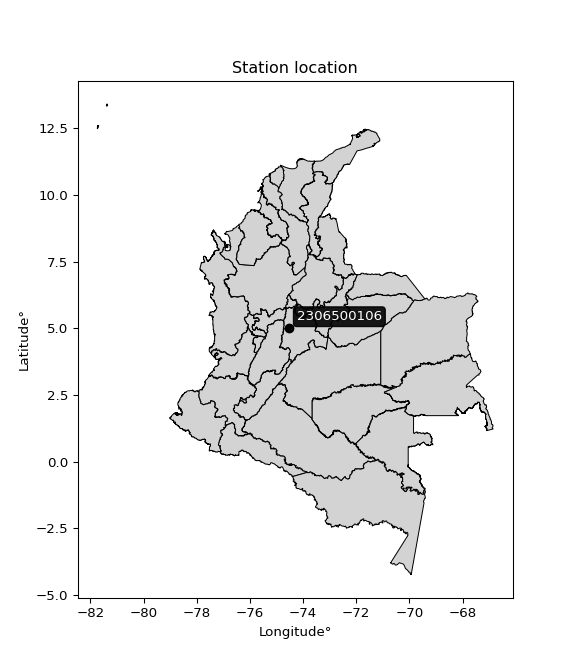

<div align="center">


</div>

# Station (rain, Pmax24h): 2306500106

Probable Maximum Precipitation (PMP) is the greatest amount of rainfall for a specific duration that is meteorologically possible for a given location, acting as a "worst-case" scenario for extreme storms, crucial for designing safety-critical infrastructure like bridges, river deviations, dams, spillways, and nuclear plants to prevent catastrophic failure. PMP is calculated by hydrologists using meteorological data to determine the upper limit of extreme rainfall, often leading to the Probable Maximum Flood (PMF) for flood control design, and is increasingly being studied for climate change impacts.

<div align="center">

</img>

</div>


## A. General information


### 1. General running parameters

• app_version: _v20251226_. • runtime: _2025-12-26 15:38:16.554582_. • Python version: _3.14.0_. • SciPy version: _1.16.3_. • Pandas version: _2.3.3_. • NumPy version: _2.3.5_. • Stations dataset (station_dataset_file): _dataset/pmax24h_in/automatic_colombia_2003_2024.csv_. • Stations catalog (station_catalog_file): _dataset/CNE_IDEAM.xls_. • Minimum year to eval til year_max (date_min): _2003_. • Maximum year to eval since year_min (date_max): _2024_. • Creates, save and include plots into reports (create_plot): _False_. • Plot only fit distributions with Δo > Δ (plot_only_fit): _True_. • Eval low extreme values, if False, evaluates high extreme values (low_extreme): _False_. • Eval every SciPy distribution as logarithmic (pdist_logarithmic_on): _True_. • Standard deviation normalized (ddof): _1.0_. • Return periods to eval in years (Tr): _[2, 2.33, 5, 10, 15, 20, 25, 50, 75, 100, 200, 250, 500, 750, 1000]_. • Minimum data sample per station, 0 means any (minimum_sample): _5_. • Z-Score threshold to adjust a value, 0 means disable (zscore): _3.5_. • Avoid zeros, e.g. rain = 0 (avoid_zeros): _True_. • Avoid null values (avoid_nans): _True_. [:file_folder:Dataset file.](../../dataset/pmax24h_in/automatic_colombia_2003_2024.csv)


### 2. Station info and location

|   id |     CODIGO | NOMBRE                          | CATEGORIA               | TECNOLOGIA                | ESTADO           | FECHA_INSTALACION   |   FECHA_SUSPENSION |   ALTITUD |   LATITUD |   LONGITUD | DEPARTAMENTO   | MUNICIPIO   | AREA_OPERATIVA                            | ENTIDAD                                                     | AREA_HIDROGRAFICA   | ZONA_HIDROGRAFICA   | SUBZONA_HIDROGRAFICA   |   CORRIENTE | OBSERVACION                                                                                                                                                                                                                                                                                                                                                                                                                                                                                                                                                                                                                                                                                                                                                                                                                                                                                                        |   SUBRED | Catalogo   |
|-----:|-----------:|:--------------------------------|:------------------------|:--------------------------|:-----------------|:--------------------|-------------------:|----------:|----------:|-----------:|:---------------|:------------|:------------------------------------------|:------------------------------------------------------------|:--------------------|:--------------------|:-----------------------|------------:|:-------------------------------------------------------------------------------------------------------------------------------------------------------------------------------------------------------------------------------------------------------------------------------------------------------------------------------------------------------------------------------------------------------------------------------------------------------------------------------------------------------------------------------------------------------------------------------------------------------------------------------------------------------------------------------------------------------------------------------------------------------------------------------------------------------------------------------------------------------------------------------------------------------------------|---------:|:-----------|
|    0 | 2306500106 | ALTO DEL TRIGO -   [2306500106] | Climatológica Principal | Automática con Telemetría | En Mantenimiento | 26/03/2018          |                nan |      1742 |   5.00217 |   -74.5367 | Cundinamarca   | Guaduas     | Area Operativa 11 - Cundinamarca-Amazonas | INSTITUTO DE HIDROLOGIA METEOROLOGIA Y ESTUDIOS AMBIENTALES | Magdalena Cauca     | Medio Magdalena     | Río Negro              |         nan | Solicitado mediante correo electrónico por Jorge A. González, coordinador área operativa 11|26/04/2022$Migracion$Solicitado mediante correo electrónico por Jorge A. González, coordinador área operativa 11|26/04/2022$Migracion$Solicitado mediante correo electrónico por Jorge A. González, coordinador área operativa 11|26/04/2022$Migracion$Solicitado mediante correo electrónico por Jorge A. González, coordinador área operativa 11|05/12/2022$Migracion$Solicitado mediante correo electrónico por Jorge A. González, coordinador área operativa 11|26/04/2022$Migracion$Solicitado mediante correo electrónico por Jorge A. González, coordinador área operativa 11|26/04/2022$Migracion$Solicitado mediante correo electrónico por Jorge A. González, coordinador área operativa 11|26/04/2022$Migracion$Solicitado mediante correo electrónico por Jorge A. González, coordinador área operativa 11 |      nan | CNE_IDEAM  |

<div align="center">

Map location in: [:earth_americas:Google](http://maps.google.com/maps?q=5.00217,-74.53667) [:earth_americas:OSM](https://www.openstreetmap.org/#map=18/5.00217/-74.53667&layers=P) [:earth_americas:Bing](https://www.bing.com/maps?cp=5.00217~-74.53667&lvl=18) [:earth_americas:Apple](https://maps.apple.com/frame?center=5.00217%2C-74.53667&span=0.003%2C0.006)

</div>


<div align="center">

```geojson
{
  "type": "Feature",
  "geometry": {
    "type": "Point", 
    "coordinates": [-74.53667, 5.00217]
  }, 
  "properties": {
    "Name": "2306500106"
  }
}
```

</div>


### 3. Discrete values table and plot

|               |          0 |          1 |           2 |          3 |           4 |
|:--------------|-----------:|-----------:|------------:|-----------:|------------:|
| Date          | 2019       | 2020       | 2021        | 2022       | 2023        |
| Value         |   86       |   97.4     |   79.6      |   39.2     |   55.1      |
| Value_initial |   86       |   97.4     |   79.6      |   39.2     |   55.1      |
| count         |    5       |    5       |    5        |    5       |    5        |
| mean          |   71.46    |   71.46    |   71.46     |   71.46    |   71.46     |
| std           |   23.764   |   23.764   |   23.764    |   23.764   |   23.764    |
| zscore        |    0.61185 |    1.09157 |    0.342535 |   -1.35752 |   -0.688436 |
> If Z-Score is active, values out of range or outliers are replaced with the station mean value.


### 4. Active continuous probability distributions from SciPy (45 of 104 available)

[scipy.stats](https://docs.scipy.org/doc/scipy/reference/stats.html) is a Python´s powerful submodule within the SciPy library for comprehensive statistical analysis, offering over 130 probability distributions (like Normal, Poisson), functions for descriptive stats (mean, variance), hypothesis testing (t-tests, chi-square), random variable generation, and statistical tests, making it essential for data science, modeling, and research. It provides tools to explore, model, and draw conclusions from data efficiently, working seamlessly with NumPy.

<div align="center">

|   id | p_dist             |   n_parameter | fit_method   | label                                                                       | active   | ref                                                                                                        |
|-----:|:-------------------|--------------:|:-------------|:----------------------------------------------------------------------------|:---------|:-----------------------------------------------------------------------------------------------------------|
|    0 | alpha              |             3 | MLE          | Alpha                                                                       | True     | [:mortar_board:](https://docs.scipy.org/doc/scipy/reference/generated/scipy.stats.alpha.html)              |
|    1 | betaprime          |             4 | MLE          | Beta prime                                                                  | True     | [:mortar_board:](https://docs.scipy.org/doc/scipy/reference/generated/scipy.stats.betaprime.html)          |
|    2 | chi2               |             3 | MLE          | Chi²                                                                        | True     | [:mortar_board:](https://docs.scipy.org/doc/scipy/reference/generated/scipy.stats.chi2.html)               |
|    3 | crystalball        |             4 | MLE          | Crystalball                                                                 | True     | [:mortar_board:](https://docs.scipy.org/doc/scipy/reference/generated/scipy.stats.crystalball.html)        |
|    4 | erlang             |             3 | MLE          | Erlang                                                                      | True     | [:mortar_board:](https://docs.scipy.org/doc/scipy/reference/generated/scipy.stats.erlang.html)             |
|    5 | expon              |             2 | MLE          | Exponential                                                                 | True     | [:mortar_board:](https://docs.scipy.org/doc/scipy/reference/generated/scipy.stats.expon.html)              |
|    6 | exponnorm          |             3 | MLE          | Exponentially modified Normal                                               | True     | [:mortar_board:](https://docs.scipy.org/doc/scipy/reference/generated/scipy.stats.exponnorm.html)          |
|    7 | f                  |             4 | MLE          | F                                                                           | True     | [:mortar_board:](https://docs.scipy.org/doc/scipy/reference/generated/scipy.stats.f.html)                  |
|    8 | fatiguelife        |             3 | MLE          | Fatigue-life (Birnbaum-Saunders)                                            | True     | [:mortar_board:](https://docs.scipy.org/doc/scipy/reference/generated/scipy.stats.fatiguelife.html)        |
|    9 | fisk               |             3 | MLE          | Fisk                                                                        | True     | [:mortar_board:](https://docs.scipy.org/doc/scipy/reference/generated/scipy.stats.fisk.html)               |
|   10 | gamma              |             3 | MLE          | Gamma                                                                       | True     | [:mortar_board:](https://docs.scipy.org/doc/scipy/reference/generated/scipy.stats.gamma.html)              |
|   11 | genexpon           |             5 | MLE          | Generalized exponential                                                     | True     | [:mortar_board:](https://docs.scipy.org/doc/scipy/reference/generated/scipy.stats.genexpon.html)           |
|   12 | genlogistic        |             3 | MLE          | Generalized logistic                                                        | True     | [:mortar_board:](https://docs.scipy.org/doc/scipy/reference/generated/scipy.stats.genlogistic.html)        |
|   13 | gibrat             |             2 | MM           | Gibrat                                                                      | True     | [:mortar_board:](https://docs.scipy.org/doc/scipy/reference/generated/scipy.stats.gibrat.html)             |
|   14 | gompertz           |             3 | MLE          | Gompertz (or truncated Gumbel)                                              | True     | [:mortar_board:](https://docs.scipy.org/doc/scipy/reference/generated/scipy.stats.gompertz.html)           |
|   15 | gumbel_l           |             2 | MM           | Gumbel Left Skew                                                            | True     | [:mortar_board:](https://docs.scipy.org/doc/scipy/reference/generated/scipy.stats.gumbel_l.html)           |
|   16 | gumbel_r           |             2 | MM           | Gumbel Right Skew                                                           | True     | [:mortar_board:](https://docs.scipy.org/doc/scipy/reference/generated/scipy.stats.gumbel_r.html)           |
|   17 | halflogistic       |             2 | MM           | Half-logistic                                                               | True     | [:mortar_board:](https://docs.scipy.org/doc/scipy/reference/generated/scipy.stats.halflogistic.html)       |
|   18 | halfnorm           |             2 | MM           | Half Normal                                                                 | True     | [:mortar_board:](https://docs.scipy.org/doc/scipy/reference/generated/scipy.stats.halfnorm.html)           |
|   19 | hypsecant          |             2 | MM           | hyperbolic secant                                                           | True     | [:mortar_board:](https://docs.scipy.org/doc/scipy/reference/generated/scipy.stats.hypsecant.html)          |
|   20 | invgamma           |             3 | MLE          | Inverted gamma                                                              | True     | [:mortar_board:](https://docs.scipy.org/doc/scipy/reference/generated/scipy.stats.invgamma.html)           |
|   21 | invgauss           |             3 | MLE          | Inverse Gaussian                                                            | True     | [:mortar_board:](https://docs.scipy.org/doc/scipy/reference/generated/scipy.stats.invgauss.html)           |
|   22 | invweibull         |             3 | MLE          | Inverted Weibull                                                            | True     | [:mortar_board:](https://docs.scipy.org/doc/scipy/reference/generated/scipy.stats.invweibull.html)         |
|   23 | johnsonsu          |             4 | MLE          | Johnson Su                                                                  | True     | [:mortar_board:](https://docs.scipy.org/doc/scipy/reference/generated/scipy.stats.johnsonsu.html)          |
|   24 | kstwobign          |             2 | MLE          | Limiting distribution of scaled Kolmogorov-Smirnov two-sided test statistic | True     | [:mortar_board:](https://docs.scipy.org/doc/scipy/reference/generated/scipy.stats.kstwobign.html)          |
|   25 | laplace            |             2 | MM           | Laplace                                                                     | True     | [:mortar_board:](https://docs.scipy.org/doc/scipy/reference/generated/scipy.stats.laplace.html)            |
|   26 | laplace_asymmetric |             3 | MLE          | Asymmetric Laplace                                                          | True     | [:mortar_board:](https://docs.scipy.org/doc/scipy/reference/generated/scipy.stats.laplace_asymmetric.html) |
|   27 | loggamma           |             3 | MLE          | Log gamma                                                                   | True     | [:mortar_board:](https://docs.scipy.org/doc/scipy/reference/generated/scipy.stats.loggamma.html)           |
|   28 | logistic           |             2 | MM           | Logistic (or Sech-squared)                                                  | True     | [:mortar_board:](https://docs.scipy.org/doc/scipy/reference/generated/scipy.stats.logistic.html)           |
|   29 | lognorm            |             3 | MLE          | Log Normal                                                                  | True     | [:mortar_board:](https://docs.scipy.org/doc/scipy/reference/generated/scipy.stats.lognorm.html)            |
|   30 | maxwell            |             2 | MM           | Maxwell                                                                     | True     | [:mortar_board:](https://docs.scipy.org/doc/scipy/reference/generated/scipy.stats.maxwell.html)            |
|   31 | mielke             |             4 | MLE          | Mielke Beta-Kappa / Dagum                                                   | True     | [:mortar_board:](https://docs.scipy.org/doc/scipy/reference/generated/scipy.stats.mielke.html)             |
|   32 | moyal              |             2 | MM           | Moyal                                                                       | True     | [:mortar_board:](https://docs.scipy.org/doc/scipy/reference/generated/scipy.stats.moyal.html)              |
|   33 | nakagami           |             3 | MLE          | Nakagami                                                                    | True     | [:mortar_board:](https://docs.scipy.org/doc/scipy/reference/generated/scipy.stats.nakagami.html)           |
|   34 | ncf                |             5 | MLE          | Non-central F distribution                                                  | True     | [:mortar_board:](https://docs.scipy.org/doc/scipy/reference/generated/scipy.stats.ncf.html)                |
|   35 | nct                |             4 | MLE          | Non-central Student’s t                                                     | True     | [:mortar_board:](https://docs.scipy.org/doc/scipy/reference/generated/scipy.stats.nct.html)                |
|   36 | norm               |             2 | MM           | Normal                                                                      | True     | [:mortar_board:](https://docs.scipy.org/doc/scipy/reference/generated/scipy.stats.norm.html)               |
|   37 | pareto             |             3 | MLE          | Pareto                                                                      | True     | [:mortar_board:](https://docs.scipy.org/doc/scipy/reference/generated/scipy.stats.pareto.html)             |
|   38 | pearson3           |             3 | MM           | Pearson type III                                                            | True     | [:mortar_board:](https://docs.scipy.org/doc/scipy/reference/generated/scipy.stats.pearson3.html)           |
|   39 | rayleigh           |             2 | MM           | Rayleigh                                                                    | True     | [:mortar_board:](https://docs.scipy.org/doc/scipy/reference/generated/scipy.stats.rayleigh.html)           |
|   40 | rice               |             3 | MLE          | Rice                                                                        | True     | [:mortar_board:](https://docs.scipy.org/doc/scipy/reference/generated/scipy.stats.rice.html)               |
|   41 | t                  |             3 | MLE          | Student’s t                                                                 | True     | [:mortar_board:](https://docs.scipy.org/doc/scipy/reference/generated/scipy.stats.t.html)                  |
|   42 | truncnorm          |             4 | MLE          | Truncated normal                                                            | True     | [:mortar_board:](https://docs.scipy.org/doc/scipy/reference/generated/scipy.stats.truncnorm.html)          |
|   43 | wald               |             2 | MM           | Wald                                                                        | True     | [:mortar_board:](https://docs.scipy.org/doc/scipy/reference/generated/scipy.stats.wald.html)               |
|   44 | weibull_min        |             3 | MLE          | Weibull minimum                                                             | True     | [:mortar_board:](https://docs.scipy.org/doc/scipy/reference/generated/scipy.stats.weibull_min.html)        |

</div>

> **n_parameter:** # arguments & localization & scale.
>
> **Fit methods:** (MLE) maximum likelihood, (MM) L-moments.
>
>**Inactive:** foldnorm, gennorm, norminvgauss, powernorm, powerlognorm, skewnorm, genextreme, anglit, arcsine, argus, beta, bradford, burr, burr12, cauchy, cosine, halfcauchy, foldcauchy, skewcauchy, wrapcauchy, dgamma, gengamma, exponweib, exponpow, truncexpon, gausshyper, genhalflogistic, genhyperbolic, geninvgauss, halfgennorm, johnsonsb, kappa4, kappa3, ksone, kstwo, loglaplace, levy, levy_l, levy_stable, ncx2, genpareto, truncpareto, lomax, powerlaw, rdist, rel_breitwigner, recipinvgauss, semicircular, studentized_range, trapezoid, triang, truncweibull_min, tukeylambda, uniform, loguniform, vonmises, vonmises_line, weibull_max, dweibull, 


## B. Probability distributions vs. Empirical distributions

A continuous probability distribution (CPD) describes probabilities for variables that can take any value within a range (like rain any time), unlike discrete variables with specific outcomes (like temperature). It uses a Probability Density Function (PDF), a curve where the total area under it equals 1, and the probability of the variable falling within an interval (a to b) is found by calculating the area under the curve between those points. A key feature is that the probability of hitting any single exact value is zero, so probabilities are always expressed for ranges, e.g., $P(a ≤ X ≤ b)$.

<div align="center">

Distributions parameters
|    |    station | p_dist                |   n |             loc |           scale | shape                  | shape1                 | shape2                 | shape3   |
|---:|-----------:|:----------------------|----:|----------------:|----------------:|:-----------------------|:-----------------------|:-----------------------|:---------|
|  0 | 2306500106 | alpha                 |   5 |  -202.174       |  3354.72        | 12.340068651541696     |                        |                        |          |
|  1 | 2306500106 | betaprime             |   5 |   -54.8242      |  7606.71        | 32.64990076216503      | 1967.088890220737      |                        |          |
|  2 | 2306500106 | chi2                  |   5 |    39.2         |    23.9233      | 0.823315526805748      |                        |                        |          |
|  3 | 2306500106 | crystalball           |   5 |    71.46        |    21.2552      | 2747.6791219669094     | 15256.865204227775     |                        |          |
|  4 | 2306500106 | erlang                |   5 |  -280.156       |     1.31374     | 267.5224812673273      |                        |                        |          |
|  5 | 2306500106 | expon                 |   5 |    39.2         |    32.26        |                        |                        |                        |          |
|  6 | 2306500106 | exponnorm             |   5 |    71.4414      |    21.2552      | 0.0008811411980594866  |                        |                        |          |
|  7 | 2306500106 | f                     |   5 | -3553.91        |  3625.39        | 62792.67357790703      | 764618.8145610169      |                        |          |
|  8 | 2306500106 | fatiguelife           |   5 |    39.2         |     0.000967187 | 134.99893852319443     |                        |                        |          |
|  9 | 2306500106 | fisk                  |   5 |    -1.66344e+08 |     1.66344e+08 | 12743969.665963616     |                        |                        |          |
| 10 | 2306500106 | gamma                 |   5 |  -273.244       |     1.35245     | 254.78565136245817     |                        |                        |          |
| 11 | 2306500106 | genexpon              |   5 |    39.1999      |     1.47267     | 0.045634499847869166   | 1.9404630351567987e-05 | 1.5936388921145994     |          |
| 12 | 2306500106 | genlogistic           |   5 |    97.4001      |     5.76609e-06 | 2.2198202240323327e-07 |                        |                        |          |
| 13 | 2306500106 | gibrat                |   5 |    55.245       |     9.83492     |                        |                        |                        |          |
| 14 | 2306500106 | gompertz              |   5 |    46.2356      |     2.16895     | 2.2509924284249627e-10 |                        |                        |          |
| 15 | 2306500106 | gumbel_l              |   5 |    81.026       |    16.5726      |                        |                        |                        |          |
| 16 | 2306500106 | gumbel_r              |   5 |    61.894       |    16.5726      |                        |                        |                        |          |
| 17 | 2306500106 | halflogistic          |   5 |    46.2677      |    18.1724      |                        |                        |                        |          |
| 18 | 2306500106 | halfnorm              |   5 |    43.3265      |    35.2601      |                        |                        |                        |          |
| 19 | 2306500106 | hypsecant             |   5 |    71.46        |    13.5315      |                        |                        |                        |          |
| 20 | 2306500106 | invgamma              |   5 |  -215.266       | 47665.3         | 167.1190269891232      |                        |                        |          |
| 21 | 2306500106 | invgauss              |   5 |   -54.4058      |  3932.3         | 0.03190033707470774    |                        |                        |          |
| 22 | 2306500106 | invweibull            |   5 |    39.2         |     1.54252     | 0.04510987939743007    |                        |                        |          |
| 23 | 2306500106 | johnsonsu             |   5 |   107.388       |     0.451101    | 7.15811483794665       | 1.4717951327814434     |                        |          |
| 24 | 2306500106 | kstwobign             |   5 |    -9.2625      |    91.9069      |                        |                        |                        |          |
| 25 | 2306500106 | laplace               |   5 |    71.46        |    15.0297      |                        |                        |                        |          |
| 26 | 2306500106 | laplace_asymmetric    |   5 |    86           |    13.9635      | 1.648059154381743      |                        |                        |          |
| 27 | 2306500106 | loggamma              |   5 |    97.4001      |     1.75396e-06 | 6.747281266605604e-08  |                        |                        |          |
| 28 | 2306500106 | logistic              |   5 |    71.46        |    11.7186      |                        |                        |                        |          |
| 29 | 2306500106 | lognorm               |   5 |    39.2         |     0.0262366   | 14.475432364344648     |                        |                        |          |
| 30 | 2306500106 | maxwell               |   5 |    21.0942      |    31.5621      |                        |                        |                        |          |
| 31 | 2306500106 | mielke                |   5 |   -16.4514      |   114.179       | 3.4010381314440217     | 1574.7671689156632     |                        |          |
| 32 | 2306500106 | moyal                 |   5 |    59.3049      |     9.56819     |                        |                        |                        |          |
| 33 | 2306500106 | nakagami              |   5 |    55.1         |    25.0276      | 0.3475900590776534     |                        |                        |          |
| 34 | 2306500106 | ncf                   |   5 |    -0.0105799   |     3.63409e-06 | 4.255135692480019e-07  | 2.6407748204826333     | 7.33748151239588       |          |
| 35 | 2306500106 | nct                   |   5 |  -876.329       |    21.2063      | 202616.4743429497      | 44.69331877774512      |                        |          |
| 36 | 2306500106 | norm                  |   5 |    71.46        |    21.2552      |                        |                        |                        |          |
| 37 | 2306500106 | pareto                |   5 |    38.8872      |     0.312842    | 0.26229694983538127    |                        |                        |          |
| 38 | 2306500106 | pearson3              |   5 |    71.46        |    21.2552      | -0.35165336074994735   |                        |                        |          |
| 39 | 2306500106 | rayleigh              |   5 |    30.7976      |    32.4439      |                        |                        |                        |          |
| 40 | 2306500106 | rice                  |   5 |    26.8299      |    24.5268      | 1.436017088029191      |                        |                        |          |
| 41 | 2306500106 | t                     |   5 |    71.4594      |    21.2546      | 70120743.66176006      |                        |                        |          |
| 42 | 2306500106 | truncnorm             |   5 |    66.7772      |    19.6801      | -1.405695392299442     | 1.5683796246020947     |                        |          |
| 43 | 2306500106 | wald                  |   5 |    50.2048      |    21.2552      |                        |                        |                        |          |
| 44 | 2306500106 | weibull_min           |   5 |    -7.62923e+08 |     7.62923e+08 | 44718878.19103072      |                        |                        |          |
| 45 | 2306500106 | logalpha              |   5 |    -6.76731     |   349.96        | 31.887962842347555     |                        |                        |          |
| 46 | 2306500106 | logbetaprime          |   5 |   -12.2604      |    17.3579      | 4615.629786217045      | 4862.960863914421      |                        |          |
| 47 | 2306500106 | logchi2               |   5 |     3.66868     |     1.01007     | 1.0070436773232654     |                        |                        |          |
| 48 | 2306500106 | logcrystalball        |   5 |     4.2176      |     0.333681    | 96.30508514385475      | 485.20471782303747     |                        |          |
| 49 | 2306500106 | logerlang             |   5 |    -1.23606     |     0.0213609   | 255.12927473893797     |                        |                        |          |
| 50 | 2306500106 | logexpon              |   5 |     3.66868     |     0.548926    |                        |                        |                        |          |
| 51 | 2306500106 | logexponnorm          |   5 |     4.21732     |     0.333681    | 0.000851785259652548   |                        |                        |          |
| 52 | 2306500106 | logf                  |   5 |  -314.792       |   319.009       | 7288522.939822044      | 2428099.212136261      |                        |          |
| 53 | 2306500106 | logfatiguelife        |   5 |  -105.351       |   109.569       | 0.0030313963031553277  |                        |                        |          |
| 54 | 2306500106 | logfisk               |   5 |    -4.38646e+07 |     4.38646e+07 | 218055613.2815643      |                        |                        |          |
| 55 | 2306500106 | loggamma              |   5 |    -1.0597      |     0.0222411   | 237.08517091075936     |                        |                        |          |
| 56 | 2306500106 | loggenexpon           |   5 |     3.66868     |     0.747764    | 0.8402152734687257     | 1.3865895609503245     | 0.991567946823604      |          |
| 57 | 2306500106 | loggenlogistic        |   5 |     4.57885     |     1.0367e-06  | 2.8481438861122184e-06 |                        |                        |          |
| 58 | 2306500106 | loggibrat             |   5 |     3.96308     |     0.154376    |                        |                        |                        |          |
| 59 | 2306500106 | loggompertz           |   5 |     3.66868     |     0.86485     | 1.0495939713892581     |                        |                        |          |
| 60 | 2306500106 | loggumbel_l           |   5 |     4.36778     |     0.26017     |                        |                        |                        |          |
| 61 | 2306500106 | loggumbel_r           |   5 |     4.06743     |     0.26017     |                        |                        |                        |          |
| 62 | 2306500106 | loghalflogistic       |   5 |     3.82208     |     0.285307    |                        |                        |                        |          |
| 63 | 2306500106 | loghalfnorm           |   5 |     3.77592     |     0.553569    |                        |                        |                        |          |
| 64 | 2306500106 | loghypsecant          |   5 |     4.2176      |     0.212428    |                        |                        |                        |          |
| 65 | 2306500106 | loginvgamma           |   5 |    -5.7005      |  8529.72        | 860.9461188415748      |                        |                        |          |
| 66 | 2306500106 | loginvgauss           |   5 |     1.11346     |   237.311       | 0.013059145698701743   |                        |                        |          |
| 67 | 2306500106 | loginvweibull         |   5 |    -1.99719e+07 |     1.99719e+07 | 59149357.04313758      |                        |                        |          |
| 68 | 2306500106 | logjohnsonsu          |   5 |     4.57883     |     5.05755e-16 | 2.579640449757341      | 0.115263182825595      |                        |          |
| 69 | 2306500106 | logkstwobign          |   5 |     2.87665     |     1.52702     |                        |                        |                        |          |
| 70 | 2306500106 | loglaplace            |   5 |     4.2176      |     0.235948    |                        |                        |                        |          |
| 71 | 2306500106 | loglaplace_asymmetric |   5 |     4.45435     |     0.190161    | 1.800280763741533      |                        |                        |          |
| 72 | 2306500106 | logloggamma           |   5 |     4.57884     |     1.02341e-06 | 2.8199475612218133e-06 |                        |                        |          |
| 73 | 2306500106 | loglogistic           |   5 |     4.2176      |     0.183968    |                        |                        |                        |          |
| 74 | 2306500106 | loglognorm            |   5 |     3.66868     |     0.000598176 | 13.9685539574128       |                        |                        |          |
| 75 | 2306500106 | logmaxwell            |   5 |     3.42692     |     0.495488    |                        |                        |                        |          |
| 76 | 2306500106 | logmielke             |   5 |    -1.07734e+08 |     1.07734e+08 | 278826750.56265616     | 8095886049.544191      |                        |          |
| 77 | 2306500106 | logmoyal              |   5 |     4.02678     |     0.150209    |                        |                        |                        |          |
| 78 | 2306500106 | lognakagami           |   5 |     4.00915     |     0.401662    | 0.05211643868884935    |                        |                        |          |
| 79 | 2306500106 | logncf                |   5 |    -4.2802      |     8.49112     | 1275.3467808302314     | 1244.9348182403292     | 2.4793703671605086e-06 |          |
| 80 | 2306500106 | lognct                |   5 |    -0.455063    |     0.0840593   | 97.96726950163776      | 55.13573762555441      |                        |          |
| 81 | 2306500106 | lognorm               |   5 |     4.2176      |     0.333681    |                        |                        |                        |          |
| 82 | 2306500106 | logpareto             |   5 |     3.66322     |     0.00545259  | 0.2614313035393644     |                        |                        |          |
| 83 | 2306500106 | logpearson3           |   5 |     4.2176      |     0.333681    | -0.5921902783643248    |                        |                        |          |
| 84 | 2306500106 | lograyleigh           |   5 |     3.57925     |     0.50933     |                        |                        |                        |          |
| 85 | 2306500106 | logrice               |   5 |     3.45864     |     0.373168    | 1.7134992938893272     |                        |                        |          |
| 86 | 2306500106 | logt                  |   5 |     4.21764     |     0.333666    | 5926213.076970807      |                        |                        |          |
| 87 | 2306500106 | logtruncnorm          |   5 |    -0.0847349   |     1.06963     | 4.171288639958549      | 4.359969884497028      |                        |          |
| 88 | 2306500106 | logwald               |   5 |     3.88395     |     0.333656    |                        |                        |                        |          |
| 89 | 2306500106 | logweibull_min        |   5 |    -8.2767e+06  |     8.2767e+06  | 32934191.397589624     |                        |                        |          |

</div>

> **loc** (Location parameter): This shifts the distribution along the x-axis. For many common distributions, like the normal (Gaussian) distribution, loc represents the mean $μ$. For others, like the uniform distribution, it might represent the minimum value, or for the beta distribution, the left end of the support interval.
>
> **scale** (Scale parameter): This determines the width or spread of the distribution. For the normal distribution, scale represents the standard deviation $σ$. For a uniform distribution, it defines the length of the interval (from $loc$ to $loc + scale$).
>
> **shape** (Shape parameters): Refers to parameters that define the specific form of a probability distribution, distinct from its location (loc) and scale (scale). These parameters are required arguments for most distribution functions. For example, a normal (Gaussian) distribution is fully defined by its location (mean) and scale (standard deviation), so it has no specific shape parameters beyond loc and scale. However, other distributions have intrinsic properties that need specification, as Gamma distribution that takes a shape parameter, often named $a$ or $alpha$.


### 0. Cumulative distribution values - CDF (90 evaluated)

> Ordered by x ascending and calculating $log(f(x))$ separately. 

|   id |    Station |   date |    x |   count |   mean |    std |    zscore |   Value_initial |    station |   m |     alpha |   alpha_pdf |   betaprime |   betaprime_pdf |        chi2 |    chi2_pdf |   crystalball |   crystalball_pdf |    erlang |   erlang_pdf |    expon |   expon_pdf |   exponnorm |   exponnorm_pdf |         f |      f_pdf |   fatiguelife |   fatiguelife_pdf |      fisk |   fisk_pdf |     gamma |   gamma_pdf |    genexpon |   genexpon_pdf |   genlogistic |   genlogistic_pdf |   gibrat |   gibrat_pdf |    gompertz |   gompertz_pdf |   gumbel_l |   gumbel_l_pdf |   gumbel_r |   gumbel_r_pdf |   halflogistic |   halflogistic_pdf |   halfnorm |   halfnorm_pdf |   hypsecant |   hypsecant_pdf |   invgamma |   invgamma_pdf |   invgauss |   invgauss_pdf |   invweibull |   invweibull_pdf |   johnsonsu |   johnsonsu_pdf |   kstwobign |   kstwobign_pdf |   laplace |   laplace_pdf |   laplace_asymmetric |   laplace_asymmetric_pdf |   loggamma |   loggamma_pdf |   logistic |   logistic_pdf |   lognorm |   lognorm_pdf |   maxwell |   maxwell_pdf |    mielke |   mielke_pdf |      moyal |   moyal_pdf |    nakagami |   nakagami_pdf |      ncf |    ncf_pdf |       nct |    nct_pdf |     norm |   norm_pdf |      pareto |   pareto_pdf |   pearson3 |   pearson3_pdf |   rayleigh |   rayleigh_pdf |      rice |   rice_pdf |         t |      t_pdf |   truncnorm |   truncnorm_pdf |      wald |   wald_pdf |   weibull_min |   weibull_min_pdf |   logalpha |   logalpha_pdf |   logbetaprime |   logbetaprime_pdf |     logchi2 |   logchi2_pdf |   logcrystalball |   logcrystalball_pdf |   logerlang |   logerlang_pdf |   logexpon |   logexpon_pdf |   logexponnorm |   logexponnorm_pdf |      logf |   logf_pdf |   logfatiguelife |   logfatiguelife_pdf |   logfisk |   logfisk_pdf |   loggenexpon |   loggenexpon_pdf |   loggenlogistic |   loggenlogistic_pdf |   loggibrat |   loggibrat_pdf |   loggompertz |   loggompertz_pdf |   loggumbel_l |   loggumbel_l_pdf |   loggumbel_r |   loggumbel_r_pdf |   loghalflogistic |   loghalflogistic_pdf |   loghalfnorm |   loghalfnorm_pdf |   loghypsecant |   loghypsecant_pdf |   loginvgamma |   loginvgamma_pdf |   loginvgauss |   loginvgauss_pdf |   loginvweibull |   loginvweibull_pdf |   logjohnsonsu |   logjohnsonsu_pdf |   logkstwobign |   logkstwobign_pdf |   loglaplace |   loglaplace_pdf |   loglaplace_asymmetric |   loglaplace_asymmetric_pdf |   logloggamma |   logloggamma_pdf |   loglogistic |   loglogistic_pdf |   loglognorm |   loglognorm_pdf |   logmaxwell |   logmaxwell_pdf |   logmielke |   logmielke_pdf |    logmoyal |   logmoyal_pdf |   lognakagami |   lognakagami_pdf |   logncf |   logncf_pdf |    lognct |   lognct_pdf |   logpareto |   logpareto_pdf |   logpearson3 |   logpearson3_pdf |   lograyleigh |   lograyleigh_pdf |   logrice |   logrice_pdf |      logt |   logt_pdf |   logtruncnorm |   logtruncnorm_pdf |   logwald |   logwald_pdf |   logweibull_min |   logweibull_min_pdf |
|-----:|-----------:|-------:|-----:|--------:|-------:|-------:|----------:|----------------:|-----------:|----:|----------:|------------:|------------:|----------------:|------------:|------------:|--------------:|------------------:|----------:|-------------:|---------:|------------:|------------:|----------------:|----------:|-----------:|--------------:|------------------:|----------:|-----------:|----------:|------------:|------------:|---------------:|--------------:|------------------:|---------:|-------------:|------------:|---------------:|-----------:|---------------:|-----------:|---------------:|---------------:|-------------------:|-----------:|---------------:|------------:|----------------:|-----------:|---------------:|-----------:|---------------:|-------------:|-----------------:|------------:|----------------:|------------:|----------------:|----------:|--------------:|---------------------:|-------------------------:|-----------:|---------------:|-----------:|---------------:|----------:|--------------:|----------:|--------------:|----------:|-------------:|-----------:|------------:|------------:|---------------:|---------:|-----------:|----------:|-----------:|---------:|-----------:|------------:|-------------:|-----------:|---------------:|-----------:|---------------:|----------:|-----------:|----------:|-----------:|------------:|----------------:|----------:|-----------:|--------------:|------------------:|-----------:|---------------:|---------------:|-------------------:|------------:|--------------:|-----------------:|---------------------:|------------:|----------------:|-----------:|---------------:|---------------:|-------------------:|----------:|-----------:|-----------------:|---------------------:|----------:|--------------:|--------------:|------------------:|-----------------:|---------------------:|------------:|----------------:|--------------:|------------------:|--------------:|------------------:|--------------:|------------------:|------------------:|----------------------:|--------------:|------------------:|---------------:|-------------------:|--------------:|------------------:|--------------:|------------------:|----------------:|--------------------:|---------------:|-------------------:|---------------:|-------------------:|-------------:|-----------------:|------------------------:|----------------------------:|--------------:|------------------:|--------------:|------------------:|-------------:|-----------------:|-------------:|-----------------:|------------:|----------------:|------------:|---------------:|--------------:|------------------:|---------:|-------------:|----------:|-------------:|------------:|----------------:|--------------:|------------------:|--------------:|------------------:|----------:|--------------:|----------:|-----------:|---------------:|-------------------:|----------:|--------------:|-----------------:|---------------------:|
|    0 | 2306500106 |   2022 | 39.2 |       5 |  71.46 | 23.764 | -1.35752  |            39.2 | 2306500106 |   1 | 0.0595704 |  0.00682068 |   0.0622493 |      0.00672661 | 3.43875e-07 | 1.99227e+07 |      0.064539 |        0.00593245 | 0.0640848 |   0.00622187 | 0        |  0.0309981  |   0.0645387 |      0.00593242 | 0.0642774 | 0.00594374 |     0.0542711 |       4.28638e+06 | 0.0704431 | 0.00501663 | 0.0646675 |  0.00624567 | 2.24333e-06 |     0.0309875  |      0        |        0.00409606 | 0        |   0          | 0           |    0           |   0.077026 |     0.00446401 |  0.0195872 |     0.00464828 |       0        |         0          |   0        |     0          |   0.0585147 |      0.00430003 |  0.0631384 |     0.0065429  |  0.0590351 |     0.00714051 |    0.0118756 |      3.34242e+11 |    0.106011 |      0.00395201 |   0.0562399 |      0.00913777 |  0.058451 |    0.00388904 |            0.0956422 |               0.00415607 |  0.0518804 |       0.333597 |  0.0599236 |     0.00480713 | 0.0499784 |      0.308978 | 0.0455309 |    0.007057   | 0.0867971 |   0.00530445 | 0.00424439 |  0.00199949 | 0           |     0          | 0.337214 | 0.0070565  | 0.0645854 | 0.00593676 | 0.064539 | 0.00593245 | 1.11022e-16 |   0.838432   |  0.0724264 |     0.00554218 |  0.0329798 |     0.0077192  | 0.0453849 | 0.00733257 | 0.0645374 | 0.00593248 | 0.000764433 |      0.00881343 | 0         | 0          |     0.0798802 |         0.00449   |  0.0498806 |       0.330775 |      0.0505471 |           0.317695 | 1.47332e-08 |   1.67049e+07 |        0.0499783 |             0.308978 |   0.0512279 |        0.330673 |   0        |       1.82174  |      0.0499784 |           0.308978 | 0.0502126 |   0.31019  |        0.0486447 |             0.305306 | 0.0521262 |      0.245617 |   2.16313e-09 |          1.12364  |         0        |             0.225392 |    0        |        0        |   2.02198e-09 |          1.21361  |     0.0658131 |          0.244449 |    0.00975013 |          0.173532 |          0        |              0        |      0        |          0        |      0.0479529 |           0.224885 |     0.0478965 |          0.317974 |     0.0508087 |          0.360026 |       0.0485396 |            0.434918 |      0.0606876 |        0.0152211   |      0.0492709 |           0.508349 |    0.0488199 |         0.20691  |                0.077004 |                    0.224932 |     0.0814392 |          0.224401 |     0.0481625 |          0.249189 |    0.0227819 |      8.71387e+12 |    0.0287777 |         0.340335 |   0.0897208 |        0.232207 | 0.000988636 |      0.0385595 |     0         |       0           | 0.120752 |     0.448521 | 0.0460315 |     0.339885 | 1.11022e-16 |      47.9462    |     0.0629544 |          0.285038 |     0.0152949 |          0.339442 | 0.0377173 |      0.369652 | 0.0499606 |   0.308904 |    0           |            0       |  0        |      0        |        0.0592824 |             0.228759 |
|    1 | 2306500106 |   2023 | 55.1 |       5 |  71.46 | 23.764 | -0.688436 |            55.1 | 2306500106 |   2 | 0.242139  |  0.0158323  |   0.238779  |      0.0152768  | 0.653401    | 0.0133072   |      0.22074  |        0.0139573  | 0.228039  |   0.0145124  | 0.38913  |  0.0189358  |   0.220739  |      0.0139572  | 0.220896  | 0.0139893  |     0.828868  |       0.0075905   | 0.203953  | 0.0124385  | 0.228602  |  0.0144756  | 0.389149    |     0.0189369  |      0        |        0.00755447 | 0        |   0          | 1.31812e-08 |    6.18102e-09 |   0.18878  |     0.010241   |  0.221629  |     0.0201501  |       0.238341 |         0.0259512  |   0.261548 |     0.0214016  |   0.184662  |      0.0128942  |  0.234781  |     0.0149487  |  0.249647  |     0.0163394  |    0.406524  |      0.00103814  |    0.195647 |      0.00777597 |   0.289266  |      0.0181174  |  0.168358 |    0.0112017  |            0.19086   |               0.00829368 |  0.28016   |       1.00939  |  0.19844   |     0.0135734  | 0.266081  |      0.983637 | 0.237591  |    0.0164238  | 0.204033  |   0.00969828 | 0.212858   |  0.0239069  | 1.20937e-11 |  1183.23       | 0.437287 | 0.00557376 | 0.220869  | 0.0139621  | 0.22074  | 0.0139573  | 0.644955    |   0.00574404 |  0.213162  |     0.0125632  |  0.244628  |     0.0174399  | 0.231847  | 0.0156246  | 0.220742  | 0.0139577  | 0.228115    |      0.0197278  | 0.0926382 | 0.0469253  |     0.190566  |         0.0100309 |  0.278758  |       1.01221  |      0.270707  |           0.990116 | 0.435566    |   0.575127    |        0.266081  |             0.983637 |   0.278817  |        1.00995  |   0.462192 |       0.979747 |      0.266081  |           0.983637 | 0.26668   |   0.983711 |        0.264508  |             0.987094 | 0.23005   |      0.880517 |   0.397012    |          1.08377  |         0        |             0.574346 |    0.11328  |        4.1684   |   0.397308    |          1.0843   |     0.222734  |          0.752776 |    0.286197   |          1.37623  |          0.316575 |              1.57686  |      0.326483 |          1.31893  |      0.228304  |           0.984933 |     0.272632  |          1.01078  |     0.295248  |          1.04542  |       0.331638  |            1.08406  |      0.0674544 |        0.0264015   |      0.358749  |           1.10426  |    0.206673  |         0.875926 |                0.208178 |                    0.608099 |     0.208098  |          0.573403 |     0.24359   |          1.00156  |    0.67515   |      0.075663    |    0.289954  |         1.11481  |   0.216564  |        0.560491 | 0.288939    |      1.60513   |     0.0261626 |       3.07033e+12 | 0.334696 |     0.77963  | 0.288028  |     1.05926  | 0.66209     |       0.255374  |     0.245932  |          0.841668 |     0.299672  |          1.16056  | 0.280497  |      1.03097  | 0.26604   |   0.983603 |    0           |            0       |  0.245386 |      3.09222  |        0.210905  |             0.743749 |
|    2 | 2306500106 |   2021 | 79.6 |       5 |  71.46 | 23.764 |  0.342535 |            79.6 | 2306500106 |   3 | 0.667978  |  0.0153392  |   0.661098  |      0.0157299  | 0.846006    | 0.00460718  |      0.649127 |        0.0174421  | 0.656766  |   0.0168477  | 0.714161 |  0.00886049 |   0.649125  |      0.0174421  | 0.649092  | 0.0173911  |     0.934973  |       0.00237652  | 0.626031  | 0.0179361  | 0.655591  |  0.0167873  | 0.714188    |     0.00886039 |      0        |        0.0194012  | 0.817744 |   0.0108584  | 0.00107839  |    0.000496929 |   0.600505 |     0.0221183  |  0.70924   |     0.0147031  |       0.724529 |         0.0130709  |   0.696398 |     0.0133305  |   0.68088   |      0.0198268  |  0.656103  |     0.0159536  |  0.677243  |     0.0150607  |    0.421881  |      0.000406544 |    0.529126 |      0.021071   |   0.692788  |      0.0127851  |  0.70909  |    0.0193557  |            0.553449  |               0.0240498  |  0.689597  |       1.00987  |  0.666994  |     0.0189539  | 0.683581  |      1.06664  | 0.670856  |    0.0155847  | 0.55545   |   0.0196677  | 0.729143   |  0.0135973  | 0.705607    |     0.0155685  | 0.551644 | 0.00388123 | 0.649239  | 0.0174358  | 0.649127 | 0.0174421  | 0.721133    |   0.00179663 |  0.630406  |     0.0185886  |  0.677394  |     0.0149571  | 0.660784  | 0.0162283  | 0.649141  | 0.0174423  | 0.769123    |      0.0190258  | 0.785524  | 0.0109446  |     0.588869  |         0.0214198 |  0.68631   |       0.999204 |      0.683431  |           1.04128  | 0.59504     |   0.333212    |        0.683581  |             1.06664  |   0.689583  |        1.01436  |   0.724841 |       0.501268 |      0.683581  |           1.06664  | 0.68355   |   1.06412  |        0.683776  |             1.06974  | 0.650369  |      1.13037  |   0.715679    |          0.640601 |         0        |             1.57794  |    0.838011 |        0.592565 |   0.735839    |          0.727192 |     0.645179  |          1.4131   |    0.737683   |          0.862641 |          0.749808 |              0.767222 |      0.722458 |          0.799342 |      0.719166  |           1.15706  |     0.686798  |          1.02592  |     0.695072  |          0.940931 |       0.689852  |            0.758556 |      0.0845023 |        0.0884841   |      0.710818  |           0.737455 |    0.74558   |         1.07829  |                0.609686 |                    1.78092  |     0.573432  |          1.58006  |     0.70402   |          1.13267  |    0.69379   |      0.0354637   |    0.701453  |         0.941828 |   0.561133  |        1.45228  | 0.755292    |      0.788523  |     0.871649  |       0.236922    | 0.634391 |     0.770774 | 0.696096  |     0.957667 | 0.720386    |       0.102411  |     0.65624   |          1.21857  |     0.706724  |          0.901884 | 0.689582  |      1.00315  | 0.683553  |   1.06673  |    5.23848e-05 |            7.19217 |  0.806262 |      0.616114 |        0.640778  |             1.46344  |
|    3 | 2306500106 |   2019 | 86   |       5 |  71.46 | 23.764 |  0.61185  |            86   | 2306500106 |   4 | 0.757646  |  0.0126251  |   0.753723  |      0.013132   | 0.872442    | 0.00369632  |      0.753034 |        0.0148536  | 0.756521  |   0.0141872  | 0.765597 |  0.00726606 |   0.753032  |      0.0148536  | 0.752663  | 0.0148029  |     0.948386  |       0.00184147  | 0.732148  | 0.0150242  | 0.755063  |  0.0141604  | 0.765624    |     0.00726585 |      0        |        0.0248218  | 0.872881 |   0.00677224 | 0.0204188   |    0.00931735  |   0.740771 |     0.0211174  |  0.791757  |     0.0111555  |       0.798045 |         0.0099911  |   0.773816 |     0.0108793  |   0.790524  |      0.0143872  |  0.750278  |     0.0133804  |  0.764999  |     0.01232    |    0.424295  |      0.000350623 |    0.676627 |      0.0247107  |   0.767101  |      0.0104563  |  0.809969 |    0.0126437  |            0.730901  |               0.0317608  |  0.762669  |       0.875691 |  0.775697  |     0.0148475  | 0.760991  |      0.929546 | 0.762223  |    0.0129032  | 0.691707  |   0.0229623  | 0.804262   |  0.0100209  | 0.793244    |     0.0119145  | 0.575396 | 0.00354775 | 0.753103  | 0.0148468  | 0.753034 | 0.0148536  | 0.73161     |   0.00149424 |  0.743552  |     0.016497   |  0.764844  |     0.0123324  | 0.756848  | 0.0136828  | 0.753048  | 0.0148535  | 0.877049    |      0.0146001  | 0.843601  | 0.00747424 |     0.725673  |         0.0207981 |  0.758607  |       0.866675 |      0.758971  |           0.90725  | 0.619675    |   0.304617    |        0.760991  |             0.929546 |   0.762967  |        0.879209 |   0.760999 |       0.435398 |      0.760991  |           0.929546 | 0.760781  |   0.927496 |        0.761363  |             0.931039 | 0.732059  |      0.975075 |   0.761805    |          0.553502 |         0        |             1.95146  |    0.876486 |        0.415537 |   0.788576    |          0.636456 |     0.752115  |          1.32893  |    0.79771    |          0.692972 |          0.80337  |              0.621431 |      0.779635 |          0.680166 |      0.798177  |           0.887689 |     0.761006  |          0.888841 |     0.762895  |          0.810721 |       0.744324  |            0.650918 |      0.0934653 |        0.154636    |      0.763892  |           0.635834 |    0.81668   |         0.77695  |                0.764207 |                    2.23229  |     0.709618  |          1.95531  |     0.783618  |          0.921685 |    0.696388  |      0.0318522   |    0.769132  |         0.806637 |   0.68547   |        1.77404  | 0.809606    |      0.621594  |     0.888286  |       0.195684    | 0.691916 |     0.71465  | 0.764955  |     0.820731 | 0.727805    |       0.0899483 |     0.747165  |          1.12022  |     0.771446  |          0.770982 | 0.762277  |      0.872799 | 0.76097   |   0.929632 |    0.479823    |            5.30579 |  0.847586 |      0.461682 |        0.7516    |             1.37659  |
|    4 | 2306500106 |   2020 | 97.4 |       5 |  71.46 | 23.764 |  1.09157  |            97.4 | 2306500106 |   5 | 0.873221  |  0.0077712  |   0.874677  |      0.00815333 | 0.907639    | 0.00256208  |      0.888845 |        0.00891306 | 0.886114  |   0.00855276 | 0.835376 |  0.00510303 |   0.888844  |      0.00891312 | 0.888078  | 0.00889926 |     0.965396  |       0.00119505  | 0.867488  | 0.00880678 | 0.884692  |  0.00858141 | 0.8354      |     0.00510273 |      0.999996 |        0.0384977  | 0.927223 |   0.00328165 | 0.980843    |    0.0349332   |   0.931841 |     0.0110465  |  0.889259  |     0.00629772 |       0.886827 |         0.00587534 |   0.874862 |     0.00698181 |   0.907054  |      0.00677168 |  0.873671  |     0.00831616 |  0.877478  |     0.00754811 |    0.427869  |      0.000281537 |    0.942763 |      0.0168987  |   0.864788  |      0.00682319 |  0.910995 |    0.00592193 |            0.929924  |               0.00827082 |  0.856584  |       0.631776 |  0.901462  |     0.00758011 | 0.860494  |      0.665434 | 0.8806    |    0.00794941 | 0.990261  |   0.0292633  | 0.891349   |  0.00564251 | 0.898292    |     0.00681391 | 0.612853 | 0.00304088 | 0.888849  | 0.008909   | 0.888845 | 0.00891306 | 0.74644     |   0.00113664 |  0.89631   |     0.00996634 |  0.878409  |     0.00769352 | 0.882948  | 0.00844468 | 0.888856  | 0.00891267 | 0.998312    |      0.00701077 | 0.906958  | 0.00405638 |     0.919795  |         0.011862  |  0.851751  |       0.628882 |      0.856357  |           0.654584 | 0.65512     |   0.266246    |        0.860494  |             0.665434 |   0.857193  |        0.633217 |   0.809491 |       0.347058 |      0.860494  |           0.665434 | 0.860102  |   0.664612 |        0.860917  |             0.664941 | 0.835331  |      0.68379  |   0.822767    |          0.429486 |         0.999934 |             2.74714  |    0.916736 |        0.248833 |   0.858707    |          0.491182 |     0.894664  |          0.911208 |    0.869299   |          0.468005 |          0.868316 |              0.431163 |      0.853059 |          0.503442 |      0.885019  |           0.529575 |     0.856195  |          0.63908  |     0.850044  |          0.590492 |       0.815273  |            0.493128 |      0.992377  |        2.36926e+12 |      0.833469  |           0.48542  |    0.891834  |         0.45843  |                0.927434 |                    0.686991 |     0.999966  |          2.75534  |     0.876913  |          0.586716 |    0.700059  |      0.0273459   |    0.855547  |         0.583535 |   0.940114  |        2.02813  | 0.87351     |      0.417501  |     0.909639  |       0.150632    | 0.774073 |     0.601947 | 0.852734  |     0.591177 | 0.738008    |       0.0748065 |     0.869585  |          0.823615 |     0.854234  |          0.561657 | 0.856196  |      0.63423  | 0.860483  |   0.6655   |    1           |            3.21613 |  0.894144 |      0.300255 |        0.898275  |             0.925117 |

An Empirical Distribution Function (EDF) is a step-function estimate of a true cumulative distribution function (CDF) based on observed sample data, representing the proportion of data points less than or equal to a given value. It is calculated by ordering your data and jumping up by $1/n$ (where $n$ is sample size) at each unique data point, allowing analysis without assuming an underlying population distribution, and it gets closer to the true CDF as the sample size grows.


### 1. Empirical - EDF California (1923)

California´s estimates the true probability distribution of water-related data (like rainfall, streamflow) using observed samples, crucial for risk assessment.

<div align="center">


$P=m/n$


</div>


**1.1. Empirical values**

<div align="center">

|                | 0              | 1                  | 2              | 3                 | 4              |
|:---------------|:---------------|:-------------------|:---------------|:------------------|:---------------|
| date           | 2022           | 2023               | 2021           | 2019              | 2020           |
| x              | 39.2           | 55.1               | 79.6           | 86.0              | 97.4           |
| m              | 1              | 2                  | 3              | 4                 | 5              |
| empirical_dist | edf_california | edf_california     | edf_california | edf_california    | edf_california |
| empirical      | 0.2            | 0.4                | 0.6            | 0.8               | 1.0            |
| empirical_tr   | 1.25           | 1.6666666666666667 | 2.5            | 5.000000000000001 | inf            |

</div>


**1.2. Kolmogorov-Smirnov fit test (sorted by Δ)**


<div align="center">

|                | 0                   | 1                   | 2                   | 3                   | 4                  | 5                  | 6                   | 7                  | 8                  | 9                   | 10                 | 11                  | 12                  | 13                  | 14                 | 15                 | 16                 | 17                  | 18                  | 19                 | 20                  | 21                 | 22                  | 23                  | 24                 | 25                  | 26                  | 27                 | 28                  | 29                  | 30                  | 31                  | 32                  | 33                 | 34                 | 35                 | 36                  | 37                  | 38                  | 39                 | 40                  | 41                  | 42                 | 43                  | 44                 | 45                  | 46                    | 47                 | 48                  | 49                  | 50                  | 51                  | 52                 | 53                  | 54                  | 55                  | 56                 | 57                 | 58                 | 59                 | 60                 | 61                 | 62                 | 63                  | 64                 | 65                  | 66                  | 67                  | 68                 | 69                  | 70                  | 71                  | 72                  | 73                 | 74                  | 75                  | 76                  | 77                  | 78                  | 79                 | 80                 | 81                  | 82                 | 83                 | 84                 | 85                 | 86                 | 87                 | 88                 | 89                 |
|:---------------|:--------------------|:--------------------|:--------------------|:--------------------|:-------------------|:-------------------|:--------------------|:-------------------|:-------------------|:--------------------|:-------------------|:--------------------|:--------------------|:--------------------|:-------------------|:-------------------|:-------------------|:--------------------|:--------------------|:-------------------|:--------------------|:-------------------|:--------------------|:--------------------|:-------------------|:--------------------|:--------------------|:-------------------|:--------------------|:--------------------|:--------------------|:--------------------|:--------------------|:-------------------|:-------------------|:-------------------|:--------------------|:--------------------|:--------------------|:-------------------|:--------------------|:--------------------|:-------------------|:--------------------|:-------------------|:--------------------|:----------------------|:-------------------|:--------------------|:--------------------|:--------------------|:--------------------|:-------------------|:--------------------|:--------------------|:--------------------|:-------------------|:-------------------|:-------------------|:-------------------|:-------------------|:-------------------|:-------------------|:--------------------|:-------------------|:--------------------|:--------------------|:--------------------|:-------------------|:--------------------|:--------------------|:--------------------|:--------------------|:-------------------|:--------------------|:--------------------|:--------------------|:--------------------|:--------------------|:-------------------|:-------------------|:--------------------|:-------------------|:-------------------|:-------------------|:-------------------|:-------------------|:-------------------|:-------------------|:-------------------|
| station        | 2306500106          | 2306500106          | 2306500106          | 2306500106          | 2306500106         | 2306500106         | 2306500106          | 2306500106         | 2306500106         | 2306500106          | 2306500106         | 2306500106          | 2306500106          | 2306500106          | 2306500106         | 2306500106         | 2306500106         | 2306500106          | 2306500106          | 2306500106         | 2306500106          | 2306500106         | 2306500106          | 2306500106          | 2306500106         | 2306500106          | 2306500106          | 2306500106         | 2306500106          | 2306500106          | 2306500106          | 2306500106          | 2306500106          | 2306500106         | 2306500106         | 2306500106         | 2306500106          | 2306500106          | 2306500106          | 2306500106         | 2306500106          | 2306500106          | 2306500106         | 2306500106          | 2306500106         | 2306500106          | 2306500106            | 2306500106         | 2306500106          | 2306500106          | 2306500106          | 2306500106          | 2306500106         | 2306500106          | 2306500106          | 2306500106          | 2306500106         | 2306500106         | 2306500106         | 2306500106         | 2306500106         | 2306500106         | 2306500106         | 2306500106          | 2306500106         | 2306500106          | 2306500106          | 2306500106          | 2306500106         | 2306500106          | 2306500106          | 2306500106          | 2306500106          | 2306500106         | 2306500106          | 2306500106          | 2306500106          | 2306500106          | 2306500106          | 2306500106         | 2306500106         | 2306500106          | 2306500106         | 2306500106         | 2306500106         | 2306500106         | 2306500106         | 2306500106         | 2306500106         | 2306500106         |
| empirical_dist | edf_california      | edf_california      | edf_california      | edf_california      | edf_california     | edf_california     | edf_california      | edf_california     | edf_california     | edf_california      | edf_california     | edf_california      | edf_california      | edf_california      | edf_california     | edf_california     | edf_california     | edf_california      | edf_california      | edf_california     | edf_california      | edf_california     | edf_california      | edf_california      | edf_california     | edf_california      | edf_california      | edf_california     | edf_california      | edf_california      | edf_california      | edf_california      | edf_california      | edf_california     | edf_california     | edf_california     | edf_california      | edf_california      | edf_california      | edf_california     | edf_california      | edf_california      | edf_california     | edf_california      | edf_california     | edf_california      | edf_california        | edf_california     | edf_california      | edf_california      | edf_california      | edf_california      | edf_california     | edf_california      | edf_california      | edf_california      | edf_california     | edf_california     | edf_california     | edf_california     | edf_california     | edf_california     | edf_california     | edf_california      | edf_california     | edf_california      | edf_california      | edf_california      | edf_california     | edf_california      | edf_california      | edf_california      | edf_california      | edf_california     | edf_california      | edf_california      | edf_california      | edf_california      | edf_california      | edf_california     | edf_california     | edf_california      | edf_california     | edf_california     | edf_california     | edf_california     | edf_california     | edf_california     | edf_california     | edf_california     |
| p_dist         | kstwobign           | loggamma            | loggamma            | logerlang           | logbetaprime       | logf               | loginvgauss         | lognorm            | lognorm            | logexponnorm        | logcrystalball     | logt                | logalpha            | invgauss            | logfatiguelife     | loginvgamma        | lognct             | logpearson3         | loglogistic         | alpha              | betaprime           | logrice            | maxwell             | invgamma            | logkstwobign       | rayleigh            | rice                | logfisk            | logmaxwell          | gamma               | loghypsecant        | erlang              | loggumbel_l         | f                  | nct                | t                  | norm                | crystalball         | exponnorm           | gumbel_r           | logmielke           | lograyleigh         | loginvweibull      | pearson3            | logweibull_min     | loggumbel_r         | loglaplace_asymmetric | logloggamma        | loglaplace          | moyal               | mielke              | fisk                | logmoyal           | truncnorm           | genexpon            | loggenexpon         | loggompertz        | halfnorm           | halflogistic       | logexpon           | loghalflogistic    | expon              | loghalfnorm        | logistic            | johnsonsu          | logwald             | laplace_asymmetric  | weibull_min         | gumbel_l           | hypsecant           | logncf              | laplace             | chi2                | pareto             | logpareto           | loggibrat           | loglognorm          | wald                | logchi2             | lognakagami        | ncf                | nakagami            | gibrat             | fatiguelife        | invweibull         | logtruncnorm       | logjohnsonsu       | gompertz           | loggenlogistic     | genlogistic        |
| delta          | 0.14376009954679714 | 0.14811963486636628 | 0.14811963486636628 | 0.14877205797752144 | 0.1494528568028241 | 0.1497873798308072 | 0.14995645179068307 | 0.1500215705369229 | 0.1500215705369229 | 0.15002163690659567 | 0.1500217188560743 | 0.15003942002312395 | 0.15011940345487318 | 0.15035323201502881 | 0.1513552812515579 | 0.1521034520686864 | 0.153968540587544  | 0.15406817135036227 | 0.15640957159516772 | 0.1578610892171678 | 0.16122110061160697 | 0.1622827445826945 | 0.16240933485000456 | 0.16521920962463577 | 0.1665312799164388 | 0.16702022441794834 | 0.16815273631010239 | 0.1699498802647652 | 0.17122232196321172 | 0.17139752112526174 | 0.17169567161359436 | 0.17196067781793575 | 0.17726597952567227 | 0.1791039191767956 | 0.1791305998015719 | 0.1792576590694719 | 0.17925957105900536 | 0.17925957265227815 | 0.17926064308064127 | 0.1804128175828821 | 0.18343638176898996 | 0.18470512042531098 | 0.1847272560892893 | 0.18683813658036005 | 0.1890950772918727 | 0.19024986916775707 | 0.1918216089526402    | 0.191901731351219  | 0.19332701781277384 | 0.19575560964019692 | 0.19596654683205753 | 0.19604708736749893 | 0.1990113639221727 | 0.19923556742911336 | 0.19999775666767955 | 0.19999999783686676 | 0.1999999979780185 | 0.2                | 0.2                | 0.2                | 0.2                | 0.2                | 0.2                | 0.20155987204105272 | 0.2043529797963587 | 0.20626196014323306 | 0.20914042858227916 | 0.20943394052360953 | 0.2112199495514322 | 0.21533777850043676 | 0.22592673607693337 | 0.23164159990966932 | 0.25340143151121597 | 0.2535600247449472 | 0.26208961061952885 | 0.28671983384880734 | 0.29994121869383017 | 0.30736182712006915 | 0.34487969332567736 | 0.3738373834357268 | 0.387146732550567  | 0.39999999998790625 | 0.4                | 0.4288677603993283 | 0.5721305624393453 | 0.5999476152093686 | 0.7065347268957942 | 0.7795812431463368 | 0.8                | 0.8                |
| deltao         | 0.5865427407550001  | 0.5865427407550001  | 0.5865427407550001  | 0.5865427407550001  | 0.5865427407550001 | 0.5865427407550001 | 0.5865427407550001  | 0.5865427407550001 | 0.5865427407550001 | 0.5865427407550001  | 0.5865427407550001 | 0.5865427407550001  | 0.5865427407550001  | 0.5865427407550001  | 0.5865427407550001 | 0.5865427407550001 | 0.5865427407550001 | 0.5865427407550001  | 0.5865427407550001  | 0.5865427407550001 | 0.5865427407550001  | 0.5865427407550001 | 0.5865427407550001  | 0.5865427407550001  | 0.5865427407550001 | 0.5865427407550001  | 0.5865427407550001  | 0.5865427407550001 | 0.5865427407550001  | 0.5865427407550001  | 0.5865427407550001  | 0.5865427407550001  | 0.5865427407550001  | 0.5865427407550001 | 0.5865427407550001 | 0.5865427407550001 | 0.5865427407550001  | 0.5865427407550001  | 0.5865427407550001  | 0.5865427407550001 | 0.5865427407550001  | 0.5865427407550001  | 0.5865427407550001 | 0.5865427407550001  | 0.5865427407550001 | 0.5865427407550001  | 0.5865427407550001    | 0.5865427407550001 | 0.5865427407550001  | 0.5865427407550001  | 0.5865427407550001  | 0.5865427407550001  | 0.5865427407550001 | 0.5865427407550001  | 0.5865427407550001  | 0.5865427407550001  | 0.5865427407550001 | 0.5865427407550001 | 0.5865427407550001 | 0.5865427407550001 | 0.5865427407550001 | 0.5865427407550001 | 0.5865427407550001 | 0.5865427407550001  | 0.5865427407550001 | 0.5865427407550001  | 0.5865427407550001  | 0.5865427407550001  | 0.5865427407550001 | 0.5865427407550001  | 0.5865427407550001  | 0.5865427407550001  | 0.5865427407550001  | 0.5865427407550001 | 0.5865427407550001  | 0.5865427407550001  | 0.5865427407550001  | 0.5865427407550001  | 0.5865427407550001  | 0.5865427407550001 | 0.5865427407550001 | 0.5865427407550001  | 0.5865427407550001 | 0.5865427407550001 | 0.5865427407550001 | 0.5865427407550001 | 0.5865427407550001 | 0.5865427407550001 | 0.5865427407550001 | 0.5865427407550001 |
| eval           | Δo > Δ              | Δo > Δ              | Δo > Δ              | Δo > Δ              | Δo > Δ             | Δo > Δ             | Δo > Δ              | Δo > Δ             | Δo > Δ             | Δo > Δ              | Δo > Δ             | Δo > Δ              | Δo > Δ              | Δo > Δ              | Δo > Δ             | Δo > Δ             | Δo > Δ             | Δo > Δ              | Δo > Δ              | Δo > Δ             | Δo > Δ              | Δo > Δ             | Δo > Δ              | Δo > Δ              | Δo > Δ             | Δo > Δ              | Δo > Δ              | Δo > Δ             | Δo > Δ              | Δo > Δ              | Δo > Δ              | Δo > Δ              | Δo > Δ              | Δo > Δ             | Δo > Δ             | Δo > Δ             | Δo > Δ              | Δo > Δ              | Δo > Δ              | Δo > Δ             | Δo > Δ              | Δo > Δ              | Δo > Δ             | Δo > Δ              | Δo > Δ             | Δo > Δ              | Δo > Δ                | Δo > Δ             | Δo > Δ              | Δo > Δ              | Δo > Δ              | Δo > Δ              | Δo > Δ             | Δo > Δ              | Δo > Δ              | Δo > Δ              | Δo > Δ             | Δo > Δ             | Δo > Δ             | Δo > Δ             | Δo > Δ             | Δo > Δ             | Δo > Δ             | Δo > Δ              | Δo > Δ             | Δo > Δ              | Δo > Δ              | Δo > Δ              | Δo > Δ             | Δo > Δ              | Δo > Δ              | Δo > Δ              | Δo > Δ              | Δo > Δ             | Δo > Δ              | Δo > Δ              | Δo > Δ              | Δo > Δ              | Δo > Δ              | Δo > Δ             | Δo > Δ             | Δo > Δ              | Δo > Δ             | Δo > Δ             | Δo > Δ             | Δo <= Δ            | Δo <= Δ            | Δo <= Δ            | Δo <= Δ            | Δo <= Δ            |
| fit            | 1                   | 1                   | 1                   | 1                   | 1                  | 1                  | 1                   | 1                  | 1                  | 1                   | 1                  | 1                   | 1                   | 1                   | 1                  | 1                  | 1                  | 1                   | 1                   | 1                  | 1                   | 1                  | 1                   | 1                   | 1                  | 1                   | 1                   | 1                  | 1                   | 1                   | 1                   | 1                   | 1                   | 1                  | 1                  | 1                  | 1                   | 1                   | 1                   | 1                  | 1                   | 1                   | 1                  | 1                   | 1                  | 1                   | 1                     | 1                  | 1                   | 1                   | 1                   | 1                   | 1                  | 1                   | 1                   | 1                   | 1                  | 1                  | 1                  | 1                  | 1                  | 1                  | 1                  | 1                   | 1                  | 1                   | 1                   | 1                   | 1                  | 1                   | 1                   | 1                   | 1                   | 1                  | 1                   | 1                   | 1                   | 1                   | 1                   | 1                  | 1                  | 1                   | 1                  | 1                  | 1                  | 0                  | 0                  | 0                  | 0                  | 0                  |
| n              | 5                   | 5                   | 5                   | 5                   | 5                  | 5                  | 5                   | 5                  | 5                  | 5                   | 5                  | 5                   | 5                   | 5                   | 5                  | 5                  | 5                  | 5                   | 5                   | 5                  | 5                   | 5                  | 5                   | 5                   | 5                  | 5                   | 5                   | 5                  | 5                   | 5                   | 5                   | 5                   | 5                   | 5                  | 5                  | 5                  | 5                   | 5                   | 5                   | 5                  | 5                   | 5                   | 5                  | 5                   | 5                  | 5                   | 5                     | 5                  | 5                   | 5                   | 5                   | 5                   | 5                  | 5                   | 5                   | 5                   | 5                  | 5                  | 5                  | 5                  | 5                  | 5                  | 5                  | 5                   | 5                  | 5                   | 5                   | 5                   | 5                  | 5                   | 5                   | 5                   | 5                   | 5                  | 5                   | 5                   | 5                   | 5                   | 5                   | 5                  | 5                  | 5                   | 5                  | 5                  | 5                  | 5                  | 5                  | 5                  | 5                  | 5                  |
| best_fit       | 1                   | 0                   | 0                   | 0                   | 0                  | 0                  | 0                   | 0                  | 0                  | 0                   | 0                  | 0                   | 0                   | 0                   | 0                  | 0                  | 0                  | 0                   | 0                   | 0                  | 0                   | 0                  | 0                   | 0                   | 0                  | 0                   | 0                   | 0                  | 0                   | 0                   | 0                   | 0                   | 0                   | 0                  | 0                  | 0                  | 0                   | 0                   | 0                   | 0                  | 0                   | 0                   | 0                  | 0                   | 0                  | 0                   | 0                     | 0                  | 0                   | 0                   | 0                   | 0                   | 0                  | 0                   | 0                   | 0                   | 0                  | 0                  | 0                  | 0                  | 0                  | 0                  | 0                  | 0                   | 0                  | 0                   | 0                   | 0                   | 0                  | 0                   | 0                   | 0                   | 0                   | 0                  | 0                   | 0                   | 0                   | 0                   | 0                   | 0                  | 0                  | 0                   | 0                  | 0                  | 0                  | 0                  | 0                  | 0                  | 0                  | 0                  |
| best_fit_sort  | 1                   | 2                   | 3                   | 4                   | 5                  | 6                  | 7                   | 8                  | 9                  | 10                  | 11                 | 12                  | 13                  | 14                  | 15                 | 16                 | 17                 | 18                  | 19                  | 20                 | 21                  | 22                 | 23                  | 24                  | 25                 | 26                  | 27                  | 28                 | 29                  | 30                  | 31                  | 32                  | 33                  | 34                 | 35                 | 36                 | 37                  | 38                  | 39                  | 40                 | 41                  | 42                  | 43                 | 44                  | 45                 | 46                  | 47                    | 48                 | 49                  | 50                  | 51                  | 52                  | 53                 | 54                  | 55                  | 56                  | 57                 | 58                 | 59                 | 60                 | 61                 | 62                 | 63                 | 64                  | 65                 | 66                  | 67                  | 68                  | 69                 | 70                  | 71                  | 72                  | 73                  | 74                 | 75                  | 76                  | 77                  | 78                  | 79                  | 80                 | 81                 | 82                  | 83                 | 84                 | 85                 | 86                 | 87                 | 88                 | 89                 | 90                 |

</div>


**1.3. Best fit**

<div align="center">

|   id |    station | empirical_dist   | p_dist    |   delta |   deltao | eval   |   fit |   n |   best_fit |   best_fit_sort |
|-----:|-----------:|:-----------------|:----------|--------:|---------:|:-------|------:|----:|-----------:|----------------:|
|    0 | 2306500106 | edf_california   | kstwobign | 0.14376 | 0.586543 | Δo > Δ |     1 |   5 |          1 |               1 |

</div>


### 2. Empirical - EDF Hazen (1930)

Hazen method for plotting positions is a formula used to estimate the empirical cumulative probability distribution of flood events or other hydrological data. This formula often results in biased estimations, particularly when extrapolating to extreme events (high return periods).

<div align="center">


$P=(m-0.5)/n$


</div>


**2.1. Empirical values**

<div align="center">

|                | 0                  | 1                  | 2         | 3                 | 4                  |
|:---------------|:-------------------|:-------------------|:----------|:------------------|:-------------------|
| date           | 2022               | 2023               | 2021      | 2019              | 2020               |
| x              | 39.2               | 55.1               | 79.6      | 86.0              | 97.4               |
| m              | 1                  | 2                  | 3         | 4                 | 5                  |
| empirical_dist | edf_hazen          | edf_hazen          | edf_hazen | edf_hazen         | edf_hazen          |
| empirical      | 0.1                | 0.3                | 0.5       | 0.7               | 0.9                |
| empirical_tr   | 1.1111111111111112 | 1.4285714285714286 | 2.0       | 3.333333333333333 | 10.000000000000002 |

</div>


**2.2. Kolmogorov-Smirnov fit test (sorted by Δ)**


<div align="center">

|                | 0                   | 1                   | 2                   | 3                   | 4                   | 5                  | 6                     | 7                   | 8                   | 9                   | 10                 | 11                  | 12                  | 13                  | 14                  | 15                 | 16                  | 17                  | 18                  | 19                 | 20                  | 21                 | 22                  | 23                  | 24                  | 25                  | 26                 | 27                  | 28                  | 29                  | 30                  | 31                  | 32                  | 33                  | 34                  | 35                  | 36                  | 37                  | 38                  | 39                  | 40                  | 41                  | 42                  | 43                 | 44                  | 45                  | 46                 | 47                  | 48                  | 49                  | 50                  | 51                  | 52                  | 53                  | 54                  | 55                 | 56                  | 57                  | 58                  | 59                  | 60                 | 61                 | 62                  | 63                  | 64                  | 65                 | 66                  | 67                  | 68                 | 69                  | 70                  | 71                 | 72                 | 73                 | 74                 | 75                  | 76                  | 77                 | 78                  | 79                 | 80                 | 81                 | 82                  | 83                 | 84                 | 85                 | 86                 | 87                 | 88                 | 89                 |
|:---------------|:--------------------|:--------------------|:--------------------|:--------------------|:--------------------|:-------------------|:----------------------|:--------------------|:--------------------|:--------------------|:-------------------|:--------------------|:--------------------|:--------------------|:--------------------|:-------------------|:--------------------|:--------------------|:--------------------|:-------------------|:--------------------|:-------------------|:--------------------|:--------------------|:--------------------|:--------------------|:-------------------|:--------------------|:--------------------|:--------------------|:--------------------|:--------------------|:--------------------|:--------------------|:--------------------|:--------------------|:--------------------|:--------------------|:--------------------|:--------------------|:--------------------|:--------------------|:--------------------|:-------------------|:--------------------|:--------------------|:-------------------|:--------------------|:--------------------|:--------------------|:--------------------|:--------------------|:--------------------|:--------------------|:--------------------|:-------------------|:--------------------|:--------------------|:--------------------|:--------------------|:-------------------|:-------------------|:--------------------|:--------------------|:--------------------|:-------------------|:--------------------|:--------------------|:-------------------|:--------------------|:--------------------|:-------------------|:-------------------|:-------------------|:-------------------|:--------------------|:--------------------|:-------------------|:--------------------|:-------------------|:-------------------|:-------------------|:--------------------|:-------------------|:-------------------|:-------------------|:-------------------|:-------------------|:-------------------|:-------------------|
| station        | 2306500106          | 2306500106          | 2306500106          | 2306500106          | 2306500106          | 2306500106         | 2306500106            | 2306500106          | 2306500106          | 2306500106          | 2306500106         | 2306500106          | 2306500106          | 2306500106          | 2306500106          | 2306500106         | 2306500106          | 2306500106          | 2306500106          | 2306500106         | 2306500106          | 2306500106         | 2306500106          | 2306500106          | 2306500106          | 2306500106          | 2306500106         | 2306500106          | 2306500106          | 2306500106          | 2306500106          | 2306500106          | 2306500106          | 2306500106          | 2306500106          | 2306500106          | 2306500106          | 2306500106          | 2306500106          | 2306500106          | 2306500106          | 2306500106          | 2306500106          | 2306500106         | 2306500106          | 2306500106          | 2306500106         | 2306500106          | 2306500106          | 2306500106          | 2306500106          | 2306500106          | 2306500106          | 2306500106          | 2306500106          | 2306500106         | 2306500106          | 2306500106          | 2306500106          | 2306500106          | 2306500106         | 2306500106         | 2306500106          | 2306500106          | 2306500106          | 2306500106         | 2306500106          | 2306500106          | 2306500106         | 2306500106          | 2306500106          | 2306500106         | 2306500106         | 2306500106         | 2306500106         | 2306500106          | 2306500106          | 2306500106         | 2306500106          | 2306500106         | 2306500106         | 2306500106         | 2306500106          | 2306500106         | 2306500106         | 2306500106         | 2306500106         | 2306500106         | 2306500106         | 2306500106         |
| empirical_dist | edf_hazen           | edf_hazen           | edf_hazen           | edf_hazen           | edf_hazen           | edf_hazen          | edf_hazen             | edf_hazen           | edf_hazen           | edf_hazen           | edf_hazen          | edf_hazen           | edf_hazen           | edf_hazen           | edf_hazen           | edf_hazen          | edf_hazen           | edf_hazen           | edf_hazen           | edf_hazen          | edf_hazen           | edf_hazen          | edf_hazen           | edf_hazen           | edf_hazen           | edf_hazen           | edf_hazen          | edf_hazen           | edf_hazen           | edf_hazen           | edf_hazen           | edf_hazen           | edf_hazen           | edf_hazen           | edf_hazen           | edf_hazen           | edf_hazen           | edf_hazen           | edf_hazen           | edf_hazen           | edf_hazen           | edf_hazen           | edf_hazen           | edf_hazen          | edf_hazen           | edf_hazen           | edf_hazen          | edf_hazen           | edf_hazen           | edf_hazen           | edf_hazen           | edf_hazen           | edf_hazen           | edf_hazen           | edf_hazen           | edf_hazen          | edf_hazen           | edf_hazen           | edf_hazen           | edf_hazen           | edf_hazen          | edf_hazen          | edf_hazen           | edf_hazen           | edf_hazen           | edf_hazen          | edf_hazen           | edf_hazen           | edf_hazen          | edf_hazen           | edf_hazen           | edf_hazen          | edf_hazen          | edf_hazen          | edf_hazen          | edf_hazen           | edf_hazen           | edf_hazen          | edf_hazen           | edf_hazen          | edf_hazen          | edf_hazen          | edf_hazen           | edf_hazen          | edf_hazen          | edf_hazen          | edf_hazen          | edf_hazen          | edf_hazen          | edf_hazen          |
| p_dist         | logmielke           | mielke              | logloggamma         | johnsonsu           | laplace_asymmetric  | weibull_min        | loglaplace_asymmetric | gumbel_l            | fisk                | pearson3            | logncf             | logweibull_min      | loggumbel_l         | f                   | exponnorm           | norm               | crystalball         | t                   | nct                 | logfisk            | gamma               | invgamma           | logpearson3         | erlang              | rice                | betaprime           | logistic           | alpha               | maxwell             | invgauss            | rayleigh            | hypsecant           | logbetaprime        | logf                | logt                | lognorm             | lognorm             | logcrystalball      | logexponnorm        | logfatiguelife      | logalpha            | loginvgamma         | logrice             | logerlang          | loggamma            | loggamma            | loginvweibull      | kstwobign           | loginvgauss         | lognct              | halfnorm            | logmaxwell          | loglogistic         | lograyleigh         | laplace             | gumbel_r           | logkstwobign        | expon               | genexpon            | loggenexpon         | loghypsecant       | loghalfnorm        | halflogistic        | logexpon            | moyal               | loggompertz        | loggumbel_r         | logchi2             | loglaplace         | loghalflogistic     | logmoyal            | truncnorm          | wald               | ncf                | nakagami           | logwald             | gibrat              | loggibrat          | pareto              | chi2               | logpareto          | lognakagami        | loglognorm          | invweibull         | logtruncnorm       | fatiguelife        | logjohnsonsu       | gompertz           | loggenlogistic     | genlogistic        |
| delta          | 0.08343638176898993 | 0.09596654683205749 | 0.09996550934560877 | 0.10435297979635866 | 0.10914042858227913 | 0.1094339405236095 | 0.10968648316367302   | 0.11121994955143216 | 0.12603146858787695 | 0.13040609493561095 | 0.1343905810991769 | 0.14077791235078507 | 0.14517903903396823 | 0.14909175261705332 | 0.14912529226832716 | 0.1491273601156815 | 0.14912736169282792 | 0.14914061214186347 | 0.14923913030651126 | 0.1503694196011569 | 0.15559074156420238 | 0.1561025659070152 | 0.15623985944947516 | 0.15676587408495124 | 0.16078429222335966 | 0.16109841580471562 | 0.1669944878502544 | 0.16797805342616723 | 0.17085584162640866 | 0.17724281862645952 | 0.17739354189395273 | 0.18088014724412482 | 0.18343051606536287 | 0.18354951831635136 | 0.18355318750351568 | 0.18358082806636689 | 0.18358082806636689 | 0.18358093306862355 | 0.18358093631838446 | 0.18377571969403061 | 0.18631040860298642 | 0.18679773407845046 | 0.18958197468309623 | 0.1895834788058921 | 0.18959749360564393 | 0.18959749360564393 | 0.1898515770202921 | 0.19278811796337547 | 0.19507188738034986 | 0.19609648338045016 | 0.19639822507087468 | 0.20145331111260234 | 0.20402037448339994 | 0.20672420516616308 | 0.20909028223509463 | 0.2092396105571197 | 0.21081795462762343 | 0.21416051315133744 | 0.21418832062618842 | 0.21567867572244936 | 0.2191658817353982 | 0.2224582050557634 | 0.22452884211148705 | 0.22484088261300794 | 0.22914313755646687 | 0.2358391719828976 | 0.23768314310480443 | 0.24487969332567738 | 0.2455796509326067 | 0.24980846278915703 | 0.25529180523500006 | 0.2691233126031023 | 0.2855236429811492 | 0.287146732550567  | 0.2999999999879062 | 0.30626196014323304 | 0.31774365653649994 | 0.3380106253321915 | 0.34495531402755303 | 0.353401431511216  | 0.3620896106195289 | 0.3716491352707474 | 0.37514952615458946 | 0.4721305624393454 | 0.4999476152093686 | 0.5288677603993284 | 0.6065347268957941 | 0.6795812431463367 | 0.7                | 0.7                |
| deltao         | 0.5865427407550001  | 0.5865427407550001  | 0.5865427407550001  | 0.5865427407550001  | 0.5865427407550001  | 0.5865427407550001 | 0.5865427407550001    | 0.5865427407550001  | 0.5865427407550001  | 0.5865427407550001  | 0.5865427407550001 | 0.5865427407550001  | 0.5865427407550001  | 0.5865427407550001  | 0.5865427407550001  | 0.5865427407550001 | 0.5865427407550001  | 0.5865427407550001  | 0.5865427407550001  | 0.5865427407550001 | 0.5865427407550001  | 0.5865427407550001 | 0.5865427407550001  | 0.5865427407550001  | 0.5865427407550001  | 0.5865427407550001  | 0.5865427407550001 | 0.5865427407550001  | 0.5865427407550001  | 0.5865427407550001  | 0.5865427407550001  | 0.5865427407550001  | 0.5865427407550001  | 0.5865427407550001  | 0.5865427407550001  | 0.5865427407550001  | 0.5865427407550001  | 0.5865427407550001  | 0.5865427407550001  | 0.5865427407550001  | 0.5865427407550001  | 0.5865427407550001  | 0.5865427407550001  | 0.5865427407550001 | 0.5865427407550001  | 0.5865427407550001  | 0.5865427407550001 | 0.5865427407550001  | 0.5865427407550001  | 0.5865427407550001  | 0.5865427407550001  | 0.5865427407550001  | 0.5865427407550001  | 0.5865427407550001  | 0.5865427407550001  | 0.5865427407550001 | 0.5865427407550001  | 0.5865427407550001  | 0.5865427407550001  | 0.5865427407550001  | 0.5865427407550001 | 0.5865427407550001 | 0.5865427407550001  | 0.5865427407550001  | 0.5865427407550001  | 0.5865427407550001 | 0.5865427407550001  | 0.5865427407550001  | 0.5865427407550001 | 0.5865427407550001  | 0.5865427407550001  | 0.5865427407550001 | 0.5865427407550001 | 0.5865427407550001 | 0.5865427407550001 | 0.5865427407550001  | 0.5865427407550001  | 0.5865427407550001 | 0.5865427407550001  | 0.5865427407550001 | 0.5865427407550001 | 0.5865427407550001 | 0.5865427407550001  | 0.5865427407550001 | 0.5865427407550001 | 0.5865427407550001 | 0.5865427407550001 | 0.5865427407550001 | 0.5865427407550001 | 0.5865427407550001 |
| eval           | Δo > Δ              | Δo > Δ              | Δo > Δ              | Δo > Δ              | Δo > Δ              | Δo > Δ             | Δo > Δ                | Δo > Δ              | Δo > Δ              | Δo > Δ              | Δo > Δ             | Δo > Δ              | Δo > Δ              | Δo > Δ              | Δo > Δ              | Δo > Δ             | Δo > Δ              | Δo > Δ              | Δo > Δ              | Δo > Δ             | Δo > Δ              | Δo > Δ             | Δo > Δ              | Δo > Δ              | Δo > Δ              | Δo > Δ              | Δo > Δ             | Δo > Δ              | Δo > Δ              | Δo > Δ              | Δo > Δ              | Δo > Δ              | Δo > Δ              | Δo > Δ              | Δo > Δ              | Δo > Δ              | Δo > Δ              | Δo > Δ              | Δo > Δ              | Δo > Δ              | Δo > Δ              | Δo > Δ              | Δo > Δ              | Δo > Δ             | Δo > Δ              | Δo > Δ              | Δo > Δ             | Δo > Δ              | Δo > Δ              | Δo > Δ              | Δo > Δ              | Δo > Δ              | Δo > Δ              | Δo > Δ              | Δo > Δ              | Δo > Δ             | Δo > Δ              | Δo > Δ              | Δo > Δ              | Δo > Δ              | Δo > Δ             | Δo > Δ             | Δo > Δ              | Δo > Δ              | Δo > Δ              | Δo > Δ             | Δo > Δ              | Δo > Δ              | Δo > Δ             | Δo > Δ              | Δo > Δ              | Δo > Δ             | Δo > Δ             | Δo > Δ             | Δo > Δ             | Δo > Δ              | Δo > Δ              | Δo > Δ             | Δo > Δ              | Δo > Δ             | Δo > Δ             | Δo > Δ             | Δo > Δ              | Δo > Δ             | Δo > Δ             | Δo > Δ             | Δo <= Δ            | Δo <= Δ            | Δo <= Δ            | Δo <= Δ            |
| fit            | 1                   | 1                   | 1                   | 1                   | 1                   | 1                  | 1                     | 1                   | 1                   | 1                   | 1                  | 1                   | 1                   | 1                   | 1                   | 1                  | 1                   | 1                   | 1                   | 1                  | 1                   | 1                  | 1                   | 1                   | 1                   | 1                   | 1                  | 1                   | 1                   | 1                   | 1                   | 1                   | 1                   | 1                   | 1                   | 1                   | 1                   | 1                   | 1                   | 1                   | 1                   | 1                   | 1                   | 1                  | 1                   | 1                   | 1                  | 1                   | 1                   | 1                   | 1                   | 1                   | 1                   | 1                   | 1                   | 1                  | 1                   | 1                   | 1                   | 1                   | 1                  | 1                  | 1                   | 1                   | 1                   | 1                  | 1                   | 1                   | 1                  | 1                   | 1                   | 1                  | 1                  | 1                  | 1                  | 1                   | 1                   | 1                  | 1                   | 1                  | 1                  | 1                  | 1                   | 1                  | 1                  | 1                  | 0                  | 0                  | 0                  | 0                  |
| n              | 5                   | 5                   | 5                   | 5                   | 5                   | 5                  | 5                     | 5                   | 5                   | 5                   | 5                  | 5                   | 5                   | 5                   | 5                   | 5                  | 5                   | 5                   | 5                   | 5                  | 5                   | 5                  | 5                   | 5                   | 5                   | 5                   | 5                  | 5                   | 5                   | 5                   | 5                   | 5                   | 5                   | 5                   | 5                   | 5                   | 5                   | 5                   | 5                   | 5                   | 5                   | 5                   | 5                   | 5                  | 5                   | 5                   | 5                  | 5                   | 5                   | 5                   | 5                   | 5                   | 5                   | 5                   | 5                   | 5                  | 5                   | 5                   | 5                   | 5                   | 5                  | 5                  | 5                   | 5                   | 5                   | 5                  | 5                   | 5                   | 5                  | 5                   | 5                   | 5                  | 5                  | 5                  | 5                  | 5                   | 5                   | 5                  | 5                   | 5                  | 5                  | 5                  | 5                   | 5                  | 5                  | 5                  | 5                  | 5                  | 5                  | 5                  |
| best_fit       | 1                   | 0                   | 0                   | 0                   | 0                   | 0                  | 0                     | 0                   | 0                   | 0                   | 0                  | 0                   | 0                   | 0                   | 0                   | 0                  | 0                   | 0                   | 0                   | 0                  | 0                   | 0                  | 0                   | 0                   | 0                   | 0                   | 0                  | 0                   | 0                   | 0                   | 0                   | 0                   | 0                   | 0                   | 0                   | 0                   | 0                   | 0                   | 0                   | 0                   | 0                   | 0                   | 0                   | 0                  | 0                   | 0                   | 0                  | 0                   | 0                   | 0                   | 0                   | 0                   | 0                   | 0                   | 0                   | 0                  | 0                   | 0                   | 0                   | 0                   | 0                  | 0                  | 0                   | 0                   | 0                   | 0                  | 0                   | 0                   | 0                  | 0                   | 0                   | 0                  | 0                  | 0                  | 0                  | 0                   | 0                   | 0                  | 0                   | 0                  | 0                  | 0                  | 0                   | 0                  | 0                  | 0                  | 0                  | 0                  | 0                  | 0                  |
| best_fit_sort  | 1                   | 2                   | 3                   | 4                   | 5                   | 6                  | 7                     | 8                   | 9                   | 10                  | 11                 | 12                  | 13                  | 14                  | 15                  | 16                 | 17                  | 18                  | 19                  | 20                 | 21                  | 22                 | 23                  | 24                  | 25                  | 26                  | 27                 | 28                  | 29                  | 30                  | 31                  | 32                  | 33                  | 34                  | 35                  | 36                  | 37                  | 38                  | 39                  | 40                  | 41                  | 42                  | 43                  | 44                 | 45                  | 46                  | 47                 | 48                  | 49                  | 50                  | 51                  | 52                  | 53                  | 54                  | 55                  | 56                 | 57                  | 58                  | 59                  | 60                  | 61                 | 62                 | 63                  | 64                  | 65                  | 66                 | 67                  | 68                  | 69                 | 70                  | 71                  | 72                 | 73                 | 74                 | 75                 | 76                  | 77                  | 78                 | 79                  | 80                 | 81                 | 82                 | 83                  | 84                 | 85                 | 86                 | 87                 | 88                 | 89                 | 90                 |

</div>


**2.3. Best fit**

<div align="center">

|   id |    station | empirical_dist   | p_dist    |     delta |   deltao | eval   |   fit |   n |   best_fit |   best_fit_sort |
|-----:|-----------:|:-----------------|:----------|----------:|---------:|:-------|------:|----:|-----------:|----------------:|
|    0 | 2306500106 | edf_hazen        | logmielke | 0.0834364 | 0.586543 | Δo > Δ |     1 |   5 |          1 |               1 |

</div>


### 3. Empirical - EDF Weibull (1939)

Weibull plotting position formula is an empirical method used to estimate the non-exceedance probability or plotting position for a set of observed data, is often recommended or widely used in practice, particularly in flood frequency analysis.

<div align="center">


$P=m/(n+1)$


</div>


**3.1. Empirical values**

<div align="center">

|                | 0                   | 1                  | 2           | 3                  | 4                  |
|:---------------|:--------------------|:-------------------|:------------|:-------------------|:-------------------|
| date           | 2022                | 2023               | 2021        | 2019               | 2020               |
| x              | 39.2                | 55.1               | 79.6        | 86.0               | 97.4               |
| m              | 1                   | 2                  | 3           | 4                  | 5                  |
| empirical_dist | edf_weibull         | edf_weibull        | edf_weibull | edf_weibull        | edf_weibull        |
| empirical      | 0.16666666666666666 | 0.3333333333333333 | 0.5         | 0.6666666666666666 | 0.8333333333333334 |
| empirical_tr   | 1.2                 | 1.4999999999999998 | 2.0         | 2.9999999999999996 | 6.000000000000002  |

</div>


**3.2. Kolmogorov-Smirnov fit test (sorted by Δ)**


<div align="center">

|                | 0                   | 1                     | 2                   | 3                   | 4                  | 5                   | 6                   | 7                   | 8                   | 9                  | 10                  | 11                  | 12                  | 13                 | 14                  | 15                  | 16                  | 17                 | 18                  | 19                 | 20                  | 21                  | 22                 | 23                  | 24                  | 25                  | 26                 | 27                  | 28                  | 29                  | 30                  | 31                  | 32                  | 33                  | 34                  | 35                  | 36                  | 37                  | 38                  | 39                  | 40                  | 41                  | 42                  | 43                  | 44                 | 45                  | 46                  | 47                 | 48                  | 49                  | 50                  | 51                  | 52                  | 53                  | 54                  | 55                  | 56                 | 57                  | 58                  | 59                  | 60                  | 61                 | 62                  | 63                 | 64                  | 65                  | 66                  | 67                 | 68                  | 69                 | 70                  | 71                  | 72                 | 73                 | 74                  | 75                 | 76                  | 77                  | 78                 | 79                 | 80                  | 81                  | 82                 | 83                 | 84                 | 85                 | 86                 | 87                 | 88                 | 89                 |
|:---------------|:--------------------|:----------------------|:--------------------|:--------------------|:-------------------|:--------------------|:--------------------|:--------------------|:--------------------|:-------------------|:--------------------|:--------------------|:--------------------|:-------------------|:--------------------|:--------------------|:--------------------|:-------------------|:--------------------|:-------------------|:--------------------|:--------------------|:-------------------|:--------------------|:--------------------|:--------------------|:-------------------|:--------------------|:--------------------|:--------------------|:--------------------|:--------------------|:--------------------|:--------------------|:--------------------|:--------------------|:--------------------|:--------------------|:--------------------|:--------------------|:--------------------|:--------------------|:--------------------|:--------------------|:-------------------|:--------------------|:--------------------|:-------------------|:--------------------|:--------------------|:--------------------|:--------------------|:--------------------|:--------------------|:--------------------|:--------------------|:-------------------|:--------------------|:--------------------|:--------------------|:--------------------|:-------------------|:--------------------|:-------------------|:--------------------|:--------------------|:--------------------|:-------------------|:--------------------|:-------------------|:--------------------|:--------------------|:-------------------|:-------------------|:--------------------|:-------------------|:--------------------|:--------------------|:-------------------|:-------------------|:--------------------|:--------------------|:-------------------|:-------------------|:-------------------|:-------------------|:-------------------|:-------------------|:-------------------|:-------------------|
| station        | 2306500106          | 2306500106            | 2306500106          | 2306500106          | 2306500106         | 2306500106          | 2306500106          | 2306500106          | 2306500106          | 2306500106         | 2306500106          | 2306500106          | 2306500106          | 2306500106         | 2306500106          | 2306500106          | 2306500106          | 2306500106         | 2306500106          | 2306500106         | 2306500106          | 2306500106          | 2306500106         | 2306500106          | 2306500106          | 2306500106          | 2306500106         | 2306500106          | 2306500106          | 2306500106          | 2306500106          | 2306500106          | 2306500106          | 2306500106          | 2306500106          | 2306500106          | 2306500106          | 2306500106          | 2306500106          | 2306500106          | 2306500106          | 2306500106          | 2306500106          | 2306500106          | 2306500106         | 2306500106          | 2306500106          | 2306500106         | 2306500106          | 2306500106          | 2306500106          | 2306500106          | 2306500106          | 2306500106          | 2306500106          | 2306500106          | 2306500106         | 2306500106          | 2306500106          | 2306500106          | 2306500106          | 2306500106         | 2306500106          | 2306500106         | 2306500106          | 2306500106          | 2306500106          | 2306500106         | 2306500106          | 2306500106         | 2306500106          | 2306500106          | 2306500106         | 2306500106         | 2306500106          | 2306500106         | 2306500106          | 2306500106          | 2306500106         | 2306500106         | 2306500106          | 2306500106          | 2306500106         | 2306500106         | 2306500106         | 2306500106         | 2306500106         | 2306500106         | 2306500106         | 2306500106         |
| empirical_dist | edf_weibull         | edf_weibull           | edf_weibull         | edf_weibull         | edf_weibull        | edf_weibull         | edf_weibull         | edf_weibull         | edf_weibull         | edf_weibull        | edf_weibull         | edf_weibull         | edf_weibull         | edf_weibull        | edf_weibull         | edf_weibull         | edf_weibull         | edf_weibull        | edf_weibull         | edf_weibull        | edf_weibull         | edf_weibull         | edf_weibull        | edf_weibull         | edf_weibull         | edf_weibull         | edf_weibull        | edf_weibull         | edf_weibull         | edf_weibull         | edf_weibull         | edf_weibull         | edf_weibull         | edf_weibull         | edf_weibull         | edf_weibull         | edf_weibull         | edf_weibull         | edf_weibull         | edf_weibull         | edf_weibull         | edf_weibull         | edf_weibull         | edf_weibull         | edf_weibull        | edf_weibull         | edf_weibull         | edf_weibull        | edf_weibull         | edf_weibull         | edf_weibull         | edf_weibull         | edf_weibull         | edf_weibull         | edf_weibull         | edf_weibull         | edf_weibull        | edf_weibull         | edf_weibull         | edf_weibull         | edf_weibull         | edf_weibull        | edf_weibull         | edf_weibull        | edf_weibull         | edf_weibull         | edf_weibull         | edf_weibull        | edf_weibull         | edf_weibull        | edf_weibull         | edf_weibull         | edf_weibull        | edf_weibull        | edf_weibull         | edf_weibull        | edf_weibull         | edf_weibull         | edf_weibull        | edf_weibull        | edf_weibull         | edf_weibull         | edf_weibull        | edf_weibull        | edf_weibull        | edf_weibull        | edf_weibull        | edf_weibull        | edf_weibull        | edf_weibull        |
| p_dist         | logmielke           | loglaplace_asymmetric | fisk                | pearson3            | logncf             | johnsonsu           | logweibull_min      | laplace_asymmetric  | weibull_min         | gumbel_l           | loggumbel_l         | f                   | exponnorm           | norm               | crystalball         | t                   | nct                 | logfisk            | gamma               | invgamma           | logpearson3         | erlang              | mielke             | rice                | betaprime           | logloggamma         | logistic           | alpha               | maxwell             | invgauss            | rayleigh            | logchi2             | hypsecant           | logbetaprime        | logf                | logt                | lognorm             | lognorm             | logcrystalball      | logexponnorm        | logfatiguelife      | logalpha            | loginvgamma         | logrice             | logerlang          | loggamma            | loggamma            | loginvweibull      | kstwobign           | loginvgauss         | lognct              | halfnorm            | logmaxwell          | loglogistic         | lograyleigh         | laplace             | gumbel_r           | logkstwobign        | expon               | genexpon            | loggenexpon         | loghypsecant       | ncf                 | loghalfnorm        | halflogistic        | logexpon            | moyal               | loggompertz        | loggumbel_r         | loglaplace         | loghalflogistic     | logmoyal            | truncnorm          | wald               | logwald             | pareto             | logpareto           | nakagami            | gibrat             | loggibrat          | loglognorm          | chi2                | lognakagami        | invweibull         | fatiguelife        | logtruncnorm       | logjohnsonsu       | gompertz           | loggenlogistic     | genlogistic        |
| delta          | 0.11676971510232326 | 0.1251549422859735    | 0.12938042070083222 | 0.13040609493561095 | 0.1343905810991769 | 0.13768631312969198 | 0.14077791235078507 | 0.14247376191561245 | 0.14276727385694282 | 0.1445532828847655 | 0.14517903903396823 | 0.14909175261705332 | 0.14912529226832716 | 0.1491273601156815 | 0.14912736169282792 | 0.14914061214186347 | 0.14923913030651126 | 0.1503694196011569 | 0.15559074156420238 | 0.1561025659070152 | 0.15623985944947516 | 0.15676587408495124 | 0.1569272989518239 | 0.16078429222335966 | 0.16109841580471562 | 0.16663217601227542 | 0.1669944878502544 | 0.16797805342616723 | 0.17085584162640866 | 0.17724281862645952 | 0.17739354189395273 | 0.17821302665901073 | 0.18088014724412482 | 0.18343051606536287 | 0.18354951831635136 | 0.18355318750351568 | 0.18358082806636689 | 0.18358082806636689 | 0.18358093306862355 | 0.18358093631838446 | 0.18377571969403061 | 0.18631040860298642 | 0.18679773407845046 | 0.18958197468309623 | 0.1895834788058921 | 0.18959749360564393 | 0.18959749360564393 | 0.1898515770202921 | 0.19278811796337547 | 0.19507188738034986 | 0.19609648338045016 | 0.19639822507087468 | 0.20145331111260234 | 0.20402037448339994 | 0.20672420516616308 | 0.20909028223509463 | 0.2092396105571197 | 0.21081795462762343 | 0.21416051315133744 | 0.21418832062618842 | 0.21567867572244936 | 0.2191658817353982 | 0.22048006588390034 | 0.2224582050557634 | 0.22452884211148705 | 0.22484088261300794 | 0.22914313755646687 | 0.2358391719828976 | 0.23768314310480443 | 0.2455796509326067 | 0.24980846278915703 | 0.25529180523500006 | 0.2691233126031023 | 0.2855236429811492 | 0.30626196014323304 | 0.3116219806942197 | 0.32875627728619555 | 0.33333333332123954 | 0.3333333333333333 | 0.3380106253321915 | 0.34181619282125614 | 0.34600575897515984 | 0.3716491352707474 | 0.4054638957726788 | 0.495534427065995  | 0.4999476152093686 | 0.5732013935624608 | 0.6462479098130034 | 0.6666666666666666 | 0.6666666666666666 |
| deltao         | 0.5865427407550001  | 0.5865427407550001    | 0.5865427407550001  | 0.5865427407550001  | 0.5865427407550001 | 0.5865427407550001  | 0.5865427407550001  | 0.5865427407550001  | 0.5865427407550001  | 0.5865427407550001 | 0.5865427407550001  | 0.5865427407550001  | 0.5865427407550001  | 0.5865427407550001 | 0.5865427407550001  | 0.5865427407550001  | 0.5865427407550001  | 0.5865427407550001 | 0.5865427407550001  | 0.5865427407550001 | 0.5865427407550001  | 0.5865427407550001  | 0.5865427407550001 | 0.5865427407550001  | 0.5865427407550001  | 0.5865427407550001  | 0.5865427407550001 | 0.5865427407550001  | 0.5865427407550001  | 0.5865427407550001  | 0.5865427407550001  | 0.5865427407550001  | 0.5865427407550001  | 0.5865427407550001  | 0.5865427407550001  | 0.5865427407550001  | 0.5865427407550001  | 0.5865427407550001  | 0.5865427407550001  | 0.5865427407550001  | 0.5865427407550001  | 0.5865427407550001  | 0.5865427407550001  | 0.5865427407550001  | 0.5865427407550001 | 0.5865427407550001  | 0.5865427407550001  | 0.5865427407550001 | 0.5865427407550001  | 0.5865427407550001  | 0.5865427407550001  | 0.5865427407550001  | 0.5865427407550001  | 0.5865427407550001  | 0.5865427407550001  | 0.5865427407550001  | 0.5865427407550001 | 0.5865427407550001  | 0.5865427407550001  | 0.5865427407550001  | 0.5865427407550001  | 0.5865427407550001 | 0.5865427407550001  | 0.5865427407550001 | 0.5865427407550001  | 0.5865427407550001  | 0.5865427407550001  | 0.5865427407550001 | 0.5865427407550001  | 0.5865427407550001 | 0.5865427407550001  | 0.5865427407550001  | 0.5865427407550001 | 0.5865427407550001 | 0.5865427407550001  | 0.5865427407550001 | 0.5865427407550001  | 0.5865427407550001  | 0.5865427407550001 | 0.5865427407550001 | 0.5865427407550001  | 0.5865427407550001  | 0.5865427407550001 | 0.5865427407550001 | 0.5865427407550001 | 0.5865427407550001 | 0.5865427407550001 | 0.5865427407550001 | 0.5865427407550001 | 0.5865427407550001 |
| eval           | Δo > Δ              | Δo > Δ                | Δo > Δ              | Δo > Δ              | Δo > Δ             | Δo > Δ              | Δo > Δ              | Δo > Δ              | Δo > Δ              | Δo > Δ             | Δo > Δ              | Δo > Δ              | Δo > Δ              | Δo > Δ             | Δo > Δ              | Δo > Δ              | Δo > Δ              | Δo > Δ             | Δo > Δ              | Δo > Δ             | Δo > Δ              | Δo > Δ              | Δo > Δ             | Δo > Δ              | Δo > Δ              | Δo > Δ              | Δo > Δ             | Δo > Δ              | Δo > Δ              | Δo > Δ              | Δo > Δ              | Δo > Δ              | Δo > Δ              | Δo > Δ              | Δo > Δ              | Δo > Δ              | Δo > Δ              | Δo > Δ              | Δo > Δ              | Δo > Δ              | Δo > Δ              | Δo > Δ              | Δo > Δ              | Δo > Δ              | Δo > Δ             | Δo > Δ              | Δo > Δ              | Δo > Δ             | Δo > Δ              | Δo > Δ              | Δo > Δ              | Δo > Δ              | Δo > Δ              | Δo > Δ              | Δo > Δ              | Δo > Δ              | Δo > Δ             | Δo > Δ              | Δo > Δ              | Δo > Δ              | Δo > Δ              | Δo > Δ             | Δo > Δ              | Δo > Δ             | Δo > Δ              | Δo > Δ              | Δo > Δ              | Δo > Δ             | Δo > Δ              | Δo > Δ             | Δo > Δ              | Δo > Δ              | Δo > Δ             | Δo > Δ             | Δo > Δ              | Δo > Δ             | Δo > Δ              | Δo > Δ              | Δo > Δ             | Δo > Δ             | Δo > Δ              | Δo > Δ              | Δo > Δ             | Δo > Δ             | Δo > Δ             | Δo > Δ             | Δo > Δ             | Δo <= Δ            | Δo <= Δ            | Δo <= Δ            |
| fit            | 1                   | 1                     | 1                   | 1                   | 1                  | 1                   | 1                   | 1                   | 1                   | 1                  | 1                   | 1                   | 1                   | 1                  | 1                   | 1                   | 1                   | 1                  | 1                   | 1                  | 1                   | 1                   | 1                  | 1                   | 1                   | 1                   | 1                  | 1                   | 1                   | 1                   | 1                   | 1                   | 1                   | 1                   | 1                   | 1                   | 1                   | 1                   | 1                   | 1                   | 1                   | 1                   | 1                   | 1                   | 1                  | 1                   | 1                   | 1                  | 1                   | 1                   | 1                   | 1                   | 1                   | 1                   | 1                   | 1                   | 1                  | 1                   | 1                   | 1                   | 1                   | 1                  | 1                   | 1                  | 1                   | 1                   | 1                   | 1                  | 1                   | 1                  | 1                   | 1                   | 1                  | 1                  | 1                   | 1                  | 1                   | 1                   | 1                  | 1                  | 1                   | 1                   | 1                  | 1                  | 1                  | 1                  | 1                  | 0                  | 0                  | 0                  |
| n              | 5                   | 5                     | 5                   | 5                   | 5                  | 5                   | 5                   | 5                   | 5                   | 5                  | 5                   | 5                   | 5                   | 5                  | 5                   | 5                   | 5                   | 5                  | 5                   | 5                  | 5                   | 5                   | 5                  | 5                   | 5                   | 5                   | 5                  | 5                   | 5                   | 5                   | 5                   | 5                   | 5                   | 5                   | 5                   | 5                   | 5                   | 5                   | 5                   | 5                   | 5                   | 5                   | 5                   | 5                   | 5                  | 5                   | 5                   | 5                  | 5                   | 5                   | 5                   | 5                   | 5                   | 5                   | 5                   | 5                   | 5                  | 5                   | 5                   | 5                   | 5                   | 5                  | 5                   | 5                  | 5                   | 5                   | 5                   | 5                  | 5                   | 5                  | 5                   | 5                   | 5                  | 5                  | 5                   | 5                  | 5                   | 5                   | 5                  | 5                  | 5                   | 5                   | 5                  | 5                  | 5                  | 5                  | 5                  | 5                  | 5                  | 5                  |
| best_fit       | 1                   | 0                     | 0                   | 0                   | 0                  | 0                   | 0                   | 0                   | 0                   | 0                  | 0                   | 0                   | 0                   | 0                  | 0                   | 0                   | 0                   | 0                  | 0                   | 0                  | 0                   | 0                   | 0                  | 0                   | 0                   | 0                   | 0                  | 0                   | 0                   | 0                   | 0                   | 0                   | 0                   | 0                   | 0                   | 0                   | 0                   | 0                   | 0                   | 0                   | 0                   | 0                   | 0                   | 0                   | 0                  | 0                   | 0                   | 0                  | 0                   | 0                   | 0                   | 0                   | 0                   | 0                   | 0                   | 0                   | 0                  | 0                   | 0                   | 0                   | 0                   | 0                  | 0                   | 0                  | 0                   | 0                   | 0                   | 0                  | 0                   | 0                  | 0                   | 0                   | 0                  | 0                  | 0                   | 0                  | 0                   | 0                   | 0                  | 0                  | 0                   | 0                   | 0                  | 0                  | 0                  | 0                  | 0                  | 0                  | 0                  | 0                  |
| best_fit_sort  | 1                   | 2                     | 3                   | 4                   | 5                  | 6                   | 7                   | 8                   | 9                   | 10                 | 11                  | 12                  | 13                  | 14                 | 15                  | 16                  | 17                  | 18                 | 19                  | 20                 | 21                  | 22                  | 23                 | 24                  | 25                  | 26                  | 27                 | 28                  | 29                  | 30                  | 31                  | 32                  | 33                  | 34                  | 35                  | 36                  | 37                  | 38                  | 39                  | 40                  | 41                  | 42                  | 43                  | 44                  | 45                 | 46                  | 47                  | 48                 | 49                  | 50                  | 51                  | 52                  | 53                  | 54                  | 55                  | 56                  | 57                 | 58                  | 59                  | 60                  | 61                  | 62                 | 63                  | 64                 | 65                  | 66                  | 67                  | 68                 | 69                  | 70                 | 71                  | 72                  | 73                 | 74                 | 75                  | 76                 | 77                  | 78                  | 79                 | 80                 | 81                  | 82                  | 83                 | 84                 | 85                 | 86                 | 87                 | 88                 | 89                 | 90                 |

</div>


**3.3. Best fit**

<div align="center">

|   id |    station | empirical_dist   | p_dist    |   delta |   deltao | eval   |   fit |   n |   best_fit |   best_fit_sort |
|-----:|-----------:|:-----------------|:----------|--------:|---------:|:-------|------:|----:|-----------:|----------------:|
|    0 | 2306500106 | edf_weibull      | logmielke | 0.11677 | 0.586543 | Δo > Δ |     1 |   5 |          1 |               1 |

</div>


### 4. Empirical - EDF Beard (1943)

The Beard formula (or Beard´s plotting position formula) in hydrology is used to estimate the empirical non-exceedance probability _(P)_ of a flood event (or other extreme hydrological data point) within a given dataset.

<div align="center">


$P=(m-0.31)/(n+0.38)$


</div>


**4.1. Empirical values**

<div align="center">

|                | 0                   | 1                  | 2         | 3                  | 4                  |
|:---------------|:--------------------|:-------------------|:----------|:-------------------|:-------------------|
| date           | 2022                | 2023               | 2021      | 2019               | 2020               |
| x              | 39.2                | 55.1               | 79.6      | 86.0               | 97.4               |
| m              | 1                   | 2                  | 3         | 4                  | 5                  |
| empirical_dist | edf_beard           | edf_beard          | edf_beard | edf_beard          | edf_beard          |
| empirical      | 0.12825278810408922 | 0.3141263940520446 | 0.5       | 0.6858736059479554 | 0.8717472118959109 |
| empirical_tr   | 1.1471215351812367  | 1.4579945799457996 | 2.0       | 3.183431952662722  | 7.797101449275368  |

</div>


**4.2. Kolmogorov-Smirnov fit test (sorted by Δ)**


<div align="center">

|                | 0                   | 1                     | 2                   | 3                  | 4                   | 5                   | 6                  | 7                   | 8                   | 9                   | 10                 | 11                  | 12                  | 13                  | 14                  | 15                 | 16                  | 17                  | 18                  | 19                 | 20                  | 21                 | 22                  | 23                  | 24                  | 25                  | 26                 | 27                  | 28                  | 29                  | 30                  | 31                  | 32                  | 33                  | 34                  | 35                  | 36                  | 37                  | 38                  | 39                  | 40                  | 41                  | 42                  | 43                 | 44                  | 45                  | 46                 | 47                  | 48                  | 49                  | 50                  | 51                  | 52                  | 53                  | 54                  | 55                 | 56                  | 57                  | 58                  | 59                  | 60                  | 61                 | 62                 | 63                  | 64                  | 65                  | 66                 | 67                  | 68                 | 69                  | 70                  | 71                  | 72                 | 73                 | 74                  | 75                  | 76                  | 77                 | 78                 | 79                  | 80                  | 81                  | 82                 | 83                  | 84                 | 85                 | 86                 | 87                 | 88                 | 89                 |
|:---------------|:--------------------|:----------------------|:--------------------|:-------------------|:--------------------|:--------------------|:-------------------|:--------------------|:--------------------|:--------------------|:-------------------|:--------------------|:--------------------|:--------------------|:--------------------|:-------------------|:--------------------|:--------------------|:--------------------|:-------------------|:--------------------|:-------------------|:--------------------|:--------------------|:--------------------|:--------------------|:-------------------|:--------------------|:--------------------|:--------------------|:--------------------|:--------------------|:--------------------|:--------------------|:--------------------|:--------------------|:--------------------|:--------------------|:--------------------|:--------------------|:--------------------|:--------------------|:--------------------|:-------------------|:--------------------|:--------------------|:-------------------|:--------------------|:--------------------|:--------------------|:--------------------|:--------------------|:--------------------|:--------------------|:--------------------|:-------------------|:--------------------|:--------------------|:--------------------|:--------------------|:--------------------|:-------------------|:-------------------|:--------------------|:--------------------|:--------------------|:-------------------|:--------------------|:-------------------|:--------------------|:--------------------|:--------------------|:-------------------|:-------------------|:--------------------|:--------------------|:--------------------|:-------------------|:-------------------|:--------------------|:--------------------|:--------------------|:-------------------|:--------------------|:-------------------|:-------------------|:-------------------|:-------------------|:-------------------|:-------------------|
| station        | 2306500106          | 2306500106            | 2306500106          | 2306500106         | 2306500106          | 2306500106          | 2306500106         | 2306500106          | 2306500106          | 2306500106          | 2306500106         | 2306500106          | 2306500106          | 2306500106          | 2306500106          | 2306500106         | 2306500106          | 2306500106          | 2306500106          | 2306500106         | 2306500106          | 2306500106         | 2306500106          | 2306500106          | 2306500106          | 2306500106          | 2306500106         | 2306500106          | 2306500106          | 2306500106          | 2306500106          | 2306500106          | 2306500106          | 2306500106          | 2306500106          | 2306500106          | 2306500106          | 2306500106          | 2306500106          | 2306500106          | 2306500106          | 2306500106          | 2306500106          | 2306500106         | 2306500106          | 2306500106          | 2306500106         | 2306500106          | 2306500106          | 2306500106          | 2306500106          | 2306500106          | 2306500106          | 2306500106          | 2306500106          | 2306500106         | 2306500106          | 2306500106          | 2306500106          | 2306500106          | 2306500106          | 2306500106         | 2306500106         | 2306500106          | 2306500106          | 2306500106          | 2306500106         | 2306500106          | 2306500106         | 2306500106          | 2306500106          | 2306500106          | 2306500106         | 2306500106         | 2306500106          | 2306500106          | 2306500106          | 2306500106         | 2306500106         | 2306500106          | 2306500106          | 2306500106          | 2306500106         | 2306500106          | 2306500106         | 2306500106         | 2306500106         | 2306500106         | 2306500106         | 2306500106         |
| empirical_dist | edf_beard           | edf_beard             | edf_beard           | edf_beard          | edf_beard           | edf_beard           | edf_beard          | edf_beard           | edf_beard           | edf_beard           | edf_beard          | edf_beard           | edf_beard           | edf_beard           | edf_beard           | edf_beard          | edf_beard           | edf_beard           | edf_beard           | edf_beard          | edf_beard           | edf_beard          | edf_beard           | edf_beard           | edf_beard           | edf_beard           | edf_beard          | edf_beard           | edf_beard           | edf_beard           | edf_beard           | edf_beard           | edf_beard           | edf_beard           | edf_beard           | edf_beard           | edf_beard           | edf_beard           | edf_beard           | edf_beard           | edf_beard           | edf_beard           | edf_beard           | edf_beard          | edf_beard           | edf_beard           | edf_beard          | edf_beard           | edf_beard           | edf_beard           | edf_beard           | edf_beard           | edf_beard           | edf_beard           | edf_beard           | edf_beard          | edf_beard           | edf_beard           | edf_beard           | edf_beard           | edf_beard           | edf_beard          | edf_beard          | edf_beard           | edf_beard           | edf_beard           | edf_beard          | edf_beard           | edf_beard          | edf_beard           | edf_beard           | edf_beard           | edf_beard          | edf_beard          | edf_beard           | edf_beard           | edf_beard           | edf_beard          | edf_beard          | edf_beard           | edf_beard           | edf_beard           | edf_beard          | edf_beard           | edf_beard          | edf_beard          | edf_beard          | edf_beard          | edf_beard          | edf_beard          |
| p_dist         | logmielke           | loglaplace_asymmetric | johnsonsu           | mielke             | laplace_asymmetric  | weibull_min         | gumbel_l           | fisk                | logloggamma         | pearson3            | logncf             | logweibull_min      | loggumbel_l         | f                   | exponnorm           | norm               | crystalball         | t                   | nct                 | logfisk            | gamma               | invgamma           | logpearson3         | erlang              | rice                | betaprime           | logistic           | alpha               | maxwell             | invgauss            | rayleigh            | hypsecant           | logbetaprime        | logf                | logt                | lognorm             | lognorm             | logcrystalball      | logexponnorm        | logfatiguelife      | logalpha            | loginvgamma         | logrice             | logerlang          | loggamma            | loggamma            | loginvweibull      | kstwobign           | loginvgauss         | lognct              | halfnorm            | logmaxwell          | loglogistic         | lograyleigh         | laplace             | gumbel_r           | logkstwobign        | expon               | genexpon            | loggenexpon         | logchi2             | loghypsecant       | loghalfnorm        | halflogistic        | logexpon            | moyal               | loggompertz        | loggumbel_r         | loglaplace         | loghalflogistic     | logmoyal            | ncf                 | truncnorm          | wald               | logwald             | nakagami            | gibrat              | pareto             | loggibrat          | chi2                | logpareto           | loglognorm          | lognakagami        | invweibull          | logtruncnorm       | fatiguelife        | logjohnsonsu       | gompertz           | loggenlogistic     | genlogistic        |
| delta          | 0.09756277582103456 | 0.10968648316367302   | 0.11847937384840329 | 0.1185134203892464 | 0.12326682263432376 | 0.12356033457565413 | 0.1253463436034768 | 0.12603146858787695 | 0.12821829744969793 | 0.13040609493561095 | 0.1343905810991769 | 0.14077791235078507 | 0.14517903903396823 | 0.14909175261705332 | 0.14912529226832716 | 0.1491273601156815 | 0.14912736169282792 | 0.14914061214186347 | 0.14923913030651126 | 0.1503694196011569 | 0.15559074156420238 | 0.1561025659070152 | 0.15623985944947516 | 0.15676587408495124 | 0.16078429222335966 | 0.16109841580471562 | 0.1669944878502544 | 0.16797805342616723 | 0.17085584162640866 | 0.17724281862645952 | 0.17739354189395273 | 0.18088014724412482 | 0.18343051606536287 | 0.18354951831635136 | 0.18355318750351568 | 0.18358082806636689 | 0.18358082806636689 | 0.18358093306862355 | 0.18358093631838446 | 0.18377571969403061 | 0.18631040860298642 | 0.18679773407845046 | 0.18958197468309623 | 0.1895834788058921 | 0.18959749360564393 | 0.18959749360564393 | 0.1898515770202921 | 0.19278811796337547 | 0.19507188738034986 | 0.19609648338045016 | 0.19639822507087468 | 0.20145331111260234 | 0.20402037448339994 | 0.20672420516616308 | 0.20909028223509463 | 0.2092396105571197 | 0.21081795462762343 | 0.21416051315133744 | 0.21418832062618842 | 0.21567867572244936 | 0.21662690522158823 | 0.2191658817353982 | 0.2224582050557634 | 0.22452884211148705 | 0.22484088261300794 | 0.22914313755646687 | 0.2358391719828976 | 0.23768314310480443 | 0.2455796509326067 | 0.24980846278915703 | 0.25529180523500006 | 0.25889394444647784 | 0.2691233126031023 | 0.2855236429811492 | 0.30626196014323304 | 0.31412639403995085 | 0.31774365653649994 | 0.3308289199755084 | 0.3380106253321915 | 0.34600575897515984 | 0.34796321656748425 | 0.36102313210254483 | 0.3716491352707474 | 0.44387777433525627 | 0.4999476152093686 | 0.5147413663472837 | 0.5924083328437496 | 0.6654548490942922 | 0.6858736059479554 | 0.6858736059479554 |
| deltao         | 0.5865427407550001  | 0.5865427407550001    | 0.5865427407550001  | 0.5865427407550001 | 0.5865427407550001  | 0.5865427407550001  | 0.5865427407550001 | 0.5865427407550001  | 0.5865427407550001  | 0.5865427407550001  | 0.5865427407550001 | 0.5865427407550001  | 0.5865427407550001  | 0.5865427407550001  | 0.5865427407550001  | 0.5865427407550001 | 0.5865427407550001  | 0.5865427407550001  | 0.5865427407550001  | 0.5865427407550001 | 0.5865427407550001  | 0.5865427407550001 | 0.5865427407550001  | 0.5865427407550001  | 0.5865427407550001  | 0.5865427407550001  | 0.5865427407550001 | 0.5865427407550001  | 0.5865427407550001  | 0.5865427407550001  | 0.5865427407550001  | 0.5865427407550001  | 0.5865427407550001  | 0.5865427407550001  | 0.5865427407550001  | 0.5865427407550001  | 0.5865427407550001  | 0.5865427407550001  | 0.5865427407550001  | 0.5865427407550001  | 0.5865427407550001  | 0.5865427407550001  | 0.5865427407550001  | 0.5865427407550001 | 0.5865427407550001  | 0.5865427407550001  | 0.5865427407550001 | 0.5865427407550001  | 0.5865427407550001  | 0.5865427407550001  | 0.5865427407550001  | 0.5865427407550001  | 0.5865427407550001  | 0.5865427407550001  | 0.5865427407550001  | 0.5865427407550001 | 0.5865427407550001  | 0.5865427407550001  | 0.5865427407550001  | 0.5865427407550001  | 0.5865427407550001  | 0.5865427407550001 | 0.5865427407550001 | 0.5865427407550001  | 0.5865427407550001  | 0.5865427407550001  | 0.5865427407550001 | 0.5865427407550001  | 0.5865427407550001 | 0.5865427407550001  | 0.5865427407550001  | 0.5865427407550001  | 0.5865427407550001 | 0.5865427407550001 | 0.5865427407550001  | 0.5865427407550001  | 0.5865427407550001  | 0.5865427407550001 | 0.5865427407550001 | 0.5865427407550001  | 0.5865427407550001  | 0.5865427407550001  | 0.5865427407550001 | 0.5865427407550001  | 0.5865427407550001 | 0.5865427407550001 | 0.5865427407550001 | 0.5865427407550001 | 0.5865427407550001 | 0.5865427407550001 |
| eval           | Δo > Δ              | Δo > Δ                | Δo > Δ              | Δo > Δ             | Δo > Δ              | Δo > Δ              | Δo > Δ             | Δo > Δ              | Δo > Δ              | Δo > Δ              | Δo > Δ             | Δo > Δ              | Δo > Δ              | Δo > Δ              | Δo > Δ              | Δo > Δ             | Δo > Δ              | Δo > Δ              | Δo > Δ              | Δo > Δ             | Δo > Δ              | Δo > Δ             | Δo > Δ              | Δo > Δ              | Δo > Δ              | Δo > Δ              | Δo > Δ             | Δo > Δ              | Δo > Δ              | Δo > Δ              | Δo > Δ              | Δo > Δ              | Δo > Δ              | Δo > Δ              | Δo > Δ              | Δo > Δ              | Δo > Δ              | Δo > Δ              | Δo > Δ              | Δo > Δ              | Δo > Δ              | Δo > Δ              | Δo > Δ              | Δo > Δ             | Δo > Δ              | Δo > Δ              | Δo > Δ             | Δo > Δ              | Δo > Δ              | Δo > Δ              | Δo > Δ              | Δo > Δ              | Δo > Δ              | Δo > Δ              | Δo > Δ              | Δo > Δ             | Δo > Δ              | Δo > Δ              | Δo > Δ              | Δo > Δ              | Δo > Δ              | Δo > Δ             | Δo > Δ             | Δo > Δ              | Δo > Δ              | Δo > Δ              | Δo > Δ             | Δo > Δ              | Δo > Δ             | Δo > Δ              | Δo > Δ              | Δo > Δ              | Δo > Δ             | Δo > Δ             | Δo > Δ              | Δo > Δ              | Δo > Δ              | Δo > Δ             | Δo > Δ             | Δo > Δ              | Δo > Δ              | Δo > Δ              | Δo > Δ             | Δo > Δ              | Δo > Δ             | Δo > Δ             | Δo <= Δ            | Δo <= Δ            | Δo <= Δ            | Δo <= Δ            |
| fit            | 1                   | 1                     | 1                   | 1                  | 1                   | 1                   | 1                  | 1                   | 1                   | 1                   | 1                  | 1                   | 1                   | 1                   | 1                   | 1                  | 1                   | 1                   | 1                   | 1                  | 1                   | 1                  | 1                   | 1                   | 1                   | 1                   | 1                  | 1                   | 1                   | 1                   | 1                   | 1                   | 1                   | 1                   | 1                   | 1                   | 1                   | 1                   | 1                   | 1                   | 1                   | 1                   | 1                   | 1                  | 1                   | 1                   | 1                  | 1                   | 1                   | 1                   | 1                   | 1                   | 1                   | 1                   | 1                   | 1                  | 1                   | 1                   | 1                   | 1                   | 1                   | 1                  | 1                  | 1                   | 1                   | 1                   | 1                  | 1                   | 1                  | 1                   | 1                   | 1                   | 1                  | 1                  | 1                   | 1                   | 1                   | 1                  | 1                  | 1                   | 1                   | 1                   | 1                  | 1                   | 1                  | 1                  | 0                  | 0                  | 0                  | 0                  |
| n              | 5                   | 5                     | 5                   | 5                  | 5                   | 5                   | 5                  | 5                   | 5                   | 5                   | 5                  | 5                   | 5                   | 5                   | 5                   | 5                  | 5                   | 5                   | 5                   | 5                  | 5                   | 5                  | 5                   | 5                   | 5                   | 5                   | 5                  | 5                   | 5                   | 5                   | 5                   | 5                   | 5                   | 5                   | 5                   | 5                   | 5                   | 5                   | 5                   | 5                   | 5                   | 5                   | 5                   | 5                  | 5                   | 5                   | 5                  | 5                   | 5                   | 5                   | 5                   | 5                   | 5                   | 5                   | 5                   | 5                  | 5                   | 5                   | 5                   | 5                   | 5                   | 5                  | 5                  | 5                   | 5                   | 5                   | 5                  | 5                   | 5                  | 5                   | 5                   | 5                   | 5                  | 5                  | 5                   | 5                   | 5                   | 5                  | 5                  | 5                   | 5                   | 5                   | 5                  | 5                   | 5                  | 5                  | 5                  | 5                  | 5                  | 5                  |
| best_fit       | 1                   | 0                     | 0                   | 0                  | 0                   | 0                   | 0                  | 0                   | 0                   | 0                   | 0                  | 0                   | 0                   | 0                   | 0                   | 0                  | 0                   | 0                   | 0                   | 0                  | 0                   | 0                  | 0                   | 0                   | 0                   | 0                   | 0                  | 0                   | 0                   | 0                   | 0                   | 0                   | 0                   | 0                   | 0                   | 0                   | 0                   | 0                   | 0                   | 0                   | 0                   | 0                   | 0                   | 0                  | 0                   | 0                   | 0                  | 0                   | 0                   | 0                   | 0                   | 0                   | 0                   | 0                   | 0                   | 0                  | 0                   | 0                   | 0                   | 0                   | 0                   | 0                  | 0                  | 0                   | 0                   | 0                   | 0                  | 0                   | 0                  | 0                   | 0                   | 0                   | 0                  | 0                  | 0                   | 0                   | 0                   | 0                  | 0                  | 0                   | 0                   | 0                   | 0                  | 0                   | 0                  | 0                  | 0                  | 0                  | 0                  | 0                  |
| best_fit_sort  | 1                   | 2                     | 3                   | 4                  | 5                   | 6                   | 7                  | 8                   | 9                   | 10                  | 11                 | 12                  | 13                  | 14                  | 15                  | 16                 | 17                  | 18                  | 19                  | 20                 | 21                  | 22                 | 23                  | 24                  | 25                  | 26                  | 27                 | 28                  | 29                  | 30                  | 31                  | 32                  | 33                  | 34                  | 35                  | 36                  | 37                  | 38                  | 39                  | 40                  | 41                  | 42                  | 43                  | 44                 | 45                  | 46                  | 47                 | 48                  | 49                  | 50                  | 51                  | 52                  | 53                  | 54                  | 55                  | 56                 | 57                  | 58                  | 59                  | 60                  | 61                  | 62                 | 63                 | 64                  | 65                  | 66                  | 67                 | 68                  | 69                 | 70                  | 71                  | 72                  | 73                 | 74                 | 75                  | 76                  | 77                  | 78                 | 79                 | 80                  | 81                  | 82                  | 83                 | 84                  | 85                 | 86                 | 87                 | 88                 | 89                 | 90                 |

</div>


**4.3. Best fit**

<div align="center">

|   id |    station | empirical_dist   | p_dist    |     delta |   deltao | eval   |   fit |   n |   best_fit |   best_fit_sort |
|-----:|-----------:|:-----------------|:----------|----------:|---------:|:-------|------:|----:|-----------:|----------------:|
|    0 | 2306500106 | edf_beard        | logmielke | 0.0975628 | 0.586543 | Δo > Δ |     1 |   5 |          1 |               1 |

</div>


### 5. Empirical - EDF Chegodayev (1955)

The Chegodayev formula is an empirical plotting position formula used in hydrological frequency analysis to estimate the exceedance probability or return period of a specific event from a set of observed data. It is primarily used for plotting observed data points on probability paper to fit a theoretical distribution, particularly for analyzing extreme events like maximum flood flows or rainfall intensities. The constant _b_ value in the generalized plotting position formula is 0.3.

<div align="center">


$P=(m-b)/(n+1-2b)$


</div>


**5.1. Empirical values**

<div align="center">

|                | 0                   | 1                   | 2              | 3                  | 4                  |
|:---------------|:--------------------|:--------------------|:---------------|:-------------------|:-------------------|
| date           | 2022                | 2023                | 2021           | 2019               | 2020               |
| x              | 39.2                | 55.1                | 79.6           | 86.0               | 97.4               |
| m              | 1                   | 2                   | 3              | 4                  | 5                  |
| empirical_dist | edf_chegodayev      | edf_chegodayev      | edf_chegodayev | edf_chegodayev     | edf_chegodayev     |
| empirical      | 0.12962962962962962 | 0.31481481481481477 | 0.5            | 0.6851851851851851 | 0.8703703703703703 |
| empirical_tr   | 1.148936170212766   | 1.4594594594594594  | 2.0            | 3.1764705882352935 | 7.714285714285713  |

</div>


**5.2. Kolmogorov-Smirnov fit test (sorted by Δ)**


<div align="center">

|                | 0                   | 1                     | 2                   | 3                   | 4                  | 5                   | 6                   | 7                   | 8                   | 9                   | 10                 | 11                  | 12                  | 13                  | 14                  | 15                 | 16                  | 17                  | 18                  | 19                 | 20                  | 21                 | 22                  | 23                  | 24                  | 25                  | 26                 | 27                  | 28                  | 29                  | 30                  | 31                  | 32                  | 33                  | 34                  | 35                  | 36                  | 37                  | 38                  | 39                  | 40                  | 41                  | 42                  | 43                 | 44                  | 45                  | 46                 | 47                  | 48                  | 49                  | 50                  | 51                  | 52                  | 53                  | 54                  | 55                 | 56                  | 57                  | 58                  | 59                 | 60                  | 61                 | 62                 | 63                  | 64                  | 65                  | 66                 | 67                  | 68                 | 69                  | 70                  | 71                 | 72                 | 73                 | 74                  | 75                 | 76                  | 77                  | 78                 | 79                  | 80                 | 81                 | 82                 | 83                  | 84                 | 85                 | 86                 | 87                 | 88                 | 89                 |
|:---------------|:--------------------|:----------------------|:--------------------|:--------------------|:-------------------|:--------------------|:--------------------|:--------------------|:--------------------|:--------------------|:-------------------|:--------------------|:--------------------|:--------------------|:--------------------|:-------------------|:--------------------|:--------------------|:--------------------|:-------------------|:--------------------|:-------------------|:--------------------|:--------------------|:--------------------|:--------------------|:-------------------|:--------------------|:--------------------|:--------------------|:--------------------|:--------------------|:--------------------|:--------------------|:--------------------|:--------------------|:--------------------|:--------------------|:--------------------|:--------------------|:--------------------|:--------------------|:--------------------|:-------------------|:--------------------|:--------------------|:-------------------|:--------------------|:--------------------|:--------------------|:--------------------|:--------------------|:--------------------|:--------------------|:--------------------|:-------------------|:--------------------|:--------------------|:--------------------|:-------------------|:--------------------|:-------------------|:-------------------|:--------------------|:--------------------|:--------------------|:-------------------|:--------------------|:-------------------|:--------------------|:--------------------|:-------------------|:-------------------|:-------------------|:--------------------|:-------------------|:--------------------|:--------------------|:-------------------|:--------------------|:-------------------|:-------------------|:-------------------|:--------------------|:-------------------|:-------------------|:-------------------|:-------------------|:-------------------|:-------------------|
| station        | 2306500106          | 2306500106            | 2306500106          | 2306500106          | 2306500106         | 2306500106          | 2306500106          | 2306500106          | 2306500106          | 2306500106          | 2306500106         | 2306500106          | 2306500106          | 2306500106          | 2306500106          | 2306500106         | 2306500106          | 2306500106          | 2306500106          | 2306500106         | 2306500106          | 2306500106         | 2306500106          | 2306500106          | 2306500106          | 2306500106          | 2306500106         | 2306500106          | 2306500106          | 2306500106          | 2306500106          | 2306500106          | 2306500106          | 2306500106          | 2306500106          | 2306500106          | 2306500106          | 2306500106          | 2306500106          | 2306500106          | 2306500106          | 2306500106          | 2306500106          | 2306500106         | 2306500106          | 2306500106          | 2306500106         | 2306500106          | 2306500106          | 2306500106          | 2306500106          | 2306500106          | 2306500106          | 2306500106          | 2306500106          | 2306500106         | 2306500106          | 2306500106          | 2306500106          | 2306500106         | 2306500106          | 2306500106         | 2306500106         | 2306500106          | 2306500106          | 2306500106          | 2306500106         | 2306500106          | 2306500106         | 2306500106          | 2306500106          | 2306500106         | 2306500106         | 2306500106         | 2306500106          | 2306500106         | 2306500106          | 2306500106          | 2306500106         | 2306500106          | 2306500106         | 2306500106         | 2306500106         | 2306500106          | 2306500106         | 2306500106         | 2306500106         | 2306500106         | 2306500106         | 2306500106         |
| empirical_dist | edf_chegodayev      | edf_chegodayev        | edf_chegodayev      | edf_chegodayev      | edf_chegodayev     | edf_chegodayev      | edf_chegodayev      | edf_chegodayev      | edf_chegodayev      | edf_chegodayev      | edf_chegodayev     | edf_chegodayev      | edf_chegodayev      | edf_chegodayev      | edf_chegodayev      | edf_chegodayev     | edf_chegodayev      | edf_chegodayev      | edf_chegodayev      | edf_chegodayev     | edf_chegodayev      | edf_chegodayev     | edf_chegodayev      | edf_chegodayev      | edf_chegodayev      | edf_chegodayev      | edf_chegodayev     | edf_chegodayev      | edf_chegodayev      | edf_chegodayev      | edf_chegodayev      | edf_chegodayev      | edf_chegodayev      | edf_chegodayev      | edf_chegodayev      | edf_chegodayev      | edf_chegodayev      | edf_chegodayev      | edf_chegodayev      | edf_chegodayev      | edf_chegodayev      | edf_chegodayev      | edf_chegodayev      | edf_chegodayev     | edf_chegodayev      | edf_chegodayev      | edf_chegodayev     | edf_chegodayev      | edf_chegodayev      | edf_chegodayev      | edf_chegodayev      | edf_chegodayev      | edf_chegodayev      | edf_chegodayev      | edf_chegodayev      | edf_chegodayev     | edf_chegodayev      | edf_chegodayev      | edf_chegodayev      | edf_chegodayev     | edf_chegodayev      | edf_chegodayev     | edf_chegodayev     | edf_chegodayev      | edf_chegodayev      | edf_chegodayev      | edf_chegodayev     | edf_chegodayev      | edf_chegodayev     | edf_chegodayev      | edf_chegodayev      | edf_chegodayev     | edf_chegodayev     | edf_chegodayev     | edf_chegodayev      | edf_chegodayev     | edf_chegodayev      | edf_chegodayev      | edf_chegodayev     | edf_chegodayev      | edf_chegodayev     | edf_chegodayev     | edf_chegodayev     | edf_chegodayev      | edf_chegodayev     | edf_chegodayev     | edf_chegodayev     | edf_chegodayev     | edf_chegodayev     | edf_chegodayev     |
| p_dist         | logmielke           | loglaplace_asymmetric | johnsonsu           | mielke              | laplace_asymmetric | weibull_min         | fisk                | gumbel_l            | logloggamma         | pearson3            | logncf             | logweibull_min      | loggumbel_l         | f                   | exponnorm           | norm               | crystalball         | t                   | nct                 | logfisk            | gamma               | invgamma           | logpearson3         | erlang              | rice                | betaprime           | logistic           | alpha               | maxwell             | invgauss            | rayleigh            | hypsecant           | logbetaprime        | logf                | logt                | lognorm             | lognorm             | logcrystalball      | logexponnorm        | logfatiguelife      | logalpha            | loginvgamma         | logrice             | logerlang          | loggamma            | loggamma            | loginvweibull      | kstwobign           | loginvgauss         | lognct              | halfnorm            | logmaxwell          | loglogistic         | lograyleigh         | laplace             | gumbel_r           | logkstwobign        | expon               | genexpon            | logchi2            | loggenexpon         | loghypsecant       | loghalfnorm        | halflogistic        | logexpon            | moyal               | loggompertz        | loggumbel_r         | loglaplace         | loghalflogistic     | logmoyal            | ncf                | truncnorm          | wald               | logwald             | nakagami           | gibrat              | pareto              | loggibrat          | chi2                | logpareto          | loglognorm         | lognakagami        | invweibull          | logtruncnorm       | fatiguelife        | logjohnsonsu       | gompertz           | loggenlogistic     | genlogistic        |
| delta          | 0.09825119658380471 | 0.10968648316367302   | 0.11916779461117344 | 0.11989026191478691 | 0.1239552433970939 | 0.12424875533842428 | 0.12603146858787695 | 0.12603476436624694 | 0.12959513897523844 | 0.13040609493561095 | 0.1343905810991769 | 0.14077791235078507 | 0.14517903903396823 | 0.14909175261705332 | 0.14912529226832716 | 0.1491273601156815 | 0.14912736169282792 | 0.14914061214186347 | 0.14923913030651126 | 0.1503694196011569 | 0.15559074156420238 | 0.1561025659070152 | 0.15623985944947516 | 0.15676587408495124 | 0.16078429222335966 | 0.16109841580471562 | 0.1669944878502544 | 0.16797805342616723 | 0.17085584162640866 | 0.17724281862645952 | 0.17739354189395273 | 0.18088014724412482 | 0.18343051606536287 | 0.18354951831635136 | 0.18355318750351568 | 0.18358082806636689 | 0.18358082806636689 | 0.18358093306862355 | 0.18358093631838446 | 0.18377571969403061 | 0.18631040860298642 | 0.18679773407845046 | 0.18958197468309623 | 0.1895834788058921 | 0.18959749360564393 | 0.18959749360564393 | 0.1898515770202921 | 0.19278811796337547 | 0.19507188738034986 | 0.19609648338045016 | 0.19639822507087468 | 0.20145331111260234 | 0.20402037448339994 | 0.20672420516616308 | 0.20909028223509463 | 0.2092396105571197 | 0.21081795462762343 | 0.21416051315133744 | 0.21418832062618842 | 0.2152500636960477 | 0.21567867572244936 | 0.2191658817353982 | 0.2224582050557634 | 0.22452884211148705 | 0.22484088261300794 | 0.22914313755646687 | 0.2358391719828976 | 0.23768314310480443 | 0.2455796509326067 | 0.24980846278915703 | 0.25529180523500006 | 0.2575171029209373 | 0.2691233126031023 | 0.2855236429811492 | 0.30626196014323304 | 0.314814814802721  | 0.31774365653649994 | 0.33014049921273825 | 0.3380106253321915 | 0.34600575897515984 | 0.3472747958047141 | 0.3603347113397747 | 0.3716491352707474 | 0.44250093280971575 | 0.4999476152093686 | 0.5140529455845135 | 0.5917199120809793 | 0.6647664283315219 | 0.6851851851851851 | 0.6851851851851851 |
| deltao         | 0.5865427407550001  | 0.5865427407550001    | 0.5865427407550001  | 0.5865427407550001  | 0.5865427407550001 | 0.5865427407550001  | 0.5865427407550001  | 0.5865427407550001  | 0.5865427407550001  | 0.5865427407550001  | 0.5865427407550001 | 0.5865427407550001  | 0.5865427407550001  | 0.5865427407550001  | 0.5865427407550001  | 0.5865427407550001 | 0.5865427407550001  | 0.5865427407550001  | 0.5865427407550001  | 0.5865427407550001 | 0.5865427407550001  | 0.5865427407550001 | 0.5865427407550001  | 0.5865427407550001  | 0.5865427407550001  | 0.5865427407550001  | 0.5865427407550001 | 0.5865427407550001  | 0.5865427407550001  | 0.5865427407550001  | 0.5865427407550001  | 0.5865427407550001  | 0.5865427407550001  | 0.5865427407550001  | 0.5865427407550001  | 0.5865427407550001  | 0.5865427407550001  | 0.5865427407550001  | 0.5865427407550001  | 0.5865427407550001  | 0.5865427407550001  | 0.5865427407550001  | 0.5865427407550001  | 0.5865427407550001 | 0.5865427407550001  | 0.5865427407550001  | 0.5865427407550001 | 0.5865427407550001  | 0.5865427407550001  | 0.5865427407550001  | 0.5865427407550001  | 0.5865427407550001  | 0.5865427407550001  | 0.5865427407550001  | 0.5865427407550001  | 0.5865427407550001 | 0.5865427407550001  | 0.5865427407550001  | 0.5865427407550001  | 0.5865427407550001 | 0.5865427407550001  | 0.5865427407550001 | 0.5865427407550001 | 0.5865427407550001  | 0.5865427407550001  | 0.5865427407550001  | 0.5865427407550001 | 0.5865427407550001  | 0.5865427407550001 | 0.5865427407550001  | 0.5865427407550001  | 0.5865427407550001 | 0.5865427407550001 | 0.5865427407550001 | 0.5865427407550001  | 0.5865427407550001 | 0.5865427407550001  | 0.5865427407550001  | 0.5865427407550001 | 0.5865427407550001  | 0.5865427407550001 | 0.5865427407550001 | 0.5865427407550001 | 0.5865427407550001  | 0.5865427407550001 | 0.5865427407550001 | 0.5865427407550001 | 0.5865427407550001 | 0.5865427407550001 | 0.5865427407550001 |
| eval           | Δo > Δ              | Δo > Δ                | Δo > Δ              | Δo > Δ              | Δo > Δ             | Δo > Δ              | Δo > Δ              | Δo > Δ              | Δo > Δ              | Δo > Δ              | Δo > Δ             | Δo > Δ              | Δo > Δ              | Δo > Δ              | Δo > Δ              | Δo > Δ             | Δo > Δ              | Δo > Δ              | Δo > Δ              | Δo > Δ             | Δo > Δ              | Δo > Δ             | Δo > Δ              | Δo > Δ              | Δo > Δ              | Δo > Δ              | Δo > Δ             | Δo > Δ              | Δo > Δ              | Δo > Δ              | Δo > Δ              | Δo > Δ              | Δo > Δ              | Δo > Δ              | Δo > Δ              | Δo > Δ              | Δo > Δ              | Δo > Δ              | Δo > Δ              | Δo > Δ              | Δo > Δ              | Δo > Δ              | Δo > Δ              | Δo > Δ             | Δo > Δ              | Δo > Δ              | Δo > Δ             | Δo > Δ              | Δo > Δ              | Δo > Δ              | Δo > Δ              | Δo > Δ              | Δo > Δ              | Δo > Δ              | Δo > Δ              | Δo > Δ             | Δo > Δ              | Δo > Δ              | Δo > Δ              | Δo > Δ             | Δo > Δ              | Δo > Δ             | Δo > Δ             | Δo > Δ              | Δo > Δ              | Δo > Δ              | Δo > Δ             | Δo > Δ              | Δo > Δ             | Δo > Δ              | Δo > Δ              | Δo > Δ             | Δo > Δ             | Δo > Δ             | Δo > Δ              | Δo > Δ             | Δo > Δ              | Δo > Δ              | Δo > Δ             | Δo > Δ              | Δo > Δ             | Δo > Δ             | Δo > Δ             | Δo > Δ              | Δo > Δ             | Δo > Δ             | Δo <= Δ            | Δo <= Δ            | Δo <= Δ            | Δo <= Δ            |
| fit            | 1                   | 1                     | 1                   | 1                   | 1                  | 1                   | 1                   | 1                   | 1                   | 1                   | 1                  | 1                   | 1                   | 1                   | 1                   | 1                  | 1                   | 1                   | 1                   | 1                  | 1                   | 1                  | 1                   | 1                   | 1                   | 1                   | 1                  | 1                   | 1                   | 1                   | 1                   | 1                   | 1                   | 1                   | 1                   | 1                   | 1                   | 1                   | 1                   | 1                   | 1                   | 1                   | 1                   | 1                  | 1                   | 1                   | 1                  | 1                   | 1                   | 1                   | 1                   | 1                   | 1                   | 1                   | 1                   | 1                  | 1                   | 1                   | 1                   | 1                  | 1                   | 1                  | 1                  | 1                   | 1                   | 1                   | 1                  | 1                   | 1                  | 1                   | 1                   | 1                  | 1                  | 1                  | 1                   | 1                  | 1                   | 1                   | 1                  | 1                   | 1                  | 1                  | 1                  | 1                   | 1                  | 1                  | 0                  | 0                  | 0                  | 0                  |
| n              | 5                   | 5                     | 5                   | 5                   | 5                  | 5                   | 5                   | 5                   | 5                   | 5                   | 5                  | 5                   | 5                   | 5                   | 5                   | 5                  | 5                   | 5                   | 5                   | 5                  | 5                   | 5                  | 5                   | 5                   | 5                   | 5                   | 5                  | 5                   | 5                   | 5                   | 5                   | 5                   | 5                   | 5                   | 5                   | 5                   | 5                   | 5                   | 5                   | 5                   | 5                   | 5                   | 5                   | 5                  | 5                   | 5                   | 5                  | 5                   | 5                   | 5                   | 5                   | 5                   | 5                   | 5                   | 5                   | 5                  | 5                   | 5                   | 5                   | 5                  | 5                   | 5                  | 5                  | 5                   | 5                   | 5                   | 5                  | 5                   | 5                  | 5                   | 5                   | 5                  | 5                  | 5                  | 5                   | 5                  | 5                   | 5                   | 5                  | 5                   | 5                  | 5                  | 5                  | 5                   | 5                  | 5                  | 5                  | 5                  | 5                  | 5                  |
| best_fit       | 1                   | 0                     | 0                   | 0                   | 0                  | 0                   | 0                   | 0                   | 0                   | 0                   | 0                  | 0                   | 0                   | 0                   | 0                   | 0                  | 0                   | 0                   | 0                   | 0                  | 0                   | 0                  | 0                   | 0                   | 0                   | 0                   | 0                  | 0                   | 0                   | 0                   | 0                   | 0                   | 0                   | 0                   | 0                   | 0                   | 0                   | 0                   | 0                   | 0                   | 0                   | 0                   | 0                   | 0                  | 0                   | 0                   | 0                  | 0                   | 0                   | 0                   | 0                   | 0                   | 0                   | 0                   | 0                   | 0                  | 0                   | 0                   | 0                   | 0                  | 0                   | 0                  | 0                  | 0                   | 0                   | 0                   | 0                  | 0                   | 0                  | 0                   | 0                   | 0                  | 0                  | 0                  | 0                   | 0                  | 0                   | 0                   | 0                  | 0                   | 0                  | 0                  | 0                  | 0                   | 0                  | 0                  | 0                  | 0                  | 0                  | 0                  |
| best_fit_sort  | 1                   | 2                     | 3                   | 4                   | 5                  | 6                   | 7                   | 8                   | 9                   | 10                  | 11                 | 12                  | 13                  | 14                  | 15                  | 16                 | 17                  | 18                  | 19                  | 20                 | 21                  | 22                 | 23                  | 24                  | 25                  | 26                  | 27                 | 28                  | 29                  | 30                  | 31                  | 32                  | 33                  | 34                  | 35                  | 36                  | 37                  | 38                  | 39                  | 40                  | 41                  | 42                  | 43                  | 44                 | 45                  | 46                  | 47                 | 48                  | 49                  | 50                  | 51                  | 52                  | 53                  | 54                  | 55                  | 56                 | 57                  | 58                  | 59                  | 60                 | 61                  | 62                 | 63                 | 64                  | 65                  | 66                  | 67                 | 68                  | 69                 | 70                  | 71                  | 72                 | 73                 | 74                 | 75                  | 76                 | 77                  | 78                  | 79                 | 80                  | 81                 | 82                 | 83                 | 84                  | 85                 | 86                 | 87                 | 88                 | 89                 | 90                 |

</div>


**5.3. Best fit**

<div align="center">

|   id |    station | empirical_dist   | p_dist    |     delta |   deltao | eval   |   fit |   n |   best_fit |   best_fit_sort |
|-----:|-----------:|:-----------------|:----------|----------:|---------:|:-------|------:|----:|-----------:|----------------:|
|    0 | 2306500106 | edf_chegodayev   | logmielke | 0.0982512 | 0.586543 | Δo > Δ |     1 |   5 |          1 |               1 |

</div>


### 6. Empirical - EDF Blom (1958)

The Blom formula is a specific "plotting position" formula used in hydrology and statistical analysis to estimate the empirical cumulative probability (or non-exceedance probability) of a data series. It is particularly recommended for data that are approximately normally distributed. The constant _a_ is set to 0.375 (or 3/8).

<div align="center">


$P=(m-a)/(n+1-2a)$


</div>


**6.1. Empirical values**

<div align="center">

|                | 0                   | 1                   | 2        | 3                  | 4                  |
|:---------------|:--------------------|:--------------------|:---------|:-------------------|:-------------------|
| date           | 2022                | 2023                | 2021     | 2019               | 2020               |
| x              | 39.2                | 55.1                | 79.6     | 86.0               | 97.4               |
| m              | 1                   | 2                   | 3        | 4                  | 5                  |
| empirical_dist | edf_blom            | edf_blom            | edf_blom | edf_blom           | edf_blom           |
| empirical      | 0.11904761904761904 | 0.30952380952380953 | 0.5      | 0.6904761904761905 | 0.8809523809523809 |
| empirical_tr   | 1.135135135135135   | 1.4482758620689655  | 2.0      | 3.230769230769231  | 8.399999999999999  |

</div>


**6.2. Kolmogorov-Smirnov fit test (sorted by Δ)**


<div align="center">

|                | 0                   | 1                   | 2                     | 3                  | 4                   | 5                   | 6                   | 7                   | 8                   | 9                   | 10                 | 11                  | 12                  | 13                  | 14                  | 15                 | 16                  | 17                  | 18                  | 19                 | 20                  | 21                 | 22                  | 23                  | 24                  | 25                  | 26                 | 27                  | 28                  | 29                  | 30                  | 31                  | 32                  | 33                  | 34                  | 35                  | 36                  | 37                  | 38                  | 39                  | 40                  | 41                  | 42                  | 43                 | 44                  | 45                  | 46                 | 47                  | 48                  | 49                  | 50                  | 51                  | 52                  | 53                  | 54                  | 55                 | 56                  | 57                  | 58                  | 59                  | 60                 | 61                 | 62                  | 63                  | 64                 | 65                  | 66                 | 67                  | 68                 | 69                  | 70                  | 71                 | 72                 | 73                 | 74                  | 75                  | 76                  | 77                 | 78                 | 79                  | 80                  | 81                 | 82                 | 83                  | 84                 | 85                 | 86                 | 87                 | 88                 | 89                 |
|:---------------|:--------------------|:--------------------|:----------------------|:-------------------|:--------------------|:--------------------|:--------------------|:--------------------|:--------------------|:--------------------|:-------------------|:--------------------|:--------------------|:--------------------|:--------------------|:-------------------|:--------------------|:--------------------|:--------------------|:-------------------|:--------------------|:-------------------|:--------------------|:--------------------|:--------------------|:--------------------|:-------------------|:--------------------|:--------------------|:--------------------|:--------------------|:--------------------|:--------------------|:--------------------|:--------------------|:--------------------|:--------------------|:--------------------|:--------------------|:--------------------|:--------------------|:--------------------|:--------------------|:-------------------|:--------------------|:--------------------|:-------------------|:--------------------|:--------------------|:--------------------|:--------------------|:--------------------|:--------------------|:--------------------|:--------------------|:-------------------|:--------------------|:--------------------|:--------------------|:--------------------|:-------------------|:-------------------|:--------------------|:--------------------|:-------------------|:--------------------|:-------------------|:--------------------|:-------------------|:--------------------|:--------------------|:-------------------|:-------------------|:-------------------|:--------------------|:--------------------|:--------------------|:-------------------|:-------------------|:--------------------|:--------------------|:-------------------|:-------------------|:--------------------|:-------------------|:-------------------|:-------------------|:-------------------|:-------------------|:-------------------|
| station        | 2306500106          | 2306500106          | 2306500106            | 2306500106         | 2306500106          | 2306500106          | 2306500106          | 2306500106          | 2306500106          | 2306500106          | 2306500106         | 2306500106          | 2306500106          | 2306500106          | 2306500106          | 2306500106         | 2306500106          | 2306500106          | 2306500106          | 2306500106         | 2306500106          | 2306500106         | 2306500106          | 2306500106          | 2306500106          | 2306500106          | 2306500106         | 2306500106          | 2306500106          | 2306500106          | 2306500106          | 2306500106          | 2306500106          | 2306500106          | 2306500106          | 2306500106          | 2306500106          | 2306500106          | 2306500106          | 2306500106          | 2306500106          | 2306500106          | 2306500106          | 2306500106         | 2306500106          | 2306500106          | 2306500106         | 2306500106          | 2306500106          | 2306500106          | 2306500106          | 2306500106          | 2306500106          | 2306500106          | 2306500106          | 2306500106         | 2306500106          | 2306500106          | 2306500106          | 2306500106          | 2306500106         | 2306500106         | 2306500106          | 2306500106          | 2306500106         | 2306500106          | 2306500106         | 2306500106          | 2306500106         | 2306500106          | 2306500106          | 2306500106         | 2306500106         | 2306500106         | 2306500106          | 2306500106          | 2306500106          | 2306500106         | 2306500106         | 2306500106          | 2306500106          | 2306500106         | 2306500106         | 2306500106          | 2306500106         | 2306500106         | 2306500106         | 2306500106         | 2306500106         | 2306500106         |
| empirical_dist | edf_blom            | edf_blom            | edf_blom              | edf_blom           | edf_blom            | edf_blom            | edf_blom            | edf_blom            | edf_blom            | edf_blom            | edf_blom           | edf_blom            | edf_blom            | edf_blom            | edf_blom            | edf_blom           | edf_blom            | edf_blom            | edf_blom            | edf_blom           | edf_blom            | edf_blom           | edf_blom            | edf_blom            | edf_blom            | edf_blom            | edf_blom           | edf_blom            | edf_blom            | edf_blom            | edf_blom            | edf_blom            | edf_blom            | edf_blom            | edf_blom            | edf_blom            | edf_blom            | edf_blom            | edf_blom            | edf_blom            | edf_blom            | edf_blom            | edf_blom            | edf_blom           | edf_blom            | edf_blom            | edf_blom           | edf_blom            | edf_blom            | edf_blom            | edf_blom            | edf_blom            | edf_blom            | edf_blom            | edf_blom            | edf_blom           | edf_blom            | edf_blom            | edf_blom            | edf_blom            | edf_blom           | edf_blom           | edf_blom            | edf_blom            | edf_blom           | edf_blom            | edf_blom           | edf_blom            | edf_blom           | edf_blom            | edf_blom            | edf_blom           | edf_blom           | edf_blom           | edf_blom            | edf_blom            | edf_blom            | edf_blom           | edf_blom           | edf_blom            | edf_blom            | edf_blom           | edf_blom           | edf_blom            | edf_blom           | edf_blom           | edf_blom           | edf_blom           | edf_blom           | edf_blom           |
| p_dist         | logmielke           | mielke              | loglaplace_asymmetric | johnsonsu          | laplace_asymmetric  | weibull_min         | logloggamma         | gumbel_l            | fisk                | pearson3            | logncf             | logweibull_min      | loggumbel_l         | f                   | exponnorm           | norm               | crystalball         | t                   | nct                 | logfisk            | gamma               | invgamma           | logpearson3         | erlang              | rice                | betaprime           | logistic           | alpha               | maxwell             | invgauss            | rayleigh            | hypsecant           | logbetaprime        | logf                | logt                | lognorm             | lognorm             | logcrystalball      | logexponnorm        | logfatiguelife      | logalpha            | loginvgamma         | logrice             | logerlang          | loggamma            | loggamma            | loginvweibull      | kstwobign           | loginvgauss         | lognct              | halfnorm            | logmaxwell          | loglogistic         | lograyleigh         | laplace             | gumbel_r           | logkstwobign        | expon               | genexpon            | loggenexpon         | loghypsecant       | loghalfnorm        | halflogistic        | logexpon            | logchi2            | moyal               | loggompertz        | loggumbel_r         | loglaplace         | loghalflogistic     | logmoyal            | ncf                | truncnorm          | wald               | logwald             | nakagami            | gibrat              | pareto             | loggibrat          | chi2                | logpareto           | loglognorm         | lognakagami        | invweibull          | logtruncnorm       | fatiguelife        | logjohnsonsu       | gompertz           | loggenlogistic     | genlogistic        |
| delta          | 0.09296019129279948 | 0.10930825133277633 | 0.10968648316367302   | 0.1138767893201682 | 0.11866423810608867 | 0.11895775004741904 | 0.11901312839322786 | 0.12074375907524171 | 0.12603146858787695 | 0.13040609493561095 | 0.1343905810991769 | 0.14077791235078507 | 0.14517903903396823 | 0.14909175261705332 | 0.14912529226832716 | 0.1491273601156815 | 0.14912736169282792 | 0.14914061214186347 | 0.14923913030651126 | 0.1503694196011569 | 0.15559074156420238 | 0.1561025659070152 | 0.15623985944947516 | 0.15676587408495124 | 0.16078429222335966 | 0.16109841580471562 | 0.1669944878502544 | 0.16797805342616723 | 0.17085584162640866 | 0.17724281862645952 | 0.17739354189395273 | 0.18088014724412482 | 0.18343051606536287 | 0.18354951831635136 | 0.18355318750351568 | 0.18358082806636689 | 0.18358082806636689 | 0.18358093306862355 | 0.18358093631838446 | 0.18377571969403061 | 0.18631040860298642 | 0.18679773407845046 | 0.18958197468309623 | 0.1895834788058921 | 0.18959749360564393 | 0.18959749360564393 | 0.1898515770202921 | 0.19278811796337547 | 0.19507188738034986 | 0.19609648338045016 | 0.19639822507087468 | 0.20145331111260234 | 0.20402037448339994 | 0.20672420516616308 | 0.20909028223509463 | 0.2092396105571197 | 0.21081795462762343 | 0.21416051315133744 | 0.21418832062618842 | 0.21567867572244936 | 0.2191658817353982 | 0.2224582050557634 | 0.22452884211148705 | 0.22484088261300794 | 0.2258320742780583 | 0.22914313755646687 | 0.2358391719828976 | 0.23768314310480443 | 0.2455796509326067 | 0.24980846278915703 | 0.25529180523500006 | 0.2680991135029479 | 0.2691233126031023 | 0.2855236429811492 | 0.30626196014323304 | 0.30952380951171576 | 0.31774365653649994 | 0.3354315045037435 | 0.3380106253321915 | 0.34600575897515984 | 0.35256580109571933 | 0.3656257166307799 | 0.3716491352707474 | 0.45308294339172633 | 0.4999476152093686 | 0.5193439508755188 | 0.5970109173719846 | 0.6700574336225272 | 0.6904761904761905 | 0.6904761904761905 |
| deltao         | 0.5865427407550001  | 0.5865427407550001  | 0.5865427407550001    | 0.5865427407550001 | 0.5865427407550001  | 0.5865427407550001  | 0.5865427407550001  | 0.5865427407550001  | 0.5865427407550001  | 0.5865427407550001  | 0.5865427407550001 | 0.5865427407550001  | 0.5865427407550001  | 0.5865427407550001  | 0.5865427407550001  | 0.5865427407550001 | 0.5865427407550001  | 0.5865427407550001  | 0.5865427407550001  | 0.5865427407550001 | 0.5865427407550001  | 0.5865427407550001 | 0.5865427407550001  | 0.5865427407550001  | 0.5865427407550001  | 0.5865427407550001  | 0.5865427407550001 | 0.5865427407550001  | 0.5865427407550001  | 0.5865427407550001  | 0.5865427407550001  | 0.5865427407550001  | 0.5865427407550001  | 0.5865427407550001  | 0.5865427407550001  | 0.5865427407550001  | 0.5865427407550001  | 0.5865427407550001  | 0.5865427407550001  | 0.5865427407550001  | 0.5865427407550001  | 0.5865427407550001  | 0.5865427407550001  | 0.5865427407550001 | 0.5865427407550001  | 0.5865427407550001  | 0.5865427407550001 | 0.5865427407550001  | 0.5865427407550001  | 0.5865427407550001  | 0.5865427407550001  | 0.5865427407550001  | 0.5865427407550001  | 0.5865427407550001  | 0.5865427407550001  | 0.5865427407550001 | 0.5865427407550001  | 0.5865427407550001  | 0.5865427407550001  | 0.5865427407550001  | 0.5865427407550001 | 0.5865427407550001 | 0.5865427407550001  | 0.5865427407550001  | 0.5865427407550001 | 0.5865427407550001  | 0.5865427407550001 | 0.5865427407550001  | 0.5865427407550001 | 0.5865427407550001  | 0.5865427407550001  | 0.5865427407550001 | 0.5865427407550001 | 0.5865427407550001 | 0.5865427407550001  | 0.5865427407550001  | 0.5865427407550001  | 0.5865427407550001 | 0.5865427407550001 | 0.5865427407550001  | 0.5865427407550001  | 0.5865427407550001 | 0.5865427407550001 | 0.5865427407550001  | 0.5865427407550001 | 0.5865427407550001 | 0.5865427407550001 | 0.5865427407550001 | 0.5865427407550001 | 0.5865427407550001 |
| eval           | Δo > Δ              | Δo > Δ              | Δo > Δ                | Δo > Δ             | Δo > Δ              | Δo > Δ              | Δo > Δ              | Δo > Δ              | Δo > Δ              | Δo > Δ              | Δo > Δ             | Δo > Δ              | Δo > Δ              | Δo > Δ              | Δo > Δ              | Δo > Δ             | Δo > Δ              | Δo > Δ              | Δo > Δ              | Δo > Δ             | Δo > Δ              | Δo > Δ             | Δo > Δ              | Δo > Δ              | Δo > Δ              | Δo > Δ              | Δo > Δ             | Δo > Δ              | Δo > Δ              | Δo > Δ              | Δo > Δ              | Δo > Δ              | Δo > Δ              | Δo > Δ              | Δo > Δ              | Δo > Δ              | Δo > Δ              | Δo > Δ              | Δo > Δ              | Δo > Δ              | Δo > Δ              | Δo > Δ              | Δo > Δ              | Δo > Δ             | Δo > Δ              | Δo > Δ              | Δo > Δ             | Δo > Δ              | Δo > Δ              | Δo > Δ              | Δo > Δ              | Δo > Δ              | Δo > Δ              | Δo > Δ              | Δo > Δ              | Δo > Δ             | Δo > Δ              | Δo > Δ              | Δo > Δ              | Δo > Δ              | Δo > Δ             | Δo > Δ             | Δo > Δ              | Δo > Δ              | Δo > Δ             | Δo > Δ              | Δo > Δ             | Δo > Δ              | Δo > Δ             | Δo > Δ              | Δo > Δ              | Δo > Δ             | Δo > Δ             | Δo > Δ             | Δo > Δ              | Δo > Δ              | Δo > Δ              | Δo > Δ             | Δo > Δ             | Δo > Δ              | Δo > Δ              | Δo > Δ             | Δo > Δ             | Δo > Δ              | Δo > Δ             | Δo > Δ             | Δo <= Δ            | Δo <= Δ            | Δo <= Δ            | Δo <= Δ            |
| fit            | 1                   | 1                   | 1                     | 1                  | 1                   | 1                   | 1                   | 1                   | 1                   | 1                   | 1                  | 1                   | 1                   | 1                   | 1                   | 1                  | 1                   | 1                   | 1                   | 1                  | 1                   | 1                  | 1                   | 1                   | 1                   | 1                   | 1                  | 1                   | 1                   | 1                   | 1                   | 1                   | 1                   | 1                   | 1                   | 1                   | 1                   | 1                   | 1                   | 1                   | 1                   | 1                   | 1                   | 1                  | 1                   | 1                   | 1                  | 1                   | 1                   | 1                   | 1                   | 1                   | 1                   | 1                   | 1                   | 1                  | 1                   | 1                   | 1                   | 1                   | 1                  | 1                  | 1                   | 1                   | 1                  | 1                   | 1                  | 1                   | 1                  | 1                   | 1                   | 1                  | 1                  | 1                  | 1                   | 1                   | 1                   | 1                  | 1                  | 1                   | 1                   | 1                  | 1                  | 1                   | 1                  | 1                  | 0                  | 0                  | 0                  | 0                  |
| n              | 5                   | 5                   | 5                     | 5                  | 5                   | 5                   | 5                   | 5                   | 5                   | 5                   | 5                  | 5                   | 5                   | 5                   | 5                   | 5                  | 5                   | 5                   | 5                   | 5                  | 5                   | 5                  | 5                   | 5                   | 5                   | 5                   | 5                  | 5                   | 5                   | 5                   | 5                   | 5                   | 5                   | 5                   | 5                   | 5                   | 5                   | 5                   | 5                   | 5                   | 5                   | 5                   | 5                   | 5                  | 5                   | 5                   | 5                  | 5                   | 5                   | 5                   | 5                   | 5                   | 5                   | 5                   | 5                   | 5                  | 5                   | 5                   | 5                   | 5                   | 5                  | 5                  | 5                   | 5                   | 5                  | 5                   | 5                  | 5                   | 5                  | 5                   | 5                   | 5                  | 5                  | 5                  | 5                   | 5                   | 5                   | 5                  | 5                  | 5                   | 5                   | 5                  | 5                  | 5                   | 5                  | 5                  | 5                  | 5                  | 5                  | 5                  |
| best_fit       | 1                   | 0                   | 0                     | 0                  | 0                   | 0                   | 0                   | 0                   | 0                   | 0                   | 0                  | 0                   | 0                   | 0                   | 0                   | 0                  | 0                   | 0                   | 0                   | 0                  | 0                   | 0                  | 0                   | 0                   | 0                   | 0                   | 0                  | 0                   | 0                   | 0                   | 0                   | 0                   | 0                   | 0                   | 0                   | 0                   | 0                   | 0                   | 0                   | 0                   | 0                   | 0                   | 0                   | 0                  | 0                   | 0                   | 0                  | 0                   | 0                   | 0                   | 0                   | 0                   | 0                   | 0                   | 0                   | 0                  | 0                   | 0                   | 0                   | 0                   | 0                  | 0                  | 0                   | 0                   | 0                  | 0                   | 0                  | 0                   | 0                  | 0                   | 0                   | 0                  | 0                  | 0                  | 0                   | 0                   | 0                   | 0                  | 0                  | 0                   | 0                   | 0                  | 0                  | 0                   | 0                  | 0                  | 0                  | 0                  | 0                  | 0                  |
| best_fit_sort  | 1                   | 2                   | 3                     | 4                  | 5                   | 6                   | 7                   | 8                   | 9                   | 10                  | 11                 | 12                  | 13                  | 14                  | 15                  | 16                 | 17                  | 18                  | 19                  | 20                 | 21                  | 22                 | 23                  | 24                  | 25                  | 26                  | 27                 | 28                  | 29                  | 30                  | 31                  | 32                  | 33                  | 34                  | 35                  | 36                  | 37                  | 38                  | 39                  | 40                  | 41                  | 42                  | 43                  | 44                 | 45                  | 46                  | 47                 | 48                  | 49                  | 50                  | 51                  | 52                  | 53                  | 54                  | 55                  | 56                 | 57                  | 58                  | 59                  | 60                  | 61                 | 62                 | 63                  | 64                  | 65                 | 66                  | 67                 | 68                  | 69                 | 70                  | 71                  | 72                 | 73                 | 74                 | 75                  | 76                  | 77                  | 78                 | 79                 | 80                  | 81                  | 82                 | 83                 | 84                  | 85                 | 86                 | 87                 | 88                 | 89                 | 90                 |

</div>


**6.3. Best fit**

<div align="center">

|   id |    station | empirical_dist   | p_dist    |     delta |   deltao | eval   |   fit |   n |   best_fit |   best_fit_sort |
|-----:|-----------:|:-----------------|:----------|----------:|---------:|:-------|------:|----:|-----------:|----------------:|
|    0 | 2306500106 | edf_blom         | logmielke | 0.0929602 | 0.586543 | Δo > Δ |     1 |   5 |          1 |               1 |

</div>


### 7. Empirical - EDF Tukey (1962)

In hydrology, the Tukey formula is used as a plotting position formula to estimate the empirical probability or frequency of a flood event (or other hydrological data). The formula parameter is given as _c=0.333_ (or 1/3).

<div align="center">


$P=(m-c)/(n+1-2c)$


</div>


**7.1. Empirical values**

<div align="center">

|                | 0                  | 1                  | 2         | 3         | 4         |
|:---------------|:-------------------|:-------------------|:----------|:----------|:----------|
| date           | 2022               | 2023               | 2021      | 2019      | 2020      |
| x              | 39.2               | 55.1               | 79.6      | 86.0      | 97.4      |
| m              | 1                  | 2                  | 3         | 4         | 5         |
| empirical_dist | edf_tukey          | edf_tukey          | edf_tukey | edf_tukey | edf_tukey |
| empirical      | 0.125              | 0.3125             | 0.5       | 0.6875    | 0.875     |
| empirical_tr   | 1.1428571428571428 | 1.4545454545454546 | 2.0       | 3.2       | 8.0       |

</div>


**7.2. Kolmogorov-Smirnov fit test (sorted by Δ)**


<div align="center">

|                | 0                   | 1                     | 2                   | 3                   | 4                   | 5                   | 6                   | 7                  | 8                   | 9                   | 10                 | 11                  | 12                  | 13                  | 14                  | 15                 | 16                  | 17                  | 18                  | 19                 | 20                  | 21                 | 22                  | 23                  | 24                  | 25                  | 26                 | 27                  | 28                  | 29                  | 30                  | 31                  | 32                  | 33                  | 34                  | 35                  | 36                  | 37                  | 38                  | 39                  | 40                  | 41                  | 42                  | 43                 | 44                  | 45                  | 46                 | 47                  | 48                  | 49                  | 50                  | 51                  | 52                  | 53                  | 54                  | 55                 | 56                  | 57                  | 58                  | 59                  | 60                 | 61                  | 62                 | 63                  | 64                  | 65                  | 66                 | 67                  | 68                 | 69                  | 70                  | 71                 | 72                 | 73                 | 74                  | 75                  | 76                  | 77                 | 78                 | 79                  | 80                  | 81                  | 82                 | 83                 | 84                 | 85                 | 86                 | 87                 | 88                 | 89                 |
|:---------------|:--------------------|:----------------------|:--------------------|:--------------------|:--------------------|:--------------------|:--------------------|:-------------------|:--------------------|:--------------------|:-------------------|:--------------------|:--------------------|:--------------------|:--------------------|:-------------------|:--------------------|:--------------------|:--------------------|:-------------------|:--------------------|:-------------------|:--------------------|:--------------------|:--------------------|:--------------------|:-------------------|:--------------------|:--------------------|:--------------------|:--------------------|:--------------------|:--------------------|:--------------------|:--------------------|:--------------------|:--------------------|:--------------------|:--------------------|:--------------------|:--------------------|:--------------------|:--------------------|:-------------------|:--------------------|:--------------------|:-------------------|:--------------------|:--------------------|:--------------------|:--------------------|:--------------------|:--------------------|:--------------------|:--------------------|:-------------------|:--------------------|:--------------------|:--------------------|:--------------------|:-------------------|:--------------------|:-------------------|:--------------------|:--------------------|:--------------------|:-------------------|:--------------------|:-------------------|:--------------------|:--------------------|:-------------------|:-------------------|:-------------------|:--------------------|:--------------------|:--------------------|:-------------------|:-------------------|:--------------------|:--------------------|:--------------------|:-------------------|:-------------------|:-------------------|:-------------------|:-------------------|:-------------------|:-------------------|:-------------------|
| station        | 2306500106          | 2306500106            | 2306500106          | 2306500106          | 2306500106          | 2306500106          | 2306500106          | 2306500106         | 2306500106          | 2306500106          | 2306500106         | 2306500106          | 2306500106          | 2306500106          | 2306500106          | 2306500106         | 2306500106          | 2306500106          | 2306500106          | 2306500106         | 2306500106          | 2306500106         | 2306500106          | 2306500106          | 2306500106          | 2306500106          | 2306500106         | 2306500106          | 2306500106          | 2306500106          | 2306500106          | 2306500106          | 2306500106          | 2306500106          | 2306500106          | 2306500106          | 2306500106          | 2306500106          | 2306500106          | 2306500106          | 2306500106          | 2306500106          | 2306500106          | 2306500106         | 2306500106          | 2306500106          | 2306500106         | 2306500106          | 2306500106          | 2306500106          | 2306500106          | 2306500106          | 2306500106          | 2306500106          | 2306500106          | 2306500106         | 2306500106          | 2306500106          | 2306500106          | 2306500106          | 2306500106         | 2306500106          | 2306500106         | 2306500106          | 2306500106          | 2306500106          | 2306500106         | 2306500106          | 2306500106         | 2306500106          | 2306500106          | 2306500106         | 2306500106         | 2306500106         | 2306500106          | 2306500106          | 2306500106          | 2306500106         | 2306500106         | 2306500106          | 2306500106          | 2306500106          | 2306500106         | 2306500106         | 2306500106         | 2306500106         | 2306500106         | 2306500106         | 2306500106         | 2306500106         |
| empirical_dist | edf_tukey           | edf_tukey             | edf_tukey           | edf_tukey           | edf_tukey           | edf_tukey           | edf_tukey           | edf_tukey          | edf_tukey           | edf_tukey           | edf_tukey          | edf_tukey           | edf_tukey           | edf_tukey           | edf_tukey           | edf_tukey          | edf_tukey           | edf_tukey           | edf_tukey           | edf_tukey          | edf_tukey           | edf_tukey          | edf_tukey           | edf_tukey           | edf_tukey           | edf_tukey           | edf_tukey          | edf_tukey           | edf_tukey           | edf_tukey           | edf_tukey           | edf_tukey           | edf_tukey           | edf_tukey           | edf_tukey           | edf_tukey           | edf_tukey           | edf_tukey           | edf_tukey           | edf_tukey           | edf_tukey           | edf_tukey           | edf_tukey           | edf_tukey          | edf_tukey           | edf_tukey           | edf_tukey          | edf_tukey           | edf_tukey           | edf_tukey           | edf_tukey           | edf_tukey           | edf_tukey           | edf_tukey           | edf_tukey           | edf_tukey          | edf_tukey           | edf_tukey           | edf_tukey           | edf_tukey           | edf_tukey          | edf_tukey           | edf_tukey          | edf_tukey           | edf_tukey           | edf_tukey           | edf_tukey          | edf_tukey           | edf_tukey          | edf_tukey           | edf_tukey           | edf_tukey          | edf_tukey          | edf_tukey          | edf_tukey           | edf_tukey           | edf_tukey           | edf_tukey          | edf_tukey          | edf_tukey           | edf_tukey           | edf_tukey           | edf_tukey          | edf_tukey          | edf_tukey          | edf_tukey          | edf_tukey          | edf_tukey          | edf_tukey          | edf_tukey          |
| p_dist         | logmielke           | loglaplace_asymmetric | mielke              | johnsonsu           | laplace_asymmetric  | weibull_min         | gumbel_l            | logloggamma        | fisk                | pearson3            | logncf             | logweibull_min      | loggumbel_l         | f                   | exponnorm           | norm               | crystalball         | t                   | nct                 | logfisk            | gamma               | invgamma           | logpearson3         | erlang              | rice                | betaprime           | logistic           | alpha               | maxwell             | invgauss            | rayleigh            | hypsecant           | logbetaprime        | logf                | logt                | lognorm             | lognorm             | logcrystalball      | logexponnorm        | logfatiguelife      | logalpha            | loginvgamma         | logrice             | logerlang          | loggamma            | loggamma            | loginvweibull      | kstwobign           | loginvgauss         | lognct              | halfnorm            | logmaxwell          | loglogistic         | lograyleigh         | laplace             | gumbel_r           | logkstwobign        | expon               | genexpon            | loggenexpon         | loghypsecant       | logchi2             | loghalfnorm        | halflogistic        | logexpon            | moyal               | loggompertz        | loggumbel_r         | loglaplace         | loghalflogistic     | logmoyal            | ncf                | truncnorm          | wald               | logwald             | nakagami            | gibrat              | pareto             | loggibrat          | chi2                | logpareto           | loglognorm          | lognakagami        | invweibull         | logtruncnorm       | fatiguelife        | logjohnsonsu       | gompertz           | loggenlogistic     | genlogistic        |
| delta          | 0.09593638176898994 | 0.10968648316367302   | 0.11526063228515726 | 0.11685297979635867 | 0.12164042858227914 | 0.12193394052360951 | 0.12371994955143217 | 0.1249655093456088 | 0.12603146858787695 | 0.13040609493561095 | 0.1343905810991769 | 0.14077791235078507 | 0.14517903903396823 | 0.14909175261705332 | 0.14912529226832716 | 0.1491273601156815 | 0.14912736169282792 | 0.14914061214186347 | 0.14923913030651126 | 0.1503694196011569 | 0.15559074156420238 | 0.1561025659070152 | 0.15623985944947516 | 0.15676587408495124 | 0.16078429222335966 | 0.16109841580471562 | 0.1669944878502544 | 0.16797805342616723 | 0.17085584162640866 | 0.17724281862645952 | 0.17739354189395273 | 0.18088014724412482 | 0.18343051606536287 | 0.18354951831635136 | 0.18355318750351568 | 0.18358082806636689 | 0.18358082806636689 | 0.18358093306862355 | 0.18358093631838446 | 0.18377571969403061 | 0.18631040860298642 | 0.18679773407845046 | 0.18958197468309623 | 0.1895834788058921 | 0.18959749360564393 | 0.18959749360564393 | 0.1898515770202921 | 0.19278811796337547 | 0.19507188738034986 | 0.19609648338045016 | 0.19639822507087468 | 0.20145331111260234 | 0.20402037448339994 | 0.20672420516616308 | 0.20909028223509463 | 0.2092396105571197 | 0.21081795462762343 | 0.21416051315133744 | 0.21418832062618842 | 0.21567867572244936 | 0.2191658817353982 | 0.21987969332567736 | 0.2224582050557634 | 0.22452884211148705 | 0.22484088261300794 | 0.22914313755646687 | 0.2358391719828976 | 0.23768314310480443 | 0.2455796509326067 | 0.24980846278915703 | 0.25529180523500006 | 0.262146732550567  | 0.2691233126031023 | 0.2855236429811492 | 0.30626196014323304 | 0.31249999998790623 | 0.31774365653649994 | 0.332455314027553  | 0.3380106253321915 | 0.34600575897515984 | 0.34958961061952887 | 0.36264952615458945 | 0.3716491352707474 | 0.4471305624393454 | 0.4999476152093686 | 0.5163677603993283 | 0.5940347268957942 | 0.6670812431463368 | 0.6875             | 0.6875             |
| deltao         | 0.5865427407550001  | 0.5865427407550001    | 0.5865427407550001  | 0.5865427407550001  | 0.5865427407550001  | 0.5865427407550001  | 0.5865427407550001  | 0.5865427407550001 | 0.5865427407550001  | 0.5865427407550001  | 0.5865427407550001 | 0.5865427407550001  | 0.5865427407550001  | 0.5865427407550001  | 0.5865427407550001  | 0.5865427407550001 | 0.5865427407550001  | 0.5865427407550001  | 0.5865427407550001  | 0.5865427407550001 | 0.5865427407550001  | 0.5865427407550001 | 0.5865427407550001  | 0.5865427407550001  | 0.5865427407550001  | 0.5865427407550001  | 0.5865427407550001 | 0.5865427407550001  | 0.5865427407550001  | 0.5865427407550001  | 0.5865427407550001  | 0.5865427407550001  | 0.5865427407550001  | 0.5865427407550001  | 0.5865427407550001  | 0.5865427407550001  | 0.5865427407550001  | 0.5865427407550001  | 0.5865427407550001  | 0.5865427407550001  | 0.5865427407550001  | 0.5865427407550001  | 0.5865427407550001  | 0.5865427407550001 | 0.5865427407550001  | 0.5865427407550001  | 0.5865427407550001 | 0.5865427407550001  | 0.5865427407550001  | 0.5865427407550001  | 0.5865427407550001  | 0.5865427407550001  | 0.5865427407550001  | 0.5865427407550001  | 0.5865427407550001  | 0.5865427407550001 | 0.5865427407550001  | 0.5865427407550001  | 0.5865427407550001  | 0.5865427407550001  | 0.5865427407550001 | 0.5865427407550001  | 0.5865427407550001 | 0.5865427407550001  | 0.5865427407550001  | 0.5865427407550001  | 0.5865427407550001 | 0.5865427407550001  | 0.5865427407550001 | 0.5865427407550001  | 0.5865427407550001  | 0.5865427407550001 | 0.5865427407550001 | 0.5865427407550001 | 0.5865427407550001  | 0.5865427407550001  | 0.5865427407550001  | 0.5865427407550001 | 0.5865427407550001 | 0.5865427407550001  | 0.5865427407550001  | 0.5865427407550001  | 0.5865427407550001 | 0.5865427407550001 | 0.5865427407550001 | 0.5865427407550001 | 0.5865427407550001 | 0.5865427407550001 | 0.5865427407550001 | 0.5865427407550001 |
| eval           | Δo > Δ              | Δo > Δ                | Δo > Δ              | Δo > Δ              | Δo > Δ              | Δo > Δ              | Δo > Δ              | Δo > Δ             | Δo > Δ              | Δo > Δ              | Δo > Δ             | Δo > Δ              | Δo > Δ              | Δo > Δ              | Δo > Δ              | Δo > Δ             | Δo > Δ              | Δo > Δ              | Δo > Δ              | Δo > Δ             | Δo > Δ              | Δo > Δ             | Δo > Δ              | Δo > Δ              | Δo > Δ              | Δo > Δ              | Δo > Δ             | Δo > Δ              | Δo > Δ              | Δo > Δ              | Δo > Δ              | Δo > Δ              | Δo > Δ              | Δo > Δ              | Δo > Δ              | Δo > Δ              | Δo > Δ              | Δo > Δ              | Δo > Δ              | Δo > Δ              | Δo > Δ              | Δo > Δ              | Δo > Δ              | Δo > Δ             | Δo > Δ              | Δo > Δ              | Δo > Δ             | Δo > Δ              | Δo > Δ              | Δo > Δ              | Δo > Δ              | Δo > Δ              | Δo > Δ              | Δo > Δ              | Δo > Δ              | Δo > Δ             | Δo > Δ              | Δo > Δ              | Δo > Δ              | Δo > Δ              | Δo > Δ             | Δo > Δ              | Δo > Δ             | Δo > Δ              | Δo > Δ              | Δo > Δ              | Δo > Δ             | Δo > Δ              | Δo > Δ             | Δo > Δ              | Δo > Δ              | Δo > Δ             | Δo > Δ             | Δo > Δ             | Δo > Δ              | Δo > Δ              | Δo > Δ              | Δo > Δ             | Δo > Δ             | Δo > Δ              | Δo > Δ              | Δo > Δ              | Δo > Δ             | Δo > Δ             | Δo > Δ             | Δo > Δ             | Δo <= Δ            | Δo <= Δ            | Δo <= Δ            | Δo <= Δ            |
| fit            | 1                   | 1                     | 1                   | 1                   | 1                   | 1                   | 1                   | 1                  | 1                   | 1                   | 1                  | 1                   | 1                   | 1                   | 1                   | 1                  | 1                   | 1                   | 1                   | 1                  | 1                   | 1                  | 1                   | 1                   | 1                   | 1                   | 1                  | 1                   | 1                   | 1                   | 1                   | 1                   | 1                   | 1                   | 1                   | 1                   | 1                   | 1                   | 1                   | 1                   | 1                   | 1                   | 1                   | 1                  | 1                   | 1                   | 1                  | 1                   | 1                   | 1                   | 1                   | 1                   | 1                   | 1                   | 1                   | 1                  | 1                   | 1                   | 1                   | 1                   | 1                  | 1                   | 1                  | 1                   | 1                   | 1                   | 1                  | 1                   | 1                  | 1                   | 1                   | 1                  | 1                  | 1                  | 1                   | 1                   | 1                   | 1                  | 1                  | 1                   | 1                   | 1                   | 1                  | 1                  | 1                  | 1                  | 0                  | 0                  | 0                  | 0                  |
| n              | 5                   | 5                     | 5                   | 5                   | 5                   | 5                   | 5                   | 5                  | 5                   | 5                   | 5                  | 5                   | 5                   | 5                   | 5                   | 5                  | 5                   | 5                   | 5                   | 5                  | 5                   | 5                  | 5                   | 5                   | 5                   | 5                   | 5                  | 5                   | 5                   | 5                   | 5                   | 5                   | 5                   | 5                   | 5                   | 5                   | 5                   | 5                   | 5                   | 5                   | 5                   | 5                   | 5                   | 5                  | 5                   | 5                   | 5                  | 5                   | 5                   | 5                   | 5                   | 5                   | 5                   | 5                   | 5                   | 5                  | 5                   | 5                   | 5                   | 5                   | 5                  | 5                   | 5                  | 5                   | 5                   | 5                   | 5                  | 5                   | 5                  | 5                   | 5                   | 5                  | 5                  | 5                  | 5                   | 5                   | 5                   | 5                  | 5                  | 5                   | 5                   | 5                   | 5                  | 5                  | 5                  | 5                  | 5                  | 5                  | 5                  | 5                  |
| best_fit       | 1                   | 0                     | 0                   | 0                   | 0                   | 0                   | 0                   | 0                  | 0                   | 0                   | 0                  | 0                   | 0                   | 0                   | 0                   | 0                  | 0                   | 0                   | 0                   | 0                  | 0                   | 0                  | 0                   | 0                   | 0                   | 0                   | 0                  | 0                   | 0                   | 0                   | 0                   | 0                   | 0                   | 0                   | 0                   | 0                   | 0                   | 0                   | 0                   | 0                   | 0                   | 0                   | 0                   | 0                  | 0                   | 0                   | 0                  | 0                   | 0                   | 0                   | 0                   | 0                   | 0                   | 0                   | 0                   | 0                  | 0                   | 0                   | 0                   | 0                   | 0                  | 0                   | 0                  | 0                   | 0                   | 0                   | 0                  | 0                   | 0                  | 0                   | 0                   | 0                  | 0                  | 0                  | 0                   | 0                   | 0                   | 0                  | 0                  | 0                   | 0                   | 0                   | 0                  | 0                  | 0                  | 0                  | 0                  | 0                  | 0                  | 0                  |
| best_fit_sort  | 1                   | 2                     | 3                   | 4                   | 5                   | 6                   | 7                   | 8                  | 9                   | 10                  | 11                 | 12                  | 13                  | 14                  | 15                  | 16                 | 17                  | 18                  | 19                  | 20                 | 21                  | 22                 | 23                  | 24                  | 25                  | 26                  | 27                 | 28                  | 29                  | 30                  | 31                  | 32                  | 33                  | 34                  | 35                  | 36                  | 37                  | 38                  | 39                  | 40                  | 41                  | 42                  | 43                  | 44                 | 45                  | 46                  | 47                 | 48                  | 49                  | 50                  | 51                  | 52                  | 53                  | 54                  | 55                  | 56                 | 57                  | 58                  | 59                  | 60                  | 61                 | 62                  | 63                 | 64                  | 65                  | 66                  | 67                 | 68                  | 69                 | 70                  | 71                  | 72                 | 73                 | 74                 | 75                  | 76                  | 77                  | 78                 | 79                 | 80                  | 81                  | 82                  | 83                 | 84                 | 85                 | 86                 | 87                 | 88                 | 89                 | 90                 |

</div>


**7.3. Best fit**

<div align="center">

|   id |    station | empirical_dist   | p_dist    |     delta |   deltao | eval   |   fit |   n |   best_fit |   best_fit_sort |
|-----:|-----------:|:-----------------|:----------|----------:|---------:|:-------|------:|----:|-----------:|----------------:|
|    0 | 2306500106 | edf_tukey        | logmielke | 0.0959364 | 0.586543 | Δo > Δ |     1 |   5 |          1 |               1 |

</div>


### 8. Empirical - EDF Gringorten (1963)

Gringorten plotting position formula is essential for estimating the probability and return periods of extreme events like floods and heavy rainfall. The constant _a=0.44_.

<div align="center">


$P=(m-a)/(n+1-2a)$


</div>


**8.1. Empirical values**

<div align="center">

|                | 0                   | 1                  | 2              | 3                 | 4                  |
|:---------------|:--------------------|:-------------------|:---------------|:------------------|:-------------------|
| date           | 2022                | 2023               | 2021           | 2019              | 2020               |
| x              | 39.2                | 55.1               | 79.6           | 86.0              | 97.4               |
| m              | 1                   | 2                  | 3              | 4                 | 5                  |
| empirical_dist | edf_gringorten      | edf_gringorten     | edf_gringorten | edf_gringorten    | edf_gringorten     |
| empirical      | 0.10937500000000001 | 0.3046875          | 0.5            | 0.6953125         | 0.8906249999999999 |
| empirical_tr   | 1.1228070175438596  | 1.4382022471910112 | 2.0            | 3.282051282051282 | 9.142857142857133  |

</div>


**8.2. Kolmogorov-Smirnov fit test (sorted by Δ)**


<div align="center">

|                | 0                   | 1                  | 2                   | 3                  | 4                     | 5                   | 6                   | 7                   | 8                   | 9                   | 10                 | 11                  | 12                  | 13                  | 14                  | 15                 | 16                  | 17                  | 18                  | 19                 | 20                  | 21                 | 22                  | 23                  | 24                  | 25                  | 26                 | 27                  | 28                  | 29                  | 30                  | 31                  | 32                  | 33                  | 34                  | 35                  | 36                  | 37                  | 38                  | 39                  | 40                  | 41                  | 42                  | 43                 | 44                  | 45                  | 46                 | 47                  | 48                  | 49                  | 50                  | 51                  | 52                  | 53                  | 54                  | 55                 | 56                  | 57                  | 58                  | 59                  | 60                 | 61                 | 62                  | 63                  | 64                  | 65                  | 66                 | 67                  | 68                 | 69                  | 70                  | 71                 | 72                  | 73                 | 74                  | 75                  | 76                  | 77                 | 78                 | 79                 | 80                  | 81                  | 82                 | 83                 | 84                 | 85                 | 86                 | 87                 | 88                 | 89                 |
|:---------------|:--------------------|:-------------------|:--------------------|:-------------------|:----------------------|:--------------------|:--------------------|:--------------------|:--------------------|:--------------------|:-------------------|:--------------------|:--------------------|:--------------------|:--------------------|:-------------------|:--------------------|:--------------------|:--------------------|:-------------------|:--------------------|:-------------------|:--------------------|:--------------------|:--------------------|:--------------------|:-------------------|:--------------------|:--------------------|:--------------------|:--------------------|:--------------------|:--------------------|:--------------------|:--------------------|:--------------------|:--------------------|:--------------------|:--------------------|:--------------------|:--------------------|:--------------------|:--------------------|:-------------------|:--------------------|:--------------------|:-------------------|:--------------------|:--------------------|:--------------------|:--------------------|:--------------------|:--------------------|:--------------------|:--------------------|:-------------------|:--------------------|:--------------------|:--------------------|:--------------------|:-------------------|:-------------------|:--------------------|:--------------------|:--------------------|:--------------------|:-------------------|:--------------------|:-------------------|:--------------------|:--------------------|:-------------------|:--------------------|:-------------------|:--------------------|:--------------------|:--------------------|:-------------------|:-------------------|:-------------------|:--------------------|:--------------------|:-------------------|:-------------------|:-------------------|:-------------------|:-------------------|:-------------------|:-------------------|:-------------------|
| station        | 2306500106          | 2306500106         | 2306500106          | 2306500106         | 2306500106            | 2306500106          | 2306500106          | 2306500106          | 2306500106          | 2306500106          | 2306500106         | 2306500106          | 2306500106          | 2306500106          | 2306500106          | 2306500106         | 2306500106          | 2306500106          | 2306500106          | 2306500106         | 2306500106          | 2306500106         | 2306500106          | 2306500106          | 2306500106          | 2306500106          | 2306500106         | 2306500106          | 2306500106          | 2306500106          | 2306500106          | 2306500106          | 2306500106          | 2306500106          | 2306500106          | 2306500106          | 2306500106          | 2306500106          | 2306500106          | 2306500106          | 2306500106          | 2306500106          | 2306500106          | 2306500106         | 2306500106          | 2306500106          | 2306500106         | 2306500106          | 2306500106          | 2306500106          | 2306500106          | 2306500106          | 2306500106          | 2306500106          | 2306500106          | 2306500106         | 2306500106          | 2306500106          | 2306500106          | 2306500106          | 2306500106         | 2306500106         | 2306500106          | 2306500106          | 2306500106          | 2306500106          | 2306500106         | 2306500106          | 2306500106         | 2306500106          | 2306500106          | 2306500106         | 2306500106          | 2306500106         | 2306500106          | 2306500106          | 2306500106          | 2306500106         | 2306500106         | 2306500106         | 2306500106          | 2306500106          | 2306500106         | 2306500106         | 2306500106         | 2306500106         | 2306500106         | 2306500106         | 2306500106         | 2306500106         |
| empirical_dist | edf_gringorten      | edf_gringorten     | edf_gringorten      | edf_gringorten     | edf_gringorten        | edf_gringorten      | edf_gringorten      | edf_gringorten      | edf_gringorten      | edf_gringorten      | edf_gringorten     | edf_gringorten      | edf_gringorten      | edf_gringorten      | edf_gringorten      | edf_gringorten     | edf_gringorten      | edf_gringorten      | edf_gringorten      | edf_gringorten     | edf_gringorten      | edf_gringorten     | edf_gringorten      | edf_gringorten      | edf_gringorten      | edf_gringorten      | edf_gringorten     | edf_gringorten      | edf_gringorten      | edf_gringorten      | edf_gringorten      | edf_gringorten      | edf_gringorten      | edf_gringorten      | edf_gringorten      | edf_gringorten      | edf_gringorten      | edf_gringorten      | edf_gringorten      | edf_gringorten      | edf_gringorten      | edf_gringorten      | edf_gringorten      | edf_gringorten     | edf_gringorten      | edf_gringorten      | edf_gringorten     | edf_gringorten      | edf_gringorten      | edf_gringorten      | edf_gringorten      | edf_gringorten      | edf_gringorten      | edf_gringorten      | edf_gringorten      | edf_gringorten     | edf_gringorten      | edf_gringorten      | edf_gringorten      | edf_gringorten      | edf_gringorten     | edf_gringorten     | edf_gringorten      | edf_gringorten      | edf_gringorten      | edf_gringorten      | edf_gringorten     | edf_gringorten      | edf_gringorten     | edf_gringorten      | edf_gringorten      | edf_gringorten     | edf_gringorten      | edf_gringorten     | edf_gringorten      | edf_gringorten      | edf_gringorten      | edf_gringorten     | edf_gringorten     | edf_gringorten     | edf_gringorten      | edf_gringorten      | edf_gringorten     | edf_gringorten     | edf_gringorten     | edf_gringorten     | edf_gringorten     | edf_gringorten     | edf_gringorten     | edf_gringorten     |
| p_dist         | logmielke           | mielke             | johnsonsu           | logloggamma        | loglaplace_asymmetric | laplace_asymmetric  | weibull_min         | gumbel_l            | fisk                | pearson3            | logncf             | logweibull_min      | loggumbel_l         | f                   | exponnorm           | norm               | crystalball         | t                   | nct                 | logfisk            | gamma               | invgamma           | logpearson3         | erlang              | rice                | betaprime           | logistic           | alpha               | maxwell             | invgauss            | rayleigh            | hypsecant           | logbetaprime        | logf                | logt                | lognorm             | lognorm             | logcrystalball      | logexponnorm        | logfatiguelife      | logalpha            | loginvgamma         | logrice             | logerlang          | loggamma            | loggamma            | loginvweibull      | kstwobign           | loginvgauss         | lognct              | halfnorm            | logmaxwell          | loglogistic         | lograyleigh         | laplace             | gumbel_r           | logkstwobign        | expon               | genexpon            | loggenexpon         | loghypsecant       | loghalfnorm        | halflogistic        | logexpon            | moyal               | logchi2             | loggompertz        | loggumbel_r         | loglaplace         | loghalflogistic     | logmoyal            | truncnorm          | ncf                 | wald               | nakagami            | logwald             | gibrat              | loggibrat          | pareto             | chi2               | logpareto           | loglognorm          | lognakagami        | invweibull         | logtruncnorm       | fatiguelife        | logjohnsonsu       | gompertz           | loggenlogistic     | genlogistic        |
| delta          | 0.08812388176898994 | 0.1006540468320575 | 0.10904047979635867 | 0.1093405093456089 | 0.10968648316367302   | 0.11382792858227914 | 0.11412144052360951 | 0.11590744955143217 | 0.12603146858787695 | 0.13040609493561095 | 0.1343905810991769 | 0.14077791235078507 | 0.14517903903396823 | 0.14909175261705332 | 0.14912529226832716 | 0.1491273601156815 | 0.14912736169282792 | 0.14914061214186347 | 0.14923913030651126 | 0.1503694196011569 | 0.15559074156420238 | 0.1561025659070152 | 0.15623985944947516 | 0.15676587408495124 | 0.16078429222335966 | 0.16109841580471562 | 0.1669944878502544 | 0.16797805342616723 | 0.17085584162640866 | 0.17724281862645952 | 0.17739354189395273 | 0.18088014724412482 | 0.18343051606536287 | 0.18354951831635136 | 0.18355318750351568 | 0.18358082806636689 | 0.18358082806636689 | 0.18358093306862355 | 0.18358093631838446 | 0.18377571969403061 | 0.18631040860298642 | 0.18679773407845046 | 0.18958197468309623 | 0.1895834788058921 | 0.18959749360564393 | 0.18959749360564393 | 0.1898515770202921 | 0.19278811796337547 | 0.19507188738034986 | 0.19609648338045016 | 0.19639822507087468 | 0.20145331111260234 | 0.20402037448339994 | 0.20672420516616308 | 0.20909028223509463 | 0.2092396105571197 | 0.21081795462762343 | 0.21416051315133744 | 0.21418832062618842 | 0.21567867572244936 | 0.2191658817353982 | 0.2224582050557634 | 0.22452884211148705 | 0.22484088261300794 | 0.22914313755646687 | 0.23550469332567725 | 0.2358391719828976 | 0.23768314310480443 | 0.2455796509326067 | 0.24980846278915703 | 0.25529180523500006 | 0.2691233126031023 | 0.27777173255056686 | 0.2855236429811492 | 0.30468749998790623 | 0.30626196014323304 | 0.31774365653649994 | 0.3380106253321915 | 0.340267814027553  | 0.348713931511216  | 0.35740211061952887 | 0.37046202615458945 | 0.3716491352707474 | 0.4627555624393453 | 0.4999476152093686 | 0.5241802603993283 | 0.6018472268957942 | 0.6748937431463368 | 0.6953125          | 0.6953125          |
| deltao         | 0.5865427407550001  | 0.5865427407550001 | 0.5865427407550001  | 0.5865427407550001 | 0.5865427407550001    | 0.5865427407550001  | 0.5865427407550001  | 0.5865427407550001  | 0.5865427407550001  | 0.5865427407550001  | 0.5865427407550001 | 0.5865427407550001  | 0.5865427407550001  | 0.5865427407550001  | 0.5865427407550001  | 0.5865427407550001 | 0.5865427407550001  | 0.5865427407550001  | 0.5865427407550001  | 0.5865427407550001 | 0.5865427407550001  | 0.5865427407550001 | 0.5865427407550001  | 0.5865427407550001  | 0.5865427407550001  | 0.5865427407550001  | 0.5865427407550001 | 0.5865427407550001  | 0.5865427407550001  | 0.5865427407550001  | 0.5865427407550001  | 0.5865427407550001  | 0.5865427407550001  | 0.5865427407550001  | 0.5865427407550001  | 0.5865427407550001  | 0.5865427407550001  | 0.5865427407550001  | 0.5865427407550001  | 0.5865427407550001  | 0.5865427407550001  | 0.5865427407550001  | 0.5865427407550001  | 0.5865427407550001 | 0.5865427407550001  | 0.5865427407550001  | 0.5865427407550001 | 0.5865427407550001  | 0.5865427407550001  | 0.5865427407550001  | 0.5865427407550001  | 0.5865427407550001  | 0.5865427407550001  | 0.5865427407550001  | 0.5865427407550001  | 0.5865427407550001 | 0.5865427407550001  | 0.5865427407550001  | 0.5865427407550001  | 0.5865427407550001  | 0.5865427407550001 | 0.5865427407550001 | 0.5865427407550001  | 0.5865427407550001  | 0.5865427407550001  | 0.5865427407550001  | 0.5865427407550001 | 0.5865427407550001  | 0.5865427407550001 | 0.5865427407550001  | 0.5865427407550001  | 0.5865427407550001 | 0.5865427407550001  | 0.5865427407550001 | 0.5865427407550001  | 0.5865427407550001  | 0.5865427407550001  | 0.5865427407550001 | 0.5865427407550001 | 0.5865427407550001 | 0.5865427407550001  | 0.5865427407550001  | 0.5865427407550001 | 0.5865427407550001 | 0.5865427407550001 | 0.5865427407550001 | 0.5865427407550001 | 0.5865427407550001 | 0.5865427407550001 | 0.5865427407550001 |
| eval           | Δo > Δ              | Δo > Δ             | Δo > Δ              | Δo > Δ             | Δo > Δ                | Δo > Δ              | Δo > Δ              | Δo > Δ              | Δo > Δ              | Δo > Δ              | Δo > Δ             | Δo > Δ              | Δo > Δ              | Δo > Δ              | Δo > Δ              | Δo > Δ             | Δo > Δ              | Δo > Δ              | Δo > Δ              | Δo > Δ             | Δo > Δ              | Δo > Δ             | Δo > Δ              | Δo > Δ              | Δo > Δ              | Δo > Δ              | Δo > Δ             | Δo > Δ              | Δo > Δ              | Δo > Δ              | Δo > Δ              | Δo > Δ              | Δo > Δ              | Δo > Δ              | Δo > Δ              | Δo > Δ              | Δo > Δ              | Δo > Δ              | Δo > Δ              | Δo > Δ              | Δo > Δ              | Δo > Δ              | Δo > Δ              | Δo > Δ             | Δo > Δ              | Δo > Δ              | Δo > Δ             | Δo > Δ              | Δo > Δ              | Δo > Δ              | Δo > Δ              | Δo > Δ              | Δo > Δ              | Δo > Δ              | Δo > Δ              | Δo > Δ             | Δo > Δ              | Δo > Δ              | Δo > Δ              | Δo > Δ              | Δo > Δ             | Δo > Δ             | Δo > Δ              | Δo > Δ              | Δo > Δ              | Δo > Δ              | Δo > Δ             | Δo > Δ              | Δo > Δ             | Δo > Δ              | Δo > Δ              | Δo > Δ             | Δo > Δ              | Δo > Δ             | Δo > Δ              | Δo > Δ              | Δo > Δ              | Δo > Δ             | Δo > Δ             | Δo > Δ             | Δo > Δ              | Δo > Δ              | Δo > Δ             | Δo > Δ             | Δo > Δ             | Δo > Δ             | Δo <= Δ            | Δo <= Δ            | Δo <= Δ            | Δo <= Δ            |
| fit            | 1                   | 1                  | 1                   | 1                  | 1                     | 1                   | 1                   | 1                   | 1                   | 1                   | 1                  | 1                   | 1                   | 1                   | 1                   | 1                  | 1                   | 1                   | 1                   | 1                  | 1                   | 1                  | 1                   | 1                   | 1                   | 1                   | 1                  | 1                   | 1                   | 1                   | 1                   | 1                   | 1                   | 1                   | 1                   | 1                   | 1                   | 1                   | 1                   | 1                   | 1                   | 1                   | 1                   | 1                  | 1                   | 1                   | 1                  | 1                   | 1                   | 1                   | 1                   | 1                   | 1                   | 1                   | 1                   | 1                  | 1                   | 1                   | 1                   | 1                   | 1                  | 1                  | 1                   | 1                   | 1                   | 1                   | 1                  | 1                   | 1                  | 1                   | 1                   | 1                  | 1                   | 1                  | 1                   | 1                   | 1                   | 1                  | 1                  | 1                  | 1                   | 1                   | 1                  | 1                  | 1                  | 1                  | 0                  | 0                  | 0                  | 0                  |
| n              | 5                   | 5                  | 5                   | 5                  | 5                     | 5                   | 5                   | 5                   | 5                   | 5                   | 5                  | 5                   | 5                   | 5                   | 5                   | 5                  | 5                   | 5                   | 5                   | 5                  | 5                   | 5                  | 5                   | 5                   | 5                   | 5                   | 5                  | 5                   | 5                   | 5                   | 5                   | 5                   | 5                   | 5                   | 5                   | 5                   | 5                   | 5                   | 5                   | 5                   | 5                   | 5                   | 5                   | 5                  | 5                   | 5                   | 5                  | 5                   | 5                   | 5                   | 5                   | 5                   | 5                   | 5                   | 5                   | 5                  | 5                   | 5                   | 5                   | 5                   | 5                  | 5                  | 5                   | 5                   | 5                   | 5                   | 5                  | 5                   | 5                  | 5                   | 5                   | 5                  | 5                   | 5                  | 5                   | 5                   | 5                   | 5                  | 5                  | 5                  | 5                   | 5                   | 5                  | 5                  | 5                  | 5                  | 5                  | 5                  | 5                  | 5                  |
| best_fit       | 1                   | 0                  | 0                   | 0                  | 0                     | 0                   | 0                   | 0                   | 0                   | 0                   | 0                  | 0                   | 0                   | 0                   | 0                   | 0                  | 0                   | 0                   | 0                   | 0                  | 0                   | 0                  | 0                   | 0                   | 0                   | 0                   | 0                  | 0                   | 0                   | 0                   | 0                   | 0                   | 0                   | 0                   | 0                   | 0                   | 0                   | 0                   | 0                   | 0                   | 0                   | 0                   | 0                   | 0                  | 0                   | 0                   | 0                  | 0                   | 0                   | 0                   | 0                   | 0                   | 0                   | 0                   | 0                   | 0                  | 0                   | 0                   | 0                   | 0                   | 0                  | 0                  | 0                   | 0                   | 0                   | 0                   | 0                  | 0                   | 0                  | 0                   | 0                   | 0                  | 0                   | 0                  | 0                   | 0                   | 0                   | 0                  | 0                  | 0                  | 0                   | 0                   | 0                  | 0                  | 0                  | 0                  | 0                  | 0                  | 0                  | 0                  |
| best_fit_sort  | 1                   | 2                  | 3                   | 4                  | 5                     | 6                   | 7                   | 8                   | 9                   | 10                  | 11                 | 12                  | 13                  | 14                  | 15                  | 16                 | 17                  | 18                  | 19                  | 20                 | 21                  | 22                 | 23                  | 24                  | 25                  | 26                  | 27                 | 28                  | 29                  | 30                  | 31                  | 32                  | 33                  | 34                  | 35                  | 36                  | 37                  | 38                  | 39                  | 40                  | 41                  | 42                  | 43                  | 44                 | 45                  | 46                  | 47                 | 48                  | 49                  | 50                  | 51                  | 52                  | 53                  | 54                  | 55                  | 56                 | 57                  | 58                  | 59                  | 60                  | 61                 | 62                 | 63                  | 64                  | 65                  | 66                  | 67                 | 68                  | 69                 | 70                  | 71                  | 72                 | 73                  | 74                 | 75                  | 76                  | 77                  | 78                 | 79                 | 80                 | 81                  | 82                  | 83                 | 84                 | 85                 | 86                 | 87                 | 88                 | 89                 | 90                 |

</div>


**8.3. Best fit**

<div align="center">

|   id |    station | empirical_dist   | p_dist    |     delta |   deltao | eval   |   fit |   n |   best_fit |   best_fit_sort |
|-----:|-----------:|:-----------------|:----------|----------:|---------:|:-------|------:|----:|-----------:|----------------:|
|    0 | 2306500106 | edf_gringorten   | logmielke | 0.0881239 | 0.586543 | Δo > Δ |     1 |   5 |          1 |               1 |

</div>


### 9. Empirical - EDF Filliben (1975)

The specific values of the constants (0.3175) (often denoted as $alpha$) and (0.365) are derived from a method proposed by James J. Filliben in a 1975 paper. This particular formula is the mean value of the $i$-th order statistic of the normal distribution and is considered a robust and effective plotting position formula for the normal probability plot correlation coefficient test for normality.

<div align="center">


$P=(m-0.3175)/(n+0.365)$


</div>


**9.1. Empirical values**

<div align="center">

|                | 0                   | 1                  | 2            | 3                  | 4                  |
|:---------------|:--------------------|:-------------------|:-------------|:-------------------|:-------------------|
| date           | 2022                | 2023               | 2021         | 2019               | 2020               |
| x              | 39.2                | 55.1               | 79.6         | 86.0               | 97.4               |
| m              | 1                   | 2                  | 3            | 4                  | 5                  |
| empirical_dist | edf_filliben        | edf_filliben       | edf_filliben | edf_filliben       | edf_filliben       |
| empirical      | 0.12721342031686858 | 0.3136067101584343 | 0.5          | 0.6863932898415657 | 0.8727865796831314 |
| empirical_tr   | 1.1457554725040042  | 1.456890699253225  | 2.0          | 3.188707280832095  | 7.860805860805863  |

</div>


**9.2. Kolmogorov-Smirnov fit test (sorted by Δ)**


<div align="center">

|                | 0                   | 1                     | 2                   | 3                   | 4                   | 5                   | 6                   | 7                   | 8                   | 9                   | 10                 | 11                  | 12                  | 13                  | 14                  | 15                 | 16                  | 17                  | 18                  | 19                 | 20                  | 21                 | 22                  | 23                  | 24                  | 25                  | 26                 | 27                  | 28                  | 29                  | 30                  | 31                  | 32                  | 33                  | 34                  | 35                  | 36                  | 37                  | 38                  | 39                  | 40                  | 41                  | 42                  | 43                 | 44                  | 45                  | 46                 | 47                  | 48                  | 49                  | 50                  | 51                  | 52                  | 53                  | 54                  | 55                 | 56                  | 57                  | 58                  | 59                  | 60                 | 61                 | 62                 | 63                  | 64                  | 65                  | 66                 | 67                  | 68                 | 69                  | 70                  | 71                 | 72                 | 73                 | 74                  | 75                 | 76                  | 77                  | 78                 | 79                  | 80                 | 81                 | 82                 | 83                  | 84                 | 85                 | 86                 | 87                 | 88                 | 89                 |
|:---------------|:--------------------|:----------------------|:--------------------|:--------------------|:--------------------|:--------------------|:--------------------|:--------------------|:--------------------|:--------------------|:-------------------|:--------------------|:--------------------|:--------------------|:--------------------|:-------------------|:--------------------|:--------------------|:--------------------|:-------------------|:--------------------|:-------------------|:--------------------|:--------------------|:--------------------|:--------------------|:-------------------|:--------------------|:--------------------|:--------------------|:--------------------|:--------------------|:--------------------|:--------------------|:--------------------|:--------------------|:--------------------|:--------------------|:--------------------|:--------------------|:--------------------|:--------------------|:--------------------|:-------------------|:--------------------|:--------------------|:-------------------|:--------------------|:--------------------|:--------------------|:--------------------|:--------------------|:--------------------|:--------------------|:--------------------|:-------------------|:--------------------|:--------------------|:--------------------|:--------------------|:-------------------|:-------------------|:-------------------|:--------------------|:--------------------|:--------------------|:-------------------|:--------------------|:-------------------|:--------------------|:--------------------|:-------------------|:-------------------|:-------------------|:--------------------|:-------------------|:--------------------|:--------------------|:-------------------|:--------------------|:-------------------|:-------------------|:-------------------|:--------------------|:-------------------|:-------------------|:-------------------|:-------------------|:-------------------|:-------------------|
| station        | 2306500106          | 2306500106            | 2306500106          | 2306500106          | 2306500106          | 2306500106          | 2306500106          | 2306500106          | 2306500106          | 2306500106          | 2306500106         | 2306500106          | 2306500106          | 2306500106          | 2306500106          | 2306500106         | 2306500106          | 2306500106          | 2306500106          | 2306500106         | 2306500106          | 2306500106         | 2306500106          | 2306500106          | 2306500106          | 2306500106          | 2306500106         | 2306500106          | 2306500106          | 2306500106          | 2306500106          | 2306500106          | 2306500106          | 2306500106          | 2306500106          | 2306500106          | 2306500106          | 2306500106          | 2306500106          | 2306500106          | 2306500106          | 2306500106          | 2306500106          | 2306500106         | 2306500106          | 2306500106          | 2306500106         | 2306500106          | 2306500106          | 2306500106          | 2306500106          | 2306500106          | 2306500106          | 2306500106          | 2306500106          | 2306500106         | 2306500106          | 2306500106          | 2306500106          | 2306500106          | 2306500106         | 2306500106         | 2306500106         | 2306500106          | 2306500106          | 2306500106          | 2306500106         | 2306500106          | 2306500106         | 2306500106          | 2306500106          | 2306500106         | 2306500106         | 2306500106         | 2306500106          | 2306500106         | 2306500106          | 2306500106          | 2306500106         | 2306500106          | 2306500106         | 2306500106         | 2306500106         | 2306500106          | 2306500106         | 2306500106         | 2306500106         | 2306500106         | 2306500106         | 2306500106         |
| empirical_dist | edf_filliben        | edf_filliben          | edf_filliben        | edf_filliben        | edf_filliben        | edf_filliben        | edf_filliben        | edf_filliben        | edf_filliben        | edf_filliben        | edf_filliben       | edf_filliben        | edf_filliben        | edf_filliben        | edf_filliben        | edf_filliben       | edf_filliben        | edf_filliben        | edf_filliben        | edf_filliben       | edf_filliben        | edf_filliben       | edf_filliben        | edf_filliben        | edf_filliben        | edf_filliben        | edf_filliben       | edf_filliben        | edf_filliben        | edf_filliben        | edf_filliben        | edf_filliben        | edf_filliben        | edf_filliben        | edf_filliben        | edf_filliben        | edf_filliben        | edf_filliben        | edf_filliben        | edf_filliben        | edf_filliben        | edf_filliben        | edf_filliben        | edf_filliben       | edf_filliben        | edf_filliben        | edf_filliben       | edf_filliben        | edf_filliben        | edf_filliben        | edf_filliben        | edf_filliben        | edf_filliben        | edf_filliben        | edf_filliben        | edf_filliben       | edf_filliben        | edf_filliben        | edf_filliben        | edf_filliben        | edf_filliben       | edf_filliben       | edf_filliben       | edf_filliben        | edf_filliben        | edf_filliben        | edf_filliben       | edf_filliben        | edf_filliben       | edf_filliben        | edf_filliben        | edf_filliben       | edf_filliben       | edf_filliben       | edf_filliben        | edf_filliben       | edf_filliben        | edf_filliben        | edf_filliben       | edf_filliben        | edf_filliben       | edf_filliben       | edf_filliben       | edf_filliben        | edf_filliben       | edf_filliben       | edf_filliben       | edf_filliben       | edf_filliben       | edf_filliben       |
| p_dist         | logmielke           | loglaplace_asymmetric | mielke              | johnsonsu           | laplace_asymmetric  | weibull_min         | gumbel_l            | fisk                | logloggamma         | pearson3            | logncf             | logweibull_min      | loggumbel_l         | f                   | exponnorm           | norm               | crystalball         | t                   | nct                 | logfisk            | gamma               | invgamma           | logpearson3         | erlang              | rice                | betaprime           | logistic           | alpha               | maxwell             | invgauss            | rayleigh            | hypsecant           | logbetaprime        | logf                | logt                | lognorm             | lognorm             | logcrystalball      | logexponnorm        | logfatiguelife      | logalpha            | loginvgamma         | logrice             | logerlang          | loggamma            | loggamma            | loginvweibull      | kstwobign           | loginvgauss         | lognct              | halfnorm            | logmaxwell          | loglogistic         | lograyleigh         | laplace             | gumbel_r           | logkstwobign        | expon               | genexpon            | loggenexpon         | logchi2            | loghypsecant       | loghalfnorm        | halflogistic        | logexpon            | moyal               | loggompertz        | loggumbel_r         | loglaplace         | loghalflogistic     | logmoyal            | ncf                | truncnorm          | wald               | logwald             | nakagami           | gibrat              | pareto              | loggibrat          | chi2                | logpareto          | loglognorm         | lognakagami        | invweibull          | logtruncnorm       | fatiguelife        | logjohnsonsu       | gompertz           | loggenlogistic     | genlogistic        |
| delta          | 0.09704309192742422 | 0.10968648316367302   | 0.11747405260202581 | 0.11795968995479295 | 0.12274713874071341 | 0.12304065068204378 | 0.12482665970986645 | 0.12603146858787695 | 0.12717892966247735 | 0.13040609493561095 | 0.1343905810991769 | 0.14077791235078507 | 0.14517903903396823 | 0.14909175261705332 | 0.14912529226832716 | 0.1491273601156815 | 0.14912736169282792 | 0.14914061214186347 | 0.14923913030651126 | 0.1503694196011569 | 0.15559074156420238 | 0.1561025659070152 | 0.15623985944947516 | 0.15676587408495124 | 0.16078429222335966 | 0.16109841580471562 | 0.1669944878502544 | 0.16797805342616723 | 0.17085584162640866 | 0.17724281862645952 | 0.17739354189395273 | 0.18088014724412482 | 0.18343051606536287 | 0.18354951831635136 | 0.18355318750351568 | 0.18358082806636689 | 0.18358082806636689 | 0.18358093306862355 | 0.18358093631838446 | 0.18377571969403061 | 0.18631040860298642 | 0.18679773407845046 | 0.18958197468309623 | 0.1895834788058921 | 0.18959749360564393 | 0.18959749360564393 | 0.1898515770202921 | 0.19278811796337547 | 0.19507188738034986 | 0.19609648338045016 | 0.19639822507087468 | 0.20145331111260234 | 0.20402037448339994 | 0.20672420516616308 | 0.20909028223509463 | 0.2092396105571197 | 0.21081795462762343 | 0.21416051315133744 | 0.21418832062618842 | 0.21567867572244936 | 0.2176662730088088 | 0.2191658817353982 | 0.2224582050557634 | 0.22452884211148705 | 0.22484088261300794 | 0.22914313755646687 | 0.2358391719828976 | 0.23768314310480443 | 0.2455796509326067 | 0.24980846278915703 | 0.25529180523500006 | 0.2599333122336984 | 0.2691233126031023 | 0.2855236429811492 | 0.30626196014323304 | 0.3136067101463405 | 0.31774365653649994 | 0.33134860386911874 | 0.3380106253321915 | 0.34600575897515984 | 0.3484829004610946 | 0.3615428159961552 | 0.3716491352707474 | 0.44491714212247685 | 0.4999476152093686 | 0.5152610502408941 | 0.5929280167373598 | 0.6659745329879024 | 0.6863932898415657 | 0.6863932898415657 |
| deltao         | 0.5865427407550001  | 0.5865427407550001    | 0.5865427407550001  | 0.5865427407550001  | 0.5865427407550001  | 0.5865427407550001  | 0.5865427407550001  | 0.5865427407550001  | 0.5865427407550001  | 0.5865427407550001  | 0.5865427407550001 | 0.5865427407550001  | 0.5865427407550001  | 0.5865427407550001  | 0.5865427407550001  | 0.5865427407550001 | 0.5865427407550001  | 0.5865427407550001  | 0.5865427407550001  | 0.5865427407550001 | 0.5865427407550001  | 0.5865427407550001 | 0.5865427407550001  | 0.5865427407550001  | 0.5865427407550001  | 0.5865427407550001  | 0.5865427407550001 | 0.5865427407550001  | 0.5865427407550001  | 0.5865427407550001  | 0.5865427407550001  | 0.5865427407550001  | 0.5865427407550001  | 0.5865427407550001  | 0.5865427407550001  | 0.5865427407550001  | 0.5865427407550001  | 0.5865427407550001  | 0.5865427407550001  | 0.5865427407550001  | 0.5865427407550001  | 0.5865427407550001  | 0.5865427407550001  | 0.5865427407550001 | 0.5865427407550001  | 0.5865427407550001  | 0.5865427407550001 | 0.5865427407550001  | 0.5865427407550001  | 0.5865427407550001  | 0.5865427407550001  | 0.5865427407550001  | 0.5865427407550001  | 0.5865427407550001  | 0.5865427407550001  | 0.5865427407550001 | 0.5865427407550001  | 0.5865427407550001  | 0.5865427407550001  | 0.5865427407550001  | 0.5865427407550001 | 0.5865427407550001 | 0.5865427407550001 | 0.5865427407550001  | 0.5865427407550001  | 0.5865427407550001  | 0.5865427407550001 | 0.5865427407550001  | 0.5865427407550001 | 0.5865427407550001  | 0.5865427407550001  | 0.5865427407550001 | 0.5865427407550001 | 0.5865427407550001 | 0.5865427407550001  | 0.5865427407550001 | 0.5865427407550001  | 0.5865427407550001  | 0.5865427407550001 | 0.5865427407550001  | 0.5865427407550001 | 0.5865427407550001 | 0.5865427407550001 | 0.5865427407550001  | 0.5865427407550001 | 0.5865427407550001 | 0.5865427407550001 | 0.5865427407550001 | 0.5865427407550001 | 0.5865427407550001 |
| eval           | Δo > Δ              | Δo > Δ                | Δo > Δ              | Δo > Δ              | Δo > Δ              | Δo > Δ              | Δo > Δ              | Δo > Δ              | Δo > Δ              | Δo > Δ              | Δo > Δ             | Δo > Δ              | Δo > Δ              | Δo > Δ              | Δo > Δ              | Δo > Δ             | Δo > Δ              | Δo > Δ              | Δo > Δ              | Δo > Δ             | Δo > Δ              | Δo > Δ             | Δo > Δ              | Δo > Δ              | Δo > Δ              | Δo > Δ              | Δo > Δ             | Δo > Δ              | Δo > Δ              | Δo > Δ              | Δo > Δ              | Δo > Δ              | Δo > Δ              | Δo > Δ              | Δo > Δ              | Δo > Δ              | Δo > Δ              | Δo > Δ              | Δo > Δ              | Δo > Δ              | Δo > Δ              | Δo > Δ              | Δo > Δ              | Δo > Δ             | Δo > Δ              | Δo > Δ              | Δo > Δ             | Δo > Δ              | Δo > Δ              | Δo > Δ              | Δo > Δ              | Δo > Δ              | Δo > Δ              | Δo > Δ              | Δo > Δ              | Δo > Δ             | Δo > Δ              | Δo > Δ              | Δo > Δ              | Δo > Δ              | Δo > Δ             | Δo > Δ             | Δo > Δ             | Δo > Δ              | Δo > Δ              | Δo > Δ              | Δo > Δ             | Δo > Δ              | Δo > Δ             | Δo > Δ              | Δo > Δ              | Δo > Δ             | Δo > Δ             | Δo > Δ             | Δo > Δ              | Δo > Δ             | Δo > Δ              | Δo > Δ              | Δo > Δ             | Δo > Δ              | Δo > Δ             | Δo > Δ             | Δo > Δ             | Δo > Δ              | Δo > Δ             | Δo > Δ             | Δo <= Δ            | Δo <= Δ            | Δo <= Δ            | Δo <= Δ            |
| fit            | 1                   | 1                     | 1                   | 1                   | 1                   | 1                   | 1                   | 1                   | 1                   | 1                   | 1                  | 1                   | 1                   | 1                   | 1                   | 1                  | 1                   | 1                   | 1                   | 1                  | 1                   | 1                  | 1                   | 1                   | 1                   | 1                   | 1                  | 1                   | 1                   | 1                   | 1                   | 1                   | 1                   | 1                   | 1                   | 1                   | 1                   | 1                   | 1                   | 1                   | 1                   | 1                   | 1                   | 1                  | 1                   | 1                   | 1                  | 1                   | 1                   | 1                   | 1                   | 1                   | 1                   | 1                   | 1                   | 1                  | 1                   | 1                   | 1                   | 1                   | 1                  | 1                  | 1                  | 1                   | 1                   | 1                   | 1                  | 1                   | 1                  | 1                   | 1                   | 1                  | 1                  | 1                  | 1                   | 1                  | 1                   | 1                   | 1                  | 1                   | 1                  | 1                  | 1                  | 1                   | 1                  | 1                  | 0                  | 0                  | 0                  | 0                  |
| n              | 5                   | 5                     | 5                   | 5                   | 5                   | 5                   | 5                   | 5                   | 5                   | 5                   | 5                  | 5                   | 5                   | 5                   | 5                   | 5                  | 5                   | 5                   | 5                   | 5                  | 5                   | 5                  | 5                   | 5                   | 5                   | 5                   | 5                  | 5                   | 5                   | 5                   | 5                   | 5                   | 5                   | 5                   | 5                   | 5                   | 5                   | 5                   | 5                   | 5                   | 5                   | 5                   | 5                   | 5                  | 5                   | 5                   | 5                  | 5                   | 5                   | 5                   | 5                   | 5                   | 5                   | 5                   | 5                   | 5                  | 5                   | 5                   | 5                   | 5                   | 5                  | 5                  | 5                  | 5                   | 5                   | 5                   | 5                  | 5                   | 5                  | 5                   | 5                   | 5                  | 5                  | 5                  | 5                   | 5                  | 5                   | 5                   | 5                  | 5                   | 5                  | 5                  | 5                  | 5                   | 5                  | 5                  | 5                  | 5                  | 5                  | 5                  |
| best_fit       | 1                   | 0                     | 0                   | 0                   | 0                   | 0                   | 0                   | 0                   | 0                   | 0                   | 0                  | 0                   | 0                   | 0                   | 0                   | 0                  | 0                   | 0                   | 0                   | 0                  | 0                   | 0                  | 0                   | 0                   | 0                   | 0                   | 0                  | 0                   | 0                   | 0                   | 0                   | 0                   | 0                   | 0                   | 0                   | 0                   | 0                   | 0                   | 0                   | 0                   | 0                   | 0                   | 0                   | 0                  | 0                   | 0                   | 0                  | 0                   | 0                   | 0                   | 0                   | 0                   | 0                   | 0                   | 0                   | 0                  | 0                   | 0                   | 0                   | 0                   | 0                  | 0                  | 0                  | 0                   | 0                   | 0                   | 0                  | 0                   | 0                  | 0                   | 0                   | 0                  | 0                  | 0                  | 0                   | 0                  | 0                   | 0                   | 0                  | 0                   | 0                  | 0                  | 0                  | 0                   | 0                  | 0                  | 0                  | 0                  | 0                  | 0                  |
| best_fit_sort  | 1                   | 2                     | 3                   | 4                   | 5                   | 6                   | 7                   | 8                   | 9                   | 10                  | 11                 | 12                  | 13                  | 14                  | 15                  | 16                 | 17                  | 18                  | 19                  | 20                 | 21                  | 22                 | 23                  | 24                  | 25                  | 26                  | 27                 | 28                  | 29                  | 30                  | 31                  | 32                  | 33                  | 34                  | 35                  | 36                  | 37                  | 38                  | 39                  | 40                  | 41                  | 42                  | 43                  | 44                 | 45                  | 46                  | 47                 | 48                  | 49                  | 50                  | 51                  | 52                  | 53                  | 54                  | 55                  | 56                 | 57                  | 58                  | 59                  | 60                  | 61                 | 62                 | 63                 | 64                  | 65                  | 66                  | 67                 | 68                  | 69                 | 70                  | 71                  | 72                 | 73                 | 74                 | 75                  | 76                 | 77                  | 78                  | 79                 | 80                  | 81                 | 82                 | 83                 | 84                  | 85                 | 86                 | 87                 | 88                 | 89                 | 90                 |

</div>


**9.3. Best fit**

<div align="center">

|   id |    station | empirical_dist   | p_dist    |     delta |   deltao | eval   |   fit |   n |   best_fit |   best_fit_sort |
|-----:|-----------:|:-----------------|:----------|----------:|---------:|:-------|------:|----:|-----------:|----------------:|
|    0 | 2306500106 | edf_filliben     | logmielke | 0.0970431 | 0.586543 | Δo > Δ |     1 |   5 |          1 |               1 |

</div>


### 10. Empirical - EDF Jenkinson (1977)

The Jenkinson formula in hydrology is an empirical plotting position formula used to estimate the non-exceedance probability _(P)_ or return period _(T)_ of a given ordered observation within a sample. It is a widely used method in the frequency analysis of extreme events such as floods and rainfall, as it provides a distribution-free way to plot data. _a≈0.31_ and _b≈0.38_ are constants derived to approximate the median of the probability distribution for the given rank.

<div align="center">


$P=(m-a)/(n+b)$


</div>


**10.1. Empirical values**

<div align="center">

|                | 0                   | 1                  | 2             | 3                  | 4                  |
|:---------------|:--------------------|:-------------------|:--------------|:-------------------|:-------------------|
| date           | 2022                | 2023               | 2021          | 2019               | 2020               |
| x              | 39.2                | 55.1               | 79.6          | 86.0               | 97.4               |
| m              | 1                   | 2                  | 3             | 4                  | 5                  |
| empirical_dist | edf_jenkinson       | edf_jenkinson      | edf_jenkinson | edf_jenkinson      | edf_jenkinson      |
| empirical      | 0.12825278810408922 | 0.3141263940520446 | 0.5           | 0.6858736059479554 | 0.8717472118959109 |
| empirical_tr   | 1.1471215351812367  | 1.4579945799457996 | 2.0           | 3.183431952662722  | 7.797101449275368  |

</div>


**10.2. Kolmogorov-Smirnov fit test (sorted by Δ)**


<div align="center">

|                | 0                   | 1                     | 2                   | 3                  | 4                   | 5                   | 6                  | 7                   | 8                   | 9                   | 10                 | 11                  | 12                  | 13                  | 14                  | 15                 | 16                  | 17                  | 18                  | 19                 | 20                  | 21                 | 22                  | 23                  | 24                  | 25                  | 26                 | 27                  | 28                  | 29                  | 30                  | 31                  | 32                  | 33                  | 34                  | 35                  | 36                  | 37                  | 38                  | 39                  | 40                  | 41                  | 42                  | 43                 | 44                  | 45                  | 46                 | 47                  | 48                  | 49                  | 50                  | 51                  | 52                  | 53                  | 54                  | 55                 | 56                  | 57                  | 58                  | 59                  | 60                  | 61                 | 62                 | 63                  | 64                  | 65                  | 66                 | 67                  | 68                 | 69                  | 70                  | 71                  | 72                 | 73                 | 74                  | 75                  | 76                  | 77                 | 78                 | 79                  | 80                  | 81                  | 82                 | 83                  | 84                 | 85                 | 86                 | 87                 | 88                 | 89                 |
|:---------------|:--------------------|:----------------------|:--------------------|:-------------------|:--------------------|:--------------------|:-------------------|:--------------------|:--------------------|:--------------------|:-------------------|:--------------------|:--------------------|:--------------------|:--------------------|:-------------------|:--------------------|:--------------------|:--------------------|:-------------------|:--------------------|:-------------------|:--------------------|:--------------------|:--------------------|:--------------------|:-------------------|:--------------------|:--------------------|:--------------------|:--------------------|:--------------------|:--------------------|:--------------------|:--------------------|:--------------------|:--------------------|:--------------------|:--------------------|:--------------------|:--------------------|:--------------------|:--------------------|:-------------------|:--------------------|:--------------------|:-------------------|:--------------------|:--------------------|:--------------------|:--------------------|:--------------------|:--------------------|:--------------------|:--------------------|:-------------------|:--------------------|:--------------------|:--------------------|:--------------------|:--------------------|:-------------------|:-------------------|:--------------------|:--------------------|:--------------------|:-------------------|:--------------------|:-------------------|:--------------------|:--------------------|:--------------------|:-------------------|:-------------------|:--------------------|:--------------------|:--------------------|:-------------------|:-------------------|:--------------------|:--------------------|:--------------------|:-------------------|:--------------------|:-------------------|:-------------------|:-------------------|:-------------------|:-------------------|:-------------------|
| station        | 2306500106          | 2306500106            | 2306500106          | 2306500106         | 2306500106          | 2306500106          | 2306500106         | 2306500106          | 2306500106          | 2306500106          | 2306500106         | 2306500106          | 2306500106          | 2306500106          | 2306500106          | 2306500106         | 2306500106          | 2306500106          | 2306500106          | 2306500106         | 2306500106          | 2306500106         | 2306500106          | 2306500106          | 2306500106          | 2306500106          | 2306500106         | 2306500106          | 2306500106          | 2306500106          | 2306500106          | 2306500106          | 2306500106          | 2306500106          | 2306500106          | 2306500106          | 2306500106          | 2306500106          | 2306500106          | 2306500106          | 2306500106          | 2306500106          | 2306500106          | 2306500106         | 2306500106          | 2306500106          | 2306500106         | 2306500106          | 2306500106          | 2306500106          | 2306500106          | 2306500106          | 2306500106          | 2306500106          | 2306500106          | 2306500106         | 2306500106          | 2306500106          | 2306500106          | 2306500106          | 2306500106          | 2306500106         | 2306500106         | 2306500106          | 2306500106          | 2306500106          | 2306500106         | 2306500106          | 2306500106         | 2306500106          | 2306500106          | 2306500106          | 2306500106         | 2306500106         | 2306500106          | 2306500106          | 2306500106          | 2306500106         | 2306500106         | 2306500106          | 2306500106          | 2306500106          | 2306500106         | 2306500106          | 2306500106         | 2306500106         | 2306500106         | 2306500106         | 2306500106         | 2306500106         |
| empirical_dist | edf_jenkinson       | edf_jenkinson         | edf_jenkinson       | edf_jenkinson      | edf_jenkinson       | edf_jenkinson       | edf_jenkinson      | edf_jenkinson       | edf_jenkinson       | edf_jenkinson       | edf_jenkinson      | edf_jenkinson       | edf_jenkinson       | edf_jenkinson       | edf_jenkinson       | edf_jenkinson      | edf_jenkinson       | edf_jenkinson       | edf_jenkinson       | edf_jenkinson      | edf_jenkinson       | edf_jenkinson      | edf_jenkinson       | edf_jenkinson       | edf_jenkinson       | edf_jenkinson       | edf_jenkinson      | edf_jenkinson       | edf_jenkinson       | edf_jenkinson       | edf_jenkinson       | edf_jenkinson       | edf_jenkinson       | edf_jenkinson       | edf_jenkinson       | edf_jenkinson       | edf_jenkinson       | edf_jenkinson       | edf_jenkinson       | edf_jenkinson       | edf_jenkinson       | edf_jenkinson       | edf_jenkinson       | edf_jenkinson      | edf_jenkinson       | edf_jenkinson       | edf_jenkinson      | edf_jenkinson       | edf_jenkinson       | edf_jenkinson       | edf_jenkinson       | edf_jenkinson       | edf_jenkinson       | edf_jenkinson       | edf_jenkinson       | edf_jenkinson      | edf_jenkinson       | edf_jenkinson       | edf_jenkinson       | edf_jenkinson       | edf_jenkinson       | edf_jenkinson      | edf_jenkinson      | edf_jenkinson       | edf_jenkinson       | edf_jenkinson       | edf_jenkinson      | edf_jenkinson       | edf_jenkinson      | edf_jenkinson       | edf_jenkinson       | edf_jenkinson       | edf_jenkinson      | edf_jenkinson      | edf_jenkinson       | edf_jenkinson       | edf_jenkinson       | edf_jenkinson      | edf_jenkinson      | edf_jenkinson       | edf_jenkinson       | edf_jenkinson       | edf_jenkinson      | edf_jenkinson       | edf_jenkinson      | edf_jenkinson      | edf_jenkinson      | edf_jenkinson      | edf_jenkinson      | edf_jenkinson      |
| p_dist         | logmielke           | loglaplace_asymmetric | johnsonsu           | mielke             | laplace_asymmetric  | weibull_min         | gumbel_l           | fisk                | logloggamma         | pearson3            | logncf             | logweibull_min      | loggumbel_l         | f                   | exponnorm           | norm               | crystalball         | t                   | nct                 | logfisk            | gamma               | invgamma           | logpearson3         | erlang              | rice                | betaprime           | logistic           | alpha               | maxwell             | invgauss            | rayleigh            | hypsecant           | logbetaprime        | logf                | logt                | lognorm             | lognorm             | logcrystalball      | logexponnorm        | logfatiguelife      | logalpha            | loginvgamma         | logrice             | logerlang          | loggamma            | loggamma            | loginvweibull      | kstwobign           | loginvgauss         | lognct              | halfnorm            | logmaxwell          | loglogistic         | lograyleigh         | laplace             | gumbel_r           | logkstwobign        | expon               | genexpon            | loggenexpon         | logchi2             | loghypsecant       | loghalfnorm        | halflogistic        | logexpon            | moyal               | loggompertz        | loggumbel_r         | loglaplace         | loghalflogistic     | logmoyal            | ncf                 | truncnorm          | wald               | logwald             | nakagami            | gibrat              | pareto             | loggibrat          | chi2                | logpareto           | loglognorm          | lognakagami        | invweibull          | logtruncnorm       | fatiguelife        | logjohnsonsu       | gompertz           | loggenlogistic     | genlogistic        |
| delta          | 0.09756277582103456 | 0.10968648316367302   | 0.11847937384840329 | 0.1185134203892464 | 0.12326682263432376 | 0.12356033457565413 | 0.1253463436034768 | 0.12603146858787695 | 0.12821829744969793 | 0.13040609493561095 | 0.1343905810991769 | 0.14077791235078507 | 0.14517903903396823 | 0.14909175261705332 | 0.14912529226832716 | 0.1491273601156815 | 0.14912736169282792 | 0.14914061214186347 | 0.14923913030651126 | 0.1503694196011569 | 0.15559074156420238 | 0.1561025659070152 | 0.15623985944947516 | 0.15676587408495124 | 0.16078429222335966 | 0.16109841580471562 | 0.1669944878502544 | 0.16797805342616723 | 0.17085584162640866 | 0.17724281862645952 | 0.17739354189395273 | 0.18088014724412482 | 0.18343051606536287 | 0.18354951831635136 | 0.18355318750351568 | 0.18358082806636689 | 0.18358082806636689 | 0.18358093306862355 | 0.18358093631838446 | 0.18377571969403061 | 0.18631040860298642 | 0.18679773407845046 | 0.18958197468309623 | 0.1895834788058921 | 0.18959749360564393 | 0.18959749360564393 | 0.1898515770202921 | 0.19278811796337547 | 0.19507188738034986 | 0.19609648338045016 | 0.19639822507087468 | 0.20145331111260234 | 0.20402037448339994 | 0.20672420516616308 | 0.20909028223509463 | 0.2092396105571197 | 0.21081795462762343 | 0.21416051315133744 | 0.21418832062618842 | 0.21567867572244936 | 0.21662690522158823 | 0.2191658817353982 | 0.2224582050557634 | 0.22452884211148705 | 0.22484088261300794 | 0.22914313755646687 | 0.2358391719828976 | 0.23768314310480443 | 0.2455796509326067 | 0.24980846278915703 | 0.25529180523500006 | 0.25889394444647784 | 0.2691233126031023 | 0.2855236429811492 | 0.30626196014323304 | 0.31412639403995085 | 0.31774365653649994 | 0.3308289199755084 | 0.3380106253321915 | 0.34600575897515984 | 0.34796321656748425 | 0.36102313210254483 | 0.3716491352707474 | 0.44387777433525627 | 0.4999476152093686 | 0.5147413663472837 | 0.5924083328437496 | 0.6654548490942922 | 0.6858736059479554 | 0.6858736059479554 |
| deltao         | 0.5865427407550001  | 0.5865427407550001    | 0.5865427407550001  | 0.5865427407550001 | 0.5865427407550001  | 0.5865427407550001  | 0.5865427407550001 | 0.5865427407550001  | 0.5865427407550001  | 0.5865427407550001  | 0.5865427407550001 | 0.5865427407550001  | 0.5865427407550001  | 0.5865427407550001  | 0.5865427407550001  | 0.5865427407550001 | 0.5865427407550001  | 0.5865427407550001  | 0.5865427407550001  | 0.5865427407550001 | 0.5865427407550001  | 0.5865427407550001 | 0.5865427407550001  | 0.5865427407550001  | 0.5865427407550001  | 0.5865427407550001  | 0.5865427407550001 | 0.5865427407550001  | 0.5865427407550001  | 0.5865427407550001  | 0.5865427407550001  | 0.5865427407550001  | 0.5865427407550001  | 0.5865427407550001  | 0.5865427407550001  | 0.5865427407550001  | 0.5865427407550001  | 0.5865427407550001  | 0.5865427407550001  | 0.5865427407550001  | 0.5865427407550001  | 0.5865427407550001  | 0.5865427407550001  | 0.5865427407550001 | 0.5865427407550001  | 0.5865427407550001  | 0.5865427407550001 | 0.5865427407550001  | 0.5865427407550001  | 0.5865427407550001  | 0.5865427407550001  | 0.5865427407550001  | 0.5865427407550001  | 0.5865427407550001  | 0.5865427407550001  | 0.5865427407550001 | 0.5865427407550001  | 0.5865427407550001  | 0.5865427407550001  | 0.5865427407550001  | 0.5865427407550001  | 0.5865427407550001 | 0.5865427407550001 | 0.5865427407550001  | 0.5865427407550001  | 0.5865427407550001  | 0.5865427407550001 | 0.5865427407550001  | 0.5865427407550001 | 0.5865427407550001  | 0.5865427407550001  | 0.5865427407550001  | 0.5865427407550001 | 0.5865427407550001 | 0.5865427407550001  | 0.5865427407550001  | 0.5865427407550001  | 0.5865427407550001 | 0.5865427407550001 | 0.5865427407550001  | 0.5865427407550001  | 0.5865427407550001  | 0.5865427407550001 | 0.5865427407550001  | 0.5865427407550001 | 0.5865427407550001 | 0.5865427407550001 | 0.5865427407550001 | 0.5865427407550001 | 0.5865427407550001 |
| eval           | Δo > Δ              | Δo > Δ                | Δo > Δ              | Δo > Δ             | Δo > Δ              | Δo > Δ              | Δo > Δ             | Δo > Δ              | Δo > Δ              | Δo > Δ              | Δo > Δ             | Δo > Δ              | Δo > Δ              | Δo > Δ              | Δo > Δ              | Δo > Δ             | Δo > Δ              | Δo > Δ              | Δo > Δ              | Δo > Δ             | Δo > Δ              | Δo > Δ             | Δo > Δ              | Δo > Δ              | Δo > Δ              | Δo > Δ              | Δo > Δ             | Δo > Δ              | Δo > Δ              | Δo > Δ              | Δo > Δ              | Δo > Δ              | Δo > Δ              | Δo > Δ              | Δo > Δ              | Δo > Δ              | Δo > Δ              | Δo > Δ              | Δo > Δ              | Δo > Δ              | Δo > Δ              | Δo > Δ              | Δo > Δ              | Δo > Δ             | Δo > Δ              | Δo > Δ              | Δo > Δ             | Δo > Δ              | Δo > Δ              | Δo > Δ              | Δo > Δ              | Δo > Δ              | Δo > Δ              | Δo > Δ              | Δo > Δ              | Δo > Δ             | Δo > Δ              | Δo > Δ              | Δo > Δ              | Δo > Δ              | Δo > Δ              | Δo > Δ             | Δo > Δ             | Δo > Δ              | Δo > Δ              | Δo > Δ              | Δo > Δ             | Δo > Δ              | Δo > Δ             | Δo > Δ              | Δo > Δ              | Δo > Δ              | Δo > Δ             | Δo > Δ             | Δo > Δ              | Δo > Δ              | Δo > Δ              | Δo > Δ             | Δo > Δ             | Δo > Δ              | Δo > Δ              | Δo > Δ              | Δo > Δ             | Δo > Δ              | Δo > Δ             | Δo > Δ             | Δo <= Δ            | Δo <= Δ            | Δo <= Δ            | Δo <= Δ            |
| fit            | 1                   | 1                     | 1                   | 1                  | 1                   | 1                   | 1                  | 1                   | 1                   | 1                   | 1                  | 1                   | 1                   | 1                   | 1                   | 1                  | 1                   | 1                   | 1                   | 1                  | 1                   | 1                  | 1                   | 1                   | 1                   | 1                   | 1                  | 1                   | 1                   | 1                   | 1                   | 1                   | 1                   | 1                   | 1                   | 1                   | 1                   | 1                   | 1                   | 1                   | 1                   | 1                   | 1                   | 1                  | 1                   | 1                   | 1                  | 1                   | 1                   | 1                   | 1                   | 1                   | 1                   | 1                   | 1                   | 1                  | 1                   | 1                   | 1                   | 1                   | 1                   | 1                  | 1                  | 1                   | 1                   | 1                   | 1                  | 1                   | 1                  | 1                   | 1                   | 1                   | 1                  | 1                  | 1                   | 1                   | 1                   | 1                  | 1                  | 1                   | 1                   | 1                   | 1                  | 1                   | 1                  | 1                  | 0                  | 0                  | 0                  | 0                  |
| n              | 5                   | 5                     | 5                   | 5                  | 5                   | 5                   | 5                  | 5                   | 5                   | 5                   | 5                  | 5                   | 5                   | 5                   | 5                   | 5                  | 5                   | 5                   | 5                   | 5                  | 5                   | 5                  | 5                   | 5                   | 5                   | 5                   | 5                  | 5                   | 5                   | 5                   | 5                   | 5                   | 5                   | 5                   | 5                   | 5                   | 5                   | 5                   | 5                   | 5                   | 5                   | 5                   | 5                   | 5                  | 5                   | 5                   | 5                  | 5                   | 5                   | 5                   | 5                   | 5                   | 5                   | 5                   | 5                   | 5                  | 5                   | 5                   | 5                   | 5                   | 5                   | 5                  | 5                  | 5                   | 5                   | 5                   | 5                  | 5                   | 5                  | 5                   | 5                   | 5                   | 5                  | 5                  | 5                   | 5                   | 5                   | 5                  | 5                  | 5                   | 5                   | 5                   | 5                  | 5                   | 5                  | 5                  | 5                  | 5                  | 5                  | 5                  |
| best_fit       | 1                   | 0                     | 0                   | 0                  | 0                   | 0                   | 0                  | 0                   | 0                   | 0                   | 0                  | 0                   | 0                   | 0                   | 0                   | 0                  | 0                   | 0                   | 0                   | 0                  | 0                   | 0                  | 0                   | 0                   | 0                   | 0                   | 0                  | 0                   | 0                   | 0                   | 0                   | 0                   | 0                   | 0                   | 0                   | 0                   | 0                   | 0                   | 0                   | 0                   | 0                   | 0                   | 0                   | 0                  | 0                   | 0                   | 0                  | 0                   | 0                   | 0                   | 0                   | 0                   | 0                   | 0                   | 0                   | 0                  | 0                   | 0                   | 0                   | 0                   | 0                   | 0                  | 0                  | 0                   | 0                   | 0                   | 0                  | 0                   | 0                  | 0                   | 0                   | 0                   | 0                  | 0                  | 0                   | 0                   | 0                   | 0                  | 0                  | 0                   | 0                   | 0                   | 0                  | 0                   | 0                  | 0                  | 0                  | 0                  | 0                  | 0                  |
| best_fit_sort  | 1                   | 2                     | 3                   | 4                  | 5                   | 6                   | 7                  | 8                   | 9                   | 10                  | 11                 | 12                  | 13                  | 14                  | 15                  | 16                 | 17                  | 18                  | 19                  | 20                 | 21                  | 22                 | 23                  | 24                  | 25                  | 26                  | 27                 | 28                  | 29                  | 30                  | 31                  | 32                  | 33                  | 34                  | 35                  | 36                  | 37                  | 38                  | 39                  | 40                  | 41                  | 42                  | 43                  | 44                 | 45                  | 46                  | 47                 | 48                  | 49                  | 50                  | 51                  | 52                  | 53                  | 54                  | 55                  | 56                 | 57                  | 58                  | 59                  | 60                  | 61                  | 62                 | 63                 | 64                  | 65                  | 66                  | 67                 | 68                  | 69                 | 70                  | 71                  | 72                  | 73                 | 74                 | 75                  | 76                  | 77                  | 78                 | 79                 | 80                  | 81                  | 82                  | 83                 | 84                  | 85                 | 86                 | 87                 | 88                 | 89                 | 90                 |

</div>


**10.3. Best fit**

<div align="center">

|   id |    station | empirical_dist   | p_dist    |     delta |   deltao | eval   |   fit |   n |   best_fit |   best_fit_sort |
|-----:|-----------:|:-----------------|:----------|----------:|---------:|:-------|------:|----:|-----------:|----------------:|
|    0 | 2306500106 | edf_jenkinson    | logmielke | 0.0975628 | 0.586543 | Δo > Δ |     1 |   5 |          1 |               1 |

</div>


### 11. Empirical - EDF Cunnane (1978)

Cunnane´s work in statistical hydrology has focused on the performance and evaluation of different probability distributions (such as GEV, Gumbel, Lognormal) for flood frequency estimation. _b_ is a constant, typically set to 0.4.

<div align="center">


$P=(m-b)/(n+1-2b)$


</div>


**11.1. Empirical values**

<div align="center">

|                | 0                   | 1                  | 2           | 3                  | 4                  |
|:---------------|:--------------------|:-------------------|:------------|:-------------------|:-------------------|
| date           | 2022                | 2023               | 2021        | 2019               | 2020               |
| x              | 39.2                | 55.1               | 79.6        | 86.0               | 97.4               |
| m              | 1                   | 2                  | 3           | 4                  | 5                  |
| empirical_dist | edf_cunnane         | edf_cunnane        | edf_cunnane | edf_cunnane        | edf_cunnane        |
| empirical      | 0.11538461538461538 | 0.3076923076923077 | 0.5         | 0.6923076923076923 | 0.8846153846153845 |
| empirical_tr   | 1.1304347826086958  | 1.4444444444444444 | 2.0         | 3.25               | 8.666666666666655  |

</div>


**11.2. Kolmogorov-Smirnov fit test (sorted by Δ)**


<div align="center">

|                | 0                   | 1                   | 2                     | 3                   | 4                   | 5                   | 6                   | 7                   | 8                   | 9                   | 10                 | 11                  | 12                  | 13                  | 14                  | 15                 | 16                  | 17                  | 18                  | 19                 | 20                  | 21                 | 22                  | 23                  | 24                  | 25                  | 26                 | 27                  | 28                  | 29                  | 30                  | 31                  | 32                  | 33                  | 34                  | 35                  | 36                  | 37                  | 38                  | 39                  | 40                  | 41                  | 42                  | 43                 | 44                  | 45                  | 46                 | 47                  | 48                  | 49                  | 50                  | 51                  | 52                  | 53                  | 54                  | 55                 | 56                  | 57                  | 58                  | 59                  | 60                 | 61                 | 62                  | 63                  | 64                  | 65                  | 66                 | 67                  | 68                 | 69                  | 70                  | 71                 | 72                  | 73                 | 74                  | 75                  | 76                  | 77                 | 78                 | 79                  | 80                  | 81                  | 82                 | 83                 | 84                 | 85                 | 86                 | 87                 | 88                 | 89                 |
|:---------------|:--------------------|:--------------------|:----------------------|:--------------------|:--------------------|:--------------------|:--------------------|:--------------------|:--------------------|:--------------------|:-------------------|:--------------------|:--------------------|:--------------------|:--------------------|:-------------------|:--------------------|:--------------------|:--------------------|:-------------------|:--------------------|:-------------------|:--------------------|:--------------------|:--------------------|:--------------------|:-------------------|:--------------------|:--------------------|:--------------------|:--------------------|:--------------------|:--------------------|:--------------------|:--------------------|:--------------------|:--------------------|:--------------------|:--------------------|:--------------------|:--------------------|:--------------------|:--------------------|:-------------------|:--------------------|:--------------------|:-------------------|:--------------------|:--------------------|:--------------------|:--------------------|:--------------------|:--------------------|:--------------------|:--------------------|:-------------------|:--------------------|:--------------------|:--------------------|:--------------------|:-------------------|:-------------------|:--------------------|:--------------------|:--------------------|:--------------------|:-------------------|:--------------------|:-------------------|:--------------------|:--------------------|:-------------------|:--------------------|:-------------------|:--------------------|:--------------------|:--------------------|:-------------------|:-------------------|:--------------------|:--------------------|:--------------------|:-------------------|:-------------------|:-------------------|:-------------------|:-------------------|:-------------------|:-------------------|:-------------------|
| station        | 2306500106          | 2306500106          | 2306500106            | 2306500106          | 2306500106          | 2306500106          | 2306500106          | 2306500106          | 2306500106          | 2306500106          | 2306500106         | 2306500106          | 2306500106          | 2306500106          | 2306500106          | 2306500106         | 2306500106          | 2306500106          | 2306500106          | 2306500106         | 2306500106          | 2306500106         | 2306500106          | 2306500106          | 2306500106          | 2306500106          | 2306500106         | 2306500106          | 2306500106          | 2306500106          | 2306500106          | 2306500106          | 2306500106          | 2306500106          | 2306500106          | 2306500106          | 2306500106          | 2306500106          | 2306500106          | 2306500106          | 2306500106          | 2306500106          | 2306500106          | 2306500106         | 2306500106          | 2306500106          | 2306500106         | 2306500106          | 2306500106          | 2306500106          | 2306500106          | 2306500106          | 2306500106          | 2306500106          | 2306500106          | 2306500106         | 2306500106          | 2306500106          | 2306500106          | 2306500106          | 2306500106         | 2306500106         | 2306500106          | 2306500106          | 2306500106          | 2306500106          | 2306500106         | 2306500106          | 2306500106         | 2306500106          | 2306500106          | 2306500106         | 2306500106          | 2306500106         | 2306500106          | 2306500106          | 2306500106          | 2306500106         | 2306500106         | 2306500106          | 2306500106          | 2306500106          | 2306500106         | 2306500106         | 2306500106         | 2306500106         | 2306500106         | 2306500106         | 2306500106         | 2306500106         |
| empirical_dist | edf_cunnane         | edf_cunnane         | edf_cunnane           | edf_cunnane         | edf_cunnane         | edf_cunnane         | edf_cunnane         | edf_cunnane         | edf_cunnane         | edf_cunnane         | edf_cunnane        | edf_cunnane         | edf_cunnane         | edf_cunnane         | edf_cunnane         | edf_cunnane        | edf_cunnane         | edf_cunnane         | edf_cunnane         | edf_cunnane        | edf_cunnane         | edf_cunnane        | edf_cunnane         | edf_cunnane         | edf_cunnane         | edf_cunnane         | edf_cunnane        | edf_cunnane         | edf_cunnane         | edf_cunnane         | edf_cunnane         | edf_cunnane         | edf_cunnane         | edf_cunnane         | edf_cunnane         | edf_cunnane         | edf_cunnane         | edf_cunnane         | edf_cunnane         | edf_cunnane         | edf_cunnane         | edf_cunnane         | edf_cunnane         | edf_cunnane        | edf_cunnane         | edf_cunnane         | edf_cunnane        | edf_cunnane         | edf_cunnane         | edf_cunnane         | edf_cunnane         | edf_cunnane         | edf_cunnane         | edf_cunnane         | edf_cunnane         | edf_cunnane        | edf_cunnane         | edf_cunnane         | edf_cunnane         | edf_cunnane         | edf_cunnane        | edf_cunnane        | edf_cunnane         | edf_cunnane         | edf_cunnane         | edf_cunnane         | edf_cunnane        | edf_cunnane         | edf_cunnane        | edf_cunnane         | edf_cunnane         | edf_cunnane        | edf_cunnane         | edf_cunnane        | edf_cunnane         | edf_cunnane         | edf_cunnane         | edf_cunnane        | edf_cunnane        | edf_cunnane         | edf_cunnane         | edf_cunnane         | edf_cunnane        | edf_cunnane        | edf_cunnane        | edf_cunnane        | edf_cunnane        | edf_cunnane        | edf_cunnane        | edf_cunnane        |
| p_dist         | logmielke           | mielke              | loglaplace_asymmetric | johnsonsu           | logloggamma         | laplace_asymmetric  | weibull_min         | gumbel_l            | fisk                | pearson3            | logncf             | logweibull_min      | loggumbel_l         | f                   | exponnorm           | norm               | crystalball         | t                   | nct                 | logfisk            | gamma               | invgamma           | logpearson3         | erlang              | rice                | betaprime           | logistic           | alpha               | maxwell             | invgauss            | rayleigh            | hypsecant           | logbetaprime        | logf                | logt                | lognorm             | lognorm             | logcrystalball      | logexponnorm        | logfatiguelife      | logalpha            | loginvgamma         | logrice             | logerlang          | loggamma            | loggamma            | loginvweibull      | kstwobign           | loginvgauss         | lognct              | halfnorm            | logmaxwell          | loglogistic         | lograyleigh         | laplace             | gumbel_r           | logkstwobign        | expon               | genexpon            | loggenexpon         | loghypsecant       | loghalfnorm        | halflogistic        | logexpon            | moyal               | logchi2             | loggompertz        | loggumbel_r         | loglaplace         | loghalflogistic     | logmoyal            | truncnorm          | ncf                 | wald               | logwald             | nakagami            | gibrat              | pareto             | loggibrat          | chi2                | logpareto           | loglognorm          | lognakagami        | invweibull         | logtruncnorm       | fatiguelife        | logjohnsonsu       | gompertz           | loggenlogistic     | genlogistic        |
| delta          | 0.09112868946129765 | 0.10564524766977279 | 0.10968648316367302   | 0.11204528748866638 | 0.11535012473022432 | 0.11683273627458685 | 0.11712624821591722 | 0.11891225724373988 | 0.12603146858787695 | 0.13040609493561095 | 0.1343905810991769 | 0.14077791235078507 | 0.14517903903396823 | 0.14909175261705332 | 0.14912529226832716 | 0.1491273601156815 | 0.14912736169282792 | 0.14914061214186347 | 0.14923913030651126 | 0.1503694196011569 | 0.15559074156420238 | 0.1561025659070152 | 0.15623985944947516 | 0.15676587408495124 | 0.16078429222335966 | 0.16109841580471562 | 0.1669944878502544 | 0.16797805342616723 | 0.17085584162640866 | 0.17724281862645952 | 0.17739354189395273 | 0.18088014724412482 | 0.18343051606536287 | 0.18354951831635136 | 0.18355318750351568 | 0.18358082806636689 | 0.18358082806636689 | 0.18358093306862355 | 0.18358093631838446 | 0.18377571969403061 | 0.18631040860298642 | 0.18679773407845046 | 0.18958197468309623 | 0.1895834788058921 | 0.18959749360564393 | 0.18959749360564393 | 0.1898515770202921 | 0.19278811796337547 | 0.19507188738034986 | 0.19609648338045016 | 0.19639822507087468 | 0.20145331111260234 | 0.20402037448339994 | 0.20672420516616308 | 0.20909028223509463 | 0.2092396105571197 | 0.21081795462762343 | 0.21416051315133744 | 0.21418832062618842 | 0.21567867572244936 | 0.2191658817353982 | 0.2224582050557634 | 0.22452884211148705 | 0.22484088261300794 | 0.22914313755646687 | 0.22949507794106183 | 0.2358391719828976 | 0.23768314310480443 | 0.2455796509326067 | 0.24980846278915703 | 0.25529180523500006 | 0.2691233126031023 | 0.27176211716595144 | 0.2855236429811492 | 0.30626196014323304 | 0.30769230768021394 | 0.31774365653649994 | 0.3372630063352453 | 0.3380106253321915 | 0.34600575897515984 | 0.35439730292722116 | 0.36745721846228174 | 0.3716491352707474 | 0.4567459470547299 | 0.4999476152093686 | 0.5211754527070206 | 0.5988424192034865 | 0.6718889354540291 | 0.6923076923076923 | 0.6923076923076923 |
| deltao         | 0.5865427407550001  | 0.5865427407550001  | 0.5865427407550001    | 0.5865427407550001  | 0.5865427407550001  | 0.5865427407550001  | 0.5865427407550001  | 0.5865427407550001  | 0.5865427407550001  | 0.5865427407550001  | 0.5865427407550001 | 0.5865427407550001  | 0.5865427407550001  | 0.5865427407550001  | 0.5865427407550001  | 0.5865427407550001 | 0.5865427407550001  | 0.5865427407550001  | 0.5865427407550001  | 0.5865427407550001 | 0.5865427407550001  | 0.5865427407550001 | 0.5865427407550001  | 0.5865427407550001  | 0.5865427407550001  | 0.5865427407550001  | 0.5865427407550001 | 0.5865427407550001  | 0.5865427407550001  | 0.5865427407550001  | 0.5865427407550001  | 0.5865427407550001  | 0.5865427407550001  | 0.5865427407550001  | 0.5865427407550001  | 0.5865427407550001  | 0.5865427407550001  | 0.5865427407550001  | 0.5865427407550001  | 0.5865427407550001  | 0.5865427407550001  | 0.5865427407550001  | 0.5865427407550001  | 0.5865427407550001 | 0.5865427407550001  | 0.5865427407550001  | 0.5865427407550001 | 0.5865427407550001  | 0.5865427407550001  | 0.5865427407550001  | 0.5865427407550001  | 0.5865427407550001  | 0.5865427407550001  | 0.5865427407550001  | 0.5865427407550001  | 0.5865427407550001 | 0.5865427407550001  | 0.5865427407550001  | 0.5865427407550001  | 0.5865427407550001  | 0.5865427407550001 | 0.5865427407550001 | 0.5865427407550001  | 0.5865427407550001  | 0.5865427407550001  | 0.5865427407550001  | 0.5865427407550001 | 0.5865427407550001  | 0.5865427407550001 | 0.5865427407550001  | 0.5865427407550001  | 0.5865427407550001 | 0.5865427407550001  | 0.5865427407550001 | 0.5865427407550001  | 0.5865427407550001  | 0.5865427407550001  | 0.5865427407550001 | 0.5865427407550001 | 0.5865427407550001  | 0.5865427407550001  | 0.5865427407550001  | 0.5865427407550001 | 0.5865427407550001 | 0.5865427407550001 | 0.5865427407550001 | 0.5865427407550001 | 0.5865427407550001 | 0.5865427407550001 | 0.5865427407550001 |
| eval           | Δo > Δ              | Δo > Δ              | Δo > Δ                | Δo > Δ              | Δo > Δ              | Δo > Δ              | Δo > Δ              | Δo > Δ              | Δo > Δ              | Δo > Δ              | Δo > Δ             | Δo > Δ              | Δo > Δ              | Δo > Δ              | Δo > Δ              | Δo > Δ             | Δo > Δ              | Δo > Δ              | Δo > Δ              | Δo > Δ             | Δo > Δ              | Δo > Δ             | Δo > Δ              | Δo > Δ              | Δo > Δ              | Δo > Δ              | Δo > Δ             | Δo > Δ              | Δo > Δ              | Δo > Δ              | Δo > Δ              | Δo > Δ              | Δo > Δ              | Δo > Δ              | Δo > Δ              | Δo > Δ              | Δo > Δ              | Δo > Δ              | Δo > Δ              | Δo > Δ              | Δo > Δ              | Δo > Δ              | Δo > Δ              | Δo > Δ             | Δo > Δ              | Δo > Δ              | Δo > Δ             | Δo > Δ              | Δo > Δ              | Δo > Δ              | Δo > Δ              | Δo > Δ              | Δo > Δ              | Δo > Δ              | Δo > Δ              | Δo > Δ             | Δo > Δ              | Δo > Δ              | Δo > Δ              | Δo > Δ              | Δo > Δ             | Δo > Δ             | Δo > Δ              | Δo > Δ              | Δo > Δ              | Δo > Δ              | Δo > Δ             | Δo > Δ              | Δo > Δ             | Δo > Δ              | Δo > Δ              | Δo > Δ             | Δo > Δ              | Δo > Δ             | Δo > Δ              | Δo > Δ              | Δo > Δ              | Δo > Δ             | Δo > Δ             | Δo > Δ              | Δo > Δ              | Δo > Δ              | Δo > Δ             | Δo > Δ             | Δo > Δ             | Δo > Δ             | Δo <= Δ            | Δo <= Δ            | Δo <= Δ            | Δo <= Δ            |
| fit            | 1                   | 1                   | 1                     | 1                   | 1                   | 1                   | 1                   | 1                   | 1                   | 1                   | 1                  | 1                   | 1                   | 1                   | 1                   | 1                  | 1                   | 1                   | 1                   | 1                  | 1                   | 1                  | 1                   | 1                   | 1                   | 1                   | 1                  | 1                   | 1                   | 1                   | 1                   | 1                   | 1                   | 1                   | 1                   | 1                   | 1                   | 1                   | 1                   | 1                   | 1                   | 1                   | 1                   | 1                  | 1                   | 1                   | 1                  | 1                   | 1                   | 1                   | 1                   | 1                   | 1                   | 1                   | 1                   | 1                  | 1                   | 1                   | 1                   | 1                   | 1                  | 1                  | 1                   | 1                   | 1                   | 1                   | 1                  | 1                   | 1                  | 1                   | 1                   | 1                  | 1                   | 1                  | 1                   | 1                   | 1                   | 1                  | 1                  | 1                   | 1                   | 1                   | 1                  | 1                  | 1                  | 1                  | 0                  | 0                  | 0                  | 0                  |
| n              | 5                   | 5                   | 5                     | 5                   | 5                   | 5                   | 5                   | 5                   | 5                   | 5                   | 5                  | 5                   | 5                   | 5                   | 5                   | 5                  | 5                   | 5                   | 5                   | 5                  | 5                   | 5                  | 5                   | 5                   | 5                   | 5                   | 5                  | 5                   | 5                   | 5                   | 5                   | 5                   | 5                   | 5                   | 5                   | 5                   | 5                   | 5                   | 5                   | 5                   | 5                   | 5                   | 5                   | 5                  | 5                   | 5                   | 5                  | 5                   | 5                   | 5                   | 5                   | 5                   | 5                   | 5                   | 5                   | 5                  | 5                   | 5                   | 5                   | 5                   | 5                  | 5                  | 5                   | 5                   | 5                   | 5                   | 5                  | 5                   | 5                  | 5                   | 5                   | 5                  | 5                   | 5                  | 5                   | 5                   | 5                   | 5                  | 5                  | 5                   | 5                   | 5                   | 5                  | 5                  | 5                  | 5                  | 5                  | 5                  | 5                  | 5                  |
| best_fit       | 1                   | 0                   | 0                     | 0                   | 0                   | 0                   | 0                   | 0                   | 0                   | 0                   | 0                  | 0                   | 0                   | 0                   | 0                   | 0                  | 0                   | 0                   | 0                   | 0                  | 0                   | 0                  | 0                   | 0                   | 0                   | 0                   | 0                  | 0                   | 0                   | 0                   | 0                   | 0                   | 0                   | 0                   | 0                   | 0                   | 0                   | 0                   | 0                   | 0                   | 0                   | 0                   | 0                   | 0                  | 0                   | 0                   | 0                  | 0                   | 0                   | 0                   | 0                   | 0                   | 0                   | 0                   | 0                   | 0                  | 0                   | 0                   | 0                   | 0                   | 0                  | 0                  | 0                   | 0                   | 0                   | 0                   | 0                  | 0                   | 0                  | 0                   | 0                   | 0                  | 0                   | 0                  | 0                   | 0                   | 0                   | 0                  | 0                  | 0                   | 0                   | 0                   | 0                  | 0                  | 0                  | 0                  | 0                  | 0                  | 0                  | 0                  |
| best_fit_sort  | 1                   | 2                   | 3                     | 4                   | 5                   | 6                   | 7                   | 8                   | 9                   | 10                  | 11                 | 12                  | 13                  | 14                  | 15                  | 16                 | 17                  | 18                  | 19                  | 20                 | 21                  | 22                 | 23                  | 24                  | 25                  | 26                  | 27                 | 28                  | 29                  | 30                  | 31                  | 32                  | 33                  | 34                  | 35                  | 36                  | 37                  | 38                  | 39                  | 40                  | 41                  | 42                  | 43                  | 44                 | 45                  | 46                  | 47                 | 48                  | 49                  | 50                  | 51                  | 52                  | 53                  | 54                  | 55                  | 56                 | 57                  | 58                  | 59                  | 60                  | 61                 | 62                 | 63                  | 64                  | 65                  | 66                  | 67                 | 68                  | 69                 | 70                  | 71                  | 72                 | 73                  | 74                 | 75                  | 76                  | 77                  | 78                 | 79                 | 80                  | 81                  | 82                  | 83                 | 84                 | 85                 | 86                 | 87                 | 88                 | 89                 | 90                 |

</div>


**11.3. Best fit**

<div align="center">

|   id |    station | empirical_dist   | p_dist    |     delta |   deltao | eval   |   fit |   n |   best_fit |   best_fit_sort |
|-----:|-----------:|:-----------------|:----------|----------:|---------:|:-------|------:|----:|-----------:|----------------:|
|    0 | 2306500106 | edf_cunnane      | logmielke | 0.0911287 | 0.586543 | Δo > Δ |     1 |   5 |          1 |               1 |

</div>


### 12. Empirical - EDF Adamowski (1981)

The Adamowski formula in hydrology refers to a specific plotting position formula used for estimating the non-parametric empirical distribution of hydrological events (like flood peaks) to calculate their return periods. This formula provides an alternative to traditional parametric methods (like the Gumbel or Log Pearson Type III distributions). 

<div align="center">


$P=(m-0.25)/(n+0.5)$


</div>


**12.1. Empirical values**

<div align="center">

|                | 0                   | 1                  | 2             | 3                  | 4                  |
|:---------------|:--------------------|:-------------------|:--------------|:-------------------|:-------------------|
| date           | 2022                | 2023               | 2021          | 2019               | 2020               |
| x              | 39.2                | 55.1               | 79.6          | 86.0               | 97.4               |
| m              | 1                   | 2                  | 3             | 4                  | 5                  |
| empirical_dist | edf_adamowski       | edf_adamowski      | edf_adamowski | edf_adamowski      | edf_adamowski      |
| empirical      | 0.13636363636363635 | 0.3181818181818182 | 0.5           | 0.6818181818181818 | 0.8636363636363636 |
| empirical_tr   | 1.1578947368421053  | 1.4666666666666666 | 2.0           | 3.1428571428571423 | 7.333333333333334  |

</div>


**12.2. Kolmogorov-Smirnov fit test (sorted by Δ)**


<div align="center">

|                | 0                   | 1                     | 2                   | 3                   | 4                   | 5                  | 6                   | 7                   | 8                   | 9                  | 10                  | 11                  | 12                  | 13                  | 14                  | 15                 | 16                  | 17                  | 18                  | 19                 | 20                  | 21                 | 22                  | 23                  | 24                  | 25                  | 26                 | 27                  | 28                  | 29                  | 30                  | 31                  | 32                  | 33                  | 34                  | 35                  | 36                  | 37                  | 38                  | 39                  | 40                  | 41                  | 42                  | 43                 | 44                  | 45                  | 46                 | 47                  | 48                  | 49                  | 50                  | 51                  | 52                  | 53                  | 54                 | 55                  | 56                 | 57                  | 58                  | 59                  | 60                  | 61                 | 62                 | 63                  | 64                  | 65                  | 66                 | 67                  | 68                 | 69                  | 70                 | 71                  | 72                 | 73                 | 74                  | 75                 | 76                 | 77                  | 78                 | 79                 | 80                  | 81                 | 82                 | 83                  | 84                 | 85                 | 86                 | 87                 | 88                 | 89                 |
|:---------------|:--------------------|:----------------------|:--------------------|:--------------------|:--------------------|:-------------------|:--------------------|:--------------------|:--------------------|:-------------------|:--------------------|:--------------------|:--------------------|:--------------------|:--------------------|:-------------------|:--------------------|:--------------------|:--------------------|:-------------------|:--------------------|:-------------------|:--------------------|:--------------------|:--------------------|:--------------------|:-------------------|:--------------------|:--------------------|:--------------------|:--------------------|:--------------------|:--------------------|:--------------------|:--------------------|:--------------------|:--------------------|:--------------------|:--------------------|:--------------------|:--------------------|:--------------------|:--------------------|:-------------------|:--------------------|:--------------------|:-------------------|:--------------------|:--------------------|:--------------------|:--------------------|:--------------------|:--------------------|:--------------------|:-------------------|:--------------------|:-------------------|:--------------------|:--------------------|:--------------------|:--------------------|:-------------------|:-------------------|:--------------------|:--------------------|:--------------------|:-------------------|:--------------------|:-------------------|:--------------------|:-------------------|:--------------------|:-------------------|:-------------------|:--------------------|:-------------------|:-------------------|:--------------------|:-------------------|:-------------------|:--------------------|:-------------------|:-------------------|:--------------------|:-------------------|:-------------------|:-------------------|:-------------------|:-------------------|:-------------------|
| station        | 2306500106          | 2306500106            | 2306500106          | 2306500106          | 2306500106          | 2306500106         | 2306500106          | 2306500106          | 2306500106          | 2306500106         | 2306500106          | 2306500106          | 2306500106          | 2306500106          | 2306500106          | 2306500106         | 2306500106          | 2306500106          | 2306500106          | 2306500106         | 2306500106          | 2306500106         | 2306500106          | 2306500106          | 2306500106          | 2306500106          | 2306500106         | 2306500106          | 2306500106          | 2306500106          | 2306500106          | 2306500106          | 2306500106          | 2306500106          | 2306500106          | 2306500106          | 2306500106          | 2306500106          | 2306500106          | 2306500106          | 2306500106          | 2306500106          | 2306500106          | 2306500106         | 2306500106          | 2306500106          | 2306500106         | 2306500106          | 2306500106          | 2306500106          | 2306500106          | 2306500106          | 2306500106          | 2306500106          | 2306500106         | 2306500106          | 2306500106         | 2306500106          | 2306500106          | 2306500106          | 2306500106          | 2306500106         | 2306500106         | 2306500106          | 2306500106          | 2306500106          | 2306500106         | 2306500106          | 2306500106         | 2306500106          | 2306500106         | 2306500106          | 2306500106         | 2306500106         | 2306500106          | 2306500106         | 2306500106         | 2306500106          | 2306500106         | 2306500106         | 2306500106          | 2306500106         | 2306500106         | 2306500106          | 2306500106         | 2306500106         | 2306500106         | 2306500106         | 2306500106         | 2306500106         |
| empirical_dist | edf_adamowski       | edf_adamowski         | edf_adamowski       | edf_adamowski       | edf_adamowski       | edf_adamowski      | edf_adamowski       | edf_adamowski       | edf_adamowski       | edf_adamowski      | edf_adamowski       | edf_adamowski       | edf_adamowski       | edf_adamowski       | edf_adamowski       | edf_adamowski      | edf_adamowski       | edf_adamowski       | edf_adamowski       | edf_adamowski      | edf_adamowski       | edf_adamowski      | edf_adamowski       | edf_adamowski       | edf_adamowski       | edf_adamowski       | edf_adamowski      | edf_adamowski       | edf_adamowski       | edf_adamowski       | edf_adamowski       | edf_adamowski       | edf_adamowski       | edf_adamowski       | edf_adamowski       | edf_adamowski       | edf_adamowski       | edf_adamowski       | edf_adamowski       | edf_adamowski       | edf_adamowski       | edf_adamowski       | edf_adamowski       | edf_adamowski      | edf_adamowski       | edf_adamowski       | edf_adamowski      | edf_adamowski       | edf_adamowski       | edf_adamowski       | edf_adamowski       | edf_adamowski       | edf_adamowski       | edf_adamowski       | edf_adamowski      | edf_adamowski       | edf_adamowski      | edf_adamowski       | edf_adamowski       | edf_adamowski       | edf_adamowski       | edf_adamowski      | edf_adamowski      | edf_adamowski       | edf_adamowski       | edf_adamowski       | edf_adamowski      | edf_adamowski       | edf_adamowski      | edf_adamowski       | edf_adamowski      | edf_adamowski       | edf_adamowski      | edf_adamowski      | edf_adamowski       | edf_adamowski      | edf_adamowski      | edf_adamowski       | edf_adamowski      | edf_adamowski      | edf_adamowski       | edf_adamowski      | edf_adamowski      | edf_adamowski       | edf_adamowski      | edf_adamowski      | edf_adamowski      | edf_adamowski      | edf_adamowski      | edf_adamowski      |
| p_dist         | logmielke           | loglaplace_asymmetric | johnsonsu           | fisk                | mielke              | laplace_asymmetric | weibull_min         | gumbel_l            | pearson3            | logncf             | logloggamma         | logweibull_min      | loggumbel_l         | f                   | exponnorm           | norm               | crystalball         | t                   | nct                 | logfisk            | gamma               | invgamma           | logpearson3         | erlang              | rice                | betaprime           | logistic           | alpha               | maxwell             | invgauss            | rayleigh            | hypsecant           | logbetaprime        | logf                | logt                | lognorm             | lognorm             | logcrystalball      | logexponnorm        | logfatiguelife      | logalpha            | loginvgamma         | logrice             | logerlang          | loggamma            | loggamma            | loginvweibull      | kstwobign           | loginvgauss         | lognct              | halfnorm            | logmaxwell          | loglogistic         | lograyleigh         | logchi2            | laplace             | gumbel_r           | logkstwobign        | expon               | genexpon            | loggenexpon         | loghypsecant       | loghalfnorm        | halflogistic        | logexpon            | moyal               | loggompertz        | loggumbel_r         | loglaplace         | loghalflogistic     | ncf                | logmoyal            | truncnorm          | wald               | logwald             | nakagami           | gibrat             | pareto              | loggibrat          | logpareto          | chi2                | loglognorm         | lognakagami        | invweibull          | logtruncnorm       | fatiguelife        | logjohnsonsu       | gompertz           | loggenlogistic     | genlogistic        |
| delta          | 0.10161819995080812 | 0.11000342713445835   | 0.12253479797817685 | 0.12603146858787695 | 0.12662426864879361 | 0.1273222467640973 | 0.12761575870542768 | 0.12940176773325035 | 0.13040609493561095 | 0.1343905810991769 | 0.13632914570924515 | 0.14077791235078507 | 0.14517903903396823 | 0.14909175261705332 | 0.14912529226832716 | 0.1491273601156815 | 0.14912736169282792 | 0.14914061214186347 | 0.14923913030651126 | 0.1503694196011569 | 0.15559074156420238 | 0.1561025659070152 | 0.15623985944947516 | 0.15676587408495124 | 0.16078429222335966 | 0.16109841580471562 | 0.1669944878502544 | 0.16797805342616723 | 0.17085584162640866 | 0.17724281862645952 | 0.17739354189395273 | 0.18088014724412482 | 0.18343051606536287 | 0.18354951831635136 | 0.18355318750351568 | 0.18358082806636689 | 0.18358082806636689 | 0.18358093306862355 | 0.18358093631838446 | 0.18377571969403061 | 0.18631040860298642 | 0.18679773407845046 | 0.18958197468309623 | 0.1895834788058921 | 0.18959749360564393 | 0.18959749360564393 | 0.1898515770202921 | 0.19278811796337547 | 0.19507188738034986 | 0.19609648338045016 | 0.19639822507087468 | 0.20145331111260234 | 0.20402037448339994 | 0.20672420516616308 | 0.208516056962041  | 0.20909028223509463 | 0.2092396105571197 | 0.21081795462762343 | 0.21416051315133744 | 0.21418832062618842 | 0.21567867572244936 | 0.2191658817353982 | 0.2224582050557634 | 0.22452884211148705 | 0.22484088261300794 | 0.22914313755646687 | 0.2358391719828976 | 0.23768314310480443 | 0.2455796509326067 | 0.24980846278915703 | 0.2507830961869306 | 0.25529180523500006 | 0.2691233126031023 | 0.2855236429811492 | 0.30626196014323304 | 0.3181818181697244 | 0.3181818181818182 | 0.32677349584573484 | 0.3380106253321915 | 0.3439077924377107 | 0.34600575897515984 | 0.3569677079727713 | 0.3716491352707474 | 0.43576692607570905 | 0.4999476152093686 | 0.5106859422175101 | 0.5883529087139759 | 0.6613994249645185 | 0.6818181818181818 | 0.6818181818181818 |
| deltao         | 0.5865427407550001  | 0.5865427407550001    | 0.5865427407550001  | 0.5865427407550001  | 0.5865427407550001  | 0.5865427407550001 | 0.5865427407550001  | 0.5865427407550001  | 0.5865427407550001  | 0.5865427407550001 | 0.5865427407550001  | 0.5865427407550001  | 0.5865427407550001  | 0.5865427407550001  | 0.5865427407550001  | 0.5865427407550001 | 0.5865427407550001  | 0.5865427407550001  | 0.5865427407550001  | 0.5865427407550001 | 0.5865427407550001  | 0.5865427407550001 | 0.5865427407550001  | 0.5865427407550001  | 0.5865427407550001  | 0.5865427407550001  | 0.5865427407550001 | 0.5865427407550001  | 0.5865427407550001  | 0.5865427407550001  | 0.5865427407550001  | 0.5865427407550001  | 0.5865427407550001  | 0.5865427407550001  | 0.5865427407550001  | 0.5865427407550001  | 0.5865427407550001  | 0.5865427407550001  | 0.5865427407550001  | 0.5865427407550001  | 0.5865427407550001  | 0.5865427407550001  | 0.5865427407550001  | 0.5865427407550001 | 0.5865427407550001  | 0.5865427407550001  | 0.5865427407550001 | 0.5865427407550001  | 0.5865427407550001  | 0.5865427407550001  | 0.5865427407550001  | 0.5865427407550001  | 0.5865427407550001  | 0.5865427407550001  | 0.5865427407550001 | 0.5865427407550001  | 0.5865427407550001 | 0.5865427407550001  | 0.5865427407550001  | 0.5865427407550001  | 0.5865427407550001  | 0.5865427407550001 | 0.5865427407550001 | 0.5865427407550001  | 0.5865427407550001  | 0.5865427407550001  | 0.5865427407550001 | 0.5865427407550001  | 0.5865427407550001 | 0.5865427407550001  | 0.5865427407550001 | 0.5865427407550001  | 0.5865427407550001 | 0.5865427407550001 | 0.5865427407550001  | 0.5865427407550001 | 0.5865427407550001 | 0.5865427407550001  | 0.5865427407550001 | 0.5865427407550001 | 0.5865427407550001  | 0.5865427407550001 | 0.5865427407550001 | 0.5865427407550001  | 0.5865427407550001 | 0.5865427407550001 | 0.5865427407550001 | 0.5865427407550001 | 0.5865427407550001 | 0.5865427407550001 |
| eval           | Δo > Δ              | Δo > Δ                | Δo > Δ              | Δo > Δ              | Δo > Δ              | Δo > Δ             | Δo > Δ              | Δo > Δ              | Δo > Δ              | Δo > Δ             | Δo > Δ              | Δo > Δ              | Δo > Δ              | Δo > Δ              | Δo > Δ              | Δo > Δ             | Δo > Δ              | Δo > Δ              | Δo > Δ              | Δo > Δ             | Δo > Δ              | Δo > Δ             | Δo > Δ              | Δo > Δ              | Δo > Δ              | Δo > Δ              | Δo > Δ             | Δo > Δ              | Δo > Δ              | Δo > Δ              | Δo > Δ              | Δo > Δ              | Δo > Δ              | Δo > Δ              | Δo > Δ              | Δo > Δ              | Δo > Δ              | Δo > Δ              | Δo > Δ              | Δo > Δ              | Δo > Δ              | Δo > Δ              | Δo > Δ              | Δo > Δ             | Δo > Δ              | Δo > Δ              | Δo > Δ             | Δo > Δ              | Δo > Δ              | Δo > Δ              | Δo > Δ              | Δo > Δ              | Δo > Δ              | Δo > Δ              | Δo > Δ             | Δo > Δ              | Δo > Δ             | Δo > Δ              | Δo > Δ              | Δo > Δ              | Δo > Δ              | Δo > Δ             | Δo > Δ             | Δo > Δ              | Δo > Δ              | Δo > Δ              | Δo > Δ             | Δo > Δ              | Δo > Δ             | Δo > Δ              | Δo > Δ             | Δo > Δ              | Δo > Δ             | Δo > Δ             | Δo > Δ              | Δo > Δ             | Δo > Δ             | Δo > Δ              | Δo > Δ             | Δo > Δ             | Δo > Δ              | Δo > Δ             | Δo > Δ             | Δo > Δ              | Δo > Δ             | Δo > Δ             | Δo <= Δ            | Δo <= Δ            | Δo <= Δ            | Δo <= Δ            |
| fit            | 1                   | 1                     | 1                   | 1                   | 1                   | 1                  | 1                   | 1                   | 1                   | 1                  | 1                   | 1                   | 1                   | 1                   | 1                   | 1                  | 1                   | 1                   | 1                   | 1                  | 1                   | 1                  | 1                   | 1                   | 1                   | 1                   | 1                  | 1                   | 1                   | 1                   | 1                   | 1                   | 1                   | 1                   | 1                   | 1                   | 1                   | 1                   | 1                   | 1                   | 1                   | 1                   | 1                   | 1                  | 1                   | 1                   | 1                  | 1                   | 1                   | 1                   | 1                   | 1                   | 1                   | 1                   | 1                  | 1                   | 1                  | 1                   | 1                   | 1                   | 1                   | 1                  | 1                  | 1                   | 1                   | 1                   | 1                  | 1                   | 1                  | 1                   | 1                  | 1                   | 1                  | 1                  | 1                   | 1                  | 1                  | 1                   | 1                  | 1                  | 1                   | 1                  | 1                  | 1                   | 1                  | 1                  | 0                  | 0                  | 0                  | 0                  |
| n              | 5                   | 5                     | 5                   | 5                   | 5                   | 5                  | 5                   | 5                   | 5                   | 5                  | 5                   | 5                   | 5                   | 5                   | 5                   | 5                  | 5                   | 5                   | 5                   | 5                  | 5                   | 5                  | 5                   | 5                   | 5                   | 5                   | 5                  | 5                   | 5                   | 5                   | 5                   | 5                   | 5                   | 5                   | 5                   | 5                   | 5                   | 5                   | 5                   | 5                   | 5                   | 5                   | 5                   | 5                  | 5                   | 5                   | 5                  | 5                   | 5                   | 5                   | 5                   | 5                   | 5                   | 5                   | 5                  | 5                   | 5                  | 5                   | 5                   | 5                   | 5                   | 5                  | 5                  | 5                   | 5                   | 5                   | 5                  | 5                   | 5                  | 5                   | 5                  | 5                   | 5                  | 5                  | 5                   | 5                  | 5                  | 5                   | 5                  | 5                  | 5                   | 5                  | 5                  | 5                   | 5                  | 5                  | 5                  | 5                  | 5                  | 5                  |
| best_fit       | 1                   | 0                     | 0                   | 0                   | 0                   | 0                  | 0                   | 0                   | 0                   | 0                  | 0                   | 0                   | 0                   | 0                   | 0                   | 0                  | 0                   | 0                   | 0                   | 0                  | 0                   | 0                  | 0                   | 0                   | 0                   | 0                   | 0                  | 0                   | 0                   | 0                   | 0                   | 0                   | 0                   | 0                   | 0                   | 0                   | 0                   | 0                   | 0                   | 0                   | 0                   | 0                   | 0                   | 0                  | 0                   | 0                   | 0                  | 0                   | 0                   | 0                   | 0                   | 0                   | 0                   | 0                   | 0                  | 0                   | 0                  | 0                   | 0                   | 0                   | 0                   | 0                  | 0                  | 0                   | 0                   | 0                   | 0                  | 0                   | 0                  | 0                   | 0                  | 0                   | 0                  | 0                  | 0                   | 0                  | 0                  | 0                   | 0                  | 0                  | 0                   | 0                  | 0                  | 0                   | 0                  | 0                  | 0                  | 0                  | 0                  | 0                  |
| best_fit_sort  | 1                   | 2                     | 3                   | 4                   | 5                   | 6                  | 7                   | 8                   | 9                   | 10                 | 11                  | 12                  | 13                  | 14                  | 15                  | 16                 | 17                  | 18                  | 19                  | 20                 | 21                  | 22                 | 23                  | 24                  | 25                  | 26                  | 27                 | 28                  | 29                  | 30                  | 31                  | 32                  | 33                  | 34                  | 35                  | 36                  | 37                  | 38                  | 39                  | 40                  | 41                  | 42                  | 43                  | 44                 | 45                  | 46                  | 47                 | 48                  | 49                  | 50                  | 51                  | 52                  | 53                  | 54                  | 55                 | 56                  | 57                 | 58                  | 59                  | 60                  | 61                  | 62                 | 63                 | 64                  | 65                  | 66                  | 67                 | 68                  | 69                 | 70                  | 71                 | 72                  | 73                 | 74                 | 75                  | 76                 | 77                 | 78                  | 79                 | 80                 | 81                  | 82                 | 83                 | 84                  | 85                 | 86                 | 87                 | 88                 | 89                 | 90                 |

</div>


**12.3. Best fit**

<div align="center">

|   id |    station | empirical_dist   | p_dist    |    delta |   deltao | eval   |   fit |   n |   best_fit |   best_fit_sort |
|-----:|-----------:|:-----------------|:----------|---------:|---------:|:-------|------:|----:|-----------:|----------------:|
|    0 | 2306500106 | edf_adamowski    | logmielke | 0.101618 | 0.586543 | Δo > Δ |     1 |   5 |          1 |               1 |

</div>


## C. Best fit & Estimate extreme values for specific return periods - Tr


### 1. Best fit (ordered by delta Δ)

<div align="center">

|   id |    station | empirical_dist   | p_dist    |     delta |   deltao | eval   |   fit |   n |   best_fit |   best_fit_sort |
|-----:|-----------:|:-----------------|:----------|----------:|---------:|:-------|------:|----:|-----------:|----------------:|
|    0 | 2306500106 | edf_hazen        | logmielke | 0.0834364 | 0.586543 | Δo > Δ |     1 |   5 |          1 |               1 |
|    1 | 2306500106 | edf_gringorten   | logmielke | 0.0881239 | 0.586543 | Δo > Δ |     1 |   5 |          1 |               2 |
|    2 | 2306500106 | edf_cunnane      | logmielke | 0.0911287 | 0.586543 | Δo > Δ |     1 |   5 |          1 |               3 |
|    3 | 2306500106 | edf_blom         | logmielke | 0.0929602 | 0.586543 | Δo > Δ |     1 |   5 |          1 |               4 |
|    4 | 2306500106 | edf_tukey        | logmielke | 0.0959364 | 0.586543 | Δo > Δ |     1 |   5 |          1 |               5 |
|    5 | 2306500106 | edf_filliben     | logmielke | 0.0970431 | 0.586543 | Δo > Δ |     1 |   5 |          1 |               6 |
|    6 | 2306500106 | edf_beard        | logmielke | 0.0975628 | 0.586543 | Δo > Δ |     1 |   5 |          1 |               7 |
|    7 | 2306500106 | edf_jenkinson    | logmielke | 0.0975628 | 0.586543 | Δo > Δ |     1 |   5 |          1 |               8 |
|    8 | 2306500106 | edf_chegodayev   | logmielke | 0.0982512 | 0.586543 | Δo > Δ |     1 |   5 |          1 |               9 |
|    9 | 2306500106 | edf_adamowski    | logmielke | 0.101618  | 0.586543 | Δo > Δ |     1 |   5 |          1 |              10 |
|   10 | 2306500106 | edf_weibull      | logmielke | 0.11677   | 0.586543 | Δo > Δ |     1 |   5 |          1 |              11 |
|   11 | 2306500106 | edf_california   | kstwobign | 0.14376   | 0.586543 | Δo > Δ |     1 |   5 |          1 |              12 |

</div>

:file_folder:Tables: [bestfit_2306500106.csv](table/bestfit_2306500106.csv) | [extreme_2306500106.csv](table/extreme_2306500106.csv)


### 2. Extreme values

In hydrology, a return period (or recurrence interval $Tr$) is the statistical average time between extreme events like floods or droughts of a specific magnitude, indicating how rare an event is, with a 100-year flood, for example, having a 1% chance of occurring in any given year, not that it happens exactly every century. It is a key tool for infrastructure design (like bridges or dams) and risk assessment, calculated from historical data to determine the probability of future events, although it is important to remember it is statistical average, and events can cluster or be missed.

> risk_rate: assuming the return period as the project useful life.

|   id |      tr |   prob_l |     prob_g |    alpha |   betaprime |     chi2 |   crystalball |   erlang |    expon |   exponnorm |        f |   fatiguelife |     fisk |    gamma |   genexpon |   genlogistic |   gibrat |   gompertz |   gumbel_l |   gumbel_r |   halflogistic |   halfnorm |   hypsecant |   invgamma |   invgauss |       invweibull |   johnsonsu |   kstwobign |   laplace |   laplace_asymmetric |   loggamma |   logistic |   lognorm |   maxwell |   mielke |    moyal |   nakagami |        ncf |      nct |     norm |           pareto |   pearson3 |   rayleigh |     rice |        t |   truncnorm |     wald |   weibull_min |   logalpha |   logbetaprime |          logchi2 |   logcrystalball |   logerlang |   logexpon |   logexponnorm |     logf |   logfatiguelife |   logfisk |   loggenexpon |   loggenlogistic |   loggibrat |   loggompertz |   loggumbel_l |   loggumbel_r |   loghalflogistic |   loghalfnorm |   loghypsecant |   loginvgamma |   loginvgauss |   loginvweibull |   logjohnsonsu |   logkstwobign |   loglaplace |   loglaplace_asymmetric |   logloggamma |   loglogistic |    loglognorm |   logmaxwell |   logmielke |   logmoyal |   lognakagami |   logncf |   lognct |      logpareto |   logpearson3 |   lograyleigh |   logrice |     logt |   logtruncnorm |   logwald |   logweibull_min |    station |   n |   risk_rate |
|-----:|--------:|---------:|-----------:|---------:|------------:|---------:|--------------:|---------:|---------:|------------:|---------:|--------------:|---------:|---------:|-----------:|--------------:|---------:|-----------:|-----------:|-----------:|---------------:|-----------:|------------:|-----------:|-----------:|-----------------:|------------:|------------:|----------:|---------------------:|-----------:|-----------:|----------:|----------:|---------:|---------:|-----------:|-----------:|---------:|---------:|-----------------:|-----------:|-----------:|---------:|---------:|------------:|---------:|--------------:|-----------:|---------------:|-----------------:|-----------------:|------------:|-----------:|---------------:|---------:|-----------------:|----------:|--------------:|-----------------:|------------:|--------------:|--------------:|--------------:|------------------:|--------------:|---------------:|--------------:|--------------:|----------------:|---------------:|---------------:|-------------:|------------------------:|--------------:|--------------:|--------------:|-------------:|------------:|-----------:|--------------:|---------:|---------:|---------------:|--------------:|--------------:|----------:|---------:|---------------:|----------:|-----------------:|-----------:|----:|------------:|
|    0 |    2    | 0.5      | 0.5        |  69.6823 |     70.1672 |  46.581  |       71.46   |  70.8612 |  61.5609 |     71.4601 |  71.4445 |       39.201  |  72.8748 |  70.8891 |    61.5593 |           inf |  65.0799 |    93.6227 |    74.9519 |    67.9681 |        66.2321 |    67.1091 |     71.46   |    70.5214 |    69.0713 |   5249.06        |     78.1853 |     66.7972 |   71.46   |              77.2628 |    67.0821 |    71.46   |   67.8706 |   69.6421 |  76.6752 |  66.8408 |    68.8969 |    67.4285 |  71.452  |  71.46   |     43.2825      |    72.7034 |    68.9974 |  70.3793 |  71.4594 |     67.3078 |  64.5699 |       75.3575 |    67.1795 |        67.6687 |     62.4464      |          67.8706 |     67.1291 |    57.3495 |        67.8706 |  67.8495 |          67.9002 |   70.257  |       60.8969 |         inf      |     61.4029 |       60.7765 |       71.695  |       64.2502 |           62.5223 |       63.3892 |        67.8706 |       67.4051 |       66.1851 |         64.4714 |        97.3999 |        62.826  |      67.8706 |                 74.3746 |       75.7382 |       67.8706 |  39.2235      |      65.961  |     76.1302 |    63.1231 |       55.1961 |  67.4258 |  66.367  |  42.1193       |       70.1307 |       65.2968 |   67.0023 |  67.8728 |        86.3302 |   60.913  |          72.1676 | 2306500106 |   5 |    0.75     |
|    1 |    2.33 | 0.570815 | 0.429185   |  73.6714 |     74.1619 |  49.8612 |       75.253  |  74.7069 |  66.4877 |     75.2531 |  75.244  |       39.7632 |  76.5972 |  74.7529 |    66.4857 |           inf |  67.0013 |    94.0546 |    78.2518 |    71.4827 |        69.8457 |    71.2027 |     74.4955 |    74.5063 |    73.0542 | 573597           |     81.5203 |     71.0911 |   73.7553 |              80.311  |    71.3227 |    74.8019 |   72.0347 |   73.5828 |  80.3737 |  70.1679 |    72.1238 |    84.7203 |  75.2456 |  75.253  |     46.7551      |    76.4341 |    72.9963 |  74.3128 |  75.2523 |     70.3373 |  67.0571 |       78.7545 |    71.4594 |        71.891  |     74.2442      |          72.0347 |     71.3562 |    62.3645 |        72.0347 |  72.0208 |          72.0476 |   74.4053 |       65.7423 |         inf      |     63.283  |       65.3563 |       75.5071 |       67.8948 |           66.172  |       67.5969 |        71.1832 |       71.6113 |       70.5122 |         69.2574 |        97.4    |        67.4719 |      70.3609 |                 77.8249 |       79.468  |       71.5264 |  39.4846      |      70.1705 |     80.1279 |    66.5077 |       55.4431 |  73.4683 |  70.6101 |  44.783        |       74.2802 |       69.5274 |   71.2662 |  72.0369 |        87.5412 |   63.3382 |          75.8708 | 2306500106 |   5 |    0.729209 |
|    2 |    5    | 0.8      | 0.2        |  89.5806 |     89.763  |  71.0903 |       89.3488 |  89.2441 |  91.1205 |     89.3489 |  89.3892 |       51.6874 |  90.9698 |  89.3647 |    91.1163 |           inf |  78.0632 |    95.4499 |    88.9126 |    86.7519 |        86.1966 |    88.5142 |     86.6718 |    89.9808 |    89.0026 |      4.25474e+14 |     90.9055 |     89.3306 |   85.2316 |              88.5144 |    89.9429 |    87.7054 |   89.8764 |   89.0929 |  90.4765 |  85.5791 |    86.5743 |   204.644  |  89.3453 |  89.3488 |    183.474       |    89.614  |    89.0059 |  89.3375 |  89.3478 |     81.2701 |  80.9799 |       89.7291 |    90.4571 |        90.1997 |    208.466       |          89.8764 |     89.8929 |    94.8351 |        89.8764 |  89.9078 |          89.8316 |   92.8542 |       92.6254 |         inf      |     75.2828 |       87.5846 |       89.2631 |       86.2861 |           85.5384 |       88.7075 |        86.1775 |       90.069  |       90.258  |         94.5308 |        97.4    |        91.3553 |      84.2509 |                 87.5086 |       89.8243 |       87.5873 |   5.34268e+34 |      89.5162 |     91.2923 |    84.7119 |       64.5875 | 101.853  |  89.9578 | 510.294        |       90.3437 |       89.394  |   89.9966 |  89.8783 |        92.1462 |   78.8104 |          89.1833 | 2306500106 |   5 |    0.67232  |
|    3 |   10    | 0.9      | 0.1        | 101.187  |    100.783  |  94.5491 |       98.6996 |  99.1026 | 113.481  |     98.6998 |  98.7946 |       68.1516 | 101.555  |  99.2791 |   113.475  |           inf |  90.6725 |    96.2267 |    94.848  |    99.1885 |        99.7752 |   101.324  |     96.3948 |   100.857  |   100.635  |      7.13834e+21 |     95.1659 |    103.218  |   95.6493 |              94.3872 |   105.287  |    97.2084 |  104.088  |  100.008  |  94.2444 |  98.9969 |    97.6524 |   390.214  |  98.6997 |  98.6996 |   2070.3         |    97.7746 |   100.421  |  99.537  |  98.6984 |     87.6386 |  95.7554 |       95.8393 |   106.367  |       105.029  |    611.986       |         104.087  |    105.142  |   138.743  |       104.088  | 104.172  |         104.014  |  109.307  |      122.46   |         inf      |     91.76   |      107.013  |       97.9804 |      104.889  |          105.864  |      108.468  |       100.389  |      105.277  |      107.43   |        121.791  |        97.4    |       115.064  |      99.2207 |                 94.1561 |       93.7472 |      101.679  | inf           |     106.248  |     95.6021 |   104.575  |       91.706  | 127.376  | 106.808  |   2.63651e+17  |      101.346  |      106.939  |  105.316  | 104.089  |        94.5896 |   99.3834 |          97.5827 | 2306500106 |   5 |    0.651322 |
|    4 |   15    | 0.933333 | 0.0666667  | 107.332  |    106.487  | 109.363  |      103.366  | 104.087  | 126.562  |    103.366  | 103.495  |       78.9195 | 107.322  | 104.293  |   126.555  |           inf |  99.3699 |    96.5785 |    97.5361 |   106.205  |       107.46   |   107.991  |    101.944  |   106.478  |   106.77   |      8.50601e+25 |     96.8608 |    110.59   |  101.743  |              97.8226 |   114.022  |   102.386  |  111.999  |  105.609  |  95.4344 | 106.784  |   103.466  |   552.99   | 103.368  | 103.366  |   9569.95        |   101.677  |   106.303  | 104.673  | 103.364  |     90.3151 | 105.244  |       98.6064 |   115.527  |       113.375  |   1190.9         |         111.999  |    113.813  |   173.33   |       111.999  | 112.118  |         111.917  |  119.467  |      143.059  |         inf      |    105.182  |      118.119  |      102.203  |      117.104  |          119.438  |      120.436  |       109.526  |      113.936  |      117.562  |        140.508  |        97.4    |       130.058  |     109.182  |                 98.2762 |       94.9927 |      110.289  | inf           |     116.012  |     97.08   |   118.173  |      117.266  | 142.715  | 116.775  |   1.75549e+76  |      106.87   |      117.283  |  113.965  | 112      |        95.4808 |  115.345  |         101.643  | 2306500106 |   5 |    0.644736 |
|    5 |   20    | 0.95     | 0.05       | 111.492  |    110.296  | 120.226  |      106.422  | 107.374  | 135.842  |    106.422  | 106.575  |       86.8917 | 111.308  | 107.601  |   135.834  |           inf | 106.192  |    96.7974 |    99.2092 |   111.118  |       112.843  |   112.435  |    105.858  |   110.23   |   110.911  |      6.07752e+28 |     97.8414 |    115.556  |  106.067  |             100.26   |   120.179  |   105.965  |  117.502  |  109.326  |  96.0182 | 112.299  |   107.35   |   702.714  | 106.426  | 106.422  |  28579.7         |   104.172  |   110.212  | 108.049  | 106.42   |     91.8331 | 112.314  |      100.329  |   122.029  |       119.219  |   1932.16        |         117.502  |    119.92   |   202.981  |       117.502  | 117.649  |         117.417  |  127.036  |      159.35   |         inf      |    117.072  |      125.901  |      104.924  |      126.493  |          129.972  |      129.139  |       116.468  |      120.041  |      124.856  |        155.3    |        97.4    |       141.244  |     116.85   |                101.308  |       95.6048 |      116.663  | inf           |     122.983  |     97.8902 |   128.86   |      140.06   | 153.867  | 123.967  |   9.01001e+225 |      110.483  |      124.707  |  120.029  | 117.503  |        95.9428 |  128.885  |         104.254  | 2306500106 |   5 |    0.641514 |
|    6 |   25    | 0.96     | 0.04       | 114.627  |    113.139  | 128.821  |      108.671  | 109.806  | 143.041  |    108.671  | 108.843  |       93.226  | 114.357  | 110.048  |   143.032  |           inf | 111.88   |    96.9533 |   100.4    |   114.902  |       116.991  |   115.742  |    108.888  |   113.03   |   114.023  |      9.59524e+30 |     98.5045 |    119.276  |  109.421  |             102.151  |   124.948  |   108.702  |  121.726  |  112.085  |  96.365  | 116.574  |   110.244  |   843.463  | 108.676  | 108.671  |  66863.1         |   105.978  |   113.117  | 110.541  | 108.67   |     92.8203 | 117.977  |      101.554  |   127.089  |       123.725  |   2827.79        |         121.726  |    124.649  |   229.431  |       121.726  | 121.895  |         121.64   |  133.149  |      173.055  |         inf      |    128.004  |      131.885  |      106.903  |      134.235  |          138.718  |      136.021  |       122.141  |      124.771  |      130.593  |        167.747  |        97.4    |       150.249  |     123.167  |                103.725  |       95.9689 |      121.786  | inf           |     128.428  |     98.43   |   137.804  |      160.573  | 162.694  | 129.632  | inf            |      113.137  |      130.525  |  124.705  | 121.727  |        96.2254 |  140.867  |         106.154  | 2306500106 |   5 |    0.639603 |
|    7 |   50    | 0.98     | 0.02       | 123.961  |    121.458  | 156.271  |      115.113  | 116.825  | 165.402  |    115.113  | 115.346  |      113.549  | 123.674  | 117.113  |   165.391  |           inf | 131.929  |    97.3763 |   103.632  |   126.559  |       129.772  |   125.354  |    118.28   |   121.226  |   123.236  |      5.67633e+37 |    100.16   |    130.2    |  119.839  |             108.023  |   139.808  |   117.067  |  134.68   |  120.088  |  97.0511 | 129.844  |   118.659  |  1468.14   | 115.122  | 115.113  | 938902           |   111.01   |   121.548  | 117.7    | 115.111  |     95.02   | 136.468  |      104.882  |   143.001  |       137.652  |   9461.94        |         134.68   |    139.373  |   335.656  |       134.68   | 134.923  |         134.6    |  153.707  |      222.505  |         inf      |    175.346  |      150.216  |      112.467  |      161.192  |          169.542  |      158.176  |       141.546  |      139.52   |      148.948  |        212.717  |        97.4    |       180.15   |     145.052  |                111.604  |       96.6897 |      138.875  | inf           |     145.62   |     99.8101 |   169.722  |      241.697  | 191.235  | 147.822  | inf            |      120.678  |      148.997  |  139.169  | 134.68   |        96.8037 |  188.308  |         111.486  | 2306500106 |   5 |    0.63583  |
|    8 |   75    | 0.986667 | 0.0133333  | 129.199  |    126.033  | 172.754  |      118.569  | 120.626  | 178.482  |    118.569  | 118.838  |      125.789  | 129.055  | 120.938  |   178.471  |           inf | 145.47   |    97.5902 |   105.266  |   133.335  |       137.201  |   130.586  |    123.769  |   125.735  |   128.368  |      4.90026e+41 |    100.918  |    136.21   |  125.933  |             111.459  |   148.584  |   121.898  |  142.19   |  124.439  |  97.2777 | 137.604  |   123.24   |  2017.79   | 118.58   | 118.569  |      4.40503e+06 |   113.625  |   126.135  | 121.554  | 118.567  |     95.8377 | 147.847  |      106.564  |   152.496  |       145.8    |  19448.6         |         142.189  |    148.06   |   419.33   |       142.189  | 142.481  |         142.12   |  166.997  |      257.054  |         inf      |    216.872  |      160.775  |      115.39   |      179.283  |          190.517  |      171.718  |       154.284  |      148.236  |      160.123  |        244.206  |        97.4    |       199.067  |     159.614  |                116.488  |       96.9279 |      149.817  | inf           |     155.914  |    100.497  |   191.711  |      302.857  | 208.804  | 158.948  | inf            |      124.675  |      160.122  |  147.631  | 142.19   |        97.0004 |  225.134  |         114.284  | 2306500106 |   5 |    0.634587 |
|    9 |  100    | 0.99     | 0.01       | 132.839  |    129.171  | 184.603  |      120.907  | 123.21   | 187.763  |    120.907  | 121.201  |      134.596  | 132.854  | 123.54   |   187.75   |           inf | 155.959  |    97.7301 |   106.335  |   138.13   |       142.46   |   134.151  |    127.663  |   128.831  |   131.915  |      2.99279e+44 |    101.385  |    140.327  |  130.256  |             113.896  |   154.865  |   125.308  |  147.505  |  127.402  |  97.3911 | 143.11   |   126.361  |  2523.81   | 120.92   | 120.907  |      1.31908e+07 |   115.361  |   129.26   | 124.166  | 120.905  |     96.2661 | 156.143  |      107.665  |   159.337  |       151.6    |  32591.7         |         147.505  |    154.275  |   491.064  |       147.505  | 147.832  |         147.445  |  177.067  |      284.512  |         inf      |    255.689  |      168.202  |      117.343  |      193.301  |          206.913  |      181.602  |       164.009  |      154.478  |      168.274  |        269.27   |        97.4    |       213.163  |     170.825  |                120.082  |       97.0466 |      158.057  | inf           |     163.339  |    100.954  |   209.018  |      353.197  | 221.697  | 167.089  | inf            |      127.352  |      168.173  |  153.652  | 147.505  |        97.0995 |  256.447  |         116.152  | 2306500106 |   5 |    0.633968 |
|   10 |  200    | 0.995    | 0.005      | 141.399  |    136.423  | 213.588  |      126.21   | 129.112  | 210.124  |    126.21   | 126.566  |      156.153  | 141.967  | 129.483  |   210.109  |           inf | 184.498  |    98.0342 |   108.659  |   149.659  |       155.102  |   142.303  |    137.043  |   135.991  |   140.192  |      1.49127e+51 |    102.324  |    149.812  |  140.674  |             119.769  |   170.232  |   133.49   |  160.31   |  134.182  |  97.5666 | 156.375  |   133.493  |  4308.14   | 126.226  | 126.21   |      1.85327e+08 |   119.199  |   136.411  | 130.103  | 126.208  |     96.9361 | 176.807  |      110.057  |   176.228  |       165.678  | 114707           |         160.31   |    169.468  |   718.425  |       160.31   | 160.73   |         160.282  |  203.767  |      362.434  |         inf      |    400.181  |      185.892  |      121.703  |      231.653  |          252.339  |      206.398  |       190.03   |      169.762  |      188.74   |        340.565  |        97.4    |       249.545  |     201.177  |                129.203  |       97.2242 |      179.72   | inf           |     181.684  |    101.996  |   257.408  |      501.371  | 254.331  | 187.632  | inf            |      133.331  |      188.152  |  168.261  | 160.309  |        97.2492 |  354.711  |         120.317  | 2306500106 |   5 |    0.633042 |
|   11 |  250    | 0.996    | 0.004      | 144.102  |    138.676  | 223.032  |      127.83   | 130.927  | 217.322  |    127.83   | 128.207  |      163.179  | 144.893  | 131.311  |   217.307  |           inf | 194.737  |    98.1237 |   109.343  |   153.366  |       159.166  |   144.811  |    140.063  |   138.218  |   142.787  |      2.12178e+53 |    102.58   |    152.747  |  144.028  |             121.66   |   175.259  |   136.117  |  164.44   |  136.27   |  97.6051 | 160.645  |   135.686  |  5112.51   | 127.848  | 127.83   |      4.33917e+08 |   120.344  |   138.612  | 131.92   | 127.828  |     97.0744 | 183.643  |      110.76   |   181.801  |       170.251  | 172638           |         164.44   |    174.435  |   812.041  |       164.44   | 164.892  |         164.426  |  213.165  |      391.573  |         inf      |    469.959  |      191.53   |      123.016  |      245.532  |          268.965  |      214.686  |       199.255  |      174.766  |      195.597  |        367.279  |        97.4    |       262.016  |     212.053  |                132.285  |       97.2596 |      187.286  | inf           |     187.736  |    102.32   |   275.255  |      558.082  | 265.336  | 194.548  | inf            |      135.128  |      194.767  |  173.003  | 164.439  |        97.2792 |  394.894  |         121.571  | 2306500106 |   5 |    0.632858 |
|   12 |  500    | 0.998    | 0.002      | 152.377  |    145.46   | 252.655  |      132.636  | 136.341  | 239.683  |    132.636  | 133.075  |      185.218  | 153.966  | 136.764  |   239.666  |           inf | 230.125  |    98.3802 |   111.302  |   164.87   |       171.78   |   152.288  |    149.442  |   144.935  |   150.663  |      1.02238e+60 |    103.268  |    161.543  |  154.446  |             127.533  |   191.158  |   144.263  |  177.326  |  142.498  |  97.6966 | 173.909  |   142.22   |  8683.94   | 132.657  | 132.636  |      6.09643e+09 |   123.669  |   145.179  | 137.318  | 132.634  |     97.3555 | 205.381  |      112.778  |   199.578  |       184.615  | 620614           |         177.326  |    190.132  |  1188.01   |       177.326  | 177.884  |         177.361  |  245.158  |      497.181  |          97.3314 |    819.029  |      208.883  |      126.86   |      294.13   |          327.873  |      241.429  |       230.864  |      190.607  |      217.796  |        464.286  |        97.4    |       303.248  |     249.73   |                142.334  |       97.3305 |      212.836  | inf           |     207.019  |    103.31   |   338.977  |      766.511  | 301.184  | 217.056  | inf            |      140.366  |      215.919  |  187.882  | 177.324  |        97.3395 |  555.486  |         125.238  | 2306500106 |   5 |    0.632489 |
|   13 |  750    | 0.998667 | 0.00133333 | 157.146  |    149.296  | 270.161  |      135.305  | 139.368  | 252.764  |    135.306  | 135.782  |      198.24   | 159.268  | 139.813  |   252.746  |           inf | 253.528  |    98.5172 |   112.35   |   171.595  |       179.154  |   156.466  |    154.929  |   148.738  |   155.157  |      8.24961e+63 |    103.607  |    166.484  |  160.54   |             130.968  |   200.673  |   149.022  |  184.916  |  145.981  |  97.7387 | 181.668  |   145.867  | 11827.1    | 135.329  | 135.305  |      2.86034e+10 |   125.468  |   148.851  | 140.321  | 135.303  |     97.4506 | 218.414  |      113.856  |   210.326  |       193.143  |      1.31955e+06 |         184.916  |    199.521  |  1484.16   |       184.916  | 185.539  |         184.986  |  266.028  |      571.252  |          97.355  |   1182.6    |      218.93   |      128.963  |      326.882  |          368.118  |      257.793  |       251.631  |      200.098  |      231.453  |        532.466  |        97.4    |       329.196  |     274.802  |                148.562  |       97.3541 |      229.348  | inf           |     218.655  |    103.883  |   382.888  |      913.821  | 323.383  | 230.994  | inf            |      143.211  |      228.732  |  196.705  | 184.913  |        97.3597 |  681.594  |         127.244  | 2306500106 |   5 |    0.632366 |
|   14 | 1000    | 0.999    | 0.001      | 160.505  |    151.965  | 282.649  |      137.143  | 141.461  | 262.044  |    137.144  | 137.646  |      207.529  | 163.027  | 141.922  |   262.025  |           inf | 271.438  |    98.6095 |   113.055  |   176.365  |       184.385  |   159.351  |    158.821  |   151.388  |   158.301  |      4.87184e+66 |    103.825  |    169.908  |  164.864  |             133.405  |   207.528  |   152.397  |  190.329  |  148.389  |  97.7657 | 187.174  |   148.384  | 14721      | 137.169  | 137.143  |      8.56533e+10 |   126.688  |   151.389  | 142.39   | 137.141  |     97.4985 | 227.789  |      114.582  |   218.119  |       199.256  |      2.25869e+06 |         190.329  |    206.281  |  1738.06   |       190.329  | 191.002  |         190.427  |  281.897  |      630.226  |          97.3669 |   1566.49   |      226.014  |      130.398  |      352.302  |          399.626  |      269.738  |       267.488  |      206.941  |      241.462  |        586.816  |        97.4    |       348.463  |     294.102  |                153.146  |       97.3659 |      241.827  | inf           |     227.077  |    104.289  |   417.451  |     1031.11   | 339.713  | 241.254  | inf            |      145.14   |      238.029  |  203.024  | 190.327  |        97.3697 |  789.659  |         128.611  | 2306500106 |   5 |    0.632305 |

<sub>**APP DISCLAIMER**: NO WARRANTY - This software is provided by [github.com/rcfdtools](https://github.com/rcfdtools) "as is", without any express or implied warranty, including warranties of merchantability, fitness for a particular purpose, or non-infringement. There is no guarantee that the software will be error-free or operate without interruption. LIMITATION OF LIABILITY - Neither the authors nor copyright holders will be liable for claims or damages arising from the software or its use. You are responsible for determining if the software is appropriate for your use and assume all associated risks, including errors, legal compliance, and data loss. NO PROFESSIONAL ADVICE - The software provides general information and does not offer professional advice. It should not replace consultation with professional advisors.</sub>