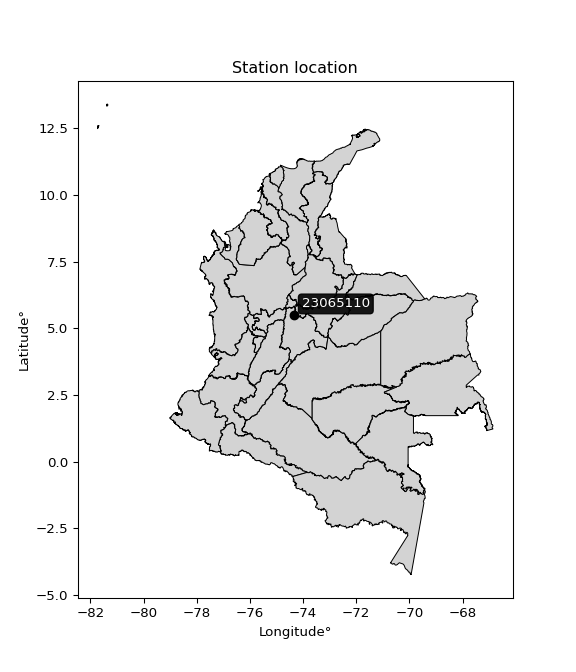

<div align="center">


</div>

# PMP Station (Rain, Pmax24h): 23065110

Probable Maximum Precipitation (PMP) is the greatest amount of rainfall for a specific duration that is meteorologically possible for a given location, acting as a "worst-case" scenario for extreme storms, crucial for designing safety-critical infrastructure like bridges, river deviations, dams, spillways, and nuclear plants to prevent catastrophic failure. PMP is calculated by hydrologists using meteorological data to determine the upper limit of extreme rainfall, often leading to the Probable Maximum Flood (PMF) for flood control design, and is increasingly being studied for climate change impacts. Probable Maximum Precipitation (PMP) is the theoretical upper limit of rainfall, a deterministic estimate for extreme events, while probability distributions (like GEV, Gumbel) describe the likelihood and frequency of various precipitation amounts, including rare ones, showing how often events occur, with PMP representing the extreme end of these distributions, used for critical infrastructure design to ensure safety against the worst conceivable weather, unlike standard statistical forecasts which cover typical probabilities.

The most common probability distributions in hydrology, used for analyzing floods, rainfall, and streamflow, include the Normal, Log-Normal, Gumbel, Gamma (including Log-Pearson Type III), and Generalized Extreme Value (GEV) distributions, often chosen based on the data´s skewness and whether modeling extremes or general conditions, with Gumbel and GEV popular for extreme events like floods, while the Normal distribution serves as a baseline, though often requiring transformations for skewed hydrological data. These distributions help in designing water infrastructure, managing water resources, and forecasting hydrologic events.

> Hydrological data often isn´t perfectly normal (it´s skewed), so different distributions are needed for different applications, such as: **Flood Frequency Analysis**: Using Gumbel, GEV, or Log-Pearson Type III for predicting extreme flood magnitudes and their return periods, **Rainfall Analysis**: Normal for annual totals, but Log-Normal, Weibull, or GEV for intensity or extreme daily rainfall, **Streamflow Modeling**: Gamma and Log-Normal for maximum flows, GEV for minimum flows, and Kappa for daily flows.

<div align="center">

</img>

</div>


## A. General information


### 1. General running parameters

• app_version: _v20260108_. • runtime: _2026-01-09 11:32:22.148588_. • Python version: _3.14.0_. • SciPy version: _1.16.3_. • Pandas version: _2.3.3_. • NumPy version: _2.3.5_. • Stations dataset (station_dataset_file): _dataset/pmax24h_in/automatic_colombia_2003_2024.csv_. • Stations catalog (station_catalog_file): _dataset/CNE.xls_. • Minimum year to eval til year_max (date_min): _1900_. • Maximum year to eval since year_min (date_max): _2024_. • Creates, save and include plots into reports (create_plot): _False_. • Plot only fit distributions with Δo > Δ (plot_only_fit): _True_. • Plot only simple graphs avoiding multiple CDFs and multiple Extreme values plots (plot_only_simple): _True_. • Eval low extreme values, if False, evaluates high extreme values (low_extreme): _False_. • Eval every SciPy distribution as logarithmic (pdist_logarithmic_on): _True_. • Standard deviation normalized (ddof): _1.0_. • Return periods to eval in years (Tr): _[2, 2.33, 5, 10, 15, 20, 25, 50, 75, 100, 200, 250, 500, 750, 1000]_. • Minimum data sample per station, 0 means any (minimum_sample): _5_. • Z-Score maximum threshold to adjust a value, 0 means disable (zscore_max): _3.5_. • Z-Score minimum threshold to adjust a value, 0 means disable (zscore_min): _-2.5_. • Avoid zeros, e.g. rain = 0 (avoid_zeros): _True_. • Avoid null values (avoid_nans): _True_. 

:file_folder:Table: [dataset.csv](../../dataset/pmax24h_in/automatic_colombia_2003_2024.csv)

> Delta Degrees of Freedom (DDOF): is a parameter used in the formulas for calculating variance and standard deviation. When ddof=0, the divisor is $N$ (the total number of observations) and this is used when your data set is the entire population. When ddof=1, the divisor is $N-1$ and this is used when your data set is a sample drawn from a larger population. Using $N-1$ provides an unbiased estimate of the population variance (known as Bessel´s correction).


### 2. Station info and location

|   id |   CODIGO | NOMBRE            | CATEGORIA               | TECNOLOGIA                              | ESTADO           | FECHA_INSTALACION   |   FECHA_SUSPENSION |   ALTITUD |   LATITUD |   LONGITUD | DEPARTAMENTO   | MUNICIPIO   | AREA_OPERATIVA                            | ENTIDAD                                                     | AREA_HIDROGRAFICA   | ZONA_HIDROGRAFICA   | SUBZONA_HIDROGRAFICA   |   CORRIENTE | Catalogo   |   Version |
|-----:|---------:|:------------------|:------------------------|:----------------------------------------|:-----------------|:--------------------|-------------------:|----------:|----------:|-----------:|:---------------|:------------|:------------------------------------------|:------------------------------------------------------------|:--------------------|:--------------------|:-----------------------|------------:|:-----------|----------:|
|    0 | 23065110 | YACOPI [23065110] | Climatológica Principal | Automática con Telemetría, Convencional | En Mantenimiento | 15/09/1974          |                nan |      1347 |   5.48121 |   -74.3512 | Cundinamarca   | Yacopí      | Area Operativa 11 - Cundinamarca-Amazonas | INSTITUTO DE HIDROLOGIA METEOROLOGIA Y ESTUDIOS AMBIENTALES | Magdalena Cauca     | Medio Magdalena     | Río Negro              |         nan | CNE_IDEAM  |  20251226 |

<div align="center">

Dynamic map: [:earth_americas:Google](http://maps.google.com/maps?q=5.48121,-74.35125) [:earth_americas:OSM](https://www.openstreetmap.org/#map=18/5.48121/-74.35125&layers=P) [:earth_americas:Bing](https://www.bing.com/maps?cp=5.48121~-74.35125&lvl=18) [:earth_americas:Apple](https://maps.apple.com/frame?center=5.48121%2C-74.35125&span=0.003%2C0.006)

</div>


<div align="center">

```geojson
{
  "type": "Feature",
  "geometry": {
    "type": "Point", 
    "coordinates": [-74.35125, 5.48121]
  }, 
  "properties": {
    "Name": "23065110"
  }
}
```

</div>


### 3. Discrete values table and plot

<div align="center">

|               |           0 |          1 |           2 |           3 |         4 |
|:--------------|------------:|-----------:|------------:|------------:|----------:|
| Date          | 2019        | 2020       | 2021        | 2022        | 2023      |
| Value         |  117.2      |  117.8     |  119.4      |   80.2      |   58.4    |
| Value_initial |  117.2      |  117.8     |  119.4      |   80.2      |   58.4    |
| count         |    5        |    5       |    5        |    5        |    5      |
| mean          |   98.6      |   98.6     |   98.6      |   98.6      |   98.6    |
| std           |   27.8471   |   27.8471  |   27.8471   |   27.8471   |   27.8471 |
| zscore        |    0.667934 |    0.68948 |    0.746936 |   -0.660751 |   -1.4436 |


</div>


> The initial value (value_initial) correspond to the initial obtained or null completed value, and value (value) is adjusted only when the initial value is outside the valid range (outlier) definite through the Z-Score value. If Z-Score is active, values out of range or outliers are replaced with the station mean value. A Z-Score (or standard score) measures how many standard deviations a data point is from the mean of a dataset, indicating its relative position; positive scores mean above the mean, negative mean below, and a score of zero is exactly at the mean, allowing for comparison of values from different distributions. It´s calculated using the formula $z=(x–μ)/σ$, where $x$ is the data point, $μ$ is the mean, and $σ$ is the standard deviation, helping identify outliers and understand probability.
>
> <sub>**Note**: In this study, "completing" (filling gaps in) and "extending" (forecasting or lengthening the historical record) rainfall data series are avoided for certain critical analyses because they introduce artificial bias and uncertainty, which can distort the statistics of rare events (extremes), alter day-to-day variability, and compromise the integrity and homogeneity of the original data. Some reasons against Completing/Extending rainfall data are: **Distortion of Extremes and Variability**: The primary issue is that most gap-filling or extension methods rely on averaging or regression with nearby stations, which inherently smooths the data. Rainfall is highly variable in space and time, with a large percentage of zero values and occasional large storms. Infilling methods often underestimate the highest values and overestimate the lowest (zero) values, which severely distorts analyses focused on flood frequency, drought severity, and intensity-duration-frequency (IDF) curves, **Loss of Data Homogeneity**: Infilled or extended data are synthetic estimates, not actual measurements. Combining these estimates with observed data can violate the assumption of data homogeneity, which requires that the data properties do not change over time. Inhomogeneity can lead to incorrect conclusions about long-term trends or changes in climate patterns, **Propagation of Errors**: Errors and biases from the original data (e.g., wind-induced undercatch, instrument errors, site changes) or the data used for imputation can propagate through the analysis, leading to unreliable hydrological models and inaccurate predictions, **Compromised Statistical Integrity**: For statistical analyses, especially those involving the frequency of events, using artificial data can introduce time bias or autocorrelation that doesn´t exist in reality, making it difficult to assess the true probability of events, **Difficulty in Validation**: It is difficult to accurately validate the quality of filled or extended data, especially for past periods where ground-truth measurements are unavailable. The reliability of imputation techniques heavily depends on the density of the surrounding station network and the complexity of the local topography.</sub>


### 4. Active continuous probability distributions from SciPy (45 of 104 available)

A Probability Density Function (PDF) describes the relative likelihood of a continuous random variable falling within a specific range, where the total area under its curve equals 1, and the area over any interval gives the actual probability for that range. Unlike discrete probabilities (like rolling a die), a PDF shows density, not direct probability for a single point (which is zero), with higher points indicating higher likelihood, often visualized as a bell curve for normal distributions.

A log of a probability density function (log-PDF) is simply the logarithm of the PDF´s value, denoted as $log(f(x))$, useful for converting multiplication of probabilities into addition, improving numerical stability with tiny numbers, and connecting to information theory concepts like entropy. Instead of dealing with very small probabilities (e.g., 0.000001), log-PDFs use negative numbers (e.g., $log(0.00001) ≈ -11.51$ that are easier for computers to handle, preventing underflow errors and simplifying complex calculations. In this study, each active probability distribution from SciPy is also evaluated in the $log$ form.

[scipy.stats](https://docs.scipy.org/doc/scipy/reference/stats.html) is a Python´s powerful submodule within the SciPy library for comprehensive statistical analysis, offering over 130 probability distributions (like Normal, Poisson), functions for descriptive stats (mean, variance), hypothesis testing (t-tests, chi-square), random variable generation, and statistical tests, making it essential for data science, modeling, and research. It provides tools to explore, model, and draw conclusions from data efficiently, working seamlessly with NumPy.

<div align="center">

|   id | p_dist             |   n_parameter | fit_method   | label                                                                       | active   | ref                                                                                                        |
|-----:|:-------------------|--------------:|:-------------|:----------------------------------------------------------------------------|:---------|:-----------------------------------------------------------------------------------------------------------|
|    0 | alpha              |             3 | MLE          | Alpha                                                                       | True     | [:mortar_board:](https://docs.scipy.org/doc/scipy/reference/generated/scipy.stats.alpha.html)              |
|    1 | betaprime          |             4 | MLE          | Beta prime                                                                  | True     | [:mortar_board:](https://docs.scipy.org/doc/scipy/reference/generated/scipy.stats.betaprime.html)          |
|    2 | chi2               |             3 | MLE          | Chi²                                                                        | True     | [:mortar_board:](https://docs.scipy.org/doc/scipy/reference/generated/scipy.stats.chi2.html)               |
|    3 | crystalball        |             4 | MLE          | Crystalball                                                                 | True     | [:mortar_board:](https://docs.scipy.org/doc/scipy/reference/generated/scipy.stats.crystalball.html)        |
|    4 | dweibull           |             3 | MLE          | Double Weibull                                                              | True     | [:mortar_board:](https://docs.scipy.org/doc/scipy/reference/generated/scipy.stats.dweibull.html)           |
|    5 | erlang             |             3 | MLE          | Erlang                                                                      | True     | [:mortar_board:](https://docs.scipy.org/doc/scipy/reference/generated/scipy.stats.erlang.html)             |
|    6 | expon              |             2 | MLE          | Exponential                                                                 | True     | [:mortar_board:](https://docs.scipy.org/doc/scipy/reference/generated/scipy.stats.expon.html)              |
|    7 | exponnorm          |             3 | MLE          | Exponentially modified Normal                                               | True     | [:mortar_board:](https://docs.scipy.org/doc/scipy/reference/generated/scipy.stats.exponnorm.html)          |
|    8 | f                  |             4 | MLE          | F                                                                           | True     | [:mortar_board:](https://docs.scipy.org/doc/scipy/reference/generated/scipy.stats.f.html)                  |
|    9 | fatiguelife        |             3 | MLE          | Fatigue-life (Birnbaum-Saunders)                                            | True     | [:mortar_board:](https://docs.scipy.org/doc/scipy/reference/generated/scipy.stats.fatiguelife.html)        |
|   10 | fisk               |             3 | MLE          | Fisk                                                                        | True     | [:mortar_board:](https://docs.scipy.org/doc/scipy/reference/generated/scipy.stats.fisk.html)               |
|   11 | gamma              |             3 | MLE          | Gamma                                                                       | True     | [:mortar_board:](https://docs.scipy.org/doc/scipy/reference/generated/scipy.stats.gamma.html)              |
|   12 | genexpon           |             5 | MLE          | Generalized exponential                                                     | True     | [:mortar_board:](https://docs.scipy.org/doc/scipy/reference/generated/scipy.stats.genexpon.html)           |
|   13 | genlogistic        |             3 | MLE          | Generalized logistic                                                        | True     | [:mortar_board:](https://docs.scipy.org/doc/scipy/reference/generated/scipy.stats.genlogistic.html)        |
|   14 | gibrat             |             2 | MM           | Gibrat                                                                      | True     | [:mortar_board:](https://docs.scipy.org/doc/scipy/reference/generated/scipy.stats.gibrat.html)             |
|   15 | gompertz           |             3 | MLE          | Gompertz (or truncated Gumbel)                                              | True     | [:mortar_board:](https://docs.scipy.org/doc/scipy/reference/generated/scipy.stats.gompertz.html)           |
|   16 | gumbel_l           |             2 | MM           | Gumbel Left Skew                                                            | True     | [:mortar_board:](https://docs.scipy.org/doc/scipy/reference/generated/scipy.stats.gumbel_l.html)           |
|   17 | gumbel_r           |             2 | MM           | Gumbel Right Skew                                                           | True     | [:mortar_board:](https://docs.scipy.org/doc/scipy/reference/generated/scipy.stats.gumbel_r.html)           |
|   18 | halflogistic       |             2 | MM           | Half-logistic                                                               | True     | [:mortar_board:](https://docs.scipy.org/doc/scipy/reference/generated/scipy.stats.halflogistic.html)       |
|   19 | halfnorm           |             2 | MM           | Half Normal                                                                 | True     | [:mortar_board:](https://docs.scipy.org/doc/scipy/reference/generated/scipy.stats.halfnorm.html)           |
|   20 | hypsecant          |             2 | MM           | hyperbolic secant                                                           | True     | [:mortar_board:](https://docs.scipy.org/doc/scipy/reference/generated/scipy.stats.hypsecant.html)          |
|   21 | invgamma           |             3 | MLE          | Inverted gamma                                                              | True     | [:mortar_board:](https://docs.scipy.org/doc/scipy/reference/generated/scipy.stats.invgamma.html)           |
|   22 | invgauss           |             3 | MLE          | Inverse Gaussian                                                            | True     | [:mortar_board:](https://docs.scipy.org/doc/scipy/reference/generated/scipy.stats.invgauss.html)           |
|   23 | invweibull         |             3 | MLE          | Inverted Weibull                                                            | True     | [:mortar_board:](https://docs.scipy.org/doc/scipy/reference/generated/scipy.stats.invweibull.html)         |
|   24 | kappa4             |             4 | MLE          | Kappa 4                                                                     | True     | [:mortar_board:](https://docs.scipy.org/doc/scipy/reference/generated/scipy.stats.kappa4.html)             |
|   25 | kstwobign          |             2 | MLE          | Limiting distribution of scaled Kolmogorov-Smirnov two-sided test statistic | True     | [:mortar_board:](https://docs.scipy.org/doc/scipy/reference/generated/scipy.stats.kstwobign.html)          |
|   26 | laplace            |             2 | MM           | Laplace                                                                     | True     | [:mortar_board:](https://docs.scipy.org/doc/scipy/reference/generated/scipy.stats.laplace.html)            |
|   27 | laplace_asymmetric |             3 | MLE          | Asymmetric Laplace                                                          | True     | [:mortar_board:](https://docs.scipy.org/doc/scipy/reference/generated/scipy.stats.laplace_asymmetric.html) |
|   28 | loggamma           |             3 | MLE          | Log gamma                                                                   | True     | [:mortar_board:](https://docs.scipy.org/doc/scipy/reference/generated/scipy.stats.loggamma.html)           |
|   29 | logistic           |             2 | MM           | Logistic (or Sech-squared)                                                  | True     | [:mortar_board:](https://docs.scipy.org/doc/scipy/reference/generated/scipy.stats.logistic.html)           |
|   30 | lognorm            |             3 | MLE          | Log Normal                                                                  | True     | [:mortar_board:](https://docs.scipy.org/doc/scipy/reference/generated/scipy.stats.lognorm.html)            |
|   31 | maxwell            |             2 | MM           | Maxwell                                                                     | True     | [:mortar_board:](https://docs.scipy.org/doc/scipy/reference/generated/scipy.stats.maxwell.html)            |
|   32 | mielke             |             4 | MLE          | Mielke Beta-Kappa / Dagum                                                   | True     | [:mortar_board:](https://docs.scipy.org/doc/scipy/reference/generated/scipy.stats.mielke.html)             |
|   33 | moyal              |             2 | MM           | Moyal                                                                       | True     | [:mortar_board:](https://docs.scipy.org/doc/scipy/reference/generated/scipy.stats.moyal.html)              |
|   34 | nakagami           |             3 | MLE          | Nakagami                                                                    | True     | [:mortar_board:](https://docs.scipy.org/doc/scipy/reference/generated/scipy.stats.nakagami.html)           |
|   35 | ncf                |             5 | MLE          | Non-central F distribution                                                  | True     | [:mortar_board:](https://docs.scipy.org/doc/scipy/reference/generated/scipy.stats.ncf.html)                |
|   36 | nct                |             4 | MLE          | Non-central Student’s t                                                     | True     | [:mortar_board:](https://docs.scipy.org/doc/scipy/reference/generated/scipy.stats.nct.html)                |
|   37 | norm               |             2 | MM           | Normal                                                                      | True     | [:mortar_board:](https://docs.scipy.org/doc/scipy/reference/generated/scipy.stats.norm.html)               |
|   38 | pearson3           |             3 | MM           | Pearson type III                                                            | True     | [:mortar_board:](https://docs.scipy.org/doc/scipy/reference/generated/scipy.stats.pearson3.html)           |
|   39 | rayleigh           |             2 | MM           | Rayleigh                                                                    | True     | [:mortar_board:](https://docs.scipy.org/doc/scipy/reference/generated/scipy.stats.rayleigh.html)           |
|   40 | rice               |             3 | MLE          | Rice                                                                        | True     | [:mortar_board:](https://docs.scipy.org/doc/scipy/reference/generated/scipy.stats.rice.html)               |
|   41 | t                  |             3 | MLE          | Student’s t                                                                 | True     | [:mortar_board:](https://docs.scipy.org/doc/scipy/reference/generated/scipy.stats.t.html)                  |
|   42 | truncnorm          |             4 | MLE          | Truncated normal                                                            | True     | [:mortar_board:](https://docs.scipy.org/doc/scipy/reference/generated/scipy.stats.truncnorm.html)          |
|   43 | wald               |             2 | MM           | Wald                                                                        | True     | [:mortar_board:](https://docs.scipy.org/doc/scipy/reference/generated/scipy.stats.wald.html)               |
|   44 | weibull_min        |             3 | MLE          | Weibull minimum                                                             | True     | [:mortar_board:](https://docs.scipy.org/doc/scipy/reference/generated/scipy.stats.weibull_min.html)        |

</div>

> **n_parameter:** # arguments & localization & scale.
>
> **Fit methods:** (MLE) maximum likelihood, (MM) L-moments.
>
>**Inactive** (With the only purpose of prevent loops, zero divisions, infinite values, over high estimated values or horizontal trending for recurrence intervals estimations, the follow distributions were disabled.)**:** foldnorm, gennorm, norminvgauss, powernorm, powerlognorm, skewnorm, genextreme, anglit, arcsine, argus, beta, bradford, burr, burr12, cauchy, cosine, halfcauchy, foldcauchy, skewcauchy, wrapcauchy, dgamma, gengamma, exponweib, exponpow, truncexpon, gausshyper, genhalflogistic, genhyperbolic, geninvgauss, halfgennorm, johnsonsb, johnsonsu, kappa3, ksone, kstwo, loglaplace, levy, levy_l, levy_stable, ncx2, pareto, genpareto, truncpareto, lomax, powerlaw, rdist, rel_breitwigner, recipinvgauss, semicircular, studentized_range, trapezoid, triang, truncweibull_min, tukeylambda, uniform, loguniform, vonmises, vonmises_line, weibull_max, 


## B. Probability (PDF) vs. Empirical (EDF) distributions functions

A continuous probability distribution (CPD) describes probabilities for variables that can take any value within a range (like rain any time), unlike discrete variables with specific outcomes (like temperature). It uses a Probability Density Function (PDF), a curve where the total area under it equals 1, and the probability of the variable falling within an interval (a to b) is found by calculating the area under the curve between those points. A key feature is that the probability of hitting any single exact value is zero, so probabilities are always expressed for ranges, e.g., $P(a ≤ X ≤ b)$.

<div align="center">

Distributions parameters from station values
|    |   station | p_dist                |   n |              loc |           scale | shape                  | shape1                 | shape2               | shape3   |
|---:|----------:|:----------------------|----:|-----------------:|----------------:|:-----------------------|:-----------------------|:---------------------|:---------|
|  0 |  23065110 | alpha                 |   5 |   -388.707       |  9252.92        | 19.048616370185346     |                        |                      |          |
|  1 |  23065110 | betaprime             |   5 |    -18.2957      |  2115.27        | 18.64750737764892      | 338.8203632604458      |                      |          |
|  2 |  23065110 | chi2                  |   5 |   -183.835       |     1.17291     | 240.3430380690073      |                        |                      |          |
|  3 |  23065110 | crystalball           |   5 |     98.6         |    24.9072      | 8428.671662394565      | 227.86981204309126     |                      |          |
|  4 |  23065110 | dweibull              |   5 |    119.4         |    33.1756      | 0.7535580660156481     |                        |                      |          |
|  5 |  23065110 | erlang                |   5 |   -296.094       |     1.63951     | 240.52473083458074     |                        |                      |          |
|  6 |  23065110 | expon                 |   5 |     58.4         |    40.2         |                        |                        |                      |          |
|  7 |  23065110 | exponnorm             |   5 |     98.5866      |    24.9074      | 0.000532036692799749   |                        |                      |          |
|  8 |  23065110 | f                     |   5 | -10714           | 10812.6         | 432922.86668995535     | 2882261.468486691      |                      |          |
|  9 |  23065110 | fatiguelife           |   5 |     58.4         |     1.15826e-05 | 1911.6978178324407     |                        |                      |          |
| 10 |  23065110 | fisk                  |   5 |     -6.32253e+06 |     6.32263e+06 | 415891.4718712429      |                        |                      |          |
| 11 |  23065110 | gamma                 |   5 |   -320.312       |     1.54425     | 271.1645713770158      |                        |                      |          |
| 12 |  23065110 | genexpon              |   5 |     50.3587      |     0.0119805   | 0.0002483045835787993  | 1.6275231659154323e-07 | 1.2814042447529521   |          |
| 13 |  23065110 | genlogistic           |   5 |    119.4         |     7.45941e-06 | 3.5927162998383003e-07 |                        |                      |          |
| 14 |  23065110 | gibrat                |   5 |     79.5989      |    11.5247      |                        |                        |                      |          |
| 15 |  23065110 | gompertz              |   5 |    117.2         |     1.1202      | 0.4753499664233448     |                        |                      |          |
| 16 |  23065110 | gumbel_l              |   5 |    109.81        |    19.4201      |                        |                        |                      |          |
| 17 |  23065110 | gumbel_r              |   5 |     87.3904      |    19.4201      |                        |                        |                      |          |
| 18 |  23065110 | halflogistic          |   5 |     69.0792      |    21.2947      |                        |                        |                      |          |
| 19 |  23065110 | halfnorm              |   5 |     65.6326      |    41.3185      |                        |                        |                      |          |
| 20 |  23065110 | hypsecant             |   5 |     98.6         |    15.8564      |                        |                        |                      |          |
| 21 |  23065110 | invgamma              |   5 |   -259.224       | 67319.8         | 189.19951753055665     |                        |                      |          |
| 22 |  23065110 | invgauss              |   5 |    -67.6783      |  6247.06        | 0.026520656297557225   |                        |                      |          |
| 23 |  23065110 | invweibull            |   5 |     58.4         |     1.53432     | 0.06512776307416879    |                        |                      |          |
| 24 |  23065110 | kappa4                |   5 |     57.4418      |    72.1722      | 0.9542168395779584     | 1.1648532369596607     |                      |          |
| 25 |  23065110 | kstwobign             |   5 |     -0.475466    |   112.7         |                        |                        |                      |          |
| 26 |  23065110 | laplace               |   5 |     98.6         |    17.612       |                        |                        |                      |          |
| 27 |  23065110 | laplace_asymmetric    |   5 |    119.4         |     0.175984    | 118.19905802045017     |                        |                      |          |
| 28 |  23065110 | loggamma              |   5 |    119.4         |     1.24761e-05 | 6.00626308093739e-07   |                        |                      |          |
| 29 |  23065110 | logistic              |   5 |     98.6         |    13.7321      |                        |                        |                      |          |
| 30 |  23065110 | lognorm               |   5 |     58.4         |     0.0318939   | 14.571523119253822     |                        |                      |          |
| 31 |  23065110 | maxwell               |   5 |     39.5804      |    36.985       |                        |                        |                      |          |
| 32 |  23065110 | mielke                |   5 |     10.3144      |   109.242       | 3.8263874858059808     | 3676.5338202664507     |                      |          |
| 33 |  23065110 | moyal                 |   5 |     84.3565      |    11.2122      |                        |                        |                      |          |
| 34 |  23065110 | nakagami              |   5 |     80.2         |    30.1519      | 0.3018533633080759     |                        |                      |          |
| 35 |  23065110 | ncf                   |   5 |     -0.0532212   |     3.64483e-05 | 4.677539433437148e-06  | 4.825614969135097      | 11.676445166137523   |          |
| 36 |  23065110 | nct                   |   5 |  -2172.39        |    24.8147      | 545498.567986975       | 91.5177202094005       |                      |          |
| 37 |  23065110 | norm                  |   5 |     98.6         |    24.9072      |                        |                        |                      |          |
| 38 |  23065110 | pearson3              |   5 |     98.6         |    24.9072      | -0.6301290481729136    |                        |                      |          |
| 39 |  23065110 | rayleigh              |   5 |     50.9511      |    38.0183      |                        |                        |                      |          |
| 40 |  23065110 | rice                  |   5 |     42.9724      |    28.0445      | 1.650228595940085      |                        |                      |          |
| 41 |  23065110 | t                     |   5 |     98.6078      |    24.908       | 618647.154243867       |                        |                      |          |
| 42 |  23065110 | truncnorm             |   5 |     78.2187      |    78.2687      | -3068.755938237089     | 0.5261526720737989     |                      |          |
| 43 |  23065110 | wald                  |   5 |     73.6928      |    24.9072      |                        |                        |                      |          |
| 44 |  23065110 | weibull_min           |   5 |     -2.09377e+09 |     2.09377e+09 | 119081277.69949716     |                        |                      |          |
| 45 |  23065110 | logalpha              |   5 |     -5.23421     |   327.007       | 33.456163851550386     |                        |                      |          |
| 46 |  23065110 | logbetaprime          |   5 |    -12.7707      |     4.02273     | 18726.48113251778      | 4350.477645591323      |                      |          |
| 47 |  23065110 | logchi2               |   5 |      4.06732     |     0.992886    | 1.0364299433770423     |                        |                      |          |
| 48 |  23065110 | logcrystalball        |   5 |      4.55344     |     0.285676    | 28.877229838213577     | 215.31466926320365     |                      |          |
| 49 |  23065110 | logdweibull           |   5 |      4.76899     |     0.253167    | 0.4299835523838932     |                        |                      |          |
| 50 |  23065110 | logerlang             |   5 |     -0.157573    |     0.0183418   | 256.99927797888313     |                        |                      |          |
| 51 |  23065110 | logexpon              |   5 |      4.06732     |     0.486122    |                        |                        |                      |          |
| 52 |  23065110 | logexponnorm          |   5 |      4.55335     |     0.285674    | 0.0002955267234197056  |                        |                      |          |
| 53 |  23065110 | logf                  |   5 |    -40.5606      |    45.1138      | 51287.18431444021      | 1123654.465801299      |                      |          |
| 54 |  23065110 | logfatiguelife        |   5 |    -85.9507      |    90.5029      | 0.0031504384983354703  |                        |                      |          |
| 55 |  23065110 | logfisk               |   5 |     -2.81855e+07 |     2.81855e+07 | 165316238.73878533     |                        |                      |          |
| 56 |  23065110 | loggamma              |   5 |     -0.153894    |     0.0183396   | 256.50294137942524     |                        |                      |          |
| 57 |  23065110 | loggenexpon           |   5 |      4.06694     |     0.00351311  | 0.0034122493705954745  | 4.098136252954972      | 9.99557155533119e-06 |          |
| 58 |  23065110 | loggenlogistic        |   5 |      4.78249     |     1.02473e-06 | 4.485491230936685e-06  |                        |                      |          |
| 59 |  23065110 | loggibrat             |   5 |      4.33556     |     0.132152    |                        |                        |                      |          |
| 60 |  23065110 | loggompertz           |   5 |      4.06732     |     0.244372    | 0.09357943936707146    |                        |                      |          |
| 61 |  23065110 | loggumbel_l           |   5 |      4.68201     |     0.222741    |                        |                        |                      |          |
| 62 |  23065110 | loggumbel_r           |   5 |      4.42487     |     0.222741    |                        |                        |                      |          |
| 63 |  23065110 | loghalflogistic       |   5 |      4.21479     |     0.244284    |                        |                        |                      |          |
| 64 |  23065110 | loghalfnorm           |   5 |      4.17534     |     0.473873    |                        |                        |                      |          |
| 65 |  23065110 | loghypsecant          |   5 |      4.55344     |     0.181867    |                        |                        |                      |          |
| 66 |  23065110 | loginvgamma           |   5 |     -1.7892      |  2875.74        | 454.3799262527956      |                        |                      |          |
| 67 |  23065110 | loginvgauss           |   5 |      1.87441     |   206.827       | 0.012925596511884345   |                        |                      |          |
| 68 |  23065110 | loginvweibull         |   5 |     -2.49293e+07 |     2.49293e+07 | 83856992.0845871       |                        |                      |          |
| 69 |  23065110 | logkappa4             |   5 |      3.9963      |     0.874225    | 1.0153274155968641     | 1.111997798783407      |                      |          |
| 70 |  23065110 | logkstwobign          |   5 |      3.37402     |     1.34261     |                        |                        |                      |          |
| 71 |  23065110 | loglaplace            |   5 |      4.55344     |     0.202004    |                        |                        |                      |          |
| 72 |  23065110 | loglaplace_asymmetric |   5 |      4.78248     |     0.00243356  | 93.86750651615895      |                        |                      |          |
| 73 |  23065110 | logloggamma           |   5 |      4.78248     |     4.69472e-08 | 2.0470938718794114e-07 |                        |                      |          |
| 74 |  23065110 | loglogistic           |   5 |      4.55344     |     0.157502    |                        |                        |                      |          |
| 75 |  23065110 | loglognorm            |   5 |      4.06732     |     0.000629027 | 13.646512588326823     |                        |                      |          |
| 76 |  23065110 | logmaxwell            |   5 |      3.8765      |     0.424205    |                        |                        |                      |          |
| 77 |  23065110 | logmielke             |   5 |   -537.185       |   541.969       | 2270.523705835458      | 1493910.3806867762     |                      |          |
| 78 |  23065110 | logmoyal              |   5 |      4.39007     |     0.1286      |                        |                        |                      |          |
| 79 |  23065110 | lognakagami           |   5 |      4.38452     |     0.241146    | 0.05155832803974999    |                        |                      |          |
| 80 |  23065110 | logncf                |   5 |    -22.5596      |    21.2968      | 27157.08109454435      | 46073.04476325757      | 7417.4237073356835   |          |
| 81 |  23065110 | lognct                |   5 |    -13.317       |     0.23994     | 6189.801725841475      | 74.46606630289372      |                      |          |
| 82 |  23065110 | lognorm               |   5 |      4.55344     |     0.285676    |                        |                        |                      |          |
| 83 |  23065110 | logpearson3           |   5 |      4.55344     |     0.285677    | -0.7578570746651871    |                        |                      |          |
| 84 |  23065110 | lograyleigh           |   5 |      4.00692     |     0.436056    |                        |                        |                      |          |
| 85 |  23065110 | logrice               |   5 |      3.88013     |     0.316235    | 1.830100671808688      |                        |                      |          |
| 86 |  23065110 | logt                  |   5 |      4.55344     |     0.285677    | 714720306.1605151      |                        |                      |          |
| 87 |  23065110 | logtruncnorm          |   5 |     -0.0784289   |     1.10202     | 4.049795461905412      | 4.410918354697003      |                      |          |
| 88 |  23065110 | logwald               |   5 |      4.26772     |     0.28572     |                        |                        |                      |          |
| 89 |  23065110 | logweibull_min        |   5 |     -2.18841e+07 |     2.18841e+07 | 111836070.41013269     |                        |                      |          |

</div>

> **loc** (Location parameter): This shifts the distribution along the x-axis. For many common distributions, like the normal (Gaussian) distribution, loc represents the mean $μ$. For others, like the uniform distribution, it might represent the minimum value, or for the beta distribution, the left end of the support interval.
>
> **scale** (Scale parameter): This determines the width or spread of the distribution. For the normal distribution, scale represents the standard deviation $σ$. For a uniform distribution, it defines the length of the interval (from $loc$ to $loc + scale$).
>
> **shape** (Shape parameters): Refers to parameters that define the specific form of a probability distribution, distinct from its location (loc) and scale (scale). These parameters are required arguments for most distribution functions. For example, a normal (Gaussian) distribution is fully defined by its location (mean) and scale (standard deviation), so it has no specific shape parameters beyond loc and scale. However, other distributions have intrinsic properties that need specification, as Gamma distribution that takes a shape parameter, often named $a$ or $alpha$.


### 0. Cumulative distribution values - CDF (90 evaluated)

Cumulative Distribution Function (CDF), denoted as $F$<sub>$X$</sub>$(x)$, is a function that gives the probability that a random variable $X$ will take a value less than or equal to a specific value, $x$ (i.e., $(P(X≥x)$. It essentially "accumulates" probabilities from a given point up to the far right (positive infinity), providing a complete picture of the distribution´s probabilities for both discrete (like rain) and continuous (like temperature) variables, helping to find probabilities over ranges or above certain values. Each station is evaluated separately ordering the $x$ values ascending, calculating the CDF and PDF values for the activated distributions and their logarithmic forms.

<div align="center">

CDF ordered by x ascending and calculating $log(f(x))$ separately
|   id |   Station |   date |     x |   count |   mean |     std |    zscore |   Value_initial |   station |   m |     alpha |   alpha_pdf |   betaprime |   betaprime_pdf |      chi2 |   chi2_pdf |   crystalball |   crystalball_pdf |   dweibull |   dweibull_pdf |   erlang |   erlang_pdf |    expon |   expon_pdf |   exponnorm |   exponnorm_pdf |         f |     f_pdf |   fatiguelife |   fatiguelife_pdf |      fisk |   fisk_pdf |     gamma |   gamma_pdf |   genexpon |   genexpon_pdf |   genlogistic |   genlogistic_pdf |     gibrat |   gibrat_pdf |    gompertz |   gompertz_pdf |   gumbel_l |   gumbel_l_pdf |   gumbel_r |   gumbel_r_pdf |   halflogistic |   halflogistic_pdf |   halfnorm |   halfnorm_pdf |   hypsecant |   hypsecant_pdf |   invgamma |   invgamma_pdf |   invgauss |   invgauss_pdf |   invweibull |   invweibull_pdf |    kappa4 |   kappa4_pdf |   kstwobign |   kstwobign_pdf |   laplace |   laplace_pdf |   laplace_asymmetric |   laplace_asymmetric_pdf |   loggamma |   loggamma_pdf |   logistic |   logistic_pdf |   lognorm |   lognorm_pdf |   maxwell |   maxwell_pdf |    mielke |   mielke_pdf |      moyal |   moyal_pdf |    nakagami |   nakagami_pdf |      ncf |    ncf_pdf |       nct |    nct_pdf |      norm |   norm_pdf |   pearson3 |   pearson3_pdf |   rayleigh |   rayleigh_pdf |      rice |   rice_pdf |         t |      t_pdf |   truncnorm |   truncnorm_pdf |     wald |   wald_pdf |   weibull_min |   weibull_min_pdf |   logalpha |   logalpha_pdf |   logbetaprime |   logbetaprime_pdf |     logchi2 |   logchi2_pdf |   logcrystalball |   logcrystalball_pdf |   logdweibull |   logdweibull_pdf |   logerlang |   logerlang_pdf |   logexpon |   logexpon_pdf |   logexponnorm |   logexponnorm_pdf |      logf |   logf_pdf |   logfatiguelife |   logfatiguelife_pdf |   logfisk |   logfisk_pdf |   loggenexpon |   loggenexpon_pdf |   loggenlogistic |   loggenlogistic_pdf |   loggibrat |   loggibrat_pdf |   loggompertz |   loggompertz_pdf |   loggumbel_l |   loggumbel_l_pdf |   loggumbel_r |   loggumbel_r_pdf |   loghalflogistic |   loghalflogistic_pdf |   loghalfnorm |   loghalfnorm_pdf |   loghypsecant |   loghypsecant_pdf |   loginvgamma |   loginvgamma_pdf |   loginvgauss |   loginvgauss_pdf |   loginvweibull |   loginvweibull_pdf |   logkappa4 |   logkappa4_pdf |   logkstwobign |   logkstwobign_pdf |   loglaplace |   loglaplace_pdf |   loglaplace_asymmetric |   loglaplace_asymmetric_pdf |   logloggamma |   logloggamma_pdf |   loglogistic |   loglogistic_pdf |   loglognorm |   loglognorm_pdf |   logmaxwell |   logmaxwell_pdf |   logmielke |   logmielke_pdf |    logmoyal |   logmoyal_pdf |   lognakagami |   lognakagami_pdf |    logncf |   logncf_pdf |   lognct |   lognct_pdf |   logpearson3 |   logpearson3_pdf |   lograyleigh |   lograyleigh_pdf |   logrice |   logrice_pdf |     logt |   logt_pdf |   logtruncnorm |   logtruncnorm_pdf |   logwald |   logwald_pdf |   logweibull_min |   logweibull_min_pdf |
|-----:|----------:|-------:|------:|--------:|-------:|--------:|----------:|----------------:|----------:|----:|----------:|------------:|------------:|----------------:|----------:|-----------:|--------------:|------------------:|-----------:|---------------:|---------:|-------------:|---------:|------------:|------------:|----------------:|----------:|----------:|--------------:|------------------:|----------:|-----------:|----------:|------------:|-----------:|---------------:|--------------:|------------------:|-----------:|-------------:|------------:|---------------:|-----------:|---------------:|-----------:|---------------:|---------------:|-------------------:|-----------:|---------------:|------------:|----------------:|-----------:|---------------:|-----------:|---------------:|-------------:|-----------------:|----------:|-------------:|------------:|----------------:|----------:|--------------:|---------------------:|-------------------------:|-----------:|---------------:|-----------:|---------------:|----------:|--------------:|----------:|--------------:|----------:|-------------:|-----------:|------------:|------------:|---------------:|---------:|-----------:|----------:|-----------:|----------:|-----------:|-----------:|---------------:|-----------:|---------------:|----------:|-----------:|----------:|-----------:|------------:|----------------:|---------:|-----------:|--------------:|------------------:|-----------:|---------------:|---------------:|-------------------:|------------:|--------------:|-----------------:|---------------------:|--------------:|------------------:|------------:|----------------:|-----------:|---------------:|---------------:|-------------------:|----------:|-----------:|-----------------:|---------------------:|----------:|--------------:|--------------:|------------------:|-----------------:|---------------------:|------------:|----------------:|--------------:|------------------:|--------------:|------------------:|--------------:|------------------:|------------------:|----------------------:|--------------:|------------------:|---------------:|-------------------:|--------------:|------------------:|--------------:|------------------:|----------------:|--------------------:|------------:|----------------:|---------------:|-------------------:|-------------:|-----------------:|------------------------:|----------------------------:|--------------:|------------------:|--------------:|------------------:|-------------:|-----------------:|-------------:|-----------------:|------------:|----------------:|------------:|---------------:|--------------:|------------------:|----------:|-------------:|---------:|-------------:|--------------:|------------------:|--------------:|------------------:|----------:|--------------:|---------:|-----------:|---------------:|-------------------:|----------:|--------------:|-----------------:|---------------------:|
|    0 |  23065110 |   2023 |  58.4 |       5 |   98.6 | 27.8471 | -1.4436   |            58.4 |  23065110 |   1 | 0.0498312 |  0.00476096 |   0.0574637 |      0.00557419 | 0.0558492 | 0.00484632 |     0.0532646 |        0.00435435 |   0.102738 |     0.00200836 | 0.054614 |   0.00467182 | 0        |  0.0248756  |   0.0532667 |      0.00435445 | 0.0533873 | 0.0043715 |     0.0551881 |       7.16063e+10 | 0.0554927 | 0.00344768 | 0.0540199 |  0.00461243 |   0.153606 |     0.0175536  |      0        |        0.0025513  | 0          |   0          | 0           |       0        |   0.068395 |     0.00339859 |  0.0116835 |     0.00267695 |       0        |         0          |   0        |     0          |   0.0503416 |      0.00316163 |  0.0530621 |      0.0048642 |  0.0540121 |     0.00540951 |  0.000187546 |      1.47518e+10 | 0.0510201 |    0.0121178 |   0.0522215 |      0.00713223 | 0.0510129 |    0.00289648 |             0.053258 |               0.00256034 |  0.0461766 |       0.354228 |  0.0508128 |     0.00351228 | 0.0444103 |      0.328292 | 0.0324404 |    0.00490747 | 0.0432892 |   0.00344471 | 0.00146257 | 0.000716582 | 0           |     0          | 0.306675 | 0.00627039 | 0.0532804 | 0.00435607 | 0.0532646 | 0.00435435 |  0.0665232 |     0.00394789 |  0.0190111 |     0.00505557 | 0.0397197 | 0.00525768 | 0.0532367 | 0.00435238 |    0.571005 |      0.00704569 | 0        | 0          |     0.0516763 |        0.00286175 |  0.0445565 |       0.355412 |      0.0474082 |           0.350796 | 1.25255e-08 |   7.30811e+06 |        0.0444098 |             0.328289 |      0.106111 |       0.100796    |   0.0442778 |        0.342361 |   0        |       2.0571   |      0.0444096 |            0.32829 | 0.0454125 |   0.333961 |        0.0440717 |             0.328667 | 0.0442004 |      0.247789 |   0.000365124 |          0.972184 |         0        |             0.19127  |    0        |        0        |   8.72331e-08 |          0.382939 |     0.0613501 |          0.266805 |    0.00688065 |          0.153807 |          0        |              0        |      0        |          0        |      0.0438879 |           0.240554 |     0.0454325 |          0.35681  |     0.0453616 |          0.385177 |       0.0460691 |            0.476927 |   0.0703388 |         1.20278 |      0.0475091 |           0.565574 |    0.0450651 |         0.223091 |               0.0436802 |                    0.191217 |     0.0442269 |          0.192848 |     0.0436695 |          0.265155 |    0.0227779 |      4.45908e+12 |    0.0227875 |         0.343943 |    0.049531 |        0.20778  | 0.000452488 |      0.0231913 |     0         |       0           | 0.0448661 |     0.332566 | 0.045602 |     0.337091 |     0.0602258 |          0.300994 |     0.0095453 |          0.314588 | 0.0346104 |      0.387266 | 0.04441  |   0.328289 |     0          |            0       |  0        |      0        |        0.0422061 |             0.211072 |
|    1 |  23065110 |   2022 |  80.2 |       5 |   98.6 | 27.8471 | -0.660751 |            80.2 |  23065110 |   2 | 0.246876  |  0.0132837  |   0.269887  |      0.0134015  | 0.248447  | 0.0128646  |     0.230032  |        0.0121921  |   0.160874 |     0.00350691 | 0.242148 |   0.0126746  | 0.418584 |  0.0144631  |   0.230035  |      0.0121921  | 0.230734  | 0.0122201 |     0.76351   |       0.00507572  | 0.197746  | 0.0104353  | 0.239662  |  0.012583   |   0.461456 |     0.011169   |      0        |        0.00729047 | 0.00157061 |   0.00846639 | 0           |       0        |   0.195624 |     0.00901663 |  0.235014  |     0.0175245  |       0.255339 |         0.0219491  |   0.275584 |     0.018147   |   0.193319  |      0.0114561  |  0.248906  |      0.0130502 |  0.267771  |     0.0137413  |  0.431161    |      0.00108364  | 0.338663  |    0.0140682 |   0.315277  |      0.0149092  | 0.175892  |    0.00998701 |             0.151892 |               0.0073021  |  0.291111  |       1.19566  |  0.207521  |     0.0119761  | 0.277167  |      1.17252  | 0.248482  |    0.0142367  | 0.181     |   0.00991015 | 0.228726   | 0.0207551   | 4.33772e-10 | 18427.5        | 0.432847 | 0.00525959 | 0.2301    | 0.0121943  | 0.230032  | 0.0121921  |  0.214322  |     0.0101693  |  0.256168  |     0.0150522  | 0.242672  | 0.0131228  | 0.229944  | 0.0121891  |    0.728078 |      0.00727289 | 0.124443 | 0.0422069  |     0.167503  |        0.00867999 |  0.294354  |       1.21827  |      0.288654  |           1.18524  | 0.413149    |   0.60686     |        0.277166  |             1.17252  |      0.15108  |       0.20222     |   0.284202  |        1.18186  |   0.479272 |       1.07119  |      0.277167  |            1.17252 | 0.279491  |   1.17052  |        0.278025  |             1.17875  | 0.229118  |      1.03594  |   0.378608    |          1.25825  |         0        |             0.766765 |    0.160387 |        4.97707  |   0.220517    |          1.09314  |     0.231267  |          0.907715 |    0.301626   |          1.62305  |          0.334085 |              1.81835  |      0.341097 |          1.52744  |      0.239509  |           1.19615  |     0.292158  |          1.19579  |     0.309053  |          1.23723  |       0.346872  |            1.23541  |   0.455029  |         1.23993 |      0.377281  |           1.2529   |    0.216678  |         1.07265  |               0.175129  |                    0.766657 |     0.176354  |          0.768975 |     0.254936  |          1.20598  |    0.675814  |      0.0830591   |    0.302461  |         1.31686  |    0.187331 |        0.785383 | 0.306877    |      1.88069   |     0.0286578 |       3.32715e+12 | 0.278532  |     1.1682   | 0.281388 |     1.17504  |     0.24931   |          0.967939 |     0.312664  |          1.36495  | 0.29126   |      1.211    | 0.277166 |   1.17251  |     4.2132e-06 |            4.85171 |  0.279436 |      3.48367  |        0.19598   |             0.896268 |
|    2 |  23065110 |   2019 | 117.2 |       5 |   98.6 | 27.8471 |  0.667934 |           117.2 |  23065110 |   3 | 0.776025  |  0.0108145  |   0.765034  |      0.00995847 | 0.77582   | 0.0111388  |     0.7724    |        0.0121196  |   0.439301 |     0.0194745  | 0.7749   |   0.0114339  | 0.768387 |  0.00576152 |   0.772399  |      0.0121195  | 0.77278   | 0.0120841 |     0.880721  |       0.00199632  | 0.737566  | 0.0127322  | 0.772593  |  0.0115228  |   0.749986 |     0.0051851  |      0        |        0.0433202  | 0.881504   |   0.00527293 | 4.23126e-08 |       0.424342 |   0.768482 |     0.0174424  |  0.806172  |     0.00894417 |       0.810976 |         0.0080376  |   0.787986 |     0.00886264 |   0.80896   |      0.0113377  |  0.77125   |      0.0108555 |  0.77544   |     0.00999664 |  0.454467    |      0.000396976 | 0.943127  |    0.022163  |   0.774356  |      0.00832603 | 0.826094  |    0.00987424 |             0.899573 |               0.0432464  |  0.769536  |       1.00472  |  0.794864  |     0.0118741  | 0.769333  |      1.06463  | 0.779026  |    0.0105049  | 0.919958  |   0.0329335  | 0.817189   | 0.00800817  | 0.796678    |     0.00909855 | 0.594708 | 0.00356379 | 0.772419  | 0.0121162  | 0.7724    | 0.0121196  |  0.760379  |     0.0149027  |  0.780904  |     0.0100422  | 0.773274  | 0.0113357  | 0.772297  | 0.0121223  |    0.985962 |      0.00642663 | 0.853195 | 0.00591433 |     0.777666  |        0.0190127  |  0.773143  |       0.98568  |      0.770896  |           1.02398  | 0.584337    |   0.34319     |        0.769333  |             1.06463  |      0.414863 |       6.5207      |   0.763236  |        1.01963  |   0.761385 |       0.490854 |      0.769336  |            1.06463 | 0.767938  |   1.05588  |        0.770794  |             1.06043  | 0.733362  |      1.14691  |   0.772925    |          0.7453   |         0        |             4.03485  |    0.880188 |        0.466517 |   0.782359    |          1.44145  |     0.764073  |          1.52973  |    0.803906   |          0.78778  |          0.808917 |              0.70748  |      0.785755 |          0.778622 |      0.806084  |           1.00151  |     0.764825  |          0.988456 |     0.770861  |          0.92453  |       0.744128  |            0.739768 |   0.9655    |         1.66872 |      0.765836  |           0.718696 |    0.823588  |         0.873313 |               0.921708  |                    4.03493  |     0.922098  |          4.02073  |     0.791854  |          1.04647  |    0.696257  |      0.0367817   |    0.776367  |         0.923038 |    0.918532 |        3.84824  | 0.81516     |      0.705669  |     0.918879  |       0.221188    | 0.765545  |     1.05425  | 0.768569 |     1.04793  |     0.754661  |          1.36866  |     0.778362  |          0.882329 | 0.769567  |      1.00648  | 0.769331 |   1.06464  |     0.979662   |            1.13426 |  0.85168  |      0.521918 |        0.780388  |             1.70129  |
|    3 |  23065110 |   2020 | 117.8 |       5 |   98.6 | 27.8471 |  0.68948  |           117.8 |  23065110 |   4 | 0.782453  |  0.0106105  |   0.770958  |      0.00978761 | 0.782442  | 0.0109348  |     0.779606  |        0.0119001  |   0.451601 |     0.0216542  | 0.781698 |   0.0112245  | 0.771818 |  0.00567617 |   0.779605  |      0.0119     | 0.779965  | 0.0118648 |     0.881911  |       0.00197219  | 0.745134  | 0.0124919  | 0.779444  |  0.0113139  |   0.753078 |     0.00512098 |      0        |        0.0445903  | 0.884613   |   0.00509322 | 0.285939    |       0.517687 |   0.778871 |     0.0171825  |  0.811474  |     0.00872909 |       0.815744 |         0.0078555  |   0.793255 |     0.00870254 |   0.815657  |      0.0109867  |  0.777704  |      0.0106585 |  0.781383  |     0.00981356 |  0.454704    |      0.000392911 | 0.956717  |    0.0231998 |   0.77931   |      0.00818707 | 0.831919  |    0.00954352 |             0.925898 |               0.044512   |  0.774632  |       0.991471 |  0.801896  |     0.0115685  | 0.774733  |      1.05054  | 0.78527   |    0.0103095  | 0.939876  |   0.0334587  | 0.821934   | 0.0078076   | 0.802079    |     0.00890737 | 0.59684  | 0.00354045 | 0.779623  | 0.0118967  | 0.779606  | 0.0119001  |  0.769259  |     0.0146947  |  0.786873  |     0.00985703 | 0.780015  | 0.0111352  | 0.779505  | 0.0119028  |    0.98981  |      0.00640195 | 0.856693 | 0.00574702 |     0.788973  |        0.0186723  |  0.778142  |       0.972297 |      0.776091  |           1.01045  | 0.586084    |   0.341107    |        0.774733  |             1.05054  |      0.5      |       1.47418e+08 |   0.768409  |        1.00654  |   0.763878 |       0.485725 |      0.774736  |            1.05054 | 0.773295  |   1.04206  |        0.776173  |             1.04625  | 0.739178  |      1.13079  |   0.776709    |          0.736658 |         0        |             4.12606  |    0.88254  |        0.454609 |   0.789671    |          1.42243  |     0.771843  |          1.51365  |    0.807893   |          0.773744 |          0.8125   |              0.695592 |      0.789704 |          0.768226 |      0.811139  |           0.97859  |     0.76984   |          0.975671 |     0.77555   |          0.912225 |       0.747883  |            0.730838 |   0.974152  |         1.72332 |      0.769484  |           0.710258 |    0.827991  |         0.851513 |               0.942544  |                    4.12615  |     0.94286   |          4.11126  |     0.797147  |          1.02668  |    0.696444  |      0.0365039   |    0.781049  |         0.910408 |    0.938394 |        3.93141  | 0.818729    |      0.692534  |     0.919999  |       0.217797    | 0.770894  |     1.0406   | 0.773885 |     1.03417  |     0.761618  |          1.35621  |     0.782837  |          0.870347 | 0.774674  |      0.993475 | 0.774732 |   1.05054  |     0.985395   |            1.11139 |  0.854316 |      0.510887 |        0.789016  |             1.67766  |
|    4 |  23065110 |   2021 | 119.4 |       5 |   98.6 | 27.8471 |  0.746936 |           119.4 |  23065110 |   5 | 0.798993  |  0.0100642  |   0.786253  |      0.00933176 | 0.799498  | 0.0103848  |     0.798169  |        0.0113018  |   0.5      |    69.6044     | 0.799205 |   0.0106585  | 0.780722 |  0.00545469 |   0.798168  |      0.0113018  | 0.798473  | 0.0112674 |     0.885017  |       0.00190972  | 0.7646    | 0.0118392  | 0.797095  |  0.0107487  |   0.761137 |     0.00495384 |      0.999976 |        0.0481624  | 0.892401   |   0.00465001 | 0.945666    |       0.164329 |   0.805748 |     0.0163903  |  0.824992  |     0.00817265 |       0.827934 |         0.00738506 |   0.806841 |     0.00828109 |   0.832506  |      0.0100824  |  0.794335  |      0.0101295 |  0.796694  |     0.00932628 |  0.455325    |      0.000382465 | 1         |    2.50938   |   0.792116  |      0.00782157 | 0.846516  |    0.00871473 |             0.999928 |               0.0480709  |  0.78777   |       0.956047 |  0.819757  |     0.0107599  | 0.788652  |      1.01263  | 0.801348  |    0.0097878  | 0.994541  |   0.0347042  | 0.834011   | 0.00729445  | 0.815932    |     0.00841121 | 0.602455 | 0.00347896 | 0.798182  | 0.0112986  | 0.798169  | 0.0113018  |  0.792297  |     0.0140907  |  0.80225   |     0.00936475 | 0.797399  | 0.0105926  | 0.798073  | 0.0113047  |    1        |      0.00633479 | 0.865548 | 0.00532811 |     0.818043  |        0.0176339  |  0.791019  |       0.936616 |      0.789479  |           0.97419  | 0.590649    |   0.335703    |        0.788651  |             1.01264  |      0.623409 |       3.40215     |   0.781752  |        0.971476 |   0.770341 |       0.472431 |      0.788654  |            1.01263 | 0.787104  |   1.00493  |        0.790032  |             1.00814  | 0.754142  |      1.08749  |   0.786493    |          0.713918 |         0.999955 |             4.37685  |    0.88847  |        0.424923 |   0.808504    |          1.36858  |     0.791953  |          1.46642  |    0.818085   |          0.737459 |          0.821676 |              0.6649   |      0.799884 |          0.74101  |      0.82394   |           0.919459 |     0.782773  |          0.941529 |     0.787637  |          0.879579 |       0.757585  |            0.707474 |   1         |        46.2685  |      0.778917  |           0.68816  |    0.839104  |         0.796502 |               0.999886  |                    4.37717  |     0.999989  |          4.36037  |     0.810646  |          0.974585 |    0.696932  |      0.0357896   |    0.793105  |         0.87698  |    0.992945 |        4.12042  | 0.827844    |      0.658865  |     0.922879  |       0.209196    | 0.784686  |     1.00392  | 0.787589 |     0.997221 |     0.779678  |          1.32043  |     0.794366  |          0.838733 | 0.787842  |      0.958645 | 0.78865  |   1.01264  |     0.999992   |            1.05305 |  0.861019 |      0.483076 |        0.811193  |             1.60847  |


</div>

An Empirical Distribution Function (EDF) is a step-function estimate of a true cumulative distribution function (CDF) based on observed sample data, representing the proportion of data points less than or equal to a given value. It is calculated by ordering your data and jumping up by $1/n$ (where $n$ is sample size) at each unique data point, allowing analysis without assuming an underlying population distribution, and it gets closer to the true CDF as the sample size grows. For the empirical probability calculations, the parameter $m$ correspond to the order number which means the position of the $x$ values in an ascending order list.

The Kolmogorov-Smirnov (K-S) test is a non-parametric statistical test used to determine if a sample data set comes from a specific theoretical distribution (one-sample) or if two different samples come from the same underlying distribution (two-sample), by comparing their cumulative distribution functions (CDFs). It calculates the maximum vertical difference (D statistic) between these functions, with a small p-value indicating a significant difference and rejection of the null hypothesis (that the data/samples match).


### 1. EDF California (1923)

California´s estimates the true probability distribution of water-related data (like rainfall, streamflow) using observed samples, crucial for risk assessment.

<div align="center">


$P=m/n$


</div>


**1.1. Empirical values**

<div align="center">

|                | 0              | 1                  | 2              | 3                 | 4              |
|:---------------|:---------------|:-------------------|:---------------|:------------------|:---------------|
| date           | 2023           | 2022               | 2019           | 2020              | 2021           |
| x              | 58.4           | 80.2               | 117.2          | 117.8             | 119.4          |
| m              | 1              | 2                  | 3              | 4                 | 5              |
| empirical_dist | edf_california | edf_california     | edf_california | edf_california    | edf_california |
| empirical      | 0.2            | 0.4                | 0.6            | 0.8               | 1.0            |
| empirical_tr   | 1.25           | 1.6666666666666667 | 2.5            | 5.000000000000001 | inf            |

</div>


**1.2. Kolmogorov-Smirnov fit test (sorted by Δ)**


<div align="center">

|                | 0                   | 1                  | 2                   | 3                   | 4                  | 5                  | 6                  | 7                  | 8                  | 9                  | 10                  | 11                  | 12                  | 13                  | 14                  | 15                  | 16                  | 17                  | 18                  | 19                 | 20                 | 21                  | 22                  | 23                  | 24                  | 25                  | 26                  | 27                  | 28                  | 29                 | 30                  | 31                  | 32                  | 33                  | 34                 | 35                  | 36                  | 37                  | 38                  | 39                 | 40                  | 41                  | 42                  | 43                  | 44                  | 45                  | 46                  | 47                 | 48                 | 49                  | 50                  | 51                  | 52                  | 53                 | 54                  | 55                  | 56                  | 57                  | 58                  | 59                  | 60                 | 61                  | 62                  | 63                  | 64                  | 65                 | 66                 | 67                 | 68                 | 69                 | 70                  | 71                  | 72                    | 73                  | 74                  | 75                 | 76                 | 77                 | 78                  | 79                 | 80                 | 81                  | 82                 | 83                  | 84                  | 85                 | 86                 | 87                 | 88                 | 89                 |
|:---------------|:--------------------|:-------------------|:--------------------|:--------------------|:-------------------|:-------------------|:-------------------|:-------------------|:-------------------|:-------------------|:--------------------|:--------------------|:--------------------|:--------------------|:--------------------|:--------------------|:--------------------|:--------------------|:--------------------|:-------------------|:-------------------|:--------------------|:--------------------|:--------------------|:--------------------|:--------------------|:--------------------|:--------------------|:--------------------|:-------------------|:--------------------|:--------------------|:--------------------|:--------------------|:-------------------|:--------------------|:--------------------|:--------------------|:--------------------|:-------------------|:--------------------|:--------------------|:--------------------|:--------------------|:--------------------|:--------------------|:--------------------|:-------------------|:-------------------|:--------------------|:--------------------|:--------------------|:--------------------|:-------------------|:--------------------|:--------------------|:--------------------|:--------------------|:--------------------|:--------------------|:-------------------|:--------------------|:--------------------|:--------------------|:--------------------|:-------------------|:-------------------|:-------------------|:-------------------|:-------------------|:--------------------|:--------------------|:----------------------|:--------------------|:--------------------|:-------------------|:-------------------|:-------------------|:--------------------|:-------------------|:-------------------|:--------------------|:-------------------|:--------------------|:--------------------|:-------------------|:-------------------|:-------------------|:-------------------|:-------------------|
| station        | 23065110            | 23065110           | 23065110            | 23065110            | 23065110           | 23065110           | 23065110           | 23065110           | 23065110           | 23065110           | 23065110            | 23065110            | 23065110            | 23065110            | 23065110            | 23065110            | 23065110            | 23065110            | 23065110            | 23065110           | 23065110           | 23065110            | 23065110            | 23065110            | 23065110            | 23065110            | 23065110            | 23065110            | 23065110            | 23065110           | 23065110            | 23065110            | 23065110            | 23065110            | 23065110           | 23065110            | 23065110            | 23065110            | 23065110            | 23065110           | 23065110            | 23065110            | 23065110            | 23065110            | 23065110            | 23065110            | 23065110            | 23065110           | 23065110           | 23065110            | 23065110            | 23065110            | 23065110            | 23065110           | 23065110            | 23065110            | 23065110            | 23065110            | 23065110            | 23065110            | 23065110           | 23065110            | 23065110            | 23065110            | 23065110            | 23065110           | 23065110           | 23065110           | 23065110           | 23065110           | 23065110            | 23065110            | 23065110              | 23065110            | 23065110            | 23065110           | 23065110           | 23065110           | 23065110            | 23065110           | 23065110           | 23065110            | 23065110           | 23065110            | 23065110            | 23065110           | 23065110           | 23065110           | 23065110           | 23065110           |
| empirical_dist | edf_california      | edf_california     | edf_california      | edf_california      | edf_california     | edf_california     | edf_california     | edf_california     | edf_california     | edf_california     | edf_california      | edf_california      | edf_california      | edf_california      | edf_california      | edf_california      | edf_california      | edf_california      | edf_california      | edf_california     | edf_california     | edf_california      | edf_california      | edf_california      | edf_california      | edf_california      | edf_california      | edf_california      | edf_california      | edf_california     | edf_california      | edf_california      | edf_california      | edf_california      | edf_california     | edf_california      | edf_california      | edf_california      | edf_california      | edf_california     | edf_california      | edf_california      | edf_california      | edf_california      | edf_california      | edf_california      | edf_california      | edf_california     | edf_california     | edf_california      | edf_california      | edf_california      | edf_california      | edf_california     | edf_california      | edf_california      | edf_california      | edf_california      | edf_california      | edf_california      | edf_california     | edf_california      | edf_california      | edf_california      | edf_california      | edf_california     | edf_california     | edf_california     | edf_california     | edf_california     | edf_california      | edf_california      | edf_california        | edf_california      | edf_california      | edf_california     | edf_california     | edf_california     | edf_california      | edf_california     | edf_california     | edf_california      | edf_california     | edf_california      | edf_california      | edf_california     | edf_california     | edf_california     | edf_california     | edf_california     |
| p_dist         | loglogistic         | logistic           | rayleigh            | maxwell             | loggompertz        | halfnorm           | loghalfnorm        | chi2               | erlang             | alpha              | f                   | nct                 | norm                | crystalball         | exponnorm           | t                   | rice                | gamma               | invgauss            | loggumbel_r        | logweibull_min     | gumbel_l            | lograyleigh         | invgamma            | loghypsecant        | gumbel_r            | logmaxwell          | pearson3            | kstwobign           | loggumbel_l        | loghalflogistic     | hypsecant           | logalpha            | logfatiguelife      | logbetaprime       | halflogistic        | logexponnorm        | lognorm             | lognorm             | logcrystalball     | logt                | logrice             | loggamma            | loggamma            | loginvgauss         | lognct              | logf                | loggenexpon        | betaprime          | logmoyal            | logncf              | moyal               | loginvgamma         | logerlang          | expon               | logpearson3         | logkstwobign        | loglaplace          | laplace             | logexpon            | weibull_min        | fisk                | genexpon            | loginvweibull       | logfisk             | logwald            | wald               | loggibrat          | laplace_asymmetric | loglognorm         | logmielke           | mielke              | loglaplace_asymmetric | logloggamma         | kappa4              | fatiguelife        | logkappa4          | lognakagami        | logdweibull         | truncnorm          | ncf                | gibrat              | logtruncnorm       | nakagami            | logchi2             | dweibull           | invweibull         | gompertz           | loggenlogistic     | genlogistic        |
| delta          | 0.19185425572702386 | 0.1948635796263426 | 0.19774958089554895 | 0.19865207077315783 | 0.1999999127668683 | 0.2                | 0.2001155630763325 | 0.2005016448477408 | 0.2007945357709291 | 0.2010072461220811 | 0.20152680229541742 | 0.20181817362102128 | 0.20183061816314063 | 0.20183062016020648 | 0.20183165821811322 | 0.20192668834055727 | 0.20260100621291688 | 0.20290458497977326 | 0.20330560975319711 | 0.2039059074052474 | 0.2040197823552722 | 0.20437591189067117 | 0.20563417697476516 | 0.20566510612327604 | 0.20608359551667277 | 0.20617198594410313 | 0.20689460605462495 | 0.20770324042488164 | 0.20788417987597718 | 0.2080469552705455 | 0.20891739836800338 | 0.20896030646614394 | 0.20898124260609663 | 0.20996820975800579 | 0.2105211774034641 | 0.21097633831680251 | 0.21134567971815477 | 0.21134844821876153 | 0.21134844821876153 | 0.2113487797155107 | 0.21134995625504205 | 0.21215762459377097 | 0.21223003669371343 | 0.21223003669371343 | 0.21236297067199028 | 0.21241126920570896 | 0.21289610826704375 | 0.2135067249076097 | 0.2137466884265835 | 0.21515963092787638 | 0.21531381914232628 | 0.21718903638185383 | 0.21722739850358186 | 0.2182475470427242 | 0.21927844128967078 | 0.22032164792756015 | 0.22108311695238636 | 0.22358751292281154 | 0.22609442801575386 | 0.22965879674663026 | 0.2324970747682024 | 0.23539967282003416 | 0.23886294941550368 | 0.24241536157249732 | 0.24585787336492837 | 0.2516795924678331 | 0.2755566125511539 | 0.2801878562480259 | 0.2995726326973651 | 0.3030681729917981 | 0.31853154026929564 | 0.31995823201075446 | 0.3217082506940595    | 0.32209821037126285 | 0.34312658683920894 | 0.3635095763137758 | 0.3654998517542324 | 0.3713421603541376 | 0.37659094445442043 | 0.385961756334277  | 0.397545003572243  | 0.39842939301981123 | 0.3999957868012737 | 0.39999999956622795 | 0.40935093405547895 | 0.5000000000013126 | 0.5446753341419852 | 0.5999999576873819 | 0.8                | 0.8                |
| deltao         | 0.5865427407550001  | 0.5865427407550001 | 0.5865427407550001  | 0.5865427407550001  | 0.5865427407550001 | 0.5865427407550001 | 0.5865427407550001 | 0.5865427407550001 | 0.5865427407550001 | 0.5865427407550001 | 0.5865427407550001  | 0.5865427407550001  | 0.5865427407550001  | 0.5865427407550001  | 0.5865427407550001  | 0.5865427407550001  | 0.5865427407550001  | 0.5865427407550001  | 0.5865427407550001  | 0.5865427407550001 | 0.5865427407550001 | 0.5865427407550001  | 0.5865427407550001  | 0.5865427407550001  | 0.5865427407550001  | 0.5865427407550001  | 0.5865427407550001  | 0.5865427407550001  | 0.5865427407550001  | 0.5865427407550001 | 0.5865427407550001  | 0.5865427407550001  | 0.5865427407550001  | 0.5865427407550001  | 0.5865427407550001 | 0.5865427407550001  | 0.5865427407550001  | 0.5865427407550001  | 0.5865427407550001  | 0.5865427407550001 | 0.5865427407550001  | 0.5865427407550001  | 0.5865427407550001  | 0.5865427407550001  | 0.5865427407550001  | 0.5865427407550001  | 0.5865427407550001  | 0.5865427407550001 | 0.5865427407550001 | 0.5865427407550001  | 0.5865427407550001  | 0.5865427407550001  | 0.5865427407550001  | 0.5865427407550001 | 0.5865427407550001  | 0.5865427407550001  | 0.5865427407550001  | 0.5865427407550001  | 0.5865427407550001  | 0.5865427407550001  | 0.5865427407550001 | 0.5865427407550001  | 0.5865427407550001  | 0.5865427407550001  | 0.5865427407550001  | 0.5865427407550001 | 0.5865427407550001 | 0.5865427407550001 | 0.5865427407550001 | 0.5865427407550001 | 0.5865427407550001  | 0.5865427407550001  | 0.5865427407550001    | 0.5865427407550001  | 0.5865427407550001  | 0.5865427407550001 | 0.5865427407550001 | 0.5865427407550001 | 0.5865427407550001  | 0.5865427407550001 | 0.5865427407550001 | 0.5865427407550001  | 0.5865427407550001 | 0.5865427407550001  | 0.5865427407550001  | 0.5865427407550001 | 0.5865427407550001 | 0.5865427407550001 | 0.5865427407550001 | 0.5865427407550001 |
| eval           | Δo > Δ              | Δo > Δ             | Δo > Δ              | Δo > Δ              | Δo > Δ             | Δo > Δ             | Δo > Δ             | Δo > Δ             | Δo > Δ             | Δo > Δ             | Δo > Δ              | Δo > Δ              | Δo > Δ              | Δo > Δ              | Δo > Δ              | Δo > Δ              | Δo > Δ              | Δo > Δ              | Δo > Δ              | Δo > Δ             | Δo > Δ             | Δo > Δ              | Δo > Δ              | Δo > Δ              | Δo > Δ              | Δo > Δ              | Δo > Δ              | Δo > Δ              | Δo > Δ              | Δo > Δ             | Δo > Δ              | Δo > Δ              | Δo > Δ              | Δo > Δ              | Δo > Δ             | Δo > Δ              | Δo > Δ              | Δo > Δ              | Δo > Δ              | Δo > Δ             | Δo > Δ              | Δo > Δ              | Δo > Δ              | Δo > Δ              | Δo > Δ              | Δo > Δ              | Δo > Δ              | Δo > Δ             | Δo > Δ             | Δo > Δ              | Δo > Δ              | Δo > Δ              | Δo > Δ              | Δo > Δ             | Δo > Δ              | Δo > Δ              | Δo > Δ              | Δo > Δ              | Δo > Δ              | Δo > Δ              | Δo > Δ             | Δo > Δ              | Δo > Δ              | Δo > Δ              | Δo > Δ              | Δo > Δ             | Δo > Δ             | Δo > Δ             | Δo > Δ             | Δo > Δ             | Δo > Δ              | Δo > Δ              | Δo > Δ                | Δo > Δ              | Δo > Δ              | Δo > Δ             | Δo > Δ             | Δo > Δ             | Δo > Δ              | Δo > Δ             | Δo > Δ             | Δo > Δ              | Δo > Δ             | Δo > Δ              | Δo > Δ              | Δo > Δ             | Δo > Δ             | Δo <= Δ            | Δo <= Δ            | Δo <= Δ            |
| fit            | 1                   | 1                  | 1                   | 1                   | 1                  | 1                  | 1                  | 1                  | 1                  | 1                  | 1                   | 1                   | 1                   | 1                   | 1                   | 1                   | 1                   | 1                   | 1                   | 1                  | 1                  | 1                   | 1                   | 1                   | 1                   | 1                   | 1                   | 1                   | 1                   | 1                  | 1                   | 1                   | 1                   | 1                   | 1                  | 1                   | 1                   | 1                   | 1                   | 1                  | 1                   | 1                   | 1                   | 1                   | 1                   | 1                   | 1                   | 1                  | 1                  | 1                   | 1                   | 1                   | 1                   | 1                  | 1                   | 1                   | 1                   | 1                   | 1                   | 1                   | 1                  | 1                   | 1                   | 1                   | 1                   | 1                  | 1                  | 1                  | 1                  | 1                  | 1                   | 1                   | 1                     | 1                   | 1                   | 1                  | 1                  | 1                  | 1                   | 1                  | 1                  | 1                   | 1                  | 1                   | 1                   | 1                  | 1                  | 0                  | 0                  | 0                  |
| n              | 5                   | 5                  | 5                   | 5                   | 5                  | 5                  | 5                  | 5                  | 5                  | 5                  | 5                   | 5                   | 5                   | 5                   | 5                   | 5                   | 5                   | 5                   | 5                   | 5                  | 5                  | 5                   | 5                   | 5                   | 5                   | 5                   | 5                   | 5                   | 5                   | 5                  | 5                   | 5                   | 5                   | 5                   | 5                  | 5                   | 5                   | 5                   | 5                   | 5                  | 5                   | 5                   | 5                   | 5                   | 5                   | 5                   | 5                   | 5                  | 5                  | 5                   | 5                   | 5                   | 5                   | 5                  | 5                   | 5                   | 5                   | 5                   | 5                   | 5                   | 5                  | 5                   | 5                   | 5                   | 5                   | 5                  | 5                  | 5                  | 5                  | 5                  | 5                   | 5                   | 5                     | 5                   | 5                   | 5                  | 5                  | 5                  | 5                   | 5                  | 5                  | 5                   | 5                  | 5                   | 5                   | 5                  | 5                  | 5                  | 5                  | 5                  |
| best_fit       | 1                   | 0                  | 0                   | 0                   | 0                  | 0                  | 0                  | 0                  | 0                  | 0                  | 0                   | 0                   | 0                   | 0                   | 0                   | 0                   | 0                   | 0                   | 0                   | 0                  | 0                  | 0                   | 0                   | 0                   | 0                   | 0                   | 0                   | 0                   | 0                   | 0                  | 0                   | 0                   | 0                   | 0                   | 0                  | 0                   | 0                   | 0                   | 0                   | 0                  | 0                   | 0                   | 0                   | 0                   | 0                   | 0                   | 0                   | 0                  | 0                  | 0                   | 0                   | 0                   | 0                   | 0                  | 0                   | 0                   | 0                   | 0                   | 0                   | 0                   | 0                  | 0                   | 0                   | 0                   | 0                   | 0                  | 0                  | 0                  | 0                  | 0                  | 0                   | 0                   | 0                     | 0                   | 0                   | 0                  | 0                  | 0                  | 0                   | 0                  | 0                  | 0                   | 0                  | 0                   | 0                   | 0                  | 0                  | 0                  | 0                  | 0                  |
| best_fit_sort  | 1                   | 2                  | 3                   | 4                   | 5                  | 6                  | 7                  | 8                  | 9                  | 10                 | 11                  | 12                  | 13                  | 14                  | 15                  | 16                  | 17                  | 18                  | 19                  | 20                 | 21                 | 22                  | 23                  | 24                  | 25                  | 26                  | 27                  | 28                  | 29                  | 30                 | 31                  | 32                  | 33                  | 34                  | 35                 | 36                  | 37                  | 38                  | 39                  | 40                 | 41                  | 42                  | 43                  | 44                  | 45                  | 46                  | 47                  | 48                 | 49                 | 50                  | 51                  | 52                  | 53                  | 54                 | 55                  | 56                  | 57                  | 58                  | 59                  | 60                  | 61                 | 62                  | 63                  | 64                  | 65                  | 66                 | 67                 | 68                 | 69                 | 70                 | 71                  | 72                  | 73                    | 74                  | 75                  | 76                 | 77                 | 78                 | 79                  | 80                 | 81                 | 82                  | 83                 | 84                  | 85                  | 86                 | 87                 | 88                 | 89                 | 90                 |

</div>


**1.3. Best fit**

<div align="center">

|   id |   station | empirical_dist   | p_dist      |    delta |   deltao | eval   |   fit |   n |   best_fit |   best_fit_sort |
|-----:|----------:|:-----------------|:------------|---------:|---------:|:-------|------:|----:|-----------:|----------------:|
|    0 |  23065110 | edf_california   | loglogistic | 0.191854 | 0.586543 | Δo > Δ |     1 |   5 |          1 |               1 |

</div>


### 2. EDF Hazen (1930)

Hazen method for plotting positions is a formula used to estimate the empirical cumulative probability distribution of flood events or other hydrological data. This formula often results in biased estimations, particularly when extrapolating to extreme events (high return periods).

<div align="center">


$P=(m-0.5)/n$


</div>


**2.1. Empirical values**

<div align="center">

|                | 0                  | 1                  | 2         | 3                 | 4                  |
|:---------------|:-------------------|:-------------------|:----------|:------------------|:-------------------|
| date           | 2023               | 2022               | 2019      | 2020              | 2021               |
| x              | 58.4               | 80.2               | 117.2     | 117.8             | 119.4              |
| m              | 1                  | 2                  | 3         | 4                 | 5                  |
| empirical_dist | edf_hazen          | edf_hazen          | edf_hazen | edf_hazen         | edf_hazen          |
| empirical      | 0.1                | 0.3                | 0.5       | 0.7               | 0.9                |
| empirical_tr   | 1.1111111111111112 | 1.4285714285714286 | 2.0       | 3.333333333333333 | 10.000000000000002 |

</div>


**2.2. Kolmogorov-Smirnov fit test (sorted by Δ)**


<div align="center">

|                | 0                  | 1                   | 2                  | 3                   | 4                   | 5                   | 6                  | 7                  | 8                   | 9                   | 10                 | 11                  | 12                 | 13                  | 14                 | 15                  | 16                  | 17                  | 18                 | 19                 | 20                 | 21                  | 22                 | 23                 | 24                  | 25                  | 26                 | 27                 | 28                 | 29                 | 30                  | 31                 | 32                 | 33                 | 34                 | 35                  | 36                  | 37                  | 38                 | 39                  | 40                  | 41                 | 42                  | 43                 | 44                 | 45                  | 46                 | 47                 | 48                 | 49                  | 50                 | 51                 | 52                 | 53                 | 54                  | 55                 | 56                 | 57                 | 58                  | 59                  | 60                 | 61                  | 62                 | 63                 | 64                 | 65                  | 66                 | 67                 | 68                  | 69                 | 70                 | 71                 | 72                  | 73                 | 74                 | 75                  | 76                 | 77                 | 78                  | 79                    | 80                 | 81                 | 82                 | 83                 | 84                  | 85                  | 86                  | 87                 | 88                 | 89                 |
|:---------------|:-------------------|:--------------------|:-------------------|:--------------------|:--------------------|:--------------------|:-------------------|:-------------------|:--------------------|:--------------------|:-------------------|:--------------------|:-------------------|:--------------------|:-------------------|:--------------------|:--------------------|:--------------------|:-------------------|:-------------------|:-------------------|:--------------------|:-------------------|:-------------------|:--------------------|:--------------------|:-------------------|:-------------------|:-------------------|:-------------------|:--------------------|:-------------------|:-------------------|:-------------------|:-------------------|:--------------------|:--------------------|:--------------------|:-------------------|:--------------------|:--------------------|:-------------------|:--------------------|:-------------------|:-------------------|:--------------------|:-------------------|:-------------------|:-------------------|:--------------------|:-------------------|:-------------------|:-------------------|:-------------------|:--------------------|:-------------------|:-------------------|:-------------------|:--------------------|:--------------------|:-------------------|:--------------------|:-------------------|:-------------------|:-------------------|:--------------------|:-------------------|:-------------------|:--------------------|:-------------------|:-------------------|:-------------------|:--------------------|:-------------------|:-------------------|:--------------------|:-------------------|:-------------------|:--------------------|:----------------------|:-------------------|:-------------------|:-------------------|:-------------------|:--------------------|:--------------------|:--------------------|:-------------------|:-------------------|:-------------------|
| station        | 23065110           | 23065110            | 23065110           | 23065110            | 23065110            | 23065110            | 23065110           | 23065110           | 23065110            | 23065110            | 23065110           | 23065110            | 23065110           | 23065110            | 23065110           | 23065110            | 23065110            | 23065110            | 23065110           | 23065110           | 23065110           | 23065110            | 23065110           | 23065110           | 23065110            | 23065110            | 23065110           | 23065110           | 23065110           | 23065110           | 23065110            | 23065110           | 23065110           | 23065110           | 23065110           | 23065110            | 23065110            | 23065110            | 23065110           | 23065110            | 23065110            | 23065110           | 23065110            | 23065110           | 23065110           | 23065110            | 23065110           | 23065110           | 23065110           | 23065110            | 23065110           | 23065110           | 23065110           | 23065110           | 23065110            | 23065110           | 23065110           | 23065110           | 23065110            | 23065110            | 23065110           | 23065110            | 23065110           | 23065110           | 23065110           | 23065110            | 23065110           | 23065110           | 23065110            | 23065110           | 23065110           | 23065110           | 23065110            | 23065110           | 23065110           | 23065110            | 23065110           | 23065110           | 23065110            | 23065110              | 23065110           | 23065110           | 23065110           | 23065110           | 23065110            | 23065110            | 23065110            | 23065110           | 23065110           | 23065110           |
| empirical_dist | edf_hazen          | edf_hazen           | edf_hazen          | edf_hazen           | edf_hazen           | edf_hazen           | edf_hazen          | edf_hazen          | edf_hazen           | edf_hazen           | edf_hazen          | edf_hazen           | edf_hazen          | edf_hazen           | edf_hazen          | edf_hazen           | edf_hazen           | edf_hazen           | edf_hazen          | edf_hazen          | edf_hazen          | edf_hazen           | edf_hazen          | edf_hazen          | edf_hazen           | edf_hazen           | edf_hazen          | edf_hazen          | edf_hazen          | edf_hazen          | edf_hazen           | edf_hazen          | edf_hazen          | edf_hazen          | edf_hazen          | edf_hazen           | edf_hazen           | edf_hazen           | edf_hazen          | edf_hazen           | edf_hazen           | edf_hazen          | edf_hazen           | edf_hazen          | edf_hazen          | edf_hazen           | edf_hazen          | edf_hazen          | edf_hazen          | edf_hazen           | edf_hazen          | edf_hazen          | edf_hazen          | edf_hazen          | edf_hazen           | edf_hazen          | edf_hazen          | edf_hazen          | edf_hazen           | edf_hazen           | edf_hazen          | edf_hazen           | edf_hazen          | edf_hazen          | edf_hazen          | edf_hazen           | edf_hazen          | edf_hazen          | edf_hazen           | edf_hazen          | edf_hazen          | edf_hazen          | edf_hazen           | edf_hazen          | edf_hazen          | edf_hazen           | edf_hazen          | edf_hazen          | edf_hazen           | edf_hazen             | edf_hazen          | edf_hazen          | edf_hazen          | edf_hazen          | edf_hazen           | edf_hazen           | edf_hazen           | edf_hazen          | edf_hazen          | edf_hazen          |
| p_dist         | logfisk            | fisk                | loginvweibull      | genexpon            | logpearson3         | pearson3            | logexpon           | logerlang          | loggumbel_l         | loginvgamma         | betaprime          | logncf              | logkstwobign       | logf                | expon              | gumbel_l            | lognct              | logt                | logcrystalball     | lognorm            | lognorm            | logexponnorm        | loggamma           | loggamma           | logrice             | logfatiguelife      | loginvgauss        | logbetaprime       | invgamma           | t                  | exponnorm           | crystalball        | norm               | nct                | gamma              | f                   | loggenexpon         | logalpha            | rice               | kstwobign           | erlang              | invgauss           | chi2                | alpha              | logmaxwell         | logdweibull         | weibull_min        | lograyleigh        | maxwell            | logweibull_min      | rayleigh           | loggompertz        | loghalfnorm        | halfnorm           | loglogistic         | logistic           | ncf                | nakagami           | loggumbel_r         | loghypsecant        | gumbel_r           | loghalflogistic     | hypsecant          | logchi2            | halflogistic       | logmoyal            | moyal              | loglaplace         | laplace             | logwald            | wald               | loglognorm         | loggibrat           | gibrat             | laplace_asymmetric | dweibull            | logmielke          | lognakagami        | mielke              | loglaplace_asymmetric | logloggamma        | kappa4             | invweibull         | fatiguelife        | logkappa4           | logtruncnorm        | truncnorm           | gompertz           | loggenlogistic     | genlogistic        |
| delta          | 0.2333621926647632 | 0.23756614796308706 | 0.2441282080705447 | 0.24998614288728516 | 0.25466106036934677 | 0.26037922597334195 | 0.2613850366303794 | 0.2632358191760483 | 0.26407261945939897 | 0.26482480831988486 | 0.2650340425939788 | 0.26554535187759176 | 0.2658358442374079 | 0.26793848020097943 | 0.2683868062710182 | 0.26848242764300145 | 0.26856903409452004 | 0.26933140626711394 | 0.2693325999105548 | 0.2693329808566488 | 0.2693329808566488 | 0.26933575086355244 | 0.2695356963083294 | 0.2695356963083294 | 0.26956738070289443 | 0.27079420445276403 | 0.2708606804146443 | 0.2708963256033994 | 0.271249760764969  | 0.2722974107081302 | 0.27239865538226005 | 0.2723995140061741 | 0.2723995165555111 | 0.2724192201863145 | 0.2725927510508839 | 0.27278043898827165 | 0.27292490582306805 | 0.27314263886443735 | 0.2732740513130336 | 0.27435604239094014 | 0.27490016294602926 | 0.2754397557377488 | 0.27581959054800276 | 0.2760251970267209 | 0.2763674083107376 | 0.27659094445442045 | 0.277666142414017  | 0.2783624614198449 | 0.2790257389549118 | 0.28038838273583155 | 0.2809036190086375 | 0.2823586987786395 | 0.2857549657675197 | 0.2879859628774143 | 0.29185425572702384 | 0.2948635796263426 | 0.297545003572243  | 0.2999999995662279 | 0.30390590740524737 | 0.30608359551667275 | 0.3061719859441031 | 0.30891739836800336 | 0.3089603064661439 | 0.309350934055479  | 0.3109763383168025 | 0.31515963092787636 | 0.3171890363818538 | 0.3235875129228115 | 0.32609442801575383 | 0.3516795924678331 | 0.3531951113458359 | 0.3758136585683192 | 0.38018785624802587 | 0.3815038153594743 | 0.3995726326973651 | 0.40000000000131264 | 0.4185315402692956 | 0.418878649065325  | 0.41995823201075444 | 0.4217082506940595    | 0.4220982103712628 | 0.4431265868392089 | 0.4446753341419852 | 0.4635095763137758 | 0.46549985175423236 | 0.47966168017799593 | 0.48596175633427696 | 0.499999957687382  | 0.7                | 0.7                |
| deltao         | 0.5865427407550001 | 0.5865427407550001  | 0.5865427407550001 | 0.5865427407550001  | 0.5865427407550001  | 0.5865427407550001  | 0.5865427407550001 | 0.5865427407550001 | 0.5865427407550001  | 0.5865427407550001  | 0.5865427407550001 | 0.5865427407550001  | 0.5865427407550001 | 0.5865427407550001  | 0.5865427407550001 | 0.5865427407550001  | 0.5865427407550001  | 0.5865427407550001  | 0.5865427407550001 | 0.5865427407550001 | 0.5865427407550001 | 0.5865427407550001  | 0.5865427407550001 | 0.5865427407550001 | 0.5865427407550001  | 0.5865427407550001  | 0.5865427407550001 | 0.5865427407550001 | 0.5865427407550001 | 0.5865427407550001 | 0.5865427407550001  | 0.5865427407550001 | 0.5865427407550001 | 0.5865427407550001 | 0.5865427407550001 | 0.5865427407550001  | 0.5865427407550001  | 0.5865427407550001  | 0.5865427407550001 | 0.5865427407550001  | 0.5865427407550001  | 0.5865427407550001 | 0.5865427407550001  | 0.5865427407550001 | 0.5865427407550001 | 0.5865427407550001  | 0.5865427407550001 | 0.5865427407550001 | 0.5865427407550001 | 0.5865427407550001  | 0.5865427407550001 | 0.5865427407550001 | 0.5865427407550001 | 0.5865427407550001 | 0.5865427407550001  | 0.5865427407550001 | 0.5865427407550001 | 0.5865427407550001 | 0.5865427407550001  | 0.5865427407550001  | 0.5865427407550001 | 0.5865427407550001  | 0.5865427407550001 | 0.5865427407550001 | 0.5865427407550001 | 0.5865427407550001  | 0.5865427407550001 | 0.5865427407550001 | 0.5865427407550001  | 0.5865427407550001 | 0.5865427407550001 | 0.5865427407550001 | 0.5865427407550001  | 0.5865427407550001 | 0.5865427407550001 | 0.5865427407550001  | 0.5865427407550001 | 0.5865427407550001 | 0.5865427407550001  | 0.5865427407550001    | 0.5865427407550001 | 0.5865427407550001 | 0.5865427407550001 | 0.5865427407550001 | 0.5865427407550001  | 0.5865427407550001  | 0.5865427407550001  | 0.5865427407550001 | 0.5865427407550001 | 0.5865427407550001 |
| eval           | Δo > Δ             | Δo > Δ              | Δo > Δ             | Δo > Δ              | Δo > Δ              | Δo > Δ              | Δo > Δ             | Δo > Δ             | Δo > Δ              | Δo > Δ              | Δo > Δ             | Δo > Δ              | Δo > Δ             | Δo > Δ              | Δo > Δ             | Δo > Δ              | Δo > Δ              | Δo > Δ              | Δo > Δ             | Δo > Δ             | Δo > Δ             | Δo > Δ              | Δo > Δ             | Δo > Δ             | Δo > Δ              | Δo > Δ              | Δo > Δ             | Δo > Δ             | Δo > Δ             | Δo > Δ             | Δo > Δ              | Δo > Δ             | Δo > Δ             | Δo > Δ             | Δo > Δ             | Δo > Δ              | Δo > Δ              | Δo > Δ              | Δo > Δ             | Δo > Δ              | Δo > Δ              | Δo > Δ             | Δo > Δ              | Δo > Δ             | Δo > Δ             | Δo > Δ              | Δo > Δ             | Δo > Δ             | Δo > Δ             | Δo > Δ              | Δo > Δ             | Δo > Δ             | Δo > Δ             | Δo > Δ             | Δo > Δ              | Δo > Δ             | Δo > Δ             | Δo > Δ             | Δo > Δ              | Δo > Δ              | Δo > Δ             | Δo > Δ              | Δo > Δ             | Δo > Δ             | Δo > Δ             | Δo > Δ              | Δo > Δ             | Δo > Δ             | Δo > Δ              | Δo > Δ             | Δo > Δ             | Δo > Δ             | Δo > Δ              | Δo > Δ             | Δo > Δ             | Δo > Δ              | Δo > Δ             | Δo > Δ             | Δo > Δ              | Δo > Δ                | Δo > Δ             | Δo > Δ             | Δo > Δ             | Δo > Δ             | Δo > Δ              | Δo > Δ              | Δo > Δ              | Δo > Δ             | Δo <= Δ            | Δo <= Δ            |
| fit            | 1                  | 1                   | 1                  | 1                   | 1                   | 1                   | 1                  | 1                  | 1                   | 1                   | 1                  | 1                   | 1                  | 1                   | 1                  | 1                   | 1                   | 1                   | 1                  | 1                  | 1                  | 1                   | 1                  | 1                  | 1                   | 1                   | 1                  | 1                  | 1                  | 1                  | 1                   | 1                  | 1                  | 1                  | 1                  | 1                   | 1                   | 1                   | 1                  | 1                   | 1                   | 1                  | 1                   | 1                  | 1                  | 1                   | 1                  | 1                  | 1                  | 1                   | 1                  | 1                  | 1                  | 1                  | 1                   | 1                  | 1                  | 1                  | 1                   | 1                   | 1                  | 1                   | 1                  | 1                  | 1                  | 1                   | 1                  | 1                  | 1                   | 1                  | 1                  | 1                  | 1                   | 1                  | 1                  | 1                   | 1                  | 1                  | 1                   | 1                     | 1                  | 1                  | 1                  | 1                  | 1                   | 1                   | 1                   | 1                  | 0                  | 0                  |
| n              | 5                  | 5                   | 5                  | 5                   | 5                   | 5                   | 5                  | 5                  | 5                   | 5                   | 5                  | 5                   | 5                  | 5                   | 5                  | 5                   | 5                   | 5                   | 5                  | 5                  | 5                  | 5                   | 5                  | 5                  | 5                   | 5                   | 5                  | 5                  | 5                  | 5                  | 5                   | 5                  | 5                  | 5                  | 5                  | 5                   | 5                   | 5                   | 5                  | 5                   | 5                   | 5                  | 5                   | 5                  | 5                  | 5                   | 5                  | 5                  | 5                  | 5                   | 5                  | 5                  | 5                  | 5                  | 5                   | 5                  | 5                  | 5                  | 5                   | 5                   | 5                  | 5                   | 5                  | 5                  | 5                  | 5                   | 5                  | 5                  | 5                   | 5                  | 5                  | 5                  | 5                   | 5                  | 5                  | 5                   | 5                  | 5                  | 5                   | 5                     | 5                  | 5                  | 5                  | 5                  | 5                   | 5                   | 5                   | 5                  | 5                  | 5                  |
| best_fit       | 1                  | 0                   | 0                  | 0                   | 0                   | 0                   | 0                  | 0                  | 0                   | 0                   | 0                  | 0                   | 0                  | 0                   | 0                  | 0                   | 0                   | 0                   | 0                  | 0                  | 0                  | 0                   | 0                  | 0                  | 0                   | 0                   | 0                  | 0                  | 0                  | 0                  | 0                   | 0                  | 0                  | 0                  | 0                  | 0                   | 0                   | 0                   | 0                  | 0                   | 0                   | 0                  | 0                   | 0                  | 0                  | 0                   | 0                  | 0                  | 0                  | 0                   | 0                  | 0                  | 0                  | 0                  | 0                   | 0                  | 0                  | 0                  | 0                   | 0                   | 0                  | 0                   | 0                  | 0                  | 0                  | 0                   | 0                  | 0                  | 0                   | 0                  | 0                  | 0                  | 0                   | 0                  | 0                  | 0                   | 0                  | 0                  | 0                   | 0                     | 0                  | 0                  | 0                  | 0                  | 0                   | 0                   | 0                   | 0                  | 0                  | 0                  |
| best_fit_sort  | 1                  | 2                   | 3                  | 4                   | 5                   | 6                   | 7                  | 8                  | 9                   | 10                  | 11                 | 12                  | 13                 | 14                  | 15                 | 16                  | 17                  | 18                  | 19                 | 20                 | 21                 | 22                  | 23                 | 24                 | 25                  | 26                  | 27                 | 28                 | 29                 | 30                 | 31                  | 32                 | 33                 | 34                 | 35                 | 36                  | 37                  | 38                  | 39                 | 40                  | 41                  | 42                 | 43                  | 44                 | 45                 | 46                  | 47                 | 48                 | 49                 | 50                  | 51                 | 52                 | 53                 | 54                 | 55                  | 56                 | 57                 | 58                 | 59                  | 60                  | 61                 | 62                  | 63                 | 64                 | 65                 | 66                  | 67                 | 68                 | 69                  | 70                 | 71                 | 72                 | 73                  | 74                 | 75                 | 76                  | 77                 | 78                 | 79                  | 80                    | 81                 | 82                 | 83                 | 84                 | 85                  | 86                  | 87                  | 88                 | 89                 | 90                 |

</div>


**2.3. Best fit**

<div align="center">

|   id |   station | empirical_dist   | p_dist   |    delta |   deltao | eval   |   fit |   n |   best_fit |   best_fit_sort |
|-----:|----------:|:-----------------|:---------|---------:|---------:|:-------|------:|----:|-----------:|----------------:|
|    0 |  23065110 | edf_hazen        | logfisk  | 0.233362 | 0.586543 | Δo > Δ |     1 |   5 |          1 |               1 |

</div>


### 3. EDF Weibull (1939)

Weibull plotting position formula is an empirical method used to estimate the non-exceedance probability or plotting position for a set of observed data, is often recommended or widely used in practice, particularly in flood frequency analysis.

<div align="center">


$P=m/(n+1)$


</div>


**3.1. Empirical values**

<div align="center">

|                | 0                   | 1                  | 2           | 3                  | 4                  |
|:---------------|:--------------------|:-------------------|:------------|:-------------------|:-------------------|
| date           | 2023                | 2022               | 2019        | 2020               | 2021               |
| x              | 58.4                | 80.2               | 117.2       | 117.8              | 119.4              |
| m              | 1                   | 2                  | 3           | 4                  | 5                  |
| empirical_dist | edf_weibull         | edf_weibull        | edf_weibull | edf_weibull        | edf_weibull        |
| empirical      | 0.16666666666666666 | 0.3333333333333333 | 0.5         | 0.6666666666666666 | 0.8333333333333334 |
| empirical_tr   | 1.2                 | 1.4999999999999998 | 2.0         | 2.9999999999999996 | 6.000000000000002  |

</div>


**3.2. Kolmogorov-Smirnov fit test (sorted by Δ)**


<div align="center">

|                | 0                  | 1                   | 2                  | 3                   | 4                   | 5                  | 6                   | 7                   | 8                   | 9                  | 10                 | 11                  | 12                  | 13                 | 14                  | 15                 | 16                  | 17                 | 18                  | 19                  | 20                  | 21                 | 22                 | 23                 | 24                  | 25                 | 26                 | 27                  | 28                  | 29                 | 30                 | 31                 | 32                 | 33                  | 34                 | 35                 | 36                 | 37                 | 38                  | 39                  | 40                  | 41                 | 42                  | 43                  | 44                 | 45                  | 46                 | 47                 | 48                 | 49                 | 50                 | 51                  | 52                 | 53                 | 54                 | 55                 | 56                  | 57                 | 58                  | 59                  | 60                 | 61                  | 62                 | 63                 | 64                  | 65                 | 66                 | 67                  | 68                  | 69                 | 70                 | 71                 | 72                 | 73                 | 74                  | 75                 | 76                 | 77                 | 78                 | 79                  | 80                    | 81                 | 82                 | 83                 | 84                  | 85                  | 86                  | 87                 | 88                 | 89                 |
|:---------------|:-------------------|:--------------------|:-------------------|:--------------------|:--------------------|:-------------------|:--------------------|:--------------------|:--------------------|:-------------------|:-------------------|:--------------------|:--------------------|:-------------------|:--------------------|:-------------------|:--------------------|:-------------------|:--------------------|:--------------------|:--------------------|:-------------------|:-------------------|:-------------------|:--------------------|:-------------------|:-------------------|:--------------------|:--------------------|:-------------------|:-------------------|:-------------------|:-------------------|:--------------------|:-------------------|:-------------------|:-------------------|:-------------------|:--------------------|:--------------------|:--------------------|:-------------------|:--------------------|:--------------------|:-------------------|:--------------------|:-------------------|:-------------------|:-------------------|:-------------------|:-------------------|:--------------------|:-------------------|:-------------------|:-------------------|:-------------------|:--------------------|:-------------------|:--------------------|:--------------------|:-------------------|:--------------------|:-------------------|:-------------------|:--------------------|:-------------------|:-------------------|:--------------------|:--------------------|:-------------------|:-------------------|:-------------------|:-------------------|:-------------------|:--------------------|:-------------------|:-------------------|:-------------------|:-------------------|:--------------------|:----------------------|:-------------------|:-------------------|:-------------------|:--------------------|:--------------------|:--------------------|:-------------------|:-------------------|:-------------------|
| station        | 23065110           | 23065110            | 23065110           | 23065110            | 23065110            | 23065110           | 23065110            | 23065110            | 23065110            | 23065110           | 23065110           | 23065110            | 23065110            | 23065110           | 23065110            | 23065110           | 23065110            | 23065110           | 23065110            | 23065110            | 23065110            | 23065110           | 23065110           | 23065110           | 23065110            | 23065110           | 23065110           | 23065110            | 23065110            | 23065110           | 23065110           | 23065110           | 23065110           | 23065110            | 23065110           | 23065110           | 23065110           | 23065110           | 23065110            | 23065110            | 23065110            | 23065110           | 23065110            | 23065110            | 23065110           | 23065110            | 23065110           | 23065110           | 23065110           | 23065110           | 23065110           | 23065110            | 23065110           | 23065110           | 23065110           | 23065110           | 23065110            | 23065110           | 23065110            | 23065110            | 23065110           | 23065110            | 23065110           | 23065110           | 23065110            | 23065110           | 23065110           | 23065110            | 23065110            | 23065110           | 23065110           | 23065110           | 23065110           | 23065110           | 23065110            | 23065110           | 23065110           | 23065110           | 23065110           | 23065110            | 23065110              | 23065110           | 23065110           | 23065110           | 23065110            | 23065110            | 23065110            | 23065110           | 23065110           | 23065110           |
| empirical_dist | edf_weibull        | edf_weibull         | edf_weibull        | edf_weibull         | edf_weibull         | edf_weibull        | edf_weibull         | edf_weibull         | edf_weibull         | edf_weibull        | edf_weibull        | edf_weibull         | edf_weibull         | edf_weibull        | edf_weibull         | edf_weibull        | edf_weibull         | edf_weibull        | edf_weibull         | edf_weibull         | edf_weibull         | edf_weibull        | edf_weibull        | edf_weibull        | edf_weibull         | edf_weibull        | edf_weibull        | edf_weibull         | edf_weibull         | edf_weibull        | edf_weibull        | edf_weibull        | edf_weibull        | edf_weibull         | edf_weibull        | edf_weibull        | edf_weibull        | edf_weibull        | edf_weibull         | edf_weibull         | edf_weibull         | edf_weibull        | edf_weibull         | edf_weibull         | edf_weibull        | edf_weibull         | edf_weibull        | edf_weibull        | edf_weibull        | edf_weibull        | edf_weibull        | edf_weibull         | edf_weibull        | edf_weibull        | edf_weibull        | edf_weibull        | edf_weibull         | edf_weibull        | edf_weibull         | edf_weibull         | edf_weibull        | edf_weibull         | edf_weibull        | edf_weibull        | edf_weibull         | edf_weibull        | edf_weibull        | edf_weibull         | edf_weibull         | edf_weibull        | edf_weibull        | edf_weibull        | edf_weibull        | edf_weibull        | edf_weibull         | edf_weibull        | edf_weibull        | edf_weibull        | edf_weibull        | edf_weibull         | edf_weibull           | edf_weibull        | edf_weibull        | edf_weibull        | edf_weibull         | edf_weibull         | edf_weibull         | edf_weibull        | edf_weibull        | edf_weibull        |
| p_dist         | logdweibull        | ncf                 | logfisk            | fisk                | logchi2             | loginvweibull      | genexpon            | logpearson3         | pearson3            | logexpon           | logerlang          | loggumbel_l         | loginvgamma         | betaprime          | logncf              | logkstwobign       | logf                | expon              | gumbel_l            | lognct              | logt                | logcrystalball     | lognorm            | lognorm            | logexponnorm        | loggamma           | loggamma           | logrice             | logfatiguelife      | loginvgauss        | logbetaprime       | invgamma           | t                  | exponnorm           | crystalball        | norm               | nct                | gamma              | f                   | loggenexpon         | logalpha            | rice               | kstwobign           | erlang              | invgauss           | chi2                | alpha              | logmaxwell         | weibull_min        | lograyleigh        | maxwell            | logweibull_min      | rayleigh           | loggompertz        | loghalfnorm        | halfnorm           | loglogistic         | logistic           | loggumbel_r         | loghypsecant        | gumbel_r           | loghalflogistic     | hypsecant          | halflogistic       | logmoyal            | moyal              | loglaplace         | laplace             | nakagami            | dweibull           | loglognorm         | logwald            | wald               | invweibull         | loggibrat           | gibrat             | laplace_asymmetric | logmielke          | lognakagami        | mielke              | loglaplace_asymmetric | logloggamma        | fatiguelife        | kappa4             | logkappa4           | logtruncnorm        | truncnorm           | gompertz           | loggenlogistic     | genlogistic        |
| delta          | 0.2099242777877538 | 0.23087833690557635 | 0.2333621926647632 | 0.23756614796308706 | 0.24268426738881232 | 0.2441282080705447 | 0.24998614288728516 | 0.25466106036934677 | 0.26037922597334195 | 0.2613850366303794 | 0.2632358191760483 | 0.26407261945939897 | 0.26482480831988486 | 0.2650340425939788 | 0.26554535187759176 | 0.2658358442374079 | 0.26793848020097943 | 0.2683868062710182 | 0.26848242764300145 | 0.26856903409452004 | 0.26933140626711394 | 0.2693325999105548 | 0.2693329808566488 | 0.2693329808566488 | 0.26933575086355244 | 0.2695356963083294 | 0.2695356963083294 | 0.26956738070289443 | 0.27079420445276403 | 0.2708606804146443 | 0.2708963256033994 | 0.271249760764969  | 0.2722974107081302 | 0.27239865538226005 | 0.2723995140061741 | 0.2723995165555111 | 0.2724192201863145 | 0.2725927510508839 | 0.27278043898827165 | 0.27292490582306805 | 0.27314263886443735 | 0.2732740513130336 | 0.27435604239094014 | 0.27490016294602926 | 0.2754397557377488 | 0.27581959054800276 | 0.2760251970267209 | 0.2763674083107376 | 0.277666142414017  | 0.2783624614198449 | 0.2790257389549118 | 0.28038838273583155 | 0.2809036190086375 | 0.2823586987786395 | 0.2857549657675197 | 0.2879859628774143 | 0.29185425572702384 | 0.2948635796263426 | 0.30390590740524737 | 0.30608359551667275 | 0.3061719859441031 | 0.30891739836800336 | 0.3089603064661439 | 0.3109763383168025 | 0.31515963092787636 | 0.3171890363818538 | 0.3235875129228115 | 0.32609442801575383 | 0.33333333289956124 | 0.333333333334646  | 0.3424803252349859 | 0.3516795924678331 | 0.3531951113458359 | 0.3780086674753185 | 0.38018785624802587 | 0.3815038153594743 | 0.3995726326973651 | 0.4185315402692956 | 0.418878649065325  | 0.41995823201075444 | 0.4217082506940595    | 0.4220982103712628 | 0.4301762429804425 | 0.4431265868392089 | 0.46549985175423236 | 0.47966168017799593 | 0.48596175633427696 | 0.499999957687382  | 0.6666666666666666 | 0.6666666666666666 |
| deltao         | 0.5865427407550001 | 0.5865427407550001  | 0.5865427407550001 | 0.5865427407550001  | 0.5865427407550001  | 0.5865427407550001 | 0.5865427407550001  | 0.5865427407550001  | 0.5865427407550001  | 0.5865427407550001 | 0.5865427407550001 | 0.5865427407550001  | 0.5865427407550001  | 0.5865427407550001 | 0.5865427407550001  | 0.5865427407550001 | 0.5865427407550001  | 0.5865427407550001 | 0.5865427407550001  | 0.5865427407550001  | 0.5865427407550001  | 0.5865427407550001 | 0.5865427407550001 | 0.5865427407550001 | 0.5865427407550001  | 0.5865427407550001 | 0.5865427407550001 | 0.5865427407550001  | 0.5865427407550001  | 0.5865427407550001 | 0.5865427407550001 | 0.5865427407550001 | 0.5865427407550001 | 0.5865427407550001  | 0.5865427407550001 | 0.5865427407550001 | 0.5865427407550001 | 0.5865427407550001 | 0.5865427407550001  | 0.5865427407550001  | 0.5865427407550001  | 0.5865427407550001 | 0.5865427407550001  | 0.5865427407550001  | 0.5865427407550001 | 0.5865427407550001  | 0.5865427407550001 | 0.5865427407550001 | 0.5865427407550001 | 0.5865427407550001 | 0.5865427407550001 | 0.5865427407550001  | 0.5865427407550001 | 0.5865427407550001 | 0.5865427407550001 | 0.5865427407550001 | 0.5865427407550001  | 0.5865427407550001 | 0.5865427407550001  | 0.5865427407550001  | 0.5865427407550001 | 0.5865427407550001  | 0.5865427407550001 | 0.5865427407550001 | 0.5865427407550001  | 0.5865427407550001 | 0.5865427407550001 | 0.5865427407550001  | 0.5865427407550001  | 0.5865427407550001 | 0.5865427407550001 | 0.5865427407550001 | 0.5865427407550001 | 0.5865427407550001 | 0.5865427407550001  | 0.5865427407550001 | 0.5865427407550001 | 0.5865427407550001 | 0.5865427407550001 | 0.5865427407550001  | 0.5865427407550001    | 0.5865427407550001 | 0.5865427407550001 | 0.5865427407550001 | 0.5865427407550001  | 0.5865427407550001  | 0.5865427407550001  | 0.5865427407550001 | 0.5865427407550001 | 0.5865427407550001 |
| eval           | Δo > Δ             | Δo > Δ              | Δo > Δ             | Δo > Δ              | Δo > Δ              | Δo > Δ             | Δo > Δ              | Δo > Δ              | Δo > Δ              | Δo > Δ             | Δo > Δ             | Δo > Δ              | Δo > Δ              | Δo > Δ             | Δo > Δ              | Δo > Δ             | Δo > Δ              | Δo > Δ             | Δo > Δ              | Δo > Δ              | Δo > Δ              | Δo > Δ             | Δo > Δ             | Δo > Δ             | Δo > Δ              | Δo > Δ             | Δo > Δ             | Δo > Δ              | Δo > Δ              | Δo > Δ             | Δo > Δ             | Δo > Δ             | Δo > Δ             | Δo > Δ              | Δo > Δ             | Δo > Δ             | Δo > Δ             | Δo > Δ             | Δo > Δ              | Δo > Δ              | Δo > Δ              | Δo > Δ             | Δo > Δ              | Δo > Δ              | Δo > Δ             | Δo > Δ              | Δo > Δ             | Δo > Δ             | Δo > Δ             | Δo > Δ             | Δo > Δ             | Δo > Δ              | Δo > Δ             | Δo > Δ             | Δo > Δ             | Δo > Δ             | Δo > Δ              | Δo > Δ             | Δo > Δ              | Δo > Δ              | Δo > Δ             | Δo > Δ              | Δo > Δ             | Δo > Δ             | Δo > Δ              | Δo > Δ             | Δo > Δ             | Δo > Δ              | Δo > Δ              | Δo > Δ             | Δo > Δ             | Δo > Δ             | Δo > Δ             | Δo > Δ             | Δo > Δ              | Δo > Δ             | Δo > Δ             | Δo > Δ             | Δo > Δ             | Δo > Δ              | Δo > Δ                | Δo > Δ             | Δo > Δ             | Δo > Δ             | Δo > Δ              | Δo > Δ              | Δo > Δ              | Δo > Δ             | Δo <= Δ            | Δo <= Δ            |
| fit            | 1                  | 1                   | 1                  | 1                   | 1                   | 1                  | 1                   | 1                   | 1                   | 1                  | 1                  | 1                   | 1                   | 1                  | 1                   | 1                  | 1                   | 1                  | 1                   | 1                   | 1                   | 1                  | 1                  | 1                  | 1                   | 1                  | 1                  | 1                   | 1                   | 1                  | 1                  | 1                  | 1                  | 1                   | 1                  | 1                  | 1                  | 1                  | 1                   | 1                   | 1                   | 1                  | 1                   | 1                   | 1                  | 1                   | 1                  | 1                  | 1                  | 1                  | 1                  | 1                   | 1                  | 1                  | 1                  | 1                  | 1                   | 1                  | 1                   | 1                   | 1                  | 1                   | 1                  | 1                  | 1                   | 1                  | 1                  | 1                   | 1                   | 1                  | 1                  | 1                  | 1                  | 1                  | 1                   | 1                  | 1                  | 1                  | 1                  | 1                   | 1                     | 1                  | 1                  | 1                  | 1                   | 1                   | 1                   | 1                  | 0                  | 0                  |
| n              | 5                  | 5                   | 5                  | 5                   | 5                   | 5                  | 5                   | 5                   | 5                   | 5                  | 5                  | 5                   | 5                   | 5                  | 5                   | 5                  | 5                   | 5                  | 5                   | 5                   | 5                   | 5                  | 5                  | 5                  | 5                   | 5                  | 5                  | 5                   | 5                   | 5                  | 5                  | 5                  | 5                  | 5                   | 5                  | 5                  | 5                  | 5                  | 5                   | 5                   | 5                   | 5                  | 5                   | 5                   | 5                  | 5                   | 5                  | 5                  | 5                  | 5                  | 5                  | 5                   | 5                  | 5                  | 5                  | 5                  | 5                   | 5                  | 5                   | 5                   | 5                  | 5                   | 5                  | 5                  | 5                   | 5                  | 5                  | 5                   | 5                   | 5                  | 5                  | 5                  | 5                  | 5                  | 5                   | 5                  | 5                  | 5                  | 5                  | 5                   | 5                     | 5                  | 5                  | 5                  | 5                   | 5                   | 5                   | 5                  | 5                  | 5                  |
| best_fit       | 1                  | 0                   | 0                  | 0                   | 0                   | 0                  | 0                   | 0                   | 0                   | 0                  | 0                  | 0                   | 0                   | 0                  | 0                   | 0                  | 0                   | 0                  | 0                   | 0                   | 0                   | 0                  | 0                  | 0                  | 0                   | 0                  | 0                  | 0                   | 0                   | 0                  | 0                  | 0                  | 0                  | 0                   | 0                  | 0                  | 0                  | 0                  | 0                   | 0                   | 0                   | 0                  | 0                   | 0                   | 0                  | 0                   | 0                  | 0                  | 0                  | 0                  | 0                  | 0                   | 0                  | 0                  | 0                  | 0                  | 0                   | 0                  | 0                   | 0                   | 0                  | 0                   | 0                  | 0                  | 0                   | 0                  | 0                  | 0                   | 0                   | 0                  | 0                  | 0                  | 0                  | 0                  | 0                   | 0                  | 0                  | 0                  | 0                  | 0                   | 0                     | 0                  | 0                  | 0                  | 0                   | 0                   | 0                   | 0                  | 0                  | 0                  |
| best_fit_sort  | 1                  | 2                   | 3                  | 4                   | 5                   | 6                  | 7                   | 8                   | 9                   | 10                 | 11                 | 12                  | 13                  | 14                 | 15                  | 16                 | 17                  | 18                 | 19                  | 20                  | 21                  | 22                 | 23                 | 24                 | 25                  | 26                 | 27                 | 28                  | 29                  | 30                 | 31                 | 32                 | 33                 | 34                  | 35                 | 36                 | 37                 | 38                 | 39                  | 40                  | 41                  | 42                 | 43                  | 44                  | 45                 | 46                  | 47                 | 48                 | 49                 | 50                 | 51                 | 52                  | 53                 | 54                 | 55                 | 56                 | 57                  | 58                 | 59                  | 60                  | 61                 | 62                  | 63                 | 64                 | 65                  | 66                 | 67                 | 68                  | 69                  | 70                 | 71                 | 72                 | 73                 | 74                 | 75                  | 76                 | 77                 | 78                 | 79                 | 80                  | 81                    | 82                 | 83                 | 84                 | 85                  | 86                  | 87                  | 88                 | 89                 | 90                 |

</div>


**3.3. Best fit**

<div align="center">

|   id |   station | empirical_dist   | p_dist      |    delta |   deltao | eval   |   fit |   n |   best_fit |   best_fit_sort |
|-----:|----------:|:-----------------|:------------|---------:|---------:|:-------|------:|----:|-----------:|----------------:|
|    0 |  23065110 | edf_weibull      | logdweibull | 0.209924 | 0.586543 | Δo > Δ |     1 |   5 |          1 |               1 |

</div>


### 4. EDF Beard (1943)

The Beard formula (or Beard´s plotting position formula) in hydrology is used to estimate the empirical non-exceedance probability _(P)_ of a flood event (or other extreme hydrological data point) within a given dataset.

<div align="center">


$P=(m-0.31)/(n+0.38)$


</div>


**4.1. Empirical values**

<div align="center">

|                | 0                   | 1                  | 2         | 3                  | 4                  |
|:---------------|:--------------------|:-------------------|:----------|:-------------------|:-------------------|
| date           | 2023                | 2022               | 2019      | 2020               | 2021               |
| x              | 58.4                | 80.2               | 117.2     | 117.8              | 119.4              |
| m              | 1                   | 2                  | 3         | 4                  | 5                  |
| empirical_dist | edf_beard           | edf_beard          | edf_beard | edf_beard          | edf_beard          |
| empirical      | 0.12825278810408922 | 0.3141263940520446 | 0.5       | 0.6858736059479554 | 0.8717472118959109 |
| empirical_tr   | 1.1471215351812367  | 1.4579945799457996 | 2.0       | 3.183431952662722  | 7.797101449275368  |

</div>


**4.2. Kolmogorov-Smirnov fit test (sorted by Δ)**


<div align="center">

|                | 0                  | 1                   | 2                  | 3                  | 4                   | 5                   | 6                   | 7                  | 8                  | 9                   | 10                  | 11                 | 12                  | 13                 | 14                  | 15                 | 16                  | 17                  | 18                  | 19                  | 20                 | 21                 | 22                 | 23                  | 24                 | 25                 | 26                  | 27                  | 28                 | 29                 | 30                 | 31                 | 32                  | 33                 | 34                 | 35                 | 36                 | 37                  | 38                  | 39                  | 40                 | 41                  | 42                  | 43                 | 44                  | 45                 | 46                 | 47                 | 48                 | 49                 | 50                  | 51                 | 52                 | 53                 | 54                 | 55                 | 56                  | 57                 | 58                  | 59                  | 60                 | 61                  | 62                 | 63                 | 64                  | 65                  | 66                 | 67                 | 68                  | 69                 | 70                 | 71                 | 72                 | 73                  | 74                 | 75                 | 76                 | 77                 | 78                 | 79                  | 80                    | 81                 | 82                 | 83                 | 84                  | 85                  | 86                  | 87                 | 88                 | 89                 |
|:---------------|:-------------------|:--------------------|:-------------------|:-------------------|:--------------------|:--------------------|:--------------------|:-------------------|:-------------------|:--------------------|:--------------------|:-------------------|:--------------------|:-------------------|:--------------------|:-------------------|:--------------------|:--------------------|:--------------------|:--------------------|:-------------------|:-------------------|:-------------------|:--------------------|:-------------------|:-------------------|:--------------------|:--------------------|:-------------------|:-------------------|:-------------------|:-------------------|:--------------------|:-------------------|:-------------------|:-------------------|:-------------------|:--------------------|:--------------------|:--------------------|:-------------------|:--------------------|:--------------------|:-------------------|:--------------------|:-------------------|:-------------------|:-------------------|:-------------------|:-------------------|:--------------------|:-------------------|:-------------------|:-------------------|:-------------------|:-------------------|:--------------------|:-------------------|:--------------------|:--------------------|:-------------------|:--------------------|:-------------------|:-------------------|:--------------------|:--------------------|:-------------------|:-------------------|:--------------------|:-------------------|:-------------------|:-------------------|:-------------------|:--------------------|:-------------------|:-------------------|:-------------------|:-------------------|:-------------------|:--------------------|:----------------------|:-------------------|:-------------------|:-------------------|:--------------------|:--------------------|:--------------------|:-------------------|:-------------------|:-------------------|
| station        | 23065110           | 23065110            | 23065110           | 23065110           | 23065110            | 23065110            | 23065110            | 23065110           | 23065110           | 23065110            | 23065110            | 23065110           | 23065110            | 23065110           | 23065110            | 23065110           | 23065110            | 23065110            | 23065110            | 23065110            | 23065110           | 23065110           | 23065110           | 23065110            | 23065110           | 23065110           | 23065110            | 23065110            | 23065110           | 23065110           | 23065110           | 23065110           | 23065110            | 23065110           | 23065110           | 23065110           | 23065110           | 23065110            | 23065110            | 23065110            | 23065110           | 23065110            | 23065110            | 23065110           | 23065110            | 23065110           | 23065110           | 23065110           | 23065110           | 23065110           | 23065110            | 23065110           | 23065110           | 23065110           | 23065110           | 23065110           | 23065110            | 23065110           | 23065110            | 23065110            | 23065110           | 23065110            | 23065110           | 23065110           | 23065110            | 23065110            | 23065110           | 23065110           | 23065110            | 23065110           | 23065110           | 23065110           | 23065110           | 23065110            | 23065110           | 23065110           | 23065110           | 23065110           | 23065110           | 23065110            | 23065110              | 23065110           | 23065110           | 23065110           | 23065110            | 23065110            | 23065110            | 23065110           | 23065110           | 23065110           |
| empirical_dist | edf_beard          | edf_beard           | edf_beard          | edf_beard          | edf_beard           | edf_beard           | edf_beard           | edf_beard          | edf_beard          | edf_beard           | edf_beard           | edf_beard          | edf_beard           | edf_beard          | edf_beard           | edf_beard          | edf_beard           | edf_beard           | edf_beard           | edf_beard           | edf_beard          | edf_beard          | edf_beard          | edf_beard           | edf_beard          | edf_beard          | edf_beard           | edf_beard           | edf_beard          | edf_beard          | edf_beard          | edf_beard          | edf_beard           | edf_beard          | edf_beard          | edf_beard          | edf_beard          | edf_beard           | edf_beard           | edf_beard           | edf_beard          | edf_beard           | edf_beard           | edf_beard          | edf_beard           | edf_beard          | edf_beard          | edf_beard          | edf_beard          | edf_beard          | edf_beard           | edf_beard          | edf_beard          | edf_beard          | edf_beard          | edf_beard          | edf_beard           | edf_beard          | edf_beard           | edf_beard           | edf_beard          | edf_beard           | edf_beard          | edf_beard          | edf_beard           | edf_beard           | edf_beard          | edf_beard          | edf_beard           | edf_beard          | edf_beard          | edf_beard          | edf_beard          | edf_beard           | edf_beard          | edf_beard          | edf_beard          | edf_beard          | edf_beard          | edf_beard           | edf_beard             | edf_beard          | edf_beard          | edf_beard          | edf_beard           | edf_beard           | edf_beard           | edf_beard          | edf_beard          | edf_beard          |
| p_dist         | logfisk            | fisk                | loginvweibull      | logdweibull        | genexpon            | logpearson3         | pearson3            | logexpon           | logerlang          | loggumbel_l         | loginvgamma         | betaprime          | logncf              | logkstwobign       | logf                | expon              | gumbel_l            | lognct              | ncf                 | logt                | logcrystalball     | lognorm            | lognorm            | logexponnorm        | loggamma           | loggamma           | logrice             | logfatiguelife      | loginvgauss        | logbetaprime       | invgamma           | t                  | exponnorm           | crystalball        | norm               | nct                | gamma              | f                   | loggenexpon         | logalpha            | rice               | kstwobign           | erlang              | invgauss           | chi2                | alpha              | logmaxwell         | weibull_min        | lograyleigh        | maxwell            | logweibull_min      | rayleigh           | logchi2            | loggompertz        | loghalfnorm        | halfnorm           | loglogistic         | logistic           | loggumbel_r         | loghypsecant        | gumbel_r           | loghalflogistic     | hypsecant          | halflogistic       | nakagami            | logmoyal            | moyal              | loglaplace         | laplace             | logwald            | wald               | loglognorm         | dweibull           | loggibrat           | gibrat             | laplace_asymmetric | invweibull         | logmielke          | lognakagami        | mielke              | loglaplace_asymmetric | logloggamma        | kappa4             | fatiguelife        | logkappa4           | logtruncnorm        | truncnorm           | gompertz           | loggenlogistic     | genlogistic        |
| delta          | 0.2333621926647632 | 0.23756614796308706 | 0.2441282080705447 | 0.2483381563503313 | 0.24998614288728516 | 0.25466106036934677 | 0.26037922597334195 | 0.2613850366303794 | 0.2632358191760483 | 0.26407261945939897 | 0.26482480831988486 | 0.2650340425939788 | 0.26554535187759176 | 0.2658358442374079 | 0.26793848020097943 | 0.2683868062710182 | 0.26848242764300145 | 0.26856903409452004 | 0.26929221546815385 | 0.26933140626711394 | 0.2693325999105548 | 0.2693329808566488 | 0.2693329808566488 | 0.26933575086355244 | 0.2695356963083294 | 0.2695356963083294 | 0.26956738070289443 | 0.27079420445276403 | 0.2708606804146443 | 0.2708963256033994 | 0.271249760764969  | 0.2722974107081302 | 0.27239865538226005 | 0.2723995140061741 | 0.2723995165555111 | 0.2724192201863145 | 0.2725927510508839 | 0.27278043898827165 | 0.27292490582306805 | 0.27314263886443735 | 0.2732740513130336 | 0.27435604239094014 | 0.27490016294602926 | 0.2754397557377488 | 0.27581959054800276 | 0.2760251970267209 | 0.2763674083107376 | 0.277666142414017  | 0.2783624614198449 | 0.2790257389549118 | 0.28038838273583155 | 0.2809036190086375 | 0.2810981459513898 | 0.2823586987786395 | 0.2857549657675197 | 0.2879859628774143 | 0.29185425572702384 | 0.2948635796263426 | 0.30390590740524737 | 0.30608359551667275 | 0.3061719859441031 | 0.30891739836800336 | 0.3089603064661439 | 0.3109763383168025 | 0.31412639361827255 | 0.31515963092787636 | 0.3171890363818538 | 0.3235875129228115 | 0.32609442801575383 | 0.3516795924678331 | 0.3531951113458359 | 0.3616872645162746 | 0.3717472118972235 | 0.38018785624802587 | 0.3815038153594743 | 0.3995726326973651 | 0.416422546037896  | 0.4185315402692956 | 0.418878649065325  | 0.41995823201075444 | 0.4217082506940595    | 0.4220982103712628 | 0.4431265868392089 | 0.4493831822617312 | 0.46549985175423236 | 0.47966168017799593 | 0.48596175633427696 | 0.499999957687382  | 0.6858736059479554 | 0.6858736059479554 |
| deltao         | 0.5865427407550001 | 0.5865427407550001  | 0.5865427407550001 | 0.5865427407550001 | 0.5865427407550001  | 0.5865427407550001  | 0.5865427407550001  | 0.5865427407550001 | 0.5865427407550001 | 0.5865427407550001  | 0.5865427407550001  | 0.5865427407550001 | 0.5865427407550001  | 0.5865427407550001 | 0.5865427407550001  | 0.5865427407550001 | 0.5865427407550001  | 0.5865427407550001  | 0.5865427407550001  | 0.5865427407550001  | 0.5865427407550001 | 0.5865427407550001 | 0.5865427407550001 | 0.5865427407550001  | 0.5865427407550001 | 0.5865427407550001 | 0.5865427407550001  | 0.5865427407550001  | 0.5865427407550001 | 0.5865427407550001 | 0.5865427407550001 | 0.5865427407550001 | 0.5865427407550001  | 0.5865427407550001 | 0.5865427407550001 | 0.5865427407550001 | 0.5865427407550001 | 0.5865427407550001  | 0.5865427407550001  | 0.5865427407550001  | 0.5865427407550001 | 0.5865427407550001  | 0.5865427407550001  | 0.5865427407550001 | 0.5865427407550001  | 0.5865427407550001 | 0.5865427407550001 | 0.5865427407550001 | 0.5865427407550001 | 0.5865427407550001 | 0.5865427407550001  | 0.5865427407550001 | 0.5865427407550001 | 0.5865427407550001 | 0.5865427407550001 | 0.5865427407550001 | 0.5865427407550001  | 0.5865427407550001 | 0.5865427407550001  | 0.5865427407550001  | 0.5865427407550001 | 0.5865427407550001  | 0.5865427407550001 | 0.5865427407550001 | 0.5865427407550001  | 0.5865427407550001  | 0.5865427407550001 | 0.5865427407550001 | 0.5865427407550001  | 0.5865427407550001 | 0.5865427407550001 | 0.5865427407550001 | 0.5865427407550001 | 0.5865427407550001  | 0.5865427407550001 | 0.5865427407550001 | 0.5865427407550001 | 0.5865427407550001 | 0.5865427407550001 | 0.5865427407550001  | 0.5865427407550001    | 0.5865427407550001 | 0.5865427407550001 | 0.5865427407550001 | 0.5865427407550001  | 0.5865427407550001  | 0.5865427407550001  | 0.5865427407550001 | 0.5865427407550001 | 0.5865427407550001 |
| eval           | Δo > Δ             | Δo > Δ              | Δo > Δ             | Δo > Δ             | Δo > Δ              | Δo > Δ              | Δo > Δ              | Δo > Δ             | Δo > Δ             | Δo > Δ              | Δo > Δ              | Δo > Δ             | Δo > Δ              | Δo > Δ             | Δo > Δ              | Δo > Δ             | Δo > Δ              | Δo > Δ              | Δo > Δ              | Δo > Δ              | Δo > Δ             | Δo > Δ             | Δo > Δ             | Δo > Δ              | Δo > Δ             | Δo > Δ             | Δo > Δ              | Δo > Δ              | Δo > Δ             | Δo > Δ             | Δo > Δ             | Δo > Δ             | Δo > Δ              | Δo > Δ             | Δo > Δ             | Δo > Δ             | Δo > Δ             | Δo > Δ              | Δo > Δ              | Δo > Δ              | Δo > Δ             | Δo > Δ              | Δo > Δ              | Δo > Δ             | Δo > Δ              | Δo > Δ             | Δo > Δ             | Δo > Δ             | Δo > Δ             | Δo > Δ             | Δo > Δ              | Δo > Δ             | Δo > Δ             | Δo > Δ             | Δo > Δ             | Δo > Δ             | Δo > Δ              | Δo > Δ             | Δo > Δ              | Δo > Δ              | Δo > Δ             | Δo > Δ              | Δo > Δ             | Δo > Δ             | Δo > Δ              | Δo > Δ              | Δo > Δ             | Δo > Δ             | Δo > Δ              | Δo > Δ             | Δo > Δ             | Δo > Δ             | Δo > Δ             | Δo > Δ              | Δo > Δ             | Δo > Δ             | Δo > Δ             | Δo > Δ             | Δo > Δ             | Δo > Δ              | Δo > Δ                | Δo > Δ             | Δo > Δ             | Δo > Δ             | Δo > Δ              | Δo > Δ              | Δo > Δ              | Δo > Δ             | Δo <= Δ            | Δo <= Δ            |
| fit            | 1                  | 1                   | 1                  | 1                  | 1                   | 1                   | 1                   | 1                  | 1                  | 1                   | 1                   | 1                  | 1                   | 1                  | 1                   | 1                  | 1                   | 1                   | 1                   | 1                   | 1                  | 1                  | 1                  | 1                   | 1                  | 1                  | 1                   | 1                   | 1                  | 1                  | 1                  | 1                  | 1                   | 1                  | 1                  | 1                  | 1                  | 1                   | 1                   | 1                   | 1                  | 1                   | 1                   | 1                  | 1                   | 1                  | 1                  | 1                  | 1                  | 1                  | 1                   | 1                  | 1                  | 1                  | 1                  | 1                  | 1                   | 1                  | 1                   | 1                   | 1                  | 1                   | 1                  | 1                  | 1                   | 1                   | 1                  | 1                  | 1                   | 1                  | 1                  | 1                  | 1                  | 1                   | 1                  | 1                  | 1                  | 1                  | 1                  | 1                   | 1                     | 1                  | 1                  | 1                  | 1                   | 1                   | 1                   | 1                  | 0                  | 0                  |
| n              | 5                  | 5                   | 5                  | 5                  | 5                   | 5                   | 5                   | 5                  | 5                  | 5                   | 5                   | 5                  | 5                   | 5                  | 5                   | 5                  | 5                   | 5                   | 5                   | 5                   | 5                  | 5                  | 5                  | 5                   | 5                  | 5                  | 5                   | 5                   | 5                  | 5                  | 5                  | 5                  | 5                   | 5                  | 5                  | 5                  | 5                  | 5                   | 5                   | 5                   | 5                  | 5                   | 5                   | 5                  | 5                   | 5                  | 5                  | 5                  | 5                  | 5                  | 5                   | 5                  | 5                  | 5                  | 5                  | 5                  | 5                   | 5                  | 5                   | 5                   | 5                  | 5                   | 5                  | 5                  | 5                   | 5                   | 5                  | 5                  | 5                   | 5                  | 5                  | 5                  | 5                  | 5                   | 5                  | 5                  | 5                  | 5                  | 5                  | 5                   | 5                     | 5                  | 5                  | 5                  | 5                   | 5                   | 5                   | 5                  | 5                  | 5                  |
| best_fit       | 1                  | 0                   | 0                  | 0                  | 0                   | 0                   | 0                   | 0                  | 0                  | 0                   | 0                   | 0                  | 0                   | 0                  | 0                   | 0                  | 0                   | 0                   | 0                   | 0                   | 0                  | 0                  | 0                  | 0                   | 0                  | 0                  | 0                   | 0                   | 0                  | 0                  | 0                  | 0                  | 0                   | 0                  | 0                  | 0                  | 0                  | 0                   | 0                   | 0                   | 0                  | 0                   | 0                   | 0                  | 0                   | 0                  | 0                  | 0                  | 0                  | 0                  | 0                   | 0                  | 0                  | 0                  | 0                  | 0                  | 0                   | 0                  | 0                   | 0                   | 0                  | 0                   | 0                  | 0                  | 0                   | 0                   | 0                  | 0                  | 0                   | 0                  | 0                  | 0                  | 0                  | 0                   | 0                  | 0                  | 0                  | 0                  | 0                  | 0                   | 0                     | 0                  | 0                  | 0                  | 0                   | 0                   | 0                   | 0                  | 0                  | 0                  |
| best_fit_sort  | 1                  | 2                   | 3                  | 4                  | 5                   | 6                   | 7                   | 8                  | 9                  | 10                  | 11                  | 12                 | 13                  | 14                 | 15                  | 16                 | 17                  | 18                  | 19                  | 20                  | 21                 | 22                 | 23                 | 24                  | 25                 | 26                 | 27                  | 28                  | 29                 | 30                 | 31                 | 32                 | 33                  | 34                 | 35                 | 36                 | 37                 | 38                  | 39                  | 40                  | 41                 | 42                  | 43                  | 44                 | 45                  | 46                 | 47                 | 48                 | 49                 | 50                 | 51                  | 52                 | 53                 | 54                 | 55                 | 56                 | 57                  | 58                 | 59                  | 60                  | 61                 | 62                  | 63                 | 64                 | 65                  | 66                  | 67                 | 68                 | 69                  | 70                 | 71                 | 72                 | 73                 | 74                  | 75                 | 76                 | 77                 | 78                 | 79                 | 80                  | 81                    | 82                 | 83                 | 84                 | 85                  | 86                  | 87                  | 88                 | 89                 | 90                 |

</div>


**4.3. Best fit**

<div align="center">

|   id |   station | empirical_dist   | p_dist   |    delta |   deltao | eval   |   fit |   n |   best_fit |   best_fit_sort |
|-----:|----------:|:-----------------|:---------|---------:|---------:|:-------|------:|----:|-----------:|----------------:|
|    0 |  23065110 | edf_beard        | logfisk  | 0.233362 | 0.586543 | Δo > Δ |     1 |   5 |          1 |               1 |

</div>


### 5. EDF Chegodayev (1955)

The Chegodayev formula is an empirical plotting position formula used in hydrological frequency analysis to estimate the exceedance probability or return period of a specific event from a set of observed data. It is primarily used for plotting observed data points on probability paper to fit a theoretical distribution, particularly for analyzing extreme events like maximum flood flows or rainfall intensities. The constant _b_ value in the generalized plotting position formula is 0.3.

<div align="center">


$P=(m-b)/(n+1-2b)$


</div>


**5.1. Empirical values**

<div align="center">

|                | 0                   | 1                   | 2              | 3                  | 4                  |
|:---------------|:--------------------|:--------------------|:---------------|:-------------------|:-------------------|
| date           | 2023                | 2022                | 2019           | 2020               | 2021               |
| x              | 58.4                | 80.2                | 117.2          | 117.8              | 119.4              |
| m              | 1                   | 2                   | 3              | 4                  | 5                  |
| empirical_dist | edf_chegodayev      | edf_chegodayev      | edf_chegodayev | edf_chegodayev     | edf_chegodayev     |
| empirical      | 0.12962962962962962 | 0.31481481481481477 | 0.5            | 0.6851851851851851 | 0.8703703703703703 |
| empirical_tr   | 1.148936170212766   | 1.4594594594594594  | 2.0            | 3.1764705882352935 | 7.714285714285713  |

</div>


**5.2. Kolmogorov-Smirnov fit test (sorted by Δ)**


<div align="center">

|                | 0                  | 1                   | 2                  | 3                   | 4                   | 5                   | 6                   | 7                  | 8                  | 9                   | 10                  | 11                 | 12                  | 13                 | 14                  | 15                  | 16                 | 17                  | 18                  | 19                  | 20                 | 21                 | 22                 | 23                  | 24                 | 25                 | 26                  | 27                  | 28                 | 29                 | 30                 | 31                 | 32                  | 33                 | 34                 | 35                 | 36                 | 37                  | 38                  | 39                  | 40                 | 41                  | 42                  | 43                 | 44                  | 45                 | 46                 | 47                 | 48                 | 49                 | 50                 | 51                  | 52                 | 53                 | 54                 | 55                 | 56                  | 57                 | 58                  | 59                  | 60                 | 61                  | 62                 | 63                 | 64                 | 65                  | 66                 | 67                 | 68                  | 69                 | 70                 | 71                  | 72                  | 73                  | 74                 | 75                 | 76                 | 77                 | 78                 | 79                  | 80                    | 81                 | 82                 | 83                  | 84                  | 85                  | 86                  | 87                 | 88                 | 89                 |
|:---------------|:-------------------|:--------------------|:-------------------|:--------------------|:--------------------|:--------------------|:--------------------|:-------------------|:-------------------|:--------------------|:--------------------|:-------------------|:--------------------|:-------------------|:--------------------|:--------------------|:-------------------|:--------------------|:--------------------|:--------------------|:-------------------|:-------------------|:-------------------|:--------------------|:-------------------|:-------------------|:--------------------|:--------------------|:-------------------|:-------------------|:-------------------|:-------------------|:--------------------|:-------------------|:-------------------|:-------------------|:-------------------|:--------------------|:--------------------|:--------------------|:-------------------|:--------------------|:--------------------|:-------------------|:--------------------|:-------------------|:-------------------|:-------------------|:-------------------|:-------------------|:-------------------|:--------------------|:-------------------|:-------------------|:-------------------|:-------------------|:--------------------|:-------------------|:--------------------|:--------------------|:-------------------|:--------------------|:-------------------|:-------------------|:-------------------|:--------------------|:-------------------|:-------------------|:--------------------|:-------------------|:-------------------|:--------------------|:--------------------|:--------------------|:-------------------|:-------------------|:-------------------|:-------------------|:-------------------|:--------------------|:----------------------|:-------------------|:-------------------|:--------------------|:--------------------|:--------------------|:--------------------|:-------------------|:-------------------|:-------------------|
| station        | 23065110           | 23065110            | 23065110           | 23065110            | 23065110            | 23065110            | 23065110            | 23065110           | 23065110           | 23065110            | 23065110            | 23065110           | 23065110            | 23065110           | 23065110            | 23065110            | 23065110           | 23065110            | 23065110            | 23065110            | 23065110           | 23065110           | 23065110           | 23065110            | 23065110           | 23065110           | 23065110            | 23065110            | 23065110           | 23065110           | 23065110           | 23065110           | 23065110            | 23065110           | 23065110           | 23065110           | 23065110           | 23065110            | 23065110            | 23065110            | 23065110           | 23065110            | 23065110            | 23065110           | 23065110            | 23065110           | 23065110           | 23065110           | 23065110           | 23065110           | 23065110           | 23065110            | 23065110           | 23065110           | 23065110           | 23065110           | 23065110            | 23065110           | 23065110            | 23065110            | 23065110           | 23065110            | 23065110           | 23065110           | 23065110           | 23065110            | 23065110           | 23065110           | 23065110            | 23065110           | 23065110           | 23065110            | 23065110            | 23065110            | 23065110           | 23065110           | 23065110           | 23065110           | 23065110           | 23065110            | 23065110              | 23065110           | 23065110           | 23065110            | 23065110            | 23065110            | 23065110            | 23065110           | 23065110           | 23065110           |
| empirical_dist | edf_chegodayev     | edf_chegodayev      | edf_chegodayev     | edf_chegodayev      | edf_chegodayev      | edf_chegodayev      | edf_chegodayev      | edf_chegodayev     | edf_chegodayev     | edf_chegodayev      | edf_chegodayev      | edf_chegodayev     | edf_chegodayev      | edf_chegodayev     | edf_chegodayev      | edf_chegodayev      | edf_chegodayev     | edf_chegodayev      | edf_chegodayev      | edf_chegodayev      | edf_chegodayev     | edf_chegodayev     | edf_chegodayev     | edf_chegodayev      | edf_chegodayev     | edf_chegodayev     | edf_chegodayev      | edf_chegodayev      | edf_chegodayev     | edf_chegodayev     | edf_chegodayev     | edf_chegodayev     | edf_chegodayev      | edf_chegodayev     | edf_chegodayev     | edf_chegodayev     | edf_chegodayev     | edf_chegodayev      | edf_chegodayev      | edf_chegodayev      | edf_chegodayev     | edf_chegodayev      | edf_chegodayev      | edf_chegodayev     | edf_chegodayev      | edf_chegodayev     | edf_chegodayev     | edf_chegodayev     | edf_chegodayev     | edf_chegodayev     | edf_chegodayev     | edf_chegodayev      | edf_chegodayev     | edf_chegodayev     | edf_chegodayev     | edf_chegodayev     | edf_chegodayev      | edf_chegodayev     | edf_chegodayev      | edf_chegodayev      | edf_chegodayev     | edf_chegodayev      | edf_chegodayev     | edf_chegodayev     | edf_chegodayev     | edf_chegodayev      | edf_chegodayev     | edf_chegodayev     | edf_chegodayev      | edf_chegodayev     | edf_chegodayev     | edf_chegodayev      | edf_chegodayev      | edf_chegodayev      | edf_chegodayev     | edf_chegodayev     | edf_chegodayev     | edf_chegodayev     | edf_chegodayev     | edf_chegodayev      | edf_chegodayev        | edf_chegodayev     | edf_chegodayev     | edf_chegodayev      | edf_chegodayev      | edf_chegodayev      | edf_chegodayev      | edf_chegodayev     | edf_chegodayev     | edf_chegodayev     |
| p_dist         | logfisk            | fisk                | loginvweibull      | logdweibull         | genexpon            | logpearson3         | pearson3            | logexpon           | logerlang          | loggumbel_l         | loginvgamma         | betaprime          | logncf              | logkstwobign       | ncf                 | logf                | expon              | gumbel_l            | lognct              | logt                | logcrystalball     | lognorm            | lognorm            | logexponnorm        | loggamma           | loggamma           | logrice             | logfatiguelife      | loginvgauss        | logbetaprime       | invgamma           | t                  | exponnorm           | crystalball        | norm               | nct                | gamma              | f                   | loggenexpon         | logalpha            | rice               | kstwobign           | erlang              | invgauss           | chi2                | alpha              | logmaxwell         | weibull_min        | lograyleigh        | maxwell            | logchi2            | logweibull_min      | rayleigh           | loggompertz        | loghalfnorm        | halfnorm           | loglogistic         | logistic           | loggumbel_r         | loghypsecant        | gumbel_r           | loghalflogistic     | hypsecant          | halflogistic       | nakagami           | logmoyal            | moyal              | loglaplace         | laplace             | logwald            | wald               | loglognorm          | dweibull            | loggibrat           | gibrat             | laplace_asymmetric | invweibull         | logmielke          | lognakagami        | mielke              | loglaplace_asymmetric | logloggamma        | kappa4             | fatiguelife         | logkappa4           | logtruncnorm        | truncnorm           | gompertz           | loggenlogistic     | genlogistic        |
| delta          | 0.2333621926647632 | 0.23756614796308706 | 0.2441282080705447 | 0.24696131482479078 | 0.24998614288728516 | 0.25466106036934677 | 0.26037922597334195 | 0.2613850366303794 | 0.2632358191760483 | 0.26407261945939897 | 0.26482480831988486 | 0.2650340425939788 | 0.26554535187759176 | 0.2658358442374079 | 0.26791537394261333 | 0.26793848020097943 | 0.2683868062710182 | 0.26848242764300145 | 0.26856903409452004 | 0.26933140626711394 | 0.2693325999105548 | 0.2693329808566488 | 0.2693329808566488 | 0.26933575086355244 | 0.2695356963083294 | 0.2695356963083294 | 0.26956738070289443 | 0.27079420445276403 | 0.2708606804146443 | 0.2708963256033994 | 0.271249760764969  | 0.2722974107081302 | 0.27239865538226005 | 0.2723995140061741 | 0.2723995165555111 | 0.2724192201863145 | 0.2725927510508839 | 0.27278043898827165 | 0.27292490582306805 | 0.27314263886443735 | 0.2732740513130336 | 0.27435604239094014 | 0.27490016294602926 | 0.2754397557377488 | 0.27581959054800276 | 0.2760251970267209 | 0.2763674083107376 | 0.277666142414017  | 0.2783624614198449 | 0.2790257389549118 | 0.2797213044258493 | 0.28038838273583155 | 0.2809036190086375 | 0.2823586987786395 | 0.2857549657675197 | 0.2879859628774143 | 0.29185425572702384 | 0.2948635796263426 | 0.30390590740524737 | 0.30608359551667275 | 0.3061719859441031 | 0.30891739836800336 | 0.3089603064661439 | 0.3109763383168025 | 0.3148148143810427 | 0.31515963092787636 | 0.3171890363818538 | 0.3235875129228115 | 0.32609442801575383 | 0.3516795924678331 | 0.3531951113458359 | 0.36099884375350444 | 0.37037037037168297 | 0.38018785624802587 | 0.3815038153594743 | 0.3995726326973651 | 0.4150457045123555 | 0.4185315402692956 | 0.418878649065325  | 0.41995823201075444 | 0.4217082506940595    | 0.4220982103712628 | 0.4431265868392089 | 0.44869476149896104 | 0.46549985175423236 | 0.47966168017799593 | 0.48596175633427696 | 0.499999957687382  | 0.6851851851851851 | 0.6851851851851851 |
| deltao         | 0.5865427407550001 | 0.5865427407550001  | 0.5865427407550001 | 0.5865427407550001  | 0.5865427407550001  | 0.5865427407550001  | 0.5865427407550001  | 0.5865427407550001 | 0.5865427407550001 | 0.5865427407550001  | 0.5865427407550001  | 0.5865427407550001 | 0.5865427407550001  | 0.5865427407550001 | 0.5865427407550001  | 0.5865427407550001  | 0.5865427407550001 | 0.5865427407550001  | 0.5865427407550001  | 0.5865427407550001  | 0.5865427407550001 | 0.5865427407550001 | 0.5865427407550001 | 0.5865427407550001  | 0.5865427407550001 | 0.5865427407550001 | 0.5865427407550001  | 0.5865427407550001  | 0.5865427407550001 | 0.5865427407550001 | 0.5865427407550001 | 0.5865427407550001 | 0.5865427407550001  | 0.5865427407550001 | 0.5865427407550001 | 0.5865427407550001 | 0.5865427407550001 | 0.5865427407550001  | 0.5865427407550001  | 0.5865427407550001  | 0.5865427407550001 | 0.5865427407550001  | 0.5865427407550001  | 0.5865427407550001 | 0.5865427407550001  | 0.5865427407550001 | 0.5865427407550001 | 0.5865427407550001 | 0.5865427407550001 | 0.5865427407550001 | 0.5865427407550001 | 0.5865427407550001  | 0.5865427407550001 | 0.5865427407550001 | 0.5865427407550001 | 0.5865427407550001 | 0.5865427407550001  | 0.5865427407550001 | 0.5865427407550001  | 0.5865427407550001  | 0.5865427407550001 | 0.5865427407550001  | 0.5865427407550001 | 0.5865427407550001 | 0.5865427407550001 | 0.5865427407550001  | 0.5865427407550001 | 0.5865427407550001 | 0.5865427407550001  | 0.5865427407550001 | 0.5865427407550001 | 0.5865427407550001  | 0.5865427407550001  | 0.5865427407550001  | 0.5865427407550001 | 0.5865427407550001 | 0.5865427407550001 | 0.5865427407550001 | 0.5865427407550001 | 0.5865427407550001  | 0.5865427407550001    | 0.5865427407550001 | 0.5865427407550001 | 0.5865427407550001  | 0.5865427407550001  | 0.5865427407550001  | 0.5865427407550001  | 0.5865427407550001 | 0.5865427407550001 | 0.5865427407550001 |
| eval           | Δo > Δ             | Δo > Δ              | Δo > Δ             | Δo > Δ              | Δo > Δ              | Δo > Δ              | Δo > Δ              | Δo > Δ             | Δo > Δ             | Δo > Δ              | Δo > Δ              | Δo > Δ             | Δo > Δ              | Δo > Δ             | Δo > Δ              | Δo > Δ              | Δo > Δ             | Δo > Δ              | Δo > Δ              | Δo > Δ              | Δo > Δ             | Δo > Δ             | Δo > Δ             | Δo > Δ              | Δo > Δ             | Δo > Δ             | Δo > Δ              | Δo > Δ              | Δo > Δ             | Δo > Δ             | Δo > Δ             | Δo > Δ             | Δo > Δ              | Δo > Δ             | Δo > Δ             | Δo > Δ             | Δo > Δ             | Δo > Δ              | Δo > Δ              | Δo > Δ              | Δo > Δ             | Δo > Δ              | Δo > Δ              | Δo > Δ             | Δo > Δ              | Δo > Δ             | Δo > Δ             | Δo > Δ             | Δo > Δ             | Δo > Δ             | Δo > Δ             | Δo > Δ              | Δo > Δ             | Δo > Δ             | Δo > Δ             | Δo > Δ             | Δo > Δ              | Δo > Δ             | Δo > Δ              | Δo > Δ              | Δo > Δ             | Δo > Δ              | Δo > Δ             | Δo > Δ             | Δo > Δ             | Δo > Δ              | Δo > Δ             | Δo > Δ             | Δo > Δ              | Δo > Δ             | Δo > Δ             | Δo > Δ              | Δo > Δ              | Δo > Δ              | Δo > Δ             | Δo > Δ             | Δo > Δ             | Δo > Δ             | Δo > Δ             | Δo > Δ              | Δo > Δ                | Δo > Δ             | Δo > Δ             | Δo > Δ              | Δo > Δ              | Δo > Δ              | Δo > Δ              | Δo > Δ             | Δo <= Δ            | Δo <= Δ            |
| fit            | 1                  | 1                   | 1                  | 1                   | 1                   | 1                   | 1                   | 1                  | 1                  | 1                   | 1                   | 1                  | 1                   | 1                  | 1                   | 1                   | 1                  | 1                   | 1                   | 1                   | 1                  | 1                  | 1                  | 1                   | 1                  | 1                  | 1                   | 1                   | 1                  | 1                  | 1                  | 1                  | 1                   | 1                  | 1                  | 1                  | 1                  | 1                   | 1                   | 1                   | 1                  | 1                   | 1                   | 1                  | 1                   | 1                  | 1                  | 1                  | 1                  | 1                  | 1                  | 1                   | 1                  | 1                  | 1                  | 1                  | 1                   | 1                  | 1                   | 1                   | 1                  | 1                   | 1                  | 1                  | 1                  | 1                   | 1                  | 1                  | 1                   | 1                  | 1                  | 1                   | 1                   | 1                   | 1                  | 1                  | 1                  | 1                  | 1                  | 1                   | 1                     | 1                  | 1                  | 1                   | 1                   | 1                   | 1                   | 1                  | 0                  | 0                  |
| n              | 5                  | 5                   | 5                  | 5                   | 5                   | 5                   | 5                   | 5                  | 5                  | 5                   | 5                   | 5                  | 5                   | 5                  | 5                   | 5                   | 5                  | 5                   | 5                   | 5                   | 5                  | 5                  | 5                  | 5                   | 5                  | 5                  | 5                   | 5                   | 5                  | 5                  | 5                  | 5                  | 5                   | 5                  | 5                  | 5                  | 5                  | 5                   | 5                   | 5                   | 5                  | 5                   | 5                   | 5                  | 5                   | 5                  | 5                  | 5                  | 5                  | 5                  | 5                  | 5                   | 5                  | 5                  | 5                  | 5                  | 5                   | 5                  | 5                   | 5                   | 5                  | 5                   | 5                  | 5                  | 5                  | 5                   | 5                  | 5                  | 5                   | 5                  | 5                  | 5                   | 5                   | 5                   | 5                  | 5                  | 5                  | 5                  | 5                  | 5                   | 5                     | 5                  | 5                  | 5                   | 5                   | 5                   | 5                   | 5                  | 5                  | 5                  |
| best_fit       | 1                  | 0                   | 0                  | 0                   | 0                   | 0                   | 0                   | 0                  | 0                  | 0                   | 0                   | 0                  | 0                   | 0                  | 0                   | 0                   | 0                  | 0                   | 0                   | 0                   | 0                  | 0                  | 0                  | 0                   | 0                  | 0                  | 0                   | 0                   | 0                  | 0                  | 0                  | 0                  | 0                   | 0                  | 0                  | 0                  | 0                  | 0                   | 0                   | 0                   | 0                  | 0                   | 0                   | 0                  | 0                   | 0                  | 0                  | 0                  | 0                  | 0                  | 0                  | 0                   | 0                  | 0                  | 0                  | 0                  | 0                   | 0                  | 0                   | 0                   | 0                  | 0                   | 0                  | 0                  | 0                  | 0                   | 0                  | 0                  | 0                   | 0                  | 0                  | 0                   | 0                   | 0                   | 0                  | 0                  | 0                  | 0                  | 0                  | 0                   | 0                     | 0                  | 0                  | 0                   | 0                   | 0                   | 0                   | 0                  | 0                  | 0                  |
| best_fit_sort  | 1                  | 2                   | 3                  | 4                   | 5                   | 6                   | 7                   | 8                  | 9                  | 10                  | 11                  | 12                 | 13                  | 14                 | 15                  | 16                  | 17                 | 18                  | 19                  | 20                  | 21                 | 22                 | 23                 | 24                  | 25                 | 26                 | 27                  | 28                  | 29                 | 30                 | 31                 | 32                 | 33                  | 34                 | 35                 | 36                 | 37                 | 38                  | 39                  | 40                  | 41                 | 42                  | 43                  | 44                 | 45                  | 46                 | 47                 | 48                 | 49                 | 50                 | 51                 | 52                  | 53                 | 54                 | 55                 | 56                 | 57                  | 58                 | 59                  | 60                  | 61                 | 62                  | 63                 | 64                 | 65                 | 66                  | 67                 | 68                 | 69                  | 70                 | 71                 | 72                  | 73                  | 74                  | 75                 | 76                 | 77                 | 78                 | 79                 | 80                  | 81                    | 82                 | 83                 | 84                  | 85                  | 86                  | 87                  | 88                 | 89                 | 90                 |

</div>


**5.3. Best fit**

<div align="center">

|   id |   station | empirical_dist   | p_dist   |    delta |   deltao | eval   |   fit |   n |   best_fit |   best_fit_sort |
|-----:|----------:|:-----------------|:---------|---------:|---------:|:-------|------:|----:|-----------:|----------------:|
|    0 |  23065110 | edf_chegodayev   | logfisk  | 0.233362 | 0.586543 | Δo > Δ |     1 |   5 |          1 |               1 |

</div>


### 6. EDF Blom (1958)

The Blom formula is a specific "plotting position" formula used in hydrology and statistical analysis to estimate the empirical cumulative probability (or non-exceedance probability) of a data series. It is particularly recommended for data that are approximately normally distributed. The constant _a_ is set to 0.375 (or 3/8).

<div align="center">


$P=(m-a)/(n+1-2a)$


</div>


**6.1. Empirical values**

<div align="center">

|                | 0                   | 1                   | 2        | 3                  | 4                  |
|:---------------|:--------------------|:--------------------|:---------|:-------------------|:-------------------|
| date           | 2023                | 2022                | 2019     | 2020               | 2021               |
| x              | 58.4                | 80.2                | 117.2    | 117.8              | 119.4              |
| m              | 1                   | 2                   | 3        | 4                  | 5                  |
| empirical_dist | edf_blom            | edf_blom            | edf_blom | edf_blom           | edf_blom           |
| empirical      | 0.11904761904761904 | 0.30952380952380953 | 0.5      | 0.6904761904761905 | 0.8809523809523809 |
| empirical_tr   | 1.135135135135135   | 1.4482758620689655  | 2.0      | 3.230769230769231  | 8.399999999999999  |

</div>


**6.2. Kolmogorov-Smirnov fit test (sorted by Δ)**


<div align="center">

|                | 0                  | 1                   | 2                  | 3                   | 4                   | 5                   | 6                   | 7                  | 8                  | 9                   | 10                  | 11                 | 12                  | 13                 | 14                  | 15                 | 16                  | 17                  | 18                  | 19                 | 20                 | 21                 | 22                  | 23                 | 24                 | 25                  | 26                  | 27                 | 28                 | 29                 | 30                 | 31                  | 32                 | 33                 | 34                 | 35                 | 36                  | 37                  | 38                  | 39                 | 40                  | 41                  | 42                 | 43                  | 44                 | 45                 | 46                 | 47                 | 48                 | 49                 | 50                  | 51                 | 52                 | 53                 | 54                 | 55                 | 56                  | 57                 | 58                  | 59                  | 60                 | 61                  | 62                 | 63                  | 64                 | 65                  | 66                 | 67                 | 68                  | 69                 | 70                 | 71                 | 72                  | 73                  | 74                 | 75                 | 76                 | 77                 | 78                  | 79                    | 80                 | 81                 | 82                 | 83                  | 84                  | 85                  | 86                  | 87                 | 88                 | 89                 |
|:---------------|:-------------------|:--------------------|:-------------------|:--------------------|:--------------------|:--------------------|:--------------------|:-------------------|:-------------------|:--------------------|:--------------------|:-------------------|:--------------------|:-------------------|:--------------------|:-------------------|:--------------------|:--------------------|:--------------------|:-------------------|:-------------------|:-------------------|:--------------------|:-------------------|:-------------------|:--------------------|:--------------------|:-------------------|:-------------------|:-------------------|:-------------------|:--------------------|:-------------------|:-------------------|:-------------------|:-------------------|:--------------------|:--------------------|:--------------------|:-------------------|:--------------------|:--------------------|:-------------------|:--------------------|:-------------------|:-------------------|:-------------------|:-------------------|:-------------------|:-------------------|:--------------------|:-------------------|:-------------------|:-------------------|:-------------------|:-------------------|:--------------------|:-------------------|:--------------------|:--------------------|:-------------------|:--------------------|:-------------------|:--------------------|:-------------------|:--------------------|:-------------------|:-------------------|:--------------------|:-------------------|:-------------------|:-------------------|:--------------------|:--------------------|:-------------------|:-------------------|:-------------------|:-------------------|:--------------------|:----------------------|:-------------------|:-------------------|:-------------------|:--------------------|:--------------------|:--------------------|:--------------------|:-------------------|:-------------------|:-------------------|
| station        | 23065110           | 23065110            | 23065110           | 23065110            | 23065110            | 23065110            | 23065110            | 23065110           | 23065110           | 23065110            | 23065110            | 23065110           | 23065110            | 23065110           | 23065110            | 23065110           | 23065110            | 23065110            | 23065110            | 23065110           | 23065110           | 23065110           | 23065110            | 23065110           | 23065110           | 23065110            | 23065110            | 23065110           | 23065110           | 23065110           | 23065110           | 23065110            | 23065110           | 23065110           | 23065110           | 23065110           | 23065110            | 23065110            | 23065110            | 23065110           | 23065110            | 23065110            | 23065110           | 23065110            | 23065110           | 23065110           | 23065110           | 23065110           | 23065110           | 23065110           | 23065110            | 23065110           | 23065110           | 23065110           | 23065110           | 23065110           | 23065110            | 23065110           | 23065110            | 23065110            | 23065110           | 23065110            | 23065110           | 23065110            | 23065110           | 23065110            | 23065110           | 23065110           | 23065110            | 23065110           | 23065110           | 23065110           | 23065110            | 23065110            | 23065110           | 23065110           | 23065110           | 23065110           | 23065110            | 23065110              | 23065110           | 23065110           | 23065110           | 23065110            | 23065110            | 23065110            | 23065110            | 23065110           | 23065110           | 23065110           |
| empirical_dist | edf_blom           | edf_blom            | edf_blom           | edf_blom            | edf_blom            | edf_blom            | edf_blom            | edf_blom           | edf_blom           | edf_blom            | edf_blom            | edf_blom           | edf_blom            | edf_blom           | edf_blom            | edf_blom           | edf_blom            | edf_blom            | edf_blom            | edf_blom           | edf_blom           | edf_blom           | edf_blom            | edf_blom           | edf_blom           | edf_blom            | edf_blom            | edf_blom           | edf_blom           | edf_blom           | edf_blom           | edf_blom            | edf_blom           | edf_blom           | edf_blom           | edf_blom           | edf_blom            | edf_blom            | edf_blom            | edf_blom           | edf_blom            | edf_blom            | edf_blom           | edf_blom            | edf_blom           | edf_blom           | edf_blom           | edf_blom           | edf_blom           | edf_blom           | edf_blom            | edf_blom           | edf_blom           | edf_blom           | edf_blom           | edf_blom           | edf_blom            | edf_blom           | edf_blom            | edf_blom            | edf_blom           | edf_blom            | edf_blom           | edf_blom            | edf_blom           | edf_blom            | edf_blom           | edf_blom           | edf_blom            | edf_blom           | edf_blom           | edf_blom           | edf_blom            | edf_blom            | edf_blom           | edf_blom           | edf_blom           | edf_blom           | edf_blom            | edf_blom              | edf_blom           | edf_blom           | edf_blom           | edf_blom            | edf_blom            | edf_blom            | edf_blom            | edf_blom           | edf_blom           | edf_blom           |
| p_dist         | logfisk            | fisk                | loginvweibull      | genexpon            | logpearson3         | logdweibull         | pearson3            | logexpon           | logerlang          | loggumbel_l         | loginvgamma         | betaprime          | logncf              | logkstwobign       | logf                | expon              | gumbel_l            | lognct              | logt                | logcrystalball     | lognorm            | lognorm            | logexponnorm        | loggamma           | loggamma           | logrice             | logfatiguelife      | loginvgauss        | logbetaprime       | invgamma           | t                  | exponnorm           | crystalball        | norm               | nct                | gamma              | f                   | loggenexpon         | logalpha            | rice               | kstwobign           | erlang              | invgauss           | chi2                | alpha              | logmaxwell         | weibull_min        | lograyleigh        | ncf                | maxwell            | logweibull_min      | rayleigh           | loggompertz        | loghalfnorm        | halfnorm           | logchi2            | loglogistic         | logistic           | loggumbel_r         | loghypsecant        | gumbel_r           | loghalflogistic     | hypsecant          | nakagami            | halflogistic       | logmoyal            | moyal              | loglaplace         | laplace             | logwald            | wald               | loglognorm         | loggibrat           | dweibull            | gibrat             | laplace_asymmetric | logmielke          | lognakagami        | mielke              | loglaplace_asymmetric | logloggamma        | invweibull         | kappa4             | fatiguelife         | logkappa4           | logtruncnorm        | truncnorm           | gompertz           | loggenlogistic     | genlogistic        |
| delta          | 0.2333621926647632 | 0.23756614796308706 | 0.2441282080705447 | 0.24998614288728516 | 0.25466106036934677 | 0.25754332540680136 | 0.26037922597334195 | 0.2613850366303794 | 0.2632358191760483 | 0.26407261945939897 | 0.26482480831988486 | 0.2650340425939788 | 0.26554535187759176 | 0.2658358442374079 | 0.26793848020097943 | 0.2683868062710182 | 0.26848242764300145 | 0.26856903409452004 | 0.26933140626711394 | 0.2693325999105548 | 0.2693329808566488 | 0.2693329808566488 | 0.26933575086355244 | 0.2695356963083294 | 0.2695356963083294 | 0.26956738070289443 | 0.27079420445276403 | 0.2708606804146443 | 0.2708963256033994 | 0.271249760764969  | 0.2722974107081302 | 0.27239865538226005 | 0.2723995140061741 | 0.2723995165555111 | 0.2724192201863145 | 0.2725927510508839 | 0.27278043898827165 | 0.27292490582306805 | 0.27314263886443735 | 0.2732740513130336 | 0.27435604239094014 | 0.27490016294602926 | 0.2754397557377488 | 0.27581959054800276 | 0.2760251970267209 | 0.2763674083107376 | 0.277666142414017  | 0.2783624614198449 | 0.2784973845246239 | 0.2790257389549118 | 0.28038838273583155 | 0.2809036190086375 | 0.2823586987786395 | 0.2857549657675197 | 0.2879859628774143 | 0.2903033150078599 | 0.29185425572702384 | 0.2948635796263426 | 0.30390590740524737 | 0.30608359551667275 | 0.3061719859441031 | 0.30891739836800336 | 0.3089603064661439 | 0.30952380909003746 | 0.3109763383168025 | 0.31515963092787636 | 0.3171890363818538 | 0.3235875129228115 | 0.32609442801575383 | 0.3516795924678331 | 0.3531951113458359 | 0.3662898490445097 | 0.38018785624802587 | 0.38095238095369355 | 0.3815038153594743 | 0.3995726326973651 | 0.4185315402692956 | 0.418878649065325  | 0.41995823201075444 | 0.4217082506940595    | 0.4220982103712628 | 0.4256277150943661 | 0.4431265868392089 | 0.45398576678996627 | 0.46549985175423236 | 0.47966168017799593 | 0.48596175633427696 | 0.499999957687382  | 0.6904761904761905 | 0.6904761904761905 |
| deltao         | 0.5865427407550001 | 0.5865427407550001  | 0.5865427407550001 | 0.5865427407550001  | 0.5865427407550001  | 0.5865427407550001  | 0.5865427407550001  | 0.5865427407550001 | 0.5865427407550001 | 0.5865427407550001  | 0.5865427407550001  | 0.5865427407550001 | 0.5865427407550001  | 0.5865427407550001 | 0.5865427407550001  | 0.5865427407550001 | 0.5865427407550001  | 0.5865427407550001  | 0.5865427407550001  | 0.5865427407550001 | 0.5865427407550001 | 0.5865427407550001 | 0.5865427407550001  | 0.5865427407550001 | 0.5865427407550001 | 0.5865427407550001  | 0.5865427407550001  | 0.5865427407550001 | 0.5865427407550001 | 0.5865427407550001 | 0.5865427407550001 | 0.5865427407550001  | 0.5865427407550001 | 0.5865427407550001 | 0.5865427407550001 | 0.5865427407550001 | 0.5865427407550001  | 0.5865427407550001  | 0.5865427407550001  | 0.5865427407550001 | 0.5865427407550001  | 0.5865427407550001  | 0.5865427407550001 | 0.5865427407550001  | 0.5865427407550001 | 0.5865427407550001 | 0.5865427407550001 | 0.5865427407550001 | 0.5865427407550001 | 0.5865427407550001 | 0.5865427407550001  | 0.5865427407550001 | 0.5865427407550001 | 0.5865427407550001 | 0.5865427407550001 | 0.5865427407550001 | 0.5865427407550001  | 0.5865427407550001 | 0.5865427407550001  | 0.5865427407550001  | 0.5865427407550001 | 0.5865427407550001  | 0.5865427407550001 | 0.5865427407550001  | 0.5865427407550001 | 0.5865427407550001  | 0.5865427407550001 | 0.5865427407550001 | 0.5865427407550001  | 0.5865427407550001 | 0.5865427407550001 | 0.5865427407550001 | 0.5865427407550001  | 0.5865427407550001  | 0.5865427407550001 | 0.5865427407550001 | 0.5865427407550001 | 0.5865427407550001 | 0.5865427407550001  | 0.5865427407550001    | 0.5865427407550001 | 0.5865427407550001 | 0.5865427407550001 | 0.5865427407550001  | 0.5865427407550001  | 0.5865427407550001  | 0.5865427407550001  | 0.5865427407550001 | 0.5865427407550001 | 0.5865427407550001 |
| eval           | Δo > Δ             | Δo > Δ              | Δo > Δ             | Δo > Δ              | Δo > Δ              | Δo > Δ              | Δo > Δ              | Δo > Δ             | Δo > Δ             | Δo > Δ              | Δo > Δ              | Δo > Δ             | Δo > Δ              | Δo > Δ             | Δo > Δ              | Δo > Δ             | Δo > Δ              | Δo > Δ              | Δo > Δ              | Δo > Δ             | Δo > Δ             | Δo > Δ             | Δo > Δ              | Δo > Δ             | Δo > Δ             | Δo > Δ              | Δo > Δ              | Δo > Δ             | Δo > Δ             | Δo > Δ             | Δo > Δ             | Δo > Δ              | Δo > Δ             | Δo > Δ             | Δo > Δ             | Δo > Δ             | Δo > Δ              | Δo > Δ              | Δo > Δ              | Δo > Δ             | Δo > Δ              | Δo > Δ              | Δo > Δ             | Δo > Δ              | Δo > Δ             | Δo > Δ             | Δo > Δ             | Δo > Δ             | Δo > Δ             | Δo > Δ             | Δo > Δ              | Δo > Δ             | Δo > Δ             | Δo > Δ             | Δo > Δ             | Δo > Δ             | Δo > Δ              | Δo > Δ             | Δo > Δ              | Δo > Δ              | Δo > Δ             | Δo > Δ              | Δo > Δ             | Δo > Δ              | Δo > Δ             | Δo > Δ              | Δo > Δ             | Δo > Δ             | Δo > Δ              | Δo > Δ             | Δo > Δ             | Δo > Δ             | Δo > Δ              | Δo > Δ              | Δo > Δ             | Δo > Δ             | Δo > Δ             | Δo > Δ             | Δo > Δ              | Δo > Δ                | Δo > Δ             | Δo > Δ             | Δo > Δ             | Δo > Δ              | Δo > Δ              | Δo > Δ              | Δo > Δ              | Δo > Δ             | Δo <= Δ            | Δo <= Δ            |
| fit            | 1                  | 1                   | 1                  | 1                   | 1                   | 1                   | 1                   | 1                  | 1                  | 1                   | 1                   | 1                  | 1                   | 1                  | 1                   | 1                  | 1                   | 1                   | 1                   | 1                  | 1                  | 1                  | 1                   | 1                  | 1                  | 1                   | 1                   | 1                  | 1                  | 1                  | 1                  | 1                   | 1                  | 1                  | 1                  | 1                  | 1                   | 1                   | 1                   | 1                  | 1                   | 1                   | 1                  | 1                   | 1                  | 1                  | 1                  | 1                  | 1                  | 1                  | 1                   | 1                  | 1                  | 1                  | 1                  | 1                  | 1                   | 1                  | 1                   | 1                   | 1                  | 1                   | 1                  | 1                   | 1                  | 1                   | 1                  | 1                  | 1                   | 1                  | 1                  | 1                  | 1                   | 1                   | 1                  | 1                  | 1                  | 1                  | 1                   | 1                     | 1                  | 1                  | 1                  | 1                   | 1                   | 1                   | 1                   | 1                  | 0                  | 0                  |
| n              | 5                  | 5                   | 5                  | 5                   | 5                   | 5                   | 5                   | 5                  | 5                  | 5                   | 5                   | 5                  | 5                   | 5                  | 5                   | 5                  | 5                   | 5                   | 5                   | 5                  | 5                  | 5                  | 5                   | 5                  | 5                  | 5                   | 5                   | 5                  | 5                  | 5                  | 5                  | 5                   | 5                  | 5                  | 5                  | 5                  | 5                   | 5                   | 5                   | 5                  | 5                   | 5                   | 5                  | 5                   | 5                  | 5                  | 5                  | 5                  | 5                  | 5                  | 5                   | 5                  | 5                  | 5                  | 5                  | 5                  | 5                   | 5                  | 5                   | 5                   | 5                  | 5                   | 5                  | 5                   | 5                  | 5                   | 5                  | 5                  | 5                   | 5                  | 5                  | 5                  | 5                   | 5                   | 5                  | 5                  | 5                  | 5                  | 5                   | 5                     | 5                  | 5                  | 5                  | 5                   | 5                   | 5                   | 5                   | 5                  | 5                  | 5                  |
| best_fit       | 1                  | 0                   | 0                  | 0                   | 0                   | 0                   | 0                   | 0                  | 0                  | 0                   | 0                   | 0                  | 0                   | 0                  | 0                   | 0                  | 0                   | 0                   | 0                   | 0                  | 0                  | 0                  | 0                   | 0                  | 0                  | 0                   | 0                   | 0                  | 0                  | 0                  | 0                  | 0                   | 0                  | 0                  | 0                  | 0                  | 0                   | 0                   | 0                   | 0                  | 0                   | 0                   | 0                  | 0                   | 0                  | 0                  | 0                  | 0                  | 0                  | 0                  | 0                   | 0                  | 0                  | 0                  | 0                  | 0                  | 0                   | 0                  | 0                   | 0                   | 0                  | 0                   | 0                  | 0                   | 0                  | 0                   | 0                  | 0                  | 0                   | 0                  | 0                  | 0                  | 0                   | 0                   | 0                  | 0                  | 0                  | 0                  | 0                   | 0                     | 0                  | 0                  | 0                  | 0                   | 0                   | 0                   | 0                   | 0                  | 0                  | 0                  |
| best_fit_sort  | 1                  | 2                   | 3                  | 4                   | 5                   | 6                   | 7                   | 8                  | 9                  | 10                  | 11                  | 12                 | 13                  | 14                 | 15                  | 16                 | 17                  | 18                  | 19                  | 20                 | 21                 | 22                 | 23                  | 24                 | 25                 | 26                  | 27                  | 28                 | 29                 | 30                 | 31                 | 32                  | 33                 | 34                 | 35                 | 36                 | 37                  | 38                  | 39                  | 40                 | 41                  | 42                  | 43                 | 44                  | 45                 | 46                 | 47                 | 48                 | 49                 | 50                 | 51                  | 52                 | 53                 | 54                 | 55                 | 56                 | 57                  | 58                 | 59                  | 60                  | 61                 | 62                  | 63                 | 64                  | 65                 | 66                  | 67                 | 68                 | 69                  | 70                 | 71                 | 72                 | 73                  | 74                  | 75                 | 76                 | 77                 | 78                 | 79                  | 80                    | 81                 | 82                 | 83                 | 84                  | 85                  | 86                  | 87                  | 88                 | 89                 | 90                 |

</div>


**6.3. Best fit**

<div align="center">

|   id |   station | empirical_dist   | p_dist   |    delta |   deltao | eval   |   fit |   n |   best_fit |   best_fit_sort |
|-----:|----------:|:-----------------|:---------|---------:|---------:|:-------|------:|----:|-----------:|----------------:|
|    0 |  23065110 | edf_blom         | logfisk  | 0.233362 | 0.586543 | Δo > Δ |     1 |   5 |          1 |               1 |

</div>


### 7. EDF Tukey (1962)

In hydrology, the Tukey formula is used as a plotting position formula to estimate the empirical probability or frequency of a flood event (or other hydrological data). The formula parameter is given as _c=0.333_ (or 1/3).

<div align="center">


$P=(m-c)/(n+1-2c)$


</div>


**7.1. Empirical values**

<div align="center">

|                | 0                  | 1                  | 2         | 3         | 4         |
|:---------------|:-------------------|:-------------------|:----------|:----------|:----------|
| date           | 2023               | 2022               | 2019      | 2020      | 2021      |
| x              | 58.4               | 80.2               | 117.2     | 117.8     | 119.4     |
| m              | 1                  | 2                  | 3         | 4         | 5         |
| empirical_dist | edf_tukey          | edf_tukey          | edf_tukey | edf_tukey | edf_tukey |
| empirical      | 0.125              | 0.3125             | 0.5       | 0.6875    | 0.875     |
| empirical_tr   | 1.1428571428571428 | 1.4545454545454546 | 2.0       | 3.2       | 8.0       |

</div>


**7.2. Kolmogorov-Smirnov fit test (sorted by Δ)**


<div align="center">

|                | 0                  | 1                   | 2                  | 3                   | 4                   | 5                   | 6                   | 7                  | 8                  | 9                   | 10                  | 11                 | 12                  | 13                 | 14                  | 15                 | 16                  | 17                  | 18                  | 19                 | 20                 | 21                 | 22                  | 23                 | 24                 | 25                  | 26                  | 27                 | 28                 | 29                 | 30                 | 31                  | 32                 | 33                 | 34                 | 35                 | 36                 | 37                  | 38                  | 39                  | 40                 | 41                  | 42                  | 43                 | 44                  | 45                 | 46                 | 47                 | 48                 | 49                 | 50                  | 51                 | 52                 | 53                  | 54                 | 55                 | 56                  | 57                 | 58                  | 59                  | 60                 | 61                  | 62                 | 63                 | 64                 | 65                  | 66                 | 67                 | 68                  | 69                 | 70                 | 71                 | 72                 | 73                  | 74                 | 75                 | 76                 | 77                 | 78                  | 79                  | 80                    | 81                 | 82                 | 83                 | 84                  | 85                  | 86                  | 87                 | 88                 | 89                 |
|:---------------|:-------------------|:--------------------|:-------------------|:--------------------|:--------------------|:--------------------|:--------------------|:-------------------|:-------------------|:--------------------|:--------------------|:-------------------|:--------------------|:-------------------|:--------------------|:-------------------|:--------------------|:--------------------|:--------------------|:-------------------|:-------------------|:-------------------|:--------------------|:-------------------|:-------------------|:--------------------|:--------------------|:-------------------|:-------------------|:-------------------|:-------------------|:--------------------|:-------------------|:-------------------|:-------------------|:-------------------|:-------------------|:--------------------|:--------------------|:--------------------|:-------------------|:--------------------|:--------------------|:-------------------|:--------------------|:-------------------|:-------------------|:-------------------|:-------------------|:-------------------|:--------------------|:-------------------|:-------------------|:--------------------|:-------------------|:-------------------|:--------------------|:-------------------|:--------------------|:--------------------|:-------------------|:--------------------|:-------------------|:-------------------|:-------------------|:--------------------|:-------------------|:-------------------|:--------------------|:-------------------|:-------------------|:-------------------|:-------------------|:--------------------|:-------------------|:-------------------|:-------------------|:-------------------|:--------------------|:--------------------|:----------------------|:-------------------|:-------------------|:-------------------|:--------------------|:--------------------|:--------------------|:-------------------|:-------------------|:-------------------|
| station        | 23065110           | 23065110            | 23065110           | 23065110            | 23065110            | 23065110            | 23065110            | 23065110           | 23065110           | 23065110            | 23065110            | 23065110           | 23065110            | 23065110           | 23065110            | 23065110           | 23065110            | 23065110            | 23065110            | 23065110           | 23065110           | 23065110           | 23065110            | 23065110           | 23065110           | 23065110            | 23065110            | 23065110           | 23065110           | 23065110           | 23065110           | 23065110            | 23065110           | 23065110           | 23065110           | 23065110           | 23065110           | 23065110            | 23065110            | 23065110            | 23065110           | 23065110            | 23065110            | 23065110           | 23065110            | 23065110           | 23065110           | 23065110           | 23065110           | 23065110           | 23065110            | 23065110           | 23065110           | 23065110            | 23065110           | 23065110           | 23065110            | 23065110           | 23065110            | 23065110            | 23065110           | 23065110            | 23065110           | 23065110           | 23065110           | 23065110            | 23065110           | 23065110           | 23065110            | 23065110           | 23065110           | 23065110           | 23065110           | 23065110            | 23065110           | 23065110           | 23065110           | 23065110           | 23065110            | 23065110            | 23065110              | 23065110           | 23065110           | 23065110           | 23065110            | 23065110            | 23065110            | 23065110           | 23065110           | 23065110           |
| empirical_dist | edf_tukey          | edf_tukey           | edf_tukey          | edf_tukey           | edf_tukey           | edf_tukey           | edf_tukey           | edf_tukey          | edf_tukey          | edf_tukey           | edf_tukey           | edf_tukey          | edf_tukey           | edf_tukey          | edf_tukey           | edf_tukey          | edf_tukey           | edf_tukey           | edf_tukey           | edf_tukey          | edf_tukey          | edf_tukey          | edf_tukey           | edf_tukey          | edf_tukey          | edf_tukey           | edf_tukey           | edf_tukey          | edf_tukey          | edf_tukey          | edf_tukey          | edf_tukey           | edf_tukey          | edf_tukey          | edf_tukey          | edf_tukey          | edf_tukey          | edf_tukey           | edf_tukey           | edf_tukey           | edf_tukey          | edf_tukey           | edf_tukey           | edf_tukey          | edf_tukey           | edf_tukey          | edf_tukey          | edf_tukey          | edf_tukey          | edf_tukey          | edf_tukey           | edf_tukey          | edf_tukey          | edf_tukey           | edf_tukey          | edf_tukey          | edf_tukey           | edf_tukey          | edf_tukey           | edf_tukey           | edf_tukey          | edf_tukey           | edf_tukey          | edf_tukey          | edf_tukey          | edf_tukey           | edf_tukey          | edf_tukey          | edf_tukey           | edf_tukey          | edf_tukey          | edf_tukey          | edf_tukey          | edf_tukey           | edf_tukey          | edf_tukey          | edf_tukey          | edf_tukey          | edf_tukey           | edf_tukey           | edf_tukey             | edf_tukey          | edf_tukey          | edf_tukey          | edf_tukey           | edf_tukey           | edf_tukey           | edf_tukey          | edf_tukey          | edf_tukey          |
| p_dist         | logfisk            | fisk                | loginvweibull      | genexpon            | logdweibull         | logpearson3         | pearson3            | logexpon           | logerlang          | loggumbel_l         | loginvgamma         | betaprime          | logncf              | logkstwobign       | logf                | expon              | gumbel_l            | lognct              | logt                | logcrystalball     | lognorm            | lognorm            | logexponnorm        | loggamma           | loggamma           | logrice             | logfatiguelife      | loginvgauss        | logbetaprime       | invgamma           | t                  | exponnorm           | crystalball        | norm               | nct                | ncf                | gamma              | f                   | loggenexpon         | logalpha            | rice               | kstwobign           | erlang              | invgauss           | chi2                | alpha              | logmaxwell         | weibull_min        | lograyleigh        | maxwell            | logweibull_min      | rayleigh           | loggompertz        | logchi2             | loghalfnorm        | halfnorm           | loglogistic         | logistic           | loggumbel_r         | loghypsecant        | gumbel_r           | loghalflogistic     | hypsecant          | halflogistic       | nakagami           | logmoyal            | moyal              | loglaplace         | laplace             | logwald            | wald               | loglognorm         | dweibull           | loggibrat           | gibrat             | laplace_asymmetric | logmielke          | lognakagami        | invweibull          | mielke              | loglaplace_asymmetric | logloggamma        | kappa4             | fatiguelife        | logkappa4           | logtruncnorm        | truncnorm           | gompertz           | loggenlogistic     | genlogistic        |
| delta          | 0.2333621926647632 | 0.23756614796308706 | 0.2441282080705447 | 0.24998614288728516 | 0.25159094445442043 | 0.25466106036934677 | 0.26037922597334195 | 0.2613850366303794 | 0.2632358191760483 | 0.26407261945939897 | 0.26482480831988486 | 0.2650340425939788 | 0.26554535187759176 | 0.2658358442374079 | 0.26793848020097943 | 0.2683868062710182 | 0.26848242764300145 | 0.26856903409452004 | 0.26933140626711394 | 0.2693325999105548 | 0.2693329808566488 | 0.2693329808566488 | 0.26933575086355244 | 0.2695356963083294 | 0.2695356963083294 | 0.26956738070289443 | 0.27079420445276403 | 0.2708606804146443 | 0.2708963256033994 | 0.271249760764969  | 0.2722974107081302 | 0.27239865538226005 | 0.2723995140061741 | 0.2723995165555111 | 0.2724192201863145 | 0.272545003572243  | 0.2725927510508839 | 0.27278043898827165 | 0.27292490582306805 | 0.27314263886443735 | 0.2732740513130336 | 0.27435604239094014 | 0.27490016294602926 | 0.2754397557377488 | 0.27581959054800276 | 0.2760251970267209 | 0.2763674083107376 | 0.277666142414017  | 0.2783624614198449 | 0.2790257389549118 | 0.28038838273583155 | 0.2809036190086375 | 0.2823586987786395 | 0.28435093405547895 | 0.2857549657675197 | 0.2879859628774143 | 0.29185425572702384 | 0.2948635796263426 | 0.30390590740524737 | 0.30608359551667275 | 0.3061719859441031 | 0.30891739836800336 | 0.3089603064661439 | 0.3109763383168025 | 0.3124999995662279 | 0.31515963092787636 | 0.3171890363818538 | 0.3235875129228115 | 0.32609442801575383 | 0.3516795924678331 | 0.3531951113458359 | 0.3633136585683192 | 0.3750000000013126 | 0.38018785624802587 | 0.3815038153594743 | 0.3995726326973651 | 0.4185315402692956 | 0.418878649065325  | 0.41967533414198516 | 0.41995823201075444 | 0.4217082506940595    | 0.4220982103712628 | 0.4431265868392089 | 0.4510095763137758 | 0.46549985175423236 | 0.47966168017799593 | 0.48596175633427696 | 0.499999957687382  | 0.6875             | 0.6875             |
| deltao         | 0.5865427407550001 | 0.5865427407550001  | 0.5865427407550001 | 0.5865427407550001  | 0.5865427407550001  | 0.5865427407550001  | 0.5865427407550001  | 0.5865427407550001 | 0.5865427407550001 | 0.5865427407550001  | 0.5865427407550001  | 0.5865427407550001 | 0.5865427407550001  | 0.5865427407550001 | 0.5865427407550001  | 0.5865427407550001 | 0.5865427407550001  | 0.5865427407550001  | 0.5865427407550001  | 0.5865427407550001 | 0.5865427407550001 | 0.5865427407550001 | 0.5865427407550001  | 0.5865427407550001 | 0.5865427407550001 | 0.5865427407550001  | 0.5865427407550001  | 0.5865427407550001 | 0.5865427407550001 | 0.5865427407550001 | 0.5865427407550001 | 0.5865427407550001  | 0.5865427407550001 | 0.5865427407550001 | 0.5865427407550001 | 0.5865427407550001 | 0.5865427407550001 | 0.5865427407550001  | 0.5865427407550001  | 0.5865427407550001  | 0.5865427407550001 | 0.5865427407550001  | 0.5865427407550001  | 0.5865427407550001 | 0.5865427407550001  | 0.5865427407550001 | 0.5865427407550001 | 0.5865427407550001 | 0.5865427407550001 | 0.5865427407550001 | 0.5865427407550001  | 0.5865427407550001 | 0.5865427407550001 | 0.5865427407550001  | 0.5865427407550001 | 0.5865427407550001 | 0.5865427407550001  | 0.5865427407550001 | 0.5865427407550001  | 0.5865427407550001  | 0.5865427407550001 | 0.5865427407550001  | 0.5865427407550001 | 0.5865427407550001 | 0.5865427407550001 | 0.5865427407550001  | 0.5865427407550001 | 0.5865427407550001 | 0.5865427407550001  | 0.5865427407550001 | 0.5865427407550001 | 0.5865427407550001 | 0.5865427407550001 | 0.5865427407550001  | 0.5865427407550001 | 0.5865427407550001 | 0.5865427407550001 | 0.5865427407550001 | 0.5865427407550001  | 0.5865427407550001  | 0.5865427407550001    | 0.5865427407550001 | 0.5865427407550001 | 0.5865427407550001 | 0.5865427407550001  | 0.5865427407550001  | 0.5865427407550001  | 0.5865427407550001 | 0.5865427407550001 | 0.5865427407550001 |
| eval           | Δo > Δ             | Δo > Δ              | Δo > Δ             | Δo > Δ              | Δo > Δ              | Δo > Δ              | Δo > Δ              | Δo > Δ             | Δo > Δ             | Δo > Δ              | Δo > Δ              | Δo > Δ             | Δo > Δ              | Δo > Δ             | Δo > Δ              | Δo > Δ             | Δo > Δ              | Δo > Δ              | Δo > Δ              | Δo > Δ             | Δo > Δ             | Δo > Δ             | Δo > Δ              | Δo > Δ             | Δo > Δ             | Δo > Δ              | Δo > Δ              | Δo > Δ             | Δo > Δ             | Δo > Δ             | Δo > Δ             | Δo > Δ              | Δo > Δ             | Δo > Δ             | Δo > Δ             | Δo > Δ             | Δo > Δ             | Δo > Δ              | Δo > Δ              | Δo > Δ              | Δo > Δ             | Δo > Δ              | Δo > Δ              | Δo > Δ             | Δo > Δ              | Δo > Δ             | Δo > Δ             | Δo > Δ             | Δo > Δ             | Δo > Δ             | Δo > Δ              | Δo > Δ             | Δo > Δ             | Δo > Δ              | Δo > Δ             | Δo > Δ             | Δo > Δ              | Δo > Δ             | Δo > Δ              | Δo > Δ              | Δo > Δ             | Δo > Δ              | Δo > Δ             | Δo > Δ             | Δo > Δ             | Δo > Δ              | Δo > Δ             | Δo > Δ             | Δo > Δ              | Δo > Δ             | Δo > Δ             | Δo > Δ             | Δo > Δ             | Δo > Δ              | Δo > Δ             | Δo > Δ             | Δo > Δ             | Δo > Δ             | Δo > Δ              | Δo > Δ              | Δo > Δ                | Δo > Δ             | Δo > Δ             | Δo > Δ             | Δo > Δ              | Δo > Δ              | Δo > Δ              | Δo > Δ             | Δo <= Δ            | Δo <= Δ            |
| fit            | 1                  | 1                   | 1                  | 1                   | 1                   | 1                   | 1                   | 1                  | 1                  | 1                   | 1                   | 1                  | 1                   | 1                  | 1                   | 1                  | 1                   | 1                   | 1                   | 1                  | 1                  | 1                  | 1                   | 1                  | 1                  | 1                   | 1                   | 1                  | 1                  | 1                  | 1                  | 1                   | 1                  | 1                  | 1                  | 1                  | 1                  | 1                   | 1                   | 1                   | 1                  | 1                   | 1                   | 1                  | 1                   | 1                  | 1                  | 1                  | 1                  | 1                  | 1                   | 1                  | 1                  | 1                   | 1                  | 1                  | 1                   | 1                  | 1                   | 1                   | 1                  | 1                   | 1                  | 1                  | 1                  | 1                   | 1                  | 1                  | 1                   | 1                  | 1                  | 1                  | 1                  | 1                   | 1                  | 1                  | 1                  | 1                  | 1                   | 1                   | 1                     | 1                  | 1                  | 1                  | 1                   | 1                   | 1                   | 1                  | 0                  | 0                  |
| n              | 5                  | 5                   | 5                  | 5                   | 5                   | 5                   | 5                   | 5                  | 5                  | 5                   | 5                   | 5                  | 5                   | 5                  | 5                   | 5                  | 5                   | 5                   | 5                   | 5                  | 5                  | 5                  | 5                   | 5                  | 5                  | 5                   | 5                   | 5                  | 5                  | 5                  | 5                  | 5                   | 5                  | 5                  | 5                  | 5                  | 5                  | 5                   | 5                   | 5                   | 5                  | 5                   | 5                   | 5                  | 5                   | 5                  | 5                  | 5                  | 5                  | 5                  | 5                   | 5                  | 5                  | 5                   | 5                  | 5                  | 5                   | 5                  | 5                   | 5                   | 5                  | 5                   | 5                  | 5                  | 5                  | 5                   | 5                  | 5                  | 5                   | 5                  | 5                  | 5                  | 5                  | 5                   | 5                  | 5                  | 5                  | 5                  | 5                   | 5                   | 5                     | 5                  | 5                  | 5                  | 5                   | 5                   | 5                   | 5                  | 5                  | 5                  |
| best_fit       | 1                  | 0                   | 0                  | 0                   | 0                   | 0                   | 0                   | 0                  | 0                  | 0                   | 0                   | 0                  | 0                   | 0                  | 0                   | 0                  | 0                   | 0                   | 0                   | 0                  | 0                  | 0                  | 0                   | 0                  | 0                  | 0                   | 0                   | 0                  | 0                  | 0                  | 0                  | 0                   | 0                  | 0                  | 0                  | 0                  | 0                  | 0                   | 0                   | 0                   | 0                  | 0                   | 0                   | 0                  | 0                   | 0                  | 0                  | 0                  | 0                  | 0                  | 0                   | 0                  | 0                  | 0                   | 0                  | 0                  | 0                   | 0                  | 0                   | 0                   | 0                  | 0                   | 0                  | 0                  | 0                  | 0                   | 0                  | 0                  | 0                   | 0                  | 0                  | 0                  | 0                  | 0                   | 0                  | 0                  | 0                  | 0                  | 0                   | 0                   | 0                     | 0                  | 0                  | 0                  | 0                   | 0                   | 0                   | 0                  | 0                  | 0                  |
| best_fit_sort  | 1                  | 2                   | 3                  | 4                   | 5                   | 6                   | 7                   | 8                  | 9                  | 10                  | 11                  | 12                 | 13                  | 14                 | 15                  | 16                 | 17                  | 18                  | 19                  | 20                 | 21                 | 22                 | 23                  | 24                 | 25                 | 26                  | 27                  | 28                 | 29                 | 30                 | 31                 | 32                  | 33                 | 34                 | 35                 | 36                 | 37                 | 38                  | 39                  | 40                  | 41                 | 42                  | 43                  | 44                 | 45                  | 46                 | 47                 | 48                 | 49                 | 50                 | 51                  | 52                 | 53                 | 54                  | 55                 | 56                 | 57                  | 58                 | 59                  | 60                  | 61                 | 62                  | 63                 | 64                 | 65                 | 66                  | 67                 | 68                 | 69                  | 70                 | 71                 | 72                 | 73                 | 74                  | 75                 | 76                 | 77                 | 78                 | 79                  | 80                  | 81                    | 82                 | 83                 | 84                 | 85                  | 86                  | 87                  | 88                 | 89                 | 90                 |

</div>


**7.3. Best fit**

<div align="center">

|   id |   station | empirical_dist   | p_dist   |    delta |   deltao | eval   |   fit |   n |   best_fit |   best_fit_sort |
|-----:|----------:|:-----------------|:---------|---------:|---------:|:-------|------:|----:|-----------:|----------------:|
|    0 |  23065110 | edf_tukey        | logfisk  | 0.233362 | 0.586543 | Δo > Δ |     1 |   5 |          1 |               1 |

</div>


### 8. EDF Gringorten (1963)

Gringorten plotting position formula is essential for estimating the probability and return periods of extreme events like floods and heavy rainfall. The constant _a=0.44_.

<div align="center">


$P=(m-a)/(n+1-2a)$


</div>


**8.1. Empirical values**

<div align="center">

|                | 0                   | 1                  | 2              | 3                 | 4                  |
|:---------------|:--------------------|:-------------------|:---------------|:------------------|:-------------------|
| date           | 2023                | 2022               | 2019           | 2020              | 2021               |
| x              | 58.4                | 80.2               | 117.2          | 117.8             | 119.4              |
| m              | 1                   | 2                  | 3              | 4                 | 5                  |
| empirical_dist | edf_gringorten      | edf_gringorten     | edf_gringorten | edf_gringorten    | edf_gringorten     |
| empirical      | 0.10937500000000001 | 0.3046875          | 0.5            | 0.6953125         | 0.8906249999999999 |
| empirical_tr   | 1.1228070175438596  | 1.4382022471910112 | 2.0            | 3.282051282051282 | 9.142857142857133  |

</div>


**8.2. Kolmogorov-Smirnov fit test (sorted by Δ)**


<div align="center">

|                | 0                  | 1                   | 2                  | 3                   | 4                   | 5                   | 6                  | 7                  | 8                   | 9                   | 10                 | 11                  | 12                 | 13                 | 14                  | 15                 | 16                  | 17                  | 18                  | 19                 | 20                 | 21                 | 22                  | 23                 | 24                 | 25                  | 26                  | 27                 | 28                 | 29                 | 30                 | 31                  | 32                 | 33                 | 34                 | 35                 | 36                  | 37                  | 38                  | 39                 | 40                  | 41                  | 42                 | 43                  | 44                 | 45                 | 46                 | 47                 | 48                 | 49                  | 50                 | 51                 | 52                 | 53                 | 54                  | 55                  | 56                 | 57                  | 58                  | 59                 | 60                  | 61                 | 62                  | 63                 | 64                 | 65                  | 66                 | 67                 | 68                  | 69                 | 70                 | 71                 | 72                  | 73                 | 74                 | 75                 | 76                 | 77                 | 78                  | 79                    | 80                 | 81                  | 82                 | 83                 | 84                  | 85                  | 86                  | 87                 | 88                 | 89                 |
|:---------------|:-------------------|:--------------------|:-------------------|:--------------------|:--------------------|:--------------------|:-------------------|:-------------------|:--------------------|:--------------------|:-------------------|:--------------------|:-------------------|:-------------------|:--------------------|:-------------------|:--------------------|:--------------------|:--------------------|:-------------------|:-------------------|:-------------------|:--------------------|:-------------------|:-------------------|:--------------------|:--------------------|:-------------------|:-------------------|:-------------------|:-------------------|:--------------------|:-------------------|:-------------------|:-------------------|:-------------------|:--------------------|:--------------------|:--------------------|:-------------------|:--------------------|:--------------------|:-------------------|:--------------------|:-------------------|:-------------------|:-------------------|:-------------------|:-------------------|:--------------------|:-------------------|:-------------------|:-------------------|:-------------------|:--------------------|:--------------------|:-------------------|:--------------------|:--------------------|:-------------------|:--------------------|:-------------------|:--------------------|:-------------------|:-------------------|:--------------------|:-------------------|:-------------------|:--------------------|:-------------------|:-------------------|:-------------------|:--------------------|:-------------------|:-------------------|:-------------------|:-------------------|:-------------------|:--------------------|:----------------------|:-------------------|:--------------------|:-------------------|:-------------------|:--------------------|:--------------------|:--------------------|:-------------------|:-------------------|:-------------------|
| station        | 23065110           | 23065110            | 23065110           | 23065110            | 23065110            | 23065110            | 23065110           | 23065110           | 23065110            | 23065110            | 23065110           | 23065110            | 23065110           | 23065110           | 23065110            | 23065110           | 23065110            | 23065110            | 23065110            | 23065110           | 23065110           | 23065110           | 23065110            | 23065110           | 23065110           | 23065110            | 23065110            | 23065110           | 23065110           | 23065110           | 23065110           | 23065110            | 23065110           | 23065110           | 23065110           | 23065110           | 23065110            | 23065110            | 23065110            | 23065110           | 23065110            | 23065110            | 23065110           | 23065110            | 23065110           | 23065110           | 23065110           | 23065110           | 23065110           | 23065110            | 23065110           | 23065110           | 23065110           | 23065110           | 23065110            | 23065110            | 23065110           | 23065110            | 23065110            | 23065110           | 23065110            | 23065110           | 23065110            | 23065110           | 23065110           | 23065110            | 23065110           | 23065110           | 23065110            | 23065110           | 23065110           | 23065110           | 23065110            | 23065110           | 23065110           | 23065110           | 23065110           | 23065110           | 23065110            | 23065110              | 23065110           | 23065110            | 23065110           | 23065110           | 23065110            | 23065110            | 23065110            | 23065110           | 23065110           | 23065110           |
| empirical_dist | edf_gringorten     | edf_gringorten      | edf_gringorten     | edf_gringorten      | edf_gringorten      | edf_gringorten      | edf_gringorten     | edf_gringorten     | edf_gringorten      | edf_gringorten      | edf_gringorten     | edf_gringorten      | edf_gringorten     | edf_gringorten     | edf_gringorten      | edf_gringorten     | edf_gringorten      | edf_gringorten      | edf_gringorten      | edf_gringorten     | edf_gringorten     | edf_gringorten     | edf_gringorten      | edf_gringorten     | edf_gringorten     | edf_gringorten      | edf_gringorten      | edf_gringorten     | edf_gringorten     | edf_gringorten     | edf_gringorten     | edf_gringorten      | edf_gringorten     | edf_gringorten     | edf_gringorten     | edf_gringorten     | edf_gringorten      | edf_gringorten      | edf_gringorten      | edf_gringorten     | edf_gringorten      | edf_gringorten      | edf_gringorten     | edf_gringorten      | edf_gringorten     | edf_gringorten     | edf_gringorten     | edf_gringorten     | edf_gringorten     | edf_gringorten      | edf_gringorten     | edf_gringorten     | edf_gringorten     | edf_gringorten     | edf_gringorten      | edf_gringorten      | edf_gringorten     | edf_gringorten      | edf_gringorten      | edf_gringorten     | edf_gringorten      | edf_gringorten     | edf_gringorten      | edf_gringorten     | edf_gringorten     | edf_gringorten      | edf_gringorten     | edf_gringorten     | edf_gringorten      | edf_gringorten     | edf_gringorten     | edf_gringorten     | edf_gringorten      | edf_gringorten     | edf_gringorten     | edf_gringorten     | edf_gringorten     | edf_gringorten     | edf_gringorten      | edf_gringorten        | edf_gringorten     | edf_gringorten      | edf_gringorten     | edf_gringorten     | edf_gringorten      | edf_gringorten      | edf_gringorten      | edf_gringorten     | edf_gringorten     | edf_gringorten     |
| p_dist         | logfisk            | fisk                | loginvweibull      | genexpon            | logpearson3         | pearson3            | logexpon           | logerlang          | loggumbel_l         | loginvgamma         | betaprime          | logncf              | logkstwobign       | logdweibull        | logf                | expon              | gumbel_l            | lognct              | logt                | logcrystalball     | lognorm            | lognorm            | logexponnorm        | loggamma           | loggamma           | logrice             | logfatiguelife      | loginvgauss        | logbetaprime       | invgamma           | t                  | exponnorm           | crystalball        | norm               | nct                | gamma              | f                   | loggenexpon         | logalpha            | rice               | kstwobign           | erlang              | invgauss           | chi2                | alpha              | logmaxwell         | weibull_min        | lograyleigh        | maxwell            | logweibull_min      | rayleigh           | loggompertz        | loghalfnorm        | halfnorm           | ncf                 | loglogistic         | logistic           | logchi2             | loggumbel_r         | nakagami           | loghypsecant        | gumbel_r           | loghalflogistic     | hypsecant          | halflogistic       | logmoyal            | moyal              | loglaplace         | laplace             | logwald            | wald               | loglognorm         | loggibrat           | gibrat             | dweibull           | laplace_asymmetric | logmielke          | lognakagami        | mielke              | loglaplace_asymmetric | logloggamma        | invweibull          | kappa4             | fatiguelife        | logkappa4           | logtruncnorm        | truncnorm           | gompertz           | loggenlogistic     | genlogistic        |
| delta          | 0.2333621926647632 | 0.23756614796308706 | 0.2441282080705447 | 0.24998614288728516 | 0.25466106036934677 | 0.26037922597334195 | 0.2613850366303794 | 0.2632358191760483 | 0.26407261945939897 | 0.26482480831988486 | 0.2650340425939788 | 0.26554535187759176 | 0.2658358442374079 | 0.2672159444544203 | 0.26793848020097943 | 0.2683868062710182 | 0.26848242764300145 | 0.26856903409452004 | 0.26933140626711394 | 0.2693325999105548 | 0.2693329808566488 | 0.2693329808566488 | 0.26933575086355244 | 0.2695356963083294 | 0.2695356963083294 | 0.26956738070289443 | 0.27079420445276403 | 0.2708606804146443 | 0.2708963256033994 | 0.271249760764969  | 0.2722974107081302 | 0.27239865538226005 | 0.2723995140061741 | 0.2723995165555111 | 0.2724192201863145 | 0.2725927510508839 | 0.27278043898827165 | 0.27292490582306805 | 0.27314263886443735 | 0.2732740513130336 | 0.27435604239094014 | 0.27490016294602926 | 0.2754397557377488 | 0.27581959054800276 | 0.2760251970267209 | 0.2763674083107376 | 0.277666142414017  | 0.2783624614198449 | 0.2790257389549118 | 0.28038838273583155 | 0.2809036190086375 | 0.2823586987786395 | 0.2857549657675197 | 0.2879859628774143 | 0.28817000357224287 | 0.29185425572702384 | 0.2948635796263426 | 0.29997593405547884 | 0.30390590740524737 | 0.3046874995662279 | 0.30608359551667275 | 0.3061719859441031 | 0.30891739836800336 | 0.3089603064661439 | 0.3109763383168025 | 0.31515963092787636 | 0.3171890363818538 | 0.3235875129228115 | 0.32609442801575383 | 0.3516795924678331 | 0.3531951113458359 | 0.3711261585683192 | 0.38018785624802587 | 0.3815038153594743 | 0.3906250000013125 | 0.3995726326973651 | 0.4185315402692956 | 0.418878649065325  | 0.41995823201075444 | 0.4217082506940595    | 0.4220982103712628 | 0.43530033414198505 | 0.4431265868392089 | 0.4588220763137758 | 0.46549985175423236 | 0.47966168017799593 | 0.48596175633427696 | 0.499999957687382  | 0.6953125          | 0.6953125          |
| deltao         | 0.5865427407550001 | 0.5865427407550001  | 0.5865427407550001 | 0.5865427407550001  | 0.5865427407550001  | 0.5865427407550001  | 0.5865427407550001 | 0.5865427407550001 | 0.5865427407550001  | 0.5865427407550001  | 0.5865427407550001 | 0.5865427407550001  | 0.5865427407550001 | 0.5865427407550001 | 0.5865427407550001  | 0.5865427407550001 | 0.5865427407550001  | 0.5865427407550001  | 0.5865427407550001  | 0.5865427407550001 | 0.5865427407550001 | 0.5865427407550001 | 0.5865427407550001  | 0.5865427407550001 | 0.5865427407550001 | 0.5865427407550001  | 0.5865427407550001  | 0.5865427407550001 | 0.5865427407550001 | 0.5865427407550001 | 0.5865427407550001 | 0.5865427407550001  | 0.5865427407550001 | 0.5865427407550001 | 0.5865427407550001 | 0.5865427407550001 | 0.5865427407550001  | 0.5865427407550001  | 0.5865427407550001  | 0.5865427407550001 | 0.5865427407550001  | 0.5865427407550001  | 0.5865427407550001 | 0.5865427407550001  | 0.5865427407550001 | 0.5865427407550001 | 0.5865427407550001 | 0.5865427407550001 | 0.5865427407550001 | 0.5865427407550001  | 0.5865427407550001 | 0.5865427407550001 | 0.5865427407550001 | 0.5865427407550001 | 0.5865427407550001  | 0.5865427407550001  | 0.5865427407550001 | 0.5865427407550001  | 0.5865427407550001  | 0.5865427407550001 | 0.5865427407550001  | 0.5865427407550001 | 0.5865427407550001  | 0.5865427407550001 | 0.5865427407550001 | 0.5865427407550001  | 0.5865427407550001 | 0.5865427407550001 | 0.5865427407550001  | 0.5865427407550001 | 0.5865427407550001 | 0.5865427407550001 | 0.5865427407550001  | 0.5865427407550001 | 0.5865427407550001 | 0.5865427407550001 | 0.5865427407550001 | 0.5865427407550001 | 0.5865427407550001  | 0.5865427407550001    | 0.5865427407550001 | 0.5865427407550001  | 0.5865427407550001 | 0.5865427407550001 | 0.5865427407550001  | 0.5865427407550001  | 0.5865427407550001  | 0.5865427407550001 | 0.5865427407550001 | 0.5865427407550001 |
| eval           | Δo > Δ             | Δo > Δ              | Δo > Δ             | Δo > Δ              | Δo > Δ              | Δo > Δ              | Δo > Δ             | Δo > Δ             | Δo > Δ              | Δo > Δ              | Δo > Δ             | Δo > Δ              | Δo > Δ             | Δo > Δ             | Δo > Δ              | Δo > Δ             | Δo > Δ              | Δo > Δ              | Δo > Δ              | Δo > Δ             | Δo > Δ             | Δo > Δ             | Δo > Δ              | Δo > Δ             | Δo > Δ             | Δo > Δ              | Δo > Δ              | Δo > Δ             | Δo > Δ             | Δo > Δ             | Δo > Δ             | Δo > Δ              | Δo > Δ             | Δo > Δ             | Δo > Δ             | Δo > Δ             | Δo > Δ              | Δo > Δ              | Δo > Δ              | Δo > Δ             | Δo > Δ              | Δo > Δ              | Δo > Δ             | Δo > Δ              | Δo > Δ             | Δo > Δ             | Δo > Δ             | Δo > Δ             | Δo > Δ             | Δo > Δ              | Δo > Δ             | Δo > Δ             | Δo > Δ             | Δo > Δ             | Δo > Δ              | Δo > Δ              | Δo > Δ             | Δo > Δ              | Δo > Δ              | Δo > Δ             | Δo > Δ              | Δo > Δ             | Δo > Δ              | Δo > Δ             | Δo > Δ             | Δo > Δ              | Δo > Δ             | Δo > Δ             | Δo > Δ              | Δo > Δ             | Δo > Δ             | Δo > Δ             | Δo > Δ              | Δo > Δ             | Δo > Δ             | Δo > Δ             | Δo > Δ             | Δo > Δ             | Δo > Δ              | Δo > Δ                | Δo > Δ             | Δo > Δ              | Δo > Δ             | Δo > Δ             | Δo > Δ              | Δo > Δ              | Δo > Δ              | Δo > Δ             | Δo <= Δ            | Δo <= Δ            |
| fit            | 1                  | 1                   | 1                  | 1                   | 1                   | 1                   | 1                  | 1                  | 1                   | 1                   | 1                  | 1                   | 1                  | 1                  | 1                   | 1                  | 1                   | 1                   | 1                   | 1                  | 1                  | 1                  | 1                   | 1                  | 1                  | 1                   | 1                   | 1                  | 1                  | 1                  | 1                  | 1                   | 1                  | 1                  | 1                  | 1                  | 1                   | 1                   | 1                   | 1                  | 1                   | 1                   | 1                  | 1                   | 1                  | 1                  | 1                  | 1                  | 1                  | 1                   | 1                  | 1                  | 1                  | 1                  | 1                   | 1                   | 1                  | 1                   | 1                   | 1                  | 1                   | 1                  | 1                   | 1                  | 1                  | 1                   | 1                  | 1                  | 1                   | 1                  | 1                  | 1                  | 1                   | 1                  | 1                  | 1                  | 1                  | 1                  | 1                   | 1                     | 1                  | 1                   | 1                  | 1                  | 1                   | 1                   | 1                   | 1                  | 0                  | 0                  |
| n              | 5                  | 5                   | 5                  | 5                   | 5                   | 5                   | 5                  | 5                  | 5                   | 5                   | 5                  | 5                   | 5                  | 5                  | 5                   | 5                  | 5                   | 5                   | 5                   | 5                  | 5                  | 5                  | 5                   | 5                  | 5                  | 5                   | 5                   | 5                  | 5                  | 5                  | 5                  | 5                   | 5                  | 5                  | 5                  | 5                  | 5                   | 5                   | 5                   | 5                  | 5                   | 5                   | 5                  | 5                   | 5                  | 5                  | 5                  | 5                  | 5                  | 5                   | 5                  | 5                  | 5                  | 5                  | 5                   | 5                   | 5                  | 5                   | 5                   | 5                  | 5                   | 5                  | 5                   | 5                  | 5                  | 5                   | 5                  | 5                  | 5                   | 5                  | 5                  | 5                  | 5                   | 5                  | 5                  | 5                  | 5                  | 5                  | 5                   | 5                     | 5                  | 5                   | 5                  | 5                  | 5                   | 5                   | 5                   | 5                  | 5                  | 5                  |
| best_fit       | 1                  | 0                   | 0                  | 0                   | 0                   | 0                   | 0                  | 0                  | 0                   | 0                   | 0                  | 0                   | 0                  | 0                  | 0                   | 0                  | 0                   | 0                   | 0                   | 0                  | 0                  | 0                  | 0                   | 0                  | 0                  | 0                   | 0                   | 0                  | 0                  | 0                  | 0                  | 0                   | 0                  | 0                  | 0                  | 0                  | 0                   | 0                   | 0                   | 0                  | 0                   | 0                   | 0                  | 0                   | 0                  | 0                  | 0                  | 0                  | 0                  | 0                   | 0                  | 0                  | 0                  | 0                  | 0                   | 0                   | 0                  | 0                   | 0                   | 0                  | 0                   | 0                  | 0                   | 0                  | 0                  | 0                   | 0                  | 0                  | 0                   | 0                  | 0                  | 0                  | 0                   | 0                  | 0                  | 0                  | 0                  | 0                  | 0                   | 0                     | 0                  | 0                   | 0                  | 0                  | 0                   | 0                   | 0                   | 0                  | 0                  | 0                  |
| best_fit_sort  | 1                  | 2                   | 3                  | 4                   | 5                   | 6                   | 7                  | 8                  | 9                   | 10                  | 11                 | 12                  | 13                 | 14                 | 15                  | 16                 | 17                  | 18                  | 19                  | 20                 | 21                 | 22                 | 23                  | 24                 | 25                 | 26                  | 27                  | 28                 | 29                 | 30                 | 31                 | 32                  | 33                 | 34                 | 35                 | 36                 | 37                  | 38                  | 39                  | 40                 | 41                  | 42                  | 43                 | 44                  | 45                 | 46                 | 47                 | 48                 | 49                 | 50                  | 51                 | 52                 | 53                 | 54                 | 55                  | 56                  | 57                 | 58                  | 59                  | 60                 | 61                  | 62                 | 63                  | 64                 | 65                 | 66                  | 67                 | 68                 | 69                  | 70                 | 71                 | 72                 | 73                  | 74                 | 75                 | 76                 | 77                 | 78                 | 79                  | 80                    | 81                 | 82                  | 83                 | 84                 | 85                  | 86                  | 87                  | 88                 | 89                 | 90                 |

</div>


**8.3. Best fit**

<div align="center">

|   id |   station | empirical_dist   | p_dist   |    delta |   deltao | eval   |   fit |   n |   best_fit |   best_fit_sort |
|-----:|----------:|:-----------------|:---------|---------:|---------:|:-------|------:|----:|-----------:|----------------:|
|    0 |  23065110 | edf_gringorten   | logfisk  | 0.233362 | 0.586543 | Δo > Δ |     1 |   5 |          1 |               1 |

</div>


### 9. EDF Filliben (1975)

The specific values of the constants (0.3175) (often denoted as $alpha$) and (0.365) are derived from a method proposed by James J. Filliben in a 1975 paper. This particular formula is the mean value of the $i$-th order statistic of the normal distribution and is considered a robust and effective plotting position formula for the normal probability plot correlation coefficient test for normality.

<div align="center">


$P=(m-0.3175)/(n+0.365)$


</div>


**9.1. Empirical values**

<div align="center">

|                | 0                   | 1                  | 2            | 3                  | 4                  |
|:---------------|:--------------------|:-------------------|:-------------|:-------------------|:-------------------|
| date           | 2023                | 2022               | 2019         | 2020               | 2021               |
| x              | 58.4                | 80.2               | 117.2        | 117.8              | 119.4              |
| m              | 1                   | 2                  | 3            | 4                  | 5                  |
| empirical_dist | edf_filliben        | edf_filliben       | edf_filliben | edf_filliben       | edf_filliben       |
| empirical      | 0.12721342031686858 | 0.3136067101584343 | 0.5          | 0.6863932898415657 | 0.8727865796831314 |
| empirical_tr   | 1.1457554725040042  | 1.456890699253225  | 2.0          | 3.188707280832095  | 7.860805860805863  |

</div>


**9.2. Kolmogorov-Smirnov fit test (sorted by Δ)**


<div align="center">

|                | 0                  | 1                   | 2                  | 3                   | 4                   | 5                   | 6                   | 7                  | 8                  | 9                   | 10                  | 11                 | 12                  | 13                 | 14                  | 15                 | 16                  | 17                  | 18                  | 19                 | 20                 | 21                 | 22                  | 23                 | 24                 | 25                  | 26                  | 27                  | 28                 | 29                 | 30                 | 31                 | 32                  | 33                 | 34                 | 35                 | 36                 | 37                  | 38                  | 39                  | 40                 | 41                  | 42                  | 43                 | 44                  | 45                 | 46                 | 47                 | 48                 | 49                 | 50                  | 51                 | 52                 | 53                 | 54                 | 55                 | 56                  | 57                 | 58                  | 59                  | 60                 | 61                  | 62                 | 63                 | 64                 | 65                  | 66                 | 67                 | 68                  | 69                 | 70                 | 71                  | 72                  | 73                  | 74                 | 75                 | 76                 | 77                 | 78                 | 79                  | 80                    | 81                 | 82                 | 83                  | 84                  | 85                  | 86                  | 87                 | 88                 | 89                 |
|:---------------|:-------------------|:--------------------|:-------------------|:--------------------|:--------------------|:--------------------|:--------------------|:-------------------|:-------------------|:--------------------|:--------------------|:-------------------|:--------------------|:-------------------|:--------------------|:-------------------|:--------------------|:--------------------|:--------------------|:-------------------|:-------------------|:-------------------|:--------------------|:-------------------|:-------------------|:--------------------|:--------------------|:--------------------|:-------------------|:-------------------|:-------------------|:-------------------|:--------------------|:-------------------|:-------------------|:-------------------|:-------------------|:--------------------|:--------------------|:--------------------|:-------------------|:--------------------|:--------------------|:-------------------|:--------------------|:-------------------|:-------------------|:-------------------|:-------------------|:-------------------|:--------------------|:-------------------|:-------------------|:-------------------|:-------------------|:-------------------|:--------------------|:-------------------|:--------------------|:--------------------|:-------------------|:--------------------|:-------------------|:-------------------|:-------------------|:--------------------|:-------------------|:-------------------|:--------------------|:-------------------|:-------------------|:--------------------|:--------------------|:--------------------|:-------------------|:-------------------|:-------------------|:-------------------|:-------------------|:--------------------|:----------------------|:-------------------|:-------------------|:--------------------|:--------------------|:--------------------|:--------------------|:-------------------|:-------------------|:-------------------|
| station        | 23065110           | 23065110            | 23065110           | 23065110            | 23065110            | 23065110            | 23065110            | 23065110           | 23065110           | 23065110            | 23065110            | 23065110           | 23065110            | 23065110           | 23065110            | 23065110           | 23065110            | 23065110            | 23065110            | 23065110           | 23065110           | 23065110           | 23065110            | 23065110           | 23065110           | 23065110            | 23065110            | 23065110            | 23065110           | 23065110           | 23065110           | 23065110           | 23065110            | 23065110           | 23065110           | 23065110           | 23065110           | 23065110            | 23065110            | 23065110            | 23065110           | 23065110            | 23065110            | 23065110           | 23065110            | 23065110           | 23065110           | 23065110           | 23065110           | 23065110           | 23065110            | 23065110           | 23065110           | 23065110           | 23065110           | 23065110           | 23065110            | 23065110           | 23065110            | 23065110            | 23065110           | 23065110            | 23065110           | 23065110           | 23065110           | 23065110            | 23065110           | 23065110           | 23065110            | 23065110           | 23065110           | 23065110            | 23065110            | 23065110            | 23065110           | 23065110           | 23065110           | 23065110           | 23065110           | 23065110            | 23065110              | 23065110           | 23065110           | 23065110            | 23065110            | 23065110            | 23065110            | 23065110           | 23065110           | 23065110           |
| empirical_dist | edf_filliben       | edf_filliben        | edf_filliben       | edf_filliben        | edf_filliben        | edf_filliben        | edf_filliben        | edf_filliben       | edf_filliben       | edf_filliben        | edf_filliben        | edf_filliben       | edf_filliben        | edf_filliben       | edf_filliben        | edf_filliben       | edf_filliben        | edf_filliben        | edf_filliben        | edf_filliben       | edf_filliben       | edf_filliben       | edf_filliben        | edf_filliben       | edf_filliben       | edf_filliben        | edf_filliben        | edf_filliben        | edf_filliben       | edf_filliben       | edf_filliben       | edf_filliben       | edf_filliben        | edf_filliben       | edf_filliben       | edf_filliben       | edf_filliben       | edf_filliben        | edf_filliben        | edf_filliben        | edf_filliben       | edf_filliben        | edf_filliben        | edf_filliben       | edf_filliben        | edf_filliben       | edf_filliben       | edf_filliben       | edf_filliben       | edf_filliben       | edf_filliben        | edf_filliben       | edf_filliben       | edf_filliben       | edf_filliben       | edf_filliben       | edf_filliben        | edf_filliben       | edf_filliben        | edf_filliben        | edf_filliben       | edf_filliben        | edf_filliben       | edf_filliben       | edf_filliben       | edf_filliben        | edf_filliben       | edf_filliben       | edf_filliben        | edf_filliben       | edf_filliben       | edf_filliben        | edf_filliben        | edf_filliben        | edf_filliben       | edf_filliben       | edf_filliben       | edf_filliben       | edf_filliben       | edf_filliben        | edf_filliben          | edf_filliben       | edf_filliben       | edf_filliben        | edf_filliben        | edf_filliben        | edf_filliben        | edf_filliben       | edf_filliben       | edf_filliben       |
| p_dist         | logfisk            | fisk                | loginvweibull      | logdweibull         | genexpon            | logpearson3         | pearson3            | logexpon           | logerlang          | loggumbel_l         | loginvgamma         | betaprime          | logncf              | logkstwobign       | logf                | expon              | gumbel_l            | lognct              | logt                | logcrystalball     | lognorm            | lognorm            | logexponnorm        | loggamma           | loggamma           | logrice             | ncf                 | logfatiguelife      | loginvgauss        | logbetaprime       | invgamma           | t                  | exponnorm           | crystalball        | norm               | nct                | gamma              | f                   | loggenexpon         | logalpha            | rice               | kstwobign           | erlang              | invgauss           | chi2                | alpha              | logmaxwell         | weibull_min        | lograyleigh        | maxwell            | logweibull_min      | rayleigh           | logchi2            | loggompertz        | loghalfnorm        | halfnorm           | loglogistic         | logistic           | loggumbel_r         | loghypsecant        | gumbel_r           | loghalflogistic     | hypsecant          | halflogistic       | nakagami           | logmoyal            | moyal              | loglaplace         | laplace             | logwald            | wald               | loglognorm          | dweibull            | loggibrat           | gibrat             | laplace_asymmetric | invweibull         | logmielke          | lognakagami        | mielke              | loglaplace_asymmetric | logloggamma        | kappa4             | fatiguelife         | logkappa4           | logtruncnorm        | truncnorm           | gompertz           | loggenlogistic     | genlogistic        |
| delta          | 0.2333621926647632 | 0.23756614796308706 | 0.2441282080705447 | 0.24937752413755188 | 0.24998614288728516 | 0.25466106036934677 | 0.26037922597334195 | 0.2613850366303794 | 0.2632358191760483 | 0.26407261945939897 | 0.26482480831988486 | 0.2650340425939788 | 0.26554535187759176 | 0.2658358442374079 | 0.26793848020097943 | 0.2683868062710182 | 0.26848242764300145 | 0.26856903409452004 | 0.26933140626711394 | 0.2693325999105548 | 0.2693329808566488 | 0.2693329808566488 | 0.26933575086355244 | 0.2695356963083294 | 0.2695356963083294 | 0.26956738070289443 | 0.27033158325537443 | 0.27079420445276403 | 0.2708606804146443 | 0.2708963256033994 | 0.271249760764969  | 0.2722974107081302 | 0.27239865538226005 | 0.2723995140061741 | 0.2723995165555111 | 0.2724192201863145 | 0.2725927510508839 | 0.27278043898827165 | 0.27292490582306805 | 0.27314263886443735 | 0.2732740513130336 | 0.27435604239094014 | 0.27490016294602926 | 0.2754397557377488 | 0.27581959054800276 | 0.2760251970267209 | 0.2763674083107376 | 0.277666142414017  | 0.2783624614198449 | 0.2790257389549118 | 0.28038838273583155 | 0.2809036190086375 | 0.2821375137386104 | 0.2823586987786395 | 0.2857549657675197 | 0.2879859628774143 | 0.29185425572702384 | 0.2948635796263426 | 0.30390590740524737 | 0.30608359551667275 | 0.3061719859441031 | 0.30891739836800336 | 0.3089603064661439 | 0.3109763383168025 | 0.3136067097246622 | 0.31515963092787636 | 0.3171890363818538 | 0.3235875129228115 | 0.32609442801575383 | 0.3516795924678331 | 0.3531951113458359 | 0.36220694840988493 | 0.37278657968444406 | 0.38018785624802587 | 0.3815038153594743 | 0.3995726326973651 | 0.4174619138251166 | 0.4185315402692956 | 0.418878649065325  | 0.41995823201075444 | 0.4217082506940595    | 0.4220982103712628 | 0.4431265868392089 | 0.44990286615534153 | 0.46549985175423236 | 0.47966168017799593 | 0.48596175633427696 | 0.499999957687382  | 0.6863932898415657 | 0.6863932898415657 |
| deltao         | 0.5865427407550001 | 0.5865427407550001  | 0.5865427407550001 | 0.5865427407550001  | 0.5865427407550001  | 0.5865427407550001  | 0.5865427407550001  | 0.5865427407550001 | 0.5865427407550001 | 0.5865427407550001  | 0.5865427407550001  | 0.5865427407550001 | 0.5865427407550001  | 0.5865427407550001 | 0.5865427407550001  | 0.5865427407550001 | 0.5865427407550001  | 0.5865427407550001  | 0.5865427407550001  | 0.5865427407550001 | 0.5865427407550001 | 0.5865427407550001 | 0.5865427407550001  | 0.5865427407550001 | 0.5865427407550001 | 0.5865427407550001  | 0.5865427407550001  | 0.5865427407550001  | 0.5865427407550001 | 0.5865427407550001 | 0.5865427407550001 | 0.5865427407550001 | 0.5865427407550001  | 0.5865427407550001 | 0.5865427407550001 | 0.5865427407550001 | 0.5865427407550001 | 0.5865427407550001  | 0.5865427407550001  | 0.5865427407550001  | 0.5865427407550001 | 0.5865427407550001  | 0.5865427407550001  | 0.5865427407550001 | 0.5865427407550001  | 0.5865427407550001 | 0.5865427407550001 | 0.5865427407550001 | 0.5865427407550001 | 0.5865427407550001 | 0.5865427407550001  | 0.5865427407550001 | 0.5865427407550001 | 0.5865427407550001 | 0.5865427407550001 | 0.5865427407550001 | 0.5865427407550001  | 0.5865427407550001 | 0.5865427407550001  | 0.5865427407550001  | 0.5865427407550001 | 0.5865427407550001  | 0.5865427407550001 | 0.5865427407550001 | 0.5865427407550001 | 0.5865427407550001  | 0.5865427407550001 | 0.5865427407550001 | 0.5865427407550001  | 0.5865427407550001 | 0.5865427407550001 | 0.5865427407550001  | 0.5865427407550001  | 0.5865427407550001  | 0.5865427407550001 | 0.5865427407550001 | 0.5865427407550001 | 0.5865427407550001 | 0.5865427407550001 | 0.5865427407550001  | 0.5865427407550001    | 0.5865427407550001 | 0.5865427407550001 | 0.5865427407550001  | 0.5865427407550001  | 0.5865427407550001  | 0.5865427407550001  | 0.5865427407550001 | 0.5865427407550001 | 0.5865427407550001 |
| eval           | Δo > Δ             | Δo > Δ              | Δo > Δ             | Δo > Δ              | Δo > Δ              | Δo > Δ              | Δo > Δ              | Δo > Δ             | Δo > Δ             | Δo > Δ              | Δo > Δ              | Δo > Δ             | Δo > Δ              | Δo > Δ             | Δo > Δ              | Δo > Δ             | Δo > Δ              | Δo > Δ              | Δo > Δ              | Δo > Δ             | Δo > Δ             | Δo > Δ             | Δo > Δ              | Δo > Δ             | Δo > Δ             | Δo > Δ              | Δo > Δ              | Δo > Δ              | Δo > Δ             | Δo > Δ             | Δo > Δ             | Δo > Δ             | Δo > Δ              | Δo > Δ             | Δo > Δ             | Δo > Δ             | Δo > Δ             | Δo > Δ              | Δo > Δ              | Δo > Δ              | Δo > Δ             | Δo > Δ              | Δo > Δ              | Δo > Δ             | Δo > Δ              | Δo > Δ             | Δo > Δ             | Δo > Δ             | Δo > Δ             | Δo > Δ             | Δo > Δ              | Δo > Δ             | Δo > Δ             | Δo > Δ             | Δo > Δ             | Δo > Δ             | Δo > Δ              | Δo > Δ             | Δo > Δ              | Δo > Δ              | Δo > Δ             | Δo > Δ              | Δo > Δ             | Δo > Δ             | Δo > Δ             | Δo > Δ              | Δo > Δ             | Δo > Δ             | Δo > Δ              | Δo > Δ             | Δo > Δ             | Δo > Δ              | Δo > Δ              | Δo > Δ              | Δo > Δ             | Δo > Δ             | Δo > Δ             | Δo > Δ             | Δo > Δ             | Δo > Δ              | Δo > Δ                | Δo > Δ             | Δo > Δ             | Δo > Δ              | Δo > Δ              | Δo > Δ              | Δo > Δ              | Δo > Δ             | Δo <= Δ            | Δo <= Δ            |
| fit            | 1                  | 1                   | 1                  | 1                   | 1                   | 1                   | 1                   | 1                  | 1                  | 1                   | 1                   | 1                  | 1                   | 1                  | 1                   | 1                  | 1                   | 1                   | 1                   | 1                  | 1                  | 1                  | 1                   | 1                  | 1                  | 1                   | 1                   | 1                   | 1                  | 1                  | 1                  | 1                  | 1                   | 1                  | 1                  | 1                  | 1                  | 1                   | 1                   | 1                   | 1                  | 1                   | 1                   | 1                  | 1                   | 1                  | 1                  | 1                  | 1                  | 1                  | 1                   | 1                  | 1                  | 1                  | 1                  | 1                  | 1                   | 1                  | 1                   | 1                   | 1                  | 1                   | 1                  | 1                  | 1                  | 1                   | 1                  | 1                  | 1                   | 1                  | 1                  | 1                   | 1                   | 1                   | 1                  | 1                  | 1                  | 1                  | 1                  | 1                   | 1                     | 1                  | 1                  | 1                   | 1                   | 1                   | 1                   | 1                  | 0                  | 0                  |
| n              | 5                  | 5                   | 5                  | 5                   | 5                   | 5                   | 5                   | 5                  | 5                  | 5                   | 5                   | 5                  | 5                   | 5                  | 5                   | 5                  | 5                   | 5                   | 5                   | 5                  | 5                  | 5                  | 5                   | 5                  | 5                  | 5                   | 5                   | 5                   | 5                  | 5                  | 5                  | 5                  | 5                   | 5                  | 5                  | 5                  | 5                  | 5                   | 5                   | 5                   | 5                  | 5                   | 5                   | 5                  | 5                   | 5                  | 5                  | 5                  | 5                  | 5                  | 5                   | 5                  | 5                  | 5                  | 5                  | 5                  | 5                   | 5                  | 5                   | 5                   | 5                  | 5                   | 5                  | 5                  | 5                  | 5                   | 5                  | 5                  | 5                   | 5                  | 5                  | 5                   | 5                   | 5                   | 5                  | 5                  | 5                  | 5                  | 5                  | 5                   | 5                     | 5                  | 5                  | 5                   | 5                   | 5                   | 5                   | 5                  | 5                  | 5                  |
| best_fit       | 1                  | 0                   | 0                  | 0                   | 0                   | 0                   | 0                   | 0                  | 0                  | 0                   | 0                   | 0                  | 0                   | 0                  | 0                   | 0                  | 0                   | 0                   | 0                   | 0                  | 0                  | 0                  | 0                   | 0                  | 0                  | 0                   | 0                   | 0                   | 0                  | 0                  | 0                  | 0                  | 0                   | 0                  | 0                  | 0                  | 0                  | 0                   | 0                   | 0                   | 0                  | 0                   | 0                   | 0                  | 0                   | 0                  | 0                  | 0                  | 0                  | 0                  | 0                   | 0                  | 0                  | 0                  | 0                  | 0                  | 0                   | 0                  | 0                   | 0                   | 0                  | 0                   | 0                  | 0                  | 0                  | 0                   | 0                  | 0                  | 0                   | 0                  | 0                  | 0                   | 0                   | 0                   | 0                  | 0                  | 0                  | 0                  | 0                  | 0                   | 0                     | 0                  | 0                  | 0                   | 0                   | 0                   | 0                   | 0                  | 0                  | 0                  |
| best_fit_sort  | 1                  | 2                   | 3                  | 4                   | 5                   | 6                   | 7                   | 8                  | 9                  | 10                  | 11                  | 12                 | 13                  | 14                 | 15                  | 16                 | 17                  | 18                  | 19                  | 20                 | 21                 | 22                 | 23                  | 24                 | 25                 | 26                  | 27                  | 28                  | 29                 | 30                 | 31                 | 32                 | 33                  | 34                 | 35                 | 36                 | 37                 | 38                  | 39                  | 40                  | 41                 | 42                  | 43                  | 44                 | 45                  | 46                 | 47                 | 48                 | 49                 | 50                 | 51                  | 52                 | 53                 | 54                 | 55                 | 56                 | 57                  | 58                 | 59                  | 60                  | 61                 | 62                  | 63                 | 64                 | 65                 | 66                  | 67                 | 68                 | 69                  | 70                 | 71                 | 72                  | 73                  | 74                  | 75                 | 76                 | 77                 | 78                 | 79                 | 80                  | 81                    | 82                 | 83                 | 84                  | 85                  | 86                  | 87                  | 88                 | 89                 | 90                 |

</div>


**9.3. Best fit**

<div align="center">

|   id |   station | empirical_dist   | p_dist   |    delta |   deltao | eval   |   fit |   n |   best_fit |   best_fit_sort |
|-----:|----------:|:-----------------|:---------|---------:|---------:|:-------|------:|----:|-----------:|----------------:|
|    0 |  23065110 | edf_filliben     | logfisk  | 0.233362 | 0.586543 | Δo > Δ |     1 |   5 |          1 |               1 |

</div>


### 10. EDF Jenkinson (1977)

The Jenkinson formula in hydrology is an empirical plotting position formula used to estimate the non-exceedance probability _(P)_ or return period _(T)_ of a given ordered observation within a sample. It is a widely used method in the frequency analysis of extreme events such as floods and rainfall, as it provides a distribution-free way to plot data. _a≈0.31_ and _b≈0.38_ are constants derived to approximate the median of the probability distribution for the given rank.

<div align="center">


$P=(m-a)/(n+b)$


</div>


**10.1. Empirical values**

<div align="center">

|                | 0                   | 1                  | 2             | 3                  | 4                  |
|:---------------|:--------------------|:-------------------|:--------------|:-------------------|:-------------------|
| date           | 2023                | 2022               | 2019          | 2020               | 2021               |
| x              | 58.4                | 80.2               | 117.2         | 117.8              | 119.4              |
| m              | 1                   | 2                  | 3             | 4                  | 5                  |
| empirical_dist | edf_jenkinson       | edf_jenkinson      | edf_jenkinson | edf_jenkinson      | edf_jenkinson      |
| empirical      | 0.12825278810408922 | 0.3141263940520446 | 0.5           | 0.6858736059479554 | 0.8717472118959109 |
| empirical_tr   | 1.1471215351812367  | 1.4579945799457996 | 2.0           | 3.183431952662722  | 7.797101449275368  |

</div>


**10.2. Kolmogorov-Smirnov fit test (sorted by Δ)**


<div align="center">

|                | 0                  | 1                   | 2                  | 3                  | 4                   | 5                   | 6                   | 7                  | 8                  | 9                   | 10                  | 11                 | 12                  | 13                 | 14                  | 15                 | 16                  | 17                  | 18                  | 19                  | 20                 | 21                 | 22                 | 23                  | 24                 | 25                 | 26                  | 27                  | 28                 | 29                 | 30                 | 31                 | 32                  | 33                 | 34                 | 35                 | 36                 | 37                  | 38                  | 39                  | 40                 | 41                  | 42                  | 43                 | 44                  | 45                 | 46                 | 47                 | 48                 | 49                 | 50                  | 51                 | 52                 | 53                 | 54                 | 55                 | 56                  | 57                 | 58                  | 59                  | 60                 | 61                  | 62                 | 63                 | 64                  | 65                  | 66                 | 67                 | 68                  | 69                 | 70                 | 71                 | 72                 | 73                  | 74                 | 75                 | 76                 | 77                 | 78                 | 79                  | 80                    | 81                 | 82                 | 83                 | 84                  | 85                  | 86                  | 87                 | 88                 | 89                 |
|:---------------|:-------------------|:--------------------|:-------------------|:-------------------|:--------------------|:--------------------|:--------------------|:-------------------|:-------------------|:--------------------|:--------------------|:-------------------|:--------------------|:-------------------|:--------------------|:-------------------|:--------------------|:--------------------|:--------------------|:--------------------|:-------------------|:-------------------|:-------------------|:--------------------|:-------------------|:-------------------|:--------------------|:--------------------|:-------------------|:-------------------|:-------------------|:-------------------|:--------------------|:-------------------|:-------------------|:-------------------|:-------------------|:--------------------|:--------------------|:--------------------|:-------------------|:--------------------|:--------------------|:-------------------|:--------------------|:-------------------|:-------------------|:-------------------|:-------------------|:-------------------|:--------------------|:-------------------|:-------------------|:-------------------|:-------------------|:-------------------|:--------------------|:-------------------|:--------------------|:--------------------|:-------------------|:--------------------|:-------------------|:-------------------|:--------------------|:--------------------|:-------------------|:-------------------|:--------------------|:-------------------|:-------------------|:-------------------|:-------------------|:--------------------|:-------------------|:-------------------|:-------------------|:-------------------|:-------------------|:--------------------|:----------------------|:-------------------|:-------------------|:-------------------|:--------------------|:--------------------|:--------------------|:-------------------|:-------------------|:-------------------|
| station        | 23065110           | 23065110            | 23065110           | 23065110           | 23065110            | 23065110            | 23065110            | 23065110           | 23065110           | 23065110            | 23065110            | 23065110           | 23065110            | 23065110           | 23065110            | 23065110           | 23065110            | 23065110            | 23065110            | 23065110            | 23065110           | 23065110           | 23065110           | 23065110            | 23065110           | 23065110           | 23065110            | 23065110            | 23065110           | 23065110           | 23065110           | 23065110           | 23065110            | 23065110           | 23065110           | 23065110           | 23065110           | 23065110            | 23065110            | 23065110            | 23065110           | 23065110            | 23065110            | 23065110           | 23065110            | 23065110           | 23065110           | 23065110           | 23065110           | 23065110           | 23065110            | 23065110           | 23065110           | 23065110           | 23065110           | 23065110           | 23065110            | 23065110           | 23065110            | 23065110            | 23065110           | 23065110            | 23065110           | 23065110           | 23065110            | 23065110            | 23065110           | 23065110           | 23065110            | 23065110           | 23065110           | 23065110           | 23065110           | 23065110            | 23065110           | 23065110           | 23065110           | 23065110           | 23065110           | 23065110            | 23065110              | 23065110           | 23065110           | 23065110           | 23065110            | 23065110            | 23065110            | 23065110           | 23065110           | 23065110           |
| empirical_dist | edf_jenkinson      | edf_jenkinson       | edf_jenkinson      | edf_jenkinson      | edf_jenkinson       | edf_jenkinson       | edf_jenkinson       | edf_jenkinson      | edf_jenkinson      | edf_jenkinson       | edf_jenkinson       | edf_jenkinson      | edf_jenkinson       | edf_jenkinson      | edf_jenkinson       | edf_jenkinson      | edf_jenkinson       | edf_jenkinson       | edf_jenkinson       | edf_jenkinson       | edf_jenkinson      | edf_jenkinson      | edf_jenkinson      | edf_jenkinson       | edf_jenkinson      | edf_jenkinson      | edf_jenkinson       | edf_jenkinson       | edf_jenkinson      | edf_jenkinson      | edf_jenkinson      | edf_jenkinson      | edf_jenkinson       | edf_jenkinson      | edf_jenkinson      | edf_jenkinson      | edf_jenkinson      | edf_jenkinson       | edf_jenkinson       | edf_jenkinson       | edf_jenkinson      | edf_jenkinson       | edf_jenkinson       | edf_jenkinson      | edf_jenkinson       | edf_jenkinson      | edf_jenkinson      | edf_jenkinson      | edf_jenkinson      | edf_jenkinson      | edf_jenkinson       | edf_jenkinson      | edf_jenkinson      | edf_jenkinson      | edf_jenkinson      | edf_jenkinson      | edf_jenkinson       | edf_jenkinson      | edf_jenkinson       | edf_jenkinson       | edf_jenkinson      | edf_jenkinson       | edf_jenkinson      | edf_jenkinson      | edf_jenkinson       | edf_jenkinson       | edf_jenkinson      | edf_jenkinson      | edf_jenkinson       | edf_jenkinson      | edf_jenkinson      | edf_jenkinson      | edf_jenkinson      | edf_jenkinson       | edf_jenkinson      | edf_jenkinson      | edf_jenkinson      | edf_jenkinson      | edf_jenkinson      | edf_jenkinson       | edf_jenkinson         | edf_jenkinson      | edf_jenkinson      | edf_jenkinson      | edf_jenkinson       | edf_jenkinson       | edf_jenkinson       | edf_jenkinson      | edf_jenkinson      | edf_jenkinson      |
| p_dist         | logfisk            | fisk                | loginvweibull      | logdweibull        | genexpon            | logpearson3         | pearson3            | logexpon           | logerlang          | loggumbel_l         | loginvgamma         | betaprime          | logncf              | logkstwobign       | logf                | expon              | gumbel_l            | lognct              | ncf                 | logt                | logcrystalball     | lognorm            | lognorm            | logexponnorm        | loggamma           | loggamma           | logrice             | logfatiguelife      | loginvgauss        | logbetaprime       | invgamma           | t                  | exponnorm           | crystalball        | norm               | nct                | gamma              | f                   | loggenexpon         | logalpha            | rice               | kstwobign           | erlang              | invgauss           | chi2                | alpha              | logmaxwell         | weibull_min        | lograyleigh        | maxwell            | logweibull_min      | rayleigh           | logchi2            | loggompertz        | loghalfnorm        | halfnorm           | loglogistic         | logistic           | loggumbel_r         | loghypsecant        | gumbel_r           | loghalflogistic     | hypsecant          | halflogistic       | nakagami            | logmoyal            | moyal              | loglaplace         | laplace             | logwald            | wald               | loglognorm         | dweibull           | loggibrat           | gibrat             | laplace_asymmetric | invweibull         | logmielke          | lognakagami        | mielke              | loglaplace_asymmetric | logloggamma        | kappa4             | fatiguelife        | logkappa4           | logtruncnorm        | truncnorm           | gompertz           | loggenlogistic     | genlogistic        |
| delta          | 0.2333621926647632 | 0.23756614796308706 | 0.2441282080705447 | 0.2483381563503313 | 0.24998614288728516 | 0.25466106036934677 | 0.26037922597334195 | 0.2613850366303794 | 0.2632358191760483 | 0.26407261945939897 | 0.26482480831988486 | 0.2650340425939788 | 0.26554535187759176 | 0.2658358442374079 | 0.26793848020097943 | 0.2683868062710182 | 0.26848242764300145 | 0.26856903409452004 | 0.26929221546815385 | 0.26933140626711394 | 0.2693325999105548 | 0.2693329808566488 | 0.2693329808566488 | 0.26933575086355244 | 0.2695356963083294 | 0.2695356963083294 | 0.26956738070289443 | 0.27079420445276403 | 0.2708606804146443 | 0.2708963256033994 | 0.271249760764969  | 0.2722974107081302 | 0.27239865538226005 | 0.2723995140061741 | 0.2723995165555111 | 0.2724192201863145 | 0.2725927510508839 | 0.27278043898827165 | 0.27292490582306805 | 0.27314263886443735 | 0.2732740513130336 | 0.27435604239094014 | 0.27490016294602926 | 0.2754397557377488 | 0.27581959054800276 | 0.2760251970267209 | 0.2763674083107376 | 0.277666142414017  | 0.2783624614198449 | 0.2790257389549118 | 0.28038838273583155 | 0.2809036190086375 | 0.2810981459513898 | 0.2823586987786395 | 0.2857549657675197 | 0.2879859628774143 | 0.29185425572702384 | 0.2948635796263426 | 0.30390590740524737 | 0.30608359551667275 | 0.3061719859441031 | 0.30891739836800336 | 0.3089603064661439 | 0.3109763383168025 | 0.31412639361827255 | 0.31515963092787636 | 0.3171890363818538 | 0.3235875129228115 | 0.32609442801575383 | 0.3516795924678331 | 0.3531951113458359 | 0.3616872645162746 | 0.3717472118972235 | 0.38018785624802587 | 0.3815038153594743 | 0.3995726326973651 | 0.416422546037896  | 0.4185315402692956 | 0.418878649065325  | 0.41995823201075444 | 0.4217082506940595    | 0.4220982103712628 | 0.4431265868392089 | 0.4493831822617312 | 0.46549985175423236 | 0.47966168017799593 | 0.48596175633427696 | 0.499999957687382  | 0.6858736059479554 | 0.6858736059479554 |
| deltao         | 0.5865427407550001 | 0.5865427407550001  | 0.5865427407550001 | 0.5865427407550001 | 0.5865427407550001  | 0.5865427407550001  | 0.5865427407550001  | 0.5865427407550001 | 0.5865427407550001 | 0.5865427407550001  | 0.5865427407550001  | 0.5865427407550001 | 0.5865427407550001  | 0.5865427407550001 | 0.5865427407550001  | 0.5865427407550001 | 0.5865427407550001  | 0.5865427407550001  | 0.5865427407550001  | 0.5865427407550001  | 0.5865427407550001 | 0.5865427407550001 | 0.5865427407550001 | 0.5865427407550001  | 0.5865427407550001 | 0.5865427407550001 | 0.5865427407550001  | 0.5865427407550001  | 0.5865427407550001 | 0.5865427407550001 | 0.5865427407550001 | 0.5865427407550001 | 0.5865427407550001  | 0.5865427407550001 | 0.5865427407550001 | 0.5865427407550001 | 0.5865427407550001 | 0.5865427407550001  | 0.5865427407550001  | 0.5865427407550001  | 0.5865427407550001 | 0.5865427407550001  | 0.5865427407550001  | 0.5865427407550001 | 0.5865427407550001  | 0.5865427407550001 | 0.5865427407550001 | 0.5865427407550001 | 0.5865427407550001 | 0.5865427407550001 | 0.5865427407550001  | 0.5865427407550001 | 0.5865427407550001 | 0.5865427407550001 | 0.5865427407550001 | 0.5865427407550001 | 0.5865427407550001  | 0.5865427407550001 | 0.5865427407550001  | 0.5865427407550001  | 0.5865427407550001 | 0.5865427407550001  | 0.5865427407550001 | 0.5865427407550001 | 0.5865427407550001  | 0.5865427407550001  | 0.5865427407550001 | 0.5865427407550001 | 0.5865427407550001  | 0.5865427407550001 | 0.5865427407550001 | 0.5865427407550001 | 0.5865427407550001 | 0.5865427407550001  | 0.5865427407550001 | 0.5865427407550001 | 0.5865427407550001 | 0.5865427407550001 | 0.5865427407550001 | 0.5865427407550001  | 0.5865427407550001    | 0.5865427407550001 | 0.5865427407550001 | 0.5865427407550001 | 0.5865427407550001  | 0.5865427407550001  | 0.5865427407550001  | 0.5865427407550001 | 0.5865427407550001 | 0.5865427407550001 |
| eval           | Δo > Δ             | Δo > Δ              | Δo > Δ             | Δo > Δ             | Δo > Δ              | Δo > Δ              | Δo > Δ              | Δo > Δ             | Δo > Δ             | Δo > Δ              | Δo > Δ              | Δo > Δ             | Δo > Δ              | Δo > Δ             | Δo > Δ              | Δo > Δ             | Δo > Δ              | Δo > Δ              | Δo > Δ              | Δo > Δ              | Δo > Δ             | Δo > Δ             | Δo > Δ             | Δo > Δ              | Δo > Δ             | Δo > Δ             | Δo > Δ              | Δo > Δ              | Δo > Δ             | Δo > Δ             | Δo > Δ             | Δo > Δ             | Δo > Δ              | Δo > Δ             | Δo > Δ             | Δo > Δ             | Δo > Δ             | Δo > Δ              | Δo > Δ              | Δo > Δ              | Δo > Δ             | Δo > Δ              | Δo > Δ              | Δo > Δ             | Δo > Δ              | Δo > Δ             | Δo > Δ             | Δo > Δ             | Δo > Δ             | Δo > Δ             | Δo > Δ              | Δo > Δ             | Δo > Δ             | Δo > Δ             | Δo > Δ             | Δo > Δ             | Δo > Δ              | Δo > Δ             | Δo > Δ              | Δo > Δ              | Δo > Δ             | Δo > Δ              | Δo > Δ             | Δo > Δ             | Δo > Δ              | Δo > Δ              | Δo > Δ             | Δo > Δ             | Δo > Δ              | Δo > Δ             | Δo > Δ             | Δo > Δ             | Δo > Δ             | Δo > Δ              | Δo > Δ             | Δo > Δ             | Δo > Δ             | Δo > Δ             | Δo > Δ             | Δo > Δ              | Δo > Δ                | Δo > Δ             | Δo > Δ             | Δo > Δ             | Δo > Δ              | Δo > Δ              | Δo > Δ              | Δo > Δ             | Δo <= Δ            | Δo <= Δ            |
| fit            | 1                  | 1                   | 1                  | 1                  | 1                   | 1                   | 1                   | 1                  | 1                  | 1                   | 1                   | 1                  | 1                   | 1                  | 1                   | 1                  | 1                   | 1                   | 1                   | 1                   | 1                  | 1                  | 1                  | 1                   | 1                  | 1                  | 1                   | 1                   | 1                  | 1                  | 1                  | 1                  | 1                   | 1                  | 1                  | 1                  | 1                  | 1                   | 1                   | 1                   | 1                  | 1                   | 1                   | 1                  | 1                   | 1                  | 1                  | 1                  | 1                  | 1                  | 1                   | 1                  | 1                  | 1                  | 1                  | 1                  | 1                   | 1                  | 1                   | 1                   | 1                  | 1                   | 1                  | 1                  | 1                   | 1                   | 1                  | 1                  | 1                   | 1                  | 1                  | 1                  | 1                  | 1                   | 1                  | 1                  | 1                  | 1                  | 1                  | 1                   | 1                     | 1                  | 1                  | 1                  | 1                   | 1                   | 1                   | 1                  | 0                  | 0                  |
| n              | 5                  | 5                   | 5                  | 5                  | 5                   | 5                   | 5                   | 5                  | 5                  | 5                   | 5                   | 5                  | 5                   | 5                  | 5                   | 5                  | 5                   | 5                   | 5                   | 5                   | 5                  | 5                  | 5                  | 5                   | 5                  | 5                  | 5                   | 5                   | 5                  | 5                  | 5                  | 5                  | 5                   | 5                  | 5                  | 5                  | 5                  | 5                   | 5                   | 5                   | 5                  | 5                   | 5                   | 5                  | 5                   | 5                  | 5                  | 5                  | 5                  | 5                  | 5                   | 5                  | 5                  | 5                  | 5                  | 5                  | 5                   | 5                  | 5                   | 5                   | 5                  | 5                   | 5                  | 5                  | 5                   | 5                   | 5                  | 5                  | 5                   | 5                  | 5                  | 5                  | 5                  | 5                   | 5                  | 5                  | 5                  | 5                  | 5                  | 5                   | 5                     | 5                  | 5                  | 5                  | 5                   | 5                   | 5                   | 5                  | 5                  | 5                  |
| best_fit       | 1                  | 0                   | 0                  | 0                  | 0                   | 0                   | 0                   | 0                  | 0                  | 0                   | 0                   | 0                  | 0                   | 0                  | 0                   | 0                  | 0                   | 0                   | 0                   | 0                   | 0                  | 0                  | 0                  | 0                   | 0                  | 0                  | 0                   | 0                   | 0                  | 0                  | 0                  | 0                  | 0                   | 0                  | 0                  | 0                  | 0                  | 0                   | 0                   | 0                   | 0                  | 0                   | 0                   | 0                  | 0                   | 0                  | 0                  | 0                  | 0                  | 0                  | 0                   | 0                  | 0                  | 0                  | 0                  | 0                  | 0                   | 0                  | 0                   | 0                   | 0                  | 0                   | 0                  | 0                  | 0                   | 0                   | 0                  | 0                  | 0                   | 0                  | 0                  | 0                  | 0                  | 0                   | 0                  | 0                  | 0                  | 0                  | 0                  | 0                   | 0                     | 0                  | 0                  | 0                  | 0                   | 0                   | 0                   | 0                  | 0                  | 0                  |
| best_fit_sort  | 1                  | 2                   | 3                  | 4                  | 5                   | 6                   | 7                   | 8                  | 9                  | 10                  | 11                  | 12                 | 13                  | 14                 | 15                  | 16                 | 17                  | 18                  | 19                  | 20                  | 21                 | 22                 | 23                 | 24                  | 25                 | 26                 | 27                  | 28                  | 29                 | 30                 | 31                 | 32                 | 33                  | 34                 | 35                 | 36                 | 37                 | 38                  | 39                  | 40                  | 41                 | 42                  | 43                  | 44                 | 45                  | 46                 | 47                 | 48                 | 49                 | 50                 | 51                  | 52                 | 53                 | 54                 | 55                 | 56                 | 57                  | 58                 | 59                  | 60                  | 61                 | 62                  | 63                 | 64                 | 65                  | 66                  | 67                 | 68                 | 69                  | 70                 | 71                 | 72                 | 73                 | 74                  | 75                 | 76                 | 77                 | 78                 | 79                 | 80                  | 81                    | 82                 | 83                 | 84                 | 85                  | 86                  | 87                  | 88                 | 89                 | 90                 |

</div>


**10.3. Best fit**

<div align="center">

|   id |   station | empirical_dist   | p_dist   |    delta |   deltao | eval   |   fit |   n |   best_fit |   best_fit_sort |
|-----:|----------:|:-----------------|:---------|---------:|---------:|:-------|------:|----:|-----------:|----------------:|
|    0 |  23065110 | edf_jenkinson    | logfisk  | 0.233362 | 0.586543 | Δo > Δ |     1 |   5 |          1 |               1 |

</div>


### 11. EDF Cunnane (1978)

Cunnane´s work in statistical hydrology has focused on the performance and evaluation of different probability distributions (such as GEV, Gumbel, Lognormal) for flood frequency estimation. _b_ is a constant, typically set to 0.4.

<div align="center">


$P=(m-b)/(n+1-2b)$


</div>


**11.1. Empirical values**

<div align="center">

|                | 0                   | 1                  | 2           | 3                  | 4                  |
|:---------------|:--------------------|:-------------------|:------------|:-------------------|:-------------------|
| date           | 2023                | 2022               | 2019        | 2020               | 2021               |
| x              | 58.4                | 80.2               | 117.2       | 117.8              | 119.4              |
| m              | 1                   | 2                  | 3           | 4                  | 5                  |
| empirical_dist | edf_cunnane         | edf_cunnane        | edf_cunnane | edf_cunnane        | edf_cunnane        |
| empirical      | 0.11538461538461538 | 0.3076923076923077 | 0.5         | 0.6923076923076923 | 0.8846153846153845 |
| empirical_tr   | 1.1304347826086958  | 1.4444444444444444 | 2.0         | 3.25               | 8.666666666666655  |

</div>


**11.2. Kolmogorov-Smirnov fit test (sorted by Δ)**


<div align="center">

|                | 0                  | 1                   | 2                  | 3                   | 4                   | 5                   | 6                  | 7                  | 8                  | 9                   | 10                  | 11                 | 12                  | 13                 | 14                  | 15                 | 16                  | 17                  | 18                  | 19                 | 20                 | 21                 | 22                  | 23                 | 24                 | 25                  | 26                  | 27                 | 28                 | 29                 | 30                 | 31                  | 32                 | 33                 | 34                 | 35                 | 36                  | 37                  | 38                  | 39                 | 40                  | 41                  | 42                 | 43                  | 44                 | 45                 | 46                 | 47                 | 48                 | 49                  | 50                 | 51                  | 52                 | 53                 | 54                 | 55                  | 56                 | 57                 | 58                  | 59                  | 60                 | 61                  | 62                  | 63                 | 64                 | 65                  | 66                 | 67                 | 68                  | 69                 | 70                 | 71                 | 72                  | 73                 | 74                 | 75                 | 76                 | 77                 | 78                  | 79                    | 80                 | 81                 | 82                 | 83                 | 84                  | 85                  | 86                  | 87                 | 88                 | 89                 |
|:---------------|:-------------------|:--------------------|:-------------------|:--------------------|:--------------------|:--------------------|:-------------------|:-------------------|:-------------------|:--------------------|:--------------------|:-------------------|:--------------------|:-------------------|:--------------------|:-------------------|:--------------------|:--------------------|:--------------------|:-------------------|:-------------------|:-------------------|:--------------------|:-------------------|:-------------------|:--------------------|:--------------------|:-------------------|:-------------------|:-------------------|:-------------------|:--------------------|:-------------------|:-------------------|:-------------------|:-------------------|:--------------------|:--------------------|:--------------------|:-------------------|:--------------------|:--------------------|:-------------------|:--------------------|:-------------------|:-------------------|:-------------------|:-------------------|:-------------------|:--------------------|:-------------------|:--------------------|:-------------------|:-------------------|:-------------------|:--------------------|:-------------------|:-------------------|:--------------------|:--------------------|:-------------------|:--------------------|:--------------------|:-------------------|:-------------------|:--------------------|:-------------------|:-------------------|:--------------------|:-------------------|:-------------------|:-------------------|:--------------------|:-------------------|:-------------------|:-------------------|:-------------------|:-------------------|:--------------------|:----------------------|:-------------------|:-------------------|:-------------------|:-------------------|:--------------------|:--------------------|:--------------------|:-------------------|:-------------------|:-------------------|
| station        | 23065110           | 23065110            | 23065110           | 23065110            | 23065110            | 23065110            | 23065110           | 23065110           | 23065110           | 23065110            | 23065110            | 23065110           | 23065110            | 23065110           | 23065110            | 23065110           | 23065110            | 23065110            | 23065110            | 23065110           | 23065110           | 23065110           | 23065110            | 23065110           | 23065110           | 23065110            | 23065110            | 23065110           | 23065110           | 23065110           | 23065110           | 23065110            | 23065110           | 23065110           | 23065110           | 23065110           | 23065110            | 23065110            | 23065110            | 23065110           | 23065110            | 23065110            | 23065110           | 23065110            | 23065110           | 23065110           | 23065110           | 23065110           | 23065110           | 23065110            | 23065110           | 23065110            | 23065110           | 23065110           | 23065110           | 23065110            | 23065110           | 23065110           | 23065110            | 23065110            | 23065110           | 23065110            | 23065110            | 23065110           | 23065110           | 23065110            | 23065110           | 23065110           | 23065110            | 23065110           | 23065110           | 23065110           | 23065110            | 23065110           | 23065110           | 23065110           | 23065110           | 23065110           | 23065110            | 23065110              | 23065110           | 23065110           | 23065110           | 23065110           | 23065110            | 23065110            | 23065110            | 23065110           | 23065110           | 23065110           |
| empirical_dist | edf_cunnane        | edf_cunnane         | edf_cunnane        | edf_cunnane         | edf_cunnane         | edf_cunnane         | edf_cunnane        | edf_cunnane        | edf_cunnane        | edf_cunnane         | edf_cunnane         | edf_cunnane        | edf_cunnane         | edf_cunnane        | edf_cunnane         | edf_cunnane        | edf_cunnane         | edf_cunnane         | edf_cunnane         | edf_cunnane        | edf_cunnane        | edf_cunnane        | edf_cunnane         | edf_cunnane        | edf_cunnane        | edf_cunnane         | edf_cunnane         | edf_cunnane        | edf_cunnane        | edf_cunnane        | edf_cunnane        | edf_cunnane         | edf_cunnane        | edf_cunnane        | edf_cunnane        | edf_cunnane        | edf_cunnane         | edf_cunnane         | edf_cunnane         | edf_cunnane        | edf_cunnane         | edf_cunnane         | edf_cunnane        | edf_cunnane         | edf_cunnane        | edf_cunnane        | edf_cunnane        | edf_cunnane        | edf_cunnane        | edf_cunnane         | edf_cunnane        | edf_cunnane         | edf_cunnane        | edf_cunnane        | edf_cunnane        | edf_cunnane         | edf_cunnane        | edf_cunnane        | edf_cunnane         | edf_cunnane         | edf_cunnane        | edf_cunnane         | edf_cunnane         | edf_cunnane        | edf_cunnane        | edf_cunnane         | edf_cunnane        | edf_cunnane        | edf_cunnane         | edf_cunnane        | edf_cunnane        | edf_cunnane        | edf_cunnane         | edf_cunnane        | edf_cunnane        | edf_cunnane        | edf_cunnane        | edf_cunnane        | edf_cunnane         | edf_cunnane           | edf_cunnane        | edf_cunnane        | edf_cunnane        | edf_cunnane        | edf_cunnane         | edf_cunnane         | edf_cunnane         | edf_cunnane        | edf_cunnane        | edf_cunnane        |
| p_dist         | logfisk            | fisk                | loginvweibull      | genexpon            | logpearson3         | pearson3            | logdweibull        | logexpon           | logerlang          | loggumbel_l         | loginvgamma         | betaprime          | logncf              | logkstwobign       | logf                | expon              | gumbel_l            | lognct              | logt                | logcrystalball     | lognorm            | lognorm            | logexponnorm        | loggamma           | loggamma           | logrice             | logfatiguelife      | loginvgauss        | logbetaprime       | invgamma           | t                  | exponnorm           | crystalball        | norm               | nct                | gamma              | f                   | loggenexpon         | logalpha            | rice               | kstwobign           | erlang              | invgauss           | chi2                | alpha              | logmaxwell         | weibull_min        | lograyleigh        | maxwell            | logweibull_min      | rayleigh           | ncf                 | loggompertz        | loghalfnorm        | halfnorm           | loglogistic         | logchi2            | logistic           | loggumbel_r         | loghypsecant        | gumbel_r           | nakagami            | loghalflogistic     | hypsecant          | halflogistic       | logmoyal            | moyal              | loglaplace         | laplace             | logwald            | wald               | loglognorm         | loggibrat           | gibrat             | dweibull           | laplace_asymmetric | logmielke          | lognakagami        | mielke              | loglaplace_asymmetric | logloggamma        | invweibull         | kappa4             | fatiguelife        | logkappa4           | logtruncnorm        | truncnorm           | gompertz           | loggenlogistic     | genlogistic        |
| delta          | 0.2333621926647632 | 0.23756614796308706 | 0.2441282080705447 | 0.24998614288728516 | 0.25466106036934677 | 0.26037922597334195 | 0.2612063290698049 | 0.2613850366303794 | 0.2632358191760483 | 0.26407261945939897 | 0.26482480831988486 | 0.2650340425939788 | 0.26554535187759176 | 0.2658358442374079 | 0.26793848020097943 | 0.2683868062710182 | 0.26848242764300145 | 0.26856903409452004 | 0.26933140626711394 | 0.2693325999105548 | 0.2693329808566488 | 0.2693329808566488 | 0.26933575086355244 | 0.2695356963083294 | 0.2695356963083294 | 0.26956738070289443 | 0.27079420445276403 | 0.2708606804146443 | 0.2708963256033994 | 0.271249760764969  | 0.2722974107081302 | 0.27239865538226005 | 0.2723995140061741 | 0.2723995165555111 | 0.2724192201863145 | 0.2725927510508839 | 0.27278043898827165 | 0.27292490582306805 | 0.27314263886443735 | 0.2732740513130336 | 0.27435604239094014 | 0.27490016294602926 | 0.2754397557377488 | 0.27581959054800276 | 0.2760251970267209 | 0.2763674083107376 | 0.277666142414017  | 0.2783624614198449 | 0.2790257389549118 | 0.28038838273583155 | 0.2809036190086375 | 0.28216038818762745 | 0.2823586987786395 | 0.2857549657675197 | 0.2879859628774143 | 0.29185425572702384 | 0.2939663186708634 | 0.2948635796263426 | 0.30390590740524737 | 0.30608359551667275 | 0.3061719859441031 | 0.30769230725853564 | 0.30891739836800336 | 0.3089603064661439 | 0.3109763383168025 | 0.31515963092787636 | 0.3171890363818538 | 0.3235875129228115 | 0.32609442801575383 | 0.3516795924678331 | 0.3531951113458359 | 0.3681213508760115 | 0.38018785624802587 | 0.3815038153594743 | 0.3846153846166971 | 0.3995726326973651 | 0.4185315402692956 | 0.418878649065325  | 0.41995823201075444 | 0.4217082506940595    | 0.4220982103712628 | 0.4292907187573696 | 0.4431265868392089 | 0.4558172686214681 | 0.46549985175423236 | 0.47966168017799593 | 0.48596175633427696 | 0.499999957687382  | 0.6923076923076923 | 0.6923076923076923 |
| deltao         | 0.5865427407550001 | 0.5865427407550001  | 0.5865427407550001 | 0.5865427407550001  | 0.5865427407550001  | 0.5865427407550001  | 0.5865427407550001 | 0.5865427407550001 | 0.5865427407550001 | 0.5865427407550001  | 0.5865427407550001  | 0.5865427407550001 | 0.5865427407550001  | 0.5865427407550001 | 0.5865427407550001  | 0.5865427407550001 | 0.5865427407550001  | 0.5865427407550001  | 0.5865427407550001  | 0.5865427407550001 | 0.5865427407550001 | 0.5865427407550001 | 0.5865427407550001  | 0.5865427407550001 | 0.5865427407550001 | 0.5865427407550001  | 0.5865427407550001  | 0.5865427407550001 | 0.5865427407550001 | 0.5865427407550001 | 0.5865427407550001 | 0.5865427407550001  | 0.5865427407550001 | 0.5865427407550001 | 0.5865427407550001 | 0.5865427407550001 | 0.5865427407550001  | 0.5865427407550001  | 0.5865427407550001  | 0.5865427407550001 | 0.5865427407550001  | 0.5865427407550001  | 0.5865427407550001 | 0.5865427407550001  | 0.5865427407550001 | 0.5865427407550001 | 0.5865427407550001 | 0.5865427407550001 | 0.5865427407550001 | 0.5865427407550001  | 0.5865427407550001 | 0.5865427407550001  | 0.5865427407550001 | 0.5865427407550001 | 0.5865427407550001 | 0.5865427407550001  | 0.5865427407550001 | 0.5865427407550001 | 0.5865427407550001  | 0.5865427407550001  | 0.5865427407550001 | 0.5865427407550001  | 0.5865427407550001  | 0.5865427407550001 | 0.5865427407550001 | 0.5865427407550001  | 0.5865427407550001 | 0.5865427407550001 | 0.5865427407550001  | 0.5865427407550001 | 0.5865427407550001 | 0.5865427407550001 | 0.5865427407550001  | 0.5865427407550001 | 0.5865427407550001 | 0.5865427407550001 | 0.5865427407550001 | 0.5865427407550001 | 0.5865427407550001  | 0.5865427407550001    | 0.5865427407550001 | 0.5865427407550001 | 0.5865427407550001 | 0.5865427407550001 | 0.5865427407550001  | 0.5865427407550001  | 0.5865427407550001  | 0.5865427407550001 | 0.5865427407550001 | 0.5865427407550001 |
| eval           | Δo > Δ             | Δo > Δ              | Δo > Δ             | Δo > Δ              | Δo > Δ              | Δo > Δ              | Δo > Δ             | Δo > Δ             | Δo > Δ             | Δo > Δ              | Δo > Δ              | Δo > Δ             | Δo > Δ              | Δo > Δ             | Δo > Δ              | Δo > Δ             | Δo > Δ              | Δo > Δ              | Δo > Δ              | Δo > Δ             | Δo > Δ             | Δo > Δ             | Δo > Δ              | Δo > Δ             | Δo > Δ             | Δo > Δ              | Δo > Δ              | Δo > Δ             | Δo > Δ             | Δo > Δ             | Δo > Δ             | Δo > Δ              | Δo > Δ             | Δo > Δ             | Δo > Δ             | Δo > Δ             | Δo > Δ              | Δo > Δ              | Δo > Δ              | Δo > Δ             | Δo > Δ              | Δo > Δ              | Δo > Δ             | Δo > Δ              | Δo > Δ             | Δo > Δ             | Δo > Δ             | Δo > Δ             | Δo > Δ             | Δo > Δ              | Δo > Δ             | Δo > Δ              | Δo > Δ             | Δo > Δ             | Δo > Δ             | Δo > Δ              | Δo > Δ             | Δo > Δ             | Δo > Δ              | Δo > Δ              | Δo > Δ             | Δo > Δ              | Δo > Δ              | Δo > Δ             | Δo > Δ             | Δo > Δ              | Δo > Δ             | Δo > Δ             | Δo > Δ              | Δo > Δ             | Δo > Δ             | Δo > Δ             | Δo > Δ              | Δo > Δ             | Δo > Δ             | Δo > Δ             | Δo > Δ             | Δo > Δ             | Δo > Δ              | Δo > Δ                | Δo > Δ             | Δo > Δ             | Δo > Δ             | Δo > Δ             | Δo > Δ              | Δo > Δ              | Δo > Δ              | Δo > Δ             | Δo <= Δ            | Δo <= Δ            |
| fit            | 1                  | 1                   | 1                  | 1                   | 1                   | 1                   | 1                  | 1                  | 1                  | 1                   | 1                   | 1                  | 1                   | 1                  | 1                   | 1                  | 1                   | 1                   | 1                   | 1                  | 1                  | 1                  | 1                   | 1                  | 1                  | 1                   | 1                   | 1                  | 1                  | 1                  | 1                  | 1                   | 1                  | 1                  | 1                  | 1                  | 1                   | 1                   | 1                   | 1                  | 1                   | 1                   | 1                  | 1                   | 1                  | 1                  | 1                  | 1                  | 1                  | 1                   | 1                  | 1                   | 1                  | 1                  | 1                  | 1                   | 1                  | 1                  | 1                   | 1                   | 1                  | 1                   | 1                   | 1                  | 1                  | 1                   | 1                  | 1                  | 1                   | 1                  | 1                  | 1                  | 1                   | 1                  | 1                  | 1                  | 1                  | 1                  | 1                   | 1                     | 1                  | 1                  | 1                  | 1                  | 1                   | 1                   | 1                   | 1                  | 0                  | 0                  |
| n              | 5                  | 5                   | 5                  | 5                   | 5                   | 5                   | 5                  | 5                  | 5                  | 5                   | 5                   | 5                  | 5                   | 5                  | 5                   | 5                  | 5                   | 5                   | 5                   | 5                  | 5                  | 5                  | 5                   | 5                  | 5                  | 5                   | 5                   | 5                  | 5                  | 5                  | 5                  | 5                   | 5                  | 5                  | 5                  | 5                  | 5                   | 5                   | 5                   | 5                  | 5                   | 5                   | 5                  | 5                   | 5                  | 5                  | 5                  | 5                  | 5                  | 5                   | 5                  | 5                   | 5                  | 5                  | 5                  | 5                   | 5                  | 5                  | 5                   | 5                   | 5                  | 5                   | 5                   | 5                  | 5                  | 5                   | 5                  | 5                  | 5                   | 5                  | 5                  | 5                  | 5                   | 5                  | 5                  | 5                  | 5                  | 5                  | 5                   | 5                     | 5                  | 5                  | 5                  | 5                  | 5                   | 5                   | 5                   | 5                  | 5                  | 5                  |
| best_fit       | 1                  | 0                   | 0                  | 0                   | 0                   | 0                   | 0                  | 0                  | 0                  | 0                   | 0                   | 0                  | 0                   | 0                  | 0                   | 0                  | 0                   | 0                   | 0                   | 0                  | 0                  | 0                  | 0                   | 0                  | 0                  | 0                   | 0                   | 0                  | 0                  | 0                  | 0                  | 0                   | 0                  | 0                  | 0                  | 0                  | 0                   | 0                   | 0                   | 0                  | 0                   | 0                   | 0                  | 0                   | 0                  | 0                  | 0                  | 0                  | 0                  | 0                   | 0                  | 0                   | 0                  | 0                  | 0                  | 0                   | 0                  | 0                  | 0                   | 0                   | 0                  | 0                   | 0                   | 0                  | 0                  | 0                   | 0                  | 0                  | 0                   | 0                  | 0                  | 0                  | 0                   | 0                  | 0                  | 0                  | 0                  | 0                  | 0                   | 0                     | 0                  | 0                  | 0                  | 0                  | 0                   | 0                   | 0                   | 0                  | 0                  | 0                  |
| best_fit_sort  | 1                  | 2                   | 3                  | 4                   | 5                   | 6                   | 7                  | 8                  | 9                  | 10                  | 11                  | 12                 | 13                  | 14                 | 15                  | 16                 | 17                  | 18                  | 19                  | 20                 | 21                 | 22                 | 23                  | 24                 | 25                 | 26                  | 27                  | 28                 | 29                 | 30                 | 31                 | 32                  | 33                 | 34                 | 35                 | 36                 | 37                  | 38                  | 39                  | 40                 | 41                  | 42                  | 43                 | 44                  | 45                 | 46                 | 47                 | 48                 | 49                 | 50                  | 51                 | 52                  | 53                 | 54                 | 55                 | 56                  | 57                 | 58                 | 59                  | 60                  | 61                 | 62                  | 63                  | 64                 | 65                 | 66                  | 67                 | 68                 | 69                  | 70                 | 71                 | 72                 | 73                  | 74                 | 75                 | 76                 | 77                 | 78                 | 79                  | 80                    | 81                 | 82                 | 83                 | 84                 | 85                  | 86                  | 87                  | 88                 | 89                 | 90                 |

</div>


**11.3. Best fit**

<div align="center">

|   id |   station | empirical_dist   | p_dist   |    delta |   deltao | eval   |   fit |   n |   best_fit |   best_fit_sort |
|-----:|----------:|:-----------------|:---------|---------:|---------:|:-------|------:|----:|-----------:|----------------:|
|    0 |  23065110 | edf_cunnane      | logfisk  | 0.233362 | 0.586543 | Δo > Δ |     1 |   5 |          1 |               1 |

</div>


### 12. EDF Adamowski (1981)

The Adamowski formula in hydrology refers to a specific plotting position formula used for estimating the non-parametric empirical distribution of hydrological events (like flood peaks) to calculate their return periods. This formula provides an alternative to traditional parametric methods (like the Gumbel or Log Pearson Type III distributions). 

<div align="center">


$P=(m-0.25)/(n+0.5)$


</div>


**12.1. Empirical values**

<div align="center">

|                | 0                   | 1                  | 2             | 3                  | 4                  |
|:---------------|:--------------------|:-------------------|:--------------|:-------------------|:-------------------|
| date           | 2023                | 2022               | 2019          | 2020               | 2021               |
| x              | 58.4                | 80.2               | 117.2         | 117.8              | 119.4              |
| m              | 1                   | 2                  | 3             | 4                  | 5                  |
| empirical_dist | edf_adamowski       | edf_adamowski      | edf_adamowski | edf_adamowski      | edf_adamowski      |
| empirical      | 0.13636363636363635 | 0.3181818181818182 | 0.5           | 0.6818181818181818 | 0.8636363636363636 |
| empirical_tr   | 1.1578947368421053  | 1.4666666666666666 | 2.0           | 3.1428571428571423 | 7.333333333333334  |

</div>


**12.2. Kolmogorov-Smirnov fit test (sorted by Δ)**


<div align="center">

|                | 0                  | 1                   | 2                   | 3                  | 4                   | 5                   | 6                   | 7                   | 8                  | 9                  | 10                  | 11                  | 12                 | 13                  | 14                 | 15                  | 16                 | 17                  | 18                  | 19                  | 20                 | 21                 | 22                 | 23                  | 24                 | 25                 | 26                  | 27                  | 28                 | 29                 | 30                 | 31                 | 32                  | 33                 | 34                 | 35                 | 36                 | 37                  | 38                  | 39                 | 40                  | 41                 | 42                  | 43                  | 44                 | 45                  | 46                 | 47                 | 48                 | 49                 | 50                 | 51                  | 52                 | 53                 | 54                 | 55                 | 56                  | 57                 | 58                  | 59                  | 60                 | 61                  | 62                 | 63                 | 64                  | 65                 | 66                 | 67                 | 68                  | 69                 | 70                 | 71                  | 72                  | 73                  | 74                 | 75                 | 76                 | 77                 | 78                 | 79                  | 80                    | 81                 | 82                 | 83                  | 84                  | 85                  | 86                  | 87                 | 88                 | 89                 |
|:---------------|:-------------------|:--------------------|:--------------------|:-------------------|:--------------------|:--------------------|:--------------------|:--------------------|:-------------------|:-------------------|:--------------------|:--------------------|:-------------------|:--------------------|:-------------------|:--------------------|:-------------------|:--------------------|:--------------------|:--------------------|:-------------------|:-------------------|:-------------------|:--------------------|:-------------------|:-------------------|:--------------------|:--------------------|:-------------------|:-------------------|:-------------------|:-------------------|:--------------------|:-------------------|:-------------------|:-------------------|:-------------------|:--------------------|:--------------------|:-------------------|:--------------------|:-------------------|:--------------------|:--------------------|:-------------------|:--------------------|:-------------------|:-------------------|:-------------------|:-------------------|:-------------------|:--------------------|:-------------------|:-------------------|:-------------------|:-------------------|:--------------------|:-------------------|:--------------------|:--------------------|:-------------------|:--------------------|:-------------------|:-------------------|:--------------------|:-------------------|:-------------------|:-------------------|:--------------------|:-------------------|:-------------------|:--------------------|:--------------------|:--------------------|:-------------------|:-------------------|:-------------------|:-------------------|:-------------------|:--------------------|:----------------------|:-------------------|:-------------------|:--------------------|:--------------------|:--------------------|:--------------------|:-------------------|:-------------------|:-------------------|
| station        | 23065110           | 23065110            | 23065110            | 23065110           | 23065110            | 23065110            | 23065110            | 23065110            | 23065110           | 23065110           | 23065110            | 23065110            | 23065110           | 23065110            | 23065110           | 23065110            | 23065110           | 23065110            | 23065110            | 23065110            | 23065110           | 23065110           | 23065110           | 23065110            | 23065110           | 23065110           | 23065110            | 23065110            | 23065110           | 23065110           | 23065110           | 23065110           | 23065110            | 23065110           | 23065110           | 23065110           | 23065110           | 23065110            | 23065110            | 23065110           | 23065110            | 23065110           | 23065110            | 23065110            | 23065110           | 23065110            | 23065110           | 23065110           | 23065110           | 23065110           | 23065110           | 23065110            | 23065110           | 23065110           | 23065110           | 23065110           | 23065110            | 23065110           | 23065110            | 23065110            | 23065110           | 23065110            | 23065110           | 23065110           | 23065110            | 23065110           | 23065110           | 23065110           | 23065110            | 23065110           | 23065110           | 23065110            | 23065110            | 23065110            | 23065110           | 23065110           | 23065110           | 23065110           | 23065110           | 23065110            | 23065110              | 23065110           | 23065110           | 23065110            | 23065110            | 23065110            | 23065110            | 23065110           | 23065110           | 23065110           |
| empirical_dist | edf_adamowski      | edf_adamowski       | edf_adamowski       | edf_adamowski      | edf_adamowski       | edf_adamowski       | edf_adamowski       | edf_adamowski       | edf_adamowski      | edf_adamowski      | edf_adamowski       | edf_adamowski       | edf_adamowski      | edf_adamowski       | edf_adamowski      | edf_adamowski       | edf_adamowski      | edf_adamowski       | edf_adamowski       | edf_adamowski       | edf_adamowski      | edf_adamowski      | edf_adamowski      | edf_adamowski       | edf_adamowski      | edf_adamowski      | edf_adamowski       | edf_adamowski       | edf_adamowski      | edf_adamowski      | edf_adamowski      | edf_adamowski      | edf_adamowski       | edf_adamowski      | edf_adamowski      | edf_adamowski      | edf_adamowski      | edf_adamowski       | edf_adamowski       | edf_adamowski      | edf_adamowski       | edf_adamowski      | edf_adamowski       | edf_adamowski       | edf_adamowski      | edf_adamowski       | edf_adamowski      | edf_adamowski      | edf_adamowski      | edf_adamowski      | edf_adamowski      | edf_adamowski       | edf_adamowski      | edf_adamowski      | edf_adamowski      | edf_adamowski      | edf_adamowski       | edf_adamowski      | edf_adamowski       | edf_adamowski       | edf_adamowski      | edf_adamowski       | edf_adamowski      | edf_adamowski      | edf_adamowski       | edf_adamowski      | edf_adamowski      | edf_adamowski      | edf_adamowski       | edf_adamowski      | edf_adamowski      | edf_adamowski       | edf_adamowski       | edf_adamowski       | edf_adamowski      | edf_adamowski      | edf_adamowski      | edf_adamowski      | edf_adamowski      | edf_adamowski       | edf_adamowski         | edf_adamowski      | edf_adamowski      | edf_adamowski       | edf_adamowski       | edf_adamowski       | edf_adamowski       | edf_adamowski      | edf_adamowski      | edf_adamowski      |
| p_dist         | logfisk            | fisk                | logdweibull         | loginvweibull      | genexpon            | logpearson3         | pearson3            | ncf                 | logexpon           | logerlang          | loggumbel_l         | loginvgamma         | betaprime          | logncf              | logkstwobign       | logf                | expon              | gumbel_l            | lognct              | logt                | logcrystalball     | lognorm            | lognorm            | logexponnorm        | loggamma           | loggamma           | logrice             | logfatiguelife      | loginvgauss        | logbetaprime       | invgamma           | t                  | exponnorm           | crystalball        | norm               | nct                | gamma              | f                   | loggenexpon         | logchi2            | logalpha            | rice               | kstwobign           | erlang              | invgauss           | chi2                | alpha              | logmaxwell         | weibull_min        | lograyleigh        | maxwell            | logweibull_min      | rayleigh           | loggompertz        | loghalfnorm        | halfnorm           | loglogistic         | logistic           | loggumbel_r         | loghypsecant        | gumbel_r           | loghalflogistic     | hypsecant          | halflogistic       | logmoyal            | moyal              | nakagami           | loglaplace         | laplace             | logwald            | wald               | loglognorm          | dweibull            | loggibrat           | gibrat             | laplace_asymmetric | invweibull         | logmielke          | lognakagami        | mielke              | loglaplace_asymmetric | logloggamma        | kappa4             | fatiguelife         | logkappa4           | logtruncnorm        | truncnorm           | gompertz           | loggenlogistic     | genlogistic        |
| delta          | 0.2333621926647632 | 0.23756614796308706 | 0.24022730809078408 | 0.2441282080705447 | 0.24998614288728516 | 0.25466106036934677 | 0.26037922597334195 | 0.26118136720860663 | 0.2613850366303794 | 0.2632358191760483 | 0.26407261945939897 | 0.26482480831988486 | 0.2650340425939788 | 0.26554535187759176 | 0.2658358442374079 | 0.26793848020097943 | 0.2683868062710182 | 0.26848242764300145 | 0.26856903409452004 | 0.26933140626711394 | 0.2693325999105548 | 0.2693329808566488 | 0.2693329808566488 | 0.26933575086355244 | 0.2695356963083294 | 0.2695356963083294 | 0.26956738070289443 | 0.27079420445276403 | 0.2708606804146443 | 0.2708963256033994 | 0.271249760764969  | 0.2722974107081302 | 0.27239865538226005 | 0.2723995140061741 | 0.2723995165555111 | 0.2724192201863145 | 0.2725927510508839 | 0.27278043898827165 | 0.27292490582306805 | 0.2729872976918426 | 0.27314263886443735 | 0.2732740513130336 | 0.27435604239094014 | 0.27490016294602926 | 0.2754397557377488 | 0.27581959054800276 | 0.2760251970267209 | 0.2763674083107376 | 0.277666142414017  | 0.2783624614198449 | 0.2790257389549118 | 0.28038838273583155 | 0.2809036190086375 | 0.2823586987786395 | 0.2857549657675197 | 0.2879859628774143 | 0.29185425572702384 | 0.2948635796263426 | 0.30390590740524737 | 0.30608359551667275 | 0.3061719859441031 | 0.30891739836800336 | 0.3089603064661439 | 0.3109763383168025 | 0.31515963092787636 | 0.3171890363818538 | 0.3181818177480461 | 0.3235875129228115 | 0.32609442801575383 | 0.3516795924678331 | 0.3531951113458359 | 0.35763184038650103 | 0.36363636363767626 | 0.38018785624802587 | 0.3815038153594743 | 0.3995726326973651 | 0.4083116977783488 | 0.4185315402692956 | 0.418878649065325  | 0.41995823201075444 | 0.4217082506940595    | 0.4220982103712628 | 0.4431265868392089 | 0.44532775813195763 | 0.46549985175423236 | 0.47966168017799593 | 0.48596175633427696 | 0.499999957687382  | 0.6818181818181818 | 0.6818181818181818 |
| deltao         | 0.5865427407550001 | 0.5865427407550001  | 0.5865427407550001  | 0.5865427407550001 | 0.5865427407550001  | 0.5865427407550001  | 0.5865427407550001  | 0.5865427407550001  | 0.5865427407550001 | 0.5865427407550001 | 0.5865427407550001  | 0.5865427407550001  | 0.5865427407550001 | 0.5865427407550001  | 0.5865427407550001 | 0.5865427407550001  | 0.5865427407550001 | 0.5865427407550001  | 0.5865427407550001  | 0.5865427407550001  | 0.5865427407550001 | 0.5865427407550001 | 0.5865427407550001 | 0.5865427407550001  | 0.5865427407550001 | 0.5865427407550001 | 0.5865427407550001  | 0.5865427407550001  | 0.5865427407550001 | 0.5865427407550001 | 0.5865427407550001 | 0.5865427407550001 | 0.5865427407550001  | 0.5865427407550001 | 0.5865427407550001 | 0.5865427407550001 | 0.5865427407550001 | 0.5865427407550001  | 0.5865427407550001  | 0.5865427407550001 | 0.5865427407550001  | 0.5865427407550001 | 0.5865427407550001  | 0.5865427407550001  | 0.5865427407550001 | 0.5865427407550001  | 0.5865427407550001 | 0.5865427407550001 | 0.5865427407550001 | 0.5865427407550001 | 0.5865427407550001 | 0.5865427407550001  | 0.5865427407550001 | 0.5865427407550001 | 0.5865427407550001 | 0.5865427407550001 | 0.5865427407550001  | 0.5865427407550001 | 0.5865427407550001  | 0.5865427407550001  | 0.5865427407550001 | 0.5865427407550001  | 0.5865427407550001 | 0.5865427407550001 | 0.5865427407550001  | 0.5865427407550001 | 0.5865427407550001 | 0.5865427407550001 | 0.5865427407550001  | 0.5865427407550001 | 0.5865427407550001 | 0.5865427407550001  | 0.5865427407550001  | 0.5865427407550001  | 0.5865427407550001 | 0.5865427407550001 | 0.5865427407550001 | 0.5865427407550001 | 0.5865427407550001 | 0.5865427407550001  | 0.5865427407550001    | 0.5865427407550001 | 0.5865427407550001 | 0.5865427407550001  | 0.5865427407550001  | 0.5865427407550001  | 0.5865427407550001  | 0.5865427407550001 | 0.5865427407550001 | 0.5865427407550001 |
| eval           | Δo > Δ             | Δo > Δ              | Δo > Δ              | Δo > Δ             | Δo > Δ              | Δo > Δ              | Δo > Δ              | Δo > Δ              | Δo > Δ             | Δo > Δ             | Δo > Δ              | Δo > Δ              | Δo > Δ             | Δo > Δ              | Δo > Δ             | Δo > Δ              | Δo > Δ             | Δo > Δ              | Δo > Δ              | Δo > Δ              | Δo > Δ             | Δo > Δ             | Δo > Δ             | Δo > Δ              | Δo > Δ             | Δo > Δ             | Δo > Δ              | Δo > Δ              | Δo > Δ             | Δo > Δ             | Δo > Δ             | Δo > Δ             | Δo > Δ              | Δo > Δ             | Δo > Δ             | Δo > Δ             | Δo > Δ             | Δo > Δ              | Δo > Δ              | Δo > Δ             | Δo > Δ              | Δo > Δ             | Δo > Δ              | Δo > Δ              | Δo > Δ             | Δo > Δ              | Δo > Δ             | Δo > Δ             | Δo > Δ             | Δo > Δ             | Δo > Δ             | Δo > Δ              | Δo > Δ             | Δo > Δ             | Δo > Δ             | Δo > Δ             | Δo > Δ              | Δo > Δ             | Δo > Δ              | Δo > Δ              | Δo > Δ             | Δo > Δ              | Δo > Δ             | Δo > Δ             | Δo > Δ              | Δo > Δ             | Δo > Δ             | Δo > Δ             | Δo > Δ              | Δo > Δ             | Δo > Δ             | Δo > Δ              | Δo > Δ              | Δo > Δ              | Δo > Δ             | Δo > Δ             | Δo > Δ             | Δo > Δ             | Δo > Δ             | Δo > Δ              | Δo > Δ                | Δo > Δ             | Δo > Δ             | Δo > Δ              | Δo > Δ              | Δo > Δ              | Δo > Δ              | Δo > Δ             | Δo <= Δ            | Δo <= Δ            |
| fit            | 1                  | 1                   | 1                   | 1                  | 1                   | 1                   | 1                   | 1                   | 1                  | 1                  | 1                   | 1                   | 1                  | 1                   | 1                  | 1                   | 1                  | 1                   | 1                   | 1                   | 1                  | 1                  | 1                  | 1                   | 1                  | 1                  | 1                   | 1                   | 1                  | 1                  | 1                  | 1                  | 1                   | 1                  | 1                  | 1                  | 1                  | 1                   | 1                   | 1                  | 1                   | 1                  | 1                   | 1                   | 1                  | 1                   | 1                  | 1                  | 1                  | 1                  | 1                  | 1                   | 1                  | 1                  | 1                  | 1                  | 1                   | 1                  | 1                   | 1                   | 1                  | 1                   | 1                  | 1                  | 1                   | 1                  | 1                  | 1                  | 1                   | 1                  | 1                  | 1                   | 1                   | 1                   | 1                  | 1                  | 1                  | 1                  | 1                  | 1                   | 1                     | 1                  | 1                  | 1                   | 1                   | 1                   | 1                   | 1                  | 0                  | 0                  |
| n              | 5                  | 5                   | 5                   | 5                  | 5                   | 5                   | 5                   | 5                   | 5                  | 5                  | 5                   | 5                   | 5                  | 5                   | 5                  | 5                   | 5                  | 5                   | 5                   | 5                   | 5                  | 5                  | 5                  | 5                   | 5                  | 5                  | 5                   | 5                   | 5                  | 5                  | 5                  | 5                  | 5                   | 5                  | 5                  | 5                  | 5                  | 5                   | 5                   | 5                  | 5                   | 5                  | 5                   | 5                   | 5                  | 5                   | 5                  | 5                  | 5                  | 5                  | 5                  | 5                   | 5                  | 5                  | 5                  | 5                  | 5                   | 5                  | 5                   | 5                   | 5                  | 5                   | 5                  | 5                  | 5                   | 5                  | 5                  | 5                  | 5                   | 5                  | 5                  | 5                   | 5                   | 5                   | 5                  | 5                  | 5                  | 5                  | 5                  | 5                   | 5                     | 5                  | 5                  | 5                   | 5                   | 5                   | 5                   | 5                  | 5                  | 5                  |
| best_fit       | 1                  | 0                   | 0                   | 0                  | 0                   | 0                   | 0                   | 0                   | 0                  | 0                  | 0                   | 0                   | 0                  | 0                   | 0                  | 0                   | 0                  | 0                   | 0                   | 0                   | 0                  | 0                  | 0                  | 0                   | 0                  | 0                  | 0                   | 0                   | 0                  | 0                  | 0                  | 0                  | 0                   | 0                  | 0                  | 0                  | 0                  | 0                   | 0                   | 0                  | 0                   | 0                  | 0                   | 0                   | 0                  | 0                   | 0                  | 0                  | 0                  | 0                  | 0                  | 0                   | 0                  | 0                  | 0                  | 0                  | 0                   | 0                  | 0                   | 0                   | 0                  | 0                   | 0                  | 0                  | 0                   | 0                  | 0                  | 0                  | 0                   | 0                  | 0                  | 0                   | 0                   | 0                   | 0                  | 0                  | 0                  | 0                  | 0                  | 0                   | 0                     | 0                  | 0                  | 0                   | 0                   | 0                   | 0                   | 0                  | 0                  | 0                  |
| best_fit_sort  | 1                  | 2                   | 3                   | 4                  | 5                   | 6                   | 7                   | 8                   | 9                  | 10                 | 11                  | 12                  | 13                 | 14                  | 15                 | 16                  | 17                 | 18                  | 19                  | 20                  | 21                 | 22                 | 23                 | 24                  | 25                 | 26                 | 27                  | 28                  | 29                 | 30                 | 31                 | 32                 | 33                  | 34                 | 35                 | 36                 | 37                 | 38                  | 39                  | 40                 | 41                  | 42                 | 43                  | 44                  | 45                 | 46                  | 47                 | 48                 | 49                 | 50                 | 51                 | 52                  | 53                 | 54                 | 55                 | 56                 | 57                  | 58                 | 59                  | 60                  | 61                 | 62                  | 63                 | 64                 | 65                  | 66                 | 67                 | 68                 | 69                  | 70                 | 71                 | 72                  | 73                  | 74                  | 75                 | 76                 | 77                 | 78                 | 79                 | 80                  | 81                    | 82                 | 83                 | 84                  | 85                  | 86                  | 87                  | 88                 | 89                 | 90                 |

</div>


**12.3. Best fit**

<div align="center">

|   id |   station | empirical_dist   | p_dist   |    delta |   deltao | eval   |   fit |   n |   best_fit |   best_fit_sort |
|-----:|----------:|:-----------------|:---------|---------:|---------:|:-------|------:|----:|-----------:|----------------:|
|    0 |  23065110 | edf_adamowski    | logfisk  | 0.233362 | 0.586543 | Δo > Δ |     1 |   5 |          1 |               1 |

</div>


## C. Best fit & Estimate extreme values for specific return periods - Tr

Best fit in probability distribution analysis means finding the theoretical distribution (like Normal, Poisson, Exponential) that most accurately mirrors your real-world data´s patterns (shape, center, spread) for better predictions, using methods like visual checks (Q-Q plots), goodness-of-fit tests (Kolmogorov-Smirnov, Chi-Squared), and information criteria (AIC) to score and select the simplest, most representative model.


### 1. Best fit (ordered by delta Δ)

:file_folder:Table: [bestfit_23065110.csv](table/bestfit_23065110.csv)

<div align="center">

|   id |   station | empirical_dist   | p_dist      |    delta |   deltao | eval   |   fit |   n |   best_fit |   best_fit_sort |
|-----:|----------:|:-----------------|:------------|---------:|---------:|:-------|------:|----:|-----------:|----------------:|
|    0 |  23065110 | edf_california   | loglogistic | 0.191854 | 0.586543 | Δo > Δ |     1 |   5 |          1 |               1 |
|    1 |  23065110 | edf_weibull      | logdweibull | 0.209924 | 0.586543 | Δo > Δ |     1 |   5 |          1 |               2 |
|    2 |  23065110 | edf_adamowski    | logfisk     | 0.233362 | 0.586543 | Δo > Δ |     1 |   5 |          1 |               3 |
|    3 |  23065110 | edf_cunnane      | logfisk     | 0.233362 | 0.586543 | Δo > Δ |     1 |   5 |          1 |               4 |
|    4 |  23065110 | edf_gringorten   | logfisk     | 0.233362 | 0.586543 | Δo > Δ |     1 |   5 |          1 |               5 |
|    5 |  23065110 | edf_tukey        | logfisk     | 0.233362 | 0.586543 | Δo > Δ |     1 |   5 |          1 |               6 |
|    6 |  23065110 | edf_jenkinson    | logfisk     | 0.233362 | 0.586543 | Δo > Δ |     1 |   5 |          1 |               7 |
|    7 |  23065110 | edf_filliben     | logfisk     | 0.233362 | 0.586543 | Δo > Δ |     1 |   5 |          1 |               8 |
|    8 |  23065110 | edf_chegodayev   | logfisk     | 0.233362 | 0.586543 | Δo > Δ |     1 |   5 |          1 |               9 |
|    9 |  23065110 | edf_blom         | logfisk     | 0.233362 | 0.586543 | Δo > Δ |     1 |   5 |          1 |              10 |
|   10 |  23065110 | edf_beard        | logfisk     | 0.233362 | 0.586543 | Δo > Δ |     1 |   5 |          1 |              11 |
|   11 |  23065110 | edf_hazen        | logfisk     | 0.233362 | 0.586543 | Δo > Δ |     1 |   5 |          1 |              12 |

</div>


### 2. Extreme values and % difference analysis

In hydrology, a return period (or recurrence interval $Tr$) is the statistical average time between extreme events like floods or droughts of a specific magnitude, indicating how rare an event is, with a 100-year flood, for example, having a 1% chance of occurring in any given year, not that it happens exactly every century. It is a key tool for infrastructure design (like bridges or dams) and risk assessment, calculated from historical data to determine the probability of future events, although it is important to remember it is statistical average, and events can cluster or be missed.

The extreme value porcentage difference is evaluated as $pdiff = 1 - (ETrBf / ETr) * 100$, where _ETrBf_ correspond to the bestfit extreme value for a specific recurrence interval and _ETr_ correspond to the extreme value for one of the most used PDFsused in hydrology.

> risk_rate: assuming the return period as the project useful life.

:file_folder:Table: [extreme_23065110.csv](table/extreme_23065110.csv), all PDFs.  
:file_folder:Table: [extremepdiff_23065110.csv](table/extremepdiff_23065110.csv), % difference between bestfit and most used PDFs in Hydrology.

<div align="center">

Extreme values table for only best fit PDFs
|   id |      tr |   prob_l |     prob_g |    alpha |   betaprime |     chi2 |   crystalball |   dweibull |   erlang |    expon |   exponnorm |        f |   fatiguelife |    fisk |    gamma |   genexpon |   genlogistic |   gibrat |   gompertz |   gumbel_l |   gumbel_r |   halflogistic |   halfnorm |   hypsecant |   invgamma |   invgauss |      invweibull |   kappa4 |   kstwobign |   laplace |   laplace_asymmetric |   loggamma |   logistic |   lognorm |   maxwell |   mielke |    moyal |   nakagami |       ncf |      nct |    norm |   pearson3 |   rayleigh |     rice |        t |   truncnorm |     wald |   weibull_min |   logalpha |   logbetaprime |          logchi2 |   logcrystalball |      logdweibull |   logerlang |   logexpon |   logexponnorm |     logf |   logfatiguelife |   logfisk |   loggenexpon |   loggenlogistic |   loggibrat |   loggompertz |   loggumbel_l |   loggumbel_r |   loghalflogistic |   loghalfnorm |   loghypsecant |   loginvgamma |   loginvgauss |   loginvweibull |   logkappa4 |   logkstwobign |   loglaplace |   loglaplace_asymmetric |   logloggamma |   loglogistic |    loglognorm |   logmaxwell |   logmielke |   logmoyal |   lognakagami |   logncf |   lognct |   logpearson3 |   lograyleigh |   logrice |     logt |   logtruncnorm |   logwald |   logweibull_min |   station |   n |   risk_rate |
|-----:|--------:|---------:|-----------:|---------:|------------:|---------:|--------------:|-----------:|---------:|---------:|------------:|---------:|--------------:|--------:|---------:|-----------:|--------------:|---------:|-----------:|-----------:|-----------:|---------------:|-----------:|------------:|-----------:|-----------:|----------------:|---------:|------------:|----------:|---------------------:|-----------:|-----------:|----------:|----------:|---------:|---------:|-----------:|----------:|---------:|--------:|-----------:|-----------:|---------:|---------:|------------:|---------:|--------------:|-----------:|---------------:|-----------------:|-----------------:|-----------------:|------------:|-----------:|---------------:|---------:|-----------------:|----------:|--------------:|-----------------:|------------:|--------------:|--------------:|--------------:|------------------:|--------------:|---------------:|--------------:|--------------:|----------------:|------------:|---------------:|-------------:|------------------------:|--------------:|--------------:|--------------:|-------------:|------------:|-----------:|--------------:|---------:|---------:|--------------:|--------------:|----------:|---------:|---------------:|----------:|-----------------:|----------:|----:|------------:|
|    0 |    2    | 0.5      | 0.5        |  97.0463 |     96.1597 |  97.2835 |        98.6   |    119.4   |  97.7032 |  86.2645 |     98.5999 |  98.5435 |       58.4    | 101.49  |  97.9189 |    83.7807 |           inf |  91.1237 |    118.208 |    102.692 |    94.5081 |        92.4739 |    93.5015 |      98.6   |    97.2177 |    95.8343 |   484.931       |  91.3088 |     92.7918 |    98.6   |              104.983 |    94.0799 |     98.6   |   94.9583 |   96.4698 |  101.456 |  93.1872 |    95.1617 |   93.8514 |  98.5952 |  98.6   |    101.2   |    95.7143 |  97.5681 |  98.6078 |     48.1245 |  90.5261 |       103.585 |    93.6888 |        94.2585 |     94.6555      |          94.9584 |    117.8         |     94.6452 |    81.7994 |        94.9582 |  94.883  |          94.8432 |   98.6309 |       88.5703 |          inf     |     87.157  |       98.2584 |       99.5211 |       90.6047 |           88.5138 |       89.565  |        94.9583 |       94.1023 |       92.8171 |         90.9643 |     83.1502 |        88.6881 |      94.9583 |                 101.918 |       101.852 |       94.9583 |  58.4367      |      92.6663 |     101.366 |    89.2422 |       80.2785 |   94.991 |  94.7428 |       98.4155 |       91.8668 |   94.0322 |  94.9584 |        91.3211 |   86.5582 |          100.56  |  23065110 |   5 |    0.75     |
|    1 |    2.33 | 0.570815 | 0.429185   | 101.64   |    101.126  | 101.89   |       103.045 |    122.14  | 102.254  |  92.4039 |    103.045  | 102.992  |       59.748  | 105.826 | 102.47   |    91.1446 |           inf |  93.3752 |    118.345 |    106.559 |    98.6267 |        96.7084 |    98.2985 |     102.157 |   101.886  |   100.64   | 11128.3         |  95.953  |     98.0571 |   101.29  |              107.739 |    99.158  |    102.516 |   99.9247 |  101.088  |  104.666 |  97.0859 |    99.1458 |  110.73   | 103.04   | 103.045 |    105.476 |   100.4    | 102.178  | 103.053  |     58.3731 |  93.4406 |       107.086 |    98.7304 |        99.3    |    112.775       |          99.9248 |    118.178       |     99.7595 |    88.1034 |        99.9246 |  99.8903 |          99.7952 |  103.545  |       94.2501 |          inf     |     89.4365 |      102.612  |      104.034  |       94.9873 |           92.9196 |       94.6306 |        98.9126 |       99.2576 |       98.0015 |         96.884  |     87.9606 |        94.4293 |      97.9334 |                 105.049 |       104.993 |       99.3207 |  58.821       |      97.7066 |     104.621 |    93.3234 |       80.484  |  100.024 |  99.7567 |      103.297  |       96.9395 |   99.1266 |  99.9248 |        93.6158 |   89.501  |          104.556 |  23065110 |   5 |    0.729209 |
|    2 |    5    | 0.8      | 0.2        | 119.5    |    120.908  | 119.448  |       119.562 |    148.942 | 119.475  | 123.099  |    119.563  | 119.536  |       88.3833 | 122.566 | 119.671  |   127.962  |           inf | 106.338  |    118.856 |    119.051 |   116.519  |       115.869  |   118.584  |     116.425 |   119.964  |   119.757  |     1.54183e+10 | 109.841  |    120.423  |   114.738 |              114.76  |   120.966  |    117.637 |  120.768  |  119.263  |  113.368 | 115.145  |   117.568  |  206.713  | 119.561  | 119.562 |    119.951 |   119.161  | 119.647  | 119.571  |     90.1316 | 109.756  |       118.396 |   120.567  |       120.717  |    317.268       |         120.768  |    144.832       |    121.725  |   127.702  |       120.767  | 120.971  |         120.604  |  124.928  |      121.734  |          inf     |    103.769  |      118.667  |      120.062  |      116.625  |          115.762  |      119.419  |       116.5    |      121.663  |      121.124  |        127.411  |    104.733  |       123.26   |     114.266  |                 113.469 |       113.444 |      118.129  |   2.17546e+28 |     120.353  |     113.398 |   114.801  |       88.0748 |  121.276 | 120.922  |      121.285  |      120.212  |  120.951  | 120.768  |       103.635  |  107.922  |          118.581 |  23065110 |   5 |    0.67232  |
|    3 |   10    | 0.9      | 0.1        | 132.084  |    135.227  | 131.482  |       130.52  |    181.785 | 131.166  | 150.964  |    130.52   | 130.521  |      127.921  | 134.894 | 131.335  |   161.384  |           inf | 121.114  |    119.178 |    126.007 |   131.093  |       131.78   |   133.595  |     127.819 |   132.626  |   133.587  |     1.55648e+15 | 115.149  |    137.452  |   126.945 |              117.21  |   138.433  |    128.772 |  136.941  |  132.053  |  116.589 | 130.868  |   131.963  |  319.591  | 130.522  | 130.52  |    128.372 |   132.537  | 131.43   | 130.529  |    104.306  | 127.07   |       124.694 |   138.282  |       137.616  |    925.843       |         136.941  |    253.331       |    139.322  |   178.869  |       136.94   | 137.398  |         136.779  |  143.452  |      146.692  |          inf     |    122.928  |      128.994  |      130.032  |      137.843  |          138.943  |      141.853  |       132.764  |      139.919  |      140.641  |        159.255  |    112.369  |       150.983  |     131.44   |                 116.564 |       116.55  |      134.223  | inf           |     139.37   |     116.631 |   137.489  |      108.673  |  137.904 | 137.479  |      132.771  |      140.146  |  138.26   | 136.941  |       110.16   |  131.634  |          127.19  |  23065110 |   5 |    0.651322 |
|    4 |   15    | 0.933333 | 0.0666667  | 138.599  |    142.743  | 137.603  |       135.988 |    203.457 | 137.082  | 167.264  |    135.988  | 136.006  |      153.78   | 141.611 | 137.231  |   180.935  |           inf | 131.305  |    119.33  |    129.156 |   139.315  |       140.785  |   141.407  |     134.321 |   139.155  |   140.849  |     1.03615e+18 | 116.752  |    146.492  |   134.087 |              117.966 |   148.204  |    134.84  |  145.804  |  138.616  |  117.604 | 139.993  |   139.55   |  401.261  | 135.992  | 135.988 |    132.237 |   139.429  | 137.351  | 135.997  |    109.203  | 138.188  |       127.545 |   148.283  |       146.98   |   1791.69        |         145.804  |    428.466       |    149.166  |   217.839  |       145.803  | 146.426  |         145.654  |  154.675  |      161.613  |          inf     |    138.167  |      134.018  |      134.816  |      151.475  |          154.063  |      155.149  |       143.044  |      150.251  |      151.943  |        180.616  |    114.87   |       168.151  |     142.659  |                 117.536 |       117.526 |      143.896  | inf           |     150.266  |     117.648 |   152.659  |      126.023  |  147.067 | 146.6    |      138.28   |      151.674  |  147.857  | 145.804  |       112.847  |  149.54   |          131.292 |  23065110 |   5 |    0.644736 |
|    5 |   20    | 0.95     | 0.05       | 142.955  |    147.802  | 141.654  |       139.569 |    219.744 | 140.984  | 178.828  |    139.569  | 139.599  |      172.925  | 146.254 | 141.12   |   194.806  |           inf | 139.3    |    119.427 |    131.117 |   145.072  |       147.094  |   146.615  |     138.908 |   143.51   |   145.738  |     9.82215e+19 | 117.507  |    152.582  |   139.153 |              118.335 |   155.025  |    139.033 |  151.917  |  142.971  |  118.101 | 146.456  |   144.625  |  467.808  | 139.574  | 139.569 |    134.651 |   144.01   | 141.239  | 139.578  |    111.697  | 146.473  |       129.321 |   155.302  |       153.479  |   2893.56        |         151.917  |    685.505       |    156.038  |   250.537  |       151.916  | 152.662  |         151.78   |  162.942  |      172.398  |          inf     |    151.432  |      137.257  |      137.882  |      161.815  |          165.627  |      164.699  |       150.771  |      157.513  |      159.993  |        197.256  |    116.092  |       180.804  |     151.195  |                 118.012 |       118.004 |      150.987  | inf           |     157.963  |     118.146 |   164.404  |      140.278  |  153.406 | 152.91   |      141.789  |      159.857  |  154.516  | 151.917  |       114.32   |  164.451  |          133.911 |  23065110 |   5 |    0.641514 |
|    6 |   25    | 0.96     | 0.04       | 146.208  |    151.596  | 144.658  |       142.205 |    232.849 | 143.872  | 187.799  |    142.205  | 142.245  |      188.137  | 149.805 | 143.997  |   205.566  |           inf | 145.965  |    119.497 |    132.512 |   149.506  |       151.955  |   150.49   |     142.458 |   146.755  |   149.405  |     3.27228e+21 | 117.941  |    157.143  |   143.083 |              118.552 |   160.272  |    142.241 |  156.58   |  146.205  |  118.397 | 151.465  |   148.407  |  525.037  | 142.211  | 142.205 |    136.369 |   147.414  | 144.107  | 142.214  |    113.21   | 153.11   |       130.584 |   160.723  |       158.459  |   4218.43        |         156.58   |   1046.13        |    161.325  |   279.243  |       156.579  | 157.424  |         156.455  |  169.563  |      180.893  |          inf     |    163.459  |      139.617  |      140.106  |      170.258  |          175.124  |      172.183  |       157.037  |      163.127  |      166.276  |        211.111  |    116.811  |       190.901  |     158.166  |                 118.295 |       118.288 |      156.646  | inf           |     163.932  |     118.442 |   174.126  |      152.344  |  158.252 | 157.734  |      144.318  |      166.221  |  159.618  | 156.58   |       115.252  |  177.459  |          135.807 |  23065110 |   5 |    0.639603 |
|    7 |   50    | 0.98     | 0.02       | 155.747  |    162.794  | 153.359  |       149.753 |    275.917 | 152.212  | 215.663  |    149.753  | 149.824  |      236.942  | 160.656 | 152.3    |   238.988  |           inf | 169.458  |    119.69  |    136.3   |   163.166  |       166.931  |   161.754  |     153.465 |   156.243  |   160.235  |     1.6047e+26  | 118.749  |    170.538  |   155.291 |              118.981 |   176.438  |    152.043 |  170.741  |  155.583  |  118.981 | 167.015  |   159.411  |  739.995  | 149.763  | 149.753 |    141.021 |   157.294  | 152.342  | 149.763  |    116.275  | 174.778  |       134.013 |   177.544  |       173.698  |  13926.1         |         170.741  |   5472.37        |    177.615  |   391.128  |       170.74   | 171.913  |         170.664  |  191.506  |      208.079  |          inf     |    213.996  |      146.252  |      146.326  |      199.136  |          207.951  |      195.926  |       178.167  |      180.576  |      186.122  |        260.211  |    118.195  |       223.928  |     181.937  |                 118.853 |       118.848 |      175.284  | inf           |     182.547  |     119.026 |   208.125  |      195.029  |  173.025 | 172.438  |      151.28   |      186.166  |  175.212  | 170.741  |       117.235  |  227.534  |          141.09  |  23065110 |   5 |    0.63583  |
|    8 |   75    | 0.986667 | 0.0133333  | 161.007  |    169.009  | 158.089  |       153.803 |    302.605 | 156.729  | 231.963  |    153.804  | 153.892  |      266.335  | 166.924 | 156.795  |   258.538  |           inf | 185.326  |    119.789 |    138.215 |   171.106  |       175.637  |   167.885  |     159.897 |   161.456  |   166.25   |     8.54511e+28 | 118.994  |    177.908  |   162.432 |              119.122 |   185.863  |    157.704 |  178.859  |  160.681  |  119.173 | 176.109  |   165.402  |  897.184  | 153.815  | 153.803 |    143.357 |   162.669  | 156.772  | 153.813  |    117.31   | 188.111  |       135.747 |   187.434  |       182.514  |  28377           |         178.859  |  18529.2         |    187.113  |   476.344  |       178.858  | 180.238  |         178.819  |  205.45   |      224.595  |          inf     |    256.699  |      149.739  |      149.576  |      218.122  |          229.791  |      210.199  |       191.808  |      190.853  |      198.031  |        293.84   |    118.631  |       244.477  |     197.466  |                 119.038 |       119.033 |      187.042  | inf           |     193.54   |     119.219 |   231.005  |      223.508  |  181.532 | 180.904  |      154.833  |      198.004  |  184.22   | 178.86   |       117.935  |  265.139  |          143.839 |  23065110 |   5 |    0.634587 |
|    9 |  100    | 0.99     | 0.01       | 164.623  |    173.297  | 161.313  |       156.543 |    322.149 | 159.801  | 243.528  |    156.543  | 156.644  |      287.484  | 171.348 | 159.851  |   272.409  |           inf | 197.618  |    119.854 |    139.467 |   176.726  |       181.799  |   172.062  |     164.46  |   165.03   |   170.4    |     7.26615e+30 | 119.11   |    182.957  |   167.499 |              119.192 |   192.558  |    161.7   |  184.568  |  164.154  |  119.269 | 182.561  |   169.482  | 1025.75   | 156.556  | 156.543 |    144.876 |   166.331  | 159.773  | 156.553  |    117.83   | 197.832  |       136.881 |   194.496  |       188.746  |  47248           |         184.568  |  49532.1         |    193.86   |   547.844  |       184.567  | 186.1    |         184.557  |  215.903  |      236.609  |          inf     |    295.555  |      152.069  |      151.741  |      232.644  |          246.622  |      220.513  |       202.113  |      198.198  |      206.641  |        320.237  |    118.841  |       259.635  |     209.282  |                 119.129 |       119.125 |      195.816  | inf           |     201.405  |     119.315 |   248.747  |      245.27   |  187.529 | 186.873  |      157.159  |      206.498  |  190.58   | 184.569  |       118.293  |  296.418  |          145.666 |  23065110 |   5 |    0.633968 |
|   10 |  200    | 0.995    | 0.005      | 173.003  |    183.274  | 168.7    |       162.757 |    371.151 | 166.821  | 271.392  |    162.757  | 162.889  |      339.254  | 181.963 | 166.832  |   305.831  |           inf | 231.059  |    119.997 |    142.19  |   190.235  |       196.613  |   181.615  |     175.451 |   173.289  |   180.064  |     3.16392e+35 | 119.271  |    194.587  |   179.706 |              119.297 |   208.77   |    171.288 |  198.203  |  172.099  |  119.413 | 198.104  |   178.805  | 1406.09   | 162.773  | 162.757 |    148.14  |   174.71   | 166.591  | 162.767  |    118.613  | 222.047  |       139.346 |   211.722  |       203.741  | 163594           |         198.203  | 804276           |    210.199  |   767.351  |       198.202  | 200.124  |         198.272  |  243.195  |      266.621  |          inf     |    433.687  |      157.269  |      156.554  |      271.636  |          292.304  |      246.046  |       229.269  |      216.142  |      228.005  |        393.81   |    119.141  |       298.219  |     240.736  |                 119.266 |       119.263 |      218.578  | inf           |     220.621  |     119.46  |   297.293  |      303.094  |  201.904 | 201.178  |      162.194  |      227.328  |  205.857  | 198.203  |       118.841  |  391.328  |          149.718 |  23065110 |   5 |    0.633042 |
|   11 |  250    | 0.996    | 0.004      | 175.615  |    186.394  | 170.978  |       164.656 |    387.466 | 168.98   | 280.363  |    164.656  | 164.797  |      356.125  | 185.37  | 168.978  |   316.591  |           inf | 243.058  |    120.04  |    142.991 |   194.579  |       201.375  |   184.554  |     178.99  |   175.855  |   183.087  |     9.80778e+36 | 119.3    |    198.186  |   183.636 |              119.318 |   214.026  |    174.366 |  202.567  |  174.545  |  119.442 | 203.108  |   181.671  | 1553.61   | 164.673  | 164.656 |    149.089 |   177.289  | 168.678  | 164.666  |    118.77   | 230.058  |       140.072 |   217.345  |       208.573  | 244871           |         202.567  |      2.24615e+06 |    215.495  |   855.271  |       202.566  | 204.62   |         202.666  |  252.669  |      276.618  |          inf     |    497.658  |      158.836  |      158      |      285.51   |          308.718  |      254.481  |       238.765  |      222.005  |      235.085  |        420.883  |    119.198  |       311.284  |     251.835  |                 119.294 |       119.291 |      226.432  | inf           |     226.898  |     119.49  |   314.854  |      323.369  |  206.521 | 205.772  |      163.664  |      234.153  |  210.772  | 202.568  |       118.952  |  428.994  |          150.931 |  23065110 |   5 |    0.632858 |
|   12 |  500    | 0.998    | 0.002      | 183.505  |    195.844  | 177.79   |       170.287 |    439.697 | 175.422  | 308.227  |    170.287  | 170.46   |      409.052  | 195.939 | 175.38   |   350.013  |           inf | 284.526  |    120.162 |    145.288 |   208.059  |       216.157  |   193.316  |     189.981 |   183.584  |   192.248  |     4.17255e+41 | 119.356  |    208.973  |   195.844 |              119.36  |   230.501  |    183.912 |  216.083  |  181.843  |  119.504 | 218.652  |   190.206  | 2109.17   | 170.307  | 170.287 |    151.774 |   184.985  | 174.872  | 170.297  |    119.085  | 255.53   |       142.151 |   235.092  |       223.636  | 864987           |         216.082  |      8.29005e+07 |    232.101  |  1197.96   |       216.081  | 218.567  |         216.283  |  284.462  |      308.763  |          119.347 |    800.647  |      163.419  |      162.217  |      333.25   |          365.767  |      281.384  |       270.844  |      240.533  |      257.773  |        517.348  |    119.306  |       353.966  |     289.685  |                 119.349 |       119.346 |      252.632  | inf           |     246.708  |     119.558 |   376.301  |      391.718  |  220.863 | 220.044  |      167.832  |      255.761  |  226.062  | 216.083  |       119.175  |  574.583  |          154.465 |  23065110 |   5 |    0.632489 |
|   13 |  750    | 0.998667 | 0.00133333 | 187.984  |    201.223  | 181.611  |       173.415 |    471.278 | 179.026  | 324.527  |    173.416  | 173.606  |      440.323  | 202.113 | 178.96   |   369.563  |           inf | 311.951  |    120.228 |    146.516 |   215.94   |       224.798  |   198.212  |     196.41  |   187.957  |   197.465  |     2.12036e+44 | 119.372  |    215.032  |   202.985 |              119.374 |   240.263  |    189.489 |  223.976  |  185.925  |  119.528 | 227.744  |   194.969  | 2516.22   | 173.437  | 173.415 |    153.183 |   189.288  | 178.318  | 173.426  |    119.19   | 270.803  |       143.262 |   245.693  |       232.501  |      1.81978e+06 |         223.976  |      9.25112e+08 |    241.941  |  1458.96   |       223.975  | 226.727  |         224.243  |  304.857  |      328.363  |          119.365 |   1096.51   |      165.925  |      164.517  |      364.775  |          403.884  |      297.633  |       291.571  |      251.615  |      271.564  |        583.68   |    119.34   |       380.462  |     314.41   |                 119.367 |       119.364 |      269.32   | inf           |     258.533  |     119.587 |   417.662  |      435.611  |  229.271 | 228.41   |      170.02   |      268.702  |  235.039  | 223.977  |       119.25   |  684.604  |          156.387 |  23065110 |   5 |    0.632366 |
|   14 | 1000    | 0.999    | 0.001      | 191.109  |    204.981  | 184.256  |       175.569 |    494.122 | 181.518  | 336.092  |    175.57   | 175.773  |      462.63   | 206.492 | 181.435  |   383.435  |           inf | 332.937  |    120.273 |    147.342 |   221.53   |       230.928  |   201.592  |     200.972 |   191      |   201.111  |     1.76151e+46 | 119.38   |    219.23   |   208.052 |              119.381 |   247.253  |    193.444 |  229.578  |  188.746  |  119.542 | 234.195  |   198.256  | 2849.4    | 175.593  | 175.569 |    154.12  |   192.262  | 180.692  | 175.58   |    119.242  | 281.789  |       144.01  |   253.323  |       238.822  |      3.09126e+06 |         229.578  |      5.88445e+09 |    248.986  |  1677.95   |       229.577  | 232.525  |         229.895  |  320.201  |      342.638  |          119.374 |   1394.85   |      167.635  |      166.083  |      388.929  |          433.306  |      309.4    |       307.232  |      259.595  |      281.597  |        635.827  |    119.357  |       399.973  |     333.223  |                 119.376 |       119.373 |      281.819  | inf           |     267.036  |     119.605 |   449.738  |      468.581  |  235.251 | 234.36   |      171.474  |      278.025  |  241.431  | 229.579  |       119.288  |  776.553  |          157.694 |  23065110 |   5 |    0.632305 |


</div>


<sub>**APP DISCLAIMER**: NO WARRANTY - This software is provided by [github.com/rcfdtools](https://github.com/rcfdtools) "as is", without any express or implied warranty, including warranties of merchantability, fitness for a particular purpose, or non-infringement. There is no guarantee that the software will be error-free or operate without interruption. LIMITATION OF LIABILITY - Neither the authors nor copyright holders will be liable for claims or damages arising from the software or its use. You are responsible for determining if the software is appropriate for your use and assume all associated risks, including errors, legal compliance, and data loss. NO PROFESSIONAL ADVICE - The software provides general information and does not offer professional advice. It should not replace consultation with professional advisors.</sub>