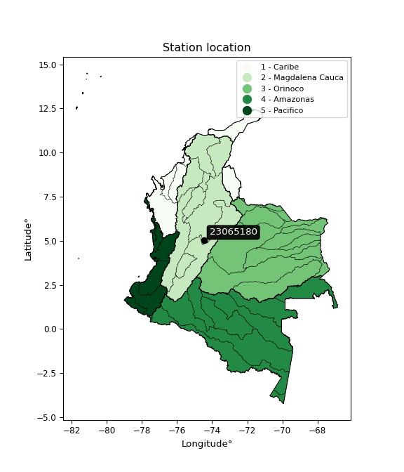

<div align="center">


</div>

# PMP Station (rain, Pmax24h): 23065180

Probable Maximum Precipitation (PMP) is the greatest amount of rainfall for a specific duration that is meteorologically possible for a given location, acting as a "worst-case" scenario for extreme storms, crucial for designing safety-critical infrastructure like bridges, river deviations, dams, spillways, and nuclear plants to prevent catastrophic failure. PMP is calculated by hydrologists using meteorological data to determine the upper limit of extreme rainfall, often leading to the Probable Maximum Flood (PMF) for flood control design, and is increasingly being studied for climate change impacts.

<div align="center">

</img>

</div>


## A. General information


### 1. General running parameters

• app_version: _v20251227_. • runtime: _2025-12-27 09:02:11.367833_. • Python version: _3.14.0_. • SciPy version: _1.16.3_. • Pandas version: _2.3.3_. • NumPy version: _2.3.5_. • Stations dataset (station_dataset_file): _dataset/pmax24h_in/automatic_colombia_2003_2024_filter.csv_. • Stations catalog (station_catalog_file): _dataset/CNE_IDEAM.xls_. • Minimum year to eval til year_max (date_min): _2003_. • Maximum year to eval since year_min (date_max): _2024_. • Creates, save and include plots into reports (create_plot): _False_. • Plot only fit distributions with Δo > Δ (plot_only_fit): _True_. • Eval low extreme values, if False, evaluates high extreme values (low_extreme): _False_. • Eval every SciPy distribution as logarithmic (pdist_logarithmic_on): _True_. • Standard deviation normalized (ddof): _1.0_. • Return periods to eval in years (Tr): _[2, 2.33, 5, 10, 15, 20, 25, 50, 75, 100, 200, 250, 500, 750, 1000]_. • Minimum data sample per station, 0 means any (minimum_sample): _5_. • Z-Score threshold to adjust a value, 0 means disable (zscore): _3.5_. • Avoid zeros, e.g. rain = 0 (avoid_zeros): _True_. • Avoid null values (avoid_nans): _True_. [:file_folder:Dataset file.](../../dataset/pmax24h_in/automatic_colombia_2003_2024_filter.csv)

> Delta Degrees of Freedom (DDOF): is a parameter used in the formulas for calculating variance and standard deviation. When ddof=0, the divisor is $N$ (the total number of observations) and this is used when your data set is the entire population. When ddof=1, the divisor is $N-1$ and this is used when your data set is a sample drawn from a larger population. Using $N-1$ provides an unbiased estimate of the population variance (known as Bessel´s correction).


### 2. Station info and location

|   id |   CODIGO | NOMBRE             | CATEGORIA               | TECNOLOGIA                | ESTADO   | FECHA_INSTALACION   |   FECHA_SUSPENSION |   ALTITUD |   LATITUD |   LONGITUD | DEPARTAMENTO   | MUNICIPIO   | AREA_OPERATIVA                            | ENTIDAD                                                     | AREA_HIDROGRAFICA   | ZONA_HIDROGRAFICA   | SUBZONA_HIDROGRAFICA   |   CORRIENTE | Catalogo   |
|-----:|---------:|:-------------------|:------------------------|:--------------------------|:---------|:--------------------|-------------------:|----------:|----------:|-----------:|:---------------|:------------|:------------------------------------------|:------------------------------------------------------------|:--------------------|:--------------------|:-----------------------|------------:|:-----------|
|    0 | 23065180 | VILLETA [23065180] | Climatológica Principal | Automática con Telemetría | Activa   | 10/12/2004          |                nan |       878 |   5.01686 |    -74.471 | Cundinamarca   | Villeta     | Area Operativa 11 - Cundinamarca-Amazonas | INSTITUTO DE HIDROLOGIA METEOROLOGIA Y ESTUDIOS AMBIENTALES | Magdalena Cauca     | Medio Magdalena     | Río Negro              |         nan | CNE_IDEAM  |

<div align="center">

Map location in: [:earth_americas:Google](http://maps.google.com/maps?q=5.016861,-74.470972) [:earth_americas:OSM](https://www.openstreetmap.org/#map=18/5.016861/-74.470972&layers=P) [:earth_americas:Bing](https://www.bing.com/maps?cp=5.016861~-74.470972&lvl=18) [:earth_americas:Apple](https://maps.apple.com/frame?center=5.016861%2C-74.470972&span=0.003%2C0.006)

</div>


<div align="center">

```geojson
{
  "type": "Feature",
  "geometry": {
    "type": "Point", 
    "coordinates": [-74.470972, 5.016861]
  }, 
  "properties": {
    "Name": "23065180"
  }
}
```

</div>


### 3. Discrete values table and plot

|               |           0 |           1 |           2 |           3 |            4 |           5 |           6 |           7 |           8 |          9 |         10 |           11 |          12 |          13 |          14 |         15 |          16 |
|:--------------|------------:|------------:|------------:|------------:|-------------:|------------:|------------:|------------:|------------:|-----------:|-----------:|-------------:|------------:|------------:|------------:|-----------:|------------:|
| Date          | 2005        | 2006        | 2007        | 2008        | 2009         | 2010        | 2011        | 2012        | 2013        | 2014       | 2015       | 2016         | 2017        | 2018        | 2019        | 2021       | 2022        |
| Value         |   65.7      |   54.7      |   40.8      |   53.1      |   56.1       |   76.8      |   82        |   79.6      |   53        |  127.9     |   11.6     |   60         |   71.7      |   74.8      |   50.1      |    2.7     |   39.6      |
| Value_initial |   65.7      |   54.7      |   40.8      |   53.1      |   56.1       |   76.8      |   82        |   79.6      |   53        |  127.9     |   11.6     |   60         |   71.7      |   74.8      |   50.1      |    2.7     |   39.6      |
| count         |   17        |   17        |   17        |   17        |   17         |   17        |   17        |   17        |   17        |   17       |   17       |   17         |   17        |   17        |   17        |   17       |   17        |
| mean          |   58.8353   |   58.8353   |   58.8353   |   58.8353   |   58.8353    |   58.8353   |   58.8353   |   58.8353   |   58.8353   |   58.8353  |   58.8353  |   58.8353    |   58.8353   |   58.8353   |   58.8353   |   58.8353  |   58.8353   |
| std           |   28.2563   |   28.2563   |   28.2563   |   28.2563   |   28.2563    |   28.2563   |   28.2563   |   28.2563   |   28.2563   |   28.2563  |   28.2563  |   28.2563    |   28.2563   |   28.2563   |   28.2563   |   28.2563  |   28.2563   |
| zscore        |    0.242944 |   -0.146349 |   -0.638274 |   -0.202974 |   -0.0968028 |    0.635776 |    0.819805 |    0.734869 |   -0.206513 |    2.44422 |   -1.67167 |    0.0412193 |    0.455286 |    0.564995 |   -0.309144 |   -1.98664 |   -0.680742 |

> The initial value (value_initial) correspond to the initial obtained or null completed value, and value (value) is adjusted only when the initial value is outside the valid range definite through the Z-Score value. If Z-Score is active, values out of range or outliers are replaced with the station mean value


### 4. Active continuous probability distributions from SciPy (45 of 104 available)

[scipy.stats](https://docs.scipy.org/doc/scipy/reference/stats.html) is a Python´s powerful submodule within the SciPy library for comprehensive statistical analysis, offering over 130 probability distributions (like Normal, Poisson), functions for descriptive stats (mean, variance), hypothesis testing (t-tests, chi-square), random variable generation, and statistical tests, making it essential for data science, modeling, and research. It provides tools to explore, model, and draw conclusions from data efficiently, working seamlessly with NumPy.

<div align="center">

|   id | p_dist             |   n_parameter | fit_method   | label                                                                       | active   | ref                                                                                                        |
|-----:|:-------------------|--------------:|:-------------|:----------------------------------------------------------------------------|:---------|:-----------------------------------------------------------------------------------------------------------|
|    0 | alpha              |             3 | MLE          | Alpha                                                                       | True     | [:mortar_board:](https://docs.scipy.org/doc/scipy/reference/generated/scipy.stats.alpha.html)              |
|    1 | betaprime          |             4 | MLE          | Beta prime                                                                  | True     | [:mortar_board:](https://docs.scipy.org/doc/scipy/reference/generated/scipy.stats.betaprime.html)          |
|    2 | chi2               |             3 | MLE          | Chi²                                                                        | True     | [:mortar_board:](https://docs.scipy.org/doc/scipy/reference/generated/scipy.stats.chi2.html)               |
|    3 | crystalball        |             4 | MLE          | Crystalball                                                                 | True     | [:mortar_board:](https://docs.scipy.org/doc/scipy/reference/generated/scipy.stats.crystalball.html)        |
|    4 | erlang             |             3 | MLE          | Erlang                                                                      | True     | [:mortar_board:](https://docs.scipy.org/doc/scipy/reference/generated/scipy.stats.erlang.html)             |
|    5 | expon              |             2 | MLE          | Exponential                                                                 | True     | [:mortar_board:](https://docs.scipy.org/doc/scipy/reference/generated/scipy.stats.expon.html)              |
|    6 | exponnorm          |             3 | MLE          | Exponentially modified Normal                                               | True     | [:mortar_board:](https://docs.scipy.org/doc/scipy/reference/generated/scipy.stats.exponnorm.html)          |
|    7 | f                  |             4 | MLE          | F                                                                           | True     | [:mortar_board:](https://docs.scipy.org/doc/scipy/reference/generated/scipy.stats.f.html)                  |
|    8 | fatiguelife        |             3 | MLE          | Fatigue-life (Birnbaum-Saunders)                                            | True     | [:mortar_board:](https://docs.scipy.org/doc/scipy/reference/generated/scipy.stats.fatiguelife.html)        |
|    9 | fisk               |             3 | MLE          | Fisk                                                                        | True     | [:mortar_board:](https://docs.scipy.org/doc/scipy/reference/generated/scipy.stats.fisk.html)               |
|   10 | gamma              |             3 | MLE          | Gamma                                                                       | True     | [:mortar_board:](https://docs.scipy.org/doc/scipy/reference/generated/scipy.stats.gamma.html)              |
|   11 | genexpon           |             5 | MLE          | Generalized exponential                                                     | True     | [:mortar_board:](https://docs.scipy.org/doc/scipy/reference/generated/scipy.stats.genexpon.html)           |
|   12 | genlogistic        |             3 | MLE          | Generalized logistic                                                        | True     | [:mortar_board:](https://docs.scipy.org/doc/scipy/reference/generated/scipy.stats.genlogistic.html)        |
|   13 | gibrat             |             2 | MM           | Gibrat                                                                      | True     | [:mortar_board:](https://docs.scipy.org/doc/scipy/reference/generated/scipy.stats.gibrat.html)             |
|   14 | gompertz           |             3 | MLE          | Gompertz (or truncated Gumbel)                                              | True     | [:mortar_board:](https://docs.scipy.org/doc/scipy/reference/generated/scipy.stats.gompertz.html)           |
|   15 | gumbel_l           |             2 | MM           | Gumbel Left Skew                                                            | True     | [:mortar_board:](https://docs.scipy.org/doc/scipy/reference/generated/scipy.stats.gumbel_l.html)           |
|   16 | gumbel_r           |             2 | MM           | Gumbel Right Skew                                                           | True     | [:mortar_board:](https://docs.scipy.org/doc/scipy/reference/generated/scipy.stats.gumbel_r.html)           |
|   17 | halflogistic       |             2 | MM           | Half-logistic                                                               | True     | [:mortar_board:](https://docs.scipy.org/doc/scipy/reference/generated/scipy.stats.halflogistic.html)       |
|   18 | halfnorm           |             2 | MM           | Half Normal                                                                 | True     | [:mortar_board:](https://docs.scipy.org/doc/scipy/reference/generated/scipy.stats.halfnorm.html)           |
|   19 | hypsecant          |             2 | MM           | hyperbolic secant                                                           | True     | [:mortar_board:](https://docs.scipy.org/doc/scipy/reference/generated/scipy.stats.hypsecant.html)          |
|   20 | invgamma           |             3 | MLE          | Inverted gamma                                                              | True     | [:mortar_board:](https://docs.scipy.org/doc/scipy/reference/generated/scipy.stats.invgamma.html)           |
|   21 | invgauss           |             3 | MLE          | Inverse Gaussian                                                            | True     | [:mortar_board:](https://docs.scipy.org/doc/scipy/reference/generated/scipy.stats.invgauss.html)           |
|   22 | invweibull         |             3 | MLE          | Inverted Weibull                                                            | True     | [:mortar_board:](https://docs.scipy.org/doc/scipy/reference/generated/scipy.stats.invweibull.html)         |
|   23 | johnsonsu          |             4 | MLE          | Johnson Su                                                                  | True     | [:mortar_board:](https://docs.scipy.org/doc/scipy/reference/generated/scipy.stats.johnsonsu.html)          |
|   24 | kstwobign          |             2 | MLE          | Limiting distribution of scaled Kolmogorov-Smirnov two-sided test statistic | True     | [:mortar_board:](https://docs.scipy.org/doc/scipy/reference/generated/scipy.stats.kstwobign.html)          |
|   25 | laplace            |             2 | MM           | Laplace                                                                     | True     | [:mortar_board:](https://docs.scipy.org/doc/scipy/reference/generated/scipy.stats.laplace.html)            |
|   26 | laplace_asymmetric |             3 | MLE          | Asymmetric Laplace                                                          | True     | [:mortar_board:](https://docs.scipy.org/doc/scipy/reference/generated/scipy.stats.laplace_asymmetric.html) |
|   27 | loggamma           |             3 | MLE          | Log gamma                                                                   | True     | [:mortar_board:](https://docs.scipy.org/doc/scipy/reference/generated/scipy.stats.loggamma.html)           |
|   28 | logistic           |             2 | MM           | Logistic (or Sech-squared)                                                  | True     | [:mortar_board:](https://docs.scipy.org/doc/scipy/reference/generated/scipy.stats.logistic.html)           |
|   29 | lognorm            |             3 | MLE          | Log Normal                                                                  | True     | [:mortar_board:](https://docs.scipy.org/doc/scipy/reference/generated/scipy.stats.lognorm.html)            |
|   30 | maxwell            |             2 | MM           | Maxwell                                                                     | True     | [:mortar_board:](https://docs.scipy.org/doc/scipy/reference/generated/scipy.stats.maxwell.html)            |
|   31 | mielke             |             4 | MLE          | Mielke Beta-Kappa / Dagum                                                   | True     | [:mortar_board:](https://docs.scipy.org/doc/scipy/reference/generated/scipy.stats.mielke.html)             |
|   32 | moyal              |             2 | MM           | Moyal                                                                       | True     | [:mortar_board:](https://docs.scipy.org/doc/scipy/reference/generated/scipy.stats.moyal.html)              |
|   33 | nakagami           |             3 | MLE          | Nakagami                                                                    | True     | [:mortar_board:](https://docs.scipy.org/doc/scipy/reference/generated/scipy.stats.nakagami.html)           |
|   34 | ncf                |             5 | MLE          | Non-central F distribution                                                  | True     | [:mortar_board:](https://docs.scipy.org/doc/scipy/reference/generated/scipy.stats.ncf.html)                |
|   35 | nct                |             4 | MLE          | Non-central Student’s t                                                     | True     | [:mortar_board:](https://docs.scipy.org/doc/scipy/reference/generated/scipy.stats.nct.html)                |
|   36 | norm               |             2 | MM           | Normal                                                                      | True     | [:mortar_board:](https://docs.scipy.org/doc/scipy/reference/generated/scipy.stats.norm.html)               |
|   37 | pareto             |             3 | MLE          | Pareto                                                                      | True     | [:mortar_board:](https://docs.scipy.org/doc/scipy/reference/generated/scipy.stats.pareto.html)             |
|   38 | pearson3           |             3 | MM           | Pearson type III                                                            | True     | [:mortar_board:](https://docs.scipy.org/doc/scipy/reference/generated/scipy.stats.pearson3.html)           |
|   39 | rayleigh           |             2 | MM           | Rayleigh                                                                    | True     | [:mortar_board:](https://docs.scipy.org/doc/scipy/reference/generated/scipy.stats.rayleigh.html)           |
|   40 | rice               |             3 | MLE          | Rice                                                                        | True     | [:mortar_board:](https://docs.scipy.org/doc/scipy/reference/generated/scipy.stats.rice.html)               |
|   41 | t                  |             3 | MLE          | Student’s t                                                                 | True     | [:mortar_board:](https://docs.scipy.org/doc/scipy/reference/generated/scipy.stats.t.html)                  |
|   42 | truncnorm          |             4 | MLE          | Truncated normal                                                            | True     | [:mortar_board:](https://docs.scipy.org/doc/scipy/reference/generated/scipy.stats.truncnorm.html)          |
|   43 | wald               |             2 | MM           | Wald                                                                        | True     | [:mortar_board:](https://docs.scipy.org/doc/scipy/reference/generated/scipy.stats.wald.html)               |
|   44 | weibull_min        |             3 | MLE          | Weibull minimum                                                             | True     | [:mortar_board:](https://docs.scipy.org/doc/scipy/reference/generated/scipy.stats.weibull_min.html)        |

</div>

> **n_parameter:** # arguments & localization & scale.
>
> **Fit methods:** (MLE) maximum likelihood, (MM) L-moments.
>
>**Inactive:** foldnorm, gennorm, norminvgauss, powernorm, powerlognorm, skewnorm, genextreme, anglit, arcsine, argus, beta, bradford, burr, burr12, cauchy, cosine, halfcauchy, foldcauchy, skewcauchy, wrapcauchy, dgamma, gengamma, exponweib, exponpow, truncexpon, gausshyper, genhalflogistic, genhyperbolic, geninvgauss, halfgennorm, johnsonsb, kappa4, kappa3, ksone, kstwo, loglaplace, levy, levy_l, levy_stable, ncx2, genpareto, truncpareto, lomax, powerlaw, rdist, rel_breitwigner, recipinvgauss, semicircular, studentized_range, trapezoid, triang, truncweibull_min, tukeylambda, uniform, loguniform, vonmises, vonmises_line, weibull_max, dweibull, 


## B. Probability distributions vs. Empirical distributions

A continuous probability distribution (CPD) describes probabilities for variables that can take any value within a range (like rain any time), unlike discrete variables with specific outcomes (like temperature). It uses a Probability Density Function (PDF), a curve where the total area under it equals 1, and the probability of the variable falling within an interval (a to b) is found by calculating the area under the curve between those points. A key feature is that the probability of hitting any single exact value is zero, so probabilities are always expressed for ranges, e.g., $P(a ≤ X ≤ b)$.

<div align="center">

Distributions parameters from station values
|    |   station | p_dist                |   n |               loc |            scale | shape                  | shape1              | shape2                | shape3   |
|---:|----------:|:----------------------|----:|------------------:|-----------------:|:-----------------------|:--------------------|:----------------------|:---------|
|  0 |  23065180 | alpha                 |  17 |      -0.0209808   |     10.8014      | 7.447405742781705e-11  |                     |                       |          |
|  1 |  23065180 | betaprime             |  17 |    -206.779       | 188755           | 92.60652576334422      | 65796.31292419249   |                       |          |
|  2 |  23065180 | chi2                  |  17 |       2.7         |      4.79306     | 0.480160820178135      |                     |                       |          |
|  3 |  23065180 | crystalball           |  17 |      58.835       |     27.4126      | 79908.20988403975      | 1333.914938641151   |                       |          |
|  4 |  23065180 | erlang                |  17 |    -394.168       |      1.65949     | 272.9642141654415      |                     |                       |          |
|  5 |  23065180 | expon                 |  17 |       2.7         |     56.1353      |                        |                     |                       |          |
|  6 |  23065180 | exponnorm             |  17 |      43.8878      |     22.8782      | 0.6533552024511566     |                     |                       |          |
|  7 |  23065180 | f                     |  17 |    -426.479       |    485.299       | 633.98478888458        | 64167.75473312404   |                       |          |
|  8 |  23065180 | fatiguelife           |  17 |       2.62699     |      3.6376      | 4.064238519970036      |                     |                       |          |
|  9 |  23065180 | fisk                  |  17 |   -3026.96        |   3085.92        | 213.58724443119547     |                     |                       |          |
| 10 |  23065180 | gamma                 |  17 |    -389.605       |      1.6763      | 267.51772767411853     |                     |                       |          |
| 11 |  23065180 | genexpon              |  17 |       2.69998     |      2.60153     | 0.04635370604390815    | 2.1358911812507e-06 | 2.0858885904526847    |          |
| 12 |  23065180 | genlogistic           |  17 |      62.4734      |     13.4917      | 0.841384616461295      |                     |                       |          |
| 13 |  23065180 | gibrat                |  17 |      37.9229      |     12.684       |                        |                     |                       |          |
| 14 |  23065180 | gompertz              |  17 |      39.6         |      8.41501     | 0.0004164836365698145  |                     |                       |          |
| 15 |  23065180 | gumbel_l              |  17 |      71.1725      |     21.3736      |                        |                     |                       |          |
| 16 |  23065180 | gumbel_r              |  17 |      46.4981      |     21.3736      |                        |                     |                       |          |
| 17 |  23065180 | halflogistic          |  17 |      26.3449      |     23.4369      |                        |                     |                       |          |
| 18 |  23065180 | halfnorm              |  17 |      22.5516      |     45.4748      |                        |                     |                       |          |
| 19 |  23065180 | hypsecant             |  17 |      58.8353      |     17.4515      |                        |                     |                       |          |
| 20 |  23065180 | invgamma              |  17 |    -264.708       |  43388.6         | 135.15593621774497     |                     |                       |          |
| 21 |  23065180 | invgauss              |  17 |     -29.9508      |    473.209       | 0.18969993041561       |                     |                       |          |
| 22 |  23065180 | invweibull            |  17 | -673028           | 673073           | 24791.383068475538     |                     |                       |          |
| 23 |  23065180 | johnsonsu             |  17 |      61.1421      |     21.5905      | 0.09204279902305697    | 1.1320647378954805  |                       |          |
| 24 |  23065180 | kstwobign             |  17 |     -54.2856      |    130.088       |                        |                     |                       |          |
| 25 |  23065180 | laplace               |  17 |      58.8353      |     19.3837      |                        |                     |                       |          |
| 26 |  23065180 | laplace_asymmetric    |  17 |      54.7         |     19.3322      | 0.8988521043418758     |                     |                       |          |
| 27 |  23065180 | loggamma              |  17 |   -6954.38        |    981.095       | 1272.4043097800595     |                     |                       |          |
| 28 |  23065180 | logistic              |  17 |      58.8353      |     15.1134      |                        |                     |                       |          |
| 29 |  23065180 | lognorm               |  17 |    -613.381       |    671.659       | 0.04073499594028971    |                     |                       |          |
| 30 |  23065180 | maxwell               |  17 |      -6.12126     |     40.7055      |                        |                     |                       |          |
| 31 |  23065180 | mielke                |  17 |     -49.7505      |    123.123       | 4.676315232344179      | 10.833271018444236  |                       |          |
| 32 |  23065180 | moyal                 |  17 |      43.159       |     12.34        |                        |                     |                       |          |
| 33 |  23065180 | nakagami              |  17 |    -270.133       |    330.108       | 36.17770214415404      |                     |                       |          |
| 34 |  23065180 | ncf                   |  17 |      -0.194933    |      2.34554e-05 | 6.065851832031369e-06  | 4.37970006484692    | 13.142884354679499    |          |
| 35 |  23065180 | nct                   |  17 |      -0.164544    |     25.4805      | 33.050232792697145     | 2.2641876438062845  |                       |          |
| 36 |  23065180 | norm                  |  17 |      58.8353      |     27.4127      |                        |                     |                       |          |
| 37 |  23065180 | pareto                |  17 |       2.7         |      2.2066e-06  | 0.06250005476003678    |                     |                       |          |
| 38 |  23065180 | pearson3              |  17 |      58.8353      |     27.4127      | 0.19054872122229016    |                     |                       |          |
| 39 |  23065180 | rayleigh              |  17 |       6.39326     |     41.8427      |                        |                     |                       |          |
| 40 |  23065180 | rice                  |  17 |  -19028.7         |      9.25422     | 2062.6125058820535     |                     |                       |          |
| 41 |  23065180 | t                     |  17 |      58.7671      |     27.3963      | 12.351870826185323     |                     |                       |          |
| 42 |  23065180 | truncnorm             |  17 |       2.2668      |      7.46837     | 0.05800408086265858    | 16.82204295295844   |                       |          |
| 43 |  23065180 | wald                  |  17 |      31.4226      |     27.4127      |                        |                     |                       |          |
| 44 |  23065180 | weibull_min           |  17 |     -20.4737      |     88.4001      | 3.0998273968041046     |                     |                       |          |
| 45 |  23065180 | logalpha              |  17 |     -25.9283      |    967.292       | 32.543359441127535     |                     |                       |          |
| 46 |  23065180 | logbetaprime          |  17 |      -1.4186      |      1.21657e+12 | 18.65309023367206      | 4267787719527.6426  |                       |          |
| 47 |  23065180 | logchi2               |  17 |      -9.66911     |      0.0329824   | 409.17659838605096     |                     |                       |          |
| 48 |  23065180 | logcrystalball        |  17 |       3.85648     |      0.862715    | 729.4665740504057      | 13.32231970906227   |                       |          |
| 49 |  23065180 | logerlang             |  17 |      -7.30633     |      0.0841013   | 132.76735553013174     |                     |                       |          |
| 50 |  23065180 | logexpon              |  17 |       0.993252    |      2.86323     |                        |                     |                       |          |
| 51 |  23065180 | logexponnorm          |  17 |       3.85579     |      0.862705    | 0.0007974843996132248  |                     |                       |          |
| 52 |  23065180 | logf                  |  17 |   -1863.15        |   1867           | 22936134.19049354      | 15537767.874749396  |                       |          |
| 53 |  23065180 | logfatiguelife        |  17 |    -771.734       |    775.587       | 0.0011084923473587255  |                     |                       |          |
| 54 |  23065180 | logfisk               |  17 | -180392           | 180396           | 491542.0679764253      |                     |                       |          |
| 55 |  23065180 | loggamma              |  17 |     -12.9327      |      0.0525964   | 318.96378764066424     |                     |                       |          |
| 56 |  23065180 | loggenexpon           |  17 |       0.82406     |      0.00428193  | 4.756715890649761e-05  | 0.10440584719845214 | 3.439335641132452e-05 |          |
| 57 |  23065180 | loggenlogistic        |  17 |       4.43967     |      0.131125    | 0.20944309352891222    |                     |                       |          |
| 58 |  23065180 | loggibrat             |  17 |       3.19832     |      0.399192    |                        |                     |                       |          |
| 59 |  23065180 | loggompertz           |  17 |       0.908937    |      0.48699     | 0.0012187236054043023  |                     |                       |          |
| 60 |  23065180 | loggumbel_l           |  17 |       4.24475     |      0.672656    |                        |                     |                       |          |
| 61 |  23065180 | loggumbel_r           |  17 |       3.46821     |      0.672656    |                        |                     |                       |          |
| 62 |  23065180 | loghalflogistic       |  17 |       2.83393     |      0.737612    |                        |                     |                       |          |
| 63 |  23065180 | loghalfnorm           |  17 |       2.71457     |      1.43117     |                        |                     |                       |          |
| 64 |  23065180 | loghypsecant          |  17 |       3.85648     |      0.549221    |                        |                     |                       |          |
| 65 |  23065180 | loginvgamma           |  17 |     -17.8825      |  12051.6         | 555.9795747424043      |                     |                       |          |
| 66 |  23065180 | loginvgauss           |  17 |      -8.55947     |   1874.65        | 0.0066063655889063485  |                     |                       |          |
| 67 |  23065180 | loginvweibull         |  17 |      -2.70089e+07 |      2.70089e+07 | 22083810.91989599      |                     |                       |          |
| 68 |  23065180 | logjohnsonsu          |  17 |       4.31166     |      0.185532    | 0.7437220774557365     | 0.7806190308742654  |                       |          |
| 69 |  23065180 | logkstwobign          |  17 |       1.17253     |      3.27834     |                        |                     |                       |          |
| 70 |  23065180 | loglaplace            |  17 |       3.85648     |      0.610031    |                        |                     |                       |          |
| 71 |  23065180 | loglaplace_asymmetric |  17 |       4.3412      |      0.337085    | 1.950570007693285      |                     |                       |          |
| 72 |  23065180 | logloggamma           |  17 |       4.51937     |      0.281874    | 0.43075269615941036    |                     |                       |          |
| 73 |  23065180 | loglogistic           |  17 |       3.85648     |      0.475639    |                        |                     |                       |          |
| 74 |  23065180 | loglognorm            |  17 | -131071           | 131075           | 6.5818949867031685e-06 |                     |                       |          |
| 75 |  23065180 | logmaxwell            |  17 |       1.81219     |      1.28107     |                        |                     |                       |          |
| 76 |  23065180 | logmielke             |  17 |      -3.46971e+07 |      3.46971e+07 | 53654905.450375        | 268648045.2822942   |                       |          |
| 77 |  23065180 | logmoyal              |  17 |       3.36313     |      0.388358    |                        |                     |                       |          |
| 78 |  23065180 | lognakagami           |  17 |    -749.852       |    753.706       | 190674.30940879334     |                     |                       |          |
| 79 |  23065180 | logncf                |  17 |      -1.46176     |      5.89702e-07 | 1.5685441534029455e-05 | 267.81561221298523  | 140.79429291198426    |          |
| 80 |  23065180 | lognct                |  17 |     -56.7425      |      0.807463    | 17298.69346702419      | 75.04319709588584   |                       |          |
| 81 |  23065180 | lognorm               |  17 |       3.85648     |      0.862715    |                        |                     |                       |          |
| 82 |  23065180 | logpareto             |  17 |       0.993252    |      1.23713e-07 | 0.06250004387037204    |                     |                       |          |
| 83 |  23065180 | logpearson3           |  17 |       3.85648     |      0.862716    | -2.255827499779074     |                     |                       |          |
| 84 |  23065180 | lograyleigh           |  17 |       2.20609     |      1.31683     |                        |                     |                       |          |
| 85 |  23065180 | logrice               |  17 |    -577.708       |      0.866561    | 671.1169795017463      |                     |                       |          |
| 86 |  23065180 | logt                  |  17 |       4.1023      |      0.239353    | 1.3311919683124802     |                     |                       |          |
| 87 |  23065180 | logtruncnorm          |  17 |       2.48673     |      2.78756     | -0.5359013995217339    | 95.0606030072851    |                       |          |
| 88 |  23065180 | logwald               |  17 |       2.99378     |      0.862702    |                        |                     |                       |          |
| 89 |  23065180 | logweibull_min        |  17 |      -3.02806e+08 |      3.02806e+08 | 637190783.595983       |                     |                       |          |

</div>

> **loc** (Location parameter): This shifts the distribution along the x-axis. For many common distributions, like the normal (Gaussian) distribution, loc represents the mean $μ$. For others, like the uniform distribution, it might represent the minimum value, or for the beta distribution, the left end of the support interval.
>
> **scale** (Scale parameter): This determines the width or spread of the distribution. For the normal distribution, scale represents the standard deviation $σ$. For a uniform distribution, it defines the length of the interval (from $loc$ to $loc + scale$).
>
> **shape** (Shape parameters): Refers to parameters that define the specific form of a probability distribution, distinct from its location (loc) and scale (scale). These parameters are required arguments for most distribution functions. For example, a normal (Gaussian) distribution is fully defined by its location (mean) and scale (standard deviation), so it has no specific shape parameters beyond loc and scale. However, other distributions have intrinsic properties that need specification, as Gamma distribution that takes a shape parameter, often named $a$ or $alpha$.


### 0. Cumulative distribution values - CDF (90 evaluated)

Cumulative Distribution Function (CDF), denoted as $F$<sub>$X$</sub>$(x)$, is a function that gives the probability that a random variable $X$ will take a value less than or equal to a specific value, $x$ (i.e., $(P(X≥x)$. It essentially "accumulates" probabilities from a given point up to the far right (positive infinity), providing a complete picture of the distribution´s probabilities for both discrete (like rain) and continuous (like temperature) variables, helping to find probabilities over ranges or above certain values.

<div align="center">

CDF ordered by x ascending and calculating $log(f(x))$ separately
|   id |   Station |   date |     x |   count |    mean |     std |     zscore |   Value_initial |   station |   m |       alpha |   alpha_pdf |   betaprime |   betaprime_pdf |        chi2 |    chi2_pdf |   crystalball |   crystalball_pdf |    erlang |   erlang_pdf |    expon |   expon_pdf |   exponnorm |   exponnorm_pdf |         f |       f_pdf |   fatiguelife |   fatiguelife_pdf |      fisk |    fisk_pdf |     gamma |   gamma_pdf |    genexpon |   genexpon_pdf |   genlogistic |   genlogistic_pdf |    gibrat |   gibrat_pdf |    gompertz |   gompertz_pdf |   gumbel_l |   gumbel_l_pdf |    gumbel_r |   gumbel_r_pdf |   halflogistic |   halflogistic_pdf |   halfnorm |   halfnorm_pdf |   hypsecant |   hypsecant_pdf |   invgamma |   invgamma_pdf |   invgauss |   invgauss_pdf |   invweibull |   invweibull_pdf |   johnsonsu |   johnsonsu_pdf |   kstwobign |   kstwobign_pdf |   laplace |   laplace_pdf |   laplace_asymmetric |   laplace_asymmetric_pdf |    loggamma |   loggamma_pdf |   logistic |   logistic_pdf |     lognorm |   lognorm_pdf |    maxwell |   maxwell_pdf |    mielke |   mielke_pdf |       moyal |   moyal_pdf |   nakagami |   nakagami_pdf |        ncf |    ncf_pdf |       nct |     nct_pdf |      norm |   norm_pdf |   pareto |      pareto_pdf |   pearson3 |   pearson3_pdf |   rayleigh |   rayleigh_pdf |        rice |    rice_pdf |         t |       t_pdf |   truncnorm |   truncnorm_pdf |     wald |    wald_pdf |   weibull_min |   weibull_min_pdf |    logalpha |   logalpha_pdf |   logbetaprime |   logbetaprime_pdf |     logchi2 |   logchi2_pdf |   logcrystalball |   logcrystalball_pdf |   logerlang |   logerlang_pdf |   logexpon |   logexpon_pdf |   logexponnorm |   logexponnorm_pdf |        logf |   logf_pdf |   logfatiguelife |   logfatiguelife_pdf |     logfisk |   logfisk_pdf |   loggenexpon |   loggenexpon_pdf |   loggenlogistic |   loggenlogistic_pdf |   loggibrat |   loggibrat_pdf |   loggompertz |   loggompertz_pdf |   loggumbel_l |   loggumbel_l_pdf |   loggumbel_r |   loggumbel_r_pdf |   loghalflogistic |   loghalflogistic_pdf |   loghalfnorm |   loghalfnorm_pdf |   loghypsecant |   loghypsecant_pdf |   loginvgamma |   loginvgamma_pdf |   loginvgauss |   loginvgauss_pdf |   loginvweibull |   loginvweibull_pdf |   logjohnsonsu |   logjohnsonsu_pdf |   logkstwobign |   logkstwobign_pdf |   loglaplace |   loglaplace_pdf |   loglaplace_asymmetric |   loglaplace_asymmetric_pdf |   logloggamma |   logloggamma_pdf |   loglogistic |   loglogistic_pdf |   loglognorm |   loglognorm_pdf |   logmaxwell |   logmaxwell_pdf |   logmielke |   logmielke_pdf |    logmoyal |   logmoyal_pdf |   lognakagami |   lognakagami_pdf |      logncf |   logncf_pdf |      lognct |   lognct_pdf |   logpareto |   logpareto_pdf |   logpearson3 |   logpearson3_pdf |   lograyleigh |   lograyleigh_pdf |     logrice |   logrice_pdf |      logt |   logt_pdf |   logtruncnorm |   logtruncnorm_pdf |   logwald |   logwald_pdf |   logweibull_min |   logweibull_min_pdf |
|-----:|----------:|-------:|------:|--------:|--------:|--------:|-----------:|----------------:|----------:|----:|------------:|------------:|------------:|----------------:|------------:|------------:|--------------:|------------------:|----------:|-------------:|---------:|------------:|------------:|----------------:|----------:|------------:|--------------:|------------------:|----------:|------------:|----------:|------------:|------------:|---------------:|--------------:|------------------:|----------:|-------------:|------------:|---------------:|-----------:|---------------:|------------:|---------------:|---------------:|-------------------:|-----------:|---------------:|------------:|----------------:|-----------:|---------------:|-----------:|---------------:|-------------:|-----------------:|------------:|----------------:|------------:|----------------:|----------:|--------------:|---------------------:|-------------------------:|------------:|---------------:|-----------:|---------------:|------------:|--------------:|-----------:|--------------:|----------:|-------------:|------------:|------------:|-----------:|---------------:|-----------:|-----------:|----------:|------------:|----------:|-----------:|---------:|----------------:|-----------:|---------------:|-----------:|---------------:|------------:|------------:|----------:|------------:|------------:|----------------:|---------:|------------:|--------------:|------------------:|------------:|---------------:|---------------:|-------------------:|------------:|--------------:|-----------------:|---------------------:|------------:|----------------:|-----------:|---------------:|---------------:|-------------------:|------------:|-----------:|-----------------:|---------------------:|------------:|--------------:|--------------:|------------------:|-----------------:|---------------------:|------------:|----------------:|--------------:|------------------:|--------------:|------------------:|--------------:|------------------:|------------------:|----------------------:|--------------:|------------------:|---------------:|-------------------:|--------------:|------------------:|--------------:|------------------:|----------------:|--------------------:|---------------:|-------------------:|---------------:|-------------------:|-------------:|-----------------:|------------------------:|----------------------------:|--------------:|------------------:|--------------:|------------------:|-------------:|-----------------:|-------------:|-----------------:|------------:|----------------:|------------:|---------------:|--------------:|------------------:|------------:|-------------:|------------:|-------------:|------------:|----------------:|--------------:|------------------:|--------------:|------------------:|------------:|--------------:|----------:|-----------:|---------------:|-------------------:|----------:|--------------:|-----------------:|---------------------:|
|    0 |  23065180 |   2021 |   2.7 |      17 | 58.8353 | 28.2563 | -1.98664   |             2.7 |  23065180 |   1 | 7.19758e-05 | 0.000440678 |   0.0152676 |      0.0016331  | 0.000131874 | 7.12927e+10 |     0.0202908 |       0.00178803  | 0.0171106 |  0.00168941  | 0        |  0.0178141  |   0.0139401 |     0.00146952  | 0.0171838 | 0.00168779  |     0.0443913 |       1.1374      | 0.0192746 | 0.00133265  | 0.0170409 | 0.00168521  | 4.18905e-07 |     0.0178179  |     0.0238111 |       0.00146745  | 0         |  0           | 0           |    0           |  0.0398019 |     0.00182464 | 0.000425832 |    0.000154634 |       0        |         0          |   0        |     0          |   0.0255078 |     0.00146008  |  0.0132253 |    0.00157102  |  0.0116624 |     0.00247456 |    0.0083393 |       0.00147041 |   0.0316753 |     0.00129323  |   0.0092349 |      0.0019217  | 0.0276217 |   0.001425    |            0.0224165 |              0.00129002  | 0.000671326 |     0.00281493 |  0.0237933 |    0.00153686  | 0.000451926 |    0.00187586 | 0.00266895 |   0.000899175 | 0.0184922 |  0.00164855  | 2.58068e-07 | 2.87308e-07 |  0.0179315 |    0.0017191   | 0.00730249 | 0.0029781  | 0.0156826 | 0.00153798  | 0.0202905 | 0.001788   | 0        | 28324.2         |  0.0151471 |    0.00161173  | 0          |     0          | 5.24969e-10 | 3.54984e-10 | 0.0313001 | 0.00203185  | 1.25392e-07 |     0.111828    | 0        | 0           |     0.0156374 |       0.00207529  | 0.000353812 |     0.00172099 |     0.00166002 |         0.00748421 | 0.000642149 |    0.00278148 |      0.000451927 |           0.00187586 | 0.000623989 |      0.00274921 |   0        |      0.349256  |    0.000451876 |         0.00187569 | 0.000485822 | 0.00199796 |      0.000429877 |           0.00180372 | 0.000260538 |    0.00070974 |    0.00467047 |         0.0440157 |       0.00406683 |           0.00649587 |    0        |       0         |   0.000230343 |        0.00297492 |     0.0079245 |         0.0117341 |   6.19859e-18 |       3.65123e-16 |          0        |              0        |      0        |          0        |     0.00346567 |         0.00631004 |   0.000399806 |        0.00189048 |   0.000774283 |        0.00345966 |      0.00105021 |          0.00588964 |      0.0202171 |          0.0114767 |     0          |          0         |   0.00457693 |       0.00750278 |              0.00486716 |                  0.00740244 |    0.00515643 |        0.00787991 |    0.00242439 |        0.00508475 |  0.000451912 |       0.00187583 |    0         |         0        |  0.00478448 |      0.00739864 | 3.44135e-99 |    1.98438e-96 |   0.000455796 |        0.00189245 | 0.000207253 |   0.00127317 | 0.000474455 |   0.00196895 |    0        | 505201          |     0.0146707 |         0.0157875 |     0         |          0        | 0.000476583 |    0.00196176 | 0.011513  | 0.00490249 |    6.77585e-05 |           0.176113 |  0        |      0        |       0.00121992 |           0.00256549 |
|    1 |  23065180 |   2015 |  11.6 |      17 | 58.8353 | 28.2563 | -1.67167   |            11.6 |  23065180 |   2 | 0.352645    | 0.041432    |   0.0366948 |      0.00331645 | 0.927812    | 0.0115262   |     0.0424342 |       0.0032978   | 0.0387454 |  0.00329654  | 0.146616 |  0.0152023  |   0.0334413 |     0.0030532   | 0.038769  | 0.00328632  |     0.590869  |       0.0117586   | 0.035469  | 0.00240476  | 0.0386342 | 0.00329154  | 0.14665     |     0.0152056  |     0.0410988 |       0.00250533  | 0         |  0           | 0           |    0           |  0.0597349 |     0.00270961 | 0.00598782  |    0.00143382  |       0        |         0          |   0        |     0          |   0.0424371 |     0.00242452  |  0.0346111 |    0.00338804  |  0.0499978 |     0.00626729 |    0.031784  |       0.00403772 |   0.0461696 |     0.00202696  |   0.0403454 |      0.00527789 | 0.0437176 |   0.00225538  |            0.0374113 |              0.00215295  | 0.0659176   |     0.14459    |  0.042072  |    0.00266663  | 0.0516424   |    0.122664   | 0.0207388  |   0.0033792   | 0.0384785 |  0.0029314   | 0.000328093 | 0.000183286 |  0.0397312 |    0.00329932  | 0.0615958  | 0.00890545 | 0.0356888 | 0.00309179  | 0.0424336 | 0.00329776 | 0.613504 |     0.00271416  |  0.0362949 |    0.00327488  | 0.00771227 |     0.00295097 | 1.37439e-07 | 7.90387e-08 | 0.0550292 | 0.00339489  | 0.778337    |     0.0513043   | 0        | 0           |     0.0422469 |       0.00399555  | 0.0616579   |     0.146152   |     0.110406   |         0.189535   | 0.0685026   |    0.15038    |      0.0516424   |           0.122664   | 0.0680641   |      0.148391   |   0.398981 |      0.209909  |    0.051641    |         0.122663   | 0.0530222   | 0.124663   |      0.0512827   |           0.122629   | 0.0136488   |    0.0366829  |    0.2413     |         0.248604  |       0.0417335  |           0.06666    |    0        |       0         |   0.0273154   |        0.0577513  |     0.0671248 |         0.096364  |   0.0107073   |       0.0722169   |          0        |              0        |      0        |          0        |     0.0491632  |         0.0891589  |   0.0620022   |        0.144791   |   0.0794992   |        0.165761   |      0.124611   |          0.212188   |      0.054913  |          0.0463821 |     0.00192765 |          0.0229545 |   0.0499322  |       0.0818518  |              0.0446834  |                  0.0679588  |    0.0478347  |        0.0730665  |    0.0495045  |        0.0989274  |  0.0516431   |       0.122666   |    0.0306241 |         0.136766 |  0.0455869  |      0.0704948  | 0.00121227  |    0.0176936   |   0.0519991   |        0.123369   | 0.0681497   |   0.160341   | 0.0531362   |   0.125099   |    0.638552 |      0.0154968  |     0.0715554 |         0.0788267 |     0.0171478 |          0.13882  | 0.0524265   |    0.123591   | 0.0264855 | 0.0209436  |    0.282498    |           0.203276 |  0        |      0        |       0.0258895  |           0.0537676  |
|    2 |  23065180 |   2022 |  39.6 |      17 | 58.8353 | 28.2563 | -0.680742  |            39.6 |  23065180 |   3 | 0.785147    | 0.00528968  |   0.247901  |      0.0120404  | 0.998266    | 0.000210769 |     0.241438  |       0.0113774   | 0.244875  |  0.0117982   | 0.481772 |  0.00923176 |   0.241279  |     0.0123356   | 0.244238  | 0.0117727   |     0.760296  |       0.00361981  | 0.206883  | 0.0114284   | 0.244652  | 0.0117963   | 0.48186     |     0.00923258 |     0.208414  |       0.0109818   | 0.021522  |  0.0307202   | 1.15169e-09 |    4.94931e-05 |  0.2041    |     0.00850067 | 0.25135     |    0.0162393   |       0.275479 |         0.0197149  |   0.292263 |     0.016355   |   0.204145  |     0.0109123   |  0.255935  |    0.0125106   |  0.347975  |     0.0125906  |    0.292418  |       0.0132434  |   0.183015  |     0.00984147  |   0.325144  |      0.0129423  | 0.185353  |   0.00956233  |            0.187414  |              0.0107853   | 0.437478    |     0.422209   |  0.21879   |    0.0113092   | 0.418425    |    0.452725   | 0.261735   |   0.0131601   | 0.220361  |  0.0111861   | 0.248042    | 0.0191638   |  0.2437    |    0.0116647   | 0.371863   | 0.0102441  | 0.241121  | 0.0121136   | 0.241435  | 0.0113773  | 0.646375 |     0.000598959 |  0.246349  |    0.0120433   | 0.270144   |     0.0138428  | 0.0172466   | 0.00461214  | 0.248564  | 0.0110094   | 0.999999    |     4.19868e-07 | 0.16391  | 0.0391336   |     0.260631  |       0.0115202   | 0.449269    |     0.43666    |     0.458776   |         0.331036   | 0.44679     |    0.422085   |      0.418425    |           0.452725   | 0.437004    |      0.410903   |   0.608572 |      0.136709  |    0.418426    |         0.45273    | 0.420615    | 0.450769   |      0.41959     |           0.454675   | 0.281958    |    0.551658   |    0.561196   |         0.24742   |       0.296442   |           0.472074   |    0.573543 |       0.816103  |   0.301341    |        0.516202   |     0.350232  |         0.41647   |   0.481345    |       0.523218    |          0.517359 |              0.496426 |      0.499532 |          0.444299 |     0.398788   |         0.550514   |   0.444474    |        0.432792   |   0.457876    |        0.399158   |      0.466207   |          0.290899   |      0.22023   |          0.350701  |     0.397186   |          0.510548  |   0.373676   |       0.612552   |              0.289164   |                  0.439789   |    0.3077     |        0.4538     |    0.407695   |        0.507695   |  0.418427    |       0.452723   |    0.452752  |         0.457417 |  0.304231   |      0.469242   | 0.505408    |    0.548071    |   0.41973     |        0.452904   | 0.449748    |   0.401701   | 0.420716    |   0.449451   |    0.652095 |      0.00809661 |     0.285409  |         0.33279   |     0.464959  |          0.454418 | 0.418835    |    0.450813   | 0.138749  | 0.341485   |    0.524916    |           0.185527 |  0.571485 |      0.636303 |       0.293512   |           0.516536   |
|    3 |  23065180 |   2007 |  40.8 |      17 | 58.8353 | 28.2563 | -0.638274  |            40.8 |  23065180 |   4 | 0.791315    | 0.004994    |   0.262547  |      0.0123669  | 0.998501    | 0.000181501 |     0.255298  |       0.0117211   | 0.259237  |  0.0121359   | 0.492733 |  0.00903651 |   0.256309  |     0.0127118   | 0.258571  | 0.012112    |     0.764578  |       0.00351746  | 0.220931  | 0.0119836   | 0.259012  | 0.0121342   | 0.492821    |     0.00903726 |     0.221919  |       0.0115271   | 0.0689624 |  0.0461343   | 6.38342e-05 |    5.70753e-05 |  0.214524  |     0.00887382 | 0.271033    |    0.0165549   |       0.298967 |         0.019427   |   0.31179  |     0.0161883  |   0.217604  |     0.0115203   |  0.271134  |    0.0128168   |  0.363062  |     0.0125505  |    0.308384  |       0.0133626  |   0.195234  |     0.0105295   |   0.340691  |      0.0129643  | 0.197191  |   0.010173    |            0.200814  |              0.0115564   | 0.450104    |     0.423614   |  0.232664  |    0.0118128   | 0.431986    |    0.45569    | 0.277675   |   0.0134027   | 0.234075  |  0.0116701   | 0.271202    | 0.0194184   |  0.257903  |    0.0120037   | 0.384041   | 0.0100515  | 0.25588   | 0.0124815   | 0.255295  | 0.011721   | 0.647081 |     0.000578935 |  0.261003  |    0.0123774   | 0.286861   |     0.0140145  | 0.0235951   | 0.00601611  | 0.261984  | 0.0113553   | 1           |     1.85644e-07 | 0.21069  | 0.0386362   |     0.274614  |       0.0117817   | 0.462317    |     0.437376   |     0.468651   |         0.330493   | 0.459406    |    0.423041   |      0.431986    |           0.45569    | 0.449288    |      0.411988   |   0.612632 |      0.135291  |    0.431987    |         0.455695   | 0.434091    | 0.453611   |      0.433209    |           0.457597   | 0.298715    |    0.570804   |    0.568557   |         0.245734  |       0.310869   |           0.494669   |    0.597033 |       0.758448  |   0.317054    |        0.536492   |     0.362821  |         0.426934  |   0.496868    |       0.516646    |          0.532024 |              0.485995 |      0.512702 |          0.438003 |     0.415356   |         0.559195   |   0.45741     |        0.433738   |   0.469795    |        0.399269   |      0.474865   |          0.289156   |      0.231082  |          0.376709  |     0.412388   |          0.507784  |   0.392417   |       0.643274   |              0.302596   |                  0.460217   |    0.321522   |        0.4723     |    0.422934   |        0.513122   |  0.431988    |       0.455688   |    0.466391  |         0.456277 |  0.318562   |      0.491016   | 0.521592    |    0.536132    |   0.433295    |        0.45581    | 0.461737    |   0.401435   | 0.434176    |   0.45222    |    0.652335 |      0.00800207 |     0.295533  |         0.345529  |     0.478488  |          0.451906 | 0.432338    |    0.453737   | 0.14956   | 0.383836   |    0.530442    |           0.184669 |  0.589967 |      0.602256 |       0.309249   |           0.537773   |
|    4 |  23065180 |   2019 |  50.1 |      17 | 58.8353 | 28.2563 | -0.309144  |            50.1 |  23065180 |   5 | 0.829373    | 0.00335193  |   0.387032  |      0.0141687  | 0.999507    | 5.8273e-05  |     0.374996  |       0.0138328   | 0.382211  |  0.0140918   | 0.57018  |  0.00765686 |   0.38556   |     0.0148152   | 0.381397  | 0.0140856   |     0.794108  |       0.00287114  | 0.351208  | 0.0158164   | 0.381977  | 0.0140914   | 0.570273    |     0.00765717 |     0.34835   |       0.0155209   | 0.483733  |  0.0327345   | 0.00103342  |    0.000172185 |  0.311403  |     0.0120202  | 0.429594    |    0.0169822   |       0.46744  |         0.0166724  |   0.455348 |     0.0146042  |   0.346935  |     0.0161712   |  0.398671  |    0.0143453   |  0.47649   |     0.0117044  |    0.433787  |       0.0133445  |   0.321227  |     0.0167208   |   0.459799  |      0.0124746  | 0.318606  |   0.0164368   |            0.342947  |              0.0197359   | 0.537232    |     0.421635   |  0.359397  |    0.0152335   | 0.526588    |    0.461399   | 0.408203   |   0.014406    | 0.359808  |  0.0152726   | 0.450341    | 0.0183537   |  0.379812  |    0.0140051   | 0.470455   | 0.00853637 | 0.38283   | 0.0145648   | 0.374993  | 0.0138328  | 0.651866 |     0.000459038 |  0.385871  |    0.0142401   | 0.420472   |     0.0144672  | 0.163631    | 0.0266793   | 0.378506  | 0.013522    | 1           |     1.38567e-10 | 0.503637 | 0.0240187   |     0.39196   |       0.0132872   | 0.551707    |     0.429668   |     0.535753   |         0.321641   | 0.546109    |    0.418133   |      0.526588    |           0.461399   | 0.533872    |      0.408784   |   0.63944  |      0.125928  |    0.526589    |         0.461404   | 0.528725    | 0.458689   |      0.528159    |           0.462838   | 0.427045    |    0.666698   |    0.617722   |         0.232741  |       0.430256   |           0.674984   |    0.720329 |       0.470073  |   0.441209    |        0.669184   |     0.457518  |         0.493242  |   0.597244    |       0.457644    |          0.624382 |              0.413596 |      0.59802  |          0.392397 |     0.533287   |         0.5764     |   0.546235    |        0.427859   |   0.551165    |        0.390579   |      0.532793   |          0.274287   |      0.332936  |          0.646548  |     0.51355    |          0.473629  |   0.545005   |       0.745855   |              0.413516   |                  0.628915   |    0.4323     |        0.608502   |    0.530206   |        0.52369    |  0.526589    |       0.461396   |    0.558386  |         0.436406 |  0.436518   |      0.664386   | 0.622714    |    0.4478      |   0.527879    |        0.461116   | 0.543282    |   0.390148   | 0.527951    |   0.456926   |    0.653916 |      0.00740568 |     0.376702  |         0.450622  |     0.56877   |          0.424739 | 0.526524    |    0.459357   | 0.273606  | 0.89606    |    0.567722    |           0.178317 |  0.69343  |      0.418875 |       0.43444    |           0.678284   |
|    5 |  23065180 |   2013 |  53   |      17 | 58.8353 | 28.2563 | -0.206513  |            53   |  23065180 |   6 | 0.838573    | 0.0030027   |   0.428522  |      0.0144183  | 0.99965     | 4.11611e-05 |     0.415719  |       0.0142272   | 0.42357   |  0.0144049   | 0.591821 |  0.00727134 |   0.428992  |     0.0151062   | 0.422748  | 0.0144057   |     0.802197  |       0.00271003  | 0.398305  | 0.0166197   | 0.423335  | 0.0144049   | 0.591915    |     0.00727154 |     0.394783  |       0.0164624   | 0.568609  |  0.0260679   | 0.00162942  |    0.000242887 |  0.347743  |     0.0130404  | 0.478207    |    0.0165054   |       0.514373 |         0.0156894  |   0.496865 |     0.0140223  |   0.395495  |     0.0172655   |  0.440512  |    0.0144828   |  0.509857  |     0.0112996  |    0.472088  |       0.0130515  |   0.372456  |     0.0185634   |   0.495501  |      0.012136   | 0.370024  |   0.0190894   |            0.405234  |              0.0233204   | 0.560852    |     0.417616   |  0.404656  |    0.0159401   | 0.552476    |    0.45842    | 0.450009   |   0.0144011   | 0.405449  |  0.0161733   | 0.502117    | 0.0173223   |  0.420954  |    0.0143433   | 0.494547   | 0.00808157 | 0.425552  | 0.0148684   | 0.415715  | 0.0142272  | 0.653156 |     0.00043097  |  0.427593  |    0.0145062   | 0.462237   |     0.0143153  | 0.252619    | 0.0345282   | 0.418353  | 0.0139333   | 1           |     1.06863e-11 | 0.567654 | 0.0202482   |     0.430879  |       0.0135341   | 0.575729    |     0.423882   |     0.553746   |         0.317773   | 0.569511    |    0.413401   |      0.552476    |           0.45842    | 0.556767    |      0.404752   |   0.646456 |      0.123477  |    0.552478    |         0.458425   | 0.554014    | 0.455613   |      0.554124    |           0.459684   | 0.46491     |    0.677846   |    0.630708   |         0.228803  |       0.469782   |           0.730016   |    0.745214 |       0.415778  |   0.479734    |        0.699364   |     0.485708  |         0.508411  |   0.622467    |       0.438694    |          0.647103 |              0.394013 |      0.619735 |          0.379384 |     0.565493   |         0.567341   |   0.57017     |        0.42262    |   0.573005    |        0.385474   |      0.548094   |          0.269476   |      0.372414  |          0.760197  |     0.539845   |          0.460758  |   0.585097   |       0.680134   |              0.450465   |                  0.68511    |    0.467608   |        0.646254   |    0.559536   |        0.518156   |  0.552477    |       0.458416   |    0.582703  |         0.427682 |  0.47539    |      0.717377   | 0.647223    |    0.423362    |   0.553749    |        0.458032   | 0.565079    |   0.384401   | 0.553583    |   0.453797   |    0.654328 |      0.00725704 |     0.403038  |         0.485993  |     0.592392  |          0.414699 | 0.552298    |    0.456413   | 0.32974   | 1.10002    |    0.577704    |           0.176447 |  0.715916 |      0.381055 |       0.473541   |           0.710757   |
|    6 |  23065180 |   2008 |  53.1 |      17 | 58.8353 | 28.2563 | -0.202974  |            53.1 |  23065180 |   7 | 0.838873    | 0.00299163  |   0.429964  |      0.014424   | 0.999654    | 4.06725e-05 |     0.417142  |       0.0142382   | 0.42501   |  0.0144129   | 0.592547 |  0.0072584  |   0.430503  |     0.0151128   | 0.424189  | 0.0144139   |     0.802468  |       0.00270474  | 0.399968  | 0.0166424   | 0.424776  | 0.0144129   | 0.592641    |     0.0072586  |     0.39643   |       0.0164905   | 0.571206  |  0.025866    | 0.00165385  |    0.000245785 |  0.349049  |     0.0130753  | 0.479856    |    0.016485    |       0.51594  |         0.0156549  |   0.498266 |     0.0140016  |   0.397224  |     0.0172972   |  0.44196   |    0.0144846   |  0.510987  |     0.0112848  |    0.473393  |       0.0130394  |   0.374316  |     0.0186212   |   0.496714  |      0.0121232  | 0.371937  |   0.0191882   |            0.407573  |              0.023455    | 0.561639    |     0.417456   |  0.406251  |    0.0159601   | 0.55334     |    0.458287   | 0.451449   |   0.0143983   | 0.407068  |  0.0162009   | 0.503847    | 0.0172836   |  0.422389  |    0.0143522   | 0.495354   | 0.00806617 | 0.42704   | 0.0148756   | 0.417138  | 0.0142381  | 0.653199 |     0.000430061 |  0.429044  |    0.0145125   | 0.463668   |     0.0143078  | 0.256084    | 0.0347757   | 0.419747  | 0.0139448   | 1           |     9.75631e-12 | 0.569673 | 0.0201305   |     0.432233  |       0.0135405   | 0.576528    |     0.423663   |     0.554345   |         0.317634   | 0.57029     |    0.413219   |      0.55334     |           0.458287   | 0.55753     |      0.404594   |   0.646689 |      0.123396  |    0.553342    |         0.458292   | 0.554869    | 0.455477   |      0.55499     |           0.459545   | 0.466188    |    0.678085   |    0.631139   |         0.228669  |       0.47116    |           0.731869   |    0.745996 |       0.414098  |   0.481053    |        0.700297   |     0.486667  |         0.508888  |   0.623293    |       0.438047    |          0.647845 |              0.393361 |      0.620449 |          0.378945 |     0.566562   |         0.566941   |   0.570967    |        0.422419   |   0.573731    |        0.385285   |      0.548601   |          0.26931    |      0.373851  |          0.764388  |     0.540713   |          0.460307  |   0.586377   |       0.678035   |              0.451758   |                  0.687077   |    0.468827   |        0.647498   |    0.560512   |        0.51791    |  0.553341    |       0.458283   |    0.583509  |         0.427369 |  0.476744   |      0.719165   | 0.64802     |    0.422549    |   0.554612    |        0.457896   | 0.565804    |   0.38419    | 0.554438    |   0.45366    |    0.654342 |      0.00725217 |     0.403956  |         0.487237  |     0.593174  |          0.414346 | 0.553159    |    0.456281   | 0.33182   | 1.10682    |    0.578037    |           0.176384 |  0.716633 |      0.379862 |       0.474882   |           0.711765   |
|    7 |  23065180 |   2006 |  54.7 |      17 | 58.8353 | 28.2563 | -0.146349  |            54.7 |  23065180 |   8 | 0.843523    | 0.00282261  |   0.453101  |      0.0144894  | 0.999713    | 3.36124e-05 |     0.44005   |       0.0143886   | 0.448159  |  0.0145142   | 0.603997 |  0.00705444 |   0.454751  |     0.0151864   | 0.447341  | 0.014519    |     0.806729  |       0.00262239  | 0.42686   | 0.0169565   | 0.447924  | 0.0145144   | 0.604091    |     0.00705458 |     0.423149  |       0.0168937   | 0.610135  |  0.022867    | 0.00208689  |    0.000297126 |  0.370414  |     0.0136292  | 0.505954    |    0.0161279   |       0.540545 |         0.0151004  |   0.520402 |     0.0136661  |   0.425269  |     0.0177394   |  0.465144  |    0.0144865   |  0.528849  |     0.011042   |    0.494093  |       0.0128307  |   0.404809  |     0.0194713   |   0.515941  |      0.011908   | 0.403941  |   0.0208392   |            0.446883  |              0.0257173   | 0.573992    |     0.414736   |  0.432019  |    0.0162358   | 0.566911    |    0.455907   | 0.474438   |   0.0143316   | 0.433322  |  0.0166048   | 0.530995    | 0.0166448   |  0.445452  |    0.0144688   | 0.508065   | 0.00782254 | 0.450916  | 0.0149604   | 0.440046  | 0.0143885  | 0.653876 |     0.000416015 |  0.452329  |    0.0145857   | 0.486455   |     0.0141693  | 0.3147      | 0.0383709   | 0.44219   | 0.0141016   | 1           |     2.21836e-12 | 0.600433 | 0.0183512   |     0.453969  |       0.0136239   | 0.589052    |     0.419996   |     0.563741   |         0.315357   | 0.582512    |    0.410146   |      0.566911    |           0.455907   | 0.569502    |      0.401928   |   0.650333 |      0.122123  |    0.566913    |         0.455911   | 0.568322    | 0.453061   |      0.568597    |           0.457066   | 0.486363    |    0.680694   |    0.637896   |         0.226533  |       0.493319   |           0.760971   |    0.757907 |       0.388709  |   0.502053    |        0.714195   |     0.501883  |         0.516085  |   0.636145    |       0.427777    |          0.659371 |              0.383148 |      0.631596 |          0.372021 |     0.583291   |         0.559838   |   0.583458    |        0.419042   |   0.585123    |        0.382138   |      0.556557   |          0.266663   |      0.397558  |          0.833829  |     0.554271   |          0.453065  |   0.606024   |       0.645829   |              0.472622   |                  0.71881    |    0.488338   |        0.666835   |    0.575824   |        0.513521   |  0.566912    |       0.455903   |    0.596121  |         0.422254 |  0.498511   |      0.747269   | 0.660375    |    0.409835    |   0.568171    |        0.455462   | 0.577158    |   0.380728   | 0.567871    |   0.451226   |    0.654556 |      0.00717616 |     0.418717  |         0.507387  |     0.60539   |          0.40866  | 0.566671    |    0.453931   | 0.366229  | 1.20973    |    0.583258    |           0.175376 |  0.727638 |      0.361676 |       0.49624    |           0.726832   |
|    8 |  23065180 |   2009 |  56.1 |      17 | 58.8353 | 28.2563 | -0.0968028 |            56.1 |  23065180 |   9 | 0.847377    | 0.00268611  |   0.473403  |      0.0145061  | 0.999756    | 2.84646e-05 |     0.460263  |       0.014481    | 0.468517  |  0.0145621   | 0.613751 |  0.00688068 |   0.476028  |     0.0152018   | 0.467708  | 0.0145703   |     0.810352  |       0.00255363  | 0.450744  | 0.0171513   | 0.468283  | 0.0145624   | 0.613845    |     0.00688077 |     0.447003  |       0.0171705   | 0.640509  |  0.0205718   | 0.00253936  |    0.00035075  |  0.389828  |     0.0141031  | 0.528288    |    0.0157722   |       0.561344 |         0.0146114  |   0.539325 |     0.0133655  |   0.450312  |     0.018018    |  0.485402  |    0.0144478   |  0.544154  |     0.0108207  |    0.511914  |       0.0126253  |   0.43251   |     0.0200776   |   0.532472  |      0.0117063  | 0.434196  |   0.0224      |            0.48174   |              0.0240966   | 0.584441    |     0.412117   |  0.454877  |    0.0164069   | 0.578403    |    0.453468   | 0.494442   |   0.0142393   | 0.456779  |  0.0168944   | 0.553891    | 0.0160614   |  0.465756  |    0.0145306   | 0.51887    | 0.0076139  | 0.471885  | 0.014988    | 0.460259  | 0.0144809  | 0.65445  |     0.000404436 |  0.472769  |    0.0146084   | 0.50619    |     0.0140196  | 0.370213    | 0.0408073   | 0.462004  | 0.0141976   | 1           |     5.84568e-13 | 0.625124 | 0.0169448   |     0.473076  |       0.0136666   | 0.599623    |     0.416567   |     0.571685   |         0.3133     | 0.592841    |    0.407241   |      0.578403    |           0.453467   | 0.579628    |      0.399386   |   0.653406 |      0.12105   |    0.578405    |         0.453472   | 0.579732    | 0.450598   |      0.580117    |           0.45454    | 0.503575    |    0.681166   |    0.643598   |         0.224685  |       0.51286    |           0.785394   |    0.767474 |       0.368603  |   0.520238    |        0.724764   |     0.514998  |         0.521736  |   0.646844    |       0.418933    |          0.668945 |              0.374528 |      0.640923 |          0.366101 |     0.597351   |         0.552671   |   0.594009    |        0.415861   |   0.594744    |        0.379234   |      0.563267   |          0.264359   |      0.419432  |          0.898079  |     0.565641   |          0.446697  |   0.622012   |       0.619621   |              0.491142   |                  0.746976   |    0.505393   |        0.682803   |    0.588747   |        0.509049   |  0.578404    |       0.453463   |    0.606734  |         0.41765  |  0.517696   |      0.770922   | 0.670597    |    0.399135    |   0.579651    |        0.452979   | 0.586741    |   0.377568   | 0.579244    |   0.448754   |    0.654736 |      0.00711266 |     0.431765  |         0.525398  |     0.615655  |          0.403631 | 0.578113    |    0.451521   | 0.397799  | 1.28646    |    0.587679    |           0.174506 |  0.736591 |      0.347035 |       0.514757   |           0.738355   |
|    9 |  23065180 |   2016 |  60   |      17 | 58.8353 | 28.2563 |  0.0412193 |            60   |  23065180 |  10 | 0.857184    | 0.00235386  |   0.529776  |      0.014356   | 0.999845    | 1.7962e-05  |     0.516949  |       0.0145401   | 0.525273  |  0.0144947   | 0.639675 |  0.00641887 |   0.535047  |     0.015007    | 0.524514  | 0.0145117   |     0.819959  |       0.00237658  | 0.518079  | 0.0172749   | 0.525041  | 0.0144954   | 0.639769    |     0.00641884 |     0.514862  |       0.0175216   | 0.710278  |  0.015498    | 0.00427797  |    0.000556567 |  0.44728   |     0.0153325  | 0.587615    |    0.0146173   |       0.615666 |         0.0132474  |   0.589774 |     0.0125     |   0.521228  |     0.0181992   |  0.541257  |    0.0141503   |  0.585104  |     0.0101724  |    0.559897  |       0.011961   |   0.512838  |     0.0208779   |   0.57695   |      0.011091   | 0.529159  |   0.0242906   |            0.567689  |              0.0201004   | 0.611871    |     0.403845   |  0.519257  |    0.0165171   | 0.608616    |    0.44518    | 0.54924    |   0.013826    | 0.523703  |  0.0173276   | 0.613267    | 0.0143805   |  0.522468  |    0.0145035   | 0.547465   | 0.00705668 | 0.530153  | 0.014838    | 0.516945  | 0.0145401  | 0.655969 |     0.000375252 |  0.529568  |    0.0144705   | 0.559864   |     0.0134762  | 0.535912    | 0.0429344   | 0.517588  | 0.0142548   | 1           |     1.18272e-14 | 0.684526 | 0.0136608   |     0.526386  |       0.0136345   | 0.62728     |     0.406145   |     0.592545   |         0.307331   | 0.61992     |    0.39827    |      0.608616    |           0.44518    | 0.606214    |      0.391457   |   0.661447 |      0.118242  |    0.608618    |         0.445184   | 0.609746    | 0.442284   |      0.610394    |           0.446011   | 0.549197    |    0.674605   |    0.65853    |         0.219651  |       0.567732   |           0.84606    |    0.790605 |       0.321099  |   0.569727    |        0.746193   |     0.550507  |         0.534345  |   0.674202    |       0.395132    |          0.693356 |              0.351986 |      0.664997 |          0.350282 |     0.633739   |         0.529159   |   0.62164     |        0.40609    |   0.619948    |        0.370546   |      0.580823   |          0.258022   |      0.486072  |          1.08922   |     0.595074   |          0.428999  |   0.661444   |       0.554981   |              0.544001   |                  0.827368   |    0.552631   |        0.721945   |    0.62248    |        0.494069   |  0.608616    |       0.445176   |    0.634366  |         0.404376 |  0.57154    |      0.830127   | 0.696483    |    0.371349    |   0.609827    |        0.444581   | 0.611811    |   0.368271   | 0.609139    |   0.440442   |    0.655209 |      0.00694899 |     0.468794  |         0.577614  |     0.642313  |          0.389498 | 0.608198    |    0.443337   | 0.488887  | 1.39684    |    0.599328    |           0.172147 |  0.758695 |      0.311515 |       0.565238   |           0.762041   |
|   10 |  23065180 |   2005 |  65.7 |      17 | 58.8353 | 28.2563 |  0.242944  |            65.7 |  23065180 |  11 | 0.869454    | 0.00196854  |   0.609858  |      0.0136529  | 0.99992     | 9.2219e-06  |     0.598873  |       0.0141039   | 0.606437  |  0.0138879   | 0.674466 |  0.0057991  |   0.618425  |     0.0141417   | 0.605807  | 0.0139153   |     0.832844  |       0.00215038  | 0.614524  | 0.0163598   | 0.60621   | 0.0138891   | 0.67456     |     0.00579892 |     0.613488  |       0.0168529   | 0.783442  |  0.0105632   | 0.00880446  |    0.00109072  |  0.538887  |     0.0167007  | 0.665495    |    0.0126795   |       0.685596 |         0.0113061  |   0.657298 |     0.0111859  |   0.622101  |     0.0169142   |  0.619634  |    0.0132706   |  0.640269  |     0.00917888 |    0.624898  |       0.0108215  |   0.629031  |     0.0193867   |   0.637373  |      0.010096   | 0.649115  |   0.0181021   |            0.668336  |              0.0154208   | 0.647911    |     0.389863   |  0.61164   |    0.0157169   | 0.648365    |    0.430067   | 0.625494   |   0.0128669   | 0.62167   |  0.0168088   | 0.688283    | 0.0119671   |  0.603844  |    0.0139522   | 0.58552    | 0.00630919 | 0.612809  | 0.0140614   | 0.598869  | 0.014104   | 0.658002 |     0.000339284 |  0.610322  |    0.0137716   | 0.633763   |     0.0124059  | 0.759929    | 0.033598    | 0.597808  | 0.0137862   | 1           |     2.42144e-17 | 0.751778 | 0.0101504   |     0.603062  |       0.0131931   | 0.663399    |     0.389333   |     0.620031   |         0.298209   | 0.655417    |    0.383507   |      0.648365    |           0.430067   | 0.641161    |      0.378245   |   0.67201  |      0.114553  |    0.648368    |         0.430071   | 0.649233    | 0.427214   |      0.650203    |           0.430555   | 0.609382    |    0.648599   |    0.678147   |         0.212603  |       0.647457   |           0.90439    |    0.817268 |       0.268436  |   0.638085    |        0.75622    |     0.599539  |         0.544822  |   0.708597    |       0.362874    |          0.723956 |              0.322586 |      0.695815 |          0.328847 |     0.680013   |         0.489331   |   0.657793    |        0.390126   |   0.652968    |        0.356784   |      0.603836   |          0.249061   |      0.597046  |          1.34541   |     0.632873   |          0.403799  |   0.708243   |       0.478265   |              0.624517   |                  0.949825   |    0.620124   |        0.762458   |    0.666166   |        0.467558   |  0.648365    |       0.430063   |    0.670174  |         0.384378 |  0.649808   |      0.88878    | 0.728549    |    0.335678    |   0.649516    |        0.429337   | 0.644595    |   0.353868   | 0.648461    |   0.425433   |    0.65583  |      0.00673925 |     0.524845  |         0.660242  |     0.67674   |          0.368928 | 0.647788    |    0.428412   | 0.611952  | 1.2647     |    0.614803    |           0.168855 |  0.785046 |      0.270386 |       0.635136   |           0.774097   |
|   11 |  23065180 |   2017 |  71.7 |      17 | 58.8353 | 28.2563 |  0.455286  |            71.7 |  23065180 |  12 | 0.880289    | 0.00165654  |   0.688246  |      0.0124023  | 0.99996     | 4.60225e-06 |     0.680576  |       0.0130356   | 0.686423  |  0.0126909   | 0.707466 |  0.00521124 |   0.699017  |     0.0126394   | 0.685978  | 0.0127242   |     0.845118  |       0.00194582  | 0.706893  | 0.0142817   | 0.686205  | 0.0126927   | 0.707558    |     0.00521093 |     0.709098  |       0.0148318   | 0.836319  |  0.00731102  | 0.0183053   |    0.00220388  |  0.6412    |     0.0172066  | 0.735245    |    0.0105797   |       0.747648 |         0.00940871 |   0.720206 |     0.00978411 |   0.715894  |     0.0142027   |  0.695355  |    0.0119098   |  0.692183  |     0.00812936 |    0.685954  |       0.00952344 |   0.734228  |     0.0154512   |   0.694655  |      0.00899437 | 0.742525  |   0.0132831   |            0.749075  |              0.0116668   | 0.681293    |     0.373687   |  0.700821  |    0.0138732   | 0.685171    |    0.411671   | 0.698795   |   0.0115212   | 0.717225  |  0.014829    | 0.753062    | 0.00967978  |  0.684357  |    0.0127986   | 0.62123    | 0.00560842 | 0.69324   | 0.0126666   | 0.680572  | 0.0130357  | 0.659941 |     0.000308025 |  0.689392  |    0.012508    | 0.704178   |     0.0110344  | 0.9122      | 0.0172274   | 0.677445  | 0.0126647   | 1           |     1.90743e-20 | 0.804512 | 0.00758132  |     0.679652  |       0.0122639   | 0.696621    |     0.370597   |     0.645671   |         0.288416   | 0.688217    |    0.366767   |      0.685171    |           0.411671   | 0.673571    |      0.363112   |   0.681869 |      0.111109  |    0.685174    |         0.411674   | 0.685795    | 0.408938   |      0.687037    |           0.411825   | 0.664373    |    0.60758    |    0.696422   |         0.205587  |       0.727136   |           0.907768   |    0.838879 |       0.227547  |   0.703694    |        0.740829   |     0.647288  |         0.546435  |   0.738968    |       0.332322    |          0.750958 |              0.29559  |      0.723653 |          0.308273 |     0.720889   |         0.44553    |   0.691118    |        0.372148   |   0.683498    |        0.341622   |      0.625213   |          0.240094   |      0.719086  |          1.38797   |     0.667069   |          0.378702  |   0.747184   |       0.414431   |              0.713293   |                  1.08484    |    0.687706   |        0.779823   |    0.705708   |        0.436642   |  0.685171    |       0.411667   |    0.702856  |         0.363316 |  0.728264   |      0.895981   | 0.756466    |    0.303619    |   0.686253    |        0.410838   | 0.674851    |   0.338305   | 0.684872    |   0.407279   |    0.656411 |      0.00654858 |     0.586649  |         0.757668  |     0.708069  |          0.347886 | 0.684459    |    0.41024    | 0.709612  | 0.960706   |    0.629417    |           0.165579 |  0.807174 |      0.236928 |       0.702335   |           0.759029   |
|   12 |  23065180 |   2018 |  74.8 |      17 | 58.8353 | 28.2563 |  0.564995  |            74.8 |  23065180 |  13 | 0.885214    | 0.00152351  |   0.725479  |      0.0116056  | 0.999972    | 3.22123e-06 |     0.71985   |       0.0122831   | 0.724565  |  0.0119003   | 0.723183 |  0.00493126 |   0.736766  |     0.0117018   | 0.724224  | 0.0119344   |     0.851001  |       0.00185124  | 0.749118  | 0.0129416   | 0.724353  | 0.0119024   | 0.723274    |     0.0049309  |     0.752962  |       0.0134417   | 0.85707   |  0.00612095  | 0.026531    |    0.0031588   |  0.694246  |     0.0169513  | 0.766417    |    0.00953929  |       0.775403 |         0.00850691 |   0.749424 |     0.00906807 |   0.757436  |     0.0125926   |  0.73102   |    0.0110905   |  0.716561  |     0.00760103 |    0.714429  |       0.00884848 |   0.778577  |     0.013169    |   0.721652  |      0.00842344 | 0.780579  |   0.0113199   |            0.782757  |              0.0101008   | 0.696928    |     0.365015   |  0.741988  |    0.012667    | 0.702385    |    0.401563   | 0.733308   |   0.0107383   | 0.761023  |  0.0133956   | 0.78142     | 0.00863156  |  0.722855  |    0.0120218   | 0.6381     | 0.00527946 | 0.731159  | 0.0117831   | 0.719846  | 0.0122831  | 0.660874 |     0.000293972 |  0.726935  |    0.0116989   | 0.737204   |     0.0102678  | 0.95443     | 0.0103469   | 0.715532  | 0.0118889   | 1           |     3.69047e-22 | 0.826397 | 0.00656821  |     0.716705  |       0.0116255   | 0.712101    |     0.360769   |     0.657772   |         0.283362   | 0.703555    |    0.357891   |      0.702385    |           0.401563   | 0.688772    |      0.35504    |   0.686538 |      0.109479  |    0.702388    |         0.401565   | 0.702894    | 0.398913   |      0.704253    |           0.401556   | 0.689584    |    0.583265   |    0.70505    |         0.202121  |       0.76508    |           0.881765   |    0.848145 |       0.210546  |   0.734708    |        0.723517   |     0.67037   |         0.543842  |   0.752728    |       0.317865    |          0.763202 |              0.283023 |      0.736492 |          0.298376 |     0.739279   |         0.423382   |   0.706671    |        0.362659   |   0.697792    |        0.333704   |      0.635281   |          0.235662   |      0.77548   |          1.26016   |     0.682838   |          0.36641   |   0.764131   |       0.386651   |              0.760722   |                  1.15698    |    0.720695   |        0.777642   |    0.723846   |        0.420261   |  0.702384    |       0.401559   |    0.718009  |         0.352619 |  0.76577    |      0.872929   | 0.769005    |    0.288948    |   0.703431    |        0.400688   | 0.689001    |   0.330272   | 0.701903    |   0.397333   |    0.656686 |      0.00645995 |     0.619878  |         0.813558  |     0.722572  |          0.337375 | 0.701614    |    0.400252   | 0.747105  | 0.813035   |    0.636391    |           0.163957 |  0.816894 |      0.222558 |       0.734109   |           0.741166   |
|   13 |  23065180 |   2010 |  76.8 |      17 | 58.8353 | 28.2563 |  0.635776  |            76.8 |  23065180 |  14 | 0.888183    | 0.00144599  |   0.748143  |      0.0110535  | 0.999977    | 2.56084e-06 |     0.74388   |       0.0117408   | 0.747815  |  0.0113447   | 0.732871 |  0.00475866 |   0.759533  |     0.0110609   | 0.747542  | 0.0113785   |     0.854646  |       0.00179372  | 0.774097  | 0.0120338   | 0.747607  | 0.011347    | 0.732962    |     0.00475827 |     0.77889   |       0.0124811   | 0.868656  |  0.0054802   | 0.0336365   |    0.00397704  |  0.727798  |     0.0165715  | 0.784849    |    0.00889607  |       0.791862 |         0.00795658 |   0.767104 |     0.0086129  |   0.781582  |     0.0115565   |  0.75265   |    0.0105361   |  0.73143   |     0.0072682  |    0.731695  |       0.00841874 |   0.803491  |     0.0117577   |   0.738133  |      0.00805865 | 0.80209   |   0.0102101   |            0.802047  |              0.00920383  | 0.706486    |     0.359363   |  0.766501  |    0.0118423   | 0.712893    |    0.394905   | 0.754263   |   0.0102141   | 0.786816  |  0.0123909   | 0.798051    | 0.00800565  |  0.746354  |    0.0114716   | 0.648457   | 0.0050786  | 0.754121  | 0.0111747   | 0.743876  | 0.0117408  | 0.661453 |     0.000285549 |  0.749775  |    0.0111372   | 0.757235   |     0.00976251 | 0.971644    | 0.00701619  | 0.738763  | 0.0113366   | 1           |     2.64225e-23 | 0.838957 | 0.00600189  |     0.739503  |       0.0111666   | 0.721537    |     0.354428   |     0.665207   |         0.28012    | 0.712923    |    0.352134   |      0.712893    |           0.394905   | 0.698071    |      0.349789   |   0.689413 |      0.108474  |    0.712896    |         0.394907   | 0.713334    | 0.392316   |      0.714761    |           0.394801   | 0.704761    |    0.566957   |    0.710355   |         0.199942  |       0.788013   |           0.855118   |    0.85357  |       0.200748  |   0.753618    |        0.709357   |     0.684686  |         0.541036  |   0.760998    |       0.308995    |          0.770569 |              0.275364 |      0.744284 |          0.292238 |     0.750268   |         0.40947    |   0.716159    |        0.35652    |   0.70653     |        0.328601   |      0.641463   |          0.232876   |      0.807171  |          1.13781   |     0.692405   |          0.358734  |   0.774116   |       0.370283   |              0.791871   |                  1.20435    |    0.741149   |        0.772085   |    0.734797   |        0.409702   |  0.712893    |       0.394901   |    0.727224  |         0.345819 |  0.788497   |      0.848296   | 0.776512    |    0.280089    |   0.713916    |        0.394009   | 0.697648    |   0.325125   | 0.712302    |   0.390792   |    0.656856 |      0.00640587 |     0.641848  |         0.852175  |     0.731387  |          0.330742 | 0.712089    |    0.393673   | 0.767434  | 0.729019   |    0.640704    |           0.162935 |  0.822655 |      0.214138 |       0.753478   |           0.726412   |
|   14 |  23065180 |   2012 |  79.6 |      17 | 58.8353 | 28.2563 |  0.734869  |            79.6 |  23065180 |  15 | 0.89209     | 0.001347    |   0.77797   |      0.0102461  | 0.999984    | 1.85904e-06 |     0.775624  |       0.0109235   | 0.77844   |  0.0105232   | 0.745869 |  0.00452712 |   0.789214  |     0.0101368   | 0.77826   | 0.0105557   |     0.85956   |       0.00171741  | 0.805994  | 0.0107508   | 0.778239  | 0.0105258   | 0.745958    |     0.00452669 |     0.811916  |       0.0111068   | 0.8829    |  0.00471751  | 0.0467587   |    0.00547178  |  0.773122  |     0.0157455  | 0.808546    |    0.00803939  |       0.81311  |         0.00722904 |   0.790341 |     0.00798779 |   0.811965  |     0.0101589   |  0.78104   |    0.00973986  |  0.751142  |     0.00681488 |    0.754439  |       0.00782982 |   0.833818  |     0.00993898  |   0.759991  |      0.00755573 | 0.828709  |   0.00883684  |            0.826211  |              0.00808034  | 0.719213    |     0.351415   |  0.798014  |    0.0106652   | 0.726867    |    0.38547    | 0.781817   |   0.00946586  | 0.819491  |  0.0109457   | 0.819314    | 0.00719468  |  0.77734   |    0.0106531   | 0.662299   | 0.0048117  | 0.784179  | 0.0102911   | 0.77562   | 0.0109235  | 0.662237 |     0.000274515 |  0.779816  |    0.0103148   | 0.783572   |     0.0090495  | 0.986381    | 0.00376558  | 0.769366  | 0.0105145   | 1           |     5.84115e-25 | 0.854763 | 0.0053055   |     0.769811  |       0.0104732   | 0.734072    |     0.345588   |     0.675157   |         0.275616   | 0.725389    |    0.344071   |      0.726867    |           0.38547    | 0.710466    |      0.342416   |   0.693274 |      0.107126  |    0.72687     |         0.385472   | 0.727216    | 0.38297    |      0.728728    |           0.385235   | 0.72465     |    0.543685   |    0.717461   |         0.196962  |       0.817802   |           0.806267   |    0.860533 |       0.188344  |   0.778616    |        0.68602    |     0.70397   |         0.535721  |   0.77185     |       0.297154    |          0.780247 |              0.26519  |      0.7546   |          0.283956 |     0.764593   |         0.390604   |   0.728773    |        0.347939   |   0.71817     |        0.321491   |      0.649734   |          0.229073   |      0.844545  |          0.94746   |     0.705065   |          0.348324  |   0.786994   |       0.349172   |              0.830824   |                  0.978954   |    0.76858    |        0.758864   |    0.749206   |        0.395039   |  0.726866    |       0.385466   |    0.73944   |         0.336454 |  0.81809    |      0.802148   | 0.786332    |    0.26842     |   0.727857    |        0.384546   | 0.709163    |   0.317986   | 0.726131    |   0.381529   |    0.657084 |      0.00633386 |     0.673384  |         0.910371  |     0.743069  |          0.321665 | 0.726021    |    0.384347   | 0.791672  | 0.627087   |    0.646514    |           0.161535 |  0.830127 |      0.203326 |       0.779068   |           0.701959   |
|   15 |  23065180 |   2011 |  82   |      17 | 58.8353 | 28.2563 |  0.819805  |            82   |  23065180 |  16 | 0.895229    | 0.00127     |   0.801709  |      0.00953446 | 0.999987    | 1.41389e-06 |     0.800958  |       0.0101834   | 0.802822  |  0.00979224  | 0.756505 |  0.00433765 |   0.812582  |     0.00933593  | 0.802718  | 0.00982282  |     0.863607  |       0.00165561  | 0.830494  | 0.00967123  | 0.802628  | 0.00979511  | 0.756593    |     0.00433719 |     0.837167  |       0.00994135  | 0.893544  |  0.00416668  | 0.0618347   |    0.00716256  |  0.809788  |     0.0147696  | 0.827004    |    0.00734954  |       0.829752 |         0.00664575 |   0.808883 |     0.00746565 |   0.834985  |     0.0090378   |  0.803588  |    0.00905001  |  0.767045  |     0.00643939 |    0.77264   |       0.0073403  |   0.855978  |     0.00855595  |   0.777617  |      0.00713404 | 0.848657  |   0.00780773  |            0.844561  |              0.00722715  | 0.729551    |     0.344599   |  0.822405  |    0.00966395  | 0.738197    |    0.377321   | 0.80376    |   0.00881995  | 0.844283  |  0.00972069  | 0.835807    | 0.00655815  |  0.802032  |    0.00992057  | 0.673586   | 0.00459564 | 0.807953  | 0.00951924  | 0.800955  | 0.0101835  | 0.662885 |     0.000265696 |  0.803703  |    0.00958937  | 0.804559   |     0.00843991 | 0.993196    | 0.00205366  | 0.793723  | 0.00978055  | 1           |     1.99037e-26 | 0.866859 | 0.00478529  |     0.794195  |       0.00984159  | 0.744226    |     0.338072   |     0.683288   |         0.271796   | 0.735508    |    0.337185   |      0.738197    |           0.377321   | 0.720544    |      0.336103   |   0.696439 |      0.10602   |    0.7382      |         0.377322   | 0.738473    | 0.374902   |      0.74005     |           0.37698    | 0.740503    |    0.523592   |    0.723275   |         0.194473  |       0.841021   |           0.755621   |    0.865984 |       0.178774  |   0.798662    |        0.663142   |     0.719801  |         0.529966  |   0.780533    |       0.287515    |          0.788001 |              0.256947 |      0.762934 |          0.277132 |     0.775964   |         0.375061   |   0.739001    |        0.340626   |   0.727631    |        0.315447   |      0.656492   |          0.225901   |      0.870336  |          0.790722  |     0.715284   |          0.339712  |   0.797118   |       0.332577   |              0.857542   |                  0.824348   |    0.790893   |        0.742593   |    0.760757   |        0.382654   |  0.738196    |       0.377317   |    0.749318  |         0.328587 |  0.841218   |      0.75352    | 0.794165    |    0.259048    |   0.739159    |        0.376378   | 0.71852     |   0.311946   | 0.737346    |   0.373536   |    0.657271 |      0.00627531 |     0.701221  |         0.964985  |     0.752511  |          0.314083 | 0.737319    |    0.376291   | 0.80918   | 0.5533     |    0.651295    |           0.160363 |  0.83604  |      0.19486  |       0.79957    |           0.677893   |
|   16 |  23065180 |   2014 | 127.9 |      17 | 58.8353 | 28.2563 |  2.44422   |           127.9 |  23065180 |  17 | 0.932708    | 0.000524792 |   0.990438  |      0.00079605 | 1           | 8.32195e-09 |     0.994123  |       0.000608947 | 0.992281  |  0.000705115 | 0.892507 |  0.0019149  |   0.98838   |     0.000769363 | 0.992418  | 0.000698149 |     0.919541  |       0.000885476 | 0.991159  | 0.000593277 | 0.992246  | 0.000707278 | 0.892568    |     0.00191429 |     0.993456  |       0.000481534 | 0.974956  |  0.000650512 | 1           |    5.34544e-07 |  0.999999  |     4.4723e-07 | 0.978063    |    0.001015    |       0.974087 |         0.00109131 |   0.979476 |     0.00119891 |   0.987836  |     0.000696876 |  0.987292  |    0.000909733 |  0.939329  |     0.00184762 |    0.953542  |       0.00167061 |   0.985487  |     0.000593937 |   0.960425  |      0.00170415 | 0.985824  |   0.000731356 |            0.981604  |              0.000855319 | 0.857797    |     0.230339   |  0.989746  |    0.000671524 | 0.875558    |    0.237866   | 0.987379   |   0.000940559 | 0.991976  |  0.000482812 | 0.974256    | 0.00104276  |  0.992938  |    0.000674449 | 0.816782   | 0.0020568  | 0.990173  | 0.000756669 | 0.994123  | 0.00060897 | 0.672371 |     0.000163553 |  0.991184  |    0.000755187 | 0.985247   |     0.00102387 | 1           | 4.52472e-14 | 0.986872  | 0.000889208 | 1           |     3.98759e-63 | 0.969449 | 0.000894551 |     0.993121  |       0.000715619 | 0.867993    |     0.21829    |     0.790466   |         0.209307   | 0.860574    |    0.224043   |      0.875558    |           0.237866   | 0.846903    |      0.230443   |   0.740092 |      0.0907743 |    0.875561    |         0.237864   | 0.875098    | 0.237021   |      0.876983    |           0.23647    | 0.905496    |    0.233169   |    0.801291   |         0.156426  |       0.991155   |           0.0657533  |    0.922321 |       0.0879569 |   0.981589    |        0.151071   |     0.914877  |         0.31177   |   0.879893    |       0.167376    |          0.878114 |              0.155174 |      0.864551 |          0.182913 |     0.896855   |         0.184533   |   0.864349    |        0.222381   |   0.846358    |        0.217687   |      0.746323   |          0.178551   |      0.983834  |          0.0552459 |     0.838899   |          0.220224  |   0.902102   |       0.16048    |              0.989122   |                  0.0629464  |    0.991525   |        0.111513   |    0.890067   |        0.205718   |  0.875556    |       0.237865   |    0.868804  |         0.210211 |  0.991425   |      0.0647031  | 0.882969    |    0.149589    |   0.87609     |        0.236964   | 0.8361      |   0.216672   | 0.873672    |   0.237089   |    0.659883 |      0.00550994 |     1         |         0         |     0.867014  |          0.202861 | 0.874533    |    0.238172   | 0.927604  | 0.117745   |    0.718528    |           0.141867 |  0.900937 |      0.107489 |       0.983358   |           0.143434   |


</div>

An Empirical Distribution Function (EDF) is a step-function estimate of a true cumulative distribution function (CDF) based on observed sample data, representing the proportion of data points less than or equal to a given value. It is calculated by ordering your data and jumping up by $1/n$ (where $n$ is sample size) at each unique data point, allowing analysis without assuming an underlying population distribution, and it gets closer to the true CDF as the sample size grows.


### 1. Empirical - EDF California (1923)

California´s estimates the true probability distribution of water-related data (like rainfall, streamflow) using observed samples, crucial for risk assessment.

<div align="center">


$P=m/n$


</div>


**1.1. Empirical values**

<div align="center">

|                | 0                    | 1                   | 2                   | 3                   | 4                   | 5                   | 6                  | 7                   | 8                  | 9                  | 10                 | 11                 | 12                 | 13                 | 14                 | 15                 | 16             |
|:---------------|:---------------------|:--------------------|:--------------------|:--------------------|:--------------------|:--------------------|:-------------------|:--------------------|:-------------------|:-------------------|:-------------------|:-------------------|:-------------------|:-------------------|:-------------------|:-------------------|:---------------|
| date           | 2021                 | 2015                | 2022                | 2007                | 2019                | 2013                | 2008               | 2006                | 2009               | 2016               | 2005               | 2017               | 2018               | 2010               | 2012               | 2011               | 2014           |
| x              | 2.7                  | 11.6                | 39.6                | 40.8                | 50.1                | 53.0                | 53.1               | 54.7                | 56.1               | 60.0               | 65.7               | 71.7               | 74.8               | 76.8               | 79.6               | 82.0               | 127.9          |
| m              | 1                    | 2                   | 3                   | 4                   | 5                   | 6                   | 7                  | 8                   | 9                  | 10                 | 11                 | 12                 | 13                 | 14                 | 15                 | 16                 | 17             |
| empirical_dist | edf_california       | edf_california      | edf_california      | edf_california      | edf_california      | edf_california      | edf_california     | edf_california      | edf_california     | edf_california     | edf_california     | edf_california     | edf_california     | edf_california     | edf_california     | edf_california     | edf_california |
| empirical      | 0.058823529411764705 | 0.11764705882352941 | 0.17647058823529413 | 0.23529411764705882 | 0.29411764705882354 | 0.35294117647058826 | 0.4117647058823529 | 0.47058823529411764 | 0.5294117647058824 | 0.5882352941176471 | 0.6470588235294118 | 0.7058823529411765 | 0.7647058823529411 | 0.8235294117647058 | 0.8823529411764706 | 0.9411764705882353 | 1.0            |
| empirical_tr   | 1.0625               | 1.1333333333333333  | 1.2142857142857144  | 1.3076923076923077  | 1.4166666666666667  | 1.5454545454545456  | 1.7                | 1.8888888888888888  | 2.125              | 2.428571428571429  | 2.8333333333333335 | 3.4000000000000004 | 4.249999999999999  | 5.666666666666665  | 8.499999999999998  | 16.999999999999996 | inf            |

</div>


**1.2. Kolmogorov-Smirnov fit test (sorted by Δ)**


<div align="center">

|                | 0                   | 1                   | 2                   | 3                   | 4                   | 5                   | 6                  | 7                  | 8                   | 9                     | 10                  | 11                  | 12                 | 13                  | 14                  | 15                  | 16                  | 17                  | 18                 | 19                  | 20                 | 21                  | 22                 | 23                  | 24                  | 25                  | 26                 | 27                 | 28                  | 29                  | 30                 | 31                 | 32                  | 33                  | 34                  | 35                 | 36                 | 37                  | 38                  | 39                 | 40                  | 41                  | 42                  | 43                  | 44                  | 45                  | 46                 | 47                 | 48                  | 49                  | 50                  | 51                  | 52                 | 53                  | 54                  | 55                  | 56                  | 57                  | 58                  | 59                  | 60                 | 61                 | 62                  | 63                 | 64                 | 65                 | 66                 | 67                 | 68                  | 69                  | 70                  | 71                 | 72                  | 73                  | 74                  | 75                  | 76                 | 77                 | 78                  | 79                  | 80                 | 81                 | 82                  | 83                 | 84                 | 85                 | 86                 | 87                 | 88                 | 89                 |
|:---------------|:--------------------|:--------------------|:--------------------|:--------------------|:--------------------|:--------------------|:-------------------|:-------------------|:--------------------|:----------------------|:--------------------|:--------------------|:-------------------|:--------------------|:--------------------|:--------------------|:--------------------|:--------------------|:-------------------|:--------------------|:-------------------|:--------------------|:-------------------|:--------------------|:--------------------|:--------------------|:-------------------|:-------------------|:--------------------|:--------------------|:-------------------|:-------------------|:--------------------|:--------------------|:--------------------|:-------------------|:-------------------|:--------------------|:--------------------|:-------------------|:--------------------|:--------------------|:--------------------|:--------------------|:--------------------|:--------------------|:-------------------|:-------------------|:--------------------|:--------------------|:--------------------|:--------------------|:-------------------|:--------------------|:--------------------|:--------------------|:--------------------|:--------------------|:--------------------|:--------------------|:-------------------|:-------------------|:--------------------|:-------------------|:-------------------|:-------------------|:-------------------|:-------------------|:--------------------|:--------------------|:--------------------|:-------------------|:--------------------|:--------------------|:--------------------|:--------------------|:-------------------|:-------------------|:--------------------|:--------------------|:-------------------|:-------------------|:--------------------|:-------------------|:-------------------|:-------------------|:-------------------|:-------------------|:-------------------|:-------------------|
| station        | 23065180            | 23065180            | 23065180            | 23065180            | 23065180            | 23065180            | 23065180           | 23065180           | 23065180            | 23065180              | 23065180            | 23065180            | 23065180           | 23065180            | 23065180            | 23065180            | 23065180            | 23065180            | 23065180           | 23065180            | 23065180           | 23065180            | 23065180           | 23065180            | 23065180            | 23065180            | 23065180           | 23065180           | 23065180            | 23065180            | 23065180           | 23065180           | 23065180            | 23065180            | 23065180            | 23065180           | 23065180           | 23065180            | 23065180            | 23065180           | 23065180            | 23065180            | 23065180            | 23065180            | 23065180            | 23065180            | 23065180           | 23065180           | 23065180            | 23065180            | 23065180            | 23065180            | 23065180           | 23065180            | 23065180            | 23065180            | 23065180            | 23065180            | 23065180            | 23065180            | 23065180           | 23065180           | 23065180            | 23065180           | 23065180           | 23065180           | 23065180           | 23065180           | 23065180            | 23065180            | 23065180            | 23065180           | 23065180            | 23065180            | 23065180            | 23065180            | 23065180           | 23065180           | 23065180            | 23065180            | 23065180           | 23065180           | 23065180            | 23065180           | 23065180           | 23065180           | 23065180           | 23065180           | 23065180           | 23065180           |
| empirical_dist | edf_california      | edf_california      | edf_california      | edf_california      | edf_california      | edf_california      | edf_california     | edf_california     | edf_california      | edf_california        | edf_california      | edf_california      | edf_california     | edf_california      | edf_california      | edf_california      | edf_california      | edf_california      | edf_california     | edf_california      | edf_california     | edf_california      | edf_california     | edf_california      | edf_california      | edf_california      | edf_california     | edf_california     | edf_california      | edf_california      | edf_california     | edf_california     | edf_california      | edf_california      | edf_california      | edf_california     | edf_california     | edf_california      | edf_california      | edf_california     | edf_california      | edf_california      | edf_california      | edf_california      | edf_california      | edf_california      | edf_california     | edf_california     | edf_california      | edf_california      | edf_california      | edf_california      | edf_california     | edf_california      | edf_california      | edf_california      | edf_california      | edf_california      | edf_california      | edf_california      | edf_california     | edf_california     | edf_california      | edf_california     | edf_california     | edf_california     | edf_california     | edf_california     | edf_california      | edf_california      | edf_california      | edf_california     | edf_california      | edf_california      | edf_california      | edf_california      | edf_california     | edf_california     | edf_california      | edf_california      | edf_california     | edf_california     | edf_california      | edf_california     | edf_california     | edf_california     | edf_california     | edf_california     | edf_california     | edf_california     |
| p_dist         | laplace             | laplace_asymmetric  | mielke              | johnsonsu           | genlogistic         | hypsecant           | logjohnsonsu       | fisk               | logistic            | loglaplace_asymmetric | exponnorm           | logt                | nct                | gumbel_r            | loggenlogistic      | rayleigh            | maxwell             | pearson3            | invgamma           | erlang              | f                  | gamma               | nakagami           | betaprime           | crystalball         | norm                | gumbel_l           | logweibull_min     | logmielke           | weibull_min         | loggompertz        | t                  | logloggamma         | moyal               | halfnorm            | kstwobign          | invweibull         | halflogistic        | invgauss            | logfisk            | rice                | wald                | gibrat              | loggumbel_l         | logkstwobign        | loglogistic         | loghypsecant       | logpearson3        | logcrystalball      | lognorm             | lognorm             | logexponnorm        | loglognorm         | logrice             | logfatiguelife      | lognakagami         | logf                | lognct              | loglaplace          | logerlang           | loggamma           | loggamma           | ncf                 | loginvgamma        | logchi2            | logalpha           | logncf             | logmaxwell         | loginvgauss         | logbetaprime        | lograyleigh         | loginvweibull      | loggumbel_r         | expon               | genexpon            | loghalfnorm         | logmoyal           | loghalflogistic    | logtruncnorm        | loggenexpon         | logwald            | loggibrat          | logexpon            | pareto             | logpareto          | fatiguelife        | alpha              | chi2               | truncnorm          | gompertz           |
| delta          | 0.09521623925094752 | 0.09661541641005633 | 0.09689301042947018 | 0.09690132595566747 | 0.10400897162748735 | 0.10619195411406257 | 0.109979458927351  | 0.1106825316469946 | 0.11877168224286527 | 0.1193987269993248    | 0.12859464154379818 | 0.13199636596398845 | 0.1332235969786838 | 0.13547643147351768 | 0.13613852171009683 | 0.13661787396545833 | 0.13741631703875257 | 0.13747297534392655 | 0.1375885516875751 | 0.13835449575699932 | 0.138458102395685  | 0.13854855470271787 | 0.139144023117305  | 0.13946764725279992 | 0.14021844263983863 | 0.14022182665210492 | 0.1409551814202874 | 0.1416062323017092 | 0.14240032905598649 | 0.14698147063522005 | 0.1470916506146311 | 0.1474529941799556 | 0.15028367260640196 | 0.15622324971334606 | 0.16123082761494884 | 0.1656809979971643 | 0.1685362605117855 | 0.17332229002245714 | 0.18237222370801992 | 0.2006730702580226 | 0.21169898311590638 | 0.21471291881909832 | 0.21566782935311607 | 0.22137540104476394 | 0.22589232186805808 | 0.23608842901752763 | 0.2391690916165679 | 0.2399551360618607 | 0.24195482267335713 | 0.24195483280267246 | 0.24195483280267246 | 0.24195528103640104 | 0.2419566607504073 | 0.24236461777140691 | 0.24311972574629173 | 0.24325897106066605 | 0.24414403360391004 | 0.24424532106654592 | 0.25088713120813805 | 0.26053331154690684 | 0.2610076213461847 | 0.2610076213461847 | 0.26759064279696165 | 0.2680037282273424 | 0.2703196501269328 | 0.2727985996448655 | 0.2732777590631983 | 0.2762809805102122 | 0.28140561257371277 | 0.28230530520347474 | 0.28848802565241793 | 0.2897361460334925 | 0.30487472624618916 | 0.30530166043796625 | 0.30538891708820537 | 0.32306190608552554 | 0.3289373449756994 | 0.3408887093252807 | 0.34844538173677087 | 0.38472561034815755 | 0.3993128431408797 | 0.4262109949057023 | 0.43210139379448176 | 0.4958565454616628 | 0.5209052509551386 | 0.5838259092679907 | 0.6086768440924956 | 0.8217956020447835 | 0.8235288070403604 | 0.8793418030747782 |
| deltao         | 0.3260541228310003  | 0.3260541228310003  | 0.3260541228310003  | 0.3260541228310003  | 0.3260541228310003  | 0.3260541228310003  | 0.3260541228310003 | 0.3260541228310003 | 0.3260541228310003  | 0.3260541228310003    | 0.3260541228310003  | 0.3260541228310003  | 0.3260541228310003 | 0.3260541228310003  | 0.3260541228310003  | 0.3260541228310003  | 0.3260541228310003  | 0.3260541228310003  | 0.3260541228310003 | 0.3260541228310003  | 0.3260541228310003 | 0.3260541228310003  | 0.3260541228310003 | 0.3260541228310003  | 0.3260541228310003  | 0.3260541228310003  | 0.3260541228310003 | 0.3260541228310003 | 0.3260541228310003  | 0.3260541228310003  | 0.3260541228310003 | 0.3260541228310003 | 0.3260541228310003  | 0.3260541228310003  | 0.3260541228310003  | 0.3260541228310003 | 0.3260541228310003 | 0.3260541228310003  | 0.3260541228310003  | 0.3260541228310003 | 0.3260541228310003  | 0.3260541228310003  | 0.3260541228310003  | 0.3260541228310003  | 0.3260541228310003  | 0.3260541228310003  | 0.3260541228310003 | 0.3260541228310003 | 0.3260541228310003  | 0.3260541228310003  | 0.3260541228310003  | 0.3260541228310003  | 0.3260541228310003 | 0.3260541228310003  | 0.3260541228310003  | 0.3260541228310003  | 0.3260541228310003  | 0.3260541228310003  | 0.3260541228310003  | 0.3260541228310003  | 0.3260541228310003 | 0.3260541228310003 | 0.3260541228310003  | 0.3260541228310003 | 0.3260541228310003 | 0.3260541228310003 | 0.3260541228310003 | 0.3260541228310003 | 0.3260541228310003  | 0.3260541228310003  | 0.3260541228310003  | 0.3260541228310003 | 0.3260541228310003  | 0.3260541228310003  | 0.3260541228310003  | 0.3260541228310003  | 0.3260541228310003 | 0.3260541228310003 | 0.3260541228310003  | 0.3260541228310003  | 0.3260541228310003 | 0.3260541228310003 | 0.3260541228310003  | 0.3260541228310003 | 0.3260541228310003 | 0.3260541228310003 | 0.3260541228310003 | 0.3260541228310003 | 0.3260541228310003 | 0.3260541228310003 |
| eval           | Δo > Δ              | Δo > Δ              | Δo > Δ              | Δo > Δ              | Δo > Δ              | Δo > Δ              | Δo > Δ             | Δo > Δ             | Δo > Δ              | Δo > Δ                | Δo > Δ              | Δo > Δ              | Δo > Δ             | Δo > Δ              | Δo > Δ              | Δo > Δ              | Δo > Δ              | Δo > Δ              | Δo > Δ             | Δo > Δ              | Δo > Δ             | Δo > Δ              | Δo > Δ             | Δo > Δ              | Δo > Δ              | Δo > Δ              | Δo > Δ             | Δo > Δ             | Δo > Δ              | Δo > Δ              | Δo > Δ             | Δo > Δ             | Δo > Δ              | Δo > Δ              | Δo > Δ              | Δo > Δ             | Δo > Δ             | Δo > Δ              | Δo > Δ              | Δo > Δ             | Δo > Δ              | Δo > Δ              | Δo > Δ              | Δo > Δ              | Δo > Δ              | Δo > Δ              | Δo > Δ             | Δo > Δ             | Δo > Δ              | Δo > Δ              | Δo > Δ              | Δo > Δ              | Δo > Δ             | Δo > Δ              | Δo > Δ              | Δo > Δ              | Δo > Δ              | Δo > Δ              | Δo > Δ              | Δo > Δ              | Δo > Δ             | Δo > Δ             | Δo > Δ              | Δo > Δ             | Δo > Δ             | Δo > Δ             | Δo > Δ             | Δo > Δ             | Δo > Δ              | Δo > Δ              | Δo > Δ              | Δo > Δ             | Δo > Δ              | Δo > Δ              | Δo > Δ              | Δo > Δ              | Δo <= Δ            | Δo <= Δ            | Δo <= Δ             | Δo <= Δ             | Δo <= Δ            | Δo <= Δ            | Δo <= Δ             | Δo <= Δ            | Δo <= Δ            | Δo <= Δ            | Δo <= Δ            | Δo <= Δ            | Δo <= Δ            | Δo <= Δ            |
| fit            | 1                   | 1                   | 1                   | 1                   | 1                   | 1                   | 1                  | 1                  | 1                   | 1                     | 1                   | 1                   | 1                  | 1                   | 1                   | 1                   | 1                   | 1                   | 1                  | 1                   | 1                  | 1                   | 1                  | 1                   | 1                   | 1                   | 1                  | 1                  | 1                   | 1                   | 1                  | 1                  | 1                   | 1                   | 1                   | 1                  | 1                  | 1                   | 1                   | 1                  | 1                   | 1                   | 1                   | 1                   | 1                   | 1                   | 1                  | 1                  | 1                   | 1                   | 1                   | 1                   | 1                  | 1                   | 1                   | 1                   | 1                   | 1                   | 1                   | 1                   | 1                  | 1                  | 1                   | 1                  | 1                  | 1                  | 1                  | 1                  | 1                   | 1                   | 1                   | 1                  | 1                   | 1                   | 1                   | 1                   | 0                  | 0                  | 0                   | 0                   | 0                  | 0                  | 0                   | 0                  | 0                  | 0                  | 0                  | 0                  | 0                  | 0                  |
| n              | 17                  | 17                  | 17                  | 17                  | 17                  | 17                  | 17                 | 17                 | 17                  | 17                    | 17                  | 17                  | 17                 | 17                  | 17                  | 17                  | 17                  | 17                  | 17                 | 17                  | 17                 | 17                  | 17                 | 17                  | 17                  | 17                  | 17                 | 17                 | 17                  | 17                  | 17                 | 17                 | 17                  | 17                  | 17                  | 17                 | 17                 | 17                  | 17                  | 17                 | 17                  | 17                  | 17                  | 17                  | 17                  | 17                  | 17                 | 17                 | 17                  | 17                  | 17                  | 17                  | 17                 | 17                  | 17                  | 17                  | 17                  | 17                  | 17                  | 17                  | 17                 | 17                 | 17                  | 17                 | 17                 | 17                 | 17                 | 17                 | 17                  | 17                  | 17                  | 17                 | 17                  | 17                  | 17                  | 17                  | 17                 | 17                 | 17                  | 17                  | 17                 | 17                 | 17                  | 17                 | 17                 | 17                 | 17                 | 17                 | 17                 | 17                 |
| best_fit       | 1                   | 0                   | 0                   | 0                   | 0                   | 0                   | 0                  | 0                  | 0                   | 0                     | 0                   | 0                   | 0                  | 0                   | 0                   | 0                   | 0                   | 0                   | 0                  | 0                   | 0                  | 0                   | 0                  | 0                   | 0                   | 0                   | 0                  | 0                  | 0                   | 0                   | 0                  | 0                  | 0                   | 0                   | 0                   | 0                  | 0                  | 0                   | 0                   | 0                  | 0                   | 0                   | 0                   | 0                   | 0                   | 0                   | 0                  | 0                  | 0                   | 0                   | 0                   | 0                   | 0                  | 0                   | 0                   | 0                   | 0                   | 0                   | 0                   | 0                   | 0                  | 0                  | 0                   | 0                  | 0                  | 0                  | 0                  | 0                  | 0                   | 0                   | 0                   | 0                  | 0                   | 0                   | 0                   | 0                   | 0                  | 0                  | 0                   | 0                   | 0                  | 0                  | 0                   | 0                  | 0                  | 0                  | 0                  | 0                  | 0                  | 0                  |
| best_fit_sort  | 1                   | 2                   | 3                   | 4                   | 5                   | 6                   | 7                  | 8                  | 9                   | 10                    | 11                  | 12                  | 13                 | 14                  | 15                  | 16                  | 17                  | 18                  | 19                 | 20                  | 21                 | 22                  | 23                 | 24                  | 25                  | 26                  | 27                 | 28                 | 29                  | 30                  | 31                 | 32                 | 33                  | 34                  | 35                  | 36                 | 37                 | 38                  | 39                  | 40                 | 41                  | 42                  | 43                  | 44                  | 45                  | 46                  | 47                 | 48                 | 49                  | 50                  | 51                  | 52                  | 53                 | 54                  | 55                  | 56                  | 57                  | 58                  | 59                  | 60                  | 61                 | 62                 | 63                  | 64                 | 65                 | 66                 | 67                 | 68                 | 69                  | 70                  | 71                  | 72                 | 73                  | 74                  | 75                  | 76                  | 77                 | 78                 | 79                  | 80                  | 81                 | 82                 | 83                  | 84                 | 85                 | 86                 | 87                 | 88                 | 89                 | 90                 |

</div>


**1.3. Best fit**

<div align="center">

|   id |   station | empirical_dist   | p_dist   |     delta |   deltao | eval   |   fit |   n |   best_fit |   best_fit_sort |
|-----:|----------:|:-----------------|:---------|----------:|---------:|:-------|------:|----:|-----------:|----------------:|
|    0 |  23065180 | edf_california   | laplace  | 0.0952162 | 0.326054 | Δo > Δ |     1 |  17 |          1 |               1 |

</div>


### 2. Empirical - EDF Hazen (1930)

Hazen method for plotting positions is a formula used to estimate the empirical cumulative probability distribution of flood events or other hydrological data. This formula often results in biased estimations, particularly when extrapolating to extreme events (high return periods).

<div align="center">


$P=(m-0.5)/n$


</div>


**2.1. Empirical values**

<div align="center">

|                | 0                    | 1                   | 2                   | 3                   | 4                  | 5                  | 6                   | 7                  | 8         | 9                  | 10                 | 11                 | 12                 | 13                 | 14                 | 15                 | 16                 |
|:---------------|:---------------------|:--------------------|:--------------------|:--------------------|:-------------------|:-------------------|:--------------------|:-------------------|:----------|:-------------------|:-------------------|:-------------------|:-------------------|:-------------------|:-------------------|:-------------------|:-------------------|
| date           | 2021                 | 2015                | 2022                | 2007                | 2019               | 2013               | 2008                | 2006               | 2009      | 2016               | 2005               | 2017               | 2018               | 2010               | 2012               | 2011               | 2014               |
| x              | 2.7                  | 11.6                | 39.6                | 40.8                | 50.1               | 53.0               | 53.1                | 54.7               | 56.1      | 60.0               | 65.7               | 71.7               | 74.8               | 76.8               | 79.6               | 82.0               | 127.9              |
| m              | 1                    | 2                   | 3                   | 4                   | 5                  | 6                  | 7                   | 8                  | 9         | 10                 | 11                 | 12                 | 13                 | 14                 | 15                 | 16                 | 17                 |
| empirical_dist | edf_hazen            | edf_hazen           | edf_hazen           | edf_hazen           | edf_hazen          | edf_hazen          | edf_hazen           | edf_hazen          | edf_hazen | edf_hazen          | edf_hazen          | edf_hazen          | edf_hazen          | edf_hazen          | edf_hazen          | edf_hazen          | edf_hazen          |
| empirical      | 0.029411764705882353 | 0.08823529411764706 | 0.14705882352941177 | 0.20588235294117646 | 0.2647058823529412 | 0.3235294117647059 | 0.38235294117647056 | 0.4411764705882353 | 0.5       | 0.5588235294117647 | 0.6176470588235294 | 0.6764705882352942 | 0.7352941176470589 | 0.7941176470588235 | 0.8529411764705882 | 0.9117647058823529 | 0.9705882352941176 |
| empirical_tr   | 1.0303030303030303   | 1.096774193548387   | 1.1724137931034484  | 1.259259259259259   | 1.3599999999999999 | 1.4782608695652173 | 1.619047619047619   | 1.7894736842105263 | 2.0       | 2.2666666666666666 | 2.6153846153846154 | 3.0909090909090913 | 3.7777777777777786 | 4.857142857142856  | 6.799999999999999  | 11.33333333333333  | 33.99999999999999  |

</div>


**2.2. Kolmogorov-Smirnov fit test (sorted by Δ)**


<div align="center">

|                | 0                   | 1                   | 2                   | 3                   | 4                   | 5                  | 6                   | 7                   | 8                   | 9                   | 10                  | 11                  | 12                  | 13                  | 14                  | 15                  | 16                  | 17                  | 18                  | 19                  | 20                  | 21                  | 22                  | 23                  | 24                 | 25                    | 26                  | 27                  | 28                 | 29                 | 30                 | 31                  | 32                  | 33                  | 34                  | 35                  | 36                 | 37                  | 38                 | 39                  | 40                  | 41                  | 42                  | 43                 | 44                  | 45                  | 46                  | 47                 | 48                  | 49                  | 50                  | 51                  | 52                  | 53                 | 54                 | 55                  | 56                  | 57                 | 58                 | 59                 | 60                 | 61                 | 62                 | 63                 | 64                 | 65                 | 66                  | 67                 | 68                  | 69                 | 70                 | 71                 | 72                 | 73                 | 74                  | 75                 | 76                  | 77                  | 78                 | 79                 | 80                 | 81                  | 82                 | 83                 | 84                 | 85                 | 86                 | 87                 | 88                 | 89                 |
|:---------------|:--------------------|:--------------------|:--------------------|:--------------------|:--------------------|:-------------------|:--------------------|:--------------------|:--------------------|:--------------------|:--------------------|:--------------------|:--------------------|:--------------------|:--------------------|:--------------------|:--------------------|:--------------------|:--------------------|:--------------------|:--------------------|:--------------------|:--------------------|:--------------------|:-------------------|:----------------------|:--------------------|:--------------------|:-------------------|:-------------------|:-------------------|:--------------------|:--------------------|:--------------------|:--------------------|:--------------------|:-------------------|:--------------------|:-------------------|:--------------------|:--------------------|:--------------------|:--------------------|:-------------------|:--------------------|:--------------------|:--------------------|:-------------------|:--------------------|:--------------------|:--------------------|:--------------------|:--------------------|:-------------------|:-------------------|:--------------------|:--------------------|:-------------------|:-------------------|:-------------------|:-------------------|:-------------------|:-------------------|:-------------------|:-------------------|:-------------------|:--------------------|:-------------------|:--------------------|:-------------------|:-------------------|:-------------------|:-------------------|:-------------------|:--------------------|:-------------------|:--------------------|:--------------------|:-------------------|:-------------------|:-------------------|:--------------------|:-------------------|:-------------------|:-------------------|:-------------------|:-------------------|:-------------------|:-------------------|:-------------------|
| station        | 23065180            | 23065180            | 23065180            | 23065180            | 23065180            | 23065180           | 23065180            | 23065180            | 23065180            | 23065180            | 23065180            | 23065180            | 23065180            | 23065180            | 23065180            | 23065180            | 23065180            | 23065180            | 23065180            | 23065180            | 23065180            | 23065180            | 23065180            | 23065180            | 23065180           | 23065180              | 23065180            | 23065180            | 23065180           | 23065180           | 23065180           | 23065180            | 23065180            | 23065180            | 23065180            | 23065180            | 23065180           | 23065180            | 23065180           | 23065180            | 23065180            | 23065180            | 23065180            | 23065180           | 23065180            | 23065180            | 23065180            | 23065180           | 23065180            | 23065180            | 23065180            | 23065180            | 23065180            | 23065180           | 23065180           | 23065180            | 23065180            | 23065180           | 23065180           | 23065180           | 23065180           | 23065180           | 23065180           | 23065180           | 23065180           | 23065180           | 23065180            | 23065180           | 23065180            | 23065180           | 23065180           | 23065180           | 23065180           | 23065180           | 23065180            | 23065180           | 23065180            | 23065180            | 23065180           | 23065180           | 23065180           | 23065180            | 23065180           | 23065180           | 23065180           | 23065180           | 23065180           | 23065180           | 23065180           | 23065180           |
| empirical_dist | edf_hazen           | edf_hazen           | edf_hazen           | edf_hazen           | edf_hazen           | edf_hazen          | edf_hazen           | edf_hazen           | edf_hazen           | edf_hazen           | edf_hazen           | edf_hazen           | edf_hazen           | edf_hazen           | edf_hazen           | edf_hazen           | edf_hazen           | edf_hazen           | edf_hazen           | edf_hazen           | edf_hazen           | edf_hazen           | edf_hazen           | edf_hazen           | edf_hazen          | edf_hazen             | edf_hazen           | edf_hazen           | edf_hazen          | edf_hazen          | edf_hazen          | edf_hazen           | edf_hazen           | edf_hazen           | edf_hazen           | edf_hazen           | edf_hazen          | edf_hazen           | edf_hazen          | edf_hazen           | edf_hazen           | edf_hazen           | edf_hazen           | edf_hazen          | edf_hazen           | edf_hazen           | edf_hazen           | edf_hazen          | edf_hazen           | edf_hazen           | edf_hazen           | edf_hazen           | edf_hazen           | edf_hazen          | edf_hazen          | edf_hazen           | edf_hazen           | edf_hazen          | edf_hazen          | edf_hazen          | edf_hazen          | edf_hazen          | edf_hazen          | edf_hazen          | edf_hazen          | edf_hazen          | edf_hazen           | edf_hazen          | edf_hazen           | edf_hazen          | edf_hazen          | edf_hazen          | edf_hazen          | edf_hazen          | edf_hazen           | edf_hazen          | edf_hazen           | edf_hazen           | edf_hazen          | edf_hazen          | edf_hazen          | edf_hazen           | edf_hazen          | edf_hazen          | edf_hazen          | edf_hazen          | edf_hazen          | edf_hazen          | edf_hazen          | edf_hazen          |
| p_dist         | laplace             | johnsonsu           | logjohnsonsu        | laplace_asymmetric  | hypsecant           | genlogistic        | fisk                | logistic            | mielke              | logt                | crystalball         | norm                | gumbel_l            | nakagami            | f                   | gamma               | erlang              | t                   | nct                 | exponnorm           | pearson3            | betaprime           | weibull_min         | invgamma            | maxwell            | loglaplace_asymmetric | rayleigh            | gumbel_r            | loggenlogistic     | logloggamma        | invweibull         | logweibull_min      | logfisk             | logmielke           | loggompertz         | moyal               | halfnorm           | kstwobign           | halflogistic       | loggumbel_l         | logpearson3         | invgauss            | rice                | ncf                | wald                | gibrat              | logkstwobign        | loglogistic        | loghypsecant        | logcrystalball      | lognorm             | lognorm             | logexponnorm        | loglognorm         | logrice            | logfatiguelife      | lognakagami         | logf               | lognct             | loglaplace         | logerlang          | loggamma           | loggamma           | loginvgamma        | logchi2            | logalpha           | logncf              | logmaxwell         | loginvgauss         | logbetaprime       | lograyleigh        | loginvweibull      | loggumbel_r        | expon              | genexpon            | loghalfnorm        | logmoyal            | loghalflogistic     | logtruncnorm       | loggenexpon        | logwald            | loggibrat           | logexpon           | pareto             | logpareto          | fatiguelife        | alpha              | gompertz           | chi2               | truncnorm          |
| delta          | 0.06605480334996439 | 0.06748956124978511 | 0.08056769422146864 | 0.08170455266473364 | 0.08222935887314942 | 0.0836443187490375 | 0.08650181920225958 | 0.09469090635373062 | 0.09510252790598783 | 0.10258460125810609 | 0.11080667793395627 | 0.11081006194622256 | 0.11154341671440504 | 0.11510632956429706 | 0.11669146522289203 | 0.11727140573143058 | 0.11750542126012331 | 0.11804122947407325 | 0.11812432994285893 | 0.12085392307986526 | 0.12116518342211252 | 0.12232620948454676 | 0.12725447238835674 | 0.13396520980335275 | 0.1434972253358779 | 0.14881049170520716   | 0.15576606276253452 | 0.16488819617940004 | 0.1655502864159792 | 0.1675945236530484 | 0.1690808399231949 | 0.16973375892297698 | 0.17126130555214025 | 0.17181209376186884 | 0.17650341532051345 | 0.18563501441922842 | 0.1906425923208312 | 0.19509276270304665 | 0.2027340547283395 | 0.20317320758514099 | 0.21054337135597834 | 0.21178398841390228 | 0.23572937640186253 | 0.2381788780910793 | 0.24412468352498068 | 0.24507959405899843 | 0.25012690104001245 | 0.26550019372341   | 0.26858085632245027 | 0.27136658737923947 | 0.27136659750855485 | 0.27136659750855485 | 0.27136704574228343 | 0.2713684254562897 | 0.2717763824772893 | 0.27253149045217406 | 0.27267073576654843 | 0.2735557983097924 | 0.2736570857724283 | 0.2802988959140204 | 0.2899450762527892 | 0.2904193860520671 | 0.2904193860520671 | 0.2974154929332248 | 0.2997314148328152 | 0.3022103643507479 | 0.30268952376908065 | 0.3056927452160946 | 0.31081737727959513 | 0.3117170699093571 | 0.3178997903583003 | 0.3191479107393749 | 0.3342864909520715 | 0.3347134251438486 | 0.33480068179408773 | 0.3524736707914079 | 0.35834910968158173 | 0.37030047403116306 | 0.3778571464426532 | 0.4141373750540399 | 0.4287246078467621 | 0.45562275961158466 | 0.4615131585003641 | 0.5252683101675452 | 0.550317015661021  | 0.6132376739738731 | 0.6380886087983779 | 0.8499300383688958 | 0.8512073667506659 | 0.8529405717462427 |
| deltao         | 0.3260541228310003  | 0.3260541228310003  | 0.3260541228310003  | 0.3260541228310003  | 0.3260541228310003  | 0.3260541228310003 | 0.3260541228310003  | 0.3260541228310003  | 0.3260541228310003  | 0.3260541228310003  | 0.3260541228310003  | 0.3260541228310003  | 0.3260541228310003  | 0.3260541228310003  | 0.3260541228310003  | 0.3260541228310003  | 0.3260541228310003  | 0.3260541228310003  | 0.3260541228310003  | 0.3260541228310003  | 0.3260541228310003  | 0.3260541228310003  | 0.3260541228310003  | 0.3260541228310003  | 0.3260541228310003 | 0.3260541228310003    | 0.3260541228310003  | 0.3260541228310003  | 0.3260541228310003 | 0.3260541228310003 | 0.3260541228310003 | 0.3260541228310003  | 0.3260541228310003  | 0.3260541228310003  | 0.3260541228310003  | 0.3260541228310003  | 0.3260541228310003 | 0.3260541228310003  | 0.3260541228310003 | 0.3260541228310003  | 0.3260541228310003  | 0.3260541228310003  | 0.3260541228310003  | 0.3260541228310003 | 0.3260541228310003  | 0.3260541228310003  | 0.3260541228310003  | 0.3260541228310003 | 0.3260541228310003  | 0.3260541228310003  | 0.3260541228310003  | 0.3260541228310003  | 0.3260541228310003  | 0.3260541228310003 | 0.3260541228310003 | 0.3260541228310003  | 0.3260541228310003  | 0.3260541228310003 | 0.3260541228310003 | 0.3260541228310003 | 0.3260541228310003 | 0.3260541228310003 | 0.3260541228310003 | 0.3260541228310003 | 0.3260541228310003 | 0.3260541228310003 | 0.3260541228310003  | 0.3260541228310003 | 0.3260541228310003  | 0.3260541228310003 | 0.3260541228310003 | 0.3260541228310003 | 0.3260541228310003 | 0.3260541228310003 | 0.3260541228310003  | 0.3260541228310003 | 0.3260541228310003  | 0.3260541228310003  | 0.3260541228310003 | 0.3260541228310003 | 0.3260541228310003 | 0.3260541228310003  | 0.3260541228310003 | 0.3260541228310003 | 0.3260541228310003 | 0.3260541228310003 | 0.3260541228310003 | 0.3260541228310003 | 0.3260541228310003 | 0.3260541228310003 |
| eval           | Δo > Δ              | Δo > Δ              | Δo > Δ              | Δo > Δ              | Δo > Δ              | Δo > Δ             | Δo > Δ              | Δo > Δ              | Δo > Δ              | Δo > Δ              | Δo > Δ              | Δo > Δ              | Δo > Δ              | Δo > Δ              | Δo > Δ              | Δo > Δ              | Δo > Δ              | Δo > Δ              | Δo > Δ              | Δo > Δ              | Δo > Δ              | Δo > Δ              | Δo > Δ              | Δo > Δ              | Δo > Δ             | Δo > Δ                | Δo > Δ              | Δo > Δ              | Δo > Δ             | Δo > Δ             | Δo > Δ             | Δo > Δ              | Δo > Δ              | Δo > Δ              | Δo > Δ              | Δo > Δ              | Δo > Δ             | Δo > Δ              | Δo > Δ             | Δo > Δ              | Δo > Δ              | Δo > Δ              | Δo > Δ              | Δo > Δ             | Δo > Δ              | Δo > Δ              | Δo > Δ              | Δo > Δ             | Δo > Δ              | Δo > Δ              | Δo > Δ              | Δo > Δ              | Δo > Δ              | Δo > Δ             | Δo > Δ             | Δo > Δ              | Δo > Δ              | Δo > Δ             | Δo > Δ             | Δo > Δ             | Δo > Δ             | Δo > Δ             | Δo > Δ             | Δo > Δ             | Δo > Δ             | Δo > Δ             | Δo > Δ              | Δo > Δ             | Δo > Δ              | Δo > Δ             | Δo > Δ             | Δo > Δ             | Δo <= Δ            | Δo <= Δ            | Δo <= Δ             | Δo <= Δ            | Δo <= Δ             | Δo <= Δ             | Δo <= Δ            | Δo <= Δ            | Δo <= Δ            | Δo <= Δ             | Δo <= Δ            | Δo <= Δ            | Δo <= Δ            | Δo <= Δ            | Δo <= Δ            | Δo <= Δ            | Δo <= Δ            | Δo <= Δ            |
| fit            | 1                   | 1                   | 1                   | 1                   | 1                   | 1                  | 1                   | 1                   | 1                   | 1                   | 1                   | 1                   | 1                   | 1                   | 1                   | 1                   | 1                   | 1                   | 1                   | 1                   | 1                   | 1                   | 1                   | 1                   | 1                  | 1                     | 1                   | 1                   | 1                  | 1                  | 1                  | 1                   | 1                   | 1                   | 1                   | 1                   | 1                  | 1                   | 1                  | 1                   | 1                   | 1                   | 1                   | 1                  | 1                   | 1                   | 1                   | 1                  | 1                   | 1                   | 1                   | 1                   | 1                   | 1                  | 1                  | 1                   | 1                   | 1                  | 1                  | 1                  | 1                  | 1                  | 1                  | 1                  | 1                  | 1                  | 1                   | 1                  | 1                   | 1                  | 1                  | 1                  | 0                  | 0                  | 0                   | 0                  | 0                   | 0                   | 0                  | 0                  | 0                  | 0                   | 0                  | 0                  | 0                  | 0                  | 0                  | 0                  | 0                  | 0                  |
| n              | 17                  | 17                  | 17                  | 17                  | 17                  | 17                 | 17                  | 17                  | 17                  | 17                  | 17                  | 17                  | 17                  | 17                  | 17                  | 17                  | 17                  | 17                  | 17                  | 17                  | 17                  | 17                  | 17                  | 17                  | 17                 | 17                    | 17                  | 17                  | 17                 | 17                 | 17                 | 17                  | 17                  | 17                  | 17                  | 17                  | 17                 | 17                  | 17                 | 17                  | 17                  | 17                  | 17                  | 17                 | 17                  | 17                  | 17                  | 17                 | 17                  | 17                  | 17                  | 17                  | 17                  | 17                 | 17                 | 17                  | 17                  | 17                 | 17                 | 17                 | 17                 | 17                 | 17                 | 17                 | 17                 | 17                 | 17                  | 17                 | 17                  | 17                 | 17                 | 17                 | 17                 | 17                 | 17                  | 17                 | 17                  | 17                  | 17                 | 17                 | 17                 | 17                  | 17                 | 17                 | 17                 | 17                 | 17                 | 17                 | 17                 | 17                 |
| best_fit       | 1                   | 0                   | 0                   | 0                   | 0                   | 0                  | 0                   | 0                   | 0                   | 0                   | 0                   | 0                   | 0                   | 0                   | 0                   | 0                   | 0                   | 0                   | 0                   | 0                   | 0                   | 0                   | 0                   | 0                   | 0                  | 0                     | 0                   | 0                   | 0                  | 0                  | 0                  | 0                   | 0                   | 0                   | 0                   | 0                   | 0                  | 0                   | 0                  | 0                   | 0                   | 0                   | 0                   | 0                  | 0                   | 0                   | 0                   | 0                  | 0                   | 0                   | 0                   | 0                   | 0                   | 0                  | 0                  | 0                   | 0                   | 0                  | 0                  | 0                  | 0                  | 0                  | 0                  | 0                  | 0                  | 0                  | 0                   | 0                  | 0                   | 0                  | 0                  | 0                  | 0                  | 0                  | 0                   | 0                  | 0                   | 0                   | 0                  | 0                  | 0                  | 0                   | 0                  | 0                  | 0                  | 0                  | 0                  | 0                  | 0                  | 0                  |
| best_fit_sort  | 1                   | 2                   | 3                   | 4                   | 5                   | 6                  | 7                   | 8                   | 9                   | 10                  | 11                  | 12                  | 13                  | 14                  | 15                  | 16                  | 17                  | 18                  | 19                  | 20                  | 21                  | 22                  | 23                  | 24                  | 25                 | 26                    | 27                  | 28                  | 29                 | 30                 | 31                 | 32                  | 33                  | 34                  | 35                  | 36                  | 37                 | 38                  | 39                 | 40                  | 41                  | 42                  | 43                  | 44                 | 45                  | 46                  | 47                  | 48                 | 49                  | 50                  | 51                  | 52                  | 53                  | 54                 | 55                 | 56                  | 57                  | 58                 | 59                 | 60                 | 61                 | 62                 | 63                 | 64                 | 65                 | 66                 | 67                  | 68                 | 69                  | 70                 | 71                 | 72                 | 73                 | 74                 | 75                  | 76                 | 77                  | 78                  | 79                 | 80                 | 81                 | 82                  | 83                 | 84                 | 85                 | 86                 | 87                 | 88                 | 89                 | 90                 |

</div>


**2.3. Best fit**

<div align="center">

|   id |   station | empirical_dist   | p_dist   |     delta |   deltao | eval   |   fit |   n |   best_fit |   best_fit_sort |
|-----:|----------:|:-----------------|:---------|----------:|---------:|:-------|------:|----:|-----------:|----------------:|
|    0 |  23065180 | edf_hazen        | laplace  | 0.0660548 | 0.326054 | Δo > Δ |     1 |  17 |          1 |               1 |

</div>


### 3. Empirical - EDF Weibull (1939)

Weibull plotting position formula is an empirical method used to estimate the non-exceedance probability or plotting position for a set of observed data, is often recommended or widely used in practice, particularly in flood frequency analysis.

<div align="center">


$P=m/(n+1)$


</div>


**3.1. Empirical values**

<div align="center">

|                | 0                   | 1                  | 2                   | 3                  | 4                  | 5                  | 6                  | 7                  | 8           | 9                  | 10                 | 11                 | 12                 | 13                 | 14                 | 15                 | 16                 |
|:---------------|:--------------------|:-------------------|:--------------------|:-------------------|:-------------------|:-------------------|:-------------------|:-------------------|:------------|:-------------------|:-------------------|:-------------------|:-------------------|:-------------------|:-------------------|:-------------------|:-------------------|
| date           | 2021                | 2015               | 2022                | 2007               | 2019               | 2013               | 2008               | 2006               | 2009        | 2016               | 2005               | 2017               | 2018               | 2010               | 2012               | 2011               | 2014               |
| x              | 2.7                 | 11.6               | 39.6                | 40.8               | 50.1               | 53.0               | 53.1               | 54.7               | 56.1        | 60.0               | 65.7               | 71.7               | 74.8               | 76.8               | 79.6               | 82.0               | 127.9              |
| m              | 1                   | 2                  | 3                   | 4                  | 5                  | 6                  | 7                  | 8                  | 9           | 10                 | 11                 | 12                 | 13                 | 14                 | 15                 | 16                 | 17                 |
| empirical_dist | edf_weibull         | edf_weibull        | edf_weibull         | edf_weibull        | edf_weibull        | edf_weibull        | edf_weibull        | edf_weibull        | edf_weibull | edf_weibull        | edf_weibull        | edf_weibull        | edf_weibull        | edf_weibull        | edf_weibull        | edf_weibull        | edf_weibull        |
| empirical      | 0.05555555555555555 | 0.1111111111111111 | 0.16666666666666666 | 0.2222222222222222 | 0.2777777777777778 | 0.3333333333333333 | 0.3888888888888889 | 0.4444444444444444 | 0.5         | 0.5555555555555556 | 0.6111111111111112 | 0.6666666666666666 | 0.7222222222222222 | 0.7777777777777778 | 0.8333333333333334 | 0.8888888888888888 | 0.9444444444444444 |
| empirical_tr   | 1.0588235294117647  | 1.125              | 1.2                 | 1.2857142857142856 | 1.3846153846153846 | 1.4999999999999998 | 1.6363636363636362 | 1.7999999999999998 | 2.0         | 2.25               | 2.5714285714285716 | 2.9999999999999996 | 3.5999999999999996 | 4.5                | 6.000000000000002  | 8.999999999999996  | 17.999999999999993 |

</div>


**3.2. Kolmogorov-Smirnov fit test (sorted by Δ)**


<div align="center">

|                | 0                   | 1                  | 2                   | 3                   | 4                   | 5                   | 6                   | 7                   | 8                   | 9                   | 10                 | 11                  | 12                  | 13                  | 14                  | 15                  | 16                 | 17                  | 18                  | 19                  | 20                  | 21                  | 22                  | 23                  | 24                  | 25                    | 26                 | 27                  | 28                  | 29                  | 30                  | 31                  | 32                  | 33                  | 34                  | 35                 | 36                  | 37                  | 38                 | 39                  | 40                 | 41                  | 42                 | 43                  | 44                 | 45                 | 46                  | 47                  | 48                 | 49                 | 50                 | 51                  | 52                  | 53                 | 54                  | 55                 | 56                  | 57                  | 58                  | 59                 | 60                  | 61                  | 62                  | 63                  | 64                  | 65                  | 66                 | 67                  | 68                 | 69                  | 70                  | 71                  | 72                 | 73                 | 74                 | 75                  | 76                 | 77                  | 78                 | 79                 | 80                 | 81                 | 82                  | 83                 | 84                 | 85                 | 86                 | 87                 | 88                 | 89                 |
|:---------------|:--------------------|:-------------------|:--------------------|:--------------------|:--------------------|:--------------------|:--------------------|:--------------------|:--------------------|:--------------------|:-------------------|:--------------------|:--------------------|:--------------------|:--------------------|:--------------------|:-------------------|:--------------------|:--------------------|:--------------------|:--------------------|:--------------------|:--------------------|:--------------------|:--------------------|:----------------------|:-------------------|:--------------------|:--------------------|:--------------------|:--------------------|:--------------------|:--------------------|:--------------------|:--------------------|:-------------------|:--------------------|:--------------------|:-------------------|:--------------------|:-------------------|:--------------------|:-------------------|:--------------------|:-------------------|:-------------------|:--------------------|:--------------------|:-------------------|:-------------------|:-------------------|:--------------------|:--------------------|:-------------------|:--------------------|:-------------------|:--------------------|:--------------------|:--------------------|:-------------------|:--------------------|:--------------------|:--------------------|:--------------------|:--------------------|:--------------------|:-------------------|:--------------------|:-------------------|:--------------------|:--------------------|:--------------------|:-------------------|:-------------------|:-------------------|:--------------------|:-------------------|:--------------------|:-------------------|:-------------------|:-------------------|:-------------------|:--------------------|:-------------------|:-------------------|:-------------------|:-------------------|:-------------------|:-------------------|:-------------------|
| station        | 23065180            | 23065180           | 23065180            | 23065180            | 23065180            | 23065180            | 23065180            | 23065180            | 23065180            | 23065180            | 23065180           | 23065180            | 23065180            | 23065180            | 23065180            | 23065180            | 23065180           | 23065180            | 23065180            | 23065180            | 23065180            | 23065180            | 23065180            | 23065180            | 23065180            | 23065180              | 23065180           | 23065180            | 23065180            | 23065180            | 23065180            | 23065180            | 23065180            | 23065180            | 23065180            | 23065180           | 23065180            | 23065180            | 23065180           | 23065180            | 23065180           | 23065180            | 23065180           | 23065180            | 23065180           | 23065180           | 23065180            | 23065180            | 23065180           | 23065180           | 23065180           | 23065180            | 23065180            | 23065180           | 23065180            | 23065180           | 23065180            | 23065180            | 23065180            | 23065180           | 23065180            | 23065180            | 23065180            | 23065180            | 23065180            | 23065180            | 23065180           | 23065180            | 23065180           | 23065180            | 23065180            | 23065180            | 23065180           | 23065180           | 23065180           | 23065180            | 23065180           | 23065180            | 23065180           | 23065180           | 23065180           | 23065180           | 23065180            | 23065180           | 23065180           | 23065180           | 23065180           | 23065180           | 23065180           | 23065180           |
| empirical_dist | edf_weibull         | edf_weibull        | edf_weibull         | edf_weibull         | edf_weibull         | edf_weibull         | edf_weibull         | edf_weibull         | edf_weibull         | edf_weibull         | edf_weibull        | edf_weibull         | edf_weibull         | edf_weibull         | edf_weibull         | edf_weibull         | edf_weibull        | edf_weibull         | edf_weibull         | edf_weibull         | edf_weibull         | edf_weibull         | edf_weibull         | edf_weibull         | edf_weibull         | edf_weibull           | edf_weibull        | edf_weibull         | edf_weibull         | edf_weibull         | edf_weibull         | edf_weibull         | edf_weibull         | edf_weibull         | edf_weibull         | edf_weibull        | edf_weibull         | edf_weibull         | edf_weibull        | edf_weibull         | edf_weibull        | edf_weibull         | edf_weibull        | edf_weibull         | edf_weibull        | edf_weibull        | edf_weibull         | edf_weibull         | edf_weibull        | edf_weibull        | edf_weibull        | edf_weibull         | edf_weibull         | edf_weibull        | edf_weibull         | edf_weibull        | edf_weibull         | edf_weibull         | edf_weibull         | edf_weibull        | edf_weibull         | edf_weibull         | edf_weibull         | edf_weibull         | edf_weibull         | edf_weibull         | edf_weibull        | edf_weibull         | edf_weibull        | edf_weibull         | edf_weibull         | edf_weibull         | edf_weibull        | edf_weibull        | edf_weibull        | edf_weibull         | edf_weibull        | edf_weibull         | edf_weibull        | edf_weibull        | edf_weibull        | edf_weibull        | edf_weibull         | edf_weibull        | edf_weibull        | edf_weibull        | edf_weibull        | edf_weibull        | edf_weibull        | edf_weibull        |
| p_dist         | johnsonsu           | hypsecant          | genlogistic         | fisk                | laplace             | logjohnsonsu        | logistic            | mielke              | laplace_asymmetric  | norm                | crystalball        | t                   | nakagami            | logt                | f                   | gamma               | erlang             | nct                 | exponnorm           | pearson3            | betaprime           | gumbel_l            | weibull_min         | invgamma            | maxwell             | loglaplace_asymmetric | rayleigh           | logfisk             | gumbel_r            | loggenlogistic      | logloggamma         | invweibull          | logweibull_min      | logmielke           | loggompertz         | moyal              | halfnorm            | kstwobign           | loggumbel_l        | logpearson3         | halflogistic       | invgauss            | ncf                | wald                | gibrat             | logkstwobign       | rice                | logcrystalball      | lognorm            | lognorm            | logexponnorm       | loglognorm          | logrice             | loglogistic        | logfatiguelife      | lognakagami        | logf                | lognct              | loghypsecant        | loglaplace         | logerlang           | loggamma            | loggamma            | loginvgamma         | logchi2             | logalpha            | logncf             | logmaxwell          | loginvgauss        | logbetaprime        | lograyleigh         | loginvweibull       | expon              | genexpon           | loggumbel_r        | loghalfnorm         | logmoyal           | loghalflogistic     | logtruncnorm       | loggenexpon        | logwald            | logexpon           | loggibrat           | pareto             | logpareto          | fatiguelife        | alpha              | gompertz           | chi2               | truncnorm          |
| delta          | 0.06756085768141773 | 0.0691574634483128 | 0.07057242332420088 | 0.07564213869218092 | 0.07585872491859191 | 0.08056769422146864 | 0.08161901092889401 | 0.08203063248115122 | 0.08240865487075955 | 0.09721483502842287 | 0.0972185534801902 | 0.10072839904666503 | 0.10203443413946045 | 0.10220093143654863 | 0.10361956979805542 | 0.10419951030659397 | 0.1044335258352867 | 0.10505243451802232 | 0.10778202765502864 | 0.10809328799727591 | 0.10925431405971014 | 0.11017215329512298 | 0.11418257696352013 | 0.12089331437851614 | 0.13042532991104128 | 0.13573859628037055   | 0.1426941673376979 | 0.14926735910256927 | 0.15181630075456343 | 0.15247839099114258 | 0.15452262822821178 | 0.15600894449835828 | 0.15666186349814037 | 0.15874019833703223 | 0.16343151989567684 | 0.1725631189943918 | 0.17757069689599458 | 0.18202086727821004 | 0.1835653644478861 | 0.18766755436251426 | 0.1896621593035029 | 0.19871209298906567 | 0.2153030610976152 | 0.23432076195635326 | 0.235275672490371  | 0.235772318774909  | 0.24553329797049006 | 0.25175874424198463 | 0.2517587543712999 | 0.2517587543712999 | 0.2517592026050285 | 0.25176058231903475 | 0.25216853934003436 | 0.2524282982985734 | 0.25292364731491923 | 0.2530628926292935 | 0.25394795517253754 | 0.25404924263517337 | 0.25550896089761366 | 0.2672270004891838 | 0.27033723311553437 | 0.27081154291481213 | 0.27081154291481213 | 0.27780764979596995 | 0.28012357169556024 | 0.28260252121349294 | 0.2830816806318258 | 0.28608490207883963 | 0.2912095341423403 | 0.29210922677210227 | 0.29829194722104546 | 0.29954006760212004 | 0.3151055820065938 | 0.3151928386568329 | 0.3194664821198926 | 0.33286582765415296 | 0.3449361895458326 | 0.35069263089390823 | 0.3582493033053984 | 0.3945295319167851 | 0.4156527124219255 | 0.4419053153631093 | 0.44255086418674805 | 0.5023924931740811 | 0.5274411986675569 | 0.5936298308366182 | 0.6184807656611231 | 0.8270542213754317 | 0.831599523613411  | 0.8333327286089879 |
| deltao         | 0.3260541228310003  | 0.3260541228310003 | 0.3260541228310003  | 0.3260541228310003  | 0.3260541228310003  | 0.3260541228310003  | 0.3260541228310003  | 0.3260541228310003  | 0.3260541228310003  | 0.3260541228310003  | 0.3260541228310003 | 0.3260541228310003  | 0.3260541228310003  | 0.3260541228310003  | 0.3260541228310003  | 0.3260541228310003  | 0.3260541228310003 | 0.3260541228310003  | 0.3260541228310003  | 0.3260541228310003  | 0.3260541228310003  | 0.3260541228310003  | 0.3260541228310003  | 0.3260541228310003  | 0.3260541228310003  | 0.3260541228310003    | 0.3260541228310003 | 0.3260541228310003  | 0.3260541228310003  | 0.3260541228310003  | 0.3260541228310003  | 0.3260541228310003  | 0.3260541228310003  | 0.3260541228310003  | 0.3260541228310003  | 0.3260541228310003 | 0.3260541228310003  | 0.3260541228310003  | 0.3260541228310003 | 0.3260541228310003  | 0.3260541228310003 | 0.3260541228310003  | 0.3260541228310003 | 0.3260541228310003  | 0.3260541228310003 | 0.3260541228310003 | 0.3260541228310003  | 0.3260541228310003  | 0.3260541228310003 | 0.3260541228310003 | 0.3260541228310003 | 0.3260541228310003  | 0.3260541228310003  | 0.3260541228310003 | 0.3260541228310003  | 0.3260541228310003 | 0.3260541228310003  | 0.3260541228310003  | 0.3260541228310003  | 0.3260541228310003 | 0.3260541228310003  | 0.3260541228310003  | 0.3260541228310003  | 0.3260541228310003  | 0.3260541228310003  | 0.3260541228310003  | 0.3260541228310003 | 0.3260541228310003  | 0.3260541228310003 | 0.3260541228310003  | 0.3260541228310003  | 0.3260541228310003  | 0.3260541228310003 | 0.3260541228310003 | 0.3260541228310003 | 0.3260541228310003  | 0.3260541228310003 | 0.3260541228310003  | 0.3260541228310003 | 0.3260541228310003 | 0.3260541228310003 | 0.3260541228310003 | 0.3260541228310003  | 0.3260541228310003 | 0.3260541228310003 | 0.3260541228310003 | 0.3260541228310003 | 0.3260541228310003 | 0.3260541228310003 | 0.3260541228310003 |
| eval           | Δo > Δ              | Δo > Δ             | Δo > Δ              | Δo > Δ              | Δo > Δ              | Δo > Δ              | Δo > Δ              | Δo > Δ              | Δo > Δ              | Δo > Δ              | Δo > Δ             | Δo > Δ              | Δo > Δ              | Δo > Δ              | Δo > Δ              | Δo > Δ              | Δo > Δ             | Δo > Δ              | Δo > Δ              | Δo > Δ              | Δo > Δ              | Δo > Δ              | Δo > Δ              | Δo > Δ              | Δo > Δ              | Δo > Δ                | Δo > Δ             | Δo > Δ              | Δo > Δ              | Δo > Δ              | Δo > Δ              | Δo > Δ              | Δo > Δ              | Δo > Δ              | Δo > Δ              | Δo > Δ             | Δo > Δ              | Δo > Δ              | Δo > Δ             | Δo > Δ              | Δo > Δ             | Δo > Δ              | Δo > Δ             | Δo > Δ              | Δo > Δ             | Δo > Δ             | Δo > Δ              | Δo > Δ              | Δo > Δ             | Δo > Δ             | Δo > Δ             | Δo > Δ              | Δo > Δ              | Δo > Δ             | Δo > Δ              | Δo > Δ             | Δo > Δ              | Δo > Δ              | Δo > Δ              | Δo > Δ             | Δo > Δ              | Δo > Δ              | Δo > Δ              | Δo > Δ              | Δo > Δ              | Δo > Δ              | Δo > Δ             | Δo > Δ              | Δo > Δ             | Δo > Δ              | Δo > Δ              | Δo > Δ              | Δo > Δ             | Δo > Δ             | Δo > Δ             | Δo <= Δ             | Δo <= Δ            | Δo <= Δ             | Δo <= Δ            | Δo <= Δ            | Δo <= Δ            | Δo <= Δ            | Δo <= Δ             | Δo <= Δ            | Δo <= Δ            | Δo <= Δ            | Δo <= Δ            | Δo <= Δ            | Δo <= Δ            | Δo <= Δ            |
| fit            | 1                   | 1                  | 1                   | 1                   | 1                   | 1                   | 1                   | 1                   | 1                   | 1                   | 1                  | 1                   | 1                   | 1                   | 1                   | 1                   | 1                  | 1                   | 1                   | 1                   | 1                   | 1                   | 1                   | 1                   | 1                   | 1                     | 1                  | 1                   | 1                   | 1                   | 1                   | 1                   | 1                   | 1                   | 1                   | 1                  | 1                   | 1                   | 1                  | 1                   | 1                  | 1                   | 1                  | 1                   | 1                  | 1                  | 1                   | 1                   | 1                  | 1                  | 1                  | 1                   | 1                   | 1                  | 1                   | 1                  | 1                   | 1                   | 1                   | 1                  | 1                   | 1                   | 1                   | 1                   | 1                   | 1                   | 1                  | 1                   | 1                  | 1                   | 1                   | 1                   | 1                  | 1                  | 1                  | 0                   | 0                  | 0                   | 0                  | 0                  | 0                  | 0                  | 0                   | 0                  | 0                  | 0                  | 0                  | 0                  | 0                  | 0                  |
| n              | 17                  | 17                 | 17                  | 17                  | 17                  | 17                  | 17                  | 17                  | 17                  | 17                  | 17                 | 17                  | 17                  | 17                  | 17                  | 17                  | 17                 | 17                  | 17                  | 17                  | 17                  | 17                  | 17                  | 17                  | 17                  | 17                    | 17                 | 17                  | 17                  | 17                  | 17                  | 17                  | 17                  | 17                  | 17                  | 17                 | 17                  | 17                  | 17                 | 17                  | 17                 | 17                  | 17                 | 17                  | 17                 | 17                 | 17                  | 17                  | 17                 | 17                 | 17                 | 17                  | 17                  | 17                 | 17                  | 17                 | 17                  | 17                  | 17                  | 17                 | 17                  | 17                  | 17                  | 17                  | 17                  | 17                  | 17                 | 17                  | 17                 | 17                  | 17                  | 17                  | 17                 | 17                 | 17                 | 17                  | 17                 | 17                  | 17                 | 17                 | 17                 | 17                 | 17                  | 17                 | 17                 | 17                 | 17                 | 17                 | 17                 | 17                 |
| best_fit       | 1                   | 0                  | 0                   | 0                   | 0                   | 0                   | 0                   | 0                   | 0                   | 0                   | 0                  | 0                   | 0                   | 0                   | 0                   | 0                   | 0                  | 0                   | 0                   | 0                   | 0                   | 0                   | 0                   | 0                   | 0                   | 0                     | 0                  | 0                   | 0                   | 0                   | 0                   | 0                   | 0                   | 0                   | 0                   | 0                  | 0                   | 0                   | 0                  | 0                   | 0                  | 0                   | 0                  | 0                   | 0                  | 0                  | 0                   | 0                   | 0                  | 0                  | 0                  | 0                   | 0                   | 0                  | 0                   | 0                  | 0                   | 0                   | 0                   | 0                  | 0                   | 0                   | 0                   | 0                   | 0                   | 0                   | 0                  | 0                   | 0                  | 0                   | 0                   | 0                   | 0                  | 0                  | 0                  | 0                   | 0                  | 0                   | 0                  | 0                  | 0                  | 0                  | 0                   | 0                  | 0                  | 0                  | 0                  | 0                  | 0                  | 0                  |
| best_fit_sort  | 1                   | 2                  | 3                   | 4                   | 5                   | 6                   | 7                   | 8                   | 9                   | 10                  | 11                 | 12                  | 13                  | 14                  | 15                  | 16                  | 17                 | 18                  | 19                  | 20                  | 21                  | 22                  | 23                  | 24                  | 25                  | 26                    | 27                 | 28                  | 29                  | 30                  | 31                  | 32                  | 33                  | 34                  | 35                  | 36                 | 37                  | 38                  | 39                 | 40                  | 41                 | 42                  | 43                 | 44                  | 45                 | 46                 | 47                  | 48                  | 49                 | 50                 | 51                 | 52                  | 53                  | 54                 | 55                  | 56                 | 57                  | 58                  | 59                  | 60                 | 61                  | 62                  | 63                  | 64                  | 65                  | 66                  | 67                 | 68                  | 69                 | 70                  | 71                  | 72                  | 73                 | 74                 | 75                 | 76                  | 77                 | 78                  | 79                 | 80                 | 81                 | 82                 | 83                  | 84                 | 85                 | 86                 | 87                 | 88                 | 89                 | 90                 |

</div>


**3.3. Best fit**

<div align="center">

|   id |   station | empirical_dist   | p_dist    |     delta |   deltao | eval   |   fit |   n |   best_fit |   best_fit_sort |
|-----:|----------:|:-----------------|:----------|----------:|---------:|:-------|------:|----:|-----------:|----------------:|
|    0 |  23065180 | edf_weibull      | johnsonsu | 0.0675609 | 0.326054 | Δo > Δ |     1 |  17 |          1 |               1 |

</div>


### 4. Empirical - EDF Beard (1943)

The Beard formula (or Beard´s plotting position formula) in hydrology is used to estimate the empirical non-exceedance probability _(P)_ of a flood event (or other extreme hydrological data point) within a given dataset.

<div align="center">


$P=(m-0.31)/(n+0.38)$


</div>


**4.1. Empirical values**

<div align="center">

|                | 0                   | 1                   | 2                   | 3                   | 4                  | 5                   | 6                   | 7                   | 8         | 9                  | 10                 | 11                 | 12                 | 13                 | 14                 | 15                 | 16                 |
|:---------------|:--------------------|:--------------------|:--------------------|:--------------------|:-------------------|:--------------------|:--------------------|:--------------------|:----------|:-------------------|:-------------------|:-------------------|:-------------------|:-------------------|:-------------------|:-------------------|:-------------------|
| date           | 2021                | 2015                | 2022                | 2007                | 2019               | 2013                | 2008                | 2006                | 2009      | 2016               | 2005               | 2017               | 2018               | 2010               | 2012               | 2011               | 2014               |
| x              | 2.7                 | 11.6                | 39.6                | 40.8                | 50.1               | 53.0                | 53.1                | 54.7                | 56.1      | 60.0               | 65.7               | 71.7               | 74.8               | 76.8               | 79.6               | 82.0               | 127.9              |
| m              | 1                   | 2                   | 3                   | 4                   | 5                  | 6                   | 7                   | 8                   | 9         | 10                 | 11                 | 12                 | 13                 | 14                 | 15                 | 16                 | 17                 |
| empirical_dist | edf_beard           | edf_beard           | edf_beard           | edf_beard           | edf_beard          | edf_beard           | edf_beard           | edf_beard           | edf_beard | edf_beard          | edf_beard          | edf_beard          | edf_beard          | edf_beard          | edf_beard          | edf_beard          | edf_beard          |
| empirical      | 0.03970080552359033 | 0.09723820483314155 | 0.15477560414269276 | 0.21231300345224396 | 0.2698504027617952 | 0.32738780207134643 | 0.38492520138089764 | 0.44246260069044885 | 0.5       | 0.5575373993095513 | 0.6150747986191024 | 0.6726121979286537 | 0.7301495972382048 | 0.7876869965477561 | 0.8452243958573072 | 0.9027617951668585 | 0.9602991944764098 |
| empirical_tr   | 1.0413421210305571  | 1.1077119184193753  | 1.1831177671885638  | 1.2695398100803508  | 1.3695823483057525 | 1.4867408041060737  | 1.6258185219831622  | 1.7936016511867907  | 2.0       | 2.2600780234070226 | 2.5979073243647233 | 3.0544815465729354 | 3.7057569296375266 | 4.710027100271004  | 6.460966542750929  | 10.284023668639058 | 25.188405797101513 |

</div>


**4.2. Kolmogorov-Smirnov fit test (sorted by Δ)**


<div align="center">

|                | 0                   | 1                   | 2                   | 3                   | 4                   | 5                   | 6                   | 7                   | 8                   | 9                   | 10                  | 11                  | 12                  | 13                  | 14                  | 15                  | 16                  | 17                  | 18                  | 19                  | 20                  | 21                  | 22                 | 23                 | 24                  | 25                    | 26                  | 27                 | 28                  | 29                  | 30                  | 31                  | 32                  | 33                 | 34                 | 35                  | 36                  | 37                 | 38                 | 39                  | 40                  | 41                  | 42                  | 43                 | 44                  | 45                 | 46                  | 47                  | 48                 | 49                 | 50                  | 51                  | 52                 | 53                 | 54                 | 55                 | 56                 | 57                 | 58                 | 59                  | 60                  | 61                  | 62                  | 63                 | 64                  | 65                  | 66                 | 67                  | 68                  | 69                  | 70                  | 71                 | 72                  | 73                  | 74                  | 75                 | 76                  | 77                 | 78                  | 79                  | 80                  | 81                 | 82                  | 83                 | 84                 | 85                 | 86                 | 87                 | 88                 | 89                 |
|:---------------|:--------------------|:--------------------|:--------------------|:--------------------|:--------------------|:--------------------|:--------------------|:--------------------|:--------------------|:--------------------|:--------------------|:--------------------|:--------------------|:--------------------|:--------------------|:--------------------|:--------------------|:--------------------|:--------------------|:--------------------|:--------------------|:--------------------|:-------------------|:-------------------|:--------------------|:----------------------|:--------------------|:-------------------|:--------------------|:--------------------|:--------------------|:--------------------|:--------------------|:-------------------|:-------------------|:--------------------|:--------------------|:-------------------|:-------------------|:--------------------|:--------------------|:--------------------|:--------------------|:-------------------|:--------------------|:-------------------|:--------------------|:--------------------|:-------------------|:-------------------|:--------------------|:--------------------|:-------------------|:-------------------|:-------------------|:-------------------|:-------------------|:-------------------|:-------------------|:--------------------|:--------------------|:--------------------|:--------------------|:-------------------|:--------------------|:--------------------|:-------------------|:--------------------|:--------------------|:--------------------|:--------------------|:-------------------|:--------------------|:--------------------|:--------------------|:-------------------|:--------------------|:-------------------|:--------------------|:--------------------|:--------------------|:-------------------|:--------------------|:-------------------|:-------------------|:-------------------|:-------------------|:-------------------|:-------------------|:-------------------|
| station        | 23065180            | 23065180            | 23065180            | 23065180            | 23065180            | 23065180            | 23065180            | 23065180            | 23065180            | 23065180            | 23065180            | 23065180            | 23065180            | 23065180            | 23065180            | 23065180            | 23065180            | 23065180            | 23065180            | 23065180            | 23065180            | 23065180            | 23065180           | 23065180           | 23065180            | 23065180              | 23065180            | 23065180           | 23065180            | 23065180            | 23065180            | 23065180            | 23065180            | 23065180           | 23065180           | 23065180            | 23065180            | 23065180           | 23065180           | 23065180            | 23065180            | 23065180            | 23065180            | 23065180           | 23065180            | 23065180           | 23065180            | 23065180            | 23065180           | 23065180           | 23065180            | 23065180            | 23065180           | 23065180           | 23065180           | 23065180           | 23065180           | 23065180           | 23065180           | 23065180            | 23065180            | 23065180            | 23065180            | 23065180           | 23065180            | 23065180            | 23065180           | 23065180            | 23065180            | 23065180            | 23065180            | 23065180           | 23065180            | 23065180            | 23065180            | 23065180           | 23065180            | 23065180           | 23065180            | 23065180            | 23065180            | 23065180           | 23065180            | 23065180           | 23065180           | 23065180           | 23065180           | 23065180           | 23065180           | 23065180           |
| empirical_dist | edf_beard           | edf_beard           | edf_beard           | edf_beard           | edf_beard           | edf_beard           | edf_beard           | edf_beard           | edf_beard           | edf_beard           | edf_beard           | edf_beard           | edf_beard           | edf_beard           | edf_beard           | edf_beard           | edf_beard           | edf_beard           | edf_beard           | edf_beard           | edf_beard           | edf_beard           | edf_beard          | edf_beard          | edf_beard           | edf_beard             | edf_beard           | edf_beard          | edf_beard           | edf_beard           | edf_beard           | edf_beard           | edf_beard           | edf_beard          | edf_beard          | edf_beard           | edf_beard           | edf_beard          | edf_beard          | edf_beard           | edf_beard           | edf_beard           | edf_beard           | edf_beard          | edf_beard           | edf_beard          | edf_beard           | edf_beard           | edf_beard          | edf_beard          | edf_beard           | edf_beard           | edf_beard          | edf_beard          | edf_beard          | edf_beard          | edf_beard          | edf_beard          | edf_beard          | edf_beard           | edf_beard           | edf_beard           | edf_beard           | edf_beard          | edf_beard           | edf_beard           | edf_beard          | edf_beard           | edf_beard           | edf_beard           | edf_beard           | edf_beard          | edf_beard           | edf_beard           | edf_beard           | edf_beard          | edf_beard           | edf_beard          | edf_beard           | edf_beard           | edf_beard           | edf_beard          | edf_beard           | edf_beard          | edf_beard          | edf_beard          | edf_beard          | edf_beard          | edf_beard          | edf_beard          |
| p_dist         | johnsonsu           | laplace             | hypsecant           | laplace_asymmetric  | genlogistic         | logjohnsonsu        | fisk                | logistic            | mielke              | logt                | norm                | crystalball         | t                   | nakagami            | gumbel_l            | f                   | gamma               | erlang              | nct                 | exponnorm           | pearson3            | betaprime           | weibull_min        | invgamma           | maxwell             | loglaplace_asymmetric | rayleigh            | gumbel_r           | loggenlogistic      | logfisk             | logloggamma         | invweibull          | logweibull_min      | logmielke          | loggompertz        | moyal               | halfnorm            | kstwobign          | loggumbel_l        | halflogistic        | logpearson3         | invgauss            | ncf                 | rice               | wald                | gibrat             | logkstwobign        | loglogistic         | loghypsecant       | logcrystalball     | lognorm             | lognorm             | logexponnorm       | loglognorm         | logrice            | logfatiguelife     | lognakagami        | logf               | lognct             | loglaplace          | logerlang           | loggamma            | loggamma            | loginvgamma        | logchi2             | logalpha            | logncf             | logmaxwell          | loginvgauss         | logbetaprime        | lograyleigh         | loginvweibull      | expon               | genexpon            | loggumbel_r         | loghalfnorm        | logmoyal            | loghalflogistic    | logtruncnorm        | loggenexpon         | logwald             | loggibrat          | logexpon            | pareto             | logpareto          | fatiguelife        | alpha              | gompertz           | chi2               | truncnorm          |
| delta          | 0.06748956124978511 | 0.06991319365660487 | 0.07708483846429537 | 0.07784616235809311 | 0.07849979834018345 | 0.08056769422146864 | 0.08135729879340553 | 0.08954638594487657 | 0.08995800749713379 | 0.10220093143654863 | 0.10514221004440544 | 0.10514592849617277 | 0.10903831875857883 | 0.10996180915544301 | 0.11025728661219159 | 0.11154694481403798 | 0.11212688532257653 | 0.11236090085126926 | 0.11297980953400488 | 0.11570940267101121 | 0.11602066301325847 | 0.11718168907569271 | 0.1221099519795027 | 0.1288206893944987 | 0.13835270492702384 | 0.1436659712963531    | 0.15062154235368047 | 0.159743675770546  | 0.16040576600712514 | 0.16225839483664584 | 0.16245000324419434 | 0.16393631951434084 | 0.16458923851412294 | 0.1666675733530148 | 0.1713588949116594 | 0.18049049401037437 | 0.18549807191197715 | 0.1899482422941926 | 0.19545642697186   | 0.19758953431948545 | 0.20154046064048392 | 0.20663946800504823 | 0.22917596737558488 | 0.239587766708503  | 0.24026629321834014 | 0.2412212037523579 | 0.24369969379089157 | 0.26035567331455595 | 0.2634363359135962 | 0.2636498067659585 | 0.26364981689527384 | 0.26364981689527384 | 0.2636502651290024 | 0.2636516448430087 | 0.2640596018640083 | 0.2648147098388931 | 0.2649539551532674 | 0.2658390176965114 | 0.2659403051591473 | 0.27515437550516636 | 0.28222829563950824 | 0.28270260543878606 | 0.28270260543878606 | 0.2896987123199438 | 0.29201463421953416 | 0.29449358373746687 | 0.2949727431557997 | 0.29797596460281356 | 0.30310059666631417 | 0.30400028929607614 | 0.31018300974501933 | 0.3114311301260939 | 0.32699664453056765 | 0.32708390118080677 | 0.32739385713587515 | 0.3447568901781269 | 0.35286356456181517 | 0.3625836934178821 | 0.37014036582937226 | 0.40642059444075895 | 0.42358008743790804 | 0.4504782392027306 | 0.45379637788708316 | 0.5162653994520507 | 0.5413141049455266 | 0.6055208933605921 | 0.630371828185097  | 0.8409271276534014 | 0.8434905861373849 | 0.8452237911329618 |
| deltao         | 0.3260541228310003  | 0.3260541228310003  | 0.3260541228310003  | 0.3260541228310003  | 0.3260541228310003  | 0.3260541228310003  | 0.3260541228310003  | 0.3260541228310003  | 0.3260541228310003  | 0.3260541228310003  | 0.3260541228310003  | 0.3260541228310003  | 0.3260541228310003  | 0.3260541228310003  | 0.3260541228310003  | 0.3260541228310003  | 0.3260541228310003  | 0.3260541228310003  | 0.3260541228310003  | 0.3260541228310003  | 0.3260541228310003  | 0.3260541228310003  | 0.3260541228310003 | 0.3260541228310003 | 0.3260541228310003  | 0.3260541228310003    | 0.3260541228310003  | 0.3260541228310003 | 0.3260541228310003  | 0.3260541228310003  | 0.3260541228310003  | 0.3260541228310003  | 0.3260541228310003  | 0.3260541228310003 | 0.3260541228310003 | 0.3260541228310003  | 0.3260541228310003  | 0.3260541228310003 | 0.3260541228310003 | 0.3260541228310003  | 0.3260541228310003  | 0.3260541228310003  | 0.3260541228310003  | 0.3260541228310003 | 0.3260541228310003  | 0.3260541228310003 | 0.3260541228310003  | 0.3260541228310003  | 0.3260541228310003 | 0.3260541228310003 | 0.3260541228310003  | 0.3260541228310003  | 0.3260541228310003 | 0.3260541228310003 | 0.3260541228310003 | 0.3260541228310003 | 0.3260541228310003 | 0.3260541228310003 | 0.3260541228310003 | 0.3260541228310003  | 0.3260541228310003  | 0.3260541228310003  | 0.3260541228310003  | 0.3260541228310003 | 0.3260541228310003  | 0.3260541228310003  | 0.3260541228310003 | 0.3260541228310003  | 0.3260541228310003  | 0.3260541228310003  | 0.3260541228310003  | 0.3260541228310003 | 0.3260541228310003  | 0.3260541228310003  | 0.3260541228310003  | 0.3260541228310003 | 0.3260541228310003  | 0.3260541228310003 | 0.3260541228310003  | 0.3260541228310003  | 0.3260541228310003  | 0.3260541228310003 | 0.3260541228310003  | 0.3260541228310003 | 0.3260541228310003 | 0.3260541228310003 | 0.3260541228310003 | 0.3260541228310003 | 0.3260541228310003 | 0.3260541228310003 |
| eval           | Δo > Δ              | Δo > Δ              | Δo > Δ              | Δo > Δ              | Δo > Δ              | Δo > Δ              | Δo > Δ              | Δo > Δ              | Δo > Δ              | Δo > Δ              | Δo > Δ              | Δo > Δ              | Δo > Δ              | Δo > Δ              | Δo > Δ              | Δo > Δ              | Δo > Δ              | Δo > Δ              | Δo > Δ              | Δo > Δ              | Δo > Δ              | Δo > Δ              | Δo > Δ             | Δo > Δ             | Δo > Δ              | Δo > Δ                | Δo > Δ              | Δo > Δ             | Δo > Δ              | Δo > Δ              | Δo > Δ              | Δo > Δ              | Δo > Δ              | Δo > Δ             | Δo > Δ             | Δo > Δ              | Δo > Δ              | Δo > Δ             | Δo > Δ             | Δo > Δ              | Δo > Δ              | Δo > Δ              | Δo > Δ              | Δo > Δ             | Δo > Δ              | Δo > Δ             | Δo > Δ              | Δo > Δ              | Δo > Δ             | Δo > Δ             | Δo > Δ              | Δo > Δ              | Δo > Δ             | Δo > Δ             | Δo > Δ             | Δo > Δ             | Δo > Δ             | Δo > Δ             | Δo > Δ             | Δo > Δ              | Δo > Δ              | Δo > Δ              | Δo > Δ              | Δo > Δ             | Δo > Δ              | Δo > Δ              | Δo > Δ             | Δo > Δ              | Δo > Δ              | Δo > Δ              | Δo > Δ              | Δo > Δ             | Δo <= Δ             | Δo <= Δ             | Δo <= Δ             | Δo <= Δ            | Δo <= Δ             | Δo <= Δ            | Δo <= Δ             | Δo <= Δ             | Δo <= Δ             | Δo <= Δ            | Δo <= Δ             | Δo <= Δ            | Δo <= Δ            | Δo <= Δ            | Δo <= Δ            | Δo <= Δ            | Δo <= Δ            | Δo <= Δ            |
| fit            | 1                   | 1                   | 1                   | 1                   | 1                   | 1                   | 1                   | 1                   | 1                   | 1                   | 1                   | 1                   | 1                   | 1                   | 1                   | 1                   | 1                   | 1                   | 1                   | 1                   | 1                   | 1                   | 1                  | 1                  | 1                   | 1                     | 1                   | 1                  | 1                   | 1                   | 1                   | 1                   | 1                   | 1                  | 1                  | 1                   | 1                   | 1                  | 1                  | 1                   | 1                   | 1                   | 1                   | 1                  | 1                   | 1                  | 1                   | 1                   | 1                  | 1                  | 1                   | 1                   | 1                  | 1                  | 1                  | 1                  | 1                  | 1                  | 1                  | 1                   | 1                   | 1                   | 1                   | 1                  | 1                   | 1                   | 1                  | 1                   | 1                   | 1                   | 1                   | 1                  | 0                   | 0                   | 0                   | 0                  | 0                   | 0                  | 0                   | 0                   | 0                   | 0                  | 0                   | 0                  | 0                  | 0                  | 0                  | 0                  | 0                  | 0                  |
| n              | 17                  | 17                  | 17                  | 17                  | 17                  | 17                  | 17                  | 17                  | 17                  | 17                  | 17                  | 17                  | 17                  | 17                  | 17                  | 17                  | 17                  | 17                  | 17                  | 17                  | 17                  | 17                  | 17                 | 17                 | 17                  | 17                    | 17                  | 17                 | 17                  | 17                  | 17                  | 17                  | 17                  | 17                 | 17                 | 17                  | 17                  | 17                 | 17                 | 17                  | 17                  | 17                  | 17                  | 17                 | 17                  | 17                 | 17                  | 17                  | 17                 | 17                 | 17                  | 17                  | 17                 | 17                 | 17                 | 17                 | 17                 | 17                 | 17                 | 17                  | 17                  | 17                  | 17                  | 17                 | 17                  | 17                  | 17                 | 17                  | 17                  | 17                  | 17                  | 17                 | 17                  | 17                  | 17                  | 17                 | 17                  | 17                 | 17                  | 17                  | 17                  | 17                 | 17                  | 17                 | 17                 | 17                 | 17                 | 17                 | 17                 | 17                 |
| best_fit       | 1                   | 0                   | 0                   | 0                   | 0                   | 0                   | 0                   | 0                   | 0                   | 0                   | 0                   | 0                   | 0                   | 0                   | 0                   | 0                   | 0                   | 0                   | 0                   | 0                   | 0                   | 0                   | 0                  | 0                  | 0                   | 0                     | 0                   | 0                  | 0                   | 0                   | 0                   | 0                   | 0                   | 0                  | 0                  | 0                   | 0                   | 0                  | 0                  | 0                   | 0                   | 0                   | 0                   | 0                  | 0                   | 0                  | 0                   | 0                   | 0                  | 0                  | 0                   | 0                   | 0                  | 0                  | 0                  | 0                  | 0                  | 0                  | 0                  | 0                   | 0                   | 0                   | 0                   | 0                  | 0                   | 0                   | 0                  | 0                   | 0                   | 0                   | 0                   | 0                  | 0                   | 0                   | 0                   | 0                  | 0                   | 0                  | 0                   | 0                   | 0                   | 0                  | 0                   | 0                  | 0                  | 0                  | 0                  | 0                  | 0                  | 0                  |
| best_fit_sort  | 1                   | 2                   | 3                   | 4                   | 5                   | 6                   | 7                   | 8                   | 9                   | 10                  | 11                  | 12                  | 13                  | 14                  | 15                  | 16                  | 17                  | 18                  | 19                  | 20                  | 21                  | 22                  | 23                 | 24                 | 25                  | 26                    | 27                  | 28                 | 29                  | 30                  | 31                  | 32                  | 33                  | 34                 | 35                 | 36                  | 37                  | 38                 | 39                 | 40                  | 41                  | 42                  | 43                  | 44                 | 45                  | 46                 | 47                  | 48                  | 49                 | 50                 | 51                  | 52                  | 53                 | 54                 | 55                 | 56                 | 57                 | 58                 | 59                 | 60                  | 61                  | 62                  | 63                  | 64                 | 65                  | 66                  | 67                 | 68                  | 69                  | 70                  | 71                  | 72                 | 73                  | 74                  | 75                  | 76                 | 77                  | 78                 | 79                  | 80                  | 81                  | 82                 | 83                  | 84                 | 85                 | 86                 | 87                 | 88                 | 89                 | 90                 |

</div>


**4.3. Best fit**

<div align="center">

|   id |   station | empirical_dist   | p_dist    |     delta |   deltao | eval   |   fit |   n |   best_fit |   best_fit_sort |
|-----:|----------:|:-----------------|:----------|----------:|---------:|:-------|------:|----:|-----------:|----------------:|
|    0 |  23065180 | edf_beard        | johnsonsu | 0.0674896 | 0.326054 | Δo > Δ |     1 |  17 |          1 |               1 |

</div>


### 5. Empirical - EDF Chegodayev (1955)

The Chegodayev formula is an empirical plotting position formula used in hydrological frequency analysis to estimate the exceedance probability or return period of a specific event from a set of observed data. It is primarily used for plotting observed data points on probability paper to fit a theoretical distribution, particularly for analyzing extreme events like maximum flood flows or rainfall intensities. The constant _b_ value in the generalized plotting position formula is 0.3.

<div align="center">


$P=(m-b)/(n+1-2b)$


</div>


**5.1. Empirical values**

<div align="center">

|                | 0                    | 1                   | 2                   | 3                   | 4                  | 5                   | 6                   | 7                 | 8              | 9                  | 10                 | 11                 | 12                 | 13                 | 14                 | 15                 | 16                 |
|:---------------|:---------------------|:--------------------|:--------------------|:--------------------|:-------------------|:--------------------|:--------------------|:------------------|:---------------|:-------------------|:-------------------|:-------------------|:-------------------|:-------------------|:-------------------|:-------------------|:-------------------|
| date           | 2021                 | 2015                | 2022                | 2007                | 2019               | 2013                | 2008                | 2006              | 2009           | 2016               | 2005               | 2017               | 2018               | 2010               | 2012               | 2011               | 2014               |
| x              | 2.7                  | 11.6                | 39.6                | 40.8                | 50.1               | 53.0                | 53.1                | 54.7              | 56.1           | 60.0               | 65.7               | 71.7               | 74.8               | 76.8               | 79.6               | 82.0               | 127.9              |
| m              | 1                    | 2                   | 3                   | 4                   | 5                  | 6                   | 7                   | 8                 | 9              | 10                 | 11                 | 12                 | 13                 | 14                 | 15                 | 16                 | 17                 |
| empirical_dist | edf_chegodayev       | edf_chegodayev      | edf_chegodayev      | edf_chegodayev      | edf_chegodayev     | edf_chegodayev      | edf_chegodayev      | edf_chegodayev    | edf_chegodayev | edf_chegodayev     | edf_chegodayev     | edf_chegodayev     | edf_chegodayev     | edf_chegodayev     | edf_chegodayev     | edf_chegodayev     | edf_chegodayev     |
| empirical      | 0.040229885057471264 | 0.09770114942528736 | 0.15517241379310348 | 0.21264367816091956 | 0.2701149425287357 | 0.32758620689655177 | 0.38505747126436785 | 0.442528735632184 | 0.5            | 0.5574712643678161 | 0.6149425287356322 | 0.6724137931034483 | 0.7298850574712644 | 0.7873563218390804 | 0.8448275862068966 | 0.9022988505747127 | 0.9597701149425287 |
| empirical_tr   | 1.0419161676646707   | 1.10828025477707    | 1.183673469387755   | 1.27007299270073    | 1.3700787401574803 | 1.4871794871794874  | 1.6261682242990656  | 1.793814432989691 | 2.0            | 2.25974025974026   | 2.5970149253731343 | 3.0526315789473686 | 3.7021276595744688 | 4.702702702702703  | 6.4444444444444455 | 10.235294117647065 | 24.857142857142854 |

</div>


**5.2. Kolmogorov-Smirnov fit test (sorted by Δ)**


<div align="center">

|                | 0                   | 1                   | 2                  | 3                   | 4                   | 5                   | 6                   | 7                   | 8                   | 9                   | 10                  | 11                 | 12                  | 13                  | 14                  | 15                  | 16                  | 17                 | 18                  | 19                  | 20                  | 21                  | 22                  | 23                  | 24                  | 25                    | 26                 | 27                  | 28                  | 29                  | 30                  | 31                  | 32                  | 33                  | 34                  | 35                 | 36                  | 37                  | 38                  | 39                  | 40                  | 41                  | 42                  | 43                 | 44                 | 45                  | 46                 | 47                 | 48                  | 49                 | 50                 | 51                 | 52                 | 53                  | 54                  | 55                 | 56                 | 57                 | 58                  | 59                 | 60                 | 61                  | 62                  | 63                 | 64                  | 65                  | 66                  | 67                  | 68                  | 69                 | 70                 | 71                 | 72                 | 73                  | 74                 | 75                  | 76                 | 77                 | 78                  | 79                  | 80                 | 81                  | 82                  | 83                 | 84                 | 85                 | 86                 | 87                 | 88                 | 89                 |
|:---------------|:--------------------|:--------------------|:-------------------|:--------------------|:--------------------|:--------------------|:--------------------|:--------------------|:--------------------|:--------------------|:--------------------|:-------------------|:--------------------|:--------------------|:--------------------|:--------------------|:--------------------|:-------------------|:--------------------|:--------------------|:--------------------|:--------------------|:--------------------|:--------------------|:--------------------|:----------------------|:-------------------|:--------------------|:--------------------|:--------------------|:--------------------|:--------------------|:--------------------|:--------------------|:--------------------|:-------------------|:--------------------|:--------------------|:--------------------|:--------------------|:--------------------|:--------------------|:--------------------|:-------------------|:-------------------|:--------------------|:-------------------|:-------------------|:--------------------|:-------------------|:-------------------|:-------------------|:-------------------|:--------------------|:--------------------|:-------------------|:-------------------|:-------------------|:--------------------|:-------------------|:-------------------|:--------------------|:--------------------|:-------------------|:--------------------|:--------------------|:--------------------|:--------------------|:--------------------|:-------------------|:-------------------|:-------------------|:-------------------|:--------------------|:-------------------|:--------------------|:-------------------|:-------------------|:--------------------|:--------------------|:-------------------|:--------------------|:--------------------|:-------------------|:-------------------|:-------------------|:-------------------|:-------------------|:-------------------|:-------------------|
| station        | 23065180            | 23065180            | 23065180           | 23065180            | 23065180            | 23065180            | 23065180            | 23065180            | 23065180            | 23065180            | 23065180            | 23065180           | 23065180            | 23065180            | 23065180            | 23065180            | 23065180            | 23065180           | 23065180            | 23065180            | 23065180            | 23065180            | 23065180            | 23065180            | 23065180            | 23065180              | 23065180           | 23065180            | 23065180            | 23065180            | 23065180            | 23065180            | 23065180            | 23065180            | 23065180            | 23065180           | 23065180            | 23065180            | 23065180            | 23065180            | 23065180            | 23065180            | 23065180            | 23065180           | 23065180           | 23065180            | 23065180           | 23065180           | 23065180            | 23065180           | 23065180           | 23065180           | 23065180           | 23065180            | 23065180            | 23065180           | 23065180           | 23065180           | 23065180            | 23065180           | 23065180           | 23065180            | 23065180            | 23065180           | 23065180            | 23065180            | 23065180            | 23065180            | 23065180            | 23065180           | 23065180           | 23065180           | 23065180           | 23065180            | 23065180           | 23065180            | 23065180           | 23065180           | 23065180            | 23065180            | 23065180           | 23065180            | 23065180            | 23065180           | 23065180           | 23065180           | 23065180           | 23065180           | 23065180           | 23065180           |
| empirical_dist | edf_chegodayev      | edf_chegodayev      | edf_chegodayev     | edf_chegodayev      | edf_chegodayev      | edf_chegodayev      | edf_chegodayev      | edf_chegodayev      | edf_chegodayev      | edf_chegodayev      | edf_chegodayev      | edf_chegodayev     | edf_chegodayev      | edf_chegodayev      | edf_chegodayev      | edf_chegodayev      | edf_chegodayev      | edf_chegodayev     | edf_chegodayev      | edf_chegodayev      | edf_chegodayev      | edf_chegodayev      | edf_chegodayev      | edf_chegodayev      | edf_chegodayev      | edf_chegodayev        | edf_chegodayev     | edf_chegodayev      | edf_chegodayev      | edf_chegodayev      | edf_chegodayev      | edf_chegodayev      | edf_chegodayev      | edf_chegodayev      | edf_chegodayev      | edf_chegodayev     | edf_chegodayev      | edf_chegodayev      | edf_chegodayev      | edf_chegodayev      | edf_chegodayev      | edf_chegodayev      | edf_chegodayev      | edf_chegodayev     | edf_chegodayev     | edf_chegodayev      | edf_chegodayev     | edf_chegodayev     | edf_chegodayev      | edf_chegodayev     | edf_chegodayev     | edf_chegodayev     | edf_chegodayev     | edf_chegodayev      | edf_chegodayev      | edf_chegodayev     | edf_chegodayev     | edf_chegodayev     | edf_chegodayev      | edf_chegodayev     | edf_chegodayev     | edf_chegodayev      | edf_chegodayev      | edf_chegodayev     | edf_chegodayev      | edf_chegodayev      | edf_chegodayev      | edf_chegodayev      | edf_chegodayev      | edf_chegodayev     | edf_chegodayev     | edf_chegodayev     | edf_chegodayev     | edf_chegodayev      | edf_chegodayev     | edf_chegodayev      | edf_chegodayev     | edf_chegodayev     | edf_chegodayev      | edf_chegodayev      | edf_chegodayev     | edf_chegodayev      | edf_chegodayev      | edf_chegodayev     | edf_chegodayev     | edf_chegodayev     | edf_chegodayev     | edf_chegodayev     | edf_chegodayev     | edf_chegodayev     |
| p_dist         | johnsonsu           | laplace             | hypsecant          | laplace_asymmetric  | genlogistic         | logjohnsonsu        | fisk                | logistic            | mielke              | logt                | norm                | crystalball        | t                   | nakagami            | gumbel_l            | f                   | gamma               | erlang             | nct                 | exponnorm           | pearson3            | betaprime           | weibull_min         | invgamma            | maxwell             | loglaplace_asymmetric | rayleigh           | gumbel_r            | loggenlogistic      | logfisk             | logloggamma         | invweibull          | logweibull_min      | logmielke           | loggompertz         | moyal              | halfnorm            | kstwobign           | loggumbel_l         | halflogistic        | logpearson3         | invgauss            | ncf                 | rice               | wald               | gibrat              | logkstwobign       | loglogistic        | loghypsecant        | logcrystalball     | lognorm            | lognorm            | logexponnorm       | loglognorm          | logrice             | logfatiguelife     | lognakagami        | logf               | lognct              | loglaplace         | logerlang          | loggamma            | loggamma            | loginvgamma        | logchi2             | logalpha            | logncf              | logmaxwell          | loginvgauss         | logbetaprime       | lograyleigh        | loginvweibull      | expon              | genexpon            | loggumbel_r        | loghalfnorm         | logmoyal           | loghalflogistic    | logtruncnorm        | loggenexpon         | logwald            | loggibrat           | logexpon            | pareto             | logpareto          | fatiguelife        | alpha              | gompertz           | chi2               | truncnorm          |
| delta          | 0.06748956124978511 | 0.07011159848181026 | 0.0768202986973549 | 0.07764775753288777 | 0.07823525857324298 | 0.08056769422146864 | 0.08109275902646507 | 0.08928184617793611 | 0.08969346773019332 | 0.10220093143654863 | 0.10487767027746497 | 0.1048813887292323 | 0.10857537416643304 | 0.10969726938850255 | 0.11019115167045646 | 0.11128240504709752 | 0.11186234555563607 | 0.1120963610843288 | 0.11271526976706442 | 0.11544486290407074 | 0.11575612324631801 | 0.11691714930875224 | 0.12184541221256223 | 0.12855614962755824 | 0.13808816516008338 | 0.14340143152941265   | 0.15035700258674   | 0.15947913600360553 | 0.16014122624018468 | 0.16179545024450004 | 0.16218546347725388 | 0.16367177974740038 | 0.16432469874718247 | 0.16640303358607433 | 0.17109435514471893 | 0.1802259542434339 | 0.18523353214503668 | 0.18968370252725214 | 0.19505961732144927 | 0.19732499455254499 | 0.20107751604833812 | 0.20637492823810777 | 0.22871302278343908 | 0.2397861715337084 | 0.2400678883931348 | 0.24102279892715256 | 0.2434351540239511 | 0.2600911335476155 | 0.26317179614665576 | 0.2632529971155478 | 0.2632530072448631 | 0.2632530072448631 | 0.2632534554785917 | 0.26325483519259796 | 0.26366279221359756 | 0.2644179001884824 | 0.2645571455028567 | 0.2654422080461007 | 0.26554349550873657 | 0.2748898357382259 | 0.2818314859890975 | 0.28230579578837534 | 0.28230579578837534 | 0.2893019026695331 | 0.29161782456912344 | 0.29409677408705615 | 0.29457593350538896 | 0.29757915495240284 | 0.30270378701590345 | 0.3036034796456654 | 0.3097862000946086 | 0.3110343204756832 | 0.3265998348801569 | 0.32668709153039605 | 0.3271293173689347 | 0.34436008052771616 | 0.3525990247948747 | 0.3621868837674714 | 0.36974355617896154 | 0.40602378479034823 | 0.4233155476709676 | 0.45021369943579015 | 0.45339956823667243 | 0.5158024548599048 | 0.5408511603533807 | 0.6051240837101814 | 0.6299750185346862 | 0.8404641830612556 | 0.8430937764869741 | 0.8448269814825511 |
| deltao         | 0.3260541228310003  | 0.3260541228310003  | 0.3260541228310003 | 0.3260541228310003  | 0.3260541228310003  | 0.3260541228310003  | 0.3260541228310003  | 0.3260541228310003  | 0.3260541228310003  | 0.3260541228310003  | 0.3260541228310003  | 0.3260541228310003 | 0.3260541228310003  | 0.3260541228310003  | 0.3260541228310003  | 0.3260541228310003  | 0.3260541228310003  | 0.3260541228310003 | 0.3260541228310003  | 0.3260541228310003  | 0.3260541228310003  | 0.3260541228310003  | 0.3260541228310003  | 0.3260541228310003  | 0.3260541228310003  | 0.3260541228310003    | 0.3260541228310003 | 0.3260541228310003  | 0.3260541228310003  | 0.3260541228310003  | 0.3260541228310003  | 0.3260541228310003  | 0.3260541228310003  | 0.3260541228310003  | 0.3260541228310003  | 0.3260541228310003 | 0.3260541228310003  | 0.3260541228310003  | 0.3260541228310003  | 0.3260541228310003  | 0.3260541228310003  | 0.3260541228310003  | 0.3260541228310003  | 0.3260541228310003 | 0.3260541228310003 | 0.3260541228310003  | 0.3260541228310003 | 0.3260541228310003 | 0.3260541228310003  | 0.3260541228310003 | 0.3260541228310003 | 0.3260541228310003 | 0.3260541228310003 | 0.3260541228310003  | 0.3260541228310003  | 0.3260541228310003 | 0.3260541228310003 | 0.3260541228310003 | 0.3260541228310003  | 0.3260541228310003 | 0.3260541228310003 | 0.3260541228310003  | 0.3260541228310003  | 0.3260541228310003 | 0.3260541228310003  | 0.3260541228310003  | 0.3260541228310003  | 0.3260541228310003  | 0.3260541228310003  | 0.3260541228310003 | 0.3260541228310003 | 0.3260541228310003 | 0.3260541228310003 | 0.3260541228310003  | 0.3260541228310003 | 0.3260541228310003  | 0.3260541228310003 | 0.3260541228310003 | 0.3260541228310003  | 0.3260541228310003  | 0.3260541228310003 | 0.3260541228310003  | 0.3260541228310003  | 0.3260541228310003 | 0.3260541228310003 | 0.3260541228310003 | 0.3260541228310003 | 0.3260541228310003 | 0.3260541228310003 | 0.3260541228310003 |
| eval           | Δo > Δ              | Δo > Δ              | Δo > Δ             | Δo > Δ              | Δo > Δ              | Δo > Δ              | Δo > Δ              | Δo > Δ              | Δo > Δ              | Δo > Δ              | Δo > Δ              | Δo > Δ             | Δo > Δ              | Δo > Δ              | Δo > Δ              | Δo > Δ              | Δo > Δ              | Δo > Δ             | Δo > Δ              | Δo > Δ              | Δo > Δ              | Δo > Δ              | Δo > Δ              | Δo > Δ              | Δo > Δ              | Δo > Δ                | Δo > Δ             | Δo > Δ              | Δo > Δ              | Δo > Δ              | Δo > Δ              | Δo > Δ              | Δo > Δ              | Δo > Δ              | Δo > Δ              | Δo > Δ             | Δo > Δ              | Δo > Δ              | Δo > Δ              | Δo > Δ              | Δo > Δ              | Δo > Δ              | Δo > Δ              | Δo > Δ             | Δo > Δ             | Δo > Δ              | Δo > Δ             | Δo > Δ             | Δo > Δ              | Δo > Δ             | Δo > Δ             | Δo > Δ             | Δo > Δ             | Δo > Δ              | Δo > Δ              | Δo > Δ             | Δo > Δ             | Δo > Δ             | Δo > Δ              | Δo > Δ             | Δo > Δ             | Δo > Δ              | Δo > Δ              | Δo > Δ             | Δo > Δ              | Δo > Δ              | Δo > Δ              | Δo > Δ              | Δo > Δ              | Δo > Δ             | Δo > Δ             | Δo > Δ             | Δo <= Δ            | Δo <= Δ             | Δo <= Δ            | Δo <= Δ             | Δo <= Δ            | Δo <= Δ            | Δo <= Δ             | Δo <= Δ             | Δo <= Δ            | Δo <= Δ             | Δo <= Δ             | Δo <= Δ            | Δo <= Δ            | Δo <= Δ            | Δo <= Δ            | Δo <= Δ            | Δo <= Δ            | Δo <= Δ            |
| fit            | 1                   | 1                   | 1                  | 1                   | 1                   | 1                   | 1                   | 1                   | 1                   | 1                   | 1                   | 1                  | 1                   | 1                   | 1                   | 1                   | 1                   | 1                  | 1                   | 1                   | 1                   | 1                   | 1                   | 1                   | 1                   | 1                     | 1                  | 1                   | 1                   | 1                   | 1                   | 1                   | 1                   | 1                   | 1                   | 1                  | 1                   | 1                   | 1                   | 1                   | 1                   | 1                   | 1                   | 1                  | 1                  | 1                   | 1                  | 1                  | 1                   | 1                  | 1                  | 1                  | 1                  | 1                   | 1                   | 1                  | 1                  | 1                  | 1                   | 1                  | 1                  | 1                   | 1                   | 1                  | 1                   | 1                   | 1                   | 1                   | 1                   | 1                  | 1                  | 1                  | 0                  | 0                   | 0                  | 0                   | 0                  | 0                  | 0                   | 0                   | 0                  | 0                   | 0                   | 0                  | 0                  | 0                  | 0                  | 0                  | 0                  | 0                  |
| n              | 17                  | 17                  | 17                 | 17                  | 17                  | 17                  | 17                  | 17                  | 17                  | 17                  | 17                  | 17                 | 17                  | 17                  | 17                  | 17                  | 17                  | 17                 | 17                  | 17                  | 17                  | 17                  | 17                  | 17                  | 17                  | 17                    | 17                 | 17                  | 17                  | 17                  | 17                  | 17                  | 17                  | 17                  | 17                  | 17                 | 17                  | 17                  | 17                  | 17                  | 17                  | 17                  | 17                  | 17                 | 17                 | 17                  | 17                 | 17                 | 17                  | 17                 | 17                 | 17                 | 17                 | 17                  | 17                  | 17                 | 17                 | 17                 | 17                  | 17                 | 17                 | 17                  | 17                  | 17                 | 17                  | 17                  | 17                  | 17                  | 17                  | 17                 | 17                 | 17                 | 17                 | 17                  | 17                 | 17                  | 17                 | 17                 | 17                  | 17                  | 17                 | 17                  | 17                  | 17                 | 17                 | 17                 | 17                 | 17                 | 17                 | 17                 |
| best_fit       | 1                   | 0                   | 0                  | 0                   | 0                   | 0                   | 0                   | 0                   | 0                   | 0                   | 0                   | 0                  | 0                   | 0                   | 0                   | 0                   | 0                   | 0                  | 0                   | 0                   | 0                   | 0                   | 0                   | 0                   | 0                   | 0                     | 0                  | 0                   | 0                   | 0                   | 0                   | 0                   | 0                   | 0                   | 0                   | 0                  | 0                   | 0                   | 0                   | 0                   | 0                   | 0                   | 0                   | 0                  | 0                  | 0                   | 0                  | 0                  | 0                   | 0                  | 0                  | 0                  | 0                  | 0                   | 0                   | 0                  | 0                  | 0                  | 0                   | 0                  | 0                  | 0                   | 0                   | 0                  | 0                   | 0                   | 0                   | 0                   | 0                   | 0                  | 0                  | 0                  | 0                  | 0                   | 0                  | 0                   | 0                  | 0                  | 0                   | 0                   | 0                  | 0                   | 0                   | 0                  | 0                  | 0                  | 0                  | 0                  | 0                  | 0                  |
| best_fit_sort  | 1                   | 2                   | 3                  | 4                   | 5                   | 6                   | 7                   | 8                   | 9                   | 10                  | 11                  | 12                 | 13                  | 14                  | 15                  | 16                  | 17                  | 18                 | 19                  | 20                  | 21                  | 22                  | 23                  | 24                  | 25                  | 26                    | 27                 | 28                  | 29                  | 30                  | 31                  | 32                  | 33                  | 34                  | 35                  | 36                 | 37                  | 38                  | 39                  | 40                  | 41                  | 42                  | 43                  | 44                 | 45                 | 46                  | 47                 | 48                 | 49                  | 50                 | 51                 | 52                 | 53                 | 54                  | 55                  | 56                 | 57                 | 58                 | 59                  | 60                 | 61                 | 62                  | 63                  | 64                 | 65                  | 66                  | 67                  | 68                  | 69                  | 70                 | 71                 | 72                 | 73                 | 74                  | 75                 | 76                  | 77                 | 78                 | 79                  | 80                  | 81                 | 82                  | 83                  | 84                 | 85                 | 86                 | 87                 | 88                 | 89                 | 90                 |

</div>


**5.3. Best fit**

<div align="center">

|   id |   station | empirical_dist   | p_dist    |     delta |   deltao | eval   |   fit |   n |   best_fit |   best_fit_sort |
|-----:|----------:|:-----------------|:----------|----------:|---------:|:-------|------:|----:|-----------:|----------------:|
|    0 |  23065180 | edf_chegodayev   | johnsonsu | 0.0674896 | 0.326054 | Δo > Δ |     1 |  17 |          1 |               1 |

</div>


### 6. Empirical - EDF Blom (1958)

The Blom formula is a specific "plotting position" formula used in hydrology and statistical analysis to estimate the empirical cumulative probability (or non-exceedance probability) of a data series. It is particularly recommended for data that are approximately normally distributed. The constant _a_ is set to 0.375 (or 3/8).

<div align="center">


$P=(m-a)/(n+1-2a)$


</div>


**6.1. Empirical values**

<div align="center">

|                | 0                    | 1                   | 2                   | 3                   | 4                   | 5                   | 6                   | 7                  | 8        | 9                  | 10                 | 11                 | 12                 | 13                 | 14                 | 15                 | 16                 |
|:---------------|:---------------------|:--------------------|:--------------------|:--------------------|:--------------------|:--------------------|:--------------------|:-------------------|:---------|:-------------------|:-------------------|:-------------------|:-------------------|:-------------------|:-------------------|:-------------------|:-------------------|
| date           | 2021                 | 2015                | 2022                | 2007                | 2019                | 2013                | 2008                | 2006               | 2009     | 2016               | 2005               | 2017               | 2018               | 2010               | 2012               | 2011               | 2014               |
| x              | 2.7                  | 11.6                | 39.6                | 40.8                | 50.1                | 53.0                | 53.1                | 54.7               | 56.1     | 60.0               | 65.7               | 71.7               | 74.8               | 76.8               | 79.6               | 82.0               | 127.9              |
| m              | 1                    | 2                   | 3                   | 4                   | 5                   | 6                   | 7                   | 8                  | 9        | 10                 | 11                 | 12                 | 13                 | 14                 | 15                 | 16                 | 17                 |
| empirical_dist | edf_blom             | edf_blom            | edf_blom            | edf_blom            | edf_blom            | edf_blom            | edf_blom            | edf_blom           | edf_blom | edf_blom           | edf_blom           | edf_blom           | edf_blom           | edf_blom           | edf_blom           | edf_blom           | edf_blom           |
| empirical      | 0.036231884057971016 | 0.09420289855072464 | 0.15217391304347827 | 0.21014492753623187 | 0.26811594202898553 | 0.32608695652173914 | 0.38405797101449274 | 0.4420289855072464 | 0.5      | 0.5579710144927537 | 0.6159420289855072 | 0.6739130434782609 | 0.7318840579710145 | 0.7898550724637681 | 0.8478260869565217 | 0.9057971014492754 | 0.9637681159420289 |
| empirical_tr   | 1.037593984962406    | 1.1039999999999999  | 1.1794871794871795  | 1.2660550458715598  | 1.3663366336633664  | 1.4838709677419355  | 1.6235294117647057  | 1.7922077922077921 | 2.0      | 2.2622950819672134 | 2.6037735849056602 | 3.0666666666666664 | 3.7297297297297303 | 4.758620689655172  | 6.571428571428571  | 10.615384615384619 | 27.599999999999962 |

</div>


**6.2. Kolmogorov-Smirnov fit test (sorted by Δ)**


<div align="center">

|                | 0                   | 1                   | 2                   | 3                  | 4                   | 5                   | 6                   | 7                   | 8                   | 9                   | 10                  | 11                  | 12                  | 13                  | 14                  | 15                  | 16                  | 17                  | 18                  | 19                 | 20                  | 21                 | 22                  | 23                 | 24                  | 25                    | 26                  | 27                  | 28                  | 29                  | 30                  | 31                  | 32                  | 33                 | 34                 | 35                  | 36                  | 37                 | 38                  | 39                  | 40                 | 41                  | 42                  | 43                  | 44                  | 45                 | 46                  | 47                  | 48                 | 49                 | 50                 | 51                 | 52                 | 53                  | 54                 | 55                 | 56                 | 57                 | 58                 | 59                  | 60                  | 61                  | 62                  | 63                 | 64                  | 65                  | 66                 | 67                  | 68                  | 69                  | 70                 | 71                 | 72                 | 73                  | 74                  | 75                  | 76                  | 77                 | 78                  | 79                  | 80                  | 81                 | 82                  | 83                 | 84                 | 85                 | 86                 | 87                 | 88                 | 89                 |
|:---------------|:--------------------|:--------------------|:--------------------|:-------------------|:--------------------|:--------------------|:--------------------|:--------------------|:--------------------|:--------------------|:--------------------|:--------------------|:--------------------|:--------------------|:--------------------|:--------------------|:--------------------|:--------------------|:--------------------|:-------------------|:--------------------|:-------------------|:--------------------|:-------------------|:--------------------|:----------------------|:--------------------|:--------------------|:--------------------|:--------------------|:--------------------|:--------------------|:--------------------|:-------------------|:-------------------|:--------------------|:--------------------|:-------------------|:--------------------|:--------------------|:-------------------|:--------------------|:--------------------|:--------------------|:--------------------|:-------------------|:--------------------|:--------------------|:-------------------|:-------------------|:-------------------|:-------------------|:-------------------|:--------------------|:-------------------|:-------------------|:-------------------|:-------------------|:-------------------|:--------------------|:--------------------|:--------------------|:--------------------|:-------------------|:--------------------|:--------------------|:-------------------|:--------------------|:--------------------|:--------------------|:-------------------|:-------------------|:-------------------|:--------------------|:--------------------|:--------------------|:--------------------|:-------------------|:--------------------|:--------------------|:--------------------|:-------------------|:--------------------|:-------------------|:-------------------|:-------------------|:-------------------|:-------------------|:-------------------|:-------------------|
| station        | 23065180            | 23065180            | 23065180            | 23065180           | 23065180            | 23065180            | 23065180            | 23065180            | 23065180            | 23065180            | 23065180            | 23065180            | 23065180            | 23065180            | 23065180            | 23065180            | 23065180            | 23065180            | 23065180            | 23065180           | 23065180            | 23065180           | 23065180            | 23065180           | 23065180            | 23065180              | 23065180            | 23065180            | 23065180            | 23065180            | 23065180            | 23065180            | 23065180            | 23065180           | 23065180           | 23065180            | 23065180            | 23065180           | 23065180            | 23065180            | 23065180           | 23065180            | 23065180            | 23065180            | 23065180            | 23065180           | 23065180            | 23065180            | 23065180           | 23065180           | 23065180           | 23065180           | 23065180           | 23065180            | 23065180           | 23065180           | 23065180           | 23065180           | 23065180           | 23065180            | 23065180            | 23065180            | 23065180            | 23065180           | 23065180            | 23065180            | 23065180           | 23065180            | 23065180            | 23065180            | 23065180           | 23065180           | 23065180           | 23065180            | 23065180            | 23065180            | 23065180            | 23065180           | 23065180            | 23065180            | 23065180            | 23065180           | 23065180            | 23065180           | 23065180           | 23065180           | 23065180           | 23065180           | 23065180           | 23065180           |
| empirical_dist | edf_blom            | edf_blom            | edf_blom            | edf_blom           | edf_blom            | edf_blom            | edf_blom            | edf_blom            | edf_blom            | edf_blom            | edf_blom            | edf_blom            | edf_blom            | edf_blom            | edf_blom            | edf_blom            | edf_blom            | edf_blom            | edf_blom            | edf_blom           | edf_blom            | edf_blom           | edf_blom            | edf_blom           | edf_blom            | edf_blom              | edf_blom            | edf_blom            | edf_blom            | edf_blom            | edf_blom            | edf_blom            | edf_blom            | edf_blom           | edf_blom           | edf_blom            | edf_blom            | edf_blom           | edf_blom            | edf_blom            | edf_blom           | edf_blom            | edf_blom            | edf_blom            | edf_blom            | edf_blom           | edf_blom            | edf_blom            | edf_blom           | edf_blom           | edf_blom           | edf_blom           | edf_blom           | edf_blom            | edf_blom           | edf_blom           | edf_blom           | edf_blom           | edf_blom           | edf_blom            | edf_blom            | edf_blom            | edf_blom            | edf_blom           | edf_blom            | edf_blom            | edf_blom           | edf_blom            | edf_blom            | edf_blom            | edf_blom           | edf_blom           | edf_blom           | edf_blom            | edf_blom            | edf_blom            | edf_blom            | edf_blom           | edf_blom            | edf_blom            | edf_blom            | edf_blom           | edf_blom            | edf_blom           | edf_blom           | edf_blom           | edf_blom           | edf_blom           | edf_blom           | edf_blom           |
| p_dist         | johnsonsu           | laplace             | hypsecant           | laplace_asymmetric | genlogistic         | logjohnsonsu        | fisk                | logistic            | mielke              | logt                | norm                | crystalball         | gumbel_l            | nakagami            | t                   | f                   | gamma               | erlang              | nct                 | exponnorm          | pearson3            | betaprime          | weibull_min         | invgamma           | maxwell             | loglaplace_asymmetric | rayleigh            | gumbel_r            | loggenlogistic      | logloggamma         | logfisk             | invweibull          | logweibull_min      | logmielke          | loggompertz        | moyal               | halfnorm            | kstwobign          | loggumbel_l         | halflogistic        | logpearson3        | invgauss            | ncf                 | rice                | wald                | gibrat             | logkstwobign        | loglogistic         | loghypsecant       | logcrystalball     | lognorm            | lognorm            | logexponnorm       | loglognorm          | logrice            | logfatiguelife     | lognakagami        | logf               | lognct             | loglaplace          | logerlang           | loggamma            | loggamma            | loginvgamma        | logchi2             | logalpha            | logncf             | logmaxwell          | loginvgauss         | logbetaprime        | lograyleigh        | loginvweibull      | loggumbel_r        | expon               | genexpon            | loghalfnorm         | logmoyal            | loghalflogistic    | logtruncnorm        | loggenexpon         | logwald             | loggibrat          | logexpon            | pareto             | logpareto          | fatiguelife        | alpha              | gompertz           | chi2               | truncnorm          |
| delta          | 0.06748956124978511 | 0.06861234810699768 | 0.07881929919710506 | 0.0791470079077004 | 0.08023425907299314 | 0.08056769422146864 | 0.08309175952621523 | 0.09128084667768627 | 0.09169246822994348 | 0.10220093143654863 | 0.10687667077721513 | 0.10688038922898246 | 0.11069090179539398 | 0.11169626988825271 | 0.11207362504099572 | 0.11328140554684768 | 0.11386134605538623 | 0.11409536158407896 | 0.11471427026681458 | 0.1174438634038209 | 0.11775512374606817 | 0.1189161498085024 | 0.12384441271231239 | 0.1305551501273084 | 0.14008716565983353 | 0.1454004320291628    | 0.15235600308649017 | 0.16147813650335568 | 0.16214022673993483 | 0.16418446397700404 | 0.16529370111906272 | 0.16567078024715054 | 0.16632369924693263 | 0.1684020340858245 | 0.1730933556444691 | 0.18222495474318406 | 0.18723253264478684 | 0.1916827030270023 | 0.19805811807107448 | 0.19932399505229514 | 0.2045757669229008 | 0.20837392873785793 | 0.23221127365800176 | 0.23828692115889583 | 0.24156713876794744 | 0.2425220493019652 | 0.24543415452370126 | 0.26209013404736564 | 0.2651707966464059 | 0.266251497865173  | 0.2662515079944883 | 0.2662515079944883 | 0.2662519562282169 | 0.26625333594222317 | 0.2666612929632228 | 0.2674164009381076 | 0.2675556462524819 | 0.2684407087957259 | 0.2685419962583618 | 0.27688883623797605 | 0.28482998673872273 | 0.28530429653800055 | 0.28530429653800055 | 0.2923004034191583 | 0.29461632531874865 | 0.29709527483668136 | 0.2975744342550142 | 0.30057765570202805 | 0.30570228776552866 | 0.30660198039529063 | 0.3127847008442338 | 0.3140328212253084 | 0.329171401438005  | 0.32959833562978214 | 0.32968559228002126 | 0.34735858127734137 | 0.35459802529462486 | 0.3651853845170966 | 0.37274205692858675 | 0.40902228553997344 | 0.42531454817071773 | 0.4522126999355403 | 0.45639806898629764 | 0.5193007057344676 | 0.5443494112279434 | 0.6081225844598066 | 0.6329735192843114 | 0.8439624339358183 | 0.8460922772365994 | 0.8478254822321762 |
| deltao         | 0.3260541228310003  | 0.3260541228310003  | 0.3260541228310003  | 0.3260541228310003 | 0.3260541228310003  | 0.3260541228310003  | 0.3260541228310003  | 0.3260541228310003  | 0.3260541228310003  | 0.3260541228310003  | 0.3260541228310003  | 0.3260541228310003  | 0.3260541228310003  | 0.3260541228310003  | 0.3260541228310003  | 0.3260541228310003  | 0.3260541228310003  | 0.3260541228310003  | 0.3260541228310003  | 0.3260541228310003 | 0.3260541228310003  | 0.3260541228310003 | 0.3260541228310003  | 0.3260541228310003 | 0.3260541228310003  | 0.3260541228310003    | 0.3260541228310003  | 0.3260541228310003  | 0.3260541228310003  | 0.3260541228310003  | 0.3260541228310003  | 0.3260541228310003  | 0.3260541228310003  | 0.3260541228310003 | 0.3260541228310003 | 0.3260541228310003  | 0.3260541228310003  | 0.3260541228310003 | 0.3260541228310003  | 0.3260541228310003  | 0.3260541228310003 | 0.3260541228310003  | 0.3260541228310003  | 0.3260541228310003  | 0.3260541228310003  | 0.3260541228310003 | 0.3260541228310003  | 0.3260541228310003  | 0.3260541228310003 | 0.3260541228310003 | 0.3260541228310003 | 0.3260541228310003 | 0.3260541228310003 | 0.3260541228310003  | 0.3260541228310003 | 0.3260541228310003 | 0.3260541228310003 | 0.3260541228310003 | 0.3260541228310003 | 0.3260541228310003  | 0.3260541228310003  | 0.3260541228310003  | 0.3260541228310003  | 0.3260541228310003 | 0.3260541228310003  | 0.3260541228310003  | 0.3260541228310003 | 0.3260541228310003  | 0.3260541228310003  | 0.3260541228310003  | 0.3260541228310003 | 0.3260541228310003 | 0.3260541228310003 | 0.3260541228310003  | 0.3260541228310003  | 0.3260541228310003  | 0.3260541228310003  | 0.3260541228310003 | 0.3260541228310003  | 0.3260541228310003  | 0.3260541228310003  | 0.3260541228310003 | 0.3260541228310003  | 0.3260541228310003 | 0.3260541228310003 | 0.3260541228310003 | 0.3260541228310003 | 0.3260541228310003 | 0.3260541228310003 | 0.3260541228310003 |
| eval           | Δo > Δ              | Δo > Δ              | Δo > Δ              | Δo > Δ             | Δo > Δ              | Δo > Δ              | Δo > Δ              | Δo > Δ              | Δo > Δ              | Δo > Δ              | Δo > Δ              | Δo > Δ              | Δo > Δ              | Δo > Δ              | Δo > Δ              | Δo > Δ              | Δo > Δ              | Δo > Δ              | Δo > Δ              | Δo > Δ             | Δo > Δ              | Δo > Δ             | Δo > Δ              | Δo > Δ             | Δo > Δ              | Δo > Δ                | Δo > Δ              | Δo > Δ              | Δo > Δ              | Δo > Δ              | Δo > Δ              | Δo > Δ              | Δo > Δ              | Δo > Δ             | Δo > Δ             | Δo > Δ              | Δo > Δ              | Δo > Δ             | Δo > Δ              | Δo > Δ              | Δo > Δ             | Δo > Δ              | Δo > Δ              | Δo > Δ              | Δo > Δ              | Δo > Δ             | Δo > Δ              | Δo > Δ              | Δo > Δ             | Δo > Δ             | Δo > Δ             | Δo > Δ             | Δo > Δ             | Δo > Δ              | Δo > Δ             | Δo > Δ             | Δo > Δ             | Δo > Δ             | Δo > Δ             | Δo > Δ              | Δo > Δ              | Δo > Δ              | Δo > Δ              | Δo > Δ             | Δo > Δ              | Δo > Δ              | Δo > Δ             | Δo > Δ              | Δo > Δ              | Δo > Δ              | Δo > Δ             | Δo > Δ             | Δo <= Δ            | Δo <= Δ             | Δo <= Δ             | Δo <= Δ             | Δo <= Δ             | Δo <= Δ            | Δo <= Δ             | Δo <= Δ             | Δo <= Δ             | Δo <= Δ            | Δo <= Δ             | Δo <= Δ            | Δo <= Δ            | Δo <= Δ            | Δo <= Δ            | Δo <= Δ            | Δo <= Δ            | Δo <= Δ            |
| fit            | 1                   | 1                   | 1                   | 1                  | 1                   | 1                   | 1                   | 1                   | 1                   | 1                   | 1                   | 1                   | 1                   | 1                   | 1                   | 1                   | 1                   | 1                   | 1                   | 1                  | 1                   | 1                  | 1                   | 1                  | 1                   | 1                     | 1                   | 1                   | 1                   | 1                   | 1                   | 1                   | 1                   | 1                  | 1                  | 1                   | 1                   | 1                  | 1                   | 1                   | 1                  | 1                   | 1                   | 1                   | 1                   | 1                  | 1                   | 1                   | 1                  | 1                  | 1                  | 1                  | 1                  | 1                   | 1                  | 1                  | 1                  | 1                  | 1                  | 1                   | 1                   | 1                   | 1                   | 1                  | 1                   | 1                   | 1                  | 1                   | 1                   | 1                   | 1                  | 1                  | 0                  | 0                   | 0                   | 0                   | 0                   | 0                  | 0                   | 0                   | 0                   | 0                  | 0                   | 0                  | 0                  | 0                  | 0                  | 0                  | 0                  | 0                  |
| n              | 17                  | 17                  | 17                  | 17                 | 17                  | 17                  | 17                  | 17                  | 17                  | 17                  | 17                  | 17                  | 17                  | 17                  | 17                  | 17                  | 17                  | 17                  | 17                  | 17                 | 17                  | 17                 | 17                  | 17                 | 17                  | 17                    | 17                  | 17                  | 17                  | 17                  | 17                  | 17                  | 17                  | 17                 | 17                 | 17                  | 17                  | 17                 | 17                  | 17                  | 17                 | 17                  | 17                  | 17                  | 17                  | 17                 | 17                  | 17                  | 17                 | 17                 | 17                 | 17                 | 17                 | 17                  | 17                 | 17                 | 17                 | 17                 | 17                 | 17                  | 17                  | 17                  | 17                  | 17                 | 17                  | 17                  | 17                 | 17                  | 17                  | 17                  | 17                 | 17                 | 17                 | 17                  | 17                  | 17                  | 17                  | 17                 | 17                  | 17                  | 17                  | 17                 | 17                  | 17                 | 17                 | 17                 | 17                 | 17                 | 17                 | 17                 |
| best_fit       | 1                   | 0                   | 0                   | 0                  | 0                   | 0                   | 0                   | 0                   | 0                   | 0                   | 0                   | 0                   | 0                   | 0                   | 0                   | 0                   | 0                   | 0                   | 0                   | 0                  | 0                   | 0                  | 0                   | 0                  | 0                   | 0                     | 0                   | 0                   | 0                   | 0                   | 0                   | 0                   | 0                   | 0                  | 0                  | 0                   | 0                   | 0                  | 0                   | 0                   | 0                  | 0                   | 0                   | 0                   | 0                   | 0                  | 0                   | 0                   | 0                  | 0                  | 0                  | 0                  | 0                  | 0                   | 0                  | 0                  | 0                  | 0                  | 0                  | 0                   | 0                   | 0                   | 0                   | 0                  | 0                   | 0                   | 0                  | 0                   | 0                   | 0                   | 0                  | 0                  | 0                  | 0                   | 0                   | 0                   | 0                   | 0                  | 0                   | 0                   | 0                   | 0                  | 0                   | 0                  | 0                  | 0                  | 0                  | 0                  | 0                  | 0                  |
| best_fit_sort  | 1                   | 2                   | 3                   | 4                  | 5                   | 6                   | 7                   | 8                   | 9                   | 10                  | 11                  | 12                  | 13                  | 14                  | 15                  | 16                  | 17                  | 18                  | 19                  | 20                 | 21                  | 22                 | 23                  | 24                 | 25                  | 26                    | 27                  | 28                  | 29                  | 30                  | 31                  | 32                  | 33                  | 34                 | 35                 | 36                  | 37                  | 38                 | 39                  | 40                  | 41                 | 42                  | 43                  | 44                  | 45                  | 46                 | 47                  | 48                  | 49                 | 50                 | 51                 | 52                 | 53                 | 54                  | 55                 | 56                 | 57                 | 58                 | 59                 | 60                  | 61                  | 62                  | 63                  | 64                 | 65                  | 66                  | 67                 | 68                  | 69                  | 70                  | 71                 | 72                 | 73                 | 74                  | 75                  | 76                  | 77                  | 78                 | 79                  | 80                  | 81                  | 82                 | 83                  | 84                 | 85                 | 86                 | 87                 | 88                 | 89                 | 90                 |

</div>


**6.3. Best fit**

<div align="center">

|   id |   station | empirical_dist   | p_dist    |     delta |   deltao | eval   |   fit |   n |   best_fit |   best_fit_sort |
|-----:|----------:|:-----------------|:----------|----------:|---------:|:-------|------:|----:|-----------:|----------------:|
|    0 |  23065180 | edf_blom         | johnsonsu | 0.0674896 | 0.326054 | Δo > Δ |     1 |  17 |          1 |               1 |

</div>


### 7. Empirical - EDF Tukey (1962)

In hydrology, the Tukey formula is used as a plotting position formula to estimate the empirical probability or frequency of a flood event (or other hydrological data). The formula parameter is given as _c=0.333_ (or 1/3).

<div align="center">


$P=(m-c)/(n+1-2c)$


</div>


**7.1. Empirical values**

<div align="center">

|                | 0                    | 1                   | 2                   | 3                   | 4                  | 5                  | 6                   | 7                  | 8         | 9                  | 10                 | 11                 | 12                 | 13                 | 14                 | 15                 | 16                 |
|:---------------|:---------------------|:--------------------|:--------------------|:--------------------|:-------------------|:-------------------|:--------------------|:-------------------|:----------|:-------------------|:-------------------|:-------------------|:-------------------|:-------------------|:-------------------|:-------------------|:-------------------|
| date           | 2021                 | 2015                | 2022                | 2007                | 2019               | 2013               | 2008                | 2006               | 2009      | 2016               | 2005               | 2017               | 2018               | 2010               | 2012               | 2011               | 2014               |
| x              | 2.7                  | 11.6                | 39.6                | 40.8                | 50.1               | 53.0               | 53.1                | 54.7               | 56.1      | 60.0               | 65.7               | 71.7               | 74.8               | 76.8               | 79.6               | 82.0               | 127.9              |
| m              | 1                    | 2                   | 3                   | 4                   | 5                  | 6                  | 7                   | 8                  | 9         | 10                 | 11                 | 12                 | 13                 | 14                 | 15                 | 16                 | 17                 |
| empirical_dist | edf_tukey            | edf_tukey           | edf_tukey           | edf_tukey           | edf_tukey          | edf_tukey          | edf_tukey           | edf_tukey          | edf_tukey | edf_tukey          | edf_tukey          | edf_tukey          | edf_tukey          | edf_tukey          | edf_tukey          | edf_tukey          | edf_tukey          |
| empirical      | 0.038461538461538464 | 0.09615384615384616 | 0.15384615384615385 | 0.21153846153846154 | 0.2692307692307692 | 0.3269230769230769 | 0.38461538461538464 | 0.4423076923076923 | 0.5       | 0.5576923076923077 | 0.6153846153846154 | 0.6730769230769231 | 0.7307692307692307 | 0.7884615384615384 | 0.8461538461538461 | 0.9038461538461539 | 0.9615384615384616 |
| empirical_tr   | 1.04                 | 1.1063829787234043  | 1.1818181818181819  | 1.2682926829268293  | 1.3684210526315788 | 1.4857142857142855 | 1.625               | 1.793103448275862  | 2.0       | 2.2608695652173916 | 2.6                | 3.0588235294117654 | 3.7142857142857135 | 4.727272727272727  | 6.5                | 10.4               | 26.000000000000018 |

</div>


**7.2. Kolmogorov-Smirnov fit test (sorted by Δ)**


<div align="center">

|                | 0                   | 1                   | 2                   | 3                   | 4                   | 5                   | 6                   | 7                   | 8                  | 9                   | 10                  | 11                  | 12                  | 13                  | 14                  | 15                 | 16                  | 17                  | 18                  | 19                  | 20                  | 21                  | 22                 | 23                 | 24                  | 25                    | 26                  | 27                 | 28                  | 29                  | 30                  | 31                  | 32                  | 33                 | 34                 | 35                  | 36                  | 37                 | 38                 | 39                  | 40                  | 41                  | 42                  | 43                  | 44                  | 45                 | 46                  | 47                  | 48                  | 49                 | 50                  | 51                  | 52                 | 53                 | 54                 | 55                 | 56                 | 57                 | 58                 | 59                  | 60                  | 61                  | 62                  | 63                 | 64                  | 65                  | 66                 | 67                  | 68                 | 69                  | 70                  | 71                 | 72                  | 73                  | 74                  | 75                 | 76                 | 77                 | 78                  | 79                  | 80                  | 81                 | 82                  | 83                 | 84                 | 85                 | 86                 | 87                 | 88                 | 89                 |
|:---------------|:--------------------|:--------------------|:--------------------|:--------------------|:--------------------|:--------------------|:--------------------|:--------------------|:-------------------|:--------------------|:--------------------|:--------------------|:--------------------|:--------------------|:--------------------|:-------------------|:--------------------|:--------------------|:--------------------|:--------------------|:--------------------|:--------------------|:-------------------|:-------------------|:--------------------|:----------------------|:--------------------|:-------------------|:--------------------|:--------------------|:--------------------|:--------------------|:--------------------|:-------------------|:-------------------|:--------------------|:--------------------|:-------------------|:-------------------|:--------------------|:--------------------|:--------------------|:--------------------|:--------------------|:--------------------|:-------------------|:--------------------|:--------------------|:--------------------|:-------------------|:--------------------|:--------------------|:-------------------|:-------------------|:-------------------|:-------------------|:-------------------|:-------------------|:-------------------|:--------------------|:--------------------|:--------------------|:--------------------|:-------------------|:--------------------|:--------------------|:-------------------|:--------------------|:-------------------|:--------------------|:--------------------|:-------------------|:--------------------|:--------------------|:--------------------|:-------------------|:-------------------|:-------------------|:--------------------|:--------------------|:--------------------|:-------------------|:--------------------|:-------------------|:-------------------|:-------------------|:-------------------|:-------------------|:-------------------|:-------------------|
| station        | 23065180            | 23065180            | 23065180            | 23065180            | 23065180            | 23065180            | 23065180            | 23065180            | 23065180           | 23065180            | 23065180            | 23065180            | 23065180            | 23065180            | 23065180            | 23065180           | 23065180            | 23065180            | 23065180            | 23065180            | 23065180            | 23065180            | 23065180           | 23065180           | 23065180            | 23065180              | 23065180            | 23065180           | 23065180            | 23065180            | 23065180            | 23065180            | 23065180            | 23065180           | 23065180           | 23065180            | 23065180            | 23065180           | 23065180           | 23065180            | 23065180            | 23065180            | 23065180            | 23065180            | 23065180            | 23065180           | 23065180            | 23065180            | 23065180            | 23065180           | 23065180            | 23065180            | 23065180           | 23065180           | 23065180           | 23065180           | 23065180           | 23065180           | 23065180           | 23065180            | 23065180            | 23065180            | 23065180            | 23065180           | 23065180            | 23065180            | 23065180           | 23065180            | 23065180           | 23065180            | 23065180            | 23065180           | 23065180            | 23065180            | 23065180            | 23065180           | 23065180           | 23065180           | 23065180            | 23065180            | 23065180            | 23065180           | 23065180            | 23065180           | 23065180           | 23065180           | 23065180           | 23065180           | 23065180           | 23065180           |
| empirical_dist | edf_tukey           | edf_tukey           | edf_tukey           | edf_tukey           | edf_tukey           | edf_tukey           | edf_tukey           | edf_tukey           | edf_tukey          | edf_tukey           | edf_tukey           | edf_tukey           | edf_tukey           | edf_tukey           | edf_tukey           | edf_tukey          | edf_tukey           | edf_tukey           | edf_tukey           | edf_tukey           | edf_tukey           | edf_tukey           | edf_tukey          | edf_tukey          | edf_tukey           | edf_tukey             | edf_tukey           | edf_tukey          | edf_tukey           | edf_tukey           | edf_tukey           | edf_tukey           | edf_tukey           | edf_tukey          | edf_tukey          | edf_tukey           | edf_tukey           | edf_tukey          | edf_tukey          | edf_tukey           | edf_tukey           | edf_tukey           | edf_tukey           | edf_tukey           | edf_tukey           | edf_tukey          | edf_tukey           | edf_tukey           | edf_tukey           | edf_tukey          | edf_tukey           | edf_tukey           | edf_tukey          | edf_tukey          | edf_tukey          | edf_tukey          | edf_tukey          | edf_tukey          | edf_tukey          | edf_tukey           | edf_tukey           | edf_tukey           | edf_tukey           | edf_tukey          | edf_tukey           | edf_tukey           | edf_tukey          | edf_tukey           | edf_tukey          | edf_tukey           | edf_tukey           | edf_tukey          | edf_tukey           | edf_tukey           | edf_tukey           | edf_tukey          | edf_tukey          | edf_tukey          | edf_tukey           | edf_tukey           | edf_tukey           | edf_tukey          | edf_tukey           | edf_tukey          | edf_tukey          | edf_tukey          | edf_tukey          | edf_tukey          | edf_tukey          | edf_tukey          |
| p_dist         | johnsonsu           | laplace             | hypsecant           | laplace_asymmetric  | genlogistic         | logjohnsonsu        | fisk                | logistic            | mielke             | logt                | norm                | crystalball         | t                   | gumbel_l            | nakagami            | f                  | gamma               | erlang              | nct                 | exponnorm           | pearson3            | betaprime           | weibull_min        | invgamma           | maxwell             | loglaplace_asymmetric | rayleigh            | gumbel_r           | loggenlogistic      | logloggamma         | logfisk             | invweibull          | logweibull_min      | logmielke          | loggompertz        | moyal               | halfnorm            | kstwobign          | loggumbel_l        | halflogistic        | logpearson3         | invgauss            | ncf                 | rice                | wald                | gibrat             | logkstwobign        | loglogistic         | loghypsecant        | logcrystalball     | lognorm             | lognorm             | logexponnorm       | loglognorm         | logrice            | logfatiguelife     | lognakagami        | logf               | lognct             | loglaplace          | logerlang           | loggamma            | loggamma            | loginvgamma        | logchi2             | logalpha            | logncf             | logmaxwell          | loginvgauss        | logbetaprime        | lograyleigh         | loginvweibull      | expon               | genexpon            | loggumbel_r         | loghalfnorm        | logmoyal           | loghalflogistic    | logtruncnorm        | loggenexpon         | logwald             | loggibrat          | logexpon            | pareto             | logpareto          | fatiguelife        | alpha              | gompertz           | chi2               | truncnorm          |
| delta          | 0.06748956124978511 | 0.06944846850833541 | 0.07770447199532138 | 0.07831088750636261 | 0.07911943187120946 | 0.08056769422146864 | 0.08197693232443154 | 0.09016601947590258 | 0.0905776410281598 | 0.10220093143654863 | 0.10576184357543145 | 0.10576556202719878 | 0.11012267743787418 | 0.11041219499494803 | 0.11058144268646902 | 0.112166578345064  | 0.11274651885360254 | 0.11298053438229527 | 0.11359944306503089 | 0.11632903620203722 | 0.11664029654428448 | 0.11780132260671872 | 0.1227295855105287 | 0.1294403229255247 | 0.13897233845804985 | 0.14428560482737912   | 0.15124117588470648 | 0.160363309301572  | 0.16102539953815115 | 0.16306963677522035 | 0.16334275351594119 | 0.16455595304536685 | 0.16520887204514895 | 0.1672872068840408 | 0.1719785284426854 | 0.18111012754140038 | 0.18611770544300316 | 0.1905678758252186 | 0.1963858772683989 | 0.19820916785051146 | 0.20262481931977927 | 0.20725910153607424 | 0.23026032605488023 | 0.23912304156023356 | 0.24073101836660965 | 0.2416859289006274 | 0.24431932732191758 | 0.26097530684558196 | 0.26405596944462223 | 0.2645792570624974 | 0.26457926719181274 | 0.26457926719181274 | 0.2645797154255413 | 0.2645810951395476 | 0.2649890521605472 | 0.265744160135432  | 0.2658834054498063 | 0.2667684679930503 | 0.2668697554556862 | 0.27577400903619237 | 0.28315774593604714 | 0.28363205573532496 | 0.28363205573532496 | 0.2906281626164827 | 0.29294408451607307 | 0.29542303403400577 | 0.2959021934523386 | 0.29890541489935246 | 0.3040300469628531 | 0.30492973959261505 | 0.31111246004155824 | 0.3123605804226328 | 0.32792609482710655 | 0.32801335147734567 | 0.32801349066690116 | 0.3456863404746658 | 0.3534831980928412 | 0.363513143714421  | 0.37106981612591117 | 0.40735004473729786 | 0.42419972096893405 | 0.4510978727337566 | 0.45472582818362206 | 0.5173497581313461 | 0.5423984636248219 | 0.606450343657131  | 0.6313012784816359 | 0.8420114863326967 | 0.8444200364339238 | 0.8461532414295007 |
| deltao         | 0.3260541228310003  | 0.3260541228310003  | 0.3260541228310003  | 0.3260541228310003  | 0.3260541228310003  | 0.3260541228310003  | 0.3260541228310003  | 0.3260541228310003  | 0.3260541228310003 | 0.3260541228310003  | 0.3260541228310003  | 0.3260541228310003  | 0.3260541228310003  | 0.3260541228310003  | 0.3260541228310003  | 0.3260541228310003 | 0.3260541228310003  | 0.3260541228310003  | 0.3260541228310003  | 0.3260541228310003  | 0.3260541228310003  | 0.3260541228310003  | 0.3260541228310003 | 0.3260541228310003 | 0.3260541228310003  | 0.3260541228310003    | 0.3260541228310003  | 0.3260541228310003 | 0.3260541228310003  | 0.3260541228310003  | 0.3260541228310003  | 0.3260541228310003  | 0.3260541228310003  | 0.3260541228310003 | 0.3260541228310003 | 0.3260541228310003  | 0.3260541228310003  | 0.3260541228310003 | 0.3260541228310003 | 0.3260541228310003  | 0.3260541228310003  | 0.3260541228310003  | 0.3260541228310003  | 0.3260541228310003  | 0.3260541228310003  | 0.3260541228310003 | 0.3260541228310003  | 0.3260541228310003  | 0.3260541228310003  | 0.3260541228310003 | 0.3260541228310003  | 0.3260541228310003  | 0.3260541228310003 | 0.3260541228310003 | 0.3260541228310003 | 0.3260541228310003 | 0.3260541228310003 | 0.3260541228310003 | 0.3260541228310003 | 0.3260541228310003  | 0.3260541228310003  | 0.3260541228310003  | 0.3260541228310003  | 0.3260541228310003 | 0.3260541228310003  | 0.3260541228310003  | 0.3260541228310003 | 0.3260541228310003  | 0.3260541228310003 | 0.3260541228310003  | 0.3260541228310003  | 0.3260541228310003 | 0.3260541228310003  | 0.3260541228310003  | 0.3260541228310003  | 0.3260541228310003 | 0.3260541228310003 | 0.3260541228310003 | 0.3260541228310003  | 0.3260541228310003  | 0.3260541228310003  | 0.3260541228310003 | 0.3260541228310003  | 0.3260541228310003 | 0.3260541228310003 | 0.3260541228310003 | 0.3260541228310003 | 0.3260541228310003 | 0.3260541228310003 | 0.3260541228310003 |
| eval           | Δo > Δ              | Δo > Δ              | Δo > Δ              | Δo > Δ              | Δo > Δ              | Δo > Δ              | Δo > Δ              | Δo > Δ              | Δo > Δ             | Δo > Δ              | Δo > Δ              | Δo > Δ              | Δo > Δ              | Δo > Δ              | Δo > Δ              | Δo > Δ             | Δo > Δ              | Δo > Δ              | Δo > Δ              | Δo > Δ              | Δo > Δ              | Δo > Δ              | Δo > Δ             | Δo > Δ             | Δo > Δ              | Δo > Δ                | Δo > Δ              | Δo > Δ             | Δo > Δ              | Δo > Δ              | Δo > Δ              | Δo > Δ              | Δo > Δ              | Δo > Δ             | Δo > Δ             | Δo > Δ              | Δo > Δ              | Δo > Δ             | Δo > Δ             | Δo > Δ              | Δo > Δ              | Δo > Δ              | Δo > Δ              | Δo > Δ              | Δo > Δ              | Δo > Δ             | Δo > Δ              | Δo > Δ              | Δo > Δ              | Δo > Δ             | Δo > Δ              | Δo > Δ              | Δo > Δ             | Δo > Δ             | Δo > Δ             | Δo > Δ             | Δo > Δ             | Δo > Δ             | Δo > Δ             | Δo > Δ              | Δo > Δ              | Δo > Δ              | Δo > Δ              | Δo > Δ             | Δo > Δ              | Δo > Δ              | Δo > Δ             | Δo > Δ              | Δo > Δ             | Δo > Δ              | Δo > Δ              | Δo > Δ             | Δo <= Δ             | Δo <= Δ             | Δo <= Δ             | Δo <= Δ            | Δo <= Δ            | Δo <= Δ            | Δo <= Δ             | Δo <= Δ             | Δo <= Δ             | Δo <= Δ            | Δo <= Δ             | Δo <= Δ            | Δo <= Δ            | Δo <= Δ            | Δo <= Δ            | Δo <= Δ            | Δo <= Δ            | Δo <= Δ            |
| fit            | 1                   | 1                   | 1                   | 1                   | 1                   | 1                   | 1                   | 1                   | 1                  | 1                   | 1                   | 1                   | 1                   | 1                   | 1                   | 1                  | 1                   | 1                   | 1                   | 1                   | 1                   | 1                   | 1                  | 1                  | 1                   | 1                     | 1                   | 1                  | 1                   | 1                   | 1                   | 1                   | 1                   | 1                  | 1                  | 1                   | 1                   | 1                  | 1                  | 1                   | 1                   | 1                   | 1                   | 1                   | 1                   | 1                  | 1                   | 1                   | 1                   | 1                  | 1                   | 1                   | 1                  | 1                  | 1                  | 1                  | 1                  | 1                  | 1                  | 1                   | 1                   | 1                   | 1                   | 1                  | 1                   | 1                   | 1                  | 1                   | 1                  | 1                   | 1                   | 1                  | 0                   | 0                   | 0                   | 0                  | 0                  | 0                  | 0                   | 0                   | 0                   | 0                  | 0                   | 0                  | 0                  | 0                  | 0                  | 0                  | 0                  | 0                  |
| n              | 17                  | 17                  | 17                  | 17                  | 17                  | 17                  | 17                  | 17                  | 17                 | 17                  | 17                  | 17                  | 17                  | 17                  | 17                  | 17                 | 17                  | 17                  | 17                  | 17                  | 17                  | 17                  | 17                 | 17                 | 17                  | 17                    | 17                  | 17                 | 17                  | 17                  | 17                  | 17                  | 17                  | 17                 | 17                 | 17                  | 17                  | 17                 | 17                 | 17                  | 17                  | 17                  | 17                  | 17                  | 17                  | 17                 | 17                  | 17                  | 17                  | 17                 | 17                  | 17                  | 17                 | 17                 | 17                 | 17                 | 17                 | 17                 | 17                 | 17                  | 17                  | 17                  | 17                  | 17                 | 17                  | 17                  | 17                 | 17                  | 17                 | 17                  | 17                  | 17                 | 17                  | 17                  | 17                  | 17                 | 17                 | 17                 | 17                  | 17                  | 17                  | 17                 | 17                  | 17                 | 17                 | 17                 | 17                 | 17                 | 17                 | 17                 |
| best_fit       | 1                   | 0                   | 0                   | 0                   | 0                   | 0                   | 0                   | 0                   | 0                  | 0                   | 0                   | 0                   | 0                   | 0                   | 0                   | 0                  | 0                   | 0                   | 0                   | 0                   | 0                   | 0                   | 0                  | 0                  | 0                   | 0                     | 0                   | 0                  | 0                   | 0                   | 0                   | 0                   | 0                   | 0                  | 0                  | 0                   | 0                   | 0                  | 0                  | 0                   | 0                   | 0                   | 0                   | 0                   | 0                   | 0                  | 0                   | 0                   | 0                   | 0                  | 0                   | 0                   | 0                  | 0                  | 0                  | 0                  | 0                  | 0                  | 0                  | 0                   | 0                   | 0                   | 0                   | 0                  | 0                   | 0                   | 0                  | 0                   | 0                  | 0                   | 0                   | 0                  | 0                   | 0                   | 0                   | 0                  | 0                  | 0                  | 0                   | 0                   | 0                   | 0                  | 0                   | 0                  | 0                  | 0                  | 0                  | 0                  | 0                  | 0                  |
| best_fit_sort  | 1                   | 2                   | 3                   | 4                   | 5                   | 6                   | 7                   | 8                   | 9                  | 10                  | 11                  | 12                  | 13                  | 14                  | 15                  | 16                 | 17                  | 18                  | 19                  | 20                  | 21                  | 22                  | 23                 | 24                 | 25                  | 26                    | 27                  | 28                 | 29                  | 30                  | 31                  | 32                  | 33                  | 34                 | 35                 | 36                  | 37                  | 38                 | 39                 | 40                  | 41                  | 42                  | 43                  | 44                  | 45                  | 46                 | 47                  | 48                  | 49                  | 50                 | 51                  | 52                  | 53                 | 54                 | 55                 | 56                 | 57                 | 58                 | 59                 | 60                  | 61                  | 62                  | 63                  | 64                 | 65                  | 66                  | 67                 | 68                  | 69                 | 70                  | 71                  | 72                 | 73                  | 74                  | 75                  | 76                 | 77                 | 78                 | 79                  | 80                  | 81                  | 82                 | 83                  | 84                 | 85                 | 86                 | 87                 | 88                 | 89                 | 90                 |

</div>


**7.3. Best fit**

<div align="center">

|   id |   station | empirical_dist   | p_dist    |     delta |   deltao | eval   |   fit |   n |   best_fit |   best_fit_sort |
|-----:|----------:|:-----------------|:----------|----------:|---------:|:-------|------:|----:|-----------:|----------------:|
|    0 |  23065180 | edf_tukey        | johnsonsu | 0.0674896 | 0.326054 | Δo > Δ |     1 |  17 |          1 |               1 |

</div>


### 8. Empirical - EDF Gringorten (1963)

Gringorten plotting position formula is essential for estimating the probability and return periods of extreme events like floods and heavy rainfall. The constant _a=0.44_.

<div align="center">


$P=(m-a)/(n+1-2a)$


</div>


**8.1. Empirical values**

<div align="center">

|                | 0                   | 1                  | 2                   | 3                   | 4                   | 5                   | 6                  | 7                   | 8              | 9                  | 10                 | 11                 | 12                 | 13                 | 14                 | 15                 | 16                 |
|:---------------|:--------------------|:-------------------|:--------------------|:--------------------|:--------------------|:--------------------|:-------------------|:--------------------|:---------------|:-------------------|:-------------------|:-------------------|:-------------------|:-------------------|:-------------------|:-------------------|:-------------------|
| date           | 2021                | 2015               | 2022                | 2007                | 2019                | 2013                | 2008               | 2006                | 2009           | 2016               | 2005               | 2017               | 2018               | 2010               | 2012               | 2011               | 2014               |
| x              | 2.7                 | 11.6               | 39.6                | 40.8                | 50.1                | 53.0                | 53.1               | 54.7                | 56.1           | 60.0               | 65.7               | 71.7               | 74.8               | 76.8               | 79.6               | 82.0               | 127.9              |
| m              | 1                   | 2                  | 3                   | 4                   | 5                   | 6                   | 7                  | 8                   | 9              | 10                 | 11                 | 12                 | 13                 | 14                 | 15                 | 16                 | 17                 |
| empirical_dist | edf_gringorten      | edf_gringorten     | edf_gringorten      | edf_gringorten      | edf_gringorten      | edf_gringorten      | edf_gringorten     | edf_gringorten      | edf_gringorten | edf_gringorten     | edf_gringorten     | edf_gringorten     | edf_gringorten     | edf_gringorten     | edf_gringorten     | edf_gringorten     | edf_gringorten     |
| empirical      | 0.03271028037383178 | 0.0911214953271028 | 0.14953271028037382 | 0.20794392523364486 | 0.26635514018691586 | 0.32476635514018687 | 0.3831775700934579 | 0.44158878504672894 | 0.5            | 0.5584112149532711 | 0.616822429906542  | 0.6752336448598131 | 0.7336448598130841 | 0.7920560747663551 | 0.8504672897196262 | 0.9088785046728972 | 0.967289719626168  |
| empirical_tr   | 1.0338164251207729  | 1.1002570694087404 | 1.1758241758241759  | 1.262536873156342   | 1.3630573248407643  | 1.480968858131488   | 1.621212121212121  | 1.7907949790794977  | 2.0            | 2.2645502645502646 | 2.6097560975609753 | 3.079136690647482  | 3.7543859649122813 | 4.808988764044942  | 6.687499999999999  | 10.974358974358976 | 30.571428571428413 |

</div>


**8.2. Kolmogorov-Smirnov fit test (sorted by Δ)**


<div align="center">

|                | 0                   | 1                   | 2                   | 3                   | 4                   | 5                   | 6                  | 7                   | 8                   | 9                   | 10                 | 11                  | 12                  | 13                  | 14                  | 15                  | 16                 | 17                  | 18                  | 19                  | 20                  | 21                  | 22                  | 23                  | 24                 | 25                    | 26                  | 27                  | 28                 | 29                 | 30                 | 31                 | 32                  | 33                  | 34                  | 35                  | 36                 | 37                  | 38                  | 39                  | 40                  | 41                 | 42                  | 43                  | 44                 | 45                  | 46                  | 47                 | 48                 | 49                 | 50                 | 51                 | 52                 | 53                  | 54                  | 55                 | 56                 | 57                 | 58                  | 59                 | 60                  | 61                 | 62                 | 63                 | 64                  | 65                  | 66                 | 67                 | 68                 | 69                  | 70                  | 71                 | 72                 | 73                  | 74                 | 75                  | 76                  | 77                 | 78                 | 79                  | 80                 | 81                 | 82                  | 83                 | 84                 | 85                 | 86                 | 87                 | 88                 | 89                 |
|:---------------|:--------------------|:--------------------|:--------------------|:--------------------|:--------------------|:--------------------|:-------------------|:--------------------|:--------------------|:--------------------|:-------------------|:--------------------|:--------------------|:--------------------|:--------------------|:--------------------|:-------------------|:--------------------|:--------------------|:--------------------|:--------------------|:--------------------|:--------------------|:--------------------|:-------------------|:----------------------|:--------------------|:--------------------|:-------------------|:-------------------|:-------------------|:-------------------|:--------------------|:--------------------|:--------------------|:--------------------|:-------------------|:--------------------|:--------------------|:--------------------|:--------------------|:-------------------|:--------------------|:--------------------|:-------------------|:--------------------|:--------------------|:-------------------|:-------------------|:-------------------|:-------------------|:-------------------|:-------------------|:--------------------|:--------------------|:-------------------|:-------------------|:-------------------|:--------------------|:-------------------|:--------------------|:-------------------|:-------------------|:-------------------|:--------------------|:--------------------|:-------------------|:-------------------|:-------------------|:--------------------|:--------------------|:-------------------|:-------------------|:--------------------|:-------------------|:--------------------|:--------------------|:-------------------|:-------------------|:--------------------|:-------------------|:-------------------|:--------------------|:-------------------|:-------------------|:-------------------|:-------------------|:-------------------|:-------------------|:-------------------|
| station        | 23065180            | 23065180            | 23065180            | 23065180            | 23065180            | 23065180            | 23065180           | 23065180            | 23065180            | 23065180            | 23065180           | 23065180            | 23065180            | 23065180            | 23065180            | 23065180            | 23065180           | 23065180            | 23065180            | 23065180            | 23065180            | 23065180            | 23065180            | 23065180            | 23065180           | 23065180              | 23065180            | 23065180            | 23065180           | 23065180           | 23065180           | 23065180           | 23065180            | 23065180            | 23065180            | 23065180            | 23065180           | 23065180            | 23065180            | 23065180            | 23065180            | 23065180           | 23065180            | 23065180            | 23065180           | 23065180            | 23065180            | 23065180           | 23065180           | 23065180           | 23065180           | 23065180           | 23065180           | 23065180            | 23065180            | 23065180           | 23065180           | 23065180           | 23065180            | 23065180           | 23065180            | 23065180           | 23065180           | 23065180           | 23065180            | 23065180            | 23065180           | 23065180           | 23065180           | 23065180            | 23065180            | 23065180           | 23065180           | 23065180            | 23065180           | 23065180            | 23065180            | 23065180           | 23065180           | 23065180            | 23065180           | 23065180           | 23065180            | 23065180           | 23065180           | 23065180           | 23065180           | 23065180           | 23065180           | 23065180           |
| empirical_dist | edf_gringorten      | edf_gringorten      | edf_gringorten      | edf_gringorten      | edf_gringorten      | edf_gringorten      | edf_gringorten     | edf_gringorten      | edf_gringorten      | edf_gringorten      | edf_gringorten     | edf_gringorten      | edf_gringorten      | edf_gringorten      | edf_gringorten      | edf_gringorten      | edf_gringorten     | edf_gringorten      | edf_gringorten      | edf_gringorten      | edf_gringorten      | edf_gringorten      | edf_gringorten      | edf_gringorten      | edf_gringorten     | edf_gringorten        | edf_gringorten      | edf_gringorten      | edf_gringorten     | edf_gringorten     | edf_gringorten     | edf_gringorten     | edf_gringorten      | edf_gringorten      | edf_gringorten      | edf_gringorten      | edf_gringorten     | edf_gringorten      | edf_gringorten      | edf_gringorten      | edf_gringorten      | edf_gringorten     | edf_gringorten      | edf_gringorten      | edf_gringorten     | edf_gringorten      | edf_gringorten      | edf_gringorten     | edf_gringorten     | edf_gringorten     | edf_gringorten     | edf_gringorten     | edf_gringorten     | edf_gringorten      | edf_gringorten      | edf_gringorten     | edf_gringorten     | edf_gringorten     | edf_gringorten      | edf_gringorten     | edf_gringorten      | edf_gringorten     | edf_gringorten     | edf_gringorten     | edf_gringorten      | edf_gringorten      | edf_gringorten     | edf_gringorten     | edf_gringorten     | edf_gringorten      | edf_gringorten      | edf_gringorten     | edf_gringorten     | edf_gringorten      | edf_gringorten     | edf_gringorten      | edf_gringorten      | edf_gringorten     | edf_gringorten     | edf_gringorten      | edf_gringorten     | edf_gringorten     | edf_gringorten      | edf_gringorten     | edf_gringorten     | edf_gringorten     | edf_gringorten     | edf_gringorten     | edf_gringorten     | edf_gringorten     |
| p_dist         | laplace             | johnsonsu           | laplace_asymmetric  | logjohnsonsu        | hypsecant           | genlogistic         | fisk               | logistic            | mielke              | logt                | norm               | crystalball         | gumbel_l            | nakagami            | f                   | t                   | gamma              | erlang              | nct                 | exponnorm           | pearson3            | betaprime           | weibull_min         | invgamma            | maxwell            | loglaplace_asymmetric | rayleigh            | gumbel_r            | loggenlogistic     | logloggamma        | invweibull         | logweibull_min     | logfisk             | logmielke           | loggompertz         | moyal               | halfnorm           | kstwobign           | loggumbel_l         | halflogistic        | logpearson3         | invgauss           | ncf                 | rice                | wald               | gibrat              | logkstwobign        | loglogistic        | loghypsecant       | logcrystalball     | lognorm            | lognorm            | logexponnorm       | loglognorm          | logrice             | logfatiguelife     | lognakagami        | logf               | lognct              | loglaplace         | logerlang           | loggamma           | loggamma           | loginvgamma        | logchi2             | logalpha            | logncf             | logmaxwell         | loginvgauss        | logbetaprime        | lograyleigh         | loginvweibull      | loggumbel_r        | expon               | genexpon           | loghalfnorm         | logmoyal            | loghalflogistic    | logtruncnorm       | loggenexpon         | logwald            | loggibrat          | logexpon            | pareto             | logpareto          | fatiguelife        | alpha              | gompertz           | chi2               | truncnorm          |
| delta          | 0.06729174672544547 | 0.06748956124978511 | 0.08046760928925267 | 0.08056769422146864 | 0.08058010103917473 | 0.08199506091506281 | 0.0848525613682849 | 0.09304164851975594 | 0.09345327007201315 | 0.10220093143654863 | 0.1086374726192848 | 0.10864119107105213 | 0.11113110225591138 | 0.11345707173032238 | 0.11504220738891735 | 0.11515502826461754 | 0.1156221478974559 | 0.11585616342614863 | 0.11647507210888425 | 0.11920466524589057 | 0.11951592558813784 | 0.12067695165057207 | 0.12560521455438206 | 0.13231595196937807 | 0.1418479675019032 | 0.14716123387123248   | 0.15411680492855984 | 0.16323893834542536 | 0.1639010285820045 | 0.1659452658190737 | 0.1674315820892202 | 0.1680845010890023 | 0.16837510434268455 | 0.17016283592789416 | 0.17485415748653876 | 0.18398575658525373 | 0.1889933344868565 | 0.19344350486907197 | 0.20069932083417893 | 0.20108479689436481 | 0.20765717014652263 | 0.2101347305799276 | 0.23529267688162359 | 0.23696631977734361 | 0.2428877401494997 | 0.24384265068351746 | 0.24765301428905043 | 0.2638509358894353 | 0.2669315984884756 | 0.2688927006282774 | 0.2688927107575928 | 0.2688927107575928 | 0.2688931589913214 | 0.26889453870532765 | 0.26930249572632725 | 0.270057603701212  | 0.2701968490155864 | 0.2710819115588303 | 0.27118319902146626 | 0.2786496380800457 | 0.28747118950182715 | 0.287945499301105  | 0.287945499301105  | 0.2949416061822627 | 0.29725752808185313 | 0.29973647759978583 | 0.3002156370181186 | 0.3032188584651325 | 0.3083434905286331 | 0.30924318315839505 | 0.31542590360733824 | 0.3166740239884128 | 0.3318126042011095 | 0.33223953839288656 | 0.3323267950431257 | 0.34999978404044585 | 0.35635882713669453 | 0.367826587280201  | 0.3753832596916912 | 0.41166348830307786 | 0.4270753500127874 | 0.45397350177761   | 0.45903927174940207 | 0.5223821089580895 | 0.5474308144515653 | 0.610763787222911  | 0.6356147220474159 | 0.8470438371594401 | 0.8487334799997038 | 0.8504666849952807 |
| deltao         | 0.3260541228310003  | 0.3260541228310003  | 0.3260541228310003  | 0.3260541228310003  | 0.3260541228310003  | 0.3260541228310003  | 0.3260541228310003 | 0.3260541228310003  | 0.3260541228310003  | 0.3260541228310003  | 0.3260541228310003 | 0.3260541228310003  | 0.3260541228310003  | 0.3260541228310003  | 0.3260541228310003  | 0.3260541228310003  | 0.3260541228310003 | 0.3260541228310003  | 0.3260541228310003  | 0.3260541228310003  | 0.3260541228310003  | 0.3260541228310003  | 0.3260541228310003  | 0.3260541228310003  | 0.3260541228310003 | 0.3260541228310003    | 0.3260541228310003  | 0.3260541228310003  | 0.3260541228310003 | 0.3260541228310003 | 0.3260541228310003 | 0.3260541228310003 | 0.3260541228310003  | 0.3260541228310003  | 0.3260541228310003  | 0.3260541228310003  | 0.3260541228310003 | 0.3260541228310003  | 0.3260541228310003  | 0.3260541228310003  | 0.3260541228310003  | 0.3260541228310003 | 0.3260541228310003  | 0.3260541228310003  | 0.3260541228310003 | 0.3260541228310003  | 0.3260541228310003  | 0.3260541228310003 | 0.3260541228310003 | 0.3260541228310003 | 0.3260541228310003 | 0.3260541228310003 | 0.3260541228310003 | 0.3260541228310003  | 0.3260541228310003  | 0.3260541228310003 | 0.3260541228310003 | 0.3260541228310003 | 0.3260541228310003  | 0.3260541228310003 | 0.3260541228310003  | 0.3260541228310003 | 0.3260541228310003 | 0.3260541228310003 | 0.3260541228310003  | 0.3260541228310003  | 0.3260541228310003 | 0.3260541228310003 | 0.3260541228310003 | 0.3260541228310003  | 0.3260541228310003  | 0.3260541228310003 | 0.3260541228310003 | 0.3260541228310003  | 0.3260541228310003 | 0.3260541228310003  | 0.3260541228310003  | 0.3260541228310003 | 0.3260541228310003 | 0.3260541228310003  | 0.3260541228310003 | 0.3260541228310003 | 0.3260541228310003  | 0.3260541228310003 | 0.3260541228310003 | 0.3260541228310003 | 0.3260541228310003 | 0.3260541228310003 | 0.3260541228310003 | 0.3260541228310003 |
| eval           | Δo > Δ              | Δo > Δ              | Δo > Δ              | Δo > Δ              | Δo > Δ              | Δo > Δ              | Δo > Δ             | Δo > Δ              | Δo > Δ              | Δo > Δ              | Δo > Δ             | Δo > Δ              | Δo > Δ              | Δo > Δ              | Δo > Δ              | Δo > Δ              | Δo > Δ             | Δo > Δ              | Δo > Δ              | Δo > Δ              | Δo > Δ              | Δo > Δ              | Δo > Δ              | Δo > Δ              | Δo > Δ             | Δo > Δ                | Δo > Δ              | Δo > Δ              | Δo > Δ             | Δo > Δ             | Δo > Δ             | Δo > Δ             | Δo > Δ              | Δo > Δ              | Δo > Δ              | Δo > Δ              | Δo > Δ             | Δo > Δ              | Δo > Δ              | Δo > Δ              | Δo > Δ              | Δo > Δ             | Δo > Δ              | Δo > Δ              | Δo > Δ             | Δo > Δ              | Δo > Δ              | Δo > Δ             | Δo > Δ             | Δo > Δ             | Δo > Δ             | Δo > Δ             | Δo > Δ             | Δo > Δ              | Δo > Δ              | Δo > Δ             | Δo > Δ             | Δo > Δ             | Δo > Δ              | Δo > Δ             | Δo > Δ              | Δo > Δ             | Δo > Δ             | Δo > Δ             | Δo > Δ              | Δo > Δ              | Δo > Δ             | Δo > Δ             | Δo > Δ             | Δo > Δ              | Δo > Δ              | Δo > Δ             | Δo <= Δ            | Δo <= Δ             | Δo <= Δ            | Δo <= Δ             | Δo <= Δ             | Δo <= Δ            | Δo <= Δ            | Δo <= Δ             | Δo <= Δ            | Δo <= Δ            | Δo <= Δ             | Δo <= Δ            | Δo <= Δ            | Δo <= Δ            | Δo <= Δ            | Δo <= Δ            | Δo <= Δ            | Δo <= Δ            |
| fit            | 1                   | 1                   | 1                   | 1                   | 1                   | 1                   | 1                  | 1                   | 1                   | 1                   | 1                  | 1                   | 1                   | 1                   | 1                   | 1                   | 1                  | 1                   | 1                   | 1                   | 1                   | 1                   | 1                   | 1                   | 1                  | 1                     | 1                   | 1                   | 1                  | 1                  | 1                  | 1                  | 1                   | 1                   | 1                   | 1                   | 1                  | 1                   | 1                   | 1                   | 1                   | 1                  | 1                   | 1                   | 1                  | 1                   | 1                   | 1                  | 1                  | 1                  | 1                  | 1                  | 1                  | 1                   | 1                   | 1                  | 1                  | 1                  | 1                   | 1                  | 1                   | 1                  | 1                  | 1                  | 1                   | 1                   | 1                  | 1                  | 1                  | 1                   | 1                   | 1                  | 0                  | 0                   | 0                  | 0                   | 0                   | 0                  | 0                  | 0                   | 0                  | 0                  | 0                   | 0                  | 0                  | 0                  | 0                  | 0                  | 0                  | 0                  |
| n              | 17                  | 17                  | 17                  | 17                  | 17                  | 17                  | 17                 | 17                  | 17                  | 17                  | 17                 | 17                  | 17                  | 17                  | 17                  | 17                  | 17                 | 17                  | 17                  | 17                  | 17                  | 17                  | 17                  | 17                  | 17                 | 17                    | 17                  | 17                  | 17                 | 17                 | 17                 | 17                 | 17                  | 17                  | 17                  | 17                  | 17                 | 17                  | 17                  | 17                  | 17                  | 17                 | 17                  | 17                  | 17                 | 17                  | 17                  | 17                 | 17                 | 17                 | 17                 | 17                 | 17                 | 17                  | 17                  | 17                 | 17                 | 17                 | 17                  | 17                 | 17                  | 17                 | 17                 | 17                 | 17                  | 17                  | 17                 | 17                 | 17                 | 17                  | 17                  | 17                 | 17                 | 17                  | 17                 | 17                  | 17                  | 17                 | 17                 | 17                  | 17                 | 17                 | 17                  | 17                 | 17                 | 17                 | 17                 | 17                 | 17                 | 17                 |
| best_fit       | 1                   | 0                   | 0                   | 0                   | 0                   | 0                   | 0                  | 0                   | 0                   | 0                   | 0                  | 0                   | 0                   | 0                   | 0                   | 0                   | 0                  | 0                   | 0                   | 0                   | 0                   | 0                   | 0                   | 0                   | 0                  | 0                     | 0                   | 0                   | 0                  | 0                  | 0                  | 0                  | 0                   | 0                   | 0                   | 0                   | 0                  | 0                   | 0                   | 0                   | 0                   | 0                  | 0                   | 0                   | 0                  | 0                   | 0                   | 0                  | 0                  | 0                  | 0                  | 0                  | 0                  | 0                   | 0                   | 0                  | 0                  | 0                  | 0                   | 0                  | 0                   | 0                  | 0                  | 0                  | 0                   | 0                   | 0                  | 0                  | 0                  | 0                   | 0                   | 0                  | 0                  | 0                   | 0                  | 0                   | 0                   | 0                  | 0                  | 0                   | 0                  | 0                  | 0                   | 0                  | 0                  | 0                  | 0                  | 0                  | 0                  | 0                  |
| best_fit_sort  | 1                   | 2                   | 3                   | 4                   | 5                   | 6                   | 7                  | 8                   | 9                   | 10                  | 11                 | 12                  | 13                  | 14                  | 15                  | 16                  | 17                 | 18                  | 19                  | 20                  | 21                  | 22                  | 23                  | 24                  | 25                 | 26                    | 27                  | 28                  | 29                 | 30                 | 31                 | 32                 | 33                  | 34                  | 35                  | 36                  | 37                 | 38                  | 39                  | 40                  | 41                  | 42                 | 43                  | 44                  | 45                 | 46                  | 47                  | 48                 | 49                 | 50                 | 51                 | 52                 | 53                 | 54                  | 55                  | 56                 | 57                 | 58                 | 59                  | 60                 | 61                  | 62                 | 63                 | 64                 | 65                  | 66                  | 67                 | 68                 | 69                 | 70                  | 71                  | 72                 | 73                 | 74                  | 75                 | 76                  | 77                  | 78                 | 79                 | 80                  | 81                 | 82                 | 83                  | 84                 | 85                 | 86                 | 87                 | 88                 | 89                 | 90                 |

</div>


**8.3. Best fit**

<div align="center">

|   id |   station | empirical_dist   | p_dist   |     delta |   deltao | eval   |   fit |   n |   best_fit |   best_fit_sort |
|-----:|----------:|:-----------------|:---------|----------:|---------:|:-------|------:|----:|-----------:|----------------:|
|    0 |  23065180 | edf_gringorten   | laplace  | 0.0672917 | 0.326054 | Δo > Δ |     1 |  17 |          1 |               1 |

</div>


### 9. Empirical - EDF Filliben (1975)

The specific values of the constants (0.3175) (often denoted as $alpha$) and (0.365) are derived from a method proposed by James J. Filliben in a 1975 paper. This particular formula is the mean value of the $i$-th order statistic of the normal distribution and is considered a robust and effective plotting position formula for the normal probability plot correlation coefficient test for normality.

<div align="center">


$P=(m-0.3175)/(n+0.365)$


</div>


**9.1. Empirical values**

<div align="center">

|                | 0                   | 1                   | 2                  | 3                   | 4                  | 5                 | 6                  | 7                  | 8            | 9                  | 10                 | 11                 | 12                 | 13                 | 14                 | 15                 | 16                 |
|:---------------|:--------------------|:--------------------|:-------------------|:--------------------|:-------------------|:------------------|:-------------------|:-------------------|:-------------|:-------------------|:-------------------|:-------------------|:-------------------|:-------------------|:-------------------|:-------------------|:-------------------|
| date           | 2021                | 2015                | 2022               | 2007                | 2019               | 2013              | 2008               | 2006               | 2009         | 2016               | 2005               | 2017               | 2018               | 2010               | 2012               | 2011               | 2014               |
| x              | 2.7                 | 11.6                | 39.6               | 40.8                | 50.1               | 53.0              | 53.1               | 54.7               | 56.1         | 60.0               | 65.7               | 71.7               | 74.8               | 76.8               | 79.6               | 82.0               | 127.9              |
| m              | 1                   | 2                   | 3                  | 4                   | 5                  | 6                 | 7                  | 8                  | 9            | 10                 | 11                 | 12                 | 13                 | 14                 | 15                 | 16                 | 17                 |
| empirical_dist | edf_filliben        | edf_filliben        | edf_filliben       | edf_filliben        | edf_filliben       | edf_filliben      | edf_filliben       | edf_filliben       | edf_filliben | edf_filliben       | edf_filliben       | edf_filliben       | edf_filliben       | edf_filliben       | edf_filliben       | edf_filliben       | edf_filliben       |
| empirical      | 0.03930319608407717 | 0.09689029657356754 | 0.1544773970630579 | 0.21206449755254825 | 0.2696515980420386 | 0.327238698531529 | 0.3848257990210193 | 0.4424128995105097 | 0.5          | 0.5575871004894903 | 0.6151742009789807 | 0.6727613014684711 | 0.7303484019579615 | 0.7879355024474518 | 0.8455226029369421 | 0.9031097034264325 | 0.9606968039159229 |
| empirical_tr   | 1.0409111344222988  | 1.1072851904989638  | 1.1827004937851184 | 1.2691394116572265  | 1.369209540705697  | 1.486411298951423 | 1.6255558155862393 | 1.793441776400723  | 2.0          | 2.2603319232020826 | 2.598578376356154  | 3.055873295204576  | 3.708489054991992  | 4.7155465037338775 | 6.473438956197578  | 10.320950965824666 | 25.44322344322351  |

</div>


**9.2. Kolmogorov-Smirnov fit test (sorted by Δ)**


<div align="center">

|                | 0                   | 1                   | 2                   | 3                   | 4                   | 5                   | 6                   | 7                   | 8                   | 9                   | 10                  | 11                  | 12                  | 13                  | 14                  | 15                  | 16                  | 17                 | 18                  | 19                  | 20                  | 21                  | 22                  | 23                  | 24                  | 25                    | 26                 | 27                  | 28                  | 29                  | 30                  | 31                  | 32                  | 33                  | 34                  | 35                 | 36                 | 37                  | 38                  | 39                 | 40                 | 41                  | 42                  | 43                  | 44                 | 45                  | 46                 | 47                 | 48                  | 49                  | 50                 | 51                 | 52                  | 53                  | 54                  | 55                  | 56                  | 57                  | 58                  | 59                 | 60                 | 61                 | 62                 | 63                  | 64                 | 65                 | 66                  | 67                 | 68                 | 69                 | 70                 | 71                  | 72                 | 73                 | 74                 | 75                  | 76                 | 77                  | 78                 | 79                 | 80                 | 81                  | 82                 | 83                 | 84                 | 85                 | 86                 | 87                 | 88                 | 89                 |
|:---------------|:--------------------|:--------------------|:--------------------|:--------------------|:--------------------|:--------------------|:--------------------|:--------------------|:--------------------|:--------------------|:--------------------|:--------------------|:--------------------|:--------------------|:--------------------|:--------------------|:--------------------|:-------------------|:--------------------|:--------------------|:--------------------|:--------------------|:--------------------|:--------------------|:--------------------|:----------------------|:-------------------|:--------------------|:--------------------|:--------------------|:--------------------|:--------------------|:--------------------|:--------------------|:--------------------|:-------------------|:-------------------|:--------------------|:--------------------|:-------------------|:-------------------|:--------------------|:--------------------|:--------------------|:-------------------|:--------------------|:-------------------|:-------------------|:--------------------|:--------------------|:-------------------|:-------------------|:--------------------|:--------------------|:--------------------|:--------------------|:--------------------|:--------------------|:--------------------|:-------------------|:-------------------|:-------------------|:-------------------|:--------------------|:-------------------|:-------------------|:--------------------|:-------------------|:-------------------|:-------------------|:-------------------|:--------------------|:-------------------|:-------------------|:-------------------|:--------------------|:-------------------|:--------------------|:-------------------|:-------------------|:-------------------|:--------------------|:-------------------|:-------------------|:-------------------|:-------------------|:-------------------|:-------------------|:-------------------|:-------------------|
| station        | 23065180            | 23065180            | 23065180            | 23065180            | 23065180            | 23065180            | 23065180            | 23065180            | 23065180            | 23065180            | 23065180            | 23065180            | 23065180            | 23065180            | 23065180            | 23065180            | 23065180            | 23065180           | 23065180            | 23065180            | 23065180            | 23065180            | 23065180            | 23065180            | 23065180            | 23065180              | 23065180           | 23065180            | 23065180            | 23065180            | 23065180            | 23065180            | 23065180            | 23065180            | 23065180            | 23065180           | 23065180           | 23065180            | 23065180            | 23065180           | 23065180           | 23065180            | 23065180            | 23065180            | 23065180           | 23065180            | 23065180           | 23065180           | 23065180            | 23065180            | 23065180           | 23065180           | 23065180            | 23065180            | 23065180            | 23065180            | 23065180            | 23065180            | 23065180            | 23065180           | 23065180           | 23065180           | 23065180           | 23065180            | 23065180           | 23065180           | 23065180            | 23065180           | 23065180           | 23065180           | 23065180           | 23065180            | 23065180           | 23065180           | 23065180           | 23065180            | 23065180           | 23065180            | 23065180           | 23065180           | 23065180           | 23065180            | 23065180           | 23065180           | 23065180           | 23065180           | 23065180           | 23065180           | 23065180           | 23065180           |
| empirical_dist | edf_filliben        | edf_filliben        | edf_filliben        | edf_filliben        | edf_filliben        | edf_filliben        | edf_filliben        | edf_filliben        | edf_filliben        | edf_filliben        | edf_filliben        | edf_filliben        | edf_filliben        | edf_filliben        | edf_filliben        | edf_filliben        | edf_filliben        | edf_filliben       | edf_filliben        | edf_filliben        | edf_filliben        | edf_filliben        | edf_filliben        | edf_filliben        | edf_filliben        | edf_filliben          | edf_filliben       | edf_filliben        | edf_filliben        | edf_filliben        | edf_filliben        | edf_filliben        | edf_filliben        | edf_filliben        | edf_filliben        | edf_filliben       | edf_filliben       | edf_filliben        | edf_filliben        | edf_filliben       | edf_filliben       | edf_filliben        | edf_filliben        | edf_filliben        | edf_filliben       | edf_filliben        | edf_filliben       | edf_filliben       | edf_filliben        | edf_filliben        | edf_filliben       | edf_filliben       | edf_filliben        | edf_filliben        | edf_filliben        | edf_filliben        | edf_filliben        | edf_filliben        | edf_filliben        | edf_filliben       | edf_filliben       | edf_filliben       | edf_filliben       | edf_filliben        | edf_filliben       | edf_filliben       | edf_filliben        | edf_filliben       | edf_filliben       | edf_filliben       | edf_filliben       | edf_filliben        | edf_filliben       | edf_filliben       | edf_filliben       | edf_filliben        | edf_filliben       | edf_filliben        | edf_filliben       | edf_filliben       | edf_filliben       | edf_filliben        | edf_filliben       | edf_filliben       | edf_filliben       | edf_filliben       | edf_filliben       | edf_filliben       | edf_filliben       | edf_filliben       |
| p_dist         | johnsonsu           | laplace             | hypsecant           | laplace_asymmetric  | genlogistic         | logjohnsonsu        | fisk                | logistic            | mielke              | logt                | norm                | crystalball         | t                   | nakagami            | gumbel_l            | f                   | gamma               | erlang             | nct                 | exponnorm           | pearson3            | betaprime           | weibull_min         | invgamma            | maxwell             | loglaplace_asymmetric | rayleigh           | gumbel_r            | loggenlogistic      | logfisk             | logloggamma         | invweibull          | logweibull_min      | logmielke           | loggompertz         | moyal              | halfnorm           | kstwobign           | loggumbel_l         | halflogistic       | logpearson3        | invgauss            | ncf                 | rice                | wald               | gibrat              | logkstwobign       | loglogistic        | loghypsecant        | logcrystalball      | lognorm            | lognorm            | logexponnorm        | loglognorm          | logrice             | logfatiguelife      | lognakagami         | logf                | lognct              | loglaplace         | logerlang          | loggamma           | loggamma           | loginvgamma         | logchi2            | logalpha           | logncf              | logmaxwell         | loginvgauss        | logbetaprime       | lograyleigh        | loginvweibull       | expon              | genexpon           | loggumbel_r        | loghalfnorm         | logmoyal           | loghalflogistic     | logtruncnorm       | loggenexpon        | logwald            | loggibrat           | logexpon           | pareto             | logpareto          | fatiguelife        | alpha              | gompertz           | chi2               | truncnorm          |
| delta          | 0.06748956124978511 | 0.06976409011678741 | 0.07728364318405201 | 0.07799526589791056 | 0.07869860305994009 | 0.08056769422146864 | 0.08155610351316217 | 0.08974519066463321 | 0.09015681221689043 | 0.10220093143654863 | 0.10534101476416208 | 0.10534473321592941 | 0.10938622701815282 | 0.11016061387519965 | 0.11030698779213066 | 0.11174574953379462 | 0.11232569004233317 | 0.1125597055710259 | 0.11317861425376152 | 0.11590820739076785 | 0.11621946773301511 | 0.11738049379544935 | 0.12230875669925934 | 0.12901949411425534 | 0.13855150964678048 | 0.14386477601610975   | 0.1508203470734371 | 0.15994248049030263 | 0.16060457072688178 | 0.16260630309621982 | 0.16264880796395098 | 0.16413512423409748 | 0.16478804323387958 | 0.16686637807277144 | 0.17155769963141604 | 0.180689298730131  | 0.1856968766317338 | 0.19014704701394924 | 0.19575463405149485 | 0.1977883390392421 | 0.2018883689000579 | 0.20683827272480487 | 0.22952387563515886 | 0.23943866316868556 | 0.2404153967581576 | 0.24137030729217535 | 0.2438984985106482 | 0.2605544780343126 | 0.26363514063335286 | 0.26394801384559335 | 0.2639480239749087 | 0.2639480239749087 | 0.26394847220863726 | 0.26394985192264353 | 0.26435780894364314 | 0.26511291691852795 | 0.26525216223290227 | 0.26613722477614626 | 0.26623851223878214 | 0.275353180224923  | 0.2825265027191431 | 0.2830008125184209 | 0.2830008125184209 | 0.28999691939957867 | 0.292312841299169  | 0.2947917908171017 | 0.29527095023543454 | 0.2982741716824484 | 0.303398803745949  | 0.304298496375711  | 0.3104812168246542 | 0.31172933720572876 | 0.3272948516102025 | 0.3273821082604416 | 0.3275926618556318 | 0.34505509725776173 | 0.3530623692815718 | 0.36288190049751695 | 0.3704385729090071 | 0.4067188015203938 | 0.4237788921576647 | 0.45067704392248725 | 0.454094584966718  | 0.5166133077116247 | 0.5416620132051005 | 0.6058191004402269 | 0.6306700352647319 | 0.8412750359129754 | 0.8437887932170198 | 0.8455219982125965 |
| deltao         | 0.3260541228310003  | 0.3260541228310003  | 0.3260541228310003  | 0.3260541228310003  | 0.3260541228310003  | 0.3260541228310003  | 0.3260541228310003  | 0.3260541228310003  | 0.3260541228310003  | 0.3260541228310003  | 0.3260541228310003  | 0.3260541228310003  | 0.3260541228310003  | 0.3260541228310003  | 0.3260541228310003  | 0.3260541228310003  | 0.3260541228310003  | 0.3260541228310003 | 0.3260541228310003  | 0.3260541228310003  | 0.3260541228310003  | 0.3260541228310003  | 0.3260541228310003  | 0.3260541228310003  | 0.3260541228310003  | 0.3260541228310003    | 0.3260541228310003 | 0.3260541228310003  | 0.3260541228310003  | 0.3260541228310003  | 0.3260541228310003  | 0.3260541228310003  | 0.3260541228310003  | 0.3260541228310003  | 0.3260541228310003  | 0.3260541228310003 | 0.3260541228310003 | 0.3260541228310003  | 0.3260541228310003  | 0.3260541228310003 | 0.3260541228310003 | 0.3260541228310003  | 0.3260541228310003  | 0.3260541228310003  | 0.3260541228310003 | 0.3260541228310003  | 0.3260541228310003 | 0.3260541228310003 | 0.3260541228310003  | 0.3260541228310003  | 0.3260541228310003 | 0.3260541228310003 | 0.3260541228310003  | 0.3260541228310003  | 0.3260541228310003  | 0.3260541228310003  | 0.3260541228310003  | 0.3260541228310003  | 0.3260541228310003  | 0.3260541228310003 | 0.3260541228310003 | 0.3260541228310003 | 0.3260541228310003 | 0.3260541228310003  | 0.3260541228310003 | 0.3260541228310003 | 0.3260541228310003  | 0.3260541228310003 | 0.3260541228310003 | 0.3260541228310003 | 0.3260541228310003 | 0.3260541228310003  | 0.3260541228310003 | 0.3260541228310003 | 0.3260541228310003 | 0.3260541228310003  | 0.3260541228310003 | 0.3260541228310003  | 0.3260541228310003 | 0.3260541228310003 | 0.3260541228310003 | 0.3260541228310003  | 0.3260541228310003 | 0.3260541228310003 | 0.3260541228310003 | 0.3260541228310003 | 0.3260541228310003 | 0.3260541228310003 | 0.3260541228310003 | 0.3260541228310003 |
| eval           | Δo > Δ              | Δo > Δ              | Δo > Δ              | Δo > Δ              | Δo > Δ              | Δo > Δ              | Δo > Δ              | Δo > Δ              | Δo > Δ              | Δo > Δ              | Δo > Δ              | Δo > Δ              | Δo > Δ              | Δo > Δ              | Δo > Δ              | Δo > Δ              | Δo > Δ              | Δo > Δ             | Δo > Δ              | Δo > Δ              | Δo > Δ              | Δo > Δ              | Δo > Δ              | Δo > Δ              | Δo > Δ              | Δo > Δ                | Δo > Δ             | Δo > Δ              | Δo > Δ              | Δo > Δ              | Δo > Δ              | Δo > Δ              | Δo > Δ              | Δo > Δ              | Δo > Δ              | Δo > Δ             | Δo > Δ             | Δo > Δ              | Δo > Δ              | Δo > Δ             | Δo > Δ             | Δo > Δ              | Δo > Δ              | Δo > Δ              | Δo > Δ             | Δo > Δ              | Δo > Δ             | Δo > Δ             | Δo > Δ              | Δo > Δ              | Δo > Δ             | Δo > Δ             | Δo > Δ              | Δo > Δ              | Δo > Δ              | Δo > Δ              | Δo > Δ              | Δo > Δ              | Δo > Δ              | Δo > Δ             | Δo > Δ             | Δo > Δ             | Δo > Δ             | Δo > Δ              | Δo > Δ             | Δo > Δ             | Δo > Δ              | Δo > Δ             | Δo > Δ             | Δo > Δ             | Δo > Δ             | Δo > Δ              | Δo <= Δ            | Δo <= Δ            | Δo <= Δ            | Δo <= Δ             | Δo <= Δ            | Δo <= Δ             | Δo <= Δ            | Δo <= Δ            | Δo <= Δ            | Δo <= Δ             | Δo <= Δ            | Δo <= Δ            | Δo <= Δ            | Δo <= Δ            | Δo <= Δ            | Δo <= Δ            | Δo <= Δ            | Δo <= Δ            |
| fit            | 1                   | 1                   | 1                   | 1                   | 1                   | 1                   | 1                   | 1                   | 1                   | 1                   | 1                   | 1                   | 1                   | 1                   | 1                   | 1                   | 1                   | 1                  | 1                   | 1                   | 1                   | 1                   | 1                   | 1                   | 1                   | 1                     | 1                  | 1                   | 1                   | 1                   | 1                   | 1                   | 1                   | 1                   | 1                   | 1                  | 1                  | 1                   | 1                   | 1                  | 1                  | 1                   | 1                   | 1                   | 1                  | 1                   | 1                  | 1                  | 1                   | 1                   | 1                  | 1                  | 1                   | 1                   | 1                   | 1                   | 1                   | 1                   | 1                   | 1                  | 1                  | 1                  | 1                  | 1                   | 1                  | 1                  | 1                   | 1                  | 1                  | 1                  | 1                  | 1                   | 0                  | 0                  | 0                  | 0                   | 0                  | 0                   | 0                  | 0                  | 0                  | 0                   | 0                  | 0                  | 0                  | 0                  | 0                  | 0                  | 0                  | 0                  |
| n              | 17                  | 17                  | 17                  | 17                  | 17                  | 17                  | 17                  | 17                  | 17                  | 17                  | 17                  | 17                  | 17                  | 17                  | 17                  | 17                  | 17                  | 17                 | 17                  | 17                  | 17                  | 17                  | 17                  | 17                  | 17                  | 17                    | 17                 | 17                  | 17                  | 17                  | 17                  | 17                  | 17                  | 17                  | 17                  | 17                 | 17                 | 17                  | 17                  | 17                 | 17                 | 17                  | 17                  | 17                  | 17                 | 17                  | 17                 | 17                 | 17                  | 17                  | 17                 | 17                 | 17                  | 17                  | 17                  | 17                  | 17                  | 17                  | 17                  | 17                 | 17                 | 17                 | 17                 | 17                  | 17                 | 17                 | 17                  | 17                 | 17                 | 17                 | 17                 | 17                  | 17                 | 17                 | 17                 | 17                  | 17                 | 17                  | 17                 | 17                 | 17                 | 17                  | 17                 | 17                 | 17                 | 17                 | 17                 | 17                 | 17                 | 17                 |
| best_fit       | 1                   | 0                   | 0                   | 0                   | 0                   | 0                   | 0                   | 0                   | 0                   | 0                   | 0                   | 0                   | 0                   | 0                   | 0                   | 0                   | 0                   | 0                  | 0                   | 0                   | 0                   | 0                   | 0                   | 0                   | 0                   | 0                     | 0                  | 0                   | 0                   | 0                   | 0                   | 0                   | 0                   | 0                   | 0                   | 0                  | 0                  | 0                   | 0                   | 0                  | 0                  | 0                   | 0                   | 0                   | 0                  | 0                   | 0                  | 0                  | 0                   | 0                   | 0                  | 0                  | 0                   | 0                   | 0                   | 0                   | 0                   | 0                   | 0                   | 0                  | 0                  | 0                  | 0                  | 0                   | 0                  | 0                  | 0                   | 0                  | 0                  | 0                  | 0                  | 0                   | 0                  | 0                  | 0                  | 0                   | 0                  | 0                   | 0                  | 0                  | 0                  | 0                   | 0                  | 0                  | 0                  | 0                  | 0                  | 0                  | 0                  | 0                  |
| best_fit_sort  | 1                   | 2                   | 3                   | 4                   | 5                   | 6                   | 7                   | 8                   | 9                   | 10                  | 11                  | 12                  | 13                  | 14                  | 15                  | 16                  | 17                  | 18                 | 19                  | 20                  | 21                  | 22                  | 23                  | 24                  | 25                  | 26                    | 27                 | 28                  | 29                  | 30                  | 31                  | 32                  | 33                  | 34                  | 35                  | 36                 | 37                 | 38                  | 39                  | 40                 | 41                 | 42                  | 43                  | 44                  | 45                 | 46                  | 47                 | 48                 | 49                  | 50                  | 51                 | 52                 | 53                  | 54                  | 55                  | 56                  | 57                  | 58                  | 59                  | 60                 | 61                 | 62                 | 63                 | 64                  | 65                 | 66                 | 67                  | 68                 | 69                 | 70                 | 71                 | 72                  | 73                 | 74                 | 75                 | 76                  | 77                 | 78                  | 79                 | 80                 | 81                 | 82                  | 83                 | 84                 | 85                 | 86                 | 87                 | 88                 | 89                 | 90                 |

</div>


**9.3. Best fit**

<div align="center">

|   id |   station | empirical_dist   | p_dist    |     delta |   deltao | eval   |   fit |   n |   best_fit |   best_fit_sort |
|-----:|----------:|:-----------------|:----------|----------:|---------:|:-------|------:|----:|-----------:|----------------:|
|    0 |  23065180 | edf_filliben     | johnsonsu | 0.0674896 | 0.326054 | Δo > Δ |     1 |  17 |          1 |               1 |

</div>


### 10. Empirical - EDF Jenkinson (1977)

The Jenkinson formula in hydrology is an empirical plotting position formula used to estimate the non-exceedance probability _(P)_ or return period _(T)_ of a given ordered observation within a sample. It is a widely used method in the frequency analysis of extreme events such as floods and rainfall, as it provides a distribution-free way to plot data. _a≈0.31_ and _b≈0.38_ are constants derived to approximate the median of the probability distribution for the given rank.

<div align="center">


$P=(m-a)/(n+b)$


</div>


**10.1. Empirical values**

<div align="center">

|                | 0                   | 1                   | 2                   | 3                   | 4                  | 5                   | 6                   | 7                   | 8             | 9                  | 10                 | 11                 | 12                 | 13                 | 14                 | 15                 | 16                 |
|:---------------|:--------------------|:--------------------|:--------------------|:--------------------|:-------------------|:--------------------|:--------------------|:--------------------|:--------------|:-------------------|:-------------------|:-------------------|:-------------------|:-------------------|:-------------------|:-------------------|:-------------------|
| date           | 2021                | 2015                | 2022                | 2007                | 2019               | 2013                | 2008                | 2006                | 2009          | 2016               | 2005               | 2017               | 2018               | 2010               | 2012               | 2011               | 2014               |
| x              | 2.7                 | 11.6                | 39.6                | 40.8                | 50.1               | 53.0                | 53.1                | 54.7                | 56.1          | 60.0               | 65.7               | 71.7               | 74.8               | 76.8               | 79.6               | 82.0               | 127.9              |
| m              | 1                   | 2                   | 3                   | 4                   | 5                  | 6                   | 7                   | 8                   | 9             | 10                 | 11                 | 12                 | 13                 | 14                 | 15                 | 16                 | 17                 |
| empirical_dist | edf_jenkinson       | edf_jenkinson       | edf_jenkinson       | edf_jenkinson       | edf_jenkinson      | edf_jenkinson       | edf_jenkinson       | edf_jenkinson       | edf_jenkinson | edf_jenkinson      | edf_jenkinson      | edf_jenkinson      | edf_jenkinson      | edf_jenkinson      | edf_jenkinson      | edf_jenkinson      | edf_jenkinson      |
| empirical      | 0.03970080552359033 | 0.09723820483314155 | 0.15477560414269276 | 0.21231300345224396 | 0.2698504027617952 | 0.32738780207134643 | 0.38492520138089764 | 0.44246260069044885 | 0.5           | 0.5575373993095513 | 0.6150747986191024 | 0.6726121979286537 | 0.7301495972382048 | 0.7876869965477561 | 0.8452243958573072 | 0.9027617951668585 | 0.9602991944764098 |
| empirical_tr   | 1.0413421210305571  | 1.1077119184193753  | 1.1831177671885638  | 1.2695398100803508  | 1.3695823483057525 | 1.4867408041060737  | 1.6258185219831622  | 1.7936016511867907  | 2.0           | 2.2600780234070226 | 2.5979073243647233 | 3.0544815465729354 | 3.7057569296375266 | 4.710027100271004  | 6.460966542750929  | 10.284023668639058 | 25.188405797101513 |

</div>


**10.2. Kolmogorov-Smirnov fit test (sorted by Δ)**


<div align="center">

|                | 0                   | 1                   | 2                   | 3                   | 4                   | 5                   | 6                   | 7                   | 8                   | 9                   | 10                  | 11                  | 12                  | 13                  | 14                  | 15                  | 16                  | 17                  | 18                  | 19                  | 20                  | 21                  | 22                 | 23                 | 24                  | 25                    | 26                  | 27                 | 28                  | 29                  | 30                  | 31                  | 32                  | 33                 | 34                 | 35                  | 36                  | 37                 | 38                 | 39                  | 40                  | 41                  | 42                  | 43                 | 44                  | 45                 | 46                  | 47                  | 48                 | 49                 | 50                  | 51                  | 52                 | 53                 | 54                 | 55                 | 56                 | 57                 | 58                 | 59                  | 60                  | 61                  | 62                  | 63                 | 64                  | 65                  | 66                 | 67                  | 68                  | 69                  | 70                  | 71                 | 72                  | 73                  | 74                  | 75                 | 76                  | 77                 | 78                  | 79                  | 80                  | 81                 | 82                  | 83                 | 84                 | 85                 | 86                 | 87                 | 88                 | 89                 |
|:---------------|:--------------------|:--------------------|:--------------------|:--------------------|:--------------------|:--------------------|:--------------------|:--------------------|:--------------------|:--------------------|:--------------------|:--------------------|:--------------------|:--------------------|:--------------------|:--------------------|:--------------------|:--------------------|:--------------------|:--------------------|:--------------------|:--------------------|:-------------------|:-------------------|:--------------------|:----------------------|:--------------------|:-------------------|:--------------------|:--------------------|:--------------------|:--------------------|:--------------------|:-------------------|:-------------------|:--------------------|:--------------------|:-------------------|:-------------------|:--------------------|:--------------------|:--------------------|:--------------------|:-------------------|:--------------------|:-------------------|:--------------------|:--------------------|:-------------------|:-------------------|:--------------------|:--------------------|:-------------------|:-------------------|:-------------------|:-------------------|:-------------------|:-------------------|:-------------------|:--------------------|:--------------------|:--------------------|:--------------------|:-------------------|:--------------------|:--------------------|:-------------------|:--------------------|:--------------------|:--------------------|:--------------------|:-------------------|:--------------------|:--------------------|:--------------------|:-------------------|:--------------------|:-------------------|:--------------------|:--------------------|:--------------------|:-------------------|:--------------------|:-------------------|:-------------------|:-------------------|:-------------------|:-------------------|:-------------------|:-------------------|
| station        | 23065180            | 23065180            | 23065180            | 23065180            | 23065180            | 23065180            | 23065180            | 23065180            | 23065180            | 23065180            | 23065180            | 23065180            | 23065180            | 23065180            | 23065180            | 23065180            | 23065180            | 23065180            | 23065180            | 23065180            | 23065180            | 23065180            | 23065180           | 23065180           | 23065180            | 23065180              | 23065180            | 23065180           | 23065180            | 23065180            | 23065180            | 23065180            | 23065180            | 23065180           | 23065180           | 23065180            | 23065180            | 23065180           | 23065180           | 23065180            | 23065180            | 23065180            | 23065180            | 23065180           | 23065180            | 23065180           | 23065180            | 23065180            | 23065180           | 23065180           | 23065180            | 23065180            | 23065180           | 23065180           | 23065180           | 23065180           | 23065180           | 23065180           | 23065180           | 23065180            | 23065180            | 23065180            | 23065180            | 23065180           | 23065180            | 23065180            | 23065180           | 23065180            | 23065180            | 23065180            | 23065180            | 23065180           | 23065180            | 23065180            | 23065180            | 23065180           | 23065180            | 23065180           | 23065180            | 23065180            | 23065180            | 23065180           | 23065180            | 23065180           | 23065180           | 23065180           | 23065180           | 23065180           | 23065180           | 23065180           |
| empirical_dist | edf_jenkinson       | edf_jenkinson       | edf_jenkinson       | edf_jenkinson       | edf_jenkinson       | edf_jenkinson       | edf_jenkinson       | edf_jenkinson       | edf_jenkinson       | edf_jenkinson       | edf_jenkinson       | edf_jenkinson       | edf_jenkinson       | edf_jenkinson       | edf_jenkinson       | edf_jenkinson       | edf_jenkinson       | edf_jenkinson       | edf_jenkinson       | edf_jenkinson       | edf_jenkinson       | edf_jenkinson       | edf_jenkinson      | edf_jenkinson      | edf_jenkinson       | edf_jenkinson         | edf_jenkinson       | edf_jenkinson      | edf_jenkinson       | edf_jenkinson       | edf_jenkinson       | edf_jenkinson       | edf_jenkinson       | edf_jenkinson      | edf_jenkinson      | edf_jenkinson       | edf_jenkinson       | edf_jenkinson      | edf_jenkinson      | edf_jenkinson       | edf_jenkinson       | edf_jenkinson       | edf_jenkinson       | edf_jenkinson      | edf_jenkinson       | edf_jenkinson      | edf_jenkinson       | edf_jenkinson       | edf_jenkinson      | edf_jenkinson      | edf_jenkinson       | edf_jenkinson       | edf_jenkinson      | edf_jenkinson      | edf_jenkinson      | edf_jenkinson      | edf_jenkinson      | edf_jenkinson      | edf_jenkinson      | edf_jenkinson       | edf_jenkinson       | edf_jenkinson       | edf_jenkinson       | edf_jenkinson      | edf_jenkinson       | edf_jenkinson       | edf_jenkinson      | edf_jenkinson       | edf_jenkinson       | edf_jenkinson       | edf_jenkinson       | edf_jenkinson      | edf_jenkinson       | edf_jenkinson       | edf_jenkinson       | edf_jenkinson      | edf_jenkinson       | edf_jenkinson      | edf_jenkinson       | edf_jenkinson       | edf_jenkinson       | edf_jenkinson      | edf_jenkinson       | edf_jenkinson      | edf_jenkinson      | edf_jenkinson      | edf_jenkinson      | edf_jenkinson      | edf_jenkinson      | edf_jenkinson      |
| p_dist         | johnsonsu           | laplace             | hypsecant           | laplace_asymmetric  | genlogistic         | logjohnsonsu        | fisk                | logistic            | mielke              | logt                | norm                | crystalball         | t                   | nakagami            | gumbel_l            | f                   | gamma               | erlang              | nct                 | exponnorm           | pearson3            | betaprime           | weibull_min        | invgamma           | maxwell             | loglaplace_asymmetric | rayleigh            | gumbel_r           | loggenlogistic      | logfisk             | logloggamma         | invweibull          | logweibull_min      | logmielke          | loggompertz        | moyal               | halfnorm            | kstwobign          | loggumbel_l        | halflogistic        | logpearson3         | invgauss            | ncf                 | rice               | wald                | gibrat             | logkstwobign        | loglogistic         | loghypsecant       | logcrystalball     | lognorm             | lognorm             | logexponnorm       | loglognorm         | logrice            | logfatiguelife     | lognakagami        | logf               | lognct             | loglaplace          | logerlang           | loggamma            | loggamma            | loginvgamma        | logchi2             | logalpha            | logncf             | logmaxwell          | loginvgauss         | logbetaprime        | lograyleigh         | loginvweibull      | expon               | genexpon            | loggumbel_r         | loghalfnorm        | logmoyal            | loghalflogistic    | logtruncnorm        | loggenexpon         | logwald             | loggibrat          | logexpon            | pareto             | logpareto          | fatiguelife        | alpha              | gompertz           | chi2               | truncnorm          |
| delta          | 0.06748956124978511 | 0.06991319365660487 | 0.07708483846429537 | 0.07784616235809311 | 0.07849979834018345 | 0.08056769422146864 | 0.08135729879340553 | 0.08954638594487657 | 0.08995800749713379 | 0.10220093143654863 | 0.10514221004440544 | 0.10514592849617277 | 0.10903831875857883 | 0.10996180915544301 | 0.11025728661219159 | 0.11154694481403798 | 0.11212688532257653 | 0.11236090085126926 | 0.11297980953400488 | 0.11570940267101121 | 0.11602066301325847 | 0.11718168907569271 | 0.1221099519795027 | 0.1288206893944987 | 0.13835270492702384 | 0.1436659712963531    | 0.15062154235368047 | 0.159743675770546  | 0.16040576600712514 | 0.16225839483664584 | 0.16245000324419434 | 0.16393631951434084 | 0.16458923851412294 | 0.1666675733530148 | 0.1713588949116594 | 0.18049049401037437 | 0.18549807191197715 | 0.1899482422941926 | 0.19545642697186   | 0.19758953431948545 | 0.20154046064048392 | 0.20663946800504823 | 0.22917596737558488 | 0.239587766708503  | 0.24026629321834014 | 0.2412212037523579 | 0.24369969379089157 | 0.26035567331455595 | 0.2634363359135962 | 0.2636498067659585 | 0.26364981689527384 | 0.26364981689527384 | 0.2636502651290024 | 0.2636516448430087 | 0.2640596018640083 | 0.2648147098388931 | 0.2649539551532674 | 0.2658390176965114 | 0.2659403051591473 | 0.27515437550516636 | 0.28222829563950824 | 0.28270260543878606 | 0.28270260543878606 | 0.2896987123199438 | 0.29201463421953416 | 0.29449358373746687 | 0.2949727431557997 | 0.29797596460281356 | 0.30310059666631417 | 0.30400028929607614 | 0.31018300974501933 | 0.3114311301260939 | 0.32699664453056765 | 0.32708390118080677 | 0.32739385713587515 | 0.3447568901781269 | 0.35286356456181517 | 0.3625836934178821 | 0.37014036582937226 | 0.40642059444075895 | 0.42358008743790804 | 0.4504782392027306 | 0.45379637788708316 | 0.5162653994520507 | 0.5413141049455266 | 0.6055208933605921 | 0.630371828185097  | 0.8409271276534014 | 0.8434905861373849 | 0.8452237911329618 |
| deltao         | 0.3260541228310003  | 0.3260541228310003  | 0.3260541228310003  | 0.3260541228310003  | 0.3260541228310003  | 0.3260541228310003  | 0.3260541228310003  | 0.3260541228310003  | 0.3260541228310003  | 0.3260541228310003  | 0.3260541228310003  | 0.3260541228310003  | 0.3260541228310003  | 0.3260541228310003  | 0.3260541228310003  | 0.3260541228310003  | 0.3260541228310003  | 0.3260541228310003  | 0.3260541228310003  | 0.3260541228310003  | 0.3260541228310003  | 0.3260541228310003  | 0.3260541228310003 | 0.3260541228310003 | 0.3260541228310003  | 0.3260541228310003    | 0.3260541228310003  | 0.3260541228310003 | 0.3260541228310003  | 0.3260541228310003  | 0.3260541228310003  | 0.3260541228310003  | 0.3260541228310003  | 0.3260541228310003 | 0.3260541228310003 | 0.3260541228310003  | 0.3260541228310003  | 0.3260541228310003 | 0.3260541228310003 | 0.3260541228310003  | 0.3260541228310003  | 0.3260541228310003  | 0.3260541228310003  | 0.3260541228310003 | 0.3260541228310003  | 0.3260541228310003 | 0.3260541228310003  | 0.3260541228310003  | 0.3260541228310003 | 0.3260541228310003 | 0.3260541228310003  | 0.3260541228310003  | 0.3260541228310003 | 0.3260541228310003 | 0.3260541228310003 | 0.3260541228310003 | 0.3260541228310003 | 0.3260541228310003 | 0.3260541228310003 | 0.3260541228310003  | 0.3260541228310003  | 0.3260541228310003  | 0.3260541228310003  | 0.3260541228310003 | 0.3260541228310003  | 0.3260541228310003  | 0.3260541228310003 | 0.3260541228310003  | 0.3260541228310003  | 0.3260541228310003  | 0.3260541228310003  | 0.3260541228310003 | 0.3260541228310003  | 0.3260541228310003  | 0.3260541228310003  | 0.3260541228310003 | 0.3260541228310003  | 0.3260541228310003 | 0.3260541228310003  | 0.3260541228310003  | 0.3260541228310003  | 0.3260541228310003 | 0.3260541228310003  | 0.3260541228310003 | 0.3260541228310003 | 0.3260541228310003 | 0.3260541228310003 | 0.3260541228310003 | 0.3260541228310003 | 0.3260541228310003 |
| eval           | Δo > Δ              | Δo > Δ              | Δo > Δ              | Δo > Δ              | Δo > Δ              | Δo > Δ              | Δo > Δ              | Δo > Δ              | Δo > Δ              | Δo > Δ              | Δo > Δ              | Δo > Δ              | Δo > Δ              | Δo > Δ              | Δo > Δ              | Δo > Δ              | Δo > Δ              | Δo > Δ              | Δo > Δ              | Δo > Δ              | Δo > Δ              | Δo > Δ              | Δo > Δ             | Δo > Δ             | Δo > Δ              | Δo > Δ                | Δo > Δ              | Δo > Δ             | Δo > Δ              | Δo > Δ              | Δo > Δ              | Δo > Δ              | Δo > Δ              | Δo > Δ             | Δo > Δ             | Δo > Δ              | Δo > Δ              | Δo > Δ             | Δo > Δ             | Δo > Δ              | Δo > Δ              | Δo > Δ              | Δo > Δ              | Δo > Δ             | Δo > Δ              | Δo > Δ             | Δo > Δ              | Δo > Δ              | Δo > Δ             | Δo > Δ             | Δo > Δ              | Δo > Δ              | Δo > Δ             | Δo > Δ             | Δo > Δ             | Δo > Δ             | Δo > Δ             | Δo > Δ             | Δo > Δ             | Δo > Δ              | Δo > Δ              | Δo > Δ              | Δo > Δ              | Δo > Δ             | Δo > Δ              | Δo > Δ              | Δo > Δ             | Δo > Δ              | Δo > Δ              | Δo > Δ              | Δo > Δ              | Δo > Δ             | Δo <= Δ             | Δo <= Δ             | Δo <= Δ             | Δo <= Δ            | Δo <= Δ             | Δo <= Δ            | Δo <= Δ             | Δo <= Δ             | Δo <= Δ             | Δo <= Δ            | Δo <= Δ             | Δo <= Δ            | Δo <= Δ            | Δo <= Δ            | Δo <= Δ            | Δo <= Δ            | Δo <= Δ            | Δo <= Δ            |
| fit            | 1                   | 1                   | 1                   | 1                   | 1                   | 1                   | 1                   | 1                   | 1                   | 1                   | 1                   | 1                   | 1                   | 1                   | 1                   | 1                   | 1                   | 1                   | 1                   | 1                   | 1                   | 1                   | 1                  | 1                  | 1                   | 1                     | 1                   | 1                  | 1                   | 1                   | 1                   | 1                   | 1                   | 1                  | 1                  | 1                   | 1                   | 1                  | 1                  | 1                   | 1                   | 1                   | 1                   | 1                  | 1                   | 1                  | 1                   | 1                   | 1                  | 1                  | 1                   | 1                   | 1                  | 1                  | 1                  | 1                  | 1                  | 1                  | 1                  | 1                   | 1                   | 1                   | 1                   | 1                  | 1                   | 1                   | 1                  | 1                   | 1                   | 1                   | 1                   | 1                  | 0                   | 0                   | 0                   | 0                  | 0                   | 0                  | 0                   | 0                   | 0                   | 0                  | 0                   | 0                  | 0                  | 0                  | 0                  | 0                  | 0                  | 0                  |
| n              | 17                  | 17                  | 17                  | 17                  | 17                  | 17                  | 17                  | 17                  | 17                  | 17                  | 17                  | 17                  | 17                  | 17                  | 17                  | 17                  | 17                  | 17                  | 17                  | 17                  | 17                  | 17                  | 17                 | 17                 | 17                  | 17                    | 17                  | 17                 | 17                  | 17                  | 17                  | 17                  | 17                  | 17                 | 17                 | 17                  | 17                  | 17                 | 17                 | 17                  | 17                  | 17                  | 17                  | 17                 | 17                  | 17                 | 17                  | 17                  | 17                 | 17                 | 17                  | 17                  | 17                 | 17                 | 17                 | 17                 | 17                 | 17                 | 17                 | 17                  | 17                  | 17                  | 17                  | 17                 | 17                  | 17                  | 17                 | 17                  | 17                  | 17                  | 17                  | 17                 | 17                  | 17                  | 17                  | 17                 | 17                  | 17                 | 17                  | 17                  | 17                  | 17                 | 17                  | 17                 | 17                 | 17                 | 17                 | 17                 | 17                 | 17                 |
| best_fit       | 1                   | 0                   | 0                   | 0                   | 0                   | 0                   | 0                   | 0                   | 0                   | 0                   | 0                   | 0                   | 0                   | 0                   | 0                   | 0                   | 0                   | 0                   | 0                   | 0                   | 0                   | 0                   | 0                  | 0                  | 0                   | 0                     | 0                   | 0                  | 0                   | 0                   | 0                   | 0                   | 0                   | 0                  | 0                  | 0                   | 0                   | 0                  | 0                  | 0                   | 0                   | 0                   | 0                   | 0                  | 0                   | 0                  | 0                   | 0                   | 0                  | 0                  | 0                   | 0                   | 0                  | 0                  | 0                  | 0                  | 0                  | 0                  | 0                  | 0                   | 0                   | 0                   | 0                   | 0                  | 0                   | 0                   | 0                  | 0                   | 0                   | 0                   | 0                   | 0                  | 0                   | 0                   | 0                   | 0                  | 0                   | 0                  | 0                   | 0                   | 0                   | 0                  | 0                   | 0                  | 0                  | 0                  | 0                  | 0                  | 0                  | 0                  |
| best_fit_sort  | 1                   | 2                   | 3                   | 4                   | 5                   | 6                   | 7                   | 8                   | 9                   | 10                  | 11                  | 12                  | 13                  | 14                  | 15                  | 16                  | 17                  | 18                  | 19                  | 20                  | 21                  | 22                  | 23                 | 24                 | 25                  | 26                    | 27                  | 28                 | 29                  | 30                  | 31                  | 32                  | 33                  | 34                 | 35                 | 36                  | 37                  | 38                 | 39                 | 40                  | 41                  | 42                  | 43                  | 44                 | 45                  | 46                 | 47                  | 48                  | 49                 | 50                 | 51                  | 52                  | 53                 | 54                 | 55                 | 56                 | 57                 | 58                 | 59                 | 60                  | 61                  | 62                  | 63                  | 64                 | 65                  | 66                  | 67                 | 68                  | 69                  | 70                  | 71                  | 72                 | 73                  | 74                  | 75                  | 76                 | 77                  | 78                 | 79                  | 80                  | 81                  | 82                 | 83                  | 84                 | 85                 | 86                 | 87                 | 88                 | 89                 | 90                 |

</div>


**10.3. Best fit**

<div align="center">

|   id |   station | empirical_dist   | p_dist    |     delta |   deltao | eval   |   fit |   n |   best_fit |   best_fit_sort |
|-----:|----------:|:-----------------|:----------|----------:|---------:|:-------|------:|----:|-----------:|----------------:|
|    0 |  23065180 | edf_jenkinson    | johnsonsu | 0.0674896 | 0.326054 | Δo > Δ |     1 |  17 |          1 |               1 |

</div>


### 11. Empirical - EDF Cunnane (1978)

Cunnane´s work in statistical hydrology has focused on the performance and evaluation of different probability distributions (such as GEV, Gumbel, Lognormal) for flood frequency estimation. _b_ is a constant, typically set to 0.4.

<div align="center">


$P=(m-b)/(n+1-2b)$


</div>


**11.1. Empirical values**

<div align="center">

|                | 0                   | 1                  | 2                   | 3                   | 4                   | 5                  | 6                   | 7                  | 8           | 9                  | 10                 | 11                 | 12                 | 13                 | 14                 | 15                 | 16                 |
|:---------------|:--------------------|:-------------------|:--------------------|:--------------------|:--------------------|:-------------------|:--------------------|:-------------------|:------------|:-------------------|:-------------------|:-------------------|:-------------------|:-------------------|:-------------------|:-------------------|:-------------------|
| date           | 2021                | 2015               | 2022                | 2007                | 2019                | 2013               | 2008                | 2006               | 2009        | 2016               | 2005               | 2017               | 2018               | 2010               | 2012               | 2011               | 2014               |
| x              | 2.7                 | 11.6               | 39.6                | 40.8                | 50.1                | 53.0               | 53.1                | 54.7               | 56.1        | 60.0               | 65.7               | 71.7               | 74.8               | 76.8               | 79.6               | 82.0               | 127.9              |
| m              | 1                   | 2                  | 3                   | 4                   | 5                   | 6                  | 7                   | 8                  | 9           | 10                 | 11                 | 12                 | 13                 | 14                 | 15                 | 16                 | 17                 |
| empirical_dist | edf_cunnane         | edf_cunnane        | edf_cunnane         | edf_cunnane         | edf_cunnane         | edf_cunnane        | edf_cunnane         | edf_cunnane        | edf_cunnane | edf_cunnane        | edf_cunnane        | edf_cunnane        | edf_cunnane        | edf_cunnane        | edf_cunnane        | edf_cunnane        | edf_cunnane        |
| empirical      | 0.03488372093023256 | 0.0930232558139535 | 0.15116279069767444 | 0.20930232558139536 | 0.26744186046511625 | 0.3255813953488372 | 0.38372093023255816 | 0.4418604651162791 | 0.5         | 0.5581395348837209 | 0.6162790697674418 | 0.6744186046511628 | 0.7325581395348837 | 0.7906976744186046 | 0.8488372093023256 | 0.9069767441860466 | 0.9651162790697676 |
| empirical_tr   | 1.036144578313253   | 1.1025641025641026 | 1.178082191780822   | 1.2647058823529413  | 1.3650793650793651  | 1.482758620689655  | 1.6226415094339623  | 1.7916666666666667 | 2.0         | 2.263157894736842  | 2.606060606060606  | 3.071428571428571  | 3.7391304347826084 | 4.777777777777777  | 6.6153846153846185 | 10.750000000000007 | 28.6666666666668   |

</div>


**11.2. Kolmogorov-Smirnov fit test (sorted by Δ)**


<div align="center">

|                | 0                   | 1                   | 2                   | 3                   | 4                   | 5                   | 6                  | 7                   | 8                   | 9                   | 10                  | 11                  | 12                  | 13                  | 14                 | 15                  | 16                 | 17                  | 18                  | 19                  | 20                  | 21                  | 22                  | 23                  | 24                 | 25                    | 26                  | 27                  | 28                 | 29                 | 30                  | 31                 | 32                 | 33                  | 34                  | 35                  | 36                  | 37                  | 38                  | 39                  | 40                  | 41                 | 42                  | 43                  | 44                 | 45                  | 46                  | 47                 | 48                 | 49                 | 50                 | 51                 | 52                  | 53                  | 54                  | 55                 | 56                  | 57                 | 58                  | 59                  | 60                  | 61                 | 62                 | 63                 | 64                 | 65                 | 66                 | 67                 | 68                  | 69                  | 70                 | 71                 | 72                  | 73                  | 74                  | 75                  | 76                  | 77                 | 78                  | 79                  | 80                 | 81                 | 82                  | 83                 | 84                 | 85                 | 86                 | 87                 | 88                 | 89                 |
|:---------------|:--------------------|:--------------------|:--------------------|:--------------------|:--------------------|:--------------------|:-------------------|:--------------------|:--------------------|:--------------------|:--------------------|:--------------------|:--------------------|:--------------------|:-------------------|:--------------------|:-------------------|:--------------------|:--------------------|:--------------------|:--------------------|:--------------------|:--------------------|:--------------------|:-------------------|:----------------------|:--------------------|:--------------------|:-------------------|:-------------------|:--------------------|:-------------------|:-------------------|:--------------------|:--------------------|:--------------------|:--------------------|:--------------------|:--------------------|:--------------------|:--------------------|:-------------------|:--------------------|:--------------------|:-------------------|:--------------------|:--------------------|:-------------------|:-------------------|:-------------------|:-------------------|:-------------------|:--------------------|:--------------------|:--------------------|:-------------------|:--------------------|:-------------------|:--------------------|:--------------------|:--------------------|:-------------------|:-------------------|:-------------------|:-------------------|:-------------------|:-------------------|:-------------------|:--------------------|:--------------------|:-------------------|:-------------------|:--------------------|:--------------------|:--------------------|:--------------------|:--------------------|:-------------------|:--------------------|:--------------------|:-------------------|:-------------------|:--------------------|:-------------------|:-------------------|:-------------------|:-------------------|:-------------------|:-------------------|:-------------------|
| station        | 23065180            | 23065180            | 23065180            | 23065180            | 23065180            | 23065180            | 23065180           | 23065180            | 23065180            | 23065180            | 23065180            | 23065180            | 23065180            | 23065180            | 23065180           | 23065180            | 23065180           | 23065180            | 23065180            | 23065180            | 23065180            | 23065180            | 23065180            | 23065180            | 23065180           | 23065180              | 23065180            | 23065180            | 23065180           | 23065180           | 23065180            | 23065180           | 23065180           | 23065180            | 23065180            | 23065180            | 23065180            | 23065180            | 23065180            | 23065180            | 23065180            | 23065180           | 23065180            | 23065180            | 23065180           | 23065180            | 23065180            | 23065180           | 23065180           | 23065180           | 23065180           | 23065180           | 23065180            | 23065180            | 23065180            | 23065180           | 23065180            | 23065180           | 23065180            | 23065180            | 23065180            | 23065180           | 23065180           | 23065180           | 23065180           | 23065180           | 23065180           | 23065180           | 23065180            | 23065180            | 23065180           | 23065180           | 23065180            | 23065180            | 23065180            | 23065180            | 23065180            | 23065180           | 23065180            | 23065180            | 23065180           | 23065180           | 23065180            | 23065180           | 23065180           | 23065180           | 23065180           | 23065180           | 23065180           | 23065180           |
| empirical_dist | edf_cunnane         | edf_cunnane         | edf_cunnane         | edf_cunnane         | edf_cunnane         | edf_cunnane         | edf_cunnane        | edf_cunnane         | edf_cunnane         | edf_cunnane         | edf_cunnane         | edf_cunnane         | edf_cunnane         | edf_cunnane         | edf_cunnane        | edf_cunnane         | edf_cunnane        | edf_cunnane         | edf_cunnane         | edf_cunnane         | edf_cunnane         | edf_cunnane         | edf_cunnane         | edf_cunnane         | edf_cunnane        | edf_cunnane           | edf_cunnane         | edf_cunnane         | edf_cunnane        | edf_cunnane        | edf_cunnane         | edf_cunnane        | edf_cunnane        | edf_cunnane         | edf_cunnane         | edf_cunnane         | edf_cunnane         | edf_cunnane         | edf_cunnane         | edf_cunnane         | edf_cunnane         | edf_cunnane        | edf_cunnane         | edf_cunnane         | edf_cunnane        | edf_cunnane         | edf_cunnane         | edf_cunnane        | edf_cunnane        | edf_cunnane        | edf_cunnane        | edf_cunnane        | edf_cunnane         | edf_cunnane         | edf_cunnane         | edf_cunnane        | edf_cunnane         | edf_cunnane        | edf_cunnane         | edf_cunnane         | edf_cunnane         | edf_cunnane        | edf_cunnane        | edf_cunnane        | edf_cunnane        | edf_cunnane        | edf_cunnane        | edf_cunnane        | edf_cunnane         | edf_cunnane         | edf_cunnane        | edf_cunnane        | edf_cunnane         | edf_cunnane         | edf_cunnane         | edf_cunnane         | edf_cunnane         | edf_cunnane        | edf_cunnane         | edf_cunnane         | edf_cunnane        | edf_cunnane        | edf_cunnane         | edf_cunnane        | edf_cunnane        | edf_cunnane        | edf_cunnane        | edf_cunnane        | edf_cunnane        | edf_cunnane        |
| p_dist         | johnsonsu           | laplace             | hypsecant           | laplace_asymmetric  | logjohnsonsu        | genlogistic         | fisk               | logistic            | mielke              | logt                | norm                | crystalball         | gumbel_l            | nakagami            | t                  | f                   | gamma              | erlang              | nct                 | exponnorm           | pearson3            | betaprime           | weibull_min         | invgamma            | maxwell            | loglaplace_asymmetric | rayleigh            | gumbel_r            | loggenlogistic     | logloggamma        | invweibull          | logfisk            | logweibull_min     | logmielke           | loggompertz         | moyal               | halfnorm            | kstwobign           | loggumbel_l         | halflogistic        | logpearson3         | invgauss           | ncf                 | rice                | wald               | gibrat              | logkstwobign        | loglogistic        | loghypsecant       | logcrystalball     | lognorm            | lognorm            | logexponnorm        | loglognorm          | logrice             | logfatiguelife     | lognakagami         | logf               | lognct              | loglaplace          | logerlang           | loggamma           | loggamma           | loginvgamma        | logchi2            | logalpha           | logncf             | logmaxwell         | loginvgauss         | logbetaprime        | lograyleigh        | loginvweibull      | loggumbel_r         | expon               | genexpon            | loghalfnorm         | logmoyal            | loghalflogistic    | logtruncnorm        | loggenexpon         | logwald            | loggibrat          | logexpon            | pareto             | logpareto          | fatiguelife        | alpha              | gompertz           | chi2               | truncnorm          |
| delta          | 0.06748956124978511 | 0.06810678693409578 | 0.07949338076097434 | 0.07965256908060236 | 0.08056769422146864 | 0.08090834063686242 | 0.0837658410900845 | 0.09195492824155554 | 0.09236654979381276 | 0.10220093143654863 | 0.10755075234108441 | 0.10755447079285174 | 0.11085942218636125 | 0.11237035145212199 | 0.1132532677777669 | 0.11395548711071696 | 0.1145354276192555 | 0.11476944314794824 | 0.11538835183068386 | 0.11811794496769018 | 0.11842920530993745 | 0.11959023137237168 | 0.12451849427618167 | 0.13122923169117767 | 0.1407612472237028 | 0.14607451359303208   | 0.15303008465035944 | 0.16215221806722496 | 0.1628143083038041 | 0.1648585455408733 | 0.16634486181101982 | 0.1664733438558339 | 0.1669977808108019 | 0.16907611564969377 | 0.17376743720833837 | 0.18289903630705334 | 0.18790661420865612 | 0.19235678459087158 | 0.19906924041687832 | 0.19999807661616442 | 0.20575540965967198 | 0.2090480103017272 | 0.23339091639477294 | 0.23778135998599392 | 0.2420726999408494 | 0.24302761047486715 | 0.24610823608757054 | 0.2627642156112349 | 0.2658448782102752 | 0.2672626202109768 | 0.2672626303402922 | 0.2672626303402922 | 0.26726307857402076 | 0.26726445828802703 | 0.26767241530902663 | 0.2684275232839114 | 0.26856676859828577 | 0.2694518311415297 | 0.26955311860416564 | 0.27756291780184533 | 0.28584110908452653 | 0.2863154188838044 | 0.2863154188838044 | 0.2933115257649621 | 0.2956274476645525 | 0.2981063971824852 | 0.298585556600818  | 0.3015887780478319 | 0.30671341011133246 | 0.30761310274109444 | 0.3137958231900376 | 0.3150439435711122 | 0.33018252378380886 | 0.33060945797558594 | 0.33069671462582506 | 0.34836970362314523 | 0.35527210685849414 | 0.3661965068629004 | 0.37375317927439056 | 0.41003340788577725 | 0.425988629734587  | 0.4528867814994096 | 0.45740919133210145 | 0.5204803484712387 | 0.5455290539647145 | 0.6091337068056104 | 0.6339846416301153 | 0.8451420766725894 | 0.8471033995824032 | 0.84883660457798   |
| deltao         | 0.3260541228310003  | 0.3260541228310003  | 0.3260541228310003  | 0.3260541228310003  | 0.3260541228310003  | 0.3260541228310003  | 0.3260541228310003 | 0.3260541228310003  | 0.3260541228310003  | 0.3260541228310003  | 0.3260541228310003  | 0.3260541228310003  | 0.3260541228310003  | 0.3260541228310003  | 0.3260541228310003 | 0.3260541228310003  | 0.3260541228310003 | 0.3260541228310003  | 0.3260541228310003  | 0.3260541228310003  | 0.3260541228310003  | 0.3260541228310003  | 0.3260541228310003  | 0.3260541228310003  | 0.3260541228310003 | 0.3260541228310003    | 0.3260541228310003  | 0.3260541228310003  | 0.3260541228310003 | 0.3260541228310003 | 0.3260541228310003  | 0.3260541228310003 | 0.3260541228310003 | 0.3260541228310003  | 0.3260541228310003  | 0.3260541228310003  | 0.3260541228310003  | 0.3260541228310003  | 0.3260541228310003  | 0.3260541228310003  | 0.3260541228310003  | 0.3260541228310003 | 0.3260541228310003  | 0.3260541228310003  | 0.3260541228310003 | 0.3260541228310003  | 0.3260541228310003  | 0.3260541228310003 | 0.3260541228310003 | 0.3260541228310003 | 0.3260541228310003 | 0.3260541228310003 | 0.3260541228310003  | 0.3260541228310003  | 0.3260541228310003  | 0.3260541228310003 | 0.3260541228310003  | 0.3260541228310003 | 0.3260541228310003  | 0.3260541228310003  | 0.3260541228310003  | 0.3260541228310003 | 0.3260541228310003 | 0.3260541228310003 | 0.3260541228310003 | 0.3260541228310003 | 0.3260541228310003 | 0.3260541228310003 | 0.3260541228310003  | 0.3260541228310003  | 0.3260541228310003 | 0.3260541228310003 | 0.3260541228310003  | 0.3260541228310003  | 0.3260541228310003  | 0.3260541228310003  | 0.3260541228310003  | 0.3260541228310003 | 0.3260541228310003  | 0.3260541228310003  | 0.3260541228310003 | 0.3260541228310003 | 0.3260541228310003  | 0.3260541228310003 | 0.3260541228310003 | 0.3260541228310003 | 0.3260541228310003 | 0.3260541228310003 | 0.3260541228310003 | 0.3260541228310003 |
| eval           | Δo > Δ              | Δo > Δ              | Δo > Δ              | Δo > Δ              | Δo > Δ              | Δo > Δ              | Δo > Δ             | Δo > Δ              | Δo > Δ              | Δo > Δ              | Δo > Δ              | Δo > Δ              | Δo > Δ              | Δo > Δ              | Δo > Δ             | Δo > Δ              | Δo > Δ             | Δo > Δ              | Δo > Δ              | Δo > Δ              | Δo > Δ              | Δo > Δ              | Δo > Δ              | Δo > Δ              | Δo > Δ             | Δo > Δ                | Δo > Δ              | Δo > Δ              | Δo > Δ             | Δo > Δ             | Δo > Δ              | Δo > Δ             | Δo > Δ             | Δo > Δ              | Δo > Δ              | Δo > Δ              | Δo > Δ              | Δo > Δ              | Δo > Δ              | Δo > Δ              | Δo > Δ              | Δo > Δ             | Δo > Δ              | Δo > Δ              | Δo > Δ             | Δo > Δ              | Δo > Δ              | Δo > Δ             | Δo > Δ             | Δo > Δ             | Δo > Δ             | Δo > Δ             | Δo > Δ              | Δo > Δ              | Δo > Δ              | Δo > Δ             | Δo > Δ              | Δo > Δ             | Δo > Δ              | Δo > Δ              | Δo > Δ              | Δo > Δ             | Δo > Δ             | Δo > Δ             | Δo > Δ             | Δo > Δ             | Δo > Δ             | Δo > Δ             | Δo > Δ              | Δo > Δ              | Δo > Δ             | Δo > Δ             | Δo <= Δ             | Δo <= Δ             | Δo <= Δ             | Δo <= Δ             | Δo <= Δ             | Δo <= Δ            | Δo <= Δ             | Δo <= Δ             | Δo <= Δ            | Δo <= Δ            | Δo <= Δ             | Δo <= Δ            | Δo <= Δ            | Δo <= Δ            | Δo <= Δ            | Δo <= Δ            | Δo <= Δ            | Δo <= Δ            |
| fit            | 1                   | 1                   | 1                   | 1                   | 1                   | 1                   | 1                  | 1                   | 1                   | 1                   | 1                   | 1                   | 1                   | 1                   | 1                  | 1                   | 1                  | 1                   | 1                   | 1                   | 1                   | 1                   | 1                   | 1                   | 1                  | 1                     | 1                   | 1                   | 1                  | 1                  | 1                   | 1                  | 1                  | 1                   | 1                   | 1                   | 1                   | 1                   | 1                   | 1                   | 1                   | 1                  | 1                   | 1                   | 1                  | 1                   | 1                   | 1                  | 1                  | 1                  | 1                  | 1                  | 1                   | 1                   | 1                   | 1                  | 1                   | 1                  | 1                   | 1                   | 1                   | 1                  | 1                  | 1                  | 1                  | 1                  | 1                  | 1                  | 1                   | 1                   | 1                  | 1                  | 0                   | 0                   | 0                   | 0                   | 0                   | 0                  | 0                   | 0                   | 0                  | 0                  | 0                   | 0                  | 0                  | 0                  | 0                  | 0                  | 0                  | 0                  |
| n              | 17                  | 17                  | 17                  | 17                  | 17                  | 17                  | 17                 | 17                  | 17                  | 17                  | 17                  | 17                  | 17                  | 17                  | 17                 | 17                  | 17                 | 17                  | 17                  | 17                  | 17                  | 17                  | 17                  | 17                  | 17                 | 17                    | 17                  | 17                  | 17                 | 17                 | 17                  | 17                 | 17                 | 17                  | 17                  | 17                  | 17                  | 17                  | 17                  | 17                  | 17                  | 17                 | 17                  | 17                  | 17                 | 17                  | 17                  | 17                 | 17                 | 17                 | 17                 | 17                 | 17                  | 17                  | 17                  | 17                 | 17                  | 17                 | 17                  | 17                  | 17                  | 17                 | 17                 | 17                 | 17                 | 17                 | 17                 | 17                 | 17                  | 17                  | 17                 | 17                 | 17                  | 17                  | 17                  | 17                  | 17                  | 17                 | 17                  | 17                  | 17                 | 17                 | 17                  | 17                 | 17                 | 17                 | 17                 | 17                 | 17                 | 17                 |
| best_fit       | 1                   | 0                   | 0                   | 0                   | 0                   | 0                   | 0                  | 0                   | 0                   | 0                   | 0                   | 0                   | 0                   | 0                   | 0                  | 0                   | 0                  | 0                   | 0                   | 0                   | 0                   | 0                   | 0                   | 0                   | 0                  | 0                     | 0                   | 0                   | 0                  | 0                  | 0                   | 0                  | 0                  | 0                   | 0                   | 0                   | 0                   | 0                   | 0                   | 0                   | 0                   | 0                  | 0                   | 0                   | 0                  | 0                   | 0                   | 0                  | 0                  | 0                  | 0                  | 0                  | 0                   | 0                   | 0                   | 0                  | 0                   | 0                  | 0                   | 0                   | 0                   | 0                  | 0                  | 0                  | 0                  | 0                  | 0                  | 0                  | 0                   | 0                   | 0                  | 0                  | 0                   | 0                   | 0                   | 0                   | 0                   | 0                  | 0                   | 0                   | 0                  | 0                  | 0                   | 0                  | 0                  | 0                  | 0                  | 0                  | 0                  | 0                  |
| best_fit_sort  | 1                   | 2                   | 3                   | 4                   | 5                   | 6                   | 7                  | 8                   | 9                   | 10                  | 11                  | 12                  | 13                  | 14                  | 15                 | 16                  | 17                 | 18                  | 19                  | 20                  | 21                  | 22                  | 23                  | 24                  | 25                 | 26                    | 27                  | 28                  | 29                 | 30                 | 31                  | 32                 | 33                 | 34                  | 35                  | 36                  | 37                  | 38                  | 39                  | 40                  | 41                  | 42                 | 43                  | 44                  | 45                 | 46                  | 47                  | 48                 | 49                 | 50                 | 51                 | 52                 | 53                  | 54                  | 55                  | 56                 | 57                  | 58                 | 59                  | 60                  | 61                  | 62                 | 63                 | 64                 | 65                 | 66                 | 67                 | 68                 | 69                  | 70                  | 71                 | 72                 | 73                  | 74                  | 75                  | 76                  | 77                  | 78                 | 79                  | 80                  | 81                 | 82                 | 83                  | 84                 | 85                 | 86                 | 87                 | 88                 | 89                 | 90                 |

</div>


**11.3. Best fit**

<div align="center">

|   id |   station | empirical_dist   | p_dist    |     delta |   deltao | eval   |   fit |   n |   best_fit |   best_fit_sort |
|-----:|----------:|:-----------------|:----------|----------:|---------:|:-------|------:|----:|-----------:|----------------:|
|    0 |  23065180 | edf_cunnane      | johnsonsu | 0.0674896 | 0.326054 | Δo > Δ |     1 |  17 |          1 |               1 |

</div>


### 12. Empirical - EDF Adamowski (1981)

The Adamowski formula in hydrology refers to a specific plotting position formula used for estimating the non-parametric empirical distribution of hydrological events (like flood peaks) to calculate their return periods. This formula provides an alternative to traditional parametric methods (like the Gumbel or Log Pearson Type III distributions). 

<div align="center">


$P=(m-0.25)/(n+0.5)$


</div>


**12.1. Empirical values**

<div align="center">

|                | 0                   | 1                  | 2                   | 3                   | 4                  | 5                   | 6                   | 7                   | 8             | 9                  | 10                 | 11                 | 12                 | 13                 | 14                 | 15                 | 16                 |
|:---------------|:--------------------|:-------------------|:--------------------|:--------------------|:-------------------|:--------------------|:--------------------|:--------------------|:--------------|:-------------------|:-------------------|:-------------------|:-------------------|:-------------------|:-------------------|:-------------------|:-------------------|
| date           | 2021                | 2015               | 2022                | 2007                | 2019               | 2013                | 2008                | 2006                | 2009          | 2016               | 2005               | 2017               | 2018               | 2010               | 2012               | 2011               | 2014               |
| x              | 2.7                 | 11.6               | 39.6                | 40.8                | 50.1               | 53.0                | 53.1                | 54.7                | 56.1          | 60.0               | 65.7               | 71.7               | 74.8               | 76.8               | 79.6               | 82.0               | 127.9              |
| m              | 1                   | 2                  | 3                   | 4                   | 5                  | 6                   | 7                   | 8                   | 9             | 10                 | 11                 | 12                 | 13                 | 14                 | 15                 | 16                 | 17                 |
| empirical_dist | edf_adamowski       | edf_adamowski      | edf_adamowski       | edf_adamowski       | edf_adamowski      | edf_adamowski       | edf_adamowski       | edf_adamowski       | edf_adamowski | edf_adamowski      | edf_adamowski      | edf_adamowski      | edf_adamowski      | edf_adamowski      | edf_adamowski      | edf_adamowski      | edf_adamowski      |
| empirical      | 0.04285714285714286 | 0.1                | 0.15714285714285714 | 0.21428571428571427 | 0.2714285714285714 | 0.32857142857142857 | 0.38571428571428573 | 0.44285714285714284 | 0.5           | 0.5571428571428572 | 0.6142857142857143 | 0.6714285714285714 | 0.7285714285714285 | 0.7857142857142857 | 0.8428571428571429 | 0.9                | 0.9571428571428572 |
| empirical_tr   | 1.044776119402985   | 1.1111111111111112 | 1.1864406779661016  | 1.2727272727272727  | 1.372549019607843  | 1.4893617021276595  | 1.627906976744186   | 1.7948717948717947  | 2.0           | 2.2580645161290325 | 2.592592592592593  | 3.0434782608695645 | 3.684210526315789  | 4.666666666666666  | 6.363636363636364  | 10.000000000000002 | 23.333333333333357 |

</div>


**12.2. Kolmogorov-Smirnov fit test (sorted by Δ)**


<div align="center">

|                | 0                   | 1                   | 2                   | 3                   | 4                  | 5                   | 6                   | 7                   | 8                  | 9                   | 10                  | 11                  | 12                  | 13                  | 14                 | 15                  | 16                  | 17                  | 18                 | 19                  | 20                  | 21                  | 22                  | 23                  | 24                  | 25                    | 26                 | 27                 | 28                  | 29                  | 30                  | 31                  | 32                  | 33                  | 34                  | 35                 | 36                  | 37                  | 38                  | 39                  | 40                  | 41                  | 42                 | 43                 | 44                  | 45                  | 46                 | 47                  | 48                 | 49                  | 50                  | 51                  | 52                 | 53                 | 54                  | 55                 | 56                  | 57                  | 58                 | 59                 | 60                  | 61                 | 62                 | 63                  | 64                 | 65                 | 66                 | 67                 | 68                 | 69                  | 70                  | 71                  | 72                  | 73                 | 74                 | 75                 | 76                 | 77                 | 78                 | 79                  | 80                  | 81                  | 82                 | 83                 | 84                 | 85                 | 86                 | 87                 | 88                 | 89                 |
|:---------------|:--------------------|:--------------------|:--------------------|:--------------------|:-------------------|:--------------------|:--------------------|:--------------------|:-------------------|:--------------------|:--------------------|:--------------------|:--------------------|:--------------------|:-------------------|:--------------------|:--------------------|:--------------------|:-------------------|:--------------------|:--------------------|:--------------------|:--------------------|:--------------------|:--------------------|:----------------------|:-------------------|:-------------------|:--------------------|:--------------------|:--------------------|:--------------------|:--------------------|:--------------------|:--------------------|:-------------------|:--------------------|:--------------------|:--------------------|:--------------------|:--------------------|:--------------------|:-------------------|:-------------------|:--------------------|:--------------------|:-------------------|:--------------------|:-------------------|:--------------------|:--------------------|:--------------------|:-------------------|:-------------------|:--------------------|:-------------------|:--------------------|:--------------------|:-------------------|:-------------------|:--------------------|:-------------------|:-------------------|:--------------------|:-------------------|:-------------------|:-------------------|:-------------------|:-------------------|:--------------------|:--------------------|:--------------------|:--------------------|:-------------------|:-------------------|:-------------------|:-------------------|:-------------------|:-------------------|:--------------------|:--------------------|:--------------------|:-------------------|:-------------------|:-------------------|:-------------------|:-------------------|:-------------------|:-------------------|:-------------------|
| station        | 23065180            | 23065180            | 23065180            | 23065180            | 23065180           | 23065180            | 23065180            | 23065180            | 23065180           | 23065180            | 23065180            | 23065180            | 23065180            | 23065180            | 23065180           | 23065180            | 23065180            | 23065180            | 23065180           | 23065180            | 23065180            | 23065180            | 23065180            | 23065180            | 23065180            | 23065180              | 23065180           | 23065180           | 23065180            | 23065180            | 23065180            | 23065180            | 23065180            | 23065180            | 23065180            | 23065180           | 23065180            | 23065180            | 23065180            | 23065180            | 23065180            | 23065180            | 23065180           | 23065180           | 23065180            | 23065180            | 23065180           | 23065180            | 23065180           | 23065180            | 23065180            | 23065180            | 23065180           | 23065180           | 23065180            | 23065180           | 23065180            | 23065180            | 23065180           | 23065180           | 23065180            | 23065180           | 23065180           | 23065180            | 23065180           | 23065180           | 23065180           | 23065180           | 23065180           | 23065180            | 23065180            | 23065180            | 23065180            | 23065180           | 23065180           | 23065180           | 23065180           | 23065180           | 23065180           | 23065180            | 23065180            | 23065180            | 23065180           | 23065180           | 23065180           | 23065180           | 23065180           | 23065180           | 23065180           | 23065180           |
| empirical_dist | edf_adamowski       | edf_adamowski       | edf_adamowski       | edf_adamowski       | edf_adamowski      | edf_adamowski       | edf_adamowski       | edf_adamowski       | edf_adamowski      | edf_adamowski       | edf_adamowski       | edf_adamowski       | edf_adamowski       | edf_adamowski       | edf_adamowski      | edf_adamowski       | edf_adamowski       | edf_adamowski       | edf_adamowski      | edf_adamowski       | edf_adamowski       | edf_adamowski       | edf_adamowski       | edf_adamowski       | edf_adamowski       | edf_adamowski         | edf_adamowski      | edf_adamowski      | edf_adamowski       | edf_adamowski       | edf_adamowski       | edf_adamowski       | edf_adamowski       | edf_adamowski       | edf_adamowski       | edf_adamowski      | edf_adamowski       | edf_adamowski       | edf_adamowski       | edf_adamowski       | edf_adamowski       | edf_adamowski       | edf_adamowski      | edf_adamowski      | edf_adamowski       | edf_adamowski       | edf_adamowski      | edf_adamowski       | edf_adamowski      | edf_adamowski       | edf_adamowski       | edf_adamowski       | edf_adamowski      | edf_adamowski      | edf_adamowski       | edf_adamowski      | edf_adamowski       | edf_adamowski       | edf_adamowski      | edf_adamowski      | edf_adamowski       | edf_adamowski      | edf_adamowski      | edf_adamowski       | edf_adamowski      | edf_adamowski      | edf_adamowski      | edf_adamowski      | edf_adamowski      | edf_adamowski       | edf_adamowski       | edf_adamowski       | edf_adamowski       | edf_adamowski      | edf_adamowski      | edf_adamowski      | edf_adamowski      | edf_adamowski      | edf_adamowski      | edf_adamowski       | edf_adamowski       | edf_adamowski       | edf_adamowski      | edf_adamowski      | edf_adamowski      | edf_adamowski      | edf_adamowski      | edf_adamowski      | edf_adamowski      | edf_adamowski      |
| p_dist         | johnsonsu           | laplace             | hypsecant           | genlogistic         | laplace_asymmetric | fisk                | logjohnsonsu        | logistic            | mielke             | logt                | norm                | crystalball         | t                   | nakagami            | f                  | gumbel_l            | gamma               | erlang              | nct                | exponnorm           | pearson3            | betaprime           | weibull_min         | invgamma            | maxwell             | loglaplace_asymmetric | rayleigh           | gumbel_r           | loggenlogistic      | logfisk             | logloggamma         | invweibull          | logweibull_min      | logmielke           | loggompertz         | moyal              | halfnorm            | kstwobign           | loggumbel_l         | halflogistic        | logpearson3         | invgauss            | ncf                | wald               | gibrat              | rice                | logkstwobign       | loglogistic         | logcrystalball     | lognorm             | lognorm             | logexponnorm        | loglognorm         | logrice            | loghypsecant        | logfatiguelife     | lognakagami         | logf                | lognct             | loglaplace         | logerlang           | loggamma           | loggamma           | loginvgamma         | logchi2            | logalpha           | logncf             | logmaxwell         | loginvgauss        | logbetaprime        | lograyleigh         | loginvweibull       | expon               | genexpon           | loggumbel_r        | loghalfnorm        | logmoyal           | loghalflogistic    | logtruncnorm       | loggenexpon         | logwald             | loggibrat           | logexpon           | pareto             | logpareto          | fatiguelife        | alpha              | gompertz           | chi2               | truncnorm          |
| delta          | 0.06748956124978511 | 0.07109682015668717 | 0.07550666979751919 | 0.07692162967340727 | 0.0776467501088548 | 0.07977913012662935 | 0.08056769422146864 | 0.08796821727810039 | 0.0883798388303576 | 0.10220093143654863 | 0.10356404137762926 | 0.10356775982939659 | 0.10707760539587141 | 0.10838364048866683 | 0.1099687761472618 | 0.11017215329512298 | 0.11054871665580035 | 0.11078273218449308 | 0.1114016408672287 | 0.11413123400423503 | 0.11444249434648229 | 0.11560352040891653 | 0.12053178331272651 | 0.12724252072772252 | 0.13677453626024766 | 0.14208780262957693   | 0.1490433736869043 | 0.1581655071037698 | 0.15882759734034896 | 0.15949659966978735 | 0.16087183457741816 | 0.16235815084756466 | 0.16301106984734676 | 0.16508940468623862 | 0.16978072624488322 | 0.1789123253435982 | 0.18391990324520097 | 0.18837007362741642 | 0.19308917397169562 | 0.19601136565270927 | 0.19877866547362544 | 0.20506129933827205 | 0.2264141722087264 | 0.239082666718258  | 0.24003757725227576 | 0.24077139320858532 | 0.2421215251241154 | 0.25877750464777977 | 0.2612825537657941 | 0.26128256389510945 | 0.26128256389510945 | 0.26128301212883803 | 0.2612843918428443 | 0.2616923488638439 | 0.26185816724682004 | 0.2624474568387287 | 0.26258670215310304 | 0.26347176469634703 | 0.2635730521589829 | 0.2735762068383902 | 0.27986104263934386 | 0.2803353524386217 | 0.2803353524386217 | 0.28733145931977944 | 0.2896473812193698 | 0.2921263307373025 | 0.2926054901556353 | 0.2956087116026492 | 0.3007333436661498 | 0.30163303629591176 | 0.30781575674485495 | 0.30906387712592953 | 0.32462939153040327 | 0.3247166481806424 | 0.325815688469099  | 0.3423896371779625 | 0.351285395895039  | 0.3602164404177177 | 0.3677731128292079 | 0.40405334144059457 | 0.42200191877113186 | 0.44890007053595443 | 0.4514291248869188 | 0.5135036042851923 | 0.5385523097786681 | 0.6031536403604277 | 0.6280045751849326 | 0.8381653324865429 | 0.8411233331372205 | 0.8428565381327974 |
| deltao         | 0.3260541228310003  | 0.3260541228310003  | 0.3260541228310003  | 0.3260541228310003  | 0.3260541228310003 | 0.3260541228310003  | 0.3260541228310003  | 0.3260541228310003  | 0.3260541228310003 | 0.3260541228310003  | 0.3260541228310003  | 0.3260541228310003  | 0.3260541228310003  | 0.3260541228310003  | 0.3260541228310003 | 0.3260541228310003  | 0.3260541228310003  | 0.3260541228310003  | 0.3260541228310003 | 0.3260541228310003  | 0.3260541228310003  | 0.3260541228310003  | 0.3260541228310003  | 0.3260541228310003  | 0.3260541228310003  | 0.3260541228310003    | 0.3260541228310003 | 0.3260541228310003 | 0.3260541228310003  | 0.3260541228310003  | 0.3260541228310003  | 0.3260541228310003  | 0.3260541228310003  | 0.3260541228310003  | 0.3260541228310003  | 0.3260541228310003 | 0.3260541228310003  | 0.3260541228310003  | 0.3260541228310003  | 0.3260541228310003  | 0.3260541228310003  | 0.3260541228310003  | 0.3260541228310003 | 0.3260541228310003 | 0.3260541228310003  | 0.3260541228310003  | 0.3260541228310003 | 0.3260541228310003  | 0.3260541228310003 | 0.3260541228310003  | 0.3260541228310003  | 0.3260541228310003  | 0.3260541228310003 | 0.3260541228310003 | 0.3260541228310003  | 0.3260541228310003 | 0.3260541228310003  | 0.3260541228310003  | 0.3260541228310003 | 0.3260541228310003 | 0.3260541228310003  | 0.3260541228310003 | 0.3260541228310003 | 0.3260541228310003  | 0.3260541228310003 | 0.3260541228310003 | 0.3260541228310003 | 0.3260541228310003 | 0.3260541228310003 | 0.3260541228310003  | 0.3260541228310003  | 0.3260541228310003  | 0.3260541228310003  | 0.3260541228310003 | 0.3260541228310003 | 0.3260541228310003 | 0.3260541228310003 | 0.3260541228310003 | 0.3260541228310003 | 0.3260541228310003  | 0.3260541228310003  | 0.3260541228310003  | 0.3260541228310003 | 0.3260541228310003 | 0.3260541228310003 | 0.3260541228310003 | 0.3260541228310003 | 0.3260541228310003 | 0.3260541228310003 | 0.3260541228310003 |
| eval           | Δo > Δ              | Δo > Δ              | Δo > Δ              | Δo > Δ              | Δo > Δ             | Δo > Δ              | Δo > Δ              | Δo > Δ              | Δo > Δ             | Δo > Δ              | Δo > Δ              | Δo > Δ              | Δo > Δ              | Δo > Δ              | Δo > Δ             | Δo > Δ              | Δo > Δ              | Δo > Δ              | Δo > Δ             | Δo > Δ              | Δo > Δ              | Δo > Δ              | Δo > Δ              | Δo > Δ              | Δo > Δ              | Δo > Δ                | Δo > Δ             | Δo > Δ             | Δo > Δ              | Δo > Δ              | Δo > Δ              | Δo > Δ              | Δo > Δ              | Δo > Δ              | Δo > Δ              | Δo > Δ             | Δo > Δ              | Δo > Δ              | Δo > Δ              | Δo > Δ              | Δo > Δ              | Δo > Δ              | Δo > Δ             | Δo > Δ             | Δo > Δ              | Δo > Δ              | Δo > Δ             | Δo > Δ              | Δo > Δ             | Δo > Δ              | Δo > Δ              | Δo > Δ              | Δo > Δ             | Δo > Δ             | Δo > Δ              | Δo > Δ             | Δo > Δ              | Δo > Δ              | Δo > Δ             | Δo > Δ             | Δo > Δ              | Δo > Δ             | Δo > Δ             | Δo > Δ              | Δo > Δ             | Δo > Δ             | Δo > Δ             | Δo > Δ             | Δo > Δ             | Δo > Δ              | Δo > Δ              | Δo > Δ              | Δo > Δ              | Δo > Δ             | Δo > Δ             | Δo <= Δ            | Δo <= Δ            | Δo <= Δ            | Δo <= Δ            | Δo <= Δ             | Δo <= Δ             | Δo <= Δ             | Δo <= Δ            | Δo <= Δ            | Δo <= Δ            | Δo <= Δ            | Δo <= Δ            | Δo <= Δ            | Δo <= Δ            | Δo <= Δ            |
| fit            | 1                   | 1                   | 1                   | 1                   | 1                  | 1                   | 1                   | 1                   | 1                  | 1                   | 1                   | 1                   | 1                   | 1                   | 1                  | 1                   | 1                   | 1                   | 1                  | 1                   | 1                   | 1                   | 1                   | 1                   | 1                   | 1                     | 1                  | 1                  | 1                   | 1                   | 1                   | 1                   | 1                   | 1                   | 1                   | 1                  | 1                   | 1                   | 1                   | 1                   | 1                   | 1                   | 1                  | 1                  | 1                   | 1                   | 1                  | 1                   | 1                  | 1                   | 1                   | 1                   | 1                  | 1                  | 1                   | 1                  | 1                   | 1                   | 1                  | 1                  | 1                   | 1                  | 1                  | 1                   | 1                  | 1                  | 1                  | 1                  | 1                  | 1                   | 1                   | 1                   | 1                   | 1                  | 1                  | 0                  | 0                  | 0                  | 0                  | 0                   | 0                   | 0                   | 0                  | 0                  | 0                  | 0                  | 0                  | 0                  | 0                  | 0                  |
| n              | 17                  | 17                  | 17                  | 17                  | 17                 | 17                  | 17                  | 17                  | 17                 | 17                  | 17                  | 17                  | 17                  | 17                  | 17                 | 17                  | 17                  | 17                  | 17                 | 17                  | 17                  | 17                  | 17                  | 17                  | 17                  | 17                    | 17                 | 17                 | 17                  | 17                  | 17                  | 17                  | 17                  | 17                  | 17                  | 17                 | 17                  | 17                  | 17                  | 17                  | 17                  | 17                  | 17                 | 17                 | 17                  | 17                  | 17                 | 17                  | 17                 | 17                  | 17                  | 17                  | 17                 | 17                 | 17                  | 17                 | 17                  | 17                  | 17                 | 17                 | 17                  | 17                 | 17                 | 17                  | 17                 | 17                 | 17                 | 17                 | 17                 | 17                  | 17                  | 17                  | 17                  | 17                 | 17                 | 17                 | 17                 | 17                 | 17                 | 17                  | 17                  | 17                  | 17                 | 17                 | 17                 | 17                 | 17                 | 17                 | 17                 | 17                 |
| best_fit       | 1                   | 0                   | 0                   | 0                   | 0                  | 0                   | 0                   | 0                   | 0                  | 0                   | 0                   | 0                   | 0                   | 0                   | 0                  | 0                   | 0                   | 0                   | 0                  | 0                   | 0                   | 0                   | 0                   | 0                   | 0                   | 0                     | 0                  | 0                  | 0                   | 0                   | 0                   | 0                   | 0                   | 0                   | 0                   | 0                  | 0                   | 0                   | 0                   | 0                   | 0                   | 0                   | 0                  | 0                  | 0                   | 0                   | 0                  | 0                   | 0                  | 0                   | 0                   | 0                   | 0                  | 0                  | 0                   | 0                  | 0                   | 0                   | 0                  | 0                  | 0                   | 0                  | 0                  | 0                   | 0                  | 0                  | 0                  | 0                  | 0                  | 0                   | 0                   | 0                   | 0                   | 0                  | 0                  | 0                  | 0                  | 0                  | 0                  | 0                   | 0                   | 0                   | 0                  | 0                  | 0                  | 0                  | 0                  | 0                  | 0                  | 0                  |
| best_fit_sort  | 1                   | 2                   | 3                   | 4                   | 5                  | 6                   | 7                   | 8                   | 9                  | 10                  | 11                  | 12                  | 13                  | 14                  | 15                 | 16                  | 17                  | 18                  | 19                 | 20                  | 21                  | 22                  | 23                  | 24                  | 25                  | 26                    | 27                 | 28                 | 29                  | 30                  | 31                  | 32                  | 33                  | 34                  | 35                  | 36                 | 37                  | 38                  | 39                  | 40                  | 41                  | 42                  | 43                 | 44                 | 45                  | 46                  | 47                 | 48                  | 49                 | 50                  | 51                  | 52                  | 53                 | 54                 | 55                  | 56                 | 57                  | 58                  | 59                 | 60                 | 61                  | 62                 | 63                 | 64                  | 65                 | 66                 | 67                 | 68                 | 69                 | 70                  | 71                  | 72                  | 73                  | 74                 | 75                 | 76                 | 77                 | 78                 | 79                 | 80                  | 81                  | 82                  | 83                 | 84                 | 85                 | 86                 | 87                 | 88                 | 89                 | 90                 |

</div>


**12.3. Best fit**

<div align="center">

|   id |   station | empirical_dist   | p_dist    |     delta |   deltao | eval   |   fit |   n |   best_fit |   best_fit_sort |
|-----:|----------:|:-----------------|:----------|----------:|---------:|:-------|------:|----:|-----------:|----------------:|
|    0 |  23065180 | edf_adamowski    | johnsonsu | 0.0674896 | 0.326054 | Δo > Δ |     1 |  17 |          1 |               1 |

</div>


## C. Best fit & Estimate extreme values for specific return periods - Tr


### 1. Best fit (ordered by delta Δ)

<div align="center">

|   id |   station | empirical_dist   | p_dist    |     delta |   deltao | eval   |   fit |   n |   best_fit |   best_fit_sort |
|-----:|----------:|:-----------------|:----------|----------:|---------:|:-------|------:|----:|-----------:|----------------:|
|    0 |  23065180 | edf_hazen        | laplace   | 0.0660548 | 0.326054 | Δo > Δ |     1 |  17 |          1 |               1 |
|    1 |  23065180 | edf_gringorten   | laplace   | 0.0672917 | 0.326054 | Δo > Δ |     1 |  17 |          1 |               2 |
|    2 |  23065180 | edf_jenkinson    | johnsonsu | 0.0674896 | 0.326054 | Δo > Δ |     1 |  17 |          1 |               3 |
|    3 |  23065180 | edf_adamowski    | johnsonsu | 0.0674896 | 0.326054 | Δo > Δ |     1 |  17 |          1 |               4 |
|    4 |  23065180 | edf_filliben     | johnsonsu | 0.0674896 | 0.326054 | Δo > Δ |     1 |  17 |          1 |               5 |
|    5 |  23065180 | edf_tukey        | johnsonsu | 0.0674896 | 0.326054 | Δo > Δ |     1 |  17 |          1 |               6 |
|    6 |  23065180 | edf_blom         | johnsonsu | 0.0674896 | 0.326054 | Δo > Δ |     1 |  17 |          1 |               7 |
|    7 |  23065180 | edf_cunnane      | johnsonsu | 0.0674896 | 0.326054 | Δo > Δ |     1 |  17 |          1 |               8 |
|    8 |  23065180 | edf_chegodayev   | johnsonsu | 0.0674896 | 0.326054 | Δo > Δ |     1 |  17 |          1 |               9 |
|    9 |  23065180 | edf_beard        | johnsonsu | 0.0674896 | 0.326054 | Δo > Δ |     1 |  17 |          1 |              10 |
|   10 |  23065180 | edf_weibull      | johnsonsu | 0.0675609 | 0.326054 | Δo > Δ |     1 |  17 |          1 |              11 |
|   11 |  23065180 | edf_california   | laplace   | 0.0952162 | 0.326054 | Δo > Δ |     1 |  17 |          1 |              12 |

</div>

:file_folder:Tables: [bestfit_23065180.csv](table/bestfit_23065180.csv) | [extreme_23065180.csv](table/extreme_23065180.csv)


### 2. Extreme values

In hydrology, a return period (or recurrence interval $Tr$) is the statistical average time between extreme events like floods or droughts of a specific magnitude, indicating how rare an event is, with a 100-year flood, for example, having a 1% chance of occurring in any given year, not that it happens exactly every century. It is a key tool for infrastructure design (like bridges or dams) and risk assessment, calculated from historical data to determine the probability of future events, although it is important to remember it is statistical average, and events can cluster or be missed.

> risk_rate: assuming the return period as the project useful life.

|   id |      tr |   prob_l |     prob_g |     alpha |   betaprime |     chi2 |   crystalball |   erlang |    expon |   exponnorm |        f |   fatiguelife |     fisk |    gamma |   genexpon |   genlogistic |   gibrat |   gompertz |   gumbel_l |   gumbel_r |   halflogistic |   halfnorm |   hypsecant |   invgamma |   invgauss |   invweibull |   johnsonsu |   kstwobign |   laplace |   laplace_asymmetric |   loggamma |   logistic |   lognorm |   maxwell |   mielke |    moyal |   nakagami |       ncf |      nct |     norm |           pareto |   pearson3 |   rayleigh |    rice |        t |   truncnorm |     wald |   weibull_min |   logalpha |   logbetaprime |   logchi2 |   logcrystalball |   logerlang |         logexpon |   logexponnorm |     logf |   logfatiguelife |   logfisk |   loggenexpon |   loggenlogistic |   loggibrat |   loggompertz |   loggumbel_l |   loggumbel_r |   loghalflogistic |   loghalfnorm |   loghypsecant |   loginvgamma |   loginvgauss |   loginvweibull |   logjohnsonsu |   logkstwobign |   loglaplace |   loglaplace_asymmetric |   logloggamma |   loglogistic |   loglognorm |   logmaxwell |   logmielke |   logmoyal |   lognakagami |    logncf |   lognct |   logpareto |   logpearson3 |   lograyleigh |   logrice |            logt |   logtruncnorm |    logwald |   logweibull_min |   station |   n |   risk_rate |
|-----:|--------:|---------:|-----------:|----------:|------------:|---------:|--------------:|---------:|---------:|------------:|---------:|--------------:|---------:|---------:|-----------:|--------------:|---------:|-----------:|-----------:|-----------:|---------------:|-----------:|------------:|-----------:|-----------:|-------------:|------------:|------------:|----------:|---------------------:|-----------:|-----------:|----------:|----------:|---------:|---------:|-----------:|----------:|---------:|---------:|-----------------:|-----------:|-----------:|--------:|---------:|------------:|---------:|--------------:|-----------:|---------------:|----------:|-----------------:|------------:|-----------------:|---------------:|---------:|-----------------:|----------:|--------------:|-----------------:|------------:|--------------:|--------------:|--------------:|------------------:|--------------:|---------------:|--------------:|--------------:|----------------:|---------------:|---------------:|-------------:|------------------------:|--------------:|--------------:|-------------:|-------------:|------------:|-----------:|--------------:|----------:|---------:|------------:|--------------:|--------------:|----------:|----------------:|---------------:|-----------:|-----------------:|----------:|----:|------------:|
|    0 |    2    | 0.5      | 0.5        |   15.9931 |     57.9351 |  3.06948 |       58.835  |  58.261  |  41.61   |     57.6784 |  58.3148 |       6.26458 |  58.9545 |  58.277  |    41.6001 |       59.1514 |  50.6069 |    102.02  |    63.3388 |    54.3318 |        52.0929 |    53.2239 |     58.8353 |    57.1121 |    52.1325 |      55.1616 |     59.3848 |     53.3715 |   58.8353 |              56.8714 |    45.8845 |    58.8353 |   47.2987 |   56.4908 |  58.6292 |  52.878  |    58.4537 |   53.6791 |  57.977  |  58.8353 |      2.84461     |    57.9652 |    55.6593 | 59.1658 |  58.7671 |     7.57936 |  49.9492 |       58.0685 |    44.4708 |        44.8771 |   44.9044 |          47.2987 |     46.1346 |     19.6464      |        47.2985 |  47.1134 |          47.1477 |   55.8064 |       31.1055 |          55.1796 |     36.5073 |       54.5428 |       54.5006 |       41.0484 |           38.2551 |       39.6417 |        47.2987 |       45.0061 |       44.0102 |         44.5432 |        60.7589 |        48.6959 |      47.2987 |                 56.7632 |       55.657  |       47.2987 |      47.2985 |      43.9343 |     54.809  |    39.2125 |       47.1654 |   44.8944 |  47.1323 |     2.72198 |       63.2036 |       42.7998 |   47.2931 |    60.4789      |         34.669 |    35.7601 |          54.9832 |  23065180 |  17 |    0.75     |
|    1 |    2.33 | 0.570815 | 0.429185   |   19.0341 |     62.8852 |  3.35691 |       63.7268 |  63.1678 |  50.1831 |     62.4048 |  63.2165 |      10.0276  |  63.0776 |  63.1839 |    50.1709 |       63.2054 |  53.0849 |    103.695 |    67.5947 |    58.8646 |        56.7534 |    58.5035 |     62.7502 |    62.1081 |    58.6115 |      60.9194 |     62.7917 |     59.4491 |   61.7956 |              60.1561 |    54.283  |    63.1453 |   55.1708 |   61.573  |  62.7201 |  57.1688 |    63.3589 |   63.4212 |  62.766  |  63.7271 |      4.36499     |    62.8761 |    60.8167 | 60.8172 |  63.7591 |     8.42872 |  53.1568 |       63.2794 |    52.3901 |        55.9446 |   53.1676 |          55.1708 |     54.8791 |     30.422       |        55.1706 |  55.0024 |          54.9663 |   61.9637 |       41.177  |          60.2187 |     39.4684 |       60.0875 |       62.3119 |       47.3424 |           44.2986 |       46.8072 |        53.5004 |       53.081  |       52.7001 |         57.7332 |        64.4091 |        56.7558 |      51.917  |                 61.9285 |       61.5167 |       54.1699 |      55.1707 |      51.5546 |     59.9477 |    44.882  |       55.0187 |   53.7986 |  55.0583 |     2.96418 |       70.1916 |       50.3421 |   55.2022 |    63.6638      |         50.978 |    39.5584 |          60.4402 |  23065180 |  17 |    0.729209 |
|    2 |    5    | 0.8      | 0.2        |   42.6137 |     81.8213 |  5.99297 |       81.9061 |  81.7131 |  93.0463 |     80.6833 |  81.7245 |      52.1957  |  79.0489 |  81.7328 |    93.0231 |       78.5515 |  67.3514 |    109.106 |    81.3438 |    78.5572 |        77.841  |    80.83   |     78.4538 |    81.606  |    87.4644 |      85.9347 |     76.5057 |     85.2658 |   76.5964 |              76.5787 |   102.38   |    79.7869 |   97.7645 |   81.5764 |  77.8885 |  77.0446 |    81.7958 |  120.233  |  81.176  |  81.9064 | 336695           |    81.6161 |    81.4642 | 66.9544 |  82.6484 |    12.0382  |  71.1131 |       82.5947 |    97.898  |       133.96   |  100.838  |          97.7645 |    106.263  |    270.817       |        97.7634 |  97.7949 |          97.241  |   92.8196 |      126.851  |          77.8952 |     61.8367 |       82.1658 |       96.0488 |       87.9843 |           86.0241 |       94.5087 |        87.6984 |       99.4791 |      105.371  |        178.157  |        76.3239 |       108.784  |      82.7189 |                 77.3306 |       83.0174 |       91.456  |      97.7649 |      96.755  |     77.8583 |    83.894  |       97.5262 |  109.558  |  98.1986 |   inf       |       89.926  |       96.4127 |   98.0699 |    80.6954      |        241.826 |    69.6079 |          82.052  |  23065180 |  17 |    0.67232  |
|    3 |   10    | 0.9      | 0.1        |   85.9352 |     94.8574 |  9.62603 |       93.9657 |  94.2871 | 131.956  |     93.7171 |  94.2576 |     108.461   |  90.864  |  94.312  |   131.923  |       89.6511 |  83.6136 |    112.119 |    88.9987 |    94.5965 |        95.3533 |    97.3511 |     90.9936 |    95.4011 |   111.32   |     106.31   |     88.2392 |    104.922  |   90.0321 |              91.4866 |   157.304  |    92.0428 |  142.893  |   95.6538 |  88.8876 |  94.3495 |    94.2005 |  189.446  |  94.0618 |  93.9661 |      2.20653e+10 |    94.4777 |    96.1863 | 71.0256 |  95.8609 |    14.7218  |  90.1689 |       95.2182 |   150.402  |       250.837  |  155.856  |         142.893  |    167.016  |   1970.58        |       142.891  | 143.27   |         142.005  |  124.995  |      283.544  |          89.6039 |    103.162  |       97.8116 |      122.213  |      145.756  |          149.274  |      158.958  |       130.132  |      152.925  |      170.345  |        446.058  |        85.6134 |       178.523  |     126.253  |                 87.1712 |       96.6262 |      134.501  |     142.894  |     150.689  |     89.5726 |   144.628  |      142.586  |  181.98   | 144.267  |   inf       |       96.8112 |      153.232  |  143.582  |   106.989       |        729.478 |   126.796  |          97.276  |  23065180 |  17 |    0.651322 |
|    4 |   15    | 0.933333 | 0.0666667  |  129.102  |    101.506  | 12.102   |       99.9837 | 100.643  | 154.717  |    100.619  | 100.589  |     145.199   |  97.3203 | 100.672  |   154.678  |       95.6599 |  94.8305 |    113.484 |    92.4654 |   103.646  |       105.264  |   105.949  |     98.15   |   102.558  |   124.8    |     117.806  |     95.5114 |    115.357  |   97.8916 |             100.207  |   195.407  |    98.7204 |  172.689  |  102.877  |  94.9937 | 104.393  |   100.441  |  240.771  | 100.74   |  99.9841 |      1.44933e+13 |   101.025  |   103.772  | 73.0572 | 102.789  |    16.1213  | 102.406  |      101.433  |   187.191  |       348.089  |  194.312  |         172.689  |    210.166  |   6291.93        |       172.686  | 173.35   |         171.553  |  146.999  |      429.442  |          95.879  |    146.837  |      105.847  |      136.301  |      193.781  |          203.912  |      208.35   |       163.003  |      190.305  |      217.861  |        748.639  |        91.9516 |       232.221  |     161.683  |                 93.4984 |      103.168  |      165.956  |     172.691  |     189.149  |     95.8077 |   198.389  |      172.348  |  237.077  | 174.841  |   inf       |       98.7583 |      194.548  |  173.668  |   134.748       |       1282.9   |   186.361  |         105.071  |  23065180 |  17 |    0.644736 |
|    5 |   20    | 0.95     | 0.05       |  172.231  |    105.912  | 13.9739  |      103.925  | 104.835  | 170.866  |    105.319  | 104.763  |     172.389   | 101.79   | 104.866  |   170.823  |       99.8031 | 103.629  |    114.334 |    94.6233 |   109.982  |       112.207  |   111.681  |    103.198  |   107.348  |   134.231  |     125.855  |    100.957  |    122.386  |  103.468  |             106.395  |   225.443  |   103.336  |  195.492  |  107.67   |  99.2975 | 111.505  |   104.545  |  283.237  | 105.213  | 103.925  |      1.44605e+15 |   105.36   |   108.814  | 74.3877 | 107.48   |    17.0553  | 111.525  |      105.469  |   216.398  |       433.712  |  224.767  |         195.492  |    244.667  |  14338.8         |       195.489  | 196.396  |         194.165  |  164.432  |      566.037  |         100.26   |    193.686  |      111.179  |      145.879  |      236.544  |          253.716  |      249.539  |       191.072  |      219.936  |      256.544  |       1075.79   |        97.1905 |       277.227  |     192.699  |                 98.2642 |      107.359  |      191.9    |     195.495  |     219.95   |    100.147  |   248.16   |      195.129  |  283.101  | 198.313  |   inf       |       99.6404 |      228.001  |  196.71   |   165.806       |       1863.79  |   248.306  |         110.234  |  23065180 |  17 |    0.641514 |
|    6 |   25    | 0.96     | 0.04       |  215.345  |    109.181  | 15.4805  |      106.826  | 107.936  | 183.393  |    108.883  | 107.849  |     193.991   | 105.214  | 107.969  |   183.346  |      102.968  | 110.964  |    114.938 |    96.1589 |   114.862  |       117.557  |   115.946  |    107.106  |   110.927  |   141.489  |     132.055  |    105.372  |    127.652  |  107.793  |             111.194  |   250.584  |   106.867  |  214.182  |  111.229  | 102.646  | 117.018  |   107.575  |  320.169  | 108.561  | 106.826  |      5.1374e+16  |   108.575  |   112.56   | 75.3671 | 111.021  |    17.7505  | 118.829  |      108.422  |   240.98   |       511.32   |  250.345  |         214.182  |    273.845  |  27163.6         |       214.178  | 215.298  |         212.697  |  179.152  |      695.049  |         103.658  |    243.981  |      115.136  |      153.102  |      275.814  |          300.24   |      285.385  |       216.073  |      244.847  |      289.686  |       1422.36   |       101.81   |       316.564  |     220.8    |                102.127  |      110.399  |      214.453  |     214.185  |     246.017  |    103.508  |   295.178  |      213.804  |  323.3    | 217.592  |   inf       |      100.133  |      256.528  |  215.603  |   201.068       |       2457.64  |   312.475  |         114.063  |  23065180 |  17 |    0.639603 |
|    7 |   50    | 0.98     | 0.02       |  430.846  |    118.668  | 20.4052  |      115.134  | 116.886  | 222.303  |    119.651  | 116.754  |     263.287   | 115.699  | 116.926  |   222.246  |      112.625  | 136.821  |    116.579 |   100.327  |   129.897  |       134.04   |   128.342  |    119.219  |   121.431  |   163.804  |     151.155  |    120.3    |    143.113  |  121.229  |             126.102  |   339.943  |   117.654  |  278.184  |  121.55   | 113.233  | 134.133  |   116.293  |  461.779  | 118.421  | 115.134  |      3.36682e+21 |   117.894  |   123.434  | 78.1717 | 121.638  |    19.7731  | 142.676  |      116.792  |   329.295  |       829.868  |  341.817  |         278.184  |    379.472  | 197654           |       278.178  | 280.112  |         276.157  |  232.802  |     1262.23   |         114.428  |    550.515  |      126.603  |      174.564  |      442.693  |          504.387  |      421.566  |       316.35   |      334.137  |      412.539  |       3362.21   |       120.443  |       467.392  |     337.005  |                115.124  |      118.89   |      301.143  |     278.19   |     340.433  |    114.129  |   505.83   |      277.772  |  477.832  | 283.871  |   inf       |      101.012  |      361.208  |  280.357  |   467.92        |       5462.1   |   661.843  |         125.14   |  23065180 |  17 |    0.63583  |
|    8 |   75    | 0.986667 | 0.0133333  |  646.317  |    123.835  | 23.4233  |      119.591  | 121.732  | 245.063  |    125.821  | 121.573  |     305.016   | 121.771  | 121.775  |   245.001  |      118.196  | 154.285  |    117.409 |   102.435  |   138.635  |       143.622  |   135.09   |    126.298  |   127.228  |   176.745  |     162.257  |    129.989  |    151.62   |  129.088  |             134.822  |   400.93   |   123.884  |  320.08   |  127.161  | 119.625  | 144.141  |   120.995  |  567.763  | 123.894  | 119.592  |      2.21145e+24 |   122.963  |   129.349  | 79.6765 | 127.671  |    20.8751  | 157.351  |      121.229  |   390.359  |      1084.68   |  404.683  |         320.08   |    453.063  | 631097           |       320.073  | 322.6    |         317.7    |  270.828  |     1746.98   |         120.99   |    953.818  |      132.829  |      186.536  |      582.826  |          681.911  |      521.312  |       395.298  |      395.696  |      500.44   |       5543.48   |       135.572  |       579.142  |     431.576  |                123.48   |      123.321  |      366.378  |     320.088  |     406.189  |    120.585  |   693.102  |      319.659  |  593.15   | 327.447  |   inf       |      101.262  |      435.124  |  322.782  |   977.351       |       8412.93  |  1050.32   |         131.144  |  23065180 |  17 |    0.634587 |
|    9 |  100    | 0.99     | 0.01       |  861.781  |    127.36   | 25.6141  |      122.606  | 125.026  | 261.213  |    130.166  | 124.848  |     335.041   | 126.064  | 125.072  |   261.146  |      122.127  | 167.813  |    117.952 |   103.814  |   144.82   |       150.403  |   139.687  |    131.32   |   131.214  |   185.892  |     170.114  |    137.335  |    157.448  |  134.665  |             141.01   |   448.512  |   128.283  |  351.938  |  130.984  | 124.273  | 151.242  |   124.185  |  655.735  | 127.673  | 122.607  |      2.20645e+26 |   126.419  |   133.38   | 80.6944 | 131.903  |    21.626   | 168.05   |      124.208  |   438.413  |      1304.17   |  453.945  |         351.939  |    511.217  |      1.43822e+06 |       351.93   | 354.935  |         349.29   |  301.359  |     2180.31   |         125.803  |   1460.07   |      137.067  |      194.808  |      708.062  |          844.153  |      602.463  |       462.976  |      444.044  |      571.073  |       7897.31   |       148.999  |       670.773  |     514.368  |                129.774  |      126.269  |      420.777  |     351.948  |     458.109  |    125.315  |   866.654  |      351.517  |  688.375  | 360.672  |   inf       |      101.375  |      493.967  |  355.06   |  1920.36        |      11280.3   |  1470.81   |         135.226  |  23065180 |  17 |    0.633968 |
|   10 |  200    | 0.995    | 0.005      | 1723.62   |    135.447  | 31.0308  |      129.445  | 132.55   | 300.123  |    140.576  | 132.326  |     408.534   | 136.388  | 132.603  |   300.046  |      131.553  | 204.619  |    119.131 |   106.811  |   159.689  |       166.707  |   150.201  |    143.418  |   140.456  |   207.852  |     189.005  |    156.786  |    170.872  |  148.101  |             155.918  |   579.37   |   138.835  |  436.456  |  139.728  | 135.915  | 168.349  |   131.449  |  921.654  | 136.493  | 129.446  |      1.44601e+31 |   134.34   |   142.602  | 83.0031 | 142.018  |    23.3444  | 194.701  |      130.903  |   572.297  |      1999.9    |  590.277  |         436.456  |    674.088  |      1.04651e+07 |       436.445  | 440.818  |         433.102  |  389.373  |     3621.74   |         138.037  |   4649.86   |      146.751  |      214.075  |     1130.57   |         1410.16   |      838.756  |       677.494  |      578.342  |      773.697  |      18491.9    |       194.916  |       940.808  |     785.076  |                146.288  |      132.82   |      586.508  |     436.47   |     603.237  |    137.321  |  1484.8    |      436.056  |  972.846  | 449.145  |   inf       |      101.526  |      660.297  |  440.749  | 20560.9         |      22006.2   |  3402.58   |         144.544  |  23065180 |  17 |    0.633042 |
|   11 |  250    | 0.996    | 0.004      | 2154.53   |    137.943  | 32.8101  |      131.535  | 134.864  | 312.649  |    143.918  | 134.625  |     432.484   | 139.709  | 134.919  |   312.569  |      134.578  | 217.825  |    119.478 |   107.692  |   164.469  |       171.949  |   153.436  |    147.312  |   143.337  |   214.905  |     195.078  |    163.612  |    175.027  |  152.426  |             160.717  |   626.799  |   142.223  |  466.129  |  142.42   | 139.808  | 173.856  |   133.676  | 1026.75   | 139.261  | 131.536  |      5.13724e+32 |   136.784  |   145.44   | 83.7087 | 145.266  |    23.8733  | 203.517  |      132.931  |   621.407  |      2285.08   |  639.966  |         466.129  |    734.074  |      1.98252e+07 |       466.116  | 471      |         462.53   |  422.758  |     4234.69   |         142.19   |   7045.98   |      149.728  |      220.099  |     1314.1    |         1663.07   |      928.635  |       765.829  |      627.465  |      849.923  |      24309.2    |       215.485  |      1044.65   |     899.559  |                152.039  |      134.784  |      652.493  |     466.144  |     656.568  |    141.391  |  1765.79   |      465.743  | 1083.81   | 480.31   |   inf       |      101.552  |      722      |  470.852  | 59660.6         |      27011.9   |  4490.68   |         147.405  |  23065180 |  17 |    0.632858 |
|   12 |  500    | 0.998    | 0.002      | 4309.1    |    145.417  | 38.4274  |      137.733  | 141.764  | 351.559  |    154.287  | 141.478  |     507.617   | 150.033  | 141.826  |   351.469  |      143.96   | 263.464  |    120.474 |   110.22   |   179.305  |       188.218  |   163.079  |    159.408  |   152.041  |   236.782  |     213.928  |    186.716  |    187.477  |  165.862  |             175.625  |   792.513  |   152.729  |  566.521  |  150.452  | 152.395  | 190.963  |   140.303  | 1430.6    | 147.685  | 137.733  |      3.36671e+37 |   144.093  |   153.91   | 85.801  | 155.388  |    25.4506  | 231.552  |      138.896  |   795.22   |      3418.08   |  814.575  |         566.521  |    947.132  |      1.44257e+08 |       566.505  | 573.22   |         562.103  |  545.621  |     6754.51   |         155.837  |  29631.2    |      158.602  |      238.323  |     2096.1    |         2775.08   |     1257.93   |      1120.64   |      800.782  |     1126.69   |      56815.7    |       309.242  |      1429.66   |    1372.99   |                171.387  |      140.514  |      908.18   |     566.543  |     845.406  |    154.753  |  3025.21   |      566.209  | 1502.78   | 586.105  |   inf       |      101.599  |      942.54   |  572.759  |     6.65389e+06 |      49691.4   | 10851.2    |         155.927  |  23065180 |  17 |    0.632489 |
|   13 |  750    | 0.998667 | 0.00133333 | 6463.66   |    149.614  | 41.7681  |      141.176  | 145.622  | 374.32   |    160.349  | 145.31   |     552.008   | 156.079  | 145.689  |   374.224  |      149.44   | 293.648  |    121.005 |   111.571  |   187.979  |       197.728  |   168.467  |    166.484  |   156.983  |   249.567  |     224.948  |    201.655  |    194.471  |  173.721  |             184.346  |   903.545  |   158.867  |  631.355  |  154.945  | 160.125  | 200.97   |   143.997  | 1733.31   | 152.511  | 141.176  |      2.21138e+40 |   148.194  |   158.646  | 86.9633 | 161.359  |    26.3321  | 248.361  |      142.179  |   913.476  |      4295.41   |  932.345  |         631.355  |   1092.59   |      4.60603e+08 |       631.337  | 639.309  |         626.418  |  633.321  |     8771.87   |         164.388  |  76612      |      163.559  |      248.673  |     2753.96   |         3743.43   |     1490.38   |      1400.17   |      918.262  |     1320.48   |      93327.2    |       397.175  |      1705.23   |    1758.28   |                183.827  |      143.637  |     1101.71   |     631.382  |     973.799  |    163.116  |  4145.04   |      631.109  | 1809.73   | 654.691  |   inf       |      101.612  |     1094.04   |  638.616  |     4.1571e+08  |      69788.6   | 18416.8    |         160.681  |  23065180 |  17 |    0.632366 |
|   14 | 1000    | 0.999    | 0.001      | 8618.22   |    152.522  | 44.1594  |      143.546  | 148.289  | 390.469  |    164.65   | 147.957  |     583.672   | 160.375  | 148.359  |   390.369  |      153.326  | 316.745  |    121.363 |   112.48   |   194.131  |       204.475  |   172.188  |    171.505  |   160.43   |   258.637  |     232.765  |    212.934  |    199.317  |  179.297  |             190.533  |   989.238  |   163.22   |  680.257  |  158.05   | 165.784  | 208.07   |   146.546  | 1984.71   | 155.898  | 143.547  |      2.20638e+42 |   151.035  |   161.919  | 87.7635 | 165.629  |    26.941   | 260.452  |      144.427  |  1005.66   |      5037.15   | 1023.62   |         680.257  |   1206.19   |      1.04967e+09 |       680.236  | 689.192  |         674.933  |  703.931  |    10509.2    |         170.729  | 158489      |      166.982  |      255.892  |     3342.32   |         4628.91   |     1675.52   |      1639.83   |     1009.61   |     1474.25   |     132709      |       483.7    |      1926.71   |    2095.58   |                193.197  |      145.763  |     1263.46   |     680.287  |    1073.77   |    169.312  |  5182.87   |      680.069  | 2060.54   | 706.547  |   inf       |      101.618  |     1212.74   |  688.309  |     1.85564e+10 |      88207.7   | 26944.6    |         163.962  |  23065180 |  17 |    0.632305 |

<sub>**APP DISCLAIMER**: NO WARRANTY - This software is provided by [github.com/rcfdtools](https://github.com/rcfdtools) "as is", without any express or implied warranty, including warranties of merchantability, fitness for a particular purpose, or non-infringement. There is no guarantee that the software will be error-free or operate without interruption. LIMITATION OF LIABILITY - Neither the authors nor copyright holders will be liable for claims or damages arising from the software or its use. You are responsible for determining if the software is appropriate for your use and assume all associated risks, including errors, legal compliance, and data loss. NO PROFESSIONAL ADVICE - The software provides general information and does not offer professional advice. It should not replace consultation with professional advisors.</sub>