<div align="center">


</div>

# Station (rain, Pmax24h): 23065190

Probable Maximum Precipitation (PMP) is the greatest amount of rainfall for a specific duration that is meteorologically possible for a given location, acting as a "worst-case" scenario for extreme storms, crucial for designing safety-critical infrastructure like bridges, river deviations, dams, spillways, and nuclear plants to prevent catastrophic failure. PMP is calculated by hydrologists using meteorological data to determine the upper limit of extreme rainfall, often leading to the Probable Maximum Flood (PMF) for flood control design, and is increasingly being studied for climate change impacts.

<div align="center">

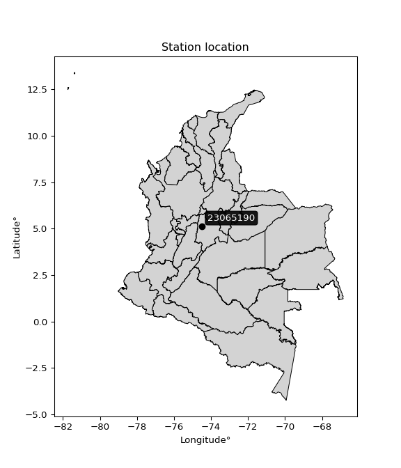</img>

</div>


## A. General information


### 1. General running parameters

• app_version: _v20251225_. • runtime: _2025-12-26 14:29:50.888910_. • Python version: _3.14.0_. • SciPy version: _1.16.3_. • Pandas version: _2.3.3_. • NumPy version: _2.3.5_. • Stations dataset (station_dataset_file): _dataset/pmax24h_in/automatic_colombia.csv_. • Stations catalog (station_catalog_file): _dataset/CNE_IDEAM.xls_. • Plot only fit distributions with Δo > Δ (plot_only_fit): _True_. • Eval low extreme values, if False, evaluates high extreme values (low_extreme): _False_. • Eval every SciPy distribution as logarithmic (pdist_logarithmic_on): _True_. • Standard deviation normalized (ddof): _1.0_. • Return periods to eval in years (Tr): _[2, 2.33, 5, 10, 15, 20, 25, 50, 75, 100, 200, 250, 500, 750, 1000]_. • Minimum data sample per station, 0 means any (minimum_sample): _5_. • Z-Score threshold to adjust a value, 0 means disable (zscore): _3.5_. • Avoid zeros, e.g. rain = 0 (avoid_zeros): _True_. • Avoid null values (avoid_nans): _True_. [:file_folder:Dataset file.](../../dataset/pmax24h_in/automatic_colombia.csv)


### 2. Station info and location

|   id |   CODIGO | NOMBRE                    | CATEGORIA               | TECNOLOGIA                | ESTADO   | FECHA_INSTALACION   |   FECHA_SUSPENSION |   ALTITUD |   LATITUD |   LONGITUD | DEPARTAMENTO   | MUNICIPIO     | AREA_OPERATIVA                            | ENTIDAD                                                     | AREA_HIDROGRAFICA   | ZONA_HIDROGRAFICA   | SUBZONA_HIDROGRAFICA   |   CORRIENTE | OBSERVACION                                                                                                                                                                                                                                                 | SUBRED                                                   | Catalogo   |
|-----:|---------:|:--------------------------|:------------------------|:--------------------------|:---------|:--------------------|-------------------:|----------:|----------:|-----------:|:---------------|:--------------|:------------------------------------------|:------------------------------------------------------------|:--------------------|:--------------------|:-----------------------|------------:|:------------------------------------------------------------------------------------------------------------------------------------------------------------------------------------------------------------------------------------------------------------|:---------------------------------------------------------|:-----------|
|    0 | 23065190 | QUEBRADA NEGRA [23065190] | Climatológica Principal | Automática con Telemetría | Activa   | 06/10/2005          |                nan |      1107 |   5.13721 |    -74.481 | Cundinamarca   | Quebradanegra | Area Operativa 11 - Cundinamarca-Amazonas | INSTITUTO DE HIDROLOGIA METEOROLOGIA Y ESTUDIOS AMBIENTALES | Magdalena Cauca     | Medio Magdalena     | Río Negro              |         nan | Actualizado Estado por solicitud de la coordinadora del AO (23032023)|26/06/2025$mvelez$La estación fue actualizada en sus coordenadas luego de la reunión con el grupo de automatización 17/06/2025 se realiza el cambio bajo el memorando 20253180105293. | Radición Global,Radiación Visible,Radiación Ultravioleta | CNE_IDEAM  |

<div align="center">

Map location in: [:earth_americas:Google](http://maps.google.com/maps?q=5.137207,-74.480954) [:earth_americas:OSM](https://www.openstreetmap.org/#map=18/5.137207/-74.480954&layers=P) [:earth_americas:Bing](https://www.bing.com/maps?cp=5.137207~-74.480954&lvl=18) [:earth_americas:Apple](https://maps.apple.com/frame?center=5.137207%2C-74.480954&span=0.003%2C0.006)

</div>


<div align="center">

```geojson
{
  "type": "Feature",
  "geometry": {
    "type": "Point", 
    "coordinates": [-74.480954, 5.137207]
  }, 
  "properties": {
    "Name": "23065190"
  }
}
```

</div>


### 3. Discrete values table and plot

|               |            0 |            1 |           2 |          3 |           4 |           5 |           6 |          7 |         8 |          9 |          10 |          11 |          12 |          13 |          14 |          15 |          16 |          17 |          18 |
|:--------------|-------------:|-------------:|------------:|-----------:|------------:|------------:|------------:|-----------:|----------:|-----------:|------------:|------------:|------------:|------------:|------------:|------------:|------------:|------------:|------------:|
| Date          | 2005         | 2006         | 2007        | 2009       | 2010        | 2011        | 2012        | 2013       | 2014      | 2015       | 2016        | 2017        | 2018        | 2019        | 2021        | 2022        | 2023        | 2024        | 2025        |
| Value         |   75.3       |   69.8       |   38.9      |    0.5     |   58.8      |   54.2      |   41.1      |  367.4     |  322.1    |   56.8     |   33.7      |   43        |   37.8      |    2.3      |    0.2      |   52.8      |   88.4      |    0.8      |    8.9      |
| Value_initial |   75.3       |   69.8       |   38.9      |    0.5     |   58.8      |   54.2      |   41.1      |  367.4     |  322.1    |   56.8     |   33.7      |   43        |   37.8      |    2.3      |    0.2      |   52.8      |   88.4      |    0.8      |    8.9      |
| count         |   19         |   19         |   19        |   19       |   19        |   19        |   19        |   19       |   19      |   19       |   19        |   19        |   19        |   19        |   19        |   19        |   19        |   19        |   19        |
| mean          |   71.2       |   71.2       |   71.2      |   71.2     |   71.2      |   71.2      |   71.2      |   71.2     |   71.2    |   71.2     |   71.2      |   71.2      |   71.2      |   71.2      |   71.2      |   71.2      |   71.2      |   71.2      |   71.2      |
| std           |  100.244     |  100.244     |  100.244    |  100.244   |  100.244    |  100.244    |  100.244    |  100.244   |  100.244  |  100.244   |  100.244    |  100.244    |  100.244    |  100.244    |  100.244    |  100.244    |  100.244    |  100.244    |  100.244    |
| zscore        |    0.0409003 |   -0.0139659 |   -0.322214 |   -0.70528 |   -0.123698 |   -0.169586 |   -0.300268 |    2.95479 |    2.5029 |   -0.14365 |   -0.374088 |   -0.281314 |   -0.333187 |   -0.687324 |   -0.708273 |   -0.183552 |    0.171582 |   -0.702287 |   -0.621484 |

<div align="center">

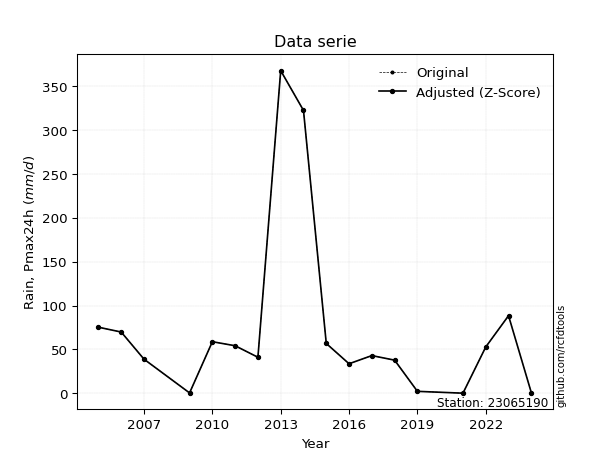</img>

</div>

> If Z-Score is active, values out of range or outliers are replaced with the station mean value.


### 4. Active continuous probability distributions from SciPy (45 of 104 available)

[scipy.stats](https://docs.scipy.org/doc/scipy/reference/stats.html) is a Python´s powerful submodule within the SciPy library for comprehensive statistical analysis, offering over 130 probability distributions (like Normal, Poisson), functions for descriptive stats (mean, variance), hypothesis testing (t-tests, chi-square), random variable generation, and statistical tests, making it essential for data science, modeling, and research. It provides tools to explore, model, and draw conclusions from data efficiently, working seamlessly with NumPy.

<div align="center">

|   id | p_dist             |   n_parameter | fit_method   | label                                                                       | active   | ref                                                                                                        |
|-----:|:-------------------|--------------:|:-------------|:----------------------------------------------------------------------------|:---------|:-----------------------------------------------------------------------------------------------------------|
|    0 | alpha              |             3 | MLE          | Alpha                                                                       | True     | [:mortar_board:](https://docs.scipy.org/doc/scipy/reference/generated/scipy.stats.alpha.html)              |
|    1 | betaprime          |             4 | MLE          | Beta prime                                                                  | True     | [:mortar_board:](https://docs.scipy.org/doc/scipy/reference/generated/scipy.stats.betaprime.html)          |
|    2 | chi2               |             3 | MLE          | Chi²                                                                        | True     | [:mortar_board:](https://docs.scipy.org/doc/scipy/reference/generated/scipy.stats.chi2.html)               |
|    3 | crystalball        |             4 | MLE          | Crystalball                                                                 | True     | [:mortar_board:](https://docs.scipy.org/doc/scipy/reference/generated/scipy.stats.crystalball.html)        |
|    4 | erlang             |             3 | MLE          | Erlang                                                                      | True     | [:mortar_board:](https://docs.scipy.org/doc/scipy/reference/generated/scipy.stats.erlang.html)             |
|    5 | expon              |             2 | MLE          | Exponential                                                                 | True     | [:mortar_board:](https://docs.scipy.org/doc/scipy/reference/generated/scipy.stats.expon.html)              |
|    6 | exponnorm          |             3 | MLE          | Exponentially modified Normal                                               | True     | [:mortar_board:](https://docs.scipy.org/doc/scipy/reference/generated/scipy.stats.exponnorm.html)          |
|    7 | f                  |             4 | MLE          | F                                                                           | True     | [:mortar_board:](https://docs.scipy.org/doc/scipy/reference/generated/scipy.stats.f.html)                  |
|    8 | fatiguelife        |             3 | MLE          | Fatigue-life (Birnbaum-Saunders)                                            | True     | [:mortar_board:](https://docs.scipy.org/doc/scipy/reference/generated/scipy.stats.fatiguelife.html)        |
|    9 | fisk               |             3 | MLE          | Fisk                                                                        | True     | [:mortar_board:](https://docs.scipy.org/doc/scipy/reference/generated/scipy.stats.fisk.html)               |
|   10 | gamma              |             3 | MLE          | Gamma                                                                       | True     | [:mortar_board:](https://docs.scipy.org/doc/scipy/reference/generated/scipy.stats.gamma.html)              |
|   11 | genexpon           |             5 | MLE          | Generalized exponential                                                     | True     | [:mortar_board:](https://docs.scipy.org/doc/scipy/reference/generated/scipy.stats.genexpon.html)           |
|   12 | genlogistic        |             3 | MLE          | Generalized logistic                                                        | True     | [:mortar_board:](https://docs.scipy.org/doc/scipy/reference/generated/scipy.stats.genlogistic.html)        |
|   13 | gibrat             |             2 | MM           | Gibrat                                                                      | True     | [:mortar_board:](https://docs.scipy.org/doc/scipy/reference/generated/scipy.stats.gibrat.html)             |
|   14 | gompertz           |             3 | MLE          | Gompertz (or truncated Gumbel)                                              | True     | [:mortar_board:](https://docs.scipy.org/doc/scipy/reference/generated/scipy.stats.gompertz.html)           |
|   15 | gumbel_l           |             2 | MM           | Gumbel Left Skew                                                            | True     | [:mortar_board:](https://docs.scipy.org/doc/scipy/reference/generated/scipy.stats.gumbel_l.html)           |
|   16 | gumbel_r           |             2 | MM           | Gumbel Right Skew                                                           | True     | [:mortar_board:](https://docs.scipy.org/doc/scipy/reference/generated/scipy.stats.gumbel_r.html)           |
|   17 | halflogistic       |             2 | MM           | Half-logistic                                                               | True     | [:mortar_board:](https://docs.scipy.org/doc/scipy/reference/generated/scipy.stats.halflogistic.html)       |
|   18 | halfnorm           |             2 | MM           | Half Normal                                                                 | True     | [:mortar_board:](https://docs.scipy.org/doc/scipy/reference/generated/scipy.stats.halfnorm.html)           |
|   19 | hypsecant          |             2 | MM           | hyperbolic secant                                                           | True     | [:mortar_board:](https://docs.scipy.org/doc/scipy/reference/generated/scipy.stats.hypsecant.html)          |
|   20 | invgamma           |             3 | MLE          | Inverted gamma                                                              | True     | [:mortar_board:](https://docs.scipy.org/doc/scipy/reference/generated/scipy.stats.invgamma.html)           |
|   21 | invgauss           |             3 | MLE          | Inverse Gaussian                                                            | True     | [:mortar_board:](https://docs.scipy.org/doc/scipy/reference/generated/scipy.stats.invgauss.html)           |
|   22 | invweibull         |             3 | MLE          | Inverted Weibull                                                            | True     | [:mortar_board:](https://docs.scipy.org/doc/scipy/reference/generated/scipy.stats.invweibull.html)         |
|   23 | johnsonsu          |             4 | MLE          | Johnson Su                                                                  | True     | [:mortar_board:](https://docs.scipy.org/doc/scipy/reference/generated/scipy.stats.johnsonsu.html)          |
|   24 | kstwobign          |             2 | MLE          | Limiting distribution of scaled Kolmogorov-Smirnov two-sided test statistic | True     | [:mortar_board:](https://docs.scipy.org/doc/scipy/reference/generated/scipy.stats.kstwobign.html)          |
|   25 | laplace            |             2 | MM           | Laplace                                                                     | True     | [:mortar_board:](https://docs.scipy.org/doc/scipy/reference/generated/scipy.stats.laplace.html)            |
|   26 | laplace_asymmetric |             3 | MLE          | Asymmetric Laplace                                                          | True     | [:mortar_board:](https://docs.scipy.org/doc/scipy/reference/generated/scipy.stats.laplace_asymmetric.html) |
|   27 | loggamma           |             3 | MLE          | Log gamma                                                                   | True     | [:mortar_board:](https://docs.scipy.org/doc/scipy/reference/generated/scipy.stats.loggamma.html)           |
|   28 | logistic           |             2 | MM           | Logistic (or Sech-squared)                                                  | True     | [:mortar_board:](https://docs.scipy.org/doc/scipy/reference/generated/scipy.stats.logistic.html)           |
|   29 | lognorm            |             3 | MLE          | Log Normal                                                                  | True     | [:mortar_board:](https://docs.scipy.org/doc/scipy/reference/generated/scipy.stats.lognorm.html)            |
|   30 | maxwell            |             2 | MM           | Maxwell                                                                     | True     | [:mortar_board:](https://docs.scipy.org/doc/scipy/reference/generated/scipy.stats.maxwell.html)            |
|   31 | mielke             |             4 | MLE          | Mielke Beta-Kappa / Dagum                                                   | True     | [:mortar_board:](https://docs.scipy.org/doc/scipy/reference/generated/scipy.stats.mielke.html)             |
|   32 | moyal              |             2 | MM           | Moyal                                                                       | True     | [:mortar_board:](https://docs.scipy.org/doc/scipy/reference/generated/scipy.stats.moyal.html)              |
|   33 | nakagami           |             3 | MLE          | Nakagami                                                                    | True     | [:mortar_board:](https://docs.scipy.org/doc/scipy/reference/generated/scipy.stats.nakagami.html)           |
|   34 | ncf                |             5 | MLE          | Non-central F distribution                                                  | True     | [:mortar_board:](https://docs.scipy.org/doc/scipy/reference/generated/scipy.stats.ncf.html)                |
|   35 | nct                |             4 | MLE          | Non-central Student’s t                                                     | True     | [:mortar_board:](https://docs.scipy.org/doc/scipy/reference/generated/scipy.stats.nct.html)                |
|   36 | norm               |             2 | MM           | Normal                                                                      | True     | [:mortar_board:](https://docs.scipy.org/doc/scipy/reference/generated/scipy.stats.norm.html)               |
|   37 | pareto             |             3 | MLE          | Pareto                                                                      | True     | [:mortar_board:](https://docs.scipy.org/doc/scipy/reference/generated/scipy.stats.pareto.html)             |
|   38 | pearson3           |             3 | MM           | Pearson type III                                                            | True     | [:mortar_board:](https://docs.scipy.org/doc/scipy/reference/generated/scipy.stats.pearson3.html)           |
|   39 | rayleigh           |             2 | MM           | Rayleigh                                                                    | True     | [:mortar_board:](https://docs.scipy.org/doc/scipy/reference/generated/scipy.stats.rayleigh.html)           |
|   40 | rice               |             3 | MLE          | Rice                                                                        | True     | [:mortar_board:](https://docs.scipy.org/doc/scipy/reference/generated/scipy.stats.rice.html)               |
|   41 | t                  |             3 | MLE          | Student’s t                                                                 | True     | [:mortar_board:](https://docs.scipy.org/doc/scipy/reference/generated/scipy.stats.t.html)                  |
|   42 | truncnorm          |             4 | MLE          | Truncated normal                                                            | True     | [:mortar_board:](https://docs.scipy.org/doc/scipy/reference/generated/scipy.stats.truncnorm.html)          |
|   43 | wald               |             2 | MM           | Wald                                                                        | True     | [:mortar_board:](https://docs.scipy.org/doc/scipy/reference/generated/scipy.stats.wald.html)               |
|   44 | weibull_min        |             3 | MLE          | Weibull minimum                                                             | True     | [:mortar_board:](https://docs.scipy.org/doc/scipy/reference/generated/scipy.stats.weibull_min.html)        |

</div>

> **n_parameter:** # arguments & localization & scale.
>
> **Fit methods:** (MLE) maximum likelihood, (MM) L-moments.
>
>**Inactive:** foldnorm, gennorm, norminvgauss, powernorm, powerlognorm, skewnorm, genextreme, anglit, arcsine, argus, beta, bradford, burr, burr12, cauchy, cosine, halfcauchy, foldcauchy, skewcauchy, wrapcauchy, dgamma, gengamma, exponweib, exponpow, truncexpon, gausshyper, genhalflogistic, genhyperbolic, geninvgauss, halfgennorm, johnsonsb, kappa4, kappa3, ksone, kstwo, loglaplace, levy, levy_l, levy_stable, ncx2, genpareto, truncpareto, lomax, powerlaw, rdist, rel_breitwigner, recipinvgauss, semicircular, studentized_range, trapezoid, triang, truncweibull_min, tukeylambda, uniform, loguniform, vonmises, vonmises_line, weibull_max, dweibull, 


## B. Probability distributions vs. Empirical distributions

A continuous probability distribution (CPD) describes probabilities for variables that can take any value within a range (like rain any time), unlike discrete variables with specific outcomes (like temperature). It uses a Probability Density Function (PDF), a curve where the total area under it equals 1, and the probability of the variable falling within an interval (a to b) is found by calculating the area under the curve between those points. A key feature is that the probability of hitting any single exact value is zero, so probabilities are always expressed for ranges, e.g., $P(a ≤ X ≤ b)$.

<div align="center">

Distributions parameters
|    |   station | p_dist                |   n |              loc |           scale | shape                 | shape1             | shape2                 | shape3   |
|---:|----------:|:----------------------|----:|-----------------:|----------------:|:----------------------|:-------------------|:-----------------------|:---------|
|  0 |  23065190 | alpha                 |  19 |    -54.5203      |   205.118       | 2.183752637124531     |                    |                        |          |
|  1 |  23065190 | betaprime             |  19 |      0.2         |    66.2597      | 0.6378925766774759    | 1.4483837088180036 |                        |          |
|  2 |  23065190 | chi2                  |  19 |      0.2         |     1.91637     | 0.6879329124986611    |                    |                        |          |
|  3 |  23065190 | crystalball           |  19 |     71.2         |    97.5702      | 5830.164754805309     | 2719.9547604892055 |                        |          |
|  4 |  23065190 | erlang                |  19 |      0.2         |   116.205       | 0.3836402242921957    |                    |                        |          |
|  5 |  23065190 | expon                 |  19 |      0.2         |    71           |                       |                    |                        |          |
|  6 |  23065190 | exponnorm             |  19 |      0.154636    |     0.0138126   | 5118.587995515121     |                    |                        |          |
|  7 |  23065190 | f                     |  19 |      0.2         |    92.8898      | 0.9358480091605109    | 115.38305141837265 |                        |          |
|  8 |  23065190 | fatiguelife           |  19 |     -0.035014    |     9.54315     | 3.0881885463024137    |                    |                        |          |
|  9 |  23065190 | fisk                  |  19 |      0.2         |    23.1682      | 0.7447592193573279    |                    |                        |          |
| 10 |  23065190 | gamma                 |  19 |      0.2         |    79.4642      | 0.6410090932136396    |                    |                        |          |
| 11 |  23065190 | genexpon              |  19 |      0.2         |   153.787       | 2.166018189890525     | 1.8336454322621738 | 4.841096501577811e-12  |          |
| 12 |  23065190 | genlogistic           |  19 |   -328.109       |    47.2422      | 2247.5393606287007    |                    |                        |          |
| 13 |  23065190 | gibrat                |  19 |     -3.23379     |    45.1464      |                       |                    |                        |          |
| 14 |  23065190 | gompertz              |  19 |      0.199991    |     1.0824e+08  | 1746421.780282978     |                    |                        |          |
| 15 |  23065190 | gumbel_l              |  19 |    115.112       |    76.0752      |                       |                    |                        |          |
| 16 |  23065190 | gumbel_r              |  19 |     27.2882      |    76.0752      |                       |                    |                        |          |
| 17 |  23065190 | halflogistic          |  19 |    -44.4434      |    83.4191      |                       |                    |                        |          |
| 18 |  23065190 | halfnorm              |  19 |    -57.9447      |   161.859       |                       |                    |                        |          |
| 19 |  23065190 | hypsecant             |  19 |     71.2         |    62.1151      |                       |                    |                        |          |
| 20 |  23065190 | invgamma              |  19 |    -19.9124      |    90.1484      | 1.9043166168157208    |                    |                        |          |
| 21 |  23065190 | invgauss              |  19 |     -8.46842     |    41.6722      | 1.9117862764289892    |                    |                        |          |
| 22 |  23065190 | invweibull            |  19 |    -29.6238      |    54.4106      | 1.7519776615053901    |                    |                        |          |
| 23 |  23065190 | johnsonsu             |  19 |     38.1648      |    17.9432      | -0.2866076983235609   | 0.6728085373418617 |                        |          |
| 24 |  23065190 | kstwobign             |  19 |   -162.531       |   276.693       |                       |                    |                        |          |
| 25 |  23065190 | laplace               |  19 |     71.2         |    68.9926      |                       |                    |                        |          |
| 26 |  23065190 | laplace_asymmetric    |  19 |      0.2         |     0.00162211  | 2.284640669575903e-05 |                    |                        |          |
| 27 |  23065190 | loggamma              |  19 | -28799.9         |  3926.48        | 1561.0469135115618    |                    |                        |          |
| 28 |  23065190 | logistic              |  19 |     71.2         |    53.7933      |                       |                    |                        |          |
| 29 |  23065190 | lognorm               |  19 |      0.2         |     3.20157     | 9.433246124478835     |                    |                        |          |
| 30 |  23065190 | maxwell               |  19 |   -160           |   144.883       |                       |                    |                        |          |
| 31 |  23065190 | mielke                |  19 |      0.2         |    67.0218      | 0.6780357163828195    | 2.1983866212096626 |                        |          |
| 32 |  23065190 | moyal                 |  19 |     15.4031      |    43.922       |                       |                    |                        |          |
| 33 |  23065190 | nakagami              |  19 |      0.2         |   163.702       | 0.2153450791380295    |                    |                        |          |
| 34 |  23065190 | ncf                   |  19 |      0.2         |     3.52725     | 0.4398897676626148    | 5.35670938488541   | 5.636292067536624      |          |
| 35 |  23065190 | nct                   |  19 |     -2.53783     |     0.128147    | 0.456190324689082     | 54.736183334521456 |                        |          |
| 36 |  23065190 | norm                  |  19 |     71.2         |    97.5702      |                       |                    |                        |          |
| 37 |  23065190 | pareto                |  19 |   -122.636       |   122.836       | 2.680448739915315     |                    |                        |          |
| 38 |  23065190 | pearson3              |  19 |     71.2         |    97.5703      | 2.264673006674286     |                    |                        |          |
| 39 |  23065190 | rayleigh              |  19 |   -115.458       |   148.931       |                       |                    |                        |          |
| 40 |  23065190 | rice                  |  19 |    -63.2112      |   117.444       | 0.0005320631058449095 |                    |                        |          |
| 41 |  23065190 | t                     |  19 |     43.797       |    22.3107      | 1.2083471908532708    |                    |                        |          |
| 42 |  23065190 | truncnorm             |  19 |    -48.8447      |   135.403       | 0.3622137839589038    | 3.0745657419582466 |                        |          |
| 43 |  23065190 | wald                  |  19 |    -26.3702      |    97.5702      |                       |                    |                        |          |
| 44 |  23065190 | weibull_min           |  19 |      0.2         |    79.0602      | 0.381319616138458     |                    |                        |          |
| 45 |  23065190 | logalpha              |  19 |    -54.7898      |  1581.31        | 27.324382864392106    |                    |                        |          |
| 46 |  23065190 | logbetaprime          |  19 |  -3046.18        |   168.48        | 43166018.049622834    | 2385004.5825470416 |                        |          |
| 47 |  23065190 | logchi2               |  19 |     -1.60944     |     3.82143     | 1.1613499177465676    |                    |                        |          |
| 48 |  23065190 | logcrystalball        |  19 |      3.13602     |     2.0297      | 135.39589907215662    | 18.863210391555704 |                        |          |
| 49 |  23065190 | logerlang             |  19 |    -30.6502      |     0.129813    | 260.168847871539      |                    |                        |          |
| 50 |  23065190 | logexpon              |  19 |     -1.60944     |     4.74546     |                       |                    |                        |          |
| 51 |  23065190 | logexponnorm          |  19 |      3.13487     |     2.0297      | 0.0005781722214829978 |                    |                        |          |
| 52 |  23065190 | logf                  |  19 |     -1.60944     |     1.14766     | 1.1002684914514942    | 1.087886402765297  |                        |          |
| 53 |  23065190 | logfatiguelife        |  19 |   -892.894       |   896.027       | 0.002256657131485708  |                    |                        |          |
| 54 |  23065190 | logfisk               |  19 |     -2.80072e+06 |     2.80072e+06 | 2563465.3354615513    |                    |                        |          |
| 55 |  23065190 | loggamma              |  19 |    -31.712       |     0.128902    | 270.19769204095724    |                    |                        |          |
| 56 |  23065190 | loggenexpon           |  19 |     -1.7159      |     0.136815    | 0.003921758999778136  | 9.183855472585712  | 0.00012682723154587209 |          |
| 57 |  23065190 | loggenlogistic        |  19 |      4.72448     |     0.463618    | 0.26211395899263634   |                    |                        |          |
| 58 |  23065190 | loggibrat             |  19 |      1.58758     |     0.939163    |                       |                    |                        |          |
| 59 |  23065190 | loggompertz           |  19 |     -1.60946     |     2.29203     | 0.10544259636282886   |                    |                        |          |
| 60 |  23065190 | loggumbel_l           |  19 |      4.04949     |     1.58255     |                       |                    |                        |          |
| 61 |  23065190 | loggumbel_r           |  19 |      2.22255     |     1.58255     |                       |                    |                        |          |
| 62 |  23065190 | loghalflogistic       |  19 |      0.73037     |     1.73532     |                       |                    |                        |          |
| 63 |  23065190 | loghalfnorm           |  19 |      0.449465    |     3.36708     |                       |                    |                        |          |
| 64 |  23065190 | loghypsecant          |  19 |      3.13602     |     1.29215     |                       |                    |                        |          |
| 65 |  23065190 | loginvgamma           |  19 |    -39.2365      | 16545.5         | 391.32503946421684    |                    |                        |          |
| 66 |  23065190 | loginvgauss           |  19 |    -16.4492      |  1453.89        | 0.01345880146341119   |                    |                        |          |
| 67 |  23065190 | loginvweibull         |  19 |     -5.73033e+06 |     5.73033e+06 | 2480979.793119064     |                    |                        |          |
| 68 |  23065190 | logjohnsonsu          |  19 |      4.04796     |     0.252025    | 0.41233271402063787   | 0.5183917525953108 |                        |          |
| 69 |  23065190 | logkstwobign          |  19 |     -6.26828     |    10.7571      |                       |                    |                        |          |
| 70 |  23065190 | loglaplace            |  19 |      3.13602     |     1.43521     |                       |                    |                        |          |
| 71 |  23065190 | loglaplace_asymmetric |  19 |      4.07414     |     1.12195     | 1.5017792904893257    |                    |                        |          |
| 72 |  23065190 | logloggamma           |  19 |      4.89343     |     0.974743    | 0.5344329848424793    |                    |                        |          |
| 73 |  23065190 | loglogistic           |  19 |      3.13602     |     1.11903     |                       |                    |                        |          |
| 74 |  23065190 | loglognorm            |  19 |   -696.588       |   699.718       | 0.0028983381172439805 |                    |                        |          |
| 75 |  23065190 | logmaxwell            |  19 |     -1.67351     |     3.01393     |                       |                    |                        |          |
| 76 |  23065190 | logmielke             |  19 |     -4.66368e+07 |     4.66368e+07 | 26433060.58878843     | 100474834.0723193  |                        |          |
| 77 |  23065190 | logmoyal              |  19 |      1.97531     |     0.913686    |                       |                    |                        |          |
| 78 |  23065190 | lognakagami           |  19 |  -1200.38        |  1203.51        | 87481.5990014417      |                    |                        |          |
| 79 |  23065190 | logncf                |  19 |     -1.60944     |     1.07815     | 1.0673493486270647    | 1.1225014365666968 | 1.092469263567562      |          |
| 80 |  23065190 | lognct                |  19 |   -102.805       |     1.9745      | 23212.391988128424    | 53.653157609388884 |                        |          |
| 81 |  23065190 | lognorm               |  19 |      3.13602     |     2.0297      |                       |                    |                        |          |
| 82 |  23065190 | logpareto             |  19 |     -1.60944     |     2.51857e-08 | 0.055555566046506244  |                    |                        |          |
| 83 |  23065190 | logpearson3           |  19 |      3.13601     |     2.02973     | -1.040796111401128    |                    |                        |          |
| 84 |  23065190 | lograyleigh           |  19 |     -0.746934    |     3.09815     |                       |                    |                        |          |
| 85 |  23065190 | logrice               |  19 |   -622.592       |     2.02952     | 308.3116500350351     |                    |                        |          |
| 86 |  23065190 | logt                  |  19 |      3.91968     |     0.398319    | 0.779964922480735     |                    |                        |          |
| 87 |  23065190 | logtruncnorm          |  19 |      2.37417     |     6.54547     | -0.608606220087319    | 0.5396537241899169 |                        |          |
| 88 |  23065190 | logwald               |  19 |      1.10634     |     2.02968     |                       |                    |                        |          |
| 89 |  23065190 | logweibull_min        |  19 |     -9.10692e+07 |     9.10692e+07 | 62204366.597488165    |                    |                        |          |

</div>

> **loc** (Location parameter): This shifts the distribution along the x-axis. For many common distributions, like the normal (Gaussian) distribution, loc represents the mean $μ$. For others, like the uniform distribution, it might represent the minimum value, or for the beta distribution, the left end of the support interval.
>
> **scale** (Scale parameter): This determines the width or spread of the distribution. For the normal distribution, scale represents the standard deviation $σ$. For a uniform distribution, it defines the length of the interval (from $loc$ to $loc + scale$).
>
> **shape** (Shape parameters): Refers to parameters that define the specific form of a probability distribution, distinct from its location (loc) and scale (scale). These parameters are required arguments for most distribution functions. For example, a normal (Gaussian) distribution is fully defined by its location (mean) and scale (standard deviation), so it has no specific shape parameters beyond loc and scale. However, other distributions have intrinsic properties that need specification, as Gamma distribution that takes a shape parameter, often named $a$ or $alpha$.


### 0. Cumulative distribution values - CDF (90 evaluated)

> Ordered by x ascending and calculating $log(f(x))$ separately. 

|   id |   Station |   date |     x |   count |   mean |     std |     zscore |   Value_initial |   station |   m |     alpha |   alpha_pdf |   betaprime |   betaprime_pdf |        chi2 |    chi2_pdf |   crystalball |   crystalball_pdf |      erlang |   erlang_pdf |      expon |   expon_pdf |   exponnorm |   exponnorm_pdf |           f |       f_pdf |   fatiguelife |   fatiguelife_pdf |        fisk |       fisk_pdf |       gamma |       gamma_pdf |    genexpon |   genexpon_pdf |   genlogistic |   genlogistic_pdf |     gibrat |   gibrat_pdf |    gompertz |   gompertz_pdf |   gumbel_l |   gumbel_l_pdf |   gumbel_r |   gumbel_r_pdf |   halflogistic |   halflogistic_pdf |   halfnorm |   halfnorm_pdf |   hypsecant |   hypsecant_pdf |   invgamma |   invgamma_pdf |   invgauss |   invgauss_pdf |   invweibull |   invweibull_pdf |   johnsonsu |   johnsonsu_pdf |   kstwobign |   kstwobign_pdf |   laplace |   laplace_pdf |   laplace_asymmetric |   laplace_asymmetric_pdf |   loggamma |   loggamma_pdf |   logistic |   logistic_pdf |    lognorm |   lognorm_pdf |   maxwell |   maxwell_pdf |      mielke |    mielke_pdf |    moyal |   moyal_pdf |    nakagami |   nakagami_pdf |         ncf |     ncf_pdf |       nct |     nct_pdf |     norm |    norm_pdf |      pareto |   pareto_pdf |   pearson3 |   pearson3_pdf |   rayleigh |   rayleigh_pdf |     rice |    rice_pdf |        t |       t_pdf |   truncnorm |   truncnorm_pdf |     wald |    wald_pdf |   weibull_min |   weibull_min_pdf |   logalpha |   logalpha_pdf |   logbetaprime |   logbetaprime_pdf |     logchi2 |    logchi2_pdf |   logcrystalball |   logcrystalball_pdf |   logerlang |   logerlang_pdf |   logexpon |   logexpon_pdf |   logexponnorm |   logexponnorm_pdf |        logf |    logf_pdf |   logfatiguelife |   logfatiguelife_pdf |    logfisk |   logfisk_pdf |   loggenexpon |   loggenexpon_pdf |   loggenlogistic |   loggenlogistic_pdf |   loggibrat |   loggibrat_pdf |   loggompertz |   loggompertz_pdf |   loggumbel_l |   loggumbel_l_pdf |   loggumbel_r |   loggumbel_r_pdf |   loghalflogistic |   loghalflogistic_pdf |   loghalfnorm |   loghalfnorm_pdf |   loghypsecant |   loghypsecant_pdf |   loginvgamma |   loginvgamma_pdf |   loginvgauss |   loginvgauss_pdf |   loginvweibull |   loginvweibull_pdf |   logjohnsonsu |   logjohnsonsu_pdf |   logkstwobign |   logkstwobign_pdf |   loglaplace |   loglaplace_pdf |   loglaplace_asymmetric |   loglaplace_asymmetric_pdf |   logloggamma |   logloggamma_pdf |   loglogistic |   loglogistic_pdf |   loglognorm |   loglognorm_pdf |   logmaxwell |   logmaxwell_pdf |   logmielke |   logmielke_pdf |    logmoyal |   logmoyal_pdf |   lognakagami |   lognakagami_pdf |      logncf |   logncf_pdf |     lognct |   lognct_pdf |   logpareto |   logpareto_pdf |   logpearson3 |   logpearson3_pdf |   lograyleigh |   lograyleigh_pdf |    logrice |   logrice_pdf |      logt |   logt_pdf |   logtruncnorm |   logtruncnorm_pdf |   logwald |   logwald_pdf |   logweibull_min |   logweibull_min_pdf |
|-----:|----------:|-------:|------:|--------:|-------:|--------:|-----------:|----------------:|----------:|----:|----------:|------------:|------------:|----------------:|------------:|------------:|--------------:|------------------:|------------:|-------------:|-----------:|------------:|------------:|----------------:|------------:|------------:|--------------:|------------------:|------------:|---------------:|------------:|----------------:|------------:|---------------:|--------------:|------------------:|-----------:|-------------:|------------:|---------------:|-----------:|---------------:|-----------:|---------------:|---------------:|-------------------:|-----------:|---------------:|------------:|----------------:|-----------:|---------------:|-----------:|---------------:|-------------:|-----------------:|------------:|----------------:|------------:|----------------:|----------:|--------------:|---------------------:|-------------------------:|-----------:|---------------:|-----------:|---------------:|-----------:|--------------:|----------:|--------------:|------------:|--------------:|---------:|------------:|------------:|---------------:|------------:|------------:|----------:|------------:|---------:|------------:|------------:|-------------:|-----------:|---------------:|-----------:|---------------:|---------:|------------:|---------:|------------:|------------:|----------------:|---------:|------------:|--------------:|------------------:|-----------:|---------------:|---------------:|-------------------:|------------:|---------------:|-----------------:|---------------------:|------------:|----------------:|-----------:|---------------:|---------------:|-------------------:|------------:|------------:|-----------------:|---------------------:|-----------:|--------------:|--------------:|------------------:|-----------------:|---------------------:|------------:|----------------:|--------------:|------------------:|--------------:|------------------:|--------------:|------------------:|------------------:|----------------------:|--------------:|------------------:|---------------:|-------------------:|--------------:|------------------:|--------------:|------------------:|----------------:|--------------------:|---------------:|-------------------:|---------------:|-------------------:|-------------:|-----------------:|------------------------:|----------------------------:|--------------:|------------------:|--------------:|------------------:|-------------:|-----------------:|-------------:|-----------------:|------------:|----------------:|------------:|---------------:|--------------:|------------------:|------------:|-------------:|-----------:|-------------:|------------:|----------------:|--------------:|------------------:|--------------:|------------------:|-----------:|--------------:|----------:|-----------:|---------------:|-------------------:|----------:|--------------:|-----------------:|---------------------:|
|    0 |  23065190 |   2021 |   0.2 |      19 |   71.2 | 100.244 | -0.708273  |             0.2 |  23065190 |   1 | 0.0596891 | 0.00815271  | 3.84634e-12 | 44199.2         | 1.42594e-06 | 1.76713e+10 |      0.233404 |       0.00313768  | 8.07887e-08 |  1.11667e+09 | 0          | 0.0140845   | 0.000641426 |     0.0141278   | 1.69578e-09 | 2.85887e+07 |     0.0220762 |       0.23678     | 4.49538e-14 | 1206.24        | 1.64192e-12 | 37919.9         | 5.56075e-13 |    0.0140845   |      0.115943 |       0.00528548  | 0.00499398 |  0.0042065   | 1.46829e-07 |    0.0161347   |   0.198122 |    0.00232735  |   0.239858 |    0.00450143  |       0.261376 |        0.00558435  |   0.280578 |    0.00462148  |    0.196498 |     0.00296632  |  0.0546177 |    0.0101587   |  0.0467736 |    0.0149564   |    0.0568509 |      0.00957588  |   0.098185  |     0.0027745   |    0.120399 |     0.00453787  |  0.178665 |   0.00258962  |          5.95448e-10 |              0.0140844   |  0.0101743 |      0.0140806 |   0.21084  |    0.00309308  | 0.00969335 |     0.0127787 |  0.252415 |   0.00365362  | 1.53333e-10 | 462.779       | 0.23446  | 0.00532637  | 6.47106e-09 |    1.00413e+08 | 7.84558e-06 | 6.21711e+10 | 0.0300057 | 0.0448867   | 0.233404 | 0.00313768  | 5.55112e-16 |  0.0218213   |   0.216241 |    0.0102854   |   0.260323 |    0.00385696  | 0.135635 | 0.00397374  | 0.133128 | 0.00305934  | 1.31229e-10 |     0.00771732  | 0.136135 | 0.0108827   |   9.18113e-08 |       1.26135e+09 | 0.00796582 |      0.0122099 |     0.00973243 |          0.0128584 | 2.80137e-10 | 732595         |       0.00969332 |            0.0127787 |  0.00927573 |       0.0131883 |   0        |      0.210728  |     0.00969303 |          0.0127784 | 1.49887e-09 | 3.71357e+06 |       0.00934307 |            0.0124872 | 0.00963505 |    0.00873388 |    0.00339868 |         0.0351693 |        0.0278482 |            0.0157444 |    0        |       0         |   9.69145e-07 |         0.0460044 |     0.027604  |         0.0171997 |   1.28572e-05 |       9.14932e-05 |         0         |             0         |     0         |         0         |      0.0161742 |          0.0125119 |    0.00891455 |         0.0131787 |    0.00969678 |         0.0152418 |      0.00795993 |           0.0166571 |      0.0593727 |          0.0108151 |     0.00805415 |          0.0210128 |    0.0183231 |        0.0127668 |               0.0237495 |                   0.0140953 |     0.0318454 |         0.0174458 |     0.0141934 |         0.0125036 |   0.00951226 |        0.012666  |  2.55543e-06 |      0.000119631 |   0.0276364 |       0.0156639 | 1.14894e-12 |    3.24024e-11 |    0.00984956 |         0.0129448 | 1.62411e-09 |  3.90349e+06 | 0.00972086 |    0.0128426 |    0        |     2.20584e+06 |     0.0271691 |         0.0183394 |   0           |        0          | 0.00968817 |     0.0127739 | 0.0398683 | 0.00560949 |    7.21433e-07 |           0.116724 |  0        |     0         |        0.021012  |            0.0142003 |
|    1 |  23065190 |   2009 |   0.5 |      19 |   71.2 | 100.244 | -0.70528   |             0.5 |  23065190 |   2 | 0.0621607 | 0.00832437  | 0.0416152   |     0.0879791   | 0.457708    | 0.494974    |      0.234347 |       0.0031447   | 0.114351    |  0.145959    | 0.00421644 | 0.0140251   | 0.00487292  |     0.0140751   | 0.0539193   | 0.0840133   |     0.098364  |       0.234039    | 0.0377865   |    0.0902616   | 0.0310818   |     0.0662596   | 0.00421645  |    0.0140251   |      0.117534 |       0.00532414  | 0.00634261 |  0.00478339  | 0.00482886  |    0.0160568   |   0.198821 |    0.00233451  |   0.241209 |    0.00450898  |       0.263051 |        0.00557909  |   0.281964 |    0.0046184   |    0.19739  |     0.00297801  |  0.0577008 |    0.0103937   |  0.0513262 |    0.015387    |    0.0597562 |      0.00979179  |   0.0990227 |     0.00280995  |    0.121764 |     0.00456128  |  0.179443 |   0.00260091  |          0.0042164   |              0.014025    |  0.0323136 |      0.0369002 |   0.21177  |    0.00310305  | 0.0296092  |     0.0331604 |  0.253512 |   0.00365893  | 0.0255405   |   0.0577241   | 0.236059 | 0.00533382  | 0.0520671   |    0.0747492   | 0.0275142   | 0.0239853   | 0.0444676 | 0.0510856   | 0.234347 | 0.0031447   | 0.00651707  |  0.0216262   |   0.219316 |    0.0102134   |   0.26148  |    0.00386091  | 0.136829 | 0.00398702  | 0.134051 | 0.00309493  | 0.00231427  |     0.00771111  | 0.139404 | 0.0109058   |   0.112519    |       0.134653    | 0.0282715  |      0.0349978 |     0.0297871  |          0.0334029 | 0.313406    |      0.183987  |       0.0296091  |            0.0331604 |  0.0303768  |       0.0355769 |   0.17559  |      0.173726  |     0.0296083  |          0.0331597 | 0.460528    | 0.18349     |       0.0289536  |            0.0328132 | 0.0220102  |    0.0197022  |    0.0599777  |         0.0867416 |        0.0467496 |            0.0264305 |    0        |       0         |   0.0505049   |         0.0651495 |     0.0487182 |         0.0300222 |   0.00181497  |       0.00723864  |         0         |             0         |     0         |         0         |      0.0328473 |          0.0253756 |    0.0303145  |         0.0363346 |    0.0346426  |         0.0422387 |      0.038753   |           0.0545388 |      0.0709742 |          0.0148167 |     0.0489587  |          0.0718859 |    0.034695  |        0.0241741 |               0.0409102 |                   0.0242802 |     0.0525934 |         0.0287751 |     0.0316193 |         0.0273625 |   0.0293487  |        0.0331264 |  0.00886834  |      0.026567    |   0.0464545 |       0.0263295 | 1.65392e-05 |    0.000176172 |    0.0299776  |         0.0334585 | 0.33461     |  0.169889    | 0.0297426  |    0.0333365 |    0.619853 |     0.0230486   |     0.0498304 |         0.0322941 |   0.000150689 |        0.00560278 | 0.0295985  |     0.0331535 | 0.0458998 | 0.00773227 |    0.111271    |           0.125865 |  0        |     0         |        0.0389303 |            0.0260667 |
|    2 |  23065190 |   2024 |   0.8 |      19 |   71.2 | 100.244 | -0.702287  |             0.8 |  23065190 |   3 | 0.0646835 | 0.00849373  | 0.0645196   |     0.0678109   | 0.569838    | 0.290471    |      0.235291 |       0.0031517   | 0.149079    |  0.0949659   | 0.0084151  | 0.013966    | 0.00908651  |     0.0140156   | 0.0745406   | 0.0580117   |     0.158918  |       0.172677    | 0.0617422   |    0.0719067   | 0.0483982   |     0.0514686   | 0.00841511  |    0.013966    |      0.119137 |       0.00536263  | 0.0078632  |  0.00535219  | 0.00963426  |    0.0159793   |   0.199523 |    0.00234168  |   0.242563 |    0.00451644  |       0.264724 |        0.00557379  |   0.283349 |    0.0046153   |    0.198285 |     0.00298973  |  0.0608531 |    0.0106206   |  0.0560015 |    0.0157743   |    0.0627254 |      0.0100018   |   0.099871  |     0.00284599  |    0.123136 |     0.00458453  |  0.180225 |   0.00261224  |          0.00841502  |              0.0139658   |  0.0537707 |      0.0551659 |   0.212702 |    0.00311303  | 0.0489617  |     0.0499692 |  0.25461  |   0.00366419  | 0.0408634   |   0.0461766   | 0.23766  | 0.00534109  | 0.07018     |    0.0503763   | 0.0333817   | 0.0167033   | 0.060415  | 0.0548694   | 0.235291 | 0.0031517   | 0.012976    |  0.0214334   |   0.222369 |    0.0101428   |   0.262639 |    0.00386483  | 0.138027 | 0.00400024  | 0.134985 | 0.00313105  | 0.00462666  |     0.00770487  | 0.142678 | 0.0109261   |   0.143996    |       0.0845843   | 0.0489574  |      0.05386   |     0.049282   |          0.0503364 | 0.390007    |      0.145438  |       0.0489616  |            0.0499691 |  0.0511991  |       0.0538215 |   0.253329 |      0.157344  |     0.0489604  |          0.0499682 | 0.530486    | 0.121529    |       0.048154   |            0.0496823 | 0.033446   |    0.0295888  |    0.106034   |         0.108606  |        0.0609788 |            0.0344746 |    0        |       0         |   0.0838899   |         0.0771654 |     0.0650068 |         0.0397122 |   0.00918758  |       0.0272275   |         0         |             0         |     0         |         0         |      0.0472125 |          0.0364042 |    0.0516163  |         0.0551005 |    0.0592096  |         0.063013  |      0.0705066  |           0.080957  |      0.0786018 |          0.0177738 |     0.0897003  |          0.101095  |    0.0481382 |        0.0335408 |               0.0540726 |                   0.032092  |     0.0680053 |         0.0371586 |     0.0473424 |         0.0403037 |   0.0487089  |        0.050044  |  0.0276621   |      0.0546026   |   0.0606342 |       0.0343658 | 0.000867467 |    0.00567825  |    0.0494839  |         0.0503218 | 0.402484    |  0.123409    | 0.0491938  |    0.0502121 |    0.628498 |     0.0148879   |     0.0673261 |         0.0425609 |   0.0141899   |        0.0537955  | 0.0489477  |     0.0499624 | 0.0498956 | 0.00935069 |    0.171382    |           0.129837 |  0        |     0         |        0.0532688 |            0.0353982 |
|    3 |  23065190 |   2019 |   2.3 |      19 |   71.2 | 100.244 | -0.687324  |             2.3 |  23065190 |   4 | 0.0780386 | 0.00930182  | 0.140908    |     0.0411326   | 0.80164     | 0.0863393   |      0.240045 |       0.00318647  | 0.240211    |  0.0433132   | 0.0291443  | 0.013674    | 0.0298884   |     0.0137213   | 0.133636    | 0.0295612   |     0.310492  |       0.0615964   | 0.143312    |    0.0435413   | 0.107249    |     0.0322128   | 0.0291444   |    0.013674    |      0.127324 |       0.00555218  | 0.0179068  |  0.00796427  | 0.0333154   |    0.0155972   |   0.203062 |    0.00237775  |   0.249365 |    0.00455244  |       0.273064 |        0.00554691  |   0.29026  |    0.0045996   |    0.202813 |     0.00304864  |  0.0775676 |    0.0116307   |  0.0807993 |    0.0171432   |    0.078466  |      0.0109597   |   0.10428   |     0.00303551  |    0.130099 |     0.00469843  |  0.184187 |   0.00266966  |          0.0291441   |              0.0136739   |  0.139608  |      0.109699  |   0.217409 |    0.00316289  | 0.128249   |     0.10325   |  0.260126 |   0.00369003  | 0.0955367   |   0.0308311   | 0.245698 | 0.00537502  | 0.120375    |    0.024687    | 0.0529026   | 0.0115564   | 0.144835  | 0.0541687   | 0.240045 | 0.00318647  | 0.0444206   |  0.0205015   |   0.237328 |    0.00980786  |   0.268451 |    0.00388384  | 0.144076 | 0.00406525  | 0.139821 | 0.00332016  | 0.0161603   |     0.00767317  | 0.159122 | 0.0109879   |   0.221738    |       0.0354271   | 0.134614   |      0.110753  |     0.129117   |          0.103907  | 0.516621    |      0.0998928 |       0.128249   |            0.10325   |  0.135944   |       0.109186  |   0.402302 |      0.125951  |     0.128247   |          0.103248  | 0.623215    | 0.0642376   |       0.127332   |            0.103391  | 0.0833854  |    0.0699575  |    0.240446   |         0.142096  |        0.110778  |            0.0626161 |    0        |       0         |   0.181769    |         0.109258  |     0.122785  |         0.0726157 |   0.0901458   |       0.13707     |         0.0295361 |             0.28788   |     0.0906674 |         0.235435  |      0.106108  |          0.0806054 |    0.138067   |         0.110817  |    0.154979   |         0.119276  |      0.186589   |           0.135625  |      0.102462  |          0.0287152 |     0.223853   |          0.146963  |    0.100473  |        0.0700057 |               0.101199  |                   0.0600617 |     0.120908  |         0.065624  |     0.113234  |         0.0897309 |   0.128259   |        0.103681  |  0.124818    |      0.129561    |   0.110317  |       0.0625119 | 0.0616862   |    0.142382    |    0.129153   |         0.103574  | 0.502371    |  0.0731732   | 0.128785   |    0.103545  |    0.640005 |     0.00818874  |     0.12846   |         0.0757505 |   0.121918    |        0.144525   | 0.12823    |     0.103249  | 0.0626779 | 0.0157072  |    0.312359    |           0.136631 |  0        |     0         |        0.106501  |            0.0687257 |
|    4 |  23065190 |   2025 |   8.9 |      19 |   71.2 | 100.244 | -0.621484  |             8.9 |  23065190 |   5 | 0.148901  | 0.0118894   | 0.323923    |     0.0202837   | 0.980964    | 0.00607267  |      0.261569 |       0.00333474  | 0.40801     |  0.0170402   | 0.115325   | 0.0124602   | 0.116351    |     0.0124984   | 0.25714     | 0.0134191   |     0.491493  |       0.0144626   | 0.325313    |    0.0187889   | 0.258355    |     0.0177973   | 0.115325    |    0.0124602   |      0.16656  |       0.00631688  | 0.0944372  |  0.0138687   | 0.130965    |    0.0140216   |   0.219289 |    0.00254045  |   0.279871 |    0.00468478  |       0.309264 |        0.00542056  |   0.32038  |    0.00452656  |    0.223804 |     0.00331344  |  0.16344   |    0.0138425   |  0.197163  |    0.0170842   |    0.160234  |      0.0133435   |   0.127581  |     0.00409253  |    0.162643 |     0.00514948  |  0.202677 |   0.00293766  |          0.115324    |              0.0124601   |  0.336149  |      0.175293  |   0.239006 |    0.00338113  | 0.31988    |     0.176161  |  0.284831 |   0.00379349  | 0.249627    |   0.0192385   | 0.281552 | 0.00547745  | 0.222002    |    0.0109846   | 0.127427    | 0.0115342   | 0.383026  | 0.0229409   | 0.261569 | 0.00333474  | 0.167585    |  0.016963    |   0.297884 |    0.00860382  |   0.294334 |    0.0039564   | 0.1718   | 0.00432987  | 0.164939 | 0.00434977  | 0.0663201   |     0.00752424  | 0.231105 | 0.010704    |   0.350174    |       0.0122771   | 0.333719   |      0.177197  |     0.321688   |          0.176768  | 0.629266    |      0.06956   |       0.31988    |            0.176161  |  0.333231   |       0.176903  |   0.550588 |      0.0947036 |     0.319876   |          0.176161  | 0.688991    | 0.0370861   |       0.31965    |            0.176964  | 0.238904   |    0.166426   |    0.442882   |         0.150994  |        0.23782   |            0.133895  |    0.326136 |       0.602247  |   0.360377    |         0.154132  |     0.265121  |         0.143047  |   0.359396    |       0.232398    |         0.396448  |             0.242846  |     0.393974  |         0.207455  |      0.284598  |          0.192058  |    0.335827   |         0.175335  |    0.358019   |         0.173064  |      0.392781   |           0.158918  |      0.162056  |          0.0676925 |     0.4328     |          0.153303  |    0.257935  |        0.179719  |               0.22592   |                   0.134083  |     0.249845  |         0.131522  |     0.299659  |         0.18754   |   0.320648   |        0.176723  |  0.349617    |      0.191216    |   0.237282  |       0.13392   | 0.372888    |    0.261583    |    0.32096    |         0.176038  | 0.580127    |  0.0454046   | 0.320611   |    0.176067  |    0.648715 |     0.00514186  |     0.272285  |         0.140606  |   0.361166    |        0.195206   | 0.319869   |     0.176175  | 0.0976214 | 0.0428013  |    0.500458    |           0.140414 |  0.39239  |     0.412328  |        0.247064  |            0.145943  |
|    5 |  23065190 |   2016 |  33.7 |      19 |   71.2 | 100.244 | -0.374088  |            33.7 |  23065190 |   6 | 0.450338  | 0.0105628   | 0.610665    |     0.00685742  | 0.999986    | 3.88257e-06 |      0.350364 |       0.00379766  | 0.647113    |  0.00599647  | 0.376141   | 0.00878675  | 0.377784    |     0.00880067  | 0.464774    | 0.00577542  |     0.668798  |       0.00419842  | 0.568232    |    0.0054544   | 0.54674     |     0.00802815  | 0.376142    |    0.00878675  |      0.346274 |       0.00777156  | 0.420434   |  0.010586    | 0.417551    |    0.00939765  |   0.290332 |    0.00319928  |   0.398849 |    0.00481906  |       0.436888 |        0.00484978  |   0.428743 |    0.00419942  |    0.318542 |     0.00431414  |  0.468982  |    0.00969453  |  0.502734  |    0.00842961  |    0.464586  |      0.00985374  |   0.325512  |     0.0131047   |    0.304131 |     0.0060533   |  0.290345 |   0.00420836  |          0.376138    |              0.0087867   |  0.582612  |      0.182814  |   0.332453 |    0.00412557  | 0.574541   |     0.193111  |  0.382321 |   0.0040273   | 0.588043    |   0.0097739   | 0.416807 | 0.00530401  | 0.396178    |    0.00505577  | 0.400742    | 0.00959133  | 0.630235  | 0.00462258  | 0.350364 | 0.00379766  | 0.476076    |  0.00898288  |   0.473653 |    0.0058763   |   0.394391 |    0.00407255  | 0.28855  | 0.00499867  | 0.359336 | 0.0124205   | 0.24484     |     0.00684313  | 0.458002 | 0.00750723  |   0.513626    |       0.00399039  | 0.580861   |      0.181734  |     0.576725   |          0.193006  | 0.709016    |      0.051516  |       0.574541   |            0.193111  |  0.582497   |       0.184985  |   0.660536 |      0.0715345 |     0.574537   |          0.193112  | 0.7294      | 0.0249387   |       0.575346   |            0.193686  | 0.514985   |    0.228616   |    0.632404   |         0.129955  |        0.496036  |            0.261114  |    0.764313 |       0.159487  |   0.586009    |         0.178338  |     0.510566  |         0.220975  |   0.643267    |       0.179335    |         0.665744  |             0.160427  |     0.637802  |         0.156458  |      0.592637  |          0.235983  |    0.580395   |         0.180145  |    0.591788   |         0.167936  |      0.591506   |           0.134472  |      0.359487  |          0.330068  |     0.620523   |          0.125662  |    0.616703  |        0.267066  |               0.497896  |                   0.295501  |     0.487876  |         0.227605  |     0.584409  |         0.21704   |   0.575697   |        0.193056  |  0.603174    |      0.178192    |   0.49575   |       0.26147   | 0.667186    |    0.171176    |    0.575135   |         0.192578  | 0.630597    |  0.031747    | 0.574774   |    0.192523  |    0.654534 |     0.00374347  |     0.507419  |         0.209018  |   0.612213    |        0.172286   | 0.574553   |     0.193128  | 0.265846  | 0.360487   |    0.686673    |           0.138346 |  0.733618 |     0.149565  |        0.505691  |            0.237896  |
|    6 |  23065190 |   2018 |  37.8 |      19 |   71.2 | 100.244 | -0.333187  |            37.8 |  23065190 |   7 | 0.491952  | 0.00973516  | 0.637065    |     0.00604659  | 0.999996    | 1.23494e-06 |      0.366056 |       0.00385609  | 0.67042     |  0.00539097  | 0.411146   | 0.00829371  | 0.41284     |     0.00830483  | 0.487493    | 0.00531972  |     0.685144  |       0.00378959  | 0.589193    |    0.00479428  | 0.578158    |     0.00731488  | 0.411147    |    0.00829372  |      0.37818  |       0.00778239  | 0.461953   |  0.00967804  | 0.454834    |    0.00879609  |   0.303681 |    0.00331292  |   0.418556 |    0.00479183  |       0.456557 |        0.00474445  |   0.445836 |    0.00413829  |    0.336539 |     0.00446354  |  0.506913  |    0.00881975  |  0.535468  |    0.00756018  |    0.503177  |      0.00897996  |   0.38198   |     0.0142965   |    0.329032 |     0.00608844  |  0.308123 |   0.00446603  |          0.411143    |              0.00829368  |  0.603451  |      0.180126  |   0.349578 |    0.00422679  | 0.596583   |     0.190764  |  0.398866 |   0.00404206  | 0.626125    |   0.00881658  | 0.438372 | 0.00521306  | 0.416205    |    0.00472305  | 0.438812    | 0.00897944  | 0.647773  | 0.00396109  | 0.366056 | 0.00385609  | 0.511198    |  0.00816653  |   0.497094 |    0.00556233  |   0.411084 |    0.00406915  | 0.309174 | 0.00505912  | 0.413334 | 0.0138475   | 0.272636    |     0.00671489  | 0.487757 | 0.00701259  |   0.529152    |       0.0035967   | 0.601562   |      0.178808  |     0.598752   |          0.190589  | 0.714859    |      0.0502789 |       0.596583   |            0.190764  |  0.603582   |       0.182226  |   0.66865  |      0.0698245 |     0.596579   |          0.190764  | 0.732221    | 0.0242054   |       0.597451   |            0.191276  | 0.541167   |    0.227271   |    0.647169   |         0.127244  |        0.526648  |            0.271961  |    0.781725 |       0.144154  |   0.606482    |         0.178226  |     0.536185  |         0.225165  |   0.663437    |       0.172015    |         0.68376   |             0.153422  |     0.655486  |         0.151584  |      0.619357  |          0.229226  |    0.600921   |         0.177341  |    0.610896   |         0.16487   |      0.606761   |           0.13125   |      0.401871  |          0.41252   |     0.634778   |          0.122653  |    0.646171  |        0.246534  |               0.533006  |                   0.316338  |     0.514444  |         0.235119  |     0.609092  |         0.212772  |   0.59773    |        0.190646  |  0.623407    |      0.174213    |   0.526403  |       0.27233   | 0.686339    |    0.162517    |    0.597115   |         0.190221  | 0.634192    |  0.0308923   | 0.596748   |    0.19016   |    0.654959 |     0.00365698  |     0.531656  |         0.213108  |   0.63175     |        0.16801    | 0.596597   |     0.190779  | 0.313847  | 0.481298   |    0.702531    |           0.137901 |  0.750127 |     0.138214  |        0.533302  |            0.24293   |
|    7 |  23065190 |   2007 |  38.9 |      19 |   71.2 | 100.244 | -0.322214  |            38.9 |  23065190 |   8 | 0.502538  | 0.00951347  | 0.643609    |     0.0058537   | 0.999997    | 9.09464e-07 |      0.370306 |       0.00387075  | 0.676269    |  0.0052461   | 0.420199   | 0.00816621  | 0.421905    |     0.00817662  | 0.493284    | 0.00520964  |     0.689259  |       0.00369341  | 0.594381    |    0.00463968  | 0.586108    |     0.00714002  | 0.4202      |    0.00816622  |      0.386737 |       0.00777539  | 0.472471   |  0.00944591  | 0.464424    |    0.00864136  |   0.307342 |    0.0033435   |   0.423822 |    0.00478246  |       0.46176  |        0.00471581  |   0.450379 |    0.0041216   |    0.34147  |     0.004502    |  0.516492  |    0.00859666  |  0.543667  |    0.00734851  |    0.512931  |      0.0087553   |   0.3978    |     0.0144532   |    0.335732 |     0.00609305  |  0.313075 |   0.0045378   |          0.420196    |              0.00816617  |  0.608607  |      0.179381  |   0.354242 |    0.00425247  | 0.602046   |     0.190087  |  0.403314 |   0.00404488  | 0.635689    |   0.00857387  | 0.444092 | 0.00518657  | 0.421356    |    0.00464302  | 0.448599    | 0.00881599  | 0.652046  | 0.00381028  | 0.370306 | 0.00387075  | 0.520069    |  0.00796371  |   0.503168 |    0.00548227  |   0.415559 |    0.00406722  | 0.314746 | 0.00507295  | 0.428732 | 0.0141408   | 0.280003    |     0.00667986  | 0.4954   | 0.00688529  |   0.533057    |       0.0035038   | 0.60668    |      0.178007  |     0.604209   |          0.189895  | 0.716297    |      0.049976  |       0.602046   |            0.190087  |  0.608798   |       0.18146   |   0.670647 |      0.0694037 |     0.602042   |          0.190087  | 0.732913    | 0.0240278   |       0.602928   |            0.190583  | 0.547679   |    0.226741   |    0.650809   |         0.126551  |        0.534485  |            0.274491  |    0.785809 |       0.140614  |   0.611593    |         0.178127  |     0.542657  |         0.226084  |   0.668345    |       0.170175    |         0.688136  |             0.151693  |     0.659816  |         0.150362  |      0.625905  |          0.227321  |    0.605997   |         0.176572  |    0.615613   |         0.164053  |      0.610514   |           0.130432  |      0.414056  |          0.437401  |     0.638285   |          0.121895  |    0.653172  |        0.241656  |               0.542158  |                   0.32177   |     0.521214  |         0.236898  |     0.615178  |         0.211552  |   0.603189   |        0.189953  |  0.62839     |      0.173168    |   0.534251  |       0.274861  | 0.690971    |    0.160389    |    0.602562   |         0.189542  | 0.635075    |  0.0306846   | 0.602193   |    0.18948   |    0.655063 |     0.00363597  |     0.537783  |         0.214042  |   0.636554    |        0.166905   | 0.60206    |     0.190102  | 0.328152  | 0.516334   |    0.706485    |           0.137784 |  0.754054 |     0.135546  |        0.540287  |            0.244029  |
|    8 |  23065190 |   2012 |  41.1 |      19 |   71.2 | 100.244 | -0.300268  |            41.1 |  23065190 |   9 | 0.522984  | 0.00907461  | 0.656086    |     0.00549465  | 0.999998    | 4.94022e-07 |      0.378853 |       0.00389876  | 0.687509    |  0.00497524  | 0.437889   | 0.00791705  | 0.439617    |     0.0079261   | 0.504514    | 0.00500261  |     0.697185  |       0.00351516  | 0.604269    |    0.00435435  | 0.601447    |     0.00680857  | 0.43789     |    0.00791706  |      0.403818 |       0.00774953  | 0.492754   |  0.00899712  | 0.483102    |    0.00834     |   0.314765 |    0.00340472  |   0.43432  |    0.00476123  |       0.472072 |        0.0046581   |   0.459409 |    0.00408784  |    0.351457 |     0.00457658  |  0.534927  |    0.00816604  |  0.559389  |    0.00694971  |    0.53171   |      0.00831991  |   0.429742  |     0.0145332   |    0.349141 |     0.00609641  |  0.323219 |   0.00468483  |          0.437886    |              0.00791702  |  0.618435  |      0.177873  |   0.363652 |    0.00430182  | 0.612465   |     0.188689  |  0.412217 |   0.00404909  | 0.654033    |   0.00810564  | 0.455442 | 0.00513118  | 0.431403    |    0.00449282  | 0.467637    | 0.00849198  | 0.660121  | 0.00353608  | 0.378853 | 0.00389876  | 0.537159    |  0.00757694  |   0.515057 |    0.00532705  |   0.424501 |    0.00406207  | 0.325935 | 0.00509764  | 0.460355 | 0.0145699   | 0.294621    |     0.00660902  | 0.510274 | 0.00663766  |   0.540572    |       0.00333147  | 0.616429   |      0.176396  |     0.614617   |          0.188465  | 0.719031    |      0.049402  |       0.612465   |            0.188689  |  0.618739   |       0.17991   |   0.674443 |      0.0686038 |     0.612461   |          0.18869   | 0.734225    | 0.0236931   |       0.613374   |            0.189154  | 0.56012    |    0.225514   |    0.657734   |         0.125207  |        0.549714  |            0.27909   |    0.793364 |       0.134122  |   0.621386    |         0.177854  |     0.55514   |         0.227692  |   0.67761     |       0.166639    |         0.69639   |             0.1484    |     0.668024  |         0.148018  |      0.638306  |          0.223452  |    0.615669   |         0.175023  |    0.624594   |         0.162433  |      0.617646   |           0.12885   |      0.439547  |          0.490496  |     0.644951   |          0.120435  |    0.666215  |        0.232568  |               0.560152  |                   0.332449  |     0.534338  |         0.240181  |     0.626749  |         0.209051  |   0.6136     |        0.188527  |  0.63786     |      0.17111     |   0.5495    |       0.279461  | 0.699683    |    0.156353    |    0.612952   |         0.188143  | 0.636753    |  0.0302927   | 0.612579   |    0.188079  |    0.655262 |     0.00359634  |     0.549605  |         0.215726  |   0.645677    |        0.164746   | 0.61248    |     0.188704  | 0.358478  | 0.586508   |    0.714059    |           0.137551 |  0.761373 |     0.130604  |        0.553765  |            0.245945  |
|    9 |  23065190 |   2017 |  43   |      19 |   71.2 | 100.244 | -0.281314  |            43   |  23065190 |  10 | 0.539871  | 0.00870277  | 0.666253    |     0.00521045  | 0.999999    | 2.9209e-07  |      0.386282 |       0.00392151  | 0.696754    |  0.00475947  | 0.452732   | 0.007708    | 0.454476    |     0.00771594  | 0.51386     | 0.00483647  |     0.703728  |       0.00337454  | 0.612326    |    0.00413068  | 0.614126    |     0.00654022  | 0.452733    |    0.007708    |      0.418511 |       0.00771502  | 0.509494   |  0.00862636  | 0.498708    |    0.00808821  |   0.321285 |    0.00345761  |   0.443347 |    0.0047403   |       0.480874 |        0.00460782  |   0.467148 |    0.0040583   |    0.360212 |     0.00463825  |  0.550103  |    0.00781108  |  0.572286  |    0.0066297   |    0.547173  |      0.00795947  |   0.457225  |     0.0143606   |    0.360722 |     0.00609326  |  0.332244 |   0.00481564  |          0.452729    |              0.00770797  |  0.626444  |      0.176557  |   0.371864 |    0.0043422   | 0.620965   |     0.187446  |  0.419913 |   0.00405119  | 0.669064    |   0.00771928  | 0.465144 | 0.00508095  | 0.439824    |    0.00437257  | 0.483509    | 0.00821641  | 0.666635  | 0.00332489  | 0.386282 | 0.00392151  | 0.551254    |  0.00726194  |   0.525055 |    0.00519795  |   0.432214 |    0.00405627  | 0.335638 | 0.00511577  | 0.488236 | 0.0147474   | 0.307119    |     0.00654706  | 0.522688 | 0.00643126  |   0.546771    |       0.00319548  | 0.62437    |      0.175001  |     0.623106   |          0.187196  | 0.721253    |      0.048937  |       0.620965   |            0.187446  |  0.626839   |       0.178558  |   0.677529 |      0.0679536 |     0.620961   |          0.187447  | 0.73529     | 0.0234238   |       0.621893   |            0.187884  | 0.570285   |    0.2243     |    0.663368   |         0.124088  |        0.562407  |            0.282583  |    0.79931  |       0.129066  |   0.629417    |         0.177548  |     0.565456  |         0.228855  |   0.685075    |       0.163732    |         0.703036  |             0.14572   |     0.67467   |         0.14609   |      0.648328  |          0.220076  |    0.623549   |         0.17368   |    0.631904   |         0.16105   |      0.62344    |           0.127539  |      0.462801  |          0.539357  |     0.650366   |          0.119231  |    0.676562  |        0.225359  |               0.575379  |                   0.341487  |     0.545251  |         0.24274   |     0.636147  |         0.206843  |   0.622092   |        0.187261  |  0.645553    |      0.169369    |   0.56221   |       0.282953  | 0.706675    |    0.153082    |    0.621426   |         0.186899  | 0.638114    |  0.029977    | 0.621051   |    0.186833  |    0.655424 |     0.0035644   |     0.559383  |         0.216999  |   0.653081    |        0.162937   | 0.62098    |     0.187461  | 0.386284  | 0.643562   |    0.72027     |           0.137353 |  0.767187 |     0.12671   |        0.564912  |            0.247319  |
|   10 |  23065190 |   2022 |  52.8 |      19 |   71.2 | 100.244 | -0.183552  |            52.8 |  23065190 |  11 | 0.616306  | 0.00694649  | 0.711226    |     0.00404098  | 1           | 1.97841e-08 |      0.42521  |       0.00401671  | 0.738705    |  0.0038525   | 0.523289   | 0.00671424  | 0.525085    |     0.00671723  | 0.557593    | 0.0041244   |     0.733786  |       0.00279477  | 0.64809     |    0.00322922  | 0.672218    |     0.00536893  | 0.52329     |    0.00671424  |      0.49268  |       0.00738135  | 0.585524   |  0.00695544  | 0.572023    |    0.00690529  |   0.356502 |    0.00372891  |   0.489149 |    0.00459788  |       0.524742 |        0.00434341  |   0.506154 |    0.00390076  |    0.407058 |     0.00490762  |  0.618546  |    0.00622277  |  0.630247  |    0.00527352  |    0.616895  |      0.0063341   |   0.584931  |     0.0113283   |    0.420068 |     0.0059968   |  0.382953 |   0.00555064  |          0.523286    |              0.00671422  |  0.662018  |      0.169769  |   0.415312 |    0.00451409  | 0.658792   |     0.180769  |  0.45959  |   0.00403999  | 0.735842    |   0.00597675  | 0.513563 | 0.0047936   | 0.480031    |    0.0038592   | 0.557377    | 0.0068871   | 0.694899  | 0.00250767  | 0.42521  | 0.00401671  | 0.615332    |  0.00587725  |   0.572964 |    0.004596    |   0.471751 |    0.00400721  | 0.386069 | 0.00516364  | 0.626842 | 0.012841    | 0.369677    |     0.00621709  | 0.580877 | 0.00547279  |   0.575178    |       0.0026365   | 0.659592   |      0.16791   |     0.66087    |          0.180406  | 0.731089    |      0.0468963 |       0.658792   |            0.180769  |  0.662805   |       0.171575  |   0.691183 |      0.0650763 |     0.658788   |          0.18077   | 0.739978    | 0.022262    |       0.659798   |            0.181082  | 0.615605   |    0.216589   |    0.688311   |         0.118855  |        0.621748  |            0.294163  |    0.823664 |       0.108881  |   0.665655    |         0.175197  |     0.612839  |         0.232146  |   0.717338    |       0.150583    |         0.731727  |             0.133859  |     0.703764  |         0.13733   |      0.691799  |          0.202959  |    0.658525   |         0.166836  |    0.664284   |         0.154236  |      0.649005   |           0.121476  |      0.597776  |          0.757256  |     0.674281   |          0.113717  |    0.719673  |        0.195321  |               0.649941  |                   0.385739  |     0.596142  |         0.25244   |     0.677466  |         0.195263  |   0.659871   |        0.180485  |  0.679476    |      0.160949    |   0.621625  |       0.294501  | 0.73662     |    0.138777    |    0.659142   |         0.180228  | 0.644127    |  0.0286083   | 0.658752   |    0.180158  |    0.656142 |     0.00342601  |     0.604428  |         0.221396  |   0.685663    |        0.154358   | 0.658811   |     0.180782  | 0.535341  | 0.746832   |    0.748373    |           0.136376 |  0.791516 |     0.110723  |        0.616146  |            0.251045  |
|   11 |  23065190 |   2011 |  54.2 |      19 |   71.2 | 100.244 | -0.169586  |            54.2 |  23065190 |  12 | 0.625873  | 0.00672146  | 0.716789    |     0.00390612  | 1           | 1.34957e-08 |      0.430841 |       0.00402718  | 0.744022    |  0.00374524  | 0.532597   | 0.00658314  | 0.534397    |     0.00658553  | 0.563306    | 0.00403848  |     0.737651  |       0.00272718  | 0.652539    |    0.00312705  | 0.679634    |     0.00522566  | 0.532598    |    0.00658314  |      0.502968 |       0.00731552  | 0.595115   |  0.00674776  | 0.581582    |    0.00675105  |   0.361749 |    0.00376719  |   0.495569 |    0.00457329  |       0.530795 |        0.00430511  |   0.511599 |    0.00387759  |    0.413951 |     0.0049384   |  0.62712   |    0.00602698  |  0.637517  |    0.00511312  |    0.625621  |      0.00613274  |   0.600419  |     0.0107987   |    0.428447 |     0.0059732   |  0.390803 |   0.00566443  |          0.532594    |              0.00658313  |  0.666448  |      0.168814  |   0.421645 |    0.00453329  | 0.66351    |     0.179803  |  0.465242 |   0.00403545  | 0.744056    |   0.00576013  | 0.520243 | 0.0047495   | 0.485391    |    0.00379736  | 0.566895    | 0.00671201  | 0.698347  | 0.00241851  | 0.430841 | 0.00402718  | 0.62344     |  0.00570781  |   0.579343 |    0.00451775  |   0.477354 |    0.00399769  | 0.393298 | 0.00516441  | 0.644445 | 0.0122993   | 0.378347    |     0.0061687   | 0.588452 | 0.00534963  |   0.578824    |       0.00257174  | 0.663973   |      0.166923  |     0.665578   |          0.179427  | 0.732313    |      0.0466444 |       0.66351    |            0.179803  |  0.667282   |       0.170593  |   0.692882 |      0.0647184 |     0.663506   |          0.179804  | 0.740559    | 0.0221208   |       0.664524   |            0.1801    | 0.621257   |    0.215364   |    0.691413   |         0.118172  |        0.629458  |            0.295015  |    0.826483 |       0.1066    |   0.670234    |         0.174781  |     0.618916  |         0.232312  |   0.721257    |       0.148923    |         0.735211  |             0.132386  |     0.707343  |         0.136216  |      0.69708   |          0.200615  |    0.662878   |         0.165882  |    0.668308   |         0.15331   |      0.652174   |           0.120694  |      0.617732  |          0.766373  |     0.677247   |          0.113011  |    0.724738  |        0.191791  |               0.660114  |                   0.391777  |     0.602762  |         0.25341   |     0.682554  |         0.193626  |   0.664581   |        0.179507  |  0.683673    |      0.159822    |   0.629343  |       0.295347  | 0.740229    |    0.137023    |    0.663846   |         0.179264  | 0.644873    |  0.0284412   | 0.663454   |    0.179193  |    0.656231 |     0.00340912  |     0.610227  |         0.221778  |   0.689688    |        0.153228   | 0.663529   |     0.179815  | 0.554688  | 0.730662   |    0.75194     |           0.136243 |  0.794389 |     0.108868  |        0.622718  |            0.251197  |
|   12 |  23065190 |   2015 |  56.8 |      19 |   71.2 | 100.244 | -0.14365   |            56.8 |  23065190 |  13 | 0.642824  | 0.00632163  | 0.726636    |     0.00367257  | 1           | 6.64029e-09 |      0.441335 |       0.00404448  | 0.753513    |  0.00355774  | 0.549404   | 0.00634643  | 0.551208    |     0.00634774  | 0.573608    | 0.00388727  |     0.744586  |       0.00260942  | 0.660437    |    0.00295088  | 0.692888    |     0.00497279  | 0.549404    |    0.00634643  |      0.521819 |       0.00718341  | 0.612177   |  0.00638082  | 0.598772    |    0.0064737   |   0.371636 |    0.00383779  |   0.507398 |    0.00452512  |       0.541896 |        0.00423374  |   0.521625 |    0.00383418  |    0.426859 |     0.00498983  |  0.642337  |    0.00568216  |  0.650443  |    0.00483336  |    0.6411    |      0.00577778  |   0.627243  |     0.00984326  |    0.443914 |     0.00592365  |  0.405812 |   0.00588197  |          0.5494      |              0.00634642  |  0.674317  |      0.167058  |   0.433474 |    0.00456515  | 0.671893   |     0.178012  |  0.475722 |   0.00402512  | 0.75853     |   0.00537785  | 0.532484 | 0.00466609  | 0.495121    |    0.00368851  | 0.583935    | 0.0063974   | 0.704433  | 0.00226643  | 0.441335 | 0.00404448  | 0.637888    |  0.00540928  |   0.590905 |    0.00437698  |   0.487724 |    0.00397843  | 0.406724 | 0.00516196  | 0.675046 | 0.0112313   | 0.394268    |     0.00607809  | 0.602072 | 0.00512942  |   0.585362    |       0.00245922  | 0.671752   |      0.165115  |     0.673943   |          0.177612  | 0.734488    |      0.0461977 |       0.671893   |            0.178012  |  0.675233   |       0.168786  |   0.695899 |      0.0640825 |     0.671889   |          0.178013  | 0.741589    | 0.0218716   |       0.67292    |            0.17828   | 0.631294   |    0.213044   |    0.696921   |         0.116942  |        0.643309  |            0.296121  |    0.831385 |       0.102664  |   0.678405    |         0.173971  |     0.629806  |         0.232455  |   0.728166    |       0.145963    |         0.741353  |             0.129773  |     0.713679  |         0.134222  |      0.70638   |          0.196353  |    0.67061    |         0.164132  |    0.675452   |         0.151622  |      0.657796   |           0.11929   |      0.653585  |          0.758576  |     0.682513   |          0.111746  |    0.73358   |        0.185631  |               0.678728  |                   0.402824  |     0.614673  |         0.254972  |     0.691557  |         0.190617  |   0.67295    |        0.177696  |  0.691114    |      0.157777    |   0.643209  |       0.296438  | 0.746576    |    0.133922    |    0.672204   |         0.177477  | 0.646199    |  0.0281461   | 0.671809   |    0.177406  |    0.65639  |     0.00337928  |     0.620632  |         0.222353  |   0.696819    |        0.151186   | 0.671913   |     0.178024  | 0.587983  | 0.687959   |    0.758318    |           0.135998 |  0.799414 |     0.105642  |        0.63449   |            0.251273  |
|   13 |  23065190 |   2010 |  58.8 |      19 |   71.2 | 100.244 | -0.123698  |            58.8 |  23065190 |  14 | 0.655173  | 0.00602996  | 0.733814    |     0.00350654  | 1           | 3.85185e-09 |      0.449435 |       0.00405588  | 0.760493    |  0.00342298  | 0.561919   | 0.00617015  | 0.563726    |     0.00617069  | 0.581272    | 0.00377774  |     0.74972   |       0.00252501  | 0.666212    |    0.00282619  | 0.702648    |     0.00478911  | 0.56192     |    0.00617015  |      0.536077 |       0.00707388  | 0.62467    |  0.00611441  | 0.611512    |    0.00626814  |   0.379365 |    0.00389155  |   0.516409 |    0.00448598  |       0.550308 |        0.00417866  |   0.529259 |    0.00380045  |    0.436874 |     0.00502407  |  0.653449  |    0.00543272  |  0.659907  |    0.00463295  |    0.652396  |      0.00552082  |   0.646228  |     0.0091486   |    0.455719 |     0.00588077  |  0.417748 |   0.00605497  |          0.561916    |              0.00617014  |  0.680075  |      0.165723  |   0.442626 |    0.00458623  | 0.67803    |     0.17664   |  0.483763 |   0.00401553  | 0.769007    |   0.00510088  | 0.541751 | 0.00460078  | 0.502418    |    0.00360962  | 0.596496    | 0.00616479  | 0.708858  | 0.00216006  | 0.449435 | 0.00405588  | 0.648489    |  0.00519305  |   0.599554 |    0.00427254  |   0.495664 |    0.00396223  | 0.417043 | 0.00515671  | 0.69667  | 0.010394    | 0.406354    |     0.00600779  | 0.612168 | 0.00496729  |   0.590199    |       0.00237887  | 0.677442   |      0.163745  |     0.680066   |          0.176224  | 0.736081    |      0.0458713 |       0.67803    |            0.17664   |  0.68105    |       0.167413  |   0.698109 |      0.0636169 |     0.678026   |          0.176641  | 0.742343    | 0.0216905   |       0.679066   |            0.176887  | 0.638635   |    0.21123    |    0.700952   |         0.116027  |        0.653565  |            0.296571  |    0.834889 |       0.0998732 |   0.684414    |         0.173317  |     0.63785   |         0.232432  |   0.733179    |       0.143789    |         0.74581   |             0.127863  |     0.718298  |         0.132753  |      0.71312   |          0.193159  |    0.676267   |         0.162805  |    0.680677   |         0.150353  |      0.661906   |           0.11825   |      0.679427  |          0.732181  |     0.686364   |          0.110811  |    0.739927  |        0.181209  |               0.692813  |                   0.411183  |     0.623514  |         0.255975  |     0.698114  |         0.188333  |   0.679075   |        0.17631   |  0.696548    |      0.156246    |   0.653476  |       0.296876  | 0.751171    |    0.131665    |    0.678322   |         0.176109  | 0.647169    |  0.0279314   | 0.677925   |    0.176038  |    0.656507 |     0.00335756  |     0.628333  |         0.222684  |   0.702025    |        0.149665   | 0.67805    |     0.176652  | 0.61112   | 0.648439   |    0.763021    |           0.135814 |  0.80303  |     0.103335  |        0.643184  |            0.251163  |
|   14 |  23065190 |   2006 |  69.8 |      19 |   71.2 | 100.244 | -0.0139659 |            69.8 |  23065190 |  15 | 0.713614  | 0.00465891  | 0.768059    |     0.00276264  | 1           | 1.95085e-10 |      0.494276 |       0.00408835  | 0.794556    |  0.00280056  | 0.624795   | 0.00528458  | 0.626587    |     0.00528159  | 0.619864    | 0.00326103  |     0.775254  |       0.00213662  | 0.694072    |    0.00227212  | 0.750348    |     0.00392027  | 0.624795    |    0.00528458  |      0.610192 |       0.00637969  | 0.684746   |  0.00486569  | 0.67469     |    0.00524879  |   0.423755 |    0.00417533  |   0.564459 |    0.00424326  |       0.594602 |        0.0038747   |   0.570025 |    0.00361031  |    0.492826 |     0.00512321  |  0.706535  |    0.00427575  |  0.705577  |    0.00371893  |    0.706245  |      0.00432827  |   0.729009  |     0.00612788  |    0.518855 |     0.00558237  |  0.489956 |   0.00710158  |          0.624791    |              0.00528458  |  0.707901  |      0.158675  |   0.493494 |    0.00464663  | 0.707703   |     0.16927   |  0.527545 |   0.00393823  | 0.817706    |   0.00381784  | 0.590335 | 0.00423018  | 0.539985    |    0.00323598  | 0.657841    | 0.00502838  | 0.72992   | 0.00170025  | 0.494276 | 0.00408835  | 0.699794    |  0.00418157  |   0.643606 |    0.00375112  |   0.538679 |    0.00385308  | 0.473409 | 0.00507806  | 0.787831 | 0.00642615  | 0.470281    |     0.00561348  | 0.662316 | 0.00417794  |   0.61425     |       0.00201317  | 0.704917   |      0.156571  |     0.709661   |          0.168775  | 0.743812    |      0.0442979 |       0.707703   |            0.16927   |  0.709149   |       0.160163  |   0.708824 |      0.0613589 |     0.7077     |          0.169271  | 0.745988    | 0.0208285   |       0.708773   |            0.169412  | 0.674017   |    0.201105   |    0.720457   |         0.111426  |        0.704303  |            0.293652  |    0.850914 |       0.0873608 |   0.713816    |         0.169381  |     0.677595  |         0.230606  |   0.756925    |       0.133201    |         0.766942  |             0.118653  |     0.740442  |         0.125507  |      0.744864  |          0.176978  |    0.703599   |         0.155844  |    0.705906   |         0.143802  |      0.681742   |           0.113078  |      0.784003  |          0.474165  |     0.70497    |          0.106179  |    0.769218  |        0.1608    |               0.755819  |                   0.326846  |     0.667708  |         0.258812  |     0.7294    |         0.176381  |   0.708686   |        0.168875  |  0.722677    |      0.148428    |   0.70426   |       0.293879  | 0.772818    |    0.120906    |    0.707906   |         0.168762  | 0.65187     |  0.0269059   | 0.707497   |    0.168693  |    0.657073 |     0.00325384  |     0.666586  |         0.223081  |   0.727035    |        0.141979   | 0.707725   |     0.16928   | 0.703856  | 0.436967   |    0.78623     |           0.134846 |  0.819825 |     0.092772  |        0.686076  |            0.248433  |
|   15 |  23065190 |   2005 |  75.3 |      19 |   71.2 | 100.244 |  0.0409003 |            75.3 |  23065190 |  16 | 0.737681  | 0.00410597  | 0.782438    |     0.00247404  | 1           | 4.41916e-11 |      0.516759 |       0.00408516  | 0.809251    |  0.00254877  | 0.652763   | 0.00489067  | 0.654534    |     0.00488629  | 0.637197    | 0.00304597  |     0.786564  |       0.00197944  | 0.705965    |    0.00205853  | 0.770898    |     0.00355959  | 0.652763    |    0.00489067  |      0.644231 |       0.00599547  | 0.71008    |  0.00435812  | 0.702314    |    0.00480307  |   0.447084 |    0.00430666  |   0.587428 |    0.00410794  |       0.615496 |        0.00372316  |   0.589614 |    0.00351274  |    0.520995 |     0.00511337  |  0.728746  |    0.00381216  |  0.725011  |    0.00335681  |    0.728706  |      0.00385088  |   0.7597    |     0.00507482  |    0.549069 |     0.00540151  |  0.528848 |   0.00682903  |          0.652759    |              0.00489067  |  0.719811  |      0.15535   |   0.519045 |    0.00464068  | 0.720409   |     0.165731  |  0.549063 |   0.00388493  | 0.837269    |   0.00330928  | 0.613083 | 0.0040418   | 0.557344    |    0.0030791   | 0.684144    | 0.00454525  | 0.738786  | 0.00152861  | 0.516759 | 0.00408516  | 0.721635    |  0.00376961  |   0.663594 |    0.00351992  |   0.559692 |    0.00378676  | 0.501158 | 0.00500938  | 0.819171 | 0.00503367  | 0.500604    |     0.00541273  | 0.684351 | 0.0038407   |   0.624912    |       0.00186755  | 0.716666   |      0.153214  |     0.722328   |          0.165206  | 0.747146    |      0.0436244 |       0.720409   |            0.165731  |  0.721167   |       0.156744  |   0.71344  |      0.060386  |     0.720405   |          0.165732  | 0.747554    | 0.0204652   |       0.721487   |            0.165828  | 0.689082   |    0.196098   |    0.72883    |         0.109362  |        0.726425  |            0.289373  |    0.857351 |       0.0824544 |   0.726584    |         0.167269  |     0.695023  |         0.22885   |   0.766854    |       0.128633    |         0.775792  |             0.114719  |     0.749841  |         0.122329  |      0.758013  |          0.16975   |    0.715296   |         0.15258   |    0.716699   |         0.140783  |      0.690232   |           0.110788  |      0.815898  |          0.37092   |     0.712945   |          0.104136  |    0.781097  |        0.152523  |               0.779392  |                   0.295292  |     0.687343  |         0.2588    |     0.742568  |         0.170827  |   0.721361   |        0.165312  |  0.7338      |      0.144869    |   0.726397  |       0.289559  | 0.781816    |    0.116376    |    0.720574   |         0.165237  | 0.653895    |  0.0264719   | 0.720159   |    0.16517   |    0.657319 |     0.00320993  |     0.683489  |         0.222549  |   0.737673    |        0.138519   | 0.720431   |     0.16574   | 0.734016  | 0.360833   |    0.796441    |           0.134391 |  0.826699 |     0.0885243 |        0.704832  |            0.24601   |
|   16 |  23065190 |   2023 |  88.4 |      19 |   71.2 | 100.244 |  0.171582  |            88.4 |  23065190 |  17 | 0.784305  | 0.00307175  | 0.811148    |     0.00194009  | 1           | 1.3036e-12  |      0.569964 |       0.00402573  | 0.839301    |  0.00206221  | 0.711267   | 0.00406666  | 0.712964    |     0.00405985  | 0.674179    | 0.00261749  |     0.810399  |       0.00167342  | 0.730195    |    0.00166355  | 0.812672    |     0.00284929  | 0.711268    |    0.00406666  |      0.716609 |       0.00505426  | 0.760493   |  0.00338875  | 0.75903     |    0.00388799  |   0.505346 |    0.00457686  |   0.639004 |    0.00376173  |       0.66193  |        0.00336763  |   0.634084 |    0.00327558  |    0.587036 |     0.00493414  |  0.772655  |    0.00293973  |  0.764274  |    0.00267427  |    0.772955  |      0.00295493  |   0.814046  |     0.00337747  |    0.616715 |     0.00491589  |  0.610328 |   0.00564803  |          0.711264    |              0.00406667  |  0.744141  |      0.147965  |   0.579261 |    0.00453063  | 0.74636    |     0.157763  |  0.598946 |   0.003723    | 0.874124    |   0.00237551  | 0.663112 | 0.00359856  | 0.595526    |    0.00276187  | 0.737151    | 0.00359009  | 0.756657  | 0.00121938  | 0.569964 | 0.00402573  | 0.76557     |  0.00297758  |   0.706432 |    0.00303449  |   0.608125 |    0.00360167  | 0.56536  | 0.00477746  | 0.869891 | 0.00294388  | 0.568354    |     0.00493015  | 0.730048 | 0.00316292  |   0.647462    |       0.00158907  | 0.740651   |      0.145813  |     0.74819    |          0.157179  | 0.754031    |      0.0422431 |       0.74636    |            0.157763  |  0.745705   |       0.149152  |   0.722964 |      0.0583792 |     0.746357   |          0.157764  | 0.750777    | 0.0197304   |       0.747446   |            0.157767  | 0.719632   |    0.18467    |    0.746017   |         0.10495   |        0.771717  |            0.273963  |    0.869813 |       0.0731632 |   0.753008    |         0.162056  |     0.731306  |         0.223129  |   0.786728    |       0.119247    |         0.793543  |             0.106692  |     0.768926  |         0.115677  |      0.784021  |          0.154614  |    0.739195   |         0.145369  |    0.738755   |         0.134204  |      0.707614   |           0.105959  |      0.86266   |          0.226953  |     0.729303   |          0.0998366 |    0.804243  |        0.136396  |               0.822016  |                   0.238239  |     0.72867   |         0.255834  |     0.769003  |         0.158742  |   0.747241   |        0.157301  |  0.756423    |      0.13719     |   0.771712  |       0.27406   | 0.799742    |    0.107257    |    0.746448   |         0.157301  | 0.658069    |  0.0255913   | 0.746023   |    0.157242  |    0.657826 |     0.00312078  |     0.718998  |         0.219869  |   0.759298    |        0.131122   | 0.746383   |     0.157769  | 0.781889  | 0.245401   |    0.817915    |           0.133375 |  0.840224 |     0.0802977 |        0.74372   |            0.238329  |
|   17 |  23065190 |   2014 | 322.1 |      19 |   71.2 | 100.244 |  2.5029    |           322.1 |  23065190 |  18 | 0.963366  | 0.000152767 | 0.953761    |     0.000177545 | 1           | 1.84197e-39 |      0.994937 |       0.000149866 | 0.98773     |  0.000124273 | 0.98926    | 0.000151264 | 0.989471    |     0.000148924 | 0.932205    | 0.000409596 |     0.966046  |       0.000226604 | 0.876512    |    0.000250425 | 0.993004    |     9.45489e-05 | 0.98926     |    0.000151263 |      0.997635 |       5.00059e-05 | 0.975863   |  0.00017443  | 0.994449    |    8.95647e-05 |   1        |    5.03675e-08 |   0.979465 |    0.00026714  |       0.975599 |        0.000288943 |   0.981125 |    0.000313075 |    0.98879  |     0.000180432 |  0.963727  |    0.000184072 |  0.964339  |    0.00022932  |    0.962696  |      0.000182308 |   0.979245  |     0.000118155 |    0.995671 |     0.000109612 |  0.986829 |   0.000190898 |          0.98926     |              0.000151269 |  0.893251  |      0.0826974 |   0.990661 |    0.000171991 | 0.903219   |     0.084418  |  0.988659 |   0.000240348 | 0.990405    |   6.42034e-05 | 0.975701 | 0.000276528 | 0.925974    |    0.000611838 | 0.96979     | 0.000194592 | 0.863791  | 0.000191388 | 0.994937 | 0.000149866 | 0.968214    |  0.000191574 |   0.970521 |    0.000282137 |   0.986645 |    0.000263452 | 0.995401 | 0.000128485 | 0.984131 | 6.85343e-05 | 0.994345    |     0.000193292 | 0.970696 | 0.000240036 |   0.818791    |       0.000366659 | 0.887802   |      0.0822188 |     0.904178   |          0.0837652 | 0.802299    |      0.0329025 |       0.903219   |            0.084418  |  0.895313   |       0.0824011 |   0.789038 |      0.0444556 |     0.903217   |          0.0844192 | 0.773083    | 0.0151117   |       0.90397    |            0.0840073 | 0.893414   |    0.0871589  |    0.858644   |         0.0697121 |        0.974454  |            0.0517929 |    0.932519 |       0.0311721 |   0.920989    |         0.0911303 |     0.948953  |         0.0959627 |   0.899459    |       0.0602245   |         0.896379  |             0.0566195 |     0.886261  |         0.0678418 |      0.917863  |          0.0628632 |    0.886532   |         0.0827538 |    0.876498   |         0.0794587 |      0.820702   |           0.0702109 |      0.961808  |          0.0246509 |     0.837027   |          0.0677352 |    0.920483  |        0.0554042 |               0.968469  |                   0.0422056 |     0.970842  |         0.0846816 |     0.913579  |         0.0705538 |   0.90347    |        0.0840093 |  0.8935      |      0.0762881   |   0.97442   |       0.0518047 | 0.900504    |    0.0541645   |    0.902947   |         0.08433   | 0.687267    |  0.0199555   | 0.902523   |    0.0844022 |    0.661466 |     0.00254695  |     0.949582  |         0.111876  |   0.890916    |        0.0741176  | 0.903242   |     0.0844113 | 0.907287  | 0.0381079  |    0.983934    |           0.122737 |  0.913546 |     0.0390191 |        0.962851  |            0.0835528 |
|   18 |  23065190 |   2013 | 367.4 |      19 |   71.2 | 100.244 |  2.95479   |           367.4 |  23065190 |  19 | 0.969253  | 0.00011041  | 0.960764    |     0.000134459 | 1           | 1.24376e-44 |      0.9988   |       4.07752e-05 | 0.992215    |  7.75946e-05 | 0.994326   | 7.99179e-05 | 0.994452    |     7.84692e-05 | 0.948272    | 0.00030545  |     0.974832  |       0.000164875 | 0.88674     |    0.000203698 | 0.996198    |     5.09978e-05 | 0.994326    |    7.99173e-05 |      0.999093 |       1.91962e-05 | 0.982368   |  0.000117355 | 0.997327    |    4.3123e-05  |   1        |    3.8961e-13  |   0.988626 |    0.000148653 |       0.985751 |        0.000169599 |   0.991408 |    0.000156044 |    0.994594 |     8.70343e-05 |  0.970806  |    0.000132278 |  0.973155  |    0.000164246 |    0.96972   |      0.000131574 |   0.983734  |     8.28372e-05 |    0.998697 |     3.60778e-05 |  0.99317  |   9.90029e-05 |          0.994326    |              7.99211e-05 |  0.903725  |      0.0765269 |   0.995955 |    7.48879e-05 | 0.913865   |     0.0774313 |  0.995876 |   9.67787e-05 | 0.99278     |   4.25678e-05 | 0.98549  | 0.000165162 | 0.949674    |    0.000441714 | 0.977104    | 0.000133194 | 0.87167   | 0.00015824  | 0.9988   | 4.07752e-05 | 0.975492    |  0.000134059 |   0.980868 |    0.000182112 |   0.994783 |    0.000113578 | 0.998795 | 3.76044e-05 | 0.986764 | 4.92307e-05 | 0.999996    |     7.30902e-05 | 0.979647 | 0.000161005 |   0.834047    |       0.000309521 | 0.89823    |      0.0762998 |     0.91474    |          0.0768034 | 0.806575    |      0.0321022 |       0.913865   |            0.0774313 |  0.905741   |       0.0761346 |   0.794807 |      0.0432398 |     0.913863   |          0.0774324 | 0.775048    | 0.0147428   |       0.914561   |            0.077016  | 0.904351   |    0.0791724  |    0.867597   |         0.0663735 |        0.980476  |            0.0401687 |    0.936465 |       0.0288425 |   0.932416    |         0.0825568 |     0.960559  |         0.0805729 |   0.907096    |       0.0558899   |         0.903581  |             0.0528842 |     0.894915  |         0.0637267 |      0.92574   |          0.0569503 |    0.897032   |         0.0768677 |    0.886617   |         0.0743727 |      0.829732   |           0.0670523 |      0.964834  |          0.0214407 |     0.845748   |          0.0648271 |    0.927449  |        0.0505503 |               0.973561  |                   0.0353895 |     0.980578  |         0.0636897 |     0.922423  |         0.0639468 |   0.914064   |        0.0770553 |  0.903179    |      0.0708589   |   0.980445  |       0.0401883 | 0.907385    |    0.0504541   |    0.913584   |         0.077377  | 0.689862    |  0.0194975   | 0.91317    |    0.0774632 |    0.661798 |     0.0024999   |     0.963144  |         0.0941934 |   0.900336    |        0.0690836  | 0.913887   |     0.0774238 | 0.912014  | 0.0338659  |    1           |           0.121437 |  0.918509 |     0.0364485 |        0.972745  |            0.0670667 |

An Empirical Distribution Function (EDF) is a step-function estimate of a true cumulative distribution function (CDF) based on observed sample data, representing the proportion of data points less than or equal to a given value. It is calculated by ordering your data and jumping up by $1/n$ (where $n$ is sample size) at each unique data point, allowing analysis without assuming an underlying population distribution, and it gets closer to the true CDF as the sample size grows.


### 1. Empirical - EDF California (1923)

California´s estimates the true probability distribution of water-related data (like rainfall, streamflow) using observed samples, crucial for risk assessment.

<div align="center">


$P=m/n$


</div>


**1.1. Empirical values**

<div align="center">

|                | 0                   | 1                   | 2                   | 3                   | 4                  | 5                  | 6                  | 7                   | 8                   | 9                  | 10                 | 11                | 12                 | 13                 | 14                 | 15                 | 16                 | 17                 | 18             |
|:---------------|:--------------------|:--------------------|:--------------------|:--------------------|:-------------------|:-------------------|:-------------------|:--------------------|:--------------------|:-------------------|:-------------------|:------------------|:-------------------|:-------------------|:-------------------|:-------------------|:-------------------|:-------------------|:---------------|
| date           | 2021                | 2009                | 2024                | 2019                | 2025               | 2016               | 2018               | 2007                | 2012                | 2017               | 2022               | 2011              | 2015               | 2010               | 2006               | 2005               | 2023               | 2014               | 2013           |
| x              | 0.2                 | 0.5                 | 0.8                 | 2.3                 | 8.9                | 33.7               | 37.8               | 38.9                | 41.1                | 43.0               | 52.8               | 54.2              | 56.8               | 58.8               | 69.8               | 75.3               | 88.4               | 322.1              | 367.4          |
| m              | 1                   | 2                   | 3                   | 4                   | 5                  | 6                  | 7                  | 8                   | 9                   | 10                 | 11                 | 12                | 13                 | 14                 | 15                 | 16                 | 17                 | 18                 | 19             |
| empirical_dist | edf_california      | edf_california      | edf_california      | edf_california      | edf_california     | edf_california     | edf_california     | edf_california      | edf_california      | edf_california     | edf_california     | edf_california    | edf_california     | edf_california     | edf_california     | edf_california     | edf_california     | edf_california     | edf_california |
| empirical      | 0.05263157894736842 | 0.10526315789473684 | 0.15789473684210525 | 0.21052631578947367 | 0.2631578947368421 | 0.3157894736842105 | 0.3684210526315789 | 0.42105263157894735 | 0.47368421052631576 | 0.5263157894736842 | 0.5789473684210527 | 0.631578947368421 | 0.6842105263157895 | 0.7368421052631579 | 0.7894736842105263 | 0.8421052631578947 | 0.8947368421052632 | 0.9473684210526315 | 1.0            |
| empirical_tr   | 1.0555555555555556  | 1.1176470588235294  | 1.1875              | 1.2666666666666666  | 1.357142857142857  | 1.4615384615384615 | 1.5833333333333335 | 1.7272727272727273  | 1.8999999999999997  | 2.111111111111111  | 2.375              | 2.714285714285714 | 3.166666666666667  | 3.7999999999999994 | 4.75               | 6.333333333333331  | 9.5                | 18.999999999999982 | inf            |

</div>


**1.2. Kolmogorov-Smirnov fit test (sorted by Δ)**


<div align="center">

|                | 0                   | 1                   | 2                   | 3                   | 4                   | 5                   | 6                   | 7                   | 8                   | 9                   | 10                  | 11                  | 12                  | 13                  | 14                    | 15                  | 16                  | 17                  | 18                  | 19                  | 20                  | 21                  | 22                  | 23                  | 24                  | 25                  | 26                  | 27                  | 28                  | 29                  | 30                  | 31                  | 32                  | 33                  | 34                  | 35                  | 36                  | 37                  | 38                  | 39                  | 40                  | 41                  | 42                  | 43                  | 44                  | 45                  | 46                  | 47                  | 48                  | 49                  | 50                  | 51                  | 52                  | 53                  | 54                  | 55                  | 56                  | 57                  | 58                  | 59                  | 60                  | 61                  | 62                  | 63                  | 64                  | 65                  | 66                  | 67                  | 68                  | 69                  | 70                  | 71                  | 72                  | 73                  | 74                  | 75                  | 76                  | 77                  | 78                  | 79                  | 80                  | 81                  | 82                  | 83                  | 84                  | 85                  | 86                  | 87                  | 88                  | 89                  |
|:---------------|:--------------------|:--------------------|:--------------------|:--------------------|:--------------------|:--------------------|:--------------------|:--------------------|:--------------------|:--------------------|:--------------------|:--------------------|:--------------------|:--------------------|:----------------------|:--------------------|:--------------------|:--------------------|:--------------------|:--------------------|:--------------------|:--------------------|:--------------------|:--------------------|:--------------------|:--------------------|:--------------------|:--------------------|:--------------------|:--------------------|:--------------------|:--------------------|:--------------------|:--------------------|:--------------------|:--------------------|:--------------------|:--------------------|:--------------------|:--------------------|:--------------------|:--------------------|:--------------------|:--------------------|:--------------------|:--------------------|:--------------------|:--------------------|:--------------------|:--------------------|:--------------------|:--------------------|:--------------------|:--------------------|:--------------------|:--------------------|:--------------------|:--------------------|:--------------------|:--------------------|:--------------------|:--------------------|:--------------------|:--------------------|:--------------------|:--------------------|:--------------------|:--------------------|:--------------------|:--------------------|:--------------------|:--------------------|:--------------------|:--------------------|:--------------------|:--------------------|:--------------------|:--------------------|:--------------------|:--------------------|:--------------------|:--------------------|:--------------------|:--------------------|:--------------------|:--------------------|:--------------------|:--------------------|:--------------------|:--------------------|
| station        | 23065190            | 23065190            | 23065190            | 23065190            | 23065190            | 23065190            | 23065190            | 23065190            | 23065190            | 23065190            | 23065190            | 23065190            | 23065190            | 23065190            | 23065190              | 23065190            | 23065190            | 23065190            | 23065190            | 23065190            | 23065190            | 23065190            | 23065190            | 23065190            | 23065190            | 23065190            | 23065190            | 23065190            | 23065190            | 23065190            | 23065190            | 23065190            | 23065190            | 23065190            | 23065190            | 23065190            | 23065190            | 23065190            | 23065190            | 23065190            | 23065190            | 23065190            | 23065190            | 23065190            | 23065190            | 23065190            | 23065190            | 23065190            | 23065190            | 23065190            | 23065190            | 23065190            | 23065190            | 23065190            | 23065190            | 23065190            | 23065190            | 23065190            | 23065190            | 23065190            | 23065190            | 23065190            | 23065190            | 23065190            | 23065190            | 23065190            | 23065190            | 23065190            | 23065190            | 23065190            | 23065190            | 23065190            | 23065190            | 23065190            | 23065190            | 23065190            | 23065190            | 23065190            | 23065190            | 23065190            | 23065190            | 23065190            | 23065190            | 23065190            | 23065190            | 23065190            | 23065190            | 23065190            | 23065190            | 23065190            |
| empirical_dist | edf_california      | edf_california      | edf_california      | edf_california      | edf_california      | edf_california      | edf_california      | edf_california      | edf_california      | edf_california      | edf_california      | edf_california      | edf_california      | edf_california      | edf_california        | edf_california      | edf_california      | edf_california      | edf_california      | edf_california      | edf_california      | edf_california      | edf_california      | edf_california      | edf_california      | edf_california      | edf_california      | edf_california      | edf_california      | edf_california      | edf_california      | edf_california      | edf_california      | edf_california      | edf_california      | edf_california      | edf_california      | edf_california      | edf_california      | edf_california      | edf_california      | edf_california      | edf_california      | edf_california      | edf_california      | edf_california      | edf_california      | edf_california      | edf_california      | edf_california      | edf_california      | edf_california      | edf_california      | edf_california      | edf_california      | edf_california      | edf_california      | edf_california      | edf_california      | edf_california      | edf_california      | edf_california      | edf_california      | edf_california      | edf_california      | edf_california      | edf_california      | edf_california      | edf_california      | edf_california      | edf_california      | edf_california      | edf_california      | edf_california      | edf_california      | edf_california      | edf_california      | edf_california      | edf_california      | edf_california      | edf_california      | edf_california      | edf_california      | edf_california      | edf_california      | edf_california      | edf_california      | edf_california      | edf_california      | edf_california      |
| p_dist         | t                   | logjohnsonsu        | alpha               | johnsonsu           | invweibull          | invgamma            | ncf                 | wald                | logt                | pareto              | logloggamma         | gompertz            | logmielke           | loggenlogistic      | loglaplace_asymmetric | invgauss            | exponnorm           | pearson3            | genexpon            | expon               | laplace_asymmetric  | logweibull_min      | logpearson3         | gibrat              | loggumbel_l         | logfisk             | genlogistic         | f                   | gamma               | moyal               | halflogistic        | weibull_min         | fisk                | gumbel_r            | logexponnorm        | logcrystalball      | lognorm             | lognorm             | logrice             | lognct              | lognakagami         | logfatiguelife      | loglognorm          | halfnorm            | logbetaprime        | loginvgamma         | logalpha            | logerlang           | loggamma            | loggamma            | loglogistic         | loggompertz         | mielke              | loginvweibull       | loginvgauss         | loghypsecant        | rayleigh            | logmaxwell          | kstwobign           | betaprime           | maxwell             | lograyleigh         | nakagami            | loglaplace          | logkstwobign        | nct                 | loggenexpon         | logncf              | laplace             | hypsecant           | loghalfnorm         | logistic            | norm                | crystalball         | loggumbel_r         | erlang              | rice                | truncnorm           | logexpon            | loghalflogistic     | logmoyal            | fatiguelife         | logtruncnorm        | logchi2             | gumbel_l            | logwald             | logf                | loggibrat           | logpareto           | chi2                |
| delta          | 0.09821917298228075 | 0.10806387861182204 | 0.13454894739011158 | 0.1355766506977633  | 0.14879662269140098 | 0.15319204726333713 | 0.15796145566906972 | 0.1646891599508259  | 0.16553646577327197 | 0.16610575104165692 | 0.17208607095299266 | 0.17721088593546042 | 0.17996011925027866 | 0.18024676325384664 | 0.18210695667803828   | 0.18694458697054972 | 0.18757117238224197 | 0.18830491328319432 | 0.1893420310350472  | 0.1893426993504358  | 0.18934627492626088 | 0.1899012287727203  | 0.1916293437134058  | 0.1926195117018732  | 0.19477660800337226 | 0.19919527751961663 | 0.20076466023116613 | 0.2205573434387118  | 0.23095053993271442 | 0.23162503486202402 | 0.2328067489618526  | 0.24727447445867534 | 0.2524425397504779  | 0.25573321503403157 | 0.2587473292415784  | 0.2587514036866768  | 0.2587514704915267  | 0.2587514704915267  | 0.2587633797936306  | 0.2589845539658574  | 0.2593454159288838  | 0.25955654433797715 | 0.2599079632997696  | 0.260652745828836   | 0.2609359435147963  | 0.2646058766929472  | 0.26507153966372754 | 0.266707353000308   | 0.2668220747795277  | 0.2668220747795277  | 0.26861925271667053 | 0.27021953201428117 | 0.2722540083913356  | 0.27571668842994124 | 0.2759980498138769  | 0.2768479907904995  | 0.2866120558296762  | 0.28738449462028615 | 0.29303627008402877 | 0.29487521562830044 | 0.2957906311627654  | 0.2964237402997091  | 0.2992104958411146  | 0.30091329645118214 | 0.3047330989622634  | 0.31444544106786754 | 0.31661411343282364 | 0.316969026569828   | 0.31909401314524377 | 0.3211099958372611  | 0.3220126251239066  | 0.3230600595227934  | 0.32534623597049994 | 0.32534624518237254 | 0.32747746442144243 | 0.3313239753688333  | 0.3409471595495669  | 0.3415009162246626  | 0.3447466104849156  | 0.3499545060892427  | 0.35139619095368013 | 0.3530081400391053  | 0.3708830453382246  | 0.39322680578394653 | 0.39502133770027326 | 0.4178282673296291  | 0.42583278831013643 | 0.4485231009074755  | 0.5145903140259726  | 0.717806110900103   |
| deltao         | 0.31564497164100014 | 0.31564497164100014 | 0.31564497164100014 | 0.31564497164100014 | 0.31564497164100014 | 0.31564497164100014 | 0.31564497164100014 | 0.31564497164100014 | 0.31564497164100014 | 0.31564497164100014 | 0.31564497164100014 | 0.31564497164100014 | 0.31564497164100014 | 0.31564497164100014 | 0.31564497164100014   | 0.31564497164100014 | 0.31564497164100014 | 0.31564497164100014 | 0.31564497164100014 | 0.31564497164100014 | 0.31564497164100014 | 0.31564497164100014 | 0.31564497164100014 | 0.31564497164100014 | 0.31564497164100014 | 0.31564497164100014 | 0.31564497164100014 | 0.31564497164100014 | 0.31564497164100014 | 0.31564497164100014 | 0.31564497164100014 | 0.31564497164100014 | 0.31564497164100014 | 0.31564497164100014 | 0.31564497164100014 | 0.31564497164100014 | 0.31564497164100014 | 0.31564497164100014 | 0.31564497164100014 | 0.31564497164100014 | 0.31564497164100014 | 0.31564497164100014 | 0.31564497164100014 | 0.31564497164100014 | 0.31564497164100014 | 0.31564497164100014 | 0.31564497164100014 | 0.31564497164100014 | 0.31564497164100014 | 0.31564497164100014 | 0.31564497164100014 | 0.31564497164100014 | 0.31564497164100014 | 0.31564497164100014 | 0.31564497164100014 | 0.31564497164100014 | 0.31564497164100014 | 0.31564497164100014 | 0.31564497164100014 | 0.31564497164100014 | 0.31564497164100014 | 0.31564497164100014 | 0.31564497164100014 | 0.31564497164100014 | 0.31564497164100014 | 0.31564497164100014 | 0.31564497164100014 | 0.31564497164100014 | 0.31564497164100014 | 0.31564497164100014 | 0.31564497164100014 | 0.31564497164100014 | 0.31564497164100014 | 0.31564497164100014 | 0.31564497164100014 | 0.31564497164100014 | 0.31564497164100014 | 0.31564497164100014 | 0.31564497164100014 | 0.31564497164100014 | 0.31564497164100014 | 0.31564497164100014 | 0.31564497164100014 | 0.31564497164100014 | 0.31564497164100014 | 0.31564497164100014 | 0.31564497164100014 | 0.31564497164100014 | 0.31564497164100014 | 0.31564497164100014 |
| eval           | Δo > Δ              | Δo > Δ              | Δo > Δ              | Δo > Δ              | Δo > Δ              | Δo > Δ              | Δo > Δ              | Δo > Δ              | Δo > Δ              | Δo > Δ              | Δo > Δ              | Δo > Δ              | Δo > Δ              | Δo > Δ              | Δo > Δ                | Δo > Δ              | Δo > Δ              | Δo > Δ              | Δo > Δ              | Δo > Δ              | Δo > Δ              | Δo > Δ              | Δo > Δ              | Δo > Δ              | Δo > Δ              | Δo > Δ              | Δo > Δ              | Δo > Δ              | Δo > Δ              | Δo > Δ              | Δo > Δ              | Δo > Δ              | Δo > Δ              | Δo > Δ              | Δo > Δ              | Δo > Δ              | Δo > Δ              | Δo > Δ              | Δo > Δ              | Δo > Δ              | Δo > Δ              | Δo > Δ              | Δo > Δ              | Δo > Δ              | Δo > Δ              | Δo > Δ              | Δo > Δ              | Δo > Δ              | Δo > Δ              | Δo > Δ              | Δo > Δ              | Δo > Δ              | Δo > Δ              | Δo > Δ              | Δo > Δ              | Δo > Δ              | Δo > Δ              | Δo > Δ              | Δo > Δ              | Δo > Δ              | Δo > Δ              | Δo > Δ              | Δo > Δ              | Δo > Δ              | Δo > Δ              | Δo > Δ              | Δo <= Δ             | Δo <= Δ             | Δo <= Δ             | Δo <= Δ             | Δo <= Δ             | Δo <= Δ             | Δo <= Δ             | Δo <= Δ             | Δo <= Δ             | Δo <= Δ             | Δo <= Δ             | Δo <= Δ             | Δo <= Δ             | Δo <= Δ             | Δo <= Δ             | Δo <= Δ             | Δo <= Δ             | Δo <= Δ             | Δo <= Δ             | Δo <= Δ             | Δo <= Δ             | Δo <= Δ             | Δo <= Δ             | Δo <= Δ             |
| fit            | 1                   | 1                   | 1                   | 1                   | 1                   | 1                   | 1                   | 1                   | 1                   | 1                   | 1                   | 1                   | 1                   | 1                   | 1                     | 1                   | 1                   | 1                   | 1                   | 1                   | 1                   | 1                   | 1                   | 1                   | 1                   | 1                   | 1                   | 1                   | 1                   | 1                   | 1                   | 1                   | 1                   | 1                   | 1                   | 1                   | 1                   | 1                   | 1                   | 1                   | 1                   | 1                   | 1                   | 1                   | 1                   | 1                   | 1                   | 1                   | 1                   | 1                   | 1                   | 1                   | 1                   | 1                   | 1                   | 1                   | 1                   | 1                   | 1                   | 1                   | 1                   | 1                   | 1                   | 1                   | 1                   | 1                   | 0                   | 0                   | 0                   | 0                   | 0                   | 0                   | 0                   | 0                   | 0                   | 0                   | 0                   | 0                   | 0                   | 0                   | 0                   | 0                   | 0                   | 0                   | 0                   | 0                   | 0                   | 0                   | 0                   | 0                   |
| n              | 19                  | 19                  | 19                  | 19                  | 19                  | 19                  | 19                  | 19                  | 19                  | 19                  | 19                  | 19                  | 19                  | 19                  | 19                    | 19                  | 19                  | 19                  | 19                  | 19                  | 19                  | 19                  | 19                  | 19                  | 19                  | 19                  | 19                  | 19                  | 19                  | 19                  | 19                  | 19                  | 19                  | 19                  | 19                  | 19                  | 19                  | 19                  | 19                  | 19                  | 19                  | 19                  | 19                  | 19                  | 19                  | 19                  | 19                  | 19                  | 19                  | 19                  | 19                  | 19                  | 19                  | 19                  | 19                  | 19                  | 19                  | 19                  | 19                  | 19                  | 19                  | 19                  | 19                  | 19                  | 19                  | 19                  | 19                  | 19                  | 19                  | 19                  | 19                  | 19                  | 19                  | 19                  | 19                  | 19                  | 19                  | 19                  | 19                  | 19                  | 19                  | 19                  | 19                  | 19                  | 19                  | 19                  | 19                  | 19                  | 19                  | 19                  |
| best_fit       | 1                   | 0                   | 0                   | 0                   | 0                   | 0                   | 0                   | 0                   | 0                   | 0                   | 0                   | 0                   | 0                   | 0                   | 0                     | 0                   | 0                   | 0                   | 0                   | 0                   | 0                   | 0                   | 0                   | 0                   | 0                   | 0                   | 0                   | 0                   | 0                   | 0                   | 0                   | 0                   | 0                   | 0                   | 0                   | 0                   | 0                   | 0                   | 0                   | 0                   | 0                   | 0                   | 0                   | 0                   | 0                   | 0                   | 0                   | 0                   | 0                   | 0                   | 0                   | 0                   | 0                   | 0                   | 0                   | 0                   | 0                   | 0                   | 0                   | 0                   | 0                   | 0                   | 0                   | 0                   | 0                   | 0                   | 0                   | 0                   | 0                   | 0                   | 0                   | 0                   | 0                   | 0                   | 0                   | 0                   | 0                   | 0                   | 0                   | 0                   | 0                   | 0                   | 0                   | 0                   | 0                   | 0                   | 0                   | 0                   | 0                   | 0                   |
| best_fit_sort  | 1                   | 2                   | 3                   | 4                   | 5                   | 6                   | 7                   | 8                   | 9                   | 10                  | 11                  | 12                  | 13                  | 14                  | 15                    | 16                  | 17                  | 18                  | 19                  | 20                  | 21                  | 22                  | 23                  | 24                  | 25                  | 26                  | 27                  | 28                  | 29                  | 30                  | 31                  | 32                  | 33                  | 34                  | 35                  | 36                  | 37                  | 38                  | 39                  | 40                  | 41                  | 42                  | 43                  | 44                  | 45                  | 46                  | 47                  | 48                  | 49                  | 50                  | 51                  | 52                  | 53                  | 54                  | 55                  | 56                  | 57                  | 58                  | 59                  | 60                  | 61                  | 62                  | 63                  | 64                  | 65                  | 66                  | 67                  | 68                  | 69                  | 70                  | 71                  | 72                  | 73                  | 74                  | 75                  | 76                  | 77                  | 78                  | 79                  | 80                  | 81                  | 82                  | 83                  | 84                  | 85                  | 86                  | 87                  | 88                  | 89                  | 90                  |

</div>


<div align="center">

</img>

</div>


**1.3. Best fit**

<div align="center">

|   id |   station | empirical_dist   | p_dist   |     delta |   deltao | eval   |   fit |   n |   best_fit |   best_fit_sort |
|-----:|----------:|:-----------------|:---------|----------:|---------:|:-------|------:|----:|-----------:|----------------:|
|    0 |  23065190 | edf_california   | t        | 0.0982192 | 0.315645 | Δo > Δ |     1 |  19 |          1 |               1 |

</div>


<div align="center">

</img></img>

</div>


### 2. Empirical - EDF Hazen (1930)

Hazen method for plotting positions is a formula used to estimate the empirical cumulative probability distribution of flood events or other hydrological data. This formula often results in biased estimations, particularly when extrapolating to extreme events (high return periods).

<div align="center">


$P=(m-0.5)/n$


</div>


**2.1. Empirical values**

<div align="center">

|                | 0                   | 1                   | 2                   | 3                   | 4                   | 5                  | 6                   | 7                   | 8                  | 9         | 10                 | 11                 | 12                 | 13                 | 14                 | 15                 | 16                | 17                 | 18                 |
|:---------------|:--------------------|:--------------------|:--------------------|:--------------------|:--------------------|:-------------------|:--------------------|:--------------------|:-------------------|:----------|:-------------------|:-------------------|:-------------------|:-------------------|:-------------------|:-------------------|:------------------|:-------------------|:-------------------|
| date           | 2021                | 2009                | 2024                | 2019                | 2025                | 2016               | 2018                | 2007                | 2012               | 2017      | 2022               | 2011               | 2015               | 2010               | 2006               | 2005               | 2023              | 2014               | 2013               |
| x              | 0.2                 | 0.5                 | 0.8                 | 2.3                 | 8.9                 | 33.7               | 37.8                | 38.9                | 41.1               | 43.0      | 52.8               | 54.2               | 56.8               | 58.8               | 69.8               | 75.3               | 88.4              | 322.1              | 367.4              |
| m              | 1                   | 2                   | 3                   | 4                   | 5                   | 6                  | 7                   | 8                   | 9                  | 10        | 11                 | 12                 | 13                 | 14                 | 15                 | 16                 | 17                | 18                 | 19                 |
| empirical_dist | edf_hazen           | edf_hazen           | edf_hazen           | edf_hazen           | edf_hazen           | edf_hazen          | edf_hazen           | edf_hazen           | edf_hazen          | edf_hazen | edf_hazen          | edf_hazen          | edf_hazen          | edf_hazen          | edf_hazen          | edf_hazen          | edf_hazen         | edf_hazen          | edf_hazen          |
| empirical      | 0.02631578947368421 | 0.07894736842105263 | 0.13157894736842105 | 0.18421052631578946 | 0.23684210526315788 | 0.2894736842105263 | 0.34210526315789475 | 0.39473684210526316 | 0.4473684210526316 | 0.5       | 0.5526315789473685 | 0.6052631578947368 | 0.6578947368421053 | 0.7105263157894737 | 0.7631578947368421 | 0.8157894736842105 | 0.868421052631579 | 0.9210526315789473 | 0.9736842105263158 |
| empirical_tr   | 1.027027027027027   | 1.0857142857142856  | 1.1515151515151514  | 1.2258064516129032  | 1.3103448275862069  | 1.4074074074074074 | 1.5199999999999998  | 1.6521739130434783  | 1.8095238095238098 | 2.0       | 2.235294117647059  | 2.533333333333333  | 2.9230769230769234 | 3.4545454545454546 | 4.222222222222223  | 5.428571428571428  | 7.600000000000002 | 12.666666666666663 | 38.00000000000004  |

</div>


**2.2. Kolmogorov-Smirnov fit test (sorted by Δ)**


<div align="center">

|                | 0                   | 1                   | 2                   | 3                   | 4                   | 5                   | 6                   | 7                   | 8                   | 9                   | 10                  | 11                  | 12                  | 13                  | 14                  | 15                  | 16                  | 17                  | 18                  | 19                  | 20                  | 21                  | 22                  | 23                    | 24                  | 25                  | 26                  | 27                  | 28                  | 29                  | 30                  | 31                  | 32                  | 33                  | 34                  | 35                  | 36                  | 37                  | 38                  | 39                  | 40                  | 41                  | 42                  | 43                  | 44                  | 45                  | 46                  | 47                  | 48                  | 49                  | 50                  | 51                  | 52                  | 53                  | 54                  | 55                  | 56                  | 57                  | 58                  | 59                  | 60                  | 61                  | 62                  | 63                  | 64                  | 65                  | 66                  | 67                  | 68                  | 69                  | 70                  | 71                  | 72                  | 73                  | 74                  | 75                  | 76                  | 77                  | 78                  | 79                  | 80                  | 81                  | 82                  | 83                  | 84                  | 85                  | 86                  | 87                  | 88                  | 89                  |
|:---------------|:--------------------|:--------------------|:--------------------|:--------------------|:--------------------|:--------------------|:--------------------|:--------------------|:--------------------|:--------------------|:--------------------|:--------------------|:--------------------|:--------------------|:--------------------|:--------------------|:--------------------|:--------------------|:--------------------|:--------------------|:--------------------|:--------------------|:--------------------|:----------------------|:--------------------|:--------------------|:--------------------|:--------------------|:--------------------|:--------------------|:--------------------|:--------------------|:--------------------|:--------------------|:--------------------|:--------------------|:--------------------|:--------------------|:--------------------|:--------------------|:--------------------|:--------------------|:--------------------|:--------------------|:--------------------|:--------------------|:--------------------|:--------------------|:--------------------|:--------------------|:--------------------|:--------------------|:--------------------|:--------------------|:--------------------|:--------------------|:--------------------|:--------------------|:--------------------|:--------------------|:--------------------|:--------------------|:--------------------|:--------------------|:--------------------|:--------------------|:--------------------|:--------------------|:--------------------|:--------------------|:--------------------|:--------------------|:--------------------|:--------------------|:--------------------|:--------------------|:--------------------|:--------------------|:--------------------|:--------------------|:--------------------|:--------------------|:--------------------|:--------------------|:--------------------|:--------------------|:--------------------|:--------------------|:--------------------|:--------------------|
| station        | 23065190            | 23065190            | 23065190            | 23065190            | 23065190            | 23065190            | 23065190            | 23065190            | 23065190            | 23065190            | 23065190            | 23065190            | 23065190            | 23065190            | 23065190            | 23065190            | 23065190            | 23065190            | 23065190            | 23065190            | 23065190            | 23065190            | 23065190            | 23065190              | 23065190            | 23065190            | 23065190            | 23065190            | 23065190            | 23065190            | 23065190            | 23065190            | 23065190            | 23065190            | 23065190            | 23065190            | 23065190            | 23065190            | 23065190            | 23065190            | 23065190            | 23065190            | 23065190            | 23065190            | 23065190            | 23065190            | 23065190            | 23065190            | 23065190            | 23065190            | 23065190            | 23065190            | 23065190            | 23065190            | 23065190            | 23065190            | 23065190            | 23065190            | 23065190            | 23065190            | 23065190            | 23065190            | 23065190            | 23065190            | 23065190            | 23065190            | 23065190            | 23065190            | 23065190            | 23065190            | 23065190            | 23065190            | 23065190            | 23065190            | 23065190            | 23065190            | 23065190            | 23065190            | 23065190            | 23065190            | 23065190            | 23065190            | 23065190            | 23065190            | 23065190            | 23065190            | 23065190            | 23065190            | 23065190            | 23065190            |
| empirical_dist | edf_hazen           | edf_hazen           | edf_hazen           | edf_hazen           | edf_hazen           | edf_hazen           | edf_hazen           | edf_hazen           | edf_hazen           | edf_hazen           | edf_hazen           | edf_hazen           | edf_hazen           | edf_hazen           | edf_hazen           | edf_hazen           | edf_hazen           | edf_hazen           | edf_hazen           | edf_hazen           | edf_hazen           | edf_hazen           | edf_hazen           | edf_hazen             | edf_hazen           | edf_hazen           | edf_hazen           | edf_hazen           | edf_hazen           | edf_hazen           | edf_hazen           | edf_hazen           | edf_hazen           | edf_hazen           | edf_hazen           | edf_hazen           | edf_hazen           | edf_hazen           | edf_hazen           | edf_hazen           | edf_hazen           | edf_hazen           | edf_hazen           | edf_hazen           | edf_hazen           | edf_hazen           | edf_hazen           | edf_hazen           | edf_hazen           | edf_hazen           | edf_hazen           | edf_hazen           | edf_hazen           | edf_hazen           | edf_hazen           | edf_hazen           | edf_hazen           | edf_hazen           | edf_hazen           | edf_hazen           | edf_hazen           | edf_hazen           | edf_hazen           | edf_hazen           | edf_hazen           | edf_hazen           | edf_hazen           | edf_hazen           | edf_hazen           | edf_hazen           | edf_hazen           | edf_hazen           | edf_hazen           | edf_hazen           | edf_hazen           | edf_hazen           | edf_hazen           | edf_hazen           | edf_hazen           | edf_hazen           | edf_hazen           | edf_hazen           | edf_hazen           | edf_hazen           | edf_hazen           | edf_hazen           | edf_hazen           | edf_hazen           | edf_hazen           | edf_hazen           |
| p_dist         | logjohnsonsu        | t                   | johnsonsu           | ncf                 | logt                | gompertz            | alpha               | exponnorm           | genexpon            | expon               | laplace_asymmetric  | gibrat              | wald                | genlogistic         | invweibull          | invgamma            | pareto              | pearson3            | f                   | logloggamma         | logmielke           | loggenlogistic      | moyal               | loglaplace_asymmetric | invgauss            | logweibull_min      | logpearson3         | loggumbel_l         | weibull_min         | logfisk             | gumbel_r            | halflogistic        | halfnorm            | gamma               | rayleigh            | kstwobign           | maxwell             | nakagami            | fisk                | logexponnorm        | logcrystalball      | lognorm             | lognorm             | logrice             | lognct              | lognakagami         | logfatiguelife      | loglognorm          | logbetaprime        | loginvgamma         | logalpha            | laplace             | logerlang           | loggamma            | loggamma            | hypsecant           | loglogistic         | loggompertz         | logistic            | mielke              | norm                | crystalball         | loginvweibull       | loginvgauss         | loghypsecant        | logmaxwell          | rice                | truncnorm           | betaprime           | lograyleigh         | loglaplace          | logkstwobign        | nct                 | loggenexpon         | logncf              | loghalfnorm         | loggumbel_r         | erlang              | gumbel_l            | logexpon            | loghalflogistic     | logmoyal            | fatiguelife         | logtruncnorm        | logchi2             | logwald             | logf                | loggibrat           | logpareto           | chi2                |
| delta          | 0.08174808913813783 | 0.1068117144576275  | 0.1092608612240791  | 0.13164566619538554 | 0.13922067629958776 | 0.15089509646177618 | 0.16086473686379577 | 0.1612553829085578  | 0.16302624156136303 | 0.1630269098767516  | 0.1630304854525767  | 0.16630372222818898 | 0.1685283022091053  | 0.17444887075748194 | 0.17511241216508516 | 0.1795078367370213  | 0.18660190587055425 | 0.1899249150413852  | 0.19424155396502762 | 0.19840186042667685 | 0.20627590872396284 | 0.20656255272753082 | 0.20814431537432862 | 0.20842274615172246   | 0.2132603764442339  | 0.2162170182464045  | 0.21794513318708997 | 0.22109239747705645 | 0.22415219528540575 | 0.2255110669933008  | 0.2294174255603474  | 0.23506049696242834 | 0.2542619121655969  | 0.2572663294063986  | 0.260296266355992   | 0.2667204806103446  | 0.2694748416890812  | 0.2728947063674304  | 0.2787583292241621  | 0.2850631187152626  | 0.285067193160361   | 0.2850672599652109  | 0.2850672599652109  | 0.2850791692673148  | 0.2853003434395416  | 0.285661205402568   | 0.2858723338116613  | 0.2862237527734538  | 0.2872517329884805  | 0.2909216661666314  | 0.2913873291374117  | 0.2927782236715596  | 0.2930231424739922  | 0.29313786425321187 | 0.29313786425321187 | 0.2947942063635769  | 0.2949350421903547  | 0.29653532148796535 | 0.2967442700491092  | 0.2985697978650198  | 0.29903044649681576 | 0.29903045570868836 | 0.3020324779036254  | 0.30231383928756106 | 0.30316378026418367 | 0.3137002840939703  | 0.3146313700758827  | 0.31518512675097843 | 0.3211910051019846  | 0.32273952977339326 | 0.3272290859248663  | 0.3310488884359476  | 0.3407612305415517  | 0.3429299029065078  | 0.34328481604351224 | 0.3483284145975908  | 0.3537932538951266  | 0.35763976484251747 | 0.3687055482265891  | 0.3710623999585998  | 0.3762702955629269  | 0.3777119804273643  | 0.3793239295127895  | 0.39719883481190876 | 0.4195425952576307  | 0.44414405680331326 | 0.45214857778382067 | 0.4748388903811597  | 0.5409061034996567  | 0.7441219003737873  |
| deltao         | 0.31564497164100014 | 0.31564497164100014 | 0.31564497164100014 | 0.31564497164100014 | 0.31564497164100014 | 0.31564497164100014 | 0.31564497164100014 | 0.31564497164100014 | 0.31564497164100014 | 0.31564497164100014 | 0.31564497164100014 | 0.31564497164100014 | 0.31564497164100014 | 0.31564497164100014 | 0.31564497164100014 | 0.31564497164100014 | 0.31564497164100014 | 0.31564497164100014 | 0.31564497164100014 | 0.31564497164100014 | 0.31564497164100014 | 0.31564497164100014 | 0.31564497164100014 | 0.31564497164100014   | 0.31564497164100014 | 0.31564497164100014 | 0.31564497164100014 | 0.31564497164100014 | 0.31564497164100014 | 0.31564497164100014 | 0.31564497164100014 | 0.31564497164100014 | 0.31564497164100014 | 0.31564497164100014 | 0.31564497164100014 | 0.31564497164100014 | 0.31564497164100014 | 0.31564497164100014 | 0.31564497164100014 | 0.31564497164100014 | 0.31564497164100014 | 0.31564497164100014 | 0.31564497164100014 | 0.31564497164100014 | 0.31564497164100014 | 0.31564497164100014 | 0.31564497164100014 | 0.31564497164100014 | 0.31564497164100014 | 0.31564497164100014 | 0.31564497164100014 | 0.31564497164100014 | 0.31564497164100014 | 0.31564497164100014 | 0.31564497164100014 | 0.31564497164100014 | 0.31564497164100014 | 0.31564497164100014 | 0.31564497164100014 | 0.31564497164100014 | 0.31564497164100014 | 0.31564497164100014 | 0.31564497164100014 | 0.31564497164100014 | 0.31564497164100014 | 0.31564497164100014 | 0.31564497164100014 | 0.31564497164100014 | 0.31564497164100014 | 0.31564497164100014 | 0.31564497164100014 | 0.31564497164100014 | 0.31564497164100014 | 0.31564497164100014 | 0.31564497164100014 | 0.31564497164100014 | 0.31564497164100014 | 0.31564497164100014 | 0.31564497164100014 | 0.31564497164100014 | 0.31564497164100014 | 0.31564497164100014 | 0.31564497164100014 | 0.31564497164100014 | 0.31564497164100014 | 0.31564497164100014 | 0.31564497164100014 | 0.31564497164100014 | 0.31564497164100014 | 0.31564497164100014 |
| eval           | Δo > Δ              | Δo > Δ              | Δo > Δ              | Δo > Δ              | Δo > Δ              | Δo > Δ              | Δo > Δ              | Δo > Δ              | Δo > Δ              | Δo > Δ              | Δo > Δ              | Δo > Δ              | Δo > Δ              | Δo > Δ              | Δo > Δ              | Δo > Δ              | Δo > Δ              | Δo > Δ              | Δo > Δ              | Δo > Δ              | Δo > Δ              | Δo > Δ              | Δo > Δ              | Δo > Δ                | Δo > Δ              | Δo > Δ              | Δo > Δ              | Δo > Δ              | Δo > Δ              | Δo > Δ              | Δo > Δ              | Δo > Δ              | Δo > Δ              | Δo > Δ              | Δo > Δ              | Δo > Δ              | Δo > Δ              | Δo > Δ              | Δo > Δ              | Δo > Δ              | Δo > Δ              | Δo > Δ              | Δo > Δ              | Δo > Δ              | Δo > Δ              | Δo > Δ              | Δo > Δ              | Δo > Δ              | Δo > Δ              | Δo > Δ              | Δo > Δ              | Δo > Δ              | Δo > Δ              | Δo > Δ              | Δo > Δ              | Δo > Δ              | Δo > Δ              | Δo > Δ              | Δo > Δ              | Δo > Δ              | Δo > Δ              | Δo > Δ              | Δo > Δ              | Δo > Δ              | Δo > Δ              | Δo > Δ              | Δo > Δ              | Δo > Δ              | Δo <= Δ             | Δo <= Δ             | Δo <= Δ             | Δo <= Δ             | Δo <= Δ             | Δo <= Δ             | Δo <= Δ             | Δo <= Δ             | Δo <= Δ             | Δo <= Δ             | Δo <= Δ             | Δo <= Δ             | Δo <= Δ             | Δo <= Δ             | Δo <= Δ             | Δo <= Δ             | Δo <= Δ             | Δo <= Δ             | Δo <= Δ             | Δo <= Δ             | Δo <= Δ             | Δo <= Δ             |
| fit            | 1                   | 1                   | 1                   | 1                   | 1                   | 1                   | 1                   | 1                   | 1                   | 1                   | 1                   | 1                   | 1                   | 1                   | 1                   | 1                   | 1                   | 1                   | 1                   | 1                   | 1                   | 1                   | 1                   | 1                     | 1                   | 1                   | 1                   | 1                   | 1                   | 1                   | 1                   | 1                   | 1                   | 1                   | 1                   | 1                   | 1                   | 1                   | 1                   | 1                   | 1                   | 1                   | 1                   | 1                   | 1                   | 1                   | 1                   | 1                   | 1                   | 1                   | 1                   | 1                   | 1                   | 1                   | 1                   | 1                   | 1                   | 1                   | 1                   | 1                   | 1                   | 1                   | 1                   | 1                   | 1                   | 1                   | 1                   | 1                   | 0                   | 0                   | 0                   | 0                   | 0                   | 0                   | 0                   | 0                   | 0                   | 0                   | 0                   | 0                   | 0                   | 0                   | 0                   | 0                   | 0                   | 0                   | 0                   | 0                   | 0                   | 0                   |
| n              | 19                  | 19                  | 19                  | 19                  | 19                  | 19                  | 19                  | 19                  | 19                  | 19                  | 19                  | 19                  | 19                  | 19                  | 19                  | 19                  | 19                  | 19                  | 19                  | 19                  | 19                  | 19                  | 19                  | 19                    | 19                  | 19                  | 19                  | 19                  | 19                  | 19                  | 19                  | 19                  | 19                  | 19                  | 19                  | 19                  | 19                  | 19                  | 19                  | 19                  | 19                  | 19                  | 19                  | 19                  | 19                  | 19                  | 19                  | 19                  | 19                  | 19                  | 19                  | 19                  | 19                  | 19                  | 19                  | 19                  | 19                  | 19                  | 19                  | 19                  | 19                  | 19                  | 19                  | 19                  | 19                  | 19                  | 19                  | 19                  | 19                  | 19                  | 19                  | 19                  | 19                  | 19                  | 19                  | 19                  | 19                  | 19                  | 19                  | 19                  | 19                  | 19                  | 19                  | 19                  | 19                  | 19                  | 19                  | 19                  | 19                  | 19                  |
| best_fit       | 1                   | 0                   | 0                   | 0                   | 0                   | 0                   | 0                   | 0                   | 0                   | 0                   | 0                   | 0                   | 0                   | 0                   | 0                   | 0                   | 0                   | 0                   | 0                   | 0                   | 0                   | 0                   | 0                   | 0                     | 0                   | 0                   | 0                   | 0                   | 0                   | 0                   | 0                   | 0                   | 0                   | 0                   | 0                   | 0                   | 0                   | 0                   | 0                   | 0                   | 0                   | 0                   | 0                   | 0                   | 0                   | 0                   | 0                   | 0                   | 0                   | 0                   | 0                   | 0                   | 0                   | 0                   | 0                   | 0                   | 0                   | 0                   | 0                   | 0                   | 0                   | 0                   | 0                   | 0                   | 0                   | 0                   | 0                   | 0                   | 0                   | 0                   | 0                   | 0                   | 0                   | 0                   | 0                   | 0                   | 0                   | 0                   | 0                   | 0                   | 0                   | 0                   | 0                   | 0                   | 0                   | 0                   | 0                   | 0                   | 0                   | 0                   |
| best_fit_sort  | 1                   | 2                   | 3                   | 4                   | 5                   | 6                   | 7                   | 8                   | 9                   | 10                  | 11                  | 12                  | 13                  | 14                  | 15                  | 16                  | 17                  | 18                  | 19                  | 20                  | 21                  | 22                  | 23                  | 24                    | 25                  | 26                  | 27                  | 28                  | 29                  | 30                  | 31                  | 32                  | 33                  | 34                  | 35                  | 36                  | 37                  | 38                  | 39                  | 40                  | 41                  | 42                  | 43                  | 44                  | 45                  | 46                  | 47                  | 48                  | 49                  | 50                  | 51                  | 52                  | 53                  | 54                  | 55                  | 56                  | 57                  | 58                  | 59                  | 60                  | 61                  | 62                  | 63                  | 64                  | 65                  | 66                  | 67                  | 68                  | 69                  | 70                  | 71                  | 72                  | 73                  | 74                  | 75                  | 76                  | 77                  | 78                  | 79                  | 80                  | 81                  | 82                  | 83                  | 84                  | 85                  | 86                  | 87                  | 88                  | 89                  | 90                  |

</div>


<div align="center">

</img>

</div>


**2.3. Best fit**

<div align="center">

|   id |   station | empirical_dist   | p_dist       |     delta |   deltao | eval   |   fit |   n |   best_fit |   best_fit_sort |
|-----:|----------:|:-----------------|:-------------|----------:|---------:|:-------|------:|----:|-----------:|----------------:|
|    0 |  23065190 | edf_hazen        | logjohnsonsu | 0.0817481 | 0.315645 | Δo > Δ |     1 |  19 |          1 |               1 |

</div>


<div align="center">

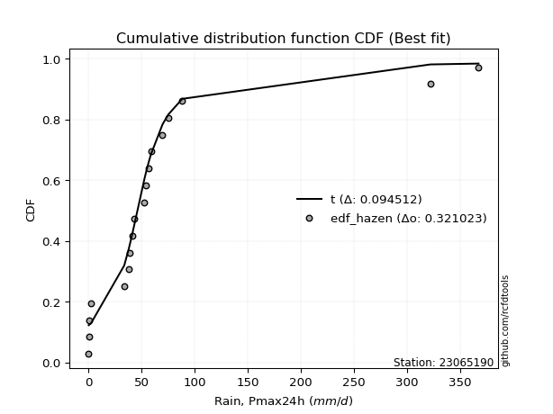</img>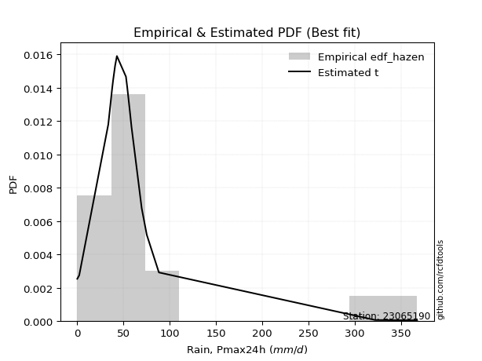</img>

</div>


### 3. Empirical - EDF Weibull (1939)

Weibull plotting position formula is an empirical method used to estimate the non-exceedance probability or plotting position for a set of observed data, is often recommended or widely used in practice, particularly in flood frequency analysis.

<div align="center">


$P=m/(n+1)$


</div>


**3.1. Empirical values**

<div align="center">

|                | 0                  | 1                  | 2                  | 3           | 4                  | 5                  | 6                  | 7                  | 8                  | 9           | 10                 | 11          | 12                | 13                | 14          | 15                | 16                | 17                 | 18                 |
|:---------------|:-------------------|:-------------------|:-------------------|:------------|:-------------------|:-------------------|:-------------------|:-------------------|:-------------------|:------------|:-------------------|:------------|:------------------|:------------------|:------------|:------------------|:------------------|:-------------------|:-------------------|
| date           | 2021               | 2009               | 2024               | 2019        | 2025               | 2016               | 2018               | 2007               | 2012               | 2017        | 2022               | 2011        | 2015              | 2010              | 2006        | 2005              | 2023              | 2014               | 2013               |
| x              | 0.2                | 0.5                | 0.8                | 2.3         | 8.9                | 33.7               | 37.8               | 38.9               | 41.1               | 43.0        | 52.8               | 54.2        | 56.8              | 58.8              | 69.8        | 75.3              | 88.4              | 322.1              | 367.4              |
| m              | 1                  | 2                  | 3                  | 4           | 5                  | 6                  | 7                  | 8                  | 9                  | 10          | 11                 | 12          | 13                | 14                | 15          | 16                | 17                | 18                 | 19                 |
| empirical_dist | edf_weibull        | edf_weibull        | edf_weibull        | edf_weibull | edf_weibull        | edf_weibull        | edf_weibull        | edf_weibull        | edf_weibull        | edf_weibull | edf_weibull        | edf_weibull | edf_weibull       | edf_weibull       | edf_weibull | edf_weibull       | edf_weibull       | edf_weibull        | edf_weibull        |
| empirical      | 0.05               | 0.1                | 0.15               | 0.2         | 0.25               | 0.3                | 0.35               | 0.4                | 0.45               | 0.5         | 0.55               | 0.6         | 0.65              | 0.7               | 0.75        | 0.8               | 0.85              | 0.9                | 0.95               |
| empirical_tr   | 1.0526315789473684 | 1.1111111111111112 | 1.1764705882352942 | 1.25        | 1.3333333333333333 | 1.4285714285714286 | 1.5384615384615383 | 1.6666666666666667 | 1.8181818181818181 | 2.0         | 2.2222222222222223 | 2.5         | 2.857142857142857 | 3.333333333333333 | 4.0         | 5.000000000000001 | 6.666666666666666 | 10.000000000000002 | 19.999999999999982 |

</div>


**3.2. Kolmogorov-Smirnov fit test (sorted by Δ)**


<div align="center">

|                | 0                   | 1                   | 2                   | 3                   | 4                   | 5                   | 6                   | 7                   | 8                   | 9                   | 10                  | 11                  | 12                  | 13                  | 14                  | 15                  | 16                  | 17                  | 18                  | 19                  | 20                  | 21                  | 22                  | 23                    | 24                  | 25                  | 26                  | 27                  | 28                  | 29                  | 30                  | 31                  | 32                  | 33                  | 34                  | 35                  | 36                  | 37                  | 38                  | 39                  | 40                  | 41                  | 42                  | 43                  | 44                  | 45                  | 46                  | 47                  | 48                  | 49                  | 50                  | 51                  | 52                  | 53                  | 54                  | 55                  | 56                  | 57                  | 58                  | 59                  | 60                  | 61                  | 62                  | 63                  | 64                  | 65                  | 66                  | 67                  | 68                  | 69                  | 70                  | 71                  | 72                  | 73                  | 74                  | 75                  | 76                  | 77                  | 78                  | 79                  | 80                  | 81                  | 82                  | 83                  | 84                  | 85                  | 86                  | 87                  | 88                  | 89                  |
|:---------------|:--------------------|:--------------------|:--------------------|:--------------------|:--------------------|:--------------------|:--------------------|:--------------------|:--------------------|:--------------------|:--------------------|:--------------------|:--------------------|:--------------------|:--------------------|:--------------------|:--------------------|:--------------------|:--------------------|:--------------------|:--------------------|:--------------------|:--------------------|:----------------------|:--------------------|:--------------------|:--------------------|:--------------------|:--------------------|:--------------------|:--------------------|:--------------------|:--------------------|:--------------------|:--------------------|:--------------------|:--------------------|:--------------------|:--------------------|:--------------------|:--------------------|:--------------------|:--------------------|:--------------------|:--------------------|:--------------------|:--------------------|:--------------------|:--------------------|:--------------------|:--------------------|:--------------------|:--------------------|:--------------------|:--------------------|:--------------------|:--------------------|:--------------------|:--------------------|:--------------------|:--------------------|:--------------------|:--------------------|:--------------------|:--------------------|:--------------------|:--------------------|:--------------------|:--------------------|:--------------------|:--------------------|:--------------------|:--------------------|:--------------------|:--------------------|:--------------------|:--------------------|:--------------------|:--------------------|:--------------------|:--------------------|:--------------------|:--------------------|:--------------------|:--------------------|:--------------------|:--------------------|:--------------------|:--------------------|:--------------------|
| station        | 23065190            | 23065190            | 23065190            | 23065190            | 23065190            | 23065190            | 23065190            | 23065190            | 23065190            | 23065190            | 23065190            | 23065190            | 23065190            | 23065190            | 23065190            | 23065190            | 23065190            | 23065190            | 23065190            | 23065190            | 23065190            | 23065190            | 23065190            | 23065190              | 23065190            | 23065190            | 23065190            | 23065190            | 23065190            | 23065190            | 23065190            | 23065190            | 23065190            | 23065190            | 23065190            | 23065190            | 23065190            | 23065190            | 23065190            | 23065190            | 23065190            | 23065190            | 23065190            | 23065190            | 23065190            | 23065190            | 23065190            | 23065190            | 23065190            | 23065190            | 23065190            | 23065190            | 23065190            | 23065190            | 23065190            | 23065190            | 23065190            | 23065190            | 23065190            | 23065190            | 23065190            | 23065190            | 23065190            | 23065190            | 23065190            | 23065190            | 23065190            | 23065190            | 23065190            | 23065190            | 23065190            | 23065190            | 23065190            | 23065190            | 23065190            | 23065190            | 23065190            | 23065190            | 23065190            | 23065190            | 23065190            | 23065190            | 23065190            | 23065190            | 23065190            | 23065190            | 23065190            | 23065190            | 23065190            | 23065190            |
| empirical_dist | edf_weibull         | edf_weibull         | edf_weibull         | edf_weibull         | edf_weibull         | edf_weibull         | edf_weibull         | edf_weibull         | edf_weibull         | edf_weibull         | edf_weibull         | edf_weibull         | edf_weibull         | edf_weibull         | edf_weibull         | edf_weibull         | edf_weibull         | edf_weibull         | edf_weibull         | edf_weibull         | edf_weibull         | edf_weibull         | edf_weibull         | edf_weibull           | edf_weibull         | edf_weibull         | edf_weibull         | edf_weibull         | edf_weibull         | edf_weibull         | edf_weibull         | edf_weibull         | edf_weibull         | edf_weibull         | edf_weibull         | edf_weibull         | edf_weibull         | edf_weibull         | edf_weibull         | edf_weibull         | edf_weibull         | edf_weibull         | edf_weibull         | edf_weibull         | edf_weibull         | edf_weibull         | edf_weibull         | edf_weibull         | edf_weibull         | edf_weibull         | edf_weibull         | edf_weibull         | edf_weibull         | edf_weibull         | edf_weibull         | edf_weibull         | edf_weibull         | edf_weibull         | edf_weibull         | edf_weibull         | edf_weibull         | edf_weibull         | edf_weibull         | edf_weibull         | edf_weibull         | edf_weibull         | edf_weibull         | edf_weibull         | edf_weibull         | edf_weibull         | edf_weibull         | edf_weibull         | edf_weibull         | edf_weibull         | edf_weibull         | edf_weibull         | edf_weibull         | edf_weibull         | edf_weibull         | edf_weibull         | edf_weibull         | edf_weibull         | edf_weibull         | edf_weibull         | edf_weibull         | edf_weibull         | edf_weibull         | edf_weibull         | edf_weibull         | edf_weibull         |
| p_dist         | t                   | logjohnsonsu        | johnsonsu           | ncf                 | alpha               | logt                | wald                | genlogistic         | invweibull          | gompertz            | invgamma            | exponnorm           | genexpon            | expon               | laplace_asymmetric  | pearson3            | f                   | pareto              | gibrat              | moyal               | logloggamma         | logmielke           | loggenlogistic      | loglaplace_asymmetric | invgauss            | logweibull_min      | logpearson3         | loggumbel_l         | halflogistic        | gumbel_r            | weibull_min         | logfisk             | halfnorm            | rayleigh            | gamma               | kstwobign           | maxwell             | nakagami            | fisk                | logexponnorm        | logcrystalball      | lognorm             | lognorm             | logrice             | lognct              | lognakagami         | logfatiguelife      | loglognorm          | logbetaprime        | hypsecant           | loginvgamma         | logalpha            | logistic            | laplace             | logerlang           | loggamma            | loggamma            | norm                | crystalball         | loglogistic         | loggompertz         | mielke              | loginvweibull       | loginvgauss         | loghypsecant        | rice                | truncnorm           | logmaxwell          | betaprime           | lograyleigh         | loglaplace          | logkstwobign        | nct                 | logncf              | loggenexpon         | loghalfnorm         | loggumbel_r         | erlang              | gumbel_l            | logexpon            | loghalflogistic     | logmoyal            | fatiguelife         | logtruncnorm        | logchi2             | logwald             | logf                | loggibrat           | logpareto           | chi2                |
| delta          | 0.08506127824543866 | 0.09753756282234838 | 0.12241875596092122 | 0.1470974105792356  | 0.1503384210743221  | 0.15237857103642988 | 0.15800198641963165 | 0.16392255496800823 | 0.1645860963756115  | 0.16668457014598675 | 0.16898152094754765 | 0.17011160830649424 | 0.17085561534812171 | 0.17085566759898668 | 0.17085594658178554 | 0.17365346906880874 | 0.17582050133344862 | 0.1760755900810806  | 0.18209319591239953 | 0.1869173351112987  | 0.18787554463720318 | 0.19574959293448918 | 0.19603623693805716 | 0.1978964303622488    | 0.20273406065476024 | 0.20569070245693083 | 0.2074188173976163  | 0.21056608168758278 | 0.21137628643611256 | 0.21257171370717876 | 0.2136258794959321  | 0.21498475120382715 | 0.2305777016392811  | 0.241875213724413   | 0.24674001361692494 | 0.2509310069261341  | 0.2510537890575022  | 0.2544736537358514  | 0.26823201343468844 | 0.2745368029257889  | 0.27454087737088734 | 0.2745409441757372  | 0.2745409441757372  | 0.27455285347784114 | 0.2747740276500679  | 0.27513488961309435 | 0.27534601802218767 | 0.27569743698398014 | 0.27672541719900684 | 0.27900473267936643 | 0.28039535037715774 | 0.28086101334793806 | 0.28095479636489873 | 0.2822519078820859  | 0.28249682668451853 | 0.2826115484637382  | 0.2826115484637382  | 0.2832409728126053  | 0.2832409820244779  | 0.28440872640088105 | 0.2860090056984917  | 0.28804348207554614 | 0.29150616211415176 | 0.2917875234980874  | 0.29263746447471    | 0.29884189639167225 | 0.29939565306676796 | 0.30317396830449667 | 0.31066468931251096 | 0.3122132139839196  | 0.31670277013539266 | 0.32052257264647394 | 0.33023491475207806 | 0.330596666320602   | 0.33240358711703416 | 0.3378020988081171  | 0.34326693810565295 | 0.3471134490530438  | 0.3529160745423786  | 0.36053608416912614 | 0.36574397977345324 | 0.36718566463789065 | 0.3687976137233158  | 0.3866725190224351  | 0.40901627946815705 | 0.4336177410138396  | 0.4389906830469785  | 0.464312574591686   | 0.5198534719207094  | 0.7309640056369452  |
| deltao         | 0.31564497164100014 | 0.31564497164100014 | 0.31564497164100014 | 0.31564497164100014 | 0.31564497164100014 | 0.31564497164100014 | 0.31564497164100014 | 0.31564497164100014 | 0.31564497164100014 | 0.31564497164100014 | 0.31564497164100014 | 0.31564497164100014 | 0.31564497164100014 | 0.31564497164100014 | 0.31564497164100014 | 0.31564497164100014 | 0.31564497164100014 | 0.31564497164100014 | 0.31564497164100014 | 0.31564497164100014 | 0.31564497164100014 | 0.31564497164100014 | 0.31564497164100014 | 0.31564497164100014   | 0.31564497164100014 | 0.31564497164100014 | 0.31564497164100014 | 0.31564497164100014 | 0.31564497164100014 | 0.31564497164100014 | 0.31564497164100014 | 0.31564497164100014 | 0.31564497164100014 | 0.31564497164100014 | 0.31564497164100014 | 0.31564497164100014 | 0.31564497164100014 | 0.31564497164100014 | 0.31564497164100014 | 0.31564497164100014 | 0.31564497164100014 | 0.31564497164100014 | 0.31564497164100014 | 0.31564497164100014 | 0.31564497164100014 | 0.31564497164100014 | 0.31564497164100014 | 0.31564497164100014 | 0.31564497164100014 | 0.31564497164100014 | 0.31564497164100014 | 0.31564497164100014 | 0.31564497164100014 | 0.31564497164100014 | 0.31564497164100014 | 0.31564497164100014 | 0.31564497164100014 | 0.31564497164100014 | 0.31564497164100014 | 0.31564497164100014 | 0.31564497164100014 | 0.31564497164100014 | 0.31564497164100014 | 0.31564497164100014 | 0.31564497164100014 | 0.31564497164100014 | 0.31564497164100014 | 0.31564497164100014 | 0.31564497164100014 | 0.31564497164100014 | 0.31564497164100014 | 0.31564497164100014 | 0.31564497164100014 | 0.31564497164100014 | 0.31564497164100014 | 0.31564497164100014 | 0.31564497164100014 | 0.31564497164100014 | 0.31564497164100014 | 0.31564497164100014 | 0.31564497164100014 | 0.31564497164100014 | 0.31564497164100014 | 0.31564497164100014 | 0.31564497164100014 | 0.31564497164100014 | 0.31564497164100014 | 0.31564497164100014 | 0.31564497164100014 | 0.31564497164100014 |
| eval           | Δo > Δ              | Δo > Δ              | Δo > Δ              | Δo > Δ              | Δo > Δ              | Δo > Δ              | Δo > Δ              | Δo > Δ              | Δo > Δ              | Δo > Δ              | Δo > Δ              | Δo > Δ              | Δo > Δ              | Δo > Δ              | Δo > Δ              | Δo > Δ              | Δo > Δ              | Δo > Δ              | Δo > Δ              | Δo > Δ              | Δo > Δ              | Δo > Δ              | Δo > Δ              | Δo > Δ                | Δo > Δ              | Δo > Δ              | Δo > Δ              | Δo > Δ              | Δo > Δ              | Δo > Δ              | Δo > Δ              | Δo > Δ              | Δo > Δ              | Δo > Δ              | Δo > Δ              | Δo > Δ              | Δo > Δ              | Δo > Δ              | Δo > Δ              | Δo > Δ              | Δo > Δ              | Δo > Δ              | Δo > Δ              | Δo > Δ              | Δo > Δ              | Δo > Δ              | Δo > Δ              | Δo > Δ              | Δo > Δ              | Δo > Δ              | Δo > Δ              | Δo > Δ              | Δo > Δ              | Δo > Δ              | Δo > Δ              | Δo > Δ              | Δo > Δ              | Δo > Δ              | Δo > Δ              | Δo > Δ              | Δo > Δ              | Δo > Δ              | Δo > Δ              | Δo > Δ              | Δo > Δ              | Δo > Δ              | Δo > Δ              | Δo > Δ              | Δo > Δ              | Δo > Δ              | Δo <= Δ             | Δo <= Δ             | Δo <= Δ             | Δo <= Δ             | Δo <= Δ             | Δo <= Δ             | Δo <= Δ             | Δo <= Δ             | Δo <= Δ             | Δo <= Δ             | Δo <= Δ             | Δo <= Δ             | Δo <= Δ             | Δo <= Δ             | Δo <= Δ             | Δo <= Δ             | Δo <= Δ             | Δo <= Δ             | Δo <= Δ             | Δo <= Δ             |
| fit            | 1                   | 1                   | 1                   | 1                   | 1                   | 1                   | 1                   | 1                   | 1                   | 1                   | 1                   | 1                   | 1                   | 1                   | 1                   | 1                   | 1                   | 1                   | 1                   | 1                   | 1                   | 1                   | 1                   | 1                     | 1                   | 1                   | 1                   | 1                   | 1                   | 1                   | 1                   | 1                   | 1                   | 1                   | 1                   | 1                   | 1                   | 1                   | 1                   | 1                   | 1                   | 1                   | 1                   | 1                   | 1                   | 1                   | 1                   | 1                   | 1                   | 1                   | 1                   | 1                   | 1                   | 1                   | 1                   | 1                   | 1                   | 1                   | 1                   | 1                   | 1                   | 1                   | 1                   | 1                   | 1                   | 1                   | 1                   | 1                   | 1                   | 1                   | 0                   | 0                   | 0                   | 0                   | 0                   | 0                   | 0                   | 0                   | 0                   | 0                   | 0                   | 0                   | 0                   | 0                   | 0                   | 0                   | 0                   | 0                   | 0                   | 0                   |
| n              | 19                  | 19                  | 19                  | 19                  | 19                  | 19                  | 19                  | 19                  | 19                  | 19                  | 19                  | 19                  | 19                  | 19                  | 19                  | 19                  | 19                  | 19                  | 19                  | 19                  | 19                  | 19                  | 19                  | 19                    | 19                  | 19                  | 19                  | 19                  | 19                  | 19                  | 19                  | 19                  | 19                  | 19                  | 19                  | 19                  | 19                  | 19                  | 19                  | 19                  | 19                  | 19                  | 19                  | 19                  | 19                  | 19                  | 19                  | 19                  | 19                  | 19                  | 19                  | 19                  | 19                  | 19                  | 19                  | 19                  | 19                  | 19                  | 19                  | 19                  | 19                  | 19                  | 19                  | 19                  | 19                  | 19                  | 19                  | 19                  | 19                  | 19                  | 19                  | 19                  | 19                  | 19                  | 19                  | 19                  | 19                  | 19                  | 19                  | 19                  | 19                  | 19                  | 19                  | 19                  | 19                  | 19                  | 19                  | 19                  | 19                  | 19                  |
| best_fit       | 1                   | 0                   | 0                   | 0                   | 0                   | 0                   | 0                   | 0                   | 0                   | 0                   | 0                   | 0                   | 0                   | 0                   | 0                   | 0                   | 0                   | 0                   | 0                   | 0                   | 0                   | 0                   | 0                   | 0                     | 0                   | 0                   | 0                   | 0                   | 0                   | 0                   | 0                   | 0                   | 0                   | 0                   | 0                   | 0                   | 0                   | 0                   | 0                   | 0                   | 0                   | 0                   | 0                   | 0                   | 0                   | 0                   | 0                   | 0                   | 0                   | 0                   | 0                   | 0                   | 0                   | 0                   | 0                   | 0                   | 0                   | 0                   | 0                   | 0                   | 0                   | 0                   | 0                   | 0                   | 0                   | 0                   | 0                   | 0                   | 0                   | 0                   | 0                   | 0                   | 0                   | 0                   | 0                   | 0                   | 0                   | 0                   | 0                   | 0                   | 0                   | 0                   | 0                   | 0                   | 0                   | 0                   | 0                   | 0                   | 0                   | 0                   |
| best_fit_sort  | 1                   | 2                   | 3                   | 4                   | 5                   | 6                   | 7                   | 8                   | 9                   | 10                  | 11                  | 12                  | 13                  | 14                  | 15                  | 16                  | 17                  | 18                  | 19                  | 20                  | 21                  | 22                  | 23                  | 24                    | 25                  | 26                  | 27                  | 28                  | 29                  | 30                  | 31                  | 32                  | 33                  | 34                  | 35                  | 36                  | 37                  | 38                  | 39                  | 40                  | 41                  | 42                  | 43                  | 44                  | 45                  | 46                  | 47                  | 48                  | 49                  | 50                  | 51                  | 52                  | 53                  | 54                  | 55                  | 56                  | 57                  | 58                  | 59                  | 60                  | 61                  | 62                  | 63                  | 64                  | 65                  | 66                  | 67                  | 68                  | 69                  | 70                  | 71                  | 72                  | 73                  | 74                  | 75                  | 76                  | 77                  | 78                  | 79                  | 80                  | 81                  | 82                  | 83                  | 84                  | 85                  | 86                  | 87                  | 88                  | 89                  | 90                  |

</div>


<div align="center">

</img>

</div>


**3.3. Best fit**

<div align="center">

|   id |   station | empirical_dist   | p_dist   |     delta |   deltao | eval   |   fit |   n |   best_fit |   best_fit_sort |
|-----:|----------:|:-----------------|:---------|----------:|---------:|:-------|------:|----:|-----------:|----------------:|
|    0 |  23065190 | edf_weibull      | t        | 0.0850613 | 0.315645 | Δo > Δ |     1 |  19 |          1 |               1 |

</div>


<div align="center">

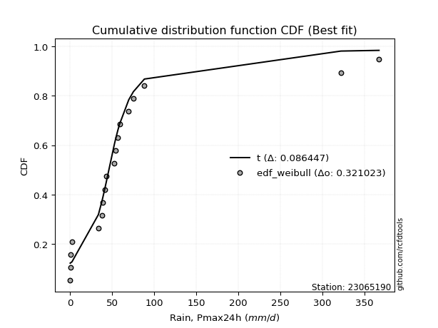</img>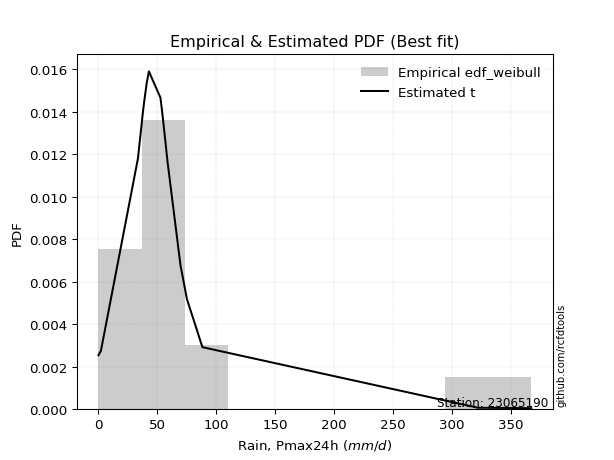</img>

</div>


### 4. Empirical - EDF Beard (1943)

The Beard formula (or Beard´s plotting position formula) in hydrology is used to estimate the empirical non-exceedance probability _(P)_ of a flood event (or other extreme hydrological data point) within a given dataset.

<div align="center">


$P=(m-0.31)/(n+0.38)$


</div>


**4.1. Empirical values**

<div align="center">

|                | 0                   | 1                   | 2                  | 3                   | 4                   | 5                   | 6                  | 7                  | 8                  | 9         | 10                 | 11                 | 12                 | 13                 | 14                 | 15                 | 16                 | 17                 | 18                 |
|:---------------|:--------------------|:--------------------|:-------------------|:--------------------|:--------------------|:--------------------|:-------------------|:-------------------|:-------------------|:----------|:-------------------|:-------------------|:-------------------|:-------------------|:-------------------|:-------------------|:-------------------|:-------------------|:-------------------|
| date           | 2021                | 2009                | 2024               | 2019                | 2025                | 2016                | 2018               | 2007               | 2012               | 2017      | 2022               | 2011               | 2015               | 2010               | 2006               | 2005               | 2023               | 2014               | 2013               |
| x              | 0.2                 | 0.5                 | 0.8                | 2.3                 | 8.9                 | 33.7                | 37.8               | 38.9               | 41.1               | 43.0      | 52.8               | 54.2               | 56.8               | 58.8               | 69.8               | 75.3               | 88.4               | 322.1              | 367.4              |
| m              | 1                   | 2                   | 3                  | 4                   | 5                   | 6                   | 7                  | 8                  | 9                  | 10        | 11                 | 12                 | 13                 | 14                 | 15                 | 16                 | 17                 | 18                 | 19                 |
| empirical_dist | edf_beard           | edf_beard           | edf_beard          | edf_beard           | edf_beard           | edf_beard           | edf_beard          | edf_beard          | edf_beard          | edf_beard | edf_beard          | edf_beard          | edf_beard          | edf_beard          | edf_beard          | edf_beard          | edf_beard          | edf_beard          | edf_beard          |
| empirical      | 0.03560371517027864 | 0.08720330237358101 | 0.1388028895768834 | 0.19040247678018576 | 0.24200206398348817 | 0.29360165118679055 | 0.3452012383900929 | 0.3968008255933953 | 0.4484004127966976 | 0.5       | 0.5515995872033024 | 0.6031991744066048 | 0.6547987616099071 | 0.7063983488132095 | 0.7579979360165119 | 0.8095975232198143 | 0.8611971104231168 | 0.9127966976264191 | 0.9643962848297215 |
| empirical_tr   | 1.0369181380417336  | 1.0955342001130581  | 1.1611743559017376 | 1.2351816443594645  | 1.3192648059904697  | 1.4156318480642804  | 1.5271867612293144 | 1.6578272027373824 | 1.812909260991581  | 2.0       | 2.230149597238205  | 2.5201560468140443 | 2.896860986547085  | 3.40597539543058   | 4.132196162046909  | 5.252032520325204  | 7.204460966542758  | 11.467455621301793 | 28.086956521739243 |

</div>


**4.2. Kolmogorov-Smirnov fit test (sorted by Δ)**


<div align="center">

|                | 0                   | 1                   | 2                   | 3                   | 4                   | 5                   | 6                   | 7                   | 8                   | 9                   | 10                  | 11                  | 12                  | 13                  | 14                  | 15                  | 16                  | 17                  | 18                  | 19                  | 20                  | 21                  | 22                  | 23                    | 24                  | 25                  | 26                  | 27                  | 28                  | 29                  | 30                  | 31                  | 32                  | 33                  | 34                  | 35                  | 36                  | 37                  | 38                  | 39                  | 40                  | 41                  | 42                  | 43                  | 44                  | 45                  | 46                  | 47                  | 48                  | 49                  | 50                  | 51                  | 52                  | 53                  | 54                  | 55                  | 56                  | 57                  | 58                  | 59                  | 60                  | 61                  | 62                  | 63                  | 64                  | 65                  | 66                  | 67                  | 68                  | 69                  | 70                  | 71                  | 72                  | 73                  | 74                  | 75                  | 76                  | 77                  | 78                  | 79                  | 80                  | 81                  | 82                  | 83                  | 84                  | 85                  | 86                  | 87                  | 88                  | 89                  |
|:---------------|:--------------------|:--------------------|:--------------------|:--------------------|:--------------------|:--------------------|:--------------------|:--------------------|:--------------------|:--------------------|:--------------------|:--------------------|:--------------------|:--------------------|:--------------------|:--------------------|:--------------------|:--------------------|:--------------------|:--------------------|:--------------------|:--------------------|:--------------------|:----------------------|:--------------------|:--------------------|:--------------------|:--------------------|:--------------------|:--------------------|:--------------------|:--------------------|:--------------------|:--------------------|:--------------------|:--------------------|:--------------------|:--------------------|:--------------------|:--------------------|:--------------------|:--------------------|:--------------------|:--------------------|:--------------------|:--------------------|:--------------------|:--------------------|:--------------------|:--------------------|:--------------------|:--------------------|:--------------------|:--------------------|:--------------------|:--------------------|:--------------------|:--------------------|:--------------------|:--------------------|:--------------------|:--------------------|:--------------------|:--------------------|:--------------------|:--------------------|:--------------------|:--------------------|:--------------------|:--------------------|:--------------------|:--------------------|:--------------------|:--------------------|:--------------------|:--------------------|:--------------------|:--------------------|:--------------------|:--------------------|:--------------------|:--------------------|:--------------------|:--------------------|:--------------------|:--------------------|:--------------------|:--------------------|:--------------------|:--------------------|
| station        | 23065190            | 23065190            | 23065190            | 23065190            | 23065190            | 23065190            | 23065190            | 23065190            | 23065190            | 23065190            | 23065190            | 23065190            | 23065190            | 23065190            | 23065190            | 23065190            | 23065190            | 23065190            | 23065190            | 23065190            | 23065190            | 23065190            | 23065190            | 23065190              | 23065190            | 23065190            | 23065190            | 23065190            | 23065190            | 23065190            | 23065190            | 23065190            | 23065190            | 23065190            | 23065190            | 23065190            | 23065190            | 23065190            | 23065190            | 23065190            | 23065190            | 23065190            | 23065190            | 23065190            | 23065190            | 23065190            | 23065190            | 23065190            | 23065190            | 23065190            | 23065190            | 23065190            | 23065190            | 23065190            | 23065190            | 23065190            | 23065190            | 23065190            | 23065190            | 23065190            | 23065190            | 23065190            | 23065190            | 23065190            | 23065190            | 23065190            | 23065190            | 23065190            | 23065190            | 23065190            | 23065190            | 23065190            | 23065190            | 23065190            | 23065190            | 23065190            | 23065190            | 23065190            | 23065190            | 23065190            | 23065190            | 23065190            | 23065190            | 23065190            | 23065190            | 23065190            | 23065190            | 23065190            | 23065190            | 23065190            |
| empirical_dist | edf_beard           | edf_beard           | edf_beard           | edf_beard           | edf_beard           | edf_beard           | edf_beard           | edf_beard           | edf_beard           | edf_beard           | edf_beard           | edf_beard           | edf_beard           | edf_beard           | edf_beard           | edf_beard           | edf_beard           | edf_beard           | edf_beard           | edf_beard           | edf_beard           | edf_beard           | edf_beard           | edf_beard             | edf_beard           | edf_beard           | edf_beard           | edf_beard           | edf_beard           | edf_beard           | edf_beard           | edf_beard           | edf_beard           | edf_beard           | edf_beard           | edf_beard           | edf_beard           | edf_beard           | edf_beard           | edf_beard           | edf_beard           | edf_beard           | edf_beard           | edf_beard           | edf_beard           | edf_beard           | edf_beard           | edf_beard           | edf_beard           | edf_beard           | edf_beard           | edf_beard           | edf_beard           | edf_beard           | edf_beard           | edf_beard           | edf_beard           | edf_beard           | edf_beard           | edf_beard           | edf_beard           | edf_beard           | edf_beard           | edf_beard           | edf_beard           | edf_beard           | edf_beard           | edf_beard           | edf_beard           | edf_beard           | edf_beard           | edf_beard           | edf_beard           | edf_beard           | edf_beard           | edf_beard           | edf_beard           | edf_beard           | edf_beard           | edf_beard           | edf_beard           | edf_beard           | edf_beard           | edf_beard           | edf_beard           | edf_beard           | edf_beard           | edf_beard           | edf_beard           | edf_beard           |
| p_dist         | logjohnsonsu        | t                   | johnsonsu           | ncf                 | logt                | alpha               | gompertz            | exponnorm           | genexpon            | expon               | laplace_asymmetric  | wald                | genlogistic         | invweibull          | gibrat              | invgamma            | pearson3            | pareto              | f                   | logloggamma         | moyal               | logmielke           | loggenlogistic      | loglaplace_asymmetric | invgauss            | logweibull_min      | logpearson3         | loggumbel_l         | weibull_min         | logfisk             | gumbel_r            | halflogistic        | halfnorm            | rayleigh            | gamma               | kstwobign           | maxwell             | nakagami            | fisk                | logexponnorm        | logcrystalball      | lognorm             | lognorm             | logrice             | lognct              | lognakagami         | logfatiguelife      | loglognorm          | logbetaprime        | loginvgamma         | logalpha            | hypsecant           | laplace             | logerlang           | loggamma            | loggamma            | logistic            | loglogistic         | loggompertz         | norm                | crystalball         | mielke              | loginvweibull       | loginvgauss         | loghypsecant        | rice                | truncnorm           | logmaxwell          | betaprime           | lograyleigh         | loglaplace          | logkstwobign        | nct                 | logncf              | loggenexpon         | loghalfnorm         | loggumbel_r         | erlang              | gumbel_l            | logexpon            | loghalflogistic     | logmoyal            | fatiguelife         | logtruncnorm        | logchi2             | logwald             | logf                | loggibrat           | logpareto           | chi2                |
| delta          | 0.08794003960253413 | 0.09752378876103307 | 0.11442081994440939 | 0.13749988735942134 | 0.14438063501991805 | 0.15673676988753155 | 0.15708704692617248 | 0.16051408508668    | 0.16125809212830744 | 0.16125814437917244 | 0.1612584233619713  | 0.1644003352328411  | 0.17032090378121778 | 0.17098444518882094 | 0.17249567269258528 | 0.1753798697607571  | 0.18063698934479078 | 0.18247393889429003 | 0.1870176117565654  | 0.19427389345041263 | 0.1988563896777342  | 0.20214794174769862 | 0.2024345857512666  | 0.20429477917545824   | 0.20913240946796968 | 0.21208905127014027 | 0.21381716621082575 | 0.21696443050079223 | 0.22002422830914153 | 0.2213831000170366  | 0.22219348335188516 | 0.22577257126583392 | 0.24497398646900245 | 0.2530723241475298  | 0.2531383624301344  | 0.26052853014594834 | 0.26225089948061897 | 0.2656707641589682  | 0.2746303622478979  | 0.28093515173899836 | 0.2809392261840968  | 0.28093929298894665 | 0.28093929298894665 | 0.2809512022910506  | 0.28117237646327736 | 0.2815332384263038  | 0.2817443668353971  | 0.2820957857971896  | 0.2831237660122163  | 0.2867936991903672  | 0.2872593621611475  | 0.28860225589918065 | 0.2886502566952954  | 0.288895175497728   | 0.28900989727694765 | 0.28900989727694765 | 0.29055231958471295 | 0.2908070752140905  | 0.29240735451170113 | 0.2928384960324195  | 0.2928385052442921  | 0.2944418308887556  | 0.2979045109273612  | 0.29818587231129684 | 0.29903581328791945 | 0.30843941961148647 | 0.3089931762865822  | 0.3095723171177061  | 0.3170630381257204  | 0.31861156279712904 | 0.3231011189486021  | 0.3269209214596834  | 0.3366332635652875  | 0.3381248573231819  | 0.3388019359302436  | 0.34420044762132657 | 0.3496652869188624  | 0.35351179786625325 | 0.36251359776219283 | 0.3669344329823356  | 0.3721423285866627  | 0.3735840134511001  | 0.37519596253652526 | 0.39307086783564454 | 0.4154146282813665  | 0.44001608982704904 | 0.44698861906349036 | 0.47071092340489545 | 0.5326501695471284  | 0.738961941653457   |
| deltao         | 0.31564497164100014 | 0.31564497164100014 | 0.31564497164100014 | 0.31564497164100014 | 0.31564497164100014 | 0.31564497164100014 | 0.31564497164100014 | 0.31564497164100014 | 0.31564497164100014 | 0.31564497164100014 | 0.31564497164100014 | 0.31564497164100014 | 0.31564497164100014 | 0.31564497164100014 | 0.31564497164100014 | 0.31564497164100014 | 0.31564497164100014 | 0.31564497164100014 | 0.31564497164100014 | 0.31564497164100014 | 0.31564497164100014 | 0.31564497164100014 | 0.31564497164100014 | 0.31564497164100014   | 0.31564497164100014 | 0.31564497164100014 | 0.31564497164100014 | 0.31564497164100014 | 0.31564497164100014 | 0.31564497164100014 | 0.31564497164100014 | 0.31564497164100014 | 0.31564497164100014 | 0.31564497164100014 | 0.31564497164100014 | 0.31564497164100014 | 0.31564497164100014 | 0.31564497164100014 | 0.31564497164100014 | 0.31564497164100014 | 0.31564497164100014 | 0.31564497164100014 | 0.31564497164100014 | 0.31564497164100014 | 0.31564497164100014 | 0.31564497164100014 | 0.31564497164100014 | 0.31564497164100014 | 0.31564497164100014 | 0.31564497164100014 | 0.31564497164100014 | 0.31564497164100014 | 0.31564497164100014 | 0.31564497164100014 | 0.31564497164100014 | 0.31564497164100014 | 0.31564497164100014 | 0.31564497164100014 | 0.31564497164100014 | 0.31564497164100014 | 0.31564497164100014 | 0.31564497164100014 | 0.31564497164100014 | 0.31564497164100014 | 0.31564497164100014 | 0.31564497164100014 | 0.31564497164100014 | 0.31564497164100014 | 0.31564497164100014 | 0.31564497164100014 | 0.31564497164100014 | 0.31564497164100014 | 0.31564497164100014 | 0.31564497164100014 | 0.31564497164100014 | 0.31564497164100014 | 0.31564497164100014 | 0.31564497164100014 | 0.31564497164100014 | 0.31564497164100014 | 0.31564497164100014 | 0.31564497164100014 | 0.31564497164100014 | 0.31564497164100014 | 0.31564497164100014 | 0.31564497164100014 | 0.31564497164100014 | 0.31564497164100014 | 0.31564497164100014 | 0.31564497164100014 |
| eval           | Δo > Δ              | Δo > Δ              | Δo > Δ              | Δo > Δ              | Δo > Δ              | Δo > Δ              | Δo > Δ              | Δo > Δ              | Δo > Δ              | Δo > Δ              | Δo > Δ              | Δo > Δ              | Δo > Δ              | Δo > Δ              | Δo > Δ              | Δo > Δ              | Δo > Δ              | Δo > Δ              | Δo > Δ              | Δo > Δ              | Δo > Δ              | Δo > Δ              | Δo > Δ              | Δo > Δ                | Δo > Δ              | Δo > Δ              | Δo > Δ              | Δo > Δ              | Δo > Δ              | Δo > Δ              | Δo > Δ              | Δo > Δ              | Δo > Δ              | Δo > Δ              | Δo > Δ              | Δo > Δ              | Δo > Δ              | Δo > Δ              | Δo > Δ              | Δo > Δ              | Δo > Δ              | Δo > Δ              | Δo > Δ              | Δo > Δ              | Δo > Δ              | Δo > Δ              | Δo > Δ              | Δo > Δ              | Δo > Δ              | Δo > Δ              | Δo > Δ              | Δo > Δ              | Δo > Δ              | Δo > Δ              | Δo > Δ              | Δo > Δ              | Δo > Δ              | Δo > Δ              | Δo > Δ              | Δo > Δ              | Δo > Δ              | Δo > Δ              | Δo > Δ              | Δo > Δ              | Δo > Δ              | Δo > Δ              | Δo > Δ              | Δo > Δ              | Δo <= Δ             | Δo <= Δ             | Δo <= Δ             | Δo <= Δ             | Δo <= Δ             | Δo <= Δ             | Δo <= Δ             | Δo <= Δ             | Δo <= Δ             | Δo <= Δ             | Δo <= Δ             | Δo <= Δ             | Δo <= Δ             | Δo <= Δ             | Δo <= Δ             | Δo <= Δ             | Δo <= Δ             | Δo <= Δ             | Δo <= Δ             | Δo <= Δ             | Δo <= Δ             | Δo <= Δ             |
| fit            | 1                   | 1                   | 1                   | 1                   | 1                   | 1                   | 1                   | 1                   | 1                   | 1                   | 1                   | 1                   | 1                   | 1                   | 1                   | 1                   | 1                   | 1                   | 1                   | 1                   | 1                   | 1                   | 1                   | 1                     | 1                   | 1                   | 1                   | 1                   | 1                   | 1                   | 1                   | 1                   | 1                   | 1                   | 1                   | 1                   | 1                   | 1                   | 1                   | 1                   | 1                   | 1                   | 1                   | 1                   | 1                   | 1                   | 1                   | 1                   | 1                   | 1                   | 1                   | 1                   | 1                   | 1                   | 1                   | 1                   | 1                   | 1                   | 1                   | 1                   | 1                   | 1                   | 1                   | 1                   | 1                   | 1                   | 1                   | 1                   | 0                   | 0                   | 0                   | 0                   | 0                   | 0                   | 0                   | 0                   | 0                   | 0                   | 0                   | 0                   | 0                   | 0                   | 0                   | 0                   | 0                   | 0                   | 0                   | 0                   | 0                   | 0                   |
| n              | 19                  | 19                  | 19                  | 19                  | 19                  | 19                  | 19                  | 19                  | 19                  | 19                  | 19                  | 19                  | 19                  | 19                  | 19                  | 19                  | 19                  | 19                  | 19                  | 19                  | 19                  | 19                  | 19                  | 19                    | 19                  | 19                  | 19                  | 19                  | 19                  | 19                  | 19                  | 19                  | 19                  | 19                  | 19                  | 19                  | 19                  | 19                  | 19                  | 19                  | 19                  | 19                  | 19                  | 19                  | 19                  | 19                  | 19                  | 19                  | 19                  | 19                  | 19                  | 19                  | 19                  | 19                  | 19                  | 19                  | 19                  | 19                  | 19                  | 19                  | 19                  | 19                  | 19                  | 19                  | 19                  | 19                  | 19                  | 19                  | 19                  | 19                  | 19                  | 19                  | 19                  | 19                  | 19                  | 19                  | 19                  | 19                  | 19                  | 19                  | 19                  | 19                  | 19                  | 19                  | 19                  | 19                  | 19                  | 19                  | 19                  | 19                  |
| best_fit       | 1                   | 0                   | 0                   | 0                   | 0                   | 0                   | 0                   | 0                   | 0                   | 0                   | 0                   | 0                   | 0                   | 0                   | 0                   | 0                   | 0                   | 0                   | 0                   | 0                   | 0                   | 0                   | 0                   | 0                     | 0                   | 0                   | 0                   | 0                   | 0                   | 0                   | 0                   | 0                   | 0                   | 0                   | 0                   | 0                   | 0                   | 0                   | 0                   | 0                   | 0                   | 0                   | 0                   | 0                   | 0                   | 0                   | 0                   | 0                   | 0                   | 0                   | 0                   | 0                   | 0                   | 0                   | 0                   | 0                   | 0                   | 0                   | 0                   | 0                   | 0                   | 0                   | 0                   | 0                   | 0                   | 0                   | 0                   | 0                   | 0                   | 0                   | 0                   | 0                   | 0                   | 0                   | 0                   | 0                   | 0                   | 0                   | 0                   | 0                   | 0                   | 0                   | 0                   | 0                   | 0                   | 0                   | 0                   | 0                   | 0                   | 0                   |
| best_fit_sort  | 1                   | 2                   | 3                   | 4                   | 5                   | 6                   | 7                   | 8                   | 9                   | 10                  | 11                  | 12                  | 13                  | 14                  | 15                  | 16                  | 17                  | 18                  | 19                  | 20                  | 21                  | 22                  | 23                  | 24                    | 25                  | 26                  | 27                  | 28                  | 29                  | 30                  | 31                  | 32                  | 33                  | 34                  | 35                  | 36                  | 37                  | 38                  | 39                  | 40                  | 41                  | 42                  | 43                  | 44                  | 45                  | 46                  | 47                  | 48                  | 49                  | 50                  | 51                  | 52                  | 53                  | 54                  | 55                  | 56                  | 57                  | 58                  | 59                  | 60                  | 61                  | 62                  | 63                  | 64                  | 65                  | 66                  | 67                  | 68                  | 69                  | 70                  | 71                  | 72                  | 73                  | 74                  | 75                  | 76                  | 77                  | 78                  | 79                  | 80                  | 81                  | 82                  | 83                  | 84                  | 85                  | 86                  | 87                  | 88                  | 89                  | 90                  |

</div>


<div align="center">

</img>

</div>


**4.3. Best fit**

<div align="center">

|   id |   station | empirical_dist   | p_dist       |   delta |   deltao | eval   |   fit |   n |   best_fit |   best_fit_sort |
|-----:|----------:|:-----------------|:-------------|--------:|---------:|:-------|------:|----:|-----------:|----------------:|
|    0 |  23065190 | edf_beard        | logjohnsonsu | 0.08794 | 0.315645 | Δo > Δ |     1 |  19 |          1 |               1 |

</div>


<div align="center">

</img></img>

</div>


### 5. Empirical - EDF Chegodayev (1955)

The Chegodayev formula is an empirical plotting position formula used in hydrological frequency analysis to estimate the exceedance probability or return period of a specific event from a set of observed data. It is primarily used for plotting observed data points on probability paper to fit a theoretical distribution, particularly for analyzing extreme events like maximum flood flows or rainfall intensities. The constant _b_ value in the generalized plotting position formula is 0.3.

<div align="center">


$P=(m-b)/(n+1-2b)$


</div>


**5.1. Empirical values**

<div align="center">

|                | 0                   | 1                   | 2                  | 3                  | 4                   | 5                   | 6                  | 7                  | 8                  | 9              | 10                 | 11                 | 12                 | 13                 | 14                 | 15                 | 16                 | 17                 | 18                 |
|:---------------|:--------------------|:--------------------|:-------------------|:-------------------|:--------------------|:--------------------|:-------------------|:-------------------|:-------------------|:---------------|:-------------------|:-------------------|:-------------------|:-------------------|:-------------------|:-------------------|:-------------------|:-------------------|:-------------------|
| date           | 2021                | 2009                | 2024               | 2019               | 2025                | 2016                | 2018               | 2007               | 2012               | 2017           | 2022               | 2011               | 2015               | 2010               | 2006               | 2005               | 2023               | 2014               | 2013               |
| x              | 0.2                 | 0.5                 | 0.8                | 2.3                | 8.9                 | 33.7                | 37.8               | 38.9               | 41.1               | 43.0           | 52.8               | 54.2               | 56.8               | 58.8               | 69.8               | 75.3               | 88.4               | 322.1              | 367.4              |
| m              | 1                   | 2                   | 3                  | 4                  | 5                   | 6                   | 7                  | 8                  | 9                  | 10             | 11                 | 12                 | 13                 | 14                 | 15                 | 16                 | 17                 | 18                 | 19                 |
| empirical_dist | edf_chegodayev      | edf_chegodayev      | edf_chegodayev     | edf_chegodayev     | edf_chegodayev      | edf_chegodayev      | edf_chegodayev     | edf_chegodayev     | edf_chegodayev     | edf_chegodayev | edf_chegodayev     | edf_chegodayev     | edf_chegodayev     | edf_chegodayev     | edf_chegodayev     | edf_chegodayev     | edf_chegodayev     | edf_chegodayev     | edf_chegodayev     |
| empirical      | 0.03608247422680413 | 0.08762886597938145 | 0.1391752577319588 | 0.1907216494845361 | 0.24226804123711343 | 0.29381443298969073 | 0.3453608247422681 | 0.3969072164948454 | 0.4484536082474227 | 0.5            | 0.5515463917525774 | 0.6030927835051546 | 0.654639175257732  | 0.7061855670103093 | 0.7577319587628866 | 0.8092783505154639 | 0.8608247422680413 | 0.9123711340206185 | 0.9639175257731959 |
| empirical_tr   | 1.0374331550802138  | 1.096045197740113   | 1.1616766467065869 | 1.2356687898089171 | 1.3197278911564627  | 1.416058394160584   | 1.5275590551181104 | 1.6581196581196582 | 1.8130841121495327 | 2.0            | 2.2298850574712645 | 2.519480519480519  | 2.8955223880597014 | 3.403508771929825  | 4.127659574468085  | 5.243243243243244  | 7.185185185185188  | 11.41176470588235  | 27.714285714285726 |

</div>


**5.2. Kolmogorov-Smirnov fit test (sorted by Δ)**


<div align="center">

|                | 0                   | 1                   | 2                   | 3                   | 4                   | 5                   | 6                   | 7                   | 8                   | 9                   | 10                  | 11                  | 12                  | 13                  | 14                  | 15                  | 16                  | 17                  | 18                  | 19                  | 20                  | 21                  | 22                  | 23                    | 24                  | 25                  | 26                  | 27                  | 28                  | 29                  | 30                  | 31                  | 32                  | 33                  | 34                  | 35                  | 36                  | 37                  | 38                  | 39                  | 40                  | 41                  | 42                  | 43                  | 44                  | 45                  | 46                  | 47                  | 48                  | 49                  | 50                  | 51                  | 52                  | 53                  | 54                  | 55                  | 56                  | 57                  | 58                  | 59                  | 60                  | 61                  | 62                  | 63                  | 64                  | 65                  | 66                  | 67                  | 68                  | 69                  | 70                  | 71                  | 72                  | 73                  | 74                  | 75                  | 76                  | 77                  | 78                  | 79                  | 80                  | 81                  | 82                  | 83                  | 84                  | 85                  | 86                  | 87                  | 88                  | 89                  |
|:---------------|:--------------------|:--------------------|:--------------------|:--------------------|:--------------------|:--------------------|:--------------------|:--------------------|:--------------------|:--------------------|:--------------------|:--------------------|:--------------------|:--------------------|:--------------------|:--------------------|:--------------------|:--------------------|:--------------------|:--------------------|:--------------------|:--------------------|:--------------------|:----------------------|:--------------------|:--------------------|:--------------------|:--------------------|:--------------------|:--------------------|:--------------------|:--------------------|:--------------------|:--------------------|:--------------------|:--------------------|:--------------------|:--------------------|:--------------------|:--------------------|:--------------------|:--------------------|:--------------------|:--------------------|:--------------------|:--------------------|:--------------------|:--------------------|:--------------------|:--------------------|:--------------------|:--------------------|:--------------------|:--------------------|:--------------------|:--------------------|:--------------------|:--------------------|:--------------------|:--------------------|:--------------------|:--------------------|:--------------------|:--------------------|:--------------------|:--------------------|:--------------------|:--------------------|:--------------------|:--------------------|:--------------------|:--------------------|:--------------------|:--------------------|:--------------------|:--------------------|:--------------------|:--------------------|:--------------------|:--------------------|:--------------------|:--------------------|:--------------------|:--------------------|:--------------------|:--------------------|:--------------------|:--------------------|:--------------------|:--------------------|
| station        | 23065190            | 23065190            | 23065190            | 23065190            | 23065190            | 23065190            | 23065190            | 23065190            | 23065190            | 23065190            | 23065190            | 23065190            | 23065190            | 23065190            | 23065190            | 23065190            | 23065190            | 23065190            | 23065190            | 23065190            | 23065190            | 23065190            | 23065190            | 23065190              | 23065190            | 23065190            | 23065190            | 23065190            | 23065190            | 23065190            | 23065190            | 23065190            | 23065190            | 23065190            | 23065190            | 23065190            | 23065190            | 23065190            | 23065190            | 23065190            | 23065190            | 23065190            | 23065190            | 23065190            | 23065190            | 23065190            | 23065190            | 23065190            | 23065190            | 23065190            | 23065190            | 23065190            | 23065190            | 23065190            | 23065190            | 23065190            | 23065190            | 23065190            | 23065190            | 23065190            | 23065190            | 23065190            | 23065190            | 23065190            | 23065190            | 23065190            | 23065190            | 23065190            | 23065190            | 23065190            | 23065190            | 23065190            | 23065190            | 23065190            | 23065190            | 23065190            | 23065190            | 23065190            | 23065190            | 23065190            | 23065190            | 23065190            | 23065190            | 23065190            | 23065190            | 23065190            | 23065190            | 23065190            | 23065190            | 23065190            |
| empirical_dist | edf_chegodayev      | edf_chegodayev      | edf_chegodayev      | edf_chegodayev      | edf_chegodayev      | edf_chegodayev      | edf_chegodayev      | edf_chegodayev      | edf_chegodayev      | edf_chegodayev      | edf_chegodayev      | edf_chegodayev      | edf_chegodayev      | edf_chegodayev      | edf_chegodayev      | edf_chegodayev      | edf_chegodayev      | edf_chegodayev      | edf_chegodayev      | edf_chegodayev      | edf_chegodayev      | edf_chegodayev      | edf_chegodayev      | edf_chegodayev        | edf_chegodayev      | edf_chegodayev      | edf_chegodayev      | edf_chegodayev      | edf_chegodayev      | edf_chegodayev      | edf_chegodayev      | edf_chegodayev      | edf_chegodayev      | edf_chegodayev      | edf_chegodayev      | edf_chegodayev      | edf_chegodayev      | edf_chegodayev      | edf_chegodayev      | edf_chegodayev      | edf_chegodayev      | edf_chegodayev      | edf_chegodayev      | edf_chegodayev      | edf_chegodayev      | edf_chegodayev      | edf_chegodayev      | edf_chegodayev      | edf_chegodayev      | edf_chegodayev      | edf_chegodayev      | edf_chegodayev      | edf_chegodayev      | edf_chegodayev      | edf_chegodayev      | edf_chegodayev      | edf_chegodayev      | edf_chegodayev      | edf_chegodayev      | edf_chegodayev      | edf_chegodayev      | edf_chegodayev      | edf_chegodayev      | edf_chegodayev      | edf_chegodayev      | edf_chegodayev      | edf_chegodayev      | edf_chegodayev      | edf_chegodayev      | edf_chegodayev      | edf_chegodayev      | edf_chegodayev      | edf_chegodayev      | edf_chegodayev      | edf_chegodayev      | edf_chegodayev      | edf_chegodayev      | edf_chegodayev      | edf_chegodayev      | edf_chegodayev      | edf_chegodayev      | edf_chegodayev      | edf_chegodayev      | edf_chegodayev      | edf_chegodayev      | edf_chegodayev      | edf_chegodayev      | edf_chegodayev      | edf_chegodayev      | edf_chegodayev      |
| p_dist         | logjohnsonsu        | t                   | johnsonsu           | ncf                 | logt                | alpha               | gompertz            | exponnorm           | genexpon            | expon               | laplace_asymmetric  | wald                | genlogistic         | invweibull          | gibrat              | invgamma            | pearson3            | pareto              | f                   | logloggamma         | moyal               | logmielke           | loggenlogistic      | loglaplace_asymmetric | invgauss            | logweibull_min      | logpearson3         | loggumbel_l         | weibull_min         | logfisk             | gumbel_r            | halflogistic        | halfnorm            | rayleigh            | gamma               | kstwobign           | maxwell             | nakagami            | fisk                | logexponnorm        | logcrystalball      | lognorm             | lognorm             | logrice             | lognct              | lognakagami         | logfatiguelife      | loglognorm          | logbetaprime        | loginvgamma         | logalpha            | hypsecant           | laplace             | logerlang           | loggamma            | loggamma            | logistic            | loglogistic         | loggompertz         | norm                | crystalball         | mielke              | loginvweibull       | loginvgauss         | loghypsecant        | rice                | truncnorm           | logmaxwell          | betaprime           | lograyleigh         | loglaplace          | logkstwobign        | nct                 | logncf              | loggenexpon         | loghalfnorm         | loggumbel_r         | erlang              | gumbel_l            | logexpon            | loghalflogistic     | logmoyal            | fatiguelife         | logtruncnorm        | logchi2             | logwald             | logf                | loggibrat           | logpareto           | chi2                |
| delta          | 0.08825921230688447 | 0.09704502970450757 | 0.11468679719803465 | 0.13781906006377168 | 0.1446466122735433  | 0.15652398808463136 | 0.15740621963052281 | 0.16083325779103033 | 0.16157726483265777 | 0.16157731708352277 | 0.16157759606632163 | 0.1641875534299409  | 0.1701081219783176  | 0.17077166338592076 | 0.17281484539693562 | 0.1751670879578569  | 0.18015823028826528 | 0.18226115709138985 | 0.18664524360148993 | 0.19406111164751244 | 0.1983776306212087  | 0.20193515994479844 | 0.20222180394836642 | 0.20408199737255805   | 0.2089196276650695  | 0.21187626946724009 | 0.21360438440792556 | 0.21675164869789204 | 0.21981144650624135 | 0.2211703182141364  | 0.22185006422264264 | 0.22529381220930841 | 0.24449522741247695 | 0.2526999559924543  | 0.2529255806272342  | 0.260209357441598   | 0.2618785313255435  | 0.2652983960038927  | 0.2744175804449977  | 0.28072236993609817 | 0.2807264443811966  | 0.28072651118604647 | 0.28072651118604647 | 0.2807384204881504  | 0.2809595946603772  | 0.2813204566234036  | 0.2815315850324969  | 0.2818830039942894  | 0.2829109842093161  | 0.286580917387467   | 0.2870465803582473  | 0.2882830831948303  | 0.28843747489239524 | 0.2886823936948278  | 0.28879711547404746 | 0.28879711547404746 | 0.2902331468803626  | 0.2905942934111903  | 0.29219457270880095 | 0.2925193233280692  | 0.2925193325399418  | 0.2942290490858554  | 0.297691729124461   | 0.29797309050839665 | 0.29882303148501926 | 0.30812024690713613 | 0.30867400358223185 | 0.3093595353148059  | 0.3168502563228202  | 0.31839878099422886 | 0.3228883371457019  | 0.3267081396567832  | 0.3364204817623873  | 0.33785888006955667 | 0.3385891541273434  | 0.3439876658184264  | 0.3494525051159622  | 0.35329901606335307 | 0.3621944250578425  | 0.3667216511794354  | 0.3719295467837625  | 0.3733712316481999  | 0.3749831807336251  | 0.39285808603274436 | 0.4152018464784663  | 0.43980330802414885 | 0.4467226418098651  | 0.47049814160199527 | 0.5322246059413279  | 0.7386959643998318  |
| deltao         | 0.31564497164100014 | 0.31564497164100014 | 0.31564497164100014 | 0.31564497164100014 | 0.31564497164100014 | 0.31564497164100014 | 0.31564497164100014 | 0.31564497164100014 | 0.31564497164100014 | 0.31564497164100014 | 0.31564497164100014 | 0.31564497164100014 | 0.31564497164100014 | 0.31564497164100014 | 0.31564497164100014 | 0.31564497164100014 | 0.31564497164100014 | 0.31564497164100014 | 0.31564497164100014 | 0.31564497164100014 | 0.31564497164100014 | 0.31564497164100014 | 0.31564497164100014 | 0.31564497164100014   | 0.31564497164100014 | 0.31564497164100014 | 0.31564497164100014 | 0.31564497164100014 | 0.31564497164100014 | 0.31564497164100014 | 0.31564497164100014 | 0.31564497164100014 | 0.31564497164100014 | 0.31564497164100014 | 0.31564497164100014 | 0.31564497164100014 | 0.31564497164100014 | 0.31564497164100014 | 0.31564497164100014 | 0.31564497164100014 | 0.31564497164100014 | 0.31564497164100014 | 0.31564497164100014 | 0.31564497164100014 | 0.31564497164100014 | 0.31564497164100014 | 0.31564497164100014 | 0.31564497164100014 | 0.31564497164100014 | 0.31564497164100014 | 0.31564497164100014 | 0.31564497164100014 | 0.31564497164100014 | 0.31564497164100014 | 0.31564497164100014 | 0.31564497164100014 | 0.31564497164100014 | 0.31564497164100014 | 0.31564497164100014 | 0.31564497164100014 | 0.31564497164100014 | 0.31564497164100014 | 0.31564497164100014 | 0.31564497164100014 | 0.31564497164100014 | 0.31564497164100014 | 0.31564497164100014 | 0.31564497164100014 | 0.31564497164100014 | 0.31564497164100014 | 0.31564497164100014 | 0.31564497164100014 | 0.31564497164100014 | 0.31564497164100014 | 0.31564497164100014 | 0.31564497164100014 | 0.31564497164100014 | 0.31564497164100014 | 0.31564497164100014 | 0.31564497164100014 | 0.31564497164100014 | 0.31564497164100014 | 0.31564497164100014 | 0.31564497164100014 | 0.31564497164100014 | 0.31564497164100014 | 0.31564497164100014 | 0.31564497164100014 | 0.31564497164100014 | 0.31564497164100014 |
| eval           | Δo > Δ              | Δo > Δ              | Δo > Δ              | Δo > Δ              | Δo > Δ              | Δo > Δ              | Δo > Δ              | Δo > Δ              | Δo > Δ              | Δo > Δ              | Δo > Δ              | Δo > Δ              | Δo > Δ              | Δo > Δ              | Δo > Δ              | Δo > Δ              | Δo > Δ              | Δo > Δ              | Δo > Δ              | Δo > Δ              | Δo > Δ              | Δo > Δ              | Δo > Δ              | Δo > Δ                | Δo > Δ              | Δo > Δ              | Δo > Δ              | Δo > Δ              | Δo > Δ              | Δo > Δ              | Δo > Δ              | Δo > Δ              | Δo > Δ              | Δo > Δ              | Δo > Δ              | Δo > Δ              | Δo > Δ              | Δo > Δ              | Δo > Δ              | Δo > Δ              | Δo > Δ              | Δo > Δ              | Δo > Δ              | Δo > Δ              | Δo > Δ              | Δo > Δ              | Δo > Δ              | Δo > Δ              | Δo > Δ              | Δo > Δ              | Δo > Δ              | Δo > Δ              | Δo > Δ              | Δo > Δ              | Δo > Δ              | Δo > Δ              | Δo > Δ              | Δo > Δ              | Δo > Δ              | Δo > Δ              | Δo > Δ              | Δo > Δ              | Δo > Δ              | Δo > Δ              | Δo > Δ              | Δo > Δ              | Δo > Δ              | Δo > Δ              | Δo <= Δ             | Δo <= Δ             | Δo <= Δ             | Δo <= Δ             | Δo <= Δ             | Δo <= Δ             | Δo <= Δ             | Δo <= Δ             | Δo <= Δ             | Δo <= Δ             | Δo <= Δ             | Δo <= Δ             | Δo <= Δ             | Δo <= Δ             | Δo <= Δ             | Δo <= Δ             | Δo <= Δ             | Δo <= Δ             | Δo <= Δ             | Δo <= Δ             | Δo <= Δ             | Δo <= Δ             |
| fit            | 1                   | 1                   | 1                   | 1                   | 1                   | 1                   | 1                   | 1                   | 1                   | 1                   | 1                   | 1                   | 1                   | 1                   | 1                   | 1                   | 1                   | 1                   | 1                   | 1                   | 1                   | 1                   | 1                   | 1                     | 1                   | 1                   | 1                   | 1                   | 1                   | 1                   | 1                   | 1                   | 1                   | 1                   | 1                   | 1                   | 1                   | 1                   | 1                   | 1                   | 1                   | 1                   | 1                   | 1                   | 1                   | 1                   | 1                   | 1                   | 1                   | 1                   | 1                   | 1                   | 1                   | 1                   | 1                   | 1                   | 1                   | 1                   | 1                   | 1                   | 1                   | 1                   | 1                   | 1                   | 1                   | 1                   | 1                   | 1                   | 0                   | 0                   | 0                   | 0                   | 0                   | 0                   | 0                   | 0                   | 0                   | 0                   | 0                   | 0                   | 0                   | 0                   | 0                   | 0                   | 0                   | 0                   | 0                   | 0                   | 0                   | 0                   |
| n              | 19                  | 19                  | 19                  | 19                  | 19                  | 19                  | 19                  | 19                  | 19                  | 19                  | 19                  | 19                  | 19                  | 19                  | 19                  | 19                  | 19                  | 19                  | 19                  | 19                  | 19                  | 19                  | 19                  | 19                    | 19                  | 19                  | 19                  | 19                  | 19                  | 19                  | 19                  | 19                  | 19                  | 19                  | 19                  | 19                  | 19                  | 19                  | 19                  | 19                  | 19                  | 19                  | 19                  | 19                  | 19                  | 19                  | 19                  | 19                  | 19                  | 19                  | 19                  | 19                  | 19                  | 19                  | 19                  | 19                  | 19                  | 19                  | 19                  | 19                  | 19                  | 19                  | 19                  | 19                  | 19                  | 19                  | 19                  | 19                  | 19                  | 19                  | 19                  | 19                  | 19                  | 19                  | 19                  | 19                  | 19                  | 19                  | 19                  | 19                  | 19                  | 19                  | 19                  | 19                  | 19                  | 19                  | 19                  | 19                  | 19                  | 19                  |
| best_fit       | 1                   | 0                   | 0                   | 0                   | 0                   | 0                   | 0                   | 0                   | 0                   | 0                   | 0                   | 0                   | 0                   | 0                   | 0                   | 0                   | 0                   | 0                   | 0                   | 0                   | 0                   | 0                   | 0                   | 0                     | 0                   | 0                   | 0                   | 0                   | 0                   | 0                   | 0                   | 0                   | 0                   | 0                   | 0                   | 0                   | 0                   | 0                   | 0                   | 0                   | 0                   | 0                   | 0                   | 0                   | 0                   | 0                   | 0                   | 0                   | 0                   | 0                   | 0                   | 0                   | 0                   | 0                   | 0                   | 0                   | 0                   | 0                   | 0                   | 0                   | 0                   | 0                   | 0                   | 0                   | 0                   | 0                   | 0                   | 0                   | 0                   | 0                   | 0                   | 0                   | 0                   | 0                   | 0                   | 0                   | 0                   | 0                   | 0                   | 0                   | 0                   | 0                   | 0                   | 0                   | 0                   | 0                   | 0                   | 0                   | 0                   | 0                   |
| best_fit_sort  | 1                   | 2                   | 3                   | 4                   | 5                   | 6                   | 7                   | 8                   | 9                   | 10                  | 11                  | 12                  | 13                  | 14                  | 15                  | 16                  | 17                  | 18                  | 19                  | 20                  | 21                  | 22                  | 23                  | 24                    | 25                  | 26                  | 27                  | 28                  | 29                  | 30                  | 31                  | 32                  | 33                  | 34                  | 35                  | 36                  | 37                  | 38                  | 39                  | 40                  | 41                  | 42                  | 43                  | 44                  | 45                  | 46                  | 47                  | 48                  | 49                  | 50                  | 51                  | 52                  | 53                  | 54                  | 55                  | 56                  | 57                  | 58                  | 59                  | 60                  | 61                  | 62                  | 63                  | 64                  | 65                  | 66                  | 67                  | 68                  | 69                  | 70                  | 71                  | 72                  | 73                  | 74                  | 75                  | 76                  | 77                  | 78                  | 79                  | 80                  | 81                  | 82                  | 83                  | 84                  | 85                  | 86                  | 87                  | 88                  | 89                  | 90                  |

</div>


<div align="center">

</img>

</div>


**5.3. Best fit**

<div align="center">

|   id |   station | empirical_dist   | p_dist       |     delta |   deltao | eval   |   fit |   n |   best_fit |   best_fit_sort |
|-----:|----------:|:-----------------|:-------------|----------:|---------:|:-------|------:|----:|-----------:|----------------:|
|    0 |  23065190 | edf_chegodayev   | logjohnsonsu | 0.0882592 | 0.315645 | Δo > Δ |     1 |  19 |          1 |               1 |

</div>


<div align="center">

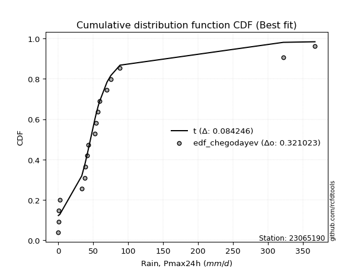</img></img>

</div>


### 6. Empirical - EDF Blom (1958)

The Blom formula is a specific "plotting position" formula used in hydrology and statistical analysis to estimate the empirical cumulative probability (or non-exceedance probability) of a data series. It is particularly recommended for data that are approximately normally distributed. The constant _a_ is set to 0.375 (or 3/8).

<div align="center">


$P=(m-a)/(n+1-2a)$


</div>


**6.1. Empirical values**

<div align="center">

|                | 0                    | 1                   | 2                   | 3                   | 4                   | 5                  | 6                   | 7                  | 8                   | 9        | 10                 | 11                 | 12                 | 13                 | 14                 | 15                 | 16                 | 17                 | 18                 |
|:---------------|:---------------------|:--------------------|:--------------------|:--------------------|:--------------------|:-------------------|:--------------------|:-------------------|:--------------------|:---------|:-------------------|:-------------------|:-------------------|:-------------------|:-------------------|:-------------------|:-------------------|:-------------------|:-------------------|
| date           | 2021                 | 2009                | 2024                | 2019                | 2025                | 2016               | 2018                | 2007               | 2012                | 2017     | 2022               | 2011               | 2015               | 2010               | 2006               | 2005               | 2023               | 2014               | 2013               |
| x              | 0.2                  | 0.5                 | 0.8                 | 2.3                 | 8.9                 | 33.7               | 37.8                | 38.9               | 41.1                | 43.0     | 52.8               | 54.2               | 56.8               | 58.8               | 69.8               | 75.3               | 88.4               | 322.1              | 367.4              |
| m              | 1                    | 2                   | 3                   | 4                   | 5                   | 6                  | 7                   | 8                  | 9                   | 10       | 11                 | 12                 | 13                 | 14                 | 15                 | 16                 | 17                 | 18                 | 19                 |
| empirical_dist | edf_blom             | edf_blom            | edf_blom            | edf_blom            | edf_blom            | edf_blom           | edf_blom            | edf_blom           | edf_blom            | edf_blom | edf_blom           | edf_blom           | edf_blom           | edf_blom           | edf_blom           | edf_blom           | edf_blom           | edf_blom           | edf_blom           |
| empirical      | 0.032467532467532464 | 0.08441558441558442 | 0.13636363636363635 | 0.18831168831168832 | 0.24025974025974026 | 0.2922077922077922 | 0.34415584415584416 | 0.3961038961038961 | 0.44805194805194803 | 0.5      | 0.551948051948052  | 0.6038961038961039 | 0.6558441558441559 | 0.7077922077922078 | 0.7597402597402597 | 0.8116883116883117 | 0.8636363636363636 | 0.9155844155844156 | 0.9675324675324676 |
| empirical_tr   | 1.0335570469798658   | 1.0921985815602837  | 1.1578947368421053  | 1.232               | 1.3162393162393162  | 1.4128440366972477 | 1.5247524752475246  | 1.6559139784946235 | 1.811764705882353   | 2.0      | 2.2318840579710146 | 2.5245901639344264 | 2.905660377358491  | 3.4222222222222216 | 4.162162162162161  | 5.310344827586206  | 7.333333333333334  | 11.84615384615385  | 30.800000000000043 |

</div>


**6.2. Kolmogorov-Smirnov fit test (sorted by Δ)**


<div align="center">

|                | 0                   | 1                   | 2                   | 3                   | 4                   | 5                   | 6                   | 7                   | 8                   | 9                   | 10                  | 11                  | 12                  | 13                  | 14                  | 15                  | 16                  | 17                  | 18                  | 19                  | 20                  | 21                  | 22                  | 23                    | 24                  | 25                  | 26                  | 27                  | 28                  | 29                  | 30                  | 31                  | 32                  | 33                  | 34                  | 35                  | 36                  | 37                  | 38                  | 39                  | 40                  | 41                  | 42                  | 43                  | 44                  | 45                  | 46                  | 47                  | 48                  | 49                  | 50                  | 51                  | 52                  | 53                  | 54                  | 55                  | 56                  | 57                  | 58                  | 59                  | 60                  | 61                  | 62                  | 63                  | 64                  | 65                  | 66                  | 67                  | 68                  | 69                  | 70                  | 71                  | 72                  | 73                  | 74                  | 75                  | 76                  | 77                  | 78                  | 79                  | 80                  | 81                  | 82                  | 83                  | 84                  | 85                  | 86                  | 87                  | 88                  | 89                  |
|:---------------|:--------------------|:--------------------|:--------------------|:--------------------|:--------------------|:--------------------|:--------------------|:--------------------|:--------------------|:--------------------|:--------------------|:--------------------|:--------------------|:--------------------|:--------------------|:--------------------|:--------------------|:--------------------|:--------------------|:--------------------|:--------------------|:--------------------|:--------------------|:----------------------|:--------------------|:--------------------|:--------------------|:--------------------|:--------------------|:--------------------|:--------------------|:--------------------|:--------------------|:--------------------|:--------------------|:--------------------|:--------------------|:--------------------|:--------------------|:--------------------|:--------------------|:--------------------|:--------------------|:--------------------|:--------------------|:--------------------|:--------------------|:--------------------|:--------------------|:--------------------|:--------------------|:--------------------|:--------------------|:--------------------|:--------------------|:--------------------|:--------------------|:--------------------|:--------------------|:--------------------|:--------------------|:--------------------|:--------------------|:--------------------|:--------------------|:--------------------|:--------------------|:--------------------|:--------------------|:--------------------|:--------------------|:--------------------|:--------------------|:--------------------|:--------------------|:--------------------|:--------------------|:--------------------|:--------------------|:--------------------|:--------------------|:--------------------|:--------------------|:--------------------|:--------------------|:--------------------|:--------------------|:--------------------|:--------------------|:--------------------|
| station        | 23065190            | 23065190            | 23065190            | 23065190            | 23065190            | 23065190            | 23065190            | 23065190            | 23065190            | 23065190            | 23065190            | 23065190            | 23065190            | 23065190            | 23065190            | 23065190            | 23065190            | 23065190            | 23065190            | 23065190            | 23065190            | 23065190            | 23065190            | 23065190              | 23065190            | 23065190            | 23065190            | 23065190            | 23065190            | 23065190            | 23065190            | 23065190            | 23065190            | 23065190            | 23065190            | 23065190            | 23065190            | 23065190            | 23065190            | 23065190            | 23065190            | 23065190            | 23065190            | 23065190            | 23065190            | 23065190            | 23065190            | 23065190            | 23065190            | 23065190            | 23065190            | 23065190            | 23065190            | 23065190            | 23065190            | 23065190            | 23065190            | 23065190            | 23065190            | 23065190            | 23065190            | 23065190            | 23065190            | 23065190            | 23065190            | 23065190            | 23065190            | 23065190            | 23065190            | 23065190            | 23065190            | 23065190            | 23065190            | 23065190            | 23065190            | 23065190            | 23065190            | 23065190            | 23065190            | 23065190            | 23065190            | 23065190            | 23065190            | 23065190            | 23065190            | 23065190            | 23065190            | 23065190            | 23065190            | 23065190            |
| empirical_dist | edf_blom            | edf_blom            | edf_blom            | edf_blom            | edf_blom            | edf_blom            | edf_blom            | edf_blom            | edf_blom            | edf_blom            | edf_blom            | edf_blom            | edf_blom            | edf_blom            | edf_blom            | edf_blom            | edf_blom            | edf_blom            | edf_blom            | edf_blom            | edf_blom            | edf_blom            | edf_blom            | edf_blom              | edf_blom            | edf_blom            | edf_blom            | edf_blom            | edf_blom            | edf_blom            | edf_blom            | edf_blom            | edf_blom            | edf_blom            | edf_blom            | edf_blom            | edf_blom            | edf_blom            | edf_blom            | edf_blom            | edf_blom            | edf_blom            | edf_blom            | edf_blom            | edf_blom            | edf_blom            | edf_blom            | edf_blom            | edf_blom            | edf_blom            | edf_blom            | edf_blom            | edf_blom            | edf_blom            | edf_blom            | edf_blom            | edf_blom            | edf_blom            | edf_blom            | edf_blom            | edf_blom            | edf_blom            | edf_blom            | edf_blom            | edf_blom            | edf_blom            | edf_blom            | edf_blom            | edf_blom            | edf_blom            | edf_blom            | edf_blom            | edf_blom            | edf_blom            | edf_blom            | edf_blom            | edf_blom            | edf_blom            | edf_blom            | edf_blom            | edf_blom            | edf_blom            | edf_blom            | edf_blom            | edf_blom            | edf_blom            | edf_blom            | edf_blom            | edf_blom            | edf_blom            |
| p_dist         | logjohnsonsu        | t                   | johnsonsu           | ncf                 | logt                | gompertz            | alpha               | exponnorm           | genexpon            | expon               | laplace_asymmetric  | wald                | gibrat              | genlogistic         | invweibull          | invgamma            | pearson3            | pareto              | f                   | logloggamma         | moyal               | logmielke           | loggenlogistic      | loglaplace_asymmetric | invgauss            | logweibull_min      | logpearson3         | loggumbel_l         | weibull_min         | logfisk             | gumbel_r            | halflogistic        | halfnorm            | gamma               | rayleigh            | kstwobign           | maxwell             | nakagami            | fisk                | logexponnorm        | logcrystalball      | lognorm             | lognorm             | logrice             | lognct              | lognakagami         | logfatiguelife      | loglognorm          | logbetaprime        | loginvgamma         | logalpha            | laplace             | logerlang           | loggamma            | loggamma            | hypsecant           | loglogistic         | logistic            | loggompertz         | norm                | crystalball         | mielke              | loginvweibull       | loginvgauss         | loghypsecant        | rice                | logmaxwell          | truncnorm           | betaprime           | lograyleigh         | loglaplace          | logkstwobign        | nct                 | logncf              | loggenexpon         | loghalfnorm         | loggumbel_r         | erlang              | gumbel_l            | logexpon            | loghalflogistic     | logmoyal            | fatiguelife         | logtruncnorm        | logchi2             | logwald             | logf                | loggibrat           | logpareto           | chi2                |
| delta          | 0.08584925113403669 | 0.10065997146377924 | 0.11267849622066148 | 0.1354090988909239  | 0.14263831129617013 | 0.15499625845767506 | 0.1581306288665299  | 0.15842329661818255 | 0.15916730365981002 | 0.159167355910675   | 0.15916763489347385 | 0.16579419421183944 | 0.17040488422408784 | 0.17171476276021602 | 0.1723783041678193  | 0.17677372873975544 | 0.18377317204753696 | 0.18386779787328839 | 0.1894568649698123  | 0.19566775242941098 | 0.20199257238048035 | 0.20354180072669698 | 0.20382844473026496 | 0.2056886381544566    | 0.21052626844696803 | 0.21348291024913862 | 0.2152110251898241  | 0.21835828947979058 | 0.2214180872881399  | 0.22277695899603495 | 0.22463273656513205 | 0.22890875396858007 | 0.2481101691717486  | 0.25453222140913273 | 0.2555115773607767  | 0.26261931861444576 | 0.26469015269386587 | 0.26811001737221507 | 0.27602422122689624 | 0.2823290107179967  | 0.28233308516309513 | 0.282333151967945   | 0.282333151967945   | 0.28234506127004894 | 0.2825662354422757  | 0.28292709740530214 | 0.28313822581439546 | 0.28348964477618793 | 0.28451762499121463 | 0.28818755816936553 | 0.28865322114014585 | 0.29004411567429367 | 0.2902890344767263  | 0.290403756255946   | 0.290403756255946   | 0.29069304436767807 | 0.29220093419308885 | 0.29264310805321037 | 0.2938012134906995  | 0.29492928450091693 | 0.29492929371278953 | 0.29583568986775394 | 0.29929836990635955 | 0.2995797312902952  | 0.3004296722669178  | 0.3105302080799839  | 0.31096617609670446 | 0.3110839647550796  | 0.31845689710471875 | 0.3200054217761274  | 0.32449497792760046 | 0.32831478043868173 | 0.33802712254428585 | 0.3398671810469298  | 0.34019579490924196 | 0.3455943066003249  | 0.35105914589786075 | 0.3549056568452516  | 0.36460438623069025 | 0.36832829196133393 | 0.37353618756566104 | 0.37497787243009845 | 0.3765898215155236  | 0.3944647268146429  | 0.41680848726036485 | 0.4414099488060474  | 0.44873094278723824 | 0.4721047823838938  | 0.535437887505125   | 0.7407042653772049  |
| deltao         | 0.31564497164100014 | 0.31564497164100014 | 0.31564497164100014 | 0.31564497164100014 | 0.31564497164100014 | 0.31564497164100014 | 0.31564497164100014 | 0.31564497164100014 | 0.31564497164100014 | 0.31564497164100014 | 0.31564497164100014 | 0.31564497164100014 | 0.31564497164100014 | 0.31564497164100014 | 0.31564497164100014 | 0.31564497164100014 | 0.31564497164100014 | 0.31564497164100014 | 0.31564497164100014 | 0.31564497164100014 | 0.31564497164100014 | 0.31564497164100014 | 0.31564497164100014 | 0.31564497164100014   | 0.31564497164100014 | 0.31564497164100014 | 0.31564497164100014 | 0.31564497164100014 | 0.31564497164100014 | 0.31564497164100014 | 0.31564497164100014 | 0.31564497164100014 | 0.31564497164100014 | 0.31564497164100014 | 0.31564497164100014 | 0.31564497164100014 | 0.31564497164100014 | 0.31564497164100014 | 0.31564497164100014 | 0.31564497164100014 | 0.31564497164100014 | 0.31564497164100014 | 0.31564497164100014 | 0.31564497164100014 | 0.31564497164100014 | 0.31564497164100014 | 0.31564497164100014 | 0.31564497164100014 | 0.31564497164100014 | 0.31564497164100014 | 0.31564497164100014 | 0.31564497164100014 | 0.31564497164100014 | 0.31564497164100014 | 0.31564497164100014 | 0.31564497164100014 | 0.31564497164100014 | 0.31564497164100014 | 0.31564497164100014 | 0.31564497164100014 | 0.31564497164100014 | 0.31564497164100014 | 0.31564497164100014 | 0.31564497164100014 | 0.31564497164100014 | 0.31564497164100014 | 0.31564497164100014 | 0.31564497164100014 | 0.31564497164100014 | 0.31564497164100014 | 0.31564497164100014 | 0.31564497164100014 | 0.31564497164100014 | 0.31564497164100014 | 0.31564497164100014 | 0.31564497164100014 | 0.31564497164100014 | 0.31564497164100014 | 0.31564497164100014 | 0.31564497164100014 | 0.31564497164100014 | 0.31564497164100014 | 0.31564497164100014 | 0.31564497164100014 | 0.31564497164100014 | 0.31564497164100014 | 0.31564497164100014 | 0.31564497164100014 | 0.31564497164100014 | 0.31564497164100014 |
| eval           | Δo > Δ              | Δo > Δ              | Δo > Δ              | Δo > Δ              | Δo > Δ              | Δo > Δ              | Δo > Δ              | Δo > Δ              | Δo > Δ              | Δo > Δ              | Δo > Δ              | Δo > Δ              | Δo > Δ              | Δo > Δ              | Δo > Δ              | Δo > Δ              | Δo > Δ              | Δo > Δ              | Δo > Δ              | Δo > Δ              | Δo > Δ              | Δo > Δ              | Δo > Δ              | Δo > Δ                | Δo > Δ              | Δo > Δ              | Δo > Δ              | Δo > Δ              | Δo > Δ              | Δo > Δ              | Δo > Δ              | Δo > Δ              | Δo > Δ              | Δo > Δ              | Δo > Δ              | Δo > Δ              | Δo > Δ              | Δo > Δ              | Δo > Δ              | Δo > Δ              | Δo > Δ              | Δo > Δ              | Δo > Δ              | Δo > Δ              | Δo > Δ              | Δo > Δ              | Δo > Δ              | Δo > Δ              | Δo > Δ              | Δo > Δ              | Δo > Δ              | Δo > Δ              | Δo > Δ              | Δo > Δ              | Δo > Δ              | Δo > Δ              | Δo > Δ              | Δo > Δ              | Δo > Δ              | Δo > Δ              | Δo > Δ              | Δo > Δ              | Δo > Δ              | Δo > Δ              | Δo > Δ              | Δo > Δ              | Δo > Δ              | Δo > Δ              | Δo <= Δ             | Δo <= Δ             | Δo <= Δ             | Δo <= Δ             | Δo <= Δ             | Δo <= Δ             | Δo <= Δ             | Δo <= Δ             | Δo <= Δ             | Δo <= Δ             | Δo <= Δ             | Δo <= Δ             | Δo <= Δ             | Δo <= Δ             | Δo <= Δ             | Δo <= Δ             | Δo <= Δ             | Δo <= Δ             | Δo <= Δ             | Δo <= Δ             | Δo <= Δ             | Δo <= Δ             |
| fit            | 1                   | 1                   | 1                   | 1                   | 1                   | 1                   | 1                   | 1                   | 1                   | 1                   | 1                   | 1                   | 1                   | 1                   | 1                   | 1                   | 1                   | 1                   | 1                   | 1                   | 1                   | 1                   | 1                   | 1                     | 1                   | 1                   | 1                   | 1                   | 1                   | 1                   | 1                   | 1                   | 1                   | 1                   | 1                   | 1                   | 1                   | 1                   | 1                   | 1                   | 1                   | 1                   | 1                   | 1                   | 1                   | 1                   | 1                   | 1                   | 1                   | 1                   | 1                   | 1                   | 1                   | 1                   | 1                   | 1                   | 1                   | 1                   | 1                   | 1                   | 1                   | 1                   | 1                   | 1                   | 1                   | 1                   | 1                   | 1                   | 0                   | 0                   | 0                   | 0                   | 0                   | 0                   | 0                   | 0                   | 0                   | 0                   | 0                   | 0                   | 0                   | 0                   | 0                   | 0                   | 0                   | 0                   | 0                   | 0                   | 0                   | 0                   |
| n              | 19                  | 19                  | 19                  | 19                  | 19                  | 19                  | 19                  | 19                  | 19                  | 19                  | 19                  | 19                  | 19                  | 19                  | 19                  | 19                  | 19                  | 19                  | 19                  | 19                  | 19                  | 19                  | 19                  | 19                    | 19                  | 19                  | 19                  | 19                  | 19                  | 19                  | 19                  | 19                  | 19                  | 19                  | 19                  | 19                  | 19                  | 19                  | 19                  | 19                  | 19                  | 19                  | 19                  | 19                  | 19                  | 19                  | 19                  | 19                  | 19                  | 19                  | 19                  | 19                  | 19                  | 19                  | 19                  | 19                  | 19                  | 19                  | 19                  | 19                  | 19                  | 19                  | 19                  | 19                  | 19                  | 19                  | 19                  | 19                  | 19                  | 19                  | 19                  | 19                  | 19                  | 19                  | 19                  | 19                  | 19                  | 19                  | 19                  | 19                  | 19                  | 19                  | 19                  | 19                  | 19                  | 19                  | 19                  | 19                  | 19                  | 19                  |
| best_fit       | 1                   | 0                   | 0                   | 0                   | 0                   | 0                   | 0                   | 0                   | 0                   | 0                   | 0                   | 0                   | 0                   | 0                   | 0                   | 0                   | 0                   | 0                   | 0                   | 0                   | 0                   | 0                   | 0                   | 0                     | 0                   | 0                   | 0                   | 0                   | 0                   | 0                   | 0                   | 0                   | 0                   | 0                   | 0                   | 0                   | 0                   | 0                   | 0                   | 0                   | 0                   | 0                   | 0                   | 0                   | 0                   | 0                   | 0                   | 0                   | 0                   | 0                   | 0                   | 0                   | 0                   | 0                   | 0                   | 0                   | 0                   | 0                   | 0                   | 0                   | 0                   | 0                   | 0                   | 0                   | 0                   | 0                   | 0                   | 0                   | 0                   | 0                   | 0                   | 0                   | 0                   | 0                   | 0                   | 0                   | 0                   | 0                   | 0                   | 0                   | 0                   | 0                   | 0                   | 0                   | 0                   | 0                   | 0                   | 0                   | 0                   | 0                   |
| best_fit_sort  | 1                   | 2                   | 3                   | 4                   | 5                   | 6                   | 7                   | 8                   | 9                   | 10                  | 11                  | 12                  | 13                  | 14                  | 15                  | 16                  | 17                  | 18                  | 19                  | 20                  | 21                  | 22                  | 23                  | 24                    | 25                  | 26                  | 27                  | 28                  | 29                  | 30                  | 31                  | 32                  | 33                  | 34                  | 35                  | 36                  | 37                  | 38                  | 39                  | 40                  | 41                  | 42                  | 43                  | 44                  | 45                  | 46                  | 47                  | 48                  | 49                  | 50                  | 51                  | 52                  | 53                  | 54                  | 55                  | 56                  | 57                  | 58                  | 59                  | 60                  | 61                  | 62                  | 63                  | 64                  | 65                  | 66                  | 67                  | 68                  | 69                  | 70                  | 71                  | 72                  | 73                  | 74                  | 75                  | 76                  | 77                  | 78                  | 79                  | 80                  | 81                  | 82                  | 83                  | 84                  | 85                  | 86                  | 87                  | 88                  | 89                  | 90                  |

</div>


<div align="center">

</img>

</div>


**6.3. Best fit**

<div align="center">

|   id |   station | empirical_dist   | p_dist       |     delta |   deltao | eval   |   fit |   n |   best_fit |   best_fit_sort |
|-----:|----------:|:-----------------|:-------------|----------:|---------:|:-------|------:|----:|-----------:|----------------:|
|    0 |  23065190 | edf_blom         | logjohnsonsu | 0.0858493 | 0.315645 | Δo > Δ |     1 |  19 |          1 |               1 |

</div>


<div align="center">

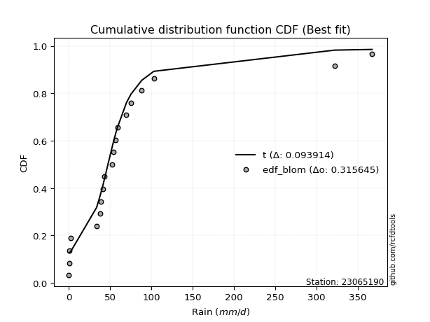</img></img>

</div>


### 7. Empirical - EDF Tukey (1962)

In hydrology, the Tukey formula is used as a plotting position formula to estimate the empirical probability or frequency of a flood event (or other hydrological data). The formula parameter is given as _c=0.333_ (or 1/3).

<div align="center">


$P=(m-c)/(n+1-2c)$


</div>


**7.1. Empirical values**

<div align="center">

|                | 0                    | 1                   | 2                   | 3                  | 4                  | 5                   | 6                  | 7                   | 8                  | 9         | 10                 | 11                 | 12                 | 13                 | 14                 | 15                 | 16                 | 17                 | 18                 |
|:---------------|:---------------------|:--------------------|:--------------------|:-------------------|:-------------------|:--------------------|:-------------------|:--------------------|:-------------------|:----------|:-------------------|:-------------------|:-------------------|:-------------------|:-------------------|:-------------------|:-------------------|:-------------------|:-------------------|
| date           | 2021                 | 2009                | 2024                | 2019               | 2025               | 2016                | 2018               | 2007                | 2012               | 2017      | 2022               | 2011               | 2015               | 2010               | 2006               | 2005               | 2023               | 2014               | 2013               |
| x              | 0.2                  | 0.5                 | 0.8                 | 2.3                | 8.9                | 33.7                | 37.8               | 38.9                | 41.1               | 43.0      | 52.8               | 54.2               | 56.8               | 58.8               | 69.8               | 75.3               | 88.4               | 322.1              | 367.4              |
| m              | 1                    | 2                   | 3                   | 4                  | 5                  | 6                   | 7                  | 8                   | 9                  | 10        | 11                 | 12                 | 13                 | 14                 | 15                 | 16                 | 17                 | 18                 | 19                 |
| empirical_dist | edf_tukey            | edf_tukey           | edf_tukey           | edf_tukey          | edf_tukey          | edf_tukey           | edf_tukey          | edf_tukey           | edf_tukey          | edf_tukey | edf_tukey          | edf_tukey          | edf_tukey          | edf_tukey          | edf_tukey          | edf_tukey          | edf_tukey          | edf_tukey          | edf_tukey          |
| empirical      | 0.034482758620689655 | 0.08620689655172414 | 0.13793103448275862 | 0.1896551724137931 | 0.2413793103448276 | 0.29310344827586204 | 0.3448275862068966 | 0.39655172413793105 | 0.4482758620689655 | 0.5       | 0.5517241379310345 | 0.603448275862069  | 0.6551724137931034 | 0.7068965517241379 | 0.7586206896551724 | 0.8103448275862069 | 0.8620689655172413 | 0.9137931034482759 | 0.9655172413793104 |
| empirical_tr   | 1.0357142857142856   | 1.0943396226415094  | 1.1600000000000001  | 1.2340425531914894 | 1.3181818181818183 | 1.4146341463414636  | 1.5263157894736843 | 1.6571428571428573  | 1.8125             | 2.0       | 2.230769230769231  | 2.5217391304347827 | 2.9                | 3.4117647058823524 | 4.142857142857142  | 5.272727272727272  | 7.249999999999997  | 11.600000000000007 | 29.000000000000036 |

</div>


**7.2. Kolmogorov-Smirnov fit test (sorted by Δ)**


<div align="center">

|                | 0                   | 1                   | 2                   | 3                   | 4                   | 5                   | 6                   | 7                   | 8                   | 9                   | 10                  | 11                  | 12                  | 13                  | 14                  | 15                  | 16                  | 17                  | 18                  | 19                  | 20                  | 21                  | 22                  | 23                    | 24                  | 25                  | 26                  | 27                  | 28                  | 29                  | 30                  | 31                  | 32                  | 33                  | 34                  | 35                  | 36                  | 37                  | 38                  | 39                  | 40                  | 41                  | 42                  | 43                  | 44                  | 45                  | 46                  | 47                  | 48                  | 49                  | 50                  | 51                  | 52                  | 53                  | 54                  | 55                  | 56                  | 57                  | 58                  | 59                  | 60                  | 61                  | 62                  | 63                  | 64                  | 65                  | 66                  | 67                  | 68                  | 69                  | 70                  | 71                  | 72                  | 73                  | 74                  | 75                  | 76                  | 77                  | 78                  | 79                  | 80                  | 81                  | 82                  | 83                  | 84                  | 85                  | 86                  | 87                  | 88                  | 89                  |
|:---------------|:--------------------|:--------------------|:--------------------|:--------------------|:--------------------|:--------------------|:--------------------|:--------------------|:--------------------|:--------------------|:--------------------|:--------------------|:--------------------|:--------------------|:--------------------|:--------------------|:--------------------|:--------------------|:--------------------|:--------------------|:--------------------|:--------------------|:--------------------|:----------------------|:--------------------|:--------------------|:--------------------|:--------------------|:--------------------|:--------------------|:--------------------|:--------------------|:--------------------|:--------------------|:--------------------|:--------------------|:--------------------|:--------------------|:--------------------|:--------------------|:--------------------|:--------------------|:--------------------|:--------------------|:--------------------|:--------------------|:--------------------|:--------------------|:--------------------|:--------------------|:--------------------|:--------------------|:--------------------|:--------------------|:--------------------|:--------------------|:--------------------|:--------------------|:--------------------|:--------------------|:--------------------|:--------------------|:--------------------|:--------------------|:--------------------|:--------------------|:--------------------|:--------------------|:--------------------|:--------------------|:--------------------|:--------------------|:--------------------|:--------------------|:--------------------|:--------------------|:--------------------|:--------------------|:--------------------|:--------------------|:--------------------|:--------------------|:--------------------|:--------------------|:--------------------|:--------------------|:--------------------|:--------------------|:--------------------|:--------------------|
| station        | 23065190            | 23065190            | 23065190            | 23065190            | 23065190            | 23065190            | 23065190            | 23065190            | 23065190            | 23065190            | 23065190            | 23065190            | 23065190            | 23065190            | 23065190            | 23065190            | 23065190            | 23065190            | 23065190            | 23065190            | 23065190            | 23065190            | 23065190            | 23065190              | 23065190            | 23065190            | 23065190            | 23065190            | 23065190            | 23065190            | 23065190            | 23065190            | 23065190            | 23065190            | 23065190            | 23065190            | 23065190            | 23065190            | 23065190            | 23065190            | 23065190            | 23065190            | 23065190            | 23065190            | 23065190            | 23065190            | 23065190            | 23065190            | 23065190            | 23065190            | 23065190            | 23065190            | 23065190            | 23065190            | 23065190            | 23065190            | 23065190            | 23065190            | 23065190            | 23065190            | 23065190            | 23065190            | 23065190            | 23065190            | 23065190            | 23065190            | 23065190            | 23065190            | 23065190            | 23065190            | 23065190            | 23065190            | 23065190            | 23065190            | 23065190            | 23065190            | 23065190            | 23065190            | 23065190            | 23065190            | 23065190            | 23065190            | 23065190            | 23065190            | 23065190            | 23065190            | 23065190            | 23065190            | 23065190            | 23065190            |
| empirical_dist | edf_tukey           | edf_tukey           | edf_tukey           | edf_tukey           | edf_tukey           | edf_tukey           | edf_tukey           | edf_tukey           | edf_tukey           | edf_tukey           | edf_tukey           | edf_tukey           | edf_tukey           | edf_tukey           | edf_tukey           | edf_tukey           | edf_tukey           | edf_tukey           | edf_tukey           | edf_tukey           | edf_tukey           | edf_tukey           | edf_tukey           | edf_tukey             | edf_tukey           | edf_tukey           | edf_tukey           | edf_tukey           | edf_tukey           | edf_tukey           | edf_tukey           | edf_tukey           | edf_tukey           | edf_tukey           | edf_tukey           | edf_tukey           | edf_tukey           | edf_tukey           | edf_tukey           | edf_tukey           | edf_tukey           | edf_tukey           | edf_tukey           | edf_tukey           | edf_tukey           | edf_tukey           | edf_tukey           | edf_tukey           | edf_tukey           | edf_tukey           | edf_tukey           | edf_tukey           | edf_tukey           | edf_tukey           | edf_tukey           | edf_tukey           | edf_tukey           | edf_tukey           | edf_tukey           | edf_tukey           | edf_tukey           | edf_tukey           | edf_tukey           | edf_tukey           | edf_tukey           | edf_tukey           | edf_tukey           | edf_tukey           | edf_tukey           | edf_tukey           | edf_tukey           | edf_tukey           | edf_tukey           | edf_tukey           | edf_tukey           | edf_tukey           | edf_tukey           | edf_tukey           | edf_tukey           | edf_tukey           | edf_tukey           | edf_tukey           | edf_tukey           | edf_tukey           | edf_tukey           | edf_tukey           | edf_tukey           | edf_tukey           | edf_tukey           | edf_tukey           |
| p_dist         | logjohnsonsu        | t                   | johnsonsu           | ncf                 | logt                | gompertz            | alpha               | exponnorm           | genexpon            | expon               | laplace_asymmetric  | wald                | genlogistic         | invweibull          | gibrat              | invgamma            | pearson3            | pareto              | f                   | logloggamma         | moyal               | logmielke           | loggenlogistic      | loglaplace_asymmetric | invgauss            | logweibull_min      | logpearson3         | loggumbel_l         | weibull_min         | logfisk             | gumbel_r            | halflogistic        | halfnorm            | gamma               | rayleigh            | kstwobign           | maxwell             | nakagami            | fisk                | logexponnorm        | logcrystalball      | lognorm             | lognorm             | logrice             | lognct              | lognakagami         | logfatiguelife      | loglognorm          | logbetaprime        | loginvgamma         | logalpha            | laplace             | hypsecant           | logerlang           | loggamma            | loggamma            | logistic            | loglogistic         | loggompertz         | norm                | crystalball         | mielke              | loginvweibull       | loginvgauss         | loghypsecant        | rice                | truncnorm           | logmaxwell          | betaprime           | lograyleigh         | loglaplace          | logkstwobign        | nct                 | logncf              | loggenexpon         | loghalfnorm         | loggumbel_r         | erlang              | gumbel_l            | logexpon            | loghalflogistic     | logmoyal            | fatiguelife         | logtruncnorm        | logchi2             | logwald             | logf                | loggibrat           | logpareto           | chi2                |
| delta          | 0.08719273523614146 | 0.09864474531062205 | 0.11379806630574882 | 0.13675258299302867 | 0.14375788138125747 | 0.15633974255977984 | 0.15723497279846005 | 0.15976678072028733 | 0.1605107877619148  | 0.16051084001277977 | 0.16051111899557863 | 0.1648985381437696  | 0.17081910669214617 | 0.17148264809974945 | 0.1717483683261926  | 0.1758780726716856  | 0.18175794589437977 | 0.18297214180521854 | 0.18788946685068997 | 0.19477209636134113 | 0.19997734622732316 | 0.20264614465862713 | 0.2029327886621951  | 0.20479298208638674   | 0.20963061237889818 | 0.21258725418106877 | 0.21431536912175425 | 0.21746263341172073 | 0.22052243122007004 | 0.2218813029279651  | 0.22306533844600973 | 0.22689352781542288 | 0.24609494301859142 | 0.2536365653410629  | 0.25394417924165436 | 0.26127583451234093 | 0.26312275457474354 | 0.26654261925309275 | 0.2751285651588264  | 0.28143335464992686 | 0.2814374290950253  | 0.28143749589987516 | 0.28143749589987516 | 0.2814494052019791  | 0.28167057937420586 | 0.2820314413372323  | 0.2822425697463256  | 0.2825939887081181  | 0.2836219689231448  | 0.2872919021012957  | 0.287757565072076   | 0.2891484596062238  | 0.28934956026557324 | 0.2893933784086565  | 0.28950810018787615 | 0.28950810018787615 | 0.29129962395110554 | 0.291305278125019   | 0.29290555742262964 | 0.2935858003988121  | 0.2935858096106847  | 0.2949400337996841  | 0.2984027138382897  | 0.29868407522222534 | 0.29953401619884795 | 0.30918672397787905 | 0.30974048065297477 | 0.3100705200286346  | 0.3175612410366489  | 0.31910976570805755 | 0.3235993218595306  | 0.3274191243706119  | 0.337131466476216   | 0.33874761096184247 | 0.3393001388411721  | 0.34469865053225507 | 0.3501634898297909  | 0.35401000077718175 | 0.3632609021285854  | 0.3674326358932641  | 0.3726405314975912  | 0.3740822163620286  | 0.37569416544745377 | 0.39356907074657305 | 0.415912831192295   | 0.44051429273797754 | 0.4476113727021509  | 0.47120912631582396 | 0.5336465753689852  | 0.7395846952921176  |
| deltao         | 0.31564497164100014 | 0.31564497164100014 | 0.31564497164100014 | 0.31564497164100014 | 0.31564497164100014 | 0.31564497164100014 | 0.31564497164100014 | 0.31564497164100014 | 0.31564497164100014 | 0.31564497164100014 | 0.31564497164100014 | 0.31564497164100014 | 0.31564497164100014 | 0.31564497164100014 | 0.31564497164100014 | 0.31564497164100014 | 0.31564497164100014 | 0.31564497164100014 | 0.31564497164100014 | 0.31564497164100014 | 0.31564497164100014 | 0.31564497164100014 | 0.31564497164100014 | 0.31564497164100014   | 0.31564497164100014 | 0.31564497164100014 | 0.31564497164100014 | 0.31564497164100014 | 0.31564497164100014 | 0.31564497164100014 | 0.31564497164100014 | 0.31564497164100014 | 0.31564497164100014 | 0.31564497164100014 | 0.31564497164100014 | 0.31564497164100014 | 0.31564497164100014 | 0.31564497164100014 | 0.31564497164100014 | 0.31564497164100014 | 0.31564497164100014 | 0.31564497164100014 | 0.31564497164100014 | 0.31564497164100014 | 0.31564497164100014 | 0.31564497164100014 | 0.31564497164100014 | 0.31564497164100014 | 0.31564497164100014 | 0.31564497164100014 | 0.31564497164100014 | 0.31564497164100014 | 0.31564497164100014 | 0.31564497164100014 | 0.31564497164100014 | 0.31564497164100014 | 0.31564497164100014 | 0.31564497164100014 | 0.31564497164100014 | 0.31564497164100014 | 0.31564497164100014 | 0.31564497164100014 | 0.31564497164100014 | 0.31564497164100014 | 0.31564497164100014 | 0.31564497164100014 | 0.31564497164100014 | 0.31564497164100014 | 0.31564497164100014 | 0.31564497164100014 | 0.31564497164100014 | 0.31564497164100014 | 0.31564497164100014 | 0.31564497164100014 | 0.31564497164100014 | 0.31564497164100014 | 0.31564497164100014 | 0.31564497164100014 | 0.31564497164100014 | 0.31564497164100014 | 0.31564497164100014 | 0.31564497164100014 | 0.31564497164100014 | 0.31564497164100014 | 0.31564497164100014 | 0.31564497164100014 | 0.31564497164100014 | 0.31564497164100014 | 0.31564497164100014 | 0.31564497164100014 |
| eval           | Δo > Δ              | Δo > Δ              | Δo > Δ              | Δo > Δ              | Δo > Δ              | Δo > Δ              | Δo > Δ              | Δo > Δ              | Δo > Δ              | Δo > Δ              | Δo > Δ              | Δo > Δ              | Δo > Δ              | Δo > Δ              | Δo > Δ              | Δo > Δ              | Δo > Δ              | Δo > Δ              | Δo > Δ              | Δo > Δ              | Δo > Δ              | Δo > Δ              | Δo > Δ              | Δo > Δ                | Δo > Δ              | Δo > Δ              | Δo > Δ              | Δo > Δ              | Δo > Δ              | Δo > Δ              | Δo > Δ              | Δo > Δ              | Δo > Δ              | Δo > Δ              | Δo > Δ              | Δo > Δ              | Δo > Δ              | Δo > Δ              | Δo > Δ              | Δo > Δ              | Δo > Δ              | Δo > Δ              | Δo > Δ              | Δo > Δ              | Δo > Δ              | Δo > Δ              | Δo > Δ              | Δo > Δ              | Δo > Δ              | Δo > Δ              | Δo > Δ              | Δo > Δ              | Δo > Δ              | Δo > Δ              | Δo > Δ              | Δo > Δ              | Δo > Δ              | Δo > Δ              | Δo > Δ              | Δo > Δ              | Δo > Δ              | Δo > Δ              | Δo > Δ              | Δo > Δ              | Δo > Δ              | Δo > Δ              | Δo > Δ              | Δo > Δ              | Δo <= Δ             | Δo <= Δ             | Δo <= Δ             | Δo <= Δ             | Δo <= Δ             | Δo <= Δ             | Δo <= Δ             | Δo <= Δ             | Δo <= Δ             | Δo <= Δ             | Δo <= Δ             | Δo <= Δ             | Δo <= Δ             | Δo <= Δ             | Δo <= Δ             | Δo <= Δ             | Δo <= Δ             | Δo <= Δ             | Δo <= Δ             | Δo <= Δ             | Δo <= Δ             | Δo <= Δ             |
| fit            | 1                   | 1                   | 1                   | 1                   | 1                   | 1                   | 1                   | 1                   | 1                   | 1                   | 1                   | 1                   | 1                   | 1                   | 1                   | 1                   | 1                   | 1                   | 1                   | 1                   | 1                   | 1                   | 1                   | 1                     | 1                   | 1                   | 1                   | 1                   | 1                   | 1                   | 1                   | 1                   | 1                   | 1                   | 1                   | 1                   | 1                   | 1                   | 1                   | 1                   | 1                   | 1                   | 1                   | 1                   | 1                   | 1                   | 1                   | 1                   | 1                   | 1                   | 1                   | 1                   | 1                   | 1                   | 1                   | 1                   | 1                   | 1                   | 1                   | 1                   | 1                   | 1                   | 1                   | 1                   | 1                   | 1                   | 1                   | 1                   | 0                   | 0                   | 0                   | 0                   | 0                   | 0                   | 0                   | 0                   | 0                   | 0                   | 0                   | 0                   | 0                   | 0                   | 0                   | 0                   | 0                   | 0                   | 0                   | 0                   | 0                   | 0                   |
| n              | 19                  | 19                  | 19                  | 19                  | 19                  | 19                  | 19                  | 19                  | 19                  | 19                  | 19                  | 19                  | 19                  | 19                  | 19                  | 19                  | 19                  | 19                  | 19                  | 19                  | 19                  | 19                  | 19                  | 19                    | 19                  | 19                  | 19                  | 19                  | 19                  | 19                  | 19                  | 19                  | 19                  | 19                  | 19                  | 19                  | 19                  | 19                  | 19                  | 19                  | 19                  | 19                  | 19                  | 19                  | 19                  | 19                  | 19                  | 19                  | 19                  | 19                  | 19                  | 19                  | 19                  | 19                  | 19                  | 19                  | 19                  | 19                  | 19                  | 19                  | 19                  | 19                  | 19                  | 19                  | 19                  | 19                  | 19                  | 19                  | 19                  | 19                  | 19                  | 19                  | 19                  | 19                  | 19                  | 19                  | 19                  | 19                  | 19                  | 19                  | 19                  | 19                  | 19                  | 19                  | 19                  | 19                  | 19                  | 19                  | 19                  | 19                  |
| best_fit       | 1                   | 0                   | 0                   | 0                   | 0                   | 0                   | 0                   | 0                   | 0                   | 0                   | 0                   | 0                   | 0                   | 0                   | 0                   | 0                   | 0                   | 0                   | 0                   | 0                   | 0                   | 0                   | 0                   | 0                     | 0                   | 0                   | 0                   | 0                   | 0                   | 0                   | 0                   | 0                   | 0                   | 0                   | 0                   | 0                   | 0                   | 0                   | 0                   | 0                   | 0                   | 0                   | 0                   | 0                   | 0                   | 0                   | 0                   | 0                   | 0                   | 0                   | 0                   | 0                   | 0                   | 0                   | 0                   | 0                   | 0                   | 0                   | 0                   | 0                   | 0                   | 0                   | 0                   | 0                   | 0                   | 0                   | 0                   | 0                   | 0                   | 0                   | 0                   | 0                   | 0                   | 0                   | 0                   | 0                   | 0                   | 0                   | 0                   | 0                   | 0                   | 0                   | 0                   | 0                   | 0                   | 0                   | 0                   | 0                   | 0                   | 0                   |
| best_fit_sort  | 1                   | 2                   | 3                   | 4                   | 5                   | 6                   | 7                   | 8                   | 9                   | 10                  | 11                  | 12                  | 13                  | 14                  | 15                  | 16                  | 17                  | 18                  | 19                  | 20                  | 21                  | 22                  | 23                  | 24                    | 25                  | 26                  | 27                  | 28                  | 29                  | 30                  | 31                  | 32                  | 33                  | 34                  | 35                  | 36                  | 37                  | 38                  | 39                  | 40                  | 41                  | 42                  | 43                  | 44                  | 45                  | 46                  | 47                  | 48                  | 49                  | 50                  | 51                  | 52                  | 53                  | 54                  | 55                  | 56                  | 57                  | 58                  | 59                  | 60                  | 61                  | 62                  | 63                  | 64                  | 65                  | 66                  | 67                  | 68                  | 69                  | 70                  | 71                  | 72                  | 73                  | 74                  | 75                  | 76                  | 77                  | 78                  | 79                  | 80                  | 81                  | 82                  | 83                  | 84                  | 85                  | 86                  | 87                  | 88                  | 89                  | 90                  |

</div>


<div align="center">

</img>

</div>


**7.3. Best fit**

<div align="center">

|   id |   station | empirical_dist   | p_dist       |     delta |   deltao | eval   |   fit |   n |   best_fit |   best_fit_sort |
|-----:|----------:|:-----------------|:-------------|----------:|---------:|:-------|------:|----:|-----------:|----------------:|
|    0 |  23065190 | edf_tukey        | logjohnsonsu | 0.0871927 | 0.315645 | Δo > Δ |     1 |  19 |          1 |               1 |

</div>


<div align="center">

</img>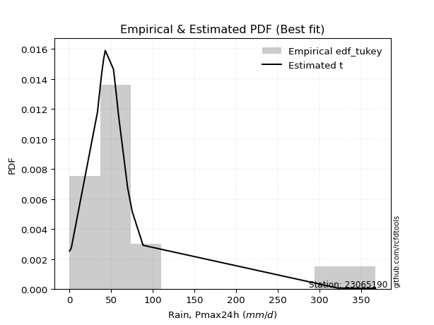</img>

</div>


### 8. Empirical - EDF Gringorten (1963)

Gringorten plotting position formula is essential for estimating the probability and return periods of extreme events like floods and heavy rainfall. The constant _a=0.44_.

<div align="center">


$P=(m-a)/(n+1-2a)$


</div>


**8.1. Empirical values**

<div align="center">

|                | 0                    | 1                   | 2                   | 3                   | 4                   | 5                   | 6                  | 7                  | 8                  | 9              | 10                 | 11                | 12                 | 13                 | 14                 | 15                 | 16                 | 17                 | 18                 |
|:---------------|:---------------------|:--------------------|:--------------------|:--------------------|:--------------------|:--------------------|:-------------------|:-------------------|:-------------------|:---------------|:-------------------|:------------------|:-------------------|:-------------------|:-------------------|:-------------------|:-------------------|:-------------------|:-------------------|
| date           | 2021                 | 2009                | 2024                | 2019                | 2025                | 2016                | 2018               | 2007               | 2012               | 2017           | 2022               | 2011              | 2015               | 2010               | 2006               | 2005               | 2023               | 2014               | 2013               |
| x              | 0.2                  | 0.5                 | 0.8                 | 2.3                 | 8.9                 | 33.7                | 37.8               | 38.9               | 41.1               | 43.0           | 52.8               | 54.2              | 56.8               | 58.8               | 69.8               | 75.3               | 88.4               | 322.1              | 367.4              |
| m              | 1                    | 2                   | 3                   | 4                   | 5                   | 6                   | 7                  | 8                  | 9                  | 10             | 11                 | 12                | 13                 | 14                 | 15                 | 16                 | 17                 | 18                 | 19                 |
| empirical_dist | edf_gringorten       | edf_gringorten      | edf_gringorten      | edf_gringorten      | edf_gringorten      | edf_gringorten      | edf_gringorten     | edf_gringorten     | edf_gringorten     | edf_gringorten | edf_gringorten     | edf_gringorten    | edf_gringorten     | edf_gringorten     | edf_gringorten     | edf_gringorten     | edf_gringorten     | edf_gringorten     | edf_gringorten     |
| empirical      | 0.029288702928870293 | 0.08158995815899582 | 0.13389121338912133 | 0.18619246861924685 | 0.23849372384937234 | 0.29079497907949786 | 0.3430962343096234 | 0.3953974895397489 | 0.4476987447698745 | 0.5            | 0.5523012552301255 | 0.604602510460251 | 0.6569037656903766 | 0.7092050209205021 | 0.7615062761506276 | 0.8138075313807531 | 0.8661087866108785 | 0.918410041841004  | 0.9707112970711296 |
| empirical_tr   | 1.0301724137931034   | 1.0888382687927107  | 1.1545893719806763  | 1.2287917737789202  | 1.313186813186813   | 1.4100294985250739  | 1.522292993630573  | 1.6539792387543253 | 1.8106060606060606 | 2.0            | 2.2336448598130842 | 2.529100529100529 | 2.9146341463414633 | 3.4388489208633093 | 4.192982456140351  | 5.370786516853932  | 7.468749999999993  | 12.256410256410238 | 34.14285714285699  |

</div>


**8.2. Kolmogorov-Smirnov fit test (sorted by Δ)**


<div align="center">

|                | 0                   | 1                   | 2                   | 3                   | 4                   | 5                   | 6                   | 7                   | 8                   | 9                   | 10                  | 11                  | 12                  | 13                  | 14                  | 15                  | 16                  | 17                  | 18                  | 19                  | 20                  | 21                  | 22                  | 23                    | 24                  | 25                  | 26                  | 27                  | 28                  | 29                  | 30                  | 31                  | 32                  | 33                  | 34                  | 35                  | 36                  | 37                  | 38                  | 39                  | 40                  | 41                  | 42                  | 43                  | 44                  | 45                  | 46                  | 47                  | 48                  | 49                  | 50                  | 51                  | 52                  | 53                  | 54                  | 55                  | 56                  | 57                  | 58                  | 59                  | 60                  | 61                  | 62                  | 63                  | 64                  | 65                  | 66                  | 67                  | 68                  | 69                  | 70                  | 71                  | 72                  | 73                  | 74                  | 75                  | 76                  | 77                  | 78                  | 79                  | 80                  | 81                  | 82                  | 83                  | 84                  | 85                  | 86                  | 87                  | 88                  | 89                  |
|:---------------|:--------------------|:--------------------|:--------------------|:--------------------|:--------------------|:--------------------|:--------------------|:--------------------|:--------------------|:--------------------|:--------------------|:--------------------|:--------------------|:--------------------|:--------------------|:--------------------|:--------------------|:--------------------|:--------------------|:--------------------|:--------------------|:--------------------|:--------------------|:----------------------|:--------------------|:--------------------|:--------------------|:--------------------|:--------------------|:--------------------|:--------------------|:--------------------|:--------------------|:--------------------|:--------------------|:--------------------|:--------------------|:--------------------|:--------------------|:--------------------|:--------------------|:--------------------|:--------------------|:--------------------|:--------------------|:--------------------|:--------------------|:--------------------|:--------------------|:--------------------|:--------------------|:--------------------|:--------------------|:--------------------|:--------------------|:--------------------|:--------------------|:--------------------|:--------------------|:--------------------|:--------------------|:--------------------|:--------------------|:--------------------|:--------------------|:--------------------|:--------------------|:--------------------|:--------------------|:--------------------|:--------------------|:--------------------|:--------------------|:--------------------|:--------------------|:--------------------|:--------------------|:--------------------|:--------------------|:--------------------|:--------------------|:--------------------|:--------------------|:--------------------|:--------------------|:--------------------|:--------------------|:--------------------|:--------------------|:--------------------|
| station        | 23065190            | 23065190            | 23065190            | 23065190            | 23065190            | 23065190            | 23065190            | 23065190            | 23065190            | 23065190            | 23065190            | 23065190            | 23065190            | 23065190            | 23065190            | 23065190            | 23065190            | 23065190            | 23065190            | 23065190            | 23065190            | 23065190            | 23065190            | 23065190              | 23065190            | 23065190            | 23065190            | 23065190            | 23065190            | 23065190            | 23065190            | 23065190            | 23065190            | 23065190            | 23065190            | 23065190            | 23065190            | 23065190            | 23065190            | 23065190            | 23065190            | 23065190            | 23065190            | 23065190            | 23065190            | 23065190            | 23065190            | 23065190            | 23065190            | 23065190            | 23065190            | 23065190            | 23065190            | 23065190            | 23065190            | 23065190            | 23065190            | 23065190            | 23065190            | 23065190            | 23065190            | 23065190            | 23065190            | 23065190            | 23065190            | 23065190            | 23065190            | 23065190            | 23065190            | 23065190            | 23065190            | 23065190            | 23065190            | 23065190            | 23065190            | 23065190            | 23065190            | 23065190            | 23065190            | 23065190            | 23065190            | 23065190            | 23065190            | 23065190            | 23065190            | 23065190            | 23065190            | 23065190            | 23065190            | 23065190            |
| empirical_dist | edf_gringorten      | edf_gringorten      | edf_gringorten      | edf_gringorten      | edf_gringorten      | edf_gringorten      | edf_gringorten      | edf_gringorten      | edf_gringorten      | edf_gringorten      | edf_gringorten      | edf_gringorten      | edf_gringorten      | edf_gringorten      | edf_gringorten      | edf_gringorten      | edf_gringorten      | edf_gringorten      | edf_gringorten      | edf_gringorten      | edf_gringorten      | edf_gringorten      | edf_gringorten      | edf_gringorten        | edf_gringorten      | edf_gringorten      | edf_gringorten      | edf_gringorten      | edf_gringorten      | edf_gringorten      | edf_gringorten      | edf_gringorten      | edf_gringorten      | edf_gringorten      | edf_gringorten      | edf_gringorten      | edf_gringorten      | edf_gringorten      | edf_gringorten      | edf_gringorten      | edf_gringorten      | edf_gringorten      | edf_gringorten      | edf_gringorten      | edf_gringorten      | edf_gringorten      | edf_gringorten      | edf_gringorten      | edf_gringorten      | edf_gringorten      | edf_gringorten      | edf_gringorten      | edf_gringorten      | edf_gringorten      | edf_gringorten      | edf_gringorten      | edf_gringorten      | edf_gringorten      | edf_gringorten      | edf_gringorten      | edf_gringorten      | edf_gringorten      | edf_gringorten      | edf_gringorten      | edf_gringorten      | edf_gringorten      | edf_gringorten      | edf_gringorten      | edf_gringorten      | edf_gringorten      | edf_gringorten      | edf_gringorten      | edf_gringorten      | edf_gringorten      | edf_gringorten      | edf_gringorten      | edf_gringorten      | edf_gringorten      | edf_gringorten      | edf_gringorten      | edf_gringorten      | edf_gringorten      | edf_gringorten      | edf_gringorten      | edf_gringorten      | edf_gringorten      | edf_gringorten      | edf_gringorten      | edf_gringorten      | edf_gringorten      |
| p_dist         | logjohnsonsu        | t                   | johnsonsu           | ncf                 | logt                | gompertz            | exponnorm           | alpha               | genexpon            | expon               | laplace_asymmetric  | wald                | gibrat              | genlogistic         | invweibull          | invgamma            | pareto              | pearson3            | f                   | logloggamma         | logmielke           | moyal               | loggenlogistic      | loglaplace_asymmetric | invgauss            | logweibull_min      | logpearson3         | loggumbel_l         | weibull_min         | logfisk             | gumbel_r            | halflogistic        | halfnorm            | gamma               | rayleigh            | kstwobign           | maxwell             | nakagami            | fisk                | logexponnorm        | logcrystalball      | lognorm             | lognorm             | logrice             | lognct              | lognakagami         | logfatiguelife      | loglognorm          | logbetaprime        | loginvgamma         | logalpha            | laplace             | logerlang           | loggamma            | loggamma            | hypsecant           | loglogistic         | logistic            | loggompertz         | norm                | crystalball         | mielke              | loginvweibull       | loginvgauss         | loghypsecant        | logmaxwell          | rice                | truncnorm           | betaprime           | lograyleigh         | loglaplace          | logkstwobign        | nct                 | loggenexpon         | logncf              | loghalfnorm         | loggumbel_r         | erlang              | gumbel_l            | logexpon            | loghalflogistic     | logmoyal            | fatiguelife         | logtruncnorm        | logchi2             | logwald             | logf                | loggibrat           | logpareto           | chi2                |
| delta          | 0.08373003144159522 | 0.10383880100244142 | 0.11091247981029356 | 0.13328987919848242 | 0.14087229488580222 | 0.15287703876523356 | 0.1592734406051004  | 0.15954344199482423 | 0.16104429925790564 | 0.16104496757329423 | 0.16104854314911932 | 0.16720700734013377 | 0.16828566453164637 | 0.17312757588851035 | 0.17379111729611363 | 0.17818654186804977 | 0.18528061100158272 | 0.18695200158619912 | 0.19192928794432718 | 0.1970805655577053  | 0.2049546138549913  | 0.20517140191914254 | 0.2052412578585593  | 0.20710145128275093   | 0.21193908157526237 | 0.21489572337743296 | 0.21662383831811843 | 0.2197711026080849  | 0.22283090041643422 | 0.22418977212432928 | 0.22710515953964694 | 0.23208758350724226 | 0.25128899871041077 | 0.25594503453742706 | 0.25798400033529156 | 0.2647385383068872  | 0.26716257566838075 | 0.27058244034672996 | 0.27743703435519057 | 0.28374182384629104 | 0.28374589829138946 | 0.28374596509623934 | 0.28374596509623934 | 0.28375787439834327 | 0.28397904857057005 | 0.2843399105335965  | 0.2845510389426898  | 0.28490245790448226 | 0.28593043811950897 | 0.28960037129765986 | 0.2900660342684402  | 0.291456928802588   | 0.29170184760502066 | 0.29181656938424033 | 0.29181656938424033 | 0.2928122640601195  | 0.2936137473213832  | 0.2947623277456518  | 0.2952140266189938  | 0.2970485041933584  | 0.297048513405231   | 0.29724850299604827 | 0.3007111830346539  | 0.3009925444185895  | 0.30184248539521213 | 0.3123789892249988  | 0.3126494277724253  | 0.31320318444752104 | 0.3198697102330131  | 0.32141823490442173 | 0.3259077910558948  | 0.32972759356697606 | 0.3394399356725802  | 0.3416086080375363  | 0.34163319745729775 | 0.34700711972861925 | 0.3524719590261551  | 0.35631846997354594 | 0.3667236059231317  | 0.36974110508962826 | 0.37494900069395537 | 0.3763906855583928  | 0.37800263464381795 | 0.39587753994293723 | 0.4182213003886592  | 0.4428227619343417  | 0.4504969591976062  | 0.47351759551218814 | 0.5382635137617136  | 0.7424702817875728  |
| deltao         | 0.31564497164100014 | 0.31564497164100014 | 0.31564497164100014 | 0.31564497164100014 | 0.31564497164100014 | 0.31564497164100014 | 0.31564497164100014 | 0.31564497164100014 | 0.31564497164100014 | 0.31564497164100014 | 0.31564497164100014 | 0.31564497164100014 | 0.31564497164100014 | 0.31564497164100014 | 0.31564497164100014 | 0.31564497164100014 | 0.31564497164100014 | 0.31564497164100014 | 0.31564497164100014 | 0.31564497164100014 | 0.31564497164100014 | 0.31564497164100014 | 0.31564497164100014 | 0.31564497164100014   | 0.31564497164100014 | 0.31564497164100014 | 0.31564497164100014 | 0.31564497164100014 | 0.31564497164100014 | 0.31564497164100014 | 0.31564497164100014 | 0.31564497164100014 | 0.31564497164100014 | 0.31564497164100014 | 0.31564497164100014 | 0.31564497164100014 | 0.31564497164100014 | 0.31564497164100014 | 0.31564497164100014 | 0.31564497164100014 | 0.31564497164100014 | 0.31564497164100014 | 0.31564497164100014 | 0.31564497164100014 | 0.31564497164100014 | 0.31564497164100014 | 0.31564497164100014 | 0.31564497164100014 | 0.31564497164100014 | 0.31564497164100014 | 0.31564497164100014 | 0.31564497164100014 | 0.31564497164100014 | 0.31564497164100014 | 0.31564497164100014 | 0.31564497164100014 | 0.31564497164100014 | 0.31564497164100014 | 0.31564497164100014 | 0.31564497164100014 | 0.31564497164100014 | 0.31564497164100014 | 0.31564497164100014 | 0.31564497164100014 | 0.31564497164100014 | 0.31564497164100014 | 0.31564497164100014 | 0.31564497164100014 | 0.31564497164100014 | 0.31564497164100014 | 0.31564497164100014 | 0.31564497164100014 | 0.31564497164100014 | 0.31564497164100014 | 0.31564497164100014 | 0.31564497164100014 | 0.31564497164100014 | 0.31564497164100014 | 0.31564497164100014 | 0.31564497164100014 | 0.31564497164100014 | 0.31564497164100014 | 0.31564497164100014 | 0.31564497164100014 | 0.31564497164100014 | 0.31564497164100014 | 0.31564497164100014 | 0.31564497164100014 | 0.31564497164100014 | 0.31564497164100014 |
| eval           | Δo > Δ              | Δo > Δ              | Δo > Δ              | Δo > Δ              | Δo > Δ              | Δo > Δ              | Δo > Δ              | Δo > Δ              | Δo > Δ              | Δo > Δ              | Δo > Δ              | Δo > Δ              | Δo > Δ              | Δo > Δ              | Δo > Δ              | Δo > Δ              | Δo > Δ              | Δo > Δ              | Δo > Δ              | Δo > Δ              | Δo > Δ              | Δo > Δ              | Δo > Δ              | Δo > Δ                | Δo > Δ              | Δo > Δ              | Δo > Δ              | Δo > Δ              | Δo > Δ              | Δo > Δ              | Δo > Δ              | Δo > Δ              | Δo > Δ              | Δo > Δ              | Δo > Δ              | Δo > Δ              | Δo > Δ              | Δo > Δ              | Δo > Δ              | Δo > Δ              | Δo > Δ              | Δo > Δ              | Δo > Δ              | Δo > Δ              | Δo > Δ              | Δo > Δ              | Δo > Δ              | Δo > Δ              | Δo > Δ              | Δo > Δ              | Δo > Δ              | Δo > Δ              | Δo > Δ              | Δo > Δ              | Δo > Δ              | Δo > Δ              | Δo > Δ              | Δo > Δ              | Δo > Δ              | Δo > Δ              | Δo > Δ              | Δo > Δ              | Δo > Δ              | Δo > Δ              | Δo > Δ              | Δo > Δ              | Δo > Δ              | Δo > Δ              | Δo <= Δ             | Δo <= Δ             | Δo <= Δ             | Δo <= Δ             | Δo <= Δ             | Δo <= Δ             | Δo <= Δ             | Δo <= Δ             | Δo <= Δ             | Δo <= Δ             | Δo <= Δ             | Δo <= Δ             | Δo <= Δ             | Δo <= Δ             | Δo <= Δ             | Δo <= Δ             | Δo <= Δ             | Δo <= Δ             | Δo <= Δ             | Δo <= Δ             | Δo <= Δ             | Δo <= Δ             |
| fit            | 1                   | 1                   | 1                   | 1                   | 1                   | 1                   | 1                   | 1                   | 1                   | 1                   | 1                   | 1                   | 1                   | 1                   | 1                   | 1                   | 1                   | 1                   | 1                   | 1                   | 1                   | 1                   | 1                   | 1                     | 1                   | 1                   | 1                   | 1                   | 1                   | 1                   | 1                   | 1                   | 1                   | 1                   | 1                   | 1                   | 1                   | 1                   | 1                   | 1                   | 1                   | 1                   | 1                   | 1                   | 1                   | 1                   | 1                   | 1                   | 1                   | 1                   | 1                   | 1                   | 1                   | 1                   | 1                   | 1                   | 1                   | 1                   | 1                   | 1                   | 1                   | 1                   | 1                   | 1                   | 1                   | 1                   | 1                   | 1                   | 0                   | 0                   | 0                   | 0                   | 0                   | 0                   | 0                   | 0                   | 0                   | 0                   | 0                   | 0                   | 0                   | 0                   | 0                   | 0                   | 0                   | 0                   | 0                   | 0                   | 0                   | 0                   |
| n              | 19                  | 19                  | 19                  | 19                  | 19                  | 19                  | 19                  | 19                  | 19                  | 19                  | 19                  | 19                  | 19                  | 19                  | 19                  | 19                  | 19                  | 19                  | 19                  | 19                  | 19                  | 19                  | 19                  | 19                    | 19                  | 19                  | 19                  | 19                  | 19                  | 19                  | 19                  | 19                  | 19                  | 19                  | 19                  | 19                  | 19                  | 19                  | 19                  | 19                  | 19                  | 19                  | 19                  | 19                  | 19                  | 19                  | 19                  | 19                  | 19                  | 19                  | 19                  | 19                  | 19                  | 19                  | 19                  | 19                  | 19                  | 19                  | 19                  | 19                  | 19                  | 19                  | 19                  | 19                  | 19                  | 19                  | 19                  | 19                  | 19                  | 19                  | 19                  | 19                  | 19                  | 19                  | 19                  | 19                  | 19                  | 19                  | 19                  | 19                  | 19                  | 19                  | 19                  | 19                  | 19                  | 19                  | 19                  | 19                  | 19                  | 19                  |
| best_fit       | 1                   | 0                   | 0                   | 0                   | 0                   | 0                   | 0                   | 0                   | 0                   | 0                   | 0                   | 0                   | 0                   | 0                   | 0                   | 0                   | 0                   | 0                   | 0                   | 0                   | 0                   | 0                   | 0                   | 0                     | 0                   | 0                   | 0                   | 0                   | 0                   | 0                   | 0                   | 0                   | 0                   | 0                   | 0                   | 0                   | 0                   | 0                   | 0                   | 0                   | 0                   | 0                   | 0                   | 0                   | 0                   | 0                   | 0                   | 0                   | 0                   | 0                   | 0                   | 0                   | 0                   | 0                   | 0                   | 0                   | 0                   | 0                   | 0                   | 0                   | 0                   | 0                   | 0                   | 0                   | 0                   | 0                   | 0                   | 0                   | 0                   | 0                   | 0                   | 0                   | 0                   | 0                   | 0                   | 0                   | 0                   | 0                   | 0                   | 0                   | 0                   | 0                   | 0                   | 0                   | 0                   | 0                   | 0                   | 0                   | 0                   | 0                   |
| best_fit_sort  | 1                   | 2                   | 3                   | 4                   | 5                   | 6                   | 7                   | 8                   | 9                   | 10                  | 11                  | 12                  | 13                  | 14                  | 15                  | 16                  | 17                  | 18                  | 19                  | 20                  | 21                  | 22                  | 23                  | 24                    | 25                  | 26                  | 27                  | 28                  | 29                  | 30                  | 31                  | 32                  | 33                  | 34                  | 35                  | 36                  | 37                  | 38                  | 39                  | 40                  | 41                  | 42                  | 43                  | 44                  | 45                  | 46                  | 47                  | 48                  | 49                  | 50                  | 51                  | 52                  | 53                  | 54                  | 55                  | 56                  | 57                  | 58                  | 59                  | 60                  | 61                  | 62                  | 63                  | 64                  | 65                  | 66                  | 67                  | 68                  | 69                  | 70                  | 71                  | 72                  | 73                  | 74                  | 75                  | 76                  | 77                  | 78                  | 79                  | 80                  | 81                  | 82                  | 83                  | 84                  | 85                  | 86                  | 87                  | 88                  | 89                  | 90                  |

</div>


<div align="center">

</img>

</div>


**8.3. Best fit**

<div align="center">

|   id |   station | empirical_dist   | p_dist       |   delta |   deltao | eval   |   fit |   n |   best_fit |   best_fit_sort |
|-----:|----------:|:-----------------|:-------------|--------:|---------:|:-------|------:|----:|-----------:|----------------:|
|    0 |  23065190 | edf_gringorten   | logjohnsonsu | 0.08373 | 0.315645 | Δo > Δ |     1 |  19 |          1 |               1 |

</div>


<div align="center">

</img>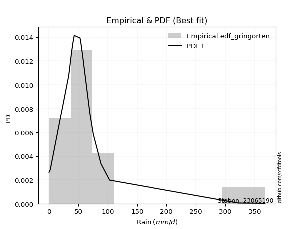</img>

</div>


### 9. Empirical - EDF Filliben (1975)

The specific values of the constants (0.3175) (often denoted as $alpha$) and (0.365) are derived from a method proposed by James J. Filliben in a 1975 paper. This particular formula is the mean value of the $i$-th order statistic of the normal distribution and is considered a robust and effective plotting position formula for the normal probability plot correlation coefficient test for normality.

<div align="center">


$P=(m-0.3175)/(n+0.365)$


</div>


**9.1. Empirical values**

<div align="center">

|                | 0                   | 1                   | 2                  | 3                   | 4                   | 5                  | 6                  | 7                  | 8                  | 9            | 10                 | 11                 | 12                 | 13                 | 14                 | 15                 | 16                | 17                 | 18                 |
|:---------------|:--------------------|:--------------------|:-------------------|:--------------------|:--------------------|:-------------------|:-------------------|:-------------------|:-------------------|:-------------|:-------------------|:-------------------|:-------------------|:-------------------|:-------------------|:-------------------|:------------------|:-------------------|:-------------------|
| date           | 2021                | 2009                | 2024               | 2019                | 2025                | 2016               | 2018               | 2007               | 2012               | 2017         | 2022               | 2011               | 2015               | 2010               | 2006               | 2005               | 2023              | 2014               | 2013               |
| x              | 0.2                 | 0.5                 | 0.8                | 2.3                 | 8.9                 | 33.7               | 37.8               | 38.9               | 41.1               | 43.0         | 52.8               | 54.2               | 56.8               | 58.8               | 69.8               | 75.3               | 88.4              | 322.1              | 367.4              |
| m              | 1                   | 2                   | 3                  | 4                   | 5                   | 6                  | 7                  | 8                  | 9                  | 10           | 11                 | 12                 | 13                 | 14                 | 15                 | 16                 | 17                | 18                 | 19                 |
| empirical_dist | edf_filliben        | edf_filliben        | edf_filliben       | edf_filliben        | edf_filliben        | edf_filliben       | edf_filliben       | edf_filliben       | edf_filliben       | edf_filliben | edf_filliben       | edf_filliben       | edf_filliben       | edf_filliben       | edf_filliben       | edf_filliben       | edf_filliben      | edf_filliben       | edf_filliben       |
| empirical      | 0.03524399690162665 | 0.08688355280144593 | 0.1385231087012652 | 0.19016266460108444 | 0.24180222050090372 | 0.293441776400723  | 0.3450813323005423 | 0.3967208882003615 | 0.4483604441001807 | 0.5          | 0.5516395558998193 | 0.6032791117996386 | 0.6549186676994578 | 0.7065582235992771 | 0.7581977794990963 | 0.8098373353989156 | 0.861476891298735 | 0.9131164471985542 | 0.9647560030983735 |
| empirical_tr   | 1.0365315134484143  | 1.0951505726000283  | 1.1607972426195114 | 1.2348158775705405  | 1.3189170781542654  | 1.4153115293257812 | 1.5269071555292728 | 1.6576075326342818 | 1.8127779077931194 | 2.0          | 2.2303484019579614 | 2.5206638464041657 | 2.8978675645342316 | 3.407831060272768  | 4.135611318739989  | 5.258655804480651  | 7.219012115563846 | 11.509658246656779 | 28.373626373626497 |

</div>


**9.2. Kolmogorov-Smirnov fit test (sorted by Δ)**


<div align="center">

|                | 0                   | 1                   | 2                   | 3                   | 4                   | 5                   | 6                   | 7                   | 8                   | 9                   | 10                  | 11                  | 12                  | 13                  | 14                  | 15                  | 16                  | 17                  | 18                  | 19                  | 20                  | 21                  | 22                  | 23                    | 24                  | 25                  | 26                  | 27                  | 28                  | 29                  | 30                  | 31                  | 32                  | 33                  | 34                  | 35                  | 36                  | 37                  | 38                  | 39                  | 40                  | 41                  | 42                  | 43                  | 44                  | 45                  | 46                  | 47                  | 48                  | 49                  | 50                  | 51                  | 52                  | 53                  | 54                  | 55                  | 56                  | 57                  | 58                  | 59                  | 60                  | 61                  | 62                  | 63                  | 64                  | 65                  | 66                  | 67                  | 68                  | 69                  | 70                  | 71                  | 72                  | 73                  | 74                  | 75                  | 76                  | 77                  | 78                  | 79                  | 80                  | 81                  | 82                  | 83                  | 84                  | 85                  | 86                  | 87                  | 88                  | 89                  |
|:---------------|:--------------------|:--------------------|:--------------------|:--------------------|:--------------------|:--------------------|:--------------------|:--------------------|:--------------------|:--------------------|:--------------------|:--------------------|:--------------------|:--------------------|:--------------------|:--------------------|:--------------------|:--------------------|:--------------------|:--------------------|:--------------------|:--------------------|:--------------------|:----------------------|:--------------------|:--------------------|:--------------------|:--------------------|:--------------------|:--------------------|:--------------------|:--------------------|:--------------------|:--------------------|:--------------------|:--------------------|:--------------------|:--------------------|:--------------------|:--------------------|:--------------------|:--------------------|:--------------------|:--------------------|:--------------------|:--------------------|:--------------------|:--------------------|:--------------------|:--------------------|:--------------------|:--------------------|:--------------------|:--------------------|:--------------------|:--------------------|:--------------------|:--------------------|:--------------------|:--------------------|:--------------------|:--------------------|:--------------------|:--------------------|:--------------------|:--------------------|:--------------------|:--------------------|:--------------------|:--------------------|:--------------------|:--------------------|:--------------------|:--------------------|:--------------------|:--------------------|:--------------------|:--------------------|:--------------------|:--------------------|:--------------------|:--------------------|:--------------------|:--------------------|:--------------------|:--------------------|:--------------------|:--------------------|:--------------------|:--------------------|
| station        | 23065190            | 23065190            | 23065190            | 23065190            | 23065190            | 23065190            | 23065190            | 23065190            | 23065190            | 23065190            | 23065190            | 23065190            | 23065190            | 23065190            | 23065190            | 23065190            | 23065190            | 23065190            | 23065190            | 23065190            | 23065190            | 23065190            | 23065190            | 23065190              | 23065190            | 23065190            | 23065190            | 23065190            | 23065190            | 23065190            | 23065190            | 23065190            | 23065190            | 23065190            | 23065190            | 23065190            | 23065190            | 23065190            | 23065190            | 23065190            | 23065190            | 23065190            | 23065190            | 23065190            | 23065190            | 23065190            | 23065190            | 23065190            | 23065190            | 23065190            | 23065190            | 23065190            | 23065190            | 23065190            | 23065190            | 23065190            | 23065190            | 23065190            | 23065190            | 23065190            | 23065190            | 23065190            | 23065190            | 23065190            | 23065190            | 23065190            | 23065190            | 23065190            | 23065190            | 23065190            | 23065190            | 23065190            | 23065190            | 23065190            | 23065190            | 23065190            | 23065190            | 23065190            | 23065190            | 23065190            | 23065190            | 23065190            | 23065190            | 23065190            | 23065190            | 23065190            | 23065190            | 23065190            | 23065190            | 23065190            |
| empirical_dist | edf_filliben        | edf_filliben        | edf_filliben        | edf_filliben        | edf_filliben        | edf_filliben        | edf_filliben        | edf_filliben        | edf_filliben        | edf_filliben        | edf_filliben        | edf_filliben        | edf_filliben        | edf_filliben        | edf_filliben        | edf_filliben        | edf_filliben        | edf_filliben        | edf_filliben        | edf_filliben        | edf_filliben        | edf_filliben        | edf_filliben        | edf_filliben          | edf_filliben        | edf_filliben        | edf_filliben        | edf_filliben        | edf_filliben        | edf_filliben        | edf_filliben        | edf_filliben        | edf_filliben        | edf_filliben        | edf_filliben        | edf_filliben        | edf_filliben        | edf_filliben        | edf_filliben        | edf_filliben        | edf_filliben        | edf_filliben        | edf_filliben        | edf_filliben        | edf_filliben        | edf_filliben        | edf_filliben        | edf_filliben        | edf_filliben        | edf_filliben        | edf_filliben        | edf_filliben        | edf_filliben        | edf_filliben        | edf_filliben        | edf_filliben        | edf_filliben        | edf_filliben        | edf_filliben        | edf_filliben        | edf_filliben        | edf_filliben        | edf_filliben        | edf_filliben        | edf_filliben        | edf_filliben        | edf_filliben        | edf_filliben        | edf_filliben        | edf_filliben        | edf_filliben        | edf_filliben        | edf_filliben        | edf_filliben        | edf_filliben        | edf_filliben        | edf_filliben        | edf_filliben        | edf_filliben        | edf_filliben        | edf_filliben        | edf_filliben        | edf_filliben        | edf_filliben        | edf_filliben        | edf_filliben        | edf_filliben        | edf_filliben        | edf_filliben        | edf_filliben        |
| p_dist         | logjohnsonsu        | t                   | johnsonsu           | ncf                 | logt                | gompertz            | alpha               | exponnorm           | genexpon            | expon               | laplace_asymmetric  | wald                | genlogistic         | invweibull          | gibrat              | invgamma            | pearson3            | pareto              | f                   | logloggamma         | moyal               | logmielke           | loggenlogistic      | loglaplace_asymmetric | invgauss            | logweibull_min      | logpearson3         | loggumbel_l         | weibull_min         | logfisk             | gumbel_r            | halflogistic        | halfnorm            | gamma               | rayleigh            | kstwobign           | maxwell             | nakagami            | fisk                | logexponnorm        | logcrystalball      | lognorm             | lognorm             | logrice             | lognct              | lognakagami         | logfatiguelife      | loglognorm          | logbetaprime        | loginvgamma         | logalpha            | laplace             | hypsecant           | logerlang           | loggamma            | loggamma            | logistic            | loglogistic         | loggompertz         | norm                | crystalball         | mielke              | loginvweibull       | loginvgauss         | loghypsecant        | rice                | truncnorm           | logmaxwell          | betaprime           | lograyleigh         | loglaplace          | logkstwobign        | nct                 | logncf              | loggenexpon         | loghalfnorm         | loggumbel_r         | erlang              | gumbel_l            | logexpon            | loghalflogistic     | logmoyal            | fatiguelife         | logtruncnorm        | logchi2             | logwald             | logf                | loggibrat           | logpareto           | chi2                |
| delta          | 0.08770022742343281 | 0.09788350702968505 | 0.11422097646182494 | 0.13726007518032002 | 0.1441807915373336  | 0.15684723474707118 | 0.1568966446735991  | 0.16027427290757867 | 0.16101827994920614 | 0.1610183322000711  | 0.16101861118286998 | 0.16456021001890864 | 0.17048077856728538 | 0.1711443199748885  | 0.17225586051348396 | 0.17553974454682464 | 0.18099670761344278 | 0.18263381368035758 | 0.1872973926321836  | 0.19443376823648018 | 0.19921610794638617 | 0.20230781653376617 | 0.20259446053733415 | 0.2044546539615258    | 0.20929228425403723 | 0.21224892605620782 | 0.2139770409968933  | 0.21712430528685978 | 0.22018410309520908 | 0.22154297480310414 | 0.22247326422750335 | 0.2261322895344859  | 0.24533370473765442 | 0.2532982372162019  | 0.253352105023148   | 0.26076834232504964 | 0.26253068035623717 | 0.26595054503458637 | 0.27479023703396543 | 0.2810950265250659  | 0.28109910097016433 | 0.2810991677750142  | 0.2810991677750142  | 0.28111107707711813 | 0.2813322512493449  | 0.28169311321237134 | 0.28190424162146466 | 0.28225566058325713 | 0.28328364079828383 | 0.28695357397643473 | 0.28741923694721505 | 0.28881013148136303 | 0.28884206807828194 | 0.2890550502837955  | 0.2891697720630152  | 0.2891697720630152  | 0.29079213176381424 | 0.29096695000015804 | 0.2925672292977687  | 0.2930783082115208  | 0.2930783174233934  | 0.29460170567482313 | 0.29806438571342875 | 0.2983457470973644  | 0.299195688073987   | 0.30867923179058776 | 0.3092329884656835  | 0.30973219190377366 | 0.31722291291178795 | 0.3187714375831966  | 0.32326099373466965 | 0.3270807962457509  | 0.33679313835135505 | 0.3383247008057664  | 0.33896181071631115 | 0.3443603224073941  | 0.34982516170492994 | 0.3536716726523208  | 0.3627534099412941  | 0.3670943077684031  | 0.37230220337273023 | 0.37374388823716764 | 0.3753558373225928  | 0.3932307426217121  | 0.41557450306743404 | 0.4401759646131166  | 0.4471884625460748  | 0.470870798190963   | 0.5329699191192635  | 0.7391617851360415  |
| deltao         | 0.31564497164100014 | 0.31564497164100014 | 0.31564497164100014 | 0.31564497164100014 | 0.31564497164100014 | 0.31564497164100014 | 0.31564497164100014 | 0.31564497164100014 | 0.31564497164100014 | 0.31564497164100014 | 0.31564497164100014 | 0.31564497164100014 | 0.31564497164100014 | 0.31564497164100014 | 0.31564497164100014 | 0.31564497164100014 | 0.31564497164100014 | 0.31564497164100014 | 0.31564497164100014 | 0.31564497164100014 | 0.31564497164100014 | 0.31564497164100014 | 0.31564497164100014 | 0.31564497164100014   | 0.31564497164100014 | 0.31564497164100014 | 0.31564497164100014 | 0.31564497164100014 | 0.31564497164100014 | 0.31564497164100014 | 0.31564497164100014 | 0.31564497164100014 | 0.31564497164100014 | 0.31564497164100014 | 0.31564497164100014 | 0.31564497164100014 | 0.31564497164100014 | 0.31564497164100014 | 0.31564497164100014 | 0.31564497164100014 | 0.31564497164100014 | 0.31564497164100014 | 0.31564497164100014 | 0.31564497164100014 | 0.31564497164100014 | 0.31564497164100014 | 0.31564497164100014 | 0.31564497164100014 | 0.31564497164100014 | 0.31564497164100014 | 0.31564497164100014 | 0.31564497164100014 | 0.31564497164100014 | 0.31564497164100014 | 0.31564497164100014 | 0.31564497164100014 | 0.31564497164100014 | 0.31564497164100014 | 0.31564497164100014 | 0.31564497164100014 | 0.31564497164100014 | 0.31564497164100014 | 0.31564497164100014 | 0.31564497164100014 | 0.31564497164100014 | 0.31564497164100014 | 0.31564497164100014 | 0.31564497164100014 | 0.31564497164100014 | 0.31564497164100014 | 0.31564497164100014 | 0.31564497164100014 | 0.31564497164100014 | 0.31564497164100014 | 0.31564497164100014 | 0.31564497164100014 | 0.31564497164100014 | 0.31564497164100014 | 0.31564497164100014 | 0.31564497164100014 | 0.31564497164100014 | 0.31564497164100014 | 0.31564497164100014 | 0.31564497164100014 | 0.31564497164100014 | 0.31564497164100014 | 0.31564497164100014 | 0.31564497164100014 | 0.31564497164100014 | 0.31564497164100014 |
| eval           | Δo > Δ              | Δo > Δ              | Δo > Δ              | Δo > Δ              | Δo > Δ              | Δo > Δ              | Δo > Δ              | Δo > Δ              | Δo > Δ              | Δo > Δ              | Δo > Δ              | Δo > Δ              | Δo > Δ              | Δo > Δ              | Δo > Δ              | Δo > Δ              | Δo > Δ              | Δo > Δ              | Δo > Δ              | Δo > Δ              | Δo > Δ              | Δo > Δ              | Δo > Δ              | Δo > Δ                | Δo > Δ              | Δo > Δ              | Δo > Δ              | Δo > Δ              | Δo > Δ              | Δo > Δ              | Δo > Δ              | Δo > Δ              | Δo > Δ              | Δo > Δ              | Δo > Δ              | Δo > Δ              | Δo > Δ              | Δo > Δ              | Δo > Δ              | Δo > Δ              | Δo > Δ              | Δo > Δ              | Δo > Δ              | Δo > Δ              | Δo > Δ              | Δo > Δ              | Δo > Δ              | Δo > Δ              | Δo > Δ              | Δo > Δ              | Δo > Δ              | Δo > Δ              | Δo > Δ              | Δo > Δ              | Δo > Δ              | Δo > Δ              | Δo > Δ              | Δo > Δ              | Δo > Δ              | Δo > Δ              | Δo > Δ              | Δo > Δ              | Δo > Δ              | Δo > Δ              | Δo > Δ              | Δo > Δ              | Δo > Δ              | Δo > Δ              | Δo <= Δ             | Δo <= Δ             | Δo <= Δ             | Δo <= Δ             | Δo <= Δ             | Δo <= Δ             | Δo <= Δ             | Δo <= Δ             | Δo <= Δ             | Δo <= Δ             | Δo <= Δ             | Δo <= Δ             | Δo <= Δ             | Δo <= Δ             | Δo <= Δ             | Δo <= Δ             | Δo <= Δ             | Δo <= Δ             | Δo <= Δ             | Δo <= Δ             | Δo <= Δ             | Δo <= Δ             |
| fit            | 1                   | 1                   | 1                   | 1                   | 1                   | 1                   | 1                   | 1                   | 1                   | 1                   | 1                   | 1                   | 1                   | 1                   | 1                   | 1                   | 1                   | 1                   | 1                   | 1                   | 1                   | 1                   | 1                   | 1                     | 1                   | 1                   | 1                   | 1                   | 1                   | 1                   | 1                   | 1                   | 1                   | 1                   | 1                   | 1                   | 1                   | 1                   | 1                   | 1                   | 1                   | 1                   | 1                   | 1                   | 1                   | 1                   | 1                   | 1                   | 1                   | 1                   | 1                   | 1                   | 1                   | 1                   | 1                   | 1                   | 1                   | 1                   | 1                   | 1                   | 1                   | 1                   | 1                   | 1                   | 1                   | 1                   | 1                   | 1                   | 0                   | 0                   | 0                   | 0                   | 0                   | 0                   | 0                   | 0                   | 0                   | 0                   | 0                   | 0                   | 0                   | 0                   | 0                   | 0                   | 0                   | 0                   | 0                   | 0                   | 0                   | 0                   |
| n              | 19                  | 19                  | 19                  | 19                  | 19                  | 19                  | 19                  | 19                  | 19                  | 19                  | 19                  | 19                  | 19                  | 19                  | 19                  | 19                  | 19                  | 19                  | 19                  | 19                  | 19                  | 19                  | 19                  | 19                    | 19                  | 19                  | 19                  | 19                  | 19                  | 19                  | 19                  | 19                  | 19                  | 19                  | 19                  | 19                  | 19                  | 19                  | 19                  | 19                  | 19                  | 19                  | 19                  | 19                  | 19                  | 19                  | 19                  | 19                  | 19                  | 19                  | 19                  | 19                  | 19                  | 19                  | 19                  | 19                  | 19                  | 19                  | 19                  | 19                  | 19                  | 19                  | 19                  | 19                  | 19                  | 19                  | 19                  | 19                  | 19                  | 19                  | 19                  | 19                  | 19                  | 19                  | 19                  | 19                  | 19                  | 19                  | 19                  | 19                  | 19                  | 19                  | 19                  | 19                  | 19                  | 19                  | 19                  | 19                  | 19                  | 19                  |
| best_fit       | 1                   | 0                   | 0                   | 0                   | 0                   | 0                   | 0                   | 0                   | 0                   | 0                   | 0                   | 0                   | 0                   | 0                   | 0                   | 0                   | 0                   | 0                   | 0                   | 0                   | 0                   | 0                   | 0                   | 0                     | 0                   | 0                   | 0                   | 0                   | 0                   | 0                   | 0                   | 0                   | 0                   | 0                   | 0                   | 0                   | 0                   | 0                   | 0                   | 0                   | 0                   | 0                   | 0                   | 0                   | 0                   | 0                   | 0                   | 0                   | 0                   | 0                   | 0                   | 0                   | 0                   | 0                   | 0                   | 0                   | 0                   | 0                   | 0                   | 0                   | 0                   | 0                   | 0                   | 0                   | 0                   | 0                   | 0                   | 0                   | 0                   | 0                   | 0                   | 0                   | 0                   | 0                   | 0                   | 0                   | 0                   | 0                   | 0                   | 0                   | 0                   | 0                   | 0                   | 0                   | 0                   | 0                   | 0                   | 0                   | 0                   | 0                   |
| best_fit_sort  | 1                   | 2                   | 3                   | 4                   | 5                   | 6                   | 7                   | 8                   | 9                   | 10                  | 11                  | 12                  | 13                  | 14                  | 15                  | 16                  | 17                  | 18                  | 19                  | 20                  | 21                  | 22                  | 23                  | 24                    | 25                  | 26                  | 27                  | 28                  | 29                  | 30                  | 31                  | 32                  | 33                  | 34                  | 35                  | 36                  | 37                  | 38                  | 39                  | 40                  | 41                  | 42                  | 43                  | 44                  | 45                  | 46                  | 47                  | 48                  | 49                  | 50                  | 51                  | 52                  | 53                  | 54                  | 55                  | 56                  | 57                  | 58                  | 59                  | 60                  | 61                  | 62                  | 63                  | 64                  | 65                  | 66                  | 67                  | 68                  | 69                  | 70                  | 71                  | 72                  | 73                  | 74                  | 75                  | 76                  | 77                  | 78                  | 79                  | 80                  | 81                  | 82                  | 83                  | 84                  | 85                  | 86                  | 87                  | 88                  | 89                  | 90                  |

</div>


<div align="center">

</img>

</div>


**9.3. Best fit**

<div align="center">

|   id |   station | empirical_dist   | p_dist       |     delta |   deltao | eval   |   fit |   n |   best_fit |   best_fit_sort |
|-----:|----------:|:-----------------|:-------------|----------:|---------:|:-------|------:|----:|-----------:|----------------:|
|    0 |  23065190 | edf_filliben     | logjohnsonsu | 0.0877002 | 0.315645 | Δo > Δ |     1 |  19 |          1 |               1 |

</div>


<div align="center">

</img></img>

</div>


### 10. Empirical - EDF Jenkinson (1977)

The Jenkinson formula in hydrology is an empirical plotting position formula used to estimate the non-exceedance probability _(P)_ or return period _(T)_ of a given ordered observation within a sample. It is a widely used method in the frequency analysis of extreme events such as floods and rainfall, as it provides a distribution-free way to plot data. _a≈0.31_ and _b≈0.38_ are constants derived to approximate the median of the probability distribution for the given rank.

<div align="center">


$P=(m-a)/(n+b)$


</div>


**10.1. Empirical values**

<div align="center">

|                | 0                   | 1                   | 2                  | 3                   | 4                   | 5                   | 6                  | 7                  | 8                  | 9             | 10                 | 11                 | 12                 | 13                 | 14                 | 15                 | 16                 | 17                 | 18                 |
|:---------------|:--------------------|:--------------------|:-------------------|:--------------------|:--------------------|:--------------------|:-------------------|:-------------------|:-------------------|:--------------|:-------------------|:-------------------|:-------------------|:-------------------|:-------------------|:-------------------|:-------------------|:-------------------|:-------------------|
| date           | 2021                | 2009                | 2024               | 2019                | 2025                | 2016                | 2018               | 2007               | 2012               | 2017          | 2022               | 2011               | 2015               | 2010               | 2006               | 2005               | 2023               | 2014               | 2013               |
| x              | 0.2                 | 0.5                 | 0.8                | 2.3                 | 8.9                 | 33.7                | 37.8               | 38.9               | 41.1               | 43.0          | 52.8               | 54.2               | 56.8               | 58.8               | 69.8               | 75.3               | 88.4               | 322.1              | 367.4              |
| m              | 1                   | 2                   | 3                  | 4                   | 5                   | 6                   | 7                  | 8                  | 9                  | 10            | 11                 | 12                 | 13                 | 14                 | 15                 | 16                 | 17                 | 18                 | 19                 |
| empirical_dist | edf_jenkinson       | edf_jenkinson       | edf_jenkinson      | edf_jenkinson       | edf_jenkinson       | edf_jenkinson       | edf_jenkinson      | edf_jenkinson      | edf_jenkinson      | edf_jenkinson | edf_jenkinson      | edf_jenkinson      | edf_jenkinson      | edf_jenkinson      | edf_jenkinson      | edf_jenkinson      | edf_jenkinson      | edf_jenkinson      | edf_jenkinson      |
| empirical      | 0.03560371517027864 | 0.08720330237358101 | 0.1388028895768834 | 0.19040247678018576 | 0.24200206398348817 | 0.29360165118679055 | 0.3452012383900929 | 0.3968008255933953 | 0.4484004127966976 | 0.5           | 0.5515995872033024 | 0.6031991744066048 | 0.6547987616099071 | 0.7063983488132095 | 0.7579979360165119 | 0.8095975232198143 | 0.8611971104231168 | 0.9127966976264191 | 0.9643962848297215 |
| empirical_tr   | 1.0369181380417336  | 1.0955342001130581  | 1.1611743559017376 | 1.2351816443594645  | 1.3192648059904697  | 1.4156318480642804  | 1.5271867612293144 | 1.6578272027373824 | 1.812909260991581  | 2.0           | 2.230149597238205  | 2.5201560468140443 | 2.896860986547085  | 3.40597539543058   | 4.132196162046909  | 5.252032520325204  | 7.204460966542758  | 11.467455621301793 | 28.086956521739243 |

</div>


**10.2. Kolmogorov-Smirnov fit test (sorted by Δ)**


<div align="center">

|                | 0                   | 1                   | 2                   | 3                   | 4                   | 5                   | 6                   | 7                   | 8                   | 9                   | 10                  | 11                  | 12                  | 13                  | 14                  | 15                  | 16                  | 17                  | 18                  | 19                  | 20                  | 21                  | 22                  | 23                    | 24                  | 25                  | 26                  | 27                  | 28                  | 29                  | 30                  | 31                  | 32                  | 33                  | 34                  | 35                  | 36                  | 37                  | 38                  | 39                  | 40                  | 41                  | 42                  | 43                  | 44                  | 45                  | 46                  | 47                  | 48                  | 49                  | 50                  | 51                  | 52                  | 53                  | 54                  | 55                  | 56                  | 57                  | 58                  | 59                  | 60                  | 61                  | 62                  | 63                  | 64                  | 65                  | 66                  | 67                  | 68                  | 69                  | 70                  | 71                  | 72                  | 73                  | 74                  | 75                  | 76                  | 77                  | 78                  | 79                  | 80                  | 81                  | 82                  | 83                  | 84                  | 85                  | 86                  | 87                  | 88                  | 89                  |
|:---------------|:--------------------|:--------------------|:--------------------|:--------------------|:--------------------|:--------------------|:--------------------|:--------------------|:--------------------|:--------------------|:--------------------|:--------------------|:--------------------|:--------------------|:--------------------|:--------------------|:--------------------|:--------------------|:--------------------|:--------------------|:--------------------|:--------------------|:--------------------|:----------------------|:--------------------|:--------------------|:--------------------|:--------------------|:--------------------|:--------------------|:--------------------|:--------------------|:--------------------|:--------------------|:--------------------|:--------------------|:--------------------|:--------------------|:--------------------|:--------------------|:--------------------|:--------------------|:--------------------|:--------------------|:--------------------|:--------------------|:--------------------|:--------------------|:--------------------|:--------------------|:--------------------|:--------------------|:--------------------|:--------------------|:--------------------|:--------------------|:--------------------|:--------------------|:--------------------|:--------------------|:--------------------|:--------------------|:--------------------|:--------------------|:--------------------|:--------------------|:--------------------|:--------------------|:--------------------|:--------------------|:--------------------|:--------------------|:--------------------|:--------------------|:--------------------|:--------------------|:--------------------|:--------------------|:--------------------|:--------------------|:--------------------|:--------------------|:--------------------|:--------------------|:--------------------|:--------------------|:--------------------|:--------------------|:--------------------|:--------------------|
| station        | 23065190            | 23065190            | 23065190            | 23065190            | 23065190            | 23065190            | 23065190            | 23065190            | 23065190            | 23065190            | 23065190            | 23065190            | 23065190            | 23065190            | 23065190            | 23065190            | 23065190            | 23065190            | 23065190            | 23065190            | 23065190            | 23065190            | 23065190            | 23065190              | 23065190            | 23065190            | 23065190            | 23065190            | 23065190            | 23065190            | 23065190            | 23065190            | 23065190            | 23065190            | 23065190            | 23065190            | 23065190            | 23065190            | 23065190            | 23065190            | 23065190            | 23065190            | 23065190            | 23065190            | 23065190            | 23065190            | 23065190            | 23065190            | 23065190            | 23065190            | 23065190            | 23065190            | 23065190            | 23065190            | 23065190            | 23065190            | 23065190            | 23065190            | 23065190            | 23065190            | 23065190            | 23065190            | 23065190            | 23065190            | 23065190            | 23065190            | 23065190            | 23065190            | 23065190            | 23065190            | 23065190            | 23065190            | 23065190            | 23065190            | 23065190            | 23065190            | 23065190            | 23065190            | 23065190            | 23065190            | 23065190            | 23065190            | 23065190            | 23065190            | 23065190            | 23065190            | 23065190            | 23065190            | 23065190            | 23065190            |
| empirical_dist | edf_jenkinson       | edf_jenkinson       | edf_jenkinson       | edf_jenkinson       | edf_jenkinson       | edf_jenkinson       | edf_jenkinson       | edf_jenkinson       | edf_jenkinson       | edf_jenkinson       | edf_jenkinson       | edf_jenkinson       | edf_jenkinson       | edf_jenkinson       | edf_jenkinson       | edf_jenkinson       | edf_jenkinson       | edf_jenkinson       | edf_jenkinson       | edf_jenkinson       | edf_jenkinson       | edf_jenkinson       | edf_jenkinson       | edf_jenkinson         | edf_jenkinson       | edf_jenkinson       | edf_jenkinson       | edf_jenkinson       | edf_jenkinson       | edf_jenkinson       | edf_jenkinson       | edf_jenkinson       | edf_jenkinson       | edf_jenkinson       | edf_jenkinson       | edf_jenkinson       | edf_jenkinson       | edf_jenkinson       | edf_jenkinson       | edf_jenkinson       | edf_jenkinson       | edf_jenkinson       | edf_jenkinson       | edf_jenkinson       | edf_jenkinson       | edf_jenkinson       | edf_jenkinson       | edf_jenkinson       | edf_jenkinson       | edf_jenkinson       | edf_jenkinson       | edf_jenkinson       | edf_jenkinson       | edf_jenkinson       | edf_jenkinson       | edf_jenkinson       | edf_jenkinson       | edf_jenkinson       | edf_jenkinson       | edf_jenkinson       | edf_jenkinson       | edf_jenkinson       | edf_jenkinson       | edf_jenkinson       | edf_jenkinson       | edf_jenkinson       | edf_jenkinson       | edf_jenkinson       | edf_jenkinson       | edf_jenkinson       | edf_jenkinson       | edf_jenkinson       | edf_jenkinson       | edf_jenkinson       | edf_jenkinson       | edf_jenkinson       | edf_jenkinson       | edf_jenkinson       | edf_jenkinson       | edf_jenkinson       | edf_jenkinson       | edf_jenkinson       | edf_jenkinson       | edf_jenkinson       | edf_jenkinson       | edf_jenkinson       | edf_jenkinson       | edf_jenkinson       | edf_jenkinson       | edf_jenkinson       |
| p_dist         | logjohnsonsu        | t                   | johnsonsu           | ncf                 | logt                | alpha               | gompertz            | exponnorm           | genexpon            | expon               | laplace_asymmetric  | wald                | genlogistic         | invweibull          | gibrat              | invgamma            | pearson3            | pareto              | f                   | logloggamma         | moyal               | logmielke           | loggenlogistic      | loglaplace_asymmetric | invgauss            | logweibull_min      | logpearson3         | loggumbel_l         | weibull_min         | logfisk             | gumbel_r            | halflogistic        | halfnorm            | rayleigh            | gamma               | kstwobign           | maxwell             | nakagami            | fisk                | logexponnorm        | logcrystalball      | lognorm             | lognorm             | logrice             | lognct              | lognakagami         | logfatiguelife      | loglognorm          | logbetaprime        | loginvgamma         | logalpha            | hypsecant           | laplace             | logerlang           | loggamma            | loggamma            | logistic            | loglogistic         | loggompertz         | norm                | crystalball         | mielke              | loginvweibull       | loginvgauss         | loghypsecant        | rice                | truncnorm           | logmaxwell          | betaprime           | lograyleigh         | loglaplace          | logkstwobign        | nct                 | logncf              | loggenexpon         | loghalfnorm         | loggumbel_r         | erlang              | gumbel_l            | logexpon            | loghalflogistic     | logmoyal            | fatiguelife         | logtruncnorm        | logchi2             | logwald             | logf                | loggibrat           | logpareto           | chi2                |
| delta          | 0.08794003960253413 | 0.09752378876103307 | 0.11442081994440939 | 0.13749988735942134 | 0.14438063501991805 | 0.15673676988753155 | 0.15708704692617248 | 0.16051408508668    | 0.16125809212830744 | 0.16125814437917244 | 0.1612584233619713  | 0.1644003352328411  | 0.17032090378121778 | 0.17098444518882094 | 0.17249567269258528 | 0.1753798697607571  | 0.18063698934479078 | 0.18247393889429003 | 0.1870176117565654  | 0.19427389345041263 | 0.1988563896777342  | 0.20214794174769862 | 0.2024345857512666  | 0.20429477917545824   | 0.20913240946796968 | 0.21208905127014027 | 0.21381716621082575 | 0.21696443050079223 | 0.22002422830914153 | 0.2213831000170366  | 0.22219348335188516 | 0.22577257126583392 | 0.24497398646900245 | 0.2530723241475298  | 0.2531383624301344  | 0.26052853014594834 | 0.26225089948061897 | 0.2656707641589682  | 0.2746303622478979  | 0.28093515173899836 | 0.2809392261840968  | 0.28093929298894665 | 0.28093929298894665 | 0.2809512022910506  | 0.28117237646327736 | 0.2815332384263038  | 0.2817443668353971  | 0.2820957857971896  | 0.2831237660122163  | 0.2867936991903672  | 0.2872593621611475  | 0.28860225589918065 | 0.2886502566952954  | 0.288895175497728   | 0.28900989727694765 | 0.28900989727694765 | 0.29055231958471295 | 0.2908070752140905  | 0.29240735451170113 | 0.2928384960324195  | 0.2928385052442921  | 0.2944418308887556  | 0.2979045109273612  | 0.29818587231129684 | 0.29903581328791945 | 0.30843941961148647 | 0.3089931762865822  | 0.3095723171177061  | 0.3170630381257204  | 0.31861156279712904 | 0.3231011189486021  | 0.3269209214596834  | 0.3366332635652875  | 0.3381248573231819  | 0.3388019359302436  | 0.34420044762132657 | 0.3496652869188624  | 0.35351179786625325 | 0.36251359776219283 | 0.3669344329823356  | 0.3721423285866627  | 0.3735840134511001  | 0.37519596253652526 | 0.39307086783564454 | 0.4154146282813665  | 0.44001608982704904 | 0.44698861906349036 | 0.47071092340489545 | 0.5326501695471284  | 0.738961941653457   |
| deltao         | 0.31564497164100014 | 0.31564497164100014 | 0.31564497164100014 | 0.31564497164100014 | 0.31564497164100014 | 0.31564497164100014 | 0.31564497164100014 | 0.31564497164100014 | 0.31564497164100014 | 0.31564497164100014 | 0.31564497164100014 | 0.31564497164100014 | 0.31564497164100014 | 0.31564497164100014 | 0.31564497164100014 | 0.31564497164100014 | 0.31564497164100014 | 0.31564497164100014 | 0.31564497164100014 | 0.31564497164100014 | 0.31564497164100014 | 0.31564497164100014 | 0.31564497164100014 | 0.31564497164100014   | 0.31564497164100014 | 0.31564497164100014 | 0.31564497164100014 | 0.31564497164100014 | 0.31564497164100014 | 0.31564497164100014 | 0.31564497164100014 | 0.31564497164100014 | 0.31564497164100014 | 0.31564497164100014 | 0.31564497164100014 | 0.31564497164100014 | 0.31564497164100014 | 0.31564497164100014 | 0.31564497164100014 | 0.31564497164100014 | 0.31564497164100014 | 0.31564497164100014 | 0.31564497164100014 | 0.31564497164100014 | 0.31564497164100014 | 0.31564497164100014 | 0.31564497164100014 | 0.31564497164100014 | 0.31564497164100014 | 0.31564497164100014 | 0.31564497164100014 | 0.31564497164100014 | 0.31564497164100014 | 0.31564497164100014 | 0.31564497164100014 | 0.31564497164100014 | 0.31564497164100014 | 0.31564497164100014 | 0.31564497164100014 | 0.31564497164100014 | 0.31564497164100014 | 0.31564497164100014 | 0.31564497164100014 | 0.31564497164100014 | 0.31564497164100014 | 0.31564497164100014 | 0.31564497164100014 | 0.31564497164100014 | 0.31564497164100014 | 0.31564497164100014 | 0.31564497164100014 | 0.31564497164100014 | 0.31564497164100014 | 0.31564497164100014 | 0.31564497164100014 | 0.31564497164100014 | 0.31564497164100014 | 0.31564497164100014 | 0.31564497164100014 | 0.31564497164100014 | 0.31564497164100014 | 0.31564497164100014 | 0.31564497164100014 | 0.31564497164100014 | 0.31564497164100014 | 0.31564497164100014 | 0.31564497164100014 | 0.31564497164100014 | 0.31564497164100014 | 0.31564497164100014 |
| eval           | Δo > Δ              | Δo > Δ              | Δo > Δ              | Δo > Δ              | Δo > Δ              | Δo > Δ              | Δo > Δ              | Δo > Δ              | Δo > Δ              | Δo > Δ              | Δo > Δ              | Δo > Δ              | Δo > Δ              | Δo > Δ              | Δo > Δ              | Δo > Δ              | Δo > Δ              | Δo > Δ              | Δo > Δ              | Δo > Δ              | Δo > Δ              | Δo > Δ              | Δo > Δ              | Δo > Δ                | Δo > Δ              | Δo > Δ              | Δo > Δ              | Δo > Δ              | Δo > Δ              | Δo > Δ              | Δo > Δ              | Δo > Δ              | Δo > Δ              | Δo > Δ              | Δo > Δ              | Δo > Δ              | Δo > Δ              | Δo > Δ              | Δo > Δ              | Δo > Δ              | Δo > Δ              | Δo > Δ              | Δo > Δ              | Δo > Δ              | Δo > Δ              | Δo > Δ              | Δo > Δ              | Δo > Δ              | Δo > Δ              | Δo > Δ              | Δo > Δ              | Δo > Δ              | Δo > Δ              | Δo > Δ              | Δo > Δ              | Δo > Δ              | Δo > Δ              | Δo > Δ              | Δo > Δ              | Δo > Δ              | Δo > Δ              | Δo > Δ              | Δo > Δ              | Δo > Δ              | Δo > Δ              | Δo > Δ              | Δo > Δ              | Δo > Δ              | Δo <= Δ             | Δo <= Δ             | Δo <= Δ             | Δo <= Δ             | Δo <= Δ             | Δo <= Δ             | Δo <= Δ             | Δo <= Δ             | Δo <= Δ             | Δo <= Δ             | Δo <= Δ             | Δo <= Δ             | Δo <= Δ             | Δo <= Δ             | Δo <= Δ             | Δo <= Δ             | Δo <= Δ             | Δo <= Δ             | Δo <= Δ             | Δo <= Δ             | Δo <= Δ             | Δo <= Δ             |
| fit            | 1                   | 1                   | 1                   | 1                   | 1                   | 1                   | 1                   | 1                   | 1                   | 1                   | 1                   | 1                   | 1                   | 1                   | 1                   | 1                   | 1                   | 1                   | 1                   | 1                   | 1                   | 1                   | 1                   | 1                     | 1                   | 1                   | 1                   | 1                   | 1                   | 1                   | 1                   | 1                   | 1                   | 1                   | 1                   | 1                   | 1                   | 1                   | 1                   | 1                   | 1                   | 1                   | 1                   | 1                   | 1                   | 1                   | 1                   | 1                   | 1                   | 1                   | 1                   | 1                   | 1                   | 1                   | 1                   | 1                   | 1                   | 1                   | 1                   | 1                   | 1                   | 1                   | 1                   | 1                   | 1                   | 1                   | 1                   | 1                   | 0                   | 0                   | 0                   | 0                   | 0                   | 0                   | 0                   | 0                   | 0                   | 0                   | 0                   | 0                   | 0                   | 0                   | 0                   | 0                   | 0                   | 0                   | 0                   | 0                   | 0                   | 0                   |
| n              | 19                  | 19                  | 19                  | 19                  | 19                  | 19                  | 19                  | 19                  | 19                  | 19                  | 19                  | 19                  | 19                  | 19                  | 19                  | 19                  | 19                  | 19                  | 19                  | 19                  | 19                  | 19                  | 19                  | 19                    | 19                  | 19                  | 19                  | 19                  | 19                  | 19                  | 19                  | 19                  | 19                  | 19                  | 19                  | 19                  | 19                  | 19                  | 19                  | 19                  | 19                  | 19                  | 19                  | 19                  | 19                  | 19                  | 19                  | 19                  | 19                  | 19                  | 19                  | 19                  | 19                  | 19                  | 19                  | 19                  | 19                  | 19                  | 19                  | 19                  | 19                  | 19                  | 19                  | 19                  | 19                  | 19                  | 19                  | 19                  | 19                  | 19                  | 19                  | 19                  | 19                  | 19                  | 19                  | 19                  | 19                  | 19                  | 19                  | 19                  | 19                  | 19                  | 19                  | 19                  | 19                  | 19                  | 19                  | 19                  | 19                  | 19                  |
| best_fit       | 1                   | 0                   | 0                   | 0                   | 0                   | 0                   | 0                   | 0                   | 0                   | 0                   | 0                   | 0                   | 0                   | 0                   | 0                   | 0                   | 0                   | 0                   | 0                   | 0                   | 0                   | 0                   | 0                   | 0                     | 0                   | 0                   | 0                   | 0                   | 0                   | 0                   | 0                   | 0                   | 0                   | 0                   | 0                   | 0                   | 0                   | 0                   | 0                   | 0                   | 0                   | 0                   | 0                   | 0                   | 0                   | 0                   | 0                   | 0                   | 0                   | 0                   | 0                   | 0                   | 0                   | 0                   | 0                   | 0                   | 0                   | 0                   | 0                   | 0                   | 0                   | 0                   | 0                   | 0                   | 0                   | 0                   | 0                   | 0                   | 0                   | 0                   | 0                   | 0                   | 0                   | 0                   | 0                   | 0                   | 0                   | 0                   | 0                   | 0                   | 0                   | 0                   | 0                   | 0                   | 0                   | 0                   | 0                   | 0                   | 0                   | 0                   |
| best_fit_sort  | 1                   | 2                   | 3                   | 4                   | 5                   | 6                   | 7                   | 8                   | 9                   | 10                  | 11                  | 12                  | 13                  | 14                  | 15                  | 16                  | 17                  | 18                  | 19                  | 20                  | 21                  | 22                  | 23                  | 24                    | 25                  | 26                  | 27                  | 28                  | 29                  | 30                  | 31                  | 32                  | 33                  | 34                  | 35                  | 36                  | 37                  | 38                  | 39                  | 40                  | 41                  | 42                  | 43                  | 44                  | 45                  | 46                  | 47                  | 48                  | 49                  | 50                  | 51                  | 52                  | 53                  | 54                  | 55                  | 56                  | 57                  | 58                  | 59                  | 60                  | 61                  | 62                  | 63                  | 64                  | 65                  | 66                  | 67                  | 68                  | 69                  | 70                  | 71                  | 72                  | 73                  | 74                  | 75                  | 76                  | 77                  | 78                  | 79                  | 80                  | 81                  | 82                  | 83                  | 84                  | 85                  | 86                  | 87                  | 88                  | 89                  | 90                  |

</div>


<div align="center">

</img>

</div>


**10.3. Best fit**

<div align="center">

|   id |   station | empirical_dist   | p_dist       |   delta |   deltao | eval   |   fit |   n |   best_fit |   best_fit_sort |
|-----:|----------:|:-----------------|:-------------|--------:|---------:|:-------|------:|----:|-----------:|----------------:|
|    0 |  23065190 | edf_jenkinson    | logjohnsonsu | 0.08794 | 0.315645 | Δo > Δ |     1 |  19 |          1 |               1 |

</div>


<div align="center">

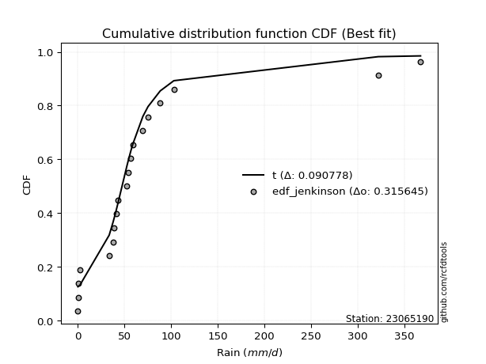</img></img>

</div>


### 11. Empirical - EDF Cunnane (1978)

Cunnane´s work in statistical hydrology has focused on the performance and evaluation of different probability distributions (such as GEV, Gumbel, Lognormal) for flood frequency estimation. _b_ is a constant, typically set to 0.4.

<div align="center">


$P=(m-b)/(n+1-2b)$


</div>


**11.1. Empirical values**

<div align="center">

|                | 0                 | 1                   | 2                   | 3                  | 4                   | 5                  | 6                  | 7                  | 8                  | 9           | 10                 | 11                 | 12                | 13                 | 14                 | 15                | 16                 | 17                 | 18                 |
|:---------------|:------------------|:--------------------|:--------------------|:-------------------|:--------------------|:-------------------|:-------------------|:-------------------|:-------------------|:------------|:-------------------|:-------------------|:------------------|:-------------------|:-------------------|:------------------|:-------------------|:-------------------|:-------------------|
| date           | 2021              | 2009                | 2024                | 2019               | 2025                | 2016               | 2018               | 2007               | 2012               | 2017        | 2022               | 2011               | 2015              | 2010               | 2006               | 2005              | 2023               | 2014               | 2013               |
| x              | 0.2               | 0.5                 | 0.8                 | 2.3                | 8.9                 | 33.7               | 37.8               | 38.9               | 41.1               | 43.0        | 52.8               | 54.2               | 56.8              | 58.8               | 69.8               | 75.3              | 88.4               | 322.1              | 367.4              |
| m              | 1                 | 2                   | 3                   | 4                  | 5                   | 6                  | 7                  | 8                  | 9                  | 10          | 11                 | 12                 | 13                | 14                 | 15                 | 16                | 17                 | 18                 | 19                 |
| empirical_dist | edf_cunnane       | edf_cunnane         | edf_cunnane         | edf_cunnane        | edf_cunnane         | edf_cunnane        | edf_cunnane        | edf_cunnane        | edf_cunnane        | edf_cunnane | edf_cunnane        | edf_cunnane        | edf_cunnane       | edf_cunnane        | edf_cunnane        | edf_cunnane       | edf_cunnane        | edf_cunnane        | edf_cunnane        |
| empirical      | 0.03125           | 0.08333333333333334 | 0.13541666666666669 | 0.1875             | 0.23958333333333331 | 0.2916666666666667 | 0.34375            | 0.3958333333333333 | 0.4479166666666667 | 0.5         | 0.5520833333333334 | 0.6041666666666666 | 0.65625           | 0.7083333333333334 | 0.7604166666666666 | 0.8125            | 0.8645833333333335 | 0.9166666666666667 | 0.9687500000000001 |
| empirical_tr   | 1.032258064516129 | 1.090909090909091   | 1.1566265060240966  | 1.2307692307692308 | 1.3150684931506849  | 1.411764705882353  | 1.5238095238095237 | 1.6551724137931032 | 1.8113207547169814 | 2.0         | 2.2325581395348837 | 2.526315789473684  | 2.909090909090909 | 3.428571428571429  | 4.17391304347826   | 5.333333333333333 | 7.384615384615393  | 12.00000000000001  | 32.000000000000114 |

</div>


**11.2. Kolmogorov-Smirnov fit test (sorted by Δ)**


<div align="center">

|                | 0                   | 1                   | 2                   | 3                   | 4                   | 5                   | 6                   | 7                   | 8                   | 9                   | 10                  | 11                  | 12                  | 13                  | 14                  | 15                  | 16                  | 17                  | 18                  | 19                  | 20                  | 21                  | 22                  | 23                    | 24                  | 25                  | 26                  | 27                  | 28                  | 29                  | 30                  | 31                  | 32                  | 33                  | 34                  | 35                  | 36                  | 37                  | 38                  | 39                  | 40                  | 41                  | 42                  | 43                  | 44                  | 45                  | 46                  | 47                  | 48                  | 49                  | 50                  | 51                  | 52                  | 53                  | 54                  | 55                  | 56                  | 57                  | 58                  | 59                  | 60                  | 61                  | 62                  | 63                  | 64                  | 65                  | 66                  | 67                  | 68                  | 69                  | 70                  | 71                  | 72                  | 73                  | 74                  | 75                  | 76                  | 77                  | 78                  | 79                  | 80                  | 81                  | 82                  | 83                  | 84                  | 85                  | 86                  | 87                  | 88                  | 89                  |
|:---------------|:--------------------|:--------------------|:--------------------|:--------------------|:--------------------|:--------------------|:--------------------|:--------------------|:--------------------|:--------------------|:--------------------|:--------------------|:--------------------|:--------------------|:--------------------|:--------------------|:--------------------|:--------------------|:--------------------|:--------------------|:--------------------|:--------------------|:--------------------|:----------------------|:--------------------|:--------------------|:--------------------|:--------------------|:--------------------|:--------------------|:--------------------|:--------------------|:--------------------|:--------------------|:--------------------|:--------------------|:--------------------|:--------------------|:--------------------|:--------------------|:--------------------|:--------------------|:--------------------|:--------------------|:--------------------|:--------------------|:--------------------|:--------------------|:--------------------|:--------------------|:--------------------|:--------------------|:--------------------|:--------------------|:--------------------|:--------------------|:--------------------|:--------------------|:--------------------|:--------------------|:--------------------|:--------------------|:--------------------|:--------------------|:--------------------|:--------------------|:--------------------|:--------------------|:--------------------|:--------------------|:--------------------|:--------------------|:--------------------|:--------------------|:--------------------|:--------------------|:--------------------|:--------------------|:--------------------|:--------------------|:--------------------|:--------------------|:--------------------|:--------------------|:--------------------|:--------------------|:--------------------|:--------------------|:--------------------|:--------------------|
| station        | 23065190            | 23065190            | 23065190            | 23065190            | 23065190            | 23065190            | 23065190            | 23065190            | 23065190            | 23065190            | 23065190            | 23065190            | 23065190            | 23065190            | 23065190            | 23065190            | 23065190            | 23065190            | 23065190            | 23065190            | 23065190            | 23065190            | 23065190            | 23065190              | 23065190            | 23065190            | 23065190            | 23065190            | 23065190            | 23065190            | 23065190            | 23065190            | 23065190            | 23065190            | 23065190            | 23065190            | 23065190            | 23065190            | 23065190            | 23065190            | 23065190            | 23065190            | 23065190            | 23065190            | 23065190            | 23065190            | 23065190            | 23065190            | 23065190            | 23065190            | 23065190            | 23065190            | 23065190            | 23065190            | 23065190            | 23065190            | 23065190            | 23065190            | 23065190            | 23065190            | 23065190            | 23065190            | 23065190            | 23065190            | 23065190            | 23065190            | 23065190            | 23065190            | 23065190            | 23065190            | 23065190            | 23065190            | 23065190            | 23065190            | 23065190            | 23065190            | 23065190            | 23065190            | 23065190            | 23065190            | 23065190            | 23065190            | 23065190            | 23065190            | 23065190            | 23065190            | 23065190            | 23065190            | 23065190            | 23065190            |
| empirical_dist | edf_cunnane         | edf_cunnane         | edf_cunnane         | edf_cunnane         | edf_cunnane         | edf_cunnane         | edf_cunnane         | edf_cunnane         | edf_cunnane         | edf_cunnane         | edf_cunnane         | edf_cunnane         | edf_cunnane         | edf_cunnane         | edf_cunnane         | edf_cunnane         | edf_cunnane         | edf_cunnane         | edf_cunnane         | edf_cunnane         | edf_cunnane         | edf_cunnane         | edf_cunnane         | edf_cunnane           | edf_cunnane         | edf_cunnane         | edf_cunnane         | edf_cunnane         | edf_cunnane         | edf_cunnane         | edf_cunnane         | edf_cunnane         | edf_cunnane         | edf_cunnane         | edf_cunnane         | edf_cunnane         | edf_cunnane         | edf_cunnane         | edf_cunnane         | edf_cunnane         | edf_cunnane         | edf_cunnane         | edf_cunnane         | edf_cunnane         | edf_cunnane         | edf_cunnane         | edf_cunnane         | edf_cunnane         | edf_cunnane         | edf_cunnane         | edf_cunnane         | edf_cunnane         | edf_cunnane         | edf_cunnane         | edf_cunnane         | edf_cunnane         | edf_cunnane         | edf_cunnane         | edf_cunnane         | edf_cunnane         | edf_cunnane         | edf_cunnane         | edf_cunnane         | edf_cunnane         | edf_cunnane         | edf_cunnane         | edf_cunnane         | edf_cunnane         | edf_cunnane         | edf_cunnane         | edf_cunnane         | edf_cunnane         | edf_cunnane         | edf_cunnane         | edf_cunnane         | edf_cunnane         | edf_cunnane         | edf_cunnane         | edf_cunnane         | edf_cunnane         | edf_cunnane         | edf_cunnane         | edf_cunnane         | edf_cunnane         | edf_cunnane         | edf_cunnane         | edf_cunnane         | edf_cunnane         | edf_cunnane         | edf_cunnane         |
| p_dist         | logjohnsonsu        | t                   | johnsonsu           | ncf                 | logt                | gompertz            | exponnorm           | alpha               | genexpon            | expon               | laplace_asymmetric  | wald                | gibrat              | genlogistic         | invweibull          | invgamma            | pareto              | pearson3            | f                   | logloggamma         | moyal               | logmielke           | loggenlogistic      | loglaplace_asymmetric | invgauss            | logweibull_min      | logpearson3         | loggumbel_l         | weibull_min         | logfisk             | gumbel_r            | halflogistic        | halfnorm            | gamma               | rayleigh            | kstwobign           | maxwell             | nakagami            | fisk                | logexponnorm        | logcrystalball      | lognorm             | lognorm             | logrice             | lognct              | lognakagami         | logfatiguelife      | loglognorm          | logbetaprime        | loginvgamma         | logalpha            | laplace             | logerlang           | loggamma            | loggamma            | hypsecant           | loglogistic         | logistic            | loggompertz         | norm                | crystalball         | mielke              | loginvweibull       | loginvgauss         | loghypsecant        | rice                | logmaxwell          | truncnorm           | betaprime           | lograyleigh         | loglaplace          | logkstwobign        | nct                 | logncf              | loggenexpon         | loghalfnorm         | loggumbel_r         | erlang              | gumbel_l            | logexpon            | loghalflogistic     | logmoyal            | fatiguelife         | logtruncnorm        | logchi2             | logwald             | logf                | loggibrat           | logpareto           | chi2                |
| delta          | 0.08503756282234837 | 0.1018775039313117  | 0.11200208929425454 | 0.13459741057923558 | 0.1419619043697632  | 0.15418457014598674 | 0.15796590922434728 | 0.1586717544076554  | 0.15973676787715252 | 0.1597374361925411  | 0.1597410117683662  | 0.16633531975296495 | 0.16959319591239952 | 0.17225588830134164 | 0.1729194297089448  | 0.17731485428088095 | 0.1844089234144139  | 0.1849907045150694  | 0.19040383466678212 | 0.1962088779705365  | 0.20321010484801283 | 0.20408292626782248 | 0.20436957027139047 | 0.2062297636955821    | 0.21106739398809354 | 0.21402403579026413 | 0.2157521507309496  | 0.2188994150209161  | 0.2219592128292654  | 0.22331808453716046 | 0.2255797062621019  | 0.23012628643611255 | 0.24932770163928109 | 0.25507334695025824 | 0.2564585470577465  | 0.2634310069261341  | 0.2656371223908357  | 0.2690569870691849  | 0.27656534676802175 | 0.2828701362591222  | 0.28287421070422064 | 0.2828742775090705  | 0.2828742775090705  | 0.28288618681117444 | 0.2831073609834012  | 0.28346822294642765 | 0.28367935135552097 | 0.28403077031731344 | 0.28505875053234014 | 0.28872868371049104 | 0.28919434668127136 | 0.2905852412154193  | 0.29083016001785184 | 0.2909448817970715  | 0.2909448817970715  | 0.2915047326793664  | 0.29274205973421435 | 0.2934547963648987  | 0.294342339031825   | 0.29574097281260525 | 0.29574098202447785 | 0.29637681540887945 | 0.29983949544748506 | 0.3001208568314207  | 0.3009707978080433  | 0.3113418963916722  | 0.31150730163782997 | 0.3118956530667679  | 0.31899802264584426 | 0.3205465473172529  | 0.32503610346872597 | 0.32885590597980724 | 0.33856824808541136 | 0.3405435879733368  | 0.34073692045036746 | 0.3461354321414504  | 0.35160027143898626 | 0.3554467823863771  | 0.36541607454237857 | 0.36886941750245944 | 0.37407731310678655 | 0.37551899797122396 | 0.3771309470566491  | 0.3950058523557684  | 0.41734961280149036 | 0.4419510743471729  | 0.4494073497136452  | 0.4726459079250193  | 0.536520138587376   | 0.7413806723036118  |
| deltao         | 0.31564497164100014 | 0.31564497164100014 | 0.31564497164100014 | 0.31564497164100014 | 0.31564497164100014 | 0.31564497164100014 | 0.31564497164100014 | 0.31564497164100014 | 0.31564497164100014 | 0.31564497164100014 | 0.31564497164100014 | 0.31564497164100014 | 0.31564497164100014 | 0.31564497164100014 | 0.31564497164100014 | 0.31564497164100014 | 0.31564497164100014 | 0.31564497164100014 | 0.31564497164100014 | 0.31564497164100014 | 0.31564497164100014 | 0.31564497164100014 | 0.31564497164100014 | 0.31564497164100014   | 0.31564497164100014 | 0.31564497164100014 | 0.31564497164100014 | 0.31564497164100014 | 0.31564497164100014 | 0.31564497164100014 | 0.31564497164100014 | 0.31564497164100014 | 0.31564497164100014 | 0.31564497164100014 | 0.31564497164100014 | 0.31564497164100014 | 0.31564497164100014 | 0.31564497164100014 | 0.31564497164100014 | 0.31564497164100014 | 0.31564497164100014 | 0.31564497164100014 | 0.31564497164100014 | 0.31564497164100014 | 0.31564497164100014 | 0.31564497164100014 | 0.31564497164100014 | 0.31564497164100014 | 0.31564497164100014 | 0.31564497164100014 | 0.31564497164100014 | 0.31564497164100014 | 0.31564497164100014 | 0.31564497164100014 | 0.31564497164100014 | 0.31564497164100014 | 0.31564497164100014 | 0.31564497164100014 | 0.31564497164100014 | 0.31564497164100014 | 0.31564497164100014 | 0.31564497164100014 | 0.31564497164100014 | 0.31564497164100014 | 0.31564497164100014 | 0.31564497164100014 | 0.31564497164100014 | 0.31564497164100014 | 0.31564497164100014 | 0.31564497164100014 | 0.31564497164100014 | 0.31564497164100014 | 0.31564497164100014 | 0.31564497164100014 | 0.31564497164100014 | 0.31564497164100014 | 0.31564497164100014 | 0.31564497164100014 | 0.31564497164100014 | 0.31564497164100014 | 0.31564497164100014 | 0.31564497164100014 | 0.31564497164100014 | 0.31564497164100014 | 0.31564497164100014 | 0.31564497164100014 | 0.31564497164100014 | 0.31564497164100014 | 0.31564497164100014 | 0.31564497164100014 |
| eval           | Δo > Δ              | Δo > Δ              | Δo > Δ              | Δo > Δ              | Δo > Δ              | Δo > Δ              | Δo > Δ              | Δo > Δ              | Δo > Δ              | Δo > Δ              | Δo > Δ              | Δo > Δ              | Δo > Δ              | Δo > Δ              | Δo > Δ              | Δo > Δ              | Δo > Δ              | Δo > Δ              | Δo > Δ              | Δo > Δ              | Δo > Δ              | Δo > Δ              | Δo > Δ              | Δo > Δ                | Δo > Δ              | Δo > Δ              | Δo > Δ              | Δo > Δ              | Δo > Δ              | Δo > Δ              | Δo > Δ              | Δo > Δ              | Δo > Δ              | Δo > Δ              | Δo > Δ              | Δo > Δ              | Δo > Δ              | Δo > Δ              | Δo > Δ              | Δo > Δ              | Δo > Δ              | Δo > Δ              | Δo > Δ              | Δo > Δ              | Δo > Δ              | Δo > Δ              | Δo > Δ              | Δo > Δ              | Δo > Δ              | Δo > Δ              | Δo > Δ              | Δo > Δ              | Δo > Δ              | Δo > Δ              | Δo > Δ              | Δo > Δ              | Δo > Δ              | Δo > Δ              | Δo > Δ              | Δo > Δ              | Δo > Δ              | Δo > Δ              | Δo > Δ              | Δo > Δ              | Δo > Δ              | Δo > Δ              | Δo > Δ              | Δo > Δ              | Δo <= Δ             | Δo <= Δ             | Δo <= Δ             | Δo <= Δ             | Δo <= Δ             | Δo <= Δ             | Δo <= Δ             | Δo <= Δ             | Δo <= Δ             | Δo <= Δ             | Δo <= Δ             | Δo <= Δ             | Δo <= Δ             | Δo <= Δ             | Δo <= Δ             | Δo <= Δ             | Δo <= Δ             | Δo <= Δ             | Δo <= Δ             | Δo <= Δ             | Δo <= Δ             | Δo <= Δ             |
| fit            | 1                   | 1                   | 1                   | 1                   | 1                   | 1                   | 1                   | 1                   | 1                   | 1                   | 1                   | 1                   | 1                   | 1                   | 1                   | 1                   | 1                   | 1                   | 1                   | 1                   | 1                   | 1                   | 1                   | 1                     | 1                   | 1                   | 1                   | 1                   | 1                   | 1                   | 1                   | 1                   | 1                   | 1                   | 1                   | 1                   | 1                   | 1                   | 1                   | 1                   | 1                   | 1                   | 1                   | 1                   | 1                   | 1                   | 1                   | 1                   | 1                   | 1                   | 1                   | 1                   | 1                   | 1                   | 1                   | 1                   | 1                   | 1                   | 1                   | 1                   | 1                   | 1                   | 1                   | 1                   | 1                   | 1                   | 1                   | 1                   | 0                   | 0                   | 0                   | 0                   | 0                   | 0                   | 0                   | 0                   | 0                   | 0                   | 0                   | 0                   | 0                   | 0                   | 0                   | 0                   | 0                   | 0                   | 0                   | 0                   | 0                   | 0                   |
| n              | 19                  | 19                  | 19                  | 19                  | 19                  | 19                  | 19                  | 19                  | 19                  | 19                  | 19                  | 19                  | 19                  | 19                  | 19                  | 19                  | 19                  | 19                  | 19                  | 19                  | 19                  | 19                  | 19                  | 19                    | 19                  | 19                  | 19                  | 19                  | 19                  | 19                  | 19                  | 19                  | 19                  | 19                  | 19                  | 19                  | 19                  | 19                  | 19                  | 19                  | 19                  | 19                  | 19                  | 19                  | 19                  | 19                  | 19                  | 19                  | 19                  | 19                  | 19                  | 19                  | 19                  | 19                  | 19                  | 19                  | 19                  | 19                  | 19                  | 19                  | 19                  | 19                  | 19                  | 19                  | 19                  | 19                  | 19                  | 19                  | 19                  | 19                  | 19                  | 19                  | 19                  | 19                  | 19                  | 19                  | 19                  | 19                  | 19                  | 19                  | 19                  | 19                  | 19                  | 19                  | 19                  | 19                  | 19                  | 19                  | 19                  | 19                  |
| best_fit       | 1                   | 0                   | 0                   | 0                   | 0                   | 0                   | 0                   | 0                   | 0                   | 0                   | 0                   | 0                   | 0                   | 0                   | 0                   | 0                   | 0                   | 0                   | 0                   | 0                   | 0                   | 0                   | 0                   | 0                     | 0                   | 0                   | 0                   | 0                   | 0                   | 0                   | 0                   | 0                   | 0                   | 0                   | 0                   | 0                   | 0                   | 0                   | 0                   | 0                   | 0                   | 0                   | 0                   | 0                   | 0                   | 0                   | 0                   | 0                   | 0                   | 0                   | 0                   | 0                   | 0                   | 0                   | 0                   | 0                   | 0                   | 0                   | 0                   | 0                   | 0                   | 0                   | 0                   | 0                   | 0                   | 0                   | 0                   | 0                   | 0                   | 0                   | 0                   | 0                   | 0                   | 0                   | 0                   | 0                   | 0                   | 0                   | 0                   | 0                   | 0                   | 0                   | 0                   | 0                   | 0                   | 0                   | 0                   | 0                   | 0                   | 0                   |
| best_fit_sort  | 1                   | 2                   | 3                   | 4                   | 5                   | 6                   | 7                   | 8                   | 9                   | 10                  | 11                  | 12                  | 13                  | 14                  | 15                  | 16                  | 17                  | 18                  | 19                  | 20                  | 21                  | 22                  | 23                  | 24                    | 25                  | 26                  | 27                  | 28                  | 29                  | 30                  | 31                  | 32                  | 33                  | 34                  | 35                  | 36                  | 37                  | 38                  | 39                  | 40                  | 41                  | 42                  | 43                  | 44                  | 45                  | 46                  | 47                  | 48                  | 49                  | 50                  | 51                  | 52                  | 53                  | 54                  | 55                  | 56                  | 57                  | 58                  | 59                  | 60                  | 61                  | 62                  | 63                  | 64                  | 65                  | 66                  | 67                  | 68                  | 69                  | 70                  | 71                  | 72                  | 73                  | 74                  | 75                  | 76                  | 77                  | 78                  | 79                  | 80                  | 81                  | 82                  | 83                  | 84                  | 85                  | 86                  | 87                  | 88                  | 89                  | 90                  |

</div>


<div align="center">

</img>

</div>


**11.3. Best fit**

<div align="center">

|   id |   station | empirical_dist   | p_dist       |     delta |   deltao | eval   |   fit |   n |   best_fit |   best_fit_sort |
|-----:|----------:|:-----------------|:-------------|----------:|---------:|:-------|------:|----:|-----------:|----------------:|
|    0 |  23065190 | edf_cunnane      | logjohnsonsu | 0.0850376 | 0.315645 | Δo > Δ |     1 |  19 |          1 |               1 |

</div>


<div align="center">

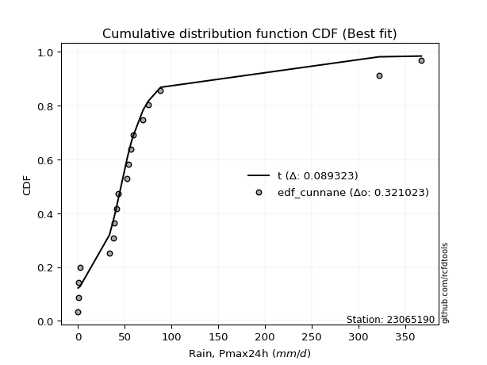</img>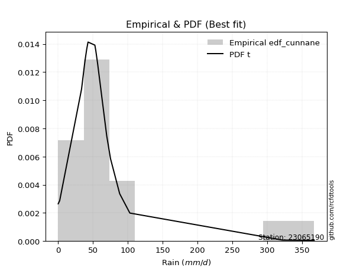</img>

</div>


### 12. Empirical - EDF Adamowski (1981)

The Adamowski formula in hydrology refers to a specific plotting position formula used for estimating the non-parametric empirical distribution of hydrological events (like flood peaks) to calculate their return periods. This formula provides an alternative to traditional parametric methods (like the Gumbel or Log Pearson Type III distributions). 

<div align="center">


$P=(m-0.25)/(n+0.5)$


</div>


**12.1. Empirical values**

<div align="center">

|                | 0                    | 1                   | 2                   | 3                   | 4                   | 5                  | 6                   | 7                  | 8                   | 9             | 10                 | 11                 | 12                 | 13                 | 14                 | 15                 | 16                 | 17                 | 18                 |
|:---------------|:---------------------|:--------------------|:--------------------|:--------------------|:--------------------|:-------------------|:--------------------|:-------------------|:--------------------|:--------------|:-------------------|:-------------------|:-------------------|:-------------------|:-------------------|:-------------------|:-------------------|:-------------------|:-------------------|
| date           | 2021                 | 2009                | 2024                | 2019                | 2025                | 2016               | 2018                | 2007               | 2012                | 2017          | 2022               | 2011               | 2015               | 2010               | 2006               | 2005               | 2023               | 2014               | 2013               |
| x              | 0.2                  | 0.5                 | 0.8                 | 2.3                 | 8.9                 | 33.7               | 37.8                | 38.9               | 41.1                | 43.0          | 52.8               | 54.2               | 56.8               | 58.8               | 69.8               | 75.3               | 88.4               | 322.1              | 367.4              |
| m              | 1                    | 2                   | 3                   | 4                   | 5                   | 6                  | 7                   | 8                  | 9                   | 10            | 11                 | 12                 | 13                 | 14                 | 15                 | 16                 | 17                 | 18                 | 19                 |
| empirical_dist | edf_adamowski        | edf_adamowski       | edf_adamowski       | edf_adamowski       | edf_adamowski       | edf_adamowski      | edf_adamowski       | edf_adamowski      | edf_adamowski       | edf_adamowski | edf_adamowski      | edf_adamowski      | edf_adamowski      | edf_adamowski      | edf_adamowski      | edf_adamowski      | edf_adamowski      | edf_adamowski      | edf_adamowski      |
| empirical      | 0.038461538461538464 | 0.08974358974358974 | 0.14102564102564102 | 0.19230769230769232 | 0.24358974358974358 | 0.2948717948717949 | 0.34615384615384615 | 0.3974358974358974 | 0.44871794871794873 | 0.5           | 0.5512820512820513 | 0.6025641025641025 | 0.6538461538461539 | 0.7051282051282052 | 0.7564102564102564 | 0.8076923076923077 | 0.8589743589743589 | 0.9102564102564102 | 0.9615384615384616 |
| empirical_tr   | 1.04                 | 1.0985915492957747  | 1.164179104477612   | 1.2380952380952381  | 1.3220338983050848  | 1.4181818181818182 | 1.5294117647058822  | 1.6595744680851061 | 1.813953488372093   | 2.0           | 2.2285714285714286 | 2.5161290322580645 | 2.888888888888889  | 3.3913043478260874 | 4.105263157894736  | 5.2                | 7.090909090909088  | 11.14285714285714  | 26.000000000000018 |

</div>


**12.2. Kolmogorov-Smirnov fit test (sorted by Δ)**


<div align="center">

|                | 0                   | 1                   | 2                   | 3                   | 4                   | 5                   | 6                   | 7                   | 8                   | 9                   | 10                  | 11                  | 12                  | 13                  | 14                  | 15                  | 16                  | 17                  | 18                  | 19                  | 20                  | 21                  | 22                  | 23                    | 24                  | 25                  | 26                  | 27                  | 28                  | 29                  | 30                  | 31                  | 32                  | 33                  | 34                  | 35                  | 36                  | 37                  | 38                  | 39                  | 40                  | 41                  | 42                  | 43                  | 44                  | 45                  | 46                  | 47                  | 48                  | 49                  | 50                  | 51                  | 52                  | 53                  | 54                  | 55                  | 56                  | 57                  | 58                  | 59                  | 60                  | 61                  | 62                  | 63                  | 64                  | 65                  | 66                  | 67                  | 68                  | 69                  | 70                  | 71                  | 72                  | 73                  | 74                  | 75                  | 76                  | 77                  | 78                  | 79                  | 80                  | 81                  | 82                  | 83                  | 84                  | 85                  | 86                  | 87                  | 88                  | 89                  |
|:---------------|:--------------------|:--------------------|:--------------------|:--------------------|:--------------------|:--------------------|:--------------------|:--------------------|:--------------------|:--------------------|:--------------------|:--------------------|:--------------------|:--------------------|:--------------------|:--------------------|:--------------------|:--------------------|:--------------------|:--------------------|:--------------------|:--------------------|:--------------------|:----------------------|:--------------------|:--------------------|:--------------------|:--------------------|:--------------------|:--------------------|:--------------------|:--------------------|:--------------------|:--------------------|:--------------------|:--------------------|:--------------------|:--------------------|:--------------------|:--------------------|:--------------------|:--------------------|:--------------------|:--------------------|:--------------------|:--------------------|:--------------------|:--------------------|:--------------------|:--------------------|:--------------------|:--------------------|:--------------------|:--------------------|:--------------------|:--------------------|:--------------------|:--------------------|:--------------------|:--------------------|:--------------------|:--------------------|:--------------------|:--------------------|:--------------------|:--------------------|:--------------------|:--------------------|:--------------------|:--------------------|:--------------------|:--------------------|:--------------------|:--------------------|:--------------------|:--------------------|:--------------------|:--------------------|:--------------------|:--------------------|:--------------------|:--------------------|:--------------------|:--------------------|:--------------------|:--------------------|:--------------------|:--------------------|:--------------------|:--------------------|
| station        | 23065190            | 23065190            | 23065190            | 23065190            | 23065190            | 23065190            | 23065190            | 23065190            | 23065190            | 23065190            | 23065190            | 23065190            | 23065190            | 23065190            | 23065190            | 23065190            | 23065190            | 23065190            | 23065190            | 23065190            | 23065190            | 23065190            | 23065190            | 23065190              | 23065190            | 23065190            | 23065190            | 23065190            | 23065190            | 23065190            | 23065190            | 23065190            | 23065190            | 23065190            | 23065190            | 23065190            | 23065190            | 23065190            | 23065190            | 23065190            | 23065190            | 23065190            | 23065190            | 23065190            | 23065190            | 23065190            | 23065190            | 23065190            | 23065190            | 23065190            | 23065190            | 23065190            | 23065190            | 23065190            | 23065190            | 23065190            | 23065190            | 23065190            | 23065190            | 23065190            | 23065190            | 23065190            | 23065190            | 23065190            | 23065190            | 23065190            | 23065190            | 23065190            | 23065190            | 23065190            | 23065190            | 23065190            | 23065190            | 23065190            | 23065190            | 23065190            | 23065190            | 23065190            | 23065190            | 23065190            | 23065190            | 23065190            | 23065190            | 23065190            | 23065190            | 23065190            | 23065190            | 23065190            | 23065190            | 23065190            |
| empirical_dist | edf_adamowski       | edf_adamowski       | edf_adamowski       | edf_adamowski       | edf_adamowski       | edf_adamowski       | edf_adamowski       | edf_adamowski       | edf_adamowski       | edf_adamowski       | edf_adamowski       | edf_adamowski       | edf_adamowski       | edf_adamowski       | edf_adamowski       | edf_adamowski       | edf_adamowski       | edf_adamowski       | edf_adamowski       | edf_adamowski       | edf_adamowski       | edf_adamowski       | edf_adamowski       | edf_adamowski         | edf_adamowski       | edf_adamowski       | edf_adamowski       | edf_adamowski       | edf_adamowski       | edf_adamowski       | edf_adamowski       | edf_adamowski       | edf_adamowski       | edf_adamowski       | edf_adamowski       | edf_adamowski       | edf_adamowski       | edf_adamowski       | edf_adamowski       | edf_adamowski       | edf_adamowski       | edf_adamowski       | edf_adamowski       | edf_adamowski       | edf_adamowski       | edf_adamowski       | edf_adamowski       | edf_adamowski       | edf_adamowski       | edf_adamowski       | edf_adamowski       | edf_adamowski       | edf_adamowski       | edf_adamowski       | edf_adamowski       | edf_adamowski       | edf_adamowski       | edf_adamowski       | edf_adamowski       | edf_adamowski       | edf_adamowski       | edf_adamowski       | edf_adamowski       | edf_adamowski       | edf_adamowski       | edf_adamowski       | edf_adamowski       | edf_adamowski       | edf_adamowski       | edf_adamowski       | edf_adamowski       | edf_adamowski       | edf_adamowski       | edf_adamowski       | edf_adamowski       | edf_adamowski       | edf_adamowski       | edf_adamowski       | edf_adamowski       | edf_adamowski       | edf_adamowski       | edf_adamowski       | edf_adamowski       | edf_adamowski       | edf_adamowski       | edf_adamowski       | edf_adamowski       | edf_adamowski       | edf_adamowski       | edf_adamowski       |
| p_dist         | logjohnsonsu        | t                   | johnsonsu           | ncf                 | logt                | alpha               | gompertz            | exponnorm           | wald                | genexpon            | expon               | laplace_asymmetric  | genlogistic         | invweibull          | invgamma            | gibrat              | pearson3            | pareto              | f                   | logloggamma         | moyal               | logmielke           | loggenlogistic      | loglaplace_asymmetric | invgauss            | logweibull_min      | logpearson3         | loggumbel_l         | weibull_min         | logfisk             | gumbel_r            | halflogistic        | halfnorm            | rayleigh            | gamma               | kstwobign           | maxwell             | nakagami            | fisk                | logexponnorm        | logcrystalball      | lognorm             | lognorm             | logrice             | lognct              | lognakagami         | logfatiguelife      | loglognorm          | logbetaprime        | loginvgamma         | logalpha            | hypsecant           | laplace             | logerlang           | loggamma            | loggamma            | logistic            | loglogistic         | norm                | crystalball         | loggompertz         | mielke              | loginvweibull       | loginvgauss         | loghypsecant        | rice                | truncnorm           | logmaxwell          | betaprime           | lograyleigh         | loglaplace          | logkstwobign        | nct                 | logncf              | loggenexpon         | loghalfnorm         | loggumbel_r         | erlang              | gumbel_l            | logexpon            | loghalflogistic     | logmoyal            | fatiguelife         | logtruncnorm        | logchi2             | logwald             | logf                | loggibrat           | logpareto           | chi2                |
| delta          | 0.08984525513004069 | 0.09466596546977324 | 0.1160084995506648  | 0.1394051028869279  | 0.14596831462617346 | 0.1554666262025272  | 0.15899226245367903 | 0.16241930061418655 | 0.16313019154783676 | 0.163163307655814   | 0.163163359906679   | 0.16316363888947785 | 0.16905076009621345 | 0.1697143015038166  | 0.17410972607575276 | 0.17440088822009184 | 0.17878167419701385 | 0.1812037952092857  | 0.18479486030780756 | 0.1930037497654083  | 0.19599856638647437 | 0.2008777980626943  | 0.20116444206626227 | 0.2030246354904539    | 0.20786226578296535 | 0.21081890758513594 | 0.21254702252582142 | 0.2156942868157879  | 0.2187540846241372  | 0.22011295633203226 | 0.22026402139948642 | 0.22291474797457408 | 0.24211616317774262 | 0.25084957269877195 | 0.25186821874513005 | 0.2586233146184418  | 0.26002814803186114 | 0.26344801271021034 | 0.27336021856289355 | 0.279665008053994   | 0.27966908249909245 | 0.2796691493039423  | 0.2796691493039423  | 0.27968105860604625 | 0.27990223277827303 | 0.28026309474129946 | 0.2804742231503928  | 0.28082564211218525 | 0.28185362232721195 | 0.28552355550536285 | 0.28598921847614317 | 0.2866970403716741  | 0.2873801130102911  | 0.28762503181272364 | 0.2877397535919433  | 0.2877397535919433  | 0.2886471040572064  | 0.28953693152908616 | 0.29093328050491296 | 0.29093328971678556 | 0.2911372108266968  | 0.29317168720375125 | 0.29663436724235687 | 0.2969157286262925  | 0.2977656696029151  | 0.3065342040839799  | 0.30708796075907563 | 0.3083021734327018  | 0.31579289444071607 | 0.3173414191121247  | 0.3218309752635978  | 0.32565077777467905 | 0.33536311988028317 | 0.3365371777169265  | 0.33753179224523927 | 0.34293030393632223 | 0.34839514323385806 | 0.3522416541812489  | 0.3606083822346863  | 0.36566428929733125 | 0.37087218490165835 | 0.37231386976609576 | 0.37392581885152093 | 0.3918007241506402  | 0.41414448459636216 | 0.4387459461420447  | 0.4454009394572349  | 0.4694407797198911  | 0.5301098821771196  | 0.7373742620472016  |
| deltao         | 0.31564497164100014 | 0.31564497164100014 | 0.31564497164100014 | 0.31564497164100014 | 0.31564497164100014 | 0.31564497164100014 | 0.31564497164100014 | 0.31564497164100014 | 0.31564497164100014 | 0.31564497164100014 | 0.31564497164100014 | 0.31564497164100014 | 0.31564497164100014 | 0.31564497164100014 | 0.31564497164100014 | 0.31564497164100014 | 0.31564497164100014 | 0.31564497164100014 | 0.31564497164100014 | 0.31564497164100014 | 0.31564497164100014 | 0.31564497164100014 | 0.31564497164100014 | 0.31564497164100014   | 0.31564497164100014 | 0.31564497164100014 | 0.31564497164100014 | 0.31564497164100014 | 0.31564497164100014 | 0.31564497164100014 | 0.31564497164100014 | 0.31564497164100014 | 0.31564497164100014 | 0.31564497164100014 | 0.31564497164100014 | 0.31564497164100014 | 0.31564497164100014 | 0.31564497164100014 | 0.31564497164100014 | 0.31564497164100014 | 0.31564497164100014 | 0.31564497164100014 | 0.31564497164100014 | 0.31564497164100014 | 0.31564497164100014 | 0.31564497164100014 | 0.31564497164100014 | 0.31564497164100014 | 0.31564497164100014 | 0.31564497164100014 | 0.31564497164100014 | 0.31564497164100014 | 0.31564497164100014 | 0.31564497164100014 | 0.31564497164100014 | 0.31564497164100014 | 0.31564497164100014 | 0.31564497164100014 | 0.31564497164100014 | 0.31564497164100014 | 0.31564497164100014 | 0.31564497164100014 | 0.31564497164100014 | 0.31564497164100014 | 0.31564497164100014 | 0.31564497164100014 | 0.31564497164100014 | 0.31564497164100014 | 0.31564497164100014 | 0.31564497164100014 | 0.31564497164100014 | 0.31564497164100014 | 0.31564497164100014 | 0.31564497164100014 | 0.31564497164100014 | 0.31564497164100014 | 0.31564497164100014 | 0.31564497164100014 | 0.31564497164100014 | 0.31564497164100014 | 0.31564497164100014 | 0.31564497164100014 | 0.31564497164100014 | 0.31564497164100014 | 0.31564497164100014 | 0.31564497164100014 | 0.31564497164100014 | 0.31564497164100014 | 0.31564497164100014 | 0.31564497164100014 |
| eval           | Δo > Δ              | Δo > Δ              | Δo > Δ              | Δo > Δ              | Δo > Δ              | Δo > Δ              | Δo > Δ              | Δo > Δ              | Δo > Δ              | Δo > Δ              | Δo > Δ              | Δo > Δ              | Δo > Δ              | Δo > Δ              | Δo > Δ              | Δo > Δ              | Δo > Δ              | Δo > Δ              | Δo > Δ              | Δo > Δ              | Δo > Δ              | Δo > Δ              | Δo > Δ              | Δo > Δ                | Δo > Δ              | Δo > Δ              | Δo > Δ              | Δo > Δ              | Δo > Δ              | Δo > Δ              | Δo > Δ              | Δo > Δ              | Δo > Δ              | Δo > Δ              | Δo > Δ              | Δo > Δ              | Δo > Δ              | Δo > Δ              | Δo > Δ              | Δo > Δ              | Δo > Δ              | Δo > Δ              | Δo > Δ              | Δo > Δ              | Δo > Δ              | Δo > Δ              | Δo > Δ              | Δo > Δ              | Δo > Δ              | Δo > Δ              | Δo > Δ              | Δo > Δ              | Δo > Δ              | Δo > Δ              | Δo > Δ              | Δo > Δ              | Δo > Δ              | Δo > Δ              | Δo > Δ              | Δo > Δ              | Δo > Δ              | Δo > Δ              | Δo > Δ              | Δo > Δ              | Δo > Δ              | Δo > Δ              | Δo > Δ              | Δo > Δ              | Δo <= Δ             | Δo <= Δ             | Δo <= Δ             | Δo <= Δ             | Δo <= Δ             | Δo <= Δ             | Δo <= Δ             | Δo <= Δ             | Δo <= Δ             | Δo <= Δ             | Δo <= Δ             | Δo <= Δ             | Δo <= Δ             | Δo <= Δ             | Δo <= Δ             | Δo <= Δ             | Δo <= Δ             | Δo <= Δ             | Δo <= Δ             | Δo <= Δ             | Δo <= Δ             | Δo <= Δ             |
| fit            | 1                   | 1                   | 1                   | 1                   | 1                   | 1                   | 1                   | 1                   | 1                   | 1                   | 1                   | 1                   | 1                   | 1                   | 1                   | 1                   | 1                   | 1                   | 1                   | 1                   | 1                   | 1                   | 1                   | 1                     | 1                   | 1                   | 1                   | 1                   | 1                   | 1                   | 1                   | 1                   | 1                   | 1                   | 1                   | 1                   | 1                   | 1                   | 1                   | 1                   | 1                   | 1                   | 1                   | 1                   | 1                   | 1                   | 1                   | 1                   | 1                   | 1                   | 1                   | 1                   | 1                   | 1                   | 1                   | 1                   | 1                   | 1                   | 1                   | 1                   | 1                   | 1                   | 1                   | 1                   | 1                   | 1                   | 1                   | 1                   | 0                   | 0                   | 0                   | 0                   | 0                   | 0                   | 0                   | 0                   | 0                   | 0                   | 0                   | 0                   | 0                   | 0                   | 0                   | 0                   | 0                   | 0                   | 0                   | 0                   | 0                   | 0                   |
| n              | 19                  | 19                  | 19                  | 19                  | 19                  | 19                  | 19                  | 19                  | 19                  | 19                  | 19                  | 19                  | 19                  | 19                  | 19                  | 19                  | 19                  | 19                  | 19                  | 19                  | 19                  | 19                  | 19                  | 19                    | 19                  | 19                  | 19                  | 19                  | 19                  | 19                  | 19                  | 19                  | 19                  | 19                  | 19                  | 19                  | 19                  | 19                  | 19                  | 19                  | 19                  | 19                  | 19                  | 19                  | 19                  | 19                  | 19                  | 19                  | 19                  | 19                  | 19                  | 19                  | 19                  | 19                  | 19                  | 19                  | 19                  | 19                  | 19                  | 19                  | 19                  | 19                  | 19                  | 19                  | 19                  | 19                  | 19                  | 19                  | 19                  | 19                  | 19                  | 19                  | 19                  | 19                  | 19                  | 19                  | 19                  | 19                  | 19                  | 19                  | 19                  | 19                  | 19                  | 19                  | 19                  | 19                  | 19                  | 19                  | 19                  | 19                  |
| best_fit       | 1                   | 0                   | 0                   | 0                   | 0                   | 0                   | 0                   | 0                   | 0                   | 0                   | 0                   | 0                   | 0                   | 0                   | 0                   | 0                   | 0                   | 0                   | 0                   | 0                   | 0                   | 0                   | 0                   | 0                     | 0                   | 0                   | 0                   | 0                   | 0                   | 0                   | 0                   | 0                   | 0                   | 0                   | 0                   | 0                   | 0                   | 0                   | 0                   | 0                   | 0                   | 0                   | 0                   | 0                   | 0                   | 0                   | 0                   | 0                   | 0                   | 0                   | 0                   | 0                   | 0                   | 0                   | 0                   | 0                   | 0                   | 0                   | 0                   | 0                   | 0                   | 0                   | 0                   | 0                   | 0                   | 0                   | 0                   | 0                   | 0                   | 0                   | 0                   | 0                   | 0                   | 0                   | 0                   | 0                   | 0                   | 0                   | 0                   | 0                   | 0                   | 0                   | 0                   | 0                   | 0                   | 0                   | 0                   | 0                   | 0                   | 0                   |
| best_fit_sort  | 1                   | 2                   | 3                   | 4                   | 5                   | 6                   | 7                   | 8                   | 9                   | 10                  | 11                  | 12                  | 13                  | 14                  | 15                  | 16                  | 17                  | 18                  | 19                  | 20                  | 21                  | 22                  | 23                  | 24                    | 25                  | 26                  | 27                  | 28                  | 29                  | 30                  | 31                  | 32                  | 33                  | 34                  | 35                  | 36                  | 37                  | 38                  | 39                  | 40                  | 41                  | 42                  | 43                  | 44                  | 45                  | 46                  | 47                  | 48                  | 49                  | 50                  | 51                  | 52                  | 53                  | 54                  | 55                  | 56                  | 57                  | 58                  | 59                  | 60                  | 61                  | 62                  | 63                  | 64                  | 65                  | 66                  | 67                  | 68                  | 69                  | 70                  | 71                  | 72                  | 73                  | 74                  | 75                  | 76                  | 77                  | 78                  | 79                  | 80                  | 81                  | 82                  | 83                  | 84                  | 85                  | 86                  | 87                  | 88                  | 89                  | 90                  |

</div>


<div align="center">

</img>

</div>


**12.3. Best fit**

<div align="center">

|   id |   station | empirical_dist   | p_dist       |     delta |   deltao | eval   |   fit |   n |   best_fit |   best_fit_sort |
|-----:|----------:|:-----------------|:-------------|----------:|---------:|:-------|------:|----:|-----------:|----------------:|
|    0 |  23065190 | edf_adamowski    | logjohnsonsu | 0.0898453 | 0.315645 | Δo > Δ |     1 |  19 |          1 |               1 |

</div>


<div align="center">

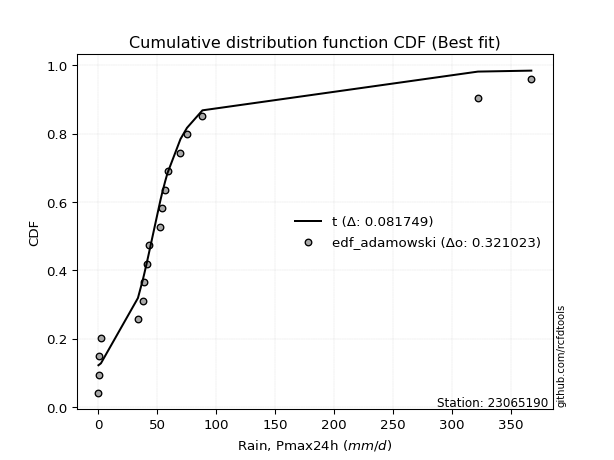</img>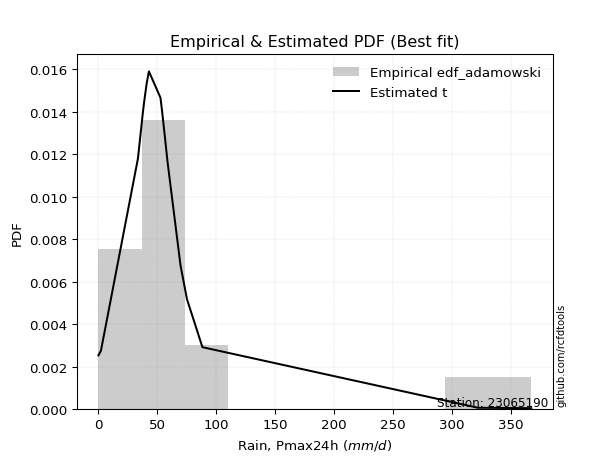</img>

</div>


## C. Best fit & Estimate extreme values for specific return periods - Tr


### 1. Best fit (ordered by delta Δ)

<div align="center">

|   id |   station | empirical_dist   | p_dist       |     delta |   deltao | eval   |   fit |   n |   best_fit |   best_fit_sort |
|-----:|----------:|:-----------------|:-------------|----------:|---------:|:-------|------:|----:|-----------:|----------------:|
|    0 |  23065190 | edf_hazen        | logjohnsonsu | 0.0817481 | 0.315645 | Δo > Δ |     1 |  19 |          1 |               1 |
|    1 |  23065190 | edf_gringorten   | logjohnsonsu | 0.08373   | 0.315645 | Δo > Δ |     1 |  19 |          1 |               2 |
|    2 |  23065190 | edf_cunnane      | logjohnsonsu | 0.0850376 | 0.315645 | Δo > Δ |     1 |  19 |          1 |               3 |
|    3 |  23065190 | edf_weibull      | t            | 0.0850613 | 0.315645 | Δo > Δ |     1 |  19 |          1 |               4 |
|    4 |  23065190 | edf_blom         | logjohnsonsu | 0.0858493 | 0.315645 | Δo > Δ |     1 |  19 |          1 |               5 |
|    5 |  23065190 | edf_tukey        | logjohnsonsu | 0.0871927 | 0.315645 | Δo > Δ |     1 |  19 |          1 |               6 |
|    6 |  23065190 | edf_filliben     | logjohnsonsu | 0.0877002 | 0.315645 | Δo > Δ |     1 |  19 |          1 |               7 |
|    7 |  23065190 | edf_jenkinson    | logjohnsonsu | 0.08794   | 0.315645 | Δo > Δ |     1 |  19 |          1 |               8 |
|    8 |  23065190 | edf_beard        | logjohnsonsu | 0.08794   | 0.315645 | Δo > Δ |     1 |  19 |          1 |               9 |
|    9 |  23065190 | edf_chegodayev   | logjohnsonsu | 0.0882592 | 0.315645 | Δo > Δ |     1 |  19 |          1 |              10 |
|   10 |  23065190 | edf_adamowski    | logjohnsonsu | 0.0898453 | 0.315645 | Δo > Δ |     1 |  19 |          1 |              11 |
|   11 |  23065190 | edf_california   | t            | 0.0982192 | 0.315645 | Δo > Δ |     1 |  19 |          1 |              12 |

</div>

:file_folder:Tables: [bestfit_23065190.csv](table/bestfit_23065190.csv) | [extreme_23065190.csv](table/extreme_23065190.csv)


### 2. Extreme values

In hydrology, a return period (or recurrence interval $Tr$) is the statistical average time between extreme events like floods or droughts of a specific magnitude, indicating how rare an event is, with a 100-year flood, for example, having a 1% chance of occurring in any given year, not that it happens exactly every century. It is a key tool for infrastructure design (like bridges or dams) and risk assessment, calculated from historical data to determine the probability of future events, although it is important to remember it is statistical average, and events can cluster or be missed.

> risk_rate: assuming the return period as the project useful life.

|   id |      tr |   prob_l |     prob_g |     alpha |   betaprime |      chi2 |   crystalball |   erlang |    expon |   exponnorm |         f |   fatiguelife |        fisk |    gamma |   genexpon |   genlogistic |   gibrat |   gompertz |   gumbel_l |   gumbel_r |   halflogistic |   halfnorm |   hypsecant |   invgamma |   invgauss |   invweibull |   johnsonsu |   kstwobign |   laplace |   laplace_asymmetric |   loggamma |   logistic |    lognorm |   maxwell |   mielke |    moyal |   nakagami |       ncf |              nct |     norm |    pareto |   pearson3 |   rayleigh |     rice |         t |   truncnorm |     wald |   weibull_min |   logalpha |   logbetaprime |          logchi2 |   logcrystalball |   logerlang |         logexpon |   logexponnorm |            logf |   logfatiguelife |    logfisk |   loggenexpon |   loggenlogistic |       loggibrat |   loggompertz |   loggumbel_l |   loggumbel_r |   loghalflogistic |   loghalfnorm |   loghypsecant |   loginvgamma |   loginvgauss |    loginvweibull |     logjohnsonsu |     logkstwobign |   loglaplace |   loglaplace_asymmetric |   logloggamma |   loglogistic |   loglognorm |   logmaxwell |   logmielke |         logmoyal |   lognakagami |         logncf |     lognct |   logpareto |   logpearson3 |   lograyleigh |    logrice |             logt |   logtruncnorm |          logwald |   logweibull_min |   station |   n |   risk_rate |
|-----:|--------:|---------:|-----------:|----------:|------------:|----------:|--------------:|---------:|---------:|------------:|----------:|--------------:|------------:|---------:|-----------:|--------------:|---------:|-----------:|-----------:|-----------:|---------------:|-----------:|------------:|-----------:|-----------:|-------------:|------------:|------------:|----------:|---------------------:|-----------:|-----------:|-----------:|----------:|---------:|---------:|-----------:|----------:|-----------------:|---------:|----------:|-----------:|-----------:|---------:|----------:|------------:|---------:|--------------:|-----------:|---------------:|-----------------:|-----------------:|------------:|-----------------:|---------------:|----------------:|-----------------:|-----------:|--------------:|-----------------:|----------------:|--------------:|--------------:|--------------:|------------------:|--------------:|---------------:|--------------:|--------------:|-----------------:|-----------------:|-----------------:|-------------:|------------------------:|--------------:|--------------:|-------------:|-------------:|------------:|-----------------:|--------------:|---------------:|-----------:|------------:|--------------:|--------------:|-----------:|-----------------:|---------------:|-----------------:|-----------------:|----------:|----:|------------:|
|    0 |    2    | 0.5      | 0.5        |   38.6339 |     20.8721 |  0.594893 |       71.2    |  15.5881 |  49.4134 |     49.1608 |   40.2049 |       9.50814 |     23.3682 |  28.2496 |    49.4118 |       53.7949 |  41.9126 |    43.16   |    87.2293 |    55.1707 |        47.2018 |    51.2274 |     71.2    |    37.0232 |    33.3771 |      37.4476 |     46.0416 |     66.4529 |   71.2    |              49.4139 |    21.6282 |    71.2    |    23.0121 |   62.8552 |  25.5692 |  49.996  |    58.1325 |   45.0433 |     15.983       |  71.2    |   36.45   |    38.3243 |    59.8955 |  75.0689 |   43.797  |     75.1884 |  39.5718 |       30.4362 |    21.8015 |        22.7585 |      1.95546     |          23.0121 |     21.7546 |      5.36483     |        23.0126 |    0.636386     |          22.9479 |    31.5632 |       13.0454 |          34.214  |    12.5127      |       20.7215 |       32.1197 |       16.487  |      13.9686      |       15.1883 |        23.0121 |       21.7651 |       19.8423 |     17.7454      |     45.8638      |     13.9301      |      23.0121 |                 33.9402 |       35.5292 |       23.0121 |      22.8796 |      19.3449 |     34.2506 |     14.8044      |       22.92   |   2.22716      |    22.9604 |    0.201325 |       32.5211 |       18.1898 |    23.0115 |    50.3843       |        8.87103 |     11.9184      |          32.9015 |  23065190 |  19 |    0.75     |
|    1 |    2.33 | 0.570815 | 0.429185   |   46.7059 |     28.3803 |  0.803374 |       88.6115 |  22.8938 |  60.2566 |     59.9584 |   56.0854 |      16.4124  |     34.1774 |  36.8072 |    60.2551 |       63.8152 |  50.7326 |    52.6254 |   102.377  |    71.3044 |        63.7898 |    70.019  |     85.1344 |    45.7374 |    42.7788 |      46.0784 |     51.579  |     79.38   |   81.7366 |              60.2572 |    31.6015 |    86.5407 |    33.0567 |   80.9445 |  31.975  |  65.2685 |    79.7603 |   54.7872 |     23.5171      |  88.6115 |   45.7773 |    52.3339 |    78.2524 |  89.5448 |   48.6621 |     88.9002 |  50.9886 |       51.1696 |    31.8938 |        32.6852 |      4.15061     |          33.0567 |     31.6449 |     11.074       |        33.0574 |    1.16827      |          32.9217 |    43.1018 |       21.3509 |          44.2937 |    15.0326      |       30.9466 |       44.0176 |       23.0622 |      19.7249      |       22.4533 |        30.75   |       31.9601 |       29.7764 |     28.9612      |     50.925       |     23.0259      |      28.6516 |                 42.4269 |       47.7196 |       31.6629 |      32.8595 |      28.1833 |     44.3227 |     20.3409      |       32.9533 |   7.29482      |    33.0148 |    0.221736 |       45.3185 |       26.6484 |    33.0547 |    55.4247       |       14.6884  |     15.1134      |          44.0374 |  23065190 |  19 |    0.729209 |
|    2 |    5    | 0.8      | 0.2        |   93.81   |     82.9302 |  2.28111  |      153.317  |  71.7775 | 114.47   |    113.944  |  153.947  |      82.413   |    149.235  |  84.1102 |   114.473  |      107.345  | 101.511  |    99.95   |   151.315  |   141.396  |       138.847  |   149.486  |    141.028  |    98.6235 |   103.432  |      98.462  |     84.4759 |    134.291  |  134.417  |             114.471  |   132.495  |   145.773  |   127.009  |  152.143  |  65.4232 | 136.013  |   191.575  |  109.267  |    137.3         | 153.317  |  101.284  |   126.035  |   151.743  | 147.498  |   71.7789 |    148.433  | 114.901  |      275.594  |   137.159  |       125.54   |    300.502       |         127.009  |    130.519  |    414.92        |       127.012  | 2723.16         |         126.043  |   143.537  |      154.017  |          98.2826 |    43.2309      |      119.446  |      121.828  |       99.1149 |      93.996       |      117.279  |        98.359  |      138.881  |      145.073  |    243.231       |     72.3379      |    194.696       |      85.7208 |                 81.024  |      117.748  |      108.563  |     126.362  |     123.944  |     98.2817 |     88.6132      |      127.067  |   1.45335e+07  |   127.476  |  inf        |      129.263  |      122.919  |   126.986  |    95.8228       |       77.3223  |     57.1166      |         112.935  |  23065190 |  19 |    0.67232  |
|    3 |   10    | 0.9      | 0.1        |  156.237  |    166.545  |  4.01699  |      196.241  | 127.04   | 163.684  |    162.95   |  258.985  |     167.985   |    442.96   | 130.705  |   163.685  |      142.798  | 159.394  |   142.91   |   178.561  |   198.485  |       201.179  |   208.29   |    185.661  |   166.758  |   178.556  |     166.949  |    129.573  |    176.099  |  182.239  |             163.685  |   350.188  |   189.396  |   310.19   |  202.248  | 101.056  | 197.606  |   284.811  |  171.424  |    636.606       | 196.241  |  167.364  |   195.84   |   204.144  | 188.82   |  101.173  |    193.389  | 182.726  |      704.663  |   376.083  |       306.667  |  22423.1         |         310.19   |    341.288  |  11129.9         |       310.197  |    9.40573e+14  |         307.449  |   348.131  |      631.609  |         156.135  |   144.121       |      260.063  |      214.732  |      325.014  |     343.747       |      398.544  |       248.912  |      382.032  |      443.794  |   1376.47        |    109.764       |    989.132       |     231.808  |                135.99   |      188.515  |      269.02   |     309.231  |     351.478  |    156.147  |    319.124       |      311.157  |   6.89846e+27  |   312.702  |  inf        |      223.211  |      365.619  |   310.109  |   270.215        |      165.304   |    234.164       |         190.787  |  23065190 |  19 |    0.651322 |
|    4 |   15    | 0.933333 | 0.0666667  |  208.463  |    237.936  |  5.13728  |      217.661  | 162.223  | 192.472  |    191.617  |  324.88   |     223.718   |    801.539  | 158.883  |   192.466  |      162.8    | 199.318  |   168.04   |   190.9    |   230.694  |       236.453  |   238.891  |    211.133  |   219.304  |   230.792  |     220.684  |    165.42   |    198.294  |  210.213  |             192.473  |   572.386  |   213.164  |   484.334  |  227.957  | 125.958  | 233.352  |   334.663  |  215.372  |   1552.02        | 217.661  |  214.724  |   237.399  |   231.143  | 210.111  |  126.422  |    216.794  | 226.281  |     1078.12   |   630.185  |       478.942  | 311233           |         484.334  |    554.888  |  76229.6         |       484.344  |    5.16283e+32  |         479.914  |   564.141  |     1307.55   |         196.557  |   330.693       |      371.522  |      277.571  |      635.172  |     716.012       |      753.254  |       422.832  |      640.341  |      791.744  |   3659.84        |    157.879       |   2344.23        |     414.818  |                184.104  |      231.649  |      441.074  |     483.528  |     600.011  |    196.599  |    671.282       |      486.529  |   5.35447e+58  |   489.494  |  inf        |      281.533  |      641.136  |   484.187  |   871.019        |      214.634   |    579.435       |         241.922  |  23065190 |  19 |    0.644736 |
|    5 |   20    | 0.95     | 0.05       |  256.338  |    302.276  |  5.96621  |      231.689  | 188.112  | 212.897  |    211.956  |  373.161  |     264.945   |   1207.72   | 179.173  |   212.897  |      176.805  | 230.636  |   185.87   |   198.581  |   253.246  |       261.168  |   259.293  |    229.102  |   263.86   |   271.249  |     266.832  |    196.007  |    213.246  |  230.061  |             212.899  |   791.458  |   229.591  |   648.447  |  245.019  | 146.065  | 258.668  |   368.14   |  250.662  |   2918.13        | 231.689  |  252.946  |   267.119  |   249.088  | 224.263  |  149.814  |    232.297  | 258.737  |     1404.87   |   887.886  |       641.354  |      2.08332e+06 |         648.447  |    764.616  | 298549           |       648.46   |    1.75807e+56  |         642.485  |   787.568  |     2121.17   |         229.211  |   634.401       |      464.4    |      325.659  |     1015.39   |    1197.29        |     1151.5    |       614.48   |      901.897  |     1165.65   |   7258.08        |    220.2         |   4192.21        |     626.861  |                228.245  |      262.794  |      620.759  |     648.074  |     855.663  |    229.287  |   1136.63        |      652.006  |   8.61526e+98  |   656.523  |  inf        |      323.309  |      931.274  |   648.233  |  3138.08         |      245.009   |   1138.23        |         280.458  |  23065190 |  19 |    0.641514 |
|    6 |   25    | 0.96     | 0.04       |  301.779  |    361.808  |  6.62534  |      242.015  | 208.633  | 228.74   |    227.732  |  411.367  |     297.689   |   1652.63   | 195.053  |   228.736  |      187.593  | 256.744  |   199.7    |   204.046  |   270.617  |       280.209  |   274.473  |    243.009  |   303.311  |   304.438  |     308.101  |    223.055  |    224.445  |  245.457  |             228.742  |  1005.85   |   242.158  |   803.831  |  257.685  | 163.317  | 278.291  |   393.121  |  280.685  |   4760.84        | 242.015  |  285.551  |   290.283  |   262.421  | 234.777  |  172.033  |    243.732  | 284.734  |     1696.09   |  1145.59   |       795.171  |      9.25505e+06 |         803.83   |    969.281  | 860791           |       803.846  |    2.00527e+85  |         796.446  |  1016.57   |     3038.96   |         257.247  |  1092.04        |      544.574  |      364.872  |     1457.37   |    1779.19        |     1579.09   |       820.627  |     1163.06   |     1555.74   |  12298.9         |    300.164       |   6479.35        |     863.491  |                269.651  |      287.202  |      806.228  |     804.076  |    1113.62   |    257.358  |   1709.61        |      808.822  |   7.61225e+147 |   814.961  |  inf        |      355.612  |     1228.95   |   803.549  | 12399.5          |      265.423   |   1954.77        |         311.565  |  23065190 |  19 |    0.639603 |
|    7 |   50    | 0.98     | 0.02       |  513.051  |    617.898  |  8.74535  |      271.585  | 274.353  | 277.954  |    276.739  |  533.657  |     402.704   |   4308.89   | 245.017  |   277.955  |      220.823  | 348.776  |   242.66   |   218.883  |   324.129  |       338.877  |   318.595  |    286.125  |   459.706  |   416.649  |     474.954  |    328.664  |    257.331  |  293.279  |             277.956  |  2009.24   |   280.554  |  1487      |  294.421  | 228.323  | 339.207  |   465.891  |  391.236  |  21764.2         | 271.585  |  406.01   |   362.739  |   301.125  | 265.298  |  273.316  |    276.077  | 369.615  |     2828.42   |  2404.81   |      1471.85   |      1.02437e+09 |        1487      |   1922.26   |      2.309e+07   |      1487.03   |    5.71955e+307 |        1473.79   |  2217.23   |     8632.82   |         363.121  |  7407.94        |      840.574  |      496.796  |     4436.24   |    6029.15        |     3953.93   |      2012.22   |     2434.38   |     3623.18   |  62437.9         |   1132.06        |  23269.5         |    2335.07   |                452.58   |      364.118  |     1792.01   |    1491.76   |    2391.25   |    363.4    |   6070.73        |     1499.41   | inf            |  1513.98   |  inf        |      453.572  |     2749.17   |  1486.39   |     3.33916e+07  |      311.952   |  11427.1         |         414.522  |  23065190 |  19 |    0.63583  |
|    8 |   75    | 0.986667 | 0.0133333  |  713.907  |    835.514  | 10.0264   |      287.451  | 313.911  | 306.742  |    305.405  |  607.38   |     465.932   |   7494.64   | 274.606  |   306.737  |      240.138  | 410.935  |   267.79   |   226.385  |   355.232  |       372.981  |   342.614  |    311.322  |   581.207  |   487.984  |     607.576  |    408.223  |    275.425  |  321.253  |             306.745  |  2922.3    |   302.73   |  2068.49   |  314.394  | 276.339  | 374.83   |   505.517  |  470.271  |  52939.1         | 287.451  |  492.342  |   405.409  |   322.182  | 281.903  |  365.443  |    292.749  | 421.847  |     3663.17   |  3606.52   |      2048.19   |      1.67693e+10 |        2068.48   |   2785.05   |      1.58146e+08 |      2068.53   |  inf            |        2050.81   |  3478.71   |    15238      |         441.573  | 26994.1         |     1047.82   |      580.709  |     8472.51   |   12256.4         |     6516.63   |      3398.71   |     3641.81   |     5769.48   | 160531           |   3410.51        |  47020.4         |    4178.59   |                612.703  |      409.711  |     2842.41   |    2078.79   |    3622.97   |    442.005  |  12737.1         |     2088.22   | inf            |  2111.18   |  inf        |      508.166  |     4260.25   |  2067.58   |     3.11807e+11  |      329.358   |  33869.8         |         478.908  |  23065190 |  19 |    0.634587 |
|    9 |  100    | 0.99     | 0.01       |  910.913  |   1031.37   | 10.95     |      298.182  | 342.38   | 327.167  |    325.745  |  660.547  |     511.421   |  11078.2    | 295.731  |   327.168  |      253.808  | 459.086  |   285.62   |   231.292  |   377.245  |       397.119  |   358.976  |    329.196  |   684.482  |   540.845  |     722.01   |    474.014  |    287.822  |  341.101  |             327.17   |  3769.99   |   318.387  |  2585.85   |  327.998  | 315.976  | 400.103  |   532.492  |  533.994  |  99462.7         | 298.182  |  562.017  |   435.787  |   336.527  | 293.215  |  452.214  |    303.519  | 459.929  |     4338.31   |  4758.06   |      2561.21   |      1.23757e+11 |        2585.85   |   3583.63   |      6.19368e+08 |      2585.9    |  inf            |        2564.52   |  4781.02   |    22443.3    |         506.489  | 73501.2         |     1210.63   |      643.121  |    13393.4    |   20250.5         |     9158.97   |      4929.34   |     4794.67   |     7939.95   | 313198           |   8974.77        |  76137.8         |    6314.56   |                759.608  |      442.269  |     3936.74   |    2602.08   |    4808.05   |    507.061  |  21547.5         |     2612.65   | inf            |  2643.79   |  inf        |      545.347  |     5741.64   |  2584.67   |     7.27875e+15  |      338.451   |  74792.3         |         526.339  |  23065190 |  19 |    0.633968 |
|   10 |  200    | 0.995    | 0.005      | 1686.31   |   1698.72   | 13.2172   |      322.524  | 412.113  | 376.381  |    374.751  |  791.283  |     622.761   |  28288      | 347.005  |   376.384  |      286.673  | 590.089  |   328.58   |   241.959  |   430.168  |       455.15   |   396.399  |    372.254  |  1007.76   |   674.978  |    1088.4    |    669.807  |    316.375  |  388.923  |             376.384  |  6745.02   |   355.944  |  4290.6    |  359.122  | 435.139  | 460.994  |   594.093  |  718.605  | 454514           | 322.524  |  764.064  |   509.277  |   369.35   | 319.099  |  769.229  |    325.611  | 554.787  |     6266.18   |  9002.61   |      4252.8    |      1.59593e+13 |        4290.59   |   6374.19   |      1.6614e+10  |      4290.68   |  inf            |        4258.96   | 10251.9    |    54444.3    |         702.399  |     1.1216e+06  |     1658.29   |      802.894  |    40273.1    |   67718.7         |    19949.8    |     12072.5    |     9018.16   |    16615.9    |      1.56184e+06 | 204718           | 231048           |   17076      |               1274.92   |      521.29   |     8598.99   |    4331.31   |    9186.67   |    703.451  |  76472.6         |     4343.32   | inf            |  4404.94   |  inf        |      628.957  |    11365.2    |  4288.44   |     1.37747e+36  |      352.605   | 538062           |         646.27   |  23065190 |  19 |    0.633042 |
|   11 |  250    | 0.996    | 0.004      | 2071.25   |   1991      | 13.9577   |      329.963  | 434.856  | 392.224  |    390.527  |  834.105  |     659.045   |  38221.6    | 363.608  |   392.219  |      297.239  | 637.094  |   342.41   |   245.097  |   447.182  |       473.806  |   407.911  |    386.115  |  1139.47   |   719.986  |    1240.63   |    745.625  |    325.211  |  404.318  |             392.228  |  8066.22   |   368.002  |  5008.68   |  368.703  | 482.073  | 480.596  |   613.011  |  788.901  | 741278           | 329.963  |  841.04   |   533.012  |   379.454  | 327.067  |  916.466  |    331.511  | 586.169  |     6982.1    | 10967.7    |      4965.76   |      7.71493e+13 |        5008.67   |   7609.2    |      4.79024e+10 |      5008.77   |  inf            |        4973.37   | 13096.6    |    71523.8    |         779.832  |     2.98191e+06 |     1819.45   |      857.06   |    57375.3    |   99828.8         |    25348.3    |     16107.4    |    10962.8    |    20904.8    |      2.61802e+06 | 748777           | 325763           |   23521.9    |               1506.2    |      546.872  |    11050.5    |    5061.5    |   11212.8    |    781.094  | 114974           |     5073.25   | inf            |  5148.97   |  inf        |      653.978  |    14023.6    |  5006.09   |     3.5099e+47   |      355.511   |      1.03358e+06 |         686.505  |  23065190 |  19 |    0.632858 |
|   12 |  500    | 0.998    | 0.002      | 3989.19   |   3247.43   | 16.2857   |      352.023  | 506.257  | 441.437  |    439.534  |  969.209  |     772.861   |  97202      | 415.435  |   441.436  |      330.032  | 799.539  |   385.37   |   254.094  |   499.99   |       531.712  |   442.237  |    429.171  |  1662.36   |   864.723  |    1858.21   |   1028.26   |    351.693  |  452.14   |             441.441  | 13752.4    |   405.396  |  7925.38   |  397.293  | 661.969  | 541.485  |   669.311  | 1048.52   |      3.38735e+06 | 352.023  | 1125.43   |   606.942  |   409.601  | 350.84   | 1592.81   |    346.076  | 685.952  |     9520.77   | 19840.4    |      7863.62   |      1.06101e+16 |        7925.37   |  12905.2    |      1.28494e+12 |      7925.52   |  inf            |        7878.37   | 27990      |   161469      |        1077.8    |     8.75189e+07 |     2374.52   |     1033.45   |   172111      |  332961           |    51767.9    |     39446.2    |    19682.9    |    41759.1    |      1.30098e+07 |      1.33514e+08 | 912052           |   63608.5    |               2528      |      626.695  |    24055.7    |    8035.52   |   20323.8    |   1079.95   | 408033           |     8042.06   | inf            |  8180.82   |  inf        |      725.688  |    26255.3    |  7920.95   |     1.54935e+113 |      361.403   |      8.23796e+06 |         816.275  |  23065190 |  19 |    0.632489 |
|   13 |  750    | 0.998667 | 0.00133333 | 5903.83   |   4314.67   | 17.6642   |      364.277  | 548.483  | 470.225  |    468.2    | 1049.62   |     840.106   | 167689      | 445.905  |   470.226  |      349.203  | 906.97   |   410.499  |   258.902  |   530.861  |       565.563  |   461.413  |    454.357  |  2068.99   |   952.478  |    2350.26   |   1231.5    |    366.569  |  480.114  |             470.23   | 18533.3    |   427.244  | 10226.6    |  413.283  | 796.518  | 577.103  |   700.691  | 1234.55   |      8.23881e+06 | 364.277  | 1329.25   |   650.31   |   426.458  | 364.133  | 2210.52   |    352.149  | 745.78   |    11237.1    | 27709.3    |     10151.7    |      1.92466e+17 |       10226.6    |  17341.2    |      8.80069e+12 |     10226.8    |  inf            |       10173.3    | 43622.4    |   254619      |        1301.67   |     8.17873e+08 |     2738.24   |     1142.17   |   327123      |  673316           |    77144.7    |     66610.4    |    27355.3    |    61773.8    |      3.32144e+07 |      7.43762e+09 |      1.62629e+06 |  113827      |               3422.41   |      673.596  |    37896.1    |   10389.2    |   28344.5    |   1304.55   | 856011           |    10387.9    | inf            | 10581.4    |  inf        |      763.47   |    37283.6    | 10220.7    |     1.5848e+189  |      363.39    |      2.85971e+07 |         895.411  |  23065190 |  19 |    0.632366 |
|   14 | 1000    | 0.999    | 0.001      | 7817.57   |   5275.04   | 18.6488   |      372.715  | 578.621  | 490.651  |    488.54   | 1107.26   |     888.073   | 246863      | 467.584  |   490.652  |      362.801  | 989.182  |   428.329  |   262.138  |   552.759  |       589.575  |   474.656  |    472.226  |  2414.76   |  1015.97   |    2775.23   |   1395.18   |    376.876  |  499.962  |             490.655  | 22778.3    |   442.737  | 12188.7    |  424.335  | 908.143  | 602.374  |   722.332  | 1384.68   |      1.54789e+07 | 372.715  | 1493.74   |   681.128  |   438.108  | 373.32   | 2793      |    355.516  | 788.816  |    12563.3    | 34945      |     12103.6    |      1.51494e+18 |       12188.7    |  21270.8    |      3.44674e+13 |     12188.9    |  inf            |       12131.8    | 59754.5    |   348820      |        1487.94   |     4.523e+09   |     3014.15   |     1221.7    |   515879      |       1.10957e+06 |   101614      |     96601      |    34371.7    |    81132.3    |      6.45752e+07 |      2.21003e+11 |      2.4278e+06  |  172012      |               4242.98   |      706.951  |    52307.9    |   12399.9    |   35671      |   1491.47   |      1.44807e+06 |    12389.8    | inf            | 12632.9    |  inf        |      788.471  |    47507.8    | 12181.4    |     6.83039e+272 |      364.388   |      7.00039e+07 |         952.948  |  23065190 |  19 |    0.632305 |

<div align="center">

</img>

</div>


<div align="center">

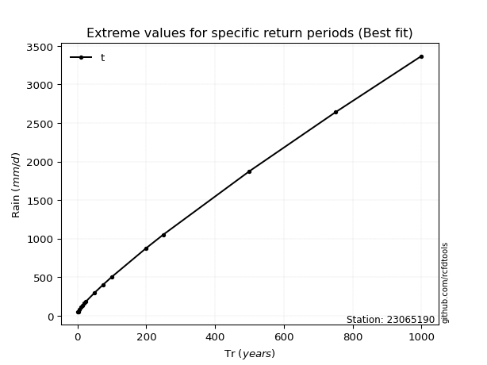</img>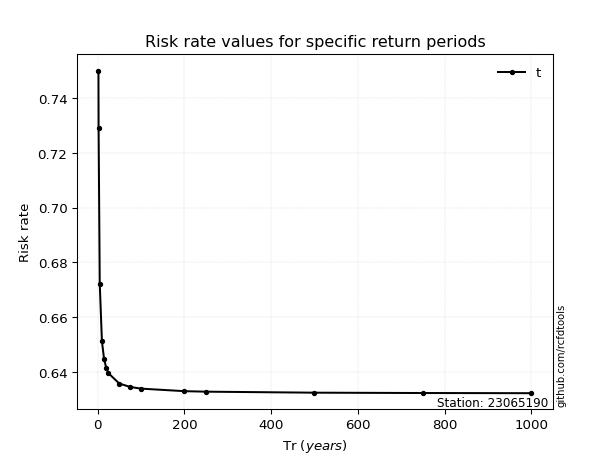</img>

</div>


<sub>**APP DISCLAIMER**: NO WARRANTY - This software is provided by [github.com/rcfdtools](https://github.com/rcfdtools) "as is", without any express or implied warranty, including warranties of merchantability, fitness for a particular purpose, or non-infringement. There is no guarantee that the software will be error-free or operate without interruption. LIMITATION OF LIABILITY - Neither the authors nor copyright holders will be liable for claims or damages arising from the software or its use. You are responsible for determining if the software is appropriate for your use and assume all associated risks, including errors, legal compliance, and data loss. NO PROFESSIONAL ADVICE - The software provides general information and does not offer professional advice. It should not replace consultation with professional advisors.</sub>