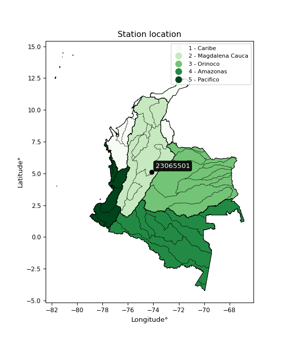

<div align="center">


</div>

# PMax24h Station (Rain): 23065501

Maximum Precipitation in 24 hours (PMax24h) is the greatest amount of rainfall for a specific duration that is meteorologically possible for a given location, acting as a "worst-case" scenario for extreme storms, crucial for designing safety-critical infrastructure like bridges, river deviations, dams, spillways, and nuclear plants to prevent catastrophic failure. The PMax24h is related with the Probable Maximum Precipitation (PMP) and it is calculated by hydrologists using meteorological data to determine the upper limit of extreme rainfall, often leading to the Probable Maximum Flood (PMF) for flood control design, and is increasingly being studied for climate change impacts. Probable Maximum Precipitation (PMP) is the theoretical upper limit of rainfall, a deterministic estimate for extreme events, while probability distributions (like GEV, Gumbel) describe the likelihood and frequency of various precipitation amounts, including rare ones, showing how often events occur, with PMP representing the extreme end of these distributions, used for critical infrastructure design to ensure safety against the worst conceivable weather, unlike standard statistical forecasts which cover typical probabilities.

The most common probability distributions in hydrology, used for analyzing floods, rainfall, and streamflow, include the Normal, Log-Normal, Gumbel, Gamma (including Log-Pearson Type III), and Generalized Extreme Value (GEV) distributions, often chosen based on the data´s skewness and whether modeling extremes or general conditions, with Gumbel and GEV popular for extreme events like floods, while the Normal distribution serves as a baseline, though often requiring transformations for skewed hydrological data. These distributions help in designing water infrastructure, managing water resources, and forecasting hydrologic events.

> Hydrological data often isn´t perfectly normal (it´s skewed), so different distributions are needed for different applications, such as: **Flood Frequency Analysis**: Using Gumbel, GEV, or Log-Pearson Type III for predicting extreme flood magnitudes and their return periods, **Rainfall Analysis**: Normal for annual totals, but Log-Normal, Weibull, or GEV for intensity or extreme daily rainfall, **Streamflow Modeling**: Gamma and Log-Normal for maximum flows, GEV for minimum flows, and Kappa for daily flows.

<div align="center">

</img>

</div>


## A. General information


### 1. General running parameters

• app_version: _v20260225_. • runtime: _2026-02-28 16:54:07.457399_. • Python version: _3.14.0_. • SciPy version: _1.16.3_. • Pandas version: _2.3.3_. • NumPy version: _2.3.5_. • Stations dataset (station_dataset_file): _dataset/pmax24h_in/automatic_colombia_2003_2025.csv_. • Stations catalog (station_catalog_file): _dataset/CNE.xls_. • Minimum year to eval til year_max (date_min): _1900_. • Maximum year to eval since year_min (date_max): _2025_. • Creates, save and include plots into reports (create_plot): _False_. • Plot only fit distributions with Δo > Δ (plot_only_fit): _True_. • Plot only simple graphs avoiding multiple CDFs and multiple Extreme values plots (plot_only_simple): _False_. • Eval low extreme values, if False, evaluates high extreme values (low_extreme): _False_. • Eval every SciPy distribution as logarithmic (pdist_logarithmic_on): _True_. • Standard deviation normalized (ddof): _1.0_. • Return periods to eval in years (Tr): _[2, 2.33, 5, 10, 15, 20, 25, 50, 75, 100, 200, 250, 500, 750, 1000]_. • Minimum data sample per station, 0 means any (minimum_sample): _5_. • Z-Score maximum threshold to adjust a value, 0 means disable (zscore_max): _3.5_. • Z-Score minimum threshold to adjust a value, 0 means disable (zscore_min): _-2.5_. • Avoid zeros, e.g. rain = 0 (avoid_zeros): _True_. • Avoid null values (avoid_nans): _True_. 

:file_folder:Table: [dataset.csv](../../dataset/pmax24h_in/automatic_colombia_2003_2025.csv)

> Delta Degrees of Freedom (DDOF): is a parameter used in the formulas for calculating variance and standard deviation. When ddof=0, the divisor is $N$ (the total number of observations) and this is used when your data set is the entire population. When ddof=1, the divisor is $N-1$ and this is used when your data set is a sample drawn from a larger population. Using $N-1$ provides an unbiased estimate of the population variance (known as Bessel´s correction).


### 2. Station info and location

|   id |   CODIGO | NOMBRE                 | CATEGORIA               | TECNOLOGIA                | ESTADO   | FECHA_INSTALACION   |   FECHA_SUSPENSION |   ALTITUD |   LATITUD |   LONGITUD | DEPARTAMENTO   | MUNICIPIO   | AREA_OPERATIVA                            | ENTIDAD                                    | AREA_HIDROGRAFICA   | ZONA_HIDROGRAFICA   | SUBZONA_HIDROGRAFICA   |   CORRIENTE | Catalogo   |   Version |
|-----:|---------:|:-----------------------|:------------------------|:--------------------------|:---------|:--------------------|-------------------:|----------:|----------:|-----------:|:---------------|:------------|:------------------------------------------|:-------------------------------------------|:--------------------|:--------------------|:-----------------------|------------:|:-----------|----------:|
|    0 | 23065501 | PACHO - AUT [23065501] | Climatológica Principal | Automática con Telemetría | Activa   | 01/10/2013          |                nan |       999 |   5.12913 |   -74.1577 | Cundinamarca   | Pacho       | Area Operativa 11 - Cundinamarca-Amazonas | CENTRO NACIONAL DE INVESTIGACIONES DE CAFE | Magdalena Cauca     | Medio Magdalena     | Río Negro              |         nan | CNE_OE     |  20251226 |

<div align="center">

Dynamic map: [:earth_americas:Google](http://maps.google.com/maps?q=5.129127778,-74.15769722) [:earth_americas:OSM](https://www.openstreetmap.org/#map=18/5.129127778/-74.15769722&layers=P) [:earth_americas:Bing](https://www.bing.com/maps?cp=5.129127778~-74.15769722&lvl=18) [:earth_americas:Apple](https://maps.apple.com/frame?center=5.129127778%2C-74.15769722&span=0.003%2C0.006)

</div>


<div align="center">

```geojson
{
  "type": "Feature",
  "geometry": {
    "type": "Point", 
    "coordinates": [-74.15769722, 5.129127778]
  }, 
  "properties": {
    "Name": "23065501"
  }
}
```

</div>


### 3. Discrete values table and plot

<div align="center">

|               |          0 |           1 |          2 |           3 |           4 |            5 |
|:--------------|-----------:|------------:|-----------:|------------:|------------:|-------------:|
| Date          | 2016       | 2017        | 2018       | 2019        | 2020        | 2021         |
| Value         |   16.6     |   54.5      |   65.2     |   60.5      |   43.6      |   46.8       |
| Value_initial |   16.6     |   54.5      |   65.2     |   60.5      |   43.6      |   46.8       |
| count         |    6       |    6        |    6       |    6        |    6        |    6         |
| mean          |   47.8667  |   47.8667   |   47.8667  |   47.8667   |   47.8667   |   47.8667    |
| std           |   17.3262  |   17.3262   |   17.3262  |   17.3262   |   17.3262   |   17.3262    |
| zscore        |   -1.80458 |    0.382849 |    1.00041 |    0.729144 |   -0.246255 |   -0.0615636 |


</div>


> The initial value (value_initial) correspond to the initial obtained or null completed value, and value (value) is adjusted only when the initial value is outside the valid range (outlier) definite through the Z-Score value. If Z-Score is active, values out of range or outliers are replaced with the station mean value. A Z-Score (or standard score) measures how many standard deviations a data point is from the mean of a dataset, indicating its relative position; positive scores mean above the mean, negative mean below, and a score of zero is exactly at the mean, allowing for comparison of values from different distributions. It´s calculated using the formula $z=(x–μ)/σ$, where $x$ is the data point, $μ$ is the mean, and $σ$ is the standard deviation, helping identify outliers and understand probability.
>
> <sub>**Note**: In this study, "completing" (filling gaps in) and "extending" (forecasting or lengthening the historical record) rainfall data series are avoided for certain critical analyses because they introduce artificial bias and uncertainty, which can distort the statistics of rare events (extremes), alter day-to-day variability, and compromise the integrity and homogeneity of the original data. Some reasons against Completing/Extending rainfall data are: **Distortion of Extremes and Variability**: The primary issue is that most gap-filling or extension methods rely on averaging or regression with nearby stations, which inherently smooths the data. Rainfall is highly variable in space and time, with a large percentage of zero values and occasional large storms. Infilling methods often underestimate the highest values and overestimate the lowest (zero) values, which severely distorts analyses focused on flood frequency, drought severity, and intensity-duration-frequency (IDF) curves, **Loss of Data Homogeneity**: Infilled or extended data are synthetic estimates, not actual measurements. Combining these estimates with observed data can violate the assumption of data homogeneity, which requires that the data properties do not change over time. Inhomogeneity can lead to incorrect conclusions about long-term trends or changes in climate patterns, **Propagation of Errors**: Errors and biases from the original data (e.g., wind-induced undercatch, instrument errors, site changes) or the data used for imputation can propagate through the analysis, leading to unreliable hydrological models and inaccurate predictions, **Compromised Statistical Integrity**: For statistical analyses, especially those involving the frequency of events, using artificial data can introduce time bias or autocorrelation that doesn´t exist in reality, making it difficult to assess the true probability of events, **Difficulty in Validation**: It is difficult to accurately validate the quality of filled or extended data, especially for past periods where ground-truth measurements are unavailable. The reliability of imputation techniques heavily depends on the density of the surrounding station network and the complexity of the local topography.</sub>


### 4. Active continuous probability distributions from SciPy (80 of 104 available)

A Probability Density Function (PDF) describes the relative likelihood of a continuous random variable falling within a specific range, where the total area under its curve equals 1, and the area over any interval gives the actual probability for that range. Unlike discrete probabilities (like rolling a die), a PDF shows density, not direct probability for a single point (which is zero), with higher points indicating higher likelihood, often visualized as a bell curve for normal distributions.

A log of a probability density function (log-PDF) is simply the logarithm of the PDF´s value, denoted as $log(f(x))$, useful for converting multiplication of probabilities into addition, improving numerical stability with tiny numbers, and connecting to information theory concepts like entropy. Instead of dealing with very small probabilities (e.g., 0.000001), log-PDFs use negative numbers (e.g., $log(0.00001) ≈ -11.51$ that are easier for computers to handle, preventing underflow errors and simplifying complex calculations. In this study, each active probability distribution from SciPy is also evaluated in the $log$ form.

[scipy.stats](https://docs.scipy.org/doc/scipy/reference/stats.html) is a Python´s powerful submodule within the SciPy library for comprehensive statistical analysis, offering over 130 probability distributions (like Normal, Poisson, etc.), functions for descriptive stats (mean, variance), hypothesis testing (t-tests, chi-square), random variable generation, and statistical tests, making it essential for data science, modeling, and research. It provides tools to explore, model, and draw conclusions from data efficiently, working seamlessly with [NumPy](https://numpy.org/).

<div align="center">

|   id | p_dist           |   n_parameter | fit_method   | label                                                                       | active   | ref                                                                                                      |
|-----:|:-----------------|--------------:|:-------------|:----------------------------------------------------------------------------|:---------|:---------------------------------------------------------------------------------------------------------|
|    0 | alpha            |             3 | MLE          | Alpha                                                                       | True     | [:mortar_board:](https://docs.scipy.org/doc/scipy/reference/generated/scipy.stats.alpha.html)            |
|    1 | anglit           |             2 | MM           | Anglit                                                                      | True     | [:mortar_board:](https://docs.scipy.org/doc/scipy/reference/generated/scipy.stats.anglit.html)           |
|    2 | arcsine          |             2 | MM           | Arcsine                                                                     | True     | [:mortar_board:](https://docs.scipy.org/doc/scipy/reference/generated/scipy.stats.arcsine.html)          |
|    3 | argus            |             3 | MLE          | Argus                                                                       | True     | [:mortar_board:](https://docs.scipy.org/doc/scipy/reference/generated/scipy.stats.argus.html)            |
|    4 | beta             |             4 | MLE          | Beta                                                                        | True     | [:mortar_board:](https://docs.scipy.org/doc/scipy/reference/generated/scipy.stats.beta.html)             |
|    5 | betaprime        |             4 | MLE          | Beta prime                                                                  | True     | [:mortar_board:](https://docs.scipy.org/doc/scipy/reference/generated/scipy.stats.betaprime.html)        |
|    6 | bradford         |             3 | MLE          | Bradford                                                                    | True     | [:mortar_board:](https://docs.scipy.org/doc/scipy/reference/generated/scipy.stats.bradford.html)         |
|    7 | burr             |             4 | MLE          | Burr (Type III)                                                             | True     | [:mortar_board:](https://docs.scipy.org/doc/scipy/reference/generated/scipy.stats.burr.html)             |
|    8 | burr12           |             4 | MLE          | Burr (Type III) 12                                                          | True     | [:mortar_board:](https://docs.scipy.org/doc/scipy/reference/generated/scipy.stats.burr12.html)           |
|    9 | cosine           |             2 | MLE          | Cosine                                                                      | True     | [:mortar_board:](https://docs.scipy.org/doc/scipy/reference/generated/scipy.stats.cosine.html)           |
|   10 | crystalball      |             4 | MLE          | Crystalball                                                                 | True     | [:mortar_board:](https://docs.scipy.org/doc/scipy/reference/generated/scipy.stats.crystalball.html)      |
|   11 | dgamma           |             3 | MLE          | Double gamma                                                                | True     | [:mortar_board:](https://docs.scipy.org/doc/scipy/reference/generated/scipy.stats.dgamma.html)           |
|   12 | dweibull         |             3 | MLE          | Double Weibull                                                              | True     | [:mortar_board:](https://docs.scipy.org/doc/scipy/reference/generated/scipy.stats.dweibull.html)         |
|   13 | erlang           |             3 | MLE          | Erlang                                                                      | True     | [:mortar_board:](https://docs.scipy.org/doc/scipy/reference/generated/scipy.stats.erlang.html)           |
|   14 | exponnorm        |             3 | MLE          | Exponentially modified Normal                                               | True     | [:mortar_board:](https://docs.scipy.org/doc/scipy/reference/generated/scipy.stats.exponnorm.html)        |
|   15 | exponpow         |             3 | MLE          | Exponential power                                                           | True     | [:mortar_board:](https://docs.scipy.org/doc/scipy/reference/generated/scipy.stats.exponpow.html)         |
|   16 | exponweib        |             4 | MLE          | Exponentiated Weibull                                                       | True     | [:mortar_board:](https://docs.scipy.org/doc/scipy/reference/generated/scipy.stats.exponweib.html)        |
|   17 | f                |             4 | MLE          | F                                                                           | True     | [:mortar_board:](https://docs.scipy.org/doc/scipy/reference/generated/scipy.stats.f.html)                |
|   18 | fatiguelife      |             3 | MLE          | Fatigue-life (Birnbaum-Saunders)                                            | True     | [:mortar_board:](https://docs.scipy.org/doc/scipy/reference/generated/scipy.stats.fatiguelife.html)      |
|   19 | foldnorm         |             3 | MM           | Fold Normal                                                                 | True     | [:mortar_board:](https://docs.scipy.org/doc/scipy/reference/generated/scipy.stats.foldnorm.html)         |
|   20 | gamma            |             3 | MLE          | Gamma                                                                       | True     | [:mortar_board:](https://docs.scipy.org/doc/scipy/reference/generated/scipy.stats.gamma.html)            |
|   21 | gausshyper       |             6 | MLE          | Gauss hypergeometric                                                        | True     | [:mortar_board:](https://docs.scipy.org/doc/scipy/reference/generated/scipy.stats.gausshyper.html)       |
|   22 | genexpon         |             5 | MLE          | Generalized exponential                                                     | True     | [:mortar_board:](https://docs.scipy.org/doc/scipy/reference/generated/scipy.stats.genexpon.html)         |
|   23 | genextreme       |             3 | MLE          | Generalized exponential                                                     | True     | [:mortar_board:](https://docs.scipy.org/doc/scipy/reference/generated/scipy.stats.genextreme.html)       |
|   24 | gengamma         |             4 | MLE          | Generalized gamma                                                           | True     | [:mortar_board:](https://docs.scipy.org/doc/scipy/reference/generated/scipy.stats.gengamma.html)         |
|   25 | genhalflogistic  |             3 | MLE          | Generalized half-logistic                                                   | True     | [:mortar_board:](https://docs.scipy.org/doc/scipy/reference/generated/scipy.stats.genhalflogistic.html)  |
|   26 | genlogistic      |             3 | MLE          | Generalized logistic                                                        | True     | [:mortar_board:](https://docs.scipy.org/doc/scipy/reference/generated/scipy.stats.genlogistic.html)      |
|   27 | gennorm          |             3 | MLE          | Generalized Normal                                                          | True     | [:mortar_board:](https://docs.scipy.org/doc/scipy/reference/generated/scipy.stats.gennorm.html)          |
|   28 | genpareto        |             3 | MLE          | Generalized Pareto                                                          | True     | [:mortar_board:](https://docs.scipy.org/doc/scipy/reference/generated/scipy.stats.genpareto.html)        |
|   29 | gompertz         |             3 | MLE          | Gompertz (or truncated Gumbel)                                              | True     | [:mortar_board:](https://docs.scipy.org/doc/scipy/reference/generated/scipy.stats.gompertz.html)         |
|   30 | gumbel_l         |             2 | MM           | Gumbel Left Skew                                                            | True     | [:mortar_board:](https://docs.scipy.org/doc/scipy/reference/generated/scipy.stats.gumbel_l.html)         |
|   31 | gumbel_r         |             2 | MM           | Gumbel Right Skew                                                           | True     | [:mortar_board:](https://docs.scipy.org/doc/scipy/reference/generated/scipy.stats.gumbel_r.html)         |
|   32 | halfgennorm      |             3 | MLE          | Upper half of a generalized normal                                          | True     | [:mortar_board:](https://docs.scipy.org/doc/scipy/reference/generated/scipy.stats.halfgennorm.html)      |
|   33 | halflogistic     |             2 | MM           | Half-logistic                                                               | True     | [:mortar_board:](https://docs.scipy.org/doc/scipy/reference/generated/scipy.stats.halflogistic.html)     |
|   34 | halfnorm         |             2 | MM           | Half Normal                                                                 | True     | [:mortar_board:](https://docs.scipy.org/doc/scipy/reference/generated/scipy.stats.halfnorm.html)         |
|   35 | hypsecant        |             2 | MM           | hyperbolic secant                                                           | True     | [:mortar_board:](https://docs.scipy.org/doc/scipy/reference/generated/scipy.stats.hypsecant.html)        |
|   36 | invgamma         |             3 | MLE          | Inverted gamma                                                              | True     | [:mortar_board:](https://docs.scipy.org/doc/scipy/reference/generated/scipy.stats.invgamma.html)         |
|   37 | invgauss         |             3 | MLE          | Inverse Gaussian                                                            | True     | [:mortar_board:](https://docs.scipy.org/doc/scipy/reference/generated/scipy.stats.invgauss.html)         |
|   38 | invweibull       |             3 | MLE          | Inverted Weibull                                                            | True     | [:mortar_board:](https://docs.scipy.org/doc/scipy/reference/generated/scipy.stats.invweibull.html)       |
|   39 | johnsonsb        |             4 | MLE          | Johnson SB                                                                  | True     | [:mortar_board:](https://docs.scipy.org/doc/scipy/reference/generated/scipy.stats.johnsonsb.html)        |
|   40 | johnsonsu        |             4 | MLE          | Johnson Su                                                                  | True     | [:mortar_board:](https://docs.scipy.org/doc/scipy/reference/generated/scipy.stats.johnsonsu.html)        |
|   41 | kappa3           |             3 | MLE          | Kappa 3                                                                     | True     | [:mortar_board:](https://docs.scipy.org/doc/scipy/reference/generated/scipy.stats.kappa3.html)           |
|   42 | kappa4           |             4 | MLE          | Kappa 4                                                                     | True     | [:mortar_board:](https://docs.scipy.org/doc/scipy/reference/generated/scipy.stats.kappa4.html)           |
|   43 | ksone            |             3 | MLE          | Kolmogorov-Smirnov one-sided test statistic distribution                    | True     | [:mortar_board:](https://docs.scipy.org/doc/scipy/reference/generated/scipy.stats.ksone.html)            |
|   44 | kstwobign        |             2 | MLE          | Limiting distribution of scaled Kolmogorov-Smirnov two-sided test statistic | True     | [:mortar_board:](https://docs.scipy.org/doc/scipy/reference/generated/scipy.stats.kstwobign.html)        |
|   45 | laplace          |             2 | MM           | Laplace                                                                     | True     | [:mortar_board:](https://docs.scipy.org/doc/scipy/reference/generated/scipy.stats.laplace.html)          |
|   46 | levy_l           |             2 | MLE          | Left-skewed Levy                                                            | True     | [:mortar_board:](https://docs.scipy.org/doc/scipy/reference/generated/scipy.stats.levy_l.html)           |
|   47 | loggamma         |             3 | MLE          | Log gamma                                                                   | True     | [:mortar_board:](https://docs.scipy.org/doc/scipy/reference/generated/scipy.stats.loggamma.html)         |
|   48 | logistic         |             2 | MM           | Logistic (or Sech-squared)                                                  | True     | [:mortar_board:](https://docs.scipy.org/doc/scipy/reference/generated/scipy.stats.logistic.html)         |
|   49 | loglaplace       |             3 | MLE          | Log-Laplace                                                                 | True     | [:mortar_board:](https://docs.scipy.org/doc/scipy/reference/generated/scipy.stats.loglaplace.html)       |
|   50 | lomax            |             3 | MLE          | Lomax (Pareto of the second kind)                                           | True     | [:mortar_board:](https://docs.scipy.org/doc/scipy/reference/generated/scipy.stats.lomax.html)            |
|   51 | maxwell          |             2 | MM           | Maxwell                                                                     | True     | [:mortar_board:](https://docs.scipy.org/doc/scipy/reference/generated/scipy.stats.maxwell.html)          |
|   52 | mielke           |             4 | MLE          | Mielke Beta-Kappa / Dagum                                                   | True     | [:mortar_board:](https://docs.scipy.org/doc/scipy/reference/generated/scipy.stats.mielke.html)           |
|   53 | moyal            |             2 | MM           | Moyal                                                                       | True     | [:mortar_board:](https://docs.scipy.org/doc/scipy/reference/generated/scipy.stats.moyal.html)            |
|   54 | nakagami         |             3 | MLE          | Nakagami                                                                    | True     | [:mortar_board:](https://docs.scipy.org/doc/scipy/reference/generated/scipy.stats.nakagami.html)         |
|   55 | ncf              |             5 | MLE          | Non-central F distribution                                                  | True     | [:mortar_board:](https://docs.scipy.org/doc/scipy/reference/generated/scipy.stats.ncf.html)              |
|   56 | nct              |             4 | MLE          | Non-central Student’s t                                                     | True     | [:mortar_board:](https://docs.scipy.org/doc/scipy/reference/generated/scipy.stats.nct.html)              |
|   57 | norm             |             2 | MM           | Normal                                                                      | True     | [:mortar_board:](https://docs.scipy.org/doc/scipy/reference/generated/scipy.stats.norm.html)             |
|   58 | pearson3         |             3 | MM           | Pearson type III                                                            | True     | [:mortar_board:](https://docs.scipy.org/doc/scipy/reference/generated/scipy.stats.pearson3.html)         |
|   59 | powerlaw         |             3 | MLE          | Power-function                                                              | True     | [:mortar_board:](https://docs.scipy.org/doc/scipy/reference/generated/scipy.stats.powerlaw.html)         |
|   60 | rayleigh         |             2 | MM           | Rayleigh                                                                    | True     | [:mortar_board:](https://docs.scipy.org/doc/scipy/reference/generated/scipy.stats.rayleigh.html)         |
|   61 | rdist            |             3 | MLE          | R-distributed (symmetric beta)                                              | True     | [:mortar_board:](https://docs.scipy.org/doc/scipy/reference/generated/scipy.stats.rdist.html)            |
|   62 | rice             |             3 | MLE          | Rice                                                                        | True     | [:mortar_board:](https://docs.scipy.org/doc/scipy/reference/generated/scipy.stats.rice.html)             |
|   63 | semicircular     |             2 | MM           | Semicircular                                                                | True     | [:mortar_board:](https://docs.scipy.org/doc/scipy/reference/generated/scipy.stats.semicircular.html)     |
|   64 | skewnorm         |             3 | MLE          | Skew normal                                                                 | True     | [:mortar_board:](https://docs.scipy.org/doc/scipy/reference/generated/scipy.stats.skewnorm.html)         |
|   65 | t                |             3 | MLE          | Student’s t                                                                 | True     | [:mortar_board:](https://docs.scipy.org/doc/scipy/reference/generated/scipy.stats.t.html)                |
|   66 | trapezoid        |             4 | MLE          | Trapezoid                                                                   | True     | [:mortar_board:](https://docs.scipy.org/doc/scipy/reference/generated/scipy.stats.trapezoid.html)        |
|   67 | triang           |             3 | MLE          | Triangular                                                                  | True     | [:mortar_board:](https://docs.scipy.org/doc/scipy/reference/generated/scipy.stats.triang.html)           |
|   68 | truncexpon       |             3 | MLE          | Truncated exponential                                                       | True     | [:mortar_board:](https://docs.scipy.org/doc/scipy/reference/generated/scipy.stats.truncexpon.html)       |
|   69 | truncnorm        |             4 | MLE          | Truncated normal                                                            | True     | [:mortar_board:](https://docs.scipy.org/doc/scipy/reference/generated/scipy.stats.truncnorm.html)        |
|   70 | truncpareto      |             4 | MLE          | Upper truncated Pareto                                                      | True     | [:mortar_board:](https://docs.scipy.org/doc/scipy/reference/generated/scipy.stats.truncpareto.html)      |
|   71 | truncweibull_min |             5 | MLE          | Doubly truncated Weibull minimum                                            | True     | [:mortar_board:](https://docs.scipy.org/doc/scipy/reference/generated/scipy.stats.truncweibull_min.html) |
|   72 | tukeylambda      |             3 | MLE          | Tukey-Lamdba                                                                | True     | [:mortar_board:](https://docs.scipy.org/doc/scipy/reference/generated/scipy.stats.tukeylambda.html)      |
|   73 | uniform          |             2 | MLE          | Uniform                                                                     | True     | [:mortar_board:](https://docs.scipy.org/doc/scipy/reference/generated/scipy.stats.uniform.html)          |
|   74 | vonmises         |             3 | MLE          | Von Mises                                                                   | True     | [:mortar_board:](https://docs.scipy.org/doc/scipy/reference/generated/scipy.stats.vonmises.html)         |
|   75 | vonmises_line    |             3 | MLE          | Von Mises line                                                              | True     | [:mortar_board:](https://docs.scipy.org/doc/scipy/reference/generated/scipy.stats.vonmises_line.html)    |
|   76 | wald             |             2 | MM           | Wald                                                                        | True     | [:mortar_board:](https://docs.scipy.org/doc/scipy/reference/generated/scipy.stats.wald.html)             |
|   77 | weibull_max      |             3 | MLE          | Weibull maximum                                                             | True     | [:mortar_board:](https://docs.scipy.org/doc/scipy/reference/generated/scipy.stats.weibull_max.html)      |
|   78 | weibull_min      |             3 | MLE          | Weibull minimum                                                             | True     | [:mortar_board:](https://docs.scipy.org/doc/scipy/reference/generated/scipy.stats.weibull_min.html)      |
|   79 | wrapcauchy       |             3 | MLE          | Wrapped  Cauchy                                                             | True     | [:mortar_board:](https://docs.scipy.org/doc/scipy/reference/generated/scipy.stats.wrapcauchy.html)       |

</div>

> **n_parameter:** # arguments & localization & scale.
>
> **Fit methods:** (MLE) maximum likelihood, (MM) L-moments.
>
>**Inactive** (With the only purpose of prevent loops, zero divisions, infinite values, over high estimated values or horizontal trending for recurrence intervals estimations, the follow distributions were disabled.)**:** lognorm, norminvgauss, powernorm, powerlognorm, cauchy, halfcauchy, foldcauchy, skewcauchy, chi2, expon, fisk, genhyperbolic, geninvgauss, gibrat, kstwo, laplace_asymmetric, levy, levy_stable, ncx2, pareto, rel_breitwigner, recipinvgauss, studentized_range, loguniform, 


## B. Probability (PDF) vs. Empirical (EDF) distributions functions

A continuous probability distribution (CPD) describes probabilities for variables that can take any value within a range (like rain any time), unlike discrete variables with specific outcomes (like temperature). It uses a Probability Density Function (PDF), a curve where the total area under it equals 1, and the probability of the variable falling within an interval (a to b) is found by calculating the area under the curve between those points. A key feature is that the probability of hitting any single exact value is zero, so probabilities are always expressed for ranges, e.g., $P(a ≤ X ≤ b)$.

<div align="center">

Distributions parameters from station values
|     |   station | p_dist              |   n |              loc |           scale | shape                  | shape1                 | shape2                | shape3             |
|----:|----------:|:--------------------|----:|-----------------:|----------------:|:-----------------------|:-----------------------|:----------------------|:-------------------|
|   0 |  23065501 | alpha               |   6 |   -305.476       |  7380.41        | 20.959061988326113     |                        |                       |                    |
|   1 |  23065501 | anglit              |   6 |     47.8667      |    46.2699      |                        |                        |                       |                    |
|   2 |  23065501 | arcsine             |   6 |     25.4986      |    44.7361      |                        |                        |                       |                    |
|   3 |  23065501 | argus               |   6 |     -1.35276     |    68.1519      | 2.2268002674697582     |                        |                       |                    |
|   4 |  23065501 | beta                |   6 |     11.9225      |    53.2775      | 1.3093875729949085     | 0.49441214957435564    |                       |                    |
|   5 |  23065501 | betaprime           |   6 |   -681.797       | 32680.9         | 2108.687124158795      | 94438.80157845115      |                       |                    |
|   6 |  23065501 | bradford            |   6 |     16.6         |    48.603       | 0.9239660033995025     |                        |                       |                    |
|   7 |  23065501 | burr                |   6 |     -6.45472     |    72.0632      | 622.7950906629856      | 0.004692149794192348   |                       |                    |
|   8 |  23065501 | burr12              |   6 |      0.207414    |    16.2517      | 512.0796686129623      | 0.001970204356222562   |                       |                    |
|   9 |  23065501 | cosine              |   6 |     45.5761      |    13.6203      |                        |                        |                       |                    |
|  10 |  23065501 | crystalball         |   6 |     47.8667      |    15.8166      | 4657.1041535661825     | 11.08036452195698      |                       |                    |
|  11 |  23065501 | dgamma              |   6 |     50.6556      |     6.94962     | 1.7554819097885015     |                        |                       |                    |
|  12 |  23065501 | dweibull            |   6 |     50.3698      |    13.3137      | 1.2915444764594421     |                        |                       |                    |
|  13 |  23065501 | erlang              |   6 |   -228.414       |     0.971273    | 284.30595080143246     |                        |                       |                    |
|  14 |  23065501 | exponnorm           |   6 |     47.8551      |    15.8167      | 0.0007332316318352091  |                        |                       |                    |
|  15 |  23065501 | exponpow            |   6 |     16.6         |     1.97412     | 0.12812905711730777    |                        |                       |                    |
|  16 |  23065501 | exponweib           |   6 |     16.6         |     0.899645    | 1.3359736073059394     | 0.19689575251393662    |                       |                    |
|  17 |  23065501 | f                   |   6 |  -3250.93        |  3298.63        | 93435.45393543277      | 1090702.5117795118     |                       |                    |
|  18 |  23065501 | fatiguelife         |   6 |     16.6         |     4.1905e-05  | 701.197666217018       |                        |                       |                    |
|  19 |  23065501 | foldnorm            |   6 |    -31.8173      |    14.6234      | 5.46434949656704       |                        |                       |                    |
|  20 |  23065501 | gamma               |   6 |   -181.85        |     1.15462     | 198.83028809519942     |                        |                       |                    |
|  21 |  23065501 | gausshyper          |   6 |     15.2915      |    49.9085      | 1.3330112904250697     | 0.39857796264197376    | 0.9859969081647322    | 1.387897876923471  |
|  22 |  23065501 | genexpon            |   6 |     16.5977      |     2.73969     | 0.08770771002270904    | 6.282540934918977e-08  | 1.0656319421287246    |                    |
|  23 |  23065501 | genextreme          |   6 |     51.5007      |    14.5272      | 1.0604313606284617     |                        |                       |                    |
|  24 |  23065501 | gengamma            |   6 |     16.6         |     0.782582    | 1.507232031976975      | 0.2310964938938075     |                       |                    |
|  25 |  23065501 | genhalflogistic     |   6 |     13.4017      |    55.7765      | 1.0768013386947035     |                        |                       |                    |
|  26 |  23065501 | genlogistic         |   6 |     65.2003      |     1.68671e-05 | 9.723146417555331e-07  |                        |                       |                    |
|  27 |  23065501 | gennorm             |   6 |     49.283       |    18.238       | 1.4772955215941606     |                        |                       |                    |
|  28 |  23065501 | genpareto           |   6 |     -0.160487    |   125.294       | -1.9169660664427477    |                        |                       |                    |
|  29 |  23065501 | gompertz            |   6 |    -19.6614      |    11.2668      | 0.001340156971960181   |                        |                       |                    |
|  30 |  23065501 | gumbel_l            |   6 |     54.985       |    12.3322      |                        |                        |                       |                    |
|  31 |  23065501 | gumbel_r            |   6 |     40.7483      |    12.3322      |                        |                        |                       |                    |
|  32 |  23065501 | halfgennorm         |   6 |     16.6         |     1.1392      | 0.3507942994821065     |                        |                       |                    |
|  33 |  23065501 | halflogistic        |   6 |     29.1203      |    13.5226      |                        |                        |                       |                    |
|  34 |  23065501 | halfnorm            |   6 |     26.9317      |    26.2381      |                        |                        |                       |                    |
|  35 |  23065501 | hypsecant           |   6 |     47.8667      |    10.0692      |                        |                        |                       |                    |
|  36 |  23065501 | invgamma            |   6 |   -200.069       | 56737.8         | 229.72534582485508     |                        |                       |                    |
|  37 |  23065501 | invgauss            |   6 |    -81.1675      |  6776.41        | 0.018923707195346015   |                        |                       |                    |
|  38 |  23065501 | invweibull          |   6 |     16.6         |     1.22577     | 0.07049224210705035    |                        |                       |                    |
|  39 |  23065501 | johnsonsb           |   6 |     16.6         |    48.6         | -0.1710180418062429    | 0.21179652538429086    |                       |                    |
|  40 |  23065501 | johnsonsu           |   6 |     68.9007      |     0.136578    | 6.417263162826211      | 1.1851453367208364     |                       |                    |
|  41 |  23065501 | kappa3              |   6 |     16.5951      |    48.5718      | 2256.723310095377      |                        |                       |                    |
|  42 |  23065501 | kappa4              |   6 |      9.47603     |    59.8271      | 1.1358713140276553     | 1.0729906642022444     |                       |                    |
|  43 |  23065501 | ksone               |   6 |     11.74        |    58.32        | 1.0                    |                        |                       |                    |
|  44 |  23065501 | kstwobign           |   6 |    -23.4161      |    81.4133      |                        |                        |                       |                    |
|  45 |  23065501 | laplace             |   6 |     47.8667      |    11.184       |                        |                        |                       |                    |
|  46 |  23065501 | levy_l              |   6 |     66.4493      |     5.14178     |                        |                        |                       |                    |
|  47 |  23065501 | loggamma            |   6 |     65.2001      |     1.09393e-05 | 6.328785792289393e-07  |                        |                       |                    |
|  48 |  23065501 | logistic            |   6 |     47.8667      |     8.72016     |                        |                        |                       |                    |
|  49 |  23065501 | loglaplace          |   6 |     -0.157331    |    54.6573      | 3.2619793921308293     |                        |                       |                    |
|  50 |  23065501 | lomax               |   6 |     16.6         |   114.308       | 3.4359437640588477     |                        |                       |                    |
|  51 |  23065501 | maxwell             |   6 |     10.3879      |    23.4863      |                        |                        |                       |                    |
|  52 |  23065501 | mielke              |   6 |    -48.7857      |   114.052       | 5.524471298179513      | 9826.787012956102      |                       |                    |
|  53 |  23065501 | moyal               |   6 |     38.8217      |     7.11998     |                        |                        |                       |                    |
|  54 |  23065501 | nakagami            |   6 |     43.6         |    13.0496      | 0.060065154965428164   |                        |                       |                    |
|  55 |  23065501 | ncf                 |   6 |     -0.266322    |     3.64265e-05 | 2.5421699760681104e-05 | 52.80472654437251      | 32.822486484644045    |                    |
|  56 |  23065501 | nct                 |   6 |  -1195.17        |    15.7977      | 854857.8951966472      | 78.68467329502164      |                       |                    |
|  57 |  23065501 | norm                |   6 |     47.8667      |    15.8166      |                        |                        |                       |                    |
|  58 |  23065501 | pearson3            |   6 |     47.8667      |    15.8166      | -0.9742684411209332    |                        |                       |                    |
|  59 |  23065501 | powerlaw            |   6 |     16.6         |    48.6         | 0.15556681012747844    |                        |                       |                    |
|  60 |  23065501 | rayleigh            |   6 |     17.6085      |    24.1425      |                        |                        |                       |                    |
|  61 |  23065501 | rdist               |   6 |     16.6035      |     0.00345913  | 1.7051813002220646     |                        |                       |                    |
|  62 |  23065501 | rice                |   6 |      4.53372     |    16.9362      | 2.327782420667078      |                        |                       |                    |
|  63 |  23065501 | semicircular        |   6 |     47.8667      |    31.6332      |                        |                        |                       |                    |
|  64 |  23065501 | skewnorm            |   6 |     65.2         |    23.4655      | -14774103.190429963    |                        |                       |                    |
|  65 |  23065501 | t                   |   6 |     47.8669      |    15.8165      | 92830085.9950909       |                        |                       |                    |
|  66 |  23065501 | trapezoid           |   6 |      3.1305      |    67.1042      | 1.0                    | 1.0                    |                       |                    |
|  67 |  23065501 | triang              |   6 |      3.23035     |    61.9697      | 0.9999999772271058     |                        |                       |                    |
|  68 |  23065501 | truncexpon          |   6 |     16.6         |    75.5367      | 0.6433957088199969     |                        |                       |                    |
|  69 |  23065501 | truncnorm           |   6 |     47.8667      |    15.8166      | -30.981643878300957    | 139.56289760316062     |                       |                    |
|  70 |  23065501 | truncpareto         |   6 |     16.4994      |     0.100586    | 0.20337657178119262    | 484.1680711361406      |                       |                    |
|  71 |  23065501 | truncweibull_min    |   6 |     14.7894      |    74.4615      | 1.4046071860872424     | 0.00035943067479676707 | 0.6770019970671277    |                    |
|  72 |  23065501 | tukeylambda         |   6 |     16.6         |     5.8962e-14  | 1.6593476538344119     |                        |                       |                    |
|  73 |  23065501 | uniform             |   6 |     16.6         |    48.6         |                        |                        |                       |                    |
|  74 |  23065501 | vonmises            |   6 |     -2.53423     |     1           | 1.191291228439812      |                        |                       |                    |
|  75 |  23065501 | vonmises_line       |   6 |     50.3711      |    10.7497      | 0.8999400010118206     |                        |                       |                    |
|  76 |  23065501 | wald                |   6 |     32.05        |    15.8166      |                        |                        |                       |                    |
|  77 |  23065501 | weibull_max         |   6 |     65.2         |     1.32004     | 0.24142139048303488    |                        |                       |                    |
|  78 |  23065501 | weibull_min         |   6 |     -5.16456e+08 |     5.16456e+08 | 45960020.662957266     |                        |                       |                    |
|  79 |  23065501 | wrapcauchy          |   6 |     16.5991      |     7.73507     | 0.3505492785958384     |                        |                       |                    |
|  80 |  23065501 | logalpha            |   6 |     -7.13166     |   242.757       | 22.316326950672035     |                        |                       |                    |
|  81 |  23065501 | loganglit           |   6 |      3.78477     |     1.33844     |                        |                        |                       |                    |
|  82 |  23065501 | logarcsine          |   6 |      3.13774     |     1.29408     |                        |                        |                       |                    |
|  83 |  23065501 | logargus            |   6 |      2.16408     |     2.04758     | 2.8817453055629043     |                        |                       |                    |
|  84 |  23065501 | logbeta             |   6 |      2.79456     |     1.3829      | 0.47092407876146425    | 0.142156254544511      |                       |                    |
|  85 |  23065501 | logbetaprime        |   6 |     -8.02628     |    87.432       | 661.0956520575276      | 4895.876892902505      |                       |                    |
|  86 |  23065501 | logbradford         |   6 |      2.8094      |     1.36806     | 1.0845257841790148     |                        |                       |                    |
|  87 |  23065501 | logburr             |   6 |    -11.1425      |    15.3271      | 7550.6941115592035     | 0.004920898329723188   |                       |                    |
|  88 |  23065501 | logburr12           |   6 |  -1799.26        |  1806.71        | 6916.128553648934      | 601243.187234466       |                       |                    |
|  89 |  23065501 | logcosine           |   6 |      3.69264     |     0.40407     |                        |                        |                       |                    |
|  90 |  23065501 | logcrystalball      |   6 |      3.78477     |     0.457525    | 980.1718211726152      | 71.8159419209114       |                       |                    |
|  91 |  23065501 | logdgamma           |   6 |      3.9982      |     0.313958    | 0.9495819576380322     |                        |                       |                    |
|  92 |  23065501 | logdweibull         |   6 |      3.9982      |     0.31486     | 0.9665815857347362     |                        |                       |                    |
|  93 |  23065501 | logerlang           |   6 |      2.8094      |     0.851994    | 0.6602091686253551     |                        |                       |                    |
|  94 |  23065501 | logexponnorm        |   6 |      3.78446     |     0.457524    | 0.0006807293301506656  |                        |                       |                    |
|  95 |  23065501 | logexponpow         |   6 |      2.8094      |     1.25129     | 0.6429561449245389     |                        |                       |                    |
|  96 |  23065501 | logexponweib        |   6 |      2.8094      |     1.10478     | 0.9295563891052891     | 0.6195574203131693     |                       |                    |
|  97 |  23065501 | logf                |   6 |   -544.879       |   548.661       | 25255967.00423555      | 3263885.204780454      |                       |                    |
|  98 |  23065501 | logfatiguelife      |   6 |   -304.026       |   307.818       | 0.0014861690814143803  |                        |                       |                    |
|  99 |  23065501 | logfoldnorm         |   6 |      3.12238     |     0.511391    | 1.1831247323036225     |                        |                       |                    |
| 100 |  23065501 | loggamma            |   6 |     -4.55008     |     0.0281721   | 295.7355831196214      |                        |                       |                    |
| 101 |  23065501 | loggausshyper       |   6 |      2.68389     |     1.49356     | 1.2949735475581654     | 0.692107798034741      | 0.7665008207040059    | 1.1106153948253374 |
| 102 |  23065501 | loggenexpon         |   6 |      2.8094      |     0.0373198   | 0.013195445713137455   | 7.449163339523285      | 0.0002106755933088748 |                    |
| 103 |  23065501 | loggenextreme       |   6 |      3.81251     |     0.431059    | 1.1811359251726543     |                        |                       |                    |
| 104 |  23065501 | loggengamma         |   6 |      2.8094      |     1.10478     | 0.9295563891052891     | 0.6195574203131693     |                       |                    |
| 105 |  23065501 | loggenhalflogistic  |   6 |      2.70768     |     1.57295     | 1.070196540974512      |                        |                       |                    |
| 106 |  23065501 | loggenlogistic      |   6 |      4.17802     |     2.82266e-06 | 7.124617151340592e-06  |                        |                       |                    |
| 107 |  23065501 | loggennorm          |   6 |      3.9982      |     0.00855299  | 0.35619554893061856    |                        |                       |                    |
| 108 |  23065501 | loggenpareto        |   6 |     -0.00219044  |     8.61122     | -2.0602723326784265    |                        |                       |                    |
| 109 |  23065501 | loggompertz         |   6 |      2.8094      |     1.14732     | 0.694702914109631      |                        |                       |                    |
| 110 |  23065501 | loggumbel_l         |   6 |      3.99068     |     0.35673     |                        |                        |                       |                    |
| 111 |  23065501 | loggumbel_r         |   6 |      3.57886     |     0.35673     |                        |                        |                       |                    |
| 112 |  23065501 | loghalfgennorm      |   6 |      2.8094      |     1.85142     | 3.0263830159863176     |                        |                       |                    |
| 113 |  23065501 | loghalflogistic     |   6 |      3.24245     |     0.391202    |                        |                        |                       |                    |
| 114 |  23065501 | loghalfnorm         |   6 |      3.1792      |     0.758977    |                        |                        |                       |                    |
| 115 |  23065501 | loghypsecant        |   6 |      3.78477     |     0.291269    |                        |                        |                       |                    |
| 116 |  23065501 | loginvgamma         |   6 |     -6.95924     |  5172.78        | 483.039516925779       |                        |                       |                    |
| 117 |  23065501 | loginvgauss         |   6 |     -2.12443     |   824.3         | 0.007155643269770362   |                        |                       |                    |
| 118 |  23065501 | loginvweibull       |   6 | -79651.6         | 79655.1         | 145613.3511420248      |                        |                       |                    |
| 119 |  23065501 | logjohnsonsb        |   6 |      2.31244     |     1.86502     | -0.2972184380662248    | 0.08827228123185141    |                       |                    |
| 120 |  23065501 | logjohnsonsu        |   6 |      4.17746     |     4.19236e-12 | 3.3324230832227903     | 0.17041449651090138    |                       |                    |
| 121 |  23065501 | logkappa3           |   6 |      2.8094      |     1.36806     | 3221098.7211128892     |                        |                       |                    |
| 122 |  23065501 | logkappa4           |   6 |      2.73153     |     1.76242     | 1.0460044280663658     | 1.2188804935590778     |                       |                    |
| 123 |  23065501 | logksone            |   6 |      2.6726      |     1.64167     | 1.0                    |                        |                       |                    |
| 124 |  23065501 | logkstwobign        |   6 |      1.58191     |     2.51588     |                        |                        |                       |                    |
| 125 |  23065501 | loglaplace          |   6 |      3.78477     |     0.323519    |                        |                        |                       |                    |
| 126 |  23065501 | loglevy_l           |   6 |      4.19923     |     0.0893391   |                        |                        |                       |                    |
| 127 |  23065501 | logloggamma         |   6 |      4.17747     |     1.48744e-06 | 3.781968784204781e-06  |                        |                       |                    |
| 128 |  23065501 | loglogistic         |   6 |      3.78477     |     0.252246    |                        |                        |                       |                    |
| 129 |  23065501 | logloglaplace       |   6 |     -0.136171    |     4.13437     | 12.038022174369935     |                        |                       |                    |
| 130 |  23065501 | loglomax            |   6 |      2.8094      |  5132.87        | 5265.742556719484      |                        |                       |                    |
| 131 |  23065501 | logmaxwell          |   6 |      2.70063     |     0.679385    |                        |                        |                       |                    |
| 132 |  23065501 | logmielke           |   6 |     -2.08821e+07 |     2.08821e+07 | 53095743.04442264      | 1434247042210.794      |                       |                    |
| 133 |  23065501 | logmoyal            |   6 |      3.52313     |     0.205958    |                        |                        |                       |                    |
| 134 |  23065501 | lognakagami         |   6 |      3.77506     |     0.241014    | 0.3129696778422767     |                        |                       |                    |
| 135 |  23065501 | logncf              |   6 |     -4.80772     |     8.58374     | 722.3362213667601      | 1465.5172264461198     | 0.017949262122741685  |                    |
| 136 |  23065501 | lognct              |   6 |    -34.7534      |     0.445824    | 63848.757097004214     | 86.44019159718812      |                       |                    |
| 137 |  23065501 | lognorm             |   6 |      3.78477     |     0.457524    |                        |                        |                       |                    |
| 138 |  23065501 | logpearson3         |   6 |      3.78477     |     0.457523    | -1.4361145466250165    |                        |                       |                    |
| 139 |  23065501 | logpowerlaw         |   6 |      2.8094      |     1.36806     | 0.16444444103959185    |                        |                       |                    |
| 140 |  23065501 | lograyleigh         |   6 |      2.90946     |     0.698394    |                        |                        |                       |                    |
| 141 |  23065501 | logrdist            |   6 |      3.49279     |     0.684674    | 1.234723170854948      |                        |                       |                    |
| 142 |  23065501 | logrice             |   6 |   -191.925       |     0.457561    | 427.72276312068857     |                        |                       |                    |
| 143 |  23065501 | logsemicircular     |   6 |      3.78478     |     0.915005    |                        |                        |                       |                    |
| 144 |  23065501 | logskewnorm         |   6 |      4.17746     |     0.602897    | -23478682.092415668    |                        |                       |                    |
| 145 |  23065501 | logt                |   6 |      3.96506     |     0.179768    | 1.4900617467615307     |                        |                       |                    |
| 146 |  23065501 | logtrapezoid        |   6 |      2.4907      |     1.94111     | 1.0                    | 1.0                    |                       |                    |
| 147 |  23065501 | logtriang           |   6 |      2.59018     |     1.58731     | 0.9999816832900493     |                        |                       |                    |
| 148 |  23065501 | logtruncexpon       |   6 |      2.8094      |     1.74991     | 0.7817945875908783     |                        |                       |                    |
| 149 |  23065501 | logtruncnorm        |   6 |     -0.132807    |     1.27267     | 3.070607015774879      | 3.3867968031449944     |                       |                    |
| 150 |  23065501 | logtruncpareto      |   6 |      2.80622     |     0.00318134  | 0.20331793415421365    | 431.02488437356016     |                       |                    |
| 151 |  23065501 | logtruncweibull_min |   6 |      2.6845      |     2.41187     | 1.6554384398585276     | 8.332978351395851e-05  | 0.6190031583533555    |                    |
| 152 |  23065501 | logtukeylambda      |   6 |      3.97626     |     0.313033    | 1.5558166604825874     |                        |                       |                    |
| 153 |  23065501 | loguniform          |   6 |      2.8094      |     1.36806     |                        |                        |                       |                    |
| 154 |  23065501 | logvonmises         |   6 |     -2.4743      |     1           | 5.401823473023849      |                        |                       |                    |
| 155 |  23065501 | logvonmises_line    |   6 |      3.90222     |     0.347855    | 1.4007770102620603     |                        |                       |                    |
| 156 |  23065501 | logwald             |   6 |      3.32727     |     0.457507    |                        |                        |                       |                    |
| 157 |  23065501 | logweibull_max      |   6 |      4.17746     |     0.339031    | 0.748259811673326      |                        |                       |                    |
| 158 |  23065501 | logweibull_min      |   6 |      2.8094      |     0.686011    | 0.272398556632155      |                        |                       |                    |
| 159 |  23065501 | logwrapcauchy       |   6 |      2.8094      |     0.217733    | 0.525                  |                        |                       |                    |

</div>

> **loc** (Location parameter): This shifts the distribution along the x-axis. For many common distributions, like the normal (Gaussian) distribution, loc represents the mean $μ$. For others, like the uniform distribution, it might represent the minimum value, or for the beta distribution, the left end of the support interval.
>
> **scale** (Scale parameter): This determines the width or spread of the distribution. For the normal distribution, scale represents the standard deviation $σ$. For a uniform distribution, it defines the length of the interval (from $loc$ to $loc + scale$).
>
> **shape** (Shape parameters): Refers to parameters that define the specific form of a probability distribution, distinct from its location (loc) and scale (scale). These parameters are required arguments for most distribution functions. For example, a normal (Gaussian) distribution is fully defined by its location (mean) and scale (standard deviation), so it has no specific shape parameters beyond loc and scale. However, other distributions have intrinsic properties that need specification, as Gamma distribution that takes a shape parameter, often named $a$ or $alpha$.


### 0. Cumulative distribution values - CDF (160 evaluated)

Cumulative Distribution Function (CDF), denoted as $F$<sub>$X$</sub>$(x)$, is a function that gives the probability that a random variable $X$ will take a value less than or equal to a specific value, $x$ (i.e., $(P(X≥x)$. It essentially "accumulates" probabilities from a given point up to the far right (positive infinity), providing a complete picture of the distribution´s probabilities for both discrete (like rain) and continuous (like temperature) variables, helping to find probabilities over ranges or above certain values. Each station is evaluated separately ordering the $x$ values ascending, calculating the CDF and PDF values for the activated distributions and their logarithmic forms.

<div align="center">

CDF ordered by x ascending and calculating $log(f(x))$ separately
|   id |   Station |   date |    x |   count |    mean |     std |     zscore |   Value_initial |   station |   m |     alpha |   alpha_pdf |    anglit |   anglit_pdf |   arcsine |   arcsine_pdf |     argus |   argus_pdf |      beta |    beta_pdf |   betaprime |   betaprime_pdf |    bradford |   bradford_pdf |      burr |    burr_pdf |     burr12 |   burr12_pdf |    cosine |   cosine_pdf |   crystalball |   crystalball_pdf |    dgamma |   dgamma_pdf |   dweibull |   dweibull_pdf |    erlang |   erlang_pdf |   exponnorm |   exponnorm_pdf |   exponpow |   exponpow_pdf |   exponweib |   exponweib_pdf |         f |      f_pdf |   fatiguelife |   fatiguelife_pdf |   foldnorm |   foldnorm_pdf |     gamma |   gamma_pdf |   gausshyper |   gausshyper_pdf |    genexpon |   genexpon_pdf |   genextreme |   genextreme_pdf |   gengamma |   gengamma_pdf |   genhalflogistic |   genhalflogistic_pdf |   genlogistic |   genlogistic_pdf |   gennorm |   gennorm_pdf |   genpareto |   genpareto_pdf |   gompertz |   gompertz_pdf |   gumbel_l |   gumbel_l_pdf |    gumbel_r |   gumbel_r_pdf |   halfgennorm |   halfgennorm_pdf |   halflogistic |   halflogistic_pdf |   halfnorm |   halfnorm_pdf |   hypsecant |   hypsecant_pdf |   invgamma |   invgamma_pdf |   invgauss |   invgauss_pdf |   invweibull |   invweibull_pdf |   johnsonsb |   johnsonsb_pdf |   johnsonsu |   johnsonsu_pdf |     kappa3 |   kappa3_pdf |     kappa4 |   kappa4_pdf |     ksone |   ksone_pdf |   kstwobign |   kstwobign_pdf |   laplace |   laplace_pdf |   levy_l |   levy_l_pdf |   loggamma |   loggamma_pdf |   logistic |   logistic_pdf |   loglaplace |   loglaplace_pdf |       lomax |   lomax_pdf |    maxwell |   maxwell_pdf |    mielke |   mielke_pdf |       moyal |   moyal_pdf |   nakagami |   nakagami_pdf |       ncf |    ncf_pdf |       nct |    nct_pdf |      norm |   norm_pdf |   pearson3 |   pearson3_pdf |   powerlaw |   powerlaw_pdf |   rayleigh |   rayleigh_pdf |       rdist |   rdist_pdf |      rice |   rice_pdf |   semicircular |   semicircular_pdf |   skewnorm |   skewnorm_pdf |         t |      t_pdf |   trapezoid |   trapezoid_pdf |    triang |   triang_pdf |   truncexpon |   truncexpon_pdf |   truncnorm |   truncnorm_pdf |   truncpareto |   truncpareto_pdf |   truncweibull_min |   truncweibull_min_pdf |   tukeylambda |   tukeylambda_pdf |   uniform |   uniform_pdf |   vonmises |   vonmises_pdf |   vonmises_line |   vonmises_line_pdf |     wald |   wald_pdf |   weibull_max |   weibull_max_pdf |   weibull_min |   weibull_min_pdf |   wrapcauchy |   wrapcauchy_pdf |   logalpha |   logalpha_pdf |   loganglit |   loganglit_pdf |   logarcsine |   logarcsine_pdf |   logargus |   logargus_pdf |   logbeta |   logbeta_pdf |   logbetaprime |   logbetaprime_pdf |   logbradford |   logbradford_pdf |   logburr |   logburr_pdf |   logburr12 |   logburr12_pdf |   logcosine |   logcosine_pdf |   logcrystalball |   logcrystalball_pdf |   logdgamma |   logdgamma_pdf |   logdweibull |   logdweibull_pdf |   logerlang |   logerlang_pdf |   logexponnorm |   logexponnorm_pdf |   logexponpow |   logexponpow_pdf |   logexponweib |   logexponweib_pdf |      logf |   logf_pdf |   logfatiguelife |   logfatiguelife_pdf |   logfoldnorm |   logfoldnorm_pdf |   loggausshyper |   loggausshyper_pdf |   loggenexpon |   loggenexpon_pdf |   loggenextreme |   loggenextreme_pdf |   loggengamma |   loggengamma_pdf |   loggenhalflogistic |   loggenhalflogistic_pdf |   loggenlogistic |   loggenlogistic_pdf |   loggennorm |   loggennorm_pdf |   loggenpareto |   loggenpareto_pdf |   loggompertz |   loggompertz_pdf |   loggumbel_l |   loggumbel_l_pdf |   loggumbel_r |   loggumbel_r_pdf |   loghalfgennorm |   loghalfgennorm_pdf |   loghalflogistic |   loghalflogistic_pdf |   loghalfnorm |   loghalfnorm_pdf |   loghypsecant |   loghypsecant_pdf |   loginvgamma |   loginvgamma_pdf |   loginvgauss |   loginvgauss_pdf |   loginvweibull |   loginvweibull_pdf |   logjohnsonsb |   logjohnsonsb_pdf |   logjohnsonsu |   logjohnsonsu_pdf |   logkappa3 |   logkappa3_pdf |   logkappa4 |   logkappa4_pdf |   logksone |   logksone_pdf |   logkstwobign |   logkstwobign_pdf |   loglevy_l |   loglevy_l_pdf |   logloggamma |   logloggamma_pdf |   loglogistic |   loglogistic_pdf |   logloglaplace |   logloglaplace_pdf |    loglomax |   loglomax_pdf |   logmaxwell |   logmaxwell_pdf |   logmielke |   logmielke_pdf |    logmoyal |   logmoyal_pdf |   lognakagami |   lognakagami_pdf |    logncf |   logncf_pdf |    lognct |   lognct_pdf |   lognorm |   lognorm_pdf |   logpearson3 |   logpearson3_pdf |   logpowerlaw |   logpowerlaw_pdf |   lograyleigh |   lograyleigh_pdf |   logrdist |   logrdist_pdf |   logrice |   logrice_pdf |   logsemicircular |   logsemicircular_pdf |   logskewnorm |   logskewnorm_pdf |      logt |   logt_pdf |   logtrapezoid |   logtrapezoid_pdf |   logtriang |   logtriang_pdf |   logtruncexpon |   logtruncexpon_pdf |   logtruncnorm |   logtruncnorm_pdf |   logtruncpareto |   logtruncpareto_pdf |   logtruncweibull_min |   logtruncweibull_min_pdf |   logtukeylambda |   logtukeylambda_pdf |   loguniform |   loguniform_pdf |   logvonmises |   logvonmises_pdf |   logvonmises_line |   logvonmises_line_pdf |   logwald |   logwald_pdf |   logweibull_max |   logweibull_max_pdf |   logweibull_min |   logweibull_min_pdf |   logwrapcauchy |   logwrapcauchy_pdf |
|-----:|----------:|-------:|-----:|--------:|--------:|--------:|-----------:|----------------:|----------:|----:|----------:|------------:|----------:|-------------:|----------:|--------------:|----------:|------------:|----------:|------------:|------------:|----------------:|------------:|---------------:|----------:|------------:|-----------:|-------------:|----------:|-------------:|--------------:|------------------:|----------:|-------------:|-----------:|---------------:|----------:|-------------:|------------:|----------------:|-----------:|---------------:|------------:|----------------:|----------:|-----------:|--------------:|------------------:|-----------:|---------------:|----------:|------------:|-------------:|-----------------:|------------:|---------------:|-------------:|-----------------:|-----------:|---------------:|------------------:|----------------------:|--------------:|------------------:|----------:|--------------:|------------:|----------------:|-----------:|---------------:|-----------:|---------------:|------------:|---------------:|--------------:|------------------:|---------------:|-------------------:|-----------:|---------------:|------------:|----------------:|-----------:|---------------:|-----------:|---------------:|-------------:|-----------------:|------------:|----------------:|------------:|----------------:|-----------:|-------------:|-----------:|-------------:|----------:|------------:|------------:|----------------:|----------:|--------------:|---------:|-------------:|-----------:|---------------:|-----------:|---------------:|-------------:|-----------------:|------------:|------------:|-----------:|--------------:|----------:|-------------:|------------:|------------:|-----------:|---------------:|----------:|-----------:|----------:|-----------:|----------:|-----------:|-----------:|---------------:|-----------:|---------------:|-----------:|---------------:|------------:|------------:|----------:|-----------:|---------------:|-------------------:|-----------:|---------------:|----------:|-----------:|------------:|----------------:|----------:|-------------:|-------------:|-----------------:|------------:|----------------:|--------------:|------------------:|-------------------:|-----------------------:|--------------:|------------------:|----------:|--------------:|-----------:|---------------:|----------------:|--------------------:|---------:|-----------:|--------------:|------------------:|--------------:|------------------:|-------------:|-----------------:|-----------:|---------------:|------------:|----------------:|-------------:|-----------------:|-----------:|---------------:|----------:|--------------:|---------------:|-------------------:|--------------:|------------------:|----------:|--------------:|------------:|----------------:|------------:|----------------:|-----------------:|---------------------:|------------:|----------------:|--------------:|------------------:|------------:|----------------:|---------------:|-------------------:|--------------:|------------------:|---------------:|-------------------:|----------:|-----------:|-----------------:|---------------------:|--------------:|------------------:|----------------:|--------------------:|--------------:|------------------:|----------------:|--------------------:|--------------:|------------------:|---------------------:|-------------------------:|-----------------:|---------------------:|-------------:|-----------------:|---------------:|-------------------:|--------------:|------------------:|--------------:|------------------:|--------------:|------------------:|-----------------:|---------------------:|------------------:|----------------------:|--------------:|------------------:|---------------:|-------------------:|--------------:|------------------:|--------------:|------------------:|----------------:|--------------------:|---------------:|-------------------:|---------------:|-------------------:|------------:|----------------:|------------:|----------------:|-----------:|---------------:|---------------:|-------------------:|------------:|----------------:|--------------:|------------------:|--------------:|------------------:|----------------:|--------------------:|------------:|---------------:|-------------:|-----------------:|------------:|----------------:|------------:|---------------:|--------------:|------------------:|----------:|-------------:|----------:|-------------:|----------:|--------------:|--------------:|------------------:|--------------:|------------------:|--------------:|------------------:|-----------:|---------------:|----------:|--------------:|------------------:|----------------------:|--------------:|------------------:|----------:|-----------:|---------------:|-------------------:|------------:|----------------:|----------------:|--------------------:|---------------:|-------------------:|-----------------:|---------------------:|----------------------:|--------------------------:|-----------------:|---------------------:|-------------:|-----------------:|--------------:|------------------:|-------------------:|-----------------------:|----------:|--------------:|-----------------:|---------------------:|-----------------:|---------------------:|----------------:|--------------------:|
|    0 |  23065501 |   2016 | 16.6 |       6 | 47.8667 | 17.3262 | -1.80458   |            16.6 |  23065501 |   1 | 0.0252302 |  0.00419032 | 0.0119758 |   0.00470182 |  0        |     0         | 0.0332623 |  0.00396253 | 0.0188241 | 0.00537813  |   0.0243282 |      0.00366325 | 7.07976e-08 |      0.0290507 | 0.0357785 | nan         | 0.00869696 |   0.0602866  | 0.0262808 |   0.00551159 |     0.0240308 |        0.00357455 | 0.0154233 |   0.00193342 |  0.0179466 |     0.00228372 | 0.0251708 |   0.00388818 |   0.0240311 |      0.00357458 |  0.0129047 |    4.65385e+11 | 0.000162468 |     1.20206e+10 | 0.0249308 | 0.00369196 |     0.0549985 |       2.66406e+09 |  0.0156435 |     0.00268483 | 0.0237593 |  0.00379214 |   0.00524913 |      0.00530414  | 7.42222e-05 |     0.0320114  |    0.0368597 |       0.00236065 | 7.5533e-06 |     7.404e+08  |         0.0295852 |            0.00954592 |      0        |        0.00349986 | 0.0240443 |    0.00284098 |    0.143212 |      0.00919651 |  0.0316373 |      0.0028783 |  0.0435106 |     0.00345033 | 0.000836515 |    0.000480675 |    2.9999e-14 |        0.175914   |       0        |          0         |   0        |      0         |   0.0285118 |       0.0028278 |   0.020151 |      0.003562  |  0.0277893 |     0.00480298 |   2.5222e-05 |      5.29865e+09 | 0.000133453 |     30.1218     |   0.0730694 |      0.00314439 | 0.00010019 |    0.0205177 | 8.9924e-15 |    1.36649   | 0.0833333 |   0.0171468 |   0.0308881 |      0.00711156 | 0.0305376 |    0.00273046 | 0.251914 |   0.00244107 |  0.0191995 |       0.10489  |  0.0269734 |     0.00300979 |    0.0245257 |        0.0758093 | 1.04691e-11 |  0.0300585  | 0.00481936 |    0.00229498 | 0.0462575 |   0.00390832 | 1.92366e-06 | 3.18763e-06 |  0         |     0          | 0.0183071 | 0.00452592 | 0.0240945 | 0.00358096 | 0.0240308 | 0.00357455 |  0.0434001 |     0.00373491 |  0.0030886 |    1.35244e+11 |   0        |      0         | 1.19692e-14 |     26572.3 | 0.0204226 | 0.00394478 |    0.000747451 |         0.00305493 |  0.0383474 |     0.00398149 | 0.0240295 | 0.00357441 |   0.0402905 |      0.00598248 | 0.0465459 |   0.00696293 |  1.60807e-07 |        0.0279004 |   0.0240308 |      0.00357455 |      0        |        2.8255     |          0.0122443 |             0.00949892 |   0.000102883 |       1.69215e+13 |  0        |     0.0205761 |    3.60577 |      0.359854  |     2.18969e-12 |          0.00496297 | 0        | 0          |     0.0917912 |       0.00108898  |     0.0325688 |        0.00285062 |  3.83811e-05 |        0.0427878 |  0.0177202 |       0.107299 |  0.00320707 |       0.0844865 |     0        |         0        |  0.0187147 |      0.0690392 | 0.0296908 |   0.947964    |       0.020836 |           0.109227 |   1.77669e-06 |          1.07924  | 0.0304165 |    nan        |   0.0113199 |       0.0431977 |   0.0221218 |        0.166606 |        0.0165098 |            0.0898695 |   0.0101644 |       0.0327283 |     0.0135033 |         0.0396533 | 9.01535e-11 |   134028        |      0.0165099 |          0.0898704 |    1.1652e-10 |     168698        |     1.3594e-09 |        1.76293e+06 | 0.0163505 |  0.0895462 |        0.0157213 |            0.0864655 |      0        |          0        |       0.0381759 |            0.387114 |   1.30653e-09 |          0.353578 |       0.0468417 |           0.0887339 |   1.39822e-09 |       1.81327e+06 |            0.0334964 |                 0.341126 |         0        |            0.0797693 |    0.0291603 |        0.0374209 |       0.418464 |        0.206323    |   4.75201e-09 |          0.605503 |     0.0358077 |         0.0985586 |   0.000176001 |        0.00426523 |      1.53333e-10 |             0.604622 |          0        |              0        |      0        |          0        |      0.0223553 |          0.0766884 |     0.0194141 |          0.109542 |     0.0190659 |          0.111942 |       0.0241728 |            0.164496 |       0.349524 |        0.0896467   |      0.0961879 |        0.0212475   |  2.6146e-08 |        0.730959 | 0.000622987 |        0.804779 |  0.0833333 |       0.609137 |      0.0288393 |           0.22003  |    0.200146 |       0.0704744 |     0.0308549 |         0.0784518 |     0.0204975 |         0.0795942 |      0.00844299 |           0.0345049 | 3.81085e-09 |       1.02589  |   0.00108306 |        0.0297193 |   0.0308449 |       0.0784274 | 1.55006e-08 |    1.23936e-06 |    0          |          0        | 0.0330363 |     0.1483   | 0.0166909 |    0.0907302 | 0.0165097 |     0.0898694 |     0.0401195 |          0.102672 |    0.00283779 |       1.05082e+12 |      0        |          0        | 0.00949046 |       4.54117  | 0.0165174 |     0.0898981 |          0        |              0        |     0.0232598 |          0.100834 | 0.0230201 |  0.0289416 |      0.0269569 |           0.169167 |   0.0190738 |        0.174017 |     1.52096e-06 |            1.05354  |    0           |            0       |         0        |           90.18      |             0.0203763 |                  0.269075 |       0          |              0       |     0        |         0.730964 |       1.01534 |         0.0755969 |        2.18861e-09 |              0.0725434 |  0        |      0        |        0.0584158 |             0.090745 |       7.2872e-05 |          4.46971e+10 |        0        |            2.34678  |
|    1 |  23065501 |   2020 | 43.6 |       6 | 47.8667 | 17.3262 | -0.246255  |            43.6 |  23065501 |   2 | 0.427154  |  0.023759   | 0.408309  |   0.0212458  |  0.438909 |     0.0144967 | 0.301079  |  0.0191406  | 0.282844  | 0.0146457   |   0.396466  |      0.0240853  | 0.633081    |      0.0191972 | 0.344747  |   0.0201267 | 0.628734   |   0.00863214 | 0.4539    |   0.0232476  |     0.393673  |        0.0243217  | 0.328001  |   0.0286495  |  0.32935   |     0.0262322  | 0.407754  |   0.0239426  |   0.393672  |      0.0243216  |  0.952532  |    0.00127481  | 0.815299    |     0.0025629   | 0.398722  | 0.024297   |     0.873842  |       0.00439206  |  0.379403  |     0.0260249  | 0.408615  |  0.0241447  |   0.288279   |      0.0140507   | 0.578715    |     0.0134869  |    0.215169  |       0.0144321  | 0.788926   |     0.00343566 |         0.38519   |            0.0183076  |      0        |        0.0165959  | 0.339497  |    0.0253532  |    0.438752 |      0.0135546  |  0.306838  |      0.0226299 |  0.327833  |     0.0216521  | 0.452236    |    0.0291005   |    0.619856   |        0.00845137 |       0.489488 |          0.0281158 |   0.474748 |      0.0248527 |   0.368985  |       0.0289722 |   0.410192 |      0.0242898 |  0.447797  |     0.0231012  |   0.447472   |      0.000939454 | 0.450754    |      0.0069875  |   0.276695  |      0.015677   | 0.554079   |    0.0205177 | 0.571793   |    0.0192334 | 0.546296  |   0.0171468 |   0.493038  |      0.0194331  | 0.34142   |    0.0305274  | 0.364766 |   0.00740102 |  0.502488  |       0.823779 |  0.380061  |     0.0270195  |    0.485205  |        1.49978   | 0.517403    |  0.0117344  | 0.427528   |    0.0249954  | 0.312268  |   0.018673   | 0.474645    | 0.0310248   |  0.0127871 |     2.1619e+11 | 0.452775  | 0.021857   | 0.393771  | 0.0243092  | 0.393673  | 0.0243217  |  0.33713   |     0.021138   |  0.912616  |    0.00525825  |   0.439832 |      0.0249795 | 1           |         0   | 0.403443  | 0.0240631  |    0.414394    |         0.0199411  |  0.357312  |     0.0222596  | 0.393668  | 0.0243218  |   0.36371   |      0.0179745  | 0.424377  |   0.0210246  |  0.633382    |        0.0195153 |   0.393673  |      0.0243217  |      0.949684 |        0.00336015 |          0.527548  |             0.0224812  |   1           |       0           |  0.555556 |     0.0205761 |    7.95793 |      0.0596425 |     0.307994    |          0.0252589  | 0.534591 | 0.0384553  |     0.140352  |       0.00308031  |     0.306496  |        0.0225879  |  0.52693     |        0.0101293 |  0.52343   |       0.812725 |  0.49274    |       0.747059  |     0.495219 |         0.492005 |  0.340579  |      0.969885  | 0.288626  |   0.294989    |       0.500364 |           0.815702 |   0.773878    |          0.611287 | 0.365616  |      0.910664 |   0.370491  |       1.11755   |   0.564697  |        0.779595 |        0.491528  |            0.871761  |   0.233354  |       0.771495  |     0.24413   |         0.758121  | 0.810813    |        0.265137 |      0.49153   |          0.871763  |    0.735933   |          0.347027 |     0.623409   |        0.226634    | 0.492128  |  0.873992  |        0.485191  |            0.87151   |      0.53015  |          0.814641 |       0.584092  |            0.725183 |   0.579303    |          0.605262 |       0.33749   |           0.771291  |   0.63321     |       0.226231    |            0.540756  |                 0.82153  |         0        |            0.912809  |    0.16863   |        0.505391  |       0.678909 |        0.387296    |   0.600349    |          0.561471 |     0.420953  |         0.886874  |   0.561601    |        0.908315   |      0.564411    |             0.525911 |          0.591995 |              0.830187 |      0.567595 |          0.772452 |      0.489383  |          1.09223   |     0.514784  |          0.815568 |     0.517711  |          0.799339 |       0.528836  |            0.615884 |       0.427281 |        0.109731    |      0.136748  |        0.0927616   |  0.705854   |        0.730959 | 0.646575    |        0.728375 |  0.671549  |       0.609137 |      0.56707   |           0.581006 |    0.353718 |       0.388492  |     0.35945   |         0.913938  |     0.49037   |         0.990727  |      0.256388   |           0.789113  | 0.628631    |       0.380911 |   0.524896   |        0.841107  |   0.359344  |       0.913682  | 0.587483    |    0.907017    |    4.6457e-10 |     654806        | 0.502059  |     0.722779 | 0.49231   |    0.869615  | 0.491528  |     0.871762  |     0.396503  |          0.822851 |    0.944327   |       0.160813    |      0.536089 |          0.82328  | 0.654993   |       0.576194 | 0.491536  |     0.871693  |          0.493237 |              0.695716 |     0.504486  |          1.05916  | 0.215992  |  0.943625  |      0.437795  |           0.681734 |   0.557223  |        0.940562 |     0.781884    |            0.606729 |    3.42581e-07 |            3.93333 |         0.969918 |            0.0925768 |             0.648051  |                  0.857451 |       1.4539e-08 |              3.19442 |     0.705858 |         0.730964 |       1.46947 |         0.900707  |        0.352645    |              1.08918   |  0.65949  |      0.900329 |        0.320842  |             0.678219 |       0.666333   |          0.103311    |        0.573524 |            0.33874  |
|    2 |  23065501 |   2021 | 46.8 |       6 | 47.8667 | 17.3262 | -0.0615636 |            46.8 |  23065501 |   3 | 0.503363  |  0.0237251  | 0.476955  |   0.0215893  |  0.484815 |     0.0142468 | 0.367788  |  0.0226318  | 0.332364  | 0.0163624   |   0.474947  |      0.024806   | 0.69331     |      0.0184553 | 0.413187  |   0.0226728 | 0.654452   |   0.0074824  | 0.528585  |   0.0233232  |     0.473116  |        0.0251657  | 0.421988  |   0.0287622  |  0.416519  |     0.0275285  | 0.485343  |   0.0243956  |   0.473115  |      0.0251656  |  0.956297  |    0.00108624  | 0.822977    |     0.00224786  | 0.477946  | 0.0250547  |     0.886991  |       0.00384256  |  0.46485   |     0.0271751  | 0.486785  |  0.0245526  |   0.335134   |      0.0152848   | 0.619736    |     0.0121737  |    0.266937  |       0.0180687  | 0.799212   |     0.00300952 |         0.446718  |            0.0201998  |      0        |        0.0199578  | 0.426309  |    0.028759   |    0.483787 |      0.0146351  |  0.385723  |      0.0266416 |  0.402462  |     0.0249506  | 0.542165    |    0.0269138   |    0.645302   |        0.00748334 |       0.57416  |          0.0247858 |   0.551088 |      0.0228295 |   0.466343  |       0.0314358 |   0.488487 |      0.0244839 |  0.521255  |     0.0226835  |   0.450311   |      0.000838591 | 0.473659    |      0.00737382 |   0.332714  |      0.0194832  | 0.619736   |    0.0205177 | 0.633232   |    0.0191762 | 0.601166  |   0.0171468 |   0.553418  |      0.0182628  | 0.454516  |    0.0406397  | 0.39103  |   0.00911218 |  0.560437  |       0.809739 |  0.469458  |     0.0285622  |    0.58606   |        1.27949   | 0.553142    |  0.0106248  | 0.507034   |    0.02455    | 0.376898  |   0.0217832  | 0.567964    | 0.0271829   |  0.736242  |     0.027545   | 0.521331  | 0.0208998  | 0.47317   | 0.0251507  | 0.473116  | 0.0251657  |  0.409246  |     0.0238902  |  0.928657  |    0.00478372  |   0.518573 |      0.0241114 | 1           |         0   | 0.481597  | 0.0246295  |    0.478537    |         0.0201136  |  0.432965  |     0.0250032  | 0.473111  | 0.0251658  |   0.423503  |      0.0193958  | 0.494322  |   0.0226911  |  0.694527    |        0.0187058 |   0.473116  |      0.0251657  |      0.959733 |        0.00293784 |          0.599547  |             0.0224948  |   1           |       0           |  0.621399 |     0.0205761 |    8.19882 |      0.233538  |     0.394533    |          0.0285792  | 0.639779 | 0.0279397  |     0.151217  |       0.00374799  |     0.385275  |        0.0266184  |  0.560643    |        0.011074  |  0.580185  |       0.787369 |  0.545593   |       0.744025  |     0.530107 |         0.494158 |  0.41648   |      1.17881   | 0.310864  |   0.335664    |       0.557804 |           0.80353  |   0.816499    |          0.592446 | 0.435972  |      1.08077  |   0.455172  |       1.26909   |   0.619279  |        0.759773 |        0.553126  |            0.864215  |   0.295228  |       0.985524  |     0.304589  |         0.958018  | 0.828618    |        0.23819  |      0.553129  |          0.864216  |    0.75956    |          0.320478 |     0.638907   |        0.211306    | 0.554737  |  0.865745  |        0.546841  |            0.865893  |      0.586905 |          0.786166 |       0.636876  |            0.767096 |   0.621125    |          0.575157 |       0.39772   |           0.936329  |   0.648671    |       0.210671    |            0.601613  |                 0.899054 |         0        |            1.09149   |    0.212426  |        0.75877   |       0.707706 |        0.42787     |   0.639334    |          0.538966 |     0.48643   |         0.959343  |   0.623088    |        0.82629    |      0.60106     |             0.508677 |          0.647659 |              0.741992 |      0.620273 |          0.714765 |      0.566297  |          1.06922   |     0.571943  |          0.795815 |     0.573626  |          0.777144 |       0.571375  |            0.584615 |       0.435638 |        0.127487    |      0.144105  |        0.116654    |  0.757625   |        0.730959 | 0.698945    |        0.751445 |  0.714691  |       0.609137 |      0.607098  |           0.548951 |    0.384916 |       0.500297  |     0.430375  |         1.09427   |     0.56027   |         0.976694  |      0.318216   |           0.961989  | 0.654653    |       0.354216 |   0.583309   |        0.806008  |   0.43025   |       1.09397   | 0.647823    |    0.797145    |    0.358351   |          3.10238  | 0.552909  |     0.711218 | 0.553743  |    0.861698  | 0.553126  |     0.864215  |     0.458068  |          0.915456 |    0.955383   |       0.151578    |      0.592981 |          0.781419 | 0.696721   |       0.603939 | 0.55313   |     0.864146  |          0.542483 |              0.694202 |     0.582339  |          1.13767  | 0.297476  |  1.37258   |      0.487411  |           0.719328 |   0.62583   |        0.996784 |     0.823998    |            0.582662 |    0.255953    |            3.31035 |         0.976201 |            0.0850413 |             0.709158  |                  0.867574 |       0.188503   |              2.4842  |     0.75763  |         0.730964 |       1.53339 |         0.900161  |        0.433097    |              1.1731    |  0.716456 |      0.716846 |        0.373999  |             0.83007  |       0.673387   |          0.0960504   |        0.600534 |            0.43213  |
|    3 |  23065501 |   2017 | 54.5 |       6 | 47.8667 | 17.3262 |  0.382849  |            54.5 |  23065501 |   4 | 0.67601   |  0.0204728  | 0.641405  |   0.02073    |  0.595837 |     0.0149009 | 0.579473  |  0.0325949  | 0.480401  | 0.022892    |   0.660992  |      0.0226399  | 0.829191    |      0.0168851 | 0.613105  |   0.029393  | 0.703862   |   0.00550303 | 0.701253  |   0.0209507  |     0.662534  |        0.0230995  | 0.577688  |   0.0287453  |  0.598954  |     0.0276569  | 0.66644   |   0.02185    |   0.662532  |      0.0230995  |  0.963373  |    0.000778755 | 0.83808     |     0.00171741  | 0.665895  | 0.0228525  |     0.912493  |       0.00284546  |  0.669427  |     0.0247822  | 0.668508  |  0.0218533  |   0.469888   |      0.0204738   | 0.702814    |     0.00951405 |    0.452876  |       0.0316165  | 0.819394   |     0.00228973 |         0.624479  |            0.0264727  |      0        |        0.0311088  | 0.648563  |    0.0258965  |    0.610943 |      0.0189677  |  0.619588  |      0.0326781 |  0.617657  |     0.0298081  | 0.720449    |    0.0191549   |    0.695835   |        0.00575948 |       0.734493 |          0.0170277 |   0.706602 |      0.0175099 |   0.695991  |       0.0258069 |   0.667966 |      0.0213958 |  0.684067  |     0.0191099  |   0.456053   |      0.00066599  | 0.538574    |      0.0100787  |   0.529968  |      0.0327379  | 0.777723   |    0.0205177 | 0.781185   |    0.0193353 | 0.733196  |   0.0171468 |   0.681086  |      0.0148105  | 0.723696  |    0.0247052  | 0.488157 |   0.0176609  |  0.678305  |       0.727154 |  0.681503  |     0.0248913  |    0.741498  |        0.799034  | 0.626144    |  0.00843941 | 0.682806   |    0.0205396  | 0.578239  |   0.0309284  | 0.739484    | 0.0176302   |  0.851198  |     0.00901734 | 0.668333  | 0.0170252  | 0.662472  | 0.0230861  | 0.662534  | 0.0230995  |  0.612509  |     0.0280624  |  0.962054  |    0.00394891  |   0.688857 |      0.0196934 | 1           |         0   | 0.665399  | 0.0222849  |    0.632511    |         0.0196776  |  0.648399  |     0.030645   | 0.662531  | 0.0230997  |   0.586018  |      0.0228158  | 0.684483  |   0.0267013  |  0.831464    |        0.016893  |   0.662534  |      0.0230995  |      0.979433 |        0.00223712 |          0.771371  |             0.0220315  |   1           |       0           |  0.779835 |     0.0205761 |    9.67517 |      0.328964  |     0.621283    |          0.0281152  | 0.793797 | 0.0140196  |     0.190652  |       0.00712912  |     0.619202  |        0.0327181  |  0.667462    |        0.0181891 |  0.693223  |       0.688212 |  0.656769   |       0.709463  |     0.606998 |         0.521115 |  0.635456  |      1.70287   | 0.373869  |   0.529601    |       0.675079 |           0.725617 |   0.903874    |          0.555617 | 0.634773  |      1.55777  |   0.66352   |       1.40565   |   0.729558  |        0.680408 |        0.679564  |            0.782066  |   0.5       |       8.6538    |     0.5       |         4.81256   | 0.861083    |        0.190129 |      0.679567  |          0.782064  |    0.804386   |          0.269395 |     0.668898   |        0.183542    | 0.681276  |  0.781853  |        0.673825  |            0.787385  |      0.699879 |          0.689856 |       0.763714  |            0.918824 |   0.703221    |          0.501147 |       0.578241  |           1.49597   |   0.678535    |       0.182532    |            0.754368  |                 1.12313  |         0        |            1.6032    |    0.5       |       12.3318    |       0.783142 |        0.587179    |   0.717259    |          0.482506 |     0.639871  |         1.03102   |   0.734427    |        0.63547    |      0.67535     |             0.465424 |          0.746912 |              0.565081 |      0.719452 |          0.587298 |      0.714796  |          0.853321  |     0.686989  |          0.705147 |     0.685707  |          0.685958 |       0.654634  |            0.507014 |       0.460415 |        0.21627     |      0.169221  |        0.239861    |  0.868963   |        0.730959 | 0.818834    |        0.833104 |  0.807474  |       0.609137 |      0.685137  |           0.475071 |    0.494998 |       1.05936   |     0.633931  |         1.61184   |     0.699749  |         0.832917  |      0.5        |           1.45585   | 0.704602    |       0.302975 |   0.697904   |        0.69143   |   0.63375   |       1.6114    | 0.752314    |    0.581603    |    0.695787   |          1.58669  | 0.657208  |     0.650908 | 0.679774  |    0.779399  | 0.679564  |     0.782066  |     0.611594  |          1.09069  |    0.977169   |       0.13517     |      0.703322 |          0.662228 | 0.796398   |       0.725168 | 0.679558  |     0.782011  |          0.647133 |              0.676565 |     0.766215  |          1.26619  | 0.562178  |  1.84116   |      0.603134  |           0.800178 |   0.786866  |        1.1177   |     0.908995    |            0.53409  |    0.675679    |            2.26083 |         0.988123 |            0.0721408 |             0.842356  |                  0.879167 |       0.551543   |              2.35109 |     0.868968 |         0.730964 |       1.66569 |         0.820372  |        0.612679    |              1.13315   |  0.803928 |      0.4559   |        0.537544  |             1.39283  |       0.687003   |          0.0833065   |        0.69725  |            0.942446 |
|    4 |  23065501 |   2019 | 60.5 |       6 | 47.8667 | 17.3262 |  0.729144  |            60.5 |  23065501 |   5 | 0.786023  |  0.0160559  | 0.759667  |   0.0184693  |  0.691044 |     0.0172443 | 0.795953  |  0.0385612  | 0.649699  | 0.0361441   |   0.783859  |      0.0180299  | 0.927285    |      0.0158353 | 0.806652  |   0.0352064 | 0.733581   |   0.0044581  | 0.815918  |   0.0170301  |     0.787779  |        0.0183341  | 0.746724  |   0.0246676  |  0.752356  |     0.0221838  | 0.784669  |   0.0173264  |   0.787777  |      0.0183342  |  0.967555  |    0.000623966 | 0.847507    |     0.00143948  | 0.789625  | 0.0180925  |     0.927811  |       0.00228562  |  0.801957  |     0.0190317  | 0.78646   |  0.0172408  |   0.621229   |      0.0326427   | 0.75475     |     0.00785136 |    0.69444   |       0.0508077  | 0.83194    |     0.00191166 |         0.805583  |            0.0346808  |      0        |        0.0439637  | 0.782188  |    0.0186123  |    0.746702 |      0.0281138  |  0.807398  |      0.0281799 |  0.790689  |     0.0265443  | 0.817449    |    0.013361    |    0.727401   |        0.00480641 |       0.821126 |          0.0120447 |   0.799234 |      0.0134147 |   0.823147  |       0.016674  |   0.78303  |      0.016783  |  0.786593  |     0.0149808  |   0.459759   |      0.000573664 | 0.618754    |      0.0190139  |   0.762351  |      0.0436157  | 0.900829   |    0.0205177 | 0.898884   |    0.0200566 | 0.836077  |   0.0171468 |   0.761508  |      0.012016   | 0.838416  |    0.0144477  | 0.647451 |   0.0404661  |  0.749848  |       0.639756 |  0.809806  |     0.0176625  |    0.81282   |        0.578576  | 0.67265     |  0.00710932 | 0.79235    |    0.0158784  | 0.789923  |   0.0399312  | 0.827275    | 0.0119383   |  0.894353  |     0.00578026 | 0.759845  | 0.0134776  | 0.787656  | 0.0183278  | 0.787779  | 0.0183341  |  0.778141  |     0.0261475  |  0.984302  |    0.00348803  |   0.793643 |      0.0151854 | 1           |         0   | 0.786226  | 0.0177258  |    0.747316    |         0.0184504  |  0.841251  |     0.0333271  | 0.787777  | 0.0183343  |   0.730907  |      0.0254807  | 0.854065  |   0.0298261  |  0.928901    |        0.015603  |   0.787779  |      0.0183341  |      0.991712 |        0.00187531 |          0.901517  |             0.021307   |   1           |       0           |  0.903292 |     0.0205761 |   10.5758  |      0.36846   |     0.769347    |          0.0207195  | 0.860618 | 0.0087564  |     0.256976  |       0.0179357   |     0.807332  |        0.0282354  |  0.816094    |        0.0329765 |  0.76046   |       0.597322 |  0.728662   |       0.66443   |     0.663466 |         0.564804 |  0.82799   |      1.92559   | 0.449957  |   1.07243     |       0.746619 |           0.641137 |   0.960702    |          0.532902 | 0.8195    |      1.99732  |   0.803252  |       1.22678   |   0.796662  |        0.601807 |        0.756397  |            0.684985  |   0.653333  |       1.16991   |     0.645597  |         1.12884   | 0.879509    |        0.163449 |      0.756399  |          0.684982  |    0.830882   |          0.238507 |     0.687222   |        0.167723    | 0.758027  |  0.683684  |        0.751308  |            0.692007  |      0.767476 |          0.602399 |       0.871321  |            1.19411  |   0.752721    |          0.446459 |       0.769973  |           2.27764   |   0.696743    |       0.166529    |            0.883447  |                 1.37084  |         0        |            2.08679   |    0.744369  |        1.07757   |       0.8581   |        0.920585    |   0.765388    |          0.43853  |     0.745557  |         0.976229  |   0.794278    |        0.512823   |      0.722211    |             0.431384 |          0.800292 |              0.459523 |      0.776281 |          0.501483 |      0.793771  |          0.659531  |     0.75613   |          0.61632  |     0.752982  |          0.600173 |       0.704659  |            0.450902 |       0.493238 |        0.490296    |      0.209448  |        0.655443    |  0.945306   |        0.730959 | 0.91175     |        0.969835 |  0.871093  |       0.609137 |      0.732066  |           0.423704 |    0.663827 |       2.50153   |     0.826745  |         2.10209   |     0.779052  |         0.682387  |      0.629712   |           1.0516    | 0.734609    |       0.272192 |   0.765144   |        0.594762  |   0.826511  |       2.10152   | 0.806526    |    0.460376    |    0.829708   |          1.00816  | 0.722018  |     0.587842 | 0.756346  |    0.682709  | 0.756397  |     0.684985  |     0.72926   |          1.14896  |    0.990794   |       0.125986    |      0.767629 |          0.568443 | 0.882694   |       0.980991 | 0.756385  |     0.684948  |          0.716625 |              0.652424 |     0.90124   |          1.31327  | 0.726697  |  1.25319   |      0.689602  |           0.855616 |   0.907931  |        1.2006   |     0.963145    |            0.503146 |    0.882755    |            1.7263  |         0.995284 |            0.0652059 |             0.934262  |                  0.879836 |       0.801604   |              2.4739  |     0.945312 |         0.730964 |       1.74623 |         0.716852  |        0.722393    |              0.952979  |  0.845292 |      0.342762 |        0.724105  |             2.33786  |       0.695326   |          0.0762719   |        0.838214 |            1.84489  |
|    5 |  23065501 |   2018 | 65.2 |       6 | 47.8667 | 17.3262 |  1.00041   |            65.2 |  23065501 |   6 | 0.852773  |  0.0123688  | 0.840536  |   0.0158249  |  0.782207 |     0.0225143 | 0.966807  |  0.0293685  | 1         | 1.26993e+06 |   0.858544  |      0.0137296  | 0.999955    |      0.0150998 | 0.983394  |   0.0389745 | 0.753012   |   0.00383407 | 0.887121  |   0.0132     |     0.863437  |        0.0138359  | 0.844043  |   0.0168451  |  0.841601  |     0.015857   | 0.856567  |   0.013262   |   0.863435  |      0.0138359  |  0.970267  |    0.000533606 | 0.853866    |     0.00127251  | 0.864272  | 0.0136522  |     0.93771   |       0.00193814  |  0.879006  |     0.0137591  | 0.857882  |  0.0131517  |   1          |      3.03615e+07 | 0.78901     |     0.00675459 |    1         |       0.55851    | 0.840371   |     0.00168434 |         1         |            0.492626   |      0.999985 |        0.0576447  | 0.857032  |    0.0133788  |    1        | 341843          |  0.917951  |      0.0182188 |  0.89868   |     0.0188101  | 0.871369    |    0.0097289   |    0.748561   |        0.00421726 |       0.870235 |          0.0089735 |   0.855298 |      0.0104975 |   0.887356  |       0.010955  |   0.852642 |      0.0128552 |  0.849162  |     0.0116744  |   0.462318   |      0.000517348 | 0.999999    |    270.177      |   0.954018  |      0.0308656  | 0.997262   |    0.0204756 | 0.999008   |    0.027695  | 0.916667  |   0.0171468 |   0.813107  |      0.0099703  | 0.893858  |    0.00949051 | 0.95751  |   0.0827476  |  0.795074  |       0.568441 |  0.879503  |     0.0121532  |    0.851466  |        0.45912   | 0.703976    |  0.00624353 | 0.85813    |    0.012149   | 0.996805  |   0.0481486  | 0.875357    | 0.00868152  |  0.917978  |     0.00436982 | 0.816904  | 0.0108441  | 0.863299  | 0.0138356  | 0.863437  | 0.0138359  |  0.888535  |     0.0201776  |  1         |    0.00320096  |   0.856721 |      0.011699  | 1           |         0   | 0.859701  | 0.013522   |    0.830492    |         0.0168348  |  1         |     0.0340024  | 0.863436  | 0.013836   |   0.855572  |      0.0275682  | 1         |   0.0322739  |  1           |        0.0146618 |   0.863437  |      0.0138359  |      1        |        0.00165971 |          1         |             0.0205812  |   1           |       0           |  1        |     0.0205761 |   11.115   |      0.143641  |     0.851673    |          0.0144844  | 0.895464 | 0.00624185 |     0.999576  |       7.20784e+09 |     0.918078  |        0.0182404  |  1           |        0.0427878 |  0.802542  |       0.527307 |  0.776841   |       0.622162  |     0.707585 |         0.618974 |  0.963166  |      1.51524   | 0.995524  |   4.14401e+12 |       0.792013 |           0.571461 |   0.999998    |          0.517739 | 0.98284   |      2.31299  |   0.88538   |       0.952154  |   0.839288  |        0.536667 |        0.804632  |            0.603302  |   0.73011   |       0.897085  |     0.720092  |         0.875612  | 0.891106    |        0.146875 |      0.804634  |          0.603298  |    0.847958   |          0.218216 |     0.699388   |        0.157668    | 0.806141  |  0.601399  |        0.800098  |            0.611034  |      0.809994 |          0.533663 |       1         |        38609.9      |   0.78464     |          0.406848 |       1         |         648.96      |   0.708816    |       0.15637     |            1         |                13.5228   |         0.998592 |            2.52053   |    0.806377  |        0.642336  |       1        |        1.88626e+07 |   0.796955    |          0.405099 |     0.81512   |         0.874852  |   0.829654    |        0.434319   |      0.753514    |             0.40519  |          0.832138 |              0.393079 |      0.811582 |          0.442649 |      0.838237  |          0.531776  |     0.799628  |          0.545935 |     0.795393  |          0.533134 |       0.736905  |            0.411261 |       0.998388 |        2.22086e+12 |      0.999236  |        7.15182e+07 |  0.999994   |        0.730959 | 1           |      415.85     |  0.916667  |       0.609137 |      0.762414  |           0.387729 |    0.957214 |       4.76999   |     0.999969  |         2.54214   |     0.825887  |         0.570069  |      0.700037   |           0.837106  | 0.754212    |       0.252084 |   0.806945   |        0.522602  |   0.999689  |       2.54128   | 0.838171    |    0.387435    |    0.892951   |          0.695532 | 0.764074  |     0.535691 | 0.804427  |    0.601482  | 0.804632  |     0.603302  |     0.814711  |          1.12273  |    1          |       0.120203    |      0.8076   |          0.500175 | 1          |  308243        | 0.804618  |     0.60328   |          0.764576 |              0.628427 |     1         |          1.32342  | 0.803869  |  0.831437  |      0.755101  |           0.895328 |   0.999977  |        1.25999  |     0.999995    |            0.482087 |    0.999997    |            1.4171  |         1        |            0.0609489 |             0.999999  |                  0.87704  |       0.999998   |              3.1925  |     1        |         0.730964 |       1.79661 |         0.6286    |        0.787601    |              0.788121  |  0.868587 |      0.282326 |        1         |         10342.4      |       0.700866   |          0.0718828   |        1        |            2.34678  |


</div>

An Empirical Distribution Function (EDF) is a step-function estimate of a true cumulative distribution function (CDF) based on observed sample data, representing the proportion of data points less than or equal to a given value. It is calculated by ordering your data and jumping up by $1/n$ (where $n$ is sample size) at each unique data point, allowing analysis without assuming an underlying population distribution, and it gets closer to the true CDF as the sample size grows. For the empirical probability calculations, the parameter $m$ correspond to the order number which means the position of the $x$ values in an ascending order list.

The Kolmogorov-Smirnov (K-S) test is a non-parametric statistical test used to determine if a sample data set comes from a specific theoretical distribution (one-sample) or if two different samples come from the same underlying distribution (two-sample), by comparing their cumulative distribution functions (CDFs). It calculates the maximum vertical difference (D statistic) between these functions, with a small p-value indicating a significant difference and rejection of the null hypothesis (that the data/samples match).


### 1. EDF California (1923)

California´s estimates the true probability distribution of water-related data (like rainfall, streamflow) using observed samples, crucial for risk assessment.

<div align="center">


$P=m/n$


</div>


**1.1. Empirical values**

<div align="center">

|                | 0                   | 1                  | 2              | 3                  | 4                  | 5              |
|:---------------|:--------------------|:-------------------|:---------------|:-------------------|:-------------------|:---------------|
| date           | 2016                | 2020               | 2021           | 2017               | 2019               | 2018           |
| x              | 16.6                | 43.6               | 46.8           | 54.5               | 60.5               | 65.2           |
| m              | 1                   | 2                  | 3              | 4                  | 5                  | 6              |
| empirical_dist | edf_california      | edf_california     | edf_california | edf_california     | edf_california     | edf_california |
| empirical      | 0.16666666666666666 | 0.3333333333333333 | 0.5            | 0.6666666666666666 | 0.8333333333333334 | 1.0            |
| empirical_tr   | 1.2                 | 1.4999999999999998 | 2.0            | 2.9999999999999996 | 6.000000000000002  | inf            |

</div>


**1.2. Kolmogorov-Smirnov fit test (sorted by Δ)**


<div align="center">

|                | 0                   | 1                   | 2                   | 3                   | 4                   | 5                   | 6                  | 7                   | 8                   | 9                  | 10                  | 11                  | 12               | 13                  | 14                  | 15                  | 16                 | 17                  | 18                  | 19                  | 20                  | 21                  | 22                  | 23                  | 24                  | 25                  | 26                  | 27                  | 28                  | 29                  | 30                  | 31                  | 32                 | 33                  | 34                  | 35                  | 36                  | 37                  | 38                  | 39                  | 40                  | 41                  | 42                  | 43                  | 44                  | 45                  | 46                  | 47                 | 48                  | 49                  | 50                  | 51                  | 52                  | 53                 | 54                  | 55                  | 56                  | 57                  | 58                 | 59                  | 60                  | 61                  | 62                 | 63                  | 64                | 65                  | 66                  | 67                  | 68                  | 69                  | 70                  | 71                  | 72                  | 73                  | 74                  | 75                 | 76                  | 77                  | 78                  | 79                  | 80                 | 81                 | 82                 | 83                  | 84                  | 85                  | 86                  | 87                  | 88                  | 89                  | 90                  | 91                 | 92                  | 93                  | 94                  | 95                  | 96                | 97                  | 98                  | 99                 | 100                 | 101                | 102                 | 103                 | 104                | 105                 | 106                | 107                | 108                | 109                 | 110                 | 111                | 112                 | 113                 | 114                 | 115                | 116                | 117                | 118                | 119                 | 120                | 121                | 122                 | 123                 | 124                | 125                 | 126                | 127                | 128                 | 129                 | 130                 | 131                 | 132                 | 133                 | 134                 | 135                | 136                | 137                 | 138                | 139                | 140                | 141                 | 142                 | 143                | 144                 | 145                | 146                | 147                | 148               | 149                | 150                | 151                | 152                | 153               | 154                | 155                | 156                | 157                | 158                | 159               |
|:---------------|:--------------------|:--------------------|:--------------------|:--------------------|:--------------------|:--------------------|:-------------------|:--------------------|:--------------------|:-------------------|:--------------------|:--------------------|:-----------------|:--------------------|:--------------------|:--------------------|:-------------------|:--------------------|:--------------------|:--------------------|:--------------------|:--------------------|:--------------------|:--------------------|:--------------------|:--------------------|:--------------------|:--------------------|:--------------------|:--------------------|:--------------------|:--------------------|:-------------------|:--------------------|:--------------------|:--------------------|:--------------------|:--------------------|:--------------------|:--------------------|:--------------------|:--------------------|:--------------------|:--------------------|:--------------------|:--------------------|:--------------------|:-------------------|:--------------------|:--------------------|:--------------------|:--------------------|:--------------------|:-------------------|:--------------------|:--------------------|:--------------------|:--------------------|:-------------------|:--------------------|:--------------------|:--------------------|:-------------------|:--------------------|:------------------|:--------------------|:--------------------|:--------------------|:--------------------|:--------------------|:--------------------|:--------------------|:--------------------|:--------------------|:--------------------|:-------------------|:--------------------|:--------------------|:--------------------|:--------------------|:-------------------|:-------------------|:-------------------|:--------------------|:--------------------|:--------------------|:--------------------|:--------------------|:--------------------|:--------------------|:--------------------|:-------------------|:--------------------|:--------------------|:--------------------|:--------------------|:------------------|:--------------------|:--------------------|:-------------------|:--------------------|:-------------------|:--------------------|:--------------------|:-------------------|:--------------------|:-------------------|:-------------------|:-------------------|:--------------------|:--------------------|:-------------------|:--------------------|:--------------------|:--------------------|:-------------------|:-------------------|:-------------------|:-------------------|:--------------------|:-------------------|:-------------------|:--------------------|:--------------------|:-------------------|:--------------------|:-------------------|:-------------------|:--------------------|:--------------------|:--------------------|:--------------------|:--------------------|:--------------------|:--------------------|:-------------------|:-------------------|:--------------------|:-------------------|:-------------------|:-------------------|:--------------------|:--------------------|:-------------------|:--------------------|:-------------------|:-------------------|:-------------------|:------------------|:-------------------|:-------------------|:-------------------|:-------------------|:------------------|:-------------------|:-------------------|:-------------------|:-------------------|:-------------------|:------------------|
| station        | 23065501            | 23065501            | 23065501            | 23065501            | 23065501            | 23065501            | 23065501           | 23065501            | 23065501            | 23065501           | 23065501            | 23065501            | 23065501         | 23065501            | 23065501            | 23065501            | 23065501           | 23065501            | 23065501            | 23065501            | 23065501            | 23065501            | 23065501            | 23065501            | 23065501            | 23065501            | 23065501            | 23065501            | 23065501            | 23065501            | 23065501            | 23065501            | 23065501           | 23065501            | 23065501            | 23065501            | 23065501            | 23065501            | 23065501            | 23065501            | 23065501            | 23065501            | 23065501            | 23065501            | 23065501            | 23065501            | 23065501            | 23065501           | 23065501            | 23065501            | 23065501            | 23065501            | 23065501            | 23065501           | 23065501            | 23065501            | 23065501            | 23065501            | 23065501           | 23065501            | 23065501            | 23065501            | 23065501           | 23065501            | 23065501          | 23065501            | 23065501            | 23065501            | 23065501            | 23065501            | 23065501            | 23065501            | 23065501            | 23065501            | 23065501            | 23065501           | 23065501            | 23065501            | 23065501            | 23065501            | 23065501           | 23065501           | 23065501           | 23065501            | 23065501            | 23065501            | 23065501            | 23065501            | 23065501            | 23065501            | 23065501            | 23065501           | 23065501            | 23065501            | 23065501            | 23065501            | 23065501          | 23065501            | 23065501            | 23065501           | 23065501            | 23065501           | 23065501            | 23065501            | 23065501           | 23065501            | 23065501           | 23065501           | 23065501           | 23065501            | 23065501            | 23065501           | 23065501            | 23065501            | 23065501            | 23065501           | 23065501           | 23065501           | 23065501           | 23065501            | 23065501           | 23065501           | 23065501            | 23065501            | 23065501           | 23065501            | 23065501           | 23065501           | 23065501            | 23065501            | 23065501            | 23065501            | 23065501            | 23065501            | 23065501            | 23065501           | 23065501           | 23065501            | 23065501           | 23065501           | 23065501           | 23065501            | 23065501            | 23065501           | 23065501            | 23065501           | 23065501           | 23065501           | 23065501          | 23065501           | 23065501           | 23065501           | 23065501           | 23065501          | 23065501           | 23065501           | 23065501           | 23065501           | 23065501           | 23065501          |
| empirical_dist | edf_california      | edf_california      | edf_california      | edf_california      | edf_california      | edf_california      | edf_california     | edf_california      | edf_california      | edf_california     | edf_california      | edf_california      | edf_california   | edf_california      | edf_california      | edf_california      | edf_california     | edf_california      | edf_california      | edf_california      | edf_california      | edf_california      | edf_california      | edf_california      | edf_california      | edf_california      | edf_california      | edf_california      | edf_california      | edf_california      | edf_california      | edf_california      | edf_california     | edf_california      | edf_california      | edf_california      | edf_california      | edf_california      | edf_california      | edf_california      | edf_california      | edf_california      | edf_california      | edf_california      | edf_california      | edf_california      | edf_california      | edf_california     | edf_california      | edf_california      | edf_california      | edf_california      | edf_california      | edf_california     | edf_california      | edf_california      | edf_california      | edf_california      | edf_california     | edf_california      | edf_california      | edf_california      | edf_california     | edf_california      | edf_california    | edf_california      | edf_california      | edf_california      | edf_california      | edf_california      | edf_california      | edf_california      | edf_california      | edf_california      | edf_california      | edf_california     | edf_california      | edf_california      | edf_california      | edf_california      | edf_california     | edf_california     | edf_california     | edf_california      | edf_california      | edf_california      | edf_california      | edf_california      | edf_california      | edf_california      | edf_california      | edf_california     | edf_california      | edf_california      | edf_california      | edf_california      | edf_california    | edf_california      | edf_california      | edf_california     | edf_california      | edf_california     | edf_california      | edf_california      | edf_california     | edf_california      | edf_california     | edf_california     | edf_california     | edf_california      | edf_california      | edf_california     | edf_california      | edf_california      | edf_california      | edf_california     | edf_california     | edf_california     | edf_california     | edf_california      | edf_california     | edf_california     | edf_california      | edf_california      | edf_california     | edf_california      | edf_california     | edf_california     | edf_california      | edf_california      | edf_california      | edf_california      | edf_california      | edf_california      | edf_california      | edf_california     | edf_california     | edf_california      | edf_california     | edf_california     | edf_california     | edf_california      | edf_california      | edf_california     | edf_california      | edf_california     | edf_california     | edf_california     | edf_california    | edf_california     | edf_california     | edf_california     | edf_california     | edf_california    | edf_california     | edf_california     | edf_california     | edf_california     | edf_california     | edf_california    |
| p_dist         | genpareto           | loggenextreme       | triang              | mielke              | gumbel_l            | pearson3            | skewnorm           | logweibull_max      | burr                | argus              | weibull_min         | gompertz            | logloggamma      | logmielke           | laplace             | logburr             | genhalflogistic    | hypsecant           | logistic            | cosine              | f                   | betaprime           | nct                 | exponnorm           | crystalball         | norm                | truncnorm           | t                   | gamma               | gennorm             | erlang              | trapezoid           | rice               | alpha               | invgamma            | logargus            | invgauss            | foldnorm            | loglaplace          | loglaplace          | logburr12           | dgamma              | dweibull            | anglit              | loghypsecant        | maxwell             | gumbel_r            | moyal              | vonmises_line       | halflogistic        | rayleigh            | halfnorm            | johnsonsu           | semicircular       | logskewnorm         | loglevy_l           | loglogistic         | ncf                 | loggumbel_l        | logpearson3         | levy_l              | beta                | kstwobign          | logmaxwell          | wrapcauchy        | logf                | truncweibull_min    | logexponnorm        | lognorm             | logcrystalball      | logrice             | lognct              | logfoldnorm         | logalpha            | logfatiguelife      | loginvgamma        | wald                | logt                | lograyleigh         | loginvgauss         | loggamma           | loggamma           | loggenhalflogistic | logbetaprime        | gausshyper          | logvonmises_line    | ksone               | johnsonsb           | arcsine             | kappa3              | uniform             | loganglit          | logtriang           | loggumbel_r         | logcosine           | genextreme          | loghalfnorm       | logsemicircular     | logncf              | logkstwobign       | kappa4              | logwrapcauchy      | logtrapezoid        | genexpon            | loggenexpon        | loghalfgennorm      | loggausshyper      | logmoyal           | loghalflogistic    | loginvweibull       | loggompertz         | logdgamma          | logdweibull         | halfgennorm         | loggennorm          | logarcsine         | loglomax           | burr12             | lomax              | bradford            | loggengamma        | logloglaplace      | truncexpon          | logexponweib        | logkappa4          | logtruncweibull_min | nakagami           | logrdist           | logwald             | logweibull_min      | logtruncnorm        | logtukeylambda      | lognakagami         | logksone            | logjohnsonsb        | loggenpareto       | logkappa3          | loguniform          | logbeta            | logexponpow        | logbradford        | logtruncexpon       | gengamma            | logerlang          | exponweib           | invweibull         | fatiguelife        | weibull_max        | powerlaw          | logpowerlaw        | truncpareto        | exponpow           | logjohnsonsu       | logtruncpareto    | rdist              | tukeylambda        | genlogistic        | loggenlogistic     | logvonmises        | vonmises          |
| delta          | 0.10541853383148658 | 0.11982493617352692 | 0.12012073448587501 | 0.12310194842271377 | 0.12315604752365897 | 0.12326655056377128 | 0.1283192898908765 | 0.12912222438996657 | 0.13088811954309476 | 0.1334043972484971 | 0.13409784461534996 | 0.13502934017745055 | 0.13581178449788 | 0.13582179100998001 | 0.13612909045681446 | 0.13625012137623194 | 0.1370814312041454 | 0.13815489469551845 | 0.13969327772006554 | 0.14038585434069695 | 0.14173582182944588 | 0.14233851544551593 | 0.14257217265257643 | 0.14263555338635014 | 0.14263585358816905 | 0.14263585696448272 | 0.14263587501432412 | 0.14263716111034716 | 0.14290737953652377 | 0.14296825338370134 | 0.14343334091077942 | 0.14442822235826358 | 0.1462440873651828 | 0.14722745638571544 | 0.14735811140944588 | 0.14795197003458163 | 0.15083780930574187 | 0.15102318946130514 | 0.15187185388441166 | 0.15187185388441166 | 0.15534674903079096 | 0.15595695120574593 | 0.15839858295243714 | 0.15946365979451904 | 0.16176330374995562 | 0.16184730251024468 | 0.16583015180108554 | 0.1666647430020573 | 0.16666666666447696 | 0.16666666666666666 | 0.16666666666666666 | 0.16666666666666666 | 0.16728610200379795 | 0.1695076357813705 | 0.17115244957545167 | 0.17166819842700354 | 0.17411327737097015 | 0.18309599810446897 | 0.1848797276578913 | 0.18528926665418122 | 0.18588250923646654 | 0.18626529324657282 | 0.1868933926954398 | 0.19305496055885574 | 0.193596392283585 | 0.19385869797239053 | 0.19421476784960773 | 0.19536604876089003 | 0.19536835700614197 | 0.19536846230493854 | 0.19538190946649692 | 0.19557321361061264 | 0.19681682819921703 | 0.19745846483523533 | 0.19990203894667435 | 0.2003720816770016 | 0.20125717399459891 | 0.20252350601211172 | 0.20275524490866953 | 0.20460746576899635 | 0.2049262203331711 | 0.2049262203331711 | 0.2074228030927821 | 0.20798734477355674 | 0.21210450320818675 | 0.21239884223629546 | 0.21296296296296297 | 0.21457935241097015 | 0.21779295850993674 | 0.22074595639071465 | 0.22222222222222227 | 0.2231589595285376 | 0.22388938091748595 | 0.22826760079744673 | 0.23136361651976428 | 0.23306254366340234 | 0.234261444777013 | 0.23542417728243903 | 0.23592607785291753 | 0.2375863626229172 | 0.23845968846389048 | 0.2401902709227361 | 0.24489861840845706 | 0.24538183997377333 | 0.2459692167947895 | 0.24648633838617517 | 0.2507591031262955 | 0.2541496770303479 | 0.2586619644572032 | 0.26309514987078353 | 0.26701615346663593 | 0.2698898933734031 | 0.27990799886893547 | 0.28652312889694137 | 0.28757380577364444 | 0.2924145909762228 | 0.2952975899201556 | 0.2954005823354617 | 0.2960243765225159 | 0.29974813490938684 | 0.2998762471132838 | 0.2999632757567108 | 0.30004900231992954 | 0.30061230163139985 | 0.3132414697528794 | 0.31471723037631977 | 0.3205462178981317 | 0.3216597026699534 | 0.32615658530944563 | 0.33299956649919443 | 0.33333299075233713 | 0.33333331879435707 | 0.33333333286876377 | 0.33821538796747624 | 0.34009485094080305 | 0.3455753163697554 | 0.3725207793240461 | 0.37252513222763833 | 0.3833767586634761 | 0.4025992341240993 | 0.4405448083939559 | 0.44855056135202737 | 0.45559273109876536 | 0.4774798285603958 | 0.48196600249597726 | 0.5376821015905824 | 0.5405087614501127 | 0.5763570347873938 | 0.579282650078053 | 0.6109937704438588 | 0.6163504580507608 | 0.6191985903207478 | 0.6238856926659273 | 0.636584893861041 | 0.6666666666666667 | 0.6666666666666667 | 0.8333333333333334 | 0.8333333333333334 | 1.1361345610668898 | 10.11499427931449 |
| deltao         | 0.530385761606      | 0.530385761606      | 0.530385761606      | 0.530385761606      | 0.530385761606      | 0.530385761606      | 0.530385761606     | 0.530385761606      | 0.530385761606      | 0.530385761606     | 0.530385761606      | 0.530385761606      | 0.530385761606   | 0.530385761606      | 0.530385761606      | 0.530385761606      | 0.530385761606     | 0.530385761606      | 0.530385761606      | 0.530385761606      | 0.530385761606      | 0.530385761606      | 0.530385761606      | 0.530385761606      | 0.530385761606      | 0.530385761606      | 0.530385761606      | 0.530385761606      | 0.530385761606      | 0.530385761606      | 0.530385761606      | 0.530385761606      | 0.530385761606     | 0.530385761606      | 0.530385761606      | 0.530385761606      | 0.530385761606      | 0.530385761606      | 0.530385761606      | 0.530385761606      | 0.530385761606      | 0.530385761606      | 0.530385761606      | 0.530385761606      | 0.530385761606      | 0.530385761606      | 0.530385761606      | 0.530385761606     | 0.530385761606      | 0.530385761606      | 0.530385761606      | 0.530385761606      | 0.530385761606      | 0.530385761606     | 0.530385761606      | 0.530385761606      | 0.530385761606      | 0.530385761606      | 0.530385761606     | 0.530385761606      | 0.530385761606      | 0.530385761606      | 0.530385761606     | 0.530385761606      | 0.530385761606    | 0.530385761606      | 0.530385761606      | 0.530385761606      | 0.530385761606      | 0.530385761606      | 0.530385761606      | 0.530385761606      | 0.530385761606      | 0.530385761606      | 0.530385761606      | 0.530385761606     | 0.530385761606      | 0.530385761606      | 0.530385761606      | 0.530385761606      | 0.530385761606     | 0.530385761606     | 0.530385761606     | 0.530385761606      | 0.530385761606      | 0.530385761606      | 0.530385761606      | 0.530385761606      | 0.530385761606      | 0.530385761606      | 0.530385761606      | 0.530385761606     | 0.530385761606      | 0.530385761606      | 0.530385761606      | 0.530385761606      | 0.530385761606    | 0.530385761606      | 0.530385761606      | 0.530385761606     | 0.530385761606      | 0.530385761606     | 0.530385761606      | 0.530385761606      | 0.530385761606     | 0.530385761606      | 0.530385761606     | 0.530385761606     | 0.530385761606     | 0.530385761606      | 0.530385761606      | 0.530385761606     | 0.530385761606      | 0.530385761606      | 0.530385761606      | 0.530385761606     | 0.530385761606     | 0.530385761606     | 0.530385761606     | 0.530385761606      | 0.530385761606     | 0.530385761606     | 0.530385761606      | 0.530385761606      | 0.530385761606     | 0.530385761606      | 0.530385761606     | 0.530385761606     | 0.530385761606      | 0.530385761606      | 0.530385761606      | 0.530385761606      | 0.530385761606      | 0.530385761606      | 0.530385761606      | 0.530385761606     | 0.530385761606     | 0.530385761606      | 0.530385761606     | 0.530385761606     | 0.530385761606     | 0.530385761606      | 0.530385761606      | 0.530385761606     | 0.530385761606      | 0.530385761606     | 0.530385761606     | 0.530385761606     | 0.530385761606    | 0.530385761606     | 0.530385761606     | 0.530385761606     | 0.530385761606     | 0.530385761606    | 0.530385761606     | 0.530385761606     | 0.530385761606     | 0.530385761606     | 0.530385761606     | 0.530385761606    |
| eval           | Δo > Δ              | Δo > Δ              | Δo > Δ              | Δo > Δ              | Δo > Δ              | Δo > Δ              | Δo > Δ             | Δo > Δ              | Δo > Δ              | Δo > Δ             | Δo > Δ              | Δo > Δ              | Δo > Δ           | Δo > Δ              | Δo > Δ              | Δo > Δ              | Δo > Δ             | Δo > Δ              | Δo > Δ              | Δo > Δ              | Δo > Δ              | Δo > Δ              | Δo > Δ              | Δo > Δ              | Δo > Δ              | Δo > Δ              | Δo > Δ              | Δo > Δ              | Δo > Δ              | Δo > Δ              | Δo > Δ              | Δo > Δ              | Δo > Δ             | Δo > Δ              | Δo > Δ              | Δo > Δ              | Δo > Δ              | Δo > Δ              | Δo > Δ              | Δo > Δ              | Δo > Δ              | Δo > Δ              | Δo > Δ              | Δo > Δ              | Δo > Δ              | Δo > Δ              | Δo > Δ              | Δo > Δ             | Δo > Δ              | Δo > Δ              | Δo > Δ              | Δo > Δ              | Δo > Δ              | Δo > Δ             | Δo > Δ              | Δo > Δ              | Δo > Δ              | Δo > Δ              | Δo > Δ             | Δo > Δ              | Δo > Δ              | Δo > Δ              | Δo > Δ             | Δo > Δ              | Δo > Δ            | Δo > Δ              | Δo > Δ              | Δo > Δ              | Δo > Δ              | Δo > Δ              | Δo > Δ              | Δo > Δ              | Δo > Δ              | Δo > Δ              | Δo > Δ              | Δo > Δ             | Δo > Δ              | Δo > Δ              | Δo > Δ              | Δo > Δ              | Δo > Δ             | Δo > Δ             | Δo > Δ             | Δo > Δ              | Δo > Δ              | Δo > Δ              | Δo > Δ              | Δo > Δ              | Δo > Δ              | Δo > Δ              | Δo > Δ              | Δo > Δ             | Δo > Δ              | Δo > Δ              | Δo > Δ              | Δo > Δ              | Δo > Δ            | Δo > Δ              | Δo > Δ              | Δo > Δ             | Δo > Δ              | Δo > Δ             | Δo > Δ              | Δo > Δ              | Δo > Δ             | Δo > Δ              | Δo > Δ             | Δo > Δ             | Δo > Δ             | Δo > Δ              | Δo > Δ              | Δo > Δ             | Δo > Δ              | Δo > Δ              | Δo > Δ              | Δo > Δ             | Δo > Δ             | Δo > Δ             | Δo > Δ             | Δo > Δ              | Δo > Δ             | Δo > Δ             | Δo > Δ              | Δo > Δ              | Δo > Δ             | Δo > Δ              | Δo > Δ             | Δo > Δ             | Δo > Δ              | Δo > Δ              | Δo > Δ              | Δo > Δ              | Δo > Δ              | Δo > Δ              | Δo > Δ              | Δo > Δ             | Δo > Δ             | Δo > Δ              | Δo > Δ             | Δo > Δ             | Δo > Δ             | Δo > Δ              | Δo > Δ              | Δo > Δ             | Δo > Δ              | Δo <= Δ            | Δo <= Δ            | Δo <= Δ            | Δo <= Δ           | Δo <= Δ            | Δo <= Δ            | Δo <= Δ            | Δo <= Δ            | Δo <= Δ           | Δo <= Δ            | Δo <= Δ            | Δo <= Δ            | Δo <= Δ            | Δo <= Δ            | Δo <= Δ           |
| fit            | 1                   | 1                   | 1                   | 1                   | 1                   | 1                   | 1                  | 1                   | 1                   | 1                  | 1                   | 1                   | 1                | 1                   | 1                   | 1                   | 1                  | 1                   | 1                   | 1                   | 1                   | 1                   | 1                   | 1                   | 1                   | 1                   | 1                   | 1                   | 1                   | 1                   | 1                   | 1                   | 1                  | 1                   | 1                   | 1                   | 1                   | 1                   | 1                   | 1                   | 1                   | 1                   | 1                   | 1                   | 1                   | 1                   | 1                   | 1                  | 1                   | 1                   | 1                   | 1                   | 1                   | 1                  | 1                   | 1                   | 1                   | 1                   | 1                  | 1                   | 1                   | 1                   | 1                  | 1                   | 1                 | 1                   | 1                   | 1                   | 1                   | 1                   | 1                   | 1                   | 1                   | 1                   | 1                   | 1                  | 1                   | 1                   | 1                   | 1                   | 1                  | 1                  | 1                  | 1                   | 1                   | 1                   | 1                   | 1                   | 1                   | 1                   | 1                   | 1                  | 1                   | 1                   | 1                   | 1                   | 1                 | 1                   | 1                   | 1                  | 1                   | 1                  | 1                   | 1                   | 1                  | 1                   | 1                  | 1                  | 1                  | 1                   | 1                   | 1                  | 1                   | 1                   | 1                   | 1                  | 1                  | 1                  | 1                  | 1                   | 1                  | 1                  | 1                   | 1                   | 1                  | 1                   | 1                  | 1                  | 1                   | 1                   | 1                   | 1                   | 1                   | 1                   | 1                   | 1                  | 1                  | 1                   | 1                  | 1                  | 1                  | 1                   | 1                   | 1                  | 1                   | 0                  | 0                  | 0                  | 0                 | 0                  | 0                  | 0                  | 0                  | 0                 | 0                  | 0                  | 0                  | 0                  | 0                  | 0                 |
| n              | 6                   | 6                   | 6                   | 6                   | 6                   | 6                   | 6                  | 6                   | 6                   | 6                  | 6                   | 6                   | 6                | 6                   | 6                   | 6                   | 6                  | 6                   | 6                   | 6                   | 6                   | 6                   | 6                   | 6                   | 6                   | 6                   | 6                   | 6                   | 6                   | 6                   | 6                   | 6                   | 6                  | 6                   | 6                   | 6                   | 6                   | 6                   | 6                   | 6                   | 6                   | 6                   | 6                   | 6                   | 6                   | 6                   | 6                   | 6                  | 6                   | 6                   | 6                   | 6                   | 6                   | 6                  | 6                   | 6                   | 6                   | 6                   | 6                  | 6                   | 6                   | 6                   | 6                  | 6                   | 6                 | 6                   | 6                   | 6                   | 6                   | 6                   | 6                   | 6                   | 6                   | 6                   | 6                   | 6                  | 6                   | 6                   | 6                   | 6                   | 6                  | 6                  | 6                  | 6                   | 6                   | 6                   | 6                   | 6                   | 6                   | 6                   | 6                   | 6                  | 6                   | 6                   | 6                   | 6                   | 6                 | 6                   | 6                   | 6                  | 6                   | 6                  | 6                   | 6                   | 6                  | 6                   | 6                  | 6                  | 6                  | 6                   | 6                   | 6                  | 6                   | 6                   | 6                   | 6                  | 6                  | 6                  | 6                  | 6                   | 6                  | 6                  | 6                   | 6                   | 6                  | 6                   | 6                  | 6                  | 6                   | 6                   | 6                   | 6                   | 6                   | 6                   | 6                   | 6                  | 6                  | 6                   | 6                  | 6                  | 6                  | 6                   | 6                   | 6                  | 6                   | 6                  | 6                  | 6                  | 6                 | 6                  | 6                  | 6                  | 6                  | 6                 | 6                  | 6                  | 6                  | 6                  | 6                  | 6                 |
| best_fit       | 1                   | 0                   | 0                   | 0                   | 0                   | 0                   | 0                  | 0                   | 0                   | 0                  | 0                   | 0                   | 0                | 0                   | 0                   | 0                   | 0                  | 0                   | 0                   | 0                   | 0                   | 0                   | 0                   | 0                   | 0                   | 0                   | 0                   | 0                   | 0                   | 0                   | 0                   | 0                   | 0                  | 0                   | 0                   | 0                   | 0                   | 0                   | 0                   | 0                   | 0                   | 0                   | 0                   | 0                   | 0                   | 0                   | 0                   | 0                  | 0                   | 0                   | 0                   | 0                   | 0                   | 0                  | 0                   | 0                   | 0                   | 0                   | 0                  | 0                   | 0                   | 0                   | 0                  | 0                   | 0                 | 0                   | 0                   | 0                   | 0                   | 0                   | 0                   | 0                   | 0                   | 0                   | 0                   | 0                  | 0                   | 0                   | 0                   | 0                   | 0                  | 0                  | 0                  | 0                   | 0                   | 0                   | 0                   | 0                   | 0                   | 0                   | 0                   | 0                  | 0                   | 0                   | 0                   | 0                   | 0                 | 0                   | 0                   | 0                  | 0                   | 0                  | 0                   | 0                   | 0                  | 0                   | 0                  | 0                  | 0                  | 0                   | 0                   | 0                  | 0                   | 0                   | 0                   | 0                  | 0                  | 0                  | 0                  | 0                   | 0                  | 0                  | 0                   | 0                   | 0                  | 0                   | 0                  | 0                  | 0                   | 0                   | 0                   | 0                   | 0                   | 0                   | 0                   | 0                  | 0                  | 0                   | 0                  | 0                  | 0                  | 0                   | 0                   | 0                  | 0                   | 0                  | 0                  | 0                  | 0                 | 0                  | 0                  | 0                  | 0                  | 0                 | 0                  | 0                  | 0                  | 0                  | 0                  | 0                 |
| best_fit_sort  | 1                   | 2                   | 3                   | 4                   | 5                   | 6                   | 7                  | 8                   | 9                   | 10                 | 11                  | 12                  | 13               | 14                  | 15                  | 16                  | 17                 | 18                  | 19                  | 20                  | 21                  | 22                  | 23                  | 24                  | 25                  | 26                  | 27                  | 28                  | 29                  | 30                  | 31                  | 32                  | 33                 | 34                  | 35                  | 36                  | 37                  | 38                  | 39                  | 40                  | 41                  | 42                  | 43                  | 44                  | 45                  | 46                  | 47                  | 48                 | 49                  | 50                  | 51                  | 52                  | 53                  | 54                 | 55                  | 56                  | 57                  | 58                  | 59                 | 60                  | 61                  | 62                  | 63                 | 64                  | 65                | 66                  | 67                  | 68                  | 69                  | 70                  | 71                  | 72                  | 73                  | 74                  | 75                  | 76                 | 77                  | 78                  | 79                  | 80                  | 81                 | 82                 | 83                 | 84                  | 85                  | 86                  | 87                  | 88                  | 89                  | 90                  | 91                  | 92                 | 93                  | 94                  | 95                  | 96                  | 97                | 98                  | 99                  | 100                | 101                 | 102                | 103                 | 104                 | 105                | 106                 | 107                | 108                | 109                | 110                 | 111                 | 112                | 113                 | 114                 | 115                 | 116                | 117                | 118                | 119                | 120                 | 121                | 122                | 123                 | 124                 | 125                | 126                 | 127                | 128                | 129                 | 130                 | 131                 | 132                 | 133                 | 134                 | 135                 | 136                | 137                | 138                 | 139                | 140                | 141                | 142                 | 143                 | 144                | 145                 | 146                | 147                | 148                | 149               | 150                | 151                | 152                | 153                | 154               | 155                | 156                | 157                | 158                | 159                | 160               |

</div>


**1.3. Best fit**

<div align="center">

|   id |   station | empirical_dist   | p_dist    |    delta |   deltao | eval   |   fit |   n |   best_fit |   best_fit_sort |
|-----:|----------:|:-----------------|:----------|---------:|---------:|:-------|------:|----:|-----------:|----------------:|
|    0 |  23065501 | edf_california   | genpareto | 0.105419 | 0.530386 | Δo > Δ |     1 |   6 |          1 |               1 |

</div>


### 2. EDF Hazen (1930)

Hazen method for plotting positions is a formula used to estimate the empirical cumulative probability distribution of flood events or other hydrological data. This formula often results in biased estimations, particularly when extrapolating to extreme events (high return periods).

<div align="center">


$P=(m-0.5)/n$


</div>


**2.1. Empirical values**

<div align="center">

|                | 0                   | 1                  | 2                  | 3                  | 4         | 5                  |
|:---------------|:--------------------|:-------------------|:-------------------|:-------------------|:----------|:-------------------|
| date           | 2016                | 2020               | 2021               | 2017               | 2019      | 2018               |
| x              | 16.6                | 43.6               | 46.8               | 54.5               | 60.5      | 65.2               |
| m              | 1                   | 2                  | 3                  | 4                  | 5         | 6                  |
| empirical_dist | edf_hazen           | edf_hazen          | edf_hazen          | edf_hazen          | edf_hazen | edf_hazen          |
| empirical      | 0.08333333333333333 | 0.25               | 0.4166666666666667 | 0.5833333333333334 | 0.75      | 0.9166666666666666 |
| empirical_tr   | 1.090909090909091   | 1.3333333333333333 | 1.7142857142857144 | 2.4000000000000004 | 4.0       | 11.999999999999995 |

</div>


**2.2. Kolmogorov-Smirnov fit test (sorted by Δ)**


<div align="center">

|                | 0                    | 1                   | 2                    | 3                   | 4                   | 5                   | 6                   | 7                   | 8                   | 9                   | 10                  | 11                | 12                  | 13                 | 14                  | 15                  | 16                  | 17                  | 18                  | 19                  | 20                  | 21                  | 22                  | 23                 | 24                  | 25                  | 26                 | 27                  | 28                 | 29                  | 30                  | 31                  | 32                  | 33                 | 34                  | 35                 | 36                 | 37                  | 38                  | 39                  | 40                  | 41                 | 42                  | 43                  | 44                  | 45                  | 46                 | 47                  | 48                 | 49                  | 50                 | 51                  | 52                 | 53                  | 54                 | 55                  | 56                 | 57                 | 58                 | 59                 | 60                  | 61                 | 62                  | 63                  | 64                 | 65                  | 66                  | 67                 | 68                  | 69                  | 70                  | 71                | 72                  | 73                  | 74                 | 75                  | 76                  | 77                 | 78                  | 79                  | 80                  | 81                  | 82                  | 83                  | 84                  | 85                  | 86                 | 87                 | 88                 | 89                 | 90                | 91                  | 92                 | 93                  | 94                 | 95                 | 96                 | 97                 | 98                  | 99                 | 100                 | 101                 | 102                 | 103                | 104                | 105                | 106                 | 107                | 108                 | 109                 | 110                | 111                | 112                 | 113                | 114                 | 115                | 116                | 117                 | 118                | 119                | 120                | 121                | 122                 | 123                | 124                | 125                | 126               | 127                 | 128                | 129                 | 130                 | 131                 | 132                 | 133                 | 134                 | 135                 | 136                 | 137                 | 138                | 139                 | 140                 | 141                | 142                | 143                | 144                | 145                | 146                | 147                | 148               | 149                | 150                | 151                | 152                | 153                | 154            | 155            | 156            | 157            | 158               | 159                |
|:---------------|:---------------------|:--------------------|:---------------------|:--------------------|:--------------------|:--------------------|:--------------------|:--------------------|:--------------------|:--------------------|:--------------------|:------------------|:--------------------|:-------------------|:--------------------|:--------------------|:--------------------|:--------------------|:--------------------|:--------------------|:--------------------|:--------------------|:--------------------|:-------------------|:--------------------|:--------------------|:-------------------|:--------------------|:-------------------|:--------------------|:--------------------|:--------------------|:--------------------|:-------------------|:--------------------|:-------------------|:-------------------|:--------------------|:--------------------|:--------------------|:--------------------|:-------------------|:--------------------|:--------------------|:--------------------|:--------------------|:-------------------|:--------------------|:-------------------|:--------------------|:-------------------|:--------------------|:-------------------|:--------------------|:-------------------|:--------------------|:-------------------|:-------------------|:-------------------|:-------------------|:--------------------|:-------------------|:--------------------|:--------------------|:-------------------|:--------------------|:--------------------|:-------------------|:--------------------|:--------------------|:--------------------|:------------------|:--------------------|:--------------------|:-------------------|:--------------------|:--------------------|:-------------------|:--------------------|:--------------------|:--------------------|:--------------------|:--------------------|:--------------------|:--------------------|:--------------------|:-------------------|:-------------------|:-------------------|:-------------------|:------------------|:--------------------|:-------------------|:--------------------|:-------------------|:-------------------|:-------------------|:-------------------|:--------------------|:-------------------|:--------------------|:--------------------|:--------------------|:-------------------|:-------------------|:-------------------|:--------------------|:-------------------|:--------------------|:--------------------|:-------------------|:-------------------|:--------------------|:-------------------|:--------------------|:-------------------|:-------------------|:--------------------|:-------------------|:-------------------|:-------------------|:-------------------|:--------------------|:-------------------|:-------------------|:-------------------|:------------------|:--------------------|:-------------------|:--------------------|:--------------------|:--------------------|:--------------------|:--------------------|:--------------------|:--------------------|:--------------------|:--------------------|:-------------------|:--------------------|:--------------------|:-------------------|:-------------------|:-------------------|:-------------------|:-------------------|:-------------------|:-------------------|:------------------|:-------------------|:-------------------|:-------------------|:-------------------|:-------------------|:---------------|:---------------|:---------------|:---------------|:------------------|:-------------------|
| station        | 23065501             | 23065501            | 23065501             | 23065501            | 23065501            | 23065501            | 23065501            | 23065501            | 23065501            | 23065501            | 23065501            | 23065501          | 23065501            | 23065501           | 23065501            | 23065501            | 23065501            | 23065501            | 23065501            | 23065501            | 23065501            | 23065501            | 23065501            | 23065501           | 23065501            | 23065501            | 23065501           | 23065501            | 23065501           | 23065501            | 23065501            | 23065501            | 23065501            | 23065501           | 23065501            | 23065501           | 23065501           | 23065501            | 23065501            | 23065501            | 23065501            | 23065501           | 23065501            | 23065501            | 23065501            | 23065501            | 23065501           | 23065501            | 23065501           | 23065501            | 23065501           | 23065501            | 23065501           | 23065501            | 23065501           | 23065501            | 23065501           | 23065501           | 23065501           | 23065501           | 23065501            | 23065501           | 23065501            | 23065501            | 23065501           | 23065501            | 23065501            | 23065501           | 23065501            | 23065501            | 23065501            | 23065501          | 23065501            | 23065501            | 23065501           | 23065501            | 23065501            | 23065501           | 23065501            | 23065501            | 23065501            | 23065501            | 23065501            | 23065501            | 23065501            | 23065501            | 23065501           | 23065501           | 23065501           | 23065501           | 23065501          | 23065501            | 23065501           | 23065501            | 23065501           | 23065501           | 23065501           | 23065501           | 23065501            | 23065501           | 23065501            | 23065501            | 23065501            | 23065501           | 23065501           | 23065501           | 23065501            | 23065501           | 23065501            | 23065501            | 23065501           | 23065501           | 23065501            | 23065501           | 23065501            | 23065501           | 23065501           | 23065501            | 23065501           | 23065501           | 23065501           | 23065501           | 23065501            | 23065501           | 23065501           | 23065501           | 23065501          | 23065501            | 23065501           | 23065501            | 23065501            | 23065501            | 23065501            | 23065501            | 23065501            | 23065501            | 23065501            | 23065501            | 23065501           | 23065501            | 23065501            | 23065501           | 23065501           | 23065501           | 23065501           | 23065501           | 23065501           | 23065501           | 23065501          | 23065501           | 23065501           | 23065501           | 23065501           | 23065501           | 23065501       | 23065501       | 23065501       | 23065501       | 23065501          | 23065501           |
| empirical_dist | edf_hazen            | edf_hazen           | edf_hazen            | edf_hazen           | edf_hazen           | edf_hazen           | edf_hazen           | edf_hazen           | edf_hazen           | edf_hazen           | edf_hazen           | edf_hazen         | edf_hazen           | edf_hazen          | edf_hazen           | edf_hazen           | edf_hazen           | edf_hazen           | edf_hazen           | edf_hazen           | edf_hazen           | edf_hazen           | edf_hazen           | edf_hazen          | edf_hazen           | edf_hazen           | edf_hazen          | edf_hazen           | edf_hazen          | edf_hazen           | edf_hazen           | edf_hazen           | edf_hazen           | edf_hazen          | edf_hazen           | edf_hazen          | edf_hazen          | edf_hazen           | edf_hazen           | edf_hazen           | edf_hazen           | edf_hazen          | edf_hazen           | edf_hazen           | edf_hazen           | edf_hazen           | edf_hazen          | edf_hazen           | edf_hazen          | edf_hazen           | edf_hazen          | edf_hazen           | edf_hazen          | edf_hazen           | edf_hazen          | edf_hazen           | edf_hazen          | edf_hazen          | edf_hazen          | edf_hazen          | edf_hazen           | edf_hazen          | edf_hazen           | edf_hazen           | edf_hazen          | edf_hazen           | edf_hazen           | edf_hazen          | edf_hazen           | edf_hazen           | edf_hazen           | edf_hazen         | edf_hazen           | edf_hazen           | edf_hazen          | edf_hazen           | edf_hazen           | edf_hazen          | edf_hazen           | edf_hazen           | edf_hazen           | edf_hazen           | edf_hazen           | edf_hazen           | edf_hazen           | edf_hazen           | edf_hazen          | edf_hazen          | edf_hazen          | edf_hazen          | edf_hazen         | edf_hazen           | edf_hazen          | edf_hazen           | edf_hazen          | edf_hazen          | edf_hazen          | edf_hazen          | edf_hazen           | edf_hazen          | edf_hazen           | edf_hazen           | edf_hazen           | edf_hazen          | edf_hazen          | edf_hazen          | edf_hazen           | edf_hazen          | edf_hazen           | edf_hazen           | edf_hazen          | edf_hazen          | edf_hazen           | edf_hazen          | edf_hazen           | edf_hazen          | edf_hazen          | edf_hazen           | edf_hazen          | edf_hazen          | edf_hazen          | edf_hazen          | edf_hazen           | edf_hazen          | edf_hazen          | edf_hazen          | edf_hazen         | edf_hazen           | edf_hazen          | edf_hazen           | edf_hazen           | edf_hazen           | edf_hazen           | edf_hazen           | edf_hazen           | edf_hazen           | edf_hazen           | edf_hazen           | edf_hazen          | edf_hazen           | edf_hazen           | edf_hazen          | edf_hazen          | edf_hazen          | edf_hazen          | edf_hazen          | edf_hazen          | edf_hazen          | edf_hazen         | edf_hazen          | edf_hazen          | edf_hazen          | edf_hazen          | edf_hazen          | edf_hazen      | edf_hazen      | edf_hazen      | edf_hazen      | edf_hazen         | edf_hazen          |
| p_dist         | argus                | weibull_min         | gompertz             | gumbel_l            | dgamma              | dweibull            | mielke              | logweibull_max      | vonmises_line       | johnsonsu           | pearson3            | loggenextreme     | gennorm             | logargus           | burr                | beta                | skewnorm            | logmielke           | logloggamma         | trapezoid           | logburr             | loglevy_l           | hypsecant           | logt               | logburr12           | gausshyper          | logvonmises_line   | foldnorm            | logistic           | genhalflogistic     | laplace             | t                   | exponnorm           | truncnorm          | norm                | crystalball        | nct                | betaprime           | logpearson3         | f                   | genextreme          | rice               | erlang              | anglit              | gamma               | invgamma            | semicircular       | levy_l              | loggumbel_l        | triang              | alpha              | maxwell             | logdgamma          | logtrapezoid        | genpareto          | arcsine             | rayleigh           | logdweibull        | invgauss           | johnsonsb          | gumbel_r            | ncf                | cosine              | loggennorm          | logloglaplace      | moyal               | halfnorm            | logfatiguelife     | loglaplace          | loglaplace          | loghypsecant        | halflogistic      | loglogistic         | logcrystalball      | lognorm            | logexponnorm        | logrice             | logf               | lognct              | loganglit           | kstwobign           | logsemicircular     | logarcsine          | logtruncnorm        | logtukeylambda      | lognakagami         | logbetaprime       | logncf             | loggamma           | loggamma           | logskewnorm       | loginvgamma         | logjohnsonsb       | lomax               | loginvgauss        | logalpha           | logmaxwell         | wrapcauchy         | truncweibull_min    | loginvweibull      | logfoldnorm         | wald                | lograyleigh         | loggenhalflogistic | ksone              | logbeta            | kappa3              | uniform            | logtriang           | loggumbel_r         | loghalfgennorm     | logcosine          | logkstwobign        | loghalfnorm        | nakagami            | kappa4             | logwrapcauchy      | genexpon            | loggenexpon        | loggausshyper      | logmoyal           | loghalflogistic    | loggompertz         | halfgennorm        | logexponweib       | loglomax           | burr12            | bradford            | loggengamma        | truncexpon          | logkappa4           | logtruncweibull_min | logrdist            | logwald             | logweibull_min      | logksone            | loggenpareto        | invweibull          | logkappa3          | loguniform          | logexponpow         | weibull_max        | logbradford        | logtruncexpon      | gengamma           | logjohnsonsu       | logerlang          | exponweib          | fatiguelife       | powerlaw           | logpowerlaw        | truncpareto        | exponpow           | logtruncpareto     | genlogistic    | rdist          | tukeylambda    | loggenlogistic | logvonmises       | vonmises           |
| delta          | 0.051079483177868035 | 0.05733174471147373 | 0.057398125772124664 | 0.07783276409171669 | 0.07800097845258136 | 0.07935026190554684 | 0.08013821633443496 | 0.08333333332105697 | 0.08333333333114364 | 0.08395276867046464 | 0.08712999800579874 | 0.087489817945061 | 0.08949689565492397 | 0.0905794111667998 | 0.09474690611586734 | 0.10293195991323956 | 0.10731207863682246 | 0.10934413289247014 | 0.10944950653696889 | 0.11371031678316618 | 0.11561635841930823 | 0.11681298920592346 | 0.11898486866018704 | 0.1191901726787784 | 0.12049062434227914 | 0.12877116987485338 | 0.1290655089029621 | 0.12940293024763322 | 0.1300614067841413 | 0.13519008012822026 | 0.14036284035904711 | 0.14366784118563702 | 0.14367213263420786 | 0.1436729552340439 | 0.14367306877419544 | 0.1436730787881536 | 0.1437714625195181 | 0.14646590510268775 | 0.14650301638765706 | 0.14872176801852832 | 0.14972921033006903 | 0.1534431742346682 | 0.15775362187343162 | 0.15830933601689623 | 0.15861512237878056 | 0.16019213366974916 | 0.1643943069054351 | 0.16858064670104683 | 0.1709531203623751 | 0.17437690813330586 | 0.1771536353305101 | 0.17752847038892933 | 0.1865565600400697 | 0.18779478697094948 | 0.1887518671648199 | 0.18890851909790174 | 0.1898320933931409 | 0.1965746655356021 | 0.1977974325558876 | 0.2007538456927298 | 0.20223591432542204 | 0.2027752806361811 | 0.20389990255377466 | 0.20424047244031113 | 0.2166299424233774 | 0.22464547020993697 | 0.22474821046326704 | 0.2351910396161142 | 0.23520518721774497 | 0.23520518721774497 | 0.23938255823522542 | 0.239488181058213 | 0.24037045025058407 | 0.24152755085589322 | 0.2415275727772933 | 0.24153047675395334 | 0.24153567337381793 | 0.2421282539519441 | 0.24231049078960087 | 0.24274011001743706 | 0.24303799306531682 | 0.24323724038464062 | 0.24521908500495743 | 0.24999965741900382 | 0.24999998546102375 | 0.24999999953543045 | 0.2503638122062395 | 0.2520588631228453 | 0.2524882566714365 | 0.2524882566714365 | 0.254485782908785 | 0.26478365424802597 | 0.2661907059105964 | 0.26740304312953533 | 0.2677105777251987 | 0.2734298106612605 | 0.2748959155347499 | 0.2769297256169183 | 0.27754810118294104 | 0.2788360826817883 | 0.28015016153255035 | 0.28459050732793223 | 0.28608857824200284 | 0.2907561364261154 | 0.2962962962962963 | 0.3000434253301427 | 0.30407928972404796 | 0.3055555555555556 | 0.30722271425081926 | 0.31160093413078005 | 0.3144113994492246 | 0.3146969498530976 | 0.31706957773148947 | 0.3175947781103463 | 0.31957511015891754 | 0.3217930217972238 | 0.3235236042560694 | 0.32871517330710665 | 0.3293025501281228 | 0.3340924364596288 | 0.3374830103636812 | 0.3419952977905365 | 0.35034948679996925 | 0.3698564622302747 | 0.3734085174399211 | 0.3786309232534889 | 0.378733915668795 | 0.38308146824272016 | 0.3832095804466171 | 0.38338233565326285 | 0.39657480308621273 | 0.3980505637096531  | 0.40499303600328673 | 0.40948991864277895 | 0.41633289983252775 | 0.42154872130080956 | 0.42890864970308873 | 0.45434876825724907 | 0.4558541126573794 | 0.45585846556097165 | 0.48593256745743263 | 0.4930237014540604 | 0.5238781417272892 | 0.5318838946853607 | 0.5389260644320987 | 0.5405523593325939 | 0.5608131618937291 | 0.5652993358293106 | 0.623842094783446 | 0.6626159834113863 | 0.6943271037771921 | 0.6996837913840941 | 0.7025319236540811 | 0.7199182271943743 | 0.75           | 0.75           | 0.75           | 0.75           | 1.219467894400223 | 10.198327612647823 |
| deltao         | 0.530385761606       | 0.530385761606      | 0.530385761606       | 0.530385761606      | 0.530385761606      | 0.530385761606      | 0.530385761606      | 0.530385761606      | 0.530385761606      | 0.530385761606      | 0.530385761606      | 0.530385761606    | 0.530385761606      | 0.530385761606     | 0.530385761606      | 0.530385761606      | 0.530385761606      | 0.530385761606      | 0.530385761606      | 0.530385761606      | 0.530385761606      | 0.530385761606      | 0.530385761606      | 0.530385761606     | 0.530385761606      | 0.530385761606      | 0.530385761606     | 0.530385761606      | 0.530385761606     | 0.530385761606      | 0.530385761606      | 0.530385761606      | 0.530385761606      | 0.530385761606     | 0.530385761606      | 0.530385761606     | 0.530385761606     | 0.530385761606      | 0.530385761606      | 0.530385761606      | 0.530385761606      | 0.530385761606     | 0.530385761606      | 0.530385761606      | 0.530385761606      | 0.530385761606      | 0.530385761606     | 0.530385761606      | 0.530385761606     | 0.530385761606      | 0.530385761606     | 0.530385761606      | 0.530385761606     | 0.530385761606      | 0.530385761606     | 0.530385761606      | 0.530385761606     | 0.530385761606     | 0.530385761606     | 0.530385761606     | 0.530385761606      | 0.530385761606     | 0.530385761606      | 0.530385761606      | 0.530385761606     | 0.530385761606      | 0.530385761606      | 0.530385761606     | 0.530385761606      | 0.530385761606      | 0.530385761606      | 0.530385761606    | 0.530385761606      | 0.530385761606      | 0.530385761606     | 0.530385761606      | 0.530385761606      | 0.530385761606     | 0.530385761606      | 0.530385761606      | 0.530385761606      | 0.530385761606      | 0.530385761606      | 0.530385761606      | 0.530385761606      | 0.530385761606      | 0.530385761606     | 0.530385761606     | 0.530385761606     | 0.530385761606     | 0.530385761606    | 0.530385761606      | 0.530385761606     | 0.530385761606      | 0.530385761606     | 0.530385761606     | 0.530385761606     | 0.530385761606     | 0.530385761606      | 0.530385761606     | 0.530385761606      | 0.530385761606      | 0.530385761606      | 0.530385761606     | 0.530385761606     | 0.530385761606     | 0.530385761606      | 0.530385761606     | 0.530385761606      | 0.530385761606      | 0.530385761606     | 0.530385761606     | 0.530385761606      | 0.530385761606     | 0.530385761606      | 0.530385761606     | 0.530385761606     | 0.530385761606      | 0.530385761606     | 0.530385761606     | 0.530385761606     | 0.530385761606     | 0.530385761606      | 0.530385761606     | 0.530385761606     | 0.530385761606     | 0.530385761606    | 0.530385761606      | 0.530385761606     | 0.530385761606      | 0.530385761606      | 0.530385761606      | 0.530385761606      | 0.530385761606      | 0.530385761606      | 0.530385761606      | 0.530385761606      | 0.530385761606      | 0.530385761606     | 0.530385761606      | 0.530385761606      | 0.530385761606     | 0.530385761606     | 0.530385761606     | 0.530385761606     | 0.530385761606     | 0.530385761606     | 0.530385761606     | 0.530385761606    | 0.530385761606     | 0.530385761606     | 0.530385761606     | 0.530385761606     | 0.530385761606     | 0.530385761606 | 0.530385761606 | 0.530385761606 | 0.530385761606 | 0.530385761606    | 0.530385761606     |
| eval           | Δo > Δ               | Δo > Δ              | Δo > Δ               | Δo > Δ              | Δo > Δ              | Δo > Δ              | Δo > Δ              | Δo > Δ              | Δo > Δ              | Δo > Δ              | Δo > Δ              | Δo > Δ            | Δo > Δ              | Δo > Δ             | Δo > Δ              | Δo > Δ              | Δo > Δ              | Δo > Δ              | Δo > Δ              | Δo > Δ              | Δo > Δ              | Δo > Δ              | Δo > Δ              | Δo > Δ             | Δo > Δ              | Δo > Δ              | Δo > Δ             | Δo > Δ              | Δo > Δ             | Δo > Δ              | Δo > Δ              | Δo > Δ              | Δo > Δ              | Δo > Δ             | Δo > Δ              | Δo > Δ             | Δo > Δ             | Δo > Δ              | Δo > Δ              | Δo > Δ              | Δo > Δ              | Δo > Δ             | Δo > Δ              | Δo > Δ              | Δo > Δ              | Δo > Δ              | Δo > Δ             | Δo > Δ              | Δo > Δ             | Δo > Δ              | Δo > Δ             | Δo > Δ              | Δo > Δ             | Δo > Δ              | Δo > Δ             | Δo > Δ              | Δo > Δ             | Δo > Δ             | Δo > Δ             | Δo > Δ             | Δo > Δ              | Δo > Δ             | Δo > Δ              | Δo > Δ              | Δo > Δ             | Δo > Δ              | Δo > Δ              | Δo > Δ             | Δo > Δ              | Δo > Δ              | Δo > Δ              | Δo > Δ            | Δo > Δ              | Δo > Δ              | Δo > Δ             | Δo > Δ              | Δo > Δ              | Δo > Δ             | Δo > Δ              | Δo > Δ              | Δo > Δ              | Δo > Δ              | Δo > Δ              | Δo > Δ              | Δo > Δ              | Δo > Δ              | Δo > Δ             | Δo > Δ             | Δo > Δ             | Δo > Δ             | Δo > Δ            | Δo > Δ              | Δo > Δ             | Δo > Δ              | Δo > Δ             | Δo > Δ             | Δo > Δ             | Δo > Δ             | Δo > Δ              | Δo > Δ             | Δo > Δ              | Δo > Δ              | Δo > Δ              | Δo > Δ             | Δo > Δ             | Δo > Δ             | Δo > Δ              | Δo > Δ             | Δo > Δ              | Δo > Δ              | Δo > Δ             | Δo > Δ             | Δo > Δ              | Δo > Δ             | Δo > Δ              | Δo > Δ             | Δo > Δ             | Δo > Δ              | Δo > Δ             | Δo > Δ             | Δo > Δ             | Δo > Δ             | Δo > Δ              | Δo > Δ             | Δo > Δ             | Δo > Δ             | Δo > Δ            | Δo > Δ              | Δo > Δ             | Δo > Δ              | Δo > Δ              | Δo > Δ              | Δo > Δ              | Δo > Δ              | Δo > Δ              | Δo > Δ              | Δo > Δ              | Δo > Δ              | Δo > Δ             | Δo > Δ              | Δo > Δ              | Δo > Δ             | Δo > Δ             | Δo <= Δ            | Δo <= Δ            | Δo <= Δ            | Δo <= Δ            | Δo <= Δ            | Δo <= Δ           | Δo <= Δ            | Δo <= Δ            | Δo <= Δ            | Δo <= Δ            | Δo <= Δ            | Δo <= Δ        | Δo <= Δ        | Δo <= Δ        | Δo <= Δ        | Δo <= Δ           | Δo <= Δ            |
| fit            | 1                    | 1                   | 1                    | 1                   | 1                   | 1                   | 1                   | 1                   | 1                   | 1                   | 1                   | 1                 | 1                   | 1                  | 1                   | 1                   | 1                   | 1                   | 1                   | 1                   | 1                   | 1                   | 1                   | 1                  | 1                   | 1                   | 1                  | 1                   | 1                  | 1                   | 1                   | 1                   | 1                   | 1                  | 1                   | 1                  | 1                  | 1                   | 1                   | 1                   | 1                   | 1                  | 1                   | 1                   | 1                   | 1                   | 1                  | 1                   | 1                  | 1                   | 1                  | 1                   | 1                  | 1                   | 1                  | 1                   | 1                  | 1                  | 1                  | 1                  | 1                   | 1                  | 1                   | 1                   | 1                  | 1                   | 1                   | 1                  | 1                   | 1                   | 1                   | 1                 | 1                   | 1                   | 1                  | 1                   | 1                   | 1                  | 1                   | 1                   | 1                   | 1                   | 1                   | 1                   | 1                   | 1                   | 1                  | 1                  | 1                  | 1                  | 1                 | 1                   | 1                  | 1                   | 1                  | 1                  | 1                  | 1                  | 1                   | 1                  | 1                   | 1                   | 1                   | 1                  | 1                  | 1                  | 1                   | 1                  | 1                   | 1                   | 1                  | 1                  | 1                   | 1                  | 1                   | 1                  | 1                  | 1                   | 1                  | 1                  | 1                  | 1                  | 1                   | 1                  | 1                  | 1                  | 1                 | 1                   | 1                  | 1                   | 1                   | 1                   | 1                   | 1                   | 1                   | 1                   | 1                   | 1                   | 1                  | 1                   | 1                   | 1                  | 1                  | 0                  | 0                  | 0                  | 0                  | 0                  | 0                 | 0                  | 0                  | 0                  | 0                  | 0                  | 0              | 0              | 0              | 0              | 0                 | 0                  |
| n              | 6                    | 6                   | 6                    | 6                   | 6                   | 6                   | 6                   | 6                   | 6                   | 6                   | 6                   | 6                 | 6                   | 6                  | 6                   | 6                   | 6                   | 6                   | 6                   | 6                   | 6                   | 6                   | 6                   | 6                  | 6                   | 6                   | 6                  | 6                   | 6                  | 6                   | 6                   | 6                   | 6                   | 6                  | 6                   | 6                  | 6                  | 6                   | 6                   | 6                   | 6                   | 6                  | 6                   | 6                   | 6                   | 6                   | 6                  | 6                   | 6                  | 6                   | 6                  | 6                   | 6                  | 6                   | 6                  | 6                   | 6                  | 6                  | 6                  | 6                  | 6                   | 6                  | 6                   | 6                   | 6                  | 6                   | 6                   | 6                  | 6                   | 6                   | 6                   | 6                 | 6                   | 6                   | 6                  | 6                   | 6                   | 6                  | 6                   | 6                   | 6                   | 6                   | 6                   | 6                   | 6                   | 6                   | 6                  | 6                  | 6                  | 6                  | 6                 | 6                   | 6                  | 6                   | 6                  | 6                  | 6                  | 6                  | 6                   | 6                  | 6                   | 6                   | 6                   | 6                  | 6                  | 6                  | 6                   | 6                  | 6                   | 6                   | 6                  | 6                  | 6                   | 6                  | 6                   | 6                  | 6                  | 6                   | 6                  | 6                  | 6                  | 6                  | 6                   | 6                  | 6                  | 6                  | 6                 | 6                   | 6                  | 6                   | 6                   | 6                   | 6                   | 6                   | 6                   | 6                   | 6                   | 6                   | 6                  | 6                   | 6                   | 6                  | 6                  | 6                  | 6                  | 6                  | 6                  | 6                  | 6                 | 6                  | 6                  | 6                  | 6                  | 6                  | 6              | 6              | 6              | 6              | 6                 | 6                  |
| best_fit       | 1                    | 0                   | 0                    | 0                   | 0                   | 0                   | 0                   | 0                   | 0                   | 0                   | 0                   | 0                 | 0                   | 0                  | 0                   | 0                   | 0                   | 0                   | 0                   | 0                   | 0                   | 0                   | 0                   | 0                  | 0                   | 0                   | 0                  | 0                   | 0                  | 0                   | 0                   | 0                   | 0                   | 0                  | 0                   | 0                  | 0                  | 0                   | 0                   | 0                   | 0                   | 0                  | 0                   | 0                   | 0                   | 0                   | 0                  | 0                   | 0                  | 0                   | 0                  | 0                   | 0                  | 0                   | 0                  | 0                   | 0                  | 0                  | 0                  | 0                  | 0                   | 0                  | 0                   | 0                   | 0                  | 0                   | 0                   | 0                  | 0                   | 0                   | 0                   | 0                 | 0                   | 0                   | 0                  | 0                   | 0                   | 0                  | 0                   | 0                   | 0                   | 0                   | 0                   | 0                   | 0                   | 0                   | 0                  | 0                  | 0                  | 0                  | 0                 | 0                   | 0                  | 0                   | 0                  | 0                  | 0                  | 0                  | 0                   | 0                  | 0                   | 0                   | 0                   | 0                  | 0                  | 0                  | 0                   | 0                  | 0                   | 0                   | 0                  | 0                  | 0                   | 0                  | 0                   | 0                  | 0                  | 0                   | 0                  | 0                  | 0                  | 0                  | 0                   | 0                  | 0                  | 0                  | 0                 | 0                   | 0                  | 0                   | 0                   | 0                   | 0                   | 0                   | 0                   | 0                   | 0                   | 0                   | 0                  | 0                   | 0                   | 0                  | 0                  | 0                  | 0                  | 0                  | 0                  | 0                  | 0                 | 0                  | 0                  | 0                  | 0                  | 0                  | 0              | 0              | 0              | 0              | 0                 | 0                  |
| best_fit_sort  | 1                    | 2                   | 3                    | 4                   | 5                   | 6                   | 7                   | 8                   | 9                   | 10                  | 11                  | 12                | 13                  | 14                 | 15                  | 16                  | 17                  | 18                  | 19                  | 20                  | 21                  | 22                  | 23                  | 24                 | 25                  | 26                  | 27                 | 28                  | 29                 | 30                  | 31                  | 32                  | 33                  | 34                 | 35                  | 36                 | 37                 | 38                  | 39                  | 40                  | 41                  | 42                 | 43                  | 44                  | 45                  | 46                  | 47                 | 48                  | 49                 | 50                  | 51                 | 52                  | 53                 | 54                  | 55                 | 56                  | 57                 | 58                 | 59                 | 60                 | 61                  | 62                 | 63                  | 64                  | 65                 | 66                  | 67                  | 68                 | 69                  | 70                  | 71                  | 72                | 73                  | 74                  | 75                 | 76                  | 77                  | 78                 | 79                  | 80                  | 81                  | 82                  | 83                  | 84                  | 85                  | 86                  | 87                 | 88                 | 89                 | 90                 | 91                | 92                  | 93                 | 94                  | 95                 | 96                 | 97                 | 98                 | 99                  | 100                | 101                 | 102                 | 103                 | 104                | 105                | 106                | 107                 | 108                | 109                 | 110                 | 111                | 112                | 113                 | 114                | 115                 | 116                | 117                | 118                 | 119                | 120                | 121                | 122                | 123                 | 124                | 125                | 126                | 127               | 128                 | 129                | 130                 | 131                 | 132                 | 133                 | 134                 | 135                 | 136                 | 137                 | 138                 | 139                | 140                 | 141                 | 142                | 143                | 144                | 145                | 146                | 147                | 148                | 149               | 150                | 151                | 152                | 153                | 154                | 155            | 156            | 157            | 158            | 159               | 160                |

</div>


**2.3. Best fit**

<div align="center">

|   id |   station | empirical_dist   | p_dist   |     delta |   deltao | eval   |   fit |   n |   best_fit |   best_fit_sort |
|-----:|----------:|:-----------------|:---------|----------:|---------:|:-------|------:|----:|-----------:|----------------:|
|    0 |  23065501 | edf_hazen        | argus    | 0.0510795 | 0.530386 | Δo > Δ |     1 |   6 |          1 |               1 |

</div>


### 3. EDF Weibull (1939)

Weibull plotting position formula is an empirical method used to estimate the non-exceedance probability or plotting position for a set of observed data, is often recommended or widely used in practice, particularly in flood frequency analysis.

<div align="center">


$P=m/(n+1)$


</div>


**3.1. Empirical values**

<div align="center">

|                | 0                   | 1                  | 2                   | 3                  | 4                  | 5                  |
|:---------------|:--------------------|:-------------------|:--------------------|:-------------------|:-------------------|:-------------------|
| date           | 2016                | 2020               | 2021                | 2017               | 2019               | 2018               |
| x              | 16.6                | 43.6               | 46.8                | 54.5               | 60.5               | 65.2               |
| m              | 1                   | 2                  | 3                   | 4                  | 5                  | 6                  |
| empirical_dist | edf_weibull         | edf_weibull        | edf_weibull         | edf_weibull        | edf_weibull        | edf_weibull        |
| empirical      | 0.14285714285714285 | 0.2857142857142857 | 0.42857142857142855 | 0.5714285714285714 | 0.7142857142857143 | 0.8571428571428571 |
| empirical_tr   | 1.1666666666666665  | 1.4                | 1.75                | 2.333333333333333  | 3.5                | 6.999999999999997  |

</div>


**3.2. Kolmogorov-Smirnov fit test (sorted by Δ)**


<div align="center">

|                | 0                   | 1                   | 2                   | 3                  | 4                   | 5                  | 6                   | 7                   | 8                   | 9                   | 10                  | 11                  | 12                 | 13                  | 14                  | 15                  | 16                  | 17                  | 18                  | 19                  | 20                  | 21                  | 22                  | 23                  | 24                  | 25                  | 26                  | 27                  | 28                 | 29                  | 30                  | 31                  | 32                  | 33                  | 34                  | 35                 | 36                  | 37                 | 38                 | 39                  | 40                  | 41                  | 42                  | 43                  | 44                  | 45                  | 46                  | 47                 | 48                  | 49                  | 50                 | 51                  | 52                  | 53                 | 54                 | 55                  | 56                 | 57                  | 58                 | 59                 | 60                 | 61                  | 62                 | 63                  | 64                  | 65                  | 66                 | 67                  | 68                  | 69                  | 70                 | 71                  | 72                  | 73                 | 74                  | 75                  | 76                 | 77                  | 78                  | 79                  | 80                  | 81                  | 82                 | 83                | 84                 | 85                  | 86                  | 87                 | 88                  | 89                  | 90                  | 91                  | 92                 | 93                 | 94                 | 95                  | 96                  | 97                  | 98                  | 99                  | 100                | 101                | 102               | 103                 | 104                | 105                 | 106                 | 107                | 108                | 109                | 110                | 111                | 112                 | 113                 | 114                | 115                | 116                 | 117                | 118                 | 119                | 120                | 121                | 122                 | 123               | 124                | 125                | 126                | 127                 | 128                 | 129                 | 130                 | 131                 | 132                 | 133                 | 134                 | 135                 | 136                 | 137                 | 138                | 139                 | 140                 | 141                | 142                | 143               | 144               | 145                | 146                | 147                | 148                | 149                | 150                | 151                | 152                | 153                | 154                | 155                | 156                | 157                | 158                | 159                |
|:---------------|:--------------------|:--------------------|:--------------------|:-------------------|:--------------------|:-------------------|:--------------------|:--------------------|:--------------------|:--------------------|:--------------------|:--------------------|:-------------------|:--------------------|:--------------------|:--------------------|:--------------------|:--------------------|:--------------------|:--------------------|:--------------------|:--------------------|:--------------------|:--------------------|:--------------------|:--------------------|:--------------------|:--------------------|:-------------------|:--------------------|:--------------------|:--------------------|:--------------------|:--------------------|:--------------------|:-------------------|:--------------------|:-------------------|:-------------------|:--------------------|:--------------------|:--------------------|:--------------------|:--------------------|:--------------------|:--------------------|:--------------------|:-------------------|:--------------------|:--------------------|:-------------------|:--------------------|:--------------------|:-------------------|:-------------------|:--------------------|:-------------------|:--------------------|:-------------------|:-------------------|:-------------------|:--------------------|:-------------------|:--------------------|:--------------------|:--------------------|:-------------------|:--------------------|:--------------------|:--------------------|:-------------------|:--------------------|:--------------------|:-------------------|:--------------------|:--------------------|:-------------------|:--------------------|:--------------------|:--------------------|:--------------------|:--------------------|:-------------------|:------------------|:-------------------|:--------------------|:--------------------|:-------------------|:--------------------|:--------------------|:--------------------|:--------------------|:-------------------|:-------------------|:-------------------|:--------------------|:--------------------|:--------------------|:--------------------|:--------------------|:-------------------|:-------------------|:------------------|:--------------------|:-------------------|:--------------------|:--------------------|:-------------------|:-------------------|:-------------------|:-------------------|:-------------------|:--------------------|:--------------------|:-------------------|:-------------------|:--------------------|:-------------------|:--------------------|:-------------------|:-------------------|:-------------------|:--------------------|:------------------|:-------------------|:-------------------|:-------------------|:--------------------|:--------------------|:--------------------|:--------------------|:--------------------|:--------------------|:--------------------|:--------------------|:--------------------|:--------------------|:--------------------|:-------------------|:--------------------|:--------------------|:-------------------|:-------------------|:------------------|:------------------|:-------------------|:-------------------|:-------------------|:-------------------|:-------------------|:-------------------|:-------------------|:-------------------|:-------------------|:-------------------|:-------------------|:-------------------|:-------------------|:-------------------|:-------------------|
| station        | 23065501            | 23065501            | 23065501            | 23065501           | 23065501            | 23065501           | 23065501            | 23065501            | 23065501            | 23065501            | 23065501            | 23065501            | 23065501           | 23065501            | 23065501            | 23065501            | 23065501            | 23065501            | 23065501            | 23065501            | 23065501            | 23065501            | 23065501            | 23065501            | 23065501            | 23065501            | 23065501            | 23065501            | 23065501           | 23065501            | 23065501            | 23065501            | 23065501            | 23065501            | 23065501            | 23065501           | 23065501            | 23065501           | 23065501           | 23065501            | 23065501            | 23065501            | 23065501            | 23065501            | 23065501            | 23065501            | 23065501            | 23065501           | 23065501            | 23065501            | 23065501           | 23065501            | 23065501            | 23065501           | 23065501           | 23065501            | 23065501           | 23065501            | 23065501           | 23065501           | 23065501           | 23065501            | 23065501           | 23065501            | 23065501            | 23065501            | 23065501           | 23065501            | 23065501            | 23065501            | 23065501           | 23065501            | 23065501            | 23065501           | 23065501            | 23065501            | 23065501           | 23065501            | 23065501            | 23065501            | 23065501            | 23065501            | 23065501           | 23065501          | 23065501           | 23065501            | 23065501            | 23065501           | 23065501            | 23065501            | 23065501            | 23065501            | 23065501           | 23065501           | 23065501           | 23065501            | 23065501            | 23065501            | 23065501            | 23065501            | 23065501           | 23065501           | 23065501          | 23065501            | 23065501           | 23065501            | 23065501            | 23065501           | 23065501           | 23065501           | 23065501           | 23065501           | 23065501            | 23065501            | 23065501           | 23065501           | 23065501            | 23065501           | 23065501            | 23065501           | 23065501           | 23065501           | 23065501            | 23065501          | 23065501           | 23065501           | 23065501           | 23065501            | 23065501            | 23065501            | 23065501            | 23065501            | 23065501            | 23065501            | 23065501            | 23065501            | 23065501            | 23065501            | 23065501           | 23065501            | 23065501            | 23065501           | 23065501           | 23065501          | 23065501          | 23065501           | 23065501           | 23065501           | 23065501           | 23065501           | 23065501           | 23065501           | 23065501           | 23065501           | 23065501           | 23065501           | 23065501           | 23065501           | 23065501           | 23065501           |
| empirical_dist | edf_weibull         | edf_weibull         | edf_weibull         | edf_weibull        | edf_weibull         | edf_weibull        | edf_weibull         | edf_weibull         | edf_weibull         | edf_weibull         | edf_weibull         | edf_weibull         | edf_weibull        | edf_weibull         | edf_weibull         | edf_weibull         | edf_weibull         | edf_weibull         | edf_weibull         | edf_weibull         | edf_weibull         | edf_weibull         | edf_weibull         | edf_weibull         | edf_weibull         | edf_weibull         | edf_weibull         | edf_weibull         | edf_weibull        | edf_weibull         | edf_weibull         | edf_weibull         | edf_weibull         | edf_weibull         | edf_weibull         | edf_weibull        | edf_weibull         | edf_weibull        | edf_weibull        | edf_weibull         | edf_weibull         | edf_weibull         | edf_weibull         | edf_weibull         | edf_weibull         | edf_weibull         | edf_weibull         | edf_weibull        | edf_weibull         | edf_weibull         | edf_weibull        | edf_weibull         | edf_weibull         | edf_weibull        | edf_weibull        | edf_weibull         | edf_weibull        | edf_weibull         | edf_weibull        | edf_weibull        | edf_weibull        | edf_weibull         | edf_weibull        | edf_weibull         | edf_weibull         | edf_weibull         | edf_weibull        | edf_weibull         | edf_weibull         | edf_weibull         | edf_weibull        | edf_weibull         | edf_weibull         | edf_weibull        | edf_weibull         | edf_weibull         | edf_weibull        | edf_weibull         | edf_weibull         | edf_weibull         | edf_weibull         | edf_weibull         | edf_weibull        | edf_weibull       | edf_weibull        | edf_weibull         | edf_weibull         | edf_weibull        | edf_weibull         | edf_weibull         | edf_weibull         | edf_weibull         | edf_weibull        | edf_weibull        | edf_weibull        | edf_weibull         | edf_weibull         | edf_weibull         | edf_weibull         | edf_weibull         | edf_weibull        | edf_weibull        | edf_weibull       | edf_weibull         | edf_weibull        | edf_weibull         | edf_weibull         | edf_weibull        | edf_weibull        | edf_weibull        | edf_weibull        | edf_weibull        | edf_weibull         | edf_weibull         | edf_weibull        | edf_weibull        | edf_weibull         | edf_weibull        | edf_weibull         | edf_weibull        | edf_weibull        | edf_weibull        | edf_weibull         | edf_weibull       | edf_weibull        | edf_weibull        | edf_weibull        | edf_weibull         | edf_weibull         | edf_weibull         | edf_weibull         | edf_weibull         | edf_weibull         | edf_weibull         | edf_weibull         | edf_weibull         | edf_weibull         | edf_weibull         | edf_weibull        | edf_weibull         | edf_weibull         | edf_weibull        | edf_weibull        | edf_weibull       | edf_weibull       | edf_weibull        | edf_weibull        | edf_weibull        | edf_weibull        | edf_weibull        | edf_weibull        | edf_weibull        | edf_weibull        | edf_weibull        | edf_weibull        | edf_weibull        | edf_weibull        | edf_weibull        | edf_weibull        | edf_weibull        |
| p_dist         | johnsonsu           | gumbel_l            | pearson3            | loglevy_l          | trapezoid           | levy_l             | argus               | weibull_min         | logpearson3         | gompertz            | logistic            | f                   | betaprime          | nct                 | gennorm             | exponnorm           | crystalball         | norm                | truncnorm           | t                   | erlang              | rice                | gamma               | logargus            | invgamma            | hypsecant           | dweibull            | logburr             | burr               | foldnorm            | dgamma              | anglit              | logt                | logburr12           | logdgamma           | loggumbel_l        | logdweibull         | mielke             | alpha              | maxwell             | semicircular        | logmielke           | logloggamma         | skewnorm            | triang              | beta                | logvonmises_line    | logweibull_max     | vonmises_line       | loggenextreme       | genhalflogistic    | gausshyper          | logtrapezoid        | laplace            | genpareto          | arcsine             | rayleigh           | logloglaplace       | genextreme         | invgauss           | johnsonsb          | gumbel_r            | ncf                | cosine              | moyal               | halfnorm            | logfatiguelife     | loglaplace          | loglaplace          | loghypsecant        | halflogistic       | loglogistic         | logcrystalball      | lognorm            | logexponnorm        | logrice             | logf               | lognct              | loganglit           | kstwobign           | logsemicircular     | logarcsine          | logbetaprime       | loggennorm        | logncf             | loggamma            | loggamma            | logskewnorm        | logjohnsonsb        | loginvgamma         | lomax               | loginvgauss         | logalpha           | logmaxwell         | wrapcauchy         | truncweibull_min    | loginvweibull       | logfoldnorm         | wald                | lograyleigh         | loggenhalflogistic | ksone              | logbeta           | kappa3              | uniform            | logtriang           | loggumbel_r         | loghalfgennorm     | logcosine          | logkstwobign       | loghalfnorm        | logtruncnorm       | logtukeylambda      | lognakagami         | kappa4             | logwrapcauchy      | genexpon            | loggenexpon        | loggausshyper       | logmoyal           | loghalflogistic    | nakagami           | loggompertz         | halfgennorm       | logexponweib       | loglomax           | burr12             | bradford            | loggengamma         | truncexpon          | logkappa4           | logtruncweibull_min | logrdist            | logwald             | logweibull_min      | logksone            | loggenpareto        | invweibull          | logkappa3          | loguniform          | logexponpow         | weibull_max        | logbradford        | logtruncexpon     | gengamma          | logjohnsonsu       | logerlang          | exponweib          | fatiguelife        | powerlaw           | logpowerlaw        | truncpareto        | exponpow           | logtruncpareto     | genlogistic        | rdist              | tukeylambda        | loggenlogistic     | logvonmises        | vonmises           |
| delta          | 0.09687534121715058 | 0.09934652371413516 | 0.09945702675424747 | 0.1000708847255164 | 0.10256662835405661 | 0.1090568371772373 | 0.10966442151524503 | 0.11028832080582615 | 0.11078873067337136 | 0.11121981636792676 | 0.11588375391054173 | 0.11792629801992208 | 0.1185289916359921 | 0.11876264884305263 | 0.11881280948326095 | 0.11882602957682634 | 0.11882632977864525 | 0.11882633315495891 | 0.11882635120480031 | 0.11882763730082335 | 0.12203933615914592 | 0.12243456355565897 | 0.12290083666449486 | 0.12414244622505782 | 0.12447784795546346 | 0.12456196966600452 | 0.12491055147022521 | 0.12569664762088018 | 0.1262514075249802 | 0.12721366565178133 | 0.12743380057303363 | 0.13088139132511528 | 0.13109493458354027 | 0.13153722522126715 | 0.13334309608103184 | 0.1352388346480894 | 0.13705085601179257 | 0.1396620258582445 | 0.1414393496162244 | 0.14181418467464363 | 0.14210969140387347 | 0.14254587216740155 | 0.14282608788727347 | 0.14285686223428196 | 0.14285687427389038 | 0.14285712766414838 | 0.14285714066853256 | 0.1428571428448665 | 0.14285714285495316 | 0.14285714285711182 | 0.1428571428571398 | 0.14285714287901408 | 0.15208050125666378 | 0.1522676022638091 | 0.1530375814505342 | 0.15319423338361604 | 0.1541178076788552 | 0.15710613289956787 | 0.1616339722348309 | 0.1620831468416019 | 0.1650395599784441 | 0.16652162861113634 | 0.1670609949218954 | 0.16818561683948896 | 0.18893118449565127 | 0.18903392474898134 | 0.1994767539018285 | 0.19949090150345927 | 0.19949090150345927 | 0.20366827252093972 | 0.2037738953439273 | 0.20465616453629837 | 0.20581326514160753 | 0.2058132870630076 | 0.20581619103966764 | 0.20582138765953223 | 0.2064139682376584 | 0.20659620507531518 | 0.20702582430315136 | 0.20732370735103112 | 0.20752295467035492 | 0.20950479929067173 | 0.2146495264919538 | 0.216145234345073 | 0.2163445774085596 | 0.21677397095715079 | 0.21677397095715079 | 0.2187714971944993 | 0.22104723189318398 | 0.22906936853374027 | 0.23168875741524964 | 0.23199629201091299 | 0.2377155249469748 | 0.2391816298204642 | 0.2412154399026326 | 0.24183381546865534 | 0.24312179696750258 | 0.24443587581826465 | 0.24887622161364653 | 0.25037429252771715 | 0.2550418507118297 | 0.2605820105820106 | 0.264329139615857 | 0.26836500400976226 | 0.2698412698412699 | 0.27150842853653356 | 0.27588664841649435 | 0.2786971137349389 | 0.2789826641388119 | 0.2813552920172038 | 0.2818804923960606 | 0.2857139431332895 | 0.28571427117530945 | 0.28571428524971615 | 0.2860787360829381 | 0.2878093185417837 | 0.29300088759282095 | 0.2935882644138371 | 0.29837815074534313 | 0.3017687246493955 | 0.3062810120762508 | 0.3076703482541557 | 0.31463520108568355 | 0.334142176515989 | 0.3376942317256354 | 0.3429166375392032 | 0.3430196299545093 | 0.34736718252843446 | 0.34749529473233143 | 0.34766804993897715 | 0.36086051737192704 | 0.3623362779953674  | 0.36927875028900103 | 0.37377563292849325 | 0.38061861411824205 | 0.38583443558652386 | 0.39319436398880303 | 0.39482495873343953 | 0.4201398269430937 | 0.42014417984668595 | 0.45021828174314693 | 0.4573094157397747 | 0.4881638560130035 | 0.496169608971075 | 0.503211778717813 | 0.5048380736183082 | 0.5250988761794434 | 0.5295850501150249 | 0.5881278090691603 | 0.6269016976971006 | 0.6586128180629064 | 0.6639695056698084 | 0.6668176379397954 | 0.6842039414800886 | 0.7142857142857143 | 0.7142857142857143 | 0.7142857142857143 | 0.7142857142857143 | 1.1837536086859375 | 10.257851422171631 |
| deltao         | 0.530385761606      | 0.530385761606      | 0.530385761606      | 0.530385761606     | 0.530385761606      | 0.530385761606     | 0.530385761606      | 0.530385761606      | 0.530385761606      | 0.530385761606      | 0.530385761606      | 0.530385761606      | 0.530385761606     | 0.530385761606      | 0.530385761606      | 0.530385761606      | 0.530385761606      | 0.530385761606      | 0.530385761606      | 0.530385761606      | 0.530385761606      | 0.530385761606      | 0.530385761606      | 0.530385761606      | 0.530385761606      | 0.530385761606      | 0.530385761606      | 0.530385761606      | 0.530385761606     | 0.530385761606      | 0.530385761606      | 0.530385761606      | 0.530385761606      | 0.530385761606      | 0.530385761606      | 0.530385761606     | 0.530385761606      | 0.530385761606     | 0.530385761606     | 0.530385761606      | 0.530385761606      | 0.530385761606      | 0.530385761606      | 0.530385761606      | 0.530385761606      | 0.530385761606      | 0.530385761606      | 0.530385761606     | 0.530385761606      | 0.530385761606      | 0.530385761606     | 0.530385761606      | 0.530385761606      | 0.530385761606     | 0.530385761606     | 0.530385761606      | 0.530385761606     | 0.530385761606      | 0.530385761606     | 0.530385761606     | 0.530385761606     | 0.530385761606      | 0.530385761606     | 0.530385761606      | 0.530385761606      | 0.530385761606      | 0.530385761606     | 0.530385761606      | 0.530385761606      | 0.530385761606      | 0.530385761606     | 0.530385761606      | 0.530385761606      | 0.530385761606     | 0.530385761606      | 0.530385761606      | 0.530385761606     | 0.530385761606      | 0.530385761606      | 0.530385761606      | 0.530385761606      | 0.530385761606      | 0.530385761606     | 0.530385761606    | 0.530385761606     | 0.530385761606      | 0.530385761606      | 0.530385761606     | 0.530385761606      | 0.530385761606      | 0.530385761606      | 0.530385761606      | 0.530385761606     | 0.530385761606     | 0.530385761606     | 0.530385761606      | 0.530385761606      | 0.530385761606      | 0.530385761606      | 0.530385761606      | 0.530385761606     | 0.530385761606     | 0.530385761606    | 0.530385761606      | 0.530385761606     | 0.530385761606      | 0.530385761606      | 0.530385761606     | 0.530385761606     | 0.530385761606     | 0.530385761606     | 0.530385761606     | 0.530385761606      | 0.530385761606      | 0.530385761606     | 0.530385761606     | 0.530385761606      | 0.530385761606     | 0.530385761606      | 0.530385761606     | 0.530385761606     | 0.530385761606     | 0.530385761606      | 0.530385761606    | 0.530385761606     | 0.530385761606     | 0.530385761606     | 0.530385761606      | 0.530385761606      | 0.530385761606      | 0.530385761606      | 0.530385761606      | 0.530385761606      | 0.530385761606      | 0.530385761606      | 0.530385761606      | 0.530385761606      | 0.530385761606      | 0.530385761606     | 0.530385761606      | 0.530385761606      | 0.530385761606     | 0.530385761606     | 0.530385761606    | 0.530385761606    | 0.530385761606     | 0.530385761606     | 0.530385761606     | 0.530385761606     | 0.530385761606     | 0.530385761606     | 0.530385761606     | 0.530385761606     | 0.530385761606     | 0.530385761606     | 0.530385761606     | 0.530385761606     | 0.530385761606     | 0.530385761606     | 0.530385761606     |
| eval           | Δo > Δ              | Δo > Δ              | Δo > Δ              | Δo > Δ             | Δo > Δ              | Δo > Δ             | Δo > Δ              | Δo > Δ              | Δo > Δ              | Δo > Δ              | Δo > Δ              | Δo > Δ              | Δo > Δ             | Δo > Δ              | Δo > Δ              | Δo > Δ              | Δo > Δ              | Δo > Δ              | Δo > Δ              | Δo > Δ              | Δo > Δ              | Δo > Δ              | Δo > Δ              | Δo > Δ              | Δo > Δ              | Δo > Δ              | Δo > Δ              | Δo > Δ              | Δo > Δ             | Δo > Δ              | Δo > Δ              | Δo > Δ              | Δo > Δ              | Δo > Δ              | Δo > Δ              | Δo > Δ             | Δo > Δ              | Δo > Δ             | Δo > Δ             | Δo > Δ              | Δo > Δ              | Δo > Δ              | Δo > Δ              | Δo > Δ              | Δo > Δ              | Δo > Δ              | Δo > Δ              | Δo > Δ             | Δo > Δ              | Δo > Δ              | Δo > Δ             | Δo > Δ              | Δo > Δ              | Δo > Δ             | Δo > Δ             | Δo > Δ              | Δo > Δ             | Δo > Δ              | Δo > Δ             | Δo > Δ             | Δo > Δ             | Δo > Δ              | Δo > Δ             | Δo > Δ              | Δo > Δ              | Δo > Δ              | Δo > Δ             | Δo > Δ              | Δo > Δ              | Δo > Δ              | Δo > Δ             | Δo > Δ              | Δo > Δ              | Δo > Δ             | Δo > Δ              | Δo > Δ              | Δo > Δ             | Δo > Δ              | Δo > Δ              | Δo > Δ              | Δo > Δ              | Δo > Δ              | Δo > Δ             | Δo > Δ            | Δo > Δ             | Δo > Δ              | Δo > Δ              | Δo > Δ             | Δo > Δ              | Δo > Δ              | Δo > Δ              | Δo > Δ              | Δo > Δ             | Δo > Δ             | Δo > Δ             | Δo > Δ              | Δo > Δ              | Δo > Δ              | Δo > Δ              | Δo > Δ              | Δo > Δ             | Δo > Δ             | Δo > Δ            | Δo > Δ              | Δo > Δ             | Δo > Δ              | Δo > Δ              | Δo > Δ             | Δo > Δ             | Δo > Δ             | Δo > Δ             | Δo > Δ             | Δo > Δ              | Δo > Δ              | Δo > Δ             | Δo > Δ             | Δo > Δ              | Δo > Δ             | Δo > Δ              | Δo > Δ             | Δo > Δ             | Δo > Δ             | Δo > Δ              | Δo > Δ            | Δo > Δ             | Δo > Δ             | Δo > Δ             | Δo > Δ              | Δo > Δ              | Δo > Δ              | Δo > Δ              | Δo > Δ              | Δo > Δ              | Δo > Δ              | Δo > Δ              | Δo > Δ              | Δo > Δ              | Δo > Δ              | Δo > Δ             | Δo > Δ              | Δo > Δ              | Δo > Δ             | Δo > Δ             | Δo > Δ            | Δo > Δ            | Δo > Δ             | Δo > Δ             | Δo > Δ             | Δo <= Δ            | Δo <= Δ            | Δo <= Δ            | Δo <= Δ            | Δo <= Δ            | Δo <= Δ            | Δo <= Δ            | Δo <= Δ            | Δo <= Δ            | Δo <= Δ            | Δo <= Δ            | Δo <= Δ            |
| fit            | 1                   | 1                   | 1                   | 1                  | 1                   | 1                  | 1                   | 1                   | 1                   | 1                   | 1                   | 1                   | 1                  | 1                   | 1                   | 1                   | 1                   | 1                   | 1                   | 1                   | 1                   | 1                   | 1                   | 1                   | 1                   | 1                   | 1                   | 1                   | 1                  | 1                   | 1                   | 1                   | 1                   | 1                   | 1                   | 1                  | 1                   | 1                  | 1                  | 1                   | 1                   | 1                   | 1                   | 1                   | 1                   | 1                   | 1                   | 1                  | 1                   | 1                   | 1                  | 1                   | 1                   | 1                  | 1                  | 1                   | 1                  | 1                   | 1                  | 1                  | 1                  | 1                   | 1                  | 1                   | 1                   | 1                   | 1                  | 1                   | 1                   | 1                   | 1                  | 1                   | 1                   | 1                  | 1                   | 1                   | 1                  | 1                   | 1                   | 1                   | 1                   | 1                   | 1                  | 1                 | 1                  | 1                   | 1                   | 1                  | 1                   | 1                   | 1                   | 1                   | 1                  | 1                  | 1                  | 1                   | 1                   | 1                   | 1                   | 1                   | 1                  | 1                  | 1                 | 1                   | 1                  | 1                   | 1                   | 1                  | 1                  | 1                  | 1                  | 1                  | 1                   | 1                   | 1                  | 1                  | 1                   | 1                  | 1                   | 1                  | 1                  | 1                  | 1                   | 1                 | 1                  | 1                  | 1                  | 1                   | 1                   | 1                   | 1                   | 1                   | 1                   | 1                   | 1                   | 1                   | 1                   | 1                   | 1                  | 1                   | 1                   | 1                  | 1                  | 1                 | 1                 | 1                  | 1                  | 1                  | 0                  | 0                  | 0                  | 0                  | 0                  | 0                  | 0                  | 0                  | 0                  | 0                  | 0                  | 0                  |
| n              | 6                   | 6                   | 6                   | 6                  | 6                   | 6                  | 6                   | 6                   | 6                   | 6                   | 6                   | 6                   | 6                  | 6                   | 6                   | 6                   | 6                   | 6                   | 6                   | 6                   | 6                   | 6                   | 6                   | 6                   | 6                   | 6                   | 6                   | 6                   | 6                  | 6                   | 6                   | 6                   | 6                   | 6                   | 6                   | 6                  | 6                   | 6                  | 6                  | 6                   | 6                   | 6                   | 6                   | 6                   | 6                   | 6                   | 6                   | 6                  | 6                   | 6                   | 6                  | 6                   | 6                   | 6                  | 6                  | 6                   | 6                  | 6                   | 6                  | 6                  | 6                  | 6                   | 6                  | 6                   | 6                   | 6                   | 6                  | 6                   | 6                   | 6                   | 6                  | 6                   | 6                   | 6                  | 6                   | 6                   | 6                  | 6                   | 6                   | 6                   | 6                   | 6                   | 6                  | 6                 | 6                  | 6                   | 6                   | 6                  | 6                   | 6                   | 6                   | 6                   | 6                  | 6                  | 6                  | 6                   | 6                   | 6                   | 6                   | 6                   | 6                  | 6                  | 6                 | 6                   | 6                  | 6                   | 6                   | 6                  | 6                  | 6                  | 6                  | 6                  | 6                   | 6                   | 6                  | 6                  | 6                   | 6                  | 6                   | 6                  | 6                  | 6                  | 6                   | 6                 | 6                  | 6                  | 6                  | 6                   | 6                   | 6                   | 6                   | 6                   | 6                   | 6                   | 6                   | 6                   | 6                   | 6                   | 6                  | 6                   | 6                   | 6                  | 6                  | 6                 | 6                 | 6                  | 6                  | 6                  | 6                  | 6                  | 6                  | 6                  | 6                  | 6                  | 6                  | 6                  | 6                  | 6                  | 6                  | 6                  |
| best_fit       | 1                   | 0                   | 0                   | 0                  | 0                   | 0                  | 0                   | 0                   | 0                   | 0                   | 0                   | 0                   | 0                  | 0                   | 0                   | 0                   | 0                   | 0                   | 0                   | 0                   | 0                   | 0                   | 0                   | 0                   | 0                   | 0                   | 0                   | 0                   | 0                  | 0                   | 0                   | 0                   | 0                   | 0                   | 0                   | 0                  | 0                   | 0                  | 0                  | 0                   | 0                   | 0                   | 0                   | 0                   | 0                   | 0                   | 0                   | 0                  | 0                   | 0                   | 0                  | 0                   | 0                   | 0                  | 0                  | 0                   | 0                  | 0                   | 0                  | 0                  | 0                  | 0                   | 0                  | 0                   | 0                   | 0                   | 0                  | 0                   | 0                   | 0                   | 0                  | 0                   | 0                   | 0                  | 0                   | 0                   | 0                  | 0                   | 0                   | 0                   | 0                   | 0                   | 0                  | 0                 | 0                  | 0                   | 0                   | 0                  | 0                   | 0                   | 0                   | 0                   | 0                  | 0                  | 0                  | 0                   | 0                   | 0                   | 0                   | 0                   | 0                  | 0                  | 0                 | 0                   | 0                  | 0                   | 0                   | 0                  | 0                  | 0                  | 0                  | 0                  | 0                   | 0                   | 0                  | 0                  | 0                   | 0                  | 0                   | 0                  | 0                  | 0                  | 0                   | 0                 | 0                  | 0                  | 0                  | 0                   | 0                   | 0                   | 0                   | 0                   | 0                   | 0                   | 0                   | 0                   | 0                   | 0                   | 0                  | 0                   | 0                   | 0                  | 0                  | 0                 | 0                 | 0                  | 0                  | 0                  | 0                  | 0                  | 0                  | 0                  | 0                  | 0                  | 0                  | 0                  | 0                  | 0                  | 0                  | 0                  |
| best_fit_sort  | 1                   | 2                   | 3                   | 4                  | 5                   | 6                  | 7                   | 8                   | 9                   | 10                  | 11                  | 12                  | 13                 | 14                  | 15                  | 16                  | 17                  | 18                  | 19                  | 20                  | 21                  | 22                  | 23                  | 24                  | 25                  | 26                  | 27                  | 28                  | 29                 | 30                  | 31                  | 32                  | 33                  | 34                  | 35                  | 36                 | 37                  | 38                 | 39                 | 40                  | 41                  | 42                  | 43                  | 44                  | 45                  | 46                  | 47                  | 48                 | 49                  | 50                  | 51                 | 52                  | 53                  | 54                 | 55                 | 56                  | 57                 | 58                  | 59                 | 60                 | 61                 | 62                  | 63                 | 64                  | 65                  | 66                  | 67                 | 68                  | 69                  | 70                  | 71                 | 72                  | 73                  | 74                 | 75                  | 76                  | 77                 | 78                  | 79                  | 80                  | 81                  | 82                  | 83                 | 84                | 85                 | 86                  | 87                  | 88                 | 89                  | 90                  | 91                  | 92                  | 93                 | 94                 | 95                 | 96                  | 97                  | 98                  | 99                  | 100                 | 101                | 102                | 103               | 104                 | 105                | 106                 | 107                 | 108                | 109                | 110                | 111                | 112                | 113                 | 114                 | 115                | 116                | 117                 | 118                | 119                 | 120                | 121                | 122                | 123                 | 124               | 125                | 126                | 127                | 128                 | 129                 | 130                 | 131                 | 132                 | 133                 | 134                 | 135                 | 136                 | 137                 | 138                 | 139                | 140                 | 141                 | 142                | 143                | 144               | 145               | 146                | 147                | 148                | 149                | 150                | 151                | 152                | 153                | 154                | 155                | 156                | 157                | 158                | 159                | 160                |

</div>


**3.3. Best fit**

<div align="center">

|   id |   station | empirical_dist   | p_dist    |     delta |   deltao | eval   |   fit |   n |   best_fit |   best_fit_sort |
|-----:|----------:|:-----------------|:----------|----------:|---------:|:-------|------:|----:|-----------:|----------------:|
|    0 |  23065501 | edf_weibull      | johnsonsu | 0.0968753 | 0.530386 | Δo > Δ |     1 |   6 |          1 |               1 |

</div>


### 4. EDF Beard (1943)

The Beard formula (or Beard´s plotting position formula) in hydrology is used to estimate the empirical non-exceedance probability _(P)_ of a flood event (or other extreme hydrological data point) within a given dataset.

<div align="center">


$P=(m-0.31)/(n+0.38)$


</div>


**4.1. Empirical values**

<div align="center">

|                | 0                   | 1                   | 2                  | 3                  | 4                  | 5                  |
|:---------------|:--------------------|:--------------------|:-------------------|:-------------------|:-------------------|:-------------------|
| date           | 2016                | 2020                | 2021               | 2017               | 2019               | 2018               |
| x              | 16.6                | 43.6                | 46.8               | 54.5               | 60.5               | 65.2               |
| m              | 1                   | 2                   | 3                  | 4                  | 5                  | 6                  |
| empirical_dist | edf_beard           | edf_beard           | edf_beard          | edf_beard          | edf_beard          | edf_beard          |
| empirical      | 0.10815047021943573 | 0.26489028213166144 | 0.4216300940438871 | 0.5783699059561128 | 0.7351097178683387 | 0.8918495297805643 |
| empirical_tr   | 1.1212653778558874  | 1.3603411513859276  | 1.7289972899728996 | 2.3717472118959106 | 3.7751479289940844 | 9.246376811594207  |

</div>


**4.2. Kolmogorov-Smirnov fit test (sorted by Δ)**


<div align="center">

|                | 0                   | 1                  | 2                   | 3                   | 4                   | 5                   | 6                   | 7                  | 8                 | 9                   | 10                  | 11                  | 12                  | 13                  | 14                  | 15                 | 16                  | 17                  | 18                  | 19                  | 20                  | 21                  | 22                  | 23                 | 24                  | 25                  | 26                  | 27                 | 28                  | 29                  | 30                 | 31                  | 32                  | 33                | 34                  | 35                  | 36                  | 37                  | 38                  | 39                  | 40                  | 41                 | 42                  | 43                 | 44                  | 45                  | 46                  | 47                  | 48                  | 49                  | 50                 | 51                  | 52                 | 53                  | 54                  | 55                  | 56                 | 57                  | 58                  | 59                  | 60                 | 61                  | 62                  | 63                 | 64                  | 65                  | 66                 | 67                  | 68                  | 69                  | 70                  | 71                  | 72                  | 73                 | 74                  | 75                 | 76                 | 77                  | 78                  | 79                  | 80                  | 81                  | 82                | 83                  | 84                  | 85                  | 86                  | 87                  | 88                  | 89                  | 90                 | 91                  | 92                  | 93                  | 94                 | 95                 | 96                  | 97                  | 98                 | 99                 | 100                | 101                | 102                | 103                | 104                 | 105                | 106                | 107                 | 108                | 109                | 110                 | 111                 | 112                 | 113                | 114                 | 115                 | 116                | 117                | 118                | 119                | 120                | 121                 | 122                | 123                 | 124                 | 125                 | 126                 | 127                | 128                | 129                | 130                | 131                 | 132                | 133                | 134                | 135                | 136                | 137                 | 138                 | 139                | 140                | 141                 | 142                | 143                | 144                | 145                | 146                | 147                | 148                | 149                | 150                | 151                | 152                | 153                | 154                | 155                | 156                | 157                | 158                | 159                |
|:---------------|:--------------------|:-------------------|:--------------------|:--------------------|:--------------------|:--------------------|:--------------------|:-------------------|:------------------|:--------------------|:--------------------|:--------------------|:--------------------|:--------------------|:--------------------|:-------------------|:--------------------|:--------------------|:--------------------|:--------------------|:--------------------|:--------------------|:--------------------|:-------------------|:--------------------|:--------------------|:--------------------|:-------------------|:--------------------|:--------------------|:-------------------|:--------------------|:--------------------|:------------------|:--------------------|:--------------------|:--------------------|:--------------------|:--------------------|:--------------------|:--------------------|:-------------------|:--------------------|:-------------------|:--------------------|:--------------------|:--------------------|:--------------------|:--------------------|:--------------------|:-------------------|:--------------------|:-------------------|:--------------------|:--------------------|:--------------------|:-------------------|:--------------------|:--------------------|:--------------------|:-------------------|:--------------------|:--------------------|:-------------------|:--------------------|:--------------------|:-------------------|:--------------------|:--------------------|:--------------------|:--------------------|:--------------------|:--------------------|:-------------------|:--------------------|:-------------------|:-------------------|:--------------------|:--------------------|:--------------------|:--------------------|:--------------------|:------------------|:--------------------|:--------------------|:--------------------|:--------------------|:--------------------|:--------------------|:--------------------|:-------------------|:--------------------|:--------------------|:--------------------|:-------------------|:-------------------|:--------------------|:--------------------|:-------------------|:-------------------|:-------------------|:-------------------|:-------------------|:-------------------|:--------------------|:-------------------|:-------------------|:--------------------|:-------------------|:-------------------|:--------------------|:--------------------|:--------------------|:-------------------|:--------------------|:--------------------|:-------------------|:-------------------|:-------------------|:-------------------|:-------------------|:--------------------|:-------------------|:--------------------|:--------------------|:--------------------|:--------------------|:-------------------|:-------------------|:-------------------|:-------------------|:--------------------|:-------------------|:-------------------|:-------------------|:-------------------|:-------------------|:--------------------|:--------------------|:-------------------|:-------------------|:--------------------|:-------------------|:-------------------|:-------------------|:-------------------|:-------------------|:-------------------|:-------------------|:-------------------|:-------------------|:-------------------|:-------------------|:-------------------|:-------------------|:-------------------|:-------------------|:-------------------|:-------------------|:-------------------|
| station        | 23065501            | 23065501           | 23065501            | 23065501            | 23065501            | 23065501            | 23065501            | 23065501           | 23065501          | 23065501            | 23065501            | 23065501            | 23065501            | 23065501            | 23065501            | 23065501           | 23065501            | 23065501            | 23065501            | 23065501            | 23065501            | 23065501            | 23065501            | 23065501           | 23065501            | 23065501            | 23065501            | 23065501           | 23065501            | 23065501            | 23065501           | 23065501            | 23065501            | 23065501          | 23065501            | 23065501            | 23065501            | 23065501            | 23065501            | 23065501            | 23065501            | 23065501           | 23065501            | 23065501           | 23065501            | 23065501            | 23065501            | 23065501            | 23065501            | 23065501            | 23065501           | 23065501            | 23065501           | 23065501            | 23065501            | 23065501            | 23065501           | 23065501            | 23065501            | 23065501            | 23065501           | 23065501            | 23065501            | 23065501           | 23065501            | 23065501            | 23065501           | 23065501            | 23065501            | 23065501            | 23065501            | 23065501            | 23065501            | 23065501           | 23065501            | 23065501           | 23065501           | 23065501            | 23065501            | 23065501            | 23065501            | 23065501            | 23065501          | 23065501            | 23065501            | 23065501            | 23065501            | 23065501            | 23065501            | 23065501            | 23065501           | 23065501            | 23065501            | 23065501            | 23065501           | 23065501           | 23065501            | 23065501            | 23065501           | 23065501           | 23065501           | 23065501           | 23065501           | 23065501           | 23065501            | 23065501           | 23065501           | 23065501            | 23065501           | 23065501           | 23065501            | 23065501            | 23065501            | 23065501           | 23065501            | 23065501            | 23065501           | 23065501           | 23065501           | 23065501           | 23065501           | 23065501            | 23065501           | 23065501            | 23065501            | 23065501            | 23065501            | 23065501           | 23065501           | 23065501           | 23065501           | 23065501            | 23065501           | 23065501           | 23065501           | 23065501           | 23065501           | 23065501            | 23065501            | 23065501           | 23065501           | 23065501            | 23065501           | 23065501           | 23065501           | 23065501           | 23065501           | 23065501           | 23065501           | 23065501           | 23065501           | 23065501           | 23065501           | 23065501           | 23065501           | 23065501           | 23065501           | 23065501           | 23065501           | 23065501           |
| empirical_dist | edf_beard           | edf_beard          | edf_beard           | edf_beard           | edf_beard           | edf_beard           | edf_beard           | edf_beard          | edf_beard         | edf_beard           | edf_beard           | edf_beard           | edf_beard           | edf_beard           | edf_beard           | edf_beard          | edf_beard           | edf_beard           | edf_beard           | edf_beard           | edf_beard           | edf_beard           | edf_beard           | edf_beard          | edf_beard           | edf_beard           | edf_beard           | edf_beard          | edf_beard           | edf_beard           | edf_beard          | edf_beard           | edf_beard           | edf_beard         | edf_beard           | edf_beard           | edf_beard           | edf_beard           | edf_beard           | edf_beard           | edf_beard           | edf_beard          | edf_beard           | edf_beard          | edf_beard           | edf_beard           | edf_beard           | edf_beard           | edf_beard           | edf_beard           | edf_beard          | edf_beard           | edf_beard          | edf_beard           | edf_beard           | edf_beard           | edf_beard          | edf_beard           | edf_beard           | edf_beard           | edf_beard          | edf_beard           | edf_beard           | edf_beard          | edf_beard           | edf_beard           | edf_beard          | edf_beard           | edf_beard           | edf_beard           | edf_beard           | edf_beard           | edf_beard           | edf_beard          | edf_beard           | edf_beard          | edf_beard          | edf_beard           | edf_beard           | edf_beard           | edf_beard           | edf_beard           | edf_beard         | edf_beard           | edf_beard           | edf_beard           | edf_beard           | edf_beard           | edf_beard           | edf_beard           | edf_beard          | edf_beard           | edf_beard           | edf_beard           | edf_beard          | edf_beard          | edf_beard           | edf_beard           | edf_beard          | edf_beard          | edf_beard          | edf_beard          | edf_beard          | edf_beard          | edf_beard           | edf_beard          | edf_beard          | edf_beard           | edf_beard          | edf_beard          | edf_beard           | edf_beard           | edf_beard           | edf_beard          | edf_beard           | edf_beard           | edf_beard          | edf_beard          | edf_beard          | edf_beard          | edf_beard          | edf_beard           | edf_beard          | edf_beard           | edf_beard           | edf_beard           | edf_beard           | edf_beard          | edf_beard          | edf_beard          | edf_beard          | edf_beard           | edf_beard          | edf_beard          | edf_beard          | edf_beard          | edf_beard          | edf_beard           | edf_beard           | edf_beard          | edf_beard          | edf_beard           | edf_beard          | edf_beard          | edf_beard          | edf_beard          | edf_beard          | edf_beard          | edf_beard          | edf_beard          | edf_beard          | edf_beard          | edf_beard          | edf_beard          | edf_beard          | edf_beard          | edf_beard          | edf_beard          | edf_beard          | edf_beard          |
| p_dist         | gumbel_l            | pearson3           | argus               | weibull_min         | gompertz            | gennorm             | johnsonsu           | dweibull           | burr              | loglevy_l           | dgamma              | logargus            | trapezoid           | logburr             | mielke              | logburr12          | logmielke           | logloggamma         | skewnorm            | beta                | logvonmises_line    | logweibull_max      | vonmises_line       | loggenextreme      | gausshyper          | foldnorm            | logistic            | hypsecant          | genhalflogistic     | logt                | t                  | exponnorm           | truncnorm           | norm              | crystalball         | nct                 | betaprime           | logpearson3         | f                   | rice                | erlang              | anglit             | gamma               | levy_l             | invgamma            | laplace             | semicircular        | genextreme          | loggumbel_l         | triang              | logdgamma          | alpha               | maxwell            | logdweibull         | logtrapezoid        | genpareto           | arcsine            | rayleigh            | invgauss            | johnsonsb           | gumbel_r           | ncf                 | cosine              | logloglaplace      | loggennorm          | moyal               | halfnorm           | logfatiguelife      | loglaplace          | loglaplace          | loghypsecant        | halflogistic        | loglogistic         | logcrystalball     | lognorm             | logexponnorm       | logrice            | logf                | lognct              | loganglit           | kstwobign           | logsemicircular     | logarcsine        | logbetaprime        | logncf              | loggamma            | loggamma            | logskewnorm         | logjohnsonsb        | loginvgamma         | lomax              | loginvgauss         | logalpha            | logmaxwell          | wrapcauchy         | truncweibull_min   | loginvweibull       | logtruncnorm        | logtukeylambda     | lognakagami        | logfoldnorm        | wald               | lograyleigh        | loggenhalflogistic | ksone               | logbeta            | kappa3             | uniform             | logtriang          | loggumbel_r        | loghalfgennorm      | logcosine           | logkstwobign        | loghalfnorm        | kappa4              | logwrapcauchy       | genexpon           | loggenexpon        | nakagami           | loggausshyper      | logmoyal           | loghalflogistic     | loggompertz        | halfgennorm         | logexponweib        | loglomax            | burr12              | bradford           | loggengamma        | truncexpon         | logkappa4          | logtruncweibull_min | logrdist           | logwald            | logweibull_min     | logksone           | loggenpareto       | invweibull          | logkappa3           | loguniform         | logexponpow        | weibull_max         | logbradford        | logtruncexpon      | gengamma           | logjohnsonsu       | logerlang          | exponweib          | fatiguelife        | powerlaw           | logpowerlaw        | truncpareto        | exponpow           | logtruncpareto     | rdist              | tukeylambda        | genlogistic        | loggenlogistic     | logvonmises        | vonmises           |
| delta          | 0.06463985107642803 | 0.0722397158741373 | 0.07495774887753781 | 0.07558164816811902 | 0.07651314373021964 | 0.08410613684555382 | 0.08891619604768508 | 0.0902038788325181 | 0.091544734887273 | 0.09199585231982106 | 0.09272712793532652 | 0.09288066070011991 | 0.09882003465150474 | 0.10072607628764679 | 0.10495535322053728 | 0.1056003422106177 | 0.10783919952969434 | 0.10811941524956625 | 0.10815018959657474 | 0.10815045502644116 | 0.10815046803082544 | 0.10815047020715929 | 0.10815047021724604 | 0.1081504702194046 | 0.11388088774319205 | 0.11451264811597178 | 0.11517112465247986 | 0.1176206351384631 | 0.12029979799655882 | 0.12415360005599885 | 0.1287775590539756 | 0.12878185050254642 | 0.12878267310238245 | 0.128782786642534 | 0.12878279665649217 | 0.12888118038785668 | 0.13157562297102632 | 0.13161273425599562 | 0.13383148588686689 | 0.13855289210300675 | 0.14286333974177018 | 0.1434190538852348 | 0.14372484024711912 | 0.1437635098149444 | 0.14530185153808772 | 0.14532626773626767 | 0.14950402477377367 | 0.15469263770728947 | 0.15606283823071365 | 0.15948662600164443 | 0.1617394231539674 | 0.16226335319884866 | 0.1626381882572679 | 0.17175752864949978 | 0.17290450483928804 | 0.17386158503315846 | 0.1740182369662403 | 0.17494181126147945 | 0.18290715042422617 | 0.18586356356106837 | 0.1873456321937606 | 0.18788499850451967 | 0.18900962042211322 | 0.1918128055372751 | 0.20920389981753157 | 0.20975518807827553 | 0.2098579283316056 | 0.22030075748445277 | 0.22031490508608353 | 0.22031490508608353 | 0.22449227610356398 | 0.22459789892655158 | 0.22548016811892263 | 0.2266372687242318 | 0.22663729064563187 | 0.2266401946222919 | 0.2266453912421565 | 0.22723797182028266 | 0.22742020865793944 | 0.22784982788577562 | 0.22814771093365538 | 0.22834695825297918 | 0.230328802873296 | 0.23547353007457805 | 0.23716858099118387 | 0.23759797453977505 | 0.23759797453977505 | 0.23959550077712355 | 0.24187123547580835 | 0.24989337211636453 | 0.2525127609978739 | 0.25282029559353725 | 0.25853952852959905 | 0.26000563340308847 | 0.2620394434852569 | 0.2626578190512796 | 0.26394580055012684 | 0.26488993955066525 | 0.2648902675926852 | 0.2648902816670919 | 0.2652598794008889 | 0.2697002251962708 | 0.2711982961103414 | 0.275865854294454  | 0.28140601416463484 | 0.2851531431984814 | 0.2891890075923865 | 0.29066527342389414 | 0.2923324321191578 | 0.2967106519991186 | 0.29952111731756315 | 0.29980666772143616 | 0.30217929559982804 | 0.3027044959786849 | 0.30690273966556236 | 0.30863332212440797 | 0.3138248911754452 | 0.3144122679964614 | 0.3146116827816971 | 0.3192021543279674 | 0.3225927282320198 | 0.32710501565887506 | 0.3354592046683078 | 0.35496618009861325 | 0.35851823530825966 | 0.36374064112182747 | 0.36384363353713356 | 0.3681911861110587 | 0.3683192983149557 | 0.3684920535216014 | 0.3816845209545513 | 0.38316028157799165 | 0.3901027538716253 | 0.3945996365111175 | 0.4014426177008663 | 0.4066584391691481 | 0.4140183675714273 | 0.42953163137114675 | 0.44096383052571797 | 0.4409681834293102 | 0.4710422853257712 | 0.47813341932239906 | 0.5089878595956278 | 0.5169936125536992 | 0.5240357823004372 | 0.5256620772009326 | 0.5459228797620677 | 0.5504090536976491 | 0.6089518126517846 | 0.6477257012797248 | 0.6794368216455307 | 0.6847935092524327 | 0.6876416415224197 | 0.7050279450627128 | 0.7351097178683386 | 0.7351097178683386 | 0.7351097178683387 | 0.7351097178683387 | 1.2045776122685616 | 10.223144749533924 |
| deltao         | 0.530385761606      | 0.530385761606     | 0.530385761606      | 0.530385761606      | 0.530385761606      | 0.530385761606      | 0.530385761606      | 0.530385761606     | 0.530385761606    | 0.530385761606      | 0.530385761606      | 0.530385761606      | 0.530385761606      | 0.530385761606      | 0.530385761606      | 0.530385761606     | 0.530385761606      | 0.530385761606      | 0.530385761606      | 0.530385761606      | 0.530385761606      | 0.530385761606      | 0.530385761606      | 0.530385761606     | 0.530385761606      | 0.530385761606      | 0.530385761606      | 0.530385761606     | 0.530385761606      | 0.530385761606      | 0.530385761606     | 0.530385761606      | 0.530385761606      | 0.530385761606    | 0.530385761606      | 0.530385761606      | 0.530385761606      | 0.530385761606      | 0.530385761606      | 0.530385761606      | 0.530385761606      | 0.530385761606     | 0.530385761606      | 0.530385761606     | 0.530385761606      | 0.530385761606      | 0.530385761606      | 0.530385761606      | 0.530385761606      | 0.530385761606      | 0.530385761606     | 0.530385761606      | 0.530385761606     | 0.530385761606      | 0.530385761606      | 0.530385761606      | 0.530385761606     | 0.530385761606      | 0.530385761606      | 0.530385761606      | 0.530385761606     | 0.530385761606      | 0.530385761606      | 0.530385761606     | 0.530385761606      | 0.530385761606      | 0.530385761606     | 0.530385761606      | 0.530385761606      | 0.530385761606      | 0.530385761606      | 0.530385761606      | 0.530385761606      | 0.530385761606     | 0.530385761606      | 0.530385761606     | 0.530385761606     | 0.530385761606      | 0.530385761606      | 0.530385761606      | 0.530385761606      | 0.530385761606      | 0.530385761606    | 0.530385761606      | 0.530385761606      | 0.530385761606      | 0.530385761606      | 0.530385761606      | 0.530385761606      | 0.530385761606      | 0.530385761606     | 0.530385761606      | 0.530385761606      | 0.530385761606      | 0.530385761606     | 0.530385761606     | 0.530385761606      | 0.530385761606      | 0.530385761606     | 0.530385761606     | 0.530385761606     | 0.530385761606     | 0.530385761606     | 0.530385761606     | 0.530385761606      | 0.530385761606     | 0.530385761606     | 0.530385761606      | 0.530385761606     | 0.530385761606     | 0.530385761606      | 0.530385761606      | 0.530385761606      | 0.530385761606     | 0.530385761606      | 0.530385761606      | 0.530385761606     | 0.530385761606     | 0.530385761606     | 0.530385761606     | 0.530385761606     | 0.530385761606      | 0.530385761606     | 0.530385761606      | 0.530385761606      | 0.530385761606      | 0.530385761606      | 0.530385761606     | 0.530385761606     | 0.530385761606     | 0.530385761606     | 0.530385761606      | 0.530385761606     | 0.530385761606     | 0.530385761606     | 0.530385761606     | 0.530385761606     | 0.530385761606      | 0.530385761606      | 0.530385761606     | 0.530385761606     | 0.530385761606      | 0.530385761606     | 0.530385761606     | 0.530385761606     | 0.530385761606     | 0.530385761606     | 0.530385761606     | 0.530385761606     | 0.530385761606     | 0.530385761606     | 0.530385761606     | 0.530385761606     | 0.530385761606     | 0.530385761606     | 0.530385761606     | 0.530385761606     | 0.530385761606     | 0.530385761606     | 0.530385761606     |
| eval           | Δo > Δ              | Δo > Δ             | Δo > Δ              | Δo > Δ              | Δo > Δ              | Δo > Δ              | Δo > Δ              | Δo > Δ             | Δo > Δ            | Δo > Δ              | Δo > Δ              | Δo > Δ              | Δo > Δ              | Δo > Δ              | Δo > Δ              | Δo > Δ             | Δo > Δ              | Δo > Δ              | Δo > Δ              | Δo > Δ              | Δo > Δ              | Δo > Δ              | Δo > Δ              | Δo > Δ             | Δo > Δ              | Δo > Δ              | Δo > Δ              | Δo > Δ             | Δo > Δ              | Δo > Δ              | Δo > Δ             | Δo > Δ              | Δo > Δ              | Δo > Δ            | Δo > Δ              | Δo > Δ              | Δo > Δ              | Δo > Δ              | Δo > Δ              | Δo > Δ              | Δo > Δ              | Δo > Δ             | Δo > Δ              | Δo > Δ             | Δo > Δ              | Δo > Δ              | Δo > Δ              | Δo > Δ              | Δo > Δ              | Δo > Δ              | Δo > Δ             | Δo > Δ              | Δo > Δ             | Δo > Δ              | Δo > Δ              | Δo > Δ              | Δo > Δ             | Δo > Δ              | Δo > Δ              | Δo > Δ              | Δo > Δ             | Δo > Δ              | Δo > Δ              | Δo > Δ             | Δo > Δ              | Δo > Δ              | Δo > Δ             | Δo > Δ              | Δo > Δ              | Δo > Δ              | Δo > Δ              | Δo > Δ              | Δo > Δ              | Δo > Δ             | Δo > Δ              | Δo > Δ             | Δo > Δ             | Δo > Δ              | Δo > Δ              | Δo > Δ              | Δo > Δ              | Δo > Δ              | Δo > Δ            | Δo > Δ              | Δo > Δ              | Δo > Δ              | Δo > Δ              | Δo > Δ              | Δo > Δ              | Δo > Δ              | Δo > Δ             | Δo > Δ              | Δo > Δ              | Δo > Δ              | Δo > Δ             | Δo > Δ             | Δo > Δ              | Δo > Δ              | Δo > Δ             | Δo > Δ             | Δo > Δ             | Δo > Δ             | Δo > Δ             | Δo > Δ             | Δo > Δ              | Δo > Δ             | Δo > Δ             | Δo > Δ              | Δo > Δ             | Δo > Δ             | Δo > Δ              | Δo > Δ              | Δo > Δ              | Δo > Δ             | Δo > Δ              | Δo > Δ              | Δo > Δ             | Δo > Δ             | Δo > Δ             | Δo > Δ             | Δo > Δ             | Δo > Δ              | Δo > Δ             | Δo > Δ              | Δo > Δ              | Δo > Δ              | Δo > Δ              | Δo > Δ             | Δo > Δ             | Δo > Δ             | Δo > Δ             | Δo > Δ              | Δo > Δ             | Δo > Δ             | Δo > Δ             | Δo > Δ             | Δo > Δ             | Δo > Δ              | Δo > Δ              | Δo > Δ             | Δo > Δ             | Δo > Δ              | Δo > Δ             | Δo > Δ             | Δo > Δ             | Δo > Δ             | Δo <= Δ            | Δo <= Δ            | Δo <= Δ            | Δo <= Δ            | Δo <= Δ            | Δo <= Δ            | Δo <= Δ            | Δo <= Δ            | Δo <= Δ            | Δo <= Δ            | Δo <= Δ            | Δo <= Δ            | Δo <= Δ            | Δo <= Δ            |
| fit            | 1                   | 1                  | 1                   | 1                   | 1                   | 1                   | 1                   | 1                  | 1                 | 1                   | 1                   | 1                   | 1                   | 1                   | 1                   | 1                  | 1                   | 1                   | 1                   | 1                   | 1                   | 1                   | 1                   | 1                  | 1                   | 1                   | 1                   | 1                  | 1                   | 1                   | 1                  | 1                   | 1                   | 1                 | 1                   | 1                   | 1                   | 1                   | 1                   | 1                   | 1                   | 1                  | 1                   | 1                  | 1                   | 1                   | 1                   | 1                   | 1                   | 1                   | 1                  | 1                   | 1                  | 1                   | 1                   | 1                   | 1                  | 1                   | 1                   | 1                   | 1                  | 1                   | 1                   | 1                  | 1                   | 1                   | 1                  | 1                   | 1                   | 1                   | 1                   | 1                   | 1                   | 1                  | 1                   | 1                  | 1                  | 1                   | 1                   | 1                   | 1                   | 1                   | 1                 | 1                   | 1                   | 1                   | 1                   | 1                   | 1                   | 1                   | 1                  | 1                   | 1                   | 1                   | 1                  | 1                  | 1                   | 1                   | 1                  | 1                  | 1                  | 1                  | 1                  | 1                  | 1                   | 1                  | 1                  | 1                   | 1                  | 1                  | 1                   | 1                   | 1                   | 1                  | 1                   | 1                   | 1                  | 1                  | 1                  | 1                  | 1                  | 1                   | 1                  | 1                   | 1                   | 1                   | 1                   | 1                  | 1                  | 1                  | 1                  | 1                   | 1                  | 1                  | 1                  | 1                  | 1                  | 1                   | 1                   | 1                  | 1                  | 1                   | 1                  | 1                  | 1                  | 1                  | 0                  | 0                  | 0                  | 0                  | 0                  | 0                  | 0                  | 0                  | 0                  | 0                  | 0                  | 0                  | 0                  | 0                  |
| n              | 6                   | 6                  | 6                   | 6                   | 6                   | 6                   | 6                   | 6                  | 6                 | 6                   | 6                   | 6                   | 6                   | 6                   | 6                   | 6                  | 6                   | 6                   | 6                   | 6                   | 6                   | 6                   | 6                   | 6                  | 6                   | 6                   | 6                   | 6                  | 6                   | 6                   | 6                  | 6                   | 6                   | 6                 | 6                   | 6                   | 6                   | 6                   | 6                   | 6                   | 6                   | 6                  | 6                   | 6                  | 6                   | 6                   | 6                   | 6                   | 6                   | 6                   | 6                  | 6                   | 6                  | 6                   | 6                   | 6                   | 6                  | 6                   | 6                   | 6                   | 6                  | 6                   | 6                   | 6                  | 6                   | 6                   | 6                  | 6                   | 6                   | 6                   | 6                   | 6                   | 6                   | 6                  | 6                   | 6                  | 6                  | 6                   | 6                   | 6                   | 6                   | 6                   | 6                 | 6                   | 6                   | 6                   | 6                   | 6                   | 6                   | 6                   | 6                  | 6                   | 6                   | 6                   | 6                  | 6                  | 6                   | 6                   | 6                  | 6                  | 6                  | 6                  | 6                  | 6                  | 6                   | 6                  | 6                  | 6                   | 6                  | 6                  | 6                   | 6                   | 6                   | 6                  | 6                   | 6                   | 6                  | 6                  | 6                  | 6                  | 6                  | 6                   | 6                  | 6                   | 6                   | 6                   | 6                   | 6                  | 6                  | 6                  | 6                  | 6                   | 6                  | 6                  | 6                  | 6                  | 6                  | 6                   | 6                   | 6                  | 6                  | 6                   | 6                  | 6                  | 6                  | 6                  | 6                  | 6                  | 6                  | 6                  | 6                  | 6                  | 6                  | 6                  | 6                  | 6                  | 6                  | 6                  | 6                  | 6                  |
| best_fit       | 1                   | 0                  | 0                   | 0                   | 0                   | 0                   | 0                   | 0                  | 0                 | 0                   | 0                   | 0                   | 0                   | 0                   | 0                   | 0                  | 0                   | 0                   | 0                   | 0                   | 0                   | 0                   | 0                   | 0                  | 0                   | 0                   | 0                   | 0                  | 0                   | 0                   | 0                  | 0                   | 0                   | 0                 | 0                   | 0                   | 0                   | 0                   | 0                   | 0                   | 0                   | 0                  | 0                   | 0                  | 0                   | 0                   | 0                   | 0                   | 0                   | 0                   | 0                  | 0                   | 0                  | 0                   | 0                   | 0                   | 0                  | 0                   | 0                   | 0                   | 0                  | 0                   | 0                   | 0                  | 0                   | 0                   | 0                  | 0                   | 0                   | 0                   | 0                   | 0                   | 0                   | 0                  | 0                   | 0                  | 0                  | 0                   | 0                   | 0                   | 0                   | 0                   | 0                 | 0                   | 0                   | 0                   | 0                   | 0                   | 0                   | 0                   | 0                  | 0                   | 0                   | 0                   | 0                  | 0                  | 0                   | 0                   | 0                  | 0                  | 0                  | 0                  | 0                  | 0                  | 0                   | 0                  | 0                  | 0                   | 0                  | 0                  | 0                   | 0                   | 0                   | 0                  | 0                   | 0                   | 0                  | 0                  | 0                  | 0                  | 0                  | 0                   | 0                  | 0                   | 0                   | 0                   | 0                   | 0                  | 0                  | 0                  | 0                  | 0                   | 0                  | 0                  | 0                  | 0                  | 0                  | 0                   | 0                   | 0                  | 0                  | 0                   | 0                  | 0                  | 0                  | 0                  | 0                  | 0                  | 0                  | 0                  | 0                  | 0                  | 0                  | 0                  | 0                  | 0                  | 0                  | 0                  | 0                  | 0                  |
| best_fit_sort  | 1                   | 2                  | 3                   | 4                   | 5                   | 6                   | 7                   | 8                  | 9                 | 10                  | 11                  | 12                  | 13                  | 14                  | 15                  | 16                 | 17                  | 18                  | 19                  | 20                  | 21                  | 22                  | 23                  | 24                 | 25                  | 26                  | 27                  | 28                 | 29                  | 30                  | 31                 | 32                  | 33                  | 34                | 35                  | 36                  | 37                  | 38                  | 39                  | 40                  | 41                  | 42                 | 43                  | 44                 | 45                  | 46                  | 47                  | 48                  | 49                  | 50                  | 51                 | 52                  | 53                 | 54                  | 55                  | 56                  | 57                 | 58                  | 59                  | 60                  | 61                 | 62                  | 63                  | 64                 | 65                  | 66                  | 67                 | 68                  | 69                  | 70                  | 71                  | 72                  | 73                  | 74                 | 75                  | 76                 | 77                 | 78                  | 79                  | 80                  | 81                  | 82                  | 83                | 84                  | 85                  | 86                  | 87                  | 88                  | 89                  | 90                  | 91                 | 92                  | 93                  | 94                  | 95                 | 96                 | 97                  | 98                  | 99                 | 100                | 101                | 102                | 103                | 104                | 105                 | 106                | 107                | 108                 | 109                | 110                | 111                 | 112                 | 113                 | 114                | 115                 | 116                 | 117                | 118                | 119                | 120                | 121                | 122                 | 123                | 124                 | 125                 | 126                 | 127                 | 128                | 129                | 130                | 131                | 132                 | 133                | 134                | 135                | 136                | 137                | 138                 | 139                 | 140                | 141                | 142                 | 143                | 144                | 145                | 146                | 147                | 148                | 149                | 150                | 151                | 152                | 153                | 154                | 155                | 156                | 157                | 158                | 159                | 160                |

</div>


**4.3. Best fit**

<div align="center">

|   id |   station | empirical_dist   | p_dist   |     delta |   deltao | eval   |   fit |   n |   best_fit |   best_fit_sort |
|-----:|----------:|:-----------------|:---------|----------:|---------:|:-------|------:|----:|-----------:|----------------:|
|    0 |  23065501 | edf_beard        | gumbel_l | 0.0646399 | 0.530386 | Δo > Δ |     1 |   6 |          1 |               1 |

</div>


### 5. EDF Chegodayev (1955)

The Chegodayev formula is an empirical plotting position formula used in hydrological frequency analysis to estimate the exceedance probability or return period of a specific event from a set of observed data. It is primarily used for plotting observed data points on probability paper to fit a theoretical distribution, particularly for analyzing extreme events like maximum flood flows or rainfall intensities. The constant _b_ value in the generalized plotting position formula is 0.3.

<div align="center">


$P=(m-b)/(n+1-2b)$


</div>


**5.1. Empirical values**

<div align="center">

|                | 0                   | 1                  | 2                  | 3                  | 4                 | 5                 |
|:---------------|:--------------------|:-------------------|:-------------------|:-------------------|:------------------|:------------------|
| date           | 2016                | 2020               | 2021               | 2017               | 2019              | 2018              |
| x              | 16.6                | 43.6               | 46.8               | 54.5               | 60.5              | 65.2              |
| m              | 1                   | 2                  | 3                  | 4                  | 5                 | 6                 |
| empirical_dist | edf_chegodayev      | edf_chegodayev     | edf_chegodayev     | edf_chegodayev     | edf_chegodayev    | edf_chegodayev    |
| empirical      | 0.10937499999999999 | 0.265625           | 0.421875           | 0.578125           | 0.734375          | 0.890625          |
| empirical_tr   | 1.1228070175438596  | 1.3617021276595744 | 1.7297297297297298 | 2.3703703703703702 | 3.764705882352941 | 9.142857142857142 |

</div>


**5.2. Kolmogorov-Smirnov fit test (sorted by Δ)**


<div align="center">

|                | 0                   | 1                   | 2                   | 3                   | 4                  | 5                   | 6                   | 7                   | 8                   | 9                  | 10                  | 11                  | 12                  | 13                  | 14                  | 15                 | 16                  | 17                  | 18                  | 19                  | 20                 | 21                 | 22                 | 23                  | 24                  | 25                  | 26                 | 27                  | 28                  | 29                  | 30                  | 31                  | 32                 | 33                  | 34                 | 35                 | 36                  | 37                  | 38                  | 39                 | 40                  | 41                  | 42                  | 43                  | 44                  | 45                  | 46                 | 47                  | 48                 | 49                  | 50                  | 51                 | 52                  | 53                  | 54                  | 55                 | 56                  | 57                 | 58                 | 59                 | 60                  | 61                 | 62                  | 63                  | 64                  | 65                  | 66                  | 67                 | 68                  | 69                  | 70                  | 71                | 72                  | 73                  | 74                 | 75                  | 76                  | 77                 | 78                  | 79                  | 80                  | 81                  | 82                  | 83                 | 84                 | 85                  | 86                  | 87                  | 88                  | 89                  | 90                  | 91                 | 92                 | 93                 | 94                 | 95                  | 96                 | 97                  | 98                 | 99                  | 100                 | 101                 | 102                 | 103                | 104                | 105                | 106                 | 107                | 108                 | 109                 | 110                | 111                | 112                 | 113                | 114                | 115                | 116                 | 117                | 118                | 119                | 120                | 121                | 122                 | 123                | 124                | 125                | 126               | 127                 | 128                | 129                 | 130                 | 131                 | 132                 | 133                 | 134                 | 135                 | 136                 | 137                 | 138                | 139                 | 140                 | 141                | 142                | 143                | 144                | 145                | 146                | 147                | 148               | 149                | 150                | 151                | 152                | 153                | 154            | 155            | 156            | 157            | 158               | 159               |
|:---------------|:--------------------|:--------------------|:--------------------|:--------------------|:-------------------|:--------------------|:--------------------|:--------------------|:--------------------|:-------------------|:--------------------|:--------------------|:--------------------|:--------------------|:--------------------|:-------------------|:--------------------|:--------------------|:--------------------|:--------------------|:-------------------|:-------------------|:-------------------|:--------------------|:--------------------|:--------------------|:-------------------|:--------------------|:--------------------|:--------------------|:--------------------|:--------------------|:-------------------|:--------------------|:-------------------|:-------------------|:--------------------|:--------------------|:--------------------|:-------------------|:--------------------|:--------------------|:--------------------|:--------------------|:--------------------|:--------------------|:-------------------|:--------------------|:-------------------|:--------------------|:--------------------|:-------------------|:--------------------|:--------------------|:--------------------|:-------------------|:--------------------|:-------------------|:-------------------|:-------------------|:--------------------|:-------------------|:--------------------|:--------------------|:--------------------|:--------------------|:--------------------|:-------------------|:--------------------|:--------------------|:--------------------|:------------------|:--------------------|:--------------------|:-------------------|:--------------------|:--------------------|:-------------------|:--------------------|:--------------------|:--------------------|:--------------------|:--------------------|:-------------------|:-------------------|:--------------------|:--------------------|:--------------------|:--------------------|:--------------------|:--------------------|:-------------------|:-------------------|:-------------------|:-------------------|:--------------------|:-------------------|:--------------------|:-------------------|:--------------------|:--------------------|:--------------------|:--------------------|:-------------------|:-------------------|:-------------------|:--------------------|:-------------------|:--------------------|:--------------------|:-------------------|:-------------------|:--------------------|:-------------------|:-------------------|:-------------------|:--------------------|:-------------------|:-------------------|:-------------------|:-------------------|:-------------------|:--------------------|:-------------------|:-------------------|:-------------------|:------------------|:--------------------|:-------------------|:--------------------|:--------------------|:--------------------|:--------------------|:--------------------|:--------------------|:--------------------|:--------------------|:--------------------|:-------------------|:--------------------|:--------------------|:-------------------|:-------------------|:-------------------|:-------------------|:-------------------|:-------------------|:-------------------|:------------------|:-------------------|:-------------------|:-------------------|:-------------------|:-------------------|:---------------|:---------------|:---------------|:---------------|:------------------|:------------------|
| station        | 23065501            | 23065501            | 23065501            | 23065501            | 23065501           | 23065501            | 23065501            | 23065501            | 23065501            | 23065501           | 23065501            | 23065501            | 23065501            | 23065501            | 23065501            | 23065501           | 23065501            | 23065501            | 23065501            | 23065501            | 23065501           | 23065501           | 23065501           | 23065501            | 23065501            | 23065501            | 23065501           | 23065501            | 23065501            | 23065501            | 23065501            | 23065501            | 23065501           | 23065501            | 23065501           | 23065501           | 23065501            | 23065501            | 23065501            | 23065501           | 23065501            | 23065501            | 23065501            | 23065501            | 23065501            | 23065501            | 23065501           | 23065501            | 23065501           | 23065501            | 23065501            | 23065501           | 23065501            | 23065501            | 23065501            | 23065501           | 23065501            | 23065501           | 23065501           | 23065501           | 23065501            | 23065501           | 23065501            | 23065501            | 23065501            | 23065501            | 23065501            | 23065501           | 23065501            | 23065501            | 23065501            | 23065501          | 23065501            | 23065501            | 23065501           | 23065501            | 23065501            | 23065501           | 23065501            | 23065501            | 23065501            | 23065501            | 23065501            | 23065501           | 23065501           | 23065501            | 23065501            | 23065501            | 23065501            | 23065501            | 23065501            | 23065501           | 23065501           | 23065501           | 23065501           | 23065501            | 23065501           | 23065501            | 23065501           | 23065501            | 23065501            | 23065501            | 23065501            | 23065501           | 23065501           | 23065501           | 23065501            | 23065501           | 23065501            | 23065501            | 23065501           | 23065501           | 23065501            | 23065501           | 23065501           | 23065501           | 23065501            | 23065501           | 23065501           | 23065501           | 23065501           | 23065501           | 23065501            | 23065501           | 23065501           | 23065501           | 23065501          | 23065501            | 23065501           | 23065501            | 23065501            | 23065501            | 23065501            | 23065501            | 23065501            | 23065501            | 23065501            | 23065501            | 23065501           | 23065501            | 23065501            | 23065501           | 23065501           | 23065501           | 23065501           | 23065501           | 23065501           | 23065501           | 23065501          | 23065501           | 23065501           | 23065501           | 23065501           | 23065501           | 23065501       | 23065501       | 23065501       | 23065501       | 23065501          | 23065501          |
| empirical_dist | edf_chegodayev      | edf_chegodayev      | edf_chegodayev      | edf_chegodayev      | edf_chegodayev     | edf_chegodayev      | edf_chegodayev      | edf_chegodayev      | edf_chegodayev      | edf_chegodayev     | edf_chegodayev      | edf_chegodayev      | edf_chegodayev      | edf_chegodayev      | edf_chegodayev      | edf_chegodayev     | edf_chegodayev      | edf_chegodayev      | edf_chegodayev      | edf_chegodayev      | edf_chegodayev     | edf_chegodayev     | edf_chegodayev     | edf_chegodayev      | edf_chegodayev      | edf_chegodayev      | edf_chegodayev     | edf_chegodayev      | edf_chegodayev      | edf_chegodayev      | edf_chegodayev      | edf_chegodayev      | edf_chegodayev     | edf_chegodayev      | edf_chegodayev     | edf_chegodayev     | edf_chegodayev      | edf_chegodayev      | edf_chegodayev      | edf_chegodayev     | edf_chegodayev      | edf_chegodayev      | edf_chegodayev      | edf_chegodayev      | edf_chegodayev      | edf_chegodayev      | edf_chegodayev     | edf_chegodayev      | edf_chegodayev     | edf_chegodayev      | edf_chegodayev      | edf_chegodayev     | edf_chegodayev      | edf_chegodayev      | edf_chegodayev      | edf_chegodayev     | edf_chegodayev      | edf_chegodayev     | edf_chegodayev     | edf_chegodayev     | edf_chegodayev      | edf_chegodayev     | edf_chegodayev      | edf_chegodayev      | edf_chegodayev      | edf_chegodayev      | edf_chegodayev      | edf_chegodayev     | edf_chegodayev      | edf_chegodayev      | edf_chegodayev      | edf_chegodayev    | edf_chegodayev      | edf_chegodayev      | edf_chegodayev     | edf_chegodayev      | edf_chegodayev      | edf_chegodayev     | edf_chegodayev      | edf_chegodayev      | edf_chegodayev      | edf_chegodayev      | edf_chegodayev      | edf_chegodayev     | edf_chegodayev     | edf_chegodayev      | edf_chegodayev      | edf_chegodayev      | edf_chegodayev      | edf_chegodayev      | edf_chegodayev      | edf_chegodayev     | edf_chegodayev     | edf_chegodayev     | edf_chegodayev     | edf_chegodayev      | edf_chegodayev     | edf_chegodayev      | edf_chegodayev     | edf_chegodayev      | edf_chegodayev      | edf_chegodayev      | edf_chegodayev      | edf_chegodayev     | edf_chegodayev     | edf_chegodayev     | edf_chegodayev      | edf_chegodayev     | edf_chegodayev      | edf_chegodayev      | edf_chegodayev     | edf_chegodayev     | edf_chegodayev      | edf_chegodayev     | edf_chegodayev     | edf_chegodayev     | edf_chegodayev      | edf_chegodayev     | edf_chegodayev     | edf_chegodayev     | edf_chegodayev     | edf_chegodayev     | edf_chegodayev      | edf_chegodayev     | edf_chegodayev     | edf_chegodayev     | edf_chegodayev    | edf_chegodayev      | edf_chegodayev     | edf_chegodayev      | edf_chegodayev      | edf_chegodayev      | edf_chegodayev      | edf_chegodayev      | edf_chegodayev      | edf_chegodayev      | edf_chegodayev      | edf_chegodayev      | edf_chegodayev     | edf_chegodayev      | edf_chegodayev      | edf_chegodayev     | edf_chegodayev     | edf_chegodayev     | edf_chegodayev     | edf_chegodayev     | edf_chegodayev     | edf_chegodayev     | edf_chegodayev    | edf_chegodayev     | edf_chegodayev     | edf_chegodayev     | edf_chegodayev     | edf_chegodayev     | edf_chegodayev | edf_chegodayev | edf_chegodayev | edf_chegodayev | edf_chegodayev    | edf_chegodayev    |
| p_dist         | gumbel_l            | pearson3            | argus               | weibull_min         | gompertz           | gennorm             | johnsonsu           | loglevy_l           | dweibull            | burr               | logargus            | dgamma              | trapezoid           | logburr             | logburr12           | mielke             | logmielke           | logloggamma         | skewnorm            | beta                | logvonmises_line   | logweibull_max     | vonmises_line      | loggenextreme       | gausshyper          | foldnorm            | logistic           | hypsecant           | genhalflogistic     | logt                | t                   | exponnorm           | truncnorm          | norm                | crystalball        | nct                | betaprime           | logpearson3         | f                   | rice               | erlang              | levy_l              | anglit              | gamma               | invgamma            | laplace             | semicircular       | genextreme          | loggumbel_l        | triang              | logdgamma           | alpha              | maxwell             | logdweibull         | logtrapezoid        | genpareto          | arcsine             | rayleigh           | invgauss           | johnsonsb          | gumbel_r            | ncf                | cosine              | logloglaplace       | moyal               | halfnorm            | loggennorm          | logfatiguelife     | loglaplace          | loglaplace          | loghypsecant        | halflogistic      | loglogistic         | logcrystalball      | lognorm            | logexponnorm        | logrice             | logf               | lognct              | loganglit           | kstwobign           | logsemicircular     | logarcsine          | logbetaprime       | logncf             | loggamma            | loggamma            | logskewnorm         | logjohnsonsb        | loginvgamma         | lomax               | loginvgauss        | logalpha           | logmaxwell         | wrapcauchy         | truncweibull_min    | loginvweibull      | logfoldnorm         | logtruncnorm       | logtukeylambda      | lognakagami         | wald                | lograyleigh         | loggenhalflogistic | ksone              | logbeta            | kappa3              | uniform            | logtriang           | loggumbel_r         | loghalfgennorm     | logcosine          | logkstwobign        | loghalfnorm        | kappa4             | logwrapcauchy      | genexpon            | loggenexpon        | nakagami           | loggausshyper      | logmoyal           | loghalflogistic    | loggompertz         | halfgennorm        | logexponweib       | loglomax           | burr12            | bradford            | loggengamma        | truncexpon          | logkappa4           | logtruncweibull_min | logrdist            | logwald             | logweibull_min      | logksone            | loggenpareto        | invweibull          | logkappa3          | loguniform          | logexponpow         | weibull_max        | logbradford        | logtruncexpon      | gengamma           | logjohnsonsu       | logerlang          | exponweib          | fatiguelife       | powerlaw           | logpowerlaw        | truncpareto        | exponpow           | logtruncpareto     | genlogistic    | rdist          | tukeylambda    | loggenlogistic | logvonmises       | vonmises          |
| delta          | 0.06586438085699228 | 0.07150499800579874 | 0.07618227865810212 | 0.07680617794868327 | 0.0777376735107839 | 0.08533066662611807 | 0.08916110200379795 | 0.09077132253925681 | 0.09142840861308235 | 0.0927692646678373 | 0.09361537856845858 | 0.09395165771589077 | 0.09808531678316618 | 0.09999135841930823 | 0.10486562434227914 | 0.1061798830011016 | 0.10906372931025865 | 0.10934394503013056 | 0.10937471937713905 | 0.10937498480700547 | 0.1093749978113897 | 0.1093749999877236 | 0.1093749999978103 | 0.10937499999996891 | 0.11314616987485338 | 0.11377793024763322 | 0.1144364067841413 | 0.11786554109457592 | 0.11956508012822026 | 0.12439850601211172 | 0.12804284118563702 | 0.12804713263420786 | 0.1280479552340439 | 0.12804806877419544 | 0.1280480787881536 | 0.1281464625195181 | 0.13084090510268775 | 0.13087801638765706 | 0.13309676801852832 | 0.1378181742346682 | 0.14212862187343162 | 0.14253898003438015 | 0.14268433601689623 | 0.14299012237878056 | 0.14456713366974916 | 0.14557117369238048 | 0.1487693069054351 | 0.15493754366340234 | 0.1553281203623751 | 0.15875190813330586 | 0.16051489337340308 | 0.1615286353305101 | 0.16190347038892933 | 0.17053299886893547 | 0.17216978697094948 | 0.1731268671648199 | 0.17328351909790174 | 0.1742070933931409 | 0.1821724325558876 | 0.1851288456927298 | 0.18661091432542204 | 0.1871502806361811 | 0.18827490255377466 | 0.19058827575671078 | 0.20902047020993697 | 0.20912321046326704 | 0.20944880577364444 | 0.2195660396161142 | 0.21958018721774497 | 0.21958018721774497 | 0.22375755823522542 | 0.223863181058213 | 0.22474545025058407 | 0.22590255085589322 | 0.2259025727772933 | 0.22590547675395334 | 0.22591067337381793 | 0.2265032539519441 | 0.22668549078960087 | 0.22711511001743706 | 0.22741299306531682 | 0.22761224038464062 | 0.22959408500495743 | 0.2347388122062395 | 0.2364338631228453 | 0.23686325667143648 | 0.23686325667143648 | 0.23886078290878499 | 0.24113651760746968 | 0.24915865424802597 | 0.25177804312953533 | 0.2520855777251987 | 0.2578048106612605 | 0.2592709155347499 | 0.2613047256169183 | 0.26192310118294104 | 0.2632110826817883 | 0.26452516153255035 | 0.2656246574190038 | 0.26562498546102375 | 0.26562499953543045 | 0.26896550732793223 | 0.27046357824200284 | 0.2751311364261154 | 0.2806712962962963 | 0.2844184253301427 | 0.28845428972404796 | 0.2899305555555556 | 0.29159771425081926 | 0.29597593413078005 | 0.2987863994492246 | 0.2990719498530976 | 0.30144457773148947 | 0.3019697781103463 | 0.3061680217972238 | 0.3078986042560694 | 0.31309017330710665 | 0.3136775501281228 | 0.3143667768255842 | 0.3184674364596288 | 0.3218580103636812 | 0.3263702977905365 | 0.33472448679996925 | 0.3542314622302747 | 0.3577835174399211 | 0.3630059232534889 | 0.363108915668795 | 0.36745646824272016 | 0.3675845804466171 | 0.36775733565326285 | 0.38094980308621273 | 0.3824255637096531  | 0.38936803600328673 | 0.39386491864277895 | 0.40070789983252775 | 0.40592372130080956 | 0.41328364970308873 | 0.42830710159058244 | 0.4402291126573794 | 0.44023346556097165 | 0.47030756745743263 | 0.4773987014540604 | 0.5082531417272892 | 0.5162588946853607 | 0.5233010644320987 | 0.5249273593325939 | 0.5451881618937291 | 0.5496743358293106 | 0.608217094783446 | 0.6469909834113863 | 0.6787021037771921 | 0.6840587913840941 | 0.6869069236540811 | 0.7042932271943743 | 0.734375       | 0.734375       | 0.734375       | 0.734375       | 1.203842894400223 | 10.22436927931449 |
| deltao         | 0.530385761606      | 0.530385761606      | 0.530385761606      | 0.530385761606      | 0.530385761606     | 0.530385761606      | 0.530385761606      | 0.530385761606      | 0.530385761606      | 0.530385761606     | 0.530385761606      | 0.530385761606      | 0.530385761606      | 0.530385761606      | 0.530385761606      | 0.530385761606     | 0.530385761606      | 0.530385761606      | 0.530385761606      | 0.530385761606      | 0.530385761606     | 0.530385761606     | 0.530385761606     | 0.530385761606      | 0.530385761606      | 0.530385761606      | 0.530385761606     | 0.530385761606      | 0.530385761606      | 0.530385761606      | 0.530385761606      | 0.530385761606      | 0.530385761606     | 0.530385761606      | 0.530385761606     | 0.530385761606     | 0.530385761606      | 0.530385761606      | 0.530385761606      | 0.530385761606     | 0.530385761606      | 0.530385761606      | 0.530385761606      | 0.530385761606      | 0.530385761606      | 0.530385761606      | 0.530385761606     | 0.530385761606      | 0.530385761606     | 0.530385761606      | 0.530385761606      | 0.530385761606     | 0.530385761606      | 0.530385761606      | 0.530385761606      | 0.530385761606     | 0.530385761606      | 0.530385761606     | 0.530385761606     | 0.530385761606     | 0.530385761606      | 0.530385761606     | 0.530385761606      | 0.530385761606      | 0.530385761606      | 0.530385761606      | 0.530385761606      | 0.530385761606     | 0.530385761606      | 0.530385761606      | 0.530385761606      | 0.530385761606    | 0.530385761606      | 0.530385761606      | 0.530385761606     | 0.530385761606      | 0.530385761606      | 0.530385761606     | 0.530385761606      | 0.530385761606      | 0.530385761606      | 0.530385761606      | 0.530385761606      | 0.530385761606     | 0.530385761606     | 0.530385761606      | 0.530385761606      | 0.530385761606      | 0.530385761606      | 0.530385761606      | 0.530385761606      | 0.530385761606     | 0.530385761606     | 0.530385761606     | 0.530385761606     | 0.530385761606      | 0.530385761606     | 0.530385761606      | 0.530385761606     | 0.530385761606      | 0.530385761606      | 0.530385761606      | 0.530385761606      | 0.530385761606     | 0.530385761606     | 0.530385761606     | 0.530385761606      | 0.530385761606     | 0.530385761606      | 0.530385761606      | 0.530385761606     | 0.530385761606     | 0.530385761606      | 0.530385761606     | 0.530385761606     | 0.530385761606     | 0.530385761606      | 0.530385761606     | 0.530385761606     | 0.530385761606     | 0.530385761606     | 0.530385761606     | 0.530385761606      | 0.530385761606     | 0.530385761606     | 0.530385761606     | 0.530385761606    | 0.530385761606      | 0.530385761606     | 0.530385761606      | 0.530385761606      | 0.530385761606      | 0.530385761606      | 0.530385761606      | 0.530385761606      | 0.530385761606      | 0.530385761606      | 0.530385761606      | 0.530385761606     | 0.530385761606      | 0.530385761606      | 0.530385761606     | 0.530385761606     | 0.530385761606     | 0.530385761606     | 0.530385761606     | 0.530385761606     | 0.530385761606     | 0.530385761606    | 0.530385761606     | 0.530385761606     | 0.530385761606     | 0.530385761606     | 0.530385761606     | 0.530385761606 | 0.530385761606 | 0.530385761606 | 0.530385761606 | 0.530385761606    | 0.530385761606    |
| eval           | Δo > Δ              | Δo > Δ              | Δo > Δ              | Δo > Δ              | Δo > Δ             | Δo > Δ              | Δo > Δ              | Δo > Δ              | Δo > Δ              | Δo > Δ             | Δo > Δ              | Δo > Δ              | Δo > Δ              | Δo > Δ              | Δo > Δ              | Δo > Δ             | Δo > Δ              | Δo > Δ              | Δo > Δ              | Δo > Δ              | Δo > Δ             | Δo > Δ             | Δo > Δ             | Δo > Δ              | Δo > Δ              | Δo > Δ              | Δo > Δ             | Δo > Δ              | Δo > Δ              | Δo > Δ              | Δo > Δ              | Δo > Δ              | Δo > Δ             | Δo > Δ              | Δo > Δ             | Δo > Δ             | Δo > Δ              | Δo > Δ              | Δo > Δ              | Δo > Δ             | Δo > Δ              | Δo > Δ              | Δo > Δ              | Δo > Δ              | Δo > Δ              | Δo > Δ              | Δo > Δ             | Δo > Δ              | Δo > Δ             | Δo > Δ              | Δo > Δ              | Δo > Δ             | Δo > Δ              | Δo > Δ              | Δo > Δ              | Δo > Δ             | Δo > Δ              | Δo > Δ             | Δo > Δ             | Δo > Δ             | Δo > Δ              | Δo > Δ             | Δo > Δ              | Δo > Δ              | Δo > Δ              | Δo > Δ              | Δo > Δ              | Δo > Δ             | Δo > Δ              | Δo > Δ              | Δo > Δ              | Δo > Δ            | Δo > Δ              | Δo > Δ              | Δo > Δ             | Δo > Δ              | Δo > Δ              | Δo > Δ             | Δo > Δ              | Δo > Δ              | Δo > Δ              | Δo > Δ              | Δo > Δ              | Δo > Δ             | Δo > Δ             | Δo > Δ              | Δo > Δ              | Δo > Δ              | Δo > Δ              | Δo > Δ              | Δo > Δ              | Δo > Δ             | Δo > Δ             | Δo > Δ             | Δo > Δ             | Δo > Δ              | Δo > Δ             | Δo > Δ              | Δo > Δ             | Δo > Δ              | Δo > Δ              | Δo > Δ              | Δo > Δ              | Δo > Δ             | Δo > Δ             | Δo > Δ             | Δo > Δ              | Δo > Δ             | Δo > Δ              | Δo > Δ              | Δo > Δ             | Δo > Δ             | Δo > Δ              | Δo > Δ             | Δo > Δ             | Δo > Δ             | Δo > Δ              | Δo > Δ             | Δo > Δ             | Δo > Δ             | Δo > Δ             | Δo > Δ             | Δo > Δ              | Δo > Δ             | Δo > Δ             | Δo > Δ             | Δo > Δ            | Δo > Δ              | Δo > Δ             | Δo > Δ              | Δo > Δ              | Δo > Δ              | Δo > Δ              | Δo > Δ              | Δo > Δ              | Δo > Δ              | Δo > Δ              | Δo > Δ              | Δo > Δ             | Δo > Δ              | Δo > Δ              | Δo > Δ             | Δo > Δ             | Δo > Δ             | Δo > Δ             | Δo > Δ             | Δo <= Δ            | Δo <= Δ            | Δo <= Δ           | Δo <= Δ            | Δo <= Δ            | Δo <= Δ            | Δo <= Δ            | Δo <= Δ            | Δo <= Δ        | Δo <= Δ        | Δo <= Δ        | Δo <= Δ        | Δo <= Δ           | Δo <= Δ           |
| fit            | 1                   | 1                   | 1                   | 1                   | 1                  | 1                   | 1                   | 1                   | 1                   | 1                  | 1                   | 1                   | 1                   | 1                   | 1                   | 1                  | 1                   | 1                   | 1                   | 1                   | 1                  | 1                  | 1                  | 1                   | 1                   | 1                   | 1                  | 1                   | 1                   | 1                   | 1                   | 1                   | 1                  | 1                   | 1                  | 1                  | 1                   | 1                   | 1                   | 1                  | 1                   | 1                   | 1                   | 1                   | 1                   | 1                   | 1                  | 1                   | 1                  | 1                   | 1                   | 1                  | 1                   | 1                   | 1                   | 1                  | 1                   | 1                  | 1                  | 1                  | 1                   | 1                  | 1                   | 1                   | 1                   | 1                   | 1                   | 1                  | 1                   | 1                   | 1                   | 1                 | 1                   | 1                   | 1                  | 1                   | 1                   | 1                  | 1                   | 1                   | 1                   | 1                   | 1                   | 1                  | 1                  | 1                   | 1                   | 1                   | 1                   | 1                   | 1                   | 1                  | 1                  | 1                  | 1                  | 1                   | 1                  | 1                   | 1                  | 1                   | 1                   | 1                   | 1                   | 1                  | 1                  | 1                  | 1                   | 1                  | 1                   | 1                   | 1                  | 1                  | 1                   | 1                  | 1                  | 1                  | 1                   | 1                  | 1                  | 1                  | 1                  | 1                  | 1                   | 1                  | 1                  | 1                  | 1                 | 1                   | 1                  | 1                   | 1                   | 1                   | 1                   | 1                   | 1                   | 1                   | 1                   | 1                   | 1                  | 1                   | 1                   | 1                  | 1                  | 1                  | 1                  | 1                  | 0                  | 0                  | 0                 | 0                  | 0                  | 0                  | 0                  | 0                  | 0              | 0              | 0              | 0              | 0                 | 0                 |
| n              | 6                   | 6                   | 6                   | 6                   | 6                  | 6                   | 6                   | 6                   | 6                   | 6                  | 6                   | 6                   | 6                   | 6                   | 6                   | 6                  | 6                   | 6                   | 6                   | 6                   | 6                  | 6                  | 6                  | 6                   | 6                   | 6                   | 6                  | 6                   | 6                   | 6                   | 6                   | 6                   | 6                  | 6                   | 6                  | 6                  | 6                   | 6                   | 6                   | 6                  | 6                   | 6                   | 6                   | 6                   | 6                   | 6                   | 6                  | 6                   | 6                  | 6                   | 6                   | 6                  | 6                   | 6                   | 6                   | 6                  | 6                   | 6                  | 6                  | 6                  | 6                   | 6                  | 6                   | 6                   | 6                   | 6                   | 6                   | 6                  | 6                   | 6                   | 6                   | 6                 | 6                   | 6                   | 6                  | 6                   | 6                   | 6                  | 6                   | 6                   | 6                   | 6                   | 6                   | 6                  | 6                  | 6                   | 6                   | 6                   | 6                   | 6                   | 6                   | 6                  | 6                  | 6                  | 6                  | 6                   | 6                  | 6                   | 6                  | 6                   | 6                   | 6                   | 6                   | 6                  | 6                  | 6                  | 6                   | 6                  | 6                   | 6                   | 6                  | 6                  | 6                   | 6                  | 6                  | 6                  | 6                   | 6                  | 6                  | 6                  | 6                  | 6                  | 6                   | 6                  | 6                  | 6                  | 6                 | 6                   | 6                  | 6                   | 6                   | 6                   | 6                   | 6                   | 6                   | 6                   | 6                   | 6                   | 6                  | 6                   | 6                   | 6                  | 6                  | 6                  | 6                  | 6                  | 6                  | 6                  | 6                 | 6                  | 6                  | 6                  | 6                  | 6                  | 6              | 6              | 6              | 6              | 6                 | 6                 |
| best_fit       | 1                   | 0                   | 0                   | 0                   | 0                  | 0                   | 0                   | 0                   | 0                   | 0                  | 0                   | 0                   | 0                   | 0                   | 0                   | 0                  | 0                   | 0                   | 0                   | 0                   | 0                  | 0                  | 0                  | 0                   | 0                   | 0                   | 0                  | 0                   | 0                   | 0                   | 0                   | 0                   | 0                  | 0                   | 0                  | 0                  | 0                   | 0                   | 0                   | 0                  | 0                   | 0                   | 0                   | 0                   | 0                   | 0                   | 0                  | 0                   | 0                  | 0                   | 0                   | 0                  | 0                   | 0                   | 0                   | 0                  | 0                   | 0                  | 0                  | 0                  | 0                   | 0                  | 0                   | 0                   | 0                   | 0                   | 0                   | 0                  | 0                   | 0                   | 0                   | 0                 | 0                   | 0                   | 0                  | 0                   | 0                   | 0                  | 0                   | 0                   | 0                   | 0                   | 0                   | 0                  | 0                  | 0                   | 0                   | 0                   | 0                   | 0                   | 0                   | 0                  | 0                  | 0                  | 0                  | 0                   | 0                  | 0                   | 0                  | 0                   | 0                   | 0                   | 0                   | 0                  | 0                  | 0                  | 0                   | 0                  | 0                   | 0                   | 0                  | 0                  | 0                   | 0                  | 0                  | 0                  | 0                   | 0                  | 0                  | 0                  | 0                  | 0                  | 0                   | 0                  | 0                  | 0                  | 0                 | 0                   | 0                  | 0                   | 0                   | 0                   | 0                   | 0                   | 0                   | 0                   | 0                   | 0                   | 0                  | 0                   | 0                   | 0                  | 0                  | 0                  | 0                  | 0                  | 0                  | 0                  | 0                 | 0                  | 0                  | 0                  | 0                  | 0                  | 0              | 0              | 0              | 0              | 0                 | 0                 |
| best_fit_sort  | 1                   | 2                   | 3                   | 4                   | 5                  | 6                   | 7                   | 8                   | 9                   | 10                 | 11                  | 12                  | 13                  | 14                  | 15                  | 16                 | 17                  | 18                  | 19                  | 20                  | 21                 | 22                 | 23                 | 24                  | 25                  | 26                  | 27                 | 28                  | 29                  | 30                  | 31                  | 32                  | 33                 | 34                  | 35                 | 36                 | 37                  | 38                  | 39                  | 40                 | 41                  | 42                  | 43                  | 44                  | 45                  | 46                  | 47                 | 48                  | 49                 | 50                  | 51                  | 52                 | 53                  | 54                  | 55                  | 56                 | 57                  | 58                 | 59                 | 60                 | 61                  | 62                 | 63                  | 64                  | 65                  | 66                  | 67                  | 68                 | 69                  | 70                  | 71                  | 72                | 73                  | 74                  | 75                 | 76                  | 77                  | 78                 | 79                  | 80                  | 81                  | 82                  | 83                  | 84                 | 85                 | 86                  | 87                  | 88                  | 89                  | 90                  | 91                  | 92                 | 93                 | 94                 | 95                 | 96                  | 97                 | 98                  | 99                 | 100                 | 101                 | 102                 | 103                 | 104                | 105                | 106                | 107                 | 108                | 109                 | 110                 | 111                | 112                | 113                 | 114                | 115                | 116                | 117                 | 118                | 119                | 120                | 121                | 122                | 123                 | 124                | 125                | 126                | 127               | 128                 | 129                | 130                 | 131                 | 132                 | 133                 | 134                 | 135                 | 136                 | 137                 | 138                 | 139                | 140                 | 141                 | 142                | 143                | 144                | 145                | 146                | 147                | 148                | 149               | 150                | 151                | 152                | 153                | 154                | 155            | 156            | 157            | 158            | 159               | 160               |

</div>


**5.3. Best fit**

<div align="center">

|   id |   station | empirical_dist   | p_dist   |     delta |   deltao | eval   |   fit |   n |   best_fit |   best_fit_sort |
|-----:|----------:|:-----------------|:---------|----------:|---------:|:-------|------:|----:|-----------:|----------------:|
|    0 |  23065501 | edf_chegodayev   | gumbel_l | 0.0658644 | 0.530386 | Δo > Δ |     1 |   6 |          1 |               1 |

</div>


### 6. EDF Blom (1958)

The Blom formula is a specific "plotting position" formula used in hydrology and statistical analysis to estimate the empirical cumulative probability (or non-exceedance probability) of a data series. It is particularly recommended for data that are approximately normally distributed. The constant _a_ is set to 0.375 (or 3/8).

<div align="center">


$P=(m-a)/(n+1-2a)$


</div>


**6.1. Empirical values**

<div align="center">

|                | 0                  | 1                  | 2                  | 3                 | 4                 | 5                  |
|:---------------|:-------------------|:-------------------|:-------------------|:------------------|:------------------|:-------------------|
| date           | 2016               | 2020               | 2021               | 2017              | 2019              | 2018               |
| x              | 16.6               | 43.6               | 46.8               | 54.5              | 60.5              | 65.2               |
| m              | 1                  | 2                  | 3                  | 4                 | 5                 | 6                  |
| empirical_dist | edf_blom           | edf_blom           | edf_blom           | edf_blom          | edf_blom          | edf_blom           |
| empirical      | 0.1                | 0.26               | 0.42               | 0.58              | 0.74              | 0.9                |
| empirical_tr   | 1.1111111111111112 | 1.3513513513513513 | 1.7241379310344827 | 2.380952380952381 | 3.846153846153846 | 10.000000000000002 |

</div>


**6.2. Kolmogorov-Smirnov fit test (sorted by Δ)**


<div align="center">

|                | 0                  | 1                   | 2                   | 3                   | 4                   | 5                   | 6                   | 7                   | 8                   | 9                   | 10                 | 11                  | 12                  | 13                  | 14                  | 15                  | 16                  | 17                  | 18                  | 19                  | 20                  | 21                  | 22                  | 23                  | 24                  | 25                  | 26                  | 27                  | 28                 | 29                  | 30                  | 31                  | 32                  | 33                  | 34                 | 35                 | 36                  | 37                  | 38                 | 39                  | 40                  | 41                 | 42                  | 43                  | 44                  | 45                  | 46                  | 47                 | 48                  | 49                  | 50                 | 51                  | 52                 | 53                  | 54                 | 55                  | 56                  | 57                 | 58                 | 59                 | 60                  | 61                 | 62                  | 63                 | 64                  | 65                  | 66                  | 67                 | 68                  | 69                  | 70                 | 71                | 72                  | 73                  | 74                 | 75                  | 76                  | 77                  | 78                  | 79                  | 80                 | 81                 | 82                  | 83                  | 84                 | 85                  | 86                  | 87                  | 88                 | 89                  | 90                 | 91                 | 92                 | 93                  | 94                  | 95                 | 96                 | 97                 | 98                  | 99                  | 100                 | 101                | 102                 | 103                | 104                 | 105                | 106                 | 107                 | 108                 | 109                 | 110                | 111                | 112                 | 113                | 114                | 115                | 116                 | 117                 | 118                | 119                | 120                | 121                | 122                 | 123                | 124                | 125                | 126               | 127                 | 128                | 129                 | 130                | 131                 | 132                | 133                 | 134                 | 135                 | 136                | 137                 | 138                | 139                 | 140                | 141                | 142                | 143                | 144                | 145                | 146                | 147                | 148               | 149                | 150                | 151                | 152                | 153                | 154            | 155            | 156            | 157            | 158               | 159                |
|:---------------|:-------------------|:--------------------|:--------------------|:--------------------|:--------------------|:--------------------|:--------------------|:--------------------|:--------------------|:--------------------|:-------------------|:--------------------|:--------------------|:--------------------|:--------------------|:--------------------|:--------------------|:--------------------|:--------------------|:--------------------|:--------------------|:--------------------|:--------------------|:--------------------|:--------------------|:--------------------|:--------------------|:--------------------|:-------------------|:--------------------|:--------------------|:--------------------|:--------------------|:--------------------|:-------------------|:-------------------|:--------------------|:--------------------|:-------------------|:--------------------|:--------------------|:-------------------|:--------------------|:--------------------|:--------------------|:--------------------|:--------------------|:-------------------|:--------------------|:--------------------|:-------------------|:--------------------|:-------------------|:--------------------|:-------------------|:--------------------|:--------------------|:-------------------|:-------------------|:-------------------|:--------------------|:-------------------|:--------------------|:-------------------|:--------------------|:--------------------|:--------------------|:-------------------|:--------------------|:--------------------|:-------------------|:------------------|:--------------------|:--------------------|:-------------------|:--------------------|:--------------------|:--------------------|:--------------------|:--------------------|:-------------------|:-------------------|:--------------------|:--------------------|:-------------------|:--------------------|:--------------------|:--------------------|:-------------------|:--------------------|:-------------------|:-------------------|:-------------------|:--------------------|:--------------------|:-------------------|:-------------------|:-------------------|:--------------------|:--------------------|:--------------------|:-------------------|:--------------------|:-------------------|:--------------------|:-------------------|:--------------------|:--------------------|:--------------------|:--------------------|:-------------------|:-------------------|:--------------------|:-------------------|:-------------------|:-------------------|:--------------------|:--------------------|:-------------------|:-------------------|:-------------------|:-------------------|:--------------------|:-------------------|:-------------------|:-------------------|:------------------|:--------------------|:-------------------|:--------------------|:-------------------|:--------------------|:-------------------|:--------------------|:--------------------|:--------------------|:-------------------|:--------------------|:-------------------|:--------------------|:-------------------|:-------------------|:-------------------|:-------------------|:-------------------|:-------------------|:-------------------|:-------------------|:------------------|:-------------------|:-------------------|:-------------------|:-------------------|:-------------------|:---------------|:---------------|:---------------|:---------------|:------------------|:-------------------|
| station        | 23065501           | 23065501            | 23065501            | 23065501            | 23065501            | 23065501            | 23065501            | 23065501            | 23065501            | 23065501            | 23065501           | 23065501            | 23065501            | 23065501            | 23065501            | 23065501            | 23065501            | 23065501            | 23065501            | 23065501            | 23065501            | 23065501            | 23065501            | 23065501            | 23065501            | 23065501            | 23065501            | 23065501            | 23065501           | 23065501            | 23065501            | 23065501            | 23065501            | 23065501            | 23065501           | 23065501           | 23065501            | 23065501            | 23065501           | 23065501            | 23065501            | 23065501           | 23065501            | 23065501            | 23065501            | 23065501            | 23065501            | 23065501           | 23065501            | 23065501            | 23065501           | 23065501            | 23065501           | 23065501            | 23065501           | 23065501            | 23065501            | 23065501           | 23065501           | 23065501           | 23065501            | 23065501           | 23065501            | 23065501           | 23065501            | 23065501            | 23065501            | 23065501           | 23065501            | 23065501            | 23065501           | 23065501          | 23065501            | 23065501            | 23065501           | 23065501            | 23065501            | 23065501            | 23065501            | 23065501            | 23065501           | 23065501           | 23065501            | 23065501            | 23065501           | 23065501            | 23065501            | 23065501            | 23065501           | 23065501            | 23065501           | 23065501           | 23065501           | 23065501            | 23065501            | 23065501           | 23065501           | 23065501           | 23065501            | 23065501            | 23065501            | 23065501           | 23065501            | 23065501           | 23065501            | 23065501           | 23065501            | 23065501            | 23065501            | 23065501            | 23065501           | 23065501           | 23065501            | 23065501           | 23065501           | 23065501           | 23065501            | 23065501            | 23065501           | 23065501           | 23065501           | 23065501           | 23065501            | 23065501           | 23065501           | 23065501           | 23065501          | 23065501            | 23065501           | 23065501            | 23065501           | 23065501            | 23065501           | 23065501            | 23065501            | 23065501            | 23065501           | 23065501            | 23065501           | 23065501            | 23065501           | 23065501           | 23065501           | 23065501           | 23065501           | 23065501           | 23065501           | 23065501           | 23065501          | 23065501           | 23065501           | 23065501           | 23065501           | 23065501           | 23065501       | 23065501       | 23065501       | 23065501       | 23065501          | 23065501           |
| empirical_dist | edf_blom           | edf_blom            | edf_blom            | edf_blom            | edf_blom            | edf_blom            | edf_blom            | edf_blom            | edf_blom            | edf_blom            | edf_blom           | edf_blom            | edf_blom            | edf_blom            | edf_blom            | edf_blom            | edf_blom            | edf_blom            | edf_blom            | edf_blom            | edf_blom            | edf_blom            | edf_blom            | edf_blom            | edf_blom            | edf_blom            | edf_blom            | edf_blom            | edf_blom           | edf_blom            | edf_blom            | edf_blom            | edf_blom            | edf_blom            | edf_blom           | edf_blom           | edf_blom            | edf_blom            | edf_blom           | edf_blom            | edf_blom            | edf_blom           | edf_blom            | edf_blom            | edf_blom            | edf_blom            | edf_blom            | edf_blom           | edf_blom            | edf_blom            | edf_blom           | edf_blom            | edf_blom           | edf_blom            | edf_blom           | edf_blom            | edf_blom            | edf_blom           | edf_blom           | edf_blom           | edf_blom            | edf_blom           | edf_blom            | edf_blom           | edf_blom            | edf_blom            | edf_blom            | edf_blom           | edf_blom            | edf_blom            | edf_blom           | edf_blom          | edf_blom            | edf_blom            | edf_blom           | edf_blom            | edf_blom            | edf_blom            | edf_blom            | edf_blom            | edf_blom           | edf_blom           | edf_blom            | edf_blom            | edf_blom           | edf_blom            | edf_blom            | edf_blom            | edf_blom           | edf_blom            | edf_blom           | edf_blom           | edf_blom           | edf_blom            | edf_blom            | edf_blom           | edf_blom           | edf_blom           | edf_blom            | edf_blom            | edf_blom            | edf_blom           | edf_blom            | edf_blom           | edf_blom            | edf_blom           | edf_blom            | edf_blom            | edf_blom            | edf_blom            | edf_blom           | edf_blom           | edf_blom            | edf_blom           | edf_blom           | edf_blom           | edf_blom            | edf_blom            | edf_blom           | edf_blom           | edf_blom           | edf_blom           | edf_blom            | edf_blom           | edf_blom           | edf_blom           | edf_blom          | edf_blom            | edf_blom           | edf_blom            | edf_blom           | edf_blom            | edf_blom           | edf_blom            | edf_blom            | edf_blom            | edf_blom           | edf_blom            | edf_blom           | edf_blom            | edf_blom           | edf_blom           | edf_blom           | edf_blom           | edf_blom           | edf_blom           | edf_blom           | edf_blom           | edf_blom          | edf_blom           | edf_blom           | edf_blom           | edf_blom           | edf_blom           | edf_blom       | edf_blom       | edf_blom       | edf_blom       | edf_blom          | edf_blom           |
| p_dist         | argus              | weibull_min         | gumbel_l            | gompertz            | pearson3            | gennorm             | dweibull            | dgamma              | burr                | johnsonsu           | logargus           | mielke              | logmielke           | logloggamma         | beta                | logweibull_max      | vonmises_line       | loggenextreme       | loglevy_l           | skewnorm            | trapezoid           | logburr             | logburr12           | logvonmises_line    | hypsecant           | gausshyper          | foldnorm            | logistic            | logt               | genhalflogistic     | t                   | exponnorm           | truncnorm           | norm                | crystalball        | nct                | betaprime           | logpearson3         | f                  | rice                | laplace             | erlang             | anglit              | gamma               | invgamma            | levy_l              | genextreme          | semicircular       | loggumbel_l         | triang              | alpha              | maxwell             | logdgamma          | logtrapezoid        | genpareto          | arcsine             | rayleigh            | logdweibull        | invgauss           | johnsonsb          | gumbel_r            | ncf                | cosine              | logloglaplace      | loggennorm          | moyal               | halfnorm            | logfatiguelife     | loglaplace          | loglaplace          | loghypsecant       | halflogistic      | loglogistic         | logcrystalball      | lognorm            | logexponnorm        | logrice             | logf                | lognct              | loganglit           | kstwobign          | logsemicircular    | logarcsine          | logbetaprime        | logncf             | loggamma            | loggamma            | logskewnorm         | logjohnsonsb       | loginvgamma         | lomax              | loginvgauss        | logtruncnorm       | logtukeylambda      | lognakagami         | logalpha           | logmaxwell         | wrapcauchy         | truncweibull_min    | loginvweibull       | logfoldnorm         | wald               | lograyleigh         | loggenhalflogistic | ksone               | logbeta            | kappa3              | uniform             | logtriang           | loggumbel_r         | loghalfgennorm     | logcosine          | logkstwobign        | loghalfnorm        | kappa4             | logwrapcauchy      | nakagami            | genexpon            | loggenexpon        | loggausshyper      | logmoyal           | loghalflogistic    | loggompertz         | halfgennorm        | logexponweib       | loglomax           | burr12            | bradford            | loggengamma        | truncexpon          | logkappa4          | logtruncweibull_min | logrdist           | logwald             | logweibull_min      | logksone            | loggenpareto       | invweibull          | logkappa3          | loguniform          | logexponpow        | weibull_max        | logbradford        | logtruncexpon      | gengamma           | logjohnsonsu       | logerlang          | exponweib          | fatiguelife       | powerlaw           | logpowerlaw        | truncpareto        | exponpow           | logtruncpareto     | genlogistic    | rdist          | tukeylambda    | loggenlogistic | logvonmises       | vonmises           |
| delta          | 0.0668072786581021 | 0.06743117794868331 | 0.06783276409171668 | 0.06836267351078391 | 0.07712999800579873 | 0.07949689565492396 | 0.08205340861308237 | 0.08457665771589079 | 0.08474690611586733 | 0.08728610200379794 | 0.0879903785684586 | 0.09680488300110157 | 0.09968872931025863 | 0.09996894503013054 | 0.09999998480700545 | 0.09999999998772358 | 0.09999999999781031 | 0.09999999999996889 | 0.10014632253925679 | 0.10125063181196903 | 0.10371031678316617 | 0.10561635841930822 | 0.11049062434227913 | 0.11239884223629548 | 0.11599054109457596 | 0.11877116987485337 | 0.11940293024763321 | 0.12006140678414129 | 0.1225235060121117 | 0.12519008012822025 | 0.13366784118563702 | 0.13367213263420785 | 0.13367295523404388 | 0.13367306877419544 | 0.1336730787881536 | 0.1337714625195181 | 0.13646590510268775 | 0.13650301638765705 | 0.1387217680185283 | 0.14344317423466818 | 0.14369617369238052 | 0.1477536218734316 | 0.14830933601689622 | 0.14861512237878055 | 0.15019213366974915 | 0.15191398003438014 | 0.15306254366340233 | 0.1543943069054351 | 0.16095312036237508 | 0.16437690813330585 | 0.1671536353305101 | 0.16752847038892932 | 0.1698898933734031 | 0.17779478697094947 | 0.1787518671648199 | 0.17890851909790173 | 0.17983209339314088 | 0.1799079988689355 | 0.1877974325558876 | 0.1907538456927298 | 0.19223591432542203 | 0.1927752806361811 | 0.19389990255377465 | 0.1999632757567108 | 0.20757380577364443 | 0.21464547020993696 | 0.21474821046326703 | 0.2251910396161142 | 0.22520518721774496 | 0.22520518721774496 | 0.2293825582352254 | 0.229488181058213 | 0.23037045025058406 | 0.23152755085589322 | 0.2315275727772933 | 0.23153047675395333 | 0.23153567337381792 | 0.23212825395194409 | 0.23231049078960087 | 0.23274011001743705 | 0.2330379930653168 | 0.2332372403846406 | 0.23521908500495742 | 0.24036381220623948 | 0.2420588631228453 | 0.24248825667143648 | 0.24248825667143648 | 0.24448578290878498 | 0.2495240392439297 | 0.25478365424802596 | 0.2574030431295353 | 0.2577105777251987 | 0.2599996574190038 | 0.25999998546102376 | 0.25999999953543046 | 0.2634298106612605 | 0.2648959155347499 | 0.2669297256169183 | 0.26754810118294103 | 0.26883608268178827 | 0.27015016153255034 | 0.2745905073279322 | 0.27608857824200284 | 0.2807561364261154 | 0.28629629629629627 | 0.2900434253301427 | 0.29407928972404795 | 0.29555555555555557 | 0.29722271425081925 | 0.30160093413078004 | 0.3044113994492246 | 0.3046969498530976 | 0.30706957773148946 | 0.3075947781103463 | 0.3117930217972238 | 0.3135236042560694 | 0.31624177682558424 | 0.31871517330710664 | 0.3193025501281228 | 0.3240924364596288 | 0.3274830103636812 | 0.3319952977905365 | 0.34034948679996924 | 0.3598564622302747 | 0.3634085174399211 | 0.3686309232534889 | 0.368733915668795 | 0.37308146824272015 | 0.3732095804466171 | 0.37338233565326284 | 0.3865748030862127 | 0.3880505637096531  | 0.3949930360032867 | 0.39948991864277894 | 0.40633289983252774 | 0.41154872130080955 | 0.4189086497030887 | 0.43768210159058246 | 0.4458541126573794 | 0.44585846556097164 | 0.4759325674574326 | 0.4830237014540604 | 0.5138781417272892 | 0.5218838946853607 | 0.5289260644320987 | 0.5305523593325939 | 0.5508131618937291 | 0.5552993358293106 | 0.613842094783446 | 0.6526159834113863 | 0.6843271037771921 | 0.6896837913840941 | 0.6925319236540811 | 0.7099182271943743 | 0.74           | 0.74           | 0.74           | 0.74           | 1.209467894400223 | 10.214994279314489 |
| deltao         | 0.530385761606     | 0.530385761606      | 0.530385761606      | 0.530385761606      | 0.530385761606      | 0.530385761606      | 0.530385761606      | 0.530385761606      | 0.530385761606      | 0.530385761606      | 0.530385761606     | 0.530385761606      | 0.530385761606      | 0.530385761606      | 0.530385761606      | 0.530385761606      | 0.530385761606      | 0.530385761606      | 0.530385761606      | 0.530385761606      | 0.530385761606      | 0.530385761606      | 0.530385761606      | 0.530385761606      | 0.530385761606      | 0.530385761606      | 0.530385761606      | 0.530385761606      | 0.530385761606     | 0.530385761606      | 0.530385761606      | 0.530385761606      | 0.530385761606      | 0.530385761606      | 0.530385761606     | 0.530385761606     | 0.530385761606      | 0.530385761606      | 0.530385761606     | 0.530385761606      | 0.530385761606      | 0.530385761606     | 0.530385761606      | 0.530385761606      | 0.530385761606      | 0.530385761606      | 0.530385761606      | 0.530385761606     | 0.530385761606      | 0.530385761606      | 0.530385761606     | 0.530385761606      | 0.530385761606     | 0.530385761606      | 0.530385761606     | 0.530385761606      | 0.530385761606      | 0.530385761606     | 0.530385761606     | 0.530385761606     | 0.530385761606      | 0.530385761606     | 0.530385761606      | 0.530385761606     | 0.530385761606      | 0.530385761606      | 0.530385761606      | 0.530385761606     | 0.530385761606      | 0.530385761606      | 0.530385761606     | 0.530385761606    | 0.530385761606      | 0.530385761606      | 0.530385761606     | 0.530385761606      | 0.530385761606      | 0.530385761606      | 0.530385761606      | 0.530385761606      | 0.530385761606     | 0.530385761606     | 0.530385761606      | 0.530385761606      | 0.530385761606     | 0.530385761606      | 0.530385761606      | 0.530385761606      | 0.530385761606     | 0.530385761606      | 0.530385761606     | 0.530385761606     | 0.530385761606     | 0.530385761606      | 0.530385761606      | 0.530385761606     | 0.530385761606     | 0.530385761606     | 0.530385761606      | 0.530385761606      | 0.530385761606      | 0.530385761606     | 0.530385761606      | 0.530385761606     | 0.530385761606      | 0.530385761606     | 0.530385761606      | 0.530385761606      | 0.530385761606      | 0.530385761606      | 0.530385761606     | 0.530385761606     | 0.530385761606      | 0.530385761606     | 0.530385761606     | 0.530385761606     | 0.530385761606      | 0.530385761606      | 0.530385761606     | 0.530385761606     | 0.530385761606     | 0.530385761606     | 0.530385761606      | 0.530385761606     | 0.530385761606     | 0.530385761606     | 0.530385761606    | 0.530385761606      | 0.530385761606     | 0.530385761606      | 0.530385761606     | 0.530385761606      | 0.530385761606     | 0.530385761606      | 0.530385761606      | 0.530385761606      | 0.530385761606     | 0.530385761606      | 0.530385761606     | 0.530385761606      | 0.530385761606     | 0.530385761606     | 0.530385761606     | 0.530385761606     | 0.530385761606     | 0.530385761606     | 0.530385761606     | 0.530385761606     | 0.530385761606    | 0.530385761606     | 0.530385761606     | 0.530385761606     | 0.530385761606     | 0.530385761606     | 0.530385761606 | 0.530385761606 | 0.530385761606 | 0.530385761606 | 0.530385761606    | 0.530385761606     |
| eval           | Δo > Δ             | Δo > Δ              | Δo > Δ              | Δo > Δ              | Δo > Δ              | Δo > Δ              | Δo > Δ              | Δo > Δ              | Δo > Δ              | Δo > Δ              | Δo > Δ             | Δo > Δ              | Δo > Δ              | Δo > Δ              | Δo > Δ              | Δo > Δ              | Δo > Δ              | Δo > Δ              | Δo > Δ              | Δo > Δ              | Δo > Δ              | Δo > Δ              | Δo > Δ              | Δo > Δ              | Δo > Δ              | Δo > Δ              | Δo > Δ              | Δo > Δ              | Δo > Δ             | Δo > Δ              | Δo > Δ              | Δo > Δ              | Δo > Δ              | Δo > Δ              | Δo > Δ             | Δo > Δ             | Δo > Δ              | Δo > Δ              | Δo > Δ             | Δo > Δ              | Δo > Δ              | Δo > Δ             | Δo > Δ              | Δo > Δ              | Δo > Δ              | Δo > Δ              | Δo > Δ              | Δo > Δ             | Δo > Δ              | Δo > Δ              | Δo > Δ             | Δo > Δ              | Δo > Δ             | Δo > Δ              | Δo > Δ             | Δo > Δ              | Δo > Δ              | Δo > Δ             | Δo > Δ             | Δo > Δ             | Δo > Δ              | Δo > Δ             | Δo > Δ              | Δo > Δ             | Δo > Δ              | Δo > Δ              | Δo > Δ              | Δo > Δ             | Δo > Δ              | Δo > Δ              | Δo > Δ             | Δo > Δ            | Δo > Δ              | Δo > Δ              | Δo > Δ             | Δo > Δ              | Δo > Δ              | Δo > Δ              | Δo > Δ              | Δo > Δ              | Δo > Δ             | Δo > Δ             | Δo > Δ              | Δo > Δ              | Δo > Δ             | Δo > Δ              | Δo > Δ              | Δo > Δ              | Δo > Δ             | Δo > Δ              | Δo > Δ             | Δo > Δ             | Δo > Δ             | Δo > Δ              | Δo > Δ              | Δo > Δ             | Δo > Δ             | Δo > Δ             | Δo > Δ              | Δo > Δ              | Δo > Δ              | Δo > Δ             | Δo > Δ              | Δo > Δ             | Δo > Δ              | Δo > Δ             | Δo > Δ              | Δo > Δ              | Δo > Δ              | Δo > Δ              | Δo > Δ             | Δo > Δ             | Δo > Δ              | Δo > Δ             | Δo > Δ             | Δo > Δ             | Δo > Δ              | Δo > Δ              | Δo > Δ             | Δo > Δ             | Δo > Δ             | Δo > Δ             | Δo > Δ              | Δo > Δ             | Δo > Δ             | Δo > Δ             | Δo > Δ            | Δo > Δ              | Δo > Δ             | Δo > Δ              | Δo > Δ             | Δo > Δ              | Δo > Δ             | Δo > Δ              | Δo > Δ              | Δo > Δ              | Δo > Δ             | Δo > Δ              | Δo > Δ             | Δo > Δ              | Δo > Δ             | Δo > Δ             | Δo > Δ             | Δo > Δ             | Δo > Δ             | Δo <= Δ            | Δo <= Δ            | Δo <= Δ            | Δo <= Δ           | Δo <= Δ            | Δo <= Δ            | Δo <= Δ            | Δo <= Δ            | Δo <= Δ            | Δo <= Δ        | Δo <= Δ        | Δo <= Δ        | Δo <= Δ        | Δo <= Δ           | Δo <= Δ            |
| fit            | 1                  | 1                   | 1                   | 1                   | 1                   | 1                   | 1                   | 1                   | 1                   | 1                   | 1                  | 1                   | 1                   | 1                   | 1                   | 1                   | 1                   | 1                   | 1                   | 1                   | 1                   | 1                   | 1                   | 1                   | 1                   | 1                   | 1                   | 1                   | 1                  | 1                   | 1                   | 1                   | 1                   | 1                   | 1                  | 1                  | 1                   | 1                   | 1                  | 1                   | 1                   | 1                  | 1                   | 1                   | 1                   | 1                   | 1                   | 1                  | 1                   | 1                   | 1                  | 1                   | 1                  | 1                   | 1                  | 1                   | 1                   | 1                  | 1                  | 1                  | 1                   | 1                  | 1                   | 1                  | 1                   | 1                   | 1                   | 1                  | 1                   | 1                   | 1                  | 1                 | 1                   | 1                   | 1                  | 1                   | 1                   | 1                   | 1                   | 1                   | 1                  | 1                  | 1                   | 1                   | 1                  | 1                   | 1                   | 1                   | 1                  | 1                   | 1                  | 1                  | 1                  | 1                   | 1                   | 1                  | 1                  | 1                  | 1                   | 1                   | 1                   | 1                  | 1                   | 1                  | 1                   | 1                  | 1                   | 1                   | 1                   | 1                   | 1                  | 1                  | 1                   | 1                  | 1                  | 1                  | 1                   | 1                   | 1                  | 1                  | 1                  | 1                  | 1                   | 1                  | 1                  | 1                  | 1                 | 1                   | 1                  | 1                   | 1                  | 1                   | 1                  | 1                   | 1                   | 1                   | 1                  | 1                   | 1                  | 1                   | 1                  | 1                  | 1                  | 1                  | 1                  | 0                  | 0                  | 0                  | 0                 | 0                  | 0                  | 0                  | 0                  | 0                  | 0              | 0              | 0              | 0              | 0                 | 0                  |
| n              | 6                  | 6                   | 6                   | 6                   | 6                   | 6                   | 6                   | 6                   | 6                   | 6                   | 6                  | 6                   | 6                   | 6                   | 6                   | 6                   | 6                   | 6                   | 6                   | 6                   | 6                   | 6                   | 6                   | 6                   | 6                   | 6                   | 6                   | 6                   | 6                  | 6                   | 6                   | 6                   | 6                   | 6                   | 6                  | 6                  | 6                   | 6                   | 6                  | 6                   | 6                   | 6                  | 6                   | 6                   | 6                   | 6                   | 6                   | 6                  | 6                   | 6                   | 6                  | 6                   | 6                  | 6                   | 6                  | 6                   | 6                   | 6                  | 6                  | 6                  | 6                   | 6                  | 6                   | 6                  | 6                   | 6                   | 6                   | 6                  | 6                   | 6                   | 6                  | 6                 | 6                   | 6                   | 6                  | 6                   | 6                   | 6                   | 6                   | 6                   | 6                  | 6                  | 6                   | 6                   | 6                  | 6                   | 6                   | 6                   | 6                  | 6                   | 6                  | 6                  | 6                  | 6                   | 6                   | 6                  | 6                  | 6                  | 6                   | 6                   | 6                   | 6                  | 6                   | 6                  | 6                   | 6                  | 6                   | 6                   | 6                   | 6                   | 6                  | 6                  | 6                   | 6                  | 6                  | 6                  | 6                   | 6                   | 6                  | 6                  | 6                  | 6                  | 6                   | 6                  | 6                  | 6                  | 6                 | 6                   | 6                  | 6                   | 6                  | 6                   | 6                  | 6                   | 6                   | 6                   | 6                  | 6                   | 6                  | 6                   | 6                  | 6                  | 6                  | 6                  | 6                  | 6                  | 6                  | 6                  | 6                 | 6                  | 6                  | 6                  | 6                  | 6                  | 6              | 6              | 6              | 6              | 6                 | 6                  |
| best_fit       | 1                  | 0                   | 0                   | 0                   | 0                   | 0                   | 0                   | 0                   | 0                   | 0                   | 0                  | 0                   | 0                   | 0                   | 0                   | 0                   | 0                   | 0                   | 0                   | 0                   | 0                   | 0                   | 0                   | 0                   | 0                   | 0                   | 0                   | 0                   | 0                  | 0                   | 0                   | 0                   | 0                   | 0                   | 0                  | 0                  | 0                   | 0                   | 0                  | 0                   | 0                   | 0                  | 0                   | 0                   | 0                   | 0                   | 0                   | 0                  | 0                   | 0                   | 0                  | 0                   | 0                  | 0                   | 0                  | 0                   | 0                   | 0                  | 0                  | 0                  | 0                   | 0                  | 0                   | 0                  | 0                   | 0                   | 0                   | 0                  | 0                   | 0                   | 0                  | 0                 | 0                   | 0                   | 0                  | 0                   | 0                   | 0                   | 0                   | 0                   | 0                  | 0                  | 0                   | 0                   | 0                  | 0                   | 0                   | 0                   | 0                  | 0                   | 0                  | 0                  | 0                  | 0                   | 0                   | 0                  | 0                  | 0                  | 0                   | 0                   | 0                   | 0                  | 0                   | 0                  | 0                   | 0                  | 0                   | 0                   | 0                   | 0                   | 0                  | 0                  | 0                   | 0                  | 0                  | 0                  | 0                   | 0                   | 0                  | 0                  | 0                  | 0                  | 0                   | 0                  | 0                  | 0                  | 0                 | 0                   | 0                  | 0                   | 0                  | 0                   | 0                  | 0                   | 0                   | 0                   | 0                  | 0                   | 0                  | 0                   | 0                  | 0                  | 0                  | 0                  | 0                  | 0                  | 0                  | 0                  | 0                 | 0                  | 0                  | 0                  | 0                  | 0                  | 0              | 0              | 0              | 0              | 0                 | 0                  |
| best_fit_sort  | 1                  | 2                   | 3                   | 4                   | 5                   | 6                   | 7                   | 8                   | 9                   | 10                  | 11                 | 12                  | 13                  | 14                  | 15                  | 16                  | 17                  | 18                  | 19                  | 20                  | 21                  | 22                  | 23                  | 24                  | 25                  | 26                  | 27                  | 28                  | 29                 | 30                  | 31                  | 32                  | 33                  | 34                  | 35                 | 36                 | 37                  | 38                  | 39                 | 40                  | 41                  | 42                 | 43                  | 44                  | 45                  | 46                  | 47                  | 48                 | 49                  | 50                  | 51                 | 52                  | 53                 | 54                  | 55                 | 56                  | 57                  | 58                 | 59                 | 60                 | 61                  | 62                 | 63                  | 64                 | 65                  | 66                  | 67                  | 68                 | 69                  | 70                  | 71                 | 72                | 73                  | 74                  | 75                 | 76                  | 77                  | 78                  | 79                  | 80                  | 81                 | 82                 | 83                  | 84                  | 85                 | 86                  | 87                  | 88                  | 89                 | 90                  | 91                 | 92                 | 93                 | 94                  | 95                  | 96                 | 97                 | 98                 | 99                  | 100                 | 101                 | 102                | 103                 | 104                | 105                 | 106                | 107                 | 108                 | 109                 | 110                 | 111                | 112                | 113                 | 114                | 115                | 116                | 117                 | 118                 | 119                | 120                | 121                | 122                | 123                 | 124                | 125                | 126                | 127               | 128                 | 129                | 130                 | 131                | 132                 | 133                | 134                 | 135                 | 136                 | 137                | 138                 | 139                | 140                 | 141                | 142                | 143                | 144                | 145                | 146                | 147                | 148                | 149               | 150                | 151                | 152                | 153                | 154                | 155            | 156            | 157            | 158            | 159               | 160                |

</div>


**6.3. Best fit**

<div align="center">

|   id |   station | empirical_dist   | p_dist   |     delta |   deltao | eval   |   fit |   n |   best_fit |   best_fit_sort |
|-----:|----------:|:-----------------|:---------|----------:|---------:|:-------|------:|----:|-----------:|----------------:|
|    0 |  23065501 | edf_blom         | argus    | 0.0668073 | 0.530386 | Δo > Δ |     1 |   6 |          1 |               1 |

</div>


### 7. EDF Tukey (1962)

In hydrology, the Tukey formula is used as a plotting position formula to estimate the empirical probability or frequency of a flood event (or other hydrological data). The formula parameter is given as _c=0.333_ (or 1/3).

<div align="center">


$P=(m-c)/(n+1-2c)$


</div>


**7.1. Empirical values**

<div align="center">

|                | 0                   | 1                  | 2                   | 3                  | 4                  | 5                  |
|:---------------|:--------------------|:-------------------|:--------------------|:-------------------|:-------------------|:-------------------|
| date           | 2016                | 2020               | 2021                | 2017               | 2019               | 2018               |
| x              | 16.6                | 43.6               | 46.8                | 54.5               | 60.5               | 65.2               |
| m              | 1                   | 2                  | 3                   | 4                  | 5                  | 6                  |
| empirical_dist | edf_tukey           | edf_tukey          | edf_tukey           | edf_tukey          | edf_tukey          | edf_tukey          |
| empirical      | 0.10526315789473684 | 0.2631578947368421 | 0.42105263157894735 | 0.5789473684210527 | 0.7368421052631579 | 0.8947368421052632 |
| empirical_tr   | 1.1176470588235294  | 1.357142857142857  | 1.7272727272727273  | 2.375              | 3.7999999999999994 | 9.5                |

</div>


**7.2. Kolmogorov-Smirnov fit test (sorted by Δ)**


<div align="center">

|                | 0                  | 1                   | 2                   | 3                   | 4                   | 5                   | 6                  | 7                  | 8                   | 9                   | 10                  | 11                  | 12                  | 13                  | 14                  | 15                  | 16                 | 17                  | 18                  | 19                  | 20                  | 21                  | 22                  | 23                  | 24                  | 25                  | 26                  | 27                  | 28                  | 29                  | 30                  | 31                  | 32                 | 33                  | 34                  | 35                  | 36                  | 37                  | 38                  | 39                 | 40                  | 41                  | 42                  | 43                  | 44                 | 45                  | 46                  | 47                 | 48                | 49                  | 50                | 51                  | 52                  | 53                 | 54                  | 55                 | 56                  | 57                 | 58                  | 59                 | 60                  | 61                  | 62                  | 63                  | 64                 | 65                  | 66                  | 67                  | 68                  | 69                  | 70                  | 71                  | 72                  | 73                  | 74                  | 75                  | 76                  | 77                | 78                  | 79                  | 80                  | 81                  | 82                  | 83                 | 84                  | 85                 | 86                 | 87                 | 88                  | 89                 | 90                  | 91                 | 92                 | 93                 | 94                 | 95                  | 96                  | 97                 | 98                  | 99                 | 100                 | 101                 | 102                 | 103                 | 104                | 105                | 106                | 107                | 108                 | 109                 | 110                | 111                | 112                | 113                | 114                | 115                | 116                | 117                 | 118                | 119                 | 120                 | 121                | 122                 | 123                | 124               | 125                | 126                | 127                 | 128                 | 129                 | 130                 | 131                 | 132                 | 133                 | 134                 | 135                 | 136                 | 137                | 138                | 139                 | 140                 | 141                 | 142               | 143                | 144                | 145                | 146                | 147                | 148               | 149                | 150              | 151               | 152               | 153                | 154                | 155                | 156               | 157               | 158               | 159                |
|:---------------|:-------------------|:--------------------|:--------------------|:--------------------|:--------------------|:--------------------|:-------------------|:-------------------|:--------------------|:--------------------|:--------------------|:--------------------|:--------------------|:--------------------|:--------------------|:--------------------|:-------------------|:--------------------|:--------------------|:--------------------|:--------------------|:--------------------|:--------------------|:--------------------|:--------------------|:--------------------|:--------------------|:--------------------|:--------------------|:--------------------|:--------------------|:--------------------|:-------------------|:--------------------|:--------------------|:--------------------|:--------------------|:--------------------|:--------------------|:-------------------|:--------------------|:--------------------|:--------------------|:--------------------|:-------------------|:--------------------|:--------------------|:-------------------|:------------------|:--------------------|:------------------|:--------------------|:--------------------|:-------------------|:--------------------|:-------------------|:--------------------|:-------------------|:--------------------|:-------------------|:--------------------|:--------------------|:--------------------|:--------------------|:-------------------|:--------------------|:--------------------|:--------------------|:--------------------|:--------------------|:--------------------|:--------------------|:--------------------|:--------------------|:--------------------|:--------------------|:--------------------|:------------------|:--------------------|:--------------------|:--------------------|:--------------------|:--------------------|:-------------------|:--------------------|:-------------------|:-------------------|:-------------------|:--------------------|:-------------------|:--------------------|:-------------------|:-------------------|:-------------------|:-------------------|:--------------------|:--------------------|:-------------------|:--------------------|:-------------------|:--------------------|:--------------------|:--------------------|:--------------------|:-------------------|:-------------------|:-------------------|:-------------------|:--------------------|:--------------------|:-------------------|:-------------------|:-------------------|:-------------------|:-------------------|:-------------------|:-------------------|:--------------------|:-------------------|:--------------------|:--------------------|:-------------------|:--------------------|:-------------------|:------------------|:-------------------|:-------------------|:--------------------|:--------------------|:--------------------|:--------------------|:--------------------|:--------------------|:--------------------|:--------------------|:--------------------|:--------------------|:-------------------|:-------------------|:--------------------|:--------------------|:--------------------|:------------------|:-------------------|:-------------------|:-------------------|:-------------------|:-------------------|:------------------|:-------------------|:-----------------|:------------------|:------------------|:-------------------|:-------------------|:-------------------|:------------------|:------------------|:------------------|:-------------------|
| station        | 23065501           | 23065501            | 23065501            | 23065501            | 23065501            | 23065501            | 23065501           | 23065501           | 23065501            | 23065501            | 23065501            | 23065501            | 23065501            | 23065501            | 23065501            | 23065501            | 23065501           | 23065501            | 23065501            | 23065501            | 23065501            | 23065501            | 23065501            | 23065501            | 23065501            | 23065501            | 23065501            | 23065501            | 23065501            | 23065501            | 23065501            | 23065501            | 23065501           | 23065501            | 23065501            | 23065501            | 23065501            | 23065501            | 23065501            | 23065501           | 23065501            | 23065501            | 23065501            | 23065501            | 23065501           | 23065501            | 23065501            | 23065501           | 23065501          | 23065501            | 23065501          | 23065501            | 23065501            | 23065501           | 23065501            | 23065501           | 23065501            | 23065501           | 23065501            | 23065501           | 23065501            | 23065501            | 23065501            | 23065501            | 23065501           | 23065501            | 23065501            | 23065501            | 23065501            | 23065501            | 23065501            | 23065501            | 23065501            | 23065501            | 23065501            | 23065501            | 23065501            | 23065501          | 23065501            | 23065501            | 23065501            | 23065501            | 23065501            | 23065501           | 23065501            | 23065501           | 23065501           | 23065501           | 23065501            | 23065501           | 23065501            | 23065501           | 23065501           | 23065501           | 23065501           | 23065501            | 23065501            | 23065501           | 23065501            | 23065501           | 23065501            | 23065501            | 23065501            | 23065501            | 23065501           | 23065501           | 23065501           | 23065501           | 23065501            | 23065501            | 23065501           | 23065501           | 23065501           | 23065501           | 23065501           | 23065501           | 23065501           | 23065501            | 23065501           | 23065501            | 23065501            | 23065501           | 23065501            | 23065501           | 23065501          | 23065501           | 23065501           | 23065501            | 23065501            | 23065501            | 23065501            | 23065501            | 23065501            | 23065501            | 23065501            | 23065501            | 23065501            | 23065501           | 23065501           | 23065501            | 23065501            | 23065501            | 23065501          | 23065501           | 23065501           | 23065501           | 23065501           | 23065501           | 23065501          | 23065501           | 23065501         | 23065501          | 23065501          | 23065501           | 23065501           | 23065501           | 23065501          | 23065501          | 23065501          | 23065501           |
| empirical_dist | edf_tukey          | edf_tukey           | edf_tukey           | edf_tukey           | edf_tukey           | edf_tukey           | edf_tukey          | edf_tukey          | edf_tukey           | edf_tukey           | edf_tukey           | edf_tukey           | edf_tukey           | edf_tukey           | edf_tukey           | edf_tukey           | edf_tukey          | edf_tukey           | edf_tukey           | edf_tukey           | edf_tukey           | edf_tukey           | edf_tukey           | edf_tukey           | edf_tukey           | edf_tukey           | edf_tukey           | edf_tukey           | edf_tukey           | edf_tukey           | edf_tukey           | edf_tukey           | edf_tukey          | edf_tukey           | edf_tukey           | edf_tukey           | edf_tukey           | edf_tukey           | edf_tukey           | edf_tukey          | edf_tukey           | edf_tukey           | edf_tukey           | edf_tukey           | edf_tukey          | edf_tukey           | edf_tukey           | edf_tukey          | edf_tukey         | edf_tukey           | edf_tukey         | edf_tukey           | edf_tukey           | edf_tukey          | edf_tukey           | edf_tukey          | edf_tukey           | edf_tukey          | edf_tukey           | edf_tukey          | edf_tukey           | edf_tukey           | edf_tukey           | edf_tukey           | edf_tukey          | edf_tukey           | edf_tukey           | edf_tukey           | edf_tukey           | edf_tukey           | edf_tukey           | edf_tukey           | edf_tukey           | edf_tukey           | edf_tukey           | edf_tukey           | edf_tukey           | edf_tukey         | edf_tukey           | edf_tukey           | edf_tukey           | edf_tukey           | edf_tukey           | edf_tukey          | edf_tukey           | edf_tukey          | edf_tukey          | edf_tukey          | edf_tukey           | edf_tukey          | edf_tukey           | edf_tukey          | edf_tukey          | edf_tukey          | edf_tukey          | edf_tukey           | edf_tukey           | edf_tukey          | edf_tukey           | edf_tukey          | edf_tukey           | edf_tukey           | edf_tukey           | edf_tukey           | edf_tukey          | edf_tukey          | edf_tukey          | edf_tukey          | edf_tukey           | edf_tukey           | edf_tukey          | edf_tukey          | edf_tukey          | edf_tukey          | edf_tukey          | edf_tukey          | edf_tukey          | edf_tukey           | edf_tukey          | edf_tukey           | edf_tukey           | edf_tukey          | edf_tukey           | edf_tukey          | edf_tukey         | edf_tukey          | edf_tukey          | edf_tukey           | edf_tukey           | edf_tukey           | edf_tukey           | edf_tukey           | edf_tukey           | edf_tukey           | edf_tukey           | edf_tukey           | edf_tukey           | edf_tukey          | edf_tukey          | edf_tukey           | edf_tukey           | edf_tukey           | edf_tukey         | edf_tukey          | edf_tukey          | edf_tukey          | edf_tukey          | edf_tukey          | edf_tukey         | edf_tukey          | edf_tukey        | edf_tukey         | edf_tukey         | edf_tukey          | edf_tukey          | edf_tukey          | edf_tukey         | edf_tukey         | edf_tukey         | edf_tukey          |
| p_dist         | gumbel_l           | argus               | weibull_min         | gompertz            | pearson3            | gennorm             | dweibull           | johnsonsu          | burr                | dgamma              | logargus            | loglevy_l           | trapezoid           | mielke              | logburr             | logmielke           | logloggamma        | skewnorm            | beta                | logweibull_max      | vonmises_line       | loggenextreme       | logvonmises_line    | logburr12           | gausshyper          | foldnorm            | logistic            | hypsecant           | genhalflogistic     | logt                | t                   | exponnorm           | truncnorm          | norm                | crystalball         | nct                 | betaprime           | logpearson3         | f                   | rice               | erlang              | laplace             | anglit              | gamma               | levy_l             | invgamma            | semicircular        | genextreme         | loggumbel_l       | triang              | alpha             | maxwell             | logdgamma           | logtrapezoid       | logdweibull         | genpareto          | arcsine             | rayleigh           | invgauss            | johnsonsb          | gumbel_r            | ncf                 | cosine              | logloglaplace       | loggennorm         | moyal               | halfnorm            | logfatiguelife      | loglaplace          | loglaplace          | loghypsecant        | halflogistic        | loglogistic         | logcrystalball      | lognorm             | logexponnorm        | logrice             | logf              | lognct              | loganglit           | kstwobign           | logsemicircular     | logarcsine          | logbetaprime       | logncf              | loggamma           | loggamma           | logskewnorm        | logjohnsonsb        | loginvgamma        | lomax               | loginvgauss        | logalpha           | logmaxwell         | logtruncnorm       | logtukeylambda      | lognakagami         | wrapcauchy         | truncweibull_min    | loginvweibull      | logfoldnorm         | wald                | lograyleigh         | loggenhalflogistic  | ksone              | logbeta            | kappa3             | uniform            | logtriang           | loggumbel_r         | loghalfgennorm     | logcosine          | logkstwobign       | loghalfnorm        | kappa4             | logwrapcauchy      | nakagami           | genexpon            | loggenexpon        | loggausshyper       | logmoyal            | loghalflogistic    | loggompertz         | halfgennorm        | logexponweib      | loglomax           | burr12             | bradford            | loggengamma         | truncexpon          | logkappa4           | logtruncweibull_min | logrdist            | logwald             | logweibull_min      | logksone            | loggenpareto        | invweibull         | logkappa3          | loguniform          | logexponpow         | weibull_max         | logbradford       | logtruncexpon      | gengamma           | logjohnsonsu       | logerlang          | exponweib          | fatiguelife       | powerlaw           | logpowerlaw      | truncpareto       | exponpow          | logtruncpareto     | genlogistic        | loggenlogistic     | rdist             | tukeylambda       | logvonmises       | vonmises           |
| delta          | 0.0646748693548746 | 0.07207043655283896 | 0.07269433584342014 | 0.07362583140552074 | 0.07397210326895665 | 0.08121882452085494 | 0.0873165665078192 | 0.0883387335827453 | 0.08865742256257414 | 0.08983981561062762 | 0.09114827330530073 | 0.09488316464451996 | 0.10055242204632409 | 0.10206804089583843 | 0.10245846368246614 | 0.10495188720499549 | 0.1052321029248674 | 0.10526287727187589 | 0.10526314270174231 | 0.10526315788246043 | 0.10526315789254714 | 0.10526315789470575 | 0.10713568434155862 | 0.10733272960543705 | 0.11561327513801123 | 0.11624503551079113 | 0.11690351204729921 | 0.11704317267352327 | 0.12203218539137817 | 0.12357613759105907 | 0.13050994644879493 | 0.13051423789736577 | 0.1305150604972018 | 0.13051517403735335 | 0.13051518405131152 | 0.13061356778267602 | 0.13330801036584566 | 0.13334512165081497 | 0.13556387328168623 | 0.1402852794978261 | 0.14459572713658952 | 0.14474880527132783 | 0.14515144128005414 | 0.14545722764193847 | 0.1466508221396433 | 0.14703423893290707 | 0.15123641216859302 | 0.1541151752423497 | 0.157795225625533 | 0.16121901339646377 | 0.163995740593668 | 0.16437057565208724 | 0.16462673547866624 | 0.1746368922341074 | 0.17464484097419863 | 0.1755939724279778 | 0.17575062436105965 | 0.1766741986562988 | 0.18463953781904552 | 0.1875959509558877 | 0.18907801958857995 | 0.18961738589933902 | 0.19074200781693257 | 0.19470011786197394 | 0.2086264373525918 | 0.21148757547309488 | 0.21159031572642495 | 0.22203314487927212 | 0.22204729248090288 | 0.22204729248090288 | 0.22622466349838333 | 0.22633028632137092 | 0.22721255551374198 | 0.22836965611905113 | 0.22836967804045122 | 0.22837258201711125 | 0.22837777863697584 | 0.228970359215102 | 0.22915259605275878 | 0.22958221528059497 | 0.22988009832847472 | 0.23007934564779853 | 0.23206119026811534 | 0.2372059174693974 | 0.23890096838600322 | 0.2393303619345944 | 0.2393303619345944 | 0.2413278881719429 | 0.24426088134919288 | 0.2516257595111839 | 0.25424514839269324 | 0.2545526829883566 | 0.2602719159244184 | 0.2617380207979078 | 0.2631575521558459 | 0.26315788019786585 | 0.26315789427227254 | 0.2637718308800762 | 0.26439020644609895 | 0.2656781879449462 | 0.26699226679570826 | 0.27143261259109014 | 0.27293068350516075 | 0.27759824168927333 | 0.2831384015594542 | 0.2868855305933006 | 0.2909213949872059 | 0.2923976608187135 | 0.29406481951397717 | 0.29844303939393796 | 0.3012535047123825 | 0.3015390551162555 | 0.3039116829946474 | 0.3044368833735042 | 0.3086351270603817 | 0.3103657095192273 | 0.3151891452466369 | 0.31555727857026455 | 0.3161446553912807 | 0.32093454172278674 | 0.32432511562683913 | 0.3288374030536944 | 0.33719159206312715 | 0.3566985674934326 | 0.360250622703079 | 0.3654730285166468 | 0.3655760209319529 | 0.36992357350587807 | 0.37005168570977504 | 0.37022444091642076 | 0.38341690834937064 | 0.384892668972811   | 0.39183514126644464 | 0.39633202390593686 | 0.40317500509568566 | 0.40839082656396747 | 0.41575075496624664 | 0.4324189436958456 | 0.4426962179205373 | 0.44270057082412956 | 0.47277467272059054 | 0.47986580671721824 | 0.510720246990447 | 0.5187259999485185 | 0.5257681696952565 | 0.5273944645957518 | 0.5476552671568871 | 0.5521414410924685 | 0.610684200046604 | 0.6494580886745442 | 0.68116920904035 | 0.686525896647252 | 0.689374028917239 | 0.7067603324575322 | 0.7368421052631579 | 0.7368421052631579 | 0.736842105263158 | 0.736842105263158 | 1.206309999663381 | 10.220257437209225 |
| deltao         | 0.530385761606     | 0.530385761606      | 0.530385761606      | 0.530385761606      | 0.530385761606      | 0.530385761606      | 0.530385761606     | 0.530385761606     | 0.530385761606      | 0.530385761606      | 0.530385761606      | 0.530385761606      | 0.530385761606      | 0.530385761606      | 0.530385761606      | 0.530385761606      | 0.530385761606     | 0.530385761606      | 0.530385761606      | 0.530385761606      | 0.530385761606      | 0.530385761606      | 0.530385761606      | 0.530385761606      | 0.530385761606      | 0.530385761606      | 0.530385761606      | 0.530385761606      | 0.530385761606      | 0.530385761606      | 0.530385761606      | 0.530385761606      | 0.530385761606     | 0.530385761606      | 0.530385761606      | 0.530385761606      | 0.530385761606      | 0.530385761606      | 0.530385761606      | 0.530385761606     | 0.530385761606      | 0.530385761606      | 0.530385761606      | 0.530385761606      | 0.530385761606     | 0.530385761606      | 0.530385761606      | 0.530385761606     | 0.530385761606    | 0.530385761606      | 0.530385761606    | 0.530385761606      | 0.530385761606      | 0.530385761606     | 0.530385761606      | 0.530385761606     | 0.530385761606      | 0.530385761606     | 0.530385761606      | 0.530385761606     | 0.530385761606      | 0.530385761606      | 0.530385761606      | 0.530385761606      | 0.530385761606     | 0.530385761606      | 0.530385761606      | 0.530385761606      | 0.530385761606      | 0.530385761606      | 0.530385761606      | 0.530385761606      | 0.530385761606      | 0.530385761606      | 0.530385761606      | 0.530385761606      | 0.530385761606      | 0.530385761606    | 0.530385761606      | 0.530385761606      | 0.530385761606      | 0.530385761606      | 0.530385761606      | 0.530385761606     | 0.530385761606      | 0.530385761606     | 0.530385761606     | 0.530385761606     | 0.530385761606      | 0.530385761606     | 0.530385761606      | 0.530385761606     | 0.530385761606     | 0.530385761606     | 0.530385761606     | 0.530385761606      | 0.530385761606      | 0.530385761606     | 0.530385761606      | 0.530385761606     | 0.530385761606      | 0.530385761606      | 0.530385761606      | 0.530385761606      | 0.530385761606     | 0.530385761606     | 0.530385761606     | 0.530385761606     | 0.530385761606      | 0.530385761606      | 0.530385761606     | 0.530385761606     | 0.530385761606     | 0.530385761606     | 0.530385761606     | 0.530385761606     | 0.530385761606     | 0.530385761606      | 0.530385761606     | 0.530385761606      | 0.530385761606      | 0.530385761606     | 0.530385761606      | 0.530385761606     | 0.530385761606    | 0.530385761606     | 0.530385761606     | 0.530385761606      | 0.530385761606      | 0.530385761606      | 0.530385761606      | 0.530385761606      | 0.530385761606      | 0.530385761606      | 0.530385761606      | 0.530385761606      | 0.530385761606      | 0.530385761606     | 0.530385761606     | 0.530385761606      | 0.530385761606      | 0.530385761606      | 0.530385761606    | 0.530385761606     | 0.530385761606     | 0.530385761606     | 0.530385761606     | 0.530385761606     | 0.530385761606    | 0.530385761606     | 0.530385761606   | 0.530385761606    | 0.530385761606    | 0.530385761606     | 0.530385761606     | 0.530385761606     | 0.530385761606    | 0.530385761606    | 0.530385761606    | 0.530385761606     |
| eval           | Δo > Δ             | Δo > Δ              | Δo > Δ              | Δo > Δ              | Δo > Δ              | Δo > Δ              | Δo > Δ             | Δo > Δ             | Δo > Δ              | Δo > Δ              | Δo > Δ              | Δo > Δ              | Δo > Δ              | Δo > Δ              | Δo > Δ              | Δo > Δ              | Δo > Δ             | Δo > Δ              | Δo > Δ              | Δo > Δ              | Δo > Δ              | Δo > Δ              | Δo > Δ              | Δo > Δ              | Δo > Δ              | Δo > Δ              | Δo > Δ              | Δo > Δ              | Δo > Δ              | Δo > Δ              | Δo > Δ              | Δo > Δ              | Δo > Δ             | Δo > Δ              | Δo > Δ              | Δo > Δ              | Δo > Δ              | Δo > Δ              | Δo > Δ              | Δo > Δ             | Δo > Δ              | Δo > Δ              | Δo > Δ              | Δo > Δ              | Δo > Δ             | Δo > Δ              | Δo > Δ              | Δo > Δ             | Δo > Δ            | Δo > Δ              | Δo > Δ            | Δo > Δ              | Δo > Δ              | Δo > Δ             | Δo > Δ              | Δo > Δ             | Δo > Δ              | Δo > Δ             | Δo > Δ              | Δo > Δ             | Δo > Δ              | Δo > Δ              | Δo > Δ              | Δo > Δ              | Δo > Δ             | Δo > Δ              | Δo > Δ              | Δo > Δ              | Δo > Δ              | Δo > Δ              | Δo > Δ              | Δo > Δ              | Δo > Δ              | Δo > Δ              | Δo > Δ              | Δo > Δ              | Δo > Δ              | Δo > Δ            | Δo > Δ              | Δo > Δ              | Δo > Δ              | Δo > Δ              | Δo > Δ              | Δo > Δ             | Δo > Δ              | Δo > Δ             | Δo > Δ             | Δo > Δ             | Δo > Δ              | Δo > Δ             | Δo > Δ              | Δo > Δ             | Δo > Δ             | Δo > Δ             | Δo > Δ             | Δo > Δ              | Δo > Δ              | Δo > Δ             | Δo > Δ              | Δo > Δ             | Δo > Δ              | Δo > Δ              | Δo > Δ              | Δo > Δ              | Δo > Δ             | Δo > Δ             | Δo > Δ             | Δo > Δ             | Δo > Δ              | Δo > Δ              | Δo > Δ             | Δo > Δ             | Δo > Δ             | Δo > Δ             | Δo > Δ             | Δo > Δ             | Δo > Δ             | Δo > Δ              | Δo > Δ             | Δo > Δ              | Δo > Δ              | Δo > Δ             | Δo > Δ              | Δo > Δ             | Δo > Δ            | Δo > Δ             | Δo > Δ             | Δo > Δ              | Δo > Δ              | Δo > Δ              | Δo > Δ              | Δo > Δ              | Δo > Δ              | Δo > Δ              | Δo > Δ              | Δo > Δ              | Δo > Δ              | Δo > Δ             | Δo > Δ             | Δo > Δ              | Δo > Δ              | Δo > Δ              | Δo > Δ            | Δo > Δ             | Δo > Δ             | Δo > Δ             | Δo <= Δ            | Δo <= Δ            | Δo <= Δ           | Δo <= Δ            | Δo <= Δ          | Δo <= Δ           | Δo <= Δ           | Δo <= Δ            | Δo <= Δ            | Δo <= Δ            | Δo <= Δ           | Δo <= Δ           | Δo <= Δ           | Δo <= Δ            |
| fit            | 1                  | 1                   | 1                   | 1                   | 1                   | 1                   | 1                  | 1                  | 1                   | 1                   | 1                   | 1                   | 1                   | 1                   | 1                   | 1                   | 1                  | 1                   | 1                   | 1                   | 1                   | 1                   | 1                   | 1                   | 1                   | 1                   | 1                   | 1                   | 1                   | 1                   | 1                   | 1                   | 1                  | 1                   | 1                   | 1                   | 1                   | 1                   | 1                   | 1                  | 1                   | 1                   | 1                   | 1                   | 1                  | 1                   | 1                   | 1                  | 1                 | 1                   | 1                 | 1                   | 1                   | 1                  | 1                   | 1                  | 1                   | 1                  | 1                   | 1                  | 1                   | 1                   | 1                   | 1                   | 1                  | 1                   | 1                   | 1                   | 1                   | 1                   | 1                   | 1                   | 1                   | 1                   | 1                   | 1                   | 1                   | 1                 | 1                   | 1                   | 1                   | 1                   | 1                   | 1                  | 1                   | 1                  | 1                  | 1                  | 1                   | 1                  | 1                   | 1                  | 1                  | 1                  | 1                  | 1                   | 1                   | 1                  | 1                   | 1                  | 1                   | 1                   | 1                   | 1                   | 1                  | 1                  | 1                  | 1                  | 1                   | 1                   | 1                  | 1                  | 1                  | 1                  | 1                  | 1                  | 1                  | 1                   | 1                  | 1                   | 1                   | 1                  | 1                   | 1                  | 1                 | 1                  | 1                  | 1                   | 1                   | 1                   | 1                   | 1                   | 1                   | 1                   | 1                   | 1                   | 1                   | 1                  | 1                  | 1                   | 1                   | 1                   | 1                 | 1                  | 1                  | 1                  | 0                  | 0                  | 0                 | 0                  | 0                | 0                 | 0                 | 0                  | 0                  | 0                  | 0                 | 0                 | 0                 | 0                  |
| n              | 6                  | 6                   | 6                   | 6                   | 6                   | 6                   | 6                  | 6                  | 6                   | 6                   | 6                   | 6                   | 6                   | 6                   | 6                   | 6                   | 6                  | 6                   | 6                   | 6                   | 6                   | 6                   | 6                   | 6                   | 6                   | 6                   | 6                   | 6                   | 6                   | 6                   | 6                   | 6                   | 6                  | 6                   | 6                   | 6                   | 6                   | 6                   | 6                   | 6                  | 6                   | 6                   | 6                   | 6                   | 6                  | 6                   | 6                   | 6                  | 6                 | 6                   | 6                 | 6                   | 6                   | 6                  | 6                   | 6                  | 6                   | 6                  | 6                   | 6                  | 6                   | 6                   | 6                   | 6                   | 6                  | 6                   | 6                   | 6                   | 6                   | 6                   | 6                   | 6                   | 6                   | 6                   | 6                   | 6                   | 6                   | 6                 | 6                   | 6                   | 6                   | 6                   | 6                   | 6                  | 6                   | 6                  | 6                  | 6                  | 6                   | 6                  | 6                   | 6                  | 6                  | 6                  | 6                  | 6                   | 6                   | 6                  | 6                   | 6                  | 6                   | 6                   | 6                   | 6                   | 6                  | 6                  | 6                  | 6                  | 6                   | 6                   | 6                  | 6                  | 6                  | 6                  | 6                  | 6                  | 6                  | 6                   | 6                  | 6                   | 6                   | 6                  | 6                   | 6                  | 6                 | 6                  | 6                  | 6                   | 6                   | 6                   | 6                   | 6                   | 6                   | 6                   | 6                   | 6                   | 6                   | 6                  | 6                  | 6                   | 6                   | 6                   | 6                 | 6                  | 6                  | 6                  | 6                  | 6                  | 6                 | 6                  | 6                | 6                 | 6                 | 6                  | 6                  | 6                  | 6                 | 6                 | 6                 | 6                  |
| best_fit       | 1                  | 0                   | 0                   | 0                   | 0                   | 0                   | 0                  | 0                  | 0                   | 0                   | 0                   | 0                   | 0                   | 0                   | 0                   | 0                   | 0                  | 0                   | 0                   | 0                   | 0                   | 0                   | 0                   | 0                   | 0                   | 0                   | 0                   | 0                   | 0                   | 0                   | 0                   | 0                   | 0                  | 0                   | 0                   | 0                   | 0                   | 0                   | 0                   | 0                  | 0                   | 0                   | 0                   | 0                   | 0                  | 0                   | 0                   | 0                  | 0                 | 0                   | 0                 | 0                   | 0                   | 0                  | 0                   | 0                  | 0                   | 0                  | 0                   | 0                  | 0                   | 0                   | 0                   | 0                   | 0                  | 0                   | 0                   | 0                   | 0                   | 0                   | 0                   | 0                   | 0                   | 0                   | 0                   | 0                   | 0                   | 0                 | 0                   | 0                   | 0                   | 0                   | 0                   | 0                  | 0                   | 0                  | 0                  | 0                  | 0                   | 0                  | 0                   | 0                  | 0                  | 0                  | 0                  | 0                   | 0                   | 0                  | 0                   | 0                  | 0                   | 0                   | 0                   | 0                   | 0                  | 0                  | 0                  | 0                  | 0                   | 0                   | 0                  | 0                  | 0                  | 0                  | 0                  | 0                  | 0                  | 0                   | 0                  | 0                   | 0                   | 0                  | 0                   | 0                  | 0                 | 0                  | 0                  | 0                   | 0                   | 0                   | 0                   | 0                   | 0                   | 0                   | 0                   | 0                   | 0                   | 0                  | 0                  | 0                   | 0                   | 0                   | 0                 | 0                  | 0                  | 0                  | 0                  | 0                  | 0                 | 0                  | 0                | 0                 | 0                 | 0                  | 0                  | 0                  | 0                 | 0                 | 0                 | 0                  |
| best_fit_sort  | 1                  | 2                   | 3                   | 4                   | 5                   | 6                   | 7                  | 8                  | 9                   | 10                  | 11                  | 12                  | 13                  | 14                  | 15                  | 16                  | 17                 | 18                  | 19                  | 20                  | 21                  | 22                  | 23                  | 24                  | 25                  | 26                  | 27                  | 28                  | 29                  | 30                  | 31                  | 32                  | 33                 | 34                  | 35                  | 36                  | 37                  | 38                  | 39                  | 40                 | 41                  | 42                  | 43                  | 44                  | 45                 | 46                  | 47                  | 48                 | 49                | 50                  | 51                | 52                  | 53                  | 54                 | 55                  | 56                 | 57                  | 58                 | 59                  | 60                 | 61                  | 62                  | 63                  | 64                  | 65                 | 66                  | 67                  | 68                  | 69                  | 70                  | 71                  | 72                  | 73                  | 74                  | 75                  | 76                  | 77                  | 78                | 79                  | 80                  | 81                  | 82                  | 83                  | 84                 | 85                  | 86                 | 87                 | 88                 | 89                  | 90                 | 91                  | 92                 | 93                 | 94                 | 95                 | 96                  | 97                  | 98                 | 99                  | 100                | 101                 | 102                 | 103                 | 104                 | 105                | 106                | 107                | 108                | 109                 | 110                 | 111                | 112                | 113                | 114                | 115                | 116                | 117                | 118                 | 119                | 120                 | 121                 | 122                | 123                 | 124                | 125               | 126                | 127                | 128                 | 129                 | 130                 | 131                 | 132                 | 133                 | 134                 | 135                 | 136                 | 137                 | 138                | 139                | 140                 | 141                 | 142                 | 143               | 144                | 145                | 146                | 147                | 148                | 149               | 150                | 151              | 152               | 153               | 154                | 155                | 156                | 157               | 158               | 159               | 160                |

</div>


**7.3. Best fit**

<div align="center">

|   id |   station | empirical_dist   | p_dist   |     delta |   deltao | eval   |   fit |   n |   best_fit |   best_fit_sort |
|-----:|----------:|:-----------------|:---------|----------:|---------:|:-------|------:|----:|-----------:|----------------:|
|    0 |  23065501 | edf_tukey        | gumbel_l | 0.0646749 | 0.530386 | Δo > Δ |     1 |   6 |          1 |               1 |

</div>


### 8. EDF Gringorten (1963)

Gringorten plotting position formula is essential for estimating the probability and return periods of extreme events like floods and heavy rainfall. The constant _a=0.44_.

<div align="center">


$P=(m-a)/(n+1-2a)$


</div>


**8.1. Empirical values**

<div align="center">

|                | 0                   | 1                  | 2                   | 3                  | 4                  | 5                  |
|:---------------|:--------------------|:-------------------|:--------------------|:-------------------|:-------------------|:-------------------|
| date           | 2016                | 2020               | 2021                | 2017               | 2019               | 2018               |
| x              | 16.6                | 43.6               | 46.8                | 54.5               | 60.5               | 65.2               |
| m              | 1                   | 2                  | 3                   | 4                  | 5                  | 6                  |
| empirical_dist | edf_gringorten      | edf_gringorten     | edf_gringorten      | edf_gringorten     | edf_gringorten     | edf_gringorten     |
| empirical      | 0.09150326797385622 | 0.2549019607843137 | 0.41830065359477125 | 0.5816993464052288 | 0.7450980392156862 | 0.9084967320261437 |
| empirical_tr   | 1.1007194244604317  | 1.3421052631578947 | 1.7191011235955058  | 2.3906250000000004 | 3.9230769230769216 | 10.928571428571415 |

</div>


**8.2. Kolmogorov-Smirnov fit test (sorted by Δ)**


<div align="center">

|                | 0                   | 1                   | 2                   | 3                   | 4                   | 5                 | 6                   | 7                   | 8                   | 9                   | 10                  | 11                  | 12                  | 13                  | 14                  | 15                  | 16                  | 17                  | 18                  | 19                  | 20                  | 21                  | 22                  | 23                  | 24                  | 25                  | 26                  | 27                  | 28                 | 29                  | 30                  | 31                  | 32                  | 33                  | 34                 | 35                 | 36                  | 37                  | 38                  | 39                  | 40                  | 41                 | 42                 | 43                  | 44                  | 45                  | 46                 | 47                  | 48                  | 49                  | 50                 | 51                  | 52                  | 53                  | 54                 | 55                  | 56                  | 57                  | 58                 | 59                 | 60                  | 61                 | 62                  | 63                 | 64                  | 65                  | 66                  | 67                 | 68                  | 69                  | 70                 | 71                 | 72                  | 73                  | 74                 | 75                  | 76                  | 77                 | 78                  | 79                  | 80                 | 81                 | 82                  | 83                  | 84                 | 85                  | 86                  | 87                  | 88                 | 89                  | 90                  | 91                 | 92                  | 93                 | 94                | 95                 | 96                 | 97                 | 98                  | 99                  | 100                 | 101                | 102                 | 103                | 104                 | 105                | 106                 | 107                 | 108                 | 109                 | 110                | 111                | 112                 | 113                | 114                | 115                 | 116                | 117                 | 118                | 119                | 120                | 121                | 122                 | 123               | 124                | 125                | 126                | 127                 | 128                | 129                 | 130               | 131                 | 132               | 133                 | 134                 | 135                 | 136               | 137                | 138                | 139                 | 140                | 141                 | 142                | 143               | 144               | 145                | 146                | 147                | 148                | 149                | 150                | 151                | 152                | 153                | 154                | 155                | 156                | 157                | 158                | 159                |
|:---------------|:--------------------|:--------------------|:--------------------|:--------------------|:--------------------|:------------------|:--------------------|:--------------------|:--------------------|:--------------------|:--------------------|:--------------------|:--------------------|:--------------------|:--------------------|:--------------------|:--------------------|:--------------------|:--------------------|:--------------------|:--------------------|:--------------------|:--------------------|:--------------------|:--------------------|:--------------------|:--------------------|:--------------------|:-------------------|:--------------------|:--------------------|:--------------------|:--------------------|:--------------------|:-------------------|:-------------------|:--------------------|:--------------------|:--------------------|:--------------------|:--------------------|:-------------------|:-------------------|:--------------------|:--------------------|:--------------------|:-------------------|:--------------------|:--------------------|:--------------------|:-------------------|:--------------------|:--------------------|:--------------------|:-------------------|:--------------------|:--------------------|:--------------------|:-------------------|:-------------------|:--------------------|:-------------------|:--------------------|:-------------------|:--------------------|:--------------------|:--------------------|:-------------------|:--------------------|:--------------------|:-------------------|:-------------------|:--------------------|:--------------------|:-------------------|:--------------------|:--------------------|:-------------------|:--------------------|:--------------------|:-------------------|:-------------------|:--------------------|:--------------------|:-------------------|:--------------------|:--------------------|:--------------------|:-------------------|:--------------------|:--------------------|:-------------------|:--------------------|:-------------------|:------------------|:-------------------|:-------------------|:-------------------|:--------------------|:--------------------|:--------------------|:-------------------|:--------------------|:-------------------|:--------------------|:-------------------|:--------------------|:--------------------|:--------------------|:--------------------|:-------------------|:-------------------|:--------------------|:-------------------|:-------------------|:--------------------|:-------------------|:--------------------|:-------------------|:-------------------|:-------------------|:-------------------|:--------------------|:------------------|:-------------------|:-------------------|:-------------------|:--------------------|:-------------------|:--------------------|:------------------|:--------------------|:------------------|:--------------------|:--------------------|:--------------------|:------------------|:-------------------|:-------------------|:--------------------|:-------------------|:--------------------|:-------------------|:------------------|:------------------|:-------------------|:-------------------|:-------------------|:-------------------|:-------------------|:-------------------|:-------------------|:-------------------|:-------------------|:-------------------|:-------------------|:-------------------|:-------------------|:-------------------|:-------------------|
| station        | 23065501            | 23065501            | 23065501            | 23065501            | 23065501            | 23065501          | 23065501            | 23065501            | 23065501            | 23065501            | 23065501            | 23065501            | 23065501            | 23065501            | 23065501            | 23065501            | 23065501            | 23065501            | 23065501            | 23065501            | 23065501            | 23065501            | 23065501            | 23065501            | 23065501            | 23065501            | 23065501            | 23065501            | 23065501           | 23065501            | 23065501            | 23065501            | 23065501            | 23065501            | 23065501           | 23065501           | 23065501            | 23065501            | 23065501            | 23065501            | 23065501            | 23065501           | 23065501           | 23065501            | 23065501            | 23065501            | 23065501           | 23065501            | 23065501            | 23065501            | 23065501           | 23065501            | 23065501            | 23065501            | 23065501           | 23065501            | 23065501            | 23065501            | 23065501           | 23065501           | 23065501            | 23065501           | 23065501            | 23065501           | 23065501            | 23065501            | 23065501            | 23065501           | 23065501            | 23065501            | 23065501           | 23065501           | 23065501            | 23065501            | 23065501           | 23065501            | 23065501            | 23065501           | 23065501            | 23065501            | 23065501           | 23065501           | 23065501            | 23065501            | 23065501           | 23065501            | 23065501            | 23065501            | 23065501           | 23065501            | 23065501            | 23065501           | 23065501            | 23065501           | 23065501          | 23065501           | 23065501           | 23065501           | 23065501            | 23065501            | 23065501            | 23065501           | 23065501            | 23065501           | 23065501            | 23065501           | 23065501            | 23065501            | 23065501            | 23065501            | 23065501           | 23065501           | 23065501            | 23065501           | 23065501           | 23065501            | 23065501           | 23065501            | 23065501           | 23065501           | 23065501           | 23065501           | 23065501            | 23065501          | 23065501           | 23065501           | 23065501           | 23065501            | 23065501           | 23065501            | 23065501          | 23065501            | 23065501          | 23065501            | 23065501            | 23065501            | 23065501          | 23065501           | 23065501           | 23065501            | 23065501           | 23065501            | 23065501           | 23065501          | 23065501          | 23065501           | 23065501           | 23065501           | 23065501           | 23065501           | 23065501           | 23065501           | 23065501           | 23065501           | 23065501           | 23065501           | 23065501           | 23065501           | 23065501           | 23065501           |
| empirical_dist | edf_gringorten      | edf_gringorten      | edf_gringorten      | edf_gringorten      | edf_gringorten      | edf_gringorten    | edf_gringorten      | edf_gringorten      | edf_gringorten      | edf_gringorten      | edf_gringorten      | edf_gringorten      | edf_gringorten      | edf_gringorten      | edf_gringorten      | edf_gringorten      | edf_gringorten      | edf_gringorten      | edf_gringorten      | edf_gringorten      | edf_gringorten      | edf_gringorten      | edf_gringorten      | edf_gringorten      | edf_gringorten      | edf_gringorten      | edf_gringorten      | edf_gringorten      | edf_gringorten     | edf_gringorten      | edf_gringorten      | edf_gringorten      | edf_gringorten      | edf_gringorten      | edf_gringorten     | edf_gringorten     | edf_gringorten      | edf_gringorten      | edf_gringorten      | edf_gringorten      | edf_gringorten      | edf_gringorten     | edf_gringorten     | edf_gringorten      | edf_gringorten      | edf_gringorten      | edf_gringorten     | edf_gringorten      | edf_gringorten      | edf_gringorten      | edf_gringorten     | edf_gringorten      | edf_gringorten      | edf_gringorten      | edf_gringorten     | edf_gringorten      | edf_gringorten      | edf_gringorten      | edf_gringorten     | edf_gringorten     | edf_gringorten      | edf_gringorten     | edf_gringorten      | edf_gringorten     | edf_gringorten      | edf_gringorten      | edf_gringorten      | edf_gringorten     | edf_gringorten      | edf_gringorten      | edf_gringorten     | edf_gringorten     | edf_gringorten      | edf_gringorten      | edf_gringorten     | edf_gringorten      | edf_gringorten      | edf_gringorten     | edf_gringorten      | edf_gringorten      | edf_gringorten     | edf_gringorten     | edf_gringorten      | edf_gringorten      | edf_gringorten     | edf_gringorten      | edf_gringorten      | edf_gringorten      | edf_gringorten     | edf_gringorten      | edf_gringorten      | edf_gringorten     | edf_gringorten      | edf_gringorten     | edf_gringorten    | edf_gringorten     | edf_gringorten     | edf_gringorten     | edf_gringorten      | edf_gringorten      | edf_gringorten      | edf_gringorten     | edf_gringorten      | edf_gringorten     | edf_gringorten      | edf_gringorten     | edf_gringorten      | edf_gringorten      | edf_gringorten      | edf_gringorten      | edf_gringorten     | edf_gringorten     | edf_gringorten      | edf_gringorten     | edf_gringorten     | edf_gringorten      | edf_gringorten     | edf_gringorten      | edf_gringorten     | edf_gringorten     | edf_gringorten     | edf_gringorten     | edf_gringorten      | edf_gringorten    | edf_gringorten     | edf_gringorten     | edf_gringorten     | edf_gringorten      | edf_gringorten     | edf_gringorten      | edf_gringorten    | edf_gringorten      | edf_gringorten    | edf_gringorten      | edf_gringorten      | edf_gringorten      | edf_gringorten    | edf_gringorten     | edf_gringorten     | edf_gringorten      | edf_gringorten     | edf_gringorten      | edf_gringorten     | edf_gringorten    | edf_gringorten    | edf_gringorten     | edf_gringorten     | edf_gringorten     | edf_gringorten     | edf_gringorten     | edf_gringorten     | edf_gringorten     | edf_gringorten     | edf_gringorten     | edf_gringorten     | edf_gringorten     | edf_gringorten     | edf_gringorten     | edf_gringorten     | edf_gringorten     |
| p_dist         | argus               | weibull_min         | gompertz            | gumbel_l            | dweibull            | dgamma            | pearson3            | gennorm             | johnsonsu           | logargus            | mielke              | burr                | logweibull_max      | vonmises_line       | loggenextreme       | beta                | skewnorm            | logmielke           | logloggamma         | loglevy_l           | trapezoid           | logburr             | hypsecant           | logburr12           | logt                | logvonmises_line    | gausshyper          | foldnorm            | logistic           | genhalflogistic     | t                   | exponnorm           | truncnorm           | norm                | crystalball        | nct                | betaprime           | logpearson3         | laplace             | f                   | rice                | genextreme         | erlang             | anglit              | gamma               | invgamma            | semicircular       | levy_l              | loggumbel_l         | triang              | alpha              | maxwell             | logdgamma           | logtrapezoid        | genpareto          | arcsine             | rayleigh            | logdweibull         | invgauss           | johnsonsb          | gumbel_r            | ncf                | cosine              | loggennorm         | logloglaplace       | moyal               | halfnorm            | logfatiguelife     | loglaplace          | loglaplace          | loghypsecant       | halflogistic       | loglogistic         | logcrystalball      | lognorm            | logexponnorm        | logrice             | logf               | lognct              | loganglit           | kstwobign          | logsemicircular    | logarcsine          | logbetaprime        | logncf             | loggamma            | loggamma            | logskewnorm         | logtruncnorm       | logtukeylambda      | lognakagami         | logjohnsonsb       | loginvgamma         | lomax              | loginvgauss       | logalpha           | logmaxwell         | wrapcauchy         | truncweibull_min    | loginvweibull       | logfoldnorm         | wald               | lograyleigh         | loggenhalflogistic | ksone               | logbeta            | kappa3              | uniform             | logtriang           | loggumbel_r         | loghalfgennorm     | logcosine          | logkstwobign        | loghalfnorm        | kappa4             | nakagami            | logwrapcauchy      | genexpon            | loggenexpon        | loggausshyper      | logmoyal           | loghalflogistic    | loggompertz         | halfgennorm       | logexponweib       | loglomax           | burr12             | bradford            | loggengamma        | truncexpon          | logkappa4         | logtruncweibull_min | logrdist          | logwald             | logweibull_min      | logksone            | loggenpareto      | invweibull         | logkappa3          | loguniform          | logexponpow        | weibull_max         | logbradford        | logtruncexpon     | gengamma          | logjohnsonsu       | logerlang          | exponweib          | fatiguelife        | powerlaw           | logpowerlaw        | truncpareto        | exponpow           | logtruncpareto     | genlogistic        | loggenlogistic     | rdist              | tukeylambda        | logvonmises        | vonmises           |
| delta          | 0.05831054663195845 | 0.06223370549578755 | 0.06230008655643848 | 0.07293080330740298 | 0.07444830112123313 | 0.076079925689747 | 0.08222803722148503 | 0.08459493487061026 | 0.08558675559856921 | 0.08567745038248609 | 0.08830815097495792 | 0.08984494533155363 | 0.09150326796157993 | 0.09150326797166652 | 0.09150326797382524 | 0.10129797298513499 | 0.10241011785250875 | 0.10444217210815643 | 0.10454754575265518 | 0.10864305456540058 | 0.10880835599885247 | 0.11071439763499452 | 0.11429119468934712 | 0.11558866355796543 | 0.12082415960688297 | 0.12089557426243913 | 0.12386920909053956 | 0.12450096946331951 | 0.1251594459998276 | 0.13028811934390655 | 0.13876588040132332 | 0.13877017184989415 | 0.13877099444973018 | 0.13877110798988174 | 0.1387711180038399 | 0.1388695017352044 | 0.14156394431837405 | 0.14160105560334335 | 0.14199682728715168 | 0.14381980723421461 | 0.14854121345035448 | 0.1513631972581736 | 0.1528516610891179 | 0.15340737523258252 | 0.15371316159446685 | 0.15529017288543545 | 0.1594923461211214 | 0.16041071206052393 | 0.16605115957806138 | 0.16947494734899216 | 0.1722516745461964 | 0.17262650960461562 | 0.17838662539954675 | 0.18289282618663577 | 0.1838499063805062 | 0.18400655831358803 | 0.18493013260882718 | 0.18840473089507914 | 0.1928954717715739 | 0.1958518849084161 | 0.19733395354110833 | 0.1978733198518674 | 0.19899794176946095 | 0.2058744593684157 | 0.20846000778285445 | 0.21974350942562326 | 0.21984624967895333 | 0.2302890788318005 | 0.23030322643343126 | 0.23030322643343126 | 0.2344805974509117 | 0.2345862202738993 | 0.23546848946627036 | 0.23662559007157952 | 0.2366256119929796 | 0.23662851596963963 | 0.23663371258950422 | 0.2372262931676304 | 0.23740853000528717 | 0.23783814923312335 | 0.2381360322810031 | 0.2383352796003269 | 0.24031712422064372 | 0.24546185142192578 | 0.2471569023385316 | 0.24758629588712278 | 0.24758629588712278 | 0.24958382212447128 | 0.2549016182033175 | 0.25490194624533746 | 0.25490196031974416 | 0.2580207712700735 | 0.25988169346371226 | 0.2625010823452216 | 0.262808616940885 | 0.2685278498769468 | 0.2699939547504362 | 0.2720277648326046 | 0.27264614039862733 | 0.27393412189747457 | 0.27524820074823664 | 0.2796885465436185 | 0.28118661745768914 | 0.2858541756418017 | 0.29139433551198257 | 0.2951414645458289 | 0.29917732893973426 | 0.30065359477124187 | 0.30232075346650555 | 0.30669897334646634 | 0.3095094386649109 | 0.3097949890687839 | 0.31216761694717576 | 0.3126928173260326 | 0.3168910610129101 | 0.31794112323081297 | 0.3186216434717557 | 0.32381321252279294 | 0.3244005893438091 | 0.3291904756753151 | 0.3325810495793675 | 0.3370933370062228 | 0.34544752601565554 | 0.364954501445961 | 0.3685065566556074 | 0.3737289624691752 | 0.3738319548844813 | 0.37817950745840645 | 0.3783076196623034 | 0.37848037486894914 | 0.391672842301899 | 0.3931486029253394  | 0.400091075218973 | 0.40458795785846524 | 0.41143093904821404 | 0.41664676051649585 | 0.424006688918775 | 0.4461788336167261 | 0.4509521518730657 | 0.45095650477665794 | 0.4810306066731189 | 0.48812174066974656 | 0.5189761809429755 | 0.526981933901047 | 0.534024103647785 | 0.5356503985482801 | 0.5559112011094154 | 0.5603973750449969 | 0.6189401339991323 | 0.6577140226270726 | 0.6894251429928784 | 0.6947818305997804 | 0.6976299628697674 | 0.7150162664100606 | 0.7450980392156862 | 0.7450980392156862 | 0.7450980392156863 | 0.7450980392156863 | 1.2145659336159094 | 10.206497547288345 |
| deltao         | 0.530385761606      | 0.530385761606      | 0.530385761606      | 0.530385761606      | 0.530385761606      | 0.530385761606    | 0.530385761606      | 0.530385761606      | 0.530385761606      | 0.530385761606      | 0.530385761606      | 0.530385761606      | 0.530385761606      | 0.530385761606      | 0.530385761606      | 0.530385761606      | 0.530385761606      | 0.530385761606      | 0.530385761606      | 0.530385761606      | 0.530385761606      | 0.530385761606      | 0.530385761606      | 0.530385761606      | 0.530385761606      | 0.530385761606      | 0.530385761606      | 0.530385761606      | 0.530385761606     | 0.530385761606      | 0.530385761606      | 0.530385761606      | 0.530385761606      | 0.530385761606      | 0.530385761606     | 0.530385761606     | 0.530385761606      | 0.530385761606      | 0.530385761606      | 0.530385761606      | 0.530385761606      | 0.530385761606     | 0.530385761606     | 0.530385761606      | 0.530385761606      | 0.530385761606      | 0.530385761606     | 0.530385761606      | 0.530385761606      | 0.530385761606      | 0.530385761606     | 0.530385761606      | 0.530385761606      | 0.530385761606      | 0.530385761606     | 0.530385761606      | 0.530385761606      | 0.530385761606      | 0.530385761606     | 0.530385761606     | 0.530385761606      | 0.530385761606     | 0.530385761606      | 0.530385761606     | 0.530385761606      | 0.530385761606      | 0.530385761606      | 0.530385761606     | 0.530385761606      | 0.530385761606      | 0.530385761606     | 0.530385761606     | 0.530385761606      | 0.530385761606      | 0.530385761606     | 0.530385761606      | 0.530385761606      | 0.530385761606     | 0.530385761606      | 0.530385761606      | 0.530385761606     | 0.530385761606     | 0.530385761606      | 0.530385761606      | 0.530385761606     | 0.530385761606      | 0.530385761606      | 0.530385761606      | 0.530385761606     | 0.530385761606      | 0.530385761606      | 0.530385761606     | 0.530385761606      | 0.530385761606     | 0.530385761606    | 0.530385761606     | 0.530385761606     | 0.530385761606     | 0.530385761606      | 0.530385761606      | 0.530385761606      | 0.530385761606     | 0.530385761606      | 0.530385761606     | 0.530385761606      | 0.530385761606     | 0.530385761606      | 0.530385761606      | 0.530385761606      | 0.530385761606      | 0.530385761606     | 0.530385761606     | 0.530385761606      | 0.530385761606     | 0.530385761606     | 0.530385761606      | 0.530385761606     | 0.530385761606      | 0.530385761606     | 0.530385761606     | 0.530385761606     | 0.530385761606     | 0.530385761606      | 0.530385761606    | 0.530385761606     | 0.530385761606     | 0.530385761606     | 0.530385761606      | 0.530385761606     | 0.530385761606      | 0.530385761606    | 0.530385761606      | 0.530385761606    | 0.530385761606      | 0.530385761606      | 0.530385761606      | 0.530385761606    | 0.530385761606     | 0.530385761606     | 0.530385761606      | 0.530385761606     | 0.530385761606      | 0.530385761606     | 0.530385761606    | 0.530385761606    | 0.530385761606     | 0.530385761606     | 0.530385761606     | 0.530385761606     | 0.530385761606     | 0.530385761606     | 0.530385761606     | 0.530385761606     | 0.530385761606     | 0.530385761606     | 0.530385761606     | 0.530385761606     | 0.530385761606     | 0.530385761606     | 0.530385761606     |
| eval           | Δo > Δ              | Δo > Δ              | Δo > Δ              | Δo > Δ              | Δo > Δ              | Δo > Δ            | Δo > Δ              | Δo > Δ              | Δo > Δ              | Δo > Δ              | Δo > Δ              | Δo > Δ              | Δo > Δ              | Δo > Δ              | Δo > Δ              | Δo > Δ              | Δo > Δ              | Δo > Δ              | Δo > Δ              | Δo > Δ              | Δo > Δ              | Δo > Δ              | Δo > Δ              | Δo > Δ              | Δo > Δ              | Δo > Δ              | Δo > Δ              | Δo > Δ              | Δo > Δ             | Δo > Δ              | Δo > Δ              | Δo > Δ              | Δo > Δ              | Δo > Δ              | Δo > Δ             | Δo > Δ             | Δo > Δ              | Δo > Δ              | Δo > Δ              | Δo > Δ              | Δo > Δ              | Δo > Δ             | Δo > Δ             | Δo > Δ              | Δo > Δ              | Δo > Δ              | Δo > Δ             | Δo > Δ              | Δo > Δ              | Δo > Δ              | Δo > Δ             | Δo > Δ              | Δo > Δ              | Δo > Δ              | Δo > Δ             | Δo > Δ              | Δo > Δ              | Δo > Δ              | Δo > Δ             | Δo > Δ             | Δo > Δ              | Δo > Δ             | Δo > Δ              | Δo > Δ             | Δo > Δ              | Δo > Δ              | Δo > Δ              | Δo > Δ             | Δo > Δ              | Δo > Δ              | Δo > Δ             | Δo > Δ             | Δo > Δ              | Δo > Δ              | Δo > Δ             | Δo > Δ              | Δo > Δ              | Δo > Δ             | Δo > Δ              | Δo > Δ              | Δo > Δ             | Δo > Δ             | Δo > Δ              | Δo > Δ              | Δo > Δ             | Δo > Δ              | Δo > Δ              | Δo > Δ              | Δo > Δ             | Δo > Δ              | Δo > Δ              | Δo > Δ             | Δo > Δ              | Δo > Δ             | Δo > Δ            | Δo > Δ             | Δo > Δ             | Δo > Δ             | Δo > Δ              | Δo > Δ              | Δo > Δ              | Δo > Δ             | Δo > Δ              | Δo > Δ             | Δo > Δ              | Δo > Δ             | Δo > Δ              | Δo > Δ              | Δo > Δ              | Δo > Δ              | Δo > Δ             | Δo > Δ             | Δo > Δ              | Δo > Δ             | Δo > Δ             | Δo > Δ              | Δo > Δ             | Δo > Δ              | Δo > Δ             | Δo > Δ             | Δo > Δ             | Δo > Δ             | Δo > Δ              | Δo > Δ            | Δo > Δ             | Δo > Δ             | Δo > Δ             | Δo > Δ              | Δo > Δ             | Δo > Δ              | Δo > Δ            | Δo > Δ              | Δo > Δ            | Δo > Δ              | Δo > Δ              | Δo > Δ              | Δo > Δ            | Δo > Δ             | Δo > Δ             | Δo > Δ              | Δo > Δ             | Δo > Δ              | Δo > Δ             | Δo > Δ            | Δo <= Δ           | Δo <= Δ            | Δo <= Δ            | Δo <= Δ            | Δo <= Δ            | Δo <= Δ            | Δo <= Δ            | Δo <= Δ            | Δo <= Δ            | Δo <= Δ            | Δo <= Δ            | Δo <= Δ            | Δo <= Δ            | Δo <= Δ            | Δo <= Δ            | Δo <= Δ            |
| fit            | 1                   | 1                   | 1                   | 1                   | 1                   | 1                 | 1                   | 1                   | 1                   | 1                   | 1                   | 1                   | 1                   | 1                   | 1                   | 1                   | 1                   | 1                   | 1                   | 1                   | 1                   | 1                   | 1                   | 1                   | 1                   | 1                   | 1                   | 1                   | 1                  | 1                   | 1                   | 1                   | 1                   | 1                   | 1                  | 1                  | 1                   | 1                   | 1                   | 1                   | 1                   | 1                  | 1                  | 1                   | 1                   | 1                   | 1                  | 1                   | 1                   | 1                   | 1                  | 1                   | 1                   | 1                   | 1                  | 1                   | 1                   | 1                   | 1                  | 1                  | 1                   | 1                  | 1                   | 1                  | 1                   | 1                   | 1                   | 1                  | 1                   | 1                   | 1                  | 1                  | 1                   | 1                   | 1                  | 1                   | 1                   | 1                  | 1                   | 1                   | 1                  | 1                  | 1                   | 1                   | 1                  | 1                   | 1                   | 1                   | 1                  | 1                   | 1                   | 1                  | 1                   | 1                  | 1                 | 1                  | 1                  | 1                  | 1                   | 1                   | 1                   | 1                  | 1                   | 1                  | 1                   | 1                  | 1                   | 1                   | 1                   | 1                   | 1                  | 1                  | 1                   | 1                  | 1                  | 1                   | 1                  | 1                   | 1                  | 1                  | 1                  | 1                  | 1                   | 1                 | 1                  | 1                  | 1                  | 1                   | 1                  | 1                   | 1                 | 1                   | 1                 | 1                   | 1                   | 1                   | 1                 | 1                  | 1                  | 1                   | 1                  | 1                   | 1                  | 1                 | 0                 | 0                  | 0                  | 0                  | 0                  | 0                  | 0                  | 0                  | 0                  | 0                  | 0                  | 0                  | 0                  | 0                  | 0                  | 0                  |
| n              | 6                   | 6                   | 6                   | 6                   | 6                   | 6                 | 6                   | 6                   | 6                   | 6                   | 6                   | 6                   | 6                   | 6                   | 6                   | 6                   | 6                   | 6                   | 6                   | 6                   | 6                   | 6                   | 6                   | 6                   | 6                   | 6                   | 6                   | 6                   | 6                  | 6                   | 6                   | 6                   | 6                   | 6                   | 6                  | 6                  | 6                   | 6                   | 6                   | 6                   | 6                   | 6                  | 6                  | 6                   | 6                   | 6                   | 6                  | 6                   | 6                   | 6                   | 6                  | 6                   | 6                   | 6                   | 6                  | 6                   | 6                   | 6                   | 6                  | 6                  | 6                   | 6                  | 6                   | 6                  | 6                   | 6                   | 6                   | 6                  | 6                   | 6                   | 6                  | 6                  | 6                   | 6                   | 6                  | 6                   | 6                   | 6                  | 6                   | 6                   | 6                  | 6                  | 6                   | 6                   | 6                  | 6                   | 6                   | 6                   | 6                  | 6                   | 6                   | 6                  | 6                   | 6                  | 6                 | 6                  | 6                  | 6                  | 6                   | 6                   | 6                   | 6                  | 6                   | 6                  | 6                   | 6                  | 6                   | 6                   | 6                   | 6                   | 6                  | 6                  | 6                   | 6                  | 6                  | 6                   | 6                  | 6                   | 6                  | 6                  | 6                  | 6                  | 6                   | 6                 | 6                  | 6                  | 6                  | 6                   | 6                  | 6                   | 6                 | 6                   | 6                 | 6                   | 6                   | 6                   | 6                 | 6                  | 6                  | 6                   | 6                  | 6                   | 6                  | 6                 | 6                 | 6                  | 6                  | 6                  | 6                  | 6                  | 6                  | 6                  | 6                  | 6                  | 6                  | 6                  | 6                  | 6                  | 6                  | 6                  |
| best_fit       | 1                   | 0                   | 0                   | 0                   | 0                   | 0                 | 0                   | 0                   | 0                   | 0                   | 0                   | 0                   | 0                   | 0                   | 0                   | 0                   | 0                   | 0                   | 0                   | 0                   | 0                   | 0                   | 0                   | 0                   | 0                   | 0                   | 0                   | 0                   | 0                  | 0                   | 0                   | 0                   | 0                   | 0                   | 0                  | 0                  | 0                   | 0                   | 0                   | 0                   | 0                   | 0                  | 0                  | 0                   | 0                   | 0                   | 0                  | 0                   | 0                   | 0                   | 0                  | 0                   | 0                   | 0                   | 0                  | 0                   | 0                   | 0                   | 0                  | 0                  | 0                   | 0                  | 0                   | 0                  | 0                   | 0                   | 0                   | 0                  | 0                   | 0                   | 0                  | 0                  | 0                   | 0                   | 0                  | 0                   | 0                   | 0                  | 0                   | 0                   | 0                  | 0                  | 0                   | 0                   | 0                  | 0                   | 0                   | 0                   | 0                  | 0                   | 0                   | 0                  | 0                   | 0                  | 0                 | 0                  | 0                  | 0                  | 0                   | 0                   | 0                   | 0                  | 0                   | 0                  | 0                   | 0                  | 0                   | 0                   | 0                   | 0                   | 0                  | 0                  | 0                   | 0                  | 0                  | 0                   | 0                  | 0                   | 0                  | 0                  | 0                  | 0                  | 0                   | 0                 | 0                  | 0                  | 0                  | 0                   | 0                  | 0                   | 0                 | 0                   | 0                 | 0                   | 0                   | 0                   | 0                 | 0                  | 0                  | 0                   | 0                  | 0                   | 0                  | 0                 | 0                 | 0                  | 0                  | 0                  | 0                  | 0                  | 0                  | 0                  | 0                  | 0                  | 0                  | 0                  | 0                  | 0                  | 0                  | 0                  |
| best_fit_sort  | 1                   | 2                   | 3                   | 4                   | 5                   | 6                 | 7                   | 8                   | 9                   | 10                  | 11                  | 12                  | 13                  | 14                  | 15                  | 16                  | 17                  | 18                  | 19                  | 20                  | 21                  | 22                  | 23                  | 24                  | 25                  | 26                  | 27                  | 28                  | 29                 | 30                  | 31                  | 32                  | 33                  | 34                  | 35                 | 36                 | 37                  | 38                  | 39                  | 40                  | 41                  | 42                 | 43                 | 44                  | 45                  | 46                  | 47                 | 48                  | 49                  | 50                  | 51                 | 52                  | 53                  | 54                  | 55                 | 56                  | 57                  | 58                  | 59                 | 60                 | 61                  | 62                 | 63                  | 64                 | 65                  | 66                  | 67                  | 68                 | 69                  | 70                  | 71                 | 72                 | 73                  | 74                  | 75                 | 76                  | 77                  | 78                 | 79                  | 80                  | 81                 | 82                 | 83                  | 84                  | 85                 | 86                  | 87                  | 88                  | 89                 | 90                  | 91                  | 92                 | 93                  | 94                 | 95                | 96                 | 97                 | 98                 | 99                  | 100                 | 101                 | 102                | 103                 | 104                | 105                 | 106                | 107                 | 108                 | 109                 | 110                 | 111                | 112                | 113                 | 114                | 115                | 116                 | 117                | 118                 | 119                | 120                | 121                | 122                | 123                 | 124               | 125                | 126                | 127                | 128                 | 129                | 130                 | 131               | 132                 | 133               | 134                 | 135                 | 136                 | 137               | 138                | 139                | 140                 | 141                | 142                 | 143                | 144               | 145               | 146                | 147                | 148                | 149                | 150                | 151                | 152                | 153                | 154                | 155                | 156                | 157                | 158                | 159                | 160                |

</div>


**8.3. Best fit**

<div align="center">

|   id |   station | empirical_dist   | p_dist   |     delta |   deltao | eval   |   fit |   n |   best_fit |   best_fit_sort |
|-----:|----------:|:-----------------|:---------|----------:|---------:|:-------|------:|----:|-----------:|----------------:|
|    0 |  23065501 | edf_gringorten   | argus    | 0.0583105 | 0.530386 | Δo > Δ |     1 |   6 |          1 |               1 |

</div>


### 9. EDF Filliben (1975)

The specific values of the constants (0.3175) (often denoted as $alpha$) and (0.365) are derived from a method proposed by James J. Filliben in a 1975 paper. This particular formula is the mean value of the $i$-th order statistic of the normal distribution and is considered a robust and effective plotting position formula for the normal probability plot correlation coefficient test for normality.

<div align="center">


$P=(m-0.3175)/(n+0.365)$


</div>


**9.1. Empirical values**

<div align="center">

|                | 0                   | 1                   | 2                  | 3                  | 4                  | 5                  |
|:---------------|:--------------------|:--------------------|:-------------------|:-------------------|:-------------------|:-------------------|
| date           | 2016                | 2020                | 2021               | 2017               | 2019               | 2018               |
| x              | 16.6                | 43.6                | 46.8               | 54.5               | 60.5               | 65.2               |
| m              | 1                   | 2                   | 3                  | 4                  | 5                  | 6                  |
| empirical_dist | edf_filliben        | edf_filliben        | edf_filliben       | edf_filliben       | edf_filliben       | edf_filliben       |
| empirical      | 0.10722702278083267 | 0.26433621366849963 | 0.4214454045561665 | 0.5785545954438335 | 0.7356637863315004 | 0.8927729772191673 |
| empirical_tr   | 1.1201055873295205  | 1.3593166043780034  | 1.7284453496266123 | 2.3727865796831313 | 3.783060921248143  | 9.326007326007321  |

</div>


**9.2. Kolmogorov-Smirnov fit test (sorted by Δ)**


<div align="center">

|                | 0                   | 1                  | 2                   | 3                   | 4                   | 5                   | 6                   | 7                   | 8                   | 9                   | 10                  | 11                  | 12                  | 13                 | 14                  | 15                  | 16                  | 17                 | 18                  | 19                  | 20                  | 21                  | 22                  | 23                  | 24                 | 25                  | 26                  | 27                  | 28                  | 29                  | 30                 | 31                  | 32                  | 33                 | 34                  | 35                  | 36                  | 37                  | 38                 | 39                  | 40                  | 41                 | 42                  | 43                  | 44                | 45                  | 46                  | 47                  | 48                  | 49                  | 50                  | 51                  | 52                 | 53                  | 54                  | 55                  | 56                 | 57                  | 58                  | 59                  | 60                 | 61                  | 62                  | 63                  | 64                  | 65                  | 66                 | 67                  | 68                  | 69                  | 70                 | 71                  | 72                  | 73                 | 74                  | 75                 | 76                 | 77                  | 78                  | 79                  | 80                  | 81                | 82                 | 83                  | 84                  | 85                  | 86                  | 87                  | 88                 | 89                  | 90                 | 91                  | 92                  | 93                  | 94                 | 95                 | 96                  | 97                 | 98                 | 99                  | 100                | 101                | 102                | 103                | 104                 | 105                 | 106                 | 107                 | 108                 | 109                | 110                 | 111                 | 112                 | 113                | 114                 | 115                | 116               | 117                | 118                | 119                | 120                | 121                 | 122                | 123                 | 124                 | 125                | 126                 | 127                | 128                | 129                | 130                | 131                 | 132                | 133                | 134                | 135                 | 136                | 137                | 138                | 139               | 140               | 141                | 142                | 143                | 144                | 145                | 146                | 147                | 148                | 149                | 150                | 151                | 152                | 153                | 154                | 155                | 156                | 157                | 158                | 159                |
|:---------------|:--------------------|:-------------------|:--------------------|:--------------------|:--------------------|:--------------------|:--------------------|:--------------------|:--------------------|:--------------------|:--------------------|:--------------------|:--------------------|:-------------------|:--------------------|:--------------------|:--------------------|:-------------------|:--------------------|:--------------------|:--------------------|:--------------------|:--------------------|:--------------------|:-------------------|:--------------------|:--------------------|:--------------------|:--------------------|:--------------------|:-------------------|:--------------------|:--------------------|:-------------------|:--------------------|:--------------------|:--------------------|:--------------------|:-------------------|:--------------------|:--------------------|:-------------------|:--------------------|:--------------------|:------------------|:--------------------|:--------------------|:--------------------|:--------------------|:--------------------|:--------------------|:--------------------|:-------------------|:--------------------|:--------------------|:--------------------|:-------------------|:--------------------|:--------------------|:--------------------|:-------------------|:--------------------|:--------------------|:--------------------|:--------------------|:--------------------|:-------------------|:--------------------|:--------------------|:--------------------|:-------------------|:--------------------|:--------------------|:-------------------|:--------------------|:-------------------|:-------------------|:--------------------|:--------------------|:--------------------|:--------------------|:------------------|:-------------------|:--------------------|:--------------------|:--------------------|:--------------------|:--------------------|:-------------------|:--------------------|:-------------------|:--------------------|:--------------------|:--------------------|:-------------------|:-------------------|:--------------------|:-------------------|:-------------------|:--------------------|:-------------------|:-------------------|:-------------------|:-------------------|:--------------------|:--------------------|:--------------------|:--------------------|:--------------------|:-------------------|:--------------------|:--------------------|:--------------------|:-------------------|:--------------------|:-------------------|:------------------|:-------------------|:-------------------|:-------------------|:-------------------|:--------------------|:-------------------|:--------------------|:--------------------|:-------------------|:--------------------|:-------------------|:-------------------|:-------------------|:-------------------|:--------------------|:-------------------|:-------------------|:-------------------|:--------------------|:-------------------|:-------------------|:-------------------|:------------------|:------------------|:-------------------|:-------------------|:-------------------|:-------------------|:-------------------|:-------------------|:-------------------|:-------------------|:-------------------|:-------------------|:-------------------|:-------------------|:-------------------|:-------------------|:-------------------|:-------------------|:-------------------|:-------------------|:-------------------|
| station        | 23065501            | 23065501           | 23065501            | 23065501            | 23065501            | 23065501            | 23065501            | 23065501            | 23065501            | 23065501            | 23065501            | 23065501            | 23065501            | 23065501           | 23065501            | 23065501            | 23065501            | 23065501           | 23065501            | 23065501            | 23065501            | 23065501            | 23065501            | 23065501            | 23065501           | 23065501            | 23065501            | 23065501            | 23065501            | 23065501            | 23065501           | 23065501            | 23065501            | 23065501           | 23065501            | 23065501            | 23065501            | 23065501            | 23065501           | 23065501            | 23065501            | 23065501           | 23065501            | 23065501            | 23065501          | 23065501            | 23065501            | 23065501            | 23065501            | 23065501            | 23065501            | 23065501            | 23065501           | 23065501            | 23065501            | 23065501            | 23065501           | 23065501            | 23065501            | 23065501            | 23065501           | 23065501            | 23065501            | 23065501            | 23065501            | 23065501            | 23065501           | 23065501            | 23065501            | 23065501            | 23065501           | 23065501            | 23065501            | 23065501           | 23065501            | 23065501           | 23065501           | 23065501            | 23065501            | 23065501            | 23065501            | 23065501          | 23065501           | 23065501            | 23065501            | 23065501            | 23065501            | 23065501            | 23065501           | 23065501            | 23065501           | 23065501            | 23065501            | 23065501            | 23065501           | 23065501           | 23065501            | 23065501           | 23065501           | 23065501            | 23065501           | 23065501           | 23065501           | 23065501           | 23065501            | 23065501            | 23065501            | 23065501            | 23065501            | 23065501           | 23065501            | 23065501            | 23065501            | 23065501           | 23065501            | 23065501           | 23065501          | 23065501           | 23065501           | 23065501           | 23065501           | 23065501            | 23065501           | 23065501            | 23065501            | 23065501           | 23065501            | 23065501           | 23065501           | 23065501           | 23065501           | 23065501            | 23065501           | 23065501           | 23065501           | 23065501            | 23065501           | 23065501           | 23065501           | 23065501          | 23065501          | 23065501           | 23065501           | 23065501           | 23065501           | 23065501           | 23065501           | 23065501           | 23065501           | 23065501           | 23065501           | 23065501           | 23065501           | 23065501           | 23065501           | 23065501           | 23065501           | 23065501           | 23065501           | 23065501           |
| empirical_dist | edf_filliben        | edf_filliben       | edf_filliben        | edf_filliben        | edf_filliben        | edf_filliben        | edf_filliben        | edf_filliben        | edf_filliben        | edf_filliben        | edf_filliben        | edf_filliben        | edf_filliben        | edf_filliben       | edf_filliben        | edf_filliben        | edf_filliben        | edf_filliben       | edf_filliben        | edf_filliben        | edf_filliben        | edf_filliben        | edf_filliben        | edf_filliben        | edf_filliben       | edf_filliben        | edf_filliben        | edf_filliben        | edf_filliben        | edf_filliben        | edf_filliben       | edf_filliben        | edf_filliben        | edf_filliben       | edf_filliben        | edf_filliben        | edf_filliben        | edf_filliben        | edf_filliben       | edf_filliben        | edf_filliben        | edf_filliben       | edf_filliben        | edf_filliben        | edf_filliben      | edf_filliben        | edf_filliben        | edf_filliben        | edf_filliben        | edf_filliben        | edf_filliben        | edf_filliben        | edf_filliben       | edf_filliben        | edf_filliben        | edf_filliben        | edf_filliben       | edf_filliben        | edf_filliben        | edf_filliben        | edf_filliben       | edf_filliben        | edf_filliben        | edf_filliben        | edf_filliben        | edf_filliben        | edf_filliben       | edf_filliben        | edf_filliben        | edf_filliben        | edf_filliben       | edf_filliben        | edf_filliben        | edf_filliben       | edf_filliben        | edf_filliben       | edf_filliben       | edf_filliben        | edf_filliben        | edf_filliben        | edf_filliben        | edf_filliben      | edf_filliben       | edf_filliben        | edf_filliben        | edf_filliben        | edf_filliben        | edf_filliben        | edf_filliben       | edf_filliben        | edf_filliben       | edf_filliben        | edf_filliben        | edf_filliben        | edf_filliben       | edf_filliben       | edf_filliben        | edf_filliben       | edf_filliben       | edf_filliben        | edf_filliben       | edf_filliben       | edf_filliben       | edf_filliben       | edf_filliben        | edf_filliben        | edf_filliben        | edf_filliben        | edf_filliben        | edf_filliben       | edf_filliben        | edf_filliben        | edf_filliben        | edf_filliben       | edf_filliben        | edf_filliben       | edf_filliben      | edf_filliben       | edf_filliben       | edf_filliben       | edf_filliben       | edf_filliben        | edf_filliben       | edf_filliben        | edf_filliben        | edf_filliben       | edf_filliben        | edf_filliben       | edf_filliben       | edf_filliben       | edf_filliben       | edf_filliben        | edf_filliben       | edf_filliben       | edf_filliben       | edf_filliben        | edf_filliben       | edf_filliben       | edf_filliben       | edf_filliben      | edf_filliben      | edf_filliben       | edf_filliben       | edf_filliben       | edf_filliben       | edf_filliben       | edf_filliben       | edf_filliben       | edf_filliben       | edf_filliben       | edf_filliben       | edf_filliben       | edf_filliben       | edf_filliben       | edf_filliben       | edf_filliben       | edf_filliben       | edf_filliben       | edf_filliben       | edf_filliben       |
| p_dist         | gumbel_l            | pearson3           | argus               | weibull_min         | gompertz            | gennorm             | johnsonsu           | dweibull            | burr                | dgamma              | logargus            | loglevy_l           | trapezoid           | logburr            | mielke              | logburr12           | logmielke           | logloggamma        | skewnorm            | beta                | logvonmises_line    | logweibull_max      | vonmises_line       | loggenextreme       | gausshyper         | foldnorm            | logistic            | hypsecant           | genhalflogistic     | logt                | t                  | exponnorm           | truncnorm           | norm               | crystalball         | nct                 | betaprime           | logpearson3         | f                  | rice                | erlang              | anglit             | gamma               | levy_l              | laplace           | invgamma            | semicircular        | genextreme          | loggumbel_l         | triang              | logdgamma           | alpha               | maxwell            | logdweibull         | logtrapezoid        | genpareto           | arcsine            | rayleigh            | invgauss            | johnsonsb           | gumbel_r           | ncf                 | cosine              | logloglaplace       | loggennorm          | moyal               | halfnorm           | logfatiguelife      | loglaplace          | loglaplace          | loghypsecant       | halflogistic        | loglogistic         | logcrystalball     | lognorm             | logexponnorm       | logrice            | logf                | lognct              | loganglit           | kstwobign           | logsemicircular   | logarcsine         | logbetaprime        | logncf              | loggamma            | loggamma            | logskewnorm         | logjohnsonsb       | loginvgamma         | lomax              | loginvgauss         | logalpha            | logmaxwell          | wrapcauchy         | truncweibull_min   | logtruncnorm        | logtukeylambda     | lognakagami        | loginvweibull       | logfoldnorm        | wald               | lograyleigh        | loggenhalflogistic | ksone               | logbeta             | kappa3              | uniform             | logtriang           | loggumbel_r        | loghalfgennorm      | logcosine           | logkstwobign        | loghalfnorm        | kappa4              | logwrapcauchy      | genexpon          | nakagami           | loggenexpon        | loggausshyper      | logmoyal           | loghalflogistic     | loggompertz        | halfgennorm         | logexponweib        | loglomax           | burr12              | bradford           | loggengamma        | truncexpon         | logkappa4          | logtruncweibull_min | logrdist           | logwald            | logweibull_min     | logksone            | loggenpareto       | invweibull         | logkappa3          | loguniform        | logexponpow       | weibull_max        | logbradford        | logtruncexpon      | gengamma           | logjohnsonsu       | logerlang          | exponweib          | fatiguelife        | powerlaw           | logpowerlaw        | truncpareto        | exponpow           | logtruncpareto     | rdist              | tukeylambda        | genlogistic        | loggenlogistic     | logvonmises        | vonmises           |
| delta          | 0.06371640363782496 | 0.0727937843372991 | 0.07403430143893486 | 0.07465820072951596 | 0.07558969629161658 | 0.08318268940695075 | 0.08873150655996448 | 0.08928043139391503 | 0.09062128744867004 | 0.09180368049672345 | 0.09232659223695816 | 0.09291929975842413 | 0.09937410311466655 | 0.1012801447508086 | 0.10403190578193433 | 0.10615441067377951 | 0.10691575209109139 | 0.1071959678109633 | 0.10722674215797179 | 0.10722700758783821 | 0.10722702059222237 | 0.10722702276855633 | 0.10722702277864297 | 0.10722702278080165 | 0.1144349562063538 | 0.11506671657913359 | 0.11572519311564167 | 0.11743594565074245 | 0.12085386645972063 | 0.12396891056827825 | 0.1293316275171374 | 0.12933591896570823 | 0.12933674156554426 | 0.1293368551056958 | 0.12933686511965398 | 0.12943524885101848 | 0.13212969143418812 | 0.13216680271915743 | 0.1343855543500287 | 0.13910696056616856 | 0.14341740820493198 | 0.1439731223483966 | 0.14427890871028093 | 0.14468695725354747 | 0.145141578248547 | 0.14585592000124953 | 0.15005809323693547 | 0.15450794821956887 | 0.15661690669387546 | 0.16004069446480623 | 0.16266287059257034 | 0.16281742166201046 | 0.1631922567204297 | 0.17268097608810273 | 0.17345857330244985 | 0.17441565349632027 | 0.1745723054294021 | 0.17549587972464126 | 0.18346121888738798 | 0.18641763202423017 | 0.1878997006569224 | 0.18843906696768148 | 0.18956368888527503 | 0.19273625297587804 | 0.20901921032981097 | 0.21030925654143734 | 0.2104119967947674 | 0.22085482594761457 | 0.22086897354924534 | 0.22086897354924534 | 0.2250463445667258 | 0.22515196738971338 | 0.22603423658208444 | 0.2271913371873936 | 0.22719135910879368 | 0.2271942630854537 | 0.2271994597053183 | 0.22779204028344446 | 0.22797427712110124 | 0.22840389634893743 | 0.22870177939681718 | 0.228901026716141 | 0.2308828713364578 | 0.23602759853773986 | 0.23772264945434568 | 0.23815204300293685 | 0.23815204300293685 | 0.24014956924028535 | 0.2424253039389701 | 0.25044744057952634 | 0.2530668294610357 | 0.25337436405669905 | 0.25909359699276086 | 0.26055970186625027 | 0.2625935119484187 | 0.2632118875144414 | 0.26433587108750345 | 0.2643361991295234 | 0.2643362132039301 | 0.26449986901328865 | 0.2658139478640507 | 0.2702542936594326 | 0.2717523645735032 | 0.2764199227576158 | 0.28196008262779665 | 0.28570721166164315 | 0.28974307605554833 | 0.29121934188705595 | 0.29288650058231963 | 0.2972647204622804 | 0.30007518578072495 | 0.30036073618459797 | 0.30273336406298984 | 0.3032585644418467 | 0.30745680812872417 | 0.3091873905875698 | 0.314378959638607 | 0.3147963722694177 | 0.3149663364596232 | 0.3197562227911292 | 0.3231467966951816 | 0.32765908412203687 | 0.3360132731314696 | 0.35552024856177505 | 0.35907230377142146 | 0.3642947095849893 | 0.36439770200029536 | 0.3687452545742205 | 0.3688733667781175 | 0.3690461219847632 | 0.3822385894177131 | 0.38371435004115345 | 0.3906568223347871 | 0.3951537049742793 | 0.4019966861640281 | 0.40721250763230993 | 0.4145724360345891 | 0.4304550788097497 | 0.4415178989888798 | 0.441522251892472 | 0.471596353788933 | 0.4786874877855608 | 0.5095419280587896 | 0.5175476810168611 | 0.5245898507635991 | 0.5262161456640944 | 0.5464769482252294 | 0.5509631221608109 | 0.6095058811149463 | 0.6482797697428866 | 0.6799908901086924 | 0.6853475777155944 | 0.6881957099855815 | 0.7055820135258746 | 0.7356637863315003 | 0.7356637863315003 | 0.7356637863315004 | 0.7356637863315004 | 1.2051316807317234 | 10.222221302095322 |
| deltao         | 0.530385761606      | 0.530385761606     | 0.530385761606      | 0.530385761606      | 0.530385761606      | 0.530385761606      | 0.530385761606      | 0.530385761606      | 0.530385761606      | 0.530385761606      | 0.530385761606      | 0.530385761606      | 0.530385761606      | 0.530385761606     | 0.530385761606      | 0.530385761606      | 0.530385761606      | 0.530385761606     | 0.530385761606      | 0.530385761606      | 0.530385761606      | 0.530385761606      | 0.530385761606      | 0.530385761606      | 0.530385761606     | 0.530385761606      | 0.530385761606      | 0.530385761606      | 0.530385761606      | 0.530385761606      | 0.530385761606     | 0.530385761606      | 0.530385761606      | 0.530385761606     | 0.530385761606      | 0.530385761606      | 0.530385761606      | 0.530385761606      | 0.530385761606     | 0.530385761606      | 0.530385761606      | 0.530385761606     | 0.530385761606      | 0.530385761606      | 0.530385761606    | 0.530385761606      | 0.530385761606      | 0.530385761606      | 0.530385761606      | 0.530385761606      | 0.530385761606      | 0.530385761606      | 0.530385761606     | 0.530385761606      | 0.530385761606      | 0.530385761606      | 0.530385761606     | 0.530385761606      | 0.530385761606      | 0.530385761606      | 0.530385761606     | 0.530385761606      | 0.530385761606      | 0.530385761606      | 0.530385761606      | 0.530385761606      | 0.530385761606     | 0.530385761606      | 0.530385761606      | 0.530385761606      | 0.530385761606     | 0.530385761606      | 0.530385761606      | 0.530385761606     | 0.530385761606      | 0.530385761606     | 0.530385761606     | 0.530385761606      | 0.530385761606      | 0.530385761606      | 0.530385761606      | 0.530385761606    | 0.530385761606     | 0.530385761606      | 0.530385761606      | 0.530385761606      | 0.530385761606      | 0.530385761606      | 0.530385761606     | 0.530385761606      | 0.530385761606     | 0.530385761606      | 0.530385761606      | 0.530385761606      | 0.530385761606     | 0.530385761606     | 0.530385761606      | 0.530385761606     | 0.530385761606     | 0.530385761606      | 0.530385761606     | 0.530385761606     | 0.530385761606     | 0.530385761606     | 0.530385761606      | 0.530385761606      | 0.530385761606      | 0.530385761606      | 0.530385761606      | 0.530385761606     | 0.530385761606      | 0.530385761606      | 0.530385761606      | 0.530385761606     | 0.530385761606      | 0.530385761606     | 0.530385761606    | 0.530385761606     | 0.530385761606     | 0.530385761606     | 0.530385761606     | 0.530385761606      | 0.530385761606     | 0.530385761606      | 0.530385761606      | 0.530385761606     | 0.530385761606      | 0.530385761606     | 0.530385761606     | 0.530385761606     | 0.530385761606     | 0.530385761606      | 0.530385761606     | 0.530385761606     | 0.530385761606     | 0.530385761606      | 0.530385761606     | 0.530385761606     | 0.530385761606     | 0.530385761606    | 0.530385761606    | 0.530385761606     | 0.530385761606     | 0.530385761606     | 0.530385761606     | 0.530385761606     | 0.530385761606     | 0.530385761606     | 0.530385761606     | 0.530385761606     | 0.530385761606     | 0.530385761606     | 0.530385761606     | 0.530385761606     | 0.530385761606     | 0.530385761606     | 0.530385761606     | 0.530385761606     | 0.530385761606     | 0.530385761606     |
| eval           | Δo > Δ              | Δo > Δ             | Δo > Δ              | Δo > Δ              | Δo > Δ              | Δo > Δ              | Δo > Δ              | Δo > Δ              | Δo > Δ              | Δo > Δ              | Δo > Δ              | Δo > Δ              | Δo > Δ              | Δo > Δ             | Δo > Δ              | Δo > Δ              | Δo > Δ              | Δo > Δ             | Δo > Δ              | Δo > Δ              | Δo > Δ              | Δo > Δ              | Δo > Δ              | Δo > Δ              | Δo > Δ             | Δo > Δ              | Δo > Δ              | Δo > Δ              | Δo > Δ              | Δo > Δ              | Δo > Δ             | Δo > Δ              | Δo > Δ              | Δo > Δ             | Δo > Δ              | Δo > Δ              | Δo > Δ              | Δo > Δ              | Δo > Δ             | Δo > Δ              | Δo > Δ              | Δo > Δ             | Δo > Δ              | Δo > Δ              | Δo > Δ            | Δo > Δ              | Δo > Δ              | Δo > Δ              | Δo > Δ              | Δo > Δ              | Δo > Δ              | Δo > Δ              | Δo > Δ             | Δo > Δ              | Δo > Δ              | Δo > Δ              | Δo > Δ             | Δo > Δ              | Δo > Δ              | Δo > Δ              | Δo > Δ             | Δo > Δ              | Δo > Δ              | Δo > Δ              | Δo > Δ              | Δo > Δ              | Δo > Δ             | Δo > Δ              | Δo > Δ              | Δo > Δ              | Δo > Δ             | Δo > Δ              | Δo > Δ              | Δo > Δ             | Δo > Δ              | Δo > Δ             | Δo > Δ             | Δo > Δ              | Δo > Δ              | Δo > Δ              | Δo > Δ              | Δo > Δ            | Δo > Δ             | Δo > Δ              | Δo > Δ              | Δo > Δ              | Δo > Δ              | Δo > Δ              | Δo > Δ             | Δo > Δ              | Δo > Δ             | Δo > Δ              | Δo > Δ              | Δo > Δ              | Δo > Δ             | Δo > Δ             | Δo > Δ              | Δo > Δ             | Δo > Δ             | Δo > Δ              | Δo > Δ             | Δo > Δ             | Δo > Δ             | Δo > Δ             | Δo > Δ              | Δo > Δ              | Δo > Δ              | Δo > Δ              | Δo > Δ              | Δo > Δ             | Δo > Δ              | Δo > Δ              | Δo > Δ              | Δo > Δ             | Δo > Δ              | Δo > Δ             | Δo > Δ            | Δo > Δ             | Δo > Δ             | Δo > Δ             | Δo > Δ             | Δo > Δ              | Δo > Δ             | Δo > Δ              | Δo > Δ              | Δo > Δ             | Δo > Δ              | Δo > Δ             | Δo > Δ             | Δo > Δ             | Δo > Δ             | Δo > Δ              | Δo > Δ             | Δo > Δ             | Δo > Δ             | Δo > Δ              | Δo > Δ             | Δo > Δ             | Δo > Δ             | Δo > Δ            | Δo > Δ            | Δo > Δ             | Δo > Δ             | Δo > Δ             | Δo > Δ             | Δo > Δ             | Δo <= Δ            | Δo <= Δ            | Δo <= Δ            | Δo <= Δ            | Δo <= Δ            | Δo <= Δ            | Δo <= Δ            | Δo <= Δ            | Δo <= Δ            | Δo <= Δ            | Δo <= Δ            | Δo <= Δ            | Δo <= Δ            | Δo <= Δ            |
| fit            | 1                   | 1                  | 1                   | 1                   | 1                   | 1                   | 1                   | 1                   | 1                   | 1                   | 1                   | 1                   | 1                   | 1                  | 1                   | 1                   | 1                   | 1                  | 1                   | 1                   | 1                   | 1                   | 1                   | 1                   | 1                  | 1                   | 1                   | 1                   | 1                   | 1                   | 1                  | 1                   | 1                   | 1                  | 1                   | 1                   | 1                   | 1                   | 1                  | 1                   | 1                   | 1                  | 1                   | 1                   | 1                 | 1                   | 1                   | 1                   | 1                   | 1                   | 1                   | 1                   | 1                  | 1                   | 1                   | 1                   | 1                  | 1                   | 1                   | 1                   | 1                  | 1                   | 1                   | 1                   | 1                   | 1                   | 1                  | 1                   | 1                   | 1                   | 1                  | 1                   | 1                   | 1                  | 1                   | 1                  | 1                  | 1                   | 1                   | 1                   | 1                   | 1                 | 1                  | 1                   | 1                   | 1                   | 1                   | 1                   | 1                  | 1                   | 1                  | 1                   | 1                   | 1                   | 1                  | 1                  | 1                   | 1                  | 1                  | 1                   | 1                  | 1                  | 1                  | 1                  | 1                   | 1                   | 1                   | 1                   | 1                   | 1                  | 1                   | 1                   | 1                   | 1                  | 1                   | 1                  | 1                 | 1                  | 1                  | 1                  | 1                  | 1                   | 1                  | 1                   | 1                   | 1                  | 1                   | 1                  | 1                  | 1                  | 1                  | 1                   | 1                  | 1                  | 1                  | 1                   | 1                  | 1                  | 1                  | 1                 | 1                 | 1                  | 1                  | 1                  | 1                  | 1                  | 0                  | 0                  | 0                  | 0                  | 0                  | 0                  | 0                  | 0                  | 0                  | 0                  | 0                  | 0                  | 0                  | 0                  |
| n              | 6                   | 6                  | 6                   | 6                   | 6                   | 6                   | 6                   | 6                   | 6                   | 6                   | 6                   | 6                   | 6                   | 6                  | 6                   | 6                   | 6                   | 6                  | 6                   | 6                   | 6                   | 6                   | 6                   | 6                   | 6                  | 6                   | 6                   | 6                   | 6                   | 6                   | 6                  | 6                   | 6                   | 6                  | 6                   | 6                   | 6                   | 6                   | 6                  | 6                   | 6                   | 6                  | 6                   | 6                   | 6                 | 6                   | 6                   | 6                   | 6                   | 6                   | 6                   | 6                   | 6                  | 6                   | 6                   | 6                   | 6                  | 6                   | 6                   | 6                   | 6                  | 6                   | 6                   | 6                   | 6                   | 6                   | 6                  | 6                   | 6                   | 6                   | 6                  | 6                   | 6                   | 6                  | 6                   | 6                  | 6                  | 6                   | 6                   | 6                   | 6                   | 6                 | 6                  | 6                   | 6                   | 6                   | 6                   | 6                   | 6                  | 6                   | 6                  | 6                   | 6                   | 6                   | 6                  | 6                  | 6                   | 6                  | 6                  | 6                   | 6                  | 6                  | 6                  | 6                  | 6                   | 6                   | 6                   | 6                   | 6                   | 6                  | 6                   | 6                   | 6                   | 6                  | 6                   | 6                  | 6                 | 6                  | 6                  | 6                  | 6                  | 6                   | 6                  | 6                   | 6                   | 6                  | 6                   | 6                  | 6                  | 6                  | 6                  | 6                   | 6                  | 6                  | 6                  | 6                   | 6                  | 6                  | 6                  | 6                 | 6                 | 6                  | 6                  | 6                  | 6                  | 6                  | 6                  | 6                  | 6                  | 6                  | 6                  | 6                  | 6                  | 6                  | 6                  | 6                  | 6                  | 6                  | 6                  | 6                  |
| best_fit       | 1                   | 0                  | 0                   | 0                   | 0                   | 0                   | 0                   | 0                   | 0                   | 0                   | 0                   | 0                   | 0                   | 0                  | 0                   | 0                   | 0                   | 0                  | 0                   | 0                   | 0                   | 0                   | 0                   | 0                   | 0                  | 0                   | 0                   | 0                   | 0                   | 0                   | 0                  | 0                   | 0                   | 0                  | 0                   | 0                   | 0                   | 0                   | 0                  | 0                   | 0                   | 0                  | 0                   | 0                   | 0                 | 0                   | 0                   | 0                   | 0                   | 0                   | 0                   | 0                   | 0                  | 0                   | 0                   | 0                   | 0                  | 0                   | 0                   | 0                   | 0                  | 0                   | 0                   | 0                   | 0                   | 0                   | 0                  | 0                   | 0                   | 0                   | 0                  | 0                   | 0                   | 0                  | 0                   | 0                  | 0                  | 0                   | 0                   | 0                   | 0                   | 0                 | 0                  | 0                   | 0                   | 0                   | 0                   | 0                   | 0                  | 0                   | 0                  | 0                   | 0                   | 0                   | 0                  | 0                  | 0                   | 0                  | 0                  | 0                   | 0                  | 0                  | 0                  | 0                  | 0                   | 0                   | 0                   | 0                   | 0                   | 0                  | 0                   | 0                   | 0                   | 0                  | 0                   | 0                  | 0                 | 0                  | 0                  | 0                  | 0                  | 0                   | 0                  | 0                   | 0                   | 0                  | 0                   | 0                  | 0                  | 0                  | 0                  | 0                   | 0                  | 0                  | 0                  | 0                   | 0                  | 0                  | 0                  | 0                 | 0                 | 0                  | 0                  | 0                  | 0                  | 0                  | 0                  | 0                  | 0                  | 0                  | 0                  | 0                  | 0                  | 0                  | 0                  | 0                  | 0                  | 0                  | 0                  | 0                  |
| best_fit_sort  | 1                   | 2                  | 3                   | 4                   | 5                   | 6                   | 7                   | 8                   | 9                   | 10                  | 11                  | 12                  | 13                  | 14                 | 15                  | 16                  | 17                  | 18                 | 19                  | 20                  | 21                  | 22                  | 23                  | 24                  | 25                 | 26                  | 27                  | 28                  | 29                  | 30                  | 31                 | 32                  | 33                  | 34                 | 35                  | 36                  | 37                  | 38                  | 39                 | 40                  | 41                  | 42                 | 43                  | 44                  | 45                | 46                  | 47                  | 48                  | 49                  | 50                  | 51                  | 52                  | 53                 | 54                  | 55                  | 56                  | 57                 | 58                  | 59                  | 60                  | 61                 | 62                  | 63                  | 64                  | 65                  | 66                  | 67                 | 68                  | 69                  | 70                  | 71                 | 72                  | 73                  | 74                 | 75                  | 76                 | 77                 | 78                  | 79                  | 80                  | 81                  | 82                | 83                 | 84                  | 85                  | 86                  | 87                  | 88                  | 89                 | 90                  | 91                 | 92                  | 93                  | 94                  | 95                 | 96                 | 97                  | 98                 | 99                 | 100                 | 101                | 102                | 103                | 104                | 105                 | 106                 | 107                 | 108                 | 109                 | 110                | 111                 | 112                 | 113                 | 114                | 115                 | 116                | 117               | 118                | 119                | 120                | 121                | 122                 | 123                | 124                 | 125                 | 126                | 127                 | 128                | 129                | 130                | 131                | 132                 | 133                | 134                | 135                | 136                 | 137                | 138                | 139                | 140               | 141               | 142                | 143                | 144                | 145                | 146                | 147                | 148                | 149                | 150                | 151                | 152                | 153                | 154                | 155                | 156                | 157                | 158                | 159                | 160                |

</div>


**9.3. Best fit**

<div align="center">

|   id |   station | empirical_dist   | p_dist   |     delta |   deltao | eval   |   fit |   n |   best_fit |   best_fit_sort |
|-----:|----------:|:-----------------|:---------|----------:|---------:|:-------|------:|----:|-----------:|----------------:|
|    0 |  23065501 | edf_filliben     | gumbel_l | 0.0637164 | 0.530386 | Δo > Δ |     1 |   6 |          1 |               1 |

</div>


### 10. EDF Jenkinson (1977)

The Jenkinson formula in hydrology is an empirical plotting position formula used to estimate the non-exceedance probability _(P)_ or return period _(T)_ of a given ordered observation within a sample. It is a widely used method in the frequency analysis of extreme events such as floods and rainfall, as it provides a distribution-free way to plot data. _a≈0.31_ and _b≈0.38_ are constants derived to approximate the median of the probability distribution for the given rank.

<div align="center">


$P=(m-a)/(n+b)$


</div>


**10.1. Empirical values**

<div align="center">

|                | 0                   | 1                   | 2                  | 3                  | 4                  | 5                  |
|:---------------|:--------------------|:--------------------|:-------------------|:-------------------|:-------------------|:-------------------|
| date           | 2016                | 2020                | 2021               | 2017               | 2019               | 2018               |
| x              | 16.6                | 43.6                | 46.8               | 54.5               | 60.5               | 65.2               |
| m              | 1                   | 2                   | 3                  | 4                  | 5                  | 6                  |
| empirical_dist | edf_jenkinson       | edf_jenkinson       | edf_jenkinson      | edf_jenkinson      | edf_jenkinson      | edf_jenkinson      |
| empirical      | 0.10815047021943573 | 0.26489028213166144 | 0.4216300940438871 | 0.5783699059561128 | 0.7351097178683387 | 0.8918495297805643 |
| empirical_tr   | 1.1212653778558874  | 1.3603411513859276  | 1.7289972899728996 | 2.3717472118959106 | 3.7751479289940844 | 9.246376811594207  |

</div>


**10.2. Kolmogorov-Smirnov fit test (sorted by Δ)**


<div align="center">

|                | 0                   | 1                  | 2                   | 3                   | 4                   | 5                   | 6                   | 7                  | 8                 | 9                   | 10                  | 11                  | 12                  | 13                  | 14                  | 15                 | 16                  | 17                  | 18                  | 19                  | 20                  | 21                  | 22                  | 23                 | 24                  | 25                  | 26                  | 27                 | 28                  | 29                  | 30                 | 31                  | 32                  | 33                | 34                  | 35                  | 36                  | 37                  | 38                  | 39                  | 40                  | 41                 | 42                  | 43                 | 44                  | 45                  | 46                  | 47                  | 48                  | 49                  | 50                 | 51                  | 52                 | 53                  | 54                  | 55                  | 56                 | 57                  | 58                  | 59                  | 60                 | 61                  | 62                  | 63                 | 64                  | 65                  | 66                 | 67                  | 68                  | 69                  | 70                  | 71                  | 72                  | 73                 | 74                  | 75                 | 76                 | 77                  | 78                  | 79                  | 80                  | 81                  | 82                | 83                  | 84                  | 85                  | 86                  | 87                  | 88                  | 89                  | 90                 | 91                  | 92                  | 93                  | 94                 | 95                 | 96                  | 97                  | 98                 | 99                 | 100                | 101                | 102                | 103                | 104                 | 105                | 106                | 107                 | 108                | 109                | 110                 | 111                 | 112                 | 113                | 114                 | 115                 | 116                | 117                | 118                | 119                | 120                | 121                 | 122                | 123                 | 124                 | 125                 | 126                 | 127                | 128                | 129                | 130                | 131                 | 132                | 133                | 134                | 135                | 136                | 137                 | 138                 | 139                | 140                | 141                 | 142                | 143                | 144                | 145                | 146                | 147                | 148                | 149                | 150                | 151                | 152                | 153                | 154                | 155                | 156                | 157                | 158                | 159                |
|:---------------|:--------------------|:-------------------|:--------------------|:--------------------|:--------------------|:--------------------|:--------------------|:-------------------|:------------------|:--------------------|:--------------------|:--------------------|:--------------------|:--------------------|:--------------------|:-------------------|:--------------------|:--------------------|:--------------------|:--------------------|:--------------------|:--------------------|:--------------------|:-------------------|:--------------------|:--------------------|:--------------------|:-------------------|:--------------------|:--------------------|:-------------------|:--------------------|:--------------------|:------------------|:--------------------|:--------------------|:--------------------|:--------------------|:--------------------|:--------------------|:--------------------|:-------------------|:--------------------|:-------------------|:--------------------|:--------------------|:--------------------|:--------------------|:--------------------|:--------------------|:-------------------|:--------------------|:-------------------|:--------------------|:--------------------|:--------------------|:-------------------|:--------------------|:--------------------|:--------------------|:-------------------|:--------------------|:--------------------|:-------------------|:--------------------|:--------------------|:-------------------|:--------------------|:--------------------|:--------------------|:--------------------|:--------------------|:--------------------|:-------------------|:--------------------|:-------------------|:-------------------|:--------------------|:--------------------|:--------------------|:--------------------|:--------------------|:------------------|:--------------------|:--------------------|:--------------------|:--------------------|:--------------------|:--------------------|:--------------------|:-------------------|:--------------------|:--------------------|:--------------------|:-------------------|:-------------------|:--------------------|:--------------------|:-------------------|:-------------------|:-------------------|:-------------------|:-------------------|:-------------------|:--------------------|:-------------------|:-------------------|:--------------------|:-------------------|:-------------------|:--------------------|:--------------------|:--------------------|:-------------------|:--------------------|:--------------------|:-------------------|:-------------------|:-------------------|:-------------------|:-------------------|:--------------------|:-------------------|:--------------------|:--------------------|:--------------------|:--------------------|:-------------------|:-------------------|:-------------------|:-------------------|:--------------------|:-------------------|:-------------------|:-------------------|:-------------------|:-------------------|:--------------------|:--------------------|:-------------------|:-------------------|:--------------------|:-------------------|:-------------------|:-------------------|:-------------------|:-------------------|:-------------------|:-------------------|:-------------------|:-------------------|:-------------------|:-------------------|:-------------------|:-------------------|:-------------------|:-------------------|:-------------------|:-------------------|:-------------------|
| station        | 23065501            | 23065501           | 23065501            | 23065501            | 23065501            | 23065501            | 23065501            | 23065501           | 23065501          | 23065501            | 23065501            | 23065501            | 23065501            | 23065501            | 23065501            | 23065501           | 23065501            | 23065501            | 23065501            | 23065501            | 23065501            | 23065501            | 23065501            | 23065501           | 23065501            | 23065501            | 23065501            | 23065501           | 23065501            | 23065501            | 23065501           | 23065501            | 23065501            | 23065501          | 23065501            | 23065501            | 23065501            | 23065501            | 23065501            | 23065501            | 23065501            | 23065501           | 23065501            | 23065501           | 23065501            | 23065501            | 23065501            | 23065501            | 23065501            | 23065501            | 23065501           | 23065501            | 23065501           | 23065501            | 23065501            | 23065501            | 23065501           | 23065501            | 23065501            | 23065501            | 23065501           | 23065501            | 23065501            | 23065501           | 23065501            | 23065501            | 23065501           | 23065501            | 23065501            | 23065501            | 23065501            | 23065501            | 23065501            | 23065501           | 23065501            | 23065501           | 23065501           | 23065501            | 23065501            | 23065501            | 23065501            | 23065501            | 23065501          | 23065501            | 23065501            | 23065501            | 23065501            | 23065501            | 23065501            | 23065501            | 23065501           | 23065501            | 23065501            | 23065501            | 23065501           | 23065501           | 23065501            | 23065501            | 23065501           | 23065501           | 23065501           | 23065501           | 23065501           | 23065501           | 23065501            | 23065501           | 23065501           | 23065501            | 23065501           | 23065501           | 23065501            | 23065501            | 23065501            | 23065501           | 23065501            | 23065501            | 23065501           | 23065501           | 23065501           | 23065501           | 23065501           | 23065501            | 23065501           | 23065501            | 23065501            | 23065501            | 23065501            | 23065501           | 23065501           | 23065501           | 23065501           | 23065501            | 23065501           | 23065501           | 23065501           | 23065501           | 23065501           | 23065501            | 23065501            | 23065501           | 23065501           | 23065501            | 23065501           | 23065501           | 23065501           | 23065501           | 23065501           | 23065501           | 23065501           | 23065501           | 23065501           | 23065501           | 23065501           | 23065501           | 23065501           | 23065501           | 23065501           | 23065501           | 23065501           | 23065501           |
| empirical_dist | edf_jenkinson       | edf_jenkinson      | edf_jenkinson       | edf_jenkinson       | edf_jenkinson       | edf_jenkinson       | edf_jenkinson       | edf_jenkinson      | edf_jenkinson     | edf_jenkinson       | edf_jenkinson       | edf_jenkinson       | edf_jenkinson       | edf_jenkinson       | edf_jenkinson       | edf_jenkinson      | edf_jenkinson       | edf_jenkinson       | edf_jenkinson       | edf_jenkinson       | edf_jenkinson       | edf_jenkinson       | edf_jenkinson       | edf_jenkinson      | edf_jenkinson       | edf_jenkinson       | edf_jenkinson       | edf_jenkinson      | edf_jenkinson       | edf_jenkinson       | edf_jenkinson      | edf_jenkinson       | edf_jenkinson       | edf_jenkinson     | edf_jenkinson       | edf_jenkinson       | edf_jenkinson       | edf_jenkinson       | edf_jenkinson       | edf_jenkinson       | edf_jenkinson       | edf_jenkinson      | edf_jenkinson       | edf_jenkinson      | edf_jenkinson       | edf_jenkinson       | edf_jenkinson       | edf_jenkinson       | edf_jenkinson       | edf_jenkinson       | edf_jenkinson      | edf_jenkinson       | edf_jenkinson      | edf_jenkinson       | edf_jenkinson       | edf_jenkinson       | edf_jenkinson      | edf_jenkinson       | edf_jenkinson       | edf_jenkinson       | edf_jenkinson      | edf_jenkinson       | edf_jenkinson       | edf_jenkinson      | edf_jenkinson       | edf_jenkinson       | edf_jenkinson      | edf_jenkinson       | edf_jenkinson       | edf_jenkinson       | edf_jenkinson       | edf_jenkinson       | edf_jenkinson       | edf_jenkinson      | edf_jenkinson       | edf_jenkinson      | edf_jenkinson      | edf_jenkinson       | edf_jenkinson       | edf_jenkinson       | edf_jenkinson       | edf_jenkinson       | edf_jenkinson     | edf_jenkinson       | edf_jenkinson       | edf_jenkinson       | edf_jenkinson       | edf_jenkinson       | edf_jenkinson       | edf_jenkinson       | edf_jenkinson      | edf_jenkinson       | edf_jenkinson       | edf_jenkinson       | edf_jenkinson      | edf_jenkinson      | edf_jenkinson       | edf_jenkinson       | edf_jenkinson      | edf_jenkinson      | edf_jenkinson      | edf_jenkinson      | edf_jenkinson      | edf_jenkinson      | edf_jenkinson       | edf_jenkinson      | edf_jenkinson      | edf_jenkinson       | edf_jenkinson      | edf_jenkinson      | edf_jenkinson       | edf_jenkinson       | edf_jenkinson       | edf_jenkinson      | edf_jenkinson       | edf_jenkinson       | edf_jenkinson      | edf_jenkinson      | edf_jenkinson      | edf_jenkinson      | edf_jenkinson      | edf_jenkinson       | edf_jenkinson      | edf_jenkinson       | edf_jenkinson       | edf_jenkinson       | edf_jenkinson       | edf_jenkinson      | edf_jenkinson      | edf_jenkinson      | edf_jenkinson      | edf_jenkinson       | edf_jenkinson      | edf_jenkinson      | edf_jenkinson      | edf_jenkinson      | edf_jenkinson      | edf_jenkinson       | edf_jenkinson       | edf_jenkinson      | edf_jenkinson      | edf_jenkinson       | edf_jenkinson      | edf_jenkinson      | edf_jenkinson      | edf_jenkinson      | edf_jenkinson      | edf_jenkinson      | edf_jenkinson      | edf_jenkinson      | edf_jenkinson      | edf_jenkinson      | edf_jenkinson      | edf_jenkinson      | edf_jenkinson      | edf_jenkinson      | edf_jenkinson      | edf_jenkinson      | edf_jenkinson      | edf_jenkinson      |
| p_dist         | gumbel_l            | pearson3           | argus               | weibull_min         | gompertz            | gennorm             | johnsonsu           | dweibull           | burr              | loglevy_l           | dgamma              | logargus            | trapezoid           | logburr             | mielke              | logburr12          | logmielke           | logloggamma         | skewnorm            | beta                | logvonmises_line    | logweibull_max      | vonmises_line       | loggenextreme      | gausshyper          | foldnorm            | logistic            | hypsecant          | genhalflogistic     | logt                | t                  | exponnorm           | truncnorm           | norm              | crystalball         | nct                 | betaprime           | logpearson3         | f                   | rice                | erlang              | anglit             | gamma               | levy_l             | invgamma            | laplace             | semicircular        | genextreme          | loggumbel_l         | triang              | logdgamma          | alpha               | maxwell            | logdweibull         | logtrapezoid        | genpareto           | arcsine            | rayleigh            | invgauss            | johnsonsb           | gumbel_r           | ncf                 | cosine              | logloglaplace      | loggennorm          | moyal               | halfnorm           | logfatiguelife      | loglaplace          | loglaplace          | loghypsecant        | halflogistic        | loglogistic         | logcrystalball     | lognorm             | logexponnorm       | logrice            | logf                | lognct              | loganglit           | kstwobign           | logsemicircular     | logarcsine        | logbetaprime        | logncf              | loggamma            | loggamma            | logskewnorm         | logjohnsonsb        | loginvgamma         | lomax              | loginvgauss         | logalpha            | logmaxwell          | wrapcauchy         | truncweibull_min   | loginvweibull       | logtruncnorm        | logtukeylambda     | lognakagami        | logfoldnorm        | wald               | lograyleigh        | loggenhalflogistic | ksone               | logbeta            | kappa3             | uniform             | logtriang          | loggumbel_r        | loghalfgennorm      | logcosine           | logkstwobign        | loghalfnorm        | kappa4              | logwrapcauchy       | genexpon           | loggenexpon        | nakagami           | loggausshyper      | logmoyal           | loghalflogistic     | loggompertz        | halfgennorm         | logexponweib        | loglomax            | burr12              | bradford           | loggengamma        | truncexpon         | logkappa4          | logtruncweibull_min | logrdist           | logwald            | logweibull_min     | logksone           | loggenpareto       | invweibull          | logkappa3           | loguniform         | logexponpow        | weibull_max         | logbradford        | logtruncexpon      | gengamma           | logjohnsonsu       | logerlang          | exponweib          | fatiguelife        | powerlaw           | logpowerlaw        | truncpareto        | exponpow           | logtruncpareto     | rdist              | tukeylambda        | genlogistic        | loggenlogistic     | logvonmises        | vonmises           |
| delta          | 0.06463985107642803 | 0.0722397158741373 | 0.07495774887753781 | 0.07558164816811902 | 0.07651314373021964 | 0.08410613684555382 | 0.08891619604768508 | 0.0902038788325181 | 0.091544734887273 | 0.09199585231982106 | 0.09272712793532652 | 0.09288066070011991 | 0.09882003465150474 | 0.10072607628764679 | 0.10495535322053728 | 0.1056003422106177 | 0.10783919952969434 | 0.10811941524956625 | 0.10815018959657474 | 0.10815045502644116 | 0.10815046803082544 | 0.10815047020715929 | 0.10815047021724604 | 0.1081504702194046 | 0.11388088774319205 | 0.11451264811597178 | 0.11517112465247986 | 0.1176206351384631 | 0.12029979799655882 | 0.12415360005599885 | 0.1287775590539756 | 0.12878185050254642 | 0.12878267310238245 | 0.128782786642534 | 0.12878279665649217 | 0.12888118038785668 | 0.13157562297102632 | 0.13161273425599562 | 0.13383148588686689 | 0.13855289210300675 | 0.14286333974177018 | 0.1434190538852348 | 0.14372484024711912 | 0.1437635098149444 | 0.14530185153808772 | 0.14532626773626767 | 0.14950402477377367 | 0.15469263770728947 | 0.15606283823071365 | 0.15948662600164443 | 0.1617394231539674 | 0.16226335319884866 | 0.1626381882572679 | 0.17175752864949978 | 0.17290450483928804 | 0.17386158503315846 | 0.1740182369662403 | 0.17494181126147945 | 0.18290715042422617 | 0.18586356356106837 | 0.1873456321937606 | 0.18788499850451967 | 0.18900962042211322 | 0.1918128055372751 | 0.20920389981753157 | 0.20975518807827553 | 0.2098579283316056 | 0.22030075748445277 | 0.22031490508608353 | 0.22031490508608353 | 0.22449227610356398 | 0.22459789892655158 | 0.22548016811892263 | 0.2266372687242318 | 0.22663729064563187 | 0.2266401946222919 | 0.2266453912421565 | 0.22723797182028266 | 0.22742020865793944 | 0.22784982788577562 | 0.22814771093365538 | 0.22834695825297918 | 0.230328802873296 | 0.23547353007457805 | 0.23716858099118387 | 0.23759797453977505 | 0.23759797453977505 | 0.23959550077712355 | 0.24187123547580835 | 0.24989337211636453 | 0.2525127609978739 | 0.25282029559353725 | 0.25853952852959905 | 0.26000563340308847 | 0.2620394434852569 | 0.2626578190512796 | 0.26394580055012684 | 0.26488993955066525 | 0.2648902675926852 | 0.2648902816670919 | 0.2652598794008889 | 0.2697002251962708 | 0.2711982961103414 | 0.275865854294454  | 0.28140601416463484 | 0.2851531431984814 | 0.2891890075923865 | 0.29066527342389414 | 0.2923324321191578 | 0.2967106519991186 | 0.29952111731756315 | 0.29980666772143616 | 0.30217929559982804 | 0.3027044959786849 | 0.30690273966556236 | 0.30863332212440797 | 0.3138248911754452 | 0.3144122679964614 | 0.3146116827816971 | 0.3192021543279674 | 0.3225927282320198 | 0.32710501565887506 | 0.3354592046683078 | 0.35496618009861325 | 0.35851823530825966 | 0.36374064112182747 | 0.36384363353713356 | 0.3681911861110587 | 0.3683192983149557 | 0.3684920535216014 | 0.3816845209545513 | 0.38316028157799165 | 0.3901027538716253 | 0.3945996365111175 | 0.4014426177008663 | 0.4066584391691481 | 0.4140183675714273 | 0.42953163137114675 | 0.44096383052571797 | 0.4409681834293102 | 0.4710422853257712 | 0.47813341932239906 | 0.5089878595956278 | 0.5169936125536992 | 0.5240357823004372 | 0.5256620772009326 | 0.5459228797620677 | 0.5504090536976491 | 0.6089518126517846 | 0.6477257012797248 | 0.6794368216455307 | 0.6847935092524327 | 0.6876416415224197 | 0.7050279450627128 | 0.7351097178683386 | 0.7351097178683386 | 0.7351097178683387 | 0.7351097178683387 | 1.2045776122685616 | 10.223144749533924 |
| deltao         | 0.530385761606      | 0.530385761606     | 0.530385761606      | 0.530385761606      | 0.530385761606      | 0.530385761606      | 0.530385761606      | 0.530385761606     | 0.530385761606    | 0.530385761606      | 0.530385761606      | 0.530385761606      | 0.530385761606      | 0.530385761606      | 0.530385761606      | 0.530385761606     | 0.530385761606      | 0.530385761606      | 0.530385761606      | 0.530385761606      | 0.530385761606      | 0.530385761606      | 0.530385761606      | 0.530385761606     | 0.530385761606      | 0.530385761606      | 0.530385761606      | 0.530385761606     | 0.530385761606      | 0.530385761606      | 0.530385761606     | 0.530385761606      | 0.530385761606      | 0.530385761606    | 0.530385761606      | 0.530385761606      | 0.530385761606      | 0.530385761606      | 0.530385761606      | 0.530385761606      | 0.530385761606      | 0.530385761606     | 0.530385761606      | 0.530385761606     | 0.530385761606      | 0.530385761606      | 0.530385761606      | 0.530385761606      | 0.530385761606      | 0.530385761606      | 0.530385761606     | 0.530385761606      | 0.530385761606     | 0.530385761606      | 0.530385761606      | 0.530385761606      | 0.530385761606     | 0.530385761606      | 0.530385761606      | 0.530385761606      | 0.530385761606     | 0.530385761606      | 0.530385761606      | 0.530385761606     | 0.530385761606      | 0.530385761606      | 0.530385761606     | 0.530385761606      | 0.530385761606      | 0.530385761606      | 0.530385761606      | 0.530385761606      | 0.530385761606      | 0.530385761606     | 0.530385761606      | 0.530385761606     | 0.530385761606     | 0.530385761606      | 0.530385761606      | 0.530385761606      | 0.530385761606      | 0.530385761606      | 0.530385761606    | 0.530385761606      | 0.530385761606      | 0.530385761606      | 0.530385761606      | 0.530385761606      | 0.530385761606      | 0.530385761606      | 0.530385761606     | 0.530385761606      | 0.530385761606      | 0.530385761606      | 0.530385761606     | 0.530385761606     | 0.530385761606      | 0.530385761606      | 0.530385761606     | 0.530385761606     | 0.530385761606     | 0.530385761606     | 0.530385761606     | 0.530385761606     | 0.530385761606      | 0.530385761606     | 0.530385761606     | 0.530385761606      | 0.530385761606     | 0.530385761606     | 0.530385761606      | 0.530385761606      | 0.530385761606      | 0.530385761606     | 0.530385761606      | 0.530385761606      | 0.530385761606     | 0.530385761606     | 0.530385761606     | 0.530385761606     | 0.530385761606     | 0.530385761606      | 0.530385761606     | 0.530385761606      | 0.530385761606      | 0.530385761606      | 0.530385761606      | 0.530385761606     | 0.530385761606     | 0.530385761606     | 0.530385761606     | 0.530385761606      | 0.530385761606     | 0.530385761606     | 0.530385761606     | 0.530385761606     | 0.530385761606     | 0.530385761606      | 0.530385761606      | 0.530385761606     | 0.530385761606     | 0.530385761606      | 0.530385761606     | 0.530385761606     | 0.530385761606     | 0.530385761606     | 0.530385761606     | 0.530385761606     | 0.530385761606     | 0.530385761606     | 0.530385761606     | 0.530385761606     | 0.530385761606     | 0.530385761606     | 0.530385761606     | 0.530385761606     | 0.530385761606     | 0.530385761606     | 0.530385761606     | 0.530385761606     |
| eval           | Δo > Δ              | Δo > Δ             | Δo > Δ              | Δo > Δ              | Δo > Δ              | Δo > Δ              | Δo > Δ              | Δo > Δ             | Δo > Δ            | Δo > Δ              | Δo > Δ              | Δo > Δ              | Δo > Δ              | Δo > Δ              | Δo > Δ              | Δo > Δ             | Δo > Δ              | Δo > Δ              | Δo > Δ              | Δo > Δ              | Δo > Δ              | Δo > Δ              | Δo > Δ              | Δo > Δ             | Δo > Δ              | Δo > Δ              | Δo > Δ              | Δo > Δ             | Δo > Δ              | Δo > Δ              | Δo > Δ             | Δo > Δ              | Δo > Δ              | Δo > Δ            | Δo > Δ              | Δo > Δ              | Δo > Δ              | Δo > Δ              | Δo > Δ              | Δo > Δ              | Δo > Δ              | Δo > Δ             | Δo > Δ              | Δo > Δ             | Δo > Δ              | Δo > Δ              | Δo > Δ              | Δo > Δ              | Δo > Δ              | Δo > Δ              | Δo > Δ             | Δo > Δ              | Δo > Δ             | Δo > Δ              | Δo > Δ              | Δo > Δ              | Δo > Δ             | Δo > Δ              | Δo > Δ              | Δo > Δ              | Δo > Δ             | Δo > Δ              | Δo > Δ              | Δo > Δ             | Δo > Δ              | Δo > Δ              | Δo > Δ             | Δo > Δ              | Δo > Δ              | Δo > Δ              | Δo > Δ              | Δo > Δ              | Δo > Δ              | Δo > Δ             | Δo > Δ              | Δo > Δ             | Δo > Δ             | Δo > Δ              | Δo > Δ              | Δo > Δ              | Δo > Δ              | Δo > Δ              | Δo > Δ            | Δo > Δ              | Δo > Δ              | Δo > Δ              | Δo > Δ              | Δo > Δ              | Δo > Δ              | Δo > Δ              | Δo > Δ             | Δo > Δ              | Δo > Δ              | Δo > Δ              | Δo > Δ             | Δo > Δ             | Δo > Δ              | Δo > Δ              | Δo > Δ             | Δo > Δ             | Δo > Δ             | Δo > Δ             | Δo > Δ             | Δo > Δ             | Δo > Δ              | Δo > Δ             | Δo > Δ             | Δo > Δ              | Δo > Δ             | Δo > Δ             | Δo > Δ              | Δo > Δ              | Δo > Δ              | Δo > Δ             | Δo > Δ              | Δo > Δ              | Δo > Δ             | Δo > Δ             | Δo > Δ             | Δo > Δ             | Δo > Δ             | Δo > Δ              | Δo > Δ             | Δo > Δ              | Δo > Δ              | Δo > Δ              | Δo > Δ              | Δo > Δ             | Δo > Δ             | Δo > Δ             | Δo > Δ             | Δo > Δ              | Δo > Δ             | Δo > Δ             | Δo > Δ             | Δo > Δ             | Δo > Δ             | Δo > Δ              | Δo > Δ              | Δo > Δ             | Δo > Δ             | Δo > Δ              | Δo > Δ             | Δo > Δ             | Δo > Δ             | Δo > Δ             | Δo <= Δ            | Δo <= Δ            | Δo <= Δ            | Δo <= Δ            | Δo <= Δ            | Δo <= Δ            | Δo <= Δ            | Δo <= Δ            | Δo <= Δ            | Δo <= Δ            | Δo <= Δ            | Δo <= Δ            | Δo <= Δ            | Δo <= Δ            |
| fit            | 1                   | 1                  | 1                   | 1                   | 1                   | 1                   | 1                   | 1                  | 1                 | 1                   | 1                   | 1                   | 1                   | 1                   | 1                   | 1                  | 1                   | 1                   | 1                   | 1                   | 1                   | 1                   | 1                   | 1                  | 1                   | 1                   | 1                   | 1                  | 1                   | 1                   | 1                  | 1                   | 1                   | 1                 | 1                   | 1                   | 1                   | 1                   | 1                   | 1                   | 1                   | 1                  | 1                   | 1                  | 1                   | 1                   | 1                   | 1                   | 1                   | 1                   | 1                  | 1                   | 1                  | 1                   | 1                   | 1                   | 1                  | 1                   | 1                   | 1                   | 1                  | 1                   | 1                   | 1                  | 1                   | 1                   | 1                  | 1                   | 1                   | 1                   | 1                   | 1                   | 1                   | 1                  | 1                   | 1                  | 1                  | 1                   | 1                   | 1                   | 1                   | 1                   | 1                 | 1                   | 1                   | 1                   | 1                   | 1                   | 1                   | 1                   | 1                  | 1                   | 1                   | 1                   | 1                  | 1                  | 1                   | 1                   | 1                  | 1                  | 1                  | 1                  | 1                  | 1                  | 1                   | 1                  | 1                  | 1                   | 1                  | 1                  | 1                   | 1                   | 1                   | 1                  | 1                   | 1                   | 1                  | 1                  | 1                  | 1                  | 1                  | 1                   | 1                  | 1                   | 1                   | 1                   | 1                   | 1                  | 1                  | 1                  | 1                  | 1                   | 1                  | 1                  | 1                  | 1                  | 1                  | 1                   | 1                   | 1                  | 1                  | 1                   | 1                  | 1                  | 1                  | 1                  | 0                  | 0                  | 0                  | 0                  | 0                  | 0                  | 0                  | 0                  | 0                  | 0                  | 0                  | 0                  | 0                  | 0                  |
| n              | 6                   | 6                  | 6                   | 6                   | 6                   | 6                   | 6                   | 6                  | 6                 | 6                   | 6                   | 6                   | 6                   | 6                   | 6                   | 6                  | 6                   | 6                   | 6                   | 6                   | 6                   | 6                   | 6                   | 6                  | 6                   | 6                   | 6                   | 6                  | 6                   | 6                   | 6                  | 6                   | 6                   | 6                 | 6                   | 6                   | 6                   | 6                   | 6                   | 6                   | 6                   | 6                  | 6                   | 6                  | 6                   | 6                   | 6                   | 6                   | 6                   | 6                   | 6                  | 6                   | 6                  | 6                   | 6                   | 6                   | 6                  | 6                   | 6                   | 6                   | 6                  | 6                   | 6                   | 6                  | 6                   | 6                   | 6                  | 6                   | 6                   | 6                   | 6                   | 6                   | 6                   | 6                  | 6                   | 6                  | 6                  | 6                   | 6                   | 6                   | 6                   | 6                   | 6                 | 6                   | 6                   | 6                   | 6                   | 6                   | 6                   | 6                   | 6                  | 6                   | 6                   | 6                   | 6                  | 6                  | 6                   | 6                   | 6                  | 6                  | 6                  | 6                  | 6                  | 6                  | 6                   | 6                  | 6                  | 6                   | 6                  | 6                  | 6                   | 6                   | 6                   | 6                  | 6                   | 6                   | 6                  | 6                  | 6                  | 6                  | 6                  | 6                   | 6                  | 6                   | 6                   | 6                   | 6                   | 6                  | 6                  | 6                  | 6                  | 6                   | 6                  | 6                  | 6                  | 6                  | 6                  | 6                   | 6                   | 6                  | 6                  | 6                   | 6                  | 6                  | 6                  | 6                  | 6                  | 6                  | 6                  | 6                  | 6                  | 6                  | 6                  | 6                  | 6                  | 6                  | 6                  | 6                  | 6                  | 6                  |
| best_fit       | 1                   | 0                  | 0                   | 0                   | 0                   | 0                   | 0                   | 0                  | 0                 | 0                   | 0                   | 0                   | 0                   | 0                   | 0                   | 0                  | 0                   | 0                   | 0                   | 0                   | 0                   | 0                   | 0                   | 0                  | 0                   | 0                   | 0                   | 0                  | 0                   | 0                   | 0                  | 0                   | 0                   | 0                 | 0                   | 0                   | 0                   | 0                   | 0                   | 0                   | 0                   | 0                  | 0                   | 0                  | 0                   | 0                   | 0                   | 0                   | 0                   | 0                   | 0                  | 0                   | 0                  | 0                   | 0                   | 0                   | 0                  | 0                   | 0                   | 0                   | 0                  | 0                   | 0                   | 0                  | 0                   | 0                   | 0                  | 0                   | 0                   | 0                   | 0                   | 0                   | 0                   | 0                  | 0                   | 0                  | 0                  | 0                   | 0                   | 0                   | 0                   | 0                   | 0                 | 0                   | 0                   | 0                   | 0                   | 0                   | 0                   | 0                   | 0                  | 0                   | 0                   | 0                   | 0                  | 0                  | 0                   | 0                   | 0                  | 0                  | 0                  | 0                  | 0                  | 0                  | 0                   | 0                  | 0                  | 0                   | 0                  | 0                  | 0                   | 0                   | 0                   | 0                  | 0                   | 0                   | 0                  | 0                  | 0                  | 0                  | 0                  | 0                   | 0                  | 0                   | 0                   | 0                   | 0                   | 0                  | 0                  | 0                  | 0                  | 0                   | 0                  | 0                  | 0                  | 0                  | 0                  | 0                   | 0                   | 0                  | 0                  | 0                   | 0                  | 0                  | 0                  | 0                  | 0                  | 0                  | 0                  | 0                  | 0                  | 0                  | 0                  | 0                  | 0                  | 0                  | 0                  | 0                  | 0                  | 0                  |
| best_fit_sort  | 1                   | 2                  | 3                   | 4                   | 5                   | 6                   | 7                   | 8                  | 9                 | 10                  | 11                  | 12                  | 13                  | 14                  | 15                  | 16                 | 17                  | 18                  | 19                  | 20                  | 21                  | 22                  | 23                  | 24                 | 25                  | 26                  | 27                  | 28                 | 29                  | 30                  | 31                 | 32                  | 33                  | 34                | 35                  | 36                  | 37                  | 38                  | 39                  | 40                  | 41                  | 42                 | 43                  | 44                 | 45                  | 46                  | 47                  | 48                  | 49                  | 50                  | 51                 | 52                  | 53                 | 54                  | 55                  | 56                  | 57                 | 58                  | 59                  | 60                  | 61                 | 62                  | 63                  | 64                 | 65                  | 66                  | 67                 | 68                  | 69                  | 70                  | 71                  | 72                  | 73                  | 74                 | 75                  | 76                 | 77                 | 78                  | 79                  | 80                  | 81                  | 82                  | 83                | 84                  | 85                  | 86                  | 87                  | 88                  | 89                  | 90                  | 91                 | 92                  | 93                  | 94                  | 95                 | 96                 | 97                  | 98                  | 99                 | 100                | 101                | 102                | 103                | 104                | 105                 | 106                | 107                | 108                 | 109                | 110                | 111                 | 112                 | 113                 | 114                | 115                 | 116                 | 117                | 118                | 119                | 120                | 121                | 122                 | 123                | 124                 | 125                 | 126                 | 127                 | 128                | 129                | 130                | 131                | 132                 | 133                | 134                | 135                | 136                | 137                | 138                 | 139                 | 140                | 141                | 142                 | 143                | 144                | 145                | 146                | 147                | 148                | 149                | 150                | 151                | 152                | 153                | 154                | 155                | 156                | 157                | 158                | 159                | 160                |

</div>


**10.3. Best fit**

<div align="center">

|   id |   station | empirical_dist   | p_dist   |     delta |   deltao | eval   |   fit |   n |   best_fit |   best_fit_sort |
|-----:|----------:|:-----------------|:---------|----------:|---------:|:-------|------:|----:|-----------:|----------------:|
|    0 |  23065501 | edf_jenkinson    | gumbel_l | 0.0646399 | 0.530386 | Δo > Δ |     1 |   6 |          1 |               1 |

</div>


### 11. EDF Cunnane (1978)

Cunnane´s work in statistical hydrology has focused on the performance and evaluation of different probability distributions (such as GEV, Gumbel, Lognormal) for flood frequency estimation. _b_ is a constant, typically set to 0.4.

<div align="center">


$P=(m-b)/(n+1-2b)$


</div>


**11.1. Empirical values**

<div align="center">

|                | 0                  | 1                   | 2                   | 3                  | 4                  | 5                  |
|:---------------|:-------------------|:--------------------|:--------------------|:-------------------|:-------------------|:-------------------|
| date           | 2016               | 2020                | 2021                | 2017               | 2019               | 2018               |
| x              | 16.6               | 43.6                | 46.8                | 54.5               | 60.5               | 65.2               |
| m              | 1                  | 2                   | 3                   | 4                  | 5                  | 6                  |
| empirical_dist | edf_cunnane        | edf_cunnane         | edf_cunnane         | edf_cunnane        | edf_cunnane        | edf_cunnane        |
| empirical      | 0.0967741935483871 | 0.25806451612903225 | 0.41935483870967744 | 0.5806451612903226 | 0.7419354838709676 | 0.9032258064516128 |
| empirical_tr   | 1.1071428571428572 | 1.3478260869565217  | 1.7222222222222225  | 2.384615384615385  | 3.8749999999999982 | 10.333333333333318 |

</div>


**11.2. Kolmogorov-Smirnov fit test (sorted by Δ)**


<div align="center">

|                | 0                   | 1                   | 2                   | 3                   | 4                   | 5                   | 6                   | 7                   | 8                   | 9                   | 10                  | 11                  | 12                  | 13                 | 14                  | 15                  | 16                 | 17                  | 18                  | 19                 | 20                  | 21                  | 22                  | 23                 | 24                  | 25                  | 26                  | 27                  | 28                  | 29                | 30                  | 31                 | 32                  | 33                 | 34                  | 35                  | 36                 | 37                 | 38                  | 39                  | 40                  | 41                  | 42                  | 43                 | 44                 | 45                  | 46                  | 47                  | 48                  | 49                 | 50                  | 51                  | 52                  | 53                  | 54                  | 55                 | 56                  | 57                  | 58                  | 59                  | 60                 | 61                  | 62                 | 63                  | 64                  | 65                  | 66                 | 67                  | 68                  | 69                  | 70                  | 71                  | 72                  | 73                  | 74                  | 75                 | 76                  | 77                  | 78                  | 79                 | 80                  | 81                  | 82                  | 83                  | 84                  | 85                  | 86                  | 87                  | 88                 | 89                 | 90                  | 91                | 92                 | 93                 | 94                  | 95                  | 96                  | 97                  | 98                 | 99                | 100                | 101             | 102                | 103                 | 104                 | 105                 | 106                | 107                 | 108               | 109                | 110                 | 111                 | 112                | 113                 | 114                 | 115                 | 116                | 117                | 118                 | 119                | 120               | 121                 | 122               | 123                 | 124                 | 125                 | 126                 | 127                | 128                | 129                | 130                | 131                 | 132                | 133                | 134                | 135                | 136                | 137                | 138                 | 139                | 140                | 141               | 142                | 143                | 144                | 145                | 146                | 147                | 148                | 149               | 150                | 151                | 152                | 153               | 154                | 155                | 156                | 157                | 158                | 159                |
|:---------------|:--------------------|:--------------------|:--------------------|:--------------------|:--------------------|:--------------------|:--------------------|:--------------------|:--------------------|:--------------------|:--------------------|:--------------------|:--------------------|:-------------------|:--------------------|:--------------------|:-------------------|:--------------------|:--------------------|:-------------------|:--------------------|:--------------------|:--------------------|:-------------------|:--------------------|:--------------------|:--------------------|:--------------------|:--------------------|:------------------|:--------------------|:-------------------|:--------------------|:-------------------|:--------------------|:--------------------|:-------------------|:-------------------|:--------------------|:--------------------|:--------------------|:--------------------|:--------------------|:-------------------|:-------------------|:--------------------|:--------------------|:--------------------|:--------------------|:-------------------|:--------------------|:--------------------|:--------------------|:--------------------|:--------------------|:-------------------|:--------------------|:--------------------|:--------------------|:--------------------|:-------------------|:--------------------|:-------------------|:--------------------|:--------------------|:--------------------|:-------------------|:--------------------|:--------------------|:--------------------|:--------------------|:--------------------|:--------------------|:--------------------|:--------------------|:-------------------|:--------------------|:--------------------|:--------------------|:-------------------|:--------------------|:--------------------|:--------------------|:--------------------|:--------------------|:--------------------|:--------------------|:--------------------|:-------------------|:-------------------|:--------------------|:------------------|:-------------------|:-------------------|:--------------------|:--------------------|:--------------------|:--------------------|:-------------------|:------------------|:-------------------|:----------------|:-------------------|:--------------------|:--------------------|:--------------------|:-------------------|:--------------------|:------------------|:-------------------|:--------------------|:--------------------|:-------------------|:--------------------|:--------------------|:--------------------|:-------------------|:-------------------|:--------------------|:-------------------|:------------------|:--------------------|:------------------|:--------------------|:--------------------|:--------------------|:--------------------|:-------------------|:-------------------|:-------------------|:-------------------|:--------------------|:-------------------|:-------------------|:-------------------|:-------------------|:-------------------|:-------------------|:--------------------|:-------------------|:-------------------|:------------------|:-------------------|:-------------------|:-------------------|:-------------------|:-------------------|:-------------------|:-------------------|:------------------|:-------------------|:-------------------|:-------------------|:------------------|:-------------------|:-------------------|:-------------------|:-------------------|:-------------------|:-------------------|
| station        | 23065501            | 23065501            | 23065501            | 23065501            | 23065501            | 23065501            | 23065501            | 23065501            | 23065501            | 23065501            | 23065501            | 23065501            | 23065501            | 23065501           | 23065501            | 23065501            | 23065501           | 23065501            | 23065501            | 23065501           | 23065501            | 23065501            | 23065501            | 23065501           | 23065501            | 23065501            | 23065501            | 23065501            | 23065501            | 23065501          | 23065501            | 23065501           | 23065501            | 23065501           | 23065501            | 23065501            | 23065501           | 23065501           | 23065501            | 23065501            | 23065501            | 23065501            | 23065501            | 23065501           | 23065501           | 23065501            | 23065501            | 23065501            | 23065501            | 23065501           | 23065501            | 23065501            | 23065501            | 23065501            | 23065501            | 23065501           | 23065501            | 23065501            | 23065501            | 23065501            | 23065501           | 23065501            | 23065501           | 23065501            | 23065501            | 23065501            | 23065501           | 23065501            | 23065501            | 23065501            | 23065501            | 23065501            | 23065501            | 23065501            | 23065501            | 23065501           | 23065501            | 23065501            | 23065501            | 23065501           | 23065501            | 23065501            | 23065501            | 23065501            | 23065501            | 23065501            | 23065501            | 23065501            | 23065501           | 23065501           | 23065501            | 23065501          | 23065501           | 23065501           | 23065501            | 23065501            | 23065501            | 23065501            | 23065501           | 23065501          | 23065501           | 23065501        | 23065501           | 23065501            | 23065501            | 23065501            | 23065501           | 23065501            | 23065501          | 23065501           | 23065501            | 23065501            | 23065501           | 23065501            | 23065501            | 23065501            | 23065501           | 23065501           | 23065501            | 23065501           | 23065501          | 23065501            | 23065501          | 23065501            | 23065501            | 23065501            | 23065501            | 23065501           | 23065501           | 23065501           | 23065501           | 23065501            | 23065501           | 23065501           | 23065501           | 23065501           | 23065501           | 23065501           | 23065501            | 23065501           | 23065501           | 23065501          | 23065501           | 23065501           | 23065501           | 23065501           | 23065501           | 23065501           | 23065501           | 23065501          | 23065501           | 23065501           | 23065501           | 23065501          | 23065501           | 23065501           | 23065501           | 23065501           | 23065501           | 23065501           |
| empirical_dist | edf_cunnane         | edf_cunnane         | edf_cunnane         | edf_cunnane         | edf_cunnane         | edf_cunnane         | edf_cunnane         | edf_cunnane         | edf_cunnane         | edf_cunnane         | edf_cunnane         | edf_cunnane         | edf_cunnane         | edf_cunnane        | edf_cunnane         | edf_cunnane         | edf_cunnane        | edf_cunnane         | edf_cunnane         | edf_cunnane        | edf_cunnane         | edf_cunnane         | edf_cunnane         | edf_cunnane        | edf_cunnane         | edf_cunnane         | edf_cunnane         | edf_cunnane         | edf_cunnane         | edf_cunnane       | edf_cunnane         | edf_cunnane        | edf_cunnane         | edf_cunnane        | edf_cunnane         | edf_cunnane         | edf_cunnane        | edf_cunnane        | edf_cunnane         | edf_cunnane         | edf_cunnane         | edf_cunnane         | edf_cunnane         | edf_cunnane        | edf_cunnane        | edf_cunnane         | edf_cunnane         | edf_cunnane         | edf_cunnane         | edf_cunnane        | edf_cunnane         | edf_cunnane         | edf_cunnane         | edf_cunnane         | edf_cunnane         | edf_cunnane        | edf_cunnane         | edf_cunnane         | edf_cunnane         | edf_cunnane         | edf_cunnane        | edf_cunnane         | edf_cunnane        | edf_cunnane         | edf_cunnane         | edf_cunnane         | edf_cunnane        | edf_cunnane         | edf_cunnane         | edf_cunnane         | edf_cunnane         | edf_cunnane         | edf_cunnane         | edf_cunnane         | edf_cunnane         | edf_cunnane        | edf_cunnane         | edf_cunnane         | edf_cunnane         | edf_cunnane        | edf_cunnane         | edf_cunnane         | edf_cunnane         | edf_cunnane         | edf_cunnane         | edf_cunnane         | edf_cunnane         | edf_cunnane         | edf_cunnane        | edf_cunnane        | edf_cunnane         | edf_cunnane       | edf_cunnane        | edf_cunnane        | edf_cunnane         | edf_cunnane         | edf_cunnane         | edf_cunnane         | edf_cunnane        | edf_cunnane       | edf_cunnane        | edf_cunnane     | edf_cunnane        | edf_cunnane         | edf_cunnane         | edf_cunnane         | edf_cunnane        | edf_cunnane         | edf_cunnane       | edf_cunnane        | edf_cunnane         | edf_cunnane         | edf_cunnane        | edf_cunnane         | edf_cunnane         | edf_cunnane         | edf_cunnane        | edf_cunnane        | edf_cunnane         | edf_cunnane        | edf_cunnane       | edf_cunnane         | edf_cunnane       | edf_cunnane         | edf_cunnane         | edf_cunnane         | edf_cunnane         | edf_cunnane        | edf_cunnane        | edf_cunnane        | edf_cunnane        | edf_cunnane         | edf_cunnane        | edf_cunnane        | edf_cunnane        | edf_cunnane        | edf_cunnane        | edf_cunnane        | edf_cunnane         | edf_cunnane        | edf_cunnane        | edf_cunnane       | edf_cunnane        | edf_cunnane        | edf_cunnane        | edf_cunnane        | edf_cunnane        | edf_cunnane        | edf_cunnane        | edf_cunnane       | edf_cunnane        | edf_cunnane        | edf_cunnane        | edf_cunnane       | edf_cunnane        | edf_cunnane        | edf_cunnane        | edf_cunnane        | edf_cunnane        | edf_cunnane        |
| p_dist         | argus               | weibull_min         | gompertz            | gumbel_l            | dweibull            | pearson3            | dgamma              | gennorm             | logargus            | johnsonsu           | burr                | mielke              | logweibull_max      | vonmises_line      | loggenextreme       | skewnorm            | beta               | logmielke           | logloggamma         | loglevy_l          | trapezoid           | logburr             | logburr12           | hypsecant          | logvonmises_line    | gausshyper          | foldnorm            | logt                | logistic            | genhalflogistic   | t                   | exponnorm          | truncnorm           | norm               | crystalball         | nct                 | betaprime          | logpearson3        | f                   | laplace             | rice                | erlang              | anglit              | gamma              | invgamma           | genextreme          | levy_l              | semicircular        | loggumbel_l         | triang             | alpha               | maxwell             | logdgamma           | logtrapezoid        | genpareto           | arcsine            | rayleigh            | logdweibull         | invgauss            | johnsonsb           | gumbel_r           | ncf                 | cosine             | logloglaplace       | loggennorm          | moyal               | halfnorm           | logfatiguelife      | loglaplace          | loglaplace          | loghypsecant        | halflogistic        | loglogistic         | logcrystalball      | lognorm             | logexponnorm       | logrice             | logf                | lognct              | loganglit          | kstwobign           | logsemicircular     | logarcsine          | logbetaprime        | logncf              | loggamma            | loggamma            | logskewnorm         | logjohnsonsb       | loginvgamma        | logtruncnorm        | logtukeylambda    | lognakagami        | lomax              | loginvgauss         | logalpha            | logmaxwell          | wrapcauchy          | truncweibull_min   | loginvweibull     | logfoldnorm        | wald            | lograyleigh        | loggenhalflogistic  | ksone               | logbeta             | kappa3             | uniform             | logtriang         | loggumbel_r        | loghalfgennorm      | logcosine           | logkstwobign       | loghalfnorm         | kappa4              | logwrapcauchy       | nakagami           | genexpon           | loggenexpon         | loggausshyper      | logmoyal          | loghalflogistic     | loggompertz       | halfgennorm         | logexponweib        | loglomax            | burr12              | bradford           | loggengamma        | truncexpon         | logkappa4          | logtruncweibull_min | logrdist           | logwald            | logweibull_min     | logksone           | loggenpareto       | invweibull         | logkappa3           | loguniform         | logexponpow        | weibull_max       | logbradford        | logtruncexpon      | gengamma           | logjohnsonsu       | logerlang          | exponweib          | fatiguelife        | powerlaw          | logpowerlaw        | truncpareto        | exponpow           | logtruncpareto    | genlogistic        | loggenlogistic     | rdist              | tukeylambda        | logvonmises        | vonmises           |
| delta          | 0.06358147220648935 | 0.06539626084050609 | 0.06546264190115703 | 0.06976824796268444 | 0.07882760216146946 | 0.07906548187676649 | 0.08135085126427788 | 0.08143237952589172 | 0.08605489469749095 | 0.08664094071347539 | 0.08668238998683508 | 0.09357907654948883 | 0.09677419353611083 | 0.0967741935461974 | 0.09677419354835615 | 0.09931514794100138 | 0.1002437878702288 | 0.10127961676343789 | 0.10138499040793664 | 0.1033721289908697 | 0.10564580065413393 | 0.10755184229027598 | 0.11242610821324689 | 0.1153453798042533 | 0.11562464868790823 | 0.12070665374582101 | 0.12133841411860097 | 0.12187834472178916 | 0.12199689065510905 | 0.127125563999188 | 0.13560332505660477 | 0.1356076165051756 | 0.13560843910501164 | 0.1356085526451632 | 0.13560856265912136 | 0.13570694639048586 | 0.1384013889736555 | 0.1384385002586248 | 0.14065725188949607 | 0.14305101240205786 | 0.14537865810563594 | 0.14968910574439936 | 0.15024481988786398 | 0.1505506062497483 | 0.1521276175407169 | 0.15241738237307978 | 0.15513978648599305 | 0.15632979077640285 | 0.16288860423334284 | 0.1663123920042736 | 0.16908911920147784 | 0.16946395425989708 | 0.17311569982501585 | 0.17973027084191723 | 0.18068735103578765 | 0.1808440029688695 | 0.18176757726410864 | 0.18313380532054824 | 0.18973291642685536 | 0.19268932956369755 | 0.1941713981963898 | 0.19471076450714886 | 0.1958353864247424 | 0.20318908220832355 | 0.20692864448332188 | 0.21658095408090472 | 0.2166836943342348 | 0.22712652348708195 | 0.22714067108871272 | 0.22714067108871272 | 0.23131804210619317 | 0.23142366492918076 | 0.23230593412155182 | 0.23346303472686097 | 0.23346305664826106 | 0.2334659606249211 | 0.23347115724478568 | 0.23406373782291184 | 0.23424597466056862 | 0.2346755938884048 | 0.23497347693628456 | 0.23517272425560837 | 0.23715456887592518 | 0.24229929607720724 | 0.24399434699381306 | 0.24442374054240423 | 0.24442374054240423 | 0.24642126677975273 | 0.2527498456955426 | 0.2567191381189937 | 0.25806417354803607 | 0.258064501590056 | 0.2580645156644627 | 0.2593385270005031 | 0.25964606159616643 | 0.26536529453222824 | 0.26683139940571765 | 0.26886520948788606 | 0.2694835850539088 | 0.270771566552756 | 0.2720856454035181 | 0.2765259911989 | 0.2780240621129706 | 0.28269162029708317 | 0.28823178016726403 | 0.29197890920111036 | 0.2960147735950157 | 0.29749103942652333 | 0.299158198121787 | 0.3035364180017478 | 0.30634688332019233 | 0.30663243372406535 | 0.3090050616024572 | 0.30953026198131406 | 0.31372850566819155 | 0.31545908812703716 | 0.3168869381159068 | 0.3206506571780744 | 0.32123803399909057 | 0.3260279203305966 | 0.329418494234649 | 0.33393078166150425 | 0.342284970670937 | 0.36179194610124243 | 0.36534400131088884 | 0.37056640712445665 | 0.37066939953976275 | 0.3750169521136879 | 0.3751450643175849 | 0.3753178195242306 | 0.3885102869571805 | 0.38998604758062083 | 0.3969285198742545 | 0.4014254025137467 | 0.4082683837034955 | 0.4134842051717773 | 0.4208441335740565 | 0.4409079080421952 | 0.44778959652834716 | 0.4477939494319394 | 0.4778680513284004 | 0.484959185325028 | 0.5158136255982569 | 0.5238193785563284 | 0.5308615483030664 | 0.5324878432035616 | 0.5527486457646968 | 0.5572348197002783 | 0.6157775786544137 | 0.654551467282354 | 0.6862625876481598 | 0.6916192752550618 | 0.6944674075250489 | 0.711853711065342 | 0.7419354838709676 | 0.7419354838709676 | 0.7419354838709677 | 0.7419354838709677 | 1.2114033782711908 | 10.211768472862877 |
| deltao         | 0.530385761606      | 0.530385761606      | 0.530385761606      | 0.530385761606      | 0.530385761606      | 0.530385761606      | 0.530385761606      | 0.530385761606      | 0.530385761606      | 0.530385761606      | 0.530385761606      | 0.530385761606      | 0.530385761606      | 0.530385761606     | 0.530385761606      | 0.530385761606      | 0.530385761606     | 0.530385761606      | 0.530385761606      | 0.530385761606     | 0.530385761606      | 0.530385761606      | 0.530385761606      | 0.530385761606     | 0.530385761606      | 0.530385761606      | 0.530385761606      | 0.530385761606      | 0.530385761606      | 0.530385761606    | 0.530385761606      | 0.530385761606     | 0.530385761606      | 0.530385761606     | 0.530385761606      | 0.530385761606      | 0.530385761606     | 0.530385761606     | 0.530385761606      | 0.530385761606      | 0.530385761606      | 0.530385761606      | 0.530385761606      | 0.530385761606     | 0.530385761606     | 0.530385761606      | 0.530385761606      | 0.530385761606      | 0.530385761606      | 0.530385761606     | 0.530385761606      | 0.530385761606      | 0.530385761606      | 0.530385761606      | 0.530385761606      | 0.530385761606     | 0.530385761606      | 0.530385761606      | 0.530385761606      | 0.530385761606      | 0.530385761606     | 0.530385761606      | 0.530385761606     | 0.530385761606      | 0.530385761606      | 0.530385761606      | 0.530385761606     | 0.530385761606      | 0.530385761606      | 0.530385761606      | 0.530385761606      | 0.530385761606      | 0.530385761606      | 0.530385761606      | 0.530385761606      | 0.530385761606     | 0.530385761606      | 0.530385761606      | 0.530385761606      | 0.530385761606     | 0.530385761606      | 0.530385761606      | 0.530385761606      | 0.530385761606      | 0.530385761606      | 0.530385761606      | 0.530385761606      | 0.530385761606      | 0.530385761606     | 0.530385761606     | 0.530385761606      | 0.530385761606    | 0.530385761606     | 0.530385761606     | 0.530385761606      | 0.530385761606      | 0.530385761606      | 0.530385761606      | 0.530385761606     | 0.530385761606    | 0.530385761606     | 0.530385761606  | 0.530385761606     | 0.530385761606      | 0.530385761606      | 0.530385761606      | 0.530385761606     | 0.530385761606      | 0.530385761606    | 0.530385761606     | 0.530385761606      | 0.530385761606      | 0.530385761606     | 0.530385761606      | 0.530385761606      | 0.530385761606      | 0.530385761606     | 0.530385761606     | 0.530385761606      | 0.530385761606     | 0.530385761606    | 0.530385761606      | 0.530385761606    | 0.530385761606      | 0.530385761606      | 0.530385761606      | 0.530385761606      | 0.530385761606     | 0.530385761606     | 0.530385761606     | 0.530385761606     | 0.530385761606      | 0.530385761606     | 0.530385761606     | 0.530385761606     | 0.530385761606     | 0.530385761606     | 0.530385761606     | 0.530385761606      | 0.530385761606     | 0.530385761606     | 0.530385761606    | 0.530385761606     | 0.530385761606     | 0.530385761606     | 0.530385761606     | 0.530385761606     | 0.530385761606     | 0.530385761606     | 0.530385761606    | 0.530385761606     | 0.530385761606     | 0.530385761606     | 0.530385761606    | 0.530385761606     | 0.530385761606     | 0.530385761606     | 0.530385761606     | 0.530385761606     | 0.530385761606     |
| eval           | Δo > Δ              | Δo > Δ              | Δo > Δ              | Δo > Δ              | Δo > Δ              | Δo > Δ              | Δo > Δ              | Δo > Δ              | Δo > Δ              | Δo > Δ              | Δo > Δ              | Δo > Δ              | Δo > Δ              | Δo > Δ             | Δo > Δ              | Δo > Δ              | Δo > Δ             | Δo > Δ              | Δo > Δ              | Δo > Δ             | Δo > Δ              | Δo > Δ              | Δo > Δ              | Δo > Δ             | Δo > Δ              | Δo > Δ              | Δo > Δ              | Δo > Δ              | Δo > Δ              | Δo > Δ            | Δo > Δ              | Δo > Δ             | Δo > Δ              | Δo > Δ             | Δo > Δ              | Δo > Δ              | Δo > Δ             | Δo > Δ             | Δo > Δ              | Δo > Δ              | Δo > Δ              | Δo > Δ              | Δo > Δ              | Δo > Δ             | Δo > Δ             | Δo > Δ              | Δo > Δ              | Δo > Δ              | Δo > Δ              | Δo > Δ             | Δo > Δ              | Δo > Δ              | Δo > Δ              | Δo > Δ              | Δo > Δ              | Δo > Δ             | Δo > Δ              | Δo > Δ              | Δo > Δ              | Δo > Δ              | Δo > Δ             | Δo > Δ              | Δo > Δ             | Δo > Δ              | Δo > Δ              | Δo > Δ              | Δo > Δ             | Δo > Δ              | Δo > Δ              | Δo > Δ              | Δo > Δ              | Δo > Δ              | Δo > Δ              | Δo > Δ              | Δo > Δ              | Δo > Δ             | Δo > Δ              | Δo > Δ              | Δo > Δ              | Δo > Δ             | Δo > Δ              | Δo > Δ              | Δo > Δ              | Δo > Δ              | Δo > Δ              | Δo > Δ              | Δo > Δ              | Δo > Δ              | Δo > Δ             | Δo > Δ             | Δo > Δ              | Δo > Δ            | Δo > Δ             | Δo > Δ             | Δo > Δ              | Δo > Δ              | Δo > Δ              | Δo > Δ              | Δo > Δ             | Δo > Δ            | Δo > Δ             | Δo > Δ          | Δo > Δ             | Δo > Δ              | Δo > Δ              | Δo > Δ              | Δo > Δ             | Δo > Δ              | Δo > Δ            | Δo > Δ             | Δo > Δ              | Δo > Δ              | Δo > Δ             | Δo > Δ              | Δo > Δ              | Δo > Δ              | Δo > Δ             | Δo > Δ             | Δo > Δ              | Δo > Δ             | Δo > Δ            | Δo > Δ              | Δo > Δ            | Δo > Δ              | Δo > Δ              | Δo > Δ              | Δo > Δ              | Δo > Δ             | Δo > Δ             | Δo > Δ             | Δo > Δ             | Δo > Δ              | Δo > Δ             | Δo > Δ             | Δo > Δ             | Δo > Δ             | Δo > Δ             | Δo > Δ             | Δo > Δ              | Δo > Δ             | Δo > Δ             | Δo > Δ            | Δo > Δ             | Δo > Δ             | Δo <= Δ            | Δo <= Δ            | Δo <= Δ            | Δo <= Δ            | Δo <= Δ            | Δo <= Δ           | Δo <= Δ            | Δo <= Δ            | Δo <= Δ            | Δo <= Δ           | Δo <= Δ            | Δo <= Δ            | Δo <= Δ            | Δo <= Δ            | Δo <= Δ            | Δo <= Δ            |
| fit            | 1                   | 1                   | 1                   | 1                   | 1                   | 1                   | 1                   | 1                   | 1                   | 1                   | 1                   | 1                   | 1                   | 1                  | 1                   | 1                   | 1                  | 1                   | 1                   | 1                  | 1                   | 1                   | 1                   | 1                  | 1                   | 1                   | 1                   | 1                   | 1                   | 1                 | 1                   | 1                  | 1                   | 1                  | 1                   | 1                   | 1                  | 1                  | 1                   | 1                   | 1                   | 1                   | 1                   | 1                  | 1                  | 1                   | 1                   | 1                   | 1                   | 1                  | 1                   | 1                   | 1                   | 1                   | 1                   | 1                  | 1                   | 1                   | 1                   | 1                   | 1                  | 1                   | 1                  | 1                   | 1                   | 1                   | 1                  | 1                   | 1                   | 1                   | 1                   | 1                   | 1                   | 1                   | 1                   | 1                  | 1                   | 1                   | 1                   | 1                  | 1                   | 1                   | 1                   | 1                   | 1                   | 1                   | 1                   | 1                   | 1                  | 1                  | 1                   | 1                 | 1                  | 1                  | 1                   | 1                   | 1                   | 1                   | 1                  | 1                 | 1                  | 1               | 1                  | 1                   | 1                   | 1                   | 1                  | 1                   | 1                 | 1                  | 1                   | 1                   | 1                  | 1                   | 1                   | 1                   | 1                  | 1                  | 1                   | 1                  | 1                 | 1                   | 1                 | 1                   | 1                   | 1                   | 1                   | 1                  | 1                  | 1                  | 1                  | 1                   | 1                  | 1                  | 1                  | 1                  | 1                  | 1                  | 1                   | 1                  | 1                  | 1                 | 1                  | 1                  | 0                  | 0                  | 0                  | 0                  | 0                  | 0                 | 0                  | 0                  | 0                  | 0                 | 0                  | 0                  | 0                  | 0                  | 0                  | 0                  |
| n              | 6                   | 6                   | 6                   | 6                   | 6                   | 6                   | 6                   | 6                   | 6                   | 6                   | 6                   | 6                   | 6                   | 6                  | 6                   | 6                   | 6                  | 6                   | 6                   | 6                  | 6                   | 6                   | 6                   | 6                  | 6                   | 6                   | 6                   | 6                   | 6                   | 6                 | 6                   | 6                  | 6                   | 6                  | 6                   | 6                   | 6                  | 6                  | 6                   | 6                   | 6                   | 6                   | 6                   | 6                  | 6                  | 6                   | 6                   | 6                   | 6                   | 6                  | 6                   | 6                   | 6                   | 6                   | 6                   | 6                  | 6                   | 6                   | 6                   | 6                   | 6                  | 6                   | 6                  | 6                   | 6                   | 6                   | 6                  | 6                   | 6                   | 6                   | 6                   | 6                   | 6                   | 6                   | 6                   | 6                  | 6                   | 6                   | 6                   | 6                  | 6                   | 6                   | 6                   | 6                   | 6                   | 6                   | 6                   | 6                   | 6                  | 6                  | 6                   | 6                 | 6                  | 6                  | 6                   | 6                   | 6                   | 6                   | 6                  | 6                 | 6                  | 6               | 6                  | 6                   | 6                   | 6                   | 6                  | 6                   | 6                 | 6                  | 6                   | 6                   | 6                  | 6                   | 6                   | 6                   | 6                  | 6                  | 6                   | 6                  | 6                 | 6                   | 6                 | 6                   | 6                   | 6                   | 6                   | 6                  | 6                  | 6                  | 6                  | 6                   | 6                  | 6                  | 6                  | 6                  | 6                  | 6                  | 6                   | 6                  | 6                  | 6                 | 6                  | 6                  | 6                  | 6                  | 6                  | 6                  | 6                  | 6                 | 6                  | 6                  | 6                  | 6                 | 6                  | 6                  | 6                  | 6                  | 6                  | 6                  |
| best_fit       | 1                   | 0                   | 0                   | 0                   | 0                   | 0                   | 0                   | 0                   | 0                   | 0                   | 0                   | 0                   | 0                   | 0                  | 0                   | 0                   | 0                  | 0                   | 0                   | 0                  | 0                   | 0                   | 0                   | 0                  | 0                   | 0                   | 0                   | 0                   | 0                   | 0                 | 0                   | 0                  | 0                   | 0                  | 0                   | 0                   | 0                  | 0                  | 0                   | 0                   | 0                   | 0                   | 0                   | 0                  | 0                  | 0                   | 0                   | 0                   | 0                   | 0                  | 0                   | 0                   | 0                   | 0                   | 0                   | 0                  | 0                   | 0                   | 0                   | 0                   | 0                  | 0                   | 0                  | 0                   | 0                   | 0                   | 0                  | 0                   | 0                   | 0                   | 0                   | 0                   | 0                   | 0                   | 0                   | 0                  | 0                   | 0                   | 0                   | 0                  | 0                   | 0                   | 0                   | 0                   | 0                   | 0                   | 0                   | 0                   | 0                  | 0                  | 0                   | 0                 | 0                  | 0                  | 0                   | 0                   | 0                   | 0                   | 0                  | 0                 | 0                  | 0               | 0                  | 0                   | 0                   | 0                   | 0                  | 0                   | 0                 | 0                  | 0                   | 0                   | 0                  | 0                   | 0                   | 0                   | 0                  | 0                  | 0                   | 0                  | 0                 | 0                   | 0                 | 0                   | 0                   | 0                   | 0                   | 0                  | 0                  | 0                  | 0                  | 0                   | 0                  | 0                  | 0                  | 0                  | 0                  | 0                  | 0                   | 0                  | 0                  | 0                 | 0                  | 0                  | 0                  | 0                  | 0                  | 0                  | 0                  | 0                 | 0                  | 0                  | 0                  | 0                 | 0                  | 0                  | 0                  | 0                  | 0                  | 0                  |
| best_fit_sort  | 1                   | 2                   | 3                   | 4                   | 5                   | 6                   | 7                   | 8                   | 9                   | 10                  | 11                  | 12                  | 13                  | 14                 | 15                  | 16                  | 17                 | 18                  | 19                  | 20                 | 21                  | 22                  | 23                  | 24                 | 25                  | 26                  | 27                  | 28                  | 29                  | 30                | 31                  | 32                 | 33                  | 34                 | 35                  | 36                  | 37                 | 38                 | 39                  | 40                  | 41                  | 42                  | 43                  | 44                 | 45                 | 46                  | 47                  | 48                  | 49                  | 50                 | 51                  | 52                  | 53                  | 54                  | 55                  | 56                 | 57                  | 58                  | 59                  | 60                  | 61                 | 62                  | 63                 | 64                  | 65                  | 66                  | 67                 | 68                  | 69                  | 70                  | 71                  | 72                  | 73                  | 74                  | 75                  | 76                 | 77                  | 78                  | 79                  | 80                 | 81                  | 82                  | 83                  | 84                  | 85                  | 86                  | 87                  | 88                  | 89                 | 90                 | 91                  | 92                | 93                 | 94                 | 95                  | 96                  | 97                  | 98                  | 99                 | 100               | 101                | 102             | 103                | 104                 | 105                 | 106                 | 107                | 108                 | 109               | 110                | 111                 | 112                 | 113                | 114                 | 115                 | 116                 | 117                | 118                | 119                 | 120                | 121               | 122                 | 123               | 124                 | 125                 | 126                 | 127                 | 128                | 129                | 130                | 131                | 132                 | 133                | 134                | 135                | 136                | 137                | 138                | 139                 | 140                | 141                | 142               | 143                | 144                | 145                | 146                | 147                | 148                | 149                | 150               | 151                | 152                | 153                | 154               | 155                | 156                | 157                | 158                | 159                | 160                |

</div>


**11.3. Best fit**

<div align="center">

|   id |   station | empirical_dist   | p_dist   |     delta |   deltao | eval   |   fit |   n |   best_fit |   best_fit_sort |
|-----:|----------:|:-----------------|:---------|----------:|---------:|:-------|------:|----:|-----------:|----------------:|
|    0 |  23065501 | edf_cunnane      | argus    | 0.0635815 | 0.530386 | Δo > Δ |     1 |   6 |          1 |               1 |

</div>


### 12. EDF Adamowski (1981)

The Adamowski formula in hydrology refers to a specific plotting position formula used for estimating the non-parametric empirical distribution of hydrological events (like flood peaks) to calculate their return periods. This formula provides an alternative to traditional parametric methods (like the Gumbel or Log Pearson Type III distributions). 

<div align="center">


$P=(m-0.25)/(n+0.5)$


</div>


**12.1. Empirical values**

<div align="center">

|                | 0                   | 1                  | 2                  | 3                  | 4                  | 5                  |
|:---------------|:--------------------|:-------------------|:-------------------|:-------------------|:-------------------|:-------------------|
| date           | 2016                | 2020               | 2021               | 2017               | 2019               | 2018               |
| x              | 16.6                | 43.6               | 46.8               | 54.5               | 60.5               | 65.2               |
| m              | 1                   | 2                  | 3                  | 4                  | 5                  | 6                  |
| empirical_dist | edf_adamowski       | edf_adamowski      | edf_adamowski      | edf_adamowski      | edf_adamowski      | edf_adamowski      |
| empirical      | 0.11538461538461539 | 0.2692307692307692 | 0.4230769230769231 | 0.5769230769230769 | 0.7307692307692307 | 0.8846153846153846 |
| empirical_tr   | 1.1304347826086958  | 1.3684210526315788 | 1.7333333333333334 | 2.3636363636363633 | 3.7142857142857135 | 8.666666666666664  |

</div>


**12.2. Kolmogorov-Smirnov fit test (sorted by Δ)**


<div align="center">

|                | 0                  | 1                   | 2                   | 3                   | 4                  | 5                  | 6                   | 7                   | 8                   | 9                   | 10                  | 11                  | 12                  | 13                  | 14                  | 15                | 16                  | 17                  | 18                  | 19                  | 20                  | 21                  | 22                 | 23                  | 24                 | 25                  | 26                  | 27                  | 28                  | 29                 | 30                  | 31                  | 32                  | 33                  | 34                 | 35                 | 36                  | 37                  | 38                 | 39                  | 40                  | 41                 | 42                | 43                  | 44                  | 45                 | 46                 | 47                  | 48                  | 49                  | 50                  | 51                  | 52                 | 53                  | 54                  | 55                  | 56                  | 57                  | 58                 | 59                 | 60                  | 61                 | 62                  | 63                  | 64                  | 65                  | 66                  | 67                | 68                  | 69                  | 70                 | 71                 | 72                  | 73                | 74                 | 75                  | 76                 | 77                  | 78                  | 79                  | 80                 | 81                 | 82                 | 83                  | 84                 | 85                  | 86                  | 87                  | 88                 | 89                  | 90                  | 91                  | 92                  | 93                 | 94                 | 95                 | 96                  | 97                  | 98                | 99                 | 100                 | 101               | 102                 | 103                | 104                 | 105                 | 106                 | 107                 | 108                 | 109                 | 110                 | 111                | 112                 | 113                | 114                | 115                | 116                | 117                | 118                 | 119                | 120               | 121                | 122             | 123                 | 124                | 125                | 126                | 127                 | 128                | 129                 | 130                | 131                 | 132                | 133                 | 134                 | 135                 | 136                | 137               | 138                | 139                 | 140                | 141                | 142                | 143                | 144                | 145                | 146                | 147                | 148                | 149                | 150                | 151                | 152                | 153                | 154                | 155                | 156                | 157                | 158               | 159                |
|:---------------|:-------------------|:--------------------|:--------------------|:--------------------|:-------------------|:-------------------|:--------------------|:--------------------|:--------------------|:--------------------|:--------------------|:--------------------|:--------------------|:--------------------|:--------------------|:------------------|:--------------------|:--------------------|:--------------------|:--------------------|:--------------------|:--------------------|:-------------------|:--------------------|:-------------------|:--------------------|:--------------------|:--------------------|:--------------------|:-------------------|:--------------------|:--------------------|:--------------------|:--------------------|:-------------------|:-------------------|:--------------------|:--------------------|:-------------------|:--------------------|:--------------------|:-------------------|:------------------|:--------------------|:--------------------|:-------------------|:-------------------|:--------------------|:--------------------|:--------------------|:--------------------|:--------------------|:-------------------|:--------------------|:--------------------|:--------------------|:--------------------|:--------------------|:-------------------|:-------------------|:--------------------|:-------------------|:--------------------|:--------------------|:--------------------|:--------------------|:--------------------|:------------------|:--------------------|:--------------------|:-------------------|:-------------------|:--------------------|:------------------|:-------------------|:--------------------|:-------------------|:--------------------|:--------------------|:--------------------|:-------------------|:-------------------|:-------------------|:--------------------|:-------------------|:--------------------|:--------------------|:--------------------|:-------------------|:--------------------|:--------------------|:--------------------|:--------------------|:-------------------|:-------------------|:-------------------|:--------------------|:--------------------|:------------------|:-------------------|:--------------------|:------------------|:--------------------|:-------------------|:--------------------|:--------------------|:--------------------|:--------------------|:--------------------|:--------------------|:--------------------|:-------------------|:--------------------|:-------------------|:-------------------|:-------------------|:-------------------|:-------------------|:--------------------|:-------------------|:------------------|:-------------------|:----------------|:--------------------|:-------------------|:-------------------|:-------------------|:--------------------|:-------------------|:--------------------|:-------------------|:--------------------|:-------------------|:--------------------|:--------------------|:--------------------|:-------------------|:------------------|:-------------------|:--------------------|:-------------------|:-------------------|:-------------------|:-------------------|:-------------------|:-------------------|:-------------------|:-------------------|:-------------------|:-------------------|:-------------------|:-------------------|:-------------------|:-------------------|:-------------------|:-------------------|:-------------------|:-------------------|:------------------|:-------------------|
| station        | 23065501           | 23065501            | 23065501            | 23065501            | 23065501           | 23065501           | 23065501            | 23065501            | 23065501            | 23065501            | 23065501            | 23065501            | 23065501            | 23065501            | 23065501            | 23065501          | 23065501            | 23065501            | 23065501            | 23065501            | 23065501            | 23065501            | 23065501           | 23065501            | 23065501           | 23065501            | 23065501            | 23065501            | 23065501            | 23065501           | 23065501            | 23065501            | 23065501            | 23065501            | 23065501           | 23065501           | 23065501            | 23065501            | 23065501           | 23065501            | 23065501            | 23065501           | 23065501          | 23065501            | 23065501            | 23065501           | 23065501           | 23065501            | 23065501            | 23065501            | 23065501            | 23065501            | 23065501           | 23065501            | 23065501            | 23065501            | 23065501            | 23065501            | 23065501           | 23065501           | 23065501            | 23065501           | 23065501            | 23065501            | 23065501            | 23065501            | 23065501            | 23065501          | 23065501            | 23065501            | 23065501           | 23065501           | 23065501            | 23065501          | 23065501           | 23065501            | 23065501           | 23065501            | 23065501            | 23065501            | 23065501           | 23065501           | 23065501           | 23065501            | 23065501           | 23065501            | 23065501            | 23065501            | 23065501           | 23065501            | 23065501            | 23065501            | 23065501            | 23065501           | 23065501           | 23065501           | 23065501            | 23065501            | 23065501          | 23065501           | 23065501            | 23065501          | 23065501            | 23065501           | 23065501            | 23065501            | 23065501            | 23065501            | 23065501            | 23065501            | 23065501            | 23065501           | 23065501            | 23065501           | 23065501           | 23065501           | 23065501           | 23065501           | 23065501            | 23065501           | 23065501          | 23065501           | 23065501        | 23065501            | 23065501           | 23065501           | 23065501           | 23065501            | 23065501           | 23065501            | 23065501           | 23065501            | 23065501           | 23065501            | 23065501            | 23065501            | 23065501           | 23065501          | 23065501           | 23065501            | 23065501           | 23065501           | 23065501           | 23065501           | 23065501           | 23065501           | 23065501           | 23065501           | 23065501           | 23065501           | 23065501           | 23065501           | 23065501           | 23065501           | 23065501           | 23065501           | 23065501           | 23065501           | 23065501          | 23065501           |
| empirical_dist | edf_adamowski      | edf_adamowski       | edf_adamowski       | edf_adamowski       | edf_adamowski      | edf_adamowski      | edf_adamowski       | edf_adamowski       | edf_adamowski       | edf_adamowski       | edf_adamowski       | edf_adamowski       | edf_adamowski       | edf_adamowski       | edf_adamowski       | edf_adamowski     | edf_adamowski       | edf_adamowski       | edf_adamowski       | edf_adamowski       | edf_adamowski       | edf_adamowski       | edf_adamowski      | edf_adamowski       | edf_adamowski      | edf_adamowski       | edf_adamowski       | edf_adamowski       | edf_adamowski       | edf_adamowski      | edf_adamowski       | edf_adamowski       | edf_adamowski       | edf_adamowski       | edf_adamowski      | edf_adamowski      | edf_adamowski       | edf_adamowski       | edf_adamowski      | edf_adamowski       | edf_adamowski       | edf_adamowski      | edf_adamowski     | edf_adamowski       | edf_adamowski       | edf_adamowski      | edf_adamowski      | edf_adamowski       | edf_adamowski       | edf_adamowski       | edf_adamowski       | edf_adamowski       | edf_adamowski      | edf_adamowski       | edf_adamowski       | edf_adamowski       | edf_adamowski       | edf_adamowski       | edf_adamowski      | edf_adamowski      | edf_adamowski       | edf_adamowski      | edf_adamowski       | edf_adamowski       | edf_adamowski       | edf_adamowski       | edf_adamowski       | edf_adamowski     | edf_adamowski       | edf_adamowski       | edf_adamowski      | edf_adamowski      | edf_adamowski       | edf_adamowski     | edf_adamowski      | edf_adamowski       | edf_adamowski      | edf_adamowski       | edf_adamowski       | edf_adamowski       | edf_adamowski      | edf_adamowski      | edf_adamowski      | edf_adamowski       | edf_adamowski      | edf_adamowski       | edf_adamowski       | edf_adamowski       | edf_adamowski      | edf_adamowski       | edf_adamowski       | edf_adamowski       | edf_adamowski       | edf_adamowski      | edf_adamowski      | edf_adamowski      | edf_adamowski       | edf_adamowski       | edf_adamowski     | edf_adamowski      | edf_adamowski       | edf_adamowski     | edf_adamowski       | edf_adamowski      | edf_adamowski       | edf_adamowski       | edf_adamowski       | edf_adamowski       | edf_adamowski       | edf_adamowski       | edf_adamowski       | edf_adamowski      | edf_adamowski       | edf_adamowski      | edf_adamowski      | edf_adamowski      | edf_adamowski      | edf_adamowski      | edf_adamowski       | edf_adamowski      | edf_adamowski     | edf_adamowski      | edf_adamowski   | edf_adamowski       | edf_adamowski      | edf_adamowski      | edf_adamowski      | edf_adamowski       | edf_adamowski      | edf_adamowski       | edf_adamowski      | edf_adamowski       | edf_adamowski      | edf_adamowski       | edf_adamowski       | edf_adamowski       | edf_adamowski      | edf_adamowski     | edf_adamowski      | edf_adamowski       | edf_adamowski      | edf_adamowski      | edf_adamowski      | edf_adamowski      | edf_adamowski      | edf_adamowski      | edf_adamowski      | edf_adamowski      | edf_adamowski      | edf_adamowski      | edf_adamowski      | edf_adamowski      | edf_adamowski      | edf_adamowski      | edf_adamowski      | edf_adamowski      | edf_adamowski      | edf_adamowski      | edf_adamowski     | edf_adamowski      |
| p_dist         | gumbel_l           | pearson3            | argus               | weibull_min         | gompertz           | loglevy_l          | johnsonsu           | gennorm             | trapezoid           | logargus            | dweibull            | logburr             | burr                | dgamma              | logburr12           | foldnorm          | logistic            | mielke              | logmielke           | logloggamma         | skewnorm            | beta                | logvonmises_line   | logweibull_max      | vonmises_line      | loggenextreme       | gausshyper          | genhalflogistic     | hypsecant           | t                  | exponnorm           | truncnorm           | norm                | crystalball         | nct                | logt               | betaprime           | logpearson3         | f                  | rice                | levy_l              | erlang             | anglit            | gamma               | invgamma            | semicircular       | laplace            | loggumbel_l         | logdgamma           | triang              | genextreme          | alpha               | maxwell            | logdweibull         | logtrapezoid        | genpareto           | arcsine             | rayleigh            | invgauss           | johnsonsb          | gumbel_r            | ncf                | logloglaplace       | cosine              | moyal               | halfnorm            | loggennorm          | logfatiguelife    | loglaplace          | loglaplace          | loghypsecant       | halflogistic       | loglogistic         | logcrystalball    | lognorm            | logexponnorm        | logrice            | logf                | lognct              | loganglit           | kstwobign          | logsemicircular    | logarcsine         | logbetaprime        | logncf             | loggamma            | loggamma            | logskewnorm         | logjohnsonsb       | loginvgamma         | lomax               | loginvgauss         | logalpha            | logmaxwell         | wrapcauchy         | truncweibull_min   | loginvweibull       | logfoldnorm         | wald              | lograyleigh        | logtruncnorm        | logtukeylambda    | lognakagami         | loggenhalflogistic | ksone               | logbeta             | kappa3              | uniform             | logtriang           | loggumbel_r         | loghalfgennorm      | logcosine          | logkstwobign        | loghalfnorm        | kappa4             | logwrapcauchy      | genexpon           | loggenexpon        | nakagami            | loggausshyper      | logmoyal          | loghalflogistic    | loggompertz     | halfgennorm         | logexponweib       | loglomax           | burr12             | bradford            | loggengamma        | truncexpon          | logkappa4          | logtruncweibull_min | logrdist           | logwald             | logweibull_min      | logksone            | loggenpareto       | invweibull        | logkappa3          | loguniform          | logexponpow        | weibull_max        | logbradford        | logtruncexpon      | gengamma           | logjohnsonsu       | logerlang          | exponweib          | fatiguelife        | powerlaw           | logpowerlaw        | truncpareto        | exponpow           | logtruncpareto     | genlogistic        | loggenlogistic     | rdist              | tukeylambda        | logvonmises       | vonmises           |
| delta          | 0.0718739962416077 | 0.07198449928172002 | 0.08219189404271754 | 0.08281579333329869 | 0.0837472888953993 | 0.0847617071546414 | 0.09036302508072103 | 0.09134028201073349 | 0.09447954755239696 | 0.09722114779922786 | 0.09743802399769776 | 0.09822412014835269 | 0.09877888005245272 | 0.09996127310050618 | 0.10406469774873968 | 0.110172161016864 | 0.11083063755337208 | 0.11218949838571701 | 0.11507334469487407 | 0.11535356041474598 | 0.11538433476175447 | 0.11538460019162089 | 0.1153846131960051 | 0.11538461537233902 | 0.1153846153824257 | 0.11538461538458433 | 0.11538461540648659 | 0.11595931089745104 | 0.11906746417149905 | 0.1244370719548678 | 0.12444136340343864 | 0.12444218600327467 | 0.12444229954342623 | 0.12444230955738439 | 0.1245406932887489 | 0.1256004290890348 | 0.12723513587191854 | 0.12727224715688784 | 0.1294909987877591 | 0.13421240500389897 | 0.13652936464976476 | 0.1385228526426624 | 0.139078566786127 | 0.13938435314801134 | 0.14096136443897994 | 0.1451635376746659 | 0.1467730967693036 | 0.15172235113160587 | 0.15450527798878766 | 0.15514613890253665 | 0.15613946674032542 | 0.15792286609974088 | 0.1582977011581601 | 0.16452338348432005 | 0.16856401774018026 | 0.16952109793405068 | 0.16967774986713252 | 0.17060132416237167 | 0.1785666633251184 | 0.1815230764619606 | 0.18300514509465282 | 0.1835445114054119 | 0.18457866037209536 | 0.18466913332300544 | 0.20541470097916775 | 0.20551744123249782 | 0.21065072885056751 | 0.215960270385345 | 0.21597441798697575 | 0.21597441798697575 | 0.2201517890044562 | 0.2202574118274438 | 0.22113968101981485 | 0.222296781625124 | 0.2222968035465241 | 0.22229970752318412 | 0.2223049041430487 | 0.22289748472117488 | 0.22307972155883166 | 0.22350934078666784 | 0.2238072238345476 | 0.2240064711538714 | 0.2259883157741882 | 0.23113304297547027 | 0.2328280938920761 | 0.23325748744066727 | 0.23325748744066727 | 0.23525501367801577 | 0.2375307483767004 | 0.24555288501725675 | 0.24817227389876612 | 0.24847980849442947 | 0.25419904143049127 | 0.2556651463039807 | 0.2576989563861491 | 0.2583173319521718 | 0.25960531345101906 | 0.26091939230178113 | 0.265359738097163 | 0.2668578090112336 | 0.26923042664977304 | 0.269230754691793 | 0.26923076876619967 | 0.2715253671953462 | 0.27706552706552706 | 0.28081265609937345 | 0.28484852049327875 | 0.28632478632478636 | 0.28799194502005004 | 0.29237016490001083 | 0.29518063021845536 | 0.2954661806223284 | 0.29783880850072025 | 0.2983640088795771 | 0.3025622525664546 | 0.3042928350253002 | 0.3094844040763374 | 0.3100717808973536 | 0.31316485374866115 | 0.3148616672288596 | 0.318252241132912 | 0.3227645285597673 | 0.3311187175692 | 0.35062569299950547 | 0.3541777482091519 | 0.3594001540227197 | 0.3595031464380258 | 0.36385069901195094 | 0.3639788112158479 | 0.36415156642249363 | 0.3773440338554435 | 0.37881979447888386 | 0.3857622667725175 | 0.39025914941200973 | 0.39710213060175853 | 0.40231795207004034 | 0.4096778804723195 | 0.422297486205967 | 0.4366233434266102 | 0.43662769633020243 | 0.4667017982266634 | 0.4737929322232911 | 0.5046473724965199 | 0.5126531254545914 | 0.5196952952013294 | 0.5213215901018247 | 0.5415823926629599 | 0.5460685665985414 | 0.6046113255526768 | 0.6433852141806171 | 0.6750963345464229 | 0.6804530221533249 | 0.6833011544233119 | 0.7006874579636051 | 0.7307692307692307 | 0.7307692307692307 | 0.7307692307692308 | 0.7307692307692308 | 1.200237125169454 | 10.230378894699104 |
| deltao         | 0.530385761606     | 0.530385761606      | 0.530385761606      | 0.530385761606      | 0.530385761606     | 0.530385761606     | 0.530385761606      | 0.530385761606      | 0.530385761606      | 0.530385761606      | 0.530385761606      | 0.530385761606      | 0.530385761606      | 0.530385761606      | 0.530385761606      | 0.530385761606    | 0.530385761606      | 0.530385761606      | 0.530385761606      | 0.530385761606      | 0.530385761606      | 0.530385761606      | 0.530385761606     | 0.530385761606      | 0.530385761606     | 0.530385761606      | 0.530385761606      | 0.530385761606      | 0.530385761606      | 0.530385761606     | 0.530385761606      | 0.530385761606      | 0.530385761606      | 0.530385761606      | 0.530385761606     | 0.530385761606     | 0.530385761606      | 0.530385761606      | 0.530385761606     | 0.530385761606      | 0.530385761606      | 0.530385761606     | 0.530385761606    | 0.530385761606      | 0.530385761606      | 0.530385761606     | 0.530385761606     | 0.530385761606      | 0.530385761606      | 0.530385761606      | 0.530385761606      | 0.530385761606      | 0.530385761606     | 0.530385761606      | 0.530385761606      | 0.530385761606      | 0.530385761606      | 0.530385761606      | 0.530385761606     | 0.530385761606     | 0.530385761606      | 0.530385761606     | 0.530385761606      | 0.530385761606      | 0.530385761606      | 0.530385761606      | 0.530385761606      | 0.530385761606    | 0.530385761606      | 0.530385761606      | 0.530385761606     | 0.530385761606     | 0.530385761606      | 0.530385761606    | 0.530385761606     | 0.530385761606      | 0.530385761606     | 0.530385761606      | 0.530385761606      | 0.530385761606      | 0.530385761606     | 0.530385761606     | 0.530385761606     | 0.530385761606      | 0.530385761606     | 0.530385761606      | 0.530385761606      | 0.530385761606      | 0.530385761606     | 0.530385761606      | 0.530385761606      | 0.530385761606      | 0.530385761606      | 0.530385761606     | 0.530385761606     | 0.530385761606     | 0.530385761606      | 0.530385761606      | 0.530385761606    | 0.530385761606     | 0.530385761606      | 0.530385761606    | 0.530385761606      | 0.530385761606     | 0.530385761606      | 0.530385761606      | 0.530385761606      | 0.530385761606      | 0.530385761606      | 0.530385761606      | 0.530385761606      | 0.530385761606     | 0.530385761606      | 0.530385761606     | 0.530385761606     | 0.530385761606     | 0.530385761606     | 0.530385761606     | 0.530385761606      | 0.530385761606     | 0.530385761606    | 0.530385761606     | 0.530385761606  | 0.530385761606      | 0.530385761606     | 0.530385761606     | 0.530385761606     | 0.530385761606      | 0.530385761606     | 0.530385761606      | 0.530385761606     | 0.530385761606      | 0.530385761606     | 0.530385761606      | 0.530385761606      | 0.530385761606      | 0.530385761606     | 0.530385761606    | 0.530385761606     | 0.530385761606      | 0.530385761606     | 0.530385761606     | 0.530385761606     | 0.530385761606     | 0.530385761606     | 0.530385761606     | 0.530385761606     | 0.530385761606     | 0.530385761606     | 0.530385761606     | 0.530385761606     | 0.530385761606     | 0.530385761606     | 0.530385761606     | 0.530385761606     | 0.530385761606     | 0.530385761606     | 0.530385761606     | 0.530385761606    | 0.530385761606     |
| eval           | Δo > Δ             | Δo > Δ              | Δo > Δ              | Δo > Δ              | Δo > Δ             | Δo > Δ             | Δo > Δ              | Δo > Δ              | Δo > Δ              | Δo > Δ              | Δo > Δ              | Δo > Δ              | Δo > Δ              | Δo > Δ              | Δo > Δ              | Δo > Δ            | Δo > Δ              | Δo > Δ              | Δo > Δ              | Δo > Δ              | Δo > Δ              | Δo > Δ              | Δo > Δ             | Δo > Δ              | Δo > Δ             | Δo > Δ              | Δo > Δ              | Δo > Δ              | Δo > Δ              | Δo > Δ             | Δo > Δ              | Δo > Δ              | Δo > Δ              | Δo > Δ              | Δo > Δ             | Δo > Δ             | Δo > Δ              | Δo > Δ              | Δo > Δ             | Δo > Δ              | Δo > Δ              | Δo > Δ             | Δo > Δ            | Δo > Δ              | Δo > Δ              | Δo > Δ             | Δo > Δ             | Δo > Δ              | Δo > Δ              | Δo > Δ              | Δo > Δ              | Δo > Δ              | Δo > Δ             | Δo > Δ              | Δo > Δ              | Δo > Δ              | Δo > Δ              | Δo > Δ              | Δo > Δ             | Δo > Δ             | Δo > Δ              | Δo > Δ             | Δo > Δ              | Δo > Δ              | Δo > Δ              | Δo > Δ              | Δo > Δ              | Δo > Δ            | Δo > Δ              | Δo > Δ              | Δo > Δ             | Δo > Δ             | Δo > Δ              | Δo > Δ            | Δo > Δ             | Δo > Δ              | Δo > Δ             | Δo > Δ              | Δo > Δ              | Δo > Δ              | Δo > Δ             | Δo > Δ             | Δo > Δ             | Δo > Δ              | Δo > Δ             | Δo > Δ              | Δo > Δ              | Δo > Δ              | Δo > Δ             | Δo > Δ              | Δo > Δ              | Δo > Δ              | Δo > Δ              | Δo > Δ             | Δo > Δ             | Δo > Δ             | Δo > Δ              | Δo > Δ              | Δo > Δ            | Δo > Δ             | Δo > Δ              | Δo > Δ            | Δo > Δ              | Δo > Δ             | Δo > Δ              | Δo > Δ              | Δo > Δ              | Δo > Δ              | Δo > Δ              | Δo > Δ              | Δo > Δ              | Δo > Δ             | Δo > Δ              | Δo > Δ             | Δo > Δ             | Δo > Δ             | Δo > Δ             | Δo > Δ             | Δo > Δ              | Δo > Δ             | Δo > Δ            | Δo > Δ             | Δo > Δ          | Δo > Δ              | Δo > Δ             | Δo > Δ             | Δo > Δ             | Δo > Δ              | Δo > Δ             | Δo > Δ              | Δo > Δ             | Δo > Δ              | Δo > Δ             | Δo > Δ              | Δo > Δ              | Δo > Δ              | Δo > Δ             | Δo > Δ            | Δo > Δ             | Δo > Δ              | Δo > Δ             | Δo > Δ             | Δo > Δ             | Δo > Δ             | Δo > Δ             | Δo > Δ             | Δo <= Δ            | Δo <= Δ            | Δo <= Δ            | Δo <= Δ            | Δo <= Δ            | Δo <= Δ            | Δo <= Δ            | Δo <= Δ            | Δo <= Δ            | Δo <= Δ            | Δo <= Δ            | Δo <= Δ            | Δo <= Δ           | Δo <= Δ            |
| fit            | 1                  | 1                   | 1                   | 1                   | 1                  | 1                  | 1                   | 1                   | 1                   | 1                   | 1                   | 1                   | 1                   | 1                   | 1                   | 1                 | 1                   | 1                   | 1                   | 1                   | 1                   | 1                   | 1                  | 1                   | 1                  | 1                   | 1                   | 1                   | 1                   | 1                  | 1                   | 1                   | 1                   | 1                   | 1                  | 1                  | 1                   | 1                   | 1                  | 1                   | 1                   | 1                  | 1                 | 1                   | 1                   | 1                  | 1                  | 1                   | 1                   | 1                   | 1                   | 1                   | 1                  | 1                   | 1                   | 1                   | 1                   | 1                   | 1                  | 1                  | 1                   | 1                  | 1                   | 1                   | 1                   | 1                   | 1                   | 1                 | 1                   | 1                   | 1                  | 1                  | 1                   | 1                 | 1                  | 1                   | 1                  | 1                   | 1                   | 1                   | 1                  | 1                  | 1                  | 1                   | 1                  | 1                   | 1                   | 1                   | 1                  | 1                   | 1                   | 1                   | 1                   | 1                  | 1                  | 1                  | 1                   | 1                   | 1                 | 1                  | 1                   | 1                 | 1                   | 1                  | 1                   | 1                   | 1                   | 1                   | 1                   | 1                   | 1                   | 1                  | 1                   | 1                  | 1                  | 1                  | 1                  | 1                  | 1                   | 1                  | 1                 | 1                  | 1               | 1                   | 1                  | 1                  | 1                  | 1                   | 1                  | 1                   | 1                  | 1                   | 1                  | 1                   | 1                   | 1                   | 1                  | 1                 | 1                  | 1                   | 1                  | 1                  | 1                  | 1                  | 1                  | 1                  | 0                  | 0                  | 0                  | 0                  | 0                  | 0                  | 0                  | 0                  | 0                  | 0                  | 0                  | 0                  | 0                 | 0                  |
| n              | 6                  | 6                   | 6                   | 6                   | 6                  | 6                  | 6                   | 6                   | 6                   | 6                   | 6                   | 6                   | 6                   | 6                   | 6                   | 6                 | 6                   | 6                   | 6                   | 6                   | 6                   | 6                   | 6                  | 6                   | 6                  | 6                   | 6                   | 6                   | 6                   | 6                  | 6                   | 6                   | 6                   | 6                   | 6                  | 6                  | 6                   | 6                   | 6                  | 6                   | 6                   | 6                  | 6                 | 6                   | 6                   | 6                  | 6                  | 6                   | 6                   | 6                   | 6                   | 6                   | 6                  | 6                   | 6                   | 6                   | 6                   | 6                   | 6                  | 6                  | 6                   | 6                  | 6                   | 6                   | 6                   | 6                   | 6                   | 6                 | 6                   | 6                   | 6                  | 6                  | 6                   | 6                 | 6                  | 6                   | 6                  | 6                   | 6                   | 6                   | 6                  | 6                  | 6                  | 6                   | 6                  | 6                   | 6                   | 6                   | 6                  | 6                   | 6                   | 6                   | 6                   | 6                  | 6                  | 6                  | 6                   | 6                   | 6                 | 6                  | 6                   | 6                 | 6                   | 6                  | 6                   | 6                   | 6                   | 6                   | 6                   | 6                   | 6                   | 6                  | 6                   | 6                  | 6                  | 6                  | 6                  | 6                  | 6                   | 6                  | 6                 | 6                  | 6               | 6                   | 6                  | 6                  | 6                  | 6                   | 6                  | 6                   | 6                  | 6                   | 6                  | 6                   | 6                   | 6                   | 6                  | 6                 | 6                  | 6                   | 6                  | 6                  | 6                  | 6                  | 6                  | 6                  | 6                  | 6                  | 6                  | 6                  | 6                  | 6                  | 6                  | 6                  | 6                  | 6                  | 6                  | 6                  | 6                 | 6                  |
| best_fit       | 1                  | 0                   | 0                   | 0                   | 0                  | 0                  | 0                   | 0                   | 0                   | 0                   | 0                   | 0                   | 0                   | 0                   | 0                   | 0                 | 0                   | 0                   | 0                   | 0                   | 0                   | 0                   | 0                  | 0                   | 0                  | 0                   | 0                   | 0                   | 0                   | 0                  | 0                   | 0                   | 0                   | 0                   | 0                  | 0                  | 0                   | 0                   | 0                  | 0                   | 0                   | 0                  | 0                 | 0                   | 0                   | 0                  | 0                  | 0                   | 0                   | 0                   | 0                   | 0                   | 0                  | 0                   | 0                   | 0                   | 0                   | 0                   | 0                  | 0                  | 0                   | 0                  | 0                   | 0                   | 0                   | 0                   | 0                   | 0                 | 0                   | 0                   | 0                  | 0                  | 0                   | 0                 | 0                  | 0                   | 0                  | 0                   | 0                   | 0                   | 0                  | 0                  | 0                  | 0                   | 0                  | 0                   | 0                   | 0                   | 0                  | 0                   | 0                   | 0                   | 0                   | 0                  | 0                  | 0                  | 0                   | 0                   | 0                 | 0                  | 0                   | 0                 | 0                   | 0                  | 0                   | 0                   | 0                   | 0                   | 0                   | 0                   | 0                   | 0                  | 0                   | 0                  | 0                  | 0                  | 0                  | 0                  | 0                   | 0                  | 0                 | 0                  | 0               | 0                   | 0                  | 0                  | 0                  | 0                   | 0                  | 0                   | 0                  | 0                   | 0                  | 0                   | 0                   | 0                   | 0                  | 0                 | 0                  | 0                   | 0                  | 0                  | 0                  | 0                  | 0                  | 0                  | 0                  | 0                  | 0                  | 0                  | 0                  | 0                  | 0                  | 0                  | 0                  | 0                  | 0                  | 0                  | 0                 | 0                  |
| best_fit_sort  | 1                  | 2                   | 3                   | 4                   | 5                  | 6                  | 7                   | 8                   | 9                   | 10                  | 11                  | 12                  | 13                  | 14                  | 15                  | 16                | 17                  | 18                  | 19                  | 20                  | 21                  | 22                  | 23                 | 24                  | 25                 | 26                  | 27                  | 28                  | 29                  | 30                 | 31                  | 32                  | 33                  | 34                  | 35                 | 36                 | 37                  | 38                  | 39                 | 40                  | 41                  | 42                 | 43                | 44                  | 45                  | 46                 | 47                 | 48                  | 49                  | 50                  | 51                  | 52                  | 53                 | 54                  | 55                  | 56                  | 57                  | 58                  | 59                 | 60                 | 61                  | 62                 | 63                  | 64                  | 65                  | 66                  | 67                  | 68                | 69                  | 70                  | 71                 | 72                 | 73                  | 74                | 75                 | 76                  | 77                 | 78                  | 79                  | 80                  | 81                 | 82                 | 83                 | 84                  | 85                 | 86                  | 87                  | 88                  | 89                 | 90                  | 91                  | 92                  | 93                  | 94                 | 95                 | 96                 | 97                  | 98                  | 99                | 100                | 101                 | 102               | 103                 | 104                | 105                 | 106                 | 107                 | 108                 | 109                 | 110                 | 111                 | 112                | 113                 | 114                | 115                | 116                | 117                | 118                | 119                 | 120                | 121               | 122                | 123             | 124                 | 125                | 126                | 127                | 128                 | 129                | 130                 | 131                | 132                 | 133                | 134                 | 135                 | 136                 | 137                | 138               | 139                | 140                 | 141                | 142                | 143                | 144                | 145                | 146                | 147                | 148                | 149                | 150                | 151                | 152                | 153                | 154                | 155                | 156                | 157                | 158                | 159               | 160                |

</div>


**12.3. Best fit**

<div align="center">

|   id |   station | empirical_dist   | p_dist   |    delta |   deltao | eval   |   fit |   n |   best_fit |   best_fit_sort |
|-----:|----------:|:-----------------|:---------|---------:|---------:|:-------|------:|----:|-----------:|----------------:|
|    0 |  23065501 | edf_adamowski    | gumbel_l | 0.071874 | 0.530386 | Δo > Δ |     1 |   6 |          1 |               1 |

</div>


## C. Best fit & Estimate extreme values for specific return periods - Tr

Best fit in probability distribution analysis means finding the theoretical distribution (like Normal, Poisson, Exponential, etc.) that most accurately mirrors your real-world data´s patterns (shape, center, spread) for better predictions, using methods like visual checks (Q-Q plots), goodness-of-fit tests (Kolmogorov-Smirnov, Chi-Squared), and information criteria (AIC) to score and select the simplest, most representative model.


### 1. Best fit (ordered by delta Δ)

:file_folder:Table: [bestfit_23065501.csv](table/bestfit_23065501.csv)

<div align="center">

|   id |   station | empirical_dist   | p_dist    |     delta |   deltao | eval   |   fit |   n |   best_fit |   best_fit_sort |
|-----:|----------:|:-----------------|:----------|----------:|---------:|:-------|------:|----:|-----------:|----------------:|
|    0 |  23065501 | edf_hazen        | argus     | 0.0510795 | 0.530386 | Δo > Δ |     1 |   6 |          1 |               1 |
|    1 |  23065501 | edf_gringorten   | argus     | 0.0583105 | 0.530386 | Δo > Δ |     1 |   6 |          1 |               2 |
|    2 |  23065501 | edf_cunnane      | argus     | 0.0635815 | 0.530386 | Δo > Δ |     1 |   6 |          1 |               3 |
|    3 |  23065501 | edf_filliben     | gumbel_l  | 0.0637164 | 0.530386 | Δo > Δ |     1 |   6 |          1 |               4 |
|    4 |  23065501 | edf_beard        | gumbel_l  | 0.0646399 | 0.530386 | Δo > Δ |     1 |   6 |          1 |               5 |
|    5 |  23065501 | edf_jenkinson    | gumbel_l  | 0.0646399 | 0.530386 | Δo > Δ |     1 |   6 |          1 |               6 |
|    6 |  23065501 | edf_tukey        | gumbel_l  | 0.0646749 | 0.530386 | Δo > Δ |     1 |   6 |          1 |               7 |
|    7 |  23065501 | edf_chegodayev   | gumbel_l  | 0.0658644 | 0.530386 | Δo > Δ |     1 |   6 |          1 |               8 |
|    8 |  23065501 | edf_blom         | argus     | 0.0668073 | 0.530386 | Δo > Δ |     1 |   6 |          1 |               9 |
|    9 |  23065501 | edf_adamowski    | gumbel_l  | 0.071874  | 0.530386 | Δo > Δ |     1 |   6 |          1 |              10 |
|   10 |  23065501 | edf_weibull      | johnsonsu | 0.0968753 | 0.530386 | Δo > Δ |     1 |   6 |          1 |              11 |
|   11 |  23065501 | edf_california   | genpareto | 0.105419  | 0.530386 | Δo > Δ |     1 |   6 |          1 |              12 |

</div>


### 2. Extreme values and % difference analysis

In hydrology, a return period (or recurrence interval $Tr$) is the statistical average time between extreme events like floods or droughts of a specific magnitude, indicating how rare an event is, with a 100-year flood, for example, having a 1% chance of occurring in any given year, not that it happens exactly every century. It is a key tool for infrastructure design (like bridges or dams) and risk assessment, calculated from historical data to determine the probability of future events, although it is important to remember it is statistical average, and events can cluster or be missed.

The extreme value porcentage difference is evaluated as $pdiff = 1 - (ETrBf / ETr) * 100$, where _ETrBf_ correspond to the bestfit extreme value for a specific recurrence interval and _ETr_ correspond to the extreme value for one of the most used PDFsused in hydrology.

> risk_rate: assuming the return period as the project useful life.

:file_folder:Table: [extreme_23065501.csv](table/extreme_23065501.csv), all PDFs.  
:file_folder:Table: [extremepdiff_23065501.csv](table/extremepdiff_23065501.csv), % difference between bestfit and most used PDFs in Hydrology.

<div align="center">

Extreme values table for only best fit PDFs
|   id |      tr |   prob_l |     prob_g |    alpha |   anglit |   arcsine |   argus |    beta |   betaprime |   bradford |    burr |   burr12 |   cosine |   crystalball |   dgamma |   dweibull |   erlang |   exponnorm |   exponpow |   exponweib |       f |   fatiguelife |   foldnorm |    gamma |   gausshyper |   genexpon |   genextreme |   gengamma |   genhalflogistic |   genlogistic |   gennorm |   genpareto |   gompertz |   gumbel_l |   gumbel_r |   halfgennorm |   halflogistic |   halfnorm |   hypsecant |   invgamma |   invgauss |     invweibull |   johnsonsb |   johnsonsu |   kappa3 |   kappa4 |   ksone |   kstwobign |   laplace |   levy_l |   loggamma |   logistic |   loglaplace |    lomax |   maxwell |   mielke |    moyal |   nakagami |      ncf |     nct |    norm |   pearson3 |   powerlaw |   rayleigh |   rdist |    rice |   semicircular |   skewnorm |       t |   trapezoid |   triang |   truncexpon |   truncnorm |   truncpareto |   truncweibull_min |   tukeylambda |   uniform |   vonmises |   vonmises_line |     wald |   weibull_max |   weibull_min |   wrapcauchy |   logalpha |   loganglit |   logarcsine |   logargus |   logbeta |   logbetaprime |   logbradford |   logburr |   logburr12 |   logcosine |   logcrystalball |   logdgamma |   logdweibull |   logerlang |   logexponnorm |   logexponpow |     logexponweib |     logf |   logfatiguelife |   logfoldnorm |   loggausshyper |   loggenexpon |   loggenextreme |      loggengamma |   loggenhalflogistic |   loggenlogistic |   loggennorm |   loggenpareto |   loggompertz |   loggumbel_l |   loggumbel_r |   loghalfgennorm |   loghalflogistic |   loghalfnorm |   loghypsecant |   loginvgamma |   loginvgauss |   loginvweibull |   logjohnsonsb |   logjohnsonsu |   logkappa3 |   logkappa4 |   logksone |   logkstwobign |   loglevy_l |   logloggamma |   loglogistic |   logloglaplace |   loglomax |   logmaxwell |   logmielke |   logmoyal |   lognakagami |   logncf |   lognct |   lognorm |   logpearson3 |   logpowerlaw |   lograyleigh |   logrdist |   logrice |   logsemicircular |   logskewnorm |        logt |   logtrapezoid |   logtriang |   logtruncexpon |   logtruncnorm |   logtruncpareto |   logtruncweibull_min |   logtukeylambda |   loguniform |   logvonmises |   logvonmises_line |   logwald |   logweibull_max |   logweibull_min |   logwrapcauchy |   station |   n |   risk_rate |
|-----:|--------:|---------:|-----------:|---------:|---------:|----------:|--------:|--------:|------------:|-----------:|--------:|---------:|---------:|--------------:|---------:|-----------:|---------:|------------:|-----------:|------------:|--------:|--------------:|-----------:|---------:|-------------:|-----------:|-------------:|-----------:|------------------:|--------------:|----------:|------------:|-----------:|-----------:|-----------:|--------------:|---------------:|-----------:|------------:|-----------:|-----------:|---------------:|------------:|------------:|---------:|---------:|--------:|------------:|----------:|---------:|-----------:|-----------:|-------------:|---------:|----------:|---------:|---------:|-----------:|---------:|--------:|--------:|-----------:|-----------:|-----------:|--------:|--------:|---------------:|-----------:|--------:|------------:|---------:|-------------:|------------:|--------------:|-------------------:|--------------:|----------:|-----------:|----------------:|---------:|--------------:|--------------:|-------------:|-----------:|------------:|-------------:|-----------:|----------:|---------------:|--------------:|----------:|------------:|------------:|-----------------:|------------:|--------------:|------------:|---------------:|--------------:|-----------------:|---------:|-----------------:|--------------:|----------------:|--------------:|----------------:|-----------------:|---------------------:|-----------------:|-------------:|---------------:|--------------:|--------------:|--------------:|-----------------:|------------------:|--------------:|---------------:|--------------:|--------------:|----------------:|---------------:|---------------:|------------:|------------:|-----------:|---------------:|------------:|--------------:|--------------:|----------------:|-----------:|-------------:|------------:|-----------:|--------------:|---------:|---------:|----------:|--------------:|--------------:|--------------:|-----------:|----------:|------------------:|--------------:|------------:|---------------:|------------:|----------------:|---------------:|-----------------:|----------------------:|-----------------:|-------------:|--------------:|-------------------:|----------:|-----------------:|-----------------:|----------------:|----------:|----:|------------:|
|    0 |    2    | 0.5      | 0.5        |  46.6583 |  47.8667 |   47.8667 | 51.9248 | 55.3363 |     47.8091 |    36.9609 | 50.3913 |  32.5125 |  45.5761 |       47.8667 |  50.6556 |    50.3698 |  47.401  |     47.8667 |    16.6132 |     17.14   | 47.6794 |       16.6    |    48.0901 |  47.3385 |      55.915  |    38.2492 |      55.9124 |    18.262  |           49.331  |           inf |   49.283  |     47.8918 |    50.7606 |    50.4651 |    45.2682 |       32.5734 |        43.9764 |    44.629  |     47.8667 |    47.2707 |    45.8673 |  238.651       |     50.2102 |     53.5567 |  16.5951 |  39.8798 | 40.9    |     43.9593 |   47.8667 |  55.1471 |    43.4685 |    47.8667 |      44.0257 |  42.1505 |   46.5139 | -48.7857 |  44.4294 |    43.7275 |  45.7883 | 47.8652 | 47.8667 |    50.3957 |    17.1644 |    46.0341 | 16.6035 | 47.5471 |        47.8667 |    49.3727 | 47.8669 |     50.5804 |  47.0495 |      37.057  |     47.8667 |       17.387  |            42.3735 |          16.6 |   40.9    | -2.53423   |         50.3711 |  42.7396 |       64.9108 |       50.7761 |      40.8996 |    42.3656 |     44.0257 |      44.0258 |    49.9408 |   62.7234 |        43.5806 |       29.0556 |   49.4648 |     48.4417 |     40.1509 |          44.0257 |     54.5    |       54.5    |     22.7635 |        44.0256 |       26.3347 |     28.542       |  43.9494 |          44.3469 |       42.0262 |         38.6452 |       38.4291 |         51.4568 |     27.8542      |              41.4254 |         inf      |      54.5    |        23.934  |       36.722  |       47.4624 |       40.8379 |          38.6868 |           39.3395 |       40.0897 |        44.0257 |       42.818  |       42.647  |         41.6339 |        61.2693 |        65.1575 |        16.6 |     35.4042 |    32.8986 |        39.0163 |     54.7541 |       49.6431 |       44.0257 |         54.5    |    32.6258 |      42.3363 |      0      |    39.8589 |       49.3103 |  43.476  |  43.9872 |   44.0257 |       48.926  |       16.9389 |       41.7526 |    32.8774 |   44.0254 |           44.0259 |       43.4153 |     52.7232 |        47.621  |     40.959  |         28.8761 |        50.7684 |          17.0062 |               36.5496 |          53.3172 |      32.8986 |     0.0842219 |            49.5123 |   37.9577 |          52.9698 |    19.8469       |         32.8986 |  23065501 |   6 |    0.75     |
|    1 |    2.33 | 0.570815 | 0.429185   |  49.6822 |  51.1543 |   52.802  | 54.2329 | 58.0401 |     50.6799 |    40.4217 | 53.0273 |  37.7922 |  48.6188 |       50.6892 |  54.2593 |    53.4773 |  50.3318 |     50.6892 |    16.6433 |     17.8731 | 50.518  |       17.2562 |    50.6997 |  50.2532 |      58.8069 |    43.0197 |      57.7829 |    19.8595 |           52.3897 |           inf |   51.6661 |     52.2846 |    53.0002 |    52.9207 |    47.8836 |       38.3978 |        46.6654 |    47.6752 |     50.1255 |    50.2076 |    49.0168 | 4514.65        |     57.3702 |     55.7017 |  16.5951 |  43.5492 | 45.03   |     47.763  |   49.5747 |  58.2229 |    47.4053 |    50.3535 |      46.2556 |  48.5072 |   49.4463 | -48.7857 |  46.9051 |    43.984  |  49.2259 | 50.6894 | 50.6892 |    53.0057 |    17.9224 |    49.0099 | 16.604  | 50.4438 |        51.3928 |    51.8985 | 50.6893 |     53.8293 |  50.0499 |      40.4601 |     50.6892 |       17.8291 |            45.5232 |          16.6 |   44.3416 | -2.34532   |         52.7472 |  44.5903 |       65.0798 |       53.0137 |      47.7019 |    46.2483 |     48.4182 |      50.7819 |    52.3872 |   64.336  |        47.5664 |       32.023  |   52.195  |     51.023  |     43.9439 |          47.7711 |     56.8365 |       57.012  |     25.0106 |        47.7709 |       29.78   |     35.4342      |  47.6801 |          48.1196 |       45.8576 |         42.8039 |       42.9956 |         54.2278 |     34.261       |              45.1883 |         inf      |      55.2224 |        31.3695 |       41.3947 |       50.9564 |       44.0473 |          44.1356 |           42.5219 |       43.7826 |        46.9985 |       46.7338 |       46.6312 |         46.7552 |        64.6494 |        65.1851 |        16.6 |     39.2149 |    36.9545 |        43.8827 |     57.7598 |       52.2978 |       47.3094 |         57.4541 |    37.8637 |      46.0841 |      0      |    42.8181 |       50.8975 |  47.9989 |  47.7396 |   47.7711 |       52.4666 |       17.3679 |       45.5059 |    37.4925 |   47.771  |           48.7532 |       46.3262 |     54.7573 |        52.3135 |     44.2308 |         31.7459 |        52.162  |          17.2352 |               39.8087 |          54.9483 |      36.2453 |     0.0911287 |            52.5569 |   40.0451 |          55.7564 |    24.0581       |         43.2487 |  23065501 |   6 |    0.729209 |
|    2 |    5    | 0.8      | 0.2        |  61.39   |  62.754  |   65.9628 | 60.6049 | 63.7065 |     61.416  |    52.7876 | 60.3106 | inf      |  59.5839 |       61.1783 |  62.849  |    62.8121 |  61.405  |     61.1784 |    18.0254 |     38.3275 | 61.0821 |       31.1943 |    60.3975 |  61.3014 |      64.2409 |    66.871  |      62.408  |    47.0632 |           60.3383 |           inf |   61.4881 |     62.2118 |    60.2394 |    60.8537 |    59.2459 |       79.7994 |        58.8326 |    60.5572 |     59.1862 |    61.538  |    61.415  |    2.13483e+09 |     64.7958 |     61.3585 |  55.5858 |  55.4716 | 58.396  |     63.9199 |   58.1145 |  63.3186 |    65.7718 |    59.9554 |      59.2172 |  84.8942 |   60.9879 |  60.7511 |  58.3731 |    50.0215 |  63.6972 | 61.1854 | 61.1783 |    61.3483 |    28.1795 |    60.9231 | 16.6057 | 61.2926 |        63.4259 |    59.2551 | 61.1784 |     63.1504 |  58.6577 |      52.6601 |     61.1783 |       23.0625 |            55.8034 |          16.6 |   55.48   | -1.60801   |         62.0617 |  54.9507 |       65.1974 |       60.2422 |      60.0002 |    64.8878 |     67.7225 |      74.3096 |    59.6264 |   65.1959 |        66.1289 |       45.5223 |   59.9053 |     60.3403 |     60.8378 |          64.7049 |     71.386  |       72.6631 |     41.9088 |        64.7046 |       53.628  |    154.134       |  64.5438 |          65.1895 |       64.0094 |         56.6198 |       67.7742 |         61.2766 |    140.538       |              56.684  |         inf      |      64.5741 |        56.0212 |       65.6941 |       64.1002 |       61.1872 |          73.6151 |           60.4616 |       63.5525 |        61.0817 |       65.2445 |       65.7702 |         77.3962 |        65.1997 |        65.1997 |        16.6 |     53.2691 |    53.8354 |        72.299  |     63.1071 |       59.7226 |       62.456  |         75.5792 |    79.7159 |      64.3495 |      0      |    59.6618 |       58.8511 |  69.9605 |  64.7251 |   64.7049 |       64.3553 |       23.6083 |       64.2299 |    54.7701 |   64.7063 |           69.0502 |       55.9645 |     64.9012 |        68.5034 |     55.1415 |         44.933  |        57.8279 |          20.1122 |               51.9337 |          60.4608 |      49.5929 |     0.12242   |            66.2584 |   54.038  |          62.2891 |   850.11         |         59.1778 |  23065501 |   6 |    0.67232  |
|    3 |   10    | 0.9      | 0.1        |  69.592  |  69.3196 |   69.14   | 63.2255 | 64.8341 |     68.5969 |    58.7923 | 63.0565 | inf      |  66.2086 |       68.1365 |  69.2006 |    69.6149 |  68.9096 |     68.1366 |    24.5135 |    127.246  | 68.1034 |       50.4392 |    66.8308 |  68.8197 |      65.031  |    88.5225 |      63.9402 |   126.778  |           63.0255 |           inf |   68.9012 |     64.4087 |    64.2718 |    65.2704 |    68.5003 |      136.021  |        68.9369 |    70.0895 |     66.4214 |    69.4333 |    70.2684 |    8.96725e+13 |     65.149  |     63.6978 |  60.4596 |  60.5556 | 64.228  |     76.2213 |   65.8667 |  64.5489 |    82.1072 |    67.0268 |      74.1031 | 125.71   |   69.1103 |  63.1115 |  68.3577 |    61.5084 |  74.979  | 68.1486 | 68.1365 |    65.7824 |    41.2889 |    69.4175 | 16.6064 | 68.5427 |        69.6003 |    62.2513 | 68.1366 |     66.7912 |  62.0199 |      58.6701 |     68.1365 |       32.6532 |            60.4288 |          16.6 |   60.34   | -1.04203   |         69.1082 |  65.9456 |       65.1999 |       64.2667 |      62.8022 |    82.1941 |     81.887  |      81.4626 |    62.838  |   65.2    |        82.5912 |       54.1219 |   62.8743 |     66.2469 |     74.0504 |          79.1319 |     88.2323 |       91.2274 |     69.4619 |        79.1315 |       86.4487 |    944.743       |  78.9134 |          79.748  |       80.0922 |         61.8949 |       94.051  |         63.5534 |    807.204       |              61.2245 |         inf      |      83.7736 |        62.8706 |       88.8325 |       72.8359 |       79.9689 |         103.283  |           80.9895 |       83.7306 |        75.3019 |       82.0309 |       83.5124 |        116.682  |        65.2    |        65.2    |        16.6 |     59.7615 |    63.4402 |       105.737  |     64.4705 |       62.5542 |       76.6321 |         98.4554 |   156.707  |      81.3925 |      0      |    79.6399 |       65.8827 |  90.5442 |  79.2193 |   79.1319 |       70.6287 |       34.1328 |       82.121  |    61.5293 |   79.1348 |           82.5522 |       60.4429 |     78.38   |        76.1116 |     60.1008 |         53.5941 |        61.1155 |          26.4726 |               58.19   |          62.8936 |      56.8635 |     0.149596  |            79.0294 |   74.2711 |          64.1168 |     3.85258e+07  |         62.3983 |  23065501 |   6 |    0.651322 |
|    4 |   15    | 0.933333 | 0.0666667  |  73.8237 |  72.1233 |   69.7459 | 64.1585 | 65.039  |     72.1979 |    60.8827 | 63.927  | inf      |  69.2262 |       71.6088 |  72.7034 |    73.2718 |  72.7022 |     71.6089 |    32.8908 |    250.633  | 71.6112 |       63.0257 |    70.0411 |  72.6284 |      65.1389 |   101.188  |      64.3959 |   215.798  |           63.8209 |           inf |   72.8557 |     64.8363 |    66.0982 |    67.2707 |    73.7215 |      177.679  |        74.6551 |    75.0501 |     70.5505 |    73.4919 |    74.8819 |    3.63985e+16 |     65.1819 |     64.5779 |  62.0842 |  62.198  | 66.172  |     82.7519 |   70.4014 |  64.9205 |    91.8455 |    70.8797 |      84.49   | 153.694  |   73.2777 |  63.8505 |  74.1524 |    69.1021 |  81.1846 | 71.6235 | 71.6088 |    67.6936 |    47.791  |    73.7942 | 16.6066 | 72.1725 |        72.0081 |    63.2371 | 71.6088 |     67.9594 |  63.0987 |      60.7846 |     71.6088 |       39.2185 |            62.0009 |          16.6 |   61.96   | -0.724316  |         72.7872 |  73.006  |       65.2    |       66.0894 |      63.6242 |    92.833  |     88.8047 |      82.9032 |    64.018  |   65.2    |        92.3844 |       57.5008 |   63.8224 |     69.1089 |     80.9854 |          87.493  |     99.9552 |      104.393  |     94.2163 |        87.4926 |      111.6    |   3279.28        |  87.2425 |          88.1914 |       89.5931 |         63.3373 |      111.417  |         64.1963 |   2688.88        |              62.6427 |         inf      |     102.976  |        64.1793 |      102.752  |       77.1746 |       93.0068 |         121.864  |           95.5588 |       96.6501 |        84.8552 |       92.1754 |       94.3915 |        147.092  |        65.2    |        65.2    |        16.6 |     61.8228 |    67.0086 |       129.382  |     64.8882 |       63.4554 |       85.667  |        115.756  |   232.711  |      91.8205 |      0      |    94.1733 |       69.9156 | 103.232  |  87.6282 |   87.4929 |       73.1948 |       40.8001 |       93.2051 |    63.2608 |   87.4969 |           88.5066 |       61.9933 |     90.743  |        78.7275 |     61.7847 |         57.0755 |        62.3727 |          31.8475 |               60.4362 |          63.6885 |      59.5166 |     0.165727  |            87.3628 |   91.0992 |          64.5826 |     5.83811e+12  |         63.3497 |  23065501 |   6 |    0.644736 |
|    5 |   20    | 0.95     | 0.05       |  76.6471 |  73.7725 |   69.9593 | 64.6571 | 65.11   |     74.5624 |    61.9452 | 64.3546 | inf      |  71.082  |       73.8827 |  75.129  |    75.7649 |  75.2032 |     73.8829 |    41.7127 |    391.08   | 73.9098 |       72.3445 |    72.1435 |  75.1432 |      65.1703 |   110.174  |      64.6128 |   305.498  |           64.1976 |           inf |   75.5333 |     64.9905 |    67.2352 |    68.5157 |    77.3773 |      211.355  |        78.6614 |    78.3574 |     73.4634 |    76.1938 |    77.9755 |    2.44026e+18 |     65.1908 |     65.072  |  62.8965 |  63.0013 | 67.144  |     87.1511 |   73.6189 |  65.1108 |    98.89   |    73.5426 |      92.7311 | 175.649  |   76.0436 |  64.212  |  78.2562 |    74.4975 |  85.4751 | 73.8991 | 73.8827 |    68.8426 |    51.5495 |    76.7033 | 16.6067 | 74.5531 |        73.3436 |    63.7286 | 73.8827 |     68.5356 |  63.6309 |      61.8645 |     73.8827 |       43.6943 |            62.7935 |          16.6 |   62.77   | -0.506951  |         75.0885 |  78.2674 |       65.2    |       67.2238 |      64.024  |   100.677  |     93.1441 |      83.4165 |    64.6567 |   65.2    |        99.4592 |       59.3019 |   64.2893 |     70.9525 |     85.5691 |          93.4415 |    109.231  |      114.939  |    117.313  |        93.4411 |      132.496  |   8556.36        |  93.169  |          94.2012 |       96.4218 |         63.9642 |      124.722  |         64.4912 |   6807.33        |              63.3274 |         inf      |     122.27   |        64.6337 |      112.78   |       80.0047 |      103.381  |         135.593  |          107.301  |      106.353  |        92.315  |       99.5752 |      102.396  |        172.989  |        65.2    |        65.2    |        16.6 |     62.8019 |    68.8673 |       148.222  |     65.1031 |       63.8986 |       92.5268 |        130.282  |   308.084  |      99.4686 |      0      |   106.043  |       72.7497 | 112.591  |  93.6143 |   93.4415 |       74.6703 |       45.19   |      101.388  |    63.9739 |   93.4462 |           91.9925 |       62.7811 |    103.086  |        80.0508 |     62.6327 |         58.9513 |        63.0378 |          36.086  |               61.5922 |          64.0795 |      60.8892 |     0.177418  |            93.7763 |  106.074  |          64.7839 |     8.84033e+17  |         63.8154 |  23065501 |   6 |    0.641514 |
|    6 |   25    | 0.96     | 0.04       |  78.7525 |  74.8902 |   70.0583 | 64.9737 | 65.1427 |     76.3062 |    62.5883 | 64.6088 | inf      |  72.3834 |       75.5566 |  76.9838 |    77.6504 |  77.053  |     75.5568 |    50.5094 |    540.759  | 75.6027 |       79.7486 |    73.6911 |  77.0049 |      65.183  |   117.144  |      64.7391 |   393.544  |           64.416  |           inf |   77.5476 |     65.0634 |    68.0443 |    69.4017 |    80.1932 |      239.903  |        81.748  |    80.8182 |     75.7178 |    78.2054 |    80.2898 |    6.22594e+19 |     65.1944 |     65.3993 |  63.3839 |  63.4753 | 67.7272 |     90.4463 |   76.1145 |  65.2303 |   104.445  |    75.5798 |      99.673  | 193.991  |   78.0969 |  64.4264 |  81.4372 |    78.6198 |  88.754  | 75.5743 | 75.5566 |    69.6385 |    53.983  |    78.8646 | 16.6067 | 76.3073 |        74.21   |    64.0231 | 75.5566 |     68.879  |  63.948  |      62.5199 |     75.5566 |       46.8911 |            63.2712 |          16.6 |   63.256  | -0.346963  |         76.6506 |  82.4817 |       65.2    |       68.0312 |      64.2614 |   106.948  |     96.2047 |      83.6558 |    65.0653 |   65.2    |       105.033  |       60.4204 |   64.5673 |     72.2944 |     88.9374 |          98.0773 |    117.026  |      123.883  |    139.258  |        98.0769 |      150.605  |  18768.6         |  97.7881 |          98.8863 |      101.78   |         64.3022 |      135.637  |         64.6581 |  14580.4         |              63.7287 |         inf      |     141.789  |        64.8419 |      120.638  |       82.0816 |      112.155  |         146.553  |          117.324  |      114.199  |        98.5356 |      105.446  |      108.785  |        196.004  |        65.2    |        65.2    |        16.6 |     63.3643 |    70.0072 |       164.111  |     65.2384 |       64.1623 |       98.1432 |        143.073  |   382.992  |     105.556  |      0      |   116.264  |       74.9355 | 120.073  |  98.2815 |   98.0773 |       75.6552 |       48.2657 |      107.93   |    64.3425 |   98.0827 |           94.3271 |       63.258  |    115.749  |        80.8498 |     63.1434 |         60.1237 |        63.4494 |          39.4367 |               62.2967 |          64.3112 |      61.728  |     0.18667   |            99.0101 |  119.826  |          64.8931 |     9.87184e+22  |         64.0929 |  23065501 |   6 |    0.639603 |
|    7 |   50    | 0.98     | 0.02       |  84.9119 |  77.6414 |   70.1906 | 65.6776 | 65.1859 |     81.3151 |    63.8871 | 65.1135 | inf      |  75.7911 |       80.35   |  82.6302 |    83.2851 |  82.3913 |     80.3502 |    90.8671 |   1331.83   | 80.4537 |      103.504  |    78.1229 |  82.3852 |      65.197  |   138.796  |      64.9814 |   797.427  |           64.8324 |           inf |   83.5114 |     65.1638 |    70.2407 |    71.8067 |    88.8677 |      342.644  |        91.2585 |    87.9706 |     82.7071 |    84.0745 |    87.0937 |    1.34214e+24 |     65.1987 |     66.19   |  64.3587 |  64.3964 | 68.8936 |    100.123  |   83.8667 |  65.4993 |   122.287  |    81.804  |     124.729  | 259.193  |   84.0519 |  64.8497 |  91.312  |    90.8745 |  98.7458 | 80.3715 | 80.35   |    71.6946 |    59.2812 |    85.1387 | 16.6068 | 81.3375 |        76.1892 |    64.6118 | 80.35   |     69.5603 |  64.5772 |      63.8481 |     80.35   |       54.7546 |            64.232  |          16.6 |   64.228  |  0.0661579 |         80.1931 |  96.2413 |       65.2    |       70.2226 |      64.7321 |   127.599  |    104.174  |      83.9764 |    65.9823 |   65.2    |       122.902  |       62.7473 |   65.1205 |     76.0662 |     98.399  |         112.665  |    145.036  |      156.569  |    238.746  |       112.664  |      218.67   | 268453           | 112.325  |         113.637  |      118.836  |         64.8687 |      173.098  |         64.9633 | 193331           |              64.5027 |         inf      |     244.857  |        65.1139 |      145.457  |       87.9954 |      144.143  |         182.346  |          154.481  |      140.449  |       120.614  |      124.505  |      129.75   |        287.992  |        65.2    |        65.2    |        16.6 |     64.4045 |    72.3439 |       221.31   |     65.544  |       64.6848 |      117.504  |        193.563  |   753.048  |     125.399  |     64.6919 |   154.703  |       81.6757 | 144.676  | 112.978  |  112.665  |       78.0244 |       55.6622 |      129.409  |    64.9193 |  112.672  |           99.8849 |       64.222  |    188.271  |        82.4591 |     64.1693 |         62.5814 |        64.303  |          48.9956 |               63.731  |          64.7657 |      63.4402 |     0.216707  |           115.589  |  178.403  |          65.0799 |     5.9281e+45   |         64.6461 |  23065501 |   6 |    0.63583  |
|    8 |   75    | 0.986667 | 0.0133333  |  88.2989 |  78.8523 |   70.2151 | 65.9516 | 65.1938 |     84.0119 |    64.3238 | 65.285  | inf      |  77.4185 |       82.922  |  85.8705 |    86.4519 |  85.2809 |     82.9223 |   125.149  |   2119.04   | 83.0587 |      117.811  |    80.5009 |  85.3023 |      65.1989 |   151.461  |      65.0583 |  1148.89   |           64.9633 |           inf |   86.8268 |     65.1834 |    71.3515 |    73.0229 |    93.9097 |      413.015  |        96.7869 |    91.8642 |     86.7917 |    87.2914 |    90.854  |    4.43248e+26 |     65.1994 |     66.5381 |  64.6836 |  64.6914 | 69.2824 |    105.446  |   88.4014 |  65.6098 |   133.182  |    85.3988 |     142.212  | 303.895  |   87.2896 |  64.9892 |  97.0867 |    97.611  | 104.5    | 82.9456 | 82.922  |    72.6686 |    61.1824 |    88.5521 | 16.6069 | 84.0404 |        76.9799 |    64.8079 | 82.922  |     69.7859 |  64.7855 |      64.296  |     82.922  |       57.906  |            64.5538 |          16.6 |   64.552  |  0.235196  |         81.4802 | 104.708  |       65.2    |       71.3308 |      64.8882 |   140.586  |    107.887  |      84.036  |    66.3425 |   65.2    |       133.792  |       63.5505 |   65.3095 |     78.0478 |    103.266  |         121.367  |    164.473  |      179.704  |    328.443  |       121.366  |      267.768  |      1.47461e+06 | 120.998  |         122.441  |      129.138  |         65.0153 |      197.694  |         65.0539 |      1.01511e+06 |              64.7489 |         inf      |     358.987  |        65.1627 |      160.238  |       91.1462 |      166.776  |         204.516  |          181.273  |      157.192  |       135.741  |      136.291  |      142.875  |        360.175  |        65.2    |        65.2    |        16.6 |     64.7134 |    73.1401 |       260.886  |     65.67   |       64.8575 |      130.381  |        232.909  |  1118.42   |     137.711  |     64.8646 |   182.829  |       85.5967 | 160.109  | 121.753  |  121.366  |       79.0404 |       58.5702 |      142.839  |    65.0542 |  121.375  |          102.196  |       64.5464 |    282.402  |        82.9989 |     64.5126 |         63.4358 |        64.597  |          53.4219 |               64.2168 |          64.9137 |      64.0215 |     0.235398  |           124.176  |  227.912  |          65.1305 |     1.61941e+65  |         64.8304 |  23065501 |   6 |    0.634587 |
|    9 |  100    | 0.99     | 0.01       |  90.6233 |  79.5722 |   70.2237 | 66.1033 | 65.1965 |     85.8395 |    64.5429 | 65.3755 | inf      |  78.4385 |       84.6616 |  88.1474 |    88.6501 |  87.2453 |     84.6619 |   154.909  |   2877.9    | 84.8214 |      128.106  |    82.1092 |  87.2873 |      65.1995 |   160.447  |      65.0957 |  1462.22   |           65.0267 |           inf |   89.1132 |     65.1904 |    72.0781 |    73.8184 |    97.4782 |      467.733  |       100.7    |    94.5166 |     89.689  |    89.4946 |    93.4415 |    2.68777e+28 |     65.1996 |     66.7478 |  64.846  |  64.8353 | 69.4768 |    109.094  |   91.6189 |  65.6744 |   141.137  |    87.9369 |     156.083  | 338.968  |   89.4949 |  65.0587 | 101.184  |   102.2    | 108.558  | 84.6866 | 84.6616 |    73.2791 |    62.1595 |    90.8775 | 16.6069 | 85.87   |        77.4227 |    64.9059 | 84.6616 |     69.8984 |  64.8894 |      64.521  |     84.6616 |       59.5986 |            64.7151 |          16.6 |   64.714  |  0.324944  |         82.1377 | 110.882  |       65.2    |       72.0557 |      64.9662 |   150.246  |    110.158  |      84.0569 |    66.5428 |   65.2    |       141.734  |       63.9575 |   65.4099 |     79.3719 |    106.439  |         127.63   |    179.839  |      198.229  |    412.399  |       127.629  |      307.255  |      5.25892e+06 | 127.242  |         128.781  |      136.608  |         65.0781 |      216.438  |         65.0961 |      3.50532e+06 |              64.8687 |         inf      |     485.002  |        65.1794 |      170.834  |       93.2679 |      184.911  |         220.803  |          202.999  |      169.727  |       147.608  |      144.965  |      152.606  |        421.95   |        65.2    |        65.2    |        16.6 |     64.8569 |    73.5414 |       292.015  |     65.7437 |       64.9436 |      140.313  |        266.605  |  1480.79   |     146.782  |     64.9507 |   205.832  |       88.3742 | 171.562  | 128.073  |  127.63   |       79.6361 |       60.1206 |      152.778  |    65.1085 |  127.64   |          103.513  |       64.7092 |    405.331  |        83.2695 |     64.6845 |         63.87   |        64.7459 |          55.9561 |               64.4611 |          64.9867 |      64.3141 |     0.249263  |           129.264  |  272.47   |          65.1528 |     2.02792e+82  |         64.9227 |  23065501 |   6 |    0.633968 |
|   10 |  200    | 0.995    | 0.005      |  95.9988 |  80.9325 |   70.232  | 66.3649 | 65.1991 |     89.9963 |    64.8724 | 65.5336 | inf      |  80.5125 |       88.6076 |  93.572  |    93.8036 |  91.7312 |     88.6078 |   247.116  |   5627.1    | 88.8224 |      153.304  |    85.7575 |  91.8257 |      65.1999 |   182.099  |      65.1501 |  2483.11   |           65.118  |           inf |   94.4274 |     65.1975 |    73.6573 |    75.5475 |   106.057  |      616.545  |       110.107  |   100.583  |     96.6691 |    94.5756 |    99.4444 |    5.19146e+32 |     65.1999 |     67.1574 |  65.0897 |  65.0441 | 69.7684 |    117.495  |   99.3711 |  65.7968 |   161.129  |    94.0251 |     195.319  | 436.575  |   94.5403 |  65.1626 | 111.054  |   112.653  | 118.29   | 88.6359 | 88.6076 |    74.5275 |    63.659  |    96.1984 | 16.6069 | 90.0239 |        78.1946 |    65.053  | 88.6076 |     70.0668 |  65.0449 |      64.8597 |     88.6076 |       62.2964 |            64.9573 |          16.6 |   64.957  |  0.464477  |         83.136  | 126.259  |       65.2    |       73.6312 |      65.0831 |   175.168  |    114.579  |      84.077  |    66.8893 |   65.2    |       161.653  |       64.5747 |   65.5871 |     82.3278 |    113.194  |         143.062  |    223.073  |      251.339  |    716.368  |       143.061  |      420.062  |      1.38304e+08 | 142.629  |         144.411  |      155.196  |         65.1552 |      266.334  |         65.1543 |      8.52565e+07 |              65.0424 |          65.107  |    1111.3    |        65.195  |      196.707  |       98.0515 |      236.995  |         261.962  |          266.492  |      202.284  |       180.634  |      167.007  |      177.592  |        617.357  |        65.2    |        65.2    |        16.6 |     65.0524 |    74.1475 |       378.581  |     65.8837 |       65.0724 |      167.334  |        374.243  |  2912.08   |     169.846  |     65.0796 |   273.852  |       95.065  | 200.995  | 143.654  |  143.062  |       80.7429 |       62.5764 |      178.2    |    65.1702 |  143.074  |          105.85   |       64.9541 |   1367.71   |        83.6761 |     64.9427 |         64.53   |        64.9716 |          60.2375 |               64.8295 |          65.0948 |      64.7555 |     0.285113  |           137.928  |  425.096  |          65.1813 |     7.81055e+136 |         65.0612 |  23065501 |   6 |    0.633042 |
|   11 |  250    | 0.996    | 0.004      |  97.6708 |  81.2787 |   70.233  | 66.4258 | 65.1995 |     91.2696 |    64.9384 | 65.5738 | inf      |  81.0811 |       89.8135 |  95.3026 |    95.4244 |  93.1104 |     89.8137 |   283.425  |   6862.43   | 90.0457 |      161.516  |    86.8724 |  93.2225 |      65.1999 |   189.069  |      65.1607 |  2905.4    |           65.1356 |           inf |   96.0858 |     65.1983 |    74.122  |    76.0563 |   108.815  |      669.722  |       113.131  |   102.449  |     98.916  |    96.1519 |   101.316  |    1.2392e+34  |     65.1999 |     67.2664 |  65.1385 |  65.0844 | 69.8267 |    120.096  |  101.867  |  65.8286 |   167.826  |    95.9797 |     209.94   | 472.425  |   96.0934 |  65.1833 | 114.232  |   115.851  | 121.418  | 89.8428 | 89.8135 |    74.8731 |    63.9639 |    97.8362 | 16.6069 | 91.2943 |        78.3757 |    65.0824 | 89.8134 |     70.1004 |  65.0759 |      64.9277 |     89.8135 |       62.8601 |            65.0058 |          16.6 |   65.0056 |  0.492889  |         83.3369 | 131.346  |       65.2    |       74.0948 |      65.1065 |   183.723  |    115.732  |      84.0794 |    66.9702 |   65.2    |       168.316  |       64.6991 |   65.6325 |     83.2183 |    115.119  |         148.141  |    239.108  |      271.373  |    856.572  |       148.14   |      462.188  |      4.20711e+08 | 147.694  |         149.557  |      161.366  |         65.1675 |      283.909  |         65.1649 |      2.52883e+08 |              65.076  |          65.1329 |    1499.05   |        65.1969 |      205.133  |       99.5051 |      256.678  |         275.795  |          290.857  |      213.504  |       192.765  |      174.466  |      186.127  |        697.703  |        65.2    |        65.2    |        16.6 |     65.0875 |    74.2694 |       410.255  |     65.9202 |       65.0981 |      177.068  |        419.182  |  3620.48   |     177.651  |     65.1053 |   300.217  |       97.2217 | 211.055  | 148.784  |  148.141  |       81.0203 |       63.0873 |      186.847  |    65.1792 |  148.153  |          106.406  |       65.0032 |   2317.98   |        83.7575 |     64.9943 |         64.6632 |        65.0171 |          61.1714 |               64.9034 |          65.1161 |      64.8442 |     0.297505  |           139.801  |  492.485  |          65.1862 |     1.1939e+159  |         65.089  |  23065501 |   6 |    0.632858 |
|   12 |  500    | 0.998    | 0.002      | 102.712  |  82.137  |   70.2343 | 66.5651 | 65.1999 |     95.054  |    65.0706 | 65.6815 | inf      |  82.5941 |       93.3895 | 100.638  |   100.356  |  97.2234 |     93.3897 |   418.453  |  12152.8    | 93.6755 |      187.278  |    90.1786 |  97.3925 |      65.2    |   210.721  |      65.1812 |  4570.43   |           65.1695 |           inf |  101.096  |     65.1996 |    75.4541 |    77.5147 |   117.376  |      851.964  |       122.518  |   108.014  |    105.896  |   100.892  |   106.972  |    2.34271e+38 |     65.2    |     67.5513 |  65.2362 |  65.1625 | 69.9434 |    127.887  |  109.619  |  65.9109 |   189.495  |   102.042  |     262.715  | 599.863  |  100.728  |  65.225  | 124.102  |   125.328  | 131.146  | 93.4219 | 93.3895 |    75.8056 |    64.5786 |   102.723  | 16.6069 | 95.0643 |        78.7926 |    65.1412 | 93.3894 |     70.1676 |  65.138  |      65.0637 |     93.3895 |       64.0127 |            65.1029 |          16.6 |   65.1028 |  0.550016  |         83.7392 | 147.521  |       65.2    |       75.4237 |      65.1533 |   212.091  |    118.642  |      84.0826 |    67.1557 |   65.2    |       189.835  |       64.949  |   65.755  |     85.8249 |    120.404  |         164.285  |    296.692  |      344.634  |   1496.21   |       164.284  |      613.278  |      1.59413e+10 | 163.797  |         165.924  |      181.144  |         65.1881 |      343.588  |         65.1845 |      8.85939e+09 |              65.141  |          65.1847 |    4218.03   |        65.1993 |      231.585  |      103.793  |      328.799  |         320.598  |          381.605  |      250.789  |       235.89   |      198.852  |      214.286  |       1019.97   |        65.2    |        65.2    |        16.6 |     65.1516 |    74.5136 |       521.946  |     66.0145 |       65.1495 |      211.005  |        604.417  |  7120.77   |     203.137  |     65.1567 |   399.425  |      103.94   | 244.254  | 165.106  |  164.285  |       81.6996 |       64.1295 |      215.22   |    65.1932 |  164.301  |          107.697  |       65.1016 |  21889      |        83.9205 |     65.0977 |         64.9311 |        65.1084 |          63.1247 |               65.0515 |          65.1584 |      65.0218 |     0.339223  |           143.669  |  786.309  |          65.1945 |     7.84215e+244 |         65.1445 |  23065501 |   6 |    0.632489 |
|   13 |  750    | 0.998667 | 0.00133333 | 105.567  |  82.5171 |   70.2345 | 66.6209 | 65.1999 |     97.1617 |    65.1147 | 65.7373 | inf      |  83.3273 |       95.376  | 103.735  |   103.175  |  99.5231 |     95.3763 |   513.856  |  16517.2    | 95.6931 |      202.499  |    92.0153 |  99.7268 |      65.2    |   223.386  |      65.1877 |  5831.71   |           65.1803 |           inf |  103.937  |     65.1998 |    76.1661 |    78.2941 |   122.38   |      970.922  |       128.005  |   111.122  |    109.978  |   103.569  |   110.182  |    7.40966e+40 |     65.2    |     67.6877 |  65.2695 |  65.1875 | 69.9822 |    132.264  |  114.154  |  65.9499 |   202.807  |   105.583  |     299.539  | 687.235  |  103.32   |  65.2396 | 129.876  |   130.581  | 136.858  | 95.4102 | 95.376  |    76.2673 |    64.785  |   105.456  | 16.6069 | 97.16   |        78.9604 |    65.1608 | 95.3759 |     70.19   |  65.1587 |      65.1091 |     95.376  |       64.4046 |            65.1352 |          16.6 |   65.1352 |  0.569119  |         83.8735 | 157.22   |       65.2    |       76.1339 |      65.1688 |   230.036  |    119.953  |      84.0832 |    67.2301 |   65.2    |       203.028  |       65.0326 |   65.8188 |     87.2514 |    123.052  |         174.002  |    336.638  |      396.538  |   2076.63   |       174.001  |      717.188  |      1.50957e+11 | 173.491  |         175.781  |      193.16   |         65.1934 |      382.299  |         65.1904 |      8.01362e+10 |              65.1617 |          65.2019 |    8335.02   |        65.1997 |      247.244  |      106.16   |      380.014  |         348.107  |          447.257  |      274.385  |       265.46   |      214.015  |      231.985  |       1273.5    |        65.2    |        65.2    |        16.6 |     65.1705 |    74.5952 |       597.546  |     66.0592 |       65.1666 |      233.768  |        756.205  | 10577.5    |     218.954  |     65.1738 |   472.031  |      107.89   | 265.12   | 174.936  |  174.002  |       81.996  |       64.4832 |      232.924  |    65.1965 |  174.02   |          108.221  |       65.1344 | 144450      |        83.9748 |     65.1322 |         65.0208 |        65.1389 |          63.8025 |               65.101  |          65.1724 |      65.0812 |     0.366313  |           144.991  | 1040.94   |          65.1968 |   inf            |         65.163  |  23065501 |   6 |    0.632366 |
|   14 | 1000    | 0.999    | 0.001      | 107.556  |  82.7436 |   70.2346 | 66.6522 | 65.2    |     98.6152 |    65.1368 | 65.7749 | inf      |  83.7898 |       96.7437 | 105.923  |   105.149  | 101.113  |     96.744  |   589.23   |  20316.2    | 97.0828 |      213.357  |    93.2798 | 101.341  |      65.2    |   232.372  |      65.191  |  6875.13   |           65.1855 |           inf |  105.916  |     65.1999 |    76.6453 |    78.8187 |   125.93   |     1061.04   |       131.898  |   113.269  |    112.875  |   105.431  |   112.421  |    4.39746e+42 |     65.2    |     67.7736 |  65.2871 |  65.1997 | 70.0017 |    135.297  |  117.371  |  65.9745 |   212.549  |   108.095  |     328.756  | 755.786  |  105.112  |  65.2475 | 133.973  |   134.192  | 140.926  | 96.7792 | 96.7437 |    76.5632 |    64.8884 |   107.344  | 16.6069 | 98.6036 |        79.0547 |    65.1706 | 96.7436 |     70.2012 |  65.169  |      65.1318 |     96.7437 |       64.6019 |            65.1514 |          16.6 |   65.1514 |  0.578678  |         83.9407 | 164.196  |       65.2    |       76.6119 |      65.1766 |   243.416  |    120.741  |      84.0834 |    67.2718 |   65.2    |       212.672  |       65.0744 |   65.862  |     88.2247 |    124.752  |         181.024  |    368.214  |      438.129  |   2621.99   |       181.023  |      798.521  |      7.84506e+11 | 180.498  |         182.907  |      201.893  |         65.1956 |      411.582  |         65.1932 |      4.03151e+11 |              65.1719 |          65.2106 |   13996.8    |        65.1998 |      258.432  |      107.783  |      421.109  |         368.215  |          500.567  |      291.965  |       288.662  |      225.198  |      245.125  |       1490.69   |        65.2    |        65.2    |        16.6 |     65.1792 |    74.636  |       656.251  |     66.0874 |       65.1751 |      251.383  |        890.618  | 14006.4    |     230.601  |     65.1823 |   531.416  |      110.702  | 280.61   | 182.044  |  181.024  |       82.1712 |       64.6612 |      246.002  |    65.1978 |  181.043  |          108.517  |       65.1508 | 780180      |        84.002  |     65.1495 |         65.0657 |        65.1542 |          64.1465 |               65.1257 |          65.1794 |      65.1109 |     0.386984  |           145.658  | 1273.69   |          65.1978 |   inf            |         65.1722 |  23065501 |   6 |    0.632305 |


</div>


<sub>**APP DISCLAIMER**: NO WARRANTY - This software is provided by [github.com/rcfdtools](https://github.com/rcfdtools) "as is", without any express or implied warranty, including warranties of merchantability, fitness for a particular purpose, or non-infringement. There is no guarantee that the software will be error-free or operate without interruption. LIMITATION OF LIABILITY - Neither the authors nor copyright holders will be liable for claims or damages arising from the software or its use. You are responsible for determining if the software is appropriate for your use and assume all associated risks, including errors, legal compliance, and data loss. NO PROFESSIONAL ADVICE - The software provides general information and does not offer professional advice. It should not replace consultation with professional advisors.</sub>