<div align="center">


</div>

# PMax24h Station (Rain): 23065502

Maximum Precipitation in 24 hours (PMax24h) is the greatest amount of rainfall for a specific duration that is meteorologically possible for a given location, acting as a "worst-case" scenario for extreme storms, crucial for designing safety-critical infrastructure like bridges, river deviations, dams, spillways, and nuclear plants to prevent catastrophic failure. The PMax24h is related with the Probable Maximum Precipitation (PMP) and it is calculated by hydrologists using meteorological data to determine the upper limit of extreme rainfall, often leading to the Probable Maximum Flood (PMF) for flood control design, and is increasingly being studied for climate change impacts. Probable Maximum Precipitation (PMP) is the theoretical upper limit of rainfall, a deterministic estimate for extreme events, while probability distributions (like GEV, Gumbel) describe the likelihood and frequency of various precipitation amounts, including rare ones, showing how often events occur, with PMP representing the extreme end of these distributions, used for critical infrastructure design to ensure safety against the worst conceivable weather, unlike standard statistical forecasts which cover typical probabilities.

The most common probability distributions in hydrology, used for analyzing floods, rainfall, and streamflow, include the Normal, Log-Normal, Gumbel, Gamma (including Log-Pearson Type III), and Generalized Extreme Value (GEV) distributions, often chosen based on the data´s skewness and whether modeling extremes or general conditions, with Gumbel and GEV popular for extreme events like floods, while the Normal distribution serves as a baseline, though often requiring transformations for skewed hydrological data. These distributions help in designing water infrastructure, managing water resources, and forecasting hydrologic events.

> Hydrological data often isn´t perfectly normal (it´s skewed), so different distributions are needed for different applications, such as: **Flood Frequency Analysis**: Using Gumbel, GEV, or Log-Pearson Type III for predicting extreme flood magnitudes and their return periods, **Rainfall Analysis**: Normal for annual totals, but Log-Normal, Weibull, or GEV for intensity or extreme daily rainfall, **Streamflow Modeling**: Gamma and Log-Normal for maximum flows, GEV for minimum flows, and Kappa for daily flows.

<div align="center">

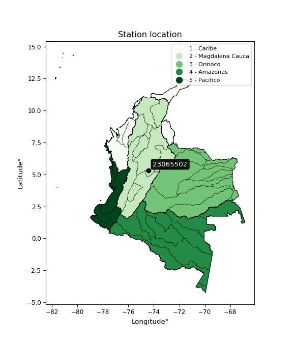</img>

</div>


## A. General information


### 1. General running parameters

• app_version: _v20260312_. • runtime: _2026-03-12 07:15:23.203550_. • Python version: _3.14.0_. • SciPy version: _1.16.3_. • Pandas version: _2.3.3_. • NumPy version: _2.3.5_. • Stations dataset (station_dataset_file): _dataset/pmax24h_in/automatic_colombia_2003_2025.csv_. • Stations catalog (station_catalog_file): _dataset/CNE.xls_. • Minimum year to eval til year_max (date_min): _1900_. • Maximum year to eval since year_min (date_max): _2025_. • Creates, save and include plots into reports (create_plot): _True_. • Plot only fit distributions with Δo > Δ (plot_only_fit): _True_. • Plot only simple graphs avoiding multiple CDFs and multiple Extreme values plots (plot_only_simple): _True_. • Eval low extreme values, if False, evaluates high extreme values (low_extreme): _False_. • Eval every SciPy distribution as logarithmic (pdist_logarithmic_on): _True_. • Standard deviation normalized (ddof): _1.0_. • Return periods to eval in years (Tr): _[2, 2.33, 5, 10, 15, 20, 25, 50, 75, 100, 200, 250, 500, 750, 1000]_. • Minimum data sample per station, 0 means any (minimum_sample): _5_. • Z-Score maximum threshold to adjust a value, 0 means disable (zscore_max): _3.5_. • Z-Score minimum threshold to adjust a value, 0 means disable (zscore_min): _-2.5_. • Avoid zeros, e.g. rain = 0 (avoid_zeros): _True_. • Avoid null values (avoid_nans): _True_. 

:file_folder:Table: [dataset.csv](../../dataset/pmax24h_in/automatic_colombia_2003_2025.csv)

> Delta Degrees of Freedom (DDOF): is a parameter used in the formulas for calculating variance and standard deviation. When ddof=0, the divisor is $N$ (the total number of observations) and this is used when your data set is the entire population. When ddof=1, the divisor is $N-1$ and this is used when your data set is a sample drawn from a larger population. Using $N-1$ provides an unbiased estimate of the population variance (known as Bessel´s correction).


### 2. Station info and location

|   id |   CODIGO | NOMBRE                    | CATEGORIA               | TECNOLOGIA                | ESTADO   | FECHA_INSTALACION   |   FECHA_SUSPENSION |   ALTITUD |   LATITUD |   LONGITUD | DEPARTAMENTO   | MUNICIPIO   | AREA_OPERATIVA                            | ENTIDAD                                    | AREA_HIDROGRAFICA   | ZONA_HIDROGRAFICA   | SUBZONA_HIDROGRAFICA   |   CORRIENTE | Catalogo   |   Version |
|-----:|---------:|:--------------------------|:------------------------|:--------------------------|:---------|:--------------------|-------------------:|----------:|----------:|-----------:|:---------------|:------------|:------------------------------------------|:-------------------------------------------|:--------------------|:--------------------|:-----------------------|------------:|:-----------|----------:|
|    0 | 23065502 | LA PALMA - AUT [23065502] | Climatológica Principal | Automática con Telemetría | Activa   | 08/10/2013          |                nan |       999 |   5.33027 |   -74.4016 | Cundinamarca   | La Palma    | Area Operativa 11 - Cundinamarca-Amazonas | CENTRO NACIONAL DE INVESTIGACIONES DE CAFE | Magdalena Cauca     | Medio Magdalena     | Río Negro              |         nan | CNE_OE     |  20251226 |

<div align="center">

Dynamic map: [:earth_americas:Google](http://maps.google.com/maps?q=5.330266667,-74.40156111) [:earth_americas:OSM](https://www.openstreetmap.org/#map=18/5.330266667/-74.40156111&layers=P) [:earth_americas:Bing](https://www.bing.com/maps?cp=5.330266667~-74.40156111&lvl=18) [:earth_americas:Apple](https://maps.apple.com/frame?center=5.330266667%2C-74.40156111&span=0.003%2C0.006)

</div>


<div align="center">

```geojson
{
  "type": "Feature",
  "geometry": {
    "type": "Point", 
    "coordinates": [-74.40156111, 5.330266667]
  }, 
  "properties": {
    "Name": "23065502"
  }
}
```

</div>


### 3. Discrete values table and plot

<div align="center">

|               |           0 |           1 |           2 |          3 |          4 |
|:--------------|------------:|------------:|------------:|-----------:|-----------:|
| Date          | 2016        | 2017        | 2018        | 2019       | 2020       |
| Value         |   25.8      |   41.7      |   54.1      |   62.4     |    6.3     |
| Value_initial |   25.8      |   41.7      |   54.1      |   62.4     |    6.3     |
| count         |    5        |    5        |    5        |    5       |    5       |
| mean          |   38.06     |   38.06     |   38.06     |   38.06    |   38.06    |
| std           |   22.4832   |   22.4832   |   22.4832   |   22.4832  |   22.4832  |
| zscore        |   -0.545297 |    0.161899 |    0.713422 |    1.08259 |   -1.41261 |


</div>


<div align="center">

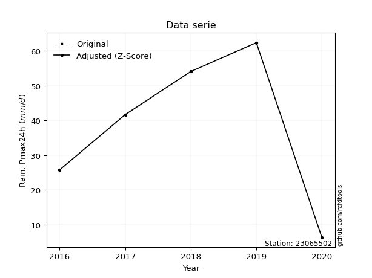</img>

</div>


> The initial value (value_initial) correspond to the initial obtained or null completed value, and value (value) is adjusted only when the initial value is outside the valid range (outlier) definite through the Z-Score value. If Z-Score is active, values out of range or outliers are replaced with the station mean value. A Z-Score (or standard score) measures how many standard deviations a data point is from the mean of a dataset, indicating its relative position; positive scores mean above the mean, negative mean below, and a score of zero is exactly at the mean, allowing for comparison of values from different distributions. It´s calculated using the formula $z=(x–μ)/σ$, where $x$ is the data point, $μ$ is the mean, and $σ$ is the standard deviation, helping identify outliers and understand probability.
>
> <sub>**Note**: In this study, "completing" (filling gaps in) and "extending" (forecasting or lengthening the historical record) rainfall data series are avoided for certain critical analyses because they introduce artificial bias and uncertainty, which can distort the statistics of rare events (extremes), alter day-to-day variability, and compromise the integrity and homogeneity of the original data. Some reasons against Completing/Extending rainfall data are: **Distortion of Extremes and Variability**: The primary issue is that most gap-filling or extension methods rely on averaging or regression with nearby stations, which inherently smooths the data. Rainfall is highly variable in space and time, with a large percentage of zero values and occasional large storms. Infilling methods often underestimate the highest values and overestimate the lowest (zero) values, which severely distorts analyses focused on flood frequency, drought severity, and intensity-duration-frequency (IDF) curves, **Loss of Data Homogeneity**: Infilled or extended data are synthetic estimates, not actual measurements. Combining these estimates with observed data can violate the assumption of data homogeneity, which requires that the data properties do not change over time. Inhomogeneity can lead to incorrect conclusions about long-term trends or changes in climate patterns, **Propagation of Errors**: Errors and biases from the original data (e.g., wind-induced undercatch, instrument errors, site changes) or the data used for imputation can propagate through the analysis, leading to unreliable hydrological models and inaccurate predictions, **Compromised Statistical Integrity**: For statistical analyses, especially those involving the frequency of events, using artificial data can introduce time bias or autocorrelation that doesn´t exist in reality, making it difficult to assess the true probability of events, **Difficulty in Validation**: It is difficult to accurately validate the quality of filled or extended data, especially for past periods where ground-truth measurements are unavailable. The reliability of imputation techniques heavily depends on the density of the surrounding station network and the complexity of the local topography.</sub>


### 4. Active continuous probability distributions from SciPy (80 of 104 available)

A Probability Density Function (PDF) describes the relative likelihood of a continuous random variable falling within a specific range, where the total area under its curve equals 1, and the area over any interval gives the actual probability for that range. Unlike discrete probabilities (like rolling a die), a PDF shows density, not direct probability for a single point (which is zero), with higher points indicating higher likelihood, often visualized as a bell curve for normal distributions.

A log of a probability density function (log-PDF) is simply the logarithm of the PDF´s value, denoted as $log(f(x))$, useful for converting multiplication of probabilities into addition, improving numerical stability with tiny numbers, and connecting to information theory concepts like entropy. Instead of dealing with very small probabilities (e.g., 0.000001), log-PDFs use negative numbers (e.g., $log(0.00001) ≈ -11.51$ that are easier for computers to handle, preventing underflow errors and simplifying complex calculations. In this study, each active probability distribution from SciPy is also evaluated in the $log$ form.

[scipy.stats](https://docs.scipy.org/doc/scipy/reference/stats.html) is a Python´s powerful submodule within the SciPy library for comprehensive statistical analysis, offering over 130 probability distributions (like Normal, Poisson, etc.), functions for descriptive stats (mean, variance), hypothesis testing (t-tests, chi-square), random variable generation, and statistical tests, making it essential for data science, modeling, and research. It provides tools to explore, model, and draw conclusions from data efficiently, working seamlessly with [NumPy](https://numpy.org/).

<div align="center">

|   id | p_dist           |   n_parameter | fit_method   | label                                                                       | active   | ref                                                                                                      |
|-----:|:-----------------|--------------:|:-------------|:----------------------------------------------------------------------------|:---------|:---------------------------------------------------------------------------------------------------------|
|    0 | alpha            |             3 | MLE          | Alpha                                                                       | True     | [:mortar_board:](https://docs.scipy.org/doc/scipy/reference/generated/scipy.stats.alpha.html)            |
|    1 | anglit           |             2 | MM           | Anglit                                                                      | True     | [:mortar_board:](https://docs.scipy.org/doc/scipy/reference/generated/scipy.stats.anglit.html)           |
|    2 | arcsine          |             2 | MM           | Arcsine                                                                     | True     | [:mortar_board:](https://docs.scipy.org/doc/scipy/reference/generated/scipy.stats.arcsine.html)          |
|    3 | argus            |             3 | MLE          | Argus                                                                       | True     | [:mortar_board:](https://docs.scipy.org/doc/scipy/reference/generated/scipy.stats.argus.html)            |
|    4 | beta             |             4 | MLE          | Beta                                                                        | True     | [:mortar_board:](https://docs.scipy.org/doc/scipy/reference/generated/scipy.stats.beta.html)             |
|    5 | betaprime        |             4 | MLE          | Beta prime                                                                  | True     | [:mortar_board:](https://docs.scipy.org/doc/scipy/reference/generated/scipy.stats.betaprime.html)        |
|    6 | bradford         |             3 | MLE          | Bradford                                                                    | True     | [:mortar_board:](https://docs.scipy.org/doc/scipy/reference/generated/scipy.stats.bradford.html)         |
|    7 | burr             |             4 | MLE          | Burr (Type III)                                                             | True     | [:mortar_board:](https://docs.scipy.org/doc/scipy/reference/generated/scipy.stats.burr.html)             |
|    8 | burr12           |             4 | MLE          | Burr (Type III) 12                                                          | True     | [:mortar_board:](https://docs.scipy.org/doc/scipy/reference/generated/scipy.stats.burr12.html)           |
|    9 | cosine           |             2 | MLE          | Cosine                                                                      | True     | [:mortar_board:](https://docs.scipy.org/doc/scipy/reference/generated/scipy.stats.cosine.html)           |
|   10 | crystalball      |             4 | MLE          | Crystalball                                                                 | True     | [:mortar_board:](https://docs.scipy.org/doc/scipy/reference/generated/scipy.stats.crystalball.html)      |
|   11 | dgamma           |             3 | MLE          | Double gamma                                                                | True     | [:mortar_board:](https://docs.scipy.org/doc/scipy/reference/generated/scipy.stats.dgamma.html)           |
|   12 | dweibull         |             3 | MLE          | Double Weibull                                                              | True     | [:mortar_board:](https://docs.scipy.org/doc/scipy/reference/generated/scipy.stats.dweibull.html)         |
|   13 | erlang           |             3 | MLE          | Erlang                                                                      | True     | [:mortar_board:](https://docs.scipy.org/doc/scipy/reference/generated/scipy.stats.erlang.html)           |
|   14 | exponnorm        |             3 | MLE          | Exponentially modified Normal                                               | True     | [:mortar_board:](https://docs.scipy.org/doc/scipy/reference/generated/scipy.stats.exponnorm.html)        |
|   15 | exponpow         |             3 | MLE          | Exponential power                                                           | True     | [:mortar_board:](https://docs.scipy.org/doc/scipy/reference/generated/scipy.stats.exponpow.html)         |
|   16 | exponweib        |             4 | MLE          | Exponentiated Weibull                                                       | True     | [:mortar_board:](https://docs.scipy.org/doc/scipy/reference/generated/scipy.stats.exponweib.html)        |
|   17 | f                |             4 | MLE          | F                                                                           | True     | [:mortar_board:](https://docs.scipy.org/doc/scipy/reference/generated/scipy.stats.f.html)                |
|   18 | fatiguelife      |             3 | MLE          | Fatigue-life (Birnbaum-Saunders)                                            | True     | [:mortar_board:](https://docs.scipy.org/doc/scipy/reference/generated/scipy.stats.fatiguelife.html)      |
|   19 | foldnorm         |             3 | MM           | Fold Normal                                                                 | True     | [:mortar_board:](https://docs.scipy.org/doc/scipy/reference/generated/scipy.stats.foldnorm.html)         |
|   20 | gamma            |             3 | MLE          | Gamma                                                                       | True     | [:mortar_board:](https://docs.scipy.org/doc/scipy/reference/generated/scipy.stats.gamma.html)            |
|   21 | gausshyper       |             6 | MLE          | Gauss hypergeometric                                                        | True     | [:mortar_board:](https://docs.scipy.org/doc/scipy/reference/generated/scipy.stats.gausshyper.html)       |
|   22 | genexpon         |             5 | MLE          | Generalized exponential                                                     | True     | [:mortar_board:](https://docs.scipy.org/doc/scipy/reference/generated/scipy.stats.genexpon.html)         |
|   23 | genextreme       |             3 | MLE          | Generalized exponential                                                     | True     | [:mortar_board:](https://docs.scipy.org/doc/scipy/reference/generated/scipy.stats.genextreme.html)       |
|   24 | gengamma         |             4 | MLE          | Generalized gamma                                                           | True     | [:mortar_board:](https://docs.scipy.org/doc/scipy/reference/generated/scipy.stats.gengamma.html)         |
|   25 | genhalflogistic  |             3 | MLE          | Generalized half-logistic                                                   | True     | [:mortar_board:](https://docs.scipy.org/doc/scipy/reference/generated/scipy.stats.genhalflogistic.html)  |
|   26 | genlogistic      |             3 | MLE          | Generalized logistic                                                        | True     | [:mortar_board:](https://docs.scipy.org/doc/scipy/reference/generated/scipy.stats.genlogistic.html)      |
|   27 | gennorm          |             3 | MLE          | Generalized Normal                                                          | True     | [:mortar_board:](https://docs.scipy.org/doc/scipy/reference/generated/scipy.stats.gennorm.html)          |
|   28 | genpareto        |             3 | MLE          | Generalized Pareto                                                          | True     | [:mortar_board:](https://docs.scipy.org/doc/scipy/reference/generated/scipy.stats.genpareto.html)        |
|   29 | gompertz         |             3 | MLE          | Gompertz (or truncated Gumbel)                                              | True     | [:mortar_board:](https://docs.scipy.org/doc/scipy/reference/generated/scipy.stats.gompertz.html)         |
|   30 | gumbel_l         |             2 | MM           | Gumbel Left Skew                                                            | True     | [:mortar_board:](https://docs.scipy.org/doc/scipy/reference/generated/scipy.stats.gumbel_l.html)         |
|   31 | gumbel_r         |             2 | MM           | Gumbel Right Skew                                                           | True     | [:mortar_board:](https://docs.scipy.org/doc/scipy/reference/generated/scipy.stats.gumbel_r.html)         |
|   32 | halfgennorm      |             3 | MLE          | Upper half of a generalized normal                                          | True     | [:mortar_board:](https://docs.scipy.org/doc/scipy/reference/generated/scipy.stats.halfgennorm.html)      |
|   33 | halflogistic     |             2 | MM           | Half-logistic                                                               | True     | [:mortar_board:](https://docs.scipy.org/doc/scipy/reference/generated/scipy.stats.halflogistic.html)     |
|   34 | halfnorm         |             2 | MM           | Half Normal                                                                 | True     | [:mortar_board:](https://docs.scipy.org/doc/scipy/reference/generated/scipy.stats.halfnorm.html)         |
|   35 | hypsecant        |             2 | MM           | hyperbolic secant                                                           | True     | [:mortar_board:](https://docs.scipy.org/doc/scipy/reference/generated/scipy.stats.hypsecant.html)        |
|   36 | invgamma         |             3 | MLE          | Inverted gamma                                                              | True     | [:mortar_board:](https://docs.scipy.org/doc/scipy/reference/generated/scipy.stats.invgamma.html)         |
|   37 | invgauss         |             3 | MLE          | Inverse Gaussian                                                            | True     | [:mortar_board:](https://docs.scipy.org/doc/scipy/reference/generated/scipy.stats.invgauss.html)         |
|   38 | invweibull       |             3 | MLE          | Inverted Weibull                                                            | True     | [:mortar_board:](https://docs.scipy.org/doc/scipy/reference/generated/scipy.stats.invweibull.html)       |
|   39 | johnsonsb        |             4 | MLE          | Johnson SB                                                                  | True     | [:mortar_board:](https://docs.scipy.org/doc/scipy/reference/generated/scipy.stats.johnsonsb.html)        |
|   40 | johnsonsu        |             4 | MLE          | Johnson Su                                                                  | True     | [:mortar_board:](https://docs.scipy.org/doc/scipy/reference/generated/scipy.stats.johnsonsu.html)        |
|   41 | kappa3           |             3 | MLE          | Kappa 3                                                                     | True     | [:mortar_board:](https://docs.scipy.org/doc/scipy/reference/generated/scipy.stats.kappa3.html)           |
|   42 | kappa4           |             4 | MLE          | Kappa 4                                                                     | True     | [:mortar_board:](https://docs.scipy.org/doc/scipy/reference/generated/scipy.stats.kappa4.html)           |
|   43 | ksone            |             3 | MLE          | Kolmogorov-Smirnov one-sided test statistic distribution                    | True     | [:mortar_board:](https://docs.scipy.org/doc/scipy/reference/generated/scipy.stats.ksone.html)            |
|   44 | kstwobign        |             2 | MLE          | Limiting distribution of scaled Kolmogorov-Smirnov two-sided test statistic | True     | [:mortar_board:](https://docs.scipy.org/doc/scipy/reference/generated/scipy.stats.kstwobign.html)        |
|   45 | laplace          |             2 | MM           | Laplace                                                                     | True     | [:mortar_board:](https://docs.scipy.org/doc/scipy/reference/generated/scipy.stats.laplace.html)          |
|   46 | levy_l           |             2 | MLE          | Left-skewed Levy                                                            | True     | [:mortar_board:](https://docs.scipy.org/doc/scipy/reference/generated/scipy.stats.levy_l.html)           |
|   47 | loggamma         |             3 | MLE          | Log gamma                                                                   | True     | [:mortar_board:](https://docs.scipy.org/doc/scipy/reference/generated/scipy.stats.loggamma.html)         |
|   48 | logistic         |             2 | MM           | Logistic (or Sech-squared)                                                  | True     | [:mortar_board:](https://docs.scipy.org/doc/scipy/reference/generated/scipy.stats.logistic.html)         |
|   49 | loglaplace       |             3 | MLE          | Log-Laplace                                                                 | True     | [:mortar_board:](https://docs.scipy.org/doc/scipy/reference/generated/scipy.stats.loglaplace.html)       |
|   50 | lomax            |             3 | MLE          | Lomax (Pareto of the second kind)                                           | True     | [:mortar_board:](https://docs.scipy.org/doc/scipy/reference/generated/scipy.stats.lomax.html)            |
|   51 | maxwell          |             2 | MM           | Maxwell                                                                     | True     | [:mortar_board:](https://docs.scipy.org/doc/scipy/reference/generated/scipy.stats.maxwell.html)          |
|   52 | mielke           |             4 | MLE          | Mielke Beta-Kappa / Dagum                                                   | True     | [:mortar_board:](https://docs.scipy.org/doc/scipy/reference/generated/scipy.stats.mielke.html)           |
|   53 | moyal            |             2 | MM           | Moyal                                                                       | True     | [:mortar_board:](https://docs.scipy.org/doc/scipy/reference/generated/scipy.stats.moyal.html)            |
|   54 | nakagami         |             3 | MLE          | Nakagami                                                                    | True     | [:mortar_board:](https://docs.scipy.org/doc/scipy/reference/generated/scipy.stats.nakagami.html)         |
|   55 | ncf              |             5 | MLE          | Non-central F distribution                                                  | True     | [:mortar_board:](https://docs.scipy.org/doc/scipy/reference/generated/scipy.stats.ncf.html)              |
|   56 | nct              |             4 | MLE          | Non-central Student’s t                                                     | True     | [:mortar_board:](https://docs.scipy.org/doc/scipy/reference/generated/scipy.stats.nct.html)              |
|   57 | norm             |             2 | MM           | Normal                                                                      | True     | [:mortar_board:](https://docs.scipy.org/doc/scipy/reference/generated/scipy.stats.norm.html)             |
|   58 | pearson3         |             3 | MM           | Pearson type III                                                            | True     | [:mortar_board:](https://docs.scipy.org/doc/scipy/reference/generated/scipy.stats.pearson3.html)         |
|   59 | powerlaw         |             3 | MLE          | Power-function                                                              | True     | [:mortar_board:](https://docs.scipy.org/doc/scipy/reference/generated/scipy.stats.powerlaw.html)         |
|   60 | rayleigh         |             2 | MM           | Rayleigh                                                                    | True     | [:mortar_board:](https://docs.scipy.org/doc/scipy/reference/generated/scipy.stats.rayleigh.html)         |
|   61 | rdist            |             3 | MLE          | R-distributed (symmetric beta)                                              | True     | [:mortar_board:](https://docs.scipy.org/doc/scipy/reference/generated/scipy.stats.rdist.html)            |
|   62 | rice             |             3 | MLE          | Rice                                                                        | True     | [:mortar_board:](https://docs.scipy.org/doc/scipy/reference/generated/scipy.stats.rice.html)             |
|   63 | semicircular     |             2 | MM           | Semicircular                                                                | True     | [:mortar_board:](https://docs.scipy.org/doc/scipy/reference/generated/scipy.stats.semicircular.html)     |
|   64 | skewnorm         |             3 | MLE          | Skew normal                                                                 | True     | [:mortar_board:](https://docs.scipy.org/doc/scipy/reference/generated/scipy.stats.skewnorm.html)         |
|   65 | t                |             3 | MLE          | Student’s t                                                                 | True     | [:mortar_board:](https://docs.scipy.org/doc/scipy/reference/generated/scipy.stats.t.html)                |
|   66 | trapezoid        |             4 | MLE          | Trapezoid                                                                   | True     | [:mortar_board:](https://docs.scipy.org/doc/scipy/reference/generated/scipy.stats.trapezoid.html)        |
|   67 | triang           |             3 | MLE          | Triangular                                                                  | True     | [:mortar_board:](https://docs.scipy.org/doc/scipy/reference/generated/scipy.stats.triang.html)           |
|   68 | truncexpon       |             3 | MLE          | Truncated exponential                                                       | True     | [:mortar_board:](https://docs.scipy.org/doc/scipy/reference/generated/scipy.stats.truncexpon.html)       |
|   69 | truncnorm        |             4 | MLE          | Truncated normal                                                            | True     | [:mortar_board:](https://docs.scipy.org/doc/scipy/reference/generated/scipy.stats.truncnorm.html)        |
|   70 | truncpareto      |             4 | MLE          | Upper truncated Pareto                                                      | True     | [:mortar_board:](https://docs.scipy.org/doc/scipy/reference/generated/scipy.stats.truncpareto.html)      |
|   71 | truncweibull_min |             5 | MLE          | Doubly truncated Weibull minimum                                            | True     | [:mortar_board:](https://docs.scipy.org/doc/scipy/reference/generated/scipy.stats.truncweibull_min.html) |
|   72 | tukeylambda      |             3 | MLE          | Tukey-Lamdba                                                                | True     | [:mortar_board:](https://docs.scipy.org/doc/scipy/reference/generated/scipy.stats.tukeylambda.html)      |
|   73 | uniform          |             2 | MLE          | Uniform                                                                     | True     | [:mortar_board:](https://docs.scipy.org/doc/scipy/reference/generated/scipy.stats.uniform.html)          |
|   74 | vonmises         |             3 | MLE          | Von Mises                                                                   | True     | [:mortar_board:](https://docs.scipy.org/doc/scipy/reference/generated/scipy.stats.vonmises.html)         |
|   75 | vonmises_line    |             3 | MLE          | Von Mises line                                                              | True     | [:mortar_board:](https://docs.scipy.org/doc/scipy/reference/generated/scipy.stats.vonmises_line.html)    |
|   76 | wald             |             2 | MM           | Wald                                                                        | True     | [:mortar_board:](https://docs.scipy.org/doc/scipy/reference/generated/scipy.stats.wald.html)             |
|   77 | weibull_max      |             3 | MLE          | Weibull maximum                                                             | True     | [:mortar_board:](https://docs.scipy.org/doc/scipy/reference/generated/scipy.stats.weibull_max.html)      |
|   78 | weibull_min      |             3 | MLE          | Weibull minimum                                                             | True     | [:mortar_board:](https://docs.scipy.org/doc/scipy/reference/generated/scipy.stats.weibull_min.html)      |
|   79 | wrapcauchy       |             3 | MLE          | Wrapped  Cauchy                                                             | True     | [:mortar_board:](https://docs.scipy.org/doc/scipy/reference/generated/scipy.stats.wrapcauchy.html)       |

</div>

> **n_parameter:** # arguments & localization & scale.
>
> **Fit methods:** (MLE) maximum likelihood, (MM) L-moments.
>
>**Inactive** (With the only purpose of prevent loops, zero divisions, infinite values, over high estimated values or horizontal trending for recurrence intervals estimations, the follow distributions were disabled.)**:** lognorm, norminvgauss, powernorm, powerlognorm, cauchy, halfcauchy, foldcauchy, skewcauchy, chi2, expon, fisk, genhyperbolic, geninvgauss, gibrat, kstwo, laplace_asymmetric, levy, levy_stable, ncx2, pareto, rel_breitwigner, recipinvgauss, studentized_range, loguniform, 


## B. Probability (PDF) vs. Empirical (EDF) distributions functions

A continuous probability distribution (CPD) describes probabilities for variables that can take any value within a range (like rain any time), unlike discrete variables with specific outcomes (like temperature). It uses a Probability Density Function (PDF), a curve where the total area under it equals 1, and the probability of the variable falling within an interval (a to b) is found by calculating the area under the curve between those points. A key feature is that the probability of hitting any single exact value is zero, so probabilities are always expressed for ranges, e.g., $P(a ≤ X ≤ b)$.

<div align="center">

Distributions parameters from station values
|     |   station | p_dist              |   n |               loc |            scale | shape                  | shape1                | shape2                | shape3             |
|----:|----------:|:--------------------|----:|------------------:|-----------------:|:-----------------------|:----------------------|:----------------------|:-------------------|
|   0 |  23065502 | alpha               |   5 |      -0.0285683   |     13.4603      | 4.168292531094818e-10  |                       |                       |                    |
|   1 |  23065502 | anglit              |   5 |      38.06        |     58.8285      |                        |                       |                       |                    |
|   2 |  23065502 | arcsine             |   5 |       9.62079     |     56.8784      |                        |                       |                       |                    |
|   3 |  23065502 | argus               |   5 |     -11.899       |     77.3859      | 1.5408104741180622     |                       |                       |                    |
|   4 |  23065502 | beta                |   5 |       0.300001    |     62.1         | 0.8716717146855317     | 0.534007704410564     |                       |                    |
|   5 |  23065502 | betaprime           |   5 |    -484.038       |  37053.6         | 661.0603472250118      | 46928.77923674809     |                       |                    |
|   6 |  23065502 | bradford            |   5 |       6.29998     |     56.1016      | 0.9959925369180208     |                       |                       |                    |
|   7 |  23065502 | burr                |   5 |      -2.26036     |     65.3809      | 349.1151059532292      | 0.004168228133965238  |                       |                    |
|   8 |  23065502 | burr12              |   5 |      -1.63926     |      7.83367     | 337.82048162332575     | 0.0021021045629339144 |                       |                    |
|   9 |  23065502 | cosine              |   5 |      36.9231      |     16.3222      |                        |                       |                       |                    |
|  10 |  23065502 | crystalball         |   5 |      38.06        |     20.1096      | 2842.829692512389      | 3119.5794847077577    |                       |                    |
|  11 |  23065502 | dgamma              |   5 |      34.5418      |      5.31191     | 3.4472768465205457     |                       |                       |                    |
|  12 |  23065502 | dweibull            |   5 |      34.482       |     20.7763      | 2.203458632760523      |                       |                       |                    |
|  13 |  23065502 | erlang              |   5 |    -283.447       |      1.3009      | 247.1166753821891      |                       |                       |                    |
|  14 |  23065502 | exponnorm           |   5 |      38.0453      |     20.1097      | 0.0007389387909222307  |                       |                       |                    |
|  15 |  23065502 | exponpow            |   5 |       6.3         |     49.9565      | 0.9441900517103021     |                       |                       |                    |
|  16 |  23065502 | exponweib           |   5 |     -35.6985      |     98.4665      | 0.003470278398437296   | 870.6176570449961     |                       |                    |
|  17 |  23065502 | f                   |   5 |   -5218.89        |   5256.93        | 148711.89426568907     | 1637801.0275258329    |                       |                    |
|  18 |  23065502 | fatiguelife         |   5 |   -2854.71        |   2892.73        | 0.0069495871881714785  |                       |                       |                    |
|  19 |  23065502 | foldnorm            |   5 |     -97.9351      |     19.2705      | 7.067918772284168      |                       |                       |                    |
|  20 |  23065502 | gamma               |   5 |    -262.299       |      1.38153     | 217.23484355756216     |                       |                       |                    |
|  21 |  23065502 | gausshyper          |   5 |       0.752595    |     61.6474      | 1.1786661110848815     | 0.6794759782922264    | 1.1403116730420866    | 1.0387041176791851 |
|  22 |  23065502 | genexpon            |   5 |       1.23042     |      2.22065     | 0.016656286933927646   | 0.5589361827812861    | 0.007593508988021579  |                    |
|  23 |  23065502 | genextreme          |   5 |      34.8295      |     35.1121      | 1.273538989998252      |                       |                       |                    |
|  24 |  23065502 | gengamma            |   5 |     -83.8459      |    148.465       | 0.052746512261952594   | 89.514970651044       |                       |                    |
|  25 |  23065502 | genhalflogistic     |   5 |      -6.11363     |     71.9842      | 1.050654716461425      |                       |                       |                    |
|  26 |  23065502 | genlogistic         |   5 |      62.4003      |      4.94963e-06 | 2.0328986706174818e-07 |                       |                       |                    |
|  27 |  23065502 | gennorm             |   5 |      34.35        |     28.05        | 14039563.582098037     |                       |                       |                    |
|  28 |  23065502 | genpareto           |   5 |      -0.305056    |    103.092       | -1.6440771803057954    |                       |                       |                    |
|  29 |  23065502 | gompertz            |   5 |      -6.732       |     17.9148      | 0.05213874304204434    |                       |                       |                    |
|  30 |  23065502 | gumbel_l            |   5 |      47.1104      |     15.6794      |                        |                       |                       |                    |
|  31 |  23065502 | gumbel_r            |   5 |      29.0096      |     15.6794      |                        |                       |                       |                    |
|  32 |  23065502 | halfgennorm         |   5 |       6.3         |      2.89448     | 0.41799466205300584    |                       |                       |                    |
|  33 |  23065502 | halflogistic        |   5 |      14.2255      |     17.1929      |                        |                       |                       |                    |
|  34 |  23065502 | halfnorm            |   5 |      11.4428      |     33.3597      |                        |                       |                       |                    |
|  35 |  23065502 | hypsecant           |   5 |      38.06        |     12.8021      |                        |                       |                       |                    |
|  36 |  23065502 | invgamma            |   5 |    -154.854       |  16309.8         | 85.78306116366797      |                       |                       |                    |
|  37 |  23065502 | invgauss            |   5 |     -82.211       |   3706.85        | 0.032453118259732155   |                       |                       |                    |
|  38 |  23065502 | invweibull          |   5 |      -5.51035e+09 |      5.51035e+09 | 321487556.4273392      |                       |                       |                    |
|  39 |  23065502 | johnsonsb           |   5 |       3.89378     |     58.5062      | -0.5156560555096505    | 0.10954555356691223   |                       |                    |
|  40 |  23065502 | johnsonsu           |   5 |      70.2671      |      0.108681    | 8.272270403585491      | 1.3467114778137068    |                       |                    |
|  41 |  23065502 | kappa3              |   5 |       6.3         |     54.9967      | 125.61944412884498     |                       |                       |                    |
|  42 |  23065502 | kappa4              |   5 |       3.50943     |     62.4722      | 1.0468250921673266     | 1.0607409005371786    |                       |                    |
|  43 |  23065502 | ksone               |   5 |       3.22922     |     69.6616      | 1.0                    |                       |                       |                    |
|  44 |  23065502 | kstwobign           |   5 |     -40.0792      |     89.0594      |                        |                       |                       |                    |
|  45 |  23065502 | laplace             |   5 |      38.06        |     14.2196      |                        |                       |                       |                    |
|  46 |  23065502 | levy_l              |   5 |      64.0669      |      6.34199     |                        |                       |                       |                    |
|  47 |  23065502 | loggamma            |   5 |      62.4002      |      1.25759e-05 | 5.165556057677937e-07  |                       |                       |                    |
|  48 |  23065502 | logistic            |   5 |      38.06        |     11.087       |                        |                       |                       |                    |
|  49 |  23065502 | loglaplace          |   5 |      -0.0891776   |     41.7892      | 1.6531305839170762     |                       |                       |                    |
|  50 |  23065502 | lomax               |   5 |       6.3         |   1840.85        | 55.46831907677779      |                       |                       |                    |
|  51 |  23065502 | maxwell             |   5 |      -9.59121     |     29.861       |                        |                       |                       |                    |
|  52 |  23065502 | mielke              |   5 |      -1.79159     |     64.4011      | 1.4454274248586234     | 1669.568545862874     |                       |                    |
|  53 |  23065502 | moyal               |   5 |      26.5601      |      9.05248     |                        |                       |                       |                    |
|  54 |  23065502 | nakagami            |   5 |      25.8         |     20.557       | 0.04796144154470067    |                       |                       |                    |
|  55 |  23065502 | ncf                 |   5 |       0.00749948  |      1.23831e-05 | 3.721974782339581e-06  | 99.05655388236728     | 11.320345997306802    |                    |
|  56 |  23065502 | nct                 |   5 |    -920.554       |     20.0998      | 486776.67284490494     | 47.692630073765216    |                       |                    |
|  57 |  23065502 | norm                |   5 |      38.06        |     20.1096      |                        |                       |                       |                    |
|  58 |  23065502 | pearson3            |   5 |      38.06        |     20.1096      | -0.3759081055618388    |                       |                       |                    |
|  59 |  23065502 | powerlaw            |   5 |       6.3         |     56.1         | 0.12387966221192698    |                       |                       |                    |
|  60 |  23065502 | rayleigh            |   5 |      -0.410762    |     30.6952      |                        |                       |                       |                    |
|  61 |  23065502 | rdist               |   5 |       1.83925     |     23.9607      | 1.2408206749814876     |                       |                       |                    |
|  62 |  23065502 | rice                |   5 |      -5.73373     |     22.8467      | 1.564949373633985      |                       |                       |                    |
|  63 |  23065502 | semicircular        |   5 |      38.06        |     40.2191      |                        |                       |                       |                    |
|  64 |  23065502 | skewnorm            |   5 |      62.4         |     31.5748      | -10089878.172955098    |                       |                       |                    |
|  65 |  23065502 | t                   |   5 |      38.0602      |     20.1097      | 96502000.52016655      |                       |                       |                    |
|  66 |  23065502 | trapezoid           |   5 |     -19.7593      |     85.3176      | 1.0                    | 1.0                   |                       |                    |
|  67 |  23065502 | triang              |   5 |     -10.2365      |     72.7691      | 0.9981778423092922     |                       |                       |                    |
|  68 |  23065502 | truncexpon          |   5 |       0.738456    |     82.0975      | 0.7510765724719353     |                       |                       |                    |
|  69 |  23065502 | truncnorm           |   5 |      38.06        |     20.1096      | -86.54555517925242     | 219.13532818483714    |                       |                    |
|  70 |  23065502 | truncpareto         |   5 |       5.98726     |      0.312737    | 0.26153849950922864    | 180.38391745367232    |                       |                    |
|  71 |  23065502 | truncweibull_min    |   5 |       0.782848    |     78.0473      | 1.1496882430985336     | 1.18703852420809e-10  | 0.7894851672535079    |                    |
|  72 |  23065502 | tukeylambda         |   5 |      34.3529      |     34.8524      | 1.2423828331627955     |                       |                       |                    |
|  73 |  23065502 | uniform             |   5 |       6.3         |     56.1         |                        |                       |                       |                    |
|  74 |  23065502 | vonmises            |   5 |      -0.747812    |      1           | 0.7399589735301565     |                       |                       |                    |
|  75 |  23065502 | vonmises_line       |   5 |      34.3481      |      8.92945     | 2.811637243398373e-06  |                       |                       |                    |
|  76 |  23065502 | wald                |   5 |      17.9504      |     20.1096      |                        |                       |                       |                    |
|  77 |  23065502 | weibull_max         |   5 |      62.4         |      1.4887      | 0.3704312592436787     |                       |                       |                    |
|  78 |  23065502 | weibull_min         |   5 |      -3.95378e+08 |      3.95378e+08 | 24368609.37199451      |                       |                       |                    |
|  79 |  23065502 | wrapcauchy          |   5 |       6.29997     |      8.9286      | 0.4020380116231026     |                       |                       |                    |
|  80 |  23065502 | logalpha            |   5 |     -14.6798      |    368.457       | 20.476317971592376     |                       |                       |                    |
|  81 |  23065502 | loganglit           |   5 |       3.38916     |      2.43006     |                        |                       |                       |                    |
|  82 |  23065502 | logarcsine          |   5 |       2.2144      |      2.34953     |                        |                       |                       |                    |
|  83 |  23065502 | logargus            |   5 |       0.739842    |      3.47319     | 2.638951424826449      |                       |                       |                    |
|  84 |  23065502 | logbeta             |   5 |       1.63895     |      2.49462     | 0.5209880539814209     | 0.1860078202184957    |                       |                    |
|  85 |  23065502 | logbetaprime        |   5 |     -44.5122      |     28.5363      | 8572.433825900505      | 5106.360542326149     |                       |                    |
|  86 |  23065502 | logbradford         |   5 |       1.84049     |      2.29308     | 1.1160748637988251     |                       |                       |                    |
|  87 |  23065502 | logburr             |   5 |      -1.70599e+06 |      1.70599e+06 | 513976130.0493324      | 0.004384633412062204  |                       |                    |
|  88 |  23065502 | logburr12           |   5 |   -1609.4         |   1620.59        | 2788.7024644770318     | 378110.89330318663    |                       |                    |
|  89 |  23065502 | logcosine           |   5 |       3.26522     |      0.70012     |                        |                       |                       |                    |
|  90 |  23065502 | logcrystalball      |   5 |       3.38917     |      0.830677    | 10.665709411783999     | 28.813839868618977    |                       |                    |
|  91 |  23065502 | logdgamma           |   5 |       3.7305      |      0.61221     | 0.8206789118109878     |                       |                       |                    |
|  92 |  23065502 | logdweibull         |   5 |       3.7305      |      0.657108    | 0.8540178481307886     |                       |                       |                    |
|  93 |  23065502 | logerlang           |   5 |      -9.63545     |      0.0595871   | 218.6718390666112      |                       |                       |                    |
|  94 |  23065502 | logexponnorm        |   5 |       3.38861     |      0.830673    | 0.0006737494589368516  |                       |                       |                    |
|  95 |  23065502 | logexponpow         |   5 |       1.84055     |      2.10555     | 0.13607692292497248    |                       |                       |                    |
|  96 |  23065502 | logexponweib        |   5 |       1.84055     |      1.49538     | 1.738367631024163      | 0.08484267236129045   |                       |                    |
|  97 |  23065502 | logf                |   5 |   -1250.18        |   1253.57        | 12451055.466154858     | 7191306.511874054     |                       |                    |
|  98 |  23065502 | logfatiguelife      |   5 |    -437.901       |    441.291       | 0.001882688084792845   |                       |                       |                    |
|  99 |  23065502 | logfoldnorm         |   5 |      -2.43177     |      0.778859    | 7.483593729145847      |                       |                       |                    |
| 100 |  23065502 | loggamma            |   5 |     -10.4538      |      0.0537462   | 257.36773493996856     |                       |                       |                    |
| 101 |  23065502 | loggausshyper       |   5 |       1.70815     |      2.42541     | 1.2246436508050422     | 0.6028290136447609    | 1.065858422497962     | 1.1487569105282667 |
| 102 |  23065502 | loggenexpon         |   5 |       1.84037     |      0.0052746   | 0.0014396650368174353  | 1.2920591082143122    | 8.013302454970412e-06 |                    |
| 103 |  23065502 | loggenextreme       |   5 |       3.50419     |      0.72748     | 1.1558697119273282     |                       |                       |                    |
| 104 |  23065502 | loggengamma         |   5 |       1.84055     |      4.3697      | 0.1442677040471477     | 2.025789066876306     |                       |                    |
| 105 |  23065502 | loggenhalflogistic  |   5 |       1.60116     |      2.68287     | 1.0594170716959344     |                       |                       |                    |
| 106 |  23065502 | loggenlogistic      |   5 |       4.13357     |      4.17238e-07 | 5.620836850176252e-07  |                       |                       |                    |
| 107 |  23065502 | loggennorm          |   5 |       3.7305      |      0.58097     | 0.9628892100895325     |                       |                       |                    |
| 108 |  23065502 | loggenpareto        |   5 |      -0.00227881  |     10.2596      | -2.480649451905448     |                       |                       |                    |
| 109 |  23065502 | loggompertz         |   5 |       1.84055     |      0.618104    | 0.04983499171876394    |                       |                       |                    |
| 110 |  23065502 | loggumbel_l         |   5 |       3.76301     |      0.647676    |                        |                       |                       |                    |
| 111 |  23065502 | loggumbel_r         |   5 |       3.01532     |      0.647676    |                        |                       |                       |                    |
| 112 |  23065502 | loghalfgennorm      |   5 |       1.84055     |      1.08461     | 0.8231573844461222     |                       |                       |                    |
| 113 |  23065502 | loghalflogistic     |   5 |       2.40459     |      0.710215    |                        |                       |                       |                    |
| 114 |  23065502 | loghalfnorm         |   5 |       2.28967     |      1.37801     |                        |                       |                       |                    |
| 115 |  23065502 | loghypsecant        |   5 |       3.38916     |      0.528825    |                        |                       |                       |                    |
| 116 |  23065502 | loginvgamma         |   5 |     -13.8303      |   6727.14        | 392.2064621677108      |                       |                       |                    |
| 117 |  23065502 | loginvgauss         |   5 |      -5.07586     |    769.254       | 0.01099512929659633    |                       |                       |                    |
| 118 |  23065502 | loginvweibull       |   5 |      -9.95367e+07 |      9.95367e+07 | 107605003.64849523     |                       |                       |                    |
| 119 |  23065502 | logjohnsonsb        |   5 |       1.69273     |      2.44084     | -0.02715067693634693   | 0.08501426158554917   |                       |                    |
| 120 |  23065502 | logjohnsonsu        |   5 |       4.13357     |      7.02354e-16 | 2.6681386172146677     | 0.0982723749232684    |                       |                    |
| 121 |  23065502 | logkappa3           |   5 |       1.84022     |      2.29287     | 9486.001545314477      |                       |                       |                    |
| 122 |  23065502 | logkappa4           |   5 |       1.6328      |      2.54051     | 1.0891091985561256     | 1.0128928355161628    |                       |                    |
| 123 |  23065502 | logksone            |   5 |       1.61125     |      2.75162     | 1.0                    |                       |                       |                    |
| 124 |  23065502 | logkstwobign        |   5 |      -0.295831    |      4.19965     |                        |                       |                       |                    |
| 125 |  23065502 | loglaplace          |   5 |       3.38916     |      0.587377    |                        |                       |                       |                    |
| 126 |  23065502 | loglevy_l           |   5 |       4.16722     |      0.127518    |                        |                       |                       |                    |
| 127 |  23065502 | logloggamma         |   5 |       4.13361     |      2.29234e-06 | 3.088778198920107e-06  |                       |                       |                    |
| 128 |  23065502 | loglogistic         |   5 |       3.38916     |      0.457976    |                        |                       |                       |                    |
| 129 |  23065502 | logloglaplace       |   5 | -534420           | 534424           | 959592.5983148911      |                       |                       |                    |
| 130 |  23065502 | loglomax            |   5 |       1.84055     |     26.419       | 17.23198600336596      |                       |                       |                    |
| 131 |  23065502 | logmaxwell          |   5 |       1.42081     |      1.23348     |                        |                       |                       |                    |
| 132 |  23065502 | logmielke           |   5 |      -1.77676e+07 |      1.77676e+07 | 23050219.437056705     | 2011629539.4082813    |                       |                    |
| 133 |  23065502 | logmoyal            |   5 |       2.91413     |      0.373936    |                        |                       |                       |                    |
| 134 |  23065502 | lognakagami         |   5 |       3.25037     |      0.63881     | 0.4376721602229814     |                       |                       |                    |
| 135 |  23065502 | logncf              |   5 |     -15.7766      |     18.6866      | 1604.2936532320027     | 2571.828625664206     | 40.725266729642584    |                    |
| 136 |  23065502 | lognct              |   5 |      59.0129      |      0.81297     | 54991.40267504491      | -68.41900709747509    |                       |                    |
| 137 |  23065502 | lognorm             |   5 |       3.38916     |      0.830677    |                        |                       |                       |                    |
| 138 |  23065502 | logpearson3         |   5 |       3.38917     |      0.830676    | -1.0630127185240446    |                       |                       |                    |
| 139 |  23065502 | logpowerlaw         |   5 |       1.84055     |      2.29302     | 0.1329168327319415     |                       |                       |                    |
| 140 |  23065502 | lograyleigh         |   5 |       1.80003     |      1.26794     |                        |                       |                       |                    |
| 141 |  23065502 | logrdist            |   5 |       2.69067     |      1.4429      | 0.9467817807492467     |                       |                       |                    |
| 142 |  23065502 | logrice             |   5 |       1.22506     |      0.899431    | 2.1545843959155158     |                       |                       |                    |
| 143 |  23065502 | logsemicircular     |   5 |       3.38916     |      1.66135     |                        |                       |                       |                    |
| 144 |  23065502 | logskewnorm         |   5 |       4.13357     |      1.11539     | -66005160.17615062     |                       |                       |                    |
| 145 |  23065502 | logt                |   5 |       3.38916     |      0.830679    | 833688261.2442508      |                       |                       |                    |
| 146 |  23065502 | logtrapezoid        |   5 |       1.03966     |      3.52426     | 1.0                    | 1.0                   |                       |                    |
| 147 |  23065502 | logtriang           |   5 |       1.31028     |      2.82329     | 0.9999999994434183     |                       |                       |                    |
| 148 |  23065502 | logtruncexpon       |   5 |       1.84023     |      3.35072     | 0.6844290486857624     |                       |                       |                    |
| 149 |  23065502 | logtruncnorm        |   5 |      -0.195129    |      1.50796     | 2.2848783176100085     | 2.8705755020918664    |                       |                    |
| 150 |  23065502 | logtruncpareto      |   5 |       1.8247      |      0.0158533   | 0.2605963343209007     | 145.63952045144677    |                       |                    |
| 151 |  23065502 | logtruncweibull_min |   5 |       1.83922     |      2.71106     | 0.9379923302134727     | 0.0004895731843622215 | 0.8462887119317075    |                    |
| 152 |  23065502 | logtukeylambda      |   5 |       2.98862     |      1.26893     | 1.105270234484136      |                       |                       |                    |
| 153 |  23065502 | loguniform          |   5 |       1.84055     |      2.29302     |                        |                       |                       |                    |
| 154 |  23065502 | logvonmises         |   5 |      -2.76943     |      1           | 2.066788557127483      |                       |                       |                    |
| 155 |  23065502 | logvonmises_line    |   5 |       3.60599     |      0.561958    | 1.0161504056058233     |                       |                       |                    |
| 156 |  23065502 | logwald             |   5 |       2.55854     |      0.830635    |                        |                       |                       |                    |
| 157 |  23065502 | logweibull_max      |   5 |       4.13357     |      0.855446    | 0.4778104671668878     |                       |                       |                    |
| 158 |  23065502 | logweibull_min      |   5 |      -3.06876e+07 |      3.06876e+07 | 56987014.69875257      |                       |                       |                    |
| 159 |  23065502 | logwrapcauchy       |   5 |       1.83917     |      0.365164    | 0.7109754086631003     |                       |                       |                    |

</div>

> **loc** (Location parameter): This shifts the distribution along the x-axis. For many common distributions, like the normal (Gaussian) distribution, loc represents the mean $μ$. For others, like the uniform distribution, it might represent the minimum value, or for the beta distribution, the left end of the support interval.
>
> **scale** (Scale parameter): This determines the width or spread of the distribution. For the normal distribution, scale represents the standard deviation $σ$. For a uniform distribution, it defines the length of the interval (from $loc$ to $loc + scale$).
>
> **shape** (Shape parameters): Refers to parameters that define the specific form of a probability distribution, distinct from its location (loc) and scale (scale). These parameters are required arguments for most distribution functions. For example, a normal (Gaussian) distribution is fully defined by its location (mean) and scale (standard deviation), so it has no specific shape parameters beyond loc and scale. However, other distributions have intrinsic properties that need specification, as Gamma distribution that takes a shape parameter, often named $a$ or $alpha$.


### 0. Cumulative distribution values - CDF (160 evaluated)

Cumulative Distribution Function (CDF), denoted as $F$<sub>$X$</sub>$(x)$, is a function that gives the probability that a random variable $X$ will take a value less than or equal to a specific value, $x$ (i.e., $(P(X≥x)$. It essentially "accumulates" probabilities from a given point up to the far right (positive infinity), providing a complete picture of the distribution´s probabilities for both discrete (like rain) and continuous (like temperature) variables, helping to find probabilities over ranges or above certain values. Each station is evaluated separately ordering the $x$ values ascending, calculating the CDF and PDF values for the activated distributions and their logarithmic forms.

<div align="center">

CDF ordered by x ascending and calculating $log(f(x))$ separately
|   id |   Station |   date |    x |   count |   mean |     std |    zscore |   Value_initial |   station |   m |    alpha |   alpha_pdf |    anglit |   anglit_pdf |   arcsine |   arcsine_pdf |     argus |   argus_pdf |      beta |       beta_pdf |   betaprime |   betaprime_pdf |    bradford |   bradford_pdf |     burr |    burr_pdf |     burr12 |   burr12_pdf |    cosine |   cosine_pdf |   crystalball |   crystalball_pdf |   dgamma |   dgamma_pdf |   dweibull |   dweibull_pdf |    erlang |   erlang_pdf |   exponnorm |   exponnorm_pdf |    exponpow |   exponpow_pdf |   exponweib |   exponweib_pdf |         f |      f_pdf |   fatiguelife |   fatiguelife_pdf |   foldnorm |   foldnorm_pdf |     gamma |   gamma_pdf |   gausshyper |   gausshyper_pdf |   genexpon |   genexpon_pdf |   genextreme |   genextreme_pdf |   gengamma |   gengamma_pdf |   genhalflogistic |   genhalflogistic_pdf |   genlogistic |   genlogistic_pdf |     gennorm |   gennorm_pdf |   genpareto |   genpareto_pdf |   gompertz |   gompertz_pdf |   gumbel_l |   gumbel_l_pdf |   gumbel_r |   gumbel_r_pdf |   halfgennorm |   halfgennorm_pdf |   halflogistic |   halflogistic_pdf |   halfnorm |   halfnorm_pdf |   hypsecant |   hypsecant_pdf |   invgamma |   invgamma_pdf |   invgauss |   invgauss_pdf |   invweibull |   invweibull_pdf |   johnsonsb |   johnsonsb_pdf |   johnsonsu |   johnsonsu_pdf |      kappa3 |   kappa3_pdf |      kappa4 |   kappa4_pdf |     ksone |   ksone_pdf |   kstwobign |   kstwobign_pdf |   laplace |   laplace_pdf |   levy_l |   levy_l_pdf |   loggamma |   loggamma_pdf |   logistic |   logistic_pdf |   loglaplace |   loglaplace_pdf |       lomax |   lomax_pdf |   maxwell |   maxwell_pdf |    mielke |   mielke_pdf |      moyal |   moyal_pdf |   nakagami |   nakagami_pdf |       ncf |    ncf_pdf |       nct |    nct_pdf |      norm |   norm_pdf |   pearson3 |   pearson3_pdf |   powerlaw |   powerlaw_pdf |   rayleigh |   rayleigh_pdf |    rdist |    rdist_pdf |      rice |   rice_pdf |   semicircular |   semicircular_pdf |   skewnorm |   skewnorm_pdf |         t |      t_pdf |   trapezoid |   trapezoid_pdf |    triang |   triang_pdf |   truncexpon |   truncexpon_pdf |   truncnorm |   truncnorm_pdf |   truncpareto |   truncpareto_pdf |   truncweibull_min |   truncweibull_min_pdf |   tukeylambda |   tukeylambda_pdf |   uniform |   uniform_pdf |   vonmises |   vonmises_pdf |   vonmises_line |   vonmises_line_pdf |     wald |   wald_pdf |   weibull_max |   weibull_max_pdf |   weibull_min |   weibull_min_pdf |   wrapcauchy |   wrapcauchy_pdf |   logalpha |   logalpha_pdf |   loganglit |   loganglit_pdf |   logarcsine |   logarcsine_pdf |   logargus |   logargus_pdf |   logbeta |   logbeta_pdf |   logbetaprime |   logbetaprime_pdf |   logbradford |   logbradford_pdf |   logburr |   logburr_pdf |   logburr12 |   logburr12_pdf |   logcosine |   logcosine_pdf |   logcrystalball |   logcrystalball_pdf |   logdgamma |   logdgamma_pdf |   logdweibull |   logdweibull_pdf |   logerlang |   logerlang_pdf |   logexponnorm |   logexponnorm_pdf |   logexponpow |   logexponpow_pdf |   logexponweib |   logexponweib_pdf |      logf |   logf_pdf |   logfatiguelife |   logfatiguelife_pdf |   logfoldnorm |   logfoldnorm_pdf |   loggausshyper |   loggausshyper_pdf |   loggenexpon |   loggenexpon_pdf |   loggenextreme |   loggenextreme_pdf |   loggengamma |   loggengamma_pdf |   loggenhalflogistic |   loggenhalflogistic_pdf |   loggenlogistic |   loggenlogistic_pdf |   loggennorm |   loggennorm_pdf |   loggenpareto |   loggenpareto_pdf |   loggompertz |   loggompertz_pdf |   loggumbel_l |   loggumbel_l_pdf |   loggumbel_r |   loggumbel_r_pdf |   loghalfgennorm |   loghalfgennorm_pdf |   loghalflogistic |   loghalflogistic_pdf |   loghalfnorm |   loghalfnorm_pdf |   loghypsecant |   loghypsecant_pdf |   loginvgamma |   loginvgamma_pdf |   loginvgauss |   loginvgauss_pdf |   loginvweibull |   loginvweibull_pdf |   logjohnsonsb |   logjohnsonsb_pdf |   logjohnsonsu |   logjohnsonsu_pdf |   logkappa3 |   logkappa3_pdf |   logkappa4 |   logkappa4_pdf |   logksone |   logksone_pdf |   logkstwobign |   logkstwobign_pdf |   loglevy_l |   loglevy_l_pdf |   logloggamma |   logloggamma_pdf |   loglogistic |   loglogistic_pdf |   logloglaplace |   logloglaplace_pdf |    loglomax |   loglomax_pdf |   logmaxwell |   logmaxwell_pdf |   logmielke |   logmielke_pdf |    logmoyal |   logmoyal_pdf |   lognakagami |   lognakagami_pdf |    logncf |   logncf_pdf |    lognct |   lognct_pdf |   lognorm |   lognorm_pdf |   logpearson3 |   logpearson3_pdf |   logpowerlaw |   logpowerlaw_pdf |   lograyleigh |   lograyleigh_pdf |   logrdist |   logrdist_pdf |   logrice |   logrice_pdf |   logsemicircular |   logsemicircular_pdf |   logskewnorm |   logskewnorm_pdf |      logt |   logt_pdf |   logtrapezoid |   logtrapezoid_pdf |   logtriang |   logtriang_pdf |   logtruncexpon |   logtruncexpon_pdf |   logtruncnorm |   logtruncnorm_pdf |   logtruncpareto |   logtruncpareto_pdf |   logtruncweibull_min |   logtruncweibull_min_pdf |   logtukeylambda |   logtukeylambda_pdf |   loguniform |   loguniform_pdf |   logvonmises |   logvonmises_pdf |   logvonmises_line |   logvonmises_line_pdf |   logwald |   logwald_pdf |   logweibull_max |   logweibull_max_pdf |   logweibull_min |   logweibull_min_pdf |   logwrapcauchy |   logwrapcauchy_pdf |
|-----:|----------:|-------:|-----:|--------:|-------:|--------:|----------:|----------------:|----------:|----:|---------:|------------:|----------:|-------------:|----------:|--------------:|----------:|------------:|----------:|---------------:|------------:|----------------:|------------:|---------------:|---------:|------------:|-----------:|-------------:|----------:|-------------:|--------------:|------------------:|---------:|-------------:|-----------:|---------------:|----------:|-------------:|------------:|----------------:|------------:|---------------:|------------:|----------------:|----------:|-----------:|--------------:|------------------:|-----------:|---------------:|----------:|------------:|-------------:|-----------------:|-----------:|---------------:|-------------:|-----------------:|-----------:|---------------:|------------------:|----------------------:|--------------:|------------------:|------------:|--------------:|------------:|----------------:|-----------:|---------------:|-----------:|---------------:|-----------:|---------------:|--------------:|------------------:|---------------:|-------------------:|-----------:|---------------:|------------:|----------------:|-----------:|---------------:|-----------:|---------------:|-------------:|-----------------:|------------:|----------------:|------------:|----------------:|------------:|-------------:|------------:|-------------:|----------:|------------:|------------:|----------------:|----------:|--------------:|---------:|-------------:|-----------:|---------------:|-----------:|---------------:|-------------:|-----------------:|------------:|------------:|----------:|--------------:|----------:|-------------:|-----------:|------------:|-----------:|---------------:|----------:|-----------:|----------:|-----------:|----------:|-----------:|-----------:|---------------:|-----------:|---------------:|-----------:|---------------:|---------:|-------------:|----------:|-----------:|---------------:|-------------------:|-----------:|---------------:|----------:|-----------:|------------:|----------------:|----------:|-------------:|-------------:|-----------------:|------------:|----------------:|--------------:|------------------:|-------------------:|-----------------------:|--------------:|------------------:|----------:|--------------:|-----------:|---------------:|----------------:|--------------------:|---------:|-----------:|--------------:|------------------:|--------------:|------------------:|-------------:|-----------------:|-----------:|---------------:|------------:|----------------:|-------------:|-----------------:|-----------:|---------------:|----------:|--------------:|---------------:|-------------------:|--------------:|------------------:|----------:|--------------:|------------:|----------------:|------------:|----------------:|-----------------:|---------------------:|------------:|----------------:|--------------:|------------------:|------------:|----------------:|---------------:|-------------------:|--------------:|------------------:|---------------:|-------------------:|----------:|-----------:|-----------------:|---------------------:|--------------:|------------------:|----------------:|--------------------:|--------------:|------------------:|----------------:|--------------------:|--------------:|------------------:|---------------------:|-------------------------:|-----------------:|---------------------:|-------------:|-----------------:|---------------:|-------------------:|--------------:|------------------:|--------------:|------------------:|--------------:|------------------:|-----------------:|---------------------:|------------------:|----------------------:|--------------:|------------------:|---------------:|-------------------:|--------------:|------------------:|--------------:|------------------:|----------------:|--------------------:|---------------:|-------------------:|---------------:|-------------------:|------------:|----------------:|------------:|----------------:|-----------:|---------------:|---------------:|-------------------:|------------:|----------------:|--------------:|------------------:|--------------:|------------------:|----------------:|--------------------:|------------:|---------------:|-------------:|-----------------:|------------:|----------------:|------------:|---------------:|--------------:|------------------:|----------:|-------------:|----------:|-------------:|----------:|--------------:|--------------:|------------------:|--------------:|------------------:|--------------:|------------------:|-----------:|---------------:|----------:|--------------:|------------------:|----------------------:|--------------:|------------------:|----------:|-----------:|---------------:|-------------------:|------------:|----------------:|----------------:|--------------------:|---------------:|-------------------:|-----------------:|---------------------:|----------------------:|--------------------------:|-----------------:|---------------------:|-------------:|-----------------:|--------------:|------------------:|-------------------:|-----------------------:|----------:|--------------:|-----------------:|---------------------:|-----------------:|---------------------:|----------------:|--------------------:|
|    0 |  23065502 |   2020 |  6.3 |       5 |  38.06 | 22.4832 | -1.41261  |             6.3 |  23065502 |   1 | 0.033428 |  0.0279298  | 0.0590803 |   0.00801567 |  0        |     0         | 0.0500343 |  0.00560075 | 0.0746598 |      0.0111276 |   0.0586041 |      0.0059675  | 5.22657e-07 |      0.025687  | 0.051895 | nan         | 0.00948492 |   0.0876458  | 0.0496078 |   0.00681932 |     0.0571281 |        0.00569991 | 0.074494 |   0.00879097 |  0.0705922 |      0.0108052 | 0.0565738 |   0.00596222 |   0.0571283 |      0.00569989 | 2.71117e-15 |     0.137245   |   0.0761697 |      0.00616436 | 0.0571741 | 0.00572135 |     0.0563371 |        0.00570202 |  0.0485704 |     0.00522945 | 0.0567367 |  0.00602994 |    0.0625949 |        0.0128798 |  0.0478393 |     0.0112606  |     0.174324 |       0.00426222 |  0.0975419 |     0.00510899 |         0.0948437 |            0.00840665 |      0        |        0.00410081 | 4.94208e-07 |     0.0178253 |   0.0654605 |       0.0101324 |  0.0542502 |     0.00569706 |  0.0713889 |     0.00438652 |   0.014176 |     0.00384812 |   3.63197e-15 |        0.116835   |       0        |         0          |   0        |     0          |   0.0531443 |      0.00413195 |  0.0536697 |     0.00662887 |  0.0517972 |     0.00675983 |    0.0394457 |       0.00743991 |    0.194723 |     0.013079    |    0.105625 |      0.00384469 | 3.84538e-10 |    0.0174966 | 5.74207e-16 |    0.0830192 | 0.0440814 |   0.0143551 |   0.0509109 |      0.00888941 | 0.0535744 |    0.00376765 | 0.259612 |   0.00216603 |  0.0333469 |      0.0931889 |  0.0539304 |     0.00460197 |     0.035806 |        0.0609592 | 7.32998e-09 |  0.0301319  | 0.0368451 |    0.00656817 | 0.0498739 |   0.00890914 | 0.00219942 |  0.00124261 |  0         |    0           | 0.0398775 | 0.00870776 | 0.0572455 | 0.0057061  | 0.0571281 | 0.00569991 |  0.0659241 |     0.00536507 | 0.00829401 |    1.15682e+12 |  0.0236153 |     0.00695426 | 0.568922 |    0.0155896 | 0.0413143 | 0.00694316 |      0.0560329 |         0.00971138 |   0.075612 |      0.0052133 | 0.0571285 | 0.0056999  |   0.0932931 |      0.00716005 | 0.0517351 |   0.00625708 |     0.124019 |        0.0215526 |   0.0571281 |      0.00569991 |   1.49422e-16 |        1.12554    |          0.0870714 |              0.0177164 |   7.10543e-15 |         0.0286818 |  0        |     0.0178253 |    1.70869 |       0.237792 |     8.26991e-05 |           0.0178235 | 0        | 0          |     0.0215838 |       0.000546675 |     0.0751927 |        0.00445563 |  1.11045e-06 |       0.0417949  |  0.0338551 |       0.101506 |   0.0217807 |        0.120134 |     0        |         0        |  0.0284481 |      0.0597124 | 0.0807959 |   0.218467    |      0.0308433 |          0.0851989 |   3.98265e-05 |          0.649311 | 0.0475618 |     0.0628286 |   0.0369713 |       0.0627913 |   0.0338165 |        0.125572 |        0.0311411 |            0.0844836 |    0.015605 |        0.026668 |      0.0425   |         0.0473413 |   0.0346628 |       0.0947155 |      0.0311403 |          0.0844823 |    0.00669739 |       4.10434e+12 |     0.00445086 |        2.88977e+12 | 0.0309585 |  0.0842215 |        0.0308806 |            0.0841804 |     0.0228458 |         0.0695662 |       0.0276684 |            0.251174 |   4.86536e-05 |          0.272996 |       0.0468694 |           0.0541191 |   1.85006e-05 |       2.43506e+10 |            0.0468322 |                 0.205373 |         0        |            0.0613564 |    0.0239388 |        0.0376049 |       0.211616 |        0.138601    |   3.05495e-09 |         0.0806256 |     0.0500949 |         0.0753751 |    0.00216828 |         0.0205347 |      3.37586e-08 |             0.830017 |          0        |              0        |      0        |          0        |      0.0340154 |          0.0642003 |      0.033431 |         0.0969265 |     0.0305601 |         0.0958899 |       0.0380112 |            0.134367 |       0.397344 |        0.236098    |       0.18129  |        0.0112962   | 0.000141656 |        0.435713 |  2.2428e-15 |        7.96044  |  0.0833333 |       0.363422 |      0.0418968 |           0.167376 |    0.1851   |       0.0390565 |     0.0455131 |          0.061326 |     0.0328808 |         0.0694352 |       0.0167948 |           0.0301563 | 7.51596e-12 |       0.652257 |    0.0101233 |        0.0706896 |   0.0494396 |        0.064139 | 2.64794e-05 |     0.00065732 |   0           |          0        | 0.0316308 |    0.0890774 | 0.0311267 |    0.0843163 | 0.0311411 |     0.0844837 |     0.0515533 |         0.0808159 |    0.00743831 |        4.4526e+12 |   0.000510452 |         0.0251899 |   0.306239 |    0.265816    |  0.02634  |     0.0958481 |         0.0105014 |              0.138753 |     0.0398024 |         0.0864542 | 0.0311416 |  0.0844846 |      0.0516432 |           0.128964 |   0.0352765 |        0.133051 |     0.000191276 |            0.602101 |    0           |           0        |      1.52725e-16 |           22.6125    |           3.07346e-09 |                  0.96624  |      7.10543e-15 |             0.76333  |     0        |         0.436107 |       1.02864 |         0.0539267 |        1.46147e-12 |              0.0803897 |  0        |      0        |         0.201536 |          0.0672676   |        0.0284805 |             0.052128 |        0.00355  |           2.57982   |
|    1 |  23065502 |   2016 | 25.8 |       5 |  38.06 | 22.4832 | -0.545297 |            25.8 |  23065502 |   2 | 0.60227  |  0.0140546  | 0.29758   |   0.0155433  |  0.358127 |     0.0124045 | 0.227585  |  0.0129386  | 0.28694   |      0.011277  |   0.279384  |      0.0167113  | 0.430128    |      0.0190813 | 0.292028 |   0.0151444 | 0.58942    |   0.0106259  | 0.291283  |   0.0173238  |     0.271043  |        0.0164739  | 0.424595 |   0.0195863  |  0.431985  |      0.0160307 | 0.279499  |   0.016876   |   0.271042  |      0.0164738  | 0.398844    |     0.0180683  |   0.2412    |      0.0118496  | 0.271747  | 0.0165023  |     0.271308  |        0.0165571  |  0.258826  |     0.0167929  | 0.282462  |  0.017059   |    0.333279  |        0.014329  |  0.353993  |     0.0179482  |     0.286752 |       0.00768464 |  0.245893  |     0.0105887  |         0.289828  |            0.0119103  |      0        |        0.00913473 | 0.5         |     0.0178253 |   0.279259  |       0.0119778 |  0.235358  |     0.0136791  |  0.226541  |     0.012672   |   0.293123 |     0.0229416  |   0.541428    |        0.0126933  |       0.324443 |         0.0260205  |   0.333077 |     0.0218021  |   0.233294  |      0.0166348  |  0.303845  |     0.0182316  |  0.304554  |     0.0180908  |    0.354757  |       0.0214492  |    0.283701 |     0.00270795  |    0.223494 |      0.00904842 | 0.341183    |    0.0174966 | 0.348199    |    0.017282  | 0.324006  |   0.0143551 |   0.355512  |      0.0189373  | 0.211118  |    0.014847   | 0.316065 |   0.00390661 |  0.44887   |      0.461691  |  0.248654  |     0.0168509  |     0.394776 |        0.6721    | 0.442605    |  0.0166193  | 0.295566  |    0.0185949  | 0.293707  |   0.0153863  | 0.297006   |  0.0266814  |  0.0272885 |    7.36785e+11 | 0.339729  | 0.0188927  | 0.271198  | 0.0164683  | 0.271043  | 0.0164739  |  0.257864  |     0.0149308  | 0.8773     |    0.00557331  |  0.305509  |     0.0193199  | 1        | 7950.86      | 0.286692  | 0.0174928  |      0.308988  |         0.0150754  |   0.246394 |      0.0129072 | 0.271042  | 0.0164738  |   0.285153  |      0.0125179  | 0.245688  |   0.0136355  |     0.498109 |        0.0169959 |   0.271043  |      0.0164739  |   0.891126    |        0.00600297 |          0.444194  |              0.0177783 |   0.354466    |         0.0171087 |  0.347594 |     0.0178253 |    4.83656 |       0.156362 |     0.347642    |           0.0178236 | 0.260849 | 0.0505327  |     0.0378346 |       0.0012539   |     0.228961  |        0.0123565  |  0.430649    |       0.00919994 |  0.470801  |       0.455999 |   0.44301   |        0.40883  |     0.462306 |         0.272867 |  0.292429  |      0.431392  | 0.302923  |   0.175491    |      0.432069  |          0.465747  |   0.697052    |          0.385082 | 0.306247  |     0.404549  |   0.350655  |       0.484853  |   0.493253  |        0.4546   |        0.433652  |            0.473604  |    0.184809 |        0.341049 |      0.232687 |         0.316589  |   0.443663  |       0.451513  |      0.433652  |          0.473607  |    0.793542   |       0.0486376   |     0.448247   |        0.0273699   | 0.433386  |  0.473804  |        0.433359  |            0.473618  |     0.425393  |         0.503231  |       0.487768  |            0.378777 |   0.529764    |          0.37483  |       0.261688  |           0.343653  |   0.758931    |       0.143985    |            0.459875  |                 0.421365 |         0        |            0.409915  |    0.226425  |        0.368192  |       0.463334 |        0.244954    |   0.354557    |         0.509223  |     0.364385  |         0.444723  |    0.498756   |         0.53569   |      0.628933    |             0.239969 |          0.533796 |              0.503412 |      0.514301 |          0.454093 |      0.417402  |          0.581767  |      0.460406 |         0.46088   |     0.461092  |         0.455407  |       0.490548  |            0.377705 |       0.508411 |        0.0601618   |       0.20705  |        0.0318017   | 0.614421    |        0.435713 |  0.633407   |        0.415408 |  0.595695  |       0.363422 |      0.526141  |           0.365061 |    0.290807 |       0.151375  |     0.304189  |          0.409875 |     0.424812  |         0.533536  |       0.211137  |           0.379111  | 0.591749    |       0.252795 |    0.468058  |        0.473701  |   0.307891  |        0.399433 | 0.52355     |     0.555262   |   4.23835e-14 |         83.5422   | 0.439425  |    0.460413  | 0.433208  |    0.47375   | 0.433653  |     0.473605  |     0.367173  |         0.425212  |    0.937395   |        0.0883766  |   0.480142    |         0.46898   |   0.622236 |    0.2314      |  0.444856 |     0.464753  |         0.446878  |              0.381854 |     0.428465  |         0.522836  | 0.433655  |  0.473604  |      0.393487  |           0.355981 |   0.472211  |        0.486792 |     0.693088    |            0.395311 |    6.11863e-06 |           2.13443  |      0.949715    |            0.0778518 |           0.72764     |                  0.365053 |      0.611033    |             0.424868 |     0.614834 |         0.436107 |       1.36463 |         0.490015  |        0.295507    |              0.503922  |  0.592155 |      0.621341 |         0.362269 |          0.199001    |        0.327065  |             0.494991 |        0.520303 |           0.0838083 |
|    2 |  23065502 |   2017 | 41.7 |       5 |  38.06 | 22.4832 |  0.161899 |            41.7 |  23065502 |   3 | 0.747023 |  0.00585508 | 0.561717  |   0.0168686  |  0.540853 |     0.0112855 | 0.490707  |  0.0202594  | 0.48281   |      0.0138206 |   0.578211  |      0.0190444  | 0.705558    |      0.0157737 | 0.561229 |   0.018578  | 0.703223   |   0.00486283 | 0.592495  |   0.019087   |     0.57182   |        0.0195161  | 0.546939 |   0.0161812  |  0.546375  |      0.0134792 | 0.579322  |   0.0189749  |   0.571816  |      0.019516   | 0.653304    |     0.0137558  |   0.483178  |      0.0188611  | 0.572447  | 0.0194762  |     0.572689  |        0.0194895  |  0.570688  |     0.0203764  | 0.584129  |  0.0189893  |    0.567856  |        0.0154245 |  0.623538  |     0.0150696  |     0.450015 |       0.0136303  |  0.466042  |     0.0175272  |         0.515063  |            0.016891   |      0        |        0.0175512  | 0.5         |     0.0178253 |   0.490396  |       0.0149741 |  0.516338  |     0.0210181  |  0.507458  |     0.0222462  |   0.640735 |     0.0181906  |   0.688593    |        0.00677175 |       0.66348  |         0.0162798  |   0.635592 |     0.015852   |   0.589309  |      0.0238916  |  0.606428  |     0.0179209  |  0.600394  |     0.0173736  |    0.66375   |       0.0158713  |    0.326473 |     0.00295301  |    0.434654 |      0.018554   | 0.619379    |    0.0174966 | 0.622943    |    0.0173755 | 0.552253  |   0.0143551 |   0.631976  |      0.0148873  | 0.612923  |    0.0272214  | 0.405612 |   0.0082422  |  0.664698  |      0.415617  |  0.581349  |     0.0219521  |     0.720364 |        0.476076  | 0.652344    |  0.0102779  | 0.600661  |    0.0180321  | 0.566986  |   0.0188436  | 0.664767   |  0.0173858  |  0.864342  |    0.0050736   | 0.619711  | 0.015241   | 0.571797  | 0.0195027  | 0.57182   | 0.0195161  |  0.547845  |     0.0201364  | 0.944559   |    0.00330541  |  0.609784  |     0.0174404  | 1        |    0         | 0.586122  | 0.0185216  |      0.557538  |         0.0157638  |   0.51209  |      0.0203831 | 0.571816  | 0.019516   |   0.518917  |      0.0168865  | 0.510321  |   0.0196517  |     0.743786 |        0.0140034 |   0.571819  |      0.0195161  |   0.956068    |        0.00285473 |          0.710143  |              0.0155803 |   0.624929    |         0.0170712 |  0.631016 |     0.0178253 |    7.14556 |       0.143205 |     0.631038    |           0.0178236 | 0.731501 | 0.0152441  |     0.0705574 |       0.00334768  |     0.499819  |        0.0213572  |  0.558592    |       0.0087479  |  0.678197  |       0.389668 |   0.638624  |        0.39538  |     0.593841 |         0.283173 |  0.584444  |      0.810531  | 0.408292  |   0.293301    |      0.653433  |          0.432497  |   0.870202    |          0.338211 | 0.577457  |     0.762813  |   0.628563  |       0.635941  |   0.703927  |        0.40627  |        0.659431  |            0.44138   |    0.5      |      370.942    |      0.5      |       106.506     |   0.65561   |       0.410782  |      0.659432  |          0.441382  |    0.813422   |       0.0354624   |     0.459616   |        0.0206314   | 0.659257  |  0.441517  |        0.659075  |            0.441144  |     0.665796  |         0.467317  |       0.689284  |            0.481928 |   0.692729    |          0.299693 |       0.506576  |           0.739473  |   0.818777    |       0.107804    |            0.700039  |                 0.597107 |         0        |            0.782703  |    0.5       |        0.846317  |       0.608827 |        0.391227    |   0.635978    |         0.624491  |     0.613661  |         0.567296  |    0.717871   |         0.367389  |      0.726528    |             0.171045 |          0.7322   |              0.326579 |      0.704247 |          0.33519  |      0.692517  |          0.495144  |      0.672846 |         0.403783  |     0.669209  |         0.39317   |       0.654528  |            0.299903 |       0.54404  |        0.100174    |       0.229768 |        0.0739916   | 0.823619    |        0.435713 |  0.831192   |        0.409488 |  0.770184  |       0.363422 |      0.683114  |           0.285857 |    0.411054 |       0.426574  |     0.580906  |          0.782733 |     0.678157  |         0.476575  |       0.5       |           0.897782  | 0.695973    |       0.185065 |    0.680046  |        0.392897  |   0.573997  |        0.744658 | 0.737111    |     0.33851    |   0.569464    |          0.871911 | 0.656059  |    0.419909  | 0.659197  |    0.442024  | 0.659432  |     0.44138   |     0.604032  |         0.543542  |    0.974632   |        0.0685441  |   0.68621     |         0.376792  |   0.748114 |    0.312333    |  0.663276 |     0.422907  |         0.629872  |              0.375018 |     0.717826  |         0.670126  | 0.659433  |  0.441379  |      0.582963  |           0.433293 |   0.734853  |        0.607261 |     0.869916    |            0.342538 |    0.718125    |           0.980216 |      0.980743    |            0.053996  |           0.887193    |                  0.302034 |      0.816718    |             0.434114 |     0.824221 |         0.436107 |       1.61224 |         0.501375  |        0.575757    |              0.598453  |  0.791909 |      0.269933 |         0.49759  |          0.411714    |        0.61944   |             0.682752 |        0.585232 |           0.249082  |
|    3 |  23065502 |   2018 | 54.1 |       5 |  38.06 | 22.4832 |  0.713422 |            54.1 |  23065502 |   4 | 0.803614 |  0.00355396 | 0.759343  |   0.0145332  |  0.690742 |     0.0135542 | 0.771757  |  0.0242297  | 0.685863  |      0.0204585 |   0.787028  |      0.0139234  | 0.889014    |      0.0138953 | 0.8057   |   0.0208027 | 0.751786   |   0.00316232 | 0.80573   |   0.0145825  |     0.787458  |        0.014433   | 0.809581 |   0.0183443  |  0.79287   |      0.020502  | 0.786518  |   0.0137732  |   0.787454  |      0.014433   | 0.80003     |     0.00988722 |   0.75699   |      0.025469   | 0.787456  | 0.0143832  |     0.787548  |        0.0143541  |  0.794347  |     0.0147719  | 0.7905    |  0.0136441  |    0.775691  |        0.0189768 |  0.78349   |     0.0106368  |     0.67733  |       0.0249647  |  0.727006  |     0.0248511  |         0.76348   |            0.023915   |      0        |        0.0292071  | 0.5         |     0.0178253 |   0.707702  |       0.0214203 |  0.777616  |     0.019309   |  0.790224  |     0.0208944  |   0.817215 |     0.0105207  |   0.758036    |        0.0046267  |       0.820915 |         0.00948349 |   0.798999 |     0.01056    |   0.822855  |      0.0131339  |  0.795204  |     0.0121957  |  0.784157  |     0.0119949  |    0.819707  |       0.00950777 |    0.375058 |     0.00583237  |    0.726448 |      0.0277217  | 0.836337    |    0.0174966 | 0.841641    |    0.0180525 | 0.730256  |   0.0143551 |   0.78661   |      0.010098   | 0.838163  |    0.0113812  | 0.574948 |   0.0232279  |  0.764365  |      0.346757  |  0.809496  |     0.0139093  |     0.820482 |        0.305627  | 0.75875     |  0.00708534 | 0.792071  |    0.0124998  | 0.814777  |   0.0210712  | 0.827066   |  0.00940073 |  0.910964  |    0.00283094  | 0.77801   | 0.0103055  | 0.787311  | 0.0144278  | 0.787458  | 0.014433   |  0.781675  |     0.0163321  | 0.980361   |    0.00254073  |  0.793377  |     0.0119542  | 1        |    0         | 0.787801  | 0.0134368  |      0.746993  |         0.0145155  |   0.792652 |      0.0244115 | 0.787453  | 0.014433   |   0.749434  |      0.0202935  | 0.783092  |   0.0243436  |     0.904951 |        0.0120403 |   0.787458  |      0.014433   |   0.9853      |        0.00196009 |          0.891596  |              0.0136853 |   0.840654    |         0.0179383 |  0.85205  |     0.0178253 |    9.12314 |       0.126652 |     0.852051    |           0.0178236 | 0.860465 | 0.00689611 |     0.151085  |       0.0127436   |     0.774106  |        0.0207127  |  0.724347    |       0.021955   |  0.770872  |       0.32027  |   0.737599  |        0.362081 |     0.671155 |         0.315473 |  0.82141   |      0.974761  | 0.516341  |   0.645509    |      0.75766   |          0.364101  |   0.955466    |          0.317272 | 0.814464  |     1.0759    |   0.788438  |       0.567984  |   0.801918  |        0.343103 |        0.765562  |            0.369451  |    0.720095 |        0.54501  |      0.682305 |         0.472651  |   0.754618  |       0.346547  |      0.765563  |          0.369452  |    0.822019   |       0.0307923   |     0.464659   |        0.0182127   | 0.765417  |  0.369537  |        0.765146  |            0.369251  |     0.777144  |         0.382977  |       0.836177  |            0.700795 |   0.76461     |          0.25232  |       0.758043  |           1.27283   |   0.844879    |       0.0931566   |            0.875773  |                 0.770514 |         0        |            1.1115    |    0.675682  |        0.533385  |       0.742593 |        0.727002    |   0.791105    |         0.546064  |     0.758661  |         0.529703  |    0.801112   |         0.274289  |      0.767324    |             0.143294 |          0.806429 |              0.246173 |      0.782985 |          0.270243 |      0.802525  |          0.349925  |      0.769201 |         0.333795  |     0.763019  |         0.325361  |       0.726242  |            0.251135 |       0.582812 |        0.246921    |       0.26187  |        0.224155    | 0.937049    |        0.435713 |  0.937781   |        0.410328 |  0.864795  |       0.363422 |      0.751551  |           0.240141 |    0.604828 |       1.33976   |     0.82499   |          1.11162  |     0.788141  |         0.364593  |       0.686699  |           0.562551  | 0.74034     |       0.156618 |    0.773098  |        0.320435  |   0.804611  |        1.04384  | 0.812656    |     0.245848   |   0.758914    |          0.587503 | 0.757084  |    0.352689  | 0.765499  |    0.370087  | 0.765563  |     0.369451  |     0.745905  |         0.533258  |    0.991494   |        0.0612878  |   0.775237    |         0.306285  |   0.848422 |    0.511961    |  0.764899 |     0.354127  |         0.725412  |              0.357181 |     0.898177  |         0.709507  | 0.765563  |  0.369449  |      0.70122   |           0.475213 |   0.901446  |        0.672581 |     0.955714    |            0.316932 |    0.922766    |           0.61612  |      0.993701    |            0.0459476 |           0.962018    |                  0.273366 |      0.93152     |             0.451188 |     0.937754 |         0.436107 |       1.73287 |         0.417772  |        0.718985    |              0.487884  |  0.849846 |      0.182177 |         0.65375  |          0.930183    |        0.791264  |             0.607283 |        0.72486  |           1.12973   |
|    4 |  23065502 |   2019 | 62.4 |       5 |  38.06 | 22.4832 |  1.08259  |            62.4 |  23065502 |   5 | 0.829291 |  0.00269235 | 0.868118  |   0.0115034  |  0.826972 |     0.0216406 | 0.959872  |  0.0184001  | 1         | 213948         |   0.88333   |      0.00929977 | 0.999979    |      0.0128695 | 0.983918 |   0.0216903 | 0.775086   |   0.00249408 | 0.907568  |   0.00984759 |     0.886931  |        0.00953648 | 0.922067 |   0.00913827 |  0.926514  |      0.0111215 | 0.881813  |   0.00921751 |   0.886929  |      0.00953659 | 0.871497    |     0.00736422 |   0.988686  |      0.0298691  | 0.886612  | 0.0095119  |     0.886466  |        0.00948758 |  0.894771  |     0.00945085 | 0.884595  |  0.00906811 |    1         |     1227.32      |  0.859479  |     0.00772965 |     1        |      76.0981     |  0.946342  |     0.0238535  |         1         |            0.163307   |      0.999989 |        0.0410712  | 0.999999    |     0.0178253 |   1         |   17261.6       |  0.911081  |     0.0122705  |  0.929458  |     0.0119294  |   0.887907 |     0.00673251 |   0.792389    |        0.00370007 |       0.885567 |         0.00627501 |   0.873365 |     0.00744823 |   0.905598  |      0.00726629 |  0.879395  |     0.00818765 |  0.867929  |     0.00827497 |    0.884707  |       0.00632289 |    0.999775 |     1.42759e+10 |    0.942034 |      0.0198456  | 0.980839    |    0.0159451 | 0.999875    |    0.027629  | 0.849404  |   0.0143551 |   0.858486  |      0.0073059  | 0.909723  |    0.0063488  | 0.948889 |   0.0696608  |  0.810762  |      0.303012  |  0.899833  |     0.00812969 |     0.859209 |        0.239695  | 0.810838    |  0.00553124 | 0.878894  |    0.00849285 | 0.995297  |   0.0223147  | 0.890138   |  0.00602956 |  0.93125   |    0.00211057  | 0.851108  | 0.00740129 | 0.886772  | 0.00953839 | 0.886931  | 0.00953648 |  0.89484   |     0.0107616  | 1          |    0.00220819  |  0.876759  |     0.00821576 | 1        |    0         | 0.88126   | 0.00910508 |      0.860256  |         0.0126011  |   1        |      0.0252697 | 0.886928  | 0.00953661 |   0.927334  |      0.022574   | 0.998178  |   0.0274842  |     1        |        0.0108826 |   0.886931  |      0.00953648 |   1           |        0.00160355 |          1         |              0.0124436 |   0.99985     |         0.0256582 |  1        |     0.0178253 |   10.5912  |       0.281672 |     0.999986    |           0.0178235 | 0.906087 | 0.004334   |     0.999995  |       2.58279e+08 |     0.916366  |        0.0127904  |  1           |       0.0417949  |  0.813654  |       0.279129 |   0.787523  |        0.336667 |     0.718448 |         0.350248 |  0.953804  |      0.808597  | 0.998995  |   3.37401e+11 |      0.806431  |          0.318761  |   0.999999    |          0.306856 | 0.983364  |     1.2707    |   0.863006  |       0.470653  |   0.847939  |        0.301098 |        0.81491   |            0.321437  |    0.786743 |        0.399125 |      0.741252 |         0.361155  |   0.801157  |       0.30517   |      0.814911  |          0.321438  |    0.826261   |       0.0286867   |     0.467179   |        0.0171151   | 0.814775  |  0.321507  |        0.81447   |            0.321317  |     0.827885  |         0.327483  |       1         |       367472        |   0.798766    |          0.226361 |       1         |         194.834     |   0.857665    |       0.0861195   |            1         |                 5.62801  |         0.999994 |            1.34712   |    0.743292  |        0.418903  |       1        |        3.24969e+08 |   0.862705    |         0.452122  |     0.830012  |         0.465083  |    0.837029   |         0.229905  |      0.786829    |             0.130252 |          0.838831 |              0.208643 |      0.81913  |          0.236534 |      0.84721   |          0.277955  |      0.8138   |         0.290935  |     0.806568  |         0.284742  |       0.760229  |            0.225299 |       0.998806 |        6.21579e+11 |       0.996186 |        1.58826e+12 | 0.999239    |        0.435394 |  0.99682    |        0.424037 |  0.916667  |       0.363422 |      0.784097  |           0.216066 |    0.948427 |       3.47001   |     0.999936  |          1.34735  |     0.83554   |         0.300043  |       0.757529  |           0.435371  | 0.761708    |       0.143015 |    0.815852  |        0.278658  |   0.967639  |        1.18423  | 0.844748    |     0.204952   |   0.832627    |          0.448252 | 0.804358  |    0.309302  | 0.814931  |    0.321985  | 0.81491   |     0.321437  |     0.819273  |         0.489808  |    1          |        0.057966   |   0.816134    |         0.266879  |   1        |    1.79195e+07 |  0.812293 |     0.309527  |         0.775394  |              0.342575 |     1         |         0.71534   | 0.814911  |  0.321436  |      0.770688  |           0.498197 |   1         |        0.708394 |     1           |            0.303716 |    0.999994    |           0.471641 |      1           |            0.0423963 |           1           |                  0.259001 |      0.998312    |             0.52173  |     1        |         0.436107 |       1.7883  |         0.358264  |        0.782744    |              0.404773  |  0.873372 |      0.148837 |         1        |          3.72726e+07 |        0.870254  |             0.49204  |        1        |           2.58013   |


</div>

An Empirical Distribution Function (EDF) is a step-function estimate of a true cumulative distribution function (CDF) based on observed sample data, representing the proportion of data points less than or equal to a given value. It is calculated by ordering your data and jumping up by $1/n$ (where $n$ is sample size) at each unique data point, allowing analysis without assuming an underlying population distribution, and it gets closer to the true CDF as the sample size grows. For the empirical probability calculations, the parameter $m$ correspond to the order number which means the position of the $x$ values in an ascending order list.

The Kolmogorov-Smirnov (K-S) test is a non-parametric statistical test used to determine if a sample data set comes from a specific theoretical distribution (one-sample) or if two different samples come from the same underlying distribution (two-sample), by comparing their cumulative distribution functions (CDFs). It calculates the maximum vertical difference (D statistic) between these functions, with a small p-value indicating a significant difference and rejection of the null hypothesis (that the data/samples match).


### 1. EDF California (1923)

California´s estimates the true probability distribution of water-related data (like rainfall, streamflow) using observed samples, crucial for risk assessment.

<div align="center">


$P=m/n$


</div>


**1.1. Empirical values**

<div align="center">

|                | 0              | 1                  | 2              | 3                 | 4              |
|:---------------|:---------------|:-------------------|:---------------|:------------------|:---------------|
| date           | 2020           | 2016               | 2017           | 2018              | 2019           |
| x              | 6.3            | 25.8               | 41.7           | 54.1              | 62.4           |
| m              | 1              | 2                  | 3              | 4                 | 5              |
| empirical_dist | edf_california | edf_california     | edf_california | edf_california    | edf_california |
| empirical      | 0.2            | 0.4                | 0.6            | 0.8               | 1.0            |
| empirical_tr   | 1.25           | 1.6666666666666667 | 2.5            | 5.000000000000001 | inf            |

</div>


**1.2. Kolmogorov-Smirnov fit test (sorted by Δ)**


<div align="center">

|                | 0                   | 1                   | 2                   | 3                   | 4                   | 5                   | 6                   | 7                   | 8                  | 9                   | 10                  | 11                  | 12                  | 13                  | 14                 | 15                  | 16                 | 17                  | 18                  | 19                 | 20                  | 21                  | 22                  | 23                 | 24                 | 25                  | 26                  | 27                  | 28                  | 29                  | 30                  | 31                  | 32                 | 33                  | 34                 | 35                  | 36                  | 37                  | 38                  | 39                  | 40                 | 41                 | 42                  | 43                  | 44                 | 45                  | 46                 | 47                  | 48                  | 49                  | 50                  | 51                 | 52                 | 53                 | 54                  | 55                  | 56                  | 57                  | 58                  | 59                 | 60                 | 61                 | 62                  | 63                  | 64                  | 65                 | 66                  | 67                  | 68                  | 69                  | 70                  | 71                  | 72                  | 73                 | 74                 | 75                  | 76                  | 77                 | 78                  | 79                 | 80                  | 81                  | 82                  | 83                  | 84                  | 85                 | 86                  | 87                  | 88                  | 89                  | 90                  | 91                 | 92                  | 93                  | 94                  | 95                 | 96                  | 97                  | 98                  | 99                  | 100                 | 101                | 102                | 103                | 104                 | 105                | 106                | 107                | 108                | 109                | 110                | 111                | 112                | 113                 | 114                 | 115                 | 116                 | 117                | 118                 | 119                 | 120                 | 121                 | 122                | 123                 | 124                | 125                | 126                 | 127                 | 128                | 129                | 130                 | 131                 | 132                 | 133                 | 134                 | 135                | 136                | 137                | 138                | 139                | 140                 | 141                 | 142                | 143                 | 144                 | 145                 | 146                | 147                | 148                | 149                | 150                | 151                | 152                | 153                | 154                | 155                | 156                | 157                | 158                | 159                |
|:---------------|:--------------------|:--------------------|:--------------------|:--------------------|:--------------------|:--------------------|:--------------------|:--------------------|:-------------------|:--------------------|:--------------------|:--------------------|:--------------------|:--------------------|:-------------------|:--------------------|:-------------------|:--------------------|:--------------------|:-------------------|:--------------------|:--------------------|:--------------------|:-------------------|:-------------------|:--------------------|:--------------------|:--------------------|:--------------------|:--------------------|:--------------------|:--------------------|:-------------------|:--------------------|:-------------------|:--------------------|:--------------------|:--------------------|:--------------------|:--------------------|:-------------------|:-------------------|:--------------------|:--------------------|:-------------------|:--------------------|:-------------------|:--------------------|:--------------------|:--------------------|:--------------------|:-------------------|:-------------------|:-------------------|:--------------------|:--------------------|:--------------------|:--------------------|:--------------------|:-------------------|:-------------------|:-------------------|:--------------------|:--------------------|:--------------------|:-------------------|:--------------------|:--------------------|:--------------------|:--------------------|:--------------------|:--------------------|:--------------------|:-------------------|:-------------------|:--------------------|:--------------------|:-------------------|:--------------------|:-------------------|:--------------------|:--------------------|:--------------------|:--------------------|:--------------------|:-------------------|:--------------------|:--------------------|:--------------------|:--------------------|:--------------------|:-------------------|:--------------------|:--------------------|:--------------------|:-------------------|:--------------------|:--------------------|:--------------------|:--------------------|:--------------------|:-------------------|:-------------------|:-------------------|:--------------------|:-------------------|:-------------------|:-------------------|:-------------------|:-------------------|:-------------------|:-------------------|:-------------------|:--------------------|:--------------------|:--------------------|:--------------------|:-------------------|:--------------------|:--------------------|:--------------------|:--------------------|:-------------------|:--------------------|:-------------------|:-------------------|:--------------------|:--------------------|:-------------------|:-------------------|:--------------------|:--------------------|:--------------------|:--------------------|:--------------------|:-------------------|:-------------------|:-------------------|:-------------------|:-------------------|:--------------------|:--------------------|:-------------------|:--------------------|:--------------------|:--------------------|:-------------------|:-------------------|:-------------------|:-------------------|:-------------------|:-------------------|:-------------------|:-------------------|:-------------------|:-------------------|:-------------------|:-------------------|:-------------------|:-------------------|
| station        | 23065502            | 23065502            | 23065502            | 23065502            | 23065502            | 23065502            | 23065502            | 23065502            | 23065502           | 23065502            | 23065502            | 23065502            | 23065502            | 23065502            | 23065502           | 23065502            | 23065502           | 23065502            | 23065502            | 23065502           | 23065502            | 23065502            | 23065502            | 23065502           | 23065502           | 23065502            | 23065502            | 23065502            | 23065502            | 23065502            | 23065502            | 23065502            | 23065502           | 23065502            | 23065502           | 23065502            | 23065502            | 23065502            | 23065502            | 23065502            | 23065502           | 23065502           | 23065502            | 23065502            | 23065502           | 23065502            | 23065502           | 23065502            | 23065502            | 23065502            | 23065502            | 23065502           | 23065502           | 23065502           | 23065502            | 23065502            | 23065502            | 23065502            | 23065502            | 23065502           | 23065502           | 23065502           | 23065502            | 23065502            | 23065502            | 23065502           | 23065502            | 23065502            | 23065502            | 23065502            | 23065502            | 23065502            | 23065502            | 23065502           | 23065502           | 23065502            | 23065502            | 23065502           | 23065502            | 23065502           | 23065502            | 23065502            | 23065502            | 23065502            | 23065502            | 23065502           | 23065502            | 23065502            | 23065502            | 23065502            | 23065502            | 23065502           | 23065502            | 23065502            | 23065502            | 23065502           | 23065502            | 23065502            | 23065502            | 23065502            | 23065502            | 23065502           | 23065502           | 23065502           | 23065502            | 23065502           | 23065502           | 23065502           | 23065502           | 23065502           | 23065502           | 23065502           | 23065502           | 23065502            | 23065502            | 23065502            | 23065502            | 23065502           | 23065502            | 23065502            | 23065502            | 23065502            | 23065502           | 23065502            | 23065502           | 23065502           | 23065502            | 23065502            | 23065502           | 23065502           | 23065502            | 23065502            | 23065502            | 23065502            | 23065502            | 23065502           | 23065502           | 23065502           | 23065502           | 23065502           | 23065502            | 23065502            | 23065502           | 23065502            | 23065502            | 23065502            | 23065502           | 23065502           | 23065502           | 23065502           | 23065502           | 23065502           | 23065502           | 23065502           | 23065502           | 23065502           | 23065502           | 23065502           | 23065502           | 23065502           |
| empirical_dist | edf_california      | edf_california      | edf_california      | edf_california      | edf_california      | edf_california      | edf_california      | edf_california      | edf_california     | edf_california      | edf_california      | edf_california      | edf_california      | edf_california      | edf_california     | edf_california      | edf_california     | edf_california      | edf_california      | edf_california     | edf_california      | edf_california      | edf_california      | edf_california     | edf_california     | edf_california      | edf_california      | edf_california      | edf_california      | edf_california      | edf_california      | edf_california      | edf_california     | edf_california      | edf_california     | edf_california      | edf_california      | edf_california      | edf_california      | edf_california      | edf_california     | edf_california     | edf_california      | edf_california      | edf_california     | edf_california      | edf_california     | edf_california      | edf_california      | edf_california      | edf_california      | edf_california     | edf_california     | edf_california     | edf_california      | edf_california      | edf_california      | edf_california      | edf_california      | edf_california     | edf_california     | edf_california     | edf_california      | edf_california      | edf_california      | edf_california     | edf_california      | edf_california      | edf_california      | edf_california      | edf_california      | edf_california      | edf_california      | edf_california     | edf_california     | edf_california      | edf_california      | edf_california     | edf_california      | edf_california     | edf_california      | edf_california      | edf_california      | edf_california      | edf_california      | edf_california     | edf_california      | edf_california      | edf_california      | edf_california      | edf_california      | edf_california     | edf_california      | edf_california      | edf_california      | edf_california     | edf_california      | edf_california      | edf_california      | edf_california      | edf_california      | edf_california     | edf_california     | edf_california     | edf_california      | edf_california     | edf_california     | edf_california     | edf_california     | edf_california     | edf_california     | edf_california     | edf_california     | edf_california      | edf_california      | edf_california      | edf_california      | edf_california     | edf_california      | edf_california      | edf_california      | edf_california      | edf_california     | edf_california      | edf_california     | edf_california     | edf_california      | edf_california      | edf_california     | edf_california     | edf_california      | edf_california      | edf_california      | edf_california      | edf_california      | edf_california     | edf_california     | edf_california     | edf_california     | edf_california     | edf_california      | edf_california      | edf_california     | edf_california      | edf_california      | edf_california      | edf_california     | edf_california     | edf_california     | edf_california     | edf_california     | edf_california     | edf_california     | edf_california     | edf_california     | edf_california     | edf_california     | edf_california     | edf_california     | edf_california     |
| p_dist         | loggenpareto        | genhalflogistic     | truncweibull_min    | trapezoid           | beta                | dgamma              | dweibull            | genpareto           | gausshyper         | anglit              | betaprime           | pearson3            | nct                 | f                   | t                  | exponnorm           | norm               | crystalball         | truncnorm           | gamma              | erlang              | fatiguelife         | truncexpon          | semicircular       | logweibull_max     | invgamma            | burr                | invgauss            | kstwobign           | genextreme          | mielke              | cosine              | logmielke          | logistic            | foldnorm           | genexpon            | logburr             | loggenextreme       | loggenhalflogistic  | skewnorm            | gengamma           | triang             | logloggamma         | ksone               | rice               | exponweib           | ncf                | logskewnorm         | invweibull          | logburr12           | maxwell             | loglaplace         | loglaplace         | gompertz           | logtriang           | loghypsecant        | logcosine           | hypsecant           | loglogistic         | loggumbel_l        | weibull_min        | logweibull_min     | logargus            | loggausshyper       | argus               | gumbel_l           | rayleigh            | johnsonsu           | logfoldnorm         | logpearson3         | lognct              | logexponnorm        | logt                | lognorm            | logcrystalball     | logf                | logfatiguelife      | gumbel_r           | loginvgamma         | logalpha           | logrice             | laplace             | loggamma            | loggamma            | logmaxwell          | loginvgauss        | logbetaprime        | loglevy_l           | logncf              | logksone            | logwrapcauchy       | moyal              | loggumbel_r         | logerlang           | lograyleigh         | vonmises_line      | logmoyal            | wrapcauchy          | bradford            | lomax               | loggompertz         | kappa3             | tukeylambda        | exponpow           | kappa4              | uniform            | halfnorm           | arcsine            | halflogistic       | wald               | loghalfnorm        | logwald            | loghalflogistic    | loggenexpon         | alpha               | halfgennorm         | loganglit           | logdgamma          | logkstwobign        | logtukeylambda      | logjohnsonsb        | logvonmises_line    | logrdist           | logkappa3           | loguniform         | logsemicircular    | burr12              | levy_l              | loghalfgennorm     | logtrapezoid       | logkappa4           | loglomax            | loginvweibull       | logloglaplace       | loggennorm          | logdweibull        | logarcsine         | logbeta            | logtruncexpon      | logbradford        | gennorm             | logtruncweibull_min | loggengamma        | nakagami            | logexponpow         | logtruncnorm        | lognakagami        | johnsonsb          | powerlaw           | truncpareto        | logexponweib       | logpowerlaw        | logjohnsonsu       | logtruncpareto     | rdist              | weibull_max        | genlogistic        | loggenlogistic     | logvonmises        | vonmises           |
| delta          | 0.06333410414246055 | 0.11017248225045179 | 0.11292864355658959 | 0.11484740789192543 | 0.12534022073606252 | 0.12550597512883285 | 0.12940775719192882 | 0.13453951979646844 | 0.1374050597298542 | 0.14091972728935728 | 0.14139589211571008 | 0.14213576963100077 | 0.14275448095366736 | 0.14282590638881162 | 0.1428714902247997 | 0.14287172138751422 | 0.1428719097379634 | 0.14287191250001469 | 0.14287192717200467 | 0.1432632932980405 | 0.14342620740690273 | 0.14366291086901126 | 0.14378627192545035 | 0.1439670830874385 | 0.1462495165470511 | 0.14633030393156585 | 0.14810500142428118 | 0.14820275126931412 | 0.14908907051114173 | 0.14998503742404012 | 0.15012610725786346 | 0.15039224974873106 | 0.1505604052548523 | 0.15134554076007078 | 0.151429622535933  | 0.15216069245859076 | 0.15243820857341975 | 0.15313059518159994 | 0.15316781698182327 | 0.15360619217664145 | 0.1541066423211448 | 0.1543123652738909 | 0.15448690317589764 | 0.15591859360426874 | 0.1586856656457308 | 0.15879997856221026 | 0.1601225161158848 | 0.16019758789977304 | 0.16055432105510764 | 0.16302868178391874 | 0.16315493744768236 | 0.1641939716394767 | 0.1641939716394767 | 0.1646415720880852 | 0.16472352077694757 | 0.16598457278962198 | 0.16618349657178735 | 0.16670612465534493 | 0.16711917751454586 | 0.1699878656700453 | 0.1710392341583061 | 0.1715194720504436 | 0.17155189773771978 | 0.17233163767268334 | 0.17241469481199467 | 0.1734588635503064 | 0.17638473540032013 | 0.17650611568630564 | 0.17715419577769748 | 0.18072697526465564 | 0.18506863028133858 | 0.18508938279794607 | 0.18508938715901535 | 0.1850897809036014 | 0.1850904189808833 | 0.18522506316112985 | 0.18553020913366303 | 0.1858239628710699 | 0.18619962109484722 | 0.1863458560056923 | 0.18770698931341778 | 0.18888178083059662 | 0.18923839952910848 | 0.18923839952910848 | 0.18987668159797721 | 0.1934315396080909 | 0.19356860349082217 | 0.19517200219017083 | 0.19564212977330586 | 0.19569531956107333 | 0.19645000309771998 | 0.1978005832263668 | 0.19783172059486323 | 0.19884250478834897 | 0.19948954784550607 | 0.1999173009374157 | 0.19997352059137272 | 0.19999888954748166 | 0.19999947734331652 | 0.19999999267001647 | 0.19999999694504506 | 0.1999999996154616 | 0.1999999999999929 | 0.1999999999999973 | 0.19999999999999943 | 0.2                | 0.2                | 0.2                | 0.2                | 0.2                | 0.2                | 0.2                | 0.2                | 0.20123372454116872 | 0.20227026531896886 | 0.20761092629734512 | 0.21247727940257177 | 0.2151912867884792 | 0.21590345266059796 | 0.21671811570210908 | 0.21718759387675335 | 0.21725594400589932 | 0.2222356409289724 | 0.22361881052415167 | 0.2242209345667815 | 0.2246057337967562 | 0.22491393087446598 | 0.22505240652228786 | 0.2289330142045175 | 0.2293123097594838 | 0.23340690339740267 | 0.23829238559936128 | 0.23977086424156224 | 0.24247059995389875 | 0.25670811047720454 | 0.2587476011970402 | 0.2815519319271884 | 0.283659252866288  | 0.2930878098566827 | 0.2970518816297423 | 0.30000000000000004 | 0.32763976901255665 | 0.3589314678756641 | 0.37271154999040873 | 0.39354171340659494 | 0.39999388137412756 | 0.3999999999999576 | 0.4249421566698851 | 0.4772999880111619 | 0.4911259796099511 | 0.532821087458608  | 0.5373945018658604 | 0.538130237777764  | 0.5497147928412209 | 0.5999999998636342 | 0.6489153363183197 | 0.8                | 0.8                | 1.0122382549957352 | 9.591198339535257  |
| deltao         | 0.5865427407550001  | 0.5865427407550001  | 0.5865427407550001  | 0.5865427407550001  | 0.5865427407550001  | 0.5865427407550001  | 0.5865427407550001  | 0.5865427407550001  | 0.5865427407550001 | 0.5865427407550001  | 0.5865427407550001  | 0.5865427407550001  | 0.5865427407550001  | 0.5865427407550001  | 0.5865427407550001 | 0.5865427407550001  | 0.5865427407550001 | 0.5865427407550001  | 0.5865427407550001  | 0.5865427407550001 | 0.5865427407550001  | 0.5865427407550001  | 0.5865427407550001  | 0.5865427407550001 | 0.5865427407550001 | 0.5865427407550001  | 0.5865427407550001  | 0.5865427407550001  | 0.5865427407550001  | 0.5865427407550001  | 0.5865427407550001  | 0.5865427407550001  | 0.5865427407550001 | 0.5865427407550001  | 0.5865427407550001 | 0.5865427407550001  | 0.5865427407550001  | 0.5865427407550001  | 0.5865427407550001  | 0.5865427407550001  | 0.5865427407550001 | 0.5865427407550001 | 0.5865427407550001  | 0.5865427407550001  | 0.5865427407550001 | 0.5865427407550001  | 0.5865427407550001 | 0.5865427407550001  | 0.5865427407550001  | 0.5865427407550001  | 0.5865427407550001  | 0.5865427407550001 | 0.5865427407550001 | 0.5865427407550001 | 0.5865427407550001  | 0.5865427407550001  | 0.5865427407550001  | 0.5865427407550001  | 0.5865427407550001  | 0.5865427407550001 | 0.5865427407550001 | 0.5865427407550001 | 0.5865427407550001  | 0.5865427407550001  | 0.5865427407550001  | 0.5865427407550001 | 0.5865427407550001  | 0.5865427407550001  | 0.5865427407550001  | 0.5865427407550001  | 0.5865427407550001  | 0.5865427407550001  | 0.5865427407550001  | 0.5865427407550001 | 0.5865427407550001 | 0.5865427407550001  | 0.5865427407550001  | 0.5865427407550001 | 0.5865427407550001  | 0.5865427407550001 | 0.5865427407550001  | 0.5865427407550001  | 0.5865427407550001  | 0.5865427407550001  | 0.5865427407550001  | 0.5865427407550001 | 0.5865427407550001  | 0.5865427407550001  | 0.5865427407550001  | 0.5865427407550001  | 0.5865427407550001  | 0.5865427407550001 | 0.5865427407550001  | 0.5865427407550001  | 0.5865427407550001  | 0.5865427407550001 | 0.5865427407550001  | 0.5865427407550001  | 0.5865427407550001  | 0.5865427407550001  | 0.5865427407550001  | 0.5865427407550001 | 0.5865427407550001 | 0.5865427407550001 | 0.5865427407550001  | 0.5865427407550001 | 0.5865427407550001 | 0.5865427407550001 | 0.5865427407550001 | 0.5865427407550001 | 0.5865427407550001 | 0.5865427407550001 | 0.5865427407550001 | 0.5865427407550001  | 0.5865427407550001  | 0.5865427407550001  | 0.5865427407550001  | 0.5865427407550001 | 0.5865427407550001  | 0.5865427407550001  | 0.5865427407550001  | 0.5865427407550001  | 0.5865427407550001 | 0.5865427407550001  | 0.5865427407550001 | 0.5865427407550001 | 0.5865427407550001  | 0.5865427407550001  | 0.5865427407550001 | 0.5865427407550001 | 0.5865427407550001  | 0.5865427407550001  | 0.5865427407550001  | 0.5865427407550001  | 0.5865427407550001  | 0.5865427407550001 | 0.5865427407550001 | 0.5865427407550001 | 0.5865427407550001 | 0.5865427407550001 | 0.5865427407550001  | 0.5865427407550001  | 0.5865427407550001 | 0.5865427407550001  | 0.5865427407550001  | 0.5865427407550001  | 0.5865427407550001 | 0.5865427407550001 | 0.5865427407550001 | 0.5865427407550001 | 0.5865427407550001 | 0.5865427407550001 | 0.5865427407550001 | 0.5865427407550001 | 0.5865427407550001 | 0.5865427407550001 | 0.5865427407550001 | 0.5865427407550001 | 0.5865427407550001 | 0.5865427407550001 |
| eval           | Δo > Δ              | Δo > Δ              | Δo > Δ              | Δo > Δ              | Δo > Δ              | Δo > Δ              | Δo > Δ              | Δo > Δ              | Δo > Δ             | Δo > Δ              | Δo > Δ              | Δo > Δ              | Δo > Δ              | Δo > Δ              | Δo > Δ             | Δo > Δ              | Δo > Δ             | Δo > Δ              | Δo > Δ              | Δo > Δ             | Δo > Δ              | Δo > Δ              | Δo > Δ              | Δo > Δ             | Δo > Δ             | Δo > Δ              | Δo > Δ              | Δo > Δ              | Δo > Δ              | Δo > Δ              | Δo > Δ              | Δo > Δ              | Δo > Δ             | Δo > Δ              | Δo > Δ             | Δo > Δ              | Δo > Δ              | Δo > Δ              | Δo > Δ              | Δo > Δ              | Δo > Δ             | Δo > Δ             | Δo > Δ              | Δo > Δ              | Δo > Δ             | Δo > Δ              | Δo > Δ             | Δo > Δ              | Δo > Δ              | Δo > Δ              | Δo > Δ              | Δo > Δ             | Δo > Δ             | Δo > Δ             | Δo > Δ              | Δo > Δ              | Δo > Δ              | Δo > Δ              | Δo > Δ              | Δo > Δ             | Δo > Δ             | Δo > Δ             | Δo > Δ              | Δo > Δ              | Δo > Δ              | Δo > Δ             | Δo > Δ              | Δo > Δ              | Δo > Δ              | Δo > Δ              | Δo > Δ              | Δo > Δ              | Δo > Δ              | Δo > Δ             | Δo > Δ             | Δo > Δ              | Δo > Δ              | Δo > Δ             | Δo > Δ              | Δo > Δ             | Δo > Δ              | Δo > Δ              | Δo > Δ              | Δo > Δ              | Δo > Δ              | Δo > Δ             | Δo > Δ              | Δo > Δ              | Δo > Δ              | Δo > Δ              | Δo > Δ              | Δo > Δ             | Δo > Δ              | Δo > Δ              | Δo > Δ              | Δo > Δ             | Δo > Δ              | Δo > Δ              | Δo > Δ              | Δo > Δ              | Δo > Δ              | Δo > Δ             | Δo > Δ             | Δo > Δ             | Δo > Δ              | Δo > Δ             | Δo > Δ             | Δo > Δ             | Δo > Δ             | Δo > Δ             | Δo > Δ             | Δo > Δ             | Δo > Δ             | Δo > Δ              | Δo > Δ              | Δo > Δ              | Δo > Δ              | Δo > Δ             | Δo > Δ              | Δo > Δ              | Δo > Δ              | Δo > Δ              | Δo > Δ             | Δo > Δ              | Δo > Δ             | Δo > Δ             | Δo > Δ              | Δo > Δ              | Δo > Δ             | Δo > Δ             | Δo > Δ              | Δo > Δ              | Δo > Δ              | Δo > Δ              | Δo > Δ              | Δo > Δ             | Δo > Δ             | Δo > Δ             | Δo > Δ             | Δo > Δ             | Δo > Δ              | Δo > Δ              | Δo > Δ             | Δo > Δ              | Δo > Δ              | Δo > Δ              | Δo > Δ             | Δo > Δ             | Δo > Δ             | Δo > Δ             | Δo > Δ             | Δo > Δ             | Δo > Δ             | Δo > Δ             | Δo <= Δ            | Δo <= Δ            | Δo <= Δ            | Δo <= Δ            | Δo <= Δ            | Δo <= Δ            |
| fit            | 1                   | 1                   | 1                   | 1                   | 1                   | 1                   | 1                   | 1                   | 1                  | 1                   | 1                   | 1                   | 1                   | 1                   | 1                  | 1                   | 1                  | 1                   | 1                   | 1                  | 1                   | 1                   | 1                   | 1                  | 1                  | 1                   | 1                   | 1                   | 1                   | 1                   | 1                   | 1                   | 1                  | 1                   | 1                  | 1                   | 1                   | 1                   | 1                   | 1                   | 1                  | 1                  | 1                   | 1                   | 1                  | 1                   | 1                  | 1                   | 1                   | 1                   | 1                   | 1                  | 1                  | 1                  | 1                   | 1                   | 1                   | 1                   | 1                   | 1                  | 1                  | 1                  | 1                   | 1                   | 1                   | 1                  | 1                   | 1                   | 1                   | 1                   | 1                   | 1                   | 1                   | 1                  | 1                  | 1                   | 1                   | 1                  | 1                   | 1                  | 1                   | 1                   | 1                   | 1                   | 1                   | 1                  | 1                   | 1                   | 1                   | 1                   | 1                   | 1                  | 1                   | 1                   | 1                   | 1                  | 1                   | 1                   | 1                   | 1                   | 1                   | 1                  | 1                  | 1                  | 1                   | 1                  | 1                  | 1                  | 1                  | 1                  | 1                  | 1                  | 1                  | 1                   | 1                   | 1                   | 1                   | 1                  | 1                   | 1                   | 1                   | 1                   | 1                  | 1                   | 1                  | 1                  | 1                   | 1                   | 1                  | 1                  | 1                   | 1                   | 1                   | 1                   | 1                   | 1                  | 1                  | 1                  | 1                  | 1                  | 1                   | 1                   | 1                  | 1                   | 1                   | 1                   | 1                  | 1                  | 1                  | 1                  | 1                  | 1                  | 1                  | 1                  | 0                  | 0                  | 0                  | 0                  | 0                  | 0                  |
| n              | 5                   | 5                   | 5                   | 5                   | 5                   | 5                   | 5                   | 5                   | 5                  | 5                   | 5                   | 5                   | 5                   | 5                   | 5                  | 5                   | 5                  | 5                   | 5                   | 5                  | 5                   | 5                   | 5                   | 5                  | 5                  | 5                   | 5                   | 5                   | 5                   | 5                   | 5                   | 5                   | 5                  | 5                   | 5                  | 5                   | 5                   | 5                   | 5                   | 5                   | 5                  | 5                  | 5                   | 5                   | 5                  | 5                   | 5                  | 5                   | 5                   | 5                   | 5                   | 5                  | 5                  | 5                  | 5                   | 5                   | 5                   | 5                   | 5                   | 5                  | 5                  | 5                  | 5                   | 5                   | 5                   | 5                  | 5                   | 5                   | 5                   | 5                   | 5                   | 5                   | 5                   | 5                  | 5                  | 5                   | 5                   | 5                  | 5                   | 5                  | 5                   | 5                   | 5                   | 5                   | 5                   | 5                  | 5                   | 5                   | 5                   | 5                   | 5                   | 5                  | 5                   | 5                   | 5                   | 5                  | 5                   | 5                   | 5                   | 5                   | 5                   | 5                  | 5                  | 5                  | 5                   | 5                  | 5                  | 5                  | 5                  | 5                  | 5                  | 5                  | 5                  | 5                   | 5                   | 5                   | 5                   | 5                  | 5                   | 5                   | 5                   | 5                   | 5                  | 5                   | 5                  | 5                  | 5                   | 5                   | 5                  | 5                  | 5                   | 5                   | 5                   | 5                   | 5                   | 5                  | 5                  | 5                  | 5                  | 5                  | 5                   | 5                   | 5                  | 5                   | 5                   | 5                   | 5                  | 5                  | 5                  | 5                  | 5                  | 5                  | 5                  | 5                  | 5                  | 5                  | 5                  | 5                  | 5                  | 5                  |
| best_fit       | 1                   | 0                   | 0                   | 0                   | 0                   | 0                   | 0                   | 0                   | 0                  | 0                   | 0                   | 0                   | 0                   | 0                   | 0                  | 0                   | 0                  | 0                   | 0                   | 0                  | 0                   | 0                   | 0                   | 0                  | 0                  | 0                   | 0                   | 0                   | 0                   | 0                   | 0                   | 0                   | 0                  | 0                   | 0                  | 0                   | 0                   | 0                   | 0                   | 0                   | 0                  | 0                  | 0                   | 0                   | 0                  | 0                   | 0                  | 0                   | 0                   | 0                   | 0                   | 0                  | 0                  | 0                  | 0                   | 0                   | 0                   | 0                   | 0                   | 0                  | 0                  | 0                  | 0                   | 0                   | 0                   | 0                  | 0                   | 0                   | 0                   | 0                   | 0                   | 0                   | 0                   | 0                  | 0                  | 0                   | 0                   | 0                  | 0                   | 0                  | 0                   | 0                   | 0                   | 0                   | 0                   | 0                  | 0                   | 0                   | 0                   | 0                   | 0                   | 0                  | 0                   | 0                   | 0                   | 0                  | 0                   | 0                   | 0                   | 0                   | 0                   | 0                  | 0                  | 0                  | 0                   | 0                  | 0                  | 0                  | 0                  | 0                  | 0                  | 0                  | 0                  | 0                   | 0                   | 0                   | 0                   | 0                  | 0                   | 0                   | 0                   | 0                   | 0                  | 0                   | 0                  | 0                  | 0                   | 0                   | 0                  | 0                  | 0                   | 0                   | 0                   | 0                   | 0                   | 0                  | 0                  | 0                  | 0                  | 0                  | 0                   | 0                   | 0                  | 0                   | 0                   | 0                   | 0                  | 0                  | 0                  | 0                  | 0                  | 0                  | 0                  | 0                  | 0                  | 0                  | 0                  | 0                  | 0                  | 0                  |
| best_fit_sort  | 1                   | 2                   | 3                   | 4                   | 5                   | 6                   | 7                   | 8                   | 9                  | 10                  | 11                  | 12                  | 13                  | 14                  | 15                 | 16                  | 17                 | 18                  | 19                  | 20                 | 21                  | 22                  | 23                  | 24                 | 25                 | 26                  | 27                  | 28                  | 29                  | 30                  | 31                  | 32                  | 33                 | 34                  | 35                 | 36                  | 37                  | 38                  | 39                  | 40                  | 41                 | 42                 | 43                  | 44                  | 45                 | 46                  | 47                 | 48                  | 49                  | 50                  | 51                  | 52                 | 53                 | 54                 | 55                  | 56                  | 57                  | 58                  | 59                  | 60                 | 61                 | 62                 | 63                  | 64                  | 65                  | 66                 | 67                  | 68                  | 69                  | 70                  | 71                  | 72                  | 73                  | 74                 | 75                 | 76                  | 77                  | 78                 | 79                  | 80                 | 81                  | 82                  | 83                  | 84                  | 85                  | 86                 | 87                  | 88                  | 89                  | 90                  | 91                  | 92                 | 93                  | 94                  | 95                  | 96                 | 97                  | 98                  | 99                  | 100                 | 101                 | 102                | 103                | 104                | 105                 | 106                | 107                | 108                | 109                | 110                | 111                | 112                | 113                | 114                 | 115                 | 116                 | 117                 | 118                | 119                 | 120                 | 121                 | 122                 | 123                | 124                 | 125                | 126                | 127                 | 128                 | 129                | 130                | 131                 | 132                 | 133                 | 134                 | 135                 | 136                | 137                | 138                | 139                | 140                | 141                 | 142                 | 143                | 144                 | 145                 | 146                 | 147                | 148                | 149                | 150                | 151                | 152                | 153                | 154                | 155                | 156                | 157                | 158                | 159                | 160                |

</div>


**1.3. Best fit**

<div align="center">

|   id |   station | empirical_dist   | p_dist       |     delta |   deltao | eval   |   fit |   n |   best_fit |   best_fit_sort |
|-----:|----------:|:-----------------|:-------------|----------:|---------:|:-------|------:|----:|-----------:|----------------:|
|    0 |  23065502 | edf_california   | loggenpareto | 0.0633341 | 0.586543 | Δo > Δ |     1 |   5 |          1 |               1 |

</div>


<div align="center">

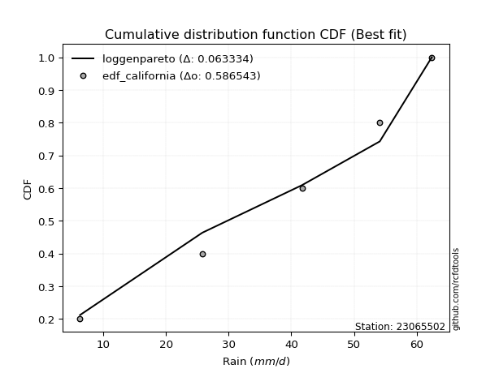</img>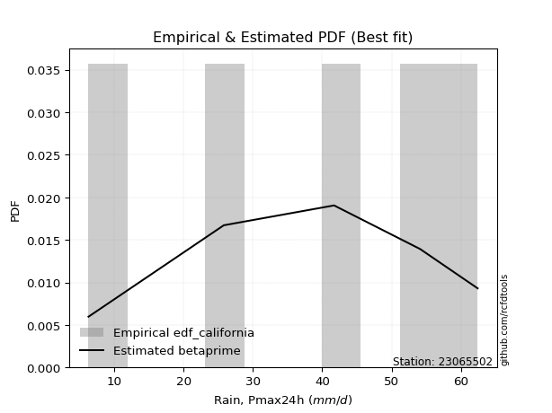</img>

</div>


### 2. EDF Hazen (1930)

Hazen method for plotting positions is a formula used to estimate the empirical cumulative probability distribution of flood events or other hydrological data. This formula often results in biased estimations, particularly when extrapolating to extreme events (high return periods).

<div align="center">


$P=(m-0.5)/n$


</div>


**2.1. Empirical values**

<div align="center">

|                | 0                  | 1                  | 2         | 3                 | 4                  |
|:---------------|:-------------------|:-------------------|:----------|:------------------|:-------------------|
| date           | 2020               | 2016               | 2017      | 2018              | 2019               |
| x              | 6.3                | 25.8               | 41.7      | 54.1              | 62.4               |
| m              | 1                  | 2                  | 3         | 4                 | 5                  |
| empirical_dist | edf_hazen          | edf_hazen          | edf_hazen | edf_hazen         | edf_hazen          |
| empirical      | 0.1                | 0.3                | 0.5       | 0.7               | 0.9                |
| empirical_tr   | 1.1111111111111112 | 1.4285714285714286 | 2.0       | 3.333333333333333 | 10.000000000000002 |

</div>


**2.2. Kolmogorov-Smirnov fit test (sorted by Δ)**


<div align="center">

|                | 0                    | 1                   | 2                   | 3                    | 4                   | 5                   | 6                   | 7                   | 8                   | 9                   | 10                  | 11                  | 12                  | 13                  | 14                 | 15                  | 16                  | 17                 | 18                  | 19                  | 20                  | 21                  | 22                  | 23                  | 24                  | 25                  | 26                  | 27                  | 28                  | 29                  | 30                  | 31                  | 32                  | 33                  | 34                 | 35                  | 36                  | 37                  | 38                  | 39                 | 40                  | 41                  | 42                 | 43                 | 44                  | 45                  | 46                  | 47                  | 48                  | 49                  | 50                 | 51                  | 52                  | 53                  | 54                  | 55                  | 56                  | 57                  | 58                  | 59                  | 60                  | 61                 | 62                  | 63                  | 64                  | 65                  | 66                  | 67                  | 68                 | 69                  | 70                  | 71                 | 72                  | 73                  | 74                  | 75                 | 76                  | 77                  | 78                  | 79                  | 80                  | 81                  | 82                 | 83                  | 84                  | 85                  | 86                  | 87                  | 88                  | 89                  | 90                  | 91                  | 92                 | 93                  | 94                  | 95                 | 96                  | 97                  | 98                 | 99                  | 100                 | 101                 | 102                 | 103                 | 104                | 105                | 106                | 107                | 108                | 109                 | 110                 | 111                 | 112                 | 113                | 114                 | 115                 | 116                 | 117                 | 118                 | 119                | 120                | 121                 | 122                 | 123                 | 124                | 125                 | 126                 | 127                 | 128                | 129                | 130                 | 131                | 132                | 133                | 134                | 135                 | 136                 | 137                 | 138                 | 139                | 140                 | 141                | 142                | 143                 | 144                | 145                 | 146                 | 147                 | 148                 | 149                | 150                | 151                | 152                | 153                | 154                | 155                | 156                | 157                | 158                | 159                |
|:---------------|:---------------------|:--------------------|:--------------------|:---------------------|:--------------------|:--------------------|:--------------------|:--------------------|:--------------------|:--------------------|:--------------------|:--------------------|:--------------------|:--------------------|:-------------------|:--------------------|:--------------------|:-------------------|:--------------------|:--------------------|:--------------------|:--------------------|:--------------------|:--------------------|:--------------------|:--------------------|:--------------------|:--------------------|:--------------------|:--------------------|:--------------------|:--------------------|:--------------------|:--------------------|:-------------------|:--------------------|:--------------------|:--------------------|:--------------------|:-------------------|:--------------------|:--------------------|:-------------------|:-------------------|:--------------------|:--------------------|:--------------------|:--------------------|:--------------------|:--------------------|:-------------------|:--------------------|:--------------------|:--------------------|:--------------------|:--------------------|:--------------------|:--------------------|:--------------------|:--------------------|:--------------------|:-------------------|:--------------------|:--------------------|:--------------------|:--------------------|:--------------------|:--------------------|:-------------------|:--------------------|:--------------------|:-------------------|:--------------------|:--------------------|:--------------------|:-------------------|:--------------------|:--------------------|:--------------------|:--------------------|:--------------------|:--------------------|:-------------------|:--------------------|:--------------------|:--------------------|:--------------------|:--------------------|:--------------------|:--------------------|:--------------------|:--------------------|:-------------------|:--------------------|:--------------------|:-------------------|:--------------------|:--------------------|:-------------------|:--------------------|:--------------------|:--------------------|:--------------------|:--------------------|:-------------------|:-------------------|:-------------------|:-------------------|:-------------------|:--------------------|:--------------------|:--------------------|:--------------------|:-------------------|:--------------------|:--------------------|:--------------------|:--------------------|:--------------------|:-------------------|:-------------------|:--------------------|:--------------------|:--------------------|:-------------------|:--------------------|:--------------------|:--------------------|:-------------------|:-------------------|:--------------------|:-------------------|:-------------------|:-------------------|:-------------------|:--------------------|:--------------------|:--------------------|:--------------------|:-------------------|:--------------------|:-------------------|:-------------------|:--------------------|:-------------------|:--------------------|:--------------------|:--------------------|:--------------------|:-------------------|:-------------------|:-------------------|:-------------------|:-------------------|:-------------------|:-------------------|:-------------------|:-------------------|:-------------------|:-------------------|
| station        | 23065502             | 23065502            | 23065502            | 23065502             | 23065502            | 23065502            | 23065502            | 23065502            | 23065502            | 23065502            | 23065502            | 23065502            | 23065502            | 23065502            | 23065502           | 23065502            | 23065502            | 23065502           | 23065502            | 23065502            | 23065502            | 23065502            | 23065502            | 23065502            | 23065502            | 23065502            | 23065502            | 23065502            | 23065502            | 23065502            | 23065502            | 23065502            | 23065502            | 23065502            | 23065502           | 23065502            | 23065502            | 23065502            | 23065502            | 23065502           | 23065502            | 23065502            | 23065502           | 23065502           | 23065502            | 23065502            | 23065502            | 23065502            | 23065502            | 23065502            | 23065502           | 23065502            | 23065502            | 23065502            | 23065502            | 23065502            | 23065502            | 23065502            | 23065502            | 23065502            | 23065502            | 23065502           | 23065502            | 23065502            | 23065502            | 23065502            | 23065502            | 23065502            | 23065502           | 23065502            | 23065502            | 23065502           | 23065502            | 23065502            | 23065502            | 23065502           | 23065502            | 23065502            | 23065502            | 23065502            | 23065502            | 23065502            | 23065502           | 23065502            | 23065502            | 23065502            | 23065502            | 23065502            | 23065502            | 23065502            | 23065502            | 23065502            | 23065502           | 23065502            | 23065502            | 23065502           | 23065502            | 23065502            | 23065502           | 23065502            | 23065502            | 23065502            | 23065502            | 23065502            | 23065502           | 23065502           | 23065502           | 23065502           | 23065502           | 23065502            | 23065502            | 23065502            | 23065502            | 23065502           | 23065502            | 23065502            | 23065502            | 23065502            | 23065502            | 23065502           | 23065502           | 23065502            | 23065502            | 23065502            | 23065502           | 23065502            | 23065502            | 23065502            | 23065502           | 23065502           | 23065502            | 23065502           | 23065502           | 23065502           | 23065502           | 23065502            | 23065502            | 23065502            | 23065502            | 23065502           | 23065502            | 23065502           | 23065502           | 23065502            | 23065502           | 23065502            | 23065502            | 23065502            | 23065502            | 23065502           | 23065502           | 23065502           | 23065502           | 23065502           | 23065502           | 23065502           | 23065502           | 23065502           | 23065502           | 23065502           |
| empirical_dist | edf_hazen            | edf_hazen           | edf_hazen           | edf_hazen            | edf_hazen           | edf_hazen           | edf_hazen           | edf_hazen           | edf_hazen           | edf_hazen           | edf_hazen           | edf_hazen           | edf_hazen           | edf_hazen           | edf_hazen          | edf_hazen           | edf_hazen           | edf_hazen          | edf_hazen           | edf_hazen           | edf_hazen           | edf_hazen           | edf_hazen           | edf_hazen           | edf_hazen           | edf_hazen           | edf_hazen           | edf_hazen           | edf_hazen           | edf_hazen           | edf_hazen           | edf_hazen           | edf_hazen           | edf_hazen           | edf_hazen          | edf_hazen           | edf_hazen           | edf_hazen           | edf_hazen           | edf_hazen          | edf_hazen           | edf_hazen           | edf_hazen          | edf_hazen          | edf_hazen           | edf_hazen           | edf_hazen           | edf_hazen           | edf_hazen           | edf_hazen           | edf_hazen          | edf_hazen           | edf_hazen           | edf_hazen           | edf_hazen           | edf_hazen           | edf_hazen           | edf_hazen           | edf_hazen           | edf_hazen           | edf_hazen           | edf_hazen          | edf_hazen           | edf_hazen           | edf_hazen           | edf_hazen           | edf_hazen           | edf_hazen           | edf_hazen          | edf_hazen           | edf_hazen           | edf_hazen          | edf_hazen           | edf_hazen           | edf_hazen           | edf_hazen          | edf_hazen           | edf_hazen           | edf_hazen           | edf_hazen           | edf_hazen           | edf_hazen           | edf_hazen          | edf_hazen           | edf_hazen           | edf_hazen           | edf_hazen           | edf_hazen           | edf_hazen           | edf_hazen           | edf_hazen           | edf_hazen           | edf_hazen          | edf_hazen           | edf_hazen           | edf_hazen          | edf_hazen           | edf_hazen           | edf_hazen          | edf_hazen           | edf_hazen           | edf_hazen           | edf_hazen           | edf_hazen           | edf_hazen          | edf_hazen          | edf_hazen          | edf_hazen          | edf_hazen          | edf_hazen           | edf_hazen           | edf_hazen           | edf_hazen           | edf_hazen          | edf_hazen           | edf_hazen           | edf_hazen           | edf_hazen           | edf_hazen           | edf_hazen          | edf_hazen          | edf_hazen           | edf_hazen           | edf_hazen           | edf_hazen          | edf_hazen           | edf_hazen           | edf_hazen           | edf_hazen          | edf_hazen          | edf_hazen           | edf_hazen          | edf_hazen          | edf_hazen          | edf_hazen          | edf_hazen           | edf_hazen           | edf_hazen           | edf_hazen           | edf_hazen          | edf_hazen           | edf_hazen          | edf_hazen          | edf_hazen           | edf_hazen          | edf_hazen           | edf_hazen           | edf_hazen           | edf_hazen           | edf_hazen          | edf_hazen          | edf_hazen          | edf_hazen          | edf_hazen          | edf_hazen          | edf_hazen          | edf_hazen          | edf_hazen          | edf_hazen          | edf_hazen          |
| p_dist         | trapezoid            | gengamma            | ksone               | semicircular         | anglit              | argus               | weibull_min         | johnsonsu           | gompertz            | pearson3            | erlang              | betaprime           | nct                 | t                   | exponnorm          | f                   | truncnorm           | norm               | crystalball         | fatiguelife         | rice                | exponweib           | gumbel_l            | gamma               | foldnorm            | loglevy_l           | triang              | skewnorm            | beta                | genpareto           | genextreme          | gausshyper          | loggenextreme       | genhalflogistic     | arcsine            | invgauss            | maxwell             | logweibull_max      | logpearson3         | logmielke          | burr                | cosine              | invgamma           | logistic           | rayleigh            | loggumbel_l         | logburr             | mielke              | logdgamma           | logvonmises_line    | logweibull_min     | ncf                 | logargus            | hypsecant           | genexpon            | dgamma              | logloggamma         | logburr12           | logtrapezoid        | wrapcauchy          | kstwobign           | dweibull           | halfnorm            | loggompertz         | kappa3              | laplace             | tukeylambda         | gumbel_r            | kappa4             | logloglaplace       | loganglit           | logsemicircular    | uniform             | vonmises_line       | lomax               | exponpow           | logbetaprime        | logerlang           | logncf              | loggennorm          | logdweibull         | logfatiguelife      | lognct             | logf                | logcrystalball      | logexponnorm        | lognorm             | logt                | levy_l              | logrice             | loggenpareto        | halflogistic        | invweibull         | loggamma            | loggamma            | moyal              | logfoldnorm         | loginvgauss         | loginvgamma        | loglogistic         | logalpha            | logmaxwell          | logarcsine          | logbeta             | lograyleigh        | loggausshyper      | loginvweibull      | loghypsecant       | gennorm            | loggenhalflogistic  | logcosine           | bradford            | truncweibull_min    | loghalfnorm        | logskewnorm         | loggumbel_r         | logwrapcauchy       | loglaplace          | loglaplace          | logkstwobign       | loggenexpon        | wald                | loghalflogistic     | logtriang           | logmoyal           | halfgennorm         | truncexpon          | burr12              | loglomax           | logwald            | logksone            | logjohnsonsb       | logtruncnorm       | lognakagami        | alpha              | logtukeylambda      | logrdist            | logkappa3           | loguniform          | johnsonsb          | loghalfgennorm      | logkappa4          | nakagami           | logtruncexpon       | logbradford        | logtruncweibull_min | logexponweib        | logjohnsonsu        | loggengamma         | logexponpow        | weibull_max        | powerlaw           | truncpareto        | logpowerlaw        | logtruncpareto     | rdist              | genlogistic        | loggenlogistic     | logvonmises        | vonmises           |
| delta          | 0.049433801770116914 | 0.05410664232114476 | 0.05591859360426872 | 0.057538021280177376 | 0.06171697897236794 | 0.07241469481199464 | 0.07410559460449218 | 0.07650611568630561 | 0.07761586104893503 | 0.08167507825846787 | 0.08651823934606373 | 0.08702781679025107 | 0.08731052823585073 | 0.08745331563101155 | 0.0874538766717935 | 0.08745594492912323 | 0.08745750228219618 | 0.087457551020524  | 0.08745756307351726 | 0.08754784580837449 | 0.08780092459254296 | 0.08868596655754524 | 0.09022424165020293 | 0.09050030069484216 | 0.09434671570124076 | 0.09517200219017075 | 0.09817784230913562 | 0.09999960234920069 | 0.09999999723774733 | 0.09999999980243168 | 0.09999999999970333 | 0.09999999999982923 | 0.09999999999998421 | 0.09999999999999865 | 0.1                | 0.10039374817058455 | 0.10066114317701158 | 0.10153571565621747 | 0.10403156086924958 | 0.1046111283961938 | 0.10569974740753285 | 0.10573005843405048 | 0.1064284444953133 | 0.1094964941469656 | 0.10978363496102306 | 0.11366108632087057 | 0.11446416477311372 | 0.11477657992406765 | 0.11519128678847917 | 0.11725594400589934 | 0.1194397975808229 | 0.11971142665732093 | 0.12140954605775778 | 0.12285453090758947 | 0.12353847250135352 | 0.12459545278444062 | 0.12498959677230459 | 0.12856285931148448 | 0.12931230975948382 | 0.13064902467571543 | 0.13197595957868558 | 0.1319851364336505 | 0.13559224278890958 | 0.13597782360491772 | 0.13633695360171338 | 0.13816325015536413 | 0.14065437972875405 | 0.14073501324918403 | 0.1416407563057518 | 0.14247059995389877 | 0.14301015417419516 | 0.1468783428460398 | 0.15204991087344033 | 0.15205092135404275 | 0.15234395623744634 | 0.1533044972048876 | 0.15343262186984008 | 0.15560989459485808 | 0.15605889001696527 | 0.15670811047720457 | 0.15874760119704023 | 0.15907492102458476 | 0.1591965004042626 | 0.15925690234918433 | 0.15943119351774637 | 0.15943163962214202 | 0.15943195085054107 | 0.15943284320058015 | 0.15961184975377515 | 0.16327570206908382 | 0.16333410414246058 | 0.16347974931519427 | 0.1637504351013025 | 0.16469768557741504 | 0.16469768557741504 | 0.1647673441277675 | 0.16579597306179972 | 0.16920931148922447 | 0.172845546201019  | 0.17815685482915866 | 0.17819688528279343 | 0.18004568608384441 | 0.18155193192718844 | 0.18365925286628793 | 0.1862099466574365 | 0.1892844042455466 | 0.1905482050602284 | 0.1925172761519207 | 0.2                | 0.20003939565597462 | 0.20392658417693887 | 0.20555836371121172 | 0.21014278709159373 | 0.2143005232045741 | 0.21782619662391212 | 0.21787114142824904 | 0.22030308328862575 | 0.22036395603234715 | 0.22036395603234715 | 0.2261411086833171 | 0.2297642004576193 | 0.23150108192042151 | 0.23379648981499052 | 0.23485319320888198 | 0.2371107737248317 | 0.24142788809786736 | 0.24378627192545033 | 0.28941965296132205 | 0.2917485230739452 | 0.2921547398800027 | 0.29569531956107337 | 0.2973440740318952 | 0.2999938813741275 | 0.2999999999999576 | 0.3022702653189689 | 0.31671811570210906 | 0.32223564092897244 | 0.32361881052415165 | 0.32422093456678147 | 0.324942156669885  | 0.32893301420451754 | 0.3334069033974027 | 0.3643422964712075 | 0.39308780985668273 | 0.3970518816297423 | 0.4276397690125567  | 0.43282108745860803 | 0.43813023777776394 | 0.45893146787566413 | 0.493541713406595  | 0.5489153363183196 | 0.577299988011162  | 0.5911259796099511 | 0.6373945018658604 | 0.649714792841221  | 0.6999999998636341 | 0.7                | 0.7                | 1.1122382549957353 | 9.691198339535257  |
| deltao         | 0.5865427407550001   | 0.5865427407550001  | 0.5865427407550001  | 0.5865427407550001   | 0.5865427407550001  | 0.5865427407550001  | 0.5865427407550001  | 0.5865427407550001  | 0.5865427407550001  | 0.5865427407550001  | 0.5865427407550001  | 0.5865427407550001  | 0.5865427407550001  | 0.5865427407550001  | 0.5865427407550001 | 0.5865427407550001  | 0.5865427407550001  | 0.5865427407550001 | 0.5865427407550001  | 0.5865427407550001  | 0.5865427407550001  | 0.5865427407550001  | 0.5865427407550001  | 0.5865427407550001  | 0.5865427407550001  | 0.5865427407550001  | 0.5865427407550001  | 0.5865427407550001  | 0.5865427407550001  | 0.5865427407550001  | 0.5865427407550001  | 0.5865427407550001  | 0.5865427407550001  | 0.5865427407550001  | 0.5865427407550001 | 0.5865427407550001  | 0.5865427407550001  | 0.5865427407550001  | 0.5865427407550001  | 0.5865427407550001 | 0.5865427407550001  | 0.5865427407550001  | 0.5865427407550001 | 0.5865427407550001 | 0.5865427407550001  | 0.5865427407550001  | 0.5865427407550001  | 0.5865427407550001  | 0.5865427407550001  | 0.5865427407550001  | 0.5865427407550001 | 0.5865427407550001  | 0.5865427407550001  | 0.5865427407550001  | 0.5865427407550001  | 0.5865427407550001  | 0.5865427407550001  | 0.5865427407550001  | 0.5865427407550001  | 0.5865427407550001  | 0.5865427407550001  | 0.5865427407550001 | 0.5865427407550001  | 0.5865427407550001  | 0.5865427407550001  | 0.5865427407550001  | 0.5865427407550001  | 0.5865427407550001  | 0.5865427407550001 | 0.5865427407550001  | 0.5865427407550001  | 0.5865427407550001 | 0.5865427407550001  | 0.5865427407550001  | 0.5865427407550001  | 0.5865427407550001 | 0.5865427407550001  | 0.5865427407550001  | 0.5865427407550001  | 0.5865427407550001  | 0.5865427407550001  | 0.5865427407550001  | 0.5865427407550001 | 0.5865427407550001  | 0.5865427407550001  | 0.5865427407550001  | 0.5865427407550001  | 0.5865427407550001  | 0.5865427407550001  | 0.5865427407550001  | 0.5865427407550001  | 0.5865427407550001  | 0.5865427407550001 | 0.5865427407550001  | 0.5865427407550001  | 0.5865427407550001 | 0.5865427407550001  | 0.5865427407550001  | 0.5865427407550001 | 0.5865427407550001  | 0.5865427407550001  | 0.5865427407550001  | 0.5865427407550001  | 0.5865427407550001  | 0.5865427407550001 | 0.5865427407550001 | 0.5865427407550001 | 0.5865427407550001 | 0.5865427407550001 | 0.5865427407550001  | 0.5865427407550001  | 0.5865427407550001  | 0.5865427407550001  | 0.5865427407550001 | 0.5865427407550001  | 0.5865427407550001  | 0.5865427407550001  | 0.5865427407550001  | 0.5865427407550001  | 0.5865427407550001 | 0.5865427407550001 | 0.5865427407550001  | 0.5865427407550001  | 0.5865427407550001  | 0.5865427407550001 | 0.5865427407550001  | 0.5865427407550001  | 0.5865427407550001  | 0.5865427407550001 | 0.5865427407550001 | 0.5865427407550001  | 0.5865427407550001 | 0.5865427407550001 | 0.5865427407550001 | 0.5865427407550001 | 0.5865427407550001  | 0.5865427407550001  | 0.5865427407550001  | 0.5865427407550001  | 0.5865427407550001 | 0.5865427407550001  | 0.5865427407550001 | 0.5865427407550001 | 0.5865427407550001  | 0.5865427407550001 | 0.5865427407550001  | 0.5865427407550001  | 0.5865427407550001  | 0.5865427407550001  | 0.5865427407550001 | 0.5865427407550001 | 0.5865427407550001 | 0.5865427407550001 | 0.5865427407550001 | 0.5865427407550001 | 0.5865427407550001 | 0.5865427407550001 | 0.5865427407550001 | 0.5865427407550001 | 0.5865427407550001 |
| eval           | Δo > Δ               | Δo > Δ              | Δo > Δ              | Δo > Δ               | Δo > Δ              | Δo > Δ              | Δo > Δ              | Δo > Δ              | Δo > Δ              | Δo > Δ              | Δo > Δ              | Δo > Δ              | Δo > Δ              | Δo > Δ              | Δo > Δ             | Δo > Δ              | Δo > Δ              | Δo > Δ             | Δo > Δ              | Δo > Δ              | Δo > Δ              | Δo > Δ              | Δo > Δ              | Δo > Δ              | Δo > Δ              | Δo > Δ              | Δo > Δ              | Δo > Δ              | Δo > Δ              | Δo > Δ              | Δo > Δ              | Δo > Δ              | Δo > Δ              | Δo > Δ              | Δo > Δ             | Δo > Δ              | Δo > Δ              | Δo > Δ              | Δo > Δ              | Δo > Δ             | Δo > Δ              | Δo > Δ              | Δo > Δ             | Δo > Δ             | Δo > Δ              | Δo > Δ              | Δo > Δ              | Δo > Δ              | Δo > Δ              | Δo > Δ              | Δo > Δ             | Δo > Δ              | Δo > Δ              | Δo > Δ              | Δo > Δ              | Δo > Δ              | Δo > Δ              | Δo > Δ              | Δo > Δ              | Δo > Δ              | Δo > Δ              | Δo > Δ             | Δo > Δ              | Δo > Δ              | Δo > Δ              | Δo > Δ              | Δo > Δ              | Δo > Δ              | Δo > Δ             | Δo > Δ              | Δo > Δ              | Δo > Δ             | Δo > Δ              | Δo > Δ              | Δo > Δ              | Δo > Δ             | Δo > Δ              | Δo > Δ              | Δo > Δ              | Δo > Δ              | Δo > Δ              | Δo > Δ              | Δo > Δ             | Δo > Δ              | Δo > Δ              | Δo > Δ              | Δo > Δ              | Δo > Δ              | Δo > Δ              | Δo > Δ              | Δo > Δ              | Δo > Δ              | Δo > Δ             | Δo > Δ              | Δo > Δ              | Δo > Δ             | Δo > Δ              | Δo > Δ              | Δo > Δ             | Δo > Δ              | Δo > Δ              | Δo > Δ              | Δo > Δ              | Δo > Δ              | Δo > Δ             | Δo > Δ             | Δo > Δ             | Δo > Δ             | Δo > Δ             | Δo > Δ              | Δo > Δ              | Δo > Δ              | Δo > Δ              | Δo > Δ             | Δo > Δ              | Δo > Δ              | Δo > Δ              | Δo > Δ              | Δo > Δ              | Δo > Δ             | Δo > Δ             | Δo > Δ              | Δo > Δ              | Δo > Δ              | Δo > Δ             | Δo > Δ              | Δo > Δ              | Δo > Δ              | Δo > Δ             | Δo > Δ             | Δo > Δ              | Δo > Δ             | Δo > Δ             | Δo > Δ             | Δo > Δ             | Δo > Δ              | Δo > Δ              | Δo > Δ              | Δo > Δ              | Δo > Δ             | Δo > Δ              | Δo > Δ             | Δo > Δ             | Δo > Δ              | Δo > Δ             | Δo > Δ              | Δo > Δ              | Δo > Δ              | Δo > Δ              | Δo > Δ             | Δo > Δ             | Δo > Δ             | Δo <= Δ            | Δo <= Δ            | Δo <= Δ            | Δo <= Δ            | Δo <= Δ            | Δo <= Δ            | Δo <= Δ            | Δo <= Δ            |
| fit            | 1                    | 1                   | 1                   | 1                    | 1                   | 1                   | 1                   | 1                   | 1                   | 1                   | 1                   | 1                   | 1                   | 1                   | 1                  | 1                   | 1                   | 1                  | 1                   | 1                   | 1                   | 1                   | 1                   | 1                   | 1                   | 1                   | 1                   | 1                   | 1                   | 1                   | 1                   | 1                   | 1                   | 1                   | 1                  | 1                   | 1                   | 1                   | 1                   | 1                  | 1                   | 1                   | 1                  | 1                  | 1                   | 1                   | 1                   | 1                   | 1                   | 1                   | 1                  | 1                   | 1                   | 1                   | 1                   | 1                   | 1                   | 1                   | 1                   | 1                   | 1                   | 1                  | 1                   | 1                   | 1                   | 1                   | 1                   | 1                   | 1                  | 1                   | 1                   | 1                  | 1                   | 1                   | 1                   | 1                  | 1                   | 1                   | 1                   | 1                   | 1                   | 1                   | 1                  | 1                   | 1                   | 1                   | 1                   | 1                   | 1                   | 1                   | 1                   | 1                   | 1                  | 1                   | 1                   | 1                  | 1                   | 1                   | 1                  | 1                   | 1                   | 1                   | 1                   | 1                   | 1                  | 1                  | 1                  | 1                  | 1                  | 1                   | 1                   | 1                   | 1                   | 1                  | 1                   | 1                   | 1                   | 1                   | 1                   | 1                  | 1                  | 1                   | 1                   | 1                   | 1                  | 1                   | 1                   | 1                   | 1                  | 1                  | 1                   | 1                  | 1                  | 1                  | 1                  | 1                   | 1                   | 1                   | 1                   | 1                  | 1                   | 1                  | 1                  | 1                   | 1                  | 1                   | 1                   | 1                   | 1                   | 1                  | 1                  | 1                  | 0                  | 0                  | 0                  | 0                  | 0                  | 0                  | 0                  | 0                  |
| n              | 5                    | 5                   | 5                   | 5                    | 5                   | 5                   | 5                   | 5                   | 5                   | 5                   | 5                   | 5                   | 5                   | 5                   | 5                  | 5                   | 5                   | 5                  | 5                   | 5                   | 5                   | 5                   | 5                   | 5                   | 5                   | 5                   | 5                   | 5                   | 5                   | 5                   | 5                   | 5                   | 5                   | 5                   | 5                  | 5                   | 5                   | 5                   | 5                   | 5                  | 5                   | 5                   | 5                  | 5                  | 5                   | 5                   | 5                   | 5                   | 5                   | 5                   | 5                  | 5                   | 5                   | 5                   | 5                   | 5                   | 5                   | 5                   | 5                   | 5                   | 5                   | 5                  | 5                   | 5                   | 5                   | 5                   | 5                   | 5                   | 5                  | 5                   | 5                   | 5                  | 5                   | 5                   | 5                   | 5                  | 5                   | 5                   | 5                   | 5                   | 5                   | 5                   | 5                  | 5                   | 5                   | 5                   | 5                   | 5                   | 5                   | 5                   | 5                   | 5                   | 5                  | 5                   | 5                   | 5                  | 5                   | 5                   | 5                  | 5                   | 5                   | 5                   | 5                   | 5                   | 5                  | 5                  | 5                  | 5                  | 5                  | 5                   | 5                   | 5                   | 5                   | 5                  | 5                   | 5                   | 5                   | 5                   | 5                   | 5                  | 5                  | 5                   | 5                   | 5                   | 5                  | 5                   | 5                   | 5                   | 5                  | 5                  | 5                   | 5                  | 5                  | 5                  | 5                  | 5                   | 5                   | 5                   | 5                   | 5                  | 5                   | 5                  | 5                  | 5                   | 5                  | 5                   | 5                   | 5                   | 5                   | 5                  | 5                  | 5                  | 5                  | 5                  | 5                  | 5                  | 5                  | 5                  | 5                  | 5                  |
| best_fit       | 1                    | 0                   | 0                   | 0                    | 0                   | 0                   | 0                   | 0                   | 0                   | 0                   | 0                   | 0                   | 0                   | 0                   | 0                  | 0                   | 0                   | 0                  | 0                   | 0                   | 0                   | 0                   | 0                   | 0                   | 0                   | 0                   | 0                   | 0                   | 0                   | 0                   | 0                   | 0                   | 0                   | 0                   | 0                  | 0                   | 0                   | 0                   | 0                   | 0                  | 0                   | 0                   | 0                  | 0                  | 0                   | 0                   | 0                   | 0                   | 0                   | 0                   | 0                  | 0                   | 0                   | 0                   | 0                   | 0                   | 0                   | 0                   | 0                   | 0                   | 0                   | 0                  | 0                   | 0                   | 0                   | 0                   | 0                   | 0                   | 0                  | 0                   | 0                   | 0                  | 0                   | 0                   | 0                   | 0                  | 0                   | 0                   | 0                   | 0                   | 0                   | 0                   | 0                  | 0                   | 0                   | 0                   | 0                   | 0                   | 0                   | 0                   | 0                   | 0                   | 0                  | 0                   | 0                   | 0                  | 0                   | 0                   | 0                  | 0                   | 0                   | 0                   | 0                   | 0                   | 0                  | 0                  | 0                  | 0                  | 0                  | 0                   | 0                   | 0                   | 0                   | 0                  | 0                   | 0                   | 0                   | 0                   | 0                   | 0                  | 0                  | 0                   | 0                   | 0                   | 0                  | 0                   | 0                   | 0                   | 0                  | 0                  | 0                   | 0                  | 0                  | 0                  | 0                  | 0                   | 0                   | 0                   | 0                   | 0                  | 0                   | 0                  | 0                  | 0                   | 0                  | 0                   | 0                   | 0                   | 0                   | 0                  | 0                  | 0                  | 0                  | 0                  | 0                  | 0                  | 0                  | 0                  | 0                  | 0                  |
| best_fit_sort  | 1                    | 2                   | 3                   | 4                    | 5                   | 6                   | 7                   | 8                   | 9                   | 10                  | 11                  | 12                  | 13                  | 14                  | 15                 | 16                  | 17                  | 18                 | 19                  | 20                  | 21                  | 22                  | 23                  | 24                  | 25                  | 26                  | 27                  | 28                  | 29                  | 30                  | 31                  | 32                  | 33                  | 34                  | 35                 | 36                  | 37                  | 38                  | 39                  | 40                 | 41                  | 42                  | 43                 | 44                 | 45                  | 46                  | 47                  | 48                  | 49                  | 50                  | 51                 | 52                  | 53                  | 54                  | 55                  | 56                  | 57                  | 58                  | 59                  | 60                  | 61                  | 62                 | 63                  | 64                  | 65                  | 66                  | 67                  | 68                  | 69                 | 70                  | 71                  | 72                 | 73                  | 74                  | 75                  | 76                 | 77                  | 78                  | 79                  | 80                  | 81                  | 82                  | 83                 | 84                  | 85                  | 86                  | 87                  | 88                  | 89                  | 90                  | 91                  | 92                  | 93                 | 94                  | 95                  | 96                 | 97                  | 98                  | 99                 | 100                 | 101                 | 102                 | 103                 | 104                 | 105                | 106                | 107                | 108                | 109                | 110                 | 111                 | 112                 | 113                 | 114                | 115                 | 116                 | 117                 | 118                 | 119                 | 120                | 121                | 122                 | 123                 | 124                 | 125                | 126                 | 127                 | 128                 | 129                | 130                | 131                 | 132                | 133                | 134                | 135                | 136                 | 137                 | 138                 | 139                 | 140                | 141                 | 142                | 143                | 144                 | 145                | 146                 | 147                 | 148                 | 149                 | 150                | 151                | 152                | 153                | 154                | 155                | 156                | 157                | 158                | 159                | 160                |

</div>


**2.3. Best fit**

<div align="center">

|   id |   station | empirical_dist   | p_dist    |     delta |   deltao | eval   |   fit |   n |   best_fit |   best_fit_sort |
|-----:|----------:|:-----------------|:----------|----------:|---------:|:-------|------:|----:|-----------:|----------------:|
|    0 |  23065502 | edf_hazen        | trapezoid | 0.0494338 | 0.586543 | Δo > Δ |     1 |   5 |          1 |               1 |

</div>


<div align="center">

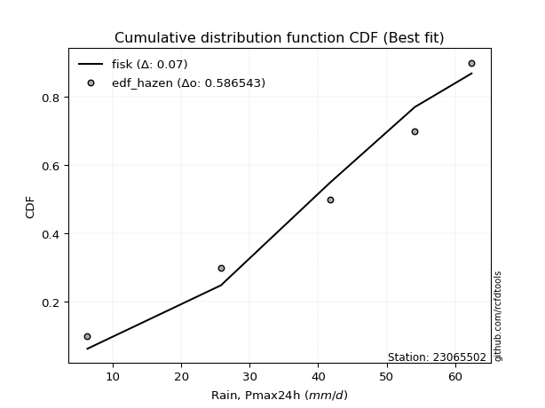</img></img>

</div>


### 3. EDF Weibull (1939)

Weibull plotting position formula is an empirical method used to estimate the non-exceedance probability or plotting position for a set of observed data, is often recommended or widely used in practice, particularly in flood frequency analysis.

<div align="center">


$P=m/(n+1)$


</div>


**3.1. Empirical values**

<div align="center">

|                | 0                   | 1                  | 2           | 3                  | 4                  |
|:---------------|:--------------------|:-------------------|:------------|:-------------------|:-------------------|
| date           | 2020                | 2016               | 2017        | 2018               | 2019               |
| x              | 6.3                 | 25.8               | 41.7        | 54.1               | 62.4               |
| m              | 1                   | 2                  | 3           | 4                  | 5                  |
| empirical_dist | edf_weibull         | edf_weibull        | edf_weibull | edf_weibull        | edf_weibull        |
| empirical      | 0.16666666666666666 | 0.3333333333333333 | 0.5         | 0.6666666666666666 | 0.8333333333333334 |
| empirical_tr   | 1.2                 | 1.4999999999999998 | 2.0         | 2.9999999999999996 | 6.000000000000002  |

</div>


**3.2. Kolmogorov-Smirnov fit test (sorted by Δ)**


<div align="center">

|                | 0                   | 1                  | 2                   | 3                   | 4                   | 5                   | 6                   | 7                  | 8                  | 9                   | 10                  | 11                 | 12                 | 13                  | 14                  | 15                  | 16                  | 17                  | 18                  | 19                  | 20                 | 21                  | 22                  | 23                  | 24                  | 25                  | 26                  | 27                  | 28                  | 29                  | 30                  | 31                  | 32                  | 33                  | 34                 | 35                 | 36                 | 37                  | 38                  | 39                  | 40                 | 41                  | 42                  | 43                  | 44                  | 45                 | 46                 | 47                  | 48                 | 49                  | 50                  | 51                  | 52                 | 53                 | 54                  | 55                  | 56                  | 57                 | 58                  | 59                  | 60                 | 61                  | 62                  | 63                  | 64                  | 65                  | 66                  | 67                  | 68                 | 69                  | 70                  | 71                 | 72                  | 73                  | 74                  | 75                  | 76                  | 77                  | 78                 | 79                  | 80                 | 81                  | 82                  | 83                  | 84                 | 85                  | 86                  | 87                  | 88                  | 89                 | 90                  | 91                  | 92                  | 93                  | 94                  | 95                  | 96                 | 97                  | 98                 | 99                  | 100                 | 101                 | 102                 | 103                 | 104                 | 105                 | 106                | 107                 | 108                | 109                | 110                 | 111                 | 112                 | 113                 | 114                 | 115                | 116                 | 117                 | 118                 | 119                 | 120                | 121                 | 122                 | 123                 | 124                | 125                 | 126                | 127                 | 128                | 129                | 130                 | 131                | 132                | 133                | 134                | 135                | 136                 | 137                 | 138                 | 139                 | 140                 | 141                | 142                | 143                | 144                 | 145                 | 146                 | 147                | 148                | 149                 | 150                | 151                | 152                | 153                | 154                | 155                | 156                | 157                | 158                | 159                |
|:---------------|:--------------------|:-------------------|:--------------------|:--------------------|:--------------------|:--------------------|:--------------------|:-------------------|:-------------------|:--------------------|:--------------------|:-------------------|:-------------------|:--------------------|:--------------------|:--------------------|:--------------------|:--------------------|:--------------------|:--------------------|:-------------------|:--------------------|:--------------------|:--------------------|:--------------------|:--------------------|:--------------------|:--------------------|:--------------------|:--------------------|:--------------------|:--------------------|:--------------------|:--------------------|:-------------------|:-------------------|:-------------------|:--------------------|:--------------------|:--------------------|:-------------------|:--------------------|:--------------------|:--------------------|:--------------------|:-------------------|:-------------------|:--------------------|:-------------------|:--------------------|:--------------------|:--------------------|:-------------------|:-------------------|:--------------------|:--------------------|:--------------------|:-------------------|:--------------------|:--------------------|:-------------------|:--------------------|:--------------------|:--------------------|:--------------------|:--------------------|:--------------------|:--------------------|:-------------------|:--------------------|:--------------------|:-------------------|:--------------------|:--------------------|:--------------------|:--------------------|:--------------------|:--------------------|:-------------------|:--------------------|:-------------------|:--------------------|:--------------------|:--------------------|:-------------------|:--------------------|:--------------------|:--------------------|:--------------------|:-------------------|:--------------------|:--------------------|:--------------------|:--------------------|:--------------------|:--------------------|:-------------------|:--------------------|:-------------------|:--------------------|:--------------------|:--------------------|:--------------------|:--------------------|:--------------------|:--------------------|:-------------------|:--------------------|:-------------------|:-------------------|:--------------------|:--------------------|:--------------------|:--------------------|:--------------------|:-------------------|:--------------------|:--------------------|:--------------------|:--------------------|:-------------------|:--------------------|:--------------------|:--------------------|:-------------------|:--------------------|:-------------------|:--------------------|:-------------------|:-------------------|:--------------------|:-------------------|:-------------------|:-------------------|:-------------------|:-------------------|:--------------------|:--------------------|:--------------------|:--------------------|:--------------------|:-------------------|:-------------------|:-------------------|:--------------------|:--------------------|:--------------------|:-------------------|:-------------------|:--------------------|:-------------------|:-------------------|:-------------------|:-------------------|:-------------------|:-------------------|:-------------------|:-------------------|:-------------------|:-------------------|
| station        | 23065502            | 23065502           | 23065502            | 23065502            | 23065502            | 23065502            | 23065502            | 23065502           | 23065502           | 23065502            | 23065502            | 23065502           | 23065502           | 23065502            | 23065502            | 23065502            | 23065502            | 23065502            | 23065502            | 23065502            | 23065502           | 23065502            | 23065502            | 23065502            | 23065502            | 23065502            | 23065502            | 23065502            | 23065502            | 23065502            | 23065502            | 23065502            | 23065502            | 23065502            | 23065502           | 23065502           | 23065502           | 23065502            | 23065502            | 23065502            | 23065502           | 23065502            | 23065502            | 23065502            | 23065502            | 23065502           | 23065502           | 23065502            | 23065502           | 23065502            | 23065502            | 23065502            | 23065502           | 23065502           | 23065502            | 23065502            | 23065502            | 23065502           | 23065502            | 23065502            | 23065502           | 23065502            | 23065502            | 23065502            | 23065502            | 23065502            | 23065502            | 23065502            | 23065502           | 23065502            | 23065502            | 23065502           | 23065502            | 23065502            | 23065502            | 23065502            | 23065502            | 23065502            | 23065502           | 23065502            | 23065502           | 23065502            | 23065502            | 23065502            | 23065502           | 23065502            | 23065502            | 23065502            | 23065502            | 23065502           | 23065502            | 23065502            | 23065502            | 23065502            | 23065502            | 23065502            | 23065502           | 23065502            | 23065502           | 23065502            | 23065502            | 23065502            | 23065502            | 23065502            | 23065502            | 23065502            | 23065502           | 23065502            | 23065502           | 23065502           | 23065502            | 23065502            | 23065502            | 23065502            | 23065502            | 23065502           | 23065502            | 23065502            | 23065502            | 23065502            | 23065502           | 23065502            | 23065502            | 23065502            | 23065502           | 23065502            | 23065502           | 23065502            | 23065502           | 23065502           | 23065502            | 23065502           | 23065502           | 23065502           | 23065502           | 23065502           | 23065502            | 23065502            | 23065502            | 23065502            | 23065502            | 23065502           | 23065502           | 23065502           | 23065502            | 23065502            | 23065502            | 23065502           | 23065502           | 23065502            | 23065502           | 23065502           | 23065502           | 23065502           | 23065502           | 23065502           | 23065502           | 23065502           | 23065502           | 23065502           |
| empirical_dist | edf_weibull         | edf_weibull        | edf_weibull         | edf_weibull         | edf_weibull         | edf_weibull         | edf_weibull         | edf_weibull        | edf_weibull        | edf_weibull         | edf_weibull         | edf_weibull        | edf_weibull        | edf_weibull         | edf_weibull         | edf_weibull         | edf_weibull         | edf_weibull         | edf_weibull         | edf_weibull         | edf_weibull        | edf_weibull         | edf_weibull         | edf_weibull         | edf_weibull         | edf_weibull         | edf_weibull         | edf_weibull         | edf_weibull         | edf_weibull         | edf_weibull         | edf_weibull         | edf_weibull         | edf_weibull         | edf_weibull        | edf_weibull        | edf_weibull        | edf_weibull         | edf_weibull         | edf_weibull         | edf_weibull        | edf_weibull         | edf_weibull         | edf_weibull         | edf_weibull         | edf_weibull        | edf_weibull        | edf_weibull         | edf_weibull        | edf_weibull         | edf_weibull         | edf_weibull         | edf_weibull        | edf_weibull        | edf_weibull         | edf_weibull         | edf_weibull         | edf_weibull        | edf_weibull         | edf_weibull         | edf_weibull        | edf_weibull         | edf_weibull         | edf_weibull         | edf_weibull         | edf_weibull         | edf_weibull         | edf_weibull         | edf_weibull        | edf_weibull         | edf_weibull         | edf_weibull        | edf_weibull         | edf_weibull         | edf_weibull         | edf_weibull         | edf_weibull         | edf_weibull         | edf_weibull        | edf_weibull         | edf_weibull        | edf_weibull         | edf_weibull         | edf_weibull         | edf_weibull        | edf_weibull         | edf_weibull         | edf_weibull         | edf_weibull         | edf_weibull        | edf_weibull         | edf_weibull         | edf_weibull         | edf_weibull         | edf_weibull         | edf_weibull         | edf_weibull        | edf_weibull         | edf_weibull        | edf_weibull         | edf_weibull         | edf_weibull         | edf_weibull         | edf_weibull         | edf_weibull         | edf_weibull         | edf_weibull        | edf_weibull         | edf_weibull        | edf_weibull        | edf_weibull         | edf_weibull         | edf_weibull         | edf_weibull         | edf_weibull         | edf_weibull        | edf_weibull         | edf_weibull         | edf_weibull         | edf_weibull         | edf_weibull        | edf_weibull         | edf_weibull         | edf_weibull         | edf_weibull        | edf_weibull         | edf_weibull        | edf_weibull         | edf_weibull        | edf_weibull        | edf_weibull         | edf_weibull        | edf_weibull        | edf_weibull        | edf_weibull        | edf_weibull        | edf_weibull         | edf_weibull         | edf_weibull         | edf_weibull         | edf_weibull         | edf_weibull        | edf_weibull        | edf_weibull        | edf_weibull         | edf_weibull         | edf_weibull         | edf_weibull        | edf_weibull        | edf_weibull         | edf_weibull        | edf_weibull        | edf_weibull        | edf_weibull        | edf_weibull        | edf_weibull        | edf_weibull        | edf_weibull        | edf_weibull        | edf_weibull        |
| p_dist         | trapezoid           | weibull_min        | anglit              | johnsonsu           | semicircular        | gompertz            | gengamma            | pearson3           | logtrapezoid       | loglevy_l           | logpearson3         | levy_l             | loggumbel_l        | invgauss            | erlang              | betaprime           | nct                 | t                   | exponnorm           | f                   | truncnorm          | norm                | crystalball         | fatiguelife         | ksone               | genexpon            | gumbel_l            | gamma               | logdweibull         | rice                | dweibull            | argus               | ncf                 | foldnorm            | invgamma           | logburr12          | maxwell            | kstwobign           | logmielke           | logweibull_min      | cosine             | loggennorm          | logistic            | dgamma              | rayleigh            | loganglit          | logloglaplace      | logburr             | burr               | logdgamma           | gumbel_r            | logbetaprime        | logargus           | exponweib          | logerlang           | logncf              | logsemicircular     | hypsecant          | loginvweibull       | logfatiguelife      | lognct             | logf                | logcrystalball      | logexponnorm        | lognorm             | logt                | mielke              | logrice             | invweibull         | loggamma            | loggamma            | moyal              | triang              | logbeta             | logfoldnorm         | logloggamma         | skewnorm            | loggenpareto        | logweibull_max     | lomax               | loggompertz        | beta                | wrapcauchy          | genpareto           | logvonmises_line   | genextreme          | gausshyper          | loggenextreme       | exponpow            | genhalflogistic    | halflogistic        | arcsine             | logarcsine          | halfnorm            | gennorm             | loginvgauss         | kappa3             | laplace             | loginvgamma        | tukeylambda         | kappa4              | loglogistic         | logalpha            | logmaxwell          | uniform             | vonmises_line       | lograyleigh        | logwrapcauchy       | loggausshyper      | loghypsecant       | logkstwobign        | loggenexpon         | logcosine           | loghalfnorm         | halfgennorm         | loggenhalflogistic | loggumbel_r         | loglaplace          | loglaplace          | bradford            | truncweibull_min   | logjohnsonsb        | wald                | logskewnorm         | loghalflogistic    | logtriang           | logmoyal           | truncexpon          | burr12             | loglomax           | alpha               | logksone           | logrdist           | johnsonsb          | logwald            | loghalfgennorm     | logtukeylambda      | logkappa3           | loguniform          | logkappa4           | logtruncnorm        | lognakagami        | nakagami           | logexponweib       | logtruncexpon       | logbradford         | logtruncweibull_min | logjohnsonsu       | loggengamma        | logexponpow         | weibull_max        | powerlaw           | truncpareto        | logpowerlaw        | logtruncpareto     | rdist              | genlogistic        | loggenlogistic     | logvonmises        | vonmises           |
| delta          | 0.09400093489556072 | 0.1074389279378255 | 0.10758639395602393 | 0.10983944901963894 | 0.11063374975410514 | 0.11241644648577659 | 0.11300872374993565 | 0.1150084115918012 | 0.1150234852291955 | 0.11509329854389383 | 0.11511338056803258 | 0.1155554785962064 | 0.1165717540333526 | 0.11748993786232476 | 0.11985157267939706 | 0.12036115012358439 | 0.12064386156918405 | 0.12078664896434488 | 0.12078721000512682 | 0.12078927826245656 | 0.1207908356155295 | 0.12079088435385732 | 0.12079089640685059 | 0.12088117914170782 | 0.12258526027093537 | 0.12353847250135352 | 0.12355757498353626 | 0.12383363402817549 | 0.12416666432745915 | 0.12535233231239745 | 0.12620332754696884 | 0.12653881524679866 | 0.12678918278255147 | 0.12768004903457408 | 0.1285368700786459 | 0.1296953484505854 | 0.129821604114349  | 0.13197595957868558 | 0.13794446172952712 | 0.13818613871711025 | 0.1390633917673838 | 0.14272786556104158 | 0.14282982748029893 | 0.14291406046540278 | 0.14305140206698677 | 0.1448859393409631 | 0.1498718206079015 | 0.15003108394142206 | 0.1505846196701488 | 0.15106171641553728 | 0.15249062953773654 | 0.15343262186984008 | 0.1547428793910911 | 0.1553526332242119 | 0.15560989459485808 | 0.15605889001696527 | 0.15616524926082812 | 0.1561878642409228 | 0.15721487172689508 | 0.15907492102458476 | 0.1591965004042626 | 0.15925690234918433 | 0.15943119351774637 | 0.15943163962214202 | 0.15943195085054107 | 0.15943284320058015 | 0.16196406429082244 | 0.16327570206908382 | 0.1637504351013025 | 0.16469768557741504 | 0.16469768557741504 | 0.1647673441277675 | 0.16484450897580227 | 0.16566191177412048 | 0.16579597306179972 | 0.16660316325607027 | 0.16666626901586734 | 0.16666629651308307 | 0.16666659738237   | 0.16666665933668312 | 0.1666666636117117 | 0.16666666390441398 | 0.16666666643281824 | 0.16666666646909833 | 0.1666666666652052 | 0.16666666666636998 | 0.16666666666649588 | 0.16666666666665086 | 0.16666666666666394 | 0.1666666666666653 | 0.16666666666666666 | 0.16666666666666666 | 0.16666666666666666 | 0.16666666666666666 | 0.16666666666666669 | 0.16920931148922447 | 0.1696702869350467 | 0.17149658348869745 | 0.172845546201019  | 0.17398771306208738 | 0.17497408963908512 | 0.17815685482915866 | 0.17819688528279343 | 0.18004568608384441 | 0.18538324420677366 | 0.18538425468737607 | 0.1862099466574365 | 0.18696974995529242 | 0.1892844042455466 | 0.1925172761519207 | 0.19280777534998378 | 0.19643086712428598 | 0.20392658417693887 | 0.20424728530273684 | 0.20809455476453403 | 0.2091063271884701 | 0.21787114142824904 | 0.22036395603234715 | 0.22036395603234715 | 0.22234771522944485 | 0.2249288408379687 | 0.23067740736522854 | 0.23150108192042151 | 0.23150997158907072 | 0.232200382979464  | 0.23485319320888198 | 0.2371107737248317 | 0.24378627192545033 | 0.2560863196279887 | 0.2584151897406119 | 0.26893693198563556 | 0.2701841121389845 | 0.2889023075956391 | 0.2916088233365517 | 0.291909179027938  | 0.2955996808711842 | 0.31671811570210906 | 0.32361881052415165 | 0.32422093456678147 | 0.33119194790838047 | 0.33332721470746085 | 0.3333333333332909 | 0.3643422964712075 | 0.3661544207919414 | 0.36991596306431695 | 0.37020167544062166 | 0.39430643567922335 | 0.4047969044444306 | 0.4255981345423308 | 0.46020838007326165 | 0.5155820029849862 | 0.5439666546778286 | 0.5577926462766178 | 0.604061168532527  | 0.6163814595078876 | 0.6666666665303009 | 0.6666666666666666 | 0.6666666666666666 | 1.1122382549957353 | 9.757865006201923  |
| deltao         | 0.5865427407550001  | 0.5865427407550001 | 0.5865427407550001  | 0.5865427407550001  | 0.5865427407550001  | 0.5865427407550001  | 0.5865427407550001  | 0.5865427407550001 | 0.5865427407550001 | 0.5865427407550001  | 0.5865427407550001  | 0.5865427407550001 | 0.5865427407550001 | 0.5865427407550001  | 0.5865427407550001  | 0.5865427407550001  | 0.5865427407550001  | 0.5865427407550001  | 0.5865427407550001  | 0.5865427407550001  | 0.5865427407550001 | 0.5865427407550001  | 0.5865427407550001  | 0.5865427407550001  | 0.5865427407550001  | 0.5865427407550001  | 0.5865427407550001  | 0.5865427407550001  | 0.5865427407550001  | 0.5865427407550001  | 0.5865427407550001  | 0.5865427407550001  | 0.5865427407550001  | 0.5865427407550001  | 0.5865427407550001 | 0.5865427407550001 | 0.5865427407550001 | 0.5865427407550001  | 0.5865427407550001  | 0.5865427407550001  | 0.5865427407550001 | 0.5865427407550001  | 0.5865427407550001  | 0.5865427407550001  | 0.5865427407550001  | 0.5865427407550001 | 0.5865427407550001 | 0.5865427407550001  | 0.5865427407550001 | 0.5865427407550001  | 0.5865427407550001  | 0.5865427407550001  | 0.5865427407550001 | 0.5865427407550001 | 0.5865427407550001  | 0.5865427407550001  | 0.5865427407550001  | 0.5865427407550001 | 0.5865427407550001  | 0.5865427407550001  | 0.5865427407550001 | 0.5865427407550001  | 0.5865427407550001  | 0.5865427407550001  | 0.5865427407550001  | 0.5865427407550001  | 0.5865427407550001  | 0.5865427407550001  | 0.5865427407550001 | 0.5865427407550001  | 0.5865427407550001  | 0.5865427407550001 | 0.5865427407550001  | 0.5865427407550001  | 0.5865427407550001  | 0.5865427407550001  | 0.5865427407550001  | 0.5865427407550001  | 0.5865427407550001 | 0.5865427407550001  | 0.5865427407550001 | 0.5865427407550001  | 0.5865427407550001  | 0.5865427407550001  | 0.5865427407550001 | 0.5865427407550001  | 0.5865427407550001  | 0.5865427407550001  | 0.5865427407550001  | 0.5865427407550001 | 0.5865427407550001  | 0.5865427407550001  | 0.5865427407550001  | 0.5865427407550001  | 0.5865427407550001  | 0.5865427407550001  | 0.5865427407550001 | 0.5865427407550001  | 0.5865427407550001 | 0.5865427407550001  | 0.5865427407550001  | 0.5865427407550001  | 0.5865427407550001  | 0.5865427407550001  | 0.5865427407550001  | 0.5865427407550001  | 0.5865427407550001 | 0.5865427407550001  | 0.5865427407550001 | 0.5865427407550001 | 0.5865427407550001  | 0.5865427407550001  | 0.5865427407550001  | 0.5865427407550001  | 0.5865427407550001  | 0.5865427407550001 | 0.5865427407550001  | 0.5865427407550001  | 0.5865427407550001  | 0.5865427407550001  | 0.5865427407550001 | 0.5865427407550001  | 0.5865427407550001  | 0.5865427407550001  | 0.5865427407550001 | 0.5865427407550001  | 0.5865427407550001 | 0.5865427407550001  | 0.5865427407550001 | 0.5865427407550001 | 0.5865427407550001  | 0.5865427407550001 | 0.5865427407550001 | 0.5865427407550001 | 0.5865427407550001 | 0.5865427407550001 | 0.5865427407550001  | 0.5865427407550001  | 0.5865427407550001  | 0.5865427407550001  | 0.5865427407550001  | 0.5865427407550001 | 0.5865427407550001 | 0.5865427407550001 | 0.5865427407550001  | 0.5865427407550001  | 0.5865427407550001  | 0.5865427407550001 | 0.5865427407550001 | 0.5865427407550001  | 0.5865427407550001 | 0.5865427407550001 | 0.5865427407550001 | 0.5865427407550001 | 0.5865427407550001 | 0.5865427407550001 | 0.5865427407550001 | 0.5865427407550001 | 0.5865427407550001 | 0.5865427407550001 |
| eval           | Δo > Δ              | Δo > Δ             | Δo > Δ              | Δo > Δ              | Δo > Δ              | Δo > Δ              | Δo > Δ              | Δo > Δ             | Δo > Δ             | Δo > Δ              | Δo > Δ              | Δo > Δ             | Δo > Δ             | Δo > Δ              | Δo > Δ              | Δo > Δ              | Δo > Δ              | Δo > Δ              | Δo > Δ              | Δo > Δ              | Δo > Δ             | Δo > Δ              | Δo > Δ              | Δo > Δ              | Δo > Δ              | Δo > Δ              | Δo > Δ              | Δo > Δ              | Δo > Δ              | Δo > Δ              | Δo > Δ              | Δo > Δ              | Δo > Δ              | Δo > Δ              | Δo > Δ             | Δo > Δ             | Δo > Δ             | Δo > Δ              | Δo > Δ              | Δo > Δ              | Δo > Δ             | Δo > Δ              | Δo > Δ              | Δo > Δ              | Δo > Δ              | Δo > Δ             | Δo > Δ             | Δo > Δ              | Δo > Δ             | Δo > Δ              | Δo > Δ              | Δo > Δ              | Δo > Δ             | Δo > Δ             | Δo > Δ              | Δo > Δ              | Δo > Δ              | Δo > Δ             | Δo > Δ              | Δo > Δ              | Δo > Δ             | Δo > Δ              | Δo > Δ              | Δo > Δ              | Δo > Δ              | Δo > Δ              | Δo > Δ              | Δo > Δ              | Δo > Δ             | Δo > Δ              | Δo > Δ              | Δo > Δ             | Δo > Δ              | Δo > Δ              | Δo > Δ              | Δo > Δ              | Δo > Δ              | Δo > Δ              | Δo > Δ             | Δo > Δ              | Δo > Δ             | Δo > Δ              | Δo > Δ              | Δo > Δ              | Δo > Δ             | Δo > Δ              | Δo > Δ              | Δo > Δ              | Δo > Δ              | Δo > Δ             | Δo > Δ              | Δo > Δ              | Δo > Δ              | Δo > Δ              | Δo > Δ              | Δo > Δ              | Δo > Δ             | Δo > Δ              | Δo > Δ             | Δo > Δ              | Δo > Δ              | Δo > Δ              | Δo > Δ              | Δo > Δ              | Δo > Δ              | Δo > Δ              | Δo > Δ             | Δo > Δ              | Δo > Δ             | Δo > Δ             | Δo > Δ              | Δo > Δ              | Δo > Δ              | Δo > Δ              | Δo > Δ              | Δo > Δ             | Δo > Δ              | Δo > Δ              | Δo > Δ              | Δo > Δ              | Δo > Δ             | Δo > Δ              | Δo > Δ              | Δo > Δ              | Δo > Δ             | Δo > Δ              | Δo > Δ             | Δo > Δ              | Δo > Δ             | Δo > Δ             | Δo > Δ              | Δo > Δ             | Δo > Δ             | Δo > Δ             | Δo > Δ             | Δo > Δ             | Δo > Δ              | Δo > Δ              | Δo > Δ              | Δo > Δ              | Δo > Δ              | Δo > Δ             | Δo > Δ             | Δo > Δ             | Δo > Δ              | Δo > Δ              | Δo > Δ              | Δo > Δ             | Δo > Δ             | Δo > Δ              | Δo > Δ             | Δo > Δ             | Δo > Δ             | Δo <= Δ            | Δo <= Δ            | Δo <= Δ            | Δo <= Δ            | Δo <= Δ            | Δo <= Δ            | Δo <= Δ            |
| fit            | 1                   | 1                  | 1                   | 1                   | 1                   | 1                   | 1                   | 1                  | 1                  | 1                   | 1                   | 1                  | 1                  | 1                   | 1                   | 1                   | 1                   | 1                   | 1                   | 1                   | 1                  | 1                   | 1                   | 1                   | 1                   | 1                   | 1                   | 1                   | 1                   | 1                   | 1                   | 1                   | 1                   | 1                   | 1                  | 1                  | 1                  | 1                   | 1                   | 1                   | 1                  | 1                   | 1                   | 1                   | 1                   | 1                  | 1                  | 1                   | 1                  | 1                   | 1                   | 1                   | 1                  | 1                  | 1                   | 1                   | 1                   | 1                  | 1                   | 1                   | 1                  | 1                   | 1                   | 1                   | 1                   | 1                   | 1                   | 1                   | 1                  | 1                   | 1                   | 1                  | 1                   | 1                   | 1                   | 1                   | 1                   | 1                   | 1                  | 1                   | 1                  | 1                   | 1                   | 1                   | 1                  | 1                   | 1                   | 1                   | 1                   | 1                  | 1                   | 1                   | 1                   | 1                   | 1                   | 1                   | 1                  | 1                   | 1                  | 1                   | 1                   | 1                   | 1                   | 1                   | 1                   | 1                   | 1                  | 1                   | 1                  | 1                  | 1                   | 1                   | 1                   | 1                   | 1                   | 1                  | 1                   | 1                   | 1                   | 1                   | 1                  | 1                   | 1                   | 1                   | 1                  | 1                   | 1                  | 1                   | 1                  | 1                  | 1                   | 1                  | 1                  | 1                  | 1                  | 1                  | 1                   | 1                   | 1                   | 1                   | 1                   | 1                  | 1                  | 1                  | 1                   | 1                   | 1                   | 1                  | 1                  | 1                   | 1                  | 1                  | 1                  | 0                  | 0                  | 0                  | 0                  | 0                  | 0                  | 0                  |
| n              | 5                   | 5                  | 5                   | 5                   | 5                   | 5                   | 5                   | 5                  | 5                  | 5                   | 5                   | 5                  | 5                  | 5                   | 5                   | 5                   | 5                   | 5                   | 5                   | 5                   | 5                  | 5                   | 5                   | 5                   | 5                   | 5                   | 5                   | 5                   | 5                   | 5                   | 5                   | 5                   | 5                   | 5                   | 5                  | 5                  | 5                  | 5                   | 5                   | 5                   | 5                  | 5                   | 5                   | 5                   | 5                   | 5                  | 5                  | 5                   | 5                  | 5                   | 5                   | 5                   | 5                  | 5                  | 5                   | 5                   | 5                   | 5                  | 5                   | 5                   | 5                  | 5                   | 5                   | 5                   | 5                   | 5                   | 5                   | 5                   | 5                  | 5                   | 5                   | 5                  | 5                   | 5                   | 5                   | 5                   | 5                   | 5                   | 5                  | 5                   | 5                  | 5                   | 5                   | 5                   | 5                  | 5                   | 5                   | 5                   | 5                   | 5                  | 5                   | 5                   | 5                   | 5                   | 5                   | 5                   | 5                  | 5                   | 5                  | 5                   | 5                   | 5                   | 5                   | 5                   | 5                   | 5                   | 5                  | 5                   | 5                  | 5                  | 5                   | 5                   | 5                   | 5                   | 5                   | 5                  | 5                   | 5                   | 5                   | 5                   | 5                  | 5                   | 5                   | 5                   | 5                  | 5                   | 5                  | 5                   | 5                  | 5                  | 5                   | 5                  | 5                  | 5                  | 5                  | 5                  | 5                   | 5                   | 5                   | 5                   | 5                   | 5                  | 5                  | 5                  | 5                   | 5                   | 5                   | 5                  | 5                  | 5                   | 5                  | 5                  | 5                  | 5                  | 5                  | 5                  | 5                  | 5                  | 5                  | 5                  |
| best_fit       | 1                   | 0                  | 0                   | 0                   | 0                   | 0                   | 0                   | 0                  | 0                  | 0                   | 0                   | 0                  | 0                  | 0                   | 0                   | 0                   | 0                   | 0                   | 0                   | 0                   | 0                  | 0                   | 0                   | 0                   | 0                   | 0                   | 0                   | 0                   | 0                   | 0                   | 0                   | 0                   | 0                   | 0                   | 0                  | 0                  | 0                  | 0                   | 0                   | 0                   | 0                  | 0                   | 0                   | 0                   | 0                   | 0                  | 0                  | 0                   | 0                  | 0                   | 0                   | 0                   | 0                  | 0                  | 0                   | 0                   | 0                   | 0                  | 0                   | 0                   | 0                  | 0                   | 0                   | 0                   | 0                   | 0                   | 0                   | 0                   | 0                  | 0                   | 0                   | 0                  | 0                   | 0                   | 0                   | 0                   | 0                   | 0                   | 0                  | 0                   | 0                  | 0                   | 0                   | 0                   | 0                  | 0                   | 0                   | 0                   | 0                   | 0                  | 0                   | 0                   | 0                   | 0                   | 0                   | 0                   | 0                  | 0                   | 0                  | 0                   | 0                   | 0                   | 0                   | 0                   | 0                   | 0                   | 0                  | 0                   | 0                  | 0                  | 0                   | 0                   | 0                   | 0                   | 0                   | 0                  | 0                   | 0                   | 0                   | 0                   | 0                  | 0                   | 0                   | 0                   | 0                  | 0                   | 0                  | 0                   | 0                  | 0                  | 0                   | 0                  | 0                  | 0                  | 0                  | 0                  | 0                   | 0                   | 0                   | 0                   | 0                   | 0                  | 0                  | 0                  | 0                   | 0                   | 0                   | 0                  | 0                  | 0                   | 0                  | 0                  | 0                  | 0                  | 0                  | 0                  | 0                  | 0                  | 0                  | 0                  |
| best_fit_sort  | 1                   | 2                  | 3                   | 4                   | 5                   | 6                   | 7                   | 8                  | 9                  | 10                  | 11                  | 12                 | 13                 | 14                  | 15                  | 16                  | 17                  | 18                  | 19                  | 20                  | 21                 | 22                  | 23                  | 24                  | 25                  | 26                  | 27                  | 28                  | 29                  | 30                  | 31                  | 32                  | 33                  | 34                  | 35                 | 36                 | 37                 | 38                  | 39                  | 40                  | 41                 | 42                  | 43                  | 44                  | 45                  | 46                 | 47                 | 48                  | 49                 | 50                  | 51                  | 52                  | 53                 | 54                 | 55                  | 56                  | 57                  | 58                 | 59                  | 60                  | 61                 | 62                  | 63                  | 64                  | 65                  | 66                  | 67                  | 68                  | 69                 | 70                  | 71                  | 72                 | 73                  | 74                  | 75                  | 76                  | 77                  | 78                  | 79                 | 80                  | 81                 | 82                  | 83                  | 84                  | 85                 | 86                  | 87                  | 88                  | 89                  | 90                 | 91                  | 92                  | 93                  | 94                  | 95                  | 96                  | 97                 | 98                  | 99                 | 100                 | 101                 | 102                 | 103                 | 104                 | 105                 | 106                 | 107                | 108                 | 109                | 110                | 111                 | 112                 | 113                 | 114                 | 115                 | 116                | 117                 | 118                 | 119                 | 120                 | 121                | 122                 | 123                 | 124                 | 125                | 126                 | 127                | 128                 | 129                | 130                | 131                 | 132                | 133                | 134                | 135                | 136                | 137                 | 138                 | 139                 | 140                 | 141                 | 142                | 143                | 144                | 145                 | 146                 | 147                 | 148                | 149                | 150                 | 151                | 152                | 153                | 154                | 155                | 156                | 157                | 158                | 159                | 160                |

</div>


**3.3. Best fit**

<div align="center">

|   id |   station | empirical_dist   | p_dist    |     delta |   deltao | eval   |   fit |   n |   best_fit |   best_fit_sort |
|-----:|----------:|:-----------------|:----------|----------:|---------:|:-------|------:|----:|-----------:|----------------:|
|    0 |  23065502 | edf_weibull      | trapezoid | 0.0940009 | 0.586543 | Δo > Δ |     1 |   5 |          1 |               1 |

</div>


<div align="center">

</img></img>

</div>


### 4. EDF Beard (1943)

The Beard formula (or Beard´s plotting position formula) in hydrology is used to estimate the empirical non-exceedance probability _(P)_ of a flood event (or other extreme hydrological data point) within a given dataset.

<div align="center">


$P=(m-0.31)/(n+0.38)$


</div>


**4.1. Empirical values**

<div align="center">

|                | 0                   | 1                  | 2         | 3                  | 4                  |
|:---------------|:--------------------|:-------------------|:----------|:-------------------|:-------------------|
| date           | 2020                | 2016               | 2017      | 2018               | 2019               |
| x              | 6.3                 | 25.8               | 41.7      | 54.1               | 62.4               |
| m              | 1                   | 2                  | 3         | 4                  | 5                  |
| empirical_dist | edf_beard           | edf_beard          | edf_beard | edf_beard          | edf_beard          |
| empirical      | 0.12825278810408922 | 0.3141263940520446 | 0.5       | 0.6858736059479554 | 0.8717472118959109 |
| empirical_tr   | 1.1471215351812367  | 1.4579945799457996 | 2.0       | 3.183431952662722  | 7.797101449275368  |

</div>


**4.2. Kolmogorov-Smirnov fit test (sorted by Δ)**


<div align="center">

|                | 0                   | 1                  | 2                   | 3                   | 4                   | 5                   | 6                  | 7                   | 8                   | 9                   | 10                  | 11                  | 12                  | 13                  | 14                  | 15                  | 16                  | 17                  | 18                  | 19                 | 20                  | 21                  | 22                  | 23                  | 24                  | 25                  | 26                  | 27                  | 28                  | 29                  | 30                  | 31                  | 32                  | 33                  | 34                  | 35                  | 36                 | 37                  | 38                  | 39                 | 40                  | 41                  | 42                  | 43                  | 44                  | 45                 | 46                  | 47                  | 48                  | 49                  | 50                  | 51                  | 52                  | 53                 | 54                  | 55                 | 56                  | 57                  | 58                  | 59                 | 60                  | 61                  | 62                  | 63                  | 64                 | 65                  | 66                  | 67                 | 68                  | 69                 | 70                  | 71                  | 72                 | 73                  | 74                  | 75                  | 76                 | 77                  | 78                  | 79                  | 80                 | 81                  | 82                  | 83                 | 84                  | 85                  | 86                  | 87                  | 88                  | 89                  | 90                  | 91                 | 92                  | 93                  | 94                 | 95                  | 96                  | 97                  | 98                  | 99                 | 100                | 101                 | 102                 | 103                 | 104                 | 105                 | 106                | 107                | 108                | 109                 | 110                 | 111                 | 112                 | 113                | 114                 | 115                 | 116                 | 117                 | 118                 | 119                 | 120                 | 121                 | 122                 | 123                | 124                 | 125                | 126                 | 127                 | 128                | 129                | 130                 | 131                 | 132                | 133                | 134                | 135                 | 136                | 137                | 138                 | 139                 | 140                 | 141                 | 142                | 143                | 144                | 145                | 146                 | 147                | 148                | 149                 | 150                | 151                | 152                | 153                | 154                | 155                | 156                | 157                | 158                | 159                |
|:---------------|:--------------------|:-------------------|:--------------------|:--------------------|:--------------------|:--------------------|:-------------------|:--------------------|:--------------------|:--------------------|:--------------------|:--------------------|:--------------------|:--------------------|:--------------------|:--------------------|:--------------------|:--------------------|:--------------------|:-------------------|:--------------------|:--------------------|:--------------------|:--------------------|:--------------------|:--------------------|:--------------------|:--------------------|:--------------------|:--------------------|:--------------------|:--------------------|:--------------------|:--------------------|:--------------------|:--------------------|:-------------------|:--------------------|:--------------------|:-------------------|:--------------------|:--------------------|:--------------------|:--------------------|:--------------------|:-------------------|:--------------------|:--------------------|:--------------------|:--------------------|:--------------------|:--------------------|:--------------------|:-------------------|:--------------------|:-------------------|:--------------------|:--------------------|:--------------------|:-------------------|:--------------------|:--------------------|:--------------------|:--------------------|:-------------------|:--------------------|:--------------------|:-------------------|:--------------------|:-------------------|:--------------------|:--------------------|:-------------------|:--------------------|:--------------------|:--------------------|:-------------------|:--------------------|:--------------------|:--------------------|:-------------------|:--------------------|:--------------------|:-------------------|:--------------------|:--------------------|:--------------------|:--------------------|:--------------------|:--------------------|:--------------------|:-------------------|:--------------------|:--------------------|:-------------------|:--------------------|:--------------------|:--------------------|:--------------------|:-------------------|:-------------------|:--------------------|:--------------------|:--------------------|:--------------------|:--------------------|:-------------------|:-------------------|:-------------------|:--------------------|:--------------------|:--------------------|:--------------------|:-------------------|:--------------------|:--------------------|:--------------------|:--------------------|:--------------------|:--------------------|:--------------------|:--------------------|:--------------------|:-------------------|:--------------------|:-------------------|:--------------------|:--------------------|:-------------------|:-------------------|:--------------------|:--------------------|:-------------------|:-------------------|:-------------------|:--------------------|:-------------------|:-------------------|:--------------------|:--------------------|:--------------------|:--------------------|:-------------------|:-------------------|:-------------------|:-------------------|:--------------------|:-------------------|:-------------------|:--------------------|:-------------------|:-------------------|:-------------------|:-------------------|:-------------------|:-------------------|:-------------------|:-------------------|:-------------------|:-------------------|
| station        | 23065502            | 23065502           | 23065502            | 23065502            | 23065502            | 23065502            | 23065502           | 23065502            | 23065502            | 23065502            | 23065502            | 23065502            | 23065502            | 23065502            | 23065502            | 23065502            | 23065502            | 23065502            | 23065502            | 23065502           | 23065502            | 23065502            | 23065502            | 23065502            | 23065502            | 23065502            | 23065502            | 23065502            | 23065502            | 23065502            | 23065502            | 23065502            | 23065502            | 23065502            | 23065502            | 23065502            | 23065502           | 23065502            | 23065502            | 23065502           | 23065502            | 23065502            | 23065502            | 23065502            | 23065502            | 23065502           | 23065502            | 23065502            | 23065502            | 23065502            | 23065502            | 23065502            | 23065502            | 23065502           | 23065502            | 23065502           | 23065502            | 23065502            | 23065502            | 23065502           | 23065502            | 23065502            | 23065502            | 23065502            | 23065502           | 23065502            | 23065502            | 23065502           | 23065502            | 23065502           | 23065502            | 23065502            | 23065502           | 23065502            | 23065502            | 23065502            | 23065502           | 23065502            | 23065502            | 23065502            | 23065502           | 23065502            | 23065502            | 23065502           | 23065502            | 23065502            | 23065502            | 23065502            | 23065502            | 23065502            | 23065502            | 23065502           | 23065502            | 23065502            | 23065502           | 23065502            | 23065502            | 23065502            | 23065502            | 23065502           | 23065502           | 23065502            | 23065502            | 23065502            | 23065502            | 23065502            | 23065502           | 23065502           | 23065502           | 23065502            | 23065502            | 23065502            | 23065502            | 23065502           | 23065502            | 23065502            | 23065502            | 23065502            | 23065502            | 23065502            | 23065502            | 23065502            | 23065502            | 23065502           | 23065502            | 23065502           | 23065502            | 23065502            | 23065502           | 23065502           | 23065502            | 23065502            | 23065502           | 23065502           | 23065502           | 23065502            | 23065502           | 23065502           | 23065502            | 23065502            | 23065502            | 23065502            | 23065502           | 23065502           | 23065502           | 23065502           | 23065502            | 23065502           | 23065502           | 23065502            | 23065502           | 23065502           | 23065502           | 23065502           | 23065502           | 23065502           | 23065502           | 23065502           | 23065502           | 23065502           |
| empirical_dist | edf_beard           | edf_beard          | edf_beard           | edf_beard           | edf_beard           | edf_beard           | edf_beard          | edf_beard           | edf_beard           | edf_beard           | edf_beard           | edf_beard           | edf_beard           | edf_beard           | edf_beard           | edf_beard           | edf_beard           | edf_beard           | edf_beard           | edf_beard          | edf_beard           | edf_beard           | edf_beard           | edf_beard           | edf_beard           | edf_beard           | edf_beard           | edf_beard           | edf_beard           | edf_beard           | edf_beard           | edf_beard           | edf_beard           | edf_beard           | edf_beard           | edf_beard           | edf_beard          | edf_beard           | edf_beard           | edf_beard          | edf_beard           | edf_beard           | edf_beard           | edf_beard           | edf_beard           | edf_beard          | edf_beard           | edf_beard           | edf_beard           | edf_beard           | edf_beard           | edf_beard           | edf_beard           | edf_beard          | edf_beard           | edf_beard          | edf_beard           | edf_beard           | edf_beard           | edf_beard          | edf_beard           | edf_beard           | edf_beard           | edf_beard           | edf_beard          | edf_beard           | edf_beard           | edf_beard          | edf_beard           | edf_beard          | edf_beard           | edf_beard           | edf_beard          | edf_beard           | edf_beard           | edf_beard           | edf_beard          | edf_beard           | edf_beard           | edf_beard           | edf_beard          | edf_beard           | edf_beard           | edf_beard          | edf_beard           | edf_beard           | edf_beard           | edf_beard           | edf_beard           | edf_beard           | edf_beard           | edf_beard          | edf_beard           | edf_beard           | edf_beard          | edf_beard           | edf_beard           | edf_beard           | edf_beard           | edf_beard          | edf_beard          | edf_beard           | edf_beard           | edf_beard           | edf_beard           | edf_beard           | edf_beard          | edf_beard          | edf_beard          | edf_beard           | edf_beard           | edf_beard           | edf_beard           | edf_beard          | edf_beard           | edf_beard           | edf_beard           | edf_beard           | edf_beard           | edf_beard           | edf_beard           | edf_beard           | edf_beard           | edf_beard          | edf_beard           | edf_beard          | edf_beard           | edf_beard           | edf_beard          | edf_beard          | edf_beard           | edf_beard           | edf_beard          | edf_beard          | edf_beard          | edf_beard           | edf_beard          | edf_beard          | edf_beard           | edf_beard           | edf_beard           | edf_beard           | edf_beard          | edf_beard          | edf_beard          | edf_beard          | edf_beard           | edf_beard          | edf_beard          | edf_beard           | edf_beard          | edf_beard          | edf_beard          | edf_beard          | edf_beard          | edf_beard          | edf_beard          | edf_beard          | edf_beard          | edf_beard          |
| p_dist         | trapezoid           | semicircular       | anglit              | gengamma            | ksone               | argus               | weibull_min        | loglevy_l           | johnsonsu           | gompertz            | pearson3            | invgauss            | erlang              | logtrapezoid        | betaprime           | nct                 | t                   | exponnorm           | f                   | truncnorm          | norm                | crystalball         | fatiguelife         | rice                | logpearson3         | gumbel_l            | gamma               | maxwell             | foldnorm            | invgamma            | rayleigh            | loggumbel_l         | logloglaplace       | exponweib           | dweibull            | logmielke           | logweibull_min     | ncf                 | burr                | cosine             | genexpon            | logistic            | dgamma              | triang              | skewnorm            | logweibull_max     | beta                | wrapcauchy          | genpareto           | logvonmises_line    | genextreme          | gausshyper          | loggenextreme       | genhalflogistic    | arcsine             | loggennorm         | logburr12           | logburr             | mielke              | logdgamma          | logdweibull         | levy_l              | kstwobign           | logsemicircular     | logargus           | halfnorm            | loggompertz         | hypsecant          | loganglit           | logloggamma        | gumbel_r            | loggenpareto        | kappa3             | laplace             | lomax               | logarcsine          | exponpow           | logbetaprime        | tukeylambda         | logerlang           | kappa4             | logncf              | logfatiguelife      | lognct             | logf                | logcrystalball      | logexponnorm        | lognorm             | logt                | logrice             | halflogistic        | invweibull         | loggamma            | loggamma            | moyal              | logfoldnorm         | uniform             | vonmises_line       | loginvgauss         | logbeta            | loginvgamma        | loginvweibull       | loglogistic         | logalpha            | logmaxwell          | gennorm             | lograyleigh        | loggausshyper      | loghypsecant       | loggenhalflogistic  | logcosine           | loghalfnorm         | bradford            | logwrapcauchy      | truncweibull_min    | logkstwobign        | loggenexpon         | logskewnorm         | loggumbel_r         | loglaplace          | loglaplace          | halfgennorm         | wald                | loghalflogistic    | logtriang           | logmoyal           | truncexpon          | logjohnsonsb        | burr12             | loglomax           | logksone            | alpha               | logwald            | logrdist           | johnsonsb          | logtruncnorm        | lognakagami        | loghalfgennorm     | logtukeylambda      | logkappa3           | loguniform          | logkappa4           | nakagami           | logtruncexpon      | logbradford        | logexponweib       | logtruncweibull_min | logjohnsonsu       | loggengamma        | logexponpow         | weibull_max        | powerlaw           | truncpareto        | logpowerlaw        | logtruncpareto     | rdist              | genlogistic        | loggenlogistic     | logvonmises        | vonmises           |
| delta          | 0.06356019582216144 | 0.0722198711915277 | 0.07346968961198941 | 0.07459484518735815 | 0.08417138170835793 | 0.08812493668422117 | 0.0882319886565367 | 0.08894565739763904 | 0.09063250973835024 | 0.09174225510097955 | 0.09580147231051239 | 0.10039374817058455 | 0.10064463339810825 | 0.10105952165539467 | 0.10115421084229559 | 0.10143692228789525 | 0.10157970968305607 | 0.10158027072383802 | 0.10158233898116775 | 0.1015838963342407 | 0.10158394507256852 | 0.10158395712556179 | 0.10167423986041901 | 0.10192731864458748 | 0.10403156086924958 | 0.10435063570224745 | 0.10462669474688668 | 0.10619772369691138 | 0.10847310975328528 | 0.10932993079735709 | 0.10978363496102306 | 0.11366108632087057 | 0.11421781184980961 | 0.11693875466163439 | 0.11785874238160587 | 0.11873752244823832 | 0.1194397975808229 | 0.11971142665732093 | 0.11982614145957737 | 0.119856452486095  | 0.12353847250135352 | 0.12362288819901013 | 0.12370712118411398 | 0.12643063041322478 | 0.12825239045328984 | 0.1282527188197925 | 0.12825278534183648 | 0.12825278787024075 | 0.12825278790652084 | 0.12825278810262775 | 0.12825278810379248 | 0.12825278810391838 | 0.12825278810407337 | 0.1282527881040878 | 0.12825278810408922 | 0.1284553223731154 | 0.12856285931148448 | 0.12859055882515824 | 0.12890297397611217 | 0.1293176808405238 | 0.13049481309295108 | 0.13135906164968594 | 0.13197595957868558 | 0.13275194879399516 | 0.1355359401098023 | 0.13559224278890958 | 0.13597782360491772 | 0.136980924959634  | 0.13862371076140423 | 0.1391159908243491 | 0.14073501324918403 | 0.14920771009041595 | 0.1504633476537579 | 0.15228964420740865 | 0.15234395623744634 | 0.15329914382309928 | 0.1533044972048876 | 0.15343262186984008 | 0.15478077378079858 | 0.15560989459485808 | 0.1557671503577963 | 0.15605889001696527 | 0.15907492102458476 | 0.1591965004042626 | 0.15925690234918433 | 0.15943119351774637 | 0.15943163962214202 | 0.15943195085054107 | 0.15943284320058015 | 0.16327570206908382 | 0.16347974931519427 | 0.1637504351013025 | 0.16469768557741504 | 0.16469768557741504 | 0.1647673441277675 | 0.16579597306179972 | 0.16617630492548485 | 0.16617731540608727 | 0.16920931148922447 | 0.1695328588142434 | 0.172845546201019  | 0.17642181100818377 | 0.17815685482915866 | 0.17819688528279343 | 0.18004568608384441 | 0.18587360594795543 | 0.1862099466574365 | 0.1892844042455466 | 0.1925172761519207 | 0.20003939565597462 | 0.20392658417693887 | 0.20424728530273684 | 0.20555836371121172 | 0.2061766892365811 | 0.21014278709159373 | 0.21201471463127247 | 0.21563780640557467 | 0.21782619662391212 | 0.21787114142824904 | 0.22036395603234715 | 0.22036395603234715 | 0.22730149404582273 | 0.23150108192042151 | 0.232200382979464  | 0.23485319320888198 | 0.2371107737248317 | 0.24378627192545033 | 0.26909128592780596 | 0.2752932589092774 | 0.2776221290219006 | 0.28156892550902873 | 0.28814387126692426 | 0.291909179027938  | 0.3081092468769278 | 0.3108157626178405 | 0.31412027542617216 | 0.3141263940520022 | 0.3148066201524729 | 0.31671811570210906 | 0.32361881052415165 | 0.32422093456678147 | 0.33119194790838047 | 0.3643422964712075 | 0.3789614158046381 | 0.3829254875776977 | 0.4045682993545189 | 0.41351337496051205 | 0.4240038437257194 | 0.4448050738236195 | 0.47941531935455034 | 0.534788942266275  | 0.5631735939591174 | 0.5769995855579064 | 0.6232681078138158 | 0.6355883987891764 | 0.6858736058115895 | 0.6858736059479554 | 0.6858736059479554 | 1.1122382549957353 | 9.719451127639346  |
| deltao         | 0.5865427407550001  | 0.5865427407550001 | 0.5865427407550001  | 0.5865427407550001  | 0.5865427407550001  | 0.5865427407550001  | 0.5865427407550001 | 0.5865427407550001  | 0.5865427407550001  | 0.5865427407550001  | 0.5865427407550001  | 0.5865427407550001  | 0.5865427407550001  | 0.5865427407550001  | 0.5865427407550001  | 0.5865427407550001  | 0.5865427407550001  | 0.5865427407550001  | 0.5865427407550001  | 0.5865427407550001 | 0.5865427407550001  | 0.5865427407550001  | 0.5865427407550001  | 0.5865427407550001  | 0.5865427407550001  | 0.5865427407550001  | 0.5865427407550001  | 0.5865427407550001  | 0.5865427407550001  | 0.5865427407550001  | 0.5865427407550001  | 0.5865427407550001  | 0.5865427407550001  | 0.5865427407550001  | 0.5865427407550001  | 0.5865427407550001  | 0.5865427407550001 | 0.5865427407550001  | 0.5865427407550001  | 0.5865427407550001 | 0.5865427407550001  | 0.5865427407550001  | 0.5865427407550001  | 0.5865427407550001  | 0.5865427407550001  | 0.5865427407550001 | 0.5865427407550001  | 0.5865427407550001  | 0.5865427407550001  | 0.5865427407550001  | 0.5865427407550001  | 0.5865427407550001  | 0.5865427407550001  | 0.5865427407550001 | 0.5865427407550001  | 0.5865427407550001 | 0.5865427407550001  | 0.5865427407550001  | 0.5865427407550001  | 0.5865427407550001 | 0.5865427407550001  | 0.5865427407550001  | 0.5865427407550001  | 0.5865427407550001  | 0.5865427407550001 | 0.5865427407550001  | 0.5865427407550001  | 0.5865427407550001 | 0.5865427407550001  | 0.5865427407550001 | 0.5865427407550001  | 0.5865427407550001  | 0.5865427407550001 | 0.5865427407550001  | 0.5865427407550001  | 0.5865427407550001  | 0.5865427407550001 | 0.5865427407550001  | 0.5865427407550001  | 0.5865427407550001  | 0.5865427407550001 | 0.5865427407550001  | 0.5865427407550001  | 0.5865427407550001 | 0.5865427407550001  | 0.5865427407550001  | 0.5865427407550001  | 0.5865427407550001  | 0.5865427407550001  | 0.5865427407550001  | 0.5865427407550001  | 0.5865427407550001 | 0.5865427407550001  | 0.5865427407550001  | 0.5865427407550001 | 0.5865427407550001  | 0.5865427407550001  | 0.5865427407550001  | 0.5865427407550001  | 0.5865427407550001 | 0.5865427407550001 | 0.5865427407550001  | 0.5865427407550001  | 0.5865427407550001  | 0.5865427407550001  | 0.5865427407550001  | 0.5865427407550001 | 0.5865427407550001 | 0.5865427407550001 | 0.5865427407550001  | 0.5865427407550001  | 0.5865427407550001  | 0.5865427407550001  | 0.5865427407550001 | 0.5865427407550001  | 0.5865427407550001  | 0.5865427407550001  | 0.5865427407550001  | 0.5865427407550001  | 0.5865427407550001  | 0.5865427407550001  | 0.5865427407550001  | 0.5865427407550001  | 0.5865427407550001 | 0.5865427407550001  | 0.5865427407550001 | 0.5865427407550001  | 0.5865427407550001  | 0.5865427407550001 | 0.5865427407550001 | 0.5865427407550001  | 0.5865427407550001  | 0.5865427407550001 | 0.5865427407550001 | 0.5865427407550001 | 0.5865427407550001  | 0.5865427407550001 | 0.5865427407550001 | 0.5865427407550001  | 0.5865427407550001  | 0.5865427407550001  | 0.5865427407550001  | 0.5865427407550001 | 0.5865427407550001 | 0.5865427407550001 | 0.5865427407550001 | 0.5865427407550001  | 0.5865427407550001 | 0.5865427407550001 | 0.5865427407550001  | 0.5865427407550001 | 0.5865427407550001 | 0.5865427407550001 | 0.5865427407550001 | 0.5865427407550001 | 0.5865427407550001 | 0.5865427407550001 | 0.5865427407550001 | 0.5865427407550001 | 0.5865427407550001 |
| eval           | Δo > Δ              | Δo > Δ             | Δo > Δ              | Δo > Δ              | Δo > Δ              | Δo > Δ              | Δo > Δ             | Δo > Δ              | Δo > Δ              | Δo > Δ              | Δo > Δ              | Δo > Δ              | Δo > Δ              | Δo > Δ              | Δo > Δ              | Δo > Δ              | Δo > Δ              | Δo > Δ              | Δo > Δ              | Δo > Δ             | Δo > Δ              | Δo > Δ              | Δo > Δ              | Δo > Δ              | Δo > Δ              | Δo > Δ              | Δo > Δ              | Δo > Δ              | Δo > Δ              | Δo > Δ              | Δo > Δ              | Δo > Δ              | Δo > Δ              | Δo > Δ              | Δo > Δ              | Δo > Δ              | Δo > Δ             | Δo > Δ              | Δo > Δ              | Δo > Δ             | Δo > Δ              | Δo > Δ              | Δo > Δ              | Δo > Δ              | Δo > Δ              | Δo > Δ             | Δo > Δ              | Δo > Δ              | Δo > Δ              | Δo > Δ              | Δo > Δ              | Δo > Δ              | Δo > Δ              | Δo > Δ             | Δo > Δ              | Δo > Δ             | Δo > Δ              | Δo > Δ              | Δo > Δ              | Δo > Δ             | Δo > Δ              | Δo > Δ              | Δo > Δ              | Δo > Δ              | Δo > Δ             | Δo > Δ              | Δo > Δ              | Δo > Δ             | Δo > Δ              | Δo > Δ             | Δo > Δ              | Δo > Δ              | Δo > Δ             | Δo > Δ              | Δo > Δ              | Δo > Δ              | Δo > Δ             | Δo > Δ              | Δo > Δ              | Δo > Δ              | Δo > Δ             | Δo > Δ              | Δo > Δ              | Δo > Δ             | Δo > Δ              | Δo > Δ              | Δo > Δ              | Δo > Δ              | Δo > Δ              | Δo > Δ              | Δo > Δ              | Δo > Δ             | Δo > Δ              | Δo > Δ              | Δo > Δ             | Δo > Δ              | Δo > Δ              | Δo > Δ              | Δo > Δ              | Δo > Δ             | Δo > Δ             | Δo > Δ              | Δo > Δ              | Δo > Δ              | Δo > Δ              | Δo > Δ              | Δo > Δ             | Δo > Δ             | Δo > Δ             | Δo > Δ              | Δo > Δ              | Δo > Δ              | Δo > Δ              | Δo > Δ             | Δo > Δ              | Δo > Δ              | Δo > Δ              | Δo > Δ              | Δo > Δ              | Δo > Δ              | Δo > Δ              | Δo > Δ              | Δo > Δ              | Δo > Δ             | Δo > Δ              | Δo > Δ             | Δo > Δ              | Δo > Δ              | Δo > Δ             | Δo > Δ             | Δo > Δ              | Δo > Δ              | Δo > Δ             | Δo > Δ             | Δo > Δ             | Δo > Δ              | Δo > Δ             | Δo > Δ             | Δo > Δ              | Δo > Δ              | Δo > Δ              | Δo > Δ              | Δo > Δ             | Δo > Δ             | Δo > Δ             | Δo > Δ             | Δo > Δ              | Δo > Δ             | Δo > Δ             | Δo > Δ              | Δo > Δ             | Δo > Δ             | Δo > Δ             | Δo <= Δ            | Δo <= Δ            | Δo <= Δ            | Δo <= Δ            | Δo <= Δ            | Δo <= Δ            | Δo <= Δ            |
| fit            | 1                   | 1                  | 1                   | 1                   | 1                   | 1                   | 1                  | 1                   | 1                   | 1                   | 1                   | 1                   | 1                   | 1                   | 1                   | 1                   | 1                   | 1                   | 1                   | 1                  | 1                   | 1                   | 1                   | 1                   | 1                   | 1                   | 1                   | 1                   | 1                   | 1                   | 1                   | 1                   | 1                   | 1                   | 1                   | 1                   | 1                  | 1                   | 1                   | 1                  | 1                   | 1                   | 1                   | 1                   | 1                   | 1                  | 1                   | 1                   | 1                   | 1                   | 1                   | 1                   | 1                   | 1                  | 1                   | 1                  | 1                   | 1                   | 1                   | 1                  | 1                   | 1                   | 1                   | 1                   | 1                  | 1                   | 1                   | 1                  | 1                   | 1                  | 1                   | 1                   | 1                  | 1                   | 1                   | 1                   | 1                  | 1                   | 1                   | 1                   | 1                  | 1                   | 1                   | 1                  | 1                   | 1                   | 1                   | 1                   | 1                   | 1                   | 1                   | 1                  | 1                   | 1                   | 1                  | 1                   | 1                   | 1                   | 1                   | 1                  | 1                  | 1                   | 1                   | 1                   | 1                   | 1                   | 1                  | 1                  | 1                  | 1                   | 1                   | 1                   | 1                   | 1                  | 1                   | 1                   | 1                   | 1                   | 1                   | 1                   | 1                   | 1                   | 1                   | 1                  | 1                   | 1                  | 1                   | 1                   | 1                  | 1                  | 1                   | 1                   | 1                  | 1                  | 1                  | 1                   | 1                  | 1                  | 1                   | 1                   | 1                   | 1                   | 1                  | 1                  | 1                  | 1                  | 1                   | 1                  | 1                  | 1                   | 1                  | 1                  | 1                  | 0                  | 0                  | 0                  | 0                  | 0                  | 0                  | 0                  |
| n              | 5                   | 5                  | 5                   | 5                   | 5                   | 5                   | 5                  | 5                   | 5                   | 5                   | 5                   | 5                   | 5                   | 5                   | 5                   | 5                   | 5                   | 5                   | 5                   | 5                  | 5                   | 5                   | 5                   | 5                   | 5                   | 5                   | 5                   | 5                   | 5                   | 5                   | 5                   | 5                   | 5                   | 5                   | 5                   | 5                   | 5                  | 5                   | 5                   | 5                  | 5                   | 5                   | 5                   | 5                   | 5                   | 5                  | 5                   | 5                   | 5                   | 5                   | 5                   | 5                   | 5                   | 5                  | 5                   | 5                  | 5                   | 5                   | 5                   | 5                  | 5                   | 5                   | 5                   | 5                   | 5                  | 5                   | 5                   | 5                  | 5                   | 5                  | 5                   | 5                   | 5                  | 5                   | 5                   | 5                   | 5                  | 5                   | 5                   | 5                   | 5                  | 5                   | 5                   | 5                  | 5                   | 5                   | 5                   | 5                   | 5                   | 5                   | 5                   | 5                  | 5                   | 5                   | 5                  | 5                   | 5                   | 5                   | 5                   | 5                  | 5                  | 5                   | 5                   | 5                   | 5                   | 5                   | 5                  | 5                  | 5                  | 5                   | 5                   | 5                   | 5                   | 5                  | 5                   | 5                   | 5                   | 5                   | 5                   | 5                   | 5                   | 5                   | 5                   | 5                  | 5                   | 5                  | 5                   | 5                   | 5                  | 5                  | 5                   | 5                   | 5                  | 5                  | 5                  | 5                   | 5                  | 5                  | 5                   | 5                   | 5                   | 5                   | 5                  | 5                  | 5                  | 5                  | 5                   | 5                  | 5                  | 5                   | 5                  | 5                  | 5                  | 5                  | 5                  | 5                  | 5                  | 5                  | 5                  | 5                  |
| best_fit       | 1                   | 0                  | 0                   | 0                   | 0                   | 0                   | 0                  | 0                   | 0                   | 0                   | 0                   | 0                   | 0                   | 0                   | 0                   | 0                   | 0                   | 0                   | 0                   | 0                  | 0                   | 0                   | 0                   | 0                   | 0                   | 0                   | 0                   | 0                   | 0                   | 0                   | 0                   | 0                   | 0                   | 0                   | 0                   | 0                   | 0                  | 0                   | 0                   | 0                  | 0                   | 0                   | 0                   | 0                   | 0                   | 0                  | 0                   | 0                   | 0                   | 0                   | 0                   | 0                   | 0                   | 0                  | 0                   | 0                  | 0                   | 0                   | 0                   | 0                  | 0                   | 0                   | 0                   | 0                   | 0                  | 0                   | 0                   | 0                  | 0                   | 0                  | 0                   | 0                   | 0                  | 0                   | 0                   | 0                   | 0                  | 0                   | 0                   | 0                   | 0                  | 0                   | 0                   | 0                  | 0                   | 0                   | 0                   | 0                   | 0                   | 0                   | 0                   | 0                  | 0                   | 0                   | 0                  | 0                   | 0                   | 0                   | 0                   | 0                  | 0                  | 0                   | 0                   | 0                   | 0                   | 0                   | 0                  | 0                  | 0                  | 0                   | 0                   | 0                   | 0                   | 0                  | 0                   | 0                   | 0                   | 0                   | 0                   | 0                   | 0                   | 0                   | 0                   | 0                  | 0                   | 0                  | 0                   | 0                   | 0                  | 0                  | 0                   | 0                   | 0                  | 0                  | 0                  | 0                   | 0                  | 0                  | 0                   | 0                   | 0                   | 0                   | 0                  | 0                  | 0                  | 0                  | 0                   | 0                  | 0                  | 0                   | 0                  | 0                  | 0                  | 0                  | 0                  | 0                  | 0                  | 0                  | 0                  | 0                  |
| best_fit_sort  | 1                   | 2                  | 3                   | 4                   | 5                   | 6                   | 7                  | 8                   | 9                   | 10                  | 11                  | 12                  | 13                  | 14                  | 15                  | 16                  | 17                  | 18                  | 19                  | 20                 | 21                  | 22                  | 23                  | 24                  | 25                  | 26                  | 27                  | 28                  | 29                  | 30                  | 31                  | 32                  | 33                  | 34                  | 35                  | 36                  | 37                 | 38                  | 39                  | 40                 | 41                  | 42                  | 43                  | 44                  | 45                  | 46                 | 47                  | 48                  | 49                  | 50                  | 51                  | 52                  | 53                  | 54                 | 55                  | 56                 | 57                  | 58                  | 59                  | 60                 | 61                  | 62                  | 63                  | 64                  | 65                 | 66                  | 67                  | 68                 | 69                  | 70                 | 71                  | 72                  | 73                 | 74                  | 75                  | 76                  | 77                 | 78                  | 79                  | 80                  | 81                 | 82                  | 83                  | 84                 | 85                  | 86                  | 87                  | 88                  | 89                  | 90                  | 91                  | 92                 | 93                  | 94                  | 95                 | 96                  | 97                  | 98                  | 99                  | 100                | 101                | 102                 | 103                 | 104                 | 105                 | 106                 | 107                | 108                | 109                | 110                 | 111                 | 112                 | 113                 | 114                | 115                 | 116                 | 117                 | 118                 | 119                 | 120                 | 121                 | 122                 | 123                 | 124                | 125                 | 126                | 127                 | 128                 | 129                | 130                | 131                 | 132                 | 133                | 134                | 135                | 136                 | 137                | 138                | 139                 | 140                 | 141                 | 142                 | 143                | 144                | 145                | 146                | 147                 | 148                | 149                | 150                 | 151                | 152                | 153                | 154                | 155                | 156                | 157                | 158                | 159                | 160                |

</div>


**4.3. Best fit**

<div align="center">

|   id |   station | empirical_dist   | p_dist    |     delta |   deltao | eval   |   fit |   n |   best_fit |   best_fit_sort |
|-----:|----------:|:-----------------|:----------|----------:|---------:|:-------|------:|----:|-----------:|----------------:|
|    0 |  23065502 | edf_beard        | trapezoid | 0.0635602 | 0.586543 | Δo > Δ |     1 |   5 |          1 |               1 |

</div>


<div align="center">

</img>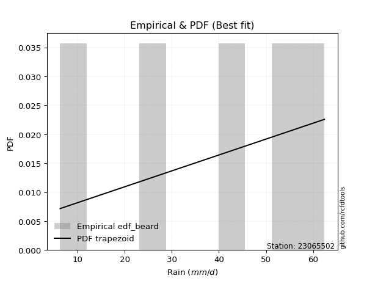</img>

</div>


### 5. EDF Chegodayev (1955)

The Chegodayev formula is an empirical plotting position formula used in hydrological frequency analysis to estimate the exceedance probability or return period of a specific event from a set of observed data. It is primarily used for plotting observed data points on probability paper to fit a theoretical distribution, particularly for analyzing extreme events like maximum flood flows or rainfall intensities. The constant _b_ value in the generalized plotting position formula is 0.3.

<div align="center">


$P=(m-b)/(n+1-2b)$


</div>


**5.1. Empirical values**

<div align="center">

|                | 0                   | 1                   | 2              | 3                  | 4                  |
|:---------------|:--------------------|:--------------------|:---------------|:-------------------|:-------------------|
| date           | 2020                | 2016                | 2017           | 2018               | 2019               |
| x              | 6.3                 | 25.8                | 41.7           | 54.1               | 62.4               |
| m              | 1                   | 2                   | 3              | 4                  | 5                  |
| empirical_dist | edf_chegodayev      | edf_chegodayev      | edf_chegodayev | edf_chegodayev     | edf_chegodayev     |
| empirical      | 0.12962962962962962 | 0.31481481481481477 | 0.5            | 0.6851851851851851 | 0.8703703703703703 |
| empirical_tr   | 1.148936170212766   | 1.4594594594594594  | 2.0            | 3.1764705882352935 | 7.714285714285713  |

</div>


**5.2. Kolmogorov-Smirnov fit test (sorted by Δ)**


<div align="center">

|                | 0                   | 1                   | 2                   | 3                   | 4                   | 5                   | 6                   | 7                   | 8                   | 9                   | 10                 | 11                  | 12                  | 13                  | 14                 | 15                  | 16                  | 17                  | 18                  | 19                  | 20                  | 21                 | 22                  | 23                 | 24                  | 25                  | 26                 | 27                 | 28                 | 29                  | 30                 | 31                 | 32                  | 33                  | 34                  | 35                  | 36                 | 37                  | 38                  | 39                  | 40                  | 41                  | 42                  | 43                 | 44                 | 45                  | 46                  | 47                  | 48                  | 49                  | 50                  | 51                 | 52                  | 53                  | 54                  | 55                 | 56                 | 57                  | 58                  | 59                  | 60                  | 61                  | 62                  | 63                 | 64                  | 65                  | 66                  | 67                 | 68                  | 69                  | 70                  | 71                 | 72                  | 73                  | 74                  | 75                  | 76                 | 77                  | 78                 | 79                  | 80                  | 81                  | 82                  | 83                 | 84                  | 85                  | 86                  | 87                  | 88                  | 89                  | 90                  | 91                 | 92                  | 93                  | 94                 | 95                  | 96                  | 97                  | 98                 | 99                  | 100                | 101                 | 102                 | 103                 | 104                 | 105                 | 106                | 107                | 108                | 109                 | 110                 | 111                 | 112                 | 113                 | 114                 | 115                 | 116                 | 117                 | 118                 | 119                 | 120                 | 121                 | 122                 | 123                | 124                 | 125                | 126                 | 127                 | 128                 | 129                 | 130                | 131                | 132                | 133                 | 134                | 135                 | 136                | 137                 | 138                 | 139                 | 140                 | 141                 | 142                | 143                 | 144                 | 145                 | 146                 | 147                | 148                 | 149                | 150                | 151                | 152                | 153                | 154                | 155                | 156                | 157                | 158                | 159                |
|:---------------|:--------------------|:--------------------|:--------------------|:--------------------|:--------------------|:--------------------|:--------------------|:--------------------|:--------------------|:--------------------|:-------------------|:--------------------|:--------------------|:--------------------|:-------------------|:--------------------|:--------------------|:--------------------|:--------------------|:--------------------|:--------------------|:-------------------|:--------------------|:-------------------|:--------------------|:--------------------|:-------------------|:-------------------|:-------------------|:--------------------|:-------------------|:-------------------|:--------------------|:--------------------|:--------------------|:--------------------|:-------------------|:--------------------|:--------------------|:--------------------|:--------------------|:--------------------|:--------------------|:-------------------|:-------------------|:--------------------|:--------------------|:--------------------|:--------------------|:--------------------|:--------------------|:-------------------|:--------------------|:--------------------|:--------------------|:-------------------|:-------------------|:--------------------|:--------------------|:--------------------|:--------------------|:--------------------|:--------------------|:-------------------|:--------------------|:--------------------|:--------------------|:-------------------|:--------------------|:--------------------|:--------------------|:-------------------|:--------------------|:--------------------|:--------------------|:--------------------|:-------------------|:--------------------|:-------------------|:--------------------|:--------------------|:--------------------|:--------------------|:-------------------|:--------------------|:--------------------|:--------------------|:--------------------|:--------------------|:--------------------|:--------------------|:-------------------|:--------------------|:--------------------|:-------------------|:--------------------|:--------------------|:--------------------|:-------------------|:--------------------|:-------------------|:--------------------|:--------------------|:--------------------|:--------------------|:--------------------|:-------------------|:-------------------|:-------------------|:--------------------|:--------------------|:--------------------|:--------------------|:--------------------|:--------------------|:--------------------|:--------------------|:--------------------|:--------------------|:--------------------|:--------------------|:--------------------|:--------------------|:-------------------|:--------------------|:-------------------|:--------------------|:--------------------|:--------------------|:--------------------|:-------------------|:-------------------|:-------------------|:--------------------|:-------------------|:--------------------|:-------------------|:--------------------|:--------------------|:--------------------|:--------------------|:--------------------|:-------------------|:--------------------|:--------------------|:--------------------|:--------------------|:-------------------|:--------------------|:-------------------|:-------------------|:-------------------|:-------------------|:-------------------|:-------------------|:-------------------|:-------------------|:-------------------|:-------------------|:-------------------|
| station        | 23065502            | 23065502            | 23065502            | 23065502            | 23065502            | 23065502            | 23065502            | 23065502            | 23065502            | 23065502            | 23065502           | 23065502            | 23065502            | 23065502            | 23065502           | 23065502            | 23065502            | 23065502            | 23065502            | 23065502            | 23065502            | 23065502           | 23065502            | 23065502           | 23065502            | 23065502            | 23065502           | 23065502           | 23065502           | 23065502            | 23065502           | 23065502           | 23065502            | 23065502            | 23065502            | 23065502            | 23065502           | 23065502            | 23065502            | 23065502            | 23065502            | 23065502            | 23065502            | 23065502           | 23065502           | 23065502            | 23065502            | 23065502            | 23065502            | 23065502            | 23065502            | 23065502           | 23065502            | 23065502            | 23065502            | 23065502           | 23065502           | 23065502            | 23065502            | 23065502            | 23065502            | 23065502            | 23065502            | 23065502           | 23065502            | 23065502            | 23065502            | 23065502           | 23065502            | 23065502            | 23065502            | 23065502           | 23065502            | 23065502            | 23065502            | 23065502            | 23065502           | 23065502            | 23065502           | 23065502            | 23065502            | 23065502            | 23065502            | 23065502           | 23065502            | 23065502            | 23065502            | 23065502            | 23065502            | 23065502            | 23065502            | 23065502           | 23065502            | 23065502            | 23065502           | 23065502            | 23065502            | 23065502            | 23065502           | 23065502            | 23065502           | 23065502            | 23065502            | 23065502            | 23065502            | 23065502            | 23065502           | 23065502           | 23065502           | 23065502            | 23065502            | 23065502            | 23065502            | 23065502            | 23065502            | 23065502            | 23065502            | 23065502            | 23065502            | 23065502            | 23065502            | 23065502            | 23065502            | 23065502           | 23065502            | 23065502           | 23065502            | 23065502            | 23065502            | 23065502            | 23065502           | 23065502           | 23065502           | 23065502            | 23065502           | 23065502            | 23065502           | 23065502            | 23065502            | 23065502            | 23065502            | 23065502            | 23065502           | 23065502            | 23065502            | 23065502            | 23065502            | 23065502           | 23065502            | 23065502           | 23065502           | 23065502           | 23065502           | 23065502           | 23065502           | 23065502           | 23065502           | 23065502           | 23065502           | 23065502           |
| empirical_dist | edf_chegodayev      | edf_chegodayev      | edf_chegodayev      | edf_chegodayev      | edf_chegodayev      | edf_chegodayev      | edf_chegodayev      | edf_chegodayev      | edf_chegodayev      | edf_chegodayev      | edf_chegodayev     | edf_chegodayev      | edf_chegodayev      | edf_chegodayev      | edf_chegodayev     | edf_chegodayev      | edf_chegodayev      | edf_chegodayev      | edf_chegodayev      | edf_chegodayev      | edf_chegodayev      | edf_chegodayev     | edf_chegodayev      | edf_chegodayev     | edf_chegodayev      | edf_chegodayev      | edf_chegodayev     | edf_chegodayev     | edf_chegodayev     | edf_chegodayev      | edf_chegodayev     | edf_chegodayev     | edf_chegodayev      | edf_chegodayev      | edf_chegodayev      | edf_chegodayev      | edf_chegodayev     | edf_chegodayev      | edf_chegodayev      | edf_chegodayev      | edf_chegodayev      | edf_chegodayev      | edf_chegodayev      | edf_chegodayev     | edf_chegodayev     | edf_chegodayev      | edf_chegodayev      | edf_chegodayev      | edf_chegodayev      | edf_chegodayev      | edf_chegodayev      | edf_chegodayev     | edf_chegodayev      | edf_chegodayev      | edf_chegodayev      | edf_chegodayev     | edf_chegodayev     | edf_chegodayev      | edf_chegodayev      | edf_chegodayev      | edf_chegodayev      | edf_chegodayev      | edf_chegodayev      | edf_chegodayev     | edf_chegodayev      | edf_chegodayev      | edf_chegodayev      | edf_chegodayev     | edf_chegodayev      | edf_chegodayev      | edf_chegodayev      | edf_chegodayev     | edf_chegodayev      | edf_chegodayev      | edf_chegodayev      | edf_chegodayev      | edf_chegodayev     | edf_chegodayev      | edf_chegodayev     | edf_chegodayev      | edf_chegodayev      | edf_chegodayev      | edf_chegodayev      | edf_chegodayev     | edf_chegodayev      | edf_chegodayev      | edf_chegodayev      | edf_chegodayev      | edf_chegodayev      | edf_chegodayev      | edf_chegodayev      | edf_chegodayev     | edf_chegodayev      | edf_chegodayev      | edf_chegodayev     | edf_chegodayev      | edf_chegodayev      | edf_chegodayev      | edf_chegodayev     | edf_chegodayev      | edf_chegodayev     | edf_chegodayev      | edf_chegodayev      | edf_chegodayev      | edf_chegodayev      | edf_chegodayev      | edf_chegodayev     | edf_chegodayev     | edf_chegodayev     | edf_chegodayev      | edf_chegodayev      | edf_chegodayev      | edf_chegodayev      | edf_chegodayev      | edf_chegodayev      | edf_chegodayev      | edf_chegodayev      | edf_chegodayev      | edf_chegodayev      | edf_chegodayev      | edf_chegodayev      | edf_chegodayev      | edf_chegodayev      | edf_chegodayev     | edf_chegodayev      | edf_chegodayev     | edf_chegodayev      | edf_chegodayev      | edf_chegodayev      | edf_chegodayev      | edf_chegodayev     | edf_chegodayev     | edf_chegodayev     | edf_chegodayev      | edf_chegodayev     | edf_chegodayev      | edf_chegodayev     | edf_chegodayev      | edf_chegodayev      | edf_chegodayev      | edf_chegodayev      | edf_chegodayev      | edf_chegodayev     | edf_chegodayev      | edf_chegodayev      | edf_chegodayev      | edf_chegodayev      | edf_chegodayev     | edf_chegodayev      | edf_chegodayev     | edf_chegodayev     | edf_chegodayev     | edf_chegodayev     | edf_chegodayev     | edf_chegodayev     | edf_chegodayev     | edf_chegodayev     | edf_chegodayev     | edf_chegodayev     | edf_chegodayev     |
| p_dist         | trapezoid           | semicircular        | anglit              | gengamma            | ksone               | weibull_min         | loglevy_l           | argus               | johnsonsu           | gompertz            | pearson3           | logtrapezoid        | invgauss            | erlang              | betaprime          | nct                 | t                   | exponnorm           | f                   | truncnorm           | norm                | crystalball        | fatiguelife         | rice               | logpearson3         | gumbel_l            | gamma              | maxwell            | foldnorm           | rayleigh            | invgamma           | logloglaplace      | loggumbel_l         | dweibull            | exponweib           | logmielke           | logweibull_min     | ncf                 | burr                | cosine              | genexpon            | logistic            | dgamma              | loggennorm         | triang             | logburr12           | logdweibull         | logburr             | mielke              | skewnorm            | logweibull_max      | beta               | wrapcauchy          | genpareto           | logvonmises_line    | genextreme         | gausshyper         | loggenextreme       | genhalflogistic     | arcsine             | levy_l              | logdgamma           | kstwobign           | logsemicircular    | halfnorm            | loggompertz         | logargus            | hypsecant          | loganglit           | logloggamma         | gumbel_r            | loggenpareto       | kappa3              | logarcsine          | lomax               | laplace             | exponpow           | logbetaprime        | tukeylambda        | logerlang           | logncf              | kappa4              | logfatiguelife      | lognct             | logf                | logcrystalball      | logexponnorm        | lognorm             | logt                | logrice             | halflogistic        | invweibull         | loggamma            | loggamma            | moyal              | logfoldnorm         | uniform             | vonmises_line       | logbeta            | loginvgauss         | loginvgamma        | loginvweibull       | loglogistic         | logalpha            | logmaxwell          | gennorm             | lograyleigh        | loggausshyper      | loghypsecant       | loggenhalflogistic  | logcosine           | loghalfnorm         | logwrapcauchy       | bradford            | truncweibull_min    | logkstwobign        | loggenexpon         | logskewnorm         | loggumbel_r         | loglaplace          | loglaplace          | halfgennorm         | wald                | loghalflogistic    | logtriang           | logmoyal           | truncexpon          | logjohnsonsb        | burr12              | loglomax            | logksone           | alpha              | logwald            | logrdist            | johnsonsb          | loghalfgennorm      | logtruncnorm       | lognakagami         | logtukeylambda      | logkappa3           | loguniform          | logkappa4           | nakagami           | logtruncexpon       | logbradford         | logexponweib        | logtruncweibull_min | logjohnsonsu       | loggengamma         | logexponpow        | weibull_max        | powerlaw           | truncpareto        | logpowerlaw        | logtruncpareto     | rdist              | genlogistic        | loggenlogistic     | logvonmises        | vonmises           |
| delta          | 0.06424861658493175 | 0.07359671271706811 | 0.07415811037475972 | 0.07597168671289867 | 0.08554822323389834 | 0.08892040941930701 | 0.08894565739763904 | 0.08950177820976168 | 0.09132093050112039 | 0.09243067586374987 | 0.0964898930732827 | 0.09968268012985415 | 0.10039374817058455 | 0.10133305416087857 | 0.1018426316050659 | 0.10212534305066556 | 0.10226813044582639 | 0.10226869148660833 | 0.10227075974393807 | 0.10227231709701101 | 0.10227236583533883 | 0.1022723778883321 | 0.10236266062318933 | 0.1026157394073578 | 0.10403156086924958 | 0.10503905646501777 | 0.105315115509657  | 0.1068861444596817 | 0.1091615305160556 | 0.10978363496102306 | 0.1100183515601274 | 0.1128409703242691 | 0.11366108632087057 | 0.11717032161883573 | 0.11831559618717491 | 0.11942594321100863 | 0.1194397975808229 | 0.11971142665732093 | 0.12051456222234769 | 0.12054487324886531 | 0.12353847250135352 | 0.12431130896178044 | 0.12439554194688429 | 0.1270784808475749 | 0.1278074719387653 | 0.12856285931148448 | 0.12911797156741056 | 0.12927897958792856 | 0.12959139473888248 | 0.12962923197883036 | 0.12962956034533302 | 0.129629626867377  | 0.12962962939578127 | 0.12962962943206136 | 0.12962962962816815 | 0.129629629629333  | 0.1296296296294589 | 0.12962962962961389 | 0.12962962962962832 | 0.12962962962962962 | 0.12998222012414554 | 0.13000610160329396 | 0.13197595957868558 | 0.132063528031225  | 0.13559224278890958 | 0.13597782360491772 | 0.13622436087257261 | 0.1376693457224043 | 0.13862371076140423 | 0.13980441158711943 | 0.14073501324918403 | 0.1485192893276458 | 0.15115176841652822 | 0.15192230229755876 | 0.15234395623744634 | 0.15297806497017896 | 0.1533044972048876 | 0.15343262186984008 | 0.1554691945435689 | 0.15560989459485808 | 0.15605889001696527 | 0.15645557112056663 | 0.15907492102458476 | 0.1591965004042626 | 0.15925690234918433 | 0.15943119351774637 | 0.15943163962214202 | 0.15943195085054107 | 0.15943284320058015 | 0.16327570206908382 | 0.16347974931519427 | 0.1637504351013025 | 0.16469768557741504 | 0.16469768557741504 | 0.1647673441277675 | 0.16579597306179972 | 0.16686472568825517 | 0.16686573616885758 | 0.1688444380514731 | 0.16920931148922447 | 0.172845546201019  | 0.17573339024541362 | 0.17815685482915866 | 0.17819688528279343 | 0.18004568608384441 | 0.18518518518518523 | 0.1862099466574365 | 0.1892844042455466 | 0.1925172761519207 | 0.20003939565597462 | 0.20392658417693887 | 0.20424728530273684 | 0.20548826847381096 | 0.20555836371121172 | 0.21014278709159373 | 0.21132629386850232 | 0.21494938564280452 | 0.21782619662391212 | 0.21787114142824904 | 0.22036395603234715 | 0.22036395603234715 | 0.22661307328305258 | 0.23150108192042151 | 0.232200382979464  | 0.23485319320888198 | 0.2371107737248317 | 0.24378627192545033 | 0.26771444440226555 | 0.27460483814650727 | 0.27693370825913044 | 0.2808805047462586 | 0.2874554505041541 | 0.291909179027938  | 0.30742082611415766 | 0.3101273418550702 | 0.31411819938970276 | 0.3148086961889423 | 0.31481481481477236 | 0.31671811570210906 | 0.32361881052415165 | 0.32422093456678147 | 0.33119194790838047 | 0.3643422964712075 | 0.37827299504186795 | 0.38223706681492753 | 0.40319145782897836 | 0.4128249541977419  | 0.4233154229629491 | 0.44411665306084935 | 0.4787268985917802 | 0.5341005215035047 | 0.5624851731963472 | 0.5763111647951363 | 0.6225796870510456 | 0.6348999780264062 | 0.6851851850488194 | 0.6851851851851851 | 0.6851851851851851 | 1.1122382549957353 | 9.720827969164887  |
| deltao         | 0.5865427407550001  | 0.5865427407550001  | 0.5865427407550001  | 0.5865427407550001  | 0.5865427407550001  | 0.5865427407550001  | 0.5865427407550001  | 0.5865427407550001  | 0.5865427407550001  | 0.5865427407550001  | 0.5865427407550001 | 0.5865427407550001  | 0.5865427407550001  | 0.5865427407550001  | 0.5865427407550001 | 0.5865427407550001  | 0.5865427407550001  | 0.5865427407550001  | 0.5865427407550001  | 0.5865427407550001  | 0.5865427407550001  | 0.5865427407550001 | 0.5865427407550001  | 0.5865427407550001 | 0.5865427407550001  | 0.5865427407550001  | 0.5865427407550001 | 0.5865427407550001 | 0.5865427407550001 | 0.5865427407550001  | 0.5865427407550001 | 0.5865427407550001 | 0.5865427407550001  | 0.5865427407550001  | 0.5865427407550001  | 0.5865427407550001  | 0.5865427407550001 | 0.5865427407550001  | 0.5865427407550001  | 0.5865427407550001  | 0.5865427407550001  | 0.5865427407550001  | 0.5865427407550001  | 0.5865427407550001 | 0.5865427407550001 | 0.5865427407550001  | 0.5865427407550001  | 0.5865427407550001  | 0.5865427407550001  | 0.5865427407550001  | 0.5865427407550001  | 0.5865427407550001 | 0.5865427407550001  | 0.5865427407550001  | 0.5865427407550001  | 0.5865427407550001 | 0.5865427407550001 | 0.5865427407550001  | 0.5865427407550001  | 0.5865427407550001  | 0.5865427407550001  | 0.5865427407550001  | 0.5865427407550001  | 0.5865427407550001 | 0.5865427407550001  | 0.5865427407550001  | 0.5865427407550001  | 0.5865427407550001 | 0.5865427407550001  | 0.5865427407550001  | 0.5865427407550001  | 0.5865427407550001 | 0.5865427407550001  | 0.5865427407550001  | 0.5865427407550001  | 0.5865427407550001  | 0.5865427407550001 | 0.5865427407550001  | 0.5865427407550001 | 0.5865427407550001  | 0.5865427407550001  | 0.5865427407550001  | 0.5865427407550001  | 0.5865427407550001 | 0.5865427407550001  | 0.5865427407550001  | 0.5865427407550001  | 0.5865427407550001  | 0.5865427407550001  | 0.5865427407550001  | 0.5865427407550001  | 0.5865427407550001 | 0.5865427407550001  | 0.5865427407550001  | 0.5865427407550001 | 0.5865427407550001  | 0.5865427407550001  | 0.5865427407550001  | 0.5865427407550001 | 0.5865427407550001  | 0.5865427407550001 | 0.5865427407550001  | 0.5865427407550001  | 0.5865427407550001  | 0.5865427407550001  | 0.5865427407550001  | 0.5865427407550001 | 0.5865427407550001 | 0.5865427407550001 | 0.5865427407550001  | 0.5865427407550001  | 0.5865427407550001  | 0.5865427407550001  | 0.5865427407550001  | 0.5865427407550001  | 0.5865427407550001  | 0.5865427407550001  | 0.5865427407550001  | 0.5865427407550001  | 0.5865427407550001  | 0.5865427407550001  | 0.5865427407550001  | 0.5865427407550001  | 0.5865427407550001 | 0.5865427407550001  | 0.5865427407550001 | 0.5865427407550001  | 0.5865427407550001  | 0.5865427407550001  | 0.5865427407550001  | 0.5865427407550001 | 0.5865427407550001 | 0.5865427407550001 | 0.5865427407550001  | 0.5865427407550001 | 0.5865427407550001  | 0.5865427407550001 | 0.5865427407550001  | 0.5865427407550001  | 0.5865427407550001  | 0.5865427407550001  | 0.5865427407550001  | 0.5865427407550001 | 0.5865427407550001  | 0.5865427407550001  | 0.5865427407550001  | 0.5865427407550001  | 0.5865427407550001 | 0.5865427407550001  | 0.5865427407550001 | 0.5865427407550001 | 0.5865427407550001 | 0.5865427407550001 | 0.5865427407550001 | 0.5865427407550001 | 0.5865427407550001 | 0.5865427407550001 | 0.5865427407550001 | 0.5865427407550001 | 0.5865427407550001 |
| eval           | Δo > Δ              | Δo > Δ              | Δo > Δ              | Δo > Δ              | Δo > Δ              | Δo > Δ              | Δo > Δ              | Δo > Δ              | Δo > Δ              | Δo > Δ              | Δo > Δ             | Δo > Δ              | Δo > Δ              | Δo > Δ              | Δo > Δ             | Δo > Δ              | Δo > Δ              | Δo > Δ              | Δo > Δ              | Δo > Δ              | Δo > Δ              | Δo > Δ             | Δo > Δ              | Δo > Δ             | Δo > Δ              | Δo > Δ              | Δo > Δ             | Δo > Δ             | Δo > Δ             | Δo > Δ              | Δo > Δ             | Δo > Δ             | Δo > Δ              | Δo > Δ              | Δo > Δ              | Δo > Δ              | Δo > Δ             | Δo > Δ              | Δo > Δ              | Δo > Δ              | Δo > Δ              | Δo > Δ              | Δo > Δ              | Δo > Δ             | Δo > Δ             | Δo > Δ              | Δo > Δ              | Δo > Δ              | Δo > Δ              | Δo > Δ              | Δo > Δ              | Δo > Δ             | Δo > Δ              | Δo > Δ              | Δo > Δ              | Δo > Δ             | Δo > Δ             | Δo > Δ              | Δo > Δ              | Δo > Δ              | Δo > Δ              | Δo > Δ              | Δo > Δ              | Δo > Δ             | Δo > Δ              | Δo > Δ              | Δo > Δ              | Δo > Δ             | Δo > Δ              | Δo > Δ              | Δo > Δ              | Δo > Δ             | Δo > Δ              | Δo > Δ              | Δo > Δ              | Δo > Δ              | Δo > Δ             | Δo > Δ              | Δo > Δ             | Δo > Δ              | Δo > Δ              | Δo > Δ              | Δo > Δ              | Δo > Δ             | Δo > Δ              | Δo > Δ              | Δo > Δ              | Δo > Δ              | Δo > Δ              | Δo > Δ              | Δo > Δ              | Δo > Δ             | Δo > Δ              | Δo > Δ              | Δo > Δ             | Δo > Δ              | Δo > Δ              | Δo > Δ              | Δo > Δ             | Δo > Δ              | Δo > Δ             | Δo > Δ              | Δo > Δ              | Δo > Δ              | Δo > Δ              | Δo > Δ              | Δo > Δ             | Δo > Δ             | Δo > Δ             | Δo > Δ              | Δo > Δ              | Δo > Δ              | Δo > Δ              | Δo > Δ              | Δo > Δ              | Δo > Δ              | Δo > Δ              | Δo > Δ              | Δo > Δ              | Δo > Δ              | Δo > Δ              | Δo > Δ              | Δo > Δ              | Δo > Δ             | Δo > Δ              | Δo > Δ             | Δo > Δ              | Δo > Δ              | Δo > Δ              | Δo > Δ              | Δo > Δ             | Δo > Δ             | Δo > Δ             | Δo > Δ              | Δo > Δ             | Δo > Δ              | Δo > Δ             | Δo > Δ              | Δo > Δ              | Δo > Δ              | Δo > Δ              | Δo > Δ              | Δo > Δ             | Δo > Δ              | Δo > Δ              | Δo > Δ              | Δo > Δ              | Δo > Δ             | Δo > Δ              | Δo > Δ             | Δo > Δ             | Δo > Δ             | Δo > Δ             | Δo <= Δ            | Δo <= Δ            | Δo <= Δ            | Δo <= Δ            | Δo <= Δ            | Δo <= Δ            | Δo <= Δ            |
| fit            | 1                   | 1                   | 1                   | 1                   | 1                   | 1                   | 1                   | 1                   | 1                   | 1                   | 1                  | 1                   | 1                   | 1                   | 1                  | 1                   | 1                   | 1                   | 1                   | 1                   | 1                   | 1                  | 1                   | 1                  | 1                   | 1                   | 1                  | 1                  | 1                  | 1                   | 1                  | 1                  | 1                   | 1                   | 1                   | 1                   | 1                  | 1                   | 1                   | 1                   | 1                   | 1                   | 1                   | 1                  | 1                  | 1                   | 1                   | 1                   | 1                   | 1                   | 1                   | 1                  | 1                   | 1                   | 1                   | 1                  | 1                  | 1                   | 1                   | 1                   | 1                   | 1                   | 1                   | 1                  | 1                   | 1                   | 1                   | 1                  | 1                   | 1                   | 1                   | 1                  | 1                   | 1                   | 1                   | 1                   | 1                  | 1                   | 1                  | 1                   | 1                   | 1                   | 1                   | 1                  | 1                   | 1                   | 1                   | 1                   | 1                   | 1                   | 1                   | 1                  | 1                   | 1                   | 1                  | 1                   | 1                   | 1                   | 1                  | 1                   | 1                  | 1                   | 1                   | 1                   | 1                   | 1                   | 1                  | 1                  | 1                  | 1                   | 1                   | 1                   | 1                   | 1                   | 1                   | 1                   | 1                   | 1                   | 1                   | 1                   | 1                   | 1                   | 1                   | 1                  | 1                   | 1                  | 1                   | 1                   | 1                   | 1                   | 1                  | 1                  | 1                  | 1                   | 1                  | 1                   | 1                  | 1                   | 1                   | 1                   | 1                   | 1                   | 1                  | 1                   | 1                   | 1                   | 1                   | 1                  | 1                   | 1                  | 1                  | 1                  | 1                  | 0                  | 0                  | 0                  | 0                  | 0                  | 0                  | 0                  |
| n              | 5                   | 5                   | 5                   | 5                   | 5                   | 5                   | 5                   | 5                   | 5                   | 5                   | 5                  | 5                   | 5                   | 5                   | 5                  | 5                   | 5                   | 5                   | 5                   | 5                   | 5                   | 5                  | 5                   | 5                  | 5                   | 5                   | 5                  | 5                  | 5                  | 5                   | 5                  | 5                  | 5                   | 5                   | 5                   | 5                   | 5                  | 5                   | 5                   | 5                   | 5                   | 5                   | 5                   | 5                  | 5                  | 5                   | 5                   | 5                   | 5                   | 5                   | 5                   | 5                  | 5                   | 5                   | 5                   | 5                  | 5                  | 5                   | 5                   | 5                   | 5                   | 5                   | 5                   | 5                  | 5                   | 5                   | 5                   | 5                  | 5                   | 5                   | 5                   | 5                  | 5                   | 5                   | 5                   | 5                   | 5                  | 5                   | 5                  | 5                   | 5                   | 5                   | 5                   | 5                  | 5                   | 5                   | 5                   | 5                   | 5                   | 5                   | 5                   | 5                  | 5                   | 5                   | 5                  | 5                   | 5                   | 5                   | 5                  | 5                   | 5                  | 5                   | 5                   | 5                   | 5                   | 5                   | 5                  | 5                  | 5                  | 5                   | 5                   | 5                   | 5                   | 5                   | 5                   | 5                   | 5                   | 5                   | 5                   | 5                   | 5                   | 5                   | 5                   | 5                  | 5                   | 5                  | 5                   | 5                   | 5                   | 5                   | 5                  | 5                  | 5                  | 5                   | 5                  | 5                   | 5                  | 5                   | 5                   | 5                   | 5                   | 5                   | 5                  | 5                   | 5                   | 5                   | 5                   | 5                  | 5                   | 5                  | 5                  | 5                  | 5                  | 5                  | 5                  | 5                  | 5                  | 5                  | 5                  | 5                  |
| best_fit       | 1                   | 0                   | 0                   | 0                   | 0                   | 0                   | 0                   | 0                   | 0                   | 0                   | 0                  | 0                   | 0                   | 0                   | 0                  | 0                   | 0                   | 0                   | 0                   | 0                   | 0                   | 0                  | 0                   | 0                  | 0                   | 0                   | 0                  | 0                  | 0                  | 0                   | 0                  | 0                  | 0                   | 0                   | 0                   | 0                   | 0                  | 0                   | 0                   | 0                   | 0                   | 0                   | 0                   | 0                  | 0                  | 0                   | 0                   | 0                   | 0                   | 0                   | 0                   | 0                  | 0                   | 0                   | 0                   | 0                  | 0                  | 0                   | 0                   | 0                   | 0                   | 0                   | 0                   | 0                  | 0                   | 0                   | 0                   | 0                  | 0                   | 0                   | 0                   | 0                  | 0                   | 0                   | 0                   | 0                   | 0                  | 0                   | 0                  | 0                   | 0                   | 0                   | 0                   | 0                  | 0                   | 0                   | 0                   | 0                   | 0                   | 0                   | 0                   | 0                  | 0                   | 0                   | 0                  | 0                   | 0                   | 0                   | 0                  | 0                   | 0                  | 0                   | 0                   | 0                   | 0                   | 0                   | 0                  | 0                  | 0                  | 0                   | 0                   | 0                   | 0                   | 0                   | 0                   | 0                   | 0                   | 0                   | 0                   | 0                   | 0                   | 0                   | 0                   | 0                  | 0                   | 0                  | 0                   | 0                   | 0                   | 0                   | 0                  | 0                  | 0                  | 0                   | 0                  | 0                   | 0                  | 0                   | 0                   | 0                   | 0                   | 0                   | 0                  | 0                   | 0                   | 0                   | 0                   | 0                  | 0                   | 0                  | 0                  | 0                  | 0                  | 0                  | 0                  | 0                  | 0                  | 0                  | 0                  | 0                  |
| best_fit_sort  | 1                   | 2                   | 3                   | 4                   | 5                   | 6                   | 7                   | 8                   | 9                   | 10                  | 11                 | 12                  | 13                  | 14                  | 15                 | 16                  | 17                  | 18                  | 19                  | 20                  | 21                  | 22                 | 23                  | 24                 | 25                  | 26                  | 27                 | 28                 | 29                 | 30                  | 31                 | 32                 | 33                  | 34                  | 35                  | 36                  | 37                 | 38                  | 39                  | 40                  | 41                  | 42                  | 43                  | 44                 | 45                 | 46                  | 47                  | 48                  | 49                  | 50                  | 51                  | 52                 | 53                  | 54                  | 55                  | 56                 | 57                 | 58                  | 59                  | 60                  | 61                  | 62                  | 63                  | 64                 | 65                  | 66                  | 67                  | 68                 | 69                  | 70                  | 71                  | 72                 | 73                  | 74                  | 75                  | 76                  | 77                 | 78                  | 79                 | 80                  | 81                  | 82                  | 83                  | 84                 | 85                  | 86                  | 87                  | 88                  | 89                  | 90                  | 91                  | 92                 | 93                  | 94                  | 95                 | 96                  | 97                  | 98                  | 99                 | 100                 | 101                | 102                 | 103                 | 104                 | 105                 | 106                 | 107                | 108                | 109                | 110                 | 111                 | 112                 | 113                 | 114                 | 115                 | 116                 | 117                 | 118                 | 119                 | 120                 | 121                 | 122                 | 123                 | 124                | 125                 | 126                | 127                 | 128                 | 129                 | 130                 | 131                | 132                | 133                | 134                 | 135                | 136                 | 137                | 138                 | 139                 | 140                 | 141                 | 142                 | 143                | 144                 | 145                 | 146                 | 147                 | 148                | 149                 | 150                | 151                | 152                | 153                | 154                | 155                | 156                | 157                | 158                | 159                | 160                |

</div>


**5.3. Best fit**

<div align="center">

|   id |   station | empirical_dist   | p_dist    |     delta |   deltao | eval   |   fit |   n |   best_fit |   best_fit_sort |
|-----:|----------:|:-----------------|:----------|----------:|---------:|:-------|------:|----:|-----------:|----------------:|
|    0 |  23065502 | edf_chegodayev   | trapezoid | 0.0642486 | 0.586543 | Δo > Δ |     1 |   5 |          1 |               1 |

</div>


<div align="center">

</img>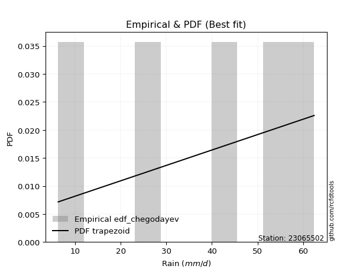</img>

</div>


### 6. EDF Blom (1958)

The Blom formula is a specific "plotting position" formula used in hydrology and statistical analysis to estimate the empirical cumulative probability (or non-exceedance probability) of a data series. It is particularly recommended for data that are approximately normally distributed. The constant _a_ is set to 0.375 (or 3/8).

<div align="center">


$P=(m-a)/(n+1-2a)$


</div>


**6.1. Empirical values**

<div align="center">

|                | 0                   | 1                   | 2        | 3                  | 4                  |
|:---------------|:--------------------|:--------------------|:---------|:-------------------|:-------------------|
| date           | 2020                | 2016                | 2017     | 2018               | 2019               |
| x              | 6.3                 | 25.8                | 41.7     | 54.1               | 62.4               |
| m              | 1                   | 2                   | 3        | 4                  | 5                  |
| empirical_dist | edf_blom            | edf_blom            | edf_blom | edf_blom           | edf_blom           |
| empirical      | 0.11904761904761904 | 0.30952380952380953 | 0.5      | 0.6904761904761905 | 0.8809523809523809 |
| empirical_tr   | 1.135135135135135   | 1.4482758620689655  | 2.0      | 3.230769230769231  | 8.399999999999999  |

</div>


**6.2. Kolmogorov-Smirnov fit test (sorted by Δ)**


<div align="center">

|                | 0                    | 1                   | 2                   | 3                   | 4                   | 5                   | 6                   | 7                   | 8                   | 9                   | 10                  | 11                  | 12                  | 13                  | 14                  | 15                  | 16                  | 17                  | 18                  | 19                  | 20                  | 21                  | 22                  | 23                  | 24                  | 25                  | 26                  | 27                  | 28                 | 29                  | 30                  | 31                  | 32                  | 33                  | 34                  | 35                  | 36                  | 37                 | 38                  | 39                  | 40                  | 41                  | 42                  | 43                  | 44                  | 45                 | 46                  | 47                  | 48                  | 49                 | 50                  | 51                  | 52                  | 53                  | 54                  | 55                  | 56                  | 57                  | 58                  | 59                  | 60                  | 61                  | 62                  | 63                  | 64                  | 65                  | 66                  | 67                  | 68                  | 69                  | 70                  | 71                  | 72                  | 73                  | 74                  | 75                  | 76                 | 77                  | 78                  | 79                  | 80                  | 81                  | 82                 | 83                  | 84                  | 85                  | 86                  | 87                  | 88                  | 89                  | 90                  | 91                  | 92                  | 93                 | 94                  | 95                  | 96                 | 97                  | 98                  | 99                 | 100                 | 101                 | 102                 | 103                 | 104                 | 105                | 106                | 107                 | 108                | 109                 | 110                 | 111                 | 112                 | 113                 | 114                | 115                 | 116                 | 117                 | 118                 | 119                 | 120                 | 121                 | 122                 | 123                | 124                 | 125                | 126                 | 127                 | 128                | 129                | 130                | 131                | 132                 | 133                 | 134                | 135                | 136                 | 137                 | 138                | 139                 | 140                 | 141                 | 142                | 143                | 144                 | 145                 | 146                 | 147                 | 148                | 149                | 150                | 151                | 152                | 153                | 154                | 155                | 156                | 157                | 158                | 159                |
|:---------------|:---------------------|:--------------------|:--------------------|:--------------------|:--------------------|:--------------------|:--------------------|:--------------------|:--------------------|:--------------------|:--------------------|:--------------------|:--------------------|:--------------------|:--------------------|:--------------------|:--------------------|:--------------------|:--------------------|:--------------------|:--------------------|:--------------------|:--------------------|:--------------------|:--------------------|:--------------------|:--------------------|:--------------------|:-------------------|:--------------------|:--------------------|:--------------------|:--------------------|:--------------------|:--------------------|:--------------------|:--------------------|:-------------------|:--------------------|:--------------------|:--------------------|:--------------------|:--------------------|:--------------------|:--------------------|:-------------------|:--------------------|:--------------------|:--------------------|:-------------------|:--------------------|:--------------------|:--------------------|:--------------------|:--------------------|:--------------------|:--------------------|:--------------------|:--------------------|:--------------------|:--------------------|:--------------------|:--------------------|:--------------------|:--------------------|:--------------------|:--------------------|:--------------------|:--------------------|:--------------------|:--------------------|:--------------------|:--------------------|:--------------------|:--------------------|:--------------------|:-------------------|:--------------------|:--------------------|:--------------------|:--------------------|:--------------------|:-------------------|:--------------------|:--------------------|:--------------------|:--------------------|:--------------------|:--------------------|:--------------------|:--------------------|:--------------------|:--------------------|:-------------------|:--------------------|:--------------------|:-------------------|:--------------------|:--------------------|:-------------------|:--------------------|:--------------------|:--------------------|:--------------------|:--------------------|:-------------------|:-------------------|:--------------------|:-------------------|:--------------------|:--------------------|:--------------------|:--------------------|:--------------------|:-------------------|:--------------------|:--------------------|:--------------------|:--------------------|:--------------------|:--------------------|:--------------------|:--------------------|:-------------------|:--------------------|:-------------------|:--------------------|:--------------------|:-------------------|:-------------------|:-------------------|:-------------------|:--------------------|:--------------------|:-------------------|:-------------------|:--------------------|:--------------------|:-------------------|:--------------------|:--------------------|:--------------------|:-------------------|:-------------------|:--------------------|:--------------------|:--------------------|:--------------------|:-------------------|:-------------------|:-------------------|:-------------------|:-------------------|:-------------------|:-------------------|:-------------------|:-------------------|:-------------------|:-------------------|:-------------------|
| station        | 23065502             | 23065502            | 23065502            | 23065502            | 23065502            | 23065502            | 23065502            | 23065502            | 23065502            | 23065502            | 23065502            | 23065502            | 23065502            | 23065502            | 23065502            | 23065502            | 23065502            | 23065502            | 23065502            | 23065502            | 23065502            | 23065502            | 23065502            | 23065502            | 23065502            | 23065502            | 23065502            | 23065502            | 23065502           | 23065502            | 23065502            | 23065502            | 23065502            | 23065502            | 23065502            | 23065502            | 23065502            | 23065502           | 23065502            | 23065502            | 23065502            | 23065502            | 23065502            | 23065502            | 23065502            | 23065502           | 23065502            | 23065502            | 23065502            | 23065502           | 23065502            | 23065502            | 23065502            | 23065502            | 23065502            | 23065502            | 23065502            | 23065502            | 23065502            | 23065502            | 23065502            | 23065502            | 23065502            | 23065502            | 23065502            | 23065502            | 23065502            | 23065502            | 23065502            | 23065502            | 23065502            | 23065502            | 23065502            | 23065502            | 23065502            | 23065502            | 23065502           | 23065502            | 23065502            | 23065502            | 23065502            | 23065502            | 23065502           | 23065502            | 23065502            | 23065502            | 23065502            | 23065502            | 23065502            | 23065502            | 23065502            | 23065502            | 23065502            | 23065502           | 23065502            | 23065502            | 23065502           | 23065502            | 23065502            | 23065502           | 23065502            | 23065502            | 23065502            | 23065502            | 23065502            | 23065502           | 23065502           | 23065502            | 23065502           | 23065502            | 23065502            | 23065502            | 23065502            | 23065502            | 23065502           | 23065502            | 23065502            | 23065502            | 23065502            | 23065502            | 23065502            | 23065502            | 23065502            | 23065502           | 23065502            | 23065502           | 23065502            | 23065502            | 23065502           | 23065502           | 23065502           | 23065502           | 23065502            | 23065502            | 23065502           | 23065502           | 23065502            | 23065502            | 23065502           | 23065502            | 23065502            | 23065502            | 23065502           | 23065502           | 23065502            | 23065502            | 23065502            | 23065502            | 23065502           | 23065502           | 23065502           | 23065502           | 23065502           | 23065502           | 23065502           | 23065502           | 23065502           | 23065502           | 23065502           | 23065502           |
| empirical_dist | edf_blom             | edf_blom            | edf_blom            | edf_blom            | edf_blom            | edf_blom            | edf_blom            | edf_blom            | edf_blom            | edf_blom            | edf_blom            | edf_blom            | edf_blom            | edf_blom            | edf_blom            | edf_blom            | edf_blom            | edf_blom            | edf_blom            | edf_blom            | edf_blom            | edf_blom            | edf_blom            | edf_blom            | edf_blom            | edf_blom            | edf_blom            | edf_blom            | edf_blom           | edf_blom            | edf_blom            | edf_blom            | edf_blom            | edf_blom            | edf_blom            | edf_blom            | edf_blom            | edf_blom           | edf_blom            | edf_blom            | edf_blom            | edf_blom            | edf_blom            | edf_blom            | edf_blom            | edf_blom           | edf_blom            | edf_blom            | edf_blom            | edf_blom           | edf_blom            | edf_blom            | edf_blom            | edf_blom            | edf_blom            | edf_blom            | edf_blom            | edf_blom            | edf_blom            | edf_blom            | edf_blom            | edf_blom            | edf_blom            | edf_blom            | edf_blom            | edf_blom            | edf_blom            | edf_blom            | edf_blom            | edf_blom            | edf_blom            | edf_blom            | edf_blom            | edf_blom            | edf_blom            | edf_blom            | edf_blom           | edf_blom            | edf_blom            | edf_blom            | edf_blom            | edf_blom            | edf_blom           | edf_blom            | edf_blom            | edf_blom            | edf_blom            | edf_blom            | edf_blom            | edf_blom            | edf_blom            | edf_blom            | edf_blom            | edf_blom           | edf_blom            | edf_blom            | edf_blom           | edf_blom            | edf_blom            | edf_blom           | edf_blom            | edf_blom            | edf_blom            | edf_blom            | edf_blom            | edf_blom           | edf_blom           | edf_blom            | edf_blom           | edf_blom            | edf_blom            | edf_blom            | edf_blom            | edf_blom            | edf_blom           | edf_blom            | edf_blom            | edf_blom            | edf_blom            | edf_blom            | edf_blom            | edf_blom            | edf_blom            | edf_blom           | edf_blom            | edf_blom           | edf_blom            | edf_blom            | edf_blom           | edf_blom           | edf_blom           | edf_blom           | edf_blom            | edf_blom            | edf_blom           | edf_blom           | edf_blom            | edf_blom            | edf_blom           | edf_blom            | edf_blom            | edf_blom            | edf_blom           | edf_blom           | edf_blom            | edf_blom            | edf_blom            | edf_blom            | edf_blom           | edf_blom           | edf_blom           | edf_blom           | edf_blom           | edf_blom           | edf_blom           | edf_blom           | edf_blom           | edf_blom           | edf_blom           | edf_blom           |
| p_dist         | trapezoid            | semicircular        | gengamma            | anglit              | ksone               | argus               | weibull_min         | johnsonsu           | gompertz            | loglevy_l           | pearson3            | erlang              | betaprime           | nct                 | t                   | exponnorm           | f                   | truncnorm           | norm                | crystalball         | fatiguelife         | rice                | gumbel_l            | gamma               | invgauss            | maxwell             | foldnorm            | logpearson3         | invgamma           | exponweib           | rayleigh            | logtrapezoid        | loggumbel_l         | logmielke           | burr                | cosine              | triang              | logistic           | skewnorm            | logweibull_max      | beta                | genpareto           | logvonmises_line    | genextreme          | gausshyper          | loggenextreme      | genhalflogistic     | arcsine             | dgamma              | logweibull_min     | ncf                 | wrapcauchy          | dweibull            | logloglaplace       | genexpon            | logburr             | mielke              | logdgamma           | logburr12           | logargus            | kstwobign           | hypsecant           | logloggamma         | halfnorm            | loggompertz         | logsemicircular     | loggennorm          | loganglit           | logdweibull         | levy_l              | gumbel_r            | kappa3              | laplace             | tukeylambda         | kappa4              | lomax               | exponpow           | logbetaprime        | loggenpareto        | logerlang           | logncf              | logfatiguelife      | lognct             | logf                | logcrystalball      | logexponnorm        | lognorm             | logt                | uniform             | vonmises_line       | logarcsine          | logrice             | halflogistic        | invweibull         | loggamma            | loggamma            | moyal              | logfoldnorm         | loginvgauss         | loginvgamma        | logbeta             | loglogistic         | logalpha            | logmaxwell          | loginvweibull       | lograyleigh        | loggausshyper      | gennorm             | loghypsecant       | loggenhalflogistic  | logcosine           | loghalfnorm         | bradford            | truncweibull_min    | logwrapcauchy      | logkstwobign        | logskewnorm         | loggumbel_r         | loggenexpon         | loglaplace          | loglaplace          | wald                | halfgennorm         | loghalflogistic    | logtriang           | logmoyal           | truncexpon          | logjohnsonsb        | burr12             | loglomax           | logksone           | logwald            | alpha               | logtruncnorm        | lognakagami        | logrdist           | johnsonsb           | logtukeylambda      | loghalfgennorm     | logkappa3           | loguniform          | logkappa4           | nakagami           | logtruncexpon      | logbradford         | logexponweib        | logtruncweibull_min | logjohnsonsu        | loggengamma        | logexponpow        | weibull_max        | powerlaw           | truncpareto        | logpowerlaw        | logtruncpareto     | rdist              | genlogistic        | loggenlogistic     | logvonmises        | vonmises           |
| delta          | 0.058957611293926404 | 0.06301470213505753 | 0.06538967613088809 | 0.06886710508375438 | 0.07496621265188776 | 0.08193850433580419 | 0.08362940412830167 | 0.08602992521011515 | 0.08713967057274452 | 0.08894565739763904 | 0.09119888778227736 | 0.09604204886987322 | 0.09655162631406056 | 0.09683433775966022 | 0.09697712515482104 | 0.09697768619560299 | 0.09697975445293272 | 0.09698131180600567 | 0.09698136054433348 | 0.09698137259732675 | 0.09707165533218398 | 0.09732473411635245 | 0.09974805117401242 | 0.10002411021865165 | 0.10039374817058455 | 0.10159513916867635 | 0.10387052522505025 | 0.10403156086924958 | 0.1064284444953133 | 0.10773358560516433 | 0.10978363496102306 | 0.11026469071186473 | 0.11366108632087057 | 0.11413493792000329 | 0.11522355693134234 | 0.11525386795785997 | 0.11722546135675471 | 0.1190203036707751 | 0.11904722139681978 | 0.11904754976332244 | 0.11904761628536642 | 0.11904761885005077 | 0.11904761904615757 | 0.11904761904732242 | 0.11904761904744832 | 0.1190476190476033 | 0.11904761904761774 | 0.11904761904761904 | 0.11910453665587895 | 0.1194397975808229 | 0.11971142665732093 | 0.12112521515190589 | 0.12246132690984096 | 0.12342298090627968 | 0.12353847250135352 | 0.12398797429692321 | 0.12430038944787714 | 0.12471509631228872 | 0.12856285931148448 | 0.13093335558156727 | 0.13197595957868558 | 0.13237834043139896 | 0.13451340629611408 | 0.13559224278890958 | 0.13597782360491772 | 0.13735453332223024 | 0.13766049142958547 | 0.13862371076140423 | 0.13969998214942114 | 0.14056423070615612 | 0.14073501324918403 | 0.14586076312552287 | 0.14768705967917362 | 0.15017818925256354 | 0.15116456582956128 | 0.15234395623744634 | 0.1533044972048876 | 0.15343262186984008 | 0.15381029461865103 | 0.15560989459485808 | 0.15605889001696527 | 0.15907492102458476 | 0.1591965004042626 | 0.15925690234918433 | 0.15943119351774637 | 0.15943163962214202 | 0.15943195085054107 | 0.15943284320058015 | 0.16157372039724982 | 0.16157473087785224 | 0.16250431287956935 | 0.16327570206908382 | 0.16347974931519427 | 0.1637504351013025 | 0.16469768557741504 | 0.16469768557741504 | 0.1647673441277675 | 0.16579597306179972 | 0.16920931148922447 | 0.172845546201019  | 0.17413544334247844 | 0.17815685482915866 | 0.17819688528279343 | 0.18004568608384441 | 0.18102439553641886 | 0.1862099466574365 | 0.1892844042455466 | 0.19047619047619047 | 0.1925172761519207 | 0.20003939565597462 | 0.20392658417693887 | 0.20477671368076455 | 0.20555836371121172 | 0.21014278709159373 | 0.2107792737648162 | 0.21661729915950756 | 0.21782619662391212 | 0.21787114142824904 | 0.22024039093380976 | 0.22036395603234715 | 0.22036395603234715 | 0.23150108192042151 | 0.23190407857405781 | 0.232200382979464  | 0.23485319320888198 | 0.2371107737248317 | 0.24378627192545033 | 0.27829645498427613 | 0.2798958434375125 | 0.2822247135501357 | 0.2861715100372638 | 0.291909179027938  | 0.29274645579515934 | 0.30951769089793707 | 0.3095238095237671 | 0.3127118314051629 | 0.31541834714607553 | 0.31671811570210906 | 0.319409204680708  | 0.32361881052415165 | 0.32422093456678147 | 0.33119194790838047 | 0.3643422964712075 | 0.3835640003328732 | 0.38752807210593276 | 0.41377346841098894 | 0.41811595948874714 | 0.42860642825395445 | 0.4494076583518546 | 0.4840179038827854 | 0.5393915267945101 | 0.5677761784873524 | 0.5816021700861416 | 0.6278706923420508 | 0.6401909833174114 | 0.6904761903398247 | 0.6904761904761905 | 0.6904761904761905 | 1.1122382549957353 | 9.710245958582876  |
| deltao         | 0.5865427407550001   | 0.5865427407550001  | 0.5865427407550001  | 0.5865427407550001  | 0.5865427407550001  | 0.5865427407550001  | 0.5865427407550001  | 0.5865427407550001  | 0.5865427407550001  | 0.5865427407550001  | 0.5865427407550001  | 0.5865427407550001  | 0.5865427407550001  | 0.5865427407550001  | 0.5865427407550001  | 0.5865427407550001  | 0.5865427407550001  | 0.5865427407550001  | 0.5865427407550001  | 0.5865427407550001  | 0.5865427407550001  | 0.5865427407550001  | 0.5865427407550001  | 0.5865427407550001  | 0.5865427407550001  | 0.5865427407550001  | 0.5865427407550001  | 0.5865427407550001  | 0.5865427407550001 | 0.5865427407550001  | 0.5865427407550001  | 0.5865427407550001  | 0.5865427407550001  | 0.5865427407550001  | 0.5865427407550001  | 0.5865427407550001  | 0.5865427407550001  | 0.5865427407550001 | 0.5865427407550001  | 0.5865427407550001  | 0.5865427407550001  | 0.5865427407550001  | 0.5865427407550001  | 0.5865427407550001  | 0.5865427407550001  | 0.5865427407550001 | 0.5865427407550001  | 0.5865427407550001  | 0.5865427407550001  | 0.5865427407550001 | 0.5865427407550001  | 0.5865427407550001  | 0.5865427407550001  | 0.5865427407550001  | 0.5865427407550001  | 0.5865427407550001  | 0.5865427407550001  | 0.5865427407550001  | 0.5865427407550001  | 0.5865427407550001  | 0.5865427407550001  | 0.5865427407550001  | 0.5865427407550001  | 0.5865427407550001  | 0.5865427407550001  | 0.5865427407550001  | 0.5865427407550001  | 0.5865427407550001  | 0.5865427407550001  | 0.5865427407550001  | 0.5865427407550001  | 0.5865427407550001  | 0.5865427407550001  | 0.5865427407550001  | 0.5865427407550001  | 0.5865427407550001  | 0.5865427407550001 | 0.5865427407550001  | 0.5865427407550001  | 0.5865427407550001  | 0.5865427407550001  | 0.5865427407550001  | 0.5865427407550001 | 0.5865427407550001  | 0.5865427407550001  | 0.5865427407550001  | 0.5865427407550001  | 0.5865427407550001  | 0.5865427407550001  | 0.5865427407550001  | 0.5865427407550001  | 0.5865427407550001  | 0.5865427407550001  | 0.5865427407550001 | 0.5865427407550001  | 0.5865427407550001  | 0.5865427407550001 | 0.5865427407550001  | 0.5865427407550001  | 0.5865427407550001 | 0.5865427407550001  | 0.5865427407550001  | 0.5865427407550001  | 0.5865427407550001  | 0.5865427407550001  | 0.5865427407550001 | 0.5865427407550001 | 0.5865427407550001  | 0.5865427407550001 | 0.5865427407550001  | 0.5865427407550001  | 0.5865427407550001  | 0.5865427407550001  | 0.5865427407550001  | 0.5865427407550001 | 0.5865427407550001  | 0.5865427407550001  | 0.5865427407550001  | 0.5865427407550001  | 0.5865427407550001  | 0.5865427407550001  | 0.5865427407550001  | 0.5865427407550001  | 0.5865427407550001 | 0.5865427407550001  | 0.5865427407550001 | 0.5865427407550001  | 0.5865427407550001  | 0.5865427407550001 | 0.5865427407550001 | 0.5865427407550001 | 0.5865427407550001 | 0.5865427407550001  | 0.5865427407550001  | 0.5865427407550001 | 0.5865427407550001 | 0.5865427407550001  | 0.5865427407550001  | 0.5865427407550001 | 0.5865427407550001  | 0.5865427407550001  | 0.5865427407550001  | 0.5865427407550001 | 0.5865427407550001 | 0.5865427407550001  | 0.5865427407550001  | 0.5865427407550001  | 0.5865427407550001  | 0.5865427407550001 | 0.5865427407550001 | 0.5865427407550001 | 0.5865427407550001 | 0.5865427407550001 | 0.5865427407550001 | 0.5865427407550001 | 0.5865427407550001 | 0.5865427407550001 | 0.5865427407550001 | 0.5865427407550001 | 0.5865427407550001 |
| eval           | Δo > Δ               | Δo > Δ              | Δo > Δ              | Δo > Δ              | Δo > Δ              | Δo > Δ              | Δo > Δ              | Δo > Δ              | Δo > Δ              | Δo > Δ              | Δo > Δ              | Δo > Δ              | Δo > Δ              | Δo > Δ              | Δo > Δ              | Δo > Δ              | Δo > Δ              | Δo > Δ              | Δo > Δ              | Δo > Δ              | Δo > Δ              | Δo > Δ              | Δo > Δ              | Δo > Δ              | Δo > Δ              | Δo > Δ              | Δo > Δ              | Δo > Δ              | Δo > Δ             | Δo > Δ              | Δo > Δ              | Δo > Δ              | Δo > Δ              | Δo > Δ              | Δo > Δ              | Δo > Δ              | Δo > Δ              | Δo > Δ             | Δo > Δ              | Δo > Δ              | Δo > Δ              | Δo > Δ              | Δo > Δ              | Δo > Δ              | Δo > Δ              | Δo > Δ             | Δo > Δ              | Δo > Δ              | Δo > Δ              | Δo > Δ             | Δo > Δ              | Δo > Δ              | Δo > Δ              | Δo > Δ              | Δo > Δ              | Δo > Δ              | Δo > Δ              | Δo > Δ              | Δo > Δ              | Δo > Δ              | Δo > Δ              | Δo > Δ              | Δo > Δ              | Δo > Δ              | Δo > Δ              | Δo > Δ              | Δo > Δ              | Δo > Δ              | Δo > Δ              | Δo > Δ              | Δo > Δ              | Δo > Δ              | Δo > Δ              | Δo > Δ              | Δo > Δ              | Δo > Δ              | Δo > Δ             | Δo > Δ              | Δo > Δ              | Δo > Δ              | Δo > Δ              | Δo > Δ              | Δo > Δ             | Δo > Δ              | Δo > Δ              | Δo > Δ              | Δo > Δ              | Δo > Δ              | Δo > Δ              | Δo > Δ              | Δo > Δ              | Δo > Δ              | Δo > Δ              | Δo > Δ             | Δo > Δ              | Δo > Δ              | Δo > Δ             | Δo > Δ              | Δo > Δ              | Δo > Δ             | Δo > Δ              | Δo > Δ              | Δo > Δ              | Δo > Δ              | Δo > Δ              | Δo > Δ             | Δo > Δ             | Δo > Δ              | Δo > Δ             | Δo > Δ              | Δo > Δ              | Δo > Δ              | Δo > Δ              | Δo > Δ              | Δo > Δ             | Δo > Δ              | Δo > Δ              | Δo > Δ              | Δo > Δ              | Δo > Δ              | Δo > Δ              | Δo > Δ              | Δo > Δ              | Δo > Δ             | Δo > Δ              | Δo > Δ             | Δo > Δ              | Δo > Δ              | Δo > Δ             | Δo > Δ             | Δo > Δ             | Δo > Δ             | Δo > Δ              | Δo > Δ              | Δo > Δ             | Δo > Δ             | Δo > Δ              | Δo > Δ              | Δo > Δ             | Δo > Δ              | Δo > Δ              | Δo > Δ              | Δo > Δ             | Δo > Δ             | Δo > Δ              | Δo > Δ              | Δo > Δ              | Δo > Δ              | Δo > Δ             | Δo > Δ             | Δo > Δ             | Δo > Δ             | Δo > Δ             | Δo <= Δ            | Δo <= Δ            | Δo <= Δ            | Δo <= Δ            | Δo <= Δ            | Δo <= Δ            | Δo <= Δ            |
| fit            | 1                    | 1                   | 1                   | 1                   | 1                   | 1                   | 1                   | 1                   | 1                   | 1                   | 1                   | 1                   | 1                   | 1                   | 1                   | 1                   | 1                   | 1                   | 1                   | 1                   | 1                   | 1                   | 1                   | 1                   | 1                   | 1                   | 1                   | 1                   | 1                  | 1                   | 1                   | 1                   | 1                   | 1                   | 1                   | 1                   | 1                   | 1                  | 1                   | 1                   | 1                   | 1                   | 1                   | 1                   | 1                   | 1                  | 1                   | 1                   | 1                   | 1                  | 1                   | 1                   | 1                   | 1                   | 1                   | 1                   | 1                   | 1                   | 1                   | 1                   | 1                   | 1                   | 1                   | 1                   | 1                   | 1                   | 1                   | 1                   | 1                   | 1                   | 1                   | 1                   | 1                   | 1                   | 1                   | 1                   | 1                  | 1                   | 1                   | 1                   | 1                   | 1                   | 1                  | 1                   | 1                   | 1                   | 1                   | 1                   | 1                   | 1                   | 1                   | 1                   | 1                   | 1                  | 1                   | 1                   | 1                  | 1                   | 1                   | 1                  | 1                   | 1                   | 1                   | 1                   | 1                   | 1                  | 1                  | 1                   | 1                  | 1                   | 1                   | 1                   | 1                   | 1                   | 1                  | 1                   | 1                   | 1                   | 1                   | 1                   | 1                   | 1                   | 1                   | 1                  | 1                   | 1                  | 1                   | 1                   | 1                  | 1                  | 1                  | 1                  | 1                   | 1                   | 1                  | 1                  | 1                   | 1                   | 1                  | 1                   | 1                   | 1                   | 1                  | 1                  | 1                   | 1                   | 1                   | 1                   | 1                  | 1                  | 1                  | 1                  | 1                  | 0                  | 0                  | 0                  | 0                  | 0                  | 0                  | 0                  |
| n              | 5                    | 5                   | 5                   | 5                   | 5                   | 5                   | 5                   | 5                   | 5                   | 5                   | 5                   | 5                   | 5                   | 5                   | 5                   | 5                   | 5                   | 5                   | 5                   | 5                   | 5                   | 5                   | 5                   | 5                   | 5                   | 5                   | 5                   | 5                   | 5                  | 5                   | 5                   | 5                   | 5                   | 5                   | 5                   | 5                   | 5                   | 5                  | 5                   | 5                   | 5                   | 5                   | 5                   | 5                   | 5                   | 5                  | 5                   | 5                   | 5                   | 5                  | 5                   | 5                   | 5                   | 5                   | 5                   | 5                   | 5                   | 5                   | 5                   | 5                   | 5                   | 5                   | 5                   | 5                   | 5                   | 5                   | 5                   | 5                   | 5                   | 5                   | 5                   | 5                   | 5                   | 5                   | 5                   | 5                   | 5                  | 5                   | 5                   | 5                   | 5                   | 5                   | 5                  | 5                   | 5                   | 5                   | 5                   | 5                   | 5                   | 5                   | 5                   | 5                   | 5                   | 5                  | 5                   | 5                   | 5                  | 5                   | 5                   | 5                  | 5                   | 5                   | 5                   | 5                   | 5                   | 5                  | 5                  | 5                   | 5                  | 5                   | 5                   | 5                   | 5                   | 5                   | 5                  | 5                   | 5                   | 5                   | 5                   | 5                   | 5                   | 5                   | 5                   | 5                  | 5                   | 5                  | 5                   | 5                   | 5                  | 5                  | 5                  | 5                  | 5                   | 5                   | 5                  | 5                  | 5                   | 5                   | 5                  | 5                   | 5                   | 5                   | 5                  | 5                  | 5                   | 5                   | 5                   | 5                   | 5                  | 5                  | 5                  | 5                  | 5                  | 5                  | 5                  | 5                  | 5                  | 5                  | 5                  | 5                  |
| best_fit       | 1                    | 0                   | 0                   | 0                   | 0                   | 0                   | 0                   | 0                   | 0                   | 0                   | 0                   | 0                   | 0                   | 0                   | 0                   | 0                   | 0                   | 0                   | 0                   | 0                   | 0                   | 0                   | 0                   | 0                   | 0                   | 0                   | 0                   | 0                   | 0                  | 0                   | 0                   | 0                   | 0                   | 0                   | 0                   | 0                   | 0                   | 0                  | 0                   | 0                   | 0                   | 0                   | 0                   | 0                   | 0                   | 0                  | 0                   | 0                   | 0                   | 0                  | 0                   | 0                   | 0                   | 0                   | 0                   | 0                   | 0                   | 0                   | 0                   | 0                   | 0                   | 0                   | 0                   | 0                   | 0                   | 0                   | 0                   | 0                   | 0                   | 0                   | 0                   | 0                   | 0                   | 0                   | 0                   | 0                   | 0                  | 0                   | 0                   | 0                   | 0                   | 0                   | 0                  | 0                   | 0                   | 0                   | 0                   | 0                   | 0                   | 0                   | 0                   | 0                   | 0                   | 0                  | 0                   | 0                   | 0                  | 0                   | 0                   | 0                  | 0                   | 0                   | 0                   | 0                   | 0                   | 0                  | 0                  | 0                   | 0                  | 0                   | 0                   | 0                   | 0                   | 0                   | 0                  | 0                   | 0                   | 0                   | 0                   | 0                   | 0                   | 0                   | 0                   | 0                  | 0                   | 0                  | 0                   | 0                   | 0                  | 0                  | 0                  | 0                  | 0                   | 0                   | 0                  | 0                  | 0                   | 0                   | 0                  | 0                   | 0                   | 0                   | 0                  | 0                  | 0                   | 0                   | 0                   | 0                   | 0                  | 0                  | 0                  | 0                  | 0                  | 0                  | 0                  | 0                  | 0                  | 0                  | 0                  | 0                  |
| best_fit_sort  | 1                    | 2                   | 3                   | 4                   | 5                   | 6                   | 7                   | 8                   | 9                   | 10                  | 11                  | 12                  | 13                  | 14                  | 15                  | 16                  | 17                  | 18                  | 19                  | 20                  | 21                  | 22                  | 23                  | 24                  | 25                  | 26                  | 27                  | 28                  | 29                 | 30                  | 31                  | 32                  | 33                  | 34                  | 35                  | 36                  | 37                  | 38                 | 39                  | 40                  | 41                  | 42                  | 43                  | 44                  | 45                  | 46                 | 47                  | 48                  | 49                  | 50                 | 51                  | 52                  | 53                  | 54                  | 55                  | 56                  | 57                  | 58                  | 59                  | 60                  | 61                  | 62                  | 63                  | 64                  | 65                  | 66                  | 67                  | 68                  | 69                  | 70                  | 71                  | 72                  | 73                  | 74                  | 75                  | 76                  | 77                 | 78                  | 79                  | 80                  | 81                  | 82                  | 83                 | 84                  | 85                  | 86                  | 87                  | 88                  | 89                  | 90                  | 91                  | 92                  | 93                  | 94                 | 95                  | 96                  | 97                 | 98                  | 99                  | 100                | 101                 | 102                 | 103                 | 104                 | 105                 | 106                | 107                | 108                 | 109                | 110                 | 111                 | 112                 | 113                 | 114                 | 115                | 116                 | 117                 | 118                 | 119                 | 120                 | 121                 | 122                 | 123                 | 124                | 125                 | 126                | 127                 | 128                 | 129                | 130                | 131                | 132                | 133                 | 134                 | 135                | 136                | 137                 | 138                 | 139                | 140                 | 141                 | 142                 | 143                | 144                | 145                 | 146                 | 147                 | 148                 | 149                | 150                | 151                | 152                | 153                | 154                | 155                | 156                | 157                | 158                | 159                | 160                |

</div>


**6.3. Best fit**

<div align="center">

|   id |   station | empirical_dist   | p_dist    |     delta |   deltao | eval   |   fit |   n |   best_fit |   best_fit_sort |
|-----:|----------:|:-----------------|:----------|----------:|---------:|:-------|------:|----:|-----------:|----------------:|
|    0 |  23065502 | edf_blom         | trapezoid | 0.0589576 | 0.586543 | Δo > Δ |     1 |   5 |          1 |               1 |

</div>


<div align="center">

</img></img>

</div>


### 7. EDF Tukey (1962)

In hydrology, the Tukey formula is used as a plotting position formula to estimate the empirical probability or frequency of a flood event (or other hydrological data). The formula parameter is given as _c=0.333_ (or 1/3).

<div align="center">


$P=(m-c)/(n+1-2c)$


</div>


**7.1. Empirical values**

<div align="center">

|                | 0                  | 1                  | 2         | 3         | 4         |
|:---------------|:-------------------|:-------------------|:----------|:----------|:----------|
| date           | 2020               | 2016               | 2017      | 2018      | 2019      |
| x              | 6.3                | 25.8               | 41.7      | 54.1      | 62.4      |
| m              | 1                  | 2                  | 3         | 4         | 5         |
| empirical_dist | edf_tukey          | edf_tukey          | edf_tukey | edf_tukey | edf_tukey |
| empirical      | 0.125              | 0.3125             | 0.5       | 0.6875    | 0.875     |
| empirical_tr   | 1.1428571428571428 | 1.4545454545454546 | 2.0       | 3.2       | 8.0       |

</div>


**7.2. Kolmogorov-Smirnov fit test (sorted by Δ)**


<div align="center">

|                | 0                   | 1                   | 2                   | 3                   | 4                   | 5                   | 6                   | 7                   | 8                   | 9                   | 10                  | 11                  | 12                  | 13                  | 14                  | 15                  | 16                  | 17                  | 18                  | 19                  | 20                  | 21                  | 22                  | 23                  | 24                  | 25                  | 26                 | 27                  | 28                  | 29                  | 30                  | 31                  | 32                  | 33                  | 34                  | 35                  | 36                  | 37                 | 38                 | 39                  | 40                  | 41                  | 42                  | 43                  | 44                  | 45                  | 46                  | 47                  | 48                 | 49                  | 50                  | 51                  | 52                  | 53                  | 54                 | 55                  | 56                 | 57                  | 58                  | 59                  | 60                  | 61                 | 62                  | 63                  | 64                  | 65                  | 66                  | 67                  | 68                  | 69                  | 70                  | 71                  | 72                  | 73                  | 74                  | 75                 | 76                 | 77                  | 78                  | 79                  | 80                  | 81                  | 82                  | 83                 | 84                  | 85                  | 86                  | 87                  | 88                  | 89                  | 90                  | 91                 | 92                  | 93                 | 94                  | 95                  | 96                 | 97                  | 98                  | 99                  | 100                | 101                | 102                 | 103                 | 104                 | 105                | 106                | 107                | 108                | 109                 | 110                 | 111                 | 112                 | 113                 | 114                 | 115                | 116                | 117                 | 118                 | 119                 | 120                 | 121                 | 122                 | 123                | 124                 | 125                | 126                 | 127                | 128                 | 129                | 130                 | 131                | 132                | 133                 | 134                 | 135                 | 136                | 137                | 138                 | 139                 | 140                 | 141                 | 142                | 143                | 144                | 145                | 146                 | 147                | 148                | 149                 | 150                | 151                | 152                | 153                | 154                | 155                | 156                | 157                | 158                | 159                |
|:---------------|:--------------------|:--------------------|:--------------------|:--------------------|:--------------------|:--------------------|:--------------------|:--------------------|:--------------------|:--------------------|:--------------------|:--------------------|:--------------------|:--------------------|:--------------------|:--------------------|:--------------------|:--------------------|:--------------------|:--------------------|:--------------------|:--------------------|:--------------------|:--------------------|:--------------------|:--------------------|:-------------------|:--------------------|:--------------------|:--------------------|:--------------------|:--------------------|:--------------------|:--------------------|:--------------------|:--------------------|:--------------------|:-------------------|:-------------------|:--------------------|:--------------------|:--------------------|:--------------------|:--------------------|:--------------------|:--------------------|:--------------------|:--------------------|:-------------------|:--------------------|:--------------------|:--------------------|:--------------------|:--------------------|:-------------------|:--------------------|:-------------------|:--------------------|:--------------------|:--------------------|:--------------------|:-------------------|:--------------------|:--------------------|:--------------------|:--------------------|:--------------------|:--------------------|:--------------------|:--------------------|:--------------------|:--------------------|:--------------------|:--------------------|:--------------------|:-------------------|:-------------------|:--------------------|:--------------------|:--------------------|:--------------------|:--------------------|:--------------------|:-------------------|:--------------------|:--------------------|:--------------------|:--------------------|:--------------------|:--------------------|:--------------------|:-------------------|:--------------------|:-------------------|:--------------------|:--------------------|:-------------------|:--------------------|:--------------------|:--------------------|:-------------------|:-------------------|:--------------------|:--------------------|:--------------------|:-------------------|:-------------------|:-------------------|:-------------------|:--------------------|:--------------------|:--------------------|:--------------------|:--------------------|:--------------------|:-------------------|:-------------------|:--------------------|:--------------------|:--------------------|:--------------------|:--------------------|:--------------------|:-------------------|:--------------------|:-------------------|:--------------------|:-------------------|:--------------------|:-------------------|:--------------------|:-------------------|:-------------------|:--------------------|:--------------------|:--------------------|:-------------------|:-------------------|:--------------------|:--------------------|:--------------------|:--------------------|:-------------------|:-------------------|:-------------------|:-------------------|:--------------------|:-------------------|:-------------------|:--------------------|:-------------------|:-------------------|:-------------------|:-------------------|:-------------------|:-------------------|:-------------------|:-------------------|:-------------------|:-------------------|
| station        | 23065502            | 23065502            | 23065502            | 23065502            | 23065502            | 23065502            | 23065502            | 23065502            | 23065502            | 23065502            | 23065502            | 23065502            | 23065502            | 23065502            | 23065502            | 23065502            | 23065502            | 23065502            | 23065502            | 23065502            | 23065502            | 23065502            | 23065502            | 23065502            | 23065502            | 23065502            | 23065502           | 23065502            | 23065502            | 23065502            | 23065502            | 23065502            | 23065502            | 23065502            | 23065502            | 23065502            | 23065502            | 23065502           | 23065502           | 23065502            | 23065502            | 23065502            | 23065502            | 23065502            | 23065502            | 23065502            | 23065502            | 23065502            | 23065502           | 23065502            | 23065502            | 23065502            | 23065502            | 23065502            | 23065502           | 23065502            | 23065502           | 23065502            | 23065502            | 23065502            | 23065502            | 23065502           | 23065502            | 23065502            | 23065502            | 23065502            | 23065502            | 23065502            | 23065502            | 23065502            | 23065502            | 23065502            | 23065502            | 23065502            | 23065502            | 23065502           | 23065502           | 23065502            | 23065502            | 23065502            | 23065502            | 23065502            | 23065502            | 23065502           | 23065502            | 23065502            | 23065502            | 23065502            | 23065502            | 23065502            | 23065502            | 23065502           | 23065502            | 23065502           | 23065502            | 23065502            | 23065502           | 23065502            | 23065502            | 23065502            | 23065502           | 23065502           | 23065502            | 23065502            | 23065502            | 23065502           | 23065502           | 23065502           | 23065502           | 23065502            | 23065502            | 23065502            | 23065502            | 23065502            | 23065502            | 23065502           | 23065502           | 23065502            | 23065502            | 23065502            | 23065502            | 23065502            | 23065502            | 23065502           | 23065502            | 23065502           | 23065502            | 23065502           | 23065502            | 23065502           | 23065502            | 23065502           | 23065502           | 23065502            | 23065502            | 23065502            | 23065502           | 23065502           | 23065502            | 23065502            | 23065502            | 23065502            | 23065502           | 23065502           | 23065502           | 23065502           | 23065502            | 23065502           | 23065502           | 23065502            | 23065502           | 23065502           | 23065502           | 23065502           | 23065502           | 23065502           | 23065502           | 23065502           | 23065502           | 23065502           |
| empirical_dist | edf_tukey           | edf_tukey           | edf_tukey           | edf_tukey           | edf_tukey           | edf_tukey           | edf_tukey           | edf_tukey           | edf_tukey           | edf_tukey           | edf_tukey           | edf_tukey           | edf_tukey           | edf_tukey           | edf_tukey           | edf_tukey           | edf_tukey           | edf_tukey           | edf_tukey           | edf_tukey           | edf_tukey           | edf_tukey           | edf_tukey           | edf_tukey           | edf_tukey           | edf_tukey           | edf_tukey          | edf_tukey           | edf_tukey           | edf_tukey           | edf_tukey           | edf_tukey           | edf_tukey           | edf_tukey           | edf_tukey           | edf_tukey           | edf_tukey           | edf_tukey          | edf_tukey          | edf_tukey           | edf_tukey           | edf_tukey           | edf_tukey           | edf_tukey           | edf_tukey           | edf_tukey           | edf_tukey           | edf_tukey           | edf_tukey          | edf_tukey           | edf_tukey           | edf_tukey           | edf_tukey           | edf_tukey           | edf_tukey          | edf_tukey           | edf_tukey          | edf_tukey           | edf_tukey           | edf_tukey           | edf_tukey           | edf_tukey          | edf_tukey           | edf_tukey           | edf_tukey           | edf_tukey           | edf_tukey           | edf_tukey           | edf_tukey           | edf_tukey           | edf_tukey           | edf_tukey           | edf_tukey           | edf_tukey           | edf_tukey           | edf_tukey          | edf_tukey          | edf_tukey           | edf_tukey           | edf_tukey           | edf_tukey           | edf_tukey           | edf_tukey           | edf_tukey          | edf_tukey           | edf_tukey           | edf_tukey           | edf_tukey           | edf_tukey           | edf_tukey           | edf_tukey           | edf_tukey          | edf_tukey           | edf_tukey          | edf_tukey           | edf_tukey           | edf_tukey          | edf_tukey           | edf_tukey           | edf_tukey           | edf_tukey          | edf_tukey          | edf_tukey           | edf_tukey           | edf_tukey           | edf_tukey          | edf_tukey          | edf_tukey          | edf_tukey          | edf_tukey           | edf_tukey           | edf_tukey           | edf_tukey           | edf_tukey           | edf_tukey           | edf_tukey          | edf_tukey          | edf_tukey           | edf_tukey           | edf_tukey           | edf_tukey           | edf_tukey           | edf_tukey           | edf_tukey          | edf_tukey           | edf_tukey          | edf_tukey           | edf_tukey          | edf_tukey           | edf_tukey          | edf_tukey           | edf_tukey          | edf_tukey          | edf_tukey           | edf_tukey           | edf_tukey           | edf_tukey          | edf_tukey          | edf_tukey           | edf_tukey           | edf_tukey           | edf_tukey           | edf_tukey          | edf_tukey          | edf_tukey          | edf_tukey          | edf_tukey           | edf_tukey          | edf_tukey          | edf_tukey           | edf_tukey          | edf_tukey          | edf_tukey          | edf_tukey          | edf_tukey          | edf_tukey          | edf_tukey          | edf_tukey          | edf_tukey          | edf_tukey          |
| p_dist         | trapezoid           | semicircular        | gengamma            | anglit              | ksone               | argus               | weibull_min         | loglevy_l           | johnsonsu           | gompertz            | pearson3            | erlang              | betaprime           | nct                 | t                   | exponnorm           | f                   | truncnorm           | norm                | crystalball         | fatiguelife         | rice                | invgauss            | gumbel_l            | gamma               | logpearson3         | logtrapezoid       | maxwell             | foldnorm            | invgamma            | rayleigh            | loggumbel_l         | exponweib           | logmielke           | logloglaplace       | burr                | cosine              | logweibull_min     | dweibull           | ncf                 | logistic            | dgamma              | triang              | genexpon            | skewnorm            | logweibull_max      | beta                | wrapcauchy          | genpareto          | logvonmises_line    | genextreme          | gausshyper          | loggenextreme       | genhalflogistic     | arcsine            | logburr             | mielke             | logdgamma           | logburr12           | loggennorm          | kstwobign           | logdweibull        | logargus            | logsemicircular     | levy_l              | hypsecant           | halfnorm            | loggompertz         | logloggamma         | loganglit           | gumbel_r            | kappa3              | laplace             | loggenpareto        | lomax               | tukeylambda        | exponpow           | logbetaprime        | kappa4              | logerlang           | logncf              | logarcsine          | logfatiguelife      | lognct             | logf                | logcrystalball      | logexponnorm        | lognorm             | logt                | logrice             | halflogistic        | invweibull         | uniform             | vonmises_line      | loggamma            | loggamma            | moyal              | logfoldnorm         | loginvgauss         | logbeta             | loginvgamma        | loginvweibull      | loglogistic         | logalpha            | logmaxwell          | lograyleigh        | gennorm            | loggausshyper      | loghypsecant       | loggenhalflogistic  | logcosine           | loghalfnorm         | bradford            | logwrapcauchy       | truncweibull_min    | logkstwobign       | loggenexpon        | logskewnorm         | loggumbel_r         | loglaplace          | loglaplace          | halfgennorm         | wald                | loghalflogistic    | logtriang           | logmoyal           | truncexpon          | logjohnsonsb       | burr12              | loglomax           | logksone            | alpha              | logwald            | logrdist            | johnsonsb           | logtruncnorm        | lognakagami        | loghalfgennorm     | logtukeylambda      | logkappa3           | loguniform          | logkappa4           | nakagami           | logtruncexpon      | logbradford        | logexponweib       | logtruncweibull_min | logjohnsonsu       | loggengamma        | logexponpow         | weibull_max        | powerlaw           | truncpareto        | logpowerlaw        | logtruncpareto     | rdist              | genlogistic        | loggenlogistic     | logvonmises        | vonmises           |
| delta          | 0.06193380177011687 | 0.06896708308743849 | 0.07134205708326902 | 0.07184329555994484 | 0.08091859360426872 | 0.08491469481199465 | 0.08660559460449213 | 0.08894565739763904 | 0.08900611568630562 | 0.09011586104893499 | 0.09417507825846783 | 0.09901823934606369 | 0.09952781679025102 | 0.09981052823585068 | 0.09995331563101151 | 0.09995387667179345 | 0.09995594492912319 | 0.09995750228219613 | 0.09995755102052395 | 0.09995756307351722 | 0.10004784580837445 | 0.10030092459254292 | 0.10039374817058455 | 0.10272424165020289 | 0.10300030069484212 | 0.10403156086924958 | 0.1043123097594838 | 0.10457132964486682 | 0.10684671570124071 | 0.10770353674531252 | 0.10978363496102306 | 0.11366108632087057 | 0.11368596655754526 | 0.11711112839619375 | 0.11747059995389875 | 0.11819974740753281 | 0.11823005843405043 | 0.1194397975808229 | 0.1194851364336505 | 0.11971142665732093 | 0.12199649414696556 | 0.12208072713206941 | 0.12317784230913564 | 0.12353847250135352 | 0.12499960234920071 | 0.12499993071570337 | 0.12499999723774735 | 0.12499999976615161 | 0.1249999998024317 | 0.12499999999853853 | 0.12499999999970335 | 0.12499999999982925 | 0.12499999999998423 | 0.12499999999999867 | 0.125              | 0.12696416477311367 | 0.1272765799240676 | 0.12769128678847919 | 0.12856285931148448 | 0.13170811047720454 | 0.13197595957868558 | 0.1337476011970402 | 0.13390954605775773 | 0.13437834284603978 | 0.13461184975377516 | 0.13535453090758942 | 0.13559224278890958 | 0.13597782360491772 | 0.13748959677230455 | 0.13862371076140423 | 0.14073501324918403 | 0.14883695360171334 | 0.15066325015536408 | 0.15083410414246057 | 0.15234395623744634 | 0.153154379728754  | 0.1533044972048876 | 0.15343262186984008 | 0.15414075630575175 | 0.15560989459485808 | 0.15605889001696527 | 0.15655193192718841 | 0.15907492102458476 | 0.1591965004042626 | 0.15925690234918433 | 0.15943119351774637 | 0.15943163962214202 | 0.15943195085054107 | 0.15943284320058015 | 0.16327570206908382 | 0.16347974931519427 | 0.1637504351013025 | 0.16454991087344029 | 0.1645509213540427 | 0.16469768557741504 | 0.16469768557741504 | 0.1647673441277675 | 0.16579597306179972 | 0.16920931148922447 | 0.17115925286628797 | 0.172845546201019  | 0.1780482050602284 | 0.17815685482915866 | 0.17819688528279343 | 0.18004568608384441 | 0.1862099466574365 | 0.1875             | 0.1892844042455466 | 0.1925172761519207 | 0.20003939565597462 | 0.20392658417693887 | 0.20424728530273684 | 0.20555836371121172 | 0.20780308328862573 | 0.21014278709159373 | 0.2136411086833171 | 0.2172642004576193 | 0.21782619662391212 | 0.21787114142824904 | 0.22036395603234715 | 0.22036395603234715 | 0.22892788809786735 | 0.23150108192042151 | 0.232200382979464  | 0.23485319320888198 | 0.2371107737248317 | 0.24378627192545033 | 0.2723440740318952 | 0.27691965296132204 | 0.2792485230739452 | 0.28319531956107336 | 0.2897702653189689 | 0.291909179027938  | 0.30973564092897243 | 0.31244215666988506 | 0.31249388137412754 | 0.3124999999999576 | 0.3164330142045175 | 0.31671811570210906 | 0.32361881052415165 | 0.32422093456678147 | 0.33119194790838047 | 0.3643422964712075 | 0.3805878098566827 | 0.3845518816297423 | 0.407821087458608  | 0.41513976901255667 | 0.425630237777764  | 0.4464314678756641 | 0.48104171340659496 | 0.5364153363183196 | 0.5647999880111619 | 0.5786259796099511 | 0.6248945018658604 | 0.637214792841221  | 0.6874999998636342 | 0.6875             | 0.6875             | 1.1122382549957353 | 9.716198339535257  |
| deltao         | 0.5865427407550001  | 0.5865427407550001  | 0.5865427407550001  | 0.5865427407550001  | 0.5865427407550001  | 0.5865427407550001  | 0.5865427407550001  | 0.5865427407550001  | 0.5865427407550001  | 0.5865427407550001  | 0.5865427407550001  | 0.5865427407550001  | 0.5865427407550001  | 0.5865427407550001  | 0.5865427407550001  | 0.5865427407550001  | 0.5865427407550001  | 0.5865427407550001  | 0.5865427407550001  | 0.5865427407550001  | 0.5865427407550001  | 0.5865427407550001  | 0.5865427407550001  | 0.5865427407550001  | 0.5865427407550001  | 0.5865427407550001  | 0.5865427407550001 | 0.5865427407550001  | 0.5865427407550001  | 0.5865427407550001  | 0.5865427407550001  | 0.5865427407550001  | 0.5865427407550001  | 0.5865427407550001  | 0.5865427407550001  | 0.5865427407550001  | 0.5865427407550001  | 0.5865427407550001 | 0.5865427407550001 | 0.5865427407550001  | 0.5865427407550001  | 0.5865427407550001  | 0.5865427407550001  | 0.5865427407550001  | 0.5865427407550001  | 0.5865427407550001  | 0.5865427407550001  | 0.5865427407550001  | 0.5865427407550001 | 0.5865427407550001  | 0.5865427407550001  | 0.5865427407550001  | 0.5865427407550001  | 0.5865427407550001  | 0.5865427407550001 | 0.5865427407550001  | 0.5865427407550001 | 0.5865427407550001  | 0.5865427407550001  | 0.5865427407550001  | 0.5865427407550001  | 0.5865427407550001 | 0.5865427407550001  | 0.5865427407550001  | 0.5865427407550001  | 0.5865427407550001  | 0.5865427407550001  | 0.5865427407550001  | 0.5865427407550001  | 0.5865427407550001  | 0.5865427407550001  | 0.5865427407550001  | 0.5865427407550001  | 0.5865427407550001  | 0.5865427407550001  | 0.5865427407550001 | 0.5865427407550001 | 0.5865427407550001  | 0.5865427407550001  | 0.5865427407550001  | 0.5865427407550001  | 0.5865427407550001  | 0.5865427407550001  | 0.5865427407550001 | 0.5865427407550001  | 0.5865427407550001  | 0.5865427407550001  | 0.5865427407550001  | 0.5865427407550001  | 0.5865427407550001  | 0.5865427407550001  | 0.5865427407550001 | 0.5865427407550001  | 0.5865427407550001 | 0.5865427407550001  | 0.5865427407550001  | 0.5865427407550001 | 0.5865427407550001  | 0.5865427407550001  | 0.5865427407550001  | 0.5865427407550001 | 0.5865427407550001 | 0.5865427407550001  | 0.5865427407550001  | 0.5865427407550001  | 0.5865427407550001 | 0.5865427407550001 | 0.5865427407550001 | 0.5865427407550001 | 0.5865427407550001  | 0.5865427407550001  | 0.5865427407550001  | 0.5865427407550001  | 0.5865427407550001  | 0.5865427407550001  | 0.5865427407550001 | 0.5865427407550001 | 0.5865427407550001  | 0.5865427407550001  | 0.5865427407550001  | 0.5865427407550001  | 0.5865427407550001  | 0.5865427407550001  | 0.5865427407550001 | 0.5865427407550001  | 0.5865427407550001 | 0.5865427407550001  | 0.5865427407550001 | 0.5865427407550001  | 0.5865427407550001 | 0.5865427407550001  | 0.5865427407550001 | 0.5865427407550001 | 0.5865427407550001  | 0.5865427407550001  | 0.5865427407550001  | 0.5865427407550001 | 0.5865427407550001 | 0.5865427407550001  | 0.5865427407550001  | 0.5865427407550001  | 0.5865427407550001  | 0.5865427407550001 | 0.5865427407550001 | 0.5865427407550001 | 0.5865427407550001 | 0.5865427407550001  | 0.5865427407550001 | 0.5865427407550001 | 0.5865427407550001  | 0.5865427407550001 | 0.5865427407550001 | 0.5865427407550001 | 0.5865427407550001 | 0.5865427407550001 | 0.5865427407550001 | 0.5865427407550001 | 0.5865427407550001 | 0.5865427407550001 | 0.5865427407550001 |
| eval           | Δo > Δ              | Δo > Δ              | Δo > Δ              | Δo > Δ              | Δo > Δ              | Δo > Δ              | Δo > Δ              | Δo > Δ              | Δo > Δ              | Δo > Δ              | Δo > Δ              | Δo > Δ              | Δo > Δ              | Δo > Δ              | Δo > Δ              | Δo > Δ              | Δo > Δ              | Δo > Δ              | Δo > Δ              | Δo > Δ              | Δo > Δ              | Δo > Δ              | Δo > Δ              | Δo > Δ              | Δo > Δ              | Δo > Δ              | Δo > Δ             | Δo > Δ              | Δo > Δ              | Δo > Δ              | Δo > Δ              | Δo > Δ              | Δo > Δ              | Δo > Δ              | Δo > Δ              | Δo > Δ              | Δo > Δ              | Δo > Δ             | Δo > Δ             | Δo > Δ              | Δo > Δ              | Δo > Δ              | Δo > Δ              | Δo > Δ              | Δo > Δ              | Δo > Δ              | Δo > Δ              | Δo > Δ              | Δo > Δ             | Δo > Δ              | Δo > Δ              | Δo > Δ              | Δo > Δ              | Δo > Δ              | Δo > Δ             | Δo > Δ              | Δo > Δ             | Δo > Δ              | Δo > Δ              | Δo > Δ              | Δo > Δ              | Δo > Δ             | Δo > Δ              | Δo > Δ              | Δo > Δ              | Δo > Δ              | Δo > Δ              | Δo > Δ              | Δo > Δ              | Δo > Δ              | Δo > Δ              | Δo > Δ              | Δo > Δ              | Δo > Δ              | Δo > Δ              | Δo > Δ             | Δo > Δ             | Δo > Δ              | Δo > Δ              | Δo > Δ              | Δo > Δ              | Δo > Δ              | Δo > Δ              | Δo > Δ             | Δo > Δ              | Δo > Δ              | Δo > Δ              | Δo > Δ              | Δo > Δ              | Δo > Δ              | Δo > Δ              | Δo > Δ             | Δo > Δ              | Δo > Δ             | Δo > Δ              | Δo > Δ              | Δo > Δ             | Δo > Δ              | Δo > Δ              | Δo > Δ              | Δo > Δ             | Δo > Δ             | Δo > Δ              | Δo > Δ              | Δo > Δ              | Δo > Δ             | Δo > Δ             | Δo > Δ             | Δo > Δ             | Δo > Δ              | Δo > Δ              | Δo > Δ              | Δo > Δ              | Δo > Δ              | Δo > Δ              | Δo > Δ             | Δo > Δ             | Δo > Δ              | Δo > Δ              | Δo > Δ              | Δo > Δ              | Δo > Δ              | Δo > Δ              | Δo > Δ             | Δo > Δ              | Δo > Δ             | Δo > Δ              | Δo > Δ             | Δo > Δ              | Δo > Δ             | Δo > Δ              | Δo > Δ             | Δo > Δ             | Δo > Δ              | Δo > Δ              | Δo > Δ              | Δo > Δ             | Δo > Δ             | Δo > Δ              | Δo > Δ              | Δo > Δ              | Δo > Δ              | Δo > Δ             | Δo > Δ             | Δo > Δ             | Δo > Δ             | Δo > Δ              | Δo > Δ             | Δo > Δ             | Δo > Δ              | Δo > Δ             | Δo > Δ             | Δo > Δ             | Δo <= Δ            | Δo <= Δ            | Δo <= Δ            | Δo <= Δ            | Δo <= Δ            | Δo <= Δ            | Δo <= Δ            |
| fit            | 1                   | 1                   | 1                   | 1                   | 1                   | 1                   | 1                   | 1                   | 1                   | 1                   | 1                   | 1                   | 1                   | 1                   | 1                   | 1                   | 1                   | 1                   | 1                   | 1                   | 1                   | 1                   | 1                   | 1                   | 1                   | 1                   | 1                  | 1                   | 1                   | 1                   | 1                   | 1                   | 1                   | 1                   | 1                   | 1                   | 1                   | 1                  | 1                  | 1                   | 1                   | 1                   | 1                   | 1                   | 1                   | 1                   | 1                   | 1                   | 1                  | 1                   | 1                   | 1                   | 1                   | 1                   | 1                  | 1                   | 1                  | 1                   | 1                   | 1                   | 1                   | 1                  | 1                   | 1                   | 1                   | 1                   | 1                   | 1                   | 1                   | 1                   | 1                   | 1                   | 1                   | 1                   | 1                   | 1                  | 1                  | 1                   | 1                   | 1                   | 1                   | 1                   | 1                   | 1                  | 1                   | 1                   | 1                   | 1                   | 1                   | 1                   | 1                   | 1                  | 1                   | 1                  | 1                   | 1                   | 1                  | 1                   | 1                   | 1                   | 1                  | 1                  | 1                   | 1                   | 1                   | 1                  | 1                  | 1                  | 1                  | 1                   | 1                   | 1                   | 1                   | 1                   | 1                   | 1                  | 1                  | 1                   | 1                   | 1                   | 1                   | 1                   | 1                   | 1                  | 1                   | 1                  | 1                   | 1                  | 1                   | 1                  | 1                   | 1                  | 1                  | 1                   | 1                   | 1                   | 1                  | 1                  | 1                   | 1                   | 1                   | 1                   | 1                  | 1                  | 1                  | 1                  | 1                   | 1                  | 1                  | 1                   | 1                  | 1                  | 1                  | 0                  | 0                  | 0                  | 0                  | 0                  | 0                  | 0                  |
| n              | 5                   | 5                   | 5                   | 5                   | 5                   | 5                   | 5                   | 5                   | 5                   | 5                   | 5                   | 5                   | 5                   | 5                   | 5                   | 5                   | 5                   | 5                   | 5                   | 5                   | 5                   | 5                   | 5                   | 5                   | 5                   | 5                   | 5                  | 5                   | 5                   | 5                   | 5                   | 5                   | 5                   | 5                   | 5                   | 5                   | 5                   | 5                  | 5                  | 5                   | 5                   | 5                   | 5                   | 5                   | 5                   | 5                   | 5                   | 5                   | 5                  | 5                   | 5                   | 5                   | 5                   | 5                   | 5                  | 5                   | 5                  | 5                   | 5                   | 5                   | 5                   | 5                  | 5                   | 5                   | 5                   | 5                   | 5                   | 5                   | 5                   | 5                   | 5                   | 5                   | 5                   | 5                   | 5                   | 5                  | 5                  | 5                   | 5                   | 5                   | 5                   | 5                   | 5                   | 5                  | 5                   | 5                   | 5                   | 5                   | 5                   | 5                   | 5                   | 5                  | 5                   | 5                  | 5                   | 5                   | 5                  | 5                   | 5                   | 5                   | 5                  | 5                  | 5                   | 5                   | 5                   | 5                  | 5                  | 5                  | 5                  | 5                   | 5                   | 5                   | 5                   | 5                   | 5                   | 5                  | 5                  | 5                   | 5                   | 5                   | 5                   | 5                   | 5                   | 5                  | 5                   | 5                  | 5                   | 5                  | 5                   | 5                  | 5                   | 5                  | 5                  | 5                   | 5                   | 5                   | 5                  | 5                  | 5                   | 5                   | 5                   | 5                   | 5                  | 5                  | 5                  | 5                  | 5                   | 5                  | 5                  | 5                   | 5                  | 5                  | 5                  | 5                  | 5                  | 5                  | 5                  | 5                  | 5                  | 5                  |
| best_fit       | 1                   | 0                   | 0                   | 0                   | 0                   | 0                   | 0                   | 0                   | 0                   | 0                   | 0                   | 0                   | 0                   | 0                   | 0                   | 0                   | 0                   | 0                   | 0                   | 0                   | 0                   | 0                   | 0                   | 0                   | 0                   | 0                   | 0                  | 0                   | 0                   | 0                   | 0                   | 0                   | 0                   | 0                   | 0                   | 0                   | 0                   | 0                  | 0                  | 0                   | 0                   | 0                   | 0                   | 0                   | 0                   | 0                   | 0                   | 0                   | 0                  | 0                   | 0                   | 0                   | 0                   | 0                   | 0                  | 0                   | 0                  | 0                   | 0                   | 0                   | 0                   | 0                  | 0                   | 0                   | 0                   | 0                   | 0                   | 0                   | 0                   | 0                   | 0                   | 0                   | 0                   | 0                   | 0                   | 0                  | 0                  | 0                   | 0                   | 0                   | 0                   | 0                   | 0                   | 0                  | 0                   | 0                   | 0                   | 0                   | 0                   | 0                   | 0                   | 0                  | 0                   | 0                  | 0                   | 0                   | 0                  | 0                   | 0                   | 0                   | 0                  | 0                  | 0                   | 0                   | 0                   | 0                  | 0                  | 0                  | 0                  | 0                   | 0                   | 0                   | 0                   | 0                   | 0                   | 0                  | 0                  | 0                   | 0                   | 0                   | 0                   | 0                   | 0                   | 0                  | 0                   | 0                  | 0                   | 0                  | 0                   | 0                  | 0                   | 0                  | 0                  | 0                   | 0                   | 0                   | 0                  | 0                  | 0                   | 0                   | 0                   | 0                   | 0                  | 0                  | 0                  | 0                  | 0                   | 0                  | 0                  | 0                   | 0                  | 0                  | 0                  | 0                  | 0                  | 0                  | 0                  | 0                  | 0                  | 0                  |
| best_fit_sort  | 1                   | 2                   | 3                   | 4                   | 5                   | 6                   | 7                   | 8                   | 9                   | 10                  | 11                  | 12                  | 13                  | 14                  | 15                  | 16                  | 17                  | 18                  | 19                  | 20                  | 21                  | 22                  | 23                  | 24                  | 25                  | 26                  | 27                 | 28                  | 29                  | 30                  | 31                  | 32                  | 33                  | 34                  | 35                  | 36                  | 37                  | 38                 | 39                 | 40                  | 41                  | 42                  | 43                  | 44                  | 45                  | 46                  | 47                  | 48                  | 49                 | 50                  | 51                  | 52                  | 53                  | 54                  | 55                 | 56                  | 57                 | 58                  | 59                  | 60                  | 61                  | 62                 | 63                  | 64                  | 65                  | 66                  | 67                  | 68                  | 69                  | 70                  | 71                  | 72                  | 73                  | 74                  | 75                  | 76                 | 77                 | 78                  | 79                  | 80                  | 81                  | 82                  | 83                  | 84                 | 85                  | 86                  | 87                  | 88                  | 89                  | 90                  | 91                  | 92                 | 93                  | 94                 | 95                  | 96                  | 97                 | 98                  | 99                  | 100                 | 101                | 102                | 103                 | 104                 | 105                 | 106                | 107                | 108                | 109                | 110                 | 111                 | 112                 | 113                 | 114                 | 115                 | 116                | 117                | 118                 | 119                 | 120                 | 121                 | 122                 | 123                 | 124                | 125                 | 126                | 127                 | 128                | 129                 | 130                | 131                 | 132                | 133                | 134                 | 135                 | 136                 | 137                | 138                | 139                 | 140                 | 141                 | 142                 | 143                | 144                | 145                | 146                | 147                 | 148                | 149                | 150                 | 151                | 152                | 153                | 154                | 155                | 156                | 157                | 158                | 159                | 160                |

</div>


**7.3. Best fit**

<div align="center">

|   id |   station | empirical_dist   | p_dist    |     delta |   deltao | eval   |   fit |   n |   best_fit |   best_fit_sort |
|-----:|----------:|:-----------------|:----------|----------:|---------:|:-------|------:|----:|-----------:|----------------:|
|    0 |  23065502 | edf_tukey        | trapezoid | 0.0619338 | 0.586543 | Δo > Δ |     1 |   5 |          1 |               1 |

</div>


<div align="center">

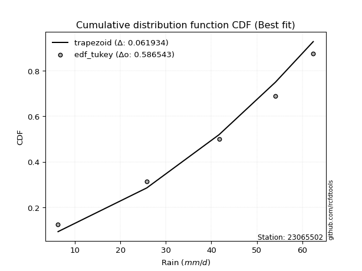</img>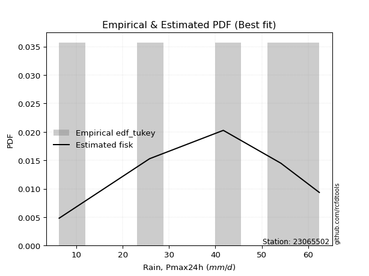</img>

</div>


### 8. EDF Gringorten (1963)

Gringorten plotting position formula is essential for estimating the probability and return periods of extreme events like floods and heavy rainfall. The constant _a=0.44_.

<div align="center">


$P=(m-a)/(n+1-2a)$


</div>


**8.1. Empirical values**

<div align="center">

|                | 0                   | 1                  | 2              | 3                 | 4                  |
|:---------------|:--------------------|:-------------------|:---------------|:------------------|:-------------------|
| date           | 2020                | 2016               | 2017           | 2018              | 2019               |
| x              | 6.3                 | 25.8               | 41.7           | 54.1              | 62.4               |
| m              | 1                   | 2                  | 3              | 4                 | 5                  |
| empirical_dist | edf_gringorten      | edf_gringorten     | edf_gringorten | edf_gringorten    | edf_gringorten     |
| empirical      | 0.10937500000000001 | 0.3046875          | 0.5            | 0.6953125         | 0.8906249999999999 |
| empirical_tr   | 1.1228070175438596  | 1.4382022471910112 | 2.0            | 3.282051282051282 | 9.142857142857133  |

</div>


**8.2. Kolmogorov-Smirnov fit test (sorted by Δ)**


<div align="center">

|                | 0                   | 1                    | 2                   | 3                   | 4                   | 5                   | 6                   | 7                   | 8                   | 9                   | 10                  | 11                  | 12                  | 13                  | 14                  | 15                  | 16                  | 17                  | 18                  | 19                  | 20                  | 21                  | 22                  | 23                  | 24                  | 25                  | 26                  | 27                  | 28                  | 29                 | 30                  | 31                  | 32                  | 33                  | 34                  | 35                  | 36                  | 37                  | 38                  | 39                  | 40                  | 41                  | 42                  | 43                  | 44                  | 45                  | 46                  | 47                  | 48                 | 49                 | 50                  | 51                  | 52                  | 53                  | 54                  | 55                  | 56                  | 57                 | 58                  | 59                  | 60                  | 61                  | 62                  | 63                  | 64                  | 65                  | 66                  | 67                  | 68                  | 69                  | 70                 | 71                  | 72                  | 73                 | 74                  | 75                  | 76                 | 77                  | 78                  | 79                  | 80                  | 81                 | 82                  | 83                  | 84                 | 85                  | 86                  | 87                  | 88                  | 89                  | 90                  | 91                  | 92                 | 93                  | 94                  | 95                 | 96                  | 97                  | 98                 | 99                 | 100                 | 101                 | 102                 | 103                 | 104                | 105                | 106                | 107                | 108                | 109                 | 110                 | 111                 | 112                | 113                 | 114                 | 115                 | 116                 | 117                 | 118                 | 119                | 120                | 121                 | 122                | 123                 | 124                 | 125                | 126                 | 127                 | 128                | 129                | 130                 | 131                | 132                | 133                 | 134                | 135                 | 136                 | 137                 | 138                 | 139                 | 140                | 141                 | 142                | 143                | 144                | 145                 | 146                | 147                | 148                | 149                 | 150                | 151                | 152                | 153                | 154                | 155                | 156                | 157                | 158                | 159                |
|:---------------|:--------------------|:---------------------|:--------------------|:--------------------|:--------------------|:--------------------|:--------------------|:--------------------|:--------------------|:--------------------|:--------------------|:--------------------|:--------------------|:--------------------|:--------------------|:--------------------|:--------------------|:--------------------|:--------------------|:--------------------|:--------------------|:--------------------|:--------------------|:--------------------|:--------------------|:--------------------|:--------------------|:--------------------|:--------------------|:-------------------|:--------------------|:--------------------|:--------------------|:--------------------|:--------------------|:--------------------|:--------------------|:--------------------|:--------------------|:--------------------|:--------------------|:--------------------|:--------------------|:--------------------|:--------------------|:--------------------|:--------------------|:--------------------|:-------------------|:-------------------|:--------------------|:--------------------|:--------------------|:--------------------|:--------------------|:--------------------|:--------------------|:-------------------|:--------------------|:--------------------|:--------------------|:--------------------|:--------------------|:--------------------|:--------------------|:--------------------|:--------------------|:--------------------|:--------------------|:--------------------|:-------------------|:--------------------|:--------------------|:-------------------|:--------------------|:--------------------|:-------------------|:--------------------|:--------------------|:--------------------|:--------------------|:-------------------|:--------------------|:--------------------|:-------------------|:--------------------|:--------------------|:--------------------|:--------------------|:--------------------|:--------------------|:--------------------|:-------------------|:--------------------|:--------------------|:-------------------|:--------------------|:--------------------|:-------------------|:-------------------|:--------------------|:--------------------|:--------------------|:--------------------|:-------------------|:-------------------|:-------------------|:-------------------|:-------------------|:--------------------|:--------------------|:--------------------|:-------------------|:--------------------|:--------------------|:--------------------|:--------------------|:--------------------|:--------------------|:-------------------|:-------------------|:--------------------|:-------------------|:--------------------|:--------------------|:-------------------|:--------------------|:--------------------|:-------------------|:-------------------|:--------------------|:-------------------|:-------------------|:--------------------|:-------------------|:--------------------|:--------------------|:--------------------|:--------------------|:--------------------|:-------------------|:--------------------|:-------------------|:-------------------|:-------------------|:--------------------|:-------------------|:-------------------|:-------------------|:--------------------|:-------------------|:-------------------|:-------------------|:-------------------|:-------------------|:-------------------|:-------------------|:-------------------|:-------------------|:-------------------|
| station        | 23065502            | 23065502             | 23065502            | 23065502            | 23065502            | 23065502            | 23065502            | 23065502            | 23065502            | 23065502            | 23065502            | 23065502            | 23065502            | 23065502            | 23065502            | 23065502            | 23065502            | 23065502            | 23065502            | 23065502            | 23065502            | 23065502            | 23065502            | 23065502            | 23065502            | 23065502            | 23065502            | 23065502            | 23065502            | 23065502           | 23065502            | 23065502            | 23065502            | 23065502            | 23065502            | 23065502            | 23065502            | 23065502            | 23065502            | 23065502            | 23065502            | 23065502            | 23065502            | 23065502            | 23065502            | 23065502            | 23065502            | 23065502            | 23065502           | 23065502           | 23065502            | 23065502            | 23065502            | 23065502            | 23065502            | 23065502            | 23065502            | 23065502           | 23065502            | 23065502            | 23065502            | 23065502            | 23065502            | 23065502            | 23065502            | 23065502            | 23065502            | 23065502            | 23065502            | 23065502            | 23065502           | 23065502            | 23065502            | 23065502           | 23065502            | 23065502            | 23065502           | 23065502            | 23065502            | 23065502            | 23065502            | 23065502           | 23065502            | 23065502            | 23065502           | 23065502            | 23065502            | 23065502            | 23065502            | 23065502            | 23065502            | 23065502            | 23065502           | 23065502            | 23065502            | 23065502           | 23065502            | 23065502            | 23065502           | 23065502           | 23065502            | 23065502            | 23065502            | 23065502            | 23065502           | 23065502           | 23065502           | 23065502           | 23065502           | 23065502            | 23065502            | 23065502            | 23065502           | 23065502            | 23065502            | 23065502            | 23065502            | 23065502            | 23065502            | 23065502           | 23065502           | 23065502            | 23065502           | 23065502            | 23065502            | 23065502           | 23065502            | 23065502            | 23065502           | 23065502           | 23065502            | 23065502           | 23065502           | 23065502            | 23065502           | 23065502            | 23065502            | 23065502            | 23065502            | 23065502            | 23065502           | 23065502            | 23065502           | 23065502           | 23065502           | 23065502            | 23065502           | 23065502           | 23065502           | 23065502            | 23065502           | 23065502           | 23065502           | 23065502           | 23065502           | 23065502           | 23065502           | 23065502           | 23065502           | 23065502           |
| empirical_dist | edf_gringorten      | edf_gringorten       | edf_gringorten      | edf_gringorten      | edf_gringorten      | edf_gringorten      | edf_gringorten      | edf_gringorten      | edf_gringorten      | edf_gringorten      | edf_gringorten      | edf_gringorten      | edf_gringorten      | edf_gringorten      | edf_gringorten      | edf_gringorten      | edf_gringorten      | edf_gringorten      | edf_gringorten      | edf_gringorten      | edf_gringorten      | edf_gringorten      | edf_gringorten      | edf_gringorten      | edf_gringorten      | edf_gringorten      | edf_gringorten      | edf_gringorten      | edf_gringorten      | edf_gringorten     | edf_gringorten      | edf_gringorten      | edf_gringorten      | edf_gringorten      | edf_gringorten      | edf_gringorten      | edf_gringorten      | edf_gringorten      | edf_gringorten      | edf_gringorten      | edf_gringorten      | edf_gringorten      | edf_gringorten      | edf_gringorten      | edf_gringorten      | edf_gringorten      | edf_gringorten      | edf_gringorten      | edf_gringorten     | edf_gringorten     | edf_gringorten      | edf_gringorten      | edf_gringorten      | edf_gringorten      | edf_gringorten      | edf_gringorten      | edf_gringorten      | edf_gringorten     | edf_gringorten      | edf_gringorten      | edf_gringorten      | edf_gringorten      | edf_gringorten      | edf_gringorten      | edf_gringorten      | edf_gringorten      | edf_gringorten      | edf_gringorten      | edf_gringorten      | edf_gringorten      | edf_gringorten     | edf_gringorten      | edf_gringorten      | edf_gringorten     | edf_gringorten      | edf_gringorten      | edf_gringorten     | edf_gringorten      | edf_gringorten      | edf_gringorten      | edf_gringorten      | edf_gringorten     | edf_gringorten      | edf_gringorten      | edf_gringorten     | edf_gringorten      | edf_gringorten      | edf_gringorten      | edf_gringorten      | edf_gringorten      | edf_gringorten      | edf_gringorten      | edf_gringorten     | edf_gringorten      | edf_gringorten      | edf_gringorten     | edf_gringorten      | edf_gringorten      | edf_gringorten     | edf_gringorten     | edf_gringorten      | edf_gringorten      | edf_gringorten      | edf_gringorten      | edf_gringorten     | edf_gringorten     | edf_gringorten     | edf_gringorten     | edf_gringorten     | edf_gringorten      | edf_gringorten      | edf_gringorten      | edf_gringorten     | edf_gringorten      | edf_gringorten      | edf_gringorten      | edf_gringorten      | edf_gringorten      | edf_gringorten      | edf_gringorten     | edf_gringorten     | edf_gringorten      | edf_gringorten     | edf_gringorten      | edf_gringorten      | edf_gringorten     | edf_gringorten      | edf_gringorten      | edf_gringorten     | edf_gringorten     | edf_gringorten      | edf_gringorten     | edf_gringorten     | edf_gringorten      | edf_gringorten     | edf_gringorten      | edf_gringorten      | edf_gringorten      | edf_gringorten      | edf_gringorten      | edf_gringorten     | edf_gringorten      | edf_gringorten     | edf_gringorten     | edf_gringorten     | edf_gringorten      | edf_gringorten     | edf_gringorten     | edf_gringorten     | edf_gringorten      | edf_gringorten     | edf_gringorten     | edf_gringorten     | edf_gringorten     | edf_gringorten     | edf_gringorten     | edf_gringorten     | edf_gringorten     | edf_gringorten     | edf_gringorten     |
| p_dist         | trapezoid           | semicircular         | gengamma            | anglit              | ksone               | argus               | weibull_min         | johnsonsu           | gompertz            | pearson3            | loglevy_l           | erlang              | betaprime           | nct                 | t                   | exponnorm           | f                   | truncnorm           | norm                | crystalball         | fatiguelife         | rice                | gumbel_l            | gamma               | exponweib           | foldnorm            | invgauss            | maxwell             | logpearson3         | invgamma           | triang              | logmielke           | skewnorm            | logweibull_max      | beta                | genpareto           | logvonmises_line    | genextreme          | gausshyper          | loggenextreme       | genhalflogistic     | arcsine             | rayleigh            | burr                | cosine              | loggumbel_l         | logistic            | logburr             | logweibull_min     | mielke             | ncf                 | logdgamma           | dgamma              | logtrapezoid        | genexpon            | wrapcauchy          | logargus            | dweibull           | hypsecant           | logburr12           | logloggamma         | kstwobign           | logloglaplace       | halfnorm            | loggompertz         | loganglit           | gumbel_r            | kappa3              | logsemicircular     | laplace             | tukeylambda        | kappa4              | loggennorm          | logdweibull        | levy_l              | lomax               | exponpow           | logbetaprime        | logerlang           | logncf              | uniform             | vonmises_line      | loggenpareto        | logfatiguelife      | lognct             | logf                | logcrystalball      | logexponnorm        | lognorm             | logt                | logrice             | halflogistic        | invweibull         | loggamma            | loggamma            | moyal              | logfoldnorm         | loginvgauss         | logarcsine         | loginvgamma        | loglogistic         | logalpha            | logbeta             | logmaxwell          | loginvweibull      | lograyleigh        | loggausshyper      | loghypsecant       | gennorm            | loggenhalflogistic  | logcosine           | bradford            | loghalfnorm        | truncweibull_min    | logwrapcauchy       | logskewnorm         | loggumbel_r         | loglaplace          | loglaplace          | logkstwobign       | loggenexpon        | wald                | loghalflogistic    | logtriang           | halfgennorm         | logmoyal           | truncexpon          | burr12              | loglomax           | logjohnsonsb       | logksone            | logwald            | alpha              | logtruncnorm        | lognakagami        | logtukeylambda      | logrdist            | johnsonsb           | logkappa3           | loguniform          | loghalfgennorm     | logkappa4           | nakagami           | logtruncexpon      | logbradford        | logtruncweibull_min | logexponweib       | logjohnsonsu       | loggengamma        | logexponpow         | weibull_max        | powerlaw           | truncpareto        | logpowerlaw        | logtruncpareto     | rdist              | genlogistic        | loggenlogistic     | logvonmises        | vonmises           |
| delta          | 0.05412130177011687 | 0.057538021280177376 | 0.05879414232114477 | 0.06403079555994484 | 0.06529359360426873 | 0.07710219481199465 | 0.07879309460449213 | 0.08119361568630562 | 0.08230336104893499 | 0.08636257825846783 | 0.09048450219017079 | 0.09120573934606369 | 0.09171531679025102 | 0.09199802823585068 | 0.09214081563101151 | 0.09214137667179345 | 0.09214344492912319 | 0.09214500228219613 | 0.09214505102052395 | 0.09214506307351722 | 0.09223534580837445 | 0.09248842459254292 | 0.09491174165020289 | 0.09518780069484212 | 0.09806096655754537 | 0.09903421570124071 | 0.10039374817058455 | 0.10066114317701158 | 0.10403156086924958 | 0.1064284444953133 | 0.10755284230913575 | 0.10929862839619375 | 0.10937460234920082 | 0.10937493071570348 | 0.10937499723774746 | 0.10937499980243182 | 0.10937499999853854 | 0.10937499999970346 | 0.10937499999982936 | 0.10937499999998435 | 0.10937499999999878 | 0.10937500000000001 | 0.10978363496102306 | 0.11038724740753281 | 0.11041755843405043 | 0.11366108632087057 | 0.11418399414696556 | 0.11915166477311367 | 0.1194397975808229 | 0.1194640799240676 | 0.11971142665732093 | 0.11987878678847919 | 0.11990795278444061 | 0.11993730975948369 | 0.12353847250135352 | 0.12596152467571542 | 0.12609704605775773 | 0.1272976364336505 | 0.12754203090758942 | 0.12856285931148448 | 0.12967709677230455 | 0.13197595957868558 | 0.13309559995389864 | 0.13559224278890958 | 0.13597782360491772 | 0.13862371076140423 | 0.14073501324918403 | 0.14102445360171334 | 0.14219084284603978 | 0.14285075015536408 | 0.145341879728754  | 0.14632825630575175 | 0.14733311047720443 | 0.1493726011970401 | 0.15023684975377516 | 0.15234395623744634 | 0.1533044972048876 | 0.15343262186984008 | 0.15560989459485808 | 0.15605889001696527 | 0.15673741087344029 | 0.1567384213540427 | 0.15864660414246057 | 0.15907492102458476 | 0.1591965004042626 | 0.15925690234918433 | 0.15943119351774637 | 0.15943163962214202 | 0.15943195085054107 | 0.15943284320058015 | 0.16327570206908382 | 0.16347974931519427 | 0.1637504351013025 | 0.16469768557741504 | 0.16469768557741504 | 0.1647673441277675 | 0.16579597306179972 | 0.16920931148922447 | 0.1721769319271883 | 0.172845546201019  | 0.17815685482915866 | 0.17819688528279343 | 0.17897175286628797 | 0.18004568608384441 | 0.1858607050602284 | 0.1862099466574365 | 0.1892844042455466 | 0.1925172761519207 | 0.1953125          | 0.20003939565597462 | 0.20392658417693887 | 0.20555836371121172 | 0.2096130232045741 | 0.21014278709159373 | 0.21561558328862573 | 0.21782619662391212 | 0.21787114142824904 | 0.22036395603234715 | 0.22036395603234715 | 0.2214536086833171 | 0.2250767004576193 | 0.23150108192042151 | 0.232200382979464  | 0.23485319320888198 | 0.23674038809786735 | 0.2371107737248317 | 0.24378627192545033 | 0.28473215296132204 | 0.2870610230739452 | 0.2879690740318952 | 0.29100781956107336 | 0.291909179027938  | 0.2975827653189689 | 0.30468138137412754 | 0.3046874999999576 | 0.31671811570210906 | 0.31754814092897243 | 0.32025465666988506 | 0.32361881052415165 | 0.32422093456678147 | 0.3242455142045175 | 0.33119194790838047 | 0.3643422964712075 | 0.3884003098566827 | 0.3923643816297423 | 0.42295226901255667 | 0.4234460874586079 | 0.433442737777764  | 0.4542439678756641 | 0.48885421340659496 | 0.5442278363183196 | 0.5726124880111619 | 0.5864384796099511 | 0.6327070018658604 | 0.645027292841221  | 0.6953124998636342 | 0.6953125          | 0.6953125          | 1.1122382549957353 | 9.700573339535257  |
| deltao         | 0.5865427407550001  | 0.5865427407550001   | 0.5865427407550001  | 0.5865427407550001  | 0.5865427407550001  | 0.5865427407550001  | 0.5865427407550001  | 0.5865427407550001  | 0.5865427407550001  | 0.5865427407550001  | 0.5865427407550001  | 0.5865427407550001  | 0.5865427407550001  | 0.5865427407550001  | 0.5865427407550001  | 0.5865427407550001  | 0.5865427407550001  | 0.5865427407550001  | 0.5865427407550001  | 0.5865427407550001  | 0.5865427407550001  | 0.5865427407550001  | 0.5865427407550001  | 0.5865427407550001  | 0.5865427407550001  | 0.5865427407550001  | 0.5865427407550001  | 0.5865427407550001  | 0.5865427407550001  | 0.5865427407550001 | 0.5865427407550001  | 0.5865427407550001  | 0.5865427407550001  | 0.5865427407550001  | 0.5865427407550001  | 0.5865427407550001  | 0.5865427407550001  | 0.5865427407550001  | 0.5865427407550001  | 0.5865427407550001  | 0.5865427407550001  | 0.5865427407550001  | 0.5865427407550001  | 0.5865427407550001  | 0.5865427407550001  | 0.5865427407550001  | 0.5865427407550001  | 0.5865427407550001  | 0.5865427407550001 | 0.5865427407550001 | 0.5865427407550001  | 0.5865427407550001  | 0.5865427407550001  | 0.5865427407550001  | 0.5865427407550001  | 0.5865427407550001  | 0.5865427407550001  | 0.5865427407550001 | 0.5865427407550001  | 0.5865427407550001  | 0.5865427407550001  | 0.5865427407550001  | 0.5865427407550001  | 0.5865427407550001  | 0.5865427407550001  | 0.5865427407550001  | 0.5865427407550001  | 0.5865427407550001  | 0.5865427407550001  | 0.5865427407550001  | 0.5865427407550001 | 0.5865427407550001  | 0.5865427407550001  | 0.5865427407550001 | 0.5865427407550001  | 0.5865427407550001  | 0.5865427407550001 | 0.5865427407550001  | 0.5865427407550001  | 0.5865427407550001  | 0.5865427407550001  | 0.5865427407550001 | 0.5865427407550001  | 0.5865427407550001  | 0.5865427407550001 | 0.5865427407550001  | 0.5865427407550001  | 0.5865427407550001  | 0.5865427407550001  | 0.5865427407550001  | 0.5865427407550001  | 0.5865427407550001  | 0.5865427407550001 | 0.5865427407550001  | 0.5865427407550001  | 0.5865427407550001 | 0.5865427407550001  | 0.5865427407550001  | 0.5865427407550001 | 0.5865427407550001 | 0.5865427407550001  | 0.5865427407550001  | 0.5865427407550001  | 0.5865427407550001  | 0.5865427407550001 | 0.5865427407550001 | 0.5865427407550001 | 0.5865427407550001 | 0.5865427407550001 | 0.5865427407550001  | 0.5865427407550001  | 0.5865427407550001  | 0.5865427407550001 | 0.5865427407550001  | 0.5865427407550001  | 0.5865427407550001  | 0.5865427407550001  | 0.5865427407550001  | 0.5865427407550001  | 0.5865427407550001 | 0.5865427407550001 | 0.5865427407550001  | 0.5865427407550001 | 0.5865427407550001  | 0.5865427407550001  | 0.5865427407550001 | 0.5865427407550001  | 0.5865427407550001  | 0.5865427407550001 | 0.5865427407550001 | 0.5865427407550001  | 0.5865427407550001 | 0.5865427407550001 | 0.5865427407550001  | 0.5865427407550001 | 0.5865427407550001  | 0.5865427407550001  | 0.5865427407550001  | 0.5865427407550001  | 0.5865427407550001  | 0.5865427407550001 | 0.5865427407550001  | 0.5865427407550001 | 0.5865427407550001 | 0.5865427407550001 | 0.5865427407550001  | 0.5865427407550001 | 0.5865427407550001 | 0.5865427407550001 | 0.5865427407550001  | 0.5865427407550001 | 0.5865427407550001 | 0.5865427407550001 | 0.5865427407550001 | 0.5865427407550001 | 0.5865427407550001 | 0.5865427407550001 | 0.5865427407550001 | 0.5865427407550001 | 0.5865427407550001 |
| eval           | Δo > Δ              | Δo > Δ               | Δo > Δ              | Δo > Δ              | Δo > Δ              | Δo > Δ              | Δo > Δ              | Δo > Δ              | Δo > Δ              | Δo > Δ              | Δo > Δ              | Δo > Δ              | Δo > Δ              | Δo > Δ              | Δo > Δ              | Δo > Δ              | Δo > Δ              | Δo > Δ              | Δo > Δ              | Δo > Δ              | Δo > Δ              | Δo > Δ              | Δo > Δ              | Δo > Δ              | Δo > Δ              | Δo > Δ              | Δo > Δ              | Δo > Δ              | Δo > Δ              | Δo > Δ             | Δo > Δ              | Δo > Δ              | Δo > Δ              | Δo > Δ              | Δo > Δ              | Δo > Δ              | Δo > Δ              | Δo > Δ              | Δo > Δ              | Δo > Δ              | Δo > Δ              | Δo > Δ              | Δo > Δ              | Δo > Δ              | Δo > Δ              | Δo > Δ              | Δo > Δ              | Δo > Δ              | Δo > Δ             | Δo > Δ             | Δo > Δ              | Δo > Δ              | Δo > Δ              | Δo > Δ              | Δo > Δ              | Δo > Δ              | Δo > Δ              | Δo > Δ             | Δo > Δ              | Δo > Δ              | Δo > Δ              | Δo > Δ              | Δo > Δ              | Δo > Δ              | Δo > Δ              | Δo > Δ              | Δo > Δ              | Δo > Δ              | Δo > Δ              | Δo > Δ              | Δo > Δ             | Δo > Δ              | Δo > Δ              | Δo > Δ             | Δo > Δ              | Δo > Δ              | Δo > Δ             | Δo > Δ              | Δo > Δ              | Δo > Δ              | Δo > Δ              | Δo > Δ             | Δo > Δ              | Δo > Δ              | Δo > Δ             | Δo > Δ              | Δo > Δ              | Δo > Δ              | Δo > Δ              | Δo > Δ              | Δo > Δ              | Δo > Δ              | Δo > Δ             | Δo > Δ              | Δo > Δ              | Δo > Δ             | Δo > Δ              | Δo > Δ              | Δo > Δ             | Δo > Δ             | Δo > Δ              | Δo > Δ              | Δo > Δ              | Δo > Δ              | Δo > Δ             | Δo > Δ             | Δo > Δ             | Δo > Δ             | Δo > Δ             | Δo > Δ              | Δo > Δ              | Δo > Δ              | Δo > Δ             | Δo > Δ              | Δo > Δ              | Δo > Δ              | Δo > Δ              | Δo > Δ              | Δo > Δ              | Δo > Δ             | Δo > Δ             | Δo > Δ              | Δo > Δ             | Δo > Δ              | Δo > Δ              | Δo > Δ             | Δo > Δ              | Δo > Δ              | Δo > Δ             | Δo > Δ             | Δo > Δ              | Δo > Δ             | Δo > Δ             | Δo > Δ              | Δo > Δ             | Δo > Δ              | Δo > Δ              | Δo > Δ              | Δo > Δ              | Δo > Δ              | Δo > Δ             | Δo > Δ              | Δo > Δ             | Δo > Δ             | Δo > Δ             | Δo > Δ              | Δo > Δ             | Δo > Δ             | Δo > Δ             | Δo > Δ              | Δo > Δ             | Δo > Δ             | Δo > Δ             | Δo <= Δ            | Δo <= Δ            | Δo <= Δ            | Δo <= Δ            | Δo <= Δ            | Δo <= Δ            | Δo <= Δ            |
| fit            | 1                   | 1                    | 1                   | 1                   | 1                   | 1                   | 1                   | 1                   | 1                   | 1                   | 1                   | 1                   | 1                   | 1                   | 1                   | 1                   | 1                   | 1                   | 1                   | 1                   | 1                   | 1                   | 1                   | 1                   | 1                   | 1                   | 1                   | 1                   | 1                   | 1                  | 1                   | 1                   | 1                   | 1                   | 1                   | 1                   | 1                   | 1                   | 1                   | 1                   | 1                   | 1                   | 1                   | 1                   | 1                   | 1                   | 1                   | 1                   | 1                  | 1                  | 1                   | 1                   | 1                   | 1                   | 1                   | 1                   | 1                   | 1                  | 1                   | 1                   | 1                   | 1                   | 1                   | 1                   | 1                   | 1                   | 1                   | 1                   | 1                   | 1                   | 1                  | 1                   | 1                   | 1                  | 1                   | 1                   | 1                  | 1                   | 1                   | 1                   | 1                   | 1                  | 1                   | 1                   | 1                  | 1                   | 1                   | 1                   | 1                   | 1                   | 1                   | 1                   | 1                  | 1                   | 1                   | 1                  | 1                   | 1                   | 1                  | 1                  | 1                   | 1                   | 1                   | 1                   | 1                  | 1                  | 1                  | 1                  | 1                  | 1                   | 1                   | 1                   | 1                  | 1                   | 1                   | 1                   | 1                   | 1                   | 1                   | 1                  | 1                  | 1                   | 1                  | 1                   | 1                   | 1                  | 1                   | 1                   | 1                  | 1                  | 1                   | 1                  | 1                  | 1                   | 1                  | 1                   | 1                   | 1                   | 1                   | 1                   | 1                  | 1                   | 1                  | 1                  | 1                  | 1                   | 1                  | 1                  | 1                  | 1                   | 1                  | 1                  | 1                  | 0                  | 0                  | 0                  | 0                  | 0                  | 0                  | 0                  |
| n              | 5                   | 5                    | 5                   | 5                   | 5                   | 5                   | 5                   | 5                   | 5                   | 5                   | 5                   | 5                   | 5                   | 5                   | 5                   | 5                   | 5                   | 5                   | 5                   | 5                   | 5                   | 5                   | 5                   | 5                   | 5                   | 5                   | 5                   | 5                   | 5                   | 5                  | 5                   | 5                   | 5                   | 5                   | 5                   | 5                   | 5                   | 5                   | 5                   | 5                   | 5                   | 5                   | 5                   | 5                   | 5                   | 5                   | 5                   | 5                   | 5                  | 5                  | 5                   | 5                   | 5                   | 5                   | 5                   | 5                   | 5                   | 5                  | 5                   | 5                   | 5                   | 5                   | 5                   | 5                   | 5                   | 5                   | 5                   | 5                   | 5                   | 5                   | 5                  | 5                   | 5                   | 5                  | 5                   | 5                   | 5                  | 5                   | 5                   | 5                   | 5                   | 5                  | 5                   | 5                   | 5                  | 5                   | 5                   | 5                   | 5                   | 5                   | 5                   | 5                   | 5                  | 5                   | 5                   | 5                  | 5                   | 5                   | 5                  | 5                  | 5                   | 5                   | 5                   | 5                   | 5                  | 5                  | 5                  | 5                  | 5                  | 5                   | 5                   | 5                   | 5                  | 5                   | 5                   | 5                   | 5                   | 5                   | 5                   | 5                  | 5                  | 5                   | 5                  | 5                   | 5                   | 5                  | 5                   | 5                   | 5                  | 5                  | 5                   | 5                  | 5                  | 5                   | 5                  | 5                   | 5                   | 5                   | 5                   | 5                   | 5                  | 5                   | 5                  | 5                  | 5                  | 5                   | 5                  | 5                  | 5                  | 5                   | 5                  | 5                  | 5                  | 5                  | 5                  | 5                  | 5                  | 5                  | 5                  | 5                  |
| best_fit       | 1                   | 0                    | 0                   | 0                   | 0                   | 0                   | 0                   | 0                   | 0                   | 0                   | 0                   | 0                   | 0                   | 0                   | 0                   | 0                   | 0                   | 0                   | 0                   | 0                   | 0                   | 0                   | 0                   | 0                   | 0                   | 0                   | 0                   | 0                   | 0                   | 0                  | 0                   | 0                   | 0                   | 0                   | 0                   | 0                   | 0                   | 0                   | 0                   | 0                   | 0                   | 0                   | 0                   | 0                   | 0                   | 0                   | 0                   | 0                   | 0                  | 0                  | 0                   | 0                   | 0                   | 0                   | 0                   | 0                   | 0                   | 0                  | 0                   | 0                   | 0                   | 0                   | 0                   | 0                   | 0                   | 0                   | 0                   | 0                   | 0                   | 0                   | 0                  | 0                   | 0                   | 0                  | 0                   | 0                   | 0                  | 0                   | 0                   | 0                   | 0                   | 0                  | 0                   | 0                   | 0                  | 0                   | 0                   | 0                   | 0                   | 0                   | 0                   | 0                   | 0                  | 0                   | 0                   | 0                  | 0                   | 0                   | 0                  | 0                  | 0                   | 0                   | 0                   | 0                   | 0                  | 0                  | 0                  | 0                  | 0                  | 0                   | 0                   | 0                   | 0                  | 0                   | 0                   | 0                   | 0                   | 0                   | 0                   | 0                  | 0                  | 0                   | 0                  | 0                   | 0                   | 0                  | 0                   | 0                   | 0                  | 0                  | 0                   | 0                  | 0                  | 0                   | 0                  | 0                   | 0                   | 0                   | 0                   | 0                   | 0                  | 0                   | 0                  | 0                  | 0                  | 0                   | 0                  | 0                  | 0                  | 0                   | 0                  | 0                  | 0                  | 0                  | 0                  | 0                  | 0                  | 0                  | 0                  | 0                  |
| best_fit_sort  | 1                   | 2                    | 3                   | 4                   | 5                   | 6                   | 7                   | 8                   | 9                   | 10                  | 11                  | 12                  | 13                  | 14                  | 15                  | 16                  | 17                  | 18                  | 19                  | 20                  | 21                  | 22                  | 23                  | 24                  | 25                  | 26                  | 27                  | 28                  | 29                  | 30                 | 31                  | 32                  | 33                  | 34                  | 35                  | 36                  | 37                  | 38                  | 39                  | 40                  | 41                  | 42                  | 43                  | 44                  | 45                  | 46                  | 47                  | 48                  | 49                 | 50                 | 51                  | 52                  | 53                  | 54                  | 55                  | 56                  | 57                  | 58                 | 59                  | 60                  | 61                  | 62                  | 63                  | 64                  | 65                  | 66                  | 67                  | 68                  | 69                  | 70                  | 71                 | 72                  | 73                  | 74                 | 75                  | 76                  | 77                 | 78                  | 79                  | 80                  | 81                  | 82                 | 83                  | 84                  | 85                 | 86                  | 87                  | 88                  | 89                  | 90                  | 91                  | 92                  | 93                 | 94                  | 95                  | 96                 | 97                  | 98                  | 99                 | 100                | 101                 | 102                 | 103                 | 104                 | 105                | 106                | 107                | 108                | 109                | 110                 | 111                 | 112                 | 113                | 114                 | 115                 | 116                 | 117                 | 118                 | 119                 | 120                | 121                | 122                 | 123                | 124                 | 125                 | 126                | 127                 | 128                 | 129                | 130                | 131                 | 132                | 133                | 134                 | 135                | 136                 | 137                 | 138                 | 139                 | 140                 | 141                | 142                 | 143                | 144                | 145                | 146                 | 147                | 148                | 149                | 150                 | 151                | 152                | 153                | 154                | 155                | 156                | 157                | 158                | 159                | 160                |

</div>


**8.3. Best fit**

<div align="center">

|   id |   station | empirical_dist   | p_dist    |     delta |   deltao | eval   |   fit |   n |   best_fit |   best_fit_sort |
|-----:|----------:|:-----------------|:----------|----------:|---------:|:-------|------:|----:|-----------:|----------------:|
|    0 |  23065502 | edf_gringorten   | trapezoid | 0.0541213 | 0.586543 | Δo > Δ |     1 |   5 |          1 |               1 |

</div>


<div align="center">

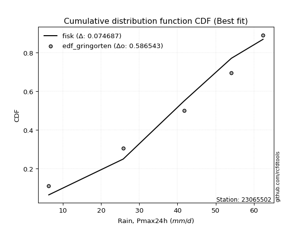</img></img>

</div>


### 9. EDF Filliben (1975)

The specific values of the constants (0.3175) (often denoted as $alpha$) and (0.365) are derived from a method proposed by James J. Filliben in a 1975 paper. This particular formula is the mean value of the $i$-th order statistic of the normal distribution and is considered a robust and effective plotting position formula for the normal probability plot correlation coefficient test for normality.

<div align="center">


$P=(m-0.3175)/(n+0.365)$


</div>


**9.1. Empirical values**

<div align="center">

|                | 0                   | 1                  | 2            | 3                  | 4                  |
|:---------------|:--------------------|:-------------------|:-------------|:-------------------|:-------------------|
| date           | 2020                | 2016               | 2017         | 2018               | 2019               |
| x              | 6.3                 | 25.8               | 41.7         | 54.1               | 62.4               |
| m              | 1                   | 2                  | 3            | 4                  | 5                  |
| empirical_dist | edf_filliben        | edf_filliben       | edf_filliben | edf_filliben       | edf_filliben       |
| empirical      | 0.12721342031686858 | 0.3136067101584343 | 0.5          | 0.6863932898415657 | 0.8727865796831314 |
| empirical_tr   | 1.1457554725040042  | 1.456890699253225  | 2.0          | 3.188707280832095  | 7.860805860805863  |

</div>


**9.2. Kolmogorov-Smirnov fit test (sorted by Δ)**


<div align="center">

|                | 0                  | 1                   | 2                   | 3                   | 4                  | 5                   | 6                   | 7                   | 8                  | 9                   | 10                  | 11                  | 12                  | 13                  | 14                  | 15                  | 16                  | 17                  | 18                  | 19                  | 20                  | 21                  | 22                  | 23                  | 24                  | 25                  | 26                  | 27                  | 28                  | 29                  | 30                  | 31                  | 32                 | 33                  | 34                  | 35                  | 36                  | 37                  | 38                 | 39                  | 40                 | 41                  | 42                  | 43                 | 44                  | 45                  | 46                 | 47                  | 48                  | 49                 | 50                 | 51                 | 52                 | 53                  | 54                  | 55                 | 56                  | 57                  | 58                  | 59                 | 60                  | 61                  | 62                  | 63                 | 64                  | 65                  | 66                  | 67                  | 68                  | 69                  | 70                  | 71                 | 72                  | 73                 | 74                  | 75                 | 76                  | 77                  | 78                  | 79                  | 80                  | 81                  | 82                  | 83                 | 84                  | 85                  | 86                  | 87                  | 88                  | 89                  | 90                  | 91                 | 92                  | 93                  | 94                 | 95                  | 96                  | 97                  | 98                  | 99                  | 100                | 101                 | 102                 | 103                 | 104                 | 105                | 106                 | 107                | 108                | 109                 | 110                 | 111                 | 112                 | 113                 | 114                 | 115                 | 116                 | 117                 | 118                 | 119                 | 120                 | 121                 | 122                 | 123                | 124                 | 125                | 126                 | 127                 | 128                 | 129                 | 130                | 131                | 132                | 133                 | 134                 | 135                | 136                 | 137                 | 138                 | 139                 | 140                 | 141                 | 142                | 143                 | 144                | 145                 | 146                 | 147                 | 148                 | 149                | 150                | 151                | 152                | 153                | 154                | 155                | 156                | 157                | 158                | 159                |
|:---------------|:-------------------|:--------------------|:--------------------|:--------------------|:-------------------|:--------------------|:--------------------|:--------------------|:-------------------|:--------------------|:--------------------|:--------------------|:--------------------|:--------------------|:--------------------|:--------------------|:--------------------|:--------------------|:--------------------|:--------------------|:--------------------|:--------------------|:--------------------|:--------------------|:--------------------|:--------------------|:--------------------|:--------------------|:--------------------|:--------------------|:--------------------|:--------------------|:-------------------|:--------------------|:--------------------|:--------------------|:--------------------|:--------------------|:-------------------|:--------------------|:-------------------|:--------------------|:--------------------|:-------------------|:--------------------|:--------------------|:-------------------|:--------------------|:--------------------|:-------------------|:-------------------|:-------------------|:-------------------|:--------------------|:--------------------|:-------------------|:--------------------|:--------------------|:--------------------|:-------------------|:--------------------|:--------------------|:--------------------|:-------------------|:--------------------|:--------------------|:--------------------|:--------------------|:--------------------|:--------------------|:--------------------|:-------------------|:--------------------|:-------------------|:--------------------|:-------------------|:--------------------|:--------------------|:--------------------|:--------------------|:--------------------|:--------------------|:--------------------|:-------------------|:--------------------|:--------------------|:--------------------|:--------------------|:--------------------|:--------------------|:--------------------|:-------------------|:--------------------|:--------------------|:-------------------|:--------------------|:--------------------|:--------------------|:--------------------|:--------------------|:-------------------|:--------------------|:--------------------|:--------------------|:--------------------|:-------------------|:--------------------|:-------------------|:-------------------|:--------------------|:--------------------|:--------------------|:--------------------|:--------------------|:--------------------|:--------------------|:--------------------|:--------------------|:--------------------|:--------------------|:--------------------|:--------------------|:--------------------|:-------------------|:--------------------|:-------------------|:--------------------|:--------------------|:--------------------|:--------------------|:-------------------|:-------------------|:-------------------|:--------------------|:--------------------|:-------------------|:--------------------|:--------------------|:--------------------|:--------------------|:--------------------|:--------------------|:-------------------|:--------------------|:-------------------|:--------------------|:--------------------|:--------------------|:--------------------|:-------------------|:-------------------|:-------------------|:-------------------|:-------------------|:-------------------|:-------------------|:-------------------|:-------------------|:-------------------|:-------------------|
| station        | 23065502           | 23065502            | 23065502            | 23065502            | 23065502           | 23065502            | 23065502            | 23065502            | 23065502           | 23065502            | 23065502            | 23065502            | 23065502            | 23065502            | 23065502            | 23065502            | 23065502            | 23065502            | 23065502            | 23065502            | 23065502            | 23065502            | 23065502            | 23065502            | 23065502            | 23065502            | 23065502            | 23065502            | 23065502            | 23065502            | 23065502            | 23065502            | 23065502           | 23065502            | 23065502            | 23065502            | 23065502            | 23065502            | 23065502           | 23065502            | 23065502           | 23065502            | 23065502            | 23065502           | 23065502            | 23065502            | 23065502           | 23065502            | 23065502            | 23065502           | 23065502           | 23065502           | 23065502           | 23065502            | 23065502            | 23065502           | 23065502            | 23065502            | 23065502            | 23065502           | 23065502            | 23065502            | 23065502            | 23065502           | 23065502            | 23065502            | 23065502            | 23065502            | 23065502            | 23065502            | 23065502            | 23065502           | 23065502            | 23065502           | 23065502            | 23065502           | 23065502            | 23065502            | 23065502            | 23065502            | 23065502            | 23065502            | 23065502            | 23065502           | 23065502            | 23065502            | 23065502            | 23065502            | 23065502            | 23065502            | 23065502            | 23065502           | 23065502            | 23065502            | 23065502           | 23065502            | 23065502            | 23065502            | 23065502            | 23065502            | 23065502           | 23065502            | 23065502            | 23065502            | 23065502            | 23065502           | 23065502            | 23065502           | 23065502           | 23065502            | 23065502            | 23065502            | 23065502            | 23065502            | 23065502            | 23065502            | 23065502            | 23065502            | 23065502            | 23065502            | 23065502            | 23065502            | 23065502            | 23065502           | 23065502            | 23065502           | 23065502            | 23065502            | 23065502            | 23065502            | 23065502           | 23065502           | 23065502           | 23065502            | 23065502            | 23065502           | 23065502            | 23065502            | 23065502            | 23065502            | 23065502            | 23065502            | 23065502           | 23065502            | 23065502           | 23065502            | 23065502            | 23065502            | 23065502            | 23065502           | 23065502           | 23065502           | 23065502           | 23065502           | 23065502           | 23065502           | 23065502           | 23065502           | 23065502           | 23065502           |
| empirical_dist | edf_filliben       | edf_filliben        | edf_filliben        | edf_filliben        | edf_filliben       | edf_filliben        | edf_filliben        | edf_filliben        | edf_filliben       | edf_filliben        | edf_filliben        | edf_filliben        | edf_filliben        | edf_filliben        | edf_filliben        | edf_filliben        | edf_filliben        | edf_filliben        | edf_filliben        | edf_filliben        | edf_filliben        | edf_filliben        | edf_filliben        | edf_filliben        | edf_filliben        | edf_filliben        | edf_filliben        | edf_filliben        | edf_filliben        | edf_filliben        | edf_filliben        | edf_filliben        | edf_filliben       | edf_filliben        | edf_filliben        | edf_filliben        | edf_filliben        | edf_filliben        | edf_filliben       | edf_filliben        | edf_filliben       | edf_filliben        | edf_filliben        | edf_filliben       | edf_filliben        | edf_filliben        | edf_filliben       | edf_filliben        | edf_filliben        | edf_filliben       | edf_filliben       | edf_filliben       | edf_filliben       | edf_filliben        | edf_filliben        | edf_filliben       | edf_filliben        | edf_filliben        | edf_filliben        | edf_filliben       | edf_filliben        | edf_filliben        | edf_filliben        | edf_filliben       | edf_filliben        | edf_filliben        | edf_filliben        | edf_filliben        | edf_filliben        | edf_filliben        | edf_filliben        | edf_filliben       | edf_filliben        | edf_filliben       | edf_filliben        | edf_filliben       | edf_filliben        | edf_filliben        | edf_filliben        | edf_filliben        | edf_filliben        | edf_filliben        | edf_filliben        | edf_filliben       | edf_filliben        | edf_filliben        | edf_filliben        | edf_filliben        | edf_filliben        | edf_filliben        | edf_filliben        | edf_filliben       | edf_filliben        | edf_filliben        | edf_filliben       | edf_filliben        | edf_filliben        | edf_filliben        | edf_filliben        | edf_filliben        | edf_filliben       | edf_filliben        | edf_filliben        | edf_filliben        | edf_filliben        | edf_filliben       | edf_filliben        | edf_filliben       | edf_filliben       | edf_filliben        | edf_filliben        | edf_filliben        | edf_filliben        | edf_filliben        | edf_filliben        | edf_filliben        | edf_filliben        | edf_filliben        | edf_filliben        | edf_filliben        | edf_filliben        | edf_filliben        | edf_filliben        | edf_filliben       | edf_filliben        | edf_filliben       | edf_filliben        | edf_filliben        | edf_filliben        | edf_filliben        | edf_filliben       | edf_filliben       | edf_filliben       | edf_filliben        | edf_filliben        | edf_filliben       | edf_filliben        | edf_filliben        | edf_filliben        | edf_filliben        | edf_filliben        | edf_filliben        | edf_filliben       | edf_filliben        | edf_filliben       | edf_filliben        | edf_filliben        | edf_filliben        | edf_filliben        | edf_filliben       | edf_filliben       | edf_filliben       | edf_filliben       | edf_filliben       | edf_filliben       | edf_filliben       | edf_filliben       | edf_filliben       | edf_filliben       | edf_filliben       |
| p_dist         | trapezoid          | semicircular        | anglit              | gengamma            | ksone              | argus               | weibull_min         | loglevy_l           | johnsonsu          | gompertz            | pearson3            | erlang              | invgauss            | betaprime           | nct                 | t                   | exponnorm           | f                   | truncnorm           | norm                | crystalball         | fatiguelife         | rice                | logtrapezoid        | gumbel_l            | logpearson3         | gamma               | maxwell             | foldnorm            | invgamma            | rayleigh            | loggumbel_l         | logloglaplace      | exponweib           | logmielke           | dweibull            | burr                | cosine              | logweibull_min     | ncf                 | logistic           | dgamma              | genexpon            | triang             | skewnorm            | logweibull_max      | beta               | wrapcauchy          | genpareto           | logvonmises_line   | genextreme         | gausshyper         | loggenextreme      | genhalflogistic     | arcsine             | logburr            | mielke              | logburr12           | logdgamma           | loggennorm         | logdweibull         | kstwobign           | levy_l              | logsemicircular    | logargus            | halfnorm            | loggompertz         | hypsecant           | logloggamma         | loganglit           | gumbel_r            | loggenpareto       | kappa3              | laplace            | lomax               | exponpow           | logbetaprime        | tukeylambda         | logarcsine          | kappa4              | logerlang           | logncf              | logfatiguelife      | lognct             | logf                | logcrystalball      | logexponnorm        | lognorm             | logt                | logrice             | halflogistic        | invweibull         | loggamma            | loggamma            | moyal              | uniform             | vonmises_line       | logfoldnorm         | loginvgauss         | logbeta             | loginvgamma        | loginvweibull       | loglogistic         | logalpha            | logmaxwell          | lograyleigh        | gennorm             | loggausshyper      | loghypsecant       | loggenhalflogistic  | logcosine           | loghalfnorm         | bradford            | logwrapcauchy       | truncweibull_min    | logkstwobign        | loggenexpon         | logskewnorm         | loggumbel_r         | loglaplace          | loglaplace          | halfgennorm         | wald                | loghalflogistic    | logtriang           | logmoyal           | truncexpon          | logjohnsonsb        | burr12              | loglomax            | logksone           | alpha              | logwald            | logrdist            | johnsonsb           | logtruncnorm       | lognakagami         | loghalfgennorm      | logtukeylambda      | logkappa3           | loguniform          | logkappa4           | nakagami           | logtruncexpon       | logbradford        | logexponweib        | logtruncweibull_min | logjohnsonsu        | loggengamma         | logexponpow        | weibull_max        | powerlaw           | truncpareto        | logpowerlaw        | logtruncpareto     | rdist              | genlogistic        | loggenlogistic     | logvonmises        | vonmises           |
| delta          | 0.0630405119285512 | 0.07118050340430707 | 0.07295000571837917 | 0.07355547740013757 | 0.0831320139211373 | 0.08708556889700059 | 0.08771230476292646 | 0.08894565739763904 | 0.0901128258447399 | 0.09122257120736932 | 0.09528178841690216 | 0.10012494950449802 | 0.10039374817058455 | 0.10063452694868535 | 0.10091723839428501 | 0.10106002578944584 | 0.10106058683022778 | 0.10106265508755752 | 0.10106421244063046 | 0.10106426117895828 | 0.10106427323195155 | 0.10115455596680878 | 0.10140763475097725 | 0.10209888944261525 | 0.10383095180863722 | 0.10403156086924958 | 0.10410701085327645 | 0.10567803980330115 | 0.10795342585967505 | 0.10881024690374685 | 0.10978363496102306 | 0.11366108632087057 | 0.1152571796370302 | 0.11589938687441381 | 0.11821783855462809 | 0.11837842627521622 | 0.11930645756596714 | 0.11933676859248477 | 0.1194397975808229 | 0.11971142665732093 | 0.1231032043053999 | 0.12318743729050374 | 0.12353847250135352 | 0.1253912626260042 | 0.12721302266606926 | 0.12721335103257192 | 0.1272134175546159 | 0.12721342008302017 | 0.12721342011930026 | 0.1272134203154071 | 0.1272134203165719 | 0.1272134203166978 | 0.1272134203168528 | 0.12721342031686722 | 0.12721342031686858 | 0.128070874931548  | 0.12838329008250193 | 0.12856285931148448 | 0.12879799694691346 | 0.129494690160336  | 0.13153418088017166 | 0.13197595957868558 | 0.13239842943690658 | 0.1332716326876055 | 0.13501625621619207 | 0.13559224278890958 | 0.13597782360491772 | 0.13646124106602375 | 0.13859630693073888 | 0.13862371076140423 | 0.14073501324918403 | 0.1497273939840263 | 0.14994366376014767 | 0.1517699603137984 | 0.15234395623744634 | 0.1533044972048876 | 0.15343262186984008 | 0.15426108988718834 | 0.15433851161031986 | 0.15524746646418608 | 0.15560989459485808 | 0.15605889001696527 | 0.15907492102458476 | 0.1591965004042626 | 0.15925690234918433 | 0.15943119351774637 | 0.15943163962214202 | 0.15943195085054107 | 0.15943284320058015 | 0.16327570206908382 | 0.16347974931519427 | 0.1637504351013025 | 0.16469768557741504 | 0.16469768557741504 | 0.1647673441277675 | 0.16565662103187462 | 0.16565763151247703 | 0.16579597306179972 | 0.16920931148922447 | 0.17005254270785364 | 0.172845546201019  | 0.17694149490179412 | 0.17815685482915866 | 0.17819688528279343 | 0.18004568608384441 | 0.1862099466574365 | 0.18639328984156572 | 0.1892844042455466 | 0.1925172761519207 | 0.20003939565597462 | 0.20392658417693887 | 0.20424728530273684 | 0.20555836371121172 | 0.20669637313019146 | 0.21014278709159373 | 0.21253439852488282 | 0.21615749029918502 | 0.21782619662391212 | 0.21787114142824904 | 0.22036395603234715 | 0.22036395603234715 | 0.22782117793943307 | 0.23150108192042151 | 0.232200382979464  | 0.23485319320888198 | 0.2371107737248317 | 0.24378627192545033 | 0.27013065371502665 | 0.27581294280288776 | 0.27814181291551093 | 0.2820886094026391 | 0.2886635551605346 | 0.291909179027938  | 0.30862893077053816 | 0.31133544651145073 | 0.3136005915325618 | 0.31360671015839187 | 0.31532630404608325 | 0.31671811570210906 | 0.32361881052415165 | 0.32422093456678147 | 0.33119194790838047 | 0.3643422964712075 | 0.37948109969824845 | 0.383445171471308  | 0.40560766714173946 | 0.4140330588541224  | 0.42452352761932965 | 0.44532475771722985 | 0.4799350032481607 | 0.5353086261598853 | 0.5636932778527277 | 0.5775192694515168 | 0.6237877917074262 | 0.6361080826827867 | 0.6863932897051999 | 0.6863932898415657 | 0.6863932898415657 | 1.1122382549957353 | 9.718411759852126  |
| deltao         | 0.5865427407550001 | 0.5865427407550001  | 0.5865427407550001  | 0.5865427407550001  | 0.5865427407550001 | 0.5865427407550001  | 0.5865427407550001  | 0.5865427407550001  | 0.5865427407550001 | 0.5865427407550001  | 0.5865427407550001  | 0.5865427407550001  | 0.5865427407550001  | 0.5865427407550001  | 0.5865427407550001  | 0.5865427407550001  | 0.5865427407550001  | 0.5865427407550001  | 0.5865427407550001  | 0.5865427407550001  | 0.5865427407550001  | 0.5865427407550001  | 0.5865427407550001  | 0.5865427407550001  | 0.5865427407550001  | 0.5865427407550001  | 0.5865427407550001  | 0.5865427407550001  | 0.5865427407550001  | 0.5865427407550001  | 0.5865427407550001  | 0.5865427407550001  | 0.5865427407550001 | 0.5865427407550001  | 0.5865427407550001  | 0.5865427407550001  | 0.5865427407550001  | 0.5865427407550001  | 0.5865427407550001 | 0.5865427407550001  | 0.5865427407550001 | 0.5865427407550001  | 0.5865427407550001  | 0.5865427407550001 | 0.5865427407550001  | 0.5865427407550001  | 0.5865427407550001 | 0.5865427407550001  | 0.5865427407550001  | 0.5865427407550001 | 0.5865427407550001 | 0.5865427407550001 | 0.5865427407550001 | 0.5865427407550001  | 0.5865427407550001  | 0.5865427407550001 | 0.5865427407550001  | 0.5865427407550001  | 0.5865427407550001  | 0.5865427407550001 | 0.5865427407550001  | 0.5865427407550001  | 0.5865427407550001  | 0.5865427407550001 | 0.5865427407550001  | 0.5865427407550001  | 0.5865427407550001  | 0.5865427407550001  | 0.5865427407550001  | 0.5865427407550001  | 0.5865427407550001  | 0.5865427407550001 | 0.5865427407550001  | 0.5865427407550001 | 0.5865427407550001  | 0.5865427407550001 | 0.5865427407550001  | 0.5865427407550001  | 0.5865427407550001  | 0.5865427407550001  | 0.5865427407550001  | 0.5865427407550001  | 0.5865427407550001  | 0.5865427407550001 | 0.5865427407550001  | 0.5865427407550001  | 0.5865427407550001  | 0.5865427407550001  | 0.5865427407550001  | 0.5865427407550001  | 0.5865427407550001  | 0.5865427407550001 | 0.5865427407550001  | 0.5865427407550001  | 0.5865427407550001 | 0.5865427407550001  | 0.5865427407550001  | 0.5865427407550001  | 0.5865427407550001  | 0.5865427407550001  | 0.5865427407550001 | 0.5865427407550001  | 0.5865427407550001  | 0.5865427407550001  | 0.5865427407550001  | 0.5865427407550001 | 0.5865427407550001  | 0.5865427407550001 | 0.5865427407550001 | 0.5865427407550001  | 0.5865427407550001  | 0.5865427407550001  | 0.5865427407550001  | 0.5865427407550001  | 0.5865427407550001  | 0.5865427407550001  | 0.5865427407550001  | 0.5865427407550001  | 0.5865427407550001  | 0.5865427407550001  | 0.5865427407550001  | 0.5865427407550001  | 0.5865427407550001  | 0.5865427407550001 | 0.5865427407550001  | 0.5865427407550001 | 0.5865427407550001  | 0.5865427407550001  | 0.5865427407550001  | 0.5865427407550001  | 0.5865427407550001 | 0.5865427407550001 | 0.5865427407550001 | 0.5865427407550001  | 0.5865427407550001  | 0.5865427407550001 | 0.5865427407550001  | 0.5865427407550001  | 0.5865427407550001  | 0.5865427407550001  | 0.5865427407550001  | 0.5865427407550001  | 0.5865427407550001 | 0.5865427407550001  | 0.5865427407550001 | 0.5865427407550001  | 0.5865427407550001  | 0.5865427407550001  | 0.5865427407550001  | 0.5865427407550001 | 0.5865427407550001 | 0.5865427407550001 | 0.5865427407550001 | 0.5865427407550001 | 0.5865427407550001 | 0.5865427407550001 | 0.5865427407550001 | 0.5865427407550001 | 0.5865427407550001 | 0.5865427407550001 |
| eval           | Δo > Δ             | Δo > Δ              | Δo > Δ              | Δo > Δ              | Δo > Δ             | Δo > Δ              | Δo > Δ              | Δo > Δ              | Δo > Δ             | Δo > Δ              | Δo > Δ              | Δo > Δ              | Δo > Δ              | Δo > Δ              | Δo > Δ              | Δo > Δ              | Δo > Δ              | Δo > Δ              | Δo > Δ              | Δo > Δ              | Δo > Δ              | Δo > Δ              | Δo > Δ              | Δo > Δ              | Δo > Δ              | Δo > Δ              | Δo > Δ              | Δo > Δ              | Δo > Δ              | Δo > Δ              | Δo > Δ              | Δo > Δ              | Δo > Δ             | Δo > Δ              | Δo > Δ              | Δo > Δ              | Δo > Δ              | Δo > Δ              | Δo > Δ             | Δo > Δ              | Δo > Δ             | Δo > Δ              | Δo > Δ              | Δo > Δ             | Δo > Δ              | Δo > Δ              | Δo > Δ             | Δo > Δ              | Δo > Δ              | Δo > Δ             | Δo > Δ             | Δo > Δ             | Δo > Δ             | Δo > Δ              | Δo > Δ              | Δo > Δ             | Δo > Δ              | Δo > Δ              | Δo > Δ              | Δo > Δ             | Δo > Δ              | Δo > Δ              | Δo > Δ              | Δo > Δ             | Δo > Δ              | Δo > Δ              | Δo > Δ              | Δo > Δ              | Δo > Δ              | Δo > Δ              | Δo > Δ              | Δo > Δ             | Δo > Δ              | Δo > Δ             | Δo > Δ              | Δo > Δ             | Δo > Δ              | Δo > Δ              | Δo > Δ              | Δo > Δ              | Δo > Δ              | Δo > Δ              | Δo > Δ              | Δo > Δ             | Δo > Δ              | Δo > Δ              | Δo > Δ              | Δo > Δ              | Δo > Δ              | Δo > Δ              | Δo > Δ              | Δo > Δ             | Δo > Δ              | Δo > Δ              | Δo > Δ             | Δo > Δ              | Δo > Δ              | Δo > Δ              | Δo > Δ              | Δo > Δ              | Δo > Δ             | Δo > Δ              | Δo > Δ              | Δo > Δ              | Δo > Δ              | Δo > Δ             | Δo > Δ              | Δo > Δ             | Δo > Δ             | Δo > Δ              | Δo > Δ              | Δo > Δ              | Δo > Δ              | Δo > Δ              | Δo > Δ              | Δo > Δ              | Δo > Δ              | Δo > Δ              | Δo > Δ              | Δo > Δ              | Δo > Δ              | Δo > Δ              | Δo > Δ              | Δo > Δ             | Δo > Δ              | Δo > Δ             | Δo > Δ              | Δo > Δ              | Δo > Δ              | Δo > Δ              | Δo > Δ             | Δo > Δ             | Δo > Δ             | Δo > Δ              | Δo > Δ              | Δo > Δ             | Δo > Δ              | Δo > Δ              | Δo > Δ              | Δo > Δ              | Δo > Δ              | Δo > Δ              | Δo > Δ             | Δo > Δ              | Δo > Δ             | Δo > Δ              | Δo > Δ              | Δo > Δ              | Δo > Δ              | Δo > Δ             | Δo > Δ             | Δo > Δ             | Δo > Δ             | Δo <= Δ            | Δo <= Δ            | Δo <= Δ            | Δo <= Δ            | Δo <= Δ            | Δo <= Δ            | Δo <= Δ            |
| fit            | 1                  | 1                   | 1                   | 1                   | 1                  | 1                   | 1                   | 1                   | 1                  | 1                   | 1                   | 1                   | 1                   | 1                   | 1                   | 1                   | 1                   | 1                   | 1                   | 1                   | 1                   | 1                   | 1                   | 1                   | 1                   | 1                   | 1                   | 1                   | 1                   | 1                   | 1                   | 1                   | 1                  | 1                   | 1                   | 1                   | 1                   | 1                   | 1                  | 1                   | 1                  | 1                   | 1                   | 1                  | 1                   | 1                   | 1                  | 1                   | 1                   | 1                  | 1                  | 1                  | 1                  | 1                   | 1                   | 1                  | 1                   | 1                   | 1                   | 1                  | 1                   | 1                   | 1                   | 1                  | 1                   | 1                   | 1                   | 1                   | 1                   | 1                   | 1                   | 1                  | 1                   | 1                  | 1                   | 1                  | 1                   | 1                   | 1                   | 1                   | 1                   | 1                   | 1                   | 1                  | 1                   | 1                   | 1                   | 1                   | 1                   | 1                   | 1                   | 1                  | 1                   | 1                   | 1                  | 1                   | 1                   | 1                   | 1                   | 1                   | 1                  | 1                   | 1                   | 1                   | 1                   | 1                  | 1                   | 1                  | 1                  | 1                   | 1                   | 1                   | 1                   | 1                   | 1                   | 1                   | 1                   | 1                   | 1                   | 1                   | 1                   | 1                   | 1                   | 1                  | 1                   | 1                  | 1                   | 1                   | 1                   | 1                   | 1                  | 1                  | 1                  | 1                   | 1                   | 1                  | 1                   | 1                   | 1                   | 1                   | 1                   | 1                   | 1                  | 1                   | 1                  | 1                   | 1                   | 1                   | 1                   | 1                  | 1                  | 1                  | 1                  | 0                  | 0                  | 0                  | 0                  | 0                  | 0                  | 0                  |
| n              | 5                  | 5                   | 5                   | 5                   | 5                  | 5                   | 5                   | 5                   | 5                  | 5                   | 5                   | 5                   | 5                   | 5                   | 5                   | 5                   | 5                   | 5                   | 5                   | 5                   | 5                   | 5                   | 5                   | 5                   | 5                   | 5                   | 5                   | 5                   | 5                   | 5                   | 5                   | 5                   | 5                  | 5                   | 5                   | 5                   | 5                   | 5                   | 5                  | 5                   | 5                  | 5                   | 5                   | 5                  | 5                   | 5                   | 5                  | 5                   | 5                   | 5                  | 5                  | 5                  | 5                  | 5                   | 5                   | 5                  | 5                   | 5                   | 5                   | 5                  | 5                   | 5                   | 5                   | 5                  | 5                   | 5                   | 5                   | 5                   | 5                   | 5                   | 5                   | 5                  | 5                   | 5                  | 5                   | 5                  | 5                   | 5                   | 5                   | 5                   | 5                   | 5                   | 5                   | 5                  | 5                   | 5                   | 5                   | 5                   | 5                   | 5                   | 5                   | 5                  | 5                   | 5                   | 5                  | 5                   | 5                   | 5                   | 5                   | 5                   | 5                  | 5                   | 5                   | 5                   | 5                   | 5                  | 5                   | 5                  | 5                  | 5                   | 5                   | 5                   | 5                   | 5                   | 5                   | 5                   | 5                   | 5                   | 5                   | 5                   | 5                   | 5                   | 5                   | 5                  | 5                   | 5                  | 5                   | 5                   | 5                   | 5                   | 5                  | 5                  | 5                  | 5                   | 5                   | 5                  | 5                   | 5                   | 5                   | 5                   | 5                   | 5                   | 5                  | 5                   | 5                  | 5                   | 5                   | 5                   | 5                   | 5                  | 5                  | 5                  | 5                  | 5                  | 5                  | 5                  | 5                  | 5                  | 5                  | 5                  |
| best_fit       | 1                  | 0                   | 0                   | 0                   | 0                  | 0                   | 0                   | 0                   | 0                  | 0                   | 0                   | 0                   | 0                   | 0                   | 0                   | 0                   | 0                   | 0                   | 0                   | 0                   | 0                   | 0                   | 0                   | 0                   | 0                   | 0                   | 0                   | 0                   | 0                   | 0                   | 0                   | 0                   | 0                  | 0                   | 0                   | 0                   | 0                   | 0                   | 0                  | 0                   | 0                  | 0                   | 0                   | 0                  | 0                   | 0                   | 0                  | 0                   | 0                   | 0                  | 0                  | 0                  | 0                  | 0                   | 0                   | 0                  | 0                   | 0                   | 0                   | 0                  | 0                   | 0                   | 0                   | 0                  | 0                   | 0                   | 0                   | 0                   | 0                   | 0                   | 0                   | 0                  | 0                   | 0                  | 0                   | 0                  | 0                   | 0                   | 0                   | 0                   | 0                   | 0                   | 0                   | 0                  | 0                   | 0                   | 0                   | 0                   | 0                   | 0                   | 0                   | 0                  | 0                   | 0                   | 0                  | 0                   | 0                   | 0                   | 0                   | 0                   | 0                  | 0                   | 0                   | 0                   | 0                   | 0                  | 0                   | 0                  | 0                  | 0                   | 0                   | 0                   | 0                   | 0                   | 0                   | 0                   | 0                   | 0                   | 0                   | 0                   | 0                   | 0                   | 0                   | 0                  | 0                   | 0                  | 0                   | 0                   | 0                   | 0                   | 0                  | 0                  | 0                  | 0                   | 0                   | 0                  | 0                   | 0                   | 0                   | 0                   | 0                   | 0                   | 0                  | 0                   | 0                  | 0                   | 0                   | 0                   | 0                   | 0                  | 0                  | 0                  | 0                  | 0                  | 0                  | 0                  | 0                  | 0                  | 0                  | 0                  |
| best_fit_sort  | 1                  | 2                   | 3                   | 4                   | 5                  | 6                   | 7                   | 8                   | 9                  | 10                  | 11                  | 12                  | 13                  | 14                  | 15                  | 16                  | 17                  | 18                  | 19                  | 20                  | 21                  | 22                  | 23                  | 24                  | 25                  | 26                  | 27                  | 28                  | 29                  | 30                  | 31                  | 32                  | 33                 | 34                  | 35                  | 36                  | 37                  | 38                  | 39                 | 40                  | 41                 | 42                  | 43                  | 44                 | 45                  | 46                  | 47                 | 48                  | 49                  | 50                 | 51                 | 52                 | 53                 | 54                  | 55                  | 56                 | 57                  | 58                  | 59                  | 60                 | 61                  | 62                  | 63                  | 64                 | 65                  | 66                  | 67                  | 68                  | 69                  | 70                  | 71                  | 72                 | 73                  | 74                 | 75                  | 76                 | 77                  | 78                  | 79                  | 80                  | 81                  | 82                  | 83                  | 84                 | 85                  | 86                  | 87                  | 88                  | 89                  | 90                  | 91                  | 92                 | 93                  | 94                  | 95                 | 96                  | 97                  | 98                  | 99                  | 100                 | 101                | 102                 | 103                 | 104                 | 105                 | 106                | 107                 | 108                | 109                | 110                 | 111                 | 112                 | 113                 | 114                 | 115                 | 116                 | 117                 | 118                 | 119                 | 120                 | 121                 | 122                 | 123                 | 124                | 125                 | 126                | 127                 | 128                 | 129                 | 130                 | 131                | 132                | 133                | 134                 | 135                 | 136                | 137                 | 138                 | 139                 | 140                 | 141                 | 142                 | 143                | 144                 | 145                | 146                 | 147                 | 148                 | 149                 | 150                | 151                | 152                | 153                | 154                | 155                | 156                | 157                | 158                | 159                | 160                |

</div>


**9.3. Best fit**

<div align="center">

|   id |   station | empirical_dist   | p_dist    |     delta |   deltao | eval   |   fit |   n |   best_fit |   best_fit_sort |
|-----:|----------:|:-----------------|:----------|----------:|---------:|:-------|------:|----:|-----------:|----------------:|
|    0 |  23065502 | edf_filliben     | trapezoid | 0.0630405 | 0.586543 | Δo > Δ |     1 |   5 |          1 |               1 |

</div>


<div align="center">

</img>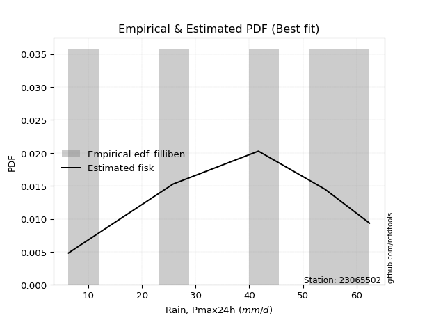</img>

</div>


### 10. EDF Jenkinson (1977)

The Jenkinson formula in hydrology is an empirical plotting position formula used to estimate the non-exceedance probability _(P)_ or return period _(T)_ of a given ordered observation within a sample. It is a widely used method in the frequency analysis of extreme events such as floods and rainfall, as it provides a distribution-free way to plot data. _a≈0.31_ and _b≈0.38_ are constants derived to approximate the median of the probability distribution for the given rank.

<div align="center">


$P=(m-a)/(n+b)$


</div>


**10.1. Empirical values**

<div align="center">

|                | 0                   | 1                  | 2             | 3                  | 4                  |
|:---------------|:--------------------|:-------------------|:--------------|:-------------------|:-------------------|
| date           | 2020                | 2016               | 2017          | 2018               | 2019               |
| x              | 6.3                 | 25.8               | 41.7          | 54.1               | 62.4               |
| m              | 1                   | 2                  | 3             | 4                  | 5                  |
| empirical_dist | edf_jenkinson       | edf_jenkinson      | edf_jenkinson | edf_jenkinson      | edf_jenkinson      |
| empirical      | 0.12825278810408922 | 0.3141263940520446 | 0.5           | 0.6858736059479554 | 0.8717472118959109 |
| empirical_tr   | 1.1471215351812367  | 1.4579945799457996 | 2.0           | 3.183431952662722  | 7.797101449275368  |

</div>


**10.2. Kolmogorov-Smirnov fit test (sorted by Δ)**


<div align="center">

|                | 0                   | 1                  | 2                   | 3                   | 4                   | 5                   | 6                  | 7                   | 8                   | 9                   | 10                  | 11                  | 12                  | 13                  | 14                  | 15                  | 16                  | 17                  | 18                  | 19                 | 20                  | 21                  | 22                  | 23                  | 24                  | 25                  | 26                  | 27                  | 28                  | 29                  | 30                  | 31                  | 32                  | 33                  | 34                  | 35                  | 36                 | 37                  | 38                  | 39                 | 40                  | 41                  | 42                  | 43                  | 44                  | 45                 | 46                  | 47                  | 48                  | 49                  | 50                  | 51                  | 52                  | 53                 | 54                  | 55                 | 56                  | 57                  | 58                  | 59                 | 60                  | 61                  | 62                  | 63                  | 64                 | 65                  | 66                  | 67                 | 68                  | 69                 | 70                  | 71                  | 72                 | 73                  | 74                  | 75                  | 76                 | 77                  | 78                  | 79                  | 80                 | 81                  | 82                  | 83                 | 84                  | 85                  | 86                  | 87                  | 88                  | 89                  | 90                  | 91                 | 92                  | 93                  | 94                 | 95                  | 96                  | 97                  | 98                  | 99                 | 100                | 101                 | 102                 | 103                 | 104                 | 105                 | 106                | 107                | 108                | 109                 | 110                 | 111                 | 112                 | 113                | 114                 | 115                 | 116                 | 117                 | 118                 | 119                 | 120                 | 121                 | 122                 | 123                | 124                 | 125                | 126                 | 127                 | 128                | 129                | 130                 | 131                 | 132                | 133                | 134                | 135                 | 136                | 137                | 138                 | 139                 | 140                 | 141                 | 142                | 143                | 144                | 145                | 146                 | 147                | 148                | 149                 | 150                | 151                | 152                | 153                | 154                | 155                | 156                | 157                | 158                | 159                |
|:---------------|:--------------------|:-------------------|:--------------------|:--------------------|:--------------------|:--------------------|:-------------------|:--------------------|:--------------------|:--------------------|:--------------------|:--------------------|:--------------------|:--------------------|:--------------------|:--------------------|:--------------------|:--------------------|:--------------------|:-------------------|:--------------------|:--------------------|:--------------------|:--------------------|:--------------------|:--------------------|:--------------------|:--------------------|:--------------------|:--------------------|:--------------------|:--------------------|:--------------------|:--------------------|:--------------------|:--------------------|:-------------------|:--------------------|:--------------------|:-------------------|:--------------------|:--------------------|:--------------------|:--------------------|:--------------------|:-------------------|:--------------------|:--------------------|:--------------------|:--------------------|:--------------------|:--------------------|:--------------------|:-------------------|:--------------------|:-------------------|:--------------------|:--------------------|:--------------------|:-------------------|:--------------------|:--------------------|:--------------------|:--------------------|:-------------------|:--------------------|:--------------------|:-------------------|:--------------------|:-------------------|:--------------------|:--------------------|:-------------------|:--------------------|:--------------------|:--------------------|:-------------------|:--------------------|:--------------------|:--------------------|:-------------------|:--------------------|:--------------------|:-------------------|:--------------------|:--------------------|:--------------------|:--------------------|:--------------------|:--------------------|:--------------------|:-------------------|:--------------------|:--------------------|:-------------------|:--------------------|:--------------------|:--------------------|:--------------------|:-------------------|:-------------------|:--------------------|:--------------------|:--------------------|:--------------------|:--------------------|:-------------------|:-------------------|:-------------------|:--------------------|:--------------------|:--------------------|:--------------------|:-------------------|:--------------------|:--------------------|:--------------------|:--------------------|:--------------------|:--------------------|:--------------------|:--------------------|:--------------------|:-------------------|:--------------------|:-------------------|:--------------------|:--------------------|:-------------------|:-------------------|:--------------------|:--------------------|:-------------------|:-------------------|:-------------------|:--------------------|:-------------------|:-------------------|:--------------------|:--------------------|:--------------------|:--------------------|:-------------------|:-------------------|:-------------------|:-------------------|:--------------------|:-------------------|:-------------------|:--------------------|:-------------------|:-------------------|:-------------------|:-------------------|:-------------------|:-------------------|:-------------------|:-------------------|:-------------------|:-------------------|
| station        | 23065502            | 23065502           | 23065502            | 23065502            | 23065502            | 23065502            | 23065502           | 23065502            | 23065502            | 23065502            | 23065502            | 23065502            | 23065502            | 23065502            | 23065502            | 23065502            | 23065502            | 23065502            | 23065502            | 23065502           | 23065502            | 23065502            | 23065502            | 23065502            | 23065502            | 23065502            | 23065502            | 23065502            | 23065502            | 23065502            | 23065502            | 23065502            | 23065502            | 23065502            | 23065502            | 23065502            | 23065502           | 23065502            | 23065502            | 23065502           | 23065502            | 23065502            | 23065502            | 23065502            | 23065502            | 23065502           | 23065502            | 23065502            | 23065502            | 23065502            | 23065502            | 23065502            | 23065502            | 23065502           | 23065502            | 23065502           | 23065502            | 23065502            | 23065502            | 23065502           | 23065502            | 23065502            | 23065502            | 23065502            | 23065502           | 23065502            | 23065502            | 23065502           | 23065502            | 23065502           | 23065502            | 23065502            | 23065502           | 23065502            | 23065502            | 23065502            | 23065502           | 23065502            | 23065502            | 23065502            | 23065502           | 23065502            | 23065502            | 23065502           | 23065502            | 23065502            | 23065502            | 23065502            | 23065502            | 23065502            | 23065502            | 23065502           | 23065502            | 23065502            | 23065502           | 23065502            | 23065502            | 23065502            | 23065502            | 23065502           | 23065502           | 23065502            | 23065502            | 23065502            | 23065502            | 23065502            | 23065502           | 23065502           | 23065502           | 23065502            | 23065502            | 23065502            | 23065502            | 23065502           | 23065502            | 23065502            | 23065502            | 23065502            | 23065502            | 23065502            | 23065502            | 23065502            | 23065502            | 23065502           | 23065502            | 23065502           | 23065502            | 23065502            | 23065502           | 23065502           | 23065502            | 23065502            | 23065502           | 23065502           | 23065502           | 23065502            | 23065502           | 23065502           | 23065502            | 23065502            | 23065502            | 23065502            | 23065502           | 23065502           | 23065502           | 23065502           | 23065502            | 23065502           | 23065502           | 23065502            | 23065502           | 23065502           | 23065502           | 23065502           | 23065502           | 23065502           | 23065502           | 23065502           | 23065502           | 23065502           |
| empirical_dist | edf_jenkinson       | edf_jenkinson      | edf_jenkinson       | edf_jenkinson       | edf_jenkinson       | edf_jenkinson       | edf_jenkinson      | edf_jenkinson       | edf_jenkinson       | edf_jenkinson       | edf_jenkinson       | edf_jenkinson       | edf_jenkinson       | edf_jenkinson       | edf_jenkinson       | edf_jenkinson       | edf_jenkinson       | edf_jenkinson       | edf_jenkinson       | edf_jenkinson      | edf_jenkinson       | edf_jenkinson       | edf_jenkinson       | edf_jenkinson       | edf_jenkinson       | edf_jenkinson       | edf_jenkinson       | edf_jenkinson       | edf_jenkinson       | edf_jenkinson       | edf_jenkinson       | edf_jenkinson       | edf_jenkinson       | edf_jenkinson       | edf_jenkinson       | edf_jenkinson       | edf_jenkinson      | edf_jenkinson       | edf_jenkinson       | edf_jenkinson      | edf_jenkinson       | edf_jenkinson       | edf_jenkinson       | edf_jenkinson       | edf_jenkinson       | edf_jenkinson      | edf_jenkinson       | edf_jenkinson       | edf_jenkinson       | edf_jenkinson       | edf_jenkinson       | edf_jenkinson       | edf_jenkinson       | edf_jenkinson      | edf_jenkinson       | edf_jenkinson      | edf_jenkinson       | edf_jenkinson       | edf_jenkinson       | edf_jenkinson      | edf_jenkinson       | edf_jenkinson       | edf_jenkinson       | edf_jenkinson       | edf_jenkinson      | edf_jenkinson       | edf_jenkinson       | edf_jenkinson      | edf_jenkinson       | edf_jenkinson      | edf_jenkinson       | edf_jenkinson       | edf_jenkinson      | edf_jenkinson       | edf_jenkinson       | edf_jenkinson       | edf_jenkinson      | edf_jenkinson       | edf_jenkinson       | edf_jenkinson       | edf_jenkinson      | edf_jenkinson       | edf_jenkinson       | edf_jenkinson      | edf_jenkinson       | edf_jenkinson       | edf_jenkinson       | edf_jenkinson       | edf_jenkinson       | edf_jenkinson       | edf_jenkinson       | edf_jenkinson      | edf_jenkinson       | edf_jenkinson       | edf_jenkinson      | edf_jenkinson       | edf_jenkinson       | edf_jenkinson       | edf_jenkinson       | edf_jenkinson      | edf_jenkinson      | edf_jenkinson       | edf_jenkinson       | edf_jenkinson       | edf_jenkinson       | edf_jenkinson       | edf_jenkinson      | edf_jenkinson      | edf_jenkinson      | edf_jenkinson       | edf_jenkinson       | edf_jenkinson       | edf_jenkinson       | edf_jenkinson      | edf_jenkinson       | edf_jenkinson       | edf_jenkinson       | edf_jenkinson       | edf_jenkinson       | edf_jenkinson       | edf_jenkinson       | edf_jenkinson       | edf_jenkinson       | edf_jenkinson      | edf_jenkinson       | edf_jenkinson      | edf_jenkinson       | edf_jenkinson       | edf_jenkinson      | edf_jenkinson      | edf_jenkinson       | edf_jenkinson       | edf_jenkinson      | edf_jenkinson      | edf_jenkinson      | edf_jenkinson       | edf_jenkinson      | edf_jenkinson      | edf_jenkinson       | edf_jenkinson       | edf_jenkinson       | edf_jenkinson       | edf_jenkinson      | edf_jenkinson      | edf_jenkinson      | edf_jenkinson      | edf_jenkinson       | edf_jenkinson      | edf_jenkinson      | edf_jenkinson       | edf_jenkinson      | edf_jenkinson      | edf_jenkinson      | edf_jenkinson      | edf_jenkinson      | edf_jenkinson      | edf_jenkinson      | edf_jenkinson      | edf_jenkinson      | edf_jenkinson      |
| p_dist         | trapezoid           | semicircular       | anglit              | gengamma            | ksone               | argus               | weibull_min        | loglevy_l           | johnsonsu           | gompertz            | pearson3            | invgauss            | erlang              | logtrapezoid        | betaprime           | nct                 | t                   | exponnorm           | f                   | truncnorm          | norm                | crystalball         | fatiguelife         | rice                | logpearson3         | gumbel_l            | gamma               | maxwell             | foldnorm            | invgamma            | rayleigh            | loggumbel_l         | logloglaplace       | exponweib           | dweibull            | logmielke           | logweibull_min     | ncf                 | burr                | cosine             | genexpon            | logistic            | dgamma              | triang              | skewnorm            | logweibull_max     | beta                | wrapcauchy          | genpareto           | logvonmises_line    | genextreme          | gausshyper          | loggenextreme       | genhalflogistic    | arcsine             | loggennorm         | logburr12           | logburr             | mielke              | logdgamma          | logdweibull         | levy_l              | kstwobign           | logsemicircular     | logargus           | halfnorm            | loggompertz         | hypsecant          | loganglit           | logloggamma        | gumbel_r            | loggenpareto        | kappa3             | laplace             | lomax               | logarcsine          | exponpow           | logbetaprime        | tukeylambda         | logerlang           | kappa4             | logncf              | logfatiguelife      | lognct             | logf                | logcrystalball      | logexponnorm        | lognorm             | logt                | logrice             | halflogistic        | invweibull         | loggamma            | loggamma            | moyal              | logfoldnorm         | uniform             | vonmises_line       | loginvgauss         | logbeta            | loginvgamma        | loginvweibull       | loglogistic         | logalpha            | logmaxwell          | gennorm             | lograyleigh        | loggausshyper      | loghypsecant       | loggenhalflogistic  | logcosine           | loghalfnorm         | bradford            | logwrapcauchy      | truncweibull_min    | logkstwobign        | loggenexpon         | logskewnorm         | loggumbel_r         | loglaplace          | loglaplace          | halfgennorm         | wald                | loghalflogistic    | logtriang           | logmoyal           | truncexpon          | logjohnsonsb        | burr12             | loglomax           | logksone            | alpha               | logwald            | logrdist           | johnsonsb          | logtruncnorm        | lognakagami        | loghalfgennorm     | logtukeylambda      | logkappa3           | loguniform          | logkappa4           | nakagami           | logtruncexpon      | logbradford        | logexponweib       | logtruncweibull_min | logjohnsonsu       | loggengamma        | logexponpow         | weibull_max        | powerlaw           | truncpareto        | logpowerlaw        | logtruncpareto     | rdist              | genlogistic        | loggenlogistic     | logvonmises        | vonmises           |
| delta          | 0.06356019582216144 | 0.0722198711915277 | 0.07346968961198941 | 0.07459484518735815 | 0.08417138170835793 | 0.08812493668422117 | 0.0882319886565367 | 0.08894565739763904 | 0.09063250973835024 | 0.09174225510097955 | 0.09580147231051239 | 0.10039374817058455 | 0.10064463339810825 | 0.10105952165539467 | 0.10115421084229559 | 0.10143692228789525 | 0.10157970968305607 | 0.10158027072383802 | 0.10158233898116775 | 0.1015838963342407 | 0.10158394507256852 | 0.10158395712556179 | 0.10167423986041901 | 0.10192731864458748 | 0.10403156086924958 | 0.10435063570224745 | 0.10462669474688668 | 0.10619772369691138 | 0.10847310975328528 | 0.10932993079735709 | 0.10978363496102306 | 0.11366108632087057 | 0.11421781184980961 | 0.11693875466163439 | 0.11785874238160587 | 0.11873752244823832 | 0.1194397975808229 | 0.11971142665732093 | 0.11982614145957737 | 0.119856452486095  | 0.12353847250135352 | 0.12362288819901013 | 0.12370712118411398 | 0.12643063041322478 | 0.12825239045328984 | 0.1282527188197925 | 0.12825278534183648 | 0.12825278787024075 | 0.12825278790652084 | 0.12825278810262775 | 0.12825278810379248 | 0.12825278810391838 | 0.12825278810407337 | 0.1282527881040878 | 0.12825278810408922 | 0.1284553223731154 | 0.12856285931148448 | 0.12859055882515824 | 0.12890297397611217 | 0.1293176808405238 | 0.13049481309295108 | 0.13135906164968594 | 0.13197595957868558 | 0.13275194879399516 | 0.1355359401098023 | 0.13559224278890958 | 0.13597782360491772 | 0.136980924959634  | 0.13862371076140423 | 0.1391159908243491 | 0.14073501324918403 | 0.14920771009041595 | 0.1504633476537579 | 0.15228964420740865 | 0.15234395623744634 | 0.15329914382309928 | 0.1533044972048876 | 0.15343262186984008 | 0.15478077378079858 | 0.15560989459485808 | 0.1557671503577963 | 0.15605889001696527 | 0.15907492102458476 | 0.1591965004042626 | 0.15925690234918433 | 0.15943119351774637 | 0.15943163962214202 | 0.15943195085054107 | 0.15943284320058015 | 0.16327570206908382 | 0.16347974931519427 | 0.1637504351013025 | 0.16469768557741504 | 0.16469768557741504 | 0.1647673441277675 | 0.16579597306179972 | 0.16617630492548485 | 0.16617731540608727 | 0.16920931148922447 | 0.1695328588142434 | 0.172845546201019  | 0.17642181100818377 | 0.17815685482915866 | 0.17819688528279343 | 0.18004568608384441 | 0.18587360594795543 | 0.1862099466574365 | 0.1892844042455466 | 0.1925172761519207 | 0.20003939565597462 | 0.20392658417693887 | 0.20424728530273684 | 0.20555836371121172 | 0.2061766892365811 | 0.21014278709159373 | 0.21201471463127247 | 0.21563780640557467 | 0.21782619662391212 | 0.21787114142824904 | 0.22036395603234715 | 0.22036395603234715 | 0.22730149404582273 | 0.23150108192042151 | 0.232200382979464  | 0.23485319320888198 | 0.2371107737248317 | 0.24378627192545033 | 0.26909128592780596 | 0.2752932589092774 | 0.2776221290219006 | 0.28156892550902873 | 0.28814387126692426 | 0.291909179027938  | 0.3081092468769278 | 0.3108157626178405 | 0.31412027542617216 | 0.3141263940520022 | 0.3148066201524729 | 0.31671811570210906 | 0.32361881052415165 | 0.32422093456678147 | 0.33119194790838047 | 0.3643422964712075 | 0.3789614158046381 | 0.3829254875776977 | 0.4045682993545189 | 0.41351337496051205 | 0.4240038437257194 | 0.4448050738236195 | 0.47941531935455034 | 0.534788942266275  | 0.5631735939591174 | 0.5769995855579064 | 0.6232681078138158 | 0.6355883987891764 | 0.6858736058115895 | 0.6858736059479554 | 0.6858736059479554 | 1.1122382549957353 | 9.719451127639346  |
| deltao         | 0.5865427407550001  | 0.5865427407550001 | 0.5865427407550001  | 0.5865427407550001  | 0.5865427407550001  | 0.5865427407550001  | 0.5865427407550001 | 0.5865427407550001  | 0.5865427407550001  | 0.5865427407550001  | 0.5865427407550001  | 0.5865427407550001  | 0.5865427407550001  | 0.5865427407550001  | 0.5865427407550001  | 0.5865427407550001  | 0.5865427407550001  | 0.5865427407550001  | 0.5865427407550001  | 0.5865427407550001 | 0.5865427407550001  | 0.5865427407550001  | 0.5865427407550001  | 0.5865427407550001  | 0.5865427407550001  | 0.5865427407550001  | 0.5865427407550001  | 0.5865427407550001  | 0.5865427407550001  | 0.5865427407550001  | 0.5865427407550001  | 0.5865427407550001  | 0.5865427407550001  | 0.5865427407550001  | 0.5865427407550001  | 0.5865427407550001  | 0.5865427407550001 | 0.5865427407550001  | 0.5865427407550001  | 0.5865427407550001 | 0.5865427407550001  | 0.5865427407550001  | 0.5865427407550001  | 0.5865427407550001  | 0.5865427407550001  | 0.5865427407550001 | 0.5865427407550001  | 0.5865427407550001  | 0.5865427407550001  | 0.5865427407550001  | 0.5865427407550001  | 0.5865427407550001  | 0.5865427407550001  | 0.5865427407550001 | 0.5865427407550001  | 0.5865427407550001 | 0.5865427407550001  | 0.5865427407550001  | 0.5865427407550001  | 0.5865427407550001 | 0.5865427407550001  | 0.5865427407550001  | 0.5865427407550001  | 0.5865427407550001  | 0.5865427407550001 | 0.5865427407550001  | 0.5865427407550001  | 0.5865427407550001 | 0.5865427407550001  | 0.5865427407550001 | 0.5865427407550001  | 0.5865427407550001  | 0.5865427407550001 | 0.5865427407550001  | 0.5865427407550001  | 0.5865427407550001  | 0.5865427407550001 | 0.5865427407550001  | 0.5865427407550001  | 0.5865427407550001  | 0.5865427407550001 | 0.5865427407550001  | 0.5865427407550001  | 0.5865427407550001 | 0.5865427407550001  | 0.5865427407550001  | 0.5865427407550001  | 0.5865427407550001  | 0.5865427407550001  | 0.5865427407550001  | 0.5865427407550001  | 0.5865427407550001 | 0.5865427407550001  | 0.5865427407550001  | 0.5865427407550001 | 0.5865427407550001  | 0.5865427407550001  | 0.5865427407550001  | 0.5865427407550001  | 0.5865427407550001 | 0.5865427407550001 | 0.5865427407550001  | 0.5865427407550001  | 0.5865427407550001  | 0.5865427407550001  | 0.5865427407550001  | 0.5865427407550001 | 0.5865427407550001 | 0.5865427407550001 | 0.5865427407550001  | 0.5865427407550001  | 0.5865427407550001  | 0.5865427407550001  | 0.5865427407550001 | 0.5865427407550001  | 0.5865427407550001  | 0.5865427407550001  | 0.5865427407550001  | 0.5865427407550001  | 0.5865427407550001  | 0.5865427407550001  | 0.5865427407550001  | 0.5865427407550001  | 0.5865427407550001 | 0.5865427407550001  | 0.5865427407550001 | 0.5865427407550001  | 0.5865427407550001  | 0.5865427407550001 | 0.5865427407550001 | 0.5865427407550001  | 0.5865427407550001  | 0.5865427407550001 | 0.5865427407550001 | 0.5865427407550001 | 0.5865427407550001  | 0.5865427407550001 | 0.5865427407550001 | 0.5865427407550001  | 0.5865427407550001  | 0.5865427407550001  | 0.5865427407550001  | 0.5865427407550001 | 0.5865427407550001 | 0.5865427407550001 | 0.5865427407550001 | 0.5865427407550001  | 0.5865427407550001 | 0.5865427407550001 | 0.5865427407550001  | 0.5865427407550001 | 0.5865427407550001 | 0.5865427407550001 | 0.5865427407550001 | 0.5865427407550001 | 0.5865427407550001 | 0.5865427407550001 | 0.5865427407550001 | 0.5865427407550001 | 0.5865427407550001 |
| eval           | Δo > Δ              | Δo > Δ             | Δo > Δ              | Δo > Δ              | Δo > Δ              | Δo > Δ              | Δo > Δ             | Δo > Δ              | Δo > Δ              | Δo > Δ              | Δo > Δ              | Δo > Δ              | Δo > Δ              | Δo > Δ              | Δo > Δ              | Δo > Δ              | Δo > Δ              | Δo > Δ              | Δo > Δ              | Δo > Δ             | Δo > Δ              | Δo > Δ              | Δo > Δ              | Δo > Δ              | Δo > Δ              | Δo > Δ              | Δo > Δ              | Δo > Δ              | Δo > Δ              | Δo > Δ              | Δo > Δ              | Δo > Δ              | Δo > Δ              | Δo > Δ              | Δo > Δ              | Δo > Δ              | Δo > Δ             | Δo > Δ              | Δo > Δ              | Δo > Δ             | Δo > Δ              | Δo > Δ              | Δo > Δ              | Δo > Δ              | Δo > Δ              | Δo > Δ             | Δo > Δ              | Δo > Δ              | Δo > Δ              | Δo > Δ              | Δo > Δ              | Δo > Δ              | Δo > Δ              | Δo > Δ             | Δo > Δ              | Δo > Δ             | Δo > Δ              | Δo > Δ              | Δo > Δ              | Δo > Δ             | Δo > Δ              | Δo > Δ              | Δo > Δ              | Δo > Δ              | Δo > Δ             | Δo > Δ              | Δo > Δ              | Δo > Δ             | Δo > Δ              | Δo > Δ             | Δo > Δ              | Δo > Δ              | Δo > Δ             | Δo > Δ              | Δo > Δ              | Δo > Δ              | Δo > Δ             | Δo > Δ              | Δo > Δ              | Δo > Δ              | Δo > Δ             | Δo > Δ              | Δo > Δ              | Δo > Δ             | Δo > Δ              | Δo > Δ              | Δo > Δ              | Δo > Δ              | Δo > Δ              | Δo > Δ              | Δo > Δ              | Δo > Δ             | Δo > Δ              | Δo > Δ              | Δo > Δ             | Δo > Δ              | Δo > Δ              | Δo > Δ              | Δo > Δ              | Δo > Δ             | Δo > Δ             | Δo > Δ              | Δo > Δ              | Δo > Δ              | Δo > Δ              | Δo > Δ              | Δo > Δ             | Δo > Δ             | Δo > Δ             | Δo > Δ              | Δo > Δ              | Δo > Δ              | Δo > Δ              | Δo > Δ             | Δo > Δ              | Δo > Δ              | Δo > Δ              | Δo > Δ              | Δo > Δ              | Δo > Δ              | Δo > Δ              | Δo > Δ              | Δo > Δ              | Δo > Δ             | Δo > Δ              | Δo > Δ             | Δo > Δ              | Δo > Δ              | Δo > Δ             | Δo > Δ             | Δo > Δ              | Δo > Δ              | Δo > Δ             | Δo > Δ             | Δo > Δ             | Δo > Δ              | Δo > Δ             | Δo > Δ             | Δo > Δ              | Δo > Δ              | Δo > Δ              | Δo > Δ              | Δo > Δ             | Δo > Δ             | Δo > Δ             | Δo > Δ             | Δo > Δ              | Δo > Δ             | Δo > Δ             | Δo > Δ              | Δo > Δ             | Δo > Δ             | Δo > Δ             | Δo <= Δ            | Δo <= Δ            | Δo <= Δ            | Δo <= Δ            | Δo <= Δ            | Δo <= Δ            | Δo <= Δ            |
| fit            | 1                   | 1                  | 1                   | 1                   | 1                   | 1                   | 1                  | 1                   | 1                   | 1                   | 1                   | 1                   | 1                   | 1                   | 1                   | 1                   | 1                   | 1                   | 1                   | 1                  | 1                   | 1                   | 1                   | 1                   | 1                   | 1                   | 1                   | 1                   | 1                   | 1                   | 1                   | 1                   | 1                   | 1                   | 1                   | 1                   | 1                  | 1                   | 1                   | 1                  | 1                   | 1                   | 1                   | 1                   | 1                   | 1                  | 1                   | 1                   | 1                   | 1                   | 1                   | 1                   | 1                   | 1                  | 1                   | 1                  | 1                   | 1                   | 1                   | 1                  | 1                   | 1                   | 1                   | 1                   | 1                  | 1                   | 1                   | 1                  | 1                   | 1                  | 1                   | 1                   | 1                  | 1                   | 1                   | 1                   | 1                  | 1                   | 1                   | 1                   | 1                  | 1                   | 1                   | 1                  | 1                   | 1                   | 1                   | 1                   | 1                   | 1                   | 1                   | 1                  | 1                   | 1                   | 1                  | 1                   | 1                   | 1                   | 1                   | 1                  | 1                  | 1                   | 1                   | 1                   | 1                   | 1                   | 1                  | 1                  | 1                  | 1                   | 1                   | 1                   | 1                   | 1                  | 1                   | 1                   | 1                   | 1                   | 1                   | 1                   | 1                   | 1                   | 1                   | 1                  | 1                   | 1                  | 1                   | 1                   | 1                  | 1                  | 1                   | 1                   | 1                  | 1                  | 1                  | 1                   | 1                  | 1                  | 1                   | 1                   | 1                   | 1                   | 1                  | 1                  | 1                  | 1                  | 1                   | 1                  | 1                  | 1                   | 1                  | 1                  | 1                  | 0                  | 0                  | 0                  | 0                  | 0                  | 0                  | 0                  |
| n              | 5                   | 5                  | 5                   | 5                   | 5                   | 5                   | 5                  | 5                   | 5                   | 5                   | 5                   | 5                   | 5                   | 5                   | 5                   | 5                   | 5                   | 5                   | 5                   | 5                  | 5                   | 5                   | 5                   | 5                   | 5                   | 5                   | 5                   | 5                   | 5                   | 5                   | 5                   | 5                   | 5                   | 5                   | 5                   | 5                   | 5                  | 5                   | 5                   | 5                  | 5                   | 5                   | 5                   | 5                   | 5                   | 5                  | 5                   | 5                   | 5                   | 5                   | 5                   | 5                   | 5                   | 5                  | 5                   | 5                  | 5                   | 5                   | 5                   | 5                  | 5                   | 5                   | 5                   | 5                   | 5                  | 5                   | 5                   | 5                  | 5                   | 5                  | 5                   | 5                   | 5                  | 5                   | 5                   | 5                   | 5                  | 5                   | 5                   | 5                   | 5                  | 5                   | 5                   | 5                  | 5                   | 5                   | 5                   | 5                   | 5                   | 5                   | 5                   | 5                  | 5                   | 5                   | 5                  | 5                   | 5                   | 5                   | 5                   | 5                  | 5                  | 5                   | 5                   | 5                   | 5                   | 5                   | 5                  | 5                  | 5                  | 5                   | 5                   | 5                   | 5                   | 5                  | 5                   | 5                   | 5                   | 5                   | 5                   | 5                   | 5                   | 5                   | 5                   | 5                  | 5                   | 5                  | 5                   | 5                   | 5                  | 5                  | 5                   | 5                   | 5                  | 5                  | 5                  | 5                   | 5                  | 5                  | 5                   | 5                   | 5                   | 5                   | 5                  | 5                  | 5                  | 5                  | 5                   | 5                  | 5                  | 5                   | 5                  | 5                  | 5                  | 5                  | 5                  | 5                  | 5                  | 5                  | 5                  | 5                  |
| best_fit       | 1                   | 0                  | 0                   | 0                   | 0                   | 0                   | 0                  | 0                   | 0                   | 0                   | 0                   | 0                   | 0                   | 0                   | 0                   | 0                   | 0                   | 0                   | 0                   | 0                  | 0                   | 0                   | 0                   | 0                   | 0                   | 0                   | 0                   | 0                   | 0                   | 0                   | 0                   | 0                   | 0                   | 0                   | 0                   | 0                   | 0                  | 0                   | 0                   | 0                  | 0                   | 0                   | 0                   | 0                   | 0                   | 0                  | 0                   | 0                   | 0                   | 0                   | 0                   | 0                   | 0                   | 0                  | 0                   | 0                  | 0                   | 0                   | 0                   | 0                  | 0                   | 0                   | 0                   | 0                   | 0                  | 0                   | 0                   | 0                  | 0                   | 0                  | 0                   | 0                   | 0                  | 0                   | 0                   | 0                   | 0                  | 0                   | 0                   | 0                   | 0                  | 0                   | 0                   | 0                  | 0                   | 0                   | 0                   | 0                   | 0                   | 0                   | 0                   | 0                  | 0                   | 0                   | 0                  | 0                   | 0                   | 0                   | 0                   | 0                  | 0                  | 0                   | 0                   | 0                   | 0                   | 0                   | 0                  | 0                  | 0                  | 0                   | 0                   | 0                   | 0                   | 0                  | 0                   | 0                   | 0                   | 0                   | 0                   | 0                   | 0                   | 0                   | 0                   | 0                  | 0                   | 0                  | 0                   | 0                   | 0                  | 0                  | 0                   | 0                   | 0                  | 0                  | 0                  | 0                   | 0                  | 0                  | 0                   | 0                   | 0                   | 0                   | 0                  | 0                  | 0                  | 0                  | 0                   | 0                  | 0                  | 0                   | 0                  | 0                  | 0                  | 0                  | 0                  | 0                  | 0                  | 0                  | 0                  | 0                  |
| best_fit_sort  | 1                   | 2                  | 3                   | 4                   | 5                   | 6                   | 7                  | 8                   | 9                   | 10                  | 11                  | 12                  | 13                  | 14                  | 15                  | 16                  | 17                  | 18                  | 19                  | 20                 | 21                  | 22                  | 23                  | 24                  | 25                  | 26                  | 27                  | 28                  | 29                  | 30                  | 31                  | 32                  | 33                  | 34                  | 35                  | 36                  | 37                 | 38                  | 39                  | 40                 | 41                  | 42                  | 43                  | 44                  | 45                  | 46                 | 47                  | 48                  | 49                  | 50                  | 51                  | 52                  | 53                  | 54                 | 55                  | 56                 | 57                  | 58                  | 59                  | 60                 | 61                  | 62                  | 63                  | 64                  | 65                 | 66                  | 67                  | 68                 | 69                  | 70                 | 71                  | 72                  | 73                 | 74                  | 75                  | 76                  | 77                 | 78                  | 79                  | 80                  | 81                 | 82                  | 83                  | 84                 | 85                  | 86                  | 87                  | 88                  | 89                  | 90                  | 91                  | 92                 | 93                  | 94                  | 95                 | 96                  | 97                  | 98                  | 99                  | 100                | 101                | 102                 | 103                 | 104                 | 105                 | 106                 | 107                | 108                | 109                | 110                 | 111                 | 112                 | 113                 | 114                | 115                 | 116                 | 117                 | 118                 | 119                 | 120                 | 121                 | 122                 | 123                 | 124                | 125                 | 126                | 127                 | 128                 | 129                | 130                | 131                 | 132                 | 133                | 134                | 135                | 136                 | 137                | 138                | 139                 | 140                 | 141                 | 142                 | 143                | 144                | 145                | 146                | 147                 | 148                | 149                | 150                 | 151                | 152                | 153                | 154                | 155                | 156                | 157                | 158                | 159                | 160                |

</div>


**10.3. Best fit**

<div align="center">

|   id |   station | empirical_dist   | p_dist    |     delta |   deltao | eval   |   fit |   n |   best_fit |   best_fit_sort |
|-----:|----------:|:-----------------|:----------|----------:|---------:|:-------|------:|----:|-----------:|----------------:|
|    0 |  23065502 | edf_jenkinson    | trapezoid | 0.0635602 | 0.586543 | Δo > Δ |     1 |   5 |          1 |               1 |

</div>


<div align="center">

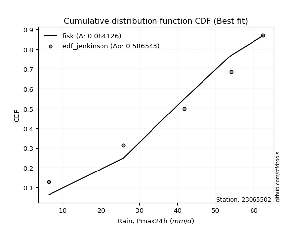</img>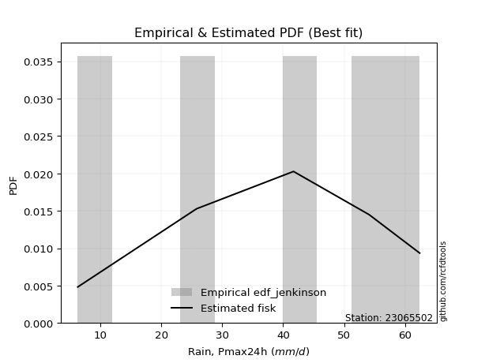</img>

</div>


### 11. EDF Cunnane (1978)

Cunnane´s work in statistical hydrology has focused on the performance and evaluation of different probability distributions (such as GEV, Gumbel, Lognormal) for flood frequency estimation. _b_ is a constant, typically set to 0.4.

<div align="center">


$P=(m-b)/(n+1-2b)$


</div>


**11.1. Empirical values**

<div align="center">

|                | 0                   | 1                  | 2           | 3                  | 4                  |
|:---------------|:--------------------|:-------------------|:------------|:-------------------|:-------------------|
| date           | 2020                | 2016               | 2017        | 2018               | 2019               |
| x              | 6.3                 | 25.8               | 41.7        | 54.1               | 62.4               |
| m              | 1                   | 2                  | 3           | 4                  | 5                  |
| empirical_dist | edf_cunnane         | edf_cunnane        | edf_cunnane | edf_cunnane        | edf_cunnane        |
| empirical      | 0.11538461538461538 | 0.3076923076923077 | 0.5         | 0.6923076923076923 | 0.8846153846153845 |
| empirical_tr   | 1.1304347826086958  | 1.4444444444444444 | 2.0         | 3.25               | 8.666666666666655  |

</div>


**11.2. Kolmogorov-Smirnov fit test (sorted by Δ)**


<div align="center">

|                | 0                   | 1                   | 2                   | 3                   | 4                   | 5                   | 6                   | 7                   | 8                  | 9                   | 10                  | 11                 | 12                  | 13                  | 14                  | 15                  | 16                 | 17                  | 18                  | 19                  | 20                  | 21                  | 22                 | 23                  | 24                  | 25                  | 26                  | 27                  | 28                  | 29                 | 30                  | 31                  | 32                  | 33                  | 34                  | 35                  | 36                  | 37                  | 38                 | 39                  | 40                  | 41                  | 42                  | 43                  | 44                  | 45                 | 46                  | 47                  | 48                  | 49                 | 50                  | 51                  | 52                  | 53                 | 54                  | 55                  | 56                  | 57                  | 58                  | 59                  | 60                  | 61                  | 62                  | 63                  | 64                  | 65                  | 66                  | 67                  | 68                 | 69                  | 70                  | 71                 | 72                 | 73                  | 74                  | 75                  | 76                 | 77                  | 78                  | 79                  | 80                  | 81                  | 82                 | 83                  | 84                  | 85                  | 86                  | 87                  | 88                 | 89                 | 90                  | 91                  | 92                 | 93                  | 94                  | 95                 | 96                  | 97                  | 98                  | 99                 | 100                 | 101                 | 102                 | 103                 | 104                 | 105                | 106                | 107                | 108                | 109                 | 110                 | 111                 | 112                 | 113                 | 114                 | 115                 | 116                 | 117                 | 118                 | 119                 | 120                 | 121                 | 122                | 123                 | 124                 | 125                | 126                 | 127                 | 128                 | 129                | 130                 | 131                | 132                 | 133                 | 134                | 135                | 136                 | 137                 | 138                | 139                 | 140                 | 141                 | 142                | 143                | 144                | 145                | 146                 | 147                | 148                | 149                 | 150                | 151                | 152                | 153                | 154                | 155                | 156                | 157                | 158                | 159                |
|:---------------|:--------------------|:--------------------|:--------------------|:--------------------|:--------------------|:--------------------|:--------------------|:--------------------|:-------------------|:--------------------|:--------------------|:-------------------|:--------------------|:--------------------|:--------------------|:--------------------|:-------------------|:--------------------|:--------------------|:--------------------|:--------------------|:--------------------|:-------------------|:--------------------|:--------------------|:--------------------|:--------------------|:--------------------|:--------------------|:-------------------|:--------------------|:--------------------|:--------------------|:--------------------|:--------------------|:--------------------|:--------------------|:--------------------|:-------------------|:--------------------|:--------------------|:--------------------|:--------------------|:--------------------|:--------------------|:-------------------|:--------------------|:--------------------|:--------------------|:-------------------|:--------------------|:--------------------|:--------------------|:-------------------|:--------------------|:--------------------|:--------------------|:--------------------|:--------------------|:--------------------|:--------------------|:--------------------|:--------------------|:--------------------|:--------------------|:--------------------|:--------------------|:--------------------|:-------------------|:--------------------|:--------------------|:-------------------|:-------------------|:--------------------|:--------------------|:--------------------|:-------------------|:--------------------|:--------------------|:--------------------|:--------------------|:--------------------|:-------------------|:--------------------|:--------------------|:--------------------|:--------------------|:--------------------|:-------------------|:-------------------|:--------------------|:--------------------|:-------------------|:--------------------|:--------------------|:-------------------|:--------------------|:--------------------|:--------------------|:-------------------|:--------------------|:--------------------|:--------------------|:--------------------|:--------------------|:-------------------|:-------------------|:-------------------|:-------------------|:--------------------|:--------------------|:--------------------|:--------------------|:--------------------|:--------------------|:--------------------|:--------------------|:--------------------|:--------------------|:--------------------|:--------------------|:--------------------|:-------------------|:--------------------|:--------------------|:-------------------|:--------------------|:--------------------|:--------------------|:-------------------|:--------------------|:-------------------|:--------------------|:--------------------|:-------------------|:-------------------|:--------------------|:--------------------|:-------------------|:--------------------|:--------------------|:--------------------|:-------------------|:-------------------|:-------------------|:-------------------|:--------------------|:-------------------|:-------------------|:--------------------|:-------------------|:-------------------|:-------------------|:-------------------|:-------------------|:-------------------|:-------------------|:-------------------|:-------------------|:-------------------|
| station        | 23065502            | 23065502            | 23065502            | 23065502            | 23065502            | 23065502            | 23065502            | 23065502            | 23065502           | 23065502            | 23065502            | 23065502           | 23065502            | 23065502            | 23065502            | 23065502            | 23065502           | 23065502            | 23065502            | 23065502            | 23065502            | 23065502            | 23065502           | 23065502            | 23065502            | 23065502            | 23065502            | 23065502            | 23065502            | 23065502           | 23065502            | 23065502            | 23065502            | 23065502            | 23065502            | 23065502            | 23065502            | 23065502            | 23065502           | 23065502            | 23065502            | 23065502            | 23065502            | 23065502            | 23065502            | 23065502           | 23065502            | 23065502            | 23065502            | 23065502           | 23065502            | 23065502            | 23065502            | 23065502           | 23065502            | 23065502            | 23065502            | 23065502            | 23065502            | 23065502            | 23065502            | 23065502            | 23065502            | 23065502            | 23065502            | 23065502            | 23065502            | 23065502            | 23065502           | 23065502            | 23065502            | 23065502           | 23065502           | 23065502            | 23065502            | 23065502            | 23065502           | 23065502            | 23065502            | 23065502            | 23065502            | 23065502            | 23065502           | 23065502            | 23065502            | 23065502            | 23065502            | 23065502            | 23065502           | 23065502           | 23065502            | 23065502            | 23065502           | 23065502            | 23065502            | 23065502           | 23065502            | 23065502            | 23065502            | 23065502           | 23065502            | 23065502            | 23065502            | 23065502            | 23065502            | 23065502           | 23065502           | 23065502           | 23065502           | 23065502            | 23065502            | 23065502            | 23065502            | 23065502            | 23065502            | 23065502            | 23065502            | 23065502            | 23065502            | 23065502            | 23065502            | 23065502            | 23065502           | 23065502            | 23065502            | 23065502           | 23065502            | 23065502            | 23065502            | 23065502           | 23065502            | 23065502           | 23065502            | 23065502            | 23065502           | 23065502           | 23065502            | 23065502            | 23065502           | 23065502            | 23065502            | 23065502            | 23065502           | 23065502           | 23065502           | 23065502           | 23065502            | 23065502           | 23065502           | 23065502            | 23065502           | 23065502           | 23065502           | 23065502           | 23065502           | 23065502           | 23065502           | 23065502           | 23065502           | 23065502           |
| empirical_dist | edf_cunnane         | edf_cunnane         | edf_cunnane         | edf_cunnane         | edf_cunnane         | edf_cunnane         | edf_cunnane         | edf_cunnane         | edf_cunnane        | edf_cunnane         | edf_cunnane         | edf_cunnane        | edf_cunnane         | edf_cunnane         | edf_cunnane         | edf_cunnane         | edf_cunnane        | edf_cunnane         | edf_cunnane         | edf_cunnane         | edf_cunnane         | edf_cunnane         | edf_cunnane        | edf_cunnane         | edf_cunnane         | edf_cunnane         | edf_cunnane         | edf_cunnane         | edf_cunnane         | edf_cunnane        | edf_cunnane         | edf_cunnane         | edf_cunnane         | edf_cunnane         | edf_cunnane         | edf_cunnane         | edf_cunnane         | edf_cunnane         | edf_cunnane        | edf_cunnane         | edf_cunnane         | edf_cunnane         | edf_cunnane         | edf_cunnane         | edf_cunnane         | edf_cunnane        | edf_cunnane         | edf_cunnane         | edf_cunnane         | edf_cunnane        | edf_cunnane         | edf_cunnane         | edf_cunnane         | edf_cunnane        | edf_cunnane         | edf_cunnane         | edf_cunnane         | edf_cunnane         | edf_cunnane         | edf_cunnane         | edf_cunnane         | edf_cunnane         | edf_cunnane         | edf_cunnane         | edf_cunnane         | edf_cunnane         | edf_cunnane         | edf_cunnane         | edf_cunnane        | edf_cunnane         | edf_cunnane         | edf_cunnane        | edf_cunnane        | edf_cunnane         | edf_cunnane         | edf_cunnane         | edf_cunnane        | edf_cunnane         | edf_cunnane         | edf_cunnane         | edf_cunnane         | edf_cunnane         | edf_cunnane        | edf_cunnane         | edf_cunnane         | edf_cunnane         | edf_cunnane         | edf_cunnane         | edf_cunnane        | edf_cunnane        | edf_cunnane         | edf_cunnane         | edf_cunnane        | edf_cunnane         | edf_cunnane         | edf_cunnane        | edf_cunnane         | edf_cunnane         | edf_cunnane         | edf_cunnane        | edf_cunnane         | edf_cunnane         | edf_cunnane         | edf_cunnane         | edf_cunnane         | edf_cunnane        | edf_cunnane        | edf_cunnane        | edf_cunnane        | edf_cunnane         | edf_cunnane         | edf_cunnane         | edf_cunnane         | edf_cunnane         | edf_cunnane         | edf_cunnane         | edf_cunnane         | edf_cunnane         | edf_cunnane         | edf_cunnane         | edf_cunnane         | edf_cunnane         | edf_cunnane        | edf_cunnane         | edf_cunnane         | edf_cunnane        | edf_cunnane         | edf_cunnane         | edf_cunnane         | edf_cunnane        | edf_cunnane         | edf_cunnane        | edf_cunnane         | edf_cunnane         | edf_cunnane        | edf_cunnane        | edf_cunnane         | edf_cunnane         | edf_cunnane        | edf_cunnane         | edf_cunnane         | edf_cunnane         | edf_cunnane        | edf_cunnane        | edf_cunnane        | edf_cunnane        | edf_cunnane         | edf_cunnane        | edf_cunnane        | edf_cunnane         | edf_cunnane        | edf_cunnane        | edf_cunnane        | edf_cunnane        | edf_cunnane        | edf_cunnane        | edf_cunnane        | edf_cunnane        | edf_cunnane        | edf_cunnane        |
| p_dist         | trapezoid           | semicircular        | gengamma            | anglit              | ksone               | argus               | weibull_min         | johnsonsu           | gompertz           | loglevy_l           | pearson3            | erlang             | betaprime           | nct                 | t                   | exponnorm           | f                  | truncnorm           | norm                | crystalball         | fatiguelife         | rice                | gumbel_l           | gamma               | invgauss            | maxwell             | foldnorm            | logpearson3         | exponweib           | invgamma           | rayleigh            | logmielke           | burr                | cosine              | triang              | loggumbel_l         | logtrapezoid        | skewnorm            | logweibull_max     | beta                | genpareto           | logvonmises_line    | genextreme          | gausshyper          | loggenextreme       | genhalflogistic    | arcsine             | logistic            | dgamma              | logweibull_min     | ncf                 | logburr             | mielke              | logdgamma          | wrapcauchy          | genexpon            | dweibull            | logloglaplace       | logburr12           | logargus            | hypsecant           | kstwobign           | logloggamma         | halfnorm            | loggompertz         | loganglit           | logsemicircular     | gumbel_r            | loggennorm         | logdweibull         | kappa3              | levy_l             | laplace            | tukeylambda         | kappa4              | lomax               | exponpow           | logbetaprime        | logerlang           | loggenpareto        | logncf              | logfatiguelife      | lognct             | logf                | logcrystalball      | logexponnorm        | lognorm             | logt                | uniform            | vonmises_line      | logrice             | halflogistic        | invweibull         | loggamma            | loggamma            | moyal              | logfoldnorm         | logarcsine          | loginvgauss         | loginvgamma        | logbeta             | loglogistic         | logalpha            | logmaxwell          | loginvweibull       | lograyleigh        | loggausshyper      | gennorm            | loghypsecant       | loggenhalflogistic  | logcosine           | bradford            | loghalfnorm         | truncweibull_min    | logwrapcauchy       | logskewnorm         | loggumbel_r         | logkstwobign        | loglaplace          | loglaplace          | loggenexpon         | wald                | loghalflogistic    | halfgennorm         | logtriang           | logmoyal           | truncexpon          | burr12              | logjohnsonsb        | loglomax           | logksone            | logwald            | alpha               | logtruncnorm        | lognakagami        | logrdist           | logtukeylambda      | johnsonsb           | loghalfgennorm     | logkappa3           | loguniform          | logkappa4           | nakagami           | logtruncexpon      | logbradford        | logexponweib       | logtruncweibull_min | logjohnsonsu       | loggengamma        | logexponpow         | weibull_max        | powerlaw           | truncpareto        | logpowerlaw        | logtruncpareto     | rdist              | genlogistic        | loggenlogistic     | logvonmises        | vonmises           |
| delta          | 0.05712610946242458 | 0.05935169847205386 | 0.06179895001345248 | 0.06703560325225255 | 0.07130320898888409 | 0.08010700250430236 | 0.08179790229679984 | 0.08419842337861333 | 0.0853081687412427 | 0.08894565739763904 | 0.08936738595077554 | 0.0942105470383714 | 0.09472012448255873 | 0.09500283592815839 | 0.09514562332331922 | 0.09514618436410116 | 0.0951482526214309 | 0.09514980997450384 | 0.09514985871283166 | 0.09514987076582493 | 0.09524015350068216 | 0.09549323228485063 | 0.0979165493425106 | 0.09819260838714983 | 0.10039374817058455 | 0.10066114317701158 | 0.10203902339354842 | 0.10403156086924958 | 0.10407058194216079 | 0.1064284444953133 | 0.10978363496102306 | 0.11230343608850146 | 0.11339205509984052 | 0.11342236612635814 | 0.11356245769375117 | 0.11366108632087057 | 0.11392769437486827 | 0.11538421773381624 | 0.1153845461003189 | 0.11538461262236288 | 0.11538461518704723 | 0.11538461538315391 | 0.11538461538431888 | 0.11538461538444478 | 0.11538461538459976 | 0.1153846153846142 | 0.11538461538461538 | 0.11718880183927327 | 0.11727303482437712 | 0.1194397975808229 | 0.11971142665732093 | 0.12215647246542138 | 0.12246888761637531 | 0.1228835944807869 | 0.12295671698340771 | 0.12353847250135352 | 0.12429282874134279 | 0.12708598456928322 | 0.12856285931148448 | 0.12910185375006544 | 0.13054683859989713 | 0.13197595957868558 | 0.13268190446461225 | 0.13559224278890958 | 0.13597782360491772 | 0.13862371076140423 | 0.13918603515373207 | 0.14073501324918403 | 0.141323495092589  | 0.14336298581242468 | 0.14402926129402105 | 0.1442272343691598 | 0.1458555578476718 | 0.14834668742106172 | 0.14933306399805946 | 0.15234395623744634 | 0.1533044972048876 | 0.15343262186984008 | 0.15560989459485808 | 0.15564179645015286 | 0.15605889001696527 | 0.15907492102458476 | 0.1591965004042626 | 0.15925690234918433 | 0.15943119351774637 | 0.15943163962214202 | 0.15943195085054107 | 0.15943284320058015 | 0.159742218565748  | 0.1597432290463504 | 0.16327570206908382 | 0.16347974931519427 | 0.1637504351013025 | 0.16469768557741504 | 0.16469768557741504 | 0.1647673441277675 | 0.16579597306179972 | 0.16616731654257288 | 0.16920931148922447 | 0.172845546201019  | 0.17596694517398026 | 0.17815685482915866 | 0.17819688528279343 | 0.18004568608384441 | 0.18285589736792068 | 0.1862099466574365 | 0.1892844042455466 | 0.1923076923076923 | 0.1925172761519207 | 0.20003939565597462 | 0.20392658417693887 | 0.20555836371121172 | 0.20660821551226638 | 0.21014278709159373 | 0.21261077559631802 | 0.21782619662391212 | 0.21787114142824904 | 0.21844880099100938 | 0.22036395603234715 | 0.22036395603234715 | 0.22207189276531158 | 0.23150108192042151 | 0.232200382979464  | 0.23373558040555964 | 0.23485319320888198 | 0.2371107737248317 | 0.24378627192545033 | 0.28172734526901433 | 0.28195945864727984 | 0.2840562153816375 | 0.28800301186876565 | 0.291909179027938  | 0.29457795762666117 | 0.30768618906643525 | 0.3076923076922653 | 0.3145433332366647 | 0.31671811570210906 | 0.31724984897757735 | 0.3212407065122098 | 0.32361881052415165 | 0.32422093456678147 | 0.33119194790838047 | 0.3643422964712075 | 0.385395502164375  | 0.3893595739374346 | 0.4174364720739925 | 0.41994746132024896 | 0.4304379300854563 | 0.4512391601833564 | 0.48584940571428725 | 0.5412230286260119 | 0.5696076803188542 | 0.5834336719176434 | 0.6297021941735527 | 0.6420224851489132 | 0.6923076921713265 | 0.6923076923076923 | 0.6923076923076923 | 1.1122382549957353 | 9.706582954919872  |
| deltao         | 0.5865427407550001  | 0.5865427407550001  | 0.5865427407550001  | 0.5865427407550001  | 0.5865427407550001  | 0.5865427407550001  | 0.5865427407550001  | 0.5865427407550001  | 0.5865427407550001 | 0.5865427407550001  | 0.5865427407550001  | 0.5865427407550001 | 0.5865427407550001  | 0.5865427407550001  | 0.5865427407550001  | 0.5865427407550001  | 0.5865427407550001 | 0.5865427407550001  | 0.5865427407550001  | 0.5865427407550001  | 0.5865427407550001  | 0.5865427407550001  | 0.5865427407550001 | 0.5865427407550001  | 0.5865427407550001  | 0.5865427407550001  | 0.5865427407550001  | 0.5865427407550001  | 0.5865427407550001  | 0.5865427407550001 | 0.5865427407550001  | 0.5865427407550001  | 0.5865427407550001  | 0.5865427407550001  | 0.5865427407550001  | 0.5865427407550001  | 0.5865427407550001  | 0.5865427407550001  | 0.5865427407550001 | 0.5865427407550001  | 0.5865427407550001  | 0.5865427407550001  | 0.5865427407550001  | 0.5865427407550001  | 0.5865427407550001  | 0.5865427407550001 | 0.5865427407550001  | 0.5865427407550001  | 0.5865427407550001  | 0.5865427407550001 | 0.5865427407550001  | 0.5865427407550001  | 0.5865427407550001  | 0.5865427407550001 | 0.5865427407550001  | 0.5865427407550001  | 0.5865427407550001  | 0.5865427407550001  | 0.5865427407550001  | 0.5865427407550001  | 0.5865427407550001  | 0.5865427407550001  | 0.5865427407550001  | 0.5865427407550001  | 0.5865427407550001  | 0.5865427407550001  | 0.5865427407550001  | 0.5865427407550001  | 0.5865427407550001 | 0.5865427407550001  | 0.5865427407550001  | 0.5865427407550001 | 0.5865427407550001 | 0.5865427407550001  | 0.5865427407550001  | 0.5865427407550001  | 0.5865427407550001 | 0.5865427407550001  | 0.5865427407550001  | 0.5865427407550001  | 0.5865427407550001  | 0.5865427407550001  | 0.5865427407550001 | 0.5865427407550001  | 0.5865427407550001  | 0.5865427407550001  | 0.5865427407550001  | 0.5865427407550001  | 0.5865427407550001 | 0.5865427407550001 | 0.5865427407550001  | 0.5865427407550001  | 0.5865427407550001 | 0.5865427407550001  | 0.5865427407550001  | 0.5865427407550001 | 0.5865427407550001  | 0.5865427407550001  | 0.5865427407550001  | 0.5865427407550001 | 0.5865427407550001  | 0.5865427407550001  | 0.5865427407550001  | 0.5865427407550001  | 0.5865427407550001  | 0.5865427407550001 | 0.5865427407550001 | 0.5865427407550001 | 0.5865427407550001 | 0.5865427407550001  | 0.5865427407550001  | 0.5865427407550001  | 0.5865427407550001  | 0.5865427407550001  | 0.5865427407550001  | 0.5865427407550001  | 0.5865427407550001  | 0.5865427407550001  | 0.5865427407550001  | 0.5865427407550001  | 0.5865427407550001  | 0.5865427407550001  | 0.5865427407550001 | 0.5865427407550001  | 0.5865427407550001  | 0.5865427407550001 | 0.5865427407550001  | 0.5865427407550001  | 0.5865427407550001  | 0.5865427407550001 | 0.5865427407550001  | 0.5865427407550001 | 0.5865427407550001  | 0.5865427407550001  | 0.5865427407550001 | 0.5865427407550001 | 0.5865427407550001  | 0.5865427407550001  | 0.5865427407550001 | 0.5865427407550001  | 0.5865427407550001  | 0.5865427407550001  | 0.5865427407550001 | 0.5865427407550001 | 0.5865427407550001 | 0.5865427407550001 | 0.5865427407550001  | 0.5865427407550001 | 0.5865427407550001 | 0.5865427407550001  | 0.5865427407550001 | 0.5865427407550001 | 0.5865427407550001 | 0.5865427407550001 | 0.5865427407550001 | 0.5865427407550001 | 0.5865427407550001 | 0.5865427407550001 | 0.5865427407550001 | 0.5865427407550001 |
| eval           | Δo > Δ              | Δo > Δ              | Δo > Δ              | Δo > Δ              | Δo > Δ              | Δo > Δ              | Δo > Δ              | Δo > Δ              | Δo > Δ             | Δo > Δ              | Δo > Δ              | Δo > Δ             | Δo > Δ              | Δo > Δ              | Δo > Δ              | Δo > Δ              | Δo > Δ             | Δo > Δ              | Δo > Δ              | Δo > Δ              | Δo > Δ              | Δo > Δ              | Δo > Δ             | Δo > Δ              | Δo > Δ              | Δo > Δ              | Δo > Δ              | Δo > Δ              | Δo > Δ              | Δo > Δ             | Δo > Δ              | Δo > Δ              | Δo > Δ              | Δo > Δ              | Δo > Δ              | Δo > Δ              | Δo > Δ              | Δo > Δ              | Δo > Δ             | Δo > Δ              | Δo > Δ              | Δo > Δ              | Δo > Δ              | Δo > Δ              | Δo > Δ              | Δo > Δ             | Δo > Δ              | Δo > Δ              | Δo > Δ              | Δo > Δ             | Δo > Δ              | Δo > Δ              | Δo > Δ              | Δo > Δ             | Δo > Δ              | Δo > Δ              | Δo > Δ              | Δo > Δ              | Δo > Δ              | Δo > Δ              | Δo > Δ              | Δo > Δ              | Δo > Δ              | Δo > Δ              | Δo > Δ              | Δo > Δ              | Δo > Δ              | Δo > Δ              | Δo > Δ             | Δo > Δ              | Δo > Δ              | Δo > Δ             | Δo > Δ             | Δo > Δ              | Δo > Δ              | Δo > Δ              | Δo > Δ             | Δo > Δ              | Δo > Δ              | Δo > Δ              | Δo > Δ              | Δo > Δ              | Δo > Δ             | Δo > Δ              | Δo > Δ              | Δo > Δ              | Δo > Δ              | Δo > Δ              | Δo > Δ             | Δo > Δ             | Δo > Δ              | Δo > Δ              | Δo > Δ             | Δo > Δ              | Δo > Δ              | Δo > Δ             | Δo > Δ              | Δo > Δ              | Δo > Δ              | Δo > Δ             | Δo > Δ              | Δo > Δ              | Δo > Δ              | Δo > Δ              | Δo > Δ              | Δo > Δ             | Δo > Δ             | Δo > Δ             | Δo > Δ             | Δo > Δ              | Δo > Δ              | Δo > Δ              | Δo > Δ              | Δo > Δ              | Δo > Δ              | Δo > Δ              | Δo > Δ              | Δo > Δ              | Δo > Δ              | Δo > Δ              | Δo > Δ              | Δo > Δ              | Δo > Δ             | Δo > Δ              | Δo > Δ              | Δo > Δ             | Δo > Δ              | Δo > Δ              | Δo > Δ              | Δo > Δ             | Δo > Δ              | Δo > Δ             | Δo > Δ              | Δo > Δ              | Δo > Δ             | Δo > Δ             | Δo > Δ              | Δo > Δ              | Δo > Δ             | Δo > Δ              | Δo > Δ              | Δo > Δ              | Δo > Δ             | Δo > Δ             | Δo > Δ             | Δo > Δ             | Δo > Δ              | Δo > Δ             | Δo > Δ             | Δo > Δ              | Δo > Δ             | Δo > Δ             | Δo > Δ             | Δo <= Δ            | Δo <= Δ            | Δo <= Δ            | Δo <= Δ            | Δo <= Δ            | Δo <= Δ            | Δo <= Δ            |
| fit            | 1                   | 1                   | 1                   | 1                   | 1                   | 1                   | 1                   | 1                   | 1                  | 1                   | 1                   | 1                  | 1                   | 1                   | 1                   | 1                   | 1                  | 1                   | 1                   | 1                   | 1                   | 1                   | 1                  | 1                   | 1                   | 1                   | 1                   | 1                   | 1                   | 1                  | 1                   | 1                   | 1                   | 1                   | 1                   | 1                   | 1                   | 1                   | 1                  | 1                   | 1                   | 1                   | 1                   | 1                   | 1                   | 1                  | 1                   | 1                   | 1                   | 1                  | 1                   | 1                   | 1                   | 1                  | 1                   | 1                   | 1                   | 1                   | 1                   | 1                   | 1                   | 1                   | 1                   | 1                   | 1                   | 1                   | 1                   | 1                   | 1                  | 1                   | 1                   | 1                  | 1                  | 1                   | 1                   | 1                   | 1                  | 1                   | 1                   | 1                   | 1                   | 1                   | 1                  | 1                   | 1                   | 1                   | 1                   | 1                   | 1                  | 1                  | 1                   | 1                   | 1                  | 1                   | 1                   | 1                  | 1                   | 1                   | 1                   | 1                  | 1                   | 1                   | 1                   | 1                   | 1                   | 1                  | 1                  | 1                  | 1                  | 1                   | 1                   | 1                   | 1                   | 1                   | 1                   | 1                   | 1                   | 1                   | 1                   | 1                   | 1                   | 1                   | 1                  | 1                   | 1                   | 1                  | 1                   | 1                   | 1                   | 1                  | 1                   | 1                  | 1                   | 1                   | 1                  | 1                  | 1                   | 1                   | 1                  | 1                   | 1                   | 1                   | 1                  | 1                  | 1                  | 1                  | 1                   | 1                  | 1                  | 1                   | 1                  | 1                  | 1                  | 0                  | 0                  | 0                  | 0                  | 0                  | 0                  | 0                  |
| n              | 5                   | 5                   | 5                   | 5                   | 5                   | 5                   | 5                   | 5                   | 5                  | 5                   | 5                   | 5                  | 5                   | 5                   | 5                   | 5                   | 5                  | 5                   | 5                   | 5                   | 5                   | 5                   | 5                  | 5                   | 5                   | 5                   | 5                   | 5                   | 5                   | 5                  | 5                   | 5                   | 5                   | 5                   | 5                   | 5                   | 5                   | 5                   | 5                  | 5                   | 5                   | 5                   | 5                   | 5                   | 5                   | 5                  | 5                   | 5                   | 5                   | 5                  | 5                   | 5                   | 5                   | 5                  | 5                   | 5                   | 5                   | 5                   | 5                   | 5                   | 5                   | 5                   | 5                   | 5                   | 5                   | 5                   | 5                   | 5                   | 5                  | 5                   | 5                   | 5                  | 5                  | 5                   | 5                   | 5                   | 5                  | 5                   | 5                   | 5                   | 5                   | 5                   | 5                  | 5                   | 5                   | 5                   | 5                   | 5                   | 5                  | 5                  | 5                   | 5                   | 5                  | 5                   | 5                   | 5                  | 5                   | 5                   | 5                   | 5                  | 5                   | 5                   | 5                   | 5                   | 5                   | 5                  | 5                  | 5                  | 5                  | 5                   | 5                   | 5                   | 5                   | 5                   | 5                   | 5                   | 5                   | 5                   | 5                   | 5                   | 5                   | 5                   | 5                  | 5                   | 5                   | 5                  | 5                   | 5                   | 5                   | 5                  | 5                   | 5                  | 5                   | 5                   | 5                  | 5                  | 5                   | 5                   | 5                  | 5                   | 5                   | 5                   | 5                  | 5                  | 5                  | 5                  | 5                   | 5                  | 5                  | 5                   | 5                  | 5                  | 5                  | 5                  | 5                  | 5                  | 5                  | 5                  | 5                  | 5                  |
| best_fit       | 1                   | 0                   | 0                   | 0                   | 0                   | 0                   | 0                   | 0                   | 0                  | 0                   | 0                   | 0                  | 0                   | 0                   | 0                   | 0                   | 0                  | 0                   | 0                   | 0                   | 0                   | 0                   | 0                  | 0                   | 0                   | 0                   | 0                   | 0                   | 0                   | 0                  | 0                   | 0                   | 0                   | 0                   | 0                   | 0                   | 0                   | 0                   | 0                  | 0                   | 0                   | 0                   | 0                   | 0                   | 0                   | 0                  | 0                   | 0                   | 0                   | 0                  | 0                   | 0                   | 0                   | 0                  | 0                   | 0                   | 0                   | 0                   | 0                   | 0                   | 0                   | 0                   | 0                   | 0                   | 0                   | 0                   | 0                   | 0                   | 0                  | 0                   | 0                   | 0                  | 0                  | 0                   | 0                   | 0                   | 0                  | 0                   | 0                   | 0                   | 0                   | 0                   | 0                  | 0                   | 0                   | 0                   | 0                   | 0                   | 0                  | 0                  | 0                   | 0                   | 0                  | 0                   | 0                   | 0                  | 0                   | 0                   | 0                   | 0                  | 0                   | 0                   | 0                   | 0                   | 0                   | 0                  | 0                  | 0                  | 0                  | 0                   | 0                   | 0                   | 0                   | 0                   | 0                   | 0                   | 0                   | 0                   | 0                   | 0                   | 0                   | 0                   | 0                  | 0                   | 0                   | 0                  | 0                   | 0                   | 0                   | 0                  | 0                   | 0                  | 0                   | 0                   | 0                  | 0                  | 0                   | 0                   | 0                  | 0                   | 0                   | 0                   | 0                  | 0                  | 0                  | 0                  | 0                   | 0                  | 0                  | 0                   | 0                  | 0                  | 0                  | 0                  | 0                  | 0                  | 0                  | 0                  | 0                  | 0                  |
| best_fit_sort  | 1                   | 2                   | 3                   | 4                   | 5                   | 6                   | 7                   | 8                   | 9                  | 10                  | 11                  | 12                 | 13                  | 14                  | 15                  | 16                  | 17                 | 18                  | 19                  | 20                  | 21                  | 22                  | 23                 | 24                  | 25                  | 26                  | 27                  | 28                  | 29                  | 30                 | 31                  | 32                  | 33                  | 34                  | 35                  | 36                  | 37                  | 38                  | 39                 | 40                  | 41                  | 42                  | 43                  | 44                  | 45                  | 46                 | 47                  | 48                  | 49                  | 50                 | 51                  | 52                  | 53                  | 54                 | 55                  | 56                  | 57                  | 58                  | 59                  | 60                  | 61                  | 62                  | 63                  | 64                  | 65                  | 66                  | 67                  | 68                  | 69                 | 70                  | 71                  | 72                 | 73                 | 74                  | 75                  | 76                  | 77                 | 78                  | 79                  | 80                  | 81                  | 82                  | 83                 | 84                  | 85                  | 86                  | 87                  | 88                  | 89                 | 90                 | 91                  | 92                  | 93                 | 94                  | 95                  | 96                 | 97                  | 98                  | 99                  | 100                | 101                 | 102                 | 103                 | 104                 | 105                 | 106                | 107                | 108                | 109                | 110                 | 111                 | 112                 | 113                 | 114                 | 115                 | 116                 | 117                 | 118                 | 119                 | 120                 | 121                 | 122                 | 123                | 124                 | 125                 | 126                | 127                 | 128                 | 129                 | 130                | 131                 | 132                | 133                 | 134                 | 135                | 136                | 137                 | 138                 | 139                | 140                 | 141                 | 142                 | 143                | 144                | 145                | 146                | 147                 | 148                | 149                | 150                 | 151                | 152                | 153                | 154                | 155                | 156                | 157                | 158                | 159                | 160                |

</div>


**11.3. Best fit**

<div align="center">

|   id |   station | empirical_dist   | p_dist    |     delta |   deltao | eval   |   fit |   n |   best_fit |   best_fit_sort |
|-----:|----------:|:-----------------|:----------|----------:|---------:|:-------|------:|----:|-----------:|----------------:|
|    0 |  23065502 | edf_cunnane      | trapezoid | 0.0571261 | 0.586543 | Δo > Δ |     1 |   5 |          1 |               1 |

</div>


<div align="center">

</img>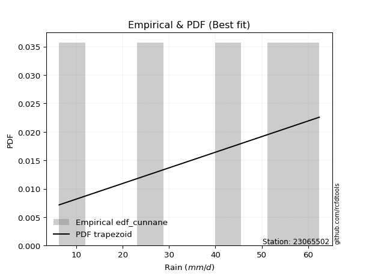</img>

</div>


### 12. EDF Adamowski (1981)

The Adamowski formula in hydrology refers to a specific plotting position formula used for estimating the non-parametric empirical distribution of hydrological events (like flood peaks) to calculate their return periods. This formula provides an alternative to traditional parametric methods (like the Gumbel or Log Pearson Type III distributions). 

<div align="center">


$P=(m-0.25)/(n+0.5)$


</div>


**12.1. Empirical values**

<div align="center">

|                | 0                   | 1                  | 2             | 3                  | 4                  |
|:---------------|:--------------------|:-------------------|:--------------|:-------------------|:-------------------|
| date           | 2020                | 2016               | 2017          | 2018               | 2019               |
| x              | 6.3                 | 25.8               | 41.7          | 54.1               | 62.4               |
| m              | 1                   | 2                  | 3             | 4                  | 5                  |
| empirical_dist | edf_adamowski       | edf_adamowski      | edf_adamowski | edf_adamowski      | edf_adamowski      |
| empirical      | 0.13636363636363635 | 0.3181818181818182 | 0.5           | 0.6818181818181818 | 0.8636363636363636 |
| empirical_tr   | 1.1578947368421053  | 1.4666666666666666 | 2.0           | 3.1428571428571423 | 7.333333333333334  |

</div>


**12.2. Kolmogorov-Smirnov fit test (sorted by Δ)**


<div align="center">

|                | 0                  | 1                   | 2                   | 3                   | 4                   | 5                   | 6                   | 7                   | 8                  | 9                   | 10                  | 11                  | 12                  | 13                  | 14                  | 15                  | 16                  | 17                  | 18                  | 19                  | 20                  | 21                  | 22                  | 23                  | 24                  | 25                  | 26                  | 27                  | 28                  | 29                  | 30                  | 31                  | 32                  | 33                 | 34                  | 35                  | 36                  | 37                  | 38                  | 39                 | 40                  | 41                  | 42                  | 43                 | 44                 | 45                  | 46                  | 47                  | 48                  | 49                 | 50                  | 51                  | 52                 | 53                  | 54                  | 55                 | 56                 | 57                  | 58                  | 59                  | 60                 | 61                 | 62                 | 63                  | 64                  | 65                  | 66                  | 67                  | 68                  | 69                  | 70                  | 71                 | 72                  | 73                  | 74                 | 75                  | 76                  | 77                  | 78                  | 79                 | 80                  | 81                  | 82                 | 83                  | 84                  | 85                  | 86                  | 87                  | 88                  | 89                  | 90                  | 91                 | 92                  | 93                  | 94                 | 95                  | 96                  | 97                  | 98                  | 99                  | 100                 | 101                | 102                 | 103                 | 104                 | 105                 | 106                | 107                | 108                | 109                 | 110                 | 111                 | 112                 | 113                 | 114                 | 115                 | 116                 | 117                 | 118                 | 119                 | 120                 | 121                 | 122                 | 123                | 124                 | 125                | 126                 | 127                 | 128                 | 129                 | 130                | 131                | 132                | 133                 | 134                 | 135                 | 136                 | 137                | 138                 | 139                 | 140                 | 141                 | 142                | 143                 | 144                | 145                 | 146                 | 147                 | 148                 | 149                | 150                | 151                | 152                | 153                | 154                | 155                | 156                | 157                | 158                | 159                |
|:---------------|:-------------------|:--------------------|:--------------------|:--------------------|:--------------------|:--------------------|:--------------------|:--------------------|:-------------------|:--------------------|:--------------------|:--------------------|:--------------------|:--------------------|:--------------------|:--------------------|:--------------------|:--------------------|:--------------------|:--------------------|:--------------------|:--------------------|:--------------------|:--------------------|:--------------------|:--------------------|:--------------------|:--------------------|:--------------------|:--------------------|:--------------------|:--------------------|:--------------------|:-------------------|:--------------------|:--------------------|:--------------------|:--------------------|:--------------------|:-------------------|:--------------------|:--------------------|:--------------------|:-------------------|:-------------------|:--------------------|:--------------------|:--------------------|:--------------------|:-------------------|:--------------------|:--------------------|:-------------------|:--------------------|:--------------------|:-------------------|:-------------------|:--------------------|:--------------------|:--------------------|:-------------------|:-------------------|:-------------------|:--------------------|:--------------------|:--------------------|:--------------------|:--------------------|:--------------------|:--------------------|:--------------------|:-------------------|:--------------------|:--------------------|:-------------------|:--------------------|:--------------------|:--------------------|:--------------------|:-------------------|:--------------------|:--------------------|:-------------------|:--------------------|:--------------------|:--------------------|:--------------------|:--------------------|:--------------------|:--------------------|:--------------------|:-------------------|:--------------------|:--------------------|:-------------------|:--------------------|:--------------------|:--------------------|:--------------------|:--------------------|:--------------------|:-------------------|:--------------------|:--------------------|:--------------------|:--------------------|:-------------------|:-------------------|:-------------------|:--------------------|:--------------------|:--------------------|:--------------------|:--------------------|:--------------------|:--------------------|:--------------------|:--------------------|:--------------------|:--------------------|:--------------------|:--------------------|:--------------------|:-------------------|:--------------------|:-------------------|:--------------------|:--------------------|:--------------------|:--------------------|:-------------------|:-------------------|:-------------------|:--------------------|:--------------------|:--------------------|:--------------------|:-------------------|:--------------------|:--------------------|:--------------------|:--------------------|:-------------------|:--------------------|:-------------------|:--------------------|:--------------------|:--------------------|:--------------------|:-------------------|:-------------------|:-------------------|:-------------------|:-------------------|:-------------------|:-------------------|:-------------------|:-------------------|:-------------------|:-------------------|
| station        | 23065502           | 23065502            | 23065502            | 23065502            | 23065502            | 23065502            | 23065502            | 23065502            | 23065502           | 23065502            | 23065502            | 23065502            | 23065502            | 23065502            | 23065502            | 23065502            | 23065502            | 23065502            | 23065502            | 23065502            | 23065502            | 23065502            | 23065502            | 23065502            | 23065502            | 23065502            | 23065502            | 23065502            | 23065502            | 23065502            | 23065502            | 23065502            | 23065502            | 23065502           | 23065502            | 23065502            | 23065502            | 23065502            | 23065502            | 23065502           | 23065502            | 23065502            | 23065502            | 23065502           | 23065502           | 23065502            | 23065502            | 23065502            | 23065502            | 23065502           | 23065502            | 23065502            | 23065502           | 23065502            | 23065502            | 23065502           | 23065502           | 23065502            | 23065502            | 23065502            | 23065502           | 23065502           | 23065502           | 23065502            | 23065502            | 23065502            | 23065502            | 23065502            | 23065502            | 23065502            | 23065502            | 23065502           | 23065502            | 23065502            | 23065502           | 23065502            | 23065502            | 23065502            | 23065502            | 23065502           | 23065502            | 23065502            | 23065502           | 23065502            | 23065502            | 23065502            | 23065502            | 23065502            | 23065502            | 23065502            | 23065502            | 23065502           | 23065502            | 23065502            | 23065502           | 23065502            | 23065502            | 23065502            | 23065502            | 23065502            | 23065502            | 23065502           | 23065502            | 23065502            | 23065502            | 23065502            | 23065502           | 23065502           | 23065502           | 23065502            | 23065502            | 23065502            | 23065502            | 23065502            | 23065502            | 23065502            | 23065502            | 23065502            | 23065502            | 23065502            | 23065502            | 23065502            | 23065502            | 23065502           | 23065502            | 23065502           | 23065502            | 23065502            | 23065502            | 23065502            | 23065502           | 23065502           | 23065502           | 23065502            | 23065502            | 23065502            | 23065502            | 23065502           | 23065502            | 23065502            | 23065502            | 23065502            | 23065502           | 23065502            | 23065502           | 23065502            | 23065502            | 23065502            | 23065502            | 23065502           | 23065502           | 23065502           | 23065502           | 23065502           | 23065502           | 23065502           | 23065502           | 23065502           | 23065502           | 23065502           |
| empirical_dist | edf_adamowski      | edf_adamowski       | edf_adamowski       | edf_adamowski       | edf_adamowski       | edf_adamowski       | edf_adamowski       | edf_adamowski       | edf_adamowski      | edf_adamowski       | edf_adamowski       | edf_adamowski       | edf_adamowski       | edf_adamowski       | edf_adamowski       | edf_adamowski       | edf_adamowski       | edf_adamowski       | edf_adamowski       | edf_adamowski       | edf_adamowski       | edf_adamowski       | edf_adamowski       | edf_adamowski       | edf_adamowski       | edf_adamowski       | edf_adamowski       | edf_adamowski       | edf_adamowski       | edf_adamowski       | edf_adamowski       | edf_adamowski       | edf_adamowski       | edf_adamowski      | edf_adamowski       | edf_adamowski       | edf_adamowski       | edf_adamowski       | edf_adamowski       | edf_adamowski      | edf_adamowski       | edf_adamowski       | edf_adamowski       | edf_adamowski      | edf_adamowski      | edf_adamowski       | edf_adamowski       | edf_adamowski       | edf_adamowski       | edf_adamowski      | edf_adamowski       | edf_adamowski       | edf_adamowski      | edf_adamowski       | edf_adamowski       | edf_adamowski      | edf_adamowski      | edf_adamowski       | edf_adamowski       | edf_adamowski       | edf_adamowski      | edf_adamowski      | edf_adamowski      | edf_adamowski       | edf_adamowski       | edf_adamowski       | edf_adamowski       | edf_adamowski       | edf_adamowski       | edf_adamowski       | edf_adamowski       | edf_adamowski      | edf_adamowski       | edf_adamowski       | edf_adamowski      | edf_adamowski       | edf_adamowski       | edf_adamowski       | edf_adamowski       | edf_adamowski      | edf_adamowski       | edf_adamowski       | edf_adamowski      | edf_adamowski       | edf_adamowski       | edf_adamowski       | edf_adamowski       | edf_adamowski       | edf_adamowski       | edf_adamowski       | edf_adamowski       | edf_adamowski      | edf_adamowski       | edf_adamowski       | edf_adamowski      | edf_adamowski       | edf_adamowski       | edf_adamowski       | edf_adamowski       | edf_adamowski       | edf_adamowski       | edf_adamowski      | edf_adamowski       | edf_adamowski       | edf_adamowski       | edf_adamowski       | edf_adamowski      | edf_adamowski      | edf_adamowski      | edf_adamowski       | edf_adamowski       | edf_adamowski       | edf_adamowski       | edf_adamowski       | edf_adamowski       | edf_adamowski       | edf_adamowski       | edf_adamowski       | edf_adamowski       | edf_adamowski       | edf_adamowski       | edf_adamowski       | edf_adamowski       | edf_adamowski      | edf_adamowski       | edf_adamowski      | edf_adamowski       | edf_adamowski       | edf_adamowski       | edf_adamowski       | edf_adamowski      | edf_adamowski      | edf_adamowski      | edf_adamowski       | edf_adamowski       | edf_adamowski       | edf_adamowski       | edf_adamowski      | edf_adamowski       | edf_adamowski       | edf_adamowski       | edf_adamowski       | edf_adamowski      | edf_adamowski       | edf_adamowski      | edf_adamowski       | edf_adamowski       | edf_adamowski       | edf_adamowski       | edf_adamowski      | edf_adamowski      | edf_adamowski      | edf_adamowski      | edf_adamowski      | edf_adamowski      | edf_adamowski      | edf_adamowski      | edf_adamowski      | edf_adamowski      | edf_adamowski      |
| p_dist         | trapezoid          | anglit              | semicircular        | gengamma            | loglevy_l           | ksone               | weibull_min         | logtrapezoid        | johnsonsu          | gompertz            | argus               | pearson3            | invgauss            | logpearson3         | erlang              | betaprime           | nct                 | t                   | exponnorm           | f                   | truncnorm           | norm                | crystalball         | fatiguelife         | rice                | gumbel_l            | gamma               | maxwell             | foldnorm            | rayleigh            | invgamma            | loggumbel_l         | dweibull            | logweibull_min     | logloglaplace       | ncf                 | loggennorm          | logdweibull         | logmielke           | levy_l             | genexpon            | burr                | cosine              | exponweib          | logistic           | dgamma              | logburr12           | logsemicircular     | kstwobign           | logburr            | mielke              | logdgamma           | triang             | skewnorm            | logweibull_max      | loggompertz        | beta               | wrapcauchy          | genpareto           | logvonmises_line    | genextreme         | gausshyper         | loggenextreme      | genhalflogistic     | halfnorm            | arcsine             | loganglit           | logargus            | gumbel_r            | hypsecant           | logloggamma         | loggenpareto       | logarcsine          | lomax               | exponpow           | logbetaprime        | kappa3              | logerlang           | logncf              | laplace            | tukeylambda         | logfatiguelife      | lognct             | logf                | logcrystalball      | logexponnorm        | lognorm             | logt                | kappa4              | logrice             | halflogistic        | invweibull         | loggamma            | loggamma            | moyal              | logbeta             | logfoldnorm         | loginvgauss         | uniform             | vonmises_line       | loginvweibull       | loginvgamma        | loglogistic         | logalpha            | logmaxwell          | gennorm             | lograyleigh        | loggausshyper      | loghypsecant       | loggenhalflogistic  | logwrapcauchy       | logcosine           | loghalfnorm         | bradford            | logkstwobign        | truncweibull_min    | loggenexpon         | logskewnorm         | loggumbel_r         | loglaplace          | loglaplace          | halfgennorm         | wald                | loghalflogistic    | logtriang           | logmoyal           | truncexpon          | logjohnsonsb        | burr12              | loglomax            | logksone           | alpha              | logwald            | logrdist            | johnsonsb           | loghalfgennorm      | logtukeylambda      | logtruncnorm       | lognakagami         | logkappa3           | loguniform          | logkappa4           | nakagami           | logtruncexpon       | logbradford        | logexponweib        | logtruncweibull_min | logjohnsonsu        | loggengamma         | logexponpow        | weibull_max        | powerlaw           | truncpareto        | logpowerlaw        | logtruncpareto     | rdist              | genlogistic        | loggenlogistic     | logvonmises        | vonmises           |
| delta          | 0.0676156199519351 | 0.07752511374176307 | 0.08033071945107484 | 0.08270569344690537 | 0.08894565739763904 | 0.09228222996790507 | 0.09228741278631036 | 0.09294867339584745 | 0.0946879338681238 | 0.09579767923075322 | 0.09623578494376839 | 0.09985689644028606 | 0.10233842271080962 | 0.10403156086924958 | 0.10470005752788192 | 0.10520963497206925 | 0.10549234641766891 | 0.10563513381282974 | 0.10563569485361168 | 0.10563776311094142 | 0.10563932046401436 | 0.10563936920234218 | 0.10563938125533545 | 0.10572966399019268 | 0.10598274277436115 | 0.10840605983202112 | 0.10868211887666035 | 0.11025314782668505 | 0.11252853388305895 | 0.11274837176395648 | 0.11338535492713075 | 0.11366108632087057 | 0.11380331825183232 | 0.1194397975808229 | 0.11956879030487118 | 0.11971142665732093 | 0.12034447411356819 | 0.12238396483340386 | 0.12279294657801199 | 0.1232482133901388 | 0.12353847250135352 | 0.12388156558935104 | 0.12391187661586867 | 0.1250496029211816 | 0.1276783123287838 | 0.12776254531388764 | 0.12856285931148448 | 0.12987163885207242 | 0.13197595957868558 | 0.1326459829549319 | 0.13295839810588583 | 0.13337310497029736 | 0.134541478672772  | 0.13636323871283706 | 0.13636356707933972 | 0.1363636333086814 | 0.1363636336013837 | 0.13636363612978797 | 0.13636363616606806 | 0.13636363636217488 | 0.1363636363633397 | 0.1363636363634656 | 0.1363636363636206 | 0.13636363636363502 | 0.13636363636363635 | 0.13636363636363635 | 0.13862371076140423 | 0.13959136423957597 | 0.14073501324918403 | 0.14103634908940765 | 0.14317141495412278 | 0.1451522859606424 | 0.14518829556355206 | 0.15234395623744634 | 0.1533044972048876 | 0.15343262186984008 | 0.15451877178353157 | 0.15560989459485808 | 0.15605889001696527 | 0.1563450683371823 | 0.15883619791057224 | 0.15907492102458476 | 0.1591965004042626 | 0.15925690234918433 | 0.15943119351774637 | 0.15943163962214202 | 0.15943195085054107 | 0.15943284320058015 | 0.15982257448756998 | 0.16327570206908382 | 0.16347974931519427 | 0.1637504351013025 | 0.16469768557741504 | 0.16469768557741504 | 0.1647673441277675 | 0.16547743468446974 | 0.16579597306179972 | 0.16920931148922447 | 0.17023172905525852 | 0.17023273953586093 | 0.17236638687841022 | 0.172845546201019  | 0.17815685482915866 | 0.17819688528279343 | 0.18004568608384441 | 0.18181818181818182 | 0.1862099466574365 | 0.1892844042455466 | 0.1925172761519207 | 0.20003939565597462 | 0.20212126510680756 | 0.20392658417693887 | 0.20424728530273684 | 0.20719620007792972 | 0.20795929050149892 | 0.21014278709159373 | 0.21158238227580112 | 0.21782619662391212 | 0.21787114142824904 | 0.22036395603234715 | 0.22036395603234715 | 0.22324606991604917 | 0.23150108192042151 | 0.232200382979464  | 0.23485319320888198 | 0.2371107737248317 | 0.24378627192545033 | 0.26098043766825885 | 0.27123783477950386 | 0.27356670489212703 | 0.2775135013792552 | 0.2840884471371507 | 0.291909179027938  | 0.30405382274715426 | 0.30676033848806683 | 0.31075119602269935 | 0.31671811570210906 | 0.3181756995559457 | 0.31818181818177577 | 0.32361881052415165 | 0.32422093456678147 | 0.33119194790838047 | 0.3643422964712075 | 0.37490599167486455 | 0.3788700634479241 | 0.39645745109497166 | 0.4094579508307385  | 0.41994841959594575 | 0.44074964969384595 | 0.4753598952247768 | 0.5307335181365014 | 0.5591181698293437 | 0.572944161428133  | 0.6192126836840421 | 0.6315329746594027 | 0.6818181816818161 | 0.6818181818181818 | 0.6818181818181818 | 1.1122382549957353 | 9.727561975898894  |
| deltao         | 0.5865427407550001 | 0.5865427407550001  | 0.5865427407550001  | 0.5865427407550001  | 0.5865427407550001  | 0.5865427407550001  | 0.5865427407550001  | 0.5865427407550001  | 0.5865427407550001 | 0.5865427407550001  | 0.5865427407550001  | 0.5865427407550001  | 0.5865427407550001  | 0.5865427407550001  | 0.5865427407550001  | 0.5865427407550001  | 0.5865427407550001  | 0.5865427407550001  | 0.5865427407550001  | 0.5865427407550001  | 0.5865427407550001  | 0.5865427407550001  | 0.5865427407550001  | 0.5865427407550001  | 0.5865427407550001  | 0.5865427407550001  | 0.5865427407550001  | 0.5865427407550001  | 0.5865427407550001  | 0.5865427407550001  | 0.5865427407550001  | 0.5865427407550001  | 0.5865427407550001  | 0.5865427407550001 | 0.5865427407550001  | 0.5865427407550001  | 0.5865427407550001  | 0.5865427407550001  | 0.5865427407550001  | 0.5865427407550001 | 0.5865427407550001  | 0.5865427407550001  | 0.5865427407550001  | 0.5865427407550001 | 0.5865427407550001 | 0.5865427407550001  | 0.5865427407550001  | 0.5865427407550001  | 0.5865427407550001  | 0.5865427407550001 | 0.5865427407550001  | 0.5865427407550001  | 0.5865427407550001 | 0.5865427407550001  | 0.5865427407550001  | 0.5865427407550001 | 0.5865427407550001 | 0.5865427407550001  | 0.5865427407550001  | 0.5865427407550001  | 0.5865427407550001 | 0.5865427407550001 | 0.5865427407550001 | 0.5865427407550001  | 0.5865427407550001  | 0.5865427407550001  | 0.5865427407550001  | 0.5865427407550001  | 0.5865427407550001  | 0.5865427407550001  | 0.5865427407550001  | 0.5865427407550001 | 0.5865427407550001  | 0.5865427407550001  | 0.5865427407550001 | 0.5865427407550001  | 0.5865427407550001  | 0.5865427407550001  | 0.5865427407550001  | 0.5865427407550001 | 0.5865427407550001  | 0.5865427407550001  | 0.5865427407550001 | 0.5865427407550001  | 0.5865427407550001  | 0.5865427407550001  | 0.5865427407550001  | 0.5865427407550001  | 0.5865427407550001  | 0.5865427407550001  | 0.5865427407550001  | 0.5865427407550001 | 0.5865427407550001  | 0.5865427407550001  | 0.5865427407550001 | 0.5865427407550001  | 0.5865427407550001  | 0.5865427407550001  | 0.5865427407550001  | 0.5865427407550001  | 0.5865427407550001  | 0.5865427407550001 | 0.5865427407550001  | 0.5865427407550001  | 0.5865427407550001  | 0.5865427407550001  | 0.5865427407550001 | 0.5865427407550001 | 0.5865427407550001 | 0.5865427407550001  | 0.5865427407550001  | 0.5865427407550001  | 0.5865427407550001  | 0.5865427407550001  | 0.5865427407550001  | 0.5865427407550001  | 0.5865427407550001  | 0.5865427407550001  | 0.5865427407550001  | 0.5865427407550001  | 0.5865427407550001  | 0.5865427407550001  | 0.5865427407550001  | 0.5865427407550001 | 0.5865427407550001  | 0.5865427407550001 | 0.5865427407550001  | 0.5865427407550001  | 0.5865427407550001  | 0.5865427407550001  | 0.5865427407550001 | 0.5865427407550001 | 0.5865427407550001 | 0.5865427407550001  | 0.5865427407550001  | 0.5865427407550001  | 0.5865427407550001  | 0.5865427407550001 | 0.5865427407550001  | 0.5865427407550001  | 0.5865427407550001  | 0.5865427407550001  | 0.5865427407550001 | 0.5865427407550001  | 0.5865427407550001 | 0.5865427407550001  | 0.5865427407550001  | 0.5865427407550001  | 0.5865427407550001  | 0.5865427407550001 | 0.5865427407550001 | 0.5865427407550001 | 0.5865427407550001 | 0.5865427407550001 | 0.5865427407550001 | 0.5865427407550001 | 0.5865427407550001 | 0.5865427407550001 | 0.5865427407550001 | 0.5865427407550001 |
| eval           | Δo > Δ             | Δo > Δ              | Δo > Δ              | Δo > Δ              | Δo > Δ              | Δo > Δ              | Δo > Δ              | Δo > Δ              | Δo > Δ             | Δo > Δ              | Δo > Δ              | Δo > Δ              | Δo > Δ              | Δo > Δ              | Δo > Δ              | Δo > Δ              | Δo > Δ              | Δo > Δ              | Δo > Δ              | Δo > Δ              | Δo > Δ              | Δo > Δ              | Δo > Δ              | Δo > Δ              | Δo > Δ              | Δo > Δ              | Δo > Δ              | Δo > Δ              | Δo > Δ              | Δo > Δ              | Δo > Δ              | Δo > Δ              | Δo > Δ              | Δo > Δ             | Δo > Δ              | Δo > Δ              | Δo > Δ              | Δo > Δ              | Δo > Δ              | Δo > Δ             | Δo > Δ              | Δo > Δ              | Δo > Δ              | Δo > Δ             | Δo > Δ             | Δo > Δ              | Δo > Δ              | Δo > Δ              | Δo > Δ              | Δo > Δ             | Δo > Δ              | Δo > Δ              | Δo > Δ             | Δo > Δ              | Δo > Δ              | Δo > Δ             | Δo > Δ             | Δo > Δ              | Δo > Δ              | Δo > Δ              | Δo > Δ             | Δo > Δ             | Δo > Δ             | Δo > Δ              | Δo > Δ              | Δo > Δ              | Δo > Δ              | Δo > Δ              | Δo > Δ              | Δo > Δ              | Δo > Δ              | Δo > Δ             | Δo > Δ              | Δo > Δ              | Δo > Δ             | Δo > Δ              | Δo > Δ              | Δo > Δ              | Δo > Δ              | Δo > Δ             | Δo > Δ              | Δo > Δ              | Δo > Δ             | Δo > Δ              | Δo > Δ              | Δo > Δ              | Δo > Δ              | Δo > Δ              | Δo > Δ              | Δo > Δ              | Δo > Δ              | Δo > Δ             | Δo > Δ              | Δo > Δ              | Δo > Δ             | Δo > Δ              | Δo > Δ              | Δo > Δ              | Δo > Δ              | Δo > Δ              | Δo > Δ              | Δo > Δ             | Δo > Δ              | Δo > Δ              | Δo > Δ              | Δo > Δ              | Δo > Δ             | Δo > Δ             | Δo > Δ             | Δo > Δ              | Δo > Δ              | Δo > Δ              | Δo > Δ              | Δo > Δ              | Δo > Δ              | Δo > Δ              | Δo > Δ              | Δo > Δ              | Δo > Δ              | Δo > Δ              | Δo > Δ              | Δo > Δ              | Δo > Δ              | Δo > Δ             | Δo > Δ              | Δo > Δ             | Δo > Δ              | Δo > Δ              | Δo > Δ              | Δo > Δ              | Δo > Δ             | Δo > Δ             | Δo > Δ             | Δo > Δ              | Δo > Δ              | Δo > Δ              | Δo > Δ              | Δo > Δ             | Δo > Δ              | Δo > Δ              | Δo > Δ              | Δo > Δ              | Δo > Δ             | Δo > Δ              | Δo > Δ             | Δo > Δ              | Δo > Δ              | Δo > Δ              | Δo > Δ              | Δo > Δ             | Δo > Δ             | Δo > Δ             | Δo > Δ             | Δo <= Δ            | Δo <= Δ            | Δo <= Δ            | Δo <= Δ            | Δo <= Δ            | Δo <= Δ            | Δo <= Δ            |
| fit            | 1                  | 1                   | 1                   | 1                   | 1                   | 1                   | 1                   | 1                   | 1                  | 1                   | 1                   | 1                   | 1                   | 1                   | 1                   | 1                   | 1                   | 1                   | 1                   | 1                   | 1                   | 1                   | 1                   | 1                   | 1                   | 1                   | 1                   | 1                   | 1                   | 1                   | 1                   | 1                   | 1                   | 1                  | 1                   | 1                   | 1                   | 1                   | 1                   | 1                  | 1                   | 1                   | 1                   | 1                  | 1                  | 1                   | 1                   | 1                   | 1                   | 1                  | 1                   | 1                   | 1                  | 1                   | 1                   | 1                  | 1                  | 1                   | 1                   | 1                   | 1                  | 1                  | 1                  | 1                   | 1                   | 1                   | 1                   | 1                   | 1                   | 1                   | 1                   | 1                  | 1                   | 1                   | 1                  | 1                   | 1                   | 1                   | 1                   | 1                  | 1                   | 1                   | 1                  | 1                   | 1                   | 1                   | 1                   | 1                   | 1                   | 1                   | 1                   | 1                  | 1                   | 1                   | 1                  | 1                   | 1                   | 1                   | 1                   | 1                   | 1                   | 1                  | 1                   | 1                   | 1                   | 1                   | 1                  | 1                  | 1                  | 1                   | 1                   | 1                   | 1                   | 1                   | 1                   | 1                   | 1                   | 1                   | 1                   | 1                   | 1                   | 1                   | 1                   | 1                  | 1                   | 1                  | 1                   | 1                   | 1                   | 1                   | 1                  | 1                  | 1                  | 1                   | 1                   | 1                   | 1                   | 1                  | 1                   | 1                   | 1                   | 1                   | 1                  | 1                   | 1                  | 1                   | 1                   | 1                   | 1                   | 1                  | 1                  | 1                  | 1                  | 0                  | 0                  | 0                  | 0                  | 0                  | 0                  | 0                  |
| n              | 5                  | 5                   | 5                   | 5                   | 5                   | 5                   | 5                   | 5                   | 5                  | 5                   | 5                   | 5                   | 5                   | 5                   | 5                   | 5                   | 5                   | 5                   | 5                   | 5                   | 5                   | 5                   | 5                   | 5                   | 5                   | 5                   | 5                   | 5                   | 5                   | 5                   | 5                   | 5                   | 5                   | 5                  | 5                   | 5                   | 5                   | 5                   | 5                   | 5                  | 5                   | 5                   | 5                   | 5                  | 5                  | 5                   | 5                   | 5                   | 5                   | 5                  | 5                   | 5                   | 5                  | 5                   | 5                   | 5                  | 5                  | 5                   | 5                   | 5                   | 5                  | 5                  | 5                  | 5                   | 5                   | 5                   | 5                   | 5                   | 5                   | 5                   | 5                   | 5                  | 5                   | 5                   | 5                  | 5                   | 5                   | 5                   | 5                   | 5                  | 5                   | 5                   | 5                  | 5                   | 5                   | 5                   | 5                   | 5                   | 5                   | 5                   | 5                   | 5                  | 5                   | 5                   | 5                  | 5                   | 5                   | 5                   | 5                   | 5                   | 5                   | 5                  | 5                   | 5                   | 5                   | 5                   | 5                  | 5                  | 5                  | 5                   | 5                   | 5                   | 5                   | 5                   | 5                   | 5                   | 5                   | 5                   | 5                   | 5                   | 5                   | 5                   | 5                   | 5                  | 5                   | 5                  | 5                   | 5                   | 5                   | 5                   | 5                  | 5                  | 5                  | 5                   | 5                   | 5                   | 5                   | 5                  | 5                   | 5                   | 5                   | 5                   | 5                  | 5                   | 5                  | 5                   | 5                   | 5                   | 5                   | 5                  | 5                  | 5                  | 5                  | 5                  | 5                  | 5                  | 5                  | 5                  | 5                  | 5                  |
| best_fit       | 1                  | 0                   | 0                   | 0                   | 0                   | 0                   | 0                   | 0                   | 0                  | 0                   | 0                   | 0                   | 0                   | 0                   | 0                   | 0                   | 0                   | 0                   | 0                   | 0                   | 0                   | 0                   | 0                   | 0                   | 0                   | 0                   | 0                   | 0                   | 0                   | 0                   | 0                   | 0                   | 0                   | 0                  | 0                   | 0                   | 0                   | 0                   | 0                   | 0                  | 0                   | 0                   | 0                   | 0                  | 0                  | 0                   | 0                   | 0                   | 0                   | 0                  | 0                   | 0                   | 0                  | 0                   | 0                   | 0                  | 0                  | 0                   | 0                   | 0                   | 0                  | 0                  | 0                  | 0                   | 0                   | 0                   | 0                   | 0                   | 0                   | 0                   | 0                   | 0                  | 0                   | 0                   | 0                  | 0                   | 0                   | 0                   | 0                   | 0                  | 0                   | 0                   | 0                  | 0                   | 0                   | 0                   | 0                   | 0                   | 0                   | 0                   | 0                   | 0                  | 0                   | 0                   | 0                  | 0                   | 0                   | 0                   | 0                   | 0                   | 0                   | 0                  | 0                   | 0                   | 0                   | 0                   | 0                  | 0                  | 0                  | 0                   | 0                   | 0                   | 0                   | 0                   | 0                   | 0                   | 0                   | 0                   | 0                   | 0                   | 0                   | 0                   | 0                   | 0                  | 0                   | 0                  | 0                   | 0                   | 0                   | 0                   | 0                  | 0                  | 0                  | 0                   | 0                   | 0                   | 0                   | 0                  | 0                   | 0                   | 0                   | 0                   | 0                  | 0                   | 0                  | 0                   | 0                   | 0                   | 0                   | 0                  | 0                  | 0                  | 0                  | 0                  | 0                  | 0                  | 0                  | 0                  | 0                  | 0                  |
| best_fit_sort  | 1                  | 2                   | 3                   | 4                   | 5                   | 6                   | 7                   | 8                   | 9                  | 10                  | 11                  | 12                  | 13                  | 14                  | 15                  | 16                  | 17                  | 18                  | 19                  | 20                  | 21                  | 22                  | 23                  | 24                  | 25                  | 26                  | 27                  | 28                  | 29                  | 30                  | 31                  | 32                  | 33                  | 34                 | 35                  | 36                  | 37                  | 38                  | 39                  | 40                 | 41                  | 42                  | 43                  | 44                 | 45                 | 46                  | 47                  | 48                  | 49                  | 50                 | 51                  | 52                  | 53                 | 54                  | 55                  | 56                 | 57                 | 58                  | 59                  | 60                  | 61                 | 62                 | 63                 | 64                  | 65                  | 66                  | 67                  | 68                  | 69                  | 70                  | 71                  | 72                 | 73                  | 74                  | 75                 | 76                  | 77                  | 78                  | 79                  | 80                 | 81                  | 82                  | 83                 | 84                  | 85                  | 86                  | 87                  | 88                  | 89                  | 90                  | 91                  | 92                 | 93                  | 94                  | 95                 | 96                  | 97                  | 98                  | 99                  | 100                 | 101                 | 102                | 103                 | 104                 | 105                 | 106                 | 107                | 108                | 109                | 110                 | 111                 | 112                 | 113                 | 114                 | 115                 | 116                 | 117                 | 118                 | 119                 | 120                 | 121                 | 122                 | 123                 | 124                | 125                 | 126                | 127                 | 128                 | 129                 | 130                 | 131                | 132                | 133                | 134                 | 135                 | 136                 | 137                 | 138                | 139                 | 140                 | 141                 | 142                 | 143                | 144                 | 145                | 146                 | 147                 | 148                 | 149                 | 150                | 151                | 152                | 153                | 154                | 155                | 156                | 157                | 158                | 159                | 160                |

</div>


**12.3. Best fit**

<div align="center">

|   id |   station | empirical_dist   | p_dist    |     delta |   deltao | eval   |   fit |   n |   best_fit |   best_fit_sort |
|-----:|----------:|:-----------------|:----------|----------:|---------:|:-------|------:|----:|-----------:|----------------:|
|    0 |  23065502 | edf_adamowski    | trapezoid | 0.0676156 | 0.586543 | Δo > Δ |     1 |   5 |          1 |               1 |

</div>


<div align="center">

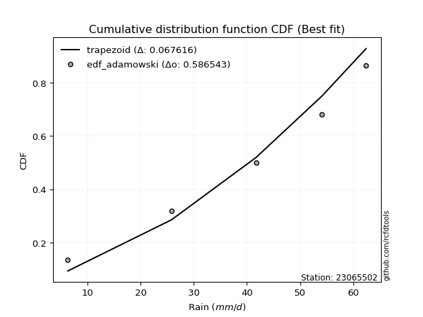</img></img>

</div>


## C. Best fit & Estimate extreme values for specific return periods - Tr

Best fit in probability distribution analysis means finding the theoretical distribution (like Normal, Poisson, Exponential, etc.) that most accurately mirrors your real-world data´s patterns (shape, center, spread) for better predictions, using methods like visual checks (Q-Q plots), goodness-of-fit tests (Kolmogorov-Smirnov, Chi-Squared), and information criteria (AIC) to score and select the simplest, most representative model.


### 1. Best fit (ordered by delta Δ)

:file_folder:Table: [bestfit_23065502.csv](table/bestfit_23065502.csv)

<div align="center">

|   id |   station | empirical_dist   | p_dist       |     delta |   deltao | eval   |   fit |   n |   best_fit |   best_fit_sort |
|-----:|----------:|:-----------------|:-------------|----------:|---------:|:-------|------:|----:|-----------:|----------------:|
|    0 |  23065502 | edf_hazen        | trapezoid    | 0.0494338 | 0.586543 | Δo > Δ |     1 |   5 |          1 |               1 |
|    1 |  23065502 | edf_gringorten   | trapezoid    | 0.0541213 | 0.586543 | Δo > Δ |     1 |   5 |          1 |               2 |
|    2 |  23065502 | edf_cunnane      | trapezoid    | 0.0571261 | 0.586543 | Δo > Δ |     1 |   5 |          1 |               3 |
|    3 |  23065502 | edf_blom         | trapezoid    | 0.0589576 | 0.586543 | Δo > Δ |     1 |   5 |          1 |               4 |
|    4 |  23065502 | edf_tukey        | trapezoid    | 0.0619338 | 0.586543 | Δo > Δ |     1 |   5 |          1 |               5 |
|    5 |  23065502 | edf_filliben     | trapezoid    | 0.0630405 | 0.586543 | Δo > Δ |     1 |   5 |          1 |               6 |
|    6 |  23065502 | edf_california   | loggenpareto | 0.0633341 | 0.586543 | Δo > Δ |     1 |   5 |          1 |               7 |
|    7 |  23065502 | edf_jenkinson    | trapezoid    | 0.0635602 | 0.586543 | Δo > Δ |     1 |   5 |          1 |               8 |
|    8 |  23065502 | edf_beard        | trapezoid    | 0.0635602 | 0.586543 | Δo > Δ |     1 |   5 |          1 |               9 |
|    9 |  23065502 | edf_chegodayev   | trapezoid    | 0.0642486 | 0.586543 | Δo > Δ |     1 |   5 |          1 |              10 |
|   10 |  23065502 | edf_adamowski    | trapezoid    | 0.0676156 | 0.586543 | Δo > Δ |     1 |   5 |          1 |              11 |
|   11 |  23065502 | edf_weibull      | trapezoid    | 0.0940009 | 0.586543 | Δo > Δ |     1 |   5 |          1 |              12 |

</div>


### 2. Extreme values and % difference analysis

In hydrology, a return period (or recurrence interval $Tr$) is the statistical average time between extreme events like floods or droughts of a specific magnitude, indicating how rare an event is, with a 100-year flood, for example, having a 1% chance of occurring in any given year, not that it happens exactly every century. It is a key tool for infrastructure design (like bridges or dams) and risk assessment, calculated from historical data to determine the probability of future events, although it is important to remember it is statistical average, and events can cluster or be missed.

The extreme value porcentage difference is evaluated as $pdiff = 1 - (ETrBf / ETr) * 100$, where _ETrBf_ correspond to the bestfit extreme value for a specific recurrence interval and _ETr_ correspond to the extreme value for one of the most used PDFsused in hydrology.

> risk_rate: assuming the return period as the project useful life.

:file_folder:Table: [extreme_23065502.csv](table/extreme_23065502.csv), all PDFs.  
:file_folder:Table: [extremepdiff_23065502.csv](table/extremepdiff_23065502.csv), % difference between bestfit and most used PDFs in Hydrology.

<div align="center">

Extreme values table for only best fit PDFs
|   id |      tr |   prob_l |     prob_g |      alpha |   anglit |   arcsine |   argus |    beta |   betaprime |   bradford |    burr |   burr12 |   cosine |   crystalball |   dgamma |   dweibull |   erlang |   exponnorm |   exponpow |   exponweib |        f |   fatiguelife |   foldnorm |    gamma |   gausshyper |   genexpon |   genextreme |   gengamma |   genhalflogistic |   genlogistic |   gennorm |   genpareto |   gompertz |   gumbel_l |   gumbel_r |   halfgennorm |   halflogistic |   halfnorm |   hypsecant |   invgamma |   invgauss |   invweibull |   johnsonsb |   johnsonsu |   kappa3 |   kappa4 |   ksone |   kstwobign |   laplace |   levy_l |   loggamma |   logistic |   loglaplace |    lomax |   maxwell |   mielke |    moyal |   nakagami |      ncf |      nct |     norm |   pearson3 |   powerlaw |   rayleigh |    rdist |     rice |   semicircular |   skewnorm |        t |   trapezoid |   triang |   truncexpon |   truncnorm |   truncpareto |   truncweibull_min |   tukeylambda |   uniform |   vonmises |   vonmises_line |     wald |   weibull_max |   weibull_min |   wrapcauchy |   logalpha |   loganglit |   logarcsine |   logargus |   logbeta |   logbetaprime |   logbradford |   logburr |   logburr12 |   logcosine |   logcrystalball |   logdgamma |   logdweibull |   logerlang |   logexponnorm |      logexponpow |   logexponweib |     logf |   logfatiguelife |   logfoldnorm |   loggausshyper |   loggenexpon |   loggenextreme |   loggengamma |   loggenhalflogistic |   loggenlogistic |   loggennorm |   loggenpareto |   loggompertz |   loggumbel_l |   loggumbel_r |   loghalfgennorm |   loghalflogistic |   loghalfnorm |   loghypsecant |   loginvgamma |   loginvgauss |   loginvweibull |   logjohnsonsb |   logjohnsonsu |   logkappa3 |   logkappa4 |   logksone |   logkstwobign |   loglevy_l |   logloggamma |   loglogistic |   logloglaplace |         loglomax |   logmaxwell |   logmielke |   logmoyal |   lognakagami |   logncf |   lognct |   lognorm |   logpearson3 |   logpowerlaw |   lograyleigh |   logrdist |   logrice |   logsemicircular |   logskewnorm |     logt |   logtrapezoid |   logtriang |   logtruncexpon |   logtruncnorm |   logtruncpareto |   logtruncweibull_min |   logtukeylambda |   loguniform |   logvonmises |   logvonmises_line |    logwald |   logweibull_max |   logweibull_min |   logwrapcauchy |   station |   n |   risk_rate |
|-----:|--------:|---------:|-----------:|-----------:|---------:|----------:|--------:|--------:|------------:|-----------:|--------:|---------:|---------:|--------------:|---------:|-----------:|---------:|------------:|-----------:|------------:|---------:|--------------:|-----------:|---------:|-------------:|-----------:|-------------:|-----------:|------------------:|--------------:|----------:|------------:|-----------:|-----------:|-----------:|--------------:|---------------:|-----------:|------------:|-----------:|-----------:|-------------:|------------:|------------:|---------:|---------:|--------:|------------:|----------:|---------:|-----------:|-----------:|-------------:|---------:|----------:|---------:|---------:|-----------:|---------:|---------:|---------:|-----------:|-----------:|-----------:|---------:|---------:|---------------:|-----------:|---------:|------------:|---------:|-------------:|------------:|--------------:|-------------------:|--------------:|----------:|-----------:|----------------:|---------:|--------------:|--------------:|-------------:|-----------:|------------:|-------------:|-----------:|----------:|---------------:|--------------:|----------:|------------:|------------:|-----------------:|------------:|--------------:|------------:|---------------:|-----------------:|---------------:|---------:|-----------------:|--------------:|----------------:|--------------:|----------------:|--------------:|---------------------:|-----------------:|-------------:|---------------:|--------------:|--------------:|--------------:|-----------------:|------------------:|--------------:|---------------:|--------------:|--------------:|----------------:|---------------:|---------------:|------------:|------------:|-----------:|---------------:|------------:|--------------:|--------------:|----------------:|-----------------:|-------------:|------------:|-----------:|--------------:|---------:|---------:|----------:|--------------:|--------------:|--------------:|-----------:|----------:|------------------:|--------------:|---------:|---------------:|------------:|----------------:|---------------:|-----------------:|----------------------:|-----------------:|-------------:|--------------:|-------------------:|-----------:|-----------------:|-----------------:|----------------:|----------:|----:|------------:|
|    0 |    2    | 0.5      | 0.5        |    19.9276 |  38.06   |   38.06   | 42.1564 | 42.9287 |     37.6568 |    29.5517 | 38.3451 |  19.1516 |  36.9231 |       38.06   |  34.5418 |    34.482  |  37.5926 |     38.0602 |    31.628  |     42.5817 |  38.0223 |       38.0142 |    38.2674 |  37.3568 |      37.2269 |    34.0591 |      45.1126 |    43.5841 |           40.7983 |           inf |     34.35 |     42.3375 |    40.9187 |    41.3637 |    34.7563 |       22.7729 |        33.1139 |    33.9436 |     38.06   |    36.0161 |    36.1719 |      32.6936 |     61.8764 |     44.9855 |  34.877  |  34.5967 | 38.06   |     33.624  |   38.06   |  50.1265 |    28.8124 |    38.06   |      29.6412 |  29.4481 |   36.3401 | -1.79159 |  33.6898 |    25.8522 |  34.4594 |  38.0586 |  38.06   |    39.3172 |    6.50842 |    35.7301 |  1.83925 |  37.155  |        38.06   |    41.1031 |  38.0602 |     40.5693 |  41.1721 |      25.9113 |     38.06   |       7.83388 |            28.9727 |       34.3529 |   34.35   |  -0.747812 |         34.3481 |  31.5413 |       61.8465 |       41.7085 |      34.35   |    27.5092 |     29.6412 |      29.6411 |    37.3185 |   52.6519 |        29.8161 |       16.0331 |   37.3926 |     33.9232 |     26.1858 |          29.6412 |     41.7    |       41.7    |     29.2159 |        29.6413 |     6.42022      | 1185.87        |  29.6543 |          29.6596 |       29.871  |         26.6425 |       23.8539 |         41.3279 |       8.71662 |              28.2975 |              inf |      41.7    |        29.7424 |       33.4696 |       33.9752 |       25.86   |     16.4122      |           24.1635 |       25.0063 |        29.6412 |       28.1146 |       28.1059 |         26.4564 |        22.3402 |        62.3864 |     6.29795 |     18.7615 |    19.8273 |        24.0393 |     48.7603 |       37.3074 |       29.6412 |          41.7   |     18.6324      |      27.6084 |     37.4916 |    24.7455 |       38.6503 |  29.4101 |  29.6666 |   29.6412 |       34.2475 |       6.37901 |       26.9214 |    14.7415 |   29.0362 |           29.6412 |       29.4074 |  29.6411 |        34.1816 |     27.2934 |         16.353  |        34.5267 |          6.78305 |               14.8174 |          19.8583 |      19.8273 |     0.062698  |            36.8183 |    22.6445 |          41.9433 |          34.8725 |         19.8136 |  23065502 |   5 |    0.75     |
|    1 |    2.33 | 0.570815 | 0.429185   |    23.7171 |  42.24   |   44.3349 | 45.4949 | 47.6574 |     41.3125 |    33.5434 | 42.2147 |  24.14   |  40.5695 |       41.6486 |  43.0467 |    43.3371 |  41.2528 |     41.6487 |    36.0476 |     46.09   |  41.6163 |       41.6039 |    41.7062 |  41.0018 |      41.8917 |    38.3182 |      49.2043 |    47.2096 |           44.8712 |           inf |     34.35 |     46.7922 |    44.2582 |    44.4858 |    38.0815 |       28.2495 |        36.5327 |    37.8166 |     40.9319 |    39.7475 |    40.0237 |      36.3286 |     62.2966 |     48.1231 |  38.9244 |  38.694  | 42.9931 |     37.7848 |   40.2316 |  53.9202 |    33.6202 |    41.2218 |      32.4231 |  34.5873 |   40.0684 | 41.903   |  36.8375 |    26.0075 |  38.6094 |  41.6497 |  41.6486 |    42.8411 |    6.90717 |    39.5135 |  6.42143 |  40.8779 |        42.5431 |    44.5018 |  41.6488 |     44.7001 |  44.6921 |      30.1934 |     41.6486 |       8.56691 |            33.1091 |       38.5231 |   38.3227 |  -0.503665 |         38.3212 |  33.8944 |       62.0878 |       44.9392 |      43.0586 |    32.2243 |     35.2277 |      38.4119 |    40.9982 |   57.8378 |        34.6894 |       18.8703 |   41.3364 |     38.064  |     30.6191 |          34.3775 |     44.0522 |       44.8483 |     34.2076 |        34.3775 |     6.67422      |    4.78759e+13 |  34.3923 |          34.4005 |       34.3251 |         31.8727 |       28.8488 |         45.2006 |      10.5184  |              32.884  |              inf |      45.6745 |        37.5714 |       37.5692 |       38.652  |       29.6676 |     20.6436      |           27.8288 |       29.3447 |        33.3747 |       32.8504 |       32.9385 |         32.1905 |        51.1089 |        62.3978 |     6.29795 |     22.2031 |    24.0928 |        29.2505 |     52.6253 |       41.1612 |       33.7767 |          45.402 |     23.8012      |      32.2051 |     41.5217 |    28.1815 |       41.7647 |  34.3197 |  34.4027 |   34.3774 |       39.2118 |       6.51632 |       31.4754 |    20.5123 |   33.8298 |           35.6715 |       33.1587 |  34.3773 |        40.5412 |     31.2912 |         19.1926 |        36.4784 |          7.01965 |               17.3708 |          23.4681 |      23.323  |     0.0717906 |            41.3576 |    24.9559 |          48.3616 |          38.8196 |         39.0612 |  23065502 |   5 |    0.729209 |
|    2 |    5    | 0.8      | 0.2        |    53.1012 |  56.9881 |   61.0678 | 55.2661 | 58.8123 |     55.0495 |    47.887  | 53.8257 | inf      |  53.7098 |       54.9846 |  53.586  |    54.4501 |  55.0987 |     54.9849 |    54.097  |     55.7576 |  54.9879 |       54.9831 |    54.4859 |  54.8064 |      55.3539 |    55.696  |      58.3183 |    56.9345 |           55.5892 |           inf |     34.35 |     57.9522 |    55.282  |    54.5719 |    52.5277 |       64.513  |        52.0023 |    54.195  |     52.4519 |    54.4966 |    55.457  |      52.1208 |     62.3998 |     56.7342 |  52.0232 |  51.7791 | 58.9585 |     55.4592 |   51.0893 |  60.2054 |    60.2605 |    53.4298 |      50.7734 |  60.4956 |   54.7426 | 53.3968  |  51.4181 |    32.8212 |  56.3241 |  54.9955 |  54.9846 |    55.2459 |   15.5613  |    54.6602 | 19.6634  |  55.0244 |        57.8422 |    54.4006 |  54.9849 |     56.5511 |  54.7908 |      45.8158 |     54.9846 |      15.8423  |            47.6399 |       51.8153 |   51.18   |   0.45113  |         51.1797 |  47.0668 |       62.374  |       55.3763 |      57.0342 |    59.4912 |     64.7827 |      76.6745 |    52.9237 |   62.321  |        61.1661 |       34.066  |   53.3711 |     55.224  |     53.7991 |          59.6374 |     64.5845 |       75.4653 |     62.1642 |        59.6372 |    29.6687       |  inf           |  59.6618 |          59.7142 |       57.535  |         51.204  |       62.7418 |         55.8351 |      35.3226  |              48.7461 |              inf |      72.7525 |        57.8146 |       54.996  |       58.6292 |       53.8817 |     69.2851      |           52.7254 |       57.7236 |        53.7132 |       59.5757 |       60.993  |         75.4855 |        62.3944 |        62.4    |     6.29795 |     38.6433 |    45.2654 |        67.3123 |     59.7144 |       52.879  |       55.9274 |          69.464 |     83.6751      |      59.0439 |     53.8609 |    51.4677 |       58.2993 |  61.533  |  59.638  |   59.6372 |       60.0283 |       9.66404 |       58.8434 |    48.4662 |   60.0172 |           67.1092 |       47.0393 |  59.6372 |        66.1452 |     46.3167 |         34.2048 |        45.6387 |          9.71294 |               31.7191 |          40.1222 |      39.4472 |     0.120476  |            65.2096 |    43.0002 |          60.13   |          54.89   |         57.0757 |  23065502 |   5 |    0.67232  |
|    3 |   10    | 0.9      | 0.1        |   107.087  |  65.3357 |   65.1073 | 59.5092 | 61.4168 |     64.2948 |    54.8936 | 58.5541 | inf      |  61.6487 |       63.8314 |  60.2325 |    60.2668 |  64.4966 |     63.8318 |    66.6142 |     59.3934 |  63.8718 |       63.8926 |    62.9636 |  64.1902 |      59.8141 |    68.3605 |      60.8304 |    60.6068 |           59.2937 |           inf |     34.35 |     60.9769 |    61.5281 |    60.1875 |    64.2939 |      110.026  |        64.8491 |    66.3146 |     61.6509 |    65.109  |    66.7223 |      64.9832 |     62.4    |     60.5057 |  57.7386 |  57.2966 | 65.9246 |     68.9159 |   60.9456 |  61.7228 |    89.5309 |    62.4206 |      76.2877 |  84.3252 |   65.0695 | 58.0822  |  64.1127 |    50.4966 |  70.2024 |  63.8493 |  63.8314 |    62.8873 |   30.2658  |    65.4602 | 23.7491  |  64.5885 |        65.6925 |    58.4323 |  63.8318 |     61.1801 |  58.7354 |      53.6898 |     63.8314 |      27.3506  |            54.7162 |       57.3584 |   56.79   |   1.14905  |         56.7902 |  61.0459 |       62.3966 |       61.1872 |      59.9411 |    91.4619 |     91.4559 |      90.598  |    58.7043 |   62.3981 |        89.4644 |       45.5859 |   58.3484 |     67.9396 |     75.6248 |          85.9463 |     94.6708 |      131.328  |     93.2977 |        85.9458 | 15114.5          |  inf           |  85.9926 |          86.1251 |       81.0476 |         58.5675 |      110.166  |         59.5533 |     110.594   |              55.7944 |              inf |     111.918  |        61.5525 |       68.2392 |       73.9358 |       87.6039 |    223.68        |           89.638  |       95.2305 |        78.5431 |       89.7694 |       93.9962 |        151.124  |        62.4    |        62.4    |     6.29795 |     49.3346 |    59.6029 |       126.964  |     61.5644 |       57.7093 |       81.0804 |         102.191 |    275.187       |      90.4558 |     58.9798 |    86.9506 |       74.8247 |  91.4569 |  85.8854 |   85.9461 |       74.8341 |      17.7865  |       91.9273 |    58.7713 |   88.0878 |           92.8139 |       54.2392 |  85.946  |        80.0832 |     53.9838 |         45.5814 |        52.2    |         15.7687  |               43.5215 |          50.4205 |      49.6135 |     0.175553  |            92.3948 |    76.6015 |          61.9211 |          66.5661 |         59.9506 |  23065502 |   5 |    0.651322 |
|    4 |   15    | 0.933333 | 0.0666667  |   160.88   |  68.9003 |   65.8777 | 61.0493 | 61.9395 |     68.948  |    57.3388 | 60.0931 | inf      |  65.2649 |       68.2462 |  63.7173 |    63.0348 |  69.2503 |     68.2465 |    72.8231 |     60.5449 |  68.3091 |       68.3488 |    67.1941 |  68.941  |      60.9697 |    74.9675 |      61.4846 |    61.8714 |           60.4079 |           inf |     34.35 |     61.6693 |    64.3743 |    62.7306 |    70.9323 |      142.213  |        72.1193 |    72.6216 |     66.9007 |    70.6722 |    72.6669 |      72.2401 |     62.4    |     61.9741 |  59.6438 |  59.0791 | 68.2467 |     76.0598 |   66.7111 |  62.1812 |   109.376  |    67.3192 |      96.8025 |  98.4033 |   70.3681 | 59.6077  |  71.4802 |    63.4033 |  77.8104 |  68.2676 |  68.2462 |    66.5293 |   38.4432  |    71.0248 | 24.7279  |  69.3973 |        68.7538 |    59.7587 |  68.2466 |     62.6653 |  60.001  |      56.4918 |     68.2462 |      34.741   |            57.2031 |       59.1312 |   58.66   |   1.4877   |         58.6604 |  70.0227 |       62.3989 |       63.8188 |      60.7856 |   114.206  |    105.964  |      93.5277 |    60.903  |   62.3998 |       108.289  |       50.4838 |   59.9771 |     74.6248 |     88.314  |         103.14   |    119.11   |      185.48   |    114.587  |       103.139  |     2.95286e+07  |  inf           | 103.206  |         103.407  |       96.161  |         60.4082 |      147.492  |         60.6392 |     206.781   |              58.0948 |              inf |     144.329  |        62.0887 |       75.2872 |       82.1254 |      115.243  |    455.679       |          121.037  |      123.573  |        97.5636 |      110.666  |      117.496  |        223.573  |        62.4    |        62.4    |    53.6406  |     53.5167 |    65.3283 |       177.821  |     62.1344 |       59.2881 |       99.2647 |         128.08  |    564.748       |     112.588  |     60.6578 |   117.88   |       85.231  | 111.76   | 103.022  |  103.139  |       82.1457 |      24.6571  |      115.684  |    60.8258 |  106.756  |          105.325  |       56.8412 | 103.139  |        85.1503 |     56.7033 |         50.4485 |        55.0511 |         21.2883  |               48.8104 |          54.3178 |      53.5544 |     0.216037  |           111.619  |   110.986  |          62.2021 |          72.6416 |         60.7856 |  23065502 |   5 |    0.644736 |
|    5 |   20    | 0.95     | 0.05       |   214.625  |  70.9972 |   66.1491 | 61.8784 | 62.1312 |     72.0097 |    58.5827 | 60.8561 | inf      |  67.4888 |       71.1373 |  66.0779 |    64.8176 |  72.3865 |     71.1376 |    76.8469 |     61.1104 |  71.2164 |       71.2707 |    69.9646 |  72.0768 |      61.4616 |    79.3888 |      61.7724 |    62.555  |           60.9408 |           inf |     34.35 |     61.9447 |    66.1504 |    64.3136 |    75.5804 |      167.561  |        77.2129 |    76.8266 |     70.6042 |    74.4168 |    76.68   |      77.3212 |     62.4    |     62.8139 |  60.597  |  59.9525 | 69.4077 |     80.8722 |   70.8019 |  62.416  |   124.818  |    70.7049 |     114.623  | 108.454  |   73.8846 | 60.3642  |  76.6979 |    72.8378 |  83.0509 |  71.1612 |  71.1373 |    68.8537 |   43.38    |    74.7234 | 25.1243  |  72.5569 |        70.4518 |    60.4201 |  71.1377 |     63.398  |  60.6254 |      57.9295 |     71.1373 |      39.6517  |            58.4734 |       59.9952 |   59.595  |   1.68694  |         59.5955 |  76.7121 |       62.3995 |       65.4569 |      61.1956 |   132.456  |    115.552  |      94.5819 |    62.1097 |   62.4    |       122.768  |       53.1779 |   60.7861 |     79.1145 |     97.1534 |         116.223  |    140.426  |      238.744  |    131.237  |       116.222  |     6.69902e+10  |  inf           | 116.308  |         116.567  |      107.555  |         61.1551 |      179.145  |         61.1449 |     315.535   |              59.2244 |              inf |     173.022  |        62.2473 |       80.0491 |       87.675  |      139.636  |    762.766       |          149.383  |      147.014  |       113.691  |      127.139  |      136.351  |        294.11   |        62.4    |        62.4    |    55.7321  |     55.734  |    68.3941 |       223.12   |     62.4284 |       60.0721 |      114.165  |         150.337 |    950.344       |     130.19   |     61.4959 |   146.233  |       92.9673 | 127.568  | 116.055  |  116.223  |       86.8246 |      29.9468  |      134.779  |    61.5365 |  121.103  |          112.978  |       58.1847 | 116.223  |        87.7668 |     58.0949 |         53.136  |        56.6531 |         25.8948  |               51.7919 |          56.3478 |      55.6407 |     0.25012   |           126.253  |   146.308  |          62.2935 |          76.7003 |         61.1928 |  23065502 |   5 |    0.641514 |
|    6 |   25    | 0.96     | 0.04       |   268.352  |  72.4182 |   66.275  | 62.407  | 62.223  |     74.2708 |    59.336  | 61.3119 | inf      |  69.0484 |       73.2655 |  67.8589 |    66.1182 |  74.707  |     73.2659 |    79.7814 |     61.4465 |  73.3573 |       73.4235 |    72.004  |  74.3976 |      61.7236 |    82.689  |      61.9308 |    62.9995 |           61.2519 |           inf |     34.35 |     62.0845 |    67.4162 |    65.44   |    79.1606 |      188.669  |        81.1374 |    79.9552 |     73.4704 |    77.226  |    79.696  |      81.2349 |     62.4    |     63.3772 |  61.1704 |  60.4688 | 70.1043 |     84.4768 |   73.9749 |  62.5633 |   137.629  |    73.295  |     130.676  | 116.287  |   76.4953 | 60.8161  |  80.7422 |    80.134  |  87.0432 |  73.2912 |  73.2655 |    70.5342 |   46.6506  |    77.4714 | 25.328   |  74.8877 |        71.5534 |    60.8164 |  73.266  |     63.8345 |  60.9974 |      58.8043 |     73.2655 |      43.1114  |            59.2445 |       60.5042 |   60.156  |   1.81661  |         60.1565 |  82.0702 |       62.3997 |       66.6225 |      61.4388 |   147.944  |    122.538  |      95.075  |    62.8879 |   62.4    |       134.679  |       54.8801 |   61.2699 |     82.473  |    103.875  |         126.903  |    159.675  |      291.486  |    145.099  |       126.902  |     1.26719e+14  |  inf           | 127.005  |         127.317  |      116.796  |         61.5371 |      207.03   |         61.4338 |     432.775   |              59.8926 |              inf |     199.24   |        62.3122 |       83.6252 |       91.851  |      161.892  |   1143.71        |          175.673  |      167.296  |       127.981  |      140.937  |      152.348  |        363.28   |        62.4    |        62.4    |    57.026   |     57.1054 |    70.3021 |       264.46   |     62.6136 |       60.5407 |      127.057  |         170.23  |   1431.59        |     145.014  |     62.0038 |   172.822  |       99.1776 | 140.688  | 126.689  |  126.903  |       90.1915 |      34.0285  |      150.981  |    61.8593 |  132.897  |          118.237  |       59.0051 | 126.903  |        89.3637 |     58.9402 |         54.8381 |        57.6806 |         29.6832  |               53.7027 |          57.5886 |      56.9313 |     0.280496  |           137.657  |   182.552  |          62.3339 |          79.7258 |         61.4352 |  23065502 |   5 |    0.639603 |
|    7 |   50    | 0.98     | 0.02       |   536.902  |  75.9162 |   66.4431 | 63.5883 | 62.3517 |     80.7798 |    60.8582 | 62.2206 | inf      |  73.1322 |       79.36   |  73.176  |    69.7987 |  81.4071 |     79.3604 |    88.0299 |     62.1119 |  79.4916 |       79.597  |    77.8442 |  81.1024 |      62.1557 |    92.3424 |      62.2084 |    64.0586 |           61.8517 |           inf |     34.35 |     62.2991 |    70.8593 |    68.4979 |    90.1895 |      262.378  |        93.2292 |    89.049  |     82.3568 |    85.5262 |    88.6284 |      93.2914 |     62.4    |     64.7658 |  62.3476 |  61.476  | 71.4975 |     95.0619 |   83.8311 |  62.8951 |   182.478  |    81.2085 |     196.342  | 140.818  |   84.0667 | 61.7156  |  93.2973 |   102.063  |  99.1295 |  79.391  |  79.36   |    75.2053 |   53.9581  |    85.4484 | 25.6453  |  81.5816 |        74.0698 |    61.6085 |  79.3605 |     64.7008 |  61.7356 |      60.5825 |     79.36   |      51.4894  |            60.8077 |       61.493  |   61.278  |   2.09637  |         61.2787 |  99.5645 |       62.4    |       69.7867 |      61.921  |   204.491  |    141.587  |      95.7376 |    64.6518 |   62.4    |       175.76   |       58.4913 |   62.2358 |     92.3269 |    123.761  |         163.231  |    238.761  |      551.979  |    193.926  |       163.23   |     4.28656e+28  |  inf           | 163.402  |         163.919  |      147.89   |         62.1252 |      315.353  |         61.9696 |    1086.99    |              61.1969 |              inf |     309.51   |        62.3843 |       94.1809 |      104.217  |      255.318  |   4140.38        |          289.489  |      243.571  |       184.742  |      190.105  |      210.69   |        696.338  |        62.4    |        62.4    |    59.7046  |     59.9385 |    74.2795 |       435.648  |     63.0326 |       61.4743 |      176.183  |         250.432 |   5290.13        |     198.262  |     63.0859 |   290.29   |      119.691  | 186.657  | 162.836  |  163.231  |       99.3615 |      45.161   |      209.907  |    62.2744 |  173.49   |          131.19   |       60.6794 | 163.231  |        92.6194 |     60.6543 |         58.4606 |        59.9069 |         41.133   |               57.8266 |          60.1075 |      59.6029 |     0.405599  |           169.07   |   376.02   |          62.3848 |          88.5541 |         61.9176 |  23065502 |   5 |    0.63583  |
|    8 |   75    | 0.986667 | 0.0133333  |   805.414  |  77.4557 |   66.4743 | 64.0503 | 62.3774 |     84.2933 |    61.3703 | 62.5278 | inf      |  75.0825 |       82.6301 |  76.1689 |    71.7524 |  85.036  |     82.6305 |    92.3495 |     62.3327 |  82.7851 |       82.9148 |    80.9779 |  84.736  |      62.2654 |    97.64   |      62.2862 |    64.526  |           62.0431 |           inf |     34.35 |     62.3482 |    72.6039 |    70.0442 |    96.6    |      311.276  |       100.258  |    93.9993 |     87.55   |    90.1419 |    93.6054 |     100.299  |     62.4    |     65.3917 |  62.784  |  61.8004 | 71.962  |    100.886  |   89.5967 |  63.0314 |   212.592  |    85.7791 |     249.141  | 155.31   |   88.1831 | 62.0142  | 100.639  |   114.19   | 106.03   |  82.664  |  82.6301 |    77.6264 |   56.639   |    89.7882 | 25.7195  |  85.1841 |        75.0751 |    61.8723 |  82.6306 |     64.9876 |  61.98   |      61.1839 |     82.6301 |      54.8039  |            61.3352 |       61.8104 |   61.652  |   2.19431  |         61.6527 | 110.33   |       62.4    |       71.3868 |      62.0808 |   244.359  |    150.883  |      95.861  |    65.3512 |   62.4    |       202.879  |       59.7599 |   62.5639 |     97.7498 |    134.56   |         186.839  |    302.654  |      811.157  |    226.937  |       186.838  |     3.87151e+40  |  inf           | 187.063  |         187.732  |      167.859  |         62.2596 |      396.672  |         62.1313 |    1793.81    |              61.6172 |              inf |     401.028  |        62.3942 |      100.027  |      111.091  |      332.722  |   8949.68        |          387.019  |      298.836  |       228.944  |      223.803  |      251.742  |       1016.4    |        62.4    |        62.4    |    60.6252  |     60.9077 |    75.6546 |       573.329  |     63.2056 |       61.7844 |      212.794  |         313.877 |  11648.2         |     235.01   |     63.5189 |   393.138  |      132.59   | 217.556  | 186.305  |  186.839  |      103.936  |      50.0642  |      251.12   |    62.3466 |  200.213  |          136.752  |       61.2476 | 186.839  |        93.7232 |     61.2326 |         59.7369 |        60.7059 |         46.7267  |               59.2982 |          60.9512 |      60.5211 |     0.508225  |           182.718  |   586.577  |          62.3936 |          93.384  |         62.0782 |  23065502 |   5 |    0.634587 |
|    9 |  100    | 0.99     | 0.01       |  1073.92   |  78.3711 |   66.4852 | 64.3067 | 62.3868 |     86.678  |    61.6272 | 62.688  | inf      |  76.3048 |       84.8418 |  78.251  |    73.067  |  87.5039 |     84.8423 |    95.2258 |     62.4442 |  85.0136 |       85.161  |    83.0973 |  87.2079 |      62.3119 |   101.267  |      62.3213 |    64.8112 |           62.1367 |           inf |     34.35 |     62.3677 |    73.7462 |    71.0556 |   101.137  |      348.591  |       105.233  |    97.3716 |     91.2338 |    93.3302 |    97.046  |     105.259  |     62.4    |     65.7742 |  63.0325 |  61.9591 | 72.1942 |    104.876  |   93.6874 |  63.1111 |   235.861  |    89.006  |     295.007  | 165.658  |   90.9869 | 62.1633  | 105.848  |   122.461  | 110.867  |  84.8778 |  84.8418 |    79.2306 |   58.0283  |    92.7448 | 25.7494  |  87.6243 |        75.6381 |    62.0043 |  84.8424 |     65.1306 |  62.1018 |      61.4862 |     84.8418 |      56.5754  |            61.6002 |       61.9657 |   61.839  |   2.24386  |         61.8397 | 118.178  |       62.4    |       72.4334 |      62.1607 |   276.142  |    156.698  |      95.9042 |    65.7416 |   62.4    |       223.613  |       60.4069 |   62.7361 |    101.468  |    141.803  |         204.713  |    358.332  |     1070.78   |    252.549  |       204.711  |     6.08097e+50  |  inf           | 204.982  |         205.775  |      182.872  |         62.3128 |      463.852  |         62.2076 |    2521.64    |              61.8229 |              inf |     482.207  |        62.3972 |      104.05   |      115.831  |      401.305  |  15581.8         |          475.316  |      343.503  |       266.572  |      250.182  |      284.414  |       1328.35   |        62.4    |        62.4    |    61.0907  |     61.3961 |    76.3517 |       692.025  |     63.307  |       61.9392 |      243.136  |         368.419 |  20625.9         |     263.868  |     63.7782 |   487.517  |      142.163  | 241.448  | 204.065  |  204.713  |      106.874  |      52.8034  |      283.74   |    62.3709 |  220.602  |          139.969  |       61.5337 | 204.713  |        94.2786 |     61.5231 |         60.3886 |        61.1171 |         50.0054  |               60.0534 |          61.3714 |      60.9854 |     0.596776  |           190.196  |   811.19   |          62.3965 |          96.6848 |         62.1585 |  23065502 |   5 |    0.633968 |
|   10 |  200    | 0.995    | 0.005      |  2147.9    |  80.1005 |   66.4957 | 64.7495 | 62.3964 |     92.1122 |    62.0137 | 62.9625 | inf      |  78.7902 |       89.8588 |  83.1521 |    76.0319 |  93.1421 |     89.8593 |   101.609  |     62.6196 |  90.071  |       90.2623 |    87.905  |  92.8579 |      62.3682 |   109.624  |      62.3675 |    65.3836 |           62.2732 |           inf |     34.35 |     62.3897 |    76.2318 |    73.254  |   112.045  |      447.556  |       117.193  |   105.085  |    100.108  |   100.768  |   105.077  |     117.183  |     62.4    |     66.5342 |  63.5137 |  62.1909 | 72.5425 |    114.066  |  103.544  |  63.262  |   299.019  |    96.7468 |     443.251  | 190.81   |   97.4018 | 62.3867  | 118.398  |   141.307  | 122.371  |  89.8994 |  89.8588 |    82.7708 |   60.1753  |    99.5098 | 25.7834  |  93.1698 |        76.6195 |    62.2021 |  89.8594 |     65.3447 |  62.2843 |      61.9418 |     89.8588 |      59.3876  |            61.9991 |       62.1927 |   62.1195 |   2.31866  |         62.1202 | 137.729  |       62.4    |       74.7083 |      62.2804 |   366.445  |    168.301  |      95.9459 |    66.42   |   62.4    |       279.055  |       61.3936 |   63.0338 |    110.046  |    157.756  |         251.854  |    539.195  |     2120.18   |    322.473  |       251.851  |     4.55519e+81  |  inf           | 252.255  |         253.411  |      222.093  |         62.3724 |      663.801  |         62.3138 |    5479.11    |              62.1232 |              inf |     753.131  |        62.3995 |      113.372  |      126.842  |      629.727  |  60716.4         |          779.027  |      472.387  |       384.61   |      323.153  |      376.959  |       2528.03   |        62.4    |        62.4    |    61.7958  |     62.132  |    77.4094 |      1067.42   |     63.4995 |       62.1712 |      334.746  |         541.994 |  85038.5         |     343.927  |     64.3095 |   818.706  |      166.733  | 306.369  | 250.87   |  251.853  |      113.038  |      57.323   |      375.218  |    62.3933 |  274.947  |          145.76   |       61.9654 | 251.854  |        95.1161 |     61.9606 |         61.3836 |        61.7493 |         55.6639  |               61.2112 |          61.9959 |      61.6887 |     0.849053  |           202.223  |  1819.01   |          62.3992 |         104.267  |         62.2792 |  23065502 |   5 |    0.633042 |
|   11 |  250    | 0.996    | 0.004      |  2684.89   |  80.5407 |   66.497  | 64.8527 | 62.3976 |     93.7797 |    62.0912 | 63.0308 | inf      |  79.4716 |       91.392  |  84.7002 |    76.9339 |  94.8763 |     91.3924 |   103.52   |     62.6581 |  91.6172 |       91.823  |    89.3742 |  94.5964 |      62.3771 |   112.212  |      62.3756 |    65.541  |           62.2998 |           inf |     34.35 |     62.3928 |    76.9637 |    73.9008 |   115.551  |      482.171  |       121.039  |   107.457  |    102.965  |   103.099  |   107.594  |     121.016  |     62.4    |     66.7397 |  63.6472 |  62.2358 | 72.6121 |    116.911  |  106.717  |  63.3013 |   321.654  |    99.2319 |     505.327  | 198.974  |   99.3764 | 62.4316  | 122.438  |   147.071  | 126.038  |  91.434  |  91.392  |    83.8256 |   60.614   |   101.592  | 25.7884  |  94.867  |        76.8497 |    62.2417 |  91.3925 |     65.3875 |  62.3207 |      62.0333 |     91.392  |      59.9736  |            62.0792 |       62.2369 |   62.1756 |   2.33367  |         62.1763 | 144.197  |       62.4    |       75.3776 |      62.3043 |   400.171  |    171.389  |      95.9509 |    66.5787 |   62.4    |       298.661  |       61.5933 |   63.1086 |    112.705  |    162.434  |         268.32   |    615.271  |     2652.01   |    347.66   |       268.317  |     3.96959e+93  |  inf           | 268.773  |         270.066  |      235.681  |         62.3809 |      741.311  |         62.3334 |    6950.11    |              62.1815 |              inf |     869.788  |        62.3997 |      116.273  |      130.277  |      727.881  |  94721.1         |          913.133  |      521.033  |       432.784  |      349.756  |      411.413  |       3109.05   |        62.4    |        62.4    |    61.9378  |     62.2793 |    77.6227 |      1220.63   |     63.5496 |       62.2176 |      370.935  |         613.715 | 135828           |     373.156  |     64.4633 |   967.398  |      175.113  | 329.659  | 267.208  |  268.319  |      114.777  |      58.2913  |      408.923  |    62.3958 |  294.105  |          147.153  |       62.0521 | 268.32   |        95.2842 |     62.0483 |         61.5852 |        61.878  |         56.9172  |               61.4465 |          62.1192 |      61.8303 |     0.931759  |           204.741  |  2376.08   |          62.3995 |         106.61   |         62.3033 |  23065502 |   5 |    0.632858 |
|   12 |  500    | 0.998    | 0.002      |  5369.83   |  81.632  |   66.4986 | 65.0892 | 62.3994 |     98.7439 |    62.2463 | 63.2112 | inf      |  81.2847 |       95.9386 |  89.4333 |    79.5986 | 100.05   |     95.9391 |   109.075  |     62.7462 |  96.2044 |       96.4562 |    93.7311 |  99.7848 |      62.3917 |   119.978  |      62.3899 |    65.9688 |           62.3517 |           inf |     34.35 |     62.3977 |    79.0636 |    75.755  |   126.435  |      598.38   |       132.973  |   114.532  |    111.839  |   110.179  |   115.238  |     132.914  |     62.4    |     67.2852 |  64.0265 |  62.3235 | 72.7515 |    125.434  |  116.573  |  63.4028 |   399.87   |   106.939  |     759.261  | 224.545  |  105.269  | 62.5244  | 134.987  |   164.136  | 137.346  |  95.985  |  95.9386 |    86.8802 |   61.5007  |   107.806  | 25.7962  |  99.9067 |        77.3798 |    62.3209 |  95.9392 |     65.4729 |  62.3935 |      62.2164 |     95.9386 |      61.17    |            62.2394 |       62.3236 |   62.2878 |   2.36372  |         62.2886 | 164.763  |       62.4    |       77.2964 |      62.3521 |   521.897  |    179.293  |      95.9576 |    66.9437 |   62.4    |       365.497  |       61.9952 |   63.3077 |    120.69   |    175.571  |         323.756  |    928.129  |     5374.17   |    435.137  |       323.752  |     1.80842e+137 |  inf           | 324.399  |         326.192  |      281.061  |         62.394  |     1030.91   |         62.3702 |   14083.7     |              62.2952 |              inf |    1362.3    |        62.3999 |      125.013  |      140.647  |     1141.07   | 384640           |         1494.99   |      697.882  |       624.404  |      443.338  |      535.279  |       5908.65   |        62.4    |        62.4    |    62.2228  |     62.5735 |    78.0511 |      1824.5    |     63.6794 |       62.3103 |      509.99   |         902.858 | 605049           |     475.99   |     64.9121 |  1624.57   |      202.674  | 410.231  | 322.176  |  323.755  |      119.528  |      60.2973  |      528.574  |    62.399  |  359.186  |          150.411  |       62.2258 | 323.756  |        95.6211 |     62.224  |         61.9908 |        62.1378 |         59.5605  |               61.9207 |          62.3626 |      62.1145 |     1.14959   |           209.887  |  5556.28   |          62.3999 |         113.62   |         62.3516 |  23065502 |   5 |    0.632489 |
|   13 |  750    | 0.998667 | 0.00133333 |  8054.77   |  82.1152 |   66.499  | 65.1839 | 62.3997 |    101.514  |    62.298  | 63.3034 | inf      |  82.1633 |       98.4643 |  92.1557 |    81.0731 | 102.944  |     98.4648 |   112.089  |     62.783  |  98.7539 |       99.0331 |    96.1514 | 102.688  |      62.3955 |   124.35   |      62.394  |    66.1847 |           62.3684 |           inf |     34.35 |     62.3988 |    80.1868 |    76.746  |   132.798  |      672.525  |       139.95   |   118.484  |    117.03   |   114.223  |   119.6    |     139.869  |     62.4    |     67.5509 |  64.2333 |  62.3517 | 72.7979 |    130.222  |  122.339  |  63.4509 |   451.638  |   111.442  |     963.436  | 239.652  |  108.564  | 62.5594  | 142.328  |   173.585  | 143.918  |  98.5132 |  98.4643 |    88.5301 |   61.799   |   111.28   | 25.798   | 102.71   |        77.5932 |    62.3473 |  98.4649 |     65.5014 |  62.4192 |      62.2776 |     98.4643 |      61.5762  |            62.2929 |       62.3517 |   62.3252 |   2.37374  |         62.326  | 177.093  |       62.4    |       78.3219 |      62.3681 |   606.663  |    182.907  |      95.9588 |    67.0903 |   62.4    |       409.045  |       62.1299 |   63.4101 |    125.187  |    182.315  |         359.359  |   1181.25   |     8182.31   |    493.369  |       359.354  |     3.67645e+167 |  inf           | 360.137  |         362.279  |      309.945  |         62.3969 |     1239.88   |         62.3813 |   20857.5     |              62.3318 |              inf |    1772.71   |        62.4    |      129.954  |      146.524  |     1484.08   | 884782           |         1994.37   |      821.645  |       773.726  |      506.578  |      621.096  |       8600.23   |        62.4    |        62.4    |    62.3181  |     62.6711 |    78.1944 |      2286.68   |     63.7411 |       62.3412 |      614.242  |        1131.59  |      1.49139e+06 |     545.408  |     65.1623 |  2200.05   |      219.913  | 463.629  | 357.45   |  359.358  |      121.904  |      60.9871  |      610.15   |    62.3996 |  401.409  |          151.743  |       62.2838 | 359.358  |        95.7336 |     62.2826 |         62.1268 |        62.2251 |         60.4843  |               62.0799 |          62.4423 |      62.2095 |     1.24035   |           211.633  |  9246.59   |          62.3999 |         117.553  |         62.3678 |  23065502 |   5 |    0.632366 |
|   14 | 1000    | 0.999    | 0.001      | 10739.7    |  82.4032 |   66.4991 | 65.2371 | 62.3998 |    103.426  |    62.3239 | 63.3653 | inf      |  82.7176 |      100.203  |  94.0693 |    82.0862 | 104.945  |    100.204  |   114.135  |     62.8048 | 100.51   |      100.809  |    97.8178 | 104.696  |      62.397  |   127.383  |      62.3958 |    66.3254 |           62.3767 |           inf |     34.35 |     62.3993 |    80.943  |    77.413  |   137.311  |      727.926  |       144.899  |   121.214  |    120.713  |   117.054  |   122.653  |     144.803  |     62.4    |     67.7199 |  64.3761 |  62.3656 | 72.8211 |    133.54   |  126.429  |  63.4812 |   491.293  |   114.635  |    1140.8    | 250.437  |  110.842  | 62.5795  | 147.537  |   180.074  | 148.566  | 100.254  | 100.203  |    89.6468 |   61.9487  |   113.681  | 25.7988  | 104.642  |        77.7131 |    62.3604 | 100.204  |     65.5156 |  62.4344 |      62.3082 |    100.203  |      61.7807  |            62.3197 |       62.3656 |   62.3439 |   2.37875  |         62.3447 | 185.963  |       62.4    |       79.012  |      62.3761 |   673.749  |    185.096  |      95.9592 |    67.1727 |   62.4    |       442.078  |       62.1973 |   63.4791 |    128.308  |    186.701  |         386.122  |   1402.05   |    11059      |    538.136  |       386.117  |     1.85108e+191 |  inf           | 387.007  |         389.425  |      331.539  |         62.3981 |     1408.63   |         62.3866 |   27334.1     |              62.3497 |              inf |    2137.66   |        62.4    |      133.391  |      150.617  |     1788.23   |      1.60687e+06 |         2446.75   |      919.709  |       900.862  |      555.671  |      688.77   |      11224      |        62.4    |        62.4    |    62.3657  |     62.7198 |    78.2662 |      2673.88   |     63.7799 |       62.3566 |      700.85   |        1328.23  |      2.86563e+06 |     599.218  |     65.3367 |  2728.16   |      232.665  | 504.57   | 383.954  |  386.12   |      123.431  |      61.3362  |      673.767  |    62.3998 |  433.346  |          152.496  |       62.3128 | 386.121  |        95.7899 |     62.312  |         62.195  |        62.2689 |         60.9546  |               62.1597 |          62.4817 |      62.2571 |     1.28937   |           212.512  | 13338.1    |          62.4    |         120.277  |         62.3758 |  23065502 |   5 |    0.632305 |


</div>


<div align="center">

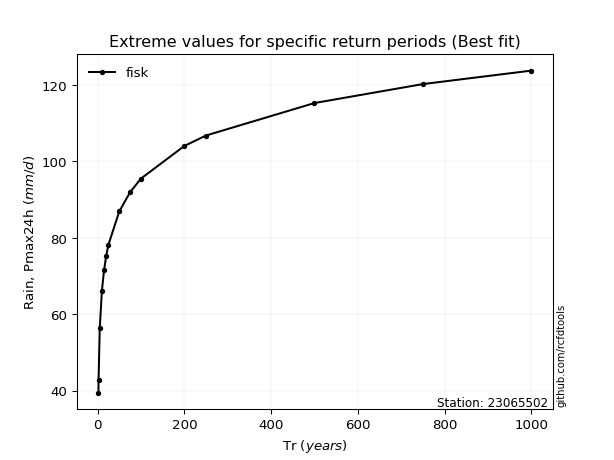</img>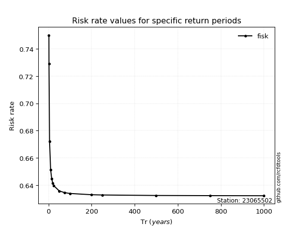</img>

</div>


<sub>**APP DISCLAIMER**: NO WARRANTY - This software is provided by [github.com/rcfdtools](https://github.com/rcfdtools) "as is", without any express or implied warranty, including warranties of merchantability, fitness for a particular purpose, or non-infringement. There is no guarantee that the software will be error-free or operate without interruption. LIMITATION OF LIABILITY - Neither the authors nor copyright holders will be liable for claims or damages arising from the software or its use. You are responsible for determining if the software is appropriate for your use and assume all associated risks, including errors, legal compliance, and data loss. NO PROFESSIONAL ADVICE - The software provides general information and does not offer professional advice. It should not replace consultation with professional advisors.</sub>